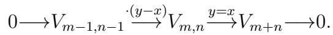
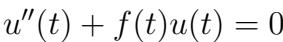
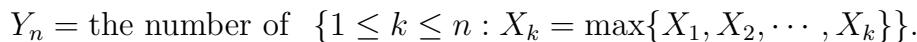
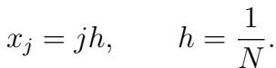
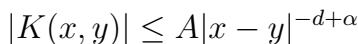
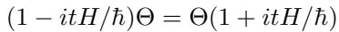

# 2010-2025 Past Exam Papers

Collection of past exam papers from 2010 to 2025.

## Subject Categories

| Subject | Sample |
|---------|--------|
| 代数与数论 |  |
| 几何与拓扑 |  |
| 概率与统计 |  |
| 应用与计算数学 |  |
| 分析与微分方程 |  |
| 数学物理 |  |

## Statistics
- Total PDFs: 291
- Total Markdown transcripts: 146
- Last updated: 2026-04-20

## Folder Structure

- **Year folders (2010-2025)**: Exam papers organized by year
- **Subject folders**: Exam papers organized by subject category

## File Naming Convention

- `{Year}_{Subject}-individual.pdf` - Individual competition papers
- `{Year}_{Subject}-team.pdf` - Team competition papers
- `{Year}_{Subject}-soln.pdf` - Solutions

## Disclaimer

These papers are collected from public sources for educational and research purposes only.
