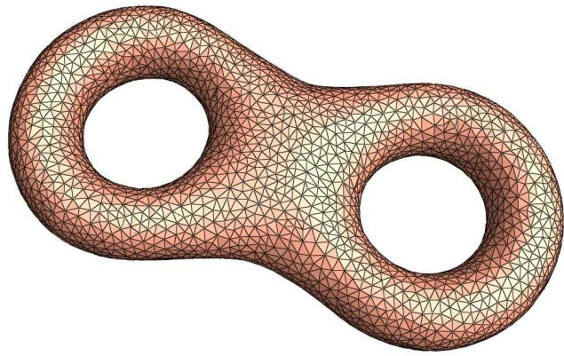
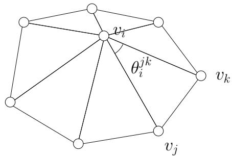

# Oral exam, applied and computational mathematics, individual, 2013

Problem 1. Suppose $A \in R ^ { n \times n }$ is nonsingular, u and v are two vectors.

(a) Find condition such that $A + u v ^ { \top }$ is invertible, in that case find $( \boldsymbol { A } + \boldsymbol { u } \boldsymbol { v } ^ { \top } ) ^ { - 1 }$

(b) Change the first column of A: $\left( \begin{array} { c } { a _ { 1 1 } } \\ { a _ { 2 1 } } \\ { \vdots } \\ { a _ { n 1 } } \end{array} \right) \mathsf { b y } \left( \begin{array} { c } { b _ { 1 } } \\ { b _ { 2 } } \\ { \vdots } \\ { b _ { n } } \end{array} \right)$ resulting in a new matrix ${ \bar { A } } .$ Find $( \bar { A } ) ^ { - 1 }$

Problem 2. A discrete surface is represented as a simplicial complex, such that each face is a Euclidean triangle, which is also called a triangle mesh. Suppose $M = ( V , E , F )$ is a triangle mesh, where $V , E , F$ represents the set of vertices, edges and faces respectively. The Euler number of M is defined as

$$
\chi (M) := | V | + | F | - | E |.
$$

An edge is called an interior edge if it is adjacent to two faces; an edge is called a boundary edge if it is adjacent to only one face. A vertex is called an interior vertex, if all the edges adjacent to it are interior; a vertex is called a boundary vertex, if it attaches to at least one boundary edge. A triangle mesh is called a closed mesh, if it has no boundary edges.

  
Figure 1: A discrete surface is represented as a triangle mesh.

Suppose $v _ { i } \in V$ is an interior vertex on M , $[ v _ { i } , v _ { j } , v _ { k } ] \in F$ is a face on M . $\theta _ { i } ^ { j k }$ is the corner angle on the face $[ v _ { i } , v _ { j } , v _ { k } ]$ with apex $v _ { i }$ . Then the discrete Gaussian curvature at $v _ { i }$ is defined as

$$
K (v _ {i}) := 2 \pi - \sum_ {[ v _ {i}, v _ {j}, v _ {k} ] \in F} \theta_ {i} ^ {j k}.
$$

If $v _ { i }$ is an boundary vertex, then the discrete Gaussian curvature at $v _ { i }$ is defined as

$$
K (v _ {i}) := \pi - \sum_ {[ v _ {i}, v _ {j}, v _ {k} ] \in F} \theta_ {i} ^ {j k}.
$$

1. Suppose M is a closed triangle mesh, prove the Discrete Gauss-Bonnet theorem:

$$
\sum_ {v _ {i} \in V} K (v _ {i}) = 2 \pi \chi (M).
$$

  
Figure 2: Discrete Gaussian curvature for an interior vertex.

2. (optional) Suppose the faces of M are not only triangles, but also general planar polygons, prove the discrete Gauss-Bonnet theorem.

3. (Optional) Suppose M is a triangle mesh with boundaries, different boundary connect components have no intersection, prove the discrete Gauss-Bonnet theorem.