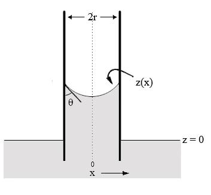

**Oral Exam for Teams: Applied and Computational Math, 2013**

**Modeling the capillary rise: why is the meniscus curved?**

$$
h
$$

Water

Air

In a capillary tube, gravity and surface tension both act on water and a chemical equilibrium is attained (see the above Figure. We consider only the two dimensional case). The existence of surface tension caused a pressure difference on the surface, which leads to the capillary rise *h* and the curved surface z(x) with a contact angle . The contact angle is determined by the surface property of the tube and is given. The Young-Laplace equation is an equation that relates the capillary pressure difference sustained across the interface between two static fluids to the shape of the surface:

is the pressure difference across the air-water interface,  is the surface tension,  is the curvature of the meniscus surface z(x). We also assume that  is the density of the water, is the atmospheric pressure, *g* is the gravitational constant and *r* is the radius of the tube*.*

In this question, , , *r,* , *g,* are given parameters. Our goal is to determine the shape of the surface z(x) and the capillary rise *h*.

(a). Calculate the pressure difference and curvature in terms of z(x) and then derive a differential equation for the meniscus surface .

(b). Design a shooting method to solve z(x) and determine *h* numerically. Explain analytically why the shooting method will work. Give the details of the numerical scheme.