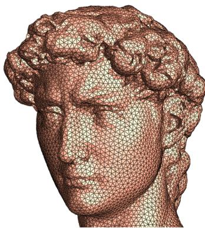
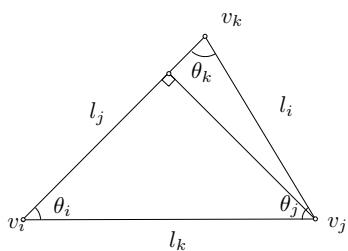
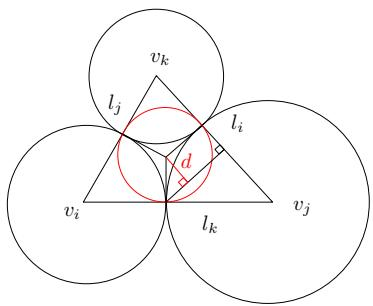

## S.-T. Yau College Student Mathematics Contest

Applied Mathematics, Individual, 2014

Find the eigenvalues and eigenvectors of the following $N \times N$ tridiagonal matrix

$$
A = \left( \begin{array}{c c c c c c} b & c & & & & \\ a & b & c & & & \\ & a & b & c & & \\ & & \ddots & \ddots & \ddots & \\ & & & a & b & c \\ & & & & a & b \end{array} \right)
$$

where $a , b$ and $c$ are $3$ constants, and $a c > 0$

## Definition:

\* A propre k-edge-coloring of a graph $G ( V , E )$ is a mapping f: $E \to \{ 1 , 2 , 3 , \cdots , k \}$ such that $f ( e ) \neq f ( e ^ { \prime } )$ for any pair of edges $\boldsymbol { e } , \boldsymbol { e } ^ { \prime }$ that have a common end vertex.

\*\* Suppose that f is a propre k-edge-coloring of a graph $G ( V , E )$ . f is called a uniform propre k-edge-coloring of $G ( V , E )$ if for any $i , j \in \{ 1 , 2 , 3 , \cdots , k \} , \| f ^ { - 1 } ( i ) | -$ $| f ^ { - 1 } ( j ) | | \leq 1$

## Problem:

Prove that if a graph $G ( V , E )$ has a propre k-edge-coloring, then $G ( V , E )$ has a uniform propre k-edge-coloring.

Consider the following equation over an one-dimensional (1-D) domain $\Omega = ( 0 , 1 )$ :

$$
\partial_ {t} \phi = - \phi^ {3} + \phi + \epsilon^ {2} \phi_ {x x}, \quad \mathrm{in} \Omega ,\tag{1}
$$

$$
\phi_ {x} = 0, \quad \text { at } x = 0, x = 1,\tag{2}
$$

with $\epsilon > 0$ a given constant.

The following semi-implicit, semi-discrete numerical scheme is formulated:

$$
\frac {\phi^ {n + 1} - \phi^ {n}}{\Delta t} = - \left(\phi^ {n + 1}\right) ^ {3} + \phi^ {n} + \epsilon^ {2} \phi_ {x x} ^ {n + 1}, \quad \mathrm{in} \Omega ,\tag{3}
$$

$$
\phi_ {x} ^ {n + 1} = 0, \quad \mathrm{at} x = 0, x = 1.\tag{4}
$$

in which $\phi ^ { k }$ denotes the numerical solution at $t ^ { k }$ , with $t ^ { k } = k \Delta t$ , ∆t being the time step size.

Prove the following energy stability for the numerical solution (3)-(4):

$$
E (\phi^ {n + 1}) \leq E (\phi^ {n}), \quad \mathrm{forany} \Delta t > 0,\tag{5}
$$

with the energy functional given by

$$
E (\phi) = \int_ {\Omega} \left(\frac {1}{4} \phi^ {4} - \frac {1}{2} \phi^ {2} + \frac {\epsilon^ {2}}{2} | \phi_ {x} | ^ {2}\right) d x = \frac {1}{4} \| \phi \| _ {L ^ {4}} ^ {4} - \frac {1}{2} \| \phi \| _ {L ^ {2}} ^ {2} + \frac {\epsilon^ {2}}{2} \| \phi_ {x} \| _ {L ^ {2}} ^ {2}.\tag{6}
$$

Hint. Take an $L ^ { 2 }$ inner product with (3) by $\tilde { \mu } ^ { n + 1 } = \left( \phi ^ { n + 1 } \right) ^ { 3 } - \phi ^ { n } - \epsilon ^ { 2 } \phi _ { x x } ^ { n + 1 }$

# Oral exam, applied and computational mathematics, individual, 2014

## 1 Problem 1. Discrete Optimal Mass Transportation

Suppose $\Omega \subset \mathbb { R } ^ { 2 }$ is a convex planar domain, $P = \{ p _ { 1 } , p _ { 2 } , \cdots , p _ { n } \}$ are discrete points on $\mathbb { R } ^ { 2 }$ , each point has a Dirac measure $\{ A _ { i } \delta ( p - p _ { i } ) \}$ }, such that

$$
A r e a (\Omega) = \sum_ {i = 1} ^ {n} A _ {i}.
$$

A mapping $f : \Omega  P$ is called measure preserving, if the area of the pre-image of $p _ { i }$ equals to $A _ { i }$

$$
A r e a (f ^ {- 1} (p _ {i})) = A _ {i}.
$$

The transportation cost of a mapping is given by

$$
E (f) := \int_ {\Omega} | p - f (p) | ^ {2} d p.
$$

Among all the measure preserving mappings, the one which minimizes the transportation cost is called the optimal mass transportation map.

We want to show that: if $f$ is the optimal mass transportation map, then there exists a convex function $u : \Omega \to \mathbb { R }$ , such that $f$ is the gradient map of $u , f = \nabla u$

1. Let $H = \{ h _ { 1 } , h _ { 2 } , \cdot \cdot \cdot , h _ { n } \}$ be weights. The power voronoi diagram induced by $( P , H )$ is a cell decomposition of $\mathbb { R } ^ { 2 }$

$$
\mathbb {R} ^ {2} = \bigcup_ {i = 1} ^ {n} W _ {i},
$$

where

$$
W _ {i} = \{q \in \mathbb {R} ^ {2} | | q - p _ {i} | ^ {2} + h _ {i} \leq | q - p _ {j} | ^ {2} + h _ {j}, \forall 1 \leq j \leq n \}.
$$

Define a map: $\varphi : W _ { i } \to p _ { i }$ . Show that there is a piecewise linear convex function $u : \Omega \to \mathbb { R }$ , such that

$$
W _ {i} = \{q \in \mathbb {R} ^ {2} | \nabla u (q) = p _ {i} \},
$$

namely $\varphi$ is the gradient map of $u .$

2. Suppose there is another cell decomposition

$$
\mathbb {R} ^ {2} = \bigcup_ {i = 1} ^ {n} \overline {{W}} _ {i},
$$

such that

$$
\operatorname{Area} \left(W _ {i} \cap \Omega\right) = \operatorname{Area} \left(\overline {{W}} _ {i} \cap \Omega\right),
$$

The map induced by this cell decomposition is $\bar { \varphi } : \overline { { W } } _ { i }  p _ { i }$ . prove the transportation cost of $\varphi$ is no greater than that of $\bar { \varphi } ,$

$$
\int_ {\Omega} | q - \varphi (q) | ^ {2} d q \leq \int_ {\Omega} | q - \bar {\varphi} (q) | ^ {2} d q.
$$

Namely, the discrete optimal mass transportation map must be induced by a power voronoi diagram.

3. Suppose given any $A = \left\{ A _ { 1 } , A _ { 2 } , \cdot \cdot \cdot , A _ { n } \right\}$ , such that $A _ { i } > 0$ and $\begin{array} { r } { \sum _ { i = 1 } ^ { n } A _ { i } = A r e a ( \Omega ) } \end{array}$ , we can always find ??, such that the power voronoi diagram induced by ?? satisfies the condition $A r e a ( W _ { i } ) = A _ { i } .$ , then show that the discrete optimal mass transportation is given by the gradient map of a convex function.

## 2 Problem 2. Circle Packing

A discrete surface is represented as a simplicial complex, such that each face is a Euclidean triangle, which is also called a triangle mesh. Suppose $M = ( V , E , F )$ is a triangle mesh, where $V , E , F$ represents the set of vertices, edges and faces respectively. The Euler number of the mesh is $\chi ( M ) = | V | + | F | - | E |$ Furthermore, a circle packing defined on the mesh. Each vertex $v _ { i }$ is associated with a circle $( v _ { i } , r _ { i } )$ , two circles on an edge are tangent to each other.

  
Figure 1: A discrete surface is represented as a triangle mesh.

Suppose $v _ { i } \in V$ is an interior vertex on ?? , $[ v _ { i } , v _ { j } , v _ { k } ] \in F$ is a face on ??. $\theta _ { i } ^ { j k }$ is the corner angle on the face $[ v _ { i } , v _ { j } , v _ { k } ]$ with apex $v _ { i }$ . The discrete curvature at $v _ { i }$ is defined as

$$
K _ {i} = 2 \pi - \sum_ {[ v _ {i}, v _ {j}, v _ {k} ] \in F} \theta_ {i} ^ {j k}
$$

The the total curvature satisfies the Gauss-Bonnet theorem $\begin{array} { r } { \sum _ { i } K _ { i } = 2 \pi \chi ( M ) } \end{array}$ . Let $u _ { i } = \log r _ { i } .$ , which is called the discrete conformal factor. We want to show the mapping from the discrete conformal factor to the discrete curvature

$$
\varphi : (u _ {1}, u _ {2}, \dots , u _ {n}) \mapsto (K _ {1}, K _ {2}, \dots , K _ {n}),
$$

where $\textstyle \sum _ { i } u _ { i } = 0$ , is deffeomorphic.

1. Derivative Cosine Law

  
Figure 2: A Euclidean triangle.

Consider one triangle $[ v _ { i } , v _ { j } , v _ { k } ]$ , the corner angles are the functions of edge lengths, $\theta _ { i } ( l _ { i } , l _ { j } , l _ { k } )$ , prove

$$
\frac {\partial \theta_ {i}}{\partial l _ {i}} = \frac {l _ {i}}{2 A}, \frac {\partial \theta_ {i}}{\partial l _ {j}} = - \frac {l _ {i}}{2 A} \cos \theta_ {k},
$$

where ?? is the triangle area.

  
Figure 3: A Euclidean triangle with a circle packing.

2. Circle Packing on one Triangle. Suppose we associate each vertex $v _ { i }$ with a circle $c _ { i } ( v _ { i } , r _ { i } )$ centered at $v _ { i }$ with radius $r _ { i }$ . All three circles are tangent to each other, the inner circle has radius $r ,$ let $u _ { i } = \log r _ { i } .$ , prove

$$
\frac {\partial \theta_ {i}}{\partial u _ {j}} = \frac {\partial \theta_ {j}}{\partial u _ {i}} = \frac {r}{l _ {k}}
$$

and

$$
\frac {\partial \theta_ {i}}{\partial u _ {i}} = - \frac {\partial \theta_ {i}}{\partial u _ {j}} - \frac {\partial \theta_ {i}}{\partial u _ {k}}.
$$

Prove that the mapping

$$
\varphi : \{(u _ {i}, u _ {j}, u _ {k}) | u _ {i} + u _ {j} + u _ {k} = 0 \} \rightarrow \{(\theta_ {i}, \theta_ {j}, \theta_ {k}) | \theta_ {i} + \theta_ {j} + \theta_ {k} = \pi \}
$$

is a diffeomorphism.

3. Consider the whole triangle mesh, prove the mapping

$$
\varphi : (u _ {1}, u _ {2}, \dots , u _ {n}) \mapsto (K _ {1}, K _ {2}, \dots , K _ {n}),
$$

where $\textstyle \sum _ { i } u _ { i } = 0$ , is deffeomorphic.