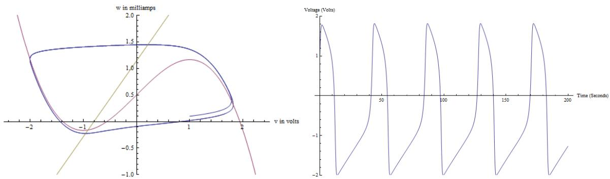
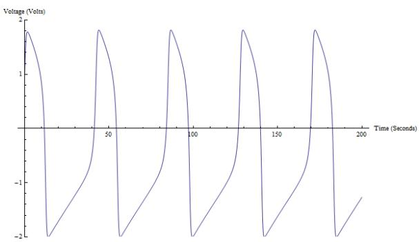

Problem 1. Given a vector $\mathbf { b } \in \mathbb { R } ^ { m }$ and $A \in \mathbb { R } ^ { m \times m }$ , the Arnoldi process is a systematic way of constructing an orthonormal bases for the sucessive Krylov subspaces

$$
\mathcal {K} _ {n} = \langle \mathbf {b}, A \mathbf {b}, \dots , A ^ {n - 1} \mathbf {b} \rangle , \quad n = 1, 2, \dots .
$$

It gives

$$
A Q _ {n} = Q _ {n + 1} \tilde {H} _ {n},
$$

where $Q _ { n } \in \mathbb { R } ^ { m \times n } , Q _ { n + 1 } \in \mathbb { R } ^ { m \times ( n + 1 ) }$ are with orthonormal columns and $\tilde { H } _ { n } \in \mathbb { R } ^ { ( n + 1 ) \times n }$ is upper-Hessenberg. Let $H _ { n } \in \mathbb { R } ^ { n \times n }$ be obtained by deleting the last row of ${ \tilde { H } } _ { n }$

(a) Write out the Arnoldi algorithm.

(b) Assume that at step n, the $( n + 1 , n ) { \mathrm { - t h } }$ entry of ${ \tilde { H } } _ { n }$ is zero.

i. Show that $\textstyle { \boldsymbol { \mathcal { K } } } _ { n }$ is an invariant subspace of A and that $K _ { n } = K _ { n + 1 } = K _ { n + 2 } =$

ii. Show that each eigenvalue of $H _ { n }$ is an eigenvalue of A for $n > 1$

(c) Let $P _ { n }$ be the set of monic polynomials of degree n. Show that the minimizer of

$$
\min _ {p _ {n} \in P _ {n}} \| p _ {n} (A) \mathbf {b} \| _ {2}
$$

is given by the characteristic polynomial of $H _ { n }$

Problem 2. The following FitzHugh-Nagumo model is a simplified version of the Hodgkin-Huxley model (1963 Nobel Prize in Physiology or Medicine) which models in a detailed manner activation and deactivation dynamics of a spiking neuron.

$$
\epsilon \dot {v} = v - \frac {1}{3} v ^ {3} - w + I _ {\mathrm{ext}}
$$

$$
\dot {w} = v + a - b w
$$

where v is the membrane voltage, w is a linear recovery variable, $I _ { \mathrm { e x t } }$ is the external stimulus. It contains the van der Pol oscillator as a special case for $a = b = I _ { \mathrm { e x t } } = 0 .$ . Fig 1 gives a qualtitative description of the four-stage structure of FitzHugh-Nagumo limit cycle solution and Fig 2 sketchs the time-profile illustrating the four stages in the limit cycle.

  
Figure 1: (a) The blue line is the trajectory of the FHN model in phase space. The pink line is the cubic nullcline $w = v - { \textstyle { \frac { 1 } { 3 } } } v ^ { 3 } + I _ { \mathrm { e x t } }$ and the yellow line is the linear nullcline $w = a / b + v / b$ . (b) Graph of v with parameters $I _ { \mathrm { e x t } } = 0 . 5 , a = 0 . 7 , b = 0 . 8 ,$ , and $\epsilon = 1 / 1 2 . 5$

(a) (10 pts) Use the expansions $v ( t ) = v _ { 0 } ( t ) + \epsilon v _ { 0 } ( t ) + O ( \epsilon ^ { 2 } ) , w ( t ) = w _ { 0 } ( t ) + \epsilon w _ { 0 } ( t ) + O ( \epsilon ^ { 2 } )$ to determine the equations for the leading order slow solution. Point out the slow manifold $( w _ { 0 }$ as a function of $v _ { 0 } )$ in Fig 1(a) and indicate the direction of the motion on each part, and identify the two attracting points on the curve.

(b) (5 pts) Use the expansion $v ( t ) = V _ { 0 } ( T ) + \epsilon V _ { 1 } ( T ) + O ( \epsilon ^ { 2 } ) , w ( t ) = W _ { 0 } ( T ) + \epsilon W _ { 1 } ( T ) + O ( \epsilon ^ { 2 } )$ with $T = t / \epsilon$ to obtain the equations for the leading order fast solution.

(c) (5 pts) Use the phase plane to determine the maximum and the minimum values of $v ( t )$ during an oscillation. Point out in Fig 1(a) and Fig 1 (b) the part of slow dynamics and fast dynamics, estimate the period for v(t) as a function of time.