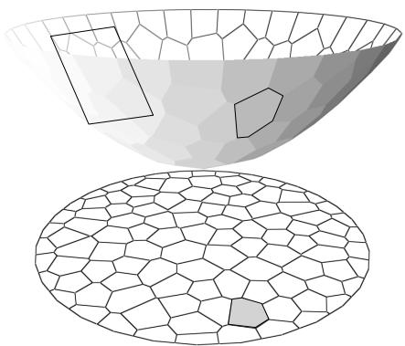

1 (Optimal Mass Transport). Suppose D is the unit disk in the plane, $P = \{ p _ { 1 } , p _ { 2 } , \cdots , p _ { n } \}$ is a discrete planar point set. Each point $p _ { i }$ is associated with a weight $r _ { i }$ , the power distance between any point $p \in \mathbb { R } ^ { 2 }$ to $p _ { i }$ is defined as

$$
P o w (p, p _ {i}) = | p - p _ {i} | ^ {2} + r _ {i}.
$$

The power Voronoi diagram is a partition of the whole plane

$$
\mathbb {R} ^ {2} = \bigcup_ {i = 1} ^ {n} W _ {i}, W _ {i} = \{p \in \mathbb {R} ^ {2} | P o w (p, p _ {i}) \leq P o w (p, p _ {j}), \forall 1 \leq j \leq n \}.
$$

The power Vornoi diagram induces a cell decomposition of D,

$$
\mathbb {D} = \bigcup_ {i = 1} ^ {n} W _ {i} \cap \mathbb {D},
$$

suppose the area of each cell $\mathbb { D } \cap W _ { i }$ is $A _ { i }$ . Construct a mapping $\varphi : \mathbb { D }  P$ , such that each cell $W _ { i } \cap \mathbb { D }$ is mapped to the point $p _ { i }$

$$
\varphi : W _ {i} \cap \mathbb {D} \mapsto p _ {i}, \forall 1 \leq i \leq n.
$$

(1) Suppose $\mathrm { g i }$ ven another cell decomposition

$$
\mathbb {D} = \bigcup_ {i = 1} ^ {n} \tilde {W} _ {i} \cap \mathbb {D},
$$

and construct a mapping $\tilde { \varphi }$ , such that

$$
\tilde {\varphi}: \tilde {W} _ {i} \cap \mathbb {D} \mapsto p _ {i},
$$

and the area of each cell $\tilde { W } _ { i } \cap \mathbb { D }$ equals to $A _ { i }$ as well. The $L ^ { 2 }$ transportation cost of $\varphi$ is defined as

$$
E (\varphi) := \int_ {\mathbb {D}} | p - \varphi (p) | ^ {2} d A,
$$

show that the mapping $\varphi$ is optimal, i.e.

$$
E (\varphi) \leq E (\tilde {\varphi}).
$$

(2) Show that there exists real numbers $h _ { 1 } , h _ { 2 } , \cdots , h _ { n }$ , which determine n planes

$$
\pi_ {i} (p) := \langle p, p _ {i} \rangle + h _ {i},
$$

the upper envelope of the planes $\{ \pi _ { i } \}$ is the graph of the convex PL function

$$
f (p) = \max _ {1 \leq i \leq n} \pi_ {i} (p).
$$

The power Voronoi diagram is induced by the projection of the upper envelope of these planes $\{ \pi _ { i } , i = 1 , 2 , \cdots , n \}$

