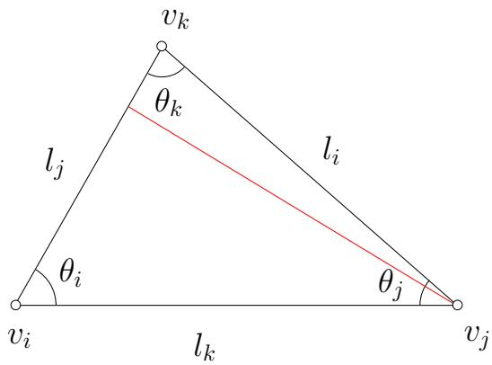

Oral Exam for Teams: Applied and Computational Mathematics 2017

  
Figure 1: reference triangle.

1. Given a Euclidean triangle $[ v _ { i } , v _ { j } , v _ { k } ]$ with edge lengths $l _ { i } , l _ { j } , l _ { k }$ and corner angles $\theta _ { i } , \theta _ { j } , \theta _ { k }$ (see Figure 1), we treat the angles as the functions of edge lengths, namely, $\theta _ { i } = \theta _ { i } ( l _ { i } , l _ { j } , l _ { k } )$

(a) Show that

$$
\frac {\partial \theta_ {i}}{\partial l _ {i}} = \frac {l _ {i}}{2 A}, \frac {\partial \theta_ {i}}{\partial l _ {j}} = - \frac {l _ {i}}{2 A} \cos \theta_ {k},
$$

where A is the area of the triangle.

(b) Suppose the initial edge lengths are $( l _ { i } ^ { 0 } , l _ { j } ^ { 0 } , l _ { k } ^ { 0 } )$ , the conformal factor $( u _ { i } , u _ { j } , u _ { k } )$ are three real numbers associated with the vertices, the vertex scaling operator changes each edge length by multiplying the exponential of conformal factors at its two end vertces, namely:

$$
l _ {i} = e ^ {u _ {j}} l _ {i} ^ {0} e ^ {u _ {k}}, l _ {j} = e ^ {u _ {k}} l _ {j} ^ {0} e ^ {u _ {i}}, l _ {k} = e ^ {u _ {i}} l _ {k} ^ {0} e ^ {u _ {j}},
$$

Show that

$$
\frac {\partial \theta_ {i}}{\partial u _ {j}} = \frac {\partial \theta_ {j}}{\partial u _ {i}} = \cot \theta_ {k}, \quad \frac {\partial \theta_ {i}}{\partial u _ {i}} = - \cot \theta_ {j} - \cot \theta_ {k}
$$

(c) If the initial triangle is an acute triangle, then in a neighborhood of $( u _ { i } , u _ { j } , u _ { k } ) = ( 0 , 0 , 0 )$ , the mapping $\varphi : \{ ( u _ { i } , u _ { j } , u _ { k } ) | u _ { i } + u _ { j } + u _ { k } = 0 \} \to \{ ( \theta _ { i } , \theta _ { j } , \theta _ { k } ) | \theta _ { i } + \theta _ { j } + \theta _ { k } = \pi \}$ is difeomorphic.

2. Let $A \in \mathbb { R } ^ { n \times n }$ be symmetric and let $\| q _ { 1 } \| _ { 2 } = 1$ . Consider the following Lanczos iteration:

$$
r _ {0} = q _ {1}, \quad \beta_ {0} = 1, \quad q _ {0} = 0, \quad k := 0
$$

$$
\mathrm{while} \beta_ {k} \neq 0
$$

$$
q _ {k + 1} := r _ {k} / \beta_ {k}
$$

$$
k := k + 1
$$

$$
\alpha_ {k} := q _ {k} ^ {T} A q _ {k}
$$

$$
r _ {k} := (A - \alpha_ {k} I) q _ {k} - \beta_ {k - 1} q _ {k - 1}
$$

$$
\beta_ {k} := \| r _ {k} \| _ {2}
$$

end

Let $K _ { n } = \operatorname { s p a n } \{ q _ { 1 } , A q _ { 1 } , \cdots , A ^ { n - 1 } q _ { 1 } \}$

(a) Show that

$$
A Q _ {k} = Q _ {k} T _ {k} + r _ {k} e _ {k} ^ {T}
$$

where $e _ { k }$ is the k-th unit vector, $Q _ { k } = [ q _ { 1 } \cdots q _ { k } ]$ and

$$
T _ {k} = \left[ \begin{array}{c c c c c} \alpha_ {1} & \beta_ {1} & & \dots & 0 \\ \beta_ {1} & \alpha_ {2} & \ddots & & \vdots \\ & \ddots & \ddots & \ddots & \\ \vdots & & \ddots & \ddots & \beta_ {k - 1} \\ 0 & \dots & & \beta_ {k - 1} & \alpha_ {k} \end{array} \right]
$$

(b) Assume that the iteration does not terminate. Show that $Q _ { k }$ has orthonormal columns, and that they span $K _ { k }$

(c) Show that the Lanczos iteration will stop when $k = m$ , where $m = { \mathrm { r a n k } } ( K _ { n } )$

(d) What is the purpose of this algorithm? Briefly justify your answer.