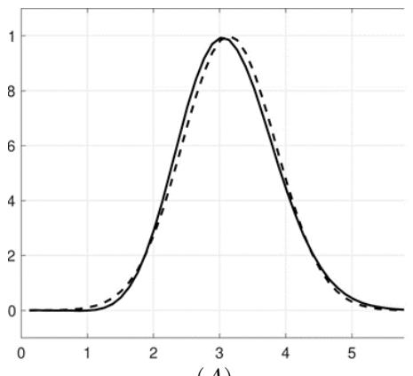
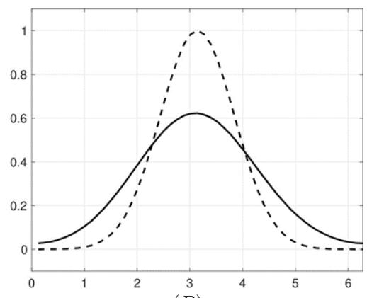
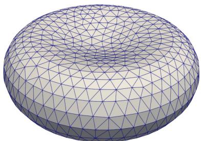
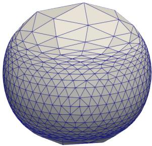
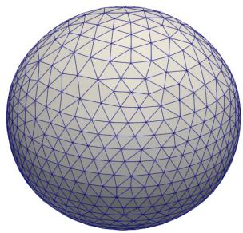

# S.-T. Yau College Student Mathematics Contest Applied and Computational Math (Team Contest)

## June 9, 2024

## Question 1

Let $\varphi : ( 0 , \infty ) \to ( 0 , \infty )$ be continuous and increasing, and let $M > 0$ . Given any $T _ { * }$ such that $0 < T _ { * } <$ $\textstyle \int _ { M } ^ { \infty } { \dot { d z } } / \varphi ( z )$ , show that there exists $C _ { * } > 0$ independent of $\Delta t > 0$ with the following property. Suppose that quantities $z _ { n } , w _ { n } \ge 0$ satisfy

$$
z _ {n} + \sum_ {k = 0} ^ {n - 1} w _ {k} \Delta t \leq y _ {n} := M + \sum_ {k = 0} ^ {n - 1} \varphi (z _ {k}) \Delta t,
$$

for $n = 0 , 1 , \ldots , n _ { * }$ , with $n _ { * } \Delta t \le T _ { * }$ . Then $y _ { n _ { * } } \leq C _ { * }$ (independent of $\Delta t { \bf \theta } )$

## Question 2

Let u be the solution to the transport equation

$$
u _ {t} + u _ {x} = 0,
$$

on the $0 \leq x \leq 2 \pi$ with periodic boundary conditions and the initial data $u ( x , 0 ) = \exp ( - ( x - \pi ) ^ { 2 } )$ . Consider C the discrete approximation to the solution $v _ { j } \approx u ( x _ { j } , t )$ on the grid $x _ { j } = j h , h = \frac { \ref { e q : 1 } } { N + 1 } , j = 1 , \cdots , N + 1$ We define three finite diference operators acting on a grid function $v _ { j } { \mathrm { : } }$

$$
D _ {-} v _ {j} = \frac {v _ {j} - v _ {j - 1}}{h}, \quad D _ {+} v _ {j} = \frac {v _ {j + 1} - v _ {j}}{h}, \quad D _ {0} v _ {j} = \frac {v _ {j + 1} - v _ {j - 1}}{2 h}.
$$

(a) Consider the following three semi-discretizations

$$
(i) \frac {d v _ {j}}{d t} + D _ {-} v _ {j} = 0, (i i) \frac {d v _ {j}}{d t} + D _ {+} v _ {j} = 0, (i i i) \frac {d v _ {j}}{d t} + D _ {0} v _ {j} = 0.
$$

It is known that two of the above $\mathrm { ( i ) - ( i i i ) }$ are stable and produce the results in Figure 1 when evolved one period in time using the classic fourth-order Runge-Kutta method.

(a-i). Which of the three semi-discretizations is not stable and why?

(a-ii). For the two stable methods, what method goes with which plot in Figure 1 and why?

(b) Let D denote one of the diference operators above. We take a forward Euler scheme in time to have

$$
\frac {v _ {j} ^ {n + 1} - v _ {j} ^ {n}}{\Delta t} + D \Big (\frac {v _ {j} ^ {n + 1} + v _ {j} ^ {n}}{2} \Big) = 0
$$

  
(A)

  
(B)  
Figure 1: Solid lines represent the numerical solutions, and dashed lines represent the exact solutions

where the superscript n now denotes the time index. Show that with this time-stepping, the spatial discretization corresponding to Figure 1 (A) satisfies

$$
\| v ^ {n + 1} \| _ {h} ^ {2} = \| v ^ {n} \| _ {h} ^ {2},
$$

while the discretization corresponding to Figure 1 (B) satisfies

$$
\| v ^ {n + 1} \| _ {h} ^ {2} \leq \| v ^ {n} \| _ {h} ^ {2}.
$$

where the norm $\| v \| _ { h } ^ { 2 } = ( v , v ) _ { h }$ with the inner product $\begin{array} { r } { ( v , w ) _ { h } = \sum _ { j = 1 } ^ { N + 1 } h v _ { j } w _ { j } } \end{array}$ . Hint: For the derivation of the last inequality, it might be useful to first find $\alpha _ { + }$ and/or α− such that $D _ { \pm } v _ { j } = D _ { 0 } v _ { j } + \alpha _ { \pm } D _ { + } D _ { - } v _ { j }$

## Question 3

Let u be a velocity field in $\mathbb { R } ^ { 3 }$ and let $\Gamma ^ { u } ( t )$ be a surface which evolves under velocity filed u as time t increases, with a bounded closed initial surface $\Gamma ^ { u } ( 0 ) = \Gamma ^ { 0 }$ . Namely, the surface is the image of a flow map $X ^ { u } ( . , t ) : \Gamma ^ { 0 } \to \mathbb { R } ^ { 3 }$ satisfying the following diferential equation:

$$
\begin{array}{c l} \frac {\partial}{\partial t} X ^ {u} (p, t) = u (X ^ {u} (p, t)) & \text { for } p \in \Gamma^ {0} \\ X ^ {u} (p, 0) = p & \text { for } p \in \Gamma^ {0}. \end{array}\tag{1}
$$

If one solves this ordinary diferential equation (ODE) for a set of points p on the initial surface $\Gamma ^ { 0 }$ , then one gets the location of these points at any time t. However, since the surface may have large deformation, the points obtained in this way may not form a good mesh for $\Gamma ^ { u } ( t )$ , as shown in Figure 2 (b).

David Gu and Shing-Tung Yau considered the following problem of finding a “good” map between two surfaces $\Gamma ^ { 0 }$ and $\Gamma ^ { u } ( t )$ to produce good mesh on $\Gamma ^ { u } ( t )$ :

$$
\mathrm{Find} X (\cdot , t): \Gamma^ {0} \to \Gamma^ {u} (t) \mathrm{tominimize} \int_ {\Gamma^ {0}} | \nabla_ {\Gamma^ {0}} X | ^ {2} \S ,\tag{2}
$$

where $\nabla _ { \Gamma ^ { 0 } }$ denotes surface tangential gradient and $\mathrm { S }$ denotes the surface area element. This map $X ( \cdot , t )$ : $\Gamma ^ { 0 } \to \Gamma ^ { u } ( t )$ ) minimizes the deformation energy $\int _ { \Gamma ^ { 0 } } | \nabla _ { \Gamma ^ { 0 } } X | ^ { 2 } \mathrm { S }$ and therefore could produce a better mesh (with less deformation). An eficient method of computing a good flow map $X ( \cdot , t ) : \bar { \Gamma } ^ { 0 }  \mathbb { R } ^ { 3 }$ satisfying (2) is to solve the following problem:

$$
\begin{array}{c c} v \cdot n = u \cdot n & \text { on } \Gamma (t) \\ - \Delta_ {\Gamma^ {0}} X = \kappa \left(n \circ X\right) & \text { on } \Gamma^ {0}, \end{array}\tag{3}
$$

  
(a) Mesh on initial surface Γ0

  
(b) Surface at t = 4 by solving ODE (1)

  
(c) Surface at t = 23 by solving PDE (3)  
Figure 2: Surface Γ(t) computed by diferent numerical methods

where n denotes the unit normal vector on surface Γ(t), where κ is an unknown scalar function to be solved The method in (3) is based on the following ideas: The shape of an evolving surface is only determined by its normal velocity, rather than its tangential velocity. However, solving PDE (3) significantly improves the mesh quality, as shown in Figure 2 (c).

Problem (3) can be solved by a finite element method as follows. Let $t _ { m } = m \tau , m = 0 , 1 , 2 , \ldots$ , with time stepsize τ , and suppose that $\Gamma _ { h } ^ { m }$ is a given triangulated surface which well approximates the bounded smooth closed surface $\Gamma ( t _ { m } )$ . Let $\ddot { X _ { h } ^ { m } } : \Gamma _ { h } ^ { 0 } \to \Gamma _ { h } ^ { m }$ be the piecewise linear map which maps each triangle of $\Gamma _ { h } ^ { 0 }$ to a triangle of $\Gamma _ { h } ^ { m }$ (thus $X _ { h } ^ { m }$ maps $\Gamma _ { h } ^ { 0 }$ onto $\Gamma _ { h } ^ { m } )$ , and let $N _ { h } ^ { m } = n _ { h } ^ { m } \circ X _ { h } ^ { m }$ with $n _ { h } ^ { m }$ being the unit normal vector on $\Gamma _ { h } ^ { m }$ (piecewise constant vector defined on each triangle). Let $S _ { h } ^ { 1 } ( \Gamma _ { h } ^ { 0 } ) ^ { 3 }$ be the finite element space of 3-dimensional vector-valued piecewise linear functions on $\Gamma _ { h } ^ { 0 } ,$ and let $S _ { h } ^ { 0 } ( \Gamma _ { h } ^ { 0 } )$ be the finite element space of scalar-valued piecewise constant functions on $\Gamma _ { h } ^ { 0 }$ . Find $( X _ { h } ^ { m + 1 } , \kappa _ { h } ^ { m + 1 } ) \in \mathring { S } _ { h } ^ { 1 } ( \Gamma _ { h } ^ { 0 } ) ^ { 3 } \times S _ { h } ^ { 0 } ( \Gamma _ { h } ^ { 0 } )$ such that

$$
\begin{array}{l l} \int_ {\Gamma_ {h} ^ {0}} \frac {X _ {h} ^ {m + 1} - X _ {h} ^ {m}}{\tau} \cdot N _ {h} ^ {m} \chi_ {h} \mathsf {S} = \int_ {\Gamma_ {h} ^ {0}} (u \circ X _ {h} ^ {m}) \cdot N _ {h} ^ {m} \chi_ {h} \mathsf {S} & \forall   \chi_ {h} \in S _ {h} (\Gamma_ {h} ^ {0}) \\ \int_ {\Gamma_ {h} ^ {0}} \nabla_ {\Gamma_ {h} ^ {0}} X _ {h} ^ {m + 1} \cdot \nabla_ {\Gamma_ {h} ^ {0}} v _ {h} \mathsf {S} = \int_ {\Gamma_ {h} ^ {0}} \kappa_ {h} ^ {m + 1}   N _ {h} ^ {m} \cdot v _ {h} \mathsf {S} & \forall   v _ {h} \in S _ {h} (\Gamma_ {h} ^ {0}) ^ {3}. \end{array}\tag{4}
$$

(i) Show that the map X determined by (3) is a local minimizer of (2) with $\Gamma ^ { u } ( t )$ determined by (1).

(ii) Show that the weak formulation in (4) has a unique solution $( X _ { h } ^ { m + 1 } , \kappa _ { h } ^ { m + 1 } ) \in S _ { h } ^ { 1 } ( \Gamma _ { h } ^ { 0 } ) ^ { 3 } \times S _ { h } ^ { 0 } ( \Gamma _ { h } ^ { 0 } )$