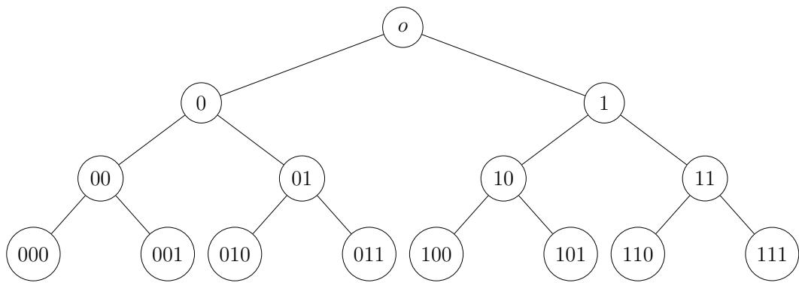

# Qualifying Exam: 2024 Fall

考试课程: Probability & Statistics 姓名: 学号:

• There are 11 problems in this exam (4 pages). You need to choose 8 of them to solve. If you select more than 8, only the first 8 that you have worked on will be graded. Note that 4 of the problems are worth 15 points each and the rest 10 points each.

• You must follow all the rules of exam taking. Misconducts will be subject to proper disciplinary actions by the Center.

• You must provide all necessary details for full credits. A final answer with no or little explanation/derivation, even if correct, receives a minimal credit.

• R denotes the set of real numbers and $\mathbb{N} = \{1, 2, 3,...\}$ denotes the set of positive integers. $\xrightarrow{(d)}$ and $\overset{(d)}{=}$ mean “converges in distribution” and “equal in distribution”, respectively.

1. (10 points) Let $U_{1}, U_{2}, \dots$ be independent identically distributed (i.i.d.) random variables uniformly distributed on [0, 1], and define $\textstyle S_{n} = \sum_{k=1}^n U_k$

(a) Calculate $\mathbb{E}[(S_{n})^{4}]$

(b) Determine the distribution of $S_{3}$

2. (10 points) Let $(Y_{n})_{n \geq 1}$ be a sequence of real-valued random variables such that

$$
\sqrt{n}(Y_{n} - a) \xrightarrow[n \to \infty]{(d)} \mathcal{N}(0, \sigma^{2}),
$$

where ${\mathcal{N}}(0, \sigma^{2})$ stands for the normal distribution with $\sigma \neq 0$

(a) Let $g : \mathbb{R} \to \mathbb{R}$ be a function such that it is diferentiable at a and $g^{\prime}(a) \neq 0$ . Prove that

$$
\sqrt{n}(g(Y_{n}) - g(a)) \xrightarrow[n \to \infty]{(d)} \mathcal{N} \left(0, g^{\prime}(a)^{2} \sigma^{2}\right).
$$

(b) Fix $p \in(0, 1)$ . For $n \in \mathbb{N},$ , let $Z_{n} \{\overset{(d)}{=}}$ Bi $\operatorname{\Pi}_{1}(n, p)$ be a binomial random variable. Prove that

$$
\sqrt{n} \left(\ln \left(\frac{Z_{n}}{n}\right) - \ln p\right) \xrightarrow[n \to \infty]{(d)} \mathcal{N} \left(0, \frac{1 - p}{p}\right).
$$

3. (10 points) Let X be a real-valued random variable. Prove that the following properties are equivalent in the sense that the parameters $K_{i} > 0$ appearing in these properties difer from each other by at most an absolute constant factor.

(a) The tails of X satisfy that

$$
\mathbb{P}(| X | \geq t) \leq 2 \exp(- t / K_{1}) \quad \text{for all} t \geq 0.
$$

(b) The moments of X satisfy that

$$
\mathbb{E} \left(| X |^{p}\right) \leq(K_{2} p)^{p} \quad \text{for all} p \in \mathbb{N}.
$$

(c) The moment generating function of $| X |$ is bounded at some point, i.e.,

$$
\mathbb{E} \exp \left(| X | / K_{3}\right) \leq 2
$$

for some $K_{3} > 0$

Hint: You can use Stirling’s approximations: $e(n / e)^{n} \leq n ! \leq en(n / e)^{n}$ for all $n \in \mathbb{N}$ and

$$
n! =(1 + o(1)) \sqrt{2 \pi n}(n / e)^{n} \quad \text{for large }n.
$$

4. (10 points) Let $\mathbb{T}_{d}$ be an infinite d-regular tree, where every node has degree d. On the other hand, let $\mathcal{T}_{b}$ be an infinite b-ary tree with root o. In other words, $\mathcal{T}_{b}$ is an infinite tree where every node has b children nodes and every non-root node has one parent node. Below is an illustration of a binary tree with $b = 2$

Consider the simple random walk $X_{n}$ on $\mathbb{T}_{d}$ and simple random walk $Y_{n}$ on ${\mathcal{T}}_{b},$ where at each step, the walker moves to the neighbor nodes with equal probability.

(a) For each $d \in \mathbb{N}$ with $d \geq 2$ , determine whether the simple random walk $X_{n}$ on $\mathbb{T}_{d}$ is recurrent or transient. Prove your claim.

(b) For each $b \in \mathbb{N}.$ , determine whether the simple random walk $Y_{n}$ on $\mathcal{T}_{b}$ is recurrent or transient. Prove your claim. (Hint: Use part (a).)

5. (15 points) Let $X_{1}, X_{2},...$ . be i.i.d. random variables with exponential distribution: $\mathbb{P}(X_k>x) = e^{- x}$ for $x \geq 0$ . Define

$$
M_{n} := \sum_{k = 1}^{n} \frac{X_{k}}{k}.
$$

(a) Prove that $(M_{n} - \ln n)_{n \in \mathbb{N}}$ converges to a limit $Y$ almost surely.

(b) Prove that, for every $\textstyle p \in(0, 1), \left({\frac{\exp(pM_{n})}{n^{p}}} \right)_{n \in \mathbb{N}}$ converges to a limit $Z$ in $L^{1}$ .

6. (15 points) Let $B_{t}$ be a one-dimensional (1D) standard Brownian motion started from 0.

(a) Consider a Brownian motion $X_{t} = x + B_{t}$ started at some $x > 0$ . For any $t > 0$ and $b > a > 0$ , compute the probability of $X_{t} \in[a, b]$ conditioning on that $X_{t}$ does not hit zero between 0 and t, i.e.,

$$
\mathbb{P} \left(X_{t} \in[a, b] \Big | \min_{0 \leq s \leq t} X_{s} > 0\right).
$$

(b) A Brownian bridge $W_{t}$ on $[0, 1]$ is a 1D standard Brownian motion $B_{t}$ subject to the condition that $B_{1} = 0$ . In other words, $W_{t} =(B_{t} | B_{1} = 0)$ is a continuous-time Gaussian process whose probability distribution is the conditional probability distribution of $B_{t}$ conditioning on $B_{1} = 0.\mathrm{~ A ~}$ 1D Gaussian free field $\left(\mathrm{GFF} \right) h_{t}$ on [0, 1] with zero boundary is a continuous-time Gaussian process subject to the zero boundary condition $h_{0} = h_{1} = 0$ and has zero mean $\mathbb{E} h_{t} = 0, t \in[0, 1]$ , and covariances

$$
\mathbb{E}(h_{t} h_{s}) = G(t, s), \quad t, s \in[0, 1].
$$

Here, $G(t, s)$ is the Green’s function of the Laplace operator $- \Delta, \mathrm{i.e.,} G(t, s)$ is the unique continuous function such that for any smooth test function $f \in C_{c}^{\infty}(0, 1)$ ，

$$
\int_{0}^{1} G(t, s) \frac{\partial^{2}}{\partial t^{2}} f(t) d t = - f(s) \quad \text{and} \quad G(0, s) = G(1, s) = 0.
$$

Prove that the process $(W_{t} : t \in[0, 1])$ has the same distribution as the process $(h_{t} : t \in$ [0, 1]) in the sense that for any fixed $0 \leq t_{1} < t_{2} <...t_{n} \leq 1$ and Borel sets $O_{1}, O_{2}, \ldots, O_{n};$

$$
\mathbb{P}(W_{t_{1}} \in O_{1}, \dots, W_{t_{n}} \in O_{n}) = \mathbb{P}(h_{t_{1}} \in O_{1}, \dots, h_{t_{n}} \in O_{n}).
$$

(Hint: Find the explicit form of the function $G(t, s)$ and calculate $\mathbb{E}(W_{t} W_{s}).)$

7. (10 points) Let $X_{1},..., X_{n}$ be an iid sample from $\mathrm{{N}}(\mu, 1)$ with $\mu$ unknown. Unfortunately, one forgets to record $X_{1},..., X_{n}$ in a study and only records $\mathbf{Y} =(Y_{1},...., Y_{n})$ where $Y_{i} = I(X_{i} < 0)$ and $I(\cdot)$ is the indicator function.

(a) Derive the MLE of $\mu$ based on the observed data Y.

(b) Construct a size α uniformly most powerful (UMP) test for testing $H_{0} : \mu \le \mu_{0}$ versus $H_{1} : \mu > \mu_{0}$ based on the observed data Y.

(c) Describe how to construct a $(1 - \alpha)$ confidence interval for $\mu$ based on the observed data Y.

8. (10 points) Consider the following linear model $Y_{i} = \mathbf{z}_{i}^{T}{\boldsymbol{\beta}} + \epsilon_{i}, i = 1,..., n.\ \mathbf{z}_{1},..., \mathbf{z}_{n} \in \mathbb{R}^{d}$ are fixed and given, and $\beta \in \mathbb{R}^{d}$ is unknown. $\epsilon_{i}^{\prime} s$ are random variables satisfying the Gauss-Markov assumptions that $\mathbb{E}[\epsilon_{i}] = 0, \operatorname{Var}[\epsilon_{i}] = \sigma^{2}$ and $\operatorname{Cov}(\epsilon_{i}, \epsilon_{j}) = 0, \forall i \neq j.$ Let $\mathbf{Y} =(Y_{1},..., Y_{n})^{T}$ , and

$\mathbf{Z} ={\left(\begin{array}{l}{\mathbf{z}_{1}^{T}} \\{\mathbf{z}_{2}^{T}} \\{\vdots} \\{\mathbf{z}_{n}^{T}} \end{array} \right)}$ be the n by d design matrix.

(a) Let $\hat{\beta}$ be the least squares estimate of $\beta$ which is given by $\hat{\beta} =(\mathbf{Z}^{T} \mathbf{Z})^{- 1} \mathbf{Z}^{T} \mathbf{Y}$ . Let $\boldsymbol{\theta} = \mathbf{b}^{T} \boldsymbol{\beta}$ where $\mathbf{b} \in \mathbb{R}^{d}$ is a known vector. Write down the mean and the variance of $\hat{\theta}$ where $\hat{\boldsymbol{\theta}} = \mathbf{b}^{T} \hat{\boldsymbol{\beta}}$ . Further, prove that under the Gauss-Markov assumptions, the estimator $\hat{\theta}$ has the smallest variance among all linear unbiased estimator of $\theta.$ Here linear unbiased estimator we mean estimator in the form of $\mathbf{c}^{T} \mathbf{Y}$ and is unbiased for $\theta.$

(b) Further assume that $\left(\epsilon_{1},..., \epsilon_{n} \right)$ are iid from $\mathrm{N}(0, \sigma^{2})$ with $\sigma^{2}$ known. Derive the information matrix $I(\beta)$

9. (10 points) Suppose $X_{1},..., X_{n}$ are IID from the uniform distribution on $[0,\theta]$ for some unknown $\theta > 0$ . Fix $t \in(0, \theta)$ . Consider two estimators of $\begin{array}{r}{P(X_{1} \leq t) \colon F_{n}(t) = \frac{1}{n} \sum_{i = 1}^{n} I_{\{X_{i} \leq t\}}} \end{array}$ and $T_{n}(t) = t /(2 \bar{X})$ , where $\bar{X}$ is the sample mean.

(a) Find the asymptotic distributions of the two estimators.

(b) For what value of t will the first estimator have a smaller asymptotic variance than the second estimator?

(c) Let $\theta = 1$ . For the $F_{n}(t)$ defined above, find the asymptotic distribution of n $F_{n} \left(n^{- 1 / 2} \right) -$ $\sqrt{n}$

10. (15 points) Let $X_1,\ldots,X_n$ ($n\geq2$) be iid from $N(\mu, \sigma^{2})$ distribution with $\mu \geq 0$ and $\sigma > 0$ being the unknown parameters. Let $\bar X$ and $S^{2}$ be the sample mean and sample variance, respectively. Recall $\chi_{k}^{2}$ has probability density function

$$
\frac{1}{2^{\frac{k}{2}} \Gamma \left(\frac{k}{2}\right)} x^{\frac{k}{2} - 1} e^{- \frac{x}{2}}, x \geq 0.
$$

(a) Show $\bar{X}$ and $S^{2}$ are independent.

(b) Find UMVUE of $\mu / \sigma$ if it exists.

(c) Is $\bar{X}$ admissible for estimating $\mu$ under the square error loss? Prove your assertion.

11. (15 points) Let $X_{1},..., X_{n}$ be an iid sample from Uniform $[\theta, \ \theta + | \theta |]$ where $\theta \neq 0$

(a) Derive the method of moments estimator of $\theta$

(b) Derive the MLE of $\theta,{\hat{\theta}}.$

(c) Is $\hat{\theta} \mathrm{~ a ~}$ consistent estimator of θ? Please explain your answer.