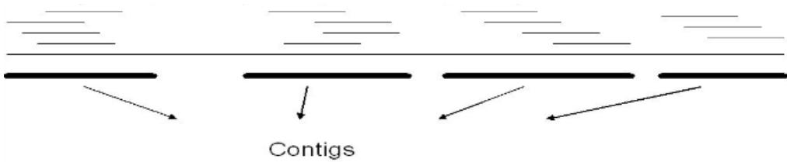

## Individual: Probability and statistics

Problem 1. Suppose you are buying an item that is needed for your factory. There are three stores nearby. Each store will tell you the price $X _ { i } ~ ( i = 1 , 2 , 3 )$ . After you ask around, you will buy from the shop with the lowest price. Suppose that you believe $X _ { i } \sim$ Uniform(100, 150) for all $i = { 1 , 2 , 3 } ,$ , independently of one another.

a Suppose you will always ask the first two stores for quotes (for free), but it costs \$3 to ask the third quote. Show that the expected saving due to asking for the third quote is strictly positive.

b Suppose when you reported your results in part (a) to your factory director, he was confused as to whether you were recommending that one should always go for the third quote. In order to provide him with better guideline for a stepwise decision making, present your decision rule as (let $Y =$ min $\{ X _ { 1 } , X _ { 2 } \} ) \colon { \mathrm { I f ~ } } Y \geq c ,$ then we should get the third quote; find c.

c What is the probability that you end up not saving money at all when asking the third quote?

Problem 2. Assume there are N short fragments, each of length L, sampled randomly from a long sequence of length $G \left( G > > L \right)$ . Specifically, ignoring boundary effects, we assume the left-hand ends of the fragments are independently distributed according to a uniform distribution over $( 0 , G )$

These N fragments may overlap. Overlapping fragments can be merged to form longer contiguous stretches of sequence. A contig is one such assembled stretch (that cannot be further extended) in which all the fragments connect unambiguously (i.e., with no unresolved gaps or uncertainties within the sequence). Given N random fragments of length $L ,$ the sequencing coverage is defined as $\begin{array} { r } { a = \frac { N L } { G } } \end{array}$

  
Figure 1: There are four Contigs in the above long sequence

a To ensure that the mean proportion of the long sequence covered by at least one fragment is 0.99, what is the approximate minimum coverage a required?

b What is the mean number of contigs that can be formed for the long sequence?

c Prove that the mean contig size is $\frac { L ( e ^ { a } - 1 ) } { a }$ with $\begin{array} { r } { a = \frac { N L } { G } } \end{array}$

Problem 3. Let $( X _ { n } ) _ { n \geq 0 } { } ;$ , with $X _ { 0 } = 0 \phantom { . 0 }$ , be a discrete time simple random walk on Z in a dynamic random environment defined as follows. Fix $a > 0$ . At each time $n \geq 0$ , every undirected edge $e : = \{ i , i + 1 \}$ is assigned a conductance $C _ { n } ( e )$ with $C _ { n } ( e ) = 1$ if e has not been crossed by time $n ,$ and $C _ { n } ( e ) = a$ if e has been crossed before. Given $X _ { n } = x \in \mathbb { Z }$ and the conductance configuration $C _ { n } ( \cdot )$ at time $n _ { \colon }$ , the random walk jumps to either $x + 1$ or $x - 1$ with probability

$$
P (X _ {n + 1} = x \pm 1 | X _ {n} = x, C _ {n}) = \frac {C _ {n} (\{x , x \pm 1 \})}{C _ {n} (\{x , x + 1 \}) + C _ {n} (\{x , x - 1 \})}.
$$

Show that, almost surely, X will return to 0 infinitely many times.

Problem 4. Let $\epsilon _ { i } , x _ { i j } , i = 1 , \ldots , n , j = 1 , \ldots , n$ be i.i.d. N(0, 1) random variables. Define

$$
y _ {i} = \beta_ {1} x _ {i 1} + \beta_ {2} x _ {i 2} + \dots + \beta_ {n} x _ {i n} + \epsilon_ {i}, i = 1, \ldots , n.
$$

Suppose we only observe $( y _ { 1 } , x _ { 1 1 } ) , ( y _ { 2 } , x _ { 2 1 } , x _ { 2 2 } ) , \dots , ( y _ { n } , x _ { n 1 } , \dots , x _ { n n } )$ . Obtain estimators of $\beta _ { 1 } , \ldots , \beta _ { n }$ . What desirable properties do these estimators possess? Are they optimal in some sense? If yes, why; if no, do you have any suggestions on how to improve, especially when n is large? Hint: You may consider estimation individual $\beta _ { j }$ separately.