# Single-Parameter Models

[Package map](../structure.md) · [Unsplit OCR dump](./_full.md)

[← Ch. 1 Probability and Inference](./01-probability-and-inference.md) · [Ch. 3 Multiparameter Models →](./03-multiparameter-models.md)

> MinerU OCR dump. If a formula, table, or numbering disagrees with the PDF, the PDF is authoritative.

---

# Chapter 2

# Single-parameter models

Our first detailed discussion of Bayesian inference is in the context of statistical models where only a single scalar parameter is to be estimated; that is, the estimand $\theta$ is one-dimensional. In this chapter, we consider four fundamental and widely used one-dimensional models—the binomial, normal, Poisson, and exponential—and at the same time introduce important concepts and computational methods for Bayesian data analysis.

# 2.1 Estimating a probability from binomial data

In the simple binomial model, the aim is to estimate an unknown population proportion from the results of a sequence of 'Bernoulli trials'; that is, data $y_{1},\ldots ,y_{n}$ , each of which is either 0 or 1. This problem provides a relatively simple but important starting point for the discussion of Bayesian inference. By starting with the binomial model, our discussion also parallels the very first published Bayesian analysis by Thomas Bayes in 1763, and his seminal contribution is still of interest.

The binomial distribution provides a natural model for data that arise from a sequence of $n$ exchangeable trials or draws from a large population where each trial gives rise to one of two possible outcomes, conventionally labeled 'success' and 'failure.' Because of the exchangeability, the data can be summarized by the total number of successes in the $n$ trials, which we denote here by $y$ . Converting from a formulation in terms of exchangeable trials to one using independent and identically distributed random variables is achieved naturally by letting the parameter $\theta$ represent the proportion of successes in the population or, equivalently, the probability of success in each trial. The binomial sampling model is,

$$
p (y | \theta) = \operatorname {B i n} (y | n, \theta) = \binom {n} {y} \theta^ {y} (1 - \theta) ^ {n - y}, \tag {2.1}
$$

where on the left side we suppress the dependence on $n$ because it is regarded as part of the experimental design that is considered fixed; all the probabilities discussed for this problem are assumed to be conditional on $n$ .

# Example. Estimating the probability of a female birth

As a specific application of the binomial model, we consider the estimation of the sex ratio within a population of human births. The proportion of births that are female has long been a topic of interest both scientifically and to the lay public. Two hundred years ago it was established that the proportion of female births in European populations was less than 0.5 (see Historical Note below), while in this century interest has focused on factors that may influence the sex ratio. The currently accepted value of the proportion of female births in large European-race populations is 0.485.

For this example we define the parameter $\theta$ to be the proportion of female births, but an alternative way of reporting this parameter is as a ratio of male to female birth rates, $\phi = (1 - \theta) / \theta$ .

Let $y$ be the number of girls in $n$ recorded births. By applying the binomial model

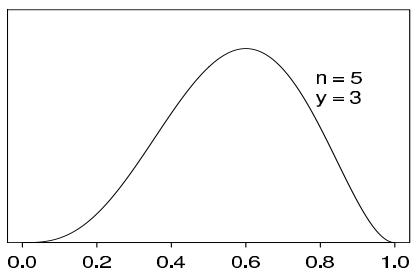

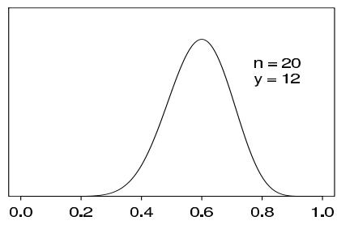

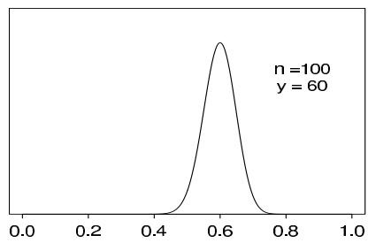

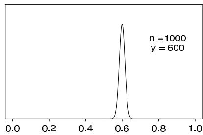  
Figure 2.1 Unnormalized posterior density for binomial parameter $\theta$ , based on uniform prior distribution and $y$ successes out of $n$ trials. Curves displayed for several values of $n$ and $y$ .

(2.1), we are assuming that the $n$ births are conditionally independent given $\theta$ , with the probability of a female birth equal to $\theta$ for all cases. This modeling assumption is motivated by the exchangeability that may be judged to arise when we have no explanatory information (for example, distinguishing multiple births or births within the same family) that might affect the sex of the baby.

To perform Bayesian inference in the binomial model, we must specify a prior distribution for $\theta$ . We will discuss issues associated with specifying prior distributions many times throughout this book, but for simplicity at this point, we assume that the prior distribution for $\theta$ is uniform on the interval [0, 1].

Elementary application of Bayes' rule as displayed in (1.2), applied to (2.1), then gives the posterior density for $\theta$ as

$$
p (\theta | y) \propto \theta^ {y} (1 - \theta) ^ {n - y}. \tag {2.2}
$$

With fixed $n$ and $y$ , the factor $\binom{n}{y}$ does not depend on the unknown parameter $\theta$ , and so it can be treated as a constant when calculating the posterior distribution of $\theta$ . As is typical of many examples, the posterior density can be written immediately in closed form, up to a constant of proportionality. In single-parameter problems, this allows immediate graphical presentation of the posterior distribution. For example, in Figure 2.1, the unnormalized density (2.2) is displayed for several different experiments, that is, different values of $n$ and $y$ . Each of the four experiments has the same proportion of successes, but the sample sizes vary. In the present case, we can recognize (2.2) as the unnormalized form of the beta distribution (see Appendix A),

$$
\theta | y \sim \operatorname {B e t a} (y + 1, n - y + 1). \tag {2.3}
$$

# Historical note: Bayes and Laplace

Many early writers on probability dealt with the elementary binomial model. The first contributions of lasting significance, in the 17th and early 18th centuries, concentrated on the 'pre-data' question: given $\theta$ , what are the probabilities of the various possible outcomes of the random variable $y$ ? For example, the 'weak law of large numbers' of

Jacob Bernoulli states that if $y \sim \mathrm{Bin}(n, \theta)$ , then $\operatorname*{Pr}(|\frac{y}{n} - \theta| > \epsilon | \theta) \to 0$ as $n \to \infty$ for any $\theta$ and any fixed value of $\epsilon > 0$ . The Reverend Thomas Bayes, an English part-time mathematician whose work was unpublished during his lifetime, and Pierre Simon Laplace, an inventive and productive mathematical scientist whose massive output spanned the Napoleonic era in France, receive independent credit as the first to invert the probability statement and obtain probability statements about $\theta$ , given observed $y$ .

In his famous paper, published in 1763, Bayes sought, in our notation, the probability $\operatorname*{Pr}(\theta \in (\theta_1,\theta_2)|y)$ ; his solution was based on a physical analogy of a probability space to a rectangular table (such as a billiard table):

1. (Prior distribution) A ball $W$ is randomly thrown (according to a uniform distribution on the table). The horizontal position of the ball on the table is $\theta$ , expressed as a fraction of the table width.   
2. (Likelihood) A ball $O$ is randomly thrown $n$ times. The value of $y$ is the number of times $O$ lands to the right of $W$ .

Thus, $\theta$ is assumed to have a (prior) uniform distribution on $[0,1]$ . Using direct probability calculations which he derived in the paper, Bayes then obtained

$$
\begin{array}{l} \Pr (\theta \in (\theta_ {1}, \theta_ {2}) | y) = \frac {\Pr (\theta \in (\theta_ {1} , \theta_ {2}) , y)}{p (y)} \\ = \frac {\int_ {\theta_ {1}} ^ {\theta_ {2}} p (y | \theta) p (\theta) d \theta}{p (y)} \\ = \frac {\int_ {\theta_ {1}} ^ {\theta_ {2}} \binom {n} {y} \theta^ {y} (1 - \theta) ^ {n - y} d \theta}{p (y)}. \tag {2.4} \\ \end{array}
$$

Bayes succeeded in evaluating the denominator, showing that

$$
\begin{array}{l} p (y) = \int_ {0} ^ {1} \binom {n} {y} \theta^ {y} (1 - \theta) ^ {n - y} d \theta \tag {2.5} \\ = \frac {1}{n + 1} \quad \text {f o r} y = 0, \ldots , n. \\ \end{array}
$$

This calculation shows that all possible values of $y$ are equally likely a priori.

The numerator of (2.4) is an incomplete beta integral with no closed-form expression for large values of $y$ and $(n - y)$ , a fact that apparently presented some difficulties for Bayes.

Laplace, however, independently 'discovered' Bayes' theorem, and developed new analytic tools for computing integrals. For example, he expanded the function $\theta^y (1 - \theta)^{n - y}$ around its maximum at $\theta = y / n$ and evaluated the incomplete beta integral using what we now know as the normal approximation.

In analyzing the binomial model, Laplace also used the uniform prior distribution. His first serious application was to estimate the proportion of girl births in a population. A total of 241,945 girls and 251,527 boys were born in Paris from 1745 to 1770. Letting $\theta$ be the probability that any birth is female, Laplace showed that

$$
\Pr (\theta \geq 0. 5 | y = 2 4 1, 9 4 5, n = 2 5 1, 5 2 7 + 2 4 1, 9 4 5) \approx 1. 1 5 \times 1 0 ^ {- 4 2},
$$

and so he was 'morally certain' that $\theta < 0.5$ .

# Prediction

In the binomial example with the uniform prior distribution, the prior predictive distribution can be evaluated explicitly, as we have already noted in (2.5). Under the model, all possible values of $y$ are equally likely, a priori. For posterior prediction from this model, we might be more interested in the outcome of one new trial, rather than another set of $n$ new trials. Letting $\tilde{y}$ denote the result of a new trial, exchangeable with the first $n$ ,

$$
\begin{array}{l} \operatorname * {P r} (\tilde {y} = 1 | y) = \int_ {0} ^ {1} \operatorname * {P r} (\tilde {y} = 1 | \theta , y) p (\theta | y) d \theta \\ = \int_ {0} ^ {1} \theta p (\theta | y) d \theta = \mathrm {E} (\theta | y) = \frac {y + 1}{n + 2}, \tag {2.6} \\ \end{array}
$$

from the properties of the beta distribution (see Appendix A). It is left as an exercise to reproduce this result using direct integration of (2.6). This result, based on the uniform prior distribution, is known as 'Laplace's law of succession.' At the extreme observations $y = 0$ and $y = n$ , Laplace's law predicts probabilities of $\frac{1}{n + 2}$ and $\frac{n + 1}{n + 2}$ , respectively.

# 2.2 Posterior as compromise between data and prior information

The process of Bayesian inference involves passing from a prior distribution, $p(\theta)$ , to a posterior distribution, $p(\theta | y)$ , and it is natural to expect that some general relations might hold between these two distributions. For example, we might expect that, because the posterior distribution incorporates the information from the data, it will be less variable than the prior distribution. This notion is formalized in the second of the following expressions:

$$
\mathrm {E} (\theta) = \mathrm {E} (\mathrm {E} (\theta | y)) \tag {2.7}
$$

and

$$
\operatorname {v a r} (\theta) = \mathrm {E} (\operatorname {v a r} (\theta | y)) + \operatorname {v a r} (\mathrm {E} (\theta | y)), \tag {2.8}
$$

which are obtained by substituting $(\theta, y)$ for the generic $(u, v)$ in (1.8) and (1.9). The result expressed by Equation (2.7) is scarcely surprising: the prior mean of $\theta$ is the average of all possible posterior means over the distribution of possible data. The variance formula (2.8) is more interesting because it says that the posterior variance is on average smaller than the prior variance, by an amount that depends on the variation in posterior means over the distribution of possible data. The greater the latter variation, the more the potential for reducing our uncertainty with regard to $\theta$ , as we shall see in detail for the binomial and normal models in the next chapter. The mean and variance relations only describe expectations, and in particular situations the posterior variance can be similar to or even larger than the prior variance (although this can be an indication of conflict or inconsistency between the sampling model and prior distribution).

In the binomial example with the uniform prior distribution, the prior mean is $\frac{1}{2}$ , and the prior variance is $\frac{1}{12}$ . The posterior mean, $\frac{y + 1}{n + 2}$ , is a compromise between the prior mean and the sample proportion, $\frac{y}{n}$ , where clearly the prior mean has a smaller and smaller role as the size of the data sample increases. This is a general feature of Bayesian inference: the posterior distribution is centered at a point that represents a compromise between the prior information and the data, and the compromise is controlled to a greater extent by the data as the sample size increases.

# 2.3 Summarizing posterior inference

The posterior probability distribution contains all the current information about the parameter $\theta$ . Ideally one might report the entire posterior distribution $p(\theta | y)$ ; as we have seen

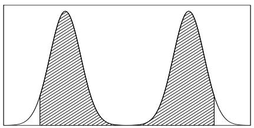

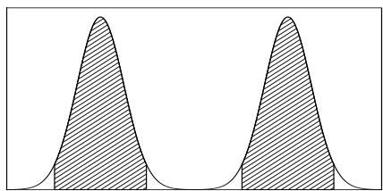  
Figure 2.2 Hypothetical density for which the $95\%$ central interval and $95\%$ highest posterior density region dramatically differ: (a) central posterior interval, (b) highest posterior density region.

in Figure 2.1, a graphical display is useful. In Chapter 3, we use contour plots and scatterplots to display posterior distributions in multiparameter problems. A key advantage of the Bayesian approach, as implemented by simulation, is the flexibility with which posterior inferences can be summarized, even after complicated transformations. This advantage is most directly seen through examples, some of which will be presented shortly.

For many practical purposes, however, various numerical summaries of the distribution are desirable. Commonly used summaries of location are the mean, median, and mode(s) of the distribution; variation is commonly summarized by the standard deviation, the interquartile range, and other quantiles. Each summary has its own interpretation: for example, the mean is the posterior expectation of the parameter, and the mode may be interpreted as the single 'most likely' value, given the data (and the model). Furthermore, as we shall see, much practical inference relies on the use of normal approximations, often improved by applying a symmetrizing transformation to $\theta$ , and here the mean and the standard deviation play key roles. The mode is important in computational strategies for more complex problems because it is often easier to compute than the mean or median.

When the posterior distribution has a closed form, such as the beta distribution in the current example, summaries such as the mean, median, and standard deviation of the posterior distribution are often available in closed form. For example, applying the distributional results in Appendix A, the mean of the beta distribution in (2.3) is $\frac{y + 1}{n + 2}$ , and the mode is $\frac{y}{n}$ , which is well known from different points of view as the maximum likelihood and (minimum variance) unbiased estimate of $\theta$ .

# Posterior quantiles and intervals

In addition to point summaries, it is nearly always important to report posterior uncertainty. Our usual approach is to present quantiles of the posterior distribution of estimands of interest or, if an interval summary is desired, a central interval of posterior probability, which corresponds, in the case of a $100(1 - \alpha)\%$ interval, to the range of values above and below which lies exactly $100(\alpha /2)\%$ of the posterior probability. Such interval estimates are referred to as posterior intervals. For simple models, such as the binomial and normal, posterior intervals can be computed directly from cumulative distribution functions, often using calls to standard computer functions, as we illustrate in Section 2.4 with the example of the human sex ratio. In general, intervals can be computed using computer simulations from the posterior distribution, as described at the end of Section 1.9.

A slightly different summary of posterior uncertainty is the highest posterior density region: the set of values that contains $100(1 - \alpha)\%$ of the posterior probability and also has the characteristic that the density within the region is never lower than that outside. Such a region is identical to a central posterior interval if the posterior distribution is unimodal and symmetric. In current practice, the central posterior interval is in common use, partly because it has a direct interpretation as the posterior $\alpha /2$ and $1 - \alpha /2$ quantiles, and partly because it is directly computed using posterior simulations. Figure 2.2 shows

a case where different posterior summaries look much different: the $95\%$ central interval includes the area of zero probability in the center of the distribution, whereas the $95\%$ highest posterior density region comprises two disjoint intervals. In this situation, the highest posterior density region is more cumbersome but conveys more information than the central interval; however, it is probably better not to try to summarize this bimodal density by any single interval. The central interval and the highest posterior density region can also differ substantially when the posterior density is highly skewed.

# 2.4 Informative prior distributions

In the binomial example, we have so far considered only the uniform prior distribution for $\theta$ . How can this specification be justified, and how in general do we approach the problem of constructing prior distributions?

We consider two basic interpretations that can be given to prior distributions. In the population interpretation, the prior distribution represents a population of possible parameter values, from which the $\theta$ of current interest has been drawn. In the more subjective state of knowledge interpretation, the guiding principle is that we must express our knowledge (and uncertainty) about $\theta$ as if its value could be thought of as a random realization from the prior distribution. For many problems, such as estimating the probability of failure in a new industrial process, there is no perfectly relevant population of $\theta$ 's from which the current $\theta$ has been drawn, except in hypothetical contemplation. Typically, the prior distribution should include all plausible values of $\theta$ , but the distribution need not be realistically concentrated around the true value, because often the information about $\theta$ contained in the data will far outweigh any reasonable prior probability specification.

In the binomial example, we have seen that the uniform prior distribution for $\theta$ implies that the prior predictive distribution for $y$ (given $n$ ) is uniform on the discrete set $\{0,1,\dots,n\}$ , giving equal probability to the $n + 1$ possible values. In his original treatment of this problem (described in the Historical Note in Section 2.1), Bayes' justification for the uniform prior distribution appears to have been based on this observation; the argument is appealing because it is expressed entirely in terms of the observable quantities $y$ and $n$ . Laplace's rationale for the uniform prior density was less clear, but subsequent interpretations ascribe to him the so-called 'principle of insufficient reason,' which claims that a uniform specification is appropriate if nothing is known about $\theta$ . We shall discuss in Section 2.8 the weaknesses of the principle of insufficient reason as a general approach for assigning probability distributions.

At this point, we discuss some of the issues that arise in assigning a prior distribution that reflects substantive information.

# Binomial example with different prior distributions

We first pursue the binomial model in further detail using a parametric family of prior distributions that includes the uniform as a special case. For mathematical convenience, we construct a family of prior densities that lead to simple posterior densities.

Considered as a function of $\theta$ , the likelihood (2.1) is of the form,

$$
p (y | \theta) \propto \theta^ {a} (1 - \theta) ^ {b}.
$$

Thus, if the prior density is of the same form, with its own values $a$ and $b$ , then the posterior density will also be of this form. We will parameterize such a prior density as

$$
p (\theta) \propto \theta^ {\alpha - 1} (1 - \theta) ^ {\beta - 1},
$$

which is a beta distribution with parameters $\alpha$ and $\beta$ : $\theta \sim \mathrm{Beta}(\alpha, \beta)$ . Comparing $p(\theta)$ and

$p(y|\theta)$ suggests that this prior density is equivalent to $\alpha - 1$ prior successes and $\beta - 1$ prior failures. The parameters of the prior distribution are often referred to as hyperparameters. The beta prior distribution is indexed by two hyperparameters, which means we can specify a particular prior distribution by fixing two features of the distribution, for example its mean and variance; see (A.3) on page 583.

For now, assume that we can select reasonable values $\alpha$ and $\beta$ . Appropriate methods for working with unknown hyperparameters in certain problems are described in Chapter 5. The posterior density for $\theta$ is

$$
\begin{array}{l} p (\theta | y) \propto \theta^ {y} (1 - \theta) ^ {n - y} \theta^ {\alpha - 1} (1 - \theta) ^ {\beta - 1} \\ = \theta^ {y + \alpha - 1} (1 - \theta) ^ {n - y + \beta - 1} \\ = \operatorname {B e t a} (\theta | \alpha + y, \beta + n - y). \\ \end{array}
$$

The property that the posterior distribution follows the same parametric form as the prior distribution is called conjugacy; the beta prior distribution is a conjugate family for the binomial likelihood. The conjugate family is mathematically convenient in that the posterior distribution follows a known parametric form. If information is available that contradicts the conjugate parametric family, it may be necessary to use a more realistic, if inconvenient, prior distribution (just as the binomial likelihood may need to be replaced by a more realistic likelihood in some cases).

To continue with the binomial model with beta prior distribution, the posterior mean of $\theta$ , which may be interpreted as the posterior probability of success for a future draw from the population, is now

$$
\operatorname {E} (\theta | y) = \frac {\alpha + y}{\alpha + \beta + n},
$$

which always lies between the sample proportion, $y / n$ , and the prior mean, $\alpha / (\alpha + \beta)$ ; see Exercise 2.5b. The posterior variance is

$$
\mathrm {v a r} (\theta | y) = \frac {(\alpha + y) (\beta + n - y)}{(\alpha + \beta + n) ^ {2} (\alpha + \beta + n + 1)} = \frac {E (\theta | y) [ 1 - E (\theta | y) ]}{\alpha + \beta + n + 1}.
$$

As $y$ and $n - y$ become large with fixed $\alpha$ and $\beta$ , $\operatorname{E}(\theta | y) \approx y / n$ and $\operatorname{var}(\theta | y) \approx \frac{1}{n} \frac{y}{n} (1 - \frac{y}{n})$ , which approaches zero at the rate $1 / n$ . In the limit, the parameters of the prior distribution have no influence on the posterior distribution.

In fact, as we shall see in more detail in Chapter 4, the central limit theorem of probability theory can be put in a Bayesian context to show:

$$
\left(\frac {\theta - \operatorname {E} (\theta | y)}{\sqrt {\operatorname {v a r} (\theta | y)}} \Bigg | y\right) \to \mathrm {N} (0, 1).
$$

This result is often used to justify approximating the posterior distribution with a normal distribution. For the binomial parameter $\theta$ , the normal distribution is a more accurate approximation in practice if we transform $\theta$ to the logit scale; that is, performing inference for $\log (\theta /(1 - \theta))$ instead of $\theta$ itself, thus expanding the probability space from [0,1] to $(-\infty ,\infty)$ , which is more fitting for a normal approximation.

# Conjugate prior distributions

Conjugacy is formally defined as follows. If $\mathcal{F}$ is a class of sampling distributions $p(y|\theta)$ , and $\mathcal{P}$ is a class of prior distributions for $\theta$ , then the class $\mathcal{P}$ is conjugate for $\mathcal{F}$ if

$$
p (\theta | y) \in \mathcal {P} \text {f o r a l l} p (\cdot | \theta) \in \mathcal {F} \text {a n d} p (\cdot) \in \mathcal {P}.
$$

This definition is formally vague since if we choose $\mathcal{P}$ as the class of all distributions, then $\mathcal{P}$ is always conjugate no matter what class of sampling distributions is used. We are most interested in natural conjugate prior families, which arise by taking $\mathcal{P}$ to be the set of all densities having the same functional form as the likelihood.

Conjugate prior distributions have the practical advantage, in addition to computational convenience, of being interpretable as additional data, as we have seen for the binomial example and will also see for the normal and other standard models in Sections 2.5 and 2.6.

# Nonconjugate prior distributions

The basic justification for the use of conjugate prior distributions is similar to that for using standard models (such as binomial and normal) for the likelihood: it is easy to understand the results, which can often be put in analytic form, they are often a good approximation, and they simplify computations. Also, they will be useful later as building blocks for more complicated models, including in many dimensions, where conjugacy is typically impossible. For these reasons, conjugate models can be good starting points; for example, mixtures of conjugate families can sometimes be useful when simple conjugate distributions are not reasonable (see Exercise 2.4).

Although they can make interpretations of posterior inferences less transparent and computation more difficult, nonconjugate prior distributions do not pose any new conceptual problems. In practice, for complicated models, conjugate prior distributions may not even be possible. Section 2.4 and Exercises 2.10 and 2.11 present examples of nonconjugate computation; a more extensive nonconjugate example, an analysis of a bioassay experiment, appears in Section 3.7.

Conjugate prior distributions, exponential families, and sufficient statistics

We close this section by relating conjugate families of distributions to the classical concepts of exponential families and sufficient statistics. Readers who are unfamiliar with these concepts can skip ahead to the example with no loss.

Probability distributions that belong to an exponential family have natural conjugate prior distributions, so we digress at this point to review the definition of exponential families; for complete generality in this section, we allow data points $y_{i}$ and parameters $\theta$ to be multidimensional. The class $\mathcal{F}$ is an exponential family if all its members have the form,

$$
p (y _ {i} | \theta) = f (y _ {i}) g (\theta) e ^ {\phi (\theta) ^ {T} u (y _ {i})}.
$$

The factors $\phi(\theta)$ and $u(y_i)$ are, in general, vectors of equal dimension to that of $\theta$ . The vector $\phi(\theta)$ is called the 'natural parameter' of the family $\mathcal{F}$ . The likelihood corresponding to a sequence $y = (y_1, \ldots, y_n)$ of independent and identically distributed observations is

$$
p (y | \theta) = \left(\prod_ {i = 1} ^ {n} f (y _ {i})\right) g (\theta) ^ {n} \exp \left(\phi (\theta) ^ {T} \sum_ {i = 1} ^ {n} u (y _ {i})\right).
$$

For all $n$ and $y$ , this has a fixed form (as a function of $\theta$ ):

$$
p (y | \theta) \propto g (\theta) ^ {n} e ^ {\phi (\theta) ^ {T} t (y)}, \quad \text {w h e r e} t (y) = \sum_ {i = 1} ^ {n} u (y _ {i}).
$$

The quantity $t(y)$ is said to be a sufficient statistic for $\theta$ , because the likelihood for $\theta$ depends on the data $y$ only through the value of $t(y)$ . Sufficient statistics are useful in

algebraic manipulations of likelihoods and posterior distributions. If the prior density is specified as

$$
p (\theta) \propto g (\theta) ^ {\eta} e ^ {\phi (\theta) ^ {T} \nu},
$$

then the posterior density is

$$
p (\theta | y) \propto g (\theta) ^ {\eta + n} e ^ {\phi (\theta) ^ {T} (\nu + t (y))},
$$

which shows that this choice of prior density is conjugate. It has been shown that, in general, the exponential families are the only classes of distributions that have natural conjugate prior distributions, since, apart from certain irregular cases, the only distributions having a fixed number of sufficient statistics for all $n$ are of the exponential type. We have already discussed the binomial distribution, where for the likelihood $p(y|\theta ,n) = \mathrm{Bin}(y|n,\theta)$ with $n$ known, the conjugate prior distributions on $\theta$ are beta distributions. It is left as an exercise to show that the binomial is an exponential family with natural parameter $\mathrm{logit}(\theta)$ .

# Example. Probability of a girl birth given placenta previa

As a specific example of a factor that may influence the sex ratio, we consider the maternal condition *placenta previa*, an unusual condition of pregnancy in which the placenta is implanted low in the uterus, obstructing the fetus from a normal vaginal delivery. An early study concerning the sex of *placenta previa* births in Germany found that of a total of 980 births, 437 were female. How much evidence does this provide for the claim that the proportion of female births in the population of *placenta previa* births is less than 0.485, the proportion of female births in the general population?

Analysis using a uniform prior distribution. Under a uniform prior distribution for the probability of a girl birth, the posterior distribution is Beta(438,544). Exact summaries of the posterior distribution can be obtained from the properties of the beta distribution (Appendix A): the posterior mean of $\theta$ is 0.446 and the posterior standard deviation is 0.016. Exact posterior quantiles can be obtained using numerical integration of the beta density, which in practice we perform by a computer function call; the median is 0.446 and the central $95\%$ posterior interval is [0.415,0.477]. This $95\%$ posterior interval matches, to three decimal places, the interval that would be obtained by using a normal approximation with the calculated posterior mean and standard deviation. Further discussion of the approximate normality of the posterior distribution is given in Chapter 4.

In many situations it is not feasible to perform calculations on the posterior density function directly. In such cases it can be particularly useful to use simulation from the posterior distribution to obtain inferences. The first histogram in Figure 2.3 shows the distribution of 1000 draws from the Beta(438, 544) posterior distribution. An estimate of the $95\%$ posterior interval, obtained by taking the 25th and 976th of the 1000 ordered draws, is [0.415, 0.476], and the median of the 1000 draws from the posterior distribution is 0.446. The sample mean and standard deviation of the 1000 draws are 0.445 and 0.016, almost identical to the exact results. A normal approximation to the $95\%$ posterior interval is $[0.445 \pm 1.96 \cdot 0.016] = [0.414, 0.476]$ . Because of the large sample and the fact that the distribution of $\theta$ is concentrated away from zero and one, the normal approximation works well in this example.

As already noted, when estimating a proportion, the normal approximation is generally improved by applying it to the logit transform, $\log \left(\frac{\theta}{1 - \theta}\right)$ , which transforms the parameter space from the unit interval to the real line. The second histogram in Figure 2.3 shows the distribution of the transformed draws. The estimated posterior mean and standard deviation on the logit scale based on 1000 draws are $-0.220$ and $0.065$ . A normal approximation to the $95\%$ posterior interval for $\theta$ is obtained by inverting the $95\%$ interval on the logit scale $[-0.220 \pm 1.96 \cdot 0.065]$ , which yields [0.414, 0.477]

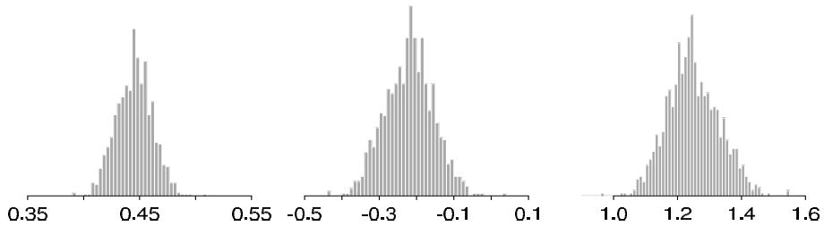  
Figure 2.3 Draws from the posterior distribution of (a) the probability of female birth, $\theta$ ; (b) the logit transform, $\logit(\theta)$ ; (c) the male-to-female sex ratio, $\phi = (1 - \theta) / \theta$ .

Table 2.1 Summaries of the posterior distribution of $\theta$ , the probability of a girl birth given placenta previa, under a variety of conjugate prior distributions.   

<table><tr><td colspan="2">Parameters of the prior distribution</td><td colspan="2">Summaries of the posterior distribution</td></tr><tr><td>α/α+β</td><td>α+β</td><td>Posterior median of θ</td><td>95% posterior interval for θ</td></tr><tr><td>0.500</td><td>2</td><td>0.446</td><td>[0.415, 0.477]</td></tr><tr><td>0.485</td><td>2</td><td>0.446</td><td>[0.415, 0.477]</td></tr><tr><td>0.485</td><td>5</td><td>0.446</td><td>[0.415, 0.477]</td></tr><tr><td>0.485</td><td>10</td><td>0.446</td><td>[0.415, 0.477]</td></tr><tr><td>0.485</td><td>20</td><td>0.447</td><td>[0.416, 0.478]</td></tr><tr><td>0.485</td><td>100</td><td>0.450</td><td>[0.420, 0.479]</td></tr><tr><td>0.485</td><td>200</td><td>0.453</td><td>[0.424, 0.481]</td></tr></table>

on the original scale. The improvement from using the logit scale is most noticeable when the sample size is small or the distribution of $\theta$ includes values near zero or one. In any real data analysis, it is important to keep the applied context in mind. The parameter of interest in this example is traditionally expressed as the 'sex ratio,' $(1 - \theta) / \theta$ , the ratio of male to female births. The posterior distribution of the ratio is illustrated in the third histogram. The posterior median of the sex ratio is 1.24, and the $95\%$ posterior interval is [1.10, 1.41]. The posterior distribution is concentrated on values far above the usual European-race sex ratio of 1.06, implying that the probability of a female birth given placenta previa is less than in the general population.

Analysis using different conjugate prior distributions. The sensitivity of posterior inference about $\theta$ to the proposed prior distribution is exhibited in Table 2.1. The first row corresponds to the uniform prior distribution, $\alpha = 1$ , $\beta = 1$ , and subsequent rows of the table use prior distributions that are increasingly concentrated around 0.485, the proportion of female births in the general population. The first column shows the prior mean for $\theta$ , and the second column indexes the amount of prior information, as measured by $\alpha + \beta$ ; recall that $\alpha + \beta - 2$ is, in some sense, equivalent to the number of prior observations. Posterior inferences based on a large sample are not particularly sensitive to the prior distribution. Only at the bottom of the table, where the prior distribution contains information equivalent to 100 or 200 births, are the posterior intervals pulled noticeably toward the prior distribution, and even then, the $95\%$ posterior intervals still exclude the prior mean.

Analysis using a nonconjugate prior distribution. As an alternative to the conjugate beta family for this problem, we might prefer a prior distribution that is centered around 0.485 but is flat far away from this value to admit the possibility that the truth is far away. The piecewise linear prior density in Figure 2.4a is an example

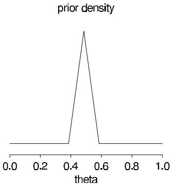

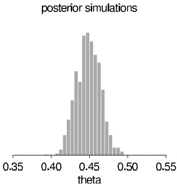  
Figure 2.4 (a) Prior density for $\theta$ in an example nonconjugate analysis of birth ratio example; (b) histogram of 1000 draws from a discrete approximation to the posterior density. Figures are plotted on different scales.

of a prior distribution of this form; $40\%$ of the probability mass is outside the interval [0.385, 0.585]. This prior distribution has mean 0.493 and standard deviation 0.21, similar to the standard deviation of a beta distribution with $\alpha + \beta = 5$ . The unnormalized posterior distribution is obtained at a grid of $\theta$ values, (0.000, 0.001, ..., 1.000), by multiplying the prior density and the binomial likelihood at each point. Posterior simulations can be obtained by normalizing the distribution on the discrete grid of $\theta$ values. Figure 2.4b is a histogram of 1000 draws from the discrete posterior distribution. The posterior median is 0.448, and the $95\%$ central posterior interval is [0.419, 0.480]. Because the prior distribution is overwhelmed by the data, these results match those in Table 2.1 based on beta distributions. In taking the grid approach, it is important to avoid grids that are too coarse and distort a significant portion of the posterior mass.

# 2.5 Estimating a normal mean with known variance

The normal distribution is fundamental to most statistical modeling. The central limit theorem helps to justify using the normal likelihood in many statistical problems, as an approximation to a less analytically convenient actual likelihood. Also, as we shall see in later chapters, even when the normal distribution does not itself provide a good model fit, it can be useful as a component of a more complicated model involving $t$ or finite mixture distributions. For now, we simply work through the Bayesian results assuming the normal model is appropriate. We derive results first for a single data point and then for the general case of many data points.

# Likelihood of one data point

As the simplest first case, consider a single scalar observation $y$ from a normal distribution parameterized by a mean $\theta$ and variance $\sigma^2$ , where for this initial development we assume that $\sigma^2$ is known. The sampling distribution is

$$
p (y | \theta) = \frac {1}{\sqrt {2 \pi} \sigma} e ^ {- \frac {1}{2 \sigma^ {2}} (y - \theta) ^ {2}}.
$$

Conjugate prior and posterior distributions

Considered as a function of $\theta$ , the likelihood is an exponential of a quadratic form in $\theta$ , so the family of conjugate prior densities looks like

$$
p (\theta) = e ^ {A \theta^ {2} + B \theta + C}.
$$

We parameterize this family as

$$
p (\theta) \propto \exp \left(- \frac {1}{2 \tau_ {0} ^ {2}} (\theta - \mu_ {0}) ^ {2}\right);
$$

that is, $\theta \sim \mathrm{N}(\mu_0,\tau_0^2)$ , with hyperparameters $\mu_0$ and $\tau_0^2$ . As usual in this preliminary development, we assume that the hyperparameters are known.

The conjugate prior density implies that the posterior distribution for $\theta$ is the exponential of a quadratic form and thus normal, but some algebra is required to reveal its specific form. In the posterior density, all variables except $\theta$ are regarded as constants, giving the conditional density,

$$
p (\theta | y) \propto \exp \left(- \frac {1}{2} \left(\frac {(y - \theta) ^ {2}}{\sigma^ {2}} + \frac {(\theta - \mu_ {0}) ^ {2}}{\tau_ {0} ^ {2}}\right)\right).
$$

Expanding the exponents, collecting terms and then completing the square in $\theta$ (see Exercise 2.14(a) for details) gives

$$
p (\theta | y) \propto \exp \left(- \frac {1}{2 \tau_ {1} ^ {2}} \left(\theta - \mu_ {1}\right) ^ {2}\right), \tag {2.9}
$$

that is, $\theta |y\sim \mathrm{N}(\mu_1,\tau_1^2)$ , where

$$
\mu_ {1} = \frac {\frac {1}{\tau_ {0} ^ {2}} \mu_ {0} + \frac {1}{\sigma^ {2}} y}{\frac {1}{\tau_ {0} ^ {2}} + \frac {1}{\sigma^ {2}}} \quad \text {a n d} \quad \frac {1}{\tau_ {1} ^ {2}} = \frac {1}{\tau_ {0} ^ {2}} + \frac {1}{\sigma^ {2}}. \tag {2.10}
$$

Precisions of the prior and posterior distributions. In manipulating normal distributions, the inverse of the variance plays a prominent role and is called the precision. The algebra above demonstrates that for normal data and normal prior distribution (each with known precision), the posterior precision equals the prior precision plus the data precision.

There are several different ways of interpreting the form of the posterior mean, $\mu_{1}$ . In (2.10), the posterior mean is expressed as a weighted average of the prior mean and the observed value, $y$ , with weights proportional to the precisions. Alternatively, we can express $\mu_{1}$ as the prior mean adjusted toward the observed $y$ ,

$$
\mu_ {1} = \mu_ {0} + (y - \mu_ {0}) \frac {\tau_ {0} ^ {2}}{\sigma^ {2} + \tau_ {0} ^ {2}},
$$

or as the data 'shrunk' toward the prior mean,

$$
\mu_ {1} = y - (y - \mu_ {0}) \frac {\sigma^ {2}}{\sigma^ {2} + \tau_ {0} ^ {2}}.
$$

Each formulation represents the posterior mean as a compromise between the prior mean and the observed value.

At the extremes, the posterior mean equals the prior mean or the observed data:

$$
\mu_ {1} = \mu_ {0} \quad \text {i f} \quad y = \mu_ {0} \text {o r} \tau_ {0} ^ {2} = 0;
$$

$$
\mu_ {1} = y \quad \text {i f} \quad y = \mu_ {0} \text {o r} \sigma^ {2} = 0.
$$

If $\tau_0^2 = 0$ , the prior distribution is infinitely more precise than the data, and so the posterior and prior distributions are identical and concentrated at the value $\mu_0$ . If $\sigma^2 = 0$ , the data are perfectly precise, and the posterior distribution is concentrated at the observed value, $y$ . If $y = \mu_0$ , the prior and data means coincide, and the posterior mean must also fall at this point.

# Posterior predictive distribution

The posterior predictive distribution of a future observation, $\tilde{y}$ , $p(\tilde{y} | y)$ , can be calculated directly by integration, using (1.4):

$$
\begin{array}{l} {p (\tilde {y} | y)} = {\int p (\tilde {y} | \theta) p (\theta | y) d \theta} \\ \propto \int \exp \left(- \frac {1}{2 \sigma^ {2}} (\tilde {y} - \theta) ^ {2}\right) \exp \left(- \frac {1}{2 \tau_ {1} ^ {2}} (\theta - \mu_ {1}) ^ {2}\right) d \theta . \\ \end{array}
$$

The first line above holds because the distribution of the future observation, $\tilde{y}$ , given $\theta$ , does not depend on the past data, $y$ . We can determine the distribution of $\tilde{y}$ more easily using the properties of the bivariate normal distribution. The product in the integrand is the exponential of a quadratic function of $(\tilde{y},\theta)$ ; hence $\tilde{y}$ and $\theta$ have a joint normal posterior distribution, and so the marginal posterior distribution of $\tilde{y}$ is normal.

We can determine the mean and variance of the posterior predictive distribution using the knowledge from the posterior distribution that $\operatorname{E}(\tilde{y}|\theta) = \theta$ and $\operatorname{var}(\tilde{y}|\theta) = \sigma^2$ , along with identities (2.7) and (2.8):

$$
\operatorname {E} (\tilde {y} | y) = \operatorname {E} (\operatorname {E} (\tilde {y} | \theta , y) | y) = \operatorname {E} (\theta | y) = \mu_ {1},
$$

and

$$
\begin{array}{l} \operatorname {v a r} (\tilde {y} | y) = \operatorname {E} (\operatorname {v a r} (\tilde {y} | \theta , y) | y) + \operatorname {v a r} (\operatorname {E} (\tilde {y} | \theta , y) | y) \\ = \mathrm {E} (\sigma^ {2} | y) + \operatorname {v a r} (\theta | y) \\ = \sigma^ {2} + \tau_ {1} ^ {2}. \\ \end{array}
$$

Thus, the posterior predictive distribution of $\tilde{y}$ has mean equal to the posterior mean of $\theta$ and two components of variance: the predictive variance $\sigma^2$ from the model and the variance $\tau_1^2$ due to posterior uncertainty in $\theta$ .

# Normal model with multiple observations

This development of the normal model with a single observation can be easily extended to the more realistic situation where a sample of independent and identically distributed observations $y = (y_{1},\ldots ,y_{n})$ is available. Proceeding formally, the posterior density is

$$
\begin{array}{l} p (\theta | y) \propto p (\theta) p (y | \theta) \\ = p (\theta) \prod_ {i = 1} ^ {n} p (y _ {i} | \theta) \\ \propto \exp \left(- \frac {1}{2 \tau_ {0} ^ {2}} (\theta - \mu_ {0}) ^ {2}\right) \prod_ {i = 1} ^ {n} \exp \left(- \frac {1}{2 \sigma^ {2}} (y _ {i} - \theta) ^ {2}\right) \\ \propto \exp \left(- \frac {1}{2} \left(\frac {1}{\tau_ {0} ^ {2}} (\theta - \mu_ {0}) ^ {2} + \frac {1}{\sigma^ {2}} \sum_ {i = 1} ^ {n} (y _ {i} - \theta) ^ {2}\right)\right). \\ \end{array}
$$

Algebraic simplification of this expression (along similar lines to those used in the single observation case, as explicated in Exercise 2.14(b)) shows that the posterior distribution depends on $y$ only through the sample mean, $\overline{y} = \frac{1}{n}\sum_{i}y_{i}$ ; that is, $\overline{y}$ is a sufficient statistic in this model. In fact, since $\overline{y} |\theta ,\sigma^2\sim \mathrm{N}(\theta ,\sigma^2 /n)$ , the results derived for the single normal observation apply immediately (treating $\overline{y}$ as the single observation) to give

$$
p \left(\theta \mid y _ {1} \dots , y _ {n}\right) = p \left(\theta \mid \bar {y}\right) = \mathrm {N} \left(\theta \mid \mu_ {n}, \tau_ {n} ^ {2}\right), \tag {2.11}
$$

where

$$
\mu_ {n} = \frac {\frac {1}{\tau_ {0} ^ {2}} \mu_ {0} + \frac {n}{\sigma^ {2}} \bar {y}}{\frac {1}{\tau_ {0} ^ {2}} + \frac {n}{\sigma^ {2}}} \quad \text {a n d} \quad \frac {1}{\tau_ {n} ^ {2}} = \frac {1}{\tau_ {0} ^ {2}} + \frac {n}{\sigma^ {2}}. \tag {2.12}
$$

Incidentally, the same result is obtained by adding information for the data $y_{1},y_{2},\ldots ,y_{n}$ one point at a time, using the posterior distribution at each step as the prior distribution for the next (see Exercise 2.14(c)).

In the expressions for the posterior mean and variance, the prior precision, $1 / \tau_0^2$ , and the data precision, $n / \sigma^2$ , play equivalent roles, so if $n$ is large, the posterior distribution is largely determined by $\sigma^2$ and the sample value $\overline{y}$ . For example, if $\tau_0^2 = \sigma^2$ , then the prior distribution has the same weight as one extra observation with the value $\mu_0$ . More specifically, as $\tau_0 \to \infty$ with $n$ fixed, or as $n \to \infty$ with $\tau_0^2$ fixed, we have:

$$
p (\theta | y) \approx \mathrm {N} (\theta | \bar {y}, \sigma^ {2} / n), \tag {2.13}
$$

which is, in practice, a good approximation whenever prior beliefs are relatively diffuse over the range of $\theta$ where the likelihood is substantial.

# 2.6 Other standard single-parameter models

Recall that, in general, the posterior density, $p(\theta | y)$ , has no closed-form expression; the normalizing constant, $p(y)$ , is often especially difficult to compute due to the integral (1.3). Much formal Bayesian analysis concentrates on situations where closed forms are available; such models are sometimes unrealistic, but their analysis often provides a useful starting point when it comes to constructing more realistic models.

The standard distributions—binomial, normal, Poisson, and exponential—have natural derivations from simple probability models. As we have already discussed, the binomial distribution is motivated from counting exchangeable outcomes, and the normal distribution applies to a random variable that is the sum of many exchangeable or independent terms. We will also have occasion to apply the normal distribution to the logarithm of all-positive data, which would naturally apply to observations that are modeled as the product of many independent multiplicative factors. The Poisson and exponential distributions arise as the number of counts and the waiting times, respectively, for events modeled as occurring exchangeably in all time intervals; that is, independently in time, with a constant rate of occurrence. We will generally construct realistic probability models for more complicated outcomes by combinations of these basic distributions. For example, in Section 22.2, we model the reaction times of schizophrenic patients in a psychological experiment as a binomial mixture of normal distributions on the logarithmic scale.

Each of these standard models has an associated family of conjugate prior distributions, which we discuss in turn.

# Normal distribution with known mean but unknown variance

The normal model with known mean $\theta$ and unknown variance is an important example, not necessarily for its direct applied value, but as a building block for more complicated,

useful models, most immediately the normal distribution with unknown mean and variance, which we cover in Section 3.2. In addition, the normal distribution with known mean but unknown variance provides an introductory example of the estimation of a scale parameter.

For $p(y|\theta, \sigma^2) = \mathrm{N}(y|\theta, \sigma^2)$ , with $\theta$ known and $\sigma^2$ unknown, the likelihood for a vector $y$ of $n$ independent and identically distributed observations is

$$
\begin{array}{l} p \left(y \mid \sigma^ {2}\right) \propto \sigma^ {- n} \exp \left(- \frac {1}{2 \sigma^ {2}} \sum_ {i = 1} ^ {n} \left(y _ {i} - \theta\right) ^ {2}\right) \\ = \left(\sigma^ {2}\right) ^ {- n / 2} \exp \left(- \frac {n}{2 \sigma^ {2}} v\right). \\ \end{array}
$$

The sufficient statistic is

$$
v = \frac {1}{n} \sum_ {i = 1} ^ {n} (y _ {i} - \theta) ^ {2}.
$$

The corresponding conjugate prior density is the inverse-gamma,

$$
p (\sigma^ {2}) \propto (\sigma^ {2}) ^ {- (\alpha + 1)} e ^ {- \beta / \sigma^ {2}},
$$

which has hyperparameters $(\alpha, \beta)$ . A convenient parameterization is as a scaled inverse- $\chi^2$ distribution with scale $\sigma_0^2$ and $\nu_0$ degrees of freedom (see Appendix A); that is, the prior distribution of $\sigma^2$ is taken to be the distribution of $\sigma_0^2\nu_0 / X$ , where $X$ is a $\chi_{\nu_0}^2$ random variable. We use the convenient but nonstandard notation, $\sigma^2 \sim \mathrm{Inv - }\chi^2 (\nu_0,\sigma_0^2)$ .

The resulting posterior density for $\sigma^2$ is

$$
\begin{array}{l} p \left(\sigma^ {2} | y\right) \propto p \left(\sigma^ {2}\right) p \left(y \mid \sigma^ {2}\right) \\ \propto \left(\frac {\sigma_ {0} ^ {2}}{\sigma^ {2}}\right) ^ {\nu_ {0} / 2 + 1} \exp \left(- \frac {\nu_ {0} \sigma_ {0} ^ {2}}{2 \sigma^ {2}}\right) \cdot (\sigma^ {2}) ^ {- n / 2} \exp \left(- \frac {n}{2} \frac {v}{\sigma^ {2}}\right) \\ \propto \left(\sigma^ {2}\right) ^ {- \left((n + v _ {0}) / 2 + 1\right)} \exp \left(- \frac {1}{2 \sigma^ {2}} \left(v _ {0} \sigma_ {0} ^ {2} + n v\right)\right). \\ \end{array}
$$

Thus,

$$
\sigma^ {2} | y \sim \mathrm {I n v -} \chi^ {2} \left(\nu_ {0} + n, \frac {\nu_ {0} \sigma_ {0} ^ {2} + n v}{\nu_ {0} + n}\right),
$$

which is a scaled inverse- $\chi^2$ distribution with scale equal to the degrees-of-freedom-weighted average of the prior and data scales and degrees of freedom equal to the sum of the prior and data degrees of freedom. The prior distribution can be thought of as providing the information equivalent to $\nu_0$ observations with average squared deviation $\sigma_0^2$ .

# Poisson model

The Poisson distribution arises naturally in the study of data taking the form of counts; for instance, a major area of application is epidemiology, where the incidence of diseases is studied.

If a data point $y$ follows the Poisson distribution with rate $\theta$ , then the probability distribution of a single observation $y$ is

$$
p (y | \theta) = \frac {\theta^ {y} e ^ {- \theta}}{y !}, \text {f o r} y = 0, 1, 2, \dots ,
$$

and for a vector $y = (y_{1},\ldots ,y_{n})$ of independent and identically distributed observations,

the likelihood is

$$
\begin{array}{l} p (y | \theta) = \prod_ {i = 1} ^ {n} \frac {1}{y _ {i} !} \theta^ {y _ {i}} e ^ {- \theta} \\ \propto \theta^ {t (y)} e ^ {- n \theta}, \\ \end{array}
$$

where $t(y) = \sum_{i=1}^{n} y_i$ is the sufficient statistic. We can rewrite the likelihood in exponential family form as

$$
p (y | \theta) \propto e ^ {- n \theta} e ^ {t (y) \log \theta},
$$

revealing that the natural parameter is $\phi (\theta) = \log \theta$ , and the natural conjugate prior distribution is

$$
p (\theta) \propto (e ^ {- \theta}) ^ {\eta} e ^ {\nu \log \theta},
$$

indexed by hyperparameters $(\eta, \nu)$ . To put this argument another way, the likelihood is of the form $\theta^a e^{-b\theta}$ , and so the conjugate prior density must be of the form $p(\theta) \propto \theta^A e^{-B\theta}$ . In a more conventional parameterization,

$$
p (\theta) \propto e ^ {- \beta \theta} \theta^ {\alpha - 1},
$$

which is a gamma density with parameters $\alpha$ and $\beta$ , $\mathrm{Gamma}(\alpha, \beta)$ ; see Appendix A. Comparing $p(y|\theta)$ and $p(\theta)$ reveals that the prior density is, in some sense, equivalent to a total count of $\alpha - 1$ in $\beta$ prior observations. With this conjugate prior distribution, the posterior distribution is

$$
\theta | y \sim \operatorname {G a m m a} (\alpha + n \bar {y}, \beta + n).
$$

The negative binomial distribution. With conjugate families, the known form of the prior and posterior densities can be used to find the marginal distribution, $p(y)$ , using the formula

$$
p (y) = \frac {p (y | \theta) p (\theta)}{p (\theta | y)}.
$$

For instance, the Poisson model for a single observation, $y$ , has prior predictive distribution

$$
\begin{array}{l} p (y) = \frac {\operatorname {P o i s s o n} (y | \theta) \operatorname {G a m m a} (\theta | \alpha , \beta)}{\operatorname {G a m m a} (\theta | \alpha + y , 1 + \beta)} \\ = \frac {\Gamma (\alpha + y) \beta^ {\alpha}}{\Gamma (\alpha) y ! (1 + \beta) ^ {\alpha + y}}, \\ \end{array}
$$

which reduces to

$$
p (y) = \left( \begin{array}{c} \alpha + y - 1 \\ y \end{array} \right) \left(\frac {\beta}{\beta + 1}\right) ^ {\alpha} \left(\frac {1}{\beta + 1}\right) ^ {y},
$$

which is known as the negative binomial density:

$$
y \sim \operatorname {N e g} - \operatorname {b i n} (\alpha , \beta).
$$

The above derivation shows that the negative binomial distribution is a mixture of Poisson distributions with rates, $\theta$ , that follow the gamma distribution:

$$
\operatorname {N e g - b i n} (y | \alpha , \beta) = \int \operatorname {P o i s s o n} (y | \theta) \operatorname {G a m m a} (\theta | \alpha , \beta) d \theta .
$$

We return to the negative binomial distribution in Section 17.2 as a robust alternative to the Poisson distribution.

Poisson model parameterized in terms of rate and exposure

In many applications, it is convenient to extend the Poisson model for data points $y_{1},\ldots ,y_{n}$ to the form

$$
y _ {i} \sim \operatorname {P o i s s o n} \left(x _ {i} \theta\right), \tag {2.14}
$$

where the values $x_{i}$ are known positive values of an explanatory variable, $x$ , and $\theta$ is the unknown parameter of interest. In epidemiology, the parameter $\theta$ is often called the rate, and $x_{i}$ is called the exposure of the $i$ th unit. This model is not exchangeable in the $y_{i}$ 's but is exchangeable in the pairs $(x,y)_i$ . The likelihood for $\theta$ in the extended Poisson model is

$$
p (y | \theta) \propto \theta^ {\left(\sum_ {i = 1} ^ {n} y _ {i}\right)} e ^ {- \left(\sum_ {i = 1} ^ {n} x _ {i}\right) \theta}
$$

(ignoring factors that do not depend on $\theta$ ), and so the gamma distribution for $\theta$ is conjugate. With prior distribution

$$
\theta \sim \operatorname {G a m m a} (\alpha , \beta),
$$

the resulting posterior distribution is

$$
\theta | y \sim \operatorname {G a m m a} \left(\alpha + \sum_ {i = 1} ^ {n} y _ {i}, \beta + \sum_ {i = 1} ^ {n} x _ {i}\right). \tag {2.15}
$$

# Estimating a rate from Poisson data: an idealized example

Suppose that causes of death are reviewed in detail for a city in the United States for a single year. It is found that 3 persons, out of a population of 200,000, died of asthma, giving a crude estimated asthma mortality rate in the city of 1.5 cases per 100,000 persons per year. A Poisson sampling model is often used for epidemiological data of this form. The Poisson model derives from an assumption of exchangeability among all small intervals of exposure. Under the Poisson model, the sampling distribution of $y$ , the number of deaths in a city of 200,000 in one year, may be expressed as Poisson(2.0θ), where $\theta$ represents the true underlying long-term asthma mortality rate in our city (measured in cases per 100,000 persons per year). In the above notation, $y = 3$ is a single observation with exposure $x = 2.0$ (since $\theta$ is defined in units of 100,000 people) and unknown rate $\theta$ . We can use knowledge about asthma mortality rates around the world to construct a prior distribution for $\theta$ and then combine the datum $y = 3$ with that prior distribution to obtain a posterior distribution.

Setting up a prior distribution. What is a sensible prior distribution for $\theta$ ? Reviews of asthma mortality rates around the world suggest that mortality rates above 1.5 per 100,000 people are rare in Western countries, with typical asthma mortality rates around 0.6 per 100,000. Trial-and-error exploration of the properties of the gamma distribution, the conjugate prior family for this problem, reveals that a Gamma(3.0, 5.0) density provides a plausible prior density for the asthma mortality rate in this example if we assume exchangeability between this city and other cities and this year and other years. The mean of this prior distribution is 0.6 (with a mode of 0.4), and $97.5\%$ of the mass of the density lies below 1.44. In practice, specifying a prior mean sets the ratio of the two gamma parameters, and then the shape parameter can be altered by trial and error to match the prior knowledge about the tail of the distribution.

Posterior distribution. The result in (2.15) shows that the posterior distribution of $\theta$ for a $\mathrm{Gamma}(\alpha, \beta)$ prior distribution is $\mathrm{Gamma}(\alpha + y, \beta + x)$ in this case. With the prior distribution and data described, the posterior distribution for $\theta$ is $\mathrm{Gamma}(6.0, 7.0)$ , which has mean 0.86—substantial shrinkage has occurred toward the prior distribution. A histogram of 1000 draws from the posterior distribution for $\theta$ is shown as Figure 2.5a. For example, the posterior probability that the long-term death rate from asthma in our city is more than 1.0 per 100,000 per year, computed from the gamma posterior density, is 0.30.

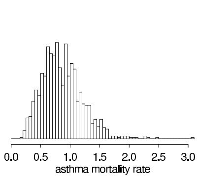

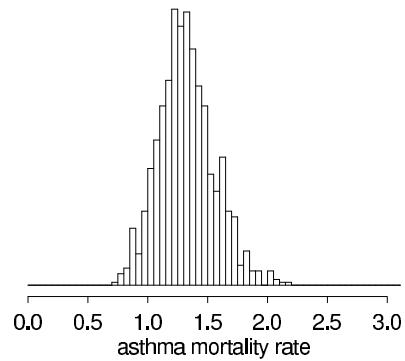  
Figure 2.5 Posterior density for $\theta$ , the asthma mortality rate in cases per 100,000 persons per year, with a Gamma(3.0, 5.0) prior distribution: (a) given $y = 3$ deaths out of 200,000 persons; (b) given $y = 30$ deaths in 10 years for a constant population of 200,000. The histograms appear jagged because they are constructed from only 1000 random draws from the posterior distribution in each case.

Posterior distribution with additional data. To consider the effect of additional data, suppose that ten years of data are obtained for the city in our example, instead of just one, and it is found that the mortality rate of 1.5 per 100,000 is maintained; we find $y = 30$ deaths over 10 years. Assuming the population is constant at 200,000, and assuming the outcomes in the ten years are independent with constant long-term rate $\theta$ , the posterior distribution of $\theta$ is then Gamma(33.0, 25.0); Figure 2.5b displays 1000 draws from this distribution. The posterior distribution is much more concentrated than before, and it still lies between the prior distribution and the data. After ten years of data, the posterior mean of $\theta$ is 1.32, and the posterior probability that $\theta$ exceeds 1.0 is 0.93.

# Exponential model

The exponential distribution is commonly used to model 'waiting times' and other continuous, positive, real-valued random variables, often measured on a time scale. The sampling distribution of an outcome $y$ , given parameter $\theta$ , is

$$
p (y | \theta) = \theta \exp (- y \theta), \mathrm {f o r} y > 0,
$$

and $\theta = 1 / \operatorname{E}(y|\theta)$ is called the 'rate.' Mathematically, the exponential is a special case of the gamma distribution with the parameters $(\alpha, \beta) = (1, \theta)$ . In this case, however, it is being used as a sampling distribution for an outcome $y$ , not a prior distribution for a parameter $\theta$ , as in the Poisson example.

The exponential distribution has a 'memoryless' property that makes it a natural model for survival or lifetime data; the probability that an object survives an additional length of time $t$ is independent of the time elapsed to this point: $\operatorname*{Pr}(y > t + s \mid y > s, \theta) = \operatorname*{Pr}(y > t \mid \theta)$ for any $s, t$ . The conjugate prior distribution for the exponential parameter $\theta$ , as for the Poisson mean, is $\mathrm{Gamma}(\theta | \alpha, \beta)$ with corresponding posterior distribution $\mathrm{Gamma}(\theta | \alpha + 1, \beta + y)$ . The sampling distribution of $n$ independent exponential observations, $y = (y_1, \ldots, y_n)$ , with constant rate $\theta$ is

$$
p (y | \theta) = \theta^ {n} \exp (- n \overline {{y}} \theta), \mathrm {f o r} \overline {{y}} \geq 0,
$$

which when viewed as the likelihood of $\theta$ , for fixed $y$ , is proportional to a $\mathrm{Gamma}(n + 1, n\overline{y})$ density. Thus the $\mathrm{Gamma}(\alpha, \beta)$ prior distribution for $\theta$ can be viewed as $\alpha - 1$ exponential observations with total waiting time $\beta$ (see Exercise 2.19).

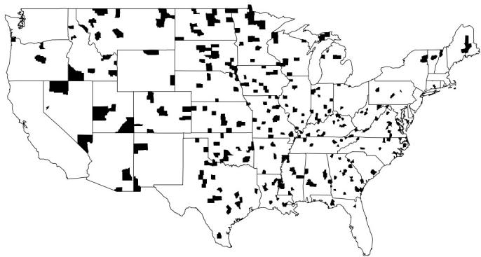  
Highest kidney cancer death rates   
Figure 2.6 The counties of the United States with the highest $10\%$ age-standardized death rates for cancer of kidney/ureter for U.S. white males, 1980-1989. Why are most of the shaded counties in the middle of the country? See Section 2.7 for discussion.

# 2.7 Example: informative prior distribution for cancer rates

At the end of Section 2.4, we considered the effect of the prior distribution on inference given a fixed quantity of data. Here, in contrast, we consider a large set of inferences, each based on different data but with a common prior distribution. In addition to illustrating the role of the prior distribution, this example introduces hierarchical modeling, to which we return in Chapter 5.

# A puzzling pattern in a map

Figure 2.6 shows the counties in the United States with the highest kidney cancer death rates during the 1980s. $^{1}$ The most noticeable pattern in the map is that many of the counties in the Great Plains in the middle of the country, but relatively few counties near the coasts, are shaded.

When shown the map, people come up with many theories to explain the disproportionate shading in the Great Plains: perhaps the air or the water is polluted, or the people tend not to seek medical care so the cancers get detected too late to treat, or perhaps their diet is unhealthy ... These conjectures may all be true but they are not actually needed to explain the patterns in Figure 2.6. To see this, look at Figure 2.7, which plots the $10\%$ of counties with the lowest kidney cancer death rates. These are also mostly in the middle of the country. So now we need to explain why these areas have the lowest, as well as the highest, rates.

The issue is sample size. Consider a county of population 1000. Kidney cancer is a rare disease, and, in any ten-year period, a county of 1000 will probably have zero kidney cancer deaths, so that it will be tied for the lowest rate in the country and will be shaded in Figure 2.7. However, there is a chance the county will have one kidney cancer death during the decade. If so, it will have a rate of 1 per 10,000 per year, which is high enough to put it in the top $10\%$ so that it will be shaded in Figure 2.6. The Great Plains has many low-population counties, and so it is overrepresented in both maps. There is no evidence from these maps that cancer rates are particularly high there.

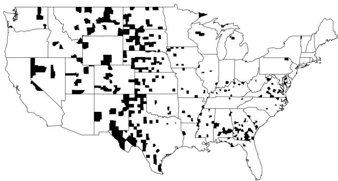  
Lowest kidney cancer death rates   
Figure 2.7 The counties of the United States with the lowest $10\%$ age-standardized death rates for cancer of kidney/ureter for U.S. white males, 1980-1989. Surprisingly, the pattern is somewhat similar to the map of the highest rates, shown in Figure 2.6.

# Bayesian inference for the cancer death rates

The misleading patterns in the maps of raw rates suggest that a model-based approach to estimating the true underlying rates might be helpful. In particular, it is natural to estimate the underlying cancer death rate in each county $j$ using the model

$$
y _ {j} \sim \operatorname {P o i s s o n} \left(1 0 n _ {j} \theta_ {j}\right), \tag {2.16}
$$

where $y_{j}$ is the number of kidney cancer deaths in county $j$ from 1980-1989, $n_{j}$ is the population of the county, and $\theta_{j}$ is the underlying rate in units of deaths per person per year. In this notation, the maps in Figures 2.6 and 2.7 are plotting the raw rates, $\frac{y_{j}}{10n_{j}}$ . (Here we are ignoring the age-standardization, although a generalization of the model to allow for this would be possible.)

This model differs from (2.14) in that $\theta_{j}$ varies between counties, so that (2.16) is a separate model for each of the counties in the U.S. We use the subscript $j$ (rather than $i$ ) in (2.16) to emphasize that these are separate parameters, each being estimated from its own data. Were we performing inference for just one of the counties, we would simply write $y \sim \mathrm{Poisson}(10n\theta)$ .

To perform Bayesian inference, we need a prior distribution for the unknown rate $\theta_{j}$ . For convenience we use a gamma distribution, which is conjugate to the Poisson. As we shall discuss later, a gamma distribution with parameters $\alpha = 20$ and $\beta = 430,000$ is a reasonable prior distribution for underlying kidney cancer death rates in the counties of the U.S. during this period. This prior distribution has a mean of $\frac{\alpha}{\beta} = 4.65 \times 10^{-5}$ and standard deviation $\frac{\sqrt{\alpha}}{\beta} = 1.04 \times 10^{-5}$ .

The posterior distribution of $\theta_{j}$ is then,

$$
\theta_ {j} \mid y _ {j} \sim \operatorname {G a m m a} (2 0 + y _ {j}, 4 3 0, 0 0 0 + 1 0 n _ {j}),
$$

which has mean and variance,

$$
\operatorname {E} \left(\theta_ {j} \mid y _ {j}\right) = \frac {2 0 + y _ {j}}{4 3 0 , 0 0 0 + 1 0 n _ {j}}
$$

$$
\operatorname {v a r} (\theta_ {j} | y _ {j}) = \frac {2 0 + y _ {j}}{(4 3 0 , 0 0 0 + 1 0 n _ {j}) ^ {2}}.
$$

The posterior mean can be viewed as a weighted average of the raw rate, $\frac{y_j}{10n_j}$ , and the prior mean, $\frac{\alpha}{\beta} = 4.65 \times 10^{-5}$ . (For a similar calculation, see Exercise 2.5.)

Relative importance of the local data and the prior distribution

Inference for a small county. The relative weighting of prior information and data depends on the population size $n_j$ . For example, consider a small county with $n_j = 1000$ :

- For this county, if $y_{j} = 0$ , then the raw death rate is 0 but the posterior mean is $\frac{20}{440000} = 4.55 \times 10^{-5}$ .   
- If $y_{j} = 1$ , then the raw death rate is 1 per 1000 per 10 years, or $10^{-4}$ per person-year (about twice as high as the national mean), but the posterior mean is only $\frac{21}{440,000} = 4.77 \times 10^{-5}$ .   
- If $y_{j} = 2$ , then the raw death rate is an extremely high $2 \times 10^{-4}$ per person-year, but the posterior mean is still only $\frac{22}{440000} = 5.00 \times 10^{-5}$ .

With such a small population size, the data are dominated by the prior distribution.

But how likely, a priori, is it that $y_{j}$ will equal 0, 1, 2, and so forth, for this county with $n_{j} = 1000$ ? This is determined by the predictive distribution, the marginal distribution of $y_{j}$ , averaging over the prior distribution of $\theta_{j}$ . As discussed in Section 2.6, the Poisson model with gamma prior distribution has a negative binomial predictive distribution:

$$
y _ {j} \sim \mathrm {N e g - b i n} \left(\alpha , \frac {\beta}{1 0 n _ {j}}\right).
$$

It is perhaps even simpler to simulate directly the predictive distribution of $y_{j}$ as follows: (1) draw 500 (say) values of $\theta_{j}$ from the Gamma(20,430,000) distribution; (2) for each of these, draw one value $y_{j}$ from the Poisson distribution with parameter 10,000 $\theta_{j}$ . Of 500 simulations of $y_{j}$ produced in this way, 319 were 0's, 141 were 1's, 33 were 2's, and 5 were 3's.

Inference for a large county. Now consider a large county with $n_j = 1$ million. How many cancer deaths $y_j$ might we expect to see in a ten-year period? Again we can use the Gamma(20,430,000) and Poisson $(10^{7}\theta_{j})$ distributions to simulate 500 values $y_j$ from the predictive distribution. Doing this we found a median of 473 and a $50\%$ interval of [393,545]. The raw death rate in such a county is then as likely or not to fall between $3.93 \times 10^{-5}$ and $5.45 \times 10^{-5}$ .

What about the Bayesianly estimated or 'Bayes-adjusted' death rate? For example, if $y_{j}$ takes on the low value of 393, then the raw death rate is $3.93 \times 10^{-5}$ and the posterior mean of $\theta_{j}$ is $\frac{20 + 393}{10^{7} + 430000} = 3.96 \times 10^{-5}$ , and if $y_{j} = 545$ , then the raw rate is $5.45 \times 10^{-5}$ and the posterior mean is $5.41 \times 10^{-5}$ . In this large county, the data dominate the prior distribution.

Comparing counties of different sizes. In the Poisson model (2.16), the variance of $\frac{y_j}{10n_j}$ is inversely proportional to the exposure parameter $n_j$ , which can thus be considered a 'sample size' for county $j$ . Figure 2.8 shows how the raw kidney cancer death rates vary by population. The extremely high and extremely low rates are all in low-population counties. By comparison, Figure 2.9a shows that the Bayes-estimated rates are much less variable. Finally, Figure 2.9b displays $50\%$ interval estimates for a sample of counties (chosen because it would be hard to display all 3071 in a single plot). The smaller counties supply less information and thus have wider posterior intervals.

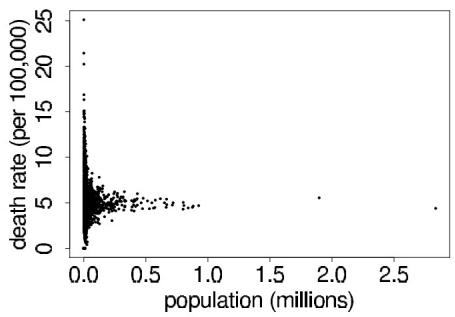

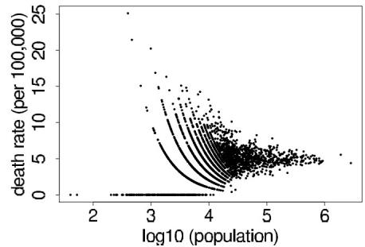  
Figure 2.8 (a) Kidney cancer death rates $y_{j} / (10n_{j})$ vs. population size $n_j$ . (b) Replotted on the scale of $\log_{10}$ population to see the data more clearly. The patterns come from the discreteness of the data ( $n_j = 0, 1, 2, \ldots$ ).

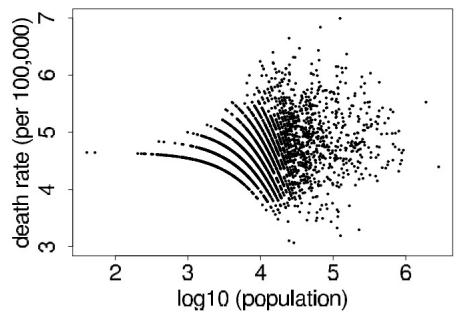

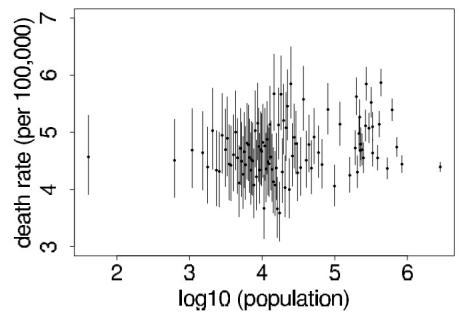  
Figure 2.9 (a) Bayes-estimated posterior mean kidney cancer death rates, $E(\theta_j | y_j) = \frac{20 + y_j}{430000 + 10n_j}$ vs. logarithm of population size $n_j$ , the 3071 counties in the U.S. (b) Posterior medians and 50% intervals for $\theta_j$ for a sample of 100 counties $j$ . The scales on the $y$ -axes differ from the plots in Figure 2.8b.

# Constructing a prior distribution

We now step back and discuss where we got the Gamma(20,430,000) prior distribution for the underlying rates. As we discussed when introducing the model, we picked the gamma distribution for mathematical convenience. We now explain how the two parameters $\alpha, \beta$ can be estimated from data to match the distribution of the observed cancer death rates $\frac{y_j}{10n_j}$ . It might seem inappropriate to use the data to set the prior distribution, but we view this as a useful approximation to our preferred approach of hierarchical modeling (introduced in Chapter 5), in which distributional parameters such as $\alpha, \beta$ in this example are treated as unknowns to be estimated.

Under the model, the observed count $y_{j}$ for any county $j$ comes from the predictive distribution, $p(y_{j}) = \int p(y_{j}|\theta_{j})p(\theta_{j})d\theta_{j}$ , which in this case is Neg-bin $(\alpha ,\frac{\beta}{10n_j})$ . From Appendix A, we can find the mean and variance of this distribution:

$$
\operatorname {E} (y _ {j}) = 1 0 n _ {j} \frac {\alpha}{\beta}
$$

$$
\operatorname {v a r} \left(y _ {j}\right) = 1 0 n _ {j} \frac {\alpha}{\beta} + (1 0 n _ {j}) ^ {2} \frac {\alpha}{\beta^ {2}}. \tag {2.17}
$$

These can also be derived directly using the mean and variance formulas (1.8) and (1.9); see Exercise 2.6.

Matching the observed mean and variance to their expectations and solving for $\alpha$ and $\beta$ yields the parameters of the prior distribution. The actual computation is more complicated

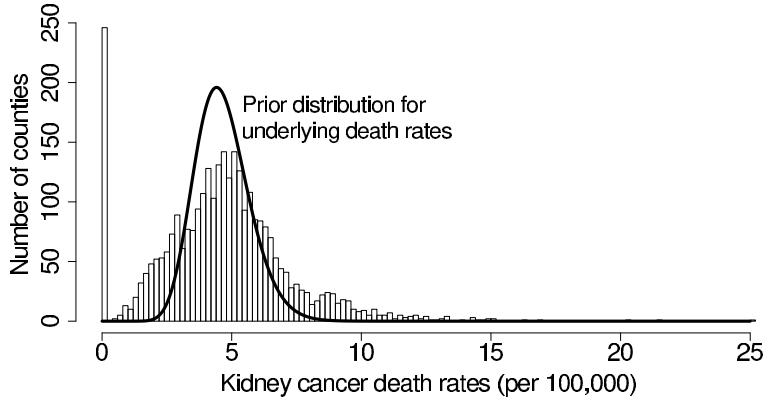  
Figure 2.10 Empirical distribution of the age-adjusted kidney cancer death rates, $\frac{y_j}{10n_j}$ , for the 3071 counties in the U.S., along with the Gamma(20,430,000) prior distribution for the underlying cancer rates $\theta_j$ .

because we must deal with the age adjustment and it also is more efficient to work with the mean and variance of the rates $\frac{y_j}{10n_j}$ :

$$
\mathrm {E} \left(\frac {y _ {j}}{1 0 n _ {j}}\right) = \frac {\alpha}{\beta}
$$

$$
\operatorname {v a r} \left(\frac {y _ {j}}{1 0 n _ {j}}\right) = \frac {1}{1 0 n _ {j}} \frac {\alpha}{\beta} + \frac {\alpha}{\beta^ {2}}. \tag {2.18}
$$

After dealing with the age adjustments, we equate the observed and theoretical moments, setting the mean of the values of $\frac{y_j}{10n_j}$ to $\frac{\alpha}{\beta}$ and setting the variance of the values of $\frac{y_j}{10n_j}$ to $\operatorname{E}\left(\frac{1}{10n_j}\right)\frac{\alpha}{\beta} + \frac{\alpha}{\beta^2}$ , using the sample average of the values $\frac{1}{10n_j}$ in place of $\operatorname{E}\left(\frac{1}{10n_j}\right)$ in that last expression.

Figure 2.10 shows the empirical distribution of the raw cancer rates, along with the estimated Gamma(20,430,000) prior distribution for the underlying cancer rates $\theta_{j}$ . The distribution of the raw rates is much broader, which makes sense since they include the Poisson variability as well as the variation between counties.

Our prior distribution is reasonable in this example, but this method of constructing it—by matching moments—is somewhat sloppy and can be difficult to apply in general. In Chapter 5, we discuss how to estimate this and other prior distributions in a more direct Bayesian manner, using hierarchical models.

A more important way this model could be improved is by including information at the county level that could predict variation in the cancer rates. This would move the model toward a hierarchical Poisson regression of the sort discussed in Chapter 16.

# 2.8 Noninformative prior distributions

When prior distributions have no population basis, they can be difficult to construct, and there has long been a desire for prior distributions that can be guaranteed to play a minimal role in the posterior distribution. Such distributions are sometimes called 'reference prior distributions,' and the prior density is described as vague, flat, diffuse or noninformative. The rationale for using noninformative prior distributions is often said to be 'to let the data speak for themselves,' so that inferences are unaffected by information external to the current data.

A related idea is the weakly informative prior distribution, which contains some informa

tion—enough to ‘regularize’ the posterior distribution, that is, to keep it roughly within reasonable bounds—but without attempting to fully capture one’s scientific knowledge about the underlying parameter.

# Proper and improper prior distributions

We return to the problem of estimating the mean $\theta$ of a normal model with known variance $\sigma^2$ , with a $\mathrm{N}(\mu_0, \tau_0^2)$ prior distribution on $\theta$ . If the prior precision, $1 / \tau_0^2$ , is small relative to the data precision, $n / \sigma^2$ , then the posterior distribution is approximately as if $\tau_0^2 = \infty$ :

$$
p (\theta | y) \approx \mathrm {N} (\theta | \overline {{y}}, \sigma^ {2} / n).
$$

Putting this another way, the posterior distribution is approximately that which would result from assuming $p(\theta)$ is proportional to a constant for $\theta \in (-\infty, \infty)$ . Such a distribution is not strictly possible, since the integral of the assumed $p(\theta)$ is infinity, which violates the assumption that probabilities sum to 1. In general, we call a prior density $p(\theta)$ proper if it does not depend on data and integrates to 1. (If $p(\theta)$ integrates to any positive finite value, it is called an unnormalized density and can be renormalized—multiplied by a constant—to integrate to 1.) The prior distribution is improper in this example, but the posterior distribution is proper, given at least one data point.

As a second example of a noninformative prior distribution, consider the normal model with known mean but unknown variance, with the conjugate scaled inverse- $\chi^2$ prior distribution. If the prior degrees of freedom, $\nu_0$ , are small relative to the data degrees of freedom, $n$ , then the posterior distribution is approximately as if $\nu_0 = 0$ :

$$
p (\sigma^ {2} | y) \approx \mathrm {I n v -} \chi^ {2} (\sigma^ {2} | n, v).
$$

This limiting form of the posterior distribution can also be derived by defining the prior density for $\sigma^2$ as $p(\sigma^2) \propto 1 / \sigma^2$ , which is improper, having an infinite integral over the range $(0, \infty)$ .

Improper prior distributions can lead to proper posterior distributions

In neither of the above two examples does the prior density combine with the likelihood to define a proper joint probability model, $p(y,\theta)$ . However, we can proceed with the algebra of Bayesian inference and define an unnormalized posterior density function by

$$
p (\theta | y) \propto p (y | \theta) p (\theta).
$$

In the above examples (but not always!), the posterior density is in fact proper; that is, $\int p(\theta |y)d\theta$ is finite for all $y$ . Posterior distributions obtained from improper prior distributions must be interpreted with great care—one must always check that the posterior distribution has a finite integral and a sensible form. Their most reasonable interpretation is as approximations in situations where the likelihood dominates the prior density. We discuss this aspect of Bayesian analysis more completely in Chapter 4.

# Jeffreys' invariance principle

One approach that is sometimes used to define noninformative prior distributions was introduced by Jeffreys, based on considering one-to-one transformations of the parameter: $\phi = h(\theta)$ . By transformation of variables, the prior density $p(\theta)$ is equivalent, in terms of expressing the same beliefs, to the following prior density on $\phi$ :

$$
p (\phi) = p (\theta) \left| \frac {d \theta}{d \phi} \right| = p (\theta) \left| h ^ {\prime} (\theta) \right| ^ {- 1}. \tag {2.19}
$$

Jeffreys' general principle is that any rule for determining the prior density $p(\theta)$ should yield an equivalent result if applied to the transformed parameter; that is, $p(\phi)$ computed by determining $p(\theta)$ and applying (2.19) should match the distribution that is obtained by determining $p(\phi)$ directly using the transformed model, $p(y,\phi) = p(\phi)p(y|\phi)$ .

Jeffreys' principle leads to defining the noninformative prior density as $p(\theta) \propto [J(\theta)]^{1/2}$ , where $J(\theta)$ is the Fisher information for $\theta$ :

$$
J (\theta) = \mathrm {E} \left(\left. \left(\frac {d \log p (y | \theta)}{d \theta}\right) ^ {2} \right| \theta\right) = - \mathrm {E} \left(\left. \frac {d ^ {2} \log p (y | \theta)}{d \theta^ {2}} \right| \theta\right). \tag {2.20}
$$

To see that Jeffreys' prior model is invariant to parameterization, evaluate $J(\phi)$ at $\theta = h^{-1}(\phi)$ :

$$
\begin{array}{l} J (\phi) = - \operatorname {E} \left(\frac {d ^ {2} \log p (y | \phi)}{d \phi^ {2}}\right) \\ = - \mathrm {E} \left(\frac {d ^ {2} \log p (y | \theta = h ^ {- 1} (\phi))}{d \theta^ {2}} \left| \frac {d \theta}{d \phi} \right| ^ {2}\right) \\ = J (\theta) \left| \frac {d \theta}{d \phi} \right| ^ {2}; \\ \end{array}
$$

thus, $J(\phi)^{1/2} = J(\theta)^{1/2}\left|\frac{d\theta}{d\phi}\right|$ , as required.

Jeffreys' principle can be extended to multiparameter models, but the results are more controversial. Simpler approaches based on assuming independent noninformative prior distributions for the components of the vector parameter $\theta$ can give different results than are obtained with Jeffreys' principle. When the number of parameters in a problem is large, we find it useful to abandon pure noninformative prior distributions in favor of hierarchical models, as we discuss in Chapter 5.

Various noninformative prior distributions for the binomial parameter

Consider the binomial distribution: $y \sim \operatorname{Bin}(n, \theta)$ , which has log-likelihood

$$
\log p (y | \theta) = \operatorname {c o n s t a n t} + y \log \theta + (n - y) \log (1 - \theta).
$$

Routine evaluation of the second derivative and substitution of $\operatorname{E}(y|\theta) = n\theta$ yields the Fisher information:

$$
J (\theta) = - \operatorname {E} \left(\left. \frac {d ^ {2} \log p (y | \theta)}{d \theta^ {2}} \right| \theta\right) = \frac {n}{\theta (1 - \theta)}.
$$

Jeffreys' prior density is then $p(\theta) \propto \theta^{-1/2}(1 - \theta)^{-1/2}$ , which is a $\mathrm{Beta}\left(\frac{1}{2}, \frac{1}{2}\right)$ density. By comparison, recall the Bayes-Laplace uniform prior density, which can be expressed as $\theta \sim \mathrm{Beta}(1, 1)$ . On the other hand, the prior density that is uniform in the natural parameter of the exponential family representation of the distribution is $p(\log \mathrm{it}(\theta)) \propto \mathrm{constant}$ (see Exercise 2.7), which corresponds to the improper $\mathrm{Beta}(0, 0)$ density on $\theta$ . In practice, the difference between these alternatives is often small, since to get from $\theta \sim \mathrm{Beta}(0, 0)$ to $\theta \sim \mathrm{Beta}(1, 1)$ is equivalent to passing from prior to posterior distribution given one more success and one more failure, and usually 2 is a small fraction of the total number of observations. But one must be careful with the improper $\mathrm{Beta}(0, 0)$ prior distribution—if $y = 0$ or $n$ , the resulting posterior distribution is improper!

# Pivotal quantities

For the binomial and other single-parameter models, different principles give (slightly) different noninformative prior distributions. But for two cases—location parameters and scale parameters—all principles seem to agree.

1. If the density of $y$ is such that $p(y - \theta | \theta)$ is a function that is free of $\theta$ and $y$ , say, $f(u)$ , where $u = y - \theta$ , then $y - \theta$ is a pivotal quantity, and $\theta$ is called a pure location parameter. In such a case, it is reasonable that a noninformative prior distribution for $\theta$ would give $f(y - \theta)$ for the posterior distribution, $p(y - \theta | y)$ . That is, under the posterior distribution, $y - \theta$ should still be a pivotal quantity, whose distribution is free of both $\theta$ and $y$ . Under this condition, using Bayes' rule, $p(y - \theta | y) \propto p(\theta) p(y - \theta | \theta)$ , thereby implying that the noninformative prior density is uniform on $\theta$ ; that is, $p(\theta) \propto \text{constant}$ over the range $(-\infty, \infty)$ .

2. If the density of $y$ is such that $p\left(\frac{y}{\theta} \mid \theta\right)$ is a function that is free of $\theta$ and $y$ —say, $g(u)$ , where $u = \frac{y}{\theta}$ —then $u = \frac{y}{\theta}$ is a pivotal quantity and $\theta$ is called a pure scale parameter. In such a case, it is reasonable that a noninformative prior distribution for $\theta$ would give $g\left(\frac{y}{\theta}\right)$ for the posterior distribution, $p\left(\frac{y}{\theta} \mid y\right)$ . By transformation of variables, the conditional distribution of $y$ given $\theta$ can be expressed in terms of the distribution of $u$ given $\theta$ ,

$$
p (y | \theta) = \frac {1}{\theta} p (u | \theta),
$$

and similarly,

$$
p (\theta | y) = \frac {y}{\theta^ {2}} p (u | y).
$$

After letting both $p(u|\theta)$ and $p(u|y)$ equal $g(u)$ , we have the identity $p(\theta | y) = \frac{y}{\theta} p(y|\theta)$ . Thus, in this case, the reference prior distribution is $p(\theta)\propto \frac{1}{\theta}$ or, equivalently, $p(\log \theta)\propto 1$ or $p(\theta^2)\propto \frac{1}{\theta^2}$ .

This approach, in which the sampling distribution of the pivot is used as its posterior distribution, can be applied to sufficient statistics in more complicated examples, such as hierarchical normal models.

Even these principles can be misleading in some problems, in the critical sense of suggesting prior distributions that can lead to improper posterior distributions. For example, the uniform prior density does not work for the logarithm of a hierarchical variance parameter, as we discuss in Section 5.4.

# Difficulties with noninformative prior distributions

The search for noninformative priors has several problems, including:

1. Searching for a prior distribution that is always vague seems misguided: if the likelihood is truly dominant in a given problem, then the choice among a range of relatively flat prior densities cannot matter. Establishing a particular specification as the reference prior distribution seems to encourage its automatic, and possibly inappropriate, use.

2. For many problems, there is no clear choice for a vague prior distribution, since a density that is flat or uniform in one parameterization will not be in another. This is the essential difficulty with Laplace's principle of insufficient reason--on what scale should the principle apply? For example, the 'reasonable' prior density on the normal mean $\theta$ above is uniform, while for $\sigma^2$ , the density $p(\sigma^2) \propto 1 / \sigma^2$ seems reasonable. However, if we define $\phi = \log \sigma^2$ , then the prior density on $\phi$ is

$$
p (\phi) = p (\sigma^ {2}) \left| \frac {d \sigma^ {2}}{d \phi} \right| \propto \frac {1}{\sigma^ {2}} \sigma^ {2} = 1;
$$

that is, uniform on $\phi = \log \sigma^2$ . With discrete distributions, there is the analogous difficulty of deciding how to subdivide outcomes into 'atoms' of equal probability.

3. Further difficulties arise when averaging over a set of competing models that have improper prior distributions, as we discuss in Section 7.3.

Nevertheless, noninformative and reference prior densities are often useful when it does not seem to be worth the effort to quantify one's real prior knowledge as a probability distribution, as long as one is willing to perform the mathematical work to check that the posterior density is proper and to determine the sensitivity of posterior inferences to modeling assumptions of convenience.

# 2.9 Weakly informative prior distributions

We characterize a prior distribution as weakly informative if it is proper but is set up so that the information it does provide is intentionally weaker than whatever actual prior knowledge is available. We will discuss this further in the context of a specific example, but in general any problem has some natural constraints that would allow a weakly informative model. For example, for regression models on the logarithmic or logistic scale, with predictors that are binary or scaled to have standard deviation 1, we can be sure for most applications that effect sizes will be less than 10, given that a difference of 10 on the log scale changes the expected value by a factor of $\exp (10) = 20,000$ , and on the logit scale shifts a probability of $\log \mathrm{it}^{-1}(-5) = 0.01$ to $\log \mathrm{it}^{-1}(5) = 0.99$ .

Rather than trying to model complete ignorance, we prefer in most problems to use weakly informative prior distributions that include a small amount of real-world information, enough to ensure that the posterior distribution makes sense. For example, in the sex ratio example from Sections 2.1 and 2.4, one could use a prior distribution concentrated between 0.4 and 0.6, for example $\mathrm{N}(0.5,0.1^2)$ or, to keep the mathematical convenience of conjugacy, $\mathrm{Beta}(20,20)$ . In the general problem of estimating a normal mean from Section 2.5, a $\mathrm{N}(0,A^2)$ prior distribution is weakly informative, with $A$ set to some large value that depends on the context of the problem.

In almost every real problem, the data analyst will have more information than can be conveniently included in the statistical model. This is an issue with the likelihood as well as the prior distribution. In practice, there is always compromise for a number of reasons: to describe the model more conveniently; because it may be difficult to express knowledge accurately in probabilistic form; to simplify computations; or perhaps to avoid using a possibly unreliable source of information. Except for the last reason, these are all arguments for convenience and are best justified by the claim that the answer would not have changed much had we been more accurate. If so few data are available that the choice of noninformative prior distribution makes a difference, one should put relevant information into the prior distribution, perhaps using a hierarchical model, as we discuss in Chapter 5. We return to the issue of accuracy vs. convenience in likelihoods and prior distributions in the examples of the later chapters.

# Constructing a weakly informative prior distribution

One might argue that virtually all statistical models are weakly informative: a model always conveys some information, if only in its choice of inputs and the functional form of how they are combined, but it is not possible or perhaps even desirable to encode all of one's prior beliefs about a subject into a set of probability distributions. With that in mind, we

offer two principles for setting up weakly informative priors, going at the problem from two different directions:

- Start with some version of a noninformative prior distribution and then add enough information so that inferences are constrained to be reasonable.   
- Start with a strong, highly informative prior and broaden it to account for uncertainty in one's prior beliefs and in the applicability of any historically based prior distribution to new data.

Neither of these approaches is pure. In the first case, it can happen that the purportedly noninformative prior distribution used as a starting point is in fact too strong. For example, if a $\mathrm{U}(0,1)$ prior distribution is assigned to the probability of some rare disease, then in the presence of weak data the probability can be grossly overestimated (suppose $y = 0$ incidences out of $n = 100$ cases, and the true prevalence is known to be less than 1 in 10,000), and an appropriate weakly informative prior will be such that the posterior in this case will be concentrated in that low range. In the second case, a prior distribution that is believed to be strongly informative may in fact be too weak along some direction. This is not to say that priors should be made more precise whenever posterior inferences are vague; in many cases, our best strategy is simply to acknowledge whatever posterior uncertainty we have. But we should not feel constrained by default noninformative models when we have substantive prior knowledge available.

There are settings, however, when it can be recommended to not use relevant information, even when it could clearly improve posterior inferences. The concern here is often expressed in terms of fairness and encoded mathematically as a symmetry principle, that the prior distribution should not pull inferences in any predetermined direction. For example, consider an experimenter studying an effect that she is fairly sure is positive; perhaps her prior distribution is $\mathrm{N}(0.5, 0.5)$ on some appropriate scale. Such an assumption might be perfectly reasonable given current scientific information but seems potentially risky if it is part of the analysis of an experiment designed to test the scientist's theory. If anything, one might want a prior distribution that leans against an experimenter's hypothesis in order to require a higher standard of proof.

Ultimately, such concerns can and should be subsumed into decision analysis and some sort of model of the entire scientific process, trading off the gains of early identification of large and real effects against the losses entailed in overestimating the magnitudes of effects and overreacting to patterns that could be attributed to chance. In the meantime, though, we know that statistical inferences are taken as evidence of effects, and as guides to future decision making, and for this purpose it can make sense to require models to have certain constraints such as symmetry about 0 for the prior distribution of a single treatment effect.

# 2.10 Bibliographic note

A fascinating detailed account of the early development of the idea of 'inverse probability' (Bayesian inference) is provided in the book by Stigler (1986), on which our brief accounts of Bayes' and Laplace's solutions to the problem of estimating an unknown proportion are based. Bayes' famous 1763 essay in the Philosophical Transactions of the Royal Society of London has been reprinted as Bayes (1763); see also Laplace (1785, 1810).

Introductory textbooks providing complementary discussions of the simple models covered in this chapter were listed at the end of Chapter 1. In particular, Box and Tiao (1973) provide a detailed treatment of Bayesian analysis with the normal model and also discuss highest posterior density regions in some detail. The theory of conjugate prior distributions was developed in detail by Raiffa and Schlaifer (1961). An interesting account of inference

for prediction, which also includes extensive details of particular probability models and conjugate prior analyses, appears in Aitchison and Dunsmore (1975).

Liu et al. (2013) discuss how to efficiently compute highest posterior density intervals using simulations.

Noninformative and reference prior distributions have been studied by many researchers. Jeffreys (1961) and Hartigan (1964) discuss invariance principles for noninformative prior distributions. Chapter 1 of Box and Tiao (1973) presents a straightforward and practically oriented discussion, a brief but detailed survey is given by Berger (1985), and the article by Bernardo (1979) is accompanied by a wide-ranging discussion. Bernardo and Smith (1994) give an extensive treatment of this topic along with many other matters relevant to the construction of prior distributions. Barnard (1985) discusses the relation between pivotal quantities and noninformative Bayesian inference. Kass and Wasserman (1996) provide a review of many approaches for establishing noninformative prior densities based on Jeffreys' rule, and they also discuss the problems that may arise from uncritical use of purportedly noninformative prior specifications. Dawid, Stone, and Zidek (1973) discuss some difficulties that can arise with noninformative prior distributions; also see Jaynes (1980).

Kerman (2011) discusses noninformative and informative conjugate prior distributions for the binomial and Poisson models.

Jaynes (1983) discusses in several places the idea of objectively constructing prior distributions based on invariance principles and maximum entropy. Appendix A of Bretthorst (1988) outlines an objective Bayesian approach to assigning prior distributions, as applied to the problem of estimating the parameters of a sinusoid from time series data. More discussions of maximum entropy models appear in Jaynes (1982), Skilling (1989), and Gull (1989a); see Titterington (1984) and Donoho et al. (1992) for other views.

For more on weakly informative prior distributions, see Gelman (2006a) and Gelman, Jakulin, et al. (2008). Gelman (2004b) discusses connections between parameterization and Bayesian modeling. Greenland (2001) discusses informative prior distributions in epidemiology.

The data for the placenta previa example come from a study from 1922 reported in James (1987). For more on the challenges of estimating sex ratios from small samples, see Gelman and Weakliem (2009). The Bayesian analysis of age-adjusted kidney cancer death rates in Section 2.7 is adapted from Manton et al. (1989); see also Gelman and Nolan (2002a) for more on this particular example and Bernardinelli, Clayton, and Montomoli (1995) for a general discussion of prior distributions for disease mapping. Gelman and Price (1999) discuss artifacts in maps of parameter estimates, and Louis (1984), Shen and Louis (1998), and Louis and Shen (1999) analyze the general problem of estimation of ensembles of parameters, a topic to which we return in Chapter 5.

# 2.11 Exercises

1. Posterior inference: suppose you have a $\mathrm{Beta}(4,4)$ prior distribution on the probability $\theta$ that a coin will yield a 'head' when spun in a specified manner. The coin is independently spun ten times, and 'heads' appear fewer than 3 times. You are not told how many heads were seen, only that the number is less than 3. Calculate your exact posterior density (up to a proportionality constant) for $\theta$ and sketch it.   
2. Predictive distributions: consider two coins, $C_1$ and $C_2$ , with the following characteristics: $\operatorname{Pr}(\text{heads}|C_1) = 0.6$ and $\operatorname{Pr}(\text{heads}|C_2) = 0.4$ . Choose one of the coins at random and imagine spinning it repeatedly. Given that the first two spins from the chosen coin are tails, what is the expectation of the number of additional spins until a head shows up?   
3. Predictive distributions: let $y$ be the number of 6's in 1000 rolls of a fair die.

(a) Sketch the approximate distribution of $y$ , based on the normal approximation.

(b) Using the normal distribution table, give approximate $5\%$ , $25\%$ , $50\%$ , $75\%$ , and $95\%$ points for the distribution of $y$ .

4. Predictive distributions: let $y$ be the number of 6's in 1000 independent rolls of a particular real die, which may be unfair. Let $\theta$ be the probability that the die lands on '6.' Suppose your prior distribution for $\theta$ is as follows:

$$
\operatorname * {P r} (\theta = 1 / 1 2) \quad = \quad 0. 2 5,
$$

$$
\Pr (\theta = 1 / 6) = 0. 5,
$$

$$
\operatorname * {P r} (\theta = 1 / 4) \quad = \quad 0. 2 5.
$$

(a) Using the normal approximation for the conditional distributions, $p(y|\theta)$ , sketch your approximate prior predictive distribution for $y$ .

(b) Give approximate $5\%$ , $25\%$ , $50\%$ , $75\%$ , and $95\%$ points for the distribution of $y$ . (Be careful here: $y$ does not have a normal distribution, but you can still use the normal distribution as part of your analysis.)

5. Posterior distribution as a compromise between prior information and data: let $y$ be the number of heads in $n$ spins of a coin, whose probability of heads is $\theta$ .

(a) If your prior distribution for $\theta$ is uniform on the range $[0,1]$ , derive your prior predictive distribution for $y$ ,

$$
\operatorname * {P r} (y = k) = \int_ {0} ^ {1} \operatorname * {P r} (y = k | \theta) d \theta ,
$$

for each $k = 0,1,\ldots ,n$

(b) Suppose you assign a $\mathrm{Beta}(\alpha, \beta)$ prior distribution for $\theta$ , and then you observe $y$ heads out of $n$ spins. Show algebraically that your posterior mean of $\theta$ always lies between your prior mean, $\frac{\alpha}{\alpha + \beta}$ , and the observed relative frequency of heads, $\frac{y}{n}$ .   
(c) Show that, if the prior distribution on $\theta$ is uniform, the posterior variance of $\theta$ is always less than the prior variance.   
(d) Give an example of a $\operatorname{Beta}(\alpha, \beta)$ prior distribution and data $y, n$ , in which the posterior variance of $\theta$ is higher than the prior variance.

6. Predictive distributions: Derive the mean and variance (2.17) of the negative binomial predictive distribution for the cancer rate example, using the mean and variance formulas (1.8) and (1.9).

7. Noninformative prior densities:

(a) For the binomial likelihood, $y \sim \operatorname{Bin}(n, \theta)$ , show that $p(\theta) \propto \theta^{-1}(1 - \theta)^{-1}$ is the uniform prior distribution for the natural parameter of the exponential family.   
(b) Show that if $y = 0$ or $n$ , the resulting posterior distribution is improper.

8. Normal distribution with unknown mean: a random sample of $n$ students is drawn from a large population, and their weights are measured. The average weight of the $n$ sampled students is $\overline{y} = 150$ pounds. Assume the weights in the population are normally distributed with unknown mean $\theta$ and known standard deviation 20 pounds. Suppose your prior distribution for $\theta$ is normal with mean 180 and standard deviation 40.

(a) Give your posterior distribution for $\theta$ . (Your answer will be a function of $n$ .)   
(b) A new student is sampled at random from the same population and has a weight of $\tilde{y}$ pounds. Give a posterior predictive distribution for $\tilde{y}$ . (Your answer will still be a function of $n$ .)   
(c) For $n = 10$ , give a $95\%$ posterior interval for $\theta$ and a $95\%$ posterior predictive interval for $\tilde{y}$ .   
(d) Do the same for $n = 100$

9. Setting parameters for a beta prior distribution: suppose your prior distribution for $\theta$ , the proportion of Californians who support the death penalty, is beta with mean 0.6 and standard deviation 0.3.

(a) Determine the parameters $\alpha$ and $\beta$ of your prior distribution. Sketch the prior density function   
(b) A random sample of 1000 Californians is taken, and $65\%$ support the death penalty. What are your posterior mean and variance for $\theta$ ? Draw the posterior density function.   
(c) Examine the sensitivity of the posterior distribution to different prior means and widths including a non-informative prior.

10. Discrete sample spaces: suppose there are $N$ cable cars in San Francisco, numbered sequentially from 1 to $N$ . You see a cable car at random; it is numbered 203. You wish to estimate $N$ . (See Goodman, 1952, for a discussion and references to several versions of this problem, and Jeffreys, 1961, Lee, 1989, and Jaynes, 2003, for Bayesian treatments.)

(a) Assume your prior distribution on $N$ is geometric with mean 100; that is,

$$
p (N) = (1 / 1 0 0) (9 9 / 1 0 0) ^ {N - 1}, \quad \text {f o r} N = 1, 2, \dots .
$$

What is your posterior distribution for $N$ ?

(b) What are the posterior mean and standard deviation of $N$ ? (Sum the infinite series analytically or approximate them on the computer.)   
(c) Choose a reasonable 'noninformative' prior distribution for $N$ and give the resulting posterior distribution, mean, and standard deviation for $N$ .

11. Computing with a nonconjugate single-parameter model: suppose $y_{1},\ldots ,y_{5}$ are independent samples from a Cauchy distribution with unknown center $\theta$ and known scale 1: $p(y_i|\theta)\propto 1 / (1 + (y_i - \theta)^2)$ . Assume, for simplicity, that the prior distribution for $\theta$ is uniform on [0, 100]. Given the observations $(y_{1},\dots ,y_{5}) = (43,44,45,46.5,47.5)$ :

(a) Compute the unnormalized posterior density function, $p(\theta)p(y|\theta)$ , on a grid of points $\theta = 0, \frac{1}{m}, \frac{2}{m}, \ldots, 100$ , for some large integer $m$ . Using the grid approximation, compute and plot the normalized posterior density function, $p(\theta|y)$ , as a function of $\theta$ .   
(b) Sample 1000 draws of $\theta$ from the posterior density and plot a histogram of the draws.   
(c) Use the 1000 samples of $\theta$ to obtain 1000 samples from the predictive distribution of a future observation, $y_{6}$ , and plot a histogram of the predictive draws.

12. Jeffreys' prior distributions: suppose $y|\theta \sim \mathrm{Poisson}(\theta)$ . Find Jeffreys' prior density for $\theta$ , and then find $\alpha$ and $\beta$ for which the Gamma $(\alpha, \beta)$ density is a close match to Jeffreys' density.

13. Discrete data: Table 2.2 gives the number of fatal accidents and deaths on scheduled airline flights per year over a ten-year period. We use these data as a numerical example for fitting discrete data models.

(a) Assume that the numbers of fatal accidents in each year are independent with a Poisson $(\theta)$ distribution. Set a prior distribution for $\theta$ and determine the posterior distribution based on the data from 1976 through 1985. Under this model, give a $95\%$ predictive interval for the number of fatal accidents in 1986. You can use the normal approximation to the gamma and Poisson or compute using simulation.   
(b) Assume that the numbers of fatal accidents in each year follow independent Poisson distributions with a constant rate and an exposure in each year proportional to the number of passenger miles flown. Set a prior distribution for $\theta$ and determine the posterior distribution based on the data for 1976-1985. (Estimate the number of passenger miles flown in each year by dividing the appropriate columns of Table 2.2 and ignoring round-off errors.) Give a $95\%$ predictive interval for the number of fatal

Table 2.2 Worldwide airline fatalities, 1976-1985. Death rate is passenger deaths per 100 million passenger miles. Source: Statistical Abstract of the United States.   

<table><tr><td>Year</td><td>Fatal accidents</td><td>Passenger deaths</td><td>Death rate</td></tr><tr><td>1976</td><td>24</td><td>734</td><td>0.19</td></tr><tr><td>1977</td><td>25</td><td>516</td><td>0.12</td></tr><tr><td>1978</td><td>31</td><td>754</td><td>0.15</td></tr><tr><td>1979</td><td>31</td><td>877</td><td>0.16</td></tr><tr><td>1980</td><td>22</td><td>814</td><td>0.14</td></tr><tr><td>1981</td><td>21</td><td>362</td><td>0.06</td></tr><tr><td>1982</td><td>26</td><td>764</td><td>0.13</td></tr><tr><td>1983</td><td>20</td><td>809</td><td>0.13</td></tr><tr><td>1984</td><td>16</td><td>223</td><td>0.03</td></tr><tr><td>1985</td><td>22</td><td>1066</td><td>0.15</td></tr></table>

accidents in 1986 under the assumption that $8 \times 10^{11}$ passenger miles are flown that year.

(c) Repeat (a) above, replacing 'fatal accidents' with 'passenger deaths.'   
(d) Repeat (b) above, replacing 'fatal accidents' with 'passenger deaths.'   
(e) In which of the cases (a)-(d) above does the Poisson model seem more or less reasonable? Why? Discuss based on general principles, without specific reference to the numbers in Table 2.2.

Incidentally, in 1986, there were 22 fatal accidents, 546 passenger deaths, and a death rate of 0.06 per 100 million miles flown. We return to this example in Exercises 3.12, 6.2, 6.3, and 8.14.

14. Algebra of the normal model:

(a) Fill in the steps to derive (2.9)-(2.10), and (2.11)-(2.12).   
(b) Derive (2.11) and (2.12) by starting with a $\mathrm{N}(\mu_0, \tau_0^2)$ prior distribution and adding data points one at a time, using the posterior distribution at each step as the prior distribution for the next.

15. Beta distribution: assume the result, from standard advanced calculus, that

$$
\int_ {0} ^ {1} u ^ {\alpha - 1} (1 - u) ^ {\beta - 1} d u = \frac {\Gamma (\alpha) \Gamma (\beta)}{\Gamma (\alpha + \beta)}.
$$

If $Z$ has a beta distribution with parameters $\alpha$ and $\beta$ , find $\operatorname{E}[Z^m (1 - Z)^n ]$ for any nonnegative integers $m$ and $n$ . Hence derive the mean and variance of $Z$ .

16. Beta-binomial distribution and Bayes' prior distribution: suppose $y$ has a binomial distribution for given $n$ and unknown parameter $\theta$ , where the prior distribution of $\theta$ is $\mathrm{Beta}(\alpha, \beta)$ .

(a) Find $p(y)$ , the marginal distribution of $y$ , for $y = 0, \dots, n$ (unconditional on $\theta$ ). This discrete distribution is known as the beta-binomial, for obvious reasons.   
(b) Show that if the beta-binomial probability is constant in $y$ , then the prior distribution has to have $\alpha = \beta = 1$ .

17. Posterior intervals: unlike the central posterior interval, the highest posterior interval is not invariant to transformation. For example, suppose that, given $\sigma^2$ , the quantity $n v / \sigma^2$ is distributed as $\chi_n^2$ , and that $\sigma$ has the (improper) noninformative prior density $p(\sigma) \propto \sigma^{-1}, \sigma > 0$ .

(a) Prove that the corresponding prior density for $\sigma^2$ is $p(\sigma^2)\propto \sigma^{-2}$

(b) Show that the $95\%$ highest posterior density region for $\sigma^2$ is not the same as the region obtained by squaring the endpoints of a posterior interval for $\sigma$ .

18. Poisson model: derive the gamma posterior distribution (2.15) for the Poisson model parameterized in terms of rate and exposure with conjugate prior distribution.

19. Exponential model with conjugate prior distribution:

(a) Show that if $y|\theta$ is exponentially distributed with rate $\theta$ , then the gamma prior distribution is conjugate for inferences about $\theta$ given an independent and identically distributed sample of $y$ values.

(b) Show that the equivalent prior specification for the mean, $\phi = 1 / \theta$ , is inverse-gamma. (That is, derive the latter density function.)

(c) The length of life of a light bulb manufactured by a certain process has an exponential distribution with unknown rate $\theta$ . Suppose the prior distribution for $\theta$ is a gamma distribution with coefficient of variation 0.5. (The coefficient of variation is defined as the standard deviation divided by the mean.) A random sample of light bulbs is to be tested and the lifetime of each obtained. If the coefficient of variation of the distribution of $\theta$ is to be reduced to 0.1, how many light bulbs need to be tested?

(d) In part (c), if the coefficient of variation refers to $\phi$ instead of $\theta$ , how would your answer be changed?

20. Censored and uncensored data in the exponential model:

(a) Suppose $y|\theta$ is exponentially distributed with rate $\theta$ , and the marginal (prior) distribution of $\theta$ is Gamma $(\alpha, \beta)$ . Suppose we observe that $y \geq 100$ , but do not observe the exact value of $y$ . What is the posterior distribution, $p(\theta | y \geq 100)$ , as a function of $\alpha$ and $\beta$ ? Write down the posterior mean and variance of $\theta$ .

(b) In the above problem, suppose that we are now told that $y$ is exactly 100. Now what are the posterior mean and variance of $\theta$ ?

(c) Explain why the posterior variance of $\theta$ is higher in part (b) even though more information has been observed. Why does this not contradict identity (2.8) on page 32?

21. Simple hierarchical modeling:

The file pew_research_center_june elect_wknd_data.dta3 has data from Pew Research Center polls taken during the 2008 election campaign. You can read these data into R using the read.dta() function (after first loading the foreign package into R). Your task is to estimate the percentage of the (adult) population in each state (excluding Alaska and Hawaii) who label themselves as 'very liberal,' replicating the procedure that was used in Section 2.8 to estimate cancer rates. But you do not need to make maps; it will be enough to make scatterplots, plotting the estimate vs. Obama's vote share in 2008 (data available at 2008ElectionResult.csv, readable in R using read.csv)). Make the following four graphs on a single page:

(a) Graph proportion liberal in each state vs. Obama vote share—that is, a scatterplot using the two-letter state abbreviations (see state.abb() in R).   
(b) Graph the Bayes posterior mean in each state vs. Obama vote share.   
(c) Repeat graphs (a) and (b) using the number of respondents in the state on the $x$ -axis. This exercise has four challenges: first, manipulating the data in order to get the totals by state; second, replicating the calculations for estimating the parameters of the prior distribution; third, doing the Bayesian analysis by state; and fourth, making the graphs.

22. Prior distributions:

A (hypothetical) study is performed to estimate the effect of a simple training program on basketball free-throw shooting. A random sample of 100 college students is recruited into the study. Each student first shoots 100 free-throws to establish a baseline success probability. Each student then takes 50 practice shots each day for a month. At the end of that time, he or she takes 100 shots for a final measurement. Let $\theta$ be the average improvement in success probability.

Give three prior distributions for $\theta$ (explaining each in a sentence):

(a) A noninformative prior,   
(b) A subjective prior based on your best knowledge, and   
(c) A weakly informative prior.

