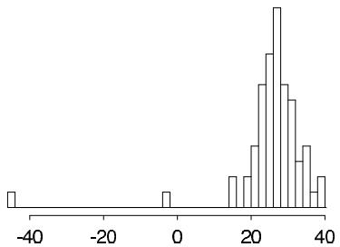
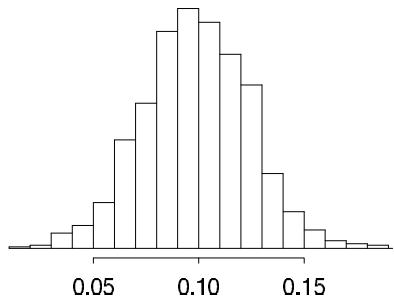
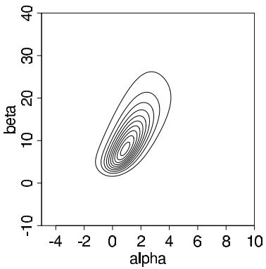
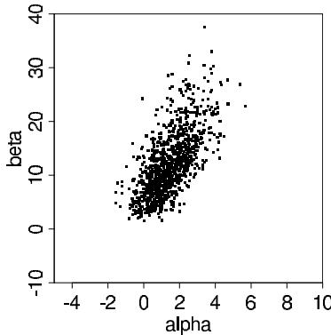
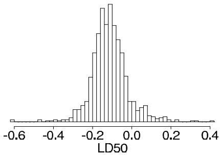

# Introduction to Multiparameter Models

[Package map](../structure.md) · [Unsplit OCR dump](./_full.md)

[← Ch. 2 Single-Parameter Models](./02-single-parameter-models.md) · [Ch. 4 Asymptotics →](./04-asymptotics-and-nonbayesian.md)

> MinerU OCR dump. If a formula, table, or numbering disagrees with the PDF, the PDF is authoritative.

---

# Chapter 3

# Introduction to multiparameter models

Virtually every practical problem in statistics involves more than one unknown or unobservable quantity. It is in dealing with such problems that the simple conceptual framework of the Bayesian approach reveals its principal advantages over other methods of inference. Although a problem can include several parameters of interest, conclusions will often be drawn about one, or only a few, parameters at a time. In this case, the ultimate aim of a Bayesian analysis is to obtain the marginal posterior distribution of the particular parameters of interest. In principle, the route to achieving this aim is clear: we first require the joint posterior distribution of all unknowns, and then we integrate this distribution over the unknowns that are not of immediate interest to obtain the desired marginal distribution. Or equivalently, using simulation, we draw samples from the joint posterior distribution and then look at the parameters of interest and ignore the values of the other unknowns. In many problems there is no interest in making inferences about many of the unknown parameters, although they are required in order to construct a realistic model. Parameters of this kind are often called nuisance parameters. A classic example is the scale of the random errors in a measurement problem.

We begin this chapter with a general treatment of nuisance parameters and then cover the normal distribution with unknown mean and variance in Section 3.2. Sections 3.4 and 3.5 present inference for the multinomial and multivariate normal distributions—the simplest models for discrete and continuous multivariate data, respectively. The chapter concludes with an analysis of a nonconjugate logistic regression model, using numerical computation of the posterior density on a grid.

# 3.1 Averaging over 'nuisance parameters'

To express the ideas of joint and marginal posterior distributions mathematically, suppose $\theta$ has two parts, each of which can be a vector, $\theta = (\theta_{1},\theta_{2})$ , and further suppose that we are only interested (at least for the moment) in inference for $\theta_{1}$ , so $\theta_{2}$ may be considered a 'nuisance' parameter. For instance, in the simple example,

$$
y | \mu , \sigma^ {2} \sim \mathrm {N} (\mu , \sigma^ {2}),
$$

in which both $\mu (= \theta_1)$ and $\sigma^2 (= \theta_2)$ are unknown, interest commonly centers on $\mu$ .

We seek the conditional distribution of the parameter of interest given the observed data; in this case, $p(\theta_1|y)$ . This is derived from the joint posterior density,

$$
p (\theta_ {1}, \theta_ {2} | y) \propto p (y | \theta_ {1}, \theta_ {2}) p (\theta_ {1}, \theta_ {2}),
$$

by averaging over $\theta_{2}$ :

$$
p (\theta_ {1} | y) = \int p (\theta_ {1}, \theta_ {2} | y) d \theta_ {2}.
$$

Alternatively, the joint posterior density can be factored to yield

$$
p \left(\theta_ {1} | y\right) = \int p \left(\theta_ {1} \mid \theta_ {2}, y\right) p \left(\theta_ {2} \mid y\right) d \theta_ {2}, \tag {3.1}
$$

which shows that the posterior distribution of interest, $p(\theta_1|y)$ , is a mixture of the conditional posterior distributions given the nuisance parameter, $\theta_{2}$ , where $p(\theta_2|y)$ is a weighting function for the different possible values of $\theta_{2}$ . The weights depend on the posterior density of $\theta_{2}$ and thus on a combination of evidence from data and prior model. The averaging over nuisance parameters $\theta_{2}$ can be interpreted generally; for example, $\theta_{2}$ can include a discrete component representing different possible sub-models.

We rarely evaluate the integral (3.1) explicitly, but it suggests an important practical strategy for both constructing and computing with multiparameter models. Posterior distributions can be computed by marginal and conditional simulation, first drawing $\theta_{2}$ from its marginal posterior distribution and then $\theta_{1}$ from its conditional posterior distribution, given the drawn value of $\theta_{2}$ . In this way the integration embodied in (3.1) is performed indirectly. A canonical example of this form of analysis is provided by the normal model with unknown mean and variance, to which we now turn.

# 3.2 Normal data with a noninformative prior distribution

As the prototype example of estimating the mean of a population from a sample, we consider a vector $y$ of $n$ independent observations from a univariate normal distribution, $\mathrm{N}(\mu, \sigma^2)$ ; the generalization to the multivariate normal distribution appears in Section 3.5. We begin by analyzing the model under a noninformative prior distribution, with the understanding that this is no more than a convenient assumption for the purposes of exposition and is easily extended to informative prior distributions.

# A noninformative prior distribution

We saw in Chapter 2 that a sensible vague prior density for $\mu$ and $\sigma$ , assuming prior independence of location and scale parameters, is uniform on $(\mu, \log \sigma)$ or, equivalently,

$$
p (\mu , \sigma^ {2}) \propto (\sigma^ {2}) ^ {- 1}.
$$

The joint posterior distribution, $p(\mu ,\sigma^2 |y)$

Under this conventional improper prior density, the joint posterior distribution is proportional to the likelihood function multiplied by the factor $1 / \sigma^2$ :

$$
\begin{array}{l} p (\mu , \sigma^ {2} | y) \propto \sigma^ {- n - 2} \exp \left(- \frac {1}{2 \sigma^ {2}} \sum_ {i = 1} ^ {n} (y _ {i} - \mu) ^ {2}\right) \\ = \sigma^ {- n - 2} \exp \left(- \frac {1}{2 \sigma^ {2}} \left[ \sum_ {i = 1} ^ {n} \left(y _ {i} - \bar {y}\right) ^ {2} + n (\bar {y} - \mu) ^ {2} \right]\right) \\ = \sigma^ {- n - 2} \exp \left(- \frac {1}{2 \sigma^ {2}} [ (n - 1) s ^ {2} + n (\bar {y} - \mu) ^ {2} ]\right), \tag {3.2} \\ \end{array}
$$

where

$$
s ^ {2} = \frac {1}{n - 1} \sum_ {i = 1} ^ {n} (y _ {i} - \overline {{y}}) ^ {2}
$$

is the sample variance of the $y_{i}$ 's. The sufficient statistics are $\overline{y}$ and $s^2$ .

The conditional posterior distribution, $p(\mu |\sigma^2,y)$

In order to factor the joint posterior density as in (3.1), we consider first the conditional posterior density, $p(\mu | \sigma^2, y)$ , and then the marginal posterior density, $p(\sigma^2 | y)$ . To determine the posterior distribution of $\mu$ , given $\sigma^2$ , we simply use the result derived in Section 2.5 for the mean of a normal distribution with known variance and a uniform prior distribution:

$$
\mu \left| \sigma^ {2}, y \sim \mathrm {N} \left(\bar {y}, \sigma^ {2} / n\right). \right. \tag {3.3}
$$

The marginal posterior distribution, $p(\sigma^2 | y)$

To determine $p(\sigma^2 | y)$ , we must average the joint distribution (3.2) over $\mu$ :

$$
p (\sigma^ {2} | y) \propto \int \sigma^ {- n - 2} \exp \left(- \frac {1}{2 \sigma^ {2}} [ (n - 1) s ^ {2} + n (\bar {y} - \mu) ^ {2} ]\right) d \mu .
$$

Integrating this expression over $\mu$ requires evaluating the integral $\exp \left(-\frac{1}{2\sigma^2} n(\overline{y} - \mu)^2\right)$ , which is a simple normal integral; thus,

$$
\begin{array}{l} p (\sigma^ {2} | y) \propto \sigma^ {- n - 2} \exp \left(- \frac {1}{2 \sigma^ {2}} (n - 1) s ^ {2}\right) \sqrt {2 \pi \sigma^ {2} / n} \\ \propto \left(\sigma^ {2}\right) ^ {- (n + 1) / 2} \exp \left(- \frac {(n - 1) s ^ {2}}{2 \sigma^ {2}}\right), \tag {3.4} \\ \end{array}
$$

which is a scaled inverse- $\chi^2$ density:

$$
\sigma^ {2} | y \sim \operatorname {I n v} - \chi^ {2} (n - 1, s ^ {2}). \tag {3.5}
$$

We have thus factored the joint posterior density (3.2) as the product of conditional and marginal posterior densities: $p(\mu, \sigma^2 | y) = p(\mu | \sigma^2, y) p(\sigma^2 | y)$ .

This marginal posterior distribution for $\sigma^2$ has a remarkable similarity to the analogous sampling theory result: conditional on $\sigma^2$ (and $\mu$ ), the distribution of the appropriately scaled sufficient statistic, $\frac{(n-1)s^2}{\sigma^2}$ , is $\chi_{n-1}^2$ . Considering our derivation of the reference prior distribution for the scale parameter in Section 2.8, however, this result is not surprising.

Sampling from the joint posterior distribution

It is easy to draw samples from the joint posterior distribution: first draw $\sigma^2$ from (3.5), then draw $\mu$ from (3.3). We also derive some analytical results for the posterior distribution, since this is one of the few multiparameter problems simple enough to solve in closed form.

Analytic form of the marginal posterior distribution of $\mu$

The population mean, $\mu$ , is typically the estimand of interest, and so the objective of the Bayesian analysis is the marginal posterior distribution of $\mu$ , which can be obtained by integrating $\sigma^2$ out of the joint posterior distribution. The representation (3.1) shows that the posterior distribution of $\mu$ can be regarded as a mixture of normal distributions, mixed over the scaled inverse- $\chi^2$ distribution for the variance, $\sigma^2$ . We can derive the marginal posterior density for $\mu$ by integrating the joint posterior density over $\sigma^2$ :

$$
p (\mu | y) = \int_ {0} ^ {\infty} p (\mu , \sigma^ {2} | y) d \sigma^ {2}.
$$

This integral can be evaluated using the substitution

$$
z = \frac {A}{2 \sigma^ {2}}, \mathrm {w h e r e} A = (n - 1) s ^ {2} + n (\mu - \overline {{y}}) ^ {2},
$$

and recognizing that the result is an unnormalized gamma integral:

$$
\begin{array}{l} p (\mu | y) \propto A ^ {- n / 2} \int_ {0} ^ {\infty} z ^ {(n - 2) / 2} \exp (- z) d z \\ \propto \left[ (n - 1) s ^ {2} + n (\mu - \bar {y}) ^ {2} \right] ^ {- n / 2} \\ \propto \left[ 1 + \frac {n (\mu - \bar {y}) ^ {2}}{(n - 1) s ^ {2}} \right] ^ {- n / 2}. \\ \end{array}
$$

This is the $t_{n - 1}(\overline{y},s^2 /n)$ density (see Appendix A).

To put it another way, we have shown that, under the noninformative uniform prior distribution on $(\mu ,\log \sigma)$ , the posterior distribution of $\mu$ has the form

$$
\frac {\mu - \overline {{y}}}{s / \sqrt {n}} \Bigg | y \sim t _ {n - 1},
$$

where $t_{n-1}$ denotes the standard $t$ density (location 0, scale 1) with $n-1$ degrees of freedom. This marginal posterior distribution provides another interesting comparison with sampling theory. Under the sampling distribution, $p(y|\mu, \sigma^2)$ , the following relation holds:

$$
\left. \frac {\overline {{y}} - \mu}{s / \sqrt {n}} \right| \mu , \sigma^ {2} \sim t _ {n - 1}.
$$

The sampling distribution of the pivotal quantity $(\overline{y} - \mu) / (s / \sqrt{n})$ does not depend on the nuisance parameter $\sigma^2$ , and its posterior distribution does not depend on data. In general, a pivotal quantity for the estimand is defined as a nontrivial function of the data and the estimand whose sampling distribution is independent of all parameters and data.

Posterior predictive distribution for a future observation

The posterior predictive distribution for a future observation, $\tilde{y}$ , can be written as a mixture, $p(\tilde{y} | y) = \iint p(\tilde{y} | \mu, \sigma^2, y) p(\mu, \sigma^2 | y) d\mu d\sigma^2$ . The first of the two factors in the integral is just the normal distribution for the future observation given the values of $(\mu, \sigma^2)$ , and does not depend on $y$ at all. To draw from the posterior predictive distribution, first draw $\mu, \sigma^2$ from their joint posterior distribution and then simulate $\tilde{y} \sim \mathrm{N}(\mu, \sigma^2)$ .

In fact, the posterior predictive distribution of $\tilde{y}$ is a $t$ distribution with location $\overline{y}$ , scale $(1 + \frac{1}{n})^{1/2}s$ , and $n - 1$ degrees of freedom. This analytic form is obtained using the same techniques as in the derivation of the posterior distribution of $\mu$ . Specifically, the distribution can be obtained by integrating out the parameters $\mu, \sigma^2$ according to their joint posterior distribution. We can identify the result more easily by noticing that the factorization $p(\tilde{y}|\sigma^2,y) = \int p(\tilde{y}|\mu,\sigma^2,y)p(\mu|\sigma^2,y)d\mu$ leads to $p(\tilde{y}|\sigma^2,y) = \mathrm{N}(\tilde{y}|\overline{y},(1 + \frac{1}{n})\sigma^2)$ , which is the same, up to a changed scale factor, as the distribution of $\mu|\sigma^2,y$ .

# Example. Estimating the speed of light

Simon Newcomb set up an experiment in 1882 to measure the speed of light. Newcomb measured the amount of time required for light to travel a distance of 7442 meters. A histogram of Newcomb's 66 measurements is shown in Figure 3.1. There are two unusually low measurements and then a cluster of measurements that are approximately symmetrically distributed. We (inappropriately) apply the normal model, assuming that all 66 measurements are independent draws from a normal distribution with mean

  
Figure 3.1 Histogram of Simon Newcomb's measurements for estimating the speed of light, from Stigler (1977). The data are recorded as deviations from 24,800 nanoseconds.

$\mu$ and variance $\sigma^2$ . The main substantive goal is posterior inference for $\mu$ . The outlying measurements do not fit the normal model; we discuss Bayesian methods for measuring the lack of fit for these data in Section 6.3. The mean of the 66 measurements is $\overline{y} = 26.2$ , and the sample standard deviation is $s = 10.8$ . Assuming the noninformative prior distribution $p(\mu, \sigma^2) \propto (\sigma^2)^{-1}$ , a $95\%$ central posterior interval for $\mu$ is obtained from the $t_{65}$ marginal posterior distribution of $\mu$ as $\overline{y} \pm 1.997s / \sqrt{66} = [23.6, 28.8]$ .

The posterior interval can also be obtained by simulation. Following the factorization of the posterior distribution given by (3.5) and (3.3), we first draw a random value of $\sigma^2 \sim \mathrm{Inv} - \chi^2(65, s^2)$ as $65s^2$ divided by a random draw from the $\chi_{65}^2$ distribution (see Appendix A). Then given this value of $\sigma^2$ , we draw $\mu$ from its conditional posterior distribution, $\mathrm{N}(26.2, \sigma^2/66)$ . Based on 1000 simulated values of $(\mu, \sigma^2)$ , we estimate the posterior median of $\mu$ to be 26.2 and a $95\%$ central posterior interval for $\mu$ to be [23.6, 28.9], close to the analytically calculated interval.

Incidentally, based on the currently accepted value of the speed of light, the 'true value' for $\mu$ in Newcomb's experiment is 33.0, which falls outside our $95\%$ interval. This reinforces the fact that posterior inferences are only as good as the model and the experiment that produced the data.

# 3.3 Normal data with a conjugate prior distribution

A family of conjugate prior distributions

A first step toward a more general model is to assume a conjugate prior distribution for the two-parameter univariate normal sampling model in place of the noninformative prior distribution just considered. The form of the likelihood displayed in (3.2) and the subsequent discussion shows that the conjugate prior density must also have the product form $p(\sigma^2)p(\mu |\sigma^2)$ , where the marginal distribution of $\sigma^2$ is scaled inverse- $\chi^2$ and the conditional distribution of $\mu$ given $\sigma^2$ is normal (so that marginally $\mu$ has a $t$ distribution). A convenient parameterization is given by the following specification:

$$
\mu | \sigma^ {2} \sim \mathrm {N} (\mu_ {0}, \sigma^ {2} / \kappa_ {0})
$$

$$
\sigma^ {2} \sim \mathrm {I n v -} \chi^ {2} (\nu_ {0}, \sigma_ {0} ^ {2}),
$$

which corresponds to the joint prior density

$$
p \left(\mu , \sigma^ {2}\right) \propto \sigma^ {- 1} \left(\sigma^ {2}\right) ^ {- \left(\nu_ {0} / 2 + 1\right)} \exp \left(- \frac {1}{2 \sigma^ {2}} \left[ \nu_ {0} \sigma_ {0} ^ {2} + \kappa_ {0} \left(\mu_ {0} - \mu\right) ^ {2} \right]\right). \tag {3.6}
$$

We label this the N-Inv- $\chi^2(\mu_0, \sigma_0^2/\kappa_0; \nu_0, \sigma_0^2)$ density; its four parameters can be identified as the location and scale of $\mu$ and the degrees of freedom and scale of $\sigma^2$ , respectively.

The appearance of $\sigma^2$ in the conditional distribution of $\mu |\sigma^2$ means that $\mu$ and $\sigma^2$ are necessarily dependent in their joint conjugate prior density: for example, if $\sigma^2$ is large, then a high-variance prior distribution is induced on $\mu$ . This dependence is notable, considering that conjugate prior distributions are used largely for convenience. Upon reflection, however, it often makes sense for the prior variance of the mean to be tied to $\sigma^2$ , which is the sampling variance of the observation $y$ . In this way, prior belief about $\mu$ is calibrated by the scale of measurement of $y$ and is equivalent to $\kappa_0$ prior measurements on this scale.

The joint posterior distribution, $p(\mu ,\sigma^2 |y)$

Multiplying the prior density (3.6) by the normal likelihood yields the posterior density

$$
\begin{array}{l} {p (\mu , \sigma^ {2} | y)} \propto {\sigma^ {- 1} (\sigma^ {2}) ^ {- (\nu_ {0} / 2 + 1)} \exp \left(- \frac {1}{2 \sigma^ {2}} [ \nu_ {0} \sigma_ {0} ^ {2} + \kappa_ {0} (\mu - \mu_ {0}) ^ {2} ]\right) \times} \\ \times \left(\sigma^ {2}\right) ^ {- n / 2} \exp \left(- \frac {1}{2 \sigma^ {2}} \left[ (n - 1) s ^ {2} + n (\bar {y} - \mu) ^ {2} \right]\right) \tag {3.7} \\ = \mathrm {N - I n v} - \chi^ {2} \left(\mu_ {n}, \sigma_ {n} ^ {2} / \kappa_ {n}; \nu_ {n}, \sigma_ {n} ^ {2}\right), \\ \end{array}
$$

where, after some algebra (see Exercise 3.9), it can be shown that

$$
\mu_ {n} = \frac {\kappa_ {0}}{\kappa_ {0} + n} \mu_ {0} + \frac {n}{\kappa_ {0} + n} \bar {y}
$$

$$
\kappa_ {n} = \kappa_ {0} + n
$$

$$
\nu_ {n} = \nu_ {0} + n
$$

$$
\nu_ {n} \sigma_ {n} ^ {2} = \nu_ {0} \sigma_ {0} ^ {2} + (n - 1) s ^ {2} + \frac {\kappa_ {0} n}{\kappa_ {0} + n} (\overline {{y}} - \mu_ {0}) ^ {2}.
$$

The parameters of the posterior distribution combine the prior information and the information contained in the data. For example $\mu_{n}$ is a weighted average of the prior mean and the sample mean, with weights determined by the relative precision of the two pieces of information. The posterior degrees of freedom, $\nu_{n}$ , is the prior degrees of freedom plus the sample size. The posterior sum of squares, $\nu_{n}\sigma_{n}^{2}$ , combines the prior sum of squares, the sample sum of squares, and the additional uncertainty conveyed by the difference between the sample mean and the prior mean.

The conditional posterior distribution, $p(\mu |\sigma^2,y)$

The conditional posterior density of $\mu$ , given $\sigma^2$ , is proportional to the joint posterior density (3.7) with $\sigma^2$ held constant,

$$
\begin{array}{l} \mu | \sigma^ {2}, y \sim \mathrm {N} (\mu_ {n}, \sigma^ {2} / \kappa_ {n}) \\ = \mathrm {N} \left(\frac {\frac {\kappa_ {0}}{\sigma^ {2}} \mu_ {0} + \frac {n}{\sigma^ {2}} \bar {y}}{\frac {\kappa_ {0}}{\sigma^ {2}} + \frac {n}{\sigma^ {2}}}, \frac {1}{\frac {\kappa_ {0}}{\sigma^ {2}} + \frac {n}{\sigma^ {2}}}\right), \tag {3.8} \\ \end{array}
$$

which agrees, as it must, with the analysis in Section 2.5 of $\mu$ with $\sigma$ considered fixed.

The marginal posterior distribution, $p(\sigma^2 |y)$

The marginal posterior density of $\sigma^2$ , from (3.7), is scaled inverse- $\chi^2$ :

$$
\sigma^ {2} | y \sim \operatorname {I n v} - \chi^ {2} \left(\nu_ {n}, \sigma_ {n} ^ {2}\right). \tag {3.9}
$$

Sampling from the joint posterior distribution

To sample from the joint posterior distribution, just as in the previous section, we first draw $\sigma^2$ from its marginal posterior distribution (3.9), then draw $\mu$ from its normal conditional posterior distribution (3.8), using the simulated value of $\sigma^2$ .

Analytic form of the marginal posterior distribution of $\mu$

Integration of the joint posterior density with respect to $\sigma^2$ , in a precisely analogous way to that used in the previous section, shows that the marginal posterior density for $\mu$ is

$$
\begin{array}{l} p (\mu | y) \propto \left(1 + \frac {\kappa_ {n} (\mu - \mu_ {n}) ^ {2}}{\nu_ {n} \sigma_ {n} ^ {2}}\right) ^ {- (\nu_ {n} + 1) / 2} \\ = t _ {\nu_ {n}} \left(\mu \mid \mu_ {n}, \sigma_ {n} ^ {2} / \kappa_ {n}\right). \\ \end{array}
$$

# 3.4 Multinomial model for categorical data

The binomial distribution that was emphasized in Chapter 2 can be generalized to allow more than two possible outcomes. The multinomial sampling distribution is used to describe data for which each observation is one of $k$ possible outcomes. If $y$ is the vector of counts of the number of observations of each outcome, then

$$
p (y | \theta) \propto \prod_ {j = 1} ^ {k} \theta_ {j} ^ {y _ {j}},
$$

where the sum of the probabilities, $\sum_{j=1}^{k} \theta_{j}$ , is 1. The distribution is typically thought of as implicitly conditioning on the number of observations, $\sum_{j=1}^{k} y_{j} = n$ . The conjugate prior distribution is a multivariate generalization of the beta distribution known as the Dirichlet,

$$
p (\theta | \alpha) \propto \prod_ {j = 1} ^ {k} \theta_ {j} ^ {\alpha_ {j} - 1},
$$

where the distribution is restricted to nonnegative $\theta_{j}$ 's with $\sum_{j=1}^{k} \theta_{j} = 1$ ; see Appendix A for details. The resulting posterior distribution for the $\theta_{j}$ 's is Dirichlet with parameters $\alpha_{j} + y_{j}$ .

The prior distribution is mathematically equivalent to a likelihood resulting from $\sum_{j=1}^{k} \alpha_{j}$ observations with $\alpha_{j}$ observations of the $j$ th outcome category. As in the binomial there are several plausible noninformative Dirichlet prior distributions. A uniform density is obtained by setting $\alpha_{j} = 1$ for all $j$ ; this distribution assigns equal density to any vector $\theta$ satisfying $\sum_{j=1}^{k} \theta_{j} = 1$ . Setting $\alpha_{j} = 0$ for all $j$ results in an improper prior distribution that is uniform in the $\log(\theta_{j})$ 's. The resulting posterior distribution is proper if there is at least one observation in each of the $k$ categories, so that each component of $y$ is positive. The bibliographic note at the end of this chapter points to other suggested noninformative prior distributions for the multinomial model.

# Example. Pre-election polling

For a simple example of a multinomial model, we consider a sample survey question with three possible responses. In late October, 1988, a survey was conducted by CBS News of 1447 adults in the United States to find out their preferences in the upcoming

  
Figure 3.2 Histogram of values of $(\theta_{1} - \theta_{2})$ for 1000 simulations from the posterior distribution for the election polling example.

presidential election. Out of 1447 persons, $y_{1} = 727$ supported George Bush, $y_{2} = 583$ supported Michael Dukakis, and $y_{3} = 137$ supported other candidates or expressed no opinion. Assuming no other information on the respondents, the 1447 observations are exchangeable. If we also assume simple random sampling (that is, 1447 names 'drawn out of a hat'), then the data $(y_{1}, y_{2}, y_{3})$ follow a multinomial distribution, with parameters $(\theta_{1}, \theta_{2}, \theta_{3})$ , the proportions of Bush supporters, Dukakis supporters, and those with no opinion in the survey population. An estimand of interest is $\theta_{1} - \theta_{2}$ , the population difference in support for the two major candidates.

With a noninformative uniform prior distribution on $\theta$ , $\alpha_{1} = \alpha_{2} = \alpha_{3} = 1$ , the posterior distribution for $(\theta_{1},\theta_{2},\theta_{3})$ is Dirichlet(728, 584, 138). We could compute the posterior distribution of $\theta_{1} - \theta_{2}$ by integration, but it is simpler just to draw 1000 points $(\theta_{1},\theta_{2},\theta_{3})$ from the posterior Dirichlet distribution and then compute $\theta_{1} - \theta_{2}$ for each. The result is displayed in Figure 3.2. All of the 1000 simulations had $\theta_{1} > \theta_{2}$ ; thus, the estimated posterior probability that Bush had more support than Dukakis in the survey population is over $99.9\%$ .

In fact, the CBS survey does not use independent random sampling but rather uses a variant of a stratified sampling plan. We discuss an improved analysis of this survey, using some knowledge of the sampling scheme, in Section 8.3 (see Table 8.2 on page 207).

In complicated problems—for example, analyzing the results of many survey questions simultaneously—the number of multinomial categories, and thus parameters, becomes so large that it is hard to usefully analyze a dataset of moderate size without additional structure in the model. Formally, additional information can enter the analysis through the prior distribution or the sampling model. An informative prior distribution might be used to improve inference in complicated problems, using the ideas of hierarchical modeling introduced in Chapter 5. Alternatively, loglinear models can be used to impose structure on multinomial parameters that result from cross-classifying several survey questions; Section 16.7 provides details and an example.

# 3.5 Multivariate normal model with known variance

Here we give a somewhat formal account of the distributional results of Bayesian inference for the parameters of a multivariate normal distribution. In many ways, these results parallel those already given for the univariate normal model, but there are some important new aspects that play a major role in the analysis of linear models, which is the central activity of much applied statistical work (see Chapters 5, 14, and 15). This section can be viewed at this point as reference material for future chapters.

Multivariate normal likelihood

The basic model to be discussed concerns an observable vector $y$ of $d$ components, with the multivariate normal distribution,

$$
y | \mu , \Sigma \sim \mathrm {N} (\mu , \Sigma), \tag {3.10}
$$

where $\mu$ is a (column) vector of length $d$ and $\Sigma$ is a $d\times d$ variance matrix, which is symmetric and positive definite. The likelihood function for a single observation is

$$
p (y | \mu , \Sigma) \propto | \Sigma | ^ {- 1 / 2} \exp \left(- \frac {1}{2} (y - \mu) ^ {T} \Sigma^ {- 1} (y - \mu)\right),
$$

and for a sample of $n$ independent and identically distributed observations, $y_{1},\ldots ,y_{n}$ , is

$$
\begin{array}{l} p \left(y _ {1}, \dots , y _ {n} \mid \mu , \Sigma\right) \propto | \Sigma | ^ {- n / 2} \exp \left(- \frac {1}{2} \sum_ {i = 1} ^ {n} \left(y _ {i} - \mu\right) ^ {T} \Sigma^ {- 1} \left(y _ {i} - \mu\right)\right) \\ = | \Sigma | ^ {- n / 2} \exp \left(- \frac {1}{2} \operatorname {t r} \left(\Sigma^ {- 1} S _ {0}\right)\right), \tag {3.11} \\ \end{array}
$$

where $S_0$ is the matrix of 'sums of squares' relative to $\mu$ ,

$$
S _ {0} = \sum_ {i = 1} ^ {n} \left(y _ {i} - \mu\right) \left(y _ {i} - \mu\right) ^ {T}. \tag {3.12}
$$

# Conjugate analysis

As with the univariate normal model, we analyze the multivariate normal model by first considering the case of known $\Sigma$ .

Conjugate prior distribution for $\mu$ with known $\Sigma$ . The log-likelihood is a quadratic form in $\mu$ , and therefore the conjugate prior distribution for $\mu$ is the multivariate normal distribution, which we parameterize as $\mu \sim \mathrm{N}(\mu_0, \Lambda_0)$ .

Posterior distribution for $\mu$ with known $\Sigma$ . The posterior distribution of $\mu$ is

$$
p (\mu | y, \Sigma) \propto \exp \left(- \frac {1}{2} \left((\mu - \mu_ {0}) ^ {T} \Lambda_ {0} ^ {- 1} (\mu - \mu_ {0}) + \sum_ {i = 1} ^ {n} (y _ {i} - \mu) ^ {T} \Sigma^ {- 1} (y _ {i} - \mu)\right)\right),
$$

which is an exponential of a quadratic form in $\mu$ . Completing the quadratic form and pulling out constant factors (see Exercise 3.13) gives

$$
\begin{array}{l} p (\mu | y, \Sigma) \propto \exp \left(- \frac {1}{2} (\mu - \mu_ {n}) ^ {T} \Lambda_ {n} ^ {- 1} (\mu - \mu_ {n})\right) \\ = \mathrm {N} (\mu | \mu_ {n}, \Lambda_ {n}), \\ \end{array}
$$

where

$$
\begin{array}{l} \mu_ {n} = \left(\Lambda_ {0} ^ {- 1} + n \Sigma^ {- 1}\right) ^ {- 1} \left(\Lambda_ {0} ^ {- 1} \mu_ {0} + n \Sigma^ {- 1} \bar {y}\right) \\ \Lambda_ {n} ^ {- 1} = \Lambda_ {0} ^ {- 1} + n \Sigma^ {- 1}. \tag {3.13} \\ \end{array}
$$

These are similar to the results for the univariate normal model in Section 2.5, the posterior mean being a weighted average of the data and the prior mean, with weights given by the data and prior precision matrices, $n\Sigma^{-1}$ and $\Lambda_0^{-1}$ , respectively. The posterior precision is the sum of the prior and data precisions.

Posterior conditional and marginal distributions of subvectors of $\mu$ with known $\Sigma$ . It follows from the properties of the multivariate normal distribution (see Appendix A) that the marginal posterior distribution of a subset of the parameters, $\mu^{(1)}$ say, is also multivariate normal, with mean vector equal to the appropriate subvector of the posterior mean vector $\mu_{n}$ and variance matrix equal to the appropriate submatrix of $\Lambda_{n}$ . Also, the conditional posterior distribution of a subset $\mu^{(1)}$ given the values of a second subset $\mu^{(2)}$ is multivariate normal. If we write superscripts in parentheses to indicate appropriate subvectors and submatrices, then

$$
\mu^ {(1)} \mid \mu^ {(2)}, y \sim \mathrm {N} \left(\mu_ {n} ^ {(1)} + \beta^ {1 | 2} \left(\mu^ {(2)} - \mu_ {n} ^ {(2)}\right), \Lambda^ {1 | 2}\right), \tag {3.14}
$$

where the regression coefficients $\beta^{1|2}$ and conditional variance matrix $\Lambda^{1|2}$ are defined by

$$
\begin{array}{l} \beta^ {1 | 2} = \Lambda_ {n} ^ {(1 2)} \left(\Lambda_ {n} ^ {(2 2)}\right) ^ {- 1} \\ {\Lambda^ {1 | 2}} = {\Lambda_ {n} ^ {(1 1)} - \Lambda_ {n} ^ {(1 2)} \left(\Lambda_ {n} ^ {(2 2)}\right) ^ {- 1} \Lambda_ {n} ^ {(2 1)}.} \\ \end{array}
$$

Posterior predictive distribution for new data. We now work out the analytic form of the posterior predictive distribution for a new observation $\tilde{y} \sim \mathrm{N}(\mu, \Sigma)$ . As with the univariate normal, we first note that the joint distribution, $p(\tilde{y}, \mu | y) = \mathrm{N}(\tilde{y} | \mu, \Sigma) \mathrm{N}(\mu | \mu_n, \Lambda_n)$ , is the exponential of a quadratic form in $(\tilde{y}, \mu)$ ; hence $(\tilde{y}, \mu)$ have a joint normal posterior distribution, and so the marginal posterior distribution of $\tilde{y}$ is (multivariate) normal. We are still assuming the variance matrix $\Sigma$ is known. As in the univariate case, we can determine the posterior mean and variance of $\tilde{y}$ using (2.7) and (2.8):

$$
\begin{array}{l} \operatorname {E} (\tilde {y} | y) = \operatorname {E} (\operatorname {E} (\tilde {y} | \mu , y) | y) \\ = \mathrm {E} (\mu | y) = \mu_ {n}, \\ \end{array}
$$

and

$$
\begin{array}{l} \operatorname {v a r} (\tilde {y} | y) = \operatorname {E} \left(\operatorname {v a r} (\tilde {y} | \mu , y) | y\right) + \operatorname {v a r} \left(\operatorname {E} (\tilde {y} | \mu , y) | y\right) \\ = \mathrm {E} (\Sigma | y) + \operatorname {v a r} (\mu | y) = \Sigma + \Lambda_ {n}. \\ \end{array}
$$

To sample from the posterior distribution or the posterior predictive distribution, refer to Appendix A for a method of generating random draws from a multivariate normal distribution with specified mean and variance matrix.

Noninformative prior density for $\mu$ . A noninformative uniform prior density for $\mu$ is $p(\mu) \propto$ constant, obtained in the limit as the prior precision tends to zero in the sense $|\Lambda_0^{-1}| \to 0$ ; in the limit of infinite prior variance (zero prior precision), the prior mean is irrelevant. The posterior density is then proportional to the likelihood (3.11). This is a proper posterior distribution only if $n \geq d$ , that is, if the sample size is greater than or equal to the dimension of the multivariate normal; otherwise the matrix $S_0$ is not full rank. If $n \geq d$ , the posterior distribution for $\mu$ , given the uniform prior density, is $\mu|\Sigma, y \sim \mathrm{N}(\overline{y}, \Sigma / n)$ .

# 3.6 Multivariate normal with unknown mean and variance

Conjugate inverse-Wishart family of prior distributions

Recall that the conjugate distribution for the univariate normal with unknown mean and variance is the normal-inverse- $\chi^2$ distribution (3.6). We can use the inverse-Wishart distribution, a multivariate generalization of the scaled inverse- $\chi^2$ , to describe the prior dis

distribution of the matrix $\Sigma$ . The conjugate prior distribution for $(\mu, \Sigma)$ , the normal-inverse-Wishart, is conveniently parameterized in terms of hyperparameters $(\mu_0, \Lambda_0 / \kappa_0; \nu_0, \Lambda_0)$ :

$$
\Sigma \sim \mathrm {I n v - W i s h a r t} _ {\nu_ {0}} (\Lambda_ {0} ^ {- 1})
$$

$$
\mu | \Sigma \sim \mathrm {N} (\mu_ {0}, \Sigma / \kappa_ {0}),
$$

which corresponds to the joint prior density

$$
p (\mu , \Sigma) \propto | \Sigma | ^ {- ((\nu_ {0} + d) / 2 + 1)} \exp \biggl (- \frac {1}{2} \mathrm {t r} (\Lambda_ {0} \Sigma^ {- 1}) - \frac {\kappa_ {0}}{2} (\mu - \mu_ {0}) ^ {T} \Sigma^ {- 1} (\mu - \mu_ {0}) \biggr).
$$

The parameters $\nu_{0}$ and $\Lambda_0$ describe the degrees of freedom and the scale matrix for the inverse-Wishart distribution on $\Sigma$ . The remaining parameters are the prior mean, $\mu_0$ , and the number of prior measurements, $\kappa_0$ , on the $\Sigma$ scale. Multiplying the prior density by the normal likelihood results in a posterior density of the same family with parameters

$$
\mu_ {n} = \frac {\kappa_ {0}}{\kappa_ {0} + n} \mu_ {0} + \frac {n}{\kappa_ {0} + n} \overline {{y}}
$$

$$
\kappa_ {n} = \kappa_ {0} + n
$$

$$
\nu_ {n} = \nu_ {0} + n
$$

$$
{\Lambda_ {n}} = {\Lambda_ {0} + S + \frac {\kappa_ {0} n}{\kappa_ {0} + n} (\overline {{y}} - \mu_ {0}) (\overline {{y}} - \mu_ {0}) ^ {T},}
$$

where $S$ is the sum of squares matrix about the sample mean,

$$
S = \sum_ {i = 1} ^ {n} \left(y _ {i} - \bar {y}\right) \left(y _ {i} - \bar {y}\right) ^ {T}.
$$

Other results from the univariate normal easily generalize to the multivariate case. The marginal posterior distribution of $\mu$ is multivariate $t_{\nu_n - d + 1}(\mu_n, \Lambda_n / (\kappa_n(\nu_n - d + 1)))$ . The posterior predictive distribution of a new observation $\tilde{y}$ is also multivariate $t$ with an additional factor of $\kappa_n + 1$ in the numerator of the scale matrix. Samples from the joint posterior distribution of $(\mu, \Sigma)$ are easily obtained using the following procedure: first, draw $\Sigma | y \sim \mathrm{Inv-Wishart}_{\nu_n}(\Lambda_n^{-1})$ , then draw $\mu | \Sigma, y \sim \mathrm{N}(\mu_n, \Sigma / \kappa_n)$ . See Appendix A for drawing from inverse-Wishart and multivariate normal distributions. To draw from the posterior predictive distribution of a new observation, draw $\tilde{y} | \mu, \Sigma, y \sim \mathrm{N}(\mu, \Sigma)$ , given the already drawn values of $\mu$ and $\Sigma$ .

# Different noninformative prior distributions

Inverse-Wishart with $d + 1$ degrees of freedom. Setting $\Sigma \sim \mathrm{Inv - Wishart}_{d + 1}(I)$ has the appealing feature that each of the correlations in $\Sigma$ has, marginally, a uniform prior distribution. (The joint distribution is not uniform, however, because of the constraint that the correlation matrix be positive definite.)

Inverse-Wishart with $d - 1$ degrees of freedom. Another proposed noninformative prior distribution is the multivariate Jeffreys prior density,

$$
p (\mu , \Sigma) \propto | \Sigma | ^ {- (d + 1) / 2},
$$

which is the limit of the conjugate prior density as $\kappa_0\to 0$ , $\nu_{0}\rightarrow -1$ , $|\Lambda_0|\to 0$ . The corresponding posterior distribution can be written as

$$
\Sigma | y \sim \operatorname {I n v - W i s h a r t} _ {n - 1} (S ^ {- 1})
$$

$$
\begin{array}{r c l} \mu | \Sigma , y & \sim & \mathrm {N} (\overline {{y}}, \Sigma / n). \end{array}
$$

Results for the marginal distribution of $\mu$ and the posterior predictive distribution of $\tilde{y}$ , assuming that the posterior distribution is proper, follow from the previous paragraph. For example, the marginal posterior distribution of $\mu$ is multivariate $t_{n - d}(\overline{y},S / (n(n - d)))$ .

Table 3.1: Bioassay data from Racine et al. (1986).   

<table><tr><td>Dose, xi(log g/ml)</td><td>Number of animals, ni</td><td>Number of deaths, yi</td></tr><tr><td>-0.86</td><td>5</td><td>0</td></tr><tr><td>-0.30</td><td>5</td><td>1</td></tr><tr><td>-0.05</td><td>5</td><td>3</td></tr><tr><td>0.73</td><td>5</td><td>5</td></tr></table>

# Scaled inverse-Wishart model

When modeling covariance matrices it can help to extend the inverse-Wishart model by multiplying by a set of scale parameters that can be modeled separately. This gives flexibility in modeling and allows one to set up a uniform or weak prior distribution on correlations without overly constraining the variance parameters. The scaled inverse-Wishart model for $\Sigma$ has the form,

$$
\Sigma = \mathrm {D i a g} (\xi) \Sigma_ {\eta} \mathrm {D i a g} (\xi),
$$

where $\Sigma_{\eta}$ is given an inverse-Wishart prior distribution (one choice is $\mathrm{Inv - Wishart}_{d + 1}(I)$ , so that the marginal distributions of the correlations are uniform) and then the scale parameters $\xi$ can be given weakly informative priors themselves. We discuss further in Section 15.4 in the context of varying-intercept, varying-slope hierarchical regression models.

# 3.7 Example: analysis of a bioassay experiment

Beyond the normal distribution, few multiparameter sampling models allow simple explicit calculation of posterior distributions. Data analysis for such models is possible using the computational methods described in Part III of this book. Here we present an example of a nonconjugate model for a bioassay experiment, drawn from the literature on applied Bayesian statistics. The model is a two-parameter example from the broad class of generalized linear models to be considered more thoroughly in Chapter 16. We use a particularly simple simulation approach, approximating the posterior distribution by a discrete distribution supported on a two-dimensional grid of points, that provides sufficiently accurate inferences for this two-parameter example.

# The scientific problem and the data

In the development of drugs and other chemical compounds, acute toxicity tests or bioassay experiments are commonly performed on animals. Such experiments proceed by administering various dose levels of the compound to batches of animals. The animals' responses are typically characterized by a dichotomous outcome: for example, alive or dead, tumor or no tumor. An experiment of this kind gives rise to data of the form

$$
(x _ {i}, n _ {i}, y _ {i}); i = 1, \dots , k,
$$

where $x_{i}$ represents the $i$ th of $k$ dose levels (often measured on a logarithmic scale) given to $n_i$ animals, of which $y_{i}$ subsequently respond with positive outcome. An example of real data from such an experiment is shown in Table 3.1: twenty animals were tested, five at each of four dose levels.

# Modeling the dose-response relation

Given what we have seen so far, we must model the outcomes of the five animals within each group $i$ as exchangeable, and it seems reasonable to model them as independent with

equal probabilities, which implies that the data points $y_{i}$ are binomially distributed:

$$
y _ {i} | \theta_ {i} \sim \operatorname {B i n} (n _ {i}, \theta_ {i}),
$$

where $\theta_{i}$ is the probability of death for animals given dose $x_{i}$ . (An example of a situation in which independence and the binomial model would not be appropriate is if the deaths were caused by a contagious disease.) For this experiment, it is also reasonable to treat the outcomes in the four groups as independent of each other, given the parameters $\theta_{1},\ldots ,\theta_{4}$ .

The simplest analysis would treat the four parameters $\theta_{i}$ as exchangeable in their prior distribution, perhaps using a noninformative density such as $p(\theta_1,\dots ,\theta_4)\propto 1$ , in which case the parameters $\theta_{i}$ would have independent beta posterior distributions. The exchangeable prior model for the $\theta_{i}$ parameters has a serious flaw, however; we know the dose level $x_{i}$ for each group $i$ , and one would expect the probability of death to vary systematically as a function of dose.

The simplest model of the dose-response relation—that is, the relation of $\theta_{i}$ to $x_{i}$ —is linear: $\theta_{i} = \alpha + \beta x_{i}$ . Unfortunately, this model has the flaw that at low or high doses, $x_{i}$ approaches $\pm \infty$ (recall that the dose is measured on the log scale), whereas $\theta_{i}$ , being a probability, must be constrained to lie between 0 and 1. The standard solution is to use a transformation of the $\theta$ 's, such as the logistic, in the dose-response relation:

$$
\operatorname {l o g i t} \left(\theta_ {i}\right) = \alpha + \beta x _ {i}, \tag {3.15}
$$

where $\mathrm{logit}(\theta_i) = \mathrm{log}(\theta_i / (1 - \theta_i))$ as defined in (1.10). This is called a logistic regression model.

# The likelihood

Under the model (3.15), we can write the sampling distribution, or likelihood, for each group $i$ in terms of the parameters $\alpha$ and $\beta$ as

$$
p \left(y _ {i} \mid \alpha , \beta , n _ {i}, x _ {i}\right) \propto [ \log \mathrm {i t} ^ {- 1} (\alpha + \beta x _ {i}) ] ^ {y _ {i}} \left[ 1 - \log \mathrm {i t} ^ {- 1} (\alpha + \beta x _ {i}) \right] ^ {n _ {i} - y _ {i}}.
$$

The model is characterized by the parameters $\alpha$ and $\beta$ , whose joint posterior distribution is

$$
\begin{array}{l} p (\alpha , \beta | y, n, x) \propto p (\alpha , \beta | n, x) p (y | \alpha , \beta , n, x) \tag {3.16} \\ \propto \quad p (\alpha , \beta) \prod_ {i = 1} ^ {k} p (y _ {i} | \alpha , \beta , n _ {i}, x _ {i}). \\ \end{array}
$$

We consider the sample sizes $n_i$ and dose levels $x_i$ as fixed for this analysis and suppress the conditioning on $(n, x)$ in subsequent notation.

# The prior distribution

We present an analysis based on a prior distribution for $(\alpha, \beta)$ that is independent and locally uniform in the two parameters; that is, $p(\alpha, \beta) \propto 1$ . In practice, we might use a uniform prior distribution if we really have no prior knowledge about the parameters, or if we want to present a simple analysis of this experiment alone. If the analysis using the noninformative prior distribution is insufficiently precise, we may consider using other sources of substantive information (for example, from other bioassay experiments) to construct an informative prior distribution.

  
Figure 3.3 (a) Contour plot for the posterior density of the parameters in the bioassay example. Contour lines are at $0.05, 0.15, \ldots, 0.95$ times the density at the mode. (b) Scatterplot of 1000 draws from the posterior distribution.

# A rough estimate of the parameters

We will compute the joint posterior distribution (3.16) at a grid of points $(\alpha, \beta)$ , but before doing so, it is a good idea to get a rough estimate of $(\alpha, \beta)$ so we know where to look. To obtain the rough estimate, we use existing software to perform a logistic regression; that is, finding the maximum likelihood estimate of $(\alpha, \beta)$ in (3.16) for the four data points in Table 3.1. The estimate is $(\hat{\alpha}, \hat{\beta}) = (0.8, 7.7)$ , with standard errors of 1.0 and 4.9 for $\alpha$ and $\beta$ , respectively.

# Obtaining a contour plot of the joint posterior density

We are now ready to compute the posterior density at a grid of points $(\alpha, \beta)$ . After some experimentation, we use the range $(\alpha, \beta) \in [-5, 10] \times [-10, 40]$ , which captures almost all the mass of the posterior distribution. The resulting contour plot appears in Figure 3.3a; a general justification for setting the lowest contour level at 0.05 for two-dimensional plots appears on page 85 in Section 4.1.

# Sampling from the joint posterior distribution

Having computed the unnormalized posterior density at a grid of values that cover the effective range of $(\alpha, \beta)$ , we can normalize by approximating the distribution as a step function over the grid and setting the total probability in the grid to 1. We sample 1000 random draws $(\alpha^s, \beta^s)$ from the posterior distribution using the following procedure.

1. Compute the marginal posterior distribution of $\alpha$ by numerically summing over $\beta$ in the discrete distribution computed on the grid of Figure 3.3a.   
2. For $s = 1,\dots ,1000$

(a) Draw $\alpha^s$ from the discretely computed $p(\alpha |y)$ ; this can be viewed as a discrete version of the inverse cdf method described in Section 1.9.   
(b) Draw $\beta^s$ from the discrete conditional distribution, $p(\beta | \alpha, y)$ , given the just-sampled value of $\alpha$ .   
(c) For each of the sampled $\alpha$ and $\beta$ , add a uniform random jitter centered at zero with a width equal to the spacing of the sampling grid. This gives the simulation draws a continuous distribution.

  
Figure 3.4 Histogram of the draws from the posterior distribution of the LD50 (on the scale of log dose in $g / ml$ ) in the bioassay example, conditional on the parameter $\beta$ being positive.

The 1000 draws $(\alpha^s, \beta^s)$ are displayed on a scatterplot in Figure 3.3b. The scale of the plot, which is the same as the scale of Figure 3.3a, has been set large enough that all the 1000 draws would fit on the graph.

There are a number of practical considerations when applying this two-dimensional grid approximation. There can be difficulty finding the correct location and scale for the grid points. A grid that is defined on too small an area may miss important features of the posterior distribution that fall outside the grid. A grid defined on a large area with wide intervals between points can miss important features that fall between the grid points. It is also important to avoid overflow and underflow operations when computing the posterior distribution. It is usually a good idea to compute the logarithm of the unnormalized posterior distribution and subtract off the maximum value before exponentiating. This creates an unnormalized discrete approximation with maximum value 1, which can then be normalized (by setting the total probability in the grid to 1).

# The posterior distribution of the LD50

A parameter of common interest in bioassay studies is the LD50—the dose level at which the probability of death is $50\%$ . In our logistic model, a $50\%$ survival rate means

$$
\text {L D 5 0 :} \quad \mathrm {E} \left(\frac {y _ {i}}{n _ {i}}\right) = \operatorname {l o g i t} ^ {- 1} (\alpha + \beta x _ {i}) = 0. 5;
$$

thus, $\alpha + \beta x_{i} = \mathrm{logit}(0.5) = 0$ , and the LD50 is $x_{i} = -\alpha / \beta$ . Computing the posterior distribution of any summaries in the Bayesian approach is straightforward, as discussed at the end of Section 1.9. Given what we have done so far, simulating the posterior distribution of the LD50 is trivial: we just compute $-\alpha / \beta$ for the 1000 draws of $(\alpha, \beta)$ pictured in Figure 3.3b.

Difficulties with the LD50 parameterization if the drug is beneficial. In the context of this example, LD50 is a meaningless concept if $\beta \leq 0$ , in which case increasing the dose does not cause the probability of death to increase. If we were certain that the drug could not cause the tumor rate to decrease, we should constrain the parameter space to exclude values of $\beta$ less than 0. However, it seems more reasonable here to allow the possibility of $\beta \leq 0$ and just note that LD50 is hard to interpret in this case.

We summarize the inference on the LD50 scale by reporting two results: (1) the posterior probability that $\beta > 0$ —that is, that the drug is harmful—and (2) the posterior distribution for the LD50 conditional on $\beta > 0$ . All of the 1000 simulation draws had positive values of $\beta$ , so the posterior probability that $\beta > 0$ is roughly estimated to exceed 0.999. We compute the LD50 for the simulation draws with positive values of $\beta$ (which happen to be all 1000

draws for this example); a histogram is displayed in Figure 3.4. This example illustrates that the marginal posterior mean is not always a good summary of inference about a parameter. We are not, in general, interested in the posterior mean of the LD50, because the posterior mean includes the cases in which the dose-response relation is negative.

# 3.8 Summary of elementary modeling and computation

The lack of multiparameter models permitting easy calculation of posterior distributions is not a major practical handicap for three main reasons. First, when there are few parameters, posterior inference in nonconjugate multiparameter models can be obtained by simple simulation methods, as we have seen in the bioassay example. Second, sophisticated models can often be represented in a hierarchical or conditional manner, as we shall see in Chapter 5, for which effective computational strategies are available (as we discuss in general in Part III). Finally, as we discuss in Chapter 4, we can often apply a normal approximation to the posterior distribution, and therefore the conjugate structure of the normal model can play an important role in practice, well beyond its application to explicitly normal sampling models.

Our successful analysis of the bioassay example suggests the following strategy for computation of simple Bayesian posterior distributions. What follows is not truly a general approach, but it summarizes what we have done so far and foreshadows the general methods—based on successive approximations—presented in Part III.

1. Write the likelihood part of the model, $p(y|\theta)$ , ignoring any factors that are free of $\theta$ .   
2. Write the posterior density, $p(\theta | y) \propto p(\theta) p(y|\theta)$ . If prior information is well-formulated, include it in $p(\theta)$ . Otherwise use a weakly informative prior distribution or temporarily set $p(\theta) \propto$ constant, with the understanding that the prior density can be altered later to include additional information or structure.   
3. Create a crude estimate of the parameters, $\theta$ , for use as a starting point and a comparison to the computation in the next step.   
4. Draw simulations $\theta^1, \ldots, \theta^S$ , from the posterior distribution. Use the sample draws to compute the posterior density of any functions of $\theta$ that may be of interest.   
5. If any predictive quantities, $\tilde{y}$ , are of interest, simulate $\tilde{y}^1, \ldots, \tilde{y}^S$ by drawing each $\tilde{y}^s$ from the sampling distribution conditional on the drawn value $\theta^s$ , $p(\tilde{y} | \theta^s)$ . In Chapter 6, we discuss how to use posterior simulations of $\theta$ and $\tilde{y}$ to check the fit of the model to data and substantive knowledge.

For nonconjugate models, step 4 above can be difficult. Various methods have been developed to draw posterior simulations in complicated models, as we discuss in Part III. Occasionally, high-dimensional problems can be solved by combining analytical and numerical simulation methods. If $\theta$ has only one or two components, it is possible to draw simulations by computing on a grid, as we illustrated in the previous section for the bioassay example.

# 3.9 Bibliographic note

Chapter 2 of Box and Tiao (1973) thoroughly treats the univariate and multivariate normal distribution problems and also some related problems such as estimating the difference between two means and the ratio between two variances. At the time that book was written, computer simulation methods were much less convenient than they are now, and so Box and Tiao, and other Bayesian authors of the period, restricted their attention to conjugate families and devoted much effort to deriving analytic forms of marginal posterior densities.

Table 3.2 Number of respondents in each preference category from ABC News pre- and post-debate surveys in 1988.   

<table><tr><td>Survey</td><td>Bush</td><td>Dukakis</td><td>No opinion/other</td><td>Total</td></tr><tr><td>pre-debate</td><td>294</td><td>307</td><td>38</td><td>639</td></tr><tr><td>post-debate</td><td>288</td><td>332</td><td>19</td><td>639</td></tr></table>

Many textbooks on multivariate analysis discuss the unique mathematical features of the multivariate normal distribution, such as the property that all marginal and conditional distributions of components of a multivariate normal vector are normal; for example, see Mardia, Kent, and Bibby (1979).

Simon Newcomb's data, along with a discussion of his experiment, appear in Stigler (1977).

The multinomial model and corresponding informative and noninformative prior distributions are discussed by Good (1965) and Fienberg (1977); also see the bibliographic note on loglinear models at the end of Chapter 16.

The data and model for the bioassay example appear in Racine et al. (1986), an article that presents several examples of simple Bayesian analyses that have been useful in the pharmaceutical industry.

# 3.10 Exercises

1. Binomial and multinomial models: suppose data $(y_{1},\ldots ,y_{J})$ follow a multinomial distribution with parameters $(\theta_{1},\dots,\theta_{J})$ . Also suppose that $\theta = (\theta_{1},\dots,\theta_{J})$ has a Dirichlet prior distribution. Let $\alpha = \frac{\theta_1}{\theta_1 + \theta_2}$

(a) Write the marginal posterior distribution for $\alpha$   
(b) Show that this distribution is identical to the posterior distribution for $\alpha$ obtained by treating $y_{1}$ as an observation from the binomial distribution with probability $\alpha$ and sample size $y_{1} + y_{2}$ , ignoring the data $y_{3},\ldots ,y_{J}$ .

This result justifies the application of the binomial distribution to multinomial problems when we are only interested in two of the categories; for example, see the next problem.

2. Comparison of two multinomial observations: on September 25, 1988, the evening of a presidential campaign debate, ABC News conducted a survey of registered voters in the United States; 639 persons were polled before the debate, and 639 different persons were polled after. The results are displayed in Table 3.2. Assume the surveys are independent simple random samples from the population of registered voters. Model the data with two different multinomial distributions. For $j = 1,2$ , let $\alpha_{j}$ be the proportion of voters who preferred Bush, out of those who had a preference for either Bush or Dukakis at the time of survey $j$ . Plot a histogram of the posterior density for $\alpha_{2} - \alpha_{1}$ . What is the posterior probability that there was a shift toward Bush?

3. Estimation from two independent experiments: an experiment was performed on the effects of magnetic fields on the flow of calcium out of chicken brains. Two groups of chickens were involved: a control group of 32 chickens and an exposed group of 36 chickens. One measurement was taken on each chicken, and the purpose of the experiment was to measure the average flow $\mu_{c}$ in untreated (control) chickens and the average flow $\mu_{t}$ in treated chickens. The 32 measurements on the control group had a sample mean of 1.013 and a sample standard deviation of 0.24. The 36 measurements on the treatment group had a sample mean of 1.173 and a sample standard deviation of 0.20.

(a) Assuming the control measurements were taken at random from a normal distribution with mean $\mu_c$ and variance $\sigma_c^2$ , what is the posterior distribution of $\mu_c$ ? Similarly, use

the treatment group measurements to determine the marginal posterior distribution of $\mu_t$ . Assume a uniform prior distribution on $(\mu_c, \mu_t, \log \sigma_c, \log \sigma_t)$ .

(b) What is the posterior distribution for the difference, $\mu_t - \mu_c$ ? To get this, you may sample from the independent $t$ distributions you obtained in part (a) above. Plot a histogram of your samples and give an approximate $95\%$ posterior interval for $\mu_t - \mu_c$ . The problem of estimating two normal means with unknown ratio of variances is called the Behrens-Fisher problem.

4. Inference for a $2 \times 2$ table: an experiment was performed to estimate the effect of beta-blockers on mortality of cardiac patients. A group of patients were randomly assigned to treatment and control groups: out of 674 patients receiving the control, 39 died, and out of 680 receiving the treatment, 22 died. Assume that the outcomes are independent and binomially distributed, with probabilities of death of $p_0$ and $p_1$ under the control and treatment, respectively. We return to this example in Section 5.6.

(a) Set up a noninformative prior distribution on $(p_0,p_1)$ and obtain posterior simulations.   
(b) Summarize the posterior distribution for the odds ratio, $(p_1 / (1 - p_1)) / (p_0 / (1 - p_0))$   
(c) Discuss the sensitivity of your inference to your choice of noninformative prior density.

5. Rounded data: it is a common problem for measurements to be observed in rounded form (for a review, see Heitjan, 1989). For a simple example, suppose we weigh an object five times and measure weights, rounded to the nearest pound, of 10, 10, 12, 11, 9. Assume the unrounded measurements are normally distributed with a noninformative prior distribution on the mean $\mu$ and variance $\sigma^2$ .

(a) Give the posterior distribution for $(\mu, \sigma^2)$ obtained by pretending that the observations are exact unrounded measurements.   
(b) Give the correct posterior distribution for $(\mu, \sigma^2)$ treating the measurements as rounded.   
(c) How do the incorrect and correct posterior distributions differ? Compare means, variances, and contour plots.   
(d) Let $z = (z_{1},\ldots ,z_{5})$ be the original, unrounded measurements corresponding to the five observations above. Draw simulations from the posterior distribution of $z$ . Compute the posterior mean of $(z_{1} - z_{2})^{2}$ .

6. Binomial with unknown probability and sample size: some of the difficulties with setting prior distributions in multiparameter models can be illustrated with the simple binomial distribution. Consider data $y_{1},\ldots ,y_{n}$ modeled as independent $\operatorname {Bin}(N,\theta)$ , with both $N$ and $\theta$ unknown. Defining a convenient family of prior distributions on $(N,\theta)$ is difficult, partly because of the discreteness of $N$ .

Raftery (1988) considers a hierarchical approach based on assigning the parameter $N$ to a Poisson distribution with unknown mean $\mu$ . To define a prior distribution on $(\theta, N)$ , Raftery defines $\lambda = \mu \theta$ and specifies a prior distribution on $(\lambda, \theta)$ . The prior distribution is specified in terms of $\lambda$ rather than $\mu$ because 'it would seem easier to formulate prior information about $\lambda$ , the unconditional expectation of the observations, than about $\mu$ , the mean of the unobserved quantity $N$ .

(a) A suggested noninformative prior distribution is $p(\lambda, \theta) \propto \lambda^{-1}$ . What is a motivation for this noninformative distribution? Is the distribution improper? Transform to determine $p(N, \theta)$ .   
(b) The Bayesian method is illustrated on counts of waterbuck obtained by remote photography on five separate days in Kruger Park in South Africa. The counts were 53, 57, 66, 67, and 72. Perform the Bayesian analysis on these data and display a scatterplot of posterior simulations of $(N,\theta)$ . What is the posterior probability that $N > 100$ ?   
(c) Why not simply use a Poisson with fixed $\mu$ as a prior distribution for $N$ ?

Table 3.3 Counts of bicycles and other vehicles in one hour in each of 10 city blocks in each of six categories. (The data for two of the residential blocks were lost.) For example, the first block had 16 bicycles and 58 other vehicles, the second had 9 bicycles and 90 other vehicles, and so on. Streets were classified as 'residential,' 'fairly busy,' or 'busy' before the data were gathered.   

<table><tr><td>Type of street</td><td>Bike route?</td><td>Counts of bicycles/other vehicles</td></tr><tr><td>Residential</td><td>yes</td><td>16/58, 9/90, 10/48, 13/57, 19/103, 20/57, 18/86, 17/112, 35/273, 55/64</td></tr><tr><td>Residential</td><td>no</td><td>12/113, 1/18, 2/14, 4/44, 9/208, 7/67, 9/29, 8/154</td></tr><tr><td>Fairly busy</td><td>yes</td><td>8/29, 35/415, 31/425, 19/42, 38/180, 47/675, 44/620, 44/437, 29/47, 18/462</td></tr><tr><td>Fairly busy</td><td>no</td><td>10/557, 43/1258, 5/499, 14/601, 58/1163, 15/700, 0/90, 47/1093, 51/1459, 32/1086</td></tr><tr><td>Busy</td><td>yes</td><td>60/1545, 51/1499, 58/1598, 59/503, 53/407, 68/1494, 68/1558, 60/1706, 71/476, 63/752</td></tr><tr><td>Busy</td><td>no</td><td>8/1248, 9/1246, 6/1596, 9/1765, 19/1290, 61/2498, 31/2346, 75/3101, 14/1918, 25/2318</td></tr></table>

7. Poisson and binomial distributions: a student sits on a street corner for an hour and records the number of bicycles $b$ and the number of other vehicles $v$ that go by. Two models are considered:

- The outcomes $b$ and $v$ have independent Poisson distributions, with unknown means $\theta_b$ and $\theta_v$ .   
- The outcome $b$ has a binomial distribution, with unknown probability $p$ and sample size $b + v$ .

Show that the two models have the same likelihood if we define $p = \frac{\theta_b}{\theta_b + \theta_v}$ .

8. Analysis of proportions: a survey was done of bicycle and other vehicular traffic in the neighborhood of the campus of the University of California, Berkeley, in the spring of 1993. Sixty city blocks were selected at random; each block was observed for one hour, and the numbers of bicycles and other vehicles traveling along that block were recorded. The sampling was stratified into six types of city blocks: busy, fairly busy, and residential streets, with and without bike routes, with ten blocks measured in each stratum. Table 3.3 displays the number of bicycles and other vehicles recorded in the study. For this problem, restrict your attention to the first four rows of the table: the data on residential streets.

(a) Let $y_{1}, \ldots, y_{10}$ and $z_{1}, \ldots, z_{8}$ be the observed proportion of traffic that was on bicycles in the residential streets with bike lanes and with no bike lanes, respectively (so $y_{1} = 16 / (16 + 58)$ and $z_{1} = 12 / (12 + 113)$ , for example). Set up a model so that the $y_{i}$ 's are independent and identically distributed given parameters $\theta_{y}$ and the $z_{i}$ 's are independent and identically distributed given parameters $\theta_{z}$ .   
(b) Set up a prior distribution that is independent in $\theta_y$ and $\theta_z$ .   
(c) Determine the posterior distribution for the parameters in your model and draw 1000 simulations from the posterior distribution. (Hint: $\theta_y$ and $\theta_z$ are independent in the posterior distribution, so they can be simulated independently.)   
(d) Let $\mu_y = \operatorname{E}(y_i|\theta_y)$ be the mean of the distribution of the $y_i$ 's; $\mu_y$ will be a function of $\theta_y$ . Similarly, define $\mu_z$ . Using your posterior simulations from (c), plot a histogram of the posterior simulations of $\mu_y - \mu_z$ , the expected difference in proportions in bicycle traffic on residential streets with and without bike lanes.

We return to this example in Exercise 5.13.

9. Conjugate normal model: suppose $y$ is an independent and identically distributed sample of size $n$ from the distribution $\mathrm{N}(\mu, \sigma^2)$ , where $(\mu, \sigma^2)$ have the N-Inv- $\chi^2(\mu_0, \sigma_0^2 / \kappa_0; \nu_0, \sigma_0^2)$ prior distribution, (that is, $\sigma^2 \sim \mathrm{Inv}-\chi^2(\nu_0, \sigma_0^2)$ and $\mu | \sigma^2 \sim \mathrm{N}(\mu_0, \sigma^2 / \kappa_0)$ ). The posterior distribution, $p(\mu, \sigma^2 | y)$ , is also normal-inverse- $\chi^2$ ; derive explicitly its parameters in terms of the prior parameters and the sufficient statistics of the data.

10. Comparison of normal variances: for $j = 1,2$ , suppose that

$$
\begin{array}{l} y _ {j 1}, \dots , y _ {j n _ {j}} | \mu_ {j}, \sigma_ {j} ^ {2} \sim \text {i i d} \mathrm {N} (\mu_ {j}, \sigma_ {j} ^ {2}), \\ p (\mu_ {j}, \sigma_ {j} ^ {2}) \propto \sigma_ {j} ^ {- 2}, \\ \end{array}
$$

and $(\mu_1,\sigma_1^2)$ are independent of $(\mu_{2},\sigma_{2}^{2})$ in the prior distribution. Show that the posterior distribution of $(s_1^2 /s_2^2) / (\sigma_1^2 /\sigma_2^2)$ is $F$ with $(n_{1} - 1)$ and $(n_{2} - 1)$ degrees of freedom. (Hint: to show the required form of the posterior density, you do not need to carry along all the normalizing constants.)

11. Computation: in the bioassay example, replace the uniform prior density by a joint normal prior distribution on $(\alpha, \beta)$ , with $\alpha \sim \mathrm{N}(0, 2^2)$ , $\beta \sim \mathrm{N}(10, 10^2)$ , and $\mathrm{corr}(\alpha, \beta) = 0.5$ .

(a) Repeat all the computations and plots of Section 3.7 with this new prior distribution.   
(b) Check that your contour plot and scatterplot look like a compromise between the prior distribution and the likelihood (as displayed in Figure 3.3).   
(c) Discuss the effect of this hypothetical prior information on the conclusions in the applied context.

12. Poisson regression model: expand the model of Exercise 2.13(a) by assuming that the number of fatal accidents in year $t$ follows a Poisson distribution with mean $\alpha + \beta t$ . You will estimate $\alpha$ and $\beta$ , following the example of the analysis in Section 3.7.

(a) Discuss various choices for a 'noninformative' prior for $(\alpha, \beta)$ . Choose one.   
(b) Discuss what would be a realistic informative prior distribution for $(\alpha, \beta)$ . Sketch its contours and then put it aside. Do parts (c)-(h) of this problem using your noninformative prior distribution from (a).   
(c) Write the posterior density for $(\alpha, \beta)$ . What are the sufficient statistics?   
(d) Check that the posterior density is proper.   
(e) Calculate crude estimates and uncertainties for $(\alpha, \beta)$ using linear regression.   
(f) Plot the contours and take 1000 draws from the joint posterior density of $(\alpha, \beta)$ .   
(g) Using your samples of $(\alpha, \beta)$ , plot a histogram of the posterior density for the expected number of fatal accidents in 1986, $\alpha + 1986\beta$ .   
(h) Create simulation draws and obtain a $95\%$ predictive interval for the number of fatal accidents in 1986.   
(i) How does your hypothetical informative prior distribution in (b) differ from the posterior distribution in (f) and (g), obtained from the noninformative prior distribution and the data? If they disagree, discuss.

13. Multivariate normal model: derive equations (3.13) by completing the square in vector-matrix notation.   
14. Improper prior and proper posterior distributions: prove that the posterior density (3.16) for the bioassay example has a finite integral over the range $(\alpha, \beta) \in (-\infty, \infty) \times (-\infty, \infty)$ .   
15. Joint distributions: The autoregressive time-series model $y_{1},y_{2},\ldots$ with mean level 0, autocorrelation 0.8, residual standard deviation 1, and normal errors can be written as $(y_{t}|y_{t - 1},y_{t - 2},\dots)\sim \mathrm{N}(0.8y_{t - 1},1)$ for all $t$ .

(a) Prove that the distribution of $y_{t}$ , given the observations at all other integer time points $t$ , depends only on $y_{t-1}$ and $y_{t+1}$ .   
(b) What is the distribution of $y_{t}$ given $y_{t - 1}$ and $y_{t + 1}$ ?

