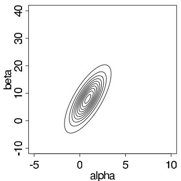
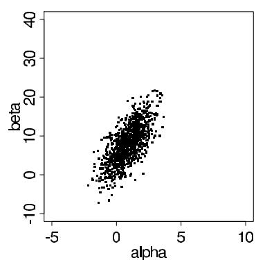
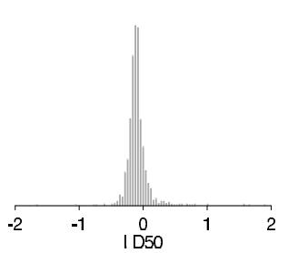
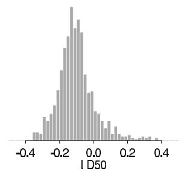

# Asymptotics and Connections to Non-Bayesian Approaches

[Package map](../structure.md) · [Unsplit OCR dump](./_full.md)

[← Ch. 3 Multiparameter Models](./03-multiparameter-models.md) · [Ch. 5 Hierarchical Models →](./05-hierarchical-models.md)

> MinerU OCR dump. If a formula, table, or numbering disagrees with the PDF, the PDF is authoritative.

---

# Chapter 4

# Asymptotics and connections to non-Bayesian approaches

We have seen that many simple Bayesian analyses based on noninformative prior distributions give similar results to standard non-Bayesian approaches (for example, the posterior $t$ interval for the normal mean with unknown variance). The extent to which a noninformative prior distribution can be justified as an objective assumption depends on the amount of information available in the data: in the simple cases discussed in Chapters 2 and 3, it was clear that as the sample size $n$ increases, the influence of the prior distribution on posterior inferences decreases. These ideas, sometimes referred to as asymptotic theory, because they refer to properties that hold in the limit as $n$ becomes large, will be reviewed in the present chapter, along with some more explicit discussion of the connections between Bayesian and non-Bayesian methods. The large-sample results are not actually necessary for performing Bayesian data analysis but are often useful as approximations and as tools for understanding.

We begin this chapter with a discussion of the various uses of the normal approximation to the posterior distribution. Theorems about consistency and normality of the posterior distribution in large samples are outlined in Section 4.2, followed by several counterexamples in Section 4.3; proofs of the theorems are sketched in Appendix B. Finally, we discuss how the methods of frequentist statistics can be used to evaluate the properties of Bayesian inferences.

# 4.1 Normal approximations to the posterior distribution

Normal approximation to the joint posterior distribution

If the posterior distribution $p(\theta | y)$ is unimodal and roughly symmetric, it can be convenient to approximate it by a normal distribution; that is, the logarithm of the posterior density is approximated by a quadratic function of $\theta$ .

Here we consider a quadratic approximation to the log-posterior density that is centered at the posterior mode (which in general is easy to compute using off-the-shelf optimization routines); in Chapter 13 we discuss more elaborate approximations which can be effective in settings where simple mode-based approximations fail.

A Taylor series expansion of $\log p(\theta |y)$ centered at the posterior mode, $\hat{\theta}$ (where $\theta$ can be a vector and $\hat{\theta}$ is assumed to be in the interior of the parameter space), gives

$$
\log p (\theta | y) = \log p (\hat {\theta} | y) + \frac {1}{2} (\theta - \hat {\theta}) ^ {T} \left[ \frac {d ^ {2}}{d \theta^ {2}} \log p (\theta | y) \right] _ {\theta = \hat {\theta}} (\theta - \hat {\theta}) + \dots , \tag {4.1}
$$

where the linear term in the expansion is zero because the log-posterior density has zero derivative at its mode. As we discuss in Section 4.2, the remainder terms of higher order fade in importance relative to the quadratic term when $\theta$ is close to $\hat{\theta}$ and $n$ is large. Considering

(4.1) as a function of $\theta$ , the first term is a constant, whereas the second term is proportional to the logarithm of a normal density, yielding the approximation,

$$
p (\theta | y) \approx \mathrm {N} (\hat {\theta}, [ I (\hat {\theta}) ] ^ {- 1}), \tag {4.2}
$$

where $I(\theta)$ is the observed information,

$$
I (\theta) = - \frac {d ^ {2}}{d \theta^ {2}} \log p (\theta | y).
$$

If the mode, $\hat{\theta}$ , is in the interior of parameter space, then the matrix $I(\hat{\theta})$ is positive definite.

# Example. Normal distribution with unknown mean and variance

We illustrate the approximate normal distribution with a simple theoretical example. Let $y_{1},\ldots ,y_{n}$ be independent observations from a $\mathrm{N}(\mu ,\sigma^2)$ distribution, and, for simplicity, we assume a uniform prior density for $(\mu ,\log \sigma)$ . We set up a normal approximation to the posterior distribution of $(\mu ,\log \sigma)$ , which has the virtue of restricting $\sigma$ to positive values. To construct the approximation, we need the second derivatives of the log posterior density,

$$
\log p (\mu , \log \sigma | y) = \mathrm {c o n s t a n t} - n \log \sigma - \frac {1}{2 \sigma^ {2}} ((n - 1) s ^ {2} + n (\overline {{y}} - \mu) ^ {2}).
$$

The first derivatives are

$$
\frac {d}{d \mu} \log p (\mu , \log \sigma | y) = \frac {n (\overline {{y}} - \mu)}{\sigma^ {2}},
$$

$$
\frac {d}{d (\log \sigma)} \log p (\mu , \log \sigma | y) = - n + \frac {(n - 1) s ^ {2} + n (\bar {y} - \mu) ^ {2}}{\sigma^ {2}},
$$

from which the posterior mode is readily obtained as

$$
(\hat {\mu}, \log \hat {\sigma}) = \left(\bar {y}, \log \left(\sqrt {\frac {n - 1}{n}} s\right)\right).
$$

The second derivatives of the log posterior density are

$$
\frac {d ^ {2}}{d \mu^ {2}} \log p (\mu , \log \sigma | y) = - \frac {n}{\sigma^ {2}}
$$

$$
\frac {d ^ {2}}{d \mu d (\log \sigma)} \log p (\mu , \log \sigma | y) = - 2 n \frac {\bar {y} - \mu}{\sigma^ {2}}
$$

$$
\frac {d ^ {2}}{d (\log \sigma) ^ {2}} \log p (\mu , \log \sigma | y) = - \frac {2}{\sigma^ {2}} ((n - 1) s ^ {2} + n (\bar {y} - \mu) ^ {2}).
$$

The matrix of second derivatives at the mode is then $\left( \begin{array}{cc} - n / \hat{\sigma}^2 & 0\\ 0 & -2n \end{array} \right)$ . From (4.2), the posterior distribution can be approximated as

$$
p (\mu , \log \sigma | y) \approx \mathrm {N} \left(\left( \begin{array}{c} \mu \\ \log \sigma \end{array} \right) \Big | \left( \begin{array}{c} \overline {{y}} \\ \log \hat {\sigma} \end{array} \right), \left( \begin{array}{c c} \hat {\sigma} ^ {2} / n & 0 \\ 0 & 1 / (2 n) \end{array} \right)\right).
$$

If we had instead constructed the normal approximation in terms of $p(\mu, \sigma^2)$ , the second derivative matrix would be multiplied by the Jacobian of the transformation from $\log \sigma$ to $\sigma^2$ and the mode would change slightly, to $\tilde{\sigma}^2 = \frac{n}{n + 2}\tilde{\sigma}^2$ . The two components, $(\mu, \sigma^2)$ , would still be independent in their approximate posterior distribution, and $p(\sigma^2 | y) \approx \mathrm{N}(\sigma^2 |\tilde{\sigma}^2, 2\tilde{\sigma}^4 / (n + 2))$ .

Interpretation of the posterior density function relative to its maximum

In addition to its direct use as an approximation, the multivariate normal distribution provides a benchmark for interpreting the posterior density function and contour plots. In the $d$ -dimensional normal distribution, the logarithm of the density function is a constant plus a $\chi_d^2$ distribution divided by $-2$ . For example, the 95th percentile of the $\chi_{10}^{2}$ density is 18.31, so if a problem has $d = 10$ parameters, then approximately $95\%$ of the posterior probability mass is associated with the values of $\theta$ for which $p(\theta |y)$ is no less than $\exp (-18.31 / 2) = 1.1\times 10^{-4}$ times the density at the mode. Similarly, with $d = 2$ parameters, approximately $95\%$ of the posterior mass corresponds to densities above $\exp (-5.99 / 2) = 0.05$ , relative to the density at the mode. In a two-dimensional contour plot of a posterior density (for example, Figure 3.3a), the 0.05 contour line thus includes approximately $95\%$ of the probability mass.

# Summarizing posterior distributions by point estimates and standard errors

The asymptotic theory outlined in Section 4.2 shows that if $n$ is large enough, a posterior distribution can be approximated by a normal distribution. In many areas of application, a standard inferential summary is the $95\%$ interval obtained by computing a point estimate, $\hat{\theta}$ , such as the maximum likelihood estimate (which is the posterior mode under a uniform prior density), plus or minus two standard errors, with the standard error estimated from the information at the estimate, $I(\hat{\theta})$ . A different asymptotic argument justifies the non-Bayesian, frequentist interpretation of this summary, but in many simple situations both interpretations hold. It is difficult to give general guidelines on when the normal approximation is likely to be adequate in practice. From the Bayesian point of view, the accuracy in any given example can be directly determined by inspecting the posterior distribution.

In many cases, convergence to normality of the posterior distribution for a parameter $\theta$ can be dramatically improved by transformation. If $\phi$ is a continuous transformation of $\theta$ , then both $p(\phi | y)$ and $p(\theta | y)$ approach normal distributions, but the closeness of the approximation for finite $n$ can vary substantially with the transformation chosen.

# Data reduction and summary statistics

Under the normal approximation, the posterior distribution is summarized by its mode, $\hat{\theta}$ , and the curvature of the posterior density, $I(\hat{\theta})$ ; that is, asymptotically, these are sufficient statistics. In the examples at the end of the next chapter, we shall see that it can be convenient to summarize 'local-level' or 'individual-level' data from a number of sources by their normal-theory sufficient statistics. This approach using summary statistics allows the relatively easy application of hierarchical modeling techniques to improve each individual estimate. For example, in Section 5.5, each of a set of eight experiments is summarized by a point estimate and a standard error estimated from an earlier linear regression analysis. Using summary statistics is clearly most reasonable when posterior distributions are close to normal; the approach can otherwise discard important information and lead to erroneous inferences.

# Lower-dimensional normal approximations

For a finite sample size $n$ , the normal approximation is typically more accurate for conditional and marginal distributions of components of $\theta$ than for the full joint distribution. For example, if a joint distribution is multivariate normal, all its margins are normal, but the converse is not true. Determining the marginal distribution of a component of $\theta$ is equivalent to averaging over all the other components of $\theta$ , and averaging a family of distributions

  
Figure 4.1 (a) Contour plot of the normal approximation to the posterior distribution of the parameters in the bioassay example. Contour lines are at 0.05, 0.15, ..., 0.95 times the density at the mode. Compare to Figure 3.3a. (b) Scatterplot of 1000 draws from the normal approximation to the posterior distribution. Compare to Figure 3.3b.

generally brings them closer to normality, by the same logic that underlies the central limit theorem.

The normal approximation for the posterior distribution of a low-dimensional $\theta$ is often perfectly acceptable, especially after appropriate transformation. If $\theta$ is high-dimensional, two situations commonly arise. First, the marginal distributions of many individual components of $\theta$ can be approximately normal; inference about any one of these parameters, taken individually, can then be well summarized by a point estimate and a standard error. Second, it is possible that $\theta$ can be partitioned into two subvectors, $\theta = (\theta_{1},\theta_{2})$ , for which $p(\theta_2|y)$ is not necessarily close to normal, but $p(\theta_1|\theta_2,y)$ is, perhaps with mean and variance that are functions of $\theta_{2}$ . The approach of approximation using conditional distributions is often useful, and we consider it more systematically in Section 13.5. Lower-dimensional approximations are increasingly popular, for example in computation for latent Gaussian models.

Finally, approximations based on the normal distribution are often useful for debugging a computer program or checking a more elaborate method for approximating the posterior distribution.

# Example. Bioassay experiment (continued)

We illustrate the normal approximation for the model and data from the bioassay experiment of Section 3.7. The sample size in this experiment is relatively small, only twenty animals in all, and we find that the normal approximation is close to the exact posterior distribution but with important differences.

The normal approximation to the joint posterior distribution of $(\alpha, \beta)$ . To begin, we compute the mode of the posterior distribution (using a logistic regression program) and the normal approximation (4.2) evaluated at the mode. The posterior mode of $(\alpha, \beta)$ is the same as the maximum likelihood estimate because we have assumed a uniform prior density for $(\alpha, \beta)$ . Figure 4.1 shows a contour plot of the bivariate normal approximation and a scatterplot of 1000 draws from this approximate distribution. The plots resemble the plots of the actual posterior distribution in Figure 3.3 but without the skewness in the upper right corner of the earlier plots. The effect of the skewness is apparent when comparing the mean of the normal approximation, $(\alpha, \beta) = (0.8, 7.7)$ , to the mean of the actual posterior distribution, $(\alpha, \beta) = (1.4, 11.9)$ , computed from the simulations displayed in Figure 3.3b.

  
Figure 4.2 (a) Histogram of the simulations of $LD50$ , conditional on $\beta > 0$ , in the bioassay example based on the normal approximation $p(\alpha, \beta | y)$ . The wide tails of the histogram correspond to values of $\beta$ close to 0. Omitted from this histogram are five simulation draws with values of $LD50$ less than -2 and four draws with values greater than 2; the extreme tails are truncated to make the histogram visible. The values of $LD50$ for the 950 simulation draws corresponding to $\beta > 0$ had a range of [-12.4, 5.4]. Compare to Figure 3.4. (b) Histogram of the central $95\%$ of the distribution.

The posterior distribution for the LD50 using the normal approximation on $(\alpha, \beta)$ . Flaws of the normal approximation. The same set of 1000 draws from the normal approximation can be used to estimate the probability that $\beta$ is positive and the posterior distribution of the LD50, conditional on $\beta$ being positive. Out of the 1000 simulation draws, 950 had positive values of $\beta$ , yielding the estimate $\operatorname{Pr}(\beta > 0) = 0.95$ , a different result than from the exact distribution, where $\operatorname{Pr}(\beta > 0) > 0.999$ . Continuing with the analysis based on the normal approximation, we compute the LD50 as $-\alpha / \beta$ for each of the 950 draws with $\beta > 0$ ; Figure 4.2a presents a histogram of the LD50 values, excluding some extreme values in both tails. (If the entire range of the simulations were included, the shape of the distribution would be nearly impossible to see.) To get a better picture of the center of the distribution, we display in Figure 4.2b a histogram of the middle $95\%$ of the 950 simulation draws of the LD50. The histograms are centered in approximately the same place as Figure 3.4 but with substantially more variation, due to the possibility that $\beta$ is close to zero.

In summary, posterior inferences based on the normal approximation here are roughly similar to the exact results, but because of the small sample, the actual joint posterior distribution is substantially more skewed than the large-sample approximation, and the posterior distribution of the LD50 actually has much shorter tails than implied by using the joint normal approximation. Whether or not these differences imply that the normal approximation is inadequate for practical use in this example depends on the ultimate aim of the analysis.

# 4.2 Large-sample theory

To understand why the normal approximation is often reasonable, we review some theory of how the posterior distribution behaves as the amount of data, from some fixed sampling distribution, increases.

# Notation and mathematical setup

The basic tool of large sample Bayesian inference is asymptotic normality of the posterior distribution: as more and more data arrive from the same underlying process, the posterior distribution of the parameter vector approaches multivariate normality, even if the true distribution of the data is not within the parametric family under consideration. Mathematically, the results apply most directly to observations $y_{1},\ldots ,y_{n}$ that are independent

outcomes sampled from a common distribution, $f(y)$ . In many situations, the notion of a 'true' underlying distribution, $f(y)$ , for the data is difficult to interpret, but it is necessary in order to develop the asymptotic theory. Suppose the data are modeled by a parametric family, $p(y|\theta)$ , with a prior distribution $p(\theta)$ . In general, the data points $y_{i}$ and the parameter $\theta$ can be vectors. If the true data distribution is included in the parametric family—that is, if $f(y) = p(y|\theta_0)$ for some $\theta_0$ —then, in addition to asymptotic normality, the property of consistency holds: the posterior distribution converges to a point mass at the true parameter value, $\theta_0$ , as $n\to \infty$ . When the true distribution is not included in the parametric family, there is no longer a true value $\theta_0$ , but its role in the theoretical result is replaced by a value $\theta_0$ that makes the model distribution, $p(y|\theta)$ , closest to the true distribution, $f(y)$ , in a technical sense involving Kullback-Leibler divergence, as is explained in Appendix B.

In discussing the large-sample properties of posterior distributions, the concept of Fisher information, $J(\theta)$ , introduced as (2.20) in Section 2.8 in the context of Jeffreys' prior distributions, plays an important role.

# Asymptotic normality and consistency

The fundamental mathematical result given in Appendix B shows that, under some regularity conditions (notably that the likelihood is a continuous function of $\theta$ and that $\theta_0$ is not on the boundary of the parameter space), as $n\to \infty$ , the posterior distribution of $\theta$ approaches normality with mean $\theta_0$ and variance $(nJ(\theta_0))^{-1}$ . At its simplest level, this result can be understood in terms of the Taylor series expansion (4.1) of the log posterior density centered about the posterior mode. A preliminary result shows that the posterior mode is consistent for $\theta_0$ , so that as $n\to \infty$ , the mass of the posterior distribution $p(\theta |y)$ becomes concentrated in smaller and smaller neighborhoods of $\theta_0$ , and the distance $|\hat{\theta} -\theta_0|$ approaches zero.

Furthermore, we can rewrite the coefficient of the quadratic term in (4.1):

$$
\left[ \frac {d ^ {2}}{d \theta^ {2}} \log p (\theta | y) \right] _ {\theta = \hat {\theta}} = \left[ \frac {d ^ {2}}{d \theta^ {2}} \log p (\theta) \right] _ {\theta = \hat {\theta}} + \sum_ {i = 1} ^ {n} \left[ \frac {d ^ {2}}{d \theta^ {2}} \log p (y _ {i} | \theta) \right] _ {\theta = \hat {\theta}}.
$$

Considered as a function of $\theta$ , this coefficient is a constant plus the sum of $n$ terms, each of whose expected value under the true sampling distribution of $y_{i}$ , $p(y|\theta_0)$ , is approximately $-J(\theta_0)$ , as long as $\hat{\theta}$ is close to $\theta_0$ (we are assuming now that $f(y) = p(y|\theta_0)$ for some $\theta_0$ ). Therefore, for large $n$ , the curvature of the log posterior density can be approximated by the Fisher information, evaluated at either $\hat{\theta}$ or $\theta_0$ (where only the former is available in practice).

In summary, in the limit of large $n$ , in the context of a specified family of models, the posterior mode, $\hat{\theta}$ , approaches $\theta_0$ , and the curvature (the observed information or the negative of the coefficient of the second term in the Taylor expansion) approaches $nJ(\hat{\theta})$ or $nJ(\theta_0)$ . In addition, as $n \to \infty$ , the likelihood dominates the prior distribution, so we can just use the likelihood alone to obtain the mode and curvature for the normal approximation. More precise statements of the theorems and outlines of proofs appear in Appendix B.

# Likelihood dominating the prior distribution

The asymptotic results formalize the notion that the importance of the prior distribution diminishes as the sample size increases. One consequence of this result is that in problems with large sample sizes we need not work especially hard to formulate a prior distribution that accurately reflects all available information. When sample sizes are small, the prior distribution is a critical part of the model specification.

# 4.3 Counterexamples to the theorems

A good way to understand the limitations of the large-sample results is to consider cases in which the theorems fail. The normal distribution is usually helpful as a starting approximation, but one must examine deviations, especially with unusual parameter spaces and in the extremes of the distribution. The counterexamples to the asymptotic theorems generally correspond to situations in which the prior distribution has an impact on the posterior inference, even in the limit of infinite sample sizes.

Underidentified models and nonidentified parameters. The model is underidentified given data $y$ if the likelihood, $p(\theta | y)$ , is equal for a range of values of $\theta$ . This may also be called a flat likelihood (although that term is sometimes also used for likelihoods for parameters that are only weakly identified by the data—so the likelihood function is not strictly equal for a range of values, only almost so). Under such a model, there is no single point $\theta_0$ to which the posterior distribution can converge.

For example, consider the model,

$$
\left( \begin{array}{c} u \\ v \end{array} \right) \sim \mathrm {N} \left(\left( \begin{array}{c} 0 \\ 0 \end{array} \right), \left( \begin{array}{c c} 1 & \rho \\ \rho & 1 \end{array} \right)\right),
$$

in which only one of $u$ or $v$ is observed from each pair $(u, v)$ . Here, the parameter $\rho$ is nonidentified. The data supply no information about $\rho$ , so the posterior distribution of $\rho$ is the same as its prior distribution, no matter how large the dataset is.

The only solution to a problem of nonidentified or underidentified parameters is to recognize that the problem exists and, if there is a desire to estimate these parameters more precisely, gather further information that can enable the parameters to be estimated (either from future data collection or from external information that can inform a prior distribution).

Number of parameters increasing with sample size. In complicated problems, there can be large numbers of parameters, and then we need to distinguish between different types of asymptotics. If, as $n$ increases, the model changes so that the number of parameters increases as well, then the simple results outlined in Sections 4.1 and 4.2, which assume a fixed model class $p(y_i|\theta)$ , do not apply. For example, sometimes a parameter is assigned for each sampling unit in a study; for example, $y_i \sim \mathrm{N}(\theta_i, \sigma^2)$ . The parameters $\theta_i$ generally cannot be estimated consistently unless the amount of data collected from each sampling unit increases along with the number of units. In nonparametric models such as Gaussian processes (see Chapter 21) there can be a new latent parameter corresponding to each data point.

As with underidentified parameters, the posterior distribution for $\theta_{i}$ will not converge to a point mass if new data do not bring enough information about $\theta_{i}$ . Here, the posterior distribution will not in general converge to a point in the expanding parameter space (reflecting the increasing dimensionality of $\theta$ ), and its projection into any fixed space—for example, the marginal posterior distribution of any particular $\theta_{i}$ —will not necessarily converge to a point either.

Aaliasing. Aliasing is a special case of underidentified parameters in which the same likelihood function repeats at a discrete set of points. For example, consider the following normal mixture model with independent and identically distributed data $y_{1},\ldots ,y_{n}$ and parameter vector $\theta = (\mu_1,\mu_2,\sigma_1^2,\sigma_2^2,\lambda)$ :

$$
p (y _ {i} | \mu_ {1}, \mu_ {2}, \sigma_ {1} ^ {2}, \sigma_ {2} ^ {2}, \lambda) = \lambda \frac {1}{\sqrt {2 \pi} \sigma_ {1}} e ^ {- \frac {1}{2 \sigma_ {1} ^ {2}} (y _ {i} - \mu_ {1}) ^ {2}} + (1 - \lambda) \frac {1}{\sqrt {2 \pi} \sigma_ {2}} e ^ {- \frac {1}{2 \sigma_ {2} ^ {2}} (y _ {i} - \mu_ {2}) ^ {2}}.
$$

If we interchange each of $(\mu_1, \mu_2)$ and $(\sigma_1^2, \sigma_2^2)$ , and replace $\lambda$ by $(1 - \lambda)$ , the likelihood of the data remains the same. The posterior distribution of this model generally has at least

two modes and consists of a $(50\%, 50\%)$ mixture of two distributions that are mirror images of each other; it does not converge to a single point no matter how large the dataset is.

In general, the problem of aliasing is eliminated by restricting the parameter space so that no duplication appears; in the above example, the aliasing can be removed by restricting $\mu_{1}$ to be less than or equal to $\mu_{2}$ .

Unbounded likelihoods. If the likelihood function is unbounded, then there might be no posterior mode within the parameter space, invalidating both the consistency results and the normal approximation. For example, consider the previous normal mixture model; for simplicity, assume that $\lambda$ is known (and not equal to 0 or 1). If we set $\mu_{1} = y_{i}$ for any arbitrary $y_{i}$ , and let $\sigma_1^2\rightarrow 0$ , then the likelihood approaches infinity. As $n\to \infty$ , the number of modes of the likelihood increases. If the prior distribution is uniform on $\sigma_1^2$ and $\sigma_2^2$ in the region near zero, there will be likewise an increasing number of posterior modes, with no corresponding normal approximations. A prior distribution proportional to $\sigma_1^{-2}\sigma_2^{-2}$ just makes things worse because this puts more probability near zero, causing the posterior distribution to explode even faster at zero.

In general, this problem should arise rarely in practice, because the poles of an unbounded likelihood correspond to unrealistic conditions in a model. The problem can be solved by restricting to a plausible set of distributions. When the problem occurs for variance components near zero, it can be resolved in various ways, such as using a prior distribution that declines to zero at the boundary or by assigning an informative prior distribution to the ratio of the variance parameters.

Improper posterior distributions. If the unnormalized posterior density, obtained by multiplying the likelihood by a 'formal' prior density representing an improper prior distribution, integrates to infinity, then the asymptotic results, which rely on probabilities summing to 1, do not follow. An improper posterior distribution cannot occur except with an improper prior distribution.

A simple example arises from combining a $\mathrm{Beta}(0,0)$ prior distribution for a binomial proportion with data consisting of $n$ successes and 0 failures. More subtle examples, with hierarchical binomial and normal models, are discussed in Sections 5.3 and 5.4.

The solution to this problem is clear. An improper prior distribution is only a convenient approximation, and if it does not give rise to a proper posterior distribution then the sought convenience is lost. In this case a proper prior distribution is needed, or at least an improper prior density that when combined with the likelihood has a finite integral.

Prior distributions that exclude the point of convergence. If $p(\theta_0) = 0$ for a discrete parameter space, or if $p(\theta) = 0$ in a neighborhood about $\theta_0$ for a continuous parameter space, then the convergence results, which are based on the likelihood dominating the prior distribution, do not hold. The solution is to give positive probability density in the prior distribution to all values of $\theta$ that are even remotely plausible.

Convergence to the edge of parameter space. If $\theta_0$ is on the boundary of the parameter space, then the Taylor series expansion must be truncated in some directions, and the normal distribution will not necessarily be appropriate, even in the limit.

For example, consider the model, $y_{i} \sim \mathrm{N}(\theta, 1)$ , with the restriction $\theta \geq 0$ . Suppose that the model is accurate, with $\theta = 0$ as the true value. The posterior distribution for $\theta$ is normal, centered at $\overline{y}$ , truncated to be positive. The shape of the posterior distribution for $\theta$ , in the limit as $n \to \infty$ , is half of a normal distribution, centered about 0, truncated to be positive.

For another example, consider the same assumed model, but now suppose that the true $\theta$ is $-1$ , a value outside the assumed parameter space. The limiting posterior distribution for $\theta$ has a sharp spike at 0 with no resemblance to a normal distribution at all. The solution in practice is to recognize the difficulties of applying the normal approximation if

one is interested in parameter values near the edge of parameter space. More important, one should give positive prior probability density to all values of $\theta$ that are even remotely possible, or in the neighborhood of remotely possible values.

Tails of the distribution. The normal approximation can hold for essentially all the mass of the posterior distribution but still not be accurate in the tails. For example, suppose $p(\theta |y)$ is proportional to $e^{-c|\theta|}$ as $|\theta| \to \infty$ , for some constant $c$ ; by comparison, the normal density is proportional to $e^{-c\theta^2}$ . The distribution function still converges to normality, but for any finite sample size $n$ the approximation fails far out in the tail. As another example, consider any parameter that is constrained to be positive. For any finite sample size, the normal approximation will admit the possibility of the parameter being negative, because the approximation is simply not appropriate at that point in the tail of the distribution, but that point becomes farther and farther in the tail as $n$ increases.

# 4.4 Frequency evaluations of Bayesian inferences

Just as the Bayesian paradigm can be seen to justify simple 'classical' techniques, the methods of frequentist statistics provide a useful approach for evaluating the properties of Bayesian inferences—their operating characteristics—when these are regarded as embedded in a sequence of repeated samples. We have already used this notion in discussing the ideas of consistency and asymptotic normality. The notion of stable estimation, which says that for a fixed model, the posterior distribution approaches a point as more data arrive—leading, in the limit, to inferential certainty—is based on the idea of repeated sampling. It is certainly appealing that if the hypothesized family of probability models contains the true distribution (and assigns it a nonzero prior density), then as more information about $\theta$ arrives, the posterior distribution converges to the true value of $\theta$ .

# Large-sample correspondence

Suppose that the normal approximation (4.2) for the posterior distribution of $\theta$ holds; then we can transform to the standard multivariate normal:

$$
[ I (\hat {\theta}) ] ^ {1 / 2} (\theta - \hat {\theta}) \mid y \sim \mathrm {N} (0, I), \tag {4.3}
$$

where $\hat{\theta}$ is the posterior mode and $[I(\hat{\theta})]^{1/2}$ is any matrix square root of $I(\hat{\theta})$ . In addition, $\hat{\theta} \to \theta_0$ , and so we could just as well write the approximation in terms of $I(\theta_0)$ . If the true data distribution is included in the class of models, so that $f(y) \equiv p(y|\theta)$ for some $\theta$ , then in repeated sampling with fixed $\theta$ , in the limit $n \to \infty$ , it can be proved that

$$
[ I (\hat {\theta}) ] ^ {1 / 2} (\theta - \hat {\theta}) \mid \theta \sim \mathrm {N} (0, I), \tag {4.4}
$$

a result from classical statistical theory that is generally proved for $\hat{\theta}$ equal to the maximum likelihood estimate but is easily extended to the case with $\hat{\theta}$ equal to the posterior mode. These results mean that, for any function of $(\theta - \hat{\theta})$ , the posterior distribution derived from (4.3) is asymptotically the same as the repeated sampling distribution derived from (4.4). Thus, for example, a $95\%$ central posterior interval for $\theta$ will cover the true value $95\%$ of the time under repeated sampling with any fixed true $\theta$ .

# Point estimation, consistency, and efficiency

In the Bayesian framework, obtaining an 'estimate' of $\theta$ makes most sense in large samples when the posterior mode, $\hat{\theta}$ , is the obvious center of the posterior distribution of $\theta$ and the uncertainty conveyed by $nI(\hat{\theta})$ is so small as to be practically unimportant. More generally,

however, in smaller samples, it is inappropriate to summarize inference about $\theta$ by one value, especially when the posterior distribution of $\theta$ is more variable or even asymmetric. Formally, by incorporating loss functions in a decision-theoretic context (see Section 9.1 and Exercise 9.6), one can define optimal point estimates; for the purposes of Bayesian data analysis, however, we believe that representation of the full posterior distribution (as, for example, with $50\%$ and $95\%$ central posterior intervals) is more useful. In many problems, especially with large samples, a point estimate and its estimated standard error are adequate to summarize a posterior inference, but we interpret the estimate as an inferential summary, not as the solution to a decision problem. In any case, the large-sample frequency properties of any estimate can be evaluated, without consideration of whether the estimate was derived from a Bayesian analysis.

A point estimate is said to be consistent in the sampling theory sense if, as samples get larger, it converges to the true value of the parameter that it is asserted to estimate. Thus, if $f(y) \equiv p(y|\theta_0)$ , then a point estimate $\hat{\theta}$ of $\theta$ is consistent if its sampling distribution converges to a point mass at $\theta_0$ as the data sample size $n$ increases (that is, considering $\hat{\theta}$ as a function of $y$ , which is a random variable conditional on $\theta_0$ ). A closely related concept is asymptotic unbiasedness, where $(\mathrm{E}(\hat{\theta} |\theta_0) - \theta_0) / \mathrm{sd}(\hat{\theta} |\theta_0)$ converges to 0 (once again, considering $\hat{\theta}(y)$ as a random variable whose distribution is determined by $p(y|\theta_0)$ ). When the truth is included in the family of models being fitted, the posterior mode $\hat{\theta}$ , and also the posterior mean and median, are consistent and asymptotically unbiased under mild regularity conditions.

A point estimate $\hat{\theta}$ is said to be efficient if there exists no other function of $y$ that estimates $\theta$ with lower mean squared error, that is, if the expression $\mathrm{E}((\hat{\theta} - \theta_0)^2 | \theta_0)$ is at its optimal, lowest value. More generally, the efficiency of $\hat{\theta}$ is the optimal mean squared error divided by the mean squared error of $\hat{\theta}$ . An estimate is asymptotically efficient if its efficiency approaches 1 as the sample size $n \to \infty$ . Under mild regularity conditions, the center of the posterior distribution (defined, for example, by the posterior mean, median, or mode) is asymptotically efficient.

# Confidence coverage

If a region $C(y)$ includes $\theta_0$ at least $100(1 - \alpha)\%$ of the time (given any value of $\theta_0$ ) in repeated samples, then $C(y)$ is called a $100(1 - \alpha)\%$ confidence region for the parameter $\theta$ . The word 'confidence' is carefully chosen to distinguish such intervals from probability intervals and to convey the following behavioral meaning: if one chooses $\alpha$ to be small enough (for example, 0.05 or 0.01), then since confidence regions cover the truth in at least $(1 - \alpha)$ of their applications, one should be confident in each application that the truth is within the region and therefore act as if it is. We saw previously that asymptotically a $100(1 - \alpha)\%$ central posterior interval for $\theta$ has the property that, in repeated samples of $y$ , $100(1 - \alpha)\%$ of the intervals include the value $\theta_0$ .

# 4.5 Bayesian interpretations of other statistical methods

We consider three levels at which Bayesian statistical methods can be compared with other methods. First, as we have already indicated, Bayesian methods are often similar to other statistical approaches in problems involving large samples from a fixed probability model. Second, even for small samples, many statistical methods can be considered as approximations to Bayesian inferences based on particular prior distributions; as a way of understanding a statistical procedure, it is often useful to determine the implicit underlying prior distribution. Third, some methods from classical statistics (notably hypothesis testing) can give results that differ greatly from those given by Bayesian methods. In this section,

we briefly consider several statistical concepts—point and interval estimation, likelihood inference, unbiased estimation, frequency coverage of confidence intervals, hypothesis testing, multiple comparisons, nonparametric methods, and the jackknife and bootstrap—and discuss their relation to Bayesian methods.

One way to develop possible models is to examine the interpretation of crude data-analytic procedures as approximations to Bayesian inference under specific models. For example, a widely used technique in sample surveys is ratio estimation, in which, for example, given data from a simple random sample, one estimates $R = \overline{y} / \overline{x}$ by $\overline{y}_{\mathrm{obs}} / \overline{x}_{\mathrm{obs}}$ , in the notation of Chapter 8. It can be shown that this estimate corresponds to a summary of a Bayesian posterior inference given independent observations $y_{i}|x_{i} \sim \mathrm{N}(Rx_{i}, \sigma^{2}x_{i})$ and a noninformative prior distribution. Ratio estimates can be useful in a wide variety of cases in which this model does not hold, but when the data deviate greatly from this model, the ratio estimate generally is not appropriate.

For another example, standard methods of selecting regression predictors, based on 'statistical significance,' correspond roughly to Bayesian analyses under exchangeable prior distributions on the coefficients in which the prior distribution of each coefficient is a mixture of a peak at zero and a widely spread distribution, as we discuss further in Section 14.6. We believe that understanding this correspondence suggests when such models can be usefully applied and how they can be improved. Often, in fact, such procedures can be improved by including additional information, for example, in problems involving large numbers of predictors, by clustering regression coefficients that are likely to be similar into batches.

# Maximum likelihood and other point estimates

From the perspective of Bayesian data analysis, we can often interpret classical point estimates as exact or approximate posterior summaries based on some implicit full probability model. In the limit of large sample size, in fact, we can use asymptotic theory to construct a theoretical Bayesian justification for classical maximum likelihood inference. In the limit (assuming regularity conditions), the maximum likelihood estimate, $\hat{\theta}$ , is a sufficient statistic—and so is the posterior mode, mean, or median. That is, for large enough $n$ , the maximum likelihood estimate (or any of the other summaries) supplies essentially all the information about $\theta$ available from the data. The asymptotic irrelevance of the prior distribution can be taken to justify the use of convenient noninformative prior models.

In repeated sampling with $\theta = \theta_0$

$$
p (\hat {\theta} (y) | \theta = \theta_ {0}) \approx \mathrm {N} (\hat {\theta} (y) | \theta_ {0}, (n J (\theta_ {0})) ^ {- 1});
$$

that is, the sampling distribution of $\hat{\theta}(y)$ is approximately normal with mean $\theta_0$ and precision $nJ(\theta_0)$ , where for clarity we emphasize that $\hat{\theta}$ is a function of $y$ . Assuming that the prior distribution is locally uniform (or continuous and nonzero) near the true $\theta$ , the simple analysis of the normal mean (Section 3.5) shows that the posterior Bayesian inference is

$$
p (\theta | \hat {\theta}) \approx \mathrm {N} (\theta | \hat {\theta}, (n J (\hat {\theta})) ^ {- 1}).
$$

This result appears directly from the asymptotic normality theorem, but deriving it indirectly through Bayesian inference given $\hat{\theta}$ gives insight into a Bayesian rationale for classical asymptotic inference based on point estimates and standard errors.

For finite $n$ , the above approach is inefficient or wasteful of information to the extent that $\hat{\theta}$ is not a sufficient statistic. When the number of parameters is large, the consistency result is often not helpful, and noninformative prior distributions are hard to justify. As discussed in Chapter 5, hierarchical models are preferable when dealing with a large number of parameters since then their common distribution can be estimated from data. In addition, any method of inference based on the likelihood alone can be improved if real prior

information is available that is strong enough to contribute substantially to that contained in the likelihood function.

# Unbiased estimates

Some non-Bayesian statistical methods place great emphasis on unbiasedness as a desirable principle of estimation, and it is intuitively appealing that, over repeated sampling, the mean (or perhaps the median) of a parameter estimate should be equal to its true value. Formally, an estimate $\theta y$ is called unbiased if $\operatorname{E}(\hat{\theta}(y)|\theta) = \theta$ for any value of $\theta$ , where this expectation is taken over the data distribution, $p(y|\theta)$ . From a Bayesian perspective, the principle of unbiasedness is reasonable in the limit of large samples (see page 92) but otherwise is potentially misleading. The major difficulties arise when there are many parameters to be estimated and our knowledge or partial knowledge of some of these parameters is clearly relevant to the estimation of others. Requiring unbiased estimates will often lead to relevant information being ignored (as we discuss with hierarchical models in Chapter 5). In sampling theory terms, minimizing bias will often lead to counterproductive increases in variance.

One general problem with unbiasedness (and point estimation in general) is that it is often not possible to estimate several parameters at once in an even approximately unbiased manner. For example, unbiased estimates of $\theta_{1},\ldots ,\theta_{J}$ yield an upwardly biased estimate of the variance of the $\theta_{j}$ 's (except in the trivial case in which the $\theta_{j}$ 's are known exactly).

Another problem with the principle of unbiasedness arises when treating a future observable value as a parameter in prediction problems.

# Example. Prediction using regression

Consider the problem of estimating $\theta$ , the height of an adult daughter, given $y$ , her mother's height. For simplicity, assume that the heights of mothers and daughters are jointly normally distributed, with known equal means of 160 centimeters, equal variances, and a known correlation of 0.5. Conditioning on the known value of $y$ (in other words, using Bayesian inference), the posterior mean of $\theta$ is

$$
\mathrm {E} (\theta | y) = 1 6 0 + 0. 5 (y - 1 6 0). \tag {4.5}
$$

The posterior mean is not, however, an unbiased estimate of $\theta$ , in the sense of repeated sampling of $y$ given a fixed $\theta$ . Given the daughter's height, $\theta$ , the mother's height, $y$ , has mean $\operatorname{E}(y|\theta) = 160 + 0.5(\theta - 160)$ . Thus, under repeated sampling of $y$ given fixed $\theta$ , the posterior mean (4.5) has expectation $160 + 0.25(\theta - 160)$ and is biased towards the grand mean of 160. In contrast, the estimate

$$
\hat {\theta} = 1 6 0 + 2 (y - 1 6 0)
$$

is unbiased under repeated sampling of $y$ , conditional on $\theta$ . Unfortunately, the estimate $\hat{\theta}$ makes no sense for values of $y$ not equal to 160; for example, if a mother is 10 centimeters taller than average, it estimates her daughter to be 20 centimeters taller than average!

In this simple example, in which $\theta$ has an accepted population distribution, a sensible non-Bayesian statistician would not use the unbiased estimate $\hat{\theta}$ ; instead, this problem would be classified as 'prediction' rather than 'estimation,' and procedures would not be evaluated conditional on the random variable $\theta$ . The example illustrates, however, the limitations of unbiasedness as a general principle: it requires unknown quantities to be characterized either as 'parameters' or 'predictions,' with different implications for estimation but no clear substantive distinction. Chapter 5 considers similar situations in which the population distribution of $\theta$ must be estimated from data rather than conditioning on a particular value.

The important principle illustrated by the example is that of regression to the mean: for any given mother, the expected value of her daughter's height lies between her mother's height and the population mean. This principle was fundamental to the original use of the term 'regression' for this type of analysis by Galton in the late 19th century. In many ways, Bayesian analysis can be seen as a logical extension of the principle of regression to the mean, ensuring that proper weighting is made of information from different sources.

# Confidence intervals

Even in small samples, Bayesian $(1 - \alpha)$ posterior intervals often have close to $(1 - \alpha)$ confidence coverage under repeated samples conditional on $\theta$ . But there are some confidence intervals, derived purely from sampling-theory arguments, that differ considerably from Bayesian probability intervals. From our perspective these intervals are of doubtful value. For example, many authors have shown that a general theory based on unconditional behavior can lead to clearly counterintuitive results, for example, the possibilities of confidence intervals with zero or infinite length. A simple example is the confidence interval that is empty $5\%$ of the time and contains all of the real line $95\%$ of the time: this always contains the true value (of any real-valued parameter) in $95\%$ of repeated samples. Such examples do not imply that there is no value in the concept of confidence coverage but rather show that coverage alone is not a sufficient basis on which to form reasonable inferences.

# Hypothesis testing

The perspective of this book has little role for the non-Bayesian concept of hypothesis tests, especially where these relate to point null hypotheses of the form $\theta = \theta_0$ . In order for a Bayesian analysis to yield a nonzero probability for a point null hypothesis, it must begin with a nonzero prior probability for that hypothesis; in the case of a continuous parameter, such a prior distribution (comprising a discrete mass, of say 0.5, at $\theta_0$ mixed with a continuous density elsewhere) usually seems contrived. In fact, most of the difficulties in interpreting hypothesis tests arise from the artificial dichotomy that is required between $\theta = \theta_0$ and $\theta \neq \theta_0$ . Difficulties related to this dichotomy are widely acknowledged from all perspectives on statistical inference. In problems involving a continuous parameter $\theta$ (say the difference between two means), the hypothesis that $\theta$ is exactly zero is rarely reasonable, and it is of more interest to estimate a posterior distribution or a corresponding interval estimate of $\theta$ . For a continuous parameter $\theta$ , the question 'Does $\theta$ equal 0?' can generally be rephrased more usefully as 'What is the posterior distribution for $\theta$ ?'

In various simple one-sided hypothesis tests, conventional $p$ -values may correspond with posterior probabilities under noninformative prior distributions. For example, suppose we observe $y = 1$ from the model $y \sim \mathrm{N}(\theta, 1)$ , with a uniform prior density on $\theta$ . One cannot 'reject the hypothesis' that $\theta = 0$ : the one-sided $p$ -value is 0.16 and the two-sided $p$ -value is 0.32, both greater than the conventionally accepted cutoff value of 0.05 for 'statistical significance.' On the other hand, the posterior probability that $\theta > 0$ is $84\%$ , which is a more satisfactory and informative conclusion than the dichotomous verdict 'reject' or 'do not reject.'

In contrast to the problem of making inference about a parameter within a particular model, we do find a form of hypothesis test to be useful when assessing the goodness of fit of a probability model. In the Bayesian framework, it is useful to check a model by comparing observed data to possible predictive outcomes, as we discuss in detail in Chapter 6.

# Multiple comparisons and multilevel modeling

Consider a problem with independent measurements, $y_{j} \sim \mathrm{N}(\theta_{j}, 1)$ , on each of $J$ parameters, in which the goal is to detect differences among and ordering of the continuous parameters $\theta_{j}$ . Several competing multiple comparisons procedures have been derived in classical statistics, with rules about when various $\theta_{j}$ 's can be declared 'significantly different.' In the Bayesian approach, the parameters have a joint posterior distribution. One can compute the posterior probability of each of the $J!$ orderings if desired. If there is posterior uncertainty in the ordering, several permutations will have substantial probabilities, which is a more reasonable conclusion than producing a list of $\theta_{j}$ 's that can be declared different (with the false implication that other $\theta_{j}$ 's may be exactly equal). With $J$ large, the exact ordering is probably not important, and it might be more reasonable to give a posterior median and interval estimate of the quantile of each $\theta_{j}$ in the population.

We prefer to handle multiple comparisons problems using hierarchical models, as we shall illustrate in a comparison of treatment effects in eight schools in Section 5.5 (see also Exercise 5.3). Hierarchical modeling automatically partially pools estimates of different $\theta_{j}$ 's toward each other when there is little evidence for real variation. As a result, this Bayesian procedure automatically addresses the key concern of classical multiple comparisons analysis, which is the possibility of finding large differences as a byproduct of searching through so many possibilities. For example, in the educational testing example, the eight schools give $8 \cdot 7/2 = 28$ possible comparisons, and none turn out to be close to 'statistically significant' (in the sense that zero is contained within the $95\%$ intervals for all the differences in effects between pairs of schools), which makes sense since the between-school variation (the parameter $\tau$ in that model) is estimated to be low.

# Nonparametric methods, permutation tests, jackknife, bootstrap

Many non-Bayesian methods have been developed that avoid complete probability models, even at the sampling level. It is difficult to evaluate many of these from a Bayesian point of view. For instance, hypothesis tests for comparing medians based on ranks do not have direct counterparts in Bayesian inference; therefore it is hard to interpret the resulting estimates and $p$ -values from a Bayesian point of view (for example, as posterior expectations, intervals, or probabilities for parameters or predictions of interest). In complicated problems, there is often a degree of arbitrariness in the procedures used; for example there is generally no clear method for constructing a nonparametric inference or an estimator to jackknife/bootstrap in hypothetical replications. Without a specified probability model, it is difficult to see how to test the assumptions underlying a particular nonparametric method. In such problems, we find it more satisfactory to construct a joint probability distribution and check it against the data (as in Chapter 6) than to construct an estimator and evaluate its frequency properties. Nonparametric methods are useful to us as tools for data summary and description that can help us to construct models or help us evaluate inferences from a completely different perspective.

From a different direction, one might well say that Bayesian methods involve arbitrary choices of models and are difficult to evaluate because in practice there will always be important aspects of a model that are impossible to check. Our purpose here is not to dismiss or disparage classical nonparametric methods but rather to put them in a Bayesian context to the extent this is possible.

Some nonparametric methods such as permutation tests for experiments and sampling-theory inference for surveys turn out to give similar results in simple problems to Bayesian inferences with noninformative prior distributions, if the Bayesian model is constructed to fit the data reasonably well. Such simple problems include balanced designs with no missing data and surveys based on simple random sampling. When estimating several pa

rameters at once or including explanatory variables in the analysis (using methods such as the analysis of covariance or regression) or prior information on the parameters, the permutation/sampling theory methods give no direct answer, and this often provides considerable practical incentive to move to a model-based Bayesian approach.

# Example. The Wilcoxon rank test

Another connection can be made by interpreting nonparametric methods in terms of implicit models. For example, the Wilcoxon rank test for comparing two samples $(y_{1},\ldots ,y_{n_{y}})$ and $(z_{1},\ldots ,z_{n_{z}})$ proceeds by first ranking each of the points in the combined data from 1 to $n = n_y + n_z$ , then computing the difference between the average ranks of the $y$ 's and $z$ 's, and finally computing the $p$ -value of this difference by comparing to a tabulated reference distribution calculated based on the assumption of random assignment of the $n$ ranks. This can be formulated as a nonlinear transformation that replaces each data point by its rank in the combined data, followed by a comparison of the mean values of the two transformed samples. Even more clear would be to transform the ranks $1,2,\ldots ,n$ to quantiles $\frac{1}{2n}$ , $\frac{3}{2n}$ , ..., $\frac{2n - 1}{2n}$ , so that the difference between the two means can be interpreted as an average distance in the scale of the quantiles of the combined distribution. From the Central Limit Theorem, the mean difference is approximately normally distributed, and so classical normal-theory confidence intervals can be interpreted as Bayesian posterior probability statements, as discussed at the beginning of this section.

We see two major advantages of expressing rank tests as approximate Bayesian inferences. First, the Bayesian framework is more flexible than rank testing for handling the complications that arise, for example, from additional information such as regression predictors or from complications such as censored or truncated data. Second, setting up the problem in terms of a nonlinear transformation reveals the generality of the model-based approach—we are free to use any transformation that might be appropriate for the problem, perhaps now treating the combined quantiles as a convenient default choice.

# 4.6 Bibliographic note

Relatively little has been written on the practical implications of asymptotic theory for Bayesian analysis. The overview by Edwards, Lindman, and Savage (1963) remains one of the best and includes a detailed discussion of the principle of 'stable estimation' or when prior information can be satisfactorily approximated by a uniform density function. Much more has been written comparing Bayesian and non-Bayesian approaches to inference, and we have largely ignored the extensive philosophical and logical debates on this subject. Some good sources on the topic from the Bayesian point of view include Lindley (1958), Pratt (1965), and Berger and Wolpert (1984). Jaynes (1976) discusses some disadvantages of non-Bayesian methods compared to a particular Bayesian approach.

In Appendix B we provide references to the asymptotic normality theory. The counterexamples presented in Section 4.3 have arisen, in various forms, in our own applied research. Berzuini et al. (1997) discuss Bayesian inference for sequential data problems, in which the posterior distribution changes as data arrive, thus approaching the asymptotic results dynamically.

An example of the use of the normal approximation with small samples is provided by Rubin and Schenker (1987), who approximate the posterior distribution of the logit of the binomial parameter in a real application and evaluate the frequentist operating characteristics of their procedure; see also Agresti and Coull (1998). Clogg et al. (1991) provide additional discussion of this approach in a more complicated setting.

Morris (1983) and Rubin (1984) discuss, from two different standpoints, the concept

of evaluating Bayesian procedures by examining long-run frequency properties (such as coverage of $95\%$ confidence intervals). An example of frequency evaluation of Bayesian procedures in an applied problem is given by Zaslavsky (1993).

Krantz (1999) discusses the strengths and weaknesses of $p$ -values as used in statistical data analysis in practice. Discussions of the role of $p$ -values in Bayesian inference appear in Bayarri and Berger (1998, 2000). Earlier work on the Bayesian analysis of hypothesis testing and the problems of interpreting conventional $p$ -values is provided by Berger and Sellke (1987), which contains a lively discussion and many further references. Gelman (2008a) and discussants provide a more recent airing of arguments for and against Bayesian statistics. Gelman (2006b) compares Bayesian inference and the more generalized approach known as belief functions (Dempster, 1967, 1968) using a simple toy example.

Greenland and Poole (2013) and Gelman (2013a) present some more recent discussions of the relevance of classical $p$ -values in Bayesian inference.

A simple and pragmatic discussion of the need to consider Bayesian ideas in hypothesis testing in a biostatistical context is given by Browner and Newman (1987), and further discussion of the role of Bayesian thinking in medical statistics appears in Goodman (1999a, b) and Sterne and Smith (2001). Gelman and Tuerlinckx (2000), Efron and Tibshirani (2002), and Gelman, Hill, and Yajima (2012) give a Bayesian perspective on multiple comparisons in the context of hierarchical modeling.

Stigler (1983) discusses the similarity between Bayesian inference and regression prediction that we mention in our critique of unbiasedness in Section 4.5; Stigler (1986) discusses Galton's use of regression.

Sequential monitoring and analysis of clinical trials in medical research is an important area of practical application that has been dominated by frequentist thinking but has recently seen considerable discussion of the merits of a Bayesian approach; recent reviews and examples are provided by Freedman, Spiegelhalter, and Parmar (1994), Parmar et al. (2001), and Vail et al. (2001). Thall, Simon, and Estey (1995) consider frequency properties of Bayesian analyses of sequential trials. More references on sequential designs appear in the bibliographic note at the end of Chapter 8.

The non-Bayesian principles and methods mentioned in Section 4.5 are covered in many books, for example, Lehmann (1983, 1986), Cox and Hinkley (1974), Hastie and Tibshirani (1990), and Efron and Tibshirani (1993). The connection between ratio estimation and modeling alluded to in Section 4.5 is discussed by Brewer (1963), Royall (1970), and, from our Bayesian approach, Rubin (1987a, p. 46). Conover and Iman (1980) discuss the connection between nonparametric tests and data transformations.

# 4.7 Exercises

1. Normal approximation: suppose that $y_{1},\ldots ,y_{5}$ are independent samples from a Cauchy distribution with unknown center $\theta$ and known scale 1: $p(y_i|\theta)\propto 1 / (1 + (y_i - \theta)^2)$ . Assume that the prior distribution for $\theta$ is uniform on [0,1]. Given the observations $(y_{1},\dots ,y_{5}) = (-2, - 1,0,1.5,2.5)$ :   
(a) Determine the derivative and the second derivative of the log posterior density.   
(b) Find the posterior mode of $\theta$ by iteratively solving the equation determined by setting the derivative of the log-likelihood to zero.   
(c) Construct the normal approximation based on the second derivative of the log posterior density at the mode. Plot the approximate normal density and compare to the exact density computed in Exercise 2.11.   
2. Normal approximation: derive the analytic form of the information matrix and the normal approximation variance for the bioassay example.   
3. Normal approximation to the marginal posterior distribution of an estimand: in the

bioassay example, the normal approximation to the joint posterior distribution of $(\alpha, \beta)$ is obtained. The posterior distribution of any estimand, such as the LD50, can be approximated by a normal distribution fit to its marginal posterior mode and the curvature of the marginal posterior density about the mode. This is sometimes called the 'delta method.' Expand the posterior distribution of the LD50, $-\alpha / \beta$ , as a Taylor series around the posterior mode and thereby derive the asymptotic posterior median and standard deviation. Compare to the histogram in Figure 4.2.

4. Asymptotic normality: assuming the regularity conditions hold, we know that $p(\theta | y)$ approaches normality as $n \to \infty$ . In addition, if $\phi = f(\theta)$ is any one-to-one continuous transformation of $\theta$ , we can express the Bayesian inference in terms of $\phi$ and find that $p(\phi | y)$ also approaches normality. But a nonlinear transformation of a normal distribution is no longer normal. How can both limiting normal distributions be valid?

5. Approximate mean and variance:

- Suppose $x$ and $y$ are independent normally distributed random variables, where $x$ has mean 4 and standard deviation 1, and $y$ has mean 3 and standard deviation 2. What are the mean and standard deviation of $y / x$ ? Compute this using simulation.   
- Suppose $x$ and $y$ are independent random variables, where $x$ has mean 4 and standard deviation 1, and $y$ has mean 3 and standard deviation 2. What are the approximate mean and standard deviation of $y / x$ ? Determine this without using simulation.   
- What assumptions are required for the approximation in (b) to be reasonable?

6. Statistical decision theory: a decision-theoretic approach to the estimation of an unknown parameter $\theta$ introduces the loss function $L(\theta, a)$ which, loosely speaking, gives the cost of deciding that the parameter has the value $a$ , when it is in fact equal to $\theta$ . The estimate $a$ can be chosen to minimize the posterior expected loss,

$$
\operatorname {E} (L (a | y)) = \int L (\theta , a) p (\theta | y) d \theta .
$$

This optimal choice of $a$ is called a Bayes estimate for the loss function $L$ . Show that:

(a) If $L(\theta, a) = (\theta - a)^2$ (squared error loss), then the posterior mean, $\mathrm{E}(\theta | y)$ , if it exists, is the unique Bayes estimate of $\theta$ .   
(b) If $L(\theta, a) = |\theta - a|$ , then any posterior median of $\theta$ is a Bayes estimate of $\theta$ .   
(c) If $k_{0}$ and $k_{1}$ are nonnegative numbers, not both zero, and

$$
L (\theta , a) = \left\{ \begin{array}{l l} k _ {0} (\theta - a) & \mathrm {i f} \quad \theta \geq a \\ k _ {1} (a - \theta) & \mathrm {i f} \quad \theta <   a, \end{array} \right.
$$

then any $\frac{k_0}{k_0 + k_1}$ quantile of the posterior distribution $p(\theta | y)$ is a Bayes estimate of $\theta$ .

7. Unbiasedness: prove that the Bayesian posterior mean, based on a proper prior distribution, cannot be an unbiased estimator except in degenerate problems (see Bickel and Blackwell, 1967, and Lehmann, 1983, p. 244).   
8. Regression to the mean: work through the details of the example of mother's and daughter's heights on page 94, illustrating with a sketch of the joint distribution and relevant conditional distributions.   
9. Point estimation: suppose a measurement $y$ is recorded with a $\mathrm{N}(\theta, \sigma^2)$ sampling distribution, with $\sigma$ known exactly and $\theta$ known to lie in the interval [0, 1]. Consider two point estimates of $\theta$ : (1) the maximum likelihood estimate, restricted to the range [0, 1], and (2) the posterior mean based on the assumption of a uniform prior distribution on $\theta$ . Show that if $\sigma$ is large enough, estimate (1) has a higher mean squared error than (2) for any value of $\theta$ in [0, 1]. (The unrestricted maximum likelihood estimate has even higher mean squared error.)

10. Non-Bayesian inference: replicate the analysis of the bioassay example in Section 3.7 using non-Bayesian inference. This problem does not have a unique answer, so be clear on what methods you are using.

(a) Construct an 'estimator' of $(\alpha, \beta)$ ; that is, a function whose input is a dataset, $(x, n, y)$ , and whose output is a point estimate $(\hat{\alpha}, \hat{\beta})$ . Compute the value of the estimate for the data given in Table 5.2.   
(b) The bias and variance of this estimate are functions of the true values of the parameters $(\alpha, \beta)$ and also of the sampling distribution of the data, given $\alpha, \beta$ . Assuming the binomial model, estimate the bias and variance of your estimator.   
(c) Create approximate $95\%$ confidence intervals for $\alpha, \beta$ , and the LD50 based on asymptotic theory and the estimated bias and variance.   
(d) Does the inaccuracy of the normal approximation for the posterior distribution (compare Figures 3.3 and 4.1) cast doubt on the coverage properties of your confidence intervals in (c)? If so, why?   
(e) Create approximate $95\%$ confidence intervals for $\alpha$ , $\beta$ , and the LD50 using the jackknife or bootstrap (see Efron and Tibshirani, 1993).   
(f) Compare your $95\%$ intervals for the LD50 in (c) and (e) to the posterior distribution displayed in Figure 3.4 and the posterior distribution based on the normal approximation, displayed in 4.2b. Comment on the similarities and differences among the four intervals. Which do you prefer as an inferential summary about the LD50? Why?

11. Bayesian interpretation of non-Bayesian estimates: consider the following estimation procedure, which is based on classical hypothesis testing. A matched pairs experiment is done, and the differences $y_{1},\ldots ,y_{n}$ are recorded and modeled as independent draws from $\mathrm{N}(\theta ,\sigma^2)$ . For simplicity, assume $\sigma^2$ is known. The parameter $\theta$ is estimated as the average observed difference if it is 'statistically significant' and zero otherwise:

$$
\hat {\theta} = \left\{ \begin{array}{l l} \overline {{y}} & \text {i f} \overline {{y}} \geq 1. 9 6 \sigma / \sqrt {n} \\ 0 & \text {o t h e r w i s e .} \end{array} \right.
$$

Can this be interpreted, in some sense, as an approximate summary (for example, a posterior mean or mode) of a Bayesian inference under some prior distribution on $\theta$ ?

12. Bayesian interpretation of non-Bayesian estimates: repeat the above problem but with $\sigma$ replaced by $s$ , the sample standard deviation of $y_{1},\ldots ,y_{n}$ .   
13. Objections to Bayesian inference: discuss the criticism, 'Bayesianism assumes: (a) Either a weak or uniform prior [distribution], in which case why bother?', (b) Or a strong prior [distribution], in which case why collect new data?, (c) Or more realistically, something in between, in which case Bayesianism always seems to duck the issue' (Ehrenberg, 1986). Feel free to use any of the examples covered so far to illustrate your points.   
14. Objectivity and subjectivity: discuss the statement, 'People tend to believe results that support their preconceptions and disbelieve results that surprise them. Bayesian methods encourage this undisciplined mode of thinking.'   
15. Coverage of posterior intervals:

(a) Consider a model with scalar parameter $\theta$ . Prove that, if you draw $\theta$ from the prior, draw $y|\theta$ from the data model, then perform Bayesian inference for $\theta$ given $y$ , that there is a $50\%$ probability that your $50\%$ interval for $\theta$ contains the true value.   
(b) Suppose $\theta \sim \mathrm{N}(0,2^2)$ and $y|\theta \sim \mathrm{N}(\theta ,1)$ . Suppose the true value of $\theta$ is 1. What is the coverage of the posterior $50\%$ interval for $\theta$ ? (You have to work this one out; it's not $50\%$ or any other number you could just guess.)   
(c) Suppose $\theta \sim \mathrm{N}(0,2^2)$ and $y|\theta \sim \mathrm{N}(\theta ,1)$ . Suppose the true value of $\theta$ is $\theta_0$ . Make a plot showing the coverage of the posterior $50\%$ interval for $\theta$ , as a function of $\theta_0$ .

