# Hierarchical Models

[Package map](../structure.md) · [Unsplit OCR dump](./_full.md)

[← Ch. 4 Asymptotics](./04-asymptotics-and-nonbayesian.md) · [Ch. 6 Model Checking →](./06-model-checking.md)

> MinerU OCR dump. If a formula, table, or numbering disagrees with the PDF, the PDF is authoritative.

---

# Chapter 5

# Hierarchical models

Many statistical applications involve multiple parameters that can be regarded as related or connected in some way by the structure of the problem, implying that a joint probability model for these parameters should reflect their dependence. For example, in a study of the effectiveness of cardiac treatments, with the patients in hospital $j$ having survival probability $\theta_{j}$ , it might be reasonable to expect that estimates of the $\theta_{j}$ 's, which represent a sample of hospitals, should be related to each other. We shall see that this is achieved in a natural way if we use a prior distribution in which the $\theta_{j}$ 's are viewed as a sample from a common population distribution. A key feature of such applications is that the observed data, $y_{ij}$ , with units indexed by $i$ within groups indexed by $j$ , can be used to estimate aspects of the population distribution of the $\theta_{j}$ 's even though the values of $\theta_{j}$ are not themselves observed. It is natural to model such a problem hierarchically, with observable outcomes modeled conditionally on certain parameters, which themselves are given a probabilistic specification in terms of further parameters, known as hyperparameters. Such hierarchical thinking helps in understanding multiparameter problems and also plays an important role in developing computational strategies.

Perhaps even more important in practice is that simple nonhierarchical models are usually inappropriate for hierarchical data: with few parameters, they generally cannot fit large datasets accurately, whereas with many parameters, they tend to 'overfit' such data in the sense of producing models that fit the existing data well but lead to inferior predictions for new data. In contrast, hierarchical models can have enough parameters to fit the data well, while using a population distribution to structure some dependence into the parameters, thereby avoiding problems of overfitting. As we show in the examples in this chapter, it is often sensible to fit hierarchical models with more parameters than there are data points.

In Section 5.1, we consider the problem of constructing a prior distribution using hierarchical principles but without fitting a formal probability model for the hierarchical structure. We first consider the analysis of a single experiment, using historical data to create a prior distribution, and then we consider a plausible prior distribution for the parameters of a set of experiments. The treatment in Section 5.1 is not fully Bayesian, because, for the purpose of simplicity in exposition, we work with a point estimate, rather than a complete joint posterior distribution, for the parameters of the population distribution (the hyperparameters). In Section 5.2, we discuss how to construct a hierarchical prior distribution in the context of a fully Bayesian analysis. Sections 5.3-5.4 present a general approach to computation with hierarchical models in conjugate families by combining analytical and numerical methods. We defer details of the most general computational methods to Part III in order to explore immediately the important practical and conceptual advantages of hierarchical Bayesian models. The chapter continues with two extended examples: a hierarchical model for an educational testing experiment and a Bayesian treatment of the method of 'meta-analysis' as used in medical research to combine the results of separate studies relating to the same research question. We conclude with a discussion of weakly informative priors, which become important for hierarchical models fit to data from a small number of groups.

Previous experiments:

Table 5.1 Tumor incidence in historical control groups and current group of rats, from Tarone (1982). The table displays the values of $\frac{y_j}{n_j}$ : (number of rats with tumors)/(total number of rats).   

<table><tr><td>0/20</td><td>0/20</td><td>0/20</td><td>0/20</td><td>0/20</td><td>0/20</td><td>0/20</td><td>0/19</td><td>0/19</td><td>0/19</td></tr><tr><td>0/19</td><td>0/18</td><td>0/18</td><td>0/17</td><td>1/20</td><td>1/20</td><td>1/20</td><td>1/20</td><td>1/19</td><td>1/19</td></tr><tr><td>1/18</td><td>1/18</td><td>2/25</td><td>2/24</td><td>2/23</td><td>2/20</td><td>2/20</td><td>2/20</td><td>2/20</td><td>2/20</td></tr><tr><td>2/20</td><td>1/10</td><td>5/49</td><td>2/19</td><td>5/46</td><td>3/27</td><td>2/17</td><td>7/49</td><td>7/47</td><td>3/20</td></tr><tr><td>3/20</td><td>2/13</td><td>9/48</td><td>10/50</td><td>4/20</td><td>4/20</td><td>4/20</td><td>4/20</td><td>4/20</td><td>4/20</td></tr><tr><td>4/20</td><td>10/48</td><td>4/19</td><td>4/19</td><td>4/19</td><td>5/22</td><td>11/46</td><td>12/49</td><td>5/20</td><td>5/20</td></tr><tr><td>6/23</td><td>5/19</td><td>6/22</td><td>6/20</td><td>6/20</td><td>6/20</td><td>16/52</td><td>15/47</td><td>15/46</td><td>9/24</td></tr></table>

Current experiment:

4/14

# 5.1 Constructing a parameterized prior distribution

Analyzing a single experiment in the context of historical data

To begin our description of hierarchical models, we consider the problem of estimating a parameter $\theta$ using data from a small experiment and a prior distribution constructed from similar previous (or historical) experiments. Mathematically, we will consider the current and historical experiments to be a random sample from a common population.

# Example. Estimating the risk of tumor in a group of rats

In the evaluation of drugs for possible clinical application, studies are routinely performed on rodents. For a particular study drawn from the statistical literature, suppose the immediate aim is to estimate $\theta$ , the probability of tumor in a population of female laboratory rats of type 'F344' that receive a zero dose of the drug (a control group). The data show that 4 out of 14 rats developed endometrial stromal polyps (a kind of tumor). It is natural to assume a binomial model for the number of tumors, given $\theta$ . For convenience, we select a prior distribution for $\theta$ from the conjugate family, $\theta \sim \mathrm{Beta}(\alpha, \beta)$ .

Analysis with a fixed prior distribution. From historical data, suppose we knew that the tumor probabilities $\theta$ among groups of female lab rats of type F344 follow an approximate beta distribution, with known mean and standard deviation. The tumor probabilities $\theta$ vary because of differences in rats and experimental conditions among the experiments. Referring to the expressions for the mean and variance of the beta distribution (see Appendix A), we could find values for $\alpha, \beta$ that correspond to the given values for the mean and standard deviation. Then, assuming a $\mathrm{Beta}(\alpha, \beta)$ prior distribution for $\theta$ yields a $\mathrm{Beta}(\alpha + 4, \beta + 10)$ posterior distribution for $\theta$ .

Approximate estimate of the population distribution using the historical data. Typically, the mean and standard deviation of underlying tumor risks are not available. Rather, historical data are available on previous experiments on similar groups of rats. In the rat tumor example, the historical data were in fact a set of observations of tumor incidence in 70 groups of rats (Table 5.1). In the $j$ th historical experiment, let the number of rats with tumors be $y_{j}$ and the total number of rats be $n_j$ . We model the $y_{j}$ 's as independent binomial data, given sample sizes $n_j$ and study-specific means $\theta_{j}$ . Assuming that the beta prior distribution with parameters $(\alpha, \beta)$ is a good description of the population distribution of the $\theta_{j}$ 's in the historical experiments, we can display the hierarchical model schematically as in Figure 5.1, with $\theta_{71}$ and $y_{71}$ corresponding to the current experiment.

The observed sample mean and standard deviation of the 70 values $\frac{y_j}{n_j}$ are 0.136 and

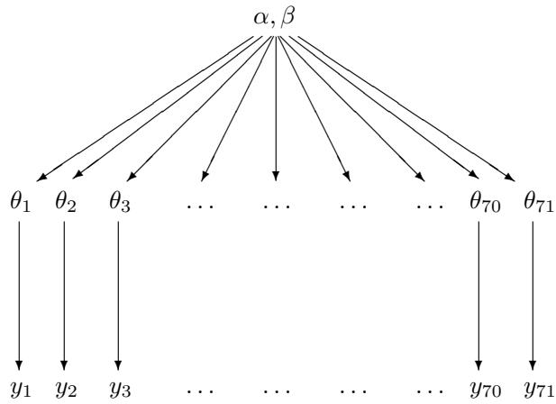  
Figure 5.1: Structure of the hierarchical model for the rat tumor example.

0.103. If we set the mean and standard deviation of the population distribution to these values, we can solve for $\alpha$ and $\beta$ —see (A.3) on page 583 in Appendix A. The resulting estimate for $(\alpha, \beta)$ is (1.4, 8.6). This is not a Bayesian calculation because it is not based on any specified full probability model. We present a better, fully Bayesian approach to estimating $(\alpha, \beta)$ for this example in Section 5.3. The estimate (1.4, 8.6) is simply a starting point from which we can explore the idea of estimating the parameters of the population distribution.

Using the simple estimate of the historical population distribution as a prior distribution for the current experiment yields a Beta(5.4, 18.6) posterior distribution for $\theta_{71}$ : the posterior mean is 0.223, and the standard deviation is 0.083. The prior information has resulted in a posterior mean substantially lower than the crude proportion, $4/14 = 0.286$ , because the weight of experience indicates that the number of tumors in the current experiment is unusually high.

These analyses require that the current tumor risk, $\theta_{71}$ , and the 70 historical tumor risks, $\theta_{1},\ldots ,\theta_{70}$ , be considered a random sample from a common distribution, an assumption that would be invalidated, for example, if it were known that the historical experiments were all done in laboratory A but the current data were gathered in laboratory B, or if time trends were relevant. In practice, a simple, although arbitrary, way of accounting for differences between the current and historical data is to inflate the historical variance. For the beta model, inflating the historical variance means decreasing $(\alpha +\beta)$ while holding $\frac{\alpha}{\beta}$ constant. Other systematic differences, such as a time trend in tumor risks, can be incorporated in a more extensive model.

Having used the 70 historical experiments to form a prior distribution for $\theta_{71}$ , we might now like also to use this same prior distribution to obtain Bayesian inferences for the tumor probabilities in the first 70 experiments, $\theta_{1},\ldots ,\theta_{70}$ . There are several logical and practical problems with the approach of directly estimating a prior distribution from existing data:

- If we wanted to use the estimated prior distribution for inference about the first 70 experiments, then the data would be used twice: first, all the results together are used to estimate the prior distribution, and then each experiment's results are used to estimate its $\theta$ . This would seem to cause us to overestimate our precision.   
- The point estimate for $\alpha$ and $\beta$ seems arbitrary, and using any point estimate for $\alpha$ and $\beta$ necessarily ignores some posterior uncertainty.   
- We can also make the opposite point: does it make sense to 'estimate' $\alpha$ and $\beta$ at all?

They are part of the 'prior' distribution: should they be known before the data are gathered, according to the logic of Bayesian inference?

# Logic of combining information

Despite these problems, it clearly makes more sense to try to estimate the population distribution from all the data, and thereby to help estimate each $\theta_{j}$ , than to estimate all 71 values $\theta_{j}$ separately. Consider the following thought experiment about inference on two of the parameters, $\theta_{26}$ and $\theta_{27}$ , each corresponding to experiments with 2 observed tumors out of 20 rats. Suppose our prior distribution for both $\theta_{26}$ and $\theta_{27}$ is centered around 0.15; now suppose that you were told after completing the data analysis that $\theta_{26} = 0.1$ exactly. This should influence your estimate of $\theta_{27}$ ; in fact, it would probably make you think that $\theta_{27}$ is lower than you previously believed, since the data for the two parameters are identical, and the postulated value of 0.1 is lower than you previously expected for $\theta_{26}$ from the prior distribution. Thus, $\theta_{26}$ and $\theta_{27}$ should be dependent in the posterior distribution, and they should not be analyzed separately.

We retain the advantages of using the data to estimate prior parameters and eliminate all of the disadvantages just mentioned by putting a probability model on the entire set of parameters and experiments and then performing a Bayesian analysis on the joint distribution of all the model parameters. A complete Bayesian analysis is described in Section 5.3. The analysis using the data to estimate the prior parameters, which is sometimes called empirical Bayes, can be viewed as an approximation to the complete hierarchical Bayesian analysis. We prefer to avoid the term 'empirical Bayes' because it misleadingly suggests that the full Bayesian method, which we discuss here and use for the rest of the book, is not 'empirical.'

# 5.2 Exchangeability and setting up hierarchical models

Generalizing from the example of the previous section, consider a set of experiments $j = 1,\ldots ,J$ , in which experiment $j$ has data (vector) $y_{j}$ and parameter (vector) $\theta_{j}$ , with likelihood $p(y_j|\theta_j)$ . (Throughout this chapter we use the word 'experiment' for convenience, but the methods can apply equally well to nonexperimental data.) Some of the parameters in different experiments may overlap; for example, each data vector $y_{j}$ may be a sample of observations from a normal distribution with mean $\mu_{j}$ and common variance $\sigma^2$ , in which case $\theta_{j} = (\mu_{j},\sigma^{2})$ . In order to create a joint probability model for all the parameters $\theta$ , we use the crucial idea of exchangeability introduced in Chapter 1 and used repeatedly since then.

# Exchangeability

If no information—other than the data $y$ —is available to distinguish any of the $\theta_j$ 's from any of the others, and no ordering or grouping of the parameters can be made, one must assume symmetry among the parameters in their prior distribution. This symmetry is represented probabilistically by exchangeability; the parameters $(\theta_1, \dots, \theta_J)$ are exchangeable in their joint distribution if $p(\theta_1, \dots, \theta_J)$ is invariant to permutations of the indexes $(1, \dots, J)$ . For example, in the rat tumor problem, suppose we have no information to distinguish the 71 experiments, other than the sample sizes $n_j$ , which presumably are not related to the values of $\theta_j$ ; we therefore use an exchangeable model for the $\theta_j$ 's.

We have already encountered the concept of exchangeability in constructing independent and identically distributed models for direct data. In practice, ignorance implies exchangeability. Generally, the less we know about a problem, the more confidently we can make

claims of exchangeability. (This is not, we hasten to add, a good reason to limit our knowledge of a problem before embarking on statistical analysis!) Consider the analogy to a roll of a die: we should initially assign equal probabilities to all six outcomes, but if we study the measurements of the die and weigh the die carefully, we might eventually notice imperfections, which might make us favor one outcome over the others and thus eliminate the symmetry among the six outcomes.

The simplest form of an exchangeable distribution has each of the parameters $\theta_{j}$ as an independent sample from a prior (or population) distribution governed by some unknown parameter vector $\phi$ ; thus,

$$
p (\theta | \phi) = \prod_ {j = 1} ^ {J} p \left(\theta_ {j} \mid \phi\right). \tag {5.1}
$$

In general, $\phi$ is unknown, so our distribution for $\theta$ must average over our uncertainty in $\phi$ :

$$
p (\theta) = \int \left(\prod_ {j = 1} ^ {J} p \left(\theta_ {j} \mid \phi\right)\right) p (\phi) d \phi , \tag {5.2}
$$

This form, the mixture of independent identical distributions, is usually all that we need to capture exchangeability in practice.

A related theoretical result, de Finetti's theorem, to which we alluded in Section 1.2, states that in the limit as $J \to \infty$ , any suitably well-behaved exchangeable distribution on $(\theta_{1},\ldots ,\theta_{J})$ can be expressed as a mixture of independent and identical distributions as in (5.2). The theorem does not hold when $J$ is finite (see Exercises 5.1, 5.2, and 5.4). Statistically, the mixture model characterizes parameters $\theta$ as drawn from a common 'superpopulation' that is determined by the unknown hyperparameters, $\phi$ . We are already familiar with exchangeable models for data, $y_{1},\dots ,y_{n}$ , in the form of likelihoods in which the $n$ observations are independent and identically distributed, given some parameter vector $\theta$ .

As a simple counterexample to the above mixture model, consider the probabilities of a given die landing on each of its six faces. The probabilities $\theta_{1},\ldots ,\theta_{6}$ are exchangeable, but the six parameters $\theta_{j}$ are constrained to sum to 1 and so cannot be modeled with a mixture of independent identical distributions; nonetheless, they can be modeled exchangeably.

# Example. Exchangeability and sampling

The following thought experiment illustrates the role of exchangeability in inference from random sampling. For simplicity, we use a nonhierarchical example with exchangeability at the level of $y$ rather than $\theta$ .

We, the authors, have selected eight states out of the United States and recorded the divorce rate per 1000 population in each state in 1981. Call these $y_{1}, \ldots, y_{8}$ . What can you, the reader, say about $y_{8}$ , the divorce rate in the eighth state?

Since you have no information to distinguish any of the eight states from the others, you must model them exchangeably. You might use a beta distribution for the eight $y_{j}$ 's, a logit normal, or some other prior distribution restricted to the range [0,1]. Unless you are familiar with divorce statistics in the United States, your distribution on $(y_{1},\ldots ,y_{8})$ should be fairly vague.

We now randomly sample seven states from these eight and tell you their divorce rates: 5.8, 6.6, 7.8, 5.6, 7.0, 7.1, 5.4, each in numbers of divorces per 1000 population (per year). Based primarily on the data, a reasonable posterior (predictive) distribution for the remaining value, $y_{8}$ , would probably be centered around 6.5 and have most of its mass between 5.0 and 8.0. Changing the indexing does not change the joint distribution. If we relabel the remaining value to be any other $y_{j}$ the posterior estimate would be the same. $y_{j}$ are exchangeable but they are not independent as we

assume that the divorce rate in the eighth unobserved state is probably similar to the observed rates.

Suppose initially we had given you the further prior information that the eight states are Mountain states: Arizona, Colorado, Idaho, Montana, Nevada, New Mexico, Utah, and Wyoming, but selected in a random order; you still are not told which observed rate corresponds to which state. Now, before the seven data points were observed, the eight divorce rates should still be modeled exchangeably. However, your prior distribution (that is, before seeing the data), for the eight numbers should change: it seems reasonable to assume that Utah, with its large Mormon population, has a much lower divorce rate, and Nevada, with its liberal divorce laws, has a much higher divorce rate, than the remaining six states. Perhaps, given your expectation of outliers in the distribution, your prior distribution should have wide tails. Given this extra information (the names of the eight states), when you see the seven observed values and note that the numbers are so close together, it might seem a reasonable guess that the missing eighth state is Nevada or Utah. Therefore its value might be expected to be much lower or much higher than the seven values observed. This might lead to a bimodal or trimodal posterior distribution to account for the two plausible scenarios. The prior distribution on the eight values $y_{j}$ is still exchangeable, however, because you have no information telling which state corresponds to which index number. (See Exercise 5.6.)

Finally, we tell you that the state not sampled (corresponding to $y_{8}$ ) was Nevada. Now, even before seeing the seven observed values, you cannot assign an exchangeable prior distribution to the set of eight divorce rates, since you have information that distinguishes $y_{8}$ from the other seven numbers, here suspecting it is larger than any of the others. Once $y_{1}, \ldots, y_{7}$ have been observed, a reasonable posterior distribution for $y_{8}$ plausibly should have most of its mass above the largest observed rate, that is, $p(y_{8} > \max(y_{1}, \ldots, y_{7}) | y_{1}, \ldots, y_{7})$ should be large.

Incidentally, Nevada's divorce rate in 1981 was 13.9 per 1000 population.

Exchangeability when additional information is available on the units

Often observations are not fully exchangeable, but are partially or conditionally exchangeable:

- If observations can be grouped, we may make hierarchical model, where each group has its own submodel, but the group properties are unknown. If we assume that group properties are exchangeable, we can use a common prior distribution for the group properties.   
- If $y_{i}$ has additional information $x_{i}$ so that $y_{i}$ are not exchangeable but $(y_{i}, x_{i})$ still are exchangeable, then we can make a joint model for $(y_{i}, x_{i})$ or a conditional model for $y_{i} | x_{i}$ .

In the rat tumor example, $y_{j}$ were exchangeable as no additional knowledge was available on experimental conditions. If we knew that specific batches of experiments were made in different laboratories we could assume partial exchangeability and use two level hierarchical model to model variation within each laboratory and between laboratories.

In the divorce example, if we knew $x_{j}$ , the divorce rate in state $j$ last year, for $j = 1, \ldots, 8$ , but not which index corresponded to which state, then we would certainly be able to distinguish the eight values of $y_{j}$ , but the joint prior distribution $p(x_{j}, y_{j})$ would be the same for each state. For states having the same last year divorce rates $x_{j}$ , we could use grouping and assume partial exchangeability or if there are many possible values for $x_{j}$ (as we would assume for divorce rates) we could assume conditional exchangeability and use $x_{j}$ as covariate in regression model.

In general, the usual way to model exchangeability with covariates is through conditional independence: $p(\theta_1,\ldots ,\theta_J|x_1,\ldots ,x_J) = \int [\prod_{j = 1}^J p(\theta_j|\phi ,x_j)]p(\phi |x)d\phi$ , with $x = (x_{1},\dots,x_{J})$ . In this way, exchangeable models become almost universally applicable, because any information available to distinguish different units should be encoded in the $x$ and $y$ variables.

In the rat tumor example, we have already noted that the sample sizes $n_j$ are the only available information to distinguish the different experiments. It does not seem likely that $n_j$ would be a useful variable for modeling tumor rates, but if one were interested, one could create an exchangeable model for the $J$ pairs $(n,y)_j$ . A natural first step would be to plot $\frac{y_j}{n_j}$ vs. $n_j$ to see any obvious relation that could be modeled. For example, perhaps some studies $j$ had larger sample sizes $n_j$ because the investigators correctly suspected rarer events; that is, smaller $\theta_j$ and thus smaller expected values of $\frac{y_j}{n_j}$ . In fact, the plot of $\frac{y_j}{n_j}$ versus $n_j$ , not shown here, shows no apparent relation between the two variables.

# Objections to exchangeable models

In virtually any statistical application, it is natural to object to exchangeability on the grounds that the units actually differ. For example, the 71 rat tumor experiments were performed at different times, on different rats, and presumably in different laboratories. Such information does not, however, invalidate exchangeability. That the experiments differ implies that the $\theta_{j}$ 's differ, but it might be perfectly acceptable to consider them as if drawn from a common distribution. In fact, with no information available to distinguish them, we have no logical choice but to model the $\theta_{j}$ 's exchangeably. Objecting to exchangeability for modeling ignorance is no more reasonable than objecting to an independent and identically distributed model for samples from a common population, objecting to regression models in general, or, for that matter, objecting to displaying points in a scatterplot without individual labels. As with regression, the valid concern is not about exchangeability, but about encoding relevant knowledge as explanatory variables where possible.

# The full Bayesian treatment of the hierarchical model

Returning to the problem of inference, the key 'hierarchical' part of these models is that $\phi$ is not known and thus has its own prior distribution, $p(\phi)$ . The appropriate Bayesian posterior distribution is of the vector $(\phi, \theta)$ . The joint prior distribution is

$$
p (\phi , \theta) = p (\phi) p (\theta | \phi),
$$

and the joint posterior distribution is

$$
\begin{array}{l} p (\phi , \theta | y) \propto p (\phi , \theta) p (y | \phi , \theta) \\ = p (\phi , \theta) p (y | \theta), \tag {5.3} \\ \end{array}
$$

with the latter simplification holding because the data distribution, $p(y|\phi ,\theta)$ , depends only on $\theta$ ; the hyperparameters $\phi$ affect $y$ only through $\theta$ . Previously, we assumed $\phi$ was known, which is unrealistic; now we include the uncertainty in $\phi$ in the model.

# The hyperprior distribution

In order to create a joint probability distribution for $(\phi, \theta)$ , we must assign a prior distribution to $\phi$ . If little is known about $\phi$ , we can assign a diffuse prior distribution, but we must be careful when using an improper prior density to check that the resulting posterior distribution is proper, and we should assess whether our conclusions are sensitive to

this simplifying assumption. In most real problems, one should have enough substantive knowledge about the parameters in $\phi$ at least to constrain the hyperparameters into a finite region, if not to assign a substantive hyperprior distribution. As in nonhierarchical models, it is often practical to start with a simple, relatively noninformative, prior distribution on $\phi$ and seek to add more prior information if there remains too much variation in the posterior distribution.

In the rat tumor example, the hyperparameters are $(\alpha, \beta)$ , which determine the beta distribution for $\theta$ . We illustrate one approach to constructing an appropriate hyperprior distribution in the continuation of that example in the next section.

# Posterior predictive distributions

Hierarchical models are characterized both by hyperparameters, $\phi$ , in our notation, and parameters $\theta$ . There are two posterior predictive distributions that might be of interest to the data analyst: (1) the distribution of future observations $\tilde{y}$ corresponding to an existing $\theta_{j}$ , or (2) the distribution of observations $\tilde{y}$ corresponding to future $\theta_{j}$ 's drawn from the same superpopulation. We label the future $\theta_{j}$ 's as $\tilde{\theta}$ . Both kinds of replications can be used to assess model adequacy, as we discuss in Chapter 6. In the rat tumor example, future observations can be (1) additional rats from an existing experiment, or (2) results from a future experiment. In the former case, the posterior predictive draws $\tilde{y}$ are based on the posterior draws of $\theta_{j}$ for the existing experiment. In the latter case, one must first draw $\tilde{\theta}$ for the new experiment from the population distribution, given the posterior draws of $\phi$ , and then draw $\tilde{y}$ given the simulated $\tilde{\theta}$ .

# 5.3 Fully Bayesian analysis of conjugate hierarchical models

Our inferential strategy for hierarchical models follows the general approach to multiparameter problems presented in Section 3.8 but is more difficult in practice because of the large number of parameters that commonly appear in a hierarchical model. In particular, we cannot generally plot the contours or display a scatterplot of the simulations from the joint posterior distribution of $(\theta, \phi)$ . With care, however, we can follow a similar simulation-based approach as before.

In this section, we present an approach that combines analytical and numerical methods to obtain simulations from the joint posterior distribution, $p(\theta, \phi | y)$ , for the beta-binomial model for the rat-tumor example, for which the population distribution, $p(\theta | \phi)$ , is conjugate to the likelihood, $p(y | \theta)$ . For the many nonconjugate hierarchical models that arise in practice, more advanced computational methods, presented in Part III of this book, are necessary. Even for more complicated problems, however, the approach using conjugate distributions is useful for obtaining approximate estimates and starting points for more accurate computations.

# Analytic derivation of conditional and marginal distributions

We first perform the following three steps analytically.

1. Write the joint posterior density, $p(\theta, \phi | y)$ , in unnormalized form as a product of the hyperprior distribution $p(\phi)$ , the population distribution $p(\theta | \phi)$ , and the likelihood $p(y | \theta)$ .   
2. Determine analytically the conditional posterior density of $\theta$ given the hyperparameters $\phi$ ; for fixed observed $y$ , this is a function of $\phi$ , $p(\theta|\phi,y)$ .   
3. Estimate $\phi$ using the Bayesian paradigm; that is, obtain its marginal posterior distribution, $p(\phi |y)$

The first step is immediate, and the second step is easy for conjugate models because, conditional on $\phi$ , the population distribution for $\theta$ is just the independent and identically distributed model (5.1), so that the conditional posterior density is a product of conjugate posterior densities for the components $\theta_{j}$ .

The third step can be performed by brute force by integrating the joint posterior distribution over $\theta$ :

$$
p (\phi | y) = \int p (\theta , \phi | y) d \theta . \tag {5.4}
$$

For many standard models, however, including the normal distribution, the marginal posterior distribution of $\phi$ can be computed algebraically using the conditional probability formula,

$$
p (\phi | y) = \frac {p (\theta , \phi | y)}{p (\theta | \phi , y)}. \tag {5.5}
$$

This expression is useful because the numerator is just the joint posterior distribution (5.3), and the denominator is the posterior distribution for $\theta$ if $\phi$ were known. The difficulty in using (5.5), beyond a few standard conjugate models, is that the denominator, $p(\theta|\phi,y)$ , regarded as a function of both $\theta$ and $\phi$ for fixed $y$ , has a normalizing factor that depends on $\phi$ as well as $y$ . One must be careful with the proportionality 'constant' in Bayes' theorem, especially when using hierarchical models, to make sure it is actually constant. Exercise 5.11 has an example of a nonconjugate model in which the integral (5.4) has no closed-form solution so that (5.5) is no help.

# Drawing simulations from the posterior distribution

The following strategy is useful for simulating a draw from the joint posterior distribution, $p(\theta ,\phi |y)$ , for simple hierarchical models such as are considered in this chapter.

1. Draw the vector of hyperparameters, $\phi$ , from its marginal posterior distribution, $p(\phi | y)$ . If $\phi$ is low-dimensional, the methods discussed in Chapter 3 can be used; for high-dimensional $\phi$ , more sophisticated methods such as described in Part III may be needed.   
2. Draw the parameter vector $\theta$ from its conditional posterior distribution, $p(\theta|\phi,y)$ , given the drawn value of $\phi$ . For the examples we consider in this chapter, the factorization $p(\theta|\phi,y) = \prod_j p(\theta_j|\phi,y)$ holds, and so the components $\theta_j$ can be drawn independently, one at a time.   
3. If desired, draw predictive values $\tilde{y}$ from the posterior predictive distribution given the drawn $\theta$ . Depending on the problem, it might be necessary first to draw a new value $\tilde{\theta}$ , given $\phi$ , as discussed at the end of the previous section.

As usual, the above steps are performed $L$ times in order to obtain a set of $L$ draws. From the joint posterior simulations of $\theta$ and $\tilde{y}$ , we can compute the posterior distribution of any estimand or predictive quantity of interest.

# Application to the model for rat tumors

We now perform a full Bayesian analysis of the rat tumor experiments described in Section 5.1. Once again, the data from experiments $j = 1,\dots ,J$ , $J = 71$ , are assumed to follow independent binomial distributions:

$$
y _ {j} \sim \mathrm {B i n} (n _ {j}, \theta_ {j}),
$$

with the number of rats, $n_j$ , known. The parameters $\theta_j$ are assumed to be independent samples from a beta distribution:

$$
\theta_ {j} \sim \operatorname {B e t a} (\alpha , \beta),
$$

and we shall assign a noninformative hyperprior distribution to reflect our ignorance about the unknown hyperparameters. As usual, the word 'noninformative' indicates our attitude toward this part of the model and is not intended to imply that this particular distribution has any special properties. If the hyperprior distribution turns out to be crucial for our inference, we should report this and if possible seek further substantive knowledge that could be used to construct a more informative prior distribution. If we wish to assign an improper prior distribution for the hyperparameters, $(\alpha, \beta)$ , we must check that the posterior distribution is proper. We defer the choice of noninformative hyperprior distribution, a relatively arbitrary and unimportant part of this particular analysis, until we inspect the integrability of the posterior density.

Joint, conditional, and marginal posterior distributions. We first perform the three steps for determining the analytic form of the posterior distribution. The joint posterior distribution of all parameters is

$$
\begin{array}{l} p (\theta , \alpha , \beta | y) \propto p (\alpha , \beta) p (\theta | \alpha , \beta) p (y | \theta , \alpha , \beta) \\ \propto p (\alpha , \beta) \prod_ {j = 1} ^ {J} \frac {\Gamma (\alpha + \beta)}{\Gamma (\alpha) \Gamma (\beta)} \theta_ {j} ^ {\alpha - 1} (1 - \theta_ {j}) ^ {\beta - 1} \prod_ {j = 1} ^ {J} \theta_ {j} ^ {y _ {j}} (1 - \theta_ {j}) ^ {n _ {j} - y _ {j}}. \tag {5.6} \\ \end{array}
$$

Given $(\alpha, \beta)$ , the components of $\theta$ have independent posterior densities that are of the form $\theta_j^A (1 - \theta_j)^B$ —that is, beta densities—and the joint density is

$$
p (\theta | \alpha , \beta , y) = \prod_ {j = 1} ^ {J} \frac {\Gamma (\alpha + \beta + n _ {j})}{\Gamma (\alpha + y _ {j}) \Gamma (\beta + n _ {j} - y _ {j})} \theta_ {j} ^ {\alpha + y _ {j} - 1} (1 - \theta_ {j}) ^ {\beta + n _ {j} - y _ {j} - 1}. \tag {5.7}
$$

We can determine the marginal posterior distribution of $(\alpha, \beta)$ by substituting (5.6) and (5.7) into the conditional probability formula (5.5):

$$
p (\alpha , \beta | y) \propto p (\alpha , \beta) \prod_ {j = 1} ^ {J} \frac {\Gamma (\alpha + \beta)}{\Gamma (\alpha) \Gamma (\beta)} \frac {\Gamma (\alpha + y _ {j}) \Gamma (\beta + n _ {j} - y _ {j})}{\Gamma (\alpha + \beta + n _ {j})}. \tag {5.8}
$$

The product in equation (5.8) cannot be simplified analytically but is easy to compute for any specified values of $(\alpha, \beta)$ using a standard routine to compute the gamma function.

Choosing a standard parameterization and setting up a 'noninformative' hyperprior distribution. Because we have no immediately available information about the distribution of tumor rates in populations of rats, we seek a relatively diffuse hyperprior distribution for $(\alpha, \beta)$ . Before assigning a hyperprior distribution, we reparameterize in terms of $\log (\frac{\alpha}{\alpha + \beta}) = \log (\frac{\alpha}{\beta})$ and $\log (\alpha + \beta)$ , which are the logit of the mean and the logarithm of the 'sample size' in the beta population distribution for $\theta$ . It would seem reasonable to assign independent hyperprior distributions to the prior mean and 'sample size,' and we use the logistic and logarithmic transformations to put each on a $(- \infty, \infty)$ scale. Unfortunately, a uniform prior density on these newly transformed parameters yields an improper posterior density, with an infinite integral in the limit $(\alpha + \beta) \to \infty$ , and so this particular prior density cannot be used here.

In a problem such as this with a reasonably large amount of data, it is possible to set up a 'noninformative' hyperprior density that is dominated by the likelihood and yields a proper posterior distribution. One reasonable choice of diffuse hyperprior density is uniform on $(\frac{\alpha}{\alpha + \beta}, (\alpha + \beta)^{-1/2})$ , which when multiplied by the appropriate Jacobian yields the following densities on the original scale,

$$
p (\alpha , \beta) \propto (\alpha + \beta) ^ {- 5 / 2}, \tag {5.9}
$$

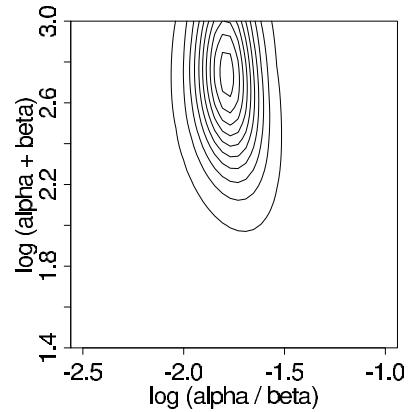  
Figure 5.2 First try at a contour plot of the marginal posterior density of $(\log (\frac{\alpha}{\beta}),\log (\alpha +\beta))$ for the rat tumor example. Contour lines are at 0.05, 0.15, ..., 0.95 times the density at the mode.

and on the natural transformed scale:

$$
p \left(\log \left(\frac {\alpha}{\beta}\right), \log (\alpha + \beta)\right) \propto \alpha \beta (\alpha + \beta) ^ {- 5 / 2}. \tag {5.10}
$$

See Exercise 5.9 for a discussion of this prior density.

We could avoid the mathematical effort of checking the integrability of the posterior density if we were to use a proper hyperprior distribution. Another approach would be tentatively to use a flat hyperprior density, such as $p\left(\frac{\alpha}{\alpha + \beta}, \alpha + \beta\right) \propto 1$ , or even $p(\alpha, \beta) \propto 1$ , and then compute the contours and simulations from the posterior density (as detailed below). The result would clearly show the posterior contours drifting off toward infinity, indicating that the posterior density is not integrable in that limit. The prior distribution would then have to be altered to obtain an integrable posterior density.

Incidentally, setting the prior distribution for $(\log (\frac{\alpha}{\beta}),\log (\alpha +\beta))$ to uniform in a vague but finite range, such as $[-10^{10},10^{10}]\times [-10^{10},10^{10}]$ , would not be an acceptable solution for this problem, as almost all the posterior mass in this case would be in the range of $\alpha$ and $\beta$ near 'infinity,' which corresponds to a $\mathrm{Beta}(\alpha ,\beta)$ distribution with a variance of zero, meaning that all the $\theta_{j}$ parameters would be essentially equal in the posterior distribution. When the likelihood is not integrable, setting a faraway finite cutoff to a uniform prior density does not necessarily eliminate the problem.

Computing the marginal posterior density of the hyperparameters. Now that we have established a full probability model for data and parameters, we compute the marginal posterior distribution of the hyperparameters. Figure 5.2 shows a contour plot of the unnormalized marginal posterior density on a grid of values of $(\log (\frac{\alpha}{\beta}),\log (\alpha +\beta))$ . To create the plot, we first compute the logarithm of the density function (5.8) with prior density (5.9), multiplying by the Jacobian to obtain the density $p(\log (\frac{\alpha}{\beta}),\log (\alpha +\beta)|y)$ . We set a grid in the range $(\log (\frac{\alpha}{\beta}),\log (\alpha +\beta))\in [-2.5, - 1]\times [1.5,3]$ , which is centered near our earlier point estimate $(-1.8,2.3)$ (that is, $(\alpha ,\beta) = (1.4,8.6))$ and covers a factor of 4 in each parameter. Then, to avoid computational overflows, we subtract the maximum value of the log density from each point on the grid and exponentiate, yielding values of the unnormalized marginal posterior density.

The most obvious features of the contour plot are (1) the mode is not far from the point estimate (as we would expect), and (2) important parts of the marginal posterior distribution lie outside the range of the graph.

We recompute $p(\log (\frac{\alpha}{\beta}), \log (\alpha + \beta)|y)$ , this time in the range $(\log (\frac{\alpha}{\beta}), \log (\alpha + \beta)) \in$

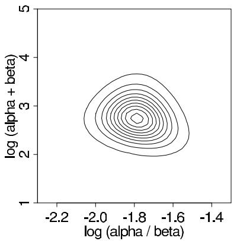

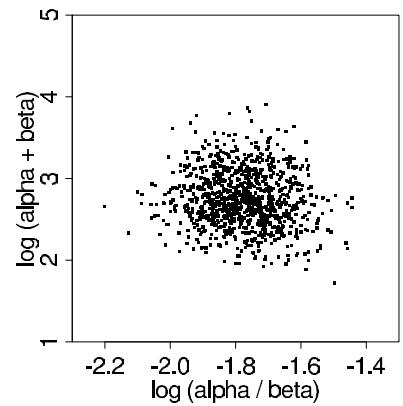  
Figure 5.3 (a) Contour plot of the marginal posterior density of $(\log (\frac{\alpha}{\beta}),\log (\alpha +\beta))$ for the rat tumor example. Contour lines are at 0.05, 0.15, ..., 0.95 times the density at the mode. (b) Scatterplot of 1000 draws $(\log (\frac{\alpha}{\beta}),\log (\alpha +\beta))$ from the numerically computed marginal posterior density.

$[-2.3, -1.3] \times [1, 5]$ . The resulting grid, shown in Figure 5.3a, displays essentially all of the marginal posterior distribution. Figure 5.3b displays 1000 random draws from the numerically computed posterior distribution. The graphs show that the marginal posterior distribution of the hyperparameters, under this transformation, is approximately symmetric about the mode, roughly $(-1.75, 2.8)$ . This corresponds to approximate values of $(\alpha, \beta) = (2.4, 14.0)$ , which differs somewhat from the crude estimate obtained earlier.

Having computed the relative posterior density at a grid that covers the effective range of $(\alpha, \beta)$ , we normalize by approximating the distribution as a step function over the grid and setting the total probability in the grid to 1.

We can then compute posterior moments based on the grid of $(\log (\frac{\alpha}{\beta}),\log (\alpha +\beta))$ ; for example,

$$
\operatorname {E}(\alpha |y) \text{is estimated by}\sum_{\log (\frac{\alpha}{\beta}),\log (\alpha +\beta)}\alpha \cdot p(\log (\frac{\alpha}{\beta}),\log (\alpha +\beta)|y).
$$

From the grid in Figure 5.3, we compute $\operatorname{E}(\alpha | y) = 2.4$ and $\operatorname{E}(\beta | y) = 14.3$ . This is close to the estimate based on the mode of Figure 5.3a, given above, because the posterior distribution is approximately symmetric on the scale of $(\log(\frac{\alpha}{\beta}), \log(\alpha + \beta))$ . A more important consequence of averaging over the grid is to account for the posterior uncertainty in $(\alpha, \beta)$ , which is not captured in the point estimate.

Sampling from the joint posterior distribution of parameters and hyperparameters. We draw 1000 random samples from the joint posterior distribution of $(\alpha, \beta, \theta_1, \ldots, \theta_J)$ , as follows.

1. Simulate 1000 draws of $(\log (\frac{\alpha}{\beta}),\log (\alpha +\beta))$ from their posterior distribution displayed in Figure 5.3, using the same discrete-grid sampling procedure used to draw $(\alpha ,\beta)$ for Figure 3.3b in the bioassay example of Section 3.8.   
2. For $l = 1, \dots, 1000$ :

(a) Transform the $l$ th draw of $(\log(\frac{\alpha}{\beta}), \log(\alpha + \beta))$ to the scale $(\alpha, \beta)$ to yield a draw of the hyperparameters from their marginal posterior distribution.   
(b) For each $j = 1,\dots ,J$ sample $\theta_{j}$ from its conditional posterior distribution, $\theta_{j}|\alpha ,\beta ,y\sim$ $\mathrm{Beta}(\alpha +y_j,\beta +n_j - y_j)$

Displaying the results. Figure 5.4 shows posterior medians and $95\%$ intervals for the $\theta_{j}$ 's, computed by simulation. The rates $\theta_{j}$ are shrunk from their sample point estimates, $\frac{y_j}{n_j}$ ,

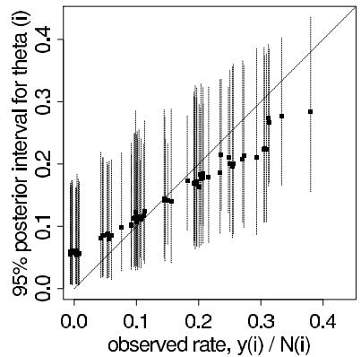  
Figure 5.4 Posterior medians and $95\%$ intervals of rat tumor rates, $\theta_{j}$ (plotted vs. observed tumor rates $y_{j} / n_{j}$ ), based on simulations from the joint posterior distribution. The $45^{\circ}$ line corresponds to the unpooled estimates, $\hat{\theta}_i = y_i / n_i$ . The horizontal positions of the line have been jittered to reduce overlap.

towards the population distribution, with approximate mean 0.14; experiments with fewer observations are shrunk more and have higher posterior variances. The results are superficially similar to what would be obtained based on a point estimate of the hyperparameters, which makes sense in this example, because of the fairly large number of experiments. But key differences remain, notably that posterior variability is higher in the full Bayesian analysis, reflecting posterior uncertainty in the hyperparameters.

# 5.4 Estimating exchangeable parameters from a normal model

We now present a full treatment of a simple hierarchical model based on the normal distribution, in which observed data are normally distributed with a different mean for each 'group' or 'experiment,' with known observation variance, and a normal population distribution for the group means. This model is sometimes termed the one-way normal random-effects model with known data variance and is widely applicable, being an important special case of the hierarchical normal linear model, which we treat in some generality in Chapter 15. In this section, we present a general treatment following the computational approach of Section 5.3. The following section presents a detailed example; those impatient with the algebraic details may wish to look ahead at the example for motivation.

# The data structure

Consider $J$ independent experiments, with experiment $j$ estimating the parameter $\theta_{j}$ from $n_j$ independent normally distributed data points, $y_{ij}$ , each with known error variance $\sigma^2$ ; that is,

$$
y _ {i j} | \theta_ {j} \sim \mathrm {N} (\theta_ {j}, \sigma^ {2}), \text {f o r} i = 1, \dots , n _ {j}; j = 1, \dots , J. \tag {5.11}
$$

Using standard notation from the analysis of variance, we label the sample mean of each group $j$ as

$$
\bar {y} _ {. j} = \frac {1}{n _ {j}} \sum_ {i = 1} ^ {n _ {j}} y _ {i j}
$$

with sampling variance

$$
\sigma_ {j} ^ {2} = \sigma^ {2} / n _ {j}.
$$

We can then write the likelihood for each $\theta_{j}$ using the sufficient statistics, $\overline{y}_{j}$ :

$$
\bar {y} _ {. j} \left| \theta_ {j} \sim \mathrm {N} \left(\theta_ {j}, \sigma_ {j} ^ {2}\right), \right. \tag {5.12}
$$

a notation that will prove useful later because of the flexibility in allowing a separate variance $\sigma_j^2$ for the mean of each group $j$ . For the rest of this chapter, all expressions will be implicitly conditional on the known values $\sigma_j^2$ . The problem of estimating a set of means with unknown variances will require some additional computational methods, presented in Sections 11.6 and 13.6. Although rarely strictly true, the assumption of known variances at the sampling level of the model is often an adequate approximation.

The treatment of the model provided in this section is also appropriate for situations in which the variances differ for reasons other than the number of data points in the experiment. In fact, the likelihood (5.12) can appear in much more general contexts than that stated here. For example, if the group sizes $n_j$ are large enough, then the means $\overline{y}_{j}$ are approximately normally distributed, given $\theta_{j}$ , even when the data $y_{ij}$ are not. Other applications where the actual likelihood is well approximated by (5.12) appear in the next two sections.

# Constructing a prior distribution from pragmatic considerations

Rather than considering immediately the problem of specifying a prior distribution for the parameter vector $\theta = (\theta_{1},\dots,\theta_{J})$ , let us consider what sorts of posterior estimates might be reasonable for $\theta$ , given data $(y_{ij})$ . A simple natural approach is to estimate $\theta_{j}$ by $\overline{y}_{.j}$ , the average outcome in experiment $j$ . But what if, for example, there are $J = 20$ experiments with only $n_j = 2$ observations per experimental group, and the groups are 20 pairs of assays taken from the same strain of rat, under essentially identical conditions? The two observations per group do not permit accurate estimates. Since the 20 groups are from the same strain of rat, we might now prefer to estimate each $\theta_{j}$ by the pooled estimate,

$$
\bar {y} _ {\cdot \cdot} = \frac {\sum_ {j = 1} ^ {J} \frac {1}{\sigma_ {j} ^ {2}} \bar {y} _ {\cdot j}}{\sum_ {j = 1} ^ {J} \frac {1}{\sigma_ {j} ^ {2}}}. \tag {5.13}
$$

To decide which estimate to use, a traditional approach from classical statistics is to perform an analysis of variance $F$ test for differences among means: if the $J$ group means appear significantly variable, choose separate sample means, and if the variance between the group means is not significantly greater than what could be explained by individual variability within groups, use $\overline{y}_{\cdot}$ . The theoretical analysis of variance table is as follows, where $\tau^2$ is the variance of $\theta_{1}, \ldots, \theta_{J}$ . For simplicity, we present the analysis of variance for a balanced design in which $n_j = n$ and $\sigma_j^2 = \sigma^2 / n$ for all $j$ .

<table><tr><td></td><td>df</td><td>SS</td><td>MS</td><td>E(MS|σ2,τ)</td></tr><tr><td>Between groups</td><td>J-1</td><td>∑i ∑j (y.j - y..)2</td><td>SS/(J-1)</td><td>nτ2 + σ2</td></tr><tr><td>Within groups</td><td>J(n-1)</td><td>∑i ∑j (yij - y..)2</td><td>SS/(J(n-1))</td><td>σ2</td></tr><tr><td>Total</td><td>Jn-1</td><td>∑i ∑j (yij - y..)2</td><td>SS/(Jn-1)</td><td></td></tr></table>

In the classical random-effects analysis of variance, one computes the sum of squares (SS) and the mean square (MS) columns of the table and uses the 'between' and 'within' mean squares to estimate $\tau$ . If the ratio of between to within mean squares is significantly greater than 1, then the analysis of variance suggests separate estimates, $\hat{\theta}_j = \overline{y}_{.j}$ for each $j$ . If the ratio of mean squares is not 'statistically significant,' then the $F$ test cannot 'reject the hypothesis' that $\tau = 0$ , and pooling is reasonable: $\hat{\theta}_j = \overline{y}_{..}$ , for all $j$ . We discuss Bayesian analysis of variance in Section 15.6 in the context of hierarchical regression models.

But we are not forced to choose between complete pooling and none at all. An alternative is to use a weighted combination:

$$
\hat {\theta} _ {j} = \lambda_ {j} \overline {{y}} _ {. j} + (1 - \lambda_ {j}) \overline {{y}} _ {..},
$$

where $\lambda_{j}$ is between 0 and 1.

What kind of prior models produce these various posterior estimates?

1. The unbounded estimate $\hat{\theta}_j = \overline{y}_{.j}$ is the posterior mean if the $J$ values $\theta_{j}$ have independent uniform prior densities on $(-\infty ,\infty)$ .   
2. The pooled estimate $\hat{\theta} = \overline{y}$ is the posterior mean if the $J$ values $\theta_{j}$ are restricted to be equal, with a uniform prior density on the common $\theta$ .   
3. The weighted combination is the posterior mean if the $J$ values $\theta_{j}$ have independent and identically distributed normal prior densities.

All three of these options are exchangeable in the $\theta_{j}$ 's, and options 1 and 2 are special cases of option 3. No pooling corresponds to $\lambda_{j} \equiv 1$ for all $j$ and an infinite prior variance for the $\theta_{j}$ 's, and complete pooling corresponds to $\lambda_{j} \equiv 0$ for all $j$ and a zero prior variance for the $\theta_{j}$ 's.

# The hierarchical model

For the convenience of conjugacy (more accurately, partial conjugacy), we assume that the parameters $\theta_{j}$ are drawn from a normal distribution with hyperparameters $(\mu ,\tau)$ :

$$
p \left(\theta_ {1}, \dots , \theta_ {J} \mid \mu , \tau\right) = \prod_ {j = 1} ^ {J} \mathrm {N} \left(\theta_ {j} \mid \mu , \tau^ {2}\right) \tag {5.14}
$$

$$
p (\theta_ {1}, \dots , \theta_ {J}) = \int \prod_ {j = 1} ^ {J} \left[ \mathrm {N} (\theta_ {j} | \mu , \tau^ {2}) \right] p (\mu , \tau) d (\mu , \tau).
$$

That is, the $\theta_{j}$ 's are conditionally independent given $(\mu, \tau)$ . The hierarchical model also permits the interpretation of the $\theta_{j}$ 's as a random sample from a shared population distribution, as illustrated in Figure 5.1 for the rat tumors.

We assign a noninformative uniform hyperprior distribution to $\mu$ , given $\tau$ :

$$
p (\mu , \tau) = p (\mu | \tau) p (\tau) \propto p (\tau). \tag {5.15}
$$

The uniform prior density for $\mu$ is generally reasonable for this problem; because the combined data from all $J$ experiments are generally highly informative about $\mu$ , we can afford to be vague about its prior distribution. We defer discussion of the prior distribution of $\tau$ to later in the analysis, although relevant principles have already been discussed in the context of the rat tumor example. As usual, we first work out the answer conditional on the hyperparameters and then consider their prior and posterior distributions.

# The joint posterior distribution

Combining the sampling model for the observable $y_{ij}$ 's and the prior distribution yields the joint posterior distribution of all the parameters and hyperparameters, which we can express in terms of the sufficient statistics, $\overline{y}_{.j}$ :

$$
\begin{array}{l} p (\theta , \mu , \tau | y) \propto p (\mu , \tau) p (\theta | \mu , \tau) p (y | \theta) \\ \propto \quad p (\mu , \tau) \prod_ {j = 1} ^ {J} \mathrm {N} \left(\theta_ {j} \mid \mu , \tau^ {2}\right) \prod_ {j = 1} ^ {J} \mathrm {N} \left(\bar {y} _ {. j} \mid \theta_ {j}, \sigma_ {j} ^ {2}\right), \tag {5.16} \\ \end{array}
$$

where we can ignore factors that depend only on $y$ and the parameters $\sigma_{j}$ , which are assumed known for this analysis.

The conditional posterior distribution of the normal means, given the hyperparameters

As in the general hierarchical structure, the parameters $\theta_{j}$ are independent in the prior distribution (given $\mu$ and $\tau$ ) and appear in different factors in the likelihood (5.11); thus, the conditional posterior distribution $p(\theta|\mu, \tau, y)$ factors into $J$ components.

Conditional on the hyperparameters, we simply have $J$ independent unknown normal means, given normal prior distributions, so we can use the methods of Section 2.5 independently on each $\theta_{j}$ . The conditional posterior distributions for the $\theta_{j}$ 's are independent, and

$$
\theta_ {j} | \mu , \tau , y \sim \mathrm {N} (\hat {\theta} _ {j}, V _ {j}),
$$

where

$$
\hat {\theta} _ {j} = \frac {\frac {1}{\sigma_ {j} ^ {2}} \bar {y} _ {. j} + \frac {1}{\tau^ {2}} \mu}{\frac {1}{\sigma_ {j} ^ {2}} + \frac {1}{\tau^ {2}}} \quad \text {a n d} \quad V _ {j} = \frac {1}{\frac {1}{\sigma_ {j} ^ {2}} + \frac {1}{\tau^ {2}}}. \tag {5.17}
$$

The posterior mean is a precision-weighted average of the prior population mean and the sample mean of the $j$ th group; these expressions for $\hat{\theta}_j$ and $V_j$ are functions of $\mu$ and $\tau$ as well as the data. The conditional posterior density for each $\theta_j$ given $\mu, \tau$ is proper.

The marginal posterior distribution of the hyperparameters

The solution so far is only partial because it depends on the unknown $\mu$ and $\tau$ . The next step in our approach is a full Bayesian treatment for the hyperparameters. Section 5.3 mentions integration or analytic computation as two approaches for obtaining $p(\mu, \tau | y)$ from the joint posterior density $p(\theta, \mu, \tau | y)$ . For the hierarchical normal model, we can simply consider the information supplied by the data about the hyperparameters directly:

$$
p (\mu , \tau | y) \propto p (\mu , \tau) p (y | \mu , \tau).
$$

For many problems, this decomposition is no help, because the 'marginal likelihood' factor, $p(y|\mu ,\tau)$ , cannot generally be written in closed form. For the normal distribution, however, the marginal likelihood has a particularly simple form. The marginal distributions of the group means $\overline{y}_{.j}$ , averaging over $\theta$ , are independent (but not identically distributed) normal:

$$
\overline {{y}} _ {. j} | \mu , \tau \sim \mathrm {N} (\mu , \sigma_ {j} ^ {2} + \tau^ {2}).
$$

Thus we can write the marginal posterior density as

$$
p (\mu , \tau | y) \propto p (\mu , \tau) \prod_ {j = 1} ^ {J} \mathrm {N} \left(\bar {y} _ {. j} \mid \mu , \sigma_ {j} ^ {2} + \tau^ {2}\right). \tag {5.18}
$$

Posterior distribution of $\mu$ given $\tau$ . We could use (5.18) to compute directly the posterior distribution $p(\mu, \tau | y)$ as a function of two variables and proceed as in the rat tumor example. For the normal model, however, we can further simplify by integrating over $\mu$ , leaving a simple univariate numerical computation of $p(\tau | y)$ . We factor the marginal posterior density of the hyperparameters as we did the prior density (5.15):

$$
p (\mu , \tau | y) = p (\mu | \tau , y) p (\tau | y). \tag {5.19}
$$

The first factor on the right side of (5.19) is just the posterior distribution of $\mu$ if $\tau$ were known. From inspection of (5.18) with $\tau$ assumed known, and with a uniform conditional

prior density $p(\mu|\tau)$ , the log posterior distribution is found to be quadratic in $\mu$ ; thus, $p(\mu|\tau,y)$ must be normal. The mean and variance of this distribution can be obtained immediately by considering the group means $\overline{y}_{.j}$ as $J$ independent estimates of $\mu$ with variances $(\sigma_{j}^{2} + \tau^{2})$ . Combining the data with the uniform prior density $p(\mu|\tau)$ yields

$$
\mu | \tau , y \sim \mathrm {N} (\hat {\mu}, V _ {\mu}),
$$

where $\hat{\mu}$ is the precision-weighted average of the $\overline{y}_{j}$ -values, and $V_{\mu}^{-1}$ is the total precision:

$$
\hat {\mu} = \frac {\sum_ {j = 1} ^ {J} \frac {1}{\sigma_ {j} ^ {2} + \tau^ {2}} \bar {y} _ {. j}}{\sum_ {j = 1} ^ {J} \frac {1}{\sigma_ {j} ^ {2} + \tau^ {2}}} \quad \text {a n d} \quad V _ {\mu} ^ {- 1} = \sum_ {j = 1} ^ {J} \frac {1}{\sigma_ {j} ^ {2} + \tau^ {2}}. \tag {5.20}
$$

The result is a proper posterior density for $\mu$ , given $\tau$ .

Posterior distribution of $\tau$ . We can now obtain the posterior distribution of $\tau$ analytically from (5.19) and substitution of (5.18) and (5.20) for the numerator and denominator, respectively:

$$
\begin{array}{l} p (\tau | y) = \frac {p (\mu , \tau | y)}{p (\mu | \tau , y)} \\ \propto \frac {p (\tau) \prod_ {j = 1} ^ {J} \mathrm {N} (\overline {{y}} _ {. j} | \mu , \sigma_ {j} ^ {2} + \tau^ {2})}{\mathrm {N} (\mu | \hat {\mu} , V _ {\mu})}. \\ \end{array}
$$

This identity must hold for any value of $\mu$ (in other words, all the factors of $\mu$ must cancel when the expression is simplified); in particular, it holds if we set $\mu$ to $\hat{\mu}$ , which makes evaluation of the expression simple:

$$
\begin{array}{l} p (\tau | y) \propto \frac {p (\tau) \prod_ {j = 1} ^ {J} \mathrm {N} (\overline {{y}} _ {\cdot j} | \hat {\mu} , \sigma_ {j} ^ {2} + \tau^ {2})}{\mathrm {N} (\hat {\mu} | \hat {\mu} , V _ {\mu})} \\ \propto p (\tau) V _ {\mu} ^ {1 / 2} \prod_ {j = 1} ^ {J} \left(\sigma_ {j} ^ {2} + \tau^ {2}\right) ^ {- 1 / 2} \exp \left(- \frac {(\bar {y} _ {. j} - \hat {\mu}) ^ {2}}{2 \left(\sigma_ {j} ^ {2} + \tau^ {2}\right)}\right), \tag {5.21} \\ \end{array}
$$

with $\hat{\mu}$ and $V_{\mu}$ defined in (5.20). Both expressions are functions of $\tau$ , which means that $p(\tau | y)$ is a complicated function of $\tau$ .

Prior distribution for $\tau$ . To complete our analysis, we must assign a prior distribution to $\tau$ . For convenience, we use a diffuse noninformative prior density for $\tau$ and hence must examine the resulting posterior density to ensure it has a finite integral. For our illustrative analysis, we use the uniform prior distribution, $p(\tau) \propto 1$ . We leave it as an exercise to show mathematically that the uniform prior density for $\tau$ yields a proper posterior density and that, in contrast, the seemingly reasonable 'noninformative' prior distribution for a variance component, $p(\log \tau) \propto 1$ , yields an improper posterior distribution for $\tau$ . Alternatively, in applications it involves little extra effort to determine a 'best guess' and an upper bound for the population variance $\tau$ , and a reasonable prior distribution can then be constructed from the scaled inverse- $\chi^2$ family (the natural choice for variance parameters), matching the 'best guess' to the mean of the scaled inverse- $\chi^2$ density and the upper bound to an upper percentile such as the 99th. Once an initial analysis is performed using the noninformative 'uniform' prior density, a sensitivity analysis with a more realistic prior distribution is often desirable.

# Computation

For this model, computation of the posterior distribution of $\theta$ is most conveniently performed via simulation, following the factorization used above:

$$
p (\theta , \mu , \tau | y) = p (\tau | y) p (\mu | \tau , y) p (\theta | \mu , \tau , y).
$$

The first step, simulating $\tau$ , is easily performed numerically using the inverse cdf method (see Section 1.9) on a grid of uniformly spaced values of $\tau$ , with $p(\tau | y)$ computed from (5.21). The second and third steps, simulating $\mu$ and then $\theta$ , can both be done easily by sampling from normal distributions, first (5.20) to obtain $\mu$ and then (5.17) to obtain the $\theta_{j}$ 's independently.

# Posterior predictive distributions

Sampling from the posterior predictive distribution of new data, either from a current or new batch, is straightforward given draws from the posterior distribution of the parameters. We consider two scenarios: (1) future data $\tilde{y}$ from the current set of batches, with means $\theta = (\theta_{1},\dots,\theta_{J})$ , and (2) future data $\tilde{y}$ from $\tilde{J}$ future batches, with means $\tilde{\theta} = (\tilde{\theta}_1,\dots,\tilde{\theta}_{\tilde{J}})$ . In the latter case, we must also specify the $\tilde{J}$ individual sample sizes $\tilde{n}_j$ for the future batches.

To obtain a draw from the posterior predictive distribution of new data $\tilde{y}$ from the current batch of parameters, $\theta$ , first obtain a draw from $p(\theta, \mu, \tau | y)$ and then draw the predictive data $\tilde{y}$ from (5.11).

To obtain posterior predictive simulations of new data $\tilde{y}$ for $\tilde{J}$ new groups, perform the following three steps: first, draw $(\mu, \tau)$ from their posterior distribution; second, draw $\tilde{J}$ new parameters $\tilde{\theta} = (\tilde{\theta}_1, \dots, \tilde{\theta}_{\tilde{J}})$ from the population distribution $p(\tilde{\theta}_j | \mu, \tau)$ , which is the population, or prior, distribution for $\theta$ given the hyperparameters (equation (5.14)); and third, draw $\tilde{y}$ given $\tilde{\theta}$ from the data distribution (5.11).

Difficulty with a natural non-Bayesian estimate of the hyperparameters

To see some advantages of our fully Bayesian approach, we compare it to an approximate method that is sometimes used based on a point estimate of $\mu$ and $\tau$ from the data. Unbiased point estimates, derived from the analysis of variance presented earlier, are

$$
\hat {\mu} = \bar {y} _ {\cdot}.
$$

$$
\hat {\tau} ^ {2} = \left(\mathrm {M S} _ {B} - \mathrm {M S} _ {W}\right) / n. \tag {5.22}
$$

The terms $\mathrm{MS}_B$ and $\mathrm{MS}_W$ are the 'between' and 'within' mean squares, respectively, from the analysis of variance. In this alternative approach, inference for $\theta_1,\ldots ,\theta_J$ is based on the conditional posterior distribution, $p(\theta |\hat{\mu},\hat{\tau})$ , given the point estimates.

As we saw in the rat tumor example of the previous section, the main problem with substituting point estimates for the hyperparameters is that it ignores our real uncertainty about them. The resulting inference for $\theta$ cannot be interpreted as a Bayesian posterior summary. In addition, the estimate $\hat{\tau}^2$ in (5.22) has the flaw that it can be negative! The problem of a negative estimate for a variance component can be avoided by setting $\hat{\tau}^2$ to zero in the case that $\mathrm{MS}_W$ exceeds $\mathrm{MS}_B$ , but this creates new issues. Estimating $\tau^2 = 0$ whenever $\mathrm{MS}_W > \mathrm{MS}_B$ seems too strong a claim: if $\mathrm{MS}_W > \mathrm{MS}_B$ , then the sample size is too small for $\tau^2$ to be distinguished from zero, but this is not the same as saying we know that $\tau^2 = 0$ . The latter claim, made implicitly by the point estimate, implies that all the group means $\theta_j$ are absolutely identical, which leads to scientifically indefensible claims, as we shall see in the example in the next section. It is possible to construct a point estimate

of $(\mu, \tau)$ to avoid this particular difficulty, but it would still have the problem, common to all point estimates, of ignoring uncertainty.

# 5.5 Example: parallel experiments in eight schools

We illustrate the hierarchical normal model with a problem in which the Bayesian analysis gives conclusions that differ in important respects from other methods.

A study was performed for the Educational Testing Service to analyze the effects of special coaching programs on test scores. Separate randomized experiments were performed to estimate the effects of coaching programs for the SAT-V (Scholastic Aptitude Test-Verbal) in each of eight high schools. The outcome variable in each study was the score on a special administration of the SAT-V, a standardized multiple choice test administered by the Educational Testing Service and used to help colleges make admissions decisions; the scores can vary between 200 and 800, with mean about 500 and standard deviation about 100. The SAT examinations are designed to be resistant to short-term efforts directed specifically toward improving performance on the test; instead they are designed to reflect knowledge acquired and abilities developed over many years of education. Nevertheless, each of the eight schools in this study considered its short-term coaching program to be successful at increasing SAT scores. Also, there was no prior reason to believe that any of the eight programs was more effective than any other or that some were more similar in effect to each other than to any other.

The results of the experiments are summarized in Table 5.2. All students in the experiments had already taken the PSAT (Preliminary SAT), and allowance was made for differences in the PSAT-M (Mathematics) and PSAT-V test scores between coached and uncoached students. In particular, in each school the estimated coaching effect and its standard error were obtained by an analysis of covariance adjustment (that is, a linear regression was performed of SAT-V on treatment group, using PSAT-M and PSAT-V as control variables) appropriate for a completely randomized experiment. A separate regression was estimated for each school. Although not simple sample means (because of the covariance adjustments), the estimated coaching effects, which we label $y_{j}$ , and their sampling variances, $\sigma_{j}^{2}$ , play the same role in our model as $\overline{y}_{.j}$ and $\sigma_{j}^{2}$ in the previous section. The estimates $y_{j}$ are obtained by independent experiments and have approximately normal sampling distributions with sampling variances that are known, for all practical purposes, because the sample sizes in all of the eight experiments were relatively large, over thirty students in each school (recall the discussion of data reduction in Section 4.1). Incidentally, an increase of eight points on the SAT-V corresponds to about one more test item correct.

# Inferences based on nonhierarchical models and their problems

Before fitting the hierarchical Bayesian model, we first consider two simpler nonhierarchical methods—estimating the effects from the eight experiments independently, and complete pooling—and discuss why neither of these approaches is adequate for this example.

Separate estimates. A cursory examination of Table 5.2 may at first suggest that some coaching programs have moderate effects (in the range 18-28 points), most have small effects (0-12 points), and two have small negative effects; however, when we take note of the standard errors of these estimated effects, we see that it is difficult statistically to distinguish between any of the experiments. For example, treating each experiment separately and applying the simple normal analysis in each yields $95\%$ posterior intervals that all overlap substantially.

A pooled estimate. The general overlap in the posterior intervals based on independent analyses suggests that all experiments might be estimating the same quantity. Under the

Table 5.2 Observed effects of special preparation on SAT-V scores in eight randomized experiments. Estimates are based on separate analyses for the eight experiments.   

<table><tr><td>School</td><td>Estimated treatment effect, yj</td><td>Standard error of effect estimate, σj</td></tr><tr><td>A</td><td>28</td><td>15</td></tr><tr><td>B</td><td>8</td><td>10</td></tr><tr><td>C</td><td>-3</td><td>16</td></tr><tr><td>D</td><td>7</td><td>11</td></tr><tr><td>E</td><td>-1</td><td>9</td></tr><tr><td>F</td><td>1</td><td>11</td></tr><tr><td>G</td><td>18</td><td>10</td></tr><tr><td>H</td><td>12</td><td>18</td></tr></table>

hypothesis that all experiments have the same effect and produce independent estimates of this common effect, we could treat the data in Table 5.2 as eight normally distributed observations with known variances. With a noninformative prior distribution, the posterior mean for the common coaching effect in the schools is $\overline{y}_{..}$ , as defined in equation (5.13) with $y_{j}$ in place of $\overline{y}_{.j}$ . This pooled estimate is 7.7, and the posterior variance is $(\sum_{j=1}^{8} \frac{1}{\sigma_j^2})^{-1} = 16.6$ because the eight experiments are independent. Thus, we would estimate the common effect to be 7.7 points with standard error equal to $\sqrt{16.6} = 4.1$ , which would lead to the $95\%$ posterior interval $[-0.5, 15.9]$ , or approximately $[8 \pm 8]$ . Supporting this analysis, the classical test of the hypothesis that all $\theta_j$ 's are estimating the same quantity yields a $\chi^2$ statistic less than its degrees of freedom (seven, in this case): $\sum_{j=1}^{8} (y_j - \overline{y}_{..})^2 / \sigma_i^2 = 4.6$ . To put it another way, the estimate $\hat{\tau}^2$ from (5.22) is negative.

Would it be possible to have one school's observed effect be 28 just by chance, if the coaching effects in all eight schools were really the same? To get a feeling for the natural variation that we would expect across eight studies if this assumption were true, suppose the estimated treatment effects are eight independent draws from a normal distribution with mean 8 points and standard deviation 13 points (the square root of the mean of the eight variances $\sigma_j^2$ ). Then, based on the expected values of normal order statistics, we would expect the largest observed value of $y_{j}$ to be about 26 points and the others, in diminishing order, to be about 19, 14, 10, 6, 2, -3, and -9 points. These expected effect sizes are consistent with the set of observed effect sizes in Table 5.2. Thus, it would appear imprudent to believe that school A really has an effect as large as 28 points.

Difficulties with the separate and pooled estimates. To see the problems with the two extreme attitudes—the separate analyses that consider each $\theta_{j}$ separately, and the alternative view (a single common effect) that leads to the pooled estimate—consider $\theta_{1}$ , the effect in school A. The effect in school A is estimated as 28.4 with a standard error of 14.9 under the separate analysis, versus a pooled estimate of 7.7 with a standard error of 4.1 under the common-effect model. The separate analyses of the eight schools imply the following posterior statement: 'the probability is $\frac{1}{2}$ that the true effect in A is more than 28.4,' a doubtful statement, considering the results for the other seven schools. On the other hand, the pooled model implies the following statement: 'the probability is $\frac{1}{2}$ that the true effect in A is less than 7.7,' which, despite the non-significant $\chi^2$ test, seems an inaccurate summary of our knowledge. The pooled model also implies the statement: 'the probability is $\frac{1}{2}$ that the true effect in A is less than the true effect in C,' which also is difficult to justify given the data in Table 5.2. As in the theoretical discussion of the previous section, neither estimate is fully satisfactory, and we would like a compromise that combines information

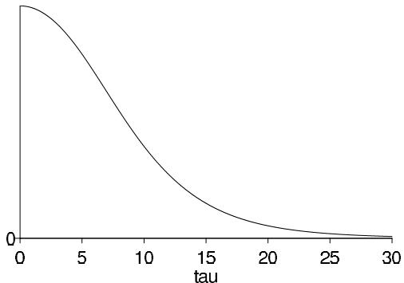  
Figure 5.5 Marginal posterior density, $p(\tau | y)$ , for standard deviation of the population of school effects $\theta_{j}$ in the educational testing example.

from all eight experiments without assuming all the $\theta_{j}$ 's to be equal. The Bayesian analysis under the hierarchical model provides exactly that.

# Posterior simulation under the hierarchical model

Consequently, we compute the posterior distribution of $\theta_{1},\ldots ,\theta_{8}$ , based on the normal model presented in Section 5.4. (More discussion of the reasonableness of applying this model in this problem appears in Sections 6.5 and 17.4.) We draw from the posterior distribution for the Bayesian model by simulating the random variables $\tau$ , $\mu$ , and $\theta$ , in that order, from their posterior distribution, as discussed at the end of the previous section. The sampling standard deviations, $\sigma_{j}$ , are assumed known and equal to the values in Table 5.2, and we assume independent uniform prior densities on $\mu$ and $\tau$ .

# Results

The marginal posterior density function, $p(\tau | y)$ from (5.21), is plotted in Figure 5.5. Values of $\tau$ near zero are most plausible; zero is the most likely value, values of $\tau$ larger than 10 are less than half as likely as $\tau = 0$ , and $\operatorname{Pr}(\tau > 25) \approx 0$ . Inference regarding the marginal distributions of the other model parameters and the joint distribution are obtained from the simulated values. Illustrations are provided in the discussion that follows this section. In the normal hierarchical model, however, we learn a great deal by considering the conditional posterior distributions given $\tau$ (and averaged over $\mu$ ).

The conditional posterior means $\mathrm{E}(\theta_j|\tau, y)$ (averaging over $\mu$ ) are displayed as functions of $\tau$ in Figure 5.6; the vertical axis displays the scale for the $\theta_j$ 's. Comparing Figure 5.6 to Figure 5.5, which has the same scale on the horizontal axis, we see that for most of the likely values of $\tau$ , the estimated effects are relatively close together; as $\tau$ becomes larger, corresponding to more variability among schools, the estimates become more like the raw values in Table 5.2.

The lines in Figure 5.7 show the conditional standard deviations, $\mathrm{sd}(\theta_j|\tau ,y)$ , as a function of $\tau$ . As $\tau$ increases, the population distribution allows the eight effects to be more different from each other, and hence the posterior uncertainty in each individual $\theta_{j}$ increases, approaching the standard deviations in Table 5.2 in the limit of $\tau \to \infty$ . (The posterior means and standard deviations for the components $\theta_{j}$ , given $\tau$ , are computed using the mean and variance formulas (2.7) and (2.8), averaging over $\mu$ ; see Exercise 5.12.)

The general conclusion from an examination of Figures 5.5-5.7 is that an effect as large as 28.4 points in any school is unlikely. For the likely values of $\tau$ , the estimates in all schools are substantially less than 28 points. For example, even at $\tau = 10$ , the probability

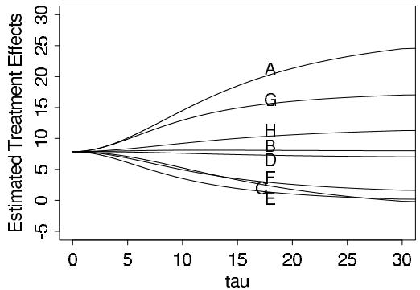

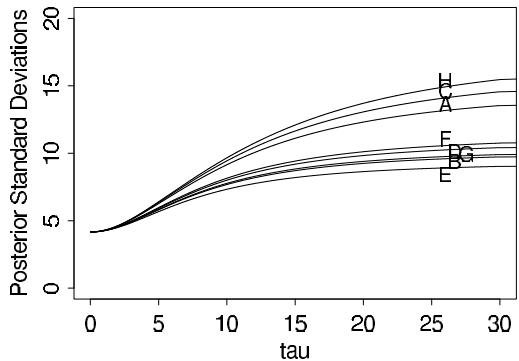  
Figure 5.6 Conditional posterior means of treatment effects, $E(\theta_j|\tau, y)$ , as functions of the between-school standard deviation $\tau$ , for the educational testing example. The line for school C crosses the lines for E and F because C has a higher measurement error (see Table 5.2) and its estimate is therefore shrunk more strongly toward the overall mean in the Bayesian analysis.   
Figure 5.7 Conditional posterior standard deviations of treatment effects, $\mathrm{sd}(\theta_j|\tau ,y)$ , as functions of the between-school standard deviation $\tau$ , for the educational testing example.

that the effect in school A is less than 28 points is $\Phi[(28 - 14.5)/9.1] = 93\%$ , where $\Phi$ is the standard normal cumulative distribution function; the corresponding probabilities for the effects being less than 28 points in the other schools are $99.5\%$ , $99.2\%$ , $98.5\%$ , $99.96\%$ , $99.8\%$ , $97\%$ , and $98\%$ .

Of substantial importance, we do not obtain an accurate summary of the data if we condition on the posterior mode of $\tau$ . The technique of conditioning on a modal value (for example, the maximum likelihood estimate) of a hyperparameter such as $\tau$ is often used in practice (at least as an approximation), but it ignores the uncertainty conveyed by the posterior distribution of the hyperparameter. At $\tau = 0$ , the inference is that all experiments have the same size effect, 7.7 points, and the same standard error, 4.1 points. Figures 5.5-5.7 certainly suggest that this answer represents too much pulling together of the estimates in the eight schools. The problem is especially acute in this example because the posterior mode of $\tau$ is on the boundary of its parameter space. A joint posterior modal estimate of $(\theta_{1},\ldots ,\theta_{J},\mu ,\tau)$ suffers from even worse problems in general.

# Discussion

Table 5.3 summarizes the 200 simulated effect estimates for all eight schools. In one sense, these results are similar to the pooled $95\%$ interval $[8 \pm 8]$ , in that the eight Bayesian $95\%$ intervals largely overlap and are median-centered between 5 and 10. In a second sense,

Table 5.3: Summary of 200 simulations of the treatment effects in the eight schools.   

<table><tr><td>School</td><td colspan="5">Posterior quantiles</td></tr><tr><td></td><td>2.5%</td><td>25%</td><td>median</td><td>75%</td><td>97.5%</td></tr><tr><td>A</td><td>-2</td><td>7</td><td>10</td><td>16</td><td>31</td></tr><tr><td>B</td><td>-5</td><td>3</td><td>8</td><td>12</td><td>23</td></tr><tr><td>C</td><td>-11</td><td>2</td><td>7</td><td>11</td><td>19</td></tr><tr><td>D</td><td>-7</td><td>4</td><td>8</td><td>11</td><td>21</td></tr><tr><td>E</td><td>-9</td><td>1</td><td>5</td><td>10</td><td>18</td></tr><tr><td>F</td><td>-7</td><td>2</td><td>6</td><td>10</td><td>28</td></tr><tr><td>G</td><td>-1</td><td>7</td><td>10</td><td>15</td><td>26</td></tr><tr><td>H</td><td>-6</td><td>3</td><td>8</td><td>13</td><td>33</td></tr></table>

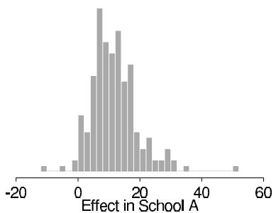

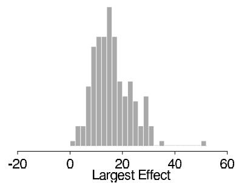  
Figure 5.8 Histograms of two quantities of interest computed from the 200 simulation draws: (a) the effect in school $A$ , $\theta_{1}$ ; (b) the largest effect, $\max\{\theta_{j}\}$ . The jaggedness of the histograms is just an artifact caused by sampling variability from using only 200 random draws.

the results in the table differ from the pooled estimate in a direction toward the eight independent answers: the $95\%$ Bayesian intervals are each almost twice as wide as the one common interval and suggest substantially greater probabilities of effects larger than 16 points, especially in school A, and greater probabilities of negative effects, especially in school C. If greater precision were required in the posterior intervals, one could simulate more simulation draws; we use only 200 draws here to illustrate that a small simulation gives adequate inference for many practical purposes.

The ordering of the effects in the eight schools as suggested by Table 5.3 is essentially the same as would be obtained by the eight separate estimates. However, there are differences in the details; for example, the Bayesian probability that the effect in school A is as large as 28 points is less than $10\%$ , which is substantially less than the $50\%$ probability based on the separate estimate for school A.

As an illustration of the simulation-based posterior results, 200 simulations of school A's effect are shown in Figure 5.8a. Having simulated the parameter $\theta$ , it is easy to ask more complicated questions of this model. For example, what is the posterior distribution of $\max \{\theta_j\}$ , the effect of the most successful of the eight coaching programs? Figure 5.8b displays a histogram of 200 values from this posterior distribution and shows that only 22 draws are larger than 28.4; thus, $\operatorname{Pr}(\max \{\theta_j\} > 28.4) \approx \frac{22}{200}$ . Since Figure 5.8a gives the marginal posterior distribution of the effect in school A, and Figure 5.8b gives the marginal posterior distribution of the largest effect no matter which school it is in, the latter figure has larger values. For another example, we can estimate $\operatorname{Pr}(\theta_1 > \theta_3|y)$ , the posterior probability that the coaching program is more effective in school A than in school C, by the proportion of simulated draws of $\theta$ for which $\theta_1 > \theta_3$ ; the result is $\frac{141}{200} = 0.705$ .

To sum up, the Bayesian analysis of this example not only allows straightforward inferences about many parameters that may be of interest, but the hierarchical model is flexible

Table 5.4 Results of 22 clinical trials of beta-blockers for reducing mortality after myocardial infarction, with empirical log-odds and approximate sampling variances. Data from Yusuf et al. (1985). Posterior quantiles of treatment effects are based on 5000 draws from a Bayesian hierarchical model described here. Negative effects correspond to reduced probability of death under the treatment.   

<table><tr><td rowspan="3">Study, j</td><td colspan="2">Raw data (deaths/total)</td><td rowspan="3">Log- odds, yj</td><td rowspan="3">sd, σj</td><td colspan="5">Posterior quantiles of effect θj</td></tr><tr><td rowspan="2">Control</td><td rowspan="2">Treated</td><td colspan="5">normal approx. (on log-odds scale)</td></tr><tr><td>2.5%</td><td>25%</td><td>median</td><td>75%</td><td>97.5%</td></tr><tr><td>1</td><td>3/39</td><td>3/38</td><td>0.028</td><td>0.850</td><td>-0.57</td><td>-0.33</td><td>-0.24</td><td>-0.16</td><td>0.12</td></tr><tr><td>2</td><td>14/116</td><td>7/114</td><td>-0.741</td><td>0.483</td><td>-0.64</td><td>-0.37</td><td>-0.28</td><td>-0.20</td><td>-0.00</td></tr><tr><td>3</td><td>11/93</td><td>5/69</td><td>-0.541</td><td>0.565</td><td>-0.60</td><td>-0.35</td><td>-0.26</td><td>-0.18</td><td>0.05</td></tr><tr><td>4</td><td>127/1520</td><td>102/1533</td><td>-0.246</td><td>0.138</td><td>-0.45</td><td>-0.31</td><td>-0.25</td><td>-0.19</td><td>-0.05</td></tr><tr><td>5</td><td>27/365</td><td>28/355</td><td>0.069</td><td>0.281</td><td>-0.43</td><td>-0.28</td><td>-0.21</td><td>-0.11</td><td>0.15</td></tr><tr><td>6</td><td>6/52</td><td>4/59</td><td>-0.584</td><td>0.676</td><td>-0.62</td><td>-0.35</td><td>-0.26</td><td>-0.18</td><td>0.05</td></tr><tr><td>7</td><td>152/939</td><td>98/945</td><td>-0.512</td><td>0.139</td><td>-0.61</td><td>-0.43</td><td>-0.36</td><td>-0.28</td><td>-0.17</td></tr><tr><td>8</td><td>48/471</td><td>60/632</td><td>-0.079</td><td>0.204</td><td>-0.43</td><td>-0.28</td><td>-0.21</td><td>-0.13</td><td>0.08</td></tr><tr><td>9</td><td>37/282</td><td>25/278</td><td>-0.424</td><td>0.274</td><td>-0.58</td><td>-0.36</td><td>-0.28</td><td>-0.20</td><td>-0.02</td></tr><tr><td>10</td><td>188/1921</td><td>138/1916</td><td>-0.335</td><td>0.117</td><td>-0.48</td><td>-0.35</td><td>-0.29</td><td>-0.23</td><td>-0.13</td></tr><tr><td>11</td><td>52/583</td><td>64/873</td><td>-0.213</td><td>0.195</td><td>-0.48</td><td>-0.31</td><td>-0.24</td><td>-0.17</td><td>0.01</td></tr><tr><td>12</td><td>47/266</td><td>45/263</td><td>-0.039</td><td>0.229</td><td>-0.43</td><td>-0.28</td><td>-0.21</td><td>-0.12</td><td>0.11</td></tr><tr><td>13</td><td>16/293</td><td>9/291</td><td>-0.593</td><td>0.425</td><td>-0.63</td><td>-0.36</td><td>-0.28</td><td>-0.20</td><td>0.01</td></tr><tr><td>14</td><td>45/883</td><td>57/858</td><td>0.282</td><td>0.205</td><td>-0.34</td><td>-0.22</td><td>-0.12</td><td>0.00</td><td>0.27</td></tr><tr><td>15</td><td>31/147</td><td>25/154</td><td>-0.321</td><td>0.298</td><td>-0.56</td><td>-0.34</td><td>-0.26</td><td>-0.19</td><td>0.01</td></tr><tr><td>16</td><td>38/213</td><td>33/207</td><td>-0.135</td><td>0.261</td><td>-0.48</td><td>-0.30</td><td>-0.23</td><td>-0.15</td><td>0.08</td></tr><tr><td>17</td><td>12/122</td><td>28/251</td><td>0.141</td><td>0.364</td><td>-0.47</td><td>-0.29</td><td>-0.21</td><td>-0.12</td><td>0.17</td></tr><tr><td>18</td><td>6/154</td><td>8/151</td><td>0.322</td><td>0.553</td><td>-0.51</td><td>-0.30</td><td>-0.23</td><td>-0.13</td><td>0.15</td></tr><tr><td>19</td><td>3/134</td><td>6/174</td><td>0.444</td><td>0.717</td><td>-0.53</td><td>-0.31</td><td>-0.23</td><td>-0.14</td><td>0.15</td></tr><tr><td>20</td><td>40/218</td><td>32/209</td><td>-0.218</td><td>0.260</td><td>-0.50</td><td>-0.32</td><td>-0.25</td><td>-0.17</td><td>0.04</td></tr><tr><td>21</td><td>43/364</td><td>27/391</td><td>-0.591</td><td>0.257</td><td>-0.64</td><td>-0.40</td><td>-0.31</td><td>-0.23</td><td>-0.09</td></tr><tr><td>22</td><td>39/674</td><td>22/680</td><td>-0.608</td><td>0.272</td><td>-0.65</td><td>-0.40</td><td>-0.31</td><td>-0.23</td><td>-0.07</td></tr></table>

enough to adapt to the data, thereby providing posterior inferences that account for the partial pooling as well as the uncertainty in the hyperparameters.

# 5.6 Hierarchical modeling applied to a meta-analysis

Meta-analysis is an increasingly popular and important process of summarizing and integrating the findings of research studies in a particular area. As a method for combining information from several parallel data sources, meta-analysis is closely connected to hierarchical modeling. In this section we consider a relatively simple application of hierarchical modeling to a meta-analysis in medicine. We consider another meta-analysis problem in the context of a decision problem in Section 9.2.

The data in our medical example are displayed in the first three columns of Table 5.4, which summarize mortality after myocardial infarction in 22 clinical trials, each consisting of two groups of heart attack patients randomly allocated to receive or not receive beta-blockers (a family of drugs that affect the central nervous system and can relax the heart muscles). Mortality varies from $3\%$ to $21\%$ across the studies, most of which show a modest, though not 'statistically significant,' benefit from the use of beta-blockers. The aim of a meta-analysis is to provide a combined analysis of the studies that indicates the overall strength of the evidence for a beneficial effect of the treatment under study. Before proceeding to a formal meta-analysis, it is important to apply rigorous criteria in determining which studies are included. (This relates to concerns of ignorantability in data collection for observational studies, as discussed in Chapter 8.)

# Defining a parameter for each study

In the beta-blocker example, the meta-analysis involves data in the form of several $2 \times 2$ tables. If clinical trial $j$ (in the series to be considered for meta-analysis) involves the use of $n_{0j}$ subjects in the control group and $n_{1j}$ in the treatment group, giving rise to $y_{0j}$ and $y_{1j}$ deaths in control and treatment groups, respectively, then the usual sampling model involves two independent binomial distributions with probabilities of death $p_{0j}$ and $p_{1j}$ , respectively. Estimands of interest include the difference in probabilities, $p_{1j} - p_{0j}$ , the probability or risk ratio, $p_{1j} / p_{0j}$ , and the odds ratio, $\rho_j = \frac{p_{1j}}{1 - p_{1j}} / \frac{p_{0j}}{1 - p_{0j}}$ . For a number of reasons, including interpretability in a range of study designs (including case-control studies as well as clinical trials and cohort studies), and the fact that its posterior distribution is close to normality even for relatively small sample sizes, we concentrate on inference for the (natural) logarithm of the odds ratio, which we label $\theta_j = \log \rho_j$ .

# A normal approximation to the likelihood

Relatively simple Bayesian meta-analysis is possible using the normal-theory results of the previous sections if we summarize the results of each experiment $j$ with an approximate normal likelihood for the parameter $\theta_{j}$ . This is possible with a number of standard analytic approaches that produce a point estimate and standard errors, which can be regarded as approximating a normal mean and standard deviation. One approach is based on empirical logits: for each study $j$ , one can estimate $\theta_{j}$ by

$$
y _ {j} = \log \left(\frac {y _ {1 j}}{n _ {1 j} - y _ {1 j}}\right) - \log \left(\frac {y _ {0 j}}{n _ {0 j} - y _ {0 j}}\right), \tag {5.23}
$$

with approximate sampling variance

$$
\sigma_ {j} ^ {2} = \frac {1}{y _ {1 j}} + \frac {1}{n _ {1 j} - y _ {1 j}} + \frac {1}{y _ {0 j}} + \frac {1}{n _ {0 j} - y _ {0 j}}. \tag {5.24}
$$

We use the notation $y_{j}$ and $\sigma_j^2$ to be consistent with our earlier expressions for the hierarchical normal model. There are various refinements of these estimates that improve the asymptotic normality of the sampling distributions involved (in particular, it is often recommended to add a fraction such as 0.5 to each of the four counts in the $2\times 2$ table), but whenever study-specific sample sizes are moderately large, such details do not concern us.

The estimated log-odds ratios $y_{j}$ and their estimated standard errors $\sigma_j^2$ are displayed as the fourth and fifth columns of Table 5.4. We use a hierarchical Bayesian analysis to combine information from the 22 studies and gain improved estimates of each $\theta_{j}$ , along with estimates of the mean and variance of the effects over all studies.

# Goals of inference in meta-analysis

Discussions of meta-analysis are sometimes imprecise about the estimands of interest in the analysis, especially when the primary focus is on testing the null hypothesis of no effect in any of the studies to be combined. Our focus is on estimating meaningful parameters, and for this objective there appear to be three possibilities, accepting the overarching assumption that the studies are comparable in some broad sense. The first possibility is that we view the studies as identical replications of each other, in the sense we regard the individuals in all the studies as independent samples from a common population, with the same outcome measures and so on. A second possibility is that the studies are so different that the results of any one study provide no information about the results of any of the others. A third, more general, possibility is that we regard the studies as exchangeable but not necessarily either

identical or completely unrelated; in other words we allow differences from study to study, but such that the differences are not expected a priori to have predictable effects favoring one study over another. As we have discussed in detail in this chapter, this third possibility represents a continuum between the two extremes, and it is this exchangeable model (with unknown hyperparameters characterizing the population distribution) that forms the basis of our Bayesian analysis.

Exchangeability does not dictate the form of the joint distribution of the study effects. In what follows we adopt the convenient assumption of a normal distribution for the varying parameters; in practice it is important to check this assumption using some of the techniques discussed in Chapter 6.

The first potential estimand of a meta-analysis, or a hierarchically structured problem in general, is the mean of the distribution of effect sizes, since this represents the overall 'average' effect across all studies that could be regarded as exchangeable with the observed studies. Other possible estimands are the effect size in any of the observed studies and the effect size in another, comparable (exchangeable) unobserved study.

# What if exchangeability is inappropriate?

When assuming exchangeability we assume there are no important covariates that might form the basis of a more complex model, and this assumption (perhaps misguidedly) is widely adopted in meta-analysis. What if other information (in addition to the data $(n,y)$ ) is available to distinguish among the $J$ studies in a meta-analysis, so that an exchangeable model is inappropriate? In this situation, we can expand the framework of the model to be exchangeable in the observed data and covariates, for example using a hierarchical regression model, as in Chapter 15, so as to estimate how the treatment effect behaves as a function of the covariates. The real aim might in general be to estimate a response surface so that one could predict an effect based on known characteristics of a population and its exposure to risk.

# A hierarchical normal model

A normal population distribution in conjunction with the approximate normal sampling distribution of the study-specific effect estimates allows an analysis of the same form as used for the SAT coaching example in the previous section. Let $y_{j}$ represent generically the point estimate of the effect $\theta_{j}$ in the $j$ th study, obtained from (5.23), where $j = 1,\dots ,J$ . The first stage of the hierarchical normal model assumes that

$$
y _ {j} | \theta_ {j}, \sigma_ {j} \sim \mathrm {N} (\theta_ {j}, \sigma_ {j} ^ {2}),
$$

where $\sigma_{j}$ represents the corresponding estimated standard error from (5.24), which is assumed known without error. The simplification of known variances has little effect here because, with the large sample sizes (more than 50 persons in each treatment group in nearly all of the studies in the beta-blocker example), the binomial variances in each study are precisely estimated. At the second stage of the hierarchy, we again use an exchangeable normal prior distribution, with mean $\mu$ and standard deviation $\tau$ , which are unknown hyperparameters. Finally, a hyperprior distribution is required for $\mu$ and $\tau$ . For this problem, it is reasonable to assume a noninformative or locally uniform prior density for $\mu$ , since even with a small number of studies (say 5 or 10), the combined data become relatively informative about the center of the population distribution of effect sizes. As with the SAT coaching example, we also assume a locally uniform prior density for $\tau$ , essentially for convenience, although it is easy to modify the analysis to include prior information.

Table 5.5 Summary of posterior inference for the overall mean and standard deviation of study effects, and for the predicted effect in a hypothetical future study, from the meta-analysis of the beta-blocker trials in Table 5.4. All effects are on the log-odds scale.   

<table><tr><td rowspan="2">Estimand</td><td colspan="5">Posterior quantiles</td></tr><tr><td>2.5%</td><td>25%</td><td>median</td><td>75%</td><td>97.5%</td></tr><tr><td>Mean, μ</td><td>-0.37</td><td>-0.29</td><td>-0.25</td><td>-0.20</td><td>-0.11</td></tr><tr><td>Standard deviation, τ</td><td>0.02</td><td>0.08</td><td>0.13</td><td>0.18</td><td>0.31</td></tr><tr><td>Predicted effect, θj</td><td>-0.58</td><td>-0.34</td><td>-0.25</td><td>-0.17</td><td>0.11</td></tr></table>

# Results of the analysis and comparison to simpler methods

The analysis of our meta-analysis model now follows exactly the same methodology as in the previous sections. First, a plot (not shown here) similar to Figure 5.5 shows that the marginal posterior density of $\tau$ peaks at a nonzero value, although values near zero are clearly plausible, zero having a posterior density only about $25\%$ lower than that at the mode. Posterior quantiles for the effects $\theta_{j}$ for the 22 studies on the logit scale are displayed as the last columns of Table 5.4.

Since the posterior distribution of $\tau$ is concentrated around values that are small relative to the sampling standard deviations of the data (compare the posterior median of $\tau$ , 0.13, in Table 5.5 to the values of $\sigma_{j}$ in the fourth column of Table 5.4), considerable shrinkage is evident in the Bayes estimates, especially for studies with low internal precision (for example, studies 1, 6, and 18). The substantial degree of homogeneity between the studies is further reflected in the large reductions in posterior variance obtained when going from the study-specific estimates to the Bayesian ones, which borrow strength from each other. Using an approximate approach fixing $\tau$ would yield standard deviations that would be too small compared to the fully Bayesian ones.

Histograms (not shown) of the simulated posterior densities for each of the individual effects exhibit skewness away from the central value of the overall mean, whereas the distribution of the overall mean has greater symmetry. The imprecise studies, such as 2 and 18, exhibit longer-tailed posterior distributions than the more precise ones, such as 7 and 14.

In meta-analysis, interest often focuses on the estimate of the overall mean effect, $\mu$ . Superimposing the graphs (not shown here) of the conditional posterior mean and standard deviation of $\mu$ given $\tau$ on the posterior density of $\tau$ reveals a small range in the plausible values of $\operatorname{E}(\mu|\tau,y)$ , from about $-0.26$ to just over $-0.24$ , but $\operatorname{sd}(\mu|\tau,y)$ varies by a factor of more than 2 across the plausible range of values of $\tau$ . The latter feature indicates the importance of averaging over $\tau$ in order to account adequately for uncertainty in its estimation. In fact, the conditional posterior standard deviation, $\operatorname{sd}(\mu|\tau,y)$ has the value $0.060$ at $\tau = 0.13$ , whereas upon averaging over the posterior distribution for $\tau$ we find a value of $\operatorname{sd}(\mu|y) = 0.071$ .

Table 5.5 gives a summary of posterior inferences for the hyperparameters $\mu$ and $\tau$ and the predicted effect, $\tilde{\theta}_j$ , in a hypothetical future study. The approximate $95\%$ highest posterior density interval for $\mu$ is $[-0.37, -0.11]$ , or $[0.69, 0.90]$ when converted to the odds ratio scale (that is, exponentiated). In contrast, the $95\%$ posterior interval that results from complete pooling—that is, assuming $\tau = 0$ —is considerably narrower, $[0.70, 0.85]$ . In the original published discussion of these data, it was remarked that the latter seems an 'unusually narrow range of uncertainty.' The hierarchical Bayesian analysis suggests that this was due to the use of an inappropriate model that had the effect of claiming all the studies were identical. In mathematical terms, complete pooling makes the assumption that the parameter $\tau$ is exactly zero, whereas the data supply evidence that $\tau$ might be close to zero, but might also plausibly be as high as 0.3. A related concern is that commonly used analyses tend to place undue emphasis on inference for the overall mean effect. Un

certainty about the probable treatment effect in a particular population where a study has not been performed (or indeed in a previously studied population but with a slightly modified treatment) might be more reasonably represented by inference for a new study effect, exchangeable with those for which studies have been performed, rather than for the overall mean. In this case, uncertainty is even greater, as exhibited in the 'Predicted effect' row of Table 5.5; uncertainty for an individual patient includes yet another component of variation. In particular, with the beta-blocker data, there is just over $10\%$ posterior probability that the true effect, $\tilde{\theta}_j$ , in a new study would be positive (corresponding to the treatment increasing the probability of death in that study).

# 5.7 Weakly informative priors for hierarchical variance parameters

A key element in the analyses above is the prior distribution for the scale parameter, $\tau$ . We have used the uniform, but various other noninformative prior distributions have been suggested in the Bayesian literature. It turns out that the choice of 'noninformative' prior distribution can have a big effect on inferences, especially for problems where the number of groups $J$ is small or the group-level variation $\tau$ is small.

We discuss the options here in the context of the normal model, but the principles apply to inferences for group-level variances more generally.

# Concepts relating to the choice of prior distribution

Improper limit of a prior distribution. Improper prior densities can, but do not necessarily, lead to proper posterior distributions. To avoid confusion it is useful to define improper distributions as particular limits of proper distributions. For the group-level variance parameter, two commonly considered improper densities are uniform $(0,A)$ on $\tau$ , as $A \to \infty$ and inverse-gamma $(\epsilon, \epsilon)$ on $\tau^2$ , as $\epsilon \to 0$ .

As we shall see, the uniform $(0,A)$ model yields a limiting proper posterior density as $A\to \infty$ , as long as the number of groups $J$ is at least 3. Thus, for a finite but sufficiently large $A$ , inferences are not sensitive to the choice of $A$ .

In contrast, the inverse-gamma $(\epsilon ,\epsilon)$ model does not have any proper limiting posterior distribution. As a result, posterior inferences are sensitive to $\epsilon$ -it cannot simply be comfortably set to a low value such as 0.001.

Calibration. Posterior inferences can be evaluated using the concept of calibration of the posterior mean, the Bayesian analogue to the classical notion of bias. For any parameter $\theta$ , if we label the posterior mean as $\hat{\theta} = \operatorname{E}(\theta | y)$ , we can define the miscalibration of the posterior mean as $\operatorname{E}(\theta | \hat{\theta}) - \hat{\theta}$ . If the prior distribution is true—that is, if the data are constructed by first drawing $\theta$ from $p(\theta)$ , then drawing $y$ from $p(y | \theta)$ —then the posterior mean is automatically calibrated; that is, the miscalibration is 0 for all values of $\hat{\theta}$ .

To restate: in classical bias analysis, we condition on the true $\theta$ and look at the distribution of the data-based estimate, $\hat{\theta}$ . In a Bayesian calibration analysis, we condition on the data $y$ (and thus also on the estimate, $\hat{\theta}$ ) and look at the distribution of parameters $\theta$ that could have produced these data.

When considering improper models, the theory must be expanded, since it is impossible for $\theta$ to be drawn from an unnormalized density. To evaluate calibration in this context, it is necessary to posit a 'true prior distribution' from which $\theta$ is drawn along with the 'inferential prior distribution' that is used in the Bayesian inference.

For the hierarchical model for the 8 schools, we can consider the improper uniform density on $\tau$ as a limit of uniform prior densities on the range $(0,A)$ , with $A\to \infty$ . For any finite value of $A$ , we can then see that the improper uniform density leads to inferences with a positive miscalibration—that is, overestimates (on average) of $\tau$ .

We demonstrate this miscalibration in two steps. First, suppose that both the true and inferential prior distributions for $\tau$ are uniform on $(0,A)$ . Then the miscalibration is trivially zero. Now keep the true prior distribution at $\mathrm{U}(0,A)$ and let the inferential prior distribution go to $\mathrm{U}(0,\infty)$ . This will necessarily increase $\hat{\theta}$ for any data $y$ (since we are now averaging over values of $\theta$ in the range $[A,\infty)$ ) without changing the true $\theta$ , thus causing the average value of the miscalibration to become positive.

# Classes of noninformative and weakly informative prior distributions for hierarchical variance parameters

General considerations. We view any noninformative or weakly informative prior distribution as inherently provisional—after the model has been fit, one should look at the posterior distribution and see if it makes sense. If the posterior distribution does not make sense, this implies that additional prior knowledge is available that has not been included in the model, and that contradicts the assumptions of the prior distribution that has been used. It is then appropriate to go back and alter the prior distribution to be more consistent with this external knowledge.

Uniform prior distributions. We first consider uniform priors while recognizing that we must be explicit about the scale on which the distribution is defined. Various choices have been proposed for modeling variance parameters. A uniform prior distribution on $\log \tau$ would seem natural—working with the logarithm of a parameter that must be positive—but it results in an improper posterior distribution. An alternative would be to define the prior distribution on a compact set (e.g., in the range $[-A, A]$ for some large value of $A$ ), but then the posterior distribution would depend strongly on the lower bound $-A$ of the prior support.

The problem arises because the marginal likelihood, $p(y|\tau)$ after integrating over $\theta$ and $\mu$ in (5.16)—approaches a finite nonzero value as $\tau \to 0$ . Thus, if the prior density for $\log \tau$ is uniform, the posterior will have infinite mass integrating to the limit $\log \tau \to -\infty$ . To put it another way, in a hierarchical model the data can never rule out a group-level variance of zero, and so the prior distribution cannot put an infinite mass in this area.

Another option is a uniform prior distribution on $\tau$ itself, which has a finite integral near $\tau = 0$ and thus avoids the above problem. We have generally used this noninformative density in our applied work (as illustrated in Section 5.5), but it has a slightly disagreeable miscalibration toward positive values, with its infinite prior mass in the range $\tau \rightarrow \infty$ . With $J = 1$ or 2 groups, this actually results in an improper posterior density, essentially concluding $\tau = \infty$ and doing no pooling. In a sense this is reasonable behavior, since it would seem difficult from the data alone to decide how much, if any, pooling should be done with data from only one or two groups. However, from a Bayesian perspective it is awkward for the decision to be made ahead of time, as it were, with the data having no say in the matter. In addition, for small $J$ , such as 4 or 5, we worry that the heavy right tail of the posterior distribution would lead to overestimates of $\tau$ and thus result in pooling that is less than optimal for estimating the individual $\theta_{j}$ 's.

We can interpret these improper uniform prior densities as limits of weakly informative conditionally conjugate priors. The uniform prior distribution on $\log \tau$ is equivalent to $p(\tau) \propto \tau^{-1}$ or $p(\tau^2) \propto \tau^{-2}$ , which has the form of an inverse- $\chi^2$ density with 0 degrees of freedom and can be taken as a limit of proper inverse-gamma priors.

The uniform density on $\tau$ is equivalent to $p(\tau^2) \propto \tau^{-1}$ , an inverse- $\chi^2$ density with $-1$ degrees of freedom. This density cannot easily be seen as a limit of proper inverse- $\chi^2$ densities (since these must have positive degrees of freedom), but it can be interpreted as a limit of the half- $t$ family on $\tau$ , where the scale approaches $\infty$ (and any value of $\nu$ ).

Another noninformative prior distribution sometimes proposed in the Bayesian literature

is uniform on $\tau^2$ . We do not recommend this, as it seems to have the miscalibration toward higher values as described above, but more so, and also requires $J \geq 4$ groups for a proper posterior distribution.

Inverse-gamma $(\epsilon, \epsilon)$ prior distributions. The parameter $\tau$ in model (5.21) does not have any simple family of conjugate prior distributions because its marginal likelihood depends in a complex way on the data from all $J$ groups. However, the inverse-gamma family is conditionally conjugate given the other parameters in the model: that is, if $\tau^2$ has an inverse-gamma prior distribution, then the conditional posterior distribution $p(\tau^2 | \theta, \mu, y)$ is also inverse-gamma. The inverse-gamma $(\alpha, \beta)$ model for $\tau^2$ can also be expressed as an inverse- $\chi^2$ distribution with scale $s^2 = \frac{\beta}{\alpha}$ and degrees of freedom $\nu = 2\alpha$ . The inverse- $\chi^2$ parameterization can be helpful in understanding the information underlying various choices of proper prior distributions.

The inverse-gamma $(\epsilon, \epsilon)$ prior distribution is an attempt at noninformativeness within the conditionally conjugate family, with $\epsilon$ set to a low value such as 1 or 0.01 or 0.001. A difficulty of this prior distribution is that in the limit of $\epsilon \to 0$ it yields an improper posterior density, and thus $\epsilon$ must be set to a reasonable value. Unfortunately, for datasets in which low values of $\tau$ are possible, inferences become very sensitive to $\epsilon$ in this model, and the prior distribution hardly looks noninformative, as we illustrate in Figure 5.9.

Half-Cauchy prior distributions. We shall also consider the $t$ family of distributions (actually, the half- $t$ , since the scale parameter $\tau$ is constrained to be positive) as an alternative class that includes normal and Cauchy as edge cases. We first considered the $t$ model for this problem because it can be expressed as a conditionally conjugate prior distribution for $\tau$ using a reparameterization.

For our purposes here, however, it is enough to recognize that the half-Cauchy can be a convenient weakly informative family; the distribution has a broad peak at zero and a single scale parameter, which we shall label $A$ to indicate that it could be set to some large value. In the limit $A \to \infty$ this becomes a uniform prior density on $\tau$ . Large but finite values of $A$ represent prior distributions which we consider weakly informative because, even in the tail, they have a gentle slope (unlike, for example, a half-normal distribution) and can let the data dominate if the likelihood is strong in that region. We shall consider half-Cauchy models for variance parameters which are estimated from a small number of groups (so that inferences are sensitive to the choice of weakly informative prior distribution).

# Application to the 8-schools example

We demonstrate the properties of some proposed noninformative prior densities on the eight-schools example of Section 5.5. Here, the parameters $\theta_{1},\ldots ,\theta_{8}$ represent the relative effects of coaching programs in eight different schools, and $\tau$ represents the between-school standard deviations of these effects. The effects are measured as points on the test, which was scored from 200 to 800 with an average of about 500; thus the largest possible range of effects could be about 300 points, with a realistic upper limit on $\tau$ of 100, say.

Noninformative prior distributions for the 8-schools problem. Figure 5.9 displays the posterior distributions for the 8-schools model resulting from three different choices of prior distributions that are intended to be noninformative.

The leftmost histogram shows posterior inference for $\tau$ for the model with uniform prior density. The data show support for a range of values below $\tau = 20$ , with a slight tail after that, reflecting the possibility of larger values, which are difficult to rule out given that the number of groups $J$ is only 8—that is, not much more than the $J = 3$ required to ensure a proper posterior density with finite mass in the right tail.

In contrast, the middle histogram in Figure 5.9 shows the result with an inverse-gamma(1,1) prior distribution for $\tau^2$ . This new prior distribution leads to changed in-

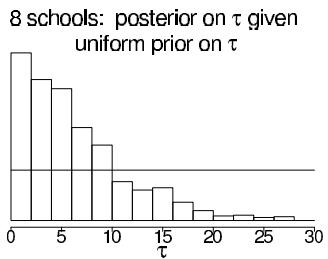

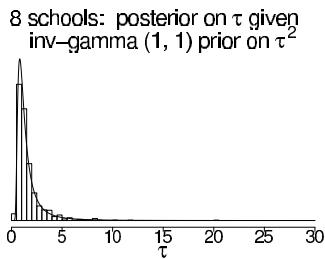

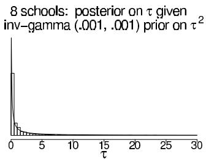  
Figure 5.9 Histograms of posterior simulations of the between-school standard deviation, $\tau$ , from models with three different prior distributions: (a) uniform prior distribution on $\tau$ , (b) inverse-gamma(1,1) prior distribution on $\tau^2$ , (c) inverse-gamma(0.001,0.001) prior distribution on $\tau^2$ . Overlain on each is the corresponding prior density function for $\tau$ . (For models (b) and (c), the density for $\tau$ is calculated using the gamma density function multiplied by the Jacobian of the $1 / \tau^2$ transformation.) In models (b) and (c), posterior inferences are strongly constrained by the prior distribution.

ferences. In particular, the posterior mean and median of $\tau$ are lower, and shrinkage of the $\theta_{j}$ 's is greater than in the previously fitted model with a uniform prior distribution on $\tau$ . To understand this, it helps to graph the prior distribution in the range for which the posterior distribution is substantial. The graph shows that the prior distribution is concentrated in the range [0.5, 5], a narrow zone in which the likelihood is close to flat compared to this prior (as we can see because the distribution of the posterior simulations of $\tau$ closely matches the prior distribution, $p(\tau)$ ). By comparison, in the left graph, the uniform prior distribution on $\tau$ seems closer to 'noninformative' for this problem, in the sense that it does not appear to be constraining the posterior inference.

Finally, the rightmost histogram in Figure 5.9 shows the corresponding result with an inverse-gamma(0.001, 0.001) prior distribution for $\tau^2$ . This prior distribution is even more sharply peaked near zero and further distorts posterior inferences, with the problem arising because the marginal likelihood for $\tau$ remains high near zero.

In this example, we do not consider a uniform prior density on $\log \tau$ , which would yield an improper posterior density with a spike at $\tau = 0$ , like the rightmost graph in Figure 5.9 but more so. We also do not consider a uniform prior density on $\tau^2$ , which would yield a posterior similar to the leftmost graph in Figure 5.9, but with a slightly higher right tail.

This example is a gratifying case in which the simplest approach—the uniform prior density on $\tau$ —seems to perform well. As detailed in Appendix C, this model is also straightforward to program directly in R or Stan.

The appearance of the histograms and density plots in Figure 5.9 is crucially affected by the choice to plot them on the scale of $\tau$ . If instead they were plotted on the scale of $\log \tau$ , the inverse-gamma(0.001, 0.001) prior density would appear to be the flattest. However, the inverse-gamma $(\epsilon, \epsilon)$ prior is not at all 'noninformative' for this problem since the resulting posterior distribution remains highly sensitive to the choice of $\epsilon$ . The hierarchical model likelihood does not constrain $\log \tau$ in the limit $\log \tau \to -\infty$ , and so a prior distribution that is noninformative on the log scale will not work.

# Weakly informative prior distribution for the 3-schools problem

The uniform prior distribution seems fine for the 8-school analysis, but problems arise if the number of groups $J$ is much smaller, in which case the data supply little information about the group-level variance, and a noninformative prior distribution can lead to a posterior distribution that is improper or is proper but unrealistically broad. We demonstrate by reanalyzing the 8-schools example using just the data from the first three of the schools.

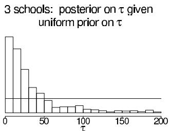

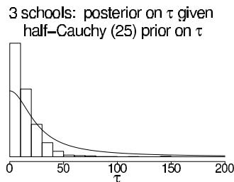  
Figure 5.10 Histograms of posterior simulations of the between-school standard deviation, $\tau$ , from models for the 3-schools data with two different prior distributions on $\tau$ : (a) uniform $(0,\infty)$ , (b) half-Cauchy with scale 25, set as a weakly informative prior distribution given that $\tau$ was expected to be well below 100. The histograms are not on the same scales. Overlain on each histogram is the corresponding prior density function. With only $J = 3$ groups, the noninformative uniform prior distribution is too weak, and the proper Cauchy distribution works better, without appearing to distort inferences in the area of high likelihood.

Figure 5.10 displays the inferences for $\tau$ based on two different priors. First we continue with the default uniform distribution that worked well with $J = 8$ (as seen in Figure 5.9). Unfortunately, as the left histogram of Figure 5.10 shows, the resulting posterior distribution for the 3-schools dataset has an extremely long right tail, containing values of $\tau$ that are too high to be reasonable. This heavy tail is expected since $J$ is so low (if $J$ were any lower, the right tail would have an infinite integral), and using this as a posterior distribution will have the effect of underpooling the estimates of the school effects $\theta_{j}$ .

The right histogram of Figure 5.10 shows the posterior inference for $\tau$ resulting from a half-Cauchy prior distribution with scale parameter $A = 25$ (a value chosen to be a bit higher than we expect for the standard deviation of the underlying $\theta_{j}$ 's in the context of this educational testing example, so that the model will constrain $\tau$ only weakly). As the line on the graph shows, this prior distribution is high over the plausible range of $\tau < 50$ , falling off gradually beyond this point. This prior distribution appears to perform well in this example, reflecting the marginal likelihood for $\tau$ at its low end but removing much of the unrealistic upper tail.

This half-Cauchy prior distribution would also perform well in the 8-schools problem; however it was unnecessary because the default uniform prior gave reasonable results. With only 3 schools, we went to the trouble of using a weakly informative prior, a distribution that was not intended to represent our actual prior state of knowledge about $\tau$ but rather to constrain the posterior distribution, to an extent allowed by the data.

# 5.8 Bibliographic note

The early non-Bayesian work on shrinkage estimation of Stein (1955) and James and Stein (1960) was influential in the development of hierarchical normal models. Efron and Morris (1971, 1972) present subsequent theoretical work on the topic. Robbins (1955, 1964) constructs and justifies hierarchical methods from a decision-theoretic perspective. De Finetti's theorem is described by de Finetti (1974); Bernardo and Smith (1994) discuss its role in Bayesian modeling. An early thorough development of the idea of Bayesian hierarchical modeling is given by Good (1965).

Mosteller and Wallace (1964) analyzed a hierarchical Bayesian model using the negative binomial distribution for counts of words in a study of authorship. Restricted to the limited computing power at the time, they used various approximations and point estimates for hyperparameters.

Other historically influential papers on 'empirical Bayes' (or, in our terminology, hierar-

chical Bayes) include Hartley and Rao (1967), Laird and Ware (1982) on longitudinal modeling, and Clayton and Kaldor (1987) and Breslow (1990) on epidemiology and biostatistics. Morris (1983) and Deely and Lindley (1981) explored the relation between Bayesian and non-Bayesian ideas for these models.

The problem of estimating several normal means using an exchangeable hierarchical model was treated in a fully Bayesian framework by Hill (1965), Tiao and Tan (1965, 1966), and Lindley (1971b). Box and Tiao (1973) present hierarchical normal models using slightly different notation from ours. They compare Bayesian and non-Bayesian methods and discuss the analysis of variance table in some detail. More references on hierarchical normal models appear in the bibliographic note at the end of Chapter 15.

The past few decades have seen the publication of applied Bayesian analyses using hierarchical models in a wide variety of application areas. For example, an important application of hierarchical models is 'small-area estimation,' in which estimates of population characteristics for local areas are improved by combining the data from each area with information from neighboring areas (with important early work from Fay and Herriot, 1979, Dempster and Raghunathan, 1987, and Mollie and Richardson, 1991). Other applications that have motivated methodological development include measurement error problems in epidemiology (for example, Richardson and Gilks, 1993), multiple comparisons in toxicology (Meng and Dempster, 1987), and education research (Bock, 1989). We provide references to a number of other applications in later chapters dealing with specific model types.

Hierarchical models can be viewed as a subclass of 'graphical models,' and this connection has been elegantly exploited for Bayesian inference in the development of the computer package Bugs, using techniques that will be explained in Chapter 11 (see also Appendix C); see Thomas, Spiegelhalter, and Gilks (1992), and Spiegelhalter et al. (1994, 2003). Related discussion and theoretical work appears in Lauritzen and Spiegelhalter (1988), Pearl (1988), Wermuth and Lauritzen (1990), and Normand and Tritchler (1992).

The rat tumor data were analyzed hierarchically by Tarone (1982) and Dempster, Selwyn, and Weeks (1983); our approach is close in spirit to the latter paper's. Leonard (1972) and Novick, Lewis, and Jackson (1973) are early examples of hierarchical Bayesian analysis of binomial data.

Much of the material in Sections 5.4 and 5.5, along with much of Section 6.5, originally appeared in Rubin (1981a), which is an early example of an applied Bayesian analysis using simulation techniques. For later work on the effects of coaching on Scholastic Aptitude Test scores, see Hansen (2004).

The weakly-informative half-Cauchy prior distribution for the 3-schools problem in Section 5.7 comes from Gelman (2006a). Polson and Scott (2012) provide a theoretical justification for this model.

The material of Section 5.6 is adapted from Carlin (1992), which contains several key references on meta-analysis; the original data for the example are from Yusuf et al. (1985); a similar Bayesian analysis of these data under a slightly different model appears as an example in Spiegelhalter et al. (1994, 2003). Thall et al. (2003) discuss hierarchical models for medical treatments that vary across subtypes of a disease. More general treatments of meta-analysis from a Bayesian perspective are provided by DuMouchel (1990), Rubin (1989), Skene and Wakefield (1990), and Smith, Spiegelhalter, and Thomas (1995). An example of a Bayesian meta-analysis appears in Dominici et al. (1999). DuMouchel and Harris (1983) present what is essentially a meta-analysis with covariates on the studies; this article is accompanied by some interesting discussion by prominent Bayesian and non-Bayesian statisticians. Higgins and Whitehead (1996) discuss how to construct a prior distribution for the group-level variance in a meta-analysis by considering it as an example from larger population of meta-analyses. Lau, Ioannidis, and Schmid (1997) provide practical advice on meta-analysis.

# 5.9 Exercises

1. Exchangeability with known model parameters: For each of the following three examples, answer: (i) Are observations $y_{1}$ and $y_{2}$ exchangeable? (ii) Are observations $y_{1}$ and $y_{2}$ independent? (iii) Can we act as if the two observations are independent?

(a) A box has one black ball and one white ball. We pick a ball $y_{1}$ at random, put it back, and pick another ball $y_{2}$ at random.   
(b) A box has one black ball and one white ball. We pick a ball $y_{1}$ at random, we do not put it back, then we pick ball $y_{2}$ .   
(c) A box has a million black balls and a million white balls. We pick a ball $y_{1}$ at random, we do not put it back, then we pick ball $y_{2}$ at random.

2. Exchangeability with known model parameters: For each of the following three examples, answer: (i) Are observations $y_{1}$ and $y_{2}$ exchangeable? (ii) Are observations $y_{1}$ and $y_{2}$ independent? (iii) Can we act as if the two observations are independent?

(a) A box has $n$ black and white balls but we do not know how many of each color. We pick a ball $y_{1}$ at random, put it back, and pick another ball $y_{2}$ at random.   
(b) A box has $n$ black and white balls but we do not know how many of each color. We pick a ball $y_{1}$ at random, we do not put it back, then we pick ball $y_{2}$ at random.   
(c) Same as (b) but we know that there are many balls of each color in the box.

3. Hierarchical models and multiple comparisons:

(a) Reproduce the computations in Section 5.5 for the educational testing example. Use the posterior simulations to estimate (i) for each school $j$ , the probability that its coaching program is the best of the eight; and (ii) for each pair of schools, $j$ and $k$ , the probability that the coaching program in school $j$ is better than that in school $k$ .   
(b) Repeat (a), but for the simpler model with $\tau$ set to $\infty$ (that is, separate estimation for the eight schools). In this case, the probabilities (i) and (ii) can be computed analytically.   
(c) Discuss how the answers in (a) and (b) differ.   
(d) In the model with $\tau$ set to 0, the probabilities (i) and (ii) have degenerate values; what are they?

4. Exchangeable prior distributions: suppose it is known a priori that the $2J$ parameters $\theta_{1},\ldots ,\theta_{2J}$ are clustered into two groups, with exactly half being drawn from a $\mathbf{N}(1,1)$ distribution, and the other half being drawn from a $\mathbf{N}(-1,1)$ distribution, but we have not observed which parameters come from which distribution.

(a) Are $\theta_{1},\ldots ,\theta_{2J}$ exchangeable under this prior distribution?   
(b) Show that this distribution cannot be written as a mixture of independent and identically distributed components.   
(c) Why can we not simply take the limit as $J \to \infty$ and get a counterexample to de Finetti's theorem?

See Exercise 8.10 for a related problem.

5. Mixtures of independent distributions: suppose the distribution of $\theta = (\theta_{1},\dots,\theta_{J})$ can be written as a mixture of independent and identically distributed components:

$$
p (\theta) = \int \prod_ {j = 1} ^ {J} p (\theta_ {j} | \phi) p (\phi) d \phi .
$$

Prove that the covariances $\operatorname{cov}(\theta_i, \theta_j)$ are all nonnegative.

6. Exchangeable models:

(a) In the divorce rate example of Section 5.2, set up a prior distribution for the values $y_{1}, \ldots, y_{8}$ that allows for one low value (Utah) and one high value (Nevada), with independent and identical distributions for the other six values. This prior distribution should be exchangeable, because it is not known which of the eight states correspond to Utah and Nevada.   
(b) Determine the posterior distribution for $y_{8}$ under this model given the observed values of $y_{1},\ldots ,y_{7}$ given in the example. This posterior distribution should probably have two or three modes, corresponding to the possibilities that the missing state is Utah, Nevada, or one of the other six.   
(c) Now consider the entire set of eight data points, including the value for $y_{8}$ given at the end of the example. Are these data consistent with the prior distribution you gave in part (a) above? In particular, did your prior distribution allow for the possibility that the actual data have an outlier (Nevada) at the high end, but no outlier at the low end?

# 7. Continuous mixture models:

(a) If $y|\theta \sim \mathrm{Poisson}(\theta)$ , and $\theta \sim \mathrm{Gamma}(\alpha, \beta)$ , then the marginal (prior predictive) distribution of $y$ is negative binomial with parameters $\alpha$ and $\beta$ (or $p = \beta / (1 + \beta)$ ). Use the formulas (2.7) and (2.8) to derive the mean and variance of the negative binomial.   
(b) In the normal model with unknown location and scale $(\mu, \sigma^2)$ , the noninformative prior density, $p(\mu, \sigma^2) \propto 1 / \sigma^2$ , results in a normal-inverse- $\chi^2$ posterior distribution for $(\mu, \sigma^2)$ . Marginally then $\sqrt{n} (\mu - \overline{y}) / s$ has a posterior distribution that is $t_{n-1}$ . Use (2.7) and (2.8) to derive the first two moments of the latter distribution, stating the appropriate condition on $n$ for existence of both moments.

8. Discrete mixture models: if $p_m(\theta)$ , for $m = 1, \dots, M$ , are conjugate prior densities for the sampling model $y|\theta$ , show that the class of finite mixture prior densities given by

$$
p (\theta) = \sum_ {m = 1} ^ {M} \lambda_ {m} p _ {m} (\theta)
$$

is also a conjugate class, where the $\lambda_{m}$ 's are nonnegative weights that sum to 1. This can provide a useful extension of the natural conjugate prior family to more flexible distributional forms. As an example, use the mixture form to create a bimodal prior density for a normal mean, that is thought to be near 1, with a standard deviation of 0.5, but has a small probability of being near $-1$ , with the same standard deviation. If the variance of each observation $y_{1},\ldots ,y_{10}$ is known to be 1, and their observed mean is $\overline{y} = -0.25$ , derive your posterior distribution for the mean, making a sketch of both prior and posterior densities. Be careful: the prior and posterior mixture proportions are different.

9. Noninformative hyperprior distributions: consider the hierarchical binomial model in Section 5.3. Improper posterior distributions are, in fact, a general problem with hierarchical models when a uniform prior distribution is specified for the logarithm of the population standard deviation of the exchangeable parameters. In the case of the beta population distribution, the prior variance is approximately $(\alpha + \beta)^{-1}$ (see Appendix A), and so a uniform distribution on $\log (\alpha + \beta)$ is approximately uniform on the log standard deviation. The resulting unnormalized posterior density (5.8) has an infinite integral in the limit as the population standard deviation approaches 0. We encountered the problem again in Section 5.4 for the hierarchical normal model.

(a) Show that, with a uniform prior density on $(\log(\frac{\alpha}{\beta}), \log(\alpha + \beta))$ , the unnormalized posterior density has an infinite integral.

(b) A simple way to avoid the impropriety is to assign a uniform prior distribution to the standard deviation parameter itself, rather than its logarithm. For the beta population distribution we are considering here, this is achieved approximately by assigning a uniform prior distribution to $(\alpha + \beta)^{-1/2}$ . Show that combining this with an independent uniform prior distribution on $\frac{\alpha}{\alpha + \beta}$ yields the prior density (5.10).   
(c) Show that the resulting posterior density (5.8) is proper as long as $0 < y_{j} < n_{j}$ for at least one experiment $j$ .

10. Checking the integrability of the posterior distribution: consider the hierarchical normal model in Section 5.4.

(a) If the hyperprior distribution is $p(\mu, \tau) \propto \tau^{-1}$ (that is, $p(\mu, \log \tau) \propto 1$ ), show that the posterior density is improper.   
(b) If the hyperprior distribution is $p(\mu, \tau) \propto 1$ , show that the posterior density is proper if $J > 2$ .   
(c) How would you analyze SAT coaching data if $J = 2$ (that is, data from only two schools)?

11. Nonconjugate hierarchical models: suppose that in the rat tumor example, we wish to use a normal population distribution on the log-odds scale: $\mathrm{logit}(\theta_j) \sim \mathrm{N}(\mu, \tau^2)$ , for $j = 1, \ldots, J$ . As in Section 5.3, you will assign a noninformative prior distribution to the hyperparameters and perform a full Bayesian analysis.

(a) Write the joint posterior density, $p(\theta ,\mu ,\tau |y)$   
(b) Show that the integral (5.4) has no closed-form expression.   
(c) Why is expression (5.5) no help for this problem?

In practice, we can solve this problem by normal approximation, importance sampling, and Markov chain simulation, as described in Part III.

12. Conditional posterior means and variances: derive analytic expressions for $\operatorname{E}(\theta_j|\tau, y)$ and $\operatorname{var}(\theta_j|\tau, y)$ in the hierarchical normal model (and used in Figures 5.6 and 5.7). (Hint: use (2.7) and (2.8), averaging over $\mu$ .)   
13. Hierarchical binomial model: Exercise 3.8 described a survey of bicycle traffic in Berkeley, California, with data displayed in Table 3.3. For this problem, restrict your attention to the first two rows of the table: residential streets labeled as 'bike routes,' which we will use to illustrate this computational exercise.

(a) Set up a model for the data in Table 3.3 so that, for $j = 1,\ldots ,10$ , the observed number of bicycles at location $j$ is binomial with unknown probability $\theta_{j}$ and sample size equal to the total number of vehicles (bicycles included) in that block. The parameter $\theta_{j}$ can be interpreted as the underlying or 'true' proportion of traffic at location $j$ that is bicycles. (See Exercise 3.8.) Assign a beta population distribution for the parameters $\theta_{j}$ and a noninformative hyperprior distribution as in the rat tumor example of Section 5.3. Write down the joint posterior distribution.   
(b) Compute the marginal posterior density of the hyperparameters and draw simulations from the joint posterior distribution of the parameters and hyperparameters, as in Section 5.3.   
(c) Compare the posterior distributions of the parameters $\theta_{j}$ to the raw proportions, (number of bicycles / total number of vehicles) in location $j$ . How do the inferences from the posterior distribution differ from the raw proportions?   
(d) Give a $95\%$ posterior interval for the average underlying proportion of traffic that is bicycles.   
(e) A new city block is sampled at random and is a residential street with a bike route. In an hour of observation, 100 vehicles of all kinds go by. Give a $95\%$ posterior interval

for the number of those vehicles that are bicycles. Discuss how much you trust this interval in application.

(f) Was the beta distribution for the $\theta_{j}$ 's reasonable?

14. Hierarchical Poisson model: consider the dataset in the previous problem, but suppose only the total amount of traffic at each location is observed.

(a) Set up a model in which the total number of vehicles observed at each location $j$ follows a Poisson distribution with parameter $\theta_{j}$ , the 'true' rate of traffic per hour at that location. Assign a gamma population distribution for the parameters $\theta_{j}$ and a noninformative hyperprior distribution. Write down the joint posterior distribution.   
(b) Compute the marginal posterior density of the hyperparameters and plot its contours. Simulate random draws from the posterior distribution of the hyperparameters and make a scatterplot of the simulation draws.   
(c) Is the posterior density integrable? Answer analytically by examining the joint posterior density at the limits or empirically by examining the plots of the marginal posterior density above.   
(d) If the posterior density is not integrable, alter it and repeat the previous two steps.   
(e) Draw samples from the joint posterior distribution of the parameters and hyperparameters, by analogy to the method used in the hierarchical binomial model.

15. Meta-analysis: perform the computations for the meta-analysis data of Table 5.4.

(a) Plot the posterior density of $\tau$ over an appropriate range that includes essentially all of the posterior density, analogous to Figure 5.5.   
(b) Produce graphs analogous to Figures 5.6 and 5.7 to display how the posterior means and standard deviations of the $\theta_{j}$ 's depend on $\tau$ .   
(c) Produce a scatterplot of the crude effect estimates vs. the posterior median effect estimates of the 22 studies. Verify that the studies with smallest sample sizes are partially pooled the most toward the mean.   
(d) Draw simulations from the posterior distribution of a new treatment effect, $\tilde{\theta}_j$ . Plot a histogram of the simulations.   
(e) Given the simulations just obtained, draw simulated outcomes from replications of a hypothetical new experiment with 100 persons in each of the treated and control groups. Plot a histogram of the simulations of the crude estimated treatment effect (5.23) in the new experiment.

16. Equivalent data: Suppose we wish to apply the inferences from the meta-analysis example in Section 5.6 to data on a new study with equal numbers of people in the control and treatment groups. How large would the study have to be so that the prior and data were weighted equally in the posterior inference for that study?

17. Informative prior distributions: Continuing the example from Exercise 2.22, consider a (hypothetical) study of a simple training program for basketball free-throw shooting. A random sample of 100 college students is recruited into the study. Each student first shoots 100 free-throws to establish a baseline success probability. Each student then takes 50 practice shots each day for a month. At the end of that time, he or she takes 100 shots for a final measurement.

Let $\theta_{i}$ be the improvement in success probability for person $i$ . For simplicity, assume the $\theta_{i}$ 's are normally distributed with mean $\mu$ and standard deviation $\sigma$ .

Give three joint prior distributions for $\mu, \sigma$ :

(a) A noninformative prior distribution,   
(b) A subjective prior distribution based on your best knowledge, and   
(c) A weakly informative prior distribution.

# Part II: Fundamentals of Bayesian Data Analysis

For most problems of applied Bayesian statistics, the data analyst must go beyond the simple structure of prior distribution, likelihood, and posterior distribution. In Chapter 6, we discuss methods of assessing the sensitivity of posterior inferences to model assumptions and checking the fit of a probability model to data and substantive information. Model checking allows an escape from the tautological aspect of formal approaches to Bayesian inference, under which all conclusions are conditional on the truth of the posited model. Chapter 7 considers evaluating and comparing models using predictive accuracy, adjusting for the parameters being fit to the data. Chapter 8 outlines the role of study design and methods of data collection in probability modeling, focusing on how to set up Bayesian inference for sample surveys, designed experiments, and observational studies; this chapter contains some of the most conceptually distinctive and potentially difficult material in the book. Chapter 9 discusses the use of Bayesian inference in applied decision analysis, illustrating with examples from social science, medicine, and public health. These four chapters explore the creative choices that are required, first to set up a Bayesian model in a complex problem, then to perform the model checking and confidence building that is typically necessary to make posterior inferences scientifically defensible, and finally to use the inferences in decision making.

