# Model Checking

[Package map](../structure.md) · [Unsplit OCR dump](./_full.md)

[← Ch. 5 Hierarchical Models](./05-hierarchical-models.md) · [Ch. 7 Evaluating Models →](./07-evaluating-comparing-expanding.md)

> MinerU OCR dump. If a formula, table, or numbering disagrees with the PDF, the PDF is authoritative.

---

# 6.1 The place of model checking in applied Bayesian statistics

Once we have accomplished the first two steps of a Bayesian analysis—constructing a probability model and computing the posterior distribution of all estimands—we should not ignore the relatively easy step of assessing the fit of the model to the data and to our substantive knowledge. It is difficult to include in a probability distribution all of one's knowledge about a problem, and so it is wise to investigate what aspects of reality are not captured by the model.

Checking the model is crucial to statistical analysis. Bayesian prior-to-posterior inferences assume the whole structure of a probability model and can yield misleading inferences when the model is poor. A good Bayesian analysis, therefore, should include at least some check of the adequacy of the fit of the model to the data and the plausibility of the model for the purposes for which the model will be used. This is sometimes discussed as a problem of sensitivity to the prior distribution, but in practice the likelihood model is typically just as suspect; throughout, we use 'model' to encompass the sampling distribution, the prior distribution, any hierarchical structure, and issues such as which explanatory variables have been included in a regression.

# Sensitivity analysis and model improvement

It is typically the case that more than one reasonable probability model can provide an adequate fit to the data in a scientific problem. The basic question of a sensitivity analysis is: how much do posterior inferences change when other reasonable probability models are used in place of the present model? Other reasonable models may differ substantially from the present model in the prior specification, the sampling distribution, or in what information is included (for example, predictor variables in a regression). It is possible that the present model provides an adequate fit to the data, but that posterior inferences differ under plausible alternative models.

In theory, both model checking and sensitivity analysis can be incorporated into the usual prior-to-posterior analysis. Under this perspective, model checking is done by setting up a comprehensive joint distribution, such that any data that might be observed are plausible outcomes under the joint distribution. That is, this joint distribution is a mixture of all possible 'true' models or realities, incorporating all known substantive information. The prior distribution in such a case incorporates prior beliefs about the likelihood of the competing realities and about the parameters of the constituent models. The posterior distribution of such an 'exhaustive' probability model automatically incorporates all 'sensitivity analysis' but is still predicated on the truth of some member of the larger class of models.

In practice, however, setting up such a super-model to include all possibilities and all substantive knowledge is both conceptually impossible and computationally infeasible in all but the simplest problems. It is thus necessary for us to examine our models in other ways

to see how they fail to fit reality and how sensitive the resulting posterior distributions are to arbitrary specifications.

# Judging model flaws by their practical implications

We do not like to ask, 'Is our model true or false?', since probability models in most data analyses will not be perfectly true. Even the coin tosses and die rolls ubiquitous in probability theory texts are not truly exchangeable. The more relevant question is, 'Do the model's deficiencies have a noticeable effect on the substantive inferences?'

In the examples of Chapter 5, the beta population distribution for the tumor rates and the normal distribution for the eight school effects are both chosen partly for convenience. In these examples, making convenient distributional assumptions turns out not to matter, in terms of the impact on the inferences of most interest. How to judge when assumptions of convenience can be made safely is a central task of Bayesian sensitivity analysis. Failures in the model lead to practical problems by creating clearly false inferences about estimands of interest.

# 6.2 Do the inferences from the model make sense?

In any applied problem, there will be knowledge that is not included formally in either the prior distribution or the likelihood, for reasons of convenience or objectivity. If the additional information suggests that posterior inferences of interest are false, then this suggests a potential for creating a more accurate probability model for the parameters and data collection process. We illustrate with an example of a hierarchical regression model.

# Example. Evaluating election predictions by comparing to substantive political knowledge

Figure 6.1 displays a forecast, made in early October, 1992, of the probability that Bill Clinton would win each state in the U.S. presidential election that November. The estimates are posterior probabilities based on a hierarchical linear regression model. For each state, the height of the shaded part of the box represents the estimated probability that Clinton would win the state. Even before the election occurred, the forecasts for some of the states looked wrong; for example, from state polls, Clinton was known in October to be much weaker in Texas and Florida than shown in the map. This does not mean that the forecast is useless, but it is good to know where the weak points are. Certainly, after the election, we can do an even better job of criticizing the model and understanding its weaknesses. We return to this election forecasting example in Section 15.2 as an example of a hierarchical linear model.

# External validation

More formally, we can check a model by external validation using the model to make predictions about future data, and then collecting those data and comparing to their predictions. Posterior means should be correct on average, $50\%$ intervals should contain the true values half the time, and so forth. We used external validation to check the empirical probability estimates in the record-linkage example in Section 1.7, and we apply the idea again to check a toxicology model in Section 19.2. In the latter example, the external validation (see Figure 19.10 on page 484) reveals a generally reasonable fit but with some notable discrepancies between predictions and external data. Often we need to check the model before obtaining new data or waiting for the future to happen. In this chapter and the next, we discuss methods which can approximate external validation using the data we already have.

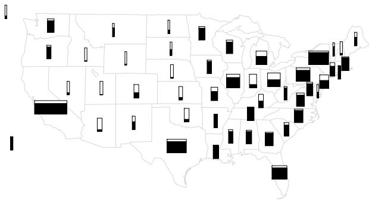  
Figure 6.1 Summary of a forecast of the 1992 U.S. presidential election performed one month before the election. For each state, the proportion of the box that is shaded represents the estimated probability of Clinton winning the state; the width of the box is proportional to the number of electoral votes for the state.

# Choices in defining the predictive quantities

A single model can be used to make different predictions. For example, in the SAT example we could consider a joint prediction for future data from the 8 schools in the study, $p(\tilde{y} | y)$ , a joint prediction for 8 new schools $p(\tilde{y}_i | y)$ , $i = 9, \dots, 16$ , or any other combination of new and existing schools. Other scenarios may have even more different choices in defining the focus of predictions. For example, in analyses of sample surveys and designed experiments, it often makes sense to consider hypothetical replications of the experiment with a new randomization of selection or treatment assignment, by analogy to classical randomization tests.

Sections 6.3 and 6.4 discuss posterior predictive checking, which use global summaries to check the joint posterior predictive distribution $p(\tilde{y} | y)$ . At the end of Section 6.3 we briefly discuss methods that combine inferences for local quantities to check marginal predictive distributions $p(\tilde{y}_i | y)$ , an idea that is related to cross-validation methods considered in Chapter 7.

# 6.3 Posterior predictive checking

If the model fits, then replicated data generated under the model should look similar to observed data. To put it another way, the observed data should look plausible under the posterior predictive distribution. This is really a self-consistency check: an observed discrepancy can be due to model misfit or chance.

Our basic technique for checking the fit of a model to data is to draw simulated values from the joint posterior predictive distribution of replicated data and compare these samples to the observed data. Any systematic differences between the simulations and the data indicate potential failings of the model.

We introduce posterior predictive checking with a simple example of an obviously poorly fitting model, and then in the rest of this section we lay out the key choices involved in posterior predictive checking. Sections 6.3 and 6.4 discuss numerical and graphical predictive checks in more detail.

# Example. Comparing Newcomb's speed of light measurements to the posterior predictive distribution

Simon Newcomb's 66 measurements on the speed of light are presented in Section 3.2. In the absence of other information, in Section 3.2 we modeled the measurements as

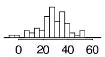

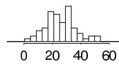

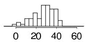

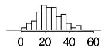

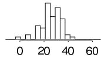

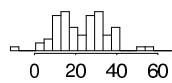

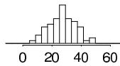

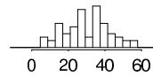

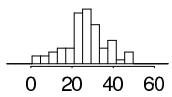

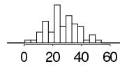

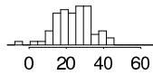

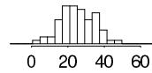

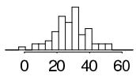

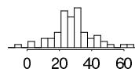

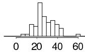

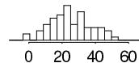

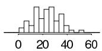

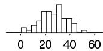

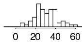

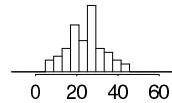  
Figure 6.2 Twenty replications, $y^{\mathrm{rep}}$ , of the speed of light data from the posterior predictive distribution, $p(y^{\mathrm{rep}}|y)$ ; compare to observed data, $y$ , in Figure 3.1. Each histogram displays the result of drawing 66 independent values $\tilde{y}_i$ from a common normal distribution with mean and variance $(\mu, \sigma^2)$ drawn from the posterior distribution, $p(\mu, \sigma^2|y)$ , under the normal model.

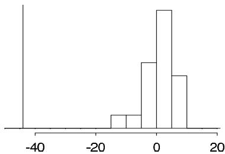  
Figure 6.3 Smallest observation of Newcomb's speed of light data (the vertical line at the left of the graph), compared to the smallest observations from each of the 20 posterior predictive simulated datasets displayed in Figure 6.2.

$\mathrm{N}(\mu, \sigma^2)$ , with a noninformative uniform prior distribution on $(\mu, \log \sigma)$ . However, the lowest of Newcomb's measurements look like outliers compared to the rest of the data. Could the extreme measurements have reasonably come from a normal distribution? We address this question by comparing the observed data to what we expect to be observed under our posterior distribution. Figure 6.2 displays twenty histograms, each of which represents a single draw from the posterior predictive distribution of the values in Newcomb's experiment, obtained by first drawing $(\mu, \sigma^2)$ from their joint posterior distribution, then drawing 66 values from a normal distribution with this mean and variance. All these histograms look different from the histogram of actual data in Figure 3.1 on page 67. One way to measure the discrepancy is to compare the smallest value in each hypothetical replicated dataset to Newcomb's smallest observation, -44. The histogram in Figure 6.3 shows the smallest observation in each of the 20 hypothetical replications; all are much larger than Newcomb's smallest observation, which is indicated by a vertical line on the graph. The normal model clearly does not capture the variation that Newcomb observed. A revised model might use an asymmetric contaminated normal distribution or a symmetric long-tailed distribution in place of the normal measurement model.

Many other examples of posterior predictive checks appear throughout the book, including the educational testing example in Section 6.5, linear regressions examples in Sections 14.3 and 15.2, and a hierarchical mixture model in Section 22.2.

For many problems, it is useful to examine graphical comparisons of summaries of the data to summaries from posterior predictive simulations, as in Figure 6.3. In cases with less blatant discrepancies than the outliers in the speed of light data, it is often also useful to measure the 'statistical significance' of the lack of fit, a notion we formalize here.

# Notation for replications

Let $y$ be the observed data and $\theta$ be the vector of parameters (including all the hyperparameters if the model is hierarchical). To avoid confusion with the observed data, $y$ , we define $y^{\mathrm{rep}}$ as the replicated data that could have been observed, or, to think predictively, as the data we would see tomorrow if the experiment that produced $y$ today were replicated with the same model and the same value of $\theta$ that produced the observed data.

We distinguish between $y^{\mathrm{rep}}$ and $\tilde{y}$ , our general notation for predictive outcomes: $\tilde{y}$ is any future observable value or vector of observable quantities, whereas $y^{\mathrm{rep}}$ is specifically a replication just like $y$ . For example, if the model has explanatory variables, $x$ , they will be identical for $y$ and $y^{\mathrm{rep}}$ , but $\tilde{y}$ may have its own explanatory variables, $\tilde{x}$ .

We will work with the distribution of $y^{\mathrm{rep}}$ given the current state of knowledge, that is, with the posterior predictive distribution

$$
p (y ^ {\mathrm {r e p}} | y) = \int p (y ^ {\mathrm {r e p}} | \theta) p (\theta | y) d \theta . \tag {6.1}
$$

# Test quantities

We measure the discrepancy between model and data by defining test quantities, the aspects of the data we wish to check. A test quantity, or discrepancy measure, $T(y,\theta)$ , is a scalar summary of parameters and data that is used as a standard when comparing data to predictive simulations. Test quantities play the role in Bayesian model checking that test statistics play in classical testing. We use the notation $T(y)$ for a test statistic, which is a test quantity that depends only on data; in the Bayesian context, we can generalize test statistics to allow dependence on the model parameters under their posterior distribution. This can be useful in directly summarizing discrepancies between model and data. We discuss options for graphical test quantities in Section 6.4. The test quantities in this section are usually functions of $y$ or replicated data $y^{\mathrm{rep}}$ . In the end of this section we briefly discuss a different sort of test quantities used for calibration that are functions of both $y_i$ and $y_i^{\mathrm{rep}}$ (or $\tilde{y}_i$ ). In Chapter 7 we discuss measures of discrepancy between model and data, that is, measures of predictive accuracy that are also functions of both $y_i$ and $y_i^{\mathrm{rep}}$ (or $\tilde{y}_i$ ).

# Tail-area probabilities

Lack of fit of the data with respect to the posterior predictive distribution can be measured by the tail-area probability, or $p$ -value, of the test quantity, and computed using posterior simulations of $(\theta, y^{\mathrm{rep}})$ . We define the $p$ -value mathematically, first for the familiar classical test and then in the Bayesian context.

Classical $p$ -values. The classical $p$ -value for the test statistic $T(y)$ is

$$
p _ {C} = \Pr (T (y ^ {\text {r e p}}) \geq T (y) | \theta), \tag {6.2}
$$

where the probability is taken over the distribution of $y^{\mathrm{rep}}$ with $\theta$ fixed. (The distribution of $y^{\mathrm{rep}}$ given $y$ and $\theta$ is the same as its distribution given $\theta$ alone.) Test statistics are classically derived in a variety of ways but generally represent a summary measure of discrepancy between the observed data and what would be expected under a model with a particular value of $\theta$ . This value may be a 'null' value, corresponding to a 'null hypothesis,' or a point estimate such as the maximum likelihood value. A point estimate for $\theta$ must be substituted to compute a $p$ -value in classical statistics.

Posterior predictive $p$ -values. To evaluate the fit of the posterior distribution of a Bayesian model, we can compare the observed data to the posterior predictive distribution. In the Bayesian approach, test quantities can be functions of the unknown parameters as well as data because the test quantity is evaluated over draws from the posterior distribution of the unknown parameters. The Bayesian $p$ -value is defined as the probability that the replicated data could be more extreme than the observed data, as measured by the test quantity:

$$
p _ {B} = \operatorname * {P r} (T (y ^ {\mathrm {r e p}}, \theta) \geq T (y, \theta) | y),
$$

where the probability is taken over the posterior distribution of $\theta$ and the posterior predictive distribution of $y^{\mathrm{rep}}$ (that is, the joint distribution, $p(\theta ,y^{\mathrm{rep}}|y)$ ):

$$
p _ {B} = \iint I _ {T (y ^ {\mathrm {r e p}}, \theta) \geq T (y, \theta)} p (y ^ {\mathrm {r e p}} | \theta) p (\theta | y) d y ^ {\mathrm {r e p}} d \theta ,
$$

where $I$ is the indicator function. In this formula, we have used the property of the predictive distribution that $p(y^{\mathrm{rep}}|\theta ,y) = p(y^{\mathrm{rep}}|\theta)$ .

In practice, we usually compute the posterior predictive distribution using simulation. If we already have $S$ simulations from the posterior density of $\theta$ , we just draw one $y^{\mathrm{rep}}$ from the predictive distribution for each simulated $\theta$ ; we now have $S$ draws from the joint posterior distribution, $p(y^{\mathrm{rep}},\theta |y)$ . The posterior predictive check is the comparison between the realized test quantities, $T(y,\theta^{s})$ , and the predictive test quantities, $T(y^{\mathrm{rep}s},\theta^{s})$ . The estimated $p$ -value is just the proportion of these $S$ simulations for which the test quantity equals or exceeds its realized value; that is, for which $T(y^{\mathrm{rep}s},\theta^{s})\geq T(y,\theta^{s}), s = 1,\ldots ,S$ .

In contrast to the classical approach, Bayesian model checking does not require special methods to handle 'nuisance parameters'; by using posterior simulations, we implicitly average over all the parameters in the model.

# Example. Speed of light (continued)

In Figure 6.3, we demonstrated the poor fit of the normal model to the speed of light data using $\min(y_i)$ as the test statistic. We continue this example using other test quantities to illustrate how the fit of a model depends on the aspects of the data and parameters being monitored. Figure 6.4a shows the observed sample variance and the distribution of 200 simulated variances from the posterior predictive distribution. The sample variance does not make a good test statistic because it is a sufficient statistic of the model and thus, in the absence of an informative prior distribution, the posterior distribution will automatically be centered near the observed value. We are not at all surprised to find an estimated $p$ -value close to $\frac{1}{2}$ .

The model check based on $\min(y_i)$ earlier in the chapter suggests that the normal model is inadequate. To illustrate that a model can be inadequate for some purposes but adequate for others, we assess whether the model is adequate except for the extreme tails by considering a model check based on a test quantity sensitive to asymmetry in the center of the distribution,

$$
T (y, \theta) = | y _ {(6 1)} - \theta | - | y _ {(6)} - \theta |.
$$

The 61st and 6th order statistics are chosen to represent approximately the $90\%$ and

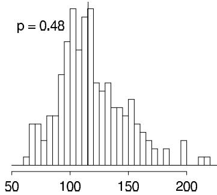

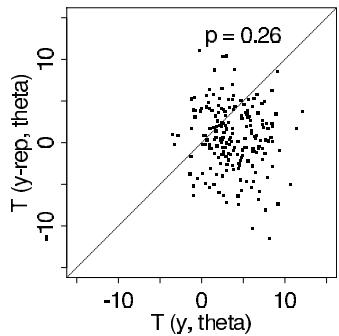  
Figure 6.4 Realized vs. posterior predictive distributions for two more test quantities in the speed of light example: (a) Sample variance (vertical line at 115.5), compared to 200 simulations from the posterior predictive distribution of the sample variance. (b) Scatterplot showing prior and posterior simulations of a test quantity: $T(y, \theta) = |y_{(61)} - \theta| - |y_{(6)} - \theta|$ (horizontal axis) vs. $T(y^{\mathrm{rep}}, \theta) = |y_{(61)}^{\mathrm{rep}} - \theta| - |y_{(6)}^{\mathrm{rep}} - \theta|$ (vertical axis) based on 200 simulations from the posterior distribution of $(\theta, y^{\mathrm{rep}})$ . The $p$ -value is computed as the proportion of points in the upper-left half of the scatterplot.

$10\%$ points of the distribution. The test quantity should be scattered about zero for a symmetric distribution. The scatterplot in Figure 6.4b shows the test quantity for the observed data and the test quantity evaluated for the simulated data for 200 simulations from the posterior distribution of $(\theta, \sigma^2)$ . The estimated $p$ -value is 0.26, implying that any observed asymmetry in the middle of the distribution can easily be explained by sampling variation.

# Choosing test quantities

The procedure for carrying out a posterior predictive model check requires specifying a test quantity, $T(y)$ or $T(y,\theta)$ , and an appropriate predictive distribution for the replications $y^{\mathrm{rep}}$ (which involves deciding which if any aspects of the data to condition on, as discussed at the end of Section 6.3). If $T(y)$ does not appear to be consistent with the set of values $T(y^{\mathrm{rep1}},\ldots ,T(y^{\mathrm{repS}})$ , then the model is making predictions that do not fit the data. The discrepancy between $T(y)$ and the distribution of $T(y^{\mathrm{rep}})$ can be summarized by a $p$ -value (as discussed in Section 6.3) but we prefer to look at the magnitude of the discrepancy as well as its $p$ -value.

# Example. Checking the assumption of independence in binomial trials

Consider a sequence of binary outcomes, $y_{1}, \ldots, y_{n}$ , modeled as a specified number of independent trials with a common probability of success, $\theta$ , that is given a uniform prior distribution. As discussed in Chapter 2, the posterior density under the model is $p(\theta | y) \propto \theta^{\sum y} (1 - \theta)^{n - \sum y}$ , which depends on the data only through the sufficient statistic, $\sum_{i=1}^{n} y_{i}$ . Now suppose the observed data are, in order, 1, 1, 0, 0, 0, 0, 0, 1, 1, 1, 1, 1, 0, 0, 0, 0, 0, 0, 0. The observed autocorrelation is evidence that the model is flawed. To quantify the evidence, we can perform a posterior predictive test using the test quantity $T =$ number of switches between 0 and 1 in the sequence. The observed value is $T(y) = 3$ , and we can determine the posterior predictive distribution of $T(y^{\mathrm{rep}})$ by simulation. To simulate $y^{\mathrm{rep}}$ under the model, we first draw $\theta$ from its Beta(8,14) posterior distribution, then draw $y^{\mathrm{rep}} = (y_{1}^{\mathrm{rep}}, \ldots, y_{20}^{\mathrm{rep}})$ as independent Bernoulli variables with probability $\theta$ . Figure 6.5 displays a histogram of the values of $T(y^{\mathrm{rep}s})$ for simulation draws $s = 1, \ldots, 10000$ , with the observed value, $T(y) = 3$ , shown by a vertical line. The observed number of switches is about one-third as many

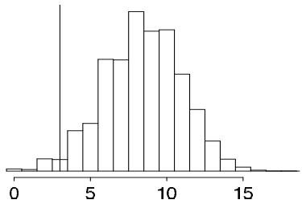  
Figure 6.5 Observed number of switches (vertical line at $T(y) = 3$ ), compared to 10,000 simulations from the posterior predictive distribution of the number of switches, $T(y^{\mathrm{rep}})$ .

as would be expected from the model under the posterior predictive distribution, and the discrepancy cannot easily be explained by chance, as indicated by the computed $p$ -value of $\frac{9838}{10000}$ . To convert to a $p$ -value near zero, we can change the sign of the test statistic, which amounts to computing $\operatorname*{Pr}(T(y^{\mathrm{rep}},\theta)\leq T(y,\theta)|y)$ , which is 0.028 in this case. The $p$ -values measured from the two ends have a sum that is greater than 1 because of the discreteness of the distribution of $T(y^{\mathrm{rep}})$ .

For many problems, a function of data and parameters can directly address a particular aspect of a model in a way that would be difficult or awkward using a function of data alone. If the test quantity depends on $\theta$ as well as $y$ , then the test quantity $T(y,\theta)$ as well as its replication $T(y^{\mathrm{rep}},\theta)$ are unknowns and are represented by $S$ simulations, and the comparison can be displayed either as a scatterplot of the values $T(y,\theta^{s})$ vs. $T(y^{\mathrm{reps}},\theta^{s})$ or a histogram of the differences, $T(y,\theta^{s}) - T(y^{\mathrm{reps}},\theta^{s})$ . Under the model, the scatterplot should be symmetric about the $45^{\circ}$ line and the histogram should include 0.

Because a probability model can fail to reflect the process that generated the data in any number of ways, posterior predictive $p$ -values can be computed for a variety of test quantities in order to evaluate more than one possible model failure. Ideally, the test quantities $T$ will be chosen to reflect aspects of the model that are relevant to the scientific purposes to which the inference will be applied. Test quantities are commonly chosen to measure a feature of the data not directly addressed by the probability model; for example, ranks of the sample, or correlation of residuals with some possible explanatory variable.

# Example. Checking the fit of hierarchical regression models for adolescent smoking

We illustrate with a model fitted to a longitudinal dataset of about 2000 Australian adolescents whose smoking patterns were recorded every six months (via questionnaire) for a period of three years. Interest lay in the extent to which smoking behavior could be predicted based on parental smoking and other background variables, and the extent to which boys and girls picked up the habit of smoking during their teenage years. Figure 6.6 illustrates the overall rate of smoking among survey participants, who had an average age of 14.9 years at the beginning of the study.

We fit two models to these data. Our first model is a hierarchical logistic regression, in which the probability of smoking depends on sex, parental smoking, the wave of the study, and an individual parameter for the person. For person $j$ at wave $t$ , we model the probability of smoking as,

$$
\Pr (y _ {j t} = 1) = \operatorname {l o g i t} ^ {- 1} (\beta_ {0} + \beta_ {1} X _ {j 1} + \beta_ {2} X _ {j 2} + \beta_ {3} (1 - X _ {j 2}) t + \beta_ {4} X _ {j 2} t + \alpha_ {j}), \quad (6. 3)
$$

where $X_{j1}$ is an indicator for parental smoking and $X_{j2}$ is an indicator for females, so that $\beta_{3}$ and $\beta_{4}$ represent the time trends for males and females, respectively. The individual effects $\alpha_{j}$ are assigned a $\mathrm{N}(0,\tau^{2})$ distribution, with a noninformative uni-

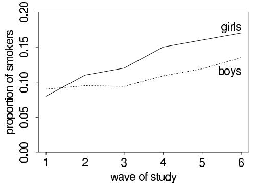  
Figure 6.6 Prevalence of regular (daily) smoking among participants responding at each wave in the study of Australian adolescents (who were on average 15 years old at wave 1).

Table 6.1 Summary of posterior predictive checks for three test statistics for two models fit to the adolescent smoking data: (1) hierarchical logistic regression, and (2) hierarchical logistic regression with a mixture component for never-smokers. The second model better fits the percentages of never- and always-smokers, but still has a problem with the percentage of 'incident smokers,' who are defined as persons who report incidents of non-smoking followed by incidents of smoking.   

<table><tr><td rowspan="2">Test variable</td><td rowspan="2">T(y)</td><td colspan="2">Model 1</td><td colspan="2">Model 2</td></tr><tr><td>95% int. for T(y rep)</td><td>p-value</td><td>95% int. for T(y rep)</td><td>p-value</td></tr><tr><td>% never-smokers</td><td>77.3</td><td>[75.5, 78.2]</td><td>0.27</td><td>[74.8, 79.9]</td><td>0.53</td></tr><tr><td>% always-smokers</td><td>5.1</td><td>[5.0, 6.5]</td><td>0.95</td><td>[3.8, 6.3]</td><td>0.44</td></tr><tr><td>% incident smokers</td><td>8.4</td><td>[5.3, 7.9]</td><td>0.005</td><td>[4.9, 7.8]</td><td>0.004</td></tr></table>

form prior distribution on $\beta, \tau$ . (See Chapter 22 for more on hierarchical generalized linear models.)

The second model is an expansion of the first, in which each person $j$ has an unobserved 'susceptibility' status $S_{j}$ that equals 1 if the person might possibly smoke or 0 if he or she is 'immune' from smoking (that is, has no chance of becoming a smoker). This model is an oversimplification but captures the separation in the data between adolescents who often or occasionally smoke and those who never smoke at all. In this mixture model, the smoking status $y_{jt}$ is automatically 0 at all times for nonsusceptible persons. For those persons with $S_{j} = 1$ , we use the model (6.3), understanding that these probabilities now refer to the probability of smoking, conditional on being susceptible. The model is completed with a logistic regression for susceptibility status given the individual-level predictors: $\operatorname{Pr}(S_j = 1) = \log \mathrm{it}^{-1}(\gamma_0 + \gamma_1X_{j1} + \gamma_2X_{j2})$ , and a uniform prior distribution on these coefficients $\gamma$ .

Table 6.1 shows the results for posterior predictive checks of the two fitted models using three different test statistics $T(y)$ :

- The percentage of adolescents in the sample who never smoked.   
- The percentage in the sample who smoked during all waves.   
- The percentage of 'incident smokers': adolescents who began the study as nonsmokers, switched to smoking during the study period, and did not switch back.

From the first column of Table 6.1, we see that $77\%$ of the sample never smoked, $5\%$ always smoked, and $8\%$ were incident smokers. The table then displays the posterior predictive distribution of each test statistic under each of the two fitted models. Both models accurately capture the percentage of never-smokers, but the second model better fits the percentage of always-smokers. It makes sense that the second model

should fit this aspect of the data better, since its mixture form separates smokers from non-smokers. Finally, both models underpredict the proportion of incident smokers, which suggests that they are not completely fitting the variation of smoking behavior within individuals.

Posterior predictive checking is a useful direct way of assessing the fit of the model to these various aspects of the data. Our goal here is not to compare or choose among the models (a topic we discuss in Section 7.3) but rather to explore the ways in which either or both models might be lacking.

Numerical test quantities can also be constructed from patterns noticed visually (as in the test statistics chosen for the speed-of-light example in Section 6.3). This can be useful to quantify a pattern of potential interest, or to summarize a model check that will be performed repeatedly (for example, in checking the fit of a model that is applied to several different datasets).

# Multiple comparisons

One might worry about interpreting the significance levels of multiple tests or of tests chosen by inspection of the data. For example, we looked at three different test variables in checking the adolescent smoking models, so perhaps it is less surprising than it might seem at first that the worst-fitting test statistic had a $p$ -value of 0.005. A 'multiple comparisons' adjustment would calculate the probability that the most extreme $p$ -value would be as low as 0.005, which would perhaps yield an adjusted $p$ -value somewhere near 0.015.

We do not make this adjustment, because we use predictive checks to see how particular aspects of the data would be expected to appear in replications. If we examine several test variables, we would not be surprised for some of them not to be fitted by the model—but if we are planning to apply the model, we might be interested in those aspects of the data that do not appear typical. We are not concerned with 'Type I error' rate—that is, the probability of rejecting a hypothesis conditional on it being true—because we use the checks not to accept or reject a model but rather to understand the limits of its applicability in realistic replications. In the setting where we are interested in making several comparisons at once, we prefer to directly make inferences on the comparisons using a multilevel model; see the discussion on page 96.

# Interpreting posterior predictive $p$ -values

A model is suspect if a discrepancy is of practical importance and its observed value has a tail-area probability near 0 or 1, indicating that the observed pattern would be unlikely to be seen in replications of the data if the model were true. An extreme $p$ -value implies that the model cannot be expected to capture this aspect of the data. A $p$ -value is a posterior probability and can therefore be interpreted directly—although not as Pr(model is true | data). Major failures of the model, typically corresponding to extreme tail-area probabilities (less than 0.01 or more than 0.99), can be addressed by expanding the model appropriately. Lesser failures might also suggest model improvements or might be ignored in the short term if the failure appears not to affect the main inferences. In some cases, even extreme $p$ -values may be ignored if the misfit of the model is substantively small compared to variation within the model. We typically evaluate a model with respect to several test quantities, and we should be sensitive to the implications of this practice.

If a $p$ -value is close to 0 or 1, it is not so important exactly how extreme it is. A $p$ -value of 0.00001 is virtually no stronger, in practice, than 0.001; in either case, the aspect of the data measured by the test quantity is inconsistent with the model. A slight improvement in the model (or correction of a data coding error!) could bring either $p$ -value to a reasonable

range (between 0.05 and 0.95, say). The $p$ -value measures 'statistical significance,' not 'practical significance.' The latter is determined by how different the observed data are from the reference distribution on a scale of substantive interest and depends on the goal of the study; an example in which a discrepancy is statistically but not practically significant appears at the end of Section 14.3.

The relevant goal is not to answer the question, 'Do the data come from the assumed model?' (to which the answer is almost always no), but to quantify the discrepancies between data and model, and assess whether they could have arisen by chance, under the model's own assumptions.

# Limitations of posterior tests

Finding an extreme $p$ -value and thus 'rejecting' a model is never the end of an analysis; the departures of the test quantity in question from its posterior predictive distribution will often suggest improvements of the model or places to check the data, as in the speed of light example. Moreover, even when the current model seems appropriate for drawing inferences (in that no unusual deviations between the model and the data are found), the next scientific step will often be a more rigorous experiment incorporating additional factors, thereby providing better data. For instance, in the educational testing example of Section 5.5, the data do not allow rejection of the model that all the $\theta_j$ 's are equal, but that assumption is clearly unrealistic, hence we do not restrict $\tau$ to be zero.

Finally, the discrepancies found in predictive checks should be considered in their applied context. A demonstrably wrong model can still work for some purposes, as we illustrate with a regression example in Section 14.3.

# $P$ -values and $u$ -values

Bayesian predictive checking generalizes classical hypothesis testing by averaging over the posterior distribution of the unknown parameter vector $\theta$ rather than fixing it at some estimate $\hat{\theta}$ . Bayesian tests do not rely on the construction of pivotal quantities (that is, functions of data and parameters whose distributions are independent of the parameters of the model) or on asymptotic results, and are therefore applicable in general settings. This is not to suggest that the tests are automatic; as with classical testing, the choice of test quantity and appropriate predictive distribution requires careful consideration of the type of inferences required for the problem being considered.

In the special case that the parameters $\theta$ are known (or estimated to a very high precision) or in which the test statistic $T(y)$ is ancillary (that is, if it depends only on observed data and if its distribution is independent of the parameters of the model) with a continuous distribution, the posterior predictive $p$ -value $\operatorname*{Pr}(T(y^{\mathrm{rep}} > T(y)|y)$ has a distribution that is uniform if the model is true. Under these conditions, $p$ -values less than 0.1 occur $10\%$ of the time, $p$ -values less than 0.05 occur $5\%$ of the time, and so forth.

More generally, when posterior uncertainty in $\theta$ propagates to the distribution of $T(y|\theta)$ , the distribution of the $p$ -value, if the model is true, is more concentrated near the middle of the range: the $p$ -value is more likely to be near 0.5 than near 0 or 1. (To be more precise, the sampling distribution of the $p$ -value has been shown to be 'stochastically less variable' than uniform.)

To clarify, we define a $u$ -value as any function of the data $y$ that has a $\mathrm{U}(0,1)$ sampling distribution. A $u$ -value can be averaged over the distribution of $\theta$ to give it a Bayesian flavor, but it is fundamentally not Bayesian, in that it cannot necessarily be interpreted as a posterior probability. In contrast, the posterior predictive $p$ -value is such a probability statement, conditional on the model and data, about what might be expected in future replications.

The $p$ -value is to the $u$ -value as the posterior interval is to the confidence interval. Just as posterior intervals are not, in general, classical confidence intervals (in the sense of having the stated probability coverage conditional on any value of $\theta$ ), Bayesian $p$ -values are not generally $u$ -values.

This property has led some to characterize posterior predictive checks as conservative or uncalibrated. We do not think such labeling is helpful; rather, we interpret $p$ -values directly as probabilities. The sample space for a posterior predictive check—the set of all possible events whose probabilities sum to 1—comes from the posterior distribution of $y^{\mathrm{rep}}$ . If a posterior predictive $p$ -value is 0.4, say, that means that, if we believe the model, we think there is a $40\%$ chance that tomorrow's value of $T(y^{\mathrm{rep}})$ will exceed today's $T(y)$ . If we were able to observe such replications in many settings, and if our models were actually true, we could collect them and check that, indeed, this happens $40\%$ of the time when the $p$ -value is 0.4, that it happens $30\%$ of the time when the $p$ -value is 0.3, and so forth. These $p$ -values are as calibrated as any other model-based probability, for example a statement such as, 'From a roll of this particular pair of loaded dice, the probability of getting double-sixes is 0.11,' or, 'There is a $50\%$ probability that Barack Obama won more than $52\%$ of the white vote in Michigan in the 2008 election.'

# Model checking and the likelihood principle

In Bayesian inference, the data enter the posterior distribution only through the likelihood function (that is, those aspects of $p(y|\theta)$ that depend on the unknown parameters $\theta$ ); thus, it is sometimes stated as a principle that inferences should depend on the likelihood and no other aspects of the data.

For a simple example, consider an experiment in which a random sample of 55 students is tested to see if their average score on a test exceeds a prechosen passing level of 80 points. Further assume the test scores are normally distributed and that some prior distribution has been set for $\mu$ and $\sigma$ , the mean and standard deviation of the scores in the population from which the students were drawn. Imagine four possible ways of collecting the data: (a) simply take measurements on a random sample of 55 students; (b) randomly sample students in sequence and after each student cease collecting data with probability 0.02; (c) randomly sample students for a fixed amount of time; or (d) continue to randomly sample and measure individual students until the sample mean is significantly different from 80 using the classical $t$ -test. In designs (c) and (d), the number of measurements is a random variable whose distribution depends on unknown parameters.

For the particular data at hand, these four very different measurement protocols correspond to different probability models for the data but identical likelihood functions, and thus Bayesian inference about $\mu$ and $\sigma$ does not depend on how the data were collected—if the model is assumed to be true. But once we want to check the model, we need to simulate replicated data, and then the sampling rule is relevant. For any fixed dataset $y$ , the posterior inference $p(\mu, \sigma | y)$ is the same for all these sampling models, but the distribution of replicated data, $p(y^{\mathrm{rep}} | \mu, \sigma)$ changes. Thus it is possible for aspects of the data to fit well under one data-collection model but not another, even if the likelihoods are the same.

# Marginal predictive checks

So far in this section the focus has been on replicated data from the joint posterior predictive distribution. An alternative approach is to compute the probability distribution for each marginal prediction $p(\tilde{y}_i|y)$ separately and then compare these separate distributions to data in order to find outliers or check overall calibration.

The tail-area probability can be computed for each marginal posterior predictive distri

bution,

$$
p _ {i} = \Pr (T (y _ {i} ^ {\mathrm {r e p}}) \leq T (y _ {i}) | y).
$$

If $y_{i}$ is scalar and continuous, a natural test quantity is $T(y_{i}) = y_{i}$ , with tail-area probability,

$$
p _ {i} = \Pr (y _ {i} ^ {\mathrm {r e p}} \leq y _ {i} | y).
$$

For ordered discrete data we can compute a 'mid' $p$ -value

$$
p _ {i} = \operatorname * {P r} (y _ {i} ^ {\mathrm {r e p}} <   y _ {i} | y) + \frac {1}{2} \operatorname * {P r} (y _ {i} ^ {\mathrm {r e p}} = y _ {i} | y).
$$

If we combine the checks from single data points, we will in general see different behavior than from the joint checks described in the previous section. Consider the educational testing example from Section 5.5:

- Marginal prediction for each of the existing schools, using $p(\tilde{y}_i|y), i = 1,\ldots ,8$ . If the population prior is noninformative or weakly informative, the center of posterior predictive distribution will be close to $y_{i}$ , and the separate $p$ -values $p_i$ will tend to concentrate near 0.5. In extreme case of no pooling, the separate $p$ -values will be exactly 0.5.   
- Marginal prediction for new schools $p(\tilde{y}_i|y), i = 9, \dots, 16$ , comparing replications to the observed $y_i, y_i = 1, \dots, 8$ . Now the effect of single $y_i$ is smaller, working through the population distribution, and the $p_i$ 's have distributions that are closer to $\mathrm{U}(0,1)$ .

A related approach to checking is to replace predictive distributions with cross-validation predictive distributions, for each data point comparing to the inference given all the other data:

$$
p _ {i} = \Pr (y _ {i} ^ {\mathrm {r e p}} \leq y _ {i} | y _ {- i}),
$$

where $y_{-i}$ contains all other data except $y_{i}$ . For continuous data, cross-validation predictive $p$ -values have uniform distribution if the model is calibrated. On the downside, cross-validation generally requires additional computation. In some settings, posterior predictive checking using the marginal predictions for new individuals with exactly the same predictors $x_{i}$ is called mixed predictive checking and can be seen to bridge the gap between cross-validation and full Bayesian predictive checking. We return to cross-validation in the next chapter.

If the marginal posterior $p$ -values concentrate near 0 and 1, data is over-dispersed compared to the model and if the $p$ -values concentrate near 0.5 data is under-dispersed compared to the model. It may also be helpful to look at individual observations related to marginal posterior $p$ -values close to 0 or 1. Alternatively used measure is the conditional predictive ordinate

$$
\mathrm {C P O} _ {i} = p \left(y _ {i} \mid y _ {- i}\right),
$$

which gives low value for unlikely observations given the current model. Examining unlikely observations could give insight how to improve the model. In Chapter 17 we discuss how to make model inference more robust if the data have surprising 'outliers.'

# 6.4 Graphical posterior predictive checks

The basic idea of graphical model checking is to display the data alongside simulated data from the fitted model, and to look for systematic discrepancies between real and simulated data. This section gives examples of three kinds of graphical display:

- Direct display of all the data (as in the comparison of the speed-of-light data in Figure 3.1 to the 20 replications in Figure 6.2).   
- Display of data summaries or parameter inferences. This can be useful in settings where the dataset is large and we wish to focus on the fit of a particular aspect of the model.   
- Graphs of residuals or other measures of discrepancy between model and data.

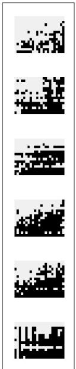

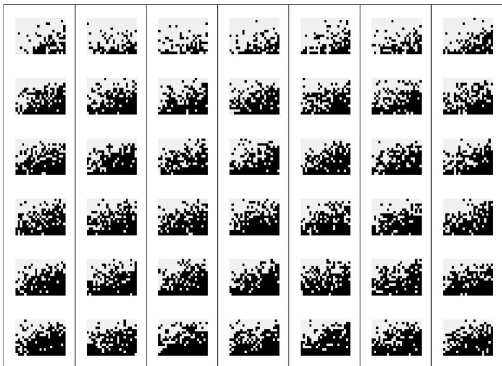  
Figure 6.7 Left column displays observed data $y$ (a $15 \times 23$ array of binary responses from each of 6 persons); right columns display seven replicated datasets $y^{\mathrm{rep}}$ from a fitted logistic regression model. A misfit of model to data is apparent: the data show strong row and column patterns for individual persons (for example, the nearly white row near the middle of the last person's data) that do not appear in the replicates. (To make such patterns clearer, the indexes of the observed and each replicated dataset have been arranged in increasing order of average response.)

# Direct data display

Figure 6.7 shows another example of model checking by displaying all the data. The left column of the figure displays a three-way array of binary data—for each of 6 persons, a possible 'yes' or 'no' to each of 15 possible reactions (displayed as rows) to 23 situations (columns)—from an experiment in psychology. The three-way array is displayed as 6 slices, one for each person. Before displaying, the reactions, situations, and persons have been ordered in increasing average response. We can thus think of the test statistic $T(y)$ as being this graphical display, complete with the ordering applied to the data $y$ .

The right columns of Figure 6.7 display seven independently simulated replications $y^{\mathrm{rep}}$ from a fitted logistic regression model (with the rows, columns, and persons for each dataset arranged in increasing order before display, so that we are displaying $T(y^{\mathrm{rep}})$ in each case). Here, the replicated datasets look fuzzy and 'random' compared to the observed data, which have strong rectilinear structures that are clearly not captured in the model. If the data were actually generated from the model, the observed data on the left would fit right in with the simulated datasets on the right.

These data have enough internal replication that the model misfit would be clear in comparison to a single simulated dataset from the model. But, to be safe, it is good to compare to several replications to see if the patterns in the observed data could be expected to occur by chance under the model.

Displaying data is not simply a matter of dumping a set of numbers on a page (or a screen). For example, we took care to align the graphs in Figure 6.7 to display the three-dimensional dataset and seven replications at once without confusion. Even more important, the arrangement of the rows, columns, and persons in increasing order is crucial to seeing the patterns in the data over and above the model. To see this, consider Figure

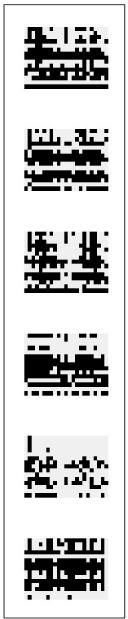

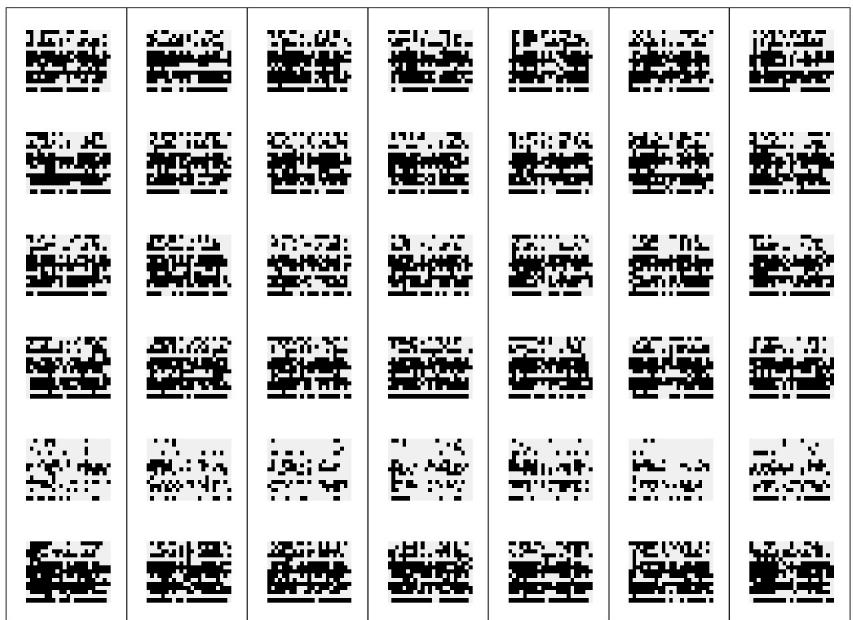  
Figure 6.8 Redisplay of Figure 6.7 without ordering the rows, columns, and persons in order of increasing response. Once again, the left column shows the observed data and the right columns show replicated datasets from the model. Without the ordering, it is difficult to notice the discrepancies between data and model, which are easily apparent in Figure 6.7.

6.8, which presents the same information as in Figure 6.7 but without the ordering. Here, the discrepancies between data and model are not clear at all.

# Displaying summary statistics or inferences

A key principle of exploratory data analysis is to exploit regular structure to display data more effectively. The analogy in modeling is hierarchical or multilevel modeling, in which batches of parameters capture variation at different levels. When checking model fit, hierarchical structure can allow us to compare batches of parameters to their reference distribution. In this scenario, the replications correspond to new draws of a batch of parameters.

We illustrate with inference from a hierarchical model from psychology. This was a fairly elaborate model, whose details we do not describe here; all we need to know for this example is that the model included two vectors of parameters, $\phi_1,\ldots ,\phi_{90}$ , and $\psi_{1},\ldots ,\psi_{69}$ corresponding to patients and psychological symptoms, and that each of these 159 parameters were assigned independent $\mathrm{Beta}(2,2)$ prior distributions. Each of these parameters represented a probability that a given patient or symptom is associated with a particular psychological syndrome.

Data were collected (measurements of which symptoms appeared in which patients) and the full Bayesian model was fitted, yielding posterior simulations for all these parameters. If the model were true, we would expect any single simulation draw of the vectors of patient parameters $\phi$ and symptom parameters $\psi$ to look like independent draws from the Beta(2, 2) distribution. We know this because of the following reasoning:

- If the model were indeed true, we could think of the observed data vector $y$ and the vector $\theta$ of the true values of all the parameters (including $\phi$ and $\psi$ ) as a random draw from their joint distribution, $p(y, \theta)$ . Thus, $y$ comes from the marginal distribution, the prior predictive distribution, $p(y)$ .   
- A single draw $\theta^s$ from the posterior inference comes from $p(\theta^s | y)$ . Since $y \sim p(y)$ , this

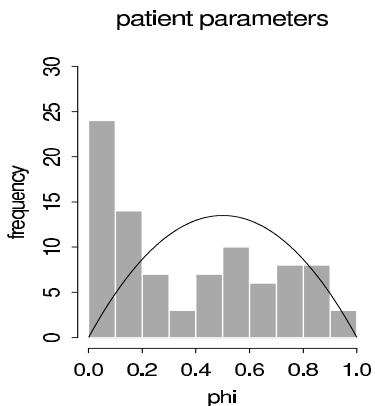

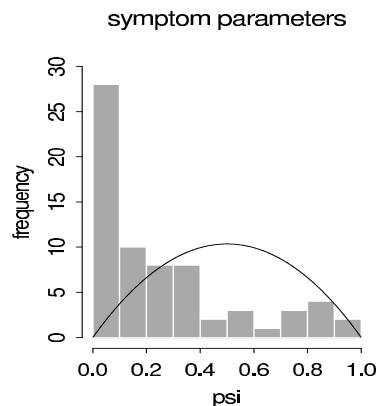  
Figure 6.9 Histograms of (a) 90 patient parameters and (b) 69 symptom parameters, from a single draw from the posterior distribution of a psychometric model. These histograms of posterior estimates contradict the assumed Beta(2,2) prior densities (overlain on the histograms) for each batch of parameters, and motivated us to switch to mixture prior distributions. This implicit comparison to the values under the prior distribution can be viewed as a posterior predictive check in which a new set of patients and a new set of symptoms are simulated.

means that $y, \theta^s$ come from the model's joint distribution of $y, \theta$ , and so the marginal distribution of $\theta^s$ is the same as that of $\theta$ .

- That is, $y, \theta, \theta^s$ have a combined joint distribution in which $\theta$ and $\theta^s$ have the same marginal distributions (and the same joint distributions with $y$ ).

Thus, as a model check we can plot a histogram of a single simulation of the vector of parameters $\phi$ or $\psi$ and compare to the prior distribution. This corresponds to a posterior predictive check in which the inference from the observed data is compared to what would be expected if the model were applied to a new set of patients and a new set of symptoms.

Figure 6.9 shows histograms of a single simulation draw for each of $\phi$ and $\psi$ as fitted to our dataset. The lines show the $\mathrm{Beta}(2,2)$ prior distribution, which clearly does not fit. For both $\phi$ and $\psi$ , there are too many cases near zero, corresponding to patients and symptoms that almost certainly are not associated with a particular syndrome.

Our next step was to replace the offending $\mathrm{Beta}(2,2)$ prior distributions by mixtures of two beta distributions—one distribution with a spike near zero, and another that is uniform between 0 and 1—with different models for the $\phi$ 's and the $\psi$ 's. The exact model is,

$$
{p (\phi_ {j})} = {0. 5 \mathrm {B e t a} (\phi_ {j} | 1, 6) + 0. 5 \mathrm {B e t a} (\phi_ {j} | 1, 1)}
$$

$$
{p (\psi_ {j})} = {0. 5 \mathrm {B e t a} (\psi_ {j} | 1, 1 6) + 0. 5 \mathrm {B e t a} (\psi_ {j} | 1, 1).}
$$

We set the parameters of the mixture distributions to fixed values based on our understanding of the model. It was reasonable for these data to suppose that any given symptom appeared only about half the time; however, labeling of the symptoms is subjective, so we used beta distributions peaked near zero but with some probability of taking small positive values. We assigned the $\mathrm{Beta}(1,1)$ (that is, uniform) distributions for the patient and symptom parameters that were not near zero—given the estimates in Figure 6.9, these seemed to fit the data better than the original $\mathrm{Beta}(2,2)$ models. (The original reason for using $\mathrm{Beta}(2,2)$ rather than uniform prior distributions was so that maximum likelihood estimates would be in the interior of the interval [0, 1], a concern that disappeared when we moved to Bayesian inference; see Exercise 4.9.)

Some might object to revising the prior distribution based on the fit of the model to the data. It is, however, consistent with common statistical practice, in which a model is iteratively altered to provide a better fit to data. The natural next step would be to add

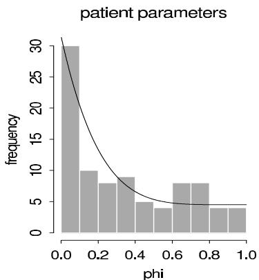

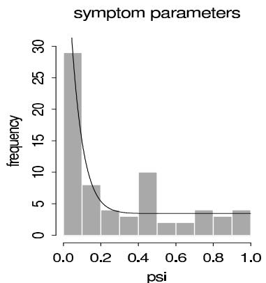  
Figure 6.10 Histograms of (a) 90 patient parameters and (b) 69 symptom parameters, as estimated from an expanded psychometric model. The mixture prior densities (overlain on the histograms) are not perfect, but they approximate the corresponding histograms much better than the Beta(2,2) densities in Figure 6.9.

a hierarchical structure, with hyperparameters for the mixture distributions for the patient and symptom parameters. This would require additional computational steps and potential new modeling difficulties (for example, instability in the estimated hyperparameters). Our main concern in this problem was to reasonably model the individual $\phi_j$ and $\psi_j$ parameters without the prior distributions inappropriately interfering (which appears to be happening in Figure 6.9).

We refitted the model with the new prior distribution and repeated the model check, which is displayed in Figure 6.10. The fit of the prior distribution to the inferences is not perfect but is much better than before.

# Residual plots and binned residual plots

Bayesian residuals. Linear and nonlinear regression models, which are the core tools of applied statistics, are characterized by a function $g(x,\theta) = \operatorname{E}(y|x,\theta)$ , where $x$ is a vector of predictors. Then, given the unknown parameters $\theta$ and the predictors $x_i$ for a data point $y_i$ , the predicted value is $g(x_i,\theta)$ and the residual is $y_i - g(x_i,\theta)$ . This is sometimes called a 'realized' residual in contrast to the classical or estimated residual, $y_i - g(x_i,\hat{\theta})$ , which is based on a point estimate $\hat{\theta}$ of the parameters.

A Bayesian residual graph plots a single realization of the residuals (based on a single random draw of $\theta$ ). An example appears on page 484. Classical residual plots can be thought of as approximations to the Bayesian version, ignoring posterior uncertainty in $\theta$ .

Binned residuals for discrete data. Unfortunately, for discrete data, plots of residuals can be difficult to interpret because, for any particular value of $\operatorname{E}(y_i|x,\theta)$ , the residual $r_i$ can only take on certain discrete values; thus, even if the model is correct, the residuals will not generally be expected to be independent of predicted values or covariates in the model. Figure 6.11 illustrates with data and then residuals plotted vs. fitted values, for a model of pain relief scores, which were discretely reported as 0, 1, 2, 3, or 4. The residuals have a distracting striped pattern because predicted values plus residuals equal discrete observed data values.

A standard way to make discrete residual plots more interpretable is to work with binned or smoothed residuals, which should be closer to symmetric about zero if enough residuals are included in each bin or smoothing category (since the expectation of each residual is by definition zero, the central limit theorem ensures that the distribution of averages of many

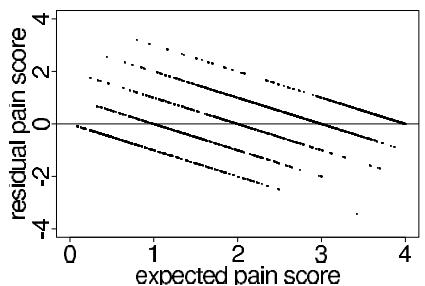

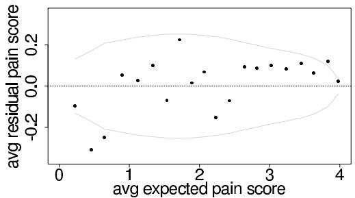  
Figure 6.11 (a) Residuals (observed - expected) vs. expected values for a model of pain relief scores ( $0 =$ no pain relief, ..., $5 =$ complete pain relief). (b) Average residuals vs. expected pain scores, with measurements divided into 20 equally sized bins defined by ranges of expected pain scores. The average prediction errors are relatively small (note the scale of the $y$ -axis), but with a consistent pattern that low predictions are too low and high predictions are too high. Dotted lines show $95\%$ bounds under the model.

residuals will be approximately symmetric). In particular, suppose we would like to plot the vector of residuals $r$ vs. some vector $w = (w_{1},\ldots ,w_{n})$ that can in general be a function of $x$ , $\theta$ , and perhaps $y$ . We can bin the predictors and residuals by ordering the $n$ values of $w_{i}$ and sorting them into bins $k = 1,\dots ,K$ , with approximately equal numbers of points $n_k$ in each bin. For each bin, we then compute $\bar{w}_k$ and $\bar{r}_k$ , the average values of $w_{i}$ and $r_i$ , respectively, for points $i$ in bin $k$ . The binned residual plot is the plot of the points $\bar{r}_k$ vs. $\bar{w}_k$ , which actually must be represented by several plots (which perhaps can be overlain) representing variability due to uncertainty of $\theta$ in the posterior distribution.

Since we are viewing the plot as a test variable, it must be compared to the distribution of plots of $\bar{r}_k^{\mathrm{rep}}$ vs. $\bar{w}_k^{\mathrm{rep}}$ , where, for each simulation draw, the values of $\bar{r}_k^{\mathrm{rep}}$ are computed by averaging the replicated residuals $r_i^{\mathrm{rep}} = y_i^{\mathrm{rep}} - \operatorname{E}(y_i|x,\theta)$ for points $i$ in bin $k$ . In general, the values of $w_i$ can depend on $y$ , and so the bins and the values of $\bar{w}_k^{\mathrm{rep}}$ can vary among the replicated datasets.

Because we can compare to the distribution of simulated replications, the question arises: why do the binning at all? We do so because we want to understand the model misfits that we detect. Because of the discreteness of the data, the individual residuals $r_i$ have asymmetric discrete distributions. As expected, the binned residuals are approximately symmetrically distributed. In general it is desirable for the posterior predictive reference distribution of a discrepancy variable to exhibit some simple features (in this case, independence and approximate normality of the $\bar{r}_k$ 's) so that there is a clear interpretation of a misfit. This is, in fact, the same reason that one plots residuals, rather than data, vs. predicted values: it is easier to compare to an expected horizontal line than to an expected $45^\circ$ line.

Under the model, the residuals are independent and, if enough are in each bin, the mean residuals $\bar{r}_k$ are approximately normally distributed. We can then display the reference distribution as $95\%$ error bounds, as in Figure 6.11b. We never actually have to display the replicated data; the replication distribution is implicit, given our knowledge that the binned residuals are independent, approximately normally distributed, and with expected variation as shown by the error bounds.

# General interpretation of graphs as model checks

More generally, we can compare any data display to replications under the model—not necessarily as an explicit model check but more to understand what the display 'should' look like if the model were true. For example, the maps and scatterplots of high and

low cancer rates (Figures 2.6-2.8) show strong patterns, but these are not particularly informative if the same patterns would be expected of replications under the model. The erroneous initial interpretation of Figure 2.6—as evidence of a pattern of high cancer rates in the sparsely populated areas in the center-west of the country—can be thought of as an erroneous model check, in which the data display was compared to a random pattern rather than to the pattern expected under a reasonable model of variation in cancer occurrences.

# 6.5 Model checking for the educational testing example

We illustrate the ideas of this chapter with the example from Section 5.5.

# Assumptions of the model

The inference presented for the 8 schools example is based on several model assumptions: (1) normality of the estimates $y_{j}$ given $\theta_{j}$ and $\sigma_{j}$ , where the values $\sigma_{j}$ are assumed known; (2) exchangeability of the prior distribution of the $\theta_{j}$ 's; (3) normality of the prior distribution of each $\theta_{j}$ given $\mu$ and $\tau$ ; and (4) uniformity of the hyperprior distribution of $(\mu, \tau)$ .

The assumption of normality with a known variance is made routinely when a study is summarized by its estimated effect and standard error. The design (randomization, reasonably large sample sizes, adjustment for scores on earlier tests) and analysis (for example, the raw data of individual test scores were checked for outliers in an earlier analysis) were such that the assumptions seem justifiable in this case.

The second modeling assumption deserves commentary. The real-world interpretation of the mathematical assumption of exchangeability of the $\theta_{j}$ 's is that before seeing the results of the experiments, there is no desire to include in the model features such as a belief that (a) the effect in school A is probably larger than in school B or (b) the effects in schools A and B are more similar than in schools A and C. In other words, the exchangeability assumption means that we will let the data tell us about the relative ordering and similarity of effects in the schools. Such a prior stance seems reasonable when the results of eight parallel experiments are being scientifically summarized for general presentation. Generally accepted information concerning the effectiveness of the programs or differences among the schools might suggest a nonexchangeable prior distribution if, for example, schools B and C have similar students and schools A, D, E, F, G, H have similar students. Unusual types of detailed prior knowledge (for example, two schools are similar but we do not know which schools they are) can suggest an exchangeable prior distribution that is not a mixture of independent and identically distributed components. In the absence of any such information, the exchangeability assumption implies that the prior distribution of the $\theta_{j}$ 's can be considered as independent samples from a population whose distribution is indexed by some hyperparameters—in our model, $(\mu, \tau)$ —that have their own hyperprior distribution.

The third and fourth modeling assumptions are harder to justify a priori than the first two. Why should the school effects be normally distributed rather than say, Cauchy distributed, or even asymmetrically distributed, and why should the location and scale parameters of this prior distribution be uniformly distributed? Mathematical tractability is one reason for the choice of models, but if the family of probability models is inappropriate, Bayesian answers can be misleading.

# Comparing posterior inferences to substantive knowledge

Inference about the parameters in the model. When checking the model assumptions, our first step is to compare the posterior distribution of effects to our knowledge of educational

testing. The estimated treatment effects (the posterior means) for the eight schools range from 5 to 10 points, which are plausible values. (The scores on the test range can range from 200 to 800.) The effect in school A could be as high as 31 points or as low as $-2$ points (a $95\%$ posterior interval). Either of these extremes seems plausible. We could look at other summaries as well, but it seems clear that the posterior estimates of the parameters do not violate our common sense or our limited substantive knowledge about test preparation courses.

Inference about predicted values. Next, we simulate the posterior predictive distribution of a hypothetical replication of the experiments. Sampling from the posterior predictive distribution is nearly effortless given all that we have done so far: from each of the 200 simulations from the posterior distribution of $(\theta, \mu, \tau)$ , we simulate a hypothetical replicated dataset, $y^{\mathrm{rep}} = (y_1^{\mathrm{rep}}, \ldots, y_8^{\mathrm{rep}})$ , by drawing each $y_j^{\mathrm{rep}}$ from a normal distribution with mean $\theta_j$ and standard deviation $\sigma_j$ . The resulting set of 200 vectors $y^{\mathrm{rep}}$ summarizes the posterior predictive distribution. (Recall from Section 5.5 that we are treating $y$ —the eight separate estimates—as the 'raw data' from the eight experiments.)

The model-generated parameter values $\theta_{j}$ for each school in each of the 200 replications are all plausible outcomes of experiments on coaching. The simulated hypothetical observation $y_{j}^{\mathrm{rep}}$ range from $-48$ to 63; again, we find these possibilities to be plausible given our general understanding of this area.

# Posterior predictive checking

If the fit to data shows serious problems, we may have cause to doubt the inferences obtained under the model such as displayed in Figure 5.8 and Table 5.3. For instance, how consistent is the largest observed outcome, 28 points, with the posterior predictive distribution under the model? Suppose we perform 200 posterior predictive simulations of the coaching experiments and compute the largest observed outcome, $\max_j y_j^{\mathrm{rep}}$ , for each. If all 200 of these simulations lie below 28 points, then the model does not fit this important aspect of the data, and we might suspect that the normal-based inference in Section 5.5 shrinks the effect in School A too far.

To test the fit of the model to data, we examine the posterior predictive distribution of the following four test statistics: the largest of the 8 observed outcomes, $\max_j y_j$ , the smallest, $\min_j y_j$ , the average, $\mathrm{mean}(y_j)$ , and the sample standard deviation, $\mathrm{sd}(y_j)$ . We approximate the posterior predictive distribution of each test statistic by the histogram of the values from the 200 simulations of the parameters and predictive data, and we compare each distribution to the observed value of the test statistic and our substantive knowledge of SAT coaching programs. The results are displayed in Figure 6.12.

The summaries suggest that the model generates predicted results similar to the observed data in the study; that is, the actual observations are typical of the predicted observations generated by the model.

Many other functions of the posterior predictive distribution could be examined, such as the differences between individual values of $y_{j}^{\mathrm{rep}}$ . Or, if we had a particular skewed prior distribution in mind for the effects $\theta_{j}$ , we could construct a test quantity based on the skewness or asymmetry of the simulated predictive data as a check on the normal model. Often in practice we can obtain diagnostically useful displays directly from intuitively interesting quantities without having to supply a specific alternative model.

# Sensitivity analysis

The model checks seem to support the posterior inferences for the educational testing example. Although we may feel confident that the data do not contradict the model, this is

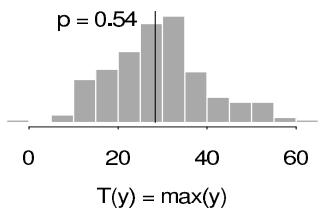

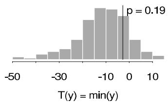

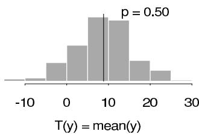

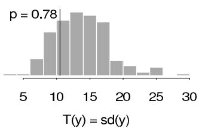  
Figure 6.12 Posterior predictive distribution, observed result, and $p$ -value for each of four test statistics for the educational testing example.

not enough to inspire complete confidence in our general substantive conclusions, because other reasonable models might provide just as good a fit but lead to different conclusions. Sensitivity analysis can then be used to assess the effect of alternative analyses on the posterior inferences.

The uniform prior distribution for $\tau$ . To assess the sensitivity to the prior distribution for $\tau$ we consider Figure 5.5, the graph of the marginal posterior density, $p(\tau | y)$ , obtained under the assumption of a uniform prior density for $\tau$ on the positive half of the real line. One can obtain the posterior density for $\tau$ given other choices of the prior distribution by multiplying the density displayed in Figure 5.5 by the prior density. There will be little change in the posterior inferences as long as the prior density is not sharply peaked and does not put a great deal of probability mass on values of $\tau$ greater than 10.

The normal population distribution for the school effects. The normal distribution assumption on the $\theta_{j}$ 's is made for computational convenience, as is often the case. A natural sensitivity analysis is to consider longer-tailed alternatives, such as the $t$ , as a check on robustness. We defer the details of this analysis to Section 17.4, after the required computational techniques have been presented. Any alternative model must be examined to ensure that the predictive distributions are restricted to realistic SAT improvements.

The normal likelihood. As discussed earlier, the assumption of normal data conditional on the means and standard deviations need not and cannot be seriously challenged in this example. The justification is based on the central limit theorem and the designs of the studies. Assessing the validity of this assumption would require access to the original data from the eight experiments, not just the estimates and standard errors given in Table 5.2.

# 6.6 Bibliographic note

The posterior predictive approach to model checking described here was presented in Rubin (1981a, 1984). Gelman, Meng, and Stern (1996) discuss the use of test quantities that depend on parameters as well as data; related ideas appear in Zellner (1976) and Tsui and Weerahandi (1989). Rubin and Stern (1994) and Raghunathan (1994) provide further applied examples. The examples in Section 6.4 appear in Meulders et al. (1998) and Gelman

(2003). The antisymmetric discrepancy measures discussed in Section 6.3 appear in Berkhof, Van Mechelen, and Gelman (2003). The adolescent smoking example appears in Carlin et al. (2001). Sinharay and Stern (2003) discuss posterior predictive checks for hierarchical models, focusing on the SAT coaching example. Johnson (2004) discusses Bayesian $\chi^2$ tests as well as the idea of using predictive checks as a debugging tool, as discussed in Section 10.7. Bayarri and Castellanos (2007) present a slightly different perspective on posterior predictive checking, to which we respond in Gelman (2007b). Gelman (2013b) discusses the statistical properties of posterior predictive $p$ -values in two simple examples.

Model checking using simulation has a long history in statistics; for example, Bush and Mosteller (1955, p. 252) check the fit of a model by comparing observed data to a set of simulated data. Their method differs from posterior predictive checking only in that their model parameters were fixed at point estimates for the simulations rather than being drawn from a posterior distribution. Ripley (1988) applies this idea repeatedly to examine the fits of models for spatial data. Early theoretical papers featuring ideas related to Bayesian posterior predictive checks include Guttman (1967) and Dempster (1971). Bernardo and Smith (1994) discuss methods of comparing models based on predictive errors. Gelman, Van Mechelen, et al. (2005) consider Bayesian model checking in the presence of missing data. O'Hagan (2003) discusses tools for measuring conflict between information from prior and likelihood at any level of hierarchical model.

Gelfand, Dey, and Chang, (1992) and Gelfand (1996) discuss cross-validation predictive checks. Gelman, Meng, and Stern (1996) use the term 'mixed predictive check' if direct parameters are replicated from their prior given the posterior samples for the hyperparameters (predictions for new groups). Marshall and Spiegelhalter (2007) discuss different posterior, mixed, and cross-validation predictive checks for outlier detection. Gneiting, Balabdaoui, and Raftery (2007) discuss test quantities for marginal predictive calibration.

Box (1980, 1983) has contributed a wide-ranging discussion of model checking ('model criticism' in his terminology), including a consideration of why it is needed in addition to model expansion and averaging. Box proposed checking models by comparing data to the prior predictive distribution; in the notation of our Section 6.3, defining replications with distribution $p(y^{\mathrm{rep}}) = \int p(y^{\mathrm{rep}}|\theta)p(\theta)d\theta$ . This approach has different implications for model checking; for example, with an improper prior distribution on $\theta$ , the prior predictive distribution is itself improper and thus the check is not generally defined, even if the posterior distribution is proper (see Exercise 6.7).

Box was also an early contributor to the literature on sensitivity analysis and robustness in standard models based on normal distributions: see Box and Tiao (1962, 1973). Various theoretical studies have been performed on Bayesian robustness and sensitivity analysis examining the question of how posterior inferences are affected by prior assumptions; see Leamer (1978b), McCulloch (1989), Wasserman (1992), and the references at the end of Chapter 17. Kass and coworkers have developed methods based on Laplace's approximation for approximate sensitivity analysis: for example, see Kass, Tierney, and Kadane (1989) and Kass and Vaidyanathan (1992).

Finally, many model checking methods in common practical use, including tests for outliers, plots of residuals, and normal plots, can be interpreted as Bayesian posterior predictive checks, where the practitioner is looking for discrepancies from the expected results under the assumed model (see Gelman, 2003, for an extended discussion of this point). Many non-Bayesian treatments of graphical model checking appear in the statistical literature, for example, Atkinson (1985). Tukey (1977) presents a graphical approach to data analysis that is, in our opinion, fundamentally based on model checking (see Gelman, 2003 and Gelman, 2004a). The books by Cleveland (1985, 1993) and Tufte (1983, 1990) present many useful ideas for displaying data graphically; these ideas are fundamental to the graphical model checks described in Section 6.4.

# 6.7 Exercises

1. Posterior predictive checking:

(a) On page 120, the data from the SAT coaching experiments were checked against the model that assumed identical effects in all eight schools: the expected order statistics of the effect sizes were (26, 19, 14, 10, 6, 2, -3, -9), compared to observed data of (28, 18, 12, 8, 7, 1, -1, -3). Express this comparison formally as a posterior predictive check comparing this model to the data. Does the model fit the aspect of the data tested here?   
(b) Explain why, even though the identical-schools model fits under this test, it is still unacceptable for some practical purposes.

2. Model checking: in Exercise 2.13, the counts of airline fatalities in 1976-1985 were fitted to four different Poisson models.

(a) For each of the models, set up posterior predictive test quantities to check the following assumptions: (1) independent Poisson distributions, (2) no trend over time.   
(b) For each of the models, use simulations from the posterior predictive distributions to measure the discrepancies. Display the discrepancies graphically and give $p$ -values.   
(c) Do the results of the posterior predictive checks agree with your answers in Exercise 2.13(e)?

3. Model improvement:

(a) Use the solution to the previous problem and your substantive knowledge to construct an improved model for airline fatalities.   
(b) Fit the new model to the airline fatality data.   
(c) Use your new model to forecast the airline fatalities in 1986. How does this differ from the forecasts from the previous models?   
(d) Check the new model using the same posterior predictive checks as you used in the previous models. Does the new model fit better?

4. Model checking and sensitivity analysis: find a published Bayesian data analysis from the statistical literature.

(a) Compare the data to posterior predictive replications of the data.   
(b) Perform a sensitivity analysis by computing posterior inferences under plausible alternative models.

5. Hypothesis testing: discuss the statement, 'Null hypotheses of no difference are usually known to be false before the data are collected; when they are, their rejection or acceptance simply reflects the size of the sample and the power of the test, and is not a contribution to science' (Savage, 1957, quoted in Kish, 1965). If you agree with this statement, what does this say about the model checking discussed in this chapter?

6. Variety of predictive reference sets: in the example of binary outcomes on page 147, it is assumed that the number of measurements, $n$ , is fixed in advance, and so the hypothetical replications under the binomial model are performed with $n = 20$ . Suppose instead that the protocol for measurement is to stop once 13 zeros have appeared.

(a) Explain why the posterior distribution of the parameter $\theta$ under the assumed model does not change.   
(b) Perform a posterior predictive check, using the same test quantity, $T =$ number of switches, but simulating the replications $y^{\mathrm{rep}}$ under the new measurement protocol. Display the predictive simulations, $T(y^{\mathrm{rep}})$ , and discuss how they differ from Figure 6.5.

7. Prior vs. posterior predictive checks (from Gelman, Meng, and Stern, 1996): consider 100 observations, $y_{1}, \ldots, y_{n}$ , modeled as independent samples from a $N(\theta, 1)$ distribution with a diffuse prior distribution, say, $p(\theta) = \frac{1}{2A}$ for $\theta \in [-A, A]$ with some extremely large value of $A$ , such as $10^{5}$ . We wish to check the model using, as a test statistic, $T(y) = \max_{i} |y_{i}|$ : is the maximum absolute observed value consistent with the normal model? Consider a dataset in which $\overline{y} = 5.1$ and $T(y) = 8.1$ .

(a) What is the posterior predictive distribution for $y^{\mathrm{rep}}$ ? Make a histogram for the posterior predictive distribution of $T(y^{\mathrm{rep}})$ and give the posterior predictive $p$ -value for the observation $T(y) = 8.1$ .   
(b) The prior predictive distribution is $p(y^{\mathrm{rep}}) = \int p(y^{\mathrm{rep}}|\theta)p(\theta)d\theta$ . (Compare to equation (6.1).) What is the prior predictive distribution for $y^{\mathrm{rep}}$ in this example? Roughly sketch the prior predictive distribution of $T(y^{\mathrm{rep}})$ and give the approximate prior predictive $p$ -value for the observation $T(y) = 8.1$ .   
(c) Your answers for (a) and (b) should show that the data are consistent with the posterior predictive but not the prior predictive distribution. Does this make sense? Explain.

8. Variety of posterior predictive distributions: for the educational testing example in Section 6.5, we considered a reference set for the posterior predictive simulations in which $\theta = (\theta_{1},\dots,\theta_{8})$ was fixed. This corresponds to a replication of the study with the same eight coaching programs.

(a) Consider an alternative reference set, in which $(\mu, \tau)$ are fixed but $\theta$ is allowed to vary. Define a posterior predictive distribution for $y^{\mathrm{rep}}$ under this replication, by analogy to (6.1). What is the experimental replication that corresponds to this reference set?   
(b) Consider switching from the analysis of Section 6.5 to an analysis using this alternative reference set. Would you expect the posterior predictive $p$ -values to be less extreme, more extreme, or stay about the same? Why?   
(c) Reproduce the model checks of Section 6.5 based on this posterior predictive distribution. Compare to your speculations in part (b).

9. Model checking: check the assumed model fitted to the rat tumor data in Section 5.3. Define some test quantities that might be of scientific interest, and compare them to their posterior predictive distributions.

10. Checking the assumption of equal variance: Figures 1.1 and 1.2 on pages 14 and 15 display data on point spreads $x$ and score differentials $y$ of a set of professional football games. (The data are available at http://www.stat.columbia.edu/\~gelman/book/.) In Section 1.6, a model is fit of the form, $y\sim \mathrm{N}(x,14^2)$ . However, Figure 1.2a seems to show a pattern of decreasing variance of $y - x$ as a function of $x$ .

(a) Simulate several replicated datasets $y^{\mathrm{rep}}$ under the model and, for each, create graphs like Figures 1.1 and 1.2. Display several graphs per page, and compare these to the corresponding graphs of the actual data. This is a graphical posterior predictive check as described in Section 6.4.   
(b) Create a numerical summary $T(x,y)$ to capture the apparent decrease in variance of $y - x$ as a function of $x$ . Compare this to the distribution of simulated test statistics, $T(x,y^{\mathrm{rep}})$ and compute the $p$ -value for this posterior predictive check.

