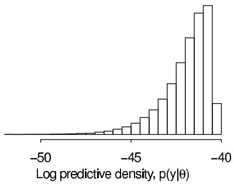

# Evaluating, Comparing, and Expanding Models

[Package map](../structure.md) · [Unsplit OCR dump](./_full.md)

[← Ch. 6 Model Checking](./06-model-checking.md) · [Ch. 8 Data Collection →](./08-modeling-data-collection.md)

> MinerU OCR dump. If a formula, table, or numbering disagrees with the PDF, the PDF is authoritative.

---

# Chapter 7

# Evaluating, comparing, and expanding models

In the previous chapter we discussed discrepancy measures for checking the fit of model to data. In this chapter we seek not to check models but to compare them and explore directions for improvement. Even if all of the models being considered have mismatches with the data, it can be informative to evaluate their predictive accuracy and consider where to go next. The challenge we focus on here is the estimation of the predictive model accuracy, correcting for the bias inherent in evaluating a model's predictions of the data that were used to fit it.

We proceed as follows. First we discuss measures of predictive fit, using a small linear regression as a running example. We consider the differences between external validation, fit to training data, and cross-validation in Bayesian contexts. Next we describe information criteria, which are estimates and approximations to cross-validated or externally validated fit, used for adjusting for overfitting when measuring predictive error. Section 7.3 considers the use of predictive error measures for model comparison using the 8-schools model as an example. The chapter continues with Bayes factors and continuous model expansion and concludes in Section 7.6 with an extended discussion of robustness to model assumptions in the context of a simple but nontrivial sampling example.

# Example. Forecasting presidential elections

We shall use a simple linear regression as a running example. Figure 7.1 shows a quick summary of economic conditions and presidential elections over the past several decades. It is based on the 'bread and peace' model created by political scientist Douglas Hibbs to forecast elections based solely on economic growth (with corrections for wartime, notably Adlai Stevenson's exceptionally poor performance in 1952 and Hubert Humphrey's loss in 1968, years when Democrats were presiding over unpopular wars). Better forecasts are possible using additional information such as incumbency and opinion polls, but what is impressive here is that this simple model does pretty well all by itself.

For simplicity, we predict $y$ (vote share) solely from $x$ (economic performance), using a linear regression, $y \sim \mathrm{N}(a + bx, \sigma^2)$ , with a noninformative prior distribution, $p(a, b, \log \sigma) \propto 1$ . Although these data form a time series, we are treating them here as a simple regression problem.

The posterior distribution for linear regression with a conjugate prior is normal-inverse- $\chi^2$ . We go over the derivation in Chapter 14; here we quickly present the distribution for our two-coefficient example so that we can go forward and use this distribution in our predictive error measures. The posterior distribution is most conveniently factored as $p(a, b, \sigma^2 | y) = p(\sigma^2 | y) p(a, b | \sigma^2, y)$ :

- The marginal posterior distribution of the variance parameter is

$$
\sigma^ {2} | y \sim \operatorname {I n v} - \chi^ {2} (n - J, s ^ {2}),
$$

# Forecasting elections from the economy

<table><tr><td></td><td>Income growth</td><td colspan="4">Incumbent party&#x27;s share of the popular vote</td></tr><tr><td>Johnson vs. Goldwater (1964)</td><td>more than 4%</td><td></td><td></td><td></td><td>●</td></tr><tr><td>Reagan vs. Mondale (1984)</td><td></td><td></td><td></td><td></td><td>●</td></tr><tr><td>Nixon vs. McGovern (1972)</td><td>3% to 4%</td><td></td><td></td><td></td><td>●</td></tr><tr><td>Humphrey vs. Nixon (1968)</td><td></td><td></td><td>●</td><td></td><td></td></tr><tr><td>Eisenhower vs. Stevenson (1956)</td><td></td><td></td><td></td><td></td><td>●</td></tr><tr><td>Stevenson vs. Eisenhower (1952)</td><td></td><td></td><td></td><td></td><td></td></tr><tr><td>Gore vs. Bush, Jr. (2000)</td><td>2% to 3%</td><td>●</td><td></td><td></td><td></td></tr><tr><td>Bush, Sr. vs. Dukakis (1988)</td><td></td><td></td><td></td><td>●</td><td></td></tr><tr><td>Bush, Jr. vs. Kerry (2004)</td><td></td><td></td><td></td><td></td><td></td></tr><tr><td>Ford vs. Carter (1976)</td><td>1% to 2%</td><td></td><td>●</td><td></td><td></td></tr><tr><td>Clinton vs. Dole (1996)</td><td></td><td></td><td></td><td>●</td><td></td></tr><tr><td>Nixon vs. Kennedy (1960)</td><td></td><td></td><td>●</td><td></td><td></td></tr><tr><td>Bush, Sr. vs. Clinton (1992)</td><td>0% to 1%</td><td></td><td></td><td></td><td></td></tr><tr><td>McCain vs. Obama (2008)</td><td></td><td></td><td></td><td></td><td></td></tr><tr><td>Carter vs. Reagan (1980)</td><td>negative</td><td>●</td><td></td><td></td><td></td></tr><tr><td></td><td></td><td>45%</td><td>50%</td><td>55%</td><td>60%</td></tr></table>

Above matchups are all listed as incumbent party's candidate vs. other party's candidate.   
Income growth is a weighted measure over the four years preceding the election. Vote share excludes third parties.

Figure 7.1 Douglas Hibbs's 'bread and peace' model of voting and the economy. Presidential elections since 1952 are listed in order of the economic performance at the end of the preceding administration (as measured by inflation-adjusted growth in average personal income). The better the economy, the better the incumbent party's candidate generally does, with the biggest exceptions being 1952 (Korean War) and 1968 (Vietnam War).

where

$$
s ^ {2} = \frac {1}{n - J} (y - X \hat {\beta}) ^ {T} (y - X \hat {\beta}),
$$

and $X$ is the $n \times J$ matrix of predictors, in this case the $15 \times 2$ matrix whose first column is a column of 1's and whose second column is the vector $x$ of economic performance numbers.

- The conditional posterior distribution of the vector of coefficients, $\beta = (a,b)$ , is

$$
\beta | \sigma^ {2}, y \sim \mathrm {N} (\hat {\beta}, V _ {\beta} \sigma^ {2}),
$$

where

$$
\hat {\beta} = \left(X ^ {T} X\right) ^ {- 1} X ^ {T} y,
$$

$$
V _ {\beta} = (X ^ {T} X) ^ {- 1}.
$$

For the data at hand, $s = 3.6$ , $\hat{\beta} = (45.9, 3.2)$ , and $V_{\beta} = \left( \begin{array}{cc}0.21 & -0.07\\ -0.07 & 0.04 \end{array} \right)$ .

# 7.1 Measures of predictive accuracy

One way to evaluate a model is through the accuracy of its predictions. Sometimes we care about this accuracy for its own sake, as when evaluating a forecast. In other settings, predictive accuracy is valued for comparing different models rather than for its own sake. We begin by considering different ways of defining the accuracy or error of a model's predictions, then discuss methods for estimating predictive accuracy or error from data.

Preferably, the measure of predictive accuracy is specifically tailored for the application at hand, and it measures as correctly as possible the benefit (or cost) of predicting future data with the model. Examples of application-specific measures are classification accuracy and monetary cost. More examples are given in Chapter 9 in the context of decision analysis. For many data analyses, however, explicit benefit or cost information is not available, and the predictive performance of a model is assessed by generic scoring functions and rules.

In point prediction (predictive point estimation or point forecasting) a single value is reported as a prediction of the unknown future observation. Measures of predictive accuracy for point prediction are called scoring functions. We consider the squared error as an example as it is the most common scoring function in the literature on prediction.

Mean squared error. A model's fit to new data can be summarized in point prediction by mean squared error, $\frac{1}{n}\sum_{i=1}^{n}(y_i - \mathrm{E}(y_i|\theta))^2$ , or a weighted version such as $\frac{1}{n}\sum_{i=1}^{n}(y_i - \mathrm{E}(y_i|\theta))^2/\mathrm{var}(y_i|\theta)$ . These measures have the advantage of being easy to compute and, more importantly, to interpret, but the disadvantage of being less appropriate for models that are far from the normal distribution.

In probabilistic prediction (probabilistic forecasting) the aim is to report inferences about $\tilde{y}$ in such a way that the full uncertainty over $\tilde{y}$ is taken into account. Measures of predictive accuracy for probabilistic prediction are called scoring rules. Examples include the quadratic, logarithmic, and zero-one scores. Good scoring rules for prediction are proper and local: propriety of the scoring rule motivates the decision maker to report his or her beliefs honestly, and locality incorporates the possibility that bad predictions for some $\tilde{y}$ may be judged more harshly than others. It can be shown that the logarithmic score is the unique (up to an affine transformation) local and proper scoring rule, and it is commonly used for evaluating probabilistic predictions.

Log predictive density or log-likelihood. The logarithmic score for predictions is the log predictive density $\log p(y|\theta)$ , which is proportional to the mean squared error if the model is normal with constant variance. The log predictive density is also sometimes called the log-likelihood. The log predictive density has an important role in statistical model comparison because of its connection to the Kullback-Leibler information measure. In the limit of large sample sizes, the model with the lowest Kullback-Leibler information—and thus, the highest expected log predictive density—will have the highest posterior probability. Thus, it seems reasonable to use expected log predictive density as a measure of overall model fit. Due to its generality, we use the log predictive density to measure predictive accuracy in this chapter.

Given that we are working with the log predictive density, the question may arise: why not use the log posterior? Why only use the data model and not the prior density in this calculation? The answer is that we are interested here in summarizing the fit of model to data, and for this purpose the prior is relevant in estimating the parameters but not in assessing a model's accuracy.

We are not saying that the prior cannot be used in assessing a model's fit to data; rather we say that the prior density is not relevant in computing predictive accuracy. Predictive accuracy is not the only concern when evaluating a model, and even within the bailiwick of predictive accuracy, the prior is relevant in that it affects inferences about $\theta$ and thus affects any calculations involving $p(y|\theta)$ . In a sparse-data setting, a poor choice of prior distribution can lead to weak inferences and poor predictions.

# Predictive accuracy for a single data point

The ideal measure of a model's fit would be its out-of-sample predictive performance for new data produced from the true data-generating process (external validation). We label $f$ as the true model, $y$ as the observed data (thus, a single realization of the dataset $y$ from

the distribution $f(y)$ ), and $\tilde{y}$ as future data or alternative datasets that could have been seen. The out-of-sample predictive fit for a new data point $\tilde{y}_i$ using logarithmic score is then,

$$
\log p _ {\mathrm {p o s t}} (\tilde {y} _ {i}) = \log \operatorname {E} _ {\mathrm {p o s t}} (p (\tilde {y} _ {i} | \theta)) = \log \int p (\tilde {y} _ {i} | \theta) p _ {\mathrm {p o s t}} (\theta) d \theta .
$$

In the above expression, $p_{\mathrm{post}}(\tilde{y}_i)$ is the predictive density for $\tilde{y}_i$ induced by the posterior distribution $p_{\mathrm{post}}(\theta)$ . We have introduced the notation $p_{\mathrm{post}}$ here to represent the posterior distribution because our expressions will soon become more complicated and it will be convenient to avoid explicitly showing the conditioning of our inferences on the observed data $y$ . More generally, we use $p_{\mathrm{post}}$ and $\mathrm{E}_{\mathrm{post}}$ to denote any probability or expectation that averages over the posterior distribution of $\theta$ .

# Averaging over the distribution of future data

We must then take one further step. The future data $\tilde{y}_i$ are themselves unknown and thus we define the expected out-of-sample log predictive density,

elpd $=$ expected log predictive density for a new data point

$$
= \mathrm {E} _ {f} \left(\log p _ {\text {p o s t}} \left(\tilde {y} _ {i}\right)\right) = \int \left(\log p _ {\text {p o s t}} \left(\tilde {y} _ {i}\right)\right) f \left(\tilde {y} _ {i}\right) d \tilde {y}. \tag {7.1}
$$

In any application, we would have some $p_{\mathrm{post}}$ but we do not in general know the data distribution $f$ . A natural way to estimate the expected out-of-sample log predictive density would be to plug in an estimate for $f$ , but this will tend to imply too good a fit, as we discuss in Section 7.2. For now we consider the estimation of predictive accuracy in a Bayesian context.

To keep comparability with the given dataset, one can define a measure of predictive accuracy for the $n$ data points taken one at a time:

elppd = expected log pointwise predictive density for a new dataset

$$
= \sum_ {i = 1} ^ {n} \mathrm {E} _ {f} \left(\log p _ {\text {p o s t}} \left(\tilde {y} _ {i}\right)\right), \tag {7.2}
$$

which must be defined based on some agreed-upon division of the data $y$ into individual data points $y_{i}$ . The advantage of using a pointwise measure, rather than working with the joint posterior predictive distribution, $p_{\mathrm{post}}(\tilde{y})$ is in the connection of the pointwise calculation to cross-validation, which allows some fairly general approaches to approximation of out-of-sample fit using available data.

It is sometimes useful to consider predictive accuracy given a point estimate $\hat{\theta}(y)$ , thus,

$$
\text {e x p e c t e d} \quad \hat {\theta}: E _ {f} (\log p (\tilde {y} | \hat {\theta})). \tag {7.3}
$$

For models with independent data given parameters, there is no difference between joint or pointwise prediction given a point estimate, as $p(\tilde{y}|\hat{\theta}) = \prod_{i=1}^{n} p(\tilde{y}_i|\hat{\theta})$ .

# Evaluating predictive accuracy for a fitted model

In practice the parameter $\theta$ is not known, so we cannot know the log predictive density $\log p(y|\theta)$ . For the reasons discussed above we would like to work with the posterior distribution, $p_{\mathrm{post}}(\theta) = p(\theta |y)$ , and summarize the predictive accuracy of the fitted model to data by

$$
\begin{array}{l} \mathrm {l p p d} = \log \text {p o i n t w i s e p r e d i c t i v e d e n s i t y} \\ = \log \prod_ {i = 1} ^ {n} p _ {\text {p o s t}} \left(y _ {i}\right) = \sum_ {i = 1} ^ {n} \log \int p \left(y _ {i} \mid \theta\right) p _ {\text {p o s t}} (\theta) d \theta . \tag {7.4} \\ \end{array}
$$

To compute this predictive density in practice, we can evaluate the expectation using draws from $p_{\mathrm{post}}(\theta)$ , the usual posterior simulations, which we label $\theta^s$ , $s = 1,\dots ,S$ :

computed lppd = computed log pointwise predictive density

$$
= \sum_ {i = 1} ^ {n} \log \left(\frac {1}{S} \sum_ {s = 1} ^ {S} p \left(y _ {i} \mid \theta^ {s}\right)\right). \tag {7.5}
$$

We typically assume that the number of simulation draws $S$ is large enough to fully capture the posterior distribution; thus we shall refer to the theoretical value (7.4) and the computation (7.5) interchangeably as the log pointwise predictive density or lppd of the data.

As we shall discuss in Section 7.2, the lppd of observed data $y$ is an overestimate of the elppd for future data (7.2). Hence the plan is to start with (7.5) and then apply some sort of bias correction to get a reasonable estimate of (7.2).

# Choices in defining the likelihood and predictive quantities

As is well known in hierarchical modeling, the line separating prior distribution from likelihood is somewhat arbitrary and is related to the question of what aspects of the data will be changed in hypothetical replications. In a hierarchical model with direct parameters $\alpha_{1},\ldots ,\alpha_{J}$ and hyperparameters $\phi$ factored as $p(\alpha ,\phi |y)\propto p(\phi)\prod_{j = 1}^{J}p(\alpha_{j}|\phi)p(y_{j}|\alpha_{j})$ , we can imagine replicating new data in existing groups (with the 'likelihood' being proportional to $p(y|\alpha_j))$ or new data in new groups (a new $\alpha_{J + 1}$ is drawn, and the 'likelihood' is proportional to $p(y|\phi) = \int p(\alpha_{J + 1}|\phi)p(y|\alpha_{J + 1})d\alpha_{J + 1})$ . In either case we can easily compute the posterior predictive density of the observed data $y$ :

- When predicting $\tilde{y}|\alpha_{j}$ (that is, new data from existing groups), we compute $p(y|\alpha_{j}^{s})$ for each posterior simulation $\alpha_{j}^{s}$ and then take the average, as in (7.5).   
- When predicting $\tilde{y} | \alpha_{J+1}$ (that is, new data from a new group), we sample $\alpha_{J+1}^s$ from $p(\alpha_{J+1} | \phi^s)$ to compute $p(y | \alpha_{J+1}^s)$ .

Similarly, in a mixture model, we can consider replications conditioning on the mixture indicators, or replications in which the mixture indicators are redrawn as well.

Similar choices arise even in the simplest experiments. For example, in the model $y_{1},\ldots ,y_{n}\sim \mathrm{N}(\mu ,\sigma^{2})$ , we have the option of assuming the sample size is fixed by design (that is, leaving $n$ unmodeled) or treating it as a random variable and allowing a new $\tilde{n}$ in a hypothetical replication.

We are not bothered by the nonuniqueness of the predictive distribution. Just as with posterior predictive checks, different distributions correspond to different potential uses of a posterior inference. Given some particular data, a model might predict new data accurately in some scenarios but not in others.

# 7.2 Information criteria and cross-validation

For historical reasons, measures of predictive accuracy are referred to as information criteria and are typically defined based on the deviance (the log predictive density of the data given a point estimate of the fitted model, multiplied by $-2$ ; that is $-2\log p(y|\hat{\theta})$ ).

A point estimate $\hat{\theta}$ and posterior distribution $p_{\mathrm{post}}(\theta)$ are fit to the data $y$ , and out-of-sample predictions will typically be less accurate than implied by the within-sample predictive accuracy. To put it another way, the accuracy of a fitted model's predictions of future data will generally be lower, in expectation, than the accuracy of the same model's predictions for observed data—even if the family of models being fit happens to include

the true data-generating process, and even if the parameters in the model happen to be sampled exactly from the specified prior distribution.

We are interested in prediction accuracy for two reasons: first, to measure the performance of a model that we are using; second, to compare models. Our goal in model comparison is not necessarily to pick the model with lowest estimated prediction error or even to average over candidate models—as discussed in Section 7.5, we prefer continuous model expansion to discrete model choice or averaging—but at least to put different models on a common scale. Even models with completely different parameterizations can be used to predict the same measurements.

When different models have the same number of parameters estimated in the same way, one might simply compare their best-fit log predictive densities directly, but when comparing models of differing size or differing effective size (for example, comparing logistic regressions fit using uniform, spline, or Gaussian process priors), it is important to make some adjustment for the natural ability of a larger model to fit data better, even if only by chance.

# Estimating out-of-sample predictive accuracy using available data

Several methods are available to estimate the expected predictive accuracy without waiting for out-of-sample data. We cannot compute formulas such as (7.1) directly because we do not know the true distribution, $f$ . Instead we can consider various approximations. We know of no approximation that works in general, but predictive accuracy is important enough that it is still worth trying. We list several reasonable-seeming approximations here. Each of these methods has flaws, which tells us that any predictive accuracy measure that we compute will be only approximate.

- Within-sample predictive accuracy. A naive estimate of the expected log predictive density for new data is the log predictive density for existing data. As discussed above, we would like to work with the Bayesian pointwise formula, that is, lppd as computed using the simulation (7.5). This summary is quick and easy to understand but is in general an overestimate of (7.2) because it is evaluated on the data from which the model was fit.   
- Adjusted within-sample predictive accuracy. Given that lppd is a biased estimate of elppd, the next logical step is to correct that bias. Formulas such as AIC, DIC, and WAIC (all discussed below) give approximately unbiased estimates of elppd by starting with something like lppd and then subtracting a correction for the number of parameters, or the effective number of parameters, being fit. These adjustments can give reasonable answers in many cases but have the general problem of being correct at best only in expectation, not necessarily in any given case.   
- Cross-validation. One can attempt to capture out-of-sample prediction error by fitting the model to training data and then evaluating this predictive accuracy on a holdout set. Cross-validation avoids the problem of overfitting but remains tied to the data at hand and thus can be correct at best only in expectation. In addition, cross-validation can be computationally expensive: to get a stable estimate typically requires many data partitions and fits. At the extreme, leave-one-out cross-validation (LOO-CV) requires $n$ fits except when some computational shortcut can be used to approximate the computations.

# Log predictive density asymptotically, or for normal linear models

Before introducing information criteria it is useful to discuss some asymptotical results. Under conditions specified in Chapter 4, the posterior distribution, $p(\theta | y)$ , approaches a normal distribution in the limit of increasing sample size. In this asymptotic limit, the posterior is dominated by the likelihood—the prior contributes only one factor, while the

  
Figure 7.2 Posterior distribution of the log predictive density $\log p(y|\theta)$ for the election forecasting example. The variation comes from posterior uncertainty in $\theta$ . The maximum value of the distribution, $-40.3$ , is the log predictive density when $\theta$ is at the maximum likelihood estimate. The mean of the distribution is $-42.0$ , and the difference between the mean and the maximum is $1.7$ , which is close to the value of $\frac{3}{2}$ that would be predicted from asymptotic theory, given that we are estimating 3 parameters (two coefficients and a residual variance).

likelihood contributes $n$ factors, one for each data point—and so the likelihood function also approaches the same normal distribution.

As sample size $n\to \infty$ , we can label the limiting posterior distribution as $\theta |y\rightarrow$ $\mathrm{N}(\theta_0,V_0 / n)$ . In this limit the log predictive density is

$$
\log p (y | \theta) = c (y) - \frac {1}{2} \left(k \log (2 \pi) + \log | V _ {0} / n | + (\theta - \theta_ {0}) ^ {T} (V _ {0} / n) ^ {- 1} (\theta - \theta_ {0})\right),
$$

where $c(y)$ is a constant that only depends on the data $y$ and the model class but not on the parameters $\theta$ .

The limiting multivariate normal distribution for $\theta$ induces a posterior distribution for the log predictive density that ends up being a constant $(c(y) - \frac{1}{2} (k\log (2\pi) + \log |V_0 / n|))$ minus $\frac{1}{2}$ times a $\chi_k^2$ random variable, where $k$ is the dimension of $\theta$ , that is, the number of parameters in the model. The maximum of this distribution of the log predictive density is attained when $\theta$ equals the maximum likelihood estimate (of course), and its posterior mean is at a value $\frac{k}{2}$ lower. For actual posterior distributions, this asymptotic result is only an approximation, but it will be useful as a benchmark for interpreting the log predictive density as a measure of fit.

With singular models (such as mixture models and overparameterized complex models more generally discussed in Part V of this book), a single data model can arise from more than one possible parameter vector, the Fisher information matrix is not positive definite, plug-in estimates are not representative of the posterior distribution, and the deviance does not converge to a $\chi^2$ distribution.

# Example. Fit of the election forecasting model: Bayesian inference

The log predictive probability density of the data is $\sum_{i=1}^{15} \log (\mathrm{N}(y_i | a + bx_i, \sigma^2))$ , with an uncertainty induced by the posterior distribution, $p_{\mathrm{post}}(a, b, \sigma^2)$ .

Posterior distribution of the observed log predictive density, $p(y|\theta)$ . The posterior distribution $p_{\mathrm{post}}(\theta) = p(a,b,\sigma^2 |y)$ is normal-inverse- $\chi^2$ . To get a sense of uncertainty in the log predictive density $p(y_i|\theta)$ , we compute it for each of $S = 10,000$ posterior simulation draws of $\theta$ . Figure 7.2 shows the resulting distribution, which looks roughly like a $\chi_3^2$ (no surprise since three parameters are being estimated—two coefficients and a variance—and the sample size of 15 is large enough that we would expect the asymptotic normal approximation to the posterior distribution to be pretty good), scaled by a factor of $-\frac{1}{2}$ and shifted so that its upper limit corresponds to the maximum

likelihood estimate (with log predictive density of $-40.3$ , as noted earlier). The mean of the posterior distribution of the log predictive density is $-42.0$ , and the difference between the mean and the maximum is 1.7, which is close to the value of $\frac{3}{2}$ that would be predicted from asymptotic theory, given that 3 parameters are being estimated.

# Akaike information criterion (AIC)

In much of the statistical literature on predictive accuracy, inference for $\theta$ is summarized not by a posterior distribution $p_{\mathrm{post}}$ but by a point estimate $\hat{\theta}$ , typically the maximum likelihood estimate. Out-of-sample predictive accuracy is then defined not by the expected log posterior predictive density (7.1) but by $\mathrm{elpd}_{\hat{\theta}} = \mathrm{E}_f(\log p(\tilde{y}|\hat{\theta}(y)))$ defined in (7.3), where both $y$ and $\tilde{y}$ are random. There is no direct way to calculate (7.3); instead the standard approach is to use the log posterior density of the observed data $y$ given a point estimate $\hat{\theta}$ and correct for bias due to overfitting.

Let $k$ be the number of parameters estimated in the model. The simplest bias correction is based on the asymptotic normal posterior distribution. In this limit (or in the special case of a normal linear model with known variance and uniform prior distribution), subtracting $k$ from the log predictive density given the maximum likelihood estimate is a correction for how much the fitting of $k$ parameters will increase predictive accuracy, by chance alone:

$$
\widehat {\operatorname {e l p d}} _ {\mathrm {A I C}} = \log p (y | \hat {\theta} _ {\mathrm {m l e}}) - k. \tag {7.6}
$$

AIC is defined as the above quantity multiplied by $-2$ ; thus AIC $= -2\log p(y|\hat{\theta}_{\mathrm{mle}}) + 2k$

It makes sense to adjust the deviance for fitted parameters, but once we go beyond linear models with flat priors, we cannot simply add $k$ . Informative prior distributions and hierarchical structures tend to reduce the amount of overfitting, compared to what would happen under simple least squares or maximum likelihood estimation.

For models with informative priors or hierarchical structure, the effective number of parameters strongly depends on the variance of the group-level parameters. We shall illustrate in Section 7.3 with the example of educational testing experiments in 8 schools. Under the hierarchical model in that example, we would expect the effective number of parameters to be somewhere between 8 (one for each school) and 1 (for the average of the school effects).

Deviance information criterion (DIC) and effective number of parameters

DIC is a somewhat Bayesian version of AIC that takes formula (7.6) and makes two changes, replacing the maximum likelihood estimate $\hat{\theta}$ with the posterior mean $\hat{\theta}_{\mathrm{Bayes}} = \operatorname{E}(\theta | y)$ and replacing $k$ with a data-based bias correction. The new measure of predictive accuracy is,

$$
\widehat {\mathrm {e p d}} _ {\mathrm {D I C}} = \log p (y | \hat {\theta} _ {\text {B a y e s}}) - p _ {\mathrm {D I C}}, \tag {7.7}
$$

where $p_{\mathrm{DIC}}$ is the effective number of parameters, defined as,

$$
p _ {\mathrm {D I C}} = 2 \left(\log p (y | \hat {\theta} _ {\text {B a y e s}}) - \mathrm {E} _ {\text {p o s t}} (\log p (y | \theta))\right), \tag {7.8}
$$

where the expectation in the second term is an average of $\theta$ over its posterior distribution. Expression (7.8) is calculated using simulations $\theta^s$ , $s = 1, \ldots, S$ as,

$$
\operatorname {c o m p u t e d} p _ {\mathrm {D I C}} = 2 \left(\log p \left(y \mid \hat {\theta} _ {\text {B a y e s}}\right) - \frac {1}{S} \sum_ {s = 1} ^ {S} \log p \left(y \mid \theta^ {s}\right)\right). \tag {7.9}
$$

The posterior mean of $\theta$ will produce the maximum log predictive density when it happens to be the same as the mode, and negative $p_{\mathrm{DIC}}$ can be produced if posterior mean is far from the mode.

An alternative version of DIC uses a slightly different definition of effective number of parameters:

$$
p _ {\mathrm {D I C} \text {a l t}} = 2 \operatorname {v a r} _ {\text {p o s t}} (\log p (y | \theta)). \tag {7.10}
$$

Both $p_{\mathrm{DIC}}$ and $p_{\mathrm{DICalt}}$ give the correct answer in the limit of fixed model and large $n$ and can be derived from the asymptotic $\chi^2$ distribution (shifted and scaled by a factor of $-\frac{1}{2}$ ) of the log predictive density. For linear models with uniform prior distributions, both these measures of effective sample size reduce to $k$ . Of these two measures, $p_{\mathrm{DIC}}$ is more numerically stable but $p_{\mathrm{DICalt}}$ has the advantage of always being positive. Compared to previous proposals for estimating the effective number of parameters, easier and more stable Monte Carlo approximation of DIC made it quickly popular.

The actual quantity called DIC is defined in terms of the deviance rather than the log predictive density; thus,

$$
\mathrm {D I C} = - 2 \log p (y | \hat {\theta} _ {\text {B a y e s}}) + 2 p _ {\mathrm {D I C}}.
$$

Watanabe-Akaike or widely available information criterion (WAIC)

WAIC is a more fully Bayesian approach for estimating the out-of-sample expectation (7.2), starting with the computed log pointwise posterior predictive density (7.5) and then adding a correction for effective number of parameters to adjust for overfitting.

Two adjustments have been proposed in the literature. Both are based on pointwise calculations and can be viewed as approximations to cross-validation, based on derivations not shown here.

The first approach is a difference, similar to that used to construct $p_{\mathrm{DIC}}$ :

$$
p _ {\mathrm {W A I C 1}} = 2 \sum_ {i = 1} ^ {n} \left(\log \big (\mathrm {E} _ {\mathrm {p o s t}} p (y _ {i} | \theta) \big) - \mathrm {E} _ {\mathrm {p o s t}} (\log p (y _ {i} | \theta))\right),
$$

which can be computed from simulations by replacing the expectations by averages over the $S$ posterior draws $\theta^s$ :

$$
\mathrm {c o m p u t e d} p _ {\mathrm {W A I C 1}} = 2 \sum_ {i = 1} ^ {n} \left(\log \left(\frac {1}{S} \sum_ {s = 1} ^ {S} p (y _ {i} | \theta^ {s})\right) - \frac {1}{S} \sum_ {s = 1} ^ {S} \log p (y _ {i} | \theta^ {s})\right).
$$

The other measure uses the variance of individual terms in the log predictive density summed over the $n$ data points:

$$
p _ {\text {W A I C} 2} = \sum_ {i = 1} ^ {n} \operatorname {v a r} _ {\text {p o s t}} \left(\log p \left(y _ {i} \mid \theta\right)\right). \tag {7.11}
$$

This expression looks similar to (7.10), the formula for $p_{\mathrm{DICalt}}$ (although without the factor of 2), but is more stable because it computes the variance separately for each data point and then sums; the summing yields stability.

To calculate (7.11), we compute the posterior variance of the log predictive density for each data point $y_{i}$ , that is, $V_{s = 1}^{S}\log p(y_{i}|\theta^{s})$ , where $V_{s = 1}^{S}$ represents the sample variance, $V_{s = 1}^{S}a_{s} = \frac{1}{S - 1}\sum_{s = 1}^{S}(a_{s} - \bar{a})^{2}$ . Summing over all the data points $y_{i}$ gives the effective number of parameters:

$$
\text {c o m p u t e d} p _ {\mathrm {W A I C} 2} = \sum_ {i = 1} ^ {n} V _ {s = 1} ^ {S} \left(\log p \left(y _ {i} \mid \theta^ {s}\right)\right). \tag {7.12}
$$

We can then use either $p_{\mathrm{WAIC1}}$ or $p_{\mathrm{WAIC2}}$ as a bias correction:

$$
\widehat {\operatorname {e l p p d} _ {\mathrm {W A I C}}} = \operatorname {l p p d} - p _ {\mathrm {W A I C}}. \tag {7.13}
$$

In the present discussion, we evaluate both $p_{\mathrm{WAIC1}}$ and $p_{\mathrm{WAIC2}}$ . For practical use, we recommend $p_{\mathrm{WAIC2}}$ because its series expansion has closer resemblance to the series expansion for LOO-CV and also in practice seems to give results closer to LOO-CV.

As with AIC and DIC, we define WAIC as $-2$ times the expression (7.13) so as to be on the deviance scale. In Watanabe's original definition, WAIC is the negative of the average log pointwise predictive density (assuming the prediction of a single new data point) and thus is divided by $n$ and does not have the factor 2; here we scale it so as to be comparable with AIC, DIC, and other measures of deviance.

For a normal linear model with large sample size, known variance, and uniform prior distribution on the coefficients, $p_{\mathrm{WAIC1}}$ and $p_{\mathrm{WAIC2}}$ are approximately equal to the number of parameters in the model. More generally, the adjustment can be thought of as an approximation to the number of 'unconstrained' parameters in the model, where a parameter counts as 1 if it is estimated with no constraints or prior information, 0 if it is fully constrained or if all the information about the parameter comes from the prior distribution, or an intermediate value if both the data and prior distributions are informative.

Compared to AIC and DIC, WAIC has the desirable property of averaging over the posterior distribution rather than conditioning on a point estimate. This is especially relevant in a predictive context, as WAIC is evaluating the predictions that are actually being used for new data in a Bayesian context. AIC and DIC estimate the performance of the plug-in predictive density, but Bayesian users of these measures would still use the posterior predictive density for predictions.

Other information criteria are based on Fisher's asymptotic theory assuming a regular model for which the likelihood or the posterior converges to a single point, and where maximum likelihood and other plug-in estimates are asymptotically equivalent. WAIC works also with singular models and thus is particularly helpful for models with hierarchical and mixture structures in which the number of parameters increases with sample size and where point estimates often do not make sense.

For all these reasons, we find WAIC more appealing than AIC and DIC. A cost of using WAIC is that it relies on a partition of the data into $n$ pieces, which is not so easy to do in some structured-data settings such as time series, spatial, and network data. AIC and DIC do not make this partition explicitly, but derivations of AIC and DIC assume that residuals are independent given the point estimate $\hat{\theta}$ : conditioning on a point estimate $\hat{\theta}$ eliminates posterior dependence at the cost of not fully capturing posterior uncertainty.

# Effective number of parameters as a random variable

It makes sense that $p_{\mathrm{DIC}}$ and $p_{\mathrm{WAIC}}$ depend not just on the structure of the model but on the particular data that happen to be observed. For a simple example, consider the model $y_i, \ldots, y_n \sim \mathrm{N}(\theta, 1)$ , with $n$ large and $\theta \sim U(0, \infty)$ . That is, $\theta$ is constrained to be positive but otherwise has a noninformative uniform prior distribution. How many parameters are being estimated in this model? If the measurement $y$ is close to zero, then the effective number of parameters $p$ is approximately $\frac{1}{2}$ , since roughly half the information in the posterior distribution is coming from the data and half from the prior constraint of positivity. However, if $y$ is positive and large, then the constraint is essentially irrelevant, and the effective number of parameters is approximately 1. This example illustrates that, even with a fixed model and fixed true parameters, it can make sense for the effective number of parameters to depend on data.

# 'Bayesian' information criterion (BIC)

There is also something called the Bayesian information criterion (a misleading name, we believe) that adjusts for the number of fitted parameters with a penalty that increases with the sample size, $n$ . The formula is BIC = -2 log $p(y|\hat{\theta}) + k\log n$ , which for large datasets gives a larger penalty per parameter compared to AIC and thus favors simpler models. BIC differs from the other information criteria considered here in being motivated not by an estimation of predictive fit but by the goal of approximating the marginal probability density of the data, $p(y)$ , under the model, which can be used to estimate relative posterior probabilities in a setting of discrete model comparison. For reasons described in Section 7.4, we do not typically find it useful to think about the posterior probabilities of models, but we recognize that others find BIC and similar measures helpful for both theoretical and applied reason. At this point, we merely point out that BIC has a different goal than the other measures we have discussed. It is completely possible for a complicated model to predict well and have a low AIC, DIC, and WAIC, but, because of the penalty function, to have a relatively high (that is, poor) BIC. Given that BIC is not intended to predict out-of-sample model performance but rather is designed for other purposes, we do not consider it further here.

# Leave-one-out cross-validation

In Bayesian cross-validation, the data are repeatedly partitioned into a training set $y_{\mathrm{train}}$ and a holdout set $y_{\mathrm{holdout}}$ , and then the model is fit to $y_{\mathrm{train}}$ (thus yielding a posterior distribution $p_{\mathrm{train}}(\theta) = p(\theta | y_{\mathrm{train}})$ ), with this fit evaluated using an estimate of the log predictive density of the holdout data, $\log p_{\mathrm{train}}(y_{\mathrm{holdout}}) = \log \int p_{\mathrm{pred}}(y_{\mathrm{holdout}} | \theta) p_{\mathrm{train}}(\theta) d\theta$ . Assuming the posterior distribution $p(\theta | y_{\mathrm{train}})$ is summarized by $S$ simulation draws $\theta^s$ , we calculate the log predictive density as $\log \left( \frac{1}{S} \sum_{s=1}^{S} p(y_{\mathrm{holdout}} | \theta^s) \right)$ .

For simplicity, we restrict our attention here to leave-one-out cross-validation (LOOCV), the special case with $n$ partitions in which each holdout set represents a single data point. Performing the analysis for each of the $n$ data points (or perhaps a random subset for efficient computation if $n$ is large) yields $n$ different inferences $p_{\mathrm{post}(-i)}$ , each summarized by $S$ posterior simulations, $\theta^{is}$ .

The Bayesian LOO-CV estimate of out-of-sample predictive fit is

$$
\mathrm {l p p d} _ {\mathrm {l o o - c v}} = \sum_ {i = 1} ^ {n} \log p _ {\mathrm {p o s t} (- i)} (y _ {i}), \text {c a l c u l a t e d a s} \sum_ {i = 1} ^ {n} \log \left(\frac {1}{S} \sum_ {s = 1} ^ {S} p \left(y _ {i} \mid \theta^ {i s}\right)\right). \tag {7.14}
$$

Each prediction is conditioned on $n - 1$ data points, which causes underestimation of the predictive fit. For large $n$ the difference is negligible, but for small $n$ (or when using $k$ -fold cross-validation) we can use a first order bias correction $b$ by estimating how much better predictions would be obtained if conditioning on $n$ data points:

$$
b = \mathrm {l p p d} - \overline {{\mathrm {l p p d}}} _ {- i},
$$

where

$$
\overline {{\mathrm {l p p d}}} _ {- i} = \frac {1}{n} \sum_ {i = 1} ^ {n} \sum_ {j = 1} ^ {n} \log p _ {\mathrm {p o s t} (- i)} (y _ {j}), \mathrm {c a l c u l a t e d a s} \frac {1}{n} \sum_ {i = 1} ^ {n} \sum_ {j = 1} ^ {n} \log \left(\frac {1}{S} \sum_ {s = 1} ^ {S} p (y _ {j} | \theta^ {i s})\right).
$$

The bias-corrected Bayesian LOO-CV is then

$$
\mathrm {l p p d} _ {\mathrm {c l o o - c v}} = \mathrm {l p p d} _ {\mathrm {l o o - c v}} + b.
$$

The bias correction $b$ is rarely used as it is usually small, but we include it for completeness.

To make comparisons to other methods, we compute an estimate of the effective number of parameters as

$$
p _ {\mathrm {l o o} - \mathrm {c v}} = \mathrm {l p p d} - \mathrm {l p p d} _ {\mathrm {l o o} - \mathrm {c v}} \tag {7.15}
$$

or, using bias-corrected LOO-CV,

$$
\begin{array}{l} p _ {\mathrm {c l o o - c v}} = \mathrm {l p p d} - \mathrm {l p p d} _ {\mathrm {c l o o}} \\ = \quad \overline {{\mathrm {l p p d}}} _ {- i} - \mathrm {l p p d} _ {\mathrm {l o o}}. \\ \end{array}
$$

Cross-validation is like WAIC in that it requires data to be divided into disjoint, ideally conditionally independent, pieces. This represents a limitation of the approach when applied to structured models. In addition, cross-validation can be computationally expensive except in settings where shortcuts are available to approximate the distributions $p_{\mathrm{post}(-i)}$ without having to re-fit the model each time. For the examples in this chapter such shortcuts are available, but we use the brute force approach for clarity. If no shortcuts are available, common approach is to use $k$ -fold cross-validation where data is partitioned in $k$ sets. With moderate value of $k$ , for example 10, computation time is reasonable in most applications.

Under some conditions, different information criteria have been shown to be asymptotically equal to leave-one-out cross-validation (in the limit $n \to \infty$ , the bias correction can be ignored in the proofs). AIC has been shown to be asymptotically equal to LOO-CV as computed using the maximum likelihood estimate. DIC is a variation of the regularized information criteria which have been shown to be asymptotically equal to LOO-CV using plug-in predictive densities. WAIC has been shown to be asymptotically equal to Bayesian LOO-CV.

For finite $n$ there is a difference, as LOO-CV conditions the posterior predictive densities on $n - 1$ data points. These differences can be apparent for small $n$ or in hierarchical models, as we discuss in our examples. Other differences arise in regression or hierarchical models. LOO-CV assumes the prediction task $p(\tilde{y}_i|\tilde{x}_i,y_{-i},x_{-i})$ while WAIC estimates $p(\tilde{y}_i|y,x) = p(\tilde{y}_i|y_i,x_i,y_{-i},x_{-i})$ , so WAIC is making predictions only at $x$ -locations already observed (or in subgroups indexed by $x_i$ ). This can make a noticeable difference in flexible regression models such as Gaussian processes or hierarchical models where prediction given $x_i$ may depend only weakly on all other data points $(y_{-i},x_{-i})$ . We illustrate with a simple hierarchical model in Section 7.3.

The cross-validation estimates are similar to the non-Bayesian resampling method known as jackknife. Even though we are working with the posterior distribution, our goal is to estimate an expectation averaging over $y^{\mathrm{rep}}$ in its true, unknown distribution, $f$ ; thus, we are studying the frequency properties of a Bayesian procedure.

# Comparing different estimates of out-of-sample prediction accuracy

All the different measures discussed above are based on adjusting the log predictive density of the observed data by subtracting an approximate bias correction. The measures differ both in their starting points and in their adjustments.

AIC starts with the log predictive density of the data conditional on the maximum likelihood estimate $\hat{\theta}$ , DIC conditions on the posterior mean $\mathrm{E}(\theta |y)$ , and WAIC starts with the log predictive density, averaging over $p_{\mathrm{post}}(\theta) = p(\theta |y)$ . Of these three approaches, only WAIC is fully Bayesian and so it is our preference when using a bias correction formula. Cross-validation can be applied to any starting point, but it is also based on the log pointwise predictive density.

# Example. Predictive error in the election forecasting model

We illustrate the different estimates of out-of-sample log predictive density using the regression model of 15 elections introduced on page 165.

AIC. Fit to all 15 data points, the maximum likelihood estimate of the vector $(\hat{a},\hat{b},\hat{\sigma})$ is (45.9,3.2,3.6). Since 3 parameters are estimated, the value of $\widehat{\mathrm{elpd}}_{\mathrm{AIC}}$ is

$$
\sum_ {i = 1} ^ {1 5} \log \mathrm {N} \left(y _ {i} \mid 4 5. 9 + 3. 2 x _ {i}, 3. 6 ^ {2}\right) - 3 = - 4 3. 3,
$$

and $\mathrm{AIC} = -2\widehat{\mathrm{elpd}}_{\mathrm{AIC}} = 86.6.$

DIC. The relevant formula is $p_{\mathrm{DIC}} = 2(\log p(y|\mathrm{E}_{\mathrm{post}}(\theta)) - \mathrm{E}_{\mathrm{post}}(\log p(y|\theta)))$ .

The second of these terms is invariant to reparameterization; we calculate it as

$$
\operatorname {E} _ {\text {p o s t}} (y | \theta) = \frac {1}{S} \sum_ {s = 1} ^ {S} \sum_ {i = 1} ^ {1 5} \log \mathrm {N} \left(y _ {i} \mid a ^ {s} + b ^ {s} x _ {i}, (\sigma^ {s}) ^ {2}\right) = - 4 2. 0,
$$

based on a large number $S$ of simulation draws.

The first term is not invariant. With respect to the prior $p(a, b, \log \sigma) \propto 1$ , the posterior means of $a$ and $b$ are 45.9 and 3.2, the same as the maximum likelihood estimate. The posterior means of $\sigma$ , $\sigma^2$ , and $\log \sigma$ are $\operatorname{E}(\sigma | y) = 4.1$ , $\operatorname{E}(\sigma^2 | y) = 17.2$ , and $\operatorname{E}(\log \sigma | y) = 1.4$ . Parameterizing using $\sigma$ , we get

$$
\log p (y | \mathrm {E} _ {\text {p o s t}} (\theta)) = \sum_ {i = 1} ^ {1 5} \log \mathrm {N} (y _ {i} | \mathrm {E} (a | y) + \mathrm {E} (b | y) x _ {i}, (\mathrm {E} (\sigma | y)) ^ {2}) = - 4 0. 5,
$$

which gives $p_{\mathrm{DIC}} = 2(-40.5 - (-42.0)) = 3.0$ , $\widehat{\mathrm{elpd}}_{\mathrm{DIC}} = \log p(y|\mathrm{E}_{\mathrm{post}}(\theta)) - p_{\mathrm{DIC}} = -40.5 - 3.0 = -43.5$ , and $\mathrm{DIC} = -2\widehat{\mathrm{elpd}}_{\mathrm{DIC}} = 87.0$ .

WAIC. The log pointwise predictive probability of the observed data under the fitted model is

$$
\operatorname {l p p d} = \sum_ {i = 1} ^ {1 5} \log \left(\frac {1}{S} \sum_ {s = 1} ^ {S} \mathrm {N} \left(y _ {i} \mid a ^ {s} + b ^ {s} x _ {i}, \left(\sigma^ {s}\right) ^ {2}\right)\right) = - 4 0. 9.
$$

The effective number of parameters can be calculated as

$$
p _ {\text {W A I C} 1} = 2 \left(\operatorname {l p p d} - \mathrm {E} _ {\text {p o s t}} (y | \theta)\right), = 2 (- 4 0. 9 - (- 4 2. 0)) = 2. 2
$$

or

$$
p _ {\mathrm {W A I C} 2} = \sum_ {i = 1} ^ {1 5} V _ {s = 1} ^ {S} \log \mathrm {N} \left(y _ {i} \mid a ^ {s} + b ^ {s} x _ {i}, \left(\sigma^ {s}\right) ^ {2}\right) = 2. 7.
$$

Then $\widehat{\mathrm{elppd}}_{\mathrm{WAIC1}} = \mathrm{lppd} - p_{\mathrm{WAIC1}} = -40.9 - 2.2 = -43.1$ , and $\widehat{\mathrm{elppd}}_{\mathrm{WAIC2}} = \mathrm{lppd} - p_{\mathrm{WAIC2}} = -40.9 - 2.7 = -43.6$ , so WAIC is 86.2 or 87.2.

Leave-one-out cross-validation. We fit the model 15 times, leaving out a different data point each time. For each fit of the model, we sample $S$ times from the posterior distribution of the parameters and compute the log predictive density. The cross-validated pointwise predictive accuracy is

$$
\mathrm {l p p d} _ {\mathrm {l o o - c v}} = \sum_ {l = 1} ^ {1 5} \log \left(\frac {1}{S} \sum_ {s = 1} ^ {S} \mathrm {N} \left(y _ {l} \mid a ^ {l s} + b ^ {l s} x _ {l}, (\sigma^ {l s}) ^ {2}\right)\right),
$$

which equals $-43.8$ . Multiplying by $-2$ to be on the same scale as AIC and the others, we get 87.6. The effective number of parameters from cross-validation, from (7.15), is $p_{\mathrm{loo - cv}} = \mathrm{E}(\mathrm{lppd}) - \mathrm{E}(\mathrm{lppd}_{\mathrm{loo - cv}}) - 40.9 - (-43.8) = 2.9$ .

Given that this model includes two linear coefficients and a variance parameter, these all look like reasonable estimates of effective number of parameters.

External validation. How well will the model predict new data? The 2012 election gives an answer, but it is just one data point. This illustrates the difficulty with external validation for this sort of problem.

# 7.3 Model comparison based on predictive performance

There are generally many options in setting up a model for any applied problem. Our usual approach is to start with a simple model that uses only some of the available information—for example, not using some possible predictors in a regression, fitting a normal model to discrete data, or ignoring evidence of unequal variances and fitting a simple equal-variance model. Once we have successfully fitted a simple model, we can check its fit to data (as discussed in Sections 6.3 and 6.4) and then expand it (as discussed in Section 7.5).

There are two typical scenarios in which models are compared. First, when a model is expanded, it is natural to compare the smaller to the larger model and assess what has been gained by expanding the model (or, conversely, if a model is simplified, to assess what was lost). This generalizes into the problem of comparing a set of nested models and judging how much complexity is necessary to fit the data.

In comparing nested models, the larger model typically has the advantage of making more sense and fitting the data better but the disadvantage of being more difficult to understand and compute. The key questions of model comparison are typically: (1) is the improvement in fit large enough to justify the additional difficulty in fitting, and (2) is the prior distribution on the additional parameters reasonable?

The second scenario of model comparison is between two or more nonnested models—neither model generalizes the other. One might compare regressions that use different sets of predictors to fit the same data, for example, modeling political behavior using information based on past voting results or on demographics. In these settings, we are typically not interested in choosing one of the models—it would be better, both in substantive and predictive terms, to construct a larger model that includes both as special cases, including both sets of predictors and also potential interactions in a larger regression, possibly with an informative prior distribution if needed to control the estimation of all the extra parameters. However, it can be useful to compare the fit of the different models, to see how either set of predictors performs when considered alone.

In any case, when evaluating models in this way, it is important to adjust for overfitting, especially when comparing models that vary greatly in their complexity.

# Example. Expected predictive accuracy of models for the eight schools

In the example of Section 5.5, three modes of inference were proposed:

- No pooling: Separate estimates for each of the eight schools, reflecting that the experiments were performed independently and so each school's observed value is an unbiased estimate of its own treatment effect. This model has eight parameters: an estimate for each school.   
- Complete pooling: A combined estimate averaging the data from all schools into a single number, reflecting that the eight schools were actually quite similar (as were the eight different treatments), and also reflecting that the variation among the eight estimates (the left column of numbers in Table 5.2) is no larger than would be expected by chance alone given the standard errors (the rightmost column in the table). This model has only one, shared, parameter.   
- Hierarchical model: A Bayesian meta-analysis, partially pooling the eight estimates toward a common mean. This model has eight parameters but they are constrained through their hierarchical distribution and are not estimated independently; thus the effective number of parameters should be some number less than 8.

Table 7.1 Deviance (-2 times log predictive density) and corrections for parameter fitting using AIC, DIC, WAIC (using the correction $p_{\text{WAIC}2}$ ), and leave-one-out cross-validation for each of three models fitted to the data in Table 5.2. Lower values of AIC/DIC/WAIC imply higher predictive accuracy.   

<table><tr><td></td><td></td><td>No pooling (τ = ∞)</td><td>Complete pooling (τ = 0)</td><td>Hierarchical model (τ estimated)</td></tr><tr><td rowspan="3">AIC</td><td>-2 lpd = -2 log p(y|θmle)</td><td>54.6</td><td>59.4</td><td></td></tr><tr><td>k</td><td>8.0</td><td>1.0</td><td></td></tr><tr><td>AIC = -2 elpdAIC</td><td>70.6</td><td>61.4</td><td></td></tr><tr><td rowspan="3">DIC</td><td>-2 lpd = -2 log p(y|θBayes)</td><td>54.6</td><td>59.4</td><td>57.4</td></tr><tr><td>pDIC</td><td>8.0</td><td>1.0</td><td>2.8</td></tr><tr><td>DIC = -2 elpdDIC</td><td>70.6</td><td>61.4</td><td>63.0</td></tr><tr><td rowspan="4">WAIC</td><td>-2 lppd = -2 ∑i log post(yi)</td><td>60.2</td><td>59.8</td><td>59.2</td></tr><tr><td>pWAIC1</td><td>2.5</td><td>0.6</td><td>1.0</td></tr><tr><td>pWAIC2</td><td>4.0</td><td>0.7</td><td>1.3</td></tr><tr><td>WAIC = -2 elppdWAIC2</td><td>68.2</td><td>61.2</td><td>61.8</td></tr><tr><td rowspan="3">LOO-CV</td><td>-2 lppd</td><td></td><td>59.8</td><td>59.2</td></tr><tr><td>ploo-cv</td><td></td><td>0.5</td><td>1.8</td></tr><tr><td>-2 lppdloo-cv</td><td></td><td>60.8</td><td>62.8</td></tr></table>

Blank cells in the table correspond to measures that are undefined: AIC is defined relative to the maximum likelihood estimate and so is inappropriate for the hierarchical model; cross-validation requires prediction for the held-out case, which is impossible under the no-pooling model.

The no-pooling model has the best raw fit to data, but after correcting for fitted parameters, the complete-pooling model has lowest estimated expected predictive error under the different measures. In general, we would expect the hierarchical model to win, but in this particular case, setting $\tau = 0$ (that is, the complete-pooling model) happens to give the best average predictive performance.

Table 7.1 illustrates the use of predictive log densities and information criteria to compare the three models—no pooling, complete pooling, and hierarchical—fitted to the SAT coaching data. We only have data at the group level, so we necessarily define our data points and cross-validation based on the 8 schools, not the individual students.

We shall go down the rows of Table 7.1 to understand how the different information criteria work for each of these three models, then we discuss how these measures can be used to compare the models.

AIC. The log predictive density is higher—that is, a better fit—for the no pooling model. This makes sense: with no pooling, the maximum likelihood estimate is right at the data, whereas with complete pooling there is only one number to fit all 8 schools. However, the ranking of the models changes after adjusting for the fitted parameters (8 for no pooling, 1 for complete pooling), and the expected log predictive density is estimated to be the best (that is, AIC is lowest) for complete pooling. The last column of the table is blank for AIC, as this procedure is defined based on maximum likelihood estimation which is meaningless for the hierarchical model.

DIC. For the no-pooling and complete-pooling models with their flat priors, DIC gives results identical to AIC (except for possible simulation variability, which we have essentially eliminated here by using a large number of posterior simulation draws). DIC for the hierarchical model gives something in between: a direct fit to data (lpd) that is better than complete pooling but not as good as the (overfit) no pooling, and an effective number of parameters of 2.8, closer to 1 than to 8, which makes sense given that the estimated school effects are pooled almost all the way back to their

common mean. Adding in the correction for fitting, complete pooling wins, which makes sense given that in this case the data are consistent with zero between-group variance.

WAIC. This fully Bayesian measure gives results similar to DIC. The fit to observed data is slightly worse for each model (that is, the numbers for lppd are slightly more negative than the corresponding values for lpd, higher up in the table), accounting for the fact that the posterior predictive density has a wider distribution and thus has lower density values at the mode, compared to the predictive density conditional on the point estimate. However, the correction for effective number of parameters is lower (for no pooling and the hierarchical model, $p_{\mathrm{WAIC}}$ is about half of $p_{\mathrm{DIC}}$ ), consistent with the theoretical behavior of WAIC when there is only a single data point per parameter, while for complete pooling, $p_{\mathrm{WAIC}}$ is only a bit less than 1 (roughly consistent with what we would expect from a sample size of 8). For all three models here, $p_{\mathrm{WAIC}}$ is much less than $p_{\mathrm{DIC}}$ , with this difference arising from the fact that the lppd in WAIC is already accounting for much of the uncertainty arising from parameter estimation.

Cross-validation. For this example it is impossible to cross validate the no-pooling model as it would require the impossible task of obtaining a prediction from a held-out school given the other seven. This illustrates one main difference to information criteria, which assume new prediction for these same schools and thus work also in no-pooling model. For complete pooling and for the hierarchical model, we can perform leave-one-out cross-validation directly. In this model the local prediction of cross-validation is based only on the information coming from the other schools, while the local prediction in WAIC is based on the local observation as well as the information coming from the other schools. In both cases the prediction is for unknown future data, but the amount of information used is different and thus predictive performance estimates differ more when the hierarchical prior becomes more vague (with the difference going to infinity as the hierarchical prior becomes uninformative, to yield the no-pooling model).

Comparing the three models. For this particular dataset, complete pooling wins the expected out-of-sample prediction competition. Typically it is best to estimate the hierarchical variance but, in this case, $\tau = 0$ is the best fit to the data, and this is reflected in the center column in Table 7.1, where the expected log predictive densities are higher than for no pooling or complete pooling.

That said, we still prefer the hierarchical model here, because we do not believe that $\tau$ is truly zero. For example, the estimated effect in school A is 28 (with a standard error of 15) and the estimate in school C is -3 (with a standard error of 16). This difference is not statistically significant and, indeed, the data are consistent with there being zero variation of effects between schools; nonetheless we would feel uncomfortable, for example, stating that the posterior probability is 0.5 that the effect in school C is larger than the effect in school A, given that data that show school A looking better. It might, however, be preferable to use a more informative prior distribution on $\tau$ , given that very large values are both substantively implausible and also contribute to some of the predictive uncertainty under this model.

In general, predictive accuracy measures are useful in parallel with posterior predictive checks to see if there are important patterns in the data that are not captured by each model. As with predictive checking, the log score can be computed in different ways for a hierarchical model depending on whether the parameters $\theta$ and replications $y^{\mathrm{rep}}$ correspond to estimates and replications of new data from the existing groups (as we have performed

the calculations in the above example) or new groups (additional schools from the $\mathrm{N}(\mu, \tau^2)$ distribution in the above example).

# Evaluating predictive error comparisons

When comparing models in their predictive accuracy, two issues arise, which might be called statistical and practical significance. Lack of statistical significance arises from uncertainty in the estimates of comparative out-of-sample prediction accuracy and is ultimately associated with variation in individual prediction errors which manifests itself in averages for any finite dataset. Some asymptotic theory suggests that the sampling variance of any estimate of average prediction error will be of order 1, so that, roughly speaking, differences of less than 1 could typically be attributed to chance. But this asymptotic result does not necessarily hold for nonnested models. A practical estimate of related sampling uncertainty can be obtained by analyzing the variation in the expected log predictive densities $\widehat{\mathrm{elppd}}_i$ using parametric or nonparametric approaches.

Sometimes it may be possible to use an application-specific scoring function that is so familiar for subject-matter experts that they can interpret the practical significance of differences. For example, epidemiologists are used to looking at differences in area under receiver operating characteristic curve (AUC) for classification and survival models. In settings without such conventional measures, it is not always clear how to interpret the magnitude of a difference in log predictive probability when comparing two models. Is a difference of 2 important? 10? 100? One way to understand such differences is to calibrate based on simpler models. For example, consider two models for a survey of $n$ voters in an American election, with one model being completely empty (predicting $p = 0.5$ for each voter to support either party) and the other correctly assigning probabilities of 0.4 and 0.6 (one way or another) to the voters. Setting aside uncertainties involved in fitting, the expected log predictive probability is $\log(0.5) = -0.693$ per respondent for the first model and $0.6\log(0.6) + 0.4\log(0.4) = -0.673$ per respondent for the second model. The expected improvement in log predictive probability from fitting the better model is then $0.02n$ . So, for $n = 1000$ , this comes to an improvement of 20, but for $n = 10$ the predictive improvement is only 2. This would seem to accord with intuition: going from 50/50 to 60/40 is a clear win in a large sample, but in a smaller predictive dataset the modeling benefit would be hard to see amid the noise.

In our studies of public opinion and epidemiology, we have seen cases where a model that is larger and better (in the sense of giving more reasonable predictions) does not appear dominant in the predictive comparisons. This can happen because the improvements are small on an absolute scale (for example, changing the predicted average response among a particular category of the population from $55\%$ Yes to $60\%$ Yes) and concentrated in only a few subsets of the population (those for which there is enough data so that a more complicated model yields noticeably different predictions). Average out-of-sample prediction error can be a useful measure but it does not tell the whole story of model fit.

# Bias induced by model selection

Cross-validation and information criteria make a correction for using the data twice (in constructing the posterior and in model assessment) and obtain asymptotically unbiased estimates of predictive performance for a given model. However, when these methods are used to choose a model selection, the predictive performance estimate of the selected model is biased due to the selection process.

If the number of compared models is small, the bias is small, but if the number of candidate models is very large (for example, if the number of models grows exponentially as the number of observations $n$ grows, or the number of predictors $p$ is much larger than

$\log n$ in covariate selection) a model selection procedure can strongly overfit the data. It is possible to estimate the selection-induced bias and obtain unbiased estimates, for example by using another level of cross-validation. This does not, however, prevent the model selection procedure from possibly overfitting to the observations and consequently selecting models with suboptimal predictive performance. This is one reason we view cross-validation and information criteria as an approach for understanding fitted models rather than for choosing among them.

# Challenges

The current state of the art of measurement of predictive model fit remains unsatisfying. Formulas such as AIC, DIC, and WAIC fail in various examples: AIC does not work in settings with strong prior information, DIC gives nonsensical results when the posterior distribution is not well summarized by its mean, and WAIC relies on a data partition that would cause difficulties with structured models such as for spatial or network data. Cross-validation is appealing but can be computationally expensive and also is not always well defined in dependent data settings.

For these reasons, Bayesian statisticians do not always use predictive error comparisons in applied work, but we recognize that there are times when it can be useful to compare highly dissimilar models, and, for that purpose, predictive comparisons can make sense. In addition, measures of effective numbers of parameters are appealing tools for understanding statistical procedures, especially when considering models such as splines and Gaussian processes that have complicated dependence structures and thus no obvious formulas to summarize model complexity.

Thus we see the value of the methods described here, for all their flaws. Right now our preferred choice is cross-validation, with WAIC as a fast and computationally convenient alternative. WAIC is fully Bayesian (using the posterior distribution rather than a point estimate), gives reasonable results in the examples we have considered here, and has a more-or-less explicit connection to cross-validation, as can be seen from its formulation based on the pointwise predictive density.

# 7.4 Model comparison using Bayes factors

So far in this chapter we have discussed model evaluation and comparison based on expected predictive accuracy. Another way to compare models is through a Bayesian analysis in which each model is given a prior probability which, when multiplied by the marginal likelihood (the probability of the data given the model) yields a quantity that is proportional to the posterior probability of the model. This fully Bayesian approach has some appeal but we generally do not recommend it because, in practice, the marginal likelihood is highly sensitive to aspects of the model that are typically assigned arbitrarily and are untestable from data. Here we present the general idea and illustrate with two examples, one where it makes sense to assign prior and posterior probabilities to discrete models, and one example where it does not.

In a problem in which a discrete set of competing models is proposed, the term Bayes factor is sometimes used for the ratio of the marginal probability density under one model to the marginal density under a second model. If we label two competing models as $H_{1}$ and $H_{2}$ , then the ratio of their posterior probabilities is

$$
\frac {p (H _ {2} | y)}{p (H _ {1} | y)} = \frac {p (H _ {2})}{p (H _ {1})} \times \mathrm {B a y e s f a c t o r} (H _ {2}; H _ {1}),
$$

where

$$
\text {B a y e s f a c t o r} \left(H _ {2}; H _ {1}\right) = \frac {p \left(y \mid H _ {2}\right)}{p \left(y \mid H _ {1}\right)} = \frac {\int p \left(\theta_ {2} \mid H _ {2}\right) p \left(y \mid \theta_ {2} , H _ {2}\right) d \theta_ {2}}{\int p \left(\theta_ {1} \mid H _ {1}\right) p \left(y \mid \theta_ {1} , H _ {1}\right) d \theta_ {1}}. \tag {7.16}
$$

In many cases, the competing models have a common set of parameters, but this is not necessary; hence the notation $\theta_{i}$ for the parameters in model $H_{i}$ . As expression (7.16) makes clear, the Bayes factor is only defined when the marginal density of $y$ under each model is proper.

The goal when using Bayes factors is to choose a single model $H_{i}$ or average over a discrete set using their posterior probabilities, $p(H_{i}|y)$ . As we show in examples in this book, we generally prefer to replace a discrete set of models with an expanded continuous family. The bibliographic note at the end of the chapter provides pointers to more extensive treatments of Bayes factors.

Bayes factors can work well when the underlying model is truly discrete and for which it makes sense to consider one or the other model as being a good description of the data. We illustrate with an example from genetics.

# Example. A discrete example in which Bayes factors are helpful

The Bayesian inference for the genetics example in Section 1.4 can be fruitfully expressed using Bayes factors, with the two competing 'models' being $H_{1}$ : the woman is affected, and $H_{2}$ : the woman is unaffected, that is, $\theta = 1$ and $\theta = 0$ in the notation of Section 1.4. The prior odds are $p(H_{2}) / p(H_{1}) = 1$ , and the Bayes factor of the data that the woman has two unaffected sons is $p(y|H_{2}) / p(y|H_{1}) = 1.0 / 0.25$ . The posterior odds are thus $p(H_{2}|y) / p(H_{1}|y) = 4$ . Computation by multiplying odds ratios makes the accumulation of evidence clear.

This example has two features that allow Bayes factors to be helpful. First, each of the discrete alternatives makes scientific sense, and there are no obvious scientific models in between. Second, the marginal distribution of the data under each model, $p(y|H_i)$ , is proper.

Bayes factors do not work so well for models that are inherently continuous. For example, we do not like models that assign a positive probability to the event $\theta = 0$ , if $\theta$ is some continuous parameter such as a treatment effect. Similarly, if a researcher expresses interest in comparing or choosing among various discrete regression models (the problem of variable selection), we would prefer to include all the candidate variables, using a prior distribution to partially pool the coefficients to zero if this is desired. To illustrate the problems with Bayes factors for continuous models, we use the example of the no-pooling and complete-pooling models for the 8 schools problem.

# Example. A continuous example where Bayes factors are a distraction

We now consider a case in which discrete model comparisons and Bayes factors distract from scientific inference. Suppose we had analyzed the data in Section 5.5 from the 8 schools using Bayes factors for the discrete collection of previously proposed standard models, no pooling $(H_{1})$ and complete pooling $(H_{2})$ :

$$
\begin{array}{l} H _ {1}: p (y | \theta_ {1}, \dots , \theta_ {J}) = \prod_ {j = 1} ^ {J} \mathrm {N} \left(y _ {j} | \theta_ {j}, \sigma_ {j} ^ {2}\right), p (\theta_ {1}, \dots , \theta_ {J}) \propto 1 \\ H _ {2}: p (y | \theta_ {1}, \dots , \theta_ {J}) = \prod_ {j = 1} ^ {J} \mathrm {N} \left(y _ {j} | \theta_ {j}, \sigma_ {j} ^ {2}\right), \theta_ {1} = \dots = \theta_ {J} = \theta , p (\theta) \propto 1. \\ \end{array}
$$

(Recall that the standard deviations $\sigma_{j}$ are assumed known in this example.)

If we use Bayes factors to choose or average among these models, we are immediately confronted with the fact that the Bayes factor—the ratio $p(y|H_1) / p(y|H_2)$ —is not

defined; because the prior distributions are improper, the ratio of density functions is $0/0$ . Consequently, if we wish to continue with the approach of assigning posterior probabilities to these two discrete models, we must consider (1) proper prior distributions, or (2) improper prior distributions that are carefully constructed as limits of proper distributions. In either case, we shall see that the results are unsatisfactory.

More explicitly, suppose we replace the flat prior distributions in $H_{1}$ and $H_{2}$ by independent normal prior distributions, $\mathrm{N}(0, A^{2})$ , for some large $A$ . The resulting posterior distribution for the effect in school $j$ is

$$
p (\theta_ {j} | y) = (1 - \lambda) p (\theta_ {j} | y, H _ {1}) + \lambda p (\theta_ {j} | y, H _ {2}),
$$

where the two conditional posterior distributions are normal centered near $y_{j}$ and $\overline{y}$ , respectively, and $\lambda$ is proportional to the prior odds times the Bayes factor, which is a function of the data and $A$ (see Exercise 7.4). The Bayes factor for this problem is highly sensitive to the prior variance, $A^2$ ; as $A$ increases (with fixed data and fixed prior odds, $p(H_2) / p(H_1)$ ) the posterior distribution becomes more and more concentrated on $H_{2}$ , the complete pooling model. Therefore, the Bayes factor cannot be reasonably applied to the original models with noninformative prior densities, even if they are carefully defined as limits of proper prior distributions.

Yet another problem with the Bayes factor for this example is revealed by considering its behavior as the number of schools being fitted to the model increases. The posterior distribution for $\theta_{j}$ under the mixture of $H_{1}$ and $H_{2}$ turns out to be sensitive to the dimensionality of the problem, as much different inferences would be obtained if, for example, the model were applied to similar data on 80 schools (see Exercise 7.4). It makes no scientific sense for the posterior distribution to be highly sensitive to aspects of the prior distributions and problem structure that are scientifically incidental.

Thus, if we were to use a Bayes factor for this problem, we would find a problem in the model-checking stage (a discrepancy between posterior distribution and substantive knowledge), and we would be moved toward setting up a smoother, continuous family of models to bridge the gap between the two extremes. A reasonable continuous family of models is $y_{j} \sim \mathrm{N}(\theta_{j},\sigma_{j}^{2})$ , $\theta_{j} \sim \mathrm{N}(\mu ,\tau^{2})$ , with a flat prior distribution on $\mu$ , and $\tau$ in the range $[0,\infty)$ ; this is the model we used in Section 5.5. Once the continuous expanded model is fitted, there is no reason to assign discrete positive probabilities to the values $\tau = 0$ and $\tau = \infty$ , considering that neither makes scientific sense.

# 7.5 Continuous model expansion

# Sensitivity analysis

In general, the posterior distribution of the model parameters can either overestimate or underestimate different aspects of 'true' posterior uncertainty. The posterior distribution typically overestimates uncertainty in the sense that one does not, in general, include all of one's substantive knowledge in the model; hence the utility of checking the model against one's substantive knowledge. On the other hand, the posterior distribution underestimates uncertainty in two senses: first, the assumed model is almost certainly wrong—hence the need for posterior model checking against the observed data—and second, other reasonable models could have fit the observed data equally well, hence the need for sensitivity analysis. We have already addressed model checking. In this section, we consider the uncertainty in posterior inferences due to the existence of reasonable alternative models and discuss how to expand the model to account for this uncertainty. Alternative models can differ in the specification of the prior distribution, in the specification of the likelihood, or both. Model checking and sensitivity analysis go together: when conducting sensitivity analysis,

it is only necessary to consider models that fit substantive knowledge and observed data in relevant ways.

The basic method of sensitivity analysis is to fit several probability models to the same problem. It is often possible to avoid surprises in sensitivity analyses by replacing improper prior distributions with proper distributions that represent substantive prior knowledge. In addition, different questions are differently affected by model changes. Naturally, posterior inferences concerning medians of posterior distributions are generally less sensitive to changes in the model than inferences about means or extreme quantiles. Similarly, predictive inferences about quantities that are most like the observed data are most reliable; for example, in a regression model, interpolation is typically less sensitive to linearity assumptions than extrapolation. It is sometimes possible to perform a sensitivity analysis by using 'robust' models, which ensure that unusual observations (or larger units of analysis in a hierarchical model) do not exert an undue influence on inferences. The typical example is the use of the $t$ distribution in place of the normal (either for the sampling or the population distribution). Such models can be useful but require more computational effort. We consider robust models in Chapter 17.

# Adding parameters to a model

There are several possible reasons to expand a model:

1. If the model does not fit the data or prior knowledge in some important way, it should be altered in some way, possibly by adding enough new parameters to allow a better fit.   
2. If a modeling assumption is questionable or has no real justification, one can broaden the class of models (for example, replacing a normal by a $t$ , as we do in Section 17.4 for the SAT coaching example).   
3. If two different models, $p_1(y,\theta)$ and $p_2(y,\theta)$ , are under consideration, they can be combined into a larger model using a continuous parameterization that includes the original models as special cases. For example, the hierarchical model for SAT coaching in Chapter 5 is a continuous generalization of the complete-pooling $(\tau = 0)$ and no-pooling $(\tau = \infty)$ models.   
4. A model can be expanded to include new data; for example, an experiment previously analyzed on its own can be inserted into a hierarchical population model. Another common example is expanding a regression model of $y|x$ to a multivariate model of $(x,y)$ in order to model missing data in $x$ (see Chapter 18).

All these applications of model expansion have the same mathematical structure: the old model, $p(y,\theta)$ , is embedded in or replaced by a new model, $p(y,\theta ,\phi)$ or, more generally, $p(y,y^{*},\theta ,\phi)$ , where $y^{*}$ represents the added data.

The joint posterior distribution of the new parameters, $\phi$ , and the parameters $\theta$ of the old model is,

$$
p (\theta , \phi | y, y ^ {*}) \propto p (\phi) p (\theta | \phi) p (y, y ^ {*} | \theta , \phi).
$$

The conditional prior distribution, $p(\theta|\phi)$ , and the likelihood, $p(y, y^*|\theta, \phi)$ , are determined by the expanded family. The marginal distribution of $\phi$ is obtained by averaging over $\theta$ :

$$
p \left(\phi \mid y, y ^ {*}\right) \propto p (\phi) \int p (\theta | \phi) p \left(y, y ^ {*} \mid \theta , \phi\right) d \theta . \tag {7.17}
$$

In any expansion of a Bayesian model, one must specify a set of prior distributions, $p(\theta | \phi)$ , to replace the old $p(\theta)$ , and also a hyperprior distribution $p(\phi)$ on the hyperparameters. Both tasks typically require thought, especially with noninformative prior distributions (see Exercises 6.7 and 6.5). For example, Section 14.7 discusses a model for unequal variances that includes unweighted and weighted linear regression as extreme cases. In Section

17.4, we illustrate the task of expanding the normal model for the SAT coaching example of Section 5.5 to a $t$ model by including the degrees of freedom of the $t$ distribution as an additional hyperparameter. Another detailed example of model expansion appears in Section 22.2, for a hierarchical mixture model applied to data from an experiment in psychology.

# Accounting for model choice in data analysis

We typically construct the final form of a model only after extensive data analysis, which leads to concerns that are related to the classical problems of multiple comparisons and estimation of prediction error. As discussed in Section 4.5, a Bayesian treatment of multiple comparisons uses hierarchical modeling, simultaneously estimating the joint distribution of all possible comparisons and shrinking these as appropriate (for example, in the analysis of the eight schools, the $\theta_{j}$ 's are all shrunk toward $\mu$ , so the differences $\theta_{j} - \theta_{k}$ are automatically shrunk toward 0). Nonetheless, some potential problems arise, such as the possibility of performing many analyses on a single dataset in order to find the strongest conclusion. This is a danger with all applied statistical methods and is only partly alleviated by the Bayesian attempt to include all sources of uncertainty in a model.

# Selection of predictors and combining information

In regression problems there are generally many different reasonable-seeming ways to set up a model, and these different models can give dramatically different answers (as we illustrate in Section 9.2 in an analysis of the effects of incentives on survey response). Putting together existing information in the form of predictors is nearly always an issue in observational studies (see Section 8.6), and can be seen as a model specification issue. Even when only a few predictors are available, we can choose among possible transformations and interactions.

As we shall discuss in Sections 14.6 and 15.6, we prefer including as many predictors as possible in a regression and then scaling and batching them into an analysis-of-variance structure, so that they are all considered to some extent rather than being discretely 'in' or 'out.' Even so, choices must be made in selecting the variables to be included in the hierarchical model itself. Bayesian methods for discrete model averaging may be helpful here, although we have not used this approach in our own research.

A related and more fundamental issue arises when setting up regression models for causal inference in observational studies. Here, the relations among the variables in the substantive context are relevant, as in principal stratification methods (see Section 8.6), where, after the model is constructed, additional analysis is required to compute causal estimands of interest, which are not in general the same as the regression coefficients.

# Alternative model formulations

We often find that adding a parameter to a model makes it much more flexible. For example, in a normal model, we prefer to estimate the variance parameter rather than set it to a pre-chosen value. At the next stage, the $t$ model is more flexible than the normal (see Chapter 17), and this has been shown to make a practical difference in many applications. But why stop there? There is always a balance between accuracy and convenience. As discussed in Chapter 6, predictive model checks can reveal serious model misfit, but we do not yet have good general principles to justify our basic model choices. As computation of hierarchical models becomes more routine, we may begin to use more elaborate models as defaults.

# Practical advice for model checking and expansion

It is difficult to give appropriate general advice for model choice; as with model building, scientific judgment is required, and approaches must vary with context.

Our recommended approach, for both model checking and sensitivity analysis, is to examine posterior distributions of substantively important parameters and predicted quantities. Then we compare posterior distributions and posterior predictions with substantive knowledge, including the observed data, and note where the predictions fail. Discrepancies should be used to suggest possible expansions of the model, perhaps as simple as putting real prior information into the prior distribution or adding a parameter such as a nonlinear term in a regression, or perhaps requiring some substantive rethinking, as for the poor prediction of the southern states in the presidential election model as displayed in Figure 6.1 on page 143.

Sometimes a model has stronger assumptions than are immediately apparent. For example, a regression with many predictors and a flat prior distribution on the coefficients will tend to overestimate the variation among the coefficients, just as the independent estimates for the eight schools were more spread than appropriate. If we find that the model does not fit for its intended purposes, we are obliged to search for a new model that fits; an analysis is rarely, if ever, complete with simply a rejection of some model.

If a sensitivity analysis reveals problems, the basic solution is to include the other plausible models in the prior specification, thereby forming a posterior inference that reflects uncertainty in the model specification, or simply to report sensitivity to assumptions untestable by the data at hand. And one must sometimes conclude that, for practical purposes, available data cannot effectively answer some questions. In other cases, it is possible to add information to constrain the model enough to allow useful inferences; Section 7.6 presents an example in the context of a simple random sample from a nonnormal population, in which the quantity of interest is the population total.

# 7.6 Implicit assumptions and model expansion: an example

Despite our best efforts to include information, all models are approximate. Hence, checking the fit of a model to data and prior assumptions is always important. For the purpose of model evaluation, we can think of the inferential step of Bayesian data analysis as a sophisticated way to explore all the implications of a proposed model, in such a way that these implications can be compared with observed data and other knowledge not included in the model. For example, Section 6.4 illustrates graphical predictive checks for models fitted to data for two different problems in psychological research. In each case, the fitted model captures a general pattern of the data but misses some key features. In the second example, finding the model failure leads to a model improvement—a mixture distribution for the patient and symptom parameters—that better fits the data, as seen in Figure 6.10.

Posterior inferences can often be summarized graphically. For simple problems or one or two-dimensional summaries, we can plot a histogram or scatterplot of posterior simulations, as in Figures 3.2, 3.3, and 5.8. For larger problems, summary graphs such as Figures 5.4-5.7 are useful. Plots of several independently derived inferences are useful in summarizing results so far and suggesting future model improvements. We illustrate in Figure 14.2 with a series of estimates of the advantage of incumbency in congressional elections.

When checking a model, one must keep in mind the purposes for which it will be used. For example, the normal model for football scores in Section 1.6 accurately predicts the probability of a win, but gives poor predictions for the probability that a game is exactly tied (see Figure 1.1).

We should also know the limitations of automatic Bayesian inference. Even a model that fits observed data well can yield poor inferences about some quantities of interest. It is

Table 7.2 Summary statistics for populations of municipalities in New York State in 1960 (New York City was represented by its five boroughs); all 804 municipalities and two independent simple random samples of 100. From Rubin (1983a).   

<table><tr><td></td><td>Population (N=804)</td><td>Sample 1 (n=100)</td><td>Sample 2 (n=100)</td></tr><tr><td>total</td><td>13,776,663</td><td>1,966,745</td><td>3,850,502</td></tr><tr><td>mean</td><td>17,135</td><td>19,667</td><td>38,505</td></tr><tr><td>sd</td><td>139,147</td><td>142,218</td><td>228,625</td></tr><tr><td>lowest</td><td>19</td><td>164</td><td>162</td></tr><tr><td>5%</td><td>336</td><td>308</td><td>315</td></tr><tr><td>25%</td><td>800</td><td>891</td><td>863</td></tr><tr><td>median</td><td>1,668</td><td>2,081</td><td>1,740</td></tr><tr><td>75%</td><td>5,050</td><td>6,049</td><td>5,239</td></tr><tr><td>95%</td><td>30,295</td><td>25,130</td><td>41,718</td></tr><tr><td>highest</td><td>2,627,319</td><td>1,424,815</td><td>1,809,578</td></tr></table>

surprising and instructive to see the pitfalls that can arise when models are not subjected to model checks.

# Example. Estimating a population total under simple random sampling using transformed normal models

We consider the problem of estimating the total population of the $N = 804$ municipalities in New York State in 1960 from a simple random sample of $n = 100$ an artificial example, but one that illustrates the role of model checking in avoiding seriously wrong inferences. Table 7.2 summarizes the population of this 'survey' along with two simple random samples (which were the first and only ones chosen). With knowledge of the population, neither sample appears particularly atypical; sample 1 is representative of the population according to the summary statistics provided, whereas sample 2 has a few too many large values. Consequently, it might at first glance seem straightforward to estimate the population total, perhaps overestimating the total from the second sample.

Sample 1: initial analysis. We begin by trying to estimate the population total from sample 1 assuming that the $N$ values in the population were drawn from a $\mathrm{N}(\mu, \sigma^2)$ superpopulation, with a uniform prior density on $(\mu, \log \sigma)$ . To use notation introduced more formally in Chapter 8, we wish to estimate the finite-population quantity,

$$
y _ {\text {t o t a l}} = N \bar {y} = n \bar {y} _ {\text {o b s}} + (N - n) \bar {y} _ {\text {m i s}}, \tag {7.18}
$$

where $\bar{y}_{\mathrm{obs}}$ is the average for the 100 observed municipalities, and $\bar{y}_{\mathrm{mis}}$ is the average for the 704 others. As we discuss in Section 8.3, under this model, the posterior distribution of $\bar{y}$ is $t_{n-1}(\bar{y}_{\mathrm{obs}}, (\frac{1}{n} - \frac{1}{N}) s_{\mathrm{obs}}^2)$ . Using the data from the second column of Table 7.2 and the tabulated $t$ distribution, we obtain the following $95\%$ posterior interval for $y_{\mathrm{total}}$ : $[-5.4 \times 10^6, 37.0 \times 10^6]$ . The practical person examining this $95\%$ interval might find the upper limit useful and simply replace the lower limit by the total in the sample, since the total in the population can be no less. This procedure gives a $95\%$ interval estimate of $[2.0 \times 10^6, 37.0 \times 10^6]$ .

Surely, modestly intelligent use of statistical models should produce a better answer because, as we can see in Table 7.2, both the population and sample 1 are far from normal, and the standard interval is most appropriate with normal populations. Moreover, all values in the population are known ahead of time to be positive.

We repeat the above analysis under the assumption that the $N = 804$ values in the complete data follow a lognormal distribution: $\log y_{i}\sim \mathrm{N}(\mu ,\sigma^{2})$ , with a uniform

prior distribution on $(\mu, \log \sigma)$ . Posterior inference for $y_{\mathrm{total}}$ is performed in the usual manner: drawing $(\mu, \sigma)$ from their posterior (normal-inverse- $\chi^2$ ) distribution, then drawing $y_{\mathrm{mis}}|\mu, \sigma$ from the predictive distribution, and finally calculating $y_{\mathrm{total}}$ from (7.18). Based on 100 simulation draws, the $95\%$ interval for $y_{\mathrm{total}}$ is $[5.4 \times 10^6, 9.9 \times 10^6]$ . This interval is narrower than the original interval and at first glance looks like an improvement.

Sample 1: checking the lognormal model. One of our major principles is to check the fit of our models. Because we are interested in a population total, $y_{\mathrm{total}}$ , we apply a posterior predictive check using, as a test statistic, the total in the sample, $T(y_{\mathrm{obs}}) = \sum_{i=1}^{n} y_{\mathrm{obs}i}$ . Using our $S = 100$ sample draws of $(\mu, \sigma^2)$ from the posterior distribution under the lognormal model, we obtain posterior predictive simulations of $S$ independent replicated datasets, $y_{\mathrm{obs}}^{\mathrm{rep}}$ , and compute $T(y_{\mathrm{obs}}^{\mathrm{rep}}) = \sum_{i=1}^{n} y_{\mathrm{obs}i}^{\mathrm{rep}}$ for each. The result is that, for this predictive quantity, the lognormal model is unacceptable: all of the $S = 100$ simulated values are lower than the actual total in the sample, 1,966,745.

Sample 1: extended analysis. A natural generalization beyond the lognormal model for municipality sizes is the power-transformed normal family, which adds an additional parameter, $\phi$ , to the model; see (7.19) on page 194 for details. The values $\phi = 1$ and $0$ correspond to the untransformed normal and lognormal models, respectively, and other values correspond to other transformations.

To fit a transformed normal family to data $y_{\mathrm{obs}}$ , the easiest computational approach is to fit the normal model to transformed data at several values of $\phi$ and then compute the marginal posterior density of $\phi$ . Using the data from sample 1, the marginal posterior density of $\phi$ is strongly peaked around the value $-1/8$ (assuming a uniform prior distribution for $\phi$ , which is reasonable given the relatively informative likelihood). Based on 100 simulated values under the extended model, the 95% interval for $y_{\mathrm{total}}$ is $[5.8 \times 10^6, 31.8 \times 10^6]$ . With respect to the posterior predictive check, 15 out of 100 simulated replications of the sample total are larger than the actual sample total; the model fits adequately in this sense.

Perhaps we have learned how to apply Bayesian methods successfully to estimate a population total with this sort of data: use a power-transformed family and summarize inference by simulation draws. But we did not conduct a rigorous test of this conjecture. We started with the log transformation and obtained an inference that initially looked respectable, but we saw that the posterior predictive check indicated a lack of fit in the model with respect to predicting the sample total. We then enlarged the family of transformations and performed inference under the larger model (or, equivalently in this case, found the best-fitting transformation, since the transformation power was so precisely estimated by the data). The extended procedure seemed to work in the sense that the $95\%$ interval was plausible; moreover, the posterior predictive check on the sample total was acceptable. To check on this extended procedure, we try it on the second random sample of 100.

Sample 2. The standard normal-based inference for the population total from the second sample yields a $95\%$ interval of $[-3.4 \times 10^6, 65.3 \times 10^6]$ . Substituting the sample total for the lower limit gives the wide interval of $[3.9 \times 10^6, 65.3 \times 10^6]$ .

Following the steps used on sample 1, modeling the sample 2 data as lognormal leads to a $95\%$ interval for $y_{\mathrm{total}}$ of $[8.2\times 10^{6},19.6\times 10^{6}]$ . The lognormal inference is tight. However, in the posterior predictive check for sample 2 with the lognormal model, none of 100 simulations of the sample total was as large as the observed sample total, and so once again we find this model unsuited for estimation of the population total. Based upon our experience with sample 1, and the posterior predictive checks under the lognormal models for both samples, we should not trust the lognormal interval

and instead should consider the general power family, which includes the lognormal as a special case. For sample 2, the marginal posterior distribution for the power parameter $\phi$ is strongly peaked at $-1/4$ . The posterior predictive check generated 48 of 100 sample totals larger than the observed total—no indication of any problems, at least if we do not examine the specific values being generated.

In this example we have the luxury of knowing the correct value (the actual total population of 13.8 million), and from this standpoint the inference for the population total under the power family turns out to be atrocious: for example, the median of the 100 generated values of $y_{\mathrm{total}}$ is $57 \times 10^{7}$ , the 97th value is $14 \times 10^{15}$ , and the largest value generated is $12 \times 10^{17}$ .

Need to specify crucial prior information. What is going on? How can the inferences for the population total in sample 2 be so much less realistic with a better-fitting model (that is, assuming a normal distribution for $y_{i}^{-1 / 4}$ ) than with a worse-fitting model (that is, assuming a normal distribution for $\log y_{i}$ )?

The problem with the inferences in this example is not an inability of the models to fit the data, but an inherent inability of the data to distinguish between alternative models that have different implications for estimation of the population total, $y_{\mathrm{total}}$ . Estimates of $y_{\mathrm{total}}$ depend strongly on the upper extreme of the distribution of municipality sizes, but as we fit models like the power family, the right tail of these models (especially beyond the 99.5% quantile), is being affected dramatically by changes governed by the fit of the model to the main body of the data (between the 0.5% and 99.5% quantiles). The inference for $y_{\mathrm{total}}$ is actually critically dependent upon tail behavior beyond the quantile corresponding to the largest observed $y_{\mathrm{obs}i}$ . In order to estimate the total (or the mean), not only do we need a model that reasonably fits the observed data, but we also need a model that provides realistic extrapolations beyond the region of the data. For such extrapolations, we must rely on prior assumptions, such as specification of the largest possible size of a municipality.

More explicitly, for our two samples, the three parameters of the power family are basically enough to provide a reasonable fit to the observed data. But in order to obtain realistic inferences for the population of New York State from a simple random sample of size 100, we must constrain the distribution of large municipalities. We were warned, in fact, by the specific values of the posterior simulations for the sample total from sample 2, where 10 of the 100 simulations for the replicated sample total were larger than 300 million!

The substantive knowledge that is used to criticize the power-transformed normal model can also be used to improve the model. Suppose we know that no single municipality has population greater than $5 \times 10^{6}$ . To include this information in the model, we simply draw posterior simulations in the same way as before but truncate municipality sizes to lie below that upper bound. The resulting posterior inferences for total population size are reasonable. For both samples, the inferences for $y_{\mathrm{total}}$ under the power family are tighter than with the untruncated models and are realistic. The $95\%$ intervals under samples 1 and 2 are $[6 \times 10^{6}, 20 \times 10^{6}]$ and $[10 \times 10^{6}, 34 \times 10^{6}]$ , respectively. Incidentally, the true population total is $13.7 \times 10^{6}$ (see Table 7.2), which is included in both intervals.

Why does the untransformed normal model work reasonably well for estimating the population total? The inferences for $y_{\mathrm{total}}$ based on the simple untransformed normal model for $y_{i}$ are not terrible, even without supplying an upper bound for municipality size. Why? The estimate for $y_{\mathrm{total}}$ under the normal model is essentially based only on the assumed normal sampling distribution for $\overline{y}_{\mathrm{obs}}$ and the corresponding $\chi^2$ sampling distribution for $s_{\mathrm{obs}}^2$ . In order to believe that these sampling distributions are approximately valid, we need the central limit theorem to apply, which we achieve

by implicitly bounding the upper tail of the distribution for $y_{i}$ enough to make approximate normality work for a sample size of 100. This is not to suggest that we recommend the untransformed normal model for clearly nonnormal data; in the example considered here, the bounded power-transformed family makes more efficient use of the data. In addition, the untransformed normal model gives extremely poor inferences for estimands such as the population median. In general, a Bayesian analysis that limits large values of $y_{i}$ must do so explicitly.

Well-designed samples or robust questions obviate the need for strong prior information. Extensive modeling and simulation are not needed to estimate totals routinely in practice. Good survey practitioners know that a simple random sample is not a good survey design for estimating the total in a highly skewed population. If stratification variables were available, one would prefer to oversample the large municipalities (for example, sample all five boroughs of New York City, a large proportion of cities, and a smaller proportion of towns).

Inference for the population median. It should not be overlooked, however, that the simple random samples we drew, although not ideal for estimating the population total, are satisfactory for answering many questions without imposing strong prior restrictions.

For example, consider inference for the median size of the 804 municipalities. Using the data from sample 1, the simulated $95\%$ posterior intervals for the median municipality size under the three models: (a) lognormal, (b) power-transformed normal family, and (c) power-transformed normal family truncated at $5 \times 10^{6}$ , are [1800, 3000], [1600, 2700], and [1600, 2700], respectively. The comparable intervals based on sample 2 are [1700, 3600], [1300, 2400], and [1200, 2400]. In general, better models tend to give better answers, but for questions that are robust with respect to the data at hand, such as estimating the median from our simple random sample of size 100, the effect is rather weak. For such questions, prior constraints are not extremely critical and even relatively inflexible models can provide satisfactory answers. Moreover, the posterior predictive checks for the sample median looked fine—with the observed sample median near the middle of the distribution of simulated sample medians—for all these models (but not for the untransformed normal model).

What general lessons have we learned from considering this example? The first two messages are specific to the example and address accuracy of inferences for covering the true population total.

1. The lognormal model may yield inaccurate inferences for the population total even when it appears to fit observed data fairly well.   
2. Extending the lognormal family to a larger, and so better-fitting, model such as the power transformation family, may lead to less realistic inferences for the population total.

These two points are not criticisms of the lognormal distribution or power transformations. Rather, they provide warnings when using a model that has not been subjected to posterior predictive checks (for test variables relevant to the estimands of interest) and reality checks. In this context, the naive statement, 'better fits to data mean better models which in turn mean better real-world answers,' is not necessarily true. Statistical answers rely on prior assumptions as well as data, and better real-world answers generally require models that incorporate more realistic prior assumptions (such as bounds on municipality sizes) as well as provide better fits to data. This comment naturally leads to a general message encompassing the first two points.

3. In general, inferences may be sensitive to features of the underlying distribution of values in the population that cannot be addressed by the observed data. Consequently, for good statistical answers, we not only need models that fit observed data, but we also need:

(a) flexibility in these models to allow specification of realistic underlying features not adequately addressed by observed data, such as behavior in the extreme tails of the distribution, or   
(b) questions that are robust for the type of data collected, in the sense that all relevant underlying features of population values are adequately addressed by the observed values.

Finding models that satisfy (a) is a more general approach than finding questions that satisfy (b) because statisticians are often presented with hard questions that require answers of some sort, and do not have the luxury of posing easy (that is, robust) questions in their place. For example, for environmental reasons it may be important to estimate the total amount of pollutant being emitted by a manufacturing plant using samples of the soil from the surrounding geographical area, or, for purposes of budgeting a health-care insurance program, it may be necessary to estimate the total amount of medical expenses from a sample of patients. Such questions are inherently nonrobust in that their answers depend on the behavior in the extreme tails of the underlying distributions. Estimating more robust population characteristics, such as the median amount of pollutant in soil samples or the median medical expense for patients, does not address the essential questions in such examples.

Relevant inferential tools, whether Bayesian or non-Bayesian, cannot be free of assumptions. Robustness of Bayesian inference is a joint property of data, prior knowledge, and questions under consideration. For many problems, statisticians may be able to define the questions being studied so as to have robust answers. Sometimes, however, the practical, important question is inescapably nonrobust, with inferences being sensitive to assumptions that the data at hand cannot address, and then a good Bayesian analysis expresses this sensitivity.

# 7.7 Bibliographic note

Some references to Bayesian approaches to cross-validation and predictive error include Geisser and Eddy (1979), Gelfand, Dey, and Chang (1992), Bernardo and Smith (1994), George and Foster (2000), and Vehtari and Lampinen (2002). Arlot, and Celisse (2010) provide recent review of cross-validation in a generic (non-Bayesian) context. The first order bias correction for cross-validation described in this chapter was proposed by Burman (1989); see also Tibshirani and Tibshirani (2009). Fushiki (2009) has proposed an alternative approach to compute bias correction for cross-validation.

Geisser (1986) discusses predictive inference and model checking in general, Barbieri and Berger (2004) discuss Bayesian predictive model selection, and Vehtari and Ojanen (2012) present an extensive review of Bayesian predictive model assessment and selection methods, and of methods closely related to them. Nelder and Wedderburn (1972) explore the deviance as a measure of model fit, Akaike (1973) introduces the expected predictive deviance and the AIC, and Mallows (1973) derives the related $C_p$ measure. Hansen and Yu (2001) review related ideas from an information-theoretic perspective. Gneiting and Raftery (2007) review scoring rules for probabilistic prediction and Geniting (2011) reviews scoring functions for point prediction.

The deviance information criterion (DIC) and its calculation using posterior simulations are described by Spiegelhalter et al. (2002); see also van der Linde (2005) and Plummer (2008). Burnham and Anderson (2002) discuss and motivate the use of the Kullback-Leibler divergence for model comparison, which relates to the log predictive density used to summarize predictive accuracy. The topic of counting parameters in nonlinear, constrained, and hierarchical models is discussed by Hastie and Tibshirani (1990), Moody (1992), Gelman, Meng, and Stern (1996), Hodges and Sargent (2001), and Vaida and Blanchard (2002).

The last paper discusses the different ways that information criteria can be computed in hierarchical models.

Our discussion of predictive information criteria and cross-validation is taken from Gelman, Hwang, and Vehtari (2013). Watanabe (2010) presents WAIC. Watanabe (2013) presents also a widely applicable Bayesian information criterion (WBIC) version of BIC which works also in singular and unrealizable cases. Singular learning theory used to derive WAIC and WBIC is presented in Watanabe (2009).

Proofs for asymptotic equalities of various information criteria and LOO-CV have been shown by Stone (1997), Shibata (1989), and Watanabe (2010).

Ando and Tsay (2010) have proposed an information criterion for the joint prediction, but its bias correction has the same computational difficulties as many other extensions of AIC and it cannot be compared to cross-validation, since it is not possible to leave $n$ data points out in the cross-validation approach.

Vehtari and Ojanen (2012) discuss different prediction scenarios where the future explanatory variable $\tilde{x}$ is assumed to be random, unknown, fixed, shifted, deterministic, or constrained in some way. Here we discussed only scenarios with no $x$ , $p(\tilde{x})$ is equal to $p(x)$ , or $\tilde{x}$ is equal to $x$ . Variations of cross-validation and hold-out methods can be used for more complex scenarios.

Calibration of differences in log predictive densities is discussed, e.g., by McCulloch (1989).

A comprehensive overview of the use of Bayes factors for comparing models and testing scientific hypotheses is given by Kass and Raftery (1995), which contains many further references in this area. Pauler, Wakefield, and Kass (1999) discuss Bayes factors for hierarchical models. Weiss (1996) considers the use of Bayes factors for sensitivity analysis. Chib (1995) and Chib and Jeliazkov (2001) describe approaches for calculating the marginal densities required for Bayes factors from iterative simulation output (as produced by the methods described in Chapter 11).

Bayes factors are not defined for models with improper prior distributions, but there have been several attempts to define analogous quantities; see Spiegelhalter and Smith (1982) and Kass and Raftery (1995). A related proposal is to treat Bayes factors as posterior probabilities and then average over competing models—see Raftery (1996a) for a theoretical treatment, Rosenkranz and Raftery (1994) for an application, and Hoeting et al. (1999) and Chipman, George, and McCulloch (2001) for reviews. Carlin and Chib (1993) discuss the problem of averaging over models that have incompatible parameterizations.

There are many examples of applied Bayesian analyses in which sensitivity to the model has been examined, for example Racine et al. (1986), Weiss (1994), and Smith, Spiegelhalter, and Thomas (1995). Calvin and Sedransk (1991) provide an example comparing various Bayesian and non-Bayesian methods of model checking and expansion.

A variety of views on model selection and averaging appear in the articles by Draper (1995) and O'Hagan (1995) and the accompanying discussions. We refer the reader to these articles and their references for further discussion and examples of these methods. Because we emphasize continuous families of models rather than discrete choices, Bayes factors are rarely relevant in our approach to Bayesian statistics; see Raftery (1995) and Gelman and Rubin (1995) for two contrasting views on this point.

The final section of this chapter is an elaboration of Rubin (1983a).

# 7.8 Exercises

1. Predictive accuracy and cross-validation: Compute AIC, DIC, WAIC, and cross-validation for the logistic regression fit to the bioassay example of Section 3.7.   
2. Information criteria: show that DIC yields an estimate of elpd that is correct in expec

tation, in the case of normal models or in the asymptotic limit of large sample sizes (see Spiegelhalter et al., 2002, p. 604).

3. Predictive accuracy for hierarchical models: Compute AIC, DIC, WAIC, and cross-validation for the meta-analysis example of Section 5.6.

4. Bayes factors when the prior distribution is improper: on page 183, we discuss Bayes factors for comparing two extreme models for the SAT coaching example.

(a) Derive the Bayes factor, $p(H_2|y) / p(H_1|y)$ , as a function of $y_{1},\ldots ,y_{J}$ , $\sigma_{1},\ldots ,\sigma_{J}$ , and $A$ , for the models with $\mathrm{N}(0,A^2)$ prior distributions.   
(b) Evaluate the Bayes factor in the limit $A\to \infty$   
(c) For fixed $A$ , evaluate the Bayes factor as the number of schools, $J$ , increases. Assume for simplicity that $\sigma_{1} = \dots = \sigma_{J} = \sigma$ , and that the sample mean and variance of the $y_{j}$ 's do not change.

5. Power-transformed normal models: A natural expansion of the family of normal distributions, for all-positive data, is through power transformations, which are used in various contexts, including regression models. For simplicity, consider univariate data $y = (y_{1},\ldots ,y_{n})$ , that we wish to model as independent and identically normally distributed after transformation.

Box and Cox (1964) propose the model, $y_{i}^{(\phi)}\sim \mathrm{N}(\mu ,\sigma^{2})$ , where

$$
y _ {i} ^ {(\phi)} = \left\{ \begin{array}{l l} (y _ {i} ^ {\phi} - 1) / \phi & \text {f o r} \phi \neq 0 \\ \log y _ {i} & \text {f o r} \phi = 0. \end{array} \right. \tag {7.19}
$$

The parameterization in terms of $y_{i}^{(\phi)}$ allows a continuous family of power transformations that includes the logarithm as a special case. To perform Bayesian inference, one must set up a prior distribution for the parameters, $(\mu, \sigma, \phi)$ .

(a) It seems natural to apply a prior distribution of the form $p(\mu, \log \sigma, \phi) \propto p(\phi)$ , where $p(\phi)$ is a prior distribution (perhaps uniform) on $\phi$ alone. Unfortunately, this prior distribution leads to unreasonable results. Set up a numerical example to show why. (Hint: consider what happens when all the data points $y_i$ are multiplied by a constant factor.)   
(b) Box and Cox (1964) propose a prior distribution that has the form $p(\mu, \sigma, \phi) \propto \dot{y}^{1 - \phi} p(\phi)$ , where $\dot{y} = (\prod_{i=1}^{n} y_i)^{1/n}$ . Show that this prior distribution eliminates the problem in (a).   
(c) Write the marginal posterior density, $p(\phi |y)$ , for the model in (b).   
(d) Discuss the implications of the fact that the prior distribution in (b) depends on the data.   
(e) The power transformation model is used with the understanding that negative values of $y_{i}^{(\phi)}$ are not possible. Discuss the effect of the implicit truncation on the model.

See Pericchi (1981) and Hinkley and Runger (1984) for further discussion of Bayesian analysis of power transformations.

6. Fitting a power-transformed normal model: Table 7.3 gives short-term radon measurements for a sample of houses in three counties in Minnesota (see Section 9.4 for more on this example). For this problem, ignore the first-floor measurements (those indicated with asterisks in the table).

(a) Fit the power-transformed normal model from Exercise 7.5(b) to the basement measurements in Blue Earth County.   
(b) Fit the power-transformed normal model to the basement measurements in all three counties, holding the parameter $\phi$ equal for all three counties but allowing the mean and variance of the normal distribution to vary.

Table 7.3 Short-term measurements of radon concentration (in picoCuries/liter) in a sample of houses in three counties in Minnesota. All measurements were recorded on the basement level of the houses, except for those indicated with asterisks, which were recorded on the first floor.   

<table><tr><td>County</td><td>Radon measurements (pCi/L)</td></tr><tr><td>Blue Earth</td><td>5.0, 13.0, 7.2, 6.8, 12.8, 5.8*, 9.5, 6.0, 3.8, 14.3*, 1.8, 6.9, 4.7, 9.5</td></tr><tr><td>Clay</td><td>0.9*, 12.9, 2.6, 3.5*, 26.6, 1.5, 13.0, 8.8, 19.5, 2.5*, 9.0, 13.1, 3.6, 6.9*</td></tr><tr><td>Goodhue</td><td>14.3, 6.9*, 7.6, 9.8*, 2.6, 43.5, 4.9, 3.5, 4.8, 5.6, 3.5, 3.9, 6.7</td></tr></table>

(c) Check the fit of the model using posterior predictive simulations.   
(d) Discuss whether it would be appropriate to simply fit a lognormal model to these data.

7. Model expansion: consider the $t$ model, $y_{i}|\mu ,\sigma^{2},\nu \sim t_{\nu}(\mu ,\sigma^{2})$ , as a generalization of the normal. Suppose that, conditional on $\nu$ , you are willing to assign a noninformative uniform prior density on $(\mu ,\log \sigma)$ . Construct what you consider a noninformative joint prior density on $(\mu ,\log \sigma ,\nu)$ , for the range $\nu \in [1,\infty)$ . Address the issues raised in setting up a prior distribution for the power-transformed normal model in Exercise 7.5.

