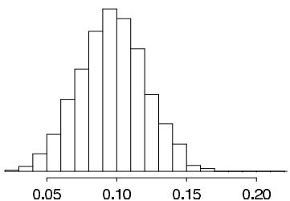
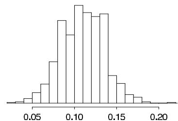
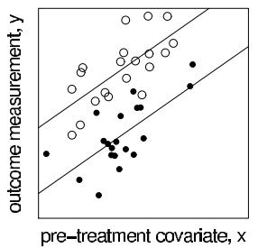
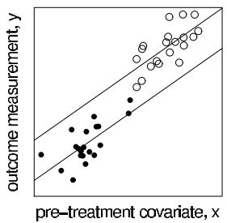
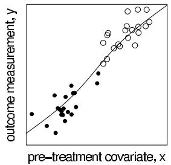

# Modeling Accounting for Data Collection

[Package map](../structure.md) · [Unsplit OCR dump](./_full.md)

[← Ch. 7 Evaluating Models](./07-evaluating-comparing-expanding.md) · [Ch. 9 Decision Analysis →](./09-decision-analysis.md)

> MinerU OCR dump. If a formula, table, or numbering disagrees with the PDF, the PDF is authoritative.

---

# Chapter 8

# Modeling accounting for data collection

How does the design of a sample survey, an experiment, or an observational study affect the models that we construct for a Bayesian analysis? How does one analyze data from a survey that is not a simple random sample? How does one analyze data from hierarchical experimental designs such as randomized blocks and Latin squares, or nonrandomly generated data in an observational study? If we know that a design is randomized, how does that affect our Bayesian inference? In this chapter, we address these questions by showing how relevant features of data collection are incorporated in the process of full probability modeling.

This chapter has two general messages:

- The information that describes how the data were collected should be included in the analysis, typically by basing conclusions on a model (such as a regression; see Part IV) that is conditional on the variables that describe the data collection process.   
- If partial information is available (for example, knowing that a measurement exceeds some threshold but not knowing its exact value, or having missing values for variables of interest), then a probability model should be used to relate the partially observed quantity or quantities to the other variables of interest.

Despite the simplicity of our messages, many of the examples in this chapter are mathematically elaborate, even when describing data collected under simple designs such as random sampling and randomized experiments. This chapter includes careful theoretical development of these simple examples in order to show clearly how general Bayesian modeling principles adapt themselves to particular designs. The purpose of these examples is not to reproduce or refine existing classical methods but rather to show how Bayesian methods can be adapted to deal with data collection issues such as stratification and clustering in surveys, blocking in experiments, selection in observational studies, and partial-data patterns such as censoring.

# 8.1 Bayesian inference requires a model for data collection

There are a variety of settings where a data analysis must account for the design of data collection rather than simply model the observed values directly. These include classical statistical designs such as sample surveys and randomized experiments, problems of nonresponse or missing data, and studies involving censored or truncated data. Each of these, and other problems, will be considered in this chapter.

The key goal throughout is generalizing beyond existing data to a larger population representing unrecorded data, additional units not in the study (as in a sample survey), or information not recorded on the existing units (as in an experiment or observational study, in which it is not possible to apply all treatments to all units). The information used in data collection must be included in the analysis, or else inferences will not necessarily be appropriate for the general population of interest.

A naive student of Bayesian inference might claim that because all inference is conditional on the observed data, it makes no difference how those data were collected. This misplaced appeal to the likelihood principle would assert that given (1) a fixed model (including the prior distribution) for the underlying data and (2) fixed observed values of the data, Bayesian inference is determined regardless of the design for the collection of the data. Under this view there would be no formal role for randomization in either sample surveys or experiments. The essential flaw in the argument is that a complete definition of 'the observed data' should include information on how the observed values arose, and in many situations such information has a direct bearing on how these values should be interpreted. Formally then, the data analyst needs to incorporate the information describing the data collection process in the probability model used for analysis.

The notion that the method of data collection is irrelevant to Bayesian analysis can be dispelled by the simplest of examples. Suppose for instance that we, the authors, give you, the reader, a collection of the outcomes of ten rolls of a die and all are 6's. Certainly your attitude toward the nature of the die after analyzing these data would be different if we told you (i) these were the only rolls we performed, versus (ii) we rolled the die 60 times but decided to report only the 6's, versus (iii) we decided in advance that we were going to report honestly that ten 6's appeared but would conceal how many rolls it took, and we had to wait 500 rolls to attain that result. In simple situations such as these, it is easy to see that the observed data follow a different distribution from that for the underlying 'complete data.' Moreover, in such simple cases it is often easy to state immediately the marginal distribution of the observed data having properly averaged over the posterior uncertainty about the missing data. But in general such simplicity is not present.

More important than these theoretical examples, however, are the applications of the theory to analysis of data from surveys, experiments, and observational studies, and with different patterns of missing data. We shall discuss some general principles that guide the appropriate incorporation of study design and data collection in the process of data analysis:

1. The data analyst should use all relevant information; the pattern of what has been observed can be informative.   
2. Ignorable designs (as defined in Section 8.2)—often based on randomization—are likely to produce data for which inferences are less sensitive to model choice, than nonignorable designs.   
3. As more explanatory variables are included in an analysis, the inferential conclusions become more valid conditionally but possibly more sensitive to the model specifications relating the outcomes to the explanatory variables.   
4. Thinking about design and the data one could have observed helps us structure inference about models and finite-population estimands such as the population mean in a sample survey or the average causal effect of an experimental treatment. In addition, the posterior predictive checks discussed in Chapter 6 in general explicitly depend on the study design through the hypothetical replications, $y^{\mathrm{rep}}$ .

# Generality of the observed- and missing-data paradigm

Our general framework for thinking about data collection problems is in terms of observed data that have been collected from a larger set of complete data (or potential data), leaving unobserved missing data. Inference is conditional on observed data and also on the pattern of observed and missing observations. We use the expression 'missing data' in a general sense to include unintentional missing data due to unfortunate circumstances such as survey nonresponse, censored measurements, and noncompliance in an experiment, but also intentional missing data such as data from units not sampled in a survey and the unobserved 'potential outcomes' under treatments not applied in an experiment (see Table 8.1).

Table 8.1: Use of observed- and missing-data terminology for various data structures.   

<table><tr><td>Example</td><td>‘Observed data’</td><td>‘Complete data’</td></tr><tr><td>Sampling</td><td>Values from the n units in the sample</td><td>Values from all N units in the population</td></tr><tr><td>Experiment</td><td>Outcomes under the observed treatment for each unit treated</td><td>Outcomes under all treatments for all units</td></tr><tr><td>Rounded data</td><td>Rounded observations</td><td>Precise values of all observations</td></tr><tr><td>Unintentional missing data</td><td>Observed data values</td><td>Complete data, both observed and missing</td></tr></table>

Section 8.2 defines a general notation for data collection and introduces the concept of ignorability, which is crucial in setting up models that correctly account for data collection. The rest of this chapter discusses Bayesian analysis in different scenarios: sampling, experimentation, observational studies, and unintentional missing data. Chapter 18 goes into more detail on multivariate regression models for missing data.

To develop a basic understanding of the fundamental issues, we need a general formal structure in which we can embed the variations as special cases. As we discuss in the next section, the key idea is to expand the sample space to include, in addition to the potential (complete) data $y$ , an indicator variable $I$ for whether each element of $y$ is observed or not.

# 8.2 Data-collection models and ignorability

In this section, we develop a general notation for observed and potentially observed data. As noted earlier, we introduce the notation in the context of missing-data problems but apply it to sample surveys, designed experiments, and observational studies in the rest of the chapter. In a wide range of problems, it is useful to imagine what would be done if all data were completely observed—that is, if a sample survey were a census, or if all units could receive all treatments in an experiment, or if no observations were censored (see Table 8.1). We divide the modeling tasks into two parts: modeling the complete data, $y$ , typically using the methods discussed elsewhere in this book, and modeling the variable $I$ , which indexes which potential data are observed.

# Notation for observed and missing data

Let $y = (y_{1},\ldots ,y_{N})$ be the matrix of potential data (each $y_{i}$ may itself be a vector with components $y_{ij},j = 1,\dots ,J$ , for example if several questions are asked of each respondent in a survey), and let $I = (I_{1},\ldots ,I_{N})$ be a matrix of the same dimensions as $y$ with indicators for the observation of $y$ : $I_{ij} = 1$ means $y_{ij}$ is observed, whereas $I_{ij} = 0$ means $y_{ij}$ is missing. For notational convenience, let 'obs' = $\{(i,j)\colon I_{ij} = 1\}$ index the observed components of $y$ and 'mis' = $\{(i,j)\colon I_{ij} = 0\}$ index the unobserved components of $y$ ; for simplicity we assume that $I$ itself is always observed. (In a situation in which $I$ is not fully observed, for example a sample survey with unknown population size, one can assign parameters to the unknown quantities so that $I$ is fully observed, conditional on the unknown parameters.) The symbols $y_{\mathrm{obs}}$ and $y_{\mathrm{mis}}$ refer to the collection of elements of $y$ that are observed and missing. The sample space is the product of the usual sample space for $y$ and the sample space for $I$ . Thus, in this chapter, and also in Chapter 18, we use the notation $y_{\mathrm{obs}}$ where in the other chapters we would use $y$ .

For much of this chapter, we assume that the simple $0/1$ indicator $I_{ij}$ is adequate for summarizing the possible responses; Section 8.7 considers models in which missing data pat

terns are more complicated and the data points cannot simply be categorized as 'observed' or 'missing.'

# Stability assumption

It is standard in statistical analysis to assume stability: that the recording or measurement process does not change the values of the data. In experiments, the assumption is called the stable unit treatment value assumption and includes the assumption of no interference between units: the treatment applied to any particular unit should have no effect on outcomes for the other units. More generally, the assumption is that the complete-data vector (or matrix) $y$ is not affected by the inclusion vector (or matrix) $I$ . An example in which this assumption fails is an agricultural experiment that tests several fertilizers on plots so closely spaced that the fertilizers leach to neighboring plots.

In defining $y$ as a fixed quantity, with $I$ only affecting which elements of $y$ are observed, our notation implicitly assumes stability. If instability is a possibility, then the notation must be expanded to allow all possible outcome vectors in a larger 'complete data' structure $y$ . In order to control the computational burden, such a structure is typically created based on some specific model. We do not consider this topic further except in Exercise 8.4.

# Fully observed covariates

In this chapter, we use the notation $x$ for variables that are fully observed for all units. There are typically three reasons why we might want to include $x$ in an analysis:

1. We may be interested in some aspect of the joint distribution of $(x,y)$ , such as the regression of $y$ on $x$ .   
2. We may be interested in some aspect of the distribution of $y$ , but $x$ provides information about $y$ : in a regression setting, if $x$ is fully observed, then a model for $p(y|x)$ can lead to more precise inference about new values of $y$ than would be obtained by modeling $y$ alone.   
3. Even if we are only interested in $y$ , we must include $x$ in the analysis if $x$ is involved in the data collection mechanism or, equivalently, if the distribution of the inclusion indicators $I$ depends on $x$ . Examples include stratum indicators in sampling or block indicators in a randomized block experiment. We return to this topic several times in this chapter.

# Data model, inclusion model, and complete and observed data likelihood

It is useful when considering data collection to break the joint probability model into two parts: (1) the model for the underlying complete data, $y$ including observed and unobserved components—and (2) the model for the inclusion vector, $I$ . We define the complete-data likelihood as the product of the likelihoods of these two factors; that is, the distribution of the complete data, $y$ , and the inclusion vector, $I$ , given the parameters in the model:

$$
p (y, I | \theta , \phi) = p (y | \theta) p (I | y, \phi). \tag {8.1}
$$

In this chapter, we use $\theta$ and $\phi$ to denote the parameters of the distributions of the complete data and the inclusion vectors, respectively.

In this formulation, the first factor of (8.1), $p(y|\theta)$ , is a model of the underlying data without reference to the data collection process. For most problems we shall consider, the estimands of primary interest are functions of the complete data $y$ (finite-population estimands) or of the parameters $\theta$ (superpopulation estimands). The parameters $\phi$ that index the missingness model are characteristic of the data collection but are not generally

of scientific interest. It is possible, however, for $\theta$ and $\phi$ to be dependent in their prior distribution or even to be deterministically related.

Expression (8.1) is useful for setting up a probability model, but it is not actually the 'likelihood' of the data at hand unless $y$ is completely observed. The actual information available is $(y_{\mathrm{obs}}, I)$ , and so the appropriate likelihood for Bayesian inference is

$$
p (y _ {\mathrm {o b s}}, I | \theta , \phi) = \int p (y, I | \theta , \phi) d y _ {\mathrm {m i s}},
$$

which we call the observed-data likelihood. If fully observed covariates $x$ are available, all these expressions are conditional on $x$ .

Joint posterior distribution of parameters $\theta$ from the sampling model and $\phi$ from the missing-data model

The complete-data likelihood of $(y, I)$ , given parameters $(\theta, \phi)$ and covariates $x$ , is

$$
p (y, I | x, \theta , \phi) = p (y | x, \theta) p (I | x, y, \phi),
$$

where the pattern of missing data can depend on the complete data $y$ (both observed and missing), as in the cases of censoring and truncation presented in Section 8.7. The joint posterior distribution of the model parameters $\theta$ and $\phi$ , given the observed information, $(x,y_{\mathrm{obs}},I)$ , is

$$
\begin{array}{l} p (\theta , \phi | x, y _ {\mathrm {o b s}}, I) \propto p (\theta , \phi | x) p (y _ {\mathrm {o b s}}, I | x, \theta , \phi) \\ = p (\theta , \phi | x) \int p (y, I | x, \theta , \phi) d y _ {\mathrm {m i s}} \\ = p (\theta , \phi | x) \int p (y | x, \theta) p (I | x, y, \phi) d y _ {\mathrm {m i s}}. \\ \end{array}
$$

The posterior distribution of $\theta$ alone is this expression averaged over $\phi$ :

$$
p (\theta | x, y _ {\mathrm {o b s}}, I) = p (\theta | x) \iint p (\phi | x, \theta) p (y | x, \theta) p (I | x, y, \phi) d y _ {\mathrm {m i s}} d \phi . \tag {8.2}
$$

As usual, we will often avoid evaluating these integrals by simply drawing posterior simulations of the joint vector of unknowns, $(y_{\mathrm{mis}},\theta ,\phi)$ and then focusing on the estimands of interest.

# Finite-population and superpopulation inference

As indicated earlier, we distinguish between two kinds of estimands: finite-population quantities and superpopulation quantities, respectively. In the terminology of the earlier chapters, finite-population estimands are unobserved but often observable, and so sometimes may be called predictable. It is usually convenient to divide our analysis and computation into two steps: superpopulation inference—that is, analysis of $p(\theta, \phi | x, y_{\mathrm{obs}}, I)$ —and finite-population inference using $p(y_{\mathrm{mis}} | x, y_{\mathrm{obs}}, I, \theta, \phi)$ . Posterior simulations of $y_{\mathrm{mis}}$ from its posterior distribution are called multiple imputations and are typically obtained by first drawing $(\theta, \phi)$ from their joint posterior distribution and then drawing $y_{\mathrm{mis}}$ from its conditional posterior distribution given $(\theta, \phi)$ . Exercise 3.5 provides a simple example of these computations for inference from rounded data.

If all units were observed fully—for example, sampling all units in a survey or applying all treatments (counterfactually) to all units in an experiment—then finite-population

quantities would be known exactly, but there would still be some uncertainty in superpopulation inferences. In situations in which a large fraction of potential observations are in fact observed, finite-population inferences about $y_{\mathrm{mis}}$ are more robust to model assumptions, such as additivity or linearity, than are superpopulation inferences about $\theta$ . In a model of $y$ given $x$ , the finite-population inferences depend only on the conditional distribution for the particular set of $x$ 's in the population, whereas the superpopulation inferences are, implicitly, statements about the infinity of unobserved values of $y$ generated by $p(y|\theta ,x)$ .

Estimands defined from predictive distributions are of special interest because they are not tied to any particular parametric model and are therefore particularly amenable to sensitivity analysis across different models with different parameterizations.

Posterior predictive distributions. When considering prediction of future data, or replicated data for model checking, it is useful to distinguish between predicting future complete data, $\tilde{y}$ , and predicting future observed data, $\tilde{y}_{\mathrm{obs}}$ . The former task is, in principle, easier because it depends only on the complete data distribution, $p(y|x,\theta)$ , and the posterior distribution of $\theta$ , whereas the latter task depends also on the data collection mechanism—that is, $p(I|x,y,\phi)$ .

# Ignorability

If we decide to ignore the data collection process, we can compute the posterior distribution of $\theta$ by conditioning only on $y_{\mathrm{obs}}$ but not $I$ :

$$
\begin{array}{l} p (\theta | x, y _ {\mathrm {o b s}}) \propto p (\theta | x) p (y _ {\mathrm {o b s}} | x, \theta) \\ = p (\theta | x) \int p (y | x, \theta) d y _ {\mathrm {m i s}}. \tag {8.3} \\ \end{array}
$$

When the missing data pattern supplies no information—when the function $p(\theta | x, y_{\mathrm{obs}})$ given by (8.3) equals $p(\theta | x, y_{\mathrm{obs}}, I)$ given by (8.2)—the study design or data collection mechanism is called *ignorable* (with respect to the proposed model). In this case, the posterior distribution of $\theta$ and the posterior predictive distribution of $y_{\mathrm{mis}}$ (for example, future values of $y$ ) are entirely determined by the specification of a data model—that is, $p(y | x, \theta) p(\theta | x)$ —and the observed values of $y_{\mathrm{obs}}$ .

'Missing at random' and 'distinct parameters'

Two general and simple conditions are sufficient to ensure ignorability of the missing data mechanism for Bayesian analysis. First, the condition of missing at random requires that

$$
p (I | x, y, \phi) = p (I | x, y _ {\mathrm {o b s}}, \phi);
$$

that is, $p(I|x,y,\phi)$ , evaluated at the observed value of $(x,I,y_{\mathrm{obs}})$ , must be free of $y_{\mathrm{mis}}$ — that is, given observed $x$ and $y_{\mathrm{obs}}$ , it is a function of $\phi$ alone. 'Missing at random' is a subtle term, since the required condition is that, given $\phi$ , missingness depends only on $x$ and $y_{\mathrm{obs}}$ . For example, a deterministic inclusion rule that depends only on $x$ is 'missing at random' under this definition. (An example of a deterministic inclusion rule is auditing all tax returns with declared income greater than $1 million, where 'declared income' is a fully observed covariate, and 'audited income' is $y$ .)

Second, the condition of distinct parameters is satisfied when the parameters of the missing data process are independent of the parameters of the data generating process in the prior distribution:

$$
p (\phi | x, \theta) = p (\phi | x).
$$

Models in which the parameters are not distinct are considered in an extended example in Section 8.7.

The important consequence of these definitions is that, from (8.2), it follows that if data are missing at random according to a model with distinct parameters, then $p(\theta | x, y_{\mathrm{obs}}) = p(\theta | x, y_{\mathrm{obs}}, I)$ , that is, the missing data mechanism is ignorable.

# Ignorability and Bayesian inference under different data-collection schemes

The concept of ignorability supplies some justification for a relatively weak version of the claim presented at the outset of this chapter that, with fixed data and fixed models for the data, the data collection process does not influence Bayesian inference. That result is true for all ignorable designs when 'Bayesian inference' is interpreted strictly to refer only to the posterior distribution of the estimands with one fixed model (both prior distribution and likelihood), conditional on the data, but excluding both sensitivity analyses and posterior predictive checks. Our notation also highlights the incorrectness of the claim for the irrelevance of study design in general: even with a fixed likelihood function $p(y|\theta)$ , prior distribution $p(\theta)$ , and data $y$ , the posterior distribution does vary with different nonignorable data collection mechanisms.

In addition to the ignorable/nonignorable classification for designs, we also distinguish between known and unknown mechanisms, as anticipated by the discussion in the examples of Section 8.7 contrasting inference with specified versus unspecified truncation and censoring points. The term 'known' includes data collection processes that follow a known parametric family, even if the parameters $\phi$ are unknown

Designs that are ignorable and known with no covariates, including simple random sampling and completely randomized experiments. The simplest data collection procedures are those that are ignorable and known, in the sense that

$$
p (I | x, y, \phi) = p (I). \tag {8.4}
$$

Here, there is no unknown parameter $\phi$ because there is a single accepted specification for $p(I)$ that does not depend on either $x$ or $y_{\mathrm{obs}}$ . Only the complete-data distribution, $p(y|x,\theta)$ , and the prior distribution for $\theta$ , $p(\theta)$ , need be considered for inference. The obvious advantage of such an ignorable design is that the information from the data can be recovered with a relatively simple analysis. We begin Section 8.3 on surveys and Section 8.4 on experiments by considering basic examples with no covariates, $x$ , which document this connection with standard statistical practice and also show that the potential data $y = (y_{\mathrm{obs}}, y_{\mathrm{mis}})$ can usefully be regarded as having many components, most of which we never expect to observe but can be used to define 'finite-population' estimands.

Designs that are ignorable and known given covariates, including stratified sampling and randomized block experiments. In practice, simple random sampling and complete randomization are less common than more complicated designs that base selection and treatment decisions on covariate values. It is not appropriate always to pretend that data $y_{\mathrm{obs}1}, \ldots, y_{\mathrm{obs}n}$ are collected as a simple random sample from the target population, $y_1, \ldots, y_N$ . A key idea for Bayesian inference with complicated designs is to include in the model $p(y|x,\theta)$ enough explanatory variables $x$ so that the design is ignorable. With ignorable designs, many of the models presented in other chapters of this book can be directly applied. We illustrate this approach with several examples that show that not all known ignorable data collection mechanisms are equally good for all inferential purposes.

Designs that are strongly ignorable and known. A design that is strongly ignorable (sometimes called unconfounded) satisfies

$$
p (I | x, y, \phi) = p (I | x),
$$

so that the only dependence is on fully observed covariates. (For an example of a design that is ignorable but not strongly ignorable, consider a sequential experiment in which the unit-

level probabilities of assignment depend on the observed outcomes of previously assigned units.) We discuss these designs further in the context of propensity scores below.

Designs that are ignorable and unknown, such as experiments with nonrandom treatment assignments based on fully observed covariates. When analyzing data generated by an unknown or nonrandomized design, one can still ignore the assignment mechanism if $p(I|x,y,\phi)$ depends only on fully observed covariates, and $\theta$ is distinct from $\phi$ . The ignorable analysis must be conditional on these covariates. We illustrate with an example in Section 8.4, with strongly ignorable (given $x$ ) designs that are unknown. Propensity scores can play a useful role in the analysis of such data.

Designs that are nonignorable and known, such as censoring. There are many settings in which the data collection mechanism is known (or assumed known) but is not ignorable. Two simple but important examples are censored data (some of the variations in Section 8.7) and rounded data (see Exercises 3.5 and 8.14).

Designs that are nonignorable and unknown. This is the most difficult case. For example, censoring at an unknown point typically implies great sensitivity to the model specification for $y$ (discussed in Section 8.7). For another example, consider a medical study of several therapies, $j = 1,\dots ,J$ , in which the treatments that are expected to have smaller effects are applied to larger numbers of patients. The sample size of the experiment corresponding to treatment $j$ , $n_j$ , would then be expected to be correlated with the efficacy, $\theta_{j}$ , and so the parameters of the data collection mechanism are not distinct from the parameters indexing the data distribution. In this case, we should form a parametric model for the joint distribution of $(n_j,y_j)$ . Nonignorable and unknown data collection are standard in observational studies, as we discuss in Section 8.6, where initial analyses typically treat the design as ignorable but unknown.

# Propensity scores

With a strongly ignorable design, the unit-level probabilities of assignments,

$$
\operatorname * {P r} (I _ {i} = 1 | X) = \pi_ {i},
$$

are called propensity scores. In some strongly ignorable designs, the vector of propensity scores, $\pi = (\pi_1,\dots ,\pi_N)$ , is an adequate summary of the covariates $X$ in the sense that the assignment mechanism is strongly ignorable given just $\pi$ rather than $x$ . Conditioning on $\pi$ rather than multivariate $x$ may lose some precision but it can greatly simplify modeling and produce more robust inferences. Propensity scores also create another bridge to classical designs.

However, propensity scores alone never supply enough information for posterior predictive replications (which are crucial to model checking, as discussed in Sections 6.3-6.4), because different designs can have the same propensity scores. For example, a completely randomized experiment with $\pi_i = \frac{1}{2}$ for all units has the same propensity scores as an experiment with independent assignments with probability $\frac{1}{2}$ for each treatment for each unit. Similarly, simple random sampling has the same propensity scores as some more elaborate equal-probability sampling designs involving stratified or cluster sampling.

# Unintentional missing data

A ubiquitous problem in real datasets is unintentional missing data, which we discuss in more detail in Chapter 18. Classical examples include survey nonresponse, dropouts in experiments, and incomplete information in observational studies. When the amount of missing data is small, one can often perform a good analysis assuming that the missing

data are ignorable (conditional on the fully observed covariates). As the fraction of missing information increases, the ignorability assumption becomes more critical. In some cases, half or more of the information is missing, and then a serious treatment of the missingness mechanism is essential. For example, in observational studies of causal effects, at most half of the potential data (corresponding to both treatments applied to all units in the study) are observed, and so it is necessary to either assume ignorability (conditional on available covariates) or explicitly model the treatment selection process.

# 8.3 Sample surveys

Simple random sampling of a finite population

For perhaps the simplest nontrivial example of statistical inference, consider a finite population of $N$ persons, where $y_{i}$ is the weekly amount spent on food by the $i$ th person. Let $y = (y_{1},\ldots ,y_{N})$ , where the object of inference is average weekly spending on food in the population, $\overline{y}$ . As usual, we consider the finite population as $N$ exchangeable units; that is, we model the marginal distribution of $y$ as an independent and identically distributed mixture over the prior distribution of underlying parameters $\theta$ :

$$
p (y) = \int \prod_ {i = 1} ^ {N} p (y _ {i} | \theta) p (\theta) d \theta .
$$

The estimand, $\overline{y}$ , will be estimated from a sample of $y_{i}$ -values because a census of all $N$ units is too expensive for practical purposes. A standard technique is to draw a simple random sample of specified size $n$ . Let $I = (I_1,\dots ,I_N)$ be the vector of indicators for whether or not person $i$ is included in the sample:

$$
I _ {i} = \left\{ \begin{array}{l l} 1 & \text {i f i i s s a m p l e d} \\ 0 & \text {o t h e r w i s e .} \end{array} \right.
$$

Formally, simple random sampling is defined by

$$
p (I | y, \phi) = p (I) = \left\{ \begin{array}{l l} {\binom {N} {n}} ^ {- 1} & \text {i f} \sum_ {i = 1} ^ {N} I _ {i} = n \\ 0 & \text {o t h e r w i s e .} \end{array} \right.
$$

This method is strongly ignorable and known (compare to equation (8.4)) and therefore is straightforward to deal with inferentially. The probability of inclusion in the sample (the propensity score) is $\pi_{i} = \frac{n}{N}$ for all units.

Bayesian inference for superpopulation and finite-population estimands. We can perform Bayesian inference applying the principles of the early chapters of this book to the posterior density, $p(\theta | y_{\mathrm{obs}}, I)$ , which under an ignorable design is $p(\theta | y_{\mathrm{obs}}) \propto p(\theta) p(y_{\mathrm{obs}} | \theta)$ . As usual, this requires setting up a model for the distribution of weekly spending on food in the population in terms of parameters $\theta$ . For this problem, however, the estimand of interest is the finite-population average, $\overline{y}$ , which can be expressed as

$$
\bar {y} = \frac {n}{N} \bar {y} _ {\mathrm {o b s}} + \frac {N - n}{N} \bar {y} _ {\mathrm {m i s}}, \tag {8.5}
$$

where $\overline{y}_{\mathrm{obs}}$ and $\overline{y}_{\mathrm{mis}}$ are the averages of the observed and missing $y_{i}$ 's.

We can determine the posterior distribution of $\overline{y}$ using simulations of $\overline{y}_{\mathrm{mis}}$ from its posterior predictive distribution. We start with simulations of $\theta$ : $\theta^s, s = 1, \dots, S$ . For each drawn $\theta^s$ we then draw a vector $y_{\mathrm{mis}}$ from

$$
p (y _ {\mathrm {m i s}} | \theta^ {s}, y _ {\mathrm {o b s}}) = p (y _ {\mathrm {m i s}} | \theta^ {s}) = \prod_ {i: I _ {i} = 0} p (y _ {i} | \theta^ {s}),
$$

and then average the values of the simulated vector to obtain a draw of $\overline{y}_{\mathrm{mis}}$ from its posterior predictive distribution. Because $\overline{y}_{\mathrm{obs}}$ is known, we can compute draws from the posterior distribution of the finite-population mean, $\overline{y}$ , using (8.5) and the draws of $y_{\mathrm{mis}}$ . Although typically the estimand is viewed as $\overline{y}$ , more generally it could be any function of $y$ (such as the median of the $y_i$ values, or the mean of $\log y_i$ ).

Large-sample equivalence of superpopulation and finite-population inference. If $N - n$ is large, then we can use the central limit theorem to approximate the sampling distribution of $\overline{y}_{\mathrm{mis}}$ :

$$
p (\overline {{y}} _ {\mathrm {m i s}} | \theta) \approx \mathrm {N} \left(\overline {{y}} _ {\mathrm {m i s}} \left| \mu , \frac {1}{N - n} \sigma^ {2}\right), \right.
$$

where $\mu = \mu (\theta) = \operatorname {E}(y_i|\theta)$ and $\sigma^2 = \sigma^2 (\theta) = \mathrm{var}(y_i|\theta)$ . If $n$ is large as well, then the posterior distributions of $\theta$ and any of its components, such as $\mu$ and $\sigma$ , are approximately normal, hence the posterior distribution of $\overline{y}_{\mathrm{mis}}$ is approximately a normal mixture of normals and thus normal itself. More formally,

$$
p (\overline {{y}} _ {\mathrm {m i s}} | y _ {\mathrm {o b s}}) \approx \int p (\overline {{y}} _ {\mathrm {m i s}} | \mu , \sigma) p (\mu , \sigma | y _ {\mathrm {o b s}}) d \mu d \sigma ;
$$

as both $N$ and $n$ get large with $N / n$ fixed, this is approximately normal with

$$
\mathrm {E} (\overline {{y}} _ {\mathrm {m i s}} | y _ {\mathrm {o b s}}) \approx \mathrm {E} (\mu | y _ {\mathrm {o b s}}) \approx \overline {{y}} _ {\mathrm {o b s}},
$$

and

$$
\begin{array}{l} \operatorname {v a r} \left(\bar {y} _ {\text {m i s}} \mid y _ {\text {o b s}}\right) \approx \operatorname {v a r} (\mu \mid y _ {\text {o b s}}) + \mathrm {E} \left(\frac {1}{N - n} \sigma^ {2} \mid y _ {\text {o b s}}\right) \\ \approx \frac {1}{n} s _ {\mathrm {o b s}} ^ {2} + \frac {1}{N - n} s _ {\mathrm {o b s}} ^ {2} \\ = \frac {N}{n (N - n)} s _ {\mathrm {o b s}} ^ {2}, \\ \end{array}
$$

where $s_{\mathrm{obs}}^2$ is the sample variance of the observed values of $y_{\mathrm{obs}}$ . Combining this approximate posterior distribution with (8.5), it follows not only that $p(\overline{y} | y_{\mathrm{obs}}) \to p(\mu | y_{\mathrm{obs}})$ , but, more generally, that

$$
\bar {y} \mid y _ {\mathrm {o b s}} \approx \mathrm {N} \left(\bar {y} _ {\mathrm {o b s}}, \left(\frac {1}{n} - \frac {1}{N}\right) s _ {\mathrm {o b s}} ^ {2}\right). \tag {8.6}
$$

This is the formal Bayesian justification of normal-theory inference for finite sample surveys.

For $p(y_i|\theta)$ normal, with the standard noninformative prior distribution, the exact result is $\overline{y} | y_{\mathrm{obs}} \sim t_{n-1}\left(\overline{y}_{\mathrm{obs}}, \left(\frac{1}{n} - \frac{1}{N}\right) s_{\mathrm{obs}}^2\right)$ . (See Exercise 8.7.)

# Stratified sampling

In stratified random sampling, the $N$ units are divided into $J$ strata, and a simple random sample of size $n_j$ is drawn using simple random sampling from each stratum $j = 1,\ldots ,J$ . This design is ignorable given $J$ vectors of indicator variables, $x_{1},\ldots ,x_{J}$ , with $x_{j} = (x_{1j},\dots,x_{nj})$ and

$$
x _ {i j} = \left\{ \begin{array}{l l} 1 & \text {i f u n i t i i s i n s t r a t u m j} \\ 0 & \text {o t h e r w i s e .} \end{array} \right.
$$

The variables $x_{j}$ are effectively fully observed in the population as long as we know, for each $j$ , the number of units $N_{j}$ in the stratum and the values of $x_{ij}$ for units in the sample. A

Table 8.2 Results of a CBS News survey of 1447 adults in the United States, divided into 16 strata. The sampling is assumed to be proportional, so that the population proportions, $N_{j} / N$ , are approximately equal to the sampling proportions, $n_{j} / n$ .   

<table><tr><td rowspan="2">Stratum, j</td><td colspan="3">Proportion who prefer ...</td><td>Sample</td></tr><tr><td>Bush, yobs1j/nj</td><td>Dukakis, yobs2j/nj</td><td>no opinion, yobs3j/nj</td><td>proportion, nj/n</td></tr><tr><td>Northeast, I</td><td>0.30</td><td>0.62</td><td>0.08</td><td>0.032</td></tr><tr><td>Northeast, II</td><td>0.50</td><td>0.48</td><td>0.02</td><td>0.032</td></tr><tr><td>Northeast, III</td><td>0.47</td><td>0.41</td><td>0.12</td><td>0.115</td></tr><tr><td>Northeast, IV</td><td>0.46</td><td>0.52</td><td>0.02</td><td>0.048</td></tr><tr><td>Midwest, I</td><td>0.40</td><td>0.49</td><td>0.11</td><td>0.032</td></tr><tr><td>Midwest, II</td><td>0.45</td><td>0.45</td><td>0.10</td><td>0.065</td></tr><tr><td>Midwest, III</td><td>0.51</td><td>0.39</td><td>0.10</td><td>0.080</td></tr><tr><td>Midwest, IV</td><td>0.55</td><td>0.34</td><td>0.11</td><td>0.100</td></tr><tr><td>South, I</td><td>0.57</td><td>0.29</td><td>0.14</td><td>0.015</td></tr><tr><td>South, II</td><td>0.47</td><td>0.41</td><td>0.12</td><td>0.066</td></tr><tr><td>South, III</td><td>0.52</td><td>0.40</td><td>0.08</td><td>0.068</td></tr><tr><td>South, IV</td><td>0.56</td><td>0.35</td><td>0.09</td><td>0.126</td></tr><tr><td>West, I</td><td>0.50</td><td>0.47</td><td>0.03</td><td>0.023</td></tr><tr><td>West, II</td><td>0.53</td><td>0.35</td><td>0.12</td><td>0.053</td></tr><tr><td>West, III</td><td>0.54</td><td>0.37</td><td>0.09</td><td>0.086</td></tr><tr><td>West, IV</td><td>0.56</td><td>0.36</td><td>0.08</td><td>0.057</td></tr></table>

natural analysis is to model the distributions of the measurements $y_{i}$ within each stratum $j$ in terms of parameters $\theta_{j}$ and then perform Bayesian inference on all the sets of parameters $\theta_{1},\ldots ,\theta_{J}$ . For many applications it will be natural to assign a hierarchical model to the $\theta_{j}$ 's, yielding a problem with structure similar to the rat tumor experiments, the educational testing experiments, and the meta-analysis of Chapter 5. We illustrate this approach with an example at the end of this section.

We obtain finite-population inferences by weighting the inferences from the separate strata in a way appropriate for the finite-population estimand. For example, we can write the population mean, $\overline{y}$ , in terms of the individual stratum means, $\overline{y}_j$ , as $\overline{y} = \sum_{j=1}^{J} \frac{N_j}{N} \overline{y}_j$ . The finite-population quantities $\overline{y}_j$ can be simulated given the simulated parameters $\theta_j$ for each stratum. There is no requirement that $\frac{n_j}{n} = \frac{N_j}{N}$ ; the finite-population Bayesian inference automatically corrects for any oversampling or undersampling of strata.

# Example. Stratified sampling in pre-election polling

We illustrate the analysis of a stratified sample with the opinion poll introduced in Section 3.4, in which we estimated the proportion of registered voters who supported the two major candidates in the 1988 U.S. presidential election. In Section 3.4, we analyzed the data under the false assumption of simple random sampling. Actually, the CBS survey data were collected using a variant of stratified random sampling, in which all the primary sampling units (groups of residential phone numbers) were divided into 16 strata, cross-classified by region of the country (Northeast, Midwest, South, West) and density of residential area (as indexed by telephone exchanges). The data and relative size of each stratum in the sample are given in Table 8.2. For the purposes of this example, we assume that respondents are sampled at random within each stratum and that the sampling fractions are exactly equal across strata, so that $N_{j} / N = n_{j} / n$ for each stratum $j$ .

Complications arise from several sources, including the systematic sampling used within strata, the selection of an individual to respond from each household that is contacted, the number of times people who are not at home are called back, the use of

  
Figure 8.1 Values of $\sum_{j=1}^{16} \frac{N_j}{N} (\theta_{1j} - \theta_{2j})$ for 1000 simulations from the posterior distribution for the election polling example, based on (a) the simple nonhierarchical model and (b) the hierarchical model. Compare to Figure 3.2.

demographic adjustments, and the general problem of nonresponse. For simplicity, we ignore many complexities in the design and restrict our attention here to the Bayesian analysis of the population of respondents answering residential phone numbers, thereby assuming the nonresponse is ignorable and also avoiding the additional step of shifting to the population of registered voters. (Exercises 8.12 and 8.13 consider adjusting for the fact that the probability an individual is sampled is proportional to the number of telephone lines in his or her household and inversely proportional to the number of adults in the household.) A more complete analysis would control for covariates such as sex, age, and education that affect the probabilities of nonresponse.

Data distribution. To justify the use of an ignorable model, we must model the outcome variable conditional on the explanatory variables—region of the country and density of residential area—that determine the stratified sampling. We label the strata $j = 1, \ldots, 16$ , with $n_j$ out of $N_j$ drawn from each stratum, and a total of $N = \sum_{j=1}^{16} N_j$ registered voters in the population. We fit the multinomial model of Section 3.4 within each stratum and a hierarchical model to link the parameters across different strata. For each stratum $j$ , we label $y_{\mathrm{obs}j} = (y_{\mathrm{obs}1j}, y_{\mathrm{obs}2j}, y_{\mathrm{obs}3j})$ , the number of supporters of Bush, Dukakis, and other/no-opinion in the sample, and we model $y_{\mathrm{obs}j} \sim \mathrm{Multin}(n_j; \theta_{1j}, \theta_{2j}, \theta_{3j})$ .

A simple nonhierarchical model. The simplest analysis of these data assigns the 16 vectors of parameters $(\theta_{1j},\theta_{2j},\theta_{3j})$ independent prior distributions. At this point, the Dirichlet model is a convenient choice of prior distribution because it is conjugate to the multinomial likelihood (see Section 3.4). Assuming Dirichlet prior distributions with all parameters equal to 1, we can obtain posterior inferences separately for the parameters in each stratum. The resulting simulations of $\theta_{ij}$ 's constitute the 'superpopulation inference' under this model.

Finite-population inference. As discussed in the earlier presentation of this example in Section 3.4, an estimand of interest is the difference in the proportions of Bush and Dukakis supporters, that is,

$$
\sum_ {j = 1} ^ {1 6} \frac {N _ {j}}{N} \left(\theta_ {1 j} - \theta_ {2 j}\right), \tag {8.7}
$$

which we can easily compute using the posterior simulations of $\theta$ and the known values of $N_{j} / N$ . In the above formula, we have used superpopulation means $\theta_{kj}$ in place of population averages $\overline{y}_{kj}$ , but given the huge size of the finite populations in question, this is not a concern. We are in a familiar setting in which finite-population and superpopulation inferences are essentially identical. The results of 1000 draws from the posterior distribution of (8.7) are displayed in Figure 8.1a. The distribution is centered at a slightly smaller value than in Figure 3.2, 0.097 versus 0.098, and is

slightly more concentrated about the center. The former result is likely a consequence of the choice of prior distribution. The Dirichlet prior distribution can be thought of as adding a single voter to each multinomial category within each of the 16 strata—adding a total of 16 to each of the three response categories. This differs from the nonstratified analysis in which only a single voter was added to each of the three multinomial categories. A Dirichlet prior distribution with parameters equal to $\frac{1}{16}$ would reproduce the same median as the nonstratified analysis. The smaller spread is expected and is one of the reasons for taking account of the stratified design in the analysis.

A hierarchical model. The simple model with prior independence across strata allows easy computation, but, as discussed in Chapter 5, when presented with a hierarchical dataset, we can improve inference by estimating the population distributions of parameters using a hierarchical model.

As an aid to constructing a reasonable model, we transform the parameters to separate partisan preference and probability of having a preference:

$$
\alpha_ {1 j} = \frac {\theta_ {1 j}}{\theta_ {1 j} + \theta_ {2 j}} = \begin{array}{l} \text {p r o b a b i l i t y o f p r e f e r r i n g B u s h , g i v e n} \\ \text {t h a t a p r e f e r e n c e i s e x p r e s s e d} \end{array}
$$

$$
\alpha_ {2 j} = 1 - \theta_ {3 j} = \text {p r o b a b i l i t y o f e x p r e s s i n g a p r e f e r e n c e}. \tag {8.8}
$$

We then transform these parameters to the logit scale (because they are restricted to lie between 0 and 1),

$$
\beta_ {1 j} = \operatorname {l o g i t} (\alpha_ {1 j}) \text {a n d} \beta_ {2 j} = \operatorname {l o g i t} (\alpha_ {2 j}),
$$

and model them as exchangeable across strata with a bivariate normal distribution indexed by hyperparameters $(\mu_1, \mu_2, \tau_1, \tau_2, \rho)$ :

$$
p(\beta |\mu_{1},\mu_{2},\tau_{1},\tau_{2},\rho) = \prod_{j = 1}^{16}\mathrm{N}\left(\left( \begin{array}{c}\beta_{1j}\\ \beta_{2j} \end{array} \right)\Big|\left( \begin{array}{c}\mu_{1}\\ \mu_{2} \end{array} \right),\left( \begin{array}{cc}\tau_{1}^{2} & \rho \tau_{1}\tau_{2}\\ \rho \tau_{1}\tau_{2} & \tau_{2}^{2} \end{array} \right)\right),
$$

with the conditionals $p(\beta_{1j}, \beta_{2j} | \mu_1, \mu_2, \tau_1, \tau_2, \rho)$ independent for $j = 1, \ldots, 16$ . This model, which is exchangeable in the 16 strata, does not use all the available prior information, because the strata are actually structured in a $4 \times 4$ array, but it improves upon the nonhierarchical model (which is equivalent to the hierarchical model with the parameters $\tau_1$ and $\tau_2$ fixed at $\infty$ ). We complete the model by assigning a uniform prior density to the hierarchical mean and standard deviation parameters and to the correlation of the two logits.

Results under the hierarchical model. Posterior inference for the 37-dimensional parameter vector $(\beta, \mu_1, \mu_2, \sigma_1, \sigma_2, \tau)$ is conceptually straightforward but requires computational methods beyond those developed in Parts I and II of this book. For the purposes of this example, we present the results of sampling using the Metropolis algorithm; see Exercise 11.7.

Table 8.3 provides posterior quantities of interest for the hierarchical parameters and for the parameters $\alpha_{1j}$ , the proportion preferring Bush (among those who have a preference) in each stratum. The posterior medians of the $\alpha_{1j}$ 's vary from 0.48 to 0.59, representing considerable shrinkage from the proportions in the raw counts, $y_{\mathrm{obs}1j} / (y_{\mathrm{obs}1j} + y_{\mathrm{obs}2j})$ , which vary from 0.33 to 0.67. The posterior median of $\rho$ , the between-stratum correlation of logit of support for Bush and logit of proportion who express a preference, is negative, but the posterior distribution has substantial variability. Posterior quantiles for the probability of expressing a preference are displayed for only one stratum, stratum 16, as an illustration.

Table 8.3 Summary of posterior inference for the hierarchical analysis of the CBS survey in Table 8.2. The posterior distributions for the $\alpha_{1j}$ 's vary from stratum to stratum much less than the raw counts do. The inference for $\alpha_{2,16}$ for stratum 16 is included above as a representative of the 16 parameters $\alpha_{2j}$ . The parameters $\mu_1$ and $\mu_2$ are transformed to the inverse-logit scale so they can be more directly interpreted.   

<table><tr><td rowspan="2">Estimand</td><td colspan="5">Posterior quantiles</td></tr><tr><td>2.5%</td><td>25%</td><td>median</td><td>75%</td><td>97.5%</td></tr><tr><td>Stratum 1, α1,1</td><td>0.34</td><td>0.43</td><td>0.48</td><td>0.52</td><td>0.57</td></tr><tr><td>Stratum 2, α1,2</td><td>0.42</td><td>0.50</td><td>0.53</td><td>0.56</td><td>0.61</td></tr><tr><td>Stratum 3, α1,3</td><td>0.48</td><td>0.52</td><td>0.54</td><td>0.56</td><td>0.60</td></tr><tr><td>Stratum 4, α1,4</td><td>0.41</td><td>0.47</td><td>0.50</td><td>0.54</td><td>0.58</td></tr><tr><td>Stratum 5, α1,5</td><td>0.39</td><td>0.49</td><td>0.52</td><td>0.55</td><td>0.61</td></tr><tr><td>Stratum 6, α1,6</td><td>0.44</td><td>0.50</td><td>0.53</td><td>0.55</td><td>0.64</td></tr><tr><td>Stratum 7, α1,7</td><td>0.48</td><td>0.53</td><td>0.56</td><td>0.58</td><td>0.63</td></tr><tr><td>Stratum 8, α1,8</td><td>0.52</td><td>0.56</td><td>0.59</td><td>0.61</td><td>0.66</td></tr><tr><td>Stratum 9, α1,9</td><td>0.47</td><td>0.54</td><td>0.57</td><td>0.61</td><td>0.69</td></tr><tr><td>Stratum 10, α1,10</td><td>0.47</td><td>0.52</td><td>0.55</td><td>0.57</td><td>0.61</td></tr><tr><td>Stratum 11, α1,11</td><td>0.47</td><td>0.53</td><td>0.56</td><td>0.58</td><td>0.63</td></tr><tr><td>Stratum 12, α1,12</td><td>0.53</td><td>0.56</td><td>0.58</td><td>0.61</td><td>0.65</td></tr><tr><td>Stratum 13, α1,13</td><td>0.43</td><td>0.50</td><td>0.53</td><td>0.56</td><td>0.63</td></tr><tr><td>Stratum 14, α1,14</td><td>0.50</td><td>0.55</td><td>0.57</td><td>0.60</td><td>0.67</td></tr><tr><td>Stratum 15, α1,15</td><td>0.50</td><td>0.55</td><td>0.58</td><td>0.59</td><td>0.65</td></tr><tr><td>Stratum 16, α1,16</td><td>0.50</td><td>0.55</td><td>0.57</td><td>0.60</td><td>0.65</td></tr><tr><td>Stratum 16, α2,16</td><td>0.87</td><td>0.90</td><td>0.91</td><td>0.92</td><td>0.94</td></tr><tr><td>logit-1(μ1)</td><td>0.50</td><td>0.53</td><td>0.55</td><td>0.56</td><td>0.59</td></tr><tr><td>logit-1(μ2)</td><td>0.89</td><td>0.91</td><td>0.91</td><td>0.92</td><td>0.93</td></tr><tr><td>τ1</td><td>0.11</td><td>0.17</td><td>0.23</td><td>0.30</td><td>0.47</td></tr><tr><td>τ2</td><td>0.14</td><td>0.20</td><td>0.28</td><td>0.40</td><td>0.78</td></tr><tr><td>ρ</td><td>-0.92</td><td>-0.71</td><td>-0.44</td><td>0.02</td><td>0.75</td></tr></table>

Posterior inference for the population total (8.7) is displayed on page 208 in Figure 8.1b which, compared to Figures 8.1a, indicates that the hierarchical model yields a higher posterior median, 0.11, and slightly more variability. The higher median occurs because the groups within which support for Bush was lowest, strata 1 and 5, have relatively small samples (see Table 8.2) and so are pulled more toward the grand mean in the hierarchical analysis (see Table 8.3).

Model checking. The large shrinkage of the extreme values in the hierarchical analysis is a possible cause for concern, considering that the observed support for Bush in strata 1 and 5 was so much less than in the other 14 strata. Perhaps the normal model for the distribution of true stratum parameters $\beta_{1j}$ is inappropriate? We check the fit using a posterior predictive check, using as a test statistic $T(y) = \min_j y_{\mathrm{obs}1j} / n_j$ , which has an observed value of 0.298 (occurring in stratum 1). Using 1000 draws from the posterior predictive distribution, we find that $T(y^{\mathrm{rep}})$ varies from 0.14 to 0.48, with $\frac{163}{1000}$ replicated values falling below 0.298. Thus, the extremely low value is plausible under the model.

# Cluster sampling

In cluster sampling, the $N$ units in the population are divided into $K$ clusters, and sampling proceeds in two stages. First, a sample of $J$ clusters is drawn, and second, a sample of $n_j$ units is drawn from the $N_j$ units within each sampled cluster $j = 1,\ldots ,J$ . This design is

ignorable given indicator variables for the $J$ clusters and knowledge of the number of units in each of the $J$ clusters. Analysis of a cluster sample proceeds as for a stratified sample, except that inference must be extended to the clusters not sampled, which correspond to additional exchangeable batches in a hierarchical model (see Exercise 8.9).

# Example. A survey of Australian schoolchildren

We illustrate with a study estimating the proportion of children in the Melbourne area who walked to school. The survey was conducted by first sampling 72 schools from the metropolitan area and then surveying the children from two classes randomly selected within each school. The schools were selected from a list, with probability of selection proportional to the number of classes in the school. This 'probability proportional to size' sampling is a classical design for which the probabilities of selection are equal for each student in the city, and thus the average of the sample is an unbiased estimate of the population mean (see Section 4.5). The Bayesian analysis for this design is more complicated but has the advantage of being easily generalized to more elaborate inferential settings such as regressions.

Notation for cluster sampling. We label students, classes, and schools as $i,j,k$ , respectively, with $N_{jk}$ students within class $j$ in school $k$ , $M_k$ classes within school $k$ , and $K$ schools in the city. The number of students in school $k$ is then $N_k = \sum_{j=1}^{M_k} N_{jk}$ , with a total of $N = \sum_{k=1}^{K} N_k$ students in the city.

We define $y_{ijk}$ to equal 1 if student $i$ (in class $j$ and school $k$ ) walks to school and 0 otherwise, $\bar{y}_{.jk} = \frac{1}{N_{jk}}\sum_{i=1}^{N_{jk}}y_{ijk}$ to be the proportion of students in class $j$ and school $k$ who walk to school, and $\bar{y}_{..k} = \frac{1}{N_k}\sum_{j=1}^{M_k}N_{jk}\bar{y}_{.jk}$ to be the proportion of students in school $k$ who walk. The estimand of interest is $\overline{Y} = \frac{1}{N}\sum_{k=1}^{K}N_k\bar{y}_{..k}$ , the proportion of students in the city who walk.

The model. The general principle of modeling for cluster sampling is to include a parameter for each level of clustering. A simple model would start with independence at the student level within classes: $Pr(y_{ijk} = 1) = \theta_{jk}$ . Assuming a reasonable number of students $N_{jk}$ in the class, we approximate the distribution of the average in class $j$ within school $k$ as independent with distributions,

$$
\bar {y} _ {. j k} \sim \mathrm {N} \left(\theta_ {j k}, \sigma_ {j k} ^ {2}\right), \tag {8.9}
$$

where $\sigma_{jk}^2 = \bar{y}_{.jk}(1 - \bar{y}_{.jk}) / N_{jk}$ . We could perform the computations with the exact binomial model, but for our purposes here, the normal approximation allows us to lay out more clearly the structure of the model for cluster data.

We continue by modeling the classes within each school as independent (conditional on school-level parameters) with distributions,

$$
\theta_ {j k} \sim \mathrm {N} (\theta_ {k}, \tau_ {\mathrm {c l a s s}} ^ {2})
$$

$$
\theta_ {k} \sim \mathrm {N} (\alpha + \beta M _ {k}, \tau_ {\text {s c h o o l}} ^ {2}). \tag {8.10}
$$

We include the number of classes $M_{k}$ in the school-level model because of the principle that all information used in the design should be included in the analysis. In this survey, the sampling probabilities depend on the school sizes $M_{k}$ , and so the design is ignorable only for a model that includes the $M_{k}$ 's. The linear form (8.10) is only one possible way to do this, but it seems a reasonable place to start.

Inference for the population mean. Bayesian inference for this problem proceeds in four steps:

1. Fit the model defined by (8.9) and (8.10), along with a noninformative prior distribution on the hyperparameters $\alpha, \beta, \tau_{\mathrm{class}}, \tau_{\mathrm{school}}$ to obtain inferences for these

hyperparameters, along with the parameters $\theta_{jk}$ for the classes $j$ in the sample and $\theta_{k}$ for the schools $k$ in the sample.

2. For each posterior simulation from the model, use the model (8.10) to simulate the parameters $\theta_{jk}$ and $\theta_{k}$ for classes and schools that are not in the sample.   
3. Use the sampling model (8.9) to obtain inferences about students in unsampled classes and unsampled schools, and then combine these to obtain inferences about the average response in each school, $\bar{y}_{..k} = \frac{1}{N_k}\sum_{j=1}^{M_k}N_{jk}\bar{y}_{.jk}$ . For unsampled schools $k$ , $\bar{y}_{..k}$ is calculated directly from the posterior simulations of its $M_k$ classes, or more directly simulated as,

$$
\bar {y} _ {\cdot . k} \sim \mathrm {N} (\alpha + \beta M _ {k}, \tau_ {\mathrm {s c h o o l}} ^ {2} + \tau_ {\mathrm {c l a s s}} ^ {2} / M _ {k} + \sigma^ {2} / N _ {k}).
$$

For sampled schools $k$ , $\bar{y}_{..k}$ is an average over sampled and unsampled classes. This can be viewed as a more elaborate version of the $\bar{y}_{\mathrm{obs}}$ , $\bar{y}_{\mathrm{mis}}$ calculations described at the beginning of Section 8.3.

4. Combine the posterior simulations about the school-level averages to obtain inference about the population mean, $\overline{Y} = \frac{1}{N}\sum_{k=1}^{K}N_k\overline{y}_{..k}$ . To perform this sum (as well as the simulations in the previous step), we must know the number of children $N_k$ within each of the schools in the population. If these are not known, they must be estimated from the data—that is, we must jointly model $(N_k,\theta_k)$ —as illustrated in the Alcoholics Anonymous sampling example below.

Approximate inference when the fraction of clusters sampled is small. For inference about schools in the Melbourne area, the superpopulation quantities $\theta_{jk}$ and $\theta_{k}$ can be viewed as intermediate quantities, useful for the ultimate goal of estimating the finite-population average $\bar{Y}$ , as detailed above. In general practice, however (and including this particular survey), the number of schools sampled is a small fraction of the total in the city, and thus we can approximate the average of any variable in the population by its mean in the superpopulation distribution. In particular, we can approximate $\overline{Y}$ , the overall proportion of students in the city who walk, by the expectations in the school-level model:

$$
\bar {Y} \approx \frac {1}{N} \sum_ {k = 1} ^ {K} N _ {k} \mathrm {E} \left(\theta_ {k}\right) = \frac {1}{N} \sum_ {k = 1} ^ {K} N _ {k} \left(\alpha + \beta M _ {k}\right). \tag {8.11}
$$

This quantity of interest has a characteristic feature of sample survey inference, that it depends both on model parameters and cluster sizes. Since we are now assuming that only a small fraction of schools are included in the sample, the calculation of (8.11) depends only on the hyperparameters $\alpha, \beta$ and the distribution of $(M_k, N_k)$ in the population, and not on the school-level parameters $\theta_k$ .

# Unequal probabilities of selection

Another simple survey design is independent sampling with unequal sampling probabilities for different units. This design is ignorable conditional on the covariates, $x$ , that determine the sampling probability, as long as the covariates are fully observed in the general population (or, to put it another way, as long as we know the values of the covariates in the sample and also the distribution of $x$ in the general population—for example, if the sampling probabilities depend on sex and age, the number of young females, young males, old females, and old males in the population). The critical step then in Bayesian modeling is formulating the conditional distribution of $y$ given $x$ .

# Example. Sampling of Alcoholics Anonymous groups

Approximately every three years, Alcoholics Anonymous performs a survey of its members in the United States, first selecting a number of meeting groups at random, then sending a packet of survey forms to each group and asking all the persons who come to the meeting on a particular day to fill out the survey. For the 1997 survey, groups were sampled with equal probability, and 400 groups throughout the nation responded, sending back an average of 20 surveys each.

For any binary survey response $y_{i}$ (for example, the answer to the question, 'Have you been an AA member for more than 5 years?'), we assume independent responses within each group $j$ with probability $\theta_{j}$ for a Yes response; thus,

$$
y _ {j} \sim \mathrm {B i n} (n _ {j}, \theta_ {j}),
$$

where $y_{j}$ is the number of Yes responses and $n_j$ the total number of people who respond to the survey sent to members of group $j$ . (This binomial model ignores the finite-population correction that is appropriate if a large proportion of the potential respondents in a group actually do receive and respond to the survey. In practice, it is acceptable to ignore this correction because, in this example, the main source of uncertainty is with respect to the unsampled clusters—a more precise within-cluster model would not make much difference.)

For any response $y$ , interest lies in the population mean; that is,

$$
\bar {Y} = \frac {\sum_ {j = 1} ^ {K} x _ {j} \theta_ {j}}{\sum_ {n = 1} ^ {K} x _ {j}}, \tag {8.12}
$$

where $x_{j}$ represents the number of persons in group $j$ , defined as the average number of persons who come to meetings of the group. To evaluate (8.12), we must perform inferences about the group sizes $x_{j}$ and the probabilities $\theta_{j}$ , for all the groups $j$ in the population—the 400 sampled groups and the 6000 unsampled.

For Bayesian inference, we need a joint model for $(x_{j},\theta_{j})$ . We set this up conditionally: $p(x_{j},\theta_{j}) = p(x_{j})p(\theta_{j}|x_{j})$ . For simplicity, we assign a joint normal distribution, which we can write as a normal model for $x_{j}$ and a linear regression for $\theta_{j}$ given $x_{j}$ :

$$
x _ {j} \sim \mathrm {N} (\mu_ {x}, \tau_ {x} ^ {2})
$$

$$
\theta_ {j} \sim \mathrm {N} (\alpha + \beta x _ {j}, \tau_ {\theta} ^ {2}). \tag {8.13}
$$

This is not the best parameterization since it does not account for the constraint that the probabilities $\theta_{j}$ must lie between 0 and 1 and the group sizes $x_{j}$ must be positive. The normal model is convenient, however, for illustrating the mathematical ideas behind cluster sampling, especially if the likelihood is simplified as,

$$
y _ {j} / n _ {j} \approx \mathrm {N} \left(\theta_ {j}, \sigma_ {j} ^ {2}\right), \tag {8.14}
$$

where $\sigma_j^2 = y_j(n_j - y_j) / n_j^3$

We complete the model with a likelihood on $n_j$ , which we assume has a Poisson distribution with mean $\pi x_j$ , where $\pi$ represents the probability that a person will respond to the survey. For convenience, we can approximate the Poisson by a normal model:

$$
n _ {j} \approx \mathrm {N} (\pi x _ {j}, \pi x _ {j}), \tag {8.15}
$$

The likelihood (8.14) and (8.15), along with the prior distribution (8.13), and a noninformative uniform distribution on the hyperparameters $\alpha, \beta, \tau_x, \tau_\theta, \pi$ , represents a hierarchical normal model for the parameters $(x_j, \theta_j)$ —a bivariate version of the hierarchical normal model discussed in Chapter 5. (It would require only a little more

effort to compute with the exact posterior distribution using the binomial and Poisson likelihoods, with more realistic models for $x_{j}$ and $\theta_{j}$ .

In general, the population quantity (8.12) depends on the observed and unobserved groups. In this example, the number of unobserved clusters is large, and so we can approximate (8.12) by

$$
\overline {{Y}} = \frac {\operatorname {E} (x _ {j} \theta_ {j})}{\operatorname {E} (x _ {j})}.
$$

From the normal model (8.13), we can express these expectations as posterior means of functions of the hyperparameters:

$$
\bar {Y} = \frac {\alpha \mu_ {x} + \beta \left(\mu_ {x} ^ {2} + \tau_ {x} ^ {2}\right)}{\mu_ {x}}. \tag {8.16}
$$

If average responses $\theta_{j}$ and group sizes $x_{j}$ are independent then $\beta = 0$ and so (8.16) reduces to $\alpha$ . Otherwise, the estimate is corrected to reflect the goal of estimating the entire population, with each group counted in proportion to its size.

In general, the analysis of sample surveys with unequal sampling probabilities can be difficult because of the large number of potential categories, each with its own model for the distribution of $y$ given $x$ and a parameter for the frequency of that category in the population. At this point, hierarchical models may be needed to obtain good results.

# 8.4 Designed experiments

In statistical terminology, an experiment involves the assignment of treatments to units, with the assignment under the control of the experimenter. In an experiment, statistical inference is needed to generalize from the observed outcomes to the hypothetical outcomes that would have occurred if different treatments had been assigned. Typically, the analysis also should generalize to other units not studied, that is, thinking of the units included in the experiment as a sample from a larger population. We begin with a strongly ignorable design—the completely randomized experiment—and then consider more complicated experimental designs that are ignorable only conditional on information used in the treatment assignment process.

# Completely randomized experiments

Notation for complete data. Suppose, for notational simplicity, that the number of units $n$ in an experiment is even, with half to receive the basic treatment $A$ and half to receive the new active treatment $B$ . We define the complete set of observables as $(y_{i}^{A}, y_{i}^{B})$ , $i = 1, \ldots, n$ , where $y_{i}^{A}$ and $y_{i}^{B}$ are the outcomes if the $i$ th unit received treatment $A$ or $B$ , respectively. This model, which characterizes all potential outcomes as an $n \times 2$ matrix, requires the stability assumption; that is, the treatment applied to unit $i$ is assumed to have no effect on the potential outcomes in the other $n - 1$ units.

Causal effects in superpopulation and finite-population frameworks. The $A$ versus $B$ causal effect for the $i$ th unit is typically defined as $y_{i}^{A} - y_{i}^{B}$ , and the overall causal estimand is typically defined to be the true average of the causal effects. In the superpopulation framework, the average causal effect is $\mathrm{E}(y_i^A - y_i^B |\theta) = \mathrm{E}(y_i^A |\theta) - \mathrm{E}(y_i^B |\theta)$ , where the expectations average over the complete-data likelihood, $p(y_i^A, y_i^B|\theta)$ . The average causal effect is thus a function of $\theta$ , with a posterior distribution induced by the posterior distribution of $\theta$ .

The finite population causal effect is $\overline{y}^A - \overline{y}^B$ , for the finite population under study. In many experimental contexts, the superpopulation estimand is of primary interest, but it is also nice to understand the connection to finite-population inference in sample surveys.

Inclusion model. The data collection indicator for an experiment is $I = ((I_i^A, I_i^B), i = 1, \dots, n)$ , where $I_i = (1,0)$ if the $i$ th unit receives treatment $A$ , $I_i = (0,1)$ if the $i$ th unit receives treatment $B$ , and $I_i = (0,0)$ if the $i$ th unit receives neither treatment (for example, a unit whose treatment has not yet been applied). It is not possible for both $I_i^A$ and $I_i^B$ to equal 1. For a completely randomized experiment,

$$
p (I | y, \phi) = p (I) = \left\{ \begin{array}{c l} {\binom {n} {n / 2}} ^ {- 1} & \text {i f} \sum_ {i = 1} ^ {n} I _ {i} ^ {A} = \sum_ {i = 1} ^ {n} I _ {i} ^ {B} = \frac {n}{2}, I _ {i} ^ {A} \neq I _ {i} ^ {B} \text {f o r a l l} i, \\ 0 & \text {o t h e r w i s e}. \end{array} \right.
$$

This treatment assignment is known and ignorable. The discussion of propensity scores on page 204 applied to the situation where $I_{i} = (0,0)$ could not occur, and so the notation becomes $I_{i} = I_{i}^{A}$ and $I_{i}^{B} = 1 - I_{i}^{A}$ .

Bayesian inference for superpopulation and finite-population estimands. Just as with simple random sampling, inference is straightforward under a completely randomized experiment. Because the treatment assignment is ignorable, we can perform posterior inference about the parameters $\theta$ using $p(\theta | y_{\mathrm{obs}}) \propto p(\theta) p(y_{\mathrm{obs}}|\theta)$ . For example, under the usual independent and identically distributed mixture model,

$$
p (y _ {\mathrm {o b s}} | \theta) = \prod_ {i: I _ {i} = (1, 0)} p (y _ {i} ^ {A} | \theta) \prod_ {i: I _ {i} = (0, 1)} p (y _ {i} ^ {B} | \theta),
$$

which allows for a Bayesian analysis applied separately to the parameters governing the marginal distribution of $y_{i}^{A}$ , say $\theta_{A}$ , and those of the marginal distribution of $y_{i}^{B}$ , say $\theta_{B}$ . (See Exercise 3.3, for example.)

Once posterior simulations have been obtained for the superpopulation parameters, $\theta$ , one can obtain inference for the finite-population quantities $(y_{\mathrm{mis}}^{A}, y_{\mathrm{mis}}^{B})$ by drawing simulations from the posterior predictive distribution, $p(y_{\mathrm{mis}} | \theta, y_{\mathrm{obs}})$ . The finite-population inference is trickier than in the sample survey example because only partial outcome information is available on the treated units. Drawing simulations from the posterior predictive distribution,

$$
p (y _ {\mathrm {m i s}} | \theta , y _ {\mathrm {o b s}}) = \prod_ {i: I _ {i} = (1, 0)} p (y _ {i} ^ {B} | \theta , y _ {i} ^ {A}) \prod_ {i: I _ {i} = (0, 1)} p (y _ {i} ^ {A} | \theta , y _ {i} ^ {B}),
$$

requires a model of the joint distribution, $p(y_i^A, y_i^B | \theta)$ . (See Exercise 8.8.) The parameters governing the joint distribution of $(y_i^A, y_i^B)$ , say $\theta_{AB}$ , do not appear in the likelihood. The posterior distribution of $\theta_{AB}$ is found by averaging the conditional prior distribution, $p(\theta_{AB} | \theta_A, \theta_B)$ over the posterior distribution of $\theta_A$ and $\theta_B$ .

Large sample correspondence. Inferences for finite-population estimands such as $\overline{y}^A -\overline{y}^B$ are sensitive to aspects of the joint distribution of $y_{i}^{A}$ and $y_{i}^{B}$ , such as $\mathrm{corr}(y_i^A,y_i^B |\theta)$ , for which no data are available (in the usual experimental setting in which each unit receives no more than one treatment). For large populations, however, the sensitivity vanishes if the causal estimand can be expressed as a comparison involving only $\theta_{A}$ and $\theta_B$ , the separate parameters for the outcome under each treatment. For example, suppose the $n$ units are themselves randomly sampled from a much larger finite population of $N$ units, and the causal effect to be estimated is the mean difference between treatments for all $N$ units, $\overline{y}^A -\overline{y}^B$ . Then it can be shown (see Exercise 8.8), using the central limit theorem, that the posterior distribution of the finite-population causal effect for large $n$ and $N / n$ is

$$
(\overline {{y}} ^ {A} - \overline {{y}} ^ {B}) | y _ {\mathrm {o b s}} \approx \mathrm {N} \left(\overline {{y}} _ {\mathrm {o b s}} ^ {A} - \overline {{y}} _ {\mathrm {o b s}} ^ {B}, \frac {2}{n} (s _ {\mathrm {o b s}} ^ {2 A} + s _ {\mathrm {o b s}} ^ {2 B})\right), \qquad \qquad (8. 1 7)
$$

where $s_{\mathrm{obs}}^{2A}$ and $s_{\mathrm{obs}}^{2B}$ are the sample variances of the observed outcomes under the two treatments. The practical similarity between the Bayesian results and the repeated sampling

B: 257 E: 230 A: 279 C: 287 D: 202

D:245 A:283 E:245 B:280 C:260

E:182 B:252 C:280 D:246 A:250

A:203 C:204 D:227 E:193 B:259

C:231 D:271 B:266 A:334 E:338

Table 8.4 Yields of plots of millet arranged in a Latin square. Treatments A, B, C, D, E correspond to spacings of width 2, 4, 6, 8, 10 inches, respectively. Yields are in grams per inch of spacing. From Snedecor and Cochran (1989).

randomization-based results is striking, but not entirely unexpected considering the relation between Bayesian and sampling-theory inferences in large samples, as discussed in Section 4.4.

Randomized blocks, Latin squares, etc.

More complicated designs can be analyzed using the same principles, modeling the outcomes conditional on all factors that are used in determining treatment assignments. We present an example here of a Latin square; the exercises provide examples of other designs.

# Example. Latin square experiment

Table 8.4 displays the results of an agricultural experiment with 25 plots (units) and five treatments labeled A, B, C, D, E. In our notation, the complete data $y$ are a $25 \times 5$ matrix with one entry observed in each row, and the indicator $I$ is a fully observed $25 \times 5$ matrix of zeros and ones. The estimands of interest are the average yields under each treatment.

Setting up a model under which the design is ignorable. The factors relevant in the design (that is, affecting the probability distribution of $I$ ) are the physical locations of the 25 plots, which can be coded as a $25 \times 2$ matrix $x$ of horizontal and vertical coordinates. Any ignorable model must be of the form $p(y|x,\theta)$ . If additional relevant information were available (for example, the location of a stream running through the field), it should be included in the analysis.

Inference for estimands of interest under various models. Under a model for $p(y|x,\theta)$ , the design is ignorable, and so we can perform inference for $\theta$ based on the likelihood of the observed data, $p(y_{\mathrm{obs}}|x,\theta)$ .

The starting point would be a linear additive model on the logarithms of the yields, with row effects, column effects, and treatment effects. A more complicated model has interactions between the treatment effects and the geographic coordinates; for example, the effect of treatment A might increase going from the left to the right side of the field. Such interactions can be included as additional terms in the additive model. The analysis is best summarized in two parts: (1) superpopulation inference for the parameters of the distribution of $y$ given the treatments and $x$ , and (2) finite-population inference obtained by averaging the distributions in the first step conditional on the values of $x$ in the 25 plots.

Relevance of the Latin square design. Now suppose we are told that the data in Table 8.4 actually arose from a completely randomized experiment that just happened to be balanced in rows and columns. How would this affect our analysis? Actually, our analysis should not be affected at all, as it is still desirable to model the plot yields in terms of the plot locations as well as the assigned treatments. Nevertheless, under a completely randomized design, the treatment assignment would be ignorable under a simpler model of the form $p(y|\theta)$ , and so a Bayesian analysis ignoring the

plot locations would yield valid posterior inferences (without conditioning on plot location). However, the analysis conditional on plot location is more relevant given what we know, and would tend to yield more precise inference assuming the true effects of location on plot yields are modeled appropriately. This point is explored more fully in Exercise 8.6.

# Sequential designs

Consider a randomized experiment in which the probabilities of treatment assignment for unit $i$ depend on the results of the randomization or on outcomes for previously treated units. Appropriate Bayesian analysis of sequential experiments is sometimes described as essentially impossible and sometimes described as trivial, in that the data can be analyzed as if the treatments were assigned completely at random. Neither of these claims is true. A randomized sequential design is ignorable conditional on all the variables used in determining the treatment allocations, including time of entry in the study and the outcomes of any previous units that are used in the design. See Exercise 8.15 for a simple example. A sequential design is not strongly ignorable.

# Including additional predictors beyond the minimally adequate summary

From the design of a randomized study, we can determine the minimum set of explanatory variables required for ignorability; this minimal set, along with the treatment and outcome measurements, is called an adequate summary of the data, and the resulting inference is called a minimally adequate summary or simply a minimal analysis. As suggested earlier, sometimes the propensity scores can be such an adequate summary. In many examples, however, additional information is available that was not used in the design, and it is generally advisable to try to use all available information in a Bayesian analysis, thus going beyond the minimal analysis.

For example, suppose a simple random sample of size 100 is drawn from a large population that is known to be $51\%$ female and $49\%$ male, and the sex of each respondent is recorded along with the answer to the target question. A minimal summary of the data does not include sex of the respondents, but a better analysis models the responses conditional on sex and then obtains inferences for the general population by averaging the results for the two sexes, thus obtaining posterior inferences using the data as if they came from a stratified sample. (Posterior predictive checks for this problem could still be based on the simple random sampling design.)

On the other hand, if the population frequencies of males and females were not known, then sex would not be a fully observed covariate, and the frequencies of men and women would themselves have to be estimated in order to estimate the joint distribution of sex and the target question in the population. In that case, in principle the joint analysis could be informative for the purpose of estimating the distribution of the target variable, but in practice the adequate summary might be more appealing because it would not require the additional modeling effort involving the additional unknown parameters. See Exercise 8.6 for further discussion of this point.

# Example. An experiment with treatment assignments based on observed covariates

An experimenter can sometimes influence treatment assignments even in a randomized design. For example, an experiment was conducted on 50 cows to estimate the effect of a feed additive (methionine hydroxy analog) on six outcomes related to the amount of milk fat produced by each cow. Four diets (treatments) were considered, corresponding to different levels of the additive, and three variables were recorded before treatment assignment: lactation number (seasons of lactation), age, and initial weight of cow.

Cows were initially assigned to treatments completely at random, and then the distributions of the three covariates were checked for balance across the treatment groups; several randomizations were tried, and the one that produced the 'best' balance with respect to the three covariates was chosen. The treatment assignment is ignorable (because it depends only on fully observed covariates and not on unrecorded variables such as the physical appearances of the cows or the times at which the cows entered the study) but unknown (because the decisions whether to re-randomize are not explained). In our general notation, the covariates $x$ are a $50 \times 3$ matrix and the complete data $y$ are a $50 \times 24$ matrix, with only one of 4 possible subvectors of dimension 6 observed for each unit (there were 6 different outcome measures relating to the cows' diet after treatment).

The minimal analysis uses a model of mean daily milk fat conditional on the treatment and the three pre-treatment variables. This analysis, based on ignorance, implicitly assumes distinct parameters; reasonable violations of this assumption should not have large effects on our inferences for this problem (see Exercise 8.3). A linear additive model seems reasonable, after appropriate transformations (see Exercise 14.5). As usual, one would first compute and draw samples from the posterior distribution of the superpopulation parameters—the regression coefficients and variance. In this example, there is probably no reason to compute inferences for finite-population estimands such as the average treatment effects, since there was no particular interest in the 50 cows that happened to be in the study.

If the goal is more generally to understand the treatment effects, it would be better to model the multivariate outcome $y$ — the six post-treatment measurements—conditional on the treatment and the three pre-treatment variables. After appropriate transformations, a multivariate normal regression could make sense.

The only issue we need to worry about is modeling $y$ , unless $\phi$ is not distinct from $\theta$ (for example, if the treatment assignment rule chosen is dependent on the experimenter's belief about the treatment efficacy).

For fixed model and data, the posterior distribution of $\theta$ and finite population estimands is the same for all ignorable data collection models. However, better designs are likely to yield data exhibiting less sensitivity to variations in models. In the cow experiment, a better design would have been to explicitly balance over the covariates, most simply using a randomized block design.

# 8.5 Sensitivity and the role of randomization

We have seen how ignorable designs facilitate Bayesian analysis by allowing us to model observed data directly. To put it another way, posterior inference for $\theta$ and $y_{\mathrm{mis}}$ is completely insensitive to the details of an ignorable design, given a fixed model for the data.

# Complete randomization

How does randomization fit into this picture? First, consider the situation with no fully observed covariates $x$ , in which case the only way to have an ignorable design—that is, a probability distribution, $p(I_1, \ldots, I_n | \phi)$ , that is invariant to permutations of the indexes—is to randomize (excluding the degenerate designs in which all units get assigned one of the treatments).

However, for any given inferential goal, some ignorable designs are better than others in the sense of being more likely to yield data that provide more precise inferences about estimands of interest. For example, for estimating the average treatment effect in a group of 10 subjects with a noninformative prior distribution on the distribution of outcomes under

each of two treatments, the strategy of assigning a random half of the subjects to each treatment is generally better than flipping a coin to assign a treatment to each subject independently, because the expected posterior precision of estimation is higher with equal numbers of subjects in each treatment group.

# Randomization given covariates

When fully observed covariates are available, randomized designs are in competition with deterministic ignorable designs, that is, designs with propensity scores equal to 0 or 1. What are the advantages, if any, of randomization in this setting, and how does knowledge of randomization affect Bayesian data analysis? Even in situations where little is known about the units, distinguishing unit-level information is usually available in some form, for example telephone numbers in a telephone survey or physical location in an agricultural experiment. For a simple example, consider a long stretch of field divided into 12 adjacent plots, on which the relative effects of two fertilizers, A and B, are to be estimated. Compare two designs: assignment of the six plots to each treatment at random, or the systematic design ABABABBABABA. Both designs are ignorable given $x$ , the locations of the plots, and so a usual Bayesian analysis of $y$ given $x$ is appropriate. The randomized design is ignorable even not given $x$ , but in this setting it would seem advisable, for the purpose of fitting an accurate model, to include at least a linear trend for $\operatorname{E}(y|x)$ no matter what design is used to collect these data.

So are there any potential advantages to the randomized design? Suppose the randomized design were used. Then an analysis that pretends $x$ is unknown is still a valid Bayesian analysis. Suppose such an analysis is conducted, yielding a posterior distribution for $y_{\mathrm{mis}}$ , $p(y_{\mathrm{mis}}|y_{\mathrm{obs}})$ . Now pretend $x$ is suddenly observed; the posterior distribution can then be updated to produce $p(y_{\mathrm{mis}}|y_{\mathrm{obs}},x)$ . (Since the design is ignorable, the inferences are also implicitly conditional on $I$ .) Since both analyses are correct given their respective states of knowledge, we would expect them to be consistent with each other, with $p(y_{\mathrm{mis}}|y_{\mathrm{obs}},x)$ expected to be more precise as well as conditionally appropriate given $x$ . If this is not the case, we should reconsider the modeling assumptions. This extra step of model examination is not available in the systematic design without explicitly averaging over a distribution of $x$ .

Another potential advantage of the randomized design is the increased flexibility for carrying out posterior predictive checks in hypothetical future replications. With the randomized design, future replications give different treatment assignments to the different plots.

Finally, any particular systematic design is sensitive to associated particular model assumptions about $y$ given $x$ , and so repeated use of a single systematic design would cause a researcher's inferences to be systematically dependent on a particular assumption. In this sense, there is a benefit to using different patterns of treatment assignment for different experiments; if nothing else about the experiments is specified, they are exchangeable, and the global treatment assignment is necessarily randomized over the set of experiments.

# Designs that 'cheat'

Another advantage of randomization is to make it more difficult for an experimenter to 'cheat,' intentionally or unintentionally, by choosing sample selections or treatment assignments in such a way as to bias the results (for example, assigning treatments A and B to sunny and shaded plots, respectively). This complication can enter a Bayesian analysis in several ways:

1. If treatment assignment depends on unrecorded covariates (for example, an indicator for whether each plot is sunny or shaded), then it is not ignorable, and the resulting

unknown selection effects must be modeled, at best a difficult enterprise with heightened sensitivity to model assumptions.

2. If the assignment depends on recorded covariates, then the dependence of the outcome variable the covariates, $p(y|x,\theta)$ , must be modeled. Depending on the actual pattern of treatment assignments, the resulting inferences may be highly sensitive to the model; for example, if all sunny plots get A and all shaded plots get B, then the treatment indicator and the sunny/shaded indicator are identical, so the observed-data likelihood provides no information to distinguish between them.   
3. Even a randomized design can be nonignorable if the parameters are not distinct. For example, consider an experimenter who uses complete randomization when he thinks that treatment effects are large but uses randomized blocks for increased precision when he suspects smaller effects. In this case, the assignment mechanism depends on the prior distribution of the treatment effects; in our general notation, $\phi$ and $\theta$ are dependent in their prior distribution, and we no longer have ignorability. In practice, one can often ignore such effects if the data dominate the prior distribution, but it is theoretically important to see how they fit into the Bayesian framework.

# Bayesian analysis of nonrandomized studies

Randomization is a method of ensuring ignorability and thus making Bayesian inferences less sensitive to assumptions. Consider the following nonrandomized sampling scheme: in order to estimate the proportion of the adults in a city who hold a certain opinion, an interviewer stands on a street corner and interviews all the adults who pass by between 11 am and noon on a certain day. This design can be modeled in two ways: (1) nonignorable because the probability that adult $i$ is included in the sample depends on that person's travel pattern, a variable that is not observed for the $N - n$ adults not in the sample; or (2) ignorable because the probability of inclusion in the sample depends on a fully observed indicator variable, $x_{i}$ , which equals 1 if adult $i$ passed by in that hour and 0 otherwise. Under the nonignorable parameterization, we must specify a model for $I$ given $y$ and include that factor in the likelihood. Under the ignorable model, we must perform inference for the distribution of $y$ given $x$ , with no data available when $x = 0$ . In either case, posterior inference for the estimand of interest, $\overline{y}$ , is highly sensitive to the prior distribution unless $\frac{n}{N}$ is close to 1.

In contrast, if covariates $x$ are available and a nonrandomized but ignorable and roughly balanced design is used, then inferences are typically less sensitive to prior assumptions about the design mechanism. Any strongly ignorable design is implicitly randomized over all variables not in $x$ , in the sense that if two units $i$ and $j$ have identical values for all covariates $x$ , then their propensity scores are equal: $p(I_i|x) = p(I_j|x)$ . Our usual goal in randomized or nonrandomized studies is to set up an ignorable model so we can use the standard methods of Bayesian inference developed in most of this book, working with $p(\theta |x,y_{\mathrm{obs}})\propto p(\theta)p(x,y_{\mathrm{obs}}|\theta)$ .

# 8.6 Observational studies

# Comparison to experiments

In an observational or nonexperimental study, data are typically analyzed as if they came from an experiment—that is, with a treatment and an outcome recorded for each unit—but the treatments are simply observed and not under the experimenter's control. For example, the SAT coaching study presented in Section 5.5 involves experimental data, because the students were assigned to the two treatments by the experimenter in each school. In that case, the treatments were assigned randomly; in general, such studies are often, but not necessarily, randomized. The data would have arisen from an observational study if, for

  
Figure 8.2 Hypothetical-data illustrations of sensitivity analysis for observational studies. In each graph, circles and dots represent treated and control units, respectively. (a) The first plot shows balanced data, as from a randomized experiment, and the difference between the two lines shows the estimated treatment effect from a simple linear regression. (b, c) The second and third plots show unbalanced data, as from a poorly conducted observational study, with two different models fit to the data. The estimated treatment effect for the unbalanced data in (b) and (c) is highly sensitive to the form of the fitted model, even when the treatment assignment is ignorable.

example, the students themselves had chosen whether or not to enroll in the coaching programs.

In a randomized experiment, the groups receiving each treatment will be similar, on average, or with differences that are known ahead of time by the experimenter (if a design is used that involves unequal probabilities of assignment). In an observational study, in contrast, the groups receiving each treatment can differ greatly, and by factors not measured in the study.

A well-conducted observational study can provide a good basis for drawing causal inferences, provided that (1) it controls well for background differences between the units exposed to the different treatments; (2) enough independent units are exposed to each treatment to provide reliable results (that is, narrow-enough posterior intervals); (3) the study is designed without reference to the outcome of the analysis; (4) attrition, dropout, and other forms of unintentional missing data are minimized or else appropriately modeled; and (5) the analysis takes account of the information used in the design.

Many observational studies do not satisfy these criteria. In particular, systematic pretreatment differences between groups should be included in the analysis, using background information on the units or with a realistic nonignorable model. Minor differences between different treatment groups can be controlled, at least to some extent, using models such as regression, but with larger differences, posterior inferences become highly sensitive to the functional form and other details used in the adjustment model. In some cases, the use of estimated propensity scores can help in limiting the sensitivity of such analyses by restricting to a subset of treated and control units with similar distributions of the covariates. In this context, the propensity score is the probability (as a function of the covariates) that a unit receives the treatment.

Figure 8.2 illustrates the connection between lack of balance in data collection and sensitivity to modeling assumptions in the case with a single continuous covariate. In the first of the three graphs, which could have come from a randomized experiment, the two groups are similar with respect to the pre-treatment covariate. As a result, the estimated treatment effect—the difference between the two regression lines in an additive model—is relatively insensitive to the form of the model fit to $y|x$ . The second and third graphs show data that could arise from a poorly balanced observational study (for example, an economic study in which a certain training program is taken only by people who already had relatively higher incomes). From the second graph, we see that a linear regression yields a positive estimated treatment effect. However, the third graph shows that the identical

data could be fitted just as well with a mildly nonlinear relation between $y$ and $x$ , without any treatment effect. In this hypothetical scenario, estimated treatment effects from the observational study are extremely sensitive to the form of the fitted model.

Another way to describe this sensitivity is by using estimated propensity scores. Suppose we estimate the propensity score, $\operatorname{Pr}(I_i = 1|X_i)$ , assuming strongly ignorable treatment assignment, for example using a logistic regression model (see Section 3.7 and Chapter 16). In the case of Figure 8.2b,c, there will be little or no overlap in the estimated propensity scores in the two treatment conditions. This technique works even with multivariate $X$ because the propensity score is a scalar and so can be extremely useful in observational studies with many covariates to diagnose and reveal potential sensitivity to models for causal effects.

# Bayesian inference for observational studies

In Bayesian analysis of observational studies, it is typically important to gather many covariates so that the treatment assignment is close to ignorable conditional on the covariates. Once ignorability is accepted, the observational study can be analyzed as if it were an experiment with treatment assignment probabilities depending on the included covariates. We shall illustrate this approach in Section 14.3 for the example of estimating the advantage of incumbency in legislative elections. In such examples, the collection of relevant data is essential, because without enough covariates to make the design approximately ignorable, sensitivity of inferences to plausible missing data models can be so great that the observed data may provide essentially no information about the questions of interest. As illustrated in Figure 8.2, inferences can still be sensitive to the model even if ignorability is accepted, if there is little overlap in the distributions of covariates for units receiving different treatments.

Data collection and organization methods for observational studies include matched sampling, subclassification, blocking, and stratification, all of which are methods of introducing covariates $x$ in a way to limit the sensitivity of inference to the specific form of the $y$ given $x$ models by limiting the range of $x$ -space over which these models are being used for extrapolation. Specific techniques that arise naturally in Bayesian analyses include post-stratification and the analysis of covariance (regression adjustment). Under either of these approaches, inference is performed conditional on covariates and then averaged over the distribution of these covariates in the population, thereby correcting for differences between treatment groups.

Two general difficulties arise when implementing this plan for analyzing observational studies:

1. Being out of the experimenter's control, the treatments can easily be unbalanced. Consider the educational testing example of Section 5.5 and suppose the data arose from observational studies rather than experiments. If, for example, good students received coaching and poor students received no coaching, then the inference in each school would be highly sensitive to model assumptions (for example, the assumption of an additive treatment effect, as illustrated in Figure 8.2). This difficulty alone can make a dataset useless in practice for answering questions of substantive interest.   
2. Typically, the actual treatment assignment in an observational study depends on several unknown and even possibly unmeasurable factors (for example, the state of mind of the student on the day of decision to enroll in a coaching program), and so inferences about $\theta$ are sensitive to assumptions about the nonignorable model for treatment assignment.

Data gathering and analysis in observational studies for causal effects is a vast area. Our purpose in raising the topic here is to connect the general statistical ideas of ignorability, sensitivity, and using available information to the specific models of applied Bayesian

Table 8.5 Summary statistics from an experiment on vitamin A supplements, where the vitamin was available (but optional) only to those assigned the treatment. The table shows number of units in each assignment/exposure/outcome condition. From Sommer and Zeger (1991).   

<table><tr><td>Category</td><td>Assignment, Iobs,i</td><td>Exposure, Uobs,i</td><td>Survival, Yobs,i</td><td>#units in category</td></tr><tr><td>Complier or never-taker</td><td>0</td><td>0</td><td>0</td><td>74</td></tr><tr><td>Complier or never-taker</td><td>0</td><td>0</td><td>1</td><td>11514</td></tr><tr><td>Never-taker</td><td>1</td><td>0</td><td>0</td><td>34</td></tr><tr><td>Never-taker</td><td>1</td><td>0</td><td>1</td><td>2385</td></tr><tr><td>Complier</td><td>1</td><td>1</td><td>0</td><td>12</td></tr><tr><td>Complier</td><td>1</td><td>1</td><td>1</td><td>9663</td></tr></table>

statistics discussed in the other chapters of this book. For example, in Sections 8.3 and 8.4, we illustrated how the information inherent in stratification in a survey and blocking in an experiment can be used in Bayesian inference via hierarchical models. In general, the use of covariate information increases expected precision under specific models and, if well done, reduces sensitivity to alternative models. However, too much blocking can make modeling more difficult and sensitive. See Exercise 8.6 for more discussion of this point.

# Causal inference and principal stratification

Principal stratification refers to a method of adjusting for an outcome variable that is 'intermediate to' or 'on the causal pathway' to the final outcome $y$ . Suppose we call this intermediate outcome $C$ , with corresponding potential outcomes $C(1)$ and $C(0)$ , respectively, if an individual is assigned to treatment condition 1 or 0. If $I$ is an indicator variable for assignment to condition 1, then the observed value is $C_{\mathrm{obs}}$ , where $C_{\mathrm{obs},i} = I_iC_i(1) + (1 - I_i)C_i(0)$ . A common mistake is to treat $C_{\mathrm{obs}}$ as if it were a covariate, which it is not, unless $C(1) \equiv C(0)$ , and do an analysis stratified by $C_{\mathrm{obs}}$ . The correct procedure is to stratify on the joint values $(C(1),C(0))$ , which are unaffected by assignment $I$ and so can be treated as a vector covariate. Thus, stratifying by $C(1),C(0)$ is legitimate and is called 'principal stratification.'

There are many examples of this general principle of stratifying on intermediate outcomes, the most common being compliance with assigned treatment. This is an important topic for a few reasons. First, it is a bridge to the economists' tool of instrumental variables, as we shall discuss. Second, randomized experiments with noncompliance can be viewed as 'islands' between the 'shores' of perfect randomized experiments and purely observational studies. Third, noncompliance is an important introduction to more complex examples of principal stratification.

# Example. A randomized experiment with noncompliance

A large randomized experiment assessing the effect of vitamin A supplements on infant mortality was conducted in Indonesian villages, where vitamin A was only available to those assigned to take it. In the context of this example $I$ is an indicator for assignment to the vitamin A treatment. The intermediate outcome in this case is compliance. There are two principal strata here, defined by whether or not the units would take vitamin A if assigned it: compliers and noncompliers. The strata are observed for the units assigned to take vitamin A because we know whether they comply or not, but the strata are not observed for the units assigned to control because we do not know what they would have done had they been assigned to the vitamin A group. In terms of the notation above, we know $C_i(0) = 0$ for everyone, indicating no one would take vitamin A when assigned not to take it (they have no way of getting it), and know $C_i(1)$ only for those units assigned to take vitamin A. The data are summarized in Table 8.5.

Complier average causal effects and instrumental variables

In a randomized experiment with noncompliance, such as the Indonesian vitamin A experiment just described, the objective is to estimate the causal effect of the treatment within each principal stratum (see Exercise 8.16). We shall use that setting to describe the instrumental variable approach (popular in econometrics) for estimating causal effects within each stratum and then compare it to the Bayesian likelihood approach. The average causal effects for compliers and noncompliers are called the complier average causal effect (CACE) and the noncompliant average causal effect (NACE), respectively. The overall average causal effect of being assigned to the treatment (averaged over compliance status) is

$$
\bar {Y} _ {1} - \bar {Y} _ {0} = p _ {c} \cdot \mathrm {C A C E} + (1 - p _ {c}) \cdot \mathrm {N A C E}, \tag {8.18}
$$

where $p_c$ is the proportion of compliers in the population. Expression (8.18) is known as the intention-to-treat effect because it measures the effect over the entire population that we intend to treat (including those who do not comply with the treatment assigned and therefore do not reap its potential benefits).

In the case of a randomized experiment, we can estimate the intention-to-treat effect $\overline{Y}_1 - \overline{Y}_0$ with the usual estimate, $\overline{y}_1 - \overline{y}_0$ . It is also straightforward to estimate the proportion of compliers $p_c$ in the population, with the estimate being the proportion of compliers in the random half assigned to take vitamin A. We would like to estimate CACE—the effect of the treatment for those who actually would take it if assigned.

Suppose we assume that there is no effect on mortality of being assigned to take vitamin A for those who would not take it even when assigned to take it. This is known as the exclusion restriction because it excludes the causal effect of treatment assignment for non-compliers. This assumption means that $\mathrm{NACE} = 0$ , and then a simple estimate of CACE is

$$
\widehat {\mathrm {C A C E}} = \left(\bar {y} _ {1} - \bar {y} _ {0}\right) / \hat {p} _ {c}, \tag {8.19}
$$

which is called the instrumental variables estimate in economics. The instrumental variables estimate for CACE is thus the estimated intention-to-treat effect on $Y$ , divided by the proportion of the treatment group who are compliers, that is, who actually receive the new treatment.

# Bayesian causal inference with noncompliance

The instrumental variables approach to noncompliance is effective at revealing how simple assumptions can be used to address noncompliance. The associated estimate (8.19) is a 'method of moments' estimate, however, which is generally far from satisfactory. The Bayesian approach is to treat the unknown compliance status for each person in the control group explicitly as missing data. A particular advantage of the Bayesian approach is the freedom to relax the exclusion restriction. A more complex example with noncompliance involves a study where encouragement to receive influenza shots is randomly assigned, but many patients do not comply with their encouragements, thereby creating two kinds of noncompliers (those who are encouraged to receive a shot but do not, and those who are not encouraged to receive a shot but do so anyway) in addition to compliers. The computations are easily done using iterative simulation methods of the sort discussed in Part III.

# 8.7 Censoring and truncation

We illustrate a variety of possible missing data mechanisms by considering a series of variations on a simple example. In all these variations, it is possible to state the appropriate model directly—although as examples become more complicated, it is useful and ultimately necessary to work within a formal structure for modeling data collection.

The example involves observation of a portion of a 'complete' dataset that are $N$ weighings $y_{i}$ , $i = 1, \dots, N$ , of an object with unknown weight $\theta$ , that are assumed to follow a $\mathrm{N}(\theta, 1)$ distribution, with a noninformative uniform prior distribution on $\theta$ . Initially $N$ is fixed at 100. In each variation, a different data-collection rule is followed, and in each case only $n = 91$ of the original $N$ measurements are observed. We label $\overline{y}_{\mathrm{obs}}$ as the mean of the observed measurements.

For each case, we first describe the data collection and then present the Bayesian analysis. This example shows how a fixed dataset can have different inferential implications depending on how it was collected.

# 1. Data missing completely at random

Suppose we weigh an object 100 times on an electronic scale with a known $\mathrm{N}(\theta, 1)$ measurement distribution, where $\theta$ is the true weight of the object. Randomly, with probability 0.1, the scale fails to report a value, and we observe 91 values. Then the complete data $y$ are $\mathrm{N}(\theta, 1)$ subject to Bernoulli sampling with known probability of selection of 0.9. Even though the sample size $n = 91$ is binomially distributed under the model, the posterior distribution of $\theta$ is the same as if the sample size of 91 had been fixed in advance.

The inclusion model is $I_{i} \sim \mathrm{Bernoulli}(0.9)$ , independent of $y$ , and the posterior distribution is,

$$
p (\theta | y _ {\mathrm {o b s}}, I) = p (\theta | y _ {\mathrm {o b s}}) = \mathrm {N} (\theta | \overline {{y}} _ {\mathrm {o b s}}, 1 / 9 1).
$$

# 2. Data missing completely at random with unknown probability of missingness

Consider the same situation with 91 observed values and 9 missing values, except that the probability that the scale randomly fails to report a weight is unknown. Now the complete data are $\mathrm{N}(\theta, 1)$ subject to Bernoulli sampling with unknown probability of selection, $\pi$ . The inclusion model is then $I_i|\pi \sim \mathrm{Bernoulli}(\pi)$ , independent of $y$ .

The posterior distribution of $\theta$ is the same as in variation 1 only if $\theta$ and $\pi$ are independent in their prior distribution, that is, are 'distinct' parameters. If $\theta$ and $\pi$ are dependent, then $n = 91$ , the number of reported values, provides extra information about $\theta$ beyond the 91 measured weights. For example, if it is known that $\pi = \frac{\theta}{1 + \theta}$ , then $\frac{n}{N} = \frac{91}{100}$ can be used to estimate $\pi$ , and thereby $\theta = \frac{\pi}{1 - \pi}$ , even if the measurements $y$ were not recorded.

Formally, the posterior distribution is,

$$
\begin{array}{l} p (\theta , \pi | y _ {\mathrm {o b s}}, I) \propto p (\theta , \pi) p (y _ {\mathrm {o b s}}, I | \theta , \pi) \\ \propto \quad p (\theta , \pi) \mathrm {N} (\theta | \bar {y} _ {\mathrm {o b s}}, 1 / 9 1) \mathrm {B i n} (n | 1 0 0, \pi). \\ \end{array}
$$

This formula makes clear that if $\theta$ and $\pi$ are independent in the prior distribution, then the posterior inference for $\theta$ is as above. If $\pi = \frac{\theta}{1 + \theta}$ , then the posterior distribution of $\theta$ is,

$$
p (\theta | y, I) \propto \mathrm {N} (\theta | \bar {y} _ {\mathrm {o b s}}, 1 / 9 1) \mathrm {B i n} (n | 1 0 0, \theta / (1 + \theta)).
$$

Given $n = 91$ and $\overline{y}_{\mathrm{obs}}$ , this density can be calculated numerically over a range of $\theta$ , and then simulations of $\theta$ can be drawn using the inverse-cdf method.

# 3. Censored data

Now modify the scale so that all weights produce a report, but the scale has an upper limit of $200\mathrm{kg}$ for reports: all values above $200\mathrm{kg}$ are reported as 'too heavy.' The complete data are still $\mathrm{N}(\theta ,1)$ , but the observed data are censored; if we observe 'too heavy,' we know that it corresponds to a weighing with a reading above 200. Now, for the same 91 observed

weights and 9 'too heavy' measurements, the posterior distribution of $\theta$ differs from that of variation 2 of this example. In this case, the contributions to the likelihood from the 91 numerical measurements are normal densities, and the contributions from the 9 'too heavy' measurements are of the form $\Phi (\theta -200)$ , where $\Phi$ is the normal cumulative distribution function.

The inclusion model is $\operatorname*{Pr}(I_i = 1|y_i) = 1$ if $y_{i}\leq 200$ , and 0 otherwise. The posterior distribution is,

$$
\begin{array}{l} p (\theta | y _ {\mathrm {o b s}}, I) = p (\theta) p (y _ {\mathrm {o b s}}, I | \theta) \\ = p (\theta) \int p (y _ {\mathrm {o b s}}, y _ {\mathrm {m i s}}, I | \theta) d y _ {\mathrm {m i s}} \\ = p (\theta) \binom {1 0 0} {9 1} \prod_ {i = 1} ^ {9 1} N (y _ {\text {o b s} i} | \theta , 1) \prod_ {i = 1} ^ {9} \Phi (\theta - 2 0 0) \\ \propto \mathrm {N} (\theta | \bar {y} _ {\text {o b s}}, 1 / 9 1) [ \Phi (\theta - 2 0 0) ] ^ {9}. \\ \end{array}
$$

Given $\overline{y}_{\mathrm{obs}}$ , this density can be calculated numerically over a range of $\theta$ , and then simulations of $\theta$ can be drawn using the inverse-cdf method.

# 4. Censored data with unknown censoring point

Now extend the experiment by allowing the censoring point to be unknown. Thus the complete data are distributed as $\mathrm{N}(\theta, 1)$ , but the observed data are censored at an unknown $\phi$ , rather than at 200 as in the previous variation. Now the posterior distribution of $\theta$ differs from that of the previous variation because the contributions from the 9 'too heavy' measurements are of the form $\Phi(\theta - \phi)$ . Even when $\theta$ and $\phi$ are a priori independent, these 9 contributions to the likelihood create dependence between $\theta$ and $\phi$ in the posterior distribution, and so to find the posterior distribution of $\theta$ , we must consider the joint posterior distribution $p(\theta, \phi)$ .

The posterior distribution is then $p(\theta, \phi | y_{\mathrm{obs}}, I) \propto p(\phi | \theta) \mathrm{N}(\theta | \overline{y}_{\mathrm{obs}}, 1/91) [\Phi (\theta - \phi)]^9$ . Given $\overline{y}_{\mathrm{obs}}$ , this density can be calculated numerically over a grid of $(\theta, \phi)$ , and then simulations of $(\theta, \phi)$ can be drawn using the grid method (as in the example in Figure 3.3 on page 76).

We can formally derive the censored-data model using the observed and missing-data notation, as follows. Label $y = (y_{1},\ldots ,y_{N})$ as the original $N = 100$ uncensored weighings: the complete data. The observed information consists of the $n = 91$ observed values, $y_{\mathrm{obs}} = (y_{\mathrm{obs}1},\dots,y_{\mathrm{obs}91})$ , and the inclusion vector, $I = (I_{1},\dots,I_{100})$ , which is composed of 91 ones and 9 zeros. There are no covariates, $x$ .

The complete-data likelihood in this example is

$$
p (y | \theta) = \prod_ {i = 1} ^ {1 0 0} \mathrm {N} (y _ {i} | \theta , 1),
$$

and the likelihood of the inclusion vector, given the complete data, has a simple independent, identically distributed form:

$$
\begin{array}{l} p (I | y, \phi) = \prod_ {i = 1} ^ {1 0 0} p (I _ {i} | y _ {i}, \phi) \\ = \prod_ {i = 1} ^ {1 0 0} \left\{ \begin{array}{l l} 1 & \text {i f (I _ {i} = 1 a n d y _ {i} \leq \phi) o r (I _ {i} = 0 a n d y _ {i} > \phi)} \\ 0 & \text {o t h e r w i s e .} \end{array} \right. \\ \end{array}
$$

For valid Bayesian inference we must condition on all observed data, which means we need

the joint likelihood of $y_{\mathrm{obs}}$ and $I$ , which we obtain mathematically by integrating out $y_{\mathrm{mis}}$ from the complete-data likelihood:

$$
\begin{array}{l} p (y _ {\mathrm {o b s}}, I | \theta , \phi) = \int p (y, I | \theta , \phi) d y _ {\mathrm {m i s}} \\ = \int p (y | \theta , \phi) p (I | y, \theta , \phi) d y _ {\mathrm {m i s}} \\ = \prod_ {i: I _ {i} = 1} \mathrm {N} (y _ {i} | \theta , 1) \prod_ {i: I _ {i} = 0} \int_ {\phi} ^ {\infty} \mathrm {N} (y _ {i} | \theta , 1) p (I _ {i} | y _ {i}, \phi) d y _ {i} \\ = \prod_ {i: I _ {i} = 1} \mathrm {N} (y _ {i} | \theta , 1) \prod_ {i: I _ {i} = 0} \Phi (\theta - \phi) \\ = \left(\prod_ {i = 1} ^ {9 1} \mathrm {N} \left(y _ {\text {o b s} i} \mid \theta , 1\right)\right) \left[ \Phi (\theta - \phi) \right] ^ {9}. \tag {8.20} \\ \end{array}
$$

Since the joint posterior distribution $p(\theta, \phi | y_{\mathrm{obs}}, I)$ is proportional to the joint prior distribution of $(\theta, \phi)$ multiplied by the likelihood (8.20), we have provided an algebraic illustration of a case where the unknown $\phi$ cannot be ignored in making inferences about $\theta$ .

Thus we can see that the missing data mechanism is nonignorable. The likelihood of the observed measurements, if we (mistakenly) ignore the observation indicators, is

$$
p \left(y _ {\mathrm {o b s}} | \theta\right) = \prod_ {i = 1} ^ {9 1} \mathrm {N} \left(y _ {\mathrm {o b s} i} | \theta , 1\right),
$$

which is wrong—crucially different from the appropriate likelihood (8.20)—because it omits the factors corresponding to the censored observations.

# 5. Truncated data

Now suppose the object is weighed by someone else who only provides to you the 91 observed values, but not the number of times the object was weighed. Also, suppose, as in our first censoring example above, that we know that no values over 200 are reported by the scale. The complete data can still be viewed as $\mathrm{N}(\theta, 1)$ , but the observed data are truncated at 200. The likelihood of each observed data point in the truncated distribution is a normal density divided by a normalizing factor of $\Phi(200 - \theta)$ . We can proceed by working with this observed data likelihood, but we first demonstrate the connection between censoring and truncation. Truncated data differ from censored data in that no count of observations beyond the truncation point is available. With censoring, the values of observations beyond the truncation point are lost but their number is observed.

Now that $N$ is unknown, the joint posterior distribution is,

$$
\begin{array}{l} p (\theta , N | y _ {\mathrm {o b s}}, I) \propto p (\theta , N) p (y _ {\mathrm {o b s}}, I | \theta , N) \\ \propto p (\theta , N) \binom {N} {9 1} \mathrm {N} (\theta | \overline {{y}} _ {\mathrm {o b s}}, 1 / 9 1) [ \Phi (\theta - 2 0 0) ] ^ {N - 9 1}. \\ \end{array}
$$

So the marginal posterior distribution of $\theta$ is,

$$
p(\theta |y_{\mathrm{obs}},I)\propto p(\theta)\mathrm{N}(\theta |\overline{y}_{\mathrm{obs}},1 / 91)\sum_{N = 91}^{\infty}p(N|\theta)\binom {N}{91}\bigl[\Phi (\theta -200)\bigr ]^{N - 91}.
$$

If $p(\theta ,N)\propto \frac{1}{N}$ , then this becomes,

$$
p (\theta | y _ {\mathrm {o b s}}, I) \propto \mathrm {N} (\theta | \overline {{y}} _ {\mathrm {o b s}}, 1 / 9 1) \sum_ {N = 9 1} ^ {\infty} \frac {1}{N} \binom {N} {9 1} [ \Phi (\theta - 2 0 0) ] ^ {N - 9 1}
$$

$$
\begin{array}{l} \propto \mathrm {N} (\theta | \overline {{y}} _ {\mathrm {o b s}}, 1 / 9 1) \sum_ {N = 9 1} ^ {\infty} \binom {N - 1} {9 0} [ \Phi (\theta - 2 0 0) ] ^ {N - 9 1} \\ = \mathrm {N} (\theta | \overline {{y}} _ {\mathrm {o b s}}, 1 / 9 1) [ 1 - \Phi (\theta - 2 0 0) ] ^ {- 9 1}, \\ \end{array}
$$

where the last line can be derived because the summation has the form of a negative binomial density with $\theta = N - 91$ , $\alpha = 91$ , and $\frac{1}{\beta + 1} = \Phi (\theta -200)$ (see Appendix A). Thus there are two ways to end up with the posterior distribution for $\theta$ in this case, by using the truncated likelihood or by viewing this as a case of censoring with $p(N)\propto \frac{1}{N}$ .

# 6. Truncated data with unknown truncation point

Finally, extend the variations to allow an unknown truncation point; that is, the complete data are $\mathrm{N}(\theta, 1)$ , but the observed data are truncated at an unknown value $\phi$ . Here the posterior distribution of $\theta$ is a mixture of posterior distributions with known truncation points (from the previous variation), averaged over the posterior distribution of the truncation point, $\phi$ . This posterior distribution differs from the analogous one for censored data in variation 4. With censored data and an unknown censoring point, the proportion of values that are observed provides relatively powerful information about the censoring point $\phi$ (in units of standard deviations from the mean), but this source of information is absent with truncated data.

Now the joint posterior distribution is,

$$
p(\theta ,\phi ,N|y_{\mathrm{obs}},I)\propto p(\theta ,\phi ,N)\binom {N}{91}\mathrm{N}(\theta |\overline{y}_{\mathrm{obs}},1 / 91)[\Phi (\theta -\phi)]^{N - 91}.
$$

Once again, we can sum over $N$ to get a marginal density of $(\theta ,\phi)$ . If, as before, $p(N|\theta ,\phi)\propto 1 / N$ , then

$$
p (\theta , \phi | y _ {\mathrm {o b s}}, I) \propto p (\theta , \phi) \mathrm {N} (\theta | \bar {y} _ {\mathrm {o b s}}, 1 / 9 1) [ 1 - \Phi (\theta - \phi) ] ^ {- 9 1}.
$$

With a noninformative prior density, this joint posterior density actually implies an improper posterior distribution for $\phi$ , because as $\phi \to \infty$ , the factor $[1 - \Phi (\theta -\phi)]^{-91}$ approaches 1. In this case, the marginal posterior density for $\theta$ is just,

$$
p (\theta | y _ {\mathrm {o b s}}) = \mathrm {N} (\theta | \overline {{y}} _ {\mathrm {o b s}}, 1 / 9 1),
$$

as in the first variation of this example.

We could continue to exhibit more and more complex variations in which the data collection mechanism influences the posterior distribution.

# More complicated patterns of missing data

Incomplete data can be observed in other forms too, such as rounded or binned data (for example, heights rounded to the nearest inch, ages rounded down to the nearest integer, or income reported in discrete categories); see Exercise 3.5. With categorical data, it can happen that one knows which of a set of categories a data point belongs to, but not the exact category. For example, a survey respondent might report being Christian without specifying Protestant, Catholic, or other. Section 18.6 illustrates patterns of missing categorical data induced by nonresponse in a survey.

For more complicated missing data patterns, one must generalize the notation of Section 8.2 to allow for partial information such as censoring points, rounding, or data observed in coarse categories. The general Bayesian approach still holds, but now the observation indicators $I_{i}$ are not simply 0's and 1's but more generally indicate to which set in the sample space $y_{i}$ can belong.

# 8.8 Discussion

In general, the method of data collection dictates the minimal level of modeling required for a valid Bayesian analysis, that is, conditioning on all information used in the design—for example, conditioning on strata and clusters in a sample survey or blocks in an experiment. A Bayesian analysis that is conditional on enough information can ignore the data collection mechanism for inference although not necessarily for model checking. As long as data have been recorded on all the variables that need to be included in the model—whether for scientific modeling purposes or because they are used for data collection—one can proceed with the methods of modeling and inference discussed in the other chapters of this book, notably using regression models for $p(y_{\mathrm{obs}}|x,\theta)$ as in the models of Parts IV and V. As usual, the greatest practical advantages of the Bayesian approach come from accounting for uncertainty in a multiparameter setting, and hierarchical modeling of the data-collection process and of the underlying process under study.

# 8.9 Bibliographic note

The material in this chapter on the role of study design in Bayesian data analysis develops from a sequence of contributions on Bayesian inference with missing data, where even sample surveys and studies for causal effects are viewed as problems of missing data. The general Bayesian perspective was first presented in Rubin (1976), which defined the concepts of ignorability, missing at random, and distinctness of parameters; related work appears in Dawid and Dickey (1977). The notation of potential outcomes with fixed unknown values in randomized experiments dates back to Neyman (1923) and is standard in that context (see references in Speed, 1990, and Rubin, 1990); this idea was introduced for causal inference in observational studies by Rubin (1974b). More generally, Rubin (1978a) applied the perspective to Bayesian inference for causal effects, where treatment assignment mechanisms were treated as missing-data mechanisms. Dawid (2000) and the accompanying discussions present a variety of Bayesian and related perspectives on causal inference; see also Greenland, Robins, and Pearl (1999), Robins (1998), Rotnitzky, Robins, and Scharfstein (1999), and Pearl (2010).

David et al. (1986) examined the reasonableness of the missing-at-random assumption for a problem in missing data imputation. The stability assumption in experiments was defined in Rubin (1980a), further discussed in the second chapter of Rubin (1987a), which explicates this approach to survey sampling, and extended in Rubin (1990). Smith (1983) discusses the role of randomization for Bayesian and non-Bayesian inference in survey sampling. Work on Bayesian inference before Rubin (1976) did not explicitly consider models for the data collection process, but rather developed the analysis directly from assumptions of exchangeability; see, for example, Ericson (1969) and Scott and Smith (1973) for sample surveys and Lindley and Novick (1981) for experiments. Rosenbaum and Rubin (1983a) introduced the expression 'strongly ignorable.'

The problem of Bayesian inference for data collected under sequential designs has been the subject of much theoretical study and debate, for example, Barnard (1949), Anscombe (1963), Edwards, Lindman, and Savage (1963), and Pratt (1965). Berger (1985, Chapter 7), provides an extended discussion from the perspective of decision theory. Rosenbaum and Rubin (1984a) and Rubin (1984) discuss the relation between sequential designs and robustness to model uncertainty. The book by Berry et al. (2010) offers practical guidance for Bayesian analyses in sequential designs.

There is a vast statistical literature on the general problems of missing data, surveys, experiments, observational studies, and censoring and truncation discussed in this chapter. We present a few of the recent references that apply modern Bayesian models to various data collection mechanisms. Little and Rubin (2002) present many techniques and relevant

theory for handling missing data, some of which we review in Chapter 18. Heitjan and Rubin (1990, 1991) generalize missing data to coarse data, which includes rounding and heaping; previous work on rounding is reviewed by Heitjan (1989). Analysis of record-breaking data, a kind of time-varying censoring, is discussed by Carlin and Gelfand (1993).

Rosenbaum (2010) thoroughly reviews observational studies from a non-Bayesian perspective. Rosenbaum and Rubin (1983b) present a study of sensitivity to nonignorable models for observational studies. Heckman (1979) is an influential work on nonignorable models from an econometric perspective. Greenland (2005) discusses models for biases in observational studies.

Hierarchical models for stratified and cluster sampling are discussed by Scott and Smith (1969), Little (1991, 1993), and Nandaram and Sedransk (1993); related material also appears in Skinner, Holt, and Smith (1989). Gelman and Carlin (2001), Gelman (2007a) and Schutt (2009) discuss connections between hierarchical models and survey weights. The survey of Australian schoolchildren in Section 8.3 is described in Carlin et al. (1997).

The introduction to Goldstein and Silver (1989) discusses the role of designs of surveys and experiments in gathering data for the purpose of estimating hierarchical models. Hierarchical models for experimental data are also discussed by Tiao and Box (1967) and Box and Tiao (1973).

Rubin (1978a) and Kadane and Seidenfeld (1990) discuss randomization from two different Bayesian perspectives; see also Senn (2013). Rubin (1977) discusses the analysis of designs that are ignorable conditional on a covariate. Rosenbaum and Rubin (1983a) introduce the idea of propensity scores, which can be minimally adequate summaries as defined by Rubin (1985); technical applications of propensity scores to experiments and observational studies appear in Rosenbaum and Rubin (1984b, 1985). Later work on propensity score methods includes Rubin and Thomas (1992, 2000) and Imbens (2000). There is now a relatively vast applied literature on propensity scores; see, for example, Connors et al. (1996).

Frangakis and Rubin (2002) introduced the expression 'principal stratification' and discuss its application to sample outcomes. Rubin (1998, 2000) presents the principal stratification approach to the problem of 'censoring due to death,' and Zhang (2002) develops a Bayesian attack on the problem. The vitamin A experiment, along with a general discussion of the connection between principal stratification and instrumental variables, appears in Imbens, and Rubin (1997). Recent applications of these ideas in medicine and public policy include Dehejia and Wahba (1999), Hirano et al. (2000) and Barnard et al. (2003). Imbens and Angrist (1994) give a non-Bayesian presentation of instrumental variables for causal inference; see also McClellan, McNeil, and Newhouse (1994) and Newhouse and McClellan (1994), as well as Bloom (1984) and Zelen (1979). Glickman and Normand (2000) connect principal stratification to continuous instrumental variables models.

# 8.10 Exercises

1. Definition of concepts: the concepts of randomization, exchangeability, and ignorance have often been confused in the statistical literature. For each of the following statements, explain why it is false but also explain why it has a kernel of truth. Illustrate with examples from this chapter or earlier chapters.

(a) Randomization implies exchangeability: that is, if a randomized design is used, an exchangeable model is appropriate for the observed data, $y_{\mathrm{obs}1}, \ldots, y_{\mathrm{obs}n}$ .   
(b) Randomization is required for exchangeability: that is, an exchangeable model for $y_{\mathrm{obs}1}, \ldots, y_{\mathrm{obs}n}$ is appropriate only for data that were collected in a randomized fashion.

Table 8.6 Yields of penicillin produced by four manufacturing processes (treatments), each applied in five different conditions (blocks). Four runs were made within each block, with the treatments assigned to the runs at random. From Box, Hunter, and Hunter (1978), who adjusted the data so that the averages are integers, a complication we ignore in our analysis.   

<table><tr><td>Block</td><td colspan="4">Treatment</td></tr><tr><td></td><td>A</td><td>B</td><td>C</td><td>D</td></tr><tr><td>1</td><td>89</td><td>88</td><td>97</td><td>94</td></tr><tr><td>2</td><td>84</td><td>77</td><td>92</td><td>79</td></tr><tr><td>3</td><td>81</td><td>87</td><td>87</td><td>85</td></tr><tr><td>4</td><td>87</td><td>92</td><td>89</td><td>84</td></tr><tr><td>5</td><td>79</td><td>81</td><td>80</td><td>88</td></tr></table>

(c) Randomization implies ignorability; that is, if a randomized design is used, then it is ignorable.   
(d) Randomization is required for ignorability; that is, randomized designs are the only designs that are ignorable.   
(e) Ignorability implies exchangeability; that is, if an ignorable design is used, then an exchangeable model is appropriate for the observed data, $y_{\mathrm{obs}1}, \ldots, y_{\mathrm{obs}n}$ .   
(f) Ignorability is required for exchangeability; that is, an exchangeable model for the vector $y_{\mathrm{obs}1}, \ldots, y_{\mathrm{obs}n}$ is appropriate only for data that were collected using an ignorable design.

2. Application of design issues: choose an example from earlier in this book and discuss the relevance of the material in the current chapter to the analysis. In what way would you change the analysis, if at all, given what you have learned from the current chapter?

3. Distinct parameters and ignorability:

(a) For the milk production experiment in Section 8.4, give an argument for why the parameters $\phi$ and $\theta$ may not be distinct.   
(b) If the parameters are not distinct in this example, the design is no longer ignorable. Discuss how posterior inferences would be affected by using an appropriate nonignorable model. (You need not set up the model; just discuss the direction and magnitude of the changes in the posterior inferences for the treatment effect.)

4. Interaction between units: consider a hypothetical agricultural experiment in which each of two fertilizers is assigned to 10 plots chosen completely at random from a linear array of 20 plots, and the outcome is the average yield of the crops in each plot. Suppose there is interference between units, because each fertilizer leaches somewhat onto the two neighboring plots.

(a) Set up a model of potential data $y$ , observed data $y_{\mathrm{obs}}$ , and inclusion indicators $I$ . The potential data structure will have to be larger than a $20 \times 4$ matrix in order to account for the interference.   
(b) Is the treatment assignment ignorable under this notation?   
(c) Suppose the estimand of interest is the average difference in yields under the two treatments. Define the finite-population estimand mathematically in terms of $y$ .   
(d) Set up a probability model for $y$

5. Analyzing a designed experiment: Table 8.6 displays the results of a randomized blocks experiment on penicillin production.

(a) Express this experiment in the general notation of this chapter, specifying $x$ , $y_{\mathrm{obs}}$ , $y_{\mathrm{mis}}$ , $N$ , and $I$ . Sketch the table of units by measurements. How many observed measurements and how many unobserved measurements are there in this problem?

(b) Under the randomized blocks design, what is the distribution of $I$ ? Is it ignorable? Is it known? Is it strongly ignorable? Are the propensity scores an adequate summary?   
(c) Set up a normal-based model of the data and all relevant parameters that is conditional on enough information for the design to be ignorable.   
(d) Suppose one is interested in the (superpopulation) average yields of penicillin, averaging over the block conditions, under each of the four treatments. Express this estimate in terms of the parameters in your model.

We return to this example in Exercise 15.2.

6. Including additional information beyond the adequate summary:

(a) Suppose that the experiment in the previous exercise had been performed by complete randomization (with each treatment coincidentally appearing once in each block), not randomized blocks. Explain why the appropriate Bayesian modeling and posterior inference would not change.   
(b) Describe how the posterior predictive check would change under the assumption of complete randomization.   
(c) Why is the randomized blocks design preferable to complete randomization in this problem?   
(d) Give an example illustrating why too much blocking can make modeling more difficult and sensitive to assumptions.

7. Simple random sampling:

(a) Derive the exact posterior distribution for $\overline{y}$ under simple random sampling with the normal model and noninformative prior distribution.   
(b) Derive the asymptotic result (8.6).

8. Finite-population inference for completely randomized experiments:

(a) Derive the asymptotic result (8.17).   
(b) Derive the (finite-population) inference for $\overline{y}_A - \overline{y}_B$ under a model in which the pairs $(y_i^A, y_i^B)$ are drawn from a bivariate normal distribution with mean $(\mu^A, \mu^B)$ , standard deviations $(\sigma^A, \sigma^B)$ , and correlation $\rho$ .   
(c) Discuss how inference in (b) depends on $\rho$ and the implications in practice. Why does the dependence on $\rho$ disappear in the limit of large $N / n$ ?

9. Cluster sampling:

(a) Discuss the analysis of one-stage and two-stage cluster sampling designs using the notation of this chapter. What is the role of hierarchical models in analysis of data gathered by one- and two-stage cluster sampling?   
(b) Discuss the analysis of cluster sampling in which the clusters were sampled with probability proportional to some measure of size, where the measure of size is known for all clusters, sampled and unsampled. In what way do the measures of size enter into the Bayesian analysis?

See Kish (1965) and Lohr (2009) for thoughtful presentations of classical methods for design and analysis of such data.

10. Cluster sampling: Suppose data have been collected using cluster sampling, but the details of the sampling have been lost, so it is not known which units in the sample came from common clusters.

(a) Explain why an exchangeable but not independent and identically distributed model is appropriate.   
(b) Suppose the clusters are of equal size, with $A$ clusters, each of size $B$ , and the data came from a simple random sample of $a$ clusters, with a simple random sample of

Table 8.7 Respondents to the CBS telephone survey classified by opinion and number of residential telephone lines (category ‘?’ indicates no response to the number of phone lines question).   

<table><tr><td rowspan="2">Preference</td><td colspan="5">Number of phone lines</td></tr><tr><td>1</td><td>2</td><td>3</td><td>4</td><td>?</td></tr><tr><td>Bush</td><td>557</td><td>38</td><td>4</td><td>3</td><td>7</td></tr><tr><td>Dukakis</td><td>427</td><td>27</td><td>1</td><td>0</td><td>3</td></tr><tr><td>No opinion/other</td><td>87</td><td>1</td><td>0</td><td>0</td><td>7</td></tr></table>

$b$ units within each cluster. Under what limits of $a, A, b$ , and $B$ can we ignore the cluster sampling in the analysis?

11. Capture-recapture (see Seber, 1992, and Barry et al., 2003): a statistician/fisherman is interested in $N$ , the number of fish in a certain pond. He catches 100 fish, tags them, and throws them back. A few days later, he returns and catches fish until he has caught 20 tagged fish, at which point he has also caught 70 untagged fish. (That is, the second sample has 20 tagged fish out of 90 total.)

(a) Assuming that all fish are sampled independently and with equal probability, give the posterior distribution for $N$ based on a noninformative prior distribution. (You can give the density in unnormalized form.)   
(b) Briefly discuss your prior distribution and also make sure your posterior distribution is proper.   
(c) Give the probability that the next fish caught by the fisherman is tagged. Write the result as a sum or integral--you do not need to evaluate it, but the result should not be a function of $N$ .   
(d) The statistician/fisherman checks his second catch of fish and realizes that, of the 20 'tagged' fish, 15 are definitely tagged, but the other 5 may be tagged—he is not sure. Include this aspect of missing data in your model and give the new joint posterior density for all parameters (in unnormalized form).

12. Sampling with unequal probabilities: Table 8.7 summarizes the opinion poll discussed in the examples in Sections 3.4 and 8.3, with the responses classified by presidential preference and number of telephone lines in the household. We shall analyze these data assuming that the probability of reaching a household is proportional to the number of telephone lines. Pretend that the responding households are a simple random sample of telephone numbers; that is, ignore the stratification discussed in Section 8.3 and ignore all nonresponse issues.

(a) Set up parametric models for (i) preference given number of telephone lines, and (ii) distribution of number of telephone lines in the population. (Hint: for (i), consider the parameterization (8.8).)   
(b) What assumptions did you make about households with no telephone lines and households that did not respond to the 'number of phone lines' question?   
(c) Write the joint posterior distribution of all parameters in your model.   
(d) Draw 1000 simulations from the joint distribution. (Use approximate computational methods.)   
(e) Compute the mean preferences for Bush, Dukakis, and no opinion/other in the population of households (not phone numbers!) and display a histogram for the difference in support between Bush and Dukakis. Compare to Figure 3.2 and discuss any differences.   
(f) Check the fit of your model to the data using posterior predictive checks.

Table 8.8 Respondents to the CBS telephone survey classified by opinion, number of residential telephone lines (category ‘?’ indicates no response to the number of phone lines question), and number of adults in the household (category ‘?’ includes all responses greater than 8 as well as nonresponses).   

<table><tr><td rowspan="2">Number of adults</td><td rowspan="2">Preference</td><td colspan="5">Number of phone lines</td></tr><tr><td>1</td><td>2</td><td>3</td><td>4</td><td>?</td></tr><tr><td rowspan="3">1</td><td>Bush</td><td>124</td><td>3</td><td>0</td><td>2</td><td>2</td></tr><tr><td>Dukakis</td><td>134</td><td>2</td><td>0</td><td>0</td><td>0</td></tr><tr><td>No opinion/other</td><td>32</td><td>0</td><td>0</td><td>0</td><td>1</td></tr><tr><td rowspan="3">2</td><td>Bush</td><td>332</td><td>21</td><td>3</td><td>0</td><td>5</td></tr><tr><td>Dukakis</td><td>229</td><td>15</td><td>0</td><td>0</td><td>3</td></tr><tr><td>No opinion/other</td><td>47</td><td>0</td><td>0</td><td>0</td><td>6</td></tr><tr><td rowspan="3">3</td><td>Bush</td><td>71</td><td>9</td><td>1</td><td>0</td><td>0</td></tr><tr><td>Dukakis</td><td>47</td><td>7</td><td>1</td><td>0</td><td>0</td></tr><tr><td>No opinion/other</td><td>4</td><td>1</td><td>0</td><td>0</td><td>0</td></tr><tr><td rowspan="3">4</td><td>Bush</td><td>23</td><td>4</td><td>0</td><td>1</td><td>0</td></tr><tr><td>Dukakis</td><td>11</td><td>3</td><td>0</td><td>0</td><td>0</td></tr><tr><td>No opinion/other</td><td>3</td><td>0</td><td>0</td><td>0</td><td>0</td></tr><tr><td rowspan="3">5</td><td>Bush</td><td>3</td><td>0</td><td>0</td><td>0</td><td>0</td></tr><tr><td>Dukakis</td><td>4</td><td>0</td><td>0</td><td>0</td><td>0</td></tr><tr><td>No opinion/other</td><td>1</td><td>0</td><td>0</td><td>0</td><td>0</td></tr><tr><td rowspan="3">6</td><td>Bush</td><td>1</td><td>0</td><td>0</td><td>0</td><td>0</td></tr><tr><td>Dukakis</td><td>1</td><td>0</td><td>0</td><td>0</td><td>0</td></tr><tr><td>No opinion/other</td><td>0</td><td>0</td><td>0</td><td>0</td><td>0</td></tr><tr><td rowspan="3">7</td><td>Bush</td><td>2</td><td>0</td><td>0</td><td>0</td><td>0</td></tr><tr><td>Dukakis</td><td>0</td><td>0</td><td>0</td><td>0</td><td>0</td></tr><tr><td>No opinion/other</td><td>0</td><td>0</td><td>0</td><td>0</td><td>0</td></tr><tr><td rowspan="3">8</td><td>Bush</td><td>1</td><td>0</td><td>0</td><td>0</td><td>0</td></tr><tr><td>Dukakis</td><td>0</td><td>0</td><td>0</td><td>0</td><td>0</td></tr><tr><td>No opinion/other</td><td>0</td><td>0</td><td>0</td><td>0</td><td>0</td></tr><tr><td rowspan="3">?</td><td>Bush</td><td>0</td><td>1</td><td>0</td><td>0</td><td>0</td></tr><tr><td>Dukakis</td><td>1</td><td>0</td><td>0</td><td>0</td><td>0</td></tr><tr><td>No opinion/other</td><td>0</td><td>0</td><td>0</td><td>0</td><td>0</td></tr></table>

(g) Explore the sensitivity of your results to your assumptions.

13. Sampling with unequal probabilities (continued): Table 8.8 summarizes the opinion poll discussed in the examples in Sections 3.4 and 8.3, with the responses classified by vote preference, size of household, and number of telephone lines in the household. Analyze these data assuming that the probability of reaching an individual is proportional to the number of telephone lines and inversely proportional to the number of persons in the household. Use this additional information to obtain inferences for the mean preferences for Bush, Dukakis, and no opinion/other among individuals, rather than households, answering the analogous versions of questions (a)-(g) in the previous exercise. Compare to your results for the previous exercise and explain the differences. (A complete analysis would require the data also cross-classified by the 16 strata in Table 8.2 as well as demographic data such as sex and age that affect the probability of nonresponse.)   
14. Rounded data: the last two columns of Table 2.2 on page 60 give data on passenger airline deaths and deaths per passenger mile flown. We would like to divide these to obtain the number of passenger miles flown in each year, but the 'per mile' data are rounded. (For the purposes of this exercise, ignore the column in the table labeled 'Fatal accidents.')   
(a) Using just the data from 1976 (734 deaths, 0.19 deaths per 100 million passenger

miles), obtain inference for the number of passenger miles flown in 1976. Give a $95\%$ posterior interval (you may do this by simulation). Clearly specify your model and your prior distribution.

(b) Apply your method to obtain intervals for the number of passenger miles flown each year until 1985, analyzing the data from each year separately.   
(c) Now create a model that allows you to use data from all the years to estimate jointly the number of passenger miles flown each year. Estimate the model and give $95\%$ intervals for each year. (Use approximate computational methods.)   
(d) Describe how you would use the results of this analysis to get a better answer for Exercise 2.13.

15. Sequential treatment assignment: consider a medical study with two treatments, in which the subjects enter the study one at a time. As the subjects enter, they must be assigned treatments. Efron (1971) evaluates the following 'biased-coin' design for assigning treatments: each subject is assigned a treatment at random with probability of receiving treatment depending on the treatment assignments of the subjects who have previously arrived. If equal numbers of previous subjects have received each treatment, then the current subject is given the probability $\frac{1}{2}$ of receiving each treatment; otherwise, he or she is given the probability $p$ of receiving the treatment that has been assigned to fewer of the previous subjects, where $p$ is a fixed value between $\frac{1}{2}$ and 1.

(a) What covariate must be recorded on the subjects for this design to be ignorable?   
(b) Outline how you would analyze data collected under this design.   
(c) To what aspects of your model is this design sensitive?   
(d) Discuss in Bayesian terms the advantages and disadvantages of the biased-coin design over the following alternatives: (i) independent randomization (that is, $p = \frac{1}{2}$ in the above design), (ii) randomized blocks where the blocks consist of successive pairs of subjects (that is, $p = 1$ in the above design). Be aware of the practical complications discussed in Section 8.5.

16. Randomized experiment with noncompliance: Table 8.5 on page 223 gives data from the study of vitamin A in Indonesia described in the example on page 223 (see Imbens and Rubin, 1997).

(a) Is treatment assignment ignorable? Strongly ignorable? Known?   
(b) Estimate the intention-to-treat effect: that is, the effect of assigning the treatment, irrespective of compliance, on the entire population.   
(c) Give the simple instrumental variables estimate of the average effect of the treatment for the compliers.   
(d) Write the likelihood, assuming compliance status is known for all units.

17. Data structure and data analysis:

An experiment is performed comparing two treatments applied to the growth of cell cultures. The cultures are in dishes, with six cultures to a dish. The researcher applies each treatment to five dishes in a simple unpaired design and then considers two analyses: (i) $n = 30$ for each treatment, assuming there is no dependence among the outcomes within a dish, so that the observations for each treatment can be considered as 30 independent data points; or (ii) $n = 5$ for each treatment, allowing for the possibility of dependence by using, for each dish, the mean of the six outcomes within the dish and then modeling the 5 dishes as independent.

In either case, assume the researcher is doing the simple classical estimate. Thus, the estimated treatment effect is the same under either analysis—it is the average of the measurements under one treatment minus the average under the other. The only difference is whether the measurements are considered as clustered.

The researcher suspects that the outcomes within each dish are independent: the cell cultures are far enough apart that they are not physically interacting, and the experiment is done carefully enough that there is no reason to suspect there are 'dish effects.' That said, the data are clustered, so dish effects are a possibility. Further suppose that it is completely reasonable to consider the different dishes as independent.

The researcher reasons as follows: the advantage of method (i) is that, with 30 observations instead of just 5 per treatment, the standard errors of the estimates should be much smaller. On the other hand, method (ii) seems like the safer approach as it should work even if there are within-dish correlations or dish effects.

(a) Which of these two analyses should the researcher do? Explain your answer in two or three sentences.   
(b) Write a model that you might use for a Bayesian analysis of this problem.

