# Decision Analysis

[Package map](../structure.md) · [Unsplit OCR dump](./_full.md)

[← Ch. 8 Data Collection](./08-modeling-data-collection.md) · [Ch. 10 Computation →](./10-introduction-to-bayesian-computation.md)

> MinerU OCR dump. If a formula, table, or numbering disagrees with the PDF, the PDF is authoritative.

---

# Chapter 9

# Decision analysis

What happens after the data analysis, after the model has been built and the inferences computed, and after the model has been checked and expanded as necessary so that its predictions are consistent with observed data? What use is made of the inferences once the data analysis is done?

One form of answer to this question came in Chapter 8, which discussed the necessity of extending the data model to encompass the larger population of interest, including missing observations, unobserved outcomes of alternative treatments, and units not included in the study. For a Bayesian model to generalize, it must account for potential differences between observed data and the population.

This chapter considers a slightly different aspect of the problem: how can inferences be used in decision making? In a general sense, we expect to be using predictive distributions, but the details depend on the particular problem. In Section 9.1 we outline the theory of decision making under uncertainty, and the rest of the chapter presents examples of the application of Bayesian inference to decisions in social science, medicine, and public health.

The first example, in Section 9.2, is the simplest: we fit a hierarchical regression on the effects of incentives on survey response rates, and then we use the predictions to estimate costs. The result is a graph estimating expected increase in response rate vs. the additional cost required, which allows us to apply general inferences from the regression model to making decisions for a particular survey of interest. From a decision-making point of view, this example is interesting because regression coefficients that are not 'statistically significant' (that is, that have high posterior probabilities of being positive or negative) are still highly relevant for the decision problem, and we cannot simply set them to zero.

Section 9.3 presents a more complicated decision problem, on the option of performing a diagnostic test before deciding on a treatment for cancer. This is a classic problem of the 'value of information,' balancing the risks of the screening test against the information that might lead to a better treatment decision. The example presented here is typical of the medical decision-making literature in applying a relatively sophisticated Bayesian decision analysis using point estimates of probabilities and risks taken from simple summaries of published studies.

The example in Section 9.4 combines Bayesian hierarchical modeling, probabilistic decision analysis, and utility analysis, balancing the risks of exposure to radon gas against the costs of measuring the level of radon in a house and potentially remediating it. We see this analysis as a prototype of full integration of inference with decision analysis, beyond what is practical or feasible for most applications but indicating the connections between Bayesian hierarchical regression modeling and individually focused decision making.

# 9.1 Bayesian decision theory in different contexts

Many if not most statistical analyses are performed for the ultimate goal of decision making. In most of this book we have left the decision-making step implicit: we perform a Bayesian

analysis, from which we can summarize posterior inference for quantities of interest such as the probability of dying of cancer, or the effectiveness of a medical treatment, or the vote by state in the next Presidential election.

When explicitly balancing the costs and benefits of decision options under uncertainty, we use Bayesian inference in two ways. First, a decision will typically depend on predictive quantities (for example, the probability of recovery under a given medical treatment, or the expected value of a continuous outcome such as cost or efficacy under some specified intervention) which in turn depend on unknown parameters such as regression coefficients and population frequencies. We use posterior inferences to summarize our uncertainties about these parameters, and hence about the predictions that enter into the decision calculations. We give examples in Sections 9.2 and 9.4, in both cases using inferences from hierarchical regressions.

The second way we use Bayesian inference is within a decision analysis, to determine the conditional distribution of relevant parameters and outcomes, given information observed as a result of an earlier decision. This sort of calculation arises in multistage decision trees, in particular when evaluating the expected value of information. We illustrate with a simple case in Section 9.3 and a more elaborate example in Section 9.4.

# Bayesian inference and decision trees

Decision analysis is inherently more complicated than statistical inference because it involves optimization over decisions as well as averaging over uncertainties. We briefly lay out the elements of Bayesian decision analysis here. The implications of these general principles should become clear in the examples that follow.

Bayesian decision analysis is defined mathematically by the following steps:

1. Enumerate the space of all possible decisions $d$ and outcomes $x$ . In a business context, $x$ might be dollars; in a medical context, lives or life-years. More generally, outcomes can have multiple attributes and would be expressed as vectors. Section 9.2 presents an example in which outcomes are in dollars and survey response rates, and in the example of Section 9.4, outcomes are summarized as dollars and lives. The vector of outcomes $x$ can include observables (that is, predicted values $\tilde{y}$ in our usual notation) as well as unknown parameters $\theta$ . For example, $x$ could include the total future cost of an intervention (which would ultimately be observed) as well as its effectiveness in the population (which might never be measured).   
2. Determine the probability distribution of $x$ for each decision option $d$ . In Bayesian terms, this is the conditional posterior distribution, $p(x|d)$ . In the decision-analytic framework, the decision $d$ does not have a probability distribution, and so we cannot speak of $p(d)$ or $p(x)$ ; all probabilities must be conditional on $d$ .   
3. Define a utility function $U(x)$ mapping outcomes onto the real numbers. In simple problems, utility might be identified with a single continuous outcome of interest $x$ , such as years of life, or net profit. If the outcome $x$ has multiple attributes, the utility function must trade off different goods, for example quality-adjusted life-years (in Section 9.3).   
4. Compute the expected utility $\operatorname{E}(U(x)|d)$ as a function of the decision $d$ , and choose the decision with highest expected utility. In a decision tree—in which a sequence of two or more decisions might be taken—the expected utility must be calculated at each decision point, conditional on all information available up to that point.

A full decision analysis includes all four of these steps, but in many applications, we simply perform the first two, leaving it to decision makers to balance the expected gains of different decision options.

This chapter includes three case studies of the use of Bayesian inference for decision analysis. In Section 9.2, we present an example in which decision making is carried halfway:

we consider various decision options and evaluate their expected consequences, but we do not create a combined utility function or attempt to choose an optimal decision. Section 9.3 analyzes a more complicated decision problem that involves conditional probability and the value of information. We conclude in Section 9.4 with a full decision analysis including utility maximization.

# Summarizing inference and model selection

When we cannot present the entire posterior distribution, for example, due to reasons of decision making, market mechanisms, reporting requirements, or communication, we have to make a decision of how to summarize the inference. We discussed generic summaries in Chapter 2, but it is also possible to formulate the choice of summary as a decision problem. There are various utilities called scoring functions for point predictions and scoring rules for probabilistic predictions, which were briefly discussed in Chapter 7. The usual point and interval summaries have all corresponding scoring function or rule. Optimal summary resulting from the logarithmic score used in model assessment in Chapter 7 is to report the entire posterior (predictive) distribution.

Model selection can be also formulated as a decision problem: is the predictive performance of an expanded model significantly better? Often this decision is made informally, but a more formal decision can be made, for example, if there are data collection costs and cost of measuring less relevant explanatory variables may overcome the benefits of getting better predictions.

# 9.2 Using regression predictions: incentives for telephone surveys

Our first example shows the use of a meta-analysis—fit from historical data using hierarchical linear regression—to estimate predicted costs and benefits for a new situation. The decision analysis for this problem is implicit, but the decision-making framework makes it clear why it can be important to include predictors in a regression model even when they are not statistically significant.

# Background on survey incentives

Common sense and evidence (in the form of randomized experiments within surveys) both suggest that giving incentives to survey participants tends to increase response rates. From a survey designer's point of view, the relevant questions are:

- Do the benefits of incentives outweigh the costs?   
- If an incentive is given, how and when should it be offered, whom should it be offered to, what form should it take, and how large should its value be?

We consider these questions in the context of the New York City Social Indicators Survey, a telephone study conducted every two years that has had a response rate below $50\%$ . Our decision analysis proceeds in two steps: first, we perform a meta-analysis to estimate the effects of incentives on response rate, as a function of the amount of the incentive and the way it is implemented. Second, we use this inference to estimate the costs and benefits of incentives in our particular survey.

We consider the following factors that can affect the efficacy of an incentive:

- The value of the incentive (in tens of 1999 dollars),   
- The timing of the incentive payment (given before the survey or after),   
- The form of the incentive (cash or gift),   
- The mode of the survey (face-to-face or telephone),

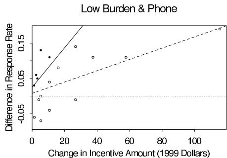

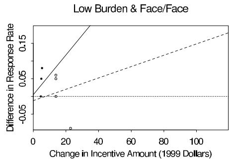

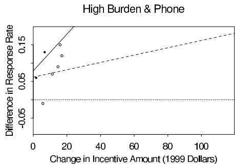

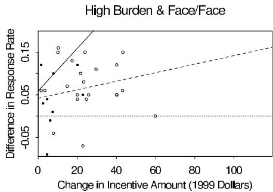  
Figure 9.1 Observed increase $z_{i}$ in response rate vs. the increased dollar value of incentive compared to the control condition, for experimental data from 39 surveys. Prepaid and postpaid incentives are indicated by closed and open circles, respectively. (The graphs show more than 39 points because many surveys had multiple treatment conditions.) The lines show expected increases for prepaid (solid lines) and postpaid (dashed lines) cash incentives as estimated from a hierarchical regression.

- The burden, or effort, required of the survey respondents (a survey is characterized as high burden if it is over one hour long and has sensitive or difficult questions, and low burden otherwise).

# Data from 39 experiments

Data were collected on 39 surveys that had embedded experiments testing different incentive conditions. For example, a survey could, for each person contacted, give a $5 prepaid incentive with probability \(1/3$ , a \)10 prepaid incentive with probability $1/3$ , or no incentive with probability $1/3$ . The surveys in the meta-analysis were conducted on different populations and at different times, and between them they covered a range of different interactions of the five factors mentioned above (value, timing, form, mode, and burden). In total, the 39 surveys include 101 experimental conditions. We use the notation $y_i$ to indicate the observed response rate for observation $i = 1, \ldots, 101$ .

A reasonable starting point uses the differences, $z_{i} = y_{i} - y_{i}^{0}$ , where $y_{i}^{0}$ corresponds to the lowest-valued incentive condition in the survey that includes condition $i$ (in most surveys, this is simply the control case of no incentive). Working with $z_{i}$ reduces the number of cases in the analysis from 101 conditions to 62 differences and eliminates the between-survey variation in baseline response rates.

Figure 9.1 displays the difference in response rates $z_{i}$ vs. the difference in incentive amounts, for each of the 62 differences $i$ . The points are partitioned into subgraphs corresponding to the mode and burden of their surveys. Within each graph, solid and open circles indicate prepaid and postpaid incentives, respectively. We complete the graphs by including a dotted line at zero, to represent the comparison case of no incentive. (The graphs also include fitted regression lines from the hierarchical model described below.)

It is clear from the graphs in Figure 9.1 that incentives generally have positive effects, and that prepaid incentives tend to be smaller in dollar value. Some of the observed differences are negative, but this can be expected from sampling variability, given that some of the 39 surveys are fairly small.

A natural way to use these data to support the planning of future surveys is to fit a classical regression model relating $z_{i}$ to the value, timing, and form of incentive as well as the mode and burden of survey. However there are a number of difficulties with this approach. From the sparse data, it is difficult to estimate interactions which might well be important. For example, it seems reasonable to expect that the effect of prepaid versus postpaid incentive may depend on the amount of the incentive. In addition, a traditional regression would not reflect the hierarchical structure of the data: the 62 differences are clustered in 39 surveys. It is also not so easy in a regression model to account for the unequal sample sizes for the experimental conditions, which range from below 100 to above 2000. A simple weighting proportional to sample size is not appropriate since the regression residuals include model error as well as binomial sampling error.

We shall set up a slightly more elaborate hierarchical model because, for the purpose of estimating the costs and benefits in a particular survey, we need to estimate interactions in the model (for example, the interaction between timing and value of incentive), even if these are not statistically significant.

# Setting up a Bayesian meta-analysis

We set up a hierarchical model with 101 data points $i$ , nested within 39 surveys $j$ . We start with a binomial model relating the number of respondents, $n_i$ , to the number of persons contacted, $N_i$ (thus, $y_i = n_i / N_i$ ), and the population response probabilities $\pi_i$ :

$$
n _ {i} \sim \operatorname {B i n} \left(N _ {i}, \pi_ {i}\right). \tag {9.1}
$$

The next stage is to model the probabilities $\pi_{i}$ in terms of predictors $X$ , including an indicator for survey incentives, the five incentive factors listed above, and various interactions. In general it would be advisable to use a transformation before modeling these probabilities since they are constrained to lie between 0 and 1. However, in our particular application area, response probabilities in telephone and face-to-face surveys are far enough from 0 and 1 that a linear model is acceptable:

$$
\pi_ {i} \sim \mathrm {N} \left(X _ {i} \beta + \alpha_ {j (i)}, \sigma^ {2}\right). \tag {9.2}
$$

Here, $X_{i}\beta$ is the linear predictor for the condition corresponding to data point $i$ , $\alpha_{j(i)}$ is a random effect for the survey $j = 1,\dots ,39$ (necessary in the model because underlying response rates vary greatly), and $\sigma$ represents the lack of fit of the linear model. We use the notation $j(i)$ because the conditions $i$ are nested within surveys $j$ . The use of the survey random effects allows us to incorporate the 101 conditions in the analysis rather than working with the 62 differences as was done earlier. The $\alpha_{j}$ 's also address the hierarchical structure of the data.

Modeling (9.2) on the untransformed scale is not simply an approximation but rather a choice to set up a more interpretable model. Switching to the logistic, for example, would have no practical effect on our conclusions, but it would make all the regression coefficients much more difficult to interpret.

We next specify prior distributions for the parameters in the model. We model the survey-level random effects $\alpha_{j}$ using a normal distribution:

$$
\alpha_ {j} \sim \mathrm {N} (0, \tau^ {2}). \tag {9.3}
$$

There is no loss of generality in assuming a zero mean for the $\alpha_{j}$ 's if a constant term

is included in the set of predictors $X$ . Finally, we assign uniform prior densities to the standard deviations $\sigma$ and $\tau$ and to the regression coefficients $\beta$ . The parameters $\sigma$ and $\tau$ are estimated precisely enough that the inferences are not sensitive to the particular choice of noninformative prior distribution.

# Inferences from the model

Thus far we have not addressed the choice of variables to include in the matrix of predictors, $X$ . The main factors are those described earlier (which we denote as Value, Timing, Form, Mode, and Burden) along with Incentive, an indicator for whether a given condition includes an incentive (not required when we were working with the differences). Because there are restrictions (Value, Timing, and Form are only defined if Incentive = 1), there are 36 possible regression predictors, including the constant term and working up to the interaction of all five factors with incentive. The number of predictors would increase if we allowed for nonlinear functions of incentive value.

Of the predictors, we are particularly interested in those that include interactions with the Incentive indicator, since these indicate effects of the various factors. The two-way interactions in the model that include Incentive can thus be viewed as main effects of the factors included in the interactions, the three-way interactions can be viewed as two-way interactions of the included factors, and so forth.

We fit a series of models, starting with the simplest, then adding interactions until we pass the point where the existing data could estimate them effectively, then finally choosing a model that includes the key interactions needed for our decision analysis. Our chosen model includes the main effects for Mode, Burden, and the Mode $\times$ Burden interaction, which all have the anticipated large impacts on the response rate of a survey. It also includes Incentive (on average, the use of an incentive increases the response rate by around 3 percentage points), all two-way interactions of Incentive with the other factors, and the three-way interactions that include Incentive $\times$ Value interacting with Timing and Burden. We do not provide detailed results here, but some of the findings are that an extra $10 in incentive is expected to increase the response rate by 3-4 percentage points, cash incentives increase the response rate by about 1 percentage point relative to noncash, prepaid incentives increase the response rate by 1-2 percentage points relative to postpaid, and incentives have a bigger impact (by about 5 percentage points) on high-burden surveys compared to low-burden surveys.

The within-study standard deviation $\sigma$ is around 3 or 4 percentage points, indicating the accuracy with which differential response rates can be predicted within any survey. The between-study standard deviation $\tau$ is about 18 percentage points, indicating that the overall response rates vary greatly, even after accounting for the survey-level predictors (Mode, Burden, and their interaction).

Figure 9.1 on page 240 displays the model fit as four graphs corresponding to the two possible values of the Burden and Mode variables. Within each graph, we display solid lines for the prepaid condition and dotted lines for postpaid incentives, in both cases showing only the results with cash incentives, since these were estimated to be better than gifts of the same value.

To check the fit, we display in Figure 9.2 residual plots of prediction errors for the individual data points $y_{i}$ , showing telephone and face-to-face surveys separately and, as with the previous plots, using symbols to distinguish pre- and post-incentives. There are no apparent problems with the basic fit of the model, although other models could also fit these data equally well.

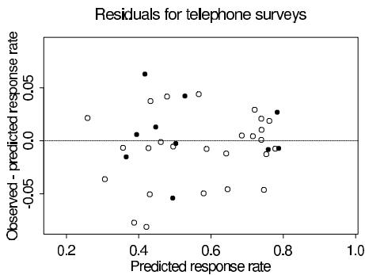

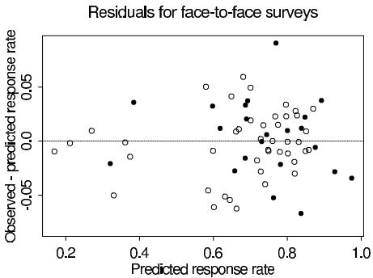  
Figure 9.2 Residuals of response rate meta-analysis data plotted vs. predicted values. Residuals for telephone and face-to-face surveys are shown separately. As in Figure 9.1, solid and open circles indicate surveys with prepaid and postpaid incentives, respectively.

# Inferences about costs and response rates for the Social Indicators Survey

The Social Indicators survey is a low-burden telephone survey. If we use incentives at all, we would use cash, since this appears to be more effective than gifts of the same value. We then have the choice of value and timing of incentives. Regarding timing, prepaid incentives are more effective than postpaid incentives per dollar of incentive (compare the slopes of the solid and dashed lines in Figure 9.1). But this does not directly address our decision problem. Are prepaid incentives still more effective than postpaid incentives when we look at total dollars spent? This is not immediately clear, since prepaid incentives must be sent to all potential respondents, whereas postpaid are given only to the people who actually respond. It can be expensive to send the prepaid incentives to the potential respondents who cannot be reached, refuse to respond, or are eliminated in the screening process.

We next describe how the inferences are used to inform decisions in the context of the Social Indicators Survey. This survey was conducted by random digit dialing in two parts: 750 respondents came from an 'individual survey,' in which an attempt was made to survey an adult from every residential phone number that is called, and 1500 respondents came from a 'caregiver survey,' which included only adults who are taking care of children. The caregiver survey began with a screening question to eliminate households without children.

For each of the two surveys, we use our model to estimate the expected increase in response rate for any hypothesized incentive and the net increase in cost to obtain that increase in response rate. It is straightforward to use the fitted hierarchical regression model to estimate the expected increase in response rate. Then we work backward and estimate the number of telephone calls required to reach the same number of respondents with this higher response rate. The net cost of the hypothesized incentive is the dollar value of the incentive (plus $1.25 to account for the cost of processing and mailing) times the number of people to whom the incentive is sent less the savings that result because fewer contacts are required.

For example, consider a $5 postpaid incentive for the caregiver survey. From the fitted model, this would lead to an expected increase of 1.5% in response rate, which would increase it from the 38.9% in the actual survey to a hypothesized 40.4%. The cost of the postpaid incentives for 1500 respondents at $6.25 each ($5 incentive plus $1.25 processing and mailing cost) is $9375. With the number of responses fixed, the increased response rate implies that only 1500/0.404 = 3715 eligible households would have to be reached, instead of the 3658 households contacted in the actual survey. Propagating back to the screening stage leads to an estimated number of telephone numbers that would need to be contacted and an estimated number of calls to reach those numbers. In this case we estimate that 3377 fewer calls would be required, yielding an estimated savings of $2634 (based on the cost of

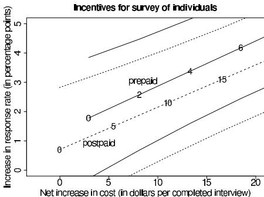

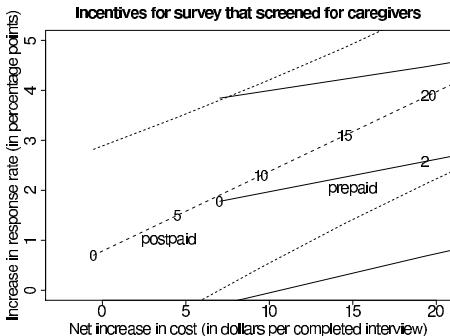  
Figure 9.3 Expected increase in response rate vs. net added cost per respondent, for prepaid (solid lines) and postpaid (dotted lines) incentives, for surveys of individuals and caregivers. On each plot, heavy lines correspond to the estimated effects, with light lines showing $\pm 1$ standard error bounds. The numbers on the lines indicate incentive payments. At zero incentive payments, estimated effects and costs are nonzero because the models have nonzero intercepts (corresponding to the effect of making any contact at all) and we are assuming a $1.25 mailing and processing cost per incentive.

interviewers and the average length per non-interview call). The net cost of the incentive is then $9375 -$ 2634 = $6741, which when divided by the 1500 completed interviews yields a cost of $4.49 per interview for this 1.5% increase in response rate. We perform similar calculations for other hypothesized incentive conditions.

Figure 9.3 summarizes the results for a range of prepaid and postpaid incentive values, assuming we would spend up to \(20 per respondent in incentives. For either survey, incentives are expected to raise response rates by only a few percentage points. Prepaid incentives are expected to be slightly better for the individual survey, and postpaid are preferred for the (larger) caregiver survey. For logistical reasons, we would use the same form of incentive for both, so we recommend postpaid. In any case, we leave the final step of the decision analysis—picking the level of the incentive—to the operators of the survey, who must balance the desire to increase response rate with the cost of the incentive itself.

# Loose ends

Our study of incentives is far from perfect; we use it primarily to demonstrate how a relatively routine analysis can be used to make inferences about the potential consequences of decision options. The most notable weaknesses are the high level of uncertainty about individual coefficients (not shown here) and the arbitrariness of the decision as to which interactions should be included/excluded. These two problems go together: when we tried including more interactions, the standard errors became even larger and the inferences became less believable. The problem is with the noninformative uniform prior distribution on the coefficients. It would make more sense to include all interactions and make use of prior information that might shrink the higher-order interactions without fixing them at zero. It would also be reasonable to allow the effects of incentives to vary among surveys. We did not expand the model in these ways because we felt we were at the limit of our knowledge about this problem, and we thought it better to stop and summarize our inference and uncertainties about the costs and benefits of incentives.

Another weakness of the model is its linearity, which implies undiminishing effects as incentives rise. It would be possible to add an asymptote to the model to fix this, but we do not do so, since in practice we would not attempt to extrapolate our inferences beyond the range of the data in the meta-analysis (prepaid incentives up to $20 and postpaid up to$ 60 or $100; see Figure 9.1).

# 9.3 Multistage decision making: medical screening

Decision analysis becomes more complicated when there are two or more decision points, with later decisions depending on data gathered after the first decision has been made. Such decision problems can be expressed as trees, alternating between decision and uncertainty nodes. In these multistage problems, Bayesian inference is particularly useful in updating the state of knowledge with the information gained at each step.

# Example with a single decision point

We illustrate with a simplified example from the medical decision making literature. A 95-year-old man with an apparently malignant tumor in the lung must decide between the three options of radiotherapy, surgery, or no treatment. The following assumptions are made about his condition and life expectancy (in practice, these probabilities and life expectancies are based on extrapolations from the medical literature):

- There is a $90\%$ chance that the tumor is malignant.   
- If the man does not have lung cancer, his life expectancy is 34.8 months.   
- If the man does have lung cancer,

1. With radiotherapy, his life expectancy is 16.7 months.   
2. With surgery, there is a $35\%$ chance he will die immediately, but if he survives, his life expectancy is 20.3 months.   
3. With no treatment, his life expectancy is 5.6 months.

Aside from mortality risk, the treatments themselves cause considerable discomfort for slightly more than a month. We shall determine the decision that maximizes the patient's quality-adjusted life expectancy, which is defined as the expected length of time the patient survives, minus a month if he goes through one of the treatments. The subtraction of a month addresses the loss in 'quality of life' due to treatment-caused discomfort.

Quality-adjusted life expectancy under each treatment is then

1. With radiotherapy: $0.9 \cdot 16.7 + 0.1 \cdot 34.8 - 1 = 17.5$ months.   
2. With surgery: $0.35 \cdot 0 + 0.65 \cdot (0.9 \cdot 20.3 + 0.1 \cdot 34.8 - 1) = 13.5$ months.   
3. With no treatment: $0.9 \cdot 5.6 + 0.1 \cdot 34.8 = 8.5$ months.

These simple calculations show radiotherapy to be the preferred treatment for this 95-year-old man.

# Adding a second decision point

The problem becomes more complicated when we consider a fourth decision option, which is to perform a test to see if the cancer is truly malignant. The test, called bronchoscopy, is estimated to have a $70\%$ chance of detecting the lung cancer if the tumor is indeed malignant, and a $2\%$ chance of falsely finding cancer if the tumor is actually benign. In addition, there is an estimated $5\%$ chance that complications from the test itself will kill the patient.

Should the patient choose bronchoscopy? To make this decision, we must first determine what he would do after the test. Bayesian inference with discrete probabilities gives the probability of cancer given the test result $T$ as

$$
\operatorname * {P r} (\mathrm {c a n c e r} | T) = \frac {\operatorname * {P r} (\mathrm {c a n c e r}) p (T | \mathrm {c a n c e r})}{\operatorname * {P r} (\mathrm {c a n c e r}) p (T | \mathrm {c a n c e r}) + \operatorname * {P r} (\mathrm {n o c a n c e r}) p (T | \mathrm {n o c a n c e r})},
$$

and we can use this conditional probability in place of the prior probability $\operatorname{Pr}(\text{cancer}) = 0.9$ in the single-decision-point calculations above.

- If the test is positive for cancer, then the patient's updated probability of cancer is $\frac{0.9 \cdot 0.7}{0.9 \cdot 0.7 + 0.1 \cdot 0.02} = 0.997$ , and his quality-adjusted life expectancy under each of the three treatments becomes

1. With radiotherapy: $0.997 \cdot 16.7 + 0.003 \cdot 34.8 - 1 = 15.8$ months.   
2. With surgery: $0.35 \cdot 0 + 0.65(0.997 \cdot 20.3 + 0.003 \cdot 34.8 - 1) = 12.6$ months.   
3. With no treatment: $0.997 \cdot 5.6 + 0.003 \cdot 34.8 = 5.7$ months.

So, if the test is positive, radiotherapy would be the best treatment, with a quality-adjusted life expectancy of 15.8 months.

- If the test is negative for cancer, then the patient's updated probability of cancer is $\frac{0.9 \cdot 0.3}{0.9 \cdot 0.3 + 0.1 \cdot 0.98} = 0.734$ , and his quality-adjusted life expectancy under each of the three treatments becomes

1. With radiotherapy: $0.734 \cdot 16.7 + 0.266 \cdot 34.8 - 1 = 20.5$ months.   
2. With surgery: $0.35 \cdot 0 + 0.65(0.734 \cdot 20.3 + 0.266 \cdot 34.8 - 1) = 15.1$ months.   
3. With no treatment: $0.734 \cdot 5.6 + 0.266 \cdot 34.8 = 13.4$ months.

If the test is negative, radiotherapy would still be the best treatment, this time with a quality-adjusted life expectancy of 20.5 months.

At this point, it is clear that bronchoscopy is not a good idea, since whichever way the treatment goes, it will not affect the decision that is made. To complete the analysis, however, we work out the quality-adjusted life expectancy for this decision option. The bronchoscopy can yield two possible results:

- Test is positive for cancer. The probability of this outcome is $0.9 \cdot 0.7 + 0.1 \cdot 0.02 = 0.632$ , and the quality-adjusted life expectancy (accounting for the $5\%$ chance that the test can be fatal) is $0.95 \cdot 15.8 = 15.0$ months.   
- Test is negative for cancer. The probability of this outcome is $0.9 \cdot 0.3 + 0.1 \cdot 0.98 = 0.368$ , and the quality-adjusted life expectancy (accounting for the $5\%$ chance that the test can be fatal) is $0.95 \cdot 20.5 = 19.5$ months.

The total quality-adjusted life expectancy for the bronchoscopy decision is then $0.632 \cdot 15.0 + 0.368 \cdot 19.5 = 16.6$ months. Since radiotherapy without a bronchoscopy yields an expected quality-adjusted survival of 17.5 months, it is clear that the patient should not choose bronchoscopy.

The decision analysis reveals the perhaps surprising result that, in this scenario, bronchoscopy is pointless, since it would not affect the decision that is to be made. Any other option (for example, bronchoscopy, followed by a decision to do radiotherapy if the test is positive or do no treatment if the test is negative) would be even worse in expected value.

# 9.4 Hierarchical decision analysis for radon measurement

Associated with many household environmental hazards is a decision problem: whether to (1) perform an expensive remediation to reduce the risk from the hazard, (2) do nothing, or (3) take a relatively inexpensive measurement to assess the risk and use this information to decide whether to (a) remediate or (b) do nothing. This decision can often be made at the individual, household, or community level. Performing this decision analysis requires estimates for the risks. Given the hierarchical nature of the decision-making units, individuals are grouped within households which are grouped within counties, and so forth, it is natural to use a hierarchical model to estimate the risks.

We illustrate with the example of risks and remediation for home radon exposure. We provide a fair amount of background detail to make sure that the context of the decision analysis is clear.

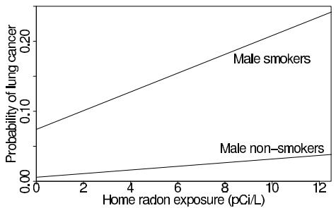

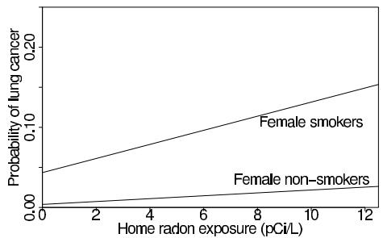  
Figure 9.4 Lifetime added risk of lung cancer, as a function of average radon exposure in picoCuries per liter $(pCi / L)$ . The median and mean radon levels in ground-contact houses in the U.S. are 0.67 and $1.3~\mathrm{pCi} / L$ , respectively, and over 50,000 homes have levels above $20~\mathrm{pCi} / L$ .

# Background

Radon is a carcinogen—a naturally occurring radioactive gas whose decay products are also radioactive—known to cause lung cancer in high concentration, and estimated to cause several thousand lung cancer deaths per year in the U.S. Figure 9.4 shows the estimated additional lifetime risk of lung cancer death for male and female smokers and nonsmokers, as a function of average radon exposure. At high levels, the risks are large, and even the risks at low exposures are not trivial when multiplied by the millions of people affected.

The distribution of annual-average living area home radon concentrations in U.S. houses, as measured by a national survey (described in more detail below), is approximately lognormal with geometric mean $0.67\mathrm{pCi / L}$ and geometric standard deviation 3.1 (the median of this distribution is $0.67~\mathrm{pCi / L}$ and the mean is $1.3~\mathrm{pCi / L}$ ). The vast majority of houses in the U.S. do not have high radon levels: about $84\%$ have concentrations under $2\mathrm{pCi / L}$ and about $90\%$ are below $3\mathrm{pCi / L}$ . However, the survey data suggest that between 50,000 and 100,000 homes have radon concentrations in primary living space in excess of $20~\mathrm{pCi / L}$ . This level causes an annual radiation exposure roughly equal to the occupational exposure limit for uranium miners.

Our decision problem includes as one option measuring the radon concentration and using this information to help decide whether to take steps to reduce the risk from radon. The most frequently used measurement protocol in the U.S. has been the 'screening' measurement: a short-term (2-7 day) charcoal-canister measurement made on the lowest level of the home (often an unoccupied basement), at a cost of about $15 to$ 20. Because they are usually made on the lowest level of the home (where radon levels are highest), short-term measurements are upwardly biased measures of annual living area average radon level. The magnitude of this bias varies by season and by region of the country and depends on whether the basement (if any) is used as living space. After correcting for biases, short-term measurements in a house have approximate lognormal distributions with geometric standard deviation of roughly 1.8.

A radon measure that is far less common than the screening measurement, but is much better for evaluating radon risk, is a 12-month integrated measurement of the radon concentration. These long-term observations directly measure the annual living-area average radon concentration, with a geometric standard deviation of about 1.2, at a cost of about $50. In the discussion below we find that long-term measurements are more effective, in a cost-benefit sense, than short-term measurements.

If the radon level in a home is sufficiently high, then an individual may take action to control the risk due to radon. Several radon control or remediation techniques have been developed, tested, and implemented. The currently preferred remediation method for most homes, 'sub-slab depressurization,' seals the floors and increases ventilation, at a

cost of about $2000, including additional heating and cooling costs. Studies suggest that almost all homes can be remediated to below 4 pCi/L, while reductions under 1 pCi/L are rarely attained with conventional methods. For simplicity, we make the assumption that remediation will reduce radon concentration to 2 pCi/L. For obvious reasons, little is known about effects of remediation on houses that already have low radon levels; we assume that if the initial annual living area average level is less than 2 pCi/L, then remediation will have no effect.

# The individual decision problem

We consider the individual homeowner to have three options:

1. Remediate without monitoring: spend the $2000 to remediate the home and reduce radon exposure to 2 pCi/L.   
2. Do nothing and accept the current radon exposure.   
3. Take a long-term measurement of your home at a cost of $50. Based on the result of the measurement, decide whether to remediate or do nothing.

As described above, a short-term measurement is another possibility, but in our analysis we find this not to be cost-effective.

The measurement/remediation decision must generally be made under uncertainty, because most houses have not been measured for radon. Even after measurement, the radon level is not known exactly—just as in the cancer treatment example in Section 9.3, the cancer status is not perfectly known even after the test. The decision analysis thus presents two challenges: first, deciding whether to remediate if the radon exposure were known; and second, deciding whether it is worth it to measure radon exposure given the current state of knowledge about home radon—that is, given the homeowner's prior distribution. This prior distribution is not a subjective quantity; rather, we determine it by a hierarchical analysis of a national sample of radon measurements, as we discuss below.

# Decision-making under certainty

Before performing the statistical analysis, we investigate the optimal decision for the homeowner with a known radon exposure. The problem is difficult because it trades off dollars and lives.

We express decisions under certainty in terms of three quantities, equivalent under a linear no-threshold dose-response relationship:

1. $D_{d}$ , the dollar value associated with a reduction of $10^{-6}$ in probability of death from lung cancer (essentially the value of a 'microlife');   
2. $D_{r}$ , the dollar value associated with a reduction of $1\mathrm{pCi / L}$ in home radon level for a 30-year period:   
3. $R_{\text{action}}$ , the home radon level above which you should remediate if your radon level is known,

The dollar value of radon reduction, $D_r$ , depends on the number of lives (or microlives) saved by a drop in the radon level. This in turn depends on a variety of factors including the number, gender and smoking status of household occupants as well as the decrease in cancer risk due to the decrease in radon exposure. We do not discuss the details of such a calculation here but only report that for a 'typical' U.S. household (one with an average number of male and female smokers and nonsmokers) $D_r = 4800D_d$ . The appropriate radon level to act upon, $R_{\mathrm{action}}$ , depends on the dollar value of radon reduction and the benefits of remediation. We assume that remediation takes a house's annual-average living-area radon level down to a level $R_{\mathrm{remed}} = 2$ pCi/L if it was above that, but leaves it unchanged if it

was below that. Then the action level is determined as the value at which the benefit of remediation \((\mathbb{S}D_{r}(R_{\mathrm{action}} - R_{\mathrm{remed}}))\) is equal to the cost (\(2000),

$$
R _ {\text {a c t i o n}} = \frac {\mathbb {S} 2 0 0 0}{D _ {r}} + R _ {\text {r e m e d}}. \tag {9.4}
$$

The U.S., English, Swedish, and Canadian governments recommend remediation levels of \( R_{\text{action}} = 4, 5, 10 \), and \( 20 \, \text{pCi/L} \), which, with \( R_{\text{remed}} = 2 \, \text{pCi/L} \), correspond to equivalent costs per \( \text{pCi/L} \) of \( D_r = \\(1000 \), \\)670, \\(250, and \\)111, respectively. For an average U.S. household this implies dollar values per microlife of \( D_d = \\)0.21 \), \$0.14, \$0.05, and \$0.02, respectively.

From the risk assessment literature, typical values of $D_{d}$ for medical interventions are in the range $0.10 to$ 0.50. Higher values are often attached to life in other contexts (for example, jury awards for deaths due to negligence). The lower values seem reasonable in this case because radon remediation, like medical intervention, is voluntary and addresses reduction of future risk rather than compensation for current loss.

With these as a comparison, the U.S. and English recommendations for radon action levels correspond to the low end of the range of acceptable risk-reduction expenditures. The Canadian and Swedish recommendations are relatively cavalier about the radon risk, in the sense that the implied dollar value per microlife is lower than ordinarily assumed for other risks.

Our calculation (which assumes an average U.S. household) obscures dramatic differences among individual households. For example, a household of one male nonsmoker and one female nonsmoker that is willing to spend \(0.21 per person to reduce the probability of lung cancer by \(10^{-6}\) (so that \(D_{d} = \)0.21) should spend $370 per pCi/L of radon reduction because their risk of lung cancer is less than for the average U.S. household. As a result, a suitable action level for such a household is \(R_{\text{action}} = 7.4 \, \text{pCi/L}\), which can be compared to \(R_{\text{action}} = 4\) for the average household. In contrast, if the male and female are both smokers, they should be willing to spend the much higher value of $1900 per pCi/L, because of their higher risk of lung cancer, and thus should have an action level of \(R_{\text{action}} = 3.1 \, \text{pCi/L}\).

Other sources of variation in $R_{\text{action}}$ across households, in addition to household composition, are (a) variation in risk preferences, (b) variation in individual beliefs about the risks of radon and the effects of remediation, and (c) variation in the perceived dollar value associated with a given risk reduction. Through the rest of our analysis we use $R_{\text{action}} = 4$ pCi/L as an exemplary value, but rational informed individuals might plausibly choose different values of $R_{\text{action}}$ , depending on financial resources, general risk tolerance, attitude towards radon risk, as well as the number of people in the household and their smoking habits.

# Bayesian inference for county radon levels

The previous discussion concerns decision making under certainty. Individual homeowners are likely to have limited information about the radon exposure level for their home. A goal of some researchers has been to identify locations and predictive variables associated with high-radon homes so that monitoring and remediation programs can be focused efficiently.

Two datasets are readily available for such a study:

- Long-term measurements from approximately 5000 houses, selected as a cluster sample from 125 randomly selected counties.   
- Short-term measurements from about 80,000 houses, sampled at random from all the counties in the U.S.

This is a pattern we sometimes see: a relatively small amount of accurate data, along with a large amount of biased and imprecise data. The challenge is to use the good data to

calibrate the bad data, so that inference can be made about the entire country, not merely the 125 counties in the sample of long-term measurements.

Hierarchical model. We simultaneously calibrate the data and predict radon levels by fitting a hierarchical model to both sets of measurements, using predictors at the house and county level, with a separate model fit to each of the 10 regions of the U.S. Let $y_{i}$ denote the logarithm of the radon measurement of house $i$ within county $j(i)$ and $X$ denote a matrix of household-level predictors including indicators for whether the house has a basement and whether the basement is a living area, along with an indicator variable that equals 1 if measurement $i$ is a short-term screening measurement. Including the indicator corrects for the biases in the screening measurements. We assume a normal linear regression model,

$$
y _ {i} \sim \mathrm {N} (X _ {i} \beta + \alpha_ {j (i)}, \sigma_ {i} ^ {2}), \text {f o r h o u s e s} i = 1, \ldots , n,
$$

where $\alpha_{j(i)}$ is a county effect, and the data-level variance parameter $\sigma_{i}$ can take on two possible values depending on whether measurement $i$ is long- or short-term.

The county parameters $\alpha_{j}$ are also assumed normally distributed,

$$
\alpha_ {j} \sim \mathrm {N} (W _ {j} \gamma + \delta_ {k (j)}, \tau^ {2}), \mathrm {f o r c o u n t i e s} j = 1, \ldots , J,
$$

with county-level predictors $W$ including climate data and a measure of the uranium level in the soil, and the indicator $\delta_{k(j)}$ characterizing the geology of county $j$ as one of $K = 19$ types. Finally, the coefficients $\delta_{k}$ for the 19 geological types are themselves estimated from the data,

$$
\delta_ {k} \sim \mathrm {N} (0, \kappa^ {2}), \text {f o r g e o l o g i c t y p e s} k = 1, \dots , K,
$$

as are the hierarchical variance components $\tau$ and $\kappa$ . Finally, we divide the country into ten regions and fit the model separately within each region.

Combining long- and short-term measurements allows us to estimate the distribution of radon levels in nearly every county in the U.S., albeit with widely varying uncertainties depending primarily on the number of houses in the sample within the county.

Inferences. Unfortunately (from the standpoint of radon mitigation), indoor radon concentrations are highly variable even within small areas. Given the predictors included in the model, the radon level of an individual house in a specified county can be predicted only to within a factor of at best about 1.9 (that is to say, the posterior geometric standard deviation is about 1.9), with a factor of 2.3 being more typical, a disappointingly large predictive uncertainty considering the factor of 3.1 that would hold given no information on the home other than that it is in the U.S. On the other hand, this seemingly modest reduction in uncertainty is still enough to identify some areas where high-radon homes are very rare or very common. For instance, in the mid-Atlantic states, more than half the houses in some counties have long-term living area concentrations over the EPA's recommended action level of $4\mathrm{pCi / L}$ , whereas in other counties fewer than one-half of one percent exceed that level.

Bayesian inference for the radon level in an individual house

We use the fitted hierarchical regression model to perform inferences and decision analyses for previously unmeasured houses $i$ , using the following notation:

$$
R _ {i} = \mathrm {r a d o n c o n c e n t r a t i o n i n h o u s e} i
$$

$$
\theta_ {i} = \log (R _ {i}).
$$

For the decision on house $i$ , we need the posterior predictive distribution for a given $\theta_{i}$ , averaging over the posterior uncertainties in regression coefficients, county effects, and

variance components; it will be approximately normal (because the variance components are so well estimated), and we label it as

$$
\theta_ {i} \sim \mathrm {N} \left(M _ {i}, S _ {i} ^ {2}\right), \tag {9.5}
$$

where $M_{i}$ and $S_{i}$ are computed from the posterior simulations of the model estimation. The mean is $M_{i} = X_{i}\hat{\beta} +\hat{\alpha}_{j(i)}$ , where $X_{i}$ is a row vector containing the house-level predictors (indicators for whether the house has a basement and whether the basement is a living area) for house $i$ , and $(\hat{\beta},\hat{\alpha})$ are the posterior means from the analysis in the appropriate region of the country. The variance $S_{i}^{2}$ (obtained from the earlier posterior computation) includes the posterior uncertainty in the coefficients $\alpha, \beta$ and also the hierarchical variance components $\tau^2$ and $\kappa^2$ . (We are predicting actual radon levels, not measurements, and so $\sigma^2$ does not play a role here.) It turns out that the geometric standard deviations $e^{S}$ of the predictive distributions for home radon levels vary from 2.1 to 3.0, and they are in the range (2.1, 2.5) for most U.S. houses. (The houses with $e^{S} > 2.5$ lie in small-population counties for which little information was available in the radon surveys, resulting in relatively high predictive uncertainty within these counties.) The geometric means of the house predictive distributions, $e^{M}$ , vary from 0.1 to 14.6 pCi/L, with 95% in the range [0.3, 3.7] and 50% in the range [0.6, 1.6]. The houses with the highest predictive geometric means are houses with basement living areas in high-radon counties; the houses with lowest predictive geometric means have no basements and lie in low-radon counties.

The distribution (9.5) summarizes the state of knowledge about the radon level in a house given only its county and basement information. In this respect it serves as a prior distribution for the homeowner. Now suppose a measurement $y \sim \mathrm{N}(\theta, \sigma^2)$ is taken in the house. (We are assuming an unbiased measurement. If a short-term measurement is being used, it will have to be corrected for the biases which were estimated in the regression models.) In our notation, $y$ and $\theta$ are the logarithms of the measurement and the true home radon level, respectively. The posterior distribution for $\theta$ is

$$
\theta | M, y \sim \mathrm {N} (\Lambda , V), \tag {9.6}
$$

where

$$
\Lambda = \frac {\frac {M}{S ^ {2}} + \frac {y}{\sigma^ {2}}}{\frac {1}{S ^ {2}} + \frac {1}{\sigma^ {2}}} \quad V = \frac {1}{\frac {1}{S ^ {2}} + \frac {1}{\sigma^ {2}}}. \tag {9.7}
$$

We base our decision analysis of when to measure and when to remediate on the distributions (9.5) and (9.6).

# Decision analysis for individual homeowners

We now work out the optimal decisions of measurement and remediation conditional on the predicted radon level in a home, the additional risk of lung cancer death from radon, the effects of remediation, and individual attitude toward risk.

Given an action level under certainty, $R_{\text{action}}$ , we address the question of whether to pay for a home radon measurement and whether to remediate. The decision of whether to measure depends on the prior distribution (9.5) of radon level for your house, given your predictors $X$ . We use the term 'prior distribution' to refer to the predictive distribution based on our hierarchical model; the predictive distribution conditions on the survey data but is prior to any specific measurements for the house being considered. The decision of whether to remediate depends on the posterior distribution (9.6) if a measurement has been taken or the prior distribution (9.5) otherwise. In our computations, we use the following results from the normal distribution: if $z \sim \mathrm{N}(\mu, s^2)$ , then $\mathrm{E}(e^z) = e^{\mu + \frac{1}{2} s^2}$ and $\mathrm{E}(e^z | z > a) \Pr(z > a) = e^{\mu + \frac{1}{2} s^2} (1 - \Phi(\frac{\mu + s^2 - a}{s}))$ , where $\Phi$ is the standard normal cumulative distribution function.

The decision tree is set up with three branches. In each branch, we evaluate the expected loss in dollar terms, converting radon exposure (over a 30-year period) to dollars using $D_r = \frac{\$2000}{(R_{\text{action}} - R_{\text{remed}})}$ as the equivalent cost per pCi/L for additional home radon exposure. In the expressions below we let $R = e^{\theta}$ be the unknown radon exposure level in the home being considered; the prior and posterior distributions are normal distributions for $\theta = \log R$ .

1. Remigrate without monitoring. Expected loss is remediation cost + equivalent dollar cost of radon exposure after remediation:

$$
\begin{array}{l} L _ {1} = \$ 2 0 0 0 + D _ {r} \mathrm {E} (\min  (R, R _ {\text {r e m e d}})) \\ = \$ 2000 + D _ {r} \left[ R _ {\text {r e m e d}} \Pr (R \geq R _ {\text {r e m e d}}) + \mathrm {E} (R | R <   R _ {\text {r e m e d}}) \Pr (R <   R _ {\text {r e m e d}}) \right] \\ = \S 2000 + D _ {r} \left[ R _ {\text {r e m e d}} \Phi \left(\frac {M - \log \left(R _ {\text {r e m e d}}\right)}{S}\right) + e ^ {M + \frac {1}{2} S ^ {2}} \left(1 - \Phi \left(\frac {M + S ^ {2} - \log \left(R _ {\text {r e m e d}}\right)}{S}\right)\right) \right] \tag {9.8} \\ \end{array}
$$

2. Do not monitor or remediate. Expected loss is the equivalent dollar cost of radon exposure:

$$
L _ {2} = D _ {r} \mathrm {E} (R) = D _ {r} e ^ {M + \frac {1}{2} S ^ {2}}. \tag {9.9}
$$

3. Take a measurement y (measured in log pCi/L). The immediate loss is the measurement cost (assumed to be $50) and, in addition, the radon exposure during the year that you are taking the measurement (which is 1/30 of the 30-year exposure (9.9)). The inner decision has two branches:

(a) Remediate. Expected loss is the immediate loss due to measurement plus the remediation loss which is computed as for decision 1, but using the posterior rather than the prior distribution:

$$
\begin{array}{l} L _ {3 a} = \\ \mathbb {S} 5 0 + D _ {r} \frac {1}{3 0} e ^ {M + \frac {1}{2} S ^ {2}} + \\ \mathbb {S} 2 0 0 0 + D _ {r} \left[ R _ {\text {r e m e d}} \Phi \left(\frac {\Lambda - \log \left(R _ {\text {r e m e d}}\right)}{\sqrt {V}}\right) + \right. \\ \left. + e ^ {\Lambda + \frac {1}{2} V} \left(1 - \Phi \left(\frac {\Lambda + V - \log \left(R _ {\text {r e m e d}}\right)}{\sqrt {V}}\right)\right) \right], \tag {9.10} \\ \end{array}
$$

where $\Lambda$ and $V$ are the posterior mean and variance from (9.7).

(b) Do not remediate. Expected loss is:

$$
L _ {3 b} = \$ 50 + D _ {r} \frac {1}{3 0} e ^ {M + \frac {1}{2} S ^ {2}} + D _ {r} e ^ {\Lambda + \frac {1}{2} V}. \tag {9.11}
$$

Deciding whether to remediate given a measurement. To evaluate the decision tree, we must first consider the inner decision between 3(a) and 3(b), conditional on the measurement $y$ . Let $y_0$ be the point (on the logarithmic scale) at which you will choose to remediate if $y > y_0$ , or do nothing if $y < y_0$ . (Because of measurement error, $y \neq \theta$ , and consequently $y_0 \neq \log(R_{\text{action}})$ .) We determine $y_0$ , which depends on the prior mean $M$ , the prior standard deviation $S$ , and the measurement standard deviation $\sigma$ , by numerically solving the implicit equation

$$
L _ {3 a} = L _ {3 b} \text {a t} y = y _ {0}. \tag {9.12}
$$

Details of our approach for solving the equation are not provided here.

Deciding among the three branches. The expected loss for immediate remediation (9.8) and the expected loss for no action (9.9) can be determined directly for a given prior mean $M$ , prior standard deviation $S$ , and specified dollar value $D_r$ for radon reduction. We determine the expected loss for branch 3 of the decision tree,

$$
L _ {3} = \mathrm {E} \left(\min  \left(L _ {3 a}, L _ {3 b}\right)\right), \tag {9.13}
$$

by averaging over the prior uncertainty in the measurement $y$ (given a value for the measurement variability $\sigma$ ) as follows.

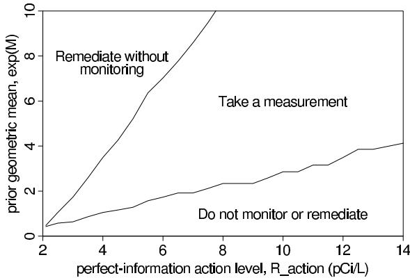  
Figure 9.5 Recommended radon remediation/measurement decision as a function of the perfect-information action level $R_{\mathrm{action}}$ and the prior geometric mean radon level $e^{M}$ , under the simplifying assumption that $e^{S} = 2.3$ . You can read off your recommended decision from this graph and, if the recommendation is 'take a measurement,' you can do so and then perform the calculations to determine whether to remediate, given your measurement. The horizontal axis of this figure begins at $2pCi / L$ because remediation is assumed to reduce home radon level to $2pCi / L$ , so it makes no sense for $R_{\mathrm{action}}$ to be lower than that value. Wiggles in the lines are due to simulation variability.

1. Simulate 5000 draws of $y \sim \mathrm{N}(M, S^2 + \sigma^2)$ .   
2. For each draw of $y$ , compute $\min(L_{3a}, L_{3b})$ from (9.10) and (9.11).   
3. Estimate $L_{3}$ as the average of these 5000 values.

This expected loss is valid only if we assume that you will make the recommended optimal decision once the measurement is taken.

We can now compare the expected losses $L_{1}, L_{2}, L_{3}$ , and choose among the three decisions. The recommended decision is the one with the lowest expected loss. An individual homeowner can apply this approach simply by specifying $R_{\text{action}}$ (the decision threshold under certainty), looking up the prior mean and standard deviation for the home's radon level as estimated by the hierarchical model, and determining the optimal decision. In addition, our approach makes it possible for a homeowner to take account any additional information that is available. For example, if a measurement is available for a neighbor's house, then one can update the prior mean and standard deviation to include this information.

If we are willing to make the simplifying assumption that $\sigma = \log(1.2)$ and $S = \log(2.3)$ for all counties, then we can summarize the decision recommendations by giving threshold levels $M_{\mathrm{low}}$ and $M_{\mathrm{high}}$ for which decision 1 (remmediate immediately) is preferred if $M > M_{\mathrm{high}}$ , decision 2 (do not monitor or remediate) is preferred if $M < M_{\mathrm{low}}$ , and decision 3 (take a measurement) is preferred if $M \in [M_{\mathrm{low}}, M_{\mathrm{high}}]$ . Figure 9.5 displays these cutoffs as a function of $R_{\mathrm{action}}$ , and thus displays the recommended decision as a function of $(R_{\mathrm{action}}, e^{M})$ . For example, setting $R_{\mathrm{action}} = 4 \, \mathrm{pCi/L}$ leads to the following recommendation based on $e^{M}$ , the prior GM of your home radon based on your county and house type:

- If $e^{M}$ is less than $1.0 \, \mathrm{pCi/L}$ (which corresponds to $68\%$ of U.S. houses), do nothing.   
- If $e^{M}$ is between 1.0 and $3.5\mathrm{pCi / L}$ (27% of U.S. houses), perform a long-term measurement (and then decide whether to remediate).   
- If $e^{M}$ is greater than $3.5\mathrm{pCi / L}$ (5% of U.S. houses), remediate immediately without measuring. Actually, in this circumstance, short-term monitoring can turn out to be (barely) cost-effective if we include it as an option. We ignore this additional complexity to the decision tree, since it occurs rarely and has little impact on the overall cost-benefit analysis.

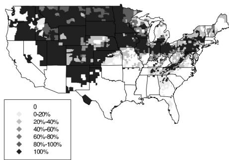

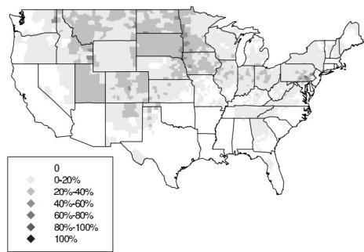  
Figure 9.6 Maps showing (a) fraction of houses in each county for which measurement is recommended, given the perfect-information action level of $R_{\text{action}} = 4 \, pCi / L$ ; (b) expected fraction of houses in each county for which remediation will be recommended, once the measurement $y$ has been taken. For the present radon model, within any county the recommendations on whether to measure and whether to remediate depend only on the house type: whether the house has a basement and whether the basement is used as living space. Apparent discontinuities across the boundaries of Utah and South Carolina arise from irregularities in the radon measurements from the radon surveys conducted by those states, an issue we ignore here.

# Aggregate consequences of individual decisions

Now that we have made idealized recommendations for individual homeowners, we consider the aggregate effects if the recommendations are followed by all homeowners in the U.S. In particular, we compare the consequences of individuals following our recommendations to the consequences of other policies such that implicitly recommended by the EPA, of taking a short-term measurement as a condition of a home sale and performing remediation if the measurement exceeds $4\mathrm{pCi / L}$ .

Applying the recommended decision strategy to the entire country. Figure 9.6 displays the geographic pattern of recommended measurements (and, after one year, recommended remediations), based on an action level $R_{\text{action}}$ of $4 \, \text{pCi/L}$ . Each county is shaded according to the proportion of houses for which measurement (and then remediation) is recommended. These recommendations incorporate the effects of parameter uncertainties in the models that predict radon distributions within counties, so these maps would be expected to change somewhat as better predictions become available.

From a policy standpoint, perhaps the most significant feature of the maps is that even if the EPA's recommended action level of $4\mathrm{pCi} / \mathrm{L}$ is assumed to be correct—and, as we have discussed, it does lead to a reasonable value of $D_{d}$ , under standard dose-response assumptions—monitoring is still not recommended in most U.S. homes. Indeed, only $28\%$ of U.S. homes would perform radon monitoring. A higher action level of $8\mathrm{pCi} / \mathrm{L}$ , a reasonable value for nonsmokers under the standard assumptions, would lead to even more restricted monitoring and remediation: only about $5\%$ of homes would perform monitoring.

Evaluation of different decision strategies. We estimate the total monetary cost and lives saved if each of the following decision strategies were to be applied nationally:

1. The recommended strategy from the decision analysis (that is, monitor homes with prior mean estimates above a given level, and remediate those with high measurements).   
2. Performing long-term measurements on all houses and then remediating those for which the measurement exceeds the specified radon action level $R_{\text{action}}$ .   
3. Performing short-term measurements on all houses and then remediating those for which the bias-corrected measurement exceeds the specified radon action level $R_{\mathrm{action}}$ (with the bias estimated from the hierarchical regression model).

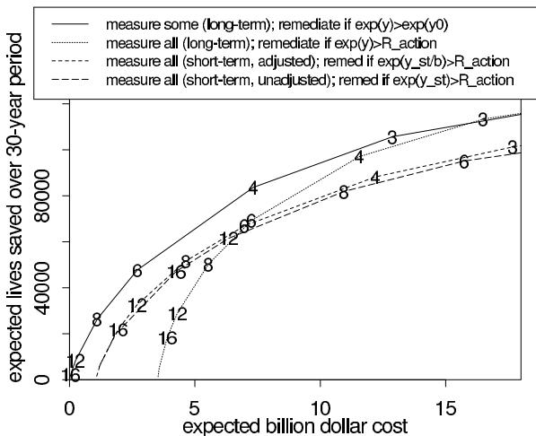  
Figure 9.7 Expected lives saved vs. expected cost for various radon measurement/ remediation strategies. Numbers indicate values of $R_{\text{action}}$ . The solid line is for the recommended strategy of measuring only certain homes; the others assume that all homes are measured. All results are estimated totals for the U.S. over a 30-year period.

4. Performing short-term measurements on all houses and then remediating those for which the uncorrected measurement exceeds the specified radon action level $R_{\mathrm{action}}$ .

We evaluate each of the above strategies in terms of aggregate lives saved and dollars cost, with these outcomes parameterized by the radon action level $R_{\text{action}}$ . Both lives saved and costs are considered for a 30-year period. For each strategy, we assume that the level $R_{\text{action}}$ is the same for all houses (this would correspond to a uniform national recommendation). To compute the lives saved, we assume that the household composition for each house is the same as the average in the U.S. We evaluate the expected cost and the expected number of lives saved by aggregating over the decisions for individual homes in the country. In practice for our model we need only consider three house types defined by our predictors (no basement, basement is not living space, basement is living space) for each of the 3078 counties.

We describe the results of our expected cost and expected lives saved calculation in some detail only for the decision strategy based on our hierarchical model. If the strategy were followed everywhere with \( R_{\text{action}} = 4 \, \text{pCi/L} \) (as pictured in the maps in Figure 9.6), about \( 26\% \) of the 70 million ground-contact houses in the U.S. would monitor and about \( 4.5\% \) would remediate. The houses being remediated include 2.8 million homes with radon levels above \( 4 \, \text{pCi/L} \) (\( 74\% \) of all such homes), and 840,000 of the homes above \( 8 \, \text{pCi/L} \) (\( 91\% \) of all such homes). The total monetary cost is estimated at \( \\(7.3 \, \text{billion—}\\)1 \) billion for measurement and \( \\(6.3 \, \text{billion for remediation—} \) and would be expected to save the lives of 49,000 smokers and 35,000 nonsmokers over a 30-year period. Total cost and total lives saved for other action levels and other decision strategies are calculated in the same way.

Figure 9.7 displays the tradeoff between expected cost and expected lives saved over a thirty-year period for the four strategies. The numbers on the curves are action levels, $R_{\text{action}}$ . This figure allows us to compare the effectiveness of alternative strategies of equal expected cost or equal expected lives saved. For example, the recommended strategy (the solid line on the graph) at $R_{\text{action}} = 4 \, \text{pCi/L}$ would result in an expected 83,000 lives saved at an expected cost of $7.3 billion. Let us compare this to the EPA's implicitly recommended strategy based on uncorrected short-term measurements (the dashed line on the figure). For the same cost of $7.3 billion, the uncorrected short-term strategy is expected to save only

64,000 lives; to achieve the same expected savings of 83,000 lives, the uncorrected short-term strategy would cost about $12 billion.

# 9.5 Personal vs. institutional decision analysis

Statistical inference has an ambiguous role in decision making. Under a 'subjective' view of probability (which we do not generally find useful; see Sections 1.5-1.7), posterior inferences represent the personal beliefs of the analyst, given his or her prior information and data. These can then be combined with a subjective utility function and input into a decision tree to determine the optimal decision, or sequence of decisions, so as to maximize subjective expected utility. This approach has serious drawbacks as a procedure for personal decision making, however. It can be more difficult to define a utility function and subjective probabilities than to simply choose the most appealing decision. The formal decision-making procedure has an element of circular reasoning, in that one can typically come to any desired decision by appropriately setting the subjective inputs to the analysis.

In practice, then, personal decision analysis is most useful when the inputs (utilities and probabilities) are well defined. For example, in the cancer screening example discussed in Section 9.3, the utility function is noncontroversial—years of life, with a slight adjustment for quality of life—and the relevant probabilities are estimated from the medical literature. Bayesian decision analysis then serves as a mathematical tool for calculating the expected value of the information that would come from the screening.

In institutional settings such as businesses, governments, or research organizations, decisions need to be justified, and formal decision analysis has a role to play in clarifying the relation between the assumptions required to build and apply a relevant probability model and the resulting estimates of costs and benefits. We introduce the term institutional decision analysis to refer to the process of transparently setting up a probability model, utility function, and an inferential framework leading to cost estimates and decision recommendations. Depending on the institutional setting, the decision analysis can be formalized to different extents. For example, the meta-analysis in Section 9.2 leads to fairly open-ended recommendations about incentives for sample surveys—given the high levels of posterior uncertainties, it would not make sense to give a single recommendation, since it would be so sensitive to the assumptions about the relative utility of dollars and response rate. For the cancer-screening example in Section 9.3, the decision analysis is potentially useful both for its direct recommendation (not to perform bronchoscopy for this sort of patient) and also because it can be taken apart to reveal the sensitivity of the conclusion to the different assumptions taken from the medical literature on probabilities and expected years of life.

In contrast, the key assumptions in the hierarchical decision analysis for radon exposure in Section 9.4 have to do with cost-benefit tradeoffs. By making a particular assumption about the relative importance of dollars and cancer risk (corresponding to $R_{\mathrm{action}} = 4$ pCi/L), we can make specific recommendations by county (see the maps in Figure 9.6 on page 254). It would be silly to believe that all households in the United States have utility functions equivalent to this constant level of $R_{\mathrm{action}}$ , but the analysis resulting in the maps is useful to give a sense of a uniform recommendation that could be made by the government.

In general, there are many ways in which statistical inferences can be used to inform decision-making. The essence of the 'objective' or 'institutional' Bayesian approach is to clearly identify the model assumptions and data used to form the inferences, evaluate the reasonableness and the fit of the model's predictions (which include decision recommendations as a special case), and then expand the model as appropriate to be more realistic. The most useful model expansions are typically those that allow more information to be incorporated into the inferences.

# 9.6 Bibliographic note

Berger (1985) and DeGroot (1970) both give clear presentations of the theoretical issues in decision theory and the connection to Bayesian inference. Many introductory books have been written on the topic; Luce and Raiffa (1957) is particularly interesting for its wide-ranging discussions. Savage (1954) is an influential early work that justifies Bayesian statistical methods in terms of decision theory.

Gneiting (2011) reviews scoring functions for point predictions and also presents survey results of use of scoring functions in the evaluation of point forecasts in businesses and organizations. Gneiting, and Raftery (2007) review scoring rules for probabilistic prediction. Vehtari and Ojanen (2012) provide a detailed decision theoretic review of Bayesian predictive model assessment, selection, and comparison methods.

Clemen (1996) provides a thorough introduction to applied decision analysis. Parmigiani (2002) is a textbook on medical decision making from a Bayesian perspective. The articles in Kahneman, Slovic, and Tversky (1982) and Gilovich, Griffin, and Kahneman (2002) address many of the component problems in decision analysis from a psychological perspective.

The decision analysis for incentives in telephone surveys appears in Gelman, Stevens, and Chan (2003). The meta-analysis data were collected by Singer et al. (1999), and Groves (1989) discusses many practical issues in sampling, including the effects of incentives in mail surveys. More generally, Dehejia (2005) discusses the connection between decision analysis and causal inference in models with interactions.

Parmigiani (2004) discusses the value of information in medical diagnostics. Parmigiani et al. (1999) and the accompanying discussions include several perspectives on Bayesian inference in medical decision making for breast cancer screening. The cancer screening example in Section 9.3 is adapted and simplified from Moroff and Pauker (1983). The journal Medical Decision Making, where this article appears, contains many interesting examples and discussions of applied decision analysis. Heitjan, Moskowitz, and Whang (1999) discuss Bayesian inference for cost-effectiveness of medical treatments. Fouskakis and Draper (2008), and Fouskakis, Ntzoufras, and Draper (2009) discuss a model selection example in which monetary utility is placed for the data collection costs as well as for the accuracy of predicting the mortality rate in a health policy problem. Lau, Ioannidis, and Schmid (1997) present a general review of meta-analysis in medical decision making.

The radon problem is described by Lin et al. (1999). Boscardin and Gelman (1996) describe the computations for the hierarchical model for the radon example in more detail. Ford et al. (1999) present a cost-benefit analysis of the radon problem without using a hierarchical model.

# 9.7 Exercises

1. Basic decision analysis: Widgets cost $2 each to manufacture and you can sell them for $3. Your forecast for the market for widgets is (approximately) normally distributed with mean 10,000 and standard deviation 5,000. How many widgets should you manufacture in order to maximize your expected net profit?

2. Conditional probability and elementary decision theory: Oscar has lost his dog; there is a $70\%$ probability it is in forest A and a $30\%$ chance it is in forest B. If the dog is in forest A and Oscar looks there for a day, he has a $50\%$ chance of finding the dog. If the dog is in forest B and Oscar looks there for a day, he has an $80\%$ chance of finding the dog.

(a) If Oscar can search only one forest for a day, where should he look to maximize his probability of finding the dog? What is the probability that the dog is still lost after the search?   
(b) Assume Oscar made the rational decision and the dog is still lost (and is still in the

same forest as yesterday). Where should he search for the dog on the second day? What is the probability that the dog is still lost at the end of the second day?

(c) Again assume Oscar makes the rational decision on the second day and the dog is still lost (and is still in the same forest). Where should he search on the third day? What is the probability that the dog is still lost at the end of the third day?

(d) (Expected value of additional information.) You will now figure out the expected value of knowing, at the beginning, which forest the dog is in. Suppose Oscar will search for at most three days, with the following payoffs: $-1$ if the dog is found in one day, $-2$ if the dog is found on the second day, and $-3$ if the dog is found on the third day, and $-10$ otherwise.

i. What is Oscar's expected payoff without the additional information?

ii. What is Oscar's expected payoff if he knows the dog is in forest A?

iii. What is Oscar's expected payoff if he knows the dog is in forest B?

iv. Before the search begins, how much should Oscar be willing to pay to be told which forest his dog is in?

3. Decision analysis:

(a) Formulate an example from earlier in this book as a decision problem. (For example, in the bioassay example of Section 3.7, there can be a cost of setting up a new experiment, a cost per rat in the experiment, and a benefit to estimating the dose-response curve more accurately. Similarly, in the meta-analysis example in Section 5.6, there can be a cost per study, a cost per patient in the study, and a benefit to accurately estimating the efficacy of beta-blockers.)   
(b) Set up a utility function and determine the expected utility for each decision option within the framework you have set up.   
(c) Explore the sensitivity of the results of your decision analysis to the assumptions you have made in setting up the decision problem.

# Part III: Advanced Computation

The remainder of this book delves into more sophisticated models. Before we begin this enterprise, however, we detour to describe methods for computing posterior distributions in hierarchical models. Toward the end of Chapter 5, the algebra required for analytic derivation of posterior distributions became less and less attractive, and that was with a relatively simple model constructed entirely from normal distributions. If we try to solve more complicated problems analytically, the algebra starts to overwhelm the statistical science almost entirely, making the full Bayesian analysis of realistic probability models too cumbersome for most practical applications. Fortunately, a battery of powerful methods has been developed over the past few decades for approximating and simulating from probability distributions. In the next four chapters, we survey some useful simulation methods that we apply in later chapters in the context of specific models. Some of the simpler simulation methods we present here have already been introduced in examples in earlier chapters.

Because the focus of this book is on data analysis rather than computation, we move through the material of Part III briskly, with the intent that it be used as a reference when applying the models discussed in Parts IV and V. We have also attempted to place a variety of useful techniques in the context of a systematic general approach to Bayesian computation. Our general philosophy in computation, as in modeling, is pluralistic, developing approximations using a variety of techniques.

