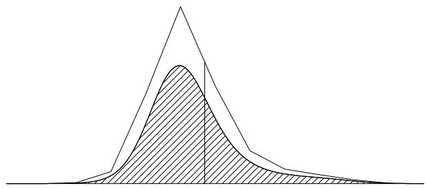
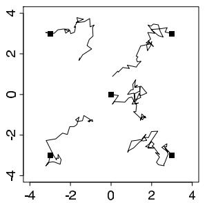
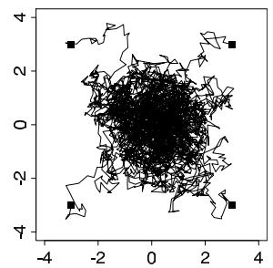
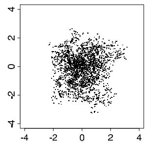

# Introduction to Bayesian Computation

[Package map](../structure.md) · [Unsplit OCR dump](./_full.md)

[← Ch. 9 Decision Analysis](./09-decision-analysis.md) · [Ch. 11 MCMC Basics →](./11-basics-of-markov-chain-simulation.md)

> MinerU OCR dump. If a formula, table, or numbering disagrees with the PDF, the PDF is authoritative.

---

# Chapter 10

# Introduction to Bayesian computation

Bayesian computation revolves around two steps: computation of the posterior distribution, $p(\theta | y)$ , and computation of the posterior predictive distribution, $p(\tilde{y} | y)$ . So far we have considered examples where these could be computed analytically in closed form, with simulations performed directly using a combination of preprogrammed routines for standard distributions (normal, gamma, beta, Poisson, and so forth) and numerical computation on grids. For complicated or unusual models or in high dimensions, however, more elaborate algorithms are required to approximate the posterior distribution. Often the most efficient computation can be achieved by combining different algorithms. We discuss these algorithms in Chapters 11-13. This chapter provides a brief summary of statistical procedures to approximately evaluate integrals. The bibliographic note at the end of this chapter suggests other sources.

# Normalized and unnormalized densities

We refer to the (multivariate) distribution to be simulated as the target distribution and call it $p(\theta |y)$ . Unless otherwise noted (in Section 13.10), we assume that $p(\theta |y)$ can be easily computed for any value $\theta$ , up to a factor involving only the data $y$ ; that is, we assume there is some easily computable function $q(\theta |y)$ , an unnormalized density, for which $q(\theta |y) / p(\theta |y)$ is a constant that depends only on $y$ . For example, in the usual use of Bayes' theorem, we work with the product $p(\theta)p(y|\theta)$ , which is proportional to the posterior density.

# Log densities

To avoid computational overflows and underflows, one should compute with the logarithms of posterior densities whenever possible. Exponentiation should be performed only when necessary and as late as possible; for example, in the Metropolis algorithm, the required ratio of two densities (11.1) should be computed as the exponential of the difference of the log-densities.

# 10.1 Numerical integration

Numerical integration, also called 'quadrature,' refers to methods in which the integral over continuous function is evaluated by computing the value of the function at finite number of points. By increasing the number of points where the function is evaluated, desired accuracy can be obtained. Numerical integration methods can be divided to simulation (stochastic) methods, such as Monte Carlo, and deterministic methods such as many quadrature rule methods.

The posterior expectation of any function $h(\theta)$ is defined as $\operatorname{E}(h(\theta)|y) = \int h(\theta)p(\theta |y)d\theta$ , where the integral has as many dimensions as $\theta$ . Conversely, we can express any integral over the space of $\theta$ as a posterior expectation by defining $h(\theta)$ appropriately. If we have posterior

draws $\theta^s$ from $p(\theta |y)$ , we can estimate the integral by the sample average, $\frac{1}{S}\sum_{s = 1}^{S}h(\theta^s)$ . For any finite number of simulation draws, the accuracy of this estimate can be roughly gauged by the standard deviation of the $h(\theta^s)$ values (we discuss this in more detail in Section 10.5). If it is not easy to draw from the posterior distribution, or if the $h(\theta^s)$ values are too variable (so that the sample average is too variable an estimate to be useful), more sampling methods are necessary.

# Simulation methods

Simulation (stochastic) methods are based on obtaining random samples $\theta^s$ from the desired distribution $p(\theta)$ and estimating the expectation of any function $h(\theta)$ ,

$$
\operatorname {E} (h (\theta) | y) = \int h (\theta) p (\theta | y) d \theta \approx \frac {1}{S} \sum_ {s = 1} ^ {S} h \left(\theta^ {s}\right). \tag {10.1}
$$

The estimate is stochastic depending on generated random numbers, but the accuracy of the simulation can be improved by obtaining more samples. Basic Monte Carlo methods which produce independent samples are discussed in Sections 10.3-10.4 and Markov chain Monte Carlo methods which can better adapt to high-dimensional complex distributions, but produce dependent samples, are discussed in Chapters 11-12. Markov chain Monte Carlo methods have been important in making Bayesian inference practical for generic hierarchical models. Simulation methods can be used for high-dimensional distributions, and there are general algorithms which work for a wide variety of models; where necessary, more efficient computation can be obtained by combining these general ideas with tailored simulation methods, deterministic methods, and distributional approximations.

# Deterministic methods

Deterministic numerical integration methods are based on evaluating the integrand $h(\theta) p(\theta | y)$ at selected points $\theta^s$ , based on a weighted version of (10.1):

$$
\operatorname {E} (h (\theta) | y) = \int h (\theta) p (\theta | y) d \theta \approx \frac {1}{S} \sum_ {s = 1} ^ {S} w _ {s} h (\theta^ {s}) p (\theta^ {s} | y),
$$

with weight $w_{s}$ corresponding to the volume of space represented by the point $\theta^{s}$ . More elaborate rules, such as Simpson's, use local polynomials for improved accuracy. Deterministic numerical integration rules typically have lower variance than simulation methods, but selection of locations gets difficult in high dimensions.

The simplest deterministic method is to evaluate the integrand in a grid with equal weights. Grid methods can be made adaptive starting the grid formation from the posterior mode. For an integrand where one part has some specific form as Gaussian, there are specific quadrature rules that can give more accurate estimates with fewer integrand evaluations. Quadrature rules exist for both bounded and unbounded regions.

# 10.2 Distributional approximations

Distributional (analytic) approximations approximate the posterior with some simpler parametric distribution, from which integrals can be computed directly or by using the approximation as a starting point for simulation-based methods. We have already discussed the normal approximation in Chapter 4, and we consider more advanced approximation methods in Chapter 13.

# Crude estimation by ignoring some information

Before developing elaborate approximations or complicated methods for sampling from the target distribution, it is almost always useful to obtain a rough estimate of the location of the target distribution—that is, a point estimate of the parameters in the model—using some simple, noniterative technique. The method for creating this first estimate will vary from problem to problem but typically will involve discarding parts of the model and data to create a simple problem for which convenient parameter estimates can be found.

In a hierarchical model, one can sometimes roughly estimate the main parameters $\gamma$ by first estimating the hyperparameters $\phi$ crudely, then using the conditional posterior distribution of $\gamma |\phi ,y$ . We applied this approach to the rat tumor example in Section 5.1, where crude estimates of the hyperparameters $(\alpha ,\beta)$ were used to obtain initial estimates of the other parameters, $\theta_{j}$ .

For another example, in the educational testing analysis in Section 5.5, the school effects $\theta_{j}$ can be crudely estimated by the data $y_{j}$ from the individual experiments, and the between-school standard deviation $\tau$ can then be estimated crudely by the standard deviation of the eight $y_{j}$ -values or, to be slightly more sophisticated, the estimate (5.22), restricted to be nonnegative.

When some data are missing, a good way to get started is by simplistically imputing the missing values based on available data. (Ultimately, inferences for the missing data should be included as part of the model; see Chapter 18.)

In addition to creating a starting point for a more exact analysis, crude inferences are useful for comparison with later results—if the rough estimate differs greatly from the results of the full analysis, the latter may well have errors in programming or modeling. Crude estimates are often convenient and reliable because they can be computed using available computer programs.

# 10.3 Direct simulation and rejection sampling

In simple nonhierarchical Bayesian models, it is often easy to draw from the posterior distribution directly, especially if conjugate prior distributions have been assumed. For more complicated problems, it can help to factor the distribution analytically and simulate it in parts, first sampling from the marginal posterior distribution of the hyperparameters, then drawing the other parameters conditional on the data and the simulated hyperparameters. It is sometimes possible to perform direct simulations and analytic integrations for parts of the larger problem, as was done in the examples of Chapter 5.

Frequently, draws from standard distributions or low-dimensional non-standard distributions are required, either as direct draws from the posterior distribution of the estimand in an easy problem, or as an intermediate step in a more complex problem. Appendix A is a relatively detailed source of advice, algorithms, and procedures specifically relating to a variety of commonly used distributions. In this section, we describe methods of drawing a random sample of size 1, with the understanding that the methods can be repeated to draw larger samples. When obtaining more than one sample, it is often possible to reduce computation time by saving intermediate results such as the Cholesky factor for a fixed multivariate normal distribution.

# Direct approximation by calculating at a grid of points

For the simplest discrete approximation, compute the target density, $p(\theta |y)$ , at a set of evenly spaced values $\theta_{1},\ldots ,\theta_{N}$ , that cover a broad range of the parameter space for $\theta$ , then approximate the continuous $p(\theta |y)$ by the discrete density at $\theta_{1},\dots,\theta_{N}$ , with probabilities $p(\theta_i|y) / \sum_{j = 1}^N p(\theta_j|y)$ . Because the approximate density must be normalized anyway, this

  
Figure 10.1 Illustration of rejection sampling. The top curve is an approximation function, $Mg(\theta)$ and the bottom curve is the target density, $p(\theta |y)$ . As required, $Mg(\theta) \geq p(\theta |y)$ for all $\theta$ . The vertical line indicates a single random draw $\theta$ from the density proportional to $g$ . The probability that a sampled draw $\theta$ is accepted is the ratio of the height of the lower curve to the height of the higher curve at the value $\theta$ .

method will work just as well using an unnormalized density function, $q(\theta | y)$ , in place of $p(\theta | y)$ .

Once the grid of density values is computed, a random draw from $p(\theta | y)$ is obtained by drawing a random sample $U$ from the uniform distribution on [0, 1], then transforming by the inverse cdf method (see Section 1.9) to obtain a sample from the discrete approximation. When the points $\theta_{i}$ are spaced closely enough and miss nothing important beyond their boundaries, this method works well. The discrete approximation is more difficult to use in higher-dimensional multivariate problems, where computing at every point in a dense multidimensional grid becomes prohibitively expensive.

# Simulating from predictive distributions

Once we have a sample from the posterior distribution, $p(\theta | y)$ , it is typically easy to draw from the predictive distribution of unobserved or future data, $\tilde{y}$ . For each draw of $\theta$ from the posterior distribution, just draw one $\tilde{y}$ from the predictive distribution, $p(\tilde{y} | \theta)$ . The set of simulated $\tilde{y}$ 's from all the $\theta$ 's characterizes the posterior predictive distribution. Posterior predictive distributions are crucial to the model-checking approach described in Chapter 6.

# Rejection sampling

Suppose we want to obtain a single random draw from a density $p(\theta |y)$ , or perhaps an unnormalized density $q(\theta |y)$ (with $p(\theta |y) = q(\theta |y) / \int q(\theta |y)d\theta$ ). In the following description we use $p$ to represent the target distribution, but we could just as well work with the unnormalized form $q$ instead. To perform rejection sampling we require a positive function $g(\theta)$ defined for all $\theta$ for which $p(\theta |y) > 0$ that has the following properties:

- We can draw from the probability density proportional to $g$ . It is not required that $g(\theta)$ integrate to 1, but $g(\theta)$ must have a finite integral.   
- The importance ratio $\frac{p(\theta|y)}{g(\theta)}$ must have a known bound; that is, there must be some known constant $M$ for which $\frac{p(\theta|y)}{g(\theta)} \leq M$ for all $\theta$ .

The rejection sampling algorithm proceeds in two steps:

1. Sample $\theta$ at random from the probability density proportional to $g(\theta)$ .   
2. With probability $\frac{p(\theta|y)}{Mg(\theta)}$ , accept $\theta$ as a draw from $p$ . If the drawn $\theta$ is rejected, return to step 1.

Figure 10.1 illustrates rejection sampling. An accepted $\theta$ has the correct distribution, $p(\theta |y)$ ; that is, the distribution of drawn $\theta$ , conditional on it being accepted, is $p(\theta |y)$ (see Exercise

10.4). The boundedness condition is necessary so that the probability in step 2 is not greater than 1.

A good approximate density $g(\theta)$ for rejection sampling should be roughly proportional to $p(\theta | y)$ (considered as a function of $\theta$ ). The ideal situation is $g \propto p$ , in which case, with a suitable value of $M$ , we can accept every draw with probability 1. When $g$ is not nearly proportional to $p$ , the bound $M$ must be set so large that almost all draws obtained in step 1 will be rejected in step 2. A virtue of rejection sampling is that it is self-monitoring—if the method is not working efficiently, few simulated draws will be accepted.

The function $g(\theta)$ is chosen to approximate $p(\theta | y)$ and so in general will depend on $y$ . We do not use the notation $g(\theta, y)$ or $g(\theta | y)$ , however, because in practice we will be considering approximations to one posterior distribution at a time, and the functional dependence of $g$ on $y$ is not of interest.

Rejection sampling is used in some fast methods for sampling from standard univariate distributions. It is also often used for generic truncated multivariate distributions, if the proportion of the density mass in the truncated part is not close to 1.

# 10.4 Importance sampling

Importance sampling is a method, related to rejection sampling and a precursor to the Metropolis algorithm (discussed in the next chapter), that is used for computing expectations using a random sample drawn from an approximation to the target distribution. Suppose we are interested in $\operatorname{E}(h(\theta) | y)$ , but we cannot generate random draws of $\theta$ from $p(\theta | y)$ and thus cannot evaluate the integral by a simple average of simulated values.

If $g(\theta)$ is a probability density from which we can generate random draws, then we can write,

$$
\operatorname {E} (h (\theta | y)) = \frac {\int h (\theta) q (\theta | y) d \theta}{\int q (\theta | y) d \theta} = \frac {\int [ h (\theta) q (\theta | y) / g (\theta) ] g (\theta) d \theta}{\int [ q (\theta | y) / g (\theta) ] g (\theta) d \theta}, \tag {10.2}
$$

which can be estimated using $S$ draws $\theta^1,\ldots ,\theta^S$ from $g(\theta)$ by the expression,

$$
\frac {\frac {1}{S} \sum_ {s = 1} ^ {S} h \left(\theta^ {s}\right) w \left(\theta^ {s}\right)}{\frac {1}{S} \sum_ {s = 1} ^ {S} w \left(\theta^ {s}\right)}, \tag {10.3}
$$

where the factors

$$
w (\theta^ {s}) = \frac {q (\theta^ {s} | y)}{g (\theta^ {s})}
$$

are called importance ratios or importance weights. Recall that $q$ is our general notation for unnormalized densities; that is, $q(\theta | y)$ equals $p(\theta | y)$ times some factor that does not depend on $\theta$ .

It is generally advisable to use the same set of random draws for both the numerator and denominator of (10.3) in order to reduce the sampling error in the estimate.

If $g(\theta)$ can be chosen such that $\frac{hq}{g}$ is roughly constant, then fairly precise estimates of the integral can be obtained. Importance sampling is not a useful method if the importance ratios vary substantially. The worst possible scenario occurs when the importance ratios are small with high probability but with a low probability are huge, which happens, for example, if $hq$ has wide tails compared to $g$ , as a function of $\theta$ .

# Accuracy and efficiency of importance sampling estimates

In general, without some form of mathematical analysis of the exact and approximate densities, there is always the realistic possibility that we have missed some extremely large but rare importance weights. However, it may help to examine the distribution of sampled

importance weights to discover possible problems. It can help to examine a histogram of the logarithms of the largest importance ratios: estimates will often be poor if the largest ratios are too large relative to the average. In contrast, we do not have to worry about the behavior of small importance ratios, because they have little influence on equation (10.2). If the variance of the weights is finite, the effective sample size can be estimated using an approximation,

$$
S _ {\text {e f f}} = \frac {1}{\sum_ {s = 1} ^ {S} \left(\tilde {w} \left(\theta^ {s}\right)\right) ^ {2}}, \tag {10.4}
$$

where $\tilde{w} (\theta^s)$ are normalized weights; that is, $\tilde{w} (\theta^{s}) = w(\theta^{s})S / \sum_{s^{\prime} = 1}^{S}w(\theta^{s^{\prime}})$ . The effective sample size $S_{\mathrm{eff}}$ is small if there are few extremely high weights which would unduly influence the distribution. If the distribution has occasional very large weights, however, this estimate is itself noisy; it can thus be taken as no more than a rough guide.

# Importance resampling

To obtain independent samples with equal weights, it is possible to use importance resampling (also called sampling-importance resampling or SIR).

Once $S$ draws, $\theta^1,\ldots ,\theta^S$ , from the approximate distribution $g$ have been sampled, a sample of $k < S$ draws can be simulated as follows.

1. Sample a value $\theta$ from the set $\{\theta^1, \dots, \theta^S\}$ , where the probability of sampling each $\theta^s$ is proportional to the weight, $w(\theta^s) = \frac{q(\theta^s|y)}{g(\theta^s)}$ .   
2. Sample a second value using the same procedure, but excluding the already sampled value from the set.   
3. Repeatedly sample without replacement $k - 2$ more times.

Why sample without replacement? If the importance weights are moderate, sampling with and without replacement gives similar results. Now consider a bad case, with a few large weights and many small weights. Sampling with replacement will pick the same few values of $\theta$ repeatedly; in contrast, sampling without replacement yields a more desirable intermediate approximation somewhere between the starting and target densities. For other purposes, sampling with replacement could be superior.

# Uses of importance sampling in Bayesian computation

Importance sampling can be used to improve analytic posterior approximations as described in Chapter 13. If importance sampling does not yield an accurate approximation, then importance resampling can still be helpful for obtaining starting points for an iterative simulation of the posterior distribution, as described in Chapter 11.

Importance (re)sampling can also be useful when considering mild changes in the posterior distribution, for example replacing the normal distribution by a $t$ in the 8 schools model or when computing leave-one-out cross-validation. The idea in this case is to treat the original posterior distribution as an approximation to the modified posterior distribution.

A good way to develop an understanding of importance sampling is to program simulations for simple examples, such as using a $t_3$ distribution as an approximation to the normal (good practice) or vice versa (bad practice); see Exercises 10.6 and 10.7. The approximating distribution $g$ in importance sampling should cover all the important regions of the target distribution.

# 10.5 How many simulation draws are needed?

Bayesian inferences are usually most conveniently summarized by random draws from the posterior distribution of the model parameters. Percentiles of the posterior distribution of univariate estimands can be reported to convey the shape of the distribution. For example, reporting the $2.5\%$ , $25\%$ , $50\%$ , $75\%$ , and $97.5\%$ points of the sampled distribution of an estimand provides a $50\%$ and a $95\%$ posterior interval and also conveys skewness in its marginal posterior density. Scatterplots of simulations, contour plots of density functions, or more sophisticated graphical techniques can also be used to examine the posterior distribution in two or three dimensions. Quantities of interest can be defined in terms of the parameters (for example, LD50 in the bioassay example in Section 3.7) or of parameters and data.

We also use posterior simulations to make inferences about predictive quantities. Given each draw $\theta^s$ , we can sample any predictive quantity, $\tilde{y}^s \sim p(\tilde{y}|\theta^s)$ or, for a regression model, $\tilde{y}^s \sim p(\tilde{y}|\tilde{X},\theta^s)$ . Posterior inferences and probability calculations can then be performed for each predictive quantity using the $S$ simulations (for example, the predicted probability of Bill Clinton winning each state in 1992, as displayed in Figure 6.1 on page 143).

Finally, given each simulation $\theta^s$ , we can simulate a replicated dataset $y^{\mathrm{rep}s}$ . As described in Chapter 6, we can then check the model by comparing the data to these posterior predictive replications.

Our goal in Bayesian computation is to obtain a set of independent draws $\theta^s$ , $s = 1, \ldots, S$ , from the posterior distribution, with enough draws $S$ so that quantities of interest can be estimated with reasonable accuracy. For most examples, $S = 100$ independent draws are enough for reasonable posterior summaries. We can see this by considering a scalar parameter $\theta$ with an approximately normal posterior distribution (see Chapter 4) with mean $\mu_{\theta}$ and standard deviation $\sigma_{\theta}$ . We assume these cannot be calculated analytically and instead are estimated from the mean $\bar{\theta}$ and standard deviation $s_{\theta}$ of the $S$ simulation draws. The posterior mean is then estimated to an accuracy of approximately $s_{\theta} / \sqrt{S}$ . The total standard deviation of the computational parameter estimate (including Monte Carlo error, the uncertainty contributed by having only a finite number of simulation draws) is then $s_{\theta} \sqrt{1 + 1 / S}$ . For $S = 100$ , the factor $\sqrt{1 + 1 / S}$ is 1.005, implying that Monte Carlo error adds almost nothing to the uncertainty coming from actual posterior variance. However, it can be convenient to have more than 100 simulations just so that the numerical summaries are more stable, even if this stability typically confers no important practical advantage.

For some posterior inferences, more simulation draws are needed to obtain desired precisions. For example, posterior probabilities are estimated to a standard deviation of $\sqrt{p(1 - p) / S}$ , so that $S = 100$ simulations allow estimation of a probability near 0.5 to an accuracy of $5\%$ . $S = 2500$ simulations are needed to estimate to an accuracy of $1\%$ . Even more simulation draws are needed to compute the posterior probability of rare events, unless analytic methods are used to assist the computations.

# Example. Educational testing experiments

We illustrate with the hierarchical model fitted to the data from the 8 schools as described in Section 5.5. First consider inference for a particular parameter, for example $\theta_{1}$ , the estimated effect of coaching in school A. Table 5.3 shows that from 200 simulation draws, our posterior median estimate was 10, with a $50\%$ interval of [7, 16] and a $95\%$ interval of $[-2, 31]$ . Repeating the computation, another 200 draws gave a posterior median of 9, with a $50\%$ interval of [6, 14] and a $95\%$ interval of $[-4, 32]$ . These intervals differ slightly but convey the same general information about $\theta_{1}$ . From $S = 10,000$ simulation draws, the median is 10, the $50\%$ interval is [6, 15], and the $95\%$ interval is $[-2, 31]$ . In practice, these are no different from either of the summaries obtained from 200 draws.

We now consider some posterior probability statements. Our original 200 simulations gave us an estimate of 0.73 for the posterior probability $\operatorname{Pr}(\theta_1 > \theta_3|y)$ , the probability that the effect is larger in school A than in school C (see the end of Section 5.5). This probability is estimated to an accuracy of $\sqrt{0.73(1 - 0.73) / 200} = 0.03$ , which is good enough in this example.

How about a rarer event, such as the probability that the effect in School A is greater than 50 points? None of our 200 simulations $\theta_1^s$ exceeds 50, so the simple estimate of the probability is that it is zero (or less than $1/200$ ). When we simulate $S = 10,000$ draws, we find 3 of the draws to have $\theta_1 > 50$ , which yields a crude estimated probability of 0.0003.

An alternative way to compute this probability is semi-analytically. Given $\mu$ and $\tau$ , the effect in school A has a normal posterior distribution, $p(\theta_1|\mu ,\tau ,y) = \mathrm{N}(\hat{\theta}_1,V_1)$ , where this mean and variance depend on $y_{1}$ , $\mu$ , and $\tau$ (see (5.17) on page 116). The conditional probability that $\theta_{1}$ exceeds 50 is then $\operatorname*{Pr}(\theta_1 > 50|\mu ,\tau ,y) = \Phi ((\hat{\theta}_1 - 50) / \sqrt{V_1})$ , and we can estimate the unconditional posterior probability $\operatorname*{Pr}(\theta_1 > 50|y)$ as the average of these normal probabilities as computed for each simulation draw $(\mu^s,\tau^s)$ . Using this approach, $S = 200$ draws are sufficient for a reasonably accurate estimate.

In general, fewer simulations are needed to estimate posterior medians of parameters, probabilities near 0.5, and low-dimensional summaries than extreme quantiles, posterior means, probabilities of rare events, and higher-dimensional summaries. In most of the examples in this book, we use a moderate number of simulation draws (typically 100 to 2000) as a way of emphasizing that applied inferences do not typically require a high level of simulation accuracy.

# 10.6 Computing environments

Programs exist for full Bayesian inference for commonly used models such as hierarchical linear and logistic regression and some nonparametric models. These implementations use various combinations of the Bayesian computation algorithms discussed in the following chapters.

We see (at least) four reasons for wanting an automatic and general program for fitting Bayesian models. First, many applied statisticians and subject-matter researchers would like to fit Bayesian models but do not have the mathematical, statistical, and computer skills to program the inferential steps themselves. Economists and political scientists can run regressions with a single line of code or a click on a menu, epidemiologists can do logistic regression, sociologists can fit structural equation models, psychologists can fit analysis of variance, and education researchers can fit hierarchical linear models. We would like all these people to be able to fit Bayesian models (which include all those previously mentioned as special cases but also allow for generalizations such as robust error models, mixture distributions, and various arbitrary functional forms, not to mention a framework for including prior information).

A second use for a general Bayesian package is for teaching. Students can first learn to do inference automatically, focusing on the structure of their models rather than on computation, learning the algebra and computing later. A deeper understanding is useful—if we did not believe so, we would not have written this book. Ultimately it is helpful to learn what lies behind the inference and computation because one way we understand a model is by comparing to similar models that are slightly simpler or more complicated, and one way we understand the process of model fitting is by seeing it as a map from data and assumptions to inferences. Even when using a black box or 'inference engine,' we often want

to go back and see where the substantively important features of our posterior distribution came from.

A third motivation for writing an automatic model-fitting package is as a programming environment for implementing new models, and for practitioners who could program their own models to be able to focus on more important statistical issues.

Finally, a fourth potential benefit of a general Bayesian program is that it can be faster than custom code. There is an economy of scale. Because the automatic program will be used so many times, it can make sense to optimize it in various ways, implement it in parallel, and include algorithms that require more coding effort but are faster in hard problems.

That said, no program can be truly general. Any such software should be open and accessible, with places where the (sophisticated) user can alter the program or 'hold its hand' to ensure that it does what it is supposed to do.

# The Bugs family of programs

During the 1990s and early 2000s, a group of statisticians and programmers developed Bugs (Bayesian inference using Gibbs sampling), a general-purpose program in which a user could supply data and specify a statistical model using a convenient language not much different from the mathematical notation used in probability theory, and then the program used a combination of Gibbs sampling, the Metropolis algorithm, and slice sampling (algorithms which are described in the following chapters) to obtain samples from the posterior distribution. When run for a sufficiently long time, Bugs could provide inference for an essentially unlimited variety of models. Instead of models being chosen from a list or menu of preprogrammed options, Bugs models could be put together in arbitrary ways using a large set of probability distributions, much in the way that we construct models in this book.

The most important limitations of Bugs have been computational. The program excels with complicated models for small datasets but can be slow with large datasets and multivariate structures. Bugs works by updating one scalar parameter at a time (following the ideas of Gibbs sampling, as discussed in the following chapter), which results in slow convergence when parameters are strongly dependent, as can occur in hierarchical models.

# Stan

We have recently developed an open-source program, Stan (named after Stanislaw Ulam, a mathematician who was one of the inventors of the Monte Carlo method) that has similar functionality as Bugs but uses a more complicated simulation algorithm, Hamiltonian Monte Carlo (see Section 12.4). Stan is written in C++ and has been designed to be easily extendable, both in allowing improvements to the updating algorithm and in being open to the development of new models. We now develop and fit our Bayesian models in Stan, using its Bugs-like modeling language and improving it as necessary to fit more complicated models and larger problems. Stan is intended to serve both as an automatic program for general users and as a programming environment for the development of new simulation methods. We discuss Stan further in Section 12.6 and Appendix C.

# Other Bayesian software

Following the success of Bugs, many research groups have developed general tools for fitting Bayesian models. These include mcsim (a C program that implements Gibbs and Metropolis for differential equation systems such as the toxicology model described in Section 19.2), PyMC (a suite of routines in the open-source language Python), HBC (developed for discrete-parameter models in computational linguistics). These and other programs have

been developed by individuals or communities of users who have wanted to fit particular models and have found it most effective to do this by writing general implementations. In addition various commercial programs are under development that fit Bayesian models with various degrees of generality.

# 10.7 Debugging Bayesian computing

Debugging using fake data

Our usual approach for building confidence in our posterior inferences is to fit different versions of the desired model, noticing when the inferences change unexpectedly. Section 10.2 discusses crude inferences from simplified models that typically ignore some structure in the data.

Within the computation of any particular model, we check convergence by running parallel simulations from different starting points, checking that they mix and converge to the same estimated posterior distribution (see Section 11.4). This can be seen as a form of debugging of the individual simulated sequences.

When a model is particularly complicated, or its inferences are unexpected enough to be not necessarily believable, one can perform more elaborate debugging using fake data. The basic approach is:

1. Pick a reasonable value for the 'true' parameter vector $\theta$ . Strictly speaking, this value should be a random draw from the prior distribution, but if the prior distribution is noninformative, then any reasonable value of $\theta$ should work.   
2. If the model is hierarchical (as it generally will be), then perform the above step by picking reasonable values for the hyperparameters, then drawing the other parameters from the prior distribution conditional on the specified hyperparameters.   
3. Simulate a large fake dataset $y^{\mathrm{fake}}$ from the data distribution $p(y|\theta)$ .   
4. Perform posterior inference about $\theta$ from $p(\theta | y^{\mathrm{fake}})$ .   
5. Compare the posterior inferences to the 'true' $\theta$ from step 1 or 2. For instance, for any element of $\theta$ , there should be a $50\%$ probability that its $50\%$ posterior interval contains the truth.

Formally, this procedure requires that the model has proper prior distributions and that the frequency evaluations be averaged over many values of the 'true' $\theta$ , drawn independently from the prior distribution in step 1 above. In practice, however, the debugging procedure can be useful with just a single reasonable choice of $\theta$ in the first step. If the model does not produce reasonable inferences with $\theta$ set to a reasonable value, then there is probably something wrong, either in the computation or in the model itself.

Inference from a single fake dataset can be revealing for debugging purposes, if the true value of $\theta$ is far outside the computed posterior distribution. If the dimensionality of $\theta$ is large (as can easily happen with hierarchical models), we can go further and compute debugging checks such as the proportion of the $50\%$ intervals that contain the true value.

To check that inferences are correct on average, one can create a 'residual plot' as follows. For each scalar parameter $\theta_{j}$ , define the predicted value as the average of the posterior simulations of $\theta_{j}$ , and the error as the true $\theta_{j}$ (as specified or simulated in step 1 or 2 above) minus the predicted value. If the model is computed correctly, the errors should have zero mean, and we can diagnose problems by plotting errors vs. predicted values, with one dot per parameter.

For models with only a few parameters, one can get the same effect by performing many fake-data simulations, resampling a new 'true' vector $\theta$ and a new fake dataset $y^{\mathrm{fake}}$ each time, and then checking that the errors have zero mean and the correct interval coverage, on average.

Model checking and convergence checking as debugging

Finally, the techniques for model checking and comparison described in Chapters 6 and 7, and the techniques for checking for poor convergence of iterative simulations, which we describe in Section 11.4, can also be interpreted as methods for debugging.

In practice, when a model grossly misfits the data, or when a histogram or scatterplot or other display of replicated data looks weird, it is often because of a computing error. These errors can be as simple as forgetting to decode discrete responses (for example, $1 = \text{Yes}$ , $0 = \text{No}$ , $-9 = \text{Don't Know}$ ) or misspelling a regression predictor, or as subtle as a miscomputed probability ratio in a Metropolis updating step (see Section 11.2), but typically they show up as predictions that do not make sense or do not fit the data. Similarly, poor convergence of an iterative simulation algorithm can sometimes occur from programming errors or conceptual errors in the model.

When posterior inferences from a fitted model seem wrong, it is sometimes unclear if there is a bug in the program or a fundamental problem with the model itself. At this point, a useful conceptual and computational strategy is to simplify—to remove parameters from the model, or to give them fixed values or highly informative prior distributions, or to separately analyze data from different sources (that is, to un-link a hierarchical model). These computations can be performed in steps, for example first removing a parameter from the model, then setting it equal to a null value (for example, zero) just to check that adding it into the program has no effect, then fixing it at a reasonable nonzero value, then assigning it a precise prior distribution, then allowing it to be estimated more fully from the data. Model building is a gradual process, and we often find ourselves going back and forth between simpler and more complicated models, both for conceptual and computational reasons.

# 10.8 Bibliographic note

Excellent general books on simulation from a statistical perspective are Ripley (1987), and Gentle (2003), which cover two topics that we do not address in this chapter: creating uniformly distributed (pseudo)random numbers and simulating from standard distributions (on the latter, see our Appendix A for more details). Hammersley and Handscomb (1964) is a classic reference on simulation. Thisted (1988) is a general book on statistical computation that discusses many optimization and simulation techniques. Robert and Casella (2004) cover simulation algorithms from a variety of statistical perspectives.

For further information on numerical integration techniques, see Press et al. (1986); a review of the application of these techniques to Bayesian inference is provided by Smith et al. (1985), and O'Hagan and Forster (2004).

Bayesian quadrature methods using Gaussian process priors have been proposed by O'Hagan (1991) and Rasmussen and Ghahramani (2003). Adaptive grid sampling has been presented, for example, by Rue, Martino, and Chopin (2009).

Importance sampling is a relatively old idea in numerical computation; for some early references, see Hammersley and Handscomb (1964). Geweke (1989) is a pre-Gibbs sampler discussion in the context of Bayesian computation; also see Wakefield, Gelfand, and Smith (1991). Chapters 2-4 of Liu (2001) discuss importance sampling in the context of Markov chain simulation algorithms. Gelfand, Dey, and Chang (1992) proposed importance sampling for fast leave-one-out cross-validation. Kong, Liu, and Wong (1996) propose a method for estimating the reliability of importance sampling using approximation of the variance of importance weights. Skare, Bolviken, and Holden (2003) propose improved importance sampling using modified weights which reduce the bias of the estimate.

Importance resampling was introduced by Rubin (1987b), and an accessible exposition is given by Smith and Gelfand (1992). Skare, Bolviken, and Holden (2003) discuss why it

is best to draw importance resamples $(k < S)$ without replacement and they propose an improved algorithm that uses modified weights. When $k = S$ draws are required, Kitagawa (1996) presents stratified and deterministic resampling, and Liu (2001) presents residual resampling; these methods all have smaller variance than simple random resampling.

Kass et al. (1998) discuss many practical issues in Bayesian simulation. Gelman and Hill (2007, chapter 8) and Cook, Gelman, and Rubin (2006) show how to check Bayesian computations using fake-data simulation. Kerman and Gelman (2006, 2007) discuss some ways in which R can be modified to allow more direct manipulation of random variable objects and Bayesian inferences.

Information about Bugs appears at Spiegelhalter et al. (1994, 2003) and Plummer (2003), respectively. The article by Lunn et al. (2009) and ensuing discussion give a sense of the scope of the Bugs project. Stan is discussed further in Section 12.6 and Appendix C of this book, as well as at Stan Development Team (2012). Several other efforts have been undertaken to develop Bayesian inference tools for particular classes of model, for example Daume (2008).

# 10.9 Exercises

The exercises in Part III focus on computational details. Data analysis exercises using the methods described in this part of the book appear in the appropriate chapters in Parts IV and V.

1. Number of simulation draws: Suppose the scalar variable $\theta$ is approximately normally distributed in a posterior distribution that is summarized by $n$ independent simulation draws. How large does $n$ have to be so that the $2.5\%$ and $97.5\%$ quantiles of $\theta$ are specified to an accuracy of $0.1\mathrm{sd}(\theta |y)$ ?

(a) Figure this out mathematically, without using simulation.   
(b) Check your answer using simulation and show your results.

2. Number of simulation draws: suppose you are interested in inference for the parameter $\theta_{1}$ in a multivariate posterior distribution, $p(\theta |y)$ . You draw 100 independent values $\theta$ from the posterior distribution of $\theta$ and find that the posterior density for $\theta_{1}$ is approximately normal with mean of about 8 and standard deviation of about 4.

(a) Using the average of the 100 draws of $\theta_{1}$ to estimate the posterior mean, $\operatorname{E}(\theta_1|y)$ , what is the approximate standard deviation due to simulation variability?   
(b) About how many simulation draws would you need to reduce the simulation standard deviation of the posterior mean to 0.1 (thus justifying the presentation of results to one decimal place)?   
(c) A more usual summary of the posterior distribution of $\theta_{1}$ is a $95\%$ central posterior interval. Based on the data from 100 draws, what are the approximate simulation standard deviations of the estimated $2.5\%$ and $97.5\%$ quantiles of the posterior distribution? (Recall that the posterior density is approximately normal.)   
(d) About how many simulation draws would you need to reduce the simulation standard deviations of the $2.5\%$ and $97.5\%$ quantiles to 0.1?   
(e) In the eight-schools example of Section 5.5, we simulated 200 posterior draws. What are the approximate simulation standard deviations of the $2.5\%$ and $97.5\%$ quantiles for school A in Table 5.3?   
(f) Why was it not necessary, in practice, to simulate more than 200 draws for the SAT coaching example?

3. Posterior computations for the binomial model: suppose $y_{1} \sim \mathrm{Bin}(n_{1}, p_{1})$ is the number of successfully treated patients under an experimental new drug, and $y_{2} \sim \mathrm{Bin}(n_{2}, p_{2})$

is the number of successfully treated patients under the standard treatment. Assume that $y_{1}$ and $y_{2}$ are independent and assume independent beta prior densities for the two probabilities of success. Let $n_1 = 10, y_1 = 6$ , and $n_2 = 20, y_2 = 10$ . Repeat the following for several different beta prior specifications.

(a) Use simulation to find a $95\%$ posterior interval for $p_1 - p_2$ and the posterior probability that $p_1 > p_2$ .   
(b) Numerically integrate to estimate the posterior probability that $p_1 > p_2$ .

4. Rejection sampling:

(a) Prove that rejection sampling gives draws from $p(\theta |y)$   
(b) Why is the boundedness condition on $p(\theta | y) / q(\theta)$ necessary for rejection sampling?

5. Rejection sampling and importance sampling: Consider the model, $y_{j} \sim \mathrm{Binomial}(n_{j},\theta_{j})$ where $\theta_{j} = \mathrm{logit}^{-1}(\alpha +\beta x_{j})$ , for $j = 1,\dots ,J$ , and with independent prior distributions, $\alpha \sim t_4(0,2^2)$ and $\beta \sim t_4(0,1)$ . Suppose $J = 10$ , the $x_{j}$ values are randomly drawn from a U(0,1) distribution, and $n_j \sim \mathrm{Poisson}^+ (5)$ , where $\mathrm{Poisson}^{+}$ is the Poisson distribution restricted to positive values.

(a) Sample a dataset at random from the model.   
(b) Use rejection sampling to get 1000 independent posterior draws from $(\alpha, \beta)$ .   
(c) Approximate the posterior density for $(\alpha, \beta)$ by a normal centered at the posterior mode with covariance matrix fit to the curvature at the mode.   
(d) Take 1000 draws from the two-dimensional $t_4$ distribution with that center and scale matrix and use importance sampling to estimate $\mathrm{E}(\alpha |y)$ and $\mathrm{E}(\beta |y)$   
(e) Compute an estimate of effective sample size for importance sampling using (10.4) on page 266.

6. Importance sampling when the importance weights are well behaved: consider a univariate posterior distribution, $p(\theta | y)$ , which we wish to approximate and then calculate moments of, using importance sampling from an unnormalized density, $g(\theta)$ . Suppose the posterior distribution is normal, and the approximation is $t_3$ with mode and curvature matched to the posterior density.

(a) Draw a sample of size $S = 100$ from the approximate density and compute the importance ratios. Plot a histogram of the log importance ratios.   
(b) Estimate $\operatorname {E}(\theta |y)$ and $\mathrm{var}(\theta |y)$ using importance sampling. Compare to the true values.   
(c) Repeat (a) and (b) for $S = 10,000$ .   
(d) Using the sample obtained in (c), compute an estimate of effective sample size using (10.4) on page 266.

7. Importance sampling when the importance weights are too variable: repeat the previous exercise, but with a $t_3$ posterior distribution and a normal approximation. Explain why the estimates of $\operatorname{var}(\theta | y)$ are systematically too low.

8. Importance resampling with and without replacement:

(a) Consider the bioassay example introduced in Section 3.7. Use importance resampling to approximate draws from the posterior distribution of the parameters $(\alpha, \beta)$ , using the normal approximation of Section 4.1 as the starting distribution. Sample $S = 10,000$ from the approximate distribution, and resample without replacement $k = 1000$ samples. Compare your simulations of $(\alpha, \beta)$ to Figure 3.3b and discuss any discrepancies.   
(b) Comment on the distribution of the simulated importance ratios.   
(c) Repeat part (a) using importance sampling with replacement. Discuss how the results differ

# Basics of Markov chain simulation

Many clever methods have been devised for constructing and sampling from arbitrary posterior distributions. Markov chain simulation (also called Markov chain Monte Carlo, or MCMC) is a general method based on drawing values of $\theta$ from approximate distributions and then correcting those draws to better approximate the target posterior distribution, $p(\theta |y)$ . The sampling is done sequentially, with the distribution of the sampled draws depending on the last value drawn; hence, the draws form a Markov chain. (As defined in probability theory, a Markov chain is a sequence of random variables $\theta^1, \theta^2, \ldots$ , for which, for any $t$ , the distribution of $\theta^t$ given all previous $\theta$ 's depends only on the most recent value, $\theta^{t-1}$ .) The key to the method's success, however, is not the Markov property but rather that the approximate distributions are improved at each step in the simulation, in the sense of converging to the target distribution. As we shall see in Section 11.2, the Markov property is helpful in proving this convergence.

Figure 11.1 illustrates a simple example of a Markov chain simulation—in this case, a Metropolis algorithm (see Section 11.2) in which $\theta$ is a vector with only two components, with a bivariate unit normal posterior distribution, $\theta \sim \mathrm{N}(0,I)$ . First consider Figure 11.1a, which portrays the early stages of the simulation. The space of the figure represents the range of possible values of the multivariate parameter, $\theta$ , and each of the five jagged lines represents the early path of a random walk starting near the center or the extremes of the target distribution and jumping through the distribution according to an appropriate sequence of random iterations. Figure 11.1b represents the mature stage of the same Markov chain simulation, in which the simulated random walks have each traced a path throughout the space of $\theta$ , with a common stationary distribution that is equal to the target distribution. We can then perform inferences about $\theta$ using points from the second halves of the Markov chains we have simulated, as displayed in Figure 11.1c.

In our applications of Markov chain simulation, we create several independent sequences; each sequence, $\theta^1,\theta^2,\theta^3,\ldots$ , is produced by starting at some point $\theta^0$ and then, for each $t$ , drawing $\theta^t$ from a transition distribution, $T_{t}(\theta^{t}|\theta^{t - 1})$ that depends on the previous draw, $\theta^{t - 1}$ . As we shall see in the discussion of combining the Gibbs sampler and Metropolis sampling in Section 11.3, it is often convenient to allow the transition distribution to depend on the iteration number $t$ ; hence the notation $T_{t}$ . The transition probability distributions must be constructed so that the Markov chain converges to a unique stationary distribution that is the posterior distribution, $p(\theta |y)$ .

Markov chain simulation is used when it is not possible (or not computationally efficient) to sample $\theta$ directly from $p(\theta |y)$ ; instead we sample iteratively in such a way that at each step of the process we expect to draw from a distribution that becomes closer to $p(\theta |y)$ . For a wide class of problems (including posterior distributions for many hierarchical models), this appears to be the easiest way to get reliable results. In addition, Markov chain and other iterative simulation methods have many applications outside Bayesian statistics, such as optimization, that we do not discuss here.

The key to Markov chain simulation is to create a Markov process whose stationary dis

  
Figure 11.1 Five independent sequences of a Markov chain simulation for the bivariate unit normal distribution, with overdispersed starting points indicated by solid squares. (a) After 50 iterations, the sequences are still far from convergence. (b) After 1000 iterations, the sequences are nearer to convergence. Figure (c) shows the iterates from the second halves of the sequences; these represent a set of (correlated) draws from the target distribution. The points in Figure (c) have been jittered so that steps in which the random walks stood still are not hidden. The simulation is a Metropolis algorithm described in the example on page 278, with a jumping rule that has purposely been chosen to be inefficient so that the chains will move slowly and their random-walk-like aspect will be apparent.

The distribution of the current draws is the same as in Section 11.1. The distribution of the current draws is the same as in Section 11.2.

Once the simulation algorithm has been implemented and the simulations drawn, it is absolutely necessary to check the convergence of the simulated sequences; for example, the simulations of Figure 11.1a are far from convergence and are not close to the target distribution. We discuss how to check convergence in Section 11.4, and in Section 11.5 we construct an expression for the effective number of simulation draws for a correlated sample. If convergence is painfully slow, the algorithm should be altered, as discussed in the next chapter.

This chapter introduces the basic Markov chain simulation methods—the Gibbs sampler and the Metropolis-Hastings algorithm—in the context of our general computing approach based on successive approximation. We sketch a proof of the convergence of Markov chain simulation algorithms and present a method for monitoring the convergence in practice. We illustrate these methods in Section 11.6 for a hierarchical normal model. For most of this chapter we consider simple and familiar (even trivial) examples in order to focus on the principles of iterative simulation methods as they are used for posterior simulation. Many examples of these methods appear in the recent statistical literature and also in the later parts of this book. Appendix C shows the details of implementation in the computer languages R and Stan for the educational testing example from Chapter 5.

