# Modal and Distributional Approximations

[Package map](../structure.md) · [Unsplit OCR dump](./_full.md)

[← Ch. 12 Efficient MCMC](./12-efficient-markov-chain-simulation.md) · [Ch. 14 Regression →](./14-introduction-to-regression-models.md)

> MinerU OCR dump. If a formula, table, or numbering disagrees with the PDF, the PDF is authoritative.

---

# Chapter 13

# Modal and distributional approximations

The early chapters of the book describe simulation approaches that work in low-dimensional problems. With complicated models, it is rare that samples from the posterior distribution can be obtained directly, and Chapters 11 and 12 describe iterative simulation algorithms that can be used with such models. In this chapter we describe various approaches based on distributional approximations. These methods are useful for quick inferences, as starting points for Markov chain simulation algorithms, and for large problems where iterative simulation approaches are too slow. The approximations that we describe are relatively simple to compute and can provide valuable information about the fit of the model.

In Section 13.1 we discuss algorithms for finding posterior modes. Beyond being useful in constructing distributional approximations, the posterior mode is often used in statistical practice as a point estimate, sometimes in the guise of a penalized likelihood estimate (where the logarithm of the prior density is considered as a penalty function). Section 13.2 discusses how, if the goal is to summarize the posterior distribution by a mode, it can make sense to use a different prior distribution than would be used in full Bayesian inference. Section 13.3 presents normal and normal-mixture approximations centered at the mode. We continue in Sections 13.4-13.6 with EM (expectation maximization) and related approaches for finding marginal posterior modes, along with related approximations based on factorizing the joint posterior distribution. Finally, Sections 13.7 and 13.8 introduce variational Bayes and expectation propagation, two methods for constructing approximations to a distribution based on conditional moments.

The proliferation of algorithms for Bayesian computing reflects the proliferation of challenging applied problems that we are trying to solve using Bayesian methods. These problems typically have large numbers of unknown parameters, hence the appeal of Bayesian inference and hence also the struggles with computation. When different approximating strategies are available, it can make sense to fit the model in multiple ways and then use the tools described in Chapters 6 and 7 to evaluate and compare them.

# 13.1 Finding posterior modes

In Bayesian computation, we search for modes not for their own sake, but as a way to begin mapping the posterior density. In particular, we have no special interest in finding the absolute maximum of the posterior density. If many modes exist, we should try to find them all, or at least all the modes with non-negligible posterior mass in their neighborhoods. In practice, we often first search for a single mode, and if it does not look reasonable in a substantive sense, we continue searching through the parameter space for other modes. To find all the local modes—or to make sure that a mode that has been found is the only important mode—sometimes one must run a mode-finding algorithm several times from different starting points.

Even better, where possible, is to find the modes of the marginal posterior density of a

subset of the parameters. One then analyzes the distribution of the remaining parameters, conditional on the first subset. We return to this topic in Sections 13.4 and 13.5.

A variety of numerical methods exist for solving optimization problems and any of these, in principle, can be applied to find the modes of a posterior density. Rather than attempt to cover this vast topic comprehensively, we introduce two simple methods that are commonly used in statistical problems.

# Conditional maximization

Often the simplest method of finding modes is conditional maximization, also called stepwise ascent; simply start somewhere in the target distribution—for example, setting the parameters at rough estimates—and then alter one set of components of $\theta$ at a time, leaving the other components at their previous values, at each step increasing the log posterior density. Assuming the posterior density is bounded, the steps will eventually converge to a local mode. The method of iterative proportional fitting for loglinear models (see Section 16.7) is an example of conditional maximization. To search for multiple modes, run the conditional maximization routine starting at a variety of points spread throughout the parameter space. It should be possible to find a range of reasonable starting points based on rough estimates of the parameters and problem-specific knowledge about reasonable bounds on the parameters.

For many standard statistical models, the conditional distribution of each parameter given all the others has a simple analytic form and is easily maximized. In this case, applying a conditional maximization algorithm is easy: just maximize the density with respect to one set of parameters at a time, iterating until the steps become small enough that approximate convergence has been reached. We illustrate this process in Section 13.6 for the example of the hierarchical normal model.

# Newton's method

Newton's method, also called the Newton-Raphson algorithm, is an iterative approach based on a quadratic Taylor series approximation of the log posterior density,

$$
L (\theta) = \log p (\theta | y).
$$

It is also acceptable to use an unnormalized posterior density, since Newton's method uses only the derivatives of $L(\theta)$ , and any multiplicative constant in $p$ is an additive constant in $L$ . As we have seen in Chapter 4, the quadratic approximation is generally fairly accurate when the number of data points is large relative to the number of parameters. Start by determining the functions $L'(\theta)$ and $L''(\theta)$ , the vector of derivatives and matrix of second derivatives, respectively, of the logarithm of the posterior density. The derivatives can be determined analytically or numerically. The mode-finding algorithm proceeds as follows:

1. Choose a starting value, $\theta^0$

2. For $t = 1,2,3,\ldots$

(a) Compute $L'(\theta^{t-1})$ and $L''(\theta^{t-1})$ . The Newton's method step at time $t$ is based on the quadratic approximation to $L(\theta)$ centered at $\theta^{t-1}$ .   
(b) Set the new iterate, $\theta^t$ , to maximize the quadratic approximation; thus,

$$
\theta^ {t} = \theta^ {t - 1} - \left[ L ^ {\prime \prime} \left(\theta^ {t - 1}\right) \right] ^ {- 1} L ^ {\prime} \left(\theta^ {t - 1}\right).
$$

The starting value, $\theta^0$ , is important; the algorithm is not guaranteed to converge from all starting values, particularly in regions where $-L''$ is not positive definite. Starting values may be obtained from crude parameter estimates, or conditional maximization could be

used to generate a starting value for Newton's method. The advantage of Newton's method is that convergence is extremely fast once the iterates are close to the solution, where the quadratic approximation is accurate. If the iterations do not converge, they typically move off quickly toward the edge of the parameter space, and the next step may be to try again with a new starting point.

# Quasi-Newton and conjugate gradient methods

Computation and storage of $-L''$ in Newton's method may be costly. Quasi-Newton methods such as the Broyden-Fletcher-Goldfarb-Shanno (BFGS) method form an approximation of $-L''$ iteratively using only gradient information.

Conjugate gradient methods use only the gradient information but, instead of steepest descent, subsequent optimization directions are formed using conjugate direction formulas. Conjugate gradient is likely to require more iterations than Newton and quasi-Newton methods but uses less computation per iteration and requires less storage.

# Numerical computation of derivatives

If the first and second derivatives of the log posterior density are difficult to determine analytically, one can approximate them numerically using finite differences. Each component of $L'$ can be estimated numerically at any specified value $\theta = (\theta_{1},\dots,\theta_{d})$ by

$$
L _ {i} ^ {\prime} (\theta) = \frac {d L}{d \theta_ {i}} \approx \frac {L \left(\theta + \delta_ {i} e _ {i} | y\right) - L \left(\theta - \delta_ {i} e _ {i} | y\right)}{2 \delta_ {i}}, \tag {13.1}
$$

where $\delta_{i}$ is a small value and, using linear algebra notation, $e_i$ is the unit vector corresponding to the $i$ th component of $\theta$ . The values of $\delta_{i}$ are chosen based on the scale of the problem; typically, values such as 0.0001 are low enough to approximate the derivative and high enough to avoid roundoff error on the computer. The second derivative matrix at $\theta$ is numerically estimated by applying the differencing again; for each $i,j$ :

$$
\begin{array}{l} L _ {i j} ^ {\prime \prime} (\theta) = \frac {d ^ {2} L}{d \theta_ {i} d \theta_ {j}} = \frac {d}{d \theta_ {j}} \left(\frac {d L}{d \theta_ {i}}\right) \\ \approx \frac {L _ {i} ^ {\prime} (\theta + \delta_ {j} e _ {j} | y) - L _ {i} ^ {\prime} (\theta - \delta_ {j} e _ {j} | y)}{2 \delta_ {j}} \\ \approx \quad \left[ L \left(\theta + \delta_ {i} e _ {i} + \delta_ {j} e _ {j}\right) - L \left(\theta - \delta_ {i} e _ {i} + \delta_ {j} e _ {j}\right) \right. \\ - L \left(\theta + \delta_ {i} e _ {i} - \delta_ {j} e _ {j}\right) + L \left(\theta - \delta_ {i} e _ {i} - \delta_ {j} e _ {j}\right) ] / \left(4 \delta_ {i} \delta_ {j}\right). \tag {13.2} \\ \end{array}
$$

# 13.2 Boundary-avoiding priors for modal summaries

# Posterior modes on the boundary of parameter space

The posterior mode is a good point summary of a symmetric posterior distribution. If the posterior is asymmetric, however, the mode can be a poor point estimate.

Consider, for example, the posterior distribution for the group-level scale parameter in the 8-schools example, displayed on page 121 and repeated here as Figure 13.1. The mode of the (marginal) posterior distribution is at $\tau = 0$ , corresponding to the model in which the effects of coaching on college admissions tests are the same in all eight schools. This conclusion is consistent with the data (as indicated by zero being the posterior mode) but on substantive grounds we do not believe the true variation to be exactly zero: the coaching programs in the eight schools differed, and so the effects should vary, if only by a small amount.

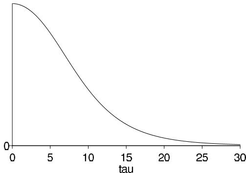  
Figure 13.1 Marginal posterior density, $p(\tau | y)$ , for the standard deviation of the population of school effects $\theta_{j}$ in the educational testing example. If we were to choose to summarize this distribution by its mode, we would be in the uncomfortable position of setting $\hat{\tau} = 0$ , an estimate on the boundary of parameter space.

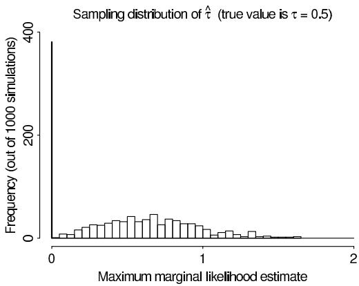

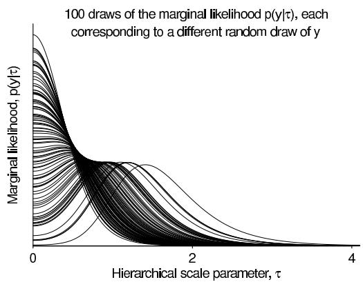  
Figure 13.2 From a simple one-dimensional hierarchical model with scale parameter 0.5 and data in 10 groups: (a) Sampling distribution of the marginal posterior mode of $\tau$ under a uniform prior distribution, based on 1000 simulations of data from the model. (b) 100 simulations of the marginal likelihood, $p(y|\tau)$ . In this example, the point estimate is noisy and the likelihood function is not very informative about $\tau$ .

From a fully Bayesian perspective, the posterior distribution represented in Figure 13.1 is no problem. The uniform prior distribution on $\tau$ allows the possibility that this parameter can be arbitrarily small, but we are assigning a zero probability on the event that $\tau = 0$ exactly. The resulting posterior distribution is defined on a continuous space and we can summarize it with random simulations or, if we want a point summary, by the posterior median (which in this example takes on the reasonable value of 4.9).

The problem of zero mode of the marginal likelihood does not only arise in the 8-schools example. We illustrate with a stripped-down example with $J = 10$ groups:

$$
y _ {j} \sim \mathrm {N} (\theta_ {j}, 1), \text {f o r} j = 1, \dots , J,
$$

for simplicity modeling the $\theta_{j}$ 's with a normal distribution centered at zero:

$$
\theta_ {j} \sim \mathrm {N} (0, \tau^ {2}).
$$

In our simulation, we assume $\tau = 0.5$ .

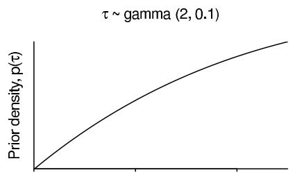

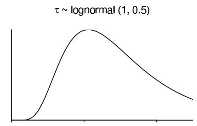

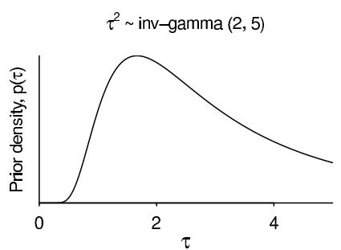

Figure 13.3 Various possible zero-avoiding prior densities for $\tau$ , the group-level standard deviation parameter in the 8 schools example. We prefer the gamma with 2 degrees of freedom, which hits zero at $\tau = 0$ (thus ensuring a nonzero posterior mode) but clears zero for any positive $\tau$ . In contrast, the lognormal and inverse-gamma priors effectively shut off $\tau$ in some positive region near zero, or rule out high values of $\tau$ . These are behaviors we do not want in a default prior distribution.   
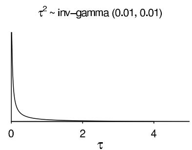  
All these priors are intended for use in constructing penalized likelihood (posterior mode) estimates; if we were doing full Bayes and averaging over the posterior distribution of $\tau$ , we would be happy with a uniform or half-Cauchy prior density, as discussed in Section 5.7.

From this model, we create 1000 simulated datasets $y$ ; for each we determine the marginal likelihood and the value at which it takes on its maximum.

Figure 13.2a shows the sampling distribution of the maximum marginal likelihood estimate of $\tau$ (in this simple example, we just solve for $\hat{\tau}$ in the equation $1 + \hat{\tau}^2 = \frac{1}{J}\sum_{j=1}^{J}y_j^2$ , with the boundary constraint that $\hat{\tau} = 0$ if $\frac{1}{J}\sum_{j=1}^{J}y_j^2 < 1$ ). In almost half the simulations, the marginal likelihood is maximized at $\hat{\tau} = 0$ . There is enough noise here that it is almost impossible to do anything more than bound the group-level variance; the data do not allow an accurate estimate.

# Zero-avoiding prior distribution for a group-level variance parameter

The problems in the above examples arise because the mode is taken as a posterior summary. If we are planning to summarize the posterior distribution by its mode (perhaps for computational convenience or as a quick approximation, as discussed in this chapter), it can make sense to choose the prior distribution accordingly.

What is an appropriate noninformative prior distribution, $p(\tau)$ , that will avoid boundary estimates in an 8-schools-like problem in which inferences are summarized by the posterior mode? To start with, $p(\tau)$ must be zero at $\tau = 0$ .

Several convenient probability models on positive random variables have this property, including the lognormal $(\log \tau \sim \mathrm{N}(\mu_{\tau},\sigma_{\tau}^{2}))$ which is convenient given our familiarity with the normal distribution, and the inverse-gamma $(\tau^2\sim \mathrm{Inv - gamma}(\alpha_\tau ,\beta_\tau))$ which is conditionally conjugate in the hierarchical models we have been considering. Unfortunately, both these classes of prior distribution cut off too sharply near zero. The lognormal and the inverse-gamma both have effective lower bounds, below which the prior density declines so

rapidly as to effectively shut off some range of $\tau$ near zero. If the scale parameters on these models are set to be vague enough, this lower bound can be made extremely low, but then the prior becomes strongly peaked. There is thus no reasonable default setting with these models; the user must either choose a vague prior which rules out values of $\tau$ near zero, or a distribution that is highly informative on the scale of the data.

Instead we prefer a prior model such as $\tau \sim \mathrm{Gamma}(2, \frac{2}{A})$ , a gamma distribution with shape 2 and some large scale parameter. This density starts at 0 when $\tau = 0$ and then increases linearly from there, eventually curving gently back to zero for large values of $\tau$ . The linear behavior at $\tau = 0$ ensures that no matter how concentrated the likelihood is near zero, the posterior distribution will remain consistent with the data, a property that does not hold with the lognormal or inverse-gamma prior distributions.

Again, the purpose of this prior distribution is to give a good estimate when the posterior distribution for $\tau$ is to be summarized by its mode, as is often the case in statistical computations with hierarchical models. If we were planning to use posterior simulations, we would generally not see any advantage to the gamma prior distribution and instead would go with the uniform or half-Cauchy as default choices, as discussed in Chapter 5.

Boundary-avoiding prior distribution for a correlation parameter

We next illustrate the difficulty of estimating correlation parameters, using a simple model of a varying-intercept, varying-slope regression with a $2 \times 2$ group-level variance matrix.

Within each group $j = 1, \dots, J$ , we assume a linear model:

$$
y _ {i j} \sim \mathrm {N} \left(\theta_ {j 1} + \theta_ {j 2} x _ {i}, 1\right), \text {f o r} i = 1, \dots , n _ {j}.
$$

For our simulation we draw the $x_{i}$ 's independently from a unit normal distribution and set $n_j = 5$ for all $j$ . As before, we consider $J = 10$ groups.

The two regression parameters in each group $j$ are modeled as a random draw from a normal distribution:

$$
\left( \begin{array}{l} \theta_ {j 1} \\ \theta_ {j 2} \end{array} \right) \sim \mathrm {N} \left(\left( \begin{array}{l} 0 \\ 0 \end{array} \right), \left( \begin{array}{l l} \tau_ {1} ^ {2} & \rho \tau_ {1} \tau_ {2} \\ \rho \tau_ {1} \tau_ {2} & \tau_ {2} ^ {2} \end{array} \right)\right).
$$

As in the previous example, we average over the linear parameters $\theta$ and work with the marginal likelihood, which can be computed analytically as

$$
p (y | \tau_ {1}, \tau_ {2}, \rho) = \prod_ {j = 1} ^ {J} \mathrm {N} (\hat {\theta} _ {j} | 0, V _ {j} + T),
$$

where $\hat{\theta}_j$ and $V_{j}$ are the least-squares estimate and corresponding covariance matrix from regressing $y$ on $x$ for the data in group $j$ , and $T = \left( \begin{array}{cc}\tau_1^2 & \rho \tau_1\tau_2\\ \rho \tau_1\tau_2 & \tau_2^2 \end{array} \right)$ .

For this example, we assume the true values of the variance parameters are $\tau_{1} = \tau_{2} = 0.5$ and $\rho = 0$ . For the goal of getting an estimate of $\rho$ that is stable and far from the boundary, setting the true value to 0 should be a best-case scenario. Even here, though, it turns out we have troubles.

As before, we simulate data and compute the marginal likelihood 1000 times. For this example we are focusing on $\rho$ so we look at the value of $\rho$ in the maximum marginal likelihood estimate of $(\tau_{1},\tau_{2},\rho)$ and we also look at the profile likelihood for $\rho$ ; that is, the function $L_{\mathrm{profile}}(\rho |y) = \max_{\tau_1,\tau_2}p(y|\tau_1,\tau_2,\rho)$ . As is standard in regression models, all these definitions are implicitly conditional on $x$ , a point we discuss further in Section 14.1. For each simulation, we compute the profile likelihood as a function of $\rho$ using a numerical optimization routine applied separately to each $\rho$ in a grid. The optimization is

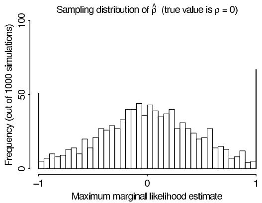

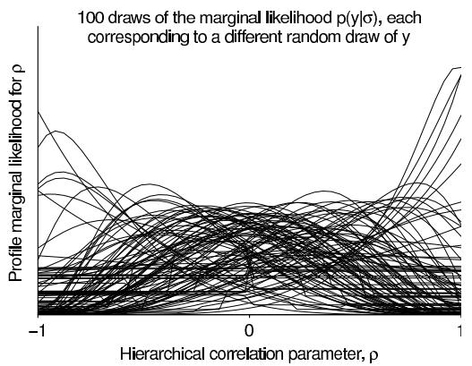  
Figure 13.4 From a simulated varying-intercept, varying-slope hierarchical regression with identity group-level covariance matrix: (a) Sampling distribution of the maximum marginal likelihood estimate $\hat{\rho}$ of the group-level correlation parameter, based on 1000 simulations of data from the model. (b) 100 simulations of the marginal profile likelihood, $L_{\mathrm{profile}}(\rho |y) = \max_{\tau_1,\tau_2}p(y|\tau_1,\tau_2,\rho)$ . In this example, the maximum marginal likelihood estimate is extremely variable and the likelihood function is not very informative about $\rho$ . (In some cases, the profile likelihood for $\rho$ is flat in some places; this occurs when the corresponding estimate of one of the variance parameters ( $\tau_{1}$ or $\tau_{2}$ ) is zero, in which case $\rho$ is not identified.)

easy enough, because the marginal likelihood function can be written in closed form. The marginal posterior density for $\rho$ , averaging over a uniform prior on $(\tau_{1},\tau_{2},\rho)$ , would take more effort to work out but would yield similar results.

Figure 13.4 displays the results. In 1000 simulations, the maximum marginal likelihood estimate of group-level correlation is on the boundary $(\hat{\rho} = \pm 1)$ over $10\%$ of the time, and the profile marginal likelihood for $\rho$ is typically not very informative. In a fully Bayesian setting, we would average over $\rho$ ; in a penalized likelihood framework, we want a more stable point estimate.

If the plan is to summarize inference by the posterior mode of $\rho$ , we would replace the $\mathrm{U}(-1,1)$ prior distribution with $p(\rho) \propto (1 - \rho)(1 + \rho)$ , which is equivalent to a $\mathrm{Beta}(2,2)$ on the transformed parameter $\frac{\rho + 1}{2}$ . The prior and resulting posterior densities are zero at the boundaries and thus the posterior mode will never be $-1$ or $1$ . However, as with the $\mathrm{Gamma}(2,\frac{2}{A})$ prior distribution for $\tau$ discussed earlier in this section, the prior density for $\rho$ is linear near the boundaries and thus will not contradict any likelihood.

# Degeneracy-avoiding prior distribution for a covariance matrix

More generally, we want any mode-based point estimate or computational approximation of a covariance matrix to be non-degenerate, that is, to have positive variance parameters and a positive-definite correlation matrix. Again, we can ensure this property in the posterior mode by choosing a prior density that goes to zero when the covariance matrix is degenerate. By analogy to the one- and two-dimensional solutions above, for a general $d \times d$ covariance matrix we choose the Wishart( $d + 3$ , $AI$ ) prior density, which is zero but with a positive constant derivative at the boundary. As before, we can set $A$ to a large value based on the context of the problem. The resulting estimate of the covariance matrix is always positive definite but without excluding estimates near the boundary if they are supported by the likelihood.

In the limit of large values of $A$ , the Wishart( $d + 3, AI$ ) prior distribution on a covariance matrix corresponds to independent Gamma(2, δ) prior distributions on each of the $d$

eigenvalues with $\delta \rightarrow 0$ and thus can be seen as a generalization of our default model for variance parameters given above. In two dimensions, the multivariate model in the limit $A\to \infty$ corresponds to the prior distribution $p(\rho)\propto (1 + \rho)(1 - \rho)$ as before.

Again, we see this family of default Wishart prior distributions as a noninformative choice if the plan is to summarize or approximate inference for the covariance matrix by the posterior mode. For full Bayesian inference, there would be no need to choose a prior distribution that hits zero at the boundary; we would prefer something like a scaled inverse-Wishart model that generalizes the half-Cauchy prior distribution discussed in Section 5.7.

# 13.3 Normal and related mixture approximations

Fitting multivariate normal densities based on the curvature at the modes

Once the mode or modes have been found (perhaps after including a boundary-avoiding prior distribution as discussed in the previous section), we can construct an approximation based on the (multivariate) normal distribution. For simplicity we first consider the case of a single mode at $\hat{\theta}$ , where we fit a normal distribution to the first two derivatives of the log posterior density function at $\hat{\theta}$ :

$$
p _ {\mathrm {n o r m a l a p p r o x}} (\theta) = \mathrm {N} (\theta | \hat {\theta}, V _ {\theta}).
$$

The variance matrix is the inverse of the curvature of the log posterior density at the mode, $V_{\theta} = \left[-\frac{d^{2}\log p(\theta|y)}{d\theta^{2}}\bigg|_{\theta = \hat{\theta}}\right]^{-1}$ , and this second derivative can be calculated analytically for some problems or else approximated numerically as in (13.2). As usual, before fitting a normal density, it makes sense to transform parameters as appropriate, often using logarithms and logits, so that they are defined on the whole real line with roughly symmetric distributions (remembering to multiply the posterior density by the Jacobian of the transformation, as in Section 1.8).

Laplace's method for analytic approximation of integrals

Instead of approximating just the posterior with normal distribution, we can use Laplace's method to approximate integrals of a smooth function times the posterior $h(\theta) p(\theta | y)$ . The approximation is proportional to a (multivariate) normal density in $\theta$ , and its integral is just

$$
\mathrm {a p p r o x i m a t i o n o f} \operatorname {E} (h (\theta) | y): h (\theta_ {0}) p (\theta_ {0} | y) (2 \pi) ^ {d / 2} | - u ^ {\prime \prime} (\theta_ {0}) | ^ {1 / 2},
$$

where $d$ is the dimension of $\theta$ , $u(\theta) = \log(h(\theta)p(\theta|y))$ , and $\theta_0$ is the point at which $u(\theta)$ is maximized.

If $h(\theta)$ is a fairly smooth function, this approximation can be reasonable, due to the approximate normality of the posterior distribution, $p(\theta | y)$ , for large sample sizes (recall Chapter 4). Because Laplace's method is based on normality, it is most effective for unimodal posterior densities, or when applied separately to each mode of a multimodal density. We use Laplace's method to compute the relative masses of the densities in a normal-mixture approximation to a multimodal density (13.4).

Laplace's method using unnormalized densities. If we are only able to compute the unnormalized density $q(\theta | y)$ , we can apply Laplace's method separately to $hq$ and $q$ to evaluate the numerator and denominator here:

$$
\operatorname {E} (h (\theta) | y) = \frac {\int h (\theta) q (\theta | y) d \theta}{\int q (\theta | y) d \theta}. \tag {13.3}
$$

Mixture approximation for multimodal densities

Now suppose we have found $K$ modes in the posterior density. The posterior distribution can then be approximated by a mixture of $K$ multivariate normal distributions, each with its own mode $\hat{\theta}_k$ , variance matrix $V_{\theta k}$ , and relative mass $\omega_k$ . That is, the target density $p(\theta | y)$ can be approximated by

$$
p _ {\mathrm {n o r m a l a p p r o x}} (\theta) \propto \sum_ {k = 1} ^ {K} \omega_ {k} \mathrm {N} (\theta | \hat {\theta} _ {k}, V _ {\theta k}).
$$

For each $k$ , the mass $\omega_{k}$ of the $k$ th component of the multivariate normal mixture can be estimated by equating the posterior density, $p(\hat{\theta}_k|y)$ , or the unnormalized posterior density, $q(\hat{\theta}_k|y)$ , to the approximation, $p_{\mathrm{normal~approx}}(\hat{\theta}_k)$ , at each of the $K$ modes. If the modes are fairly widely separated and the normal approximation is appropriate for each mode, then we obtain

$$
\omega_ {k} = q \left(\hat {\theta} _ {k} | y\right) \left| V _ {\theta k} \right| ^ {1 / 2}, \tag {13.4}
$$

which yields the normal-mixture approximation

$$
p _ {\mathrm {n o r m a l a p p r o x}} (\theta) \propto \sum_ {k = 1} ^ {K} q (\hat {\theta} _ {k} | y) \exp \left(- \frac {1}{2} (\theta - \hat {\theta} _ {k}) ^ {T} V _ {\theta k} ^ {- 1} (\theta - \hat {\theta} _ {k})\right).
$$

Multivariate $t$ approximation instead of the normal

For a broader distribution, one can replace each normal density by a multivariate $t$ with some small number of degrees of freedom, $\nu$ . The corresponding approximation is a mixture density function that has the functional form,

$$
p _ {t \mathrm {a p p r o x}} (\theta) \propto \sum_ {k = 1} ^ {K} q (\hat {\theta} _ {k} | y) \left(\nu + (\theta - \hat {\theta} _ {k}) ^ {T} V _ {\theta k} ^ {- 1} (\theta - \hat {\theta} _ {k})\right) ^ {- (d + \nu) / 2},
$$

where $d$ is the dimension of $\theta$ . A value such as $\nu = 4$ , which provides three finite moments for the approximating density, has worked in some examples.

Several strategies can be used to improve the approximate distribution further, including analytically fitting the approximation to locations other than the modes, such as saddle points or tails, of the distribution; analytically or numerically integrating out some components; or moving to an iterative scheme such as variational Bayes or expectation propagation, as described in Sections 13.7 and 13.8.

# Sampling from the approximate posterior distributions

It is easy to draw random samples from the multivariate normal or $t$ -mixture approximations. To generate a single sample from the approximation, first choose one of the $K$ mixture components using the relative probability masses of the mixture components, $\omega_{k}$ , as multinomial probabilities. Appendix A provides details on how to sample from a single multivariate normal or $t$ distribution using the Cholesky factorization of the scale matrix.

The sample drawn from the approximate posterior distribution can be used in importance sampling, or an improved sample can be obtained using importance resampling, as described in Section 10.4.

# 13.4 Finding marginal posterior modes using EM

In problems with many parameters, normal approximations to the joint distribution are often useless, and the joint mode is typically not helpful. It is often useful, however, to base an approximation on a marginal posterior mode of a subset of the parameters; we use the notation $\theta = (\gamma, \phi)$ and suppose we are interested in first approximating $p(\phi | y)$ . After approximating $p(\phi | y)$ as a normal or $t$ or a mixture of these, we may be able to approximate the conditional distribution, $p(\gamma | \phi, y)$ , as normal (or $t$ , or a mixture) with parameters depending on $\phi$ . In this section we address the first problem, and in the next section we address the second.

The EM algorithm can be viewed as an iterative method for finding the mode of the marginal posterior density, $p(\phi |y)$ , and is extremely useful for many common models for which it is hard to maximize $p(\phi |y)$ directly but easy to work with $p(\gamma |\phi ,y)$ and $p(\phi |\gamma ,y)$ . Examples of the EM algorithm appear in the later chapters of this book, including Sections 18.4, 18.6, and 22.2; we introduce the method here.

If we think of $\phi$ as the parameters in our problem and $\gamma$ as missing data, the EM algorithm formalizes a relatively old idea for handling missing data: start with a guess of the parameters and then (1) replace missing values by their expectations given the guessed parameters, (2) estimate parameters assuming the missing data are equal to their estimated values, (3) re-estimate the missing values assuming the new parameter estimates are correct, (4) re-estimate parameters, and so forth, iterating until convergence. In fact, the EM algorithm is more efficient than these four steps would suggest since each missing value is not estimated separately; instead, those functions of the missing data that are needed to estimate the model parameters are estimated jointly.

The name 'EM' comes from the two alternating steps: finding the expectation of the needed functions (the sufficient statistics) of the missing values, and maximizing the resulting posterior density to estimate the parameters as if these functions of the missing data were observed. For many standard models, both steps—estimating the missing values given a current estimate of the parameter and estimating the parameters given current estimates of the missing values—are straightforward. EM is widely applicable because many models, including mixture models and some hierarchical models, can be re-expressed as distributions on augmented parameter spaces, where the added parameters $\gamma$ can be thought of as missing data.

# Derivation of the EM and generalized EM algorithms

In the notation of this chapter, EM finds the modes of the marginal posterior distribution, $p(\phi |y)$ , averaging over the parameters $\gamma$ . A more conventional presentation, in terms of missing and complete data, appears in Section 18.2. We show here that each iteration of the EM algorithm increases the value of the log posterior density until convergence. We start with the simple identity

$$
\log p (\phi | y) = \log p (\gamma , \phi | y) - \log p (\gamma | \phi , y)
$$

and take expectations of both sides, treating $\gamma$ as a random variable with the distribution $p(\gamma |\phi^{\mathrm{old}},y)$ , where $\phi^{\mathrm{old}}$ is the current (old) guess. The left side of the above equation does not depend on $\gamma$ , so averaging over $\gamma$ yields

$$
\log p (\phi | y) = \mathrm {E} _ {\text {o l d}} \left(\log p (\gamma , \phi | y)\right) - \mathrm {E} _ {\text {o l d}} \left(\log p (\gamma | \phi , y)\right), \tag {13.5}
$$

where $\mathrm{E}_{\mathrm{old}}$ is an average over $\gamma$ under the distribution $p(\gamma |\phi^{\mathrm{old}},y)$ . The last term on the right side of (13.5), $\mathrm{E}_{\mathrm{old}}(\log p(\gamma |\phi ,y))$ , is maximized at $\phi = \phi^{\mathrm{old}}$ (see Exercise 13.6). The other term, the expected log joint posterior density, $\mathrm{E}_{\mathrm{old}}(\log p(\gamma ,\phi |y))$ , is repeatedly used

in computation,

$$
\operatorname {E} _ {\mathrm {o l d}} (\log p (\gamma , \phi | y)) = \int (\log p (\gamma , \phi | y)) p (\gamma | \phi^ {\mathrm {o l d}}, y) d \gamma .
$$

This expression is called $Q(\phi|\phi^{\mathrm{old}})$ in the EM literature, where it is viewed as the expected complete-data log-likelihood.

Now consider any value $\phi^{\mathrm{new}}$ for which $\mathrm{E_{old}}(\log p(\gamma ,\phi^{\mathrm{new}}|y)) > \mathrm{E_{old}}(\log p(\gamma ,\phi^{\mathrm{old}}|y))$ . If we replace $\phi^{\mathrm{old}}$ by $\phi^{\mathrm{new}}$ , we increase the first term on the right side of (13.5), while not increasing the second term, and so the total must increase: $\log p(\phi^{\mathrm{new}}|y) > \log p(\phi^{\mathrm{old}}|y)$ . This idea motivates the generalized EM (GEM) algorithm: at each iteration, determine $\mathrm{E_{old}}(\log p(\gamma ,\phi |y))$ —considered as a function of $\phi$ and update $\phi$ to a new value that increases this function. The EM algorithm is the special case in which the new value of $\phi$ is chosen to maximize $\mathrm{E_{old}}(\log p(\gamma ,\phi |y))$ , rather than merely increase it. The EM and GEM algorithms both have the property of increasing the marginal posterior density, $p(\phi |y)$ , at each iteration.

Because the marginal posterior density, $p(\phi |y)$ , increases in each step of the EM algorithm, and because the $Q$ function is maximized at each step, EM converges to a local mode of the posterior density except in some special cases. (Because the GEM algorithm does not maximize at each step, it does not necessarily converge to a local mode.) The rate at which the EM algorithm converges to a local mode depends on the proportion of 'information' about $\phi$ in the joint density, $p(\gamma ,\phi |y)$ , that is missing from the marginal density, $p(\phi |y)$ . It can be slow to converge if the proportion of missing information is large; see the bibliographic note at the end of this chapter for many theoretical and applied references on this topic.

# Implementation of the EM algorithm

The EM algorithm can be described algorithmically as follows.

1. Start with a crude parameter estimate, $\phi^0$

2. For $t = 1,2,\ldots$

(a) E-step: Determine the expected log posterior density function,

$$
\operatorname {E} _ {\mathrm {o l d}} (\log p (\gamma , \phi | y)) = \int p (\gamma | \phi^ {\mathrm {o l d}}, y) \log p (\gamma , \phi | y) d \gamma ,
$$

where the expectation averages over the conditional posterior distribution of $\gamma$ , given the current estimate, $\phi^{\mathrm{old}} = \phi^{t - 1}$ .

(b) M-step: Let $\phi^t$ be the value of $\phi$ that maximizes $E_{\mathrm{old}}(\log p(\gamma, \phi | y))$ . For the GEM algorithm, it is only required that $E_{\mathrm{old}}(\log p(\gamma, \phi | y))$ be increased, not necessarily maximized.

As we have seen, the marginal posterior density, $p(\phi | y)$ , increases at each step of the EM algorithm, so that, except in some special cases, the algorithm converges to a local mode of the posterior density.

Finding multiple modes. A simple way to search for multiple modes with EM is to start the iterations at many points throughout the parameter space. If we find several modes, we can roughly compare their relative masses using a normal approximation, as described in the previous section.

Debugging. A useful debugging check when running an EM algorithm is to compute the logarithm of the marginal posterior density, $\log p(\phi^t |y)$ , at each iteration, and check that it increases monotonically. This computation is recommended for all problems for which it is relatively easy to compute the marginal posterior density.

# Example. Normal distribution with unknown mean and variance and partially conjugate prior distribution

Suppose we weigh an object on a scale $n$ times, and the weighings, $y_{1},\ldots ,y_{n}$ , are assumed independent with a $\mathrm{N}(\mu ,\sigma^2)$ distribution, where $\mu$ is the true weight of the object. For simplicity, we assume a $\mathrm{N}(\mu_0,\tau_0^2)$ prior distribution on $\mu$ (with $\mu_0$ and $\tau_0$ known) and the standard noninformative uniform prior distribution on $\log \sigma$ ; these form a partially conjugate joint prior distribution.

Because the model is not fully conjugate, there is no standard form for the joint posterior distribution of $(\mu, \sigma)$ and no closed-form expression for the marginal posterior density of $\mu$ . We can, however, use the EM algorithm to find the marginal posterior mode of $\mu$ , averaging over $\sigma$ ; that is, $(\mu, \sigma)$ corresponds to $(\phi, \gamma)$ in the general notation.

Joint log posterior density. The logarithm of the joint posterior density is

$$
\log p (\mu , \sigma | y) = - \frac {1}{2 \tau_ {0} ^ {2}} \left(\mu - \mu_ {0}\right) ^ {2} - (n + 1) \log \sigma - \frac {1}{2 \sigma^ {2}} \sum_ {i = 1} ^ {n} \left(y _ {i} - \mu\right) ^ {2} + \text {c o n s t a n t}, \tag {13.6}
$$

ignoring terms that do not depend on $\mu$ or $\sigma^2$ .

$E$ -step. For the E-step of the EM algorithm, we must determine the expectation of (13.6), averaging over $\sigma$ and conditional on the current guess, $\mu^{\mathrm{old}}$ , and $y$ :

$$
\begin{array}{l} \mathrm {E} _ {\mathrm {o l d}} \log p (\mu , \sigma | y) = - \frac {1}{2 \tau_ {0} ^ {2}} (\mu - \mu_ {0}) ^ {2} - (n + 1) \mathrm {E} _ {\mathrm {o l d}} (\log \sigma) \\ - \frac {1}{2} \mathrm {E} _ {\text {o l d}} \left(\frac {1}{\sigma^ {2}}\right) \sum_ {i = 1} ^ {n} \left(y _ {i} - \mu\right) ^ {2} + \text {c o n s t a n t}. \tag {13.7} \\ \end{array}
$$

We must now evaluate $\mathrm{E_{old}}(\log \sigma)$ and $\mathrm{E_{old}}\left(\frac{1}{\sigma^2}\right)$ . Actually, we need evaluate only the latter expression, because the former expression is not linked to $\mu$ in (13.7) and thus will not affect the M-step. The expression $\mathrm{E_{old}}\left(\frac{1}{\sigma^2}\right)$ can be evaluated by noting that, given $\mu$ , the posterior distribution of $\sigma^2$ is that for a normal distribution with known mean and unknown variance, which is scaled inverse- $\chi^2$ :

$$
\sigma^ {2} | \mu , y \sim \mathrm {I n v -} \chi^ {2} \left(n, \frac {1}{n} \sum_ {i = 1} ^ {n} (y _ {i} - \mu) ^ {2}\right).
$$

Then the conditional posterior distribution of $\frac{1}{\sigma^2}$ is a scaled $\chi^2$ , and

$$
\mathrm {E} _ {\mathrm {o l d}} \left(\frac {1}{\sigma^ {2}}\right) = \mathrm {E} \left(\frac {1}{\sigma^ {2}} \Bigg | \mu^ {\mathrm {o l d}}, y\right) = \left(\frac {1}{n} \sum_ {i = 1} ^ {n} (y _ {i} - \mu^ {\mathrm {o l d}}) ^ {2}\right) ^ {- 1}.
$$

We can then re-express (13.7) as

$$
\operatorname {E} _ {\text {o l d}} \log p (\mu , \sigma | y) = - \frac {1}{2 \tau_ {0} ^ {2}} (\mu - \mu_ {0}) ^ {2} - \frac {1}{2} \left(\frac {1}{n} \sum_ {i = 1} ^ {n} \left(y _ {i} - \mu^ {\text {o l d}}\right) ^ {2}\right) ^ {- 1} \sum_ {i = 1} ^ {n} \left(y _ {i} - \mu\right) ^ {2} + \text {c o n s t .} \tag {13.8}
$$

$M$ -step. For the M-step, we must find the $\mu$ that maximizes the above expression. For this problem, the task is straightforward, because (13.8) has the form of a normal log posterior density, with prior distribution $\mu \sim \mathrm{N}(\mu_0,\tau_0^2)$ and $n$ data points $y_{i}$ , each with variance $\frac{1}{n}\sum_{i = 1}^{n}(y_i - \mu^{\mathrm{old}})^2$ . The M-step is achieved by the mode of the

equivalent posterior density, which is

$$
\mu^ {\mathrm {n e w}} = \frac {\frac {1}{\tau_ {0} ^ {2}} \mu_ {0} + \frac {n}{\frac {1}{n} \sum_ {i = 1} ^ {n} (y _ {i} - \mu^ {\mathrm {o l d}}) ^ {2}} \overline {{y}}}{\frac {1}{\tau_ {0} ^ {2}} + \frac {n}{\frac {1}{n} \sum_ {i = 1} ^ {n} (y _ {i} - \mu^ {\mathrm {o l d}}) ^ {2}}}.
$$

If we iterate this computation, $\mu$ converges to the marginal mode of $p(\mu |y)$ .

# Extensions of the EM algorithm

Variants and extensions of the basic EM algorithm increase the range of problems to which the algorithm can be applied, and some versions can converge much more quickly than the basic EM algorithm. In addition, the EM algorithm and its extensions can be supplemented with calculations that obtain the second derivative matrix for use as an estimate of the asymptotic variance at the mode. We describe some of these modifications here.

The ECM algorithm. The ECM algorithm is a variant of the EM algorithm in which the M-step is replaced by a set of conditional maximizations, or CM-steps. Suppose that $\phi^t$ is the current iterate. The E-step is unchanged: the expected log posterior density is computed, averaging over the conditional posterior distribution of $\gamma$ given the current iterate. The M-step is replaced by a set of $S$ conditional maximizations. At the $s$ th conditional maximization, the value of $\phi^{t + s / S}$ is found that maximizes the expected log posterior density among all $\phi$ such that $g_{s}(\phi) = g_{s}(\phi^{t + (s - 1) / S})$ with the $g_{s}(\cdot)$ known as constraint functions. The output of the last CM-step, $\phi^{t + S / S} = \phi^{t + 1}$ , is the next iterate of the ECM algorithm. The set of constraint functions, $g_{s}(\cdot), s = 1, \ldots, S$ , must satisfy certain conditions in order to guarantee convergence to a stationary point. The most common choice of constraint function is the indicator function for the $s$ th subset of the parameters. The parameter vector $\phi$ is partitioned into $S$ disjoint and exhaustive subsets, $(\phi_{1}, \ldots, \phi_{S})$ , and at the $s$ th conditional maximization step, all parameters except those in $\phi_{s}$ are constrained to equal their current values, $\phi_{j}^{t + s / S} = \phi_{j}^{t + (s - 1) / S}$ for $j \neq s$ . An ECM algorithm based on a partitioning of the parameters is an example of a generalized EM algorithm. Moreover, if each of the CM steps maximizes by setting first derivatives equal to zero, then ECM shares with EM the property that it will converge to a local mode of the marginal posterior distribution of $\phi$ . Because the log posterior density, $p(\phi | y)$ , increases with every iteration of the ECM algorithm, its monotone increase can still be used for debugging.

As described in the previous paragraph, ECM performs several CM-steps after each E-step. The multicycle ECM algorithm performs additional E-steps during a single iteration. For example, one might perform an additional E-step before each conditional maximization. Multicycle ECM algorithms require more computation for each iteration than the ECM algorithm but can sometimes reach approximate convergence with fewer total iterations.

The ECME algorithm. The ECME algorithm is an extension of ECM that replaces some of the conditional maximization steps of the expected log joint density, $\mathrm{E}_{\mathrm{old}}(\log p(\gamma ,\phi |y))$ , with conditional maximization steps of the actual log posterior density, $\log p(\phi |y)$ . The last E in the acronym refers to the choice of maximizing either the actual log posterior density or the expected log posterior density. Iterations of ECME also increase the log posterior density at each iteration. Moreover, if each conditional maximization sets first derivatives equal to zero, ECME will converge to a local mode.

ECME can be especially helpful at increasing the rate of convergence, since the actual marginal posterior density is being increased on some steps rather than the full posterior density averaged over the current estimate of the distribution of the other parameters. The increase in speed of convergence can be dramatic when faster converging numerical methods (such as Newton's method) are applied directly to the marginal posterior density on some of the CM-steps. For example, if one CM-step requires a one-dimensional search to maximize

the expected log joint posterior density then the same effort can be applied directly to the logarithm of the marginal posterior density of interest.

The AECM algorithm. The ECME algorithm can be further generalized by allowing different alternating definitions of $\gamma$ at each conditional maximization step. This generalization is most straightforward when $\phi$ represents missing data, and where there are different ways of completing the data at different maximization steps. In some problems the alternation can allow much faster convergence. The AECM algorithm shares with EM the property of converging to a local mode with an increase in the posterior density at each step.

# Supplemented EM and ECM algorithms

The EM algorithm is attractive because it is often easy to implement and has stable and reliable convergence properties. The basic algorithm and its extensions can be enhanced to produce an estimate of the asymptotic variance matrix at the mode, which is useful in forming approximations to the marginal posterior density. The supplemented EM (SEM) algorithm and the supplemented ECM (SECM) algorithm use information from the log joint posterior density and repeated EM- or ECM-steps to obtain the approximate asymptotic variance matrix for the parameters $\phi$ .

To describe the SEM algorithm we introduce the notation $M(\phi)$ for the mapping defined implicitly by the EM algorithm, $\phi^{t + 1} = M(\phi^t)$ . The asymptotic variance matrix $V$ is

$$
V = V _ {\text {j o i n t}} + V _ {\text {j o i n t}} D _ {M} (I - D _ {M}) ^ {- 1},
$$

where $D_M$ is the Jacobian matrix for the EM map evaluated at the marginal mode, $\hat{\phi}$ , and $V_{\mathrm{joint}}$ is the asymptotic variance matrix based on the logarithm of the joint posterior density averaged over $\gamma$ ,

$$
V _ {\mathrm {j o i n t}} = \left[ \operatorname {E} \left(- \left. \frac {d ^ {2} \log p (\phi , \gamma | y)}{d \theta^ {2}} \right| \phi , y\right) \Bigg | _ {\phi = \hat {\phi}} \right] ^ {- 1}.
$$

Typically, $V_{\mathrm{joint}}$ can be computed analytically so that only $D_M$ is required. The matrix $D_M$ is computed numerically at each marginal mode using the E- and M-steps according to the following algorithm.

1. Run the EM algorithm to convergence, thereby obtaining the marginal mode, $\hat{\phi}$ . (If multiple runs of EM lead to different modes, apply the following steps separately for each mode.)

2. Choose a starting value $\phi^0$ for the SEM calculation such that $\phi^0$ does not equal $\hat{\phi}$ for any component. One possibility is to use the same starting value that is used for the original EM calculation.

3. Repeat the following steps to get a sequence of matrices $R^t$ , $t = 1,2,3,\ldots$ , for which each element $r_{ij}^{t}$ converges to the appropriate element of $D_M$ . In the following we describe the steps used to generate $R^t$ given the current EM iterate, $\phi^t$ .

(a) Run the usual E-step and M-step with input $\phi^t$ to obtain $\phi^{t + 1}$ .   
(b) For each element of $\phi$ , say $\phi_i$ :

i. Define $\phi^t (i)$ equal to $\hat{\phi}$ except for the $i$ th element, which is replaced by its current value $\phi_i^t$ .

ii. Run one E-step and one M-step treating $\phi^t (i)$ as the input value of the parameter vector, $\phi$ . Denote the result of these E- and M-steps as $\phi^{t + 1}(i)$ . The $i$ th row of $R^t$ is computed as

$$
r _ {i j} ^ {t} = \frac {\phi_ {j} ^ {t + 1} (i) - \hat {\phi} _ {j}}{\phi_ {i} ^ {t} - \hat {\phi} _ {i}}, \mathrm {f o r e a c h} j.
$$

When the value of an element $r_{ij}$ no longer changes, it represents a numerical estimate of the corresponding element of $D_M$ . Once all of the elements in a row have converged, then we need no longer repeat the final step for that row. If some elements of $\phi$ are independent of $\gamma$ , then EM will converge immediately to the mode for that component with the corresponding elements of $D_M$ equal to zero. SEM can be easily modified in such cases to obtain the variance matrix.

The same approach can be used to supplement the ECM algorithm with an estimate of the asymptotic variance matrix. The SECM algorithm is based on the following result:

$$
V = V _ {\mathrm {j o i n t}} + V _ {\mathrm {j o i n t}} (D _ {M} ^ {\mathrm {E C M}} - D _ {M} ^ {\mathrm {C M}}) (I - D _ {M} ^ {\mathrm {E C M}}) ^ {- 1},
$$

with $D_M^{\mathrm{ECM}}$ defined and computed in a manner analogous to $D_M$ in the above discussion except with ECM in place of EM, and where $D_M^{\mathrm{CM}}$ is the rate of convergence for conditional maximization applied directly to $\log p(\phi |y)$ . This latter matrix depends only on $V_{\mathrm{joint}}$ and $\nabla_s = \nabla g_s(\hat{\phi}), s = 1,\dots,S$ , the gradient of the vector of constraint functions $g_{s}$ at $\hat{\phi}$ :

$$
D _ {M} ^ {\mathrm {C M}} = \prod_ {s = 1} ^ {S} \left[ \nabla_ {s} (\nabla_ {s} ^ {T} V _ {\mathrm {j o i n t}} \nabla_ {s}) ^ {- 1} \nabla_ {s} ^ {T} V _ {\mathrm {j o i n t}} \right].
$$

These gradient vectors are trivial to calculate for a constraint that directly fixes components of $\phi$ . In general, SECM appears to require analytic work to compute $V_{\mathrm{joint}}$ and $\nabla_s, s = 1, \ldots, S$ , in addition to applying the numerical computation for $D_M^{\mathrm{ECM}}$ , but some of these calculations can be performed using results from the ECM iterations.

# Parameter-expanded EM (PX-EM)

The various methods discussed in Section 12.1 for improving the efficiency of Gibbs samplers have analogues for mode-finding (and in fact were originally constructed for that purpose). For example, the parameter expansion idea illustrated with the $t$ model on page 295 was originally developed in the context of the EM algorithm. In this setting, the individual latent data variances $V_{i}$ are treated as missing data, and the ECM algorithm maximizes over the parameters $\mu$ , $\tau$ , and $\alpha$ in the posterior distribution.

# 13.5 Approximating conditional and marginal posterior densities

Approximating the conditional posterior density, $p(\gamma |\phi ,y)$

As stated at the beginning of Section 13.4, the normal, multivariate $t$ , and other analytically convenient distributions can be poor approximations to a joint posterior distribution. Often, however, we can partition the parameter vector as $\theta = (\gamma, \phi)$ , in such a way that an analytic approximation works well for the conditional posterior density, $p(\gamma | \phi, y)$ . In general, the approximation will depend on $\phi$ . We write the approximate conditional density as $p_{\mathrm{approx}}(\gamma | \phi, y)$ . For example, in the hierarchical model in Section 5.4, we fitted a normal distribution to $p(\theta, \mu | \tau, y)$ but not to $p(\tau | y)$ (in that example, the normal conditional distribution is an exact fit).

Approximating the marginal posterior density, $p(\phi | y)$ , using an analytic approximation to $p(\gamma | \phi, y)$

The mode-finding techniques and normal approximation of Sections 13.1 and 13.3 can be applied directly to the marginal posterior density if the marginal distribution can be obtained analytically. If not, then the EM algorithm (Section 13.4) may allow us to find the mode of the marginal posterior density and construct an approximation. On occasion it is

not possible to construct an approximation to $p(\phi |y)$ using any of those methods. Fortunately we may still derive an approximation if we have an analytic approximation to the conditional posterior density, $p(\gamma |\phi ,y)$ . We can use a trick used in (5.19) in Section 5.4 to generate an approximation to $p(\phi |y)$ . The approximation is constructed as the ratio of the joint posterior distribution to the analytic approximation of the conditional posterior distribution:

$$
p _ {\text {a p p r o x}} (\phi | y) = \frac {p (\gamma , \phi | y)}{p _ {\text {a p p r o x}} (\gamma | \phi , y)}. \tag {13.9}
$$

The key to this method is that if the denominator has a standard analytic form, we can compute its normalizing factor, which, in general, depends on $\phi$ . When using (13.9), we must also specify a value $\gamma$ (possibly as a function of $\phi$ ) since the left side does not involve $\gamma$ at all. If the analytic approximation to the conditional distribution is exact, the factors of $\gamma$ in the numerator and denominator cancel, and we obtain the marginal posterior density exactly. If the analytic approximation is not exact, a natural value to use for $\gamma$ is the center of the approximate distribution (for example, $\operatorname{E}(\gamma|\phi,y)$ under the normal or $t$ approximations).

For example, suppose we have approximated the $d$ -dimensional conditional density function, $p(\gamma |\phi ,y)$ , by a multivariate normal density with mean $\hat{\gamma}$ and scale matrix $V_{\gamma}$ , both of which depend on $\phi$ . We can then approximate the marginal density of $\phi$ by

$$
p _ {\text {a p p r o x}} (\phi | y) \propto p (\hat {\gamma} (\phi), \phi | y) \left| V _ {\gamma} (\phi) \right| ^ {1 / 2}, \tag {13.10}
$$

where $\phi$ is included in parentheses to indicate that the mean and scale matrix must be evaluated at each value of $\phi$ . The same result holds if a $t$ approximation is used; in either case, the normalizing factor in the denominator of (13.9) is proportional to $|V_{\gamma}(\phi)|^{-1/2}$ .

Improving an approximation using importance resampling We can improve the approximation with importance sampling, using draws of $\gamma$ from each value of $\phi$ at which the approximation is computed. For any given value of $\phi$ , we can write the marginal posterior density as

$$
\begin{array}{l} p (\phi | y) = \int p (\gamma , \phi | y) d \gamma \\ = \int \frac {p (\gamma , \phi | y)}{p _ {\text {a p p r o x}} (\gamma | \phi , y)} p _ {\text {a p p r o x}} (\gamma | \phi , y) d \gamma \\ = \mathrm {E} _ {\text {a p p r o x}} \left(\frac {p (\gamma , \phi | y)}{p _ {\text {a p p r o x}} (\gamma | \phi , y)}\right), \tag {13.11} \\ \end{array}
$$

where $\mathrm{E}_{\mathrm{approx}}$ averages over $\gamma$ using the conditional posterior distribution, $p_{\mathrm{approx}}(\gamma | \phi, y)$ . The importance sampling estimate of $p(\phi | y)$ can be computed by simulating $S$ values $\gamma^s$ from the approximate conditional distribution, computing the joint density and approximate conditional density at each $\gamma^s$ , and then averaging the $S$ values of $p(\gamma^s, \phi | y) / p_{\mathrm{approx}}(\gamma^s | \phi, y)$ . This procedure is then repeated for each point on the grid of $\phi$ . If the normalizing constant for the joint density $p(\gamma, \phi | y)$ is itself unknown, then more complicated computational procedures must be used.

# 13.6 Example: hierarchical normal model (continued)

We illustrate mode-based computations with the hierarchical normal model that we used in Section 11.6. In that section, we illustrated the Gibbs sampler and the Metropolis algorithm as two different ways of drawing posterior samples. In this section, we describe how to get approximate inference by finding the mode of $p(\mu, \log \sigma, \log \tau | y)$ , the marginal posterior density, and a normal approximation centered at the mode. Given $(\mu, \log \sigma, \log \tau)$ , the individual means $\theta_j$ have independent normal conditional posterior distributions.

Table 13.1 Convergence of stepwise ascent to a joint posterior mode for the coagulation example. The joint posterior density increases at each conditional maximization step, as it should. The posterior mode is in terms of $\log \sigma$ and $\log \tau$ , but these values are transformed back to the original scale for display in the table.   

<table><tr><td rowspan="2">Parameter</td><td colspan="4">Stepwise ascent</td></tr><tr><td>Crude estimate</td><td>First iteration</td><td>Second iteration</td><td>Third iteration</td></tr><tr><td>θ1</td><td>61.00</td><td>61.28</td><td>61.29</td><td>61.29</td></tr><tr><td>θ2</td><td>66.00</td><td>65.87</td><td>65.87</td><td>65.87</td></tr><tr><td>θ3</td><td>68.00</td><td>67.74</td><td>67.73</td><td>67.73</td></tr><tr><td>θ4</td><td>61.00</td><td>61.15</td><td>61.15</td><td>61.15</td></tr><tr><td>μ</td><td>64.00</td><td>64.01</td><td>64.01</td><td>64.01</td></tr><tr><td>σ</td><td>2.29</td><td>2.17</td><td>2.17</td><td>2.17</td></tr><tr><td>τ</td><td>3.56</td><td>3.32</td><td>3.31</td><td>3.31</td></tr><tr><td>log p(θ, μ, log σ, log τ|y)</td><td>-63.70</td><td>-61.42</td><td>-61.42</td><td>-61.42</td></tr></table>

# Crude initial parameter estimates

Initial parameter estimates for the computations are easily obtained by estimating $\theta_{j}$ as $\overline{y}_{.j}$ , the average of the observations in the $j$ th group, for each $j$ , and estimating $\sigma^2$ as the average of the $J$ within-group sample variances, $s_j^2 = \sum_{i=1}^{n_j} (y_{ij} - \overline{y}_{.j})^2 / (n_j - 1)$ . We then crudely estimate $\mu$ and $\tau^2$ as the mean and variance of the $J$ estimated values of $\theta_{j}$ . For the coagulation data in Table 11.2, the crude estimates are shown in the first column of Table 13.1.

Conditional maximization to find the joint mode of $p(\theta, \mu, \log \sigma, \log \tau | y)$

Because of the conjugacy of the normal model, it is easy to perform conditional maximization on the joint posterior density, updating each parameter in turn by its conditional mode. In general, we analyze scale parameters such as $\sigma$ and $\tau$ on the logarithmic scale. The conditional modes for each parameter are easy to compute, especially because we have already determined the conditional posterior density functions in computing the Gibbs sampler for this problem in Section 11.6. After obtaining a starting guess for the parameters, the conditional maximization proceeds as follows, where the parameters can be updated in any order.

1. Conditional mode of each $\theta_{j}$ . The conditional posterior distribution of $\theta_{j}$ , given all other parameters in the model, is normal and given by (11.10). For $j = 1,\dots ,J$ , we can maximize the conditional posterior density of $\theta_{j}$ given $(\mu ,\sigma ,\tau ,y)$ (and thereby increase the joint posterior density), by replacing the current estimate of $\theta_{j}$ by $\hat{\theta}_j$ in (11.10).   
2. Conditional mode of $\mu$ . The conditional posterior distribution of $\mu$ , given all other parameters in the model, is normal and given by (11.12). For conditional maximization, replace the current estimate of $\mu$ by $\hat{\mu}$ in (11.13).   
3. Conditional mode of $\log \sigma$ . The conditional posterior density for $\sigma^2$ is scaled inverse- $\chi^2$ and given by (11.14). The mode of the conditional posterior density of $\log \sigma$ is obtained by replacing the current estimate of $\log \sigma$ with $\log \hat{\sigma}$ , with $\hat{\sigma}$ defined in (11.15). (From Appendix A, the conditional mode of $\sigma^2$ is $\frac{n}{n+2} \hat{\sigma}^2$ . The factor of $\frac{n}{n+2}$ does not appear in the conditional mode of $\log \sigma$ because of the Jacobian factor when transforming from $p(\sigma^2)$ to $p(\log \sigma)$ ; see Exercise 13.7.)

4. Conditional mode of $\log \tau$ . The conditional posterior density for $\tau^2$ is scaled inverse- $\chi^2$ and given by (11.16). The mode of the conditional posterior density of $\log \tau$ is obtained by replacing the current estimate of $\log \tau$ with $\log \hat{\tau}$ , with $\hat{\tau}$ defined in (11.17).

Numerical results of conditional maximization for the coagulation example are presented in Table 13.1, from which we see that the algorithm has required only three iterations to reach approximate convergence in this small example. We also see that this posterior mode is extremely close to the crude estimate, which occurs because the shrinkage factors $\frac{\sigma^2}{n_j} / \left(\frac{\sigma^2}{n_j} + \tau^2\right)$ are all near zero. Incidentally, the mode displayed in Table 13.1 is only a local mode; the joint posterior density also has another mode at the boundary of the parameter space; we are not especially concerned with that degenerate mode because the region around it includes little of the posterior mass (see Exercise 13.8).

In a simple applied analysis, we might stop here with an approximate posterior distribution centered at this joint mode, or even just stay with the simpler crude estimates. In other hierarchical examples, however, there might be quite a bit of pooling, as in the educational testing problem of Section 5.5, in which case it is advisable to continue the analysis, as we describe below.

# Factoring into conditional and marginal posterior densities

As discussed, the joint mode often does not provide a useful summary of the posterior distribution, especially when $J$ is large relative to the $n_j$ 's. To investigate this possibility, we consider the marginal posterior distribution of a subset of the parameters. In this example, using the notation of the previous sections, we set $\gamma = (\theta_1, \dots, \theta_J) = \theta$ and $\phi = (\mu, \log \sigma, \log \tau)$ , and we consider the posterior distribution as the product of the marginal posterior distribution of $\phi$ and the conditional posterior distribution of $\theta$ given $\phi$ . The subvector $(\mu, \log \sigma, \log \tau)$ has only three components no matter how large $J$ is, so we expect asymptotic approximations to work better for the marginal distribution of $\phi$ than for the joint distribution of $(\gamma, \phi)$ .

From (11.9) in the Gibbs sampling analysis of the coagulation data in Chapter 11, the conditional posterior density of the normal means, $p(\theta | \mu, \sigma, \tau, y)$ , is a product of independent normal densities with means $\hat{\theta}_j$ and variances $V_{\theta_j}$ that are easily computable functions of $(\mu, \sigma, \tau, y)$ .

The marginal posterior density, $p(\mu, \log \sigma, \log \tau | y)$ , of the remaining parameters, can be determined using formula (13.9), where the conditional distribution $p_{\mathrm{approx}}(\theta | \mu, \log \sigma, \log \tau, y)$ is actually exact. Thus,

$$
\begin{array}{l} p (\mu , \log \sigma , \log \tau | y) = \frac {p (\theta , \mu , \log \sigma , \log \tau | y)}{p (\theta | \mu , \log \sigma , \log \tau , y)} \\ \propto \frac {\tau \prod_ {j = 1} ^ {J} \mathrm {N} (\theta_ {j} | \mu , \tau^ {2}) \prod_ {j = 1} ^ {J} \prod_ {i = 1} ^ {n _ {j}} \mathrm {N} (y _ {i j} | \theta_ {j} , \sigma^ {2})}{\prod_ {j = 1} ^ {J} \mathrm {N} (\theta_ {j} | \hat {\theta} _ {j} , V _ {\theta_ {j}})}. \\ \end{array}
$$

Because the denominator is exact, this identity must hold for any $\theta$ ; to simplify calculations, we set $\theta = \hat{\theta}$ , to yield

$$
p (\mu , \log \sigma , \log \tau | y) \propto \tau \prod_ {j = 1} ^ {J} \mathrm {N} \left(\hat {\theta} _ {j} \mid \mu , \tau^ {2}\right) \prod_ {j = 1} ^ {J} \prod_ {i = 1} ^ {n _ {j}} \mathrm {N} \left(y _ {i j} \mid \hat {\theta} _ {j}, \sigma^ {2}\right) \prod_ {j = 1} ^ {J} V _ {\theta_ {j}} ^ {1 / 2}, \tag {13.12}
$$

with the final factor coming from the normalizing constant of the normal distribution in the denominator, and where $\hat{\theta}_j$ and $V_{\theta_j}$ are defined by (11.11).

Finding the marginal posterior mode of $p(\mu, \log \sigma, \log \tau | y)$ using EM

The marginal posterior mode of $(\mu, \sigma, \tau)$ the maximum of (13.12)-cannot be found analytically because the $\hat{\theta}_j$ 's and $V_{\theta_j}$ 's are functions of $(\mu, \sigma, \tau)$ . One possible approach is Newton's method, which requires computing derivatives and second derivatives analytically or numerically. For this problem, however, it is easier to use the EM algorithm.

To obtain the mode of $p(\mu, \log \sigma, \log \tau | y)$ using EM, we average over the parameter $\theta$ in the E-step and maximize over $(\mu, \log \sigma, \log \tau)$ in the M-step. The logarithm of the joint posterior density of all the parameters is

$$
\begin{array}{l} \log p (\theta , \mu , \log \sigma , \log \tau | y) = - n \log \sigma - (J - 1) \log \tau - \frac {1}{2 \tau^ {2}} \sum_ {j = 1} ^ {J} (\theta_ {j} - \mu) ^ {2} \\ - \frac {1}{2 \sigma^ {2}} \sum_ {j = 1} ^ {J} \sum_ {i = 1} ^ {n _ {j}} \left(y _ {i j} - \theta_ {j}\right) ^ {2} + \text {c o n s t a n t}. \tag {13.13} \\ \end{array}
$$

$E$ -step. The E-step, averaging over $\theta$ in (13.13), requires determining the conditional posterior expectations $\mathrm{E}_{\mathrm{old}}((\theta_j - \mu)^2)$ and $\mathrm{E}_{\mathrm{old}}((y_{ij} - \theta_j)^2)$ for all $j$ . These are both easy to compute using the conditional posterior distribution $p(\theta|\mu, \sigma, \tau, y)$ , which we have already determined in (11.9).

$$
\begin{array}{l} \operatorname {E} _ {\text {o l d}} \left(\left(\theta_ {j} - \mu\right) ^ {2}\right) = \operatorname {E} \left(\left(\theta_ {j} - \mu\right) ^ {2} \mid \mu^ {\text {o l d}}, \sigma^ {\text {o l d}}, \tau^ {\text {o l d}}, y\right) \\ = \left(\operatorname {E} _ {\text {o l d}} \left(\theta_ {j} - \mu\right)\right) ^ {2} + \operatorname {v a r} _ {\text {o l d}} \left(\theta_ {j}\right) \\ = \left(\hat {\theta} _ {j} - \mu\right) ^ {2} + V _ {\theta_ {j}}. \\ \end{array}
$$

Using a similar calculation,

$$
\mathrm {E} _ {\mathrm {o l d}} ((y _ {i j} - \theta_ {j}) ^ {2}) = (y _ {i j} - \hat {\theta} _ {j}) ^ {2} + V _ {\theta_ {j}}.
$$

For both expressions, $\hat{\theta}_j$ and $V_{\theta_j}$ are computed from (11.11) based on $(\mu ,\log \sigma ,\log \tau)^{\mathrm{old}}$ . $M$ -step. It is now straightforward to maximize $\operatorname{E}_{\mathrm{old}}(\log p(\theta ,\mu ,\log \sigma ,\log \tau |y))$ as a function of $(\mu ,\log \sigma ,\log \tau)$ . The maximizing values are $(\mu^{\mathrm{new}},\log \sigma^{\mathrm{new}},\log \tau^{\mathrm{new}})$ , with $(\mu ,\sigma ,\tau)^{\mathrm{new}}$ obtained by maximizing (13.13):

$$
\begin{array}{l} \mu^ {\mathrm {n e w}} = \frac {1}{J} \sum_ {j = 1} ^ {J} \hat {\theta} _ {j} \\ \sigma^ {\mathrm {n e w}} = \left(\frac {1}{n} \sum_ {j = 1} ^ {J} \sum_ {i = 1} ^ {n _ {j}} \left((y _ {i j} - \hat {\theta} _ {j}) ^ {2} + V _ {\theta_ {j}}\right)\right) ^ {1 / 2} \\ \tau^ {\text {n e w}} = \left(\frac {1}{J - 1} \sum_ {j = 1} ^ {J} \left(\left(\hat {\theta} _ {j} - \mu^ {\text {n e w}}\right) ^ {2} + V _ {\theta_ {j}}\right)\right) ^ {1 / 2}. \tag {13.14} \\ \end{array}
$$

The derivation of these is straightforward (see Exercise 13.9).

Checking that the marginal posterior density increases at each step. Ideally, at each iteration of EM, we would compute the log of (13.12) using the just calculated $(\mu ,\log \sigma ,\log \tau)^{\mathrm{new}}$ If the function does not increase, there is a mistake in the analytic calculations or the programming, or possibly a roundoff error, which can be checked by altering the precision of the calculations.

We apply EM to the coagulation example, using the values of $(\sigma, \mu, \tau)$ from the joint

<table><tr><td rowspan="2">Parameter</td><td rowspan="2">Value at joint mode</td><td colspan="3">EM algorithm</td></tr><tr><td>First iteration</td><td>Second iteration</td><td>Third iteration</td></tr><tr><td>μ</td><td>64.01</td><td>64.01</td><td>64.01</td><td>64.01</td></tr><tr><td>σ</td><td>2.17</td><td>2.33</td><td>2.36</td><td>2.36</td></tr><tr><td>τ</td><td>3.31</td><td>3.46</td><td>3.47</td><td>3.47</td></tr><tr><td>log p(μ, log σ, log τ|y)</td><td>-61.99</td><td>-61.835</td><td>-61.832</td><td>-61.832</td></tr></table>

Table 13.2 Convergence of the EM algorithm to the marginal posterior mode of $(\mu, \log \sigma, \log \tau)$ for the coagulation example. The marginal posterior density increases at each EM iteration, as it should. The posterior mode is in terms of $\log \sigma$ and $\log \tau$ , but these values are transformed back to the original scale for display in the table.   
Table 13.3 Summary of posterior simulations for the coagulation example, based on draws from the normal approximation to $p(\mu, \log \sigma, \log \tau | y)$ and the exact conditional posterior distribution, $p(\theta | \mu, \log \sigma, \log \tau, y)$ . Compare to joint and marginal modes in Tables 13.1 and 13.2.   

<table><tr><td rowspan="2">Parameter</td><td colspan="5">Posterior quantiles</td></tr><tr><td>2.5%</td><td>25%</td><td>median</td><td>75%</td><td>97.5%</td></tr><tr><td>θ1</td><td>59.15</td><td>60.63</td><td>61.38</td><td>62.18</td><td>63.87</td></tr><tr><td>θ2</td><td>63.83</td><td>65.20</td><td>65.78</td><td>66.42</td><td>67.79</td></tr><tr><td>θ3</td><td>65.46</td><td>66.95</td><td>67.65</td><td>68.32</td><td>69.64</td></tr><tr><td>θ4</td><td>59.51</td><td>60.68</td><td>61.21</td><td>61.77</td><td>62.99</td></tr><tr><td>μ</td><td>60.43</td><td>62.73</td><td>64.05</td><td>65.29</td><td>67.69</td></tr><tr><td>σ</td><td>1.75</td><td>2.12</td><td>2.37</td><td>2.64</td><td>3.21</td></tr><tr><td>τ</td><td>1.44</td><td>2.62</td><td>3.43</td><td>4.65</td><td>8.19</td></tr></table>

mode as a starting point; numerical results appear in Table 13.2, where we see that the EM algorithm has approximately converged after only three steps. As typical in this sort of problem, the variance parameters $\sigma$ and $\tau$ are larger at the marginal mode than the joint mode. The logarithm of the marginal posterior density, $\log p(\mu, \log \sigma, \log \tau | y)$ , has been computed to the (generally unnecessary) precision of three decimal places for the purpose of checking that it does, indeed, monotonically increase. (If it had not, we would have debugged the program before including the example in the book!)

# Constructing an approximation to the joint posterior distribution

Having found the mode, we can construct a normal approximation based on the $3 \times 3$ matrix of second derivatives of the marginal posterior density, $p(\mu, \log \sigma, \log \tau | y)$ , in (13.12). To draw simulations from the approximate joint posterior density, first draw $(\mu, \log \sigma, \log \tau)$ from the approximate normal marginal posterior density, then $\theta$ from the conditional posterior distribution, $p(\theta | \mu, \log \sigma, \log \tau, y)$ , which is already normal and so does not need to be approximated. Table 13.3 gives posterior intervals for the model parameters from these simulations.

# Comparison to other computations

If we determine that the approximate inferences are not adequate, the approximation that we have developed can still serve us as a comparison point to more complicated algorithms, and also to obtain starting points. For example, we can obtain a roughly overdispersed approximation to the target distribution by sampling from the $t_4$ approximation for $(\mu, \log \sigma, \log \tau)$ , and then we can subsample using importance resampling (see Section 10.4) and use these as starting points for the iterative simulations.

# 13.7 Variational inference

Variational Bayes is an algorithmic framework, similar to EM, for approximating a joint distribution. EM proceeds by alternately evaluating conditional expectations of the log density and using these to maximize a function of a set of hyperparameters (which in turn define the conditional distribution used to compute the expectation in the next step, and so forth), converging to a point estimate of the hyperparameters and thus an approximation to the posterior distribution. In variational Bayes, the iterations lead to a closed-form approximation that is the closest fit to the posterior distribution (in a sense defined below) within some specified class of functions.

# Minimization of Kullback-Leibler divergence

In variational Bayes, a parametric approximation $g(\theta)$ is constructed iteratively using an expectation procedure that, as we shall show, has the effect of minimizing the Kullback-Leibler divergence from the target posterior distribution $p(\theta | y)$ ,

$$
\operatorname {K L} (g | | p) = - \operatorname {E} _ {g} \left(\log \left(\frac {p (\theta | y)}{g (\theta)}\right)\right) = - \int \log \left(\frac {p (\theta | y)}{g (\theta)}\right) g (\theta) d \theta . \tag {13.15}
$$

The absolute minimum of this divergence is 0, which is attained when $g \equiv p$ . The difficulty is that variational Bayes is typically applied in settings where we cannot directly summarize $p$ that is, we cannot easily take posterior draws from $p(\theta | y)$ , nor can we easily compute expectations of interest, $\mathrm{E}_p(h(\theta))$ . In variational Bayes we work with some simpler parameterized class of distributions $g$ that are easier to handle.

Here we shall use the notation $\phi$ for the hyperparameters of the variational approximation. Thus we write our approximating function $g$ as $g(\theta|\phi)$ , and the algorithm proceeds by starting with some guess of $\phi$ and then iteratively updating it in a way that is mathematically guaranteed to decrease the Kullback-Leibler divergence (13.15) at each step. As with EM, at some point $\phi$ no longer makes any visible changes. At that point we stop the iteration and use $g(\theta|\phi)$ given the most recent update of $\phi$ as our approximation to the posterior density. It can make sense to check the results by running the algorithm several times from different starting points.

# The class of approximate distributions

There are various ways of defining the class of distributions for the variational approximation, $g(\theta|\phi)$ . A standard approach is to constrain the components of $\theta$ to be independent; thus, $g(\theta|\phi) = \prod_{j=1}^{J} g_j(\theta_j|\phi_j)$ for a $J$ -dimensional parameter $\theta$ . In that case, the family of distributions $g_j$ over which to optimize can be determined from the mathematical form of the posterior density function, $p(\theta|y)$ .

It works like this: for each $j$ , we examine the expectation of the log posterior density, $\log p(\theta | y)$ , considering it as a function of $\theta_j$ , averaging over the distributions $g_{-j}$ that represent the other $J - 1$ dimensions of $\theta$ . This is similar to Gibbs sampling except that we are interested in the average rather than the conditional density. At this point in setting up the variational Bayes algorithm, we do not yet need to evaluate the expectation $\mathrm{E}_{g_{-j}}(\log p(\theta | y))$ ; we merely need to figure out its mathematical form as a function of $\theta_j$ . Once we have done this for each parameter $\theta_j$ , we have determined the functional forms of the approximating distributions, $g_j(\theta_j | \phi_j)$ .

As with EM, variational Bayes works best on exponential family models with conditionally conjugate prior distributions, in which case the approximating distributional families can typically be determined by inspection and the necessary expectations can be calculated in closed form. In nonconjugate models, variational Bayes can still be done by working within restricted functional forms such as normal distributions.

# The variational Bayes algorithm

Once the classes of approximating distributions $g_{j}(\theta_{j}|\phi_{j})$ have been identified, the computation begins with guesses of all the hyperparameters $\phi$ . We then cycle through the distributions $g_{j}$ , in each of these steps updating the vector of hyperparameters $\phi_{j}$ so that $\log g_{j}(\theta_{j}|\phi_{j})$ is set to $\mathrm{E}_{g_{-j}}(\log p(\theta |y)) = \int \log p(\theta |y)g_{-j}(\theta_{-j}|\phi_{-j})d_{\theta_{-j}}$ . We use the notation $\mathrm{E}_{g_{-j}}$ to indicate an average over the approximating distribution of all the parameters other than $\theta_{j}$ , conditional on the current iteration of $g_{-j}$ . The result is a $J - 1$ -dimensional integral, but for many models we are able to evaluate these expectations analytically.

We shall sketch the proof that the steps of variational Bayes decrease $\mathrm{KL}(g||p)$ and thus gradually bring the approximating distribution $g(\theta)$ closer to the target posterior distribution $p(\theta |y)$ . But first we show how the algorithm works in a simple but nontrivial example.

# Example. Educational testing experiments

We illustrate with the hierarchical model for the 8 schools from Section 5.5. As with our demonstration of HMC in Section 12.5, we label the eight school effects (defined as $\theta_{j}$ in Chapter 5) as $\alpha_{j}$ ; the full vector of parameters $\theta$ then has 10 dimensions, corresponding to $\alpha_{1},\ldots ,\alpha_{8},\mu ,\tau$ , and the log posterior density is

$$
\log p (\theta | y) = - \frac {1}{2} \sum_ {j = 1} ^ {8} \frac {(y _ {j} - \alpha_ {j}) ^ {2}}{\sigma_ {j} ^ {2}} - 8 \log \tau - \frac {1}{2} \frac {1}{\tau^ {2}} \sum_ {j = 1} ^ {8} (\alpha_ {j} - \mu) ^ {2} + \mathrm {c o n s t .} \tag {13.16}
$$

We shall follow standard practice with variational Bayes and approximate $p(\theta)$ by a product of independent densities; thus,

$$
g (\theta) = g \left(\alpha_ {1}, \dots , \alpha_ {8}, \mu , \tau\right) = g \left(\alpha_ {1}\right) \dots g \left(\alpha_ {8}\right) g (\mu) g (\tau). \tag {13.17}
$$

Determining the form of the approximating distributions. We begin variational Bayes as follows. For each of the ten variables in the model, we inspect the log posterior density, consider its expectation averaging over the independent distribution $g$ for the other nine variables, and determine its parametric form:

- For each $\alpha_{j}$ , we look at $\operatorname{E} \log p$ , averaging over the other seven $\alpha$ 's, $\mu$ , and $\tau$ ; that is, averaging (13.16) over all the factors of (13.17) except for $g(\alpha_{j})$ . The result is a quadratic function of $\alpha_{j}$ . For this inspection, the details of the averaging distributions $g$ are irrelevant; it is enough to know that they are independent. All we need to do is look at (13.16) and consider what will happen if we average over all parameters other than $\alpha_{j}$ . The result is,

$$
\mathrm {F o r} \alpha_ {j} \colon \mathrm {E} \log p (\theta | y) = - \frac {1}{2} \frac {(y _ {j} - \alpha_ {j}) ^ {2}}{\sigma_ {j} ^ {2}} - \frac {1}{2} \mathrm {E} (\frac {1}{\tau^ {2}}) \mathrm {E} ((\alpha_ {j} - \mu) ^ {2}) + \mathrm {c o n s t a n t}.
$$

where various expectations that do not involve $\alpha_{j}$ can be swept into the constant term. To be more explicit, we could write the expectation above as $\mathrm{E}_{g_{-\alpha_j}}\log p$ indicating that it averages over all the factors of $g$ in (13.17) except for $g_{\alpha_j}$ .

In any case, we recognize $\operatorname{E}\log p$ as a quadratic function of $\alpha_{j}$ and thus $e^{\operatorname{E}\log p(\theta | y)}$

is proportional to a normal density when considered as a function of $\alpha_{j}$ . We can identify the parameters of this normal distribution by completing the square of the quadratic expression or, more intuitively from a statistical perspective, recognizing the expression as equivalent to two pieces of information, one centered at $y_{j}$ with inverse-variance $\sigma_j^{-2}$ and one centered at $\operatorname {E}(\mu)$ with inverse-variance $\operatorname {E}(\frac{1}{\tau^2})$ . We combine these by weighting the means and adding the inverse-variances, thus getting the following form for the variational Bayes component for $\alpha_{j}$ :

$$
g \left(\alpha_ {j}\right) = \mathrm {N} \left(\alpha_ {j} \left| \frac {\frac {1}{\sigma_ {j} ^ {2}} y _ {j} + \mathrm {E} \left(\frac {1}{\tau^ {2}}\right) \mathrm {E} (\mu)}{\frac {1}{\sigma_ {j} ^ {2}} + \mathrm {E} \left(\frac {1}{\tau^ {2}}\right)}, \frac {1}{\frac {1}{\sigma_ {j} ^ {2}} + \mathrm {E} \left(\frac {1}{\tau^ {2}}\right)}\right). \right. \tag {13.18}
$$

- For $\mu$ , we inspect (13.16). Averaging over all the parameters other than $\mu$ , the expression $\operatorname{E}\log p(\theta | y)$ has the form $-\frac{1}{2} \operatorname{E}\left(\frac{1}{\tau^2}\right) \sum_{j=1}^{8} (\operatorname{E}(\alpha_j) - \mu)^2 + \text{const}$ . As above, this is the logarithm of a normal density function; the parameters of this distribution can be determined by considering it as a combination of 8 pieces of information:

$$
g (\mu) = \mathrm {N} \left(\mu \left| \frac {1}{8} \sum_ {j = 1} ^ {8} \mathrm {E} \left(\alpha_ {j}\right), \frac {1}{8} \frac {1}{\mathrm {E} \left(\frac {1}{\tau^ {2}}\right)}\right). \right. \tag {13.19}
$$

- Finally, averaging over all parameters other than $\tau$ gives a density function that can be recognized as inverse-gamma or, in the parameterization we prefer,

$$
g \left(\tau^ {2}\right) = \operatorname {I n v} - \chi^ {2} \left(\tau^ {2} \left| 7, \frac {1}{7} \sum_ {j = 1} ^ {8} \mathrm {E} \left(\left(\alpha_ {j} - \mu\right) ^ {2}\right)\right), \right. \tag {13.20}
$$

with the expectation $\operatorname{E}((\alpha_j - \mu)^2)$ over the approximating distribution $g$ .

The above expressions are essentially identical to the derivations of the conditional distributions for the Gibbs sampler for the hierarchical normal model in Section 11.6 and the EM algorithm in Section 13.6, with the only difference being that in the 8-schools example we assume the data variances $\sigma_{j}$ are known.

Determining the conditional expectations. Rewriting the above factors in generic notation, we have:

$$
g \left(\alpha_ {j}\right) = \mathrm {N} \left(\alpha_ {j} \mid M _ {\alpha_ {j}}, S _ {\alpha_ {j}} ^ {2}\right), \text {f o r} j = 1, \dots , 8 \tag {13.21}
$$

$$
g (\mu) = \mathrm {N} \left(\mu \mid M _ {\mu}, S _ {\mu} ^ {2}\right) \tag {13.22}
$$

$$
g \left(\tau^ {2}\right) = \operatorname {I n v} - \chi^ {2} \left(\tau^ {2} \mid 7, M _ {\tau} ^ {2}\right). \tag {13.23}
$$

We will need these to get the conditional expectations for each of the above three steps:

- To specify the distribution for $\alpha_{j}$ in (13.18), we need $\operatorname{E}(\mu)$ , which is $M_{\mu}$ from (13.22), and $\operatorname{E}\left(\frac{1}{\tau^2}\right)$ , which is $\frac{1}{M_{\tau}^{2}}$ from (13.23).   
- To specify the distribution for $\mu$ in (13.19), we need $\operatorname{E}(\alpha_j)$ , which is $M_{\alpha_j}$ from (13.21) and $\operatorname{E}(\frac{1}{\tau^2})$ , which is $\frac{1}{M_\tau^2}$ from (13.23).   
- To specify the distribution for $\tau$ in (13.20), we need $\operatorname{E}((\alpha_j - \mu)^2)$ , which is $(M_{\alpha_j} - M_\mu)^2 + S_{\alpha_j}^2 + S_\mu^2$ from (13.21) and (13.22), and using the assumption that the densities $g$ are independent in the variational approximation.

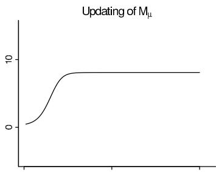

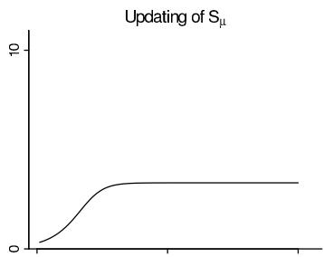

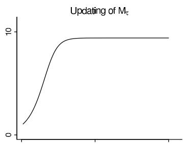

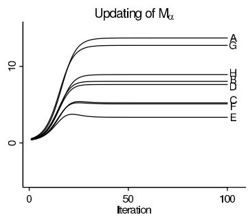

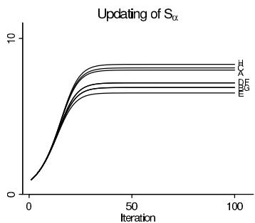

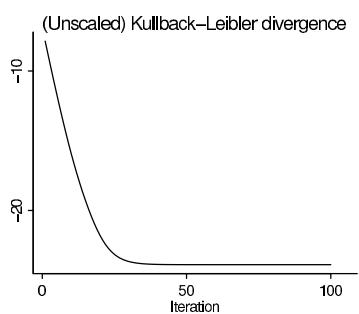  
Figure 13.5 Progress of variational Bayes for the parameters governing the variational approximation for the hierarchical model for the 8 schools. After a random starting point, the parameters require about 50 iterations to reach approximate convergence. The lower-right graph shows the Kullback-Leibler divergence $KL(g||p)$ (calculated up to an arbitrary additive constant); $KL(g||p)$ is guaranteed to uniformly decrease if the variational algorithm is programmed correctly.

Starting values. To get variational Bayes started, we need to initialize, not the variables $\alpha, \mu, \tau$ , but the parameters in their distributions $g(\alpha), g(\mu), g(\tau)$ . For simplicity we draw the unbounded parameters $M_{\alpha_1}, \ldots, M_{\alpha_8}, M_\mu$ from independent $\mathrm{N}(0,1)$ distributions and draw the bounded parameters $S_{\alpha_1}, \ldots, S_{\alpha_8}, S_\mu$ from independent $\mathrm{U}(0,1)$ distributions.

Running the algorithm. We iterate through $\alpha_{1},\ldots ,\alpha_{8},\mu ,\tau$ , at each iteration updating the distributions (13.18)-(13.20) using the expectations from the current values of the other distributions. That is, we compute the parameters in (13.18)-(13.20) by plugging in the expectations described in the bullet points above, using the current values of $M$ 's and $S$ 's. Then we turn around and label the newly computed means and standard deviations in (13.18)-(13.20 as the updated $M$ 's and $S$ 's. The algorithm thus looks a lot like EM, with the difference that it is distributions, rather than point estimates, that are being updated. The first five plots in Figure 13.5 show the progress of the parameters of the distributions (13.21)-(13.23). With these particular starting points, the algorithm takes awhile to get moving, but once it gets unstuck, it quickly finds a solution.

Checking that the fit is improving. As noted above, the Kullback-Leibler divergence (13.15) should decrease in each step of variational Bayes. In this example we can evaluate the expression analytically and so we do. Because we are comparing these values and do not care about their absolute level, so we can simplify our analysis by ignoring constants that do not depend on the parameters $\theta$ .

For the example at hand, the Kullback-Leibler divergence is,

$$
- \operatorname {E} _ {g} \left(\log \left(\frac {p (y | \theta)}{g (\theta)}\right)\right) = - \operatorname {E} _ {g} \left(\log p (y | \theta)\right) + \operatorname {E} _ {g} \left(\log g (\theta)\right)
$$

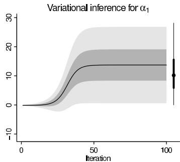

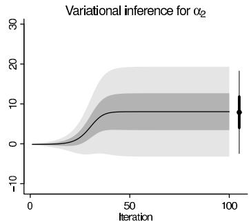

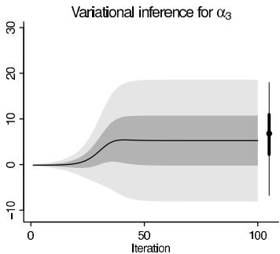  
Figure 13.6 Progress of inferences for the effects in schools $A$ , $B$ , and $C$ , for 100 iterations of variational Bayes. The lines and shaded regions show the median, $50\%$ interval, and $90\%$ interval for the variational distribution. Shown to the right of each graph are the corresponding quantiles for the full Bayes inference as computed via simulation.

$$
\begin{array}{l} = \frac {1}{2} \sum_ {j = 1} ^ {8} \frac {(y - M _ {\alpha}) ^ {2} + S _ {\alpha} ^ {2}}{\sigma_ {j} ^ {2}} + 8 \log M _ {\tau} + \frac {1}{2} \sum_ {j = 1} ^ {8} \frac {(M _ {\alpha} - M _ {\mu}) ^ {2} + S _ {\alpha} ^ {2} + S _ {\mu} ^ {2}}{M _ {\tau} ^ {2}} \\ - \sum_ {j = 1} ^ {J} \log S _ {\alpha} - \log S _ {\mu} - J \log M _ {\tau} + \text {c o n s t a n t}. \\ \end{array}
$$

The lower-right plot in Figure 13.5 shows the steady decrease in $\mathrm{KL}(g||p)$ as the algorithm progresses.

Comparing variational and full Bayes solutions. Figure 13.6 shows the progress of the variational algorithm for three of the parameters, $\alpha_{1},\alpha_{2},\alpha_{3}$ , corresponding to the effect of the coaching programs of the first three schools in the dataset. The functional form here is Gaussian so it will necessarily fail at capturing some of the subtleties of the posterior distribution, as can be seen by the comparison to the asymmetric full Bayes intervals in this example. In addition, this variational fit does not allow for dependence among the $\alpha_{j}$ 's and thus would be inappropriate for some purposes. That said, the approximation fits the marginal distributions fairly well, and variational Bayes represents a fast and scalable approach for inference in this sort of problem with large datasets.

Unlike MCMC, which eventually converges to the posterior density, the variational inference converges to an approximation—the closest fit within a restricted class. So in a case like this, where we can also run MCMC long enough for convergence, it makes sense to try to understand variational Bayes by comparing it to the actual posterior density.

Proof that each step of variational Bayes decreases the Kullback-Leibler divergence

The Kullback-Leibler divergence (13.15) is defined using the (normalized) posterior density, $p(\theta |y)$ . The first step in understanding variational Bayes is to re-express in terms of the unnormalized density, $p(\theta ,y) = p(\theta)p(y|\theta)$ which we can calculate. The re-expression goes like this: $p(\theta |y) = \frac{p(\theta,y)}{p(y)}$ , so $\log p(\theta |y) = \log p(\theta ,y) - \log p(y)$ , and thus,

$$
\begin{array}{l} \operatorname {K L} (g | | p) = - \int \log \left(\frac {p (\theta | y)}{g (\theta)}\right) g (\theta) d \theta \\ = - \int \log \left(\frac {p (\theta , y)}{g (\theta)}\right) g (\theta) d \theta + \int \log (p (y)) g (\theta) d \theta \\ \end{array}
$$

$$
= - \mathrm {E} _ {g} \left(\log \left(\frac {p (\theta , y)}{g (\theta)}\right)\right) + \log p (y). \tag {13.24}
$$

We cannot in general evaluate that last term, $\log p(y)$ , but for the purpose of variational inference all we need to realize is that it does not depend on $g$ . Hence, for any given model $p$ and data $y$ , decreasing the first term on the right of (13.24) is equivalent to decreasing $\mathrm{KL}(g||p)$ . This expression, $\mathrm{E}_g\left(\log \left(\frac{p(\theta,y)}{g(\theta)}\right)\right)$ , is called the variational lower bound.

Next we show that each step of the variational algorithm is guaranteed to increase the variational lower bound, or equivalently to decrease the global Kullback-Leibler divergence (13.24). Consider the step where the distribution $g_{j}(\theta_{j})$ is being updated. We shall decompose the variational lower bound using the factorization we have assumed for the approximating distribution: $g(\theta) = g_{j}(\theta_{j})g_{-j}(\theta_{-j})$ :

$$
\begin{array}{l} - \operatorname {E} _ {g} \left(\log \left(\frac {p (\theta , y)}{g (\theta)}\right)\right) = \iint g _ {j} \left(\theta_ {j}\right) g _ {- j} \left(\theta_ {- j}\right) \left(- \log p (\theta , y) + \log g _ {j} \left(\theta_ {j}\right) + \log g _ {- j} \left(\theta_ {- j}\right)\right) d \theta_ {j} d \theta_ {- j} \\ = - \int g _ {j} (\theta_ {j}) \left(\int g _ {- j} (\theta_ {- j}) \log p (\theta , y) d \theta_ {- j}\right) d \theta_ {j} + \\ + \int g _ {j} \left(\theta_ {j}\right) \log g _ {j} \left(\theta_ {j}\right) d \theta_ {j} + \int g _ {- j} \left(\theta_ {- j}\right) \log g _ {- j} \left(\theta_ {- j}\right) d \theta_ {- j}. \tag {13.25} \\ \end{array}
$$

We were able to turn the double integrals into single integrals in the last line above because we have assumed that $g_{j}$ and $g_{-j}$ are normalized probability densities and thus integrate to 1.

Here we are considering only the step at which $g_{j}$ is being updated, so we can ignore the last term in (13.25) as it only depends on $g_{-j}$ , and we can consider the expression in brackets in the first term to be (temporarily) a constant in that it does not depend on $g_{j}$ :

$$
\operatorname {E} _ {g _ {- j}} \log p (\theta , y) = \int g _ {- j} (\theta_ {- j}) \log p (\theta , y) d \theta_ {- j}. \tag {13.26}
$$

As $\theta_{-j}$ has been integrated out, expression (13.26) is a function only of $\theta_{j}$ and $y$ , and it can be considered as the logarithm of an unnormalized probability density of $\theta_{j}$ , which we shall call,

$$
\log \tilde {p} (\theta_ {j}) = \mathrm {E} _ {g _ {- j}} \log p (\theta , y) + \text {c o n s t a n t}. \tag {13.27}
$$

That is, $\log \tilde{p}$ is the (unnormized) log density you get by considering $\log p(\theta | y)$ as a function of $\theta_{j}$ and taking the expectation over all the other components of $\theta$ , averaging the current iteration of $g_{-j}$ (as illustrated in detail for the 8-schools example earlier in this section). Expression (13.25) then becomes,

$$
- \operatorname {E} _ {g} \left(\log \left(\frac {p (\theta , y)}{g (\theta)}\right)\right) = - \int g _ {j} \left(\theta_ {j}\right) \log \left(\frac {\tilde {p} \left(\theta_ {j}\right)}{g _ {j} \left(\theta_ {j}\right)}\right) d \theta_ {j} + \text {c o n s t .} \tag {13.28}
$$

This last expression is just $\mathrm{KL}(g_j||\tilde{p})$ , the Kullback-Leibler divergence of $g_{j}$ with respect to $\tilde{p}$ , and it is minimized when $g_{j}(\theta_{j})\equiv \tilde{p} (\theta_{j})$ as defined in (13.27).

Thus, when it is possible to evaluate the expectations in (13.26) and thus determine $g_{j}$ , we have our update, and the variational algorithm is guaranteed to decrease the global Kullback-Leibler divergence (13.15) at each step. If the expectation (13.26) cannot be done in closed form, what is needed is some update to $g_{j}$ that decreases (13.28), thus bringing $g_{j}$ closer to $\tilde{p}$ in that step.

# Model checking

The variational Bayes approximation is a generative model—that is, a proper probability distribution for the parameters $\theta$ ; thus we can check its fit by drawing a sample $\theta^s$ , $s =$

$1, \ldots, S$ from the fitted $g(\theta)$ and then, for each $\theta^s$ , drawing a replicated dataset $y^{\mathrm{rep}, s}$ . For the 8-schools example, we would first draw 1000 replications of the parameters $\alpha_1, \ldots, \alpha_8$ from the final $g$ in our variational Bayes calculation, then sample 1000 replications for data for the 8 schools. Or, if we were interested in predictions for new schools, we would first draw 1000 values of $(\mu, \tau)$ from $g$ , then, for each of these simulations, draw 8 new schools from $\mathrm{N}(\mu, \tau^2)$ , and then draw one new data observation from each new school (conditional on some assumed $\sigma$ ).

In general we would expect that, compared to full Bayes, variational inferences would provide a better fit to observed data. As a point estimate of the distribution, variational Bayes can overfit the data. Nonetheless, a model check can be a good idea as it could still reveal problems with the inferences.

# Variational Bayes followed by importance sampling or particle filtering

Variational methods are commonly used as an approximate method when simulation-based full Bayes is too computationally expensive, as with very large models or datasets. In such cases it might make sense to use the variational estimate as a starting point for a stochastic algorithm leading to a better approximation to the target distribution.

The simplest idea would be importance sampling: in the sorts of problems where variational methods are tractable, we can easily compute both the target density $p(\theta | y)$ and the approximation $g(\theta)$ , and we can also get fast simulations directly from $g$ . We can then compute $S$ simulation draws, $\theta^s$ from $g$ and, for each, compute the importance weight $p(\theta^s | y) / g(\theta^s)$ . (As usual, we only need these weights up to an arbitrary multiplicative constant; thus it would be fine to use unnormalized densities in place of $g$ or $p$ .) We could then compute expectations using weighted averages.

Unfortunately, the direct use of importance weighting from a variational approximation can be disastrous, because the variational Bayes fit tends to be less variable than the target distribution, hence the distribution of importance ratios can have long tails, leading to unstable averages. So instead we would recommend importance resampling, in which we first draw from $g$ , then resample without replacement using the importance weights. (It is crucial to resample without replacement so that any sampled points with extremely high weights do not dominate the simulations.) As in general with importance resampling, it is not always clear how many draws to take at each of the two stages of sampling.

A more general approach would be particle filtering, again using draws from the variational Bayes as a starting point and then moving through the target density using Metropolis or Hamiltonian Monte Carlo and splitting and removing points as appropriate. Implementing this for any particular example could represent a large investment in programming time, but for a large problem, or in a computing environment in which particle filtering has already been set up, it could make sense.

# EM as a special case of variational Bayes

Variational inference proceeds in $J$ steps, each time updating one conditional distribution $g_{j}$ , averaging over the other factors of $g$ . EM has two steps (the E-step and the M-step), alternately estimating a parameter $\phi$ and averaging over the other parameters $\gamma$ . EM can be seen as a special case of variational Bayes in which (a) the parameters are partitioned into two parts, $\phi$ and $\gamma$ , (b) the approximating distribution for $\phi$ is required to be a point mass (thus, updating $g(\phi)$ is equivalent to updating the point estimate of $\phi$ ), and (c) the approximating distribution for $\gamma$ is unconstrained; thus $g(\gamma) = p(\gamma | \phi, y)$ , conditional on the most recent update of $\phi$ .

More general forms of variational Bayes

Variational inference as described above is an approach for approximating a target distribution $p$ over some class of approximating distributions $g$ using an iterative algorithm that at each step reduces the Kullback-Leibler divergence, $\mathrm{KL}(g||p)$ . As noted above, this can be done in closed form only for models with certain conjugacy properties. Such models include many important special cases (such as normal distributions and finite mixtures), but more generally the idea of variational Bayes can be extended by replacing the objective function (the criterion to be minimized) with an approximation of $\mathrm{KL}(g||p)$ . For many problems, including logistic regression, good approximations are available, so that an algorithm that optimizes over this new criterion yields a good approximation to the posterior distribution. Typically the approximation itself changes with each step, being defined based on the most recent update of the approximating function $g$ .

# 13.8 Expectation propagation

Expectation propagation (EP) is another deterministic iterative algorithm in which the posterior distribution $p(\theta | y)$ is approximated by a best-fit distribution from some specified parametric family. Expectation propagation differs from variational Bayes in its optimization criterion and also in the nature of how it is computed. We shall first describe the algorithm in general and then go through the steps of applying it to logistic regression.

We start with the target distribution $p(\theta | y)$ , which we shall write as $f(\theta)$ , suppressing the dependence on $y$ which is not directly relevant for these computations. We assume that $f$ has some convenient factorization,

$$
f (\theta) = \prod_ {i = 0} ^ {n} f _ {i} (\theta). \tag {13.29}
$$

As with many Bayesian computations, all we need for the $f_{i}$ 's are the unnormalized density functions.

Expectation propagation can be expressed more generally, but in this description it is convenient to think of $f_0(\theta)$ as the prior density and each $f_i(\theta)$ as the likelihood for one data point. The computational advantage of the factorization arises from the possibility of computing certain expectations rapidly when the density is factorized in this way, as we discuss below.

As with variational Bayes, expectation propagation works by iteratively approximating the target distribution by some $g(\theta)$ which is constrained to follow some parametric form. The algorithm begins with some guess for $g$ and then proceeds via an iterative updating. A key difference between the two methods is that variational inference is typically based on a separation of $g$ into factors for each parameter (thus, $g(\theta) = \prod_{j=1}^{J} g_j(\theta_j)$ ), whereas expectation propagation factorizes $g$ based on a partition of the data; thus,

$$
g (\theta) = \prod_ {i = 0} ^ {n} g _ {i} (\theta). \tag {13.30}
$$

At convergence, each factor of (13.30) is intended to approximate the corresponding factor of (13.29). The trick is that these approximations are done one at a time, but in the context of the entire distribution.

Exponential families, sufficient statistics, and natural parameters. The approximating distribution $g(\theta)$ should be in the exponential family—as discussed on page 36, this means that the density can be written as a normalizing function times the exponential of a linear func

tion of sufficient statistics of $\theta$ . For example, take the normal distribution:

$$
\begin{array}{l} \mathrm {N} (\theta | \mu , \sigma^ {2}) = \frac {1}{\sqrt {2 \pi} \sigma} \exp \left(- \frac {1}{2 \sigma^ {2}} (\theta - \mu) ^ {2}\right) \\ = \frac {1}{\sqrt {2 \pi} \sigma} \exp \left(- \frac {1}{2 \sigma^ {2}} \theta^ {2} + \frac {\mu}{\sigma^ {2}} \theta - \frac {\mu^ {2}}{2 \sigma^ {2}}\right). \\ \end{array}
$$

In this parameterization, the normalizing function is the ugly-looking $\frac{1}{\sqrt{2\pi}\sigma}\exp \left(-\frac{\mu^2}{2\sigma^2}\right)$ , but this does not really matter. What is important are the sufficient statistics, $\theta$ and $\theta^2$ . In expectation propagation, we compute the expectations of the sufficient statistics under various combinations of the approximating distribution and the target distribution. The coefficients of the sufficient statistics inside the exponential of the above expression are called the natural parameters of the model.

In typical applications of expectation propagation, the approximating distribution is restricted to the multivariate normal family; thus, $g(\theta) = \mathrm{N}(\theta|\mu, \Sigma)$ . Here there are two sufficient statistics: the vector $\theta$ and the outer-product matrix $\theta\theta^T$ , and the corresponding natural parameters are proportional to the scaled mean vector $\Sigma^{-1}\mu$ and the precision matrix $\Sigma^{-1}$ .

The expectation propagation algorithm. At each step of the iterative algorithm, we take the current approximating function $g(\theta)$ and pull out the approximating factor $g_{i}(\theta)$ , replacing it by the corresponding factor $f_{i}(\theta)$ from the target distribution. We define the (unnormized)

$$
\mathrm {c a v i t y d i s t r i b u t i o n :} g _ {- i} (\theta) \propto \frac {g (\theta)}{g _ {i} (\theta)}
$$

and the

$$
\text {t i l t e d} g _ {- i} (\theta) f _ {i} (\theta).
$$

We then construct an approximation to the tilted distribution, using a moment-matching approach described below. This approximation is the updated $g(\theta)$ . We then back out the updated approximating factor, $g_{i}(\theta) = g(\theta) / g_{-i}(\theta)$ . The result is that we have a new $g_{i}(\theta)$ which approximates $f_{i}(\theta)$ , in the context of $g_{-i}$ . This also explains why the algorithm needs to iterate, as the context changes with each step until convergence.

Moment matching. The core of the expectation propagation algorithm occurs within each step, to construct the approximation of the tilted distribution, $g_{-i}(\theta)f_i(\theta)$ , within the parametric form specified for $g(\theta)$ . The way this is done is by matching moments: that is, setting the expectations of the sufficient statistics of $g$ to the corresponding expectations of $\theta$ in $g_{-i}(\theta)f_i(\theta)$ .

For example, if $g(\theta)$ has the form $\mathrm{N}(\theta|\mu, \Sigma)$ , then in the moment-matching step we set $\mu = \operatorname{E}_{\text{tilted}_i}(\theta) = \int \theta g_{-i}(\theta)f_i(\theta)d\theta$ and $\Sigma = \operatorname{var}_{\text{tilted}_i}(\theta) = \int (\theta - \mu)(\theta - \mu)^Tg_{-i}(\theta)f_i(\theta)d\theta$ .

The difficult part of this step is computing these expectations, which in theory could require an integration over a high-dimensional space (that of the entire parameter vector $\theta$ ). In practical implementations of expectation propagation, these integrals can be done in closed form or via a transformation that reduces the problem to a low-dimensional integral. What makes this work is that the tilted distribution is mostly $g_{-i}$ (which is easy to handle because it follows a specified parametric form such as the multivariate normal) with only one difficult factor $f_{i}$ . For many models, $f_{i}$ can be expressed in such a way that its integral over $g_{-i}$ is well behaved.

If $g$ is updated after each moment-matching step, the algorithm is called sequential $EP$ , whereas if $g$ is updated only after all tilted moments have been computed the algorithm is called parallel $EP$ . Parallel EP is typically much faster as it requires less frequent updates of the higher-dimensional function $g$ .

Moment matching corresponds to minimizing the Kullback-Leibler divergence from the tilted distribution to the new approximated marginal distribution, but the iterative matching of the marginals does not guarantee that the Kullback-Leibler divergence from the full posterior distribution to the overall approximation is minimized. There is no guarantee of convergence for EP, but for models with log-concave factors $f_{i}$ and initialization to the prior distribution, the algorithm has been used successfully in many applications.

# Expectation propagation for logistic regression

Consider the model of independent data $y_{i} \sim \mathrm{Bin}(m_{i},\mathrm{logit}^{-1}(X_{i}\theta))$ , $i = 1,\dots ,n$ , with prior distribution $\theta \sim \mathrm{N}(\mu_0,\Sigma_0)$ . Here, $X_{i}$ is the $i$ th row of the $n \times k$ matrix $X$ of predictors. It is not difficult to iteratively solve for the $(k$ -dimensional) posterior mode of $\theta$ and then compute the second derivative matrix of the log posterior density, thus obtaining a mode-centered normal approximation (for details, see Section 16.2), but we can get a better normal approximation using expectation propagation, as follows.

We use a normal approximating function with factors $g_{i}(\theta) = \mathrm{N}(\mu_{i},\Sigma_{i})$ , $i = 0,\dots ,n$ . We set $g_{0}$ to equal the prior distribution and, to start, for each $i = 1,\ldots ,n$ , set the natural parameter $\Sigma_i^{-1}\mu$ to the zero vector and $\Sigma_i^{-1}$ to the identity matrix $I_{k}$ times some positive number, corresponding to a starting distribution that is precise enough to be computationally stable but not so sharply localized that the algorithm is slow to move from its initial value.

The iteration proceeds by stepping through the data points. For each $i$ :

1. Compute the parameters of the cavity distribution, $g_{-i}(\theta) = \mathrm{N}(\mu_{-i},\Sigma_{-i})$

$$
\Sigma_ {- i} ^ {- 1} \mu_ {- i} = \Sigma^ {- 1} \mu - \Sigma_ {i} ^ {- 1} \mu_ {i}
$$

$$
{\Sigma_ {- i} ^ {- 1}} = {\Sigma^ {- 1} - \Sigma_ {i} ^ {- 1}.}
$$

2. Project the cavity distribution onto the one-dimensional subspace represented by the data vector $X_{i}$ . The projected distribution is a one-dimensional normal with mean and variance,

$$
M _ {- i} = X _ {i} \mu_ {- i}
$$

$$
V _ {- i} = X _ {i} \Sigma_ {- i} X _ {i} ^ {T}.
$$

Steps 1 and 2 can be combined so that only scalar moments $X_{i}\Sigma X_{i}^{T}$ and $X_{i}\mu$ are required:

$$
M _ {- i} = V _ {- i} \left(\left(X _ {i} \Sigma X _ {i} ^ {T}\right) ^ {- 1} X _ {i} \mu - V _ {i} ^ {- 1} M _ {i}\right)
$$

$$
V _ {- i} = \left(\left(X _ {i} \Sigma X _ {i} ^ {T}\right) ^ {- 1} - V _ {i} ^ {- 1}\right) ^ {- 1}.
$$

3. Define the (unnormized) tilted distribution of $\eta = X_{i}\theta$ :

$$
g _ {- i} (\eta) f _ {i} (\eta) = \mathrm {N} (\eta | M _ {- i}, V _ {- i}) \operatorname {B i n} (y _ {i} | m _ {i}, \operatorname {l o g i t} ^ {- 1} (\eta)).
$$

Compute moments 0, 1, 2 of this unnormalized distribution to get moments of the tilted distribution of $\eta$ :

$$
E _ {k} = \int \eta^ {k} g _ {- i} (\eta) f _ {i} (\eta) d \eta , \mathrm {f o r} k = 0, 1, 2.
$$

Compute $M = \frac{E_1}{E_0}$ and $V = \frac{E_2}{E_0} - (\frac{E_1}{E_0})^2$ , the mean and variance of the tilted distribution of $\eta$ , using numerical integration. We use the iterative Gauss-Kronrod quadrature method. To perform these (one-dimensional) integrals, we need lower and upper bounds of integration. Ideally we would do this based on the mode and curvature of the tilted distribution but for simplicity we might just use $M_{-i} \pm \delta \sqrt{V_{-i}}$ , based on the mean and standard deviation of the cavity distribution. The multiplier $\delta$ is set to some large number such as 10 to ensure that the mass of the tilted distribution is contained in the range of integration.

4. Subtract off the cavity distribution to get the moments of the updated approximating factor $g_{i}(\eta) = \mathrm{N}(\eta |M_{i},V_{i})$ :

$$
\frac {M _ {i}}{V _ {i}} = \frac {M}{V} - \frac {M _ {- i}}{V _ {- i}}
$$

$$
\frac {1}{V _ {i}} = \frac {1}{V} - \frac {1}{V _ {- i}}.
$$

5. Transform these to get the moments of the updated approximating factor defined on the full space, $g_{i}(\theta) = \mathrm{N}(\theta |\mu_{i},\Sigma_{i})$ :

$$
\Sigma_ {i} ^ {- 1} \mu_ {i} = X _ {i} ^ {T} \frac {M _ {i}}{V _ {i}}
$$

$$
\Sigma_ {i} ^ {- 1} = X _ {i} ^ {T} \frac {1}{V _ {i}} X _ {i}.
$$

Recall that $M_{i}$ and $V_{i}$ are scalars, $\Sigma_{i}^{-1}\mu_{i}$ is a $k\times 1$ vector, and $\Sigma_{i}^{-1}$ is a $k\times k$ matrix.

6. Combine this updated $g_{i}$ with the cavity distribution $g_{-i}$ to get the updated approximating distribution, $g(\theta) = \mathrm{N}(\mu, \Sigma)$ . This is done by adding the natural parameters of the component parts:

$$
\begin{array}{l} \Sigma^ {- 1} \mu = \Sigma_ {- i} ^ {- 1} \mu_ {- i} + \Sigma_ {i} ^ {- 1} \mu_ {i} \\ \Sigma^ {- 1} = \Sigma_ {- i} ^ {- 1} + \Sigma_ {i} ^ {- 1}. \\ \end{array}
$$

This step is skipped in parallel EP, and only after updating all approximating factors $g_{i}(\theta)$ the updated posterior is computed. With large $n$ and $k$ , this saves computation time.

7. Now return to step 1, updating a new $i$ .

What makes the algorithm computationally feasible is that, in each step, the relevant factor of the likelihood depends on the parameters only through the linear combination $X_{i}\theta$ . It is a different linear combination at each step, but during any particular step, the required integrals are one-dimensional.

In addition, the algorithm operates just as easily for any fixed normal prior distribution on $\theta$ , as this just folds into the factor $g_0$ . For a hierarchical model in which the model contains additional hyperparameters, another step is needed.

We illustrate expectation propagation for a simple logistic regression with uniform prior distribution.

# Example. Bioassay logistic regression with two coefficients

Section 3.7 describes an experiment on 20 rats in four groups of 5, each group exposed to a different level of a toxin. For consistency with the notation immediately above, we write the model as $y_{i} \sim \mathrm{Bin}(m_{i},\mathrm{logit}^{-1}(\theta_{1} + \theta_{2}x_{i}))$ , $i = 1,\ldots ,4$ . The row vector of data for observation $i$ is then $X_{i} = (1,x_{i})$ . The model is completed with a flat prior distribution on $\theta = (\theta_{1},\theta_{2})$ . As usual in such settings, this uniform prior distribution is not a reasonable summary of any scientific understanding of the problem but rather serves as a placeholder, with the understanding that it can be augmented with substantive information as needed.

The data are in Table 3.1 on page 74. In Section 4.1 we fit the basic mode-based normal approximation, yielding a point estimate of (0.8, 7.7) and a covariance matrix as shown in Figure 4.1 on page 86. For comparison, Figure 3.3 on page 76 displays the contours of the exact posterior density. The actual density is skewed, with a long tail toward large values of $\theta_{1}$ and $\theta_{2}$ , and so we would hope that our approximation

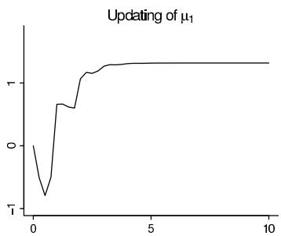

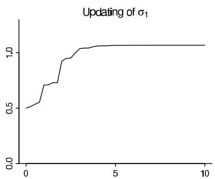

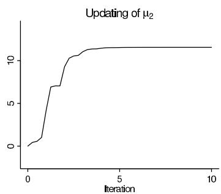

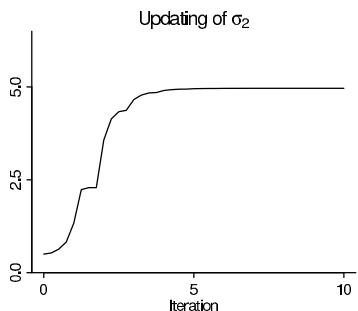

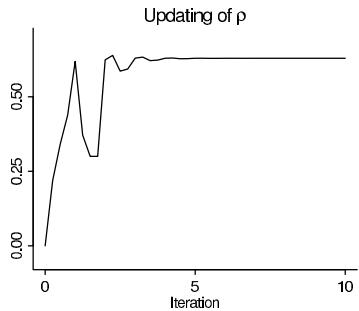  
Figure 13.7 Progress of expectation propagation for a simple logistic regression with intercept and slope parameters. The bivariate normal approximating distribution is characterized by a mean and standard deviation in each dimension and a correlation. The algorithm reached approximate convergence after 4 iterations.

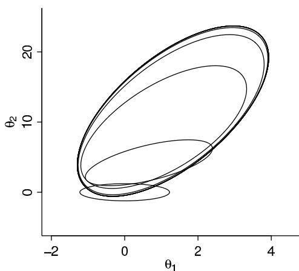

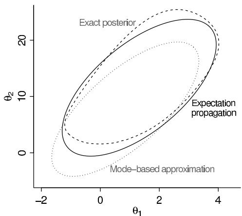  
Figure 13.8 (a) Progress of the normal approximating distribution during the iterations of expectation propagation. The small ellipse at the bottom (which is actually a circle if $x$ and $y$ axes are placed on a common scale) is the starting distribution; after a few iterations the algorithm converges. (b) Comparison of the approximating distribution from EP (solid ellipse) to the simple approximation based on the curvature at the posterior mode (dotted ellipse) and the exact posterior density (dashed oval). The exact distribution is not normal so the EP approximation is not perfect, but it is closer than the mode-based approximation. All curves show contour lines for the density at 0.05 times the mode (which for the normal distribution contains approximately 95% of the probability mass; see discussion on page 85).

using expectation propagation would move in that direction, compared to the mode, to better fit the full distribution.

We then run the algorithm, with starting values $\Sigma_{i}^{-1}\mu_{i} = 0$ and $\Sigma_{i}^{-1} = I$ for $i = 1,\ldots ,4$ . During the progress of the iterations we keep track of the $2\times 1$ vector $\Sigma^{-1}\mu$ and the $2\times 2$ matrix $\Sigma^{-1}$ ; these are the natural parameters of the normal approximating distribution. To understand these better we reparameterize as $\mu_1,\mu_2,\sigma_1,\sigma_2,\rho$ . Figure 13.7 shows the progress of these parameters over 10 iterations of the algorithm—a total of 40 steps—which is more than enough in this case for practical convergence.

Figure 13.8 compares the final approximating distribution from expectation propagation to the simpler normal approximation based on the curvature at the posterior mode, and to the exact posterior density. In this example, EP performs well. The approximation is shifted toward the mass of the distribution, as we would hope.

In summary, expectation propagation is an appealing algorithm. It is fast and direct to implement. Unlike EM, it approximates the entire distribution rather than just supplying a point estimate; and, unlike usual implementations of variational Bayes, it fits the joint distribution rather than just the margins. Expectation propagation can be difficult to apply in general settings, however, as it requires a likelihood or prior factorization in which the required integrals can be expressed in some simple form. An active goal of research for all these deterministic approximate methods is to develop general implementations that can work with arbitrary density functions, as can now be done stochastically using Gibbs, Metropolis, and Hamiltonian Monte Carlo.

# Extensions of expectation propagation

There is a provably convergent slower double-loop algorithm for EP, which can be combined with regular EP so that the slower algorithm is only used if regular EP does not converge.

Sometimes convergence of EP can be improved by using damping, that is, by making only partial updates of $g$ after moment matching. Fractional $EP$ (or power EP) is an extension of EP which can be used to improve stability when the approximation $g$ is not flexible enough or when the propagation of information is difficult due to vague prior information. Fractional updating can be viewed as minimization of $\alpha$ -divergence which includes the directed Kullback-Leibler divergences and the Hellinger distance as special cases. Fractional EP provides flexibility in choice of minimized divergence and can also be used to improve convergence and to recover standard EP by setting $\alpha$ close to 1 in the final iterations. Improved marginal posteriors for $\theta_{i}$ can be obtained by applying expression (13.9) or faster approximations of that.

# 13.9 Other approximations

# Integrated nested Laplace approximation (INLA)

Another form of posterior approximation involves partitioning the parameters into a large set $\gamma$ conditional on a smaller set of hyperparameters $\phi$ . The idea is to construct a joint Gaussian approximation for $p(\gamma | \phi, y)$ and apply expression (13.9) to approximate both $p(\phi | y)$ and $p(\gamma_i | \phi, y)$ . Approximations to $p(\gamma_i | y)$ are obtained by numerically integrating over the low dimensional $p_{\mathrm{approx}}(\phi | y)$ (hence the name integrated nested Laplace approximation). INLA works best when there are not many hyperparameters in the model, because then the space of hyperparameters is small enough that their marginal posterior distribution can be reasonably approximated by a sample on some discrete grid. The algorithm was developed for hierarchical models in which the parameters for the data model have a joint normal prior, so that the conditional normal approximation is easily constructed.

# Central composite design integration (CCD)

If we like to improve over modal approximation, but the computation of $p(\phi | y)$ is costly, we want to minimize the number of evaluation points around the mode. Clever deterministic placement of points can provide lower variance using the same number of posterior evaluations as sampling based approaches. Central composite design is a useful method for obtaining a moderate number of representative points from posteriors having moderate dimensionality. For example, a 5-dimensional model uses 27 integration points under this method, while a 15-dimensional model uses 287 points. CCD uses a fractional factorial design to avoid the exponential increase of the number of evaluation points when the dimensionality of the posterior increases while allowing to estimate the curvature of the posterior distribution around the mode. The integration is a finite sum with special weights. The accuracy of the CCD is between the modal approximation and the full integration with a grid or Monte Carlo. We use the CCD method in Chapter 21 for Gaussian processes.

# Approximate Bayesian computation (ABC)

The term 'approximate Bayesian computation' is applied to a set of statistical procedures based on drawing parameters $\theta$ from an initial or approximate distribution, then sampling replicated data $y^{\mathrm{rep}}|\theta$ from the model, and then accepting or rejecting the sample based on the closeness of $y^{\mathrm{rep}}$ to the observed data $y$ . The attraction of approximate Bayesian computation is that it does not require computation of the likelihood function, only the ability to simulate $y^{\mathrm{rep}}|\theta$ from the data distribution; the difficulty is in the assessment of the closeness of $y^{\mathrm{rep}}$ to $y$ .

The most basic form of ABC has the form of simple rejection sampling:

- Draw $\theta$ from the prior distribution $p(\theta)$ and then $y^{\mathrm{rep}}$ from the data distribution, $p(y^{\mathrm{rep}}|\theta)$ , thus obtaining a single draw of $y^{\mathrm{rep}}$ from its marginal distribution.   
- Compute a discrepancy measure $d(y^{\mathrm{rep}},y)$ , where $d$ is defined so that it is zero if $y$ and $y^{\mathrm{rep}}$ are identical and is larger the more 'different' they are, in some relevant dimensions.   
- Accept $\theta$ if $d(y^{\mathrm{rep}},y) < \epsilon$ for some preset threshold $\epsilon$ , otherwise reject.

The result is to accept draws from the prior distribution in proportion to the probability that they yield replicated data that are close to the observed data. This latter probability is approximately the likelihood, hence the accepted set of simulation draws is an approximation of the posterior distribution.

ABC involves three challenges. First, one needs to define a discrepancy measure $d$ , which ideally should capture the aspects of the data that are relevant for estimating the parameters in the model (that is, the sufficient statistics) without requiring $y^{\mathrm{rep}}$ to match $y$ on irrelevant 'noise' dimensions. Second, $\epsilon$ needs to be set small enough that the data provide information, but not so small that all (or almost all) the simulations get rejected. Third, if the prior distribution is broad enough, the rejection rate can be unacceptably high even if the discrepancy measure and threshold have been chosen well.

These challenges can be partly addressed by combining ABC with other ideas of posterior simulation. For example, it is not necessary to draw from the prior; one can draw simulations from another distribution and then correct using importance sampling. Or one can use MCMC steps to move in interesting regions of parameter space. As with many ideas in Bayesian simulation, research is stimulated by the practical challenges of approximating certain distributions that arise in practice.

A related idea is substitution likelihood, in which one uses a rank likelihood or a likelihood that only depends on quantiles and not what happens in between them, in place of a full likelihood specification. These almost-likelihoods are put in place of the likelihood in Bayes rule. The advantage of this approach is that it allows a specified joint distribution

model (which is sometimes called a copula) to be applied in settings where the marginal distribution would not fit. This is thus a computational approximation that allows a popular class of statistical models to be applied more broadly.

# 13.10 Unknown normalizing factors

Finally, we discuss the application of numerical integration to compute normalizing factors, a problem that arises in some complicated models that we largely do not discuss in this book. We include this section here to introduce the problem, which is an active area of research; see the bibliographic note for some references on the topic.

Most of the models we present are based on combining standard classes of models for which the normalizing constants are known; for example, all the distributions in Appendix A have exactly known densities. Even the nonconjugate models we usually use are combinations of standard parts.

For standard models, we can compute $p(\theta)$ and $p(y|\theta)$ exactly, or up to unknown multiplicative constants, and the expression

$$
p (\theta | y) \propto p (\theta) p (y | \theta)
$$

has a single unknown normalizing constant—the denominator of Bayes' rule, $p(y)$ . A similar result holds for a hierarchical model with data $y$ , local parameters $\gamma$ , and hyperparameters $\phi$ . The joint posterior density has the form

$$
p (\gamma , \phi | y) \propto p (\phi) p (\gamma | \phi) p (y | \gamma , \phi),
$$

which, once again, has only a single unknown normalizing constant. In each of these situations we can apply standard computational methods using the unnormalized density.

Unknown normalizing factors in the likelihood. A new and different problem arises when the sampling density $p(y|\theta)$ has an unknown normalizing factor that depends on $\theta$ . Such models often arise in problems that are specified conditionally, such as in spatial statistics. For a simple example, pretend we knew that the univariate normal density was of the form $p(y|\mu, \sigma) \propto \exp\left(-\frac{1}{2\sigma^2}(y - \mu)^2\right)$ , but with the normalizing factor $1 / (\sqrt{2\pi}\sigma)$ unknown. Performing our analysis as before without accounting for the factor of $1/\sigma$ would lead to an incorrect posterior distribution. (See Exercise 10.11 for a simple nontrivial example of an unnormalized density.)

In general we use the following notation:

$$
p (y | \theta) = \frac {1}{z (\theta)} q (y | \theta),
$$

where $q$ is a generic notation for an unnormalized density, and

$$
z (\theta) = \int q (y | \theta) d y \tag {13.31}
$$

is called the normalizing factor of the family of distributions—being a function of $\theta$ , we can no longer call it a 'constant'—and $q(y|\theta)$ is a family of unnormalized densities. We consider the situation in which $q(y|\theta)$ can be easily computed but $z(\theta)$ is unknown. Combining the density $p(y|\theta)$ with a prior density, $p(\theta)$ , yields the posterior density

$$
p (\theta | y) \propto p (\theta) \frac {1}{z (\theta)} q (y | \theta).
$$

To perform posterior inference, one must determine $p(\theta | y)$ , as a function of $\theta$ , up to an arbitrary multiplicative constant.

An unknown, but constant, normalizing factor in the prior density, $p(\theta)$ , causes no problems because it does not depend on any model parameters.

Unknown normalizing factors in hierarchical models. An analogous situation arises in hierarchical models if the population distribution has an unknown normalizing factor that depends on the hyperparameters. Consider a model with data $y$ , first-level parameters $\gamma$ , and hyperparameters $\phi$ . For simplicity, assume that the likelihood, $p(y|\gamma)$ , is known exactly, but the population distribution is only known up to an unnormalized density, $q(\gamma|\phi) = z(\phi)p(\gamma|\phi)$ . The joint posterior density is then

$$
p (\gamma , \phi | y) \propto p (\phi) \frac {1}{z (\phi)} q (\gamma | \phi) p (y | \gamma),
$$

and the function $z(\phi)$ must be considered. If the likelihood, $p(y|\gamma)$ , also has an unknown normalizing factor, it too must be considered in order to work with the posterior distribution.

Posterior computations involving an unknown normalizing factor

A basic computational strategy. If the integral (13.31), or the analogous expression for the hierarchical model, cannot be evaluated analytically, numerical integration can be used, perhaps involving more advanced approaches such as bridge and path sampling, discussed below. An additional difficulty is that one must evaluate (or estimate) the integral as a function of $\theta$ , or $\phi$ in the hierarchical case. The following basic strategy, combining analytic and simulation-based integration methods, can be used for computation with a posterior distribution containing unknown normalizing factors.

1. Obtain an analytic estimate of $z(\theta)$ using some approximate method, for example Laplace's method centered at a crude estimate of $\theta$ .   
2. Construct an approximation to the posterior distribution, as discussed in Chapter 13. Such approximations can often be integrated directly.   
3. For more exact computation, evaluate $z(\theta)$ (see below) whenever the posterior density needs to be computed for a new value of $\theta$ . Computationally, this approach treats $z(\theta)$ as an approximately 'known' function that happens to be expensive to compute.

Other strategies are possible in specific problems. If $\theta$ (or $\phi$ in the hierarchical version of the problem) is only one- or two-dimensional, it may be reasonable to compute $z(\theta)$ over a finite grid and interpolate to obtain an estimate of $z(\theta)$ as a function of $\theta$ . It is still recommended to perform the approximate steps 1 and 2 above so as to get a rough idea of the location of the posterior distribution—for any given problem, $z(\theta)$ needs not be computed in regions of $\theta$ for which the posterior probability is essentially zero.

Computing the normalizing factor. The normalizing factor can be computed, for each value of $\theta$ , using any of the numerical integration approaches applied to (13.31). Applying approximation methods such as Laplace's is fairly straightforward, with the notation changed so that integration is over $y$ , rather than $\theta$ , or changed appropriately to evaluate normalizing constants as a function of hyperparameters in a hierarchical model.

The importance sampling estimate is based on the identity

$$
z (\theta) = \int \frac {q (y | \theta)}{g (y)} g (y) d y = \operatorname {E} _ {g} \left(\frac {q (y | \theta)}{g (y)}\right),
$$

where $\mathrm{E}_g$ averages over $y$ under the approximate density $g(y)$ . The estimate of $z(\theta)$ is $\frac{1}{S} \sum_{s=1}^{S} q(y^s |\theta) / g(y^s)$ , based on simulations $y^s$ from $g(y)$ . Again, estimation of a normalizing factor for a hierarchical model is analogous.

Some additional subtleties arise, however, when applying this method to evaluate $z(\theta)$ for many values of $\theta$ . First, we can use the same approximation function, $g(y)$ , and in fact the same simulations, $y^{1},\ldots ,y^{S}$ , to estimate $z(\theta)$ for different values of $\theta$ . Compared to performing a new simulation for each value of $\theta$ , using the same simulations saves computing

time and increases accuracy (with the overall savings in time, we can simulate a larger number $S$ of draws), but in general this can only be done in a local range of $\theta$ where the densities $q(y|\theta)$ are similar enough to each other that they can be approximated by the same density. Second, we have some freedom in our computations because the evaluation of $z(\theta)$ as a function of $\theta$ is required only up to a proportionality constant. Any arbitrary constant that does not depend on $\theta$ becomes part of the constant in the posterior density and does not affect posterior inference. Thus, the approximate density, $g(y)$ , is not required to be normalized, as long as we use the same function $g(y)$ to approximate $q(y|\theta)$ for all values of $\theta$ , or if we know, or can estimate, the relative normalizing constants of the different approximation functions used in the problem.

# Bridge and path sampling

When computing integrals numerically, we typically want to evaluate several of them (for example, when computing the marginal posterior densities of different models) or to compute them for a range of values of a continuous parameter (as with continuous model expansion or when working with models whose normalizing factors depend on the parameters in the model and cannot be determined analytically).

In these settings with a family of normalizing factors to be computed, importance sampling can be generalized in a number of useful ways. Continuing our notation above, we let $\phi$ be the continuous or discrete parameter indexing the family of densities $p(\gamma |\phi ,y)$ . The numerical integration problem is to average over $\gamma$ in this distribution, for each $\phi$ (or for a continuous range of values $\phi$ ). In general, for these methods it is only necessary to compute the densities $p$ up to arbitrary normalizing constants.

One approach is to perform importance sampling using the density at some central value, $p(\gamma | \phi_{*}, y)$ , as the approximating distribution for the entire range of $\phi$ . This approach is convenient as it does not require the creation of a special $p_{\mathrm{approx}}$ but rather uses a distribution from a family that we already know how to handle (probably using Markov chain simulation).

If the distributions $p(\gamma |\phi ,y)$ are far enough apart that no single $\phi_{*}$ can effectively cover all of them, we can move to bridge sampling, in which $\gamma$ is sampled from two distributions, $p(\gamma |\phi_0,y)$ and $p(\gamma |\phi_1,y)$ . Here, $\phi_0$ and $\phi_{1}$ represent two points near the end of the space of $\phi$ (think of the family of distributions as a suspension bridge held up at two points). The bridge sampling estimate of the integral for any $\phi$ is a weighted average of the importance sampling estimates given $\phi_0$ and $\phi_{1}$ . The weights depend on $\phi$ and can be computed using a simple iterative formula.

Bridge sampling is a general idea that arises in many statistical contexts and can be further generalized to allow sampling from more than two points, which makes sense if the distributions vary widely over $\phi$ . In the limit in which a sample is drawn from the entire continuous range of distributions $p(\gamma |\phi_0,y)$ indexed by $\phi$ , we can apply path sampling, a differential form of bridge sampling. In path sampling, a sample $(\gamma ,\phi)$ is drawn from a joint posterior distribution, and the derivative of the log posterior density, $d\log p(\gamma ,\phi |y) / d\phi$ , is computed at the simulated values and numerically integrated over $\phi$ to obtain an estimate of the log marginal density, $\log p(\phi |y)$ , over a continuous range of values of $\phi$ . This simulation-based computation uses the identity,

$$
\frac {d}{d \phi} \log p (\phi | y) = \operatorname {E} (U (\gamma , \phi , y) | \phi , y),
$$

where $U(\gamma, \phi, y) = d\log p(\gamma, \phi|y) / d\phi$ . Numerically integrating these values gives an estimate of $\log p(\phi|y)$ (up to an additive constant) as a function of $\phi$ .

Bridge and path sampling are related to parallel tempering (see page 299), which uses

a similar structure of samples from an indexed family of distributions. Depending on the application, the marginal distribution of $\phi$ can be specified for computational efficiency or convenience (as with tempering) or estimated (as with the computations of marginal densities).

# 13.11 Bibliographic note

An accessible source of general algorithms for conditional maximization (stepwise ascent), Newton's method, and other computational methods is Press et al. (1986). Gill, Murray, and Wright (1981) is a classic book that is useful for understanding more complicated optimization problems.

The boundary-avoiding prior densities in Section 13.2 are discussed by Chung, Rabe-Hesketh, et al. (2013a,b).

Laplace's method for integration was developed in a statistical context by Tierney and Kadane (1986), who demonstrated the accuracy of applying the method separately to the numerator and denominator of (13.3). Extensions and refinements were made by Kass, Tierney, and Kadane (1989) and Wong and Li (1992). Geweke (1989) discusses modal approximations for importance sampling and proposes the $k$ -variate split normal density as an improved approximation for asymmetric posterior densities.

The EM algorithm was first presented in full generality and under that name, along with many examples, by Dempster, Laird, and Rubin (1977); the formulation in that article is in terms of finding the maximum likelihood estimate, but, as the authors note, the same arguments hold for finding posterior modes. That article and the accompanying discussion contributions also refer to many earlier implementations in specific problems; see also Meng and Pedlow (1992). EM was first presented in a general statistical context by Orchard and Woodbury (1972) as the 'missing information principle' and first derived in mathematical generality by Baum et al. (1970). Little and Rubin (2002, Chapter 8) discuss the EM algorithm for missing data problems. SEM was introduced in Meng and Rubin (1991); ECM in Meng and Rubin (1993) and Meng (1994a); SECM in van Dyk, Meng, and Rubin (1995); and ECME in Liu and Rubin (1994). AECM appears in Meng and van Dyk (1997), and the accompanying discussion provides further connections. Many of the iterative simulation methods discussed in Chapter 11 for simulating posterior distributions can be regarded as stochastic extensions of EM; Tanner and Wong (1987) is an important paper in drawing this connection. Parameter-expanded EM was introduced by Liu, Rubin, and Wu (1998), and related ideas appear in Meng and van Dyk (1997), Liu and Wu (1999), and Liu (2003).

Some references on variational Bayes include Jordan et al. (1999), Jaakkola and Jordan (2000), Blei, Ng, and Jordan (2003), and Gershman, Hoffman, and Blei (2012). Hoffman et al. (2012) present a stochastic variational algorithm that is computable for large datasets.

Expectation propagation comes from Minka (2001). This and other deterministic approximate Bayesian methods are reviewed by Bishop (2006) and Rasmussen and Williams (2006). Cseke and Heskes (2011) consider several methods to improve marginal posteriors obtained from Laplace's method or expectation propagation. Rue, Martino, and Chopin (2009) describe integrated nested Laplace approximation and CCD integration scheme, with more information at Rue (2013). Heskes et al. and Marin et al. (2012) review approximate Bayesian computation. Some work on substitution likelihoods appears in Dunson and Taylor (2005), Hoff (2007), and Murray et al. (2013).

Bridge sampling was introduced by Meng and Wong (1996). Gelman and Meng (1998) generalize from bridge sampling to path sampling and provide references to related work that has appeared in the statistical physics literature. Meng and Schilling (1996) provide an example in which several of these methods are applied to a problem in factor analysis. Kong et al. (2003) set up a general theoretical framework that includes importance sampling and bridge sampling as special cases.

The method of computing normalizing constants for statistical problems using importance sampling has been applied by Ott (1979) and others. Models with unknown normalizing functions arise often in spatial statistics; see, for example, Besag (1974) and Ripley (1981, 1988). Geyer (1991) and Geyer and Thompson (1992, 1993) develop the idea of estimating the normalizing function using simulations from the model and have applied these methods to problems in genetics. Pettitt, Friel, and Reeves (2003) use path sampling to estimate normalizing constants for a class of models in spatial statistics. Computing normalizing functions is an area of active current research, as more and more complicated Bayesian models are coming into use.

# 13.12 Exercises

1. Multimodality: Consider a simple one-parameter model of independent data, $y_{i} \sim \mathrm{Cauchy}(\theta ,1), i = 1,\dots ,n$ , with uniform prior density on $\theta$ . Suppose $n = 2$

(a) Prove that the posterior distribution is proper.   
(b) Under what conditions will the posterior density be unimodal?

2. Normal approximation and importance resampling:

(a) Repeat Exercise 3.12 using the normal approximation to produce posterior simulations for $(\alpha, \beta)$ .   
(b) Use importance resampling to improve on the normal approximation.   
(c) Compute the importance ratios for your simulations. Plot a histogram of the importance ratios and comment on their distribution. Compute an estimate of effective sample size using (10.4) on page 266.

3. Mode-based approximation: Consider the model, $y_{j}\sim \mathrm{Binomial}(n_{j},\theta_{j})$ , where $\theta_{j} =$ $\mathrm{logit}^{-1}(\alpha +\beta x_j)$ , for $j = 1,\dots ,J$ , and with independent prior distributions, $\alpha \sim t_4(0,2^2)$ and $\beta \sim t_4(0,1)$ . Suppose $J = 10$ , the $x_{j}$ values are randomly drawn from a U(0,1) distribution, and $n_j\sim \mathrm{Poisson}^+ (5)$ , where $\mathrm{Poisson^{+}}$ is the Poisson distribution restricted to positive values.

(a) Sample a dataset at random from the model   
(b) Use rejection sampling to get 1000 independent posterior draws from $(\alpha, \beta)$ .   
(c) Approximate the posterior density for $(\alpha, \beta)$ by a normal centered at the posterior mode with covariance matrix fit to the curvature at the mode.   
(d) Take 1000 draws from the two-dimensional $t_4$ distribution with that center and scale matrix and use importance sampling to estimate $\operatorname{E}(\alpha | y)$ and $\operatorname{E}(\beta | y)$ .

4. Analytic approximation to a subset of the parameters: suppose that the joint posterior distribution $p(\theta_1, \theta_2 | y)$ is of interest and that it is known that the $t$ provides an adequate approximation to the conditional distribution, $p(\theta_1 | \theta_2, y)$ . Show that both the normal and $t$ approaches described in the last paragraph of Section 13.5 lead to the same answer.

5. Estimating the number of unseen species (see Fisher, Corbet, and Williams, 1943, Efron and Thisted, 1976, and Seber, 1992): suppose that during an animal trapping expedition the number of times an animal from species $i$ is caught is $x_{i} \sim \mathrm{Poisson}(\lambda_{i})$ . For parts (a)-(d) of this problem, assume a Gamma $(\alpha, \beta)$ prior distribution for the $\lambda_{i}$ 's, with a uniform hyperprior distribution on $(\alpha, \beta)$ . The only observed data are $y_{k}$ , the number of species observed exactly $k$ times during a trapping expedition, for $k = 1, 2, 3, \ldots$

(a) Write the distribution $p(x_{i}|\alpha ,\beta)$   
(b) Use the distribution of $x_{i}$ to derive a multinomial distribution for $y$ given that there are a total of $N$ species.

(c) Suppose that we are given $y = (118, 74, 44, 24, 29, 22, 20, 14, 20, 15, 12, 14, 6, 12, 6, 9, 9, 6, 10, 10, 11, 5, 3, 3)$ , so that 118 species were observed only once, 74 species were observed twice, and so forth, with a total of 496 species observed and 3266 animals caught. Write down the likelihood for $y$ using the multinomial distribution with 24 cells (ignoring unseen species). Use any method to find the mode of $\alpha, \beta$ and an approximate second derivative matrix.   
(d) Derive an estimate and approximate $95\%$ posterior interval for the number of additional species that would be observed if 10,000 more animals were caught.   
(e) Evaluate the fit of the model to the data using appropriate posterior predictive checks.   
(f) Discuss the sensitivity of the inference in (d) to each of the model assumptions.

6. Derivation of the monotone convergence of EM algorithm: prove that the function $\mathrm{E}_{\mathrm{old}}\log p(\gamma |\phi ,y)$ in (13.5) is maximized at $\phi = \phi^{\mathrm{old}}$ . (Hint: express the expectation as an integral and apply Jensen's inequality to the convex logarithm function.)   
7. Conditional maximization for the hierarchical normal model: show that the conditional modes of $\sigma$ and $\tau$ associated with (11.14) and (11.16), respectively, are correct.   
8. Joint posterior modes for hierarchical models:

(a) Show that the posterior density for the coagulation example from Table 11.2 on page 288 has a degenerate mode at $\tau = 0$ and $\theta_{j} = \mu$ for all $j$ .   
(b) The rest of this exercise demonstrates that the degenerate mode represents a small part of the posterior distribution. First estimate an upper bound on the integral of the unnormalized posterior density in the neighborhood of the degenerate mode. (Approximate the integrand so that the integral is analytically tractable.)   
(c) Now approximate the integral of the unnormalized posterior density in the neighborhood of the other mode using the density at the mode and the second derivative matrix of the log posterior density at the mode.   
(d) Finally, estimate an upper bound on the posterior mass in the neighborhood of the degenerate mode.

9. EM algorithm:

(a) For the hierarchical normal model in Section 13.6, derive the expressions (13.14) for $\mu^{\mathrm{new}}$ , $\sigma^{\mathrm{new}}$ , and $\tau^{\mathrm{new}}$ .   
(b) Pick values for the hyperparameters in this model, then simulate fake data, then apply EM to estimate the model. Compare the EM estimate to the assumed true model.

10. Variational Bayes: Consider probit regression, which is just like logistic except that the function $\mathrm{logit}^{-1}$ is replaced by the normal cumulative distribution function. Set up and program variational Bayes for a probit regression with two coefficients (that is, $\operatorname*{Pr}(y_i = 1) = \Phi (a + bx_i)$ , for $i = 1,\ldots ,n$ ), using the latent-data formulation (so that $z_{i}\sim \mathrm{N}(a + bx_{i},1)$ and $y_{i} = 1$ if $z_{i} > 0$ and 0 otherwise):

(a) Write the log posterior density (up to an arbitrary constant), $p(a, b, z|y)$ .   
(b) Assuming a variational approximation $g$ that is independent in its $n + 2$ dimensions, determine the functional form of each of the factors in $g$ .   
(c) Write the steps of the variational Bayes algorithm and program them in R.

11. Unknown normalizing functions: compute the normalizing factor for the following unnormalized sampling density,

$$
p (y | \mu , A, B, C) \propto \exp \left[ - \frac {1}{2} (A (y - \mu) ^ {6} + B (y - \mu) ^ {4} + C (y - \mu) ^ {2}) \right],
$$

as a function of $A, B, C$ . (Hint: it will help to integrate out analytically as many of the parameters as you can.)

# Part IV: Regression Models

With modern computational tools at our disposal, we now turn to linear regression and generalized linear models, which are the statistical methods most commonly used to understand the relations between variables. Chapter 14 reviews classical regression from a Bayesian context, then Chapters 15 and 16 consider hierarchical linear regression and generalized linear models, along with the analysis of variance. Chapter 17 discusses robust alternatives to the standard normal, binomial, and Poisson distributions, and Chapter 18 discusses imputation of missing data.

