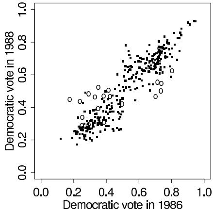
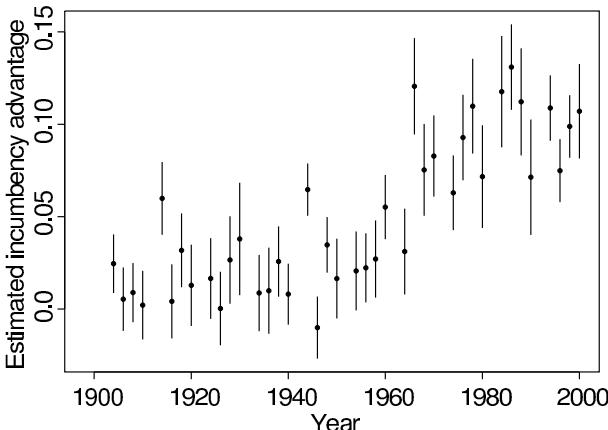
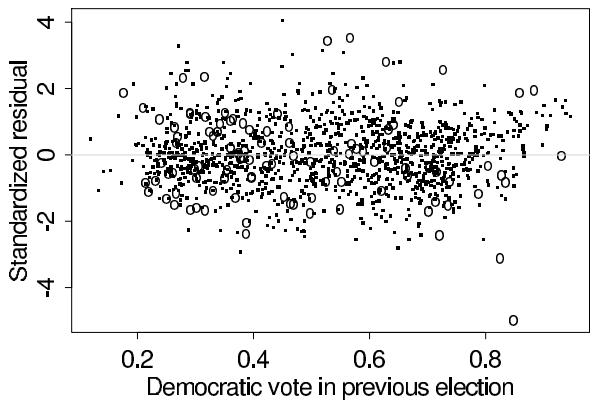
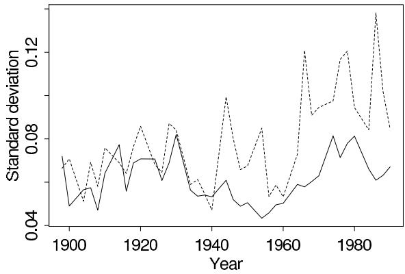

# Introduction to Regression Models

[Package map](../structure.md) · [Unsplit OCR dump](./_full.md)

[← Ch. 13 Approximations](./13-modal-and-distributional-approximations.md) · [Ch. 15 Hierarchical Linear Models →](./15-hierarchical-linear-models.md)

> MinerU OCR dump. If a formula, table, or numbering disagrees with the PDF, the PDF is authoritative.

---

# Chapter 14

# Introduction to regression models

Linear regression is one of the most widely used statistical tools. This chapter introduces Bayesian model building and inference for normal linear models, focusing on the simple case of uniform prior distributions. We apply the hierarchical modeling ideas of Chapter 5 in the context of linear regression in the next chapter. The analysis of the educational testing experiments in Chapter 5 is a special case of hierarchical linear modeling.

The topics of setting up and checking linear regression models are far too broad to be adequately covered in one or two chapters here. Rather than attempt a complete treatment in this book, we cover the standard forms of regression in enough detail to show how to set up the relevant Bayesian models and draw samples from posterior distributions for parameters $\theta$ and future observables $\tilde{y}$ . For the simplest case of linear regression, we derive the basic results in Section 14.2 and discuss the major applied issues in Section 14.3 with an extended example of estimating the effect of incumbency in elections. In the later sections of this chapter, we discuss analytical and computational methods for more complicated models.

Throughout, we describe computations that build on the methods of standard least-squares regression where possible. In particular, we show how simple simulation methods can be used to (1) draw samples from posterior and predictive distributions, automatically incorporating uncertainty in the model parameters, and (2) draw samples for posterior predictive checks.

# 14.1 Conditional modeling

Many studies concern relations among two or more observables. A common question is: how does one quantity, $y$ , vary as a function of another quantity or vector of quantities, $x$ ? In general, we are interested in the conditional distribution of $y$ , given $x$ , parameterized as $p(y|\theta, x)$ , under a model in which the $n$ observations $(x, y)_i$ are exchangeable.

# Notation

The quantity of primary interest, $y$ , is called the response or outcome variable; we assume here that it is continuous. The variables $x = (x_{1},\ldots ,x_{k})$ are called explanatory variables and may be discrete or continuous. We sometimes choose a single variable $x_{j}$ of primary interest and call it the treatment variable, labeling the other components of $x$ as control variables. The distribution of $y$ given $x$ is typically studied in the context of a set of units or experimental subjects, $i = 1,\dots ,n$ , on which $y_{i}$ and $x_{i1},\ldots ,x_{ik}$ are measured. Throughout, we use $i$ to index units and $j$ to index components of $x$ . We use $y$ to denote the vector of outcomes for the $n$ subjects and $X$ as the $n\times k$ matrix of predictors.

The simplest and most widely used version of this model is the normal linear model, in which the distribution of $y$ given $X$ is normal with a mean that is a linear function of $X$ :

$$
\operatorname {E} \left(y _ {i} \mid \beta , X\right) = \beta_ {1} x _ {i 1} + \dots + \beta_ {k} x _ {i k},
$$

for $i = 1, \ldots, n$ . For many applications, the variable $x_{i1}$ is fixed at 1, so that $\beta_1 x_{i1}$ is constant for all $i$ .

In this chapter, we restrict our attention to the normal linear model; in Sections 14.2-14.5, we further restrict to the case of ordinary linear regression in which the conditional variances are equal, $\mathrm{var}(y_i|\theta ,X) = \sigma^2$ for all $i$ , and the observations $y_{i}$ are conditionally independent given $\theta ,X$ . The parameter vector is then $\theta = (\beta_{1},\ldots ,\beta_{k},\sigma)$ . We consider more complicated variance structures in Section 14.7.

In the normal linear model framework, the key statistical modeling issues are (1) defining the variables $x$ and $y$ (possibly using transformations) so that the conditional expectation of $y$ is reasonably linear as a function of the columns of $X$ with approximately normal errors, and (2) setting up a prior distribution on the model parameters that accurately reflects substantive knowledge—a prior distribution that is sufficiently strong for the model parameters to be accurately estimated from the data at hand, yet not so strong as to dominate the data inappropriately. The statistical inference problem is to estimate the parameters $\theta$ , conditional on $X$ and $y$ .

Because we can choose as many variables $X$ as we like and transform the $X$ and $y$ variables in any convenient way, the normal linear model is a remarkably flexible tool for quantifying relationships among variables. In Chapter 16, we discuss generalized linear models, which broaden the range of problems to which the linear predictor can be applied.

# Formal Bayesian justification of conditional modeling

The numerical 'data' in a regression problem include both $X$ and $y$ . Thus, a full Bayesian model includes a distribution for $X$ , $p(X|\psi)$ , indexed by a parameter vector $\psi$ , and thus involves a joint likelihood, $p(X,y|\psi ,\theta)$ , along with a prior distribution, $p(\psi ,\theta)$ . In the standard regression context, the distribution of $X$ is assumed to provide no information about the conditional distribution of $y$ given $X$ ; that is, we assume prior independence of the parameters $\theta$ determining $p(y|X,\theta)$ and the parameters $\psi$ determining $p(X|\psi)$ .

Thus, from a Bayesian perspective, the defining characteristic of a 'regression model' is that it ignores the information supplied by $X$ about $(\psi, \theta)$ . How can this be justified? Suppose $\psi$ and $\theta$ are independent in their prior distribution; that is, $p(\psi, \theta) = p(\psi)p(\theta)$ . Then the posterior distribution factors,

$$
p (\psi , \theta | X, y) = p (\psi | X) p (\theta | X, y),
$$

and we can analyze the second factor by itself (that is, as a standard regression model), with no loss of information:

$$
p (\theta | X, y) \propto p (\theta) p (y | X, \theta).
$$

When the explanatory variables $X$ are chosen (for example, in a designed experiment), their probability $p(X)$ is known, and there are no parameters $\psi$ .

The practical advantage of using such a regression model is that it is much easier to specify a realistic conditional distribution of one variable given $k$ others than a joint distribution on all $k + 1$ variables.

# 14.2 Bayesian analysis of the classical regression model

A large part of applied statistical analysis is based on linear regression techniques that can be thought of as Bayesian posterior inference based on a noninformative prior distribution for the parameters of the normal linear model. In Sections 14.2-14.5, we briefly outline, from a Bayesian perspective, the choices involved in setting up a regression model; these issues also apply to methods such as the analysis of variance and the analysis of covariance that can be considered special cases of linear regression. For more discussions of these issues from

a non-Bayesian perspective, see any standard regression or econometrics textbook. Under a standard noninformative prior distribution, the Bayesian estimates and standard errors coincide with the classical results. However, even in the noninformative case, posterior simulations are useful for predictive inference and model checking.

# Notation and basic model

In the simplest case, sometimes called ordinary linear regression, the observation errors are independent and have equal variance; in vector notation,

$$
y \mid \beta , \sigma , X \sim \mathrm {N} (X \beta , \sigma^ {2} I), \tag {14.1}
$$

where $I$ is the $n \times n$ identity matrix. We discuss departures from the assumptions of the ordinary linear regression model—notably, the constant variance and zero conditional correlations in (14.1)—in Section 14.7.

# The standard noninformative prior distribution

In the normal regression model, a convenient noninformative prior distribution is uniform on $(\beta ,\log \sigma)$ or, equivalently,

$$
p (\beta , \sigma^ {2} | X) \propto \sigma^ {- 2}. \tag {14.2}
$$

When there are many data points and only a few parameters, the noninformative prior distribution is useful—it gives acceptable results (for reasons discussed in Chapter 4) and takes less effort than specifying prior knowledge in probabilistic form. For a small sample size or a large number of parameters, the likelihood is less sharply peaked, and so prior distributions and hierarchical models are more important. We return to the issue of prior information for the normal linear model in Section 14.8 and Chapter 15.

# The posterior distribution

As with the normal distribution with unknown mean and variance analyzed in Chapter 3, we determine first the posterior distribution for $\beta$ , conditional on $\sigma$ , and then the marginal posterior distribution for $\sigma^2$ . That is, we factor the joint posterior distribution for $\beta$ and $\sigma^2$ as $p(\beta, \sigma^2 | y) = p(\beta | \sigma^2, y) p(\sigma^2 | y)$ . For notational convenience, we suppress the dependence on $X$ here and in subsequent notation.

Conditional posterior distribution of $\beta$ , given $\sigma$ . The conditional posterior distribution of the (vector) parameter $\beta$ , given $\sigma$ , is the exponential of a quadratic form in $\beta$ and hence is normal. We use the notation

$$
\beta | \sigma , y \sim \mathrm {N} (\hat {\beta}, V _ {\beta} \sigma^ {2}), \tag {14.3}
$$

using the now familiar technique of completing the square (see Exercise 14.3):

$$
\hat {\beta} = \left(X ^ {T} X\right) ^ {- 1} X ^ {T} y, \tag {14.4}
$$

$$
V _ {\beta} = \left(X ^ {T} X\right) ^ {- 1}. \tag {14.5}
$$

Marginal posterior distribution of $\sigma^2$ . The marginal posterior distribution of $\sigma^2$ can be written as

$$
p (\sigma^ {2} | y) = \frac {p (\beta , \sigma^ {2} | y)}{p (\beta | \sigma^ {2} , y)},
$$

which can be seen to have a scaled inverse- $\chi^2$ form (see Exercise 14.4),

$$
\sigma^ {2} | y \sim \operatorname {I n v} - \chi^ {2} (n - k, s ^ {2}), \tag {14.6}
$$

where

$$
s ^ {2} = \frac {1}{n - k} (y - X \hat {\beta}) ^ {T} (y - X \hat {\beta}). \tag {14.7}
$$

The marginal posterior distribution of $\beta |y$ , averaging over $\sigma$ , is multivariate $t$ with $n - k$ degrees of freedom, but we rarely use this fact in practice when drawing inferences by simulation, since to characterize the joint posterior distribution we can draw simulations of $\sigma$ and then $\beta |\sigma$ .

Comparison to classical regression estimates. The standard non-Bayesian estimates of $\beta$ and $\sigma$ are $\hat{\beta}$ and $s$ , respectively, as just defined. The classical standard error estimate for $\beta$ is obtained by setting $\sigma = s$ in (14.3).

Checking that the posterior distribution is proper. As for any analysis based on an improper prior distribution, it is important to check that the posterior distribution is proper (that is, has a finite integral). It turns out that $p(\beta, \sigma^2 | y)$ is proper as long as (1) $n > k$ and (2) the rank of $X$ equals $k$ (see Exercise 14.6). Statistically, in the absence of prior information, the first condition requires that there be at least as many data points as parameters, and the second condition requires that the columns of $X$ be linearly independent (that is, no column can be expressed as a linear combination of the other columns) in order for all $k$ coefficients of $\beta$ to be uniquely identified by the data.

# Sampling from the posterior distribution

It is easy to draw samples from the posterior distribution, $p(\beta, \sigma^2 | y)$ , by (1) computing $\hat{\beta}$ from (14.4) and $V_{\beta}$ from (14.5), (2) computing $s^2$ from (14.7), (3) drawing $\sigma^2$ from the scaled inverse- $\chi^2$ distribution (14.6), and (4) drawing $\beta$ from the multivariate normal distribution (14.3). In practice, $\hat{\beta}$ and $V_{\beta}$ can be computed using standard linear regression software.

To be computationally efficient, the simulation can be set up as follows, using standard matrix computations. (See the bibliographic note at the end of the chapter for references on matrix factorization and least squares computation.) Computational efficiency is important for large datasets and also with the iterative methods required to estimate several variance parameters simultaneously, as described in Section 14.7.

1. Compute the $QR$ factorization, $X = QR$ , where $Q$ is an $n \times k$ matrix of orthonormal columns and $R$ is a $k \times k$ upper triangular matrix.   
2. Compute $R^{-1}$ this is an easy task since $R$ is upper triangular. $R^{-1}$ is a Cholesky factor (that is, a matrix square root) of the covariance matrix $V_{\beta}$ , since $R^{-1}(R^{-1})^T = (X^T X)^{-1} = V_{\beta}$ .   
3. Compute $\hat{\beta}$ by solving the linear system, $R\hat{\beta} = Q^T y$ , using the fact that $R$ is upper triangular.

Once $\sigma^2$ is simulated (using the random $\chi^2$ draw), $\beta$ can be easily simulated from the appropriate multivariate normal distribution using the Cholesky factorization and a program for generating independent standard normals (see Appendix A). The QR factorization of $X$ is useful both for computing the mean of the posterior distribution and for simulating the random component in the posterior distribution of $\beta$ .

For some large problems involving thousands of data points and hundreds of explanatory variables, even the QR decomposition can require substantial computer storage space and time, and methods such as conjugate gradient, stepwise ascent, and iterative simulation can be more effective.

The posterior predictive distribution for new data

Now suppose we apply the regression model to a new set of data, for which we have observed the matrix $\tilde{X}$ of explanatory variables, and we wish to predict the outcomes, $\tilde{y}$ . If $\beta$ and $\sigma^2$ were known exactly, the vector $\tilde{y}$ would have a normal distribution with mean $\tilde{X}\beta$ and variance matrix $\sigma^2 I$ . Instead, our current knowledge of $\beta$ and $\sigma$ is summarized by our posterior distribution.

Posterior predictive simulation. The posterior predictive distribution of unobserved data, $p(\tilde{y} | y)$ , has two components of uncertainty: (1) the fundamental variability of the model, represented by the variance $\sigma^2$ in $y$ not accounted for by $X\beta$ , and (2) the posterior uncertainty in $\beta$ and $\sigma$ due to the finite sample size of $y$ . (Our notation continues to suppress the dependence on $X$ and $\tilde{X}$ .) As the sample size $n \to \infty$ , the variance due to posterior uncertainty in $(\beta, \sigma^2)$ decreases to zero, but the predictive uncertainty remains. To draw a random sample $\tilde{y}$ from its posterior predictive distribution, we first draw $(\beta, \sigma)$ from their joint posterior distribution, then draw $\tilde{y} \sim \mathrm{N}(\tilde{X}\beta, \sigma^2 I)$ .

Analytic form of the posterior predictive distribution. The normal linear model is simple enough that we can also determine the posterior predictive distribution analytically. Deriving the analytic form is not necessary—we can easily draw $(\beta, \sigma)$ and then $\tilde{y}$ , as described above—however, we can gain useful insight by studying the predictive uncertainty analytically.

We first consider the conditional posterior predictive distribution, $p(\tilde{y}|\sigma, y)$ , then average over the posterior uncertainty in $\sigma|y$ . Given $\sigma$ , the future observation $\tilde{y}$ has a normal distribution (see Exercise 14.7), and we derive its mean by averaging over $\beta$ using (2.7):

$$
\begin{array}{l} \operatorname {E} (\tilde {y} | \sigma , y) = \operatorname {E} (\operatorname {E} (\tilde {y} | \beta , \sigma , y) | \sigma , y) \\ = \mathrm {E} (\tilde {X} \beta | \sigma , y) \\ = \tilde {X} \hat {\beta}, \\ \end{array}
$$

where the inner expectation averages over $\tilde{y}$ , conditional on $\beta$ , and the outer expectation averages over $\beta$ . All expressions are conditional on $\sigma$ and $y$ , and the conditioning on $X$ and $\tilde{X}$ is implicit. Similarly, we can derive $\operatorname{var}(\tilde{y}|\sigma, y)$ using (2.8):

$$
\begin{array}{l} \operatorname {v a r} (\tilde {y} | \sigma , y) = \operatorname {E} [ \operatorname {v a r} (\tilde {y} | \beta , \sigma , y) | \sigma , y ] + \operatorname {v a r} [ \operatorname {E} (\tilde {y} | \beta , \sigma , y) | \sigma , y ] (14.8) \\ = \mathrm {E} [ \sigma^ {2} I | \sigma , y ] + \operatorname {v a r} [ \tilde {X} \beta | \sigma , y ] \\ = \left(I + \tilde {X} V _ {\beta} \tilde {X} ^ {T}\right) \sigma^ {2}. (14.9) \\ \end{array}
$$

This result makes sense: conditional on $\sigma$ , the posterior predictive variance has two terms: $\sigma^2 I$ , representing sampling variation, and $\tilde{X} V_{\beta} \tilde{X}^T \sigma^2$ , due to uncertainty about $\beta$ .

Given $\sigma$ , the future observations have a normal distribution with mean $\tilde{X}\hat{\beta}$ , which does not depend on $\sigma$ , and variance (14.9) that is proportional to $\sigma^2$ . To complete the determination of the posterior predictive distribution, we must average over the marginal posterior distribution of $\sigma^2$ in (14.6). The resulting posterior predictive distribution, $p(\tilde{y} | y)$ , is multivariate $t$ with center $\tilde{X}\hat{\beta}$ , squared scale matrix $s^2(I + \tilde{X}V_\beta \tilde{X}^T)$ , and $n - k$ degrees of freedom.

Prediction when $\tilde{X}$ is not completely observed. It is harder to predict $\tilde{y}$ if not all the explanatory variables in $\tilde{X}$ are known, because then the explanatory variables must themselves be modeled by a probability distribution. We return to the problem of multivariate missing data in Chapter 18.

# Model checking and robustness

Checking the fit and robustness of a linear regression model is a well-developed topic in statistics. The standard methods such as examining plots of residuals against explanatory variables are useful and can be directly interpreted as posterior predictive checks. An advantage of the Bayesian approach is that we can compute, using simulation, the posterior predictive distribution for any data summary, so we do not need to put a lot of effort into estimating the sampling distributions of test statistics. For example, to assess the statistical and practical significance of patterns in a residual plot, we can obtain the posterior predictive distribution of an appropriate test statistic (for example, the correlation between the squared residuals and the fitted values), as we illustrate in Table 14.2 in the following example.

# 14.3 Regression for causal inference: incumbency in congressional elections

We illustrate the Bayesian interpretation of linear regression with an example of constructing a regression model using substantive knowledge, computing its posterior distribution, interpreting the results, and checking the fit of the model to data.

Observers of legislative elections in the United States have often noted that incumbency—that is, being the current representative in a district—is an advantage for candidates. Political scientists are interested in the magnitude of the effect, formulated, for example, as 'what proportion of the vote is incumbency worth?' and 'how has incumbency advantage changed over the past few decades?' We shall use linear regression to study the advantage of incumbency in elections for the U.S. House of Representatives in the past century. In order to assess changes over time, we run a separate regression for each election year in our study. The results of each regression can be thought of as summary statistics for the effect of incumbency in each election year; these summary statistics can themselves be analyzed, formally by a hierarchical time series model or, as we do here, informally by examining graphs of the estimated effect and standard errors over time.

Every two years, the members of the U.S. House of Representatives are elected by plurality vote in 435 single-member districts. Typically, about 100 to 150 of the district elections are uncontested; that is, one candidate runs unopposed. Almost all the other district elections are contested by one candidate from each of the two major parties, the Democrats and the Republicans. In each district, one of the parties—the incumbent party in that district—currently holds the seat in the House, and the current officeholder—the incumbent—may or may not be a candidate for reelection. We are interested in the effect of the decision of the incumbent to run for reelection on the vote received by the incumbent party's candidate.

# Units of analysis, outcome, and treatment variables

For each election year, the units of analysis in our study are the contested district elections. The outcome variable, $y_{i}$ , is the proportion of the vote received by the incumbent party (see below) in district $i$ , and we code the treatment variable as $R_{i}$ , the decision of the incumbent to run for reelection:

$$
R _ {i} = \left\{ \begin{array}{l l} 1 & \text {i f t h e i n c u m b e n t o f f i c e h o l d e r r u n s f o r r e e l e c t i o n} \\ 0 & \text {o t h e r w i s e .} \end{array} \right.
$$

If the incumbent does not run for reelection (that is, if $R_{i} = 0$ ), the district election is called an 'open seat.' Thus, an incumbency advantage would cause the value of $y_{i}$ to increase if $R_{i} = 1$ . We exclude from our analysis votes for third-party candidates and elections in which only one major-party candidate is running; see the bibliographic note for references discussing these and other data-preparation issues.

  
Figure 14.1 U.S. congressional elections: Democratic proportion of the vote in contested districts in 1986 and 1988. Dots and circles indicate districts that in 1988 had incumbents running and open seats, respectively. Points on the left and right halves of the graph correspond to the incumbent party being Republican or Democratic.

We analyze the data as an observational study in which we are interested in estimating the effect of the incumbency variable on the vote proportion. The estimand of primary interest in this study is the average effect of incumbency.

We define the theoretical incumbency advantage for an election in a single district $i$ as

$$
\text {i n c u m b e n c y} \quad \text {a d v a n t a g e} _ {i} = y _ {\text {c o m p l e t e} i} ^ {I} - y _ {\text {c o m p l e t e} i} ^ {O}, \tag {14.10}
$$

where

$y_{\text{complete} i}^{I} = \text{proportion of the vote in district } i \text{ received by the incumbent legislator,}$ if he or she runs for reelection against major-party opposition in district $i$ (thus, $y_{\text{complete} i}^{I}$ is unobserved in an open-seat election),

$y_{\mathrm{complete}i}^{O} =$ proportion of the vote in district $i$ received by the incumbent party, if the incumbent legislator does not run and the two major parties compete for the open seat (thus, $y_{\mathrm{complete}i}^{O}$ is unobserved if the incumbent runs for reelection).

The observed outcome, $y_{i}$ , equals either $y_{\mathrm{complete}i}^{I}$ or $y_{\mathrm{complete}i}^{O}$ , depending on whether the treatment variable equals 0 or 1.

We define the aggregate incumbency advantage for an entire legislature as the average of the incumbency advantages for all districts in a general election. This theoretical definition applies within a single election year and allows incumbency advantage to vary among districts. The definition (14.10) does not assume that the candidates under the two treatments are identical in all respects except for incumbency status.

The incumbency advantage in a district depends on both $y_{\text{complete } i}^{I}$ and $y_{\text{complete } i}^{O}$ ; unfortunately, a real election in a single district will reveal only one of these. The problem can be thought of as causal inference from an observational study; as discussed in Sections 8.4 and 8.6, the average treatment effect can be estimated using regression, if we condition on enough control variables for the treatment assignment to be considered ignorable.

# Setting up control variables so that data collection is approximately ignorable

It would be possible to estimate the incumbency advantage with only two columns in $X$ : the treatment variable and the constant term (a column of ones). The regression would then be directly comparing the vote shares of incumbents to nonincumbents. The problem

is that, since incumbency is not a randomly assigned experimental treatment, incumbents and nonincumbents no doubt differ in important ways other than incumbency. For example, suppose that incumbents tend to run for reelection in 'safe seats' that favor their party, but typically decline to run for reelection in 'marginal seats' that they have less chance of winning. If this were the case, then incumbents would be getting higher vote shares than non-incumbents, even in the absence of incumbency advantage. The resulting inference for incumbency advantage would be flawed because of serious nonignorability in the treatment assignment.

A partial solution is to include the vote for the incumbent party in the previous election as a control variable. Figure 14.1 shows the data for the 1988 election, using the 1986 election as a control variable. Each symbol in Figure 14.1 represents a district election; the dots represent districts in which an incumbent is running for reelection, and the open circles represent 'open seats' in which no incumbent is running. The vertical coordinate of each point is the share of the vote received by the Democratic party in the district, and the horizontal coordinate is the share of the vote received by the Democrats in the previous election in that district. The strong correlation confirms both the importance of using the previous election outcome as a control variable and the rough linear relation between the explanatory and outcome variables.

We include another control variable for the incumbent party: $P_{i} = 1$ if the Democrats control the seat and -1 if the Republicans control the seat before the election, whether or not the incumbent is running for reelection. This includes in the model a possible nationwide partisan swing; for example, a swing of $5\%$ toward the Democrats would add $5\%$ to $y_{i}$ for districts $i$ in which the Democrats are the incumbent party and $-5\%$ to $y_{i}$ for districts $i$ in which the Republicans are the incumbent party.

It might make sense to include other control variables that may affect the treatment and outcome variables, such as incumbency status in that district in the previous election, the outcome in the district two elections earlier, and so forth. At some point, additional variables will add little to the ability of the regression model to predict $y$ and will have essentially no influence on the coefficient for the treatment variable.

# Implicitignorabilityassumption

For our regression to estimate the actual effect of incumbency, we are implicitly assuming that the treatment assignments—the decision of an incumbent political party to run an incumbent or not in district $i$ , and thus to set $R_{i}$ equal to 0 or 1—conditional on the control variables, do not depend on any other variables that also affect the election outcome. For example, if incumbents who knew they would lose decided not to run for reelection, then the decision to run would depend on an unobserved outcome, the treatment assignment would be nonignorable, and the selection effect would have to be modeled.

In a separate analysis of these data, we have found that the probability an incumbent runs for reelection is approximately independent of the vote in that district in the previous election. If electoral vulnerability were a large factor in the decision to run, we would expect that incumbents with low victory margins in the previous election would be less likely to run for reelection. Since this does not occur, we believe the departures from ignorability are small. So, although the ignorability assumption is imperfect, we tentatively accept it for this analysis. The decision to accept ignorability is made based on subject-matter knowledge and additional data analysis.

# Transformations

Since the explanatory variable is restricted to lie between 0 and 1 (recall that we have excluded uncontested elections from our analysis), it would seem advisable to transform the

  
Figure 14.2 Incumbency advantage over time: posterior median and $95\%$ interval for each election year. The inference for each year is based on a separate regression. As an example, the results from the regression for 1988, based on the data in Figure 14.1, are displayed in Table 14.1.

data, perhaps using the logit transformation, before fitting a linear regression model. In practice, however, almost all the vote proportions $y_{i}$ fall between 0.2 and 0.8, so the effect of such a transformation would be minor. We analyze the data on the original scale for simplicity in computation and interpretation of inferences.

# Posterior inference

As an initial analysis, we estimate separate regressions for each of the election years in the twentieth century, excluding election years immediately following redrawing of the district boundaries, for it is difficult to define incumbency in those years. Posterior means and $95\%$ posterior intervals (determined analytically from the appropriate $t$ distributions) for the coefficient for incumbency are displayed for each election year in Figure 14.2. As usual, we can use posterior simulations of the regression coefficients to compute any quantity of interest. For example, the increase from the average incumbency advantage in the 1950s to the average advantage in the 1980s has a posterior mean of 0.050 with a central $95\%$ posterior interval of [0.035, 0.065], according to an estimate based on 1000 independent simulation draws.

These results are based using incumbent party and previous election result as control variables (in addition to the constant term). Including more control variables to account for earlier incumbency and election results did not substantially change the inference about the coefficient of the treatment variable, and in addition made the analysis more difficult because of complications such as previous elections that were uncontested.

As an example of the results from a single regression, Table 14.1 displays posterior inferences for the coefficients $\beta$ and residual standard deviation $\sigma$ of the regression estimating the incumbency advantage in 1988, based on a noninformative uniform prior distribution on $(\beta, \log \sigma)$ and the data displayed in Figure 14.1. The posterior quantiles could have been computed by simulation, but for this simple case we computed them analytically from the posterior $t$ and scaled inverse- $\chi^2$ distributions.

# Model checking and sensitivity analysis

The estimates in Figure 14.2 are plausible and also add to our understanding of elections, in giving an estimate of the magnitude of the incumbency advantage ('what proportion of

Table 14.1 Inferences for parameters in the regression estimating the incumbency advantage in 1988. The outcome variable is the incumbent party's share of the two-party vote in 1988, and only districts that were contested by both parties in both 1986 and 1988 were included. The parameter of interest is the coefficient of incumbency. Data are displayed in Figure 14.1. The posterior median and $95\%$ interval for the coefficient of incumbency correspond to the bar for 1988 in Figure 14.2.   

<table><tr><td rowspan="2">Variable</td><td colspan="5">Posterior quantiles</td></tr><tr><td>2.5%</td><td>25%</td><td>median</td><td>75%</td><td>97.5%</td></tr><tr><td>Incumbency</td><td>0.084</td><td>0.103</td><td>0.114</td><td>0.124</td><td>0.144</td></tr><tr><td>Vote proportion in 1986</td><td>0.576</td><td>0.627</td><td>0.654</td><td>0.680</td><td>0.731</td></tr><tr><td>Incumbent party</td><td>-0.014</td><td>-0.009</td><td>-0.007</td><td>-0.004</td><td>0.001</td></tr><tr><td>Constant term</td><td>0.066</td><td>0.106</td><td>0.127</td><td>0.148</td><td>0.188</td></tr><tr><td>σ (residual sd)</td><td>0.061</td><td>0.064</td><td>0.066</td><td>0.068</td><td>0.071</td></tr></table>

  
Figure 14.3 Standardized residuals, $(y_{it} - X_{it}\hat{\beta}) / s_t$ , from the incumbency advantage regressions for the 1980s, vs. Democratic vote in the previous election. (The subscript $t$ indexes the election years.) Dots and circles indicate district elections with incumbents running and open seats, respectively.

the vote is incumbency worth?') and evidence of a small positive incumbency advantage in the first half of the century.

In addition it is instructive, and crucial if we are to have any faith in our results, to check the fit of the model to our data.

Search for outliers. A careful look at Figure 14.1 suggests that the outcome variable is not normally distributed, even after controlling for its linear regression on the treatment and control variables. To examine the outliers further, we plot in Figure 14.3 the standardized residuals from the regressions from the 1980s. As in Figure 14.1, elections with incumbents and open seats are indicated by dots and circles, respectively. (We show data from just one decade because displaying the points from all the elections in our data would overwhelm the scatterplot.) For the standardized residual for the data point $i$ , we just use $(y_{i} - X_{i}\hat{\beta}) / s$ where $s$ is the estimated standard deviation from equation (14.7). For simplicity, we still have a separate regression, and thus separate values of $\hat{\beta}$ and $s$ , for each election year. If the normal linear model is correct, the standardized residuals should be approximately normally distributed, with a mean of 0 and standard deviation of about 1. Some of the standardized residuals in Figure 14.3 appear to be outliers by comparison to the normal distribution. (The residual standard deviations of the regressions are about 0.07—see Table 14.1, for example—and almost all of the vote shares lie between 0.2 and 0.8, so the fact that the vote shares are bounded between 0 and 1 is essentially irrelevant here.)

Table 14.2 Summary of district elections that are 'outliers' (defined as having absolute (unstandardized) residuals from the regression model of more than 0.2) for the incumbency advantage example. Elections are classified as open seats or incumbent running; for each category, the observed proportion of outliers is compared to the posterior predictive distribution. Both observed proportions are far higher than expected under the model.   

<table><tr><td rowspan="2"></td><td rowspan="2">Observed proportion of outliers</td><td colspan="3">Posterior predictive dist. of proportion of outliers</td></tr><tr><td>2.5%</td><td>median</td><td>97.5%</td></tr><tr><td>Open seats</td><td>41/1596 = 0.0257</td><td>0.0013</td><td>0.0038</td><td>0.0069</td></tr><tr><td>Incumbent running</td><td>84/10303 = 0.0082</td><td>0.0028</td><td>0.0041</td><td>0.0054</td></tr></table>

Posterior predictive checks. To perform a more formal check, we compute the proportion of district elections over a period of decades whose unstandardized residuals from the fitted regression models are greater than 0.20 in absolute value, a value that is roughly 3 estimated standard deviations away from zero. We use this unconventional measure partly to demonstrate the flexibility of the Bayesian approach to posterior predictive model checking and partly because the definition has an easily understood political meaning—the proportion of elections mispredicted by more than $20\%$ . The results classified by incumbency status appear in the first column of Table 14.2.

As a comparison, we simulate the posterior predictive distribution of the test statistics:

1. For $l = 1, \dots, 1000$ :

(a) For each election year in the study:

i. Draw $(\beta, \sigma)$ from their posterior distribution.

ii. Draw a hypothetical replication, $y^{\mathrm{rep}}$ , from the predictive distribution, $y^{\mathrm{rep}} \sim \mathrm{N}(X\beta, \sigma^2 I)$ , given the drawn values of $(\beta, \sigma)$ and the existing vector $X$ for that election year.

iii. Run a regression of $y^{\mathrm{rep}}$ on $X$ and save the residuals.

(b) Combine the results from the individual election years to get the proportion of residuals that exceed 0.2 in absolute value, for elections with and without incumbents running.

2. Use the 1000 simulated values of the above test statistics to represent the posterior predictive distribution.

Quantiles from the posterior predictive distributions of the test statistics are shown as the final three columns of Table 14.2. The observed numbers of outliers in the two categories are about ten times and twice the values expected under the model and can clearly not be explained by chance.

One way to measure the seriousness of the outliers is to compute a test statistic measuring the effect on political predictions. For example, consider the number of party switches—districts in which the incumbent party candidate loses. In the actual data, $1498 / 11899 = 0.126$ of contested district elections result in a party switch in that district. By comparison, we can compute the posterior predictive distribution of the proportion of party switches using the same posterior predictive simulations as above; the median of the 1000 simulations is 0.136 with a central $95\%$ posterior interval of [0.130, 0.143]. The posterior predictive simulations tell us that the observed proportion of party switches is lower than could be predicted under the model, but the difference is a minor one of overpredicting switches by about one percentage point.

Sensitivity of results to the normality assumption. These outliers do not strongly affect our inference for the average incumbency advantage, so we ignore this failing of the model. We would not want to use this model for predictions of extreme outcomes, however, nor would we be surprised by occasional election outcomes far from the regression line. In

political terms, the outliers may correspond to previously popular politicians who have been tainted by scandal—information that is not included in the model. It would be possible to generalize, for example by modeling the outliers with unequal variances for incumbents and open seats, along with a $t$ error term; but we would want a good reason to add in this additional complexity.

# 14.4 Goals of regression analysis

Regression models satisfy at least three goals: (1) understanding the behavior of $y$ , given $x$ (for example, 'what are the factors that aid a linear prediction of the Democratic share of the vote in a congressional district?'); (2) predicting $y$ , given $x$ , for future observations ('what share of the vote might my local congressmember receive in the next election?' or 'how many Democrats will be elected to Congress next year?'); (3) causal inference, or predicting how $y$ would change if $x$ were changed in a specified way ('what would be the effect on the number of Democrats elected to Congress next year, if a term limitations bill were enacted—so no incumbents would be allowed to run for reelection—compared to if no term limitations bill were enacted?').

The goal of understanding how $y$ varies as a function of $x$ is clear, given any particular regression model. We discuss the goals of prediction and causal inference in more detail, focusing on how the general concepts can be implemented in the form of probability models, posterior inference, and prediction.

# Predicting $y$ from $x$ for new observations

Once its parameters have been estimated, a regression can be used to predict future observations from units in which the explanatory variables $\tilde{X}$ , but not the outcome $\tilde{y}$ , have been observed. When making predictions we are assuming that the old and new observations are exchangeable given the same values of $x$ , so that the vector $x$ contains all the information we have to distinguish the new observation from the old (this includes, for example, the assumption that time of observation is irrelevant if it is not encoded in $x$ ). For example, suppose we have fitted a regression model to 100 schoolchildren, with $y$ for each child being the reading test score at the end of the second grade and $x$ having two components: the student's test score at the beginning of the second grade and a constant term. Then we could use these predictors to construct a predictive distribution of $\tilde{y}$ for a new student for whom we have observed $\tilde{x}$ . This prediction would be most trustworthy if all 101 students were randomly sampled from a common population (such as students in a particular school or students in the United States as a whole) and less reliable if the additional student differed in some known way from the first hundred—for example, if the first hundred came from a single school and the additional student attended a different school.

As with exchangeability in general, it is not required that the 101 students be 'identical' or even similar, just that all relevant knowledge about them be included in $x$ . The more similar the units are, the lower the variance of the regression will be, but that is an issue of precision, not validity.

When the old and new observations are not exchangeable, the relevant information should be encoded in $x$ . For example, if we are interested in learning about students from two different schools, we should include an indicator variable in the regression. The simplest approach is to replace the constant term in $x$ by two indicator variables (that is, replacing the column of ones in $X$ by two columns): $x_{A}$ that equals 1 for students from school A and 0 for students from school B, and $x_{B}$ that is the reverse. Now, if all the 100 students used to estimate the regression attended school A, then the data will provide no evidence about the coefficient for school B. The resulting predictive distribution of $y$ for a new student in school B is highly dependent on our prior distribution, indicating our uncertainty in extrapolating

to a new population. (With a noninformative uniform prior distribution and no data on the coefficient of school B, the improper posterior predictive distribution for a new observation in school B will have infinite variance. In a real study, it should be possible to construct some sort of weak prior distribution linking the coefficients in the two schools, which would lead to a posterior distribution with high variance.)

# Causal inference

The goals of describing the relationship between $y$ and $x$ and using the resulting model for prediction are straightforward applications of estimating $p(y|x)$ . Causal inference is more subtle. When thinking about causal inference, as in the incumbency advantage example of Section 14.3, we think of the variable of interest as the treatment variable and the other explanatory variables as control variables or covariates. In epidemiology, closely related terms are exposure and confounding variables, respectively. The treatment variables represent attributes that are manipulated or at least potentially manipulable by the investigator (such as the doses of drugs applied to a patient in an experimental medical treatment), whereas the control variables measure other characteristics of the experimental unit or experimental environment, such as the patient's weight, measured before the treatment.

Do not control for post-treatment variables when estimating the causal effect.

Some care must be taken when considering control variables for causal inference. For instance, in the incumbency advantage example, what if we were to include a control variable for campaign spending, perhaps the logarithm of the number of dollars spent by the incumbent candidate's party in the election? After all, campaign spending is generally believed to have a large effect on many election outcomes. For the purposes of predicting election outcomes, it would be a good idea to include campaign spending as an explanatory variable. For the purpose of estimating the incumbency advantage with a regression, however, total campaign spending should not be included, because much spending occurs after the decision of the incumbent whether to run for reelection. The causal effect of incumbency, as we have defined it, is not equivalent to the effect of the incumbent running versus not running, with total campaign spending held constant, since, if the incumbent runs, total campaign spending by the incumbent party will probably increase. Controlling for 'pre-decision' campaign spending would be legitimate, however. If we control for one of the effects of the treatment variable, our regression will probably underestimate the true causal effect. If we are interested in both predicting vote share and estimating the causal effect of incumbency, we could include campaign spending and vote share as correlated outcome variables.

# 14.5 Assembling the matrix of explanatory variables

The choice of which variables to include in a regression model depends on the purpose of the study. We discuss, from a Bayesian perspective, some issues that arise in classical regression. We have already discussed issues arising from the distinction between prediction and causal inference.

# Identifiability and collinearity

The parameters in a classical regression cannot be uniquely estimated if there are more parameters than data points or, more generally, if the columns of the matrix $X$ of explanatory variables are not linearly independent. In these cases, the data are said to be 'collinear,' and $\beta$ cannot be uniquely estimated from the data alone, no matter how large the sample size. Think of a $k$ -dimensional scatterplot of the $n$ data points: if the $n$ points fall in a

lower-dimensional subspace (such as a two-dimensional plane sitting in a three-dimensional space), then the data are collinear ('coplanar' would be a better word). If the data are nearly collinear, falling close to some lower-dimensional hyperplane, then they supply little information about some linear combinations of the $\beta$ 's.

For example, consider the incumbency regression described in Section 14.3. If all the incumbents running for reelection had won with $70\%$ of the vote in the previous election, and all the open seats occurred in districts in which the incumbent party won $60\%$ of the vote in the previous election, then the three variables, incumbency, previous vote for the incumbent party, and the constant term, would be collinear (previous vote $= 0.6 + 0.1R_{i}$ ), and it would be impossible to estimate the three coefficients from the data alone. To do better we need more data—or prior information—that do not fall along the plane. Now consider a hypothetical dataset that is nearly collinear: suppose all the candidates who had received more than $65\%$ in the previous election always ran for reelection, whereas members who had won less than $65\%$ always declined to run. The near-collinearity of the data means that the posterior variance of the regression coefficients would be high in this hypothetical case. Another problem in addition to increased uncertainty conditional on the regression model is that in practice the inferences would be highly sensitive to the model's assumption that $\operatorname{E}(y|x,\theta)$ is linear in $x$ .

# Nonlinear relations

Once the variables have been selected, it often makes sense to transform them so that the relation between $x$ and $y$ is close to linear. Transformations such as logarithms and logits have been found useful in a variety of applications. One must take care, however: a transformation changes the interpretation of the regression coefficient to the change in transformed $y$ per unit change in the transformed $x$ variable. If it is thought that a variable $x_{j}$ has a nonlinear effect on $y$ , it is also possible to include more than one transformation of $x_{j}$ in the regression—for example, including both $x_{j}$ and $x_{j}^{2}$ allows an arbitrary quadratic function to be fitted. In Chapters 20-23 we discuss nonparametric models that can track nonlinear relations without need to prespecify the functional form of the nonlinearity. When $y$ is discrete, a generalized linear model can be appropriate; see Chapter 16.

# Indicator variables

To include a categorical variable in a regression, a natural approach is to construct an 'indicator variable' for each category. This allows a separate effect for each level of the category, without assuming any ordering or other structure on the categories. When there are two categories, a simple $0/1$ indicator works; when there are $k$ categories, $k-1$ indicators are required in addition to the constant term. It is often useful to incorporate the coefficients of indicator variables into hierarchical models, as we discuss in Chapter 15.

# Categorical and continuous variables

If there is a natural order to the categories of a discrete variable, then it is often useful to treat the variable as if it were continuous. For example, the letter grades A, B, C, D might be coded as 4, 3, 2, 1. In epidemiology this approach is often referred to as trend analysis. It is also possible to create a categorical variable from a continuous variable by grouping the values. This is sometimes helpful for examining and modeling departures from linearity in the relationship of $y$ to a particular component of $x$ .

# Interactions

In the linear model, a change of one unit in $x_{i}$ is associated with a constant change in the mean response of $y_{i}$ , given any fixed values of the other predictors. If the response to a unit change in $x_{i}$ depends on what value another predictor $x_{j}$ has been fixed at, then it is necessary to include interaction terms in the model. Generally the interaction can be allowed for by adding the cross-product term $(x_{i} - \overline{x}_{i})(x_{j} - \overline{x}_{j})$ as an additional predictor, although such terms may not be readily interpretable if both $x_{i}$ and $x_{j}$ are continuous (if such is the case, it is often preferable to categorize at least one of the two variables). For purposes of this exposition we treat these interactions just as we would any other explanatory variable: that is, create a new column of $X$ and estimate a new element of $\beta$ . We discuss nonparametric models for interactions in Chapters 20-23.

# Controlling for irrelevant variables

In addition, we generally wish to include only variables that have some reasonable substantive connection to the problem under study. Often in regression there are a large number of potential control variables, some of which may appear to have predictive value. For one example, consider, as a possible control variable in the incumbency example, the number of letters in the last name of the incumbent party's candidate. On the face of it, this variable looks silly, but it might happen to have predictive value for our dataset. In almost all cases, length of name is determined before the decision to seek reelection, so it will not interfere with causal inference. However, if length of name has predictive value in the regression, we should try to understand what is happening, rather than blindly throwing it into the model. For example, if length of name is correlating with ethnic group, which has political implications, it would be better, if possible, to use the more substantively meaningful variable, ethnicity itself, in the final model.

# Selecting the explanatory variables

Ideally, a statistical model should include all relevant information; in a regression, $x$ should include all covariates that might possibly help predict $y$ . The attempt to include relevant predictors is demanding in practice but is generally worth the effort. The possible loss of precision when including unimportant predictors is usually viewed as a relatively small price to pay for the general validity of predictions and inferences about estimands of interest.

In classical regression, there are direct disadvantages to increasing the number of explanatory variables. For one thing there is the restriction, when using the noninformative prior distribution, that $k < n$ . In addition, using a large number of explanatory variables leaves little information available to obtain precise estimates of the variance. These problems, which are sometimes summarized by the label 'overfitting,' are of much less concern with reasonable prior distributions, such as those applied in hierarchical linear models, as we shall see in Chapter 15. We consider Bayesian approaches to handling a large number of predictor variables in Section 14.6.

# 14.6 Regularization and dimension reduction for multiple predictors

Approaches such as stepwise regression and subset selection are traditional non-Bayesian methods for choosing a set of explanatory variables to include in a regression. Mathematically, not including a variable is equivalent to setting its coefficient to exactly zero. The classical regression estimate based on a selection procedure is equivalent to obtaining the posterior mode corresponding to a prior distribution that has nonzero probability on various low-dimensional hyperplanes of $\beta$ -space. The selection procedure is heavily influenced by

the quantity of data available, so that important variables may be omitted because chance variation cannot be ruled out as an alternative explanation for their predictive power. Geometrically, if $\beta$ -space is thought of as a room, the model implied by classical model selection claims that the true $\beta$ has certain prior probabilities of being in the room, on the floor, on the walls, in the edge of the room, or in a corner.

In a Bayesian framework, it is appealing to include prior information more continuously. With many explanatory variables $x_{j}$ , each with a fair probability of being irrelevant to modeling the outcome variable $y$ , one can give each coefficient a prior distribution $p(\beta)$ with a peak at zero—here we are thinking not of a spike at zero but of a distribution such as a zero-centered $t$ with a mode concentrated near zero—and a long tail. This says that each variable is probably unimportant, but if it has predictive power, it could be large.

For example, when the coefficients of a set of predictors are themselves modeled, it may be important first to apply linear or other transformations to put the predictors on an approximately common scale. In classical maximum likelihood or least squares estimation, or if a linear regression is performed with a noninformative uniform prior distribution on the coefficients $\beta_{j}$ , linear transformations of the predictor variables have no effect on inferences or predictions. In a Bayesian setting, however, transformations—even linear transformations in a linear model—can be important.

For example, if several different economic measures were available in a forecasting problem, it would be natural to first transforming each to an approximate $-1$ to 1 scale (say) before applying a prior distribution on the coefficients. Such transformations make intuitive sense statistically, and they allow a common prior distribution to be reasonable for a set of different coefficients $\beta_{j}$ . From a purely subjectivist perspective, any such linear data transformation would be irrelevant because it would directly map into a transformation of the prior distribution. In practical Bayesian inference, however, one of our criteria for choosing models is convenience, and as a default it is convenient to use a single prior distribution for all the coefficients in a model—or perhaps to categorize the coefficients into two or three categories (for example, corresponding to predictors that are essential, those that are pontetially important, and those of doubtful relevance). In either case, we would not be carefully assigning a separate prior distribution for each coefficient; rather, we would be using a flexible yet convenient class of models that we hope would perform well in most settings (the traditional goal of statistical methods, Bayesian and otherwise).

As discussed in Section 2.8, regularization is a general term used for statistical procedures that give more stable estimates. Least-squares estimates with large numbers of predictors can be noisy; informative prior distributions regularize the estimates. Three choices are involved in Bayesian regularization:

- The location and scale of the prior distribution: a more concentrated prior does more regularization.   
- The analytic form of the prior distribution: a normal distribution pulls estimates toward the prior mean by a constant proportion, a double-exponential (Laplacian) shifts estimates by a constant amount, and a long-tailed distribution such as a Cauchy does more regularization for estimates near the mean and less for estimates that are far away.   
- How the posterior inference is summarized: the posterior mode, which omits some variation, can look smoother (that is, more regularized) than the full posterior.

# Lasso

We can illustrate all three of these points with lasso, a popular non-Bayesian form of regularization that corresponds to estimating coefficients by their posterior mode, after assigning a double-exponential (Laplace) prior distribution centered at zero (that is, $p(\beta) \propto \prod_{j} \exp(-\lambda |\beta_j|)$ ). Combined with the normal likelihood from the regression model, this

yields a posterior distribution that is partially pooled toward zero, with the amount of pooling determined by $\lambda$ (a hyperparameter that can be set based on external information or estimated from data, either Bayesianly or through some non-Bayesian approach such as cross-validation). The key to lasso, though, is the combination of a prior distribution with a sharp peak right at zero and the decision to summarize the posterior distribution (or, equivalently, the penalized likelihood function) by its mode. Putting these together allows the estimates for coefficients to become exactly zero in settings with many predictors, noisy data, and small to moderate sample sizes.

For the regressions we typically see, we do not believe any coefficients to be truly zero and we do not generally consider it a conceptual (as opposed to computational) advantage to get point estimates of zero—but regularized estimates such as obtained by lasso can be much better than those resulting from simple least squares and flat prior distributions, which, in practice, can implicitly require users to massively restrict the set of possible predictors in order to obtain stable estimates.

From this perspective, regularization will always happen, one way or another—and simple methods such as lasso have two advantages over traditional approaches to selecting regression predictors. First, lasso is clearly defined and algorithmic; its choices are transparent, which is not the case with informal methods. Second, lasso allows the inclusion of more information in the model fitting and uses a data-based approach to decide which predictors to keep.

From a Bayesian perspective, there is room for improving lasso. The obvious first step would be to allow uncertainty in which variables are selected, perhaps returning a set of simulations representing different subsets to include in the model. We do not go this route, however, because, as noted above, we are not comfortable with an underlying model in which the coefficients can be exactly zero. Another approach would just take the lasso prior and do full Bayesian inference, in which case the coefficients are partially pooled. This makes some sense but in that case there is no particular advantage to the double-exponential family and we might as well use something from the $t$ family instead. In addition, in any particular application we might have information suggesting that some coefficients should be pooled more than others—there is no need to use the same prior distribution on all of them.

As always, once we think seriously about the model there are potentially endless complications. For all its simplifications, lasso is a useful step in the right direction, allowing the automatic use of many more predictors than would be possible under least squares.

# 14.7 Unequal variances and correlations

The data distribution (14.1) makes several assumptions—linearity of the expected value, $\operatorname{E}(y|\theta, X)$ , as a function of $X$ , normality of the error terms, and independent observations with equal variance—none of which is true in common practice. As always, the question is: does the gap between theory and practice adversely affect our inferences? Following the methods of Chapters 6 and 7, we can check posterior estimates and predictions to see how well the model fits relevant aspects of the data, and we can fit competing models to the same dataset to see how sensitive the inferences are to assumptions.

In the regression context, we could try to reduce nonlinearity of $\operatorname{E}(y|\theta, X)$ by including explanatory variables, transformed appropriately. Nonlinearity can be diagnosed by plots of residuals against explanatory variables. If there is some concern about the proper relation between $y$ and $X$ , try several regressions: fitting $y$ to various transformations of $X$ . For example, in medicine, the degree of improvement of a patient may depend on the age of the patient. It is common for this relationship to be nonlinear, perhaps increasing for younger patients and then decreasing for older patients. Introduction of a nonlinear term such as a quadratic may improve the fit of the model.

Nonnormality is sometimes apparent for structural reasons—for example, when $y$ only

takes on discrete values—and can also be diagnosed by residual plots, as in Figure 14.3 for the incumbency example. If nonnormality is a serious concern, transformation is the first line of attack, or a generalized linear model may be appropriate; see Chapter 16 for details.

Unequal variances of the regression errors, $y_{i} - X_{i}\beta$ , can sometimes be detected by plots of absolute residuals versus explanatory variables. Often the solution is just to include more explanatory variables. For example, a regression of agricultural yield in a number of geographic areas, on various factors concerning the soil and fertilizer, may appear to have unequal variances because local precipitation was not included as an explanatory variable. In other cases, unequal variances are a natural part of the data collection process. For example, if the sampling units are hospitals, and each data point is obtained as an average of patients within a hospital, then the variance is expected to be roughly proportional to the reciprocal of the sample size in each hospital. For another example, data collected by two different technicians of different proficiency will presumably exhibit unequal variances. We discuss models with more than one variance parameter in Section 14.7.

Correlations between $(y_{i} - X_{i}\beta)$ and $(y_{j} - X_{j}\beta)$ (conditional on $X$ and the model parameters) can sometimes be detected by examining the correlation of residuals with respect to the possible cause of the problem. For example, if sampling units are collected sequentially in time, then the autocorrelation of the residual sequence should be examined and, if necessary, modeled. The usual linear model is not appropriate because the time information was not explicitly included in the model. If correlation exists in the data but is not included in the model, then the posterior inference about model parameters will typically be falsely precise, because the $n$ sampling units will contain less information than $n$ independent sampling units. In addition, predictions for future data will be inaccurate if they ignore correlation between relevant observed units. For example, heights of siblings remain correlated even after controlling for age and sex. But if we also control for genetically related variables such as the heights of the two parents (that is, add two more columns to the $X$ matrix), the siblings' heights will have a lower (but in general still positive) correlation. This example suggests that it may often be possible to use more explanatory variables to reduce the complexity of the covariance matrix and thereby use more straightforward analyses. However, nonzero correlations will always be required when the values of $y$ for particular subjects under study are related to each other through mechanisms other than systematic dependence on observed covariates.

# Modeling unequal variances and correlated errors

Unequal variances and correlated errors can be included in the linear model by allowing a data covariance matrix $\Sigma_y$ that is not necessarily proportional to the identity matrix:

$$
y \sim \mathrm {N} (X \beta , \Sigma_ {y}), \tag {14.11}
$$

Modeling and estimation are, in general, more difficult than in ordinary linear regression. The symmetric, positive definite $n \times n$ data variance matrix $\Sigma_y$ must be specified or given an informative prior distribution.

# Bayesian regression with a known covariance matrix

We first consider the simplest case of unequal variances and correlated errors, where the variance matrix $\Sigma_y$ is known. We continue to assume a noninformative uniform prior distribution for $\beta$ . The computations in this section will be useful later as an intermediate step in iterative computations for more complicated models with informative prior information and hierarchical structures.

The posterior distribution. The posterior distribution is nearly identical to that for ordinary linear regression with known variance, if we apply a simple linear transformation to $X$ and $y$ . Let $\Sigma_y^{1/2}$ be a Cholesky factor (an upper triangular 'matrix square root') of $\Sigma_y$ . Multiplying both sides of the regression equation (14.11) by $\Sigma_y^{-1/2}$ yields

$$
\Sigma_ {y} ^ {- 1 / 2} y | \theta , X \sim \mathrm {N} (\Sigma_ {y} ^ {- 1 / 2} X \beta , I).
$$

Drawing posterior simulations. To draw samples from the posterior distribution with data variance $\Sigma_y$ known, first compute the Cholesky factor $\Sigma_y^{1/2}$ and its inverse, $\Sigma_y^{-1/2}$ , then repeat the procedure of Section 14.2 with $\sigma$ fixed at 1, replacing $y$ by $\Sigma_y^{-1/2}y$ and $X$ by $\Sigma_y^{-1/2}X$ . Algebraically, this means replacing (14.4) and (14.5) by

$$
\hat {\beta} = \left(X ^ {T} \Sigma_ {y} ^ {- 1} X\right) ^ {- 1} X ^ {T} \Sigma_ {y} ^ {- 1} y \tag {14.12}
$$

$$
V _ {\beta} = \left(X ^ {T} \Sigma_ {y} ^ {- 1} X\right) ^ {- 1}, \tag {14.13}
$$

with the posterior distribution given by (14.3). As with (14.4) and (14.5), the matrix inversions never actually need to be computed since the Cholesky decomposition should be used for computation.

Prediction. Suppose we wish to sample from the posterior predictive distribution of $\tilde{n}$ new observations, $\tilde{y}$ , given an $\tilde{n} \times k$ matrix of explanatory variables, $\tilde{X}$ . Prediction with nonzero correlations is more complicated than in ordinary linear regression because we must specify the joint variance matrix for the old and new data. For example, consider a regression of children's heights in which the heights of children from the same family are correlated with a fixed known correlation. If we wish to predict the height of a new child whose brother is in the old dataset, we should use that correlation in the predictions. We will use the following notation for the joint normal distribution of $y$ and $\tilde{y}$ , given the explanatory variables and the parameters of the regression model:

$$
\left( \begin{array}{c c} y & \\ \tilde {y} & X, \tilde {X}, \theta \end{array} \right) \sim \mathrm {N} \left(\left( \begin{array}{c} X \beta \\ \tilde {X} \beta \end{array} \right), \left( \begin{array}{c c} \Sigma_ {y} & \Sigma_ {y, \tilde {y}} \\ \Sigma_ {\tilde {y}, y} & \Sigma_ {\tilde {y}} \end{array} \right)\right).
$$

The covariance matrix for $(y,\tilde{y})$ must be symmetric and positive semidefinite.

Given $(y, \beta, \Sigma_y)$ , the heights of the new children have a joint normal posterior predictive distribution with mean and variance matrix,

$$
\operatorname {E} (\tilde {y} | y, \beta , \Sigma_ {y}) = \tilde {X} \beta + \Sigma_ {\tilde {y}, y} \Sigma_ {y} ^ {- 1} (y - X \beta)
$$

$$
\operatorname {v a r} (\tilde {y} | y, \beta , \Sigma_ {y}) = \Sigma_ {\tilde {y}} - \Sigma_ {\tilde {y}, y} \Sigma_ {y} ^ {- 1} \Sigma_ {y, \tilde {y}},
$$

which can be derived from the properties of the multivariate normal distribution; see (3.14) on page 72 and (A.1) on page 580.

# Bayesian regression with unknown covariance matrix

We now derive the posterior distribution when the covariance matrix is unknown. As usual, we divide the problem of inference in two parts: posterior inference for $\beta$ conditional on $\Sigma_y$ which we have just considered—and posterior inference for $\Sigma_y$ . Assume that the prior distribution on $\beta$ is uniform, with fixed scaling not depending on $\Sigma_y$ ; that is, $p(\beta | \Sigma_y) \propto 1$ . Then the marginal posterior distribution of $\Sigma_y$ can be written as

$$
\begin{array}{l} p (\Sigma_ {y} | y) = \frac {p (\beta , \Sigma_ {y} | y)}{p (\beta | \Sigma_ {y} , y)} \\ \propto \frac {p \left(\Sigma_ {y}\right) \mathrm {N} \left(y \mid \beta , \Sigma_ {y}\right)}{\mathrm {N} \left(\beta \mid \hat {\beta} , V _ {\beta}\right)}, \tag {14.14} \\ \end{array}
$$

where $\hat{\beta}$ and $V_{\beta}$ depend on $\Sigma_y$ and are defined by (14.12)-(14.13). Expression (14.14) must hold for any $\beta$ (since the left side of the equation does not depend on $\beta$ at all); for convenience and computational stability we set $\beta = \hat{\beta}$ :

$$
p (\Sigma_ {y} | y) \propto p (\Sigma_ {y}) | \Sigma_ {y} | ^ {- 1 / 2} | V _ {\beta} | ^ {1 / 2} \exp \left(- \frac {1}{2} (y - X \hat {\beta}) ^ {T} \Sigma_ {y} ^ {- 1} (y - X \hat {\beta})\right). \tag {14.15}
$$

Difficulties with the general parameterization. The density (14.15) is easy to compute but hard to draw samples from in general, because of the dependence of $\hat{\beta}$ and $|V_{\beta}|^{1/2}$ on $\Sigma_y$ . Perhaps more important, setting up a prior distribution on $\Sigma_y$ is, in general, a difficult task. In the next section we discuss several important special cases of parameterizations of the variance matrix, focusing on models with unequal variances but zero correlations.

Variance matrix known up to a scalar factor

Suppose we can write the data variance $\Sigma_y$ as

$$
\Sigma_ {y} = Q _ {y} \sigma^ {2}, \tag {14.16}
$$

where the matrix $Q_{y}$ is known but the scale $\sigma$ is unknown. As with ordinary linear regression, we start by assuming a noninformative prior distribution, $p(\beta ,\sigma^2)\propto \sigma^{-2}$ .

To draw samples from the posterior distribution of $(\beta, \sigma^2)$ , one must now compute $Q_y^{-1/2}$ and then repeat the procedure of Section 14.2 with $\sigma^2$ unknown, replacing $y$ by $Q_y^{-1/2}y$ and $X$ by $Q_y^{-1/2}X$ . Algebraically, this means replacing (14.4) and (14.5) by,

$$
\hat {\beta} = \left(X ^ {T} Q _ {y} ^ {- 1} X\right) ^ {- 1} X ^ {T} Q _ {y} ^ {- 1} y \tag {14.17}
$$

$$
V _ {\beta} = \left(X ^ {T} Q _ {y} ^ {- 1} X\right) ^ {- 1}, \tag {14.18}
$$

and (14.7) by

$$
s ^ {2} = \frac {1}{n - k} (y - X \hat {\beta}) ^ {T} Q _ {y} ^ {- 1} (y - X \hat {\beta}), \tag {14.19}
$$

with the normal and scaled inverse- $\chi^2$ distributions (14.3) and (14.6). These formulas are just generalizations of the results for ordinary linear regression (for which $Q_y = I$ ). As with (14.4) and (14.5), the matrix inversions do not actually need to be computed since the Cholesky decomposition should be used for computation.

Weighted linear regression

If the data variance matrix is diagonal, then the above model is called weighted linear regression. We use the notation

$$
\Sigma_ {i i} = \sigma^ {2} / w _ {i},
$$

where $w_{1},\ldots ,w_{n}$ are known 'weights,' and $\sigma^2$ is an unknown variance parameter. Think of $w$ as an additional $X$ variable that does not affect the mean of $y$ but does affect its variance. The procedure for weighted linear regression is the same as for the general matrix version, with the simplification that $Q_{y}^{-1} = \mathrm{diag}(w_{1},\dots ,w_{n})$ .

Parametric models for unequal variances

More generally, the variances can depend nonlinearly on the inverse weights:

$$
\Sigma_ {i i} = \sigma^ {2} v \left(w _ {i}, \phi\right), \tag {14.20}
$$

where $\phi$ is an unknown parameter and $v$ is some function such as $v(w_{i},\phi) = w_{i}^{-\phi}$ . This parameterization has the feature of continuously changing from equal variances at $\phi = 0$ to variances proportional to $1 / w_{i}$ when $\phi = 1$ and can thus be considered a generalization of weighted linear regression. (Another simple functional form with this feature is $v(w_{i},\phi) = (1 - \phi) + \phi /w_{i}$ .) A reasonable noninformative prior distribution for $\phi$ is uniform on $[0,1]$ .

Before analysis, the weights $w_{i}$ are multiplied by a constant factor set so that their product is 1, so that inference for $\phi$ will not be affected by the scaling of the weights. If this adjustment is not done, the joint prior distribution of $\sigma$ and $\phi$ must be set up to account for the scale of the weights (see the bibliographic note for more discussion and Exercise 6.5 for a similar example).

Drawing posterior simulations. The joint posterior distribution is

$$
p (\beta , \sigma^ {2}, \phi | y) \propto p (\phi) p (\beta , \sigma^ {2} | \phi) \prod_ {i = 1} ^ {n} \mathrm {N} \left(y _ {i} \mid X _ {i} \beta , \sigma^ {2} v \left(w _ {i}, \phi\right)\right). \tag {14.21}
$$

Assuming the usual noninformative prior density, $p(\beta ,\log \sigma |\phi)\propto 1$ , we can factor the posterior distribution, and draw simulations, as follows.

First, given $\phi$ , the model is just weighted linear regression with

$$
Q _ {y} = \operatorname {d i a g} (v (w _ {1}, \phi), \dots , v (w _ {n}, \phi)).
$$

To perform the computation, just replace $X$ and $y$ by $Q_y^{-1/2}X$ and $Q_y^{-1/2}y$ , respectively, and follow the linear regression computations.

Second, the marginal posterior distribution of $\phi$ is

$$
\begin{array}{l} p (\phi | y) = \frac {p (\beta , \sigma^ {2} , \phi | y)}{p (\beta , \sigma^ {2} | \phi , y)} \\ \propto \frac {p (\phi) \sigma^ {- 2} \prod_ {i = 1} ^ {n} \mathrm {N} (y _ {i} | X _ {i} \beta , \sigma^ {2} v (w _ {i} , \phi))}{\operatorname {I n v -} \chi^ {2} (\sigma^ {2} | n - k , s ^ {2}) \mathrm {N} (\beta | \hat {\beta} , V _ {\beta} \sigma^ {2})}. \\ \end{array}
$$

This equation holds in general, so it must hold for any particular value of $(\beta, \sigma^2)$ . For analytical convenience and computational stability, we evaluate the expression at $(\hat{\beta}, s^2)$ . Also, recall that the product of the weights is 1, so we now have

$$
p (\phi | y) \propto p (\phi) \left| V _ {\beta} \right| ^ {1 / 2} s ^ {- (n - k)}, \tag {14.22}
$$

where $\hat{\beta}, V_{\beta}, s$ depend on $\phi$ and are given by (14.17)-(14.19). Expression (14.22) is not a standard distribution, but for any specified weights $w$ and functional form $v(w_{i}, \phi)$ , it can be evaluated at a grid of $\phi$ in $[0, 1]$ to yield a numerical posterior density, $p(\phi | y)$ .

It is then easy to draw joint posterior simulations in the order $\phi, \sigma^2, \beta$ .

# Estimating several unknown variance parameters

Thus far we have considered regression models with a single unknown variance parameter, $\sigma$ , allowing us to model data with equal variances and zero correlations (in ordinary linear regression) or unequal variances with known variance ratios and correlations (in weighted linear regression). Models with several unknown variance parameters arise when different groups of observations have different variances and also, perhaps more importantly, when considering hierarchical regression models, as we discuss in Section 15.1.

When there is more than one unknown variance parameter, there is no general method to sample directly from the marginal posterior distribution of the variance parameters, and we generally must resort to iterative simulation techniques. In this section, we discuss linear

regression with unequal variances and a noninformative prior distribution; Section 14.8 and Chapter 15 describe how to account for prior information.

Many parametric models are possible for unequal variances; here, we discuss models in which the variance matrix $\Sigma_y$ is known up to a diagonal vector of variances. If the variance matrix has unknown nondiagonal components, the computation is more difficult.

# Example. Estimating the incumbency advantage (continued)

In the analysis described in Section 14.3, it is reasonable to suppose that congressional elections with incumbents running for reelection are less variable than open-seat elections, because of the familiarity of the voters with the incumbent candidate. Love him or hate him, at least they know him, and so their votes should be predictable. Or maybe the other way around—when two unknowns are running, people vote based on their political parties, while the incumbency advantage is a wild card that helps some politicians more than others. In any case, incumbent and open-seat elections seem different, and we might try modeling them with two different variance parameters.

Notation. Suppose the $n$ observations can be divided into $I$ batches— $n_1$ data points of type 1, $n_2$ of type 2, ..., $n_I$ of type $I$ —with each type of observation having its own variance parameter to be estimated, so that we must estimate $I$ scalar variance parameters $\sigma_1, \sigma_2, \ldots, \sigma_I$ , instead of just $\sigma$ . This model is characterized by expression (14.11) with covariance matrix $\Sigma_y$ that is diagonal with $n_i$ instances of $\sigma_i^2$ for each $i = 1, \ldots, I$ , and $\sum_{i=1}^{I} n_i = n$ . In the incumbency example, $I = 2$ (incumbents and open seats).

A noninformative prior distribution. To derive the natural noninformative prior distribution for the variance components, think of the data as $I$ separate experiments, each with its own unknown independent variance parameter. Multiplying the $I$ separate noninformative prior distributions, along with a uniform prior distribution on the regression coefficients, yields $p(\beta, \Sigma_y) \propto \prod_{i=1}^{I} \sigma_i^{-2}$ . The posterior distribution of the variance $\sigma_i^2$ is proper only if $n_i \geq 2$ ; if the $i$ th batch comprises only one observation, its variance parameter $\sigma_i^2$ must have an informative prior specification.

For the incumbency example, there are enough observations in each year so that the results based on a noninformative prior distribution for $(\beta, \sigma_1^2, \sigma_2^2)$ may be acceptable. We follow our usual practice of performing a noninformative analysis and then examining the results to see where it might make sense to improve the model.

Posterior distribution. The joint posterior density of $\beta$ and the variance parameters is

$$
p \left(\beta , \sigma_ {1} ^ {2}, \dots , \sigma_ {I} ^ {2} | y\right) \propto \left(\prod_ {i = 1} ^ {I} \sigma_ {i} ^ {- n _ {i} - 2}\right) \exp \left(- \frac {1}{2} (y - X \beta) ^ {T} \Sigma_ {y} ^ {- 1} (y - X \beta)\right), \tag {14.23}
$$

where the matrix $\Sigma_y$ itself depends on the variance parameters $\sigma_i^2$ . The conditional posterior distribution of $\beta$ given the variance parameters is just the weighted linear regression result with known variance matrix, and the marginal posterior distribution of the variance parameters is given by

$$
p (\Sigma_ {y} | y) \propto p (\Sigma_ {y}) | V _ {\beta} | ^ {1 / 2} | \Sigma_ {y} | ^ {- 1 / 2} \exp \left(- \frac {1}{2} (y - X \hat {\beta}) ^ {T} \Sigma_ {y} ^ {- 1} (y - X \hat {\beta})\right)
$$

(see (14.15)), with the understanding that $\Sigma_y$ is parameterized by the vector $(\sigma_1^2, \ldots, \sigma_I^2)$ and with the prior density $p(\Sigma_y) \propto \prod_{i=1}^{I} \sigma_i^{-2}$ .

# Example. Estimating the incumbency advantage (continued)

Comparing variances by examining residuals. We can get a rough idea of what to expect by examining the average residual standard deviations for the two kinds of observations. In the post-1940 period, the residual standard deviations were, on average,

  
Figure 14.4 Posterior medians of standard deviations $\sigma_{1}$ and $\sigma_{2}$ for elections with incumbents (solid line) and open-seat elections (dotted line), 1898-1990, estimated from the model with two variance components. (These years are slightly different from those in Figure 14.2 because this model was fit to a slightly different dataset.)

higher for open seats than contested elections. As a result, a model with equal variances distorts estimates of $\beta$ somewhat because it does not 'know' to treat open-seat outcomes as more variable than contested elections.

Fitting the regression model with two variance parameters. For each year, we fit the model, $y \sim \mathrm{N}(X\beta, \Sigma_y)$ , in which $\Sigma_y$ is diagonal with $\Sigma_{ii}$ equal to $\sigma_1^2$ for districts with incumbents running and $\sigma_2^2$ for open seats. We used EM to find a marginal posterior mode of $(\sigma_1^2, \sigma_2^2)$ and used the normal approximation about the mode as a starting point for the Gibbs sampler; in this case, the normal approximation is accurate (otherwise we might use a $t$ approximation instead), and three independent sequences, each of length 100, were more than sufficient to bring the estimated potential scale reduction, $\hat{R}$ , to below 1.1 for all parameters.

The inference for the incumbency coefficients over time is virtually unchanged from the equal-variance model, and so we do not bother to display the results. The inferences for the two variance components is displayed in Figure 14.4. The variance estimate for the ordinary linear regressions (not shown here) followed a pattern similar to the solid line in Figure 14.4, which makes sense considering that most of the elections have incumbents running (recall Figure 14.1). The most important difference between the two models is in the predictive distribution—the unequal-variance model realistically models the uncertainties in open-seat and incumbent elections since 1940. Further improvement could probably be made by pooling information across elections using a hierarchical model.

Even the new model is subject to criticism. For example, the spiky time series pattern of the estimates of $\sigma_{2}$ does not look right; more smoothness would seem appropriate, and the variability apparent in Figure 14.4 is due to the small number of open seats per year, especially in more recent years. A hierarchical time series model (which we do not cover in this book) would be an improvement on the current noninformative prior on the variances. In practice, one can visually smooth the estimates in the graph, but for the purpose of estimating the size of the real changes in the variance, a hierarchical model would be preferable.

General models for unequal variances

All the models we have considered so far follow the general form,

$$
\begin{array}{l} \operatorname {E} (y \mid X, \theta) = X \beta \\ \log (\operatorname {v a r} (y | X, \theta)) = W \phi , \\ \end{array}
$$

where $W$ is a specified matrix of parameters governing the variance (log weights for weighted linear regression, indicator variables for unequal variances in groups), and $\phi$ is the vector of variance parameters. In the general form of the model, iterative simulation methods including the Metropolis algorithm can be used to draw posterior simulations of $(\beta, \phi)$ .

# 14.8 Including numerical prior information

In some ways, prior information is already implicitly included in the classical regression; for example, we usually would not bother including a control variable if we thought it had no substantial predictive value. The meaning of the phrase 'substantial predictive value' depends on context, but can usually be made clear in applications; recall our discussion of the choice of variables to include in the incumbency advantage regressions.

Here we show how to add conjugate prior information about regression parameters to the classical regression model. This is of interest as a Bayesian approach to classical regression models and, more importantly, because the same ideas return in the hierarchical normal linear model in Chapter 15. We express all results in terms of expanded linear regressions.

Coding prior information on a regression parameter as an extra 'data point'

First, consider adding prior information about a single regression coefficient, $\beta_{j}$ . Suppose we can express the prior information as a normal distribution:

$$
\beta_ {j} \sim \mathrm {N} (\beta_ {j 0}, \sigma_ {\beta_ {j}} ^ {2}),
$$

with $\beta_{j0}$ and $\sigma_{\beta_i}^2$ known.

We can determine the posterior distribution by considering the prior information on $\beta_{j}$ to be another 'data point' in the regression. An observation in regression can be described as a normal random variable $y$ with mean $x\beta$ and variance $\sigma^2$ . The prior distribution for $\beta_{j}$ can be seen to have the same form as a typical observation because the normal density for $\beta_{j}$ is equivalent to a normal density for $\beta_{j0}$ with mean $\beta_{j}$ and variance $\sigma_{\beta_{j}}^{2}$ :

$$
p (\beta_ {j}) \propto \frac {1}{\sigma_ {\beta_ {j}}} \exp \left(- \frac {(\beta_ {j} - \beta_ {j 0}) ^ {2}}{2 \sigma_ {\beta_ {j}} ^ {2}}\right).
$$

Thus considered as a function of $\beta_{j}$ , the prior distribution can be viewed as an 'observation' $\beta_{j0}$ with corresponding 'explanatory variables' equal to zero, except $x_{j}$ , which equals 1, and a 'variance' of $\sigma_{\beta_j}^2$ . To include the prior distribution in the regression, just append one data point, $\beta_{j0}$ , to $y$ , one row of all zeros except for a 1 in the $j$ th column to $X$ , and a diagonal element of $\sigma_{\beta_j}^2$ to the end of $\Sigma_y$ (with zeros on the appended row and column of $\Sigma_y$ away from the diagonal). Then apply the computational methods for a noninformative prior distribution: conditional on $\Sigma_y$ , the posterior distribution for $\beta$ can be obtained by weighted linear regression.

To understand this formulation, consider two extremes. In the limit of no prior information, corresponding to $\sigma_{\beta_j}^2 \to \infty$ , we are just adding a data point with infinite variance, which has no effect on inference. In the limit of perfect prior information, corresponding to $\sigma_{\beta_j}^2 = 0$ , we are adding a data point with zero variance, which has the effect of fixing $\beta_j$ exactly at $\beta_{j0}$ .

Interpreting prior information on several coefficients as several additional 'data points'

Now consider prior information about the whole vector of parameters in $\beta$ :

$$
\beta \sim \mathrm {N} (\beta_ {0}, \Sigma_ {\beta}).
$$

We can treat the prior distribution as $k$ prior 'data points,' and get correct posterior inference by weighted linear regression applied to 'observations' $y_{*}$ , 'explanatory variables' $X_{*}$ , and 'variance matrix' $\Sigma_{*}$ , where

$$
y _ {*} = \left( \begin{array}{c} y \\ \beta_ {0} \end{array} \right), \quad X _ {*} = \left( \begin{array}{c} X \\ I _ {k} \end{array} \right), \quad \Sigma_ {*} = \left( \begin{array}{c c} \Sigma_ {y} & 0 \\ 0 & \Sigma_ {\beta} \end{array} \right). \tag {14.24}
$$

If some of the components of $\beta$ have infinite variance (that is, noninformative prior distributions), they should be excluded from these added 'prior' data points to avoid infinities in the matrix $\Sigma_{*}$ . Or, if we are careful, we can just work with $\Sigma_{*}^{-1}$ and its Cholesky factors and never explicitly compute $\Sigma_{*}$ . The joint prior distribution for $\beta$ is proper if all $k$ components have proper prior distributions; that is, if $\Sigma_{\beta}^{-1}$ has rank $k$ .

Computation conditional on $\Sigma_{*}$ is straightforward using the methods described in Section 14.7 for regression with known covariance matrix. One can determine the marginal posterior density of $\Sigma_{*}$ analytically and use the inverse-cdf method to draw simulations. More complicated versions of the model, such as arise in hierarchical regression, can be computed using the Gibbs sampler.

# Prior information about variance parameters

In general, prior information is less important for the parameters describing the variance matrix than for the regression coefficients because $\sigma^2$ is generally of less substantive interest than $\beta$ . Nonetheless, for completeness, we show how to include such prior information.

For the normal linear model (weighted or unweighted), the conjugate prior distribution for $\sigma^2$ is scaled inverse- $\chi^2$ , which we will parameterize as

$$
\sigma^ {2} \sim \mathrm {I n v -} \chi^ {2} (n _ {0}, \sigma_ {0} ^ {2}).
$$

Using the same trick as above, this prior distribution is equivalent to $n_0$ prior data points— $n_0$ need not be an integer—with sample variance $\sigma_0^2$ . The resulting posterior distribution is also scaled inverse- $\chi^2$ and can be written as

$$
\sigma^ {2} | y \sim \mathrm {I n v -} \chi^ {2} \left(n _ {0} + n, \frac {n _ {0} \sigma_ {0} ^ {2} + n s ^ {2}}{n _ {0} + n}\right),
$$

in place of (14.6). If prior information about $\beta$ is also supplied, $s^2$ is replaced by the corresponding value from the regression of $y_*$ on $X_*$ and $\Sigma_*$ , and $n$ is replaced by the length of $y_*$ . In either case, we can directly draw from the posterior distribution for $\sigma^2$ . In the algebra and computations, one must replace $n$ by $n + n_0$ everywhere and add terms $n_0\sigma_0^2$ to every estimate of $\sigma^2$ . If there are several variance parameters, then we can use independent conjugate prior distributions, or it may be better to model them hierarchically.

# Prior information in the form of inequality constraints on parameters

Another form of prior information that is easy to incorporate in our simulation framework is inequality constraints, such as $\beta_{1} \geq 0$ , or $\beta_{2} \leq \beta_{3} \leq \beta_{4}$ . Constraints such as positivity or monotonicity occur in many problems. For example, recall the nonlinear bioassay example in Section 3.7 for which it might be sensible to constrain the slope to be nonnegative.

Monotonicity can occur if the regression model includes an ordinal categorical variable that has been coded as indicator variables: we might wish to constrain the higher levels to have coefficients at least as large as the lower levels of the variable.

A simple and often effective way to handle constraints in a simulation is just to ignore them until the end: obtain simulations of $(\beta, \sigma)$ from the unconstrained distribution, then simply discard any simulations that violate the constraints. Discarding is reasonably efficient unless the constraints eliminate a large portion of the unconstrained posterior distribution, in which case the data are tending to contradict the model.

# 14.9 Bibliographic note

Linear regression is described in detail in many textbooks, for example Weisberg (1985) and Neter et al. (1996). For other presentations of Bayesian linear regression, see Zellner (1971), Box and Tiao (1973), and, for a more informally Bayesian treatment, Gelman and Hill (2007). Fox (2002) presents linear regression using the statistical package R. The computations of linear regression, including the QR decomposition and more complicated methods that are more efficient for large problems, are described in many places; for example, Gill, Murray, and Wright (1981) and Golub and van Loan (1983). Gelman, Goegebeur, et al. (2000), Pardoe (2001) and Pardoe and Cook (2002) discuss Bayesian graphical regression model checks.

The incumbency in elections example comes from Gelman and King (1990a); more recent work in this area includes Cox and Katz (1996) and Ansolabehere and Snyder (2002). Gelman and Huang (2008) frame the problem using a hierarchical model. The general framework used for causal inference, also discussed in Chapter 8 of this book, is presented in Rubin (1974b, 1978a); for a related but slightly different perspective, see Pearl (2010). Bayesian approaches to analyzing regression residuals appear in Zellner (1975), Chaloner and Brant (1988), and Chaloner (1991).

Lasso regression was presented by Tibshirani (1996) as a way to estimate a large number of parameters so that, with sparse data, many of the coefficients will be estimated at zero. Bayesian lasso was presented by Park and Casella (2008) using MCMC computation and by Seeger (2008) using expectation propagation. Carvalho, Polson, and Scott (2010) propose the 'horseshoe' distribution, a continuous Cauchy mixture model of normal distributions, as a hierarchical prior distribution for regression coefficients; that article also reviews several other families of prior distributions that have been proposed for this purpose. Polson and Scott (2012) discuss shrinkage priors more generally. Arminger (1998), Murray et al. (2013) and Hoff and Niu (2012) consider models for latent structured covariance matrices that can be viewed as dimension-reduction techniques.

A variety of parametric models for unequal variances have been used in Bayesian analyses; Boscardin and Gelman (1996) present some references and an example with forecasting Presidential elections (see Section 15.2).

Correlation models are important in many areas of statistics; see, for example, Box and Jenkins (1976), Brillinger (1981), and Pole, West, and Harrison (1994) for time series analysis, Kunsch (1987) and Cressie (1993) for spatial statistics, and Mugglin, Carlin, and Gelfand (2000) and Banerjee, Carlin, and Gelfand (2004) for space-time models.

# 14.10 Exercises

1. Analysis of radon measurements:

(a) Fit a linear regression to the logarithms of the radon measurements in Table 7.3, with indicator variables for the three counties and for whether a measurement was recorded on the first floor. Summarize your posterior inferences in nontechnical terms.

(b) Suppose another house is sampled at random from Blue Earth County. Sketch the posterior predictive distribution for its radon measurement and give a $95\%$ predictive interval. Express the interval on the original (unlogged) scale. (Hint: you must consider the separate possibilities of basement or first-floor measurement.)

2. Causal inference using regression: discuss the difference between finite-population and superpopulation inference for the incumbency advantage example of Section 14.3.   
3. Ordinary linear regression: derive the formulas for $\hat{\beta}$ and $V_{\beta}$ in (14.4)-(14.5) for the posterior distribution of the regression parameters.   
4. Ordinary linear regression: derive the formula for $s^2$ in (14.7) for the posterior distribution of the regression parameters.   
5. Analysis of the milk production data: consider how to analyze data from the cow experiment described in Section 8.4. Specifically:

(a) Discuss the role of the treatment assignment mechanism for the appropriate analysis from a Bayesian perspective.   
(b) Discuss why you would focus on finite-population inferences for these 50 cows or on superpopulation inferences for the hypothetical population of cows from which these 50 are conceptualized as a random sample. Either focus is legitimate, and a reasonable answer might be that one is easier than the other, but if this is your answer, say why it is true.

6. Ordinary linear regression: derive the conditions that the posterior distribution is proper in Section 14.2.   
7. Posterior predictive distribution for ordinary linear regression: show that $p(\tilde{y}|\sigma, y)$ is a normal density. (Hint: first show that $p(\tilde{y}, \beta|\sigma, y)$ is the exponential of a quadratic form in $(\tilde{y}, \beta)$ and is thus a normal density.)   
8. Expression of prior information as additional data: give an algebraic proof of (14.24).

9. Lasso regularization:

(a) Write the (unnormized) posterior density for regression coefficients with a lasso prior with parameter $\lambda$ . Suppose the least-squares estimate is $\hat{\beta}$ with covariance matrix $V_{\beta} \sigma^{2}$ . (For simplicity, treat the data variance $\sigma$ as known.)   
(b) Suppose $\beta$ is one-dimensional. Give the lasso (posterior mode) estimate of $\beta$ .   
(c) Suppose $\beta$ is multidimensional. Explain why, in general, the lasso estimate cannot simply be found by pulling the least-squares estimate of each coefficient toward zero.

10. Lasso regularization: Find a linear regression example, in an application area of interest to you, with many predictors.

(a) Do a lasso regression, that is, a Bayesian regression using a double-exponential prior distribution with hyperparameter $\lambda$ estimated from data, summarizing by the posterior mode of the coefficients.   
(b) Get uncertainty in this estimate by bootstrapping the data 100 times and repeating the above step for each bootstrap sample.   
(c) Now fit a fully Bayesian lasso (that is, the same model as in (a) but assigning a hyperprior to $\lambda$ and obtaining simulations over the entire posterior distribution.   
(d) Compare your inferences in (a), (b), and (c).

11. Straight-line fitting with variation in $x$ and $y$ : suppose we wish to model two variables, $x$ and $y$ , as having an underlying linear relation with added errors. That is, with data $(x,y)_i, i = 1,\ldots ,n$ , we model $\binom{x_i}{y_i} \sim \mathrm{N}\left(\binom{u_i}{v_i},\Sigma\right)$ , and $v_{i} = a + bu_{i}$ . The goal is to estimate the underlying regression parameters, $(a,b)$ .

Table 14.3 Data from the earliest study of metabolic rate and body surface area, measured on a set of dogs. From Schmidt-Nielsen (1984, p. 78).   

<table><tr><td>Body mass (kg)</td><td>Body surface (cm2)</td><td>Metabolic rate (kcal/day)</td></tr><tr><td>31.2</td><td>10750</td><td>1113</td></tr><tr><td>24.0</td><td>8805</td><td>982</td></tr><tr><td>19.8</td><td>7500</td><td>908</td></tr><tr><td>18.2</td><td>7662</td><td>842</td></tr><tr><td>9.6</td><td>5286</td><td>626</td></tr><tr><td>6.5</td><td>3724</td><td>430</td></tr><tr><td>3.2</td><td>2423</td><td>281</td></tr></table>

(a) Assume that the values $u_{i}$ follow a normal distribution with mean $\mu$ and variance $\tau^2$ . Write the likelihood of the data given the parameters; you can do this by integrating over $u_{1},\ldots ,u_{n}$ or by working with the multivariate normal distribution.   
(b) Discuss reasonable noninformative prior distributions on $(a,b)$ . See Snedecor and Cochran (1989, p. 173) for an approximate solution, and Gull (1989b) for a Bayesian treatment of the problem of fitting a line with errors in both variables.

12. Straight-line fitting with variation in $x$ and $y$ : you will use the model developed in the previous exercise to analyze the data on body mass and metabolic rate of dogs in Table 14.3, assuming an approximate linear relation on the logarithmic scale. In this case, the errors in $\Sigma$ are presumably caused primarily by failures in the model and variation among dogs rather than 'measurement error.'

(a) Assume that log body mass and log metabolic rate have independent 'errors' of equal variance, $\sigma^2$ . Assuming a noninformative prior distribution, compute posterior simulations of the parameters.   
(b) Summarize the posterior inference for $b$ and explain the meaning of the result on the original, untransformed scale.   
(c) How does your inference for $b$ change if you assume a variance ratio of 2?

13. Straight-line fitting with variation in $x_{1}$ , $x_{2}$ , and $y$ : adapt the model used in the previous exercise to the problem of estimating an underlying linear relation with two predictors. Estimate the relation of log metabolic rate to log body mass and log body surface area using the data in Table 14.3. How does the near-collinearity of the two predictor variables affect your inference?

14. Heaped data and regression: As part of a public health study, the ages and heights were recorded for several hundred young children in Africa. The goal was to see how many children were too short, given their age. File reported_ages.png shows a histogram of the reported ages (in months). The spikes at 12 months, etc., suggest that some (but not all) of the ages are rounded (it is not obvious whether they are being rounded up or down). You can assume that some ages are reported exactly, some are rounded to the nearest 6 months, and some are rounded to the nearest 12 months.

(a) Set up a model for these data. You can use the notation $a_{i}$ for the reported ages and $h_i$ for the heights (which are measured, essentially exactly).   
(b) Write the likelihood for your model.   
(c) Describe how you would estimate the parameters in your model.

Hierarchical regression models are useful as soon as there are predictors at different levels of variation. For example, in studying scholastic achievement we may have information about individual students (for example, family background), class-level information (characteristics of the teacher), and also information about the school (educational policy, type of neighborhood). Another situation in which hierarchical modeling arises naturally is in the analysis of data obtained by stratified or cluster sampling. A natural family of models is regression of $y$ on indicator variables for strata or clusters, in addition to any measured predictors $x$ . With cluster sampling, hierarchical modeling is in fact necessary in order to generalize to the unsampled clusters.

With predictors at multiple levels, the assumption of exchangeability of units or subjects at the lowest level breaks down. The simplest extension from classical regression is to introduce as predictors a set of indicator variables for each of the higher-level units in the data—that is, for the classes in the educational example or for the strata or clusters in the sampling example. But this will in general dramatically increase the number of parameters in the model, and sensible estimation of these is only possible through further modeling, in the form of a population distribution. The latter may itself take a simple exchangeable or independent and identically distributed form, but it may also be reasonable to consider a further regression model at this second level, to allow for the predictors defined at this level. In principle there is no limit to the number of levels of variation that can be handled in this way. Bayesian methods provide ready guidance on handling the estimation of unknown parameters, although computational complexities can be considerable, especially if one moves out of the realm of conjugate normal specifications. In this chapter we give a brief introduction to the broad topic of hierarchical linear models, emphasizing the general principles used in handling normal models.

In fact, we have already considered a hierarchical linear model in Chapter 5: the problem of estimating several normal means can be considered as a special case of linear regression. In the notation of Section 5.5, the data points are $y_{j}$ , $j = 1,\dots ,J$ , and the regression coefficients are the school parameters $\theta_{j}$ . In this example, therefore, $n = J$ ; the number of 'data points' equals the number of explanatory variables. The $X$ matrix is just the $J\times J$ identity matrix, and the individual observations have known variances $\sigma_j^2$ . Section 5.5 discussed the flaws of no pooling and complete pooling of the data, $y_{1},\ldots ,y_{J}$ , to estimate the parameters, $\theta_{j}$ . In the regression context, no pooling corresponds to a noninformative uniform prior distribution on the regression coefficients, and complete pooling corresponds to the $J$ coefficients having a common prior distribution with zero variance. The favored hierarchical model corresponds to a prior distribution of the form $\beta \sim \mathrm{N}(\mu ,\tau^{2}I)$ .

In the next section, we present notation and computations for the simple varying-coefficients model, which constitutes the simplest version of the general hierarchical linear model (of which the eight schools example of Section 5.5 is in turn a simple case). We illustrate in Section 15.2 with the example of forecasting U.S. presidential elections, and then go on to the general form of the hierarchical linear model in Section 15.3. Throughout, we

assume a normal linear regression model for the likelihood, $y \sim \mathrm{N}(X\beta, \Sigma_y)$ , as in Chapter 14, and we label the regression coefficients as $\beta_j$ , $j = 1, \ldots, J$ .

