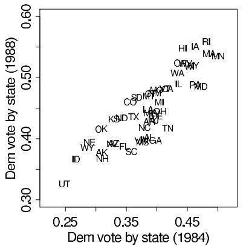
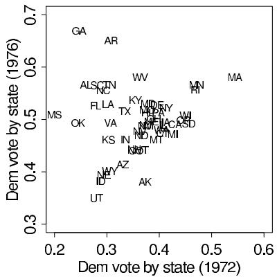
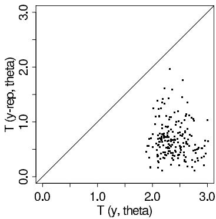
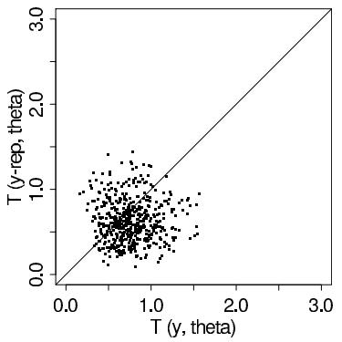
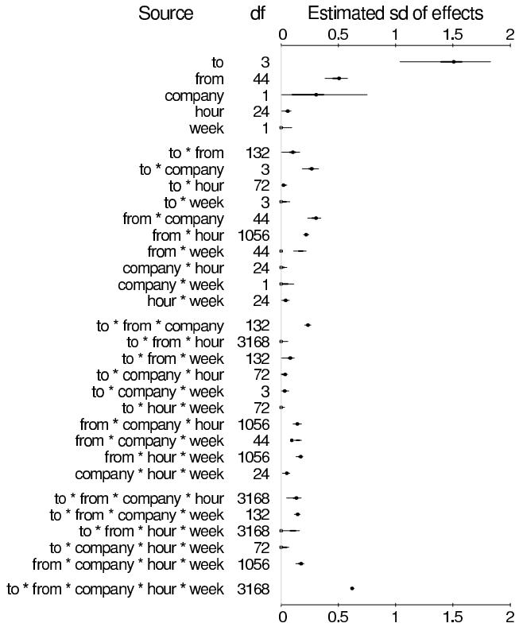
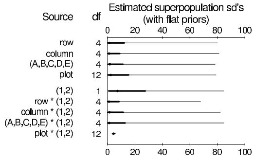
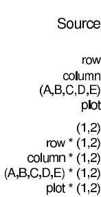
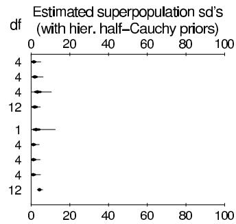
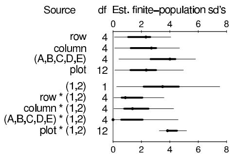
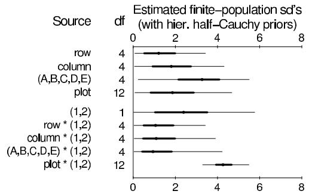

# Hierarchical Linear Models

[Package map](../structure.md) · [Unsplit OCR dump](./_full.md)

[← Ch. 14 Regression](./14-introduction-to-regression-models.md) · [Ch. 16 GLMs →](./16-generalized-linear-models.md)

> MinerU OCR dump. If a formula, table, or numbering disagrees with the PDF, the PDF is authoritative.

---

# 15.1 Regression coefficients exchangeable in batches

We begin by considering hierarchical regression models in which groups of the regression coefficients are exchangeable and are modeled with normal population distributions. Each such group is called a batch of random effects or varying coefficients.

# Simple varying-coefficients model

In the simplest form of the random-effects or varying-coefficients model, all of the regression coefficients contained in the vector $\beta$ are exchangeable, and their population distribution can be expressed as

$$
\beta \sim \mathrm {N} (1 \alpha , \sigma_ {\beta} ^ {2} I), \tag {15.1}
$$

where $\alpha$ and $\sigma_{\beta}$ are unknown scalar parameters, and $1$ is the $J\times 1$ vector of ones, $1 = (1,\ldots ,1)^T$ . We use this vector-matrix notation to allow for easy generalization to regression models for the coefficients $\beta$ , as we discuss in Section 15.3. Model (15.1) is equivalent to the hierarchical model we applied to the educational testing example of Section 5.5, using $(\beta ,\alpha ,\sigma_{\beta})$ in place of $(\theta ,\mu ,\tau)$ . As in that example, this general model includes, as special cases, unrelated $\beta_{j}$ 's $(\sigma_{\beta} = \infty)$ and all $\beta_{j}$ 's equal $(\sigma_{\beta} = 0)$ .

It can be reasonable to start with a prior density that is uniform on $\alpha, \sigma_{\beta}$ , as we used in the educational testing example. As discussed in Section 5.4, we cannot assign a uniform prior distribution to $\log \sigma_{\beta}$ (the standard 'noninformative' prior distribution for variance parameters), because this leads to an improper posterior distribution with all its mass in the neighborhood of $\sigma_{\beta} = 0$ . Another relatively noninformative prior distribution that is often used for $\sigma_{\beta}^{2}$ is scaled inverse- $\chi^2$ (see Appendix A) with the degrees of freedom set to a low number such as 2. In applications one should be careful to ensure that posterior inferences are not sensitive to these choices; if they are, then greater care needs to be taken in specifying prior distributions that are defensible on substantive grounds. If there is little replication in the data at the level of variation corresponding to a particular variance parameter, then that parameter is generally not well estimated by the data and inferences may be sensitive to prior assumptions.

# Intraclass correlation

There is a straightforward connection between the varying-coefficients model just described and a within-group correlation. Suppose data $y_{1},\ldots ,y_{n}$ fall into $J$ batches and have a multivariate normal distribution: $y\sim \mathrm{N}(\alpha \mathbf{1},\Sigma_y)$ , with $\operatorname {var}(y_i) = \eta^2$ for all $i$ , and $\operatorname {cov}(y_{i_1},y_{i_2}) = \rho \eta^2$ if $i_{1}$ and $i_{2}$ are in the same batch and 0 otherwise. (We use the notation 1 for the $n\times 1$ vector of 1's.) If $\rho \geq 0$ , this is equivalent to the model $y\sim \mathrm{N}(X\beta ,\sigma^2 I)$ , where $X$ is a $n\times J$ matrix of indicator variables with $X_{ij} = 1$ if unit $i$ is in batch $j$ and 0 otherwise, and $\beta$ has the varying-coefficients population distribution (15.1). The equivalence of the models occurs when $\eta^2 = \sigma^2 +\sigma_\beta^2$ and $\rho = \sigma_\beta^2 /(\sigma^2 +\sigma_\beta^2)$ , as can be seen by deriving the marginal distribution of $y$ , averaging over $\beta$ . More generally, positive intraclass correlation in a linear regression can be subsumed into a varying-coefficients model by augmenting the regression with $J$ indicator variables whose coefficients have the population distribution (15.1).

# Mixed-effects model

An important variation on the simple varying-coefficients or random-effects model is the 'mixed-effects model,' in which the first $J_{1}$ components of $\beta$ are assigned independent im

proper prior distributions, and the remaining $J_{2} = J - J_{1}$ components are exchangeable with common mean $\alpha$ and standard deviation $\sigma_{\beta}$ . The first $J_{1}$ components, which are implicitly modeled as exchangeable with infinite prior variance, are sometimes called fixed effects. $^{1}$

A simple example is the hierarchical normal model considered in Chapter 5; the varying-coefficients model with the school means normally distributed and a uniform prior density assumed for their mean $\alpha$ is equivalent to what is sometimes called a mixed-effects model with a single constant 'fixed effect' and a set of random effects with mean 0.

# Several sets of varying coefficients

To generalize, allow the $J$ components of $\beta$ to be divided into $K$ clusters of coefficients, with cluster $k$ having population mean $\alpha_{k}$ and standard deviation $\sigma_{\beta k}$ . A mixed-effects model is obtained by setting the variance to $\infty$ for one of the clusters of coefficients. We return to these models in discussing the analysis of variance in Section 15.7.

# Exchangeability

The essential feature of varying-coefficient models is that exchangeability of the units of analysis is achieved by conditioning on indicator variables that represent groupings in the population. The varying coefficients allow each subgroup to have a different mean outcome level, and averaging over these parameters to a marginal distribution for $y$ induces a correlation between outcomes observed on units in the same subgroup (just as in the simple intraclass correlation model described above).

# 15.2 Example: forecasting U.S. presidential elections

We illustrate hierarchical linear modeling with an example in which a hierarchical model is useful for obtaining realistic forecasts. Following standard practice, we begin by fitting a nonhierarchical linear regression with a noninformative prior distribution but find that the simple model does not provide an adequate fit. Accordingly we expand the model hierarchically, including varying coefficients to model variation at a second level in the data.

Political scientists in the U.S. have been interested in the idea that national elections are highly predictable, in the sense that one can accurately forecast election results using information publicly available several months before the election. In recent years, several different linear regression forecasts have been suggested for U.S. presidential elections. In this chapter, we present a hierarchical linear model that was estimated from the elections through 1988 and used to forecast the 1992 election.

# Unit of analysis and outcome variable

The units of analysis are results in each state from each of the 11 presidential elections from 1948 through 1988. The outcome variable of the regression is the Democratic party candidate's share of the two-party vote for president in that state and year. For convenience and to avoid tangential issues, we discard the District of Columbia (in which the Democrats have received over $80\%$ in every presidential election) and states with third-party victories from our model, leaving us with 511 units from the 11 elections considered.

  
Figure 15.1 (a) Democratic share of the two-party vote for president, for each state, in 1984 and 1988. (b) Democratic share of the two-party vote for president, for each state, in 1972 and 1976.

# Preliminary graphical analysis

Figure 15.1a suggests that the presidential vote may be strongly predictable from one election to the next. The fifty points on the figure represent the states of the U.S. (indicated by their two-letter abbreviations); the $x$ and $y$ coordinates of each point show the Democratic party's share of the vote in the presidential elections of 1984 and 1988, respectively. The points fall close to a straight line, indicating that a linear model predicting $y$ from $x$ is reasonable and relatively precise. The pattern is not always so strong, however; consider Figure 15.1b, which displays the votes by states in 1972 and 1976—the relation is not close to linear. Nevertheless, a careful look at the second graph reveals some patterns: the greatest outlying point, on the upper left, is Georgia ('GA'), the home state of Jimmy Carter, the Democratic candidate in 1976. The other outlying points, all on the upper left side of the $45^{\circ}$ line, are other states in the South, Carter's home region. It appears that it may be possible to create a good linear fit by including other predictors in addition to the Democratic share of the vote in the previous election, such as indicator variables for the candidates' home states and home regions. (For political analysis, the United States is typically divided into four regions: Northeast, South, Midwest, and West, with each region containing ten or more states.)

# Fitting a preliminary, nonhierarchical, regression model

Political trends such as partisan shifts can occur nationwide, at the level of regions of the country, or in individual states; to capture these three levels of variation, we include three kinds of explanatory variables in the regression. The nationwide variables—which are the same for every state in a given election year—include national measures of the popularity of the candidates, the popularity of the incumbent President (who may or may not be running for reelection), and measures of the condition of the economy in the past two years. Regional variables include home-region indicators for the candidates and various adjustments for past elections in which regional voting had been important. Statewide variables include the Democratic party's share of the state's vote in recent presidential elections, measures of the state's economy and political ideology, and home-state indicators. The explanatory variables used in the model are listed in Table 15.1. With 511 observations, a large number of state and regional variables can reasonably be fitted in a model of election outcome, assuming there are smooth patterns of dependence on these covariates across states and regions. Fewer relationships with national variables can be estimated, however, since for this purpose there are essentially only 11 data points—the national elections.

Table 15.1 Variables used for forecasting U.S. presidential elections. Sample minima, medians, and maxima come from the 511 data points. All variables are signed so that an increase in a variable would be expected to increase the Democratic share of the vote in a state. 'Inc' is defined to be $+1$ or $-1$ depending on whether the incumbent President is a Democrat or a Republican. 'Presinc' equals Inc if the incumbent President is running for reelection and 0 otherwise. 'Dem. share of state vote' in last election and two elections ago are coded as deviations from the corresponding national votes, to allow for a better approximation to prior independence among the regression coefficients. 'Proportion Catholic' is the deviation from the average proportion in 1960, the only year in which a Catholic ran for President. See Gelman and King (1993) and Boscardin and Gelman (1996) for details on the other variables, including a discussion of the regional/subregional variables. When fitting the hierarchical model, we also included indicators for years and regions within years.   

<table><tr><td rowspan="2">Description of variable</td><td colspan="3">Sample quantiles</td></tr><tr><td>min</td><td>median</td><td>max</td></tr><tr><td colspan="4">Nationwide variables:</td></tr><tr><td>Support for Dem. candidate in Sept. poll</td><td>0.37</td><td>0.46</td><td>0.69</td></tr><tr><td>(Presidential approval in July poll) × Inc</td><td>-0.69</td><td>-0.47</td><td>0.74</td></tr><tr><td>(Presidential approval in July poll) × Presinc</td><td>-0.69</td><td>0</td><td>0.74</td></tr><tr><td>(2nd quarter GNP growth) × Inc</td><td>-0.024</td><td>-0.005</td><td>0.018</td></tr><tr><td colspan="4">Statewide variables:</td></tr><tr><td>Dem. share of state vote in last election</td><td>-0.23</td><td>-0.02</td><td>0.41</td></tr><tr><td>Dem. share of state vote two elections ago</td><td>-0.48</td><td>-0.02</td><td>0.41</td></tr><tr><td>Home states of presidential candidates</td><td>-1</td><td>0</td><td>1</td></tr><tr><td>Home states of vice-presidential candidates</td><td>-1</td><td>0</td><td>1</td></tr><tr><td>Democratic majority in the state legislature</td><td>-0.49</td><td>0.07</td><td>0.50</td></tr><tr><td>(State economic growth in past year) × Inc</td><td>-0.22</td><td>-0.00</td><td>0.26</td></tr><tr><td>Measure of state ideology</td><td>-0.78</td><td>-0.02</td><td>0.69</td></tr><tr><td>Ideological compatibility with candidates</td><td>-0.32</td><td>-0.05</td><td>0.32</td></tr><tr><td>Proportion Catholic in 1960 (compared to U.S. avg.)</td><td>-0.21</td><td>0</td><td>0.38</td></tr><tr><td colspan="4">Regional/subregional variables:</td></tr><tr><td>South</td><td>0</td><td>0</td><td>1</td></tr><tr><td>(South in 1964) × (-1)</td><td>-1</td><td>0</td><td>0</td></tr><tr><td>(Deep South in 1964) × (-1)</td><td>-1</td><td>0</td><td>0</td></tr><tr><td>New England in 1964</td><td>0</td><td>0</td><td>1</td></tr><tr><td>North Central in 1972</td><td>0</td><td>0</td><td>1</td></tr><tr><td>(West in 1976) × (-1)</td><td>-1</td><td>0</td><td>0</td></tr></table>

For a first analysis, we fit a classical regression including all the variables in Table 15.1 to the data up to 1988, as described in Chapter 14. We could then draw simulations from the posterior distribution of the regression parameters and use each of these simulations, applied to the national, regional, and state explanatory variables for 1992, to create a random simulation of the vector of election outcomes for the fifty states in 1992. These simulated results could be used to estimate the probability that each candidate would win the national election and each state election, the expected number of states each candidate would win, and other predictive quantities.

# Checking the preliminary regression model

The ordinary linear regression model ignores the year-by-year structure of the data, treating them as 511 independent observations, rather than 11 sets of roughly 50 related observations each. Substantively, the feature of these data that such a model misses is that partisan support across the states does not vary independently: if, for example, the Democratic candidate for President receives a higher-than-expected vote share in Massachusetts in a

  
Figure 15.2 Scatterplot showing the joint distribution of simulation draws of the realized test quantity, $T(y,\beta)$ — the square root of the average of the 11 squared nationwide residuals—and its hypothetical replication, $T(y^{\mathrm{rep}},\beta)$ , under the nonhierarchical model for the election forecasting example. The 200 simulated points are far below the $45^{\circ}$ line, which means that the realized test quantity is much higher than predicted under the model.

particular year, we would expect him also to perform better than expected in Utah in that year. In other words, because of the known grouping into years, the assumption of exchangeability among the 511 observations does not make sense, even after controlling for the explanatory variables.

An important use of the model is to forecast the nationwide outcome of the presidential election. One way of assessing the significance of possible failures in the model is to use the model-checking approach of Chapter 6. To check whether correlation of the observations from the same election has a substantial effect on nationwide forecasts, we create a test variable that reflects the average precision of the model in predicting the national result—the square root of the average of the squared nationwide realized residuals for the 11 general elections in the dataset. (Each nationwide realized residual is the average of $(y_{i} - X_{i}\beta)$ for the roughly 50 observations in that election year.) This test variable should be sensitive to positive correlations of outcomes in each year. We then compare the values of the test variable $T(y,\beta)$ from the posterior simulations of $\beta$ to the hypothetical replicated values under the model, $T(y^{\mathrm{rep}},\beta)$ . The results are displayed in Figure 15.2. As can be seen in the figure, the observed variation in national election results is larger than would be expected from the model. The practical consequence of the failure of the model is that its forecasts of national election results are falsely precise.

# Extending to a varying-coefficients model

We can improve the regression model by adding an additional predictor for each year to serve as an indicator for nationwide partisan shifts unaccounted for by the other national variables; this adds 11 new components of $\beta$ corresponding to the 11 election years in the data. The additional columns in $X$ are indicator vectors of zeros and ones indicating which observations correspond to which year. After controlling for the national variables already in the model, we fit an exchangeable model for the election-year variables, which in the normal model implies a common mean and variance. Since a constant term is already in the model, we can set the mean of the population distribution of the year-level errors to zero (recall Section 15.1). By comparison, the classical regression model we fitted earlier is a special case of the current model in which the variance of the 11 election-year coefficients is fixed at zero.

In addition to year-to-year variability not captured by the model, there are also electoral

swings that follow the region of the country—Northeast, South, Midwest, and West. To capture regional variability, we include 44 region $\times$ year indicator variables (also with the mean of the population distributions set to zero) to cover all regions in all election years. Within each region, we model these indicator variables as exchangeable. Because the South tends to act as a special region of the U.S. politically, we give the 11 Southern regional variables their own common variance, and treat the remaining 33 regional variables as exchangeable with their own variance. In total, we have added 55 new $\beta$ parameters and three new variance components to the model, and we have excluded the regional and subregional corrections in Table 15.1 associated with specific years. We can write the model for data in states $s$ , regions $r(s)$ , and years $t$ ,

$$
\begin{array}{l} {y _ {s t}} \sim {\mathrm {N} (X _ {s t} \beta + \gamma_ {r (s) t} + \delta_ {t}, \sigma^ {2})} \\ \gamma_ {r t} \sim \left\{ \begin{array}{l l} \mathrm {N} (0, \tau_ {\gamma 1} ^ {2}) & \text {f o r} r = 1, 2, 3 \quad \text {(n o n - S o u t h)} \\ \mathrm {N} (0, \tau_ {\gamma 2} ^ {2}) & \text {f o r} r = 4 \quad \text {(S o u t h)} \end{array} \right. \\ \delta_ {t} \sim \mathrm {N} (0, \tau_ {\delta} ^ {2}), \tag {15.2} \\ \end{array}
$$

with a uniform hyperprior distribution on $\beta, \sigma, \tau_{\gamma 1}, \tau_{\gamma 2}, \tau_{\delta}$ . (We also fit with a uniform prior distribution on the hierarchical variances, rather than the standard deviations, and obtained essentially identical inferences.)

In the notation of Section 15.1, we would label $\beta$ as the concatenated vector of all the varying coefficients, $(\beta ,\gamma ,\delta)$ in formulation (15.2). The augmented $\beta$ has a prior with mean 0 and diagonal variance matrix $\Sigma_{\beta} = \mathrm{diag}(\infty ,\ldots ,\infty ,\tau_{\gamma 1}^{2},\ldots ,\tau_{\gamma 1}^{2},\tau_{\gamma 2}^{2},\ldots ,\tau_{\gamma 2}^{2},\tau_{\delta}^{2},\ldots ,\tau_{\delta}^{2})$ . The first 20 elements of $\beta$ , corresponding to the constant term and the predictors in Table 15.1, have noninformative priors--that is, $\sigma_{\beta j} = \infty$ for these elements. The next 33 values of $\sigma_{\beta j}$ are set to the parameter $\tau_{\gamma 1}$ . The 11 elements corresponding to the Southern regional variables have $\sigma_{\beta j} = \tau_{\gamma 2}$ . The final 11 elements correspond to the nationwide shifts and have prior standard deviation $\tau_{\delta}$

# Forecasting

Predictive inference is more subtle for a hierarchical model than a classical regression model, because of the possibility that new parameters (varying coefficients) $\beta$ must be estimated for the predictive data. Consider the task of forecasting the outcome of the 1992 presidential election, given the $50 \times 20$ matrix of explanatory variables for the linear regression corresponding to the 50 states in 1992. To form the complete matrix of explanatory variables for 1992, $\tilde{X}$ , we must include 55 columns of zeros, thereby setting the indicators for previous years to zero for estimating the results in 1992. Even then, we are not quite ready to make predictions. To simulate draws from the predictive distribution of 1992 state election results using the hierarchical model, we must include another year indicator and four new region $\times$ year indicator variables for 1992—this adds five new predictors. However, we have no information on the coefficients of these predictor variables; they are not even included in the vector $\beta$ that we have estimated from the data up to 1988. Since we have no data on these five new components of $\beta$ , we must simulate their values from their posterior (predictive) distribution; that is, the coefficient for the year indicator is drawn as $\mathrm{N}(0, \tau_{\delta}^{2})$ , the non-South region $\times$ year coefficients are drawn as $\mathrm{N}(0, \tau_{\gamma 1}^{2})$ , and the South $\times$ year coefficient is drawn as $\mathrm{N}(0, \tau_{\gamma 2}^{2})$ , using the values $\tau_{\delta}, \tau_{\gamma 1}, \tau_{\gamma 2}$ drawn from the posterior simulation.

# Posterior inference

We fit the model using EM and the vector Gibbs sampler as described in Section 15.5, to obtain a set of draws from the posterior distribution of $(\beta, \sigma, \tau_{\delta}, \tau_{\gamma 1}, \tau_{\gamma 2})$ . We ran ten

  
Figure 15.3 Scatterplot showing the joint distribution of simulation draws of the realized test quantity, $T(y,\beta)$ — the square root of the average of the 11 squared nationwide residuals—and its hypothetical replication, $T(y^{\mathrm{rep}},\beta)$ , under the hierarchical model for the election forecasting example. The 200 simulated points are scattered evenly about the $45^{\circ}$ line, which means that the model accurately fits this particular test quantity.

parallel Gibbs sampler sequences; after 500 steps, the potential scale reductions, $\widehat{R}$ , were below 1.1 for all parameters.

The coefficient estimates for the variables in Table 15.1 are similar to the results from the preliminary, nonhierarchical regression. The posterior medians of the coefficients all have the expected positive sign. The hierarchical standard deviations $\tau_{\delta}, \tau_{\gamma 1}, \tau_{\gamma 2}$ are not determined with great precision. This points out one advantage of the full Bayesian approach; if we had simply made point estimates of these variance components, we would have been ignoring a wide range of possible values for all the parameters.

When applied to data from 1992, the model yields state-by-state predictions that are summarized in Figure 6.1, with a forecasted $85\%$ probability that the Democrats would win the national electoral vote total. The forecasts for individual states have predictive standard errors between $5\%$ and $6\%$ .

We tested the model in the same way as we tested the nonhierarchical model, by a posterior predictive check on the average of the squared nationwide residuals. The simulations from the hierarchical model, with their additional national and regional error terms, accurately fit the observed data, as shown in Figure 15.3.

# Reasons for using a hierarchical model

In summary, there are three main advantages of the hierarchical model here:

- It allows the modeling of correlation within election years and regions.   
- Including the year and region $\times$ year terms without a hierarchical model, or not including these terms at all, correspond to special cases of the hierarchical model with $\tau = \infty$ or 0, respectively. The more general model allows for a reasonable compromise between these extremes.   
- Predictions will have additional components of variability for regions and year and should therefore be more reliable.

# 15.3 Interpreting a normal prior distribution as additional data

More general forms of the hierarchical linear model can be created, with further levels of parameters representing additional structure in the problem. For instance, building on the

brief example in the opening paragraph of this chapter, we might have a study of educational achievement in which class-level effects are not considered exchangeable but rather depend on features of the school district or state. In a similar vein, the election forecasting example might be extended to attempt some modeling of the year-by-year errors in terms of trends over time, although there is probably limited information on which to base such a model after conditioning on other observed variables. No serious conceptual or computational difficulties are added by extending the model to more levels.

A general formulation of a model with three levels of variation is:

$$
y | X, \beta , \Sigma_ {y} \sim \mathrm {N} (X \beta , \Sigma_ {y}) \quad \text {l i k e l i h o o d} \quad n \text {d a t a p o i n t s} y _ {i}
$$

$$
\beta \left| X _ {\beta}, \alpha , \Sigma_ {\beta} \sim \mathrm {N} \left(X _ {\beta} \alpha , \Sigma_ {\beta}\right) \quad \text {‘ p o p u l a t i o n d i s t r i b u t i o n ’} J \text {p a r a m e t e r s} \beta_ {j} \right.
$$

$$
\alpha \mid \alpha_ {0}, \Sigma_ {\alpha} \sim \mathrm {N} (\alpha_ {0}, \Sigma_ {\alpha}) \quad \text {‘ h y p e r p r i o r d i s t r i b u t i o n ’} \quad K \text {p a r a m e t e r s} \alpha_ {k}
$$

# Interpretation as a single linear regression

The conjugacy of prior distribution and regression likelihood (see Section 14.8) allows us to express the hierarchical model as a single normal regression model using a larger 'dataset' that includes as 'observations' the information added by the population and hyperprior distributions. Specifically, for the three-level model, we can extend (14.24) to write

$$
y _ {*} | X _ {*}, \gamma , \Sigma_ {*} \sim \mathrm {N} (X _ {*} \gamma , \Sigma_ {*}),
$$

where $\gamma$ is the vector $(\beta, \alpha)$ of length $J + K$ , and $y_{*}$ , $X_{*}$ , and $\Sigma_{*}^{-1}$ are defined by considering the likelihood, population, and hyperprior distributions as $n + J + K$ 'observations' informative about $\gamma$ :

$$
y _ {*} = \left( \begin{array}{c} y \\ 0 \\ \alpha_ {0} \end{array} \right), X _ {*} = \left( \begin{array}{c c} X & 0 \\ I _ {J} & - X _ {\beta} \\ 0 & I _ {K} \end{array} \right), \Sigma_ {*} ^ {- 1} = \left( \begin{array}{c c c} \Sigma_ {y} ^ {- 1} & 0 & 0 \\ 0 & \Sigma_ {\beta} ^ {- 1} & 0 \\ 0 & 0 & \Sigma_ {\alpha} ^ {- 1} \end{array} \right). \tag {15.3}
$$

If any of the components of $\beta$ or $\alpha$ have noninformative prior distributions, the corresponding rows in $y_*$ and $X_*$ , as well as the corresponding rows and columns in \(\Sigma_*
^{-1}\), can be eliminated, because they correspond to 'observations' with infinite variance. The resulting regression then has $n + J_* + K_*$ 'observations,' where $J_*$ and $K_*$ are the number of components of $\beta$ and $\alpha$ , respectively, with informative prior distributions.

For example, in the election forecasting example, $\beta$ has 75 components—20 predictors in the original regression (including the constant term but excluding the five regional variables in Table 15.1 associated with specific years), 11 year errors, and 44 region $\times$ year errors—but $J_{*}$ is only 55 because only the year and region $\times$ year errors have informative prior distributions. (All three groups of varying coefficients have means fixed at zero, so in this example $K_{*} = 0$ .)

# More than one way to set up a model

A hierarchical regression model can be set up in several equivalent ways. For example, we have already noted that the hierarchical model for the 8 schools could be written as $y_{j} \sim \mathrm{N}(\theta_{j},\sigma_{j}^{2})$ and $\theta_{j} \sim \mathrm{N}(\mu ,\tau^{2})$ , or as $y_{j} \sim \mathrm{N}(\beta_{0} + \beta_{j},\sigma_{j}^{2})$ and $\beta_{j} \sim \mathrm{N}(0,\tau^{2})$ . The hierarchical model for the election forecasting example can be written, as described above, as a regression, $y \sim \mathrm{N}(X\beta ,\sigma^2 I)$ , with 70 predictors $X$ and normal prior distributions on the coefficients $\beta$ , or as a regression with 20 predictors and three independent error terms, corresponding to year, region $\times$ year, and state $\times$ year.

In the three-level formulation described at the beginning of this section, group-level predictors can be included in either the likelihood or the population distribution, and the constant term can be included in any of the three regression levels.

# 15.4 Varying intercepts and slopes

So far we have focused on hierarchical models for scalar parameters. What do we do when multiple parameters can vary by group? Then we need a multivariate prior distribution. Consider the following generic model of data in $J$ groups and, within each group $j$ , a likelihood, $p(y^{(j)}|\theta^{(j)})$ , depending on a vector of parameters $\theta$ , which themselves are given a prior distribution, $p(\theta_j|\phi)$ , given hyperparameters $\phi$ .

The model can also have parameters that do not vary by group, for example in the varying-intercept, varying-slope linear model:

$$
\begin{array}{l} y _ {i j} \sim \mathrm {N} (\alpha_ {j} + x _ {i j} \beta_ {j}, \sigma_ {y} ^ {2}) \\ \left( \begin{array}{c} \alpha \\ \beta \end{array} \right) \sim \mathrm {N} \left(\left( \begin{array}{c} \mu_ {\alpha} \\ \mu_ {\beta} \end{array} \right), \left( \begin{array}{c c} \sigma_ {\alpha} ^ {2} & \rho \sigma_ {\alpha} \sigma_ {\beta} \\ \rho \sigma_ {\alpha} \sigma_ {\beta} & \sigma_ {\beta} ^ {2} \end{array} \right)\right). \tag {15.4} \\ \end{array}
$$

We then assign a hyperprior distribution to the vector of hyperparameters, $(\mu_{\alpha},\mu_{\beta},\sigma_{\alpha},\sigma_{\beta},\rho)$ , probably starting with a uniform (with the constraints that the scale parameters must be positive and the correlation parameter is between $-1$ and $1$ ) and then adding more information as necessary (for example, if the number of groups is low).

When more than two coefficients vary by group, we can write (15.4) in vector-matrix form as,

$$
\begin{array}{l} {y _ {i j}} \sim {\mathrm {N} (X _ {j} \beta^ {(j)}, \sigma_ {y} ^ {2})} \\ \beta^ {(j)} \sim \mathrm {N} (\mu_ {\beta}, \Sigma_ {\beta}). \tag {15.5} \\ \end{array}
$$

The model could be further elaborated, for example by having the data variance itself vary by group, or by adding structure to the mean vector, or by having more than one level of grouping. In any case, the key is the prior distribution on $\Sigma_{\beta}$ . (The data variance $\sigma_y$ and the mean vector $\mu_{\beta}$ also need hyperprior distributions, but these parameters can typically be estimated pretty well from the data, so their exact prior specification is not so important.)

# Inverse-Wishart model

Let $K$ be the number of coefficients in the regression model, so that $\beta$ is a $J\times K$ matrix, and the group-level variance matrix $\Sigma_{\beta}$ is $K\times K$ . The conditionally conjugate distribution for $\Sigma_{\beta}$ in model (15.5) is the inverse-Wishart (see Section 3.6).

# Scaled inverse-Wishart model

The trouble with the Inv-Wishart $_{K+1}(I)$ model is that it strongly constrains the variance parameters, the diagonal elements of the covariance matrix. What we want is a model that is noninformative on the correlations but allows a wider range of uncertainty on the variances. We can create such a model using a redundant parameterization, rewriting (15.5) as,

$$
\begin{array}{l} {y _ {i j}} \sim {\mathrm {N} (X _ {j} (\mu_ {\beta} + \xi \otimes \eta^ {(j)}), \sigma_ {y} ^ {2})} \\ \eta^ {(j)} \sim \mathrm {N} (0, \Sigma_ {\eta}). \tag {15.6} \\ \end{array}
$$

Here, $\xi$ is a vector of length $K$ , the symbol $\otimes$ represents component-wise multiplication, we have decomposed the coefficient vector from each group as $\beta^{(j)} = \mu_{\beta} + \xi \otimes \eta$ , and the covariance matrix is

$$
\Sigma_ {\beta} = \operatorname {D i a g} (\xi) \Sigma_ {\eta} \operatorname {D i a g} (\xi).
$$

The advantage of splitting up the model in this way is that now we can assign separate prior distributions to $\xi$ and $\Sigma_{\eta}$ , inducing a richer structure of uncertainty modeling. It is, in fact, an example of the scaled inverse-Wishart model described at the end of Section 3.6.

As a noninformative model, we can set $\Sigma_{\eta} \sim \mathrm{Inv-Wishart}_{K+1}(I)$ , along with independent uniform prior distributions on $\xi$ 's. If necessary, one can add informative priors to $\xi$ .

# Predicting business school grades for different groups of students

We illustrate varying-intercept, varying-slope regression with an example of prediction in which the data are so sparse that a hierarchical model is necessary for inference about some of the estimands of interest.

It is common for schools of business management in the United States to use regression equations to predict the first-year grade point average of prospective students from their scores on the verbal and quantitative portions of the Graduate Management Admission Test (GMAT-V and GMAT-Q) as well as their undergraduate grade point average (UGPA). This equation is important because the predicted score derived from it may play a central role in the decision to admit the student. The coefficients of the regression equation are typically estimated from the data collected from the most recently completed first-year class.

A concern was raised with this regression model about possible biased predictions for identifiable subgroups of students, particularly black students. A study was performed based on data from 59 business schools over a two-year period, involving about 8500 students of whom approximately $4\%$ were black. For each school, a separate regression was performed of first-year grades on four explanatory variables: a constant term, GMAT-V, GMAT-Q, and UGPA. By looking at the residuals for all schools and years, it was found that the regressions tended to overpredict the first-year grades of blacks.

At this point, it might seem natural to add another term to the regression model corresponding to an indicator variable that is 1 if a student is black and 0 otherwise. However, such a model was considered too restrictive; once blacks and non-blacks were treated separately in the model, it was desired to allow different regression models for the two groups. For each school, the expanded model then has eight explanatory variables: the four mentioned above, and then the same four variables multiplied by the indicator for black students. For student $i = 1,\ldots ,n_{j}$ in school $j = 1,\ldots ,59$ we model the first-year grade point average $y_{ij}$ , given the vector of eight covariates $x_{ij}$ , as a linear regression with coefficient vector $\beta_{j}$ and residual variance $\sigma_j^2$ . Then the model for the entire vector of responses $y$ is

$$
p (y | \beta , \sigma^ {2}) \sim \prod_ {j = 1} ^ {5 9} \prod_ {i = 1} ^ {n _ {j}} \mathrm {N} (y _ {i j} | X _ {i j} \beta_ {j}, \sigma_ {j} ^ {2}).
$$

Geometrically, the model is equivalent to requiring two different regression planes: one for blacks and one for non-blacks. For each school, nine parameters must be estimated: $\beta_{1j},\ldots ,\beta_{8j},\sigma_j$ . Algebraically, all eight terms of the regression are used to predict the scores of blacks but only the first four terms for non-blacks.

At this point, the procedure of estimating separate regressions for each school becomes impossible using standard least-squares methods, which are implicitly based on noninformative prior distributions. Blacks comprise only $4\%$ of the students in the dataset, and many of the schools are all non-black or have so few blacks that the regression parameters cannot be estimated under classical regression (that is, based on a noninformative prior distribution on the nine parameters in each regression). Fortunately, it is possible to estimate all $8 \times 59$ regression parameters simultaneously using a hierarchical model. To use the most straightforward approach, the 59 vectors $\beta_{j}$ are modeled as independent samples from a multivariate $\mathrm{N}(\alpha, \Lambda_{\beta})$ distribution, with unknown vector $\alpha$ and $8 \times 8$ matrix $\Lambda_{\beta}$ .

The unknown parameters of the model are then $\beta$ , $\alpha$ , $\Lambda_{\beta}$ , and $\sigma_{1}, \ldots, \sigma_{59}$ . We first

assumed a uniform prior distribution on $\alpha, \Lambda_{\beta}, \log \sigma_1, \ldots, \log \sigma_{59}$ . This noninformative approach is not ideal (at the least, one would want to embed the 59 $\sigma_{j}$ parameters in a hierarchical model) but is a reasonable start.

A crude approximation to $\alpha$ and the parameters $\sigma_{j}^{2}$ was obtained by running a regression of the combined data vector $y$ on the eight explanatory variables, pooling the data from all 59 schools. Using the crude estimates as a starting point, the posterior mode of $(\alpha ,\Lambda_{\beta},\sigma_{1}^{2},\ldots ,\sigma_{59}^{2})$ was found using EM. Here, we describe the conclusions of the study, which were based on this modal approximation.

One conclusion from the analysis was that the multivariate hierarchical model is a substantial improvement over the standard model, because the predictions for both black and non-black students are relatively accurate. Moreover, the analysis revealed systematic differences between predictions for black and non-black students. In particular, conditioning the test scores at the mean scores for the black students, in about $85\%$ of schools, nonblacks were predicted to have higher first-year grade-point averages, with over $60\%$ of the differences being more than one posterior standard deviation above zero, and about $20\%$ being more than two posterior standard deviations above zero. This sort of comparison, conditional on school and test scores, could not be reasonably estimated with a nonhierarchical model in this dataset, in which the number of black students per school was so low.

# 15.5 Computation: batching and transformation

There are several ways to use the Gibbs sampler to draw posterior simulations for hierarchical linear models. The different methods vary in their programming effort required, computational speed, and convergence rate, with different approaches being reasonable for different problems. In general we prefer Hamiltonian Monte Carlo to simple Gibbs; however, ideas of Gibbs sampling remain relevant, both for parameterizing the problem so that HMC runs more effectively, and because for large problems it can make sense to break up a hierarchical model into smaller pieces for more efficient computation.

We shall discuss computation for models with independent variances at each of the hierarchical levels; computation can be adapted to structured covariance matrices as described in Section 14.7.

# Gibbs sampler, one batch at a time

Perhaps the simplest computational approach for hierarchical regressions is to perform a blockwise Gibbs sampler, updating each batch of regression coefficients given all the others, and then updating the variance parameters. Given the data and all other parameters in the model, inference for a batch of coefficients corresponds to a linear regression with fixed prior distribution. We can thus update the coefficients of the entire model in batches, performing at each step an augmented linear regression, as discussed in Section 14.8. In many cases (including the statewide, regional, and national error terms in the election forecasting example), the model is simple enough that the means and variances for the Gibbs updating do not actually require a regression calculation but instead can be performed using simple averages.

The variance parameters can also be updated one at a time. For simple hierarchical models with scalar variance parameters (typically one parameter per batch of coefficients, along with one or more data-level variance parameters), the Gibbs updating distributions are scaled inverse- $\chi^2$ . For more complicated models, the variance parameters can be updated using Metropolis jumps.

The Gibbs sampler for the entire model then proceeds by cycling through all the batches of parameters in the model (including the batch, if any, of coefficients with noninformative

or fixed prior distributions). One attractive feature of this algorithm is that it mimics the natural way one might try to combine information from the different levels: starting with a guess at the upper-level parameters, the lower-level regression is run, and then these simulated coefficients are used to better estimate the upper-level regression parameters, and so on.

# All-at-once Gibbs sampler

As noted in Section 15.3, the different levels in a hierarchical regression context can be combined into a single regression model by appropriately augmenting the data, predictors, and variance matrix. The Gibbs sampler can then be applied, alternately updating the variance parameters (with independent inverse- $\chi^2$ distributions given the data and regression coefficients), and the vector of regression coefficients, which can be updated at each step by running a weighted regression with weight matrix depending on the current values of the variance parameters.

In addition to its conceptual simplicity, this all-at-once Gibbs sampler has the advantages of working efficiently even if regression coefficients at different levels are correlated in their posterior distribution, as can commonly happen with hierarchical models (for example, the parameters $\theta_{j}$ and $\mu$ have positive posterior correlations in the 8-schools example).

The main computational disadvantage of all-at-once Gibbs sampling for this problem is that each step requires a regression on a potentially large augmented dataset. For example, the election forecasting model has $n = 511$ data points and $k = 20$ predictors, but the augmented regression has $n_* = 511 + 55$ observations and $k_* = 20 + 55$ predictors. The computer time required to perform a linear regression is proportional to $nk^2$ , and thus each step of the all-at-once Gibbs sampler can be slow when the number of parameters is large. In practice we would implement such a computation using HMC rather than Gibbs.

# Parameter expansion

Any of the algorithms mentioned above can be slow to converge when estimated hierarchical variance parameters are near zero. The problem is that, if the current draw of a hierarchical variance parameter is near 0, then in the next updating step, the corresponding batch of linear parameters $\gamma_{j}$ will themselves be 'shrunk' to be close to their population mean. Then, in turn, the variance parameter will be estimated to be close to 0 because it is updated based on the relevant $\gamma_{j}$ 's. Ultimately, the stochastic nature of the Gibbs sampler allows it to escape out of this trap but this may require many iterations.

The parameter-expanded Gibbs sampler and EM algorithms (see Sections 12.1 and 13.4) can be used to solve this problem. For hierarchical linear models, the basic idea is to associate with each batch of regression coefficients a multiplicative factor, which has the role of breaking the dependence between the coefficients and their variance parameter.

# Example. Election forecasting (continued)

We illustrate with the presidential election forecasting model (15.2), which in its expanded-parameter version can be written as,

$$
y _ {s t} \sim \left\{ \begin{array}{l l} \mathrm {N} (X _ {s t} \beta + \zeta_ {1} ^ {\mathrm {r e g i o n}} \gamma_ {r (s) t} + \zeta^ {\mathrm {y e a r}} \delta_ {t}, \sigma^ {2}) & \mathrm {i f} r (s) = 1, 2, 3 \quad (\mathrm {n o n - S o u t h}) \\ \mathrm {N} (X _ {s t} \beta + \zeta_ {2} ^ {\mathrm {r e g i o n}} \gamma_ {r (s) t} + \zeta^ {\mathrm {y e a r}} \delta_ {t}, \sigma^ {2}) & \mathrm {i f} r (s) = 4 \quad (\mathrm {S o u t h}) \end{array} \right.
$$

with the same prior distributions as before. The new parameters $\zeta_1^{\mathrm{region}}$ , $\zeta_2^{\mathrm{region}}$ , and $\zeta^{\mathrm{year}}$ are assigned uniform prior distributions and are not identified in the posterior distribution. The products $\zeta_1^{\mathrm{region}}\gamma_{rt}$ (for $r = 1,2,3$ ), $\zeta_2^{\mathrm{region}}\gamma_{rt}$ (for $r = 4$ ), and $\zeta^{\mathrm{year}}\delta_t$ , correspond to the parameters $\gamma_{rt}$ and $\delta_t$ , respectively, in the old model. Similarly, the

products $|\zeta_1^{\mathrm{region}}| \tau_{\gamma_1}$ , $|\zeta_2^{\mathrm{region}}| \tau_{\gamma_2}$ , and $|\zeta^{\mathrm{year}}| \tau_{\delta}$ correspond to the variance components $\tau_{\gamma_1}, \tau_{\gamma_2}$ , and $\tau_{\delta}$ in the original model.

For the election forecasting model, the variance parameters are estimated precisely enough that the ordinary Gibbs sampler performs reasonably efficiently. However, we can use this problem to illustrate the computational steps of parameter expansion.

The Gibbs sampler for the parameter-expanded model alternately updates the regression coefficients $(\beta, \gamma, \delta)$ , the variance parameters $(\sigma, \tau_{\gamma 1}, \tau_{\gamma 2}, \tau_{\delta})$ , and the additional parameters $(\zeta_1^{\mathrm{region}}, \zeta_2^{\mathrm{region}}, \zeta^{\mathrm{year}})$ . The regression coefficients can be updated using any of the Gibbs samplers described above—by batch, all at once, or one element at a time. The $\zeta$ parameters do not change the fact that $\beta, \gamma$ , and $\delta$ can be estimated by linear regression. Similarly, the Gibbs sampler updates for the variances are still independent inverse- $\chi^2$ .

The final step of the Gibbs sampler is to update the multiplicative parameters $\zeta$ . This step turns out to be easy: given the data and the other parameters in the model, the information about the $\zeta$ 's can be expressed simply as a linear regression of the 'data' $z_{st} = y_{st} - X_{st}\beta$ on the 'predictors' $\gamma_{r(s)t}$ (for states $s$ with regions $r(s) = 1, 2$ , or 3), $\gamma_{r(s)t}$ (for $r(s) = 4$ ), and $\delta_t$ , with variance matrix $\sigma^2 I$ . The three parameters $\zeta$ are then easily updated with a linear regression.

When running the Gibbs sampler, we do not worry about the individual parameters $\zeta, \beta, \gamma, \delta$ ; instead, we save and monitor the convergence of the variance parameters $\sigma$ and the parameters $\gamma_{rt}$ and $\delta_t$ in the original parameterization (15.2). This is most easily done by just multiplying each of the parameters $\gamma_{rt}$ and $\delta_t$ by the appropriate $\zeta$ parameter, and multiplying each of the variance components $\tau_{\gamma 1}, \tau_{\gamma 2}, \tau_{\delta}$ , by the absolute value of its corresponding $\zeta$ .

More on the parameter-expanded Gibbs sampler for hierarchical models appears at the end of Section 15.7.

# Transformations for HMC

A slightly different transformation can be useful when implementing Hamiltonian Monte Carlo. HMC can be slow to converge when certain parameters have very short-tailed or long-tailed distributions, and this can happen with the variance parameters or the log variance parameters in hierarchical models. A simple decoupling of the model can sometimes solve this problem.

# Example. Eight schools model

We demonstrate with the hierarchical model for the educational testing experiments from Section 5.5:

$$
y _ {j} \sim \mathrm {N} (\theta_ {j}, \sigma_ {j} ^ {2}), \text {f o r} j = 1, \ldots , J
$$

$$
\theta_ {j} \sim \mathrm {N} (\mu , \tau^ {2}), \mathrm {f o r} j = 1, \ldots , J,
$$

along with some prior distribution, $p(\mu, \tau)$ . EM or Gibbs for this model can get stuck when the value of $\tau$ is near zero. In HMC, the joint posterior distribution of $\theta, \mu, \tau$ forms a 'whirlpool': no single step size works well for the whole distribution, and, again, the trajectories are unlikely to go into the region where $\tau$ is near zero and then unlikely to leave that vortex when they are there.

The following parameterization works much better:

$$
y _ {j} \sim \mathrm {N} (\mu + \tau \eta_ {j}, \sigma_ {j} ^ {2}), \text {f o r} j = 1, \dots , J
$$

$$
\eta_ {j} \sim \mathrm {N} (0, 1), \text {f o r} j = 1, \ldots , J,
$$

where $\theta_{j} = \mu +\tau \eta_{j}$ for each $j$

# 15.6 Analysis of variance and the batching of coefficients

The largest gains in estimating regression coefficients often come from specifying structure in the model. For example, in the election forecasting problem, it is crucial that the national and regional indicator variables are clustered and modeled separately from the quantitative predictors. In general, when many predictor variables are used in a regression, they should be set up so they can be structured hierarchically, so the Bayesian analysis can do the most effective job at pooling the information about them.

Analysis of variance (Anova) represents a key idea in statistical modeling of complex data structures—the grouping of predictor variables and their coefficients into batches. In the traditional application of analysis of variance, each batch of coefficients and the associated row of the Anova table corresponds to a single experimental block or factor or to an interaction of two or more factors. In a hierarchical linear regression context, each row of the table corresponds to a set of regression coefficients, and we are potentially interested in the individual coefficients and also in the variance of the coefficients in each batch. We thus view the analysis of variance as a way of making sense of hierarchical regression models with many predictors or indicators that can be grouped into batches within which all the coefficients are exchangeable.

# Notation and model

We shall work with the linear model, with the 'analysis of variance' corresponding to the batching of coefficients into 'sources of variation,' with each batch corresponding to one row of an Anova table. We use the notation $m = 1,\dots ,M$ for the rows of the table. Each row $m$ represents a batch of $J_{m}$ regression coefficients $\beta_j^{(m)}$ , $j = 1,\ldots ,J_{m}$ . We denote the $m$ -th subvector of coefficients as $\beta^{(m)} = (\beta_1^{(m)},\dots,\beta_{J_m}^{(m)})$ and the corresponding classical least-squares estimate as $\hat{\beta}^{(m)}$ . These estimates are subject to $c_{m}$ linear constraints, yielding $(df)_m = J_m - c_m$ degrees of freedom. We label the $c_{m}\times J_{m}$ constraint matrix as $C^{(m)}$ so that $C^{(m)}\hat{\beta}^{(m)} = 0$ for all $m$ , and we assume that $C^{(m)}$ is of rank $c_{m}$ . For notational convenience, we label the grand mean as $\beta_1^{(0)}$ , corresponding to the (invisible) zeroth row of the Anova table and estimated with no linear constraints.

The linear model is fitted to the data points $y_{i}$ , $i = 1, \dots, n$ , and can be written as

$$
y _ {i} = \sum_ {m = 0} ^ {M} \beta_ {j _ {i} ^ {m}} ^ {(m)}, \tag {15.7}
$$

where $j_{i}^{m}$ indexes the appropriate coefficient $j$ in batch $m$ corresponding to data point $i$ . Thus, each data point pulls one coefficient from each row in the Anova table. Equation (15.7) could also be expressed as a linear regression model with a design matrix composed entirely of 0's and 1's. The coefficients $\beta_{j}^{M}$ of the last row of the table correspond to the residuals or error term of the model.

The analysis of variance can also be applied more generally to regression models (or to generalized linear models), in which case we can have any design matrix $X$ , and (15.7) is replaced by

$$
y _ {i} = \sum_ {m = 0} ^ {M} \sum_ {j = 1} ^ {J _ {m}} x _ {i j} ^ {(m)} \beta_ {j} ^ {(m)}. \tag {15.8}
$$

The essence of analysis of variance is in the structuring of the coefficients into batches—hence the notation $\beta_j^{(m)}$ —going beyond the usual linear model formulation that has a single indexing of coefficients $\beta_j$ .

We shall use a hierarchical formulation in which each batch of regression coefficients is

modeled as a sample from a normal distribution with mean 0 and its own variance $\sigma_{m}^{2}$ :

$$
\beta_ {j} ^ {(m)} \sim \mathrm {N} (0, \sigma_ {m} ^ {2}), \mathrm {f o r} j = 1, \ldots , J _ {m}, \mathrm {f o r e a c h b a t c h} m = 1, \ldots , M.
$$

Without loss of generality, we can center the distribution of each batch $\beta^{(m)}$ at 0—if it were appropriate for the mean to be elsewhere, we would just include the mean of the $x_{j}^{(m)}$ 's as a separate predictor. As in classical Anova, we usually include interactions only if the corresponding main effects are in the model.

The conjugate hyperprior distributions for the variances are scaled inverse- $\chi^2$ distributions:

$$
\sigma_ {m} ^ {2} \sim \mathrm {I n v -} \chi^ {2} (\nu_ {m}, \sigma_ {0 m} ^ {2}).
$$

A natural noninformative prior density is uniform on $\sigma_{m}$ , which corresponds to $\nu_{m} = -1$ and $\sigma_{0m} = 0$ . For values of $m$ in which $J_{m}$ is large (that is, rows of the Anova table corresponding to many linear predictors), $\sigma_{m}$ is essentially estimated from data. When $J_{m}$ is small, the flat prior distribution implies that $\sigma$ is allowed the possibility of taking on large values, which minimizes the amount of shrinkage in the coefficient estimates.

# Computation

In this model, the posterior distribution for the parameters $(\beta, \sigma)$ can be simulated using the Gibbs sampler, alternately updating the vector $\beta$ given $\sigma$ with linear regression, and updating the vector $\sigma$ from the independent inverse- $\chi^2$ conditional posterior distributions given $\beta$ .

The only trouble with this Gibbs sampler is that it can get stuck with variance components $\sigma_{m}$ near zero. A more efficient updating uses parameter expansion, as described at the end of Section 15.5. In the notation here, we reparameterize into vectors $\gamma$ , $\zeta$ , and $\tau$ , which are defined as follows:

$$
\beta_ {j} ^ {(m)} = \zeta_ {m} \gamma_ {j} ^ {(m)}
$$

$$
\sigma_ {m} = | \zeta_ {m} | \tau_ {m}. \tag {15.9}
$$

The model can be then expressed as

$$
y = X \zeta \gamma
$$

$$
\gamma_ {j} ^ {(m)} \sim \mathrm {N} (0, \tau_ {m} ^ {2}) \mathrm {f o r e a c h} m
$$

$$
\tau_ {m} ^ {2} \sim \mathrm {I n v -} \chi^ {2} (\nu_ {m}, \sigma_ {0 m} ^ {2}).
$$

The auxiliary parameters $\zeta$ are given a uniform prior distribution, and then this reduces to the original model. The Gibbs sampler then proceeds by updating $\gamma$ (using linear regression with $n$ data points and $\sum_{m=0}^{M} J_m$ predictors), $\zeta$ (linear regression with $n$ data points and $M$ predictors), and $\tau$ (independent inverse- $\chi^2$ distributions). The parameters in the original parameterization, $\beta$ and $\sigma$ , can then be recomputed from (15.9) and stored at each step.

# Finite-population and superpopulation standard deviations

One measure of the importance of each row or 'source' in the Anova table is the standard deviation of its constrained regression coefficients, defined as

$$
s _ {m} = \sqrt {\frac {1}{(d f) _ {m}} \beta^ {(m) T} \left[ I - C ^ {(m) T} \left(C ^ {(m)} C ^ {(m) T}\right) ^ {- 1} C ^ {(m)} \right] \beta^ {(m)}}. \tag {15.10}
$$

We divide by $(df)_m = J_m - c_m$ rather than $J_{m} - 1$ because multiplying by $C^{(m)}$ induces $c_{m}$ linear constraints. We model the underlying $\beta$ coefficients as unconstrained.

For each batch of coefficients $\beta^{(m)}$ , there are two natural variance parameters to estimate: the superpopulation standard deviation $\sigma_{m}$ and the finite-population standard deviation $s_m$ as defined in (15.10). The superpopulation standard deviation characterizes the uncertainty for predicting a new coefficient from batch $m$ , whereas the finite-population standard deviation describes the variation in the existing $J_{m}$ coefficients.

Variance estimation is often presented in terms of the superpopulation standard deviations $\sigma_{m}$ , but in our Anova summaries, we focus on the finite-population quantities $s_m$ , for reasons we shall discuss here. However, for computational reasons, the parameters $\sigma_{m}$ are useful intermediate quantities to estimate. Our general procedure is to use computational methods such as described in Section 15.5 to draw joint posterior simulations of $(\beta, \sigma)$ and then compute the finite-sample standard deviations $s_m$ from $\beta$ using (15.10).

To see the difference between the two variances, consider the extreme case in which $J_{m} = 2$ (with the usual constraint that $\beta_{1}^{(m)} + \beta_{2}^{(m)} = 0$ ) and a large amount of data are available in both groups. Then the two parameters $\beta_{1}^{(m)}$ and $\beta_{2}^{(m)}$ will be estimated accurately and so will $s_{m}^{2} = \frac{1}{2} (\beta_{1}^{(m)} - \beta_{2}^{(m)})^{2}$ . The superpopulation variance $\sigma_{m}^{2}$ , on the other hand, is only being estimated by a measurement that is proportional to a $\chi^2$ with 1 degree of freedom. We know much about the two parameters $\beta_{1}^{(m)}, \beta_{2}^{(m)}$ but can say little about others from their batch.

We believe that much of the statistical literature on fixed and random effects can be fruitfully reexpressed in terms of finite-population and superpopulation inferences. In some contexts (for example, collecting data on the 50 states of the U.S.), the finite population seems more meaningful; whereas in others (for example, subject-level effects in a psychological experiment), interest clearly lies in the superpopulation.

For example, suppose a factor has four degrees of freedom corresponding to five different medical treatments, and these are the only existing treatments and are thus considered 'fixed.' Suppose it is then discovered that these are part of a larger family of many possible treatments, and so it makes sense to model them as 'random.' In our framework, the inference about these five parameters $\beta_j^{(m)}$ and their finite-population and superpopulation standard deviations, $s_m$ and $\sigma_m$ , will not change with the news that they can actually be viewed as a random sample from a distribution of possible treatment effects. But the superpopulation variance now has an important new role in characterizing this distribution. The difference between fixed and random effects is thus not a difference in inference or computation but in the ways that these inferences will be used.

# Example. Five-way factorial structure for data on Web connect times

We illustrate the analysis of variance with an example of a linear model fitted for exploratory purposes to a highly structured dataset. Data were collected by an internet infrastructure provider on connect times for messages processed by two different companies. Messages were sent every hour for 25 consecutive hours, from each of 45 locations to 4 different destinations, and the study was repeated one week later. It was desired to quickly summarize these data to learn about the importance of different sources of variation in connect times.

Figure 15.4 shows the Bayesian Anova display for an analysis of logarithms of connect times on the five factors: destination ('to'), source ('from'), service provider ('company'), time of day ('hour'), and week. The data have a full factorial structure with no replication, so the full five-way interaction at the bottom represents the 'error' or lowest-level variability.

Each row of the plot shows the estimated finite-population standard deviation of the corresponding group of parameters, along with $50\%$ and $95\%$ uncertainty intervals. We can immediately see that the lowest-level variation is more important in variance than

  
Figure 15.4 Anova display for the World Wide Web data. The bars indicate $50\%$ and $95\%$ intervals for the finite-population standard deviations $s_m$ . The display makes apparent the magnitudes and uncertainties of the different components of variation. Since the data are on the logarithmic scale, the standard deviation parameters can be interpreted directly. For example, $s_m = 0.20$ corresponds to a coefficient of variation of $\exp(0.2) - 1 \approx 0.2$ on the original scale, and so the exponentiated coefficients $\exp(\beta_j^{(m)})$ in this batch correspond to multiplicative increases or decreases in the range of $20\%$ . (The dots on the bars show simple classical estimates of the variance components that can be used as starting points in a Bayesian computation.)

any of the factors except for the main effect of the destination. Company represents a large amount of variation on its own and, perhaps more interestingly, in interaction with to, from, and in the three-way interaction.

Figure 15.4 would not normally represent the final statistical analysis for this sort of problem. The Anova plot represents a default model and is a tool for data exploration—for learning about which factors are important in predicting the variation in the data—and can be used to construct more focused models or design future data collection.

# 15.7 Hierarchical models for batches of variance components

We next consider an analysis of variance problem which has several variance components, one for each source of variation, in a $5 \times 5 \times 2$ split-plot latin square with five full-plot treatments (labeled A, B, C, D, E), and with each plot divided into two subplots (labeled 1 and 2).

  
Figure 15.5 Posterior medians, $50\%$ , and $95\%$ intervals for standard deviation parameters $\sigma_{k}$ estimated from a split-plot latin square experiment. (a) The left plot shows inferences given uniform prior distributions on the $\sigma_{k}$ 's. (b) The right plot shows inferences given a hierarchical half-Cauchy model with scale fit to the data. The half-Cauchy model gives much sharper inferences, using the partial pooling that comes with fitting a hierarchical model.

<table><tr><td>Source</td><td>df</td></tr><tr><td>row</td><td>4</td></tr><tr><td>column</td><td>4</td></tr><tr><td>(A,B,C,D,E)</td><td>4</td></tr><tr><td>plot</td><td>12</td></tr><tr><td>(1,2)</td><td>1</td></tr><tr><td>row × (1,2)</td><td>4</td></tr><tr><td>column × (1,2)</td><td>4</td></tr><tr><td>(A,B,C,D,E) × (1,2)</td><td>4</td></tr><tr><td>plot × (1,2)</td><td>12</td></tr></table>

Each row of the table corresponds to a different variance component, and the split-plot Anova can be understood as a linear model with nine variance components, $\sigma_1^2,\ldots ,\sigma_9^2$ one for each row of the table. A simple noninformative analysis uses a uniform prior distribution, $p(\sigma_1,\dots ,\sigma_9)\propto 1$

More generally, we can set up a hierarchical model, where the variance parameters have a common distribution with hyperparameters estimated from the data. Based on the analyses given above, we consider a half-Cauchy prior distribution with peak 0 and scale $A$ , and with a uniform prior distribution on $A$ . The hierarchical half-Cauchy model allows most of the variance parameters to be small but with the occasionally large $\sigma_{\alpha}$ , which seems reasonable in the typical settings of analysis of variance, in which most sources of variation are small but some are large.

# Superpopulation and finite-population standard deviations

Figure 15.5 shows the inferences in the latin square example, given uniform and hierarchical half-Cauchy prior distributions for the standard deviation parameters $\sigma_{k}$ . As the left plot shows, the uniform prior distribution does not rule out the potential for some extremely high values of the variance components—the degrees of freedom are low, and the interlocking of the linear parameters in the latin square model results in difficulty in estimating any single variance parameter. In contrast, the hierarchical half-Cauchy model performs a great deal of shrinkage, especially of the high ranges of the intervals. (For most of the variance parameters, the posterior medians are similar under the two models; it is the 75th and 97.5th percentiles that are shrunk by the hierarchical model.) This is an ideal setting for hierarchical modeling of variance parameters in that it combines separately imprecise estimates of each of the individual $\sigma_{k}$ 's.

  
Figure 15.6 Posterior medians, $50\%$ , and $95\%$ intervals for finite-population standard deviations $s_k$ estimated from a split-plot latin square experiment. (a) The left plot shows inferences given uniform prior distributions on the $\sigma_k$ 's. (b) The right plot shows inferences given a hierarchical half-Cauchy model with scale fit to the data. The half-Cauchy model gives sharper estimates even for these finite-population standard deviations, indicating the power of hierarchical modeling for these highly uncertain quantities. Compare to Figure 15.5 (which is on a different scale).

The $\sigma_{k}$ 's are superpopulation parameters in that each represents the standard deviation for an entire population of groups, of which only a few were sampled for the experiment at hand. In estimating variance parameters from few degrees of freedom, it can be helpful also to look at the finite-population standard deviation $s_{\alpha}$ of the corresponding linear parameters $\alpha_{j}$ .

For a simple hierarchical model of the form (5.21), $s_{\alpha}$ is simply the standard deviation of the $J$ values of $\alpha_{j}$ . More generally, for more complicated linear models such as the split-plot latin square, $s_{\alpha}$ for any variance component is the root mean square of the coefficients' residuals after projection to their constraint space. In any case, this finite-population standard deviation $s$ can be calculated from its posterior simulations and, especially when degrees of freedom are low, is more precisely estimated than the superpopulation standard deviation $\sigma$ .

Figure 15.6 shows posterior inferences for the finite-population standard deviation parameters $s_{\alpha}$ for each row of the latin square split-plot Anova, showing inferences given the uniform and hierarchical half-Cauchy prior distributions for the variance parameters $\sigma_{\alpha}$ . The half-Cauchy prior distribution does slightly better than the uniform, with the largest shrinkage occurring for the variance component that has just one degree of freedom. The Cauchy scale parameter $A$ was estimated at 1.8, with a 95% posterior interval of [0.5, 5.1].

# 15.8 Bibliographic note

Gelman and Hill (2007) present a thorough elementary level introduction to statistical modeling with hierarchical linear models. Novick et al. (1972) describe an early application of Bayesian hierarchical regression. Lindley and Smith (1972) present the general form for the normal linear model (using a slightly different notation than ours); see also Hodges (1998). Many interesting applications of Bayesian hierarchical regression have appeared in the statistical literature since then; for example, Fearn (1975) analyzes growth curves, Hui and Berger (1983) and Strenio, Weisberg, and Bryk (1983) estimate patterns in longitudinal data, and Normand, Glickman, and Gatsonis (1997) analyze death rates in a set of hospitals. The business school prediction example at the end of Section 15.4 is taken from Braun et al. (1983), who perform the approximate Bayesian inference described in the text. Rubin (1980b) presents a hierarchical linear regression in an educational example and goes into

some detail on the advantages of the hierarchical approach. Other references on hierarchical linear models appear at the end of Chapter 5.

Random-effects or varying-coefficients regression has a long history in the non-Bayesian statistical literature; for example, see Henderson et al. (1959). Robinson (1991) provides a review, using the term 'best linear unbiased prediction'. The Bayesian approach differs by averaging over uncertainty in the posterior distribution of the hierarchical parameters, which is important in problems such as the educational testing example of Section 5.5 with large posterior uncertainty in the hierarchical variance parameter.

Prior distributions and Bayesian inference for the covariance matrix of a multivariate normal distribution are discussed in Leonard and Hsu (1992), Yang and Berger (1994), Daniels and Kass (1999, 2001), and Barnard, McCulloch, and Meng (2000). Each of the above works on a different parameterization of the covariance matrix. Wong, Carter, and Kohn (2002) discuss prior distributions for the inverse covariance matrix. Verbeke and Molenberghs (2000) and Daniels and Pourahmadi (2002) discuss hierarchical linear models for longitudinal data.

Tokuda et al. (2011) present some methods for visualizing prior distributions for covariance matrices.

Hierarchical linear modeling has recently gained in popularity, especially in the social sciences, where it is often called multilevel modeling. An excellent summary of these applications at a fairly elementary level is provided by Raudenbush and Bryk (2002). Other texts in this area include Kreft and DeLeeuw (1998) and Snijders and Bosker (1999). Leyland and Goldstein (2001) provide an overview of multilevel models for public health research. Cressie et al. (2009) discuss hierarchical models in ecology.

Other key references on multilevel models in social science are Goldstein (1995), Longford (1993), and Aitkin and Longford (1986); the latter article is an extended discussion of the practical implications of undertaking a detailed hierarchical modeling approach to controversial issues in school effectiveness studies in the United Kingdom. Sampson, Raudenbush, and Earls (1997) discuss a study of crime using a hierarchical model of city neighborhoods.

Gelman and King (1993) discuss the presidential election forecasting problem in more detail, with references to earlier work in the econometrics and political science literature. Much has been written on election forecasting; see, for example, Rosenstone (1984) and Hibbs (2008). Boscardin and Gelman (1996) provide details on computations, inference, and model checking for the model described in Section 15.2 and some extensions.

Gelfand, Sahu, and Carlin (1995) discuss linear transformations for Gibbs samplers in hierarchical regressions, Liu and Wu (1999) and Gelman et al. (2008) discuss the parameter-expanded Gibbs sampler for hierarchical linear and generalized linear models. Pinheiro and Bates present an approach to computing hierarchical models by integrating over the linear parameters.

Much has been written on Bayesian methods for estimating many regression coefficients, almost all from the perspective of treating all the coefficients in a problem as exchangeable. Ridge regression (Hoerl and Kennard, 1970) is a procedure equivalent to an exchangeable normal prior distribution on the coefficients, as has been noted by Goldstein (1976), Wahba (1978), and others. Leamer (1978a) discusses the implicit models corresponding to stepwise regression and some other methods. George and McCulloch (1993) propose an exchangeable bimodal prior distribution for regression coefficients. Madigan and Raftery (1994) propose an approximate Bayesian approach for averaging over a distribution of potential regression models. Clyde, DeSimone, and Parmigiani (1996) and West (2003) present Bayesian

methods using linear transformations for averaging over large numbers of potential predictors. Chipman, Kolaczyk, and McCulloch (1997) consider Bayesian models for wavelet decompositions.

The perspective on analysis of variance given here is from Gelman (2005); previous work along similar lines includes Plackett (1960), Yates (1967), and Nelder (1977, 1994), and Hodges and Sargent (2001). Volfovsky and Hoff (2012) propose a class of structured models for hierarchical regression parameters, going beyond the simple model of coefficients exchangeable in batches.

# 15.9 Exercises

1. Varying-coefficients models: express the educational testing example of Section 5.5 as a hierarchical linear model with eight observations and known observation variances. Draw simulations from the posterior distribution using the methods described in this chapter.

2. Fitting a hierarchical model for a two-way array:

(a) Fit a standard analysis of variance model to the randomized block data discussed in Exercise 8.5, that is, a linear regression with a constant term, indicators for all but one of the blocks, and all but one of the treatments.   
(b) Summarize posterior inference for the (superpopulation) average penicillin yields, averaging over the block conditions, under each the four treatments. Under this measure, what is the probability that each of the treatments is best? Give a $95\%$ posterior interval for the difference in yield between the best and worst treatments.   
(c) Set up a hierarchical extension of the model, in which you have indicators for all five blocks and all five treatments, and the block and treatment indicators are two sets of varying coefficients. Explain why the means for the block and treatment indicator groups should be fixed at zero. Write the joint distribution of all model parameters (including the hierarchical parameters).   
(d) Compute the posterior mode of the three variance components of your model in (c) using EM. Construct a normal approximation about the mode and use this to obtain posterior inferences for all parameters and answer the questions in (b). (Hint: you can use the general regression framework or extend the procedure in Section 13.6.)   
(e) Check the fit of your model to the data. Discuss the relevance of the randomized block design to your check; how would the posterior predictive simulations change if you were told that the treatments had been assigned by complete randomization?   
(f) Obtain draws from the actual posterior distribution using the Gibbs sampler, using your results from (d) to obtain starting points. Run multiple sequences and monitor the convergence of the simulations by computing $\widehat{R}$ for all parameters in the model.   
(g) Discuss how your inferences in (b), (d), and (e) differ.

3. Regression with many explanatory variables: Table 15.2 displays data from a designed experiment for a chemical process. In using these data to illustrate various approaches to selection and estimation of regression coefficients, Marquardt and Snee (1975) assume a quadratic regression form; that is, a linear relation between the expectation of the untransformed outcome, $y$ , and the variables $x_{1}, x_{2}, x_{3}$ , their two-way interactions, $x_{1}x_{2}, x_{1}x_{3}, x_{2}x_{3}$ , and their squares, $x_{1}^{2}, x_{2}^{2}, x_{3}^{2}$ .

(a) Fit an ordinary linear regression model (that is, nonhierarchical with a uniform prior distribution on the coefficients), including a constant term and the nine explanatory variables above.   
(b) Fit a mixed-effects linear regression model with a uniform prior distribution on the constant term and a shared normal prior distribution on the coefficients of the nine

Table 15.2 Data from a chemical experiment, from Marquardt and Snee (1975). The first three variables are experimental manipulations, and the fourth is the outcome measurement.   

<table><tr><td>Reactor temperature (°C), x1</td><td>Ratio of H2to n-heptane (mole ratio), x2</td><td>Contact time (sec), x3</td><td>Conversion of n-heptane to acetylene (%), y</td></tr><tr><td>1300</td><td>7.5</td><td>0.0120</td><td>49.0</td></tr><tr><td>1300</td><td>9.0</td><td>0.0120</td><td>50.2</td></tr><tr><td>1300</td><td>11.0</td><td>0.0115</td><td>50.5</td></tr><tr><td>1300</td><td>13.5</td><td>0.0130</td><td>48.5</td></tr><tr><td>1300</td><td>17.0</td><td>0.0135</td><td>47.5</td></tr><tr><td>1300</td><td>23.0</td><td>0.0120</td><td>44.5</td></tr><tr><td>1200</td><td>5.3</td><td>0.0400</td><td>28.0</td></tr><tr><td>1200</td><td>7.5</td><td>0.0380</td><td>31.5</td></tr><tr><td>1200</td><td>11.0</td><td>0.0320</td><td>34.5</td></tr><tr><td>1200</td><td>13.5</td><td>0.0260</td><td>35.0</td></tr><tr><td>1200</td><td>17.0</td><td>0.0340</td><td>38.0</td></tr><tr><td>1200</td><td>23.0</td><td>0.0410</td><td>38.5</td></tr><tr><td>1100</td><td>5.3</td><td>0.0840</td><td>15.0</td></tr><tr><td>1100</td><td>7.5</td><td>0.0980</td><td>17.0</td></tr><tr><td>1100</td><td>11.0</td><td>0.0920</td><td>20.5</td></tr><tr><td>1100</td><td>17.0</td><td>0.0860</td><td>19.5</td></tr></table>

variables above. If you use iterative simulation in your computations, be sure to use multiple sequences and monitor their joint convergence.

(c) Discuss the differences between the inferences in (a) and (b). Interpret the differences in terms of the hierarchical variance parameter. Do you agree with Marquardt and Snee that the inferences from (a) are unacceptable?   
(d) Repeat (a), but with a $t_4$ prior distribution on the nine variables.   
(e) Discuss other models for the regression coefficients.

# 4. Analysis of variance:

(a) Create an analysis of variance plot for the educational testing example in Chapter 5, assuming that there were exactly 60 students in the study in each school, with 30 receiving the treatment and 30 receiving the control.   
(b) Discuss the relevance of the finite-population and superpopulation standard deviation for each source of variation.

# 5. Modeling correlation matrices:

(a) Show that the determinant of a correlation matrix $R$ is a quadratic function of any of its elements. (This fact can be used in setting up a Gibbs sampler for multivariate models.)   
(b) Suppose that the off-diagonal elements of a $3 \times 3$ correlation matrix are 0.4, 0.8, and $r$ . Determine the range of possible values of $r$ .   
(c) Suppose all the off-diagonal elements of a $d$ -dimensional correlation matrix $R$ are equal to the same value, $r$ . Prove that $R$ is positive definite if and only if $-1/(d-1) < r < 1$ .

6. Analysis of a two-way stratified sample survey: Section 8.3 and Exercise 11.7 present an analysis of a stratified sample survey using a hierarchical model on the stratum probabilities. That analysis is not fully appropriate because it ignores the two-way structure of the stratification, treating the 16 strata as exchangeable.

(a) Set up a linear model for $\mathrm{logit}(\phi)$ with three groups of varying coefficients, for the four regions, the four place sizes, and the 16 strata.

(b) Simplify the model by assuming that the $\phi_{1j}$ 's are independent of the $\phi_{2j}$ 's. This separates the problem into two generalized linear models, one estimating Bush vs. Dukakis preferences, the other estimating 'no opinion' preferences. Perform the computations for this model to yield posterior simulations for all parameters.   
(c) Expand to a multivariate model by allowing the $\phi_{1j}$ 's and $\phi_{2j}$ 's to be correlated. Perform the computations under this model, using the results from Exercise 11.7 and part (b) above to construct starting distributions.   
(d) Compare your results to those from the simpler model treating the 16 strata as exchangeable.

