# Generalized Linear Models

[Package map](../structure.md) · [Unsplit OCR dump](./_full.md)

[← Ch. 15 Hierarchical Linear Models](./15-hierarchical-linear-models.md) · [Ch. 17 Robust Inference →](./17-models-for-robust-inference.md)

> MinerU OCR dump. If a formula, table, or numbering disagrees with the PDF, the PDF is authoritative.

---

# Chapter 16

# Generalized linear models

This chapter reviews generalized linear models from a Bayesian perspective. We discuss prior distributions and hierarchical models. We demonstrate how to approximate the likelihood by a normal distribution, as an approximation and as a step in more general computations. Finally, we discuss the class of loglinear models, a subclass of Poisson generalized linear models that is commonly used for missing data imputation and discrete multivariate outcomes. This chapter is not intended to be exhaustive, but rather to provide enough guidance so that the reader can combine generalized linear models with the ideas of hierarchical models, posterior simulation, prediction, model checking, and sensitivity analysis that we have already presented for Bayesian methods in general, and linear models in particular.

As we have seen in Chapters 14 and 15, a stochastic model based on a linear predictor $X\beta$ is easy to understand and can work in a variety of problems, especially if we are careful about transforming and appropriately interpreting the regression coefficients. The purpose of the generalized linear model is to extend the idea of linear modeling to cases for which the linear relationship between $X$ and $\operatorname{E}(y|X)$ or the normal distribution is not appropriate.

In some cases, it is reasonable to apply a linear model to a suitably transformed outcome using transformed (or untransformed) explanatory variables. For example, in the election forecasting example of Chapter 15, the outcome—the incumbent party candidate's share of the vote in a state election—must lie between 0 and 1, so a linear model does not make logical sense: it is possible for a combination of explanatory variables, or the variation term, to be so extreme that $y$ would exceed its bounds. In that example, however, the boundaries are not a serious problem, since the observations are almost all between 0.2 and 0.8, and the residual standard deviation is about 0.06. Another case in which a linear model can be improved by transformation occurs when the relation between $X$ and $y$ is multiplicative: for example, if $y_{i} = x_{i1}^{b_{1}}x_{i2}^{b_{2}}\dots x_{ik}^{b_{k}}$ variation, then $\log y_{i} = b_{1}\log x_{i1} + \dots +b_{k}\log x_{ik} +$ variation, and a linear model relating $\log y_{i}$ to $\log x_{ij}$ is appropriate.

However, the relation between $X$ and $\operatorname{E}(y|X)$ cannot always be usefully modeled as normal and linear, even after transformation of the data. For example, suppose that $y$ cannot be negative, but might be zero. Then we cannot just analyze $\log y$ , even if the relation of $\operatorname{E}(y)$ to $X$ is generally multiplicative. If $y$ is discrete-valued (for example, the number of occurrences of a rare disease by county) then the mean of $y$ may be linearly related to $X$ , but the variation term cannot be described by the normal distribution.

The class of generalized linear models unifies the approaches needed to analyze data for which either the assumption of a linear relation between $x$ and $y$ or the assumption of normal variation is not appropriate. A generalized linear model is specified in three stages:

1. The linear predictor, $\eta = X\beta$   
2. The link function $g(\cdot)$ that relates the linear predictor to the mean of the outcome variable: $\mu = g^{-1}(\eta) = g^{-1}(X\beta)$ ,   
3. The random component specifying the distribution of the outcome variable $y$ with mean $\operatorname{E}(y|X) = \mu$ . The distribution can also depend on a dispersion parameter, $\phi$ .

Thus, the mean of the distribution of $y$ , given $X$ , is determined by $X\beta$ : $\operatorname{E}(y|X) = g^{-1}(X\beta)$ . We use the same notation as in linear regression whenever possible, so that $X$ is the $n \times p$ matrix of explanatory variables and $\eta = X\beta$ is the vector of $n$ linear predictor values. If we denote the linear predictor for the $i$ th case by $X_{i}\beta$ and the variance or dispersion parameter (if present) by $\phi$ , then the data distribution takes the form

$$
p (y | X, \beta , \phi) = \prod_ {i = 1} ^ {n} p \left(y _ {i} \mid X _ {i} \beta , \phi\right). \tag {16.1}
$$

The most commonly used generalized linear models, for the Poisson and binomial distributions, do not require a dispersion parameter; that is, $\phi$ is fixed at 1. In practice, however, excess dispersion is the rule rather than the exception in most applications.

# 16.1 Standard generalized linear model likelihoods

# Continuous data

Linear regression is a special case of the generalized linear model, with the identity link function, $g(\mu) = \mu$ . For continuous data that are all positive, we can use the normal model on the logarithmic scale. When that distributional family does not fit the data, the gamma and Weibull distributions are sometimes considered as alternatives.

# Poisson

Counted data are often modeled using a Poisson model. The Poisson generalized linear model, often called the Poisson regression model, assumes that $y$ is Poisson with mean $\mu$ (and therefore variance $\mu$ ). The link function is typically chosen to be the logarithm, so that $\log \mu = X\beta$ . The distribution for data $y = (y_{1},\ldots ,y_{n})$ is thus

$$
p (y | \beta) = \prod_ {i = 1} ^ {n} \frac {1}{y _ {i} !} e ^ {- \exp (\eta_ {i})} \left(\exp (\eta_ {i})\right) ^ {y _ {i}}, \tag {16.2}
$$

where $\eta_{i} = X_{i}\beta$ is the linear predictor for the $i$ -th case. When considering the Bayesian posterior distribution, we condition on $y$ , and so the factors of $1 / y_{i}$ can be absorbed into an arbitrary constant. We consider an example of a Poisson regression in Section 16.4 below.

# Binomial

Perhaps the most widely used of the generalized linear models are those for binary or binomial data. Suppose that $y_{i} \sim \mathrm{Bin}(n_{i},\mu_{i})$ with $n_i$ known. It is common to specify the model in terms of the mean of the proportions $y_{i} / n_{i}$ , rather than the mean of $y_{i}$ . Choosing the logit transformation of the probability of success, $g(\mu_i) = \log (\mu_i / (1 - \mu_i))$ , as the link function leads to the logistic regression model. The distribution for data $y$ is

$$
p (y | \beta) = \prod_ {i = 1} ^ {n} \binom {n _ {i}} {y _ {i}} \left(\frac {e ^ {\eta_ {i}}}{1 + e ^ {\eta_ {i}}}\right) ^ {y _ {i}} \left(\frac {1}{1 + e ^ {\eta_ {i}}}\right) ^ {n _ {i} - y _ {i}}.
$$

We have already considered logistic regressions for a bioassay experiment in Section 3.7 and a public health survey in Section 6.3, and we present another example in Section 16.5.

Other link functions are often used; for example, the probit link, $g(\mu) = \Phi^{-1}(\mu)$ , is commonly used in econometrics. The data distribution for the probit model is

$$
p(y|\beta) = \prod_{i = 1}^{n}\binom {n_{i}}{y_{i}}(\Phi (\eta_{i}))^{y_{i}}(1 - \Phi (\eta_{i}))^{n_{i} - y_{i}}.
$$

The probit link is obtained by retaining the normal variation process in the normal linear model while assuming that all outcomes are dichotomized. In practice, the probit and logit models are similar, differing mainly in the extremes of the tails. In either case, the factors of $\binom{n_i}{y_i}$ depend only on observed quantities and can be subsumed into a constant factor in the posterior density. The logit and probit models can also be generalized to model multivariate outcomes, as we discuss in Section 16.6.

The $t$ distribution can be used in a robust alternative to the logit and probit models, as discussed in Section 17.2. Another standard link function is $g(\mu) = \log (-\log (\mu))$ , the complementary log-log, which is asymmetrical in $\mu$ (that is, $g(\mu)\neq -g(1 - \mu)$ ).

# Overdispersed models

Classical analyses of generalized linear models allow for the possibility of variation beyond that of the assumed sampling distribution, often called overdispersion. For an example, consider a logistic regression in which the sampling unit is a litter of mice and the proportion of the litter born alive is considered binomial with some explanatory variables (such as mother's age, drug dose, and so forth). The data might indicate more variation than expected under the binomial distribution due to systematic differences among mothers. Such variation could be incorporated in a hierarchical model using an indicator for each mother, with these indicators themselves following a distribution such as normal (which is often easy to interpret) or beta (which is conjugate to the binomial prior distribution). Section 16.4 gives an example of a Poisson regression model in which overdispersion is modeled by including a normal error term for each data point.

# 16.2 Working with generalized linear models

# Canonical link functions

The description of the standard models in the previous section used what are known as the canonical link functions for each family. The canonical link is the function of the mean parameter that appears in the exponent of the exponential family form of the probability density (see page 36). We often use the canonical link, but nothing in our discussion is predicated on this choice; for example, the probit link for the binomial and the cumulative multinomial models (see Section 16.6) is not canonical.

# Offsets

It is sometimes convenient to express a generalized linear model so that one of the predictors has a known coefficient. An predictor of this type is called an offset and commonly arises in Poisson models where the rate of occurrence is $\mu$ per unit of time, so that with exposure $T$ the expected number of incidents is $\mu T$ . We might like to take $\log \mu = X\beta$ as in the usual Poisson generalized linear model (16.2); however, generalized linear models are parameterized through the mean of $y$ , which is $\mu T$ , where $T$ now represents the vector of exposure times for the units in the regression. We can apply the Poisson generalized linear model by augmenting the matrix of explanatory variables with a column containing the values $\log T$ ; this column of the augmented matrix corresponds to a coefficient with known value (equal to 1). An example appears in the Poisson regression of police stops in Section 16.4, where we use a measure of previous crime as an offset.

# Interpreting the model parameters

The choice and parameterization of the explanatory variables $x$ involve the same considerations as already discussed for linear models. The warnings about interpreting the regression

coefficients from Chapter 14 apply here with one important addition. The linear predictor is used to predict the link function $g(\mu)$ , rather than $\mu = \operatorname{E}(y)$ , and therefore the effect of changing the $j$ th explanatory variable $x_{j}$ by a fixed amount depends on the current value of $x$ . One way to translate effects onto the scale of $y$ is to measure changes compared to a standard case with vector of predictors $x_{0}$ and standard outcome $y_{0} = g^{-1}(x_{0}\beta)$ . Then, adding or subtracting the vector $\Delta x$ leads to a change in the standard outcome from $y_{0}$ to $g^{-1}(g(y_{0})\pm (\Delta x)\beta)$ . This expression can also be written in differential form, but it is generally more useful to consider changes $\Delta x$ that are not necessarily close to zero.

Understanding discrete-data models in terms of latent continuous data

An important idea, both in understanding and computing discrete-data regressions, is a reexpression in terms of unobserved (latent) continuous data. The probit model for binary data, $\operatorname{Pr}(y_i = 1) = \Phi(X_i\beta)$ , is equivalent to the following model on latent data $u_i$ :

$$
\begin{array}{l} u _ {i} \sim \mathrm {N} (X _ {i} \beta , 1) \\ y _ {i} = \left\{ \begin{array}{l l} 1 & \text {i f} u _ {i} > 0 \\ 0 & \text {i f} u _ {i} <   0. \end{array} \right. \tag {16.3} \\ \end{array}
$$

Sometimes the latent data can be given a useful interpretation. For example, in a political survey, if $y = 0$ or 1 represents support for the Democrats or the Republicans, then $u$ can be seen as a continuous measure of partisan preference.

Another advantage of the latent parameterization for the probit model is that it allows a convenient Gibbs sampler computation. Conditional on the latent $u_{i}$ 's, the model is a simple linear regression (the first line of (16.3)). Then, conditional on the model parameters and the data, the $u_{i}$ 's have truncated normal distributions, with each $u_{i} \sim \mathrm{N}(X_{i}\beta, 1)$ , truncated either to be negative or positive, depending on whether $y_{i} = 0$ or 1.

The latent-data idea can also be applied to logistic regression, in which case the first line of (16.3) becomes, $u_{i} \sim \mathrm{logistic}(X_{i}\beta ,1)$ , where the logistic distribution has a density of $1 / (e^{x / 2} + e^{-x / 2})$ that is, the derivative of the inverse-logit function. This model is less convenient for computation than the probit (since the regression with logistic errors is not particularly easy to compute) but can still be useful for model understanding.

Similar interpretations can be given to ordered multinomial regressions of the sort described in Section 16.6 below. For example, if the data $y$ can take on the values 0, 1, 2, or 3, then an ordered multinomial model can be defined in terms of cutpoints $c_{0}, c_{1}, c_{2}$ , so that the response $y_{i}$ equals 0 if $u_{i} < c_{0}$ , 1 if $u_{i} \in (c_{0}, c_{1})$ , 2 if $u_{i} \in (c_{1}, c_{2})$ , and 3 if $u_{i} > c_{2}$ . There is more than one natural way to parameterize these cutpoint models, and the choice of parameterization has implications when the model is placed in a hierarchical structure.

For example, the likelihood for a generalized linear model under this parameterization is unchanged if a constant is added to all three cutpoints $c_0, c_1, c_2$ , and so the model is potentially nonidentifiable. The typical way to handle this is to set one of the cutpoints at a fixed value, for example setting $c_0 = 0$ , so that only $c_1$ and $c_2$ need to be estimated from the data. (This generalizes the latent-data interpretation of binary data given above, for which 0 is the preset cutpoint.)

# Bayesian nonhierarchical and hierarchical generalized linear models

We consider generalized linear models with noninformative prior distributions on $\beta$ , informative prior distributions on $\beta$ , and hierarchical models for which the prior distribution on $\beta$ depends on unknown hyperparameters. We attempt to treat all generalized linear models with the same broad brush, which causes some difficulties. For example, some generalized linear models are expressed with a dispersion parameter in addition to the regression coefficients ( $\sigma$ in the normal case); here, we use the general notation $\phi$ for a dispersion parameter

or parameters. A prior distribution can be placed on the dispersion parameter, and any prior information about $\beta$ can be described conditional on the dispersion parameter; that is, $p(\beta ,\phi) = p(\phi)p(\beta |\phi)$ . In the description that follows we focus on the model for $\beta$ . We defer computational details until the next section.

# Noninformative prior distributions on $\beta$

The classical analysis of generalized linear models is obtained if a noninformative or flat prior distribution is assumed for $\beta$ . The posterior mode corresponding to a noninformative uniform prior density is the maximum likelihood estimate for the parameter $\beta$ , which can be obtained using iterative weighted linear regression (as implemented in the computer packages R or Glim, for example). Approximate posterior inference can be obtained from a normal approximation to the likelihood.

# Conjugate prior distributions

A sometimes helpful approach to specifying prior information about $\beta$ is in terms of hypothetical data obtained under the same model, that is, a vector, $y_0$ , of $n_0$ hypothetical data points and a corresponding $n_0 \times k$ matrix of explanatory variables, $X_0$ . As in Section 14.8, the resulting posterior distribution is identical to that from an augmented data vector $\binom{y}{y_0}$ —that is, $y$ and $y_0$ strung together as a vector, not the combinatorial coefficient—with matrix of explanatory variables $\binom{X}{X_0}$ and a noninformative uniform prior density on $\beta$ . For computation with conjugate prior distributions, one can thus use the same iterative methods as for noninformative prior distributions.

# Nonconjugate prior distributions

It is often more natural to express prior information directly in terms of the parameters $\beta$ . For example, we might use the normal model, $\beta \sim \mathrm{N}(\beta_0,\Sigma_\beta)$ with specified values of $\beta_0$ and $\Sigma_{\beta}$ . A normal prior distribution on $\beta$ is particularly convenient with the computational methods we describe in the next section, which are based on a normal approximation to the likelihood.

# Hierarchical models

As in the normal linear model, hierarchical prior distributions for generalized linear models are a natural way to fit complex data structures and allow us to include more explanatory variables without encountering the problems of 'overfitting.'

A normal distribution for $\beta$ is commonly used so that one can mimic the modeling practices and computational methods already developed for the hierarchical normal linear model, using the normal approximation to the generalized linear model likelihood described in the next section.

# Normal approximation to the likelihood

Posterior inference in generalized linear models typically requires the approximation and sampling tools of Part III. For example, for the hierarchical model for the rat tumor example in Section 5.1 the only reason we could compute the posterior distribution on a grid was that we assumed a conjugate beta prior distribution for the tumor rates. This trick would not be so effective, however, if we had linear predictors for the 70 experiments—at that point, it would be more appealing to set up a hierarchical logistic regression, for which exact computations are impossible.

Pseudodata and pseudovariances. For simple computations it can be convenient to approximate the likelihood by a normal distribution in $\beta$ , conditional on the dispersion parameter $\phi$ , if necessary, and any hierarchical parameters. The basic method is to approximate the generalized linear model by a linear model; for each data point $y_{i}$ , we construct a 'pseudodatum' $z_{i}$ and a 'pseudovariance' $\sigma_{i}^{2}$ so that the generalized linear model likelihood, $p(y_{i}|X_{i}\beta ,\phi)$ , is approximated by the normal likelihood, $\mathrm{N}(z_i|X_i\beta ,\sigma_i^2)$ . We can then combine the $n$ pseudodata points and approximate the entire likelihood by a linear regression model of the vector $z = (z_{1},\ldots ,z_{n})$ on the matrix of explanatory variables $X$ , with known variance matrix, $\mathrm{diag}(\sigma_1^2,\dots,\sigma_n^2)$ . This somewhat convoluted approach has the advantage of producing an approximate likelihood that we can analyze as if it came from normal linear regression data, thereby allowing the use of available linear regression algorithms.

Center of the normal approximation. In general, the normal approximation will depend on the value of $\beta$ (and $\phi$ if the model has a dispersion parameter) at which it is centered. In the following development, we use the notation $(\hat{\beta},\hat{\phi})$ for the point at which the approximation is centered and $\hat{\eta} = X\hat{\beta}$ for the corresponding vector of linear predictors. In the mode-finding stage of the computation, we iteratively alter the center of the normal approximation. Once we have approximately reached the mode, we use the normal approximation at that fixed value of $(\hat{\beta},\hat{\phi})$ .

Determining the parameters of the normal approximation. We can write the log-likelihood as

$$
\begin{array}{l} p \left(y _ {1}, \dots , y _ {n} \mid \eta , \phi\right) = \prod_ {i = 1} ^ {n} p \left(y _ {i} \mid \eta_ {i}, \phi\right) \\ = \prod_ {i = 1} ^ {n} \exp (L (y _ {i} | \eta_ {i}, \phi)), \\ \end{array}
$$

where $L$ is the log-likelihood function for the individual observations. We approximate each factor in the above product by a normal density in $\eta_{i}$ , thus approximating each $L(y_{i}|\eta_{i},\phi)$ by a quadratic function in $\eta_{i}$ :

$$
L (y _ {i} | \eta_ {i}, \phi) \approx - \frac {1}{2 \sigma_ {i} ^ {2}} (z _ {i} - \eta_ {i}) ^ {2} + \mathrm {c o n s t a n t},
$$

where, in general, $z_{i}$ , $\sigma_{i}^{2}$ , and the constant depend on $y$ , $\hat{\eta}_{i} = (X\hat{\beta})_{i}$ , and $\hat{\phi}$ . That is, the $i$ th data point is approximately equivalent to an observation $z_{i}$ , normally distributed with mean $\eta_{i}$ and variance $\sigma_{i}^{2}$ .

A standard way to determine $z_{i}$ and $\sigma_{i}^{2}$ for the approximation is to match the first- and second-order terms of the Taylor series of $L(y_{i}|\eta_{i},\phi)$ centered about $\hat{\eta}_i = X_i\hat{\beta}$ . Writing $\frac{dL}{d\eta}$ and $\frac{d^2L}{d\eta^2}$ as $L^{\prime}$ and $L''$ , respectively, the result is

$$
{z _ {i}} = {\hat {\eta} _ {i} - \frac {L ^ {\prime} (y _ {i} | \hat {\eta} _ {i} , \hat {\phi})}{L ^ {\prime \prime} (y _ {i} | \hat {\eta} _ {i} , \hat {\phi})}}
$$

$$
\sigma_ {i} ^ {2} = - \frac {1}{L ^ {\prime \prime} \left(y _ {i} \mid \hat {\eta} _ {i} , \hat {\phi}\right)}. \tag {16.4}
$$

# Example. The binomial-logistic model

In the binomial generalized linear model with logistic link, the log-likelihood for each observation is

$$
\begin{array}{l} L \left(y _ {i} \mid \eta_ {i}\right) = y _ {i} \log \left(\frac {e ^ {\eta_ {i}}}{1 + e ^ {\eta_ {i}}}\right) + \left(n _ {i} - y _ {i}\right) \log \left(\frac {1}{1 + e ^ {\eta_ {i}}}\right) \\ = y _ {i} \eta_ {i} - n _ {i} \log \left(1 + e ^ {\eta_ {i}}\right). \\ \end{array}
$$

(There is no dispersion parameter $\phi$ in the binomial model.) The derivatives of the log-likelihood are

$$
\frac {d L}{d \eta_ {i}} = y _ {i} - n _ {i} \frac {e ^ {\eta_ {i}}}{1 + e ^ {\eta_ {i}}}
$$

$$
{\frac {d ^ {2} L}{d \eta_ {i} ^ {2}}} = {- n _ {i} \frac {e ^ {\eta_ {i}}}{(1 + e ^ {\eta_ {i}}) ^ {2}}.}
$$

Thus, the pseudodata $z_{i}$ and variance $\sigma_{i}^{2}$ of the normal approximation for the $i$ th sampling unit are

$$
{z _ {i}} = {\hat {\eta} _ {i} + \frac {(1 + e ^ {\hat {\eta} _ {i}}) ^ {2}}{e ^ {\hat {\eta} _ {i}}} \left(\frac {y _ {i}}{n _ {i}} - \frac {e ^ {\hat {\eta} _ {i}}}{1 + e ^ {\hat {\eta} _ {i}}}\right)}
$$

$$
\sigma_ {i} ^ {2} = \frac {1}{n _ {i}} \frac {(1 + e ^ {\hat {\eta} _ {i}}) ^ {2}}{e ^ {\hat {\eta} _ {i}}}.
$$

The approximation depends on $\hat{\beta}$ through the linear predictor $\hat{\eta}$ .

The posterior mode can be found using iterative weighted linear regression: at each step, one computes the normal approximation to the likelihood based on the current guess of $(\beta, \phi)$ and finds the mode of the resulting approximate posterior distribution by weighted linear regression. (If any prior information is available on $\beta$ , it should be included as additional rows of data and explanatory variables in the regression, as described in Section 14.8 for fixed prior information and Chapter 15 for hierarchical models.) Iterating this process is equivalent to solving the system of $k$ nonlinear equations, $\frac{dp(\beta|y)}{d\beta} = 0$ , using Newton's method, and converges to the mode rapidly for standard generalized linear models. One possible difficulty is estimates of $\beta$ tending to infinity, which can occur, for example, in logistic regression if there are some combinations of explanatory variables for which $\mu$ is nearly equal to zero or one. Substantive prior information tends to eliminate this problem.

If a dispersion parameter, $\phi$ , is present, one can update $\phi$ at each step of the iteration by maximizing its conditional posterior density (which is one-dimensional), given the current guess of $\beta$ . Similarly, one can include in the iteration any hierarchical variance parameters that need to be estimated and update their values at each step.

# Approximate normal posterior distribution

Once the mode $(\hat{\beta},\hat{\phi})$ has been reached, one can approximate the conditional posterior distribution of $\beta$ , given $\hat{\phi}$ , by the output of the most recent weighted linear regression computation; that is,

$$
p (\beta | \hat {\phi}, y) \approx \mathrm {N} (\beta | \hat {\beta}, V _ {\beta}),
$$

where $V_{\beta}$ in this case is $(X^{T}\mathrm{diag}(-L^{\prime \prime}(y_{i},\hat{\eta}_{i},\hat{\phi}))X)^{-1}$ . (In general, one need only compute the Cholesky factor of $V_{\beta}$ , as described in Section 14.2.) If the sample size $n$ is large, and $\phi$ is not part of the model (as in the binomial and Poisson distributions), we may be content to stop here and summarize the posterior distribution by the normal approximation to $p(\beta |y)$ .

If a dispersion parameter, $\phi$ , is present, one can approximate the marginal distribution of $\phi$ using the method of Section 13.5 applied at the conditional mode, $\tilde{\beta}(\phi)$ ,

$$
p _ {\mathrm {a p p r o x}} (\phi | y) = \frac {p (\beta , \phi | y)}{p _ {\mathrm {a p p r o x}} (\beta | \phi , y)} \propto p (\hat {\beta} (\phi), \phi | y) | V _ {\beta} (\phi) | ^ {1 / 2},
$$

where $\hat{\beta}$ and $V_{\beta}$ in the last expression are the mode and variance matrix of the normal approximation conditional on $\phi$ .

# More advanced computational methods

The normal approximation to the posterior distribution can be a good starting point, but we can do much better using full Bayesian inference, variational Bayes, or expectation propagation. Variational Bayes is described in Section 13.7; to apply the method to generalized linear models, an additional twist is needed involving a series of normal approximations to the likelihood, similar but not identical to those described above. We demonstrate expectation propagation for logistic regression in an example in Section 13.8.

# 16.3 Weakly informative priors for logistic regression

Nonidentifiability is a common problem in logistic regression. In addition to the problem of collinearity, familiar from linear regression, discrete-data regression can also become unstable from separation, which arises when a linear combination of the predictors is perfectly predictive of the outcome. Separation is surprisingly common in applied logistic regression, especially with binary predictors, and in practical work is often handled inappropriately. For example, a common 'solution' to separation is to remove predictors until the resulting model is identifiable, which typically results in removing the strongest predictors from the model.

An alternative approach to obtaining stable logistic regression coefficients is to use Bayesian inference. Here we propose a class of weakly informative priors based on the $t$ distribution, along with a default choice that relies on the assumption that, in most problems, effects will not be extremely large.

We assume prior independence of the coefficients, with the understanding that the model could be reparameterized if there are places where prior correlation is appropriate. For each coefficient, we assume a Student- $t$ prior distribution with mean 0, degrees-of-freedom parameter $\nu$ , and scale $s$ , with $\nu$ and $s$ chosen to provide minimal prior information to constrain the coefficients to lie in a reasonable range. We are motivated to consider the $t$ family because flat-tailed distributions allow for robust inference (see Chapter 17).

We can perform full Bayesian computation with this model using the usual MCMC methods. In addition we can use an approximate EM algorithm to construct a quick iterative calculation to get a point estimate of the regression coefficients and standard errors. From the standpoint of point estimation, the prior distribution has the purpose of stabilizing (regularizing) the estimates of otherwise unmodeled parameters.

# The problem of separation

When a fitted model 'separates' (that is, perfectly predicts some subset of) discrete data, the maximum likelihood estimate can be undefined or unreasonable, and Bayesian inference under a uniform prior distribution can also fail. We illustrate with an example that arose in one of our routine analyses, where we were fitting logistic regressions to a series of datasets.

# Example. Predicting vote from sex, ethnicity, and income

Table 16.1 shows the estimated coefficients in a model predicting probability of Republican vote for president given sex, ethnicity, and income (coded as $-2, -1, 0, 1, 2$ ), fit separately to pre-election polls for a series of elections. The estimates look fine except in 1964, where there is complete separation: of the 87 African Americans in the survey that year, none reported a preference for the Republican candidate. We fit the model in R, which actually yielded a finite estimate for the coefficient of black even in 1964, but that number and its standard error are essentially meaningless, being a function of how long the iterative fitting procedure goes before giving up. The maximum likelihood estimate for the coefficient of black in that year is $-\infty$ .

Table 16.1 Estimates and standard errors from logistic regressions (with uniform prior distributions) predicting Republican vote intention in pre-election polls, fit separately to survey data from four presidential elections from 1960 through 1972. The estimates are reasonable except in 1964, where there is complete separation (with none of black respondents supporting the Republican candidate, Barry Goldwater).   

<table><tr><td colspan="3">1960</td><td colspan="3">1968</td></tr><tr><td></td><td>coef.est</td><td>coef.se</td><td></td><td>coef.est</td><td>coef.se</td></tr><tr><td>(Intercept)</td><td>-0.06</td><td>0.10</td><td>(Intercept)</td><td>0.40</td><td>0.11</td></tr><tr><td>female</td><td>0.24</td><td>0.14</td><td>female</td><td>-0.03</td><td>0.15</td></tr><tr><td>black</td><td>-1.03</td><td>0.36</td><td>black</td><td>-3.64</td><td>0.59</td></tr><tr><td>income</td><td>0.03</td><td>0.06</td><td>income</td><td>-0.03</td><td>0.07</td></tr><tr><td colspan="3">n = 875, k = 4</td><td colspan="3">n = 850, k = 4</td></tr><tr><td colspan="3">1964</td><td colspan="3">1972</td></tr><tr><td></td><td>coef.est</td><td>coef.se</td><td></td><td>coef.est</td><td>coef.se</td></tr><tr><td>(Intercept)</td><td>-0.58</td><td>0.10</td><td>(Intercept)</td><td>0.95</td><td>0.09</td></tr><tr><td>female</td><td>-0.08</td><td>0.14</td><td>female</td><td>-0.25</td><td>0.12</td></tr><tr><td>black</td><td>-16.83</td><td>420.40</td><td>black</td><td>-2.58</td><td>0.26</td></tr><tr><td>income</td><td>0.19</td><td>0.06</td><td>income</td><td>0.08</td><td>0.05</td></tr><tr><td colspan="3">n = 1059, k = 4</td><td colspan="3">n = 1518, k = 4</td></tr></table>

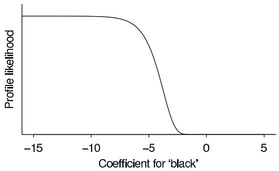  
Figure 16.1 Profile likelihood (in this case, essentially the posterior distribution given a uniform prior distribution) of the coefficient of black from the logistic regression of Republican vote in 1964 (displayed in the lower left of Table 16.1), conditional on point estimates of the other coefficients in the model. The maximum occurs as $\beta \rightarrow -\infty$ , indicating that the best fit to the data would occur at this unreasonable limit.

Figure 16.1 displays the profile likelihood for the coefficient of black in the voting example, that is, the likelihood for this one parameter conditional on the other parameters being set to their maximum likelihood estimates conditional on this parameter. The maximum likelihood estimate (or, equivalently, the posterior mode under a uniform prior density) is at the $-\infty$ which makes no sense in this application. As we shall see, a weakly informative prior distribution will take the estimate down to a reasonable value.

Computation with a specified normal prior distribution

Working in the context of the logistic regression model,

$$
\Pr \left(y _ {i} = 1\right) = \operatorname {l o g i t} ^ {- 1} \left(X _ {i} \beta\right), \tag {16.5}
$$

we adapt the classical maximum likelihood algorithm to obtain approximate posterior inference for the coefficients $\beta$ , in the form of an estimate $\hat{\beta}$ and covariance matrix $V_{\beta}$ .

The standard logistic regression algorithm—upon which we build—proceeds by approximately linearizing the derivative of the log-likelihood, solving using weighted least squares, and then iterating this process, each step evaluating the derivatives at the latest estimate $\hat{\beta}$ . At each iteration, the algorithm determines pseudo-data $z_{i}$ and pseudo-variances $(\sigma_{i}^{z})^{2}$ based on the linearization of the derivative of the log-likelihood, as shown on page 410.

The simplest informative prior distribution assigns normal distributions for the components of $\beta$ :

$$
\beta_ {j} \sim \mathrm {N} \left(\mu_ {j}, \sigma_ {j} ^ {2}\right), \quad \text {f o r} j = 1, \dots , J. \tag {16.6}
$$

This information can be effortlessly included in the classical algorithm by simply altering the weighted least-squares step, augmenting the approximate likelihood with the prior distribution. If the model has $J$ coefficients $\beta_{j}$ with independent $\mathrm{N}(\mu_j,\sigma_j^2)$ prior distributions, then we add $J$ pseudo-data points and perform weighted linear regression on 'observations' $z_{*}$ , 'explanatory variables' $X_{*}$ , and weight vector $w_{*}$ , where

$$
z _ {*} = \left( \begin{array}{c} z \\ \mu \end{array} \right), \quad X _ {*} = \left( \begin{array}{c} X \\ I _ {J} \end{array} \right), \quad w _ {*} = ((\sigma^ {z}) ^ {- 2}, \sigma^ {- 2}). \tag {16.7}
$$

The vectors $z_{*}, w_{*}$ and the matrix $X_{*}$ are constructed by combining the likelihood ( $z$ and $\sigma^z$ are the vectors of $z_{i}$ 's and $\sigma_i^z$ 's defined in (14.7), and $X$ is the design matrix of the regression (16.5)) and the prior ( $\mu$ and $\sigma$ are the vectors of $\mu_j$ 's and $\sigma_j$ 's in (16.6), and $I_J$ is the $J \times J$ identity matrix). As a result, $z_{*}$ and $w_{*}$ are vectors of length $n + J$ and $X_{*}$ is an $(n + J) \times J$ matrix. With the augmented $X_{*}$ , this regression is identified, and thus the resulting estimate $\hat{\beta}$ is well defined and has finite variance, even if the original data have collinearity or separation that would result in nonidentifiability of the maximum likelihood estimate.

The full computation is then iteratively weighted least squares, starting with a guess of $\beta$ , then computing the derivatives of the log-likelihood to compute $z$ and $\sigma_z$ , then using weighted least squares on the pseudo-data (16.7) to yield an updated estimate of $\beta$ , then recomputing the derivatives of the log-likelihood at this new value of $\beta$ , and so forth, converging to the estimate $\hat{\beta}$ . The covariance matrix $V_{\beta}$ is simply the inverse second derivative matrix of the log-posterior density evaluated at $\hat{\beta}$ —that is, the usual normal-theory uncertainty estimate for an estimate not on the boundary of parameter space.

# Approximate EM algorithm with a $t$ prior distribution

If the coefficients $\beta_{j}$ have independent $t$ prior distribution with centers $\mu_{j}$ and scales $s_j$ , we can adapt the just-described iteratively weighted least squares algorithm to estimate the coefficients using an approximate EM algorithm. We shall describe the steps of the algorithm shortly; the idea is to express the $t$ prior distribution for each coefficient $\beta_{j}$ as a mixture of normals with unknown scale $\sigma_{j}$ ,

$$
\beta_ {j} \sim \mathrm {N} (\mu_ {j}, \sigma_ {j} ^ {2}), \quad \sigma_ {j} ^ {2} \sim \operatorname {I n v} - \chi^ {2} (\nu_ {j}, s _ {j} ^ {2}), \tag {16.8}
$$

and then average over the $\beta_{j}$ 's at each step, treating them as missing data and performing the EM algorithm to estimate the $\sigma_{j}$ 's. The algorithm proceeds by alternating one step of iteratively weighted least squares (as described above) and one step of EM. Once enough iterations have been performed to reach approximate convergence, we get an estimate and covariance matrix for the vector parameter $\beta$ and the estimated $\sigma_{j}$ 's.

We initialize by setting each $\sigma_{j}$ to the value $s_j$ (the scale of the prior distribution) and, as before, starting with a guess of $\beta$ (either obtained earlier from a crude estimate or simply

picking a starting value such as $\beta = 0$ ). Then, at each step of the algorithm, we update $\sigma$ by maximizing the expected value of its (approximate) log-posterior density,

$$
\begin{array}{l} \log p (\beta , \sigma | y) \approx - \frac {1}{2} \sum_ {i = 1} ^ {n} \frac {1}{(\sigma_ {i} ^ {z}) ^ {2}} (z _ {i} - X _ {i} \beta) ^ {2} - \frac {1}{2} \sum_ {j = 1} ^ {J} \left(\frac {1}{\sigma_ {j} ^ {2}} (\beta_ {j} - \mu_ {j}) ^ {2} + \log (\sigma_ {j} ^ {2})\right) \\ - p \left(\sigma_ {j} \mid \nu_ {j}, s _ {j}\right) + \text {c o n s t a n t}. \tag {16.9} \\ \end{array}
$$

Each iteration of the algorithm proceeds as follows:

1. Based on the current estimate of $\beta$ , perform the normal approximation to the log-likelihood and determine the vectors $z$ and $\sigma^z$ using (14.7), as in classical logistic regression computation.

2. Approximate E-step: first run the weighted least squares regression based on the augmented data (16.7) to get an estimate $\hat{\beta}$ with variance matrix $V_{\beta}$ . Then determine the expected value of the log-posterior density by replacing the terms $(\beta_j - \mu_j)^2$ in (16.9) by

$$
\mathrm {E} \left(\left(\beta_ {j} - \mu_ {j}\right) ^ {2} | \sigma , y\right) \approx \left(\hat {\beta} _ {j} - \mu_ {j}\right) ^ {2} + \left(V _ {\beta}\right) _ {j j}, \tag {16.10}
$$

which is only approximate because we are averaging over a normal distribution that is only an approximation to the generalized linear model likelihood.

3. M-step: maximize the (approximate) expected value of the log-posterior density (16.9) to get the estimate,

$$
\hat {\sigma} _ {j} ^ {2} = \frac {(\hat {\beta} _ {j} - \mu_ {j}) ^ {2} + (V _ {\beta}) _ {j j} + \nu_ {j} s _ {j} ^ {2}}{1 + \nu_ {j}}, \tag {16.11}
$$

which corresponds to the (approximate) posterior mode of $\sigma_{j}^{2}$ given a single measurement with value (16.10) and an $\mathrm{Inv - }\chi^2 (\nu_j,s_j^2)$ prior distribution.

4. Recompute the derivatives of the log-posterior density given the current $\hat{\beta}$ , set up the augmented data (16.7) using the estimated $\hat{\sigma}$ from (16.11), and repeat steps 1,2,3 above.

At convergence of the algorithm, we summarize the inferences using the latest estimate $\hat{\beta}$ and covariance matrix $V_{\beta}$ .

# Default prior distribution for logistic regression coefficients

As noted above, we use independent $t$ priors for the coefficients. Setting the scale $\sigma$ to infinity (the convenient flat prior) fails under separation. Instead we want to add some prior information that constrains the estimate to be away from unrealistic extremes.

A challenge in setting up any default prior distribution is getting the scale right: for example, suppose we are predicting vote preference given age (in years). We would not want the same prior distribution if the age scale were shifted to months. But discrete predictors have their own natural scale (most notably, a change of 1 in a binary predictor) that we would like to respect.

The first step of our model is to standardize the input variables:

- Binary inputs are shifted to have a mean of 0 and to differ by 1 in their lower and upper conditions. (For example, if a population is $10\%$ black and $90\%$ other, we would define the centered c.black variable to take on the values 0.9 and $-0.1$ .)   
- Other inputs are shifted to have a mean of 0 and scaled to have a standard deviation of 0.5. This scaling puts continuous variables on the same scale as symmetric binary inputs (which, taking on the values $\pm 0.5$ , have standard deviation 0.5).

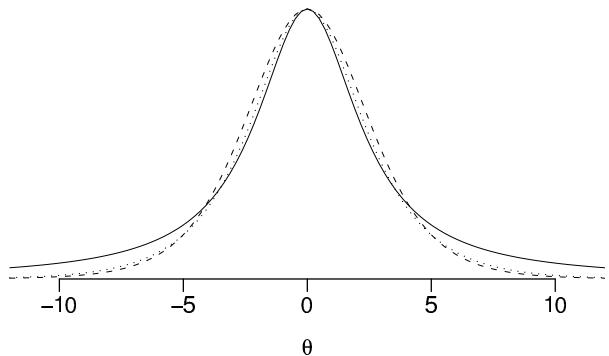  
Figure 16.2 (solid line) Cauchy density with scale 2.5, (dashed line) $t_7$ density with scale 2.5, (dotted line) likelihood for $\theta$ corresponding to a single binomial trial of probability $\logit^{-1}(\theta)$ with one-half success and one-half failure. All these curves favor values below 5 in absolute value; we choose the Cauchy as our default model because it allows the occasional probability of larger values.

We distinguish between regression inputs and predictors. For example, in a regression on age, sex, and their interaction, there are four predictors (the constant term, age, sex, and age $\times$ sex), but just two inputs: age and sex. It is the input variables, not the predictors, that are standardized.

A prior distribution on standardized variables depends on the data, but this is not necessarily a bad idea, given that the range of the data can provide information about the plausible scale of the coefficients. From a fully Bayesian perspective, we can think of our scaling procedure as an approximation to a hierarchical model in which the appropriate scaling parameter is estimated from the data.

We center our default prior distributions at zero because, in the absence of any problem-specific information, we have no idea if the coefficients $\beta$ will be positive or negative. We now need to choose default values of the scale $s$ and degrees of freedom $\nu$ in the $t$ prior distributions on the coefficients of the rescaled coefficients.

One way to pick a default value of $\nu$ and $s$ is to consider the baseline case of one-half of a success and one-half of a failure for a single binomial trial with probability $p = \log \mathrm{it}^{-1}(\theta)$ that is, a logistic regression with only a constant term. The corresponding likelihood is $e^{\theta /2} / (1 + e^{\theta})$ , which is close to a $t$ density function with 7 degrees of freedom and scale 2.5. We shall choose a slightly more conservative choice, the Cauchy, or $t_1$ , distribution, again with a scale of 2.5. Figure 16.2 shows the three density functions: they all give preference to values less than 5, with the Cauchy allowing the occasional possibility of very large values.

We assign independent Cauchy prior distributions with center 0 and scale 2.5 to each of the coefficients in the logistic regression except the constant term. When combined with the standardization, this implies that the absolute difference in logit probability should be less than 5, when moving from one standard deviation below the mean, to one standard deviation above the mean, in any input variable. Adding 5 on the logit scale is equivalent to shifting the predicted probability from 0.01 to 0.5, or from 0.5 to 0.99; these changes are larger than anything we would expect in most applications. (For example, the lifetime probability of death from lung cancer is about $1\%$ for a nonsmoking man in the United States, as compared to a probability of less than $50\%$ for a heavy smoker.)

If we were to apply the Cauchy prior distribution with center 0 and scale 2.5 to the constant term as well, we would be stating that the success probability is probably between $1\%$ and $99\%$ for units that are average in all the inputs. Depending on the context (for example, epidemiologic modeling of rare conditions), this might not make sense, so as a default we apply a weaker prior distribution—a Cauchy with center 0 and scale 10, which

from glm: coef.est coef.se (Intercept) -0.1 0.7 z.x 10.2 6.4 n = 4, k = 2   
# from bayesglm: coef.est coef.se (Intercept) -0.2 0.6 z.x 5.4 2.2 n = 4, k = 2

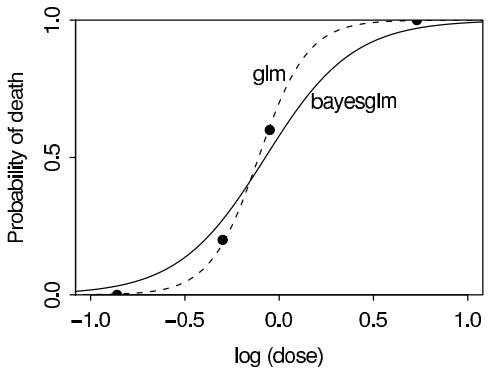  
Figure 16.3 Estimates from maximum likelihood and Bayesian logistic regression with the recommended default prior distribution for the bioassay example (data in Table 3.1 on page 74). In addition to graphing the fitted curves (at right), we show raw computer output to illustrate how our approach would be used in routine practice. The big change in the estimated coefficient for $\mathbf{z} \cdot \mathbf{x}$ when going from glm to bayesglm may seem surprising at first, but upon reflection we prefer the second estimate with its lower coefficient for $x$ , which is based on downweighting the most extreme possibilities that are allowed by the likelihood.

implies that we expect the success probability for an average case to be between $10^{-9}$ and $1 - 10^{-9}$ . We typically have more information about the intercept than about any particular coefficient and so we can get by with a weaker prior.

# Other models

Linear regression. Our algorithm is basically the same for linear regression, except that weighted least squares is an exact rather than approximate maximum penalized likelihood, and also a step needs to be added to estimate the data variance. In addition, we would preprocess $y$ by rescaling the outcome variable to have mean 0 and standard deviation 0.5 before assigning the prior distribution (or, equivalently, multiply the prior scale parameter by the standard deviation of the data). Separation is not a concern in linear regression; however, when applied routinely (for example, in iterative imputation algorithms), collinearity can arise, in which case it is helpful to have a proper but weak prior distribution.

Other generalized linear models. Again, the basic algorithm is unchanged, except that the pseudo-data and pseudo-variances in (14.7), which are derived from the first and second derivatives of the log-likelihood, are changed (see Section 16.2). For Poisson regression and other models with the logarithmic link, we would not often expect effects larger than 5 on the logarithmic scale, and so the prior distributions given in this article might be a reasonable default choice. In addition, for models such as the negative binomial that have dispersion parameters, these can be estimated using an additional step as is done when estimating the data-level variance in normal linear regression. For more complex models such as multinomial logit and probit, we have considered combining independent $t$ prior distributions on the coefficients with pseudo-data to identify cutpoints in the possible presence of sparse data. Such models also present computational challenges, as there is no simple existing iteratively weighted least squares algorithm for us to adapt.

# Bioassay example

We next apply the default weakly informative prior distribution to the bioassay example from Section 3.7. Here these is no separation but the amount of information in the data is low, with only 20 binary data points. The top part of Figure 16.3 presents the data, from

twenty animals exposed to four different doses of a toxin. The bottom parts of Figure 16.3 show the resulting logistic regression, as fit first using maximum likelihood and then using our default Cauchy prior distributions with center 0 and scale 10 (for the constant term) and 2.5 (for the coefficient of dose). Following our general procedure, we have assigned this prior distribution after rescaling $x$ to have mean 0 and standard deviation 0.5.

With such a small sample, the prior distribution actually makes a difference, lowering the estimated coefficient of standardized dose from $10.2 \pm 6.4$ to $5.4 \pm 2.2$ . (On the rescaled parameterization in which the predictor has mean 0 and standard deviation 0.5, the estimate goes from $7.7 \pm 4.9$ to $4.4 \pm 1.9$ .) Such a large change might seem disturbing, but for the reasons discussed above, we would doubt the effect to be as large as 10.2 on the logistic scale, and the analysis shows these data to be consistent with the much smaller effect size of 5.4. The large amount of shrinkage simply confirms how weak the information is that gave the original maximum likelihood estimate. The graph at the upper right of Figure 16.3 shows the comparison in a different way: the maximum likelihood estimate fits the data almost perfectly; however, the discrepancies between the data and the Bayes fit are small, considering the sample size of only 5 animals within each group. $^{1}$

# Example. Predicting voting from ethnicity (continued)

We apply our default prior distribution to the pre-election polls discussed earlier in this section, in which we could easily fit a logistic regression with flat priors for every election year except 1964, where the coefficient for black blew up due to complete separation in the data.

The left column of Figure 16.4 shows the time series of estimated coefficients and error bounds for the four coefficients of the logistic regression fit separately to poll data for each election year from 1952 through 2000. All the estimates are reasonable except for the intercept and the coefficient for black in 1964, when the maximum likelihood estimates are infinite. As discussed already, we do not believe that these coefficient estimates for 1964 are reasonable: in the population as a whole, we do not believe that the probability was zero that an African American in the population would vote Republican. It is, however, completely predictable that with moderate sample sizes there will occasionally be separation, yielding infinite estimates. (As noted earlier, the estimates shown here for 1964 are finite only because the generalized linear model fitting routine in R stops after a finite number of iterations.)

The other three columns of Figure 16.4 show the coefficient estimates using our default Cauchy prior distribution for the coefficients, along with the $t_7$ and normal distributions. In all cases, the prior distributions are centered at 0, with scale parameters set to 10 for the constant term and 2.5 for all other coefficients. All three prior distributions do a reasonable job at stabilizing the estimated coefficient for race for 1964, while leaving the estimates for other years essentially unchanged. This example illustrates how a weakly informative prior distribution can work in routine practice.

# Weakly informative default prior compared to actual prior information

The Cauchy(0,2.5) prior distribution does not represent our prior knowledge about the coefficient for black in the logistic regression for 1964 or any other year. Even before seeing data from this particular series of surveys, we knew that blacks have been less likely than whites to vote for Republican candidates; thus our prior belief was that the coefficient was negative. Furthermore, our prior for any given year would be informed by data from other years. For example, given the series of estimates in Figure 16.4, we would guess

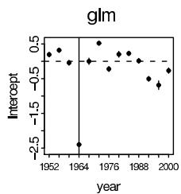

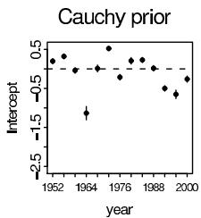

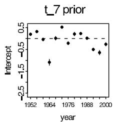

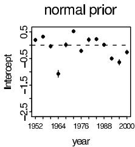

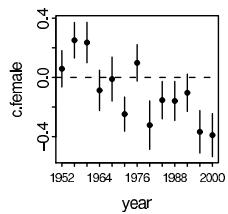

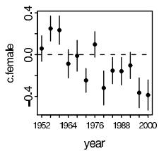

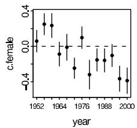

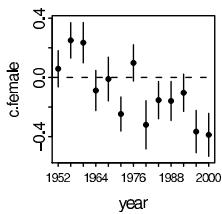

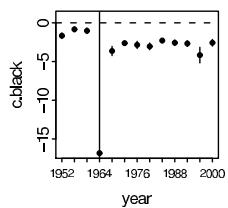

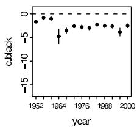

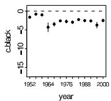

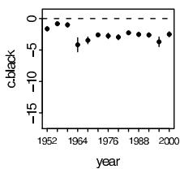

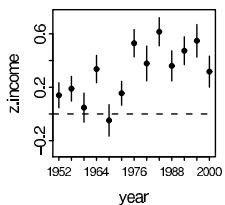

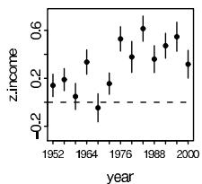

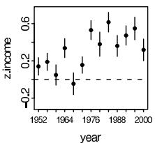

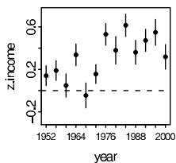  
Figure 16.4 The left column shows the estimated coefficients (±1 standard error) for a logistic regression predicting probability of Republican vote for president given sex, race, and income, as fit separately to data from the National Election Study for each election 1952 through 2000. (The binary inputs female and black have been centered to have means of zero, and the numerical variable income has been centered and then rescaled by dividing by two standard deviations.)

The complete separation in 1964 led to a coefficient estimate of $-\infty$ that year. (The particular finite values of the estimate and standard error are determined by the number of iterations used by the glm function in $R$ before stopping.)

The other columns show estimates for the same model fit each year using independent Cauchy, $t_7$ , and normal prior distributions, each with center 0 and scale 2.5. All three prior distributions do a reasonable job at stabilizing the estimates for 1964, while leaving the estimates for other years essentially unchanged.

that the coefficient for black in 2004 is probably between $-2$ and $-5$ . Finally, we are not using specific prior knowledge about these elections. The Republican candidate in 1964 was particularly conservative on racial issues and opposed the Civil Rights Act; on those grounds we would expect him to poll particularly poorly among African Americans (as indeed he did). In sum, we feel comfortable using a default model that excludes much potentially useful information, recognizing that we could add such information if it were judged to be worth the trouble (for example, instead of performing separate estimates for each election year, setting up a hierarchical model allowing the coefficients to gradually vary over time and including election-level predictors including information such as the candidates' positions on economic and racial issues).

# 16.4 Example: hierarchical Poisson regression for police stops

There have been complaints in New York City and elsewhere that the police harass members of ethnic minority groups. In 1999, the New York State Attorney General's Office instigated a study of the New York City police department's 'stop and frisk' policy: the lawful practice of 'temporarily detaining, questioning, and, at times, searching civilians on the street.' The police have a policy of keeping records on stops, and we obtained all these records (about 175,000 in total) for a fifteen-month period in 1998-1999. We analyzed these data to see to what extent different ethnic groups were stopped by the police. We focused on blacks (African Americans), hispanics (Latinos), and whites (European Americans). The ethnic categories were as recorded by the police making the stops. We excluded members of other ethnic groups (about $4\%$ of the stops) because of the likelihood of ambiguities in classifications. (With such a low frequency of 'other,' even a small rate of misclassifications could cause large distortions in the estimates for that group. For example, if only $4\%$ of blacks, hispanics, and whites were mistakenly labeled as 'other,' then this would nearly double the estimates for the 'other' category while having little effect on the three major groups.)

# Aggregate data

Blacks and hispanics represented $51\%$ and $33\%$ of the stops, respectively, despite comprising only $26\%$ and $24\%$ , respectively, of the population of the city. Perhaps a more relevant comparison, however, is to the number of crimes committed by members of each ethnic group.

Data on actual crimes are not available, so as a proxy we used the number of arrests within New York City in 1997 as recorded by the Division of Criminal Justice Services (DCJS) of New York State. These were deemed to be the best available measure of local crime rates categorized by ethnicity. We used these numbers to represent the frequency of crimes that the police might suspect were committed by members of each group. When compared in that way, the ratio of stops to DCJS arrests was 1.24 for whites, 1.54 for blacks, and 1.72 for hispanics: based on this comparison, blacks are stopped $23\%$ and hispanics $39\%$ more often than whites.

# Regression analysis to control for precincts

The analysis so far looks at average rates for the whole city. Suppose the police make more stops in high-crime areas but treat the different ethnic groups equally within any locality. Then the citywide ratios could show strong differences between ethnic groups even if stops are entirely determined by location rather than ethnicity. In order to separate these two kinds of predictors, we performed hierarchical analyses using the city's 75 precincts. Because it is possible that the patterns are systematically different in neighborhoods with different ethnic compositions, we divided the precincts into three categories in terms of their black population: precincts that were less than $10\%$ black, $10\% -40\%$ black, and over $40\%$ black. Each of these represented roughly $1/3$ of the precincts in the city, and we performed separate analyses for each set.

For each ethnic group $e = 1,2,3$ and precinct $p$ , we modeled the number of stops $y_{ep}$ using an overdispersed Poisson regression with indicators for ethnic groups, a hierarchical model for precincts, and using $n_{ep}$ , the number of DCJS arrests for that ethnic group in that precinct (multiplied by 15/12 to scale to a fifteen-month period), as an offset:

$$
{y _ {e p}} \sim {\mathrm {P o i s s o n} \left(n _ {e p} e ^ {\alpha_ {e} + \beta_ {p} + \epsilon_ {e p}}\right)}
$$

$$
\beta_ {p} \sim \mathrm {N} (0, \sigma_ {\beta} ^ {2})
$$

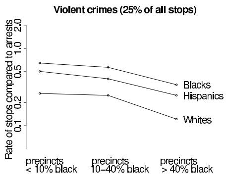

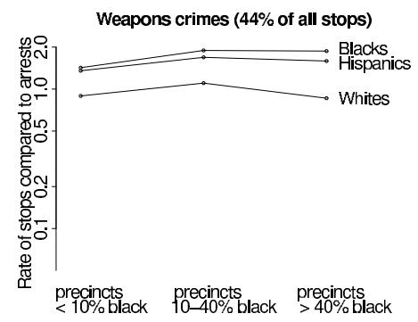

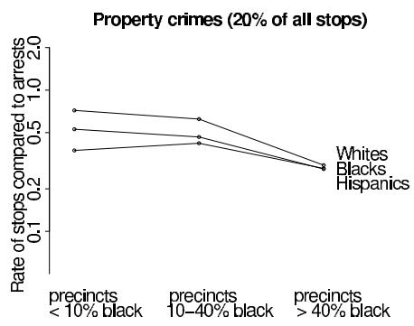

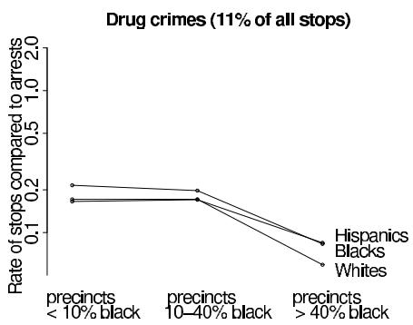  
Figure 16.5 Estimated rates $\exp (\alpha_{e})$ at which people of different ethnic groups were stopped for different categories of crime, as estimated from hierarchical regressions (16.12) using previous year's arrests as a baseline and controlling for differences between precincts. Separate analyses were done for the precincts that had less than $10\%$ , $10\% -40\%$ , and more than $40\%$ black population. For the most common stops—violent crimes and weapons offenses—blacks and hispanics were stopped about twice as often as whites. Rates are plotted on a logarithmic scale.

$$
\epsilon_ {e p} \sim \mathrm {N} (0, \sigma_ {\epsilon} ^ {2}), \tag {16.12}
$$

where the coefficients $\alpha_{e}$ 's control for ethnic groups, the $\beta_{p}$ 's adjust for variation among precincts, and the $\epsilon_{ep}$ 's allow for overdispersion. Of most interest are the exponentiated coefficients $\exp (\alpha_e)$ , which represent relative rates of stops compared to arrests, after controlling for precinct.

By comparing to arrest rates, we can also separately analyze stops associated with different sorts of crimes. We did a separate comparison for each of four types of offenses: violent crimes, weapons offenses, property crimes, and drug crimes. For each, we modeled the number of stops $y_{ep}$ by ethnic group $e$ and precinct $p$ for that crime type, using as a baseline the previous year's DCJS arrest rates $n_{ep}$ for that crime type.

We thus estimated model (16.12) for twelve separate subsets of the data, corresponding to the four crime types and the three categories of precincts. We performed the computations using Bugs (a predecessor to the program Stan described in Appendix C). Figure 16.5 displays the estimated rates $\exp (\hat{\alpha}_e)$ . For each type of crime, the relative frequencies of stops for the different ethnic groups, are in the same order for each set of precincts. We also performed an analysis including the month of arrest. Rates of stops were roughly constant over the 15-month period and did not add anything informative to the comparison of ethnic groups.

Figure 16.5 shows that, for the most frequent categories of stops—those associated with violent crimes and weapons offenses—blacks and hispanics were much more likely to be

stopped than whites, in all categories of precincts. For violent crimes, blacks and hispanics were stopped 2.5 times and 1.9 times as often as whites, respectively, and for weapons crimes, blacks and hispanics were stopped 1.8 times and 1.6 times as often as whites. In the less common categories of stop, whites are slightly more often stopped for property crimes and more often stopped for drug crimes, in proportion to their previous year's arrests in any given precinct.

Does the overall pattern of disproportionate stops of minorities imply that the NYPD was acting in an unfair or racist manner? Not at all. It is reasonable to suppose that effective policing requires many people to be stopped and questioned in order to gather information about any given crime. In the context of some difficult relations between the police and ethnic minority communities in New York City, it is useful to have some quantitative sense of the issues under dispute. Given that there have been complaints about the frequency with which the police have been stopping blacks and hispanics, it is relevant to know that this is indeed a statistical pattern. The police department then has the opportunity to explain its policies to the affected communities.

# 16.5 Example: hierarchical logistic regression for political opinions

We illustrate the application of the analysis of variance (see Section 15.6) to hierarchical generalized linear models with a model of public opinion.

Dozens of national opinion polls are conducted by media organizations before every election, and it is desirable to estimate opinions at the levels of individual states as well as for the entire country. These polls are generally based on national random-digit dialing with corrections for nonresponse based on demographic factors such as sex, ethnicity, age, and education. We estimated state-level opinions from these polls, while simultaneously correcting for nonresponse, in two steps. For any survey response of interest:

1. We fit a regression model for the individual response $y$ given demographics and state. This model thus estimates an average response $\theta_{j}$ for each cross-classification $j$ of demographics and state. In our example, we have sex (male or female), ethnicity (African American or other), age (4 categories), education (4 categories), and 50 states; thus 3200 categories.   
2. From the U.S. Census, we get the adult population $N_{j}$ for each category $j$ . The estimated population average of the response $y$ in any state $s$ is then $\theta_{s} = \sum_{j\in s}N_{j}\theta_{j} / \sum_{j\in s}N_{j}$ , with each summation over the 64 demographic categories in the state.

We need a large number of categories because (a) we are interested in separating out the responses by state, and (b) nonresponse adjustments force us to include the demographics. As a result, any given survey will have few or no data in many categories. This is not a problem, however, if a multilevel model is fitted. Each factor or set of interactions in the model corresponds to a row in the Anova plot and is automatically given a variance component.

As discussed in the survey sampling literature, this inferential procedure works well and outperforms standard survey estimates when estimating state-level outcomes. For this example, we choose a single outcome—the probability that a respondent prefers the Republican candidate for President—as estimated by a logistic regression model from a set of seven CBS News polls conducted during the week before the 1988 presidential election. We focus here on the first stage of the estimation procedure—the inference for the logistic regression model—and use our Anova tools to display the relative importance of each factor in the model.

We label the survey responses $y_{i}$ as 1 for supporters of the Republican candidate and 0 for supporters of the Democrat (with undecideds excluded) and model them as independent, with $\operatorname{Pr}(y_{i} = 1) = \log \mathrm{i}^{-1}(X_{i}\beta)$ . The design matrix $X$ is all 0's and 1's with indicators

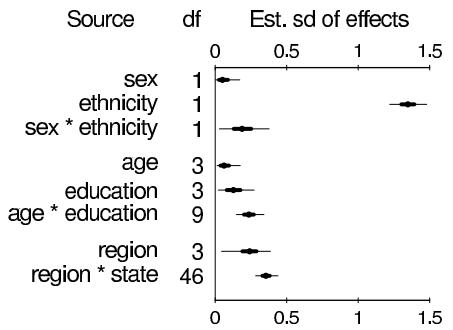

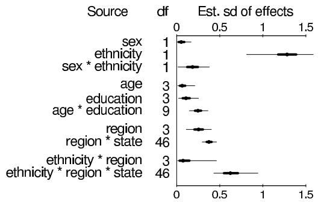  
Figure 16.6 Anova display for two logistic regression models of the probability that a survey respondent prefers the Republican candidate for the 1988 U.S. presidential election, based on data from seven CBS News polls. Point estimates and error bars show posterior medians, $50\%$ intervals, and $95\%$ intervals of the finite-population standard deviations $s_m$ . The demographic factors are those used by CBS to perform their nonresponse adjustments, and states and regions are included because we were interested in estimating average opinions by state. The large effects for ethnicity, region, and state suggest that it might make sense to include interactions, hence the inclusion of the ethnicity $\times$ region and ethnicity $\times$ state effects in the second model.

for the demographic variables used by CBS in the survey weighting: sex, ethnicity, age, education, and the interactions of sex $\times$ ethnicity and age $\times$ education. We also include in $X$ indicators for the 50 states and for the 4 regions of the country (northeast, midwest, south, and west). Since the states are nested within regions, no main effects for states are needed. As in our general approach for linear models, we give each batch of regression coefficients an independent normal distribution centered at zero and with standard deviation estimated hierarchically given a uniform prior density.

We fitted the model and used posterior simulations to compute finite-sample standard deviations and plot the results. The left plot of Figure 16.6 displays the analysis of variance, which shows that ethnicity is by far the most important demographic factor, with state also explaining much of the variation.

The natural next step is to consider interactions among the most important effects, as shown in the plot on the right side of Figure 16.6. The ethnicity $\times$ state $\times$ region interactions are surprisingly large: the differences between African Americans and others vary dramatically by state. As with the example in Section 15.6 of Internet connect times, the analysis of variance is a helpful tool in understanding the importance of different components in a hierarchical model.

# 16.6 Models for multivariate and multinomial responses

# Multivariate outcomes

We reanalyze the meta-analysis example of Section 5.6 using a binomial data model with a bivariate normal distribution for the parameters describing the individual studies.

# Example. Meta-analysis with binomial outcomes

In this example, the results of each of 22 clinical trials are summarized by a $2 \times 2$ table of death and survival under each of two treatments, and we are interested in the distribution of the effects of the treatment on the probability of death. The analysis of Section 5.6 was based on a normal approximation to the empirical log-odds ratio in each study. Because of the large sample sizes, the normal approximation is fairly accurate in this case, but it is desirable to have a more exact procedure for the general problem.

In addition, the univariate analysis in Section 5.6 used the ratio, but not the average, of the death rates in each trial; ignoring this information can have an effect, even with large samples, if the average death rates are correlated with the treatment effects.

Data model. Continuing the notation of Section 5.6, let $y_{ij}$ be the number of deaths out of $n_{ij}$ patients for treatment $i = 0,1$ and study $j = 1,\ldots ,22$ . As in the earlier discussion we take $i = 1$ to represent the treated groups, so that negative values of the log-odds ratio represent reduced frequency of death under the treatment. Our data model is binomial:

$$
y _ {i j} | n _ {i j}, p _ {i j} \sim \operatorname {B i n} (n _ {i j}, p _ {i j}),
$$

where $p_{ij}$ is the probability of death under treatment $i$ in study $j$ . We must now model the 44 parameters $p_{ij}$ , which naturally follow a multivariate model, since they fall into 22 groups of two. We first transform the $p_{ij}$ 's to the logit scale, so they are defined on the range $(-\infty, \infty)$ and can plausibly be fitted by the normal distribution.

Hierarchical model in terms of transformed parameters. Rather than fitting a normal model directly to the parameters $\mathrm{logit}(p_{ij})$ , we transform to the average and difference effects for each experiment:

$$
\beta_ {1 j} = (\operatorname {l o g i t} (p _ {0 j}) + \operatorname {l o g i t} (p _ {1 j})) / 2
$$

$$
\beta_ {2 j} = \operatorname {l o g i t} \left(p _ {1 j}\right) - \operatorname {l o g i t} \left(p _ {0 j}\right). \tag {16.13}
$$

The parameters $\beta_{2j}$ correspond to the $\theta_j$ 's of Section 5.6. We model the 22 exchangeable pairs $(\beta_{1j},\beta_{2j})$ as following a bivariate normal distribution with unknown parameters:

$$
p(\beta |\alpha ,\Lambda) = \prod_{j = 1}^{22}\mathrm{N}\left(\left( \begin{array}{c}\beta_{1j}\\ \beta_{2j} \end{array} \right)\bigg|  \left( \begin{array}{c}\alpha_{1}\\ \alpha_{2} \end{array} \right),\Lambda\right).
$$

This is equivalent to a normal model on the parameter pairs $(\mathrm{logit}(p_{0j}),\mathrm{logit}(p_{1j}))$ ; however, the linear transformation should leave the $\beta$ 's roughly independent in their population distribution, making our inference less sensitive to the prior distribution for their correlation.

Hyperprior distribution. We use the usual noninformative uniform prior distribution for the parameters $\alpha_{1}$ and $\alpha_{2}$ . For the hierarchical variance matrix $\Lambda$ , there is no standard noninformative choice; for this problem, we assign independent uniform prior distributions to the variances $\Lambda_{11}$ and $\Lambda_{22}$ and the correlation, $\rho_{12} = \Lambda_{12} / (\Lambda_{11}\Lambda_{22})^{1/2}$ . The resulting posterior distribution is proper (see Exercise 16.9).

Posterior computations. We drew samples from the posterior distribution in the usual way based on successive approximations, following the general strategy described in Part III. (This model could be fit easily using Stan, but we use this example to illustrate how such computations can be constructed directly.) The computational method we used here is almost certainly not the most efficient in terms of computer time, but it was relatively easy to program in a general way and yielded believable inferences. The model was parameterized in terms of $\beta$ , $\alpha$ , $\log(\Lambda_{11})$ , $\log(\Lambda_{22})$ , and Fisher's $z$ -transform of the correlation, $\frac{1}{2}\log\left(\frac{1 + \rho_{12}}{1 - \rho_{12}}\right)$ , to transform the ranges of the parameters to the whole real line. We sampled random draws from an approximation based on conditional modes, followed by importance resampling, to obtain starting points for ten parallel runs of the Metropolis algorithm. We used a normal jumping kernel with covariance from the curvature of the posterior density at the mode, scaled by a factor of $2.4/\sqrt{49}$ (because the jumping is in 49-dimensional space; see page 296). The simulations were run for 40,000 iterations, at which point the estimated scale reductions, $\widehat{R}$ , for all parameters were below 1.2 and most were below 1.1. We use

Table 16.2 Summary of posterior inference for the bivariate analysis of the meta-analysis of the beta-blocker trials in Table 5.4. All effects are on the log-odds scale. Inferences are similar to the results of the univariate analysis of logit differences in Section 5.6: compare the individual study effects to Table 5.4 and the mean and standard deviation of average logits to Table 5.5. 'Study 1 avg logit' is included above as a representative of the 22 parameters $\beta_{1j}$ . (We would generally prefer to display all these inferences graphically but use tables here to give a more detailed view of the posterior inferences.)   

<table><tr><td rowspan="2">Estimand</td><td colspan="5">Posterior quantiles</td></tr><tr><td>2.5%</td><td>25%</td><td>median</td><td>75%</td><td>97.5%</td></tr><tr><td>Study 1 avg logit, β1,1</td><td>-3.16</td><td>-2.67</td><td>-2.42</td><td>-2.21</td><td>-1.79</td></tr><tr><td>Study 1 effect, β2,1</td><td>-0.61</td><td>-0.33</td><td>-0.23</td><td>-0.13</td><td>0.14</td></tr><tr><td>Study 2 effect, β2,2</td><td>-0.63</td><td>-0.37</td><td>-0.28</td><td>-0.19</td><td>0.06</td></tr><tr><td>Study 3 effect, β2,3</td><td>-0.58</td><td>-0.35</td><td>-0.26</td><td>-0.16</td><td>0.08</td></tr><tr><td>Study 4 effect, β2,4</td><td>-0.44</td><td>-0.30</td><td>-0.24</td><td>-0.17</td><td>-0.03</td></tr><tr><td>Study 5 effect, β2,5</td><td>-0.43</td><td>-0.27</td><td>-0.18</td><td>-0.08</td><td>0.16</td></tr><tr><td>Study 6 effect, β2,6</td><td>-0.68</td><td>-0.37</td><td>-0.27</td><td>-0.18</td><td>0.04</td></tr><tr><td>Study 7 effect, β2,7</td><td>-0.64</td><td>-0.47</td><td>-0.38</td><td>-0.31</td><td>-0.20</td></tr><tr><td>Study 8 effect, β2,8</td><td>-0.41</td><td>-0.27</td><td>-0.20</td><td>-0.11</td><td>0.10</td></tr><tr><td>Study 9 effect, β2,9</td><td>-0.61</td><td>-0.37</td><td>-0.29</td><td>-0.21</td><td>-0.01</td></tr><tr><td>Study 10 effect, β2,10</td><td>-0.49</td><td>-0.36</td><td>-0.29</td><td>-0.23</td><td>-0.12</td></tr><tr><td>Study 11 effect, β2,11</td><td>-0.50</td><td>-0.31</td><td>-0.24</td><td>-0.16</td><td>0.01</td></tr><tr><td>Study 12 effect, β2,12</td><td>-0.49</td><td>-0.32</td><td>-0.22</td><td>-0.11</td><td>0.13</td></tr><tr><td>Study 13 effect, β2,13</td><td>-0.70</td><td>-0.37</td><td>-0.24</td><td>-0.14</td><td>0.08</td></tr><tr><td>Study 14 effect, β2,14</td><td>-0.33</td><td>-0.18</td><td>-0.08</td><td>0.04</td><td>0.30</td></tr><tr><td>Study 15 effect, β2,15</td><td>-0.58</td><td>-0.38</td><td>-0.28</td><td>-0.18</td><td>0.05</td></tr><tr><td>Study 16 effect, β2,16</td><td>-0.52</td><td>-0.34</td><td>-0.25</td><td>-0.15</td><td>0.08</td></tr><tr><td>Study 17 effect, β2,17</td><td>-0.49</td><td>-0.29</td><td>-0.20</td><td>-0.10</td><td>0.17</td></tr><tr><td>Study 18 effect, β2,18</td><td>-0.54</td><td>-0.27</td><td>-0.17</td><td>-0.06</td><td>0.21</td></tr><tr><td>Study 19 effect, β2,19</td><td>-0.56</td><td>-0.30</td><td>-0.18</td><td>-0.05</td><td>0.25</td></tr><tr><td>Study 20 effect, β2,20</td><td>-0.57</td><td>-0.36</td><td>-0.26</td><td>-0.17</td><td>0.04</td></tr><tr><td>Study 21 effect, β2,21</td><td>-0.65</td><td>-0.41</td><td>-0.32</td><td>-0.24</td><td>-0.08</td></tr><tr><td>Study 22 effect, β2,22</td><td>-0.66</td><td>-0.39</td><td>-0.27</td><td>-0.18</td><td>-0.02</td></tr><tr><td>mean of avg logits,α1</td><td>-2.59</td><td>-2.42</td><td>-2.34</td><td>-2.26</td><td>-2.09</td></tr><tr><td>sd of avg logits,√Λ11</td><td>0.39</td><td>0.48</td><td>0.55</td><td>0.63</td><td>0.83</td></tr><tr><td>mean of effects, α2</td><td>-0.38</td><td>-0.29</td><td>-0.24</td><td>-0.20</td><td>-0.11</td></tr><tr><td>sd of effects, √Λ22</td><td>0.04</td><td>0.11</td><td>0.16</td><td>0.21</td><td>0.34</td></tr><tr><td>correlation, ρ12</td><td>-0.61</td><td>-0.13</td><td>0.21</td><td>0.53</td><td>0.91</td></tr></table>

the resulting 200,000 simulations of $(\beta ,\alpha ,\Lambda)$ from the second halves of the simulated sequences to summarize the posterior distribution in Table 16.2.

Results from the posterior simulations. The posterior distribution for $\rho_{12}$ is centered near 0.21 with considerable variability. Consequently, the multivariate model would have only a small effect on the posterior inferences obtained from the univariate analysis concerning the log-odds ratios for the individual studies or the relevant hierarchical parameters. Comparing the results in Table 16.2 to those in Tables 5.4 and 5.5 shows that the inferences are similar. The multivariate analysis based on the exact posterior distribution fixes any deficiencies in the normal approximation required in the previous analysis but does not markedly change the posterior inferences for the quantities of essential interest.

# Extension of the logistic link

Appropriate models for polychotomous data can be developed as extensions of either the Poisson or binomial models. We first show how the logistic model for binary data can be extended to handle multinomial data. The notation for a multinomial random variable $y_{i}$ with sample size $n_i$ and $k$ possible outcomes (that is, $y_{i}$ is a vector with $\sum_{j=1}^{k} y_{ij} = n_i$ ) is $y_{i} \sim \mathrm{Multin}(n_i; \alpha_{i1}, \alpha_{i2}, \ldots, \alpha_{ik})$ , with $\alpha_{ij}$ representing the probability of the $j$ th category, and $\sum_{j=1}^{k} \alpha_{ij} = 1$ . A standard way to parameterize the multinomial generalized linear model is in terms of the logarithm of the ratio of the probability of each category relative to that of a baseline category, which we label $j = 1$ , so that

$$
\log \left(\alpha_ {i j} / \alpha_ {i 1}\right) = \eta_ {i j} = X _ {i} \beta^ {(j)},
$$

where $\beta^{(j)}$ is a vector of parameters for the $j$ th category. The data distribution is then

$$
p (y | \beta) \propto \prod_ {i = 1} ^ {n} \prod_ {j = 1} ^ {k} \left(\frac {e ^ {\eta_ {i j}}}{\sum_ {l = 1} ^ {k} e ^ {\eta_ {i l}}}\right) ^ {y _ {i j}},
$$

with $\beta^{(1)}$ set equal to zero, and hence $\eta_{i1} = 0$ for each $i$ . The vector $\beta^{(j)}$ indicates the effect of a change in $X$ on the probability of observing outcomes in category $j$ relative to category 1. Often the linear predictor includes a set of indicator variables for the outcome categories indicating the relative frequencies when the explanatory variables take the default value $X = 0$ ; in that case we can write $\delta_j$ as the coefficient of the indicator for category $j$ and $\eta_{ij} = \delta_j + X_i\beta^{(j)}$ , with $\delta_1$ and $\beta^{(1)}$ typically set to 0.

# Special methods for ordered categories

There is a distinction between multinomial outcomes with ordinal categories (for example, grades A, B, C, D) and those with nominal categories (for example, diseases). For ordinal categories the generalized linear model is often expressed in terms of cumulative probabilities $(\pi_{ij} = \sum_{l \leq j} \alpha_{il})$ rather than category probabilities, with $\log \left( \frac{\pi_{ij}}{1 - \pi_{ij}} \right) = \delta_j + X_i \beta^{(j)}$ , where once again we typically take $\delta_1 = \beta^{(1)} = 0$ . Due to the ordering of the categories, it may be reasonable to consider a model with a common set of regression parameters $\beta^{(j)} = \beta$ for each $j$ . Another common choice for ordered categories is the multinomial probit model. Either of these models can also be expressed in latent variable form as described at the end of Section 16.1

# Using the Poisson model for multinomial responses

Multinomial response data can also be analyzed using Poisson models by conditioning on appropriate totals. As this method is useful in performing computations, we describe it briefly and illustrate its use with an example. Suppose that $y = (y_{1},\ldots ,y_{k})$ are independent Poisson random variables with means $\lambda = (\lambda_1,\dots ,\lambda_k)$ . Then the conditional distribution of $y$ , given $n = \sum_{j = 1}^{k}y_{j}$ , is multinomial:

$$
p (y | n, \alpha) = \operatorname {M u l t i n} (y | n; \alpha_ {1}, \dots , \alpha_ {k}), \tag {16.14}
$$

with $\alpha_{j} = \lambda_{j} / \sum_{i = 1}^{k}\lambda_{i}$ . This relation can also be used to allow data with multinomial response variables to be fitted using Poisson generalized linear models. The constraint on the sum of the multinomial probabilities is imposed by incorporating additional covariates in the Poisson regression whose coefficients are assigned uniform prior distributions. We illustrate with an example.

Table 16.3 Subset of the data from the 1988-1989 World Cup of chess: results of games between eight of the 29 players. Results are given as wins, losses, and draws; for example, when playing with the white pieces against Kasparov, Karpov had one win, no losses, and one draw. For simplicity, this table aggregates data from all six tournaments.   

<table><tr><td rowspan="2">White 
pieces</td><td rowspan="2">Kar</td><td rowspan="2">Kas</td><td rowspan="2">Kor</td><td colspan="5">Black pieces</td></tr><tr><td>Lju</td><td>Sei</td><td>Sho</td><td>Spa</td><td>Tal</td></tr><tr><td>Karpov</td><td></td><td>1-0-1</td><td>1-0-0</td><td>0-1-1</td><td>1-0-0</td><td>0-0-2</td><td>0-0-0</td><td>0-0-0</td></tr><tr><td>Kasparov</td><td>0-0-0</td><td></td><td>1-0-0</td><td>0-0-0</td><td>0-0-1</td><td>1-0-0</td><td>1-0-0</td><td>0-0-2</td></tr><tr><td>Korchnoi</td><td>0-0-1</td><td>0-2-0</td><td></td><td>0-0-0</td><td>0-1-0</td><td>0-0-2</td><td>0-0-1</td><td>0-0-0</td></tr><tr><td>Ljubojevic</td><td>0-1-0</td><td>0-1-1</td><td>0-0-2</td><td></td><td>0-1-0</td><td>0-0-1</td><td>0-0-2</td><td>0-0-1</td></tr><tr><td>Seirawan</td><td>0-1-1</td><td>0-0-1</td><td>1-1-0</td><td>0-2-0</td><td></td><td>0-0-0</td><td>0-0-0</td><td>1-0-0</td></tr><tr><td>Short</td><td>0-0-1</td><td>0-2-0</td><td>0-0-0</td><td>1-0-1</td><td>2-0-1</td><td></td><td>0-0-1</td><td>1-0-0</td></tr><tr><td>Spassky</td><td>0-1-0</td><td>0-0-2</td><td>0-0-1</td><td>0-0-0</td><td>0-0-1</td><td>0-0-1</td><td></td><td>0-0-0</td></tr><tr><td>Tal</td><td>0-0-2</td><td>0-0-0</td><td>0-0-3</td><td>0-0-0</td><td>0-0-1</td><td>0-0-0</td><td>0-0-1</td><td></td></tr></table>

# Example. World Cup chess

The 1988-1989 World Cup of chess consisted of six tournaments involving 29 of the world's top chess players. Each tournament was a single round robin--each player played every other player exactly once--with 16 to 18 players. In total, 789 games were played; for each game in each tournament, the players, the outcome of the game (win, lose, or draw), and the identity of the player making the first move (thought to provide an advantage) are recorded. A subset of the data is displayed in Table 16.3.

Multinomial model for paired comparisons with ties. A standard model for analyzing paired comparisons data, such as the results of a chess competition, is the Bradley-Terry model. In its most basic form, the model assumes that the probability that player $i$ defeats player $j$ is $p_{ij} = \exp (\alpha_i - \alpha_j) / (1 + \exp (\alpha_i - \alpha_j))$ , where $\alpha_{i},\alpha_{j}$ are parameters representing player abilities. The parameterization using $\alpha_{i}$ rather than $\gamma_{i} = \exp (\alpha_{i})$ anticipates the generalized linear model approach. This basic model does not address the possibility of a draw nor the advantage of moving first; an extension of the model follows for the case when $i$ moves first:

$$
p _ {i j 1} = \Pr (i \text {d e f e a t s} j | \theta) = \frac {e ^ {\alpha_ {i}}}{e ^ {\alpha_ {i}} + e ^ {\alpha_ {j} + \gamma} + e ^ {\delta + \frac {1}{2} (\alpha_ {i} + \alpha_ {j} + \gamma)}}
$$

$$
p _ {i j 2} = \Pr (j \text {d e f e a t s} i | \theta) = \frac {e ^ {\alpha_ {j} + \gamma}}{e ^ {\alpha_ {i}} + e ^ {\alpha_ {j} + \gamma} + e ^ {\delta + \frac {1}{2} (\alpha_ {i} + \alpha_ {j} + \gamma)}}
$$

$$
p _ {i j 3} = \Pr (i \text {d r a w s w i t h} j | \theta) = \frac {e ^ {\delta + \frac {1}{2} (\alpha_ {i} + \alpha_ {j} + \gamma)}}{e ^ {\alpha_ {i}} + e ^ {\alpha_ {j} + \gamma} + e ^ {\delta + \frac {1}{2} (\alpha_ {i} + \alpha_ {j} + \gamma)}}, \tag {16.15}
$$

where $\gamma$ determines the relative advantage or disadvantage of moving first, and $\delta$ determines the probability of a draw.

Parameterization as a Poisson regression model with logarithmic link. Let $y_{ijk}, k = 1,2,3$ , be the number of wins, losses, and draws for player $i$ in games with player $j$ where $i$ had the first move. We create a Poisson generalized linear model that is equivalent to the desired multinomial model. The $y_{ijk}$ are assumed to be independent Poisson random variables given the parameters. The mean of $y_{ijk}$ is $\mu_{ijk} = n_{ij}p_{ijk}$ , where $n_{ij}$ is the number of games between players $i$ and $j$ where $i$ had the first move. The Poisson generalized linear model equates the logarithms of the means of the $y_{ijk}$ 's to a linear predictor. The logarithms of the means for the components of $y$ are

$$
\log \mu_ {i j 1} = \log n _ {i j} + \alpha_ {i} - A _ {i j}
$$

$$
\log \mu_ {i j 2} = \log n _ {i j} + \alpha_ {j} + \gamma - A _ {i j}
$$

$$
\log \mu_ {i j 3} = \log n _ {i j} + \delta + \frac {1}{2} \alpha_ {i} + \frac {1}{2} \alpha_ {j} + \frac {1}{2} \gamma - A _ {i j}, \tag {16.16}
$$

with $A_{ij}$ the logarithm of the denominator of the model probabilities in (16.15). The $A_{ij}$ terms allow us to impose the constraint on the sum of the three outcomes so that the three Poisson random variables describe the multinomial distribution; this is explained further below.

Setting up the vectors of data and explanatory variables. To describe completely the generalized linear model that is suggested by the previous paragraph, we explain the various components in some detail. The outcome variable $y$ is a vector of length $3 \times 29 \times 28$ containing the frequency of the three outcomes for each of the $29 \times 28$ ordered pairs $(i,j)$ . The mean vector is of the same length consisting of triples $(\mu_{ij1},\mu_{ij2},\mu_{ij3})$ as described above. The logarithmic link expresses the logarithm of the mean vector as the linear model $X\beta$ . The parameter vector $\beta$ consists of the 29 player ability parameters $(\alpha_i,i = 1,\dots ,29)$ , the first-move advantage parameter $\gamma$ , the draw parameter $\delta$ , and the $29 \times 28$ nuisance parameters $A_{ij}$ that were introduced to create the Poisson model. The columns of the model matrix $X$ can be obtained by examining the expressions (16.16). For example, the first column of $X$ , corresponding to $\alpha_{1}$ , is 1 in any row corresponding to a win for player 1 and 0.5 in any row corresponding to a draw for player 1. Similarly the column of the model matrix $X$ corresponding to $\delta$ is 1 for each row corresponding to a draw and 0 elsewhere. The final $29 \times 28$ submatrix of $X$ corresponds to the parameters $A_{ij}$ which are not of direct interest. Each column is 1 for the three rows that correspond to games between $i$ and $j$ for which $i$ has the first move and is 0 elsewhere. When simulating from the posterior distribution, we do not sample the parameters $A_{ij}$ ; instead they are used to ensure that $y_{ij1} + y_{ij2} + y_{ij3} = n_{ij}$ as required by the multinomial distribution.

Using an offset to make the Poisson model correspond to the multinomial. According to the model (16.16), $\log n_{ij}$ should be included as a column of the model matrix $X$ with known coefficient (equal to 1). A predictor with known coefficient is known as an offset in the terminology of generalized linear models (see page 407). Assuming a noninformative prior distribution for all the model parameters, this Poisson generalized linear model for the chess data is overparameterized, in the sense that the probabilities specified by the model are unchanged if a constant is added to each of the $\alpha_{i}$ . It is common to require $\alpha_{1} = 0$ to resolve this problem. Similarly, one of the $A_{ij}$ must be set to zero. A natural extension would be to treat the abilities as varying coefficients, in which case the restriction $\alpha_{1} = 0$ is no longer required.

# 16.7 Loglinear models for multivariate discrete data

A standard approach to describe association among several categorical variables uses the family of loglinear models. In a loglinear model, the response or outcome variable is multivariate and discrete: the contingency table of counts cross-classified according to several categorical variables. The counts are modeled as Poisson random variables, and the logarithms of the Poisson means are described by a linear model incorporating indicator variables for the various categorical levels. Alternatively, the counts in each of several margins of the table may be modeled as multinomial random variables if the total sample size or some marginal totals are fixed by design. Loglinear models can be fitted as a special case of the generalized linear model. Why then do we include a separate section concerned with loglinear models? Basically because loglinear models are commonly used in applications with multivariate discrete data analysis—especially for multiple imputation (see Chapter 18)—and because there is an alternative computing strategy that is useful when interest focuses on the expected counts and a conjugate prior distribution is used.

# The Poisson or multinomial likelihood

Consider a table of counts $y = (y_{1},\ldots ,y_{n})$ , where $i = 1,\dots ,n$ indexes the cells of the possibly multiway table. Let $\mu = (\mu_{1},\dots ,\mu_{n})$ be the vector of expected counts. The Poisson model for the counts $y$ has the distribution,

$$
p (y | \mu) = \prod_ {i = 1} ^ {n} \frac {1}{y _ {i} !} \mu_ {i} ^ {y _ {i}} e ^ {- \mu_ {i}}.
$$

If the total of the counts is fixed by the design of the study, then a multinomial distribution for $y$ is appropriate, as in (16.14). If other features of the data are fixed by design—perhaps row or column sums in a two-way table—then the likelihood might be the product of several independent multinomial distributions. (For example, consider a stratified sample survey constrained to include exactly 500 respondents from each of four geographic regions.) In the remainder of this section we discuss the Poisson model, with additional discussion where necessary to describe the modifications required for alternative models.

# Setting up the matrix of explanatory variables

The loglinear model constrains the all-positive expected cell counts $\mu$ to fall on a regression surface, $\log \mu = X\beta$ . The incidence matrix $X$ is assumed known, and its elements are all zeros and ones; that is, all the variables in $x$ are indicator variables. We assume that there are no 'structural' zeros—cells $i$ for which the expected count $\mu_{i}$ is zero by definition, and thus $\log \mu_{i} = -\infty$ . (An example of a structural zero would be the category of 'women with prostate cancer' in a two-way classification of persons by sex and medical condition.)

The choice of indicator variables to include depends on the important relations among the categorical variables. As usual, when assigning a noninformative prior distribution for the effect of a categorical variable with $k$ categories, one should include only $k - 1$ indicator variables. Interactions of two or more effects, represented by products of main effect columns, are used to model lack of independence. Typically a range of models is possible.

The saturated model includes all variables and interactions; with the noninformative prior distribution, the saturated model has as many parameters as cells in the table. The saturated model has more practical use when combined with an informative or hierarchical prior distribution, in which case there are actually more parameters than cells because all $k$ categories will be included for each factor. At the other extreme, the null model assigns equal probabilities to each cell, which is equivalent to fitting only a constant term in the hierarchical model. A commonly used simple model is independence, in which parameters are fitted to all one-way categories but no two-way or higher categories. With three categorical variables $z_{1}, z_{2}, z_{3}$ , the joint independence model has no interactions; the saturated model has all main (one-way) effects, two-way interactions, and the three-way interaction; and models in between are used to describe different degrees of association among variables. For example, in the loglinear model that includes $z_{1}z_{3}$ and $z_{2}z_{3}$ interactions but no others, $z_{1}$ and $z_{2}$ are conditionally independent given $z_{3}$ .

# Prior distributions

Conjugate Dirichlet family. The conjugate prior density for the expected counts $\mu$ resembles the Dirichlet density:

$$
p (\mu) \propto \prod_ {i = 1} ^ {n} \mu_ {i} ^ {k _ {i} - 1}, \tag {16.17}
$$

with the constraint that the cell counts fit the loglinear model; that is, $p(\mu) = 0$ unless some $\beta$ exists for which $\log \mu = X\beta$ . For a Poisson sampling model, the usual Dirichlet constraint, $\sum_{i=1}^{n}\mu_{i} = 1$ , is not present. Densities from the family (16.17) with values of $k_{i}$ set between 0 and 1 are commonly used for noninformative prior specifications.

Nonconjugate distributions. Nonconjugate prior distributions arise, for example, from hierarchical models in which parameters corresponding to high-order interactions are treated as exchangeable. Unfortunately, such models are not amenable to the special computational methods for loglinear models described below.

# Computation

Finding the mode. As a first step to computing posterior inferences, we always recommend obtaining initial estimates of $\beta$ using some simple procedure. In loglinear models, these crude estimates will often be obtained using standard loglinear model software with the original data supplemented by the 'prior cell counts' $k_{i}$ if a conjugate prior distribution is used as in (16.17). For some special loglinear models, the maximum likelihood estimate, and hence the expected counts, can be obtained in closed form. For the saturated model, the expected counts equal the observed counts, and for the null model, the expected counts are all equal to $\sum_{i=1}^{n} y_{i}/n$ . In the independence model, the estimates for the loglinear model parameters $\beta$ are obtained directly from marginal totals in the contingency table.

For more complicated models, however, the posterior modes cannot generally be obtained in closed form. In these cases, an iterative approach, iterative proportional fitting (IPF), can be used to obtain the estimates. In IPF, an initial estimate of the vector of expected cell counts, $\mu$ , chosen to fit the model, is iteratively refined by multiplication by appropriate scale factors. For most problems, a convenient starting point is $\beta = 0$ , so that $\mu = 1$ for all cells (assuming the loglinear model contains a constant term).

At each step of IPF, the table counts are adjusted to match the model's sufficient statistics (marginal tables). The iterative proportional fitting algorithm is generally expressed in terms of $\gamma$ , the factors in the multiplicative model, which are exponentials of the loglinear model coefficients:

$$
\gamma_ {j} = \exp (\beta_ {j}).
$$

The prior distribution is assumed to be the conjugate Dirichlet-like distribution (16.17). Let

$$
y _ {j +} = \sum_ {i} x _ {i j} (y _ {i} + k _ {i})
$$

represent the margin of the table corresponding to the $j$ th column of $X$ . At each step of the IPF algorithm, a single parameter is altered. The basic step, updating $\gamma_{j}$ , assigns

$$
\gamma_ {j} ^ {\mathrm {n e w}} = \frac {y _ {j +}}{\sum_ {i = 1} ^ {n} x _ {i j} \mu_ {i} ^ {\mathrm {o l d}}} \gamma_ {j} ^ {\mathrm {o l d}}.
$$

Then the expected cell counts are modified accordingly,

$$
\mu_ {i} ^ {\text {n e w}} = \mu_ {i} ^ {\text {o l d}} \left(\frac {\gamma_ {j} ^ {\text {n e w}}}{\gamma_ {j} ^ {\text {o l d}}}\right) ^ {x _ {i j}}, \tag {16.18}
$$

rescaling the expected count in each cell $i$ for which $x_{ij} = 1$ . These two steps are repeated indefinitely, cycling through all of the parameters $j$ . The resulting series of tables converges to the mode of the posterior distribution of $\mu$ given the data and prior information. Cells with values equal to zero that are assumed to have occurred by chance (random zeros as opposed to structural zeros) are generally not a problem unless a saturated model is fitted or all of the cells needed to estimate a model parameter are zero. The iteration is continued until the expected counts do not change appreciably.

Bayesian IPF. Bayesian computations for loglinear models apply a stochastic version of the IPF algorithm, a Gibbs sampler applied to the vector $\gamma$ . As in IPF, an initial estimate is required, the simplest choice being $\gamma_{j} = 1$ for all $j$ , which corresponds to all expected cell counts equal to 1 (recall that the expected cell counts are just products of the $\gamma$ 's). The only danger in choosing the initial estimates, as with iterative proportional fitting, is that the initial choices cannot incorporate structure corresponding to interactions that are not in the model. The simple choice recommended above is always safe. At each step of the Bayesian IPF algorithm, a single parameter is altered. To update $\gamma_{j}$ , we assign

$$
\gamma_ {j} ^ {\mathrm {n e w}} = \frac {A}{2 y _ {j +}} \frac {y _ {j +}}{\sum_ {i = 1} ^ {n} x _ {i j} \mu_ {i} ^ {\mathrm {o l d}}} \gamma_ {j} ^ {\mathrm {o l d}},
$$

where $A$ is a random draw from a $\chi^2$ distribution with $2y_{j+}$ degrees of freedom. This step is identical to the usual IPF step except for the random first factor. Then the expected cell counts are modified using the formula (16.18). The two steps are repeated indefinitely, cycling through all of the parameters $j$ . The resulting series of tables converges to a series of draws from the posterior distribution of $\mu$ given the data and prior information.

Bayesian IPF can be modified for non-Poisson sampling schemes. For example, for multinomial data, after each step of the Bayesian IPF, when expected cell counts are modified, we just rescale the vector $\mu$ to have the correct total. This amounts to using the $\beta_{j}$ (or equivalently the $\gamma_{j}$ ) corresponding to the intercept of the loglinear model to impose the multinomial constraint. In fact, we need not sample this $\gamma_{j}$ during the algorithm because it is used at each step to satisfy the multinomial constraint. Similarly, a product multinomial sample would have several parameters determined by the fixed marginal totals.

The computational approach presented here can be used only for models of categorical measurements. If there are both categorical and continuous measurements, then more appropriate analyses are obtained using the normal linear model (Chapter 14) if the outcome is continuous, or a generalized linear model from earlier in this chapter if the outcome is categorical.

# 16.8 Bibliographic note

The term 'generalized linear model' was coined by Nelder and Wedderburn (1972), who modified Fisher's scoring algorithm for maximum likelihood estimation. An excellent (non-Bayesian) reference is McCullagh and Nelder (1989). Hinde (1982) and Liang and McCullagh (1993) discuss models of overdispersion in generalized linear models and examine how they fit actual data. Gelman and Hill (2007) provide a computationally and graphically focused introduction to generalized linear models.

Albert and Chib (1995) and Gelman, Goegebeur, et al. (2000) discuss Bayesian residual analysis and other model checks for discrete-data regressions; see also Landwehr, Pregibon, and Shoemaker (1984).

Gelman, Jakulin, et al. (2008) discuss the weakly informative Cauchy prior distribution for logistic regression.

Knuiman and Speed (1988) and Albert (1988) present Bayesian analyses of contingency tables based on analytic approximations. Bedrick, Christensen, and Johnson (1996) discuss prior distributions for generalized linear models.

Dempster, Selwyn, and Weeks (1983) is an early example of fully Bayesian inference for logistic regression (using a normal approximation corrected by importance sampling to compute the posterior distribution for the hyperparameters). Zeger and Karim (1991), Karim and Zeger (1992), and Albert (1992) use Gibbs sampling to incorporate varying coefficients in generalized linear models. Dellaportas and Smith (1993) describe Gibbs sampling using the rejection method of Gilks and Wild (1992) to sample each component

of $\beta$ conditional on the others; they show that this approach works well if the canonical link function is used. Albert and Chib (1993) perform Gibbs sampling for binary and polychotomous response data by introducing continuous latent scores. Gelfand and Sahu (1999) discuss Gibbs sampling for generalized linear models. Clayton and Bernardinelli (1992) consider hierarchical generalized linear models for disease mapping. Datta (1999) fit a hierarchical model to estimate state-level unemployment rates.

Ormerod and Wand (2012) discuss variational Bayes computation for hierarchical generalized linear models, and Cseke and Heskes (2011) discuss expectation propagation.

The weakly informative prior distribution of Section 16.3 comes from Gelman, Jakulin, et al. (2008). Related work on separation and prior distributions in logistic regression includes Firth (1993), Raftery (1996b), Heinze and Schemper (2003), and Zorn (2005).

The police stop-and-frisk study is described in Spitzer (1999) and Gelman, Fagan, and Kiss (2007). The pre-election polling example comes from Park, Gelman, and Bafumi (2004); see also Gelman and Little (1997) and Lax and Phillips (2009a,b) and, for related work, Gelman, Shor, et al. (2007). Gelman and Ghitza (2013) discuss the challenges of multilevel regression and poststratification for studying patterns in voting. Reilly, Gelman, and Katz present a time series model for poststratification on variables that are not observed the population.

Belin et al. (1993) fit hierarchical logistic regression models to missing data in a census adjustment problem, performing approximate Bayesian computations using the ECM algorithm. This article also includes extensive discussion of the choices involved in setting up the model and the sensitivity to assumptions. Imai and van Dyk (2005) discuss Bayesian computation for unordered multinomial probit models. The basic paired comparisons model is due to Bradley and Terry (1952); the extension for ties and order effects is due to Davidson and Beaver (1977). Other references on models for paired comparisons include Stern (1990) and David (1988). The World Cup chess data are analyzed by Glickman (1993). Johnson (1996) presents a Bayesian analysis of categorical data that was ordered by multiple raters, and Bradlow and Fader (2001) use hierarchical Bayesian methods to model parallel time series of rank data. Jackman (2001) and Martin and Quinn (2002) apply hierarchical Bayesian models to estimate ideal points from political data. Johnson (1997) presents a detailed example of a hierarchical discrete-data regression model for university grading; this article is accompanied by several interesting discussions.

Books on loglinear models include Fienberg (1977) and Agresti (2002). Goodman (1991) provides a review of models and methods for contingency table analysis. See Fienberg (2000) for a recent overview. Good (1965) discusses a variety of Bayesian models, including hierarchical models, for contingency tables based on the multinomial distribution.

Iterative proportional fitting was first presented by Deming and Stephan (1940). The Bayesian iterative proportional fitting algorithm was proposed by Gelman and Rubin (1991); a related algorithm using ECM to find the mode for a loglinear model with missing data appears in Meng and Rubin (1993). Dobra, Tebaldi, and West (2003) present recent work on Bayesian inference for contingency tables.

# 16.9 Exercises

1. Normal approximation for generalized linear models: derive equations (16.4).

2. Computation for a simple generalized linear model:

(a) Express the bioassay example of Section 3.7 as a generalized linear model and obtain posterior simulations using the computational techniques presented in Section 16.2.   
(b) Fit a probit regression model instead of the logit (you should be able to use essentially the same steps after altering the likelihood appropriately). Discuss any changes in the posterior inferences.

3. Overdispersed models:

(a) Express the bioassay example of Section 3.7 as a generalized linear model, but replacing (3.15) by

$$
\operatorname {l o g i t} \left(\theta_ {i}\right) \sim \mathrm {N} \left(\alpha + \beta x _ {i}, \sigma^ {2}\right),
$$

so that the logistic regression holds approximately but not exactly. Set up a noninformative prior distribution and obtain posterior simulations of $(\alpha, \beta, \sigma)$ under this model. Discuss the effect that this model expansion has on scientific inferences for this problem.

(b) Repeat (a) with the following hypothetical data: $n = (5000, 5000, 5000, 5000)$ , $y = (500, 1000, 3000, 4500)$ , and $x$ unchanged from the first column of Table 3.1.

4. Computation for a hierarchical generalized linear model:

(a) Express the rat tumor example of Section 5.1 as a generalized linear model and obtain posterior simulations using the computational techniques presented in Section 16.2.   
(b) Use the posterior simulations to check the fit of the model.

5. Poisson model with overdispersion: Find data on counts of some event given some predictor.

(a) Fit a standard Poisson regression model relating the log of the expected count linearly to the predictor.   
(b) Perform some model checking on the simple model proposed in (a), and see if there is evidence of overdispersion.   
(c) Fit a hierarchical model assuming independent normally distributed errors.   
(d) Is there evidence that this model provides a better fit to the data?   
(e) Experiment with other forms of hierarchical model, in particular a mixture model that assumes a discrete prior distribution on two or three points for the errors, and perhaps also a $t$ prior distribution. Explore the fit of the various models to the data and examine the sensitivity of inferences to the assumptions.

See Hinde (1982) for background on these models.

6. Fake-data simulation: Consider the following discrete-data model: $y_{i} \sim \mathrm{Poisson}(e^{X_{i}\beta}), i = 1, \ldots, n$ , with independent Cauchy prior distributions with location 0 and scale 2.5 on the elements of $\beta$ .

(a) Write a program in R to apply the Metropolis algorithm for $\beta$ given data $X, y$ . Your program should work with any number of predictors (that is, $X$ can be any matrix with the same number of rows as the length of $y$ ).   
(b) Simulate fake data from the model for a case with 50 data points and 3 predictors and run your program. Plot the posterior simulations from multiple chains and monitor convergence.   
(c) Now suppose you want to allow for overdispersion. In a sentence or two, explain why it typically makes sense to fit an overdispersed model in this setting.   
(d) Write a new model using the negative binomial distribution that is a sensible extension of the above Poisson model. Be careful about parameters and transformations! Write the model rigorously in statistical notation, and write an R function to compute the log posterior density. (We are not, however, asking you to program the Metropolis algorithm for this model or fit it to data.)

7. Paired comparisons: consider the subset of the chess data in Table 16.3.

(a) Perform a simple exploratory analysis of the data to estimate the relative abilities of the players.   
(b) Using some relatively simple (but reasonable) model, estimate the probability that player $i$ wins if he plays White against player $j$ , for each pair of players, $(i,j)$ .

(c) Fit the model described in Section 16.6 and use it to estimate these probabilities.

8. Iterative proportional fitting:

(a) Prove that the IPF algorithm increases the posterior density for $\gamma$ at each step.   
(b) Prove that the Bayesian IPF algorithm is in fact a Gibbs sampler for the parameters $\gamma_{j}$ .

9. Improper prior distributions and proper posterior distributions: consider the hierarchical model for the meta-analysis example in Section 16.6.

(a) Show that, for any value of $\rho_{12}$ , the posterior distribution of all the remaining parameters is proper, conditional on $\rho_{12}$ .   
(b) Show that the posterior distribution of all the parameters, including $\rho_{12}$ , is proper.

10. Variational Bayes for probit regression: Set up and program variational Bayes for a probit regression with two coefficients (that is, $\operatorname{Pr}(y_i = 1) = \Phi(a + bx_i)$ , for $i = 1, \ldots, n$ ), using the latent-data formulation (so that $z_i \sim \mathrm{N}(a + bx_i, 1)$ and $y_i = 1$ if $z_i > 0$ and 0 otherwise):

(a) Write the log posterior density (up to an arbitrary constant), $p(a, b, z | y)$ .   
(b) Assuming a variational approximation $g$ that is independent in its $n + 2$ dimensions, determine the functional form of each of the factors in $g$ .   
(c) Write the steps of the variational Bayes algorithm and program them in R.

11. HMC for probit regression: Millions of people in rural Bangladesh are exposed to dangerous levels of arsenic in their drinking water which they get from home wells. Several years ago a survey was conducted in a small area of Bangladesh to see if people with high arsenic levels would be willing to switch to a neighbor's well. File wells.dat has the data; all you need here are the variables switch (1 if the respondent said he or she would switch, 0 otherwise) and arsenic (the concentration in the respondent's home well, with anything over 0.5 considered dangerous). Apply the probit model described in Exercise 15.10 to predict the probability of switching given arsenic level. The goal is inference for the coefficients $a$ and $b$ .

(a) Program Hamiltonian Monte Carlo for the probit model, again using the latent-variable formulation (so you are jumping in a space of $n + 2$ dimensions). Tune the algorithm and run to approximate convergence.

Or, if you want less of a challenge, you can instead take the (relatively) easy way out and program Metropolis for this model and data.

(b) Check your results by running Stan.   
(c) Compare to the variational Bayes inferences for $a$ and $b$ from Exercise 16.10.

