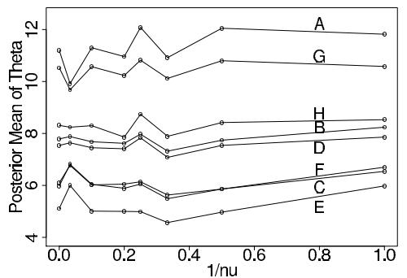
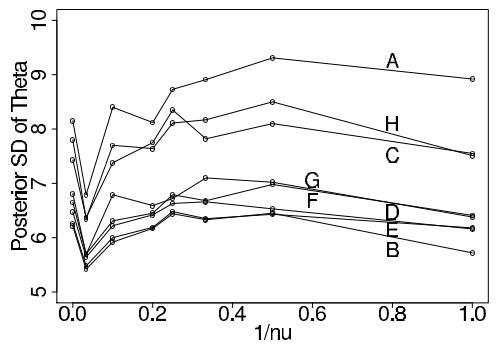
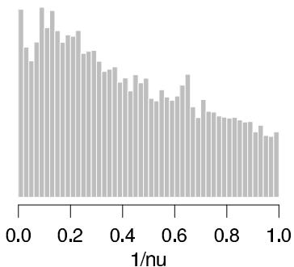

# Models for Robust Inference

[Package map](../structure.md) · [Unsplit OCR dump](./_full.md)

[← Ch. 16 GLMs](./16-generalized-linear-models.md) · [Ch. 18 Missing Data →](./18-models-for-missing-data.md)

> MinerU OCR dump. If a formula, table, or numbering disagrees with the PDF, the PDF is authoritative.

---

# Chapter 17

# Models for robust inference

So far, we have relied primarily upon the normal, binomial, and Poisson distributions, and hierarchical combinations of these, for modeling data and parameters. The use of a limited class of distributions results, however, in a limited and potentially inappropriate class of inferences. Many problems fall outside the range of convenient models, and models should be chosen to fit the underlying science and data, not simply for their analytical or computational convenience. As illustrated in Chapter 5, often the most useful approach for creating realistic models is to work hierarchically, combining simple univariate models. If, for convenience, we use simplistic models, it is important to answer the following question: in what ways does the posterior inference depend on extreme data points and on unassessable model assumptions? We have already discussed, in Chapter 6, the latter part of this question, which is essentially the subject of sensitivity analysis; here we return to the topic in greater detail, using more advanced computational methods.

# 17.1 Aspects of robustness

# Robustness of inferences to outliers

Models based on the normal distribution are notoriously 'nonrobust' to outliers, in the sense that a single aberrant data point can strongly affect the inference for all the parameters in the model, even those with little substantive connection to the outlying observation.

For example, in the educational testing example of Section 5.5, our estimates for the eight treatment effects were obtained by shifting the individual school means toward the grand mean (or, in other words, shifting toward the prior information that the true effects came from a common normal distribution), with the proportionate shifting for each school $j$ determined only by its sampling error, $\sigma_{j}$ , and the variation $\tau$ between school effects. Suppose that the observation for the eighth school in the study, $y_{8}$ in Table 5.2 on page 120, had been 100 instead of 12, so that the eight observations were 28, 8, -3, 7, -1, 1, 18, and 100, with the same standard errors as reported in Table 5.2. If we were to apply the hierarchical normal model to this dataset, our posterior distribution would tell us that $\tau$ has a high value, and thus each estimate $\hat{\theta}_{j}$ would be essentially equal to its observed effect $y_{j}$ ; see equation (5.17) and Figure 5.6. But does this make sense in practice? After all, given these hypothetical observations, the eighth school would seem to have an extremely effective SAT coaching program, or maybe the 100 is just the result of a data recording error. In either case, it would not seem right for the single observation $y_{8}$ to have such a strong influence on how we estimate $\theta_{1}, \ldots, \theta_{7}$ .

In the Bayesian framework, we can reduce the influence of the aberrant eighth observation by replacing the normal population model for the $\theta_{j}$ 's by a longer-tailed family of distributions, which allows for the possibility of extreme observations. By long-tailed, we mean a distribution with relatively high probability content far away from the center, where the scale of 'far away' is determined, for example, relative to the diameter of a region containing $50\%$ of the probability in the distribution. Examples of long-tailed distributions

include the family of $t$ distributions, of which the most extreme case is the Cauchy or $t_1$ , and also (finite) mixture models, which generally use a simple distribution such as the normal for the bulk of values but allow a discrete probability of observations or parameter values from an alternative distribution that can have a different center and generally has a much larger spread. In the hypothetical modification of the SAT coaching example, performing an analysis using a long-tailed distribution for the $\theta_j$ 's would result in the observation 100 being interpreted as arising from an extreme draw from the long-tailed distribution rather than as evidence that the normal distribution of effects has a high variance. The resulting analysis would shrink the eighth observation somewhat toward the others, but not nearly as much (relative to its distance from the overall mean) as the first seven are shrunk toward each other. (Given this hypothetical dataset, the posterior probability $\operatorname{Pr}(\theta_8 > 100|y)$ should presumably be somewhat less than 0.5, and this justifies some shrinkage.)

As our hypothetical example indicates, we do not have to abandon Bayesian principles to handle outliers. For example, a long-tailed model such as a Cauchy distribution or even a two-component mixture (see Exercise 17.1) is still an exchangeable prior distribution for $(\theta_{1},\ldots ,\theta_{8})$ , as is appropriate when there is no prior information distinguishing among the eight schools. The choice of exchangeable prior model affects the manner in which the estimates of the $\theta_{j}$ 's are shrunk, and we can thereby reduce the effect of an outlying observation without having to treat it in a fundamentally different way in the analysis. (This should not replace careful examination of the data and checking for possible recording errors in outlying values.) A distinction is sometimes made between methods that search for outliers—possibly to remove them from the analysis—and robust procedures that are invulnerable to outliers. In the Bayesian framework, the two approaches should not be distinguished. For instance, using mixture models (either finite mixture models as in Chapter 22 or overdispersed versions of standard models) not only results in categorizing extreme observations as arising from high-variance mixture components (rather than simply surprising 'outliers') but also implies that these points have less influence on inferences for estimands such as population means and medians.

# Sensitivity analysis

In addition to compensating for outliers, robust models can be used to assess the sensitivity of posterior inferences to model assumptions. For example, one can use a robust model that applies the $t$ in place of a normal distribution to assess sensitivity to the normal assumption by varying the degrees of freedom from large to small. As discussed in Chapter 6, the basic idea of sensitivity analysis is to try a variety of different distributions (for likelihood and prior models) and see how posterior inferences vary for estimands and predictive quantities of interest. Once samples have already been drawn from the posterior distribution under one model, it is often straightforward to draw from alternative models using importance resampling with enough accuracy to detect major differences in inferences between the models (see Section 17.3). If the posterior distribution of estimands of interest is highly sensitive to the model assumptions, iterative simulation methods might be required for more accurate computation.

In a sense, much of the analysis of the SAT coaching experiments in Section 5.5, especially Figures 5.6 and 5.7, is a sensitivity analysis, in which the parameter $\tau$ is allowed to vary from 0 to $\infty$ . As discussed in Section 5.5, the observed data are actually consistent with the model of all equal effects (that is, $\tau = 0$ ), but that model makes no substantive sense, so we fit the model allowing $\tau$ to be any positive value. The result is summarized in the marginal posterior distribution for $\tau$ (shown in Figure 5.5), which describes a range of values of $\tau$ that are supported by the data.

# 17.2 Overdispersed versions of standard probability models

Sometimes it will appear natural to use one of the standard models—binomial, normal, Poisson, exponential—except that the data are too dispersed. For example, the normal distribution should not be used to fit a large sample in which $10\%$ of the points lie a distance more than 1.5 times the interquartile range away from the median. In the hypothetical example of the previous section we suggested that the prior or population model for the $\theta_j^{\prime}s$ should have longer tails than the normal. For each of the standard models, there is in fact a natural extension in which a single parameter is added to allow for overdispersion. Each of the extended models has an interpretation as a mixture distribution.

A feature of all these distributions is that they can never be underdispersed. This makes sense in light of formulas (2.7) and (2.8) and the mixture interpretations: the mean of the generalized distribution is equal to that of the underlying family, but the variance is higher. If the data are believed to be underdispersed relative to the standard distribution, different models should be used.

# The $t$ distribution in place of the normal

The $t$ distribution has a longer tail than the normal and can be used for accommodating (1) occasional unusual observations in a data distribution or (2) occasional extreme parameters in a prior distribution or hierarchical model. The $t$ family of distributions— $t_{\nu}(\mu, \sigma^2)$ —is characterized by three parameters: center $\mu$ , scale $\sigma$ , and a ‘degrees of freedom’ parameter $\nu$ that determines the shape of the distribution. The $t$ densities are symmetric, and $\nu$ must fall in the range $(0, \infty)$ . At $\nu = 1$ , the $t$ is equivalent to the Cauchy distribution, which is so long-tailed it has infinite mean and variance, and as $\nu \to \infty$ , the $t$ approaches the normal distribution. If the $t$ distribution is part of a probability model attempting accurately to fit a long-tailed distribution, based on a reasonably large quantity of data, then it is generally appropriate to include the degrees of freedom as an unknown parameter. In applications for which the $t$ is chosen simply as a robust alternative to the normal, the degrees of freedom can be fixed at a small value to allow for outliers, but no smaller than prior understanding dictates. For example, $t$ 's with one or two degrees of freedom have infinite variance and are not usually realistic in the far tails.

Mixture interpretation. Recall from Sections 3.2 and 12.1 that the $t_\nu(\mu, \sigma^2)$ distribution can be interpreted as a mixture of normal distributions with a common mean and variances distributed as scaled inverse- $\chi^2$ . For example, the model $y_i \sim t_\nu(\mu, \sigma^2)$ is equivalent to

$$
\begin{array}{l} y _ {i} | V _ {i} \sim \mathrm {N} (\mu , V _ {i}) \\ V _ {i} \sim \operatorname {I n v} - \chi^ {2} (\nu , \sigma^ {2}), \tag {17.1} \\ \end{array}
$$

an expression we have already introduced as (12.1) on page 294 to illustrate the computational methods of auxiliary variables and parameter expansion. Statistically, the observations with high variance can be considered the outliers in the distribution. A similar interpretation holds when modeling exchangeable parameters $\theta_{j}$ .

# Negative binomial alternative to Poisson

A common difficulty in applying the Poisson model to data is that the Poisson model requires that the variance equal the mean; in practice, distributions of counts often are overdispersed, with variance greater than the mean. We have already discussed overdispersion in the context of generalized linear models (see Section 16.1), and Section 16.4 gives an example of a hierarchical normal model for overdispersed Poisson regression.

Another way to model overdispersed count data is using the negative binomial distribution, a two-parameter family that allows the mean and variance to be fitted separately,

with variance at least as great as the mean. Data $y_{1},\ldots ,y_{n}$ that follow a Neg-bin $(\alpha ,\beta)$ distribution can be thought of as Poisson observations with means $\lambda_1,\dots ,\lambda_n$ , which follow a Gamma $(\alpha ,\beta)$ distribution. The variance of the negative binomial distribution is $\frac{\beta + 1}{\beta}\frac{\alpha}{\beta}$ , which is always greater than the mean, $\frac{\alpha}{\beta}$ , in contrast to the Poisson, whose variance is always equal to its mean. In the limit as $\beta \to \infty$ with $\frac{\alpha}{\beta}$ remaining constant, the underlying gamma distribution approaches a spike, and the negative binomial distribution approaches the Poisson.

# Beta-binomial alternative to binomial

Similarly, the binomial model for discrete data has the practical limitation of having only one free parameter, which means the variance is determined by the mean. A standard robust alternative is the beta-binomial distribution, which, as the name suggests, is a beta mixture of binomials. The beta-binomial is used, for example, to model educational testing data, where a 'success' is a correct response, and individuals vary greatly in their probabilities of getting a correct response. Here, the data $y_{i}$ — the number of correct responses for each individual $i = 1, \ldots, n$ — are modeled with a Beta-bin $(m, \alpha, \beta)$ distribution and are thought of as binomial observations with a common number of trials $m$ and unequal probabilities $\pi_{1}, \ldots, \pi_{n}$ that follow a Beta $(\alpha, \beta)$ distribution. The variance of the beta-binomial with mean probability $\frac{\alpha}{\alpha + \beta}$ is greater by a factor of $\frac{\alpha + \beta + m}{\alpha + \beta + 1}$ than that of the binomial with the same probability; see Table A.1 in Appendix A. When $m = 1$ , no information is available to distinguish between the beta and binomial variation, and the two models have equal variances.

# The $t$ distribution alternative to logistic and probit regression

Logistic and probit regressions can be nonrobust in the sense that for large absolute values of the linear predictor $X\beta$ , the inverse logit or probit transformations give probabilities close to 0 or 1. Such models could be made more robust by allowing the occasional misprediction for large values of $X\beta$ . This form of robustness is defined not in terms of the data $y$ which equal 0 or 1 in binary regression—but with respect to the predictors $X$ . A more robust model allows the discrete regression model to fit most of the data while occasionally making isolated errors.

A robust model, robit regression, can be implemented using the latent-variable formulation of discrete-data regression models (see page 408), replacing the logistic or normal distribution of the latent continuous data $u$ with the model, $u_{i} \sim t_{\nu}((X\beta)_i,1)$ . In realistic settings it is impractical to estimate $\nu$ from the data—since the latent data $u_{i}$ are never directly observed, it is essentially impossible to form inference about the shape of their continuous underlying distribution—so it is set at a low value to ensure robustness. Setting $\nu = 4$ yields a distribution that is close to the logistic, and as $\nu \to \infty$ , the model approaches the probit. Computation for the binary $t$ regression can be performed using the EM algorithm and Gibbs sampler with the normal-mixture formulation (17.1) for the $t$ distribution of the latent data $u$ . In that approach, $u_{i}$ and the variance of each $u_{i}$ are treated as missing data.

# Why ever use a nonrobust model?

The $t$ family includes the normal as a special case, so why do we ever use the normal at all, or the binomial, Poisson, or other standard models? To start with, each of the standard models has a logical status that makes it plausible for many applied problems. The binomial and multinomial distributions apply to discrete counts for independent, identically distributed outcomes with a fixed total number of counts. The Poisson and exponential distributions fit

the number of events and the waiting time for a Poisson process, which is a natural model for independent discrete events indexed by time. Finally, the central limit theorem tells us that the normal distribution is an appropriate model for data that are formed as the sum of a large number of independent components. In the educational testing example in Section 5.5, each of the observed effects, $y_{j}$ , is an average of adjusted test scores with $n_j\approx 60$ (that is, the estimated treatment effect is based on about 60 students in school $j$ ). We can thus accurately approximate the sampling distribution of $y_{j}$ by normality: $y_{j}|\theta_{j},\sigma_{j}^{2}\sim \mathrm{N}(\theta_{j},\sigma_{j}^{2})$ .

Even when they are not naturally implied by the structure of a problem, the standard models are computationally convenient, since conjugate prior distributions often allow direct calculation of posterior means and variances and easy simulation. That is why it is easy to fit a normal population model to the $\theta_{j}$ 's in the educational testing example and why it is common to fit a normal model to the logarithm of all-positive data or the logit of data that are constrained to lie between 0 and 1. When a model is assigned in this more or less arbitrary manner, it is advisable to check the fit of the data using the posterior predictive distribution, as discussed in Chapter 6. But if we are worried that an assumed model is not robust, then it makes sense to perform a sensitivity analysis and see how much the posterior inference changes if we switch to a larger family of distributions, such as the $t$ distributions in place of the normal.

# 17.3 Posterior inference and computation

As always, we can draw samples from the posterior distribution (or distributions, in the case of sensitivity analysis) using the methods described in Part III. In this section, we briefly describe the use of Gibbs sampling under the mixture formulation of a robust model. The approach is illustrated for a hierarchical normal- $t$ model in Section 17.4. When expanding a model, however, we have the possibility of a less time-consuming approximation as an alternative: we can use the draws from the original posterior distribution as a starting point for simulations from the new models. In this section, we also describe two techniques that can be useful for robust models and sensitivity analysis: importance weighting for computing the marginal posterior density in a sensitivity analysis, and importance resampling (Section 10.4) for approximating a robust analysis.

# Notation for robust model as expansion of a simpler model

We use the notation $p_0(\theta | y)$ for the posterior distribution from the original model, which we assume has already been fitted to the data, and $\phi$ for the hyperparameter(s) characterizing the expanded model used for robustness or sensitivity analysis. Our goal is to sample from

$$
p (\theta | \phi , y) \propto p (\theta | \phi) p (y | \theta , \phi), \tag {17.2}
$$

using either a pre-specified value of $\phi$ (such as $\nu = 4$ for a robust $t$ model) or for a range of values of $\phi$ . In the latter case, we also wish to compute the marginal posterior distribution of the sensitivity analysis parameter, $p(\phi | y)$ .

The robust family of distributions can enter the model (17.2) through the distribution of the parameters, $p(\theta|\phi)$ , or the data distribution, $p(y|\theta,\phi)$ . For example, Section 17.2 focuses on robust data distributions, and our reanalysis of the SAT coaching experiments in Section 17.4 uses a robust distribution for model parameters. We must then set up a joint prior distribution, $p(\theta,\phi)$ , which can require some care because it captures the prior dependence between $\theta$ and $\phi$ .

Gibbs sampling using the mixture formulation

Markov chain simulation can be used to draw from the posterior distributions, $p(\theta | \phi, y)$ . This can be done using the mixture formulation, by sampling from the joint posterior distribution of $\theta$ and the extra unobserved scale parameters ( $V_{i}$ 's in the $t$ model, $\lambda_{i}$ 's in the negative binomial, and $\pi_{i}$ 's in the beta-binomial).

For a simple example, consider the $t_\nu(\mu, \sigma^2)$ distribution fitted to data $y_1, \ldots, y_n$ , with $\mu$ and $\sigma$ unknown. Given $\nu$ , we have already discussed in Section 12.1 how to program the Gibbs sampler in terms of the parameterization (17.1) involving $\mu, \sigma^2, V_1, \ldots, V_n$ . If $\nu$ is itself unknown, the Gibbs sampler must be expanded to include a step for sampling from the conditional posterior distribution of $\nu$ . No simple method exists for this step, but a Metropolis step can be used instead. Another complication is that such models commonly have multimodal posterior densities, with different modes corresponding to different observations in the tails of the $t$ distributions, meaning that additional work is required to search for modes initially and jump between modes in the simulation, for example using simulated tempering (see Section 12.3).

Sampling from the posterior predictive distribution for new data

To perform sensitivity analysis and robust inference for predictions $\tilde{y}$ , follow the usual procedure of first drawing $\theta$ from the posterior distribution, $p(\theta|\phi,y)$ , and then drawing $\tilde{y}$ from the predictive distribution, $p(\tilde{y}|\phi,\theta)$ . To simulate data from a mixture model, first draw the mixture indicators for each future observation, then draw $\tilde{y}$ , given the mixture parameters. For example, to draw $\tilde{y}$ from a $t_{\nu}(\mu,\sigma^2)$ distribution, first draw $V \sim \mathrm{Inv}-\chi^2(\nu,\sigma^2)$ , then draw $\tilde{y} \sim \mathrm{N}(\mu,V)$ .

Computing the marginal posterior distribution of the hyperparameters by importance weighting

During a check for model robustness or sensitivity to assumptions, we might like to avoid the additional programming effort required to apply Markov chain simulation to a robust model. If we have simulated draws from $p_0(\theta | y)$ , then it is possible to obtain approximate inference under the robust model using importance weighting and importance resampling. We assume in the remainder of this section that simulation draws $\theta^s, s = 1, \dots, S$ , have already been obtained from $p_0(\theta | y)$ . We can use importance weighting to evaluate the marginal posterior distribution, $p(\phi | y)$ , using identity (13.11) on page 326, which in our current notation becomes

$$
\begin{array}{l} p (\phi | y) \propto p (\phi) \int \frac {p (\theta | \phi) p (y | \theta , \phi)}{p _ {0} (\theta) p _ {0} (y | \theta)} p _ {0} (\theta) p _ {0} (y | \theta) d \theta \\ \propto p (\phi) \int \frac {p (\theta | \phi) p (y | \theta , \phi)}{p _ {0} (\theta) p _ {0} (y | \theta)} p _ {0} (\theta | y) d \theta . \\ \end{array}
$$

In the first line above, the proportionality constant is $1 / p(y)$ , whereas in the second it is $p_0(y) / p(y)$ . For any $\phi$ , the value of $p(\phi | y)$ , up to a constant factor, can be estimated by the average importance ratio for the simulations $\theta^s$ ,

$$
p (\phi) \frac {1}{S} \sum_ {s = 1} ^ {S} \frac {p \left(\theta^ {s} \mid \phi\right) p \left(y \mid \theta^ {s} , \phi\right)}{p _ {0} \left(\theta^ {s}\right) p _ {0} \left(y \mid \theta^ {s}\right)}, \tag {17.3}
$$

which can be evaluated, using a fixed set of $S$ simulations, at each of a range of values of $\phi$ , and then graphed as a function of $\phi$ .

Approximating the robust posterior distributions by importance resampling

To perform importance resampling, it is best to start with a large number of draws, say $S = 5000$ , from the original posterior distribution, $p_0(\theta | y)$ . Now, for each distribution in the expanded family indexed by $\phi$ , draw a smaller subsample, say $k = 500$ , from the $S$ draws, without replacement, using importance resampling, in which each of the $k$ samples is drawn with probability proportional to its importance ratio,

$$
\frac {p (\theta | \phi , y)}{p _ {0} (\theta | y)} = \frac {p (\theta | \phi) p (y | \theta , \phi)}{p _ {0} (\theta) p _ {0} (y | \theta)}.
$$

A new set of subsamples must be drawn for each value of $\phi$ , but the same set of $S$ original draws may be used. Details are given in Section 10.4. This procedure is effective as long as the largest importance ratios are plentiful and not too variable; if they do vary greatly, this is an indication of potential sensitivity because $p(\theta|\phi,y)/p_0(\theta|y)$ is sensitive to the drawn values of $\theta$ . If the importance weights are too variable for importance resampling to be considered accurate, and accurate inferences under the robust alternatives are desired, then we must rely on Markov chain simulation.

# 17.4 Robust inference and sensitivity analysis for the eight schools

Consider the hierarchical model for SAT coaching effects based on the data in Table 5.2 in Section 5.5. Given the large sample sizes in the eight original experiments, there should be little concern about assuming the data model that has $y_{j} \sim \mathrm{N}(\theta_{j},\sigma_{j}^{2})$ , with the variances $\sigma_j^2$ known. The population model, $\theta_{j} \sim \mathrm{N}(\mu ,\tau^{2})$ , is more difficult to justify, although the model checks in Section 6.5 suggest that it is adequate for the purposes of obtaining posterior intervals for the school effects. In general, however, posterior inferences can be highly sensitive to the assumed model, even when the model provides a good fit to the observed data. To illustrate methods for robust inference and sensitivity analysis, we explore an alternative family of models that fit $t$ distributions to the population of school effects:

$$
\theta_ {j} | \nu , \mu , \tau \sim t _ {\nu} (\mu , \tau^ {2}), \quad \text {f o r} j = 1, \dots , 8. \tag {17.4}
$$

We use the notation $p(\theta, \mu, \tau | \nu, y) \propto p(\theta, \mu, \tau | \nu) p(y | \theta, \mu, \tau, \nu)$ for the posterior distribution under the $t_\nu$ model and $p_0(\theta, \mu, \tau | y) \equiv p(\theta, \mu, \tau | \nu = \infty, y)$ for the posterior distribution under the normal model evaluated in Section 5.5.

# Robust inference based on a $t_4$ population distribution

As discussed at the beginning of this chapter, one might be concerned that the normal population model causes the most extreme estimated school effects to be pulled too much toward the grand mean. Perhaps the coaching program in school A, for example, is different enough from the others that its estimate should not be shrunk so much to the average. A related concern would be that the largest observed effect, in school A, may be exerting undue influence on estimation of the population variance, $\tau^2$ , and thereby also on the Bayesian estimates of the other effects. From a modeling standpoint, there is a great variety of different SAT coaching programs, and the population of their effects might be better fitted by a long-tailed distribution. To assess the importance of these concerns, we perform a robust analysis, replacing the normal population distribution by the $t$ model (17.4) with $\nu = 4$ and leaving the rest of the model unchanged; that is, the likelihood is still $p(y|\theta ,\nu) = \prod_j\mathrm{N}(y_j|\theta_j,\sigma_j^2)$ , and the hyperprior distribution is still $p(\mu ,\tau |\nu)\propto 1$ .

Gibbs sampling. We carry out Gibbs sampling using the approach described in Section 12.1 with $\nu = 4$ . (See Appendix C for details on fitting such a model in Stan or performing the

Table 17.1 Summary of 2500 simulations of the treatment effects in the eight schools, using the $t_4$ population distribution in place of the normal. Results are similar to those obtained under the normal model and displayed in Table 5.3.   

<table><tr><td>School</td><td colspan="5">Posterior quantiles</td></tr><tr><td></td><td>2.5%</td><td>25%</td><td>median</td><td>75%</td><td>97.5%</td></tr><tr><td>A</td><td>-2</td><td>6</td><td>11</td><td>16</td><td>34</td></tr><tr><td>B</td><td>-5</td><td>4</td><td>8</td><td>12</td><td>21</td></tr><tr><td>C</td><td>-14</td><td>2</td><td>7</td><td>11</td><td>21</td></tr><tr><td>D</td><td>-6</td><td>4</td><td>8</td><td>12</td><td>21</td></tr><tr><td>E</td><td>-9</td><td>1</td><td>6</td><td>9</td><td>17</td></tr><tr><td>F</td><td>-9</td><td>3</td><td>7</td><td>10</td><td>19</td></tr><tr><td>G</td><td>-1</td><td>6</td><td>10</td><td>15</td><td>26</td></tr><tr><td>H</td><td>-8</td><td>4</td><td>8</td><td>13</td><td>26</td></tr></table>

Gibbs sampler in R.) The resulting inferences for the eight schools, based on 2500 draws from the posterior distribution (the last halves of five chains, each of length 1000), are provided in Table 17.1. The results are essentially identical, for practical purposes, to the inferences under the normal model displayed in Table 5.3 on page 123, with just slightly less shrinkage for the more extreme schools such as school A.

Computation using importance resampling. Though we have already done the Markov chain simulation, we discuss briefly how to apply importance resampling to approximate the posterior distribution with $\nu = 4$ . First, we sample 5000 draws of $(\theta, \mu, \tau)$ from $p_0(\theta, \mu, \tau | y)$ , the posterior distribution under the normal model, as described in Section 5.4. Next, we compute the importance ratio for each draw:

$$
\frac {p (\theta , \mu , \tau | \nu , y)}{p _ {0} (\theta , \mu , \tau | y)} \propto \frac {p (\mu , \tau | \nu) p (\theta | \mu , \tau , \nu) p (y | \theta , \mu , \tau , \nu)}{p _ {0} (\mu , \tau) p _ {0} (\theta | \mu , \tau) p _ {0} (y | \theta , \mu , \tau)} = \prod_ {j = 1} ^ {8} \frac {t _ {\nu} \left(\theta_ {j} | \mu , \tau^ {2}\right)}{\mathrm {N} \left(\theta_ {j} | \mu , \tau^ {2}\right)}. \tag {17.5}
$$

The factors for the likelihood and hyperprior density cancel in the importance ratio, leaving only the ratio of the population densities. We sample 500 draws of $(\theta, \mu, \tau)$ , without replacement, from the sample of 5000, using importance resampling. In this case the approximation is probably sufficient for assessing robustness, but the long tail of the distribution of the logarithms of the importance ratios (not shown) does indicate serious problems for obtaining accurate inferences using importance resampling.

# Sensitivity analysis based on $t_\nu$ distributions with varying values of $\nu$

A slightly different concern from robustness is the sensitivity of the posterior inference to the prior assumption of a normal population distribution. To study the sensitivity, we now fit a range of $t$ distributions, with 1, 2, 3, 5, 10, and 30 degrees of freedom. We have already fitted infinite degrees of freedom (the normal model) and 4 degrees of freedom (the robust model above).

For each value of $\nu$ , we perform a Markov chain simulation to obtain draws from $p(\theta, \mu, \tau | \nu, y)$ . Instead of displaying a table of posterior summaries such as Table 17.1 for each value of $\nu$ , we summarize the results by the posterior mean and standard deviation of each of the eight school effects $\theta_j$ . Figure 17.1 displays the results as a function of $\frac{1}{\nu}$ . The parameterization in terms of $\frac{1}{\nu}$ rather than $\nu$ has the advantage of including the normal distribution at $\frac{1}{\nu} = 0$ and encompassing the entire range from normal to Cauchy distributions in the finite interval [0, 1]. There is some variation in the figures but no apparent systematic sensitivity of inferences to the hyperparameter, $\nu$ .

  
Figure 17.1 Posterior means and standard deviations of treatment effects as functions of $\nu$ , on the scale of $1 / \nu$ , for the sensitivity analysis of the educational testing example. The values at $1 / \nu = 0$ come from the simulations under the normal distribution in Section 5.5. Much of the scatter in the graphs is due to simulation variability.

# Treating $\nu$ as an unknown parameter

Finally, we consider the sensitivity analysis parameter, $\nu$ , as an unknown quantity and average over it in the posterior distribution. In general, this computation is a key step, because we are typically only concerned with sensitivity to models that are supported by the data. In this particular example, inferences are so insensitive to $\nu$ that computing the marginal posterior distribution is unnecessary; we include it here as an illustration of the general method.

Prior distribution. Before computing the posterior distribution for $\nu$ , we must assign it a prior distribution. We try a uniform density on $\frac{1}{\nu}$ for the range $[0,1]$ (that is, from the normal to the Cauchy distributions). This prior distribution favors long-tailed models, with half of the prior probability falling between the $t_1$ (Cauchy) and $t_2$ distributions.

In addition, the conditional prior distributions, $p(\mu, \tau | \nu) \propto 1$ , are improper, so we must specify their dependence on $\nu$ ; we use the notation $p(\mu, \tau | \nu) \propto g(\nu)$ . In the $t$ family, the parameters $\mu$ and $\tau$ characterize the median and the second derivative of the density function at the median, not the mean and variance, of the distribution of the $\theta_j$ 's. The parameter $\mu$ seems to have a reasonable invariant meaning (and in fact is equal to the mean except in the limiting case of the Cauchy where the mean does not exist), but the interquartile range would perhaps be a more reasonable parameter than the curvature for setting up a prior distribution. We cannot parameterize the $t_\nu$ distributions in terms of their variance, because the variance is infinite for $\nu \leq 2$ . The interquartile range varies mildly as a function of $\nu$ , and so for simplicity we use the convenient parameterization in terms of $(\mu, \tau)$ and set $g(\nu) \propto 1$ . Combining this with our prior distribution on $\nu$ yields an improper joint uniform prior density on $(\mu, \tau, \frac{1}{\nu})$ . If our posterior inferences under this model turn out to depend strongly on $\nu$ , we should consider refining this prior distribution.

Posterior inference. To treat $\nu$ as an unknown parameter, we modify the Gibbs sampling simulation used in the robust analyses to include a Metropolis step for sampling from the conditional distribution of $\frac{1}{\nu}$ . An example of the implementation of such an approach can be found in Appendix C. Figure 17.2 displays a histogram of the simulations of $\frac{1}{\nu}$ . An alternative to extending the model is to approximate the marginal posterior density using importance sampling and (17.3).

The sensitivity analysis showed that $\nu$ has only minor effects on the posterior inference; the results in Section 5.5 are thus not strongly dependent on the normal assumption for the population distribution of the parameters $\theta_{j}$ . If Figure 17.1 had shown a strong dependence on $\nu$ -as Figures 5.5-5.7 showed dependence on $\tau$ -then it might make sense to include $\nu$

  
Figure 17.2 Posterior simulations of $1 / \nu$ from the Gibbs-Metropolis computation of the robust model for the educational testing example, with $\nu$ treated as unknown.

as a hyperparameter, after thinking more seriously about a joint prior distribution for the parameters with noninformative prior distributions— $(\mu, \tau, \nu)$ .

# Discussion

Robustness and sensitivity to modeling assumptions depend on the estimands being studied. In the SAT coaching example, posterior medians, $50\%$ , and $95\%$ intervals for the eight school effects are insensitive to the assumption of a normal population distribution (at least as compared to the $t$ family). In contrast, it may be that $99.9\%$ intervals are strongly dependent on the tails of the distributions and sensitive to the degrees of freedom in the $t$ distribution—fortunately, these extreme tails are unlikely to be of substantive interest in this example.

# 17.5 Robust regression using $t$ -distributed errors

As with other models based on the normal distribution, inferences under the normal linear regression model of Chapter 14 are sensitive to unusual or outlying values. Robust regression analyses are obtained by considering robust alternatives to the normal distribution for regression errors. Robust error distributions, such as the $t$ with few degrees of freedom, treat observations far from the regression line as high-variance observations, yielding results similar to those obtained by downweighting outliers. (Recall that the 'weights' in weighted linear regression are inverse variances.)

# Iterative weighted linear regression and the EM algorithm

To illustrate robust regression calculations, we consider the $t_\nu$ regression model with fixed degrees of freedom as an alternative to the normal linear regression model. The conditional distribution of the individual response variable $y_i$ given the vector of explanatory variables $X_i$ is $p(y_i | X_i \beta, \sigma^2) = t_\nu(y_i | X_i \beta, \sigma^2)$ . The $t_\nu$ distribution can be expressed as a mixture as in equation (17.1) with $X_i \beta$ as the mean. As a first step in the robust analysis, we find the mode of the posterior distribution $p(\beta, \sigma^2 | \nu, y)$ given the vector $y$ consisting of $n$ observations. Here we assume that a noninformative prior distribution is used, $p(\mu, \log \sigma | \nu) \propto 1$ ; more substantial information about the regression parameters can be incorporated exactly as in Section 14.8 and Chapter 15. The posterior mode of $p(\beta, \log \sigma | \nu, y)$ under the $t$ model can be obtained directly using Newton's method (Section 13.1) or any other mode-finding technique. Alternatively, we can take advantage of the mixture form of the $t$ model and use the EM algorithm with the variances $V_i$ treated as 'missing data' (that is, parameters to be averaged over); in the notation of Section 13.4, $\gamma = (V_1, \dots, V_n)$ . The E-step of the

EM algorithm computes the expected value of the sufficient statistics for the normal model $(\sum_{i=1}^{n} y_i^2 / V_i, \sum_{i=1}^{n} y_i / V_i, \sum_{i=1}^{n} 1 / V_i)$ , given the current parameter estimates $(\beta^{\mathrm{old}}, \sigma^{\mathrm{old}})$ and averaging over $(V_1, \ldots, V_n)$ . It is sufficient to note that

$$
p \left(V _ {i} \mid y _ {i}, \beta^ {\text {o l d}}, \sigma^ {\text {o l d}}, \nu\right) \sim \operatorname {I n v -} \chi^ {2} \left(\nu + 1, \frac {\nu \left(\sigma^ {\text {o l d}}\right) ^ {2} + \left(y _ {i} - X _ {i} \beta^ {\text {o l d}}\right) ^ {2}}{\nu + 1}\right) \tag {17.6}
$$

and that

$$
\operatorname {E} \left(\frac {1}{V _ {i}} \Bigg | y _ {i}, \beta^ {\mathrm {o l d}}, \sigma^ {\mathrm {o l d}}, \nu\right) = \frac {\nu + 1}{\nu (\sigma^ {\mathrm {o l d}}) ^ {2} + (y _ {i} - X _ {i} \beta^ {\mathrm {o l d}}) ^ {2}}.
$$

The M-step of the EM algorithm is a weighted linear regression with diagonal weight matrix $W$ containing the conditional expectations of $1 / V_{i}$ on the diagonal. The updated parameter estimates are

$$
\hat {\beta} ^ {\mathrm {n e w}} = (X ^ {T} W X) ^ {- 1} X ^ {T} W y \quad \mathrm {a n d} \quad (\hat {\sigma} ^ {\mathrm {n e w}}) ^ {2} = \frac {1}{n} (y - X \hat {\beta} ^ {\mathrm {n e w}}) ^ {T} W (y - X \hat {\beta} ^ {\mathrm {n e w}}),
$$

where $X$ is the $n \times p$ matrix of explanatory variables. The iterations of the EM algorithm are equivalent to those performed in an iterative weighted least squares algorithm. Given initial estimates of the regression parameters, weights are computed for each case, with those cases having large residuals given less weight. Improved estimates of the regression parameters are then obtained by weighted linear regression.

When the degrees of freedom parameter, $\nu$ , is treated as unknown, the ECME algorithm can be applied, with an additional step added to the iteration for updating the degrees of freedom.

Other robust models. Iterative weighted linear regression, or equivalently the EM algorithm, can be used to obtain the posterior mode for a number of robust alternative models. Changing the probability model used for the observation variances, $V_{i}$ , creates alternative robust models. For example, a two-point distribution can be used to model a regression with contaminated errors. The computations for robust models of this form are as described above, except that the E-step is modified to reflect the appropriate posterior conditional mean.

# Gibbs sampler and Metropolis algorithm

Posterior draws from robust regression models can be obtained using Gibbs sampling and the Metropolis algorithm, as with the linear and generalized linear models discussed in Chapters 14-16. Using the mixture parameterization of the $t_\nu$ distribution, we can obtain draws from the posterior distribution $p(\beta, \sigma^2, V_1, \dots, V_n | \nu, y)$ by alternately sampling from $p(\beta, \sigma^2 | V_1, \dots, V_n, \nu, y)$ using the usual posterior distribution from weighted linear regression, and sampling from $p(V_1, \dots, V_n | \beta, \sigma^2, \nu, y)$ , a set of independent scaled inverse- $\chi^2$ distributions as in equation (17.6). It can be even more effective to use parameter expansion as explained in Section 12.1.

If the degrees of freedom parameter, $\nu$ , is included as an unknown parameter in the model, then an additional Metropolis step is required in each iteration. In practice, these computations can be difficult to implement, because with low degrees of freedom $\nu$ , the posterior distribution can have many modes, and the Gibbs sampler and Metropolis algorithms can get stuck. It is important to run many simulations with overdispersed starting points for complicated models of this form.

# 17.6 Bibliographic note

Mosteller and Wallace (1964) use the negative binomial distribution, instead of the Poisson, for count data, and extensively study the sensitivity of their conclusions to model

assumptions. Box and Tiao (1968) provide another early discussion of Bayesian robustness, in the context of outliers in normal models. Smith (1983) extends Box's approach and also discusses the $t$ family using the same parameterization (inverse degrees of freedom) as we have. A review of models for overdispersion in binomial data, from a non-Bayesian point of view, is given by Anderson (1988), who cites many further references. Gaver and O'Muircheartaigh (1987) discuss the use of hierarchical Poisson models for robust Bayesian inference. O'Hagan (1979) and Gelman (1992a) discuss the connection between the tails of the population distribution of a hierarchical model and the shrinkage in the associated Bayesian posterior distribution.

In a series of papers, Berger and coworkers have explored theoretical aspects of Bayesian robustness, examining, for example, families of prior distributions that provide maximum robustness against the influence of aberrant observations; see for instance Berger (1984, 1990) and Berger and Berliner (1986). Related work appears in Wasserman (1992). An earlier overview from a pragmatic point of view close to ours was provided by Dempster (1975). Rubin (1983a) provides an illustration of the limitations of data in assessing model fit and the resulting inevitable sensitivity of some conclusions to untestable assumptions.

With the recent advances in computation, modeling with the $t$ distribution has become increasingly common in statistics. Dempster, Laird, and Rubin (1977) show how to apply the EM algorithm to $t$ models, and Liu and Rubin (1995) and Meng and van Dyk (1997) discuss faster computational methods using extensions of EM. Lange, Little, and Taylor (1989) discuss the use of the $t$ distribution in a variety of statistical contexts. Raghunathan and Rubin (1990) present an example using importance resampling. Tipping and Lawrence (2005) apply factorized variational approximation, Vanhatalo, Jylanki, Vehtari (2009) apply Laplace's method, and Jylanki, Vanhatalo, and Vehtari (2011) apply expectation propagation $t$ models. Liu (2004) presents the 'robot' model as an alternative to logistic and probit regression.

Rubin (1983b) and Lange and Sinsheimer (1993) review the connections between robust regression, the $t$ and related distributions, and iterative regression computations.

Taplin and Raftery (1994) present an example of an application of a finite mixture model for robust Bayesian analysis of agricultural experiments.

# 17.7 Exercises

1. Prior distributions and shrinkage: in the educational testing experiments, suppose we think that most coaching programs are almost useless, but some are strongly effective; a corresponding population distribution for the school effects is a mixture, with most of the mass near zero but some mass extending far in the positive direction; for example,

$$
p (\theta_ {1}, \ldots , \theta_ {8}) = \prod_ {j = 1} ^ {8} [ \lambda_ {1} \mathrm {N} (\theta_ {j} | \mu_ {1}, \tau_ {1} ^ {2}) + \lambda_ {2} \mathrm {N} (\theta_ {j} | \mu_ {2}, \tau_ {2} ^ {2}) ].
$$

All these parameters could be estimated from the data (as long as we restrict the parameter space, for example by setting $\mu_1 > \mu_2$ ), but to fix ideas, suppose that $\mu_1 = 0$ , $\tau_1 = 10$ , $\mu_2 = 15$ , $\tau_2 = 25$ , $\lambda_1 = 0.9$ , and $\lambda_2 = 0.1$ .

(a) Compute the posterior distribution of $(\theta_{1},\ldots ,\theta_{8})$ under this model for the data in Table 5.2.   
(b) Graph the posterior distribution for $\theta_{8}$ under this model for $y_{8} = 0$ , 25, 50, and 100, with the same standard deviation $\sigma_{8}$ as given in Table 5.2. Describe qualitatively the effect of the two-component mixture prior distribution.

2. Poisson and negative binomial distributions: as part of their analysis of the Federalist papers, Mosteller and Wallace (1964) recorded the frequency of use of various words in

Table 17.2 Observed distribution of the word 'may' in papers of Hamilton and Madison, from Mosteller and Wallace (1964). Out of the 247 blocks of Hamilton's text studied, 128 had no instances of 'may,' 67 had one instance of 'may,' and so forth, and similarly for Madison.   

<table><tr><td>Number of occurrences in a block</td><td>0</td><td>1</td><td>2</td><td>3</td><td>4</td><td>5</td><td>6</td><td>&gt;6</td></tr><tr><td>Number of blocks (Hamilton)</td><td>128</td><td>67</td><td>32</td><td>14</td><td>4</td><td>1</td><td>1</td><td>0</td></tr><tr><td>Number of blocks (Madison)</td><td>156</td><td>63</td><td>29</td><td>8</td><td>4</td><td>1</td><td>1</td><td>0</td></tr></table>

selected articles by Alexander Hamilton and James Madison. The articles were divided into 247 blocks of about 200 words each, and the number of instances of various words in each block were recorded. Table 17.2 displays the results for the word 'may.'

(a) Fit the Poisson model to these data, with different parameters for each author and a noninformative prior distribution. Plot the posterior density of the Poisson mean parameter for each author.   
(b) Fit the negative binomial model to these data with different parameters for each author. What is a reasonable noninformative prior distribution to use? For each author, make a contour plot of the posterior density of the two parameters and a scatterplot of the posterior simulations.

3. Model checking with the Poisson and binomial distributions: we examine the fit of the models in the previous exercise using posterior predictive checks.

(a) Considering the nature of the data and of likely departures from the model, what would be appropriate test statistics?   
(b) Compare the observed test statistics to their posterior predictive distribution (see Section 6.3) to test the fit of the Poisson model.   
(c) Perform the same test for the negative binomial model.

4. Robust models and model checking: fit a robust model to Newcomb's speed of light data (Figure 3.1). Check the fit of the model using appropriate techniques from Chapter 6.   
5. Contamination models: construct and fit a normal mixture model to the dataset used in the previous exercise.

6. Robust models:

(a) Choose a dataset from one of the examples or exercises earlier in the book and analyze it using a robust model.   
(b) Check the fit of the model using the posterior predictive distribution and appropriate test variables.   
(c) Discuss how inferences changed under the robust model.

7. Computation for the $t$ model: consider the model $y_{1},\ldots ,y_{n}\sim \mathrm{iid}t_{\nu}(\mu ,\sigma^{2})$ , with $\nu$ fixed and a uniform prior distribution on $(\mu ,\log \sigma)$ .

(a) Work out the steps of the EM algorithm for finding posterior modes of $(\mu, \log \sigma)$ , using the specification (17.1) and averaging over $V_{1}, \ldots, V_{n}$ . Clearly specify the joint posterior density, its logarithm, the function $E_{\mathrm{old}} \log p(\mu, \log \sigma, V_{1}, \ldots, V_{n} | y)$ , and the updating equations for the M-step.   
(b) Work out the Gibbs sampler for drawing posterior simulations of $(\mu, \log \sigma, V_1, \ldots, V_n)$ .   
(c) Illustrate the analysis with the speed of light data of Figure 3.1, using a $t_2$ model.

8. Robustness and sensitivity analysis: repeat the computations of Section 17.4 with the dataset altered as described on page 435 so that the observation $y_{8}$ is replaced by 100. Verify that, in this case, inferences are sensitive to $\nu$ . Which values of $\nu$ have highest marginal posterior density?

