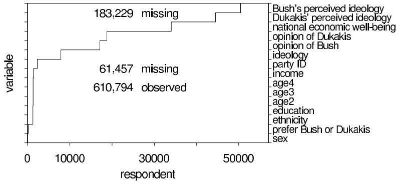
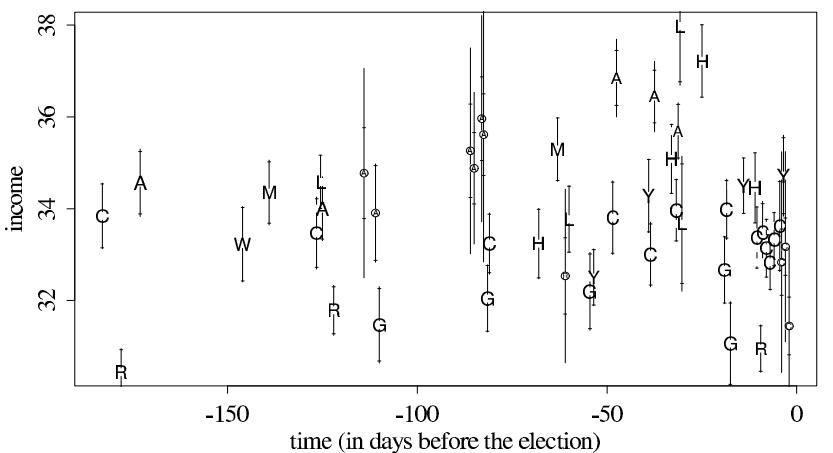
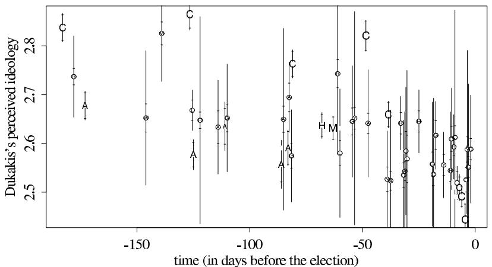

# Models for Missing Data

[Package map](../structure.md) · [Unsplit OCR dump](./_full.md)

[← Ch. 17 Robust Inference](./17-models-for-robust-inference.md) · [Ch. 19 Nonlinear Models →](./19-parametric-nonlinear-models.md)

> MinerU OCR dump. If a formula, table, or numbering disagrees with the PDF, the PDF is authoritative.

---

# Chapter 18

# Models for missing data

Our discussions of probability models in previous chapters, with few exceptions, assume that the desired dataset is completely observed. In this chapter we consider probability models and Bayesian methods for problems with missing data. This chapter applies some of the terminology and notation of Chapter 8, which describes models for collection and observation of data.

We show how the analysis of problems involving missing data can often be separated into two main tasks: (1) multiple imputation—that is, simulating draws from the posterior predictive distribution of unobserved $y_{\mathrm{mis}}$ conditional on observed values $y_{\mathrm{obs}}$ —and (2) drawing from the posterior distribution of model parameters $\theta$ . The general idea is to extend the model specification to incorporate the missing observations and then to perform inference by averaging over the distribution of the missing values.

Bayesian inference draws no distinction between missing data and parameters; both are uncertain, and they have a joint posterior distribution, conditional on observed data. The practical distinction arises when setting up the joint model for observed data, unobserved data, and parameters. As discussed in Chapter 8, we prefer to set this up in three parts: a prior distribution for the parameters (along with a hyperprior distribution if the model is hierarchical), a joint model for all the data (missing and observed), and an inclusion model for the missingness process. If the missing data mechanism is ignorable (see Section 8.2), then inference about the parameters and missing data can proceed without modeling the inclusion process. However, this process does need to be modeled when simulating replicated datasets for model checking.

# 18.1 Notation

We begin by reviewing some notation from Chapter 8, focusing on the problem of unintentional missing data. As in Chapter 8, let $y$ represent the 'complete data' that would be observed in the absence of missing values. The notation is intended to be general; $y$ may be a vector of univariate measures or a matrix with each row containing the multivariate response variables of a single unit. Furthermore, it may be convenient to think of the complete data $y$ as incorporating covariates, for example using a multivariate normal model for the vector of predictors and outcomes jointly in a regression context. We write $y = (y_{\mathrm{obs}}, y_{\mathrm{mis}})$ , where $y_{\mathrm{obs}}$ denotes the observed values and $y_{\mathrm{mis}}$ denotes the missing values. We also include in the model a random variable indicating whether each component of $y$ is observed or missing. The inclusion indicator $I$ is a data structure of the same size as $y$ with each element of $I$ equal to 1 if the corresponding component of $y$ is observed and 0 if it is missing; we assume that $I$ is completely observed. In a sample survey, item nonresponse corresponds to $I_{ij} = 0$ for unit $i$ and item $j$ , and unit nonresponse corresponds to $I_{ij} = 0$ for unit $i$ and all items $j$ .

The joint distribution of $(y, I)$ , given parameters $(\theta, \phi)$ , can be written as

$$
p (y, I | \theta , \phi) = p (y | \theta) p (I | y, \phi).
$$

The conditional distribution of $I$ given the complete dataset $y$ , indexed by the unknown parameter $\phi$ , describes the missing-data mechanism. The observed information is $(y_{\mathrm{obs}}, I)$ ; the distribution of the observed data is obtained by integrating over the distribution of $y_{\mathrm{mis}}$ :

$$
p \left(y _ {\text {o b s}}, I \mid \theta , \phi\right) = \int p \left(y _ {\text {o b s}}, y _ {\text {m i s}} \mid \theta\right) p \left(I \mid y _ {\text {o b s}}, y _ {\text {m i s}}, \phi\right) d y _ {\text {m i s}}. \tag {18.1}
$$

Missing data are said to be missing at random (MAR) if the distribution of the missing-data mechanism does not depend on the missing values,

$$
p (I | y _ {\mathrm {o b s}}, y _ {\mathrm {m i s}}, \phi) = p (I | y _ {\mathrm {o b s}}, \phi),
$$

so that the distribution of the missing-data mechanism is permitted to depend on other observed values (including fully observed covariates) and parameters $\phi$ . Formally, missing at random only requires the evaluation of $p(I|y,\phi)$ at the observed values of $y_{\mathrm{obs}}$ , not all possible values of $y_{\mathrm{obs}}$ . Under MAR, the joint distribution (18.1) of $y_{\mathrm{obs}}, I$ can be written as

$$
\begin{array}{l} p \left(y _ {\text {o b s}}, I \mid \theta , \phi\right) = p \left(I \mid y _ {\text {o b s}}, \phi\right) \int p \left(y _ {\text {o b s}}, y _ {\text {m i s}} \mid \theta\right) d y _ {\text {m i s}} \tag {18.2} \\ = p (I | y _ {\mathrm {o b s}}, \phi) p (y _ {\mathrm {o b s}} | \theta). \\ \end{array}
$$

If, in addition, the parameters governing the missing data mechanism, $\phi$ , and the parameters of the data model, $\theta$ , are distinct, in the sense of being independent in the prior distribution, then Bayesian inferences for the model parameters $\theta$ can be obtained by considering only the observed-data likelihood, $p(y_{\mathrm{obs}}|\theta)$ . In this case, the missing-data mechanism is said to be ignorable.

In addition to the terminology of the previous paragraph, we speak of data that are observed at random as well as missing at random if the distribution of the missing-data mechanism is completely independent of $y$ :

$$
p (I | y _ {\mathrm {o b s}}, y _ {\mathrm {m i s}}, \phi) = p (I | \phi). \tag {18.3}
$$

In such cases, we say the missing data are missing completely at random (MCAR). The preceding paragraph shows that the weaker pair of assumptions of MAR and distinct parameters is sufficient for obtaining Bayesian inferences without requiring further modeling of the missing-data mechanism. Since it is relatively rare in practical problems for MCAR to be plausible, we focus in this chapter on methods suitable for the more general case of MAR.

The plausibility of MAR (but not MCAR) is enhanced by including as many observed characteristics of each individual or object as possible when defining the dataset $y$ . Increasing the pool of observed variables (with relevant variables) decreases the degree to which missingness depends on unobservables given the observed variables.

We conclude this section with a discussion of several examples that illustrate the terminology and principles described above. Suppose that the measurements consist of two variables $y =$ (age, income) with age recorded for all individuals but income missing for some individuals. For simplicity of discussion, we model the joint distribution of the outcomes as bivariate normal. If the probability that income is recorded is the same for all individuals, independent of age and income, then the data are missing at random and observed at random, and therefore missing completely at random. If the probability that income is missing depends on the age of the respondent but not on the income of the respondent given age, then the data are missing at random but not observed at random. The missing-data mechanism is ignorable when, in addition to MAR, the parameters governing the missing-data process are distinct from those of the bivariate normal distribution (as is

typically the case with standard models). If, as seems likely, the probability that income is missing depends on age group and moreover on the value of income within each age group, then the data are neither missing nor observed at random. The missing data mechanism in this last case is said to be nonignorable.

The relevance of the missing-data mechanism depends on the goals of the data analysis. If we are only interested in the mean and variance of the age variable, then we can discard all recorded income data and construct a model in which the missing-data mechanism is ignorable. On the other hand, if we are interested in the marginal distribution of income, then the missing-data mechanism is of paramount importance and must be carefully considered.

If information about the missing-data mechanism is available, then it may be possible to perform an appropriate analysis even if the missing-data mechanism is nonignorable, as discussed in Section 8.2.

# 18.2 Multiple imputation

Any single imputation provides a complete dataset that can be used by a variety of researchers to address a variety of questions. Assuming the imputation model is reasonable, the results from an analysis of the imputed dataset are likely to provide more accurate estimates than would be obtained by discarding data with missing values.

The key idea of multiple imputation is to create more than one set of replacements for the missing values in a dataset. This addresses one of the difficulties of single imputation in that the uncertainty due to nonresponse under a particular missing-data model can be properly reflected. The data augmentation algorithm that is used in this chapter to obtain posterior inference can be viewed as iterative multiple imputation.

The paradigmatic setting for missing data imputation is regression, where we are interested in the model $p(y|X,\theta)$ but have missing values in the matrix $X$ . The full Bayesian approach would yield joint inference on $X_{\mathrm{mis}},\theta |X_{\mathrm{obs}},y$ . However, this involves the difficulty of constructing a joint probability model for the matrix $X$ along with the (relatively simple) model for $y|X$ . More fully, if $X$ is modeled given parameters $\psi$ , we would need to perform inference on $X_{\mathrm{mis}},\psi ,\theta |X_{\mathrm{obs}},y$ . From a Bayesian perspective, there is no way around this problem, but it requires serious modeling effort that could take resources away from the primary goal, which is the model $p(y|X,\theta)$ .

Bayesian computation in a missing-data problem is based on the joint posterior distribution of parameters and missing data, given modeling assumptions and observed data. The result of the computation is a set of vectors of simulations of all unknowns, $(y_{\mathrm{mis}}^s,\theta^s)$ , $s = 1,\ldots ,S$ . At this point, there are two possible courses of action:

- Obtain inferences for any parameters, missing data, and predictive quantities of interest.   
- Report observed data and simulated vectors $y_{\mathrm{mis}}^s$ , which are called multiple imputations. Other users of the data can then analyze these imputed complete datasets and without needing to model the missing-data mechanism.

In the context of this book, the first option seems most natural, but in practice, especially when most of the data values are not missing, it is often useful to divide a data analysis in two parts: first, cleaning the data and multiply imputing missing values, and second, performing inference about quantities of interest using the imputed datasets.

In multiple imputation, inferences for $X_{\mathrm{mis}}$ and $\theta$ are separated:

1. First model $X, y$ together and, as described in the previous paragraph, obtain joint inferences for the missing data and parameters of the model. At this point, the imputer takes the surprising step of discarding the inferences about the parameters, keeping only the completed datasets $X^{s} = (X_{\mathrm{obs}}, X_{\mathrm{mis}}^{s})$ for a few random simulation draws $s$ .   
2. For each imputed $X^s$ , perform the desired inference for $\theta$ based on the model $p(y|X^s, \theta)$

treating the imputed data as if they were known. These are the sorts of models discussed throughout Part IV of this book.

3. Combine the inferences from the separate imputations. With Bayesian simulation, this is simple—just mix together the simulations from the separate inferences. At the end of Section 18.2, we briefly discuss some analytic methods for combining imputations.

In this chapter, we give a quick overview of theory and methods for multiple imputation—that is, step 1 above—and missing-data analysis, illustrating with two examples from survey sampling.

# Computation using EM and data augmentation

The process of generating missing data imputations usually begins with crude methods of imputation based on approximate models such as MCAR. The initial imputations are used as starting points for iterative mode-finding and simulation algorithms.

Chapters 11 and 13 describe the Gibbs sampler and the EM algorithm in some detail as approaches for drawing simulations and obtaining the posterior mode in complex problems. As was mentioned there, the Gibbs sampler and EM algorithms formalize a fairly old approach to handling missing data: replace missing data by estimated values, estimate model parameters, and perhaps, repeat these two steps several times. Often, a problem with no missing data can be easier to analyze if the dataset is augmented by some unobserved values, which may be thought of as missing data.

Here, we briefly review the EM algorithm and its extensions using the notation of this chapter. Similar ideas apply for the Gibbs sampler, except that the goal is simulation rather than point estimation of the parameters. The algorithms can be applied whether the missing data are ignorable or not by including the missing-data model in the likelihood, as discussed in Chapter 8. For ease of exposition, we assume the missing-data mechanism is ignorable and therefore omit the inclusion indicator $I$ in the following explanation. The generalization to specified nonignorable models is relatively straightforward. We assume that any augmented data, for example, mixture component indicators, are included as part of $y_{\mathrm{mis}}$ . Converting to the notation of Sections 13.4 and 13.5:

<table><tr><td>Notation in Section 13.4</td><td>Notation for missing data</td></tr><tr><td>Data, y</td><td>Observed data including 
inclusion information, (yobs, I)</td></tr><tr><td>Marginal mode of parameters φ</td><td>Posterior mode of parameters θ 
(if the missingness mechanism 
is being estimated, (θ, φ))</td></tr><tr><td>Averaging over parameters γ</td><td>Averaging over missing data ymis.</td></tr></table>

The EM algorithm is best known as it is applied to exponential families. In that case, the expected complete-data log posterior density is linear in the expected complete-data sufficient statistics so that only the latter need be evaluated or imputed. Examples are provided in the next section.

EM for nonignorable models. For a nonignorable missingness mechanism, the EM algorithm can also be applied as long as a model for the missing data is specified (for example, censored or rounded data with known censoring point or rounding rule). The only change in the EM algorithm is that all calculations explicitly condition on the inclusion indicator $I$ . Specifically, the expected complete-data log posterior density is a function of model parameters $\theta$ and missing-data-mechanism parameters $\phi$ , conditional on the observed data $y_{\mathrm{obs}}$ and the inclusion indicator $I$ , averaged over the distribution of $y_{\mathrm{mis}}$ at the current values of the parameters $(\theta^{\mathrm{old}}, \phi^{\mathrm{old}})$ .

Computational shortcut with monotone missing-data patterns. A dataset is said to have a monotone pattern of missing data if the variables can be ordered in blocks such that the first block of variables is more observed than the second block of variables (that is, values in the first block are present whenever values in the second are present but the converse does not necessarily hold), the second block of variables is more observed than the third block, and so forth. Many datasets have this pattern or nearly so. Obtaining posterior modes can be especially easy when the data have a monotone pattern. For instance, with normal data, rather than compute a separate regression estimate conditioning on $y_{\mathrm{obs}}$ in the E-step for each observation, the monotone pattern implies that there are only as many patterns of missing data as there are blocks of variables. Thus, all of the observations with the same pattern of missing data can be handled in a single step. For data that are close to the monotone pattern, the EM algorithm can be applied as a combination of two approaches: first, the E-step can be carried out for those values of $y_{\mathrm{mis}}$ that are outside the monotone pattern; then, the more efficient calculations can be carried out for the missing data that are consistent with the monotone pattern. An example of a monotone data pattern appears in Figure 18.1 on page 459.

# Inference with multiple imputations

In some application areas such as sample surveys, a relatively small number of multiple imputations can typically be used to investigate the variability of the missing-data model, and some simple approximate inferences are widely applicable. To be specific, if there are $K$ sets of imputed values under a single model, let $\hat{\theta}_k$ and $\widehat{W}_k$ , $k = 1,\dots ,K$ , be the $K$ complete-data parameter estimates and associated variance estimates for the scalar parameter $\theta$ . The $K$ complete-data analyses can be combined to form the combined estimate of $\theta$ ,

$$
\overline {{\theta}} _ {K} = \frac {1}{K} \sum_ {k = 1} ^ {K} \hat {\theta} _ {k}.
$$

The variability associated with this estimate has two components: the average of the complete-data variances (the within-imputation component),

$$
\overline {{W}} _ {K} = \frac {1}{K} \sum_ {k = 1} ^ {K} \widehat {W} _ {k},
$$

and the between-imputation variance,

$$
B _ {K} = \frac {1}{K - 1} \sum_ {k = 1} ^ {K} (\hat {\theta} _ {k} - \overline {{\theta}} _ {K}) ^ {2}.
$$

The total variance associated with $\bar{\theta}_K$ is

$$
T _ {K} = \overline {{W}} _ {K} + \frac {K + 1}{K} B _ {K}.
$$

The standard approximate formula for creating interval estimates for $\theta$ uses a $t$ distribution with degrees of freedom,

$$
\mathrm {d . f .} = (K - 1) \left(1 + \frac {1}{K + 1} \frac {\overline {{W}} _ {K}}{B _ {K}}\right) ^ {2},
$$

an approximation computed by matching moments of the variance estimate.

If the fraction of missing information is low, posterior inference will likely not be sensitive to modeling assumptions about the missing-data mechanism. One approach is to create a 'reasonable' missing-data model, and then check the sensitivity of the posterior inferences to other missing-data models. In particular, it often seems helpful to begin with an ignorable model and explore the sensitivity of posterior inferences to plausible nonignorable models.

# 18.3 Missing data in the multivariate normal and $t$ models

We consider the basic continuous-data model in which $y$ represents a sample of size $n$ from a $d$ -dimensional multivariate normal distribution $\mathrm{N}_d(\mu, \Sigma)$ with $y_{\mathrm{obs}}$ the set of observed values and $y_{\mathrm{mis}}$ the set of missing values. We present the methods here for the uniform prior distribution, and then in the next section we give an example with a hierarchical multivariate model.

Finding posterior modes using EM

The multivariate normal is an exponential family with sufficient statistics

$$
\sum_ {i = 1} ^ {n} y _ {i j}, \quad j = 1, \dots , d,
$$

and

$$
\sum_ {i = 1} ^ {n} y _ {i j} y _ {i k}, \quad j, k = 1, \dots , d.
$$

Let $y_{\mathrm{obs_i}}$ denote the components of $y_{i} = (y_{i1},\dots,y_{id})$ that are observed and $y_{\mathrm{mis_i}}$ denote the missing components. Let $\theta^{\mathrm{old}} = (\mu^{\mathrm{old}},\Sigma^{\mathrm{old}})$ denote the current estimates of the model parameters. The E step of the EM algorithm computes the expected value of these sufficient statistics conditional on the observed values and the current parameter estimates. Specifically,

$$
\mathrm {E} \left(\sum_ {i = 1} ^ {n} y _ {i j} | y _ {\mathrm {o b s}}, \theta^ {\mathrm {o l d}}\right) = \sum_ {i = 1} ^ {n} y _ {i j} ^ {\mathrm {o l d}}
$$

$$
\mathrm {E} \left(\sum_ {i = 1} ^ {n} y _ {i j} y _ {i k} | y _ {\mathrm {o b s}}, \theta^ {\mathrm {o l d}}\right) = \sum_ {i = 1} ^ {n} \left(y _ {i j} ^ {\mathrm {o l d}} y _ {i k} ^ {\mathrm {o l d}} + c _ {i j k} ^ {\mathrm {o l d}}\right),
$$

where

$$
y _ {i j} ^ {\mathrm {o l d}} = \left\{ \begin{array}{l l} y _ {i j} & \text {i f y _ {i j} i s o b s e r v e d} \\ \operatorname {E} (y _ {i j} | y _ {\mathrm {o b s}}, \theta^ {\mathrm {o l d}}) & \text {i f y _ {i j} i s m i s s i n g}, \end{array} \right.
$$

and

$$
c _ {i j k} ^ {\mathrm {o l d}} = \left\{ \begin{array}{l l} 0 & \mathrm {i f} y _ {i j} \mathrm {o r} y _ {i k} \mathrm {a r e o b s e r v e d} \\ \operatorname {c o v} (y _ {i j}, y _ {i k} | y _ {\mathrm {o b s}}, \theta^ {\mathrm {o l d}}), & \mathrm {i f} y _ {i j} \mathrm {a n d} y _ {i k} \mathrm {a r e m i s s i n g .} \end{array} \right.
$$

The conditional expectation and covariance are easy to compute: the conditional posterior distribution of the missing elements of $y_{i}$ , $y_{\mathrm{mis}i}$ , given $y_{\mathrm{obs}}$ and $\theta$ , is multivariate normal with mean vector and variance matrix obtained from the full mean vector and variance matrix $\theta^{\mathrm{old}}$ as in Appendix A.

The M-step of the EM algorithm uses the expected complete-data sufficient statistics to compute the next iterate, $\theta^{\mathrm{new}} = (\mu^{\mathrm{new}},\Sigma^{\mathrm{new}})$ . Specifically,

$$
\mu_ {j} ^ {\mathrm {n e w}} = \frac {1}{n} \sum_ {i = 1} ^ {n} y _ {i j} ^ {\mathrm {o l d}}, \text {f o r} j = 1, \dots , d,
$$

and

$$
\sigma_ {j k} ^ {\mathrm {n e w}} = \frac {1}{n} \sum_ {i = 1} ^ {n} (y _ {i j} ^ {\mathrm {o l d}} y _ {i k} ^ {\mathrm {o l d}} + c _ {i j k} ^ {\mathrm {o l d}}) - \mu_ {j} ^ {\mathrm {n e w}} \mu_ {k} ^ {\mathrm {n e w}}, \mathrm {f o r} j, k = 1, \ldots , d.
$$

Starting values for the EM algorithm can be obtained using crude methods. As always when finding posterior modes, it is wise to use several starting values in case of multiple modes. It is crucial that the initial estimate of the variance matrix be positive definite; thus various estimates based on complete cases (that is, units with all outcomes observed), if available, can be useful.

Drawing samples from the posterior distribution of the model parameters

One can draw imputations for the missing values from the normal model using the modal estimates as starting points for data augmentation (the Gibbs sampler) on the joint posterior distribution of missing values and parameters, alternately drawing $y_{\mathrm{mis}}$ , $\mu$ , and $\Sigma$ from their conditional posterior distributions. For more complicated models, some of the steps of the Gibbs sampler must be replaced by Metropolis steps.

As with the EM algorithm, considerable gains in efficiency are possible if the missing data have a monotone pattern. In fact, for monotone missing data, it is possible under an appropriate parameterization to draw directly from the incomplete-data posterior distribution, $p(\theta | y_{\mathrm{obs}})$ . Suppose that $y_1$ is more observed than $y_2$ , $y_2$ is more observed than $y_3$ , and so forth. To be specific, let $\psi = \psi(\theta) = (\psi_1, \ldots, \psi_k)$ , where $\psi_1$ denotes the parameters of the marginal distribution of the first block of variables in the monotone pattern $y_1$ , $\psi_2$ denotes the parameters of the conditional distribution of $y_2$ given $y_1$ , and so on (the normal distribution is $d$ -dimensional, but in general the monotone pattern is defined by $k \leq d$ blocks of variables). For multivariate normal data, $\psi_j$ contains the parameters of the linear regression of $y_j$ on $y_1, \ldots, y_{j-1}$ —the regression coefficients and the residual variance matrix. The parameter $\psi$ is a one-to-one function of the parameter $\theta$ , and the complete parameter space of $\psi$ is the product of the parameter spaces of $\psi_1, \ldots, \psi_k$ . The likelihood factors into $k$ distinct pieces:

$$
\begin{array}{l} \log p (y _ {\mathrm {o b s}} | \psi) = \log p (y _ {\mathrm {o b s} 1} | \psi_ {1}) + \log p (y _ {\mathrm {o b s} 2} | y _ {\mathrm {o b s} 1}, \psi_ {2}) + \\ \dots + \log p \left(y _ {\text {o b s k}} \mid y _ {\text {o b s 1}}, y _ {\text {o b s 2}}, \dots , y _ {\text {o b s k - 1}}, \psi_ {k}\right), \\ \end{array}
$$

with the $j$ th piece depending only on the parameters $\psi_j$ . If the prior distribution $p(\psi)$ can be written in closed form in the factorization,

$$
p (\psi) = p \left(\psi_ {1}\right) p \left(\psi_ {2} \mid \psi_ {1}\right) \dots p \left(\psi_ {k} \mid \psi_ {1}, \dots , \psi_ {k - 1}\right),
$$

then it is possible to draw directly from the posterior distribution in sequence: draw $\psi_{1}$ conditional on $y_{\mathrm{obs}}$ , then $\psi_{2}$ conditional on $\psi_{1}$ and $y_{\mathrm{obs}}$ , and so forth.

For a missing-data pattern that is not precisely monotone, we can define a monotone data augmentation algorithm that imputes only enough data to obtain a monotone pattern. The imputation step draws a sample from the conditional distribution of the elements in $y_{\mathrm{mis}}$ that are needed to create a monotone pattern. The posterior step then draws directly from the posterior distribution taking advantage of the monotone pattern. Typically, the monotone data augmentation algorithm will be more efficient than ordinary data augmentation if the departure from monotonicity is not substantial, because fewer imputations are being done and analytic calculations are being used to replace the other simulation steps. There may be several ways to order the variables that each lead to nearly monotone patterns. Determining the best such choice is complicated since 'best' is defined by providing the fastest convergence of an iterative simulation method. One simple approach is to choose $y_{1}$ to be the variable with the fewest missing values, $y_{2}$ to be the variable with the second fewest, and so on.

Extending the normal model using the $t$ distribution

Chapter 17 described robust alternatives to the normal model based on the $t$ distribution. Such models can be useful for accommodating data prone to outliers, or as a means of performing a sensitivity analysis on a normal model. Suppose now that the intended data consist of multivariate observations,

$$
y _ {i} | \theta , V _ {i} \sim \mathrm {N} _ {d} (\mu , V _ {i} \Sigma),
$$

where $V_{i}$ are unobserved independent random variables that have a common $\mathrm{Inv - }\chi^2 (\nu ,1)$ distribution. For simplicity, we consider $\nu$ to be specified; if unknown, it is another parameter to be estimated.

Data augmentation can be applied to the $t$ model with missing values in $y_{i}$ by adding a step that imputes values for the $V_{i}$ , which are thought of as additional missing data. The imputation step of data augmentation consists of two parts. First, a value is imputed for each $V_{i}$ from its posterior distribution given $y_{\mathrm{obs}}, \theta, \nu$ . This posterior density is a product of the normal density for $y_{\mathrm{obs}}$ given $V_{i}$ and the scaled inverse- $\chi^2$ prior density for $V_{i}$ ,

$$
p \left(V _ {i} \mid y _ {\text {o b s}}, \theta , \nu\right) \propto \mathrm {N} \left(y _ {\text {o b s i}} \mid \mu_ {\text {o b s i}}, \Sigma_ {\text {o b s i}} V _ {i}\right) \operatorname {I n v} - \chi^ {2} \left(V _ {i} \mid \nu , 1\right), \tag {18.4}
$$

where $\mu_{\mathrm{obs}\mathrm{i}}, \Sigma_{\mathrm{obs}\mathrm{i}}$ refer to the elements of the mean vector and variance matrix corresponding to components of $y_{i}$ that are observed. The conditional posterior distribution (18.4) is easily recognized as scaled inverse- $\chi^2$ , so obtaining imputed values for $V_{i}$ is straightforward. The second part of each iteration step is to impute the missing values $y_{\mathrm{mis}\mathrm{i}}$ given $(y_{\mathrm{obs}}, \theta, V_{i})$ , which is identical to the imputation step for the ordinary normal model since given $V_{i}$ , the value of $y_{\mathrm{mis}\mathrm{i}}$ is obtained as a draw from the conditional normal distribution. The posterior step of the data augmentation algorithm treats the imputed values as if they were observed and is, therefore, a complete-data weighted multivariate normal problem. The complexity of this step depends on the prior distribution for $\theta$ .

The E-step of the EM algorithm for the $t$ extensions of the normal model is obtained by replacing the imputation steps above with expectation steps. Thus the conditional expectation of $V_{i}$ from its scaled inverse- $\chi^2$ posterior distribution and conditional means and variances of $y_{\mathrm{mis}}$ would be used in place of random draws. The M-step finds the conditional posterior mode rather than sampling from the posterior distribution. When the degrees of freedom parameter for the $t$ distribution is allowed to vary, the ECM and ECME algorithms of Section 13.4 can be used.

# Nonignorable models

The principles for performing Bayesian inference in nonignorable models are analogous to those presented in the ignorable case. At each stage, $\theta$ is supplemented by any parameters of the missing-data mechanism, $\phi$ , and inference is conditional on observed data $y_{\mathrm{obs}}$ and the inclusion indicator $I$ .

# 18.4 Example: multiple imputation for a series of polls

This section presents an extended example illustrating many of the practical issues involved in a Bayesian analysis of a survey data problem. The example concerns a series of polls with relatively large amounts of missing data.

# Background

The U.S. presidential election of 1988 was unusual in that the Democratic candidate, Michael Dukakis, was far ahead in the polls four months before the election, but he eventually lost by

a large margin to the Republican candidate, George Bush. We studied public opinion during this campaign using data from 51 national polls conducted by nine different major polling organizations during the six months before the election. One of our goals was to examine time trends in vote intentions for different subgroups of the population (for example: men and women; self-declared Democrats, Republicans, and independents; low-income and high-income; and so forth).

Analyzing the 51 surveys required some care in handling the missing data, because not all questions of interest were asked in all surveys. For example, self-reported ideology (liberal, moderate, or conservative), a key variable, was missing in 10 of the 51 surveys, including our only available surveys during the Democratic nominating convention. Questions about the respondent's views of the national economy and of the perceived ideologies of Bush and Dukakis were asked in fewer than half of the surveys, making them difficult to study. Imputing the responses to these questions would simplify our analysis by allowing us to analyze all questions in the same way.

When imputing missing data from several sample surveys, there are two obvious ways to use existing single-survey methods: (1) separately imputing missing data from each survey, or (2) combining the data from all the surveys and imputing missing data in the combined 'data matrix.' Both of these methods have problems. The first approach is difficult if there is a large amount of missingness in each individual survey. For example, if a particular question is not asked in one survey, then there is no general way to impute it without using information from other surveys or some additional knowledge about the relation between responses to that question and to other questions asked in the survey. The second method does not account for differences between the surveys—for example, if they are conducted at different times, use different sampling methodologies, or are conducted by different survey organizations.

Our approach is to compromise by fitting a separate imputation model for each survey, but with the parameters in the different survey models linked with a hierarchical model. This method should have the effect that imputations of item nonresponse in a survey will be determined largely by the data from that survey, whereas imputations for questions that are not asked in a survey will be determined by data from the other surveys in the population as well as by available responses to other questions in that survey.

# Multivariate missing-data framework

We impute using a hierarchical multivariate model of $Q = 15$ questions asked in the $S = 51$ surveys, with not all questions asked in all surveys. The 15 questions included the outcome variable of interest (presidential vote preference), the variables that were believed to have the strongest relation to vote preference, and several demographic variables that were fully observed or nearly so. We also include in our analysis the date at which each survey was conducted.

To handle both sources of missingness--'not asked' and 'not answered'--we augment the data in such a way that the complete data consist of the same $Q$ questions in all the $S$ surveys. We denote by $\mathbf{y}_{si} = (\mathbf{y}_{si1},\dots,\mathbf{y}_{siQ})$ the responses of individual $i$ in survey $s$ to all the $Q$ questions. Some of the elements of $\mathbf{y}_{si}$ may be missing. Letting $N_{s}$ be the number of respondents in survey $s$ , the (partially unobserved) complete data have the form,

$$
\left(\left(\mathbf {y} _ {s i 1}, \dots , \mathbf {y} _ {s i Q}\right): i = 1, \dots , N _ {s}, s = 1, \dots , S\right). \tag {18.5}
$$

We assume ignorable missingness (see Section 8.2), plausible because almost all the missingness here is due to unasked questions. If clear violations of ignorability occur (for example, a question about defense policy may be more likely to be asked when the country is at war), then we would add survey-level variables (for example, the level of international tension at the time of the survey) so that it is once again reasonable to assume missingess at random.

A hierarchical model for multiple surveys

The simplest model for imputing the missing values in (18.5) that makes use of the data structure of the multiple surveys is a hierarchical model. We assume a multivariate normal distribution at the individual level with mean vector $\mu_{s}$ for survey $s$ and a variance matrix $\Psi$ assumed common to all surveys,

$$
y _ {s i} | \mu_ {s}, \Psi , \theta , \Sigma \stackrel {\mathrm {i n d}} {\sim} \mathrm {N} _ {Q} (\mu_ {s}, \Psi), \quad i = 1, \dots , N _ {s}, s = 1, \dots , S. \tag {18.6}
$$

The assumption that the variance matrix $\Psi$ is the same for all surveys could be tested by, for example, dividing the surveys nonrandomly into two groups (for example, early surveys and late surveys) and estimating separate matrices $\Phi$ for the two groups.

We might continue by modeling the survey means $\mu_{s}$ as exchangeable but our background discussion suggests that factors at the survey level, such as organization effects and time trend, be included in the model. Suppose we have data on $P$ covariates of interest at the survey level. Let $x_{s} = (x_{s1},\dots,x_{sP})$ be the vector of these covariates for survey $s$ . We assume that $x_{s}$ is fully observed for each of the $S$ surveys. We use the notation $\mathbf{X}$ for the $S\times P$ matrix of the fully observed covariates (with row $s$ containing the covariates for survey $s$ ). Then our model for the survey means is a multivariate multiple regression

$$
\mu_ {s} | X, \beta , \Sigma \stackrel {\text {i n d}} {\sim} \mathrm {N} _ {Q} (\beta x _ {s}, \Sigma), \quad s = 1, \dots , S, \tag {18.7}
$$

where $\beta$ is the $Q\times P$ matrix of the regression coefficients of the mean vector on the survey covariate vector and $\Sigma$ is a diagonal matrix, $\mathrm{Diag}(\sigma_1^2,\ldots ,\sigma_Q^2)$ . Since $\Sigma$ is diagonal, equation (18.7) represents $Q$ linear regression models with normal errors:

$$
\mu_ {s j} | X, \beta , \Sigma \sim \mathrm {N} \left(\beta_ {j} x _ {s}, \sigma_ {j} ^ {2}\right), \quad s = 1, \dots , S, j = 1, \dots , Q, \tag {18.8}
$$

where $\mu_{sj}$ is the $j$ th component of $\mu_s$ and $\beta_j$ is the $j$ th row of $\beta$ . The model in equations (18.6) and (18.7) allows for pooling information from all the $S$ surveys and imputing all the missing values, including those to the questions that were not asked in some of the surveys.

For mathematical convenience we use the following noninformative prior distribution for $(\Psi, \beta, \Sigma)$ :

$$
p (\Psi , \beta , \Sigma) = p (\Psi) p (\beta) \prod_ {q = 1} ^ {Q} p \left(\sigma_ {Q} ^ {2}\right) \propto | \Psi | ^ {- (Q + 1) / 2}. \tag {18.9}
$$

If there are fewer than $Q$ individuals with responses on all the questions, then it is necessary to use a proper prior distribution for $\Psi$ .

# Use of the continuous model for discrete responses

There is a natural concern when using a continuous imputation model based on the normal distribution for survey responses, which are coded at varying levels of discretization. Some variables in our analysis (sex, ethnicity) are coded as unordered and discrete, others (voting intention, education) are ordered and discrete, whereas others (age, income, and the opinion questions on 1-5 and 1-7 scales) are potentially continuous, but are coded as ordered and discrete. We recode the responses from different survey organizations as appropriate so that the responses from each question fall on a common scale. (For example, for the surveys in which the 'perceived ideology' questions are framed as too-liberal/just-right/too-conservative, the responses are recoded based on the respondent's stated ideology.)

There are several ways to adapt a continuous model to impute discrete responses. From the most elaborate to the simplest, these include (1) modeling the discrete responses conditional on a latent continuous variable as described in Chapter 16 in the context of generalized

  
Figure 18.1 Approximate monotone data pattern for 51 polls conducted during the 1988 U.S. presidential election campaign. Not all questions were asked in all surveys.

linear models, (2) modeling the data as continuous and then using some approximate procedure to impute discrete values for the missing responses, and (3) modeling the data as continuous and imputing continuous values. We follow the third, simplest approach. In our example, little is lost by this simplification, because the variables that are the most 'discrete' (sex, ethnicity, vote intention) are fully observed or nearly so, whereas the variables with the most nonresponse (the opinion questions) are essentially continuous. When discrete values are needed, we round off the continuous imputations, essentially using approach (2).

# Computation

The model is complicated enough and the dataset large enough that it was necessary to write a special program to perform posterior simulations. A simple Gibbs or Metropolis algorithm would run too slowly to work here. Our method uses two basic steps: data augmentation to form a monotone missing data pattern (as described in Section 18.3), and the Gibbs sampler to draw simulations from the joint posterior distribution of the missing data and parameters under the monotone pattern.

Monotone data augmentation is effective for multiple imputation for multiple surveys because the data can be sorted so that a large portion of the missing values fall into a monotone pattern due to the fact that some questions are not asked in some surveys. Figure 18.1 illustrates a constructed monotone data pattern for the pre-election surveys, with the variables arranged in decreasing order of proportion of missing data. The most observed variable is sex, and the least observed concern the candidates' perceived ideologies. Let $k$ index the $Q$ possible observed data patterns, $n_k$ be the number of respondents with that pattern, and $s_i$ the survey containing the $i$ th respondent in the $k$ th observed data pattern. The resulting data matrix can be written as

$$
y _ {\mathrm {m p}} = \left(\left(\mathbf {y} _ {s _ {i} i 1} ^ {(k)}, \dots , \mathbf {y} _ {s _ {i} i k} ^ {(k)}\right), i = 1, \dots , n _ {k}, k = 1, \dots , Q\right), \tag {18.10}
$$

where the subscript 'mp' denotes that this is the data matrix for the monotone pattern. The monotone pattern data matrix in (18.10) still contains missing values; that is, some of the values in the bottom right part of Figure 18.1 are not observed even though the question was asked of the respondent. We denote by $y_{\mathrm{mp,mis}}$ the set of all the missing values in (18.10) and by $y_{\mathrm{obs}}$ the set of all the observed values. Thus, we have $y_{\mathrm{mp}} = (y_{\mathrm{obs}}, y_{\mathrm{mp,mis}})$ .

Using the data in the form (18.10) and the model (18.6), (18.7), and (18.9), we have observed data $y_{\mathrm{obs}}$ and unknowns, $(y_{\mathrm{mp,mis}}, \Psi, \mu_1, \ldots, \mu_S, \beta, \Sigma)$ . To take draws from the posterior distribution of $(y_{\mathrm{mp,mis}}, \Psi, \mu_1, \ldots, \mu_S, \beta, \Sigma)$ given observed data $y_{\mathrm{obs}}$ , we use a

version of the monotone Gibbs sampler where each iteration consists of the following three steps:

1. Impute $y_{\mathrm{mp,mis}}$ given $\Psi, \mu_1, \ldots, \mu_S, \beta, \Sigma, y_{\mathrm{obs}}$ . Under the normal model these imputations require a series of draws from the joint normal distribution for survey responses.   
2. Draw $(\Psi, \beta, \Sigma)$ given $\mu_1, \ldots, \mu_S, y_{\mathrm{obs}}, y_{\mathrm{mp,mis}}$ . These are parameters in a hierarchical linear model with 'complete' (including the imputations) monotone pattern.   
3. Draw $(\mu_1, \ldots, \mu_S)$ given $\Psi, \beta, \Sigma, y_{\mathrm{obs}}, y_{\mathrm{mp,mis}}$ . The parameters $\mu_1, \ldots, \mu_S$ are mutually independent and normally distributed in this conditional posterior distribution.

# Accounting for survey design and weights

The respondents for each survey were assigned sampling and poststratification weights which we did not use in the imputation procedure because the variables on which the weights were based were, by and large, included in the model already. Thus, the weights provide no extra information about the missing responses.

We do, however, use the survey weights when computing averages based on the imputed data, in order to obtain unbiased estimates of population averages unconditional on the demographic variables.

# Results

We examine the results of the imputation for the 51 surveys with a separate graph for each variable; we illustrate in Figure 18.2 with two of the variables: 'income' (chosen because it should remain stable during the four-month period under study) and 'perceived ideology of Dukakis' (which we expect to change during the campaign).

First consider Figure 18.2a, 'income.' Each symbol on the graph represents a different survey, plotting the estimated average income for the survey vs. the date of the survey, with the symbol itself indicating the survey organization. The size of the symbol is proportional to the fraction of survey respondents who responded to the particular question, with the convention that when the question is not asked (indicated by circled symbols on the graph), the symbol is tiny but not of zero size. The vertical bars show $\pm 1$ standard error in the posterior mean of the average income, where the standard error includes within-imputation sampling variance and between-imputation variance. Finally, the inner brackets on the vertical bars show the within-imputation standard deviation alone. All of the complete-data means and standard deviations displayed in the figure are weighted as described above. Even those surveys in which the question was asked (and answered by most respondents) have nonzero standard errors for the estimated population average income because of the finite sample sizes of the surveys. For surveys in which the income question was asked, the within-imputation variance almost equals the total variance, which makes sense since, when a question was asked, most respondents answered. The multiple imputation procedure makes weak statements (that is, there are large standard errors) about missing income responses for those surveys missing the income question. This makes sense because income is not highly correlated with the other questions.

Figure 18.2a also shows some between-survey variability in average income, from $31,000 to$ 37,000—more than can be explained by sampling variability, as is indicated by the error bars on the surveys for which the question was asked. Since we do not believe that the average income among the population of registered or likely voters is changing that much, the explanation must lie in the surveys. In fact, different pollsters use different codings for incomes (for example, 0–10K, 10–20K, 20–30K, ..., or 0–7.5K, 7.5–15K, 15–25K, ...). Since we seek to impute what the surveys would look like if all the questions had been asked and answered, rather than to adjust all the observed and unobserved data to estimate population

The posterior means of "income" in the 51 surveys   
  
H: Harris, A: ABC; C: CBS; Y: Yankelovich; G: Gallup; L: LATimes; M: MediaGeneral/AP; R: Roper; W: WashPost

The posterior means of "Dukakis's perceived ideology" in the 51 surveys

Figure 18.2 Estimates and standard error bars for the population mean response for two questions: (a) income (in thousands of dollars), and (b) perceived ideology of Dukakis (on a 1-7 scale from liberal to conservative), over time. Each symbol represents a different survey, with different letters indicating different survey organizations. The size of the letter indicates the number of responses to the question, with large-sized letters for surveys with nearly complete response and small-sized letters for surveys with few responses. Circled letters indicate surveys for which the question was not asked; the estimates for these surveys have much larger standard errors. The inner brackets on the vertical bars show the within-imputation standard deviation for the average from each poll.   
  
H: Harris, A: ABC; C: CBS; Y: Yankelovich; G: Gallup; L: LATimes; M: MediaGeneral/AP; R: Roper; W: WashPost

quantities, this variability is reasonable. The large error bars for average income for the surveys in which the question was not asked reflect the large between-survey variation in average income, which is captured by our hierarchical model. For this study, we are interested in income as a predictor variable rather than for its own sake, and we are willing to accept this level of uncertainty.

Figure 18.2b shows a similar plot for Dukakis's perceived ideology. Both the observed and imputed survey responses show a time trend in this variable—Dukakis was perceived as more liberal near the end of the campaign. In an earlier version of the model (not shown here) that did not include time as a predictor, the plot of Dukakis's perceived ideology showed a problem: the observed data showed the time trend, but the imputations did not.

This plot was useful in revealing the model flaw: the imputed survey responses looked systematically different from the data.

# 18.5 Missing values with counted data

We discuss fully observed counted data in Section 3.4 for saturated multinomial models and in Chapter 16 for loglinear models. Here we consider how those techniques can be applied to missing discrete data problems.

Multinomial samples. Model the complete data as a multinomial sample of size $n$ with cells $c_{1},\ldots ,c_{J}$ , probabilities $\theta = (\pi_1,\dots ,\pi_J)$ , and cell counts $n_1,\ldots ,n_J$ . Conjugate prior distributions for $\theta$ are in the Dirichlet family (see Appendix A and Section 3.4). The observed data are $m$ completely classified observations with $m_j$ in cell $j$ , and $n - m$ partially classified observations (the missing data). The partially classified observations are known to fall in subsets of the $J$ cells. For example, in a $2\times 2\times 2$ table, $J = 8$ , and an observation with known classification for the first two dimensions but with missing classification for the third dimension is known to fall in one of two possible cells.

Partially classified observations. It is convenient to organize each of the $n - m$ partially classified observations according to the subset of cells to which it can belong. Suppose there are $K$ types of partially classified observation, with subset $S_{k}$ containing the $r_k$ observations of the $k$ th type.

The iterative procedure used for normal data in the previous subsection, data augmentation, can be used here to iterate between imputing cells for the partially classified observations and obtaining draws from the posterior distribution of the parameters $\theta$ . The imputation step draws from the conditional distribution of the partially classified cells given the observed data and the current set of parameters $\theta$ . For each $k = 1,\dots ,K$ , the $r_k$ partially classified observations known to fall in the subset of cells $S_{k}$ are assigned randomly to each of the cells in $S_{k}$ with probability

$$
\frac {\pi_ {j} I _ {j \in S _ {k}}}{\sum_ {l = 1} ^ {J} \pi_ {l} I _ {l \in S _ {k}}},
$$

where $I_{j \in S_k}$ is the indicator equal to 1 if cell $j$ is part of the subset $S_k$ and 0 otherwise. When the prior distribution is Dirichlet, then the parameter updating step requires drawing from the conjugate Dirichlet posterior distribution, treating the imputed data and the observed data as a complete dataset. As usual, it is possible to use other, nonconjugate, prior distributions, although this makes the posterior computation more difficult. The EM algorithm for exploring modes is a nonstochastic version of data augmentation: the E-step computes the number of the $r_k$ partially classified observations that are expected to fall in each cell (the mean of the multinomial distribution), and the M-step computes updated cell probability estimates by combining the observed cell counts with the results of the E-step.

As usual, the analysis is simplified when the missing-data pattern is monotone or nearly monotone, so that the likelihood can be written as a product of the marginal distribution of the most observed set of variables and a set of conditional distributions for each subsequent set of variables conditional on all of the preceding, more observed variables. If the prior density is also factored, for example, as a product of Dirichlet densities for the parameters of each factor in the likelihood, then the posterior distribution can be drawn from directly. The analysis of nearly monotone data requires iterating two steps: imputing values for those partially classified observations required to complete the monotone pattern, and drawing from the posterior distribution, which can be done directly for the monotone pattern.

Further complications arise when the cell probabilities $\theta$ are modeled, as in loglinear models; see the references at the end of this chapter.

Table 18.1 $3 \times 3 \times 3$ table of results of 1990 preplebiscite survey in Slovenia, from Rubin, Stern, and Vehovar (1995). We treat 'don't know' responses as missing data. Of most interest is the proportion of the electorate whose 'true' answers are 'yes' on both 'independence' and 'attendance.'   

<table><tr><td rowspan="2">Secession</td><td rowspan="2">Attendance</td><td colspan="3">Independence</td></tr><tr><td>Yes</td><td>No</td><td>Don’t know</td></tr><tr><td rowspan="3">Yes</td><td>Yes</td><td>1191</td><td>8</td><td>21</td></tr><tr><td>No</td><td>8</td><td>0</td><td>4</td></tr><tr><td>Don’t Know</td><td>107</td><td>3</td><td>9</td></tr><tr><td rowspan="3">No</td><td>Yes</td><td>158</td><td>68</td><td>29</td></tr><tr><td>No</td><td>7</td><td>14</td><td>3</td></tr><tr><td>Don’t Know</td><td>18</td><td>43</td><td>31</td></tr><tr><td rowspan="3">Don’t Know</td><td>Yes</td><td>90</td><td>2</td><td>109</td></tr><tr><td>No</td><td>1</td><td>2</td><td>25</td></tr><tr><td>Don’t Know</td><td>19</td><td>8</td><td>96</td></tr></table>

# 18.6 Example: an opinion poll in Slovenia

We illustrate the methods described in the previous section with the analysis of an opinion poll concerning independence in Slovenia, formerly a province of Yugoslavia and now a nation. In 1990, a plebiscite was held in Slovenia at which the adult citizens voted on the question of independence. The rules of the plebiscite were such that nonattendance, as determined by an independent and accurate census, was equivalent to voting 'no'; only those attending and voting 'yes' would be counted as being in favor of independence. In anticipation of the plebiscite, a Slovenian public opinion survey had been conducted that included several questions concerning likely plebiscite attendance and voting. In that survey, 2074 Slovenians were asked three questions: (1) Are you in favor of independence?, (2) Are you in favor of secession?, and (3) Will you attend the plebiscite? The results of the survey are displayed in Table 18.1. Let $\alpha$ represent the estimand of interest from the sample survey, the proportion of the population planning to attend and vote in favor of independence. It follows from the rules of the plebiscite that 'don't know' (DK) can be viewed as missing data (at least accepting that 'yes' and 'no' responses to the survey are accurate for the plebiscite). Every survey participant will vote yes or no—perhaps directly or perhaps indirectly by not attending.

Why ask three questions when we only care about two of them? The response to question 2 is not directly relevant but helps us more accurately impute the missing data. The survey participants may provide some information about their intentions by their answers to question 2; for example, a 'yes' response to question 2 might be indicative of likely support for independence for a person who did not answer question 1.

# Crude estimates

As an initial estimate of $\alpha$ , the proportion planning to attend and vote 'yes,' we ignore the DK responses for these two questions; considering only the 'available cases' (those answering the attendance and independence questions) yields a crude estimate $\hat{\alpha} = 1439 / 1549 = 0.93$ , which seems to suggest that the outcome of the plebiscite is not in doubt. However, given that only 1439/2074, or $69\%$ , of the survey participants definitely plan to attend and vote 'yes,' and given the importance of the outcome, improved inference is desirable, especially considering that if we were to assume that the DK responses correspond to 'no,' we would obtain a much different estimate.

The 2074 responses include those of substitutes for original survey participants who could not be contacted after several attempts. Although the substitutes were chosen from

the same clusters as the original participants to minimize differences between substitutes and nonsubstitutes, there may be some concern about differences between the two groups. We indicate the most pessimistic estimate for $\alpha$ by noting that only 1251/2074 of the original intended survey sample (using information not included in the table) plan to attend and vote 'yes.' For simplicity, we treat substitutes as original respondents for the remainder of this section and ignore the effects of clustering.

# The likelihood and prior distribution

The complete data can be viewed as a sample of 2074 observations from a multinomial distribution on the eight cells of the $2 \times 2 \times 2$ contingency table, with corresponding vector of probabilities $\theta$ ; the DK responses are treated as missing data. We use $\theta_{ijk}$ to indicate the probability of the multinomial cell in which the respondent gave answer $i$ to question 1, answer $j$ to question 2, and answer $k$ to question 3, with $i,j,k = 0$ for 'no' and 1 for 'yes.' The estimand of most interest, $\alpha$ , is the sum of the appropriate elements of $\theta$ , $\alpha = \theta_{101} + \theta_{111}$ . In our general notation, $y_{\mathrm{obs}}$ are the observed 'yes' and 'no' responses, and $y_{\mathrm{mis}}$ are the 'true' 'yes' and 'no' responses corresponding to the DK responses. The 'complete data' form a $2074 \times 3$ matrix of 0's and 1's that can be recoded as a contingency table of 2074 counts in eight cells.

The Dirichlet prior distribution for $\theta$ with parameters all equal to zero is noninformative in the sense that the posterior mean is the maximum likelihood estimate. Since one of the observed cell counts is 0 ('yes' on secession, 'no' on attendance, 'no' on independence), the improper prior distribution does not lead to a proper posterior distribution. It would be possible to proceed with the improper prior density if we thought of this cell as being a structural zero—a cell for which a nonzero count is impossible. The assumption of a structural zero does not seem particularly plausible here, and we choose to use a Dirichlet distribution with parameters all equal to 0.1 as a convenient (though arbitrary) way of obtaining a proper posterior distribution while retaining a diffuse prior distribution. A thorough analysis should explore the sensitivity of conclusions to this choice of prior distribution.

# The model for the 'missing data'

We treat the DK responses as missing values, each known only to belong to some subset of the eight cells. Let $n = (n_{ijk})$ represent the hypothetical complete data and let $m = (m_{ijk})$ represent the number of completely classified respondents in each cell. There are 18 types of partially classified observations; for example, those answering 'yes' to questions 1 and 2 and DK to question 3, those answering 'no' to question 1 and DK to questions 2 and 3, and so on. Let $r_p$ denote the number of partially classified observations of type $p$ ; for example, let $r_1$ represent the number of those answering 'yes' to questions 1 and 2 and DK to question 3. Let $S_p$ denote the set of cells to which the partially classified observations of the $p$ th type might belong; for example, $S_1$ includes cells 111 and 110. We assume that the DK responses are missing at random, which implies that the probability of a DK response may depend on the answers to other questions but not on the unobserved response to the question at hand.

The complete-data likelihood is $p(n|\theta) \propto \prod_{i=0}^{1} \prod_{j=0}^{1} \prod_{k=0}^{1} \theta_{ijk}^{n_{ijk}}$ , with complete-data sufficient statistics $n = (n_{ijk})$ . If we let $\pi_{ijk_p}$ represent the probability that a partially classified observation of the $p$ th type belongs in cell $ijk$ , then the MAR model implies that, given a set of parameter values $\theta$ , the distribution of the $r_p$ observations with the $p$ th

missing-data pattern is multinomial with probabilities

$$
\pi_ {i j k p} = \frac {\theta_ {i j k} I _ {i j k \in S _ {p}}}{\sum_ {i ^ {\prime} j ^ {\prime} k ^ {\prime}} \theta_ {i ^ {\prime} j ^ {\prime} k ^ {\prime}} I _ {i ^ {\prime} j ^ {\prime} k ^ {\prime} \in S _ {p}}},
$$

where the indicator $I_{ijk \in S_p}$ is 1 if cell $ijk$ is in subset $S_p$ and 0 otherwise.

# Using the EM algorithm to find the posterior mode of $\theta$

The EM algorithm in this case finds the mode of the posterior distribution of the multinomial probability vector $\theta$ by averaging over the missing data (the DK responses) and is especially easy here with the assumption of distinct parameters. For the multinomial distribution, the E-step, computing the expected complete-data log posterior density, is equivalent to computing the expected counts in each cell of the contingency table given the current parameter estimates. The expected count in each cell consists of the fully observed cases in the cell and the expected number of the partially observed cases that fall in the cell. Under the missing at random assumption and the resulting multinomial distribution, the DK responses in each category (that is, the pattern of missing data) are allocated to the possible cells in proportion to the current estimate of the model parameters. Mathematically, given current parameter estimate $\theta^{\mathrm{old}}$ , the E-step computes

$$
n _ {i j k} ^ {\mathrm {o l d}} = \operatorname {E} (n _ {i j k} | m, r, \theta^ {\mathrm {o l d}}) = m _ {i j k} + \sum_ {p} r _ {p} \pi_ {i j k p}.
$$

The M-step computes new parameter estimates based on the latest estimates of the expected counts in each cell; for the saturated multinomial model here (with distinct parameters), $\theta^{\mathrm{new}} = (n_{ijk}^{\mathrm{old}} + 0.1) / (n + 0.8)$ . The EM algorithm is considered to converge when none of the parameter estimates changes by more than a tolerance criterion, which we set here to the unnecessarily low value of $10^{-16}$ . The posterior mode of $\alpha$ is 0.882, which turned out to be close to the eventual outcome in the plebiscite.

# Using SEM to estimate the posterior variance matrix and obtain a normal approximation

To complete the normal approximation, we need estimates of the posterior variance matrix. The SEM algorithm numerically computes estimates of the variance matrix using the EM program and the complete-data variance matrix (which is available since the complete data are modeled as multinomial).

The SEM algorithm is applied to the logit transformation of the components of $\theta$ , since the normal approximation is generally more accurate on this scale. Posterior central $95\%$ intervals for $\mathrm{logit}(\alpha)$ are transformed back to yield a $95\%$ interval for $\alpha$ , [0.857, 0.903]. The standard error was inflated to account for the design effect of the clustered sampling design using approximate methods based on the normal distribution.

# Multiple imputation using data augmentation

Even though the sample size is large in this problem, it seems prudent, given the missing data, to perform posterior inference that does not rely on the asymptotic normality of the maximum likelihood estimates. The data augmentation algorithm, a special case of the Gibbs sampler, can be used to obtain draws from the posterior distribution of the cell probabilities $\theta$ under a noninformative Dirichlet prior distribution. As described earlier, for count data, the data augmentation algorithm iterates between imputations and posterior draws. At each imputation step, the $r_p$ cases with the $p$ th missing-data pattern are allocated among the possible cells as a draw from a multinomial distribution. Conditional on these

imputations, a draw from the posterior distribution of $\theta$ is obtained from the Dirichlet posterior distribution. A total of 1000 draws from the posterior distribution of $\theta$ were obtained—the second half of 20 data augmentation series, each run for 100 iterations, at which point the potential scale reductions, $\widehat{R}$ , were below 1.1 for all parameters.

# Posterior inference for the estimand of interest

The posterior median of $\alpha$ , the population proportion planning to attend and vote yes, is 0.883. We construct an approximate posterior central $95\%$ interval for $\alpha$ by inflating the variance of the $95\%$ interval from the posterior simulations to account for the clustering in the design (to avoid the complications but approximate the results of a full Bayesian analysis of this sampling design); the resulting interval is [0.859, 0.904]. It is not surprising, given the large sample size, that this interval matches the interval obtained from the asymptotic normal distribution.

By comparison, neither of the initial crude calculations is close to the actual outcome, in which $88.5\%$ of the eligible population attended and voted 'yes.'

# 18.7 Bibliographic note

The jargon 'missing at random,' 'observed at random,' and 'ignorability' originated with Rubin (1976). Multiple imputation was proposed in Rubin (1978b) and is discussed in detail in Rubin (1987a) with a focus on sample surveys; Rubin (1996) is a recent review of the topic. Kish (1965) and Madow et al. (1983) discuss less formal ways of handling missing data in sample surveys. The book edited by Groves et al. (2002) reviews work on survey nonresponse.

Little and Rubin (2002) is a comprehensive text on statistical analysis with missing data. Van Buuren (2012) is a recent text with a more computational focus. Tanner and Wong (1987) describe the use of data augmentation to calculate posterior distributions. Schafer (1997) and Liu (1995) apply data augmentation for multivariate exchangeable models, including the normal, $t$ , and loglinear models discussed briefly in this chapter. The approximate variance estimate in Section 18.2 is derived from the Satterthwaite (1946) approximation; see Rubin (1987a), Meng, Raghunathan, and Rubin (1991), and Meng and Rubin (1992). Abayomi, Gelman, and Levy (2008) discuss graphical methods for checking the fit and reasonableness of missing-data imputations.

Meng (1994b) discusses the theory of multiple imputation when different models are used for imputation and analysis. Raghunathan et al. (2001) and Gelman and Raghunathan (2001) discuss the 'inconsistent Gibbs' method for multiple imputation. Van Buuren, Boshuizen, and Knoop (1999) present a related approach; see Van Buuren and Oudshoom (2000). Su et al. (2011) discuss further directions in this area.

Clogg et al. (1991) and Belin et al. (1993) describe hierarchical logistic regression models used for imputation for the U.S. Census. There has been growing use of multiple imputation using nonignorable models for missing data; for example, Heitjan and Landis (1994) set up a model for unobserved medical outcomes and multiply impute using matching to appropriate observed cases. David et al. (1986) present a thorough discussion and comparison of a variety of imputation methods for a missing data problem in survey imputation.

The monotone method for estimating multivariate models with missing data dates from Anderson (1957) and was extended by Rubin (1974a, 1976, 1987a); see the rejoinder to Gelman, King, and Liu (1998) for more discussion of computational details. The example of missing data in opinion polls comes from Gelman, King, and Liu (1998). The Slovenia survey is described in more detail in Rubin, Stern, and Vehovar (1995).

# 18.8 Exercises

1. Computation for discrete missing data: reproduce the results of Section 18.6 for the $2 \times 2$ table involving independence and attendance. You can ignore the clustering in the survey and pretend it was obtained from a simple random sample. Specifically:   
(a) Use EM to obtain the posterior mode of $\alpha$ , the proportion who will attend and will vote 'yes.'   
(b) Use SEM to obtain the asymptotic posterior variance of $\log \mathrm{it}(\alpha)$ , and thereby obtain an approximate $95\%$ interval for $\alpha$ .   
(c) Use Markov chain simulation of the parameters and missing data to obtain the approximate posterior distribution of $\theta$ . Clearly state your starting distribution. Be sure to simulate more than one sequence and to include some diagnostics on the convergence of the sequences.   
2. Monotone missing data: create a monotone pattern of missing data for the opinion poll data of Section 18.6 by discarding some observations. Compare the results of analyzing these data with the results given in that section.   
3. Practical missing-data imputation: create a miniature version of the 2010 General Social Survey (publicly available on the Internet), including the following variables: sex, age, ethnicity (use four categories), urban/suburban/rural, education (use five categories), political ideology (on a 7-point scale from 'extremely liberal' to 'extremely conservative'), and general happiness.   
(a) Using just the complete cases, fit a logistic regression on whether respondents feel 'not too happy.'   
(b) Impute the missing values using mi() in the mi package in R. Then take one of the completed datasets and fit a logistic regression as above.   
(c) Repeat, this time imputing using aregImpute() in the Hmisc package.   
(d) Repeat, this time imputing using mice() in the mice package.   
(e) Briefly discuss the differences between the four inferences above.

# Part V: Nonlinear and Nonparametric Models

We conclude with discussion and examples of more general models: parametric nonlinear models in Chapter 19 and then nonparametric models in Chapters 20-23. Parametric nonlinear models have some prespecified functional form with unknown parameters. Nonparametric models are characterized by having unknown functions without prespecified form as part of the model specification. Nonparametric refers to similarity with non-Bayesian nonparametric methods or to the fact that the parameters do not have the same sorts of interpretations as those in parametric models.

In Chapters 20 and 21 we discuss nonparametric models, which may have a finite but arbitrarily large number of parameters allowing to approximate any function to any desired degree of accuracy. In Chapters 22 and 23 we discuss infinite dimensional generalizations where the prior is defined directly in infinite dimensional parameter space or function space. Actual computation is still made with finite dimensional presentation, but the number of parameters can increase as $n$ grows.

The key defining property for a useful nonparametric Bayesian model is that the prior distribution for an unknown density has large support, which informally means that the prior can generate functions that are arbitrarily close to any function in a broad class. Consider the density estimation problem and let $f \sim \Pi$ , with $\Pi$ denoting a prior over the set of all densities on the real line. Our notion of large support requires that the prior $\Pi$ assigns positive probability to arbitrarily small neighborhoods of the true density $f_0$ for a large class of true densities. If the prior assigns zero probability to a neighborhood of the true density $f_0$ , then the posterior will also assign zero probability to the neighborhood. Hence, if the true $f_0$ is not in the support of the prior $\Pi$ , then one will obtain inconsistent estimates of the density and finite sample inferences may be misleading. It follows logically that, in the absence of substantial prior knowledge about the shape of the density, one should ideally choose the prior $\Pi$ so that all $f_0$ (or perhaps a large subset discarding irregular densities) fall in the support of $\Pi$ .

