# Parametric Nonlinear Models

[Package map](../structure.md) · [Unsplit OCR dump](./_full.md)

[← Ch. 18 Missing Data](./18-models-for-missing-data.md) · [Ch. 20 Basis Functions →](./20-basis-function-models.md)

> MinerU OCR dump. If a formula, table, or numbering disagrees with the PDF, the PDF is authoritative.

---

# Chapter 19

# Parametric nonlinear models

The linear regression approach of Part IV suggests a presentation of statistical models in menu form, with a set of possible distributions for the response variable, a set of transformations to facilitate the use of those distributions, and the ability to include information in the form of linear predictors. In a generalized linear model, the expected value of $y$ is a nonlinear function of the linear predictor: $\operatorname{E}(y|X,\beta) = g^{-1}(X\beta)$ . Robust (Chapter 17) and mixture models (Chapter 22) generalize these by adding a latent (unobserved) mixture parameter for each data point.

Generalized linear modeling is flexible and powerful, with coefficients $\beta$ being are relatively easy to interpret, especially when comparing to each other (since they all act on the same linear predictor). However, not all phenomena behave linearly, even under transformation. This chapter considers the more general case where parameters and predictors do not combine linearly. Simple examples include a ratio such as $\mathrm{E}(y) = \frac{a_1 + b_1x_1}{a_2 + b_2x_2}$ , or a sum of nonlinear functions such as $\mathrm{E}(y) = A_1e^{-\alpha_1x} + A_2e^{-\alpha_2x}$ ; see Exercise 19.3.

The general principles of inference and computation can be directly applied to nonlinear models. We briefly consider the three steps of Bayesian data analysis: model building, computation, and model checking. The most flexible approaches to nonlinear modeling typically involve complicated relations between predictors and outcomes, but generally without the necessity for unusual probability distributions. Computation can present challenges, because we cannot simply adapt linear regression computations, as was done in Chapter 16 for generalized linear models. Model checking can sometimes be performed using residual plots, $\chi^2$ tests, and other existing summaries, but sometimes new graphs need to be created in the context of a particular model.

In addition, new difficulties arise in interpretation of parameters that cannot simply be understood in terms of a linear predictor. A key step in any inference for a nonlinear model is to display the fitted nonlinear relation graphically.

Because nonlinear models come in many flavors, there is no systematic menu of options to present. Generally each new modeling problem must be tackled afresh. We present two examples from our own applied research to give some sense of the possibilities.

# 19.1 Example: serial dilution assay

A common design for estimating the concentrations of compounds in biological samples is the serial dilution assay, in which measurements are taken at several different dilutions of a sample. The reason for the serial dilutions of each sample is that the concentration in an assay is quantified by an automated optical reading of a color change, and there is a limited range of concentrations for which the color change is informative: at low values, the color change is imperceptible, and at high values, the color saturates. Thus, several dilutions give several opportunities for an accurate measurement.

More precisely, the dilutions give several measurements of differing accuracy, and a likelihood or Bayesian approach should allow us to combine the information in these mea-

Figure 19.1 Typical setup of a plate with 96 wells for a serial dilution assay. The first two columns are dilutions of 'standards' with known concentrations, and the other columns are ten different 'unknowns.' The goal of the assay is to estimate the concentrations of the unknowns, using the standards as calibration.   

<table><tr><td>Std</td><td>Std</td><td>Unk1</td><td>Unk2</td><td>Unk3</td><td>Unk4</td><td>Unk5</td><td>Unk6</td><td>Unk7</td><td>Unk8</td><td>Unk9</td><td>Unk10</td></tr><tr><td>1</td><td>1</td><td>1</td><td>1</td><td>1</td><td>1</td><td>1</td><td>1</td><td>1</td><td>1</td><td>1</td><td>1</td></tr><tr><td>1/2</td><td>1/2</td><td>1/3</td><td>1/3</td><td>1/3</td><td>1/3</td><td>1/3</td><td>1/3</td><td>1/3</td><td>1/3</td><td>1/3</td><td>1/3</td></tr><tr><td>1/4</td><td>1/4</td><td>1/9</td><td>1/9</td><td>1/9</td><td>1/9</td><td>1/9</td><td>1/9</td><td>1/9</td><td>1/9</td><td>1/9</td><td>1/9</td></tr><tr><td>1/8</td><td>1/8</td><td>1/27</td><td>1/27</td><td>1/27</td><td>1/27</td><td>1/27</td><td>1/27</td><td>1/27</td><td>1/27</td><td>1/27</td><td>1/27</td></tr><tr><td>1/16</td><td>1/16</td><td>1</td><td>1</td><td>1</td><td>1</td><td>1</td><td>1</td><td>1</td><td>1</td><td>1</td><td>1</td></tr><tr><td>1/32</td><td>1/32</td><td>1/3</td><td>1/3</td><td>1/3</td><td>1/3</td><td>1/3</td><td>1/3</td><td>1/3</td><td>1/3</td><td>1/3</td><td>1/3</td></tr><tr><td>1/64</td><td>1/64</td><td>1/9</td><td>1/9</td><td>1/9</td><td>1/9</td><td>1/9</td><td>1/9</td><td>1/9</td><td>1/9</td><td>1/9</td><td>1/9</td></tr><tr><td>0</td><td>0</td><td>1/27</td><td>1/27</td><td>1/27</td><td>1/27</td><td>1/27</td><td>1/27</td><td>1/27</td><td>1/27</td><td>1/27</td><td>1/27</td></tr></table>

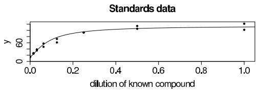

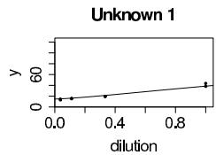

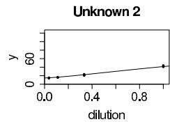

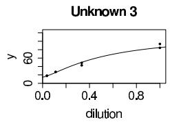

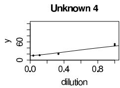

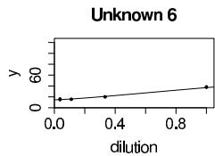

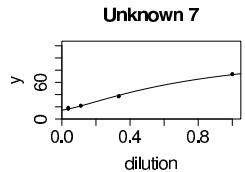

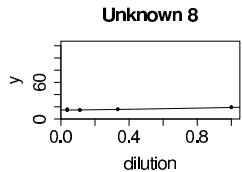

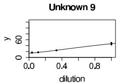

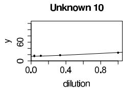  
Figure 19.2 Data from a single plate of a serial dilution assay. The large graph shows the calibration data, and the ten small graphs show data for the unknown compounds. The goal of the analysis is to figure out how to scale the $x$ -axes of the unknowns so they line up with the curve estimated from the standards. (The curves shown on these graphs are estimated from the model as described in Section 19.1.)

surements appropriately. An assay comes on a plate with a number of wells each containing a sample or a specified dilution of a sample. There are two sorts of samples: unknowns, which are the samples to be measured and their dilutions, and standards, which are dilutions of a known compound, used to calibrate the measurements. Figure 19.1 shows a typical plate with 96 wells; the first two columns of the plate contain the standard and its dilutions and the remaining ten columns are for unknown quantities. The dilution values for the unknown samples are more widely spaced than for the standards in order to cover a wider range of concentrations with a given number of assays.

# Laboratory data

Figure 19.2 shows data from a single plate in a study of cockroach allergens in the homes of asthma sufferers. Each graph shows the optical measurements $y$ versus the dilutions for a single compound along with an estimated curve describing the relationship between

Standards data   

<table><tr><td>Conc.</td><td>Dilution</td><td>y</td></tr><tr><td>0.64</td><td>1</td><td>101.8</td></tr><tr><td>0.64</td><td>1</td><td>121.4</td></tr><tr><td>0.32</td><td>1/2</td><td>105.2</td></tr><tr><td>0.32</td><td>1/2</td><td>114.1</td></tr><tr><td>0.16</td><td>1/4</td><td>92.7</td></tr><tr><td>0.16</td><td>1/4</td><td>93.3</td></tr><tr><td>0.08</td><td>1/8</td><td>72.4</td></tr><tr><td>0.08</td><td>1/8</td><td>61.1</td></tr><tr><td>0.04</td><td>1/16</td><td>57.6</td></tr><tr><td>0.04</td><td>1/16</td><td>50.0</td></tr><tr><td>0.02</td><td>1/32</td><td>38.5</td></tr><tr><td>0.02</td><td>1/32</td><td>35.1</td></tr><tr><td>0.01</td><td>1/64</td><td>26.6</td></tr><tr><td>0.01</td><td>1/64</td><td>25.0</td></tr><tr><td>0</td><td>0</td><td>14.7</td></tr><tr><td>0</td><td>0</td><td>14.2</td></tr></table>

Data from two of the unknown samples   

<table><tr><td>Sample</td><td>Dilution</td><td>y</td><td>Est. conc.</td></tr><tr><td rowspan="8">Unknown 8</td><td>1</td><td>19.2</td><td>*</td></tr><tr><td>1</td><td>19.5</td><td>*</td></tr><tr><td>1/3</td><td>16.1</td><td>*</td></tr><tr><td>1/3</td><td>15.8</td><td>*</td></tr><tr><td>1/9</td><td>14.9</td><td>*</td></tr><tr><td>1/9</td><td>14.8</td><td>*</td></tr><tr><td>1/27</td><td>14.3</td><td>*</td></tr><tr><td>1/27</td><td>16.0</td><td>*</td></tr><tr><td rowspan="8">Unknown 9</td><td>1</td><td>49.6</td><td>0.040</td></tr><tr><td>1</td><td>43.8</td><td>0.031</td></tr><tr><td>1/3</td><td>24.0</td><td>0.005</td></tr><tr><td>1/3</td><td>24.1</td><td>0.005</td></tr><tr><td>1/9</td><td>17.3</td><td>*</td></tr><tr><td>1/9</td><td>17.6</td><td>*</td></tr><tr><td>1/27</td><td>15.6</td><td>*</td></tr><tr><td>1/27</td><td>17.1</td><td>*</td></tr></table>

Figure 19.3 Example of measurements $y$ from a plate as analyzed by standard software used for dilution assays. The standards data are used to estimate the calibration curve, which is then used to estimate the unknown concentrations. The concentrations indicated by asterisks are labeled as 'below detection limit.' However, information is present in these low observations, as can be seen by noting the decreasing pattern of the measurements from dilutions 1 to $\frac{1}{3}$ to $\frac{1}{9}$ in each sample.

dilution and measurement. The estimation of the curves relating dilutions to measurements is described below.

Figure 19.3 illustrates difficulties with a currently standard approach to estimating unknown concentrations. The left part of the figure shows the standards data (corresponding to the first graph in Figure 19.2): the two initial samples have known concentrations of 0.64, with each followed by several dilutions and a zero measurement. The optical color measurements $y$ start above 100 for the samples with concentration 0.64 and decrease to around 14 for the zero concentration (all inert compound) samples. The right part of Figure 19.3 shows, for two of the ten unknowns on the plate, the color measurements $y$ and corresponding concentration estimates from a standard method.

All the estimates for Unknown 8 are shown by asterisks, indicating that they were recorded as 'below detection limit,' and the standard computer program for analyzing these data gives no estimate at all. A casual glance at the data (see the plot for Unknown 8 in Figure 19.2) might suggest that these data are indeed all noise, but a careful look at the numbers reveals that the measurements decline consistently from concentrations of 1 to $\frac{1}{3}$ to $\frac{1}{9}$ , with only the final dilutions apparently lost in the noise (in that the measurements at $\frac{1}{27}$ are no lower than at $\frac{1}{9}$ ). A clear signal is present for the first six measurements of this unknown sample.

Unknown 9 shows a better outcome, in which four of the eight measurements are above detection limit. The four more diluted measurements yield readings that are below the detection limit. Once again, however, information seems to be present in the lower measurements, which decline consistently with dilution.

As can be seen in Figure 19.2, Unknowns 8 and 9 are not extreme cases but rather are somewhat typical of the data from this plate. In measurements of allergens, even low concentrations can be important, and we need to be able to distinguish between zero concentrations and values that are merely low. The Bayesian inference described here

makes this distinction far more precisely than the previous method by which such data were analyzed.

# The model

Notation. The parameters of interest in a study such as in Figures 19.1-19.3 are the concentrations of the unknown samples; we label these as $\theta_{1},\ldots,\theta_{10}$ for the plate layout shown in Figure 19.1. The known concentration of the standard is denoted by $\theta_0$ . We label the concentration in well $i$ as $x_{i}$ and use $y_{i}$ to denote the corresponding color intensity measurement, with $i = 1,\dots,96$ for our plate. Each $x_{i}$ is a specified dilution of one of the samples. We set up the model for the color intensity observations $y$ in stages: a parametric model for the expected color intensity for a given concentration, measurement errors for the optical readings, errors introduced during the dilution preparation process, and, finally, prior distributions for all the parameters.

Curve of expected measurements given concentration. We follow the usual practice in this field and fit the following four-parameter nonlinear model for the expected optical reading given concentration $x$ :

$$
\operatorname {E} (y \mid x, \beta) = g (x, \beta) = \beta_ {1} + \frac {\beta_ {2}}{1 + \left(x / \beta_ {3}\right) ^ {- \beta_ {4}}} \tag {19.1}
$$

where $\beta_{1}$ is the color intensity at zero concentration, $\beta_{2}$ is the increase to saturation, $\beta_{3}$ is the concentration at which the gradient of the curve turns, and $\beta_{4}$ is the rate at which saturation occurs. All parameters are restricted to nonnegative values. This model is equivalent to a scaled and shifted logistic function of $\log (x)$ . The model fits the data fairly well, as can be seen in Figure 19.2 on page 472.

Measurement error. The measurement errors are modeled as normally distributed with unequal variances:

$$
y _ {i} \sim \mathrm {N} \left(g \left(x _ {i}, \beta\right), \left(\frac {g \left(x _ {i} , \beta\right)}{A}\right) ^ {2 \alpha} \sigma_ {y} ^ {2}\right), \tag {19.2}
$$

where the parameter $\alpha$ , which is restricted to lie between 0 and 1, models the pattern that variances are higher for larger measurements (for example, see Figure 19.2). The constant $A$ in (19.2) is arbitrary; we set it to the value 30, which is in the middle of the range of the data. It is included in the model so that the parameter $\sigma_y$ has a more direct interpretation as the error standard deviation for a 'typical' measurement.

The model (19.2) reduces to an equal-variance normal model if $\alpha = 0$ and approximately corresponds to the equal-variance model on the log scale if $\alpha = 1$ . Getting the variance relation correct is important here because many of our data are at low concentrations, and we do not want our model to use these measurements but not to overstate their precision.

Dilution errors. The process introduces errors in two places: the initial dilution, in which a measured amount of the standard is mixed with a measured amount of an inert liquid; and serial dilutions, in which a sample is diluted by a fixed factor such as 2 or 3. For the cockroach allergen data, serial dilution errors were low, so we include only the initial dilution error in our model.

We use a normal model on the (natural) log scale for the initial dilution error associated with preparing the standard sample. The known concentration of the standard solution is $\theta_0$ , and $d_0^{\mathrm{init}}$ is the (known) initial dilution of the standard that is called for. Without dilution error, the concentration of the initial dilution would thus be $d_0^{\mathrm{init}}\theta_0$ . Let $x_0^{\mathrm{init}}$ be the actual (unknown) concentration of the initial dilution, with

$$
\log \left(x _ {0} ^ {\text {i n i t}}\right) \sim \mathrm {N} \left(\log \left(d _ {0} ^ {\text {i n i t}} \cdot \theta_ {0}\right), (\sigma^ {\text {i n i t}}) ^ {2}\right). \tag {19.3}
$$

For the unknowns, there is no initial dilution, and so the unknown initial concentration for sample $j$ is $x_{j}^{\mathrm{init}} = \theta_{j}$ for $j = 1,\ldots ,10$ . For the further dilutions of standards and unknowns, we simply set

$$
x _ {i} = d _ {i} \cdot x _ {j (i)} ^ {\text {i n i t}}, \tag {19.4}
$$

where $j(i)$ is the sample (0, 1, 2, ..., or 10) corresponding to observation $i$ , and $d_i$ is the dilution of observation $i$ relative to the initial dilution. (The $d_i$ 's are the numbers displayed in Figure 19.1.) The relation (19.4) reflects the assumption that serial dilution errors are low enough to be ignored.

Prior distributions. We assign noninformative uniform prior distributions to the parameters of the calibration curve: $\log (\beta_k)\sim U(-\infty ,\infty)$ for $k = 1,\ldots ,4$ .. $\sigma_y\sim U(0,\infty)$ $\alpha \sim U(0,1)$ . A design such as displayed in Figure 19.1 with lots of standards data allows us to estimate all these parameters fairly accurately. We also assign noninformative prior distributions for the unknown concentrations: $p(\log \theta_j)\propto 1$ for each unknown $j = 1,\dots ,10$ Another option would be to fit a hierarchical model of the form, $\log \theta_{j}\sim \mathrm{N}(\mu_{\theta},\sigma_{\theta}^{2})$ (or, better still, a mixture model which includes the possibility of some true concentrations $\theta_{j}$ to be zero), but for simplicity we use a no-pooling model (corresponding to $\sigma_{\theta} = \infty$ ) in this analysis.

There is one parameter in the model— $\sigma^{\mathrm{init}}$ , the scale of the initial dilution error—that cannot be estimated from a single plate. For our analysis, we fix it at the value 0.02 (that is, an initial dilution error with standard deviation $2\%$ ), which was obtained from a previous analysis of data from plates with several different initial dilutions of the standard.

# Inference

We fitted the model using the Bugs package (a predecessor to the Stan software described in Appendix C). We obtained approximate convergence (the potential scale reduction factors $\widehat{R}$ were below 1.1 for all parameters) after 50,000 iterations of two parallel chains of the Gibbs sampler. To save memory and computation time in processing the simulations, we save every 20th iteration of each chain. When fitting the model, it is helpful to use reasonable starting points (which can be obtained using crude estimates from the data) and to parameterize in terms of the logarithms of the parameters $\beta_{j}$ and the unknown concentrations $\theta_{j}$ . To speed convergence, we actually work with the parameters $\log \beta$ , $\alpha$ , $\sigma_{y}$ and $\log \gamma$ , where $\log (\gamma_{j}) = \log (\theta_{j} / \beta_{3})$ . The use of $\gamma_{j}$ in place of $\theta_{j}$ gets around the problem of the strong posterior correlation between the unknown concentrations and the parameter $\beta_{3}$ , which indexes the $x$ -position of the calibration curve (see (19.1)).

The posterior median estimates (and posterior $50\%$ intervals) for the parameters of the calibration curve are $\hat{\beta}_1 = 14.7$ [14.5, 14.9], $\hat{\beta}_2 = 99.7$ [96.8, 102.9], $\hat{\beta}_3 = 0.054$ [0.051, 0.058], and $\hat{\beta}_4 = 1.34$ [1.30, 1.38]. The posterior median estimate of $\beta$ defines a curve $g(x,\beta)$ which is displayed in the upper-left plot of Figure 19.2. As expected, the curve goes through the data used to estimate it. The variance parameters $\sigma_y$ and $\alpha$ are estimated as 2.2 and 0.97 (with $50\%$ intervals of [2.1, 2.3] and [0.94, 0.99], respectively). The high precision of the measurements (as can be seen from the replicates in Figure 19.2) allowed the parameters to be accurately estimated from a relatively small dataset.

Figure 19.4 displays the inferences for the concentrations of the 10 unknown samples. We used these estimates, along with the estimated calibration curve, to draw scaled curves for each of the 10 unknowns displayed in Figure 19.2. Finally, Figure 19.5 displays the residuals, which seem generally reasonable.

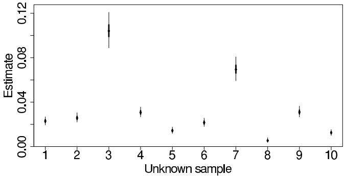  
Figure 19.4 Posterior medians, $50\%$ intervals, and $95\%$ intervals for the concentrations of the 10 unknowns for the data displayed in Figure 19.2. Estimates are obtained for all the samples, even Unknown 8, all of whose data were 'below detection limit' (see Figure 19.3).

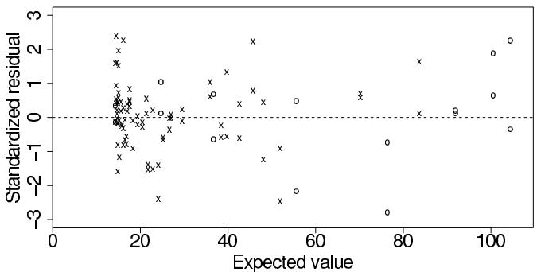  
Figure 19.5 Standardized residuals $(y_{i} - E(y_{i}|x_{i})) / sd(y_{i}|x_{i}))$ vs. expected values $E(y_{i}|x_{i})$ , for the model fit to standards and unknown data from a single plate. Circles and crosses indicate measurements from standards and unknowns, respectively. No major problems appear with the model fit.

# Comparison to existing estimates

The method that is standard practice in the field involves first estimating the calibration curve and then transforming each measurement from the unknown samples directly to an estimated concentration, by inverting the fitted calibration curve. For each unknown sample, the estimated concentrations are then divided by their dilutions and averaged to obtain a single estimate. (For example, using this approach, the estimated concentration for Unknown 9 from the data displayed in Figure 19.3 is $\frac{1}{4} (0.040 + 0.031 + 3\cdot 0.005 + 3\cdot 0.005) = 0.025$ .)

The estimates from the Bayesian analysis are generally similar to those of the standard method but with higher accuracy. An advantage of the Bayesian approach is that it yields a concentration estimate for all unknowns, even Unknown 8 for which there is no standard estimate because all its measurements are 'below detection limit.' We also created concentration estimates for each unknown based on each of the two halves of the data (in the setup of Figure 19.1, using only the top four wells or the bottom four wells for each unknown). For the standard and Bayesian approaches the two estimates are similar, but the reliability (that is, the agreement between the two estimates) is much stronger for the Bayesian estimate. We would not want to make too strong a claim based on data from a single plate. We performed a more thorough study (not shown here) to compare the old and new methods under a range of experimental conditions.

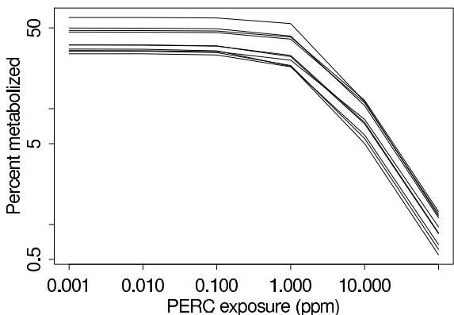  
Figure 19.6 Estimated fraction of PERC metabolized, as a function of steady-state concentration in inhaled air, for 10 hypothetical individuals randomly selected from the estimated population of young adult white males.

# 19.2 Example: population toxicokinetics

In this section we discuss a much more complicated nonlinear model used in toxicokinetics (the study of the flow and metabolism of toxins in the body) for the ultimate goal of assessing the risk in the general population associated with a particular air pollutant. This model is hierarchical and multivariate, with a vector of parameters to be estimated on each of several experimental subjects. The prior distributions for this model are informative and hierarchical, with separate variance components corresponding to uncertainty about the average level in the population and variation around that average.

# Background

Perchloroethylene (PERC) is one of many industrial products that cause cancer in animals and is believed to do so in humans as well. PERC is breathed in, and the general understanding is that it is metabolized in the liver and that its metabolites are carcinogenic. Thus, a relevant 'dose' to study when calibrating the effects of PERC is the amount metabolized in the liver. Not all the PERC that a person breathes will be metabolized. We focus here on estimating the fraction metabolized as a function of the concentration of the compound in the breathed air, and how this function varies across the population. To give an idea of our inferential goals, we skip ahead to show some output from our analysis. Figure 19.6 displays the estimated fraction of inhaled PERC that is metabolized as a function of concentration in air, for 10 randomly selected draws from the estimated population of young adult white males (the group on which we had data). The shape of the curve is discussed below after the statistical modeling is described.

It is not possible to estimate curves of this type with reasonable confidence using simple procedures such as direct measurement of metabolite concentrations (difficult even at high exposures and not feasible at low exposures) or extrapolation from animal results. Instead a mathematical model of the flow of the toxin through the bloodstream and body organs, and of its metabolism in the liver is used to estimate the fraction of PERC metabolized.

A sample of the experimental data we used to fit the model of toxin flow is shown in Figure 19.7. Each of six volunteers was exposed to PERC at a high level for four hours (believed long enough for the PERC concentrations in most of their bodily organs to come to equilibrium) and then PERC concentrations in exhaled air and in blood were measured over a period of a week (168 hours). In addition, the data on each person were repeated at a second exposure level (data not shown).

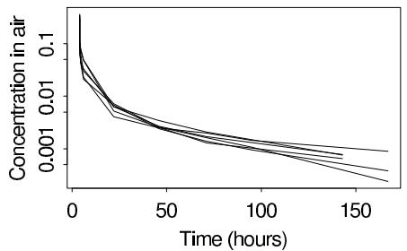

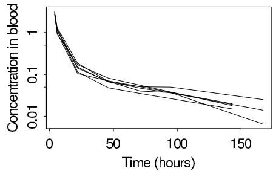  
Figure 19.7 Concentration of PERC (in milligrams per liter) in exhaled air and in blood, over time, for one of two replications in each of six experimental subjects. The measurements are displayed on logarithmic scales.

# Toxicokinetic model

Our analysis is based on a standard physiological model, according to which the toxin enters and leaves through the breath, is distributed by blood flow to four 'compartments'—well-perfused tissues, poorly perfused tissues, fat, and the liver—and is metabolized in the liver. This model has a long history in toxicology modeling and has been showed to reproduce most features of such data. A simpler one- or two-compartment model might be easier to estimate, but such models provide a poor fit to our data and, more importantly, do not have the complexity to accurately fit varying exposure conditions.

We briefly describe the nature of the toxicokinetic model, omitting details not needed for understanding our analysis. Given a known concentration of the compound in the air, the concentration of the compound in each compartment over time is governed by a first-order differential equation, with parameters for the volume, blood flow, and partition coefficient (equilibrium concentration relative to the blood) of each compartment. The liver compartment where metabolism occurs has a slightly different equation than the other compartments and is governed by the parameters mentioned above and a couple of additional parameters. The four differential equations give rise to a total of 15 parameters for each individual. We use the notation $\theta_{k} = (\theta_{k1},\dots,\theta_{kL})$ for the vector of $L = 15$ parameters associated with person $k$ .

Given the values of the physiological parameters and initial exposure conditions, the differential equations can be solved using specialized numerical algorithms to obtain concentrations of the compound in each compartment and the rate of metabolism as a function of time. We can combine predictions about the PERC concentration in exhaled air and blood based on the numerical solution of the differential equations with our observed concentration measurements to estimate the model parameters for each individual.

# Difficulties in estimation and the role of prior information

A characteristic difficulty of estimating models in toxicology and pharmacology is that they predict patterns of concentration over time that are close to mixtures of declining exponential functions, with the amplitudes and decay times of the different components corresponding to functions of the model parameters. It is well known that the estimation of the decay times of a mixture of exponentials is an ill-conditioned problem (see Exercise 19.3); that is, the parameters in such a model are hard to estimate simultaneously.

Solving the problem of estimating metabolism from indirect data is facilitated by using a physiological pharmacokinetic model; that is, one in which the individual and population parameters have direct physical interpretations (for example, blood flow through the fatty tissue, or tissue/blood partition coefficients). These models permit the identification of many of their parameter values through prior (for example, published) physiological data. Since the parameters of these models are essentially impossible to estimate from the data

alone, it is crucial that they have physical meaning and can be assigned informative prior distributions.

# Measurement model

We first describe how the toxicological model is used as a component of the nonlinear model for blood and air concentration measurements. Following that is a description of the population model which allows us to infer the distribution of population characteristics related to PERC metabolism. The data are a series of measurements of exhaled air and blood concentrations are taken on each of the six people in the study. We label these data as $y_{jkmt}$ , with $j$ indexing replications ( $j = 1,2$ for the two exposure levels in our data), $k$ indexing individuals, $m$ indexing measurements ( $m = 1$ for blood concentration and $m = 2$ for air concentration), and $t$ indexing time. The expected values of the exhaled air and blood concentrations are nonlinear functions $g_{m}(\theta_{k},E_{j},t)$ of the individual's parameters $\theta_{k}$ , the exposure level $E_{j}$ , and time $t$ . The functions $g_{m}(\cdot)$ are our shorthand notation for the solution of the system of differential equations relating the physiological parameters to the expected concentration. Given the input conditions for replication $j$ (that is, $E_{j}$ ) and the parameters $\theta_{k}$ (as well as a number of additional quantities measured on each individual but suppressed in our notation here), one can numerically evaluate the pharmacokinetic differential equations over time and compute $g_{1}$ and $g_{2}$ for all values at which measurements have been taken, thus obtaining the expected values of all the measurements.

The concentrations actually observed in expired air and blood are also affected by measurement errors, which are assumed, as usual, to be independent and lognormally distributed, with a mean of zero and a standard deviation of $\sigma_{m}$ (on the log scale) for $m = 1,2$ . These measurement error distributions also implicitly account for errors in the model. We allow the two components of $\sigma$ to differ, because the measurements in blood and exhaled air have different experimental protocols and therefore are likely to have different precisions. We have no particular reason to believe that modeling or measurement errors for air and blood measurements will be correlated, so we assign independent uniform prior distributions to $\log \sigma_{1}$ and $\log \sigma_{2}$ . (After fitting the model, we examined the residuals and did not find any evidence of high correlations.)

# Population model for parameters

One of the goals of this project is to estimate the distribution of the individual pharmacokinetic parameters and of predicted values such as fraction metabolized (which are complex functions of the individual parameters), in the general population. In an experiment with $K$ individuals, we set up a hierarchical model on the $K$ vectors of parameters to allow us to draw inferences about the general population from which the individuals are drawn.

A skewed, lognormal-like distribution is generally observed for biological parameters. Most, if not all, of the biological parameters also have physiological bounds. Based on this information the individual pharmacokinetic parameters after log-transformation and appropriate scaling (see below), are modeled with normal distributions having population mean truncated at $\pm 3$ standard deviations from the mean, where $k$ indexes individuals and $l = 1,\dots ,L$ indexes the pharmacokinetic parameters in the model. The distributions are truncated to restrict the model parameters to scientifically reasonable values. In addition, the truncations serve a useful role when we monitor the simulations of the parameters from their posterior distribution: if the simulations for a parameter are stuck near truncation points, this indicates that the data and the pharmacokinetic model strongly contradict the prior distribution, and some part of the model should be re-examined.

The vector of parameters for individual $k$ is $\theta_{k} = (\theta_{k1},\dots,\theta_{kL})$ , with $L = 15$ . Some of the parameters are constrained by definition: in the model under discussion, the parameters

$\theta_{k2}, \theta_{k3}, \theta_{k4}, \theta_{k5}$ represent the fractions of blood flow to each compartment, and so are constrained to sum to 1. Also, the parameters $\theta_{k6}, \theta_{k7}, \theta_{k8}$ correspond to the scaling coefficients of the organ volumes, and are constrained to sum to 0.873 (the standard fraction of lean body mass not including bones), for each individual. Of these three parameters, $\theta_{k8}$ , the volume of the liver, is much smaller than the others and there is considerable prior information about this quantity. For the purposes of modeling and computation, we transform the model in terms of a new set of parameters $\psi_{kl}$ defined as follows:

$$
\theta_ {k l} = \frac {e ^ {\psi_ {k l}}}{e ^ {\psi_ {k 2}} + e ^ {\psi_ {k 3}} + e ^ {\psi_ {k 4}} + e ^ {\psi_ {k 5}}}, \mathrm {f o r} l = 2, 3, 4, 5
$$

$$
\theta_ {k l} = (0. 8 7 3 - e ^ {\psi_ {k 8}}) \frac {e ^ {\psi_ {k l}}}{e ^ {\psi_ {k 6}} + e ^ {\psi_ {k 7}}}, \quad \text {f o r} l = 6, 7
$$

$$
\theta_ {k l} = e ^ {\psi_ {k l}}, \quad \text {f o r} l = 1 \text {a n d} 8 - 1 5. \tag {19.5}
$$

The parameters $\psi_{k2},\ldots ,\psi_{k5}$ and $\psi_{k6},\psi_{k7}$ are not identified (for example, adding any constant to $\psi_{k2},\ldots ,\psi_{k5}$ does not alter the values of the physiological parameters, $\theta_{k2},\ldots ,\theta_{k5}$ ), but they are assigned proper prior distributions, so we can formally manipulate their posterior distributions.

Each set of $\psi_{kl}$ parameters is assumed to follow a normal distribution with mean $\mu_l$ and standard deviation $\tau_l$ , truncated at three standard deviations. Modeling on the scale of $\psi$ respects the constraints on $\theta$ while retaining the truncated lognormal distributions for the unconstrained components. All computations are performed with the $\psi$ 's, which are then transformed back to $\theta$ 's at the end to interpret the results on the natural scales.

In the model, the population distributions for the $L = 15$ physiological parameters are assumed independent. After fitting the model, we checked the $15 \cdot 14/2$ correlations among the parameter pairs across the six people and found no evidence that they differed from zero. If we did find large correlations, we would either want to add correlations to the model (as described in Section 15.4) or reparameterize to make the correlations smaller. In fact, the parameters in our model were already transformed to reduce correlations (for example, by working with proportional rather than absolute blood flows and organ volumes, as described at the top of this page.

# Prior information

In order to fit the population model, we assign prior distributions to the means and variances, $\mu_{l}$ and $\tau_l^2$ , of the $L$ (transformed) physiological parameters. We specify a prior distribution for each $\mu_{l}$ (normal with parameters $M_{l}$ and $S_{l}^{2}$ based on substantive knowledge) and $\tau_l^2$ (inverse- $\chi^2$ , centered at an estimate $\tau_{0l}^{2}$ of the true population variance and with a low number of degrees of freedom $\nu_{l}$ —typically set to 2—to indicate large uncertainties).

The hyperparameters $M_{l}$ , $S_{l}$ , and $\tau_{0l}$ are based on estimates available in the biological literature. Sources include studies on humans and allometric scaling from animal measurements. We set independent prior distributions for the $\mu_l$ 's and $\tau_l$ 's because our prior information about the parameters is essentially independent, to the best of our knowledge, given the parameterization and scaling used (for example, blood flows as a proportion of the total rather than on absolute scales). In setting uncertainties, we try to be weakly informative and set the prior variances higher rather than lower when there is ambiguity in the biological literature.

The model has 15 parameters for each of the six people in a toxicokinetic experiment; $\theta_{jk}$ is the value of the $k$ th parameter for person $j$ , with $j = 1, \ldots, 6$ and $k = 1, \ldots, 15$ . Prior information about the parameters was available in the biological literature. For each parameter, it was important to distinguish between two sources of variation: prior uncertainty about the value of the parameter and population variation. This was represented by

a lognormal model for each parameter, $\log \theta_{jk} \sim \mathrm{N}(\mu_k, \tau_k^2)$ , and by assigning independent prior distributions to the population geometric mean and standard deviation, $\mu_k$ and $\tau_k$ : $\mu_k \sim \mathrm{N}(M_k, S_k^2)$ and $\tau_k^2 \sim \mathrm{Inv}-\chi^2(\nu, \tau_{k0}^2)$ . The prior distribution on $\mu_k$ , especially through the standard deviation $S_k$ , describes our uncertainty about typical values of the parameter in the population. The prior distribution on $\tau_k$ tells us about the population variation for the parameter. Because prior knowledge about population variation was imprecise, the degrees of freedom in the prior distributions for $\tau_k^2$ were set to the low value of $\nu = 2$ .

Some parameters are better understood than others. For example, the weight of the liver, when expressed as a fraction of lean body weight, was estimated to have a population geometric mean of 0.033, with both the uncertainty on the population average and the heterogeneity in the population estimated to be of the order of $10\%$ to $20\%$ . The prior parameters were set to $M_{k} = \log (0.033)$ , $S_{k} = \log (1.1)$ , and $\tau_{k0} = \log (1.1)$ . In contrast, the Michaelis-Menten coefficient (a particular parameter in the pharmacokinetic model) was poorly understood: its population geometric mean was estimated at 0.7, but with a possible uncertainty of up to a factor of 100 above or below. Despite the large uncertainty in the magnitude of this parameter, however, it was believed to vary by no more than a factor of 4 relative to the population mean, among individuals in the population. The prior parameters were set to $M_{k} = \log (0.7)$ , $S_{k} = \log (10)$ , and $\tau_{k0} = \log (2)$ . The hierarchical model provides an essential framework for expressing the two sources of variation (or uncertainty) and combining them in the analysis.

# Joint posterior distribution for the hierarchical model

For Bayesian inference, we obtain the posterior distribution (up to a multiplicative constant) for all the parameters of interest, given the data and the prior information, by multiplying all the factors in the hierarchical model: the data distribution, $p(y|\psi, E, t, \sigma)$ , the population model, $p(\psi|\mu, \tau)$ , and the prior distribution, $p(\mu, \tau|M, S, \tau_0)$ ,

$$
\begin{array}{l} p (\psi , \mu , \tau^ {2}, \sigma^ {2} | y, E, t, \phi , M, S, \tau_ {0} ^ {2}, \nu) \\ \propto p (y | \psi , \phi , E, t, \sigma^ {2}) p (\psi | \mu , \tau^ {2}) p (\mu , \tau^ {2} | M, S, \tau_ {0} ^ {2}) p (\sigma^ {2}) \\ \propto \left(\prod_ {j = 1} ^ {J} \prod_ {k = 1} ^ {K} \prod_ {m = 1} ^ {2} \prod_ {t} \mathrm {N} (\log y _ {j k m t} | \log g _ {m} (\theta_ {k}, E _ {j}, t), \sigma_ {m} ^ {2})\right) \sigma_ {1} ^ {- 2} \sigma_ {2} ^ {- 2} \times \\ \times \left(\prod_ {k = 1} ^ {K} \prod_ {l = 1} ^ {L} \mathrm {N} _ {\text {t r u n c}} \left(\psi_ {k l} \mid \mu_ {l}, \tau_ {l} ^ {2}\right)\right) \left(\prod_ {l = 1} ^ {L} \mathrm {N} \left(\mu_ {l} \mid M _ {l}, S _ {l} ^ {2}\right) \operatorname {I n v} - \chi^ {2} \left(\tau_ {l} ^ {2} \mid \nu_ {l}, \tau_ {0 l} ^ {2}\right)\right), \tag {19.6} \\ \end{array}
$$

where $\psi$ is the set of vectors of individual-level parameters, $\mu$ and $\tau$ are the vectors of population means and standard deviations, $\sigma$ is the pair of measurement variances, $y$ is the vector of concentration measurements, $E$ and $t$ are the exposure concentrations and times, and $M$ , $S$ , $\tau$ , and $\nu$ are the hyperparameters. We use the notation $\mathrm{N}_{\mathrm{trunc}}$ for the normal distribution truncated at the specified number of standard deviations from the mean. The indexes $j$ , $k$ , $l$ , $m$ , and $t$ refer to replication, person, parameter, type of measurement (blood or air), and time of measurement. To compute (19.6) as a function of the parameters, data, and experimental conditions, the functions $g_{m}$ must be computed numerically over the range of time corresponding to the experimental measurements.

# Computation

Our goals are first to fit a pharmacokinetic model to experimental data, and then to use the model to perform inferences about quantities of interest, such as the population distribution

of the fraction of the compound metabolized at a given dose. We attain these goals using random draws of the parameters from the posterior distribution, $p(\psi, \mu, \tau, \sigma | y, E, t, M, S, \tau_0, \nu)$ . We use a Gibbs sampling approach, iteratively updating the parameters in the following sequence: $\sigma, \tau, \mu, \psi_1, \ldots, \psi_K$ . Each of these is actually a vector parameter. The conditional distributions for the components of $\sigma^2, \tau^2$ , and $\mu$ are inverse- $\chi^2$ , inverse- $\chi^2$ , and normal. The conditional distributions for the parameters $\psi$ have no closed form, so we sample from them using steps of the Metropolis algorithm, which requires only the ability to compute the posterior density up to a multiplicative constant, as in (19.6).

Our implementation of the Metropolis algorithm alters the parameters one person at a time (thus, $K$ jumps in each iteration, with each jump affecting an $L$ -dimensional vector $\psi_{k}$ ). The parameter vectors are altered using a normal proposal distribution centered at the current value, with covariance matrix proportional to one obtained from some initial runs and scaled so that the acceptance rate is approximately 0.23. Updating the parameters of one person at a time means that the only factors of the posterior density that need to be computed for the Metropolis step are those corresponding to that person. This is an important concern, because evaluating the functions $g_{m}$ to obtain expected values of measurements is the costliest part of the computation. An alternative approach would be to alter a single component $\psi_{kl}$ at a time; this would require $KL$ jumps in each iteration.

We performed five independent simulation runs, each of 50,000 iterations, with starting points obtained by sampling each $\psi_{kl}$ at random from its prior distribution and then setting the population averages $\mu_l$ at their prior means, $M_l$ . We then began the simulations by drawing $\sigma$ and $\tau$ . Because of storage limitations, we saved only every tenth iteration of the parameter vector. We monitored the convergence of the simulations by comparing within and between-simulation variances, as described in Section 11.4. In practice, the model was gradually implemented and debugged over a period of months, and one reason for our trust in the results is their general consistency with earlier simulations of different variants of the model.

# Inference for quantities of interest

First off, we examined the inferences about the model parameters and their population variability, and checked that these made sense and were consistent with the prior distribution. After this, the main quantities of interest were the fraction of PERC metabolized under different exposure scenarios, as computed by evaluating the differential equation model numerically under the appropriate input conditions. For each individual $k$ , we can compute the fraction metabolized for each simulated parameter vector $\psi_{k}$ ; using the set of simulations yields a distribution of the fraction metabolized for that individual. The variance in the distribution for each individual is due to uncertainty in the posterior distribution of the physiological parameters, $\psi_{k}$ .

Figure 19.8 shows the posterior distributions of the PERC fraction metabolized, for each person in the experiment, at a high exposure level of 50 parts per million (ppm) and a low level of $0.001~\mathrm{ppm}$ . The six people were not actually exposed to these levels; the inferences were obtained by running the differential equation model with these two hypothesized input conditions along with the estimated parameters for each person. We selected these two levels to illustrate the inferences from the model; the high level corresponds to occupational exposures and the low level to environmental exposures of PERC. We can and did consider other exposure scenarios too. The figure shows the correlation between the high-dose and the low-dose estimates of the fraction metabolized in the six people. Large variations exist between individuals; for example, a factor of two difference is seen between subjects A and E.

Similar simulations were performed for an additional person from the population (that is, a person exchangeable with the subjects in the study) by simulating random vectors of

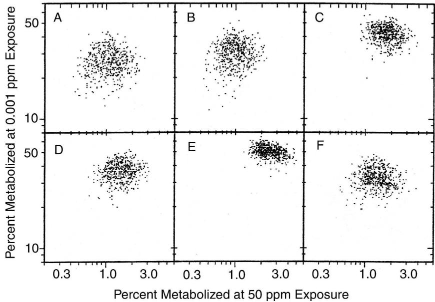  
Figure 19.8 Posterior inferences for the quantities of interest—the fraction metabolized at high and low exposures—for each of the six subjects in the PERC experiment. The scatter within each plot represents posterior uncertainty about each person's metabolism. The variation among these six persons represents variation in the population studied of young adult white males.

the physiological parameters from their population distributions. The variance in the resulting population distribution of fraction of PERC metabolized includes posterior uncertainty in the parameter estimates and real inter-individual variation in the population. Interval estimates for the fraction metabolized can be obtained as percentiles of the simulated distributions. At high exposure (50 ppm) the $95\%$ interval for the fraction metabolized in the population is $[0.5\%, 4.1\%]$ ; at low exposure (0.001 ppm) it is $[15\%, 58\%]$ .

We also studied the fraction of PERC metabolized in one day (after three weeks of inhalation exposure) as a function of exposure level. This is the relation we showed in introducing the PERC example; it is shown in Figure 19.6. At low exposures the fraction metabolized remains constant, since metabolism is linear. Saturation starts occurring above $1\mathrm{ppm}$ and is about complete at $10\mathrm{ppm}$ . At higher levels the fraction metabolized decreases linearly with exposure since the quantity metabolized per unit time is at its maximum.

When interpreting these results, one must remember that they are based on a single experiment. This study appears to be one of the best available; however, it included only six people from a homogeneous population, measured at only two exposure conditions. Much of the uncertainty associated with the results is due to these experimental limitations. Posterior uncertainty about the parameters for the people in the study could be reduced by collecting and analyzing additional data on these individuals. To learn more about the population we would need additional individuals. Population variability, which in this study is approximately as large as posterior uncertainty, might increase if a more heterogeneous group of subjects were included.

# Evaluating the fit of the model

In addition to their role in inference given the model, the posterior simulations can be used in several ways to check the fit of the model.

Most directly, we can examine the errors of measurement and modeling by comparing

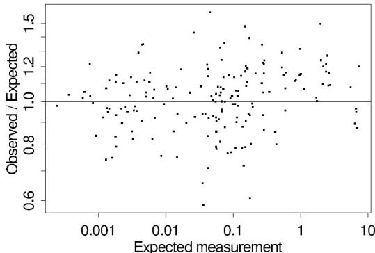  
Figure 19.9 Observed PERC concentrations (for all individuals in the study) divided by expected concentrations, plotted vs. expected concentrations. The $x$ and $y$ -axes are on different (logarithmic) scales: observations vary by a factor of 10,000, but the relative errors are mostly between 0.8 and 1.25. Because the expected concentrations are computed based on a random draw of the parameters from their posterior distribution, the figure shows the actual misfit estimated by the model, without the need to adjust for fitting.

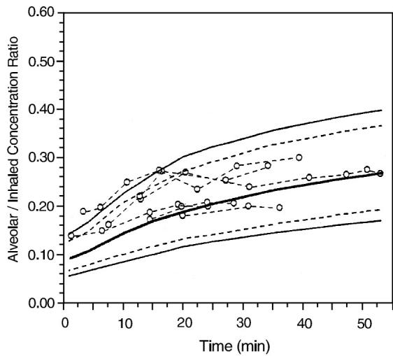  
Figure 19.10 External validation data and $95\%$ predictive intervals from the model fit to the PERC data. The model predictions fit the data reasonably well but not in the first 15 minutes of exposure, a problem we attribute to the fact that the model assumes that all compartments are in instantaneous equilibrium, whereas this actually takes about 15 minutes to approximately hold.

observed data, $y_{jkmt}$ , to their expectations, $g_{m}(\theta_{k}, E_{j}, t)$ , for all the measurements, based on the posterior simulations of $\theta$ . Figure 19.9 shows a scatterplot of the relative prediction errors of all our observed data (that is, observed data divided by their predictions from the model) versus the model predictions. (Since the analysis was Bayesian, we have many simulation draws of the parameter vector, each of which yields slightly different predicted data. Figure 19.9, for simplicity, shows the predictions from just one of these simulation draws, selected at random.) The magnitude of these errors is reasonably low compared to other fits of this kind of data.

We can also check the model by comparing its predictions to additional data not used in the original fit. We use the results of a second inhalation experiment on human volunteers, in which 6 people were exposed to constant levels of PERC ranging from 0.5 to 9 ppm

(much lower than the concentrations in our study) and the concentration in exhaled air and blood was measured during exposure for up to 50 minutes (a much shorter time period than in our study). Since these are new individuals we created posterior simulations of the blood/exhaled air concentration ratio (this is the quantity studied by the investigators in the second experiment) by using posterior draws from the population distribution $p(\theta | \mu, \tau)$ as the parameters in the nonlinear model. Figure 19.10 presents the observed data and the model prediction (with $95\%$ and $99\%$ simulation bounds). The model fit is good overall, even though exposure levels were 5 to 100 times lower than those used in our data. However, short-term kinetics (less than 15 minutes after the onset of exposure) are not well described by the model, which includes only a simple description of pulmonary exchanges.

# Use of a complex model with an informative prior distribution

Our analysis has five key features, all of which work in combination: (1) a physiological model, (2) a population model, (3) prior information on the population physiological parameters, (4) experimental data, and (5) Bayesian inference. If any of these five features are missing, the model will not work: (1) without a physiological model, there is no good way to obtain prior information on the parameters, (2) without a population model, there is not generally enough data to estimate the model independently on each individual, (3 and 4) the parameters of a multi-compartment physiological model cannot be determined accurately by data or prior information alone, and (5) Bayesian inference yields a distribution of parameters consistent with both prior information and data, if such agreement is possible. Because it automatically includes both inferential uncertainty and population variability, the hierarchical Bayesian approach yields a posterior distribution that can be directly used for an uncertainty analysis of the risk assessment process.

# 19.3 Bibliographic note

Carroll, Ruppert, and Stefanski (1995) is a recent treatment of nonlinear statistical models. Giltinan and Davidian (1995) discuss hierarchical nonlinear models. Reilly and Zeringue (2004) show how a simple Bayesian nonlinear predator-prey model can outperform classical time series models for an animal-abundance example.

An early example of a serial dilution assay, from Fisher (1922), is discussed by McCullagh and Nelder (1989, p. 11). Assays of the form described in Section 19.1 are discussed by Racine-Poon, Weihs, and Smith (1991) and Higgins et al. (1998). The analysis described in Section 19.1 appears in Gelman, Chew, and Shnaidman (2004).

The toxicology example is described in Gelman, Bois, and Jiang (1996). Hierarchical pharmacokinetic models have a long history; see, for example, Sheiner, Rosenberg, and Melmon (1972), Sheiner and Beal (1982), Wakefield (1996), and the discussion of Wakefield, Aarons, and Racine-Poon (1999). Other biomedical applications in which Bayesian analysis has been used for nonlinear models include magnetic resonance imaging (Genovese, 2001).

Nonlinear models with large numbers of parameters are a bridge to classical nonparametric statistical methods and to methods such as neural networks that are popular in computer science. Neal (1996a) and Denison et al. (2002) discuss these from a Bayesian perspective. Chipman, George, and McCulloch (1998, 2002) give a Bayesian presentation of nonlinear regression-tree models. Bayesian discussions of spline models, which can be viewed as nonparametric generalizations of linear regression models, include Wahba (1978), DiMatteo et al. (2001), and Denison et al. (2002) among others. Zhao (2000) gives a theoretical discussion of Bayesian nonparametric models.

Table 19.1 Number of attempts and successes of golf putts, by distance from the hole, for a sample of professional golfers. From Berry (1996)1.   

<table><tr><td>Distance (feet)</td><td>Number of tries</td><td>Number of successes</td></tr><tr><td>2</td><td>1443</td><td>1346</td></tr><tr><td>3</td><td>694</td><td>577</td></tr><tr><td>4</td><td>455</td><td>337</td></tr><tr><td>5</td><td>353</td><td>208</td></tr><tr><td>6</td><td>272</td><td>149</td></tr><tr><td>7</td><td>256</td><td>136</td></tr><tr><td>8</td><td>240</td><td>111</td></tr><tr><td>9</td><td>217</td><td>69</td></tr><tr><td>10</td><td>200</td><td>67</td></tr><tr><td>11</td><td>237</td><td>75</td></tr><tr><td>12</td><td>202</td><td>52</td></tr><tr><td>13</td><td>192</td><td>46</td></tr><tr><td>14</td><td>174</td><td>54</td></tr><tr><td>15</td><td>167</td><td>28</td></tr><tr><td>16</td><td>201</td><td>27</td></tr><tr><td>17</td><td>195</td><td>31</td></tr><tr><td>18</td><td>191</td><td>33</td></tr><tr><td>19</td><td>147</td><td>20</td></tr><tr><td>20</td><td>152</td><td>24</td></tr></table>

# 19.4 Exercises

1. Nonlinear modeling: The file dilution.dat contains data from the dilution assay experiment described in Section 19.1.

(a) Use Stan to fit the model described in Section 19.1.   
(b) Fit the same model, but with a hierarchical mixture prior distribution on the $\theta_{j}$ 's which includes the possibility of some true concentrations $\theta_{j}$ to be zero. Discuss your model, its parameters, and your hyperprior distribution for these parameters.   
(c) Compare the inferences for the $\theta_{j}$ 's from the two models above.   
(d) Construct a dataset (with the same dilutions and the same number of unknowns and measurements), for which these two models yield much different inferences.

2. Nonlinear modeling: Table 19.1 presents data on the success rate of putts by professional golfers (see Berry, 1996, and Gelman and Nolan, 2002c).

(a) Fit a nonlinear model for the probability of success (using the binomial likelihood) as a function of distance. Does your fitted model make sense in the range of the data and over potential extrapolations?   
(b) Use posterior predictive checks to assess the fit of the model.

3. Ill-posed systems: Generate $n$ independent observations $y_{i}$ from the following model: $y_{i} \sim \mathrm{N}(Ae^{-\alpha_{1}x_{i}} + Be^{-\alpha_{2}x_{i}}, \sigma^{2})$ , where the predictors $x_{1}, \ldots, x_{n}$ are uniformly distributed on [0, 10], and you have chosen some particular true values for the parameters.

(a) Fit the model using a uniform prior distribution for the logarithms of the four parameters.   
(b) Do simulations with different values of $n$ . How large does $n$ have to be until the Bayesian inferences match the true parameters with reasonable accuracy?

Chapter 19 considered nonlinear models with $\operatorname{E}(y|X,\beta) = \mu(X_i,\phi)$ , where $\mu$ is a prespecified parametric nonlinear function of the predictors with unknown parameters $\phi$ . In this and the following chapters we consider models where $\mu$ is also a priori unknown. In later chapters we consider more flexible approaches that also allow the residual density to be unknown and potentially changing with predictors.

