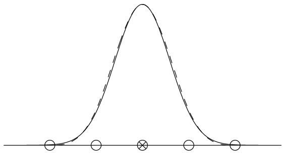
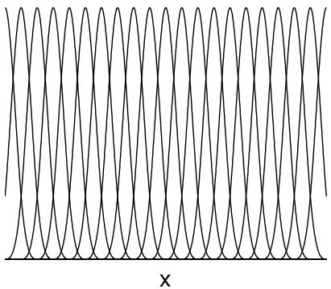
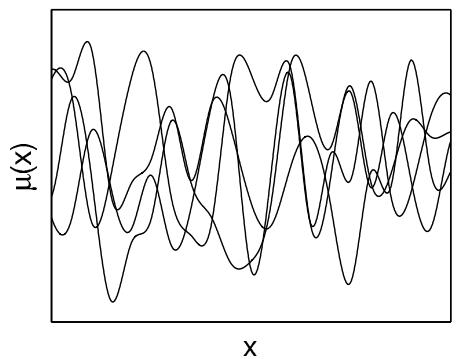
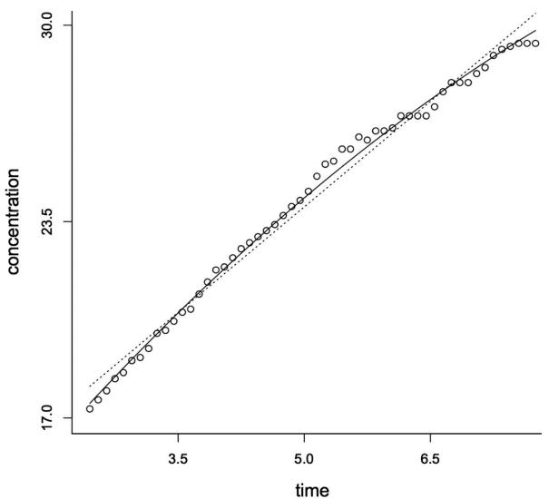
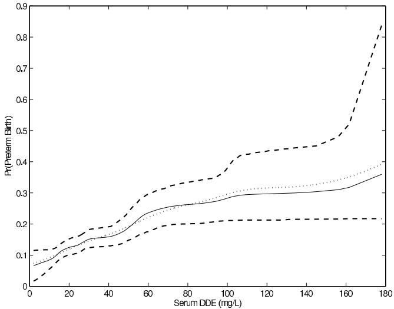
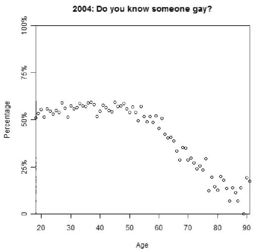
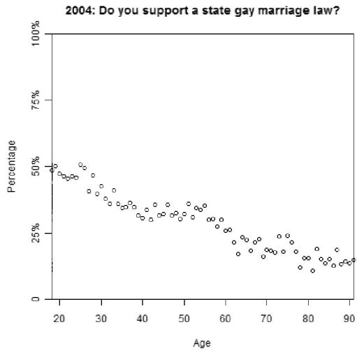

# Basis Function Models

[Package map](../structure.md) · [Unsplit OCR dump](./_full.md)

[← Ch. 19 Nonlinear Models](./19-parametric-nonlinear-models.md) · [Ch. 21 Gaussian Processes →](./21-gaussian-process-models.md)

> MinerU OCR dump. If a formula, table, or numbering disagrees with the PDF, the PDF is authoritative.

---

# 20.1 Splines and weighted sums of basis functions

To allow the mean to vary nonlinearly with predictors, one can replace $X_{i}\beta$ with $\mu (X_{i})$ where $\mu (\cdot)$ falls in some class of nonlinear functions. A variety of approaches are available for modeling this $\mu$ , including the use of basis function expansions and Gaussian processes (discussed in the following chapter).

To illustrate the basis function approach, we start with one-dimensional regression models in which $\mu (x)$ is modeled as a sum,

$$
\mu (x) = \sum_ {h = 1} ^ {H} \beta_ {h} b _ {h} (x),
$$

where $b = \{b_h\}_{h=1}^H$ is a prespecified set of basis functions and $\beta = (\beta_1, \ldots, \beta_H)$ is a vector of basis coefficients. The Taylor series expansion is a familiar example in which the basis functions are polynomials of increasing degree, with which one can represent a function as a (possibly) infinite sum of terms. In practice, Taylor series expansions can require a huge number of terms to model a function well globally and, for statistical applications, typically have horrible properties near the boundary. By a more appropriate choice of a finite set of basis functions it should be possible to more accurately model functions that arise in practice. It has been found useful to use local basis functions which are centered on different locations and for which each basis function $b_h$ has a centering point $x_h$ so that $b_h(x)$ diminishes to zero when $x$ is far from $x_h$ .

An often-used simple choice is the family of Gaussian radial basis functions,

$$
b _ {h} (x) = \exp \left(- \frac {\left| x - x _ {h} \right| ^ {2}}{l ^ {2}}\right), \tag {20.1}
$$

where $x_{h}$ are centers of the basis functions and $l$ is a common width parameter. The number of basis functions and the width parameter $l$ controls the scale at which the model can vary as a function of $x$ .

Another commonly used family of basis functions is the B-spline, which is a piecewise continuous function that is defined conditional on some set of knots. Assuming uniform knot locations $x_{h + k} = x_h + \delta k$ , the cubic B-spline basis function is defined as the following

  
Figure 20.1 Single Gaussian (solid line) and cubic $B$ -spline (dashed line) basis functions scaled to have the same width. The $X$ marks the center of the Gaussian basis function, and the circles mark the location of knots for the cubic $B$ -spline.

piecewise cubic polynomial:

$$
b _ {h} (x) = \left\{ \begin{array}{l l} \frac {1}{6} u ^ {3} & \text {f o r} x \in (x _ {h}, x _ {h + 1}), \quad u = (x - x _ {h}) / \delta \\ \frac {1}{6} (1 + 3 u + 3 u ^ {2} - 3 u ^ {3}) & \text {f o r} x \in (x _ {h + 1}, x _ {h + 2}), \quad u = (x - x _ {h + 1}) / \delta \\ \frac {1}{6} (4 - 6 u ^ {2} + 3 u ^ {3}) & \text {f o r} x \in (x _ {h + 2}, x _ {h + 3}), \quad u = (x - x _ {h + 2}) / \delta \\ \frac {1}{6} (1 - 3 u + 3 u ^ {2} - u ^ {3}) & \text {f o r} x \in (x _ {h + 3}, x _ {h + 4}), \quad u = (x - x _ {h + 3}) / \delta \\ 0 & \text {o t h e r w i s e .} \end{array} \right. \tag {20.2}
$$

Here the width of the basis function is determined by distance $\delta$ between knots, and the maximum flexibility of the model is controlled by the number of knots uniformly placed in the data range. Knot locations can also be set nonuniformly. B-splines have a more complex definition than Gaussian radial basis function, but each B-spline basis function has compact support, so the design matrix of the linear model is sparse which can be exploited in computation.

Figure 20.1 shows single Gaussian and cubic B-spline basis functions. Both have smooth bell shapes. A weighted sum of such shapes (in which weights can be positive, negative, or zero) can be used to model smooth functions. Although the basis functions look very similar, Gaussian radial basis function will produce smoother functions as they are infinitely differentiable, while the cubic B-spline is only three times differentiable.

Figure 20.2 shows a set of B-spline basis functions and realizations from the model obtained by sampling random weights $\beta_{h}$ from a Gaussian prior distribution for these weights. The number of splines $H$ impacts the flexibility of the resulting model for $\mu (x)$ , as one cannot characterize finer scale features in $\mu (x)$ than the splines chosen. For example, if there is a spike in $\mu (x)$ that is narrower than the basis functions in Figure 20.2, then that spike will be oversmoothed.

Conditionally on the selected basis $b$ , the model is linear in the parameters. Hence, we can simply re-express the model as $y_{i} = \mu (x_{i}) + \epsilon_{i} = w_{i}\beta +\epsilon_{i}$ , with $w_{i} = (b_{1}(x_{i}),\ldots ,b_{H}(x_{i}))$ . Because the resulting model is linear in the parameters $\beta$ , model fitting can proceed as in linear regression models. For example, a multivariate normal-inverse- $\chi^2$ prior for $(\beta ,\sigma^2)$ is conjugate so that the posterior of $(\beta ,\sigma^2)$ given the data $(x_{i},y_{i})_{i = 1}^{n}$ is also multivariate normal-inverse- $\chi^2$ . However, even though the model is linear in the parameters $\beta$ , a rich class of functions can be accurately approximated as linear combination of basis functions. It is often useful to center the basis function model to linear model

$$
\mu (x) = \beta_ {1} + \beta_ {2} x + \sum_ {h = 3} ^ {H + 2} \beta_ {h} b _ {h} (x).
$$

  
Figure 20.2 (a) A set of cubic $B$ -splines with equally spaced knots. (b) A set of random draws from the $B$ -spline prior for $\mu(x)$ based on the basis functions in the left graph, assuming independent standard normal priors for the basis coefficients.   
Figure 20.3 A small dataset of concentration of chloride over time in a biology experiment. Data points are circles, the linear regression estimate is shown with a dotted line, and the posterior mean curve using B-splines is the curved solid line.

# Example. Chloride concentration

We illustrate with a small dataset from a biology experiment containing 54 measurements of the concentration of chloride taken over a short time interval; see Figure 20.3, which shows raw data, a fitted straight line regression, and the posterior mean of the regression function (that is, $\operatorname{E}(\mu(x)|y)$ ) as a function of $x$ , averaging over the posterior distribution of the parameters $\beta$ from a fitted B-spline model. The data are close to linear but with some notable local deviations. In this case, there are 21 coefficients to be estimated $(\beta_1, \ldots, \beta_{21})$ but only 54 data points so it becomes problematic to estimate all of the basis coefficients without incorporating prior information. There are a variety of strategies that can be taken to accommodate such data sparsity. One possibility is to center the nonparametric prior for the curve $\mu(x)$ on a parametric function, such as a linear model.

Let $\beta |\sigma \sim \mathrm{N}(\beta_0,\sigma^2\lambda^{-1}I_H)$ and $\sigma^2\sim \mathrm{Inv - gamma}(a_0,b_0)$ . This implies that the prior expectation for the curve at predictor value $x$ is $\mu_0(x) = \operatorname {E}\mu (x) = \sum_{h = 1}^{H}\beta_{0h}b_h(x)$ .

Supposing that $\mu_0(x) = \alpha +\psi x$ , so that the prior mean is linear, we can use least squares to estimate the values of $\beta_{0}$ producing $\mu_0(x)$ as close as possible to $\alpha +\psi x$ ; we find that for $H = 21$ in this application, $\mu_0(x)$ is indistinguishable from $\alpha +\psi x$ using this approach. For simplicity, one can plug in the least squares estimates for $\alpha$ and $\psi$ . The resulting posterior mean is

$$
\hat {\mu} (x) = \operatorname {E} (\mu (x) | (x _ {1}, y _ {1}), \dots , (x _ {n}, y _ {n})) = \left(W ^ {T} W + \lambda I _ {H}\right) ^ {- 1} \left(W ^ {T} y + \lambda \hat {\mu} _ {0} (x)\right),
$$

with $\hat{\mu}_0(x)$ the estimated least squares regression line and $W = (w_{1},\dots ,w_{n})^{T}$ . The posterior mean $\hat{\mu}_0(x)$ will be shrunk towards the linear regression estimate, addressing the data sparsity issue while allowing nonparametric deviations from the linear regression fit. For a more complete analysis, one can place hyperpriors on $\alpha ,\psi$ or can choose a smoothing prior which favors similar values for adjacent basis coefficients; first-order autoregressive priors are often used leading to Bayesian penalized (P) splines.

In applying splines, an important aspect of the specification is the number of knots and their locations. In many applications, it works well to choose sufficiently many knots, such as $H = 21$ in the above example, while also carefully choosing the prior for the basis coefficients to limit problems with over-fitting and data sparsity. However, several different Bayesian approaches are available for accommodating uncertainty in basis function specification. The first is to consider a free knot approach with a prior on the number and locations of knots in a kernel or spline model, using reversible jump MCMC (see Section 12.3) for posterior computation. The resulting posterior distribution for $(\mu, \sigma)$ will allow for uncertainty through model averaging over the posterior for the number and locations of knots. Although this approach is conceptually appealing, the computational implementation is a major hurdle. In particular, designing efficient reversible jump algorithms can be challenging. A second possibility is to relax the variable selection problem by choosing priors that do not set the $\beta_h$ coefficients exactly equal to zero but instead shrink many of the coefficients to near-zero values, while having heavy tails to avoid over-shrinking the coefficients for the important basis functions. A shrinkage prior that is concentrated near zero with heavy tails can be thought to provide a continuous analogue to variable selection priors, with the shrinkage priors having conceptual and computational advantages by not having to jump discontinuously between zero and nonzero values.

In this chapter, we first describe the variable selection approach, including basic details for how to proceed with posterior computation and inferences. We will then outline methods for shrinkage, which have some practical advantages over the formal variable selection approach. Extensions to multivariate regression with $p > 1$ will be described, and we will provide an introduction to the use of Gaussian process priors as an alternative to explicit basis representations.

# 20.2 Basis selection and shrinkage of coefficients

Focusing on the nonparametric regression model with Gaussian residuals and letting $b = \{b_h\}_{h=1}^H$ denote a prespecified collection of potential basis functions, we have

$$
y _ {i} \sim \mathrm {N} (w _ {i} \beta , \sigma^ {2}), \quad w _ {i} = (b _ {1} (x _ {i}), \dots , b _ {H} (x _ {i})).
$$

In practice, there is typically uncertainty in which basis functions are really needed. To allow basis functions to be excluded from the model using Bayesian variable selection, we introduce a model index $\gamma = (\gamma_{1},\dots,\gamma_{H})\in \Gamma$ , with $\gamma_{h} = 1$ denoting that basis function $b_{h}$ should be included and $\gamma_{h} = 0$ otherwise. Here, $\Gamma$ is a model space containing the $2^{H}$ possibilities for $\gamma$ ranging from exclusion of all basis functions (denoted $\gamma = 0_{H}$ ) to inclusion of all basis functions (denoted $\gamma = 1_{H}$ ).

To complete a Bayesian specification, we require a prior over the model space $\Gamma$ as well as a prior for the nonzero coefficients $\beta_{\gamma} = \{\beta_h:\gamma_h = 1\}$ in each model $\gamma$ . A simple prior specification relies on embedding all of the models in the list $\Gamma$ in the full model by letting

$$
\beta_ {h} \sim \pi_ {h} \delta_ {0} + (1 - \pi_ {h}) \mathrm {N} (0, \kappa_ {h} ^ {- 1} \sigma^ {2}), \quad \sigma^ {2} \sim \operatorname {I n v - g a m m a} (a, b), \tag {20.3}
$$

with $\delta_0$ denoting a degenerate distribution with all its mass at zero. Prior (20.3) sets $\beta_h = 0$ with probability $\pi_h$ , and otherwise draws a nonzero coefficient from a $\mathrm{N}(0, \kappa_h^{-1} \sigma^2)$ prior. This implies $\gamma_h \sim \text{Bernoulli}(1 - \pi_h)$ independently for $h = 1, \dots, H$ and $\beta_\gamma \sim N_{p_\gamma}(0, V_\gamma \sigma^2)$ , with $p_\gamma = \sum_h \gamma_h$ the number of basis functions in model $\gamma$ and $V_\gamma = \operatorname{diag}(\kappa_h : \gamma_h = 1)$ . Model (20.3) can be called a variable selection mixture prior.

In the absence of prior knowledge that certain basis coefficients are more likely to be included, one can let $\pi_h = \pi$ and then choose a hyperprior $\pi \sim \mathrm{Beta}(a_{\pi}, b_{\pi})$ to allow the data to inform more strongly about the model size. Such a prior also induces an automatic Bayesian multiplicity adjustment, which leads to an increasing tendency to set coefficients to zero the more unnecessary basis coefficients are added. This adjustment is clear from the full conditional posterior distribution for $\pi$ , which has the simple form $\pi|-\sim \mathrm{Beta}(a_{\pi} + \sum_{h} (1 - \gamma_h), b_{\pi} + \sum_{h} \gamma_h)$ . To induce a heavy-tailed Cauchy prior for the coefficients for the basis functions that are included, let $\kappa_h \sim \mathrm{Gamma}(0.5, 0.5)$ independently for $h = 1, \ldots, H$ . This relies on the expression of the $t$ distribution as a scale mixture of normal densities, with an inverse-gamma mixing prior on the variance. An improper prior should not be chosen for the nonzero regression coefficients, as this leads to high posterior probability on the null model excluding all the basis functions (see Section 7.4). However, an improper noninformative prior can be chosen for the variance by letting $a, b \to 0$ , as $\sigma$ is a parameter common to all the possible models.

A convenient characteristic of the above prior specification is that, assuming fixed $\pi$ and $\kappa_h = \kappa$ for simplicity, the full joint posterior distribution is conjugate with the posterior model probabilities available analytically as

$$
\Pr (\gamma | y, X) = \frac {\pi^ {k - p _ {\gamma}} (1 - \pi) ^ {p _ {\gamma}} p (y | X , \gamma)}{\sum_ {\gamma^ {*} \in \Gamma} \pi^ {k - p _ {\gamma^ {*}}} (1 - \pi) ^ {p _ {\gamma^ {*}}} p (y | X , \gamma^ {*})}, \quad \text {f o r a l l} \gamma \in \Gamma , \tag {20.4}
$$

where $p(y|X,\gamma)$ is the marginal likelihood of the data under model $\gamma$

$$
p (y | X, \gamma) = \int \prod_ {i = 1} ^ {n} \mathrm {N} (y _ {i} | w _ {i, \gamma} \beta_ {\gamma}, \sigma^ {2}) \mathrm {N} (\beta_ {\gamma} | 0, V _ {\gamma} \sigma^ {2}) \mathrm {I n v - g a m m a} (\sigma^ {2} | a, b) d \beta_ {\gamma} d \sigma^ {2},
$$

with $w_{i,\gamma} = (w_{ih}:\gamma_h = 1)$ . This marginal likelihood under model $\gamma$ is simply the marginal likelihood for a normal linear regression model under a jointly conjugate multivariate normal-gamma prior, and hence an analytic form is available. In addition, the posterior distribution of $\beta_{\gamma},\sigma^2$ given $\gamma$ is multivariate normal-inverse-gamma.

Unfortunately, even though the posterior is available analytically, the posterior probability of model $\gamma$ cannot be calculated unless the number of potential basis functions $H$ is small since there is otherwise an enormous number $(2^{H})$ of different models to sum across in the denominator of (20.4). For example, when $H = 50$ there are $2^{50} = 1.1 \times 10^{15}$ models under consideration. Hence, except in low-dimensional cases, approximations must be used. One possibility is to rely on an MCMC-based stochastic search algorithm to identify high posterior probability models in $\Gamma$ , and model-average across these models.

Another possibility is to use Gibbs sampling to update $\gamma_h$ from its Bernoulli full conditional posterior distribution given $\gamma_{(-h)} = (\gamma_l, l \neq h)$ , with

$$
\operatorname * {P r} \left(\gamma_ {h} = 1 | \gamma_ {(- h)}, \pi\right) = \left(1 + \frac {\pi}{1 - \pi} \frac {p (y | X , \gamma_ {h} = 0 , \gamma_ {(- h)})}{p (y | X , \gamma_ {h} = 1 , \gamma_ {(- h)})}\right) ^ {- 1},
$$

which can be calculated easily. One cycle of the Gibbs sampler would update $\gamma_h$ given $\gamma(-h)$ for $h = 1, \ldots, H$ . This would be repeated for a large number of iterations. After warm-up to allow convergence, the samples represent posterior draws over the model space $\Gamma$ .

From these draws, one can potentially conduct model selection in order to obtain a simplified model that discards unnecessary basis functions. Under a 0-1 loss function, which assigns a loss of 1 if the incorrect model is selected and 0 otherwise, the Bayes optimal model corresponds to the $\gamma$ having the highest posterior probability. Unfortunately, unless $H$ is small, it tends to be the case that there is a large number of models having similar posterior model probabilities to the highest posterior probability model, so that it is misleading to basis inferences on any selected model. For this reason, model averaging across the posterior on $\gamma$ is preferred to better represent uncertainty in basis selection in estimating posterior summaries of the regression function $\mu$ and in conducting predictions. If there is interest in selecting a single model, then a better alternative to the maximum posterior model may be the median probability model that includes all predictors (basis functions) having marginal inclusion probabilities $\operatorname{Pr}(\gamma_h = 1|\text{data}) > 0.5$ . This model provides the best single model approximation to Bayes model averaging for orthogonal basis functions.

# Example. Chloride concentration (continued)

We repeated the above analysis of the chloride data using Bayesian variable selection to account for uncertainty in the B-spline basis functions that are needed to characterize the curve. If all 21 basis functions are included and a weakly informative $\mathrm{N}(0, I)$ or $\mathrm{N}(0, 2^2 I)$ prior was used for the basis coefficients, we obtained an extremely poor fit, with the posterior mean curve dramatically shifted downwards away from the data and towards the horizontal line at zero where the prior is centered. We considered the model with all 21 basis functions as the full model, and assigned each basis function a prior inclusion probability of 0.5. The coefficients for the basis functions that are included were given independent $\mathrm{N}(0, 2^2)$ priors, while the residual variance $\sigma^2$ was independently assigned an Inv-gamma(1, 1) prior. With this specification, we implemented a Gibbs sampling algorithm to sample from the full conditional distributions of each of the $\beta_h$ 's and $\sigma$ , with a different subset of the $\beta_h$ 's automatically assigned to zero at each iteration. We ran the Gibbs sampler to approximate convergence; all of this took only a few seconds in R. The posterior mean for the number of included basis functions is 12.0 with a 95% posterior interval of [8.0, 16.0]. The posterior mean of the residual standard deviation is $\hat{\sigma} = 0.27$ with 95% interval [0.23, 0.33], suggesting that the measurement error variance is small.

A potential drawback to using Bayesian variable selection is that uncertainty in selection from among a prespecified collection of basis functions is that there may be some sensitivity to the initial choice of basis. For example, using $H = 21$ prespecified cubic B-splines conveys some implicit prior information that the curve is quite smooth, and there are not sharp changes and spikes; in many applications, this is well justified but when spike functions are expected a priori one may want to use wavelets or another choice of basis. One can potentially include multiple types of basis functions in the initial collection of potential basis functions, with Bayesian variable selection used to select the subset of basis functions doing the best job at parsimoniously characterizing the curve. However, whenever possible prior information should strongly inform basis choice as well as the choice of prior on the coefficients.

# Shrinkage priors

Allowing basis functions to drop out of the model adaptively by allowing their coefficients to be zero with positive probability is conceptually appealing, but comes with a computational price. When the number of models $2^{H}$ in $\Gamma$ is enormous, MCMC algorithms cannot realis-

tically be said to converge in that only a small percentage of the models will be visited even in several hundreds of thousands of iterations. In addition, there can be slow mixing due to the one at a time updating of the elements of $\gamma$ . Although block updating is possible, the size of the blocks is limited due to computational constraints. In addition, when nonconjugate priors are used efficient computation becomes even more difficult. These problems did not arise in the applications to the chloride data; indeed the computation time was much less than a minute for enough MCMC iterations that the mixing was excellent in every case we considered. Nonetheless, issues may arise in considering extensions to accommodate multiple predictors.

One possible solution to this problem, which also has philosophical appeal, is to avoid setting any of the coefficients equal to exactly zero but instead use a regularization or shrinkage prior such as discussed in Section 14.6. An appropriate prior would have high density at zero, corresponding to basis functions that can be effectively excluded as their coefficients are close to zero, while having heavy tails to avoid over-shrinking the signal. Most useful shrinkage priors can be expressed as scale mixtures of Gaussians as follows:

$$
\beta_ {h} \sim \mathrm {N} (0, \sigma_ {h} ^ {2}), \quad \sigma_ {h} ^ {2} \sim G,
$$

with $G$ corresponding to a mixture distribution for the variances. For example, one can obtain a $t$ distribution centered at 0 with $\nu$ degrees of freedom by setting $G = \operatorname{Inv-gamma}\left(\frac{\nu}{2},\frac{\nu}{2}\right)$ . In the machine learning literature, a common prior for shrinkage of basis coefficient in non-parametric regression corresponds to letting the degrees of freedom $\nu$ in the $t$ distribution approach 0. In this limiting case, one obtains a normal-Jeffreys prior. Although the posterior is improper and hence Bayesian inferences are meaningless, the resulting posterior mode $\sigma = (\sigma_{1},\dots,\sigma_{H})$ can contain values $\sigma_{h} = 0$ , and the resulting empirical Bayes posterior for $\beta_{h}$ is concentrated at zero. This induces a type of basis function selection, though uncertainty in selection and estimation of the coefficients is not accommodated.

To obtain a proper posterior and accommodate uncertainty, a common approach is to instead choose $\nu$ equal to a small nonzero value, such as $\nu = 10^{-6}$ . For $\nu > 0$ , the posterior mode will not be exactly zero but the posterior for $\beta_h$ can still be concentrated at zero for unnecessary basis functions as long as the number of degrees of freedom is sufficiently small. The commonly used default of $\nu = 1$ , corresponding to a Cauchy prior, often yields good performance in estimating the function $\mu$ and performing predictions.

The class of scale mixture of normal distributions also includes the Laplace (double exponential) prior that is related to the lasso method (Section 14.6). The Laplace prior induces sparsity in the posterior mode, in that $\widehat{\beta}_h$ can be exactly equal to zero, and it is the prior having heaviest tails which still produces a computationally convenient unimodal posterior density (assuming also log-concave likelihood). However, none of the draws from the posterior distribution will be equal to zero and in many cases the Laplace prior does not have enough heavy tails to not overshrink the nonzero coefficients.

An alternative is to use a generalized double Pareto prior distribution on the regression coefficients, which resembles the double exponential near the origin while having arbitrarily heavy tails. The density has the form,

$$
\mathrm {g d P} (\beta | \xi , \alpha) = \frac {1}{2 \xi} \left(1 + \frac {| \beta |}{\alpha \xi}\right) ^ {- (\alpha + 1)}
$$

where $\xi > 0$ is a scale parameter and $\alpha > 0$ is a shape parameter. One can sample from the generalized double Pareto by instead drawing $\beta \sim \mathrm{N}(0, \sigma^2)$ , $\sigma \sim \mathrm{Expon}(\lambda^2 / 2)$ , and $\lambda \sim \mathrm{Gamma}(\alpha, \eta)$ where $\xi = \eta / \alpha$ . Hence the generalized double Pareto also admits an interpretation as scale mixture of normal representation and thus retains the computational convenience associated with such mixtures. As a typical default specification for the

hyperparameters, one can let $\alpha = \eta = 1$ , which leads to Cauchy-like tails. Using the generalized double Pareto density as a shrinkage prior on the basis coefficients in nonparametric regression, we let

$$
p (\beta | \sigma) = \prod_ {h = 1} ^ {H} \frac {\alpha}{2 \sigma \eta} \left(1 + \frac {| \beta_ {h} |}{\sigma \eta}\right) ^ {- (\alpha + 1)}
$$

which is equivalent to $\beta_h \sim \mathrm{N}(0, \sigma^2 \tau_h)$ , with $\tau_h \sim \mathrm{Expon}(\lambda_h^2 / 2)$ and $\lambda_h \sim \mathrm{Gamma}(\alpha, \eta)$ . Placing the prior $p(\sigma) \propto 1 / \sigma$ on the error variance, we then obtain a simple block Gibbs sampler having the following conditional posterior distributions:

$$
\beta | - \sim \mathrm {N} ((W ^ {T} W + T ^ {- 1}) ^ {- 1} W ^ {T} y, \sigma^ {2} (W ^ {T} W + T ^ {- 1}) ^ {- 1})
$$

$$
\sigma^ {2} | - \sim \text {I n v - g a m m a} ((n + k) / 2, (y - W \beta) ^ {T} (y - X \beta) / 2 + \beta^ {T} T ^ {- 1} \beta / 2)
$$

$$
\lambda_ {h} | - \sim \operatorname {G a m m a} (\alpha + 1, | \beta_ {h} | / \sigma + \eta)
$$

$$
\tau_ {h} ^ {- 1} | - \sim \operatorname {I n v - G a u s s i a n} (\mu = (\lambda_ {h} \sigma / \beta_ {h}, \rho = \lambda_ {h} ^ {2})
$$

where $W = (w_{1},\dots ,w_{n})$ and $T = \mathrm{Diag}(\tau_1,\ldots ,\tau_H)$

This Gibbs sampler tends to have good convergence and mixing properties in our experience, perhaps due largely to the block updating of $\beta$ . After convergence, one can obtain draws from the posterior distribution for the nonparametric regression curve $\mu(x)$ , which is expressed as a linear combination of basis functions, with the coefficients on the basis functions shrunk towards zero via the generalized double Pareto prior. In high-dimensional settings involving large numbers of potential basis functions, the tendency will be to set the coefficients for many of these bases close to zero while not shrinking the coefficients for the more important bases much at all. For nonorthogonal bases in which there is some redundancy, the specific bases having coefficients away from a small neighborhood of zero may vary across the iterations.

# 20.3 Non-normal models and multivariate regression surfaces

# Other error distributions

The above discussion has focused on continuous response variables $y_{i}$ with Gaussian distributed residuals. It is straightforward to modify the methods to accommodate heavier-tailed residual densities that allow outliers by instead using a scale mixture of normals. In particular, we could let

$$
y _ {i} \sim \mathrm {N} (\mu (x _ {i}), \phi_ {i} \sigma^ {2}), \quad \phi_ {i} \sim \mathrm {I n v - g a m m a} (\nu / 2, \nu / 2),
$$

which induces a $t_\nu$ distribution for the residual density. For low $\nu$ , the $t$ density is substantially heavier-tailed than the normal density, automatically downweighting the influence of outliers on the posterior distribution of $\mu(x)$ without needing to discard outlying points. The inverse-gamma scale mixture of normals representation of the residual density is highly convenient in terms of posterior computation; we can simply modify the MCMC code developed in the Gaussian residual case to include an additional step for sampling from the inverse-gamma conditional posterior distribution of $\phi_i$ while also modifying the other sampling steps to replace $\sigma^2$ with $\phi_i \sigma^2$ . We can additionally include a Metropolis-Hastings step to allow unknown degrees of freedom $\nu$ , or simply fix it in advance at an elicited value.

# Example. Chloride concentration (continued)

To assess robustness to outliers, we randomly contaminated one of the observations in the chloride data by adding a normal random variable having 10 times the standard deviation of the residual estimated in the above analysis; the contaminated observation was $y_{47} = 32.4$ . Rerunning the Gibbs sampler that accounts for uncertainty

in basis function selection while assuming Gaussian residuals, the posterior mean of $\sigma$ increased from $\hat{\sigma} = 0.27$ to $\hat{\sigma} = 0.61$ , and the posterior intervals around the curve were substantially wider, but the estimate did not change appreciatively. However, repeating this exercise using 100 times the standard deviation to obtain $y_{40} = 46.3$ , the results were poor with $\hat{\sigma} = 22.4$ and the estimated curve pulled dramatically towards the horizontal line at zero and away from the data. Repeating the analysis allowing $t$ residuals with degrees of freedom fixed at 4, we obtain results that were quite close to the results for the Gaussian model applied to uncontaminated data, with the curve estimate only slightly pulled up and posterior intervals only slightly wider.

One can allow outcomes in the exponential family by relying on the same framework as above but with $\eta_{i} = w_{i}\beta$ as the linear predictor in a generalized linear model (see Chapter 16). In non-Gaussian cases, the marginal likelihoods needed for posterior computation will not in general be available analytically, and it is common in practice to rely on Laplace approximations. An alternative strategy that can be used for categorical responses in probit models is to rely on data augmentation incorporating a latent Gaussian continuous response, with augmented data marginal likelihoods available in closed form for the latent variables. Such an approach would add a step to the MCMC algorithm for sampling the underlying Gaussian variables from their full conditional posterior distributions.

# Multivariate regression surfaces

Until this point, we have focused on regression models with a single predictor. In considering generalizations to accommodate multiple predictors, one must keep in mind the curse of dimensionality. This curse can arise in two ways. Firstly, computational methods that work for a single predictor or a small number of predictors may not scale well as predictors are added. This is certainly the case if one attempts to prespecify sufficiently many potential basis functions to characterize an unconstrained multivariate regression surface, and then rely on Bayesian variable selection or shrinkage to effectively remove the unnecessary bases. For more than a few predictors, the number of basis functions needed may increase significantly and rapidly become prohibitive. A second problem for multiple predictors is that, even putting aside any computational issues, it may be necessary to have enormous amounts of data to reliably estimate a multivariate regression surface without parametric assumptions, substantial prior information or some restrictions. As the number of predictors $p$ increases for a given sample size $n$ , observations become much more sparsely distributed across the domain of the predictors $\mathcal{X} \subset \Re^p$ and hence there are typically subregions of $\mathcal{X}$ having few observations.

In such settings, the choice of prior for $\mu$ is crucial in developing Bayesian approaches for producing accurate interpolations across sparse data regions. One commonly used approach is to assume additivity so that the multivariate regression surface $\mu$ mapping from the predictor space $\mathcal{X}$ to the real numbers is characterized as a sum of univariate regression functions as follows:

$$
\mu (x) = \mu_ {0} + \sum_ {j = 1} ^ {p} \beta_ {j} \left(x _ {j}\right), \quad \beta_ {j} \left(x _ {j}\right) = \sum_ {h = 1} ^ {H _ {j}} \theta_ {j h} b _ {j h} \left(x _ {j}\right), \tag {20.5}
$$

where $\beta_{j}(\cdot)$ is an unknown coefficient function for the $j$ th predictor, which is expressed as a linear combination of a prespecified set of basis functions $b_{j} = \{b_{jh}\}_{h=1}^{H_{j}}$ . For example, $b_{j}$ may correspond to B-splines as above. Focusing on the additive model case, Bayesian variable selection or shrinkage priors can be applied exactly as described above in the $p = 1$ case without complications. In particular, MCMC algorithms permit a divide and conquer approach using a modified response variable $y_{i}^{*}$ that subtracts the contributions of

the intercept and other predictors in updating the unknowns characterizing the regression function for the $j$ th predictor.

Additive models can often reduce the curse of dimensionality, and efficiency can be further improved by including prior information. In many applications, prior information takes the form of shape constraints on the regression function. For example, it may be reasonable to assume a priori that the mean of the response variable is nondecreasing in one or more of the predictors leading to a nondecreasing constraint on certain $\beta_{j}(x_{j})$ functions in the additive expansion. Such constraints are easy to incorporate within a Bayesian approach by using piecewise linear or monotone splines $b_{j}$ and then constraining the regression coefficients to be nonnegative. One way to encourage sparse models is by using a prior distribution that is a mixture of a point mass at zero and a truncated normal distribution on the $\theta_{jh}$ 's, leading to nondecreasing $\beta_{j}$ functions that can be flat across regions of the predictor space. Allowing flat functions serves the dual purpose of reducing bias in overestimating the slope of the regression function and permitting inferences on regions across which the predictor has no impact. As the Bayesian approach leads to uncertainty in the locations of these flat regions, one can use such models to estimate posterior distributions of threshold predictor levels corresponding to the first value such that there is an increase in the response mean. More involved shape restrictions, such as unimodality and convexity, can also be incorporated through an appropriate prior.

# Example. A nonparametric regression function that is constrained to be nondecreasing

Data from pregnant women in the U.S. Collaborative Perinatal Project were used to study the impact of DDE, a persistent metabolite of the pesticide DDT, on the risk of premature delivery. Out of 2380 pregnancies in the dataset, there were 361 preterm births. Serum DDE concentration in $\mathrm{mg / L}$ was measured for each woman, along with potentially confounding maternal characteristics including cholesterol and triglyceride levels, age, BMI and smoking status (yes or no). The aim of our analysis was to incorporate a nondecreasing constraint on the regression function relating level of DDE to the probability of preterm birth in order to improve efficiency in assessing the dose response trend. As for other potentially adverse environmental exposures, it was reasonable to believe a priori that covariate-adjusted premature delivery risk is nondecreasing in dose of DDE. Without restricting the curve to be nondecreasing, one relies too much on the data and may obtain artifactual bumps that are not believable. However, we also do not want to impose a strictly increasing relationship a priori, as there may be no impact at risk at low doses or even across the whole range observed in the study.

We focused on the following semiparametric probit additive model:

$$
\Pr (y _ {i} = 1 | \theta , x _ {i}, z _ {i}) = \Phi \Big (\alpha_ {0} + \sum_ {l = 1} ^ {5} z _ {i l} \alpha_ {l} + f (x _ {i}) \Big) = \Phi \big (z _ {i} \alpha + f (x _ {i}) \big),
$$

where $y_{i}$ is an indicator of preterm birth, $x_{i}$ is DDE level, $z_{i} = (1,z_{i2},\dots,z_{i5})$ is a vector of the five predictor in the order listed above, and $\Phi()$ is the standard normal cumulative distribution function. The covariate adjustment is parametric, while $f(x)$ is characterized nonparametrically as a nondecreasing but potentially flat curve using splines with a carefully structured prior on the basis coefficients. We chose diffuse $\mathrm{N}(0,10^2)$ priors independently for the $\alpha$ values, though a more informative prior could easily be elicited in this application, as premature delivery studies are routinely connected, with similar covariates measured in different studies. For $f(x)$ , we simply used a piecewise linear function with a dense set of knots and $\beta_{j}$ representing the slope within the $j$ th interval. By choosing a prior for the $\beta_{j}$ 's that does not allow negative values, we enforce the nondecreasing constraint.

  
Figure 20.4 Estimated probability of preterm birth as a function of DDE dose. The solid line is the posterior mean based on a Bayesian nonparametric regression constrained to be nondecreasing, and the dashed lines are $95\%$ posterior intervals for the probability at each point. The dotted line is the maximum likelihood estimate for the unconstrained generalized additive model.

In order to borrow information across the adjacent intervals, while enforcing the constraint and placing positive probability at $\beta_{j} = 0$ to accommodate flat regions, we use a latent threshold prior. In particular, we defined a first-order normal random walk autoregressive prior for latent slope parameters, $\beta_{j}^{*}\sim \mathrm{N}(\beta_{j - 1}^{*},\sigma_{\beta}^{2})$ , with $\sigma_{\beta}^{2}$ assigned an inverse-gamma hyperprior to allow the data to inform about the level of smoothness. Then, to link the latent $\beta_j^*$ 's to the slopes characterizing the function, we let $\beta_{j} = 1_{\beta_{j}\geq \delta}\beta_{j}^{*}$ , with $\delta$ a small positive threshold parameter, which is assigned a gamma hyperprior. As $\delta$ increases, it becomes more likely to sample $\beta_{j} = 0$ and the resulting function has more flat regions.

We implemented an MCMC algorithm for posterior computation. The estimated curve $f(x)$ is shown in Figure 20.4. The estimated posterior probability of the global null hypothesis that the curve $f(x)$ is 0 across the observed range of DDE in the sample was less than 0.01, in contrast to the results obtained fitting the same model using a simple classical approach with no constraints, which led to a $p$ -value of 0.23. Using the Bayesian posterior simulations, we also estimated the first dose level at which there is an increasing slope. The posterior mean for this threshold dose is $\hat{\tau} = 7$ with a $95\%$ interval of [3, 21]. Such thresholds are of broad interest in many applications, but we recognize that they are approximations, given that the underlying function is presumably continuous and always increasing to some extent.

Although appealing in making the class of possible multivariate regression functions $\mu(x)$ more manageable, the additivity assumption is clearly violated in many applications. For example, violations of additivity arise when there are interactions among the predictors, so that the shape and slope of the regression function in the $j$ th predictor depends on the values for other predictors. One alternative approach, which also attempts to address the curse of dimensionality, relies on tensor product specifications, such as

$$
\mu (x) = \sum_ {h _ {1} = 1} ^ {H} \dots \sum_ {h _ {p} = 1} ^ {H} \theta_ {h _ {1} \dots h _ {p}} \prod_ {j = 1} ^ {p} b _ {j h _ {j}} \left(x _ {j}\right),
$$

where $b_{j} = \{b_{jh}\}$ is a prespecified set of basis functions for the $j$ th predictor, as in (20.5)

above but with $H_{j} = H$ for simplicity, and $\theta = (\theta_{h_1\dots h_p})$ is a $p$ -way array (tensor) containing unknown coefficients. The number of coefficients in the tensor $\theta$ can be large, particularly as $p$ grows. However, we can use Bayesian variable selection or shrinkage priors to favor many elements of $\theta$ close to zero. This enables effective collapsing on a lower-dimensional representation of the multidimensional regression surface $\mu$ . For example, one can drop out predictors entirely or remove interactions. Conditionally on the basis functions, we have linearity, so that efficient computation is possible using Gibbs sampling.

# 20.4 Bibliographic note

Bishop (2006) provides a useful review of basis function models. Some key references on the reversible jump MCMC approach to basis function selection in nonparametric regression include Biller (2000) and DiMatteo, Genovese, and Kass (2001). The Bayesian variable selection approach to allowing uncertainty in basis selection was suggested by Smith and Kohn (1996). This approach applies stochastic search for posterior computation in Bayesian variable selection problems (George and McCulloch, 1993, 1997). Justification for median probability models is provided in Barbieri and Berger (2004).

Park and Casella (2008) discuss inference using the Laplace prior distribution using posterior simulations, and Seeger (2008) considers expectation propagation for this model. References on generalized double Pareto shrinkage include Armagan, Dunson and Lee (2011) and Armagan et al. (2013).

Some references on monotone Bayesian nonparametric regression include Ramsay and Silverman (2005), Neelon and Dunson (2004), Dunson (2005), and Hazelton and Turlach (2011), with Hannah and Dunson (2011) recently developing efficient methods for multivariate convex regression. Pati and Dunson (2011) use tensor product nonparametric regression for surface estimation.

The chloride example comes from Bates and Watts (1988). The DDE study comes from Neelon and Dunson (2004).

# 20.5 Exercises

1. Basis function model: The file at naes04.csv contains age, sex, race, and attitude on three gay-related questions from the 2004 National Annenberg Election Survey. The three questions are whether the respondent favors a constitutional amendment banning same-sex marriage, whether the respondent supports a state law allowing same-sex marriage, and whether the respondent knows any gay people. Figure 20.5 shows the data for the latter two questions (averaged over all sex and race categories).

For this exercise, you will only need to consider the outcome as a function of age, and for simplicity you should use the normal approximation to the binomial distribution for the proportion of Yes responses for each age.

(a) Set up a Bayesian basis function model to estimate the percentage of people in the population who believe they know someone gay (in 2004), as a function of age. Write the model in statistical notation (all the model, including prior distribution), and write the (unnormized) joint posterior density. As noted above, use a normal model for the data.   
(b) Program the log of the unnormalized joint posterior density as an R function.   
(c) Fit the model. You can use MCMC, variational Bayes, expectation propagation, Stan, or any other method. But your fit must be Bayesian.   
(d) Graph your estimate along with the data (plotting multiple graphs on a single page).

2. Basis function model with binary data: Repeat the previous exercise but this time using the binomial model for the Yes/No responses. The computation will be more complicated

  
Figure 20.5 Proportion of survey respondents who reported knowing someone gay, and who supported a law allowing same-sex marriage, as a function of age. Can you fit curves through these points using splines or Gaussian processes?

but your results should be similar. Discuss any differences compared to the results from the previous exercise.

3. Basis function model with multiple predictors: Repeat the previous exercise but this time estimating the percentage of people in the population who believe they know someone gay (in 2004), as a function of three predictors: age, sex, and race.

4. Basis function model for binary data: Table 19.1 presents data on the success rate of putts by professional golfers.

(a) Fit a basis function model for the probability of success (using the binomial likelihood) as a function of distance. Compare results to your solution of Exercise 19.2.   
(b) Use posterior predictive checks to assess the fit of the model.

5. Hierarchical modeling and splines: The file Pollster_Data.csv gives percentage support for Barack Obama and Obama Romney in a series of opinion polls in the 2012 election campaign. Different polls are conducted by different survey organizations using different modes of interviewing, with different populations and different sample sizes. Estimate a time series of support for each candidate, adjusting for all these factors and smoothing the curve using a spline model for the time pattern and a hierarchical model for polling organization effects and for poll-to-poll variation. Compare to the smoothed average of the unadjusted approval numbers from this series and comment on any differences.

6. Consider a nonparametric regression model $y_{i} = \mu (x_{i}) + \epsilon_{i}$ , with $x_{i}\in [0,1]$ , $\mu (x) = \sum_{h = 1}^{k}\beta_{h}b_{h}(x)$ , $\{b_h\}$ cubic B-spline basis functions, and the basis coefficients $\beta_{h}$ drawn independently from a generalized double Pareto shrinkage prior.

(a) For different choices of $k$ , sample and plot realizations from the prior for $\mu$ .   
(b) What is the prior expectation for $\mu (x)$ and how does it depend on $k$ and $x?$   
(c) What is the prior variance of $\mu (x)$ and how does it depend on $k$ and $x?$   
(d) Describe a modification of the generalized double Pareto prior to let $\operatorname{E}(\mu(x)) \approx x$ and $\operatorname{var}(\mu(x)) \approx 2$ for all $x$ while maintaining the prior independence assumption in the $\beta_h$ 's.

