# Gaussian Process Models

[Package map](../structure.md) · [Unsplit OCR dump](./_full.md)

[← Ch. 20 Basis Functions](./20-basis-function-models.md) · [Ch. 22 Finite Mixtures →](./22-finite-mixture-models.md)

> MinerU OCR dump. If a formula, table, or numbering disagrees with the PDF, the PDF is authoritative.

---

# Chapter 21

# Gaussian process models

In Chapter 20, we considered basis function methods such as splines and kernel regressions, which typically require choice of a somewhat arbitrary set of knots. One can prespecify a grid of many knots and then use variable selection and shrinkage to effectively discard the knots that are not needed, but there may nonetheless be some sensitivity to the initial grid. A high-dimensional grid leads to a heavy computational burden, while a low-dimensional grid may not be sufficiently flexible. Another possibility, which has some distinct computational and theoretical advantages, is to set up a prior distribution for the regression function using a Gaussian process, a flexible class of models for which any finite-dimensional marginal distribution is Gaussian, and which can be viewed as a potentially infinite-dimensional generalization of Gaussian distribution.

# 21.1 Gaussian process regression

Realizations from a Gaussian process correspond to random functions, and hence the Gaussian process is natural as a prior distribution for an unknown regression function $\mu(x)$ , with multivariate predictors and interactions easily accommodated without the need to explicitly specify basis functions. We write a Gaussian process as $\mu \sim \mathrm{GP}(m,k)$ , parametrized in terms of a mean function $m$ and a covariance function $k$ . The Gaussian process prior on $\mu$ defines it as a random function (stochastic process) for which the values at any $n$ prespecified points $x_1,\ldots,x_n$ are a draw from the $n$ -dimensional normal distribution,

$$
\mu (x _ {1}), \dots , \mu (x _ {n}) \sim \mathrm {N} \left(\left(m (x _ {1}), \dots , m (x _ {n})\right), K (x _ {1}, \dots , x _ {n})\right),
$$

with mean $m$ and covariance $K$ . The Gaussian process $\mu \sim \mathrm{GP}(m, k)$ is a nonparametric model in that there are infinitely many parameters characterizing the regression function $\mu(x)$ evaluated at all possible predictor values $x \in \mathcal{X}$ . The mean function represents an initial guess at the regression function, with the linear model $m(x) = X\beta$ corresponding to a convenient special case, possibly with a hyperprior chosen for the regression coefficients $\beta$ in this mean function. Centering the Gaussian process on a linear model, while allowing the process to accommodate deviations from the linear model, addresses the curse of dimensionality, as the posterior can concentrate close to the linear model (or an alternative parametric mean function) to an extent supported by the data. The linear base model is also useful in interpolating across sparse data regions.

The function $k$ specifies the covariance between the process at any two points, with $K$ an $n \times n$ covariance matrix with element $(p,q)$ corresponding to $k(x_{p},x_{q})$ for which we use shorthand notation $k(x,x^{\prime})$ . The covariance function controls the smoothness of realizations from the Gaussian process and the degree of shrinkage towards the mean. A common choice is the squared exponential (or exponentiated quadratic, or Gaussian) covariance function,

$$
k (x, x ^ {\prime}) = \tau^ {2} \exp \left(- \frac {| x - x ^ {\prime} | ^ {2}}{l ^ {2}}\right),
$$

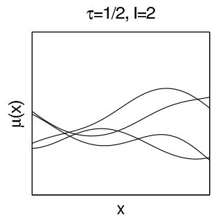

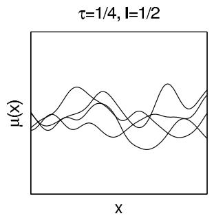

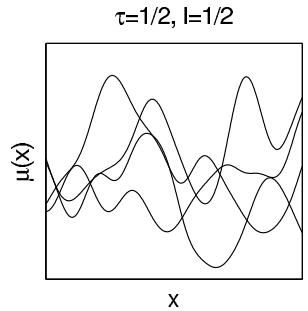  
Figure 21.1 Random draws from the Gaussian process prior with squared exponential covariance function and different values of the amplitude parameter $\tau$ and the length scale parameter $l$ .

where $\tau$ and $l$ are unknown parameters in the covariance $^1$ and $|x - x'|^2$ is the squared Euclidean distance between $x$ and $x'$ . Here $\tau$ controls the magnitude and $l$ the smoothness of the function. Figure 21.1 shows realizations from the Gaussian process prior assuming squared exponential covariance function with different values of $\tau$ and $l$ .

Gaussian process priors are appealing in being able to fit a wide range of smooth surfaces while being computationally tractable even for moderate to large numbers of predictors. There is a connection to basis expansions. In particular, if one chooses Gaussian priors for the coefficients on the basis functions, then one actually obtains an induced GP prior for $\mu$ with a mean and covariance function that depends on the hyperparameters in the Gaussian prior as well as the choice of basis. To demonstrate this, let

$$
\mu (x) = \sum_ {h = 1} ^ {H} \beta_ {h} b _ {h} (x), \quad \beta = (\beta_ {1}, \dots , \beta_ {H}) \sim \mathrm {N} (\beta_ {0}, \Sigma_ {\beta}),
$$

which is a basis function model with a multivariate normal prior on the coefficients. Then,

$$
\left(\mu \left(x _ {1}\right), \dots , \mu \left(x _ {n}\right)\right) \sim \mathrm {N} _ {n} \left(\left(m \left(x _ {1}\right), \dots , m \left(x _ {n}\right)\right), k \left(x _ {1}, \dots , x _ {n}\right)\right),
$$

with mean and covariance function

$$
m (x) = b (x) \beta_ {0}, k (x, x ^ {\prime}) = b (x) ^ {T} \Sigma_ {\beta} b (x ^ {\prime}),
$$

and $b(x) = (b_{1}(x),\ldots ,b_{H}(x))$ . The relationship works the other way as well. Gaussian processes with typical covariance functions, such as squared exponential, have equivalent representations in terms of infinite basis expansions, and truncations of such expansions can be useful in speeding up computation.

# Covariance functions

Different covariance functions can be used to add structural prior assumptions like smoothness, nonstationarity, periodicity, and multiscale or hierarchical structures. Sums and products of Gaussian processes are also Gaussian processes which allows easy combination of different covariance functions. Linear models can also be presented as Gaussian processes with a dot product covariance function. Although it is not typically computationally most efficient to present a linear model as a Gaussian process, it makes it easy to extend hierarchical generalized linear models to include nonlinear effects and implicit interactions.

When there is more than one predictor and the focus is on a multivariate regression

surface, it is typically not ideal to use a single parameter $l$ to control the smoothness of $\mu$ in all directions. Such isotropic Gaussian processes do not do a good job at efficiently characterizing regression surfaces in which the mean of the response changes more rapidly in certain predictors than others. In addition, it may be possible to get just as good predictive performance using only a subset of predictors in the regression function. In such settings, anisotropic Gaussian processes may be preferred and one can use, for example, a modified squared exponential covariance function,

$$
k (x, x ^ {\prime}) = \mathrm {c o v} (\mu (x), \mu (x ^ {\prime})) = \tau^ {2} \exp \left(- \sum_ {j = 1} ^ {p} \frac {(x _ {j} - x _ {j} ^ {\prime}) ^ {2}}{l _ {j} ^ {2}}\right),
$$

where $l_{j}$ is a length scale parameter controlling smoothness in the direction of the $j$ th predictor. One can do nonparametric variable selection by choosing hyperpriors for these $l_{j}$ 's to allow data adaptivity to the true anisotropic smoothness levels, so that predictors that are not needed drop out with large values for the corresponding $l_{j}$ 's.

# Inference

Given a Gaussian observation model, $y_{i} \sim N(\mu_{i},\sigma^{2})$ , $i = 1,\ldots ,n$ , Gaussian process priors are appealing in being conditionally conjugate given $\tau ,l,\sigma$ , so that the conditional posterior for $\mu$ given $(x_{i},y_{i})_{i = 1}^{n}$ is again a Gaussian process but with updated mean and covariance. In practice, one cannot estimate $\mu$ at infinitely many locations and hence the focus is on the realizations at the data points $x = (x_{1},\dots,x_{n})$ and any additional locations $\tilde{x}$ at which predictions are of interest. Given Gaussian process prior $\mathrm{GP}(0,k)$ , the joint density for observations $y$ and $\mu$ at additional locations $\tilde{x}$ is simply a multivariate Gaussian

$$
\left( \begin{array}{c} y \\ \tilde {\mu} \end{array} \right) \sim \mathrm {N} \left(\left( \begin{array}{c} 0 \\ 0 \end{array} \right), \left( \begin{array}{c c} K (x, x) + \sigma^ {2} I & K (\tilde {x}, x) \\ K (x, \tilde {x}) & K (\tilde {x}, \tilde {x}) \end{array} \right)\right),
$$

where noise variance $\sigma^2$ has been added to the diagonal of covariance of $\mu$ to get the covariance for $y$ . The conditional posterior of $\tilde{\mu}$ conditionally on $\tau, l, \sigma$ and data is obtained from the properties of multivariate Gaussian (recall the presentation of the multivariate normal model with known variance in Section 3.5). For zero prior mean the posterior for $\tilde{\mu}$ at a new value $\tilde{x}$ not in the original dataset $x$ is

$$
\begin{array}{l} \tilde {\mu} | x, y, \tau , l, \sigma \sim \mathrm {N} (\mathrm {E} (\tilde {\mu}), \operatorname {c o v} (\tilde {\mu})) \\ \operatorname {E} (\tilde {\mu}) = K (\tilde {x}, x) \left(K (x, x) + \sigma^ {2} I\right) ^ {- 1} y \\ \operatorname {c o v} (\tilde {\mu}) = K (\tilde {x}, \tilde {x}) - K (\tilde {x}, x) (K (x, x) + \sigma^ {2} I) ^ {- 1} K (x, \tilde {x}). \\ \end{array}
$$

Figure 21.2 shows draws $\tilde{\mu}^s$ from the posterior distribution of a Gaussian process, assuming same Gaussian process priors as in Figure 21.1 and $\sigma = 0.1$ .

It may seem that posterior computation in Gaussian process regression is a trivial matter, but there are two main hurdles involved. The first is that computation of the mean and covariance in the $n$ -variate normal conditional posterior distribution for $\tilde{\mu}$ involves matrix inversion that requires $O(n^{3})$ computation. This computation needs to be repeated, for example, at each MCMC step with changing hyperparameters, and hence the computation expense increases so rapidly with $n$ that it becomes challenging to fit Gaussian process regression models when $n$ is greater than a few thousand and the number of predictors is greater than 3 or the number of hyperparameters is greater than 15 or so.

# Covariance function approximations

There is a substantial literature on approximations to the Gaussian process that speed computation by reducing the matrix inversion burden. Some Gaussian processes can be

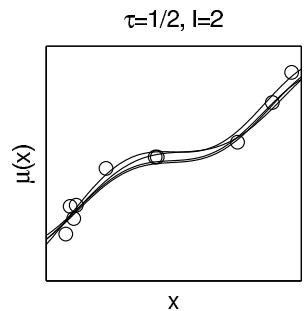

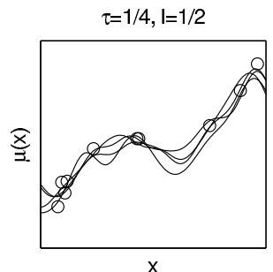

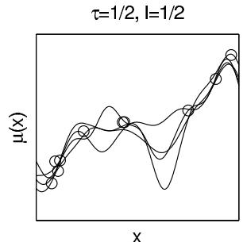  
Figure 21.2 Posterior draws of a Gaussian process $\mu(x)$ fit to ten data points, conditional on three different choices of the parameters $\tau, l$ that characterize the process. Compare to Figure 21.1, which shows draws of the curve from the prior distribution of each model. In our usual analysis, we would assign a prior distribution to $\tau, l$ and then perform joint posterior inference for these parameters along with the curve $\mu(x)$ ; see Figure 21.3. We show these three choices of conditional posterior distribution here to give a sense of the role of $\tau, l$ in posterior inference.

represented as Markov random fields. When there are three or fewer predictors, Markov random fields can be computed efficiently by exploiting conditional independence to produce a sparse precision matrix. In the univariate case the computation can be made in time $O(n)$ using sequential inference, and computation is no problem even for $n$ greater than million. For spatial problems the computation can be made in time $O(n^{3/2})$ with specific algorithms. In low-dimensional cases it is also possible to approximate Gaussian processes with basis function approximations where the number of basis functions $m$ is much smaller than $n$ . As the number of dimensions increases, the choice of basis functions in the data space becomes more difficult (see Section 20.3).

The above-mentioned approximations can be used when the number of predictors is large, if the latent function is modeled as additive, that is, as a sum of low-dimensional approximations (see Section 20.3). Interactions of 2 or 3 predictors can be included in each additive component, but models with implicit interactions between arbitrary predictors cannot be easily computed.

If there are rapid changes in the function, the length scale of the dependency is relatively short. Then sparse covariance matrices can be obtained by using compact support covariance functions, potentially reducing greatly the time needed for the inversion. The covariance matrix can be sparse even if there are tens of predictors.

If the function is smooth, the length scale of the dependency is relatively long. Then reduced rank approximations of the covariance matrices can be obtained in many different ways, reducing the time needed for the inversion to $O(mn^2)$ , where $m \ll n$ . Reduced rank approximations can be used for high-dimensional data, although it may be more difficult to set them up so that approximation error is small everywhere. Different covariance function approximations can also be combined in additive models, for example, by combining different approximations for short and long length scale dependencies.

# Marginal likelihood and posterior

If the data model is Gaussian, we can integrate over $\mu$ analytically to get the log marginal likelihood for covariance function parameters $\tau$ and $l$ and residual variance $\sigma^2$ :

$$
\log p (y | \tau , l, \sigma^ {2}) = - \frac {n}{2} \log (2 \pi) - \frac {1}{2} \log | K (x, x) + \sigma^ {2} I | - \frac {1}{2} y ^ {\mathrm {T}} (K (x, x) + \sigma^ {2} I) ^ {- 1} y. \tag {21.1}
$$

The marginal likelihood is combined with the prior to get the unnormalized marginal posterior, and inference can proceed with methods described in Chapters 10-13. Figure 21.3

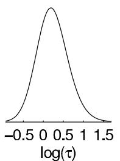

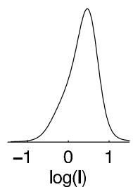

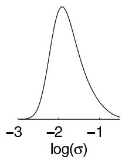

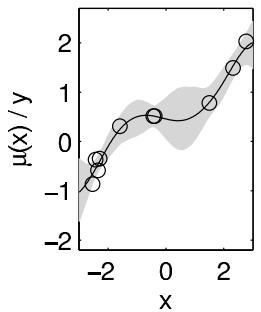  
Figure 21.3 Marginal posterior distributions for Gaussian process parameters $\tau$ , $l$ and error scale $\sigma$ , and posterior mean and pointwise $90\%$ bands for $\mu(x)$ , given the same ten data points from Figure 21.2.

shows an example of estimated marginal posterior distributions for $\tau$ , $l$ , and $\sigma$ , and the posterior mean and pointwise $90\%$ bands for $\mu(x)$ using the same data as in Figure 21.2. We obtained the posterior simulations using slice sampling. The priors were $t_4^+(0,1)$ for $\tau$ and $l$ , and log-uniform for $\sigma$ .

# 21.2 Example: birthdays and birthdates

Gaussian processes can be directly fit to data, but more generally they can be used as components in a larger model. We illustrate with an analysis of patterns in birthday frequencies in a dataset containing records of all births in the United States on each day during the years 1969-1988. We originally read about these data being used to uncover a pattern of fewer births on Halloween and excess births on Valentine's Day (due, presumably, to choices involved in scheduled deliveries, along with decisions of whether to induce a birth for health reasons). We thought it would be instructive to fit a model to look not just at special days but also at day-of-week effects, patterns during the year, and longer-term trends.

Decomposing the time series as a sum of Gaussian processes

Based on the structural knowledge of the calendar and, we started with an additive model,

$$
y _ {t} (t) = f _ {1} (t) + f _ {2} (t) + f _ {3} (t) + f _ {4} (t) + f _ {5} (t) + \epsilon_ {t},
$$

where $t$ is time in days (starting with $t = 1$ on 1 January 1969), and the different terms represent variation with different scales and periodicity:

1. Long-term trends modeled by a Gaussian process with squared exponential covariance function:

$$
f _ {1} (t) \sim \mathrm {G P} (0, k _ {1}), \quad k _ {1} (t, t ^ {\prime}) = \sigma_ {1} ^ {2} \exp \left(- \frac {| t - t ^ {\prime} | ^ {2}}{l _ {1} ^ {2}}\right);
$$

2. Shorter term variation using a GP with squared exponential covariance function with different amplitude and scale:

$$
f _ {2} (t) \sim \mathrm {G P} (0, k _ {2}), \quad k _ {2} (t, t ^ {\prime}) = \sigma_ {2} ^ {2} \exp \left(- \frac {| t - t ^ {\prime} | ^ {2}}{l _ {2} ^ {2}}\right);
$$

3. Weekly quasi-periodic pattern (that is allowed to change over time) modeled as a product of periodic and squared exponential covariance function:

$$
f _ {3} (t) \sim \mathrm {G P} (0, k _ {3}), \quad k _ {3} (t, t ^ {\prime}) = \sigma_ {3} ^ {2} \exp \left(- \frac {2 \sin^ {2} (\pi (t - t ^ {\prime}) / 7)}{l _ {3 , 1} ^ {2}}\right) \exp \left(- \frac {| t - t ^ {\prime} | ^ {2}}{l _ {3 , 2} ^ {2}}\right);
$$

4. Yearly smooth seasonal pattern using product of periodic and squared exponential covariance function (with period 365.25 to match the average length of the year):

$$
f _ {4} (t) \sim \mathrm {G P} (0, k _ {4}), \quad k _ {4} (s, s ^ {\prime}) = \sigma_ {4} ^ {2} \exp \left(- \frac {2 \sin^ {2} (\pi (s - s ^ {\prime}) / 3 6 5 . 2 5)}{l _ {4 , 1} ^ {2}}\right) \exp \left(- \frac {| s - s ^ {\prime} | ^ {2}}{l _ {4 , 2} ^ {2}}\right),
$$

where $s = s(t) = t \mod 365.25$ , thus aligning itself with the calendar every four years.

5. Special days including an interaction term with weekend. Based on a combination of initial visual inspection and prior knowledge we chose the following special days: New Year's Day, Valentine's Day, Leap Day, April Fool's Day, Independence Day, Halloween, Christmas, and the days between Christmas and New Year's.

$$
f _ {5} (t) = I _ {\mathrm {s p e c i a l d a y}} (t) \beta_ {a} + I _ {\mathrm {w e e k e n d}} (t) I _ {\mathrm {s p e c i a l d a y}} (t) \beta_ {b},
$$

where $I_{\mathrm{specialday}}(t)$ is a row vector of 13 indicator variables corresponding to each of the special days (we can think of this vector of one row of an $n\times 13$ indicator matrix $I_{\mathrm{specialday}}$ ); $I_{\mathrm{weekend}}(t)$ is an indicator variable that equals 1 if $t$ is a Saturday or Sunday, and 0 otherwise; and $\beta_{a}$ and $\beta_{b}$ are vectors, each of length 13, corresponding to the effects of special days when they fall on weekdays or weekends.

6. Finally, $\epsilon_t \sim \mathrm{N}(0, \sigma^2)$ represents the unstructured residuals.

We set weakly informative log- $t$ priors for the time-scale parameters $l$ (to improve identifiability of the model) and log-uniform priors for all the other hyperparameters. We normalized the number of daily births $y$ to have mean 0 and standard deviation 1.

The sum of Gaussian processes is also a Gaussian process, and the covariance function for the sum is

$$
k (t, t ^ {\prime}) = k _ {1} (t, t ^ {\prime}) + k _ {2} (t, t ^ {\prime}) + k _ {3} (t, t ^ {\prime}) + k _ {4} (t, t ^ {\prime}) + k _ {5} (t, t ^ {\prime}).
$$

The inference for the model is then straightforward with basic Gaussian process equations.

We analytically determined the marginal likelihood and its gradients for hyperparameters as in (21.1), and we used the marginal posterior mode for the hyperparameters. As $n$ was relatively high (corresponding to all the days during a twenty-year period, that is $n \approx 20 \cdot 365.25$ ), this posterior mode was fine in practice. Central composite design (CCD) integration gave visually indistinguishable plots, and MCMC would have been too slow. The Gaussian process formulation with $O(n^3)$ computation time is not optimal for this kind of one-dimensional data, but computation time was still reasonable.

Figure 21.4 shows the slow trend, faster non-periodic correlated variation, weekly trend and its change through years, seasonal effect and its change through years, and day of year effects. All plots are on the same scale showing differences relative to a baseline of 100. Predictions for different additive components can be computed with the usual posterior equation (21.1) but using only one of the covariance functions to compute the covariance between training and the test data. For example, the mean of the slow trend is computed as

$$
\mathrm {E} \left(\tilde {f} _ {1}\right) = K _ {1} (\tilde {x}, x) \left(K (x, x) + \sigma^ {2} I\right) ^ {- 1} y. \tag {21.2}
$$

The smooth seasonal effect has an inverse relation to the amount of daylight or the average temperature nine months before. The smaller number of births in weekends and smaller or larger number of births on special days can be explained by selective c-sections and induced births. The day-of-week patterns become more pronounced over time, which makes sense given the general increasing rate of these sorts of births.

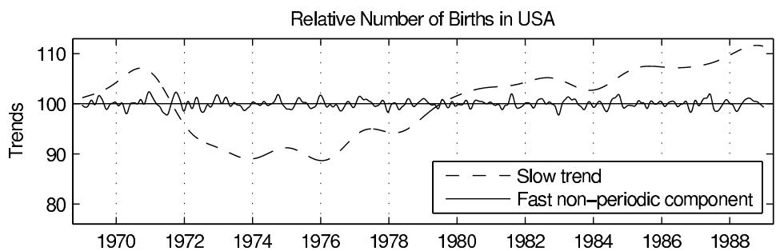

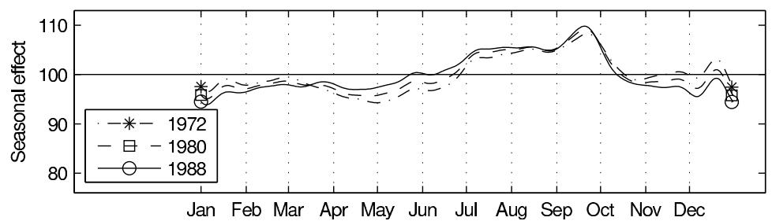

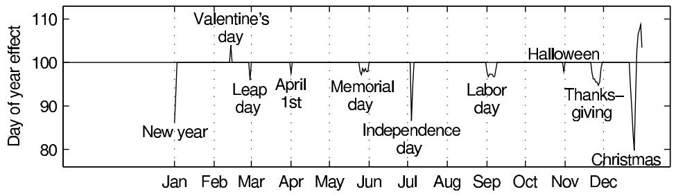  
Figure 21.4 Relative number of births in the United States based on exact data from each day from 1969 through 1988, divided into different components, each with an additive Gaussian process model. The estimates from an improved model are shown in Figure 21.5.

# An improved model

Statistical models are not built at once. Rather, we fit a model, notice problems, and improve it. In this case, selecting just some special days makes it impossible to discover other days having a considerable effect. Also we might expect to see a 'ringing' pattern with a distortion of births just before and after the special days (as the babies have to be born sometime).

To allow for these sorts of structures, we constructed a new model that allowed special effects for each day of the year. While analyzing the first model we also noticed that the residuals were slightly autocorrelated, so we added a very short time-scale non-periodic component to explain that. To improve yearly periodic components we also refined the

handling of the leap day. Our improved model has the form

$$
y _ {t} (t) = f _ {1} (t) + f _ {2} (t) + f _ {3} (t) + f _ {4} (t) + f _ {5} (t) + f _ {6} (t) + f _ {7} (t) + f _ {8} (t) + \epsilon_ {t}:
$$

1. Long-term trends modeled by a Gaussian process with squared exponential covariance function:

$$
f _ {1} (t) \sim \mathrm {G P} (0, k _ {1}), \quad k _ {1} (t, t ^ {\prime}) = \sigma_ {1} ^ {2} \exp \left(- \frac {| t - t ^ {\prime} | ^ {2}}{l _ {1} ^ {2}}\right);
$$

2. Shorter term variation using a GP with squared exponential covariance function with different amplitude and scale:

$$
f _ {2} (t) \sim \mathrm {G P} (0, k _ {2}), \quad k _ {2} (t, t ^ {\prime}) = \sigma_ {2} ^ {2} \exp \left(- \frac {| t - t ^ {\prime} | ^ {2}}{l _ {2} ^ {2}}\right);
$$

3. Weekly quasi-periodic pattern (that is allowed to change over time) modeled as a product of periodic and squared exponential covariance function:

$$
f _ {3} (t) \sim \mathrm {G P} (0, k _ {3}), \quad k _ {3} (t, t ^ {\prime}) = \sigma_ {3} ^ {2} \exp \left(- \frac {2 \sin^ {2} (\pi (t - t ^ {\prime}) / 7)}{l _ {3 , 1} ^ {2}}\right) \exp \left(- \frac {| t - t ^ {\prime} | ^ {2}}{l _ {3 , 2} ^ {2}}\right);
$$

4. Yearly smooth seasonal pattern using product of periodic and squared exponential covariance function (with period 365.25 to match the average length of the year):

$$
f _ {4} (t) \sim \mathrm {G P} (0, k _ {4}), \quad k _ {4} (s, s ^ {\prime}) = \sigma_ {4} ^ {2} \exp \left(- \frac {2 \sin^ {2} (\pi (s - s ^ {\prime}) / 3 6 5)}{l _ {4 , 1} ^ {2}}\right) \exp \left(- \frac {| s - s ^ {\prime} | ^ {2}}{l _ {4 , 2} ^ {2}}\right),
$$

$s = s(t)$ is now a modified time with time before and after leap day incremented by 0.5 day so that in $s$ the length of year is 365 also for leap years (making easier implementation of yearly periodicity).

5. Yearly fast changing pattern for weekdays (day-of-year effect) using a periodic covariance function:

$$
f _ {5} (t) \sim \mathrm {G P} (0, k _ {5}), \quad k _ {5} (s, s ^ {\prime}) = I _ {\mathrm {w e e k d a y}} (t) \sigma_ {5} ^ {2} \exp \left(- \frac {2 \sin^ {2} (\pi (s - s ^ {\prime}) / 3 6 5)}{l _ {5} ^ {2}}\right);
$$

6. A similar pattern for weekends:

$$
f _ {6} (t) \sim \mathrm {G P} (0, k _ {6}), \quad k _ {5} (s, s ^ {\prime}) = I _ {\mathrm {w e e k e n d}} (t) \sigma_ {6} ^ {2} \exp \left(- \frac {2 \sin^ {2} (\pi (s - s ^ {\prime}) / 3 6 5)}{l _ {6} ^ {2}}\right);
$$

7. Effects of special days whose dates are not constant from year to year (Leap Day, Memorial Day, Labor Day, Thanksgiving):

$$
f _ {7} (t) = I _ {\mathrm {s p e c i a l d a y}} (t) \beta ,
$$

where $I_{\mathrm{specialday}}(t)$ is now a row vector of 4 indicator variables corresponding to these floating holidays.

8. Short-term variation using a Gaussian process with squared exponential covariance function:

$$
f _ {8} (t) \sim \mathrm {G P} (0, k _ {8}), \quad k _ {8} (t, t ^ {\prime}) = \sigma_ {2} ^ {2} \exp \left(- \frac {| t - t ^ {\prime} | ^ {2}}{l _ {8} ^ {2}}\right);
$$

9. Finally, $\epsilon_t \sim \mathrm{N}(0, \sigma^2)$ models the unstructured residual.

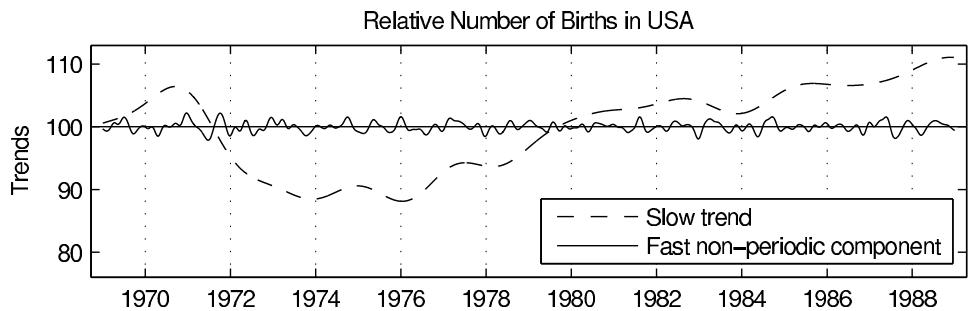

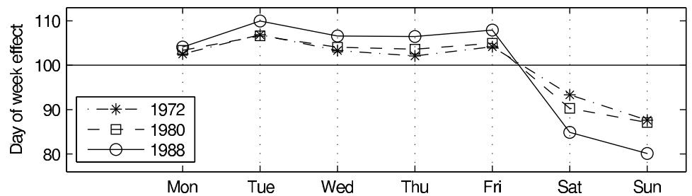

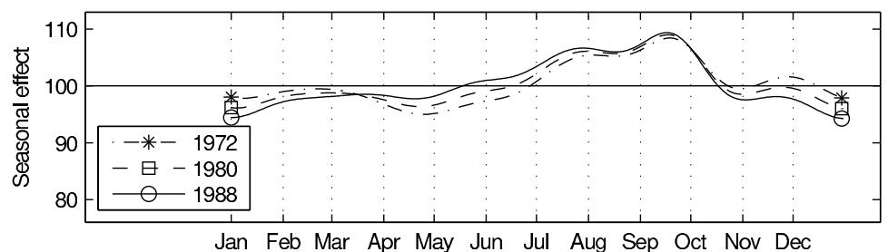

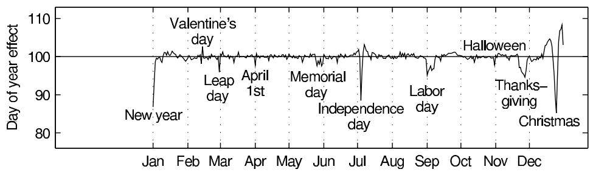  
Figure 21.5 Relative number of births in the United States based on exact data from each day from 1969 through 1988, divided into different components, each with an additive Gaussian process model. Compared to Figure 21.4, this improved model allows individual effects for every day of the year, not merely for a few selected dates.

We set weakly informative log- $t$ priors for time-scale parameters $l$ (to improve identifiability of the model) and log-uniform prior for all the other hyperparameters. The number of births $y$ was normalized to have mean 0 and standard deviation 1.

Exploiting properties of multivariate Gaussian, leave-one-out cross-validation pointwise predictions can be computed in similar time as posterior predictions. The cross-validated pointwise predictive accuracy is $\mathrm{lppd}_{\mathrm{loo-cv}} = 2074$ for the first model and 2477 for the improved model, showing clear improvement.

Figure 21.5 shows the results for the second model. The trends and day of week effect are indistinguishable from the first model, but the seasonal component is smoother as it does not need to model the increased number of births before or after special days and

before the end of the year, which are now modeled in the day of year component. This new model is not perfect either (for one thing, it would make sense to constrain local positive and negative effects to average approximately to zero so that extra babies are explicitly 'borrowed' from neighboring days), but we believe that the decomposition shown in Figure 21.5 does a good job of identifying the major patterns at different time scales. The trick was to use Gaussian processes to allow different scales of variation for different components of the model. This example also illustrates how we are able to keep adding terms to the additive model without losing control of the estimation.

# 21.3 Latent Gaussian process models

In case of non-Gaussian likelihoods, the Gaussian process prior is set to a latent function $f$ which through a link function determines the likelihood $p(y|f,\phi)$ as in generalized linear models (see Chapter 16). Typically the shape parameter $\phi$ is assumed to be a scalar, but it is also possible to use separate latent Gaussian processes to model location $f$ and shape parameter $\phi$ of the likelihood to allow, for example, the scale to depend on the predictors.

The conditional posterior density of the latent $f$ is $p(f|x, y, \theta, \phi) \propto p(y|f, \phi)p(f|x, \theta)$ . For efficient MCMC inference, GP-specific samplers can be used. These samplers exploit the multivariate Gaussian form of the prior for the latent values in the proposal distribution or in the scaling of the latent variables. The most commonly used samplers are the elliptic slice sampler, scaled Metropolis-Hastings, and scaled HMC/NUTS (these are Gaussian-process-specific variations of the samplers discussed in Chapters 11 and 12). Typically the sampling is done alternating the sampling of latent values $f$ and covariance and likelihood parameters $\theta$ and $\phi$ . Due to dependency between the latent values and the (hyper)parameters, mixing of the MCMC can be slow, creating difficulties when fitting to larger datasets.

As the prior distribution for latent values is multivariate Gaussian, the posterior distribution of the latent values is also often close to Gaussian; this motivates Gaussian posterior approximations. The simplest approach is to use the normal approximation (Chapter 4)

$$
p (f | x, y, \theta , \phi) \approx \mathrm {N} (f | \hat {f}, \Sigma),
$$

where $\hat{f}$ is the posterior mode and

$$
\Sigma^ {- 1} = K (x, x) + W,
$$

where $K(x,x)$ is the prior covariance matrix and $W$ is a diagonal matrix with $W_{ii} = \frac{d^2}{df^2}\log p(y|f_i,\phi)|_{f_i = \hat{f}_i}$ . The approximate predictive density

$$
p (\tilde {y} _ {i} | \tilde {x} _ {i}, x, y, \theta , \phi) \approx \int p (\tilde {y} _ {i} | \tilde {f} _ {i}, \phi) \mathrm {N} (\tilde {f} _ {i} | \tilde {x} _ {i}, x, y, \theta , \phi) d \tilde {f} _ {i}
$$

can be evaluated, for example, with quadrature integration. Log marginal likelihood can be approximated by integrating over $f$ using Laplace's method (Section 13.3)

$$
\log p (y | x, \theta , \phi) \approx \log g (y | x, \theta , \phi) \propto \log p (y | \hat {f}, \phi) - \frac {1}{2} \hat {f} ^ {\mathrm {T}} K (x, x) ^ {- 1} \hat {f} - \frac {1}{2} \log | B |, \tag {21.3}
$$

where $|B| = |I + W^{1/2} K(x, x)W^{1/2}|$ .

If the likelihood contribution is heavily skewed, as can be the case with the logistic model, expectation propagation (Section 13.8) can be used instead. Variational approximation (Section 13.7) has also been used, but in many cases it is slower than the normal approximation and not as accurate as EP. Using one of these analytic approximations for the latent posterior, the approximate (unnormized) marginal posterior of the hyperparameters $q(\theta, \phi | x, y)$ and its gradients can be computed analytically, allowing one to efficiently

find the posterior mode of the hyperparameters (Section 13.1) or to integrate over the hyperparameters using MCMC (Section 12), integration over a grid (Section 10.3), or CCD integration (Section 13.9).

# Example. Leukemia survival times

To illustrate a Gaussian process model with non-Gaussian data, we analyze survival in acute myeloid leukemia (AML) in adults. The example illustrates the flexibility of Gaussian process for modeling nonlinear effects and implicit interactions.

As data we have survival times $t$ and censoring indicator $z$ (0 for observed and 1 for censored) for 1043 cases recorded between 1982 and 1998 in the North West Leukemia Register in the United Kingdom. Some $16\%$ of cases were censored. Predictors are age, sex, white blood cell count (WBC) at diagnosis with 1 unit $= 50 \times 10^{9} / L$ , and the Townsend score which is a measure of deprivation for district of residence.

As the WBC measurements were strictly positive and highly skewed, we fit the model to its logarithm. In theory as $n \to \infty$ a Gaussian process model could be fit with an estimated link function so as to learn this sort of mapping directly from the data, but with finite $n$ it can be helpful to preprocess the data using sensible transformations. Continuous predictors were normalized to have zero mean and unit standard deviation. Survival time was normalized to have zero mean for the logarithm of time (this way the constant term will be smaller and computation is more stable).

We tried several models including proportional hazard, Weibull, and log-Gaussian, but the log-logistic gave the best results. The log-logistic model can be considered as a more robust choice compared to log-Gaussian which assumes a Gaussian observation model for the logarithm of the survival times. As we do not have a model for the censoring process, we do not have a full observation model. The likelihood for the log-logistic model is,

$$
p (y | -) = \prod_ {i = 1} ^ {n} \left(\frac {r y ^ {r - 1}}{\exp (f (X _ {i}))}\right) ^ {1 - z _ {i}} \left(1 + \left(\frac {y}{\exp (f (X _ {i}))}\right) ^ {r}\right) ^ {z _ {i} - 2},
$$

where $r$ is the shape parameter and $z_{i}$ the censoring indicators (see Section 8.7 for more about censored observations). We center the Gaussian process on a linear model to get a latent model,

$$
f _ {i} (X _ {i}) = \alpha + X _ {i} \beta + \mu (X _ {i}),
$$

where $\mu \sim \mathrm{GP}(0,k)$ with squared exponential covariance function,

$$
k (x, x ^ {\prime}) = \operatorname {c o v} (\mu (x), \mu (x ^ {\prime})) = \sigma_ {g} ^ {2} \exp \left(- \sum_ {j = 1} ^ {p} \frac {| x _ {j} - x _ {j} ^ {\prime} | ^ {2}}{l _ {j}}\right).
$$

We set weakly informative priors: uniform on $\log r$ , normal priors $\alpha \sim \mathrm{N}(0, \sigma_{\alpha}^{2})$ , $\beta \sim \mathrm{N}(0, \sigma_{\beta}^{2})$ , independent $\mathrm{Inv} - \chi^2(1, 1)$ priors on $\sigma_{\alpha}^{2}, \sigma_{\beta}^{2}, \sigma_{g}^{2}$ , and $l_{j} \sim \mathrm{Cauchy}^{+}(0, 1)$ . We used Laplace's method for the latent values and CCD integration for the hyperparameters. Expectation propagation method produced similar results but was an order of magnitude slower.

Using linear response and importance weighting approximation, computation time for leave-one-out cross-validation predictions was three times the posterior inference. For a model with only constant and linear latent components, the cross-validated pointwise predictive accuracy is $\mathrm{lppd}_{\mathrm{loo - cv}} = -1662$ , or $-1629$ for the model with additional nonlinear components, which is a clear improvement. Figure 21.6 shows estimated conditional comparison of each predictor with all others fixed to their mean values or defined values. The model has found clear nonlinear patterns, and the right

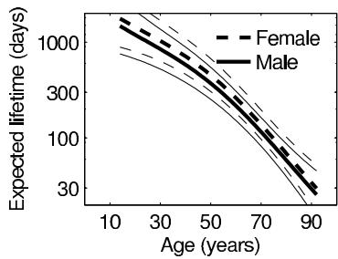

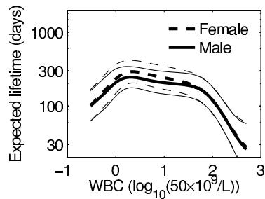

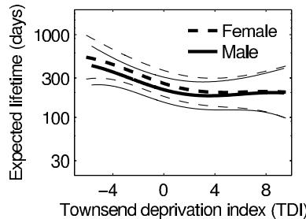

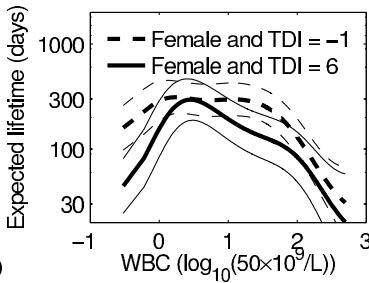  
Figure 21.6 For the leukemia example, estimated conditional comparison for each predictor with other predictors fixed to their mean values or defined values. The thick line in each graph is the posterior median estimated using a Gaussian process model, and the thin lines represent pointwise $90\%$ intervals.

bottom subplot also shows that the conditional comparison associated with WBC has an interaction with the Townsend deprivation index. The benefit of the Gaussian process model was that we did not need to explicitly define any parametric form for the functions or define any interaction terms.

In the previous studies, WBC was not log-transformed, and a decrease in the expected lifetime when WBC was small was not found, the interaction between WBC and TDI was not found as only additive models were considered, and an additional spatial component explained some of the variation, but it did not have significant effect when added to the model described above.

# 21.4 Functional data analysis

Functional data analysis considers responses and predictors for a subject not as scalar or vector-valued random variables but instead as random functions defined at infinitely-many points. In practice one can collect observations on these functions only at finitely many points. Let $y_{i} = (y_{i1},\ldots ,y_{in_{i}})$ denote the observations on function $f_{i}$ for subject $i$ , where $y_{ij}$ is an observation at point $t_{ij}$ , with $t_{ij}\in \mathcal{T}$ . For example, $f_{i}:\mathcal{T}\to \Re$ may correspond to a trajectory of blood pressure or body weight as a function of age. Allowing for measurement errors in observations of a smooth trajectory, we let

$$
y _ {i j} \sim \mathrm {N} (f _ {i} (t _ {i j}), \sigma^ {2}).
$$

The question is then how to model the collection of functions $\{f_i\}_{i=1}^n$ for the different subjects, accommodating for flexibility in modeling the individual functions while also allowing borrowing of information.

Gaussian processes can be easily used for functional data analysis. For example in normal regression we have

$$
y _ {i j} \sim \mathrm {N} (f (x _ {i}, t _ {i j}), \sigma^ {2}),
$$

where $x_{i}$ are subject specific predictors. We set a Gaussian process prior $f\sim \mathrm{GP}(m,k)$

with, for example, squared exponential covariance, by adding time as an additional dimension:

$$
\tau^ {2} \exp \left(- \left[ \sum_ {j = 1} ^ {p} \frac {(x _ {j} - x _ {j} ^ {\prime}) ^ {2}}{l _ {j} ^ {2}} + \frac {(t - t ^ {\prime}) ^ {2}}{l _ {p + 1} ^ {2}} \right]\right),
$$

where $\tau$ controls the magnitude and $l_{1},\ldots ,l_{p + 1}$ control the smoothness in different predictor directions. More similar $x$ and $x^{\prime}$ imply more similar $f$ and $f^{\prime}$ . This kind of functional data analysis is naturally modeled by Gaussian process and requires no additional computational methods.

# 21.5 Density estimation and regression

So far we have discussed Gaussian processes as prior distributions for a function controlling the location and potentially the shape parameter of a parametric observation model. To get more flexibility we would like to model also the conditional observation model as nonparametric. One way to do this is the logistic Gaussian process (LGP), and in later chapters we consider an alternative approach based on Dirichlet processes.

# Density estimation

In introducing the LGP, we start with the independent and identically distributed case, $y_{i} \stackrel{iid}{\sim} p$ , for simplicity. The LGP works by generating a random surface (curve in the one-dimensional density case) from a Gaussian process and then transforming the surface to the space of probability densities. To constrain the function to be non-negative integrate to 1, we use the continuous logistic transformation,

$$
p (y | f) = \frac {e ^ {f (y)}}{\int e ^ {f (y ^ {\prime})} d y ^ {\prime}},
$$

where $f \sim \mathrm{GP}(m, k)$ is a realization from a continuous Gaussian process. It is appealing to choose $m$ to be a log density of elicited parametric distribution such as Student's $t$ -distribution with parameters chosen empirically or integrated out as part of the inference. The covariance function $k$ defining the smoothness properties of the process can be chosen to be, for example, squared exponential:

$$
k (y, y ^ {\prime}) = \tau^ {2} \exp \left(- \frac {| y - y ^ {\prime} | ^ {2}}{l ^ {2}}\right),
$$

where $\tau$ controls the magnitude while $l$ controls the smoothness of the realizations.

An alternative specification uses a zero-mean Gaussian process $W(t)$ on $[0,1]$ and defines

$$
p (y) = g _ {0} (y) \frac {e ^ {W (G _ {0} (y))}}{\int e ^ {W (v)} d v},
$$

where $g_0$ is some elicited parametric distribution with cumulative distribution function $G_0$ . The compactification by $G_0$ allows modeling of a GP from $[0,1] \to \Re$ and makes the prior smoother on tails of $g_0$ , which may sometimes be a desirable property.

The challenge for the inference is the integral over continuous $f$ in the denominator of the likelihood. In practice this integral is computed using a finite basis function representation or a discretization of a chosen finite region. Inference for $f$ and parameters of $m$ and $k$ can be made using various Markov chain simulation methods, or using a combination of Laplace's method for the latent values $f$ and quadrature integration for parameters. Compared to mixture model density estimation (see Chapters 22 and 23), the logistic Gaussian process

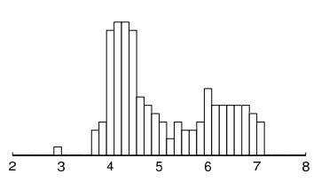

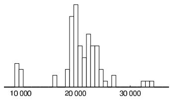

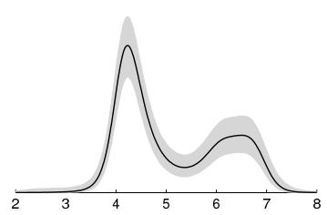

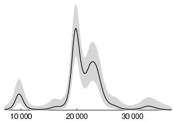  
Figure 21.7 Two simple examples of density estimation using Gaussian processes. Left column shows acidity data and right column shows galaxy data. Top row shows histograms and bottom row shows logistic Gaussian process density estimate means and $90\%$ pointwise posterior intervals.

has a computational advantage as the posterior of $f$ is unimodal given hyperparameters (and fixed finite representation).

# Example. One-dimensional densities: galaxies and lakes

We illustrate the logistic Gaussian process density estimation with two small univariate datasets from the statistics literature. The first example is a set of 82 measurements of speeds of galaxies diverging from our own. The second example is a set of measurements of acidity from 155 lakes in north-central Wisconsin. We fit a Gaussian process with Matern $(\nu = \frac{5}{2})$ covariance function centered on Gaussian. We use the Laplace method (that is, mode-centered normal approximation) to integrate over $f$ and the marginal posterior mode for the hyperparameters. An additional prior constraint forcing tails to be decreasing was implemented with rejection sampling. Figure 21.7 shows usual histograms and LGP density estimates. Compared to the density estimate using a mixture of Gaussians in Figure 22.4, the LGP produces more a flexible form for the density estimates.

# Density regression

The above LGP prior can be easily generalized to density regression by placing a prior on the collection of conditional densities, $p_{\mathcal{X}} = \{p(y|x), x \in \Re^p, y \in \Re \}$ as

$$
p (y | x) = \frac {e ^ {f (x , y)}}{\int e ^ {f (x , y ^ {\prime})} d y ^ {\prime}},
$$

where $f$ is drawn from a Gaussian process with, for example, squared exponential covariance kernel

$$
k \left(\left(x, y\right), \left(x ^ {\prime}, y ^ {\prime}\right)\right) = \tau^ {2} \exp \left(- \left[ \sum_ {j = 1} ^ {p} \frac {\left(x _ {j} - x _ {j} ^ {\prime}\right) ^ {2}}{l _ {j}} + \frac {\left(y - y ^ {\prime}\right) ^ {2}}{l _ {p + 1}} \right]\right). \tag {21.4}
$$

One can potentially choose hyperpriors for the $l_{j}$ s that allow certain predictors to effectively drop out of the model while allowing considerable changes for other predictors.

Letting $s = (s_1, \ldots, s_p) \in [-1, 1]^p$ and $t \in [0, 1]$ and prespecifying monotone continuous functions $F_j: \Re \to [-1, 1]$ , for $j = 1, \ldots, p$ an alternative compactifying representation is obtained as

$$
p (y | x) = g _ {0} (y) \frac {e ^ {W (F (x) , G _ {0} (y))}}{\int e ^ {W (F (x) , v)} d v},
$$

where $F(x) = (F_{1}(x_{1}),\ldots ,F_{p}(x_{p}))$ and $W$ is drawn from a Gaussian process. Here the compactification brings the same advantages as in the unconditional density estimation.

Inference in density regression is similar to unconditional density estimation, although additional challenges rise if there are multiple predictors requiring approximations to the GP or computation to keep the finite representation of the multidimensional function computationally feasible.

# Latent-variable regression

Recently, a simple alternative to the LGP was proposed that also relies on a Gaussian process prior in inducing priors for densities or conditional densities, but in a fundamentally different manner. Focusing again on the univariate iid case to start, consider the latent-variable regression model (without predictors),

$$
y _ {i} \sim \mathrm {N} \left(\mu \left(u _ {i}\right), \sigma^ {2}\right), \quad u _ {i} \sim \mathrm {U} (0, 1), \tag {21.5}
$$

where $u_{i}$ is a uniform latent variable and $\mu : [0,1] \to \Re$ is an unknown regression function. The prior distribution for $\mu, \sigma$ , induces a corresponding prior distribution $f \sim \Pi$ on the density of $y_{i}$ . There is a literature on similar nonparametric latent variable models to (21.5) motivated by dimensionality reduction in multivariate data analysis. One can sample $y_{i} \sim f_{0}$ for any strictly positive density $f_{0}$ by drawing a uniform random variable $u_{i}$ and then letting $y_{i} = F_{0}^{-1}(u_{i})$ , with $F_{0}^{-1}$ the inverse cumulative distribution corresponding to density $f_{0}$ . This provides an intuition for why (21.5) is flexible given a flexible prior on $\mu$ and a prior on $\sigma^2$ that assigns positive probability to neighborhoods of zero.

From a practical perspective, a convenient and flexible choice corresponds to drawing $\mu$ from a Gaussian process centered on $\mu_0$ with a squared exponential covariance kernel. To center the prior on a guess $g_{0}$ for the unknown density, one can let $\mu_0\equiv G_0^{-1}$ . Such centering will aid practical performance when the guess $g_{0}$ provides an adequate approximation. Computation can be implemented through a straightforward data augmentation algorithm. Conditionally on the latent variables $u_{i}$ , expression (21.5) is a standard Gaussian process regression model and computation can proceed via standard algorithms, which for example update $\mu$ at the unique $u_{i}$ values from a multivariate Gaussian conditional. By approximating the continuous $\mathrm{U}(0,1)$ with a discrete uniform over a fine grid, one can (a) enable conjugate updating of the $u_{i}$ 's over the grid; and (b) reduce the computational burden associated with updating $\mu$ at the realized $u_{i}$ values.

The latent variable regression model (21.5) can be easily generalized for the density regression problem by simply letting

$$
y _ {i} \sim \mathrm {N} (\mu (u _ {i}, x _ {i}), \sigma^ {2}), \quad u _ {i} \sim \mathrm {U} (0, 1),
$$

where $x_{i} = (x_{i1},\ldots ,x_{ip})$ is the vector of observed predictors. This model is essentially identical to (21.5) and computation can proceed in the same manner, but now $\mu :\Re^{p + 1}\to \Re$ is a $(p + 1)$ -dimensional surface drawn from a Gaussian process instead of a one-dimensional curve. The covariance function can be chosen to be squared exponential with a different spatial-range (smoothness) parameter for each dimension, similarly to (21.4). This is important in allowing sufficient flexibility to adaptively drop out predictors that are not needed and allow certain predictors to have a substantially larger impact on the conditional response density.

# 21.6 Bibliographic note

Some key references on Bayesian inference for Gaussian processes are O'Hagan (1978), Neal (1998), and Rasmussen and Williams (2006). Reviews of many recent advances in computation for Gaussian process are included in Vanhatalo et al. (2013a). Rasmussen and Nickish (2010) provide software for the book by Rasmussen and Williams (2006), and Vanhatalo et al. (2013b) provide software implementing a variety of different models, covariance approximations, inference methods (such as Laplace, expectation propagation, and MCMC) and model assessment tools for Gaussian processes.

Some recent references on efficient Bayesian computation in Gaussian processes are Tokdar (2007), Banerjee, Dunson, and Tokdar (2011) for regression, Vanhatalo and Vehtari (2010) for binary classification, Riihimaki, Jylanki, and Vehtari (2013) for multiclass classification, Vanhatalo, Pietilainen, and Vehtari (2010) for disease mapping by combining long and short scale approximations, Jylanki, Vanhatalo, and Vehtari (2011) for robust regression, and Riihimaki and Vehtari (2010) for monotonic regression. Savitsky, Vannucci, and Sha (2011) propose an approach for variable selection in high-dimensional Gaussian process regression. Lindgren, Rue, and Lindstrom (2013) approximate some Gaussian processes with Gaussian Markov random fields by using an approximate weak solution of the corresponding stochastic partial differential equation. Sarkka, Solin, and Hartikainen (2013) show how certain types of space-time Gaussian process regression can be converted into finite or infinite-dimensional state space models that allow for efficient (linear time) inference via the methods from Bayesian filtering and smoothing reviewed by Sarkka (2013).

The birthday data come from the National Vital Statistics System natality data and are at http://www.mechanicalkern.com/static/birthdates-1968-1988.csv, provided by Robert Kern using Google BigQuery.

The leukemia example comes from Henderson, Shimakura, and Gorst (2002).

Myllymaki, Sarkka, and Vehtari (2013) discuss Gaussian processes in functional data analysis for point patterns.

The logistic Gaussian process (LGP) was introduced by Leonard (1978). Lenk (1991, 2003) develops inferences based on posterior moments. Tokdar (2007) presents MCMC implementation of unconditional LGP, and Tokdar, Zhu, and Ghosh (2010) present MCMC for LGP density regression. Riihimaki and Vehtari (2013) derive a fast Laplace approximation for LGP density estimation and regression. Tokdar and Ghosh (2007) and Tokdar, Zhu, and Ghosh (2010) prove consistency of LGP for density estimation and density regression, respectively. Adams et al. (2009) propose an alternative GP approach in which the numerical approximation of the normalizing term in the likelihood is avoided by a conditioning set and an elaborate rejection sampling method. The latent-variable regression model in the last part of Section 21.5 comes from Kundu and Dunson (2011).

# 21.7 Exercises

1. Replicate the sampling from the Gaussian process prior from Figure 21.1. Use univariate $x$ in a grid. Generation of random samples from the multivariate normal is described in Appendix A. Invent some data, compute the posterior mean and covariance as in (21.1), and sample functions from the posterior distribution.

2. Gaussian processes: The file at naes04.csv contains age, sex, race, and attitude on three gay-related questions from the 2004 National Annenberg Election Survey. The three questions are whether the respondent favors a constitutional amendment banning same-sex marriage, whether the respondent supports a state law allowing same-sex marriage, and whether the respondent knows any gay people. Figure 20.5 on page 499 shows the data for the latter two questions (averaged over all sex and race categories).

For this exercise, you will only need to consider the outcome as a function of age, and

for simplicity you should use the normal approximation to the binomial distribution for the proportion of Yes responses for each age.

(a) Set up a Gaussian process model to estimate the percentage of people in the population who believe they know someone gay (in 2004), as a function of age. Write the model in statistical notation (all the model, including prior distribution), and write the (unnormized) joint posterior density. As noted above, use a normal model for the data.   
(b) Program the log of the unnormalized marginal posterior density of hyperparameters Eq. (21.1) as an R function.   
(c) Fit the model. You can use MCMC, normal approximation, variational Bayes, expectation propagation, Stan, or any other method. But your fit must be Bayesian.   
(d) Graph your estimate along with the data (plotting multiple graphs on a single page).

3. Gaussian processes with binary data: Repeat the previous exercise but this time using the binomial model for the Yes/No responses. The computation will be more complicated but your results should be similar. Discuss any differences compared to the results from the previous exercise.   
4. Gaussian processes with multiple predictors: Repeat the previous exercise but this time estimating the percentage of people in the population who believe they know someone gay (in 2004), as a function of three predictors: age, sex, and race.   
5. Gaussian processes with binary data: Table 19.1 on page 486 presents data on the success rate of putts by professional golfers.

(a) Fit a Gaussian process model for the probability of success (using the binomial likelihood) as a function of distance. Compare to your solutions of Exercises 19.2 and 20.4.   
(b) Use posterior predictive checks to assess the fit of the model.

6. Model building with Gaussian processes:

(a) Replicate the birthday analyses from Section 21.2. Build up the model by adding covariance functions one by one.   
(b) The day-of-week and seasonal effects appear to be increasing over time. Expand the model to allow the day-of-year effects to increase over time in a similar way. Fit the expanded model to the data and graph and discuss the results.

7. Hierarchical model and Gaussian process: Repeat Exercise 20.5 using a Gaussian process instead of a spline model for the underlying time series.

8. Let $\mu (x) = \sum_{h = 1}^{k}\beta_{h}b_{h}(x)$ with $b_{h}(x) = \exp \left(\psi (x - \tau_{h})^{2}\right)$ for $h = 1,\ldots ,k$

(a) If possible, choose a prior on $(\beta_{1},\ldots ,\beta_{k})$ so that $\mu \sim \mathrm{GP}(m,k)$ , a Gaussian process with mean function $m$ and covariance function $k$ .   
(b) Describe the exact analytic forms (if possible) for $m$ and $k$ .   
(c) How does the covariance function differ from letting $k(x,x^{\prime}) = \exp \left(-\kappa (x - x^{\prime})^{2}\right)?$   
(d) Describe an algorithm to minimize $\psi$ and $\tau_{1},\ldots ,\tau_{k}$ to minimize this difference.

9. Continuing the previous problem, suppose we instead let $\mu(x) = \beta_1 + \beta_2 x$ with Gaussian priors placed on $\beta_1$ and $\beta_2$ .

(a) Does this induce a Gaussian process prior on the function $\mu (x)?$   
(b) Since we have a Gaussian process prior, does that mean that we can capture non-linear functions with this prior?

Mixture distributions arise in practical problems when the measurements of a random variable are taken under two different conditions. For example, the distribution of heights in a population of adults reflects the mixture of males and females in the population, and the reaction times of schizophrenics on an attentional task might be a mixture of trials in which they are or are not affected by an attentional delay (an example discussed later in this chapter). For the greatest flexibility, and consistent with our general hierarchical modeling strategy, we construct such distributions as mixtures of simpler forms. For example, it is best to model male and female heights as separate univariate, perhaps normal, distributions, rather than a single bimodal distribution. This follows our general principle of using conditioning to construct realistic probability models. The schizophrenic reaction times cannot be handled in the same way because it is not possible to identify which trials are affected by the attentional delay. Mixture models can be used in problems of this type, where the population of sampling units consists of a number of subpopulations within each of which a relatively simple model applies. In this chapter we discuss methods for analyzing data using mixture models.

The basic principle for setting up and computing with mixture models is to introduce unobserved indicators—random variables, which we usually label as a vector or matrix $z$ , that specify the mixture component from which each particular observation is drawn. Thus the mixture model is viewed hierarchically; the observed variables $y$ are modeled conditionally on the vector $z$ , and the vector $z$ is itself given a probabilistic specification. Often it is useful to think of the mixture indicators as missing data. Inferences about quantities of interest, such as parameters within the probability model for $y$ , are obtained by averaging over the distribution of the indicator variables. In the simulation framework, this means drawing $(\theta, z)$ from their joint posterior distribution.

