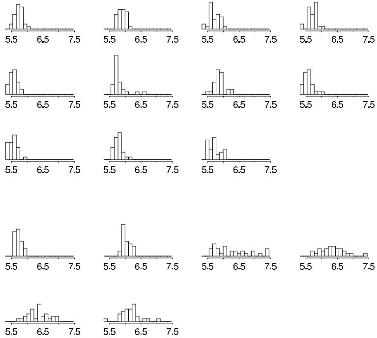
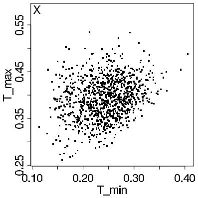
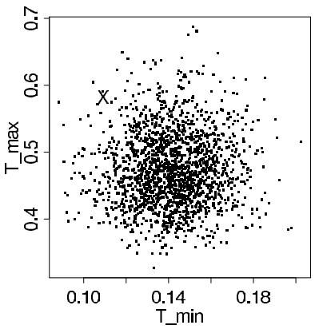
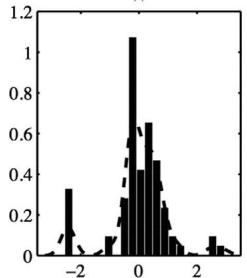
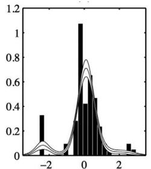
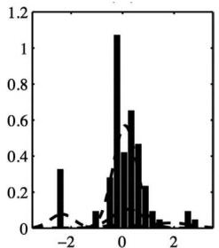
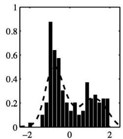
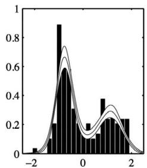
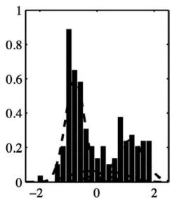

# Finite Mixture Models

[Package map](../structure.md) · [Unsplit OCR dump](./_full.md)

[← Ch. 21 Gaussian Processes](./21-gaussian-process-models.md) · [Ch. 23 Dirichlet Processes →](./23-dirichlet-process-models.md)

> MinerU OCR dump. If a formula, table, or numbering disagrees with the PDF, the PDF is authoritative.

---

# 22.1 Setting up and interpreting mixture models

# Finite mixtures

Suppose that, based on substantive considerations, it is considered desirable to model the distribution of $y = (y_{1},\ldots ,y_{n})$ , or the distribution of $y|x$ , as a mixture of $H$ components. It is assumed that it is not known which mixture component underlies each particular observation. Any information that makes it possible to specify a nonmixture model for some or all of the observations, such as sex in our discussion of the distribution of adult heights, should be used to simplify the model. For $h = 1,\dots ,H$ , the $h$ -th component distribution, $f_{h}(y_{i}|\theta_{h})$ , is assumed to depend on a parameter vector $\theta_h$ ; the parameter denoting the proportion of the population from component $h$ is $\lambda_h$ , with $\sum_{h = 1}^{H}\lambda_{h} = 1$ . It is common to assume that the mixture components are all from the same parametric family, such as the normal, with different parameter vectors. The sampling distribution of $y$ in that case is

$$
p \left(y _ {i} \mid \theta , \lambda\right) = \lambda_ {1} f \left(y _ {i} \mid \theta_ {1}\right) + \lambda_ {2} f \left(y _ {i} \mid \theta_ {2}\right) + \dots + \lambda_ {H} f \left(y _ {i} \mid \theta_ {H}\right). \tag {22.1}
$$

The form of the sampling distribution invites comparison with the standard Bayesian setup. The mixture distribution with probabilities $\lambda = (\lambda_1, \dots, \lambda_H)$ might be thought of as a discrete prior distribution on the parameters $\theta_h$ ; however, it seems more appropriate to think of this prior, or mixing, distribution as a description of the variation in $\theta$ across the population of interest. In this respect the mixture model more closely resembles a hierarchical model. This resemblance is enhanced with the introduction of unobserved (or missing) indicator variables $z_{ih}$ , with

$$
z _ {i h} = \left\{ \begin{array}{l l} 1 & \text {i f t h e i t h u n i t i s d r a w n f r o m t h e h t h m i x t u r e c o m p o n e n t} \\ 0 & \text {o t h e r w i s e .} \end{array} \right.
$$

Given $\lambda$ , the distribution of each vector $z_{i} = (z_{i1},\dots,z_{iH})$ is $\mathrm{Multin}(1;\lambda_1,\ldots ,\lambda_H)$ . In this case the mixture parameters $\lambda$ are thought of as hyperparameters determining the distribution of $z$ . The joint distribution of the observed data $y$ and the unobserved indicators $z$ conditional on the model parameters can be written

$$
p (y, z | \theta , \lambda) = p (z | \lambda) p (y | z, \theta) = \prod_ {i = 1} ^ {n} \prod_ {h = 1} ^ {H} \left(\lambda_ {h} f \left(y _ {i} \mid \theta_ {h}\right)\right) ^ {z _ {i h}}, \tag {22.2}
$$

with exactly one of $z_{ih}$ equaling 1 for each $i$ . At this point, $H$ , the number of mixture components, is assumed to be known and fixed. We consider this issue further when discussing model checking. If observations $y$ are available for which their mixture components are known (for example, the heights of a group of adults whose sexes are recorded), the mixture model (22.2) is easily modified; each such observation adds a single factor to the product with a known value of the indicator vector $z_i$ .

# Continuous mixtures

The finite mixture is a special case of the more general specification, $p(y_{i}) = \int p(y_{i}|\theta)\lambda (\theta)d\theta$ . The hierarchical models of Chapter 5 can be thought of as continuous mixtures in the sense that each observable $y_{i}$ is a random variable with distribution depending on parameters $\theta_{i}$ ; the prior distribution or population distribution of the parameters $\theta_{i}$ is given by the mixing distribution $\lambda (\theta)$ . Continuous mixtures were used in the discussion of robust alternatives to standard models; for example, the $t$ distribution, a mixture on the scale parameter of normal distributions, yields robust alternatives to normal models, as discussed in Chapter 17. Those negative binomial and beta-binomial distributions are discrete distributions that are obtained as continuous mixtures of Poisson and binomial distributions, respectively.

The computational approach for continuous mixtures follows that for finite mixtures closely (see also the discussion of computational methods for hierarchical models in Chapter 5). We briefly discuss the setup of a probability model based on the $t$ distribution with $\nu$ degrees of freedom in order to illustrate how the notation of this chapter is applied to continuous mixtures. The observable $y_{i}$ given the location parameter $\mu$ , variance parameter $\sigma^2$ , and scale parameter $z_{i}$ (similar to the indicator variables in the finite mixture) is $\mathrm{N}(\mu, \sigma^2 z_i)$ . The location and variance parameters can be thought of as the mixture component parameters $\theta$ . The $z_{i}$ are viewed as a random sample from the mixture distribution, in this case a scaled $\mathrm{Inv} - \chi^2 (\nu,1)$ distribution. The marginal distribution of $y_{i}$ , after averaging over $z_{i}$ , is $t_\nu (\mu ,\sigma^2)$ . The degrees of freedom parameter, $\nu$ , which may be fixed or unknown, describes the mixing distribution for this continuous mixture in the same way that the multinomial parameters $\lambda$ do for finite mixtures. The posterior distribution of the $z_{i}$ 's may also be of interest in this case for assessing which observations are possible outliers. In the remainder of this chapter we focus on finite mixtures; the modifications required for continuous mixtures are typically minor.

# Identifiability of the mixture likelihood

Parameters in a model are not identified if the same likelihood function is obtained for more than one choice of the model parameters. All finite mixture models are nonidentifiable in one sense; the distribution is unchanged if the group labels are permuted. For example, there is ambiguity in a two-component mixture model concerning which component should be designated as component 1 (see the discussion of aliasing in Section 4.3). When possible, the parameter space should be defined to clear up any ambiguity, for example by specifying the means of the mixture components to be in nondecreasing order or specifying the mixture proportions $\lambda_{H}$ to be nondecreasing. For many problems, an informative prior distribution has the effect of identifying specific components with specific subpopulations.

# Prior distribution

The prior distribution for the finite mixture model parameters $(\theta, \lambda)$ is taken in most applications to be a product of independent prior distributions on $\theta$ and $\lambda$ . If the vector of mixture indicators $z_{i} = (z_{i1}, \ldots, z_{iH})$ is modeled as multinomial with parameter $\lambda$ , then the natural conjugate prior distribution is the Dirichlet, $\lambda \sim \mathrm{Dirichlet}(\alpha_{1}, \ldots, \alpha_{H})$ . The relative sizes of the Dirichlet parameters $\alpha_{h}$ describe the mean of the prior distribution for $\lambda$ , and the sum of the $\alpha_{h}$ 's is a measure of the strength of the prior distribution, the 'prior sample size.' We use $\theta$ to represent the vector consisting of all of the parameters in the mixture components, $\theta = (\theta_{1}, \ldots, \theta_{H})$ . Some parameters may be common to all components and other parameters specific to a single component. For example, in a mixture of normals, we might assume that the variance is the same for each component but that the means differ. For now we do not make any assumptions about the prior distribution, $p(\theta)$ . In continuous mixtures, the parameters of the mixture distribution (for example, the degrees of freedom in the $t$ model) require a hyperprior distribution.

# Ensuring a proper posterior distribution

As has been emphasized throughout, it is critical to check before applying an improper prior distribution that the resulting model is well specified. An improper noninformative prior distribution for $\lambda$ (corresponding to $\alpha_{i} = 0$ ) may cause a problem if the data do not indicate that all $H$ components are present in the data. It is more common for problems to arise if improper prior distributions are used for the component parameters. In Section 4.3, we mention the difficulty in assuming an improper prior distribution for the separate variances of a mixture of two normal distributions. There are a number of 'uninteresting' modes that correspond to a mixture component consisting of a single observation with no variance. The posterior distribution of the parameters of a mixture of two normals is proper if the ratio of the two unknown variances is fixed or assigned a proper prior distribution, but not if the parameters $(\log \sigma_1,\log \sigma_2)$ are assigned a joint uniform prior density.

# Number of mixture components

For finite mixture models there is often uncertainty concerning the number of mixture components $H$ to include in the model. Computing models with large values of $H$ can be sufficiently expensive that it is desirable to begin with a small mixture and assess the adequacy of the fit. It is often appropriate to begin with a small model for scientific reasons as well, and then determine whether some features of the data are not reflected in the current model. The posterior predictive distribution of a suitably chosen test quantity can be used to determine whether the current number of components describes the range of observed data. The test quantity must be chosen to measure aspects of the data that are

not sufficient statistics for model parameters. An alternative approach is to view $H$ as a hierarchical parameter that can attain the values 1, 2, 3, ... and average inferences about $y$ over the posterior distribution of mixture models.

# More general formulation

Finite mixtures arise through supposing that each of the $i = 1,\dots ,n$ items in the sample belong to one of $H$ subpopulations, with each latent subpopulation or latent class having a different value of one or more parameters in a parametric model. Let $z_{i}\in \{1,\ldots ,H\}$ denote the subpopulation index for item $i$ , with this index commonly referred to as the latent class status. Then, the response $y_{i}$ for item $i$ conditionally on $z_{i}$ has the distribution,

$$
y _ {i} \mid z _ {i} \sim f \left(\theta_ {z _ {i}}, \phi\right), \tag {22.3}
$$

with $f(\theta, \phi)$ a parametric sampling distribution with parameters $\phi$ that do not vary across the subpopulations and parameters $\theta_h$ corresponding to subpopulation $h$ , for $h = 1, \dots, H$ .

Supposing that the proportion of the population belonging to subpopulation $h$ is $\operatorname*{Pr}(z_i = h) = \pi_h$ , the following likelihood is obtained in marginalizing out the latent class status:

$$
g (y | \pi , \theta , \phi) = \sum_ {h = 1} ^ {H} \pi_ {h} f (y | \theta_ {h}, \phi),
$$

which corresponds to a finite mixture with $H$ components, with component $h$ assigned probability weight $\pi_h$ . In general, $g$ can approximate a much broader variety of true likelihoods than can $f$ . To illustrate this, consider the simple example in which $f(y|\theta ,\phi) = \mathrm{N}(y|\theta ,\phi^2)$ , so that in subpopulation $h$ the data follow the normal likelihood $(y_{i}|z_{i} = h)\sim \mathrm{N}(\theta_{h},\phi^{2})$ . The normal assumption is restrictive in implying that the distribution is unimodal and symmetric, with a particular fixed shape. However, by allowing the mean of the normal distribution to vary across subpopulations, we obtain a flexible location mixture of normals model in marginalizing out the latent subpopulation status:

$$
g (y | \pi , \theta , \phi) = \sum_ {h = 1} ^ {H} \pi_ {h} \mathrm {N} (y | \theta_ {h}, \phi^ {2}), \tag {22.4}
$$

Any density can be accurately approximated using a mixture of sufficiently many normals. By allowing the variance in the normal kernel to also vary across components by placing an $h$ subscript on $\phi$ , one instead obtains a location-scale mixture of normals. Location-scale mixtures can often obtain better accuracy using fewer mixture components than location mixtures. In addition, they may be preferred in allowing the sampling variability to differ across subpopulations, potentially leading to more realistic characterization.

# Mixtures as true models or approximating distributions

There are two schools of thought in considering finite mixture models. The first viewpoint is that the incorporation of latent subpopulations is a realistic characterization of the true data-generating mechanism, and that such subpopulations really exist. In such a case there may even be interest in performing inferences on these subpopulations and in attempting to cluster individuals based on their subpopulation membership. This viewpoint has motivated a vast literature on latent class modeling and model-based clustering. Our own take is that, while it may sometimes be useful to cluster data and attempt to identify possible subpopulations as an exploratory data analysis and hypothesis generating tool, such tasks are intrinsically entirely sensitive to the parametric model $f$ used to characterize variability

within a subpopulation. Hence, to the extent that the true parametric model is never known, one can never fully trust the estimated cluster-specific parameters or clusters obtained. For example, even if one simply changed $f$ from a normal distribution to a $t$ , very different clusters can result. Other example is the multivariate case, where a diagonal covariance of the components can lead to an inflation in the number of clusters, with true elliptical subpopulations split into several spherical subgroups to fit the data.

The second school of thought is that trying to infer latent subpopulations is an intrinsically ill-defined statistical problem, but finite mixture models are nonetheless useful in providing a highly flexible class of probability models that can be used to build more realistic hierarchical models that better account for one's true uncertainty about parametric choices for random effects, error distributions and other aspects of the model. Finite mixture models can be used broadly for univariate or multivariate density estimation, classification, and nonparametric regression.

# Basics of computation for mixture models

We can fit mixture models using the same ideas as with hierarchical models, obtaining inferences averaging over the mixture indicators which are thought of as nuisance parameters or alternatively as 'missing data.' An application to an experiment in psychology is analyzed in detail in Section 22.2.

# Crude estimates

Initial estimates of the mixture component parameters and the relative proportion in each component can be obtained using various simple techniques. Graphical or clustering methods can be used to identify tentatively the observations drawn from the various mixture components. Ordinarily, once the observations have been classified, it is straightforward to obtain estimates of the parameters of the different mixture components. This type of analysis completely ignores the uncertainty in the indicators and thus can overestimate the differences between mixture components. Crude estimates of the indicators—that is, estimates of the mixture component to which each observation belongs—can also be obtained by clustering techniques. However, crude estimates of the indicators are not usually required because they can be averaged over in EM or drawn as the first step in a Gibbs sampler.

# Posterior modes and marginal approximations using EM and variational Bayes

With mixture models, it is not useful to find the joint mode of parameters and indicators. Instead, the EM algorithm can easily be used to estimate the parameters of a finite mixture model, averaging over the indicator variables. This approach also works for continuous mixtures, averaging over the continuous mixture variables. In either case, the E-step requires the computation of the expected value of the sufficient statistics of the joint model of $(y,z)$ , using the log of the complete-data likelihood (22.2), conditional on the last guess of the value of the mixture component parameters $\theta$ and the mixture proportions $\lambda$ . In finite mixtures this is often equivalent to computing the conditional expectation of the indicator variables by Bayes' rule. For some problems, including the schizophrenic reaction times example discussed later in this chapter, the ECM algorithm or some other EM alternative is useful. It is important to find all of the modes of the posterior distribution and assess the relative posterior masses near each mode. We suggest choosing a fairly large number (perhaps 50 or 100) starting points by simplifying the model or random sampling. To obtain multiple starting points, a single crude estimate as in the previous paragraph is not enough.

Instead, various starting points might be obtained by adding randomness to the crude estimate or from a simplification of the mixture model, for example eliminating random effects and other hierarchical parameters (as in the example in Section 22.2 below).

Similar computations yield variational Bayes approximations to the marginal distributions of the parameters in the model, again averaging over the latent mixture indicators.

# Posterior simulation using the Gibbs sampler

Starting values for the Gibbs sampler can be obtained via importance resampling from a suitable approximation to the posterior (a mixture of $t_4$ distributions located at the modes). For mixture models, the Gibbs sampler alternates two major steps: obtaining draws from the distribution of the indicators given the model parameters and obtaining draws from the model parameters given the indicators. The second step may itself incorporate several steps to update all the model parameters. Given the indicators, the mixture model reduces to an ordinary, (possibly hierarchical) model, such as we have already studied. Thus the use of conjugate families as prior distributions can be helpful. Obtaining draws from the distribution of the indicators is usually straightforward: these are multinomial draws in finite mixture models. Modeling errors hinted at earlier, such as incorrect application of an improper prior density, are often found during the iterative simulation stage of computations. For example, a Gibbs sequence started near zero variance may never leave the area. Identifiability problems may also become apparent if the Gibbs sequences appear not to converge because of aliasing in permutations of the components.

# Posterior inference

When the Gibbs sampler has reached approximate convergence, posterior inferences about model parameters are obtained by ignoring the drawn indicators. The posterior distribution of the indicator variables contains information about the likely components from which each observation is drawn. The fit of the model can be assessed by a variety of posterior predictive checks, as we illustrate in Section 22.2. If robustness is a concern, the sensitivity of inferences to the assumed parametric family can be evaluated using the methods of Chapter 17.

# 22.2 Example: reaction times and schizophrenia

We illustrate simple mixture models (where 'simple' refers to there being a fixed number of mixture components with specified distributions) with an application to an experiment in psychology. Each of 17 people—11 non-schizophrenics and 6 schizophrenics—had their reaction times measured 30 times. We present the data in Figure 22.1 and briefly review the basic statistical approach here.

It is clear from the graphs that response times are higher on average for schizophrenics. In addition, the response times for at least some of the schizophrenic individuals are considerably more variable than the response times for the others. Psychological theory from the last half century and before suggests a model in which schizophrenics suffer from an attentional deficit on some trials, as well as a general motor reflex retardation; both aspects lead to relatively slower responses for the schizophrenics, with motor retardation affecting all trials and attentional deficiency only some.

# Initial statistical model

To address the questions of scientific interest, we fit the following basic model, basic in the sense of minimally addressing the scientific knowledge underlying the data. Response times for non-schizophrenics are described by a normal random-effects model, in which the

  
Figure 22.1 Logarithms of response times (in milliseconds) for 11 non-schizophrenic individuals (above) and 6 schizophrenic individuals (below). All histograms are on a common scale, and there are 30 measurements for each person.

responses of person $j = 1, \ldots, 11$ are normally distributed with distinct person mean $\alpha_{j}$ and common variance $\sigma_{y}^{2}$ .

Finite mixture likelihood model. To reflect the attentional deficiency, the response times for each schizophrenic individual $j = 12,\dots ,17$ are modeled as a two-component mixture: with probability $(1 - \lambda)$ there is no delay, and the response is normally distributed with mean $\alpha_{j}$ and variance $\sigma_y^2$ , and with probability $\lambda$ responses are delayed, with observations having a mean of $\alpha_{j} + \tau$ and the same variance, $\sigma_y^2$ . Because reaction times are all positive and their distributions are positively skewed, even for non-schizophrenics, the above model was fitted to the logarithms of the reaction time measurements.

Hierarchical population model. The comparison of the components of $\alpha = (\alpha_{1},\ldots ,\alpha_{17})$ for schizophrenics versus non-schizophrenics addresses the magnitude of schizophrenics' motor reflex retardation. We include a hierarchical parameter $\beta$ measuring this motor retardation. Specifically, variation among individuals is modeled by having the means $\alpha_{j}$ follow a normal distribution with mean $\mu$ for non-schizophrenics and $\mu +\beta$ for schizophrenics, with each distribution having a variance of $\sigma_{\alpha}^{2}$ . That is, the mean of $\alpha_{j}$ in the population distribution is $\mu +\beta S_{j}$ , where $S_{j}$ is an observed indicator variable that is 1 if person $j$ is schizophrenic and 0 otherwise.

The three parameters of primary interest are: $\beta$ , which measures motor reflex retardation; $\lambda$ , the proportion of schizophrenic responses that are delayed; and $\tau$ , the size of the delay when an attentional lapse occurs.

Mixture model expressed in terms of indicator variables. Letting $y_{ij}$ be the $i$ th response of individual $j$ , the model can be written hierarchically:

$$
\begin{array}{l} y _ {i j} | \alpha_ {j}, z _ {i j}, \phi \sim \mathrm {N} (\alpha_ {j} + \tau z _ {i j}, \sigma_ {y} ^ {2}), \\ \alpha_ {j} | z, \phi \sim \mathrm {N} (\mu + \beta S _ {j}, \sigma_ {\alpha} ^ {2}), \\ \end{array}
$$

$$
z _ {i j} | \phi \sim \operatorname {B e r n o u l l i} (\lambda S _ {j}),
$$

where $\phi = (\sigma_{\alpha}^{2},\beta ,\lambda ,\tau ,\mu ,\sigma_{y}^{2})$ , and $z_{ij}$ is an unobserved indicator variable that is 1 if measurement $i$ on person $j$ arose from the delayed component and 0 if it arose from the undelayed component. In the following description, we occasionally use $\theta = (\alpha ,\phi)$ to represent all of the parameters except the indicators.

The indicators $z_{ij}$ are not necessary to formulate the model but simplify the conditional distributions in the model, allowing us to use ECM and Gibbs for easy computation. Because there are only two mixture components, we only require a single indicator, $z_{ij}$ , for each observation, $y_{ij}$ . In our general notation, $H = 2$ , the mixture probabilities are $\lambda_1 = \lambda$ and $\lambda_2 = 1 - \lambda$ , and the corresponding mixture indicators are $z_{ij1} = z_{ij}$ and $z_{ij2} = 1 - z_{ij}$ .

Hyperprior distribution. We start by assigning a noninformative uniform joint prior density on $\phi$ . In this case the model is not identified, because the trials unaffected by a positive attentional delay could instead be thought of as being affected by a negative attentional delay. We restrict $\tau$ to be positive to identify the model. The variance components $\sigma_{\alpha}^{2}$ and $\sigma_{y}^{2}$ are restricted to be positive as well. The mixture component $\lambda$ is actually taken to be uniform on $[0.001, 0.999]$ as values of zero or one would not correspond to mixture distributions. Science and previous analysis of the data suggest that a simple model without the mixture is inadequate for this dataset.

# Crude estimate of the parameters

The first step in the computation is to obtain crude estimates of the model parameters. For this example, each $\alpha_{j}$ can be roughly estimated by the sample mean of the observations on person $j$ , and $\sigma_y^2$ can be estimated by the average sample variance within non-schizophrenics. Given the estimates of $\alpha_{j}$ , we can obtain a quick estimate of the hyperparameters by dividing the $\alpha_{j}$ 's into two groups, non-schizophrenics and schizophrenics. We estimate $\mu$ by the average of the estimated $\alpha_{j}$ 's for non-schizophrenics, $\beta$ by the average difference between the two groups, and $\sigma_{\alpha}^{2}$ by the variance of the estimated $\alpha_{j}$ 's within groups. We crudely estimate $\hat{\lambda} = \frac{1}{3}$ and $\hat{\tau} = 1.0$ based on a visual inspection of the lower 6 histograms in 22.1, which display the schizophrenics' response times. It is not necessary to create a preliminary estimate of the indicator variables, $z_{ij}$ , because we update $z_{ij}$ as the first step in the ECM and Gibbs sampler computations.

# Finding the modes of the posterior distribution using ECM

We devote the next few pages to implementation of ECM and Gibbs sampler computations for the finite mixture model. The procedure looks difficult but in practice is straightforward, with the advantage of being easily extended to more complicated settings.

We draw 100 points at random from a simplified distribution for $\phi$ and use each as a starting point for the ECM maximization algorithm to search for modes. The simplified distribution is obtained by adding some randomness to the crude parameter estimates. Specifically, to obtain a sample from the simplified distribution, we start by setting all the parameters at the crude point estimates above and then divide each parameter by an independent $\chi_1^2$ random variable in an attempt to ensure that the 100 draws were sufficiently spread out so as to cover the modes of the parameter space.

The ECM algorithm has two steps. In the E-step, we determine the expected joint log posterior density, averaging $z$ over its posterior distribution, given the last guessed value of $\theta^{\mathrm{old}}$ ; that is, the expression $\mathrm{E}_{\mathrm{old}}$ refers to averaging $z$ over the distribution $p(z|\theta^{\mathrm{old}},y)$ . For

our hierarchical mixture model, the expected 'complete-data' log posterior density is

$$
\begin{array}{l} \operatorname {E} _ {\text {o l d}} (\log p (z, \theta | y)) = \operatorname {c o n s t a n t} + \sum_ {j = 1} ^ {1 7} \log \left(\mathrm {N} \left(\alpha_ {j} \mid \mu + \beta S _ {j}, \sigma_ {\alpha} ^ {2}\right)\right) + \\ + \sum_ {j = 1} ^ {1 7} \sum_ {i = 1} ^ {3 0} \left[ \log \left(\mathrm {N} \left(y _ {i j} \mid \alpha_ {j}, \sigma_ {y} ^ {2}\right)\right) \left(1 - \mathrm {E} _ {\text {o l d}} \left(z _ {i j}\right)\right) + \log \left(\mathrm {N} \left(y _ {i j} \mid \alpha_ {j} + \tau , \sigma_ {y} ^ {2}\right)\right) \mathrm {E} _ {\text {o l d}} \left(z _ {i j}\right) \right] \\ + \sum_ {j = 1} ^ {1 7} \sum_ {i = 1} ^ {3 0} S _ {j} \left[ \log (1 - \lambda) (1 - \mathrm {E} _ {\mathrm {o l d}} (z _ {i j})) + \log (\lambda) \mathrm {E} _ {\mathrm {o l d}} (z _ {i j}) \right]. \\ \end{array}
$$

For the E-step, we must compute $\mathrm{E_{old}}(z_{ij})$ for each observation $(i,j)$ . Given $\theta^{\mathrm{old}}$ and $y$ , the indicators $z_{ij}$ are independent, with conditional posteriors,

$$
\begin{array}{l} \Pr (z _ {i j} = 0 | \theta^ {\text {o l d}}, y) = 1 - z _ {i j} \\ \Pr (z _ {i j} = 1 | \theta^ {\text {o l d}}, y) = z _ {i j}, \\ \end{array}
$$

where

$$
z _ {i j} = \frac {\lambda^ {\mathrm {o l d}} \mathrm {N} \left(y _ {i j} \mid \alpha_ {j} ^ {\mathrm {o l d}} + \tau^ {\mathrm {o l d}} , \left(\sigma_ {y} ^ {\mathrm {o l d}}\right) ^ {2}\right)}{\left(1 - \lambda^ {\mathrm {o l d}}\right) \mathrm {N} \left(y _ {i j} \mid \alpha_ {j} ^ {\mathrm {o l d}} , \left(\sigma_ {y} ^ {\mathrm {o l d}}\right) ^ {2}\right) + \lambda^ {\mathrm {o l d}} \mathrm {N} \left(y _ {i j} \mid \alpha_ {j} ^ {\mathrm {o l d}} + \tau^ {\mathrm {o l d}} , \left(\sigma_ {y} ^ {\mathrm {o l d}}\right) ^ {2}\right)}. \tag {22.5}
$$

For each $i,j$ , the above expression is a function of $(y,\theta)$ and can be computed based on the data $y$ and the current guess, $\theta^{\mathrm{old}}$ .

In the M-step, we must alter $\theta$ to increase $\mathrm{E_{old}}(\log p(z,\theta |y))$ . Using ECM, we alter one set of components at a time, for each finding the conditional maximum given the others. The conditional maximizing steps are easy:

1. Update $\lambda$ by computing the proportion of trials by schizophrenics exhibiting delayed reaction times. We actually add up the possible fractional contributions of the 30 trials for each schizophrenic:

$$
\lambda^ {\mathrm {n e w}} = \frac {1}{6 \cdot 3 0} \sum_ {j = 1 2} ^ {1 7} \sum_ {i = 1} ^ {3 0} z _ {i j}.
$$

2. For each $j$ , update $\alpha_{j}$ given the current values of the other parameters in $\theta$ by combining the normal population distribution of $\alpha_{j}$ with the normal-mixture distribution for the 30 data points on person $j$ :

$$
\alpha_ {j} ^ {\text {n e w}} = \frac {\frac {1}{\sigma_ {\alpha} ^ {2}} (\mu + \beta S _ {j}) + \sum_ {i = 1} ^ {3 0} \frac {1}{\sigma_ {y} ^ {2}} \left(y _ {i j} - z _ {i j} \tau\right)}{\frac {1}{\sigma_ {\alpha} ^ {2}} + \sum_ {i = 1} ^ {3 0} \frac {1}{\sigma_ {y} ^ {2}}}. \tag {22.6}
$$

3. Given the vector $\alpha$ , the updated estimates for $\tau$ and $\sigma_y^2$ are obtained from the delayed components of the schizophrenics' reaction times:

$$
\begin{array}{l} \tau^ {\mathrm {n e w}} = \frac {\sum_ {j = 1 2} ^ {1 7} \sum_ {i = 1} ^ {3 0} z _ {i j} (y _ {i j} - \alpha_ {j})}{\sum_ {j = 1 2} ^ {1 7} \sum_ {i = 1} ^ {3 0} z _ {i j}} \\ {(\sigma_ {y} ^ {\mathrm {n e w}}) ^ {2}} = {\frac {1}{1 7 \cdot 3 0} \sum_ {j = 1} ^ {1 7} \sum_ {i = 1} ^ {3 0} (y _ {i j} - \alpha_ {j} - z _ {i j} \tau^ {\mathrm {n e w}}) ^ {2}.} \\ \end{array}
$$

4. Given the vector $\alpha$ , the updated estimates for the population parameters $\mu$ , $\beta$ , and $\sigma_{\alpha}^{2}$

follow immediately from the normal population distribution (with uniform hyperprior density); the conditional modes for ECM satisfy

$$
\mu^ {\mathrm {n e w}} = \frac {1}{1 7} \sum_ {j = 1} ^ {1 7} (\alpha_ {j} - \beta^ {\mathrm {n e w}} S _ {j})
$$

$$
\beta^ {\mathrm {n e w}} = \frac {1}{6} \sum_ {j = 1 2} ^ {1 7} (\alpha_ {j} - \mu^ {\mathrm {n e w}})
$$

$$
(\sigma_ {\alpha} ^ {\mathrm {n e w}}) ^ {2} = \frac {1}{1 7} \sum_ {j = 1} ^ {1 7} (\alpha_ {j} - \mu^ {\mathrm {n e w}} - \beta^ {\mathrm {n e w}} S _ {j}) ^ {2}, \tag {22.7}
$$

which is equivalent to

$$
\mu^ {\mathrm {n e w}} = \frac {1}{1 1} \sum_ {j = 1} ^ {1 1} \alpha_ {j}
$$

$$
\beta^ {\mathrm {n e w}} = \frac {1}{6} \sum_ {j = 1 2} ^ {1 7} \alpha_ {j} - \frac {1}{1 1} \sum_ {j = 1} ^ {1 1} \alpha_ {j},
$$

and $(\sigma_{\alpha}^{\mathrm{new}})^2$ in (22.7).

After 100 iterations of ECM from each of 100 starting points, we find three local maxima of $(\alpha, \phi)$ : a major mode and two minor modes. The minor modes are substantively uninteresting, corresponding to near-degenerate models with the mixture parameter $\lambda$ near zero, and have little support in the data, with posterior density ratios less than $e^{-20}$ with respect to the major mode. We conclude that the minor modes can be ignored and, to the best of our knowledge, the target distribution can be considered unimodal for practical purposes.

Normal and $t$ approximations at the major mode

The marginal posterior distribution of the model parameters $\theta$ , averaging over the indicators $z_{ij}$ , is an easily computed product of mixture forms:

$$
\begin{array}{l} p (\theta | y) \propto \prod_ {j = 1} ^ {1 7} \mathrm {N} (\alpha | \mu + \beta S _ {j}, \sigma_ {\alpha} ^ {2}) \times \\ \times \prod_ {j = 1} ^ {1 7} \prod_ {i = 1} ^ {3 0} ((1 - \lambda S _ {j}) \mathrm {N} \left(y _ {i j} \mid \alpha_ {j}, \sigma_ {y} ^ {2}\right) + \lambda S _ {j} \mathrm {N} \left(y _ {i j} \mid \alpha_ {j} + \tau , \sigma_ {y} ^ {2}\right)). \tag {22.8} \\ \end{array}
$$

We compute this function while running the ECM algorithm to check that the marginal posterior density indeed increases at each step. Once the modes have been found, we construct a multivariate $t_4$ approximation for $\theta$ , centered at the major mode with scale determined by the numerically computed second derivative matrix at the mode.

We draw $S = 2000$ independent samples of $\theta$ from the $t_4$ distribution, as a starting distribution for importance resampling of the parameter vector $\theta$ .

Had we included samples from the neighborhoods of the minor modes up to this point, we would have found them to have minuscule importance weights.

Simulation using the Gibbs sampler

We drew a set of ten starting points by importance resampling from the $t_4$ approximation centered at the major mode to create the starting distribution for the Gibbs sampler.

This distribution is intended to approximate our ideal starting conditions: for each scalar estimand of interest, the mean is close to the target mean and the variance is greater than the target variance.

The Gibbs sampler is easy to apply for our model because the full conditional posterior distributions— $p(\phi|\alpha, z, y)$ , $p(\alpha|\phi, z, y)$ , and $p(z|\alpha, \phi, y)$ —have standard forms and can be easily sampled from. The required steps are analogous to the ECM steps used to find the modes of the posterior distribution. Specifically, one complete cycle of the Gibbs sampler requires the following sequence of simulations:

1. For $z_{ij}, i = 1, \ldots, 30$ , $j = 12, \ldots, 17$ , draw $z_{ij}$ as independent Bernoulli( $z_{ij}$ ), with probabilities $z_{ij}$ defined in (22.5). The indicators $z_{ij}$ are fixed at 0 for the non-schizophrenics ( $j < 12$ ).   
2. For each individual $j$ , draw $\alpha_{j}$ from a normal distribution with mean $\alpha_{j}^{\mathrm{new}}$ , as defined in (22.6), but with the factor $z_{ij}$ in that expression replaced by $z_{ij}$ , because we are now conditional on $z$ rather than averaging over it. The variance of the normal conditional distribution for $\alpha_{j}$ is just the reciprocal of the denominator of (22.6).   
3. Draw the mixture parameter $\lambda$ from a $\mathrm{Beta}(h + 1,180 - h + 1)$ distribution, where $h = \sum_{j = 12}^{17}\sum_{i = 1}^{30}z_{ij}$ , the number of trials with attentional lapses out of 180 trials for schizophrenics. The simulations are subject to the constraint that $\lambda$ is restricted to the interval [0.001, 0.999].   
4. For the remaining parameters, we proceed as in the normal distribution with unknown mean and variance. Draws from the posterior distribution of $(\beta, \mu, \tau, \sigma_y^2, \sigma_\alpha^2)$ given $(\alpha, \lambda, z)$ are obtained by first sampling from the marginal posterior distribution of the variance parameters and then sampling from the conditional posterior distribution of the others. First,

$$
\sigma_ {y} ^ {2} | \alpha , \lambda , z \sim \operatorname {I n v} - \chi^ {2} \left(5 0 8, \frac {1}{5 0 8} \sum_ {j = 1} ^ {1 7} \sum_ {i = 1} ^ {3 0} (y _ {i j} - \alpha_ {j} - z _ {i j} \tau) ^ {2}\right),
$$

and

$$
\sigma_ {\alpha} ^ {2} | \alpha , \lambda , z \sim \operatorname {I n v} - \chi^ {2} \left(1 5, \frac {1}{1 5} \sum_ {j = 1} ^ {1 7} (\alpha_ {j} - \mu - \beta S _ {j}) ^ {2}\right).
$$

Then, conditional on the variances, $\tau$ can be simulated from a normal distribution,

$$
\tau | \alpha , \lambda , z, \sigma_ {y} ^ {2}, \sigma_ {\alpha} ^ {2} \sim \mathrm {N} \left(\frac {\sum_ {j = 1 2} ^ {1 7} \sum_ {i = 1} ^ {3 0} z _ {i j} (y _ {i j} - \alpha_ {j})}{\sum_ {j = 1 2} ^ {1 7} \sum_ {i = 1} ^ {3 0} z _ {i j}}, \frac {\sigma_ {y} ^ {2}}{\sum_ {j = 1 2} ^ {1 7} \sum_ {i = 1} ^ {3 0} z _ {i j}}\right).
$$

The conditional distribution of $\mu$ given all other parameters is normal and depends only on $\alpha$ , $\beta$ , and $\sigma_{\alpha}^{2}$ :

$$
\mu | \alpha , \lambda , z, \beta , \sigma_ {y} ^ {2}, \sigma_ {\alpha} ^ {2} \sim \mathrm {N} \left(\frac {1}{1 7} \sum_ {j = 1} ^ {1 7} (\alpha_ {j} - \beta S _ {j}), \frac {1}{1 7} \sigma_ {\alpha} ^ {2}\right).
$$

Finally, $\beta$ also has a normal conditional distribution:

$$
\beta | \alpha , \lambda , z, \mu , \sigma_ {y} ^ {2}, \sigma_ {\alpha} ^ {2} \sim \mathrm {N} \left(\frac {1}{6} \sum_ {j = 1 2} ^ {1 7} (\alpha_ {j} - \mu), \frac {1}{6} \sigma_ {\alpha} ^ {2}\right). \tag {22.9}
$$

As is common in conjugate models, the steps of the Gibbs sampler are simply stochastic versions of the ECM steps; for example, variances are drawn from the relevant scaled inverse- $\chi^2$ distributions rather than being set to the posterior mode, and the centers of most of the distributions use the ECM formulas for conditional modes with $z_{ij}$ 's replaced by $z_{ij}$ 's.

Table 22.1 Posterior quantiles for parameters of interest under the old and new mixture models for the reaction time experiment. Introducing the new mixture parameter $\omega$ , which represents the proportion of schizophrenics with attentional delays, changes the interpretation of the other parameters in the model.   

<table><tr><td rowspan="2">Parameter</td><td colspan="3">Old model</td><td colspan="3">New model</td></tr><tr><td>2.5%</td><td>median</td><td>97.5%</td><td>2.5%</td><td>median</td><td>97.5%</td></tr><tr><td>λ</td><td>0.07</td><td>0.12</td><td>0.18</td><td>0.46</td><td>0.64</td><td>0.88</td></tr><tr><td>τ</td><td>0.74</td><td>0.85</td><td>0.96</td><td>0.21</td><td>0.42</td><td>0.60</td></tr><tr><td>β</td><td>0.17</td><td>0.32</td><td>0.48</td><td>0.07</td><td>0.24</td><td>0.43</td></tr><tr><td>ω</td><td></td><td>fixed at 1</td><td></td><td>0.24</td><td>0.56</td><td>0.84</td></tr></table>

# Possible difficulties at a degenerate point

If all the $z_{ij}$ 's are zero, then the mean and variance of the conditional distribution (22.9) are undefined, because $\tau$ has an improper prior distribution and, conditional on $\sum_{ij} z_{ij} = 0$ , there are no delayed reactions and thus no information about $\tau$ . Strictly speaking, this means that our posterior distribution is improper. For the data at hand, however, this degenerate point has extremely low posterior probability and is not reached by any of our simulations. If the data were such that $\sum_{ij} z_{ij} = 0$ were a realistic possibility, it would be necessary to assign an informative prior distribution for $\tau$ .

# Inference from the iterative simulations

In the mixture model example, we computed several univariate estimands: the 17 random effects $\alpha_{j}$ and their standard deviation $\sigma_{\alpha}$ , the shift parameters $\tau$ and $\beta$ , the standard deviation of observations $\sigma_{y}$ , the mixture parameter $\lambda$ , the ratio of standard deviations $\sigma_{\alpha} / \sigma_{y}$ , and the log posterior density. After an initial run of ten sequences for 200 simulations, we computed the estimated potential scale reductions, $\widehat{R}$ , for all scalar estimands, and found them all to be below 1.1; we were thus satisfied with the simulations (see the discussion in Section 11.4). The potential scale reductions were estimated on the logarithmic scale for the variance parameters and the logit scale for $\lambda$ . We obtain posterior intervals for all quantities of interest from the quantiles of the 1000 simulations from the second halves of the sequences.

The first three columns of Table 22.1 display posterior medians and $95\%$ intervals from the Gibbs sampler simulations for the parameters of most interest to the psychologists:

- $\lambda$ , the probability that an observation will be delayed for a schizophrenic subject to attentional delays;   
- $\tau$ , the attentional delay (on the log scale);   
- $\beta$ , the average log response time for the undelayed observations of schizophrenics minus the average log response time for non-schizophrenics.

For now, ignore the final row and the final three columns of Table 22.1. Under this model, there is strong evidence that the average reaction times are slower for schizophrenics (the factor of $\exp (\beta)$ , which has a $95\%$ posterior interval of [1.18, 1.62]), with a fairly infrequent (probability in the range [0.07, 0.18]) but large attentional delay $(\exp (\tau)$ in the range [2.10, 2.61]).

# Posterior predictive distributions

We obtain draws from the posterior predictive distribution by using the draws from the posterior distribution of the model parameters $\theta$ and mixture components $z$ . Two kinds of predictions are possible:

1. For additional measurements on a person $j$ in the experiment, posterior simulations $\tilde{y}_{ij}$ should be made conditional on the individual parameter $\alpha_{j}$ from the posterior simulations.   
2. For measurements on an entirely new person $j$ , one should first draw a new parameter $\tilde{\alpha}_j$ conditional on the hyperparameters, $\mu, \beta, \sigma_{\alpha}^{2}$ . Simulations of measurements $\tilde{y}_{ij}$ can then be performed conditional on $\tilde{\alpha}$ . That is, for each simulated parameter vector $\theta^s$ , draw $\tilde{\alpha}^s$ , then $\tilde{y}^s$ .

The different predictions are useful for different purposes. For checking the fit of the model, we use the first kind of prediction so as to compare the observed data with the posterior predictive distribution of the measurements on those particular individuals.

# Checking the model

Defining test quantities to assess aspects of poor fit. The model was chosen to fit accurately the unequal means and variances in the two groups of people in the study, but there was still some question about the fit to individuals. In particular, the histograms of schizophrenics' reaction times (Figure 22.1) indicate that there is substantial variation in the within-person response time variance. To investigate whether the model can explain this feature of the data, we compute $s_j$ , the standard deviation of the 30 log reaction times $y_{ij}$ , for each schizophrenic individual $j = 12,\ldots ,17$ . We then define two test quantities: $T_{\mathrm{min}}$ and $T_{\mathrm{max}}$ , the smallest and largest of the six values $s_j$ . To obtain the posterior predictive distribution of the two test quantities, we simulate predictive datasets from the normal-mixture model for each of the 1000 simulation draws of the parameters from the posterior distribution. For each of those 1000 simulated datasets, $y^{\mathrm{rep}}$ , we compute the two test quantities, $T_{\mathrm{min}}(y^{\mathrm{rep}})$ , $T_{\mathrm{max}}(y^{\mathrm{rep}})$ .

Graphical display of realized test quantities in comparison to their posterior predictive distribution. In general, we can look at test quantities individually by plotting histograms of their posterior predictive distributions, with the observed value marked. In this case, however, with exactly two test quantities, it is natural to look at a scatterplot of the joint distribution. Figure 22.2 displays a scatterplot of the 1000 simulated values of the test quantities, with the observed values indicated by an $\times$ . With regard to these test quantities, the observed data $y$ are atypical of the posterior predictive distribution— $T_{\mathrm{min}}$ is too low and $T_{\mathrm{max}}$ is too high—with estimated $p$ -values of 0.000 and 1.000 (to three decimal places).

Example of a poor test quantity. In contrast, a test quantity such as the average value of $s_j$ is not useful for model checking since this is essentially the sufficient statistic for the model parameter $\sigma_y^2$ , and thus the model will automatically fit it well.

# Expanding the model

An attempt was made to fit the data more accurately by adding two further parameters to the model, one parameter to allow some schizophrenics to be unaffected by attentional delays, and a second parameter that allows the delayed observations to be more variable than undelayed observations. We add the parameter $\omega$ as the probability that a schizophrenic individual has attentional delays and the parameter $\sigma_{y2}^2$ as the variance of attention-delayed measurements. In the expanded model, we give both these parameters uniform prior distributions. The model we have previously fitted can be viewed as a special case of the new model, with $\omega = 1$ and $\sigma_{y2}^2 = \sigma_y^2$ .

For computational purposes, we also introduce another indicator variable, $W_{j}$ , that is 1 if individual $j$ is prone to attention delays and 0 otherwise. The indicator $W_{j}$ is automatically

  
Figure 22.2 Scatterplot of the posterior predictive distribution of two test quantities: the smallest and largest observed within-schizophrenic variances. The $\times$ represents the observed value of the test quantity in the dataset.

0 for non-schizophrenics and is 1 with probability $\omega$ for each schizophrenic. Both of these parameters are appended to the parameter vector $\theta$ to yield the model,

$$
\begin{array}{l} y _ {i j} | z _ {i j}, \theta \sim \mathrm {N} (\alpha_ {j} + \tau z _ {i j}, (1 - z _ {i j}) \sigma_ {y} ^ {2} + z _ {i j} \sigma_ {y 2} ^ {2}) \\ \alpha_ {j} | z, S, \mu , \beta , \sigma_ {\alpha} ^ {2} \sim \mathrm {N} (\mu + \beta S _ {j}, \sigma_ {\alpha} ^ {2}) \\ z _ {i j} | S, W, \theta \sim \operatorname {B e r n o u l l i} (\lambda S _ {j} W _ {j}) \\ W _ {j} | S, \theta \sim \mathrm {B e r n o u l l i} (\omega S _ {j}). \\ \end{array}
$$

It is straightforward to fit the new model by just adding three new steps in the Gibbs sampler to update $\omega$ , $\sigma_{y2}^2$ , and $W$ . In addition, the Gibbs sampler steps for the old parameters must be altered somewhat to be conditional on the new parameters. We do not give the details here but just present the results. We use ten randomly selected draws from the previous posterior simulation as starting points for ten parallel runs of the Gibbs sampler (values of the new parameters are drawn as the first Gibbs steps). Ten simulated sequences each of length 500 were sufficient for approximate convergence, with estimated potential scale reductions less than 1.1 for all model parameters. As usual, we discarded the first half of each sequence, leaving a set of 2500 draws from the posterior distribution of the larger model.

Before performing posterior predictive checks, it makes sense to compare the old and new models in their posterior distributions for the parameters. The last three columns of Table 22.1 display inferences for the parameters of applied interest under the new model and show significant differences from the old model. Under the new model, a greater proportion of schizophrenic observations is delayed, but the average delay is shorter. We have also included a row in the table for $\omega$ , the probability that a schizophrenic will be subject to attentional delays, which was fixed at 1 in the old model. Since the old model is nested within the new model, the differences between the inferences suggest a real improvement in fit.

# Checking the new model

The expanded model is an improvement, but how well does it fit the data? We expect that the new model should show an improved fit with respect to the test quantities considered in Figure 22.2, since the new parameters describe an additional source of person-to-person variation. (The new parameters have substantive interpretations in psychology and are not

  
Figure 22.3 Scatterplot of the posterior predictive distribution, under the expanded model, of two test quantities: the smallest and largest within-schizophrenic variance. The $\times$ represents the observed value of the test quantity in the dataset.

merely 'curve fitting.') We check the fit of the expanded model using posterior predictive simulation of the same test quantities under the new posterior distribution. The results are displayed in Figure 22.3, based on posterior predictive simulations from the new model.

Once again, the $\times$ indicates the observed test quantity. Compared to Figure 22.2, the $\times$ is in the same place, but the posterior predictive distribution has moved closer to it. (The two figures are on different scales.) The fit of the new model, however, is by no means perfect: the $\times$ is still in the periphery, and the estimated $p$ -values of the two test quantities are 0.97 and 0.05. Perhaps most important, the lack of fit has greatly diminished in magnitude, as can be seen by examining the scales of Figures 22.2 and 22.3. We are left with an improved model that still shows some lack of fit, suggesting possible directions for improved modeling and data collection.

# 22.3 Label switching and posterior computation

Due to identifiability issues, such as the so-called label ambiguity and label switching problem (already mentioned briefly in Section 4.3), it makes an important difference in conducting the analysis and defining priors whether there is interest in inferences on mixture component-specific parameters and clustering. The label ambiguity problem refers to the issue in which there is nothing in the likelihood to distinguish mixture component $h$ as different from $h'$ . For example, if we have a two-component mixture model with $\pi_1 = 0.2$ , $\theta_1 = 0$ , $\pi_2 = 0.8$ and $\theta_2 = -1$ , then this model is equivalent to the model with $\pi_1 = 0.8$ , $\theta_1 = -1$ , $\pi_2 = 0.2$ and $\theta_2 = 0$ . In general, one can permute the labels on the different mixture components without having any impact on the likelihood. This issue becomes apparent when using the EM algorithm to maximize the likelihood for a finite mixture model. If the algorithm converges to a point estimate $(\hat{\pi}_1, \dots, \hat{\pi}_H)$ , $(\hat{\theta}_1, \dots, \hat{\theta}_H)$ , $\hat{\phi}$ , there will be another estimate with an equivalent likelihood corresponding to $(\hat{\pi}_{\kappa_1}, \dots, \hat{\pi}_{\kappa_H})$ , $(\hat{\theta}_{\kappa_1}, \dots, \hat{\theta}_{\kappa_H})$ , $\hat{\phi}$ , where $(\kappa_1, \dots, \kappa_H)$ is any permutation of the indexes $\{1, \dots, k\}$ .

A Bayesian model requires a joint prior distribution for $(\pi_1, \ldots, \pi_H)$ , $(\theta_1, \ldots, \theta_H)$ , $\phi$ . If the mixture components $\{1, \ldots, H\}$ are exchangeable in the prior distribution, then the marginal posterior distribution of $\theta_h$ will be identical for all $h$ . Hence, one cannot meaningfully estimate a posterior distribution for mixture component (subpopulation) $h$ without somehow defining component $h$ as different from the others. A typical exchangeable prior would let

$$
\left(\pi_ {1}, \dots , \pi_ {H}\right) \sim \operatorname {D i r i c h l e t} (a, \dots , a) \quad \text {a n d} \quad \theta_ {h} \sim P _ {0}, \tag {22.10}
$$

independently, with $P_0$ an arbitrary common prior from which the mixture component-specific parameters are drawn. We initially treat the number of mixture components $H$ as known, but in the next section we address the issue of estimating and allowing uncertainty in $H$ . A Bayesian specification is completed with a prior for $\phi$ .

Based on prior (22.10), we can define a simple data augmentation algorithm for posterior computation. For simplicity in illustration, focus on the case in which we have a univariate location-scale mixture of Gaussians with

$$
y _ {i} \left| z _ {i} \sim \mathrm {N} \left(\mu_ {z _ {i}}, \tau_ {z _ {i}} ^ {2}\right), \quad \Pr \left(z _ {i} = h\right) = \pi_ {h}, \quad i = 1, \dots , n, \right. \tag {22.11}
$$

with the prior specified as in (22.10) with $P_0$ chosen as conditionally conjugate with

$$
\mu_ {h}, \tau_ {h} ^ {2} \sim \mathrm {N} \left(\mu_ {h} \mid \mu_ {0}, \kappa \tau^ {2}\right) \text {I n v - g a m m a} \left(\tau^ {2} \mid a _ {\tau}, b _ {\tau}\right), \quad h = 1, \dots , H. \tag {22.12}
$$

In this case, we can define a Gibbs sampling algorithm that alternates between imputing the subpopulation indexes $\{z_i\}$ for each item, updating the parameters specific to each subpopulation from the conjugate normal-gamma conditional posterior distribution, and updating the mixture component probabilities from the Dirichlet conditional posterior. There are no unknown global parameters $\phi$ . The specific steps are as follows:

1. Update $z_{i}$ from its multinomial conditional posterior with

$$
\operatorname * {P r} (z _ {i} = h \mid -) = \frac {\pi_ {h} \mathrm {N} (y _ {i} | \mu_ {h} , \tau_ {h} ^ {- 1})}{\sum_ {l = 1} ^ {H} \pi_ {l} \mathrm {N} (y _ {i} | \mu_ {l} , \tau_ {l} ^ {- 1})}, \quad h = 1, \ldots , k.
$$

2. Update $(\mu_h, \tau_h^2)$ from its conditional posterior distribution,

$$
p (\mu_ {h}, \tau_ {h} ^ {2} | -) = \mathrm {N} (\mu_ {h} | \widehat {\mu} _ {h}, \widehat {\kappa} \tau_ {h} ^ {2}) \mathrm {I n v - g a m m a} (\tau_ {h} ^ {2} | \widehat {a} _ {\tau_ {h}}, \widehat {\ddot {b}} _ {\tau_ {h}}),
$$

$$
\begin{array}{l} \widehat {\kappa} _ {h} = (\kappa^ {- 1} + n _ {h}) ^ {- 1}, \widehat {\mu} _ {h} = \widehat {\kappa} (\kappa^ {- 1} \mu_ {0} + n _ {h} \overline {{y}} _ {h}), \widehat {a} _ {\tau_ {h}} = a _ {\tau} + n _ {h} / 2, \\ \hat {b} _ {\tau_ {h}} = b _ {\tau} + \frac {1}{2} \left(\sum_ {i: z _ {i} = h} (y _ {i} - \overline {{y}} _ {h}) ^ {2} + \left(\frac {n _ {h}}{1 + \kappa n _ {h}}\right) (\overline {{y}} _ {h} - \mu_ {0}) ^ {2}\right), \\ \end{array}
$$

where $n_h = \sum_{i=1}^n 1_{z_i=h}$ denotes the number of items allocated to component $h$ in the current iteration, and $\overline{y}_h = n_h^{-1} \sum_{i:z_i=h} y_i$ is the mean within component $h$ .

3. Update $\pi_1,\ldots ,\pi_H|-\sim\mathrm{Dir}(a+n_1,\ldots,a+n_H)$ .

Each of these steps is simple to implement. After running to approximate convergence, we can examine the density, $g(y) = \sum_{h=1}^{H} \pi_h \mathrm{N}(y|\mu_h, \tau_h^2)$ , at a dense grid of $y$ values across many simulations draws, and estimate the density using $\frac{1}{S} \sum_{s=1}^{S} \sum_{h=1}^{H} \pi_h^{(s)} \mathrm{N}(y|\mu_h^{(s)}, \tau_h^{(s)^2})$ , with the superscripts denoting the $s$ -th saved simulation draw.

Alternatively, one can assess convergence for the mixture component-specific parameters $(\mu_h,\tau_h)$ . However, we recommend avoiding this due to label switching issues that lead to a type of poor mixing in the mixture component-specific parameters, which may not impact convergence and mixing of the induced density $g(y)$ . In particular, due to exchangeability of the mixture components, we know in advance that the marginal posterior distribution of $(\mu_h,\tau_h)$ is identical for all $h\in \{1,\dots ,H\}$ and hence the chains for each of the mixture component-specific parameters have the same target distribution. Consider the example we discussed above in which one mixture component is located at $\mu = 0$ , one component is located at $\mu = -1$ and we fix $H = 2$ . The Gibbs samples for $\mu_{1}$ should then randomly jump between values close to 0 and values close to $-1$ if mixing is good. The posterior for $\mu_h$ has a multimodal form with one mode close to 0 and one mode close to $-1$ . If these modes are well separated and there is a region of low probability density between the modes, as

is commonly the case in applications, then the Gibbs sampler will remain stuck for long intervals in one mode. For example, for the first 5000 iterations the $\mu_{1}$ samples may be close to 0 and $\mu_{2}$ samples close to $-1$ , and then the labels may suddenly switch, with the $\mu_{1}$ samples then close to $-1$ and the $\mu_{2}$ samples close to 0. A well-mixing Gibbs sampler should switch between these modes often, but in practice for well-separated components, it is common to remain stuck in one labeling across all the samples that are collected. One can argue that the Gibbs sampler has failed in such a case, but the practical reality is that samples of unknowns based on marginalizing out the mixture component labels, such as the density $g$ , often exhibit good rates of convergence and mixing even if the mixture component labels do not.

In our experience based on conducting a wide variety of simulation studies and real data analyses, the Bayes density estimate using the above finite mixture model and Gibbs sampler for sufficiently large $H$ and $a = 1 / H$ (to be justified below) has excellent frequency properties with lower mean integrated squared error than typical kernel density estimators. In allowing the normal kernel bandwidth to differ across mixture components, the approach automatically allows a locally adaptive degree of smoothness in the density. The intrinsic Bayes penalty for model complexity allows the local bandwidths to be automatically chosen, while allowing uncertainty in their estimation, without relying on cross-validation. The penalty for model complexity arises because the marginal likelihood will tend to decrease as items are allocated to increasing numbers of mixture components. For each new mixture component occupied, additional parameters are introduced in the likelihood and then one has to marginalize across a larger space.

It is important to avoid choosing a $P_0$ that is improper, or even diffuse but proper, as the results may be sensitive to the size of the enormous variance chosen. Instead, best results are obtained when $P_0$ is chosen to generate mixture components that are close to the support of the data. There are several ways to accomplish this in practice. Firstly, one can normalize the data in advance of the analysis to facilitate elicitation of $P_0$ . For example, in the normal location-scale mixture described above after normalization we can let $\mu_0 = 0$ , $\kappa = 1$ , $a_{\tau} = 2$ , and $b_{\tau} = 4$ as a reasonable default. After obtaining samples from the posterior for the standardized density, one can easily apply a linear transformation to each sample to obtain samples from the unnormalized density. An alternative is to elicit the hyperparameters in $P_0$ based on one's prior knowledge about the location and scale of the data.

Now suppose that one wishes to do inferences on the mixture component-specific parameters $(\mu_h, \tau_h)$ . For the reasons discussed above related to label switching, it is not appropriate to simply calculate posterior summaries based on posterior draws of $(\mu_h, \tau_h)$ . For example, in the two-component illustration, one would obtain the same posterior mean for $\mu_1$ and $\mu_2$ if the Gibbs sampler mixed well enough and sufficiently many samples were drawn. If we could somehow relabel the samples so that after relabeling all the samples of $(\mu_1, \tau_1)$ correspond to the component at $\mu = 0$ and all the samples of $(\mu_2, \tau_2)$ correspond to the component at $\mu = -1$ , then we could calculate posterior summaries of the mixture component-specific parameters in the standard manner. A number of postprocessing algorithms have been proposed; one common idea is as follows. Run the MCMC algorithm ignoring the label-switching problem, obtaining samples $s = 1, \ldots, S$ . Letting $\sigma_s$ denote a permutation of $\{1, \ldots, k\}$ for sample $s$ , choose $\sigma_1, \ldots, \sigma_S$ (permute the initial labels) to minimize a loss function $L(a, \theta)$ , with $a$ an action and $\theta$ the parameters. This can be accomplished by iterating between choosing $a$ to minimize the expected posterior loss conditionally on $\{\sigma_s\}$ and choosing each $\sigma_s$ to minimize the loss conditionally on the current $a$ .

Instead of using an exchangeable specification and then applying postprocessing, one can potentially put constraints in the prior in an attempt to make the separate mixture components distinguishable. For example, in the univariate density estimation case, we could

restrict $\mu_1 < \mu_2 < \dots < \mu_H$ in the prior distribution so that the higher indexed components have higher means. However, there are some clear drawbacks to such an approach. Most interesting models in applications are multivariate, and in multivariate cases it is not at all clear in most cases what type of restriction is appropriate. Even in the case of a univariate Gaussian location-scale mixture, it may be that we need multiple components with similar means but different variances to provide a good fit to the data. If the means are close together, then label switching can occur even if we place a strict order restriction on the means and hence the restriction does not fully solve the label ambiguity problem. In addition, placing a restriction on the parameters can lead to mixing problems and bias in which the prior favors pushing apart of parameters, with this leading to substantial overestimation of the differences in the components in the presence of sizeable posterior uncertainty.

# 22.4 Unspecified number of mixture components

To allow for a variable number of mixture components $H$ , one can potentially also choose a prior for $H$ such as a truncated Poisson, with reversible jump MCMC (see Section 12.3) then used for posterior computation. Such an approach is computationally intensive, and in practice it is much more common to fit the model for varying choices of $H$ and then use a goodness-of-fit criterion penalized for model complexity (see Chapter 7) to choose $\hat{k}$ . One computational approach is to use the EM algorithm to obtain a maximum likelihood estimate or posterior mode for the parameters for each of a variety of choices of $H$ and then reporting the results for the $H$ having the best marginal posterior probability or estimated predictive performance. As discussed in Section 7.4, the marginal posterior probability can be sensitive to the prior distribution, and DIC is not well justified theoretically in mixture models. WAIC is theoretically justified, but conducting inferences based on the selected $H$ will ignore uncertainty in estimating $H$ in the final inferences.

Fortunately, there is a simple alternative in which posterior simulations are used to estimate the posterior distribution of the number of mixture components, while potentially averaging over this posterior in estimating the density and other quantities of interest (with the exception of mixture component-specific parameters). In fact, one can directly use the Gibbs sampler described in the previous section, but with a carefully chosen value for the hyperparameter $a$ in the Dirichlet prior (22.10) for the weights on the different mixture components. The number of clusters $H$ can be viewed as an upper bound on the number of mixture components, as some of these components may be unoccupied. For example, if we set $H = 20$ it can still be the case that all $n$ items in the study are allocated to a small number of the 20 components available, for example 3 or 4. Letting $H_{n} = \sum_{h = 1}^{H}1_{n_{h} > 0}$ denote the number of occupied components, the Gibbs sampler outlined in the previous section produces samples from the posterior of $H_{n}$ after convergence.

Ideally, the posterior on $H_{n}$ would not be sensitive to the choice of upper bound $H$ . However, if $a$ is set to 1 so that $(\pi_1, \ldots, \pi_H) \sim \mathrm{Dirichlet}(1, \ldots, 1)$ , the tendency will be to allocate items to many different components and as $H$ becomes large there will be a high probability of putting each item in its own cluster so that $H_{n} = n$ . A simple alternative is to instead let $a = \frac{n_0}{H}$ , so that the prior sample size $n_0 = \sum_{h=1}^{H} a$ is fixed regardless of the size of the upper bound $H$ , with $n_0 = 1$ providing a reasonable minimally informative default. This turns out to work well in favoring allocation of most of the weight to a few dominant locations. The Dirichlet prior distribution can be obtained by letting $\pi_h = \lambda_h / \sum_{l=1}^{H} \lambda_l$ with $\lambda_h \sim \mathrm{Gamma}\left(\frac{n_0}{H}, 1\right)$ . If we sample the $\lambda_h$ 's with $n_0 = 1$ and $H$ large, we get many values close to zero with a small number in the right tail. After normalization, these values in the tail correspond to a few high probability components with the rest getting probability close to zero.

To make inferences on the mixture component-specific parameters $(\pi_h,\theta_h,h = 1,\dots ,H)$ it is necessary to condition on an estimate of the number of clusters $\widehat{H}_n$ . Such an estimate

  
Figure 22.4 Histograms overlain with nonparametric density estimates. Top row shows galaxy data, bottom row shows acidity data. The three columns show Gaussian kernel density estimation, estimated densities, and estimated clusters.

can be obtained by running an initial MCMC analysis with $H$ chosen as an upper bound on the number of clusters, and then setting $\widehat{H}_n$ equal to the posterior mode of $H$ . Running an additional simulation conditional on $H = \widehat{H}_n$ , one can apply postprocessing as discussed in the previous section to obtain posterior summaries of the mixture component-specific parameters.

# Example. Simple mixtures fit to small datasets

We illustrate the Bayesian mixture model in three simple applications from the statistics literature. The first example is a set of 82 measurements of speeds of galaxies diverging from our own. The second is an example of measurements of acidity from 155 lakes in north central Wisconsin, and the third is a set of 150 observations from three different species of iris, each with four measurements. The galaxy and acidity data are one-dimensional (also used in Chapter 21, while each of the observations in the iris dataset are four-dimensional attributes of the plants.

We implemented the Gibbs sampler for a finite location-scale mixture of Gaussians in each case using an upper bound on the number of clusters of $H$ . This does not mean there will be $H$ clusters in the data, as the prior specification favors emptying of redundant clusters that are not needed. As the first two datasets are univariate, it was thought that no more than $H = 5$ clusters were needed. As the number of clusters becomes larger than this, interpretability breaks down and it is additionally quite likely that two or more of these clusters are closely overlapping and essentially redundant. Although the prior specification favors assigning low probability to such unnecessary clusters, in practice a small number of observations can nonetheless be assigned to them leading to an overestimate of the number of clusters unless one ignores very small clusters. As the iris data were four-dimensional, we increased the upper bound $H$ to allow for potentially more clusters (although it turned out in this case that no more than 6 clusters were needed for a good fit).

To simplify prior elicitation in these applications, we standardized the data by subtracting the mean and dividing by the standard deviation. We set the Dirichlet hyperparameter to $a = \frac{1}{H}$ . As the data were normalized, we set $\mu_0 = 0$ and $\kappa = 1$

Table 22.2 Posterior mean and standard deviation of weight, location, and scale parameters for the five mixture components fit to the galaxy data displayed in the top row of Figure 22.4.   

<table><tr><td>Mixture component, h</td><td>1</td><td>2</td><td>3</td><td>4</td><td>5</td></tr><tr><td rowspan="2">Weight, πh</td><td>0.66</td><td>0.16</td><td>0.06</td><td>0.09</td><td>0.03</td></tr><tr><td>(0.15)</td><td>(0.12)</td><td>(0.04)</td><td>(0.03)</td><td>(0.05)</td></tr><tr><td rowspan="2">Location, μh</td><td>0.10</td><td>0.20</td><td>1.89</td><td>-2.35</td><td>0.02</td></tr><tr><td>(0.07)</td><td>(0.43)</td><td>(0.67)</td><td>(0.09)</td><td>(0.82)</td></tr><tr><td rowspan="2">Scale, σh</td><td>0.22</td><td>0.38</td><td>0.57</td><td>0.21</td><td>0.45</td></tr><tr><td>(0.05)</td><td>(0.33)</td><td>(0.46)</td><td>(0.11)</td><td>(0.49)</td></tr></table>

Table 22.3 Posterior mean and standard deviation of weight, location, and scale parameters for the five mixture components fit to the acidity data displayed in the bottom row of Figure 22.4.   

<table><tr><td>Mixture component, h</td><td>1</td><td>2</td><td>3</td><td>4</td><td>5</td></tr><tr><td rowspan="2">Weight, πh</td><td>0.50</td><td>0.29</td><td>0.10</td><td>0.09</td><td>0.02</td></tr><tr><td>(0.08)</td><td>(0.07)</td><td>(0.07)</td><td>(0.07)</td><td>(0.02)</td></tr><tr><td rowspan="2">Location, μh</td><td>-0.77</td><td>1.17</td><td>-0.31</td><td>0.46</td><td>-0.13</td></tr><tr><td>(0.03)</td><td>(0.10)</td><td>(0.47)</td><td>(0.56)</td><td>(0.88)</td></tr><tr><td rowspan="2">Scale, σh</td><td>0.12</td><td>0.23</td><td>0.42</td><td>0.39</td><td>0.48</td></tr><tr><td>(0.03)</td><td>(0.07)</td><td>(0.28)</td><td>(0.27)</td><td>(0.44)</td></tr></table>

to generate cluster means from a prior that introduces values at plausible locations, noting that choosing a highly diffuse prior for these cluster locations can lead to aberrant behavior in which the posterior overly favors allocation to too few clusters. For the cluster-specific precisions, we chose an inverse-gamma prior having parameters 3 and 1, respectively. This was thought to be a reasonable weakly informative choice considering the normalization of the data and that real data seldom require very concentrated or very diffuse mixture components. For simplicity, we assumed a diagonal covariance for each Gaussian component in the multivariate iris example, noting that allowing nondiagonal covariance is more flexible but also more heavily parameterized. We postprocessed Gibbs draws following the above algorithm using a Kullback-Leibler loss. As expected, mixing was poor for these component-specific parameters due to the identifiability problem. For the galaxy data, the top row of Figure 22.4 shows three non-overlapping clusters with the one close to the origin relatively large compared to the others. Although this large cluster might be interpreted as two highly overlapping clusters, it appears to be well approximated by a single normal density. Table 22.4, showing posterior summaries of the model parameters, reveals that the posterior concentrates on one component centered around zero.

For the acidity data, the bottom row of Figure 22.4 suggests that two clusters are involved. Since one of them appears to be skewed, we expect that three components might be needed to approximate this density well. This illustrates that if the form of the component does not match well the form of the clusters, the number of components cannot be interpreted as the number of clusters. Indeed, as shown in Table 22.4, the posterior provides evidence in favor of two or three components. The fitted density is also shown in the bottom row of Figure 22.4 along with pointwise $95\%$ credible intervals, which can be easily calculated based on the Gibbs sampling output. Based on comparing with a usual frequentist histogram, the Bayesian density estimate based on the finite mixture model seems to perform quite well.

As the iris data are four-dimensional, they cannot be presented with a simple density estimate, but we can estimate the clusters. Table 22.4 shows posterior summaries of the parameter estimates after adjustment for label switching. It is interesting to see if the clusters we obtain agree with the three species in the data. One advantage of

Table 22.4 Posterior mean and standard deviation of weight, location, and scale parameters for the six mixture components fit to the iris data, in which each data point is characterized by four continuous predictors.   

<table><tr><td>Mixture component, h</td><td>1</td><td>2</td><td>3</td><td>4</td><td>5</td><td>6</td></tr><tr><td rowspan="2">Weight, πh</td><td>0.30</td><td>0.23</td><td>0.16</td><td>0.14</td><td>0.11</td><td>0.07</td></tr><tr><td>(0.05)</td><td>(0.04)</td><td>(0.03)</td><td>(0.04)</td><td>(0.03)</td><td>(0.02)</td></tr><tr><td rowspan="2">Location, μ1h</td><td>-0.93</td><td>-0.47</td><td>0.29</td><td>-1.37</td><td>-0.44</td><td>1.27</td></tr><tr><td>(0.06)</td><td>(0.15)</td><td>(0.09)</td><td>(0.06)</td><td>(0.14)</td><td>(0.12)</td></tr><tr><td rowspan="2">Location, μ2h</td><td>1.01</td><td>2.10</td><td>-0.45</td><td>0.08</td><td>-1.43</td><td>0.15</td></tr><tr><td>(0.08)</td><td>(0.17)</td><td>(0.10)</td><td>(0.07)</td><td>(0.15)</td><td>(0.11)</td></tr><tr><td rowspan="2">Location, μ3h</td><td>-1.28</td><td>-1.27</td><td>0.53</td><td>-1.32</td><td>0.03</td><td>1.09</td></tr><tr><td>(0.05)</td><td>(0.14)</td><td>(0.07)</td><td>(0.06)</td><td>(0.12)</td><td>(0.10)</td></tr><tr><td rowspan="2">Location, μ4h</td><td>-1.22</td><td>-1.19</td><td>0.48</td><td>-1.31</td><td>-0.04</td><td>1.14</td></tr><tr><td>(0.06)</td><td>(0.13)</td><td>(0.08)</td><td>(0.06)</td><td>(0.12)</td><td>(0.10)</td></tr><tr><td rowspan="2">Scale, σh</td><td>0.07</td><td>0.14</td><td>0.16</td><td>0.07</td><td>0.24</td><td>0.27</td></tr><tr><td>(0.01)</td><td>(0.04)</td><td>(0.02)</td><td>(0.01)</td><td>(0.04)</td><td>(0.03)</td></tr></table>

the Bayesian approach is that the posterior simulations automatically represent uncertainty in the number of clusters. This can be summarized by ordering the components by their probability weights. Since the data contain three true biological clusters, we may expect the posterior to concentrate on three components. But the posterior means for the masses of later clusters are nontrivial, suggesting that the fitted normal distributions do not fully capture the variation within one or more of the species.

# 22.5 Mixture models for classification and regression

Mixture models can be useful in classification and regression if we target and predictor values are partially observed.

# Classification

Consider first the classification problem with the goal of predicting an unordered categorical response variable $y \in \{1, \dots, C\}$ from a vector of real-valued predictors $x = (x_{1}, \dots, x_{p})$ . In fully supervised classification problems, both $y_{i}$ and $x_{i}$ are observed for every item in a training sample of $n$ items, while in semi-supervised classification $x_{i}$ is observed for $i = 1, \dots, n$ but $y_{i}$ is observed only for a subset of $n_{0} < n$ labeled items.

Instead of modeling the class probability directly, we can model the marginal likelihood of $y_{i}$ and the conditional likelihood of $x_{i}$ given $y_{i}$ to induce a model on the classification function using Bayes' rule:

$$
\operatorname * {P r} (y _ {i} = c | x _ {i}) = \frac {\operatorname * {P r} (y _ {i} = c) f (x _ {i} | y _ {i} = c)}{\sum_ {c ^ {\prime} = 1} ^ {C} \operatorname * {P r} (y _ {i} = c ^ {\prime}) f (x _ {i} | y _ {i} = c ^ {\prime})}.
$$

Let $\psi_c = \operatorname*{Pr}(y_i = c)$ denote the marginal probability of falling into response category $c$ , and let $f_c(x_i) = f(x_i | y_i = c)$ denote the conditional likelihood of the predictors $x_i$ for items within response category $c$ . If we are sufficiently flexible in modeling $\{f_c\}_{c=1}^C$ , we can accurately characterize any classification function in this manner, allowing nonlinearities, higher order interactions, and so forth. The resulting expression is analogous to the cluster allocation formula for a $C$ -component finite mixture model.

In Bayesian discriminant analysis, we specify a prior for the marginal category probabilities $\psi = (\psi_{1},\dots,\psi_{C})$ and for the collection of category-specific conditional likelihoods

$\{f_c\}_{c = 1}^C$ . A simple conjugate prior for $\psi$ is

$$
\psi \sim \operatorname {D i r i c h l e t} (a \psi_ {0 1}, a \psi_ {0 2}, \dots , a \psi_ {0 C}),
$$

where $\psi_0 = \operatorname{E}(\psi)$ is the prior mean and $a$ is a prior sample size controlling prior uncertainty. Updating with the likelihood for the training sample of $n$ items in the fully supervised case, we obtain

$$
(\psi | y, X) = \mathrm {D i r i c h l e t} \bigg (a \psi_ {0 1} + \sum_ {i = 1} ^ {n} 1 _ {y _ {i} = 1}, \ldots , a \psi_ {0 C} + \sum_ {i = 1} ^ {n} 1 _ {y _ {i} = C} \bigg).
$$

It remains to specify a model for $\{f_c\}_{c = 1}^C$ . One possibility is to let $f_{c}(x_{i}) = \mathrm{N}(x_{i}|\mu_{c},\Sigma)$ so that the predictors within each response class are modeled as normal with a common variance but with the mean differing across classes. Such a parametric choice may work well in certain applications, but results may be sensitive to the assumption of normality, particularly in the semi-supervised case and when differences between classes in $f_{c}(x_{i})$ are more subtle than simply a shift in the mean. As an effectively nonparametric alternative, we can instead assume a finite mixture of multivariate Gaussians with

$$
f _ {c} (x _ {i}) = \sum_ {h = 1} ^ {H} \pi_ {c h} N _ {p} (x _ {i} | \mu_ {c h} ^ {*}, \Sigma_ {c h} ^ {*}), \quad (\mu_ {c h} ^ {*}, \Sigma_ {c h} ^ {*}) \sim P _ {0},
$$

where $\pi_c = (\pi_{c1},\dots,\pi_{ck})$ are mixture weights specific to class $c$ and $(\mu_{ch}^{*},\Sigma_{ch}^{*})$ are means and covariances for the different mixture components specific to class $c$ .

This specification is richly parameterized, so for simplicity we recommend letting $\pi_c = \pi = (\pi_1, \dots, \pi_H)$ which uses a single set of mixture weights across the response categories, with a Dirichlet $(\frac{1}{H}, \dots, \frac{1}{H})$ prior distribution on $\pi$ . To complete the prior specification, we can choose a conditionally conjugate normal-inverse Wishart prior $P_0$ for the mean and covariance specific to each component.

Letting $x_{i} \sim \mathrm{N}_{p}(\mu_{i}, \Sigma_{i})$ we have $\mu_{i} = \mu_{y_{i}z_{i}}^{*}$ and $\Sigma_{i} = \Sigma_{y_{i}z_{i}}^{*}$ with $y_{i}$ denoting the response category for item $i$ , and $z_{i} \in \{1, \dots, H\}$ denoting the mixture component index within that category. Posterior computation can proceed via a straightforward Gibbs sampling algorithm. The first step updates the mixture component index $z_{i}$ from the multinomial full conditional posterior,

$$
\operatorname * {P r} (z _ {i} = h | y _ {i} = c, -) = \frac {\pi_ {h} N _ {p} (x _ {i} | \mu_ {c h} ^ {*} , \Sigma_ {c h} ^ {*})}{\sum_ {h ^ {\prime} = 1} ^ {H} \pi_ {h ^ {\prime}} N _ {p} (x _ {i} | \mu_ {c h ^ {\prime}} ^ {*} , \Sigma_ {c h ^ {\prime}} ^ {*})}.
$$

We then independently update $\psi$ from its Dirichlet conditional, $\pi$ from its Dirichlet conditional, and each $(\mu_{ch}^{*},\Sigma_{ch}^{*})$ from their multivariate normal-inverse Wishart full conditionals. This final step can be adapted to update $(\mu_{ch}^{*},\Sigma_{ch}^{*})$ under alternative priors as well. This algorithm can easily accommodate the fully supervised or semi-supervised cases. In the semi-supervised case, we simply include an additional Gibbs sampling step for imputing the missing $y_{i}$ for the unlabeled items from the multinomial full conditional posterior. We can easily accommodate missing predictors in this framework as well through including a step for updating the missing elements of $x_{i}$ from their conditional normal posterior given the observed elements and current values for the other unknowns.

In order to predict $y_{n + 1}$ for a future item based on their predictors $x_{n + 1}$ , we would simply run the above Gibbs sampler and record the predictive probability of $y_{n + 1} = c$ for each choice of $c$ at each saved iteration. The average across the posterior simulations yields an estimate of $\operatorname{Pr}(y_{n + 1} = c | x_{n + 1}, y, X)$ , for $c = 1, \ldots, C$ . These estimates can be reported to accommodate uncertainty in prediction or a single Bayes optimal prediction can be reported by choosing the value of $c$ that minimizes the expected loss. If one chooses a 0-1 loss function, which gives a loss of 1 for assigning an incorrect $y_{n + 1}$ regardless of the

type of error, then the optimal predictive value will correspond to the $c$ that leads to the highest $\operatorname{Pr}(y_{n+1} = c | x_{n+1}, y, X)$ .

To generalize the above methods to accommodate categorical predictors, we suppose that $x_{i}$ consists of predictors having a variety of measurement scales and supports. Initially putting aside the classification problem, suppose we want to model the joint density of $x_{i}$ flexibly, where $x_{i}$ comprises a mixture of continuous and categorical predictors. Let $f(x_{i}|\theta_{i}) = \prod_{j=1}^{p}\mathcal{K}_{j}(x_{ij}|\theta_{ij})$ , with $\mathcal{K}_{j}$ a kernel appropriate to the support of the $j$ th predictor. This product kernel model assumes conditional independence given $\theta_{i}$ . To induce dependence, we again rely on the mixture idea to assign a joint prior distribution on the full complement of parameters $\theta_{i}$ ,

$$
\theta_ {i} \sim P = \sum_ {h = 1} ^ {H} \pi_ {h} \delta_ {\Theta_ {h}}, \quad \Theta_ {h} = (\Theta_ {h 1}, \ldots , \Theta_ {h p}),
$$

where $\delta_{\Theta}$ denotes a degenerate distribution with all its mass concentrated at $\Theta$ so that $\theta_{i} = \Theta_{h}$ with probability $\psi_{h}$ . We let $\Theta_{hj} \sim P_{0j}$ independently, with $P_{ij}$ a prior appropriate for the $j$ th kernel. As some simple examples, we may consider Gaussian kernels for continuous predictors, Bernoulli kernels for binary predictors and Poisson kernels for count predictors, with the corresponding $P_{0l}$ 's chosen to be conjugate.

The above product kernel mixture is also a simple latent class model. Let $z_{i} = h$ denote the latent class for item $i$ , with $\operatorname{Pr}(S_i = h) = \pi_h$ . Individuals in latent class (subpopulation) $h$ have distinct parameters within each kernel. Elements of $x_{i}$ are conditionally independent given $z_{i}$ but are marginally dependent. We can use the product kernel approach in the classification setting to jointly model the distribution of $y_{i}$ and $x_{i}$ . Initially suppose that $x_{i} \in \Re^{p}$ as before. Conditionally on $z_{i}$ , we define independent likelihoods with

$$
\operatorname * {P r} (y _ {i} = c | z _ {i} = h) = \psi_ {z _ {i} c}, f (x _ {i} | z _ {i} = h) = \mathrm {N} (x _ {i} | \mu_ {z _ {i}}, \Sigma_ {z _ {i}}).
$$

We have a multinomial likelihood for $y_{i}$ and independently have a multivariate normal likelihood for $x_{i}$ with class-specific parameters. This approach is simpler than the discriminant analysis approach in avoiding need to explicitly model the conditional of $x_{i}$ given $y_{i} = c$ . Instead we just specify coupled finite mixture models for $y_{i}$ and for $x_{i}$ . Computation is also straightforward using a minor modification of the Gibbs sampling algorithm described above in the discriminant analysis case. In averaging over $z_{i}$ , we induce

$$
\operatorname * {P r} (y _ {i} = c | x _ {i}) = \frac {\sum_ {h = 1} ^ {H} \pi_ {h} \psi_ {h c} \mathrm {N} (x _ {i} | \mu_ {h} , \Sigma_ {h})}{\sum_ {h = 1} ^ {H} \pi_ {h} \mathrm {N} (x _ {i} | \mu_ {h} , \Sigma_ {h})},
$$

which can be shown to be extremely flexible. We can also do the same for the elements of $x_{i}$ ; for example, specifying separate multinomials for categorical predictors and normals for continuous predictors.

# Regression

Suppose that $y_{i} \in \Re$ and $x_{i} \in \Re^{p}$ and our goal is to build a predictive model for $y_{n+1}$ given $x_{n+1}$ for future items based on a training sample of $n$ items providing data $(y_{i}, x_{i})$ , for $i = 1, \ldots, n$ . One approach is to simply let $w_{i} = (y_{i}, x_{i})$ and then define a finite mixture of multivariate normals for the joint density of $w_{i}$ as follows:

$$
f \left(w _ {i}\right) = \sum_ {h = 1} ^ {H} \pi_ {h} \mathrm {N} _ {p + 1} \left(w _ {i} \mid \mu_ {h}, \Sigma_ {h}\right), \tag {22.13}
$$

which will automatically induce a flexible model for the conditional density of $y_{i}$ given $x_{i}$

$$
f \left(y _ {i} \mid x _ {i}\right) = \sum_ {h = 1} ^ {H} \pi_ {h} \left(x _ {i}\right) \mathrm {N} \left(y _ {i} \mid \beta_ {0 h} + x _ {i} \beta_ {1 h}, \sigma_ {h} ^ {2}\right), \tag {22.14}
$$

where the predictor-dependent weights are defined as

$$
\pi_ {h} (x _ {i}) = \frac {\pi_ {h} N _ {p} \left(x _ {i} \mid \mu_ {h} ^ {(x)} , \Sigma_ {h} ^ {(x)}\right)}{\sum_ {h ^ {\prime} = 1} ^ {H} \pi_ {h ^ {\prime}} N _ {p} \left(x _ {i} \mid \mu_ {h ^ {\prime}} ^ {(x)} , \Sigma_ {h ^ {\prime}} ^ {(x)}\right)}. \tag {22.15}
$$

Expression (22.14) characterizes the conditional density of the response given predictors as a predictor-dependent finite mixture of linear regression models, with each linear regression having a separate intercept, slopes and residual variance. At a particular predictor value $x_{i} = x$ , the conditional density of $y_{i}$ will follow a univariate finite mixture of Gaussians form as described in the earlier sections of this chapter. To allow the density to evolve smoothly as the predictor values change, the mean in the normal kernel follows a linear regression model and the weights on the different regression models are allowed to change depending on the predictors. Not only is the mean allowed to change nonlinearly with the different predictors but the variance and shape of the residual density can also change flexibly.

An appealing feature of model (22.14) is that it can be easily fit by implementing a Gibbs sampler for the simple joint model in (22.13) following the approach outlined earlier, with posterior draws for the conditional density (22.14) induced automatically from draws from the joint.

There are some issues that motivate models for the conditional density that do not require modeling of the marginal density of the predictors. Firstly, one or more of the predictors may be fixed by design and hence it may be unnatural to consider the predictors as random variables even if this is done primarily to induce a model on the conditional density of $y_{i}$ given $x_{i} = x$ . Secondly, the predictors may not all be continuous making it more complicated to define a finite mixture model for the joint density. Third, in applications involving moderate to large numbers of predictors, it can be expensive to conduct posterior computation for the marginal $f(x_{i})$ , with this expense difficult to justify when interest focuses entirely on the conditional of $y_{i}$ given $x_{i}$ . Finally, in some cases, a simple one-component model could be sufficient for the conditional model $y_{i}$ given $x_{i}$ , but joint modeling of $y$ and $x$ may require complex multicomponent model, which can lead to degraded performance in predicting $y_{i}$ given $x_{i}$ .

# 22.6 Bibliographic note

Application of EM to mixture models is described in Dempster, Laird, and Rubin (1977). Bishop (2006) reviews the closely related variational Bayes implementation, and Minka (2001) presents expectation propagation for mixture models.

Gelman and King (1990b) fit a hierarchical mixture model using the Gibbs sampler in an analysis of elections, using an informative prior distribution to identify the mixture components separately. Other Bayesian applications of mixture models include Box and Tiao (1968), Turner and West (1993), and Belin and Rubin (1995b). Richardson and Green (1997) and Stephens (2000a) discuss Bayesian analysis of mixtures with unspecified numbers of components.

A comprehensive text emphasizing non-Bayesian approaches to finite mixture models is Titterington, Smith, and Makov (1985). West (1992) provides a brief review from a Bayesian perspective. Muller and Rosner (1997) present an application of a Bayesian hierarchical mixture model.

The schizophrenia example is discussed more completely in Belin and Rubin (1990, 1995a) and Gelman and Rubin (1992b). An expanded model applied to more complex data from schizophrenics appears in Rubin and Wu (1997). Rubin and Stern (1994) and Gelman, Meng, and Stern (1996) demonstrate the use of posterior predictive checks to determine the number of mixture components required for an accurate model fit in a different example in psychology.

Relabeling algorithms for the label switching problem in finite mixture models have been proposed by Stephens (2000b) and Jasra, Holmes, and Stephens (2005), relying on postprocessing after running an initial MCMC analysis ignoring the label-switching issue. If one wishes to improve mixing of the labels, one possibility is to incorporate label-switching moves within the MCMC as proposed in Papaspiliopoulos and Roberts (2008).

Ishwaran and Zarepour (2002) justify the Dirichlet $\left(\frac{\alpha}{H},\dots,\frac{\alpha}{H}\right)$ prior on the mixture weights in an overfitted mixture model having $H$ as an upper bound on the number of occupied mixture components. Rousseau and Mengersen (2011) provide asymptotic results showing the zeroing out of redundant components in overfitted mixture models.

Some influential references on Bayesian modeling and computation for finite mixture models include Diebolt and Robert (1994) and Richardson and Green (1997). Fraley and Raftery (2002) provide an overview of the use of finite mixture models for clustering, discriminant analysis and density estimation. Dunson (2010a) reviews Bayesian mixture models for conditional densities and considers a motivating epidemiology application. Dunson and Bhattacharya (2010) propose the joint modeling product kernel approach for classification and regression and provide a theoretical justification.

# 22.7 Exercises

1. Posterior summaries: Suppose you have a mixture model with three components. For each data point you want to identify which of the three components it comes from. It would be best to use the full posterior distribution but you need a point estimate. Which of the following would you prefer: the posterior mean, the posterior median, or the posterior mode? Assume each of these is done pointwise (that is, you are getting the marginal mean, median, or mode of the latent component for each data point, not the joint mean, median, or mode for all the data points at once).

2. Mixtures with unspecified numbers of components: Simulate 500 data points from an equally weighted mixture of three normal distributions centered at $-2, 0,$ and $2$ , each with scale parameter 1.

(a) Fit a Bayesian model of a mixture of two normal distributions to these data.   
(b) Fit a Bayesian model of a mixture of three normal distributions to these data.   
(c) Fit a Bayesian model of a mixture of four normal distributions to these data.   
(d) Fit a Bayesian model with unspecified number of mixture components, with the total number of components being allowed to be anywhere between 1 and 6.

3. Fitting long-tailed data with a normal mixture: Repeat the above problem, but simulating the data from a mixture of three $t_4$ distributions. Again fit the data using mixtures of normals.

4. Specify a finite mixture of Gaussians model for the density of the galaxy data. Assume a symmetric Dirichlet prior with parameter $\alpha$ for the weights on the different components, and normal inverse-gamma priors for the location and variance of each Gaussian kernel. Plot the Bayesian density estimate under squared error loss along with a simple histogram of the data, and comment on how the density estimate changes as (a) the parameter $\alpha$ decreases to zero, (b) the number of mixture components $k$ increases, or (c) the variance of the normal inverse-gamma prior increases.

5. Consider the football point spread data of Section 1.6. Instead of assuming that the differences between score differential and point spread follow a normal distribution, fit a finite mixture of Gaussians to these data using a symmetric Dirichlet prior with hyperparameter $1 / k$ , where $k$ is the number of mixture components. Run a Gibbs sampler to analyze the data, and compare the fitted distribution with that for the normal model. Comment on whether the results suggest the Gaussian density provides a good approximation.   
6. Consider the kidney cancer example of Section 2.7. Assume $y_{j} \sim \mathrm{Poisson}(10n_{j}\theta_{j})$ with $\theta_{j} \sim \sum_{h=1}^{k} \pi_{h} \delta_{\theta_{h}^{*}}$ , $\theta_{h}^{*} \sim \mathrm{Gamma}(\alpha, \beta)$ , $\alpha = 20$ , $\beta = 430,000$ , $k = 25$ and $\pi = (\pi_{1}, \ldots, \pi_{k}) \sim \mathrm{Dirichlet}(1/k, \ldots, 1/k)$ . Comment on how this model differs from $\theta_{j} \sim \mathrm{Gamma}(\alpha, \beta)$ . Fit both these models and compare the results.   
7. What problems (if any) result from putting a noninformative prior on component-specific parameters in a finite mixture model?   
8. Draw 1000 samples from $\pi = (\pi_1, \dots, \pi_k) \sim \mathrm{Dirichlet}(1/k, \dots, 1/k)$ for $k = 5, 10, 25, 50, 100, 1000$ . For each sample, reorder the elements of $\pi$ to be decreasing from largest to smallest and estimate posterior summaries of these order statistics. Plot the results and describe the behavior as $k$ increases. Repeat this exercise for $\pi \sim \mathrm{Dirichlet}(1, \dots, 1)$ .

The Dirichlet process is an infinite-dimensional generalization of the Dirichlet distribution that can be used to set a prior on unknown distributions. Furthermore, these unknown densities can be used to extend finite component mixture models to infinite component mixture models.

