# Dirichlet Process Models

[Package map](../structure.md) · [Unsplit OCR dump](./_full.md)

[← Ch. 22 Finite Mixtures](./22-finite-mixture-models.md) · [App. A Distributions →](./a-standard-probability-distributions.md)

> MinerU OCR dump. If a formula, table, or numbering disagrees with the PDF, the PDF is authoritative.

---

# 23.1 Bayesian histograms

We start in this section and the next with the relatively simple setting in which $y_{i} \stackrel{iid}{\sim} f$ and the goal is to obtain a Bayes estimate of the density $f$ . The histogram is often (also in this book) used as a simple form of density estimate. In this section we develop a flexible parametric version of the histogram that helps to motivate the fully nonparametric Bayesian density estimation of the following section. The remainder of the chapter shows how the Dirichlet process can be applied beyond density estimation.

Assume we have prespecified knots $\xi = (\xi_0, \xi_1, \dots, \xi_k)$ to define our histogram estimate, with $\xi_0 < \xi_1 < \dots < \xi_{k-1} < \xi_k$ and $y_i \in [\xi_0, \xi_k]$ . A probability model for the density that is analogous to the histogram is as follows:

$$
f (y) = \sum_ {h = 1} ^ {k} 1 _ {\xi_ {h - 1} <   y \leq \xi_ {h}} \frac {\pi_ {h}}{(\xi_ {h} - \xi_ {h - 1})}, \quad y \in \Re ,
$$

with $\pi = (\pi_1, \ldots, \pi_k)$ an unknown probability vector. We complete a Bayes specification with a prior distribution for the probabilities. Assume a Dirichlet $(a_1, \ldots, a_k)$ prior distribution for $\pi$ ,

$$
p (\pi | a) = \frac {\prod_ {h = 1} ^ {k} \Gamma (a _ {h})}{\Gamma \left(\sum_ {h = 1} ^ {k} a _ {h}\right)} \prod_ {h = 1} ^ {k} \pi_ {h} ^ {a _ {h} - 1}.
$$

The hyperparameter vector can be re-expressed as $a = \alpha \pi_0$ , where

$$
\operatorname {E} (\pi | a) = \pi_ {0} = \left(\frac {a _ {1}}{\sum_ {h} a _ {h}}, \ldots , \frac {a _ {k}}{\sum_ {h} a _ {h}}\right)
$$

is the prior mean and $\alpha$ is a scale that is often interpreted as a prior sample size.

The posterior distribution of $\pi$ is then calculated as

$$
\begin{array}{l} p (\pi | y) \propto \prod_ {h = 1} ^ {k} \pi_ {h} ^ {a _ {h} - 1} \prod_ {i: y _ {i} \in \left(\xi_ {h - 1}, \xi_ {h} \right]} \frac {\pi_ {h}}{\xi_ {h} - \xi_ {h - 1}} \\ \propto \prod_ {h = 1} ^ {k} \pi_ {h} ^ {a _ {h} + n _ {h} - 1} \stackrel {{\mathcal {D}}} {{=}} \operatorname {D i r i c h l e t} (a _ {1} + n _ {1}, \dots , a _ {k} + n _ {k}), \\ \end{array}
$$

where $n_h = \sum_i 1_{\xi_{h-1} < y_i \leq \xi_h}$ is the number of observations falling in the $h$ th histogram bin. To illustrate the Bayesian histogram method, we simulated data from the mixture,

$$
f (y) = 0. 7 5 \mathrm {B e t a} (y | 1, 5) + 0. 2 5 \mathrm {B e t a} (y | 2 0, 2),
$$

with $n = 100$ samples drawn from this density. Assuming data between [0,1] and choosing 10 equally spaced knots, we applied the Bayesian histogram approach and plotted the true density and simulations from the posterior distribution of the histogram obtained from this procedure.

The Bayesian histogram estimator does an adequate job approximating the true density, but the results are sensitive to the number and locations of knots. However, an appealing property of the Bayesian histogram approach is that implementation is easy since we have conjugacy and the posterior can be calculated analytically. In addition, the approach allows prior information to be included and allows easy production of interval estimates, and hence has some practical advantages over classical histogram estimators. To improve performance a prior can be placed on the numbers and locations of knots, with reversible jump MCMC (see Section 12.3) used for computation, but such an approach is computationally demanding. In addition, even averaging over random knots will tend to introduce artifactual bumps in the density estimate. The Dirichlet prior distribution is perhaps not the best choice due to the lack of smoothing across adjacent bins, but it does have the advantage of conjugacy and simplicity in interpretation of the hyperparameters.

# 23.2 Dirichlet process prior distributions

# Definition and basic properties

Motivated by the simplicity of the Bayesian histogram approach with a Dirichlet prior, one wonders whether we can somehow bypass the need to explicitly specify bins. This would also facilitate extensions to multivariate cases in which there is an explosion of the number of bins that would be needed. With this thought in mind, suppose the sample space is $\Omega$ , partitioned into measurable subsets $B_{1},\ldots ,B_{k}$ . If $\Omega = \Re$ , then $B_{1},\ldots ,B_{k}$ are simply non-overlapping intervals partitioning the real line into a finite number of bins.

Let $P$ denote the unknown probability measure over $(\Omega, \mathcal{B})$ , with $\mathcal{B}$ the collection of all possible subsets of the sample space $\Omega$ . The probability measure will assign probabilities to these subsets (bins), with the probabilities allocated to a set of bins $B_1, \ldots, B_k$ partitioning $\Omega$ being

$$
P (B _ {1}), \dots , P (B _ {k}) = \int_ {B _ {1}} f (y) d y, \dots , \int_ {B _ {k}} f (y) d y.
$$

If $P$ is a random probability measure (RPM), then these bin probabilities are random variables. A simple conjugate prior for the bin probabilities corresponds to the Dirichlet distribution. For example, we could let

$$
P \left(B _ {1}\right), \dots , P \left(B _ {k}\right) \sim \operatorname {D i r i c h l e t} \left(\alpha P _ {0} \left(B _ {1}\right), \dots , \alpha P _ {0} \left(B _ {k}\right)\right), \tag {23.1}
$$

where $P_0$ is a base probability measure providing an initial guess at $P$ , and $\alpha$ is a prior concentration parameter controlling the degree of shrinkage of $P$ toward $P_0$ .

Prior (23.1) is essentially a Bayesian histogram model closely related to that described in the previous section. However, the difference is that (23.1) only specifies that bin $B_{k}$ is assigned probability $P(B_{k})$ and does not specify how probability mass is distributed across the bin $B_{k}$ . Hence, for a fixed partition $B_{1},\ldots ,B_{k}$ , (23.1) does not induce a fully specified prior for the random probability measure $P$ . The idea is to eliminate sensitivity to the choice of partition $B_{1},\ldots ,B_{k}$ and induce a fully specified prior on $P$ through assuming (23.1) holds for all possible partitions $B_{1},\ldots ,B_{k}$ and all $k$ .

For this specification to be coherent, there must exist a random probability measure $P$ such that the probabilities assigned to any measurable partition $B_{1},\ldots ,B_{k}$ by $P$ is Dirichlet $(\alpha P_0(B_1),\dots ,\alpha P_0(B_k))$ . The existence of such a $P$ can be shown by verifying certain consistency conditions, and the resulting random probability measure $P$ is referred to as a Dirichlet process. Then, as a concise notation to indicate that a probability measure $P$ on $(\Omega ,\mathcal{B})$ is assigned a Dirichlet process (DP) prior, let $P\sim \mathrm{DP}(\alpha P_0)$ , where $\alpha >0$ is a scalar precision parameter and $P_0$ is a baseline probability measure also on $(\Omega ,\mathcal{B})$ . This baseline $P_0$ is commonly chosen to correspond to a parametric model such as a Gaussian.

The definition of the Dirichlet process and properties of the Dirichlet distribution imply,

$$
P (B) \sim \mathrm {B e t a} \big (\alpha P _ {0} (B), \alpha (1 - P _ {0} (B)) \big), \quad \mathrm {f o r a l l} B \in \mathcal {B},
$$

so that the marginal random probability assigned to any subset $B$ of the support is simply beta distributed. It follows directly that the prior mean has the form

$$
\operatorname {E} (P (B)) = P _ {0} (B), \quad \text {f o r a l l} B \in \mathcal {B},
$$

so that the prior for $P$ is centered on $P_0$ . In addition, the prior variance is

$$
\operatorname {v a r} (P (B)) = \frac {P _ {0} (B) (1 - P _ {0} (B))}{1 + \alpha}, \quad \text {f o r a l l} B \in \mathcal {B},
$$

so that $\alpha$ is a precision parameter controlling the variance.

Hence, the Dirichlet process is appealing in having a simple specification arising from a model similar to a random histogram but without the dependence on the bins, while also having simple and intuitive forms for the prior mean and variance. The prior can be centered on a parametric model for the distribution of the data through the choice of $P_0$ , while allowing $\alpha$ to control uncertainty in this choice. Moreover, it can be shown that the support of the DP contains all probability measures whose support is contained in the support of the baseline probability measure $P_0$ .

The DP prior distribution also has a conjugacy property which makes inferences straightforward. To demonstrate this, first let $y_{i} \stackrel{i\text{id}}{\sim} P$ , for $i = 1, \ldots, n$ and $P \sim \mathrm{DP}(\alpha P_0)$ , where we follow common convention in using $P$ to denote both the probability measure and its corresponding distribution. Then, from (23.1) and conjugacy properties of the finite Dirichlet distribution, for any measurable partition $B_{1}, \ldots, B_{k}$ , we have

$$
P (B _ {1}), \ldots , P (B _ {k}) | y _ {1}, \ldots , y _ {n} \sim \mathrm {D i r i c h l e t} \bigg (\alpha P _ {0} (B _ {1}) + \sum_ {i = 1} ^ {n} 1 _ {y _ {i} \in B _ {1}}, \ldots , \alpha P _ {0} (B _ {k}) + \sum_ {i = 1} ^ {n} 1 _ {y _ {i} \in B _ {k}} \bigg).
$$

From this and the above development, it is straightforward to obtain

$$
P \mid y _ {1}, \dots , y _ {n} \sim \mathrm {D P} \left(\alpha P _ {0} + \sum_ {i} \delta_ {y _ {i}}\right).
$$

The updated precision parameter is $\alpha + n$ , so that $\alpha$ is in some sense a prior sample size. The posterior expectation of $P$ is defined as

$$
\operatorname {E} (P (B) \mid y ^ {n}) = \left(\frac {\alpha}{\alpha + n}\right) P _ {0} (B) + \left(\frac {n}{\alpha + n}\right) \sum_ {i = 1} ^ {n} \frac {1}{n} \delta_ {y _ {i}}. \tag {23.2}
$$

Hence, the Bayes estimator of $P$ under squared error loss is the empirical measure with equal masses at the data points shrunk toward the base measure. It is clear that as the sample size increases, the Bayesian estimate of the distribution function under the Dirichlet process prior will converge to the empirical distribution function.

In addition, in the limit as the precision parameter $\alpha$ approaches 0, so that we in some sense have a noninformative prior distribution, the posterior distribution is

$$
P \mid y ^ {n} \sim \mathrm {D P} \left(\sum_ {i = 1} ^ {n} \delta_ {y _ {i}}\right).
$$

This limiting posterior distribution is sometimes known as the Bayesian bootstrap. Samples from the Bayesian bootstrap correspond to discrete distributions supported at the observed data points with Dirichlet distributed weights. Compared with the classical bootstrap, the Bayesian bootstrap leads to smoothing of the weights.

Even with these many appealing properties, the Dirichlet process prior distribution has some important drawbacks. Firstly, there is a lack of smoothness apparent in (23.2). Ideally, one would not simply take a weighted average of the base measure and the empirical measure with masses at the observed data points, but would allow smooth deviations from the base measure. Smoothness would imply dependence between $P(B_{1})$ and $P(B_{2})$ for adjacent bins $B_{1}$ and $B_{2}$ . However, the DP actually induces negative correlation between $P(B_{1})$ and $P(B_{2})$ for any two disjoint sets $B_{1}$ and $B_{2}$ , with no account for the distance between these sets. An even more important concern for density estimation is that realizations from the DP are discrete distributions. Hence, $P \sim \mathrm{DP}(\alpha P_{0})$ implies that $P$ will be atomic having nonzero weights only on a set of atoms and will not have a continuous density on the real line.

Despite these drawbacks the DP has been useful in developing flexible models for a wide variety of problems. Before demonstrating some of the applications we introduce an alternative characterization of the Dirichlet process.

# Stick-breaking construction

The above specification of the Dirichlet process does not provide an intuition for what realizations $P \sim \mathrm{DP}(\alpha P_0)$ actually look like, since the DP prior was defined indirectly through the marginal probabilities allocated to finite partitions. However, there is a direct constructive representation of the Dirichlet process, which is referred to as the stick-breaking representation, which is useful in obtaining further insight into properties of the DP and as a stepping stone for generalizations.

The stick-breaking representation allows us to induce $P \sim \mathrm{DP}(\alpha P_0)$ by letting

$$
P (\cdot) = \sum_ {h = 1} ^ {\infty} \pi_ {h} \delta_ {\theta_ {h}} (\cdot), \quad \pi_ {h} = V _ {h} \prod_ {l <   h} (1 - V _ {l}), V _ {h} \sim \mathrm {B e t a} (1, \alpha), \theta_ {h} \sim P _ {0},
$$

where $\delta_{\theta}$ denotes a degenerate distribution with all its mass at $\theta$ , the atoms $(\theta_h)_{h=1}^{\infty}$ are generated independently from the base distribution $P_0$ , $\pi_h$ is the probability mass at atom $\theta_h$ , and these probability masses are generated from a so-called stick-breaking process that guarantees that the weights sum to 1.

To describe the stick-breaking process, we start with a stick of unit length representing the total probability to be allocated to all the atoms. We initially break off a random piece of length $V_{1}$ , with the length generated from a $\mathrm{Beta}(1,\alpha)$ distribution, and allocate this $\pi_1 = V_1$ probability weight to the randomly generated first atom $\theta_{1}\sim P_{0}$ . There is then $1 - V_{1}$ of the stick remaining to be allocated to the other atoms. We break off a proportion $V_{2}\sim \mathrm{Beta}(1,\alpha)$ of the $1 - V_{1}$ stick and allocate the probability $\pi_{2} = V_{2}(1 - V_{1})$ to the second atom $\theta_{2}\sim P_{0}$ . As we proceed, the stick gets shorter and shorter so that the lengths allocated to the higher indexed atoms decrease stochastically, with the rate of decrease depending on the DP precision parameter $\alpha$ . Because $\operatorname {E}(V_h) = \frac{1}{1 + \alpha}$ , values of $\alpha$ close to

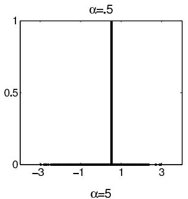

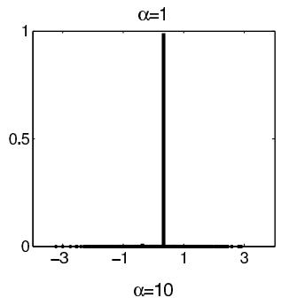

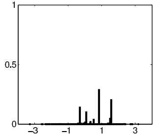

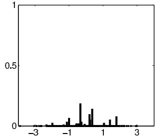  
Figure 23.1 Samples from the stick-breaking representation of the Dirichlet process with different settings of the precision parameter $\alpha$ .

zero lead to high weight on the first couple atoms, with the remaining atoms being assigned small probabilities.

Figure 23.1 shows realizations of the stick-breaking process for $P_0$ corresponding to a standard normal distribution and different values of $\alpha$ . From this figure it is apparent that the DP is not appropriate as a direct prior on the distribution of the data, particularly if the data are continuous. For continuous data, each new subject requires a new atom so that a large value of $\alpha$ is required, implying weight close to zero on each atom and hence a small probability of ties in the realizations from $P$ . In the limit as $\alpha \to \infty$ , one obtains $y_i \sim P_0$ , and hence for large $\alpha$ and no ties in the observations, the DP prior effectively models the data are drawn from the parametric base distribution.

# 23.3 Dirichlet process mixtures

Specification and Polya urns

The failure of the DP prior distribution as a direct model for the distribution of the data does not imply that it is not useful in applications. Instead, the DP is more appropriately used as a prior for an unknown mixture distribution. Focusing again on the density estimation case for simplicity, a general kernel mixture model for the density can be specified as

$$
f (y | P) = \int \mathcal {K} (y | \theta) d P (\theta), \tag {23.3}
$$

where $\mathcal{K}(\cdot |\theta)$ is a kernel, with $\theta$ including location and possibly scale parameters, and $P$ is a mixing measure. In the special case in which $P$ is treated as discrete with masses at a finite number of $k$ atoms, one obtains a finite mixture model as discussed in Chapter 22.

In a infinite kernel mixture model, one chooses a prior $P \sim \pi_{\mathcal{P}}$ for the unknown mixing measure $P$ , where $\mathcal{P}$ denotes the space of all probability measures on $(\Omega, \mathcal{B})$ and $\pi_{\mathcal{P}}$ denotes a prior over this space. The prior for the mixing measure induces a prior on the density $f(y)$ through the integral mapping in (23.3). If $\pi_{\mathcal{P}}$ is chosen to correspond to a DP prior,

then one obtains a DP mixture model. From (23.2) and (23.3), a DP prior on $P$ leads to

$$
f (y) = \sum_ {h = 1} ^ {\infty} \pi_ {h} \mathcal {K} \left(y \mid \theta_ {h} ^ {*}\right), \tag {23.4}
$$

where $\pi = \sim$ stick $(\alpha)$ is a shorthand notation to denote that the probability weights are sampled from a DP stick-breaking process with parameter $\alpha$ , and with $\theta_h \sim P_0$ independently for $h = 1, \ldots, \infty$ .

Expression (23.4) resembles the finite mixture models considered in Chapter 22, but with the important difference that the number of mixture components (latent subpopulations) is set to infinity. However, this does not imply that infinitely many components are occupied by the subjects in the sample; rather, the model allows flexibility by introducing new mixture components as subjects are added. Consider the hierarchical specification in which

$$
y _ {i} \sim \mathcal {K} (\theta_ {i}), \quad \theta_ {i} \sim P, \quad P \sim \mathrm {D P} (\alpha P _ {0}).
$$

This formulation is equivalent to sampling $y_{i}$ from the infinite mixture model in (23.4). A key question is how to conduct posterior computation under this DP mixture (DPM)? This initially seems problematic in that the mixing measure $P$ is characterized by infinitely many parameters, as is apparent in (23.2), and we no longer have joint conjugacy in which the posterior of $P$ given $y^{n} = (y_{1},\ldots ,y_{n})$ has a simple form.

A clever way around this problem is to marginalize out $P$ to obtain an induced prior distribution on the subject-specific parameters $\theta^n = (\theta_1, \ldots, \theta_n)$ . In particular, marginalizing out $P$ , we obtain the Polya urn predictive rule,

$$
p \left(\theta_ {i} \mid \theta_ {1}, \dots , \theta_ {i - 1}\right) \sim \left(\frac {\alpha}{\alpha + i - 1}\right) P _ {0} \left(\theta_ {i}\right) + \sum_ {j = 1} ^ {i - 1} \left(\frac {1}{\alpha + i - 1}\right) \delta_ {\theta_ {j}}. \tag {23.5}
$$

This conditional prior distribution consists of a mixture of the base measure $P_0$ and probability masses at the previous subject's parameter values.

A Chinese restaurant process metaphor is commonly used in describing the Polya urn scheme. Consider a restaurant with infinitely many tables. The first customer sits at a table with dish $\theta_1^*$ . The second customer sits at the first table with probability $\frac{\alpha}{1 + \alpha}$ or a new table with probability $\frac{1}{1 + \alpha}$ . This process continues with the $i$ th customer sitting at an occupied table with probability proportional to the number of previous customers at that table and sitting at a new table with probability proportional to $\alpha$ . Each occupied table in the (infinite) restaurant represents a different cluster of subjects, with new clusters added at a rate proportional to $\alpha \log n$ in the asymptotic limit. The number of clusters depends (probabilistically) on the number of subjects $n$ with new clusters introduced as needed as additional subjects are added to the sample. This makes more sense in typical applications than finite mixture models in which $k$ does not depend on $n$ and can be thought of as a formal procedure mimicking the good practice, when fitting a finite mixture model, of manually adding new mixture components as necessary to fit the data.

The simple form for the conditional distribution in (23.5) leads to a useful idea for posterior computation and prediction. From exchangeability of the subjects $i = 1, \ldots, n$ , one can obtain the conditional prior distribution for $\theta_{i}$ given $\theta_{(-i)} = (\theta_{j}, j \neq i)$ as

$$
\theta_ {i} \mid \theta_ {- i} \sim \left(\frac {\alpha}{\alpha + n - 1}\right) P _ {0} \left(\theta_ {i}\right) + \sum_ {h = 1} ^ {k ^ {(- i)}} \left(\frac {n _ {h} ^ {(- i)}}{\alpha + n - 1}\right) \delta_ {\theta_ {h} ^ {* (- i)}}, \tag {23.6}
$$

where $\theta_h^*$ , $h = 1, \ldots, k^{(-i)}$ , are the unique values of $\theta^{(-i)}$ , and $n_h^{(-i)} = \sum_{j \neq i} 1_{\theta_j = \theta_h^*}$ .

Updating the full conditional prior (23.6) with the data, one obtains a conditional posterior distribution for $\theta_{i}$ having the same form but with updated weights on the components and updated $P_0$ , as long as $P_0$ is conjugate to the kernel $\mathcal{K}$ . For example, this occurs when $\mathcal{K}(\cdot |\theta)$ is a normal kernel, with $\theta = (\mu ,\phi)$ the mean and precision and $P_0$ a normal-gamma prior distribution. Potentially, one can update the $\theta_{i}$ 's one at a time from these full conditional posterior distributions in implementing Gibbs sampling. However, this approach tends to have poor mixing.

An alternative marginal Gibbs sampler, which instead separately updates the allocation of subjects to clusters and the cluster-specific parameters, proceeds as follows. Let $\theta^{*} = (\theta_{1}^{*},\dots,\theta_{k}^{*})$ denote the unique values of $\theta$ and let $S_{i} = c$ if $\theta_{i} = \theta_{c}^{*}$ so that $S_{i}$ denotes allocation of subject $i$ to a cluster. The Gibbs sampler alternates between

1. Update the allocation $S$ by sampling from the multinomial conditional posterior with

$$
\operatorname * {P r} (S _ {i} = c \mid -) \propto \left\{ \begin{array}{c l} n _ {h} ^ {(- i)} \mathcal {K} (y _ {i} | \theta_ {c} ^ {*}) & c = 1, \ldots , k ^ {(- i)} \\ \alpha \int \mathcal {K} (y _ {i} | \theta) d P _ {0} (\theta) & c = k ^ {(- i)} + 1 \end{array} \right.
$$

If $S_{i} = k^{(-i)} + 1$ , then subject $i$ is allocated to a singleton cluster.

2. Update the unique values $\theta^{*}$ by sampling from

$$
p (\boldsymbol {\theta} _ {c} ^ {*} \mid -) \propto P _ {0} (\boldsymbol {\theta} _ {c} ^ {*}) \prod_ {i: S _ {i} = c} \mathcal {K} (y _ {i} | \boldsymbol {\theta} _ {c} ^ {*}),
$$

which is simply the posterior distribution under the parametric model that assigns prior distribution $P_0$ to the parameters $\theta_h^*$ and then updates this prior with the likelihood for those subjects in cluster $h$ .

When $P_0$ is conjugate to the kernel $\mathcal{K}$ , the integral in step 1 can be calculated analytically and the conditional posterior in step 2 has the same parametric form as $P_0$ except with updated parameters. For example, when the kernel is Gaussian, with $\theta$ the mean and variance and $P_0$ a conjugate normal-inverse-gamma prior, the conditional distribution of $\theta_c^*$ has the same normal-inverse-gamma form described in Chapter 22 in the finite mixture case. There are modifications available to accommodate nonconjugate cases as well.

In step 1 of the above Gibbs sampler, either the $i$ th subject is allocated to an existing cluster occupied by one of the other subjects in the sample or the subject is allocated to a new cluster. The conditional posterior probability of allocation to a new cluster is proportional to the DP precision parameter $\alpha$ multiplied by the marginal likelihood for the $i$ th subject's data, obtained in integrating the likelihood $\mathcal{K}(y_i|\theta)$ over the prior $\theta \sim P_0$ . If $\alpha$ is close to zero or this marginal likelihood is small relative to the likelihoods for the $i$ th subject's data given allocation to one of the occupied clusters, then subject $i$ will tend to be allocated to an existing cluster. Hence, both $\alpha$ and $P_0$ play important roles in controlling the posterior distribution over clusterings. As $\alpha$ decreases, there is an increasing tendency to cluster subjects, with a parametric model $y_i \sim \mathrm{K}(\theta)$ for a common $\theta$ obtained in the limit as $\alpha \to 0$ . In practice, it is common to either set $\alpha = 1$ to favor allocation to few clusters or to choose a gamma hyperprior for $\alpha$ to allow greater data-adaptivity, with an additional MCMC step included to update $\alpha$ .

Somewhat more subtle, and often overlooked, is the role of $P_0$ in controlling clustering behavior. One may naively try a high variance $P_0$ to express ignorance about the prior distribution of likely locations for the different kernels. However, similarly as discussed in Section 7.4, a flat prior for $P_0$ can turn out to make strong assumptions, in this case effectively placing a heavy penalty on the introduction of new clusters. This is because as the variance of $P_0$ becomes high, the marginal likelihood will decrease, since the prior $P_0$ places small probability in a region of plausible $\theta$ values in such cases. In the limit as the variance of $P_0 \to \infty$ , the posterior will behave as if the likelihood is $y_i \sim \mathrm{K}(\theta)$ with

a common $\theta$ for all individuals. In practice, we recommended constructing an informative $P_0$ placing high probability on introducing clusters near the support of the data; this can be facilitated by standardizing the data in advance of the analysis. Refer to the relevant discussion in Chapter 22.

This Gibbs sampler for Dirichlet process models closely resembles the Gibbs sampler for finite mixtures, with the main difference being that we marginalize out the weights $\pi$ on the different clusters and allow the number of clusters to vary across the samples. The number of mixture components $k$ represented in the sample of $n$ subjects is treated as unknown, and we obtain samples from the posterior of $k$ automatically without needing a reversible jump MCMC algorithm. From the Gibbs samples, we can also estimate the predictive density of $y_{n + 1}$ using

$$
p (y) = \sum_ {c = 1} ^ {k} \left(\frac {n _ {c}}{n + \alpha}\right) K (y | \theta_ {c} ^ {*}) + \left(\frac {\alpha}{n + \alpha}\right) \int K (y | \theta) d P _ {0} (\theta),
$$

averaged over posterior simulations. The simplicity of this Gibbs sampler and the ability to bypass the issue of selection of $k$ by embedding in an infinite mixture model, which automatically introduces new components at a slow rate as needed when additional subjects are added to the sample, are major reasons for the large applied success of Dirichlet process mixture models.

The Gibbs sampler for finite mixture models introduced in Chapter 22 provides an approximation to a DP mixture model with $P \sim DP(\alpha P_0)$ as long as the mixture component-specific parameters are drawn iid a priori from $P_0$ and the prior on the weights is $\pi \sim \mathrm{Dirichlet}(\frac{\alpha}{k},\dots,\frac{\alpha}{k})$ . The approximation improves with $k$ and in practice one can set $k$ equal to a conservative upper bound on the number of occupied clusters in the sample ( $k = 25$ or 50 can work well). Indeed, we refer the reader to the discussions in Chapter 22 pertaining to the issues that arise in finite mixture modeling, as essentially the same issues arise in infinite discrete mixtures, such as DPMs, and the same solutions apply.

# Blocked Gibbs sampler

By marginalizing out the random probability measure $P$ , we give up the ability to conduct inferences on $P$ . By having approaches that avoid marginalization, we open the door to generalizations of DPMs for which marginalization is not possible analytically. One approach for avoiding marginalization is to rely on the construction in (23.4). Because the stick-breaking construction orders the mixture components so that the weights are stochastically decreasing in the index $h$ , for a sufficiently high index $N$ , we will have that $\sum_{N+1}^{\infty} \pi_h$ has a distribution concentrated near zero. Hence, we can obtain an accurate approximation by letting $V_N = 1$ in the stick-breaking process so that $\pi_h = 0$ for $h = N+1, \ldots, \infty$ , with $N$ chosen to be sufficiently large. In practice, $N = 25$ or 50 is commonly chosen as a default, with $N$ providing an upper bound on the number of clusters in the $n$ subjects in the sample. We have rarely seen a need for more than 10 or 15 clusters to accurately fit the unknown density.

The truncation approximation to the DP leads to a straightforward MCMC algorithm for posterior computation, and represents an alternative to the finite Dirichlet approximation described in Chapter 22. It is not clear which of these approaches leads to more efficient posterior computation, though the exchangeability of the components in the finite Dirichlet approximation conveys some advantages in terms of mixing. Using the stick-breaking truncation, the following blocked Gibbs sampler can be used:

1. Update $S_{i} \in \{1, \dots, N\}$ by multinomial sampling with

$$
\operatorname * {P r} (S _ {i} = c | -) = \frac {\pi_ {c} \mathcal {K} (y _ {i} | \theta_ {c} ^ {*})}{\sum_ {c ^ {\prime} = 1} ^ {N} \pi_ {c ^ {\prime}} \mathcal {K} (y _ {i} | \theta_ {c ^ {\prime}} ^ {*})}, \quad c ^ {\prime} = 1, \ldots , N,
$$

where $S_{i} = c$ if $\theta_{i} = \theta_{c}^{*}$ denotes that subject $i$ is allocated to cluster $c$ .

2. Update the stick-breaking weight $V_{c}$ , $c = 1, \ldots, N - 1$ , from $\mathrm{Beta}\left(1 + n_c, \alpha + \sum_{c' = c + 1}^{N} n_{c'}\right)$ .   
3. Update $\theta_c^*$ , $c = 1, \ldots, N$ , exactly as in the finite mixture model, with the parameters for unoccupied clusters with $n_c = 0$ sampled from the prior $P_0$ .

This algorithm involves simple sampling steps and is straightforward to implement. In order to estimate the density $f(y)$ one can follow the approach of monitoring $f(y) = \sum_{c=1}^{N} \pi_h \mathcal{K}(y | \theta_c^*)$ at each iteration over a dense grid of $y$ values (for example, an equally spaced grid of 100 values ranging from the minimum of the observed $y$ 's minus a small buffer to the maximum of the observed $y$ 's plus a small buffer). Based on these samples, we can compute posterior inferences.

When running the algorithm, it is good practice to monitor $S_{\mathrm{max}} = \max (S_1,\ldots ,S_n)$ to verify that the maximum occupied component index has a low probability of being close to the upper bound of $N$ . Otherwise, the upper bound should be increased. Convergence should be monitored on the sampled $f(y)$ values and not to the mixture component-specific parameters. As discussed in Chapter 22, label ambiguity problems often lead to poor mixing of the component-specific parameters, but this may not impact convergence and mixing of the induced density of interest.

Gibbs sampling algorithms that rely on stick-breaking representations have performed well in our experience. But in some cases, all of the above algorithms can encounter slow mixing that arises due to the multimodal nature of the posterior in which it can be difficult to move rapidly between different clusterings. This mixing problem can be partly addressed by incorporating label switching moves and there is also a literature on split-merge algorithms designed for more rapid exploration of the distribution of cluster allocations.

# Hyperprior distribution

The DP precision parameter $\alpha$ plays a key role in controlling the prior on the number of clusters, and there are a number of possible strategies in terms of specifying $\alpha$ . One can fix $\alpha$ at a small value to favor allocation to few clusters relative to the sample size, with a commonly used default value corresponding to $\alpha = 1$ . This implies that, in the prior distribution, two randomly selected individuals have a 50-50 chance of belonging to the same cluster. Alternatively, one can allow the data to inform about the appropriate value of $\alpha$ by choosing a hyperprior, such as $\alpha \sim \mathrm{Gamma}(a_{\alpha}, b_{\alpha})$ , and then updating $\alpha$ during the MCMC analysis. For the blocked Gibbs sampler, the gamma hyperprior is conditionally conjugate with the resulting conditional posterior being

$$
\alpha | - \sim \operatorname {G a m m a} \bigg (a _ {\alpha} + N - 1, b _ {\alpha} - \sum_ {h = 1} ^ {N - 1} \log (1 - V _ {h}) \bigg).
$$

Hence, sampling from this conditional can be included as an additional step in the algorithm described in the previous subsection.

In our experience, the data tend to be informative about the precision parameter $\alpha$ of the Dirichlet process, and hence there is substantial Bayesian learning, with a high variance prior often resulting in a concentrated, low-variance posterior. It may seem counterintuitive that the data can inform strongly about the number of clusters through the hyperparameter $\alpha$ given that maximum likelihood estimation leads to overfitting, with more clusters resulting in a higher maximized likelihood. However, the Bayesian approach favors clusterings and values of $\alpha$ that result in a high marginal likelihood. If individuals are allocated to many different clusters, the effective number of parameters in the likelihood is increased, and we then integrate across a larger space in calculating the marginal likelihood. This induces an

intrinsic penalty that favors allocation to few clusters that are really needed to fit the data; there is no tendency for overfitting.

The more difficult and subtle issue is choice of the base measure $P_0$ . Often the base measure is chosen for computational convenience to be conjugate. However, even in conjugate parametric families such as normal-gamma, we can potentially improve flexibility by placing hyperparameters on the parameters in $P_0$ . $P_0$ can be thought of as inducing the prior for the cluster locations. If these locations are too spread out, because $P_0$ has high variance, then the penalty in the marginal likelihood for allocating individuals to different clusters will be large, and the tendency will be to overly favor allocation to a single cluster.

It is crucial to consider the measurement scale of the data in choosing $P_0$ . The variance of $P_0$ is only meaningful relative to the scale of the data. A common approach is to standardize the data $y$ and then choose $P_0$ to be centered at zero with close to unit variance. If we set unit variance and do not standardize, then how flat $P_0$ is depends on the unit of measurement in the data—if we change from inches to miles, we may get completely different results.

# Example. A toxicology application

As an illustrative application, we consider data from a developmental toxicology study of ethylene glycol in mice conducted by the National Toxicology Program. In particular, $y_{i}$ is the number of implantations in the $i$ th pregnant mouse, with mice assigned to dose groups of 0, 750, 1500, or $3000\mathrm{mg / kg / day}$ . Group sizes were 25, 24, 23, and 23, respectively. Scientific interest focuses on studying a dose response trend in the number of implants, and we initially focus on separately estimating the distribution within each group. As in many biological applications in which there are constraints on the range of the counts, the data are underdispersed: the mean is 12.5 and the variance is 6.8 in the control group. Figure 23.2 presents a histogram of the raw data for the control group (25 mice), along with a series of estimates of the posterior probabilities $\operatorname*{Pr}(y = j)$ assuming $y_{i}\sim P$ with $P\sim \mathrm{DP}(\alpha P_0)$ , $\alpha = 1$ or 5, and $P_0$ set to Poisson $(\overline{y})$ for simplicity.

This approach places a Dirichlet process prior directly on the distribution of the count data instead of using a Dirichlet process mixture. Counts are discrete so this seems like a reasonable initial approach. In addition, when a Dirichlet process is used directly for the distribution of the data, one can rely on the conjugacy property to avoid MCMC. In particular, assuming $y_{i} \stackrel{i d}{\sim} P$ for $i = 1, \ldots, 25$ (focusing only on the mice in the control group to start), and $P \sim \mathrm{DP}(\alpha P_0)$ , we have

$$
P | y _ {1}, \dots , y _ {n} \sim \mathrm {D P} \bigg (\alpha P _ {0} + \sum_ {i = 1} ^ {n} \delta_ {y _ {i}} \bigg),
$$

so that the posterior mean probability of $y = j$ is simply

$$
\operatorname * {P r} (y = j | y _ {1}, \ldots , y _ {n}) = \left(\frac {\alpha}{\alpha + n}\right) P _ {0} (j) + \left(\frac {1}{\alpha + n}\right) \sum_ {i = 1} ^ {n} 1 _ {y _ {i} = j},
$$

where $P_0(j)$ is the probability of $y = j$ under $P_0$ in the prior distribution. This expression is simply the weighted average of the prior mean and the proportion of cases where $y = j$ in the observed data, with the weight on the prior being $\alpha$ and the weight on the data being $n$ .

To illustrate the behavior as the sample size increases, we take a random subsample of the data of size 10. As Figures 23.2 and 23.3 illustrate, the lack of smoothing in the nonparametric Bayes estimate under a Dirichlet process prior is unappealing in not allowing borrowing of information about local deviations from $P_0$ . In particular, for small sample sizes as in Figure 23.3, the posterior mean probability mass function

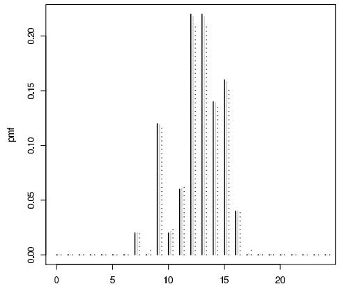  
Figure 23.2 Histogram of the number of implantations per pregnant mouse in the control group (black line) and posterior mean of $\operatorname{Pr}(y = j)$ assuming a Dirichlet process prior on the distribution of the number of implants with $\alpha = 1,5$ (gray and black dotted lines, respectively) and base measure $P_0 = \text{Poisson}(y)$ .

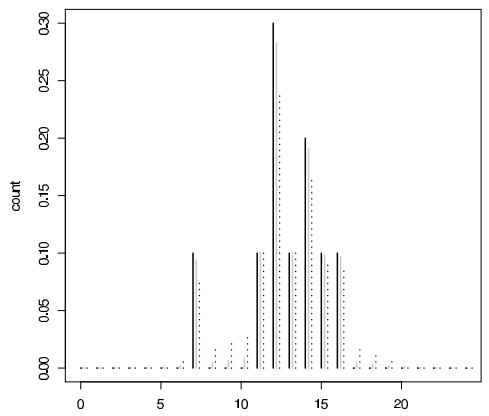  
Figure 23.3 Histogram of a subsample of size 10 from the control group on implantation in mice (black line) and posterior mean of $\operatorname{Pr}(y = j)$ assuming a DP prior on the distribution of the number of implants with $\alpha = 1,5$ (gray and black dotted lines, respectively) and base measure $P_0 = \text{Poisson}(\underline{y})$ .

corresponds to the base measure with high peaks on the observed $y$ . As the sample size increases, the empirical probability mass function increasingly dominates the base.

Potentially, by using a Dirichlet process mixture (DPM) instead of a DP directly, one may obtain better performance in practice. For count data, it seems natural to use a Poisson kernel $K(\cdot)$ with a gamma base measure $P_0$ , so that

$$
y _ {i} \sim \operatorname {P o i s s o n} \left(\theta_ {i}\right), \quad \theta_ {i} \sim P, \quad P \sim \mathrm {D P} \left(\alpha P _ {0}\right), \quad P _ {0} = \operatorname {G a m m a} (a, b). \tag {23.7}
$$

In this case, we can easily work out the steps involved in the blocked Gibbs sampler.

1. Update $S_{i} \in \{1, \dots, N\}$ by multinomial sampling with

$$
\operatorname * {P r} (S _ {i} = c | -) = \frac {\pi_ {h} \mathrm {P o i s s o n} (y _ {i} | \theta_ {h} ^ {*})}{\sum_ {c ^ {\prime} = 1} ^ {N} \pi_ {c ^ {\prime}} \mathrm {P o i s s o n} (y _ {i} | \theta_ {c ^ {\prime}} ^ {*})}, \quad c = 1, \ldots , N,
$$

where $S_{i} = c$ if $\theta_{i} = \theta_{c}^{*}$ denotes that subject $i$ is allocated to cluster $h$ .

2. Update the stick-breaking weight $V_{c}$ , $c = 1, \dots, N - 1$ , from

$$
\mathrm {B e t a} \bigg (1 + n _ {c}, \alpha + \sum_ {c ^ {\prime} = c + 1} ^ {N} n _ {c ^ {\prime}} \bigg).
$$

3. Update $\theta_h^*$ , $h = 1, \dots, N$ , from its conditional posterior,

$$
\operatorname {G a m m a} \left(a + \sum_ {i: S _ {i} = h} y _ {i}, b + n _ {h}\right),
$$

with $n_c = \sum_{i=1}^n 1_{S_i = c}$ , the size of the $c$ -th cluster.

A conservative upper bound of $N = n$ can be used for the truncation level.

Although a Dirichlet process mixture of Poissons is the obvious choice and leads to simple computation, there is a lurking problem with this approach, which is a common issue in hierarchical Poisson models in general. In particular, the Poisson kernel is inflexible in that it restricts the mean and variance to be equal. In using a mixture of Poissons, such as the DPM in (23.7), one can only increase the variance relative to the mean. Hence, mixtures of Poissons are only appropriate for modeling overdispersed count distributions and produce poor results in the toxicology data on implantations. In particular, the estimated dose group-specific distributions of the number of implants under the DPM of Poissons exhibit substantially larger variance than the empirical distributions, suggesting a poor fit.

For continuous data, Gaussian kernels are routinely used and do not have this pitfall in having separate parameters for the mean and variance. Gaussians are easily modified to the count case by relying on rounding. In particular, let

$$
y _ {i} = h \left(y _ {i} ^ {*}\right), \quad y _ {i} ^ {*} \sim \mathrm {N} \left(\mu_ {i}, \tau_ {i} ^ {- 1}\right), \quad \left(\mu_ {i}, \tau_ {i}\right) \sim P, i = 1, \dots , n, \quad P \sim \mathrm {D P} \left(\alpha P _ {0}\right), \tag {23.8}
$$

with $h(\cdot)$ a rounding function that has $h(y^{*}) = j$ if $y^{*} \in (a_{j}, a_{j + 1}]$ for $j = 0, 1, 2, \ldots, \infty$ , $a_0 = -\infty$ , $a_j = j - 1$ , $j = 1, \ldots, \infty$ , and $P_0(\mu, \tau) = N(\mu |\mu_0, \kappa \tau^{-1})$ Gamma $(\tau | a_{\tau}, b_{\tau})$ . For this rounded Gaussian kernel, we can derive a simple blocked Gibbs sampler, which has the following steps.

1. Update $S_{i} \in \{1, \dots, N\}$ by multinomial sampling with

$$
\operatorname * {P r} (S _ {i} = c \mid -) = \frac {\pi_ {c} p (y _ {i} | \mu_ {c} ^ {*} , \tau_ {c} ^ {*})}{\sum_ {c ^ {\prime} = 1} ^ {N} \pi_ {c ^ {\prime}} p (y _ {i} | \mu_ {c ^ {\prime}} ^ {*} , \tau_ {c ^ {\prime}} ^ {*})}, \quad c = 1, \ldots , N,
$$

where $p(y_{i}|\mu_{c}^{*},\tau_{c}^{*}) = \Phi (a_{j + 1}|\mu_{c}^{*},\tau_{c}^{*}) - \Phi (a_{j}|\mu_{c}^{*},\tau_{c}^{*})$ , and $\Phi (z|\mu ,\tau)$ is the normal cumulative distribution function with location $\mu$ and precision $\tau$ .

2. Update stick-breaking weight $V_{h}$ , $h = 1, \dots, N - 1$ , from

$$
\operatorname {B e t a} \bigg (1 + n _ {c}, \alpha + \sum_ {c ^ {\prime} = c + 1} ^ {N} n _ {c ^ {\prime}} \bigg).
$$

3. Generate each $y_{i}^{*}$ from the full conditional posterior

$$
u _ {i} \sim \mathrm {U} \big (\Phi (a _ {y _ {i}} | \mu_ {S _ {i}} ^ {*}, \tau_ {S _ {i}} ^ {*}), \Phi (a _ {y _ {i} + 1} | \mu_ {S _ {i}} ^ {*}, \tau_ {S _ {i}} ^ {*}) \big), y _ {i} ^ {*} = \Phi^ {- 1} (u _ {i} | \mu_ {S _ {i}} ^ {*}, \tau_ {S _ {i}} ^ {*}).
$$

4. Update $\theta_c^* = (\mu_c^*,\tau_c^*)$ $c = 1,\dots ,N$ , from its conditional posterior,

$$
\mathrm {N} (\mu_ {c} ^ {*} | \hat {\mu} _ {c}, \hat {\kappa} _ {c} \tau_ {c} ^ {- 1}) \mathrm {G a m m a} (\tau_ {c} | \hat {a} _ {\tau_ {c}}, \hat {b} _ {\tau_ {c}}),
$$

with $\hat{a}_{\tau_c} = a_{\tau} + \frac{n_c}{2}$ , $\hat{b}_{\tau_c} = b_{\tau} + \frac{1}{2}\left(\sum_{i:S_i = c}(y_i^* -\overline{y}_c^*) + \frac{n_c}{1 + \kappa n_c} (\overline{y}_c^* -\mu_0)^2\right)$ , $\hat{\kappa}_c = (\kappa^{-1} + n_c)^{-1}$ and $\hat{\mu}_c = \hat{\kappa}_c(\kappa^{-1}\mu_0 + n_h\overline{y}_c^*)$

Essentially, we just impute the latent $y_{i}^{*}$ within the third step of the Gibbs sampler and otherwise proceed as if we were modeling the data using a DPM location-scale mixture of Gaussians. In fact, the above steps can also be used for Bayesian density estimation of continuous densities in which the observed data are $y_{i}^{*}$ and we have no need for step 3.

We repeated our analysis of the toxicology data on implantations using the DPM of rounded Gaussians approach, and obtained an excellent fit to the data, improving on the DPM of Poissons result. The empirical cumulative distribution functions are entirely enclosed within pointwise $95\%$ credible intervals. To conduct inferences on changes in the distribution of the number of implants with dose, we estimated summaries of the posterior distributions for changes in each percentile between the control group and each of the exposed groups. Negative changes for an exposed group relative to control suggest an adverse impact of dose. The estimated posterior probabilities of a negative average change across the percentiles was 0.72 in the $750~\mathrm{mg / kg}$ group, 0.99 in the $1500~\mathrm{mg / kg}$ group, and 0.94 in the $3000~\mathrm{mg / kg}$ group. Hence, there was substantial evidence of a stochastic decrease in the number of implants in the higher two dose groups relative to control.

# 23.4 Beyond density estimation

# Nonparametric residual distributions

Density estimation has been used to this point primarily to simplify the exposition of a difficult topic. The real attraction of Dirichlet process mixture (DPM) models is that they can be used much more broadly for relaxing parametric assumptions in hierarchical models. This section is meant to give a flavor of some of the possibilities without being comprehensive. First, consider the linear regression setting with a nonparametric error distribution:

$$
y _ {i} = X _ {i} \beta + \epsilon_ {i}, \quad \epsilon_ {i} \sim f, \tag {23.9}
$$

where $X_{i} = (X_{i1},\ldots ,X_{ip})$ is a vector of predictors and $\epsilon_{i}$ is an error term with distribution $f$ . The assumption of linearity in the mean is easily relaxed as discussed earlier. Here, we consider the problem of relaxing the assumption that $f$ , the distribution of errors, has a parametric form.

In Chapter 17 we considered the $t$ model as a way to downweight the influence of outliers. This is easily accomplished computationally by expressing the $t_\nu$ distribution as a scale mixture of normals by letting $\epsilon_i\sim \mathrm{N}(0,\phi_i^{-1}\sigma^2)$ , with $\phi_{i}\sim \mathrm{Gamma}\sim (\frac{\nu}{2},\frac{\nu}{2})$ . Although the $t$ distribution may be preferred over the normal due to its heavy tails, it still has a restrictive shape and we could instead model $f$ nonparametrically using a DP scale mixture of normals:

$$
\epsilon_ {i} \sim \mathrm {N} (0, \phi_ {i} ^ {- 1}), \quad \phi_ {i} \sim P, \quad P \sim \mathrm {D P} (\alpha P _ {0}),
$$

where $P_0$ is chosen to correspond to $\mathrm{Gamma}(\frac{\nu}{2},\frac{\nu}{2})$ to center the prior for $f$ on a $t$ distribution, while allowing more flexibility. The resulting prior for $f$ is flexible but is still restricted to be unimodal and symmetric about zero.

An alternative which removes the unimodality and symmetry constraints is to use a location mixture of Gaussians for $f$ . Removing the intercept from the $X_{i}\beta$ term and allowing $f$ to have an unknown mean, let

$$
\epsilon_ {i} \sim \mathrm {N} (\mu_ {i}, \tau^ {- 1}), \quad \mu_ {i} \sim P, \quad P \sim \mathrm {D P} (\alpha P _ {0}), \quad \tau \sim \mathrm {G a m m a} (a _ {\tau}, b _ {\tau}),
$$

with $P_0$ chosen as $\mathrm{N}(0,\tau^{-1})$ . The computations for density estimation can be easily adapted to include steps for updating the regression coefficients $\beta$ and then replacing $y_{i}$ with $y_{i} - X_{i}\beta$ in the previous steps.

Nonparametric models for parameters that vary by group

In Chapter 15 we considered hierarchical linear models with varying coefficients. Uncertainty about the distribution of the coefficients can be taken into account by placing DP or DPM priors on their distributions. As a simple illustration, consider the one-factor Anova model,

$$
y _ {i j} = \mu_ {i} + \epsilon_ {i j}, \quad \mu_ {i} \sim f, \quad \epsilon_ {i j} \sim g,
$$

with $y_{i} = (y_{i1},\ldots ,y_{i,n_{i}})$ a vector of repeated measurements for item $i$ , $\mu_{i}$ a subject-specific mean, and $\epsilon_{ij}$ an observation-specific residual. Typical parametric models would let $f$ correspond to a $\mathrm{N}(\mu ,\psi^{-1})$ density, while letting $g\equiv \mathrm{N}(0,\sigma^2)$ .

To allow more flexibility in characterizing variability among subjects, we can instead let

$$
\mu_ {i} \sim P, \quad P \sim \mathrm {D P} \left(\alpha P _ {0}\right), \tag {23.10}
$$

where $P$ is the unknown distribution of the varying parameters and for simplicity we model the residual density $g$ as $\mathrm{N}(0,\sigma^2)$ . Placing a DP prior on the distribution induces a latent class model in which the subjects are grouped into an unknown number of clusters, with

$$
\mu_ {i} = \mu_ {S _ {i}} ^ {*}, \quad \operatorname * {P r} (S _ {i} = h) = \pi_ {h}, \quad h = 1, 2, \ldots ,
$$

where $S_{i} \in \{1, \dots, \infty\}$ is a latent class index, and $\pi_{h}$ is the probability of allocation to latent class $h$ , with these probabilities following the stick-breaking form as in (23.2). As for finite latent class models, this formulation assumes that the distribution of the varying parameters is discrete so that different subjects can have identical values of the parameters. This may be useful as a simplifying assumption and the posterior means will be different for every subject, since the clustering is soft and probabilistic, with the posterior means of $\mu_{i}$ obtained averaging across the posterior distribution on the cluster allocation.

There are some practical questions that arise in considering nonparametric hierarchical models such as (23.10). The first is whether the data contain information to allow nonparametric estimation of $P$ given that the modeled parameters $\mu_{i}$ are not observed directly for any of the subjects. The answer to this question and the interpretation of the resulting estimate depends on the number of observations per subject. Suppose initially that $n_i = 1$ for all subjects. In this case, we do not have any information in the data to distinguish variability among subjects from variability among measurements within a subject. However, under the assumption of normality of the residual density $g$ , we still have substantial information in the data about $P$ in that $P$ accommodates lack of fit of the normal residual distribution. In the general case in which $n_i \geq 1$ and normal $g$ is assumed, $P$ has a dual role in allowing for lack of fit of the normal distribution for the residuals and systematic variability among subjects. When there are many observations per subject, that later role dominates, but when $n_i$ is small interpretation of $P$ needs to take into account the dual roles.

One natural possibility for removing this confounding is to also model $g$ using a Dirichlet process mixture of Gaussians. In this case, the data contain less information about the distribution, and accurate estimation may require a dataset with many observations per item and many items. In the case in which the distribution of the parameters and the residual distribution are both unknown, an identifiability issue does arise in that it is difficult in nonparametric Bayes models to restrict the mean of the distribution to be zero. However, one can run the MCMC analysis for an overparameterized model without restrictions on the means and then post-process to estimate the overall mean and mean-centered parameters and residual densities.

# Functional data analysis

In Chapter 21 we discussed Gaussian processes for functional data analysis, where responses and predictors for a subject are not modeled as scalar or vector-valued random variables but instead as random functions defined at infinitely many points. Here we consider a basis function expansion related to the approaches considered in Chapter 20.

Let $y_{i} = (y_{i1},\ldots ,y_{in_{i}})$ denote the observations on function $f_{i}$ for subject $i$ , where $y_{ij}$ is an observation at point $t_{ij}$ , with $t_{ij}\in \mathcal{T}$ . Allowing for measurement errors in observations of a smooth trajectory, let

$$
y _ {i j} \sim \mathrm {N} \left(f _ {i} \left(t _ {i j}\right), \sigma^ {2}\right). \tag {23.11}
$$

and

$$
f _ {i} (t) = \sum_ {h = 1} ^ {H} \theta_ {i h} b _ {h} (t), \quad \theta_ {i} = (\theta_ {i 1}, \dots , \theta_ {i H}),
$$

where $b = \{b_l\}_{h=1}^H$ is a collection of basis functions and $\theta_i$ is a vector of subject-specific basis coefficients. Here, we are assuming a common collection of potential basis functions, but by allowing elements of the $\theta_i$ coefficient vectors to be zero or close to zero, we can discard unnecessary basis functions and even accommodate subject-specific basis function selection. In many applications, it is necessary to allow different subjects to have a different basis for sufficient flexibility. By using a common dictionary of bases across subjects, we allow a common backbone from which a hierarchical model for borrowing information can be built.

To borrow information across subjects and model the variability in the individual functions, let

$$
\theta_ {i} \sim P,
$$

where the $H$ -dimensional distribution $P$ must be specified or modeled. Potentially, we can consider a parametric family in which $P = \mathrm{N}_H(\theta, \Omega)$ , with the resulting mean function then corresponding to $\overline{f}(t) = b(t)\theta$ , where $b(t) = (b_1(t), \ldots, b_H(t))$ . This mean function provides a population-averaged curve. In addition, the hierarchical covariance matrix $\Omega$ characterizes heterogeneity among the subjects in their functions. There are several practical issues that arise with this parametric hierarchical model. Firstly, the number of basis functions $p$ is typically moderate to large, and hence $\Omega$ will have many parameters and it can be difficult to reliably estimate all these parameters. In addition, there is no allowance for basis function selection through shrinking the basis coefficients to zero. Although one could potentially choose a prior for $\Omega$ that allows diagonal elements close to zero, this would discard the corresponding basis functions for all subjects and does not accommodate subject-specific selection. Finally, the normality assumption for the varying parameters implies a restrictive type of variability across subjects; for example, it cannot accommodate sub-populations of subjects having different functions and outlying functions.

An alternative is to use a Dirichlet process prior, $P \sim \mathrm{DP}(\alpha P_0)$ . This will induce functional clustering with

$$
f _ {i} (t) = f _ {S _ {i}} ^ {*} (t), \quad f _ {h} ^ {*} (t) = b (t) \theta_ {c} ^ {*}, \quad \operatorname * {P r} (S _ {i} = c) = \pi_ {c}, \quad \theta_ {c} ^ {*} \sim P _ {0},
$$

All individuals within cluster $c$ will have $f_{i}(t) = f_{c}^{*}(t)$ , with the basis coefficients characterizing the cluster $c$ function being $\theta_c^* = (\theta_{c1}^*,\dots,\theta_{cH}^*)$ . By choosing an appropriate base measure $P_0$ within the functional $DP$ , one can allow the basis functions to differ across the clusters and hence allow individual-specific basis selection through cluster-specific basis selection.

There are two good possibilities in this regard. Firstly, one can let $P_0 = \bigotimes_{h=1}^{H} P_{0h}$ , with $P_{0h}$ specified to have a variable selection-type mixture form:

$$
P _ {0 h} (\cdot) = \pi_ {0 h} \delta_ {0} (\cdot) + (1 - \pi_ {0 h}) \mathrm {N} (\cdot | 0, \psi_ {h} ^ {- 1}),
$$

possibly with $\psi_h \sim \mathrm{Gamma}(\frac{\nu}{2}, \frac{\nu}{2})$ to induce a heavy-tailed $t$ prior for the nonzero basis coefficients. In sampling the cluster-specific basis coefficients from this prior, $\theta_{ch}^{*} \sim P_{0h}$ independently for $h = 1, \ldots, H$ , a subset of the elements of $\theta_c^*$ will be exactly equal to 0, with this subset varying across the different functional clusters. By letting $\pi_{0h} \sim \mathrm{Beta}(a, b)$ , one can allow uncertainty in the prior probability of exclusion of the $h$ -th basis function, while borrowing information across functional clusters in learning about which basis functions are needed overall.

This approach leads to a straightforward Gibbs sampler, incorporating minor modifications to the blocked Gibbs sampling or finite Dirichlet approximation algorithms described above. After allocating subjects to clusters, we can update $\theta_{ch}^{*}$ by direct sampling from its full conditional distribution, which will have a mixture form consisting of a point mass at zero and a normal distribution. This has a similar form to that described in Chapter 20 for nonparametric regression with basis selection. Each pass through the Gibbs updating steps will vary the allocation of subjects to functional clusters and the basis functions selected to characterize the functional trajectories. Based on the resulting posterior samples, we can obtain model-averaged estimates of the functions specific to each subject.

Although this approach tends to work well in practice, the one-at-a-time updates of the $\theta_{ch}^{*}$ s specific to each cluster and basis function can lead to a high computational burden for each iteration of each Gibbs sweep as well as slow mixing of the chains. An alternative that leads to similar estimation performance in practice, while simplifying and substantially speeding up posterior computation, is to use a heavy-tailed shrinkage prior in place of the variable selection mixture prior. In particular, one simple choice is

$$
\theta_ {c h} ^ {*} \sim \mathrm {N} (0, \psi_ {c h} ^ {- 1}), \quad \psi_ {c h} ^ {*} \sim \mathrm {G a m m a} (\frac {\nu}{2}, \frac {\nu}{2}),
$$

with $\nu$ chosen to be small; for example, $\nu = 1$ provides a default that leads to a Cauchy marginal prior for the basis coefficients. Under this approach, the basis coefficient vectors $\theta_c^*$ can be updated in a block from multivariate normal full conditional posterior distributions. This block updating can accelerate mixing substantially. Although this approach does not formally allow for basis selection in that none of the coefficients will be exactly zero, the prior is concentrated at zero with heavy tails and hence allows coefficients that are close to zero. For small basis coefficients, the corresponding basis functions are effectively excluded and in practice it is impossible to distinguish small nonzero coefficients from coefficients that are exactly zero. In most applications, it can be argued that coefficients will not be exactly zero in any case.

# 23.5 Hierarchical dependence

In the previous sections we discussed Dirichlet process mixture models for a single unknown distribution. This unknown distribution can be the distribution of the data directly or some component of a hierarchical Bayesian model. To build rich semiparametric hierarchical models, one may potentially incorporate several DPs, set to be independent in the prior distribution. This approach was implemented in the toxicology data analysis in the previous section. However, there are clear limits to this strategy and in many settings it is appealing to use priors that favor dependence in unknown distributions. To motivate the need for such generalizations, we start by describing an application in which such flexibility is warranted.

# Example. A genotoxicity application

Suppose we have an experimental study in which observations are taken for 'subjects' in different groups on a continuous response variable. In particular, let $y_{i}$ denote the response for subject $i$ and let $x_{i} \in \{1,\dots,T\}$ denote the group. For example, in genotoxicity studies utilizing single cell gel electrophoresis (also known as the 'comet

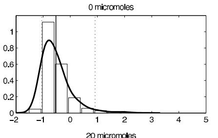

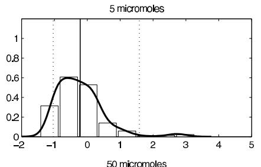

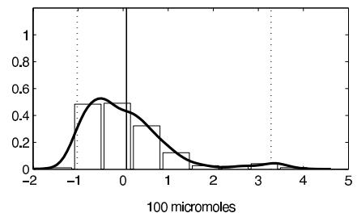

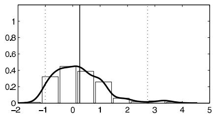

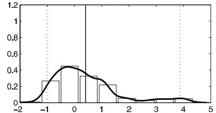  
Figure 23.4 Histograms and kernel-smoothed density estimates of DNA damage across cells in each hydrogen peroxide dose group in the genotoxicity example.

assay') to measure DNA damage, $y_{i}$ denotes a measure of the amount of DNA damage in cell $i$ and $x_{i}$ denotes the dose group of a potentially genotoxic exposure. The emphasis of such studies is on assessing how the density of DNA damage across cells changes with dose. Figure 23.4 shows histograms and kernel-smoothed density estimates within each dose group for data collected in a genotoxicity study in which the dose groups correspond to different levels of exposure to hydrogen peroxide, a known genotoxic chemical, and DNA damage is measured on the individual cell level using the comet assay. It is apparent from the figure that the lower quantiles of the response density do not change much at all with level of exposure, while the higher quantiles increase dramatically with increasing dose. This is as expected due to variability among the cells and to the fact that it is not possible experimentally to get the same dose to all cells.

This tendency for the upper quantiles of a response density to be more sensitive to an exposure is certainly not unique to genotoxicity studies and is a natural consequence of variability among experimental units in their sensitivity to exposure. In addition, even beyond toxicology and epidemiology applications assessing the impact of exposures, it is common in broad applications to observe differential changes in the different quantiles with predictors. From an applied perspective, a fundamental question is how to model such data. A standard parametric modeling approach would let

$$
y _ {i} \sim \mathrm {N} (\mu + \sum_ {j = 2} ^ {T} 1 _ {x _ {i} = j} \beta_ {j}, \sigma^ {2}), \tag {23.12}
$$

where $\mu$ is the expected measure of damage for cells is the unexposed control group

for which $x_{i} = 1$ , $\beta_{j}$ is the shift in the mean response for cells in group $j$ , and $\sigma^2$ is a common variance parameter. This model falls short in assuming the response is normally distributed within each group and only allowing the mean to shift.

# Dependent Dirichlet processes

A Dirichlet process provides a prior for a single random probability measure, $P \sim \mathrm{DP}(\alpha P_0)$ . Focusing on the comet assay application and on modeling the density of DNA damage within the $j$ th group, a natural approach would be to use the DP location-scale mixture of Gaussians,

$$
\begin{array}{l} {f _ {j} (y)} = {\int \mathrm {N} (y | \mu , \phi^ {- 1}) d P _ {j} (\mu , \phi), P _ {j} \sim \mathrm {D P} (\alpha_ {j} P _ {0 j}),} \\ = \sum_ {h = 1} ^ {\infty} \pi_ {j h} \mathrm {N} (y | \mu_ {j h} ^ {*}, \phi_ {j h} ^ {* - 1}), \pi_ {j} \sim \operatorname {s t i c k} (\alpha_ {j}), (\mu_ {j h} ^ {*}, \phi_ {j h} ^ {*}) \sim P _ {0 j}. \\ \end{array}
$$

Potentially one can define separate DPMs of Gaussians for each dose group, but the question is then how to borrow information.

An alternative and more general strategy is to define a dependent Dirichlet process (DDP) prior for the collection of dependent random probability measures $\{P_1, \ldots, P_T\}$ . A DDP is an extremely broad class of priors for collections of random probability measures having the defining property that the marginal priors for each random probability measure in the collection are DPs. Hence $\{P_1, \ldots, P_T\} \sim \mathrm{DDP}$ implies that $P_j \sim \mathrm{DP}(\alpha_j P_{0j})$ for $j = 1, \ldots, T$ . In defining DDPs, it is most convenient to rely on a stick-breaking representation and let

$$
P _ {j} = \sum_ {h = 1} ^ {\infty} \pi_ {j h} \delta_ {\theta_ {j h} ^ {*}}, \quad \pi = \{\pi_ {j h} \} \sim Q, \quad \theta_ {h} ^ {*} = \{\theta_ {j h} ^ {*} \} \sim P _ {0},
$$

with $Q$ and $P_0$ chosen so that $\pi_j = (\pi_{j1},\pi_{j2},\ldots)\sim \mathrm{stick}(\alpha_j)$ and $\theta_{jh}^{*}\stackrel {iid}{\sim}P_{0j}$ marginally for $j = 1,\dots ,T$

It can be complicated to define a $Q$ that leads to dependent stick-breaking processes having the correct marginals, and hence most of the literature has focused on so-called 'fixed- $\pi$ DDPs' which let

$$
P _ {j} = \sum_ {h = 1} ^ {\infty} \pi_ {h} \delta_ {\theta_ {j h} ^ {*}}, \quad \pi \sim \operatorname {s t i c k} (\alpha), \quad \theta_ {h} ^ {*} \sim P _ {0},
$$

so that the probability weights on the different components are identical across groups and only the atom locations vary, with dependence in the atom locations controlled by the choice of $P_0$ .

Returning to the motivating comet assay application, suppose we use a fixed- $\pi$ DDP mixture of Gaussian kernels with

$$
f _ {j} (y) = \sum_ {h = 1} ^ {\infty} \pi_ {h} \mathrm {N} (y | \mu_ {j h} ^ {*}, \phi_ {h} ^ {- 1}), \quad \pi \sim \mathrm {s t i c k} (\alpha), \quad \phi_ {h} \sim \mathrm {G a m m a} (a, b),
$$

so that the weights and bandwidths are identical across dose groups, but the locations of the kernels differ. It remains to specify a joint prior for the group-specific kernel locations,

$$
\left(\mu_ {1 h} ^ {*}, \dots , \mu_ {T h} ^ {*}\right) \sim P _ {0}.
$$

To favor similarities between adjacent dose groups in the unknown density of DNA damage,

we can choose a prior that favors $\mu_{jh}^{*}\approx \mu_{j + 1,h}^{*}$ . One computationally convenient and flexible choice corresponds to drawing $\mu_{1h}^{*}$ from a Gaussian prior and then letting

$$
\mu_ {j + 1, h} ^ {*} - \mu_ {j h} ^ {*} = \beta_ {j h} \sim \pi_ {0} \delta_ {0} + (1 - \pi_ {0}) \mathrm {N} (0, c), \tag {23.13}
$$

so that the shift in kernel locations for adjacent dose groups is zero with probability $\pi_0$ and is otherwise sampled from a Gaussian prior. To instead enforce a nondecreasing stochastic order constraint on the densities across dose groups, one can replace this normal with a normal truncated below by zero. It is clear to see that increasing values of $\pi_0$ will favor a high proportion of identical kernels and effective pooling of the dose groups; leading to improved efficiency in estimating the dose group-specific densities and of interest in hypothesis testing of near equalities in the groups. Alternatively, it may be convenient to use a heavy-tailed mixture prior for the $\beta_{jh}$ s.

Although this DDP mixture model may initially seem complicated, it is actually a simple modification of the DPM model for a single density and posterior computation can proceed along similar lines. For example, if one uses a blocked Gibbs sampler, the steps are essentially identical to those described in the previous chapter. Letting $y_{i} \sim \mathrm{N}(\mu_{i},\phi_{i}^{-1})$ , the steps proceed as follows:

1. Update mixture component (cluster) index $S_{i}$ by sampling from a multinomial conditional posterior:

$$
\operatorname * {P r} (S _ {i} = h | -) = \frac {\pi_ {h} \mathrm {N} (y _ {i} | \mu_ {x _ {i} h} ^ {*} , \phi_ {h} ^ {* - 1})}{\sum_ {l = 1} ^ {N} \pi_ {l} \mathrm {N} (y _ {i} | \mu_ {x _ {i} l} ^ {*} , \phi_ {l} ^ {* - 1})}, h = 1, \ldots , N,
$$

with $S_{i} = h$ denoting that $\mu_{i} = \mu_{x_{i}h}^{*}$ and $\phi_i = \phi_h^*$ .

2. Update the stick-breaking weights from beta full conditions as in the previous chapter.   
3. Update the kernel-specific precisions $\phi_h^*$ from gamma full conditional posteriors

$$
\left(\phi_ {h} ^ {*} \mid -\right) \propto \operatorname {G a m m a} \left(\phi_ {h} ^ {*} \mid a, b\right) \prod_ {i: S _ {i} = h} \mathrm {N} \left(y _ {i}, \mu_ {i}, \phi_ {h} ^ {* - 1}\right).
$$

4. Update $\mu_{1h}^{*}$ from its Gaussian full conditional and $\beta_{jh}$ from its full conditional, which is a mixture of a point mass at zero and a Gaussian.

We leave it to the reader as a straightforward algebraic exercise to derive the specific conditionals in steps 3-4.

# Example. Genotoxicity application (continued)

We consider the application introduced on page 560 of a study of DNA damage and repair in relation to exposure to $\mathrm{H}_2\mathrm{O}_2$ (hydrogen peroxide). Batches of cells were exposed to 0, 5, 20, 50, or $100\mu \mathrm{mol}$ of $\mathrm{H}_2\mathrm{O}_2$ , with DNA damage measured in individual cells after allowing a repair time of 0, 60, or 90 minutes. With $i = 1,\dots ,n$ indexing the cells under study, the measured response $y_{i}$ for cell $i$ was the Olive tail moment, which is a surrogate of the frequency of DNA strand breaks obtained using the comet assay.

The goal of the study is to assess the sensitivity of the comet assay to detecting damage induced by the known genotoxic agent $\mathrm{H}_2\mathrm{O}_2$ , while also investigating how rapidly damage is repaired. Let $x_{i}\in \{1,\ldots ,K\}$ be a group index denoting the level of $\mathrm{H}_2\mathrm{O}_2$ and repair time for cell $i$ . The value of $x_{i}$ for each dose $\times$ repair time value is shown in Figure 23.5, along with the known stochastic ordering restrictions among the groups. As repair time increases within a dose group, the DNA damage density is expected to decrease stochastically, while as dose increases with zero repair time, the DNA damage density should increase. The sample size is 1400, with 100 cells per group except for groups 9 and 13, which had 50.

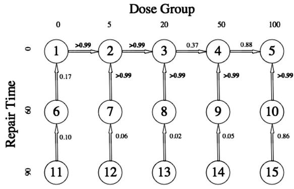  
Figure 23.5 Directed graph illustrating order restriction in the genotoxicity model. Arrows point toward stochastically larger groups. Posterior probabilities of $H_{1k}$ are also shown.

We wish to assess whether DNA damage increases with $\mathrm{H}_2\mathrm{O}_2$ dose, and whether damage is significantly reduced across each increment of repair time. We use a restricted DDP to model these data. The DNA damage density within each group is characterized as a Dirichlet process location mixture of Gaussians. We parameterize in terms of adjacent group differences, and use a prior similar to (23.13) but modified to restrict the cluster specific mean differences to obey the ordering in Figure 23.5. The $k$ th directed edge in Figure 23.5 links two unknown densities that are characterized as DPMs of Gaussians, with identical weights and kernel bandwidths but potentially different locations. Let $d_{k}$ denote the total probability weight on clusters (mixture components) that differ between the groups linked by the $k$ th edge. If $d_{k}$ is small, it implies that the two densities are similar, providing a simple scalar summary.

Figure 23.5 shows posterior probabilities of local orderings for group comparisons corresponding to each edge. Simulation studies of operating characteristics suggest that this testing procedure has excellent frequentist performance in terms of low type I error rate and high power even in small samples with subtle differences between groups. Our results give strong evidence of increases in DNA damage between the 0, 5, and $20\mu \mathrm{mol}$ $\mathrm{H}_2\mathrm{O}_2$ dose groups given a repair time of $0\mathrm{min}$ , with the evidence of further increases at higher dose levels less clear. As expected, there is no evidence of a change in distribution between groups 1, 6, and 11, since there was no induced damage to be repaired. However, there are clear decreases in DNA damage in each of the exposed groups after a repair time of $60\mathrm{min}$ . Allowing an additional $30\mathrm{min}$ of repair did not significantly alter the distribution.

These results are consistent with subjective examination of the raw data, with the Bayesian nonparametric density estimates shown in Figure 23.6 consistent with simple kernel smoothed density estimates obtained for each group separately. The approach borrows strength adaptively across groups. If the data support a similar or identical distribution for adjacent groups in the graph, these groups are effectively pooled, obtaining a high posterior probability of $H_{0k}$ and densities that are close to identical. Such borrowing dramatically reduces mean square error in estimating the individual densities, while producing inferences on group comparisons.

# Hierarchical Dirichlet processes

The fixed- $\pi$ DDP is of limited flexibility in characterizing hierarchical dependence structures in unknown distributions. A widely useful alternative type of DDP, deemed the hierarchical

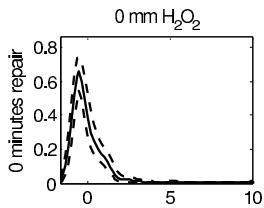

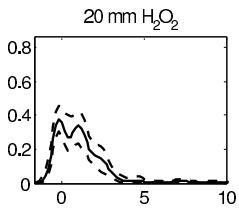

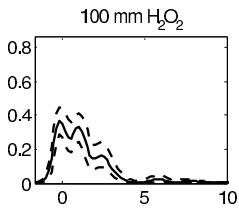

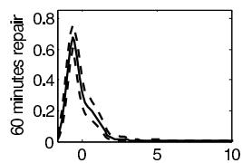

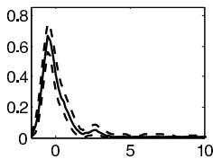

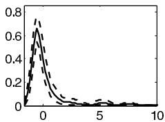

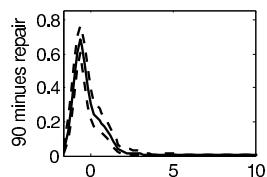

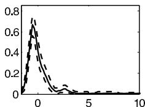

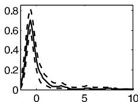  
Figure 23.6 Genotoxicity application. Estimated densities of the Olive tail moment in a subset of the $H_{2}O_{2}$ dose $\times$ repair groups. Solid curves are the posterior mean density estimates and dashed curves provide pointwise $95\%$ credible intervals.

DP (HDP), instead relies on letting

$$
P _ {j} \sim \mathrm {D P} (\alpha P _ {0}), \quad P _ {0} \sim \mathrm {D P} (\beta P _ {0 0}),
$$

which corresponds to choosing independent DP priors for each $P_{j}$ conditionally on an unknown base measure $P_0$ , which is in turn also assigned a DP. As shorthand notation, we can let $P \sim \mathrm{HDP}(\alpha, \beta, P_{00})$ . From the stick-breaking construction, it follows that

$$
P _ {j} = \sum_ {h = 1} ^ {\infty} \pi_ {j h} \delta_ {\theta_ {h} ^ {*}}, \quad P _ {0} = \sum_ {h = 1} ^ {\infty} \lambda_ {h} \delta_ {\theta_ {h} ^ {*}}, \quad \theta_ {h} ^ {*} \sim P _ {0 0}.
$$

Hence, as a natural consequence of assigning a DP prior to the common base measure $P_0$ due to the discreteness of realizations from DPs, we use identical atoms within all the group-specific random probability measures, while allowing deviations in the weights across the groups. This leads to a different structure from the fixed- $\pi$ DDP, which allows the atoms to vary while using the same weights.

To illustrate this structure, suppose that

$$
f _ {j} (y) = \int \mathrm {N} (y | \mu , \phi^ {- 1}) d P _ {j} (\mu , \phi), \quad P \sim \mathrm {H D P} (\alpha , \beta , P _ {0 0}).
$$

In this case, the model introduces a common global dictionary of normal kernels with varying locations and scales,

$$
\mathrm {N} \left(\mu_ {h} ^ {*}, \phi_ {h} ^ {* - 1}\right), \quad h = 1, 2, \dots , \infty .
$$

There is a central density $f_{0}(y)$ , which is characterized by mixing over this dictionary with weights $\lambda$ , and the group-specific densities are expressed using the same dictionary but with weights $\pi_{j}$ drawn from a stick-breaking process centered on $\lambda$ . The hyperparameter $\alpha$ controls the variability across groups in the weights, with $\alpha \rightarrow 0$ implying that the group-specific densities are Gaussian with clusters of groups sharing the same mean and precision

in the Gaussian kernel. At the other extreme when $\alpha \to \infty$ , one obtains pooling across groups with $f_{j} \equiv f_{0}$ and $f_{0}$ modeled as a DPM location-scale mixture of Gaussians. The recycling of the same atoms across groups while allowing a simple structure accommodating variability in the weights has led to broad impact of the HDP in numerous applications. Computation is also tractable.

Another implication of the hierarchical Dirichlet process is hierarchical clustering. To motivate this, we focus on an application in which $i = 1,\dots ,n$ indexes states in the United States, $j = 1,\ldots ,{n}_{i}$ indexes hospitals within state $i$ ,and ${y}_{ij}$ denotes a continuous measure of quality of care for hospital $j$ in state $i$ . Supposing we let ${y}_{ij} \sim  {f}_{i}$ and assign an HDP location-mixture of Gaussians prior for the collection of state-specific quality of care densities $\left\{  {f}_{i}\right\}$ ,we obtain the following induced hierarchical model:

$$
{y _ {i j}} \sim {\mathrm {N} (\mu_ {S _ {i j}} ^ {*}, \phi_ {S _ {i j}} ^ {* - 1})}
$$

$$
\Pr (S _ {i j} = h) = \pi_ {j h}, \quad (\mu_ {h} ^ {*}, \phi_ {h} ^ {* - 1}) \sim P _ {0 0},
$$

where $S_{ij} = h$ denotes that hospital $j$ in state $i$ is assigned to quality of care cluster $h$ . Due to the hierarchical structure on the weights, it is more likely that hospitals within a state will be assigned to the same cluster, but one can also obtain clustering of hospitals across states. Such soft probabilistic clustering may be of interest in certain applications, and also is descriptive of how the HDP borrows information across groups (in this case states). Due to the critical role of the hyperparameters $\alpha$ and $\beta$ in controlling the within-group dependence in clustering and the total number of clusters, respectively, it is important to allow the data to inform about their values through choosing hyperpriors. A common choice is $\alpha \sim \mathrm{Gamma}(1,1)$ independently of $\beta \sim \mathrm{Gamma}(1,1)$ .

# Nested Dirichlet processes

The HDP works by incorporating the same atoms in the different group-specific distributions while allowing variability in the weights, with this leading to dependent clustering of subjects across groups. In many applications, it is preferable to instead cluster groups having identical distributions. For example, in the comet assay application, we may cluster dose groups having no differences in the distribution of DNA damage, while in the hospital application, we may cluster states having no differences in the distributions of quality of care across hospitals. In the former case, one obtains a nonparametric Bayesian approach for multiple treatment group comparisons, with posterior probabilities obtained for equalities in each pair of dose groups as well as in all the dose groups. Such probabilities can form the basis of Bayesian testing of hypotheses about equalities in the treatment groups.

To accomplish such distributional clustering, one can rely on a nested Dirichlet process (NDP) mixture. The NDP can be expressed as follows:

$$
P _ {j} \sim P, \quad P \sim D P \left(\alpha P _ {0}\right), \quad P _ {0} \equiv \mathrm {D P} \left(\beta P _ {0 0}\right), \tag {23.14}
$$

On first glance, this seems similar to the HDP, which would draw the group-specific random probability measures from a DP with a DP prior on the base. However, here we instead draw the $P_{j}$ 's from a common random probability measure, which is drawn from a DP with the base being a DP instead of a realization from a DP. The distinction becomes clear when we examine the stick-breaking representation of the NDP which has the form:

$$
P _ {j} \sim P = \sum_ {h = 1} ^ {\infty} \pi_ {h} \delta_ {P _ {h} ^ {*}}, \quad \pi \sim \operatorname {s t i c k} (\alpha), \quad P _ {h} ^ {*} \sim \mathrm {D P} \left(\beta P _ {0 0}\right). \tag {23.15}
$$

Hence, $P$ takes the usual DP stick-breaking form but with the atoms corresponding to

random probability measures drawn iid from a DP. This leads to clustering of the random probability measures in which the prior probability of $P_{j} = P_{j^{\prime}}$ is $\frac{1}{1 + \alpha}$ as an automatic consequence of the DP Polya urn scheme. However, if $P_{j}$ and $P_{j^{\prime}}$ are in different clusters, they would have distinct atoms drawn independently from $P_{00}$ . This is different from the HDP, which formulates $P_{j}$ using a common set of atoms but with distinct weights, so that $\operatorname*{Pr}(P_j = P_{j'}) = 0$ .

In practice, the $P_{j}$ 's are typically used as mixture distributions in NDP mixture models for collections of group-specific densities. For example,

$$
f _ {j} (y) = \int \mathrm {N} (y | \mu , \phi^ {- 1}) d P _ {j} (\mu , \phi), \quad P \sim \mathrm {N D P} (\alpha , \beta , P _ {0 0}),
$$

with $P \sim \mathrm{NDP}(\alpha, \beta, P_{00})$ used as shorthand for the prior in (23.14)-(23.15). In this case, the group-specific densities will be allocated to clusters, with $\operatorname*{Pr}(f_j = f_{j'}) = \frac{1}{1 + \alpha}$ . We can choose a hyperprior distribution $\alpha \sim \mathrm{Gamma}(a,b)$ with $a, b$ elicited to obtain desired values for $\operatorname*{Pr}(H_{0jj'})$ and $\operatorname*{Pr}(H_0)$ . This allows the data to inform about $\alpha$ , and it tends to be the case that the data inform more strongly as $T$ increases, leading to a so-called 'blessing of dimensionality.'

A natural NDP-HDP modification that has been implemented successfully in the machine learning literature is to place a DP on $P_{00}$ within (23.15) so that the cluster-specific densities share a common set of global atoms but with varying weights. This combines the NDP and HDP priors, potentially exploiting the advantages of both approaches.

# Convex mixtures

Both the HDP and NDP are special cases of the DDP framework in that they incorporate dependence in a collection of random probability measures while maintaining DP priors for the individual RPMs marginally. Although the DP has some appealing properties and is in some sense a canonical case, it certainly limits flexibility in modeling to always restrict attention to DDPs and to not consider broader classes of priors that incorporate dependence in a different manner without maintaining DP marginals. One alternative approach to inducing dependence is to use random convex combinations of component random probability measures. For example, suppose that interest focuses on combining data from longitudinal studies conducted at different study centers following a closely related protocol. In particular, let $y_{cij}$ denote the response for the $i$ th individual from center $c$ at time $t_{cij}$ , and let $x_{cij}$ denote corresponding covariates (potentially including basis functions in time to allow nonlinear coefficients). Then, one may consider a hierarchical model such as

$$
y _ {c i j} \sim \mathrm {N} (x _ {c i j} \beta_ {c i} + \epsilon_ {c i j}, \sigma^ {2}),
$$

where $\beta_{ci}$ is a $p\times 1$ vector of coefficients specific to center $c$ and individual $i$ , $\epsilon_{cij}$ is a residual, and $\sigma^2$ is the residual variance. The question is then how to borrow information across subjects from the different centers. If one assumes a parametric model, then it is natural to use a multilevel structure that decomposes $\beta_{ci}$ as $\beta_{ci} = \alpha_{c} + \psi_{ci}$ , with the center-specific effect $\alpha_{c}$ modeled as multivariate Gaussian centered on $\alpha$ and the individual-specific deviation $\psi_{ci}$ modeled as multivariate Gaussian centered on zero.

As a more flexible semiparametric approach, we could let

$$
\beta_ {c i} \sim P _ {c}, \quad \{P _ {c} \} \sim \Pi ,
$$

where $P_{c}$ is a distribution characterizing variability among subjects in center $c$ , and $\Pi$ is a joint prior for the different distributions. Potentially, either the HDP or NDP could be used for $\Pi$ but a simple alternative is to let

$$
P _ {c} = \pi G _ {0} + (1 - \pi) G _ {c}, \quad G _ {c} \sim \mathrm {D P} (\alpha G _ {0}), \quad \pi \sim \operatorname {B e t a} (a, b), \tag {23.16}
$$

so that the distribution in group $c$ is formulated as a mixture of a global distribution $G_{0}$ (with probability weight $\pi$ ) and a group-specific distribution $G_{c}$ . The higher the probability weight $\pi$ on $G_{0}$ the more similar the distributions across the groups. While having a similar motivation, this prior differs from the HDP in including a separate set of global and group-specific atoms. Subjects allocated to the global atoms within $G_{0}$ can be clustered with subjects in other groups, while subjects allocated to the center-specific atoms will only be clustered with other subjects in the same center. Posterior computation is straightforward by simply using a data augmentation approach, which introduces a binary indicator $z_{ci} = 1$ denoting allocation to the global component. After imputing these indicators from their full conditional, one has conditionally independent DP priors and algorithms for computation in DPs can be used directly. Marginally, $P_{c}$ does not have a DP prior, and hence $\Pi$ is not a DDP.

Expression (23.16) is reminiscent of a Gaussian hierarchical model with an overall mean and center-specific deviations. However, since we are modeling random probability measures instead of real-valued random variables, it is natural to use convex combinations instead of an additive structure. By using convex combinations of component random probability measures, we ensure that the result is a probability measure. Related convex combinations can be used broadly to incorporate more structured dependence in collections of measures. For example, recall the comet assay application discussed earlier in this chapter. In that case, the dose groups have a natural ordering and it makes sense to choose a prior that favors greater dependence in $P_{t}$ and $P_{t + 1}$ than $P_{t}$ and $P_{t + 2}$ . This can be accomplished by defining a first-order autoregressive model,

$$
P _ {t} = (1 - \pi) P _ {t - 1} + \pi G _ {t}, \quad P _ {0} = G _ {0}, \quad G _ {t} \sim \mathrm {D P} (\alpha P _ {0}), \tag {23.17}
$$

so that the RPM for dose group $t$ is equal to a mixture of the random probability measure in the previous dose group and a dose group-specific deviation. This is similar in motivation to a Gaussian random walk, but is instead a random walk in the space of measures, with the parameter $\pi$ controlling the level of dependence. Potentially, one can add the addition flexibility of letting $\pi$ depend on $t$ . This type of dynamic mixture of DPs model is also useful in time series applications, but one potential disadvantage that arises is that atoms can only be introduced as time goes on and never entirely disappear, though atoms introduced early on are assigned decreasing weight. One way to circumvent this problem is draw $P_0$ from an HDP, so that the same atoms are used repeatedly over time. Such a structure has been successfully applied to analyze music data in the literature.

# 23.6 Density regression

The previous section focused on the case in which we have a finite collection of random probability measures corresponding to different groups that either follow a simple ordering or are exchangeable. In many applications, the setting is not so simple and it is more natural to consider uncountable collections,

$$
P _ {\mathcal {X}} = \left\{P _ {x}, x \in \mathcal {X} \right\}, \quad \mathcal {X} \subset \Re^ {p},
$$

where $x = (x_{1},\ldots ,x_{p})$ is a vector of predictors, $P_{x}$ is the random probability measure specific to predictor value $x$ , $\mathcal{X}$ denotes the domain of the predictors, and $P_{\mathcal{X}}$ is a collection of random probability measures defined at every predictor value. One motivation arises in the setting of density regression. In Chapter 21 we discussed density regression using Gaussian processes and next we discuss an alternative based on Dirichlet processes.

We would ideally allow the entire conditional density of the response given predictors, $p(y|x)$ , to change flexibly as $x$ changes. One approach that has been widely used is the

hierarchical mixture-of-experts model, which lets

$$
p (y | x) = \sum_ {h = 1} ^ {H} \pi_ {h} (x) \mathrm {N} \left(y | x \beta_ {h}, \tau_ {h} ^ {- 1}\right). \tag {23.18}
$$

This corresponds to expressing the conditional density as a mixture of normal linear regressions with weights on the different mixture components varying flexibly with predictors. In the case of finite $H$ in the machine learning literature, a common approach is to rely on a probabilistic tree model for $\pi_h(x)$ , though one can also use a simpler approach such as a logistic regression.

# Dependent stick-breaking processes

As a nonparametric Bayesian density regression model relying on mixtures, we could use

$$
p (y | x) = \int \mathrm {N} (y | x; \tau^ {- 1}) d P _ {x} (\beta , \tau), \quad P _ {\mathcal {X}} \sim \Pi_ {\mathcal {X}},
$$

which is a predictor-dependent mixture of linear regressions as in (23.18), but in a more general form. Here, $\Pi_{\mathcal{X}}$ denotes the prior on the uncountable collection of mixing measures $\{P_x,x\in \mathcal{X}\}$ . It is useful to center the prior on a reasonable parametric model for the data to favor collapsing of the posterior close to the truth when the parametric model is approximately correct.

The main issue is how to choose $\Pi_{\mathcal{X}}$ . In this regard, it is natural to think of predictor-dependent stick-breaking processes that let

$$
P _ {x} = \sum_ {h = 1} ^ {\infty} \pi_ {h} (x) \delta_ {\theta_ {h} ^ {*} (x)}, \quad \pi_ {h} (x) = V _ {h} (x) \prod_ {l <   h} (1 - V _ {l} (x)),
$$

where $\pi_h(x)$ is the weight on component $h$ specific to predictor value $x$ , $V_{h}(x)$ is the proportion of the probability stick broken off at step $h$ , and $\theta_h^* (x)$ is a predictor-dependent atom. Here, we will focus for simplicity (computationally and conceptually) on the case in which $\theta_h^* (x) = \theta_h^* = (\beta_h^*,\tau_h^*)$ , so that there is a single global collection of regression coefficient vectors and precisions. We then have

$$
p (y | x) = \sum_ {h = 1} ^ {\infty} \pi_ {h} (x) \mathrm {N} (y | x \beta_ {h} ^ {*}, \tau_ {h} ^ {* - 1}), \quad \pi_ {h} (x) = V _ {h} (x) \prod_ {l <   h} (1 - V _ {l} (x)),
$$

providing a generalization of (23.18) to include infinitely many experts. We would like to be able to use a small number of experts for most of our data, which can be favored by choosing a prior under which $\pi_h(x)$ decreases rapidly in the index $h$ . If $V_{h}\sim Q$ is generated iid from a stochastic process with $V_{h}(x)\sim \mathrm{Beta}(1,\alpha)$ marginally for all $x$ , then we would obtain a DDP mixture of linear regressions. Various choices of $Q$ have been proposed, including an order-based DDP and a local DP.

However, there are some distinct advantages computationally to not restrict attention to DDPs. One prior that has had good practical performance in a variety of applications and has been shown to lead to large support and posterior consistency in estimating conditional densities is the kernel stick-breaking process,

$$
V _ {h} (x) = K _ {\psi_ {h}} (x, \Gamma_ {h}) V _ {h}, \quad \psi_ {h} \sim H, \Gamma_ {h} \sim G, V _ {h} \sim \mathrm {B e t a} (1, \alpha),
$$

where $K_{\psi}(\cdot, \Gamma)$ is a kernel bounded above by one located at $\Gamma$ with bandwidth $\psi$ . The kernel $K_{\psi_h}(x, \Gamma_h)$ is chosen to obtain its maximum value of 1 for $x = \Gamma_h$ in which case $V_h(x) = V_h$ .

As $x$ moves away from $\Gamma_h$ , the kernel decreases leading to a corresponding decrease in $V_h(x)$ . One can view this process as generating a random location $\Gamma_h$ with a corresponding stick-breaking random variable $V_h$ and atom $(\beta_h^*, \tau_h^*)$ . Due to the incorporation of the kernel, $\pi_h(x)$ will tend to be larger when $x$ is located close to $\Gamma_h$ , particularly when the index $h$ is small. The spatial variability in the weights across the predictor space is controlled by the kernel bandwidths and by allowing kernel-specific bandwidths, we allow more rapid changes in certain regions. As the kernels become flat, so that $K_{\psi_h}(x, \Gamma_h) \approx 1$ for all $x$ and $h$ , we obtain a DP stick-breaking process as a limiting case.

Posterior computation for kernel stick-breaking process mixtures tends to be straightforward and efficient, for example by prespecifying a grid of potential values for the bandwidths and locations to facilitate Gibbs sampling. However, there are some computational advantages to an alternative probit stick-breaking specification, which lets

$$
\pi_ {h} (x) = V _ {h} (x) \prod_ {l <   h} (1 - V _ {l} (x)), \quad V _ {h} (x) = \Phi (\alpha_ {h} + \mu_ {h} (x)), \quad \alpha_ {h} \sim \mathrm {N} (\mu , 1),
$$

where $\Phi(z)$ is the standard normal cdf and $\mu_h: \mathcal{X} \to \Re$ is an arbitrary regression model. To motivate the probit stick-breaking process (PSBP), initially consider the baseline case in which there are no predictors so that $V_h(x) = V_h = \Phi(\alpha_h)$ , with $\alpha_h \sim \mathrm{N}(\mu, 1)$ . This model is similar to the Dirichlet process, but instead of generating the $V_h$ s iid from $\mathrm{Beta}(1, \alpha)$ we obtain the $V_h$ 's by transforming iid $\mathrm{N}(\mu, 1)$ draws to the unit interval via a standard normal cdf (one can alternatively use a logistic transformation and obtain a logistic stick-breaking process). In the special case in which $\mu = 0$ , we obtain $V_h \sim \mathrm{Beta}(1, 1)$ and hence the PSBP with $\mu = 0$ and DP with precision 1 are equivalent. In general, the $\mu$ hyperparameter plays a similar role to the precision $\alpha$ in the DP in controlling the rate of decrease in the stick-breaking random variables and associated prior on the number of clusters in the sample. For large $\mu$ , we obtain $V_h \approx 1$ and hence large weight on the first component similarly to $\alpha \approx 0$ in the DP.

# Example. Glucose tolerance prediction

We apply the probit stick-breaking process to an epidemiological study of diabetes. The focus was on assessing the relationship between $y_{i} =$ glucose tolerance (GT), $x_{i1} =$ log-transformed insulin sensitivity (IS) and other diabetes risk factors $x_{i2} =$ age, $x_{i3} =$ waist to hip ratio (WTH), $x_{i4} =$ body mass index (BMI), $x_{i5} =$ diastolic blood pressure (DBP), and $x_{i6} =$ systolic blood pressure (SBP) in $n = 868$ patients. GT is measured by 2-hour plasma glucose level (mg/dl) in the oral glucose tolerance test and indicates how fast glucose is cleared from the blood. GT is also used to diagnose type 2 diabetes using $< 140$ (normal), [140, 200] (prediabetes), and $> 200$ (diabetes). IS provides an indicator of how well the body responds to insulin, a hormone regulating movement of glucose from the blood to body cells.

Figure 23.7 plots 2-hour plasma glucose level against IS, age, waist-to-hip ratio (WTH), body mass index (BMI), diastolic blood pressure (DBP), and systolic blood pressure (SBP). There is a large right skew in the glucose distribution, with the distributional shape changing with IS. As linear or nonlinear mean or median regression models are not supported for these data, we apply a Bayesian density regression approach to allow the distribution of 2-hour glucose to change flexibly with the different risk factors, while also allowing risk factors to drop out of the model and to have effects that are local to particular regions of the predictor space.

The marginal posterior probabilities for the respective predictors were 1.0, 1.0, 0.03, 0.02, 0.03, and 0.03, implying that IS and age are important factors for the change of glucose distribution but the other predictors can be discarded. Figure 23.8 shows the estimated conditional density $p(y|x)$ with IS and age varying across their 5th, 50th, and 95th empirical percentiles. The glucose density has a heavy right tail for low IS

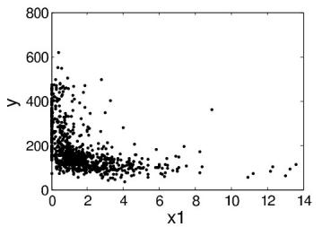

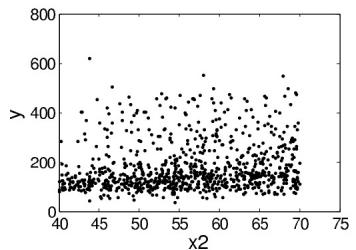

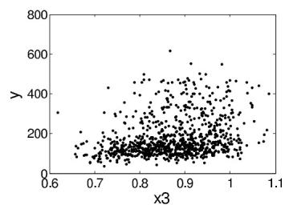

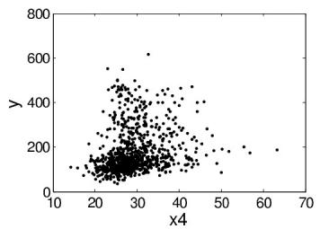

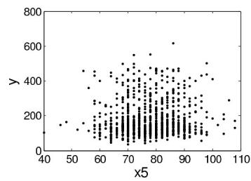

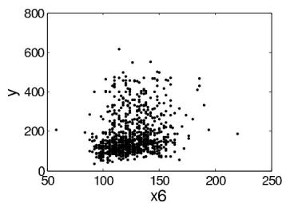  
Figure 23.7 Data from glucose-tolerance study: $y = 2$ -hour glucose level (mg/dl); $x_{1} =$ insulin sensitivity; $x_{2} =$ age; $x_{3} =$ waist to hip ratio; $x_{4} =$ body-mass index; $x_{5} =$ diastolic blood pressure; $x_{6} =$ systolic blood pressure.

but, as IS increases, the right tail disappears. The right tail characterizes the group of people whose 2-hour glucose level is above $200\mathrm{mg / dl}$ (reference line is 0.2 with standardization). The right tail becomes heavier as age increases especially for those subjects with low IS, meaning that aging is also related to poor GT.

# 23.7 Bibliographic note

For recent practically motivated introductory overviews of Bayesian nonparametrics, see Dunson (2009, 2010b). For recent articles on asymptotic properties of Dirichlet process mixtures, see Shen and Ghosal (2011) and Tokdar (2011). For recent articles on Bayesian computation in Dirichlet process mixtures models including novel approaches for fast computation in high-dimensional settings and citations to the approaches referred to in this chapter, see Wang and Dunson (2011a) and Carvalho et al. (2010). For references on the use of Dirichlet process priors for hierarchical models, see Kleinman and Ibrahim (1998) and Ohlssen, Sharples, and Spiegelhalter (2007). Ray and Mallick (2006), Rodriguez, Dunson, and Gelfand (2009) and Bigelow and Dunson (2009) use Dirichlet processes in developing models for functional data. The Bayesian bootstrap was introduced by Rubin (1981b).

The chapter has focused on Dirichlet process mixture models. But other families of distributions can also work well to model unknown densities in Bayesian hierarchical models.

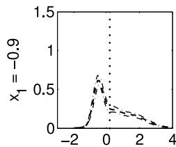

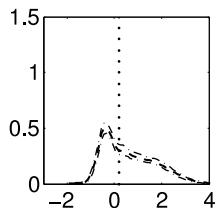

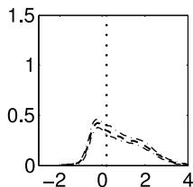

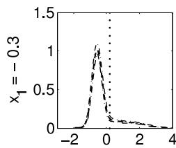

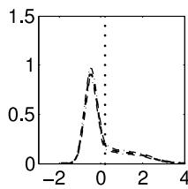

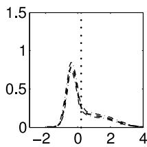

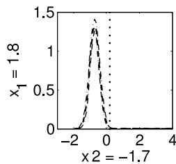

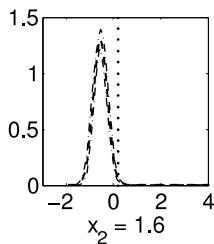  
Figure 23.8 Predictive (dashed) conditional response density $p(y|x)$ and $95\%$ credible intervals (dash-dotted) with normalized $x_{1}$ (insulin sensitivity) and $x_{2}$ (age) varying among 5th, 50th, 95th empirical percentiles.

Alternative models include Polya trees (Lavine, 1992), mixtures of Polya trees (Hanson and Johnson, 2002), and normalized random measures with independent increments (James, Lijoi, and Prunster, 2009). Schmid and Brown (1999) present a simple nonparametric model of step-like growth patterns in children.

The dependent Dirichlet process (DDP) was originally proposed by MacEachern (1999, 2000) and was subsequently used to develop Anova models of random distributions by De Iorio et al. (2004) and for nonparametric spatial data analysis by Gelfand, Kottas, and MacEachern (2005). There have been numerous applications in different settings, with De la Cruz-Mesia, Quintana, and Muller (2009) using DDPs for semiparametric Bayes classification from longitudinal predictors and Dunson and Peddada (2008) developing an alternative restricted DDP for modeling of stochastically ordered densities. Wang and Dunson (2011b) recently developed restricted DDP mixtures for modeling of densities that are stochastically nondecreasing in a continuous predictor. Most of the focus has been on DDPs with fixed probability weights on the mixture components, but Griffin and Steel (2006) propose an order-based DDP to allow varying weights, and Chung and Dunson (2011) propose a local DP that allows varying weights in a related but simpler manner. Hierarchical DPs (Teh et al., 2006) and nested DPs (Rodriguez, Dunson, and Gelfand, 2009) are applications of the DDP framework to hierarchical dependence structures.

There is a rich literature on alternatives to DDPs for formulating dependence in random probability measures. One key advance was the approach of Muller, Quintana, and Rosner (2004), which formulated dependence in group-specific random probability measures by using convex combinations of a global random probability measure (RPM) with group-specific RPMs. This convex combinations strategy was extended to accommodate continuously varying collections of RPMs by Dunson, Pillai, and Park (2007) using kernel-weighted convex combinations of DPs. An alternative strategy has relied on generalized

stick-breaking processes, which replace the beta random variables in the DP stick-breaking representation with more complex forms. For example, Dunson and Park (2009) propose a kernel stick-breaking process, while Reich and Fuentes (2007) apply a related approach to modeling of hurricane winds. Chung and Dunson (2009) and Rodriguez and Dunson (2011) proposed an alternative probit stick-breaking process, while Ren et al. (2011) instead use a logistic stick-breaking process motivated by imaging applications. Dependent stick-breaking processes for time series of random distributions have been considered by Dunson (2006), Rodriguez and ter Horst (2008), and Griffin and Steel (2011), among others.

There is also a literature on alternatives to stick-breaking processes for characterizing dependence in RPMs, with a recent emphasis on normalized random measures with independent increments (James, Lijoi, and Prunster, 2009). For example, Griffin (2011) proposes a class of priors for time-varying random probability measures through normalizing stochastic processes derived from Ornstein-Uhlenbeck processes.

# 23.8 Exercises

1. The following exercise is useful to gain familiarity with posterior computation and inferences for the Dirichlet process mixture of Gaussian models:

(a) Simulate data from the following mixture of normals:

$$
p (y _ {i}) \sim 0. 1 \mathrm {N} (y | - 1, 0. 2 ^ {2}) + 0. 5 \mathrm {N} (y | 0, 1 ^ {2}) + 0. 4 \mathrm {N} (y | 1, 0. 4 ^ {2}), i = 1, \dots , 1 0 0.
$$

(b) Use the density() function in R to obtain a non-Bayesian estimate of the density and plot this estimate versus the true density.   
(c) Apply the finite mixture model Gibbs sampler described in Chapter 22 for $k = 20$ , $a = \frac{\alpha}{k}$ , $\alpha = 1$ , $\mu_0 = 0$ , and $\kappa = \alpha_{\tau} = b_{\tau} = \alpha = 1$ .   
(d) Run the blocked Gibbs sampler for $N = 20$ and the same hyperparameter specification.   
(e) Compare the resulting density estimates.

For sufficiently many MCMC iterations and sufficiently large truncation levels $k, N$ , the density estimates obtained via the finite Dirichlet approximation and truncated stick-breaking approximations to the DPM of Gaussians should be similar.

2. To get an intuition for the impact of $\alpha$ and $P_0$ , repeat the previous exercise but with:

(a) A higher value of $\alpha$ , such as $\alpha = 10$   
(b) A gamma hyperprior distribution on $\alpha$ , with $a_{\alpha} = b_{\alpha} = 0.1$   
(c) Much higher variance in the normal-gamma $P_0$ .

3. Suppose a study is conducted in which patients' blood pressure is monitored over time, and patients belong to one of 15 different study centers. Interest focuses on predicting blood pressure from age, smoking, and other variables.

(a) Describe a parametric hierarchical model for these data.   
(b) Modify this model to allow the distribution of the varying parameters to be unknown to allow uncertainty in variability among patients as well as patients within study centers.   
(c) Outline the steps of a Gibbs sampler for the parametric model and how the steps are modified for the semiparametric model.

4. Suppose we let $y_{i} \sim P$ with $P \sim \mathrm{DP}(\alpha P_0)$ , denoting a Dirichlet process prior on the distribution of the data having concentration parameter $\alpha$ and base distribution $P_0$ .

(a) Show the form of the posterior distribution of $P$ given $y_{1},\ldots ,y_{n}$ in the limiting case in which $\alpha \rightarrow 0$ .

(b) Generate and plot multiple realizations from this posterior distribution for the galaxy data.   
(c) Describe an algorithm for obtaining point and interval estimates for the expectation and variance of $P$ based on this posterior.

5. Suppose we have a high-dimensional regression model with coefficients $\theta_{1},\ldots ,\theta_{p}$ with $p$ very large. We would like to define a prior $\theta_{j}\sim P$ , with $P\sim \Pi$ a random probability measure having prior $\Pi$ chosen so that (i) $\operatorname *{Pr}(\theta_j = 0) = \pi_0$ with $\pi_0\sim \mathrm{Beta}(a,b)$ ; (ii) $\operatorname *{Pr}(\theta_j = \theta_{j'}) = \kappa$ for any $j\neq j'$ ; (iii) $\mathrm{E}_P(\theta_j) = 0$ ; and (iv) $\mathrm{V}_P(\theta_j) = 4$

(a) Describe such a prior and show that it has these properties.   
(b) Outline an MCMC algorithm for posterior computation under this prior assuming $\theta_{j}$ 's are coefficients in a Gaussian linear regression model.

6. Suppose we have conducted a study comparing case and control groups in a biomarker, with abundant historical data available for control patients. Based on fitting a Gaussian mixture model to the historical database, we obtain dictionary densities $f_{1}, \ldots, f_{k}$ , which correspond to normal distributions with different location and scale parameters. To simplify inferences for new studies, we treat these dictionary densities as known but model the weights as unknown and varying between groups.

(a) Define a simple model and prior specification that accomplishes this for case-control data.   
(b) Using this model as a starting point, define a Bayesian approach for nonparametric testing of equivalence in the biomarker density between the case and control groups.   
(c) Provide details on posterior computation and estimation of the hypothesis probabilities for this approach.   
(d) How can this approach be modified to include covariate adjustment?

7. Consider the 8 schools example of Section 5.5.

(a) Modify the normal hierarchical model described earlier to instead place a Dirichlet process prior on the distribution of the school-specific treatment effects. How do the results differ from those for the normal hierarchical model?   
(b) Describe clusters of schools that have identical treatment effects.   
(c) Suppose data were also available on classrooms within schools. How could the model be modified to allow the distribution of treatment effects across classrooms within a school to be unknown?   
(d) Comment on the induced clustering structure of the proposed model in terms of clustering schools and classrooms within and across schools.   
(e) This clustering model does not make much sense in the schools example. Describe a setting where the model could be more appropriate.

