# Probability and Distributions

[Package map](../structure.md) · [Unsplit OCR dump](./_full.md)

[← Front matter](./00-frontmatter.md) · [Ch. 2 Multivariate Distributions →](./02-multivariate-distributions.md)

> MinerU OCR dump. If a formula, table, or numbering disagrees with the PDF, the PDF is authoritative.

---

# Chapter 1

# Probability and Distributions

# 1.1 Introduction

In this section, we intuitively discuss the concepts of a probability model which we formalize in Section 1.3. Many kinds of investigations may be characterized in part by the fact that repeated experimentation, under essentially the same conditions, is more or less standard procedure. For instance, in medical research, interest may center on the effect of a drug that is to be administered; or an economist may be concerned with the prices of three specified commodities at various time intervals; or an agronomist may wish to study the effect that a chemical fertilizer has on the yield of a cereal grain. The only way in which an investigator can elicit information about any such phenomenon is to perform the experiment. Each experiment terminates with an outcome. But it is characteristic of these experiments that the outcome cannot be predicted with certainty prior to the experiment.

Suppose that we have such an experiment, but the experiment is of such a nature that a collection of every possible outcome can be described prior to its performance. If this kind of experiment can be repeated under the same conditions, it is called a random experiment, and the collection of every possible outcome is called the experimental space or the sample space. We denote the sample space by $\mathcal{C}$ .

Example 1.1.1. In the toss of a coin, let the outcome tails be denoted by $T$ and let the outcome heads be denoted by $H$ . If we assume that the coin may be repeatedly tossed under the same conditions, then the toss of this coin is an example of a random experiment in which the outcome is one of the two symbols $T$ or $H$ ; that is, the sample space is the collection of these two symbols. For this example, then, $\mathcal{C} = \{H, T\}$ .

Example 1.1.2. In the cast of one red die and one white die, let the outcome be the ordered pair (number of spots up on the red die, number of spots up on the white die). If we assume that these two dice may be repeatedly cast under the same conditions, then the cast of this pair of dice is a random experiment. The sample space consists of the 36 ordered pairs: $\mathcal{C} = \{(1,1),\ldots ,(1,6),(2,1),\ldots ,(2,6),\ldots ,(6,6)\}$

We generally use small Roman letters for the elements of $\mathcal{C}$ such as $a, b$ , or $c$ . Often for an experiment, we are interested in the chances of certain subsets of elements of the sample space occurring. Subsets of $\mathcal{C}$ are often called events and are generally denoted by capitol Roman letters such as $A, B$ , or $C$ . If the experiment results in an element in an event $A$ , we say the event $A$ has occurred. We are interested in the chances that an event occurs. For instance, in Example 1.1.1 we may be interested in the chances of getting heads; i.e., the chances of the event $A = \{H\}$ occurring. In the second example, we may be interested in the occurrence of the sum of the upfaces of the dice being "7" or "11;" that is, in the occurrence of the event $A = \{(1, 6), (2, 5), (3, 4), (4, 3), (5, 2), (6, 1), (5, 6), (6, 5)\}$ .

Now conceive of our having made $N$ repeated performances of the random experiment. Then we can count the number $f$ of times (the frequency) that the event $A$ actually occurred throughout the $N$ performances. The ratio $f / N$ is called the relative frequency of the event $A$ in these $N$ experiments. A relative frequency is usually quite erratic for small values of $N$ , as you can discover by tossing a coin. But as $N$ increases, experience indicates that we associate with the event $A$ a number, say $p$ , that is equal or approximately equal to that number about which the relative frequency seems to stabilize. If we do this, then the number $p$ can be interpreted as that number which, in future performances of the experiment, the relative frequency of the event $A$ will either equal or approximate. Thus, although we cannot predict the outcome of a random experiment, we can, for a large value of $N$ , predict approximately the relative frequency with which the outcome will be in $A$ . The number $p$ associated with the event $A$ is given various names. Sometimes it is called the probability that the outcome of the random experiment is in $A$ ; sometimes it is called the probability of the event $A$ ; and sometimes it is called the probability measure of $A$ . The context usually suggests an appropriate choice of terminology.

Example 1.1.3. Let $\mathcal{C}$ denote the sample space of Example 1.1.2 and let $B$ be the collection of every ordered pair of $\mathcal{C}$ for which the sum of the pair is equal to seven. Thus $B = \{(1,6),(2,5),(3,4),(4,3),(5,2)(6,1)\}$ . Suppose that the dice are cast $N = 400$ times and let $f$ denote the frequency of a sum of seven. Suppose that 400 casts result in $f = 60$ . Then the relative frequency with which the outcome was in $B$ is $f / N = \frac{60}{400} = 0.15$ . Thus we might associate with $B$ a number $p$ that is close to 0.15, and $p$ would be called the probability of the event $B$ .

Remark 1.1.1. The preceding interpretation of probability is sometimes referred to as the relative frequency approach, and it obviously depends upon the fact that an experiment can be repeated under essentially identical conditions. However, many persons extend probability to other situations by treating it as a rational measure of belief. For example, the statement $p = \frac{2}{5}$ for an event $A$ would mean to them that their personal or subjective probability of the event $A$ is equal to $\frac{2}{5}$ . Hence, if they are not opposed to gambling, this could be interpreted as a willingness on their part to bet on the outcome of $A$ so that the two possible payoffs are in the ratio $p / (1 - p) = \frac{2}{5} / \frac{3}{5} = \frac{2}{3}$ . Moreover, if they truly believe that $p = \frac{2}{5}$ is correct, they would be willing to accept either side of the bet: (a) win 3 units if $A$ occurs and lose 2 if it does not occur, or (b) win 2 units if $A$ does not occur and lose 3 if

it does. However, since the mathematical properties of probability given in Section 1.3 are consistent with either of these interpretations, the subsequent mathematical development does not depend upon which approach is used.

The primary purpose of having a mathematical theory of statistics is to provide mathematical models for random experiments. Once a model for such an experiment has been provided and the theory worked out in detail, the statistician may, within this framework, make inferences (that is, draw conclusions) about the random experiment. The construction of such a model requires a theory of probability. One of the more logically satisfying theories of probability is that based on the concepts of sets and functions of sets. These concepts are introduced in Section 1.2.

# 1.2 Sets

The concept of a set or a collection of objects is usually left undefined. However, a particular set can be described so that there is no misunderstanding as to what collection of objects is under consideration. For example, the set of the first 10 positive integers is sufficiently well described to make clear that the numbers $\frac{3}{4}$ and 14 are not in the set, while the number 3 is in the set. If an object belongs to a set, it is said to be an element of the set. For example, if $C$ denotes the set of real numbers $x$ for which $0 \leq x \leq 1$ , then $\frac{3}{4}$ is an element of the set $C$ . The fact that $\frac{3}{4}$ is an element of the set $C$ is indicated by writing $\frac{3}{4} \in C$ . More generally, $c \in C$ means that $c$ is an element of the set $C$ .

The sets that concern us are frequently sets of numbers. However, the language of sets of points proves somewhat more convenient than that of sets of numbers. Accordingly, we briefly indicate how we use this terminology. In analytic geometry considerable emphasis is placed on the fact that to each point on a line (on which an origin and a unit point have been selected) there corresponds one and only one number, say $x$ ; and that to each number $x$ there corresponds one and only one point on the line. This one-to-one correspondence between the numbers and points on a line enables us to speak, without misunderstanding, of the "point $x$ " instead of the "number $x$ ." Furthermore, with a plane rectangular coordinate system and with $x$ and $y$ numbers, to each symbol $(x, y)$ there corresponds one and only one point in the plane; and to each point in the plane there corresponds but one such symbol. Here again, we may speak of the "point $(x, y)$ ," meaning the "ordered number pair $x$ and $y$ ." This convenient language can be used when we have a rectangular coordinate system in a space of three or more dimensions. Thus the "point $(x_1, x_2, \ldots, x_n)$ " means the numbers $x_1, x_2, \ldots, x_n$ in the order stated. Accordingly, in describing our sets, we frequently speak of a set of points (a set whose elements are points), being careful, of course, to describe the set so as to avoid any ambiguity. The notation $C = \{x : 0 \leq x \leq 1\}$ is read " $C$ is the one-dimensional set of points $x$ for which $0 \leq x \leq 1$ ". Similarly, $C = \{(x, y) : 0 \leq x \leq 1, 0 \leq y \leq 1\}$ can be read " $C$ is the two-dimensional set of points $(x, y)$ that are interior to, or on the boundary of, a square with opposite vertices at $(0, 0)$ and $(1, 1)$ ".

We say a set $C$ is countable if $C$ is finite or has as many elements as there are positive integers. For example, the sets $C_1 = \{1, 2, \ldots, 100\}$ and $C_2 = \{1, 3, 5, 7, \ldots\}$

are countable sets. The interval of real numbers $(0,1]$ , though, is not countable.

# 1.2.1 Review of Set Theory

As in Section 1.1, let $\mathcal{C}$ denote the sample space for the experiment. Recall that events are subsets of $\mathcal{C}$ . We use the words event and subset interchangeably in this section. An elementary algebra of sets will prove quite useful for our purposes. We now review this algebra below along with illustrative examples. For illustration, we also make use of Venn diagrams. Consider the collection of Venn diagrams in Figure 1.2.1. The interior of the rectangle in each plot represents the sample space C. The shaded region in Panel (a) represents the event $A$ .

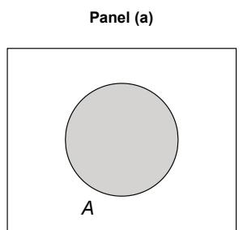  
A

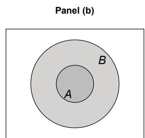  
$A\subset B$

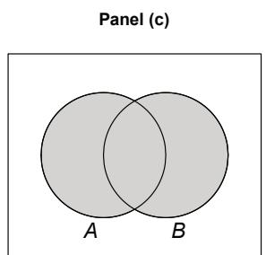  
AUB

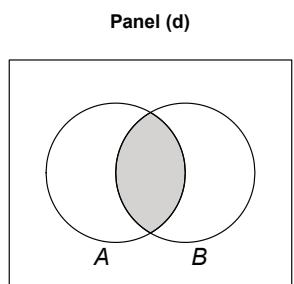  
$A\cap B$   
Figure 1.2.1: A series of Venn diagrams. The sample space $\mathbf{C}$ is represented by the interior of the rectangle in each plot. Panel (a) depicts the event $A$ ; Panel (b) depicts $A \subset B$ ; Panel (c) depicts $A \cup B$ ; and Panel (d) depicts $A \cap B$ .

We first define the complement of an event $A$ .

Definition 1.2.1. The complement of an event $A$ is the set of all elements in $C$ which are not in $A$ . We denote the complement of $A$ by $A^c$ . That is, $A^c = \{x \in C : x \notin A\}$ .

# 1.2. Sets

The complement of $A$ is represented by the white space in the Venn diagram in Panel (a) of Figure 1.2.1.

The empty set is the event with no elements in it. It is denoted by $\phi$ . Note that $\mathcal{C}^c = \phi$ and $\phi^c = \mathcal{C}$ . The next definition defines when one event is a subset of another.

Definition 1.2.2. If each element of a set $A$ is also an element of set $B$ , the set $A$ is called a subset of the set $B$ . This is indicated by writing $A \subset B$ . If $A \subset B$ and also $B \subset A$ , the two sets have the same elements, and this is indicated by writing $A = B$ .

Panel (b) of Figure 1.2.1 depicts $A \subset B$ .

The event $A$ or $B$ is defined as follows:

Definition 1.2.3. Let $A$ and $B$ be events. Then the union of $A$ and $B$ is the set of all elements that are in $A$ or in $B$ or in both $A$ and $B$ . The union of $A$ and $B$ is denoted by $A \cup B$

Panel (c) of Figure 1.2.1 shows $A \cup B$ .

The event that both $A$ and $B$ occur is defined by,

Definition 1.2.4. Let $A$ and $B$ be events. Then the intersection of $A$ and $B$ is the set of all elements that are in both $A$ and $B$ . The intersection of $A$ and $B$ is denoted by $A \cap B$

Panel (d) of Figure 1.2.1 illustrates $A \cap B$ .

Two events are disjoint if they have no elements in common. More formally we define

Definition 1.2.5. Let $A$ and $B$ be events. Then $A$ and $B$ are disjoint if $A \cap B = \phi$ .

If $A$ and $B$ are disjoint, then we say $A \cup B$ forms a disjoint union. The next two examples illustrate these concepts.

Example 1.2.1. Suppose we have a spinner with the numbers 1 through 10 on it. The experiment is to spin the spinner and record the number spun. Then $\mathcal{C} = \{1,2,\ldots ,10\}$ . Define the events $A,B$ , and $C$ by $A = \{1,2\}$ , $B = \{2,3,4\}$ , and $C = \{3,4,5,6\}$ , respectively.

$$
\begin{array}{l} A ^ {c} = \{3, 4, \dots , 1 0 \}; \quad A \cup B = \{1, 2, 3, 4 \}; \quad A \cap B = \{2 \} \\ A \cap C = \phi ; \quad B \cap C = \{3, 4 \}; \quad B \cap C \subset B; \quad B \cap C \subset C \\ A \cup (B \cap C) = \{1, 2 \} \cup \{3, 4 \} = \{1, 2, 3, 4 \} (1.2.1) \\ (A \cup B) \cap (A \cup C) = \{1, 2, 3, 4 \} \cap \{1, 2, 3, 4, 5, 6 \} = \{1, 2, 3, 4 \} (1.2.2) \\ \end{array}
$$

The reader should verify these results.

Example 1.2.2. For this example, suppose the experiment is to select a real number in the open interval $(0,5)$ ; hence, the sample space is $\mathcal{C} = (0,5)$ . Let $A = (1,3)$ ,

$B = (2,4)$ , and $C = [3,4.5)$

$$
A \cup B = (1, 4); \quad A \cap B = (2, 3); \quad B \cap C = [ 3, 4)
$$

$$
A \cap (B \cup C) = (1, 3) \cap (2, 4. 5) = (2, 3) \tag {1.2.3}
$$

$$
(A \cap B) \cup (A \cap C) = (2, 3) \cup \phi = (2, 3) \tag {1.2.4}
$$

A sketch of the real number line between 0 and 5 helps to verify these results.

Expressions (1.2.1)-(1.2.2) and (1.2.3)-(1.2.4) are illustrations of general distributive laws. For any sets $A$ , $B$ , and $C$ ,

$$
A \cap (B \cup C) = (A \cap B) \cup (A \cap C)
$$

$$
A \cup (B \cap C) = (A \cup B) \cap (A \cup C). \tag {1.2.5}
$$

These follow directly from set theory. To verify each identity, sketch Venn diagrams of both sides.

The next two identities are collectively known as DeMorgan's Laws. For any sets $A$ and $B$ ,

$$
(A \cap B) ^ {c} = A ^ {c} \cup B ^ {c} \tag {1.2.6}
$$

$$
(A \cup B) ^ {c} = A ^ {c} \cap B ^ {c}. \tag {1.2.7}
$$

For instance, in Example 1.2.1,

$$
(A \cup B) ^ {c} = \{1, 2, 3, 4 \} ^ {c} = \{5, 6, \dots , 1 0 \} = \{3, 4, \dots , 1 0 \} \cap \{\{1, 5, 6, \dots , 1 0 \} = A ^ {c} \cap B ^ {c};
$$

while, from Example 1.2.2,

$$
(A \cap B) ^ {c} = (2, 3) ^ {c} = (0, 2 ] \cup [ 3, 5) = [ (0, 1 ] \cup [ 3, 5) ] \cup [ (0, 2 ] \cup [ 4, 5) ] = A ^ {c} \cup B ^ {c}.
$$

As the last expression suggests, it is easy to extend unions and intersections to more than two sets. If $A_1, A_2, \ldots, A_n$ are any sets, we define

$$
A _ {1} \cup A _ {2} \cup \dots \cup A _ {n} = \{x: x \in A _ {i}, \text {f o r s o m e} i = 1, 2, \dots , n \} \tag {1.2.8}
$$

$$
A _ {1} \cap A _ {2} \cap \dots \cap A _ {n} = \{x: x \in A _ {i}, \text {f o r a l l} i = 1, 2, \dots , n \}. \tag {1.2.9}
$$

We often abbreviative these by $\cup_{i=1}^{n} A_i$ and $\cap_{i=1}^{n} A_i$ , respectively. Expressions for countable unions and intersections follow directly; that is, if $A_1, A_2, \ldots, A_n \ldots$ is a sequence of sets then

$$
A _ {1} \cup A _ {2} \cup \dots = \{x: x \in A _ {n}, \text {f o r s o m e} n = 1, 2, \dots \} = \cup_ {n = 1} ^ {\infty} A _ {n} \tag {1.2.10}
$$

$$
A _ {1} \cap A _ {2} \cap \dots = \{x: x \in A _ {n}, \text {f o r a l l} n = 1, 2, \dots \} = \cap_ {n = 1} ^ {\infty} A _ {n}. \tag {1.2.11}
$$

The next two examples illustrate these ideas.

Example 1.2.3. Suppose $\mathcal{C} = \{1,2,3,\ldots\}$ . If $A_{n} = \{1,3,\dots,2n - 1\}$ and $B_{n} = \{n,n + 1,\dots\}$ , for $n = 1,2,3,\ldots$ , then

$$
\cup_ {n = 1} ^ {\infty} A _ {n} = \{1, 3, 5, \dots \}; \quad \cap_ {n = 1} ^ {\infty} A _ {n} = \{1 \}; \tag {1.2.12}
$$

$$
\cup_ {n = 1} ^ {\infty} B _ {n} = \mathcal {C}; \quad \cap_ {n = 1} ^ {\infty} B _ {n} = \phi . \quad \blacksquare \tag {1.2.13}
$$

# 1.2. Sets

Example 1.2.4. Suppose $\mathcal{C}$ is the interval of real numbers $(0,5)$ . Suppose $C_n = (1 - n^{-1},2 + n^{-1})$ and $D_{n} = (n^{-1},3 - n^{-1})$ , for $n = 1,2,3,\ldots$ . Then

$$
\cup_ {n = 1} ^ {\infty} C _ {n} = (0, 3); \quad \cap_ {n = 1} ^ {\infty} C _ {n} = [ 1, 2 ] \tag {1.2.14}
$$

$$
\cup_ {n = 1} ^ {\infty} D _ {n} = (0, 3); \cap_ {n = 1} ^ {\infty} D _ {n} = (1, 2). \quad \tag {1.2.15}
$$

We occasionally have sequences of sets that are monotone. They are of two types. We say a sequence of sets $\{A_n\}$ is nondecreasing, (nested upward), if $A_{n} \subset A_{n+1}$ for $n = 1, 2, 3, \ldots$ . For such a sequence, we define

$$
\lim  _ {n \rightarrow \infty} A _ {n} = \cup_ {n = 1} ^ {\infty} A _ {n}. \tag {1.2.16}
$$

The sequence of sets $A_{n} = \{1,3,\ldots ,2n - 1\}$ of Example 1.2.3 is such a sequence. So in this case, we write $\lim_{n\to \infty}A_n = \{1,3,5,\dots \}$ . The sequence of sets $\{D_n\}$ of Example 1.2.4 is also a nondecreasing sequence of sets.

The second type of monotone sets consists of the nonincreasing, (nested downward) sequences. A sequence of sets $\{A_n\}$ is nonincreasing, if $A_n \supset A_{n+1}$ for $n = 1, 2, 3, \ldots$ . In this case, we define

$$
\lim  _ {n \rightarrow \infty} A _ {n} = \cap_ {n = 1} ^ {\infty} A _ {n}. \tag {1.2.17}
$$

The sequences of sets $\{B_n\}$ and $\{C_n\}$ of Examples 1.2.3 and 1.2.4, respectively, are examples of nonincreasing sequences of sets.

# 1.2.2 Set Functions

Many of the functions used in calculus and in this book are functions that map real numbers into real numbers. We are concerned also with functions that map sets into real numbers. Such functions are naturally called functions of a set or, more simply, set functions. Next we give some examples of set functions and evaluate them for certain simple sets.

Example 1.2.5. Let $\mathcal{C} = R$ , the set of real numbers. For a subset $A$ in $\mathcal{C}$ , let $Q(A)$ be equal to the number of points in $A$ that correspond to positive integers. Then $Q(A)$ is a set function of the set $A$ . Thus, if $A = \{x : 0 < x < 5\}$ , then $Q(A) = 4$ ; if $A = \{-2, -1\}$ , then $Q(A) = 0$ ; and if $A = \{x : -\infty < x < 6\}$ , then $Q(A) = 5$ .

Example 1.2.6. Let $\mathcal{C} = R^2$ . For a subset $A$ of $\mathcal{C}$ , let $Q(A)$ be the area of $A$ if $A$ has a finite area; otherwise, let $Q(A)$ be undefined. Thus, if $A = \{(x,y): x^2 + y^2 \leq 1\}$ , then $Q(A) = \pi$ ; if $A = \{(0,0), (1,1), (0,1)\}$ , then $Q(A) = 0$ ; and if $A = \{(x,y): 0 \leq x, 0 \leq y, x + y \leq 1\}$ , then $Q(A) = \frac{1}{2}$ .

Often our set functions are defined in terms of sums or integrals. With this in mind, we introduce the following notation. The symbol

$$
\int_ {A} f (x) d x
$$

means the ordinary (Riemann) integral of $f(x)$ over a prescribed one-dimensional set $A$ and the symbol

$$
\iint_ {A} g (x, y) d x d y
$$

means the Riemann integral of $g(x,y)$ over a prescribed two-dimensional set $A$ . This notation can be extended to integrals over $n$ dimensions. To be sure, unless these sets $A$ and these functions $f(x)$ and $g(x,y)$ are chosen with care, the integrals frequently fail to exist. Similarly, the symbol

$$
\sum_ {A} f (x)
$$

means the sum extended over all $x \in A$ and the symbol

$$
\sum_ {A} \sum_ {g (x, y)}
$$

means the sum extended over all $(x,y) \in A$ . As with integration, this notation extends to sums over $n$ dimensions.

The first example is for a set function defined on sums involving a geometric series. As pointed out in Example 2.3.1 of Mathematical Comments, if $|a| < 1$ , then the following series converges to $1 / (1 - a)$ :

$$
\sum_ {n = 0} ^ {\infty} a ^ {n} = \frac {1}{1 - a}, \quad \text {i f} | a | <   1. \tag {1.2.18}
$$

Example 1.2.7. Let $\mathcal{C}$ be the set of all nonnegative integers and let $A$ be a subset of $\mathcal{C}$ . Define the set function $Q$ by

$$
Q (A) = \sum_ {n \in A} \left(\frac {2}{3}\right) ^ {n}. \tag {1.2.19}
$$

It follows from (1.2.18) that $Q(\mathcal{C}) = 3$ . If $A = \{1,2,3\}$ then $Q(A) = 38 / 27$ . Suppose $B = \{1,3,5,\ldots\}$ is the set of all odd positive integers. The computation of $Q(B)$ is given next. This derivation consists of rewriting the series so that (1.2.18) can be applied. Frequently, we perform such derivations in this book.

$$
\begin{array}{l} Q (B) = \sum_ {n \in B} \left(\frac {2}{3}\right) ^ {n} = \sum_ {n = 0} ^ {\infty} \left(\frac {2}{3}\right) ^ {2 n + 1} \\ = \frac {2}{3} \sum_ {n = 0} ^ {\infty} \left[ \left(\frac {2}{3}\right) ^ {2} \right] ^ {n} = \frac {2}{3} \frac {1}{1 - (4 / 9)} = \frac {6}{5} \\ \end{array}
$$

In the next example, the set function is defined in terms of an integral involving the exponential function $f(x) = e^{-x}$ .

Example 1.2.8. Let $\mathcal{C}$ be the interval of positive real numbers, i.e., $\mathcal{C} = (0,\infty)$ . Let $A$ be a subset of $\mathcal{C}$ . Define the set function $Q$ by

$$
Q (A) = \int_ {A} e ^ {- x} d x, \tag {1.2.20}
$$

provided the integral exists. The reader should work through the following integrations:

$$
Q \left[ (1, 3) \right] = \int_ {1} ^ {3} e ^ {- x} d x = - e ^ {- x} \Bigg | _ {1} ^ {3} = e ^ {- 1} - e ^ {- 3} \dot {=} 0. 3 1 8
$$

$$
Q \left[ (5, \infty) \right] = \int_ {1} ^ {3} e ^ {- x} d x = - e ^ {- x} \Bigg | _ {5} ^ {\infty} = e ^ {- 5} \dot {=} 0. 0 0 7
$$

$$
Q \left[ (1, 3) \cup [ 3, 5) \right] = \int_ {1} ^ {5} e ^ {- x} d x = \int_ {1} ^ {3} e ^ {- x} d x + \int_ {3} ^ {5} e ^ {- x} d x = Q \left[ (1, 3) \right] + Q \left([ 3, 5) \right]
$$

$$
Q (\mathcal {C}) = \int_ {0} ^ {\infty} e ^ {- x} d x = 1.
$$

Our final example, involves an $n$ dimensional integral.

Example 1.2.9. Let $\mathcal{C} = R^n$ . For $A$ in $\mathcal{C}$ define the set function

$$
Q (A) = \int_ {A} \dots \int d x _ {1} d x _ {2} \dots d x _ {n},
$$

provided the integral exists. For example, if $A = \{(x_1, x_2, \ldots, x_n) : 0 \leq x_1 \leq x_2, 0 \leq x_i \leq 1, \text{ for } 1 = 3, 4, \ldots, n\}$ , then upon expressing the multiple integral as an iterated integral<sup>3</sup> we obtain

$$
\begin{array}{l} Q (A) = \int_ {0} ^ {1} \left[ \int_ {0} ^ {x _ {2}} d x _ {1} \right] d x _ {2} \cdot \prod_ {i = 3} ^ {n} \left[ \int_ {0} ^ {1} d x _ {i} \right] \\ = \left. \frac {x _ {2} ^ {2}}{2} \right| _ {0} ^ {1} \bullet 1 = \frac {1}{2}. \\ \end{array}
$$

If $B = \{(x_{1},x_{2},\ldots ,x_{n}):0\leq x_{1}\leq x_{2}\leq \dots \leq x_{n}\leq 1\}$ , then

$$
\begin{array}{l} Q (B) = \int_ {0} ^ {1} \left[ \int_ {0} ^ {x _ {n}} \dots \left[ \int_ {0} ^ {x _ {3}} \left[ \int_ {0} ^ {x _ {2}} d x _ {1} \right] d x _ {2} \right] \dots d x _ {n - 1} \right] d x _ {n} \\ = \frac {1}{n !}, \\ \end{array}
$$

where $n! = n(n - 1)\dots 3\cdot 2\cdot 1$

# EXERCISES

1.2.1. Find the union $C_1 \cup C_2$ and the intersection $C_1 \cap C_2$ of the two sets $C_1$ and $C_2$ , where

(a) $C_1 = \{0, 1, 2, \}$ , $C_2 = \{2, 3, 4\}$ .   
(b) $C_1 = \{x:0 <   x <   2\}$ $C_2 = \{x:1\leq x <   3\}$   
(c) $C_1 = \{(x,y):0 <   x <   2,1 <   y <   2\} ,C_2 = \{(x,y):1 <   x <   3,1 <   y <   3\} .$

1.2.2. Find the complement $C^c$ of the set $C$ with respect to the space $\mathcal{C}$ if

(a) $\mathcal{C} = \{x:0 <   x <   1\}$ $C = \{x:\frac{5}{8} <  x <   1\}$   
(b) $\mathcal{C} = \{(x,y,z):x^2 +y^2 +z^2\leq 1\}$ $C = \{(x,y,z):x^{2} + y^{2} + z^{2} = 1\}$   
(c) $\mathcal{C} = \{(x,y):|x| + |y|\leq 2\}$ $C = \{(x,y):x^2 +y^2 <  2\}$

1.2.3. List all possible arrangements of the four letters $m, a, r$ , and $y$ . Let $C_1$ be the collection of the arrangements in which $y$ is in the last position. Let $C_2$ be the collection of the arrangements in which $m$ is in the first position. Find the union and the intersection of $C_1$ and $C_2$ .

1.2.4. Concerning DeMorgan's Laws (1.2.6) and (1.2.7):

(a) Use Venn diagrams to verify the laws.   
(b) Show that the laws are true.   
(c) Generalize the laws to countable unions and intersections.

1.2.5. By the use of Venn diagrams, in which the space $\mathcal{C}$ is the set of points enclosed by a rectangle containing the circles $C_1, C_2$ , and $C_3$ , compare the following sets. These laws are called the distributive laws.

(a) $C_1 \cap (C_2 \cup C_3)$ and $(C_1 \cap C_2) \cup (C_1 \cap C_3)$ .   
(b) $C_1 \cup (C_2 \cap C_3)$ and $(C_1 \cup C_2) \cap (C_1 \cup C_3)$ .

1.2.6. Show that the following sequences of sets, $\{C_k\}$ , are nondecreasing, (1.2.16), then find $\lim_{k\to \infty}C_k$

(a) $C_k = \{x:1 / k\leq x\leq 3 - 1 / k\}$ $k = 1,2,3,\ldots$   
(b) $C_k = \{(x,y):1 / k\leq x^2 +y^2\leq 4 - 1 / k\} ,k = 1,2,3,\ldots .$

1.2.7. Show that the following sequences of sets, $\{C_k\}$ , are nonincreasing, (1.2.17), then find $\lim_{k\to \infty}C_k$ .

(a) $C_k = \{x:2 - 1 / k <   x\leq 2\} ,k = 1,2,3,\ldots .$   
(b) $C_k = \{x:2 <   x\leq 2 + 1 / k\} ,k = 1,2,3,\ldots .$

# 1.2. Sets

(c) $C_k = \{(x,y):0\leq x^2 +y^2\leq 1 / k\}$ $k = 1,2,3,\ldots$

1.2.8. For every one-dimensional set $C$ , define the function $Q(C) = \sum_{C} f(x)$ where $f(x) = \left(\frac{2}{3}\right)\left(\frac{1}{3}\right)^x$ , $x = 0, 1, 2, \ldots$ , zero elsewhere. If $C_1 = \{x : x = 0, 1, 2, 3\}$ and $C_2 = \{x : x = 0, 1, 2, \ldots\}$ , find $Q(C_1)$ and $Q(C_2)$ .

Hint: Recall that $S_{n} = a + ar + \dots + ar^{n - 1} = a(1 - r^{n}) / (1 - r)$ and, hence, it follows that $\lim_{n\to \infty}S_n = a / (1 - r)$ provided that $|r| < 1$ .

1.2.9. For every one-dimensional set $C$ for which the integral exists, let $Q(C) = \int_{C} f(x) \, dx$ , where $f(x) = 6x(1 - x)$ , $0 < x < 1$ , zero elsewhere; otherwise, let $Q(C)$ be undefined. If $C_1 = \{x : \frac{1}{4} < x < \frac{3}{4}\}$ , $C_2 = \{\frac{1}{2}\}$ , and $C_3 = \{x : 0 < x < 10\}$ , find $Q(C_1), Q(C_2)$ , and $Q(C_3)$ .

1.2.10. For every two-dimensional set $C$ contained in $R^2$ for which the integral exists, let $Q(C) = \int \int_{C}(x^{2} + y^{2})dxdy$ . If $C_1 = \{(x,y): -1\leq x\leq 1, - 1\leq y\leq 1\}$ , $C_2 = \{(x,y): - 1\leq x = y\leq 1\}$ , and $C_3 = \{(x,y):x^2 +y^2\leq 1\}$ , find $Q(C_{1}),Q(C_{2})$ , and $Q(C_{3})$ .

1.2.11. Let $\mathcal{C}$ denote the set of points that are interior to, or on the boundary of, a square with opposite vertices at the points $(0,0)$ and $(1,1)$ . Let $Q(C) = \int \int_{C} dy dx$ .

(a) If $C\subset \mathcal{C}$ is the set $\{(x,y):0 <   x <   y <   1\}$ , compute $Q(C)$   
(b) If $C\subset \mathcal{C}$ is the set $\{(x,y):0 <   x = y <   1\}$ , compute $Q(C)$   
(c) If $C\subset \mathcal{C}$ is the set $\{(x,y):0 < x / 2\leq y\leq 3x / 2 < 1\}$ , compute $Q(C)$ .

1.2.12. Let $\mathcal{C}$ be the set of points interior to or on the boundary of a cube with edge of length 1. Moreover, say that the cube is in the first octant with one vertex at the point $(0,0,0)$ and an opposite vertex at the point $(1,1,1)$ . Let $Q(C) = \iint_{C} dxdydz$ .

(a) If $C\subset \mathcal{C}$ is the set $\{(x,y,z):0 <   x <   y <   z <   1\}$ , compute $Q(C)$   
(b) If $C$ is the subset $\{(x,y,z):0 < x = y = z < 1\}$ , compute $Q(C)$ .

1.2.13. Let $C$ denote the set $\{(x, y, z) : x^2 + y^2 + z^2 \leq 1\}$ . Using spherical coordinates, evaluate

$$
Q (C) = \int \int \int_ {C} \sqrt {x ^ {2} + y ^ {2} + z ^ {2}} d x d y d z.
$$

1.2.14. To join a certain club, a person must be either a statistician or a mathematician or both. Of the 25 members in this club, 19 are statisticians and 16 are mathematicians. How many persons in the club are both a statistician and a mathematician?

1.2.15. After a hard-fought football game, it was reported that, of the 11 starting players, 8 hurt a hip, 6 hurt an arm, 5 hurt a knee, 3 hurt both a hip and an arm, 2 hurt both a hip and a knee, 1 hurt both an arm and a knee, and no one hurt all three. Comment on the accuracy of the report.

# 1.3 The Probability Set Function

Given an experiment, let $\mathcal{C}$ denote the sample space of all possible outcomes. As discussed in Section 1.1, we are interested in assigning probabilities to events, i.e., subsets of $\mathcal{C}$ . What should be our collection of events? If $\mathcal{C}$ is a finite set, then we could take the set of all subsets as this collection. For infinite sample spaces, though, with assignment of probabilities in mind, this poses mathematical technicalities that are better left to a course in probability theory. We assume that in all cases, the collection of events is sufficiently rich to include all possible events of interest and is closed under complements and countable unions of these events. Using DeMorgan's Laws, (1.2.6)-(1.2.7), the collection is then also closed under countable intersections. We denote this collection of events by $\mathcal{B}$ . Technically, such a collection of events is called a $\sigma$ -field of subsets.

Now that we have a sample space, $\mathcal{C}$ , and our collection of events, $\mathcal{B}$ , we can define the third component in our probability space, namely a probability set function. In order to motivate its definition, we consider the relative frequency approach to probability.

Remark 1.3.1. The definition of probability consists of three axioms which we motivate by the following three intuitive properties of relative frequency. Let $\mathcal{C}$ be a sample space and let $A\subset \mathcal{C}$ . Suppose we repeat the experiment $N$ times. Then the relative frequency of $A$ is $f_{A} = \# \{A\} /N$ , where $\# \{A\}$ denotes the number of times $A$ occurred in the $N$ repetitions. Note that $f_{A}\geq 0$ and $f_{\mathcal{C}} = 1$ . These are the first two properties. For the third, suppose that $A_{1}$ and $A_{2}$ are disjoint events. Then $f_{A_1\cup A_2} = f_{A_1} + f_{A_2}$ . These three properties of relative frequencies form the axioms of a probability, except that the third axiom is in terms of countable unions. As with the axioms of probability, the readers should check that the theorems we prove below about probabilities agree with their intuition of relative frequency.

Definition 1.3.1 (Probability). Let $\mathcal{C}$ be a sample space and let $\mathcal{B}$ be the set of events. Let $P$ be a real-valued function defined on $\mathcal{B}$ . Then $P$ is a probability set function if $P$ satisfies the following three conditions:

1. $P(A)\geq 0$ , for all $A\in \mathcal{B}$

2. $P(\mathcal{C}) = 1$

3. If $\{A_n\}$ is a sequence of events in $\mathcal{B}$ and $A_m \cap A_n = \phi$ for all $m \neq n$ , then

$$
P \left(\bigcup_ {n = 1} ^ {\infty} A _ {n}\right) = \sum_ {n = 1} ^ {\infty} P (A _ {n}).
$$

A collection of events whose members are pairwise disjoint, as in (3), is said to be a mutually exclusive collection and its union is often referred to as a disjoint union. The collection is further said to be exhaustive if the union of its events is the sample space, in which case $\sum_{n=1}^{\infty} P(A_n) = 1$ . We often say that a mutually exclusive and exhaustive collection of events forms a partition of $\mathcal{C}$ .

A probability set function tells us how the probability is distributed over the set of events, $\mathcal{B}$ . In this sense we speak of a distribution of probability. We often drop the word "set" and refer to $P$ as a probability function.

The following theorems give us some other properties of a probability set function. In the statement of each of these theorems, $P(A)$ is taken, tacitly, to be a probability set function defined on the collection of events $\mathcal{B}$ of a sample space $\mathcal{C}$ .

Theorem 1.3.1. For each event $A \in \mathcal{B}$ , $P(A) = 1 - P(A^c)$ .

Proof: We have $\mathcal{C} = A\cup A^c$ and $A\cap A^{c} = \phi$ . Thus, from (2) and (3) of Definition 1.3.1, it follows that

$$
1 = P (A) + P (A ^ {c}),
$$

which is the desired result.

Theorem 1.3.2. The probability of the null set is zero; that is, $P(\phi) = 0$ .

Proof: In Theorem 1.3.1, take $A = \phi$ so that $A^c = \mathcal{C}$ . Accordingly, we have

$$
P (\phi) = 1 - P (\mathcal {C}) = 1 - 1 = 0
$$

and the theorem is proved.

Theorem 1.3.3. If $A$ and $B$ are events such that $A \subset B$ , then $P(A) \leq P(B)$ .

Proof: Now $B = A \cup (A^c \cap B)$ and $A \cap (A^c \cap B) = \phi$ . Hence, from (3) of Definition 1.3.1,

$$
P (B) = P (A) + P \left(A ^ {c} \cap B\right).
$$

From (1) of Definition 1.3.1, $P(A^c \cap B) \geq 0$ . Hence, $P(B) \geq P(A)$ .

Theorem 1.3.4. For each $A \in \mathcal{B}$ , $0 \leq P(A) \leq 1$ .

Proof: Since $\phi \subset A\subset \mathcal{C}$ , we have by Theorem 1.3.3 that

$$
P (\phi) \leq P (A) \leq P (\mathcal {C}) \quad \text {o r} \quad 0 \leq P (A) \leq 1,
$$

the desired result.

Part (3) of the definition of probability says that $P(A \cup B) = P(A) + P(B)$ if $A$ and $B$ are disjoint, i.e., $A \cap B = \phi$ . The next theorem gives the rule for any two events regardless if they are disjoint or not.

Theorem 1.3.5. If $A$ and $B$ are events in $\mathcal{C}$ , then

$$
P (A \cup B) = P (A) + P (B) - P (A \cap B).
$$

Proof: Each of the sets $A \cup B$ and $B$ can be represented, respectively, as a union of nonintersecting sets as follows:

$$
A \cup B = A \cup \left(A ^ {c} \cap B\right) \quad \text {a n d} \quad B = \left(A \cap B\right) \cup \left(A ^ {c} \cap B\right). \tag {1.3.1}
$$

That these identities hold for all sets $A$ and $B$ follows from set theory. Also, the Venn diagrams of Figure 1.3.1 offer a verification of them.

Thus, from (3) of Definition 1.3.1,

$$
P (A \cup B) = P (A) + P (A ^ {c} \cap B)
$$

and

$$
P (B) = P (A \cap B) + P (A ^ {c} \cap B).
$$

If the second of these equations is solved for $P(A^c \cap B)$ and this result is substituted in the first equation, we obtain

$$
P (A \cup B) = P (A) + P (B) - P (A \cap B).
$$

This completes the proof.

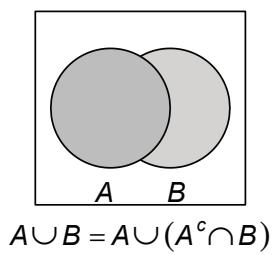  
Panel (a)

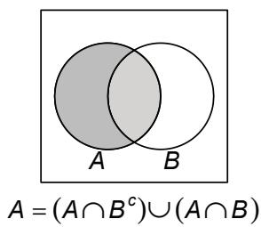  
Panel (b)   
Figure 1.3.1: Venn diagrams depicting the two disjoint unions given in expression (1.3.1). Panel (a) depicts the first disjoint union while Panel (b) shows the second disjoint union.

Example 1.3.1. Let $\mathcal{C}$ denote the sample space of Example 1.1.2. Let the probability set function assign a probability of $\frac{1}{36}$ to each of the 36 points in $\mathcal{C}$ ; that is, the dice are fair. If $C_1 = \{(1,1),(2,1),(3,1),(4,1),(5,1)\}$ and $C_2 = \{(1,2),(2,2),(3,2)\}$ , then $P(C_1) = \frac{5}{36}$ , $P(C_2) = \frac{3}{36}$ , $P(C_1 \cup C_2) = \frac{8}{36}$ , and $P(C_1 \cap C_2) = 0$ .

Example 1.3.2. Two coins are to be tossed and the outcome is the ordered pair (face on the first coin, face on the second coin). Thus the sample space may be represented as $\mathcal{C} = \{(H,H),(H,T),(T,H),(T,T)\}$ . Let the probability set function assign a probability of $\frac{1}{4}$ to each element of $\mathcal{C}$ . Let $C_1 = \{(H,H),(H,T)\}$ and $C_2 = \{(H,H),(T,H)\}$ . Then $P(C_1) = P(C_2) = \frac{1}{2}$ , $P(C_1 \cap C_2) = \frac{1}{4}$ , and, in accordance with Theorem 1.3.5, $P(C_1 \cup C_2) = \frac{1}{2} + \frac{1}{2} - \frac{1}{4} = \frac{3}{4}$ .

For a finite sample space, we can generate probabilities as follows. Let $\mathcal{C} = \{x_1, x_2, \ldots, x_m\}$ be a finite set of $m$ elements. Let $p_1, p_2, \ldots, p_m$ be fractions such that

$$
0 \leq p _ {i} \leq 1 \text {f o r} i = 1, 2, \dots , m \text {a n d} \sum_ {i = 1} ^ {m} p _ {i} = 1. \tag {1.3.2}
$$

Suppose we define $P$ by

$$
P (A) = \sum_ {x _ {i} \in A} p _ {i}, \quad \text {f o r a l l s u b s e t s} A \text {o f} \mathcal {C}. \tag {1.3.3}
$$

Then $P(A) \geq 0$ and $P(\mathcal{C}) = 1$ . Further, it follows that $P(A \cup B) = P(A) + P(B)$ when $A \cap B = \phi$ . Therefore, $P$ is a probability on $\mathcal{C}$ . For illustration, each of the following four assignments forms a probability on $\mathcal{C} = \{1,2,\ldots,6\}$ . For each, we also compute $P(A)$ for the event $A = \{1,6\}$ .

$$
\begin{array}{l} p _ {1} = p _ {2} = \dots = p _ {6} = \frac {1}{6}; \quad P (A) = \frac {1}{3}. \tag {1.3.4} \\ p _ {1} = p _ {2} = 0. 1, p _ {3} = p _ {4} = p _ {5} = p _ {6} = 0. 2; \quad P (A) = 0. 3. \\ p _ {i} = \frac {i}{2 1}, \quad i = 1, 2, \ldots , 6; \quad P (A) = \frac {7}{2 1}. \\ p _ {1} = \frac {3}{\pi}, p _ {2} = 1 - \frac {3}{\pi}, p _ {3} = p _ {4} = p _ {5} = p _ {6} = 0. 0; \quad P (A) = \frac {3}{\pi}. \\ \end{array}
$$

Note that the individual probabilities for the first probability set function, (1.3.4), are the same. This is an example of the equilikely case which we now formally define.

Definition 1.3.2 (Equilikely Case). Let $\mathcal{C} = \{x_1, x_2, \ldots, x_m\}$ be a finite sample space. Let $p_i = 1/m$ for all $i = 1, 2, \ldots, m$ and for all subsets $A$ of $\mathcal{C}$ define

$$
P (A) = \sum_ {x _ {i} \in A} \frac {1}{m} = \frac {\# (A)}{m},
$$

where $\# (A)$ denotes the number of elements in $A$ . Then $P$ is a probability on $\mathcal{C}$ and it is referred to as the equillikely case.

Equilibrated cases are frequently probability models of interest. Examples include: the flip of a fair coin; five cards drawn from a well shuffled deck of 52 cards; a spin of a fair spinner with the numbers 1 through 36 on it; and the upfaces of the roll of a pair of balanced dice. For each of these experiments, as stated in the definition, we only need to know the number of elements in an event to compute the probability of that event. For example, a card player may be interested in the probability of getting a pair (two of a kind) in a hand of five cards dealt from a well shuffled deck of 52 cards. To compute this probability, we need to know the number of five card hands and the number of such hands which contain a pair. Because the equilibrated case is often of interest, we next develop some counting rules which can be used to compute the probabilities of events of interest.

# 1.3.1 Counting Rules

We discuss three counting rules that are usually discussed in an elementary algebra course.

The first rule is called the mn-rule ( $m$ times $n$ -rule), which is also called the multiplication rule. Let $A = \{x_{1}, x_{2}, \ldots, x_{m}\}$ be a set of $m$ elements and let $B = \{y_{1}, y_{2}, \ldots, y_{n}\}$ be a set of $n$ elements. Then there are $mn$ ordered pairs, $(x_{i}, y_{j})$ , $i = 1, 2, \ldots, m$ and $j = 1, 2, \ldots, n$ , of elements, the first from $A$ and the second from $B$ . Informally, we often speak of ways, here. For example there are five roads (ways) between cities I and II and there are ten roads (ways) between cities II and III. Hence, there are $5 * 10 = 50$ ways to get from city I to city III by going from city I to city II and then from city II to city III. This rule extends immediately to more than two sets. For instance, suppose in a certain state that driver license plates have the pattern of three letters followed by three numbers. Then there are $26^{3} * 10^{3}$ possible license plates in this state.

Next, let $A$ be a set with $n$ elements. Suppose we are interested in $k$ -tuples whose components are elements of $A$ . Then by the extended mn rule, there are $n \cdot n \cdots n = n^k$ such $k$ -tuples whose components are elements of $A$ . Next, suppose $k \leq n$ and we are interested in $k$ -tuples whose components are distinct (no repeats) elements of $A$ . There are $n$ elements from which to choose for the first component, $n - 1$ for the second component, ..., $n - (k - 1)$ for the $k$ th. Hence, by the mn rule, there are $n(n - 1) \cdots (n - (k - 1))$ such $k$ -tuples with distinct elements. We call each such $k$ -tuple a permutation and use the symbol $P_k^n$ to denote the number of $k$ permutations taken from a set of $n$ elements. This number of permutations, $P_k^n$ is our second counting rule. We can rewrite it as

$$
P _ {k} ^ {n} = n (n - 1) \dots (n - (k - 1)) = \frac {n !}{(n - k) !}. \tag {1.3.5}
$$

Example 1.3.3 (Birthday Problem). Suppose there are $n$ people in a room. Assume that $n < 365$ and that the people are unrelated in any way. Find the probability of the event $A$ that at least 2 people have the same birthday. For convenience, assign the numbers 1 though $n$ to the people in the room. Then use $n$ -tuples to denote the birthdays of the first person through the $nth$ person in the room. Using the $mn$ -rule, there are $365^n$ possible birthday $n$ -tuples for these $n$ people. This is the number of elements in the sample space. Now assume that birthdays are equilibrated to occur on any of the 365 days. Hence, each of these $n$ -tuples has probability $365^{-n}$ . Notice that the complement of $A$ is the event that all the birthdays in the room are distinct; that is, the number of $n$ -tuples in $A^c$ is $P_n^{365}$ . Thus, the probability of $A$ is

$$
P (A) = 1 - \frac {P _ {n} ^ {3 6 5}}{3 6 5 ^ {n}}.
$$

For instance, if $n = 2$ then $P(A) = 1 - (365 * 364) / (365^2) = 0.0027$ . This formula is not easy to compute by hand. The following R function<sup>4</sup> computes the $P(A)$ for the input $n$ and it can be downloaded at the sites mentioned in the Preface.

```txt
bday = function(n){ bday = 1; nm1 = n - 1  
for(j in 1:nm1){bday = bday * ((365-j)/365)}  
bday <- 1 - bday; return(bday)} 
```

Assuming that the file bday.R contains this function, here is the R segment computing $P(A)$ for $n = 10$ :

```txt
> source("bday.R")  
> bday(10)  
[1] 0.1169482 
```

For our last counting rule, as with permutations, we are drawing from a set $A$ of $n$ elements. Now, suppose order is not important, so instead of counting the number of permutations we want to count the number of subsets of $k$ elements taken from $A$ . We use the symbol $\binom{n}{k}$ to denote the total number of these subsets. Consider a subset of $k$ elements from $A$ . By the permutation rule it generates $P_k^k = k(k-1)\cdots 1 = k!$ permutations. Furthermore, all these permutations are distinct from the permutations generated by other subsets of $k$ elements from $A$ . Finally, each permutation of $k$ distinct elements drawn from $A$ must be generated by one of these subsets. Hence, we have shown that $P_k^n = \binom{n}{k}k!$ ; that is,

$$
\binom {n} {k} = \frac {n !}{k ! (n - k) !}. \tag {1.3.6}
$$

We often use the terminology combinations instead of subsets. So we say that there are $\binom{n}{k}$ combinations of $k$ things taken from a set of $n$ things. Another common symbol for $\binom{n}{k}$ is $C_k^n$ .

It is interesting to note that if we expand the binomial series,

$$
(a + b) ^ {n} = (a + b) (a + b) \dots (a + b),
$$

we get

$$
(a + b) ^ {n} = \sum_ {k = 0} ^ {n} \binom {n} {k} a ^ {k} b ^ {n - k}, \tag {1.3.7}
$$

because we can select the $k$ factors from which to take $a$ in $\binom{n}{k}$ ways. So $\binom{n}{k}$ is also referred to as a binomial coefficient.

Example 1.3.4 (Poker Hands). Let a card be drawn at random from an ordinary deck of 52 playing cards that has been well shuffled. The sample space $\mathcal{C}$ consists of 52 elements, each element represents one and only one of the 52 cards. Because the deck has been well shuffled, it is reasonable to assume that each of these outcomes has the same probability $\frac{1}{52}$ . Accordingly, if $E_1$ is the set of outcomes that are spades, $P(E_1) = \frac{13}{52} = \frac{1}{4}$ because there are 13 spades in the deck; that is, $\frac{1}{4}$ is the probability of drawing a card that is a spade. If $E_2$ is the set of outcomes that are kings, $P(E_2) = \frac{4}{52} = \frac{1}{13}$ because there are 4 kings in the deck; that is, $\frac{1}{13}$ is the probability of drawing a card that is a king. These computations are very easy

because there are no difficulties in the determination of the number of elements in each event.

However, instead of drawing only one card, suppose that five cards are taken, at random and without replacement, from this deck; i.e., a five card poker hand. In this instance, order is not important. So a hand is a subset of five elements drawn from a set of 52 elements. Hence, by (1.3.6) there are $\binom{52}{5}$ poker hands. If the deck is well shuffled, each hand should be equilibrated; i.e., each hand has probability $1/\binom{52}{5}$ . We can now compute the probabilities of some interesting poker hands. Let $E_{1}$ be the event of a flush, all five cards of the same suit. There are $\binom{4}{1} = 4$ suits to choose for the flush and in each suit there are $\binom{13}{5}$ possible hands; hence, using the multiplication rule, the probability of getting a flush is

$$
P (E _ {1}) = \frac {\binom {4} {1} \binom {1 3} {5}}{\binom {5 2} {5}} = \frac {4 \cdot 1 2 8 7}{2 5 9 8 9 6 0} = 0. 0 0 1 9 8.
$$

Real poker players note that this includes the probability of obtaining a straight flush.

Next, consider the probability of the event $E_{2}$ of getting exactly three of a kind, (the other two cards are distinct and are of different kinds). Choose the kind for the three, in $\binom{13}{1}$ ways; choose the three, in $\binom{4}{3}$ ways; choose the other two kinds, in $\binom{12}{2}$ ways; and choose one card from each of these last two kinds, in $\binom{4}{1} \binom{4}{1}$ ways. Hence the probability of exactly three of a kind is

$$
P (E _ {2}) = \frac {\binom {1 3} {1} \binom {4} {3} \binom {1 2} {2} \binom {4} {1} ^ {2}}{\binom {5 2} {5}} = 0. 0 2 1 1.
$$

Now suppose that $E_{3}$ is the set of outcomes in which exactly three cards are kings and exactly two cards are queens. Select the kings, in $\binom{4}{3}$ ways, and select the queens, in $\binom{4}{2}$ ways. Hence, the probability of $E_{3}$ is

$$
P (E _ {3}) = \binom {4} {3} \binom {4} {2} / \binom {5 2} {5} = 0. 0 0 0 0 0 9 3.
$$

The event $E_{3}$ is an example of a full house: three of one kind and two of another kind. Exercise 1.3.19 asks for the determination of the probability of a full house.

# 1.3.2 Additional Properties of Probability

We end this section with several additional properties of probability which prove useful in the sequel. Recall in Exercise 1.2.6 we said that a sequence of events $\{C_n\}$ is a nondecreasing sequence if $C_n \subset C_{n+1}$ , for all $n$ , in which case we wrote $\lim_{n \to \infty} C_n = \cup_{n=1}^{\infty} C_n$ . Consider $\lim_{n \to \infty} P(C_n)$ . The question is: can we legitimately interchange the limit and $P$ ? As the following theorem shows, the answer is yes. The result also holds for a decreasing sequence of events. Because of this interchange, this theorem is sometimes referred to as the continuity theorem of probability.

Theorem 1.3.6. Let $\{C_n\}$ be a nondecreasing sequence of events. Then

$$
\lim  _ {n \rightarrow \infty} P \left(C _ {n}\right) = P \left(\lim  _ {n \rightarrow \infty} C _ {n}\right) = P \left(\bigcup_ {n = 1} ^ {\infty} C _ {n}\right). \tag {1.3.8}
$$

Let $\{C_n\}$ be a decreasing sequence of events. Then

$$
\lim  _ {n \rightarrow \infty} P \left(C _ {n}\right) = P \left(\lim  _ {n \rightarrow \infty} C _ {n}\right) = P \left(\bigcap_ {n = 1} ^ {\infty} C _ {n}\right). \tag {1.3.9}
$$

Proof. We prove the result (1.3.8) and leave the second result as Exercise 1.3.20. Define the sets, called rings, as $R_{1} = C_{1}$ and, for $n > 1$ , $R_{n} = C_{n} \cap C_{n - 1}^{c}$ . It follows that $\bigcup_{n = 1}^{\infty}C_n = \bigcup_{n = 1}^{\infty}R_n$ and that $R_{m}\cap R_{n} = \phi$ , for $m\neq n$ . Also, $P(R_{n}) = P(C_{n}) - P(C_{n - 1})$ . Applying the third axiom of probability yields the following string of equalities:

$$
\begin{array}{l} P \left[ \lim  _ {n \rightarrow \infty} C _ {n} \right] = P \left(\bigcup_ {n = 1} ^ {\infty} C _ {n}\right) = P \left(\bigcup_ {n = 1} ^ {\infty} R _ {n}\right) = \sum_ {n = 1} ^ {\infty} P (R _ {n}) = \lim  _ {n \rightarrow \infty} \sum_ {j = 1} ^ {n} P (R _ {j}) \\ = \lim  _ {n \rightarrow \infty} \left\{P \left(C _ {1}\right) + \sum_ {j = 2} ^ {n} \left[ P \left(C _ {j}\right) - P \left(C _ {j - 1}\right)\right]\right\} = \lim  _ {n \rightarrow \infty} P \left(C _ {n}\right). (1. 3. 1 0) \\ \end{array}
$$

This is the desired result.

Another useful result for arbitrary unions is given by

Theorem 1.3.7 (Boole's Inequality). Let $\{C_n\}$ be an arbitrary sequence of events. Then

$$
P \left(\bigcup_ {n = 1} ^ {\infty} C _ {n}\right) \leq \sum_ {n = 1} ^ {\infty} P \left(C _ {n}\right). \tag {1.3.11}
$$

Proof: Let $D_{n} = \bigcup_{i=1}^{n} C_{i}$ . Then $\{D_{n}\}$ is an increasing sequence of events that go up to $\bigcup_{n=1}^{\infty} C_{n}$ . Also, for all $j$ , $D_{j} = D_{j-1} \cup C_{j}$ . Hence, by Theorem 1.3.5,

$$
P (D _ {j}) \leq P (D _ {j - 1}) + P (C _ {j}),
$$

that is,

$$
P \left(D _ {j}\right) - P \left(D _ {j - 1}\right) \leq P \left(C _ {j}\right).
$$

In this case, the $C_i$ s are replaced by the $D_i$ s in expression (1.3.10). Hence, using the above inequality in this expression and the fact that $P(C_1) = P(D_1)$ , we have

$$
\begin{array}{l} P \left(\bigcup_ {n = 1} ^ {\infty} C _ {n}\right) = P \left(\bigcup_ {n = 1} ^ {\infty} D _ {n}\right) = \lim  _ {n \rightarrow \infty} \left\{P \left(D _ {1}\right) + \sum_ {j = 2} ^ {n} \left[ P \left(D _ {j}\right) - P \left(D _ {j - 1}\right)\right]\right\} \\ \leq \lim  _ {n \rightarrow \infty} \sum_ {j = 1} ^ {n} P (C _ {j}) = \sum_ {n = 1} ^ {\infty} P (C _ {n}). \\ \end{array}
$$

Theorem 1.3.5 gave a general additive law of probability for the union of two events. As the next remark shows, this can be extended to an additive law for an arbitrary union.

Remark 1.3.2 (Inclusion Exclusion Formula). It is easy to show (Exercise 1.3.9) that

$$
P \left(C _ {1} \cup C _ {2} \cup C _ {3}\right) = p _ {1} - p _ {2} + p _ {3},
$$

where

$$
\begin{array}{l} p _ {1} = P \left(C _ {1}\right) + P \left(C _ {2}\right) + P \left(C _ {3}\right) \\ p _ {2} = P \left(C _ {1} \cap C _ {2}\right) + P \left(C _ {1} \cap C _ {3}\right) + P \left(C _ {2} \cap C _ {3}\right) \\ p _ {3} = P \left(C _ {1} \cap C _ {2} \cap C _ {3}\right). \tag {1.3.12} \\ \end{array}
$$

This can be generalized to the inclusion exclusion formula:

$$
P \left(C _ {1} \cup C _ {2} \cup \dots \cup C _ {k}\right) = p _ {1} - p _ {2} + p _ {3} - \dots + (- 1) ^ {k + 1} p _ {k}, \tag {1.3.13}
$$

where $p_i$ equals the sum of the probabilities of all possible intersections involving $i$ sets.

When $k = 3$ , it follows that $p_1 \geq p_2 \geq p_3$ , but more generally $p_1 \geq p_2 \geq \dots \geq p_k$ . As shown in Theorem 1.3.7,

$$
p _ {1} = P \left(C _ {1}\right) + P \left(C _ {2}\right) + \dots + P \left(C _ {k}\right) \geq P \left(C _ {1} \cup C _ {2} \cup \dots \cup C _ {k}\right).
$$

For $k = 2$ , we have

$$
1 \geq P \left(C _ {1} \cup C _ {2}\right) = P \left(C _ {1}\right) + P \left(C _ {2}\right) - P \left(C _ {1} \cap C _ {2}\right),
$$

which gives Bonferroni's inequality,

$$
P \left(C _ {1} \cap C _ {2}\right) \geq P \left(C _ {1}\right) + P \left(C _ {2}\right) - 1, \tag {1.3.14}
$$

that is only useful when $P(C_1)$ and $P(C_2)$ are large. The inclusion exclusion formula provides other inequalities that are useful, such as

$$
p _ {1} \geq P \left(C _ {1} \cup C _ {2} \cup \dots \cup C _ {k}\right) \geq p _ {1} - p _ {2}
$$

and

$$
p _ {1} - p _ {2} + p _ {3} \geq P \left(C _ {1} \cup C _ {2} \cup \dots \cup C _ {k}\right) \geq p _ {1} - p _ {2} + p _ {3} - p _ {4}.
$$

# EXERCISES

1.3.1. A positive integer from one to six is to be chosen by casting a die. Thus the elements $c$ of the sample space $\mathcal{C}$ are $1,2,3,4,5,6$ . Suppose $C_1 = \{1,2,3,4\}$ and $C_2 = \{3,4,5,6\}$ . If the probability set function $P$ assigns a probability of $\frac{1}{6}$ to each of the elements of $\mathcal{C}$ , compute $P(C_1), P(C_2), P(C_1 \cap C_2)$ , and $P(C_1 \cup C_2)$ .

1.3.2. A random experiment consists of drawing a card from an ordinary deck of 52 playing cards. Let the probability set function $P$ assign a probability of $\frac{1}{52}$ to each of the 52 possible outcomes. Let $C_1$ denote the collection of the 13 hearts and let $C_2$ denote the collection of the 4 kings. Compute $P(C_1), P(C_2), P(C_1 \cap C_2)$ , and $P(C_1 \cup C_2)$ .

1.3.3. A coin is to be tossed as many times as necessary to turn up one head. Thus the elements $c$ of the sample space $\mathcal{C}$ are $H, TH, TTH, TTTH$ , and so forth. Let the probability set function $P$ assign to these elements the respective probabilities $\frac{1}{2}, \frac{1}{4}, \frac{1}{8}, \frac{1}{16}$ , and so forth. Show that $P(\mathcal{C}) = 1$ . Let $C_1 = \{c : c \text{ is } H, TH, TTH, TTTH, \text{ or } TTTH\}$ . Compute $P(C_1)$ . Next, suppose that $C_2 = \{c : c \text{ is } TTTH \text{ or } TTTT\}$ . Compute $P(C_2)$ , $P(C_1 \cap C_2)$ , and $P(C_1 \cup C_2)$ .

1.3.4. If the sample space is $\mathcal{C} = C_1 \cup C_2$ and if $P(C_1) = 0.8$ and $P(C_2) = 0.5$ , find $P(C_1 \cap C_2)$ .

1.3.5. Let the sample space be $\mathcal{C} = \{c:0 < c < \infty\}$ . Let $C\subset \mathcal{C}$ be defined by $C = \{c:4 < c < \infty\}$ and take $P(C) = \int_{C}e^{-x}dx$ . Show that $P(\mathcal{C}) = 1$ . Evaluate $P(C), P(C^{c})$ , and $P(C\cup C^{c})$ .

1.3.6. If the sample space is $\mathcal{C} = \{c: -\infty < c < \infty\}$ and if $C \subset \mathcal{C}$ is a set for which the integral $\int_{C} e^{-|x|} dx$ exists, show that this set function is not a probability set function. What constant do we multiply the integrand by to make it a probability set function?

1.3.7. If $C_1$ and $C_2$ are subsets of the sample space $\mathcal{C}$ , show that

$$
P \left(C _ {1} \cap C _ {2}\right) \leq P \left(C _ {1}\right) \leq P \left(C _ {1} \cup C _ {2}\right) \leq P \left(C _ {1}\right) + P \left(C _ {2}\right).
$$

1.3.8. Let $C_1, C_2$ , and $C_3$ be three mutually disjoint subsets of the sample space $\mathcal{C}$ . Find $P[(C_1 \cup C_2) \cap C_3]$ and $P(C_1^c \cup C_2^c)$ .

1.3.9. Consider Remark 1.3.2.

(a) If $C_1, C_2$ , and $C_3$ are subsets of $\mathcal{C}$ , show that

$$
\begin{array}{l} P \left(C _ {1} \cup C _ {2} \cup C _ {3}\right) = P \left(C _ {1}\right) + P \left(C _ {2}\right) + P \left(C _ {3}\right) - P \left(C _ {1} \cap C _ {2}\right) \\ - P \left(C _ {1} \cap C _ {3}\right) - P \left(C _ {2} \cap C _ {3}\right) + P \left(C _ {1} \cap C _ {2} \cap C _ {3}\right). \\ \end{array}
$$

(b) Now prove the general inclusion exclusion formula given by the expression (1.3.13).

Remark 1.3.3. In order to solve Exercises (1.3.10)-(1.3.19), certain reasonable assumptions must be made.

1.3.10. A bowl contains 16 chips, of which 6 are red, 7 are white, and 3 are blue. If four chips are taken at random and without replacement, find the probability that: (a) each of the four chips is red; (b) none of the four chips is red; (c) there is at least one chip of each color.

1.3.11. A person has purchased 10 of 1000 tickets sold in a certain raffle. To determine the five prize winners, five tickets are to be drawn at random and without replacement. Compute the probability that this person wins at least one prize. Hint: First compute the probability that the person does not win a prize.

1.3.12. Compute the probability of being dealt at random and without replacement a 13-card bridge hand consisting of: (a) 6 spades, 4 hearts, 2 diamonds, and 1 club; (b) 13 cards of the same suit.

1.3.13. Three distinct integers are chosen at random from the first 20 positive integers. Compute the probability that: (a) their sum is even; (b) their product is even.

1.3.14. There are five red chips and three blue chips in a bowl. The red chips are numbered 1, 2, 3, 4, 5, respectively, and the blue chips are numbered 1, 2, 3, respectively. If two chips are to be drawn at random and without replacement, find the probability that these chips have either the same number or the same color.

1.3.15. In a lot of 50 light bulbs, there are 2 bad bulbs. An inspector examines five bulbs, which are selected at random and without replacement.

(a) Find the probability of at least one defective bulb among the five.   
(b) How many bulbs should be examined so that the probability of finding at least one bad bulb exceeds $\frac{1}{2}$ ?

1.3.16. For the birthday problem, Example 1.3.3, use the given R function bday to determine the value of $n$ so that $p(n) \geq 0.5$ and $p(n - 1) < 0.5$ , where $p(n)$ is the probability that at least two people in the room of $n$ people have the same birthday.

1.3.17. If $C_1, \ldots, C_k$ are $k$ events in the sample space $\mathcal{C}$ , show that the probability that at least one of the events occurs is one minus the probability that none of them occur; i.e.,

$$
P \left(C _ {1} \cup \dots \cup C _ {k}\right) = 1 - P \left(C _ {1} ^ {c} \cap \dots \cap C _ {k} ^ {c}\right). \tag {1.3.15}
$$

1.3.18. A secretary types three letters and the three corresponding envelopes. In a hurry, he places at random one letter in each envelope. What is the probability that at least one letter is in the correct envelope? Hint: Let $C_i$ be the event that the $i$ th letter is in the correct envelope. Expand $P(C_1 \cup C_2 \cup C_3)$ to determine the probability.

1.3.19. Consider poker hands drawn from a well-shuffled deck as described in Example 1.3.4. Determine the probability of a full house, i.e., three of one kind and two of another.

1.3.20. Prove expression (1.3.9).

1.3.21. Suppose the experiment is to choose a real number at random in the interval $(0,1)$ . For any subinterval $(a,b) \subset (0,1)$ , it seems reasonable to assign the probability $P[(a,b)] = b - a$ ; i.e., the probability of selecting the point from a subinterval is directly proportional to the length of the subinterval. If this is the case, choose an appropriate sequence of subintervals and use expression (1.3.9) to show that $P[\{a\}] = 0$ , for all $a \in (0,1)$ .

1.3.22. Consider the events $C_1, C_2, C_3$ .

(a) Suppose $C_1, C_2, C_3$ are mutually exclusive events. If $P(C_i) = p_i$ , $i = 1, 2, 3$ , what is the restriction on the sum $p_1 + p_2 + p_3$ ?   
(b) In the notation of part (a), if $p_1 = 4/10$ , $p_2 = 3/10$ , and $p_3 = 5/10$ , are $C_1, C_2, C_3$ mutually exclusive?

For the last two exercises it is assumed that the reader is familiar with $\sigma$ -fields.

1.3.23. Suppose $\mathcal{D}$ is a nonempty collection of subsets of $\mathcal{C}$ . Consider the collection of events

$$
\mathcal {B} = \cap \{\mathcal {E}: \mathcal {D} \subset \mathcal {E} \text {a n d} \mathcal {E} \text {i s a} \sigma \text {- f i e l d} \}.
$$

Note that $\phi \in \mathcal{B}$ because it is in each $\sigma$ -field, and, hence, in particular, it is in each $\sigma$ -field $\mathcal{E} \supset \mathcal{D}$ . Continue in this way to show that $\mathcal{B}$ is a $\sigma$ -field.

1.3.24. Let $\mathcal{C} = R$ , where $R$ is the set of all real numbers. Let $\mathcal{I}$ be the set of all open intervals in $R$ . The Borel $\sigma$ -field on the real line is given by

$$
\mathcal {B} _ {0} = \cap \{\mathcal {E}: \mathcal {I} \subset \mathcal {E} \text {a n d} \mathcal {E} \text {i s a} \sigma \text {- f i e l d} \}.
$$

By definition, $\mathcal{B}_0$ contains the open intervals. Because $[a,\infty) = (-\infty ,a)^c$ and $\mathcal{B}_0$ is closed under complements, it contains all intervals of the form $[a,\infty)$ , for $a\in R$ . Continue in this way and show that $\mathcal{B}_0$ contains all the closed and half-open intervals of real numbers.

# 1.4 Conditional Probability and Independence

In some random experiments, we are interested only in those outcomes that are elements of a subset $A$ of the sample space $\mathcal{C}$ . This means, for our purposes, that the sample space is effectively the subset $A$ . We are now confronted with the problem of defining a probability set function with $A$ as the "new" sample space.

Let the probability set function $P(A)$ be defined on the sample space $\mathcal{C}$ and let $A$ be a subset of $\mathcal{C}$ such that $P(A) > 0$ . We agree to consider only those outcomes of the random experiment that are elements of $A$ ; in essence, then, we take $A$ to be a sample space. Let $B$ be another subset of $\mathcal{C}$ . How, relative to the new sample space $A$ , do we want to define the probability of the event $B$ ? Once defined, this probability is called the conditional probability of the event $B$ , relative to the hypothesis of the event $A$ , or, more briefly, the conditional probability of $B$ , given $A$ . Such a conditional probability is denoted by the symbol $P(B|A)$ . The "|" in this symbol is usually read as "given." We now return to the question that was raised about the definition of this symbol. Since $A$ is now the sample space, the only elements of $B$ that concern us are those, if any, that are also elements of $A$ , that is, the elements of $A \cap B$ . It seems desirable, then, to define the symbol $P(B|A)$ in such a way that

$$
P (A | A) = 1 \quad \text {a n d} \quad P (B | A) = P (A \cap B | A).
$$

Moreover, from a relative frequency point of view, it would seem logically inconsistent if we did not require that the ratio of the probabilities of the events $A \cap B$ and $A$ , relative to the space $A$ , be the same as the ratio of the probabilities of these events relative to the space $\mathcal{C}$ ; that is, we should have

$$
\frac {P (A \cap B | A)}{P (A | A)} = \frac {P (A \cap B)}{P (A)}.
$$

These three desirable conditions imply that the relation conditional probability is reasonably defined as

Definition 1.4.1 (Conditional Probability). Let $B$ and $A$ be events with $P(A) > 0$ . Then we defined the conditional probability of $B$ given $A$ as

$$
P (B | A) = \frac {P (A \cap B)}{P (A)}. \quad \blacksquare \tag {1.4.1}
$$

Moreover, we have

1. $P(B|A)\geq 0$   
2. $P(A|A) = 1$   
3. $P(\cup_{n = 1}^{\infty}B_n|A) = \sum_{n = 1}^{\infty}P(B_n|A)$ , provided that $B_{1}, B_{2}, \ldots$ are mutually exclusive events.

Properties (1) and (2) are evident. For Property (3), suppose the sequence of events $B_{1}, B_{2}, \ldots$ is mutually exclusive. It follows that also $(B_{n} \cap A) \cap (B_{m} \cap A) = \phi$ , $n \neq m$ . Using this and the first of the distributive laws (1.2.5) for countable unions, we have

$$
\begin{array}{l} P \left(\cup_ {n = 1} ^ {\infty} B _ {n} \mid A\right) = \frac {P \left[ \cup_ {n = 1} ^ {\infty} \left(B _ {n} \cap A\right) \right]}{P (A)} \\ = \sum_ {n = 1} ^ {\infty} \frac {P \left[ B _ {n} \cap A \right]}{P (A)} \\ = \sum_ {n = 1} ^ {\infty} P \left[ B _ {n} | A \right]. \\ \end{array}
$$

Properties (1)-(3) are precisely the conditions that a probability set function must satisfy. Accordingly, $P(B|A)$ is a probability set function, defined for subsets of $A$ . It may be called the conditional probability set function, relative to the hypothesis $A$ , or the conditional probability set function, given $A$ . It should be noted that this conditional probability set function, given $A$ , is defined at this time only when $P(A) > 0$ .

Example 1.4.1. A hand of five cards is to be dealt at random without replacement from an ordinary deck of 52 playing cards. The conditional probability of an all-spade hand $(B)$ , relative to the hypothesis that there are at least four spades in the

hand $(A)$ , is, since $A \cap B = B$ ,

$$
\begin{array}{l} P (B | A) = \frac {P (B)}{P (A)} = \frac {\binom {1 3} {5} / \binom {5 2} {5}}{\left[ \binom {1 3} {4} \binom {3 9} {1} + \binom {1 3} {5} \right] / \binom {5 2} {5}} \\ = \frac {\binom {1 3} {5}}{\binom {1 3} {4} \binom {3 9} {1} + \binom {1 3} {5}} = 0. 0 4 4 1. \\ \end{array}
$$

Note that this is not the same as drawing for a spade to complete a flush in draw poker; see Exercise 1.4.3.

From the definition of the conditional probability set function, we observe that

$$
P (A \cap B) = P (A) P (B | A).
$$

This relation is frequently called the multiplication rule for probabilities. Sometimes, after considering the nature of the random experiment, it is possible to make reasonable assumptions so that both $P(A)$ and $P(B|A)$ can be assigned. Then $P(A \cap B)$ can be computed under these assumptions. This is illustrated in Examples 1.4.2 and 1.4.3.

Example 1.4.2. A bowl contains eight chips. Three of the chips are red and the remaining five are blue. Two chips are to be drawn successively, at random and without replacement. We want to compute the probability that the first draw results in a red chip $(A)$ and that the second draw results in a blue chip $(B)$ . It is reasonable to assign the following probabilities:

$$
P (A) = \frac {3}{8} \quad \mathrm {a n d} \quad P (B | A) = \frac {5}{7}.
$$

Thus, under these assignments, we have $P(A \cap B) = \left(\frac{3}{8}\right)\left(\frac{5}{7}\right) = \frac{15}{56} = 0.2679$ .

Example 1.4.3. From an ordinary deck of playing cards, cards are to be drawn successively, at random and without replacement. The probability that the third spade appears on the sixth draw is computed as follows. Let $A$ be the event of two spades in the first five draws and let $B$ be the event of a spade on the sixth draw. Thus the probability that we wish to compute is $P(A \cap B)$ . It is reasonable to take

$$
P (A) = \frac {\binom {1 3} {2} \binom {3 9} {3}}{\binom {5 2} {5}} = 0. 2 7 4 3 \quad \text {a n d} \quad P (B | A) = \frac {1 1}{4 7} = 0. 2 3 4 0.
$$

The desired probability $P(A \cap B)$ is then the product of these two numbers, which to four places is 0.0642.

The multiplication rule can be extended to three or more events. In the case of three events, we have, by using the multiplication rule for two events,

$$
\begin{array}{l} P (A \cap B \cap C) = P [ (A \cap B) \cap C ] \\ = P (A \cap B) P (C | A \cap B). \\ \end{array}
$$

But $P(A \cap B) = P(A)P(B|A)$ . Hence, provided $P(A \cap B) > 0$ ,

$$
P (A \cap B \cap C) = P (A) P (B | A) P (C | A \cap B).
$$

This procedure can be used to extend the multiplication rule to four or more events. The general formula for $k$ events can be proved by mathematical induction.

Example 1.4.4. Four cards are to be dealt successively, at random and without replacement, from an ordinary deck of playing cards. The probability of receiving a spade, a heart, a diamond, and a club, in that order, is $(\frac{13}{52})(\frac{13}{51})(\frac{13}{50})(\frac{13}{49}) = 0.0044$ . This follows from the extension of the multiplication rule.

Consider $k$ mutually exclusive and exhaustive events $A_{1}, A_{2}, \ldots, A_{k}$ such that $P(A_{i}) > 0, i = 1, 2, \ldots, k$ ; i.e., $A_{1}, A_{2}, \ldots, A_{k}$ form a partition of $\mathcal{C}$ . Here the events $A_{1}, A_{2}, \ldots, A_{k}$ do not need to be equally likely. Let $B$ be another event such that $P(B) > 0$ . Thus $B$ occurs with one and only one of the events $A_{1}, A_{2}, \ldots, A_{k}$ ; that is,

$$
\begin{array}{l} B = B \cap \left(A _ {1} \cup A _ {2} \cup \dots A _ {k}\right) \\ = \left(B \cap A _ {1}\right) \cup \left(B \cap A _ {2}\right) \cup \dots \cup \left(B \cap A _ {k}\right). \\ \end{array}
$$

Since $B\cap A_{i}$ $i = 1,2,\ldots ,k$ , are mutually exclusive, we have

$$
P (B) = P \left(B \cap A _ {1}\right) + P \left(B \cap A _ {2}\right) + \dots + P \left(B \cap A _ {k}\right).
$$

However, $P(B \cap A_i) = P(A_i)P(B|A_i), i = 1,2,\ldots,k$ ; so

$$
\begin{array}{l} P (B) = P \left(A _ {1}\right) P \left(B \mid A _ {1}\right) + P \left(A _ {2}\right) P \left(B \mid A _ {2}\right) + \dots + P \left(A _ {k}\right) P \left(B \mid A _ {k}\right) \\ = \sum_ {i = 1} ^ {k} P \left(A _ {i}\right) P \left(B \mid A _ {i}\right). \tag {1.4.2} \\ \end{array}
$$

This result is sometimes called the law of total probability and it leads to the following important theorem.

Theorem 1.4.1 (Bayes). Let $A_1, A_2, \ldots, A_k$ be events such that $P(A_i) > 0$ , $i = 1, 2, \ldots, k$ . Assume further that $A_1, A_2, \ldots, A_k$ form a partition of the sample space $\mathcal{C}$ . Let $B$ be any event. Then

$$
P \left(A _ {j} \mid B\right) = \frac {P \left(A _ {j}\right) P \left(B \mid A _ {j}\right)}{\sum_ {i = 1} ^ {k} P \left(A _ {i}\right) P \left(B \mid A _ {i}\right)}, \tag {1.4.3}
$$

Proof: Based on the definition of conditional probability, we have

$$
P (A _ {j} | B) = \frac {P (B \cap A _ {j})}{P (B)} = \frac {P (A _ {j}) P (B | A _ {j})}{P (B)}.
$$

The result then follows by the law of total probability, (1.4.2).

This theorem is the well-known Bayes' Theorem. This permits us to calculate the conditional probability of $A_{j}$ , given $B$ , from the probabilities of $A_{1}, A_{2}, \ldots, A_{k}$ and the conditional probabilities of $B$ , given $A_{i}$ , $i = 1, 2, \ldots, k$ . The next three examples illustrate the usefulness of Bayes Theorem to determine probabilities.

Example 1.4.5. Say it is known that bowl $A_{1}$ contains three red and seven blue chips and bowl $A_{2}$ contains eight red and two blue chips. All chips are identical in size and shape. A die is cast and bowl $A_{1}$ is selected if five or six spots show on the side that is up; otherwise, bowl $A_{2}$ is selected. For this situation, it seems reasonable to assign $P(A_{1}) = \frac{2}{6}$ and $P(A_{2}) = \frac{4}{6}$ . The selected bowl is handed to another person and one chip is taken at random. Say that this chip is red, an event which we denote by $B$ . By considering the contents of the bowls, it is reasonable to assign the conditional probabilities $P(B|A_{1}) = \frac{3}{10}$ and $P(B|A_{2}) = \frac{8}{10}$ . Thus the conditional probability of bowl $A_{1}$ , given that a red chip is drawn, is

$$
\begin{array}{l} P \left(A _ {1} | B\right) = \frac {P \left(A _ {1}\right) P \left(B \mid A _ {1}\right)}{P \left(A _ {1}\right) P \left(B \mid A _ {1}\right) + P \left(A _ {2}\right) P \left(B \mid A _ {2}\right)} \\ = \frac {\left(\frac {2}{6}\right) \left(\frac {3}{1 0}\right)}{\left(\frac {2}{6}\right) \left(\frac {3}{1 0}\right) + \left(\frac {4}{6}\right) \left(\frac {8}{1 0}\right)} = \frac {3}{1 9}. \\ \end{array}
$$

In a similar manner, we have $P(A_{2}|B) = \frac{16}{19}$ .

In Example 1.4.5, the probabilities $P(A_1) = \frac{2}{6}$ and $P(A_2) = \frac{4}{6}$ are called prior probabilities of $A_1$ and $A_2$ , respectively, because they are known to be due to the random mechanism used to select the bowls. After the chip is taken and is observed to be red, the conditional probabilities $P(A_1|B) = \frac{3}{19}$ and $P(A_2|B) = \frac{16}{19}$ are called posterior probabilities. Since $A_2$ has a larger proportion of red chips than does $A_1$ , it appeals to one's intuition that $P(A_2|B)$ should be larger than $P(A_2)$ and, of course, $P(A_1|B)$ should be smaller than $P(A_1)$ . That is, intuitively the chances of having bowl $A_2$ are better once that a red chip is observed than before a chip is taken. Bayes' theorem provides a method of determining exactly what those probabilities are.

Example 1.4.6. Three plants, $A_{1}$ , $A_{2}$ , and $A_{3}$ , produce respectively, $10\%$ , $50\%$ , and $40\%$ of a company's output. Although plant $A_{1}$ is a small plant, its manager believes in high quality and only $1\%$ of its products are defective. The other two, $A_{2}$ and $A_{3}$ , are worse and produce items that are $3\%$ and $4\%$ defective, respectively. All products are sent to a central warehouse. One item is selected at random and observed to be defective, say event $B$ . The conditional probability that it comes from plant $A_{1}$ is found as follows. It is natural to assign the respective prior probabilities of getting an item from the plants as $P(A_{1}) = 0.1$ , $P(A_{2}) = 0.5$ , and $P(A_{3}) = 0.4$ , while the conditional probabilities of defective items are $P(B|A_{1}) = 0.01$ , $P(B|A_{2}) = 0.03$ , and $P(B|A_{3}) = 0.04$ . Thus the posterior probability of $A_{1}$ , given a defective, is

$$
P (A _ {1} | B) = \frac {P (A _ {1} \cap B)}{P (B)} = \frac {(0 . 1 0) (0 . 0 1)}{(0 . 1) (0 . 0 1) + (0 . 5) (0 . 0 3) + (0 . 4) (0 . 0 4)} = \frac {1}{3 2}.
$$

This is much smaller than the prior probability $P(A_{1}) = \frac{1}{10}$ . This is as it should be because the fact that the item is defective decreases the chances that it comes from the high-quality plant $A_{1}$ .

Example 1.4.7. Suppose we want to investigate the percentage of abused children in a certain population. The events of interest are: a child is abused $(A)$ and its complement a child is not abused $(N = A^c)$ . For the purposes of this example, we assume that $P(A) = 0.01$ and, hence, $P(N) = 0.99$ . The classification as to whether a child is abused or not is based upon a doctor's examination. Because doctors are not perfect, they sometimes classify an abused child $(A)$ as one that is not abused $(N_D$ , where $N_D$ means classified as not abused by a doctor). On the other hand, doctors sometimes classify a nonabused child $(N)$ as abused $(A_D)$ . Suppose these error rates of misclassification are $P(N_D|A) = 0.04$ and $P(A_D|N) = 0.05$ ; thus the probabilities of correct decisions are $P(A_D|A) = 0.96$ and $P(N_D|N) = 0.95$ . Let us compute the probability that a child taken at random is classified as abused by a doctor. Because this can happen in two ways, $A \cap A_D$ or $N \cap A_D$ , we have

$$
P \left(A _ {D}\right) = P \left(A _ {D} \mid A\right) P (A) + P \left(A _ {D} \mid N\right) P (N) = (0. 9 6) (0. 0 1) + (0. 0 5) (0. 9 9) = 0. 0 5 9 1,
$$

which is quite high relative to the probability of an abused child, 0.01. Further, the probability that a child is abused when the doctor classified the child as abused is

$$
P (A \mid A _ {D}) = \frac {P (A \cap A _ {D})}{P (A _ {D})} = \frac {(0 . 9 6) (0 . 0 1)}{0 . 0 5 9 1} = 0. 1 6 2 4,
$$

which is quite low. In the same way, the probability that a child is not abused when the doctor classified the child as abused is 0.8376, which is quite high. The reason that these probabilities are so poor at recording the true situation is that the doctors' error rates are so high relative to the fraction 0.01 of the population that is abused. An investigation such as this would, hopefully, lead to better training of doctors for classifying abused children. See also Exercise 1.4.17.

# 1.4.1 Independence

Sometimes it happens that the occurrence of event $A$ does not change the probability of event $B$ ; that is, when $P(A) > 0$ ,

$$
P (B | A) = P (B).
$$

In this case, we say that the events $A$ and $B$ are independent. Moreover, the multiplication rule becomes

$$
P (A \cap B) = P (A) P (B | A) = P (A) P (B). \tag {1.4.4}
$$

This, in turn, implies, when $P(B) > 0$ , that

$$
P (A | B) = \frac {P (A \cap B)}{P (B)} = \frac {P (A) P (B)}{P (B)} = P (A).
$$

Note that if $P(A) > 0$ and $P(B) > 0$ , then by the above discussion, independence is equivalent to

$$
P (A \cap B) = P (A) P (B). \tag {1.4.5}
$$

What if either $P(A) = 0$ or $P(B) = 0$ ? In either case, the right side of (1.4.5) is 0. However, the left side is 0 also because $A \cap B \subset A$ and $A \cap B \subset B$ . Hence, we take Equation (1.4.5) as our formal definition of independence; that is,

Definition 1.4.2. Let $A$ and $B$ be two events. We say that $A$ and $B$ are independent if $P(A \cap B) = P(A)P(B)$ .

Suppose $A$ and $B$ are independent events. Then the following three pairs of events are independent: $A^c$ and $B$ , $A$ and $B^c$ , and $A^c$ and $B^c$ . We show the first and leave the other two to the exercises; see Exercise 1.4.11. Using the disjoint union, $B = (A^c \cap B) \cup (A \cap B)$ , we have

$$
P \left(A ^ {c} \cap B\right) = P (B) - P (A \cap B) = P (B) - P (A) P (B) = [ 1 - P (A) ] P (B) = P \left(A ^ {c}\right) P (B). \tag {1.4.6}
$$

Hence, $A^c$ and $B$ are also independent.

Remark 1.4.1. Events that are independent are sometimes called statistically independent, stochastically independent, or independent in a probability sense. In most instances, we use independent without a modifier if there is no possibility of misunderstanding.

Example 1.4.8. A red die and a white die are cast in such a way that the numbers of spots on the two sides that are up are independent events. If $A$ represents a four on the red die and $B$ represents a three on the white die, with an equally likely assumption for each side, we assign $P(A) = \frac{1}{6}$ and $P(B) = \frac{1}{6}$ . Thus, from independence, the probability of the ordered pair (red = 4, white = 3) is

$$
P [ (4, 3) ] = (\frac {1}{6}) (\frac {1}{6}) = \frac {1}{3 6}.
$$

The probability that the sum of the up spots of the two dice equals seven is

$$
\begin{array}{l} P \left[ (1, 6), (2, 5), (3, 4), (4, 3), (5, 2), (6, 1) \right] \\ = \left(\frac {1}{6}\right) \left(\frac {1}{6}\right) + \left(\frac {1}{6}\right) \left(\frac {1}{6}\right) + \left(\frac {1}{6}\right) \left(\frac {1}{6}\right) + \left(\frac {1}{6}\right) \left(\frac {1}{6}\right) + \left(\frac {1}{6}\right) \left(\frac {1}{6}\right) + \left(\frac {1}{2}\right) \left(\frac {1}{6}\right) = \frac {6}{3 6}. \\ \end{array}
$$

In a similar manner, it is easy to show that the probabilities of the sums of the upfaces 2, 3, 4, 5, 6, 7, 8, 9, 10, 11, 12 are, respectively,

$$
\frac {1}{3 6}, \frac {2}{3 6}, \frac {3}{3 6}, \frac {4}{3 6}, \frac {5}{3 6}, \frac {6}{3 6}, \frac {5}{3 6}, \frac {4}{3 6}, \frac {3}{3 6}, \frac {2}{3 6}.
$$

Suppose now that we have three events, $A_{1}$ , $A_{2}$ , and $A_{3}$ . We say that they are mutually independent if and only if they are pairwise independent:

$$
\begin{array}{l} P \left(A _ {1} \cap A _ {3}\right) = P \left(A _ {1}\right) P \left(A _ {3}\right), \quad P \left(A _ {1} \cap A _ {2}\right) = P \left(A _ {1}\right) P \left(A _ {2}\right), \\ P \left(A _ {2} \cap A _ {3}\right) = P \left(A _ {2}\right) P \left(A _ {3}\right), \\ \end{array}
$$

and

$$
P \left(A _ {1} \cap A _ {2} \cap A _ {3}\right) = P \left(A _ {1}\right) P \left(A _ {2}\right) P \left(A _ {3}\right).
$$

More generally, the $n$ events $A_{1}, A_{2}, \ldots, A_{n}$ are mutually independent if and only if for every collection of $k$ of these events, $2 \leq k \leq n$ , and for every permutation $d_{1}, d_{2}, \ldots, d_{k}$ of $1, 2, \ldots, k$ ,

$$
P (A _ {d _ {1}} \cap A _ {d _ {2}} \cap \dots \cap A _ {d _ {k}}) = P (A _ {d _ {1}}) P (A _ {d _ {2}}) \dots P (A _ {d _ {k}}).
$$

In particular, if $A_{1}, A_{2}, \ldots, A_{n}$ are mutually independent, then

$$
P \left(A _ {1} \cap A _ {2} \cap \dots \cap A _ {n}\right) = P \left(A _ {1}\right) P \left(A _ {2}\right) \dots P \left(A _ {n}\right).
$$

Also, as with two sets, many combinations of these events and their complements are independent, such as

1. The events $A_1^c$ and $A_{2}\cup A_{3}^{c}\cup A_{4}$ are independent,   
2. The events $A_{1} \cup A_{2}^{c}$ , $A_{3}^{c}$ and $A_{4} \cap A_{5}^{c}$ are mutually independent.

If there is no possibility of misunderstanding, independent is often used without the modifier mutually when considering more than two events.

Example 1.4.9. Pairwise independence does not imply mutual independence. As an example, suppose we twice spin a fair spinner with the numbers 1, 2, 3, and 4. Let $A_{1}$ be the event that the sum of the numbers spun is 5, let $A_{2}$ be the event that the first number spun is a 1, and let $A_{3}$ be the event that the second number spun is a 4. Then $P(A_{i}) = 1/4$ , $i = 1, 2, 3$ , and for $i \neq j$ , $P(A_{i} \cap A_{j}) = 1/16$ . So the three events are pairwise independent. But $A_{1} \cap A_{2} \cap A_{3}$ is the event that (1,4) is spun, which has probability $1/16 \neq 1/64 = P(A_{1})P(A_{2})P(A_{3})$ . Hence the events $A_{1}, A_{2}$ , and $A_{3}$ are not mutually independent.

We often perform a sequence of random experiments in such a way that the events associated with one of them are independent of the events associated with the others. For convenience, we refer to these events as as outcomes of independent experiments, meaning that the respective events are independent. Thus we often refer to independent flips of a coin or independent casts of a die or, more generally, independent trials of some given random experiment.

Example 1.4.10. A coin is flipped independently several times. Let the event $A_{i}$ represent a head (H) on the $i$ th toss; thus $A_{i}^{c}$ represents a tail (T). Assume that $A_{i}$ and $A_{i}^{c}$ are equally likely; that is, $P(A_{i}) = P(A_{i}^{c}) = \frac{1}{2}$ . Thus the probability of an ordered sequence like HHTH is, from independence,

$$
P (A _ {1} \cap A _ {2} \cap A _ {3} ^ {c} \cap A _ {4}) = P (A _ {1}) P (A _ {2}) P (A _ {3} ^ {c}) P (A _ {4}) = (\frac {1}{2}) ^ {4} = \frac {1}{1 6}.
$$

Similarly, the probability of observing the first head on the third flip is

$$
P (A _ {1} ^ {c} \cap A _ {2} ^ {c} \cap A _ {3}) = P (A _ {1} ^ {c}) P (A _ {2} ^ {c}) P (A _ {3}) = (\frac {1}{2}) ^ {3} = \frac {1}{8}.
$$

Also, the probability of getting at least one head on four flips is

$$
\begin{array}{l} P \left(A _ {1} \cup A _ {2} \cup A _ {3} \cup A _ {4}\right) = 1 - P \left[ \left(A _ {1} \cup A _ {2} \cup A _ {3} \cup A _ {4}\right) ^ {c} \right] \\ = 1 - P \left(A _ {1} ^ {c} \cap A _ {2} ^ {c} \cap A _ {3} ^ {c} \cap A _ {4} ^ {c}\right), \\ = \quad 1 - \left(\frac {1}{2}\right) ^ {4} = \frac {1 5}{1 6}. \\ \end{array}
$$

See Exercise 1.4.13 to justify this last probability.

Example 1.4.11. A computer system is built so that if component $K_{1}$ fails, it is bypassed and $K_{2}$ is used. If $K_{2}$ fails, then $K_{3}$ is used. Suppose that the probability that $K_{1}$ fails is 0.01, that $K_{2}$ fails is 0.03, and that $K_{3}$ fails is 0.08. Moreover, we can assume that the failures are mutually independent events. Then the probability of failure of the system is

$$
(0. 0 1) (0. 0 3) (0. 0 8) = 0. 0 0 0 0 2 4,
$$

as all three components would have to fail. Hence, the probability that the system does not fail is $1 - 0.000024 = 0.999976$ .

# 1.4.2 Simulations

Many of the exercises at the end of this section are designed to aid the reader in his/her understanding of the concepts of conditional probability and independence. With diligence and patience, the reader will derive the exact answer. Many real life problems, though, are too complicated to allow for exact derivation. In such cases, scientists often turn to computer simulations to estimate the answer. As an example, suppose for an experiment, we want to obtain $P(A)$ for some event $A$ . A program is written that performs one trial (one simulation) of the experiment and it records whether or not $A$ occurs. We then obtain $n$ independent simulations (runs) of the program. Denote by $\hat{p}_n$ the proportion of these $n$ simulations in which $A$ occurred. Then $\hat{p}_n$ is our estimate of the $P(A)$ . Besides the estimation of $P(A)$ , we also obtain an error of estimation given by $1.96 * \sqrt{\hat{p}_n(1 - \hat{p}_n) / n}$ . As we discuss theoretically in Chapter 4, we are $95\%$ confident that $P(A)$ lies in the interval

$$
\hat {p} _ {n} \pm 1. 9 6 \sqrt {\frac {\hat {p} _ {n} \left(1 - \hat {p} _ {n}\right)}{n}}. \tag {1.4.7}
$$

In Chapter 4, we call this interval a $95\%$ confidence interval for $P(A)$ . For now, we make use of this confidence interval for our simulations.

Example 1.4.12. As an example, consider the game:

Person $A$ tosses a coin and then person $B$ rolls a die. This is repeated independently until a head or one of the numbers 1, 2, 3, 4 appears, at which time the game is stopped. Person $A$ wins with the head and $B$ wins with one of the numbers 1, 2, 3, 4. Compute the probability $P(A)$ that person $A$ wins the game.

For an exact derivation, notice that it is implicit in the statement $A$ wins the game that the game is completed. Using abbreviated notation, the game is completed if $H$ or $T\{1,\ldots ,4\}$ occurs. Using independence, the probability that $A$ wins is thus the conditional probability $(1 / 2) / [(1 / 2) + (1 / 2)(4 / 6)] = 3 / 5$ .

The following R function, abgame, simulates the problem. This function can be downloaded and sourced at the site discussed in the Preface. The first line of the program sets up the draws for persons $A$ and $B$ , respectively. The second line sets up a flag for the while loop and the returning values, Awin and Bwin are initialized

at 0. The command sample(rngA,1,pr=pA) draws a sample of size 1 from rngA with pmf pA. Each execution of the while loop returns one complete game. Further, the executions are independent of one another.

```r
abgame <- function(){
rngA <- c(0,1); pA <- rep(1/2,2);rngB <- 1:6; pB <- rep(1/6,6)
ic <- 0; Awin <- 0; Bwin <- 0
while(ic == 0){
    x <- sample(rngA,1,pr=pA)
    if(x==1){
        ic <- 1; Awin <- 1
    } else {
        y <- sample(rngB,1,pr=pB)
        if(y <= 4){ic <- 1; Bwin <- 1}
    }
}
return(c(Awin,Bwin)) 
```

Notice that one and only one of Awin or Bwin receives the value 1 depending on whether or not $A$ or $B$ wins. The next R segment simulates the game 10,000 times and computes the estimate that $A$ wins along with the error of estimation.

```txt
ind <- 0; nsims <- 10000  
for(i in 1:nsims) {  
    seeA <- abgame()  
    if(seeA[1] == 1){ind <- ind + 1}  
}  
estpA <- ind/nsims  
err <- 1.96 * sqrt(estpA * (1 - estpA) / nsims)  
estpA; err 
```

An execution of this code resulted in `estpA = 0.6001` and `err = 0.0096`. As noted above the probability that $A$ wins is 0.6 which is in the interval $0.6001 \pm 0.0096$ . As discussed in Chapter 4, we expect this to occur 95% of the time when using such a confidence interval.

# EXERCISES

1.4.1. If $P(A_{1}) > 0$ and if $A_{2}, A_{3}, A_{4}, \ldots$ are mutually disjoint sets, show that

$$
P \left(A _ {2} \cup A _ {3} \cup \dots | A _ {1}\right) = P \left(A _ {2} | A _ {1}\right) + P \left(A _ {3} | A _ {1}\right) + \dots .
$$

1.4.2. Assume that $P(A_{1} \cap A_{2} \cap A_{3}) > 0$ . Prove that

$$
P \left(A _ {1} \cap A _ {2} \cap A _ {3} \cap A _ {4}\right) = P \left(A _ {1}\right) P \left(A _ {2} \mid A _ {1}\right) P \left(A _ {3} \mid A _ {1} \cap A _ {2}\right) P \left(A _ {4} \mid A _ {1} \cap A _ {2} \cap A _ {3}\right).
$$

1.4.3. Suppose we are playing draw poker. We are dealt (from a well-shuffled deck) five cards, which contain four spades and another card of a different suit. We decide to discard the card of a different suit and draw one card from the remaining cards to complete a flush in spades (all five cards spades). Determine the probability of completing the flush.

1.4.4. From a well-shuffled deck of ordinary playing cards, four cards are turned over one at a time without replacement. What is the probability that the spades and red cards alternate?

1.4.5. A hand of 13 cards is to be dealt at random and without replacement from an ordinary deck of playing cards. Find the conditional probability that there are at least three kings in the hand given that the hand contains at least two kings.

1.4.6. A drawer contains eight different pairs of socks. If six socks are taken at random and without replacement, compute the probability that there is at least one matching pair among these six socks. Hint: Compute the probability that there is not a matching pair.

1.4.7. A pair of dice is cast until either the sum of seven or eight appears.

(a) Show that the probability of a seven before an eight is 6/11.   
(b) Next, this pair of dice is cast until a seven appears twice or until each of a six and eight has appeared at least once. Show that the probability of the six and eight occurring before two sevens is 0.546.

1.4.8. In a certain factory, machines I, II, and III are all producing springs of the same length. Machines I, II, and III produce $1\%$ , $4\%$ , and $2\%$ defective springs, respectively. Of the total production of springs in the factory, Machine I produces $30\%$ , Machine II produces $25\%$ , and Machine III produces $45\%$ .

(a) If one spring is selected at random from the total springs produced in a given day, determine the probability that it is defective.   
(b) Given that the selected spring is defective, find the conditional probability that it was produced by Machine II.

1.4.9. Bowl I contains six red chips and four blue chips. Five of these 10 chips are selected at random and without replacement and put in bowl II, which was originally empty. One chip is then drawn at random from bowl II. Given that this chip is blue, find the conditional probability that two red chips and three blue chips are transferred from bowl I to bowl II.

1.4.10. In an office there are two boxes of thumb drives: Box $A_{1}$ contains seven 100 GB drives and three 500 GB drives, and box $A_{2}$ contains two 100 GB drives and eight 500 GB drives. A person is handed a box at random with prior probabilities $P(A_{1}) = \frac{2}{3}$ and $P(A_{2}) = \frac{1}{3}$ , possibly due to the boxes' respective locations. A drive is then selected at random and the event $B$ occurs if it is a 500 GB drive. Using an equally likely assumption for each drive in the selected box, compute $P(A_{1}|B)$ and $P(A_{2}|B)$ .

1.4.11. Suppose $A$ and $B$ are independent events. In expression (1.4.6) we showed that $A^c$ and $B$ are independent events. Show similarly that the following pairs of events are also independent: (a) $A$ and $B^c$ and (b) $A^c$ and $B^c$ .

1.4.12. Let $C_1$ and $C_2$ be independent events with $P(C_1) = 0.6$ and $P(C_2) = 0.3$ . Compute (a) $P(C_1 \cap C_2)$ , (b) $P(C_1 \cup C_2)$ , and (c) $P(C_1 \cup C_2^c)$ .

1.4.13. Generalize Exercise 1.2.5 to obtain

$$
\left(C _ {1} \cup C _ {2} \cup \dots \cup C _ {k}\right) ^ {c} = C _ {1} ^ {c} \cap C _ {2} ^ {c} \cap \dots \cap C _ {k} ^ {c}.
$$

Say that $C_1, C_2, \ldots, C_k$ are independent events that have respective probabilities $p_1, p_2, \ldots, p_k$ . Argue that the probability of at least one of $C_1, C_2, \ldots, C_k$ is equal to

$$
1 - (1 - p _ {1}) (1 - p _ {2}) \dots (1 - p _ {k}).
$$

1.4.14. Each of four persons fires one shot at a target. Let $C_k$ denote the event that the target is hit by person $k$ , $k = 1,2,3,4$ . If $C_1,C_2,C_3,C_4$ are independent and if $P(C_1) = P(C_2) = 0.7$ , $P(C_3) = 0.9$ , and $P(C_4) = 0.4$ , compute the probability that (a) all of them hit the target; (b) exactly one hits the target; (c) no one hits the target; (d) at least one hits the target.

1.4.15. A bowl contains three red (R) balls and seven white (W) balls of exactly the same size and shape. Select balls successively at random and with replacement so that the events of white on the first trial, white on the second, and so on, can be assumed to be independent. In four trials, make certain assumptions and compute the probabilities of the following ordered sequences: (a) WWRW; (b) RWWW; (c) WWWRR; and (d) WRWW. Compute the probability of exactly one red ball in the four trials.

1.4.16. A coin is tossed two independent times, each resulting in a tail (T) or a head (H). The sample space consists of four ordered pairs: TT, TH, HT, HH. Making certain assumptions, compute the probability of each of these ordered pairs. What is the probability of at least one head?

1.4.17. For Example 1.4.7, obtain the following probabilities. Explain what they mean in terms of the problem.

(a) $P(N_{D})$   
(b) $P(N|A_D)$   
(c) $P(A\mid N_D)$   
(d) $P(N\mid N_D)$

1.4.18. A die is cast independently until the first 6 appears. If the casting stops on an odd number of times, Bob wins; otherwise, Joe wins.

(a) Assuming the die is fair, what is the probability that Bob wins?

(b) Let $p$ denote the probability of a 6. Show that the game favors Bob, for all $p$ , $0 < p < 1$ .

1.4.19. Cards are drawn at random and with replacement from an ordinary deck of 52 cards until a spade appears.

(a) What is the probability that at least four draws are necessary?   
(b) Same as part (a), except the cards are drawn without replacement.

1.4.20. A person answers each of two multiple choice questions at random. If there are four possible choices on each question, what is the conditional probability that both answers are correct given that at least one is correct?

1.4.21. Suppose a fair 6-sided die is rolled six independent times. A match occurs if side $i$ is observed on the $i$ th trial, $i = 1, \ldots, 6$ .

(a) What is the probability of at least one match on the six rolls? Hint: Let $C_i$ be the event of a match on the $i$ th trial and use Exercise 1.4.13 to determine the desired probability.   
(b) Extend part (a) to a fair $n$ -sided die with $n$ independent rolls. Then determine the limit of the probability as $n \to \infty$ .

1.4.22. Players $A$ and $B$ play a sequence of independent games. Player $A$ throws a die first and wins on a "six." If he fails, $B$ throws and wins on a "five" or "six." If he fails, $A$ throws and wins on a "four," "five," or "six." And so on. Find the probability of each player winning the sequence.

1.4.23. Let $C_1, C_2, C_3$ be independent events with probabilities $\frac{1}{2}, \frac{1}{3}, \frac{1}{4}$ , respectively. Compute $P(C_1 \cup C_2 \cup C_3)$ .

1.4.24. From a bowl containing five red, three white, and seven blue chips, select four at random and without replacement. Compute the conditional probability of one red, zero white, and three blue chips, given that there are at least three blue chips in this sample of four chips.

1.4.25. Let the three mutually independent events $C_1$ , $C_2$ , and $C_3$ be such that $P(C_1) = P(C_2) = P(C_3) = \frac{1}{4}$ . Find $P[(C_1^c \cap C_2^c) \cup C_3]$ .

1.4.26. Each bag in a large box contains 25 tulip bulbs. It is known that $60\%$ of the bags contain bulbs for 5 red and 20 yellow tulips, while the remaining $40\%$ of the bags contain bulbs for 15 red and 10 yellow tulips. A bag is selected at random and a bulb taken at random from this bag is planted.

(a) What is the probability that it will be a yellow tulip?   
(b) Given that it is yellow, what is the conditional probability it comes from a bag that contained 5 red and 20 yellow bulbs?

1.4.27. The following game is played. The player randomly draws from the set of integers $\{1, 2, \ldots, 20\}$ . Let $x$ denote the number drawn. Next the player draws at random from the set $\{x, \ldots, 25\}$ . If on this second draw, he draws a number greater than 21 he wins; otherwise, he loses.

(a) Determine the sum that gives the probability that the player wins.   
(b) Write and run a line of R code that computes the probability that the player wins.   
(c) Write an R function that simulates the game and returns whether or not the player wins.   
(d) Do 10,000 simulations of your program in Part (c). Obtain the estimate and confidence interval, (1.4.7), for the probability that the player wins. Does your interval trap the true probability?

1.4.28. A bowl contains 10 chips numbered $1, 2, \ldots, 10$ , respectively. Five chips are drawn at random, one at a time, and without replacement. What is the probability that two even-numbered chips are drawn and they occur on even-numbered draws?   
1.4.29. A person bets 1 dollar to $b$ dollars that he can draw two cards from an ordinary deck of cards without replacement and that they will be of the same suit. Find $b$ so that the bet is fair.   
1.4.30 (Monte Hall Problem). Suppose there are three curtains. Behind one curtain there is a nice prize, while behind the other two there are worthless prizes. A contestant selects one curtain at random, and then Monte Hall opens one of the other two curtains to reveal a worthless prize. Hall then expresses the willingness to trade the curtain that the contestant has chosen for the other curtain that has not been opened. Should the contestant switch curtains or stick with the one that she has? To answer the question, determine the probability that she wins the prize if she switches.   
1.4.31. A French nobleman, Chevalier de Méré, had asked a famous mathematician, Pascal, to explain why the following two probabilities were different (the difference had been noted from playing the game many times): (1) at least one six in four independent casts of a six-sided die; (2) at least a pair of sixes in 24 independent casts of a pair of dice. From proportions it seemed to de Méré that the probabilities should be the same. Compute the probabilities of (1) and (2).   
1.4.32. Hunters A and B shoot at a target; the probabilities of hitting the target are $p_1$ and $p_2$ , respectively. Assuming independence, can $p_1$ and $p_2$ be selected so that

$$
P (\text {z e r o h i t s}) = P (\text {o n e h i t}) = P (\text {t w o h i t s})?
$$

1.4.33. At the beginning of a study of individuals, $15\%$ were classified as heavy smokers, $30\%$ were classified as light smokers, and $55\%$ were classified as nonsmokers. In the five-year study, it was determined that the death rates of the heavy and

light smokers were five and three times that of the nonsmokers, respectively. A randomly selected participant died over the five-year period: calculate the probability that the participant was a nonsmoker.

1.4.34. A chemist wishes to detect an impurity in a certain compound that she is making. There is a test that detects an impurity with probability 0.90; however, this test indicates that an impurity is there when it is not about $5\%$ of the time. The chemist produces compounds with the impurity about $20\%$ of the time. A compound is selected at random from the chemist's output. The test indicates that an impurity is present. What is the conditional probability that the compound actually has the impurity?

# 1.5 Random Variables

The reader perceives that a sample space $\mathcal{C}$ may be tedious to describe if the elements of $\mathcal{C}$ are not numbers. We now discuss how we may formulate a rule, or a set of rules, by which the elements $c$ of $\mathcal{C}$ may be represented by numbers. We begin the discussion with a very simple example. Let the random experiment be the toss of a coin and let the sample space associated with the experiment be $\mathcal{C} = \{H,T\}$ , where $H$ and $T$ represent heads and tails, respectively. Let $X$ be a function such that $X(T) = 0$ and $X(H) = 1$ . Thus $X$ is a real-valued function defined on the sample space $\mathcal{C}$ which takes us from the sample space $\mathcal{C}$ to a space of real numbers $\mathcal{D} = \{0,1\}$ . We now formulate the definition of a random variable and its space.

Definition 1.5.1. Consider a random experiment with a sample space $\mathcal{C}$ . A function $X$ , which assigns to each element $c \in \mathcal{C}$ one and only one number $X(c) = x$ , is called a random variable. The space or range of $X$ is the set of real numbers $\mathcal{D} = \{x : x = X(c), c \in \mathcal{C}\}$ .

In this text, $\mathcal{D}$ generally is a countable set or an interval of real numbers. We call random variables of the first type discrete random variables, while we call those of the second type continuous random variables. In this section, we present examples of discrete and continuous random variables and then in the next two sections we discuss them separately.

Given a random variable $X$ , its range $\mathcal{D}$ becomes the sample space of interest. Besides inducing the sample space $\mathcal{D}$ , $X$ also induces a probability which we call the distribution of $X$ .

Consider first the case where $X$ is a discrete random variable with a finite space $\mathcal{D} = \{d_1, \ldots, d_m\}$ . The only events of interest in the new sample space $\mathcal{D}$ are subsets of $\mathcal{D}$ . The induced probability distribution of $X$ is also clear. Define the function $p_X(d_i)$ on $\mathcal{D}$ by

$$
p _ {X} \left(d _ {i}\right) = P \left[ \left\{c: X (c) = d _ {i} \right\} \right], \quad \text {f o r} i = 1, \dots , m. \tag {1.5.1}
$$

In the next section, we formally define $p_X(d_i)$ as the probability mass function (pmf) of $X$ . Then the induced probability distribution, $P_X(\cdot)$ , of $X$ is

$$
P _ {X} (D) = \sum_ {d _ {i} \in D} p _ {X} (d _ {i}), \quad D \subset \mathcal {D}.
$$

As Exercise 1.5.11 shows, $P_X(D)$ is a probability on $\mathcal{D}$ . An example is helpful here.

Example 1.5.1 (First Roll in the Game of Craps). Let $X$ be the sum of the upfaces on a roll of a pair of fair 6-sided dice, each with the numbers 1 through 6 on it. The sample space is $\mathcal{C} = \{(i,j): 1 \leq i,j \leq 6\}$ . Because the dice are fair, $P[\{(i,j)\}] = 1/36$ . The random variable $X$ is $X(i,j) = i + j$ . The space of $X$ is $\mathcal{D} = \{2,\ldots,12\}$ . By enumeration, the pmf of $X$ is given by

<table><tr><td colspan="2">Range value x</td><td>2</td><td>3</td><td>4</td><td>5</td><td>6</td><td>7</td><td>8</td><td>9</td><td>10</td><td>11</td><td>12</td></tr><tr><td>Probability</td><td>px(x)</td><td>1/36</td><td>2/36</td><td>3/36</td><td>4/36</td><td>5/36</td><td>6/36</td><td>5/36</td><td>4/36</td><td>3/36</td><td>2/36</td><td>1/36</td></tr></table>

To illustrate the computation of probabilities concerning $X$ , suppose $B_{1} = \{x : x = 7, 11\}$ and $B_{2} = \{x : x = 2, 3, 12\}$ . Then, using the values of $p_{X}(x)$ given in the table,

$$
\begin{array}{l} P _ {X} (B _ {1}) = \sum_ {x \in B _ {1}} p _ {X} (x) = \frac {6}{3 6} + \frac {2}{3 6} = \frac {8}{3 6} \\ P _ {X} \left(B _ {2}\right) = \sum_ {x \in B _ {2}} p _ {X} (x) = \frac {1}{3 6} + \frac {2}{3 6} + \frac {1}{3 6} = \frac {4}{3 6}. \\ \end{array}
$$

The second case is when $X$ is a continuous random variable. In this case, $\mathcal{D}$ is an interval of real numbers. In practice, continuous random variables are often measurements. For example, the weight of an adult is modeled by a continuous random variable. Here we would not be interested in the probability that a person weighs exactly 200 pounds, but we may be interested in the probability that a person weighs over 200 pounds. Generally, for the continuous random variables, the simple events of interest are intervals. We can usually determine a nonnegative function $f_{X}(x)$ such that for any interval of real numbers $(a,b) \in \mathcal{D}$ , the induced probability distribution of $X$ , $P_{X}(\cdot)$ , is defined as

$$
P _ {X} [ (a, b) ] = P [ \{c \in \mathcal {C}: a <   X (c) <   b \} ] = \int_ {a} ^ {b} f _ {X} (x) d x; \tag {1.5.2}
$$

that is, the probability that $X$ falls between $a$ and $b$ is the area under the curve $y = f_{X}(x)$ between $a$ and $b$ . Besides $f_{X}(x) \geq 0$ , we also require that $P_{X}(\mathcal{D}) = \int_{\mathcal{D}} f_{X}(x) dx = 1$ (total area under the curve over the sample space of $X$ is 1). There are some technical issues in defining events in general for the space $\mathcal{D}$ ; however, it can be shown that $P_{X}(D)$ is a probability on $\mathcal{D}$ ; see Exercise 1.5.11. The function $f_{X}$ is formally defined as the probability density function (pdf) of $X$ in Section 1.7. An example is in order.

Example 1.5.2. For an example of a continuous random variable, consider the following simple experiment: choose a real number at random from the interval $(0,1)$ . Let $X$ be the number chosen. In this case the space of $X$ is $\mathcal{D} = (0,1)$ . It is not obvious as it was in the last example what the induced probability $P_{X}$ is. But

there are some intuitive probabilities. For instance, because the number is chosen at random, it is reasonable to assign

$$
P _ {X} [ (a, b) ] = b - a, \text {f o r} 0 <   a <   b <   1. \tag {1.5.3}
$$

It follows that the pdf of $X$ is

$$
f _ {X} (x) = \left\{ \begin{array}{l l} 1 & 0 <   x <   1 \\ 0 & \text {e l s e w h e r e .} \end{array} \right. \tag {1.5.4}
$$

For example, the probability that $X$ is less than an eighth or greater than seven eighths is

$$
P \left[ \left\{X <   \frac {1}{8} \right\} \cup \left\{X > \frac {7}{8} \right\} \right] = \int_ {0} ^ {\frac {1}{8}} d x + \int_ {\frac {7}{8}} ^ {1} d x = \frac {1}{4}.
$$

Notice that a discrete probability model is not a possibility for this experiment. For any point $a$ , $0 < a < 1$ , we can choose $n_0$ so large such that $0 < a - n_0^{-1} < a < a + n_0^{-1} < 1$ , i.e., $\{a\} \subset (a - n_0^{-1}, a + n_0^{-1})$ . Hence,

$$
P (X = a) \leq P \left(a - \frac {1}{n} <   X <   a + \frac {1}{n}\right) = \frac {2}{n}, \text {f o r a l l} n \geq n _ {0}. \tag {1.5.5}
$$

Since $2 / n \to 0$ as $n \to \infty$ and $a$ is arbitrary, we conclude that $P(X = a) = 0$ for all $a \in (0,1)$ . Hence, the reasonable pdf, (1.5.4), for this model excludes a discrete probability model.

Remark 1.5.1. In equations (1.5.1) and (1.5.2), the subscript $X$ on $p_X$ and $f_X$ identifies the pmf and pdf, respectively, with the random variable. We often use this notation, especially when there are several random variables in the discussion. On the other hand, if the identity of the random variable is clear, then we often suppress the subscripts.

The pmf of a discrete random variable and the pdf of a continuous random variable are quite different entities. The distribution function, though, uniquely determines the probability distribution of a random variable. It is defined by:

Definition 1.5.2 (Cumulative Distribution Function). Let $X$ be a random variable. Then its cumulative distribution function (cdf) is defined by $F_{X}(x)$ , where

$$
F _ {X} (x) = P _ {X} \left(\left(- \infty , x \right]\right) = P \left(\left\{c \in \mathcal {C}: X (c) \leq x \right\}\right). \tag {1.5.6}
$$

As above, we shorten $P(\{c \in \mathcal{C} : X(c) \leq x\})$ to $P(X \leq x)$ . Also, $F_{X}(x)$ is often called simply the distribution function (df). However, in this text, we use the modifier cumulative as $F_{X}(x)$ accumulates the probabilities less than or equal to $x$ .

The next example discusses a cdf for a discrete random variable.

Example 1.5.3. Suppose we roll a fair die with the numbers 1 through 6 on it. Let $X$ be the upface of the roll. Then the space of $X$ is $\{1,2,\ldots,6\}$ and its pmf is $p_X(i) = 1/6$ , for $i = 1,2,\ldots,6$ . If $x < 1$ , then $F_X(x) = 0$ . If $1 \leq x < 2$ , then $F_X(x) = 1/6$ . Continuing this way, we see that the cdf of $X$ is an increasing step function which steps up by $p_X(i)$ at each $i$ in the space of $X$ . The graph of $F_X$ is given by Figure 1.5.1. Note that if we are given the cdf, then we can determine the pmf of $X$ .

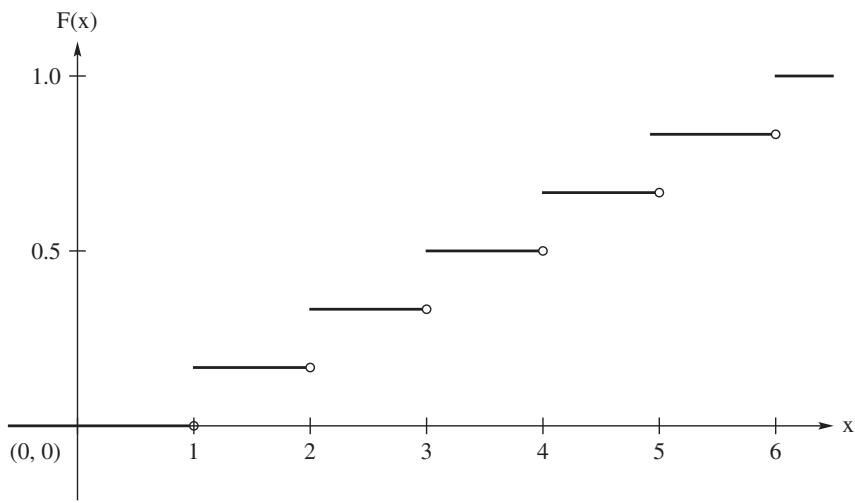  
Figure 1.5.1: Distribution function for Example 1.5.3.

The following example discusses the cdf for the continuous random variable discussed in Example 1.5.2.

Example 1.5.4 (Continuation of Example 1.5.2). Recall that $X$ denotes a real number chosen at random between 0 and 1. We now obtain the cdf of $X$ . First, if $x < 0$ , then $P(X \leq x) = 0$ . Next, if $x \geq 1$ , then $P(X \leq x) = 1$ . Finally, if $0 < x < 1$ , it follows from expression (1.5.3) that $P(X \leq x) = P(0 < X \leq x) = x - 0 = x$ . Hence the cdf of $X$ is

$$
F _ {X} (x) = \left\{ \begin{array}{l l} 0 & \text {i f} x <   0 \\ x & \text {i f} 0 \leq x <   1 \\ 1 & \text {i f} x \geq 1. \end{array} \right. \tag {1.5.7}
$$

A sketch of the cdf of $X$ is given in Figure 1.5.2. Note, however, the connection between $F_{X}(x)$ and the pdf for this experiment $f_{X}(x)$ , given in Example 1.5.2, is

$$
F _ {X} (x) = \int_ {- \infty} ^ {x} f _ {X} (t) d t, \mathrm {f o r a l l} x \in R,
$$

and $\frac{d}{dx} F_X(x) = f_X(x)$ , for all $x \in R$ , except for $x = 0$ and $x = 1$ .

Let $X$ and $Y$ be two random variables. We say that $X$ and $Y$ are equal in distribution and write $X \stackrel{D}{=} Y$ if and only if $F_{X}(x) = F_{Y}(x)$ , for all $x \in R$ . It is important to note while $X$ and $Y$ may be equal in distribution, they may be quite different. For instance, in the last example define the random variable $Y$ as $Y = 1 - X$ . Then $Y \neq X$ . But the space of $Y$ is the interval $(0, 1)$ , the same as $X$ . Further, the cdf of $Y$ is 0 for $y < 0$ ; 1 for $y \geq 1$ ; and for $0 \leq y < 1$ , it is

$$
F _ {Y} (y) = P (Y \leq y) = P (1 - X \leq y) = P (X \geq 1 - y) = 1 - (1 - y) = y.
$$

Hence, $Y$ has the same cdf as $X$ , i.e., $Y \stackrel{D}{=} X$ , but $Y \neq X$ .

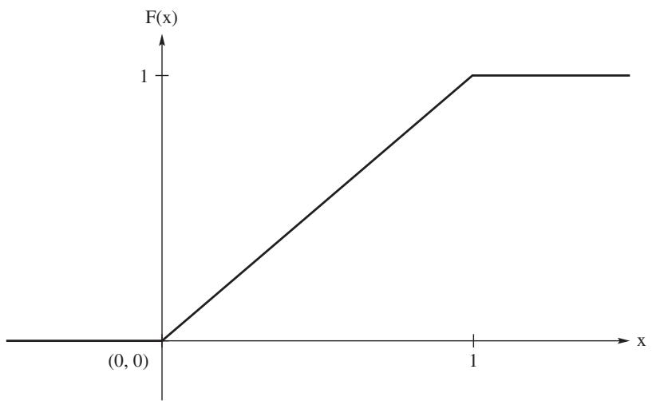  
Figure 1.5.2: Distribution function for Example 1.5.4.

The cdfs displayed in Figures 1.5.1 and 1.5.2 show increasing functions with lower limits 0 and upper limits 1. In both figures, the cdfs are at least right continuous. As the next theorem proves, these properties are true in general for cdfs.

Theorem 1.5.1. Let $X$ be a random variable with cumulative distribution function $F(x)$ . Then

(a) For all $a$ and $b$ , if $a < b$ , then $F(a) \leq F(b)$ ( $F$ is nondecreasing).   
(b) $\lim_{x\to -\infty}F(x) = 0$ (the lower limit of $F$ is 0).   
(c) $\lim_{x\to \infty}F(x) = 1$ (the upper limit of $F$ is 1).   
(d) $\lim_{x\downarrow x_0}F(x) = F(x_0)$ (F is right continuous).

Proof: We prove parts (a) and (d) and leave parts (b) and (c) for Exercise 1.5.10. Part (a): Because $a < b$ , we have $\{X \leq a\} \subset \{X \leq b\}$ . The result then follows from the monotonicity of $P$ ; see Theorem 1.3.3.

Part (d): Let $\{x_{n}\}$ be any sequence of real numbers such that $x_{n} \downarrow x_{0}$ . Let $C_{n} = \{X \leq x_{n}\}$ . Then the sequence of sets $\{C_{n}\}$ is decreasing and $\cap_{n=1}^{\infty} C_{n} = \{X \leq x_{0}\}$ . Hence, by Theorem 1.3.6,

$$
\lim  _ {n \to \infty} F (x _ {n}) = P \left(\bigcap_ {n = 1} ^ {\infty} C _ {n}\right) = F (x _ {0}),
$$

which is the desired result.

The next theorem is helpful in evaluating probabilities using cdfs.

Theorem 1.5.2. Let $X$ be a random variable with the cdf $F_{X}$ . Then for $a < b$ , $P[a < X \leq b] = F_{X}(b) - F_{X}(a)$ .

Proof: Note that

$$
\{- \infty <   X \leq b \} = \{- \infty <   X \leq a \} \cup \{a <   X \leq b \}.
$$

The proof of the result follows immediately because the union on the right side of this equation is a disjoint union.

Example 1.5.5. Let $X$ be the lifetime in years of a mechanical part. Assume that $X$ has the cdf

$$
F _ {X} (x) = \left\{ \begin{array}{l l} 0 & x <   0 \\ 1 - e ^ {- x} & 0 \leq x. \end{array} \right.
$$

The pdf of $X$ , $\frac{d}{dx} F_X(x)$ , is

$$
f _ {X} (x) = \left\{ \begin{array}{l l} e ^ {- x} & 0 <   x <   \infty \\ 0 & \text {e l s e w h e r e .} \end{array} \right.
$$

Actually the derivative does not exist at $x = 0$ , but in the continuous case the next theorem (1.5.3) shows that $P(X = 0) = 0$ and we can assign $f_{X}(0) = 0$ without changing the probabilities concerning $X$ . The probability that a part has a lifetime between one and three years is given by

$$
P (1 <   X \leq 3) = F _ {X} (3) - F _ {X} (1) = \int_ {1} ^ {3} e ^ {- x} d x.
$$

That is, the probability can be found by $F_{X}(3) - F_{X}(1)$ or evaluating the integral. In either case, it equals $e^{-1} - e^{-3} = 0.318$ .

Theorem 1.5.1 shows that cdfs are right continuous and monotone. Such functions can be shown to have only a countable number of discontinuities. As the next theorem shows, the discontinuities of a cdf have mass; that is, if $x$ is a point of discontinuity of $F_{X}$ , then we have $P(X = x) > 0$ .

Theorem 1.5.3. For any random variable,

$$
P [ X = x ] = F _ {X} (x) - F _ {X} (x -), \tag {1.5.8}
$$

for all $x\in R$ , where $F_{X}(x - ) = \lim_{z\uparrow x}F_{X}(z)$

Proof: For any $x \in R$ , we have

$$
\{x \} = \bigcap_ {n = 1} ^ {\infty} \left(x - \frac {1}{n}, x \right];
$$

that is, $\{x\}$ is the limit of a decreasing sequence of sets. Hence, by Theorem 1.3.6,

$$
\begin{array}{l} P [ X = x ] = P \left[ \bigcap_ {n = 1} ^ {\infty} \left\{x - \frac {1}{n} <   X \leq x \right\} \right] \\ = \lim  _ {n \rightarrow \infty} P \left[ x - \frac {1}{n} <   X \leq x \right] \\ = \lim  _ {n \rightarrow \infty} [ F _ {X} (x) - F _ {X} (x - (1 / n)) ] \\ = F _ {X} (x) - F _ {X} (x -), \\ \end{array}
$$

which is the desired result.

Example 1.5.6. Let $X$ have the discontinuous cdf

$$
F _ {X} (x) = \left\{ \begin{array}{l l} 0 & x <   0 \\ x / 2 & 0 \leq x <   1 \\ 1 & 1 \leq x. \end{array} \right.
$$

Then

$$
P (- 1 <   X \leq 1 / 2) = F _ {X} (1 / 2) - F _ {X} (- 1) = \frac {1}{4} - 0 = \frac {1}{4}
$$

and

$$
P (X = 1) = F _ {X} (1) - F _ {X} (1 -) = 1 - \frac {1}{2} = \frac {1}{2}.
$$

The value $1 / 2$ equals the value of the step of $F_{X}$ at $x = 1$ .

Since the total probability associated with a random variable $X$ of the discrete type with pmf $p_X(x)$ or of the continuous type with pdf $f_{X}(x)$ is 1, then it must be true that

$$
\sum_ {x \in \mathcal {D}} p _ {X} (x) = 1 \text {a n d} \int_ {\mathcal {D}} f _ {X} (x) d x = 1,
$$

where $\mathcal{D}$ is the space of $X$ . As the next two examples show, we can use this property to determine the pmf or pdf if we know the pmf or pdf down to a constant of proportionality.

Example 1.5.7. Suppose $X$ has the pmf

$$
p _ {X} (x) = \left\{ \begin{array}{l l} c x & x = 1, 2, \ldots , 1 0 \\ 0 & \text {e l s e w h e r e}, \end{array} \right.
$$

for an appropriate constant $c$ . Then

$$
1 = \sum_ {x = 1} ^ {1 0} p _ {X} (x) = \sum_ {x = 1} ^ {1 0} c x = c (1 + 2 + \dots + 1 0) = 5 5 c,
$$

and, hence, $c = 1 / 55$

Example 1.5.8. Suppose $X$ has the pdf

$$
f _ {X} (x) = \left\{ \begin{array}{l l} c x ^ {3} & 0 <   x <   2 \\ 0 & \text {e l s e w h e r e ,} \end{array} \right.
$$

for a constant $c$ . Then

$$
1 = \int_ {0} ^ {2} c x ^ {3} d x = c \left[ \frac {x ^ {4}}{4} \right] _ {0} ^ {2} = 4 c,
$$

and, hence, $c = 1/4$ . For illustration of the computation of a probability involving $X$ , we have

$$
P \left(\frac {1}{4} <   X <   1\right) = \int_ {1 / 4} ^ {1} \frac {x ^ {3}}{4} d x = \frac {2 5 5}{4 0 9 6} = 0. 0 6 2 2 6.
$$

# EXERCISES

1.5.1. Let a card be selected from an ordinary deck of playing cards. The outcome $c$ is one of these 52 cards. Let $X(c) = 4$ if $c$ is an ace, let $X(c) = 3$ if $c$ is a king, let $X(c) = 2$ if $c$ is a queen, let $X(c) = 1$ if $c$ is a jack, and let $X(c) = 0$ otherwise. Suppose that $P$ assigns a probability of $\frac{1}{52}$ to each outcome $c$ . Describe the induced probability $P_{X}(D)$ on the space $\mathcal{D} = \{0, 1, 2, 3, 4\}$ of the random variable $X$ .

1.5.2. For each of the following, find the constant $c$ so that $p(x)$ satisfies the condition of being a pmf of one random variable $X$ .

(a) $p(x) = c(\frac{2}{3})^x$ $x = 1,2,3,\ldots$ , zero elsewhere.   
(b) $p(x) = cx$ $x = 1,2,3,4,5,6$ zero elsewhere.

1.5.3. Let $p_X(x) = x / 15$ , $x = 1,2,3,4,5$ , zero elsewhere, be the pmf of $X$ . Find $P(X = 1 \text{ or } 2)$ , $P\left(\frac{1}{2} < X < \frac{5}{2}\right)$ , and $P(1 \leq X \leq 2)$ .

1.5.4. Let $p_X(x)$ be the pmf of a random variable $X$ . Find the cdf $F(x)$ of $X$ and sketch its graph along with that of $p_X(x)$ if:

(a) $p_X(x) = 1$ , $x = 0$ , zero elsewhere.   
(b) $p_X(x) = \frac{1}{3}, x = -1, 0, 1$ , zero elsewhere.   
(c) $p_X(x) = x / 15$ , $x = 1,2,3,4,5$ , zero elsewhere.

1.5.5. Let us select five cards at random and without replacement from an ordinary deck of playing cards.

(a) Find the pmf of $X$ , the number of hearts in the five cards.   
(b) Determine $P(X\leq 1)$

1.5.6. Let the probability set function of the random variable $X$ be $P_X(D) = \int_D f(x) \, dx$ , where $f(x) = 2x / 9$ , for $x \in \mathcal{D} = \{x : 0 < x < 3\}$ . Define the events $D_1 = \{x : 0 < x < 1\}$ and $D_2 = \{x : 2 < x < 3\}$ . Compute $P_X(D_1)$ , $P_X(D_2)$ , and $P_X(D_1 \cup D_2)$ .

1.5.7. Let the space of the random variable $X$ be $\mathcal{D} = \{x : 0 < x < 1\}$ . If $D_1 = \{x : 0 < x < \frac{1}{2}\}$ and $D_2 = \{x : \frac{1}{2} \leq x < 1\}$ , find $P_X(D_2)$ if $P_X(D_1) = \frac{1}{4}$ .

1.5.8. Suppose the random variable $X$ has the cdf

$$
F (x) = \left\{ \begin{array}{l l} 0 & x <   - 1 \\ \frac {x + 2}{4} & - 1 \leq x <   1 \\ 1 & 1 \leq x. \end{array} \right.
$$

Write an R function to sketch the graph of $F(x)$ . Use your graph to obtain the probabilities: (a) $P\left(-\frac{1}{2} < X \leq \frac{1}{2}\right)$ ; (b) $P(X = 0)$ ; (c) $P(X = 1)$ ; (d) $P(2 < X \leq 3)$ .

1.5.9. Consider an urn that contains slips of paper each with one of the numbers $1, 2, \ldots, 100$ on it. Suppose there are $i$ slips with the number $i$ on it for $i = 1, 2, \ldots, 100$ . For example, there are 25 slips of paper with the number 25. Assume that the slips are identical except for the numbers. Suppose one slip is drawn at random. Let $X$ be the number on the slip.

(a) Show that $X$ has the pmf $p(x) = x / 5050, x = 1,2,3,\ldots,100$ , zero elsewhere.   
(b) Compute $P(X\leq 50)$   
(c) Show that the cdf of $X$ is $F(x) = [x]([x] + 1)/10100$ , for $1 \leq x \leq 100$ , where $[x]$ is the greatest integer in $x$ .

1.5.10. Prove parts (b) and (c) of Theorem 1.5.1.

1.5.11. Let $X$ be a random variable with space $\mathcal{D}$ . For $D \subset \mathcal{D}$ , recall that the probability induced by $X$ is $P_X(D) = P[\{c : X(c) \in D\}]$ . Show that $P_X(D)$ is a probability by showing the following:

(a) $P_{X}(\mathcal{D}) = 1$   
(b) $P_{X}(D)\geq 0$   
(c) For a sequence of sets $\{D_n\}$ in $\mathcal{D}$ , show that

$$
\{c: X (c) \in \cup_ {n} D _ {n} \} = \cup_ {n} \{c: X (c) \in D _ {n} \}.
$$

(d) Use part (c) to show that if $\{D_n\}$ is sequence of mutually exclusive events, then

$$
P _ {X} \left(\cup_ {n = 1} ^ {\infty} D _ {n}\right) = \sum_ {n = 1} ^ {\infty} P _ {X} (D _ {n}).
$$

Remark 1.5.2. In a probability theory course, we would show that the $\sigma$ -field (collection of events) for $\mathcal{D}$ is the smallest $\sigma$ -field which contains all the open intervals of real numbers; see Exercise 1.3.24. Such a collection of events is sufficiently rich for discrete and continuous random variables.

# 1.6 Discrete Random Variables

The first example of a random variable encountered in the last section was an example of a discrete random variable, which is defined next.

Definition 1.6.1 (Discrete Random Variable). We say a random variable is a discrete random variable if its space is either finite or countable.

Example 1.6.1. Consider a sequence of independent flips of a coin, each resulting in a head (H) or a tail (T). Moreover, on each flip, we assume that H and T are equally likely; that is, $P(H) = P(T) = \frac{1}{2}$ . The sample space $\mathcal{C}$ consists of sequences like THTHTHT... Let the random variable $X$ equal the number of flips needed

to obtain the first head. Hence, $X(\mathrm{TTHHTHT}\dots) = 3$ . Clearly, the space of $X$ is $\mathcal{D} = \{1,2,3,4,\ldots\}$ . We see that $X = 1$ when the sequence begins with an H and thus $P(X = 1) = \frac{1}{2}$ . Likewise, $X = 2$ when the sequence begins with TH, which has probability $P(X = 2) = (\frac{1}{2})(\frac{1}{2}) = \frac{1}{4}$ from the independence. More generally, if $X = x$ , where $x = 1,2,3,4,\ldots$ , there must be a string of $x - 1$ tails followed by a head; that is, TT··TH, where there are $x - 1$ tails in TT··T. Thus, from independence, we have a geometric sequence of probabilities, namely,

$$
P (X = x) = \left(\frac {1}{2}\right) ^ {x - 1} \left(\frac {1}{2}\right) = \left(\frac {1}{2}\right) ^ {x}, \quad x = 1, 2, 3, \dots , \tag {1.6.1}
$$

the space of which is countable. An interesting event is that the first head appears on an odd number of flips; i.e., $X \in \{1, 3, 5, \ldots\}$ . The probability of this event is

$$
P [ X \in \{1, 3, 5, \dots \} ] = \sum_ {x = 1} ^ {\infty} \left(\frac {1}{2}\right) ^ {2 x - 1} = \frac {1}{2} \sum_ {x = 1} ^ {\infty} \left(\frac {1}{4}\right) ^ {x - 1} = \frac {1 / 2}{1 - (1 / 4)} = \frac {2}{3}.
$$

As the last example suggests, probabilities concerning a discrete random variable can be obtained in terms of the probabilities $P(X = x)$ , for $x \in \mathcal{D}$ . These probabilities determine an important function, which we define as

Definition 1.6.2 (Probability Mass Function (pmf)). Let $X$ be a discrete random variable with space $\mathcal{D}$ . The probability mass function (pmf) of $X$ is given by

$$
p _ {X} (x) = P [ X = x ], \quad f o r x \in \mathcal {D}. \tag {1.6.2}
$$

Note that pmfs satisfy the following two properties:

$$
\left. \text {(i)} 0 \leq p _ {X} (x) \leq 1, x \in \mathcal {D}, \text {a n d (i i)} \sum_ {x \in \mathcal {D}} p _ {X} (x) = 1. \right. \tag {1.6.3}
$$

In a more advanced class it can be shown that if a function satisfies properties (i) and (ii) for a discrete set $\mathcal{D}$ , then this function uniquely determines the distribution of a random variable.

Let $X$ be a discrete random variable with space $\mathcal{D}$ . As Theorem 1.5.3 shows, discontinuities of $F_{X}(x)$ define a mass; that is, if $x$ is a point of discontinuity of $F_{X}$ , then $P(X = x) > 0$ . We now make a distinction between the space of a discrete random variable and these points of positive probability. We define the support of a discrete random variable $X$ to be the points in the space of $X$ which have positive probability. We often use $\mathcal{S}$ to denote the support of $X$ . Note that $\mathcal{S} \subset \mathcal{D}$ , but it may be that $\mathcal{S} = \mathcal{D}$ .

Also, we can use Theorem 1.5.3 to obtain a relationship between the pmf and cdf of a discrete random variable. If $x \in S$ , then $p_X(x)$ is equal to the size of the discontinuity of $F_{X}$ at $x$ . If $x \notin S$ then $P[X = x] = 0$ and, hence, $F_{X}$ is continuous at this $x$ .

Example 1.6.2. A lot, consisting of 100 fuses, is inspected by the following procedure. Five of these fuses are chosen at random and tested; if all five "blow" at the

correct amperage, the lot is accepted. If, in fact, there are 20 defective fuses in the lot, the probability of accepting the lot is, under appropriate assumptions,

$$
\frac {\binom {8 0} {5}}{\binom {1 0 0} {5}} = 0. 3 1 9 3 1.
$$

More generally, let the random variable $X$ be the number of defective fuses among the five that are inspected. The pmf of $X$ is given by

$$
p _ {X} (x) = \left\{ \begin{array}{l l} \frac {\binom {2 0} {x} \binom {8 0} {5 - x}}{\binom {1 0 0} {5}} & \text {f o r} x = 0, 1, 2, 3, 4, 5 \\ 0 & \text {e l s e w h e r e .} \end{array} \right. \tag {1.6.4}
$$

Clearly, the space of $X$ is $\mathcal{D} = \{0, 1, 2, 3, 4, 5\}$ , which is also its support. This is an example of a random variable of the discrete type whose distribution is an illustration of a hypergeometric distribution, which is formally defined in Chapter 3. Based on the above discussion, it is easy to graph the cdf of $X$ ; see Exercise 1.6.5.

# 1.6.1 Transformations

A problem often encountered in statistics is the following. We have a random variable $X$ and we know its distribution. We are interested, though, in a random variable $Y$ which is some transformation of $X$ , say, $Y = g(X)$ . In particular, we want to determine the distribution of $Y$ . Assume $X$ is discrete with space $\mathcal{D}_X$ . Then the space of $Y$ is $\mathcal{D}_Y = \{g(x): x \in \mathcal{D}_X\}$ . We consider two cases.

In the first case, $g$ is one-to-one. Then, clearly, the pmf of $Y$ is obtained as

$$
p _ {Y} (y) = P [ Y = y ] = P [ g (X) = y ] = P [ X = g ^ {- 1} (y) ] = p _ {X} \left(g ^ {- 1} (y)\right). \tag {1.6.5}
$$

Example 1.6.3. Consider the random variable $X$ of Example 1.6.1. Recall that $X$ was the flip number on which the first head appeared. Let $Y$ be the number of flips before the first head. Then $Y = X - 1$ . In this case, the function $g$ is $g(x) = x - 1$ , whose inverse is given by $g^{-1}(y) = y + 1$ . The space of $Y$ is $D_Y = \{0, 1, 2, \ldots\}$ . The pmf of $X$ is given by (1.6.1); hence, based on expression (1.6.5), the pmf of $Y$ is

$$
p _ {Y} (y) = p _ {X} (y + 1) = \left(\frac {1}{2}\right) ^ {y + 1}, \quad \text {f o r} y = 0, 1, 2, \dots .
$$

Example 1.6.4. Let $X$ have the pmf

$$
p _ {X} (x) = \left\{ \begin{array}{l l} \frac {3 !}{x ! (3 - x) !} \left(\frac {2}{3}\right) ^ {x} \left(\frac {1}{3}\right) ^ {3 - x} & x = 0, 1, 2, 3 \\ 0 & \text {e l s e w h e r e .} \end{array} \right.
$$

We seek the pmf $p_{Y}(y)$ of the random variable $Y = X^{2}$ . The transformation $y = g(x) = x^{2}$ maps $\mathcal{D}_X = \{x : x = 0, 1, 2, 3\}$ onto $\mathcal{D}_Y = \{y : y = 0, 1, 4, 9\}$ . In general, $y = x^{2}$ does not define a one-to-one transformation; here, however, it does,

for there are no negative values of $x$ in $\mathcal{D}_X = \{x : x = 0, 1, 2, 3\}$ . That is, we have the single-valued inverse function $x = g^{-1}(y) = \sqrt{y}$ (not $-\sqrt{y}$ ), and so

$$
p _ {Y} (y) = p _ {X} (\sqrt {y}) = \frac {3 !}{(\sqrt {y}) ! (3 - \sqrt {y}) !} \left(\frac {2}{3}\right) ^ {\sqrt {y}} \left(\frac {1}{3}\right) ^ {3 - \sqrt {y}}, y = 0, 1, 4, 9.
$$

The second case is where the transformation, $g(x)$ , is not one-to-one. Instead of developing an overall rule, for most applications involving discrete random variables the pmf of $Y$ can be obtained in a straightforward manner. We offer two examples as illustrations.

Consider the geometric random variable in Example 1.6.3. Suppose we are playing a game against the "house" (say, a gambling casino). If the first head appears on an odd number of flips, we pay the house one dollar, while if it appears on an even number of flips, we win one dollar from the house. Let $Y$ denote our net gain. Then the space of $Y$ is $\{-1,1\}$ . In Example 1.6.1, we showed that the probability that $X$ is odd is $\frac{2}{3}$ . Hence, the distribution of $Y$ is given by $p_{Y}(-1) = 2/3$ and $p_{Y}(1) = 1/3$ .

As a second illustration, let $Z = (X - 2)^{2}$ , where $X$ is the geometric random variable of Example 1.6.1. Then the space of $Z$ is $\mathcal{D}_Z = \{0, 1, 4, 9, 16, \ldots\}$ . Note that $Z = 0$ if and only if $X = 2$ ; $Z = 1$ if and only if $X = 1$ or $X = 3$ ; while for the other values of the space there is a one-to-one correspondence given by $x = \sqrt{z} + 2$ for $z \in \{4, 9, 16, \ldots\}$ . Hence, the pmf of $Z$ is

$$
p _ {Z} (z) = \left\{ \begin{array}{l l} p _ {X} (2) = \frac {1}{4} & \text {f o r} z = 0 \\ p _ {X} (1) + p _ {X} (3) = \frac {5}{8} & \text {f o r} z = 1 \\ p _ {X} (\sqrt {z} + 2) = \frac {1}{4} \left(\frac {1}{2}\right) ^ {\sqrt {z}} & \text {f o r} z = 4, 9, 1 6, \dots . \end{array} \right. \tag {1.6.6}
$$

For verification, the reader is asked to show in Exercise 1.6.11 that the pmf of $Z$ sums to 1 over its space.

# EXERCISES

1.6.1. Let $X$ equal the number of heads in four independent flips of a coin. Using certain assumptions, determine the pmf of $X$ and compute the probability that $X$ is equal to an odd number.

1.6.2. Let a bowl contain 10 chips of the same size and shape. One and only one of these chips is red. Continue to draw chips from the bowl, one at a time and at random and without replacement, until the red chip is drawn.

(a) Find the pmf of $X$ , the number of trials needed to draw the red chip.   
(b) Compute $P(X\leq 4)$

1.6.3. Cast a die a number of independent times until a six appears on the up side of the die.

(a) Find the pmf $p(x)$ of $X$ , the number of casts needed to obtain that first six.

(b) Show that $\sum_{x = 1}^{\infty}p(x) = 1$   
(c) Determine $P(X = 1,3,5,7,\ldots)$ .   
(d) Find the cdf $F(x) = P(X \leq x)$ .

1.6.4. Cast a die two independent times and let $X$ equal the absolute value of the difference of the two resulting values (the numbers on the up sides). Find the pmf of $X$ . Hint: It is not necessary to find a formula for the pmf.

1.6.5. For the random variable $X$ defined in Example 1.6.2:

(a) Write an R function that returns the pmf. Note that in R, choose $(\mathfrak{m},\mathfrak{k})$ computes $\binom{m}{k}$ .   
(b) Write an R function that returns the graph of the cdf.

1.6.6. For the random variable $X$ defined in Example 1.6.1, graph the cdf of $X$ .   
1.6.7. Let $X$ have a pmf $p(x) = \frac{1}{3}$ , $x = 1,2,3$ , zero elsewhere. Find the pmf of $Y = 2X + 1$ .   
1.6.8. Let $X$ have the pmf $p(x) = (\frac{1}{2})^x$ , $x = 1, 2, 3, \ldots$ , zero elsewhere. Find the pmf of $Y = X^3$ .   
1.6.9. Let $X$ have the pmf $p(x) = 1/3, x = -1,0,1$ . Find the pmf of $Y = X^2$ .   
1.6.10. Let $X$ have the pmf

$$
p (x) = \left(\frac {1}{2}\right) ^ {| x |}, \quad x = - 1, - 2, - 3, \dots .
$$

Find the pmf of $Y = X^4$ .

1.6.11. Show that the function given in expression (1.6.6) is a pmf.

# 1.7 Continuous Random Variables

In the last section, we discussed discrete random variables. Another class of random variables important in statistical applications is the class of continuous random variables, which we define next.

Definition 1.7.1 (Continuous Random Variables). We say a random variable is a continuous random variable if its cumulative distribution function $F_{X}(x)$ is a continuous function for all $x \in R$ .

Recall from Theorem 1.5.3 that $P(X = x) = F_X(x) - F_X(x-)$ , for any random variable $X$ . Hence, for a continuous random variable $X$ , there are no points of discrete mass; i.e., if $X$ is continuous, then $P(X = x) = 0$ for all $x \in R$ . Most continuous random variables are absolutely continuous; that is,

$$
F _ {X} (x) = \int_ {- \infty} ^ {x} f _ {X} (t) d t, \tag {1.7.1}
$$

for some function $f_{X}(t)$ . The function $f_{X}(t)$ is called a probability density function (pdf) of $X$ . If $f_{X}(x)$ is also continuous, then the Fundamental Theorem of Calculus implies that

$$
\frac {d}{d x} F _ {X} (x) = f _ {X} (x). \tag {1.7.2}
$$

The support of a continuous random variable $X$ consists of all points $x$ such that $f_{X}(x) > 0$ . As in the discrete case, we often denote the support of $X$ by $S$ .

If $X$ is a continuous random variable, then probabilities can be obtained by integration; i.e.,

$$
P (a <   X \leq b) = F _ {X} (b) - F _ {X} (a) = \int_ {a} ^ {b} f _ {X} (t) d t.
$$

Also, for continuous random variables,

$$
P (a <   X \leq b) = P (a \leq X \leq b) = P (a \leq X <   b) = P (a <   X <   b).
$$

From the definition (1.7.2), note that pdfs satisfy the two properties

$$
\left(\mathrm {i}\right) f _ {X} (x) \geq 0 \text {a n d (i i)} \int_ {- \infty} ^ {\infty} f _ {X} (t) d t = 1. \tag {1.7.3}
$$

The second property, of course, follows from $F_{X}(\infty) = 1$ . In an advanced course in probability, it is shown that if a function satisfies the above two properties, then it is a pdf for a continuous random variable; see, for example, Tucker (1967).

Recall in Example 1.5.2 the simple experiment where a number was chosen at random from the interval $(0,1)$ . The number chosen, $X$ , is an example of a continuous random variable. Recall that the cdf of $X$ is $F_{X}(x) = x$ , for $0 < x < 1$ . Hence, the pdf of $X$ is given by

$$
f _ {X} (x) = \left\{ \begin{array}{l l} 1 & 0 <   x <   1 \\ 0 & \text {e l s e w h e r e .} \end{array} \right. \tag {1.7.4}
$$

Any continuous or discrete random variable $X$ whose pdf or pmf is constant on the support of $X$ is said to have a uniform distribution; see Chapter 3 for a more formal definition.

Example 1.7.1 (Point Chosen at Random Within the Unit Circle). Suppose we select a point at random in the interior of a circle of radius 1. Let $X$ be the distance of the selected point from the origin. The sample space for the experiment is $\mathcal{C} = \{(w, y) : w^2 + y^2 < 1\}$ . Because the point is chosen at random, it seems that subsets of $\mathcal{C}$ which have equal area are equilibrated. Hence, the probability of the selected point lying in a set $A \subset \mathcal{C}$ is proportional to the area of $A$ ; i.e.,

$$
P (A) = \frac {\mathrm {a r e a o f} A}{\pi}.
$$

For $0 < x < 1$ , the event $\{X \leq x\}$ is equivalent to the point lying in a circle of radius $x$ . By this probability rule, $P(X \leq x) = \pi x^2 / \pi = x^2$ ; hence, the cdf of $X$ is

$$
F _ {X} (x) = \left\{ \begin{array}{l l} 0 & x <   0 \\ x ^ {2} & 0 \leq x <   1 \\ 1 & 1 \leq x. \end{array} \right. \tag {1.7.5}
$$

Taking the derivative of $F_{X}(x)$ , we obtain the pdf of $X$ :

$$
f _ {X} (x) = \left\{ \begin{array}{l l} 2 x & 0 \leq x <   1 \\ 0 & \text {e l s e w h e r e .} \end{array} \right. \tag {1.7.6}
$$

For illustration, the probability that the selected point falls in the ring with radii $1/4$ and $1/2$ is given by

$$
P \left(\frac {1}{4} <   X \leq \frac {1}{2}\right) = \int_ {\frac {1}{4}} ^ {\frac {1}{2}} 2 w d w = w ^ {2} \bigg | _ {\frac {1}{4}} ^ {\frac {1}{2}} = \frac {3}{1 6}.
$$

Example 1.7.2. Let the random variable be the time in seconds between incoming telephone calls at a busy switchboard. Suppose that a reasonable probability model for $X$ is given by the pdf

$$
f _ {X} (x) = \left\{ \begin{array}{l l} \frac {1}{4} e ^ {- x / 4} & 0 <   x <   \infty \\ 0 & \text {e l s e w h e r e .} \end{array} \right.
$$

Note that $f_{X}$ satisfies the two properties of a pdf, namely, (i) $f(x) \geq 0$ and (ii)

$$
\int_ {0} ^ {\infty} \frac {1}{4} e ^ {- x / 4} d x = - e ^ {- x / 4} \Big | _ {0} ^ {\infty} = 1.
$$

For illustration, the probability that the time between successive phone calls exceeds 4 seconds is given by

$$
P (X > 4) = \int_ {4} ^ {\infty} \frac {1}{4} e ^ {- x / 4} d x = e ^ {- 1} = 0. 3 6 7 9.
$$

The pdf and the probability of interest are depicted in Figure 1.7.1. From the figure, the pdf has a long right tail and no left tail. We say that this distribution is skewed right or positively skewed. This is an example of a gamma distribution which is discussed in detail in Chapter 3.

# 1.7.1 Quantiles

Quantiles (percentiles) are easily interpretable characteristics of a distribution.

Definition 1.7.2 (Quantile). Let $0 < p < 1$ . The quantile of order $p$ of the distribution of a random variable $X$ is a value $\xi_{p}$ such that $P(X < \xi_p)\leq p$ and $P(X\leq \xi_p)\geq p$ . It is also known as the $(100p)$ th percentile of $X$ .

Examples include the median which is the quantile $\xi_{1/2}$ . The median is also called the second quartile. It is a point in the domain of $X$ that divides the mass of the pdf into its lower and upper halves. The first and third quartiles divide each of these halves into quarters. They are, respectively $\xi_{1/4}$ and $\xi_{3/4}$ . We label these quartiles as $q_1, q_2$ and $q_3$ , respectively. The difference $\mathrm{iq} = q_3 - q_1$ is called the

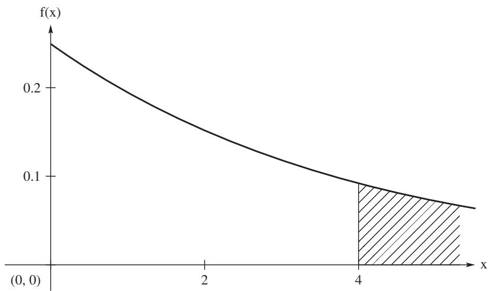  
Figure 1.7.1: In Example 1.7.2, the area under the pdf to the right of 4 is $P(X > 4)$ .

interquartile range of $X$ . The median is often used as a measure of center of the distribution of $X$ , while the interquartile range is used as a measure of spread or dispersion of the distribution of $X$ .

Quantiles need not be unique even for continuous random variables with pdfs. For example, any point in the interval $(2,3)$ serves as a median for the following pdf:

$$
f (x) = \left\{ \begin{array}{l l} 3 (1 - x) (x - 2) & 1 <   x <   2 \\ 3 (3 - x) (x - 4) & 3 <   x <   4 \\ 0 & \text {e l s e w h e r e .} \end{array} \right. \tag {1.7.7}
$$

If, however, a quantile, say $\xi_p$ , is in the support of an absolutely continuous random variable $X$ with cdf $F_X(x)$ then $\xi_p$ is the unique solution to the equation:

$$
\xi_ {p} = F _ {X} ^ {- 1} (p), \tag {1.7.8}
$$

where $F_{X}^{-1}(u)$ is the inverse function of $F_{X}(x)$ . The next example serves as an illustration.

Example 1.7.3. Let $X$ be a continuous random variable with pdf

$$
f (x) = \frac {e ^ {x}}{\left(1 + 5 e ^ {x}\right) ^ {1 . 2}}, - \infty <   x <   \infty . \tag {1.7.9}
$$

This pdf is a member of the log $F$ -family of distributions which is often used in the modeling of the log of lifetime data. Note that $X$ has the support space $(-\infty, \infty)$ . The cdf of $X$ is

$$
F (x) = 1 - \left(1 + 5 e ^ {- x}\right) ^ {-. 2}, \quad - \infty <   x <   \infty ,
$$

which is confirmed immediately by showing that $F'(x) = f(x)$ . For the inverse of the cdf, set $u = F(x)$ and solve for $u$ . A few steps of algebra lead to

$$
F ^ {- 1} (u) = \log \left\{. 2 \left[ (1 - u) ^ {- 5} - 1 \right] \right\}, \quad 0 <   u <   1.
$$

Thus, $\xi_p = F_X^{-1}(p) = \log \left\{ .2 \left[ (1 - p)^{-5} - 1 \right] \right\}$ . The following three R functions can be used to compute the pdf, cdf, and inverse cdf of $F$ , respectively. These can be downloaded at the site listed in the Preface.

$$
\begin{array}{l} \operatorname {d l o g F} <   - \text {f u n c t i o n} (\mathrm {x}) \{\exp (\mathrm {x}) / (1 + 5 * \exp (\mathrm {x})) ^ {\wedge} (1. 2) \} \\ \operatorname {p l o g F} <   - \text {f u n c t i o n} (\mathrm {x}) \{1 - (1 + 5 * \exp (\mathrm {x})) ^ {\wedge} (-. 2) \} \\ \operatorname {q l o g F} <   - \text {f u n c t i o n} (\mathrm {x}) \{\log (. 2 * ((1 - \mathrm {x}) ^ {\wedge} (- 5) - 1)) \} \\ \end{array}
$$

Once the R function qlogF is sourced, it can be used to compute quantiles. The following is an R script which results in the computation of the three quartiles of $X$ :

$$
\begin{array}{l} \operatorname {q l o g F} (. 2 5); \operatorname {q l o g F} (. 5 0); \operatorname {q l o g F} (. 7 5) \\ - 0. 4 4 1 9 2 4 2; 1. 8 2 4 5 4 9; 5. 3 2 1 0 5 7 \\ \end{array}
$$

Figure 1.7.2 displays a plot of this pdf and its quartiles. Notice that this is another example of a skewed-right distribution; i.e., the right-tail is much longer than left-tail. In terms of the log-l lifetime of mechanical parts having this distribution, it follows that $50\%$ of the parts survive beyond 1.83 log-units and $25\%$ of the parts live longer than 5.32 log-units. With the long-right tail, some parts attain a long life.

# 1.7.2 Transformations

Let $X$ be a continuous random variable with a known pdf $f_{X}$ . As in the discrete case, we are often interested in the distribution of a random variable $Y$ which is some transformation of $X$ , say, $Y = g(X)$ . Often we can obtain the pdf of $Y$ by first obtaining its cdf. We illustrate this with two examples.

Example 1.7.4. Let $X$ be the random variable in Example 1.7.1. Recall that $X$ was the distance from the origin to the random point selected in the unit circle. Suppose instead that we are interested in the square of the distance; that is, let $Y = X^2$ . The support of $Y$ is the same as that of $X$ , namely, $S_Y = (0,1)$ . What is the cdf of $Y$ ? By expression (1.7.5), the cdf of $X$ is

$$
F _ {X} (x) = \left\{ \begin{array}{l l} 0 & x <   0 \\ x ^ {2} & 0 \leq x <   1 \\ 1 & 1 \leq x. \end{array} \right. \tag {1.7.10}
$$

Let $y$ be in the support of $Y$ ; i.e., $0 < y < 1$ . Then, using expression (1.7.10) and the fact that the support of $X$ contains only positive numbers, the cdf of $Y$ is

$$
F _ {Y} (y) = P (Y \leq y) = P (X ^ {2} \leq y) = P (X \leq \sqrt {y}) = F _ {X} (\sqrt {y}) = \sqrt {y} ^ {2} = y.
$$

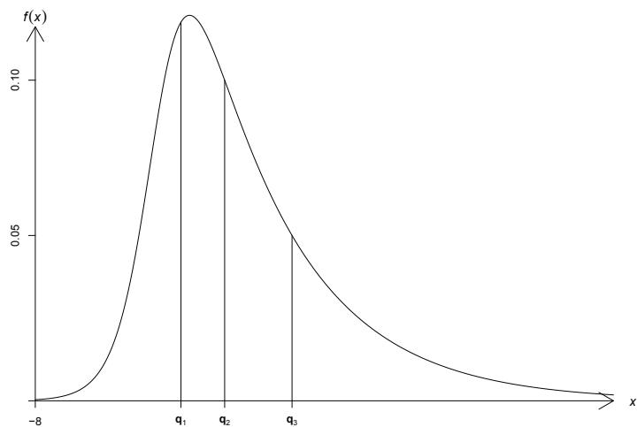  
Figure 1.7.2: A graph of the pdf (1.7.9) showing the three quartiles, $q_{1}, q_{2}$ , and $q_{3}$ , of the distribution. The probability mass in each of the four sections is $1/4$ .

It follows that the pdf of $Y$ is

$$
f _ {Y} (y) = \left\{ \begin{array}{l l} 1 & 0 <   y <   1 \\ 0 & \text {e l s e w h e r e .} \end{array} \right.
$$

Example 1.7.5. Let $f_{X}(x) = \frac{1}{2}$ , $-1 < x < 1$ , zero elsewhere, be the pdf of a random variable $X$ . Note that $X$ has a uniform distribution with the interval of support $(-1, 1)$ . Define the random variable $Y$ by $Y = X^2$ . We wish to find the pdf of $Y$ . If $y \geq 0$ , the probability $P(Y \leq y)$ is equivalent to

$$
P (X ^ {2} \leq y) = P (- \sqrt {y} \leq X \leq \sqrt {y}).
$$

Accordingly, the cdf of $Y$ , $F_{Y}(y) = P(Y \leq y)$ , is given by

$$
F _ {Y} (y) = \left\{ \begin{array}{l l} 0 & y <   0 \\ \int_ {- \sqrt {y}} ^ {\sqrt {y}} \frac {1}{2} d x = \sqrt {y} & 0 \leq y <   1 \\ 1 & 1 \leq y. \end{array} \right.
$$

Hence, the pdf of $Y$ is given by

$$
f _ {Y} (y) = \left\{ \begin{array}{l l} \frac {1}{2 \sqrt {y}} & 0 <   y <   1 \\ 0 & \text {e l s e w h e r e .} \end{array} \right.
$$

These examples illustrate the cumulative distribution function technique. The transformation in Example 1.7.4 is one-to-one, and in such cases we can obtain

a simple formula for the pdf of $Y$ in terms of the pdf of $X$ , which we record in the next theorem.

Theorem 1.7.1. Let $X$ be a continuous random variable with pdf $f_{X}(x)$ and support $S_{X}$ . Let $Y = g(X)$ , where $g(x)$ is a one-to-one differentiable function, on the support of $X$ , $S_{X}$ . Denote the inverse of $g$ by $x = g^{-1}(y)$ and let $dx / dy = d[g^{-1}(y)] / dy$ . Then the pdf of $Y$ is given by

$$
f _ {Y} (y) = f _ {X} \left(g ^ {- 1} (y)\right) \left| \frac {d x}{d y} \right|, \quad f o r y \in \mathcal {S} _ {Y}, \tag {1.7.11}
$$

where the support of $Y$ is the set $S_{Y} = \{y = g(x):x\in S_{X}\}$ .

Proof: Since $g(x)$ is one-to-one and continuous, it is either strictly monotonically increasing or decreasing. Assume that it is strictly monotonically increasing, for now. The cdf of $Y$ is given by

$$
F _ {Y} (y) = P [ Y \leq y ] = P [ g (X) \leq y ] = P [ X \leq g ^ {- 1} (y) ] = F _ {X} \left(g ^ {- 1} (y)\right). \tag {1.7.12}
$$

Hence, the pdf of $Y$ is

$$
f _ {Y} (y) = \frac {d}{d y} F _ {Y} (y) = f _ {X} \left(g ^ {- 1} (y)\right) \frac {d x}{d y}, \tag {1.7.13}
$$

where $dx / dy$ is the derivative of the function $x = g^{-1}(y)$ . In this case, because $g$ is increasing, $dx / dy > 0$ . Hence, we can write $dx / dy = |dx / dy|$ .

Suppose $g(x)$ is strictly monotonically decreasing. Then (1.7.12) becomes $F_{Y}(y) = 1 - F_{X}(g^{-1}(y))$ . Hence, the pdf of $Y$ is $f_{Y}(y) = f_{X}(g^{-1}(y))(-dx / dy)$ . But since $g$ is decreasing, $dx / dy < 0$ and, hence, $-dx / dy = |dx / dy|$ . Thus Equation (1.7.11) is true in both cases.

Henceforth, we refer to $dx / dy = (d / dy)g^{-1}(y)$ as the Jacobian (denoted by $J$ ) of the transformation. In most mathematical areas, $J = dx / dy$ is referred to as the Jacobian of the inverse transformation $x = g^{-1}(y)$ , but in this book it is called the Jacobian of the transformation, simply for convenience.

We summarize Theorem 1.7.1 in a simple algorithm which we illustrate in the next example. Assuming that the transformation $Y = g(X)$ is one-to-one, the following steps lead to the pdf of $Y$ :

1. Find the support of $Y$ .   
2. Solve for the inverse of the transformation; i.e., solve for $x$ in terms of $y$ in $y = g(x)$ , thereby obtaining $x = g^{-1}(y)$ .   
3. Obtain $\frac{dx}{dy}$ .   
4. The pdf of $Y$ is $f_{Y}(y) = f_{X}(g^{-1}(y))\left|\frac{dx}{dy}\right|$ .

Example 1.7.6. Let $X$ have the pdf

$$
f (x) = \left\{ \begin{array}{l l} 4 x ^ {3} & 0 <   x <   1 \\ 0 & \text {e l s e w h e r e .} \end{array} \right.
$$

Consider the random variable $Y = -\log X$ . Here are the steps of the above algorithm:

1. The support of $Y = -\log X$ is $(0, \infty)$ .   
2. If $y = -\log x$ then $x = e^{-y}$ .   
3. $\frac{dx}{dy} = -e^{-y}$   
4. Thus the pdf of $Y$ is:

$$
f _ {Y} (y) = f _ {X} \left(e ^ {- y}\right) | - e ^ {- y} | = 4 \left(e ^ {- y}\right) ^ {3} e ^ {- y} = 4 e ^ {- 4 y}.
$$

# 1.7.3 Mixtures of Discrete and Continuous Type Distributions

We close this section by two examples of distributions that are not of the discrete or the continuous type.

Example 1.7.7. Let a distribution function be given by

$$
F (x) = \left\{ \begin{array}{l l} 0 & x <   0 \\ \frac {x + 1}{2} & 0 \leq x <   1 \\ 1 & 1 \leq x. \end{array} \right.
$$

Then, for instance,

$$
P \left(- 3 <   X \leq \frac {1}{2}\right) = F \left(\frac {1}{2}\right) - F (- 3) = \frac {3}{4} - 0 = \frac {3}{4}
$$

and

$$
P (X = 0) = F (0) - F (0 -) = \frac {1}{2} - 0 = \frac {1}{2}.
$$

The graph of $F(x)$ is shown in Figure 1.7.3. We see that $F(x)$ is not always continuous, nor is it a step function. Accordingly, the corresponding distribution is neither of the continuous type nor of the discrete type. It may be described as a mixture of those types.

Distributions that are mixtures of the continuous and discrete type do, in fact, occur frequently in practice. For illustration, in life testing, suppose we know that the length of life, say $X$ , exceeds the number $b$ , but the exact value of $X$ is unknown. This is called censoring. For instance, this can happen when a subject in a cancer study simply disappears; the investigator knows that the subject has lived a certain number of months, but the exact length of life is unknown. Or it might happen when an investigator does not have enough time in an investigation to observe the moments of deaths of all the animals, say rats, in some study. Censoring can also occur in the insurance industry; in particular, consider a loss with a limited-pay policy in which the top amount is exceeded but it is not known by how much.

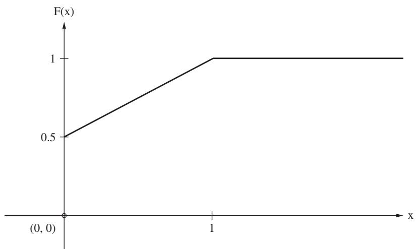  
Figure 1.7.3: Graph of the cdf of Example 1.7.7.

Example 1.7.8. Reinsurance companies are concerned with large losses because they might agree, for illustration, to cover losses due to wind damages that are between $2,000,000 and$ 10,000,000. Say that $X$ equals the size of a wind loss in millions of dollars, and suppose it has the cdf

$$
F _ {X} (x) = \left\{ \begin{array}{l l} 0 & - \infty <   x <   0 \\ 1 - \left(\frac {1 0}{1 0 + x}\right) ^ {3} & 0 \leq x <   \infty . \end{array} \right.
$$

If losses beyond \(10,000,000 are reported only as 10, then the cdf of this censored distribution is

$$
F _ {Y} (y) = \left\{ \begin{array}{l l} 0 & - \infty <   y <   0 \\ 1 - \left(\frac {1 0}{1 0 + y}\right) ^ {3} & 0 \leq y <   1 0, \\ 1 & 1 0 \leq y <   \infty , \end{array} \right.
$$

which has a jump of $[10 / (10 + 10)]^3 = \frac{1}{8}$ at $y = 10$ .

# EXERCISES

1.7.1. Let a point be selected from the sample space $\mathcal{C} = \{c:0 < c < 10\}$ . Let $C\subset \mathcal{C}$ and let the probability set function be $P(C) = \int_{C}\frac{1}{10} dz$ . Define the random variable $X$ to be $X(c) = c^2$ . Find the cdf and the pdf of $X$ .   
1.7.2. Let the space of the random variable $X$ be $\mathcal{C} = \{x : 0 < x < 10\}$ and let $P_X(C_1) = \frac{3}{8}$ , where $C_1 = \{x : 1 < x < 5\}$ . Show that $P_X(C_2) \leq \frac{5}{8}$ , where $C_2 = \{x : 5 \leq x < 10\}$ .   
1.7.3. Let the subsets $C_1 = \{\frac{1}{4} < x < \frac{1}{2}\}$ and $C_2 = \{\frac{1}{2} \leq x < 1\}$ of the space $\mathcal{C} = \{x : 0 < x < 1\}$ of the random variable $X$ be such that $P_X(C_1) = \frac{1}{8}$ and $P_X(C_2) = \frac{1}{2}$ . Find $P_X(C_1 \cup C_2)$ , $P_X(C_1^c)$ , and $P_X(C_1^c \cap C_2^c)$ .

1.7.4. Given $\int_{C}[1 / \pi (1 + x^2)]dx$ , where $C\subset \mathcal{C} = \{x: - \infty < x < \infty \}$ . Show that the integral could serve as a probability set function of a random variable $X$ whose space is $\mathcal{C}$ .

1.7.5. Let the probability set function of the random variable $X$ be

$$
P _ {X} (C) = \int_ {C} e ^ {- x} d x, \quad \text {w h e r e} \mathcal {C} = \{x: 0 <   x <   \infty \}.
$$

Let $C_k = \{x : 2 - 1/k < x \leq 3\}$ , $k = 1, 2, 3, \ldots$ . Find the limits $\lim_{k \to \infty} C_k$ and $P_X(\lim_{k \to \infty} C_k)$ . Find $P_X(C_k)$ and show that $\lim_{k \to \infty} P_X(C_k) = P_X(\lim_{k \to \infty} C_k)$ .

1.7.6. For each of the following pdfs of $X$ , find $P(|X| < 1)$ and $P(X^2 < 9)$ .

(a) $f(x) = x^{2} / 18, -3 <   x <   3$ , zero elsewhere.   
(b) $f(x) = (x + 2) / 18, - 2 <   x <   4$ , zero elsewhere.

1.7.7. Let $f(x) = 1 / x^2$ , $1 < x < \infty$ , zero elsewhere, be the pdf of $X$ . If $C_1 = \{x : 1 < x < 2\}$ and $C_2 = \{x : 4 < x < 5\}$ , find $P_X(C_1 \cup C_2)$ and $P_X(C_1 \cap C_2)$ .

1.7.8. A mode of the distribution of a random variable $X$ is a value of $x$ that maximizes the pdf or pmf. If there is only one such $x$ , it is called the mode of the distribution. Find the mode of each of the following distributions:

(a) $p(x) = (\frac{1}{2})^x$ $x = 1,2,3,\ldots$ , zero elsewhere.   
(b) $f(x) = 12x^{2}(1 - x)$ $0 <   x <   1$ , zero elsewhere.   
(c) $f(x) = \left(\frac{1}{2}\right)x^{2}e^{-x}, 0 < x < \infty, \text{ zero elsewhere.}$

1.7.9. The median and quantiles, in general, are discussed in Section 1.7.1. Find the median of each of the following distributions:

(a) $p(x) = \frac{4!}{x!(4 - x)!} (\frac{1}{4})^x (\frac{3}{4})^{4 - x},x = 0,1,2,3,4,$ zero elsewhere.   
(b) $f(x) = 3x^{2}$ $0 <   x <   1$ , zero elsewhere.   
(c) $f(x) = \frac{1}{\pi(1 + x^2)}$ $-\infty <  x <   \infty$

1.7.10. Let $0 < p < 1$ . Find the 0.20 quantile (20th percentile) of the distribution that has pdf $f(x) = 4x^3$ , $0 < x < 1$ , zero elsewhere.

1.7.11. For each of the following cdfs $F(x)$ , find the pdf $f(x)$ [pmf in part (d)], the first quartile, and the 0.60 quantile. Also, sketch the graphs of $f(x)$ and $F(x)$ . May use R to obtain the graphs. For Part(a) the code is provided.

(a) $F(x) = \frac{1}{2} +\frac{1}{\pi}\tan^{-1}(x), - \infty <  x <   \infty .$ $\mathbf{x} <   - \mathrm{seq}(-5,5,.01);\mathrm{y} <   -.5 + \mathrm{atan}(\mathrm{x}) / \mathrm{pi};\mathrm{y}2 <   - 1 / (\mathrm{pi}*(1 + \mathrm{x}^{\wedge}2))$ par(mfrow=c(1,2));plot(y~x);plot(y2~x)

(b) $F(x) = \exp \left\{-e^{-x}\right\} , - \infty <  x <   \infty .$   
(c) $F(x) = (1 + e^{-x})^{-1}, - \infty <  x <   \infty .$   
(d) $F(x) = \sum_{j=1}^{x}\left(\frac{1}{2}\right)^{j}$ .

1.7.12. Find the cdf $F(x)$ associated with each of the following probability density functions. Sketch the graphs of $f(x)$ and $F(x)$ .

(a) $f(x) = 3(1 - x)^2$ , $0 < x < 1$ , zero elsewhere.   
(b) $f(x) = 1 / x^2$ $1 <   x <   \infty$ , zero elsewhere.   
(c) $f(x) = \frac{1}{3}, 0 < x < 1$ or $2 < x < 4$ , zero elsewhere.

Also, find the median and the 25th percentile of each of these distributions.

1.7.13. Consider the cdf $F(x) = 1 - e^{-x} - xe^{-x}$ , $0 \leq x < \infty$ , zero elsewhere. Find the pdf, the mode, and the median (by numerical methods) of this distribution.   
1.7.14. Let $X$ have the pdf $f(x) = 2x$ , $0 < x < 1$ , zero elsewhere. Compute the probability that $X$ is at least $\frac{3}{4}$ given that $X$ is at least $\frac{1}{2}$ .   
1.7.15. The random variable $X$ is said to be stochastically larger than the random variable $Y$ if

$$
P (X > z) \geq P (Y > z), \tag {1.7.14}
$$

for all real $z$ , with strict inequality holding for at least one $z$ value. Show that this requires that the cdfs enjoy the following property:

$$
F _ {X} (z) \leq F _ {Y} (z),
$$

for all real $z$ , with strict inequality holding for at least one $z$ value.

1.7.16. Let $X$ be a continuous random variable with support $(-\infty, \infty)$ . Consider the random variable $Y = X + \Delta$ , where $\Delta > 0$ . Using the definition in Exercise 1.7.15, show that $Y$ is stochastically larger than $X$ .

1.7.17. Divide a line segment into two parts by selecting a point at random. Find the probability that the length of the larger segment is at least three times the length of the shorter segment. Assume a uniform distribution.

1.7.18. Let $X$ be the number of gallons of ice cream that is requested at a certain store on a hot summer day. Assume that $f(x) = 12x(1000 - x)^{2} / 10^{12}$ , $0 < x < 1000$ , zero elsewhere, is the pdf of $X$ . How many gallons of ice cream should the store have on hand each of these days, so that the probability of exhausting its supply on a particular day is 0.05?

1.7.19. Find the 25th percentile of the distribution having pdf $f(x) = |x| / 4$ , where $-2 < x < 2$ and zero elsewhere.

1.7.20. The distribution of the random variable $X$ in Example 1.7.3 is often used to model the log of the lifetime of a mechanical or electrical part. What about the lifetime itself? Let $Y = \exp \{X\}$ .

(a) Determine the range of $Y$ .   
(b) Use the transformation technique to find the pdf of $Y$ .   
(c) Write an R function to compute this pdf and use it to obtain a graph of the pdf. Discuss the plot.   
(d) Determine the 90th percentile of $Y$ .

1.7.21. The distribution of the random variable $X$ in Example 1.7.3 is a member of the log- $F$ family. Another member has the cdf

$$
F (x) = \left[ 1 + \frac {2}{3} e ^ {- x} \right] ^ {- 5 / 2}, - \infty <   x <   \infty .
$$

(a) Determine the corresponding pdf.   
(b) Write an R function that computes this cdf. Plot the function and obtain approximations of the quartiles and median by inspection of the plot.   
(c) Obtain the inverse of the cdf and confirm the percentiles in Part (b).

1.7.22. Let $X$ have the pdf $f(x) = x^{2} / 9$ , $0 < x < 3$ , zero elsewhere. Find the pdf of $Y = X^3$ .   
1.7.23. If the pdf of $X$ is $f(x) = 2xe^{-x^2}$ , $0 < x < \infty$ , zero elsewhere, determine the pdf of $Y = X^2$ .   
1.7.24. Let $X$ have the uniform pdf $f_{X}(x) = \frac{1}{\pi}$ , for $-\frac{\pi}{2} < x < \frac{\pi}{2}$ . Find the pdf of $Y = \tan X$ . This is the pdf of a Cauchy distribution.   
1.7.25. Let $X$ have the pdf $f(x) = 4x^3$ , $0 < x < 1$ , zero elsewhere. Find the cdf and the pdf of $Y = -\ln X^4$ .   
1.7.26. Let $f(x) = \frac{1}{3}$ , $-1 < x < 2$ , zero elsewhere, be the pdf of $X$ . Find the cdf and the pdf of $Y = X^2$ .

Hint: Consider $P(X^2 \leq y)$ for two cases: $0 \leq y < 1$ and $1 \leq y < 4$ .

# 1.8 Expectation of a Random Variable

In this section we introduce the expectation operator, which we use throughout the remainder of the text. For the definition, recall from calculus that absolute convergence of sums or integrals implies their convergence.

Definition 1.8.1 (Expectation). Let $X$ be a random variable. If $X$ is a continuous random variable with pdf $f(x)$ and

$$
\int_ {- \infty} ^ {\infty} | x | f (x) d x <   \infty ,
$$

then the expectation of $X$ is

$$
E (X) = \int_ {- \infty} ^ {\infty} x f (x) d x.
$$

If $X$ is a discrete random variable with pmf $p(x)$ and

$$
\sum_ {x} | x | p (x) <   \infty ,
$$

then the expectation of $X$ is

$$
E (X) = \sum_ {x} x p (x).
$$

Sometimes the expectation $E(X)$ is called the mathematical expectation of $X$ , the expected value of $X$ , or the mean of $X$ . When the mean designation is used, we often denote the $E(X)$ by $\mu$ ; i.e., $\mu = E(X)$ .

Example 1.8.1 (Expectation of a Constant). Consider a constant random variable, that is, a random variable with all its mass at a constant $k$ . This is a discrete random variable with pmf $p(k) = 1$ . We have by definition that

$$
E (k) = k p (k) = k. \quad \blacksquare \tag {1.8.1}
$$

Example 1.8.2. Let the random variable $X$ of the discrete type have the pmf given by the table

<table><tr><td>x</td><td>1</td><td>2</td><td>3</td><td>4</td></tr><tr><td>p(x)</td><td>4/10</td><td>1/10</td><td>3/10</td><td>2/10</td></tr></table>

Here $p(x) = 0$ if $x$ is not equal to one of the first four positive integers. This illustrates the fact that there is no need to have a formula to describe a pmf. We have

$$
E (X) = (1) \left(\frac {4}{1 0}\right) + (2) \left(\frac {1}{1 0}\right) + (3) \left(\frac {3}{1 0}\right) + (4) \left(\frac {2}{1 0}\right) = \frac {2 3}{1 0} = 2. 3.
$$

Example 1.8.3. Let the continuous random variable $X$ have the pdf

$$
f (x) = \left\{ \begin{array}{l l} 4 x ^ {3} & 0 <   x <   1 \\ 0 & \text {e l s e w h e r e .} \end{array} \right.
$$

Then

$$
E (X) = \int_ {0} ^ {1} x (4 x ^ {3}) d x = \int_ {0} ^ {1} 4 x ^ {4} d x = \left. \frac {4 x ^ {5}}{5} \right| _ {0} ^ {1} = \frac {4}{5}.
$$

Remark 1.8.1. The terminology of expectation or expected value has its origin in games of chance. For example, consider a game involving a spinner with the numbers 1, 2, 3 and 4 on it. Suppose the corresponding probabilities of spinning these numbers are 0.20, 0.30, 0.35, and 0.15. To begin a game, a player pays $5 to the "house" to play. The spinner is then spun and the player "wins" the amount in the second line of the table:

<table><tr><td>Number spun x</td><td>1</td><td>2</td><td>3</td><td>4</td></tr><tr><td>”Wins”</td><td>$2</td><td>$3</td><td>$4</td><td>$12</td></tr><tr><td>G = Gain</td><td>-$3</td><td>-$2</td><td>-$1</td><td>$7</td></tr><tr><td>pG(x)</td><td>0.20</td><td>0.30</td><td>0.35</td><td>0.15</td></tr></table>

"Wins" is in quotes, since the player must pay $5 to play. Of course, the random variable of interest is the gain to the player; i.e., G with the range as given in the third row of the table. Notice that 20% of the time the player gains -$3; 30% of the time the player gains -$2; 35% of the time the player gains -$1; and 15% of the time the player gains $7. In mathematics this sentence is expressed as

$$
(- 3) \times 0. 2 0 + (- 2) \times 0. 3 0 + (- 1) \times 0. 3 5 + 7 \times 0. 1 5 = - 0. 5 0,
$$

which, of course, is \( E(G) \). That is, the expected gain to the player in this game is -\\(0.50. So the player expects to lose 50 cents per play. We say a game is a fair game, if the expected gain is 0. So this spinner game is not a fair game. ■

Let us consider a function of a random variable $X$ . Call this function $Y = g(X)$ . Because $Y$ is a random variable, we could obtain its expectation by first finding the distribution of $Y$ . However, as the following theorem states, we can use the distribution of $X$ to determine the expectation of $Y$ .

Theorem 1.8.1. Let $X$ be a random variable and let $Y = g(X)$ for some function $g$ .

(a) Suppose $X$ is continuous with pdf $f_{X}(x)$ . If $\int_{-\infty}^{\infty}|g(x)|f_X(x)dx < \infty$ , then the expectation of $Y$ exists and it is given by

$$
E (Y) = \int_ {- \infty} ^ {\infty} g (x) f _ {X} (x) d x. \tag {1.8.2}
$$

(b) Suppose $X$ is discrete with pmf $p_X(x)$ . Suppose the support of $X$ is denoted by $S_X$ . If $\sum_{x \in S_X} |g(x)| p_X(x) < \infty$ , then the expectation of $Y$ exists and it is given by

$$
E (Y) = \sum_ {x \in \mathcal {S} _ {X}} g (x) p _ {X} (x). \tag {1.8.3}
$$

Proof: We give the proof in the discrete case. The proof for the continuous case requires some advanced results in analysis; see, also, Exercise 1.8.1.

Because $\sum_{x\in S_X}|g(x)|p_X(x)$ converges, it follows by a theorem in calculus<sup>6</sup> that any rearrangement of the terms of the series converges to the same limit. Thus we have,

$$
\begin{array}{l} \sum_ {x \in \mathcal {S} _ {X}} | g (x) | p _ {X} (x) = \sum_ {y \in \mathcal {S} _ {Y}} \sum_ {\{x \in \mathcal {S} _ {X}: g (x) = y \}} | g (x) | p _ {X} (x) (1.8.4) \\ = \sum_ {y \in \mathcal {S} _ {Y}} | y | \sum_ {\{x \in \mathcal {S} _ {X}: g (x) = y \}} p _ {X} (x) (1.8.5) \\ = \sum_ {y \in \mathcal {S} _ {Y}} | y | p _ {Y} (y), (1.8.6) \\ \end{array}
$$

where $\mathcal{S}_Y$ denotes the support of $Y$ . So $E(Y)$ exists; i.e., $\sum_{x \in \mathcal{S}_X} g(x)p_X(x)$ converges. Because $\sum_{x \in \mathcal{S}_X} g(x)p_X(x)$ converges and also converges absolutely, the same theorem from calculus can be used to show that the above equations (1.8.4)-(1.8.6) hold without the absolute values. Hence, $E(Y) = \sum_{x \in \mathcal{S}_X} g(x)p_X(x)$ , which is the desired result.

The following two examples illustrate this theorem.

Example 1.8.4. Let $Y$ be the discrete random variable discussed in Example 1.6.3 and let $Z = e^{-Y}$ . Since $(2e)^{-1} < 1$ , we have by Theorem 1.8.1 that

$$
\begin{array}{l} E [ Z ] = E \left[ e ^ {- Y} \right] = \sum_ {y = 0} ^ {\infty} e ^ {- y} \left(\frac {1}{2}\right) ^ {y + 1} \\ = e \sum_ {y = 0} ^ {\infty} \left(\frac {1}{2} e ^ {- 1}\right) ^ {y + 1} = \frac {e}{1 - (1 / (2 e))} = \frac {2 e ^ {2}}{2 e - 1}. \\ \end{array}
$$

Example 1.8.5. Let $X$ be a continuous random variable with the pdf $f(x) = 2x$ which has support on the interval $(0,1)$ . Suppose $Y = 1 / (1 + X)$ . Then by Theorem 1.8.1, we have

$$
E (Y) = \int_ {0} ^ {1} \frac {2 x}{1 + x} d x = \int_ {1} ^ {2} \frac {2 u - 2}{u} d u = 2 (1 - \log 2),
$$

where we have used the change in variable $u = 1 + x$ in the second integral.

Theorem 1.8.2 shows that the expectation operator $E$ is a linear operator.

Theorem 1.8.2. Let $g_{1}(X)$ and $g_{2}(X)$ be functions of a random variable $X$ . Suppose the expectations of $g_{1}(X)$ and $g_{2}(X)$ exist. Then for any constants $k_{1}$ and $k_{2}$ , the expectation of $k_{1}g_{1}(X) + k_{2}g_{2}(X)$ exists and it is given by

$$
E \left[ k _ {1} g _ {1} (X) + k _ {2} g _ {2} (X) \right] = k _ {1} E \left[ g _ {1} (X) \right] + k _ {2} E \left[ g _ {2} (X) \right]. \tag {1.8.7}
$$

Proof: For the continuous case, existence follows from the hypothesis, the triangle inequality, and the linearity of the integral; i.e.,

$$
\begin{array}{l} \int_ {- \infty} ^ {\infty} | k _ {1} g _ {1} (x) + k _ {2} g _ {2} (x) | f _ {X} (x) d x \leq | k _ {1} | \int_ {- \infty} ^ {\infty} | g _ {1} (x) | f _ {X} (x) d x \\ + \left| k _ {2} \right| \int_ {- \infty} ^ {\infty} \left| g _ {2} (x) \right| f _ {X} (x) d x <   \infty . \\ \end{array}
$$

The result (1.8.7) follows similarly using the linearity of the integral. The proof for the discrete case follows likewise using the linearity of sums. $\blacksquare$

The following examples illustrate these theorems.

Example 1.8.6. Let $X$ have the pdf

$$
f (x) = \left\{ \begin{array}{l l} 2 (1 - x) & 0 <   x <   1 \\ 0 & \text {e l s e w h e r e .} \end{array} \right.
$$

Then

$$
\begin{array}{l} E (X) = \int_ {- \infty} ^ {\infty} x f (x) d x = \int_ {0} ^ {1} (x) 2 (1 - x) d x = \frac {1}{3}, \\ E (X ^ {2}) = \int_ {- \infty} ^ {\infty} x ^ {2} f (x) d x = \int_ {0} ^ {1} (x ^ {2}) 2 (1 - x) d x = \frac {1}{6}, \\ \end{array}
$$

and, of course,

$$
E (6 X + 3 X ^ {2}) = 6 \left(\frac {1}{3}\right) + 3 \left(\frac {1}{6}\right) = \frac {5}{2}.
$$

Example 1.8.7. Let $X$ have the pmf

$$
p (x) = \left\{ \begin{array}{l l} \frac {x}{6} & x = 1, 2, 3 \\ 0 & \text {e l s e w h e r e .} \end{array} \right.
$$

Then

$$
E (6 X ^ {3} + X) = 6 E (X ^ {3}) + E (X) = 6 \sum_ {x = 1} ^ {3} x ^ {3} p (x) + \sum_ {x = 1} ^ {3} x p (x) = \frac {3 0 1}{3}.
$$

Example 1.8.8. Let us divide, at random, a horizontal line segment of length 5 into two parts. If $X$ is the length of the left-hand part, it is reasonable to assume that $X$ has the pdf

$$
f (x) = \left\{ \begin{array}{l l} \frac {1}{5} & 0 <   x <   5 \\ 0 & \text {e l s e w h e r e .} \end{array} \right.
$$

The expected value of the length of $X$ is $E(X) = \frac{5}{2}$ and the expected value of the length $5 - x$ is $E(5 - x) = \frac{5}{2}$ . But the expected value of the product of the two lengths is equal to

$$
E [ X (5 - X) ] = \int_ {0} ^ {5} x (5 - x) (\frac {1}{5}) d x = \frac {2 5}{6} \neq (\frac {5}{2}) ^ {2}.
$$

That is, in general, the expected value of a product is not equal to the product of the expected values.

# 1.8.1 R Computation for an Estimation of the Expected Gain

In the following example, we use an R function to estimate the expected gain in a simple game.

Example 1.8.9. Consider the following game. A player pays $p_0$ to play. He then rolls a fair 6-sided die with the numbers 1 through 6 on it. If the upface is a 1 or a 2, then the game is over. Otherwise, he flips a fair coin. If the coin toss results in a tail, he receives $1 and the game is over. If, on the other hand, the coin toss results in a head, he draws 2 cards without replacement from a standard deck of 52 cards. If none of the cards is an ace, he receives$ 2, while he receives $10 or $50 if gets 1 or 2 aces, respectively. In both cases, the game is over. Let G denote the player's gain. To determine the expected gain, we need the distribution of G. The support of G is the set \{ -p_0, 1 - p_0, 2 - p_0, 10 - p_0, 50 - p_0 \}. For the associated probabilities we need the distribution of X, where X is the number of aces in a draw of 2 cards from a standard deck of 52 cards without replacement. This is another example of the hypergeometric distribution discussed in Example 1.6.2. For our situation, the distribution is

$$
P (X = x) = \frac {\binom {4} {x} \binom {4 8} {2 - x}}{\binom {5 2} {2}}, \quad x = 0, 1, 2.
$$

Using this formula, the probabilities of $X$ , to 4 places, are 0.8507, 0.1448, and 0.0045 for $x$ equal to 0, 1, and 2, respectively. Using these probabilities and independence, the distribution and expected value of $G$ can be determined; see Exercise 1.8.13. Suppose, however, a person does not have this expertise. Such a person would observe the game a number of times and then use the average of the observed gains as his/her estimate of $E(G)$ . We will show in Chapter 2 that this estimate, in a probability sense, is close to $E(G)$ , as the number of times the game is played increases. To compute this estimation, we use the following R function, simplegame, which plays the game and returns the gain. This function can be downloaded at the site given in the Preface. The argument of the function is the amount the player pays to play. Also, the third line of the function computes the distribution of the above random variable $X$ . To draw from a discrete distribution, the code makes use of the R function sample which was discussed previously in Example 1.4.12.

```r
simplegame <- function(amtpaid){ gain <- -amtpaid x <- 0:2; pace <- (choose(4,x)*choose(48,2-x))/choose(52,2) x <- sample(1:6,1,prob=rep(1/6,6)) if(x > 2){ y <- sample(0:1,1,prob=rep(1/2,2)) if(y==0){ gain <- gain + 1 } else { z <- sample(0:2,1,prob=pace) if(z==0){gain <- gain + 2} if(z==1){gain <- gain + 10} if(z==2){gain <- gain + 50} 
```

```javascript
} } return(gain) 1 
```

The following R script obtains the average gain for a sample of 10,000 games. For the example, we set the amount the player pays at $5.

```txt
amtpaid<-5; numtimes<-10000; gains<-c() for(i in 1:numtimes){gains<-c(gains,simplegame(amtpaid))} mean(gains) 
```

When we ran this script, we obtained $-3.5446$ as our estimate of $E(G)$ . Exercise 1.8.13 shows that $E(G) = -3.54$ .

# EXERCISES

1.8.1. Our proof of Theorem 1.8.1 was for the discrete case. The proof for the continuous case requires some advanced results in analysis. If, in addition, though, the function $g(x)$ is one-to-one, show that the result is true for the continuous case. Hint: First assume that $y = g(x)$ is strictly increasing. Then use the change-of-variable technique with Jacobian $dx / dy$ on the integral $\int_{x\in S_X}g(x)f_X(x)dx$ .   
1.8.2. Consider the random variable $X$ in Example 1.8.5. As in the example, let $Y = 1 / (1 + X)$ . In the example we found the $E(Y)$ by using Theorem 1.8.1. Verify this result by finding the pdf of $Y$ and use it to obtain the $E(Y)$ .   
1.8.3. Let $X$ have the pdf $f(x) = (x + 2) / 18$ , $-2 < x < 4$ , zero elsewhere. Find $E(X)$ , $E[(X + 2)^{3}]$ , and $E[6X - 2(X + 2)^{3}]$ .   
1.8.4. Suppose that $p(x) = \frac{1}{5}$ , $x = 1,2,3,4,5$ , zero elsewhere, is the pmf of the discrete-type random variable $X$ . Compute $E(X)$ and $E(X^2)$ . Use these two results to find $E[(X + 2)^2]$ by writing $(X + 2)^2 = X^2 + 4X + 4$ .   
1.8.5. Let $X$ be a number selected at random from a set of numbers $\{51, 52, \ldots, 100\}$ . Approximate $E(1 / X)$ .

Hint: Find reasonable upper and lower bounds by finding integrals bounding $E(1 / X)$ .

1.8.6. Let the pmf $p(x)$ be positive at $x = -1, 0, 1$ and zero elsewhere.

(a) If $p(0) = \frac{1}{4}$ , find $E(X^2)$ .   
(b) If $p(0) = \frac{1}{4}$ and if $E(X) = \frac{1}{4}$ , determine $p(-1)$ and $p(1)$ .

1.8.7. Let $X$ have the pdf $f(x) = 3x^{2}$ , $0 < x < 1$ , zero elsewhere. Consider a random rectangle whose sides are $X$ and $(1 - X)$ . Determine the expected value of the area of the rectangle.

1.8.8. A bowl contains 10 chips, of which 8 are marked $2 each and 2 are marked $5 each. Let a person choose, at random and without replacement, three chips from this bowl. If the person is to receive the sum of the resulting amounts, find his expectation.

1.8.9. Let $f(x) = 2x$ , $0 < x < 1$ , zero elsewhere, be the pdf of $X$ .

(a) Compute $E(1 / X)$ .   
(b) Find the cdf and the pdf of $Y = 1 / X$ .   
(c) Compute $E(Y)$ and compare this result with the answer obtained in part (a).

1.8.10. Two distinct integers are chosen at random and without replacement from the first six positive integers. Compute the expected value of the absolute value of the difference of these two numbers.

1.8.11. Let $X$ have a Cauchy distribution which has the pdf

$$
f (x) = \frac {1}{\pi} \frac {1}{x ^ {2} + 1}, - \infty <   x <   \infty . \tag {1.8.8}
$$

Then $X$ is symmetrically distributed about 0 (why?). Why isn't $E(X) = 0$ ?

1.8.12. Let $X$ have the pdf $f(x) = 3x^{2}$ , $0 < x < 1$ , zero elsewhere.

(a) Compute $E(X^3)$ .   
(b) Show that $Y = X^3$ has a uniform(0,1) distribution.   
(c) Compute $E(Y)$ and compare this result with the answer obtained in part (a).

1.8.13. Using the probabilities discussed in Example 1.8.9 and independence, determine the distribution of the random variable G, the gain to a player of the game when he pays p0 dollars to play. Show that E(G) = -$3.54 if the player pays $5 to play.

1.8.14. A bowl contains five chips, which cannot be distinguished by a sense of touch alone. Three of the chips are marked $1 each and the remaining two are marked $4 each. A player is blindfolded and draws, at random and without replacement, two chips from the bowl. The player is paid an amount equal to the sum of the values of the two chips that he draws and the game is over. Suppose it costs p0 dollars to play the game. Let the random variable G be the gain to a player of the game. Determine the distribution of G and the E(G). Determine p0 so that the game is fair. The R code sample(c(1,1,1,4,4),2) computes a sample for this game. Expand this into an R function that simulates the game.

# 1.9 Some Special Expectations

Certain expectations, if they exist, have special names and symbols to represent them. First, let $X$ be a random variable of the discrete type with pmf $p(x)$ . Then

$$
E (X) = \sum_ {x} x p (x).
$$

If the support of $X$ is $\{a_1, a_2, a_3, \ldots\}$ , it follows that

$$
E (X) = a _ {1} p \left(a _ {1}\right) + a _ {2} p \left(a _ {2}\right) + a _ {3} p \left(a _ {3}\right) + \dots .
$$

This sum of products is seen to be a "weighted average" of the values of $a_1, a_2, a_3, \ldots$ , the "weight" associated with each $a_i$ being $p(a_i)$ . This suggests that we call $E(X)$ the arithmetic mean of the values of $X$ , or, more simply, the mean value of $X$ (or the mean value of the distribution).

Definition 1.9.1 (Mean). Let $X$ be a random variable whose expectation exists. The mean value $\mu$ of $X$ is defined to be $\mu = E(X)$ .

The mean is the first moment (about 0) of a random variable. Another special expectation involves the second moment. Let $X$ be a discrete random variable with support $\{a_1, a_2, \ldots\}$ and with pmf $p(x)$ , then

$$
\begin{array}{l} E \left[ (X - \mu) ^ {2} \right] = \sum_ {x} (x - \mu) ^ {2} p (x) \\ = \left(a _ {1} - \mu\right) ^ {2} p \left(a _ {1}\right) + \left(a _ {2} - \mu\right) ^ {2} p \left(a _ {2}\right) + \dots . \\ \end{array}
$$

This sum of products may be interpreted as a "weighted average" of the squares of the deviations of the numbers $a_1, a_2, \ldots$ from the mean value $\mu$ of those numbers where the "weight" associated with each $(a_i - \mu)^2$ is $p(a_i)$ . It can also be thought of as the second moment of $X$ about $\mu$ . This is an important expectation for all types of random variables, and we usually refer to it as the variance of $X$ .

Definition 1.9.2 (Variance). Let $X$ be a random variable with finite mean $\mu$ and such that $E[(X - \mu)^2]$ is finite. Then the variance of $X$ is defined to be $E[(X - \mu)^2]$ . It is usually denoted by $\sigma^2$ or by $\operatorname{Var}(X)$ .

It is worthwhile to observe that $\operatorname{Var}(X)$ equals

$$
\sigma^ {2} = E [ (X - \mu) ^ {2} ] = E (X ^ {2} - 2 \mu X + \mu^ {2}).
$$

Because $E$ is a linear operator it then follows that

$$
\begin{array}{l} \sigma^ {2} = E (X ^ {2}) - 2 \mu E (X) + \mu^ {2} \\ = E \left(X ^ {2}\right) - 2 \mu^ {2} + \mu^ {2} \\ = E \left(X ^ {2}\right) - \mu^ {2}. \\ \end{array}
$$

This frequently affords an easier way of computing the variance of $X$ .

It is customary to call $\sigma$ (the positive square root of the variance) the standard deviation of $X$ (or the standard deviation of the distribution). The number $\sigma$ is sometimes interpreted as a measure of the dispersion of the points of the space relative to the mean value $\mu$ . If the space contains only one point $k$ for which $p(k) > 0$ , then $p(k) = 1$ , $\mu = k$ , and $\sigma = 0$ .

While the variance is not a linear operator, it does satisfy the following result:

Theorem 1.9.1. Let $X$ be a random rariable with finite mean $\mu$ and variance $\sigma^2$ . Then for all constants $a$ and $b$ ,

$$
\operatorname {V a r} (a X + b) = a ^ {2} \operatorname {V a r} (X). \tag {1.9.1}
$$

Proof. Because $E$ is linear, $E(aX + b) = a\mu + b$ . Hence, by definition

$$
\operatorname {V a r} (a X + b) = E \left\{\left[ (a X + b) - (a \mu + b) \right] ^ {2} \right\} = E \left\{a ^ {2} [ X - \mu ] ^ {2} \right\} = a ^ {2} \operatorname {V a r} (X).
$$

Based on this theorem, for standard deviations, $\sigma_{aX + b} = |a|\sigma_X$ . The following example illustrates these points.

Example 1.9.1. Suppose the random variable $X$ has a uniform distribution, (1.7.4), with pdf $f_{X}(x) = 1 / (2a), -a < x < a$ , zero elsewhere. Then the mean and variance of $X$ are:

$$
\begin{array}{l} \mu = \int_ {- a} ^ {a} x \frac {1}{2 a} d x = \frac {1}{2 a} \left. \frac {x ^ {2}}{2} \right| _ {- a} ^ {a} = 0, \\ \sigma^ {2} = \int_ {- a} ^ {a} x ^ {2} = \frac {1}{2 a} \left. \frac {x ^ {3}}{3} \right| _ {- a} ^ {a} = \frac {a ^ {2}}{3}. \\ \end{array}
$$

so that $\sigma_{X} = a / \sqrt{3}$ is the standard deviation of the distribution of $X$ . Consider the transformation $Y = 2X$ . Because the inverse transformation is $x = y / 2$ and $dx / dy = 1 / 2$ , it follows from Theorem 1.7.1 that the pdf of $Y$ is $f_{Y}(y) = 1 / 4a$ , $-2a < y < 2a$ , zero elsewhere. Based on the above discussion, $\sigma_{Y} = (2a) / \sqrt{3}$ . Hence, the standard deviation of $Y$ is twice that of $X$ , reflecting the fact that the probability for $Y$ is spread out twice as much (relative to the mean zero) as the probability for $X$ .

Example 1.9.2. Let $X$ have the pdf

$$
f (x) = \left\{ \begin{array}{l l} \frac {1}{2} (x + 1) & - 1 <   x <   1 \\ 0 & \text {e l s e w h e r e .} \end{array} \right.
$$

Then the mean value of $X$ is

$$
\mu = \int_ {- \infty} ^ {\infty} x f (x) d x = \int_ {- 1} ^ {1} x \frac {x + 1}{2} d x = \frac {1}{3},
$$

while the variance of $X$ is

$$
\sigma^ {2} = \int_ {- \infty} ^ {\infty} x ^ {2} f (x) d x - \mu^ {2} = \int_ {- 1} ^ {1} x ^ {2} \frac {x + 1}{2} d x - \left(\frac {1}{3}\right) ^ {2} = \frac {2}{9}.
$$

Example 1.9.3. If $X$ has the pdf

$$
f (x) = \left\{ \begin{array}{l l} \frac {1}{x ^ {2}} & 1 <   x <   \infty \\ 0 & \text {e l s e w h e r e ,} \end{array} \right.
$$

then the mean value of $X$ does not exist, because

$$
\int_ {1} ^ {\infty} | x | \frac {1}{x ^ {2}} d x = \lim _ {b \to \infty} \int_ {1} ^ {b} \frac {1}{x} d x = \lim _ {b \to \infty} (\log b - \log 1) = \infty ,
$$

which is not finite.

We next define a third special expectation.

Definition 1.9.3 (Moment Generating Function). Let $X$ be a random variable such that for some $h > 0$ , the expectation of $e^{tX}$ exists for $-h < t < h$ . The moment generating function of $X$ is defined to be the function $M(t) = E(e^{tX})$ for $-h < t < h$ . We use the abbreviation mgf to denote the moment generating function of a random variable.

Actually, all that is needed is that the mgf exists in an open neighborhood of 0. Such an interval, of course, includes an interval of the form $(-h,h)$ for some $h > 0$ . Further, it is evident that if we set $t = 0$ , we have $M(0) = 1$ . But note that for an mgf to exist, it must exist in an open interval about 0.

Example 1.9.4. Suppose we have a fair spinner with the numbers 1, 2, and 3 on it. Let $X$ be the number of spins until the first 3 occurs. Assuming that the spins are independent, the pmf of $X$ is

$$
p (x) = \frac {1}{3} \left(\frac {2}{3}\right) ^ {x - 1}, \quad x = 1, 2, 3, \dots .
$$

Then, using the geometric series, the mgf of $X$ is

$$
M (t) = E (e ^ {t X}) = \sum_ {x = 1} ^ {\infty} e ^ {t x} \frac {1}{3} \left(\frac {2}{3}\right) ^ {x - 1} = \frac {1}{3} e ^ {t} \sum_ {x = 1} ^ {\infty} \left(e ^ {t} \frac {2}{3}\right) ^ {x - 1} = \frac {1}{3} e ^ {t} \left(1 - e ^ {t} \frac {2}{3}\right) ^ {- 1},
$$

provided that $e^t (2 / 3) < 1$ ; i.e., $t < \log (3 / 2)$ . This last interval is an open interval of 0; hence, the mgf of $X$ exists and is given in the final line of the above derivation.

If we are discussing several random variables, it is often useful to subscript $M$ as $M_X$ to denote that this is the mgf of $X$ .

Let $X$ and $Y$ be two random variables with mgfs. If $X$ and $Y$ have the same distribution, i.e., $F_{X}(z) = F_{Y}(z)$ for all $z$ , then certainly $M_X(t) = M_Y(t)$ in a neighborhood of 0. But one of the most important properties of mgfs is that the converse of this statement is true too. That is, mgfs uniquely identify distributions. We state this as a theorem. The proof of this converse, though, is beyond the scope of this text; see Chung (1974). We verify it for a discrete situation.

Theorem 1.9.2. Let $X$ and $Y$ be random variables with moment generating functions $M_X$ and $M_Y$ , respectively, existing in open intervals about 0. Then $F_X(z) = F_Y(z)$ for all $z \in R$ if and only if $M_X(t) = M_Y(t)$ for all $t \in (-h,h)$ for some $h > 0$ .

Because of the importance of this theorem, it does seem desirable to try to make the assertion plausible. This can be done if the random variable is of the discrete type. For example, let it be given that

$$
M (t) = \frac {1}{1 0} e ^ {t} + \frac {2}{1 0} e ^ {2 t} + \frac {3}{1 0} e ^ {3 t} + \frac {4}{1 0} e ^ {4 t}
$$

is, for all real values of $t$ , the mgf of a random variable $X$ of the discrete type. If we let $p(x)$ be the pmf of $X$ with support $\{a_1, a_2, a_3, \ldots\}$ , then because

$$
M (t) = \sum_ {x} e ^ {t x} p (x),
$$

we have

$$
\frac {1}{1 0} e ^ {t} + \frac {2}{1 0} e ^ {2 t} + \frac {3}{1 0} e ^ {3 t} + \frac {4}{1 0} e ^ {4 t} = p (a _ {1}) e ^ {a _ {1} t} + p (a _ {2}) e ^ {a _ {2} t} + \dots .
$$

Because this is an identity for all real values of $t$ , it seems that the right-hand member should consist of but four terms and that each of the four should be equal, respectively, to one of those in the left-hand member; hence we may take $a_1 = 1$ , $p(a_1) = \frac{1}{10}$ ; $a_2 = 2$ , $p(a_2) = \frac{2}{10}$ ; $a_3 = 3$ , $p(a_3) = \frac{3}{10}$ ; $a_4 = 4$ , $p(a_4) = \frac{4}{10}$ . Or, more simply, the pmf of $X$ is

$$
p (x) = \left\{ \begin{array}{l l} \frac {x}{1 0} & x = 1, 2, 3, 4 \\ 0 & \text {e l s e w h e r e .} \end{array} \right.
$$

On the other hand, suppose $X$ is a random variable of the continuous type. Let it be given that

$$
M (t) = \frac {1}{1 - t}, \quad t <   1,
$$

is the mgf of $X$ . That is, we are given

$$
\frac {1}{1 - t} = \int_ {- \infty} ^ {\infty} e ^ {t x} f (x) d x, \quad t <   1.
$$

It is not at all obvious how $f(x)$ is found. However, it is easy to see that a distribution with pdf

$$
f (x) = \left\{ \begin{array}{l l} e ^ {- x} & 0 <   x <   \infty \\ 0 & \text {e l s e w h e r e} \end{array} \right.
$$

has the mgf $M(t) = (1 - t)^{-1}$ , $t < 1$ . Thus the random variable $X$ has a distribution with this pdf in accordance with the assertion of the uniqueness of the mgf.

Since a distribution that has an mgf $M(t)$ is completely determined by $M(t)$ , it would not be surprising if we could obtain some properties of the distribution directly from $M(t)$ . For example, the existence of $M(t)$ for $-h < t < h$ implies that derivatives of $M(t)$ of all orders exist at $t = 0$ . Also, a theorem in analysis allows

us to interchange the order of differentiation and integration (or summation in the discrete case). That is, if $X$ is continuous,

$$
M ^ {\prime} (t) = \frac {d M (t)}{d t} = \frac {d}{d t} \int_ {- \infty} ^ {\infty} e ^ {t x} f (x) d x = \int_ {- \infty} ^ {\infty} \frac {d}{d t} e ^ {t x} f (x) d x = \int_ {- \infty} ^ {\infty} x e ^ {t x} f (x) d x.
$$

Likewise, if $X$ is a discrete random variable,

$$
M ^ {\prime} (t) = \frac {d M (t)}{d t} = \sum_ {x} x e ^ {t x} p (x).
$$

Upon setting $t = 0$ , we have in either case

$$
M ^ {\prime} (0) = E (X) = \mu .
$$

The second derivative of $M(t)$ is

$$
M ^ {\prime \prime} (t) = \int_ {- \infty} ^ {\infty} x ^ {2} e ^ {t x} f (x) d x \quad \text {o r} \quad \sum_ {x} x ^ {2} e ^ {t x} p (x),
$$

so that $M''(0) = E(X^2)$ . Accordingly, $\operatorname{Var}(X)$ equals

$$
\sigma^ {2} = E (X ^ {2}) - \mu^ {2} = M ^ {\prime \prime} (0) - [ M ^ {\prime} (0) ] ^ {2}.
$$

For example, if $M(t) = (1 - t)^{-1}$ , $t < 1$ , as in the illustration above, then

$$
M ^ {\prime} (t) = (1 - t) ^ {- 2} \quad \text {a n d} \quad M ^ {\prime \prime} (t) = 2 (1 - t) ^ {- 3}.
$$

Hence

$$
\mu = M ^ {\prime} (0) = 1
$$

and

$$
\sigma^ {2} = M ^ {\prime \prime} (0) - \mu^ {2} = 2 - 1 = 1.
$$

Of course, we could have computed $\mu$ and $\sigma^2$ from the pdf by

$$
\mu = \int_ {- \infty} ^ {\infty} x f (x) d x \quad \text {a n d} \quad \sigma^ {2} = \int_ {- \infty} ^ {\infty} x ^ {2} f (x) d x - \mu^ {2},
$$

respectively. Sometimes one way is easier than the other.

In general, if $m$ is a positive integer and if $M^{(m)}(t)$ means the $m$ th derivative of $M(t)$ , we have, by repeated differentiation with respect to $t$ ,

$$
M ^ {(m)} (0) = E (X ^ {m}).
$$

Now

$$
E (X ^ {m}) = \int_ {- \infty} ^ {\infty} x ^ {m} f (x) d x \quad \mathrm {o r} \quad \sum_ {x} x ^ {m} p (x),
$$

and the integrals (or sums) of this sort are, in mechanics, called moments. Since $M(t)$ generates the values of $E(X^m)$ , $m = 1,2,3,\ldots$ , it is called the moment-generating function (mgf). In fact, we sometimes call $E(X^m)$ the mth moment of the distribution, or the $m$ th moment of $X$ .

The next two examples concern random variables whose distributions do not have mgfs.

Example 1.9.5. It is known that the series

$$
\frac {1}{1 ^ {2}} + \frac {1}{2 ^ {2}} + \frac {1}{3 ^ {2}} + \dots
$$

converges to $\pi^2 /6$ . Then

$$
p (x) = \left\{ \begin{array}{l l} \frac {6}{\pi^ {2} x ^ {2}} & x = 1, 2, 3, \ldots \\ 0 & \text {e l s e w h e r e} \end{array} \right.
$$

is the pmf of a discrete type of random variable $X$ . The mgf of this distribution, if it exists, is given by

$$
\begin{array}{l} { M ( t ) } { = } { E ( e ^ { t X } ) = \sum _ { x } e ^ { t x } p ( x ) } \\ = \sum_ {x = 1} ^ {\infty} \frac {6 e ^ {t x}}{\pi^ {2} x ^ {2}}. \\ \end{array}
$$

The ratio test of calculus<sup>7</sup> may be used to show that this series diverges if $t > 0$ . Thus there does not exist a positive number $h$ such that $M(t)$ exists for $-h < t < h$ . Accordingly, the distribution has the pmf $p(x)$ of this example and does not have an mgf.

Example 1.9.6. Let $X$ be a continuous random variable with pdf

$$
f (x) = \frac {1}{\pi} \frac {1}{x ^ {2} + 1}, - \infty <   x <   \infty . \tag {1.9.2}
$$

This is of course the Cauchy pdf which was introduced in Exercise 1.7.24. Let $t > 0$ be given. If $x > 0$ , then by the mean value theorem, for some $0 < \xi_0 < tx$ ,

$$
\frac {e ^ {t x} - 1}{t x} = e ^ {\xi_ {0}} \geq 1.
$$

Hence, $e^{tx} \geq 1 + tx \geq tx$ . This leads to the second inequality in the following derivation:

$$
\begin{array}{l} \int_ {- \infty} ^ {\infty} e ^ {t x} \frac {1}{\pi} \frac {1}{x ^ {2} + 1} d x \geq \int_ {0} ^ {\infty} e ^ {t x} \frac {1}{\pi} \frac {1}{x ^ {2} + 1} d x \\ \geq \int_ {0} ^ {\infty} \frac {1}{\pi} \frac {t x}{x ^ {2} + 1} d x = \infty . \\ \end{array}
$$

Because $t$ was arbitrary, the integral does not exist in an open interval of 0. Hence, the mgf of the Cauchy distribution does not exist.

Example 1.9.7. Let $X$ have the mgf $M(t) = e^{t^2 /2}$ , $-\infty < t < \infty$ . As discussed in Chapter 3, this is the mgf of a standard normal distribution. We can differentiate $M(t)$ any number of times to find the moments of $X$ . However, it is instructive to

consider this alternative method. The function $M(t)$ is represented by the following Maclaurin's series:

$$
\begin{array}{l} e ^ {t ^ {2} / 2} = 1 + \frac {1}{1 !} \left(\frac {t ^ {2}}{2}\right) + \frac {1}{2 !} \left(\frac {t ^ {2}}{2}\right) ^ {2} + \dots + \frac {1}{k !} \left(\frac {t ^ {2}}{2}\right) ^ {k} + \dots \\ = 1 + \frac {1}{2 !} t ^ {2} + \frac {(3) (1)}{4 !} t ^ {4} + \dots + \frac {(2 k - 1) \cdots (3) (1)}{(2 k) !} t ^ {2 k} + \dots . \\ \end{array}
$$

In general, though, from calculus the Maclaurin's series for $M(t)$ is

$$
\begin{array}{l} M (t) = M (0) + \frac {M ^ {\prime} (0)}{1 !} t + \frac {M ^ {\prime \prime} (0)}{2 !} t ^ {2} + \dots + \frac {M ^ {(m)} (0)}{m !} t ^ {m} + \dots \\ = 1 + \frac {E (X)}{1 !} t + \frac {E \left(X ^ {2}\right)}{2 !} t ^ {2} + \dots + \frac {E \left(X ^ {m}\right)}{m !} t ^ {m} + \dots . \\ \end{array}
$$

Thus the coefficient of $(t^m / m!)$ in the Maclaurin's series representation of $M(t)$ is $E(X^m)$ . So, for our particular $M(t)$ , we have

$$
\begin{array}{l} E \left(X ^ {2 k}\right) = (2 k - 1) (2 k - 3) \dots (3) (1) = \frac {(2 k) !}{2 ^ {k} k !}, \quad k = 1, 2, 3, \dots (1.9.3) \\ E \left(X ^ {2 k - 1}\right) = 0, k = 1, 2, 3, \dots . (1.9.4) \\ \end{array}
$$

We make use of this result in Section 3.4.

Remark 1.9.1. As Examples 1.9.5 and 1.9.6 show, distributions may not have moment-generating functions. In a more advanced course, we would let $i$ denote the imaginary unit, $t$ an arbitrary real, and we would define $\varphi(t) = E(e^{itX})$ . This expectation exists for every distribution and it is called the characteristic function of the distribution. To see why $\varphi(t)$ exists for all real $t$ , we note, in the continuous case, that its absolute value

$$
| \varphi (t) | = \left| \int_ {- \infty} ^ {\infty} e ^ {i t x} f (x) d x \right| \leq \int_ {- \infty} ^ {\infty} \left| e ^ {i t x} f (x) \right| d x.
$$

However, $|f(x)| = f(x)$ since $f(x)$ is nonnegative and

$$
\left| e ^ {i t x} \right| = \left| \cos t x + i \sin t x \right| = \sqrt {\cos^ {2} t x + \sin^ {2} t x} = 1.
$$

Thus

$$
| \varphi (t) | \leq \int_ {- \infty} ^ {\infty} f (x) d x = 1.
$$

Accordingly, the integral for $\varphi(t)$ exists for all real values of $t$ . In the discrete case, a summation would replace the integral. In reference to Example 1.9.6, it can be shown that the characteristic function of the Cauchy distribution is given by $\varphi(t) = \exp\{-|t|\}$ , $-\infty < t < \infty$ .

Every distribution has a unique characteristic function; and to each characteristic function there corresponds a unique distribution of probability. If $X$ has a distribution with characteristic function $\varphi(t)$ , then, for instance, if $E(X)$ and $E(X^2)$ exist, they are given, respectively, by $iE(X) = \varphi'(0)$ and $i^2E(X^2) = \varphi''(0)$ . Readers who are familiar with complex-valued functions may write $\varphi(t) = M(it)$ and, throughout this book, may prove certain theorems in complete generality.

Those who have studied Laplace and Fourier transforms note a similarity between these transforms and $M(t)$ and $\varphi(t)$ ; it is the uniqueness of these transforms that allows us to assert the uniqueness of each of the moment-generating and characteristic functions.

# EXERCISES

1.9.1. Find the mean and variance, if they exist, of each of the following distributions.

(a) $p(x) = \frac{3!}{x!(3 - x)!} (\frac{1}{2})^3$ $x = 0,1,2,3$ , zero elsewhere.   
(b) $f(x) = 6x(1 - x)$ $0 <   x <   1$ , zero elsewhere.   
(c) $f(x) = 2 / x^3$ $1 <   x <   \infty$ , zero elsewhere.

1.9.2. Let $p(x) = \left(\frac{1}{2}\right)^x$ , $x = 1, 2, 3, \ldots$ , zero elsewhere, be the pmf of the random variable $X$ . Find the mgf, the mean, and the variance of $X$ .

1.9.3. For each of the following distributions, compute $P(\mu - 2\sigma < X < \mu + 2\sigma)$ .

(a) $f(x) = 6x(1 - x)$ $0 <   x <   1$ , zero elsewhere.   
(b) $p(x) = (\frac{1}{2})^x$ $x = 1,2,3,\ldots$ , zero elsewhere.

1.9.4. If the variance of the random variable $X$ exists, show that

$$
E (X ^ {2}) \geq [ E (X) ] ^ {2}.
$$

1.9.5. Let a random variable $X$ of the continuous type have a pdf $f(x)$ whose graph is symmetric with respect to $x = c$ . If the mean value of $X$ exists, show that $E(X) = c$ .

Hint: Show that $E(X - c)$ equals zero by writing $E(X - c)$ as the sum of two integrals: one from $-\infty$ to $c$ and the other from $c$ to $\infty$ . In the first, let $y = c - x$ ; and, in the second, $z = x - c$ . Finally, use the symmetry condition $f(c - y) = f(c + y)$ in the first.

1.9.6. Let the random variable $X$ have mean $\mu$ , standard deviation $\sigma$ , and mgf $M(t)$ , $-h < t < h$ . Show that

$$
E \left(\frac {X - \mu}{\sigma}\right) = 0, E \left[ \left(\frac {X - \mu}{\sigma}\right) ^ {2} \right] = 1,
$$

and

$$
E \left\{\exp \left[ t \left(\frac {X - \mu}{\sigma}\right) \right] \right\} = e ^ {- \mu t / \sigma} M \left(\frac {t}{\sigma}\right), - h \sigma <   t <   h \sigma .
$$

1.9.7. Show that the moment generating function of the random variable $X$ having the pdf $f(x) = \frac{1}{3}$ , $-1 < x < 2$ , zero elsewhere, is

$$
M (t) = \left\{ \begin{array}{l l} \frac {e ^ {2 t} - e ^ {- t}}{3 t} & t \neq 0 \\ 1 & t = 0. \end{array} \right.
$$

1.9.8. Let $X$ be a random variable such that $E[(X - b)^2]$ exists for all real $b$ . Show that $E[(X - b)^2]$ is a minimum when $b = E(X)$ .

1.9.9. Let $X$ be a random variable of the continuous type that has pdf $f(x)$ . If $m$ is the unique median of the distribution of $X$ and $b$ is a real constant, show that

$$
E (| X - b |) = E (| X - m |) + 2 \int_ {m} ^ {b} (b - x) f (x) d x,
$$

provided that the expectations exist. For what value of $b$ is $E(|X - b|)$ a minimum?

1.9.10. Let $X$ denote a random variable for which $E[(X - a)^2]$ exists. Give an example of a distribution of a discrete type such that this expectation is zero. Such a distribution is called a degenerate distribution.

1.9.11. Let $X$ denote a random variable such that $K(t) = E(t^{X})$ exists for all real values of $t$ in a certain open interval that includes the point $t = 1$ . Show that $K^{(m)}(1)$ is equal to the $m$ th factorial moment $E[X(X - 1)\dots (X - m + 1)]$ .

1.9.12. Let $X$ be a random variable. If $m$ is a positive integer, the expectation $E[(X - b)^m]$ , if it exists, is called the $m$ th moment of the distribution about the point $b$ . Let the first, second, and third moments of the distribution about the point 7 be 3, 11, and 15, respectively. Determine the mean $\mu$ of $X$ , and then find the first, second, and third moments of the distribution about the point $\mu$ .

1.9.13. Let $X$ be a random variable such that $R(t) = E(e^{t(X - b)})$ exists for $t$ such that $-h < t < h$ . If $m$ is a positive integer, show that $R^{(m)}(0)$ is equal to the $m$ th moment of the distribution about the point $b$ .

1.9.14. Let $X$ be a random variable with mean $\mu$ and variance $\sigma^2$ such that the third moment $E[(X - \mu)^3]$ about the vertical line through $\mu$ exists. The value of the ratio $E[(X - \mu)^3] / \sigma^3$ is often used as a measure of skewness. Graph each of the following probability density functions and show that this measure is negative, zero, and positive for these respective distributions (which are said to be skewed to the left, not skewed, and skewed to the right, respectively).

(a) $f(x) = (x + 1) / 2, - 1 <   x <   1$ , zero elsewhere.   
(b) $f(x) = \frac{1}{2}, - 1 <   x <   1$ , zero elsewhere.   
(c) $f(x) = (1 - x) / 2, - 1 <   x <   1$ , zero elsewhere.

1.9.15. Let $X$ be a random variable with mean $\mu$ and variance $\sigma^2$ such that the fourth moment $E[(X - \mu)^4]$ exists. The value of the ratio $E[(X - \mu)^4] / \sigma^4$ is often used as a measure of kurtosis. Graph each of the following probability density functions and show that this measure is smaller for the first distribution.

(a) $f(x) = \frac{1}{2}, - 1 <   x <   1$ , zero elsewhere.

(b) $f(x) = 3(1 - x^{2}) / 4, - 1 <   x <   1$ , zero elsewhere.

1.9.16. Let the random variable $X$ have pmf

$$
p (x) = \left\{ \begin{array}{l l} p & x = - 1, 1 \\ 1 - 2 p & x = 0 \\ 0 & \text {e l s e w h e r e ,} \end{array} \right.
$$

where $0 < p < \frac{1}{2}$ . Find the measure of kurtosis as a function of $p$ . Determine its value when $p = \frac{1}{3}$ , $p = \frac{1}{5}$ , $p = \frac{1}{10}$ , and $p = \frac{1}{100}$ . Note that the kurtosis increases as $p$ decreases.

1.9.17. Let $\psi(t) = \log M(t)$ , where $M(t)$ is the mgf of a distribution. Prove that $\psi'(0) = \mu$ and $\psi''(0) = \sigma^2$ . The function $\psi(t)$ is called the cumulant generating function.

1.9.18. Find the mean and the variance of the distribution that has the cdf

$$
F (x) = \left\{ \begin{array}{l l} 0 & x <   0 \\ \frac {x}{8} & 0 \leq x <   2 \\ \frac {x ^ {2}}{1 6} & 2 \leq x <   4 \\ 1 & 4 \leq x. \end{array} \right.
$$

1.9.19. Find the moments of the distribution that has mgf $M(t) = (1 - t)^{-3}$ , $t < 1$ . Hint: Find the Maclaurin series for $M(t)$ .

1.9.20. We say that $X$ has a Laplace distribution if its pdf is

$$
f (t) = \frac {1}{2} e ^ {- | t |}, - \infty <   t <   \infty . \tag {1.9.5}
$$

(a) Show that the mgf of $X$ is $M(t) = (1 - t^2)^{-1}$ for $|t| < 1$ .   
(b) Expand $M(t)$ into a Maclaurin series and use it to find all the moments of $X$ .

1.9.21. Let $X$ be a random variable of the continuous type with pdf $f(x)$ , which is positive provided $0 < x < b < \infty$ , and is equal to zero elsewhere. Show that

$$
E (X) = \int_ {0} ^ {b} [ 1 - F (x) ] d x,
$$

where $F(x)$ is the cdf of $X$ .

1.9.22. Let $X$ be a random variable of the discrete type with pmf $p(x)$ that is positive on the nonnegative integers and is equal to zero elsewhere. Show that

$$
E (X) = \sum_ {x = 0} ^ {\infty} [ 1 - F (x) ],
$$

where $F(x)$ is the cdf of $X$ .

1.9.23. Let $X$ have the pmf $p(x) = 1 / k$ , $x = 1, 2, 3, \ldots, k$ , zero elsewhere. Show that the mgf is

$$
M (t) = \left\{ \begin{array}{l l} \frac {e ^ {t} (1 - e ^ {k t})}{k (1 - e ^ {t})} & t \neq 0 \\ 1 & t = 0. \end{array} \right.
$$

1.9.24. Let $X$ have the cdf $F(x)$ that is a mixture of the continuous and discrete types, namely

$$
F (x) = \left\{ \begin{array}{l l} 0 & x <   0 \\ \frac {x + 1}{4} & 0 \leq x <   1 \\ 1 & 1 \leq x. \end{array} \right.
$$

Determine reasonable definitions of $\mu = E(X)$ and $\sigma^2 = \operatorname{var}(X)$ and compute each. Hint: Determine the parts of the pmf and the pdf associated with each of the discrete and continuous parts, and then sum for the discrete part and integrate for the continuous part.

1.9.25. Consider $k$ continuous-type distributions with the following characteristics: pdf $f_{i}(x)$ , mean $\mu_{i}$ , and variance $\sigma_i^2$ , $i = 1,2,\ldots ,k$ . If $c_{i}\geq 0$ , $i = 1,2,\dots ,k$ , and $c_{1} + c_{2} + \dots +c_{k} = 1$ , show that the mean and the variance of the distribution having pdf $c_{1}f_{1}(x) + \dots +c_{k}f_{k}(x)$ are $\mu = \sum_{i = 1}^{k}c_{i}\mu_{i}$ and $\sigma^2 = \sum_{i = 1}^{k}c_{i}[\sigma_{i}^{2} + (\mu_{i} - \mu)^{2}]$ , respectively.

1.9.26. Let $X$ be a random variable with a pdf $f(x)$ and mgf $M(t)$ . Suppose $f$ is symmetric about 0; i.e., $f(-x) = f(x)$ . Show that $M(-t) = M(t)$ .

1.9.27. Let $X$ have the exponential pdf, $f(x) = \beta^{-1}\exp \{-x / \beta \}$ , $0 < x < \infty$ , zero elsewhere. Find the mgf, the mean, and the variance of $X$ .

# 1.10 Important Inequalities

In this section, we discuss some famous inequalities involving expectations. We make use of these inequalities in the remainder of the text. We begin with a useful result.

Theorem 1.10.1. Let $X$ be a random variable and let $m$ be a positive integer. Suppose $E[X^m]$ exists. If $k$ is a positive integer and $k \leq m$ , then $E[X^k]$ exists.

Proof: We prove it for the continuous case; but the proof is similar for the discrete case if we replace integrals by sums. Let $f(x)$ be the pdf of $X$ . Then

$$
\begin{array}{l} \int_ {- \infty} ^ {\infty} | x | ^ {k} f (x) d x = \int_ {| x | \leq 1} | x | ^ {k} f (x) d x + \int_ {| x | > 1} | x | ^ {k} f (x) d x \\ \leq \int_ {| x | \leq 1} f (x) d x + \int_ {| x | > 1} | x | ^ {m} f (x) d x \\ \leq \int_ {- \infty} ^ {\infty} f (x) d x + \int_ {- \infty} ^ {\infty} | x | ^ {m} f (x) d x \\ \leq 1 + E \left[ | X | ^ {m} \right] <   \infty , \tag {1.10.1} \\ \end{array}
$$

which is the desired result.

Theorem 1.10.2 (Markov's Inequality). Let $u(X)$ be a nonnegative function of the random variable $X$ . If $E[u(X)]$ exists, then for every positive constant $c$ ,

$$
P [ u (X) \geq c ] \leq \frac {E [ u (X) ]}{c}.
$$

Proof. The proof is given when the random variable $X$ is of the continuous type; but the proof can be adapted to the discrete case if we replace integrals by sums. Let $A = \{x : u(x) \geq c\}$ and let $f(x)$ denote the pdf of $X$ . Then

$$
E [ u (X) ] = \int_ {- \infty} ^ {\infty} u (x) f (x) d x = \int_ {A} u (x) f (x) d x + \int_ {A ^ {c}} u (x) f (x) d x.
$$

Since each of the integrals in the extreme right-hand member of the preceding equation is nonnegative, the left-hand member is greater than or equal to either of them. In particular,

$$
E [ u (X) ] \geq \int_ {A} u (x) f (x) d x.
$$

However, if $x \in A$ , then $u(x) \geq c$ ; accordingly, the right-hand member of the preceding inequality is not increased if we replace $u(x)$ by $c$ . Thus

$$
E [ u (X) ] \geq c \int_ {A} f (x) d x.
$$

Since

$$
\int_ {A} f (x) d x = P (X \in A) = P [ u (X) \geq c ],
$$

it follows that

$$
E [ u (X) ] \geq c P [ u (X) \geq c ],
$$

which is the desired result.

The preceding theorem is a generalization of an inequality that is often called Chebyshev's Inequality. This inequality we now establish.

Theorem 1.10.3 (Chebyshev's Inequality). Let $X$ be a random variable with finite variance $\sigma^2$ (by Theorem 1.10.1, this implies that the mean $\mu = E(X)$ exists). Then for every $k > 0$ ,

$$
P (| X - \mu | \geq k \sigma) \leq \frac {1}{k ^ {2}}, \tag {1.10.2}
$$

or, equivalently,

$$
P (| X - \mu | <   k \sigma) \geq 1 - \frac {1}{k ^ {2}}.
$$

Proof. In Theorem 1.10.2 take $u(X) = (X - \mu)^2$ and $c = k^2\sigma^2$ . Then we have

$$
P [ (X - \mu) ^ {2} \geq k ^ {2} \sigma^ {2} ] \leq \frac {E [ (X - \mu) ^ {2} ]}{k ^ {2} \sigma^ {2}}.
$$

Since the numerator of the right-hand member of the preceding inequality is $\sigma^2$ , the inequality may be written

$$
P (| X - \mu | \geq k \sigma) \leq \frac {1}{k ^ {2}},
$$

which is the desired result. Naturally, we would take the positive number $k$ to be greater than 1 to have an inequality of interest.

Hence, the number $1 / k^2$ is an upper bound for the probability $P(|X - \mu |\geq k\sigma)$ . In the following example this upper bound and the exact value of the probability are compared in special instances.

Example 1.10.1. Let $X$ have the uniform pdf

$$
f (x) = \left\{ \begin{array}{l l} \frac {1}{2 \sqrt {3}} & - \sqrt {3} <   x <   \sqrt {3} \\ 0 & \text {e l s e w h e r e .} \end{array} \right.
$$

Based on Example 1.9.1, for this uniform distribution, we have $\mu = 0$ and $\sigma^2 = 1$ . If $k = \frac{3}{2}$ , we have the exact probability

$$
P (| X - \mu | \geq k \sigma) = P \left(| X | \geq \frac {3}{2}\right) = 1 - \int_ {- 3 / 2} ^ {3 / 2} \frac {1}{2 \sqrt {3}} d x = 1 - \frac {\sqrt {3}}{2}.
$$

By Chebyshev's inequality, this probability has the upper bound $1 / k^2 = \frac{4}{9}$ . Since $1 - \sqrt{3} / 2 = 0.134$ , approximately, the exact probability in this case is considerably less than the upper bound $\frac{4}{9}$ . If we take $k = 2$ , we have the exact probability $P(|X - \mu| \geq 2\sigma) = P(|X| \geq 2) = 0$ . This again is considerably less than the upper bound $1 / k^2 = \frac{1}{4}$ provided by Chebyshev's inequality.

In each of the instances in Example 1.10.1, the probability $P(|X - \mu| \geq k\sigma)$ and its upper bound $1 / k^2$ differ considerably. This suggests that this inequality might be made sharper. However, if we want an inequality that holds for every $k > 0$ and holds for all random variables having a finite variance, such an improvement is impossible, as is shown by the following example.

Example 1.10.2. Let the random variable $X$ of the discrete type have probabilities $\frac{1}{8}, \frac{6}{8}, \frac{1}{8}$ at the points $x = -1, 0, 1$ , respectively. Here $\mu = 0$ and $\sigma^2 = \frac{1}{4}$ . If $k = 2$ , then $1 / k^2 = \frac{1}{4}$ and $P(|X - \mu| \geq k\sigma) = P(|X| \geq 1) = \frac{1}{4}$ . That is, the probability $P(|X - \mu| \geq k\sigma)$ here attains the upper bound $1 / k^2 = \frac{1}{4}$ . Hence the inequality cannot be improved without further assumptions about the distribution of $X$ .

A convenient form of Chebyshev's Inequality is found by taking $k\sigma = \epsilon$ for $\epsilon > 0$ . Then Equation (1.10.2) becomes

$$
P (| X - \mu | \geq \epsilon) \leq \frac {\sigma^ {2}}{\epsilon^ {2}}, \quad \text {f o r a l l} \epsilon > 0. \tag {1.10.3}
$$

The second inequality of this section involves convex functions.

Definition 1.10.1. A function $\phi$ defined on an interval $(a,b)$ , $-\infty \leq a < b \leq \infty$ , is said to be a convex function if for all $x,y$ in $(a,b)$ and for all $0 < \gamma < 1$ ,

$$
\phi [ \gamma x + (1 - \gamma) y ] \leq \gamma \phi (x) + (1 - \gamma) \phi (y). \tag {1.10.4}
$$

We say $\phi$ is strictly convex if the above inequality is strict.

Depending on the existence of first or second derivatives of $\phi$ , the following theorem can be proved.

Theorem 1.10.4. If $\phi$ is differentiable on $(a,b)$ , then

(a) $\phi$ is convex if and only if $\phi'(x) \leq \phi'(y)$ , for all $a < x < y < b$ ,   
(b) $\phi$ is strictly convex if and only if $\phi'(x) < \phi'(y)$ , for all $a < x < y < b$ .

If $\phi$ is twice differentiable on $(a,b)$ , then

(a) $\phi$ is convex if and only if $\phi''(x) \geq 0$ , for all $a < x < b$ ,   
(b) $\phi$ is strictly convex if $\phi''(x) > 0$ , for all $a < x < b$ .

Of course, the second part of this theorem follows immediately from the first part. While the first part appeals to one's intuition, the proof of it can be found in most analysis books; see, for instance, Hewitt and Stromberg (1965). A very useful probability inequality follows from convexity.

Theorem 1.10.5 (Jensen's Inequality). If $\phi$ is convex on an open interval $I$ and $X$ is a random variable whose support is contained in $I$ and has finite expectation, then

$$
\phi [ E (X) ] \leq E [ \phi (X) ]. \tag {1.10.5}
$$

If $\phi$ is strictly convex, then the inequality is strict unless $X$ is a constant random variable.

Proof: For our proof we assume that $\phi$ has a second derivative, but in general only convexity is required. Expand $\phi(x)$ into a Taylor series about $\mu = E[X]$ of order 2:

$$
\phi (x) = \phi (\mu) + \phi^ {\prime} (\mu) (x - \mu) + \frac {\phi^ {\prime \prime} (\zeta) (x - \mu) ^ {2}}{2},
$$

where $\zeta$ is between $x$ and $\mu$ .<sup>9</sup> Because the last term on the right side of the above equation is nonnegative, we have

$$
\phi (x) \geq \phi (\mu) + \phi^ {\prime} (\mu) (x - \mu).
$$

Taking expectations of both sides leads to the result. The inequality is strict if $\phi''(x) > 0$ , for all $x \in (a, b)$ , provided $X$ is not a constant.

Example 1.10.3. Let $X$ be a nondegenerate random variable with mean $\mu$ and a finite second moment. Then $\mu^2 < E(X^2)$ . This is obtained by Jensen's inequality using the strictly convex function $\phi(t) = t^2$ .

The last inequality concerns different means of finite sets of positive numbers.

Example 1.10.4 (Harmonic and Geometric Means). Let $\{a_1, \ldots, a_n\}$ be a set of positive numbers. Create a distribution for a random variable $X$ by placing weight $1/n$ on each of the numbers $a_1, \ldots, a_n$ . Then the mean of $X$ is the arithmetic mean, (AM), $E(X) = n^{-1} \sum_{i=1}^{n} a_i$ . Then, since $-\log x$ is a convex function, we have by Jensen's inequality that

$$
- \log \left(\frac {1}{n} \sum_ {i = 1} ^ {n} a _ {i}\right) \leq E (- \log X) = - \frac {1}{n} \sum_ {i = 1} ^ {n} \log a _ {i} = - \log (a _ {1} a _ {2} \dots a _ {n}) ^ {1 / n}
$$

or, equivalently,

$$
\log \left(\frac {1}{n} \sum_ {i = 1} ^ {n} a _ {i}\right) \geq \log \left(a _ {1} a _ {2} \dots a _ {n}\right) ^ {1 / n},
$$

and, hence,

$$
(a _ {1} a _ {2} \dots a _ {n}) ^ {1 / n} \leq \frac {1}{n} \sum_ {i = 1} ^ {n} a _ {i}. \tag {1.10.6}
$$

The quantity on the left side of this inequality is called the geometric mean (GM). So (1.10.6) is equivalent to saying that $\mathrm{GM} \leq \mathrm{AM}$ for any finite set of positive numbers.

Now in (1.10.6) replace $a_i$ by $1 / a_i$ (which is also positive). We then obtain

$$
\frac {1}{n} \sum_ {i = 1} ^ {n} \frac {1}{a _ {i}} \geq \left(\frac {1}{a _ {1}} \frac {1}{a _ {2}} \dots \frac {1}{a _ {n}}\right) ^ {1 / n}
$$

or, equivalently,

$$
\frac {1}{\frac {1}{n} \sum_ {i = 1} ^ {n} \frac {1}{a _ {i}}} \leq \left(a _ {1} a _ {2} \dots a _ {n}\right) ^ {1 / n}. \tag {1.10.7}
$$

The left member of this inequality is called the harmonic mean (HM). Putting (1.10.6) and (1.10.7) together, we have shown the relationship

$$
\mathrm {H M} \leq \mathrm {G M} \leq \mathrm {A M}, \tag {1.10.8}
$$

for any finite set of positive numbers.

# EXERCISES

1.10.1. Let $X$ be a random variable with mean $\mu$ and let $E[(X - \mu)^{2k}]$ exist. Show, with $d > 0$ , that $P(|X - \mu| \geq d) \leq E[(X - \mu)^{2k}] / d^{2k}$ . This is essentially Chebyshev's inequality when $k = 1$ . The fact that this holds for all $k = 1, 2, 3, \ldots$ , when those $(2k)$ th moments exist, usually provides a much smaller upper bound for $P(|X - \mu| \geq d)$ than does Chebyshev's result.

1.10.2. Let $X$ be a random variable such that $P(X \leq 0) = 0$ and let $\mu = E(X)$ exist. Show that $P(X \geq 2\mu) \leq \frac{1}{2}$ .

1.10.3. If $X$ is a random variable such that $E(X) = 3$ and $E(X^2) = 13$ , use Chebyshev's inequality to determine a lower bound for the probability $P(-2 < X < 8)$ .

1.10.4. Suppose $X$ has a Laplace distribution with pdf (1.9.20). Show that the mean and variance of $X$ are 0 and 2, respectively. Using Chebyshev's inequality determine the upper bound for $P(|X| \geq 5)$ and then compare it with the exact probability.

1.10.5. Let $X$ be a random variable with mgf $M(t), -h < t < h$ . Prove that

$$
P (X \geq a) \leq e ^ {- a t} M (t), \quad 0 <   t <   h,
$$

and that

$$
P (X \leq a) \leq e ^ {- a t} M (t), \quad - h <   t <   0.
$$

Hint: Let $u(x) = e^{tx}$ and $c = e^{ta}$ in Theorem 1.10.2. Note: These results imply that $P(X \geq a)$ and $P(X \leq a)$ are less than or equal to their respective least upper bounds for $e^{-at}M(t)$ when $0 < t < h$ and when $-h < t < 0$ .

1.10.6. The mgf of $X$ exists for all real values of $t$ and is given by

$$
M (t) = \frac {e ^ {t} - e ^ {- t}}{2 t}, \quad t \neq 0, \quad M (0) = 1.
$$

Use the results of the preceding exercise to show that $P(X \geq 1) = 0$ and $P(X \leq -1) = 0$ . Note that here $h$ is infinite.

1.10.7. Let $X$ be a positive random variable; i.e., $P(X \leq 0) = 0$ . Argue that

(a) $E(1 / X)\geq 1 / E(X)$   
(b) $E[-\log X]\geq -\log [E(X)]$   
(c) $E[\log (1 / X)]\geq \log [1 / E(X)]$   
(d) $E[X^3 ]\geq [E(X)]^3$

This page intentionally left blank

