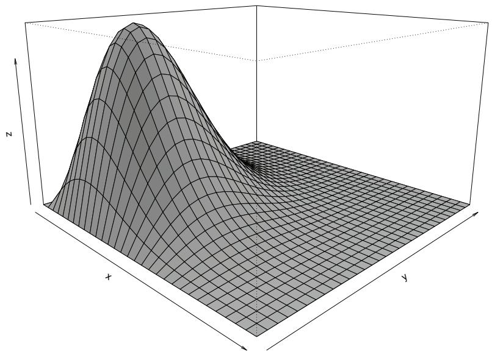
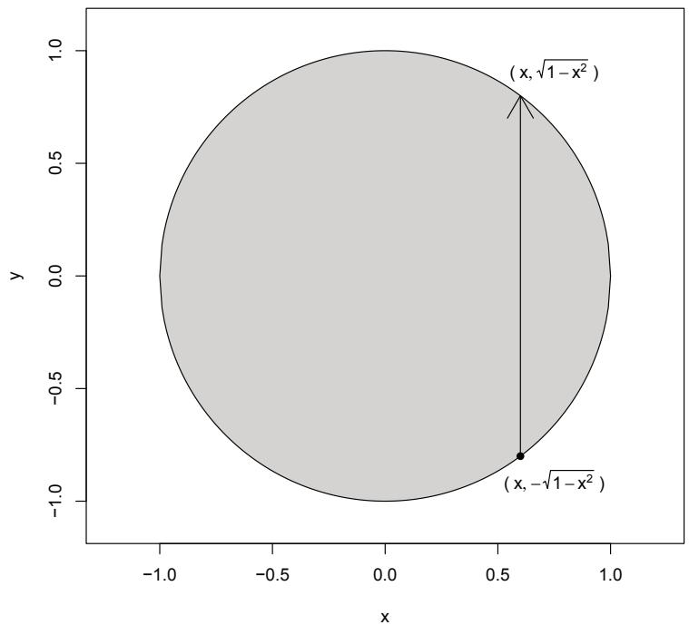
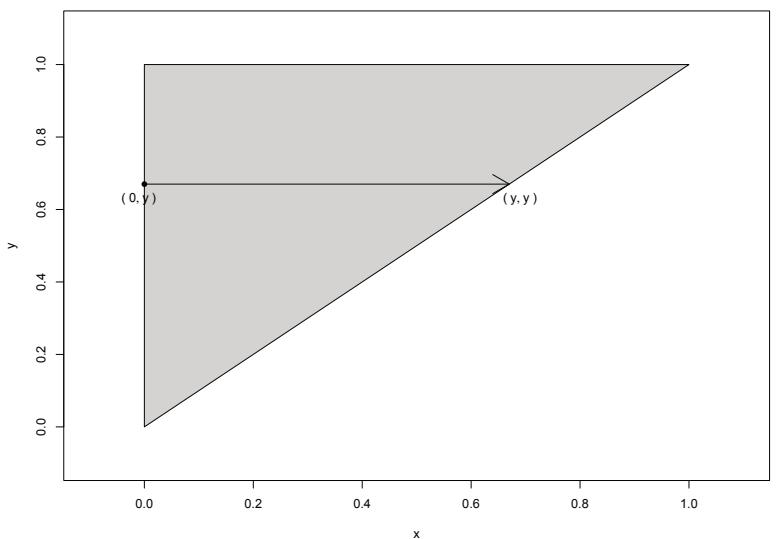
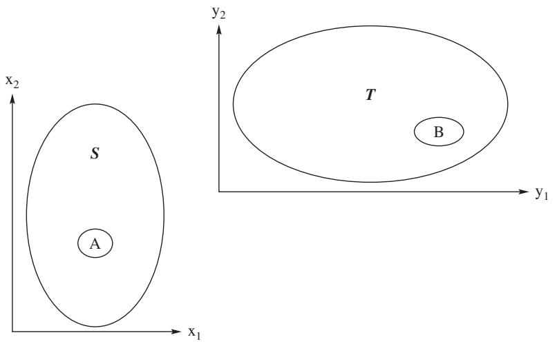
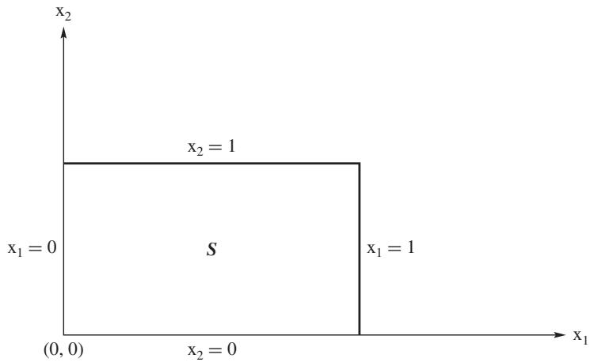
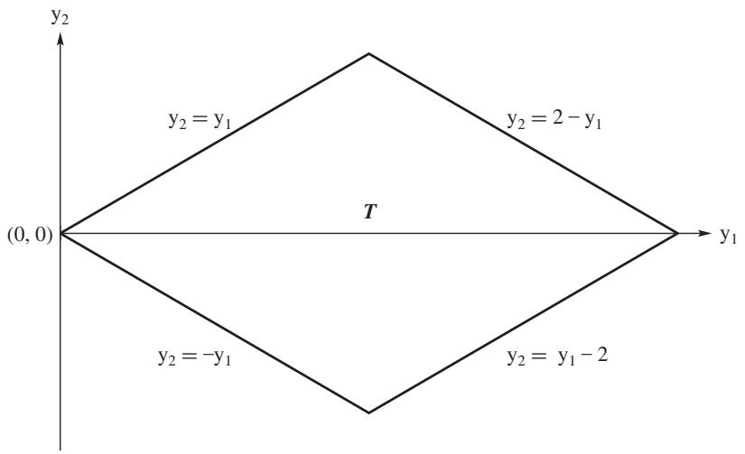
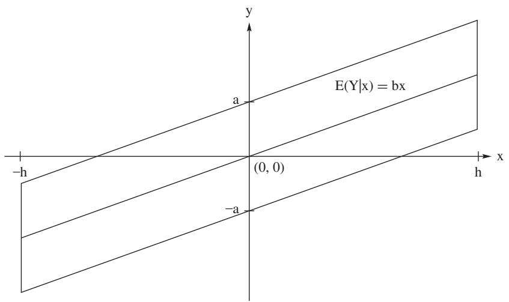

# Multivariate Distributions

[Package map](../structure.md) · [Unsplit OCR dump](./_full.md)

[← Ch. 1 Probability and Distributions](./01-probability-and-distributions.md) · [Ch. 3 Some Special Distributions →](./03-some-special-distributions.md)

> MinerU OCR dump. If a formula, table, or numbering disagrees with the PDF, the PDF is authoritative.

---

# Chapter 2

# Multivariate Distributions

# 2.1 Distributions of Two Random Variables

We begin the discussion of a pair of random variables with the following example. A coin is tossed three times and our interest is in the ordered number pair (number of H's on first two tosses, number of H's on all three tosses), where H and T represent, respectively, heads and tails. Let $\mathcal{C} = \{TTT,TTH,THT,HTT,THH,HTH,HHT,$ $HHH\}$ denote the sample space. Let $X_{1}$ denote the number of H's on the first two tosses and $X_{2}$ denote the number of H's on all three flips. Then our interest can be represented by the pair of random variables $(X_{1},X_{2})$ . For example, $(X_{1}(HTH),X_{2}(HTH))$ represents the outcome $(1,2)$ . Continuing in this way, $X_{1}$ and $X_{2}$ are real-valued functions defined on the sample space $\mathcal{C}$ , which take us from the sample space to the space of ordered number pairs.

$$
\mathcal {D} = \{(0, 0), (0, 1), (1, 1), (1, 2), (2, 2), (2, 3) \}.
$$

Thus $X_{1}$ and $X_{2}$ are two random variables defined on the space $\mathcal{C}$ , and, in this example, the space of these random variables is the two-dimensional set $\mathcal{D}$ , which is a subset of two-dimensional Euclidean space $R^2$ . Hence $(X_{1}, X_{2})$ is a vector function from $\mathcal{C}$ to $\mathcal{D}$ . We now formulate the definition of a random vector.

Definition 2.1.1 (Random Vector). Given a random experiment with a sample space $\mathcal{C}$ , consider two random variables $X_{1}$ and $X_{2}$ , which assign to each element $c$ of $\mathcal{C}$ one and only one ordered pair of numbers $X_{1}(c) = x_{1}$ , $X_{2}(c) = x_{2}$ . Then we say that $(X_{1}, X_{2})$ is a random vector. The space of $(X_{1}, X_{2})$ is the set of ordered pairs $\mathcal{D} = \{(x_{1}, x_{2}) : x_{1} = X_{1}(c), x_{2} = X_{2}(c), c \in \mathcal{C}\}$ .

We often denote random vectors using vector notation $\mathbf{X} = (X_{1},X_{2})^{\prime}$ , where the ' denotes the transpose of the row vector $(X_{1},X_{2})$ . Also, we often use $(X,Y)$ to denote random vectors.

Let $\mathcal{D}$ be the space associated with the random vector $(X_1, X_2)$ . Let $A$ be a subset of $\mathcal{D}$ . As in the case of one random variable, we speak of the event $A$ . We wish to define the probability of the event $A$ , which we denote by $P_{X_1, X_2}[A]$ . As

with random variables in Section 1.5 we can uniquely define $P_{X_1,X_2}$ in terms of the cumulative distribution function (cdf), which is given by

$$
F _ {X _ {1}, X _ {2}} \left(x _ {1}, x _ {2}\right) = P \left[ \left\{X _ {1} \leq x _ {1} \right\} \cap \left\{X _ {2} \leq x _ {2} \right\} \right], \tag {2.1.1}
$$

for all $(x_{1},x_{2})\in R^{2}$ . Because $X_{1}$ and $X_{2}$ are random variables, each of the events in the above intersection and the intersection of the events are events in the original sample space $\mathcal{C}$ . Thus the expression is well defined. As with random variables, we write $P[\{X_1\leq x_1\} \cap \{X_2\leq x_2\} ]$ as $P[X_{1}\leq x_{1},X_{2}\leq x_{2}]$ . As Exercise 2.1.3 shows,

$$
\begin{array}{l} P \left[ a _ {1} <   X _ {1} \leq b _ {1}, a _ {2} <   X _ {2} \leq b _ {2} \right] = F _ {X _ {1}, X _ {2}} \left(b _ {1}, b _ {2}\right) - F _ {X _ {1}, X _ {2}} \left(a _ {1}, b _ {2}\right) \\ - F _ {X _ {1}, X _ {2}} \left(b _ {1}, a _ {2}\right) + F _ {X _ {1}, X _ {2}} \left(a _ {1}, a _ {2}\right). \tag {2.1.2} \\ \end{array}
$$

Hence, all induced probabilities of sets of the form $(a_{1},b_{1}]\times (a_{2},b_{2}]$ can be formulated in terms of the cdf. We often call this cdf the joint cumulative distribution function of $(X_{1},X_{2})$ .

As with random variables, we are mainly concerned with two types of random vectors, namely discrete and continuous. We first discuss the discrete type.

A random vector $(X_{1},X_{2})$ is a discrete random vector if its space $\mathcal{D}$ is finite or countable. Hence, $X_{1}$ and $X_{2}$ are both discrete also. The joint probability mass function (pmf) of $(X_{1},X_{2})$ is defined by

$$
p _ {X _ {1}, X _ {2}} \left(x _ {1}, x _ {2}\right) = P \left[ X _ {1} = x _ {1}, X _ {2} = x _ {2} \right], \tag {2.1.3}
$$

for all $(x_{1},x_{2})\in \mathcal{D}$ . As with random variables, the pmf uniquely defines the cdf. It also is characterized by the two properties

$$
\left(\mathrm {i}\right) 0 \leq p _ {X _ {1}, X _ {2}} \left(x _ {1}, x _ {2}\right) \leq 1 \text {a n d (i i)} \sum_ {\mathcal {D}} \sum_ {p _ {X _ {1}, X _ {2}}} \left(x _ {1}, x _ {2}\right) = 1. \tag {2.1.4}
$$

For an event $B\in \mathcal{D}$ , we have

$$
P \left[ \left(X _ {1}, X _ {2}\right) \in B \right] = \sum_ {B} \sum_ {B} p _ {X _ {1}, X _ {2}} \left(x _ {1}, x _ {2}\right).
$$

Example 2.1.1. Consider the example at the beginning of this section where a fair coin is flipped three times and $X_{1}$ and $X_{2}$ are the number of heads on the first two flips and all 3 flips, respectively. We can conveniently table the pmf of $(X_{1}, X_{2})$ as

<table><tr><td colspan="5">Support of X2</td></tr><tr><td></td><td>0</td><td>1</td><td>2</td><td>3</td></tr><tr><td>0</td><td>1/8</td><td>1/8</td><td>0</td><td>0</td></tr><tr><td>1</td><td>0</td><td>2/8</td><td>2/8</td><td>0</td></tr><tr><td>2</td><td>0</td><td>0</td><td>1/8</td><td>1/8</td></tr></table>

For instance, $P(X_{1} \geq 2, X_{2} \geq 2) = p(2, 2) + p(2, 3) = 2/8$ .

At times it is convenient to speak of the support of a discrete random vector $(X_{1},X_{2})$ . These are all the points $(x_{1},x_{2})$ in the space of $(X_{1},X_{2})$ such that $p(x_1,x_2) > 0$ . In the last example the support consists of the six points $\{(0,0),(0,1),(1,1),(1,2),(2,2),(2,3)\}$ .

We say a random vector $(X_{1},X_{2})$ with space $\mathcal{D}$ is of the continuous type if its cdf $F_{X_1,X_2}(x_1,x_2)$ is continuous. For the most part, the continuous random vectors in this book have cdfs that can be represented as integrals of nonnegative functions. That is, $F_{X_1,X_2}(x_1,x_2)$ can be expressed as

$$
F _ {X _ {1}, X _ {2}} \left(x _ {1}, x _ {2}\right) = \int_ {- \infty} ^ {x _ {1}} \int_ {- \infty} ^ {x _ {2}} f _ {X _ {1}, X _ {2}} \left(w _ {1}, w _ {2}\right) d w _ {1} d w _ {2}, \tag {2.1.5}
$$

for all $(x_{1},x_{2})\in R^{2}$ . We call the integrand the joint probability density function (pdf) of $(X_{1},X_{2})$ . Then

$$
\frac {\partial^ {2} F _ {X _ {1} , X _ {2}} (x _ {1} , x _ {2})}{\partial x _ {1} \partial x _ {2}} = f _ {X _ {1}, X _ {2}} (x _ {1}, x _ {2}),
$$

except possibly on events that have probability zero. A pdf is essentially characterized by the two properties

$$
\left(\mathrm {i}\right) f _ {X _ {1}, X _ {2}} \left(x _ {1}, x _ {2}\right) \geq 0 \text {a n d} \left(\mathrm {i i}\right) \int \int_ {\mathcal {D}} f _ {X _ {1}, X _ {2}} \left(x _ {1}, x _ {2}\right) d x _ {1} d x _ {2} = 1. \tag {2.1.6}
$$

For the reader's benefit, Section 4.2 of the accompanying resource Mathematical Comments1 offers a short review of double integration. For an event $A \in \mathcal{D}$ , we have

$$
P \left[ \left(X _ {1}, X _ {2}\right) \in A \right] = \int \int_ {A} f _ {X _ {1}, X _ {2}} \left(x _ {1}, x _ {2}\right) d x _ {1} d x _ {2}.
$$

Note that the $P[(X_1, X_2) \in A]$ is just the volume under the surface $z = f_{X_1, X_2}(x_1, x_2)$ over the set $A$ .

Remark 2.1.1. As with univariate random variables, we often drop the subscript $(X_{1},X_{2})$ from joint cdfs, pdfs, and pmfs, when it is clear from the context. We also use notation such as $f_{12}$ instead of $f_{X_1,X_2}$ . Besides $(X_{1},X_{2})$ , we often use $(X,Y)$ to express random vectors.

We next present two examples of jointly continuous random variables.

Example 2.1.2. Consider a continuous random vector $(X,Y)$ which is uniformly distributed over the unit circle in $R^2$ . Since the area of the unit circle is $\pi$ , the joint pdf is

$$
f (x, y) = \left\{ \begin{array}{l l} \frac {1}{\pi} & - 1 <   y <   1, - \sqrt {1 - y ^ {2}} <   x <   \sqrt {1 - y ^ {2}} \\ 0 & \text {e l s e w h e r e .} \end{array} \right.
$$

Probabilities of certain events follow immediately from geometry. For instance, let $A$ be the interior of the circle with radius $1/2$ . Then $P[(X,Y) \in A] = \pi(1/2)^2/\pi = 1/4$ . Next, let $B$ be the ring formed by the concentric circles with the respective radii of $1/2$ and $\sqrt{2}/2$ . Then $P[(X,Y) \in B] = \pi[(\sqrt{2}/2)^2 - (1/2)^2]/\pi = 1/4$ . The regions $A$ and $B$ have the same area and hence for this uniform pdf are equilibrated.

In the next example, we use the general fact that double integrals can be expressed as iterated univariate integrals. Thus double integrations can be carried out using iterated univariate integrations. This is discussed in some detail with examples in Section 4.2 of the accompanying resource Mathematical Comments. The aid of a simple sketch of the region of integration is valuable in setting up the upper and lower limits of integration for each of the iterated integrals.

Example 2.1.3. Suppose an electrical component has two batteries. Let $X$ and $Y$ denote the lifetimes in standard units of the respective batteries. Assume that the pdf of $(X, Y)$ is

$$
f (x, y) = \left\{ \begin{array}{l l} 4 x y e ^ {- (x ^ {2} + y ^ {2})} & x > 0, y > 0 \\ 0 & \mathrm {e l s e w h e r e .} \end{array} \right.
$$

The surface $z = f(x,y)$ is sketched in Figure 2.1.1 where the grid squares are 0.1 by 0.1. From the figure, the pdf peaks at about $(x,y) = (0.7,0.7)$ . Solving the equations $\partial f / \partial x = 0$ and $\partial f / \partial y = 0$ simultaneously shows that actually the maximum of $f(x,y)$ occurs at $(x,y) = (\sqrt{2}/2, \sqrt{2}/2)$ . The batteries are more likely to die in regions near the peak. The surface tapers to 0 as $x$ and $y$ get large in any direction. For instance, the probability that both batteries survive beyond $\sqrt{2}/2$ units is given by

$$
\begin{array}{l} P \left(X > \frac {\sqrt {2}}{2}, Y > \frac {\sqrt {2}}{2}\right) = \int_ {\sqrt {2} / 2} ^ {\infty} \int_ {\sqrt {2} / 2} ^ {\infty} 4 x y e ^ {- \left(x ^ {2} + y ^ {2}\right)} d x d y \\ = \int_ {\sqrt {2} / 2} ^ {\infty} 2 x e ^ {- x ^ {2}} \left[ \int_ {\sqrt {2} / 2} ^ {\infty} 2 y e ^ {- y ^ {2}} d y \right] d x \\ = \int_ {1 / 2} ^ {\infty} e ^ {- z} \left[ \int_ {1 / 2} ^ {\infty} e ^ {- w} d w \right] d z = \left(e ^ {- 1 / 2}\right) ^ {2} \approx 0. 3 6 7 9, \\ \end{array}
$$

where we made use of the change-in-variables $z = x^2$ and $w = y^2$ . In contrast to the last example, consider the regions $A = \{(x,y):|x - (1 / 2)| < 0.3, |y - (1 / 2)| < 0.3\}$ and $B = \{(x,y):|x - 2| < 0.3, |y - 2| < 0.3\}$ . The reader should locate these regions on Figure 2.1.1. The areas of $A$ and $B$ are the same, but it is clear from the figure that $P[(X,Y)\in A]$ is much larger than $P[(X,Y)\in B]$ . Exercise 2.1.6 confirms this by showing that $P[(X,Y)\in A] = 0.1879$ while $P[(X,Y)\in B] = 0.0026$ .

For a continuous random vector $(X_{1},X_{2})$ , the support of $(X_{1},X_{2})$ contains all points $(x_{1},x_{2})$ for which $f(x_{1},x_{2}) > 0$ . We denote the support of a random vector by $\mathcal{S}$ . As in the univariate case, $\mathcal{S} \subset \mathcal{D}$ .

As in the last two examples, we extend the definition of a pdf $f_{X_1,X_2}(x_1,x_2)$ over $R^2$ by using zero elsewhere. We do this consistently so that tedious, repetitious references to the space $\mathcal{D}$ can be avoided. Once this is done, we replace

$$
\int \int_ {\mathcal {D}} f _ {X _ {1}, X _ {2}} (x _ {1}, x _ {2}) d x _ {1} d x _ {2} \quad \text {b y} \quad \int_ {- \infty} ^ {\infty} \int_ {- \infty} ^ {\infty} f (x _ {1}, x _ {2}) d x _ {1} d x _ {2}.
$$

  
Figure 2.1.1: A sketch of the surface of the joint pdf discussed in Example 2.1.3. On the figure, the origin is located at the intersection of the $x$ and $z$ axes and the grid squares are 0.1 by 0.1, so points are easily located. As discussed in the text, the peak of the pdf occurs at the point $(\sqrt{2}/2, \sqrt{2}/2)$ .

Likewise we may extend the pmf $p_{X_1, X_2}(x_1, x_2)$ over a convenient set by using zero elsewhere. Hence, we replace

$$
\sum_ {\mathcal {D}} \sum_ {p _ {X _ {1}, X _ {2}} (x _ {1}, x _ {2})} \quad \mathrm {b y} \quad \sum_ {x _ {2}} \sum_ {x _ {1}} p (x _ {1}, x _ {2}).
$$

# 2.1.1 Marginal Distributions

Let $(X_{1},X_{2})$ be a random vector. Then both $X_{1}$ and $X_{2}$ are random variables. We can obtain their distributions in terms of the joint distribution of $(X_{1},X_{2})$ as follows. Recall that the event which defined the cdf of $X_{1}$ at $x_{1}$ is $\{X_1\leq x_1\}$ . However,

$$
\left\{X _ {1} \leq x _ {1} \right\} = \left\{X _ {1} \leq x _ {1} \right\} \cap \left\{- \infty <   X _ {2} <   \infty \right\} = \left\{X _ {1} \leq x _ {1}, - \infty <   X _ {2} <   \infty \right\}.
$$

Taking probabilities, we have

$$
F _ {X _ {1}} (x _ {1}) = P [ X _ {1} \leq x _ {1}, - \infty <   X _ {2} <   \infty ], \tag {2.1.7}
$$

Table 2.1.1: Joint and Marginal Distributions for the discrete random vector $(X_{1},X_{2})$ of Example 2.1.1.   

<table><tr><td colspan="6">Support of X2</td></tr><tr><td></td><td></td><td>0</td><td>1</td><td>2</td><td>3</td></tr><tr><td rowspan="3">Support of X1</td><td>0</td><td>1/8</td><td>1/8</td><td>0</td><td>0</td></tr><tr><td>1</td><td>0</td><td>2/8</td><td>2/8</td><td>0</td></tr><tr><td>2</td><td>0</td><td>0</td><td>1/8</td><td>1/8</td></tr><tr><td></td><td>pX2(x2)</td><td>1/8</td><td>3/8</td><td>3/8</td><td>1/8</td></tr></table>

for all $x_1 \in R$ . By Theorem 1.3.6 we can write this equation as $F_{X_1}(x_1) = \lim_{x_2 \uparrow \infty} F(x_1, x_2)$ . Thus we have a relationship between the cdfs, which we can extend to either the pmf or pdf depending on whether $(X_1, X_2)$ is discrete or continuous.

First consider the discrete case. Let $\mathcal{D}_{X_1}$ be the support of $X_{1}$ . For $x_{1} \in \mathcal{D}_{X_{1}}$ , Equation (2.1.7) is equivalent to

$$
F _ {X _ {1}} (x _ {1}) = \sum_ {w _ {1} \leq x _ {1}, - \infty <   x _ {2} <   \infty} p _ {X _ {1}, X _ {2}} (w _ {1}, x _ {2}) = \sum_ {w _ {1} \leq x _ {1}} \left\{\sum_ {x _ {2} <   \infty} p _ {X _ {1}, X _ {2}} (w _ {1}, x _ {2}) \right\}.
$$

By the uniqueness of cdfs, the quantity in braces must be the pmf of $X_{1}$ evaluated at $w_{1}$ ; that is,

$$
p _ {X _ {1}} \left(x _ {1}\right) = \sum_ {x _ {2} <   \infty} p _ {X _ {1}, X _ {2}} \left(x _ {1}, x _ {2}\right), \tag {2.1.8}
$$

for all $x_{1} \in \mathcal{D}_{X_{1}}$ . Hence, to find the probability that $X_{1}$ is $x_{1}$ , keep $x_{1}$ fixed and sum $p_{X_1,X_2}$ over all of $x_{2}$ . In terms of a tabled joint pmf with rows comprised of $X_{1}$ support values and columns comprised of $X_{2}$ support values, this says that the distribution of $X_{1}$ can be obtained by the marginal sums of the rows. Likewise, the pmf of $X_{2}$ can be obtained by marginal sums of the columns.

Consider the joint discrete distribution of the random vector $(X_{1},X_{2})$ as presented in Example 2.1.1. In Table 2.1.1, we have added these marginal sums. The final row of this table is the pmf of $X_{2}$ , while the final column is the pmf of $X_{1}$ . In general, because these distributions are recorded in the margins of the table, we often refer to them as marginal pmfs.

Example 2.1.4. Consider a random experiment that consists of drawing at random one chip from a bowl containing 10 chips of the same shape and size. Each chip has an ordered pair of numbers on it: one with (1,1), one with (2,1), two with (3,1), one with (1,2), two with (2,2), and three with (3,2). Let the random variables $X_{1}$ and $X_{2}$ be defined as the respective first and second values of the ordered pair. Thus the joint pmf $p(x_{1},x_{2})$ of $X_{1}$ and $X_{2}$ can be given by the following table, with $p(x_{1},x_{2})$ equal to zero elsewhere.

<table><tr><td></td><td colspan="2">x2</td><td></td></tr><tr><td>x1</td><td>1</td><td>2</td><td>p1(x1)</td></tr><tr><td>1</td><td>1/10</td><td>1/10</td><td>2/10</td></tr><tr><td>2</td><td>1/10</td><td>2/10</td><td>3/10</td></tr><tr><td>3</td><td>2/10</td><td>3/10</td><td>5/10</td></tr><tr><td>p2(x2)</td><td>4/10</td><td>6/10</td><td></td></tr></table>

The joint probabilities have been summed in each row and each column and these sums recorded in the margins to give the marginal probability mass functions of $X_{1}$ and $X_{2}$ , respectively. Note that it is not necessary to have a formula for $p(x_{1},x_{2})$ to do this.

We next consider the continuous case. Let $\mathcal{D}_{X_1}$ be the support of $X_{1}$ . For $x_{1} \in \mathcal{D}_{X_{1}}$ , Equation (2.1.7) is equivalent to

$$
F _ {X _ {1}} (x _ {1}) = \int_ {- \infty} ^ {x _ {1}} \int_ {- \infty} ^ {\infty} f _ {X _ {1}, X _ {2}} (w _ {1}, x _ {2}) d x _ {2} d w _ {1} = \int_ {- \infty} ^ {x _ {1}} \left\{\int_ {- \infty} ^ {\infty} f _ {X _ {1}, X _ {2}} (w _ {1}, x _ {2}) d x _ {2} \right\} d w _ {1}.
$$

By the uniqueness of cdfs, the quantity in braces must be the pdf of $X_{1}$ , evaluated at $w_{1}$ ; that is,

$$
f _ {X _ {1}} \left(x _ {1}\right) = \int_ {- \infty} ^ {\infty} f _ {X _ {1}, X _ {2}} \left(x _ {1}, x _ {2}\right) d x _ {2} \tag {2.1.9}
$$

for all $x_{1} \in \mathcal{D}_{X_{1}}$ . Hence, in the continuous case the marginal pdf of $X_{1}$ is found by integrating out $x_{2}$ . Similarly, the marginal pdf of $X_{2}$ is found by integrating out $x_{1}$ .

Example 2.1.5 (Example 2.1.2, continued). Consider the vector of continuous random variables $(X,Y)$ discussed in Example 2.1.2. The space of the random vector is the unit circle with center at $(0,0)$ as shown in Figure 2.1.2. To find the marginal distribution of $X$ , fix $x$ between $-1$ and $1$ and then integrate out $y$ from $-\sqrt{1 - x^2}$ to $\sqrt{1 - x^2}$ as the arrow shows on Figure 2.1.2. Hence, the marginal pdf of $X$ is

$$
f _ {X} (x) = \int_ {- \sqrt {1 - x ^ {2}}} ^ {\sqrt {1 - x ^ {2}}} \frac {1}{\pi} d y = \frac {2}{\pi} \sqrt {1 - x ^ {2}}, - 1 <   x <   1.
$$

Although $(X,Y)$ has a joint uniform distribution, the distribution of $X$ is unimodal with peak at 0. This is not surprising. Since the joint distribution is uniform, from Figure 2.1.2 $X$ is more likely to be near 0 than at either extreme $-1$ or 1. Because the joint pdf is symmetric in $x$ and $y$ , the marginal pdf of $Y$ is the same as that of $X$ .

Example 2.1.6. Let $X_{1}$ and $X_{2}$ have the joint pdf

$$
f (x _ {1}, x _ {2}) = \left\{ \begin{array}{l l} x _ {1} + x _ {2} & 0 <   x _ {1} <   1, 0 <   x _ {2} <   1 \\ 0 & \text {e l s e w h e r e .} \end{array} \right.
$$

# Region of Integration for Example A.3.1.

  
Figure 2.1.2: Region of integration for Example 2.1.5. It depicts the integration with respect to $y$ at a fixed but arbitrary $x$ .

Notice the space of the random vector is the interior of the square with vertices $(0,0),(1,0),(1,1)$ and $(0,1)$ . The marginal pdf of $X_{1}$ is

$$
f _ {1} (x _ {1}) = \int_ {0} ^ {1} (x _ {1} + x _ {2}) d x _ {2} = x _ {1} + \frac {1}{2}, 0 <   x _ {1} <   1,
$$

zero elsewhere, and the marginal pdf of $X_{2}$ is

$$
f _ {2} (x _ {2}) = \int_ {0} ^ {1} (x _ {1} + x _ {2}) d x _ {1} = \frac {1}{2} + x _ {2}, 0 <   x _ {2} <   1,
$$

zero elsewhere. A probability like $P(X_1 \leq \frac{1}{2})$ can be computed from either $f_1(x_1)$ or $f(x_1, x_2)$ because

$$
\int_ {0} ^ {1 / 2} \int_ {0} ^ {1} f (x _ {1}, x _ {2}) d x _ {2} d x _ {1} = \int_ {0} ^ {1 / 2} f _ {1} (x _ {1}) d x _ {1} = \frac {3}{8}.
$$

Suppose, though, we want to find the probability $P(X_{1} + X_{2} \leq 1)$ . Notice that the region of integration is the interior of the triangle with vertices $(0,0)$ , $(1,0)$ and

(0,1). The reader should sketch this region on the space of $(X_{1},X_{2})$ . Fixing $x_{1}$ and integrating with respect to $x_{2}$ , we have

$$
\begin{array}{l} P \left(X _ {1} + X _ {2} \leq 1\right) = \int_ {0} ^ {1} \left[ \int_ {0} ^ {1 - x _ {1}} \left(x _ {1} + x _ {2}\right) d x _ {2} \right] d x _ {1} \\ = \int_ {0} ^ {1} \left[ x _ {1} (1 - x _ {1}) + \frac {(1 - x _ {1}) ^ {2}}{2} \right] d x _ {1} \\ = \int_ {0} ^ {1} \left(\frac {1}{2} - \frac {1}{2} x _ {1} ^ {2}\right) d x _ {1} = \frac {1}{3}. \\ \end{array}
$$

This latter probability is the volume under the surface $f(x_{1},x_{2}) = x_{1} + x_{2}$ above the set $\{(x_1,x_2):0 < x_1, x_1 + x_2 \leq 1\}$ .

Example 2.1.7 (Example 2.1.3, Continued). Recall that the random variables $X$ and $Y$ of Example 2.1.3 were the lifetimes of two batteries installed in an electrical component. The joint pdf of $(X,Y)$ is sketched in Figure 2.1.1. Its space is the positive quadrant of $R^2$ so there are no constraints involving both $x$ and $y$ . Using the change-in-variable $w = y^2$ , the marginal pdf of $X$ is

$$
f _ {X} (x) = \int_ {0} ^ {\infty} 4 x y e ^ {- (x ^ {2} + y ^ {2})} d y = 2 x e ^ {- x ^ {2}} \int_ {0} ^ {\infty} e ^ {- w} d w = 2 x e ^ {- x ^ {2}},
$$

for $x > 0$ . By the symmetry of $x$ and $y$ in the model, the pdf of $Y$ is the same as that of $X$ . To determine the median lifetime, $\theta$ , of these batteries, we need to solve

$$
\frac {1}{2} = \int_ {0} ^ {\theta} 2 x e ^ {- x ^ {2}} d x = 1 - e ^ {- \theta^ {2}},
$$

where again we have made use of the change-in-variables $z = x^2$ . Solving this equation, we obtain $\theta = \sqrt{\log 2} \approx 0.8326$ . So $50\%$ of the batteries have lifetimes exceeding 0.83 units.

# 2.1.2 Expectation

The concept of expectation extends in a straightforward manner. Let $(X_{1},X_{2})$ be a random vector and let $Y = g(X_{1},X_{2})$ for some real-valued function; i.e., $g:R^2\to R$ . Then $Y$ is a random variable and we could determine its expectation by obtaining the distribution of $Y$ . But Theorem 1.8.1 is true for random vectors also. Note the proof we gave for this theorem involved the discrete case, and Exercise 2.1.12 shows its extension to the random vector case.

Suppose $(X_{1},X_{2})$ is of the continuous type. Then $E(Y)$ exists if

$$
\int_ {- \infty} ^ {\infty} \int_ {- \infty} ^ {\infty} | g (x _ {1}, x _ {2}) | f _ {X _ {1}, X _ {2}} (x _ {1}, x _ {2}) d x _ {1} d x _ {2} <   \infty .
$$

Then

$$
E (Y) = \int_ {- \infty} ^ {\infty} \int_ {- \infty} ^ {\infty} g \left(x _ {1}, x _ {2}\right) f _ {X _ {1}, X _ {2}} \left(x _ {1}, x _ {2}\right) d x _ {1} d x _ {2}. \tag {2.1.10}
$$

Likewise if $(X_{1},X_{2})$ is discrete, then $E(Y)$ exists if

$$
\sum_ {x _ {1}} \sum_ {x _ {2}} | g (x _ {1}, x _ {2}) | p _ {X _ {1}, X _ {2}} (x _ {1}, x _ {2}) <   \infty .
$$

Then

$$
E (Y) = \sum_ {x _ {1}} \sum_ {x _ {2}} g \left(x _ {1}, x _ {2}\right) p _ {X _ {1}, X _ {2}} \left(x _ {1}, x _ {2}\right). \tag {2.1.11}
$$

We can now show that $E$ is a linear operator.

Theorem 2.1.1. Let $(X_{1},X_{2})$ be a random vector. Let $Y_{1} = g_{1}(X_{1},X_{2})$ and $Y_{2} = g_{2}(X_{1},X_{2})$ be random variables whose expectations exist. Then for all real numbers $k_{1}$ and $k_{2}$ ,

$$
E \left(k _ {1} Y _ {1} + k _ {2} Y _ {2}\right) = k _ {1} E \left(Y _ {1}\right) + k _ {2} E \left(Y _ {2}\right). \tag {2.1.12}
$$

Proof: We prove it for the continuous case. The existence of the expected value of $k_{1}Y_{1} + k_{2}Y_{2}$ follows directly from the triangle inequality and linearity of integrals; i.e.,

$$
\begin{array}{l} \int_ {- \infty} ^ {\infty} \int_ {- \infty} ^ {\infty} | k _ {1} g _ {1} (x _ {1}, x _ {2}) + k _ {2} g _ {1} (x _ {1}, x _ {2}) | f _ {X _ {1}, X _ {2}} (x _ {1}, x _ {2}) d x _ {1} d x _ {2} \\ \leq | k _ {1} | \int_ {- \infty} ^ {\infty} \int_ {- \infty} ^ {\infty} | g _ {1} (x _ {1}, x _ {2}) | f _ {X _ {1}, X _ {2}} (x _ {1}, x _ {2}) d x _ {1} d x _ {2} \\ + \left| k _ {2} \right| \int_ {- \infty} ^ {\infty} \int_ {- \infty} ^ {\infty} \left| g _ {2} \left(x _ {1}, x _ {2}\right) \right| f _ {X _ {1}, X _ {2}} \left(x _ {1}, x _ {2}\right) d x _ {1} d x _ {2} <   \infty . \\ \end{array}
$$

By once again using linearity of the integral, we have

$$
\begin{array}{l} E \left(k _ {1} Y _ {1} + k _ {2} Y _ {2}\right) = \int_ {- \infty} ^ {\infty} \int_ {- \infty} ^ {\infty} \left[ k _ {1} g _ {1} \left(x _ {1}, x _ {2}\right) + k _ {2} g _ {2} \left(x _ {1}, x _ {2}\right) \right] f _ {X _ {1}, X _ {2}} \left(x _ {1}, x _ {2}\right) d x _ {1} d x _ {2} \\ = k _ {1} \int_ {- \infty} ^ {\infty} \int_ {- \infty} ^ {\infty} g _ {1} \left(x _ {1}, x _ {2}\right) f _ {X _ {1}, X _ {2}} \left(x _ {1}, x _ {2}\right) d x _ {1} d x _ {2} \\ + k _ {2} \int_ {- \infty} ^ {\infty} \int_ {- \infty} ^ {\infty} g _ {2} \left(x _ {1}, x _ {2}\right) f _ {X _ {1}, X _ {2}} \left(x _ {1}, x _ {2}\right) d x _ {1} d x _ {2} \\ = k _ {1} E \left(Y _ {1}\right) + k _ {2} E \left(Y _ {2}\right), \\ \end{array}
$$

i.e., the desired result.

We also note that the expected value of any function $g(X_2)$ of $X_2$ can be found in two ways:

$$
E (g (X _ {2})) = \int_ {- \infty} ^ {\infty} \int_ {- \infty} ^ {\infty} g (x _ {2}) f (x _ {1}, x _ {2}) d x _ {1} d x _ {2} = \int_ {- \infty} ^ {\infty} g (x _ {2}) f _ {X _ {2}} (x _ {2}) d x _ {2},
$$

the latter single integral being obtained from the double integral by integrating on $x_{1}$ first. The following example illustrates these ideas.

Example 2.1.8. Let $X_{1}$ and $X_{2}$ have the pdf

$$
f (x _ {1}, x _ {2}) = \left\{ \begin{array}{l l} 8 x _ {1} x _ {2} & 0 <   x _ {1} <   x _ {2} <   1 \\ 0 & \text {e l s e w h e r e .} \end{array} \right.
$$

Figure 2.1.3 shows the space for $(X_{1},X_{2})$ . Then

$$
E \left(X _ {1} X _ {2} ^ {2}\right) = \int_ {- \infty} ^ {\infty} \int_ {- \infty} ^ {\infty} x _ {1} x _ {2} ^ {2} f \left(x _ {1}, x _ {2}\right) d x _ {1} d x _ {2}.
$$

To compute the integration, as shown by the arrow on Figure 2.1.3, we fix $x_{2}$ and then integrate $x_{1}$ from 0 to $x_{2}$ . We then integrate out $x_{2}$ from 0 to 1. Hence,

$$
\int_ {- \infty} ^ {\infty} \int_ {- \infty} ^ {\infty} x _ {1} x _ {2} ^ {2} f (x _ {1}, x _ {2}) = \int_ {0} ^ {1} \left[ \int_ {0} ^ {x _ {2}} 8 x _ {1} ^ {2} x _ {2} ^ {3} d x _ {1} \right] d x _ {2} = \int_ {0} ^ {1} \frac {8}{3} x _ {2} ^ {6} d x _ {2} = \frac {8}{2 1}.
$$

In addition,

$$
E (X _ {2}) = \int_ {0} ^ {1} \left[ \int_ {0} ^ {x _ {2}} x _ {2} \left(8 x _ {1} x _ {2}\right) d x _ {1} \right] d x _ {2} = \frac {4}{5}.
$$

Since $X_{2}$ has the pdf $f_{2}(x_{2}) = 4x_{2}^{3}$ , $0 < x_{2} < 1$ , zero elsewhere, the latter expectation can also be found by

$$
E (X _ {2}) = \int_ {0} ^ {1} x _ {2} \left(4 x _ {2} ^ {3}\right) d x _ {2} = \frac {4}{5}.
$$

Using Theorem 2.1.1,

$$
\begin{array}{l} E \left(7 X _ {1} X _ {2} ^ {2} + 5 X _ {2}\right) = 7 E \left(X _ {1} X _ {2} ^ {2}\right) + 5 E \left(X _ {2}\right) \\ = (7) \left(\frac {8}{2 1}\right) + (5) \left(\frac {4}{5}\right) = \frac {2 0}{3}. \\ \end{array}
$$

Example 2.1.9. Continuing with Example 2.1.8, suppose the random variable $Y$ is defined by $Y = X_{1} / X_{2}$ . We determine $E(Y)$ in two ways. The first way is by definition; i.e., find the distribution of $Y$ and then determine its expectation. The cdf of $Y$ , for $0 < y \leq 1$ , is

$$
\begin{array}{l} F _ {Y} (y) = P (Y \leq y) = P \left(X _ {1} \leq y X _ {2}\right) = \int_ {0} ^ {1} \left[ \int_ {0} ^ {y x _ {2}} 8 x _ {1} x _ {2} d x _ {1} \right] d x _ {2} \\ = \int_ {0} ^ {1} 4 y ^ {2} x _ {2} ^ {3} d x _ {2} = y ^ {2}. \\ \end{array}
$$

Hence, the pdf of $Y$ is

$$
f _ {Y} (y) = F _ {Y} ^ {\prime} (y) = \left\{ \begin{array}{l l} 2 y & 0 <   y <   1 \\ 0 & \text {e l s e w h e r e ,} \end{array} \right.
$$

which leads to

$$
E (Y) = \int_ {0} ^ {1} y (2 y) d y = \frac {2}{3}.
$$

  
Figure 2.1.3: Region of integration for Example 2.1.8. The arrow depicts the integration with respect to $x_{1}$ at a fixed but arbitrary $x_{2}$ .

For the second way, we make use of expression (2.1.10) and find $E(Y)$ directly by

$$
\begin{array}{l} { E ( Y ) } { = } { E \left( \frac { X _ { 1 } } { X _ { 2 } } \right) = \int _ { 0 } ^ { 1 } \left\{ \int _ { 0 } ^ { x _ { 2 } } \left( \frac { x _ { 1 } } { x _ { 2 } } \right) 8 x _ { 1 } x _ { 2 } d x _ { 1 } \right\} d x _ { 2 } } \\ = \int_ {0} ^ {1} \frac {8}{3} x _ {2} ^ {3} d x _ {2} = \frac {2}{3}. \\ \end{array}
$$

We next define the moment generating function of a random vector.

Definition 2.1.2 (Moment Generating Function of a Random Vector). Let $\mathbf{X} = (X_1, X_2)'$ be a random vector. If $E(e^{t_1X_1 + t_2X_2})$ exists for $|t_1| < h_1$ and $|t_2| < h_2$ , where $h_1$ and $h_2$ are positive, it is denoted by $M_{X_1,X_2}(t_1,t_2)$ and is called the moment generating function (mgf) of $\mathbf{X}$ .

As in the one-variable case, if it exists, the mgf of a random vector uniquely determines the distribution of the random vector.

Let $\mathbf{t} = (t_1, t_2)'$ . Then we can write the mgf of $\mathbf{X}$ as

$$
M _ {X _ {1}, X _ {2}} (\mathbf {t}) = E \left[ e ^ {\mathbf {t} ^ {\prime} \mathbf {X}} \right], \tag {2.1.13}
$$

so it is quite similar to the mgf of a random variable. Also, the mgfs of $X_{1}$ and $X_{2}$ are immediately seen to be $M_{X_1,X_2}(t_1,0)$ and $M_{X_1,X_2}(0,t_2)$ , respectively. If there is no confusion, we often drop the subscripts on $M$ .

Example 2.1.10. Let the continuous-type random variables $X$ and $Y$ have the joint pdf

$$
f (x, y) = \left\{ \begin{array}{l l} e ^ {- y} & 0 <   x <   y <   \infty \\ 0 & \text {e l s e w h e r e .} \end{array} \right.
$$

The reader should sketch the space of $(X,Y)$ . The mgf of this joint distribution is

$$
\begin{array}{l} M \left(t _ {1}, t _ {2}\right) = \int_ {0} ^ {\infty} \left[ \int_ {x} ^ {\infty} \exp \left(t _ {1} x + t _ {2} y - y\right) d y \right] d x \\ = \frac {1}{(1 - t _ {1} - t _ {2}) (1 - t _ {2})}, \\ \end{array}
$$

provided that $t_1 + t_2 < 1$ and $t_2 < 1$ . Furthermore, the moment-generating functions of the marginal distributions of $X$ and $Y$ are, respectively,

$$
\begin{array}{l} M (t _ {1}, 0) = \frac {1}{1 - t _ {1}}, t _ {1} <   1 \\ M (0, t _ {2}) = \frac {1}{(1 - t _ {2}) ^ {2}}, t _ {2} <   1. \\ \end{array}
$$

These moment-generating functions are, of course, respectively, those of the marginal probability density functions,

$$
f _ {1} (x) = \int_ {x} ^ {\infty} e ^ {- y} d y = e ^ {- x}, 0 <   x <   \infty ,
$$

zero elsewhere, and

$$
f _ {2} (y) = e ^ {- y} \int_ {0} ^ {y} d x = y e ^ {- y}, 0 <   y <   \infty ,
$$

zero elsewhere.

We also need to define the expected value of the random vector itself, but this is not a new concept because it is defined in terms of componentwise expectation:

Definition 2.1.3 (Expected Value of a Random Vector). Let $\mathbf{X} = (X_1, X_2)'$ be a random vector. Then the expected value of $\mathbf{X}$ exists if the expectations of $X_1$ and $X_2$ exist. If it exists, then the expected value is given by

$$
E [ \mathbf {X} ] = \left[ \begin{array}{c} E (X _ {1}) \\ E (X _ {2}) \end{array} \right]. \tag {2.1.14}
$$

# EXERCISES

2.1.1. Let $f(x_{1},x_{2}) = 4x_{1}x_{2}$ , $0 < x_{1} < 1$ , $0 < x_{2} < 1$ , zero elsewhere, be the pdf of $X_{1}$ and $X_{2}$ . Find $P(0 < X_{1} < \frac{1}{2},\frac{1}{4} < X_{2} < 1)$ , $P(X_{1} = X_{2})$ , $P(X_{1} < X_{2})$ , and $P(X_{1}\leq X_{2})$ .

Hint: Recall that $P(X_{1} = X_{2})$ would be the volume under the surface $f(x_{1},x_{2}) = 4x_{1}x_{2}$ and above the line segment $0 < x_{1} = x_{2} < 1$ in the $x_{1}x_{2}$ -plane.

2.1.2. Let $A_{1} = \{(x,y): x \leq 2, y \leq 4\}$ , $A_{2} = \{(x,y): x \leq 2, y \leq 1\}$ , $A_{3} = \{(x,y): x \leq 0, y \leq 4\}$ , and $A_{4} = \{(x,y): x \leq 0, y \leq 1\}$ be subsets of the space $\mathcal{A}$ of two random variables $X$ and $Y$ , which is the entire two-dimensional plane. If $P(A_{1}) = \frac{7}{8}$ , $P(A_{2}) = \frac{4}{8}$ , $P(A_{3}) = \frac{3}{8}$ , and $P(A_{4}) = \frac{2}{8}$ , find $P(A_{5})$ , where $A_{5} = \{(x,y): 0 < x \leq 2, 1 < y \leq 4\}$ .

2.1.3. Let $F(x, y)$ be the distribution function of $X$ and $Y$ . For all real constants $a < b$ , $c < d$ , show that $P(a < X \leq b, c < Y \leq d) = F(b, d) - F(b, c) - F(a, d) + F(a, c)$ .

2.1.4. Show that the function $F(x,y)$ that is equal to 1 provided that $x + 2y \geq 1$ , and that is equal to zero provided that $x + 2y < 1$ , cannot be a distribution function of two random variables.

Hint: Find four numbers $a < b$ , $c < d$ , so that

$$
F (b, d) - F (a, d) - F (b, c) + F (a, c)
$$

is less than zero.

2.1.5. Given that the nonnegative function $g(x)$ has the property that

$$
\int_ {0} ^ {\infty} g (x) d x = 1,
$$

show that

$$
f (x _ {1}, x _ {2}) = \frac {2 g (\sqrt {x _ {1} ^ {2} + x _ {2} ^ {2}})}{\pi \sqrt {x _ {1} ^ {2} + x _ {2} ^ {2}}}, 0 <   x _ {1} <   \infty , 0 <   x _ {2} <   \infty ,
$$

zero elsewhere, satisfies the conditions for a pdf of two continuous-type random variables $X_{1}$ and $X_{2}$ .

Hint: Use polar coordinates.

2.1.6. Consider Example 2.1.3.

(a) Show that $P(a < X < b, c < Y < d) = (\exp \{-a^2\} - \exp \{-b^2\})(\exp \{-c^2\} - \exp \{-d^2\})$ .   
(b) Using Part (a) and the notation in Example 2.1.3, show that $P[(X,Y) \in A] = 0.1879$ while $P[(X,Y) \in B] = 0.0026$ .   
(c) Show that the following R program computes $P(a < X < b, c < Y < d)$ . Then use it to compute the probabilities in Part (b).

$$
p l i f e t i m e <   - f u n c t i o n (a, b, c, d)
$$

$$
\left. \left\{\left(\exp (- a ^ {\wedge} 2) - \exp (- b ^ {\wedge} 2)\right) * \left(\exp (- c ^ {\wedge} 2) - \exp (- d ^ {\wedge} 2)\right) \right\} \right.
$$

2.1.7. Let $f(x,y) = e^{-x - y}$ , $0 < x < \infty$ , $0 < y < \infty$ , zero elsewhere, be the pdf of $X$ and $Y$ . Then if $Z = X + Y$ , compute $P(Z \leq 0)$ , $P(Z \leq 6)$ , and, more generally, $P(Z \leq z)$ , for $0 < z < \infty$ . What is the pdf of $Z$ ?

2.1.8. Let $X$ and $Y$ have the pdf $f(x,y) = 1$ , $0 < x < 1$ , $0 < y < 1$ , zero elsewhere. Find the cdf and pdf of the product $Z = XY$ .

2.1.9. Let 13 cards be taken, at random and without replacement, from an ordinary deck of playing cards. If $X$ is the number of spades in these 13 cards, find the pmf of $X$ . If, in addition, $Y$ is the number of hearts in these 13 cards, find the probability $P(X = 2, Y = 5)$ . What is the joint pmf of $X$ and $Y$ ?

2.1.10. Let the random variables $X_{1}$ and $X_{2}$ have the joint pmf described as follows:

<table><tr><td>(x1,x2)</td><td>(0,0)</td><td>(0,1)</td><td>(0,2)</td><td>(1,0)</td><td>(1,1)</td><td>(1,2)</td></tr><tr><td>p(x1,x2)</td><td>2/12</td><td>3/12</td><td>2/12</td><td>2/12</td><td>2/12</td><td>1/12</td></tr></table>

and $p(x_{1},x_{2})$ is equal to zero elsewhere.

(a) Write these probabilities in a rectangular array as in Example 2.1.4, recording each marginal pdf in the "margins."   
(b) What is $P(X_{1} + X_{2} = 1)$ ?

2.1.11. Let $X_{1}$ and $X_{2}$ have the joint pdf $f(x_{1},x_{2}) = 15x_{1}^{2}x_{2}$ , $0 < x_{1} < x_{2} < 1$ , zero elsewhere. Find the marginal pdfs and compute $P(X_{1} + X_{2}\leq 1)$ .

Hint: Graph the space $X_{1}$ and $X_{2}$ and carefully choose the limits of integration in determining each marginal pdf.

2.1.12. Let $X_{1}, X_{2}$ be two random variables with the joint pmf $p(x_{1}, x_{2})$ , $(x_{1}, x_{2}) \in S$ , where $S$ is the support of $X_{1}, X_{2}$ . Let $Y = g(X_{1}, X_{2})$ be a function such that

$$
\sum_ {(x _ {1}, x _ {2}) \in \mathcal {S}} | g (x _ {1}, x _ {2}) | p (x _ {1}, x _ {2}) <   \infty .
$$

By following the proof of Theorem 1.8.1, show that

$$
E (Y) = \sum_ {(x _ {1}, x _ {2}) \in \mathcal {S}} g (x _ {1}, x _ {2}) p (x _ {1}, x _ {2}).
$$

2.1.13. Let $X_{1}, X_{2}$ be two random variables with the joint pmf $p(x_{1}, x_{2}) = (x_{1} + x_{2}) / 12$ , for $x_{1} = 1, 2$ , $x_{2} = 1, 2$ , zero elsewhere. Compute $E(X_{1}), E(X_{1}^{2}), E(X_{2}), E(X_{2}^{2})$ , and $E(X_{1}X_{2})$ . Is $E(X_{1}X_{2}) = E(X_{1})E(X_{2})$ ? Find $E(2X_{1} - 6X_{2}^{2} + 7X_{1}X_{2})$ .   
2.1.14. Let $X_1, X_2$ be two random variables with joint pdf $f(x_1, x_2) = 4x_1x_2$ , $0 < x_1 < 1$ , $0 < x_2 < 1$ , zero elsewhere. Compute $E(X_1), E(X_1^2), E(X_2), E(X_2^2)$ , and $E(X_1X_2)$ . Is $E(X_1X_2) = E(X_1)E(X_2)$ ? Find $E(3X_2 - 2X_1^2 + 6X_1X_2)$ .   
2.1.15. Let $X_{1}, X_{2}$ be two random variables with joint pmf $p(x_{1}, x_{2}) = (1/2)^{x_{1} + x_{2}}$ , for $1 \leq x_{i} < \infty, i = 1, 2$ , where $x_{1}$ and $x_{2}$ are integers, zero elsewhere. Determine the joint mgf of $X_{1}, X_{2}$ . Show that $M(t_{1}, t_{2}) = M(t_{1}, 0)M(0, t_{2})$ .   
2.1.16. Let $X_{1}, X_{2}$ be two random variables with joint pdf $f(x_{1}, x_{2}) = x_{1} \exp\{-x_{2}\}$ , for $0 < x_{1} < x_{2} < \infty$ , zero elsewhere. Determine the joint mgf of $X_{1}, X_{2}$ . Does $M(t_{1}, t_{2}) = M(t_{1}, 0)M(0, t_{2})$ ?   
2.1.17. Let $X$ and $Y$ have the joint pdf $f(x,y) = 6(1 - x - y)$ , $x + y < 1$ , $0 < x$ , $0 < y$ , zero elsewhere. Compute $P(2X + 3Y < 1)$ and $E(XY + 2X^2)$ .

# 2.2 Transformations: Bivariate Random Variables

Let $(X_{1},X_{2})$ be a random vector. Suppose we know the joint distribution of $(X_{1},X_{2})$ and we seek the distribution of a transformation of $(X_{1},X_{2})$ , say, $Y = g(X_{1},X_{2})$ . We may be able to obtain the cdf of $Y$ . Another way is to use a transformation as we did for univariate random variables in Sections 1.6 and 1.7. In this section, we extend this theory to random vectors. It is best to discuss the discrete and continuous cases separately. We begin with the discrete case.

There are no essential difficulties involved in a problem like the following. Let $p_{X_1,X_2}(x_1,x_2)$ be the joint pmf of two discrete-type random variables $X_{1}$ and $X_{2}$ with $\mathcal{S}$ the (two-dimensional) set of points at which $p_{X_1,X_2}(x_1,x_2) > 0$ ; i.e., $\mathcal{S}$ is the support of $(X_{1},X_{2})$ . Let $y_{1} = u_{1}(x_{1},x_{2})$ and $y_{2} = u_{2}(x_{1},x_{2})$ define a one-to-one transformation that maps $\mathcal{S}$ onto $\mathcal{T}$ . The joint pmf of the two new random variables $Y_{1} = u_{1}(X_{1},X_{2})$ and $Y_{2} = u_{2}(X_{1},X_{2})$ is given by

$$
p _ {Y _ {1}, Y _ {2}} (y _ {1}, y _ {2}) = \left\{ \begin{array}{l l} p _ {X _ {1}, X _ {2}} [ w _ {1} (y _ {1}, y _ {2}), w _ {2} (y _ {1}, y _ {2}) ] & (y _ {1}, y _ {2}) \in \mathcal {T} \\ 0 & \text {e l s e w h e r e ,} \end{array} \right.
$$

where $x_{1} = w_{1}(y_{1},y_{2})$ , $x_{2} = w_{2}(y_{1},y_{2})$ is the single-valued inverse of $y_{1} = u_{1}(x_{1},x_{2})$ , $y_{2} = u_{2}(x_{1},x_{2})$ . From this joint pmf $p_{Y_1,Y_2}(y_1,y_2)$ we may obtain the marginal pmf of $Y_{1}$ by summing on $y_{2}$ or the marginal pmf of $Y_{2}$ by summing on $y_{1}$ .

In using this change of variable technique, it should be emphasized that we need two "new" variables to replace the two "old" variables. An example helps explain this technique.

Example 2.2.1. In a large metropolitan area during flu season, suppose that two strains of flu, A and B, are occurring. For a given week, let $X_{1}$ and $X_{2}$ be the respective number of reported cases of strains A and B with the joint pmf

$$
p _ {X _ {1}, X _ {2}} (x _ {1}, x _ {2}) = \frac {\mu_ {1} ^ {x _ {1}} \mu_ {2} ^ {x _ {2}} e ^ {- \mu_ {1}} e ^ {- \mu_ {2}}}{x _ {1} ! x _ {2} !}, \quad x _ {1} = 0, 1, 2, 3, \ldots , \quad x _ {2} = 0, 1, 2, 3, \ldots ,
$$

and is zero elsewhere, where the parameters $\mu_{1}$ and $\mu_{2}$ are positive real numbers. Thus the space $\mathcal{S}$ is the set of points $(x_{1},x_{2})$ , where each of $x_{1}$ and $x_{2}$ is a nonnegative integer. Further, repeatedly using the Maclaurin series for the exponential function, $^3$ we have

$$
\begin{array}{l} E (X _ {1}) = e ^ {- \mu_ {1}} \sum_ {x _ {1} = 0} ^ {\infty} x _ {1} \frac {\mu_ {1} ^ {x _ {1}}}{x _ {1} !} e ^ {- \mu_ {2}} \sum_ {x _ {2} = 0} ^ {\infty} \frac {\mu_ {2} ^ {x _ {2}}}{x _ {2} !} \\ = e ^ {- \mu_ {1}} \sum_ {x _ {1} = 1} ^ {\infty} x _ {1} \mu_ {1} \frac {\mu_ {1} ^ {x _ {1} - 1}}{(x _ {1} - 1) !} \cdot 1 = \mu_ {1}. \\ \end{array}
$$

Thus $\mu_{1}$ is the mean number of cases of Strain A flu reported during a week. Likewise, $\mu_{2}$ is the mean number of cases of Strain B flu reported during a week.

A random variable of interest is $Y_{1} = X_{1} + X_{2}$ ; i.e., the total number of reported cases of A and B flu during a week. By Theorem 2.1.1, we know $E(Y_{1}) = \mu_{1} + \mu_{2}$ ; however, we wish to determine the distribution of $Y_{1}$ . If we use the change of variable technique, we need to define a second random variable $Y_{2}$ . Because $Y_{2}$ is of no interest to us, let us choose it in such a way that we have a simple one-to-one transformation. For this example, we take $Y_{2} = X_{2}$ . Then $y_{1} = x_{1} + x_{2}$ and $y_{2} = x_{2}$ represent a one-to-one transformation that maps $S$ onto

$$
\mathcal {T} = \left\{\left(y _ {1}, y _ {2}\right): y _ {2} = 0, 1, \dots , y _ {1} \quad \text {a n d} \quad y _ {1} = 0, 1, 2, \dots \right\}.
$$

Note that if $(y_{1},y_{2})\in \mathcal{T}$ , then $0\leq y_{2}\leq y_{1}$ . The inverse functions are given by $x_{1} = y_{1} - y_{2}$ and $x_{2} = y_{2}$ . Thus the joint pmf of $Y_{1}$ and $Y_{2}$ is

$$
p _ {Y _ {1}, Y _ {2}} \left(y _ {1}, y _ {2}\right) = \frac {\mu_ {1} ^ {y _ {1} - y _ {2}} \mu_ {2} ^ {y _ {2}} e ^ {- \mu_ {1} - \mu_ {2}}}{\left(y _ {1} - y _ {2}\right) ! y _ {2} !}, \quad \left(y _ {1}, y _ {2}\right) \in \mathcal {T},
$$

and is zero elsewhere. Consequently, the marginal pmf of $Y_{1}$ is given by

$$
\begin{array}{l} p _ {Y _ {1}} (y _ {1}) = \sum_ {y _ {2} = 0} ^ {y _ {1}} p _ {Y _ {1}, Y _ {2}} (y _ {1}, y _ {2}) \\ = \frac {e ^ {- \mu_ {1} - \mu_ {2}}}{y _ {1} !} \sum_ {y _ {2} = 0} ^ {y _ {1}} \frac {y _ {1} !}{(y _ {1} - y _ {2}) ! y _ {2} !} \mu_ {1} ^ {y _ {1} - y _ {2}} \mu_ {2} ^ {y _ {2}} \\ = \frac {(\mu_ {1} + \mu_ {2}) ^ {y _ {1}} e ^ {- \mu_ {1} - \mu_ {2}}}{y _ {1} !}, y _ {1} = 0, 1, 2, \dots , \\ \end{array}
$$

and is zero elsewhere, where the third equality follows from the binomial expansion.

For the continuous case we begin with an example that illustrates the cdf technique.

Example 2.2.2. Consider an experiment in which a person chooses at random a point $(X_1, X_2)$ from the unit square $S = \{(x_1, x_2) : 0 < x_1 < 1, 0 < x_2 < 1\}$ . Suppose that our interest is not in $X_1$ or in $X_2$ but in $Z = X_1 + X_2$ . Once a suitable probability model has been adopted, we shall see how to find the pdf of $Z$ . To be specific, let the nature of the random experiment be such that it is reasonable to assume that the distribution of probability over the unit square is uniform. Then the pdf of $X_1$ and $X_2$ may be written

$$
f _ {X _ {1}, X _ {2}} \left(x _ {1}, x _ {2}\right) = \left\{ \begin{array}{l l} 1 & 0 <   x _ {1} <   1, 0 <   x _ {2} <   1 \\ 0 & \text {e l s e w h e r e ,} \end{array} \right. \tag {2.2.1}
$$

and this describes the probability model. Now let the cdf of $Z$ be denoted by $F_Z(z) = P(X_1 + X_2 \leq z)$ . Then

$$
F _ {Z} (z) = \left\{ \begin{array}{l l} 0 & z <   0 \\ \int_ {0} ^ {z} \int_ {0} ^ {z - x _ {1}} d x _ {2} d x _ {1} = \frac {z ^ {2}}{2} & 0 \leq z <   1 \\ 1 - \int_ {z - 1} ^ {1} \int_ {z - x _ {1}} ^ {1} d x _ {2} d x _ {1} = 1 - \frac {(2 - z) ^ {2}}{2} & 1 \leq z <   2 \\ 1 & 2 \leq z. \end{array} \right.
$$

Since $F_Z'(z)$ exists for all values of $z$ , the pmf of $Z$ may then be written

$$
f _ {Z} (z) = \left\{ \begin{array}{l l} z & 0 <   z <   1 \\ 2 - z & 1 \leq z <   2 \\ 0 & \text {e l s e w h e r e .} \end{array} \right. \tag {2.2.2}
$$

In the last example, we used the cdf technique to find the distribution of the transformed random vector. Recall in Chapter 1, Theorem 1.7.1 gave a transformation technique to directly determine the pdf of the transformed random variable for one-to-one transformations. As discussed in Section 4.1 of the accompanying resource Mathematical Comments, this is based on the change-in-variable technique for univariate integration. Further Section 4.2 of this resource shows that a similar change-in-variable technique exists for multiple integration. We now discuss in general the transformation technique for the continuous case based on this theory.

Let $(X_{1},X_{2})$ have a jointly continuous distribution with pdf $f_{X_1,X_2}(x_1,x_2)$ and support set $\mathcal{S}$ . Consider the transformed random vector $(Y_{1},Y_{2}) = T(X_{1},X_{2})$ where $T$ is a one-to-one continuous transformation. Let $\mathcal{T} = T(\mathcal{S})$ denote the support of $(Y_{1},Y_{2})$ . The transformation is depicted in Figure 2.2.1. Rewrite the transformation in terms of its components as $(Y_{1},Y_{2}) = T(X_{1},X_{2}) = (u_{1}(X_{1},X_{2}),u_{2}(X_{1},X_{2}))$ , where the functions $y_{1} = u_{1}(x_{1},x_{2})$ and $y_{2} = u_{2}(x_{1},x_{2})$ define $T$ . Since the transformation is one-to-one, the inverse transformation $T^{-1}$ exists. We write it as $x_{1} = w_{1}(y_{1},y_{2})$ , $x_{2} = w_{2}(y_{1},y_{2})$ . Finally, we need the Jacobian of the transformation which is the determinant of order 2 given by

$$
J = \left| \begin{array}{c c} \frac {\partial x _ {1}}{\partial y _ {1}} & \frac {\partial x _ {1}}{\partial y _ {2}} \\ \frac {\partial x _ {2}}{\partial y _ {1}} & \frac {\partial x _ {2}}{\partial y _ {2}} \end{array} \right|.
$$

Note that $J$ plays the role of $dx / dy$ in the univariate case. We assume that these first-order partial derivatives are continuous and that the Jacobian $J$ is not identically equal to zero in $\mathcal{T}$ .

Let $B$ be any region5 in $\mathcal{T}$ and let $A = T^{-1}(B)$ as shown in Figure 2.2.1. Because the transformation $T$ is one-to-one, $P[(X_1, X_2) \in A] = P[T(X_1, X_2) \in T(A)] = P[(Y_1, Y_2) \in B]$ . Then based on the change-in-variable technique, cited above, we have

$$
\begin{array}{l} P \left[ \left(X _ {1}, X _ {2}\right) \in A \right] = \iint_ {A} f _ {X _ {1}, X _ {2}} \left(x _ {1}, x _ {2}\right) d x _ {1} d y _ {2} \\ = \iint_ {T (A)} f _ {X _ {1}, X _ {2}} \left[ T ^ {- 1} \left(y _ {1}, y _ {2}\right) \right] | J | d y _ {1} d y _ {2} \\ = \iint_ {B} f _ {X _ {1}, X _ {2}} \left[ w _ {1} \left(y _ {1}, y _ {2}\right), w _ {2} \left(y _ {1}, y _ {2}\right) \right] | J | d y _ {1} d y _ {2}. \\ \end{array}
$$

Since $B$ is arbitrary, the last integrand must be the joint pdf of $(Y_1, Y_2)$ . That is the pdf of $(Y_1, Y_2)$ is

$$
f _ {Y _ {1}, Y _ {2}} \left(y _ {1}, y _ {2}\right) = \left\{ \begin{array}{l l} f _ {X _ {1}, X _ {2}} \left[ w _ {1} \left(y _ {1}, y _ {2}\right), w _ {2} \left(y _ {1}, y _ {2}\right) \right] | J | & \left(y _ {1}, y _ {2}\right) \in \mathcal {T} \\ 0 & \text {e l s e w h e r e .} \end{array} \right. \tag {2.2.3}
$$

Several examples of this result are given next.

  
Figure 2.2.1: A general sketch of the supports of $(X_{1},X_{2})$ , $(S)$ , and $(Y_{1},Y_{2})$ , $(T)$ .

Example 2.2.3. Reconsider Example 2.2.2, where $(X_{1},X_{2})$ have the uniform distribution over the unit square with the pdf given in expression (2.2.1). The support of $(X_{1},X_{2})$ is the set $\mathcal{S} = \{(x_1,x_2):0 < x_1 < 1,0 < x_2 < 1\}$ as depicted in Figure 2.2.2.

Suppose $Y_{1} = X_{1} + X_{2}$ and $Y_{2} = X_{1} - X_{2}$ . The transformation is given by

$$
y _ {1} = u _ {1} \left(x _ {1}, x _ {2}\right) = x _ {1} + x _ {2}
$$

$$
y _ {2} = u _ {2} \left(x _ {1}, x _ {2}\right) = x _ {1} - x _ {2}.
$$

This transformation is one-to-one. We first determine the set $\mathcal{T}$ in the $y_{1}y_{2}$ -plane that is the mapping of $\mathcal{S}$ under this transformation. Now

$$
x _ {1} = w _ {1} \left(y _ {1}, y _ {2}\right) = \frac {1}{2} \left(y _ {1} + y _ {2}\right)
$$

$$
x _ {2} = w _ {2} \left(y _ {1}, y _ {2}\right) = \frac {1}{2} \left(y _ {1} - y _ {2}\right).
$$

To determine the set $S$ in the $y_{1}y_{2}$ -plane onto which $\mathcal{T}$ is mapped under the transformation, note that the boundaries of $S$ are transformed as follows into the boundaries

  
Figure 2.2.2: The support of $(X_{1},X_{2})$ of Example 2.2.3.

of $\mathcal{T}$

$$
\begin{array}{l} x _ {1} = 0 \quad \text {i n t o} \quad 0 = \frac {1}{2} (y _ {1} + y _ {2}) \\ x _ {1} = 1 \quad \text {i n t o} \quad 1 = \frac {1}{2} \left(y _ {1} + y _ {2}\right) \\ x _ {2} = 0 \quad \text {i n t o} \quad 0 = \frac {1}{2} (y _ {1} - y _ {2}) \\ x _ {2} = 1 \quad \text {i n t o} \quad 1 = \frac {1}{2} (y _ {1} - y _ {2}). \\ \end{array}
$$

Accordingly, $T$ is shown in Figure 2.2.3. Next, the Jacobian is given by

$$
J = \left| \begin{array}{c c} {\frac {\partial x _ {1}}{\partial y _ {1}}} & {\frac {\partial x _ {1}}{\partial y _ {2}}} \\ {\frac {\partial x _ {2}}{\partial y _ {1}}} & {\frac {\partial x _ {2}}{\partial y _ {2}}} \end{array} \right| = \left| \begin{array}{c c} {\frac {1}{2}} & {\frac {1}{2}} \\ {\frac {1}{2}} & {- \frac {1}{2}} \end{array} \right| = - \frac {1}{2}.
$$

Although we suggest transforming the boundaries of $\mathcal{S}$ , others might want to use the inequalities

$$
0 <   x _ {1} <   1 \quad \text {a n d} \quad 0 <   x _ {2} <   1
$$

directly. These four inequalities become

$$
0 <   \frac {1}{2} (y _ {1} + y _ {2}) <   1 \quad \text {a n d} \quad 0 <   \frac {1}{2} (y _ {1} - y _ {2}) <   1.
$$

It is easy to see that these are equivalent to

$$
- y _ {1} <   y _ {2}, \quad y _ {2} <   2 - y _ {1}, \quad y _ {2} <   y _ {1} \quad y _ {1} - 2 <   y _ {2};
$$

and they define the set $\mathcal{T}$

Hence, the joint pdf of $(Y_{1},Y_{2})$ is given by

$$
f_{Y_{1},Y_{2}}(y_{1},y_{2}) = \left\{ \begin{array}{ll}f_{X_{1},X_{2}}[\frac{1}{2} (y_{1} + y_{2}),\frac{1}{2} (y_{1} - y_{2})]|J| = \frac{1}{2} & (y_{1},y_{2})\in \mathcal{T}\\ 0 & \text{elsewhere.} \end{array} \right.
$$

  
Figure 2.2.3: The support of $(Y_{1},Y_{2})$ of Example 2.2.3.

The marginal pdf of $Y_{1}$ is given by

$$
f _ {Y _ {1}} (y _ {1}) = \int_ {- \infty} ^ {\infty} f _ {Y _ {1}, Y _ {2}} (y _ {1}, y _ {2}) d y _ {2}.
$$

If we refer to Figure 2.2.3, we can see that

$$
f _ {Y _ {1}} (y _ {1}) = \left\{ \begin{array}{l l} \int_ {- y _ {1}} ^ {y _ {1}} \frac {1}{2} d y _ {2} = y _ {1} & 0 <   y _ {1} \leq 1 \\ \int_ {y _ {1} - 2} ^ {2 - y _ {1}} \frac {1}{2} d y _ {2} = 2 - y _ {1} & 1 <   y _ {1} <   2 \\ 0 & \text {e l s e w h e r e ,} \end{array} \right.
$$

which agrees with expression (2.2.2) of Example 2.2.2. In a similar manner, the marginal pdf $f_{Y_2}(y_2)$ is given by

$$
f _ {Y _ {2}} (y _ {2}) = \left\{ \begin{array}{l l} \int_ {- y _ {2}} ^ {y _ {2} + 2} \frac {1}{2} d y _ {1} = y _ {2} + 1 & - 1 <   y _ {2} \leq 0 \\ \int_ {y _ {2}} ^ {2 - y _ {2}} \frac {1}{2} d y _ {1} = 1 - y _ {2} & 0 <   y _ {2} <   1 \\ 0 & \text {e l s e w h e r e .} \end{array} \right.
$$

Example 2.2.4. Let $Y_{1} = \frac{1}{2}(X_{1} - X_{2})$ , where $X_{1}$ and $X_{2}$ have the joint pdf

$$
f _ {X _ {1}, X _ {2}} (x _ {1}, x _ {2}) = \left\{ \begin{array}{l l} \frac {1}{4} \exp \left(- \frac {x _ {1} + x _ {2}}{2}\right) & 0 <   x _ {1} <   \infty , 0 <   x _ {2} <   \infty \\ 0 & \text {e l s e w h e r e .} \end{array} \right.
$$

Let $Y_{2} = X_{2}$ so that $y_{1} = \frac{1}{2}(x_{1} - x_{2})$ , $y_{2} = x_{2}$ or, equivalently, $x_{1} = 2y_{1} + y_{2}$ , $x_{2} = y_{2}$ , define a one-to-one transformation from $S = \{(x_{1}, x_{2}) : 0 < x_{1} < \infty, 0 < x_{2} < \infty\}$ onto $\mathcal{T} = \{(y_{1}, y_{2}) : -2y_{1} < y_{2} \text{ and } 0 < y_{2} < \infty, -\infty < y_{1} < \infty\}$ . The Jacobian of the transformation is

$$
J = \left| \begin{array}{c c} 2 & 1 \\ 0 & 1 \end{array} \right| = 2;
$$

hence the joint pdf of $Y_{1}$ and $Y_{2}$ is

$$
f _ {Y _ {1}, Y _ {2}} (y _ {1}, y _ {2}) = \left\{ \begin{array}{l l} \frac {| 2 |}{4}   e ^ {- y _ {1} - y _ {2}} & (y _ {1}, y _ {2}) \in \mathcal {T} \\ 0 & \text {e l s e w h e r e .} \end{array} \right.
$$

Thus the pdf of $Y_{1}$ is given by

$$
f _ {Y _ {1}} (y _ {1}) = \left\{ \begin{array}{l l} \int_ {- 2 y _ {1}} ^ {\infty} \frac {1}{2} e ^ {- y _ {1} - y _ {2}}   d y _ {2} = \frac {1}{2}   e ^ {y _ {1}} & - \infty <   y _ {1} <   0 \\ \int_ {0} ^ {\infty} \frac {1}{2}   e ^ {- y _ {1} - y _ {2}}   d y _ {2} = \frac {1}{2}   e ^ {- y _ {1}} & 0 \leq y _ {1} <   \infty , \end{array} \right.
$$

or

$$
f _ {Y _ {1}} \left(y _ {1}\right) = \frac {1}{2} e ^ {- \left| y _ {1} \right|}, - \infty <   y _ {1} <   \infty . \tag {2.2.4}
$$

Recall from expression (1.9.20) of Chapter 1 that $Y_{1}$ has the Laplace distribution. This pdf is also frequently called the double exponential pdf.

Example 2.2.5. Let $X_{1}$ and $X_{2}$ have the joint pdf

$$
f _ {X _ {1}, X _ {2}} (x _ {1}, x _ {2}) = \left\{ \begin{array}{l l} 1 0 x _ {1} x _ {2} ^ {2} & 0 <   x _ {1} <   x _ {2} <   1 \\ 0 & \text {e l s e w h e r e .} \end{array} \right.
$$

Suppose $Y_{1} = X_{1} / X_{2}$ and $Y_{2} = X_{2}$ . Hence, the inverse transformation is $x_{1} = y_{1}y_{2}$ and $x_{2} = y_{2}$ , which has the Jacobian

$$
J = \left| \begin{array}{c c} y _ {2} & y _ {1} \\ 0 & 1 \end{array} \right| = y _ {2}.
$$

The inequalities defining the support $S$ of $(X_{1},X_{2})$ become

$$
0 <   y _ {1} y _ {2}, y _ {1} y _ {2} <   y _ {2}, \text {a n d} y _ {2} <   1.
$$

These inequalities are equivalent to

$$
0 <   y _ {1} <   1 \text {a n d} 0 <   y _ {2} <   1,
$$

which defines the support set $\mathcal{T}$ of $(Y_1, Y_2)$ . Hence, the joint pdf of $(Y_1, Y_2)$ is

$$
f _ {Y _ {1}, Y _ {2}} (y _ {1}, y _ {2}) = 1 0 y _ {1} y _ {2} y _ {2} ^ {2} | y _ {2} | = 1 0 y _ {1} y _ {2} ^ {4}, \quad (y _ {1}, y _ {2}) \in \mathcal {T}.
$$

The marginal pdfs are

$$
f _ {Y _ {1}} (y _ {1}) = \int_ {0} ^ {1} 1 0 y _ {1} y _ {2} ^ {4} d y _ {2} = 2 y _ {1}, 0 <   y _ {1} <   1,
$$

zero elsewhere, and

$$
f _ {Y _ {2}} (y _ {2}) = \int_ {0} ^ {1} 1 0 y _ {1} y _ {2} ^ {4} d y _ {1} = 5 y _ {2} ^ {4}, \quad 0 <   y _ {1} <   1,
$$

zero elsewhere.

In addition to the change-of-variable and cdf techniques for finding distributions of functions of random variables, there is another method, called the moment generating function (mgf) technique, which works well for linear functions of random variables. In Subsection 2.1.2, we pointed out that if $Y = g(X_{1},X_{2})$ , then $E(Y)$ , if it exists, could be found by

$$
E (Y) = \int_ {- \infty} ^ {\infty} \int_ {- \infty} ^ {\infty} g \left(x _ {1}, x _ {2}\right) f _ {X _ {1}, X _ {2}} \left(x _ {1}, x _ {2}\right) d x _ {1} d x _ {2}
$$

in the continuous case, with summations replacing integrals in the discrete case. Certainly, that function $g(X_1, X_2)$ could be $\exp \{tu(X_1, X_2)\}$ , so that in reality we would be finding the mgf of the function $Z = u(X_1, X_2)$ . If we could then recognize this mgf as belonging to a certain distribution, then $Z$ would have that distribution. We give two illustrations that demonstrate the power of this technique by reconsidering Examples 2.2.1 and 2.2.4.

Example 2.2.6 (Continuation of Example 2.2.1). Here $X_{1}$ and $X_{2}$ have the joint pmf

$$
p _ {X _ {1}, X _ {2}} (x _ {1}, x _ {2}) = \left\{ \begin{array}{l l} \frac {\mu_ {1} ^ {x _ {1}} \mu_ {2} ^ {x _ {2}} e ^ {- \mu_ {1}} e ^ {- \mu_ {2}}}{x _ {1} ! x _ {2} !} & x _ {1} = 0, 1, 2, 3, \ldots , x _ {2} = 0, 1, 2, 3, \ldots \\ 0 & \text {e l s e w h e r e ,} \end{array} \right.
$$

where $\mu_{1}$ and $\mu_{2}$ are fixed positive real numbers. Let $Y = X_{1} + X_{2}$ and consider

$$
\begin{array}{l} E \left(e ^ {t Y}\right) = \sum_ {x _ {1} = 0} ^ {\infty} \sum_ {x _ {2} = 0} ^ {\infty} e ^ {t \left(x _ {1} + x _ {2}\right)} p _ {X _ {1}, X _ {2}} \left(x _ {1}, x _ {2}\right) \\ = \sum_ {x _ {1} = 0} ^ {\infty} e ^ {t x _ {1}} \frac {\mu^ {x _ {1}} e ^ {- \mu_ {1}}}{x _ {1} !} \sum_ {x _ {2} = 0} ^ {\infty} e ^ {t x _ {2}} \frac {\mu^ {x _ {2}} e ^ {- \mu_ {2}}}{x _ {2} !} \\ = \left[ e ^ {- \mu_ {1}} \sum_ {x _ {1} = 0} ^ {\infty} \frac {\left(e ^ {t} \mu_ {1}\right) ^ {x _ {1}}}{x _ {1} !} \right] \left[ e ^ {- \mu_ {2}} \sum_ {x _ {2} = 0} ^ {\infty} \frac {\left(e ^ {t} \mu_ {2}\right) ^ {x _ {2}}}{x _ {2} !} \right] \\ = \left[ e ^ {\mu_ {1} (e ^ {t} - 1)} \right] \left[ e ^ {\mu_ {2} (e ^ {t} - 1)} \right] \\ = e ^ {(\mu_ {1} + \mu_ {2}) (e ^ {t} - 1)}. \\ \end{array}
$$

Notice that the factors in the brackets in the next-to-last equality are the mgfs of $X_{1}$ and $X_{2}$ , respectively. Hence, the mgf of $Y$ is the same as that of $X_{1}$ except $\mu_{1}$ has been replaced by $\mu_{1} + \mu_{2}$ . Therefore, by the uniqueness of mgfs, the pmf of $Y$ must be

$$
p _ {Y} (y) = e ^ {- (\mu_ {1} + \mu_ {2})} \frac {(\mu_ {1} + \mu_ {2}) ^ {y}}{y !}, \quad y = 0, 1, 2, \dots ,
$$

which is the same pmf that was obtained in Example 2.2.1.

Example 2.2.7 (Continuation of Example 2.2.4). Here $X_{1}$ and $X_{2}$ have the joint pdf

$$
f _ {X _ {1}, X _ {2}} (x _ {1}, x _ {2}) = \left\{ \begin{array}{l l} \frac {1}{4} \exp \left(- \frac {x _ {1} + x _ {2}}{2}\right) & 0 <   x _ {1} <   \infty , 0 <   x _ {2} <   \infty \\ 0 & \text {e l s e w h e r e .} \end{array} \right.
$$

So the mgf of $Y = (1/2)(X_1 - X_2)$ is given by

$$
\begin{array}{l} E \left(e ^ {t Y}\right) = \int_ {0} ^ {\infty} \int_ {0} ^ {\infty} e ^ {t \left(x _ {1} - x _ {2}\right) / 2} \frac {1}{4} e ^ {- \left(x _ {1} + x _ {2}\right) / 2} d x _ {1} d x _ {2} \\ = \left[ \int_ {0} ^ {\infty} \frac {1}{2} e ^ {- x _ {1} (1 - t) / 2} d x _ {1} \right] \left[ \int_ {0} ^ {\infty} \frac {1}{2} e ^ {- x _ {2} (1 + t) / 2} d x _ {2} \right] \\ = \left[ \frac {1}{1 - t} \right] \left[ \frac {1}{1 + t} \right] = \frac {1}{1 - t ^ {2}} \\ \end{array}
$$

provided that $1 - t > 0$ and $1 + t > 0$ ; i.e., $-1 < t < 1$ . However, the mgf of a Laplace distribution with pdf (1.9.20) is

$$
\begin{array}{l} \int_ {- \infty} ^ {\infty} e ^ {t x} \frac {e ^ {- | x |}}{2} d x = \int_ {- \infty} ^ {0} \frac {e ^ {(1 + t) x}}{2} d x + \int_ {0} ^ {\infty} \frac {e ^ {(t - 1) x}}{2} d x \\ = \frac {1}{2 (1 + t)} + \frac {1}{2 (1 - t)} = \frac {1}{1 - t ^ {2}}, \\ \end{array}
$$

provided $-1 < t < 1$ . Thus, by the uniqueness of mgfs, $Y$ has a Laplace distribution with pdf (1.9.20).

# EXERCISES

2.2.1. If $p(x_1, x_2) = \left(\frac{2}{3}\right)^{x_1 + x_2} \left(\frac{1}{3}\right)^{2 - x_1 - x_2}$ , $(x_1, x_2) = (0, 0)$ , $(0, 1)$ , $(1, 0)$ , $(1, 1)$ , zero elsewhere, is the joint pmf of $X_1$ and $X_2$ , find the joint pmf of $Y_1 = X_1 - X_2$ and $Y_2 = X_1 + X_2$ .   
2.2.2. Let $X_{1}$ and $X_{2}$ have the joint pmf $p(x_{1},x_{2}) = x_{1}x_{2} / 36$ , $x_{1} = 1,2,3$ and $x_{2} = 1,2,3$ , zero elsewhere. Find first the joint pmf of $Y_{1} = X_{1}X_{2}$ and $Y_{2} = X_{2}$ , and then find the marginal pmf of $Y_{1}$ .   
2.2.3. Let $X_{1}$ and $X_{2}$ have the joint pdf $h(x_{1},x_{2}) = 2e^{-x_{1} - x_{2}}$ , $0 < x_{1} < x_{2} < \infty$ , zero elsewhere. Find the joint pdf of $Y_{1} = 2X_{1}$ and $Y_{2} = X_{2} - X_{1}$ .   
2.2.4. Let $X_{1}$ and $X_{2}$ have the joint pdf $h(x_{1},x_{2}) = 8x_{1}x_{2}$ , $0 < x_{1} < x_{2} < 1$ , zero elsewhere. Find the joint pdf of $Y_{1} = X_{1} / X_{2}$ and $Y_{2} = X_{2}$ .

Hint: Use the inequalities $0 < y_{1}y_{2} < y_{2} < 1$ in considering the mapping from $S$ onto $\mathcal{T}$ .

2.2.5. Let $X_{1}$ and $X_{2}$ be continuous random variables with the joint probability density function $f_{X_1,X_2}(x_1,x_2), -\infty < x_i < \infty, i = 1,2$ . Let $Y_{1} = X_{1} + X_{2}$ and $Y_{2} = X_{2}$ .

(a) Find the joint pdf $f_{Y_1,Y_2}$ .   
(b) Show that

$$
f _ {Y _ {1}} \left(y _ {1}\right) = \int_ {- \infty} ^ {\infty} f _ {X _ {1}, X _ {2}} \left(y _ {1} - y _ {2}, y _ {2}\right) d y _ {2}, \tag {2.2.5}
$$

which is sometimes called the convolution formula.

2.2.6. Suppose $X_{1}$ and $X_{2}$ have the joint pdf $f_{X_1,X_2}(x_1,x_2) = e^{-(x_1 + x_2)}$ , $0 < x_{i} < \infty$ , $i = 1,2$ , zero elsewhere.

(a) Use formula (2.2.5) to find the pdf of $Y_{1} = X_{1} + X_{2}$ .   
(b) Find the mgf of $Y_{1}$

2.2.7. Use the formula (2.2.5) to find the pdf of $Y_{1} = X_{1} + X_{2}$ , where $X_{1}$ and $X_{2}$ have the joint pdf $f_{X_1,X_2}(x_1,x_2) = 2e^{-(x_1 + x_2)}$ , $0 < x_{1} < x_{2} < \infty$ , zero elsewhere.

2.2.8. Suppose $X_{1}$ and $X_{2}$ have the joint pdf

$$
f (x _ {1}, x _ {2}) = \left\{ \begin{array}{l l} e ^ {- x _ {1}} e ^ {- x _ {2}} & x _ {1} > 0, x _ {2} > 0 \\ 0 & \text {e l s e w h e r e .} \end{array} \right.
$$

For constants $w_{1} > 0$ and $w_{2} > 0$ , let $W = w_{1}X_{1} + w_{2}X_{2}$ .

(a) Show that the pdf of $W$ is

$$
f _ {W} (w) = \left\{ \begin{array}{l l} \frac {1}{w _ {1} - w _ {2}} (e ^ {- w / w _ {1}} - e ^ {- w / w _ {2}}) & w > 0 \\ 0 & \text {e l s e w h e r e .} \end{array} \right.
$$

(b) Verify that $f_{W}(w) > 0$ for $w > 0$ .

(c) Note that the pdf $f_{W}(w)$ has an indeterminate form when $w_{1} = w_{2}$ . Rewrite $f_{W}(w)$ using $h$ defined as $w_{1} - w_{2} = h$ . Then use l'Hôpital's rule to show that when $w_{1} = w_{2}$ , the pdf is given by $f_{W}(w) = (w / w_{1}^{2})\exp \{-w / w_{1}\}$ for $w > 0$ and zero elsewhere.

# 2.3 Conditional Distributions and Expectations

In Section 2.1 we introduced the joint probability distribution of a pair of random variables. We also showed how to recover the individual (marginal) distributions for the random variables from the joint distribution. In this section, we discuss conditional distributions, i.e., the distribution of one of the random variables when the other has assumed a specific value. We discuss this first for the discrete case, which follows easily from the concept of conditional probability presented in Section 1.4.

Let $X_{1}$ and $X_{2}$ denote random variables of the discrete type, which have the joint pmf $p_{X_1,X_2}(x_1,x_2)$ that is positive on the support set $S$ and is zero elsewhere. Let $p_{X_1}(x_1)$ and $p_{X_2}(x_2)$ denote, respectively, the marginal probability mass functions of $X_{1}$ and $X_{2}$ . Let $x_{1}$ be a point in the support of $X_{1}$ ; hence, $p_{X_1}(x_1) > 0$ . Using the definition of conditional probability, we have

$$
P (X _ {2} = x _ {2} | X _ {1} = x _ {1}) = \frac {P (X _ {1} = x _ {1} , X _ {2} = x _ {2})}{P (X _ {1} = x _ {1})} = \frac {p _ {X _ {1} , X _ {2}} (x _ {1} , x _ {2})}{p _ {X _ {1}} (x _ {1})}
$$

for all $x_{2}$ in the support $\mathcal{S}_{X_2}$ of $X_{2}$ . Define this function as

$$
p _ {X _ {2} \mid X _ {1}} \left(x _ {2} \mid x _ {1}\right) = \frac {p _ {X _ {1} , X _ {2}} \left(x _ {1} , x _ {2}\right)}{p _ {X _ {1}} \left(x _ {1}\right)}, \quad x _ {2} \in S _ {X _ {2}}. \tag {2.3.1}
$$

For any fixed $x_{1}$ with $p_{X_1}(x_1) > 0$ , this function $p_{X_2|X_1}(x_2|x_1)$ satisfies the conditions of being a pmf of the discrete type because $p_{X_2|X_1}(x_2|x_1)$ is nonnegative and

$$
\begin{array}{l} \sum_ {x _ {2}} p _ {X _ {2} \mid X _ {1}} \left(x _ {2} \mid x _ {1}\right) = \sum_ {x _ {2}} \frac {p _ {X _ {1} , X _ {2}} \left(x _ {1} , x _ {2}\right)}{p _ {X _ {1}} \left(x _ {1}\right)} \\ = \frac {1}{p _ {X _ {1}} (x _ {1})} \sum_ {x _ {2}} p _ {X _ {1}, X _ {2}} (x _ {1}, x _ {2}) = \frac {p _ {X _ {1}} (x _ {1})}{p _ {X _ {1}} (x _ {1})} = 1. \\ \end{array}
$$

We call $p_{X_2|X_1}(x_2|x_1)$ the conditional pmf of the discrete type of random variable $X_2$ , given that the discrete type of random variable $X_1 = x_1$ . In a similar manner, provided $x_2 \in S_{X_2}$ , we define the symbol $p_{X_1|X_2}(x_1|x_2)$ by the relation

$$
p _ {X _ {1} | X _ {2}} (x _ {1} | x _ {2}) = \frac {p _ {X _ {1} , X _ {2}} (x _ {1} , x _ {2})}{p _ {X _ {2}} (x _ {2})}, x _ {1} \in S _ {X _ {1}},
$$

and we call $p_{X_1|X_2}(x_1|x_2)$ the conditional pmf of the discrete type of random variable $X_1$ , given that the discrete type of random variable $X_2 = x_2$ . We often abbreviate $p_{X_1|X_2}(x_1|x_2)$ by $p_{1|2}(x_1|x_2)$ and $p_{X_2|X_1}(x_2|x_1)$ by $p_{2|1}(x_2|x_1)$ . Similarly, $p_1(x_1)$ and $p_2(x_2)$ are used to denote the respective marginal pmfs.

Now let $X_{1}$ and $X_{2}$ denote random variables of the continuous type and have the joint pdf $f_{X_1,X_2}(x_1,x_2)$ and the marginal probability density functions $f_{X_1}(x_1)$ and $f_{X_2}(x_2)$ , respectively. We use the results of the preceding paragraph to motivate a definition of a conditional pdf of a continuous type of random variable. When $f_{X_1}(x_1) > 0$ , we define the symbol $f_{X_2|X_1}(x_2|x_1)$ by the relation

$$
f _ {X _ {2} \mid X _ {1}} \left(x _ {2} \mid x _ {1}\right) = \frac {f _ {X _ {1} , X _ {2}} \left(x _ {1} , x _ {2}\right)}{f _ {X _ {1}} \left(x _ {1}\right)}. \tag {2.3.2}
$$

In this relation, $x_{1}$ is to be thought of as having a fixed (but any fixed) value for which $f_{X_1}(x_1) > 0$ . It is evident that $f_{X_2|X_1}(x_2|x_1)$ is nonnegative and that

$$
\begin{array}{l} \int_ {- \infty} ^ {\infty} f _ {X _ {2} | X _ {1}} \left(x _ {2} | x _ {1}\right) d x _ {2} = \int_ {- \infty} ^ {\infty} \frac {f _ {X _ {1} , X _ {2}} \left(x _ {1} , x _ {2}\right)}{f _ {X _ {1}} \left(x _ {1}\right)} d x _ {2} \\ = \frac {1}{f _ {X _ {1}} (x _ {1})} \int_ {- \infty} ^ {\infty} f _ {X _ {1}, X _ {2}} (x _ {1}, x _ {2}) d x _ {2} \\ = \frac {1}{f _ {X _ {1}} (x _ {1})} f _ {X _ {1}} (x _ {1}) = 1. \\ \end{array}
$$

That is, $f_{X_2|X_1}(x_2|x_1)$ has the properties of a pdf of one continuous type of random variable. It is called the conditional pdf of the continuous type of random variable $X_2$ , given that the continuous type of random variable $X_1$ has the value $x_1$ . When $f_{X_2}(x_2) > 0$ , the conditional pdf of the continuous random variable $X_1$ , given that the continuous type of random variable $X_2$ has the value $x_2$ , is defined by

$$
f _ {X _ {1} | X _ {2}} (x _ {1} | x _ {2}) = \frac {f _ {X _ {1} , X _ {2}} (x _ {1} , x _ {2})}{f _ {X _ {2}} (x _ {2})}, \quad f _ {X _ {2}} (x _ {2}) > 0.
$$

We often abbreviate these conditional pdfs by $f_{1|2}(x_1|x_2)$ and $f_{2|1}(x_2|x_1)$ , respectively. Similarly, $f_{1}(x_{1})$ and $f_{2}(x_{2})$ are used to denote the respective marginal pdfs.

Since each of $f_{2|1}(x_2|x_1)$ and $f_{1|2}(x_1|x_2)$ is a pdf of one random variable, each has all the properties of such a pdf. Thus we can compute probabilities and mathematical expectations. If the random variables are of the continuous type, the probability

$$
P (a <   X _ {2} <   b | X _ {1} = x _ {1}) = \int_ {a} ^ {b} f _ {2 | 1} (x _ {2} | x _ {1}) d x _ {2}
$$

is called "the conditional probability that $a < X_2 < b$ , given that $X_1 = x_1$ ." If there is no ambiguity, this may be written in the form $P(a < X_2 < b|x_1)$ . Similarly, the conditional probability that $c < X_1 < d$ , given $X_2 = x_2$ , is

$$
P (c <   X _ {1} <   d | X _ {2} = x _ {2}) = \int_ {c} ^ {d} f _ {1 | 2} (x _ {1} | x _ {2}) d x _ {1}.
$$

If $u(X_2)$ is a function of $X_2$ , the conditional expectation of $u(X_2)$ , given that $X_1 = x_1$ , if it exists, is given by

$$
E [ u (X _ {2}) | x _ {1} ] = \int_ {- \infty} ^ {\infty} u (x _ {2}) f _ {2 | 1} (x _ {2} | x _ {1}) d x _ {2}.
$$

Note that $E[u(X_2)|x_1]$ is a function of $x_{1}$ . If they do exist, then $E(X_{2}|x_{1})$ is the mean and $E\{[X_2 - E(X_2|x_1)]^2 |x_1\}$ is the conditional variance of the conditional distribution of $X_{2}$ , given $X_{1} = x_{1}$ , which can be written more simply as $\operatorname{Var}(X_2|x_1)$ . It is convenient to refer to these as the "conditional mean" and the "conditional variance" of $X_{2}$ , given $X_{1} = x_{1}$ . Of course, we have

$$
\operatorname {V a r} \left(X _ {2} | x _ {1}\right) = E \left(X _ {2} ^ {2} | x _ {1}\right) - \left[ E \left(X _ {2} | x _ {1}\right) \right] ^ {2}
$$

from an earlier result. In a like manner, the conditional expectation of $u(X_1)$ , given $X_2 = x_2$ , if it exists, is given by

$$
E [ u (X _ {1}) | x _ {2} ] = \int_ {- \infty} ^ {\infty} u (x _ {1}) f _ {1 | 2} (x _ {1} | x _ {2}) d x _ {1}.
$$

With random variables of the discrete type, these conditional probabilities and conditional expectations are computed by using summation instead of integration. An illustrative example follows.

Example 2.3.1. Let $X_{1}$ and $X_{2}$ have the joint pdf

$$
f (x _ {1}, x _ {2}) = \left\{ \begin{array}{l l} 2 & 0 <   x _ {1} <   x _ {2} <   1 \\ 0 & \text {e l s e w h e r e .} \end{array} \right.
$$

Then the marginal probability density functions are, respectively,

$$
f _ {1} (x _ {1}) = \left\{ \begin{array}{l l} \int_ {x _ {1}} ^ {1} 2   d x _ {2} = 2 (1 - x _ {1}) & 0 <   x _ {1} <   1 \\ 0 & \text {e l s e w h e r e ,} \end{array} \right.
$$

and

$$
f _ {2} (x _ {2}) = \left\{ \begin{array}{l l} \int_ {0} ^ {x _ {2}} 2   d x _ {1} = 2 x _ {2} & 0 <   x _ {2} <   1 \\ 0 & \text {e l s e w h e r e .} \end{array} \right.
$$

The conditional pdf of $X_{1}$ , given $X_{2} = x_{2}$ , $0 < x_{2} < 1$ , is

$$
f _ {1 | 2} (x _ {1} | x _ {2}) = \left\{ \begin{array}{l l} \frac {2}{2 x _ {2}} = \frac {1}{x _ {2}} & 0 <   x _ {1} <   x _ {2} <   1 \\ 0 & \text {e l s e w h e r e .} \end{array} \right.
$$

Here the conditional mean and the conditional variance of $X_{1}$ , given $X_{2} = x_{2}$ , are respectively,

$$
\begin{array}{l} E \left(X _ {1} \mid x _ {2}\right) = \int_ {- \infty} ^ {\infty} x _ {1} f _ {1 | 2} \left(x _ {1} \mid x _ {2}\right) d x _ {1} \\ = \int_ {0} ^ {x _ {2}} x _ {1} \left(\frac {1}{x _ {2}}\right) d x _ {1} \\ = \frac {x _ {2}}{2}, \quad 0 <   x _ {2} <   1, \\ \end{array}
$$

and

$$
\begin{array}{l} \operatorname {V a r} \left(X _ {1} \mid x _ {2}\right) = \int_ {0} ^ {x _ {2}} \left(x _ {1} - \frac {x _ {2}}{2}\right) ^ {2} \left(\frac {1}{x _ {2}}\right) d x _ {1} \\ = \begin{array}{c} \frac {x _ {2} ^ {2}}{1 2}, \quad 0 <   x _ {2} <   1. \end{array} \\ \end{array}
$$

Finally, we compare the values of

$$
P \left(0 <   X _ {1} <   \frac {1}{2} \mid X _ {2} = \frac {3}{4}\right) \quad \text {a n d} P \left(0 <   X _ {1} <   \frac {1}{2}\right).
$$

We have

$$
P (0 <   X _ {1} <   \frac {1}{2} | X _ {2} = \frac {3}{4}) = \int_ {0} ^ {1 / 2} f _ {1 | 2} (x _ {1} | \frac {3}{4}) d x _ {1} = \int_ {0} ^ {1 / 2} (\frac {4}{3}) d x _ {1} = \frac {2}{3},
$$

but

$$
P \left(0 <   X _ {1} <   \frac {1}{2}\right) = \int_ {0} ^ {1 / 2} f _ {1} \left(x _ {1}\right) d x _ {1} = \int_ {0} ^ {1 / 2} 2 \left(1 - x _ {1}\right) d x _ {1} = \frac {3}{4}.
$$

Since $E(X_{2}|x_{1})$ is a function of $x_{1}$ , then $E(X_{2}|X_{1})$ is a random variable with its own distribution, mean, and variance. Let us consider the following illustration of this.

Example 2.3.2. Let $X_{1}$ and $X_{2}$ have the joint pdf

$$
f (x _ {1}, x _ {2}) = \left\{ \begin{array}{l l} 6 x _ {2} & 0 <   x _ {2} <   x _ {1} <   1 \\ 0 & \text {e l s e w h e r e .} \end{array} \right.
$$

Then the marginal pdf of $X_{1}$ is

$$
f _ {1} (x _ {1}) = \int_ {0} ^ {x _ {1}} 6 x _ {2} d x _ {2} = 3 x _ {1} ^ {2}, \quad 0 <   x _ {1} <   1,
$$

zero elsewhere. The conditional pdf of $X_{2}$ , given $X_{1} = x_{1}$ , is

$$
f _ {2 | 1} (x _ {2} | x _ {1}) = \frac {6 x _ {2}}{3 x _ {1} ^ {2}} = \frac {2 x _ {2}}{x _ {1} ^ {2}}, 0 <   x _ {2} <   x _ {1},
$$

zero elsewhere, where $0 < x_{1} < 1$ . The conditional mean of $X_{2}$ , given $X_{1} = x_{1}$ , is

$$
E \left(X _ {2} \mid x _ {1}\right) = \int_ {0} ^ {x _ {1}} x _ {2} \left(\frac {2 x _ {2}}{x _ {1} ^ {2}}\right) d x _ {2} = \frac {2}{3} x _ {1}, \quad 0 <   x _ {1} <   1.
$$

Now $E(X_{2}|X_{1}) = 2X_{1} / 3$ is a random variable, say $Y$ . The cdf of $Y = 2X_{1} / 3$ is

$$
G (y) = P (Y \leq y) = P \left(X _ {1} \leq \frac {3 y}{2}\right), \quad 0 \leq y <   \frac {2}{3}.
$$

From the pdf $f_{1}(x_{1})$ , we have

$$
G (y) = \int_ {0} ^ {3 y / 2} 3 x _ {1} ^ {2} d x _ {1} = \frac {2 7 y ^ {3}}{8}, \quad 0 \leq y <   \frac {2}{3}.
$$

Of course, $G(y) = 0$ if $y < 0$ , and $G(y) = 1$ if $\frac{2}{3} < y$ . The pdf, mean, and variance of $Y = 2X_{1}/3$ are

$$
g (y) = \frac {8 1 y ^ {2}}{8}, \quad 0 \leq y <   \frac {2}{3},
$$

zero elsewhere,

$$
E (Y) = \int_ {0} ^ {2 / 3} y \left(\frac {8 1 y ^ {2}}{8}\right) d y = \frac {1}{2},
$$

and

$$
\operatorname {V a r} (Y) = \int_ {0} ^ {2 / 3} y ^ {2} \left(\frac {8 1 y ^ {2}}{8}\right) d y - \frac {1}{4} = \frac {1}{6 0}.
$$

Since the marginal pdf of $X_{2}$ is

$$
f _ {2} (x _ {2}) = \int_ {x _ {2}} ^ {1} 6 x _ {2} d x _ {1} = 6 x _ {2} (1 - x _ {2}), \quad 0 <   x _ {2} <   1,
$$

zero elsewhere, it is easy to show that $E(X_2) = \frac{1}{2}$ and $\operatorname{Var}(X_2) = \frac{1}{20}$ . That is, here

$$
E (Y) = E \left[ E \left(X _ {2} \mid X _ {1}\right) \right] = E \left(X _ {2}\right)
$$

and

$$
\operatorname {V a r} (Y) = \operatorname {V a r} [ E (X _ {2} | X _ {1}) ] \leq \operatorname {V a r} (X _ {2}).
$$

Example 2.3.2 is excellent, as it provides us with the opportunity to apply many of these new definitions as well as review the cdf technique for finding the distribution of a function of a random variable, namely $Y = 2X_{1} / 3$ . Moreover, the two observations at the end of this example are no accident because they are true in general.

Theorem 2.3.1. Let $(X_{1},X_{2})$ be a random vector such that the variance of $X_{2}$ is finite. Then,

(a) $E[E(X_2|X_1)] = E(X_2)$   
(b) $Var[E(X_2|X_1)] \leq Var(X_2)$ .

Proof: The proof is for the continuous case. To obtain it for the discrete case, exchange summations for integrals. We first prove (a). Note that

$$
\begin{array}{l} E (X _ {2}) = \int_ {- \infty} ^ {\infty} \int_ {- \infty} ^ {\infty} x _ {2} f (x _ {1}, x _ {2}) d x _ {2} d x _ {1} \\ = \int_ {- \infty} ^ {\infty} \left[ \int_ {- \infty} ^ {\infty} x _ {2} \frac {f \left(x _ {1} , x _ {2}\right)}{f _ {1} \left(x _ {1}\right)} d x _ {2} \right] f _ {1} \left(x _ {1}\right) d x _ {1} \\ = \int_ {- \infty} ^ {\infty} E \left(X _ {2} \mid x _ {1}\right) f _ {1} \left(x _ {1}\right) d x _ {1} \\ = E \left[ E \left(X _ {2} \mid X _ {1}\right) \right], \\ \end{array}
$$

which is the first result.

Next we show (b). Consider with $\mu_{2} = E(X_{2})$

$$
\begin{array}{l} \operatorname {V a r} \left(X _ {2}\right) = E \left[ \left(X _ {2} - \mu_ {2}\right) ^ {2} \right] \\ = E \left\{\left[ X _ {2} - E \left(X _ {2} \mid X _ {1}\right) + E \left(X _ {2} \mid X _ {1}\right) - \mu_ {2} \right] ^ {2} \right\} \\ = E \left\{\left[ X _ {2} - E \left(X _ {2} \mid X _ {1}\right) \right] ^ {2} \right\} + E \left\{\left[ E \left(X _ {2} \mid X _ {1}\right) - \mu_ {2} \right] ^ {2} \right\} \\ + 2 E \left\{\left[ X _ {2} - E \left(X _ {2} \mid X _ {1}\right) \right] \left[ E \left(X _ {2} \mid X _ {1}\right) - \mu_ {2} \right] \right\}. \\ \end{array}
$$

We show that the last term of the right-hand member of the immediately preceding equation is zero. It is equal to

$$
\begin{array}{l} 2 \int_ {- \infty} ^ {\infty} \int_ {- \infty} ^ {\infty} [ x _ {2} - E (X _ {2} | x _ {1}) ] [ E (X _ {2} | x _ {1}) - \mu_ {2} ] f (x _ {1}, x _ {2}) d x _ {2} d x _ {1} \\ = 2 \int_ {- \infty} ^ {\infty} [ E (X _ {2} | x _ {1}) - \mu_ {2} ] \left\{\int_ {- \infty} ^ {\infty} [ x _ {2} - E (X _ {2} | x _ {1}) ] \frac {f (x _ {1} , x _ {2})}{f _ {1} (x _ {1})} d x _ {2} \right\} f _ {1} (x _ {1}) d x _ {1}. \\ \end{array}
$$

But $E(X_{2}|x_{1})$ is the conditional mean of $X_{2}$ , given $X_{1} = x_{1}$ . Since the expression in the inner braces is equal to

$$
E \left(X _ {2} \mid x _ {1}\right) - E \left(X _ {2} \mid x _ {1}\right) = 0,
$$

the double integral is equal to zero. Accordingly, we have

$$
\operatorname {V a r} (X _ {2}) = E \{[ X _ {2} - E (X _ {2} | X _ {1}) ] ^ {2} \} + E \{[ E (X _ {2} | X _ {1}) - \mu_ {2} ] ^ {2} \}.
$$

The first term in the right-hand member of this equation is nonnegative because it is the expected value of a nonnegative function, namely $[X_2 - E(X_2|X_1)]^2$ . Since $E[E(X_2|X_1)] = \mu_2$ , the second term is $\mathrm{Var}[E(X_2|X_1)]$ . Hence we have

$$
\operatorname {V a r} \left(X _ {2}\right) \geq \operatorname {V a r} \left[ E \left(X _ {2} \mid X _ {1}\right) \right],
$$

which completes the proof.

Intuitively, this result could have this useful interpretation. Both the random variables $X_{2}$ and $E(X_{2}|X_{1})$ have the same mean $\mu_{2}$ . If we did not know $\mu_{2}$ , we could use either of the two random variables to guess at the unknown $\mu_{2}$ . Since, however, $\operatorname{Var}(X_2) \geq \operatorname{Var}[E(X_2|X_1)]$ , we would put more reliance on $E(X_{2}|X_{1})$ as a guess. That is, if we observe the pair $(X_{1}, X_{2})$ to be $(x_{1}, x_{2})$ , we could prefer to use $E(X_{2}|x_{1})$ to $x_{2}$ as a guess at the unknown $\mu_{2}$ . When studying the use of sufficient statistics in estimation in Chapter 7, we make use of this famous result, attributed to C. R. Rao and David Blackwell.

We finish this section with an example illustrating Theorem 2.3.1.

Example 2.3.3. Let $X_{1}$ and $X_{2}$ be discrete random variables. Suppose the conditional pmf of $X_{1}$ given $X_{2}$ and the marginal distribution of $X_{2}$ are given by

$$
\begin{array}{l} p (x _ {1} | x _ {2}) = \left( \begin{array}{c} x _ {2} \\ x _ {1} \end{array} \right) \left(\frac {1}{2}\right) ^ {x _ {2}}, \quad x _ {1} = 0, 1, \ldots , x _ {2} \\ p \left(x _ {2}\right) = \frac {2}{3} \left(\frac {1}{3}\right) ^ {x _ {2} - 1}, x _ {2} = 1, 2, 3 \dots . \\ \end{array}
$$

Let us determine the mgf of $X_{1}$ . For fixed $x_{2}$ , by the binomial theorem,

$$
\begin{array}{l} E \left(e ^ {t X _ {1}} | x _ {2}\right) = \sum_ {x _ {1} = 0} ^ {x _ {2}} \binom {x _ {2}} {x _ {1}} e ^ {t x _ {1}} \left(\frac {1}{2}\right) ^ {x _ {2} - x _ {1}} \left(\frac {1}{2}\right) ^ {x _ {1}} \\ = \left(\frac {1}{2} + \frac {1}{2} e ^ {t}\right) ^ {x _ {2}}. \\ \end{array}
$$

Hence, by the geometric series and Theorem 2.3.1,

$$
\begin{array}{l} E \left(e ^ {t X _ {1}}\right) = E \left[ E \left(e ^ {t X _ {1}} \mid X _ {2} \right] \right. \\ = \sum_ {x _ {2} = 1} ^ {\infty} \left(\frac {1}{2} + \frac {1}{2} e ^ {t}\right) ^ {x _ {2}} \frac {2}{3} \left(\frac {1}{3}\right) ^ {x _ {2} - 1} \\ = \frac {2}{3} \left(\frac {1}{2} + \frac {1}{2} e ^ {t}\right) \sum_ {x _ {2} = 1} ^ {\infty} \left(\frac {1}{6} + \frac {1}{6} e ^ {t}\right) ^ {x _ {2} - 1} \\ = \frac {2}{3} \left(\frac {1}{2} + \frac {1}{2} e ^ {t}\right) \frac {1}{1 - \lceil (1 / 6) + (1 / 6) e ^ {t} \rceil}, \\ \end{array}
$$

provided $(1 / 6) + (1 / 6)e^{t} < 1$ or $t < \log 5$ (which includes $t = 0$ ).

# EXERCISES

2.3.1. Let $X_{1}$ and $X_{2}$ have the joint pdf $f(x_{1},x_{2}) = x_{1} + x_{2}$ , $0 < x_{1} < 1$ , $0 < x_{2} < 1$ , zero elsewhere. Find the conditional mean and variance of $X_{2}$ , given $X_{1} = x_{1}$ , $0 < x_{1} < 1$ .

2.3.2. Let $f_{1|2}(x_1|x_2) = c_1x_1 / x_2^2$ , $0 < x_{1} < x_{2}$ , $0 < x_{2} < 1$ , zero elsewhere, and $f_{2}(x_{2}) = c_{2}x_{2}^{4}$ , $0 < x_{2} < 1$ , zero elsewhere, denote, respectively, the conditional pdf of $X_{1}$ , given $X_{2} = x_{2}$ , and the marginal pdf of $X_{2}$ . Determine:

(a) The constants $c_{1}$ and $c_{2}$ .   
(b) The joint pdf of $X_{1}$ and $X_{2}$ .   
(c) $P(\frac{1}{4} < X_1 < \frac{1}{2}|X_2 = \frac{5}{8})$   
(d) $P(\frac{1}{4} < X_1 < \frac{1}{2})$ .

2.3.3. Let $f(x_{1},x_{2}) = 21x_{1}^{2}x_{2}^{3}$ , $0 < x_{1} < x_{2} < 1$ , zero elsewhere, be the joint pdf of $X_{1}$ and $X_{2}$ .

(a) Find the conditional mean and variance of $X_{1}$ , given $X_{2} = x_{2}$ , $0 < x_{2} < 1$ .   
(b) Find the distribution of $Y = E(X_{1}|X_{2})$ .   
(c) Determine $E(Y)$ and $\operatorname{Var}(Y)$ and compare these to $E(X_1)$ and $\operatorname{Var}(X_1)$ , respectively.

2.3.4. Suppose $X_{1}$ and $X_{2}$ are random variables of the discrete type that have the joint pmf $p(x_{1},x_{2}) = (x_{1} + 2x_{2}) / 18$ , $(x_{1},x_{2}) = (1,1)$ , $(1,2)$ , $(2,1)$ , $(2,2)$ , zero elsewhere. Determine the conditional mean and variance of $X_{2}$ , given $X_{1} = x_{1}$ , for $x_{1} = 1$ or 2. Also, compute $E(3X_{1} - 2X_{2})$ .

2.3.5. Let $X_{1}$ and $X_{2}$ be two random variables such that the conditional distributions and means exist. Show that:

(a) $E(X_{1} + X_{2}|X_{2}) = E(X_{1}|X_{2}) + X_{2},$   
(b) $E(u(X_2)\mid X_2) = u(X_2).$

2.3.6. Let the joint pdf of $X$ and $Y$ be given by

$$
f (x, y) = \left\{ \begin{array}{l l} \frac {2}{(1 + x + y) ^ {3}} & 0 <   x <   \infty , 0 <   y <   \infty \\ 0 & \text {e l s e w h e r e .} \end{array} \right.
$$

(a) Compute the marginal pdf of $X$ and the conditional pdf of $Y$ , given $X = x$ .   
(b) For a fixed $X = x$ , compute $E(1 + x + Y|x)$ and use the result to compute $E(Y|x)$ .

2.3.7. Suppose $X_{1}$ and $X_{2}$ are discrete random variables which have the joint pmf $p(x_{1},x_{2}) = (3x_{1} + x_{2}) / 24$ , $(x_{1},x_{2}) = (1,1)$ , $(1,2)$ , $(2,1)$ , $(2,2)$ , zero elsewhere. Find the conditional mean $E(X_{2}|x_{1})$ , when $x_{1} = 1$ .

2.3.8. Let $X$ and $Y$ have the joint pdf $f(x,y) = 2\exp \{-(x + y)\}$ , $0 < x < y < \infty$ , zero elsewhere. Find the conditional mean $E(Y|x)$ of $Y$ , given $X = x$ .

2.3.9. Five cards are drawn at random and without replacement from an ordinary deck of cards. Let $X_{1}$ and $X_{2}$ denote, respectively, the number of spades and the number of hearts that appear in the five cards.

(a) Determine the joint pmf of $X_{1}$ and $X_{2}$ .   
(b) Find the two marginal pmfs.   
(c) What is the conditional pmf of $X_{2}$ , given $X_{1} = x_{1}$ ?

2.3.10. Let $X_{1}$ and $X_{2}$ have the joint pmf $p(x_{1},x_{2})$ described as follows:

<table><tr><td>(x1,x2)</td><td>(0,0)</td><td>(0,1)</td><td>(1,0)</td><td>(1,1)</td><td>(2,0)</td><td>(2,1)</td></tr><tr><td>p(x1,x2)</td><td>1/18</td><td>3/18</td><td>4/18</td><td>3/18</td><td>6/18</td><td>1/18</td></tr></table>

and $p(x_1, x_2)$ is equal to zero elsewhere. Find the two marginal probability mass functions and the two conditional means.

Hint: Write the probabilities in a rectangular array.

2.3.11. Let us choose at random a point from the interval $(0, 1)$ and let the random variable $X_{1}$ be equal to the number that corresponds to that point. Then choose a point at random from the interval $(0, x_{1})$ , where $x_{1}$ is the experimental value of $X_{1}$ ; and let the random variable $X_{2}$ be equal to the number that corresponds to this point.

(a) Make assumptions about the marginal pdf $f_{1}(x_{1})$ and the conditional pdf $f_{2|1}(x_2|x_1)$ .   
(b) Compute $P(X_{1} + X_{2}\geq 1)$   
(c) Find the conditional mean $E(X_{1}|x_{2})$ .

2.3.12. Let $f(x)$ and $F(x)$ denote, respectively, the pdf and the cdf of the random variable $X$ . The conditional pdf of $X$ , given $X > x_0$ , $x_0$ a fixed number, is defined by $f(x|X > x_0) = f(x) / [1 - F(x_0)]$ , $x_0 < x$ , zero elsewhere. This kind of conditional pdf finds application in a problem of time until death, given survival until time $x_0$ .

(a) Show that $f(x|X > x_0)$ is a pdf.   
(b) Let $f(x) = e^{-x}$ , $0 < x < \infty$ , and zero elsewhere. Compute $P(X > 2|X > 1)$ .

# 2.4 Independent Random Variables

Let $X_{1}$ and $X_{2}$ denote the random variables of the continuous type that have the joint pdf $f(x_{1},x_{2})$ and marginal probability density functions $f_{1}(x_{1})$ and $f_{2}(x_{2})$ , respectively. In accordance with the definition of the conditional pdf $f_{2|1}(x_2|x_1)$ , we may write the joint pdf $f(x_{1},x_{2})$ as

$$
f (x _ {1}, x _ {2}) = f _ {2 | 1} (x _ {2} | x _ {1}) f _ {1} (x _ {1}).
$$

Suppose that we have an instance where $f_{2|1}(x_2|x_1)$ does not depend upon $x_1$ . Then the marginal pdf of $X_2$ is, for random variables of the continuous type,

$$
\begin{array}{l} f _ {2} (x _ {2}) = \int_ {- \infty} ^ {\infty} f _ {2 | 1} (x _ {2} | x _ {1}) f _ {1} (x _ {1}) d x _ {1} \\ = f _ {2 | 1} \left(x _ {2} \mid x _ {1}\right) \int_ {- \infty} ^ {\infty} f _ {1} \left(x _ {1}\right) d x _ {1} \\ = f _ {2 | 1} \left(x _ {2} \mid x _ {1}\right). \\ \end{array}
$$

Accordingly,

$$
f _ {2} (x _ {2}) = f _ {2 | 1} (x _ {2} | x _ {1}) \quad \text {a n d} \quad f (x _ {1}, x _ {2}) = f _ {1} (x _ {1}) f _ {2} (x _ {2}),
$$

when $f_{2|1}(x_2|x_1)$ does not depend upon $x_1$ . That is, if the conditional distribution of $X_2$ , given $X_1 = x_1$ , is independent of any assumption about $x_1$ , then $f(x_1,x_2) = f_1(x_1)f_2(x_2)$ .

The same discussion applies to the discrete case too, which we summarize in parentheses in the following definition.

Definition 2.4.1 (Independence). Let the random variables $X_{1}$ and $X_{2}$ have the joint pdf $f(x_{1},x_{2})$ [joint pmf $p(x_{1},x_{2})$ ] and the marginal pdfs [pmfs] $f_{1}(x_{1})$ [p1(x1)] and $f_{2}(x_{2})$ [p2(x2)], respectively. The random variables $X_{1}$ and $X_{2}$ are said to be independent if, and only if, $f(x_{1},x_{2})\equiv f_{1}(x_{1})f_{2}(x_{2})$ [p(x1,x2) ≡ p1(x1)p2(x2)]. Random variables that are not independent are said to be dependent.

Remark 2.4.1. Two comments should be made about the preceding definition. First, the product of two positive functions $f_{1}(x_{1})f_{2}(x_{2})$ means a function that is positive on the product space. That is, if $f_{1}(x_{1})$ and $f_{2}(x_{2})$ are positive on, and only on, the respective spaces $S_{1}$ and $S_{2}$ , then the product of $f_{1}(x_{1})$ and $f_{2}(x_{2})$ is positive on, and only on, the product space $S = \{(x_{1}, x_{2}) : x_{1} \in S_{1}, x_{2} \in S_{2}\}$ . For instance, if $S_{1} = \{x_{1} : 0 < x_{1} < 1\}$ and $S_{2} = \{x_{2} : 0 < x_{2} < 3\}$ , then $S = \{(x_{1}, x_{2}) : 0 < x_{1} < 1, 0 < x_{2} < 3\}$ . The second remark pertains to the identity. The identity in Definition 2.4.1 should be interpreted as follows. There may be certain points $(x_{1}, x_{2}) \in S$ at which $f(x_{1}, x_{2}) \neq f_{1}(x_{1})f_{2}(x_{2})$ . However, if $A$ is the set of points $(x_{1}, x_{2})$ at which the equality does not hold, then $P(A) = 0$ . In subsequent theorems and the subsequent generalizations, a product of nonnegative functions and an identity should be interpreted in an analogous manner.

Example 2.4.1. Suppose an urn contains 10 blue, 8 red, and 7 yellow balls that are the same except for color. Suppose 4 balls are drawn without replacement. Let $X$ and $Y$ be the number of red and blue balls drawn, respectively. The joint pmf of $(X, Y)$ is

$$
p (x, y) = \frac {\binom {1 0} {x} \binom {8} {y} \binom {7} {4 - x - y}}{\binom {2 5} {4}}, \quad 0 \leq x, y \leq 4; x + y \leq 4.
$$

Since $X + Y \leq 4$ , it would seem that $X$ and $Y$ are dependent. To see that this is true by definition, we first find the marginal pmf's which are:

$$
p _ {X} (x) = \frac {\binom {1 0} {x} \binom {1 5} {4 - x}}{\binom {2 5} {4}}, \quad 0 \leq x \leq 4;
$$

$$
p _ {Y} (y) = \frac {\binom {8} {y} \binom {1 7} {4 - y}}{\binom {2 5} {4}}, \quad 0 \leq y \leq 4.
$$

To show dependence, we need to find only one point in the support of $(X_{1},X_{2})$ where the joint pmf does not factor into the product of the marginal pmf's. Suppose we select the point $x = 1$ and $y = 1$ . Then, using R for calculation, we compute (to 4 places):

$$
p (1, 1) = 1 0 \cdot 8 \cdot \binom {7} {2} / \binom {2 5} {4} = 0. 1 3 2 8
$$

$$
p _ {X} (1) = 1 0 \binom {1 5} {3} / \binom {2 5} {4} = 0. 3 5 9 7
$$

$$
p _ {Y} (1) = 8 \binom {1 7} {3} / \binom {2 5} {4} = 0. 4 3 0 0.
$$

Since $0.1328 \neq 0.1547 = 0.3597 \cdot 0.4300$ , $X$ and $Y$ are dependent random variables.

Example 2.4.2. Let the joint pdf of $X_{1}$ and $X_{2}$ be

$$
f (x _ {1}, x _ {2}) = \left\{ \begin{array}{l l} x _ {1} + x _ {2} & 0 <   x _ {1} <   1, 0 <   x _ {2} <   1 \\ 0 & \text {e l s e w h e r e .} \end{array} \right.
$$

We show that $X_{1}$ and $X_{2}$ are dependent. Here the marginal probability density functions are

$$
f _ {1} (x _ {1}) = \left\{ \begin{array}{l l} \int_ {- \infty} ^ {\infty} f (x _ {1}, x _ {2})   d x _ {2} = \int_ {0} ^ {1} (x _ {1} + x _ {2})   d x _ {2} = x _ {1} + \frac {1}{2} & 0 <   x _ {1} <   1 \\ 0 & \text {e l s e w h e r e ,} \end{array} \right.
$$

and

$$
f _ {2} (x _ {2}) = \left\{ \begin{array}{l l} \int_ {- \infty} ^ {\infty} f (x _ {1}, x _ {2})   d x _ {1} = \int_ {0} ^ {1} (x _ {1} + x _ {2})   d x _ {1} = \frac {1}{2} + x _ {2} & 0 <   x _ {2} <   1 \\ 0 & \text {e l s e w h e r e .} \end{array} \right.
$$

Since $f(x_{1},x_{2})\neq f_{1}(x_{1})f_{2}(x_{2})$ , the random variables $X_{1}$ and $X_{2}$ are dependent.

The following theorem makes it possible to assert that the random variables $X_{1}$ and $X_{2}$ of Example 2.4.2 are dependent, without computing the marginal probability density functions.

Theorem 2.4.1. Let the random variables $X_{1}$ and $X_{2}$ have supports $S_{1}$ and $S_{2}$ , respectively, and have the joint pdf $f(x_{1},x_{2})$ . Then $X_{1}$ and $X_{2}$ are independent if

and only if $f(x_{1},x_{2})$ can be written as a product of a nonnegative function of $x_{1}$ and a nonnegative function of $x_{2}$ . That is,

$$
f (x _ {1}, x _ {2}) \equiv g (x _ {1}) h (x _ {2}),
$$

where $g(x_{1}) > 0$ , $x_{1} \in S_{1}$ , zero elsewhere, and $h(x_{2}) > 0$ , $x_{2} \in S_{2}$ , zero elsewhere.

Proof. If $X_{1}$ and $X_{2}$ are independent, then $f(x_{1},x_{2})\equiv f_{1}(x_{1})f_{2}(x_{2})$ , where $f_{1}(x_{1})$ and $f_{2}(x_{2})$ are the marginal probability density functions of $X_{1}$ and $X_{2}$ , respectively. Thus the condition $f(x_{1},x_{2})\equiv g(x_{1})h(x_{2})$ is fulfilled.

Conversely, if $f(x_{1},x_{2})\equiv g(x_{1})h(x_{2})$ , then, for random variables of the continuous type, we have

$$
f _ {1} (x _ {1}) = \int_ {- \infty} ^ {\infty} g (x _ {1}) h (x _ {2}) d x _ {2} = g (x _ {1}) \int_ {- \infty} ^ {\infty} h (x _ {2}) d x _ {2} = c _ {1} g (x _ {1})
$$

and

$$
f _ {2} (x _ {2}) = \int_ {- \infty} ^ {\infty} g (x _ {1}) h (x _ {2}) d x _ {1} = h (x _ {2}) \int_ {- \infty} ^ {\infty} g (x _ {1}) d x _ {1} = c _ {2} h (x _ {2}),
$$

where $c_{1}$ and $c_{2}$ are constants, not functions of $x_{1}$ or $x_{2}$ . Moreover, $c_{1}c_{2} = 1$ because

$$
1 = \int_ {- \infty} ^ {\infty} \int_ {- \infty} ^ {\infty} g (x _ {1}) h (x _ {2}) d x _ {1} d x _ {2} = \left[ \int_ {- \infty} ^ {\infty} g (x _ {1}) d x _ {1} \right] \left[ \int_ {- \infty} ^ {\infty} h (x _ {2}) d x _ {2} \right] = c _ {2} c _ {1}.
$$

These results imply that

$$
f \left(x _ {1}, x _ {2}\right) \equiv g \left(x _ {1}\right) h \left(x _ {2}\right) \equiv c _ {1} g \left(x _ {1}\right) c _ {2} h \left(x _ {2}\right) \equiv f _ {1} \left(x _ {1}\right) f _ {2} \left(x _ {2}\right).
$$

Accordingly, $X_{1}$ and $X_{2}$ are independent.

This theorem is true for the discrete case also. Simply replace the joint pdf by the joint pmf. For instance, the discrete random variables $X$ and $Y$ of Example 2.4.1 are immediately seen to be dependent because the support of $(X,Y)$ is not a product space.

Next, consider the joint distribution of the continuous random vector $(X,Y)$ given in Example 2.1.3. The joint pdf is

$$
f (x, y) = 4 x e ^ {- x ^ {2}} y e ^ {- y ^ {2}}, \quad x > 0, y > 0.
$$

which is a product of a nonnegative function of $x$ and a nonnegative function of $y$ . Further, the joint support is a product space. Hence, $X$ and $Y$ are independent random variables.

Example 2.4.3. Let the pdf of the random variable $X_{1}$ and $X_{2}$ be $f(x_{1},x_{2}) = 8x_{1}x_{2}$ , $0 < x_{1} < x_{2} < 1$ , zero elsewhere. The formula $8x_{1}x_{2}$ might suggest to some that $X_{1}$ and $X_{2}$ are independent. However, if we consider the space $S = \{(x_1,x_2):0 < x_1 < x_2 < 1\}$ , we see that it is not a product space. This should make it clear that, in general, $X_{1}$ and $X_{2}$ must be dependent if the space of positive probability density of $X_{1}$ and $X_{2}$ is bounded by a curve that is neither a horizontal nor a vertical line.

Instead of working with pdfs (or pmfs) we could have presented independence in terms of cumulative distribution functions. The following theorem shows the equivalence.

Theorem 2.4.2. Let $(X_{1},X_{2})$ have the joint cdf $F(x_{1},x_{2})$ and let $X_{1}$ and $X_{2}$ have the marginal cdfs $F_{1}(x_{1})$ and $F_{2}(x_{2})$ , respectively. Then $X_{1}$ and $X_{2}$ are independent if and only if

$$
F \left(x _ {1}, x _ {2}\right) = F _ {1} \left(x _ {1}\right) F _ {2} \left(x _ {2}\right) \quad f o r a l l \left(x _ {1}, x _ {2}\right) \in R ^ {2}. \tag {2.4.1}
$$

Proof: We give the proof for the continuous case. Suppose expression (2.4.1) holds. Then the mixed second partial is

$$
\frac {\partial^ {2}}{\partial x _ {1} \partial x _ {2}} F (x _ {1}, x _ {2}) = f _ {1} (x _ {1}) f _ {2} (x _ {2}).
$$

Hence, $X_{1}$ and $X_{2}$ are independent. Conversely, suppose $X_{1}$ and $X_{2}$ are independent. Then by the definition of the joint cdf,

$$
\begin{array}{l} F (x _ {1}, x _ {2}) = \int_ {- \infty} ^ {x _ {1}} \int_ {- \infty} ^ {x _ {2}} f _ {1} (w _ {1}) f _ {2} (w _ {2}) d w _ {2} d w _ {1} \\ = \int_ {- \infty} ^ {x _ {1}} f _ {1} (w _ {1}) d w _ {1} \cdot \int_ {- \infty} ^ {x _ {2}} f _ {2} (w _ {2}) d w _ {2} = F _ {1} (x _ {1}) F _ {2} (x _ {2}). \\ \end{array}
$$

Hence, condition (2.4.1) is true.

We now give a theorem that frequently simplifies the calculations of probabilities of events that involves independent variables.

Theorem 2.4.3. The random variables $X_{1}$ and $X_{2}$ are independent random variables if and only if the following condition holds,

$$
P (a <   X _ {1} \leq b, c <   X _ {2} \leq d) = P (a <   X _ {1} \leq b) P (c <   X _ {2} \leq d) \tag {2.4.2}
$$

for every $a < b$ and $c < d$ , where $a, b, c$ , and $d$ are constants.

Proof: If $X_{1}$ and $X_{2}$ are independent, then an application of the last theorem and expression (2.1.2) shows that

$$
\begin{array}{l} P (a <   X _ {1} \leq b, c <   X _ {2} \leq d) = F (b, d) - F (a, d) - F (b, c) + F (a, c) \\ = F _ {1} (b) F _ {2} (d) - F _ {1} (a) F _ {2} (d) - F _ {1} (b) F _ {2} (c) \\ + F _ {1} (a) F _ {2} (c) \\ = \left[ F _ {1} (b) - F _ {1} (a) \right] \left[ F _ {2} (d) - F _ {2} (c) \right], \\ \end{array}
$$

which is the right side of expression (2.4.2). Conversely, condition (2.4.2) implies that the joint cdf of $(X_{1},X_{2})$ factors into a product of the marginal cdfs, which in turn by Theorem 2.4.2 implies that $X_{1}$ and $X_{2}$ are independent.

Example 2.4.4 (Example 2.4.2, Continued). Independence is necessary for condition (2.4.2). For example, consider the dependent variables $X_{1}$ and $X_{2}$ of Example 2.4.2. For these random variables, we have

$$
P (0 <   X _ {1} <   \frac {1}{2}, 0 <   X _ {2} <   \frac {1}{2}) = \int_ {0} ^ {1 / 2} \int_ {0} ^ {1 / 2} (x _ {1} + x _ {2}) d x _ {1} d x _ {2} = \frac {1}{8},
$$

whereas

$$
P (0 <   X _ {1} <   \frac {1}{2}) = \int_ {0} ^ {1 / 2} (x _ {1} + \frac {1}{2}) d x _ {1} = \frac {3}{8}
$$

and

$$
P (0 <   X _ {2} <   \frac {1}{2}) = \int_ {0} ^ {1 / 2} (\frac {1}{2} + x _ {1}) d x _ {2} = \frac {3}{8}.
$$

Hence, condition (2.4.2) does not hold.

Not merely are calculations of some probabilities usually simpler when we have independent random variables, but many expectations, including certain moment generating functions, have comparably simpler computations. The following result proves so useful that we state it in the form of a theorem.

Theorem 2.4.4. Suppose $X_{1}$ and $X_{2}$ are independent and that $E(u(X_1))$ and $E(v(X_2))$ exist. Then

$$
E [ u (X _ {1}) v (X _ {2}) ] = E [ u (X _ {1}) ] E [ v (X _ {2}) ].
$$

Proof. We give the proof in the continuous case. The independence of $X_{1}$ and $X_{2}$ implies that the joint pdf of $X_{1}$ and $X_{2}$ is $f_{1}(x_{1})f_{2}(x_{2})$ . Thus we have, by definition of expectation,

$$
\begin{array}{l} E [ u (X _ {1}) v (X _ {2}) ] = \int_ {- \infty} ^ {\infty} \int_ {- \infty} ^ {\infty} u (x _ {1}) v (x _ {2}) f _ {1} (x _ {1}) f _ {2} (x _ {2}) d x _ {1} d x _ {2} \\ = \left[ \int_ {- \infty} ^ {\infty} u \left(x _ {1}\right) f _ {1} \left(x _ {1}\right) d x _ {1} \right] \left[ \int_ {- \infty} ^ {\infty} v \left(x _ {2}\right) f _ {2} \left(x _ {2}\right) d x _ {2} \right] \\ = E [ u (X _ {1}) ] E [ v (X _ {2}) ]. \\ \end{array}
$$

Hence, the result is true.

Upon taking the functions $u(\cdot)$ and $v(\cdot)$ to be the identity functions in Theorem 2.4.4, we have that for independent random variables $X_{1}$ and $X_{2}$ ,

$$
E \left(X _ {1} X _ {2}\right) = E \left(X _ {1}\right) E \left(X _ {2}\right). \tag {2.4.3}
$$

We next prove a very useful theorem about independent random variables. The proof of the theorem relies heavily upon our assertion that an mgf, when it exists, is unique and that it uniquely determines the distribution of probability.

Theorem 2.4.5. Suppose the joint mgf, $M(t_{1},t_{2})$ , exists for the random variables $X_{1}$ and $X_{2}$ . Then $X_{1}$ and $X_{2}$ are independent if and only if

$$
M (t _ {1}, t _ {2}) = M (t _ {1}, 0) M (0, t _ {2});
$$

that is, the joint mgf is identically equal to the product of the marginal mgfs.

Proof. If $X_{1}$ and $X_{2}$ are independent, then

$$
\begin{array}{l} M \left(t _ {1}, t _ {2}\right) = E \left(e ^ {t _ {1} X _ {1} + t _ {2} X _ {2}}\right) \\ = E \left(e ^ {t _ {1} X _ {1}} e ^ {t _ {2} X _ {2}}\right) \\ = E \left(e ^ {t _ {1} X _ {1}}\right) E \left(e ^ {t _ {2} X _ {2}}\right) \\ = M (t _ {1}, 0) M (0, t _ {2}). \\ \end{array}
$$

Thus the independence of $X_{1}$ and $X_{2}$ implies that the mgf of the joint distribution factors into the product of the moment-generating functions of the two marginal distributions.

Suppose next that the mgf of the joint distribution of $X_{1}$ and $X_{2}$ is given by $M(t_{1},t_{2}) = M(t_{1},0)M(0,t_{2})$ . Now $X_{1}$ has the unique mgf, which, in the continuous case, is given by

$$
M (t _ {1}, 0) = \int_ {- \infty} ^ {\infty} e ^ {t _ {1} x _ {1}} f _ {1} (x _ {1}) d x _ {1}.
$$

Similarly, the unique mgf of $X_{2}$ , in the continuous case, is given by

$$
M (0, t _ {2}) = \int_ {- \infty} ^ {\infty} e ^ {t _ {2} x _ {2}} f _ {2} (x _ {2}) d x _ {2}.
$$

Thus we have

$$
\begin{array}{l} M \left(t _ {1}, 0\right) M \left(0, t _ {2}\right) = \left[ \int_ {- \infty} ^ {\infty} e ^ {t _ {1} x _ {1}} f _ {1} \left(x _ {1}\right) d x _ {1} \right] \left[ \int_ {- \infty} ^ {\infty} e ^ {t _ {2} x _ {2}} f _ {2} \left(x _ {2}\right) d x _ {2} \right] \\ = \int_ {- \infty} ^ {\infty} \int_ {- \infty} ^ {\infty} e ^ {t _ {1} x _ {1} + t _ {2} x _ {2}} f _ {1} (x _ {1}) f _ {2} (x _ {2}) d x _ {1} d x _ {2}. \\ \end{array}
$$

We are given that $M(t_{1},t_{2}) = M(t_{1},0)M(0,t_{2})$ ; so

$$
M (t _ {1}, t _ {2}) = \int_ {- \infty} ^ {\infty} \int_ {- \infty} ^ {\infty} e ^ {t _ {1} x _ {1} + t _ {2} x _ {2}} f _ {1} (x _ {1}) f _ {2} (x _ {2}) d x _ {1} d x _ {2}.
$$

But $M(t_{1}, t_{2})$ is the mgf of $X_{1}$ and $X_{2}$ . Thus

$$
M (t _ {1}, t _ {2}) = \int_ {- \infty} ^ {\infty} \int_ {- \infty} ^ {\infty} e ^ {t _ {1} x _ {1} + t _ {2} x _ {2}} f (x _ {1}, x _ {2}) d x _ {1} d x _ {2}.
$$

The uniqueness of the mgf implies that the two distributions of probability that are described by $f_{1}(x_{1})f_{2}(x_{2})$ and $f(x_{1},x_{2})$ are the same. Thus

$$
f (x _ {1}, x _ {2}) \equiv f _ {1} (x _ {1}) f _ {2} (x _ {2}).
$$

That is, if $M(t_{1},t_{2}) = M(t_{1},0)M(0,t_{2})$ , then $X_{1}$ and $X_{2}$ are independent. This completes the proof when the random variables are of the continuous type. With random variables of the discrete type, the proof is made by using summation instead of integration.

Example 2.4.5 (Example 2.1.10, Continued). Let $(X,Y)$ be a pair of random variables with the joint pdf

$$
f (x, y) = \left\{ \begin{array}{l l} e ^ {- y} & 0 <   x <   y <   \infty \\ 0 & \text {e l s e w h e r e .} \end{array} \right.
$$

In Example 2.1.10, we showed that the mgf of $(X,Y)$ is

$$
\begin{array}{l} M \left(t _ {1}, t _ {2}\right) = \int_ {0} ^ {\infty} \int_ {x} ^ {\infty} \exp \left(t _ {1} x + t _ {2} y - y\right) d y d x \\ { = } { \frac { 1 } { ( 1 - t _ { 1 } - t _ { 2 } ) ( 1 - t _ { 2 } ) } , } \\ \end{array}
$$

provided that $t_1 + t_2 < 1$ and $t_2 < 1$ . Because $M(t_1, t_2) \neq M(t_1, 0)M(t_1, 0)$ , the random variables are dependent.

Example 2.4.6 (Exercise 2.1.15, Continued). For the random variable $X_{1}$ and $X_{2}$ defined in Exercise 2.1.15, we showed that the joint mgf is

$$
M (t _ {1}, t _ {2}) = \left[ \frac {\exp \{t _ {1} \}}{2 - \exp \{t _ {1} \}} \right] \left[ \frac {\exp \{t _ {2} \}}{2 - \exp \{t _ {2} \}} \right], t _ {i} <   \log 2, i = 1, 2.
$$

We showed further that $M(t_{1},t_{2}) = M(t_{1},0)M(0,t_{2})$ . Hence, $X_{1}$ and $X_{2}$ are independent random variables.

# EXERCISES

2.4.1. Show that the random variables $X_{1}$ and $X_{2}$ with joint pdf

$$
f (x _ {1}, x _ {2}) = \left\{ \begin{array}{l l} 1 2 x _ {1} x _ {2} (1 - x _ {2}) & 0 <   x _ {1} <   1, 0 <   x _ {2} <   1 \\ 0 & \text {e l s e w h e r e} \end{array} \right.
$$

are independent.

2.4.2. If the random variables $X_{1}$ and $X_{2}$ have the joint pdf $f(x_{1},x_{2}) = 2e^{-x_{1} - x_{2}}$ , $0 < x_{1} < x_{2}$ , $0 < x_{2} < \infty$ , zero elsewhere, show that $X_{1}$ and $X_{2}$ are dependent.

2.4.3. Let $p(x_1, x_2) = \frac{1}{16}$ , $x_1 = 1, 2, 3, 4$ , and $x_2 = 1, 2, 3, 4$ , zero elsewhere, be the joint pmf of $X_1$ and $X_2$ . Show that $X_1$ and $X_2$ are independent.

2.4.4. Find $P(0 < X_1 < \frac{1}{3}, 0 < X_2 < \frac{1}{3})$ if the random variables $X_1$ and $X_2$ have the joint pdf $f(x_1, x_2) = 4x_1(1 - x_2)$ , $0 < x_1 < 1$ , $0 < x_2 < 1$ , zero elsewhere.

2.4.5. Find the probability of the union of the events $a < X_1 < b$ , $-\infty < X_2 < \infty$ , and $-\infty < X_1 < \infty$ , $c < X_2 < d$ if $X_1$ and $X_2$ are two independent variables with $P(a < X_1 < b) = \frac{2}{3}$ and $P(c < X_2 < d) = \frac{5}{8}$ .

2.4.6. If $f(x_{1},x_{2}) = e^{-x_{1} - x_{2}}$ , $0 < x_{1} < \infty$ , $0 < x_{2} < \infty$ , zero elsewhere, is the joint pdf of the random variables $X_{1}$ and $X_{2}$ , show that $X_{1}$ and $X_{2}$ are independent and that $M(t_{1},t_{2}) = (1 - t_{1})^{-1}(1 - t_{2})^{-1}$ , $t_2 < 1$ , $t_1 < 1$ . Also show that

$$
E \left(e ^ {t \left(X _ {1} + X _ {2}\right)}\right) = (1 - t) ^ {- 2}, \quad t <   1.
$$

Accordingly, find the mean and the variance of $Y = X_{1} + X_{2}$ .

2.4.7. Let the random variables $X_{1}$ and $X_{2}$ have the joint pdf $f(x_{1},x_{2}) = 1 / \pi$ , for $(x_{1} - 1)^{2} + (x_{2} + 2)^{2} < 1$ , zero elsewhere. Find $f_{1}(x_{1})$ and $f_{2}(x_{2})$ . Are $X_{1}$ and $X_{2}$ independent?

2.4.8. Let $X$ and $Y$ have the joint pdf $f(x, y) = 3x$ , $0 < y < x < 1$ , zero elsewhere. Are $X$ and $Y$ independent? If not, find $E(X|y)$ .

2.4.9. Suppose that a man leaves for work between 8:00 a.m. and 8:30 a.m. and takes between 40 and 50 minutes to get to the office. Let $X$ denote the time of departure and let $Y$ denote the time of travel. If we assume that these random variables are independent and uniformly distributed, find the probability that he arrives at the office before 9:00 a.m.

2.4.10. Let $X$ and $Y$ be random variables with the space consisting of the four points $(0,0), (1,1), (1,0), (1,-1)$ . Assign positive probabilities to these four points so that the correlation coefficient is equal to zero. Are $X$ and $Y$ independent?

2.4.11. Two line segments, each of length two units, are placed along the $x$ -axis. The midpoint of the first is between $x = 0$ and $x = 14$ and that of the second is between $x = 6$ and $x = 20$ . Assuming independence and uniform distributions for these midpoints, find the probability that the line segments overlap.

2.4.12. Cast a fair die and let $X = 0$ if 1, 2, or 3 spots appear, let $X = 1$ if 4 or 5 spots appear, and let $X = 2$ if 6 spots appear. Do this two independent times, obtaining $X_{1}$ and $X_{2}$ . Calculate $P(|X_1 - X_2| = 1)$ .

2.4.13. For $X_{1}$ and $X_{2}$ in Example 2.4.6, show that the mgf of $Y = X_{1} + X_{2}$ is $e^{2t} / (2 - e^t)^2$ , $t < \log 2$ , and then compute the mean and variance of $Y$ .

# 2.5 The Correlation Coefficient

Let $(X,Y)$ denote a random vector. In the last section, we discussed the concept of independence between $X$ and $Y$ . What if, though, $X$ and $Y$ are dependent and, if so, how are they related? There are many measures of dependence. In this section, we introduce a parameter $\rho$ of the joint distribution of $(X,Y)$ which measures linearity between $X$ and $Y$ . In this section, we assume the existence of all expectations under discussion.

Definition 2.5.1. Let $(X,Y)$ have a joint distribution. Denote the means of $X$ and $Y$ respectively by $\mu_{1}$ and $\mu_{2}$ and their respective variances by $\sigma_1^2$ and $\sigma_2^2$ . The covariance of $(X,Y)$ is denoted by $\operatorname{cov}(X,Y)$ and is defined by the expectation

$$
c o v (X, Y) = E \left[ \left(X - \mu_ {1}\right) \left(Y - \mu_ {2}\right) \right]. \tag {2.5.1}
$$

It follows by the linearity of expectation, Theorem 2.1.1, that the covariance of $X$ and $Y$ can also be expressed as

$$
\begin{array}{l} \operatorname {c o v} (X, Y) = E \left(X Y - \mu_ {2} X - \mu_ {1} Y + \mu_ {1} \mu_ {2}\right) \\ = E (X Y) - \mu_ {2} E (X) - \mu_ {1} E (Y) + \mu_ {1} \mu_ {2} \\ = E (X Y) - \mu_ {1} \mu_ {2}, \tag {2.5.2} \\ \end{array}
$$

which is often easier to compute than using the definition, (2.5.1).

The measure that we seek is a standardized (unitless) version of the covariance.

Definition 2.5.2. If each of $\sigma_{1}$ and $\sigma_{2}$ is positive, then the correlation coefficient between $X$ and $Y$ is defined by

$$
\rho = \frac {E \left[ \left(X - \mu_ {1}\right) \left(Y - \mu_ {2}\right) \right]}{\sigma_ {1} \sigma_ {2}} = \frac {\operatorname {c o v} (X , Y)}{\sigma_ {1} \sigma_ {2}}. \tag {2.5.3}
$$

It should be noted that the expected value of the product of two random variables is equal to the product of their expectations plus their covariance; that is, $E(XY) = \mu_1\mu_2 + \operatorname{cov}(X,Y) = \mu_1\mu_2 + \rho \sigma_1\sigma_2$ .

As illustrations, we present two examples. The first is for a discrete model while the second concerns a continuous model.

Example 2.5.1. Reconsider the random vector $(X_{1},X_{2})$ of Example 2.1.1 where a fair coin is flipped three times and $X_{1}$ is the number of heads on the first two flips while $X_{2}$ is the number of heads on all three flips. Recall that Table 2.1.1 contains the marginal distributions of $X_{1}$ and $X_{2}$ . By symmetry of these pmfs, we have $E(X_{1}) = 1$ and $E(X_{2}) = 3 / 2$ . To compute the correlation coefficient of $(X_{1},X_{2})$ , we next sketch the computation of the required moments:

$$
E \left(X _ {1} ^ {2}\right) = \frac {1}{2} + 2 ^ {2} \cdot \frac {1}{4} = \frac {3}{2} \Rightarrow \sigma_ {1} ^ {2} = \frac {3}{2} - 1 ^ {2} = \frac {1}{2};
$$

$$
E \left(X _ {2} ^ {2}\right) = \frac {3}{8} + 4 \cdot \frac {3}{8} + 9 \cdot \frac {1}{8} = 3 \Rightarrow \sigma_ {2} ^ {2} = 3 - \left(\frac {3}{2}\right) ^ {2} 1 ^ {2} = \frac {1}{2};
$$

$$
E \left(X _ {1} X _ {2}\right) = \frac {2}{8} + 1 \cdot 2 \cdot \frac {2}{8} + 2 \cdot 2 \cdot \frac {1}{8} + 2 \cdot 3 \cdot \frac {1}{8} = 2 \Rightarrow \operatorname {c o v} \left(X _ {1}, X _ {2}\right) = 2 - 1 \cdot \frac {3}{2} = \frac {1}{2}
$$

From which it follows that $\rho = (1 / 2) / (\sqrt{(1 / 2)}\sqrt{3 / 4}) = 0.816$

Example 2.5.2. Let the random variables $X$ and $Y$ have the joint pdf

$$
f (x, y) = \left\{ \begin{array}{l l} x + y & 0 <   x <   1, 0 <   y <   1 \\ 0 & \text {e l s e w h e r e .} \end{array} \right.
$$

We next compute the correlation coefficient $\rho$ of $X$ and $Y$ . Now

$$
\mu_ {1} = E (X) = \int_ {0} ^ {1} \int_ {0} ^ {1} x (x + y) d x d y = \frac {7}{1 2}
$$

and

$$
\sigma_ {1} ^ {2} = E (X ^ {2}) - \mu_ {1} ^ {2} = \int_ {0} ^ {1} \int_ {0} ^ {1} x ^ {2} (x + y) d x d y - \left(\frac {7}{1 2}\right) ^ {2} = \frac {1 1}{1 4 4}.
$$

Similarly,

$$
\mu_ {2} = E (Y) = \frac {7}{1 2} \quad \text {a n d} \quad \sigma_ {2} ^ {2} = E (Y ^ {2}) - \mu_ {2} ^ {2} = \frac {1 1}{1 4 4}.
$$

The covariance of $X$ and $Y$ is

$$
E (X Y) - \mu_ {1} \mu_ {2} = \int_ {0} ^ {1} \int_ {0} ^ {1} x y (x + y) d x d y - \left(\frac {7}{1 2}\right) ^ {2} = - \frac {1}{1 4 4}.
$$

Accordingly, the correlation coefficient of $X$ and $Y$ is

$$
\rho = \frac {- \frac {1}{1 4 4}}{\sqrt {\left(\frac {1 1}{1 4 4}\right) \left(\frac {1 1}{1 4 4}\right)}} = - \frac {1}{1 1}.
$$

We next establish that, in general, $|\rho |\leq 1$

Theorem 2.5.1. For all jointly distributed random variables $(X,Y)$ whose correlation coefficient $\rho$ exists, $-1\leq \rho \leq 1$ .

Proof: Consider the polynomial in $v$ given by

$$
h (v) = E \left\{\left[ \left(X - \mu_ {1}\right) + v \left(Y - \mu_ {2}\right) \right] ^ {2} \right\}.
$$

Then $h(v) \geq 0$ , for all $v$ . Hence, the discriminant of $h(v)$ is less than or equal to 0. To obtain the discriminant, we expand $h(v)$ as

$$
h (v) = \sigma_ {1} ^ {2} + 2 v \rho \sigma_ {1} \sigma_ {2} + v ^ {2} \sigma_ {2} ^ {2}.
$$

Hence, the discriminant of $h(v)$ is $4\rho^2\sigma_1^2\sigma_2^2 - 4\sigma_2^2\sigma_1^2$ . Since this is less than or equal to 0, we have

$$
4 \rho^ {2} \sigma_ {1} ^ {2} \sigma_ {2} ^ {2} \leq 4 \sigma_ {2} ^ {2} \sigma_ {1} ^ {2} \text {o r} \rho^ {2} \leq 1,
$$

which is the result sought.

Theorem 2.5.2. If $X$ and $Y$ are independent random variables then $\operatorname{cov}(X, Y) = 0$ and, hence, $\rho = 0$ .

Proof: Because $X$ and $Y$ are independent, it follows from expression (2.4.3) that $E(XY) = E(X)E(Y)$ . Hence, by (2.5.2) the covariance of $X$ and $Y$ is 0; i.e., $\rho = 0$ .

As the following example shows, the converse of this theorem is not true:

Example 2.5.3. Let $X$ and $Y$ be jointly discrete random variables whose distribution has mass $1/4$ at each of the four points $(-1,0), (0,-1), (1,0)$ and $(0,1)$ . It follows that both $X$ and $Y$ have the same marginal distribution with range $\{-1,0,1\}$ and respective probabilities $1/4, 1/2$ , and $1/4$ . Hence, $\mu_1 = \mu_2 = 0$ and a quick calculation shows that $E(XY) = 0$ . Thus, $\rho = 0$ . However, $P(X = 0, Y = 0) = 0$ while $P(X = 0)P(Y = 0) = (1/2)(1/2) = 1/4$ . Thus, $X$ and $Y$ are dependent but the correlation coefficient of $X$ and $Y$ is 0.

Although the converse of Theorem 2.5.2 is not true, the contrapositive is; i.e., if $\rho \neq 0$ then $X$ and $Y$ are dependent. For instance, in Example 2.5.1, since $\rho = 0.816$ , we know that the random variables $X_{1}$ and $X_{2}$ discussed in this example are dependent. As discussed in Section 10.8, this contrapositive is often used in Statistics.

Exercise 2.5.7 points out that in the proof of Theorem 2.5.1, the discriminant of the polynomial $h(v)$ is 0 if and only if $\rho = \pm 1$ . In that case $X$ and $Y$ are linear functions of one another with probability one; although, as shown, the relationship is degenerate. This suggests the following interesting question: When $\rho$ does not have one of its extreme values, is there a line in the $xy$ -plane such that the probability for $X$ and $Y$ tends to be concentrated in a band about this line? Under certain restrictive conditions this is, in fact, the case, and under those conditions we can look upon $\rho$ as a measure of the intensity of the concentration of the probability for $X$ and $Y$ about that line.

We summarize these thoughts in the next theorem. For notation, let $f(x,y)$ denote the joint pdf of two random variables $X$ and $Y$ and let $f_{1}(x)$ denote the marginal pdf of $X$ . Recall from Section 2.3 that the conditional pdf of $Y$ , given $X = x$ , is

$$
f _ {2 | 1} (y | x) = \frac {f (x , y)}{f _ {1} (x)}
$$

at points where $f_{1}(x) > 0$ , and the conditional mean of $Y$ , given $X = x$ , is given by

$$
E (Y | x) = \int_ {- \infty} ^ {\infty} y f _ {2 | 1} (y | x) d y = \frac {\int_ {- \infty} ^ {\infty} y f (x , y) d y}{f _ {1} (x)},
$$

when dealing with random variables of the continuous type. This conditional mean of $Y$ , given $X = x$ , is, of course, a function of $x$ , say $u(x)$ . In a like vein, the conditional mean of $X$ , given $Y = y$ , is a function of $y$ , say $v(y)$ .

In case $u(x)$ is a linear function of $x$ , say $u(x) = a + bx$ , we say the conditional mean of $Y$ is linear in $x$ ; or that $Y$ has a linear conditional mean. When $u(x) = a + bx$ , the constants $a$ and $b$ have simple values which we show in the following theorem.

Theorem 2.5.3. Suppose $(X,Y)$ have a joint distribution with the variances of $X$ and $Y$ finite and positive. Denote the means and variances of $X$ and $Y$ by $\mu_1, \mu_2$ and $\sigma_1^2, \sigma_2^2$ , respectively, and let $\rho$ be the correlation coefficient between $X$ and $Y$ . If $E(Y|X)$ is linear in $X$ then

$$
E (Y | X) = \mu_ {2} + \rho \frac {\sigma_ {2}}{\sigma_ {1}} (X - \mu_ {1}) \tag {2.5.4}
$$

and

$$
E (V a r (Y | X)) = \sigma_ {2} ^ {2} \left(1 - \rho^ {2}\right). \tag {2.5.5}
$$

Proof: The proof is given in the continuous case. The discrete case follows similarly.

by changing integrals to sums. Let $E(Y|x) = a + bx$ . From

$$
E (Y | x) = \frac {\int_ {- \infty} ^ {\infty} y f (x , y) d y}{f _ {1} (x)} = a + b x,
$$

we have

$$
\int_ {- \infty} ^ {\infty} y f (x, y) d y = (a + b x) f _ {1} (x). \tag {2.5.6}
$$

If both members of Equation (2.5.6) are integrated on $x$ , it is seen that

$$
E (Y) = a + b E (X)
$$

or

$$
\mu_ {2} = a + b \mu_ {1}, \tag {2.5.7}
$$

where $\mu_1 = E(X)$ and $\mu_2 = E(Y)$ . If both members of Equation (2.5.6) are first multiplied by $x$ and then integrated on $x$ , we have

$$
E (X Y) = a E (X) + b E \left(X ^ {2}\right),
$$

or

$$
\rho \sigma_ {1} \sigma_ {2} + \mu_ {1} \mu_ {2} = a \mu_ {1} + b \left(\sigma_ {1} ^ {2} + \mu_ {1} ^ {2}\right), \tag {2.5.8}
$$

where $\rho \sigma_{1}\sigma_{2}$ is the covariance of $X$ and $Y$ . The simultaneous solution of equations (2.5.7) and (2.5.8) yields

$$
a = \mu_ {2} - \rho \frac {\sigma_ {2}}{\sigma_ {1}} \mu_ {1} \quad \text {a n d} \quad b = \rho \frac {\sigma_ {2}}{\sigma_ {1}}.
$$

These values give the first result (2.5.4).

Next, the conditional variance of $Y$ is given by

$$
\begin{array}{l} \operatorname {V a r} (Y | x) = \int_ {- \infty} ^ {\infty} \left[ y - \mu_ {2} - \rho \frac {\sigma_ {2}}{\sigma_ {1}} (x - \mu_ {1}) \right] ^ {2} f _ {2 | 1} (y | x) d y \\ = \frac {\int_ {- \infty} ^ {\infty} \left[ (y - \mu_ {2}) - \rho \frac {\sigma_ {2}}{\sigma_ {1}} (x - \mu_ {1}) \right] ^ {2} f (x , y) d y}{f _ {1} (x)}. \tag {2.5.9} \\ \end{array}
$$

This variance is nonnegative and is at most a function of $x$ alone. If it is multiplied by $f_{1}(x)$ and integrated on $x$ , the result obtained is nonnegative. This result is

$$
\begin{array}{l} \int_ {- \infty} ^ {\infty} \int_ {- \infty} ^ {\infty} \left[ (y - \mu_ {2}) - \rho \frac {\sigma_ {2}}{\sigma_ {1}} (x - \mu_ {1}) \right] ^ {2} f (x, y) d y d x \\ = \int_ {- \infty} ^ {\infty} \int_ {- \infty} ^ {\infty} \left[ (y - \mu_ {2}) ^ {2} - 2 \rho \frac {\sigma_ {2}}{\sigma_ {1}} (y - \mu_ {2}) (x - \mu_ {1}) + \rho^ {2} \frac {\sigma_ {2} ^ {2}}{\sigma_ {1} ^ {2}} (x - \mu_ {1}) ^ {2} \right] f (x, y) d y d x \\ = E \left[ (Y - \mu_ {2}) ^ {2} \right] - 2 \rho \frac {\sigma_ {2}}{\sigma_ {1}} E \left[ (X - \mu_ {1}) (Y - \mu_ {2}) \right] + \rho^ {2} \frac {\sigma_ {2} ^ {2}}{\sigma_ {1} ^ {2}} E \left[ (X - \mu_ {1}) ^ {2} \right] \\ { = } { \sigma _ { 2 } ^ { 2 } - 2 \rho \frac { \sigma _ { 2 } } { \sigma _ { 1 } } \rho \sigma _ { 1 } \sigma _ { 2 } + \rho ^ { 2 } \frac { \sigma _ { 2 } ^ { 2 } } { \sigma _ { 1 } ^ { 2 } } \sigma _ { 1 } ^ { 2 } } \\ = \sigma_ {2} ^ {2} - 2 \rho^ {2} \sigma_ {2} ^ {2} + \rho^ {2} \sigma_ {2} ^ {2} = \sigma_ {2} ^ {2} (1 - \rho^ {2}), \\ \end{array}
$$

which is the desired result.

Note that if the variance, Equation (2.5.9), is denoted by $k(x)$ , then $E[k(X)] = \sigma_2^2 (1 - \rho^2)\geq 0$ . Accordingly, $\rho^2\leq 1$ , or $-1\leq \rho \leq 1$ . This verifies Theorem 2.5.1 for the special case of linear conditional means.

As a corollary to Theorem 2.5.3, suppose that the variance, Equation (2.5.9), is positive but not a function of $x$ ; that is, the variance is a constant $k > 0$ . Now if $k$ is multiplied by $f_{1}(x)$ and integrated on $x$ , the result is $k$ , so that $k = \sigma_2^2 (1 - \rho^2)$ . Thus, in this case, the variance of each conditional distribution of $Y$ , given $X = x$ , is $\sigma_2^2 (1 - \rho^2)$ . If $\rho = 0$ , the variance of each conditional distribution of $Y$ , given $X = x$ , is $\sigma_2^2$ , the variance of the marginal distribution of $Y$ . On the other hand, if $\rho^2$ is near 1, the variance of each conditional distribution of $Y$ , given $X = x$ , is relatively small, and there is a high concentration of the probability for this conditional distribution near the mean $E(Y|x) = \mu_2 + \rho (\sigma_2 / \sigma_1)(x - \mu_1)$ . Similar comments can be made about $E(X|y)$ if it is linear. In particular, $E(X|y) = \mu_1 + \rho (\sigma_1 / \sigma_2)(y - \mu_2)$ and $E[\mathrm{Var}(X|Y)] = \sigma_1^2 (1 - \rho^2)$ .

Example 2.5.4. Let the random variables $X$ and $Y$ have the linear conditional means $E(Y|x) = 4x + 3$ and $E(X|y) = \frac{1}{16} y - 3$ . In accordance with the general formulas for the linear conditional means, we see that $E(Y|x) = \mu_2$ if $x = \mu_1$ and $E(X|y) = \mu_1$ if $y = \mu_2$ . Accordingly, in this special case, we have $\mu_2 = 4\mu_1 + 3$ and $\mu_1 = \frac{1}{16}\mu_2 - 3$ so that $\mu_1 = -\frac{15}{4}$ and $\mu_2 = -12$ . The general formulas for the linear conditional means also show that the product of the coefficients of $x$ and $y$ , respectively, is equal to $\rho^2$ and that the quotient of these coefficients is equal to $\sigma_2^2 / \sigma_1^2$ . Here $\rho^2 = 4(\frac{1}{16}) = \frac{1}{4}$ with $\rho = \frac{1}{2}$ (not $-\frac{1}{2}$ ), and $\sigma_2^2 / \sigma_1^2 = 64$ . Thus, from the two linear conditional means, we are able to find the values of $\mu_1, \mu_2, \rho$ , and $\sigma_2 / \sigma_1$ , but not the values of $\sigma_1$ and $\sigma_2$ .

  
Figure 2.5.1: Illustration for Example 2.5.5.

Example 2.5.5. To illustrate how the correlation coefficient measures the intensity of the concentration of the probability for $X$ and $Y$ about a line, let these random variables have a distribution that is uniform over the area depicted in Figure 2.5.1. That is, the joint pdf of $X$ and $Y$ is

$$
f (x, y) = \left\{ \begin{array}{l l} \frac {1}{4 a h} & - a + b x <   y <   a + b x, - h <   x <   h \\ 0 & \text {e l s e w h e r e .} \end{array} \right.
$$

We assume here that $b \geq 0$ , but the argument can be modified for $b \leq 0$ . It is easy to show that the pdf of $X$ is uniform, namely

$$
f _ {1} (x) = \left\{ \begin{array}{l l} \int_ {- a + b x} ^ {a + b x} \frac {1}{4 a h}   d y = \frac {1}{2 h} & - h <   x <   h \\ 0 & \text {e l s e w h e r e .} \end{array} \right.
$$

The conditional mean and variance are

$$
E (Y | x) = b x \quad \text {a n d} \quad \operatorname {v a r} (Y | x) = \frac {a ^ {2}}{3}.
$$

From the general expressions for those characteristics we know that

$$
b = \rho \frac {\sigma_ {2}}{\sigma_ {1}} \mathrm {a n d} \frac {a ^ {2}}{3} = \sigma_ {2} ^ {2} (1 - \rho^ {2}).
$$

Additionally, we know that $\sigma_1^2 = h^2 /3$ . If we solve these three equations, we obtain an expression for the correlation coefficient, namely

$$
\rho = \frac {b h}{\sqrt {a ^ {2} + b ^ {2} h ^ {2}}}.
$$

Referring to Figure 2.5.1, we note

1. As $a$ gets small (large), the straight-line effect is more (less) intense and $\rho$ is closer to 1 (0).   
2. As $h$ gets large (small), the straight-line effect is more (less) intense and $\rho$ is closer to 1 (0).   
3. As $b$ gets large (small), the straight-line effect is more (less) intense and $\rho$ is closer to 1 (0).

Recall that in Section 2.1 we introduced the mgf for the random vector $(X,Y)$ . As for random variables, the joint mgf also gives explicit formulas for certain moments. In the case of random variables of the continuous type,

$$
\frac {\partial^ {k + m} M (t _ {1} , t _ {2})}{\partial t _ {1} ^ {k} \partial t _ {2} ^ {m}} = \int_ {- \infty} ^ {\infty} \int_ {- \infty} ^ {\infty} x ^ {k} y ^ {m} e ^ {t _ {1} x + t _ {2} y} f (x, y) d x d y,
$$

so that

$$
\frac {\partial^ {k + m} M (t _ {1} , t _ {2})}{\partial t _ {1} ^ {k} \partial t _ {2} ^ {m}} \Bigg | _ {t _ {1} = t _ {2} = 0} = \int_ {- \infty} ^ {\infty} \int_ {- \infty} ^ {\infty} x ^ {k} y ^ {m} f (x, y) d x d y = E (X ^ {k} Y ^ {m}).
$$

For instance, in a simplified notation that appears to be clear,

$$
\mu_ {1} = E (X) = \frac {\partial M (0 , 0)}{\partial t _ {1}}
$$

$$
\mu_ {2} = E (Y) = \frac {\partial M (0 , 0)}{\partial t _ {2}}
$$

$$
\sigma_ {1} ^ {2} = E (X ^ {2}) - \mu_ {1} ^ {2} = \frac {\partial^ {2} M (0 , 0)}{\partial t _ {1} ^ {2}} - \mu_ {1} ^ {2}
$$

$$
\sigma_ {2} ^ {2} = E (Y ^ {2}) - \mu_ {2} ^ {2} = \frac {\partial^ {2} M (0 , 0)}{\partial t _ {2} ^ {2}} - \mu_ {2} ^ {2}
$$

$$
E \left[ \left(X - \mu_ {1}\right) \left(Y - \mu_ {2}\right) \right] = \frac {\partial^ {2} M (0 , 0)}{\partial t _ {1} \partial t _ {2}} - \mu_ {1} \mu_ {2}, \tag {2.5.10}
$$

and from these we can compute the correlation coefficient $\rho$ .

It is fairly obvious that the results of equations (2.5.10) hold if $X$ and $Y$ are random variables of the discrete type. Thus the correlation coefficients may be computed by using the mgf of the joint distribution if that function is readily available. An illustrative example follows.

Example 2.5.6 (Example 2.1.10, Continued). In Example 2.1.10, we considered the joint density

$$
f (x, y) = \left\{ \begin{array}{l l} e ^ {- y} & 0 <   x <   y <   \infty \\ 0 & \text {e l s e w h e r e ,} \end{array} \right.
$$

and showed that the mgf was

$$
M (t _ {1}, t _ {2}) = \frac {1}{(1 - t _ {1} - t _ {2}) (1 - t _ {2})},
$$

for $t_1 + t_2 < 1$ and $t_2 < 1$ . For this distribution, equations (2.5.10) become

$$
\mu_ {1} = 1, \quad \mu_ {2} = 2
$$

$$
\sigma_ {1} ^ {2} = 1, \quad \sigma_ {2} ^ {2} = 2 \tag {2.5.11}
$$

$$
E \left[ \left(X - \mu_ {1}\right) \left(Y - \mu_ {2}\right) \right] = 1.
$$

Verification of (2.5.11) is left as an exercise; see Exercise 2.5.5. If, momentarily, we accept these results, the correlation coefficient of $X$ and $Y$ is $\rho = 1 / \sqrt{2}$ .

# EXERCISES

2.5.1. Let the random variables $X$ and $Y$ have the joint pmf

(a) $p(x,y) = \frac{1}{3}$ , $(x,y) = (0,0)$ , $(1,1)$ , $(2,2)$ , zero elsewhere.   
(b) $p(x,y) = \frac{1}{3}$ , $(x,y) = (0,2)$ , $(1,1)$ , $(2,0)$ , zero elsewhere.   
(c) $p(x,y) = \frac{1}{3}$ , $(x,y) = (0,0)$ , $(1,1)$ , $(2,0)$ , zero elsewhere.

In each case compute the correlation coefficient of $X$ and $Y$ .

2.5.2. Let $X$ and $Y$ have the joint pmf described as follows:

<table><tr><td>(x,y)</td><td>(1,1)</td><td>(1,2)</td><td>(1,3)</td><td>(2,1)</td><td>(2,2)</td><td>(2,3)</td></tr><tr><td>p(x,y)</td><td>2/15</td><td>4/15</td><td>3/15</td><td>1/15</td><td>1/15</td><td>4/15</td></tr></table>

and $p(x,y)$ is equal to zero elsewhere.

(a) Find the means $\mu_{1}$ and $\mu_{2}$ , the variances $\sigma_1^2$ and $\sigma_2^2$ , and the correlation coefficient $\rho$ .   
(b) Compute $E(Y|X = 1)$ , $E(Y|X = 2)$ , and the line $\mu_2 + \rho(\sigma_2 / \sigma_1)(x - \mu_1)$ . Do the points $[k, E(Y|X = k)]$ , $k = 1, 2$ , lie on this line?

2.5.3. Let $f(x,y) = 2$ , $0 < x < y$ , $0 < y < 1$ , zero elsewhere, be the joint pdf of $X$ and $Y$ . Show that the conditional means are, respectively, $(1 + x) / 2$ , $0 < x < 1$ , and $y / 2$ , $0 < y < 1$ . Show that the correlation coefficient of $X$ and $Y$ is $\rho = \frac{1}{2}$ .   
2.5.4. Show that the variance of the conditional distribution of $Y$ , given $X = x$ , in Exercise 2.5.3, is $(1 - x)^{2} / 12$ , $0 < x < 1$ , and that the variance of the conditional distribution of $X$ , given $Y = y$ , is $y^{2} / 12$ , $0 < y < 1$ .   
2.5.5. Verify the results of equations (2.5.11) of this section.   
2.5.6. Let $X$ and $Y$ have the joint pdf $f(x, y) = 1$ , $-x < y < x$ , $0 < x < 1$ , zero elsewhere. Show that, on the set of positive probability density, the graph of $E(Y|x)$ is a straight line, whereas that of $E(X|y)$ is not a straight line.   
2.5.7. In the proof of Theorem 2.5.1, consider the case when the discriminant of the polynomial $h(v)$ is 0. Show that this is equivalent to $\rho = \pm 1$ . Consider the case when $\rho = 1$ . Find the unique root of $h(v)$ and then use the fact that $h(v)$ is 0 at this root to show that $Y$ is a linear function of $X$ with probability 1.   
2.5.8. Let $\psi(t_1, t_2) = \log M(t_1, t_2)$ , where $M(t_1, t_2)$ is the mgf of $X$ and $Y$ . Show that

$$
\frac {\partial \psi (0 , 0)}{\partial t _ {i}}, \quad \frac {\partial^ {2} \psi (0 , 0)}{\partial t _ {i} ^ {2}}, \quad i = 1, 2,
$$

and

$$
\frac {\partial^ {2} \psi (0 , 0)}{\partial t _ {1} \partial t _ {2}}
$$

yield the means, the variances, and the covariance of the two random variables. Use this result to find the means, the variances, and the covariance of $X$ and $Y$ of Example 2.5.6.

2.5.9. Let $X$ and $Y$ have the joint pmf $p(x,y) = \frac{1}{7}$ , $(0,0)$ , $(1,0)$ , $(0,1)$ , $(1,1)$ , $(2,1)$ , $(1,2)$ , $(2,2)$ , zero elsewhere. Find the correlation coefficient $\rho$ .   
2.5.10. Let $X_{1}$ and $X_{2}$ have the joint pmf described by the following table:

<table><tr><td>(x1,x2)</td><td>(0,0)</td><td>(0,1)</td><td>(0,2)</td><td>(1,1)</td><td>(1,2)</td><td>(2,2)</td></tr><tr><td>p(x1,x2)</td><td>1/12</td><td>2/12</td><td>1/12</td><td>3/12</td><td>4/12</td><td>1/12</td></tr></table>

Find $p_1(x_1), p_2(x_2), \mu_1, \mu_2, \sigma_1^2, \sigma_2^2$ , and $\rho$ .

2.5.11. Let $\sigma_1^2 = \sigma_2^2 = \sigma^2$ be the common variance of $X_{1}$ and $X_{2}$ and let $\rho$ be the correlation coefficient of $X_{1}$ and $X_{2}$ . Show for $k > 0$ that

$$
P [ | (X _ {1} - \mu_ {1}) + (X _ {2} - \mu_ {2}) | \geq k \sigma ] \leq \frac {2 (1 + \rho)}{k ^ {2}}.
$$

# 2.6 Extension to Several Random Variables

The notions about two random variables can be extended immediately to $n$ random variables. We make the following definition of the space of $n$ random variables.

Definition 2.6.1. Consider a random experiment with the sample space $\mathcal{C}$ . Let the random variable $X_{i}$ assign to each element $c\in \mathcal{C}$ one and only one real number $X_{i}(c) = x_{i}$ , $i = 1,2,\ldots ,n$ . We say that $(X_{1},\dots,X_{n})$ is an $n$ -dimensional random vector. The space of this random vector is the set of ordered $n$ -tuples $\mathcal{D} = \{(x_1,x_2,\ldots ,x_n):x_1 = X_1(c),\ldots ,x_n = X_n(c),c\in \mathcal{C}\}$ . Furthermore, let $A$ be a subset of the space $\mathcal{D}$ . Then $P[(X_1,\ldots ,X_n)\in A] = P(C)$ , where $C = \{c:c\in \mathcal{C}$ and $(X_{1}(c),X_{2}(c),\ldots ,X_{n}(c))\in A\}$ .

In this section, we often use vector notation. We denote $(X_{1},\ldots ,X_{n})^{\prime}$ by the $n$ -dimensional column vector $\mathbf{X}$ and the observed values $(x_{1},\dots,x_{n})^{\prime}$ of the random variables by $\mathbf{x}$ . The joint cdf is defined to be

$$
F _ {\mathbf {X}} (\mathbf {x}) = P \left[ X _ {1} \leq x _ {1}, \dots , X _ {n} \leq x _ {n} \right]. \tag {2.6.1}
$$

We say that the $n$ random variables $X_{1}, X_{2}, \ldots, X_{n}$ are of the discrete type or of the continuous type and have a distribution of that type according to whether the joint cdf can be expressed as

$$
F _ {\mathbf {X}} (\mathbf {x}) = \sum_ {w _ {1} \leq x _ {1}, \dots , w _ {n} \leq x _ {n}} \dots \sum p (w _ {1}, \dots , w _ {n}),
$$

or as

$$
F _ {\mathbf {X}} (\mathbf {x}) = \int_ {- \infty} ^ {x _ {1}} \int_ {- \infty} ^ {x _ {2}} \dots \int_ {- \infty} ^ {x _ {n}} f (w _ {1}, \dots , w _ {n}) d w _ {n} \dots d w _ {1}.
$$

For the continuous case,

$$
\frac {\partial^ {n}}{\partial x _ {1} \cdots \partial x _ {n}} F _ {\mathbf {X}} (\mathbf {x}) = f (\mathbf {x}), \tag {2.6.2}
$$

except possibly on points that have probability zero.

In accordance with the convention of extending the definition of a joint pdf, it is seen that a continuous function $f$ essentially satisfies the conditions of being a pdf if (a) $f$ is defined and is nonnegative for all real values of its argument(s)

and (b) its integral over all real values of its argument(s) is 1. Likewise, a point function $p$ essentially satisfies the conditions of being a joint pmf if (a) $p$ is defined and is nonnegative for all real values of its argument(s) and (b) its sum over all real values of its argument(s) is 1. As in previous sections, it is sometimes convenient to speak of the support set of a random vector. For the discrete case, this would be all points in $\mathcal{D}$ that have positive mass, while for the continuous case these would be all points in $\mathcal{D}$ that can be embedded in an open set of positive probability. We use $S$ to denote support sets.

Example 2.6.1. Let

$$
f (x, y, z) = \left\{ \begin{array}{l l} e ^ {- (x + y + z)} & 0 <   x, y, z <   \infty \\ 0 & \text {e l s e w h e r e} \end{array} \right.
$$

be the pdf of the random variables $X, Y$ , and $Z$ . Then the distribution function of $X, Y$ , and $Z$ is given by

$$
\begin{array}{l} F (x, y, z) = P (X \leq x, Y \leq y, Z \leq z) \\ = \int_ {0} ^ {z} \int_ {0} ^ {y} \int_ {0} ^ {x} e ^ {- u - v - w} d u d v d w \\ = (1 - e ^ {- x}) \left(1 - e ^ {- y}\right) \left(1 - e ^ {- z}\right), \quad 0 \leq x, y, z <   \infty , \\ \end{array}
$$

and is equal to zero elsewhere. The relationship (2.6.2) can easily be verified.

Let $(X_{1},X_{2},\ldots ,X_{n})$ be a random vector and let $Y = u(X_{1},X_{2},\ldots ,X_{n})$ for some function $u$ . As in the bivariate case, the expected value of the random variable exists if the $n$ -fold integral

$$
\int_ {- \infty} ^ {\infty} \dots \int_ {- \infty} ^ {\infty} | u (x _ {1}, x _ {2}, \dots , x _ {n}) | f (x _ {1}, x _ {2}, \dots , x _ {n}) d x _ {1} d x _ {2} \dots d x _ {n}
$$

exists when the random variables are of the continuous type, or if the $n$ -fold sum

$$
\sum_ {x _ {n}} \dots \sum_ {x _ {1}} | u (x _ {1}, x _ {2}, \dots , x _ {n}) | p (x _ {1}, x _ {2}, \dots , x _ {n})
$$

exists when the random variables are of the discrete type. If the expected value of $Y$ exists, then its expectation is given by

$$
E (Y) = \int_ {- \infty} ^ {\infty} \dots \int_ {- \infty} ^ {\infty} u \left(x _ {1}, x _ {2}, \dots , x _ {n}\right) f \left(x _ {1}, x _ {2}, \dots , x _ {n}\right) d x _ {1} d x _ {2} \dots d x _ {n} \tag {2.6.3}
$$

for the continuous case, and by

$$
E (Y) = \sum_ {x _ {n}} \dots \sum_ {x _ {1}} u \left(x _ {1}, x _ {2}, \dots , x _ {n}\right) p \left(x _ {1}, x _ {2}, \dots , x _ {n}\right) \tag {2.6.4}
$$

for the discrete case. The properties of expectation discussed in Section 2.1 hold for the $n$ -dimensional case also. In particular, $E$ is a linear operator. That is, if

$Y_{j} = u_{j}(X_{1},\ldots ,X_{n})$ for $j = 1,\dots ,m$ and each $E(Y_{i})$ exists, then

$$
E \left[ \sum_ {j = 1} ^ {m} k _ {j} Y _ {j} \right] = \sum_ {j = 1} ^ {m} k _ {j} E \left[ Y _ {j} \right], \tag {2.6.5}
$$

where $k_{1},\ldots ,k_{m}$ are constants.

We next discuss the notions of marginal and conditional probability density functions from the point of view of $n$ random variables. All of the preceding definitions can be directly generalized to the case of $n$ variables in the following manner. Let the random variables $X_{1}, X_{2}, \ldots, X_{n}$ be of the continuous type with the joint pdf $f(x_{1}, x_{2}, \ldots, x_{n})$ . By an argument similar to the two-variable case, we have for every $b$ ,

$$
F _ {X _ {1}} (b) = P (X _ {1} \leq b) = \int_ {- \infty} ^ {b} f _ {1} (x _ {1}) d x _ {1},
$$

where $f_{1}(x_{1})$ is defined by the $(n - 1)$ -fold integral

$$
f _ {1} (x _ {1}) = \int_ {- \infty} ^ {\infty} \dots \int_ {- \infty} ^ {\infty} f (x _ {1}, x _ {2}, \dots , x _ {n}) d x _ {2} \dots d x _ {n}.
$$

Therefore, $f_{1}(x_{1})$ is the pdf of the random variable $X_{1}$ and $f_{1}(x_{1})$ is called the marginal pdf of $X_{1}$ . The marginal probability density functions $f_{2}(x_{2}),\ldots ,f_{n}(x_{n})$ of $X_{2},\ldots ,X_{n}$ , respectively, are similar $(n - 1)$ -fold integrals.

Up to this point, each marginal pdf has been a pdf of one random variable. It is convenient to extend this terminology to joint probability density functions, which we do now. Let $f(x_{1},x_{2},\ldots ,x_{n})$ be the joint pdf of the $n$ random variables $X_{1},X_{2},\ldots ,X_{n}$ , just as before. Now, however, take any group of $k < n$ of these random variables and find the joint pdf of them. This joint pdf is called the marginal pdf of this particular group of $k$ variables. To fix the ideas, take $n = 6$ , $k = 3$ , and let us select the group $X_{2},X_{4},X_{5}$ . Then the marginal pdf of $X_{2},X_{4},X_{5}$ is the joint pdf of this particular group of three variables, namely,

$$
\int_ {- \infty} ^ {\infty} \int_ {- \infty} ^ {\infty} \int_ {- \infty} ^ {\infty} f (x _ {1}, x _ {2}, x _ {3}, x _ {4}, x _ {5}, x _ {6}) d x _ {1} d x _ {3} d x _ {6},
$$

if the random variables are of the continuous type.

Next we extend the definition of a conditional pdf. Suppose $f_{1}(x_{1}) > 0$ . Then we define the symbol $f_{2,\dots,n|1}(x_2,\ldots ,x_n|x_1)$ by the relation

$$
f _ {2, \dots , n | 1} (x _ {2}, \dots , x _ {n} | x _ {1}) = \frac {f (x _ {1} , x _ {2} , \dots , x _ {n})}{f _ {1} (x _ {1})},
$$

and $f_{2,\ldots,n|1}(x_2,\ldots,x_n|x_1)$ is called the joint conditional pdf of $X_2,\ldots,X_n$ , given $X_1 = x_1$ . The joint conditional pdf of any $n-1$ random variables, say $X_1,\ldots,X_{i-1},X_{i+1},\ldots,X_n$ , given $X_i = x_i$ , is defined as the joint pdf of $X_1,\ldots,X_n$ divided by the marginal pdf $f_i(x_i)$ , provided that $f_i(x_i) > 0$ . More generally, the joint conditional pdf of $n-k$ of the random variables, for given values of the remaining $k$ variables, is defined as the joint pdf of the $n$ variables divided by the marginal

pdf of the particular group of $k$ variables, provided that the latter pdf is positive. We remark that there are many other conditional probability density functions; for instance, see Exercise 2.3.12.

Because a conditional pdf is the pdf of a certain number of random variables, the expectation of a function of these random variables has been defined. To emphasize the fact that a conditional pdf is under consideration, such expectations are called conditional expectations. For instance, the conditional expectation of $u(X_2, \ldots, X_n)$ , given $X_1 = x_1$ , is, for random variables of the continuous type, given by

$$
E [ u (X _ {2}, \dots , X _ {n}) | x _ {1} ] = \int_ {- \infty} ^ {\infty} \dots \int_ {- \infty} ^ {\infty} u (x _ {2}, \dots , x _ {n}) f _ {2, \dots , n | 1} (x _ {2}, \dots , x _ {n} | x _ {1}) d x _ {2} \dots d x _ {n}
$$

provided $f_{1}(x_{1}) > 0$ and the integral converges (absolutely). A useful random variable is given by $h(X_1) = E[u(X_2,\ldots ,X_n)|X_1])$ .

The above discussion of marginal and conditional distributions generalizes to random variables of the discrete type by using pmfs and summations instead of integrals.

Let the random variables $X_{1}, X_{2}, \ldots, X_{n}$ have the joint pdf $f(x_{1}, x_{2}, \ldots, x_{n})$ and the marginal probability density functions $f_{1}(x_{1}), f_{2}(x_{2}), \ldots, f_{n}(x_{n})$ , respectively. The definition of the independence of $X_{1}$ and $X_{2}$ is generalized to the mutual independence of $X_{1}, X_{2}, \ldots, X_{n}$ as follows: The random variables $X_{1}, X_{2}, \ldots, X_{n}$ are said to be mutually independent if and only if

$$
f (x _ {1}, x _ {2}, \dots , x _ {n}) \equiv f _ {1} (x _ {1}) f _ {2} (x _ {2}) \dots f _ {n} (x _ {n}),
$$

for the continuous case. In the discrete case, $X_{1}, X_{2}, \ldots, X_{n}$ are said to be mutually independent if and only if

$$
p (x _ {1}, x _ {2}, \dots , x _ {n}) \equiv p _ {1} (x _ {1}) p _ {2} (x _ {2}) \dots p _ {n} (x _ {n}).
$$

Suppose $X_{1},X_{2},\ldots ,X_{n}$ are mutually independent. Then

$$
\begin{array}{l} P \left(a _ {1} <   X _ {1} <   b _ {1}, a _ {2} <   X _ {2} <   b _ {2}, \dots , a _ {n} <   X _ {n} <   b _ {n}\right) \\ = P \left(a _ {1} <   X _ {1} <   b _ {1}\right) P \left(a _ {2} <   X _ {2} <   b _ {2}\right) \dots P \left(a _ {n} <   X _ {n} <   b _ {n}\right) \\ = \prod_ {i = 1} ^ {n} P \left(a _ {i} <   X _ {i} <   b _ {i}\right), \\ \end{array}
$$

where the symbol $\prod_{i=1}^{n} \varphi(i)$ is defined to be

$$
\prod_ {i = 1} ^ {n} \varphi (i) = \varphi (1) \varphi (2) \dots \varphi (n).
$$

The theorem that

$$
E [ u (X _ {1}) v (X _ {2}) ] = E [ u (X _ {1}) ] E [ v (X _ {2}) ]
$$

for independent random variables $X_{1}$ and $X_{2}$ becomes, for mutually independent random variables $X_{1}, X_{2}, \ldots, X_{n}$ ,

$$
E \left[ u _ {1} \left(X _ {1}\right) u _ {2} \left(X _ {2}\right) \dots u _ {n} \left(X _ {n}\right) \right] = E \left[ u _ {1} \left(X _ {1}\right) \right] E \left[ u _ {2} \left(X _ {2}\right) \right] \dots E \left[ u _ {n} \left(X _ {n}\right) \right],
$$

or

$$
E \left[ \prod_ {i = 1} ^ {n} u _ {i} \left(X _ {i}\right) \right] = \prod_ {i = 1} ^ {n} E \left[ u _ {i} \left(X _ {i}\right) \right].
$$

The moment-generating function (mgf) of the joint distribution of $n$ random variables $X_{1},X_{2},\ldots ,X_{n}$ is defined as follows. Suppose that

$$
E \left[ \exp \left(t _ {1} X _ {1} + t _ {2} X _ {2} + \dots + t _ {n} X _ {n}\right) \right]
$$

exists for $-h_i < t_i < h_i$ , $i = 1,2,\ldots,n$ , where each $h_i$ is positive. This expectation is denoted by $M(t_1,t_2,\dots,t_n)$ and it is called the mgf of the joint distribution of $X_1,\ldots,X_n$ (or simply the mgf of $X_1,\ldots,X_n$ ). As in the cases of one and two variables, this mgf is unique and uniquely determines the joint distribution of the $n$ variables (and hence all marginal distributions). For example, the mgf of the marginal distributions of $X_i$ is $M(0,\ldots,0,t_i,0,\ldots,0)$ , $i = 1,2,\ldots,n$ ; that of the marginal distribution of $X_i$ and $X_j$ is $M(0,\ldots,0,t_i,0,\ldots,0,t_j,0,\ldots,0)$ ; and so on. Theorem 2.4.5 of this chapter can be generalized, and the factorization

$$
M \left(t _ {1}, t _ {2}, \dots , t _ {n}\right) = \prod_ {i = 1} ^ {n} M (0, \dots , 0, t _ {i}, 0, \dots , 0) \tag {2.6.6}
$$

is a necessary and sufficient condition for the mutual independence of $X_{1}, X_{2}, \ldots, X_{n}$ . Note that we can write the joint mgf in vector notation as

$$
M (\mathbf {t}) = E [ \exp (\mathbf {t} ^ {\prime} \mathbf {X}) ], \quad \text {f o r} \mathbf {t} \in B \subset R ^ {n},
$$

where $B = \{\mathbf{t}: -h_i < t_i < h_i, i = 1, \dots, n\}$ .

The following is a theorem that proves useful in the sequel. It gives the mgf of a linear combination of independent random variables.

Theorem 2.6.1. Suppose $X_{1},X_{2},\ldots ,X_{n}$ are $n$ mutually independent random variables. Suppose, for all $i = 1,2,\dots ,n$ , $X_{i}$ has mgf $M_{i}(t)$ , for $-h_i < t < h_i$ , where $h_i > 0$ . Let $T = \sum_{i = 1}^{n}k_{i}X_{i}$ , where $k_{1},k_{2},\ldots ,k_{n}$ are constants. Then $T$ has the mgf given by

$$
M _ {T} (t) = \prod_ {i = 1} ^ {n} M _ {i} \left(k _ {i} t\right), \quad - \min  _ {i} \left\{h _ {i} \right\} <   t <   \min  _ {i} \left\{h _ {i} \right\}. \tag {2.6.7}
$$

Proof. Assume $t$ is in the interval $(-\min_i\{h_i\}, \min_i\{h_i\})$ . Then, by independence,

$$
\begin{array}{l} M _ {T} (t) = E \left[ e ^ {\sum_ {i = 1} ^ {n} t k _ {i} X _ {i}} \right] = E \left[ \prod_ {i = 1} ^ {n} e ^ {(t k _ {i}) X _ {i}} \right] \\ = \prod_ {i = 1} ^ {n} E \left[ e ^ {t k _ {i} X _ {i}} \right] = \prod_ {i = 1} ^ {n} M _ {i} (k _ {i} t), \\ \end{array}
$$

which completes the proof.

Example 2.6.2. Let $X_{1}, X_{2}$ , and $X_{3}$ be three mutually independent random variables and let each have the pdf

$$
f (x) = \left\{ \begin{array}{l l} 2 x & 0 <   x <   1 \\ 0 & \text {e l s e w h e r e .} \end{array} \right. \tag {2.6.8}
$$

The joint pdf of $X_{1}, X_{2}, X_{3}$ is $f(x_{1})f(x_{2})f(x_{3}) = 8x_{1}x_{2}x_{3}$ , $0 < x_{i} < 1$ , $i = 1, 2, 3$ , zero elsewhere. Then, for illustration, the expected value of $5X_{1}X_{2}^{3} + 3X_{2}X_{3}^{4}$ is

$$
\int_ {0} ^ {1} \int_ {0} ^ {1} \int_ {0} ^ {1} (5 x _ {1} x _ {2} ^ {3} + 3 x _ {2} x _ {3} ^ {4}) 8 x _ {1} x _ {2} x _ {3} d x _ {1} d x _ {2} d x _ {3} = 2.
$$

Let $Y$ be the maximum of $X_{1}, X_{2}$ , and $X_{3}$ . Then, for instance, we have

$$
\begin{array}{l} P (Y \leq \frac {1}{2}) = P (X _ {1} \leq \frac {1}{2}, X _ {2} \leq \frac {1}{2}, X _ {3} \leq \frac {1}{2}) \\ = \int_ {0} ^ {1 / 2} \int_ {0} ^ {1 / 2} \int_ {0} ^ {1 / 2} 8 x _ {1} x _ {2} x _ {3} d x _ {1} d x _ {2} d x _ {3} \\ = \left(\frac {1}{2}\right) ^ {6} = \frac {1}{6 4}. \\ \end{array}
$$

In a similar manner, we find that the cdf of $Y$ is

$$
G (y) = P (Y \leq y) = \left\{ \begin{array}{l l} 0 & y <   0 \\ y ^ {6} & 0 \leq y <   1 \\ 1 & 1 \leq y. \end{array} \right.
$$

Accordingly, the pdf of $Y$ is

$$
g (y) = \left\{ \begin{array}{l l} 6 y ^ {5} & 0 <   y <   1 \\ 0 & \text {e l s e w h e r e .} \end{array} \right.
$$

Remark 2.6.1. If $X_{1}, X_{2}$ , and $X_{3}$ are mutually independent, they are pairwise independent (that is, $X_{i}$ and $X_{j}$ , $i \neq j$ , where $i, j = 1, 2, 3$ , are independent). However, the following example, attributed to S. Bernstein, shows that pairwise independence does not necessarily imply mutual independence. Let $X_{1}, X_{2}$ , and $X_{3}$ have the joint pmf

$$
p (x _ {1}, x _ {2}, x _ {3}) = \left\{ \begin{array}{l l} \frac {1}{4} & (x _ {1}, x _ {2}, x _ {3}) \in \{(1, 0, 0), (0, 1, 0), (0, 0, 1), (1, 1, 1) \} \\ 0 & \text {e l s e w h e r e .} \end{array} \right.
$$

The joint pmf of $X_{i}$ and $X_{j}$ , $i \neq j$ , is

$$
p _ {i j} (x _ {i}, x _ {j}) = \left\{ \begin{array}{l l} \frac {1}{4} & (x _ {i}, x _ {j}) \in \{(0, 0), (1, 0), (0, 1), (1, 1) \} \\ 0 & \text {e l s e w h e r e ,} \end{array} \right.
$$

whereas the marginal pmf of $X_{i}$ is

$$
p _ {i} (x _ {i}) = \left\{ \begin{array}{l l} \frac {1}{2} & x _ {i} = 0, 1 \\ 0 & \mathrm {e l s e w h e r e .} \end{array} \right.
$$

Obviously, if $i \neq j$ , we have

$$
p _ {i j} \left(x _ {i}, x _ {j}\right) \equiv p _ {i} \left(x _ {i}\right) p _ {j} \left(x _ {j}\right),
$$

and thus $X_{i}$ and $X_{j}$ are independent. However,

$$
p (x _ {1}, x _ {2}, x _ {3}) \not \equiv p _ {1} (x _ {1}) p _ {2} (x _ {2}) p _ {3} (x _ {3}).
$$

Thus $X_{1},X_{2}$ , and $X_{3}$ are not mutually independent.

Unless there is a possible misunderstanding between mutual and pairwise independence, we usually drop the modifier mutual. Accordingly, using this practice in Example 2.6.2, we say that $X_{1}, X_{2}, X_{3}$ are independent random variables, meaning that they are mutually independent. Occasionally, for emphasis, we use mutually independent so that the reader is reminded that this is different from pairwise independence.

In addition, if several random variables are mutually independent and have the same distribution, we say that they are independent and identically distributed, which we abbreviate as iid. So the random variables in Example 2.6.2 are iid with the common pdf given in expression (2.6.8).

The following is a useful corollary to Theorem 2.6.1 for iid random variables. Its proof is asked for in Exercise 2.6.7.

Corollary 2.6.1. Suppose $X_1, X_2, \ldots, X_n$ are iid random variables with the common mgf $M(t)$ , for $-h < t < h$ , where $h > 0$ . Let $T = \sum_{i=1}^{n} X_i$ . Then $T$ has the mgf given by

$$
M _ {T} (t) = [ M (t) ] ^ {n}, \quad - h <   t <   h. \tag {2.6.9}
$$

# 2.6.1 *Multivariate Variance-Covariance Matrix

This section makes explicit use of matrix algebra and it is considered as an optional section.

In Section 2.5 we discussed the covariance between two random variables. In this section we want to extend this discussion to the $n$ -variate case. Let $\mathbf{X} = (X_1, \ldots, X_n)'$ be an $n$ -dimensional random vector. Recall that we defined $E(\mathbf{X}) = (E(X_1), \ldots, E(X_n))'$ , that is, the expectation of a random vector is just the vector of the expectations of its components. Now suppose $\mathbf{W}$ is an $m \times n$ matrix of random variables, say, $\mathbf{W} = [W_{ij}]$ for the random variables $W_{ij}$ , $1 \leq i \leq m$ and $1 \leq j \leq n$ . Note that we can always string out the matrix into an $mn \times 1$ random vector. Hence, we define the expectation of a random matrix

$$
E [ \mathbf {W} ] = [ E (W _ {i j}) ]. \tag {2.6.10}
$$

As the following theorem shows, the linearity of the expectation operator easily follows from this definition:

Theorem 2.6.2. Let $\mathbf{W}_1$ and $\mathbf{W}_2$ be $m \times n$ matrices of random variables, let $\mathbf{A}_1$ and $\mathbf{A}_2$ be $k \times m$ matrices of constants, and let $\mathbf{B}$ be an $n \times l$ matrix of constants.

Then

$$
E \left[ \mathbf {A} _ {1} \mathbf {W} _ {1} + \mathbf {A} _ {2} \mathbf {W} _ {2} \right] = \mathbf {A} _ {1} E \left[ \mathbf {W} _ {1} \right] + \mathbf {A} _ {2} E \left[ \mathbf {W} _ {2} \right] \tag {2.6.11}
$$

$$
E [ \mathbf {A} _ {1} \mathbf {W} _ {1} \mathbf {B} ] = \mathbf {A} _ {1} E [ \mathbf {W} _ {1} ] \mathbf {B}. \tag {2.6.12}
$$

Proof: Because of the linearity of the operator $E$ on random variables, we have for the $(i,j)$ th components of expression (2.6.11) that

$$
E \left[ \sum_ {s = 1} ^ {m} a _ {1 i s} W _ {1 s j} + \sum_ {s = 1} ^ {m} a _ {2 i s} W _ {2 s j} \right] = \sum_ {s = 1} ^ {m} a _ {1 i s} E [ W _ {1 s j} ] + \sum_ {s = 1} ^ {m} a _ {2 i s} E [ W _ {2 s j} ].
$$

Hence by (2.6.10), expression (2.6.11) is true. The derivation of expression (2.6.12) follows in the same manner.

Let $\mathbf{X} = (X_{1},\ldots ,X_{n})^{\prime}$ be an $n$ -dimensional random vector, such that $\sigma_i^2 = \mathrm{Var}(X_i) < \infty$ . The mean of $\mathbf{X}$ is $\pmb {\mu} = E[\mathbf{X}]$ and we define its variance-covariance matrix as

$$
\operatorname {C o v} (\mathbf {X}) = E \left[ (\mathbf {X} - \boldsymbol {\mu}) (\mathbf {X} - \boldsymbol {\mu}) ^ {\prime} \right] = \left[ \sigma_ {i j} \right], \tag {2.6.13}
$$

where $\sigma_{ii}$ denotes $\sigma_i^2$ . As Exercise 2.6.8 shows, the $i$ th diagonal entry of $\operatorname{Cov}(\mathbf{X})$ is $\sigma_i^2 = \operatorname{Var}(X_i)$ and the $(i,j)$ th off-diagonal entry is $\operatorname{Cov}(X_i,X_j)$ .

Example 2.6.3 (Example 2.5.6, Continued). In Example 2.5.6, we considered the joint pdf

$$
f (x, y) = \left\{ \begin{array}{l l} e ^ {- y} & 0 <   x <   y <   \infty \\ 0 & \text {e l s e w h e r e ,} \end{array} \right.
$$

and showed that the first two moments are

$$
\mu_ {1} = 1, \quad \mu_ {2} = 2
$$

$$
\sigma_ {1} ^ {2} = 1, \quad \sigma_ {2} ^ {2} = 2 \tag {2.6.14}
$$

$$
E \left[ \left(X - \mu_ {1}\right) \left(Y - \mu_ {2}\right) \right] = 1.
$$

Let $\mathbf{Z} = (X,Y)'$ . Then using the present notation, we have

$$
E [ \mathbf {Z} ] = \left[ \begin{array}{c} 1 \\ 2 \end{array} \right] \text {a n d} \operatorname {C o v} (\mathbf {Z}) = \left[ \begin{array}{c c} 1 & 1 \\ 1 & 2 \end{array} \right].
$$

Two properties of $\operatorname{Cov}(X_i, X_j)$ needed later are summarized in the following theorem:

Theorem 2.6.3. Let $\mathbf{X} = (X_1, \ldots, X_n)'$ be an $n$ -dimensional random vector, such that $\sigma_i^2 = \sigma_{ii} = \operatorname{Var}(X_i) < \infty$ . Let $\mathbf{A}$ be an $m \times n$ matrix of constants. Then

$$
C o v (\mathbf {X}) = E \left[ \mathbf {X} \mathbf {X} ^ {\prime} \right] - \boldsymbol {\mu} \boldsymbol {\mu} ^ {\prime} \tag {2.6.15}
$$

$$
C o v (\mathbf {A X}) = \mathbf {A} C o v (\mathbf {X}) \mathbf {A} ^ {\prime}. \tag {2.6.16}
$$

Proof: Use Theorem 2.6.2 to derive (2.6.15); i.e.,

$$
\begin{array}{l} \operatorname {C o v} (\mathbf {X}) = E \left[ (\mathbf {X} - \boldsymbol {\mu}) (\mathbf {X} - \boldsymbol {\mu}) ^ {\prime} \right] \\ = E \left[ \mathbf {X} \mathbf {X} ^ {\prime} - \mu \mathbf {X} ^ {\prime} - \mathbf {X} \mu^ {\prime} + \mu \mu^ {\prime} \right] \\ = E \left[ \mathbf {X} \mathbf {X} ^ {\prime} \right] - \mu E \left[ \mathbf {X} ^ {\prime} \right] - E [ \mathbf {X} ] \boldsymbol {\mu} ^ {\prime} + \mu \boldsymbol {\mu} ^ {\prime}, \\ \end{array}
$$

which is the desired result. The proof of (2.6.16) is left as an exercise.

All variance-covariance matrices are positive semi-definite matrices; that is, $\mathbf{a}'\mathrm{Cov}(\mathbf{X})\mathbf{a}\geq 0$ , for all vectors $\mathbf{a}\in R^n$ . To see this let $\mathbf{X}$ be a random vector and let $\mathbf{a}$ be any $n\times 1$ vector of constants. Then $Y = \mathbf{a}'\mathbf{X}$ is a random variable and, hence, has nonnegative variance; i.e.,

$$
0 \leq \operatorname {V a r} (Y) = \operatorname {V a r} \left(\mathbf {a} ^ {\prime} \mathbf {X}\right) = \mathbf {a} ^ {\prime} \operatorname {C o v} (\mathbf {X}) \mathbf {a}; \tag {2.6.17}
$$

hence, $\operatorname {Cov}(\mathbf{X})$ is positive semi-definite.

# EXERCISES

2.6.1. Let $X, Y, Z$ have joint pdf $f(x, y, z) = 2(x + y + z) / 3$ , $0 < x < 1$ , $0 < y < 1$ , $0 < z < 1$ , zero elsewhere.

(a) Find the marginal probability density functions of $X, Y$ , and $Z$ .   
(b) Compute $P(0 < X < \frac{1}{2}, 0 < Y < \frac{1}{2}, 0 < Z < \frac{1}{2})$ and $P(0 < X < \frac{1}{2}) = P(0 < Y < \frac{1}{2}) = P(0 < Z < \frac{1}{2})$ .   
(c) Are $X, Y$ , and $Z$ independent?   
(d) Calculate $E(X^{2}YZ + 3XY^{4}Z^{2})$ .   
(e) Determine the cdf of $X, Y$ , and $Z$ .   
(f) Find the conditional distribution of $X$ and $Y$ , given $Z = z$ , and evaluate $E(X + Y|z)$ .   
(g) Determine the conditional distribution of $X$ , given $Y = y$ and $Z = z$ , and compute $E(X|y,z)$ .

2.6.2. Let $f(x_{1},x_{2},x_{3}) = \exp [-(x_{1} + x_{2} + x_{3})]$ , $0 < x_{1} < \infty$ , $0 < x_{2} < \infty$ , $0 < x_{3} < \infty$ , zero elsewhere, be the joint pdf of $X_{1}$ , $X_{2}$ , $X_{3}$ .

(a) Compute $P(X_{1} < X_{2} < X_{3})$ and $P(X_{1} = X_{2} < X_{3})$ .   
(b) Determine the joint mgf of $X_{1}, X_{2}$ , and $X_{3}$ . Are these random variables independent?

2.6.3. Let $X_{1}, X_{2}, X_{3}$ , and $X_{4}$ be four independent random variables, each with pdf $f(x) = 3(1 - x)^{2}$ , $0 < x < 1$ , zero elsewhere. If $Y$ is the minimum of these four variables, find the cdf and the pdf of $Y$ .

Hint: $P(Y > y) = P(X_{i} > y, i = 1, \dots, 4)$ .

2.6.4. A fair die is cast at random three independent times. Let the random variable $X_{i}$ be equal to the number of spots that appear on the $i$ th trial, $i = 1, 2, 3$ . Let the random variable $Y$ be equal to $\max(X_{i})$ . Find the cdf and the pmf of $Y$ .

Hint: $P(Y \leq y) = P(X_{i} \leq y, i = 1,2,3)$ .

2.6.5. Let $M(t_{1}, t_{2}, t_{3})$ be the mgf of the random variables $X_{1}, X_{2}$ , and $X_{3}$ of Bernstein's example, described in the remark following Example 2.6.2. Show that

$$
M \left(t _ {1}, t _ {2}, 0\right) = M \left(t _ {1}, 0, 0\right) M \left(0, t _ {2}, 0\right), M \left(t _ {1}, 0, t _ {3}\right) = M \left(t _ {1}, 0, 0\right) M \left(0, 0, t _ {3}\right),
$$

and

$$
M (0, t _ {2}, t _ {3}) = M (0, t _ {2}, 0) M (0, 0, t _ {3})
$$

are true, but that

$$
M (t _ {1}, t _ {2}, t _ {3}) \neq M (t _ {1}, 0, 0) M (0, t _ {2}, 0) M (0, 0, t _ {3}).
$$

Thus $X_{1}, X_{2}, X_{3}$ are pairwise independent but not mutually independent.

2.6.6. Let $X_{1}, X_{2}$ , and $X_{3}$ be three random variables with means, variances, and correlation coefficients, denoted by $\mu_{1}, \mu_{2}, \mu_{3}; \sigma_{1}^{2}, \sigma_{2}^{2}, \sigma_{3}^{2}$ ; and $\rho_{12}, \rho_{13}, \rho_{23}$ , respectively. For constants $b_{2}$ and $b_{3}$ , suppose $E(X_{1} - \mu_{1}|x_{2}, x_{3}) = b_{2}(x_{2} - \mu_{2}) + b_{3}(x_{3} - \mu_{3})$ . Determine $b_{2}$ and $b_{3}$ in terms of the variances and the correlation coefficients.

2.6.7. Prove Corollary 2.6.1.

2.6.8. Let $\mathbf{X} = (X_1, \ldots, X_n)'$ be an $n$ -dimensional random vector, with the variance-covariance matrix given in display (2.6.13). Show that the $i$ th diagonal entry of $\operatorname{Cov}(\mathbf{X})$ is $\sigma_i^2 = \operatorname{Var}(X_i)$ and that the $(i,j)$ th off-diagonal entry is $\operatorname{Cov}(X_i, X_j)$ .

2.6.9. Let $X_{1}, X_{2}, X_{3}$ be iid with common pdf $f(x) = \exp(-x)$ , $0 < x < \infty$ , zero elsewhere. Evaluate:

(a) $P(X_{1} < X_{2}|X_{1} < 2X_{2})$   
(b) $P(X_{1} < X_{2} < X_{3}|X_{3} < 1)$

# 2.7 Transformations for Several Random Variables

In Section 2.2 it was seen that the determination of the joint pdf of two functions of two random variables of the continuous type was essentially a corollary to a theorem in analysis having to do with the change of variables in a twofold integral. This theorem has a natural extension to $n$ -fold integrals. This extension is as follows. Consider an integral of the form

$$
\int \dots \int_ {A} f (x _ {1}, x _ {2}, \dots , x _ {n}) d x _ {1} d x _ {2} \dots d x _ {n}
$$

taken over a subset $A$ of an $n$ -dimensional space $\mathcal{S}$ . Let

$$
y _ {1} = u _ {1} \left(x _ {1}, x _ {2}, \dots , x _ {n}\right), \quad y _ {2} = u _ {2} \left(x _ {1}, x _ {2}, \dots , x _ {n}\right), \dots , y _ {n} = u _ {n} \left(x _ {1}, x _ {2}, \dots , x _ {n}\right),
$$

together with the inverse functions

$$
x _ {1} = w _ {1} (y _ {1}, y _ {2}, \ldots , y _ {n}), \quad x _ {2} = w _ {2} (y _ {1}, y _ {2}, \ldots , y _ {n}), \ldots , x _ {n} = w _ {n} (y _ {1}, y _ {2}, \ldots , y _ {n})
$$

define a one-to-one transformation that maps $\mathcal{S}$ onto $\mathcal{T}$ in the $y_{1}, y_{2}, \ldots, y_{n}$ space and, hence, maps the subset $A$ of $\mathcal{S}$ onto a subset $B$ of $\mathcal{T}$ . Let the first partial derivatives of the inverse functions be continuous and let the $n$ by $n$ determinant (called the Jacobian)

$$
J = \left| \begin{array}{c c c c} \frac {\partial x _ {1}}{\partial y _ {1}} & \frac {\partial x _ {1}}{\partial y _ {2}} & \dots & \frac {\partial x _ {1}}{\partial y _ {n}} \\ \frac {\partial x _ {2}}{\partial y _ {1}} & \frac {\partial x _ {2}}{\partial y _ {2}} & \dots & \frac {\partial x _ {2}}{\partial y _ {n}} \\ \vdots & \vdots & & \vdots \\ \frac {\partial x _ {n}}{\partial y _ {1}} & \frac {\partial x _ {n}}{\partial y _ {2}} & \dots & \frac {\partial x _ {n}}{\partial y _ {n}} \end{array} \right|
$$

not be identically zero in $\mathcal{T}$ . Then

$$
\begin{array}{l} \int \dots \int_ {A} f (x _ {1}, x _ {2}, \dots , x _ {n}) d x _ {1} d x _ {2} \dots d x _ {n} \\ = \int \dots \int_ {B} f \left[ w _ {1} \left(y _ {1}, \dots , y _ {n}\right), w _ {2} \left(y _ {1}, \dots , y _ {n}\right), \dots , w _ {n} \left(y _ {1}, \dots , y _ {n}\right) \right] | J | d y _ {1} d y _ {2} \dots d y _ {n}. \\ \end{array}
$$

Whenever the conditions of this theorem are satisfied, we can determine the joint pdf of $n$ functions of $n$ random variables. Appropriate changes of notation in Section 2.2 (to indicate $n$ -space as opposed to 2-space) are all that are needed to show that the joint pdf of the random variables $Y_{1} = u_{1}(X_{1},X_{2},\ldots ,X_{n})$ , ..., $Y_{n} = u_{n}(X_{1},X_{2},\ldots ,X_{n})$ , where the joint pdf of $X_{1},\ldots ,X_{n}$ is $f(x_{1},\ldots ,x_{n})$ , is given by

$$
g \left(y _ {1}, y _ {2}, \dots , y _ {n}\right) = f \left[ w _ {1} \left(y _ {1}, \dots , y _ {n}\right), \dots , w _ {n} \left(y _ {1}, \dots , y _ {n}\right) \right] | J |,
$$

where $(y_{1},y_{2},\ldots ,y_{n})\in T$ , and is zero elsewhere.

Example 2.7.1. Let $X_{1}, X_{2}, X_{3}$ have the joint pdf

$$
f \left(x _ {1}, x _ {2}, x _ {3}\right) = \left\{ \begin{array}{l l} 4 8 x _ {1} x _ {2} x _ {3} & 0 <   x _ {1} <   x _ {2} <   x _ {3} <   1 \\ 0 & \text {e l s e w h e r e .} \end{array} \right. \tag {2.7.1}
$$

If $Y_{1} = X_{1} / X_{2}$ , $Y_{2} = X_{2} / X_{3}$ , and $Y_{3} = X_{3}$ , then the inverse transformation is given by

$$
x _ {1} = y _ {1} y _ {2} y _ {3}, x _ {2} = y _ {2} y _ {3}, \text {a n d} x _ {3} = y _ {3}.
$$

The Jacobian is given by

$$
J = \left| \begin{array}{c c c} y _ {2} y _ {3} & y _ {1} y _ {3} & y _ {1} y _ {2} \\ 0 & y _ {3} & y _ {2} \\ 0 & 0 & 1 \end{array} \right| = y _ {2} y _ {3} ^ {2}.
$$

Moreover, inequalities defining the support are equivalent to

$$
0 <   y _ {1} y _ {2} y _ {3}, y _ {1} y _ {2} y _ {3} <   y _ {2} y _ {3}, y _ {2} y _ {3} <   y _ {3}, \text {a n d} y _ {3} <   1,
$$

which reduces to the support $\mathcal{T}$ of $Y_{1}, Y_{2}, Y_{3}$ of

$$
\mathcal {T} = \left\{\left(y _ {1}, y _ {2}, y _ {3}\right): 0 <   y _ {i} <   1, i = 1, 2, 3 \right\}.
$$

Hence the joint pdf of $Y_{1}, Y_{2}, Y_{3}$ is

$$
\begin{array}{l} g \left(y _ {1}, y _ {2}, y _ {3}\right) = 4 8 \left(y _ {1} y _ {2} y _ {3}\right) \left(y _ {2} y _ {3}\right) y _ {3} \left| y _ {2} y _ {3} ^ {2} \right| \\ = \left\{ \begin{array}{l l} 4 8 y _ {1} y _ {2} ^ {3} y _ {3} ^ {5} & 0 <   y _ {i} <   1, i = 1, 2, 3 \\ 0 & \text {e l s e w h e r e .} \end{array} \right. \tag {2.7.2} \\ \end{array}
$$

The marginal pdfs are

$$
\begin{array}{l} g _ {1} \left(y _ {1}\right) = 2 y _ {1}, 0 <   y _ {1} <   1, \text {z e r o e l s e w h e r e} \\ g _ {2} (y _ {2}) = 4 y _ {2} ^ {3}, 0 <   y _ {2} <   1, \text {z e r o e l s e w h e r e} \\ g _ {3} (y _ {3}) = 6 y _ {3} ^ {5}, 0 <   y _ {3} <   1, \text {z e r o e l s e w h e r e}. \\ \end{array}
$$

Because $g(y_{1},y_{2},y_{3}) = g_{1}(y_{1})g_{2}(y_{2})g_{3}(y_{3})$ , the random variables $Y_{1},Y_{2},Y_{3}$ are mutually independent.

Example 2.7.2. Let $X_{1}, X_{2}, X_{3}$ be iid with common pdf

$$
f (x) = \left\{ \begin{array}{l l} e ^ {- x} & 0 <   x <   \infty \\ 0 & \text {e l s e w h e r e .} \end{array} \right.
$$

Consequently, the joint pdf of $X_{1},X_{2},X_{3}$ is

$$
f _ {X _ {1}, X _ {2}, X _ {3}} (x _ {1}, x _ {2}, x _ {3}) = \left\{ \begin{array}{l l} e ^ {- \sum_ {i = 1} ^ {3} x _ {i}} & 0 <   x _ {i} <   \infty , i = 1, 2, 3 \\ 0 & \text {e l s e w h e r e .} \end{array} \right.
$$

Consider the random variables $Y_{1}, Y_{2}, Y_{3}$ defined by

$$
Y _ {1} = \frac {X _ {1}}{X _ {1} + X _ {2} + X _ {3}}, Y _ {2} = \frac {X _ {2}}{X _ {1} + X _ {2} + X _ {3}}, \text {a n d} Y _ {3} = X _ {1} + X _ {2} + X _ {3}.
$$

Hence, the inverse transformation is given by

$$
x _ {1} = y _ {1} y _ {3}, x _ {2} = y _ {2} y _ {3}, \text {a n d} x _ {3} = y _ {3} - y _ {1} y _ {3} - y _ {2} y _ {3},
$$

with the Jacobian

$$
J = \left| \begin{array}{c c c} y _ {3} & 0 & y _ {1} \\ 0 & y _ {3} & y _ {2} \\ - y _ {3} & - y _ {3} & 1 - y _ {1} - y _ {2} \end{array} \right| = y _ {3} ^ {2}.
$$

The support of $X_{1},X_{2},X_{3}$ maps onto

$$
0 <   y _ {1} y _ {3} <   \infty , 0 <   y _ {2} y _ {3} <   \infty , \text {a n d} 0 <   y _ {3} (1 - y _ {1} - y _ {2}) <   \infty ,
$$

which is equivalent to the support $\mathcal{T}$ given by

$$
\mathcal {T} = \left\{\left(y _ {1}, y _ {2}, y _ {3}\right): 0 <   y _ {1}, 0 <   y _ {2}, 0 <   1 - y _ {1} - y _ {2}, 0 <   y _ {3} <   \infty \right\}.
$$

Hence the joint pdf of $Y_{1}, Y_{2}, Y_{3}$ is

$$
g \left(y _ {1}, y _ {2}, y _ {3}\right) = y _ {3} ^ {2} e ^ {- y _ {3}}, \quad \left(y _ {1}, y _ {2}, y _ {3}\right) \in \mathcal {T}.
$$

The marginal pdf of $Y_{1}$ is

$$
g _ {1} \left(y _ {1}\right) = \int_ {0} ^ {1 - y _ {1}} \int_ {0} ^ {\infty} y _ {3} ^ {2} e ^ {- y _ {3}} d y _ {3} d y _ {2} = 2 \left(1 - y _ {1}\right), \quad 0 <   y _ {1} <   1,
$$

zero elsewhere. Likewise the marginal pdf of $Y_{2}$ is

$$
g _ {2} (y _ {2}) = 2 (1 - y _ {2}), \quad 0 <   y _ {2} <   1,
$$

zero elsewhere, while the pdf of $Y_{3}$ is

$$
g _ {3} \left(y _ {3}\right) = \int_ {0} ^ {1} \int_ {0} ^ {1 - y _ {1}} y _ {3} ^ {2} e ^ {- y _ {3}} d y _ {2} d y _ {1} = \frac {1}{2} y _ {3} ^ {2} e ^ {- y _ {3}}, 0 <   y _ {3} <   \infty ,
$$

zero elsewhere. Because $g(y_{1},y_{2},y_{3})\neq g_{1}(y_{1})g_{2}(y_{2})g_{3}(y_{3}),Y_{1},Y_{2},Y_{3}$ are dependent random variables.

Note, however, that the joint pdf of $Y_{1}$ and $Y_{3}$ is

$$
g _ {1 3} (y _ {1}, y _ {3}) = \int_ {0} ^ {1 - y _ {1}} y _ {3} ^ {2} e ^ {- y _ {3}} d y _ {2} = (1 - y _ {1}) y _ {3} ^ {2} e ^ {- y _ {3}}, \quad 0 <   y _ {1} <   1, 0 <   y _ {3} <   \infty ,
$$

zero elsewhere. Hence $Y_{1}$ and $Y_{3}$ are independent. In a similar manner, $Y_{2}$ and $Y_{3}$ are also independent. Because the joint pdf of $Y_{1}$ and $Y_{2}$ is

$$
g _ {1 2} (y _ {1}, y _ {2}) = \int_ {0} ^ {\infty} y _ {3} ^ {2} e ^ {- y _ {3}} d y _ {3} = 2, \quad 0 <   y _ {1}, 0 <   y _ {2}, y _ {1} + y _ {2} <   1,
$$

zero elsewhere, $Y_{1}$ and $Y_{2}$ are seen to be dependent.

We now consider some other problems that are encountered when transforming variables. Let $X$ have the Cauchy pdf

$$
f (x) = \frac {1}{\pi (1 + x ^ {2})}, - \infty <   x <   \infty ,
$$

and let $Y = X^2$ . We seek the pdf $g(y)$ of $Y$ . Consider the transformation $y = x^2$ . This transformation maps the space of $X$ , namely $S = \{x : -\infty < x < \infty\}$ , onto $\mathcal{T} = \{y : 0 \leq y < \infty\}$ . However, the transformation is not one-to-one. To each $y \in \mathcal{T}$ , with the exception of $y = 0$ , there correspond two points $x \in S$ . For example, if $y = 4$ , we may have either $x = 2$ or $x = -2$ . In such an instance, we represent $S$ as the union of two disjoint sets $A_1$ and $A_2$ such that $y = x^2$ defines a one-to-one transformation that maps each of $A_1$ and $A_2$ onto $\mathcal{T}$ . If we take $A_1$ to be $\{x : -\infty < x < 0\}$ and $A_2$ to be $\{x : 0 \leq x < \infty\}$ , we see that $A_1$ is mapped onto $\{y : 0 < y < \infty\}$ , whereas $A_2$ is mapped onto $\{y : 0 \leq y < \infty\}$ , and these sets are not the same. Our difficulty is caused by the fact that $x = 0$ is an element of $S$ . Why, then, do we not return to the Cauchy pdf and take

$f(0) = 0$ ? Then our new $\mathcal{S}$ is $\mathcal{S} = \{-\infty < x < \infty \text{ but } x \neq 0\}$ . We then take $A_1 = \{x : -\infty < x < 0\}$ and $A_2 = \{x : 0 < x < \infty\}$ . Thus $y = x^2$ , with the inverse $x = -\sqrt{y}$ , maps $A_1$ onto $\mathcal{T} = \{y : 0 < y < \infty\}$ and the transformation is one-to-one. Moreover, the transformation $y = x^2$ , with inverse $x = \sqrt{y}$ , maps $A_2$ onto $\mathcal{T} = \{y : 0 < y < \infty\}$ and the transformation is one-to-one. Consider the probability $P(Y \in B)$ , where $B \subset \mathcal{T}$ . Let $A_3 = \{x : x = -\sqrt{y}, y \in B\} \subset A_1$ and let $A_4 = \{x : x = \sqrt{y}, y \in B\} \subset A_2$ . Then $Y \in B$ when and only when $X \in A_3$ or $X \in A_4$ . Thus we have

$$
\begin{array}{l} P (Y \in B) = P (X \in A _ {3}) + P (X \in A _ {4}) \\ = \int_ {A _ {3}} f (x) d x + \int_ {A _ {4}} f (x) d x. \\ \end{array}
$$

In the first of these integrals, let $x = -\sqrt{y}$ . Thus the Jacobian, say $J_{1}$ , is $-1 / 2\sqrt{y}$ ; furthermore, the set $A_{3}$ is mapped onto $B$ . In the second integral let $x = \sqrt{y}$ . Thus the Jacobian, say $J_{2}$ , is $1 / 2\sqrt{y}$ ; furthermore, the set $A_{4}$ is also mapped onto $B$ . Finally,

$$
\begin{array}{l} P (Y \in B) = \int_ {B} f (- \sqrt {y}) \left| - \frac {1}{2 \sqrt {y}} \right| d y + \int_ {B} f (\sqrt {y}) \frac {1}{2 \sqrt {y}} d y \\ = \int_ {B} [ f (- \sqrt {y}) + f (\sqrt {y}) ] \frac {1}{2 \sqrt {y}} d y. \\ \end{array}
$$

Hence the pdf of $Y$ is given by

$$
g (y) = \frac {1}{2 \sqrt {y}} [ f (- \sqrt {y}) + f (\sqrt {y}) ], \quad y \in \mathcal {T}.
$$

With $f(x)$ the Cauchy pdf we have

$$
g (y) = \left\{ \begin{array}{l l} \frac {1}{\pi (1 + y) \sqrt {y}} & 0 <   y <   \infty \\ 0 & \text {e l s e w h e r e .} \end{array} \right.
$$

In the preceding discussion of a random variable of the continuous type, we had two inverse functions, $x = -\sqrt{y}$ and $x = \sqrt{y}$ . That is why we sought to partition $S$ (or a modification of $S$ ) into two disjoint subsets such that the transformation $y = x^2$ maps each onto the same $T$ . Had there been three inverse functions, we would have sought to partition $S$ (or a modified form of $S$ ) into three disjoint subsets, and so on. It is hoped that this detailed discussion makes the following paragraph easier to read.

Let $f(x_{1},x_{2},\ldots ,x_{n})$ be the joint pdf of $X_{1},X_{2},\ldots ,X_{n}$ , which are random variables of the continuous type. Let $S$ denote the $n$ -dimensional space where this joint pdf $f(x_{1},x_{2},\ldots ,x_{n}) > 0$ , and consider the transformation $y_{1} = u_{1}(x_{1},x_{2},\ldots ,x_{n})$ , $\dots ,y_{n} = u_{n}(x_{1},x_{2},\ldots ,x_{n})$ , which maps $S$ onto $T$ in the $y_{1},y_{2},\ldots ,y_{n}$ space. To each point of $S$ there corresponds, of course, only one point in $T$ ; but to a point in $T$ there may correspond more than one point in $S$ . That is, the transformation

may not be one-to-one. Suppose, however, that we can represent $\mathcal{S}$ as the union of a finite number, say $k$ , of mutually disjoint sets $A_{1}, A_{2}, \ldots, A_{k}$ so that

$$
y _ {1} = u _ {1} \left(x _ {1}, x _ {2}, \dots , x _ {n}\right), \dots , y _ {n} = u _ {n} \left(x _ {1}, x _ {2}, \dots , x _ {n}\right)
$$

define a one-to-one transformation of each $A_{i}$ onto $\mathcal{T}$ . Thus to each point in $\mathcal{T}$ there corresponds exactly one point in each of $A_{1}, A_{2}, \ldots, A_{k}$ . For $i = 1, \ldots, k$ , let

$$
x _ {1} = w _ {1 i} \left(y _ {1}, y _ {2}, \dots , y _ {n}\right), x _ {2} = w _ {2 i} \left(y _ {1}, y _ {2}, \dots , y _ {n}\right), \dots , x _ {n} = w _ {n i} \left(y _ {1}, y _ {2}, \dots , y _ {n}\right),
$$

denote the $k$ groups of $n$ inverse functions, one group for each of these $k$ transformations. Let the first partial derivatives be continuous and let each

$$
J _ {i} = \left| \begin{array}{c c c c} \frac {\partial w _ {1 i}}{\partial y _ {1}} & \frac {\partial w _ {1 i}}{\partial y _ {2}} & \dots & \frac {\partial w _ {1 i}}{\partial y _ {n}} \\ \frac {\partial w _ {2 i}}{\partial y _ {1}} & \frac {\partial w _ {2 i}}{\partial y _ {2}} & \dots & \frac {\partial w _ {2 i}}{\partial y _ {n}} \\ \vdots & \vdots & & \vdots \\ \frac {\partial w _ {n i}}{\partial y _ {1}} & \frac {\partial w _ {n i}}{\partial y _ {2}} & \dots & \frac {\partial w _ {n i}}{\partial y _ {n}} \end{array} \right|, \quad i = 1, 2, \ldots , k,
$$

be not identically equal to zero in $\mathcal{T}$ . Considering the probability of the union of $k$ mutually exclusive events and by applying the change-of-variable technique to the probability of each of these events, it can be seen that the joint pdf of $Y_{1} = u_{1}(X_{1},X_{2},\ldots ,X_{n})$ , $Y_{2} = u_{2}(X_{1},X_{2},\ldots ,X_{n}),\ldots ,Y_{n} = u_{n}(X_{1},X_{2},\ldots ,X_{n})$ , is given by

$$
g \left(y _ {1}, y _ {2}, \dots , y _ {n}\right) = \sum_ {i = 1} ^ {k} f \left[ w _ {1 i} \left(y _ {1}, \dots , y _ {n}\right), \dots , w _ {n i} \left(y _ {1}, \dots , y _ {n}\right) \right] \left| J _ {i} \right|,
$$

provided that $(y_{1},y_{2},\ldots ,y_{n})\in \mathcal{T}$ , and equals zero elsewhere. The pdf of any $Y_{i}$ say $Y_{1}$ , is then

$$
g _ {1} (y _ {1}) = \int_ {- \infty} ^ {\infty} \dots \int_ {- \infty} ^ {\infty} g (y _ {1}, y _ {2}, \dots , y _ {n}) d y _ {2} \dots d y _ {n}.
$$

Example 2.7.3. Let $X_{1}$ and $X_{2}$ have the joint pdf defined over the unit circle given by

$$
f (x _ {1}, x _ {2}) = \left\{ \begin{array}{l l} \frac {1}{\pi} & 0 <   x _ {1} ^ {2} + x _ {2} ^ {2} <   1 \\ 0 & \mathrm {e l s e w h e r e .} \end{array} \right.
$$

Let $Y_{1} = X_{1}^{2} + X_{2}^{2}$ and $Y_{2} = X_{1}^{2} / (X_{1}^{2} + X_{2}^{2})$ . Thus $y_{1}y_{2} = x_{1}^{2}$ and $x_{2}^{2} = y_{1}(1 - y_{2})$ . The support $\mathcal{S}$ maps onto $\mathcal{T} = \{(y_1,y_2):0 < y_i < 1,i = 1,2\}$ . For each ordered pair $(y_{1},y_{2})\in \mathcal{T}$ , there are four points in $\mathcal{S}$ , given by

$$
\begin{array}{l} \left(x _ {1}, x _ {2}\right) \quad \text {s u c h} \quad x _ {1} = \sqrt {y _ {1} y _ {2}} \text {a n d} x _ {2} = \sqrt {y _ {1} (1 - y _ {2})} \\ \left(x _ {1}, x _ {2}\right) \quad \text {s u c h} \quad \text {t h a t} \quad x _ {1} = \sqrt {y _ {1} y _ {2}} \text {a n d} x _ {2} = - \sqrt {y _ {1} (1 - y _ {2})} \\ \left(x _ {1}, x _ {2}\right) \quad \text {s u c h} \quad x _ {1} = - \sqrt {y _ {1} y _ {2}} \text {a n d} x _ {2} = \sqrt {y _ {1} (1 - y _ {2})} \\ \end{array}
$$

and $(x_{1},x_{2})$ such that $x_{1} = -\sqrt{y_{1}y_{2}}$ and $x_{2} = -\sqrt{y_{1}(1 - y_{2})}$

The value of the first Jacobian is

$$
\begin{array}{l} J _ {1} = \left| \begin{array}{c c} \frac {1}{2} \sqrt {y _ {2} / y _ {1}} & \frac {1}{2} \sqrt {y _ {1} / y _ {2}} \\ \frac {1}{2} \sqrt {(1 - y _ {2}) / y _ {1}} & - \frac {1}{2} \sqrt {y _ {1} / (1 - y _ {2})} \end{array} \right| \\ = \frac {1}{4} \left\{- \sqrt {\frac {1 - y _ {2}}{y _ {2}}} - \sqrt {\frac {y _ {2}}{1 - y _ {2}}} \right\} = - \frac {1}{4} \frac {1}{\sqrt {y _ {2} (1 - y _ {2})}}. \\ \end{array}
$$

It is easy to see that the absolute value of each of the four Jacobians equals $1 / 4\sqrt{y_2(1 - y_2)}$ . Hence, the joint pdf of $Y_{1}$ and $Y_{2}$ is the sum of four terms and can be written as

$$
g \left(y _ {1}, y _ {2}\right) = 4 \frac {1}{\pi} \frac {1}{4 \sqrt {y _ {2} \left(1 - y _ {2}\right)}} = \frac {1}{\pi \sqrt {y _ {2} \left(1 - y _ {2}\right)}}, \quad \left(y _ {1}, y _ {2}\right) \in \mathcal {T}.
$$

Thus $Y_{1}$ and $Y_{2}$ are independent random variables by Theorem 2.4.1.

Of course, as in the bivariate case, we can use the mgf technique by noting that if $Y = g(X_{1},X_{2},\ldots ,X_{n})$ is a function of the random variables, then the mgf of $Y$ is given by

$$
E \left(e ^ {t Y}\right) = \int_ {- \infty} ^ {\infty} \int_ {- \infty} ^ {\infty} \dots \int_ {- \infty} ^ {\infty} e ^ {t g (x _ {1}, x _ {2}, \ldots , x _ {n})} f (x _ {1}, x _ {2}, \ldots , x _ {n}) d x _ {1} d x _ {2} \dots d x _ {n},
$$

in the continuous case, where $f(x_{1},x_{2},\ldots ,x_{n})$ is the joint pdf. In the discrete case, summations replace the integrals. This procedure is particularly useful in cases in which we are dealing with linear functions of independent random variables.

Example 2.7.4 (Extension of Example 2.2.6). Let $X_{1}, X_{2}, X_{3}$ be independent random variables with joint pmf

$$
p (x _ {1}, x _ {2}, x _ {3}) = \left\{ \begin{array}{l l} \frac {\mu_ {1} ^ {x _ {1}} \mu_ {2} ^ {x _ {2}} \mu_ {3} ^ {x _ {3}} e ^ {- \mu_ {1} - \mu_ {2} - \mu_ {3}}}{x _ {1} ! x _ {2} ! x _ {3} !} & x _ {i} = 0, 1, 2, \ldots , i = 1, 2, 3 \\ 0 & \text {e l s e w h e r e .} \end{array} \right.
$$

If $Y = X_{1} + X_{2} + X_{3}$ , the mgf of $Y$ is

$$
\begin{array}{l} E \left(e ^ {t Y}\right) = E \left(e ^ {t \left(X _ {1} + X _ {2} + X _ {3}\right)}\right) \\ = E \left(e ^ {t X _ {1}} e ^ {t X _ {2}} e ^ {t X _ {3}}\right) \\ = E \left(e ^ {t X _ {1}}\right) E \left(e ^ {t X _ {2}}\right) E \left(e ^ {t X _ {3}}\right), \\ \end{array}
$$

because of the independence of $X_{1},X_{2},X_{3}$ . In Example 2.2.6, we found that

$$
E \left(e ^ {t X _ {i}}\right) = \exp \left\{\mu_ {i} \left(e ^ {t} - 1\right) \right\}, \quad i = 1, 2, 3.
$$

Hence,

$$
E \left(e ^ {t Y}\right) = \exp \left\{\left(\mu_ {1} + \mu_ {2} + \mu_ {3}\right) \left(e ^ {t} - 1\right) \right\}.
$$

This, however, is the mgf of the pmf

$$
p _ {Y} (y) = \left\{ \begin{array}{l l} \frac {(\mu_ {1} + \mu_ {2} + \mu_ {3}) ^ {y} e ^ {- (\mu_ {1} + \mu_ {2} + \mu_ {3})}}{y !} & y = 0, 1, 2 \ldots \\ 0 & \text {e l s e w h e r e ,} \end{array} \right.
$$

so $Y = X_{1} + X_{2} + X_{3}$ has this distribution.

Example 2.7.5. Let $X_{1}, X_{2}, X_{3}, X_{4}$ be independent random variables with common pdf

$$
f (x) = \left\{ \begin{array}{l l} e ^ {- x} & x > 0 \\ 0 & \text {e l s e w h e r e .} \end{array} \right.
$$

If $Y = X_{1} + X_{2} + X_{3} + X_{4}$ , then similar to the argument in the last example, the independence of $X_{1}, X_{2}, X_{3}, X_{4}$ implies that

$$
E \left(e ^ {t Y}\right) = E \left(e ^ {t X _ {1}}\right) E \left(e ^ {t X _ {2}}\right) E \left(e ^ {t X _ {3}}\right) E \left(e ^ {t X _ {4}}\right).
$$

In Section 1.9, we saw that

$$
E \left(e ^ {t X _ {i}}\right) = (1 - t) ^ {- 1}, \quad t <   1, i = 1, 2, 3, 4.
$$

Hence,

$$
E \left(e ^ {t Y}\right) = (1 - t) ^ {- 4}.
$$

In Section 3.3, we find that this is the mgf of a distribution with pdf

$$
f _ {Y} (y) = \left\{ \begin{array}{l l} \frac {1}{3 !} y ^ {3} e ^ {- y} & 0 <   y <   \infty \\ 0 & \text {e l s e w h e r e .} \end{array} \right.
$$

Accordingly, $Y$ has this distribution.

# EXERCISES

2.7.1. Let $X_{1}, X_{2}, X_{3}$ be iid, each with the distribution having pdf $f(x) = e^{-x}$ , $0 < x < \infty$ , zero elsewhere. Show that

$$
Y _ {1} = \frac {X _ {1}}{X _ {1} + X _ {2}}, Y _ {2} = \frac {X _ {1} + X _ {2}}{X _ {1} + X _ {2} + X _ {3}}, Y _ {3} = X _ {1} + X _ {2} + X _ {3}
$$

are mutually independent.

2.7.2. If $f(x) = \frac{1}{2}, -1 < x < 1$ , zero elsewhere, is the pdf of the random variable $X$ , find the pdf of $Y = X^2$ .   
2.7.3. If $X$ has the pdf of $f(x) = \frac{1}{4}$ , $-1 < x < 3$ , zero elsewhere, find the pdf of $Y = X^2$ .

Hint: Here $\mathcal{T} = \{y : 0 \leq y < 9\}$ and the event $Y \in B$ is the union of two mutually exclusive events if $B = \{y : 0 < y < 1\}$ .

2.7.4. Let $X_{1}, X_{2}, X_{3}$ be iid with common pdf $f(x) = e^{-x}$ , $x > 0$ , 0 elsewhere. Find the joint pdf of $Y_{1} = X_{1}$ , $Y_{2} = X_{1} + X_{2}$ , and $Y_{3} = X_{1} + X_{2} + X_{3}$ .

2.7.5. Let $X_{1}, X_{2}, X_{3}$ be iid with common pdf $f(x) = e^{-x}$ , $x > 0$ , 0 elsewhere. Find the joint pdf of $Y_{1} = X_{1} / X_{2}$ , $Y_{2} = X_{3} / (X_{1} + X_{2})$ , and $Y_{3} = X_{1} + X_{2}$ . Are $Y_{1}, Y_{2}, Y_{3}$ mutually independent?

2.7.6. Let $X_1, X_2$ have the joint pdf $f(x_1, x_2) = 1 / \pi$ , $0 < x_1^2 + x_2^2 < 1$ . Let $Y_1 = X_1^2 + X_2^2$ and $Y_2 = X_2$ . Find the joint pdf of $Y_1$ and $Y_2$ .

2.7.7. Let $X_{1}, X_{2}, X_{3}, X_{4}$ have the joint pdf $f(x_{1}, x_{2}, x_{3}, x_{4}) = 24$ , $0 < x_{1} < x_{2} < x_{3} < x_{4} < 1$ , 0 elsewhere. Find the joint pdf of $Y_{1} = X_{1} / X_{2}$ , $Y_{2} = X_{2} / X_{3}$ , $Y_{3} = X_{3} / X_{4}$ , $Y_{4} = X_{4}$ and show that they are mutually independent.

2.7.8. Let $X_{1}, X_{2}, X_{3}$ be iid with common mgf $M(t) = ((3/4) + (1/4)e^{t})^{2}$ , for all $t \in R$ .

(a) Determine the probabilities, $P(X_{1} = k), k = 0, 1, 2$ .   
(b) Find the mgf of $Y = X_{1} + X_{2} + X_{3}$ and then determine the probabilities, $P(Y = k), k = 0, 1, 2, \ldots, 6$ .

# 2.8 Linear Combinations of Random Variables

In this section, we summarize some results on linear combinations of random variables that follow from Section 2.6. These results will prove to be quite useful in Chapter 3 as well as in succeeding chapters.

Let $(X_{1},\ldots ,X_{n})^{\prime}$ denote a random vector. In this section, we consider linear combinations of these variables, writing them, generally, as

$$
T = \sum_ {i = 1} ^ {n} a _ {i} X _ {i}, \tag {2.8.1}
$$

for specified constants $a_1, \ldots, a_n$ . We obtain expressions for the mean and variance of $T$ .

The mean of $T$ follows immediately from linearity of expectation. For reference, we state it formally as a theorem.

Theorem 2.8.1. Suppose $T$ is given by expression (2.8.1). Suppose $E(X_{i}) - \mu_{i}$ , for $i = 1, \ldots, n$ . Then

$$
E (T) = \sum_ {i = 1} ^ {n} a _ {i} \mu_ {i}. \tag {2.8.2}
$$

In order to obtain the variance of $T$ , we first state a general result on covariances.

Theorem 2.8.2. Suppose $T$ is the linear combination (2.8.1) and that $W$ is another linear combination given by $W = \sum_{i=1}^{m} b_i Y_i$ , for random variables $Y_1, \ldots, Y_m$ and specified constants $b_1, \ldots, b_m$ . Let $T = \sum_{i=1}^{n} a_i X_i$ and let $W = \sum_{i=1}^{m} b_i Y_i$ . If $E[X_i^2] < \infty$ , and $E[Y_j^2] < \infty$ for $i = 1, \ldots, n$ and $j = 1, \ldots, m$ , then

$$
C o v (T, W) = \sum_ {i = 1} ^ {n} \sum_ {j = 1} ^ {m} a _ {i} b _ {j} C o v \left(X _ {i}, Y _ {j}\right). \tag {2.8.3}
$$

Proof: Using the definition of the covariance and Theorem 2.8.1, we have the first equality below, while the second equality follows from the linearity of $E$ :

$$
\begin{array}{l} \operatorname {C o v} (T, W) = E \left[ \sum_ {i = 1} ^ {n} \sum_ {j = 1} ^ {m} \left(a _ {i} X _ {i} - a _ {i} E \left(X _ {i}\right)\right) \left(b _ {j} Y _ {j} - b _ {j} E \left(Y _ {j}\right)\right) \right] \\ = \sum_ {i = 1} ^ {n} \sum_ {j = 1} ^ {m} a _ {i} b _ {j} E \left[ \left(X _ {i} - E \left(X _ {i}\right)\right) \left(Y _ {j} - E \left(Y _ {j}\right)\right) \right], \\ \end{array}
$$

which is the desired result.

To obtain the variance of $T$ , simply replace $W$ by $T$ in expression (2.8.3). We state the result as a corollary:

Corollary 2.8.1. Let $T = \sum_{i=1}^{n} a_i X_i$ . Provided $E[X_i^2] < \infty$ , for $i = 1, \ldots, n$

$$
\operatorname {V a r} (T) = \operatorname {C o v} (T, T) = \sum_ {i = 1} ^ {n} a _ {i} ^ {2} \operatorname {V a r} \left(X _ {i}\right) + 2 \sum_ {i <   j} a _ {i} a _ {j} \operatorname {C o v} \left(X _ {i}, X _ {j}\right). \tag {2.8.4}
$$

Note that if $X_{1},\ldots ,X_{n}$ are independent random variables, then by Theorem 2.5.2 all the pairwise covariances are 0; i.e., $\operatorname {Cov}(X_i,X_j) = 0$ for all $i\neq j$ . This leads to a simplification of (2.8.4), which we record in the following corollary.

Corollary 2.8.2. If $X_{1},\ldots ,X_{n}$ are independent random variables and $Var(X_{i}) = \sigma_{i}^{2}$ , for $i = 1,\dots ,n$ , then

$$
\operatorname {V a r} (T) = \sum_ {i = 1} ^ {n} a _ {i} ^ {2} \sigma_ {i} ^ {2}. \tag {2.8.5}
$$

Note that we need only $X_{i}$ and $X_{j}$ to be uncorrelated for all $i \neq j$ to obtain this result.

Next, in addition to independence, we assume that the random variables have the same distribution. We call such a collection of random variables a random sample which we now state in a formal definition.

Definition 2.8.1. If the random variables $X_{1}, X_{2}, \ldots, X_{n}$ are independent and identically distributed, i.e., each $X_{i}$ has the same distribution, then we say that these random variables constitute a random sample of size $n$ from that common distribution. We abbreviate independent and identically distributed by iid.

In the next two examples, we find some properties of two functions of a random sample, namely the sample mean and variance.

Example 2.8.1 (Sample Mean). Let $X_{1},\ldots ,X_{n}$ be independent and identically distributed random variables with common mean $\mu$ and variance $\sigma^2$ . The sample mean is defined by $\overline{X} = n^{-1}\sum_{i = 1}^{n}X_{i}$ . This is a linear combination of the sample observations with $a_{i}\equiv n^{-1}$ ; hence, by Theorem 2.8.1 and Corollary 2.8.2, we have

$$
E (\bar {X}) = \mu \text {a n d} \operatorname {V a r} (\bar {X}) = \frac {\sigma^ {2}}{n}. \tag {2.8.6}
$$

Because $E(\overline{X}) = \mu$ , we often say that $\overline{X}$ is unbiased for $\mu$ .

Example 2.8.2 (Sample Variance). Define the sample variance by

$$
S ^ {2} = (n - 1) ^ {- 1} \sum_ {i = 1} ^ {n} \left(X _ {i} - \bar {X}\right) ^ {2} = (n - 1) ^ {- 1} \left(\sum_ {i = 1} ^ {n} X _ {i} ^ {2} - n \bar {X} ^ {2}\right), \tag {2.8.7}
$$

where the second equality follows after some algebra; see Exercise 2.8.1.

In the average that defines the sample variance $S^2$ , the division is by $n - 1$ instead of $n$ . One reason for this is that it makes $S^2$ unbiased for $\sigma^2$ , as next shown. Using the above theorems, the results of the last example, and the facts that $E(X^2) = \sigma^2 + \mu^2$ and $E(\overline{X}^2) = (\sigma^2 / n) + \mu^2$ , we have the following:

$$
\begin{array}{l} E (S ^ {2}) = (n - 1) ^ {- 1} \left(\sum_ {i = 1} ^ {n} E \left(X _ {i} ^ {2}\right) - n E \left(\overline {{X}} ^ {2}\right)\right) \\ = (n - 1) ^ {- 1} \left\{n \sigma^ {2} + n \mu^ {2} - n \left[ \left(\sigma^ {2} / n\right) + \mu^ {2} \right] \right\} \\ = \sigma^ {2}. \tag {2.8.8} \\ \end{array}
$$

Hence, $S^2$ is unbiased for $\sigma^2$ .

# EXERCISES

2.8.1. Derive the second equality in expression (2.8.7).   
2.8.2. Let $X_{1}, X_{2}, X_{3}, X_{4}$ be four iid random variables having the same pdf $f(x) = 2x$ , $0 < x < 1$ , zero elsewhere. Find the mean and variance of the sum $Y$ of these four random variables.   
2.8.3. Let $X_{1}$ and $X_{2}$ be two independent random variables so that the variances of $X_{1}$ and $X_{2}$ are $\sigma_1^2 = k$ and $\sigma_2^2 = 2$ , respectively. Given that the variance of $Y = 3X_{2} - X_{1}$ is 25, find $k$ .   
2.8.4. If the independent variables $X_{1}$ and $X_{2}$ have means $\mu_{1}$ , $\mu_{2}$ and variances $\sigma_1^2$ , $\sigma_2^2$ , respectively, show that the mean and variance of the product $Y = X_{1}X_{2}$ are $\mu_{1}\mu_{2}$ and $\sigma_1^2\sigma_2^2 +\mu_1^2\sigma_2^2 +\mu_2^2\sigma_1^2$ , respectively.   
2.8.5. Find the mean and variance of the sum $Y = \sum_{i=1}^{5} X_i$ , where $X_1, \ldots, X_5$ are iid, having pdf $f(x) = 6x(1 - x)$ , $0 < x < 1$ , zero elsewhere.   
2.8.6. Determine the mean and variance of the sample mean $\overline{X} = 5^{-1}\sum_{i=1}^{5} X_i$ , where $X_1, \ldots, X_5$ is a random sample from a distribution having pdf $f(x) = 4x^3$ , $0 < x < 1$ , zero elsewhere.   
2.8.7. Let $X$ and $Y$ be random variables with $\mu_1 = 1$ , $\mu_2 = 4$ , $\sigma_1^2 = 4$ , $\sigma_2^2 = 6$ , $\rho = \frac{1}{2}$ . Find the mean and variance of the random variable $Z = 3X - 2Y$ .   
2.8.8. Let $X$ and $Y$ be independent random variables with means $\mu_1, \mu_2$ and variances $\sigma_1^2, \sigma_2^2$ . Determine the correlation coefficient of $X$ and $Z = X - Y$ in terms of $\mu_1, \mu_2, \sigma_1^2, \sigma_2^2$ .

2.8.9. Let $\mu$ and $\sigma^2$ denote the mean and variance of the random variable $X$ . Let $Y = c + bX$ , where $b$ and $c$ are real constants. Show that the mean and variance of $Y$ are, respectively, $c + b\mu$ and $b^2\sigma^2$ .

2.8.10. Determine the correlation coefficient of the random variables $X$ and $Y$ if $\operatorname{var}(X) = 4$ , $\operatorname{var}(Y) = 2$ , and $\operatorname{var}(X + 2Y) = 15$ .

2.8.11. Let $X$ and $Y$ be random variables with means $\mu_1, \mu_2$ ; variances $\sigma_1^2, \sigma_2^2$ ; and correlation coefficient $\rho$ . Show that the correlation coefficient of $W = aX + b$ , $a > 0$ , and $Z = cY + d$ , $c > 0$ , is $\rho$ .

2.8.12. A person rolls a die, tosses a coin, and draws a card from an ordinary deck. He receives $3 for each point up on the die, $10 for a head and $0 for a tail, and $1 for each spot on the card (jack = 11, queen = 12, king = 13). If we assume that the three random variables involved are independent and uniformly distributed, compute the mean and variance of the amount to be received.

2.8.13. Let $X_{1}$ and $X_{2}$ be independent random variables with nonzero variances. Find the correlation coefficient of $Y = X_{1}X_{2}$ and $X_{1}$ in terms of the means and variances of $X_{1}$ and $X_{2}$ .

2.8.14. Let $X_{1}$ and $X_{2}$ have a joint distribution with parameters $\mu_{1}, \mu_{2}, \sigma_{1}^{2}, \sigma_{2}^{2}$ , and $\rho$ . Find the correlation coefficient of the linear functions of $Y = a_{1}X_{1} + a_{2}X_{2}$ and $Z = b_{1}X_{1} + b_{2}X_{2}$ in terms of the real constants $a_{1}, a_{2}, b_{1}, b_{2}$ , and the parameters of the distribution.

2.8.15. Let $X_{1}, X_{2}$ , and $X_{3}$ be random variables with equal variances but with correlation coefficients $\rho_{12} = 0.3$ , $\rho_{13} = 0.5$ , and $\rho_{23} = 0.2$ . Find the correlation coefficient of the linear functions $Y = X_{1} + X_{2}$ and $Z = X_{2} + X_{3}$ .

2.8.16. Find the variance of the sum of 10 random variables if each has variance 5 and if each pair has correlation coefficient 0.5.

2.8.17. Let $X$ and $Y$ have the parameters $\mu_1, \mu_2, \sigma_1^2, \sigma_2^2$ , and $\rho$ . Show that the correlation coefficient of $X$ and $[Y - \rho (\sigma_2 / \sigma_1)X]$ is zero.

2.8.18. Let $S^2$ be the sample variance of a random sample from a distribution with variance $\sigma^2 > 0$ . Since $E(S^2) = \sigma^2$ , why isn't $E(S) = \sigma$ ?

Hint: Use Jensen's inequality to show that $E(S) < \sigma$ .

