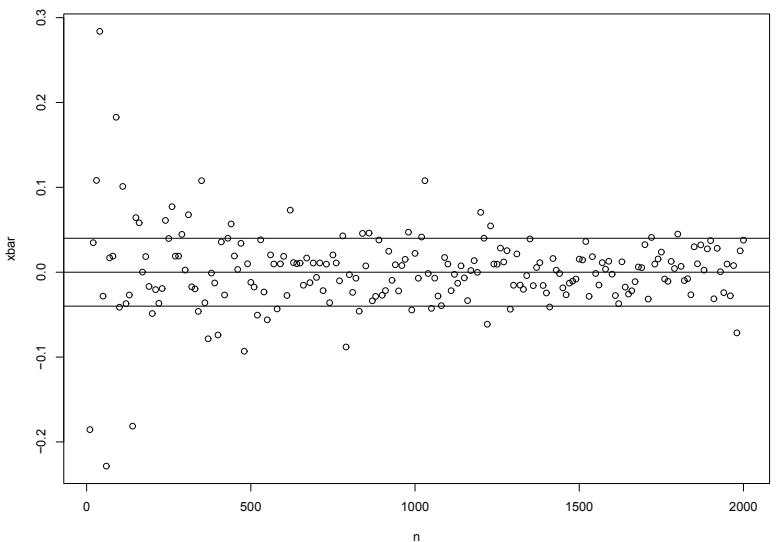
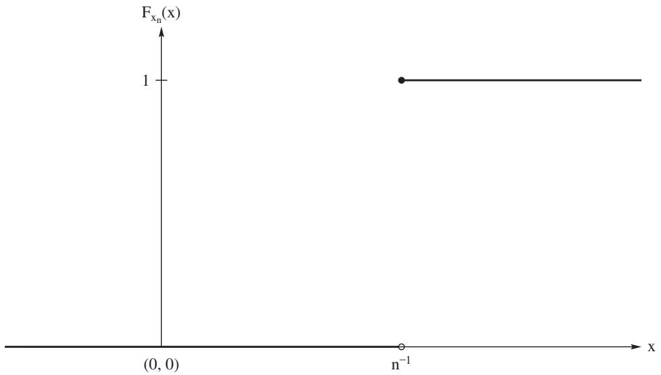
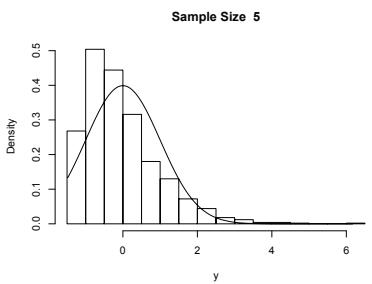
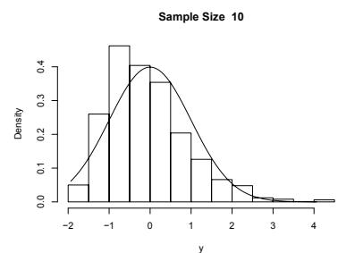
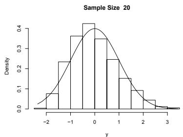
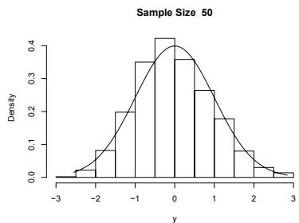
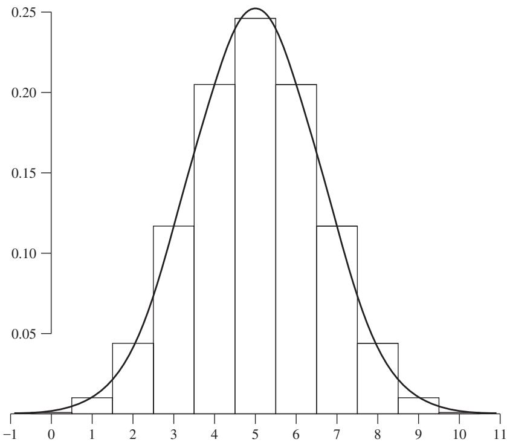

# Consistency and Limiting Distributions

[Package map](../structure.md) · [Unsplit OCR dump](./_full.md)

[← Ch. 4 Elementary Statistical Inferences](./04-some-elementary-statistical-inferences.md) · [Ch. 6 Maximum Likelihood Methods →](./06-maximum-likelihood-methods.md)

> MinerU OCR dump. If a formula, table, or numbering disagrees with the PDF, the PDF is authoritative.

---

# Chapter 5

# Consistency and Limiting Distributions

In Chapter 4, we introduced some of the main concepts in statistical inference, namely, point estimation, confidence intervals, and hypothesis tests. For readers who on first reading have skipped Chapter 4, we review these ideas in Section 5.1.1.

The theory behind these inference procedures often depends on the distribution of a pivot random variable. For example, suppose $X_{1},X_{2},\ldots ,X_{n}$ is a random sample on a random variable $X$ which has a $N(\mu ,\sigma^2)$ distribution. Denote the sample mean by $\overline{X}_n = n^{-1}\sum_{i = 1}^n X_i$ . Then the pivot random variable of interest is

$$
Z _ {n} = \frac {\overline {{X}} _ {n} - \mu}{\sigma / \sqrt {n}}.
$$

This random variable plays a key role in obtaining exact procedures for the confidence interval for $\mu$ and for tests of hypotheses concerning $\mu$ . What if $X$ does not have a normal distribution? In this case, in Chapter 4, we discussed inference procedures, which were quite similar to the exact procedures, but they were based on the "approximate" (as the sample size $n$ gets large) distribution of $Z_{n}$ .

There are several types of convergence used in statistics, and in this chapter we discuss two of the most important: convergence in probability and convergence in distribution. These concepts provide structure to the "approximations" discussed in Chapter 4. Beyond this, though, these concepts play a crucial role in much of statistics and probability. We begin with convergence in probability.

# 5.1 Convergence in Probability

In this section, we formalize a way of saying that a sequence of random variables $\{X_{n}\}$ is getting "close" to another random variable $X$ , as $n \to \infty$ . We will use this concept throughout the book.

Definition 5.1.1. Let $\{X_{n}\}$ be a sequence of random variables and let $X$ be a random variable defined on a sample space. We say that $X_{n}$ converges in probability to $X$ if, for all $\epsilon >0$ ,

$$
\lim _ {n \to \infty} P [ | X _ {n} - X | \geq \epsilon ] = 0,
$$

or equivalently,

$$
\lim _ {n \to \infty} P [ | X _ {n} - X | <   \epsilon ] = 1.
$$

If so, we write

$$
X _ {n} \stackrel {P} {\to} X.
$$

If $X_{n} \xrightarrow{P} X$ , we often say that the mass of the difference $X_{n} - X$ is converging to 0. In statistics, often the limiting random variable $X$ is a constant; i.e., $X$ is a degenerate random variable with all its mass at some constant $a$ . In this case, we write $X_{n} \xrightarrow{P} a$ . Also, as Exercise 5.1.1 shows, for a sequence of real numbers $\{a_{n}\}$ , $a_{n} \to a$ is equivalent to $a_{n} \xrightarrow{P} a$ .

One way of showing convergence in probability is to use Chebyshev's Theorem (1.10.3). An illustration of this is given in the following proof. To emphasize the fact that we are working with sequences of random variables, we may place a subscript $n$ on the appropriate random variables; for example, write $\overline{X}$ as $\overline{X}_n$ .

Theorem 5.1.1 (Weak Law of Large Numbers). Let $\{X_{n}\}$ be a sequence of iid random variables having common mean $\mu$ and variance $\sigma^2 < \infty$ . Let $\overline{X}_n = n^{-1} \sum_{i=1}^{n} X_i$ . Then

$$
\overline {{X}} _ {n} \stackrel {P} {\rightarrow} \mu .
$$

Proof: From expression (2.8.6) of Example 2.8.1, the mean and variance of $\overline{X}_n$ are $\mu$ and $\sigma^2 / n$ , respectively. Hence, by Chebyshev's Theorem, we have for every $\epsilon > 0$ ,

$$
P [ | \overline {{X}} _ {n} - \mu | \geq \epsilon ] = P [ | \overline {{X}} _ {n} - \mu | \geq (\epsilon \sqrt {n} / \sigma) (\sigma / \sqrt {n}) ] \leq \frac {\sigma^ {2}}{n \epsilon^ {2}} \rightarrow 0.
$$

This theorem says that all the mass of the distribution of $\overline{X}_n$ is converging to $\mu$ , as $n \to \infty$ . In a sense, for $n$ large, $\overline{X}_n$ is close to $\mu$ . But how close? For instance, if we were to estimate $\mu$ by $\overline{X}_n$ , what can we say about the error of estimation? We answer this in Section 5.3.

Actually, in a more advanced course, a Strong Law of Large Numbers is proved; see page 124 of Chung (1974). One result of this theorem is that we can weaken the hypothesis of Theorem 5.1.1 to the assumption that the random variables $X_{i}$ are independent and each has finite mean $\mu$ . Thus the Strong Law of Large Numbers is a first moment theorem, while the Weak Law requires the existence of the second moment.

There are several theorems concerning convergence in probability which will be useful in the sequel. Together the next two theorems say that convergence in probability is closed under linearity.

Theorem 5.1.2. Suppose $X_{n} \xrightarrow{P} X$ and $Y_{n} \xrightarrow{P} Y$ . Then $X_{n} + Y_{n} \xrightarrow{P} X + Y$ .

Proof: Let $\epsilon > 0$ be given. Using the triangle inequality, we can write

$$
\left| X _ {n} - X \right| + \left| Y _ {n} - Y \right| \geq \left| \left(X _ {n} + Y _ {n}\right) - (X + Y) \right| \geq \epsilon .
$$

Since $P$ is monotone relative to set containment, we have

$$
\begin{array}{l} P \left[ \left| \left(X _ {n} + Y _ {n}\right) - (X + Y) \right| \geq \epsilon \right] \leq P \left[ \left| X _ {n} - X \right| + \left| Y _ {n} - Y \right| \geq \epsilon \right] \\ \leq \quad P [ | X _ {n} - X | \geq \epsilon / 2 ] + P [ | Y _ {n} - Y | \geq \epsilon / 2 ]. \\ \end{array}
$$

By the hypothesis of the theorem, the last two terms converge to 0 as $n \to \infty$ which gives us the desired result.

Theorem 5.1.3. Suppose $X_{n} \xrightarrow{P} X$ and $a$ is a constant. Then $aX_{n} \xrightarrow{P} aX$ .

Proof: If $a = 0$ , the result is immediate. Suppose $a \neq 0$ . Let $\epsilon > 0$ . The result follows from these equalities:

$$
P \left[ \left| a X _ {n} - a X \right| \geq \epsilon \right] = P \left[ \left| a \right| \left| X _ {n} - X \right| \geq \epsilon \right] = P \left[ \left| X _ {n} - X \right| \geq \epsilon / | a | \right],
$$

and by hypotheses the last term goes to 0 as $n\to \infty$

Theorem 5.1.4. Suppose $X_{n} \xrightarrow{P} a$ and the real function $g$ is continuous at $a$ . Then $g(X_{n}) \xrightarrow{P} g(a)$ .

Proof: Let $\epsilon > 0$ . Then since $g$ is continuous at $a$ , there exists a $\delta > 0$ such that if $|x - a| < \delta$ , then $|g(x) - g(a)| < \epsilon$ . Thus

$$
\left| g (x) - g (a) \right| \geq \epsilon \Rightarrow | x - a | \geq \delta .
$$

Substituting $X_{n}$ for $x$ in the above implication, we obtain

$$
P [ | g (X _ {n}) - g (a) | \geq \epsilon ] \leq P [ | X _ {n} - a | \geq \delta ].
$$

By the hypothesis, the last term goes to 0 as $n\to \infty$ , which gives us the result.

This theorem gives us many useful results. For instance, if $X_{n} \xrightarrow{P} a$ , then

$$
\begin{array}{l} X _ {n} ^ {2} \stackrel {{P}} {{\to}} a ^ {2} \\ 1 / X _ {n} \stackrel {{P}} {{\rightarrow}} 1 / a, \text {p r o v i d e d} a \neq 0 \\ \begin{array}{c c c c} \sqrt {X _ {n}} & \stackrel {{P}} {{\to}} & \sqrt {a}, & \text {p r o v i d e d} a \geq 0. \end{array} \\ \end{array}
$$

Actually, in a more advanced class, it is shown that if $X_{n} \xrightarrow{P} X$ and $g$ is a continuous function, then $g(X_{n}) \xrightarrow{P} g(X)$ ; see page 104 of Tucker (1967). We make use of this in the next theorem.

Theorem 5.1.5. Suppose $X_{n} \xrightarrow{P} X$ and $Y_{n} \xrightarrow{P} Y$ . Then $X_{n}Y_{n} \xrightarrow{P} XY$ .

Proof: Using the above results, we have

$$
\begin{array}{l} X _ {n} Y _ {n} = \frac {1}{2} X _ {n} ^ {2} + \frac {1}{2} Y _ {n} ^ {2} - \frac {1}{2} (X _ {n} - Y _ {n}) ^ {2} \\ \stackrel {P} {\rightarrow} \quad \frac {1}{2} X ^ {2} + \frac {1}{2} Y ^ {2} - \frac {1}{2} (X - Y) ^ {2} = X Y. \\ \end{array}
$$

# 5.1.1 Sampling and Statistics

Consider the situation where we have a random variable $X$ whose pdf (or pmf) is written as $f(x;\theta)$ for an unknown parameter $\theta \in \Omega$ . For example, the distribution of $X$ is normal with unknown mean $\mu$ and variance $\sigma^2$ . Then $\theta = (\mu, \sigma^2)$ and $\Omega = \{\theta = (\mu, \sigma^2) : -\infty < \mu < \infty, \sigma > 0\}$ . As another example, the distribution of $X$ is $\Gamma(1,\beta)$ , where $\beta > 0$ is unknown. Our information consists of a random sample $X_1, X_2, \ldots, X_n$ on $X$ ; i.e., $X_1, X_2, \ldots, X_n$ are independent and identically distributed (iid) random variables with the common pdf $f(x;\theta)$ , $\theta \in \Omega$ . We say that $T$ is a statistic if $T$ is a function of the sample; i.e., $T = T(X_1, X_2, \ldots, X_n)$ . Here, we want to consider $T$ as a point estimator of $\theta$ . For example, if $\mu$ is the unknown mean of $X$ , then we may use as our point estimator the sample mean $\overline{X} = n^{-1} \sum_{i=1}^{n} X_i$ . When the sample is drawn let $x_1, x_2, \ldots, x_n$ denote the observed values of $X_1, X_2, \ldots, X_n$ . We call these values the realized values of the sample and call the realized statistic $t = t(x_1, x_2, \ldots, x_n)$ a point estimate of $\theta$ .

In Chapters 6 and 7, we discuss properties of point estimators in formal settings. For now, we consider two properties: unbiasedness and consistency. We say that the point estimator $T$ for $\theta$ is unbiased if $E(T) = \theta$ . Recall in Section 2.8, we showed that the sample mean $\overline{X}$ and the sample variance $S^2$ are unbiased estimators of $\mu$ and $\sigma^2$ respectively; see equations (2.8.6) and (2.8.8). We next consider consistency of a point estimator.

Definition 5.1.2 (Consistency). Let $X$ be a random variable with cdf $F(x, \theta)$ , $\theta \in \Omega$ . Let $X_1, \ldots, X_n$ be a sample from the distribution of $X$ and let $T_n$ denote a statistic. We say $T_n$ is a consistent estimator of $\theta$ if

$$
T _ {n} \stackrel {P} {\to} \theta .
$$

If $X_{1},\ldots ,X_{n}$ is a random sample from a distribution with finite mean $\mu$ and variance $\sigma^2$ , then by the Weak Law of Large Numbers, the sample mean, $\overline{X}_n$ , is a consistent estimator of $\mu$ .

Figure 5.1.1 displays realizations of the sample mean for samples of size 10 to 2000 in steps of 10 which are drawn from a $N(0,1)$ distribution. The lines on the plot encompass the interval $\mu \pm 0.04$ for $\mu = 0$ . As $n$ increases, the realizations tend to stay within this interval, verifying the consistency of the sample mean. The R function consistent produces this plot. Within this function, if the function mean is changed to median a similar plot on the estimator $\operatorname{med} X_i$ can be obtained.

Example 5.1.1 (Sample Variance). Let $X_{1},\ldots ,X_{n}$ denote a random sample from a distribution with mean $\mu$ and variance $\sigma^2$ . In Example 2.8.7, we showed that the

  
Figure 5.1.1: Realizations of the point estimator $\overline{X}$ for samples of size 10 to 2000 in steps of 10 which are drawn from a $N(0,1)$ distribution.

sample variance is an unbiased estimator of $\sigma^2$ . We now show that it is a consistent estimator of $\sigma^2$ . Recall Theorem 5.1.1 which shows that $\overline{X}_n \xrightarrow{P} \mu$ . To show that the sample variance converges in probability to $\sigma^2$ , assume further that $E[X_1^4] < \infty$ , so that $\operatorname{Var}(S^2) < \infty$ . Using the preceding results, we can show the following:

$$
\begin{array}{l} S _ {n} ^ {2} = \frac {1}{n - 1} \sum_ {i = 1} ^ {n} (X _ {i} - \overline {{X}} _ {n}) ^ {2} = \frac {n}{n - 1} \left(\frac {1}{n} \sum_ {i = 1} ^ {n} X _ {i} ^ {2} - \overline {{X}} _ {n} ^ {2}\right) \\ \stackrel {P} {\rightarrow} 1 \cdot [ E (X _ {1} ^ {2}) - \mu^ {2} ] = \sigma^ {2}. \\ \end{array}
$$

Hence the sample variance is a consistent estimator of $\sigma^2$ . From the discussion above, we have immediately that $S_n \xrightarrow{P} \sigma$ ; that is, the sample standard deviation is a consistent estimator of the population standard deviation.

Unlike the last example, sometimes we can obtain the convergence by using the distribution function. We illustrate this with the following example:

Example 5.1.2 (Maximum of a Sample from a Uniform Distribution). Suppose $X_{1},\ldots ,X_{n}$ is a random sample from a uniform $(0,\theta)$ distribution. Suppose $\theta$ is unknown. An intuitive estimate of $\theta$ is the maximum of the sample. Let $Y_{n} = \max \{X_{1},\dots ,X_{n}\}$ . Exercise 5.1.4 shows that the cdf of $Y_{n}$ is

$$
F _ {Y _ {n}} (t) = \left\{ \begin{array}{l l} 1 & t > \theta \\ \left(\frac {t}{\theta}\right) ^ {n} & 0 <   t \leq \theta \\ 0 & t \leq 0. \end{array} \right. \tag {5.1.1}
$$

Hence the pdf of $Y_{n}$ is

$$
f _ {Y _ {n}} (t) = \left\{ \begin{array}{l l} \frac {n}{\theta^ {n}} t ^ {n - 1} & 0 <   t \leq \theta \\ 0 & \text {e l s e w h e r e .} \end{array} \right. \tag {5.1.2}
$$

Based on its pdf, it is easy to show that $E(Y_{n}) = (n / (n + 1))\theta$ . Thus, $Y_{n}$ is a biased estimator of $\theta$ . Note, however, that $((n + 1) / n)Y_{n}$ is an unbiased estimator of $\theta$ . Further, based on the cdf of $Y_{n}$ , it is easily seen that $Y_{n} \xrightarrow{P} \theta$ and, hence, that the sample maximum is a consistent estimate of $\theta$ . Note that the unbiased estimator, $((n + 1) / n)Y_{n}$ , is also consistent.

To expand on Example 5.1.2, by the Weak Law of Large Numbers, Theorem 5.1.1, it follows that $\overline{X}_n$ is a consistent estimator of $\theta / 2$ , so $2\overline{X}_n$ is a consistent estimator of $\theta$ . Note the difference in how we showed that $Y_n$ and $2\overline{X}_n$ converge to $\theta$ in probability. For $Y_n$ we used the cdf of $Y_n$ , but for $2\overline{X}_n$ we appealed to the Weak Law of Large Numbers. In fact, the cdf of $2\overline{X}_n$ is quite complicated for the uniform model. In many situations, the cdf of the statistic cannot be obtained, but we can appeal to asymptotic theory to establish the result. There are other estimators of $\theta$ . Which is the "best" estimator? In future chapters we will be concerned with such questions.

Consistency is a very important property for an estimator to have. It is a poor estimator that does not approach its target as the sample size gets large. Note that the same cannot be said for the property of unbiasedness. For example, instead of using the sample variance to estimate $\sigma^2$ , suppose we use $V = n^{-1}\sum_{i=1}^{n}(X_i - \overline{X})^2$ . Then $V$ is consistent for $\sigma^2$ , but it is biased, because $E(V) = (n-1)\sigma^2/n$ . Thus the bias of $V$ is $-\sigma^2/n$ , which vanishes as $n \to \infty$ .

# EXERCISES

5.1.1. Let $\{a_n\}$ be a sequence of real numbers. Hence, we can also say that $\{a_n\}$ is a sequence of constant (degenerate) random variables. Let $a$ be a real number. Show that $a_n \to a$ is equivalent to $a_n \xrightarrow{P} a$ .

5.1.2. Let the random variable $Y_{n}$ have a distribution that is $b(n,p)$ .

(a) Prove that $Y_{n} / n$ converges in probability to $p$ . This result is one form of the weak law of large numbers.   
(b) Prove that $1 - Y_{n} / n$ converges in probability to $1 - p$ .   
(c) Prove that $(Y_{n} / n)(1 - Y_{n} / n)$ converges in probability to $p(1 - p)$ .

5.1.3. Let $W_{n}$ denote a random variable with mean $\mu$ and variance $b / n^{p}$ , where $p > 0$ , $\mu$ , and $b$ are constants (not functions of $n$ ). Prove that $W_{n}$ converges in probability to $\mu$ .

Hint: Use Chebyshev's inequality.

5.1.4. Derive the cdf given in expression (5.1.1).

5.1.5. Consider the R function consistmean which produces the plot shown in Figure 5.1.1. Obtain a similar plot for the sample median when the distribution sampled is the $N(0,1)$ distribution. Compare the mean and median plots.

5.1.6. Write an R function that obtains a plot similar to Figure 5.1.1 for the situation described in Example 5.1.2. For the plot choose $\theta = 10$ .

5.1.7. Let $X_{1},\ldots ,X_{n}$ be iid random variables with common pdf

$$
f (x) = \left\{ \begin{array}{l l} e ^ {- (x - \theta)} & x > \theta , - \infty <   \theta <   \infty \\ 0 & \text {e l s e w h e r e .} \end{array} \right. \tag {5.1.3}
$$

This pdf is called the shifted exponential. Let $Y_{n} = \min \{X_{1},\ldots ,X_{n}\}$ . Prove that $Y_{n}\to \theta$ in probability by first obtaining the cdf of $Y_{n}$ .

5.1.8. Using the assumptions behind the confidence interval given in expression (4.2.9), show that

$$
\sqrt {\frac {S _ {1} ^ {2}}{n _ {1}} + \frac {S _ {2} ^ {2}}{n _ {2}}} / \sqrt {\frac {\sigma_ {1} ^ {2}}{n _ {1}} + \frac {\sigma_ {2} ^ {2}}{n _ {2}}} \stackrel {P} {\rightarrow} 1.
$$

5.1.9. For Exercise 5.1.7, obtain the mean of $Y_{n}$ . Is $Y_{n}$ an unbiased estimator of $\theta$ ? Obtain an unbiased estimator of $\theta$ based on $Y_{n}$ .

# 5.2 Convergence in Distribution

In the last section, we introduced the concept of convergence in probability. With this concept, we can formally say, for instance, that a statistic converges to a parameter and, furthermore, in many situations we can show this without having to obtain the distribution function of the statistic. But how close is the statistic to the estimator? For instance, can we obtain the error of estimation with some credence? The method of convergence discussed in this section, in conjunction with earlier results, gives us affirmative answers to these questions.

Definition 5.2.1 (Convergence in Distribution). Let $\{X_{n}\}$ be a sequence of random variables and let $X$ be a random variable. Let $F_{X_{n}}$ and $F_{X}$ be, respectively, the cdfs of $X_{n}$ and $X$ . Let $C(F_{X})$ denote the set of all points where $F_{X}$ is continuous. We say that $X_{n}$ converges in distribution to $X$ if

$$
\lim _ {n \to \infty} F _ {X _ {n}} (x) = F _ {X} (x), \quad f o r a l l x \in C (F _ {X}).
$$

We denote this convergence by

$$
X _ {n} \stackrel {D} {\longrightarrow} X.
$$

Remark 5.2.1. This material on convergence in probability and in distribution comes under what statisticians and probabilists refer to as asymptotic theory. Often, we say that the distribution of $X$ is the asymptotic distribution or the limiting distribution of the sequence $\{X_{n}\}$ . We might even refer informally to

the asymptotics of certain situations. Moreover, for illustration, instead of saying $X_{n} \xrightarrow{D} X$ , where $X$ has a standard normal distribution, we may write

$$
X _ {n} \stackrel {D} {\to} N (0, 1)
$$

as an abbreviated way of saying the same thing. Clearly, the right-hand member of this last expression is a distribution and not a random variable as it should be, but we will make use of this convention. In addition, we may say that $X_{n}$ has a limiting standard normal distribution to mean that $X_{n} \stackrel{D}{\to} X$ , where $X$ has a standard normal random, or equivalently $X_{n} \stackrel{D}{\to} N(0,1)$ .

Motivation for considering only points of continuity of $F_{X}$ is given by the following simple example. Let $X_{n}$ be a random variable with all its mass at $\frac{1}{n}$ and let $X$ be a random variable with all its mass at 0. Then, as Figure 5.2.1 shows, all the mass of $X_{n}$ is converging to 0, i.e., the distribution of $X$ . At the point of discontinuity of $F_{X}$ , $\lim F_{X_{n}}(0) = 0 \neq 1 = F_{X}(0)$ , while at continuity points $x$ of $F_{X}$ (i.e., $x \neq 0$ ), $\lim F_{X_{n}}(x) = F_{X}(x)$ . Hence, according to the definition, $X_{n} \stackrel{D}{\to} X$ .

  
Figure 5.2.1: Cdf of $X_{n}$ , that has all its mass at $n^{-1}$ .

Convergence in probability is a way of saying that a sequence of random variables $X_{n}$ is getting close to another random variable $X$ . On the other hand, convergence in distribution is only concerned with the cdfs $F_{X_{n}}$ and $F_{X}$ . A simple example illustrates this. Let $X$ be a continuous random variable with a pdf $f_{X}(x)$ that is symmetric about 0; i.e., $f_{X}(-x) = f_{X}(x)$ . Then it is easy to show that the density of the random variable $-X$ is also $f_{X}(x)$ . Thus, $X$ and $-X$ have the same distributions. Define the sequence of random variables $X_{n}$ as

$$
X _ {n} = \left\{ \begin{array}{l l} X & \text {i f n i s o d d} \\ - X & \text {i f n i s e v e n .} \end{array} \right. \tag {5.2.1}
$$

Clearly, $F_{X_n}(x) = F_X(x)$ for all $x$ in the support of $X$ , so that $X_n \stackrel{D}{\to} X$ . On the other hand, the sequence $X_n$ does not get close to $X$ . In particular, $X_n \nrightarrow X$ in probability.

Example 5.2.1. Let $\overline{X}_n$ have the cdf

$$
F _ {n} (\overline {{x}}) = \int_ {- \infty} ^ {\overline {{x}}} \frac {1}{\sqrt {1 / n} \sqrt {2 \pi}} e ^ {- n w ^ {2} / 2} d w.
$$

If the change of variable $v = \sqrt{n} w$ is made, we have

$$
F _ {n} (\overline {{x}}) = \int_ {- \infty} ^ {\sqrt {n x}} \frac {1}{\sqrt {2 \pi}} e ^ {- v ^ {2} / 2} d v.
$$

It is clear that

$$
\lim _ {n \to \infty} F _ {n} (\overline {{x}}) = \left\{ \begin{array}{l l} 0 & \overline {{x}} <   0 \\ \frac {1}{2} & \overline {{x}} = 0 \\ 1 & \overline {{x}} > 0. \end{array} \right.
$$

Now the function

$$
F (\overline {{x}}) = \left\{ \begin{array}{l l} 0 & \overline {{x}} <   0 \\ 1 & \overline {{x}} \geq 0 \end{array} \right.
$$

is a cdf and $\lim_{n\to \infty}F_n(\overline{x}) = F(\overline{x})$ at every point of continuity of $F(\overline{x})$ . To be sure, $\lim_{n\to \infty}F_n(0)\neq F(0)$ , but $F(\overline{x})$ is not continuous at $\overline{x} = 0$ . Accordingly, the sequence $\overline{X}_1,\overline{X}_2,\overline{X}_3,\ldots$ converges in distribution to a random variable that has a degenerate distribution at $\overline{x} = 0$ .

Example 5.2.2. Even if a sequence $X_{1}, X_{2}, X_{3}, \ldots$ converges in distribution to a random variable $X$ , we cannot in general determine the distribution of $X$ by taking the limit of the pmf of $X_{n}$ . This is illustrated by letting $X_{n}$ have the pmf

$$
p _ {n} (x) = \left\{ \begin{array}{l l} 1 & x = 2 + n ^ {- 1} \\ 0 & \text {e l s e w h e r e .} \end{array} \right.
$$

Clearly, $\lim_{n\to \infty}p_n(x) = 0$ for all values of $x$ . This may suggest that $X_{n}$ , for $n = 1,2,3,\ldots$ , does not converge in distribution. However, the cdf of $X_{n}$ is

$$
F _ {n} (x) = \left\{ \begin{array}{l l} 0 & x <   2 + n ^ {- 1} \\ 1 & x \geq 2 + n ^ {- 1}, \end{array} \right.
$$

and

$$
\lim  _ {n \to \infty} F _ {n} (x) = \left\{ \begin{array}{l l} 0 & x \leq 2 \\ 1 & x > 2. \end{array} \right.
$$

Since

$$
F (x) = \left\{ \begin{array}{l l} 0 & x <   2 \\ 1 & x \geq 2 \end{array} \right.
$$

is a cdf, and since $\lim_{n\to \infty}F_n(x) = F(x)$ at all points of continuity of $F(x)$ , the sequence $X_{1},X_{2},X_{3},\ldots$ converges in distribution to a random variable with cdf $F(x)$ .

The last example shows in general that we cannot determine limiting distributions by considering pmfs or pdfs. But under certain conditions we can determine convergence in distribution by considering the sequence of pdfs as the following example shows.

Example 5.2.3. Let $T_{n}$ have a $t$ -distribution with $n$ degrees of freedom, $n = 1, 2, 3, \ldots$ . Thus its cdf is

$$
F _ {n} (t) = \int_ {- \infty} ^ {t} \frac {\Gamma [ (n + 1) / 2 ]}{\sqrt {\pi n} \Gamma (n / 2)} \frac {1}{(1 + y ^ {2} / n) ^ {(n + 1) / 2}} d y,
$$

where the integrand is the pdf $f_{n}(y)$ of $T_{n}$ . Accordingly,

$$
\lim  _ {n \to \infty} F _ {n} (t) = \lim  _ {n \to \infty} \int_ {- \infty} ^ {t} f _ {n} (y) d y = \int_ {- \infty} ^ {t} \lim  _ {n \to \infty} f _ {n} (y) d y,
$$

by a result in analysis (the Lebesgue Dominated Convergence Theorem) that allows us to interchange the order of the limit and integration, provided that $|f_n(y)|$ is dominated by a function that is integrable. This is true because

$$
\left| f _ {n} (y) \right| \leq 1 0 f _ {1} (y)
$$

and

$$
\int_ {- \infty} ^ {t} 1 0 f _ {1} (y) d y = \frac {1 0}{\pi} \arctan t <   \infty ,
$$

for all real $t$ . Hence we can find the limiting distribution by finding the limit of the pdf of $T_{n}$ . It is

$$
\begin{array}{l} \lim  _ {n \to \infty} f _ {n} (y) = \lim  _ {n \to \infty} \left\{\frac {\Gamma [ (n + 1) / 2 ]}{\sqrt {n / 2} \Gamma (n / 2)} \right\} \lim  _ {n \to \infty} \left\{\frac {1}{(1 + y ^ {2} / n) ^ {1 / 2}} \right\} \\ \times \lim  _ {n \rightarrow \infty} \left\{\frac {1}{\sqrt {2 \pi}} \left[\left(1 + \frac {y ^ {2}}{n}\right)\right] ^ {- n / 2} \right\}. \\ \end{array}
$$

Using the fact from elementary calculus that

$$
\lim _ {n \to \infty} \left(1 + \frac {y ^ {2}}{n}\right) ^ {n} = e ^ {y ^ {2}},
$$

the limit associated with the third factor is clearly the pdf of the standard normal distribution. The second limit obviously equals 1. By Remark 5.2.2, the first limit also equals 1. Thus, we have

$$
\lim  _ {n \rightarrow \infty} F _ {n} (t) = \int_ {- \infty} ^ {t} \frac {1}{\sqrt {2 \pi}} e ^ {- y ^ {2} / 2} d y,
$$

and hence $T_{n}$ has a limiting standard normal distribution.

Remark 5.2.2 (Stirling's Formula). In advanced calculus the following approximation is derived:

$$
\Gamma (k + 1) \approx \sqrt {2 \pi} k ^ {k + 1 / 2} e ^ {- k}. \tag {5.2.2}
$$

This is known as Stirling's formula and it is an excellent approximation when $k$ is large. Because $\Gamma(k + 1) = k!$ , for $k$ an integer, this formula gives an idea of how fast $k!$ grows. As Exercise 5.2.21 shows, this approximation can be used to show that the first limit in Example 5.2.3 is 1.

Example 5.2.4 (Maximum of a Sample from a Uniform Distribution, Continued). Recall Example 5.1.2, where $X_{1},\ldots ,X_{n}$ is a random sample from a uniform $(0,\theta)$ distribution. Again, let $Y_{n} = \max \{X_{1},\dots ,X_{n}\}$ , but now consider the random variable $Z_{n} = n(\theta -Y_{n})$ . Let $t\in (0,n\theta)$ . Then, using the cdf of $Y_{n}$ , (5.1.1), the cdf of $Z_{n}$ is

$$
\begin{array}{l} P \left[ Z _ {n} \leq t \right] = P \left[ Y _ {n} \geq \theta - (t / n) \right] \\ = \quad 1 - \left(\frac {\theta - (t / n)}{\theta}\right) ^ {n} \\ = 1 - \left(1 - \frac {t / \theta}{n}\right) ^ {n} \\ \rightarrow \quad 1 - e ^ {- t / \theta}. \\ \end{array}
$$

Note that the last quantity is the cdf of an exponential random variable with mean $\theta$ , (3.3.6), i.e., $\Gamma(1, \theta)$ . So we say that $Z_{n} \stackrel{D}{\to} Z$ , where $Z$ is distributed $\Gamma(1, \theta)$ .

Remark 5.2.3. To simplify several of the proofs of this section, we make use of the $\varlimsup$ and $\varliminf$ of a sequence. For readers who are unfamiliar with these concepts, we discuss them in Appendix A. In this brief remark, we highlight the properties needed for understanding the proofs. Let $\{a_{n}\}$ be a sequence of real numbers and define the two subsequences

$$
b _ {n} = \sup  \left\{a _ {n}, a _ {n + 1}, \dots \right\}, \quad n = 1, 2, 3 \dots , \tag {5.2.3}
$$

$$
c _ {n} = \inf  \left\{a _ {n}, a _ {n + 1}, \dots \right\}, \quad n = 1, 2, 3 \dots . \tag {5.2.4}
$$

The sequences $\{b_n\}$ and $\{c_n\}$ are nonincreasing and nondecreasing, respectively. Hence their limits always exist (may be $\pm \infty$ ) and are denoted respectively by $\varlimsup_{n\to \infty}a_n$ and $\varliminf_{n\to \infty}a_n$ . Further, $c_{n}\leq a_{n}\leq b_{n}$ , for all $n$ . Hence, by the Sandwich Theorem (see Theorem A.2.1 of Appendix A), if $\varliminf_{n\to \infty}a_n = \varliminf_{n\to \infty}a_n$ , then $\lim_{n\to \infty}a_n$ exists and is given by $\lim_{n\to \infty}a_n = \varliminf_{n\to \infty}a_n$ .

As discussed in Appendix A, several other properties of these concepts are useful. For example, suppose $\{p_n\}$ is a sequence of probabilities and $\overline{\lim}_{n\to \infty}p_n = 0$ . Then, by the Sandwich Theorem, since $0\leq p_{n}\leq \sup \{p_{n},p_{n + 1},\ldots \}$ for all $n$ , we have $\lim_{n\to \infty}p_n = 0$ . Also, for any two sequences $\{a_n\}$ and $\{b_n\}$ , it easily follows that $\overline{\lim}_{n\to \infty}(a_n + b_n)\leq \overline{\lim}_{n\to \infty}a_n + \overline{\lim}_{n\to \infty}b_n$ .

As the following theorem shows, convergence in distribution is weaker than convergence in probability. Thus convergence in distribution is often called weak convergence.

Theorem 5.2.1. If $X_{n}$ converges to $X$ in probability, then $X_{n}$ converges to $X$ in distribution.

Proof: Let $x$ be a point of continuity of $F_{X}(x)$ . For every $\epsilon > 0$ ,

$$
\begin{array}{l} F _ {X _ {n}} (x) = P [ X _ {n} \leq x ] \\ = P \left[ \left\{X _ {n} \leq x \right\} \cap \left\{| X _ {n} - X | <   \epsilon \right\} \right] + P \left[ \left\{X _ {n} \leq x \right\} \cap \left\{| X _ {n} - X | \geq \epsilon \right\} \right] \\ \leq P [ X \leq x + \epsilon ] + P [ | X _ {n} - X | \geq \epsilon ]. \\ \end{array}
$$

Based on this inequality and the fact that $X_{n}\stackrel {P}{\to}X$ , we see that

$$
\varlimsup_ {n \rightarrow \infty} F _ {X _ {n}} (x) \leq F _ {X} (x + \epsilon). \tag {5.2.5}
$$

To get a lower bound, we proceed similarly with the complement to show that

$$
P \left[ X _ {n} > x \right] \leq P [ X \geq x - \epsilon ] + P \left[ | X _ {n} - X | \geq \epsilon \right].
$$

Hence

$$
\varlimsup_ {n \rightarrow \infty} F _ {X _ {n}} (x) \geq F _ {X} (x - \epsilon). \tag {5.2.6}
$$

Using a relationship between $\varlimsup$ and $\varliminf$ , it follows from (5.2.5) and (5.2.6) that

$$
F _ {X} (x - \epsilon) \leq \varliminf_ {n \to \infty} F _ {X _ {n}} (x) \leq \varlimsup_ {n \to \infty} F _ {X _ {n}} (x) \leq F _ {X} (x + \epsilon).
$$

Letting $\epsilon \downarrow 0$ gives us the desired result.

Reconsider the sequence of random variables $\{X_{n}\}$ defined by expression (5.2.1). Here, $X_{n} \xrightarrow{D} X$ but $X_{n} \not\to X$ . So, in general, the converse of the above theorem is not true. However, it is true if $X$ is degenerate, as shown by the following theorem.

Theorem 5.2.2. If $X_{n}$ converges to the constant $b$ in distribution, then $X_{n}$ converges to $b$ in probability.

Proof: Let $\epsilon > 0$ be given. Then

$$
\lim  _ {n \rightarrow \infty} P [ | X _ {n} - b | \leq \epsilon ] = \lim  _ {n \rightarrow \infty} F _ {X _ {n}} (b + \epsilon) - \lim  _ {n \rightarrow \infty} F _ {X _ {n}} [ (b - \epsilon) - 0 ] = 1 - 0 = 1,
$$

which is the desired result.

A result that will prove quite useful is the following:

Theorem 5.2.3. Suppose $X_{n}$ converges to $X$ in distribution and $Y_{n}$ converges in probability to 0. Then $X_{n} + Y_{n}$ converges to $X$ in distribution.

The proof is similar to that of Theorem 5.2.2 and is left to Exercise 5.2.13. We often use this last result as follows. Suppose it is difficult to show that $X_{n}$ converges to $X$ in distribution, but it is easy to show that $Y_{n}$ converges in distribution to $X$ and that $X_{n} - Y_{n}$ converges to 0 in probability. Hence, by this last theorem, $X_{n} = Y_{n} + (X_{n} - Y_{n}) \stackrel{D}{\to} X$ , as desired.

The next two theorems state general results. A proof of the first result can be found in a more advanced text, while the second, Slutsky's Theorem, follows similarly to that of Theorem 5.2.1.

Theorem 5.2.4. Suppose $X_{n}$ converges to $X$ in distribution and $g$ is a continuous function on the support of $X$ . Then $g(X_{n})$ converges to $g(X)$ in distribution.

An often-used application of this theorem occurs when we have a sequence of random variables $Z_{n}$ which converges in distribution to a standard normal random variable $Z$ . Because the distribution of $Z^{2}$ is $\chi^2 (1)$ , it follows by Theorem 5.2.4 that $Z_{n}^{2}$ converges in distribution to a $\chi^2 (1)$ distribution.

Theorem 5.2.5 (Slutsky's Theorem). Let $X_{n}$ , $X$ , $A_{n}$ , and $B_{n}$ be random variables and let $a$ and $b$ be constants. If $X_{n} \xrightarrow{D} X$ , $A_{n} \xrightarrow{P} a$ , and $B_{n} \xrightarrow{P} b$ , then

$$
A _ {n} + B _ {n} X _ {n} \stackrel {{D}} {{\to}} a + b X.
$$

# 5.2.1 Bounded in Probability

Another useful concept, related to convergence in distribution, is boundedness in probability of a sequence of random variables.

First consider any random variable $X$ with cdf $F_{X}(x)$ . Then given $\epsilon > 0$ , we can bound $X$ in the following way. Because the lower limit of $F_{X}$ is 0 and its upper limit is 1, we can find $\eta_{1}$ and $\eta_{2}$ such that

$$
F _ {X} (x) <   \epsilon / 2 \text {f o r} x \leq \eta_ {1} \text {a n d} F _ {X} (x) > 1 - (\epsilon / 2) \text {f o r} x \geq \eta_ {2}.
$$

Let $\eta = \max \{| \eta_1 |, | \eta_2 |\}$ . Then

$$
P [ | X | \leq \eta ] = F _ {X} (\eta) - F _ {X} (- \eta - 0) \geq 1 - (\epsilon / 2) - (\epsilon / 2) = 1 - \epsilon . (5. 2. 7)
$$

Thus random variables which are not bounded [e.g., $X$ is $N(0,1)$ ] are still bounded in this probability way. This is a useful concept for sequences of random variables, which we define next.

Definition 5.2.2 (Bounded in Probability). We say that the sequence of random variables $\{X_{n}\}$ is bounded in probability if, for all $\epsilon >0$ , there exist a constant $B_{\epsilon} > 0$ and an integer $N_{\epsilon}$ such that

$$
n \geq N _ {\epsilon} \Rightarrow P [ | X _ {n} | \leq B _ {\epsilon} ] \geq 1 - \epsilon .
$$

Next, consider a sequence of random variables $\{X_{n}\}$ which converges in distribution to a random variable $X$ that has cdf $F$ . Let $\epsilon > 0$ be given and choose $\eta$ so that (5.2.7) holds for $X$ . We can always choose $\eta$ so that $\eta$ and $-\eta$ are continuity points of $F$ . We then have

$$
\lim  _ {n \rightarrow \infty} P [ | X _ {n} | \leq \eta ] \geq \lim  _ {n \rightarrow \infty} F _ {X _ {n}} (\eta) - \lim  _ {n \rightarrow \infty} F _ {X _ {n}} (- \eta - 0) = F _ {X} (\eta) - F _ {X} (- \eta) \geq 1 - \epsilon .
$$

To be precise, we can then choose $N$ so large that $P[|X_n|\leq \eta ]\geq 1 - \epsilon$ , for $n\geq N$ . We have thus proved the following theorem

Theorem 5.2.6. Let $\{X_{n}\}$ be a sequence of random variables and let $X$ be a random variable. If $X_{n} \to X$ in distribution, then $\{X_{n}\}$ is bounded in probability.

As the following example shows, the converse of this theorem is not true.

Example 5.2.5. Take $\{X_{n}\}$ to be the following sequence of degenerate random variables. For $n = 2m$ even, $X_{2m} = 2 + (1 / (2m))$ with probability 1. For $n = 2m - 1$ odd, $X_{2m - 1} = 1 + (1 / (2m))$ with probability 1. Then the sequence $\{X_2,X_4,X_6,\ldots \}$ converges in distribution to the degenerate random variable $Y = 2$ , while the sequence $\{X_1,X_3,X_5,\dots \}$ converges in distribution to the degenerate random variable $W = 1$ . Since the distributions of $Y$ and $W$ are not the same, the sequence $\{X_n\}$ does not converge in distribution. Because all of the mass of the sequence $\{X_{n}\}$ is in the interval $[1,5 / 2]$ , however, the sequence $\{X_{n}\}$ is bounded in probability.

One way of thinking of a sequence that is bounded in probability (or one that is converging to a random variable in distribution) is that the probability mass of $|X_{n}|$ is not escaping to $\infty$ . At times we can use boundedness in probability instead of convergence in distribution. A property we will need later is given in the following theorem:

Theorem 5.2.7. Let $\{X_{n}\}$ be a sequence of random variables bounded in probability and let $\{Y_{n}\}$ be a sequence of random variables that converges to 0 in probability. Then

$$
X _ {n} Y _ {n} \xrightarrow {P} 0.
$$

Proof: Let $\epsilon > 0$ be given. Choose $B_{\epsilon} > 0$ and an integer $N_{\epsilon}$ such that

$$
n \geq N _ {\epsilon} \Rightarrow P [ | X _ {n} | \leq B _ {\epsilon} ] \geq 1 - \epsilon .
$$

Then

$$
\begin{array}{l} \varlimsup_ {n \rightarrow \infty} P [ | X _ {n} Y _ {n} | \geq \epsilon ] \leq \varliminf_ {n \rightarrow \infty} P [ | X _ {n} Y _ {n} | \geq \epsilon , | X _ {n} | \leq B _ {\epsilon} ] \\ + \varlimsup_ {n \rightarrow \infty} P [ | X _ {n} Y _ {n} | \geq \epsilon , | X _ {n} | > B _ {\epsilon} ] \\ \leq \quad \varlimsup_ {n \rightarrow \infty} P \left[\left| Y _ {n} \right| \geq \epsilon / B _ {\epsilon} \right] + \epsilon = \epsilon , \tag {5.2.8} \\ \end{array}
$$

from which the desired result follows.

# 5.2.2 $\Delta$ -Method

Recall a common problem discussed in the last three chapters is the situation where we know the distribution of a random variable, but we want to determine the distribution of a function of it. This is also true in asymptotic theory, and Theorems 5.2.4 and 5.2.5 are illustrations of this. Another such result is called the $\pmb{\Delta}$ -method. To establish this result, we need a convenient form of the mean value theorem with remainder, sometimes called Young's Theorem; see Hardy (1992) or Lehmann (1999). Suppose $g(x)$ is differentiable at $x$ . Then we can write

$$
g (y) = g (x) + g ^ {\prime} (x) (y - x) + o (| y - x |), \tag {5.2.9}
$$

where the notation $o$ means

$$
a = o (b) \mathrm {i f a n d o n l y i f} \frac {a}{b} \longrightarrow 0, \mathrm {a s} b \longrightarrow 0.
$$

The little- $o$ notation is used in terms of convergence in probability, also. We often write $o_p(X_n)$ , which means

$$
Y _ {n} = o _ {p} \left(X _ {n}\right) \text {i f a n d o n l y i f} \frac {Y _ {n}}{X _ {n}} \xrightarrow {P} 0, \text {a s} n \to \infty . \tag {5.2.10}
$$

There is a corresponding big- $O_p$ notation, which is given by

$$
Y _ {n} = O _ {p} \left(X _ {n}\right) \text {i f a n d o n l y i f} \frac {Y _ {n}}{X _ {n}} \text {i s b o u n d e d i n p r o b a b i l i t y a s} n \rightarrow \infty . \tag {5.2.11}
$$

The following theorem illustrates the little-o notation, but it also serves as a lemma for Theorem 5.2.9.

Theorem 5.2.8. Suppose $\{Y_n\}$ is a sequence of random variables that is bounded in probability. Suppose $X_{n} = o_{p}(Y_{n})$ . Then $X_{n} \stackrel{P}{\to} 0$ , as $n \to \infty$ .

Proof: Let $\epsilon > 0$ be given. Because the sequence $\{Y_n\}$ is bounded in probability, there exist positive constants $N_{\epsilon}$ and $B_{\epsilon}$ such that

$$
n \geq N _ {\epsilon} \Longrightarrow P [ | Y _ {n} | \leq B _ {\epsilon} ] \geq 1 - \epsilon . \tag {5.2.12}
$$

Also, because $X_{n} = o_{p}(Y_{n})$ , we have

$$
\frac {X _ {n}}{Y _ {n}} \xrightarrow {P} 0, \tag {5.2.13}
$$

as $n\to \infty$ .We then have

$$
\begin{array}{l} P \left[ | X _ {n} | \geq \epsilon \right] = P \left[ | X _ {n} | \geq \epsilon , | Y _ {n} | \leq B _ {\epsilon} \right] + P \left[ | X _ {n} | \geq \epsilon , | Y _ {n} | > B _ {\epsilon} \right] \\ \leq P \left[ \frac {X _ {n}}{| Y _ {n} |} \geq \frac {\epsilon}{B _ {\epsilon}} \right] + P \left[ | Y _ {n} | > B _ {\epsilon} \right]. \\ \end{array}
$$

By (5.2.13) and (5.2.12), respectively, the first and second terms on the right side can be made arbitrarily small by choosing $n$ sufficiently large. Hence the result is true.

We can now prove the theorem about the asymptotic procedure, which is often called the $\Delta$ method.

Theorem 5.2.9. Let $\{X_{n}\}$ be a sequence of random variables such that

$$
\sqrt {n} \left(X _ {n} - \theta\right) \stackrel {{D}} {{\rightarrow}} N \left(0, \sigma^ {2}\right). \tag {5.2.14}
$$

Suppose the function $g(x)$ is differentiable at $\theta$ and $g'(\theta) \neq 0$ . Then

$$
\sqrt {n} (g \left(X _ {n}\right) - g (\theta)) \stackrel {{D}} {{\rightarrow}} N \left(0, \sigma^ {2} \left(g ^ {\prime} (\theta)\right) ^ {2}\right). \tag {5.2.15}
$$

Proof: Using expression (5.2.9), we have

$$
g (X _ {n}) = g (\theta) + g ^ {\prime} (\theta) (X _ {n} - \theta) + o _ {p} (| X _ {n} - \theta |),
$$

where $o_p$ is interpreted as in (5.2.10). Rearranging, we have

$$
\sqrt {n} (g (X _ {n}) - g (\theta)) = g ^ {\prime} (\theta) \sqrt {n} (X _ {n} - \theta) + o _ {p} (\sqrt {n} | X _ {n} - \theta |).
$$

Because (5.2.14) holds, Theorem 5.2.6 implies that $\sqrt{n} |X_n - \theta|$ is bounded in probability. Therefore, by Theorem 5.2.8, $o_p(\sqrt{n} |X_n - \theta|) \to 0$ , in probability. Hence, by (5.2.14) and Theorem 5.2.1, the result follows.

Illustrations of the $\Delta$ -method can be found in Example 5.2.8 and the exercises.

# 5.2.3 Moment Generating Function Technique

To find the limiting distribution function of a random variable $X_{n}$ by using the definition obviously requires that we know $F_{X_{n}}(x)$ for each positive integer $n$ . But it is often difficult to obtain $F_{X_{n}}(x)$ in closed form. Fortunately, if it exists, the mgf that corresponds to the cdf $F_{X_{n}}(x)$ often provides a convenient method of determining the limiting cdf.

The following theorem, which is essentially Curtiss' (1942) modification of a theorem of Lévy and Cramér, explains how the mgf may be used in problems of limiting distributions. A proof of the theorem is beyond of the scope of this book. It can readily be found in more advanced books; see, for instance, page 171 of Breiman (1968) for a proof based on characteristic functions.

Theorem 5.2.10. Let $\{X_n\}$ be a sequence of random variables with mgf $M_{X_n}(t)$ that exists for $-h < t < h$ for all $n$ . Let $X$ be a random variable with mgf $M(t)$ , which exists for $|t| \leq h_1 \leq h$ . If $\lim_{n \to \infty} M_{X_n}(t) = M(t)$ for $|t| \leq h_1$ , then $X_n \stackrel{D}{\to} X$ .

In this and the subsequent sections are several illustrations of the use of Theorem 5.2.10. In some of these examples it is convenient to use a certain limit that is established in some courses in advanced calculus. We refer to a limit of the form

$$
\lim _ {n \to \infty} \left[ 1 + \frac {b}{n} + \frac {\psi (n)}{n} \right] ^ {c n},
$$

where $b$ and $c$ do not depend upon $n$ and where $\lim_{n\to \infty}\psi (n) = 0$ . Then

$$
\lim  _ {n \rightarrow \infty} \left[ 1 + \frac {b}{n} + \frac {\psi (n)}{n} \right] ^ {c n} = \lim  _ {n \rightarrow \infty} \left(1 + \frac {b}{n}\right) ^ {c n} = e ^ {b c}. \tag {5.2.16}
$$

For example,

$$
\lim _ {n \to \infty} \left(1 - \frac {t ^ {2}}{n} + \frac {t ^ {2}}{n ^ {3 / 2}}\right) ^ {- n / 2} = \lim _ {n \to \infty} \left(1 - \frac {t ^ {2}}{n} + \frac {t ^ {2} / \sqrt {n}}{n}\right) ^ {- n / 2}.
$$

Here $b = -t^2, c = -\frac{1}{2}$ , and $\psi(n) = t^2 / \sqrt{n}$ . Accordingly, for every fixed value of $t$ , the limit is $e^{t^2 / 2}$ .

Example 5.2.6. Let $Y_{n}$ have a distribution that is $b(n,p)$ . Suppose that the mean $\mu = np$ is the same for every $n$ ; that is, $p = \mu / n$ , where $\mu$ is a constant. We shall find the limiting distribution of the binomial distribution, when $p = \mu / n$ , by finding the limit of $M_{Y_n}(t)$ . Now

$$
M _ {Y _ {n}} (t) = E (e ^ {t Y _ {n}}) = [ (1 - p) + p e ^ {t} ] ^ {n} = \left[ 1 + \frac {\mu (e ^ {t} - 1)}{n} \right] ^ {n}
$$

for all real values of $t$ . Hence we have

$$
\lim _ {n \to \infty} M _ {Y _ {n}} (t) = e ^ {\mu (e ^ {t} - 1)}
$$

for all real values of $t$ . Since there exists a distribution, namely the Poisson distribution with mean $\mu$ , that has mgf $e^{\mu (e^{t} - 1)}$ , then, in accordance with the theorem and under the conditions stated, it is seen that $Y_{n}$ has a limiting Poisson distribution with mean $\mu$ .

Whenever a random variable has a limiting distribution, we may, if we wish, use the limiting distribution as an approximation to the exact distribution function. The result of this example enables us to use the Poisson distribution as an approximation to the binomial distribution when $n$ is large and $p$ is small. To illustrate the use of the approximation, let $Y$ have a binomial distribution with $n = 50$ and $p = \frac{1}{25}$ . Then, using R for the calculations, we have

$$
P r (Y \leq 1) = (\frac {2 4}{2 5}) ^ {5 0} + 5 0 (\frac {1}{2 5}) = \mathrm {p b i n o m} (1, 5 0, 1 / 2 5) = 0. 4 0 0 4 8 1 2
$$

approximately. Since $\mu = np = 2$ , the Poisson approximation to this probability is

$$
e ^ {- 2} + 2 e ^ {- 2} = \operatorname {p p o i s} (1, 2) = 0. 4 0 6 0 0 5 8.
$$

Example 5.2.7. Let $Z_{n}$ be $\chi^2 (n)$ . Then the mgf of $Z_{n}$ is $(1 - 2t)^{-n / 2}$ , $t < \frac{1}{2}$ . The mean and the variance of $Z_{n}$ are, respectively, $n$ and $2n$ . The limiting distribution of the random variable $Y_{n} = (Z_{n} - n) / \sqrt{2n}$ will be investigated. Now the mgf of $Y_{n}$ is

$$
\begin{array}{l} {M _ {Y _ {n}} (t)} = {E \left\{\exp \left[ t \left(\frac {Z _ {n} - n}{\sqrt {2 n}}\right) \right] \right\}} \\ { = } { e ^ { - t n / \sqrt { 2 n } } E ( e ^ { t Z _ { n } / \sqrt { 2 n } } ) } \\ = \exp \left[ - \left(t \sqrt {\frac {2}{n}}\right) \left(\frac {n}{2}\right) \right] \left(1 - 2 \frac {t}{\sqrt {2 n}}\right) ^ {- n / 2}, t <   \frac {\sqrt {2 n}}{2}. \\ \end{array}
$$

This may be written in the form

$$
M _ {Y _ {n}} (t) = \left(e ^ {t \sqrt {2 / n}} - t \sqrt {\frac {2}{n}} e ^ {t \sqrt {2 / n}}\right) ^ {- n / 2}, \quad t <   \sqrt {\frac {n}{2}}.
$$

In accordance with Taylor's formula, there exists a number $\xi(n)$ , between 0 and $t\sqrt{2/n}$ , such that

$$
e ^ {t \sqrt {2 / n}} = 1 + t \sqrt {\frac {2}{n}} + \frac {1}{2} \left(t \sqrt {\frac {2}{n}}\right) ^ {2} + \frac {e ^ {\xi (n)}}{6} \left(t \sqrt {\frac {2}{n}}\right) ^ {3}.
$$

If this sum is substituted for $e^{t\sqrt{2 / n}}$ in the last expression for $M_{Y_n}(t)$ , it is seen that

$$
M _ {Y _ {n}} (t) = \left(1 - \frac {t ^ {2}}{n} + \frac {\psi (n)}{n}\right) ^ {- n / 2},
$$

where

$$
\psi (n) = \frac {\sqrt {2} t ^ {3} e ^ {\xi (n)}}{3 \sqrt {n}} - \frac {\sqrt {2} t ^ {3}}{\sqrt {n}} - \frac {2 t ^ {4} e ^ {\xi (n)}}{3 n}.
$$

Since $\xi(n) \to 0$ as $n \to \infty$ , then $\lim \psi(n) = 0$ for every fixed value of $t$ . In accordance with the limit proposition cited earlier in this section, we have

$$
\lim  _ {n \rightarrow \infty} M _ {Y _ {n}} (t) = e ^ {t ^ {2} / 2}
$$

for all real values of $t$ . That is, the random variable $Y_{n} = (Z_{n} - n) / \sqrt{2n}$ has a limiting standard normal distribution.

Figure 5.2.2 displays a verification of the asymptotic distribution of the standardized $Z_{n}$ . For each value of $n = 5,10,20$ and 50, 1000 observations from a $\chi^2 (n)$ -distribution were generated, using the R command rchisq(1000,n). Each observation $z_{n}$ was standardized as $y_{n} = (z_{n} - n) / \sqrt{2n}$ and a histogram of these $y_{n}$ 's was computed. On this histogram, the pdf of a standard normal distribution is superimposed. Note that at $n = 5$ , the histogram of $y_{n}$ values is skewed, but as $n$ increases, the shape of the histogram nears the shape of the pdf, verifying the above theory. These plots are computed by the R function cdistplt. In this function, it is easy to change values of $n$ for further such plots.

Example 5.2.8 (Example 5.2.7, Continued). In the notation of the last example, we showed that

$$
\sqrt {n} \left[ \frac {1}{\sqrt {2} n} Z _ {n} - \frac {1}{\sqrt {2}} \right] \stackrel {{D}} {{\rightarrow}} N (0, 1). \tag {5.2.17}
$$

For this situation, though, there are times when we are interested in the square root of $Z_{n}$ . Let $g(t) = \sqrt{t}$ and let $W_{n} = g(Z_{n} / (\sqrt{2} n)) = (Z_{n} / (\sqrt{2} n))^{1/2}$ . Note that $g(1 / \sqrt{2}) = 1 / 2^{1/4}$ and $g'(1 / \sqrt{2}) = 2^{-3/4}$ . Therefore, by the $\Delta$ -method, Theorem 5.2.9, and (5.2.17), we have

$$
\sqrt {n} \left[ W _ {n} - 1 / 2 ^ {1 / 4} \right] \xrightarrow {D} N \left(0, 2 ^ {- 3 / 2}\right). \tag {5.2.18}
$$

# EXERCISES

5.2.1. Let $\overline{X}_n$ denote the mean of a random sample of size $n$ from a distribution that is $N(\mu, \sigma^2)$ . Find the limiting distribution of $\overline{X}_n$ .

5.2.2. Let $Y_{1}$ denote the minimum of a random sample of size $n$ from a distribution that has pdf $f(x) = e^{-(x - \theta)}$ , $\theta < x < \infty$ , zero elsewhere. Let $Z_{n} = n(Y_{1} - \theta)$ . Investigate the limiting distribution of $Z_{n}$ .

  
Figure 5.2.2: For each value of $n$ , a histogram plot of 1000 generated values $y_{n}$ is shown, where $y_{n}$ is discussed in Example 5.2.7. The limiting $N(0,1)$ pdf is superimposed on the histogram.

5.2.3. Let $Y_{n}$ denote the maximum of a random sample of size $n$ from a distribution of the continuous type that has cdf $F(x)$ and pdf $f(x) = F'(x)$ . Find the limiting distribution of $Z_{n} = n[1 - F(Y_{n})]$ .   
5.2.4. Let $Y_{2}$ denote the second smallest item of a random sample of size $n$ from a distribution of the continuous type that has cdf $F(x)$ and pdf $f(x) = F'(x)$ . Find the limiting distribution of $W_{n} = nF(Y_{2})$ .   
5.2.5. Let the pmf of $Y_{n}$ be $p_n(y) = 1$ , $y = n$ , zero elsewhere. Show that $Y_{n}$ does not have a limiting distribution. (In this case, the probability has "escaped" to infinity.)   
5.2.6. Let $X_{1}, X_{2}, \ldots, X_{n}$ be a random sample of size $n$ from a distribution that is $N(\mu, \sigma^2)$ , where $\sigma^2 > 0$ . Show that the sum $Z_{n} = \sum_{1}^{n} X_{i}$ does not have a limiting distribution.   
5.2.7. Let $X_{n}$ have a gamma distribution with parameter $\alpha = n$ and $\beta$ , where $\beta$ is not a function of $n$ . Let $Y_{n} = X_{n} / n$ . Find the limiting distribution of $Y_{n}$ .   
5.2.8. Let $Z_{n}$ be $\chi^2 (n)$ and let $W_{n} = Z_{n} / n^{2}$ . Find the limiting distribution of $W_{n}$ .   
5.2.9. Let $X$ be $\chi^2(50)$ . Using the limiting distribution discussed in Example 5.2.7, approximate $P(40 < X < 60)$ . Compare your answer with that calculated by R.

5.2.10. Modify the R function cdistplt to show histograms of the values $w_{n}$ discussed in Example 5.2.8.

5.2.11. Let $p = 0.95$ be the probability that a man, in a certain age group, lives at least 5 years.

(a) If we are to observe 60 such men and if we assume independence, use R to compute the probability that at least 56 of them live 5 or more years.   
(b) Find an approximation to the result of part (a) by using the Poisson distribution.

Hint: Redefine $p$ to be 0.05 and $1 - p = 0.95$ .

5.2.12. Let the random variable $Z_{n}$ have a Poisson distribution with parameter $\mu = n$ . Show that the limiting distribution of the random variable $Y_{n} = (Z_{n} - n) / \sqrt{n}$ is normal with mean zero and variance 1.

5.2.13. Prove Theorem 5.2.3.

5.2.14. Let $X_{n}$ and $Y_{n}$ have a bivariate normal distribution with parameters $\mu_1, \mu_2, \sigma_1^2, \sigma_2^2$ (free of $n$ ) but $\rho = 1 - 1/n$ . Consider the conditional distribution of $Y_{n}$ , given $X_{n} = x$ . Investigate the limit of this conditional distribution as $n \to \infty$ . What is the limiting distribution if $\rho = -1 + 1/n$ ? Reference to these facts is made in the remark of Section 2.5.

5.2.15. Let $\overline{X}_n$ denote the mean of a random sample of size $n$ from a Poisson distribution with parameter $\mu = 1$ .

(a) Show that the mgf of $Y_{n} = \sqrt{n} (\overline{X}_{n} - \mu) / \sigma = \sqrt{n} (\overline{X}_{n} - 1)$ is given by $\exp [-t\sqrt{n} + n(e^{t / \sqrt{n}} - 1)]$ .   
(b) Investigate the limiting distribution of $Y_{n}$ as $n\to \infty$

Hint: Replace, by its MacLaurin's series, the expression $e^{t / \sqrt{n}}$ , which is in the exponent of the mgf of $Y_{n}$ .

5.2.16. Using Exercise 5.2.15 and the $\Delta$ -method, find the limiting distribution of $\sqrt{n} (\sqrt{\overline{X}_n} - 1)$ .

5.2.17. Let $\overline{X}_n$ denote the mean of a random sample of size $n$ from a distribution that has pdf $f(x) = e^{-x}$ , $0 < x < \infty$ , zero elsewhere.

(a) Show that the mgf $M_{Y_n}(t)$ of $Y_{n} = \sqrt{n} (\overline{X}_{n} - 1)$ is

$$
M _ {Y _ {n}} (t) = \left[ e ^ {t / \sqrt {n}} - (t / \sqrt {n}) e ^ {t / \sqrt {n}} \right] ^ {- n}, \quad t <   \sqrt {n}.
$$

(b) Find the limiting distribution of $Y_{n}$ as $n\to \infty$

Exercises 5.2.15 and 5.2.17 are special instances of an important theorem that will be proved in the next section.

5.2.18. Continuing with Exercise 5.2.17, use the $\Delta$ -method to find the limiting distribution of $\sqrt{n} (\sqrt{\overline{X}_n} - 1)$ .

5.2.19. Let $Y_{1} < Y_{2} < \dots < Y_{n}$ be the order statistics of a random sample (see Section 5.2) from a distribution with pdf $f(x) = e^{-x}, 0 < x < \infty,$ zero elsewhere. Determine the limiting distribution of $Z_{n} = (Y_{n} - \log n)$ .

5.2.20. Let $Y_{1} < Y_{2} < \dots < Y_{n}$ be the order statistics of a random sample (see Section 5.2) from a distribution with pdf $f(x) = 5x^{4}, 0 < x < 1,$ zero elsewhere. Find $p$ so that $Z_{n} = n^{p}Y_{1}$ converges in distribution.

5.2.21. Consider Stirling's formula (5.2.2):

(a) Run the following R code to check this formula for $k = 5$ to $k = 15$ .  
ks = 5; kstp = 15; coll = c(); for(j in ks:kstp){  
c1 = gamma(j+1); c2 = sqrt(2*pi) * exp(-j + (j+.5) * log(j))  
coll = rbind(col1, c(j, c1, c2))}; coll   
(b) Take the log of Stirling's formula and compare it with the R computation $\lg \mathrm{gamma}(\mathbf{k} + 1)$ .   
(c) Use Stirling's formula to show that the first limit in Example 5.2.3 is 1.

# 5.3 Central Limit Theorem

It was seen in Section 3.4 that if $X_{1}, X_{2}, \ldots, X_{n}$ is a random sample from a normal distribution with mean $\mu$ and variance $\sigma^2$ , the random variable

$$
\frac {\sum_ {i = 1} ^ {n} X _ {i} - n \mu}{\sigma \sqrt {n}} = \frac {\sqrt {n} (\overline {{X}} _ {n} - \mu)}{\sigma}
$$

is, for every positive integer $n$ , normally distributed with zero mean and unit variance. In probability theory there is a very elegant theorem called the Central Limit Theorem (CLT). A special case of this theorem asserts the remarkable and important fact that if $X_{1},X_{2},\ldots ,X_{n}$ denote the observations of a random sample of size $n$ from any distribution having finite variance $\sigma^2 >0$ (and hence finite mean $\mu$ ), then the random variable $\sqrt{n} (\overline{X}_n - \mu) / \sigma$ converges in distribution to a random variable having a standard normal distribution. Thus, whenever the conditions of the theorem are satisfied, for large $n$ the random variable $\sqrt{n} (\overline{X}_n - \mu) / \sigma$ has an approximate normal distribution with mean zero and variance 1. It is then possible to use this approximate normal distribution to compute approximate probabilities concerning $\overline{X}$ .

We often use the notation $Y_{n}$ has a limiting standard normal distribution" to mean that $Y_{n}$ converges in distribution to a standard normal random variable; see Remark 5.2.1.

The more general form of the theorem is stated, but it is proved only in the modified case. However, this is exactly the proof of the theorem that would be given if we could use the characteristic function in place of the mgf.

Theorem 5.3.1 (Central Limit Theorem). Let $X_{1},X_{2},\ldots ,X_{n}$ denote the observations of a random sample from a distribution that has mean $\mu$ and positive variance $\sigma^2$ . Then the random variable $Y_{n} = (\sum_{i = 1}^{n}X_{i} - n\mu) / \sqrt{n}\sigma = \sqrt{n} (\overline{X}_n - \mu) / \sigma$ converges in distribution to a random variable that has a normal distribution with mean zero and variance 1.

Proof: For this proof, additionally assume that the mgf $M(t) = E(e^{tX})$ exists for $-h < t < h$ . If one replaces the mgf by the characteristic function $\varphi(t) = E(e^{itX})$ , which always exists, then our proof is essentially the same as the proof in a more advanced course which uses characteristic functions.

The function

$$
m (t) = E [ e ^ {t (X - \mu)} ] = e ^ {- \mu t} M (t)
$$

also exists for $-h < t < h$ . Since $m(t)$ is the mgf for $X - \mu$ , it must follow that $m(0) = 1$ , $m'(0) = E(X - \mu) = 0$ , and $m''(0) = E[(X - \mu)^2] = \sigma^2$ . By Taylor's formula there exists a number $\xi$ between 0 and $t$ such that

$$
\begin{array}{l} m (t) = m (0) + m ^ {\prime} (0) t + \frac {m ^ {\prime \prime} (\xi) t ^ {2}}{2} \\ = 1 + \frac {m ^ {\prime \prime} (\xi) t ^ {2}}{2}. \\ \end{array}
$$

If $\sigma^2 t^2 / 2$ is added and subtracted, then

$$
m (t) = 1 + \frac {\sigma^ {2} t ^ {2}}{2} + \frac {[ m ^ {\prime \prime} (\xi) - \sigma^ {2} ] t ^ {2}}{2} \tag {5.3.1}
$$

Next consider $M(t; n)$ , where

$$
\begin{array}{l} {M (t; n)} = {E \left[ \exp \left(t \frac {\sum X _ {i} - n \mu}{\sigma \sqrt {n}}\right) \right]} \\ { = } { E \left[ \exp \left( t \frac { X _ { 1 } - \mu } { \sigma \sqrt { n } } \right) \exp \left( t \frac { X _ { 2 } - \mu } { \sigma \sqrt { n } } \right) \cdots \exp \left( t \frac { X _ { n } - \mu } { \sigma \sqrt { n } } \right) \right] } \\ = E \left[ \exp \left(t \frac {X _ {1} - \mu}{\sigma \sqrt {n}}\right) \right] \dots E \left[ \exp \left(t \frac {X _ {n} - \mu}{\sigma \sqrt {n}}\right) \right] \\ = \left\{E \left[ \exp \left(t \frac {X - \mu}{\sigma \sqrt {n}}\right) \right] \right\} ^ {n} \\ = \left[ m \left(\frac {t}{\sigma \sqrt {n}}\right) \right] ^ {n}, - h <   \frac {t}{\sigma \sqrt {n}} <   h. \\ \end{array}
$$

In equation (5.3.1), replace $t$ by $t / \sigma \sqrt{n}$ to obtain

$$
m \left(\frac {t}{\sigma \sqrt {n}}\right) = 1 + \frac {t ^ {2}}{2 n} + \frac {[ m ^ {\prime \prime} (\xi) - \sigma^ {2} ] t ^ {2}}{2 n \sigma^ {2}},
$$

where now $\xi$ is between 0 and $t / \sigma \sqrt{n}$ with $-h\sigma \sqrt{n} < t < h\sigma \sqrt{n}$ . Accordingly,

$$
M (t; n) = \left\{1 + \frac {t ^ {2}}{2 n} + \frac {[ m ^ {\prime \prime} (\xi) - \sigma^ {2} ] t ^ {2}}{2 n \sigma^ {2}} \right\} ^ {n}.
$$

Since $m''(t)$ is continuous at $t = 0$ and since $\xi \to 0$ as $n\to \infty$ , we have

$$
\lim  _ {n \rightarrow \infty} [ m ^ {\prime \prime} (\xi) - \sigma^ {2} ] = 0.
$$

The limit proposition (5.2.16) cited in Section 5.2 shows that

$$
\lim _ {n \to \infty} M (t; n) = e ^ {t ^ {2} / 2},
$$

for all real values of $t$ . This proves that the random variable $Y_{n} = \sqrt{n(X_{n} - \mu)} / \sigma$ has a limiting standard normal distribution.

As cited in Remark 5.2.1, we say that $Y_{n}$ has a limiting standard normal distribution. We interpret this theorem as saying that when $n$ is a large, fixed positive integer, the random variable $\overline{X}$ has an approximate normal distribution with mean $\mu$ and variance $\sigma^2 / n$ ; and in applications we often use the approximate normal pdf as though it were the exact pdf of $\overline{X}$ . Also, we can equivalently state the conclusion of the Central Limit Theorem as

$$
\sqrt {n} (\bar {X} - \mu) \stackrel {\mathcal {D}} {\rightarrow} N (0, \sigma^ {2}). \tag {5.3.2}
$$

This is often a convenient formulation to use.

One of the key applications of the Central Limit Theorem is for statistical inference. In Examples 5.3.1-5.3.6, we present results for several such applications. As we point out, we made use of these results in Chapter 4, but we will also use them in the remainder of the book.

Example 5.3.1 (Large Sample Inference for $\mu$ ). Let $X_{1}, X_{2}, \ldots, X_{n}$ be a random sample from a distribution with mean $\mu$ and variance $\sigma^2$ , where $\mu$ and $\sigma^2$ are unknown. Let $\overline{X}$ and $S$ be the sample mean and sample standard deviation, respectively. Then

$$
\frac {\overline {{X}} - \mu}{S / \sqrt {n}} \xrightarrow {D} N (0, 1). \tag {5.3.3}
$$

To see this, write the left side as

$$
\frac {\overline {{X}} - \mu}{S / \sqrt {n}} = \left(\frac {\sigma}{S}\right) \frac {(\overline {{X}} - \mu)}{\sigma / \sqrt {n}}.
$$

Example 5.1.1 shows that $S$ converges in probability to $\sigma$ and, hence, by the theorems of Section 5.2, that $\sigma / S$ converges in probability to 1. Thus the result (5.3.3) follows from the CLT and Slutsky's Theorem, Theorem 5.2.5.

In Examples 4.2.2 and 4.5.3 of Chapter 4, we presented large sample confidence intervals and tests for $\mu$ based on (5.3.3).

Some illustrative examples, here and below, help show the importance of this version of the CLT.

Example 5.3.2. Let $\overline{X}$ denote the mean of a random sample of size 75 from the distribution that has the pdf

$$
f (x) = \left\{ \begin{array}{l l} 1 & 0 <   x <   1 \\ 0 & \text {e l s e w h e r e .} \end{array} \right.
$$

For this situation, it can be shown that the pdf of $\overline{X}$ , $g(\overline{x})$ , has a graph when $0 < \overline{x} < 1$ that is composed of arcs of 75 different polynomials of degree 74. The computation of such a probability as $P(0.45 < \overline{X} < 0.55)$ would be extremely laborious. The conditions of the theorem are satisfied, since $M(t)$ exists for all real values of $t$ . Moreover, $\mu = \frac{1}{2}$ and $\sigma^2 = \frac{1}{12}$ , so that using R we have approximately

$$
\begin{array}{l} P (0. 4 5 <   \overline {{X}} <   0. 5 5) = P \left[ \frac {\sqrt {n} (0 . 4 5 - \mu)}{\sigma} <   \frac {\sqrt {n} (\overline {{X}} - \mu)}{\sigma} <   \frac {\sqrt {n} (0 . 5 5 - \mu)}{\sigma} \right] \\ = P [ - 1. 5 <   3 0 (\bar {X} - 0. 5) <   1. 5 ] \\ \approx \quad \operatorname {p n o r m} (1. 5) - \operatorname {p n o r m} (- 1. 5) = 0. 8 6 6 3. \\ \end{array}
$$

Example 5.3.3 (Normal Approximation to the Binomial Distribution). Suppose that $X_{1}, X_{2}, \ldots, X_{n}$ is a random sample from a distribution that is $b(1,p)$ . Here $\mu = p$ , $\sigma^2 = p(1 - p)$ , and $M(t)$ exists for all real values of $t$ . If $Y_{n} = X_{1} + \dots + X_{n}$ , it is known that $Y_{n}$ is $b(n,p)$ . Calculations of probabilities for $Y_{n}$ , when we do not use the Poisson approximation, are simplified by making use of the fact that $(Y_{n} - np) / \sqrt{np(1 - p)} = \sqrt{n} (\overline{X}_{n} - p) / \sqrt{p(1 - p)} = \sqrt{n} (\overline{X}_{n} - \mu) / \sigma$ has a limiting distribution that is normal with mean zero and variance 1.

Frequently, statisticians say that $Y_{n}$ , or more simply $Y$ , has an approximate normal distribution with mean $np$ and variance $np(1 - p)$ . Even with $n$ as small as 10, with $p = \frac{1}{2}$ so that the binomial distribution is symmetric about $np = 5$ , we note in Figure 5.3.1 how well the normal distribution, $N(5, \frac{5}{2})$ , fits the binomial distribution, $b(10, \frac{1}{2})$ , where the heights of the rectangles represent the probabilities of the respective integers 0, 1, 2, ..., 10. Note that the area of the rectangle whose base is $(k - 0.5, k + 0.5)$ and the area under the normal pdf between $k - 0.5$ and $k + 0.5$ are approximately equal for each $k = 0, 1, 2, \ldots, 10$ , even with $n = 10$ . This example should help the reader understand Example 5.3.4.

Example 5.3.4. With the background of Example 5.3.3, let $n = 100$ and $p = \frac{1}{2}$ , and suppose that we wish to compute $P(Y = 48, 49, 50, 51, 52)$ . Since $Y$ is a random variable of the discrete type, $\{Y = 48, 49, 50, 51, 52\}$ and $\{47.5 < Y < 52.5\}$ are equivalent events. That is, $P(Y = 48, 49, 50, 51, 52) = P(47.5 < Y < 52.5)$ . Since $np = 50$ and $np(1 - p) = 25$ , the latter probability may be written

$$
\begin{array}{l} P (4 7. 5 <   Y <   5 2. 5) = P \left(\frac {4 7 . 5 - 5 0}{5} <   \frac {Y - 5 0}{5} <   \frac {5 2 . 5 - 5 0}{5}\right) \\ = P \left(- 0. 5 <   \frac {Y - 5 0}{5} <   0. 5\right). \\ \end{array}
$$

  
Figure 5.3.1: The $b\left( {{10},\frac{1}{2}}\right)$ pmf overlaid by the $N\left( {5,\frac{5}{2}}\right)$ pdf.

Since $(Y - 50) / 5$ has an approximate normal distribution with mean zero and variance 1, the probability is approximately $\mathsf{pnorm}(.5)$ - $\mathsf{pnorm}(-.5) = 0.3829$ .

The convention of selecting the event $47.5 < Y < 52.5$ , instead of another event, say, $47.8 < Y < 52.3$ , as the event equivalent to the event $Y = 48, 49, 50, 51, 52$ is due to the following observation. The probability $P(Y = 48, 49, 50, 51, 52)$ can be interpreted as the sum of five rectangular areas where the rectangles have widths 1 and the heights are respectively $P(Y = 48), \ldots, P(Y = 52)$ . If these rectangles are so located that the midpoints of their bases are, respectively, at the points $48, 49, \ldots, 52$ on a horizontal axis, then in approximating the sum of these areas by an area bounded by the horizontal axis, the graph of a normal pdf, and two ordinates, it seems reasonable to take the two ordinates at the points 47.5 and 52.5. This is called the continuity correction.

We next present two examples concerning large sample inference for proportions.

Example 5.3.5 (Large Sample Inference for Proportions). Let $X_{1}, X_{2}, \ldots, X_{n}$ be a random sample from a Bernoulli distribution with $p$ as the probability of success. Let $\widehat{p}$ be the sample proportion of successes. Then $\widehat{p} = \overline{X}$ . Hence,

$$
\frac {\widehat {p} - p}{\sqrt {\widehat {p} (1 - \widehat {p}) / n}} \stackrel {{D}} {{\to}} N (0, 1). \tag {5.3.4}
$$

This is readily established by using the CLT and the same reasoning as in Example 5.3.1; see Exercise 5.3.13.

In Examples 4.2.3 and 4.5.2 of Chapter 4, we presented large sample confidence intervals and tests for $p$ using (5.3.4).

Example 5.3.6 (Large Sample Inference for $\chi^2$ -Tests). Another extension of Example 5.3.3 that was used in Section 4.7 follows quickly from the Central Limit Theorem and Theorem 5.2.4. Using the notation of Example 5.3.3, suppose $Y_{n}$ has a binomial distribution with parameters $n$ and $p$ . Then, as in Example 5.3.3, $(Y_{n} - np) / \sqrt{np(1 - p)}$ converges in distribution to a random variable $Z$ with the $N(0,1)$ distribution. Hence, by Theorem 5.2.4,

$$
\left(\frac {Y _ {n} - n p}{\sqrt {n p (1 - p)}}\right) ^ {2} \stackrel {D} {\rightarrow} \chi^ {2} (1). \tag {5.3.5}
$$

This was the result referenced in Chapter 4; see expression (4.7.1).

We know that $\overline{X}$ and $\sum_{1}^{n} X_{i}$ have approximately normal distributions, provided that $n$ is large enough. Later, we find that other statistics also have approximate normal distributions, and this is the reason that the normal distribution is so important to statisticians. That is, while not many underlying distributions are normal, the distributions of statistics calculated from random samples arising from these distributions are often very close to being normal.

Frequently, we are interested in functions of statistics that have approximately normal distributions. To illustrate, consider the sequence of random variable $Y_{n}$ of Example 5.3.3. As discussed there, $Y_{n}$ has an approximate $N[np, np(1 - p)]$ . So $np(1 - p)$ is an important function of $p$ , as it is the variance of $Y_{n}$ . Thus, if $p$ is unknown, we might want to estimate the variance of $Y_{n}$ . Since $E(Y_{n} / n) = p$ , we might use $n(Y_{n} / n)(1 - Y_{n} / n)$ as such an estimator and would want to know something about the latter's distribution. In particular, does it also have an approximate normal distribution? If so, what are its mean and variance? To answer questions like these, we can apply the $\Delta$ -method, Theorem 5.2.9.

As an illustration of the $\Delta$ -method, we consider a function of the sample mean. Assume that $X_{1},\ldots ,X_{n}$ is a random sample on $X$ which has finite mean $\mu$ and variance $\sigma^2$ . Then rewriting expression (5.3.2) we have by the Central Limit Theorem that

$$
\sqrt {n} (\bar {X} - \mu) \stackrel {\mathcal {D}} {\rightarrow} N (0, \sigma^ {2}).
$$

Hence, by the $\Delta$ -method, Theorem 5.2.9, we have

$$
\sqrt {n} [ g (\bar {X}) - g (\mu) ] \stackrel {\mathcal {D}} {\rightarrow} N (0, \sigma^ {2} (g ^ {\prime} (\mu)) ^ {2}), \tag {5.3.6}
$$

for a continuous transformation $g(x)$ such that $g'(\mu) \neq 0$ .

Example 5.3.7. Assume that we are sampling from a binomial $b(1, p)$ distribution. Then $\overline{X}$ is the sample proportion of successes. Here $\mu = p$ and $\sigma^2 = p(1 - p)$ . Suppose that we want a transformation $g(p)$ such that the transformed asymptotic

variance is constant; in particular, it is free of $p$ . Hence, we seek a transformation $g(p)$ such that

$$
g ^ {\prime} (p) = \frac {c}{\sqrt {p (1 - p)}},
$$

for some constant $c$ . Integrating both sides and making the change-of-variables $z = p$ , $dz = 1 / (2\sqrt{p})dp$ , we have

$$
\begin{array}{l} g (p) = c \int \frac {1}{\sqrt {p (1 - p)}} d p \\ { = } { 2 c \int \frac { 1 } { \sqrt { 1 - z ^ { 2 } } } d z = 2 c \mathrm { a r c s i n } ( z ) = 2 c \mathrm { a r c s i n } ( \sqrt { p } ) . } \\ \end{array}
$$

Taking $c = 1/2$ , for the statistic $g(\overline{X}) = \arcsin \left( \sqrt{\overline{X}} \right)$ , we obtain

$$
\sqrt {n} \left[ \arcsin \left(\sqrt {\overline {{X}}}\right) - \arcsin \left(\sqrt {\overline {{p}}}\right) \right] \stackrel {{\mathcal {D}}} {{\to}} N \left(0, \frac {1}{4}\right).
$$

Several other such examples are given in the exercises.

# EXERCISES

5.3.1. Let $\overline{X}$ denote the mean of a random sample of size 100 from a distribution that is $\chi^2(50)$ . Compute an approximate value of $P(49 < \overline{X} < 51)$ .

5.3.2. Let $\overline{X}$ denote the mean of a random sample of size 128 from a gamma distribution with $\alpha = 2$ and $\beta = 4$ . Approximate $P(7 < \overline{X} < 9)$ .

5.3.3. Let $Y$ be $b(72, \frac{1}{3})$ . Approximate $P(22 \leq Y \leq 28)$ .

5.3.4. Compute an approximate probability that the mean of a random sample of size 15 from a distribution having pdf $f(x) = 3x^{2}$ , $0 < x < 1$ , zero elsewhere, is between $\frac{3}{5}$ and $\frac{4}{5}$ .

5.3.5. Let $Y$ denote the sum of the observations of a random sample of size 12 from a distribution having pmf $p(x) = \frac{1}{6}$ , $x = 1, 2, 3, 4, 5, 6$ , zero elsewhere. Compute an approximate value of $P(36 \leq Y \leq 48)$ .

Hint: Since the event of interest is $Y = 36, 37, \ldots, 48$ , rewrite the probability as $P(35.5 < Y < 48.5)$ .

5.3.6. Let $Y$ be $b(400, \frac{1}{5})$ . Compute an approximate value of $P(0.25 < Y / 400)$ .

5.3.7. If $Y$ is $b(100, \frac{1}{2})$ , approximate the value of $P(Y = 50)$ .

5.3.8. Let $Y$ be $b(n, 0.55)$ . Find the smallest value of $n$ such that (approximately) $P(Y / n > \frac{1}{2}) \geq 0.95$ .

5.3.9. Let $f(x) = 1 / x^2$ , $1 < x < \infty$ , zero elsewhere, be the pdf of a random variable $X$ . Consider a random sample of size 72 from the distribution having this pdf. Compute approximately the probability that more than 50 of the observations of the random sample are less than 3.

5.3.10. Forty-eight measurements are recorded to several decimal places. Each of these 48 numbers is rounded off to the nearest integer. The sum of the original 48 numbers is approximated by the sum of these integers. If we assume that the errors made by rounding off are iid and have a uniform distribution over the interval $(-\frac{1}{2},\frac{1}{2})$ , compute approximately the probability that the sum of the integers is within two units of the true sum.

5.3.11. We know that $\overline{X}$ is approximately $N(\mu, \sigma^2 / n)$ for large $n$ . Find the approximate distribution of $u(\overline{X}) = \overline{X}^3$ , provided that $\mu \neq 0$ .

5.3.12. Let $X_{1}, X_{2}, \ldots, X_{n}$ be a random sample from a Poisson distribution with mean $\mu$ . Thus, $Y = \sum_{i=1}^{n} X_{i}$ has a Poisson distribution with mean $n\mu$ . Moreover, $\overline{X} = Y / n$ is approximately $N(\mu, \mu / n)$ for large $n$ . Show that $u(Y / n) = \sqrt{Y / n}$ is a function of $Y / n$ whose variance is essentially free of $\mu$ .

5.3.13. Using the notation of Example 5.3.5, show that equation (5.3.4) is true.

5.3.14. Assume that $X_{1},\ldots ,X_{n}$ is a random sample from a $\Gamma (1,\beta)$ distribution. Determine the asymptotic distribution of $\sqrt{n} (\overline{X} -\beta)$ . Then find a transformation $g(\overline{X})$ whose asymptotic variance is free of $\beta$ .

# 5.4 *Extensions to Multivariate Distributions

In this section, we briefly discuss asymptotic concepts for sequences of random vectors. The concepts introduced for univariate random variables generalize in a straightforward manner to the multivariate case. Our development is brief, and the interested reader can consult more advanced texts for more depth; see Serfling (1980).

We need some notation. For a vector $\mathbf{v} \in R^p$ , recall the Euclidean norm of $\mathbf{v}$ is defined to be

$$
\| \mathbf {v} \| = \sqrt {\sum_ {i = 1} ^ {p} v _ {i} ^ {2}}. \tag {5.4.1}
$$

This norm satisfies the usual three properties given by

(a) For all $\mathbf{v} \in R^p$ , $\|\mathbf{v}\| \geq 0$ , and $\|\mathbf{v}\| = 0$ if and only if $\mathbf{v} = \mathbf{0}$ .   
(b) For all $\mathbf{v} \in R^p$ and $a \in R$ , $\|a\mathbf{v}\| = |a||\mathbf{v}|$ . (5.4.2)   
(c) For all $\mathbf{v},\mathbf{u}\in R^p$ $\| \mathbf{u} + \mathbf{v}\| \leq \| \mathbf{u}\| +\| \mathbf{v}\|$

Denote the standard basis of $R^p$ by the vectors $\mathbf{e}_1, \ldots, \mathbf{e}_p$ , where all the components of $\mathbf{e}_i$ are 0 except for the $i$ th component, which is 1. Then we can write any vector

$\mathbf{v}' = (v_{1}, \ldots, v_{p})$ as

$$
\mathbf {v} = \sum_ {i = 1} ^ {p} v _ {i} \mathbf {e} _ {i}.
$$

The following lemma will be useful:

Lemma 5.4.1. Let $\mathbf{v}' = (v_1, \ldots, v_p)$ be any vector in $R^p$ . Then

$$
| v _ {j} | \leq \| \mathbf {v} \| \leq \sum_ {i = 1} ^ {n} | v _ {i} |, \quad f o r a l l j = 1, \dots , p. \tag {5.4.3}
$$

Proof: Note that for all $j$

$$
v _ {j} ^ {2} \leq \sum_ {i = 1} ^ {p} v _ {i} ^ {2} = \| \mathbf {v} \| ^ {2};
$$

hence, taking the square root of this equality leads to the first part of the desired inequality. The second part is

$$
\| \mathbf {v} \| = \left\| \sum_ {i = 1} ^ {p} v _ {i} \mathbf {e} _ {i} \right\| \leq \sum_ {i = 1} ^ {p} | v _ {i} | \| \mathbf {e} _ {i} \| = \sum_ {i = 1} ^ {p} | v _ {i} |.
$$

Let $\{\mathbf{X}_n\}$ denote a sequence of $p$ -dimensional vectors. Because the absolute value is the Euclidean norm in $R^1$ , the definition of convergence in probability for random vectors is an immediate generalization:

Definition 5.4.1. Let $\{\mathbf{X}_n\}$ be a sequence of $p$ -dimensional vectors and let $\mathbf{X}$ be a random vector, all defined on the same sample space. We say that $\{\mathbf{X}_n\}$ converges in probability to $\mathbf{X}$ if

$$
\lim  _ {n \rightarrow \infty} P [ \| \mathbf {X} _ {n} - \mathbf {X} \| \geq \epsilon ] = 0, \tag {5.4.4}
$$

for all $\epsilon > 0$ . As in the univariate case, we write $\mathbf{X}_n \xrightarrow{P} \mathbf{X}$ .

As the next theorem shows, convergence in probability of vectors is equivalent to componentwise convergence in probability.

Theorem 5.4.1. Let $\{\mathbf{X}_n\}$ be a sequence of $p$ -dimensional vectors and let $\mathbf{X}$ be a random vector, all defined on the same sample space. Then

$$
\mathbf {X} _ {n} \stackrel {{P}} {{\to}} \mathbf {X} \text {i f a n d o n l y i f} X _ {n j} \stackrel {{P}} {{\to}} X _ {j} \text {f o r a l l} j = 1, \dots , p.
$$

Proof: This follows immediately from Lemma 5.4.1. Suppose $\mathbf{X}_n \xrightarrow{P} \mathbf{X}$ . For any $j$ , from the first part of the inequality (5.4.3), we have, for $\epsilon > 0$ ,

$$
\epsilon \leq | X _ {n j} - X _ {j} | \leq \| \mathbf {X} _ {n} - \mathbf {X} \|.
$$

Hence

$$
\overline {{\lim }} _ {n \rightarrow \infty} P [ | X _ {n j} - X _ {j} | \geq \epsilon ] \leq \overline {{\lim }} _ {n \rightarrow \infty} P [ \| \mathbf {X} _ {n} - \mathbf {X} \| \geq \epsilon ] = 0,
$$

which is the desired result.

Conversely, if $X_{nj} \stackrel{P}{\to} X_j$ for all $j = 1, \ldots, p$ , then by the second part of the inequality (5.4.3),

$$
\epsilon \leq \| \mathbf {X} _ {n} - \mathbf {X} \| \leq \sum_ {i = 1} ^ {p} | X _ {n j} - X _ {j} |,
$$

for any $\epsilon > 0$ . Hence

$$
\begin{array}{l} \overline {{\lim }} _ {n \rightarrow \infty} P [ \| \mathbf {X} _ {n} - \mathbf {X} \| \geq \epsilon ] \leq \overline {{\lim }} _ {n \rightarrow \infty} P [ \sum_ {j = 1} ^ {p} | X _ {n j} - X _ {j} | \geq \epsilon ] \\ \leq \sum_ {j = 1} ^ {p} \overline {{\lim }} _ {n \rightarrow \infty} P [ | X _ {n j} - X _ {j} | \geq \epsilon / p ] = 0. \\ \end{array}
$$

Based on this result, many of the theorems involving convergence in probability can easily be extended to the multivariate setting. Some of these results are given in the exercises. This is true of statistical results, too. For example, in Section 5.2, we showed that if $X_{1},\ldots ,X_{n}$ is a random sample from the distribution of a random variable $X$ with mean, $\mu$ , and variance, $\sigma^2$ , then $\overline{X}_n$ and $S_n^2$ are consistent estimates of $\mu$ and $\sigma^2$ . By the last theorem, we have that $(\overline{X}_n,S_n^2)$ is a consistent estimate of $(\mu,\sigma^2)$ .

As another simple application, consider the multivariate analog of the sample mean and sample variance. Let $\{\mathbf{X}_n\}$ be a sequence of iid random vectors with common mean vector $\pmb{\mu}$ and variance-covariance matrix $\pmb{\Sigma}$ . Denote the vector of means by

$$
\overline {{\mathbf {X}}} _ {n} = \frac {1}{n} \sum_ {i = 1} ^ {n} \mathbf {X} _ {i}. \tag {5.4.5}
$$

Of course, $\overline{\mathbf{X}}_n$ is just the vector of sample means, $(\overline{X}_1,\ldots ,\overline{X}_p)'$ . By the Weak Law of Large Numbers, Theorem 5.1.1, $\overline{X}_j\rightarrow \mu_j$ , in probability, for each $j$ . Hence, by Theorem 5.4.1, $\overline{\mathbf{X}}_n\to \boldsymbol{\mu}$ , in probability.

How about the analog of the sample variances? Let $\mathbf{X}_i = (X_{i1},\ldots ,X_{ip})'$ . Define the sample variances and covariances by

$$
\begin{array}{l} S _ {n, j} ^ {2} = \frac {1}{n - 1} \sum_ {i = 1} ^ {n} \left(X _ {i j} - \bar {X} _ {j}\right) ^ {2}, \quad \text {f o r} j = 1, \dots , p, (5.4.6) \\ S _ {n, j k} = \frac {1}{n - 1} \sum_ {i = 1} ^ {n} \left(X _ {i j} - \bar {X} _ {j}\right) \left(X _ {i k} - \bar {X} _ {k}\right), \quad \text {f o r} j \neq k = 1, \dots , p. (5.4.7) \\ \end{array}
$$

Assuming finite fourth moments, the Weak Law of Large Numbers shows that all these componentwise sample variances and sample covariances converge in probability to distribution variances and covariances, respectively. As in our discussion after the Weak Law of Large Numbers, the Strong Law of Large Numbers implies that this convergence is true under the weaker assumption of the existence of finite

second moments. If we define the $p \times p$ matrix $\mathbf{S}$ to be the matrix with the $j$ th diagonal entry $S_{n,j}^{2}$ and $(j,k)$ th entry $S_{n,jk}$ , then $\mathbf{S} \rightarrow \mathbf{\Sigma}$ , in probability.

The definition of convergence in distribution remains the same. We state it here in terms of vector notation.

Definition 5.4.2. Let $\{\mathbf{X}_n\}$ be a sequence of random vectors with $\mathbf{X}_n$ having distribution function $F_{n}(\mathbf{x})$ and $\mathbf{X}$ be a random vector with distribution function $F(\mathbf{x})$ . Then $\{\mathbf{X}_n\}$ converges in distribution to $\mathbf{X}$ if

$$
\lim  _ {n \rightarrow \infty} F _ {n} (\mathbf {x}) = F (\mathbf {x}), \tag {5.4.8}
$$

for all points $\mathbf{x}$ at which $F(\mathbf{x})$ is continuous. We write $\mathbf{X}_n\stackrel {D}{\to}\mathbf{X}$ .

In the multivariate case, there are analogs to many of the theorems in Section 5.2. We state two important theorems without proof.

Theorem 5.4.2. Let $\{\mathbf{X}_n\}$ be a sequence of random vectors that converges in distribution to a random vector $\mathbf{X}$ and let $g(\mathbf{x})$ be a function that is continuous on the support of $\mathbf{X}$ . Then $g(\mathbf{X}_n)$ converges in distribution to $g(\mathbf{X})$ .

We can apply this theorem to show that convergence in distribution implies marginal convergence. Simply take $g(\mathbf{x}) = x_{j}$ , where $\mathbf{x} = (x_{1},\ldots ,x_{p})^{\prime}$ . Since $g$ is continuous, the desired result follows.

It is often difficult to determine convergence in distribution by using the definition. As in the univariate case, convergence in distribution is equivalent to convergence of moment generating functions, which we state in the following theorem.

Theorem 5.4.3. Let $\{\mathbf{X}_n\}$ be a sequence of random vectors with $\mathbf{X}_n$ having distribution function $F_{n}(\mathbf{x})$ and moment generating function $M_{n}(\mathbf{t})$ . Let $\mathbf{X}$ be a random vector with distribution function $F(\mathbf{x})$ and moment generating function $M(\mathbf{t})$ . Then $\{\mathbf{X}_n\}$ converges in distribution to $\mathbf{X}$ if and only if, for some $h > 0$ ,

$$
\lim  _ {n \rightarrow \infty} M _ {n} (\mathbf {t}) = M (\mathbf {t}), \tag {5.4.9}
$$

for all $\mathbf{t}$ such that $\| \mathbf{t}\| < h$

The proof of this theorem can be found in more advanced books; see, for instance, Tucker (1967). Also, the usual proof is for characteristic functions instead of moment generating functions. As we mentioned previously, characteristic functions always exist, so convergence in distribution is completely characterized by convergence of corresponding characteristic functions.

The moment generating function of $\mathbf{X}_n$ is $E[\exp \{\mathbf{t}'\mathbf{X}_n\} ]$ . Note that $\mathbf{t}'\mathbf{X}_n$ is a random variable. We can frequently use this and univariate theory to derive results in the multivariate case. A perfect example of this is the multivariate central limit theorem.

Theorem 5.4.4 (Multivariate Central Limit Theorem). Let $\{\mathbf{X}_n\}$ be a sequence of iid random vectors with common mean vector $\pmb{\mu}$ and variance-covariance matrix

$\pmb{\Sigma}$ which is positive definite. Assume that the common moment generating function $M(\mathbf{t})$ exists in an open neighborhood of $\mathbf{0}$ . Let

$$
\mathbf {Y} _ {n} = \frac {1}{\sqrt {n}} \sum_ {i = 1} ^ {n} (\mathbf {X} _ {i} - \boldsymbol {\mu}) = \sqrt {n} (\overline {{\mathbf {X}}} - \boldsymbol {\mu}).
$$

Then $\mathbf{Y}_n$ converges in distribution to a $N_p(\mathbf{0},\Sigma)$ distribution.

Proof: Let $\mathbf{t} \in R^p$ be a vector in the stipulated neighborhood of $\mathbf{0}$ . The moment generating function of $\mathbf{Y}_n$ is

$$
\begin{array}{l} M _ {n} (\mathbf {t}) = E \left[ \exp \left\{\mathbf {t} ^ {\prime} \frac {1}{\sqrt {n}} \sum_ {i = 1} ^ {n} \left(\mathbf {X} _ {i} - \boldsymbol {\mu}\right) \right\} \right] \\ = E \left[ \exp \left\{\frac {1}{\sqrt {n}} \sum_ {i = 1} ^ {n} \mathbf {t} ^ {\prime} \left(\mathbf {X} _ {i} - \boldsymbol {\mu}\right) \right\} \right] \\ = E \left[ \exp \left\{\frac {1}{\sqrt {n}} \sum_ {i = 1} ^ {n} W _ {i} \right\} \right], \tag {5.4.10} \\ \end{array}
$$

where $W_{i} = \mathbf{t}'(\mathbf{X}_{i} - \boldsymbol{\mu})$ . Note that $W_{1},\ldots ,W_{n}$ are iid with mean 0 and variance $\mathrm{Var}(W_i) = \mathbf{t}'\pmb {\Sigma}\mathbf{t}$ . Hence, by the simple Central Limit Theorem,

$$
\frac {1}{\sqrt {n}} \sum_ {i = 1} ^ {n} W _ {i} \xrightarrow {D} N \left(0, \mathbf {t} ^ {\prime} \boldsymbol {\Sigma} \mathbf {t}\right). \tag {5.4.11}
$$

Expression (5.4.10), though, is the mgf of $(1 / \sqrt{n})\sum_{i = 1}^{n}W_{i}$ evaluated at 1. Therefore, by (5.4.11), we must have

$$
M _ {n} (\mathbf {t}) = E \left[ \exp \left\{(1) \frac {1}{\sqrt {n}} \sum_ {i = 1} ^ {n} W _ {i} \right\}\right]\rightarrow e ^ {1 ^ {2} \mathbf {t} ^ {\prime} \boldsymbol {\Sigma} \mathbf {t} / 2} = e ^ {\mathbf {t} ^ {\prime} \boldsymbol {\Sigma} \mathbf {t} / 2}.
$$

Because the last quantity is the moment generating function of a $N_p(\mathbf{0},\Sigma)$ distribution, we have the desired result.

Suppose $\mathbf{X}_1, \mathbf{X}_2, \ldots, \mathbf{X}_n$ is a random sample from a distribution with mean vector $\pmb{\mu}$ and variance-covariance matrix $\pmb{\Sigma}$ . Let $\overline{\mathbf{X}}_n$ be the vector of sample means. Then, from the Central Limit Theorem, we say that

$$
\overline {{\mathbf {X}}} _ {n} \text {h a s a n a p p r o x i m a t e} N _ {p} \left(\boldsymbol {\mu}, \frac {1}{n} \boldsymbol {\Sigma}\right) \text {d i s t r i b u t i o n}. \tag {5.4.12}
$$

A result that we use frequently concerns linear transformations. Its proof is obtained by using moment generating functions and is left as an exercise.

Theorem 5.4.5. Let $\{\mathbf{X}_n\}$ be a sequence of $p$ -dimensional random vectors. Suppose $\mathbf{X}_n \stackrel{D}{\to} N(\boldsymbol{\mu}, \boldsymbol{\Sigma})$ . Let $\mathbf{A}$ be an $m \times p$ matrix of constants and let $\mathbf{b}$ be an $m$ -dimensional vector of constants. Then $\mathbf{A}\mathbf{X}_n + \mathbf{b} \stackrel{D}{\to} N(\mathbf{A}\boldsymbol{\mu} + \mathbf{b}, \mathbf{A}\boldsymbol{\Sigma}\mathbf{A}')$ .

A result that will prove to be quite useful is the extension of the $\Delta$ -method; see Theorem 5.2.9. A proof can be found in Chapter 3 of Serfling (1980).

Theorem 5.4.6. Let $\{\mathbf{X}_n\}$ be a sequence of $p$ -dimensional random vectors. Suppose

$$
\sqrt {n} (\mathbf {X} _ {n} - \boldsymbol {\mu} _ {0}) \stackrel {D} {\to} N _ {p} (\mathbf {0}, \boldsymbol {\Sigma}).
$$

Let $\mathbf{g}$ be a transformation $\mathbf{g}(\mathbf{x}) = (g_1(\mathbf{x}),\dots ,g_k(\mathbf{x}))'$ such that $1\leq k\leq p$ and the $k\times p$ matrix of partial derivatives,

$$
\mathbf {B} = \left[ \frac {\partial g _ {i}}{\partial \mu_ {j}} \right], \quad i = 1, \dots k; j = 1, \dots , p,
$$

are continuous and do not vanish in a neighborhood of $\pmb{\mu}_0$ . Let $\mathbf{B}_0 = \mathbf{B}$ at $\pmb{\mu}_0$ . Then

$$
\sqrt {n} \left(\mathbf {g} \left(\mathbf {X} _ {n}\right) - \mathbf {g} \left(\boldsymbol {\mu} _ {0}\right)\right) \stackrel {{D}} {{\rightarrow}} N _ {k} \left(\mathbf {0}, \mathbf {B} _ {0} \boldsymbol {\Sigma} \mathbf {B} _ {0} ^ {\prime}\right). \tag {5.4.13}
$$

# EXERCISES

5.4.1. Let $\{\mathbf{X}_n\}$ be a sequence of $p$ -dimensional random vectors. Show that

$$
\mathbf {X} _ {n} \stackrel {{D}} {{\to}} N _ {p} (\boldsymbol {\mu}, \boldsymbol {\Sigma}) \text {i f o n d o n l y i f} \mathbf {a} ^ {\prime} \mathbf {X} _ {n} \stackrel {{D}} {{\to}} N _ {1} (\mathbf {a} ^ {\prime} \boldsymbol {\mu}, \mathbf {a} ^ {\prime} \boldsymbol {\Sigma} \mathbf {a}),
$$

for all vectors $\mathbf{a} \in R^p$ .

5.4.2. Let $X_{1},\ldots ,X_{n}$ be a random sample from a uniform(a,b) distribution. Let $Y_{1} = \min X_{i}$ and let $Y_{2} = \max X_{i}$ . Show that $(Y_{1},Y_{2})^{\prime}$ converges in probability to the vector $(a,b)^{\prime}$ .

5.4.3. Let $\mathbf{X}_n$ and $\mathbf{Y}_n$ be $p$ -dimensional random vectors. Show that if

$$
\mathbf {X} _ {n} - \mathbf {Y} _ {n} \stackrel {{P}} {{\to}} \mathbf {0} \text {a n d} \mathbf {X} _ {n} \stackrel {{D}} {{\to}} \mathbf {X},
$$

where $\mathbf{X}$ is a $p$ -dimensional random vector, then $\mathbf{Y}_n \stackrel{D}{\to} \mathbf{X}$ .

5.4.4. Let $\mathbf{X}_n$ and $\mathbf{Y}_n$ be $p$ -dimensional random vectors such that $\mathbf{X}_n$ and $\mathbf{Y}_n$ are independent for each $n$ and their mgfs exist. Show that if

$$
\mathbf {X} _ {n} \stackrel {{D}} {{\to}} \mathbf {X} \text {a n d} \mathbf {Y} _ {n} \stackrel {{D}} {{\to}} \mathbf {Y},
$$

where $\mathbf{X}$ and $\mathbf{Y}$ are $p$ -dimensional random vectors, then $(\mathbf{X}_n,\mathbf{Y}_n)\stackrel {D}{\to}(\mathbf{X},\mathbf{Y})$

5.4.5. Suppose $\mathbf{X}_n$ has a $N_p(\pmb{\mu}_n, \pmb{\Sigma}_n)$ distribution. Show that

$$
\mathbf {X} _ {n} \stackrel {D} {\rightarrow} N _ {p} (\boldsymbol {\mu}, \boldsymbol {\Sigma}) \mathrm {i f} \boldsymbol {\mu} _ {n} \rightarrow \boldsymbol {\mu} \mathrm {a n d} \boldsymbol {\Sigma} _ {n} \rightarrow \boldsymbol {\Sigma}.
$$

This page intentionally left blank

