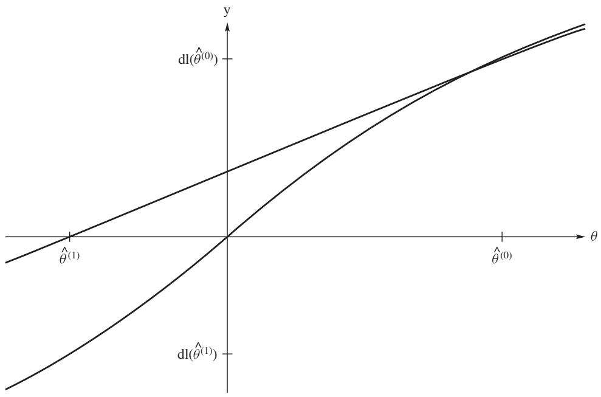
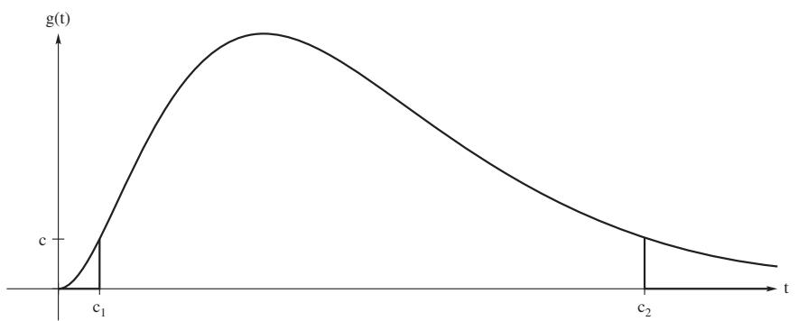

# Maximum Likelihood Methods

[Package map](../structure.md) · [Unsplit OCR dump](./_full.md)

[← Ch. 5 Consistency and Limiting Distributions](./05-consistency-and-limiting-distributions.md) · [Ch. 7 Sufficiency →](./07-sufficiency.md)

> MinerU OCR dump. If a formula, table, or numbering disagrees with the PDF, the PDF is authoritative.

---

# Chapter 6

# Maximum Likelihood Methods

# 6.1 Maximum Likelihood Estimation

Recall in Chapter 4 that as a point estimation procedure, we introduced maximum likelihood estimates (MLE). In this chapter, we continue this development showing that these likelihood procedures give rise to a formal theory of statistical inference (confidence and testing procedures). Under certain conditions (regularity conditions), these procedures are asymptotically optimal.

As in Section 4.1, consider a random variable $X$ whose pdf $f(x; \theta)$ depends on an unknown parameter $\theta$ which is in a set $\Omega$ . Our general discussion is for the continuous case, but the results extend to the discrete case also. For information, suppose that we have a random sample $X_1, \ldots, X_n$ on $X$ ; i.e., $X_1, \ldots, X_n$ are iid random variables with common pdf $f(x; \theta), \theta \in \Omega$ . For now, we assume that $\theta$ is a scalar, but we do extend the results to vectors in Sections 6.4 and 6.5. The parameter $\theta$ is unknown. The basis of our inferential procedures is the likelihood function given by

$$
L (\theta ; \mathbf {x}) = \prod_ {i = 1} ^ {n} f (x _ {i}; \theta), \quad \theta \in \Omega , \tag {6.1.1}
$$

where $\mathbf{x} = (x_{1},\ldots ,x_{n})^{\prime}$ . Because we treat $L$ as a function of $\theta$ in this chapter, we have transposed the $x_{i}$ and $\theta$ in the argument of the likelihood function. In fact, we often write it as $L(\theta)$ . Actually, the log of this function is usually more convenient to use and we denote it by

$$
l (\theta) = \log L (\theta) = \sum_ {i = 1} ^ {n} \log f \left(x _ {i}; \theta\right), \quad \theta \in \Omega . \tag {6.1.2}
$$

Note that there is no loss of information in using $l(\theta)$ because the log is a one-to-one function. Most of our discussion in this chapter remains the same if $X$ is a random vector.

As in Chapter 4, our point estimator of $\theta$ is $\widehat{\theta} = \widehat{\theta}(X_1, \ldots, X_n)$ , where $\widehat{\theta}$ maximizes the function $L(\theta)$ . We call $\widehat{\theta}$ the maximum likelihood estimator (MLE) of $\theta$ . In Section 4.1, several motivating examples were given, including the binomial and normal probability models. Later we give several more examples, but first we offer a theoretical justification for considering the mle. Let $\theta_0$ denote the true value of $\theta$ . Theorem 6.1.1 shows that the maximum of $L(\theta)$ asymptotically separates the true model at $\theta_0$ from models at $\theta \neq \theta_0$ . To prove this theorem, certain assumptions, regularity conditions, are required.

Assumptions 6.1.1 (Regularity Conditions). Regularity conditions $(R0) - (R2)$ are

(R0) The cdfs are distinct; i.e., $\theta \neq \theta' \Rightarrow F(x_i; \theta) \neq F(x_i; \theta')$ .   
(R1) The pdfs have common support for all $\theta$ .   
(R2) The point $\theta_0$ is an interior point in $\Omega$ .

The first assumption states that the parameter identifies the pdf. The second assumption implies that the support of $X_{i}$ does not depend on $\theta$ . This is restrictive, and some examples and exercises cover models in which (R1) is not true.

Theorem 6.1.1. Assume that $\theta_0$ is the true parameter and that $E_{\theta_0}[f(X_i;\theta) / f(X_i;\theta_0)]$ exists. Under assumptions (R0) and (R1),

$$
\lim  _ {n \rightarrow \infty} P _ {\theta_ {0}} \left[ L \left(\theta_ {0}, \mathbf {X}\right) > L \left(\theta , \mathbf {X}\right)\right] = 1, \quad f o r a l l \theta \neq \theta_ {0}. \tag {6.1.3}
$$

Proof: By taking logs, the inequality $L(\theta_0, \mathbf{X}) > L(\theta, \mathbf{X})$ is equivalent to

$$
\frac {1}{n} \sum_ {i = 1} ^ {n} \log \left[ \frac {f (X _ {i} ; \theta)}{f (X _ {i} ; \theta_ {0})} \right] <   0.
$$

Since the summands are iid with finite expectation and the function $\phi(x) = -\log(x)$ is strictly convex, it follows from the Law of Large Numbers (Theorem 5.1.1) and Jensen's inequality (Theorem 1.10.5) that, when $\theta_0$ is the true parameter,

$$
\frac {1}{n} \sum_ {i = 1} ^ {n} \log \left[ \frac {f (X _ {i} ; \theta)}{f (X _ {i} ; \theta_ {0})} \right] \stackrel {P} {\rightarrow} E _ {\theta_ {0}} \left[ \log \frac {f (X _ {1} ; \theta)}{f (X _ {1} ; \theta_ {0})} \right] <   \log E _ {\theta_ {0}} \left[ \frac {f (X _ {1} ; \theta)}{f (X _ {1} ; \theta_ {0})} \right].
$$

But

$$
E _ {\theta_ {0}} \left[ \frac {f (X _ {1} ; \theta)}{f (X _ {1} ; \theta_ {0})} \right] = \int \frac {f (x ; \theta)}{f (x ; \theta_ {0})} f (x; \theta_ {0}) d x = 1.
$$

Because $\log 1 = 0$ , the theorem follows. Note that common support is needed to obtain the last equalities.

Theorem 6.1.1 says that asymptotically the likelihood function is maximized at the true value $\theta_0$ . So in considering estimates of $\theta_0$ , it seems natural to consider the value of $\theta$ that maximizes the likelihood.

Definition 6.1.1 (Maximum Likelihood Estimator). We say that $\widehat{\theta} = \widehat{\theta}(\mathbf{X})$ is a maximum likelihood estimator (mle) of $\theta$ if

$$
\widehat {\theta} = \operatorname {A r g m a x} L (\theta ; \mathbf {X}). \tag {6.1.4}
$$

The notation $\operatorname{Argmax}$ means that $L(\theta; \mathbf{X})$ achieves its maximum value at $\widehat{\theta}$ .

As in Chapter 4, to determine the mle, we often take the log of the likelihood and determine its critical value; that is, letting $l(\theta) = \log L(\theta)$ , the mle solves the equation

$$
\frac {\partial l (\theta)}{\partial \theta} = 0. \tag {6.1.5}
$$

This is an example of an estimating equation, which we often label as an EE. This is the first of several EEs in the text.

Example 6.1.1 (Laplace Distribution). Let $X_{1}, \ldots, X_{n}$ be iid with density

$$
f (x; \theta) = \frac {1}{2} e ^ {- | x - \theta |}, \quad - \infty <   x <   \infty , - \infty <   \theta <   \infty . \tag {6.1.6}
$$

This pdf is referred to as either the Laplace or the double exponential distribution. The log of the likelihood simplifies to

$$
l (\theta) = - n \log 2 - \sum_ {i = 1} ^ {n} | x _ {i} - \theta |.
$$

The first partial derivative is

$$
l ^ {\prime} (\theta) = \sum_ {i = 1} ^ {n} \operatorname {s g n} \left(x _ {i} - \theta\right), \tag {6.1.7}
$$

where $\operatorname{sgn}(t) = 1,0$ , or $-1$ depending on whether $t > 0, t = 0$ , or $t < 0$ . Note that we have used $\frac{d}{dt} |t| = \operatorname{sgn}(t)$ , which is true unless $t = 0$ . Setting equation (6.1.7) to 0, the solution for $\theta$ is $\mathrm{med}\{x_1, x_2, \ldots, x_n\}$ , because the median makes half the terms of the sum in expression (6.1.7) nonpositive and half nonnegative. Recall that we defined the sample median in expression (4.4.4) and that we denote it by $Q_2$ (the second quartile of the sample). Hence, $\widehat{\theta} = Q_2$ is the mle of $\theta$ for the Laplace pdf (6.1.6).

There is no guarantee that the mle exists or, if it does, it is unique. This is often clear from the application as in the next two examples. Other examples are given in the exercises.

Example 6.1.2 (Logistic Distribution). Let $X_{1},\ldots ,X_{n}$ be iid with density

$$
f (x; \theta) = \frac {\exp \{- (x - \theta) \}}{(1 + \exp \{- (x - \theta) \}) ^ {2}}, \quad - \infty <   x <   \infty , - \infty <   \theta <   \infty . \tag {6.1.8}
$$

The log of the likelihood simplifies to

$$
l (\theta) = \sum_ {i = 1} ^ {n} \log f (x _ {i}; \theta) = n \theta - n \overline {{x}} - 2 \sum_ {i = 1} ^ {n} \log (1 + \exp \{- (x _ {i} - \theta) \}).
$$

Using this, the first partial derivative is

$$
l ^ {\prime} (\theta) = n - 2 \sum_ {i = 1} ^ {n} \frac {\exp \left\{- \left(x _ {i} - \theta\right) \right\}}{1 + \exp \left\{- \left(x _ {i} - \theta\right) \right\}}. \tag {6.1.9}
$$

Setting this equation to 0 and rearranging terms results in the equation

$$
\sum_ {i = 1} ^ {n} \frac {\exp \{- (x _ {i} - \theta) \}}{1 + \exp \{- (x _ {i} - \theta) \}} = \frac {n}{2}. \tag {6.1.10}
$$

Although this does not simplify, we can show that equation (6.1.10) has a unique solution. The derivative of the left side of equation (6.1.10) simplifies to

$$
(\partial / \partial \theta) \sum_ {i = 1} ^ {n} \frac {\exp \{- (x _ {i} - \theta) \}}{1 + \exp \{- (x _ {i} - \theta) \}} = \sum_ {i = 1} ^ {n} \frac {\exp \{- (x _ {i} - \theta) \}}{(1 + \exp \{- (x _ {i} - \theta) \}) ^ {2}} > 0.
$$

Thus the left side of equation (6.1.10) is a strictly increasing function of $\theta$ . Finally, the left side of (6.1.10) approaches 0 as $\theta \to -\infty$ and approaches $n$ as $\theta \to \infty$ . Thus equation (6.1.10) has a unique solution. Also, the second derivative of $l(\theta)$ is strictly negative for all $\theta$ ; hence, the solution is a maximum.

Having shown that the mle exists and is unique, we can use a numerical method to obtain the solution. In this case, Newton's procedure is useful. We discuss this in general in the next section, at which time we reconsider this example.

Example 6.1.3. In Example 4.1.2, we discussed the mole of the probability of success $\theta$ for a random sample $X_{1}, X_{2}, \ldots, X_{n}$ from the Bernoulli distribution with pmf

$$
p (x) = \left\{ \begin{array}{l l} \theta^ {x} (1 - \theta) ^ {1 - x} & x = 0, 1 \\ 0 & \text {e l s e w h e r e ,} \end{array} \right.
$$

where $0 \leq \theta \leq 1$ . Recall that the mle is $\overline{X}$ , the proportion of sample successes. Now suppose that we know in advance that, instead of $0 \leq \theta \leq 1$ , $\theta$ is restricted by the inequalities $0 \leq \theta \leq 1/3$ . If the observations were such that $\overline{x} > 1/3$ , then $\overline{x}$ would not be a satisfactory estimate. Since $\frac{\partial l(\theta)}{\partial \theta} > 0$ , provided $\theta < \overline{x}$ , under the restriction $0 \leq \theta \leq 1/3$ , we can maximize $l(\theta)$ by taking $\widehat{\theta} = \min \left\{\overline{x}, \frac{1}{3}\right\}$ .

The following is an appealing property of maximum likelihood estimates.

Theorem 6.1.2. Let $X_{1},\ldots ,X_{n}$ be iid with the pdf $f(x;\theta),\theta \in \Omega$ . For a specified function $g$ , let $\eta = g(\theta)$ be a parameter of interest. Suppose $\widehat{\theta}$ is the mle of $\theta$ . Then $g(\widehat{\theta})$ is the mle of $\eta = g(\theta)$

Proof: First suppose $g$ is a one-to-one function. The likelihood of interest is $L(g(\theta))$ , but because $g$ is one-to-one,

$$
\max L (g (\theta)) = \max _ {\eta = g (\theta)} L (\eta) = \max _ {\eta} L (g ^ {- 1} (\eta)).
$$

But the maximum occurs when $g^{-1}(\eta) = \widehat{\theta}$ ; i.e., take $\widehat{\eta} = g(\widehat{\theta})$ .

Suppose $g$ is not one-to-one. For each $\eta$ in the range of $g$ , define the set (preimage)

$$
g ^ {- 1} (\eta) = \{\theta : g (\theta) = \eta \}.
$$

The maximum occurs at $\widehat{\theta}$ and the domain of $g$ is $\Omega$ , which covers $\widehat{\theta}$ . Hence, $\widehat{\theta}$ is in one of these preimages and, in fact, it can only be in one preimage. Hence to maximize $L(\eta)$ , choose $\widehat{\eta}$ so that $g^{-1}(\widehat{\eta})$ is that unique preimage containing $\widehat{\theta}$ . Then $\widehat{\eta} = g(\widehat{\theta})$ .

Consider Example 4.1.2, where $X_{1},\ldots ,X_{n}$ are iid Bernoulli random variables with probability of success $p$ . As shown in this example, $\widehat{p} = \overline{X}$ is the mle of $p$ . Recall that in the large sample confidence interval for $p$ , (4.2.7), an estimate of $\sqrt{p(1 - p)}$ is required. By Theorem 6.1.2, the mle of this quantity is $\sqrt{\widehat{p}(1 - \widehat{p})}$ .

We close this section by showing that maximum likelihood estimators, under regularity conditions, are consistent estimators. Recall that $\mathbf{X}' = (X_1, \ldots, X_n)$ .

Theorem 6.1.3. Assume that $X_{1},\ldots ,X_{n}$ satisfy the regularity conditions $(R0)$ through (R2), where $\theta_0$ is the true parameter, and further that $f(x;\theta)$ is differentiable with respect to $\theta$ in $\Omega$ . Then the likelihood equation,

$$
\frac {\partial}{\partial \theta} L (\theta) = 0,
$$

or equivalently

$$
\frac {\partial}{\partial \theta} l (\theta) = 0,
$$

has a solution $\widehat{\theta}_n$ such that $\widehat{\theta}_n \xrightarrow{P} \theta_0$ .

Proof: Because $\theta_0$ is an interior point in $\Omega$ , $(\theta_0 - a, \theta_0 + a) \subset \Omega$ , for some $a > 0$ . Define $S_n$ to be the event

$$
S _ {n} = \left\{\mathbf {X}: l (\theta_ {0}; \mathbf {X}) > l (\theta_ {0} - a; \mathbf {X}) \right\} \cap \left\{\mathbf {X}: l (\theta_ {0}; \mathbf {X}) > l (\theta_ {0} + a; \mathbf {X}) \right\}.
$$

By Theorem 6.1.1, $P(S_{n}) \to 1$ . So we can restrict attention to the event $S_{n}$ . But on $S_{n}$ , $l(\theta)$ has a local maximum, say, $\widehat{\theta}_{n}$ , such that $\theta_0 - a < \widehat{\theta}_n < \theta_0 + a$ and $l^{\prime}(\widehat{\theta}_n) = 0$ . That is,

$$
S _ {n} \subset \left\{\mathbf {X}: | \widehat {\theta} _ {n} (\mathbf {X}) - \theta_ {0} | <   a \right\} \cap \left\{\mathbf {X}: l ^ {\prime} (\widehat {\theta} _ {n} (\mathbf {X})) = 0 \right\}.
$$

Therefore,

$$
1 = \lim  _ {n \rightarrow \infty} P (S _ {n}) \leq \varlimsup_ {n \rightarrow \infty} P \left[\left\{\mathbf {X}: | \widehat {\theta} _ {n} (\mathbf {X}) - \theta_ {0} | <   a \right\} \cap \left\{\mathbf {X}: l ^ {\prime} (\widehat {\theta} _ {n} (\mathbf {X})) = 0 \right\}\right] \leq 1;
$$

see Remark 5.2.3 for discussion on $\overline{\lim}$ . It follows that for the sequence of solutions $\widehat{\theta}_n$ , $P[|\widehat{\theta}_n - \theta_0| < a] \to 1$ .

The only contentious point in the proof is that the sequence of solutions might depend on $a$ . But we can always choose a solution "closest" to $\theta_0$ in the following way. For each $n$ , the set of all solutions in the interval is bounded; hence, the infimum over solutions closest to $\theta_0$ exists.

Note that this theorem is vague in that it discusses solutions of the equation. If, however, we know that the mle is the unique solution of the equation $l^{\prime}(\theta) = 0$ , then it is consistent. We state this as a corollary:

Corollary 6.1.1. Assume that $X_{1},\ldots ,X_{n}$ satisfy the regularity conditions $(R0)$ through (R2), where $\theta_0$ is the true parameter, and that $f(x;\theta)$ is differentiable with respect to $\theta$ in $\Omega$ . Suppose the likelihood equation has the unique solution $\widehat{\theta}_n$ . Then $\widehat{\theta}_n$ is a consistent estimator of $\theta_0$ .

# EXERCISES

6.1.1. Let $X_{1}, X_{2}, \ldots, X_{n}$ be a random sample on $X$ that has a $\Gamma(\alpha = 4, \beta = \theta)$ distribution, $0 < \theta < \infty$ .

(a) Determine the mle of $\theta$   
(b) Suppose the following data is a realization (rounded) of a random sample on $X$ . Obtain a histogram with the argument $\mathsf{pr} = \mathsf{T}$ (data are in ex6111.rda).

9393823 84721221810172214

9 5 26 11 31 15 25 9 29 28 19 8

(c) For this sample, obtain $\hat{\theta}$ the realized value of the mle and locate $4\hat{\theta}$ on the histogram. Overlay the $\Gamma (\alpha = 4,\beta = \hat{\theta})$ pdf on the histogram. Does the data agree with this pdf? Code for overlay:

xs=sort(x);y=dgamma(xs,4,1/betahat);hist(x,pr=T);lines(y~xs).

6.1.2. Let $X_{1}, X_{2}, \ldots, X_{n}$ represent a random sample from each of the distributions having the following pdfs:

(a) $f(x;\theta) = \theta x^{\theta -1}$ $0 <   x <   1$ $0 <   \theta <  \infty$ , zero elsewhere.   
(b) $f(x;\theta) = e^{-(x - \theta)}$ , $\theta \leq x < \infty$ , $-\infty < \theta < \infty$ , zero elsewhere. Note that this is a nonregular case.

In each case find the mle $\hat{\theta}$ of $\theta$

6.1.3. Let $Y_{1} < Y_{2} < \dots < Y_{n}$ be the order statistics of a random sample from a distribution with pdf $f(x; \theta) = 1$ , $\theta - \frac{1}{2} \leq x \leq \theta + \frac{1}{2}$ , $-\infty < \theta < \infty$ , zero elsewhere. This is a nonregular case. Show that every statistic $u(X_{1}, X_{2}, \ldots, X_{n})$ such that

$$
Y _ {n} - \frac {1}{2} \leq u (X _ {1}, X _ {2}, \ldots , X _ {n}) \leq Y _ {1} + \frac {1}{2}
$$

is a mle of $\theta$ . In particular, $(4Y_{1} + 2Y_{n} + 1) / 6$ , $(Y_{1} + Y_{n}) / 2$ , and $(2Y_{1} + 4Y_{n} - 1) / 6$ are three such statistics. Thus, uniqueness is not, in general, a property of mles.

6.1.4. Suppose $X_{1},\ldots ,X_{n}$ are iid with pdf $f(x;\theta) = 2x / \theta^2$ , $0 < x\leq \theta$ , zero elsewhere. Note this is a nonregular case. Find:

(a) The mle $\hat{\theta}$ for $\theta$   
(b) The constant $c$ so that $E(c\hat{\theta}) = \theta$   
(c) The mle for the median of the distribution. Show that it is a consistent estimator.

6.1.5. Consider the pdf in Exercise 6.1.4.

(a) Using Theorem 4.8.1, show how to generate observations from this pdf.   
(b) The following data were generated from this pdf. Find the mles of $\theta$ and the median.

1.2 7.7 4.3 4.1 7.1 6.3 5.3 6.3 5.3 2.8

3.87.04.55.06.36.75.07.47.57.5

6.1.6. Suppose $X_{1}, X_{2}, \ldots, X_{n}$ are iid with pdf $f(x; \theta) = (1 / \theta)e^{-x / \theta}$ , $0 < x < \infty$ , zero elsewhere. Find the mle of $P(X \leq 2)$ and show that it is consistent.

6.1.7. Let the table

<table><tr><td>x</td><td>0</td><td>1</td><td>2</td><td>3</td><td>4</td><td>5</td></tr><tr><td>Frequency</td><td>6</td><td>10</td><td>14</td><td>13</td><td>6</td><td>1</td></tr></table>

represent a summary of a sample of size 50 from a binomial distribution having $n = 5$ . Find the mle of $P(X \geq 3)$ . For the data in the table, using the R function pbinom determine the realization of the mle.

6.1.8. Let $X_{1}, X_{2}, X_{3}, X_{4}, X_{5}$ be a random sample from a Cauchy distribution with median $\theta$ , that is, with pdf

$$
f (x; \theta) = \frac {1}{\pi} \frac {1}{1 + (x - \theta) ^ {2}}, \quad - \infty <   x <   \infty ,
$$

where $-\infty <  \theta <  \infty$ .Suppose $x_{1} = -1.94$ $x_{2} = 0.59$ $x_{3} = -5.98$ $x_{4} = -0.08$ and $x_{5} = -0.77$

(a) Show that the mle can be obtained by minimizing

$$
\sum_ {i = 1} ^ {5} \log [ 1 + (x _ {i} - \theta) ^ {2} ].
$$

(b) Approximate the mle by plotting the function in Part (a). Make use of the following R code which assumes that the data are in the R vector x: theta $\equiv$ seq(-6,6,.001);lfs<-c() for(th in theta){lfs=c(lfs,sum(log((x-th)^2+1)))} plot(lfs~theta)

6.1.9. Let the table

$$
\begin{array}{c c c c c c c} \text {x} & 0 & 1 & 2 & 3 & 4 & 5 \\ \hline \text {F r e q u e n c y} & 7 & 1 4 & 1 2 & 1 3 & 6 & 3 \end{array}
$$

represent a summary of a random sample of size 55 from a Poisson distribution. Find the maximum likelihood estimator of $P(X = 2)$ . Use the R function dpois to find the estimator's realization for the data in the table.

6.1.10. Let $X_{1}, X_{2}, \ldots, X_{n}$ be a random sample from a Bernoulli distribution with parameter $p$ . If $p$ is restricted so that we know that $\frac{1}{2} \leq p \leq 1$ , find the mle of this parameter.

6.1.11. Let $X_{1}, X_{2}, \ldots, X_{n}$ be a random sample from a $N(\theta, \sigma^2)$ distribution, where $\sigma^2$ is fixed but $-\infty < \theta < \infty$ .

(a) Show that the mle of $\theta$ is $\overline{X}$ .   
(b) If $\theta$ is restricted by $0\leq \theta <  \infty$ , show that the mle of $\theta$ is $\widehat{\theta} = \max \{0,\overline{X}\}$

6.1.12. Let $X_{1}, X_{2}, \ldots, X_{n}$ be a random sample from the Poisson distribution with $0 < \theta \leq 2$ . Show that the mle of $\theta$ is $\widetilde{\theta} = \min \{ \overline{X}, 2 \}$ .

6.1.13. Let $X_1, X_2, \ldots, X_n$ be a random sample from a distribution with one of two pdfs. If $\theta = 1$ , then $f(x; \theta = 1) = \frac{1}{\sqrt{2\pi}} e^{-x^2 / 2}$ , $-\infty < x < \infty$ . If $\theta = 2$ , then $f(x; \theta = 2) = 1 / [\pi (1 + x^2)]$ , $-\infty < x < \infty$ . Find the mle of $\theta$ .

# 6.2 Rao-Cramér Lower Bound and Efficiency

In this section, we establish a remarkable inequality called the Rao-Cramér lower bound, which gives a lower bound on the variance of any unbiased estimate. We then show that, under regularity conditions, the variances of the maximum likelihood estimates achieve this lower bound asymptotically.

As in the last section, let $X$ be a random variable with pdf $f(x; \theta)$ , $\theta \in \Omega$ , where the parameter space $\Omega$ is an open interval. In addition to the regularity conditions (6.1.1) of Section 6.1, for the following derivations, we require two more regularity conditions, namely,

Assumptions 6.2.1 (Additional Regularity Conditions). Regularity conditions (R3) and (R4) are given by

(R3) The pdf $f(x; \theta)$ is twice differentiable as a function of $\theta$ .

(R4) The integral $\int f(x;\theta)dx$ can be differentiated twice under the integral sign as a function of $\theta$ .

Note that conditions (R1)-(R4) mean that the parameter $\theta$ does not appear in the endpoints of the interval in which $f(x;\theta) > 0$ and that we can interchange integration and differentiation with respect to $\theta$ . Our derivation is for the continuous case, but the discrete case can be handled in a similar manner. We begin with the identity

$$
1 = \int_ {- \infty} ^ {\infty} f (x; \theta) d x.
$$

Taking the derivative with respect to $\theta$ results in

$$
0 = \int_ {- \infty} ^ {\infty} \frac {\partial f (x ; \theta)}{\partial \theta} d x.
$$

The latter expression can be rewritten as

$$
0 = \int_ {- \infty} ^ {\infty} \frac {\partial f (x ; \theta) / \partial \theta}{f (x ; \theta)} f (x; \theta) d x,
$$

or, equivalently,

$$
0 = \int_ {- \infty} ^ {\infty} \frac {\partial \log f (x ; \theta)}{\partial \theta} f (x; \theta) d x. \tag {6.2.1}
$$

Writing this last equation as an expectation, we have established

$$
E \left[ \frac {\partial \log f (X ; \theta)}{\partial \theta} \right] = 0; \tag {6.2.2}
$$

that is, the mean of the random variable $\frac{\partial\log f(X;\theta)}{\partial\theta}$ is 0. If we differentiate (6.2.1) again, it follows that

$$
0 = \int_ {- \infty} ^ {\infty} \frac {\partial^ {2} \log f (x ; \theta)}{\partial \theta^ {2}} f (x; \theta) d x + \int_ {- \infty} ^ {\infty} \frac {\partial \log f (x ; \theta)}{\partial \theta} \frac {\partial \log f (x ; \theta)}{\partial \theta} f (x; \theta) d x. (6. 2. 3)
$$

The second term of the right side of this equation can be written as an expectation, which we call Fisher information and we denote it by $I(\theta)$ ; that is,

$$
I (\theta) = \int_ {- \infty} ^ {\infty} \frac {\partial \log f (x ; \theta)}{\partial \theta} \frac {\partial \log f (x ; \theta)}{\partial \theta} f (x; \theta) d x = E \left[ \left(\frac {\partial \log f (X ; \theta)}{\partial \theta}\right) ^ {2} \right]. (6. 2. 4)
$$

From equation (6.2.3), we see that $I(\theta)$ can be computed from

$$
I (\theta) = - \int_ {- \infty} ^ {\infty} \frac {\partial^ {2} \log f (x ; \theta)}{\partial \theta^ {2}} f (x; \theta) d x = - E \left[ \frac {\partial^ {2} \log f (X ; \theta)}{\partial \theta^ {2}} \right]. \tag {6.2.5}
$$

Using equation (6.2.2), Fisher information is the variance of the random variable $\frac{\partial\log f(X;\theta)}{\partial\theta}$ ; i.e.,

$$
I (\theta) = \operatorname {V a r} \left(\frac {\partial \log f (X ; \theta)}{\partial \theta}\right). \tag {6.2.6}
$$

Usually, expression (6.2.5) is easier to compute than expression (6.2.4).

Remark 6.2.1. Note that the information is the weighted mean of either

$$
\left[ \frac {\partial \log f (x ; \theta)}{\partial \theta} \right] ^ {2} \quad \mathrm {o r} \quad - \frac {\partial^ {2} \log f (x ; \theta)}{\partial \theta^ {2}},
$$

where the weights are given by the pdf $f(x; \theta)$ . That is, the greater these derivatives are on the average, the more information that we get about $\theta$ . Clearly, if they were equal to zero [so that $\theta$ would not be in $\log f(x; \theta)$ ], there would be zero information about $\theta$ . The important function

$$
\frac {\partial \log f (x ; \theta)}{\partial \theta}
$$

is called the score function. Recall that it determines the estimating equations for the mle; that is, the mle $\hat{\theta}$ solves

$$
\sum_ {i = 1} ^ {n} \frac {\partial \log f (x _ {i} ; \theta)}{\partial \theta} = 0
$$

for $\theta$

Example 6.2.1 (Information for a Bernoulli Random Variable). Let $X$ be Bernoulli $b(1, \theta)$ . Thus

$$
\begin{array}{l} \log f (x; \theta) = x \log \theta + (1 - x) \log (1 - \theta) \\ \frac {\partial \log f (x ; \theta)}{\partial \theta} = \frac {x}{\theta} - \frac {1 - x}{1 - \theta} \\ \frac {\partial^ {2} \log f (x ; \theta)}{\partial \theta^ {2}} = - \frac {x}{\theta^ {2}} - \frac {1 - x}{(1 - \theta) ^ {2}}. \\ \end{array}
$$

Clearly,

$$
\begin{array}{l} I (\theta) = - E \left[ \frac {- X}{\theta^ {2}} - \frac {1 - X}{(1 - \theta) ^ {2}} \right] \\ = \frac {\theta}{\theta^ {2}} + \frac {1 - \theta}{(1 - \theta) ^ {2}} = \frac {1}{\theta} + \frac {1}{(1 - \theta)} = \frac {1}{\theta (1 - \theta)}, \\ \end{array}
$$

which is larger for $\theta$ values close to zero or one.

Example 6.2.2 (Information for a Location Family). Consider a random sample $X_{1}, \ldots, X_{n}$ such that

$$
X _ {i} = \theta + e _ {i}, \quad i = 1, \dots , n, \tag {6.2.7}
$$

where $e_1, e_2, \ldots, e_n$ are iid with common pdf $f(x)$ and with support $(-\infty, \infty)$ . Then the common pdf of $X_i$ is $f_X(x; \theta) = f(x - \theta)$ . We call model (6.2.7) a location model. Assume that $f(x)$ satisfies the regularity conditions. Then the information is

$$
\begin{array}{l} I (\theta) = \int_ {- \infty} ^ {\infty} \left(\frac {f ^ {\prime} (x - \theta)}{f (x - \theta)}\right) ^ {2} f (x - \theta) d x \\ = \int_ {- \infty} ^ {\infty} \left(\frac {f ^ {\prime} (z)}{f (z)}\right) ^ {2} f (z) d z, \tag {6.2.8} \\ \end{array}
$$

where the last equality follows from the transformation $z = x - \theta$ . Hence, in the location model, the information does not depend on $\theta$ .

As an illustration, reconsider Example 6.1.1 concerning the Laplace distribution. Let $X_{1}, X_{2}, \ldots, X_{n}$ be a random sample from this distribution. Then it follows that $X_{i}$ can be expressed as

$$
X _ {i} = \theta + e _ {i}, \tag {6.2.9}
$$

where $e_1, \ldots, e_n$ are iid with common pdf $f(z) = 2^{-1} \exp \{-|z|\}$ , for $-\infty < z < \infty$ . As we did in Example 6.1.1, use $\frac{d}{dz} |z| = \operatorname{sgn}(z)$ . Then $f'(z) = -2^{-1} \operatorname{sgn}(z) \exp \{-|z|\}$ and, hence, $[f'(z) / f(z)]^2 = [-\operatorname{sgn}(z)]^2 = 1$ , so that

$$
I (\theta) = \int_ {- \infty} ^ {\infty} \left(\frac {f ^ {\prime} (z)}{f (z)}\right) ^ {2} f (z) d z = \int_ {- \infty} ^ {\infty} f (z) d z = 1. \tag {6.2.10}
$$

Note that the Laplace pdf does not satisfy the regularity conditions, but this argument can be made rigorous; see Huber (1981) and also Chapter 10.

From (6.2.6), for a sample of size 1, say $X_{1}$ , Fisher information is the variance of the random variable $\frac{\partial\log f(X_1;\theta)}{\partial\theta}$ . What about a sample of size $n$ ? Let $X_{1},X_{2},\ldots ,X_{n}$ be a random sample from a distribution having pdf $f(x;\theta)$ . The likelihood $L(\theta)$ is the pdf of the random sample, and the random variable whose variance is the information in the sample is given by

$$
\frac {\partial \log L (\theta , \mathbf {X})}{\partial \theta} = \sum_ {i = 1} ^ {n} \frac {\partial \log f (X _ {i} ; \theta)}{\partial \theta}.
$$

The summands are iid with common variance $I(\theta)$ . Hence the information in the sample is

$$
\operatorname {V a r} \left(\frac {\partial \log L (\theta , \mathbf {X})}{\partial \theta}\right) = n I (\theta). \tag {6.2.11}
$$

Thus the information in a random sample of size $n$ is $n$ times the information in a sample of size 1. So, in Example 6.2.1, the Fisher information in a random sample of size $n$ from a Bernoulli $b(1,\theta)$ distribution is $n / [\theta (1 - \theta)]$ .

We are now ready to obtain the Rao-Cramér lower bound, which we state as a theorem.

Theorem 6.2.1 (Rao-Cramér Lower Bound). Let $X_{1},\ldots ,X_{n}$ be iid with common pdf $f(x;\theta)$ for $\theta \in \Omega$ . Assume that the regularity conditions (R0)-(R4) hold. Let $Y = u(X_{1},X_{2},\dots ,X_{n})$ be a statistic with mean $E(Y) = E[u(X_1,X_2,\dots ,X_n)] = k(\theta)$ . Then

$$
\operatorname {V a r} (Y) \geq \frac {\left[ k ^ {\prime} (\theta) \right] ^ {2}}{n I (\theta)}. \tag {6.2.12}
$$

Proof: The proof is for the continuous case, but the proof for the discrete case is quite similar. Write the mean of $Y$ as

$$
k (\theta) = \int_ {- \infty} ^ {\infty} \dots \int_ {- \infty} ^ {\infty} u (x _ {1}, \ldots , x _ {n}) f (x _ {1}; \theta) \dots f (x _ {n}; \theta) d x _ {1} \dots d x _ {n}.
$$

Differentiating with respect to $\theta$ , we obtain

$$
\begin{array}{l} k ^ {\prime} (\theta) = \int_ {- \infty} ^ {\infty} \dots \int_ {- \infty} ^ {\infty} u (x _ {1}, x _ {2}, \dots , x _ {n}) \left[ \sum_ {1} ^ {n} \frac {1}{f (x _ {i} ; \theta)} \frac {\partial f (x _ {i} ; \theta)}{\partial \theta} \right] \\ \times f (x _ {1}; \theta) \dots f (x _ {n}; \theta) d x _ {1} \dots d x _ {n} \\ = \int_ {- \infty} ^ {\infty} \dots \int_ {- \infty} ^ {\infty} u (x _ {1}, x _ {2}, \dots , x _ {n}) \left[ \sum_ {1} ^ {n} \frac {\partial \log f (x _ {i} ; \theta)}{\partial \theta} \right] \\ \times f \left(x _ {1}; \theta\right) \dots f \left(x _ {n}; \theta\right) d x _ {1} \dots d x _ {n}. \tag {6.2.13} \\ \end{array}
$$

Define the random variable $Z$ by $Z = \sum_{1}^{n}[\partial \log f(X_i;\theta) / \partial \theta]$ . We know from (6.2.2) and (6.2.11) that $E(Z) = 0$ and $\operatorname{Var}(Z) = nI(\theta)$ , respectively. Also, equation (6.2.13) can be expressed in terms of expectation as $k'(\theta) = E(YZ)$ . Hence we have

$$
k ^ {\prime} (\theta) = E (Y Z) = E (Y) E (Z) + \rho \sigma_ {Y} \sqrt {n I (\theta)},
$$

where $\rho$ is the correlation coefficient between $Y$ and $Z$ . Using $E(Z) = 0$ , this simplifies to

$$
\rho = \frac {k ^ {\prime} (\theta)}{\sigma_ {Y} \sqrt {n I (\theta)}}.
$$

Because $\rho^2\leq 1$ , we have

$$
\frac {[ k ^ {\prime} (\theta) ] ^ {2}}{\sigma_ {Y} ^ {2} n I (\theta)} \leq 1,
$$

which, upon rearrangement, is the desired result.

Corollary 6.2.1. Under the assumptions of Theorem 6.2.1, if $Y = u(X_{1},\ldots ,X_{n})$ is an unbiased estimator of $\theta$ , so that $k(\theta) = \theta$ , then the Rao-Cramér inequality becomes

$$
V a r (Y) \geq \frac {1}{n I (\theta)}.
$$

Consider the Bernoulli model with probability of success $\theta$ which was treated in Example 6.2.1. In the example we showed that $1 / nI(\theta) = \theta (1 - \theta) / n$ . From Example 4.1.2 of Section 4.1, the mle of $\theta$ is $\overline{X}$ . The mean and variance of a Bernoulli $(\theta)$ distribution are $\theta$ and $\theta (1 - \theta)$ , respectively. Hence the mean and variance of $\overline{X}$ are $\theta$ and $\theta (1 - \theta) / n$ , respectively. That is, in this case the variance of the mle has attained the Rao-Cramér lower bound.

We now make the following definitions.

Definition 6.2.1 (Efficient Estimator). Let $Y$ be an unbiased estimator of a parameter $\theta$ in the case of point estimation. The statistic $Y$ is called an efficient estimator of $\theta$ if and only if the variance of $Y$ attains the Rao-Cramér lower bound.

Definition 6.2.2 (Efficiency). In cases in which we can differentiate with respect to a parameter under an integral or summation symbol, the ratio of the Rao-Cramér lower bound to the actual variance of any unbiased estimator of a parameter is called the efficiency of that estimator.

Example 6.2.3 (Poisson $(\theta)$ Distribution). Let $X_{1}, X_{2}, \ldots, X_{n}$ denote a random sample from a Poisson distribution that has the mean $\theta > 0$ . It is known that $\overline{X}$ is an mle of $\theta$ ; we shall show that it is also an efficient estimator of $\theta$ . We have

$$
\begin{array}{l} \frac {\partial \log f (x ; \theta)}{\partial \theta} = \frac {\partial}{\partial \theta} (x \log \theta - \theta - \log x!) \\ = \frac {x}{\theta} - 1 = \frac {x - \theta}{\theta}. \\ \end{array}
$$

Accordingly,

$$
E \left[ \left(\frac {\partial \log f (X ; \theta)}{\partial \theta}\right) ^ {2} \right] = \frac {E (X - \theta) ^ {2}}{\theta^ {2}} = \frac {\sigma^ {2}}{\theta^ {2}} = \frac {\theta}{\theta^ {2}} = \frac {1}{\theta}.
$$

The Rao-Cramér lower bound in this case is $1 / [n(1 / \theta)] = \theta / n$ . But $\theta / n$ is the variance of $\overline{X}$ . Hence $\overline{X}$ is an efficient estimator of $\theta$ .

Example 6.2.4 (Beta(θ,1) Distribution). Let $X_{1},X_{2},\ldots ,X_{n}$ denote a random sample of size $n > 2$ from a distribution with pdf

$$
f (x; \theta) = \left\{ \begin{array}{l l} \theta x ^ {\theta - 1} & \text {f o r} 0 <   x <   1 \\ 0 & \text {e l s e w h e r e ,} \end{array} \right. \tag {6.2.14}
$$

where the parameter space is $\Omega = (0,\infty)$ . This is the beta distribution, (3.3.9), with parameters $\theta$ and 1, which we denote by $\mathrm{beta}(\theta ,1)$ . The derivative of the log of $f$ is

$$
\frac {\partial \log f}{\partial \theta} = \log x + \frac {1}{\theta}. \tag {6.2.15}
$$

From this we have $\partial^2\log f / \partial \theta^2 = -\theta^{-2}$ . Hence the information is $I(\theta) = \theta^{-2}$ .

Next, we find the mle of $\theta$ and investigate its efficiency. The log of the likelihood function is

$$
l (\theta) = \theta \sum_ {i = 1} ^ {n} \log x _ {i} - \sum_ {i = 1} ^ {n} \log x _ {i} + n \log \theta .
$$

The first partial of $l(\theta)$ is

$$
\frac {\partial l (\theta)}{\partial \theta} = \sum_ {i = 1} ^ {n} \log x _ {i} + \frac {n}{\theta}. \tag {6.2.16}
$$

Setting this to 0 and solving for $\theta$ , the mle is $\widehat{\theta} = -n / \sum_{i=1}^{n} \log X_i$ . To obtain the distribution of $\widehat{\theta}$ , let $Y_i = -\log X_i$ . A straight transformation argument shows

that the distribution is $\Gamma(1, 1/\theta)$ . Because the $X_{i}$ are independent, Theorem 3.3.1 shows that $W = \sum_{i=1}^{n} Y_{i}$ is $\Gamma(n, 1/\theta)$ . Theorem 3.3.2 shows that

$$
E \left[ W ^ {k} \right] = \frac {(n + k - 1) !}{\theta^ {k} (n - 1) !}, \tag {6.2.17}
$$

for $k > -n$ . So, in particular for $k = -1$ , we get

$$
E [ \widehat {\theta} ] = n E [ W ^ {- 1} ] = \theta \frac {n}{n - 1}.
$$

Hence, $\widehat{\theta}$ is biased, but the bias vanishes as $n\to \infty$ . Also, note that the estimator $[(n - 1) / n]\widehat{\theta}$ is unbiased. For $k = -2$ , we get

$$
E [ \widehat {\theta} ^ {2} ] = n ^ {2} E [ W ^ {- 2} ] = \theta^ {2} \frac {n ^ {2}}{(n - 1) (n - 2)},
$$

and, hence, after simplifying $E(\hat{\theta}^2) - [E(\hat{\theta})]^2$ , we obtain

$$
\mathrm {V a r} (\widehat {\theta}) = \theta^ {2} \frac {n ^ {2}}{(n - 1) ^ {2} (n - 2)}.
$$

From this, we can obtain the variance of the unbiased estimator $[(n - 1) / n]\widehat{\theta}$ , i.e.,

$$
\operatorname {V a r} \left(\frac {n - 1}{n} \widehat {\theta}\right) = \frac {\theta^ {2}}{n - 2}.
$$

From above, the information is $I(\theta) = \theta^{-2}$ and, hence, the variance of an unbiased efficient estimator is $\theta^2 / n$ . Because $\frac{\theta^2}{n - 2} > \frac{\theta^2}{n}$ , the unbiased estimator $[(n - 1) / n]\widehat{\theta}$ is not efficient. Notice, though, that its efficiency (as in Definition 6.2.2) converges to 1 as $n \to \infty$ . Later in this section, we say that $[(n - 1) / n]\widehat{\theta}$ is asymptotically efficient.

In the above examples, we were able to obtain the mles in closed form along with their distributions and, hence, moments. This is often not the case. Maximum likelihood estimators, however, have an asymptotic normal distribution. In fact, mles are asymptotically efficient. To prove these assertions, we need the additional regularity condition given by

Assumptions 6.2.2 (Additional Regularity Condition). Regularity condition (R5) is

(R5) The pdf $f(x; \theta)$ is three times differentiable as a function of $\theta$ . Further, for all $\theta \in \Omega$ , there exist a constant $c$ and a function $M(x)$ such that

$$
\left| \frac {\partial^ {3}}{\partial \theta^ {3}} \log f (x; \theta) \right| \leq M (x),
$$

with $E_{\theta_0}[M(X)] < \infty$ , for all $\theta_0 - c < \theta < \theta_0 + c$ and all $x$ in the support of $X$ .

Theorem 6.2.2. Assume $X_{1},\ldots ,X_{n}$ are iid with pdf $f(x;\theta_0)$ for $\theta_0\in \Omega$ such that the regularity conditions (R0)-(R5) are satisfied. Suppose further that the Fisher information satisfies $0 < I(\theta_0) < \infty$ . Then any consistent sequence of solutions of the mle equations satisfies

$$
\sqrt {n} \left(\widehat {\theta} - \theta_ {0}\right) \stackrel {D} {\rightarrow} N \left(0, \frac {1}{I \left(\theta_ {0}\right)}\right). \tag {6.2.18}
$$

Proof: Expanding the function $l^{\prime}(\theta)$ into a Taylor series of order 2 about $\theta_0$ and evaluating it at $\widehat{\theta}_n$ , we get

$$
l ^ {\prime} \left(\widehat {\theta} _ {n}\right) = l ^ {\prime} \left(\theta_ {0}\right) + \left(\widehat {\theta} _ {n} - \theta_ {0}\right) l ^ {\prime \prime} \left(\theta_ {0}\right) + \frac {1}{2} \left(\widehat {\theta} _ {n} - \theta_ {0}\right) ^ {2} l ^ {\prime \prime \prime} \left(\theta_ {n} ^ {*}\right), \tag {6.2.19}
$$

where $\theta_{n}^{*}$ is between $\theta_0$ and $\widehat{\theta}_n$ . But $l^{\prime}(\widehat{\theta}_n) = 0$ . Hence, rearranging terms, we obtain

$$
\sqrt {n} \left(\widehat {\theta} _ {n} - \theta_ {0}\right) = \frac {n ^ {- 1 / 2} l ^ {\prime} \left(\theta_ {0}\right)}{- n ^ {- 1} l ^ {\prime \prime} \left(\theta_ {0}\right) - (2 n) ^ {- 1} \left(\widehat {\theta} _ {n} - \theta_ {0}\right) l ^ {\prime \prime \prime} \left(\theta_ {n} ^ {*}\right)}. \tag {6.2.20}
$$

By the Central Limit Theorem,

$$
\frac {1}{\sqrt {n}} l ^ {\prime} \left(\theta_ {0}\right) = \frac {1}{\sqrt {n}} \sum_ {i = 1} ^ {n} \frac {\partial \log f \left(X _ {i} ; \theta_ {0}\right)}{\partial \theta} \stackrel {D} {\rightarrow} N (0, I \left(\theta_ {0}\right)), \tag {6.2.21}
$$

because the summands are iid with $\operatorname{Var}(\partial \log f(X_i; \theta_0) / \partial \theta) = I(\theta_0) < \infty$ . Also, by the Law of Large Numbers,

$$
- \frac {1}{n} l ^ {\prime \prime} \left(\theta_ {0}\right) = - \frac {1}{n} \sum_ {i = 1} ^ {n} \frac {\partial^ {2} \log f \left(X _ {i} ; \theta_ {0}\right)}{\partial \theta^ {2}} \xrightarrow {P} I \left(\theta_ {0}\right). \tag {6.2.22}
$$

To complete the proof then, we need only show that the second term in the denominator of expression (6.2.20) goes to zero in probability. Because $\widehat{\theta}_n - \theta_0 \stackrel{P}{\to} 0$ by Theorem 5.2.7, this follows provided that $n^{-1}l^{\prime \prime \prime}(\theta_n^*)$ is bounded in probability. Let $c_{0}$ be the constant defined in condition (R5). Note that $|\widehat{\theta}_n - \theta_0| < c_0$ implies that $|\theta_n^* - \theta_0| < c_0$ , which in turn by condition (R5) implies the following string of inequalities:

$$
\left| - \frac {1}{n} l ^ {\prime \prime \prime} \left(\theta_ {n} ^ {*}\right) \right| \leq \frac {1}{n} \sum_ {i = 1} ^ {n} \left| \frac {\partial^ {3} \log f (X _ {i} ; \theta)}{\partial \theta^ {3}} \right| \leq \frac {1}{n} \sum_ {i = 1} ^ {n} M (X _ {i}). \tag {6.2.23}
$$

By condition (R5), $E_{\theta_0}[M(X)] < \infty$ ; hence, $\frac{1}{n}\sum_{i = 1}^{n}M(X_i)\xrightarrow{P}E_{\theta_0}[M(X)]$ , by the Law of Large Numbers. For the bound, we select $1 + E_{\theta_0}[M(X)]$ . Let $\epsilon >0$ be given. Choose $N_{1}$ and $N_{2}$ so that

$$
n \geq N _ {1} \Rightarrow P [ | \widehat {\theta} _ {n} - \theta_ {0} | <   c _ {0} ] \geq 1 - \frac {\epsilon}{2} \tag {6.2.24}
$$

$$
n \geq N _ {2} \Rightarrow P \left[ \left| \frac {1}{n} \sum_ {i = 1} ^ {n} M \left(X _ {i}\right) - E _ {\theta_ {0}} [ M (X) ] \right| <   1 \right] \geq 1 - \frac {\epsilon}{2}. \tag {6.2.25}
$$

It follows from (6.2.23)-(6.2.25) that

$$
n \geq \max  \left\{N _ {1}, N _ {2} \right\} \Rightarrow P \left[ \left| - \frac {1}{n} l ^ {\prime \prime \prime} \left(\theta_ {n} ^ {*}\right) \right| \leq 1 + E _ {\theta_ {0}} [ M (X) ] \right] \geq 1 - \frac {\epsilon}{2};
$$

hence, $n^{-1}l^{\prime \prime \prime}(\theta_n^*)$ is bounded in probability.

We next generalize Definitions 6.2.1 and 6.2.2 concerning efficiency to the asymptotic case.

Definition 6.2.3. Let $X_{1},\ldots ,X_{n}$ be independent and identically distributed with probability density function $f(x;\theta)$ . Suppose $\hat{\theta}_{1n} = \hat{\theta}_{1n}(X_1,\dots ,X_n)$ is an estimator of $\theta_0$ such that $\sqrt{n} (\hat{\theta}_{1n} - \theta_0)\stackrel {D}{\to}N\left(0,\sigma_{\hat{\theta}_{1n}}^2\right)$ . Then

(a) The asymptotic efficiency of $\hat{\theta}_{1n}$ is defined to be

$$
e \left(\hat {\theta} _ {1 n}\right) = \frac {1 / I \left(\theta_ {0}\right)}{\sigma_ {\hat {\theta} _ {1 n}} ^ {2}}. \tag {6.2.26}
$$

(b) The estimator $\hat{\theta}_{1n}$ is said to be asymptotically efficient if the ratio in part (a) is 1.

(c) Let $\hat{\theta}_{2n}$ be another estimator such that $\sqrt{n} (\hat{\theta}_{2n} - \theta_0)\xrightarrow{D}N\left(0,\sigma_{\hat{\theta}_{2n}}^2\right)$ . Then the asymptotic relative efficiency (ARE) of $\hat{\theta}_{1n}$ to $\hat{\theta}_{2n}$ is the reciprocal of the ratio of their respective asymptotic variances; i.e.,

$$
e \left(\hat {\theta} _ {1 n}, \hat {\theta} _ {2 n}\right) = \frac {\sigma_ {\hat {\theta} _ {2 n}} ^ {2}}{\sigma_ {\hat {\theta} _ {1 n}} ^ {2}}. \tag {6.2.27}
$$

Hence, by Theorem 6.2.2, under regularity conditions, maximum likelihood estimators are asymptotically efficient estimators. This is a nice optimality result. Also, if two estimators are asymptotically normal with the same asymptotic mean, then intuitively the estimator with the smaller asymptotic variance would be selected over the other as a better estimator. In this case, the ARE of the selected estimator to the nonselected one is greater than 1.

Example 6.2.5 (ARE of the Sample Median to the Sample Mean). We obtain this ARE under the Laplace and normal distributions. Consider first the Laplace location model as given in expression (6.2.9); i.e.,

$$
X _ {i} = \theta + e _ {i}, \quad i = 1, \dots , n. \tag {6.2.28}
$$

By Example 6.1.1, we know that the mle of $\theta$ is the sample median, $Q_{2}$ . By (6.2.10), the information $I(\theta_0) = 1$ for this distribution; hence, $Q_{2}$ is asymptotically normal with mean $\theta$ and variance $1 / n$ . On the other hand, by the Central Limit Theorem,

the sample mean $\overline{X}$ is asymptotically normal with mean $\theta$ and variance $\sigma^2 /n$ , where $\sigma^2 = \operatorname {Var}(X_i) = \operatorname {Var}(e_i + \theta) = \operatorname {Var}(e_i) = E(e_i^2)$ . But

$$
E (e _ {i} ^ {2}) = \int_ {- \infty} ^ {\infty} z ^ {2} 2 ^ {- 1} \exp \{- | z | \} d z = \int_ {0} ^ {\infty} z ^ {3 - 1} \exp \{- z \} d z = \Gamma (3) = 2.
$$

Therefore, the $\mathrm{ARE}(Q_2,\overline{X}) = \frac{2}{1} = 2$ . Thus, if the sample comes from a Laplace distribution, then asymptotically the sample median is twice as efficient as the sample mean.

Next suppose the location model (6.2.28) holds, except now the pdf of $e_i$ is $N(0,1)$ . Under this model, by Theorem 10.2.3, $Q_2$ is asymptotically normal with mean $\theta$ and variance $(\pi / 2) / n$ . Because the variance of $\overline{X}$ is $1 / n$ , in this case, the $\mathrm{ARE}(Q_2, \overline{X}) = \frac{1}{\pi / 2} = 2 / \pi = 0.636$ . Since $\pi / 2 = 1.57$ , asymptotically, $\overline{X}$ is 1.57 times more efficient than $Q_2$ if the sample arises from the normal distribution.

Theorem 6.2.2 is also a practical result in that it gives us a way of doing inference. The asymptotic standard deviation of the mle $\widehat{\theta}$ is $[nI(\theta_0)]^{-1/2}$ . Because $I(\theta)$ is a continuous function of $\theta$ , it follows from Theorems 5.1.4 and 6.1.2 that

$$
I (\widehat {\theta} _ {n}) \stackrel {P} {\longrightarrow} I (\theta_ {0}).
$$

Thus we have a consistent estimate of the asymptotic standard deviation of the mle. Based on this result and the discussion of confidence intervals in Chapter 4, for a specified $0 < \alpha < 1$ , the following interval is an approximate $(1 - \alpha)100\%$ confidence interval for $\theta$ ,

$$
\left(\widehat {\theta} _ {n} - z _ {\alpha / 2} \frac {1}{\sqrt {n I (\widehat {\theta} _ {n})}}, \widehat {\theta} _ {n} + z _ {\alpha / 2} \frac {1}{\sqrt {n I (\widehat {\theta} _ {n})}}\right). \tag {6.2.29}
$$

Remark 6.2.2. If we use the asymptotic distributions to construct confidence intervals for $\theta$ , the fact that the $ARE(Q_2, \overline{X}) = 2$ when the underlying distribution is the Laplace means that $n$ would need to be twice as large for $\overline{X}$ to get the same length confidence interval as we would if we used $Q_2$ .

A simple corollary to Theorem 6.2.2 yields the asymptotic distribution of a function $g(\widehat{\theta}_n)$ of the mle.

Corollary 6.2.2. Under the assumptions of Theorem 6.2.2, suppose $g(x)$ is a continuous function of $x$ that is differentiable at $\theta_0$ such that $g'(\theta_0) \neq 0$ . Then

$$
\sqrt {n} \left(g \left(\widehat {\theta} _ {n}\right) - g \left(\theta_ {0}\right)\right) \stackrel {D} {\rightarrow} N \left(0, \frac {g ^ {\prime} \left(\theta_ {0}\right) ^ {2}}{I \left(\theta_ {0}\right)}\right). \tag {6.2.30}
$$

The proof of this corollary follows immediately from the $\Delta$ -method, Theorem 5.2.9, and Theorem 6.2.2.

The proof of Theorem 6.2.2 contains an asymptotic representation of $\widehat{\theta}$ which proves useful; hence, we state it as another corollary.

Corollary 6.2.3. Under the assumptions of Theorem 6.2.2,

$$
\sqrt {n} \left(\widehat {\theta} _ {n} - \theta_ {0}\right) = \frac {1}{I \left(\theta_ {0}\right)} \frac {1}{\sqrt {n}} \sum_ {i = 1} ^ {n} \frac {\partial \log f \left(X _ {i} ; \theta_ {0}\right)}{\partial \theta} + R _ {n}, \tag {6.2.31}
$$

where $R_{n}\stackrel {P}{\to}0$

The proof is just a rearrangement of equation (6.2.20) and the ensuing results in the proof of Theorem 6.2.2.

Example 6.2.6 (Example 6.2.4, Continued). Let $X_{1},\ldots ,X_{n}$ be a random sample having the common pdf (6.2.14). Recall that $I(\theta) = \theta^{-2}$ and that the mle is $\widehat{\theta} = -n / \sum_{i = 1}^{n}\log X_{i}$ . Hence, $\widehat{\theta}$ is approximately normally distributed with mean $\theta$ and variance $\theta^2 /n$ . Based on this, an approximate $(1 - \alpha)100\%$ confidence interval for $\theta$ is

$$
\widehat {\theta} \pm z _ {\alpha / 2} \frac {\widehat {\theta}}{\sqrt {n}}.
$$

Recall that we were able to obtain the exact distribution of $\widehat{\theta}$ in this case. As Exercise 6.2.12 shows, based on this distribution of $\widehat{\theta}$ , an exact confidence interval for $\theta$ can be constructed.

In obtaining the mle of $\theta$ , we are often in the situation of Example 6.1.2; that is, we can verify the existence of the mle, but the solution of the equation $l'(\widehat{\theta}) = 0$ cannot be obtained in closed form. In such situations, numerical methods are used. One iterative method that exhibits rapid (quadratic) convergence is Newton's method. The sketch in Figure 6.2.1 helps recall this method. Suppose $\widehat{\theta}^{(0)}$ is an initial guess at the solution. The next guess (one-step estimate) is the point $\widehat{\theta}^{(1)}$ , which is the horizontal intercept of the tangent line to the curve $l'(\theta)$ at the point $(\widehat{\theta}^{(0)}, l'(\widehat{\theta}^{(0)}))$ . A little algebra finds

$$
\widehat {\theta} ^ {(1)} = \widehat {\theta} ^ {(0)} - \frac {l ^ {\prime} \left(\widehat {\theta} ^ {(0)}\right)}{l ^ {\prime \prime} \left(\widehat {\theta} ^ {(0)}\right)}. \tag {6.2.32}
$$

We then substitute $\widehat{\theta}^{(1)}$ for $\widehat{\theta}^{(0)}$ and repeat the process. On the figure, trace the second step estimate $\widehat{\theta}^{(2)}$ ; the process is continued until convergence.

Example 6.2.7 (Example 6.1.2, continued). Recall Example 6.1.2, where the random sample $X_{1},\ldots ,X_{n}$ has the common logistic density

$$
f (x; \theta) = \frac {\exp \{- (x - \theta) \}}{(1 + \exp \{- (x - \theta) \}) ^ {2}}, \quad - \infty <   x <   \infty , - \infty <   \theta <   \infty . \tag {6.2.33}
$$

We showed that the likelihood equation has a unique solution, though it cannot be obtained in closed form. To use formula (6.2.32), we need the first and second partial derivatives of $l(\theta)$ and an initial guess. Expression (6.1.9) of Example 6.1.2 gives the first partial derivative, from which the second partial is

$$
l ^ {\prime \prime} (\theta) = - 2 \sum_ {i = 1} ^ {n} \frac {\exp \{- (x _ {i} - \theta) \}}{(1 + \exp \{- (x _ {i} - \theta) \}) ^ {2}}.
$$

  
Figure 6.2.1: Beginning with the starting value $\widehat{\theta}^{(0)}$ , the one-step estimate is $\widehat{\theta}^{(1)}$ , which is the intersection of the tangent line to the curve $l'(\theta)$ at $\widehat{\theta}^{(0)}$ and the horizontal axis. In the figure, $dl(\theta) = l'(\theta)$ .

The logistic distribution is similar to the normal distribution; hence, we can use $\overline{X}$ as our initial guess of $\theta$ . The R function mlelogistic, at the site listed in the preface, computes the $k$ -step estimates.

We close this section with a remarkable fact. The estimate $\widehat{\theta}^{(1)}$ in equation (6.2.32) is called the one-step estimator. As Exercise 6.2.15 shows, this estimator has the same asymptotic distribution as the mle [i.e., (6.2.18)], provided that the initial guess $\widehat{\theta}^{(0)}$ is a consistent estimator of $\theta$ . That is, the one-step estimate is an asymptotically efficient estimate of $\theta$ . This is also true of the other iterative steps.

# EXERCISES

6.2.1. Prove that $\overline{X}$ , the mean of a random sample of size $n$ from a distribution that is $N(\theta, \sigma^2)$ , $-\infty < \theta < \infty$ , is, for every known $\sigma^2 > 0$ , an efficient estimator of $\theta$ .   
6.2.2. Given $f(x; \theta) = 1 / \theta$ , $0 < x < \theta$ , zero elsewhere, with $\theta > 0$ , formally compute the reciprocal of

$$
n E \left\{\left[ \frac {\partial \log f (X : \theta)}{\partial \theta} \right] ^ {2} \right\}.
$$

Compare this with the variance of $(n + 1)Y_{n} / n$ , where $Y_{n}$ is the largest observation of a random sample of size $n$ from this distribution. Comment.

6.2.3. Given the pdf

$$
f (x; \theta) = \frac {1}{\pi [ 1 + (x - \theta) ^ {2} ]}, \quad - \infty <   x <   \infty , \quad - \infty <   \theta <   \infty ,
$$

show that the Rao-Cramér lower bound is $2 / n$ , where $n$ is the size of a random sample from this Cauchy distribution. What is the asymptotic distribution of $\sqrt{n} (\widehat{\theta} -\theta)$ if $\widehat{\theta}$ is the mle of $\theta$ ?

6.2.4. Consider Example 6.2.2, where we discussed the location model.

(a) Write the location model when $e_i$ has the logistic pdf given in expression (4.4.11).   
(b) Using expression (6.2.8), show that the information $I(\theta) = 1/3$ for the model in part (a). Hint: In the integral of expression (6.2.8), use the substitution $u = (1 + e^{-z})^{-1}$ . Then $du = f(z)dz$ , where $f(z)$ is the pdf (4.4.11).

6.2.5. Using the same location model as in part (a) of Exercise 6.2.4, obtain the ARE of the sample median to mle of the model.

Hint: The mle of $\theta$ for this model is discussed in Example 6.2.7. Furthermore, as shown in Theorem 10.2.3 of Chapter 10, $Q_{2}$ is asymptotically normal with asymptotic mean $\theta$ and asymptotic variance $1 / (4f^{2}(0)n)$ .

6.2.6. Consider a location model (Example 6.2.2) when the error pdf is the contaminated normal (3.4.17) with $\epsilon$ as the proportion of contamination and with $\sigma_c^2$ as the variance of the contaminated part. Show that the ARE of the sample median to the sample mean is given by

$$
e \left(Q _ {2}, \bar {X}\right) = \frac {2 \left[ 1 + \epsilon \left(\sigma_ {c} ^ {2} - 1\right) \right] \left[ 1 - \epsilon + \left(\epsilon / \sigma_ {c}\right) \right] ^ {2}}{\pi}. \tag {6.2.34}
$$

Use the hint in Exercise 6.2.5 for the median.

(a) If $\sigma_c^2 = 9$ , use (6.2.34) to fill in the following table:

<table><tr><td>ε</td><td>0</td><td>0.05</td><td>0.10</td><td>0.15</td></tr><tr><td>e(Q2, X)</td><td></td><td></td><td></td><td></td></tr></table>

(b) Notice from the table that the sample median becomes the "better" estimator when $\epsilon$ increases from 0.10 to 0.15. Determine the value for $\epsilon$ where this occurs [this involves a third-degree polynomial in $\epsilon$ , so one way of obtaining the root is to use the Newton algorithm discussed around expression (6.2.32)].

6.2.7. Recall Exercise 6.1.1 where $X_{1}, X_{2}, \ldots, X_{n}$ is a random sample on $X$ that has a $\Gamma(\alpha = 4, \beta = \theta)$ distribution, $0 < \theta < \infty$ .

(a) Find the Fisher information $I(\theta)$ .   
(b) Show that the mle of $\theta$ , which was derived in Exercise 6.1.1, is an efficient estimator of $\theta$ .   
(c) Using Theorem 6.2.2, obtain the asymptotic distribution of $\sqrt{n} (\widehat{\theta} -\theta)$ .   
(d) For the data of Example 6.1.1, find the asymptotic $95\%$ confidence interval for $\theta$ .

6.2.8. Let $X$ be $N(0,\theta)$ , $0 < \theta < \infty$ .

(a) Find the Fisher information $I(\theta)$ .   
(b) If $X_{1}, X_{2}, \ldots, X_{n}$ is a random sample from this distribution, show that the mle of $\theta$ is an efficient estimator of $\theta$ .   
(c) What is the asymptotic distribution of $\sqrt{n} (\hat{\theta} -\theta)$ ?

6.2.9. If $X_{1}, X_{2}, \ldots, X_{n}$ is a random sample from a distribution with pdf

$$
f (x; \theta) = \left\{ \begin{array}{l l} \frac {3 \theta^ {3}}{(x + \theta) ^ {4}} & 0 <   x <   \infty , 0 <   \theta <   \infty \\ 0 & \text {e l s e w h e r e}, \end{array} \right.
$$

show that $Y = 2\overline{X}$ is an unbiased estimator of $\theta$ and determine its efficiency.

6.2.10. Let $X_{1}, X_{2}, \ldots, X_{n}$ be a random sample from a $N(0, \theta)$ distribution. We want to estimate the standard deviation $\sqrt{\theta}$ . Find the constant $c$ so that $Y = c \sum_{i=1}^{n} |X_{i}|$ is an unbiased estimator of $\sqrt{\theta}$ and determine its efficiency.

6.2.11. Let $\overline{X}$ be the mean of a random sample of size $n$ from a $N(\theta, \sigma^2)$ distribution, $-\infty < \theta < \infty, \sigma^2 > 0$ . Assume that $\sigma^2$ is known. Show that $\overline{X}^2 - \frac{\sigma^2}{n}$ is an unbiased estimator of $\theta^2$ and find its efficiency.

6.2.12. Recall that $\widehat{\theta} = -n / \sum_{i=1}^{n} \log X_i$ is the mle of $\theta$ for a beta $(\theta, 1)$ distribution. Also, $W = -\sum_{i=1}^{n} \log X_i$ has the gamma distribution $\Gamma(n, 1 / \theta)$ .

(a) Show that $2\theta W$ has a $\chi^2 (2n)$ distribution.   
(b) Using part (a), find $c_{1}$ and $c_{2}$ so that

$$
P \left(c _ {1} <   \frac {2 \theta n}{\widehat {\theta}} <   c _ {2}\right) = 1 - \alpha , \tag {6.2.35}
$$

for $0 < \alpha < 1$ . Next, obtain a $(1 - \alpha)100\%$ confidence interval for $\theta$ .

(c) For $\alpha = 0.05$ and $n = 10$ , compare the length of this interval with the length of the interval found in Example 6.2.6.

6.2.13. The data file beta30.rda contains 30 observations generated from a beta $(\theta, 1)$ distribution, where $\theta = 4$ . The file can be downloaded at the site discussed in the Preface.

(a) Obtain a histogram of the data using the argument $\mathsf{pr} = \mathsf{T}$ . Overlay the pdf of a $\beta(4,1)$ pdf. Comment.   
(b) Using the results of Exercise 6.2.12, compute the maximum likelihood estimate based on the data.   
(c) Using the confidence interval found in Part (c) of Exercise 6.2.12, compute the $95\%$ confidence interval for $\theta$ based on the data. Is the confidence interval successful?

6.2.14. Consider sampling on the random variable $X$ with the pdf given in Exercise 6.2.9.

(a) Obtain the corresponding cdf and its inverse. Show how to generate observations from this distribution.   
(b) Write an R function that generates a sample on $X$ .   
(c) Generate a sample of size 50 and compute the unbiased estimate of $\theta$ discussed in Exercise 6.2.9. Use it and the Central Limit Theorem to compute a $95\%$ confidence interval for $\theta$ .

6.2.15. By using expressions (6.2.21) and (6.2.22), obtain the result for the one-step estimate discussed at the end of this section.

6.2.16. Let $S^2$ be the sample variance of a random sample of size $n > 1$ from $N(\mu, \theta)$ , $0 < \theta < \infty$ , where $\mu$ is known. We know $E(S^2) = \theta$ .

(a) What is the efficiency of $S^2$ ?   
(b) Under these conditions, what is the mle $\widehat{\theta}$ of $\theta$ ?   
(c) What is the asymptotic distribution of $\sqrt{n} (\hat{\theta} -\theta)$ ?

# 6.3 Maximum Likelihood Tests

In the last section, we presented an inference for pointwise estimation and confidence intervals based on likelihood theory. In this section, we present a corresponding inference for testing hypotheses.

As in the last section, let $X_{1},\ldots ,X_{n}$ be iid with pdf $f(x;\theta)$ for $\theta \in \Omega$ . In this section, $\theta$ is a scalar, but in Sections 6.4 and 6.5 extensions to the vector-valued case are discussed. Consider the two-sided hypotheses

$$
H _ {0}: \theta = \theta_ {0} \text {v e r s u s} H _ {1}: \theta \neq \theta_ {0}, \tag {6.3.1}
$$

where $\theta_0$ is a specified value.

Recall that the likelihood function and its log are given by

$$
L (\theta) = \prod_ {i = 1} ^ {n} f \left(X _ {i}; \theta\right)
$$

$$
l (\theta) = \sum_ {i = 1} ^ {n} \log f (X _ {i}; \theta).
$$

Let $\widehat{\theta}$ denote the maximum likelihood estimate of $\theta$ .

To motivate the test, consider Theorem 6.1.1, which says that if $\theta_0$ is the true value of $\theta$ , then, asymptotically, $L(\theta_0)$ is the maximum value of $L(\theta)$ . Consider the ratio of two likelihood functions, namely,

$$
\Lambda = \frac {L \left(\theta_ {0}\right)}{L (\widehat {\theta})}. \tag {6.3.2}
$$

Note that $\Lambda \leq 1$ , but if $H_0$ is true, $\Lambda$ should be large (close to 1), while if $H_1$ is true, $\Lambda$ should be smaller. For a specified significance level $\alpha$ , this leads to the intuitive decision rule

$$
\text {R e j e c t} H _ {0} \text {i n f a v o r} H _ {1} \text {i f} \Lambda \leq c, \tag {6.3.3}
$$

where $c$ is such that $\alpha = P_{\theta_0}[\Lambda \leq c]$ . We call it the likelihood ratio test (LRT). Theorem 6.3.1 derives the asymptotic distribution of $\Lambda$ under $H_0$ , but first we look at two examples.

Example 6.3.1 (Likelihood Ratio Test for the Exponential Distribution). Suppose $X_{1},\ldots ,X_{n}$ are iid with pdf $f(x;\theta) = \theta^{-1}\exp \{-x / \theta \}$ , for $x,\theta >0$ . Let the hypotheses be given by (6.3.1). The likelihood function simplifies to

$$
L (\theta) = \theta^ {- n} \exp \left\{- (n / \theta) \overline {{X}} \right\}.
$$

From Example 4.1.1, the mle of $\theta$ is $\overline{X}$ . After some simplification, the likelihood ratio test statistic simplifies to

$$
\Lambda = e ^ {n} \left(\frac {\bar {X}}{\theta_ {0}}\right) ^ {n} \exp \{- n \bar {X} / \theta_ {0} \}. \tag {6.3.4}
$$

The decision rule is to reject $H_0$ if $\Lambda \leq c$ . But further simplification of the test is possible. Other than the constant $e^n$ , the test statistic is of the form

$$
g (t) = t ^ {n} \exp \{- n t \}, \quad t > 0,
$$

where $t = \overline{x} / \theta_0$ . Using differentiable calculus, it is easy to show that $g(t)$ has a unique critical value at 1, i.e., $g'(1) = 0$ , and further that $t = 1$ provides a maximum, because $g''(1) < 0$ . As Figure 6.3.1 depicts, $g(t) \leq c$ if and only if $t \leq c_1$ or $t \geq c_2$ . This leads to

$$
\Lambda \leq c, \text {i f a n d o n l y i f}, \frac {\bar {X}}{\theta_ {0}} \leq c _ {1} \text {o r} \frac {\bar {X}}{\theta_ {0}} \geq c _ {2}.
$$

Note that under the null hypothesis, $H_0$ , the statistic $(2 / \theta_0) \sum_{i=1}^{n} X_i$ has a $\chi^2$ distribution with 2n degrees of freedom. Based on this, the following decision rule results in a level $\alpha$ test:

Reject $H_0$ if $(2 / \theta_0)\sum_{i = 1}^{n}X_{i}\leq \chi_{1 - \alpha /2}^{2}(2n)$ or $(2 / \theta_0)\sum_{i = 1}^{n}X_{i}\geq \chi_{\alpha /2}^{2}(2n)$ , (6.3.5)

where $\chi_{1 - \alpha /2}^2 (2n)$ is the lower $\alpha /2$ quantile of a $\chi^2$ distribution with $2n$ degrees of freedom and $\chi_{\alpha /2}^2 (2n)$ is the upper $\alpha /2$ quantile of a $\chi^2$ distribution with $2n$ degrees of freedom. Other choices of $c_{1}$ and $c_{2}$ can be made, but these are usually the choices used in practice. Exercise 6.3.2 investigates the power curve for this test.

  
Figure 6.3.1: Plot for Example 6.3.1, showing that the function $g(t) \leq c$ if and only if $t \leq c_1$ or $t \geq c_2$ .

Example 6.3.2 (Likelihood Ratio Test for the Mean of a Normal pdf). Consider a random sample $X_{1}, X_{2}, \ldots, X_{n}$ from a $N(\theta, \sigma^2)$ distribution where $-\infty < \theta < \infty$ and $\sigma^2 > 0$ is known. Consider the hypotheses

$$
H _ {0}: \theta = \theta_ {0} \text {v e r s u s} H _ {1}: \theta \neq \theta_ {0},
$$

where $\theta_0$ is specified. The likelihood function is

$$
\begin{array}{l} L (\theta) = \left(\frac {1}{2 \pi \sigma^ {2}}\right) ^ {n / 2} \exp \left\{- (2 \sigma^ {2}) ^ {- 1} \sum_ {i = 1} ^ {n} (x _ {i} - \theta) ^ {2} \right\} \\ { = } { \left( \frac { 1 } { 2 \pi \sigma ^ { 2 } } \right) ^ { n / 2 } \exp \left\{ - ( 2 \sigma ^ { 2 } ) ^ { - 1 } \sum _ { i = 1 } ^ { n } ( x _ { i } - \overline { { x } } ) ^ { 2 } \right\} \exp \{ - ( 2 \sigma ^ { 2 } ) ^ { - 1 } n ( \overline { { x } } - \theta ) ^ { 2 } \} . } \\ \end{array}
$$

Of course, in $\Omega = \{\theta : -\infty <  \theta <  \infty \}$ , the mle is $\widehat{\theta} = \overline{X}$ and thus

$$
\Lambda = \frac {L (\theta_ {0})}{L (\widehat {\theta})} = \exp \{- (2 \sigma^ {2}) ^ {- 1} n (\overline {{X}} - \theta_ {0}) ^ {2} \}.
$$

Then $\Lambda \leq c$ is equivalent to $-2\log \Lambda \geq -2\log c$ . However,

$$
- 2 \log \Lambda = \left(\frac {\overline {{X}} - \theta_ {0}}{\sigma / \sqrt {n}}\right) ^ {2},
$$

which has a $\chi^2(1)$ distribution under $H_0$ . Thus, the likelihood ratio test with significance level $\alpha$ states that we reject $H_0$ and accept $H_1$ when

$$
- 2 \log \Lambda = \left(\frac {\bar {X} - \theta_ {0}}{\sigma / \sqrt {n}}\right) ^ {2} \geq \chi_ {\alpha} ^ {2} (1). \tag {6.3.6}
$$

Note that this test is the same as the $z$ -test for a normal mean discussed in Chapter 4 with $s$ replaced by $\sigma$ . Hence, the power function for this test is given in expression (4.6.5).

Other examples are given in the exercises. In these examples the likelihood ratio tests simplify and we are able to get the test in closed form. Often, though, this is impossible. In such cases, similarly to Example 6.2.7, we can obtain the mle by iterative routines and, hence, also the test statistic $\Lambda$ . In Example 6.3.2, $-2\log \Lambda$ had an exact $\chi^2(1)$ null distribution. While not true in general, as the following theorem shows, under regularity conditions, the asymptotic null distribution of $-2\log \Lambda$ is $\chi^2$ with one degree of freedom. Hence in all cases an asymptotic test can be constructed.

Theorem 6.3.1. Assume the same regularity conditions as for Theorem 6.2.2. Under the null hypothesis, $H_0: \theta = \theta_0$ ,

$$
- 2 \log \Lambda \stackrel {D} {\rightarrow} \chi^ {2} (1). \tag {6.3.7}
$$

Proof: Expand the function $l(\theta)$ into a Taylor series about $\theta_0$ of order 1 and evaluate it at the mle, $\widehat{\theta}$ . This results in

$$
l (\widehat {\theta}) = l \left(\theta_ {0}\right) + \left(\widehat {\theta} - \theta_ {0}\right) l ^ {\prime} \left(\theta_ {0}\right) + \frac {1}{2} \left(\widehat {\theta} - \theta_ {0}\right) ^ {2} l ^ {\prime \prime} \left(\theta_ {n} ^ {*}\right), \tag {6.3.8}
$$

where $\theta_{n}^{*}$ is between $\widehat{\theta}$ and $\theta_0$ . Because $\widehat{\theta}\stackrel {P}{\to}\theta_0$ , it follows that $\theta_n^*\stackrel {P}{\to}\theta_0$ . This, in addition to the fact that the function $l''(\theta)$ is continuous, and equation (6.2.22) of Theorem 6.2.2 imply that

$$
- \frac {1}{n} l ^ {\prime \prime} \left(\theta_ {n} ^ {*}\right) \xrightarrow {P} I \left(\theta_ {0}\right). \tag {6.3.9}
$$

By Corollary 6.2.3,

$$
\frac {1}{\sqrt {n}} l ^ {\prime} \left(\theta_ {0}\right) = \sqrt {n} \left(\widehat {\theta} - \theta_ {0}\right) I \left(\theta_ {0}\right) + R _ {n}, \tag {6.3.10}
$$

where $R_{n} \to 0$ , in probability. If we substitute (6.3.9) and (6.3.10) into expression (6.3.8) and do some simplification, we have

$$
- 2 \log \Lambda = 2 (l (\widehat {\theta}) - l (\theta_ {0})) = \left\{\sqrt {n I (\theta_ {0})} (\widehat {\theta} - \theta_ {0}) \right\} ^ {2} + R _ {n} ^ {*}, \tag {6.3.11}
$$

where $R_{n}^{*}\to 0$ , in probability. By Theorems 5.2.4 and 6.2.2, the first term on the right side of the above equation converges in distribution to a $\chi^2$ -distribution with one degree of freedom.

Define the test statistic $\chi_L^2 = -2\log \Lambda$ . For the hypotheses (6.3.1), this theorem suggests the decision rule

$$
\operatorname {R e j e c t} H _ {0} \text {i n f a v o r} H _ {1} \text {i f} \chi_ {L} ^ {2} \geq \chi_ {\alpha} ^ {2} (1). \tag {6.3.12}
$$

By the last theorem, this test has asymptotic level $\alpha$ . If we cannot obtain the test statistic or its distribution in closed form, we can use this asymptotic test.

Besides the likelihood ratio test, in practice two other likelihood-related tests are employed. A natural test statistic is based on the asymptotic distribution of $\widehat{\theta}$ . Consider the statistic

$$
\chi_ {W} ^ {2} = \left\{\sqrt {n I (\widehat {\theta})} (\widehat {\theta} - \theta_ {0}) \right\} ^ {2}. \tag {6.3.13}
$$

Because $I(\theta)$ is a continuous function, $I(\widehat{\theta}) \to I(\theta_0)$ in probability under the null hypothesis, (6.3.1). It follows, under $H_0$ , that $\chi_W^2$ has an asymptotic $\chi^2$ -distribution with one degree of freedom. This suggests the decision rule

$$
\operatorname {R e j e c t} H _ {0} \text {i n f a v o r o f} H _ {1} \text {i f} \chi_ {W} ^ {2} \geq \chi_ {\alpha} ^ {2} (1). \tag {6.3.14}
$$

As with the test based on $\chi_L^2$ , this test has asymptotic level $\alpha$ . Actually, the relationship between the two test statistics is strong, because as equation (6.3.11) shows, under $H_0$ ,

$$
\chi_ {W} ^ {2} - \chi_ {L} ^ {2} \stackrel {P} {\rightarrow} 0. \tag {6.3.15}
$$

The test (6.3.14) is often referred to as a Wald-type test, after Abraham Wald, who was a prominent statistician of the 20th century.

The third test is called a scores-type test, which is often referred to as Rao's score test, after another prominent statistician, C. R. Rao. The scores are the components of the vector

$$
\mathbf {S} (\theta) = \left(\frac {\partial \log f (X _ {1} ; \theta)}{\partial \theta}, \dots , \frac {\partial \log f (X _ {n} ; \theta)}{\partial \theta}\right) ^ {\prime}. \tag {6.3.16}
$$

In our notation, we have

$$
\frac {1}{\sqrt {n}} l ^ {\prime} \left(\theta_ {0}\right) = \frac {1}{\sqrt {n}} \sum_ {i = 1} ^ {n} \frac {\partial \log f \left(X _ {i} ; \theta_ {0}\right)}{\partial \theta}. \tag {6.3.17}
$$

Define the statistic

$$
\chi_ {R} ^ {2} = \left(\frac {l ^ {\prime} \left(\theta_ {0}\right)}{\sqrt {n I \left(\theta_ {0}\right)}}\right) ^ {2}. \tag {6.3.18}
$$

Under $H_0$ , it follows from expression (6.3.10) that

$$
\chi_ {R} ^ {2} = \chi_ {W} ^ {2} + R _ {0 n}, \tag {6.3.19}
$$

where $R_{0n}$ converges to 0 in probability. Hence the following decision rule defines an asymptotic level $\alpha$ test under $H_0$ :

$$
\operatorname {R e j e c t} H _ {0} \text {i n f a v o r o f} H _ {1} \text {i f} \chi_ {R} ^ {2} \geq \chi_ {\alpha} ^ {2} (1). \tag {6.3.20}
$$

Example 6.3.3 (Example 6.2.6, Continued). As in Example 6.2.6, let $X_{1},\ldots ,X_{n}$ be a random sample having the common beta(θ,1) pdf (6.2.14). We use this pdf to illustrate the three test statistics discussed above for the hypotheses

$$
H _ {0}: \theta = 1 \text {v e r s u s} H _ {1}: \theta \neq 1. \tag {6.3.21}
$$

Under $H_0$ , $f(x; \theta)$ is the uniform(0,1) pdf. Recall that $\widehat{\theta} = -n / \sum_{i=1}^{n} \log X_i$ is the mle of $\theta$ . After some simplification, the value of the likelihood function at the mle is

$$
L (\widehat {\theta}) = \left(- \sum_ {i = 1} ^ {n} \log X _ {i}\right) ^ {- n} \exp \left\{- \sum_ {i = 1} ^ {n} \log X _ {i} \right\} \exp \left\{n (\log n - 1) \right\}.
$$

Also, $L(1) = 1$ . Hence the likelihood ratio test statistic is $\Lambda = 1 / L(\widehat{\theta})$ , so that

$$
\chi_ {L} ^ {2} = - 2 \log \Lambda = 2 \left\{- \sum_ {i = 1} ^ {n} \log X _ {i} - n \log \left(- \sum_ {i = 1} ^ {n} \log X _ {i}\right) - n + n \log n \right\}.
$$

Recall that the information for this pdf is $I(\theta) = \theta^{-2}$ . For the Wald-type test, we would estimate this consistently by $\widehat{\theta}^{-2}$ . The Wald-type test simplifies to

$$
\chi_ {W} ^ {2} = \left(\sqrt {\frac {n}{\widehat {\theta} ^ {2}}} (\widehat {\theta} - 1)\right) ^ {2} = n \left\{1 - \frac {1}{\widehat {\theta}} \right\} ^ {2}. \tag {6.3.22}
$$

Finally, for the scores-type course, recall from (6.2.15) that the $l^{\prime}(1)$ is

$$
l ^ {\prime} (1) = \sum_ {i = 1} ^ {n} \log X _ {i} + n.
$$

Hence the scores-type test statistic is

$$
\chi_ {R} ^ {2} = \left\{\frac {\sum_ {i = 1} ^ {n} \log X _ {i} + n}{\sqrt {n}} \right\} ^ {2}. (6. 3. 2 3)
$$

It is easy to show that expressions (6.3.22) and (6.3.23) are the same. From Example 6.2.4, we know the exact distribution of the maximum likelihood estimate. Exercise 6.3.8 uses this distribution to obtain an exact test.

Example 6.3.4 (Likelihood Tests for the Laplace Location Model). Consider the location model

$$
X _ {i} = \theta + e _ {i}, \quad i = 1, \dots , n,
$$

where $-\infty < \theta < \infty$ and the random errors $e_i$ s are iid each having the Laplace pdf, (2.2.4). Technically, the Laplace distribution does not satisfy all of the regularity

conditions (R0)-(R5), but the results below can be derived rigorously; see, for example, Hettmansperger and McKean (2011). Consider testing the hypotheses

$$
H _ {0}: \theta = \theta_ {0} \text {v e r s u s} H _ {1}: \theta \neq \theta_ {0},
$$

where $\theta_0$ is specified. Here $\Omega = (-\infty, \infty)$ and $\omega = \{\theta_0\}$ . By Example 6.1.1, we know that the mle of $\theta$ under $\Omega$ is $Q_2 = \mathrm{med}\{X, \ldots, X_n\}$ , the sample median. It follows that

$$
L (\widehat {\Omega}) = 2 ^ {- n} \exp \left\{- \sum_ {i = 1} ^ {n} | x _ {i} - Q _ {2} | \right\},
$$

while

$$
L (\widehat {\omega}) = 2 ^ {- n} \exp \left\{- \sum_ {i = 1} ^ {n} | x _ {i} - \theta_ {0} | \right\}.
$$

Hence the negative of twice the log of the likelihood ratio test statistic is

$$
- 2 \log \Lambda = 2 \left[ \sum_ {i = 1} ^ {n} \left| x _ {i} - \theta_ {0} \right| - \sum_ {i = 1} ^ {n} \left| x _ {i} - Q _ {2} \right| \right]. \tag {6.3.24}
$$

Thus the size $\alpha$ asymptotic likelihood ratio test for $H_0$ versus $H_{1}$ rejects $H_{0}$ in favor of $H_{1}$ if

$$
2 \left[ \sum_ {i = 1} ^ {n} | x _ {i} - \theta_ {0} | - \sum_ {i = 1} ^ {n} | x _ {i} - Q _ {2} | \right] \geq \chi_ {\alpha} ^ {2} (1).
$$

By (6.2.10), the Fisher information for this model is $I(\theta) = 1$ . Thus, the Wald-type test statistic simplifies to

$$
\chi_ {W} ^ {2} = [ \sqrt {n} (Q _ {2} - \theta_ {0}) ] ^ {2}.
$$

For the scores test, we have

$$
\frac {\partial \log f (x _ {i} - \theta)}{\partial \theta} = \frac {\partial}{\partial \theta} \left[ \log \frac {1}{2} - | x _ {i} - \theta | \right] = \operatorname {s g n} (x _ {i} - \theta).
$$

Hence the score vector for this model is $\mathbf{S}(\theta) = (\mathrm{sgn}(X_1 - \theta),\dots ,\mathrm{sgn}(X_n - \theta))'$ . From the above discussion [see equation (6.3.17)], the scores test statistic can be written as

$$
\chi_ {R} ^ {2} = (S ^ {*}) ^ {2} / n,
$$

where

$$
S ^ {*} = \sum_ {i = 1} ^ {n} \operatorname {s g n} \left(X _ {i} - \theta_ {0}\right).
$$

As Exercise 6.3.5 shows, under $H_0$ , $S^*$ is a linear function of a random variable with a $b(n,1/2)$ distribution.

Which of the three tests should we use? Based on the above discussion, all three tests are asymptotically equivalent under the null hypothesis. Similarly to the concept of asymptotic relative efficiency (ARE), we can derive an equivalent concept

of efficiency for tests; see Chapter 10 and more advanced books such as Hettmansperger and McKean (2011). However, all three tests have the same asymptotic efficiency. Hence, asymptotic theory offers little help in separating the tests. Finite sample comparisons have not shown that any of these tests are "best" overall; see Chapter 7 of Lehmann (1999) for more discussion.

# EXERCISES

6.3.1. The following data were generated from an exponential distribution with pdf $f(x; \theta) = (1 / \theta)e^{-x / \theta}$ , for $x > 0$ , where $\theta = 40$ .

(a) Histogram the data and locate $\theta_0 = 50$ on the plot.   
(b) Use the test described in Example 6.3.1 to test $H_0: \theta = 50$ versus $H_1: \theta \neq 50$ . Determine the decision at level $\alpha = 0.10$ .

19 15 76 23 24 66 27 12 25 7 6 16 51 26 39

6.3.2. Consider the decision rule (6.3.5) derived in Example 6.3.1. Obtain the distribution of the test statistic under a general alternative and use it to obtain the power function of the test. Using R, sketch this power curve for the case when $\theta_0 = 1$ , $n = 10$ , and $\alpha = 0.05$ .   
6.3.3. Show that the test with decision rule (6.3.6) is like that of Example 4.6.1 except that here $\sigma^2$ is known.   
6.3.4. Obtain an R function that plots the power function discussed at the end of Example 6.3.2. Run your function for the case when $\theta_0 = 0$ , $n = 10$ , $\sigma^2 = 1$ , and $\alpha = 0.05$ .   
6.3.5. Consider Example 6.3.4.

(a) Show that we can write $S^{*} = 2T - n$ , where $T = \# \{X_{i} > \theta_{0}\}$ .   
(b) Show that the scores test for this model is equivalent to rejecting $H_0$ if $T < c_1$ or $T > c_2$ .   
(c) Show that under $H_0$ , $T$ has the binomial distribution $b(n, 1/2)$ ; hence, determine $c_1$ and $c_2$ so that the test has size $\alpha$ .   
(d) Determine the power function for the test based on $T$ as a function of $\theta$ .

6.3.6. Let $X_{1}, X_{2}, \ldots, X_{n}$ be a random sample from a $N(\mu_0, \sigma^2 = \theta)$ distribution, where $0 < \theta < \infty$ and $\mu_0$ is known. Show that the likelihood ratio test of $H_0: \theta = \theta_0$ versus $H_1: \theta \neq \theta_0$ can be based upon the statistic $W = \sum_{i=1}^{n} (X_i - \mu_0)^2 / \theta_0$ . Determine the null distribution of $W$ and give, explicitly, the rejection rule for a level $\alpha$ test.

6.3.7. For the test described in Exercise 6.3.6, obtain the distribution of the test statistic under general alternatives. If computational facilities are available, sketch this power curve for the case when $\theta_0 = 1$ , $n = 10$ , $\mu = 0$ , and $\alpha = 0.05$ .

6.3.8. Using the results of Example 6.2.4, find an exact size $\alpha$ test for the hypotheses (6.3.21).

6.3.9. Let $X_{1}, X_{2}, \ldots, X_{n}$ be a random sample from a Poisson distribution with mean $\theta > 0$ .

(a) Show that the likelihood ratio test of $H_0: \theta = \theta_0$ versus $H_1: \theta \neq \theta_0$ is based upon the statistic $Y = \sum_{i=1}^{n} X_i$ . Obtain the null distribution of $Y$ .   
(b) For $\theta_0 = 2$ and $n = 5$ , find the significance level of the test that rejects $H_0$ if $Y \leq 4$ or $Y \geq 17$ .

6.3.10. Let $X_{1}, X_{2}, \ldots, X_{n}$ be a random sample from a Bernoulli $b(1, \theta)$ distribution, where $0 < \theta < 1$ .

(a) Show that the likelihood ratio test of $H_0: \theta = \theta_0$ versus $H_1: \theta \neq \theta_0$ is based upon the statistic $Y = \sum_{i=1}^{n} X_i$ . Obtain the null distribution of $Y$ .   
(b) For $n = 100$ and $\theta_0 = 1/2$ , find $c_1$ so that the test rejects $H_0$ when $Y \leq c_1$ or $Y \geq c_2 = 100 - c_1$ has the approximate significance level of $\alpha = 0.05$ . Hint: Use the Central Limit Theorem.

6.3.11. Let $X_{1}, X_{2}, \ldots, X_{n}$ be a random sample from a $\Gamma(\alpha = 4, \beta = \theta)$ distribution, where $0 < \theta < \infty$ .

(a) Show that the likelihood ratio test of $H_0: \theta = \theta_0$ versus $H_1: \theta \neq \theta_0$ is based upon the statistic $W = \sum_{i=1}^{n} X_i$ . Obtain the null distribution of $2W / \theta_0$ .   
(b) For $\theta_0 = 3$ and $n = 5$ , find $c_{1}$ and $c_{2}$ so that the test that rejects $H_{0}$ when $W \leq c_{1}$ or $W \geq c_{2}$ has significance level 0.05.

6.3.12. Let $X_1, X_2, \ldots, X_n$ be a random sample from a distribution with pdf $f(x; \theta) = \theta \exp \left\{ -|x|^{\theta} \right\} / 2\Gamma(1/\theta)$ , $-\infty < x < \infty$ , where $\theta > 0$ . Suppose $\Omega = \{ \theta : \theta = 1, 2 \}$ . Consider the hypotheses $H_0 : \theta = 2$ (a normal distribution) versus $H_1 : \theta = 1$ (a double exponential distribution). Show that the likelihood ratio test can be based on the statistic $W = \sum_{i=1}^{n} (X_i^2 - |X_i|)$ .

6.3.13. Let $X_{1}, X_{2}, \ldots, X_{n}$ be a random sample from the beta distribution with $\alpha = \beta = \theta$ and $\Omega = \{\theta : \theta = 1, 2\}$ . Show that the likelihood ratio test statistic $\Lambda$ for testing $H_{0} : \theta = 1$ versus $H_{1} : \theta = 2$ is a function of the statistic $W = \sum_{i=1}^{n} \log X_{i} + \sum_{i=1}^{n} \log (1 - X_{i})$ .

6.3.14. Consider a location model

$$
X _ {i} = \theta + e _ {i}, \quad i = 1, \dots , n, \tag {6.3.25}
$$

where $e_1, e_2, \ldots, e_n$ are iid with pdf $f(z)$ . There is a nice geometric interpretation for estimating $\theta$ . Let $\mathbf{X} = (X_1, \ldots, X_n)'$ and $\mathbf{e} = (e_1, \ldots, e_n)'$ be the vectors of observations and random error, respectively, and let $\pmb{\mu} = \theta \mathbf{1}$ , where $\mathbf{1}$ is a vector with all components equal to 1. Let $V$ be the subspace of vectors of the form $\pmb{\mu}$ ;

i.e., $V = \{\mathbf{v} : \mathbf{v} = a\mathbf{1}$ for some $a \in R \}$ . Then in vector notation we can write the model as

$$
\mathbf {X} = \boldsymbol {\mu} + \mathbf {e}, \quad \boldsymbol {\mu} \in V. \tag {6.3.26}
$$

Then we can summarize the model by saying, "Except for the random error vector $\mathbf{e}$ , $\mathbf{X}$ would reside in $V$ ." Hence, it makes sense intuitively to estimate $\pmb{\mu}$ by a vector in $V$ that is "closest" to $\mathbf{X}$ . That is, given a norm $\| \cdot \|$ in $R^n$ , choose

$$
\hat {\boldsymbol {\mu}} = \operatorname {A r g m i n} \| \mathbf {X} - \mathbf {v} \|, \quad \mathbf {v} \in V. \tag {6.3.27}
$$

(a) If the error pdf is the Laplace, (2.2.4), show that the minimization in (6.3.27) is equivalent to maximizing the likelihood when the norm is the $l_{1}$ norm given by

$$
\left\| \mathbf {v} \right\| _ {1} = \sum_ {i = 1} ^ {n} \left| v _ {i} \right|. \tag {6.3.28}
$$

(b) If the error pdf is the $N(0,1)$ , show that the minimization in (6.3.27) is equivalent to maximizing the likelihood when the norm is given by the square of the $l_{2}$ norm

$$
\| \mathbf {v} \| _ {2} ^ {2} = \sum_ {i = 1} ^ {n} v _ {i} ^ {2}. \tag {6.3.29}
$$

6.3.15. Continuing with Exercise 6.3.14, besides estimation there is also a nice geometric interpretation for testing. For the model (6.3.26), consider the hypotheses

$$
H _ {0}: \theta = \theta_ {0} \text {v e r s u s} H _ {1}: \theta \neq \theta_ {0}, \tag {6.3.30}
$$

where $\theta_0$ is specified. Given a norm $\| \cdot \|$ on $R^n$ , denote by $d(\mathbf{X}, V)$ the distance between $\mathbf{X}$ and the subspace $V$ ; i.e., $d(\mathbf{X}, V) = \| \mathbf{X} - \widehat{\boldsymbol{\mu}}\|$ , where $\widehat{\boldsymbol{\mu}}$ is defined in equation (6.3.27). If $H_0$ is true, then $\widehat{\boldsymbol{\mu}}$ should be close to $\boldsymbol{\mu} = \theta_0\mathbf{1}$ and, hence, $\| \mathbf{X} - \theta_0\mathbf{1}\|$ should be close to $d(\mathbf{X}, V)$ . Denote the difference by

$$
R D = \left\| \mathbf {X} - \theta_ {0} \mathbf {1} \right\| - \left\| \mathbf {X} - \widehat {\boldsymbol {\mu}} \right\|. \tag {6.3.31}
$$

Small values of $RD$ indicate that the null hypothesis is true, while large values indicate $H_{1}$ . So our rejection rule when using $RD$ is

$$
\text {R e j e c t} H _ {0} \text {i n f a v o r} H _ {1} \text {i f} R D > c. \tag {6.3.32}
$$

(a) If the error pdf is the Laplace, (6.1.6), show that expression (6.3.31) is equivalent to the likelihood ratio test when the norm is given by (6.3.28).   
(b) If the error pdf is the $N(0,1)$ , show that expression (6.3.31) is equivalent to the likelihood ratio test when the norm is given by the square of the $l_{2}$ norm, (6.3.29).

6.3.16. Let $X_1, X_2, \ldots, X_n$ be a random sample from a distribution with pmf $p(x; \theta) = \theta^x (1 - \theta)^{1 - x}$ , $x = 0, 1$ , where $0 < \theta < 1$ . We wish to test $H_0: \theta = 1/3$ versus $H_1: \theta \neq 1/3$ .

(a) Find $\Lambda$ and $-2\log \Lambda$   
(b) Determine the Wald-type test.   
(c) What is Rao's score statistic?

6.3.17. Let $X_{1}, X_{2}, \ldots, X_{n}$ be a random sample from a Poisson distribution with mean $\theta > 0$ . Consider testing $H_{0}: \theta = \theta_{0}$ against $H_{1}: \theta \neq \theta_{0}$ .

(a) Obtain the Wald type test of expression (6.3.13).   
(b) Write an R function to compute this test statistic.   
(c) For $\theta_0 = 23$ , compute the test statistic and determine the $p$ -value for the following data.

27 13 21 24 22 14 17 26 14 22

21 24 19 25 15 25 23 16 20 19

6.3.18. Let $X_{1}, X_{2}, \ldots, X_{n}$ be a random sample from a $\Gamma(\alpha, \beta)$ distribution where $\alpha$ is known and $\beta > 0$ . Determine the likelihood ratio test for $H_{0}: \beta = \beta_{0}$ against $H_{1}: \beta \neq \beta_{0}$ .

6.3.19. Let $Y_{1} < Y_{2} < \dots < Y_{n}$ be the order statistics of a random sample from a uniform distribution on $(0, \theta)$ , where $\theta > 0$ .

(a) Show that $\Lambda$ for testing $H_0: \theta = \theta_0$ against $H_1: \theta \neq \theta_0$ is $\Lambda = (Y_n / \theta_0)^n$ , $Y_n \leq \theta_0$ , and $\Lambda = 0$ if $Y_n > \theta_0$ .   
(b) When $H_0$ is true, show that $-2\log \Lambda$ has an exact $\chi^2(2)$ distribution, not $\chi^2(1)$ . Note that the regularity conditions are not satisfied.

# 6.4 Multiparameter Case: Estimation

In this section, we discuss the case where $\theta$ is a vector of $p$ parameters. There are analogs to the theorems in the previous sections in which $\theta$ is a scalar, and we present their results but, for the most part, without proofs. The interested reader can find additional information in more advanced books; see, for instance, Lehmann and Casella (1998) and Rao (1973).

Let $X_{1},\ldots ,X_{n}$ be iid with common pdf $f(x;\pmb {\theta})$ , where $\pmb {\theta}\in \Omega \subset R^p$ . As before, the likelihood function and its log are given by

$$
\begin{array}{l} L (\boldsymbol {\theta}) = \prod_ {i = 1} ^ {n} f (x _ {i}; \boldsymbol {\theta}) \\ l (\boldsymbol {\theta}) = \log L (\boldsymbol {\theta}) = \sum_ {i = 1} ^ {n} \log f (x _ {i}; \boldsymbol {\theta}), \tag {6.4.1} \\ \end{array}
$$

for $\pmb{\theta} \in \Omega$ . The theory requires additional regularity conditions, which are listed in Appendix A, (A.1.1). In keeping with our number scheme in the last three sections,

we have labeled these (R6)-(R9). In this section, when we say "under regularity conditions," we mean all of the conditions of (6.1.1), (6.2.1), (6.2.2), and (A.1.1) that are relevant to the argument. The discrete case follows in the same way as the continuous case, so in general we state material in terms of the continuous case.

Note that the proof of Theorem 6.1.1 does not depend on whether the parameter is a scalar or a vector. Therefore, with probability going to 1, $L(\pmb{\theta})$ is maximized at the true value of $\pmb{\theta}$ . Hence, as an estimate of $\pmb{\theta}$ we consider the value that maximizes $L(\pmb{\theta})$ or equivalently solves the vector equation $(\partial/\partial \pmb{\theta})l(\pmb{\theta}) = \mathbf{0}$ . If it exists, this value is called the maximum likelihood estimator (mle) and we denote it by $\widehat{\pmb{\theta}}$ . Often we are interested in a function of $\pmb{\theta}$ , say, the parameter $\eta = g(\pmb{\theta})$ . Because the second part of the proof of Theorem 6.1.2 remains true for $\pmb{\theta}$ as a vector, $\widehat{\eta} = g(\widehat{\pmb{\theta}})$ is the mle of $\eta$ .

Example 6.4.1 (Maximum Likelihood Estimates Under the Normal Model). Suppose $X_{1},\ldots ,X_{n}$ are iid $N(\mu ,\sigma^2)$ . In this case, $\pmb {\theta} = (\mu ,\sigma^2)'$ and $\Omega$ is the product space $(-\infty ,\infty)\times (0,\infty)$ . The log of the likelihood simplifies to

$$
l (\mu , \sigma^ {2}) = - \frac {n}{2} \log 2 \pi - n \log \sigma - \frac {1}{2 \sigma^ {2}} \sum_ {i = 1} ^ {n} (x _ {i} - \mu) ^ {2}. \tag {6.4.2}
$$

Taking partial derivatives of (6.4.2) with respect to $\mu$ and $\sigma$ and setting them to 0, we get the simultaneous equations

$$
\begin{array}{l} \frac {\partial l}{\partial \mu} = \frac {1}{\sigma^ {2}} \sum_ {i = 1} ^ {n} (x _ {i} - \mu) = 0 \\ \frac {\partial l}{\partial \sigma} = - \frac {n}{\sigma} + \frac {1}{\sigma^ {3}} \sum_ {i = 1} ^ {n} (x _ {i} - \mu) ^ {2} = 0. \\ \end{array}
$$

Solving these equations, we obtain $\widehat{\mu} = \overline{X}$ and $\widehat{\sigma} = \sqrt{(1/n)\sum_{i=1}^{n}(X_i - \overline{X})^2}$ as solutions. A check of the second partials shows that these maximize $l(\mu, \sigma^2)$ , so these are the mles. Also, by Theorem 6.1.2, $(1/n)\sum_{i=1}^{n}(X_i - \overline{X})^2$ is the mle of $\sigma^2$ . We know from our discussion in Section 5.1 that these are consistent estimates of $\mu$ and $\sigma^2$ , respectively, that $\widehat{\mu}$ is an unbiased estimate of $\mu$ , and that $\widehat{\sigma^2}$ is a biased estimate of $\sigma^2$ whose bias vanishes as $n \to \infty$ .

Example 6.4.2 (General Laplace pdf). Let $X_{1}, X_{2}, \ldots, X_{n}$ be a random sample from the Laplace pdf $f_{X}(x) = (2b)^{-1}\exp\{-|x - a| / b\}$ , $-\infty < x < \infty$ , where the parameters $(a,b)$ are in the space $\Omega = \{(a,b): -\infty < a < \infty, b > 0\}$ . Recall in Section 6.1 that we looked at the special case where $b = 1$ . As we now show, the mle of $a$ is the sample median, regardless of the value of $b$ . The log of the likelihood function is

$$
l (a, b) = - n \log 2 - n \log b - \sum_ {i = 1} ^ {n} \left| \frac {x _ {i} - a}{b} \right|.
$$

The partial of $l(a,b)$ with respect to $a$ is

$$
\frac {\partial l (a , b)}{\partial a} = \frac {1}{b} \sum_ {i = 1} ^ {n} \operatorname {s g n} \left\{\frac {x _ {i} - a}{b} \right\} = \frac {1}{b} \sum_ {i = 1} ^ {n} \operatorname {s g n} \{x _ {i} - a \},
$$

where the second equality follows because $b > 0$ . Setting this partial to 0, we obtain the mle of $a$ to be $Q_{2} = \mathrm{med}\{X_{1}, X_{2}, \ldots, X_{n}\}$ , just as in Example 6.1.1. Hence the mle of $a$ is invariant to the parameter $b$ . Taking the partial of $l(a, b)$ with respect to $b$ , we obtain

$$
\frac {\partial l (a , b)}{\partial b} = - \frac {n}{b} + \frac {1}{b ^ {2}} \sum_ {i = 1} ^ {n} | x _ {i} - a |.
$$

Setting to 0 and solving the two equations simultaneously, we obtain, as the mle of $b$ , the statistic

$$
\widehat {b} = \frac {1}{n} \sum_ {i = 1} ^ {n} | X _ {i} - Q _ {2} |.
$$

Recall that the Fisher information in the scalar case was the variance of the random variable $(\partial/\partial \theta) \log f(X; \theta)$ . The analog in the multiparameter case is the variance-covariance matrix of the gradient of $\log f(X; \theta)$ , that is, the variance-covariance matrix of the random vector given by

$$
\bigtriangledown \log f (X; \boldsymbol {\theta}) = \left(\frac {\partial \log f (X ; \boldsymbol {\theta})}{\partial \theta_ {1}}, \dots , \frac {\partial \log f (X ; \boldsymbol {\theta})}{\partial \theta_ {p}}\right) ^ {\prime}. \tag {6.4.3}
$$

Fisher information is then defined by the $p\times p$ matrix

$$
\mathbf {I} (\boldsymbol {\theta}) = \operatorname {C o v} \left(\bigtriangledown \log f (X; \boldsymbol {\theta})\right). \tag {6.4.4}
$$

The $(j,k)$ th entry of $\mathbf{I}(\pmb {\theta})$ is given by

$$
I _ {j k} = \operatorname {c o v} \left(\frac {\partial}{\partial \theta_ {j}} \log f (X; \boldsymbol {\theta}), \frac {\partial}{\partial \theta_ {k}} \log f (X; \boldsymbol {\theta})\right); \quad j, k = 1, \dots , p. \tag {6.4.5}
$$

As in the scalar case, we can simplify this by using the identity $1 = \int f(x; \theta) dx$ . Under the regularity conditions, as discussed in the second paragraph of this section, the partial derivative of this identity with respect to $\theta_j$ results in

$$
\begin{array}{l} 0 = \int \frac {\partial}{\partial \theta_ {j}} f (x; \boldsymbol {\theta}) d x = \int \left[ \frac {\partial}{\partial \theta_ {j}} \log f (x; \boldsymbol {\theta}) \right] f (x; \boldsymbol {\theta}) d x \\ = E \left[ \frac {\partial}{\partial \theta_ {j}} \log f (X; \boldsymbol {\theta}) \right]. \tag {6.4.6} \\ \end{array}
$$

Next, on both sides of the first equality above, take the partial derivative with respect to $\theta_{k}$ . After simplification, this results in

$$
\begin{array}{l} 0 = \int \left(\frac {\partial^ {2}}{\partial \theta_ {j} \partial \theta_ {k}} \log f (x; \boldsymbol {\theta})\right) f (x; \boldsymbol {\theta}) d x \\ + \int \left(\frac {\partial}{\partial \theta_ {j}} \log f (x; \boldsymbol {\theta}) \frac {\partial}{\partial \theta_ {k}} \log f (x; \boldsymbol {\theta})\right) f (x; \boldsymbol {\theta}) d x; \\ \end{array}
$$

that is,

$$
E \left[ \frac {\partial}{\partial \theta_ {j}} \log f (X; \boldsymbol {\theta}) \frac {\partial}{\partial \theta_ {k}} \log f (X; \boldsymbol {\theta}) \right] = - E \left[ \frac {\partial^ {2}}{\partial \theta_ {j} \partial \theta_ {k}} \log f (X; \boldsymbol {\theta}) \right]. \tag {6.4.7}
$$

Using (6.4.6) and (6.4.7) together, we obtain

$$
I _ {j k} = - E \left[ \frac {\partial^ {2}}{\partial \theta_ {j} \partial \theta_ {k}} \log f (X; \boldsymbol {\theta}) \right]. \tag {6.4.8}
$$

Information for a random sample follows in the same way as the scalar case. The pdf of the sample is the likelihood function $L(\pmb{\theta}; \mathbf{X})$ . Replace $f(X; \pmb{\theta})$ by $L(\pmb{\theta}; \mathbf{X})$ in the vector given in expression (6.4.3). Because $\log L$ is a sum, this results in the random vector

$$
\bigtriangledown \log L (\boldsymbol {\theta}; \mathbf {X}) = \sum_ {i = 1} ^ {n} \bigtriangledown \log f (X _ {i}; \boldsymbol {\theta}). \tag {6.4.9}
$$

Because the summands are iid with common covariance matrix $\mathbf{I}(\pmb {\theta})$ , we have

$$
\operatorname {C o v} (\bigtriangledown \log L (\boldsymbol {\theta}; \mathbf {X})) = n \mathbf {I} (\boldsymbol {\theta}). \tag {6.4.10}
$$

As in the scalar case, the information in a random sample of size $n$ is $n$ times the information in a sample of size 1.

The diagonal entries of $\mathbf{I}(\pmb{\theta})$ are

$$
I _ {i i} (\boldsymbol {\theta}) = \operatorname {V a r} \left[ \frac {\partial \log f (X ; \boldsymbol {\theta})}{\partial \theta_ {i}} \right] = - E \left[ \frac {\partial^ {2}}{\partial \theta_ {i} ^ {2}} \log f (X _ {i}; \boldsymbol {\theta}) \right].
$$

This is similar to the case when $\theta$ is a scalar, except now $I_{ii}(\theta)$ is a function of the vector $\pmb{\theta}$ . Recall in the scalar case that $(nI(\theta))^{-1}$ was the Rao-Cramér lower bound for an unbiased estimate of $\theta$ . There is an analog to this in the multiparameter case. In particular, if $Y_{j} = u_{j}(X_{1},\ldots ,X_{n})$ is an unbiased estimate of $\theta_{j}$ , then it can be shown that

$$
\operatorname {V a r} \left(Y _ {j}\right) \geq \frac {1}{n} \left[ \mathbf {I} ^ {- 1} (\boldsymbol {\theta}) \right] _ {j j}; \tag {6.4.11}
$$

see, for example, Lehmann (1983). As in the scalar case, we shall call an unbiased estimate efficient if its variance attains this lower bound.

Example 6.4.3 (Information Matrix for the Normal pdf). The log of a $N(\mu, \sigma^2)$ pdf is given by

$$
\log f (x; \mu , \sigma^ {2}) = - \frac {1}{2} \log 2 \pi - \log \sigma - \frac {1}{2 \sigma^ {2}} (x - \mu) ^ {2}. \tag {6.4.12}
$$

The first and second partial derivatives are

$$
\frac {\partial \log f}{\partial \mu} = \frac {1}{\sigma^ {2}} (x - \mu)
$$

$$
\frac {\partial^ {2} \log f}{\partial \mu^ {2}} = - \frac {1}{\sigma^ {2}}
$$

$$
\frac {\partial \log f}{\partial \sigma} = - \frac {1}{\sigma} + \frac {1}{\sigma^ {3}} (x - \mu) ^ {2}
$$

$$
\frac {\partial^ {2} \log f}{\partial \sigma^ {2}} = \frac {1}{\sigma^ {2}} - \frac {3}{\sigma^ {4}} (x - \mu) ^ {2}
$$

$$
\frac {\partial^ {2} \log f}{\partial \mu \partial \sigma} = - \frac {2}{\sigma^ {3}} (x - \mu).
$$

Upon taking the negative of the expectations of the second partial derivatives, the information matrix for a normal density is

$$
\mathbf {I} (\mu , \sigma) = \left[ \begin{array}{c c} \frac {1}{\sigma^ {2}} & 0 \\ 0 & \frac {2}{\sigma^ {2}} \end{array} \right]. \tag {6.4.13}
$$

We may want the information matrix for $(\mu, \sigma^2)$ . This can be obtained by taking partial derivatives with respect to $\sigma^2$ instead of $\sigma$ ; however, in Example 6.4.6, we obtain it via a transformation. From Example 6.4.1, the maximum likelihood estimates of $\mu$ and $\sigma^2$ are $\widehat{\mu} = \overline{X}$ and $\widehat{\sigma}^2 = (1/n)\sum_{i=1}^{n}(X_i - \overline{X})^2$ , respectively. Based on the information matrix, we note that $\overline{X}$ is an efficient estimate of $\mu$ for finite samples. In Example 6.4.6, we consider the sample variance.

Example 6.4.4 (Information Matrix for a Location and Scale Family). Suppose $X_{1}, X_{2}, \ldots, X_{n}$ is a random sample with common pdf $f_{X}(x) = b^{-1}f\left(\frac{x - a}{b}\right)$ , $-\infty < x < \infty$ , where $(a,b)$ is in the space $\Omega = \{(a,b) : -\infty < a < \infty, b > 0\}$ and $f(z)$ is a pdf such that $f(z) > 0$ for $-\infty < z < \infty$ . As Exercise 6.4.10 shows, we can model $X_{i}$ as

$$
X _ {i} = a + b e _ {i}, \tag {6.4.14}
$$

where the $e_i$ s are iid with pdf $f(z)$ . This is called a location and scale model (LASP). Example 6.4.2 illustrated this model when $f(z)$ had the Laplace pdf. In Exercise 6.4.11, the reader is asked to show that the partial derivatives are

$$
\begin{array}{l} \frac {\partial}{\partial a} \left\{\log \left[ \frac {1}{b} f \left(\frac {x - a}{b}\right) \right] \right\} = - \frac {1}{b} \frac {f ^ {\prime} \left(\frac {x - a}{b}\right)}{f \left(\frac {x - a}{b}\right)} \\ \frac {\partial}{\partial b} \left\{\log \left[ \frac {1}{b} f \left(\frac {x - a}{b}\right) \right] \right\} = - \frac {1}{b} \left[ 1 + \frac {\frac {x - a}{b} f ^ {\prime} \left(\frac {x - a}{b}\right)}{f \left(\frac {x - a}{b}\right)} \right]. \\ \end{array}
$$

Using (6.4.5) and (6.4.6), we then obtain

$$
I _ {1 1} = \int_ {- \infty} ^ {\infty} \frac {1}{b ^ {2}} \left[ \frac {f ^ {\prime} \left(\frac {x - a}{b}\right)}{f \left(\frac {x - a}{b}\right)} \right] ^ {2} \frac {1}{b} f \left(\frac {x - a}{b}\right) d x.
$$

Now make the substitution $z = (x - a) / b$ , $dz = (1 / b)dx$ . Then we have

$$
I _ {1 1} = \frac {1}{b ^ {2}} \int_ {- \infty} ^ {\infty} \left[ \frac {f ^ {\prime} (z)}{f (z)} \right] ^ {2} f (z) d z; \tag {6.4.15}
$$

hence, information on the location parameter $a$ does not depend on $a$ . As Exercise 6.4.11 shows, upon making this substitution, the other entries in the information matrix are

$$
\begin{array}{l} I _ {2 2} = \frac {1}{b ^ {2}} \int_ {- \infty} ^ {\infty} \left[ 1 + \frac {z f ^ {\prime} (z)}{f (z)} \right] ^ {2} f (z) d z (6.4.16) \\ I _ {1 2} = \frac {1}{b ^ {2}} \int_ {- \infty} ^ {\infty} z \left[ \frac {f ^ {\prime} (z)}{f (z)} \right] ^ {2} f (z) d z. (6.4.17) \\ \end{array}
$$

Thus, the information matrix can be written as $(1 / b)^2$ times a matrix whose entries are free of the parameters $a$ and $b$ . As Exercise 6.4.12 shows, the off-diagonal entries of the information matrix are 0 if the pdf $f(z)$ is symmetric about 0.

Example 6.4.5 (Multinomial Distribution). Consider a random trial which can result in one, and only one, of $k$ outcomes or categories. Let $X_{j}$ be 1 or 0 depending on whether the $j$ th outcome occurs or does not, for $j = 1, \ldots, k$ . Suppose the probability that outcome $j$ occurs is $p_{j}$ ; hence, $\sum_{j=1}^{k} p_{j} = 1$ . Let $\mathbf{X} = (X_{1}, \ldots, X_{k-1})'$ and $\mathbf{p} = (p_{1}, \ldots, p_{k-1})'$ . The distribution of $\mathbf{X}$ is multinomial; see Section 3.1. Recall that the pmf is given by

$$
f (\mathbf {x}, \mathbf {p}) = \left(\prod_ {j = 1} ^ {k - 1} p _ {j} ^ {x _ {j}}\right) \left(1 - \sum_ {j = 1} ^ {k - 1} p _ {j}\right) ^ {1 - \sum_ {j = 1} ^ {k - 1} x _ {j}}, \tag {6.4.18}
$$

where the parameter space is $\Omega = \{\mathbf{p}:0 < p_j < 1,j = 1,\ldots ,k - 1;\sum_{j = 1}^{k - 1}p_j < 1\}$

We first obtain the information matrix. The first partial of the log of $f$ with respect to $p_i$ simplifies to

$$
\frac {\partial \log f}{\partial p _ {i}} = \frac {x _ {i}}{p _ {i}} - \frac {1 - \sum_ {j = 1} ^ {k - 1} x _ {j}}{1 - \sum_ {j = 1} ^ {k - 1} p _ {j}}.
$$

The second partial derivatives are given by

$$
\frac {\partial^ {2} \log f}{\partial p _ {i} ^ {2}} = - \frac {x _ {i}}{p _ {i} ^ {2}} - \frac {1 - \sum_ {j = 1} ^ {k - 1} x _ {j}}{(1 - \sum_ {j = 1} ^ {k - 1} p _ {j}) ^ {2}}
$$

$$
\frac {\partial^ {2} \log f}{\partial p _ {i} \partial p _ {h}} = - \frac {1 - \sum_ {j = 1} ^ {k - 1} x _ {j}}{(1 - \sum_ {j = 1} ^ {k - 1} p _ {j}) ^ {2}}, i \neq h <   k.
$$

Recall that for this distribution the marginal distribution of $X_{j}$ is Bernoulli with mean $p_{j}$ . Recalling that $p_{k} = 1 - (p_{1} + \dots + p_{k-1})$ , the expectations of the negatives of the second partial derivatives are straightforward and result in the information matrix

$$
\mathbf {I} (\mathbf {p}) = \left[ \begin{array}{c c c c} \frac {1}{p _ {1}} + \frac {1}{p _ {k}} & \frac {1}{p _ {k}} & \dots & \frac {1}{p _ {k}} \\ \frac {1}{p _ {k}} & \frac {1}{p _ {2}} + \frac {1}{p _ {k}} & \dots & \frac {1}{p _ {k}} \\ \vdots & \vdots & & \vdots \\ \frac {1}{p _ {k}} & \frac {1}{p _ {k}} & \dots & \frac {1}{p _ {k - 1}} + \frac {1}{p _ {k}} \end{array} \right]. \tag {6.4.19}
$$

This is a patterned matrix with inverse [see page 170 of Graybill (1969)],

$$
\mathbf {I} ^ {- 1} (\mathbf {p}) = \left[ \begin{array}{c c c c} p _ {1} (1 - p _ {1}) & - p _ {1} p _ {2} & \dots & - p _ {1} p _ {k - 1} \\ - p _ {1} p _ {2} & p _ {2} (1 - p _ {2}) & \dots & - p _ {2} p _ {k - 1} \\ \vdots & \vdots & & \vdots \\ - p _ {1} p _ {k - 1} & - p _ {2} p _ {k - 1} & \dots & p _ {k - 1} (1 - p _ {k - 1}) \end{array} \right]. \tag {6.4.20}
$$

Next, we obtain the mles for a random sample $\mathbf{X}_1,\mathbf{X}_2,\ldots ,\mathbf{X}_n$ . The likelihood function is given by

$$
L (\mathbf {p}) = \prod_ {i = 1} ^ {n} \prod_ {j = 1} ^ {k - 1} p _ {j} ^ {x _ {j i}} \left(1 - \sum_ {j = 1} ^ {k - 1} p _ {j}\right) ^ {1 - \sum_ {j = 1} ^ {k - 1} x _ {j i}}. \tag {6.4.21}
$$

Let $t_j = \sum_{i=1}^n x_{ji}$ , for $j = 1, \ldots, k-1$ . With simplification, the log of $L$ reduces to

$$
l (\mathbf {p}) = \sum_ {j = 1} ^ {k - 1} t _ {j} \log p _ {j} + \left(n - \sum_ {j = 1} ^ {k - 1} t _ {j}\right) \log \left(1 - \sum_ {j = 1} ^ {k - 1} p _ {j}\right).
$$

The first partial of $l(\mathbf{p})$ with respect to $p_h$ leads to the system of equations

$$
\frac {\partial l (\mathbf {p})}{\partial p _ {h}} = \frac {t _ {h}}{p _ {h}} - \frac {n - \sum_ {j = 1} ^ {k - 1} t _ {j}}{1 - \sum_ {j = 1} ^ {k - 1} p _ {j}} = 0, h = 1, \dots , k - 1.
$$

It is easily seen that $p_h = t_h / n$ satisfies these equations. Hence the maximum likelihood estimates are

$$
\widehat {p _ {h}} = \frac {\sum_ {i = 1} ^ {n} X _ {i h}}{n}, \quad h = 1, \dots , k - 1. \tag {6.4.22}
$$

Each random variable $\sum_{i=1}^{n} X_{ih}$ is binomial $(n, p_h)$ with variance $np_h(1 - p_h)$ . Therefore, the maximum likelihood estimates are efficient estimates.

As a final note on information, suppose the information matrix is diagonal. Then the lower bound of the variance of the $j$ th estimator (6.4.11) is $1 / (n\mathbf{I}_{jj}(\pmb{\theta}))$ . Because $\mathbf{I}_{jj}(\pmb{\theta})$ is defined in terms of partial derivatives [see (6.4.5)] this is the information in treating all $\theta_{i}$ , except $\theta_{j}$ , as known. For instance, in Example 6.4.3, for the normal pdf the information matrix is diagonal; hence, the information for $\mu$ could have been obtained by treating $\sigma^2$ as known. Example 6.4.4 discusses the information for a general location and scale family. For this general family, of which the normal is a member, the information matrix is a diagonal matrix if the underlying pdf is symmetric.

In the next theorem, we summarize the asymptotic behavior of the maximum likelihood estimator of the vector $\pmb{\theta}$ . It shows that the mles are asymptotically efficient estimates.

Theorem 6.4.1. Let $X_{1},\ldots ,X_{n}$ be iid with pdf $f(x;\pmb {\theta})$ for $\pmb {\theta}\in \Omega$ . Assume the regularity conditions hold. Then

1. The likelihood equation,

$$
\frac {\partial}{\partial \pmb {\theta}} l (\pmb {\theta}) = \mathbf {0},
$$

has a solution $\widehat{\pmb{\theta}}_n$ such that $\widehat{\pmb{\theta}}_n \stackrel{P}{\to} \pmb{\theta}$ .

2. For any sequence that satisfies (1),

$$
\sqrt {n} \left(\widehat {\boldsymbol {\theta}} _ {n} - \boldsymbol {\theta}\right) \stackrel {{D}} {{\to}} N _ {p} \left(\mathbf {0}, \mathbf {I} ^ {- 1} (\boldsymbol {\theta})\right).
$$

The proof of this theorem can be found in more advanced books; see, for example, Lehmann and Casella (1998). As in the scalar case, the theorem does not assure that the maximum likelihood estimates are unique. But if the sequence of solutions are unique, then they are both consistent and asymptotically normal. In applications, we can often verify uniqueness.

We immediately have the following corollary,

Corollary 6.4.1. Let $X_{1},\ldots ,X_{n}$ be iid with pdf $f(x;\pmb {\theta})$ for $\pmb {\theta}\in \Omega$ . Assume the regularity conditions hold. Let $\widehat{\pmb{\theta}}_n$ be a sequence of consistent solutions of the likelihood equation. Then $\widehat{\pmb{\theta}}_n$ are asymptotically efficient estimates; that is, for $j = 1,\dots ,p$ ,

$$
\sqrt {n} (\widehat {\theta} _ {n, j} - \theta_ {j}) \stackrel {D} {\to} N (0, [ \mathbf {I} ^ {- 1} (\pmb {\theta}) ] _ {j j}).
$$

Let $\mathbf{g}$ be a transformation $\mathbf{g}(\pmb{\theta}) = (g_1(\pmb{\theta}),\dots,g_k(\pmb{\theta}))'$ such that $1\leq k\leq p$ and that the $k\times p$ matrix of partial derivatives

$$
\mathbf {B} = \left[ \frac {\partial g _ {i}}{\partial \theta_ {j}} \right], \quad i = 1, \dots k, j = 1, \dots , p,
$$

has continuous elements and does not vanish in a neighborhood of $\pmb{\theta}$ . Let $\widehat{\pmb{\eta}} = \mathbf{g}(\widehat{\pmb{\theta}})$ . Then $\widehat{\pmb{\eta}}$ is the mle of $\pmb{\eta} = \mathbf{g}(\pmb{\theta})$ . By Theorem 5.4.6,

$$
\sqrt {n} (\widehat {\boldsymbol {\eta}} - \boldsymbol {\eta}) \stackrel {D} {\rightarrow} N _ {k} (\mathbf {0}, \mathbf {B I} ^ {- 1} (\boldsymbol {\theta}) \mathbf {B} ^ {\prime}). \tag {6.4.23}
$$

Hence the information matrix for $\sqrt{n} (\widehat{\eta} -\eta)$ is

$$
\mathbf {I} (\boldsymbol {\eta}) = \left[ \mathbf {B} \mathbf {I} ^ {- 1} (\boldsymbol {\theta}) \mathbf {B} ^ {\prime} \right] ^ {- 1}, \tag {6.4.24}
$$

provided that the inverse exists.

For a simple example of this result, reconsider Example 6.4.3.

Example 6.4.6 (Information for the Variance of a Normal Distribution). Suppose $X_{1},\ldots ,X_{n}$ are iid $N(\mu ,\sigma^2)$ . Recall from Example 6.4.3 that the information matrix was $\mathbf{I}(\mu ,\sigma) = \mathrm{diag}\{\sigma^{-2},2\sigma^{-2}\}$ . Consider the transformation $g(\mu ,\sigma) = \sigma^2$ . Hence the matrix of partials $\mathbf{B}$ is the row vector $[0 2\sigma]$ . Thus the information for $\sigma^2$ is

$$
I (\sigma^ {2}) = \left\{\left[ \begin{array}{l l} 0 & 2 \sigma \end{array} \right] \left[ \begin{array}{c c} \frac {1}{\sigma^ {2}} & 0 \\ 0 & \frac {2}{\sigma^ {2}} \end{array} \right] ^ {- 1} \left[ \begin{array}{l} 0 \\ 2 \sigma \end{array} \right] \right\} ^ {- 1} = \frac {1}{2 \sigma^ {4}}.
$$

The Rao-Cramér lower bound for the variance of an estimator of $\sigma^2$ is $(2\sigma^4) / n$ . Recall that the sample variance is unbiased for $\sigma^2$ , but its variance is $(2\sigma^4) / (n - 1)$ . Hence, it is not efficient for finite samples, but it is asymptotically efficient.

# EXERCISES

6.4.1. A survey is taken of the citizens in a city as to whether or not they support the zoning plan that the city council is considering. The responses are: Yes, No, Indifferent, and Otherwise. Let $p_1, p_2, p_3$ , and $p_4$ denote the respective true probabilities of these responses. The results of the survey are:

<table><tr><td>Yes</td><td>No</td><td>Indifferent</td><td>Otherwise</td></tr><tr><td>60</td><td>45</td><td>70</td><td>25</td></tr></table>

(a) Obtain the mles of $p_i$ , $i = 1, \ldots, 4$ .   
(b) Obtain $95\%$ confidence intervals, (4.2.7), for $p_i$ , $i = 1,\ldots ,4$

6.4.2. Let $X_{1}, X_{2}, \ldots, X_{n}$ and $Y_{1}, Y_{2}, \ldots, Y_{m}$ be independent random samples from $N(\theta_{1}, \theta_{3})$ and $N(\theta_{2}, \theta_{4})$ distributions, respectively.

(a) If $\Omega \subset R^3$ is defined by

$$
\Omega = \left\{\left(\theta_ {1}, \theta_ {2}, \theta_ {3}\right): - \infty <   \theta_ {i} <   \infty , i = 1, 2; 0 <   \theta_ {3} = \theta_ {4} <   \infty \right\},
$$

find the mles of $\theta_{1},\theta_{2}$ , and $\theta_3$

(b) If $\Omega \subset R^2$ is defined by

$$
\Omega = \left\{\left(\theta_ {1}, \theta_ {3}\right): - \infty <   \theta_ {1} = \theta_ {2} <   \infty ; 0 <   \theta_ {3} = \theta_ {4} <   \infty \right\},
$$

find the mles of $\theta_{1}$ and $\theta_{3}$

6.4.3. Let $X_{1}, X_{2}, \ldots, X_{n}$ be iid, each with the distribution having pdf $f(x; \theta_1, \theta_2) = (1 / \theta_2)e^{-(x - \theta_1) / \theta_2}$ , $\theta_1 \leq x < \infty$ , $-\infty < \theta_2 < \infty$ , zero elsewhere. Find the maximum likelihood estimators of $\theta_{1}$ and $\theta_{2}$ .

6.4.4. The Pareto distribution is a frequently used model in the study of incomes and has the distribution function

$$
F (x; \theta_ {1}, \theta_ {2}) = \left\{ \begin{array}{l l} 1 - (\theta_ {1} / x) ^ {\theta_ {2}} & \theta_ {1} \leq x \\ 0 & \text {e l s e w h e r e ,} \end{array} \right.
$$

where $\theta_{1} > 0$ and $\theta_{2} > 0$ . If $X_{1}, X_{2}, \ldots, X_{n}$ is a random sample from this distribution, find the maximum likelihood estimators of $\theta_{1}$ and $\theta_{2}$ . (Hint: This exercise deals with a nonregular case.)

6.4.5. Let $Y_{1} < Y_{2} < \dots < Y_{n}$ be the order statistics of a random sample of size $n$ from the uniform distribution of the continuous type over the closed interval $[\theta - \rho, \theta + \rho]$ . Find the maximum likelihood estimators for $\theta$ and $\rho$ . Are these two unbiased estimators?

6.4.6. Let $X_{1},X_{2},\ldots ,X_{n}$ be a random sample from $N(\mu ,\sigma^2)$

(a) If the constant $b$ is defined by the equation $P(X \leq b) = 0.90$ , find the mle of $b$ .   
(b) If $c$ is given constant, find the mle of $P(X\leq c)$

6.4.7. The data file normal50.rda contains a random sample of size $n = 50$ for the situation described in Exercise 6.4.6. Download this data in R and obtain a histogram of the observations.

(a) In Part (b) of Exercise 6.4.6, let $c = 58$ and let $\xi = P(X \leq c)$ . Based on the data, compute the estimated value of the mle for $\xi$ . Compare this estimate with the sample proportion, $\hat{p}$ , of the data less than or equal to 58.   
(b) The R function bootstraps64.R computes a bootstrap confidence interval for the mle. Use this function to compute a $95\%$ confidence interval for $\xi$ . Compare your interval with that of expression (4.2.7) based on $\hat{p}$ .

6.4.8. Consider Part (a) of Exercise 6.4.6.

(a) Using the data of Exercise 6.4.7, compute the mle of $b$ . Also obtain the estimate based on 90th percentile of the data.   
(b) Edit the R function bootstrapcis64.R to compute a bootstrap confidence interval for $b$ . Then run your R function on the data of Exercise 6.4.7 to compute a $95\%$ confidence interval for $b$ .

6.4.9. Consider two Bernoulli distributions with unknown parameters $p_1$ and $p_2$ . If $Y$ and $Z$ equal the numbers of successes in two independent random samples, each of size $n$ , from the respective distributions, determine the mles of $p_1$ and $p_2$ if we know that $0 \leq p_1 \leq p_2 \leq 1$ .   
6.4.10. Show that if $X_{i}$ follows the model (6.4.14), then its pdf is $b^{-1}f((x - a) / b)$ .   
6.4.11. Verify the partial derivatives and the entries of the information matrix for the location and scale family as given in Example 6.4.4.   
6.4.12. Suppose the pdf of $X$ is of a location and scale family as defined in Example 6.4.4. Show that if $f(z) = f(-z)$ , then the entry $I_{12}$ of the information matrix is 0. Then argue that in this case the mles of $a$ and $b$ are asymptotically independent.   
6.4.13. Suppose $X_{1}, X_{2}, \ldots, X_{n}$ are iid $N(\mu, \sigma^2)$ . Show that $X_{i}$ follows a location and scale family as given in Example 6.4.4. Obtain the entries of the information matrix as given in this example and show that they agree with the information matrix determined in Example 6.4.3.

# 6.5 Multiparameter Case: Testing

In the multiparameter case, hypotheses of interest often specify $\pmb{\theta}$ to be in a subregion of the space. For example, suppose $X$ has a $N(\mu, \sigma^2)$ distribution. The full space is $\Omega = \{(\mu, \sigma^2) : \sigma^2 > 0, -\infty < \mu < \infty\}$ . This is a two-dimensional space.

We may be interested though in testing that $\mu = \mu_0$ , where $\mu_0$ is a specified value. Here we are not concerned about the parameter $\sigma^2$ . Under $H_0$ , the parameter space is the one-dimensional space $\omega = \{(\mu_0, \sigma^2) : \sigma^2 > 0\}$ . We say that $H_0$ is defined in terms of one constraint on the space $\Omega$ .

In general, let $X_{1},\ldots ,X_{n}$ be iid with pdf $f(x;\pmb {\theta})$ for $\pmb {\theta}\in \Omega \subset R^p$ . As in the last section, we assume that the regularity conditions listed in (6.1.1), (6.2.1), (6.2.2), and (A.1.1) are satisfied. In this section, we invoke these by the phrase under regularity conditions. The hypotheses of interest are

$$
H _ {0}: \boldsymbol {\theta} \in \omega \text {v e r s u s} H _ {1}: \boldsymbol {\theta} \in \Omega \cap \omega^ {c}, \tag {6.5.1}
$$

where $\omega \subset \Omega$ is defined in terms of $q$ , $0 < q \leq p$ , independent constraints of the form $g_{1}(\pmb{\theta}) = a_{1}, \dots, g_{q}(\pmb{\theta}) = a_{q}$ . The functions $g_{1}, \dots, g_{q}$ must be continuously differentiable. This implies that $\omega$ is a $(p - q)$ -dimensional space. Based on Theorem 6.1.1, the true parameter maximizes the likelihood function, so an intuitive test statistic is given by the likelihood ratio

$$
\Lambda = \frac {\operatorname* {m a x} _ {\boldsymbol {\theta} \in \omega} L (\boldsymbol {\theta})}{\operatorname* {m a x} _ {\boldsymbol {\theta} \in \Omega} L (\boldsymbol {\theta})}. \tag {6.5.2}
$$

Large values (close to 1) of $\Lambda$ suggest that $H_0$ is true, while small values indicate $H_1$ is true. For a specified level $\alpha$ , $0 < \alpha < 1$ , this suggests the decision rule

$$
\text {R e j e c t} H _ {0} \text {i n f a v o r} H _ {1} \text {i f} \Lambda \leq c, \tag {6.5.3}
$$

where $c$ is such that $\alpha = \max_{\pmb{\theta} \in \omega} P_{\pmb{\theta}}[\Lambda \leq c]$ . As in the scalar case, this test often has optimal properties; see Section 6.3. To determine $c$ , we need to determine the distribution of $\Lambda$ or a function of $\Lambda$ when $H_0$ is true.

Let $\widehat{\pmb{\theta}}$ denote the maximum likelihood estimator when the parameter space is the full space $\Omega$ and let $\widehat{\pmb{\theta}}_0$ denote the maximum likelihood estimator when the parameter space is the reduced space $\omega$ . For convenience, define $L(\widehat{\Omega}) = L\left(\widehat{\pmb{\theta}}\right)$ and $L(\widehat{\omega}) = L\left(\widehat{\pmb{\theta}}_0\right)$ . Then we can write the likelihood ratio test (LRT) statistic as

$$
\Lambda = \frac {L (\widehat {\omega})}{L (\widehat {\Omega})}. \tag {6.5.4}
$$

Example 6.5.1 (LRT for the Mean of a Normal pdf). Let $X_{1}, \ldots, X_{n}$ be a random sample from a normal distribution with mean $\mu$ and variance $\sigma^2$ . Suppose we are interested in testing

$$
H _ {0}: \mu = \mu_ {0} \text {v e r s u s} H _ {1}: \mu \neq \mu_ {0}, \tag {6.5.5}
$$

where $\mu_0$ is specified. Let $\Omega = \{(\mu, \sigma^2) : -\infty < \mu < \infty, \sigma^2 > 0\}$ denote the full model parameter space. The reduced model parameter space is the one-dimensional subspace $\omega = \{(\mu_0, \sigma^2) : \sigma^2 > 0\}$ . By Example 6.4.1, the mles of $\mu$ and $\sigma^2$ under $\Omega$ are $\widehat{\mu} = \overline{X}$ and $\widehat{\sigma}^2 = (1/n)\sum_{i=1}^{n}(X_i - \overline{X})^2$ , respectively. Under $\Omega$ , the maximum value of the likelihood function is

$$
L (\widehat {\Omega}) = \frac {1}{(2 \pi) ^ {n / 2}} \frac {1}{(\widehat {\sigma} ^ {2}) ^ {n / 2}} \exp \{- (n / 2) \}. \tag {6.5.6}
$$

Following Example 6.4.1, it is easy to show that under the reduced parameter space $\omega$ , $\widehat{\sigma}_0^2 = (1/n)\sum_{i=1}^{n}(X_i - \mu_0)^2$ . Thus the maximum value of the likelihood function under $\omega$ is

$$
L (\widehat {\omega}) = \frac {1}{(2 \pi) ^ {n / 2}} \frac {1}{\left(\widehat {\sigma} _ {0} ^ {2}\right) ^ {n / 2}} \exp \{- (n / 2) \}. \tag {6.5.7}
$$

The likelihood ratio test statistic is the ratio of $L(\widehat{\omega})$ to $L(\widehat{\Omega})$ ; i.e,

$$
\Lambda = \left(\frac {\sum_ {i = 1} ^ {n} \left(X _ {i} - \bar {X}\right) ^ {2}}{\sum_ {i = 1} ^ {n} \left(X _ {i} - \mu_ {0}\right) ^ {2}}\right) ^ {n / 2}. \tag {6.5.8}
$$

The likelihood ratio test rejects $H_0$ if $\Lambda \leq c$ , but this is equivalent to rejecting $H_0$ if $\Lambda^{-2/n} \geq c'$ . Next, consider the identity

$$
\sum_ {i = 1} ^ {n} \left(X _ {i} - \mu_ {0}\right) ^ {2} = \sum_ {i = 1} ^ {n} \left(X _ {i} - \bar {X}\right) ^ {2} + n \left(\bar {X} - \mu_ {0}\right) ^ {2}. \tag {6.5.9}
$$

Substituting (6.5.9) for $\sum_{i=1}^{n}(X_i - \mu_0)^2$ , after simplification, the test becomes reject $H_0$ if

$$
1 + \frac {n (\overline {{X}} - \mu_ {0}) ^ {2}}{\sum_ {i = 1} ^ {n} (X _ {i} - \overline {{X}}) ^ {2}} \geq c ^ {\prime},
$$

or equivalently, reject $H_0$ if

$$
\left\{\frac {\sqrt {n} (\overline {{X}} - \mu_ {0})}{\sqrt {\sum_ {i = 1} ^ {n} (X _ {i} - \overline {{X}}) ^ {2} / (n - 1)}} \right\} ^ {2} \geq c ^ {\prime \prime} = (c ^ {\prime} - 1) (n - 1).
$$

Let $T$ denote the expression within braces on the left side of this inequality. Then the decision rule is equivalent to

$$
\text {R e j e c t} H _ {0} \text {i n f a v o r o f} H _ {1} \text {i f} | T | \geq c ^ {*}, \tag {6.5.10}
$$

where $\alpha = P_{H_0}[|T|\geq c^* ]$ . Of course, this is the two-sided version of the $t$ -test presented in Example 4.5.4. If we take $c$ to be $t_{\alpha /2,n - 1}$ , the upper $\alpha /2$ -critical value of a $t$ -distribution with $n - 1$ degrees of freedom, then our test has exact level $\alpha$ . The power function for this test is discussed in Section 8.3.

As discussed in Example 4.2.1, the R call to compute $t$ is $t$ . test(x, mu=mu0), where the vector $x$ contains the sample and the scalar $mu0$ is $\mu_0$ . It also computes the $t$ -confidence interval for $\mu$ .

Other examples of likelihood ratio tests for normal distributions can be found in the exercises.

We are not always as fortunate as in Example 6.5.1 to obtain the likelihood ratio test in a simple form. Often it is difficult or perhaps impossible to obtain its finite sample distribution. But, as the next theorem shows, we can always obtain an asymptotic test based on it.

Theorem 6.5.1. Let $X_{1},\ldots ,X_{n}$ be iid with pdf $f(x;\pmb {\theta})$ for $\pmb {\theta}\in \Omega \subset R^p$ . Assume the regularity conditions hold. Let $\widehat{\pmb{\theta}}_n$ be a sequence of consistent solutions of the likelihood equation when the parameter space is the full space $\Omega$ . Let $\widehat{\pmb{\theta}}_{0,n}$ be a sequence of consistent solutions of the likelihood equation when the parameter space is the reduced space $\omega$ , which has dimension $p - q$ . Let $\Lambda$ denote the likelihood ratio test statistic given in (6.5.4). Under $H_0$ , (6.5.1),

$$
- 2 \log \Lambda \stackrel {D} {\rightarrow} \chi^ {2} (q). \tag {6.5.11}
$$

A proof of this theorem can be found in Rao (1973).

There are analogs of the Wald-type and scores-type tests, also. The Wald-type test statistic is formulated in terms of the constraints, which define $H_0$ , evaluated at the mle under $\Omega$ . We do not formally state it here, but as the following example shows, it is often a straightforward formulation. The interested reader can find a discussion of these tests in Lehmann (1999).

A careful reading of the development of this chapter shows that much of it remains the same if $X$ is a random vector. The next example demonstrates this.

Example 6.5.2 (Application of a Multinomial Distribution). As an example, consider a poll for a presidential race with $k$ candidates. Those polled are asked to select the person for which they would vote if the election were held tomorrow. Assuming that those polled are selected independently of one another and that each can select one and only one candidate, the multinomial model seems appropriate. In this problem, suppose we are interested in comparing how the two "leaders" are doing. In fact, say the null hypothesis of interest is that they are equally favorable. This can be modeled with a multinomial model that has three categories: (1) and (2) for the two leading candidates and (3) for all other candidates. Our observation is a vector $(X_{1}, X_{2})$ , where $X_{i}$ is 1 or 0 depending on whether category $i$ is selected or not. If both are 0, then category (3) has been selected. Let $p_{i}$ denote the probability that category $i$ is selected. Then the pmf of $(X_{1}, X_{2})$ is the trinomial density,

$$
f \left(x _ {1}, x _ {2}; p _ {1}, p _ {2}\right) = p _ {1} ^ {x _ {1}} p _ {2} ^ {x _ {2}} \left(1 - p _ {1} - p _ {2}\right) ^ {1 - x _ {1} - x _ {2}}, \tag {6.5.12}
$$

for $x_{i} = 0,1,i = 1,2$ ; $x_{1} + x_{2}\leq 1$ , where the parameter space is $\Omega = \{(p_1,p_2):0 < p_i < 1, p_1 + p_2 < 1\}$ . Suppose $(X_{11},X_{21}),\ldots ,(X_{1n},X_{2n})$ is a random sample from this distribution. We shall consider the hypotheses

$$
H _ {0}: p _ {1} = p _ {2} \text {v e r s u s} H _ {1}: p _ {1} \neq p _ {2}. \tag {6.5.13}
$$

We first derive the likelihood ratio test. Let $T_{j} = \sum_{i=1}^{n} X_{ji}$ for $j = 1,2$ . From Example 6.4.5, we know that the maximum likelihood estimates are $\widehat{p}_{j} = T_{j}/n$ , for $j = 1,2$ . The value of the likelihood function (6.4.21) at the mles under $\Omega$ is

$$
L \left(\hat {\Omega}\right) = \hat {p} _ {1} ^ {n \hat {p} _ {1}} \hat {p} _ {2} ^ {n \hat {p} _ {2}} (1 - \hat {p} _ {1} - \hat {p} _ {2}) ^ {n (1 - \hat {p} _ {1} - \hat {p} _ {2})}.
$$

Under the null hypothesis, let $p$ be the common value of $p_1$ and $p_2$ . The pmf of $(X_1, X_2)$ is

$$
f \left(x _ {1}, x _ {2}; p\right) = p ^ {x _ {1} + x _ {2}} (1 - 2 p) ^ {1 - x _ {1} - x _ {2}}; \quad x _ {1}, x _ {2} = 0, 1; x _ {1} + x _ {2} \leq 1, \tag {6.5.14}
$$

where the parameter space is $\omega = \{p:0 < p < 1 / 2\}$ . The likelihood under $\omega$ is

$$
L (p) = p ^ {t _ {1} + t _ {2}} \left(1 - 2 p\right) ^ {n - t _ {1} - t _ {2}}. \tag {6.5.15}
$$

Differentiating $\log L(p)$ with respect to $p$ and setting the derivative to 0 results in the following maximum likelihood estimate, under $\omega$ :

$$
\widehat {p} _ {0} = \frac {t _ {1} + t _ {2}}{2 n} = \frac {\widehat {p} _ {1} + \widehat {p} _ {2}}{2}, \tag {6.5.16}
$$

where $\widehat{p_1}$ and $\widehat{p_2}$ are the mles under $\Omega$ . The likelihood function evaluated at the mle under $\omega$ simplifies to

$$
L (\hat {\omega}) = \left(\frac {\hat {p} _ {1} + \hat {p} _ {2}}{2}\right) ^ {n \left(\hat {p} _ {1} + \hat {p} _ {2}\right)} \left(1 - \hat {p} _ {1} - \hat {p} _ {2}\right) ^ {n \left(1 - \hat {p} _ {1} - \hat {p} _ {2}\right)}. \tag {6.5.17}
$$

The reciprocal of the likelihood ratio test statistic then simplifies to

$$
\Lambda^ {- 1} = \left(\frac {2 \widehat {p} _ {1}}{\widehat {p} _ {1} + \widehat {p} _ {2}}\right) ^ {n \widehat {p} _ {1}} \left(\frac {2 \widehat {p} _ {2}}{\widehat {p} _ {1} + \widehat {p} _ {2}}\right) ^ {n \widehat {p} _ {2}}. \tag {6.5.18}
$$

Based on Theorem 6.5.11, an asymptotic level $\alpha$ test rejects $H_0$ if $2\log \Lambda^{-1} > \chi_{\alpha}^{2}(1)$ .

This is an example where the Wald's test can easily be formulated. The constraint under $H_0$ is $p_1 - p_2 = 0$ . Hence, the Wald-type statistic is $W = \widehat{p}_1 - \widehat{p}_2$ , which can be expressed as $W = [1, -1][\widehat{p}_1; \widehat{p}_2]'$ . Recall that the information matrix and its inverse were found for $k$ categories in Example 6.4.5. From Theorem 6.4.1, we then have

$$
\left[ \begin{array}{c} \widehat {p} _ {1} \\ \widehat {p} _ {2} \end{array} \right] \text {i s a p p r o x i m a t e l y} N _ {2} \left(\left( \begin{array}{c} p _ {1} \\ p _ {2} \end{array} \right), \frac {1}{n} \left[ \begin{array}{c c} p _ {1} (1 - p _ {1}) & - p _ {1} p _ {2} \\ - p _ {1} p _ {2} & p _ {2} (1 - p _ {2}) \end{array} \right]\right). \tag {6.5.19}
$$

As shown in Example 6.4.5, the finite sample moments are the same as the asymptotic moments. Hence the variance of $W$ is

$$
\begin{array}{l} \operatorname {V a r} (W) = [ 1, - 1 ] \frac {1}{n} \left[ \begin{array}{c c} p _ {1} (1 - p _ {1}) & - p _ {1} p _ {2} \\ - p _ {1} p _ {2} & p _ {2} (1 - p _ {2}) \end{array} \right] \left[ \begin{array}{c} 1 \\ - 1 \end{array} \right] \\ = \frac {p _ {1} + p _ {2} - (p _ {1} - p _ {2}) ^ {2}}{n}. \\ \end{array}
$$

Because $W$ is asymptotically normal, an asymptotic level $\alpha$ test for the hypotheses (6.5.13) is to reject $H_0$ if $\chi_W^2 \geq \chi_\alpha^2(1)$ , where

$$
\chi_ {W} ^ {2} = \frac {\left(\widehat {p} _ {1} - \widehat {p} _ {2}\right) ^ {2}}{\left(\widehat {p} _ {1} + \widehat {p} _ {2} - \left(\widehat {p} _ {1} - \widehat {p} _ {2}\right) ^ {2}\right) / n}. \tag {6.5.20}
$$

It also follows that an asymptotic $(1 - \alpha)100\%$ confidence interval for the difference $p_1 - p_2$ is

$$
\widehat {p} _ {1} - \widehat {p} _ {2} \pm z _ {\alpha / 2} \left(\frac {\widehat {p} _ {1} + \widehat {p} _ {2} - (\widehat {p} _ {1} - \widehat {p} _ {2}) ^ {2}}{n}\right) ^ {1 / 2}. \tag {6.5.21}
$$

Returning to the polling situation discussed at the beginning of this example, we would say the race is too close to call if 0 is in this confidence interval.

Equivalently, the test can be based on the test statistic $z = \sqrt{\chi_W^2}$ , which has an asymptotic $N(0,1)$ distribution under $H_0$ . This form of the test and the confidence interval for $p_1 - p_2$ are computed by the R function p2pair.R, which can be downloaded at the site mentioned in the Preface.

Example 6.5.3 (Two-Sample Binomial Proportions). In Example 6.5.2, we developed tests for $p_1 = p_2$ based on a single sample from a multinomial distribution. Now consider the situation where $X_{1},X_{2},\ldots ,X_{n_{1}}$ is a random sample from a $b(1,p_1)$ distribution, $Y_{1},Y_{2},\ldots ,Y_{n_{2}}$ is a random sample from a $b(1,p_2)$ distribution, and the $X_{i}$ s and $Y_{j}$ s are mutually independent. The hypotheses of interest are

$$
H _ {0}: p _ {1} = p _ {2} \text {v e r s u s} H _ {1}: p _ {1} \neq p _ {2}. \tag {6.5.22}
$$

This situation occurs in practice when, for instance, we are comparing the president's rating from one month to the next. The full and reduced model parameter spaces are given respectively by $\Omega = \{(p_1,p_2):0 < p_i < 1,i = 1,2\}$ and $\omega = \{(p,p):0 < p < 1\}$ . The likelihood function for the full model simplifies to

$$
L \left(p _ {1}, p _ {2}\right) = p _ {1} ^ {n _ {1} \bar {x}} \left(1 - p _ {1}\right) ^ {n _ {1} - n _ {1} \bar {x}} p _ {2} ^ {n _ {2} \bar {y}} \left(1 - p _ {2}\right) ^ {n _ {2} - n _ {2} \bar {y}}. \tag {6.5.23}
$$

It follows immediately that the mles of $p_1$ and $p_2$ are $\overline{x}$ and $\overline{y}$ , respectively. Note, for the reduced model, that we can combine the samples into one large sample from a $b(n,p)$ distribution, where $n = n_1 + n_2$ is the combined sample size. Hence, for the reduced model, the mle of $p$ is

$$
\widehat {p} = \frac {\sum_ {i = 1} ^ {n _ {1}} x _ {i} + \sum_ {i = 1} ^ {n _ {2}} y _ {i}}{n _ {1} + n _ {2}} = \frac {n _ {1} \bar {x} + n _ {2} \bar {y}}{n}, \tag {6.5.24}
$$

i.e., a weighted average of the individual sample proportions. Using this, the reader is asked to derive the LRT for the hypotheses (6.5.22) in Exercise 6.5.12. We next derive the Wald-type test. Let $\widehat{p}_1 = \overline{x}$ and $\widehat{p}_2 = \overline{y}$ . From the Central Limit Theorem, we have

$$
\frac {\sqrt {n _ {i}} (\widehat {p _ {i}} - p _ {i})}{\sqrt {p _ {i} (1 - p _ {i})}} \stackrel {D} {\to} Z _ {i}, i = 1, 2,
$$

where $Z_{1}$ and $Z_{2}$ are iid $N(0,1)$ random variables. Assume for $i = 1,2$ that, as $n\to \infty$ , $n_i / n\rightarrow \lambda_i$ , where $0 < \lambda_{i} < 1$ and $\lambda_1 + \lambda_2 = 1$ . As Exercise 6.5.13 shows,

$$
\sqrt {n} \left[\left(\widehat {p} _ {1} - \widehat {p} _ {2}\right) - \left(p _ {1} - p _ {2}\right)\right] \stackrel {{D}} {{\rightarrow}} N \left(0, \frac {1}{\lambda_ {1}} p _ {1} \left(1 - p _ {1}\right) + \frac {1}{\lambda_ {2}} p _ {2} \left(1 - p _ {2}\right)\right). \tag {6.5.25}
$$

It follows that the random variable

$$
Z = \frac {\left(\widehat {p} _ {1} - \widehat {p} _ {2}\right) - \left(p _ {1} - p _ {2}\right)}{\sqrt {\frac {p _ {1} \left(1 - p _ {1}\right)}{n _ {1}} + \frac {p _ {2} \left(1 - p _ {2}\right)}{n _ {2}}}} \tag {6.5.26}
$$

has an approximate $N(0,1)$ distribution. Under $H_0$ , $p_1 - p_2 = 0$ . We could use $Z$ as a test statistic, provided we replace the parameters $p_1(1 - p_1)$ and $p_2(1 - p_2)$

in its denominator with a consistent estimate. Recall that $\widehat{p_i} \to p_i$ , $i = 1,2$ , in probability. Thus under $H_0$ , the statistic

$$
Z ^ {*} = \frac {\widehat {p} _ {1} - \widehat {p} _ {2}}{\sqrt {\frac {\widehat {p} _ {1} (1 - \widehat {p} _ {1})}{n _ {1}} + \frac {\widehat {p} _ {2} (1 - \widehat {p} _ {2})}{n _ {2}}}} \tag {6.5.27}
$$

has an approximate $N(0,1)$ distribution. Hence an approximate level $\alpha$ test is to reject $H_0$ if $|z^*| \geq z_{\alpha/2}$ . Another consistent estimator of the denominator is discussed in Exercise 6.5.14.

# EXERCISES

6.5.1. On page 80 of their test, Hollander and Wolfe (1999) present measurements of the ratio of the earth's mass to that of its moon that were made by 7 different spacecraft (5 of the Mariner type and 2 of the Pioneer type). These measurements are presented below (also in the file earthmoon.rda). Based on earlier Ranger voyages, scientists had set this ratio at 81.3035. Assuming a normal distribution, test the hypotheses $H_0: \mu = 81.3035$ versus $H_1: \mu \neq 81.3035$ , where $\mu$ is the true mean ratio of these later voyages. Using the $p$ -value, conclude in terms of the problem at the nominal $\alpha$ -level of 0.05.

<table><tr><td colspan="7">Earth to Moon Mass Ratios</td></tr><tr><td>81.3001</td><td>81.3015</td><td>81.3006</td><td>81.3011</td><td>81.2997</td><td>81.3005</td><td>81.3021</td></tr></table>

6.5.2. Obtain the boxplot of the data in Exercise 6.5.1. Mark the value 81.3035 on the plot. Compute the $95\%$ confidence interval for $\mu$ , (4.2.3), and mark its endpoints on the plot. Comment.

6.5.3. Consider the survey of citizens discussed in Exercise 6.4.1. Suppose that the hypotheses of interest are $H_0: p_1 = p_2$ versus $H_1: p_1 \neq p_2$ . Note that computation can be carried out using the R function p2pair.R, which can be downloaded at the site mentioned in the Preface.

(a) Test these hypotheses at level $\alpha = 0.05$ using the test (6.5.20). Conclude in terms of the problem.   
(b) Obtain the $95\%$ confidence interval, (6.5.21), for $p_1 - p_2$ . What does the confidence interval mean in terms of the problem?

6.5.4. Let $X_{1}, X_{2}, \ldots, X_{n}$ be a random sample from the distribution $N(\theta_{1}, \theta_{2})$ . Show that the likelihood ratio principle for testing $H_{0}: \theta_{2} = \theta_{2}'$ specified, and $\theta_{1}$ unspecified against $H_{1}: \theta_{2} \neq \theta_{2}'$ , $\theta_{1}$ unspecified, leads to a test that rejects when $\sum_{1}^{n}(x_{i} - \overline{x})^{2} \leq c_{1}$ or $\sum_{1}^{n}(x_{i} - \overline{x})^{2} \geq c_{2}$ , where $c_{1} < c_{2}$ are selected appropriately.

6.5.5. Let $X_{1},\ldots ,X_{n}$ and $Y_{1},\ldots ,Y_{m}$ be independent random samples from the distributions $N(\theta_1,\theta_3)$ and $N(\theta_2,\theta_4)$ , respectively.

(a) Show that the likelihood ratio for testing $H_0: \theta_1 = \theta_2$ , $\theta_3 = \theta_4$ against all alternatives is given by

$$
\frac {\left[ \sum_ {1} ^ {n} (x _ {i} - \overline {{x}}) ^ {2} / n \right] ^ {n / 2} \left[ \sum_ {1} ^ {m} (y _ {i} - \overline {{y}}) ^ {2} / m \right] ^ {m / 2}}{\left\{\left[ \sum_ {1} ^ {n} (x _ {i} - u) ^ {2} + \sum_ {1} ^ {m} (y _ {i} - u) ^ {2} \right] \Bigg / (m + n) \right\} ^ {(n + m) / 2}},
$$

where $u = (n\overline{x} + m\overline{y}) / (n + m)$ .

(b) Show that the likelihood ratio test for testing $H_0: \theta_3 = \theta_4$ , $\theta_1$ and $\theta_2$ unspecified, against $H_1: \theta_3 \neq \theta_4$ , $\theta_1$ and $\theta_2$ unspecified, can be based on the random variable

$$
F = \frac {\sum_ {1} ^ {n} (X _ {i} - \overline {{X}}) ^ {2} / (n - 1)}{\sum_ {1} ^ {m} (Y _ {i} - \overline {{Y}}) ^ {2} / (m - 1)}.
$$

6.5.6. Let $X_{1}, X_{2}, \ldots, X_{n}$ and $Y_{1}, Y_{2}, \ldots, Y_{m}$ be independent random samples from the two normal distributions $N(0, \theta_{1})$ and $N(0, \theta_{2})$ .

(a) Find the likelihood ratio $\Lambda$ for testing the composite hypothesis $H_0: \theta_1 = \theta_2$ against the composite alternative $H_1: \theta_1 \neq \theta_2$ .   
(b) This $\Lambda$ is a function of what $F$ -statistic that would actually be used in this test?

6.5.7. Let $X$ and $Y$ be two independent random variables with respective pdfs

$$
f (x; \theta_ {i}) = \left\{ \begin{array}{l l} \left(\frac {1}{\theta_ {i}}\right) e ^ {- x / \theta_ {i}} & 0 <   x <   \infty , 0 <   \theta_ {i} <   \infty \\ 0 & \text {e l s e w h e r e}, \end{array} \right.
$$

for $i = 1,2$ . To test $H_0: \theta_1 = \theta_2$ against $H_1: \theta_1 \neq \theta_2$ , two independent samples of sizes $n_1$ and $n_2$ , respectively, were taken from these distributions. Find the likelihood ratio $\Lambda$ and show that $\Lambda$ can be written as a function of a statistic having an $F$ -distribution, under $H_0$ .

6.5.8. For a numerical example of the $F$ -test derived in Exercise 6.5.7, here are two generated data sets. The first was generated by the R call rexp(10,1/20), i.e., 10 observations from a $\Gamma(1,20)$ -distribution. The second was generated by rexp(12,1/40). The data are rounded and can also be found in the file genexpd.rda.

(a) Obtain comparison boxplots of the data sets. Comment.   
(b) Carry out the $F$ -test of Exercise 6.5.7. Conclude in terms of the problem at level 0.05.

$$
\begin{array}{l} x: 1 1. 1 \quad 1 1. 7 \quad 1 2. 7 \quad 9. 6 \quad 1 4. 7 \quad 1. 6 \quad 1. 7 \quad 5 6. 1 \quad 3. 3 \quad 2. 6 \\ y: 5 5. 6 4 0. 5 3 2. 7 2 5. 6 7 0. 6 1. 4 5 1. 5 1 2. 6 1 6. 9 6 3. 3 5. 6 6 6. 7 \\ \end{array}
$$

6.5.9. Consider the two uniform distributions with respective pdfs

$$
f (x; \theta_ {i}) = \left\{ \begin{array}{l l} \frac {1}{2 \theta_ {i}} & - \theta_ {i} <   x <   \theta_ {i}, - \infty <   \theta_ {i} <   \infty \\ 0 & \text {e l s e w h e r e ,} \end{array} \right.
$$

for $i = 1,2$ . The null hypothesis is $H_0: \theta_1 = \theta_2$ , while the alternative is $H_1: \theta_1 \neq \theta_2$ . Let $X_1 < X_2 < \dots < X_{n_1}$ and $Y_1 < Y_2 < \dots < Y_{n_2}$ be the order statistics of two independent random samples from the respective distributions. Using the likelihood ratio $\Lambda$ , find the statistic used to test $H_0$ against $H_1$ . Find the distribution of $-2\log \Lambda$ when $H_0$ is true. Note that in this nonregular case, the number of degrees of freedom is two times the difference of the dimensions of $\Omega$ and $\omega$ .

6.5.10. Let $(X_{1},Y_{1}),(X_{2},Y_{2}),\ldots ,(X_{n},Y_{n})$ be a random sample from a bivariate normal distribution with $\mu_1,\mu_2,\sigma_1^2 = \sigma_2^2 = \sigma^2,\rho = \frac{1}{2}$ , where $\mu_1,\mu_2$ , and $\sigma^2 >0$ are unknown real numbers. Find the likelihood ratio $\Lambda$ for testing $H_0:\mu_1 = \mu_2 = 0$ , $\sigma^2$ unknown against all alternatives. The likelihood ratio $\Lambda$ is a function of what statistic that has a well-known distribution?

6.5.11. Let $n$ independent trials of an experiment be such that $x_{1}, x_{2}, \ldots, x_{k}$ are the respective numbers of times that the experiment ends in the mutually exclusive and exhaustive events $C_{1}, C_{2}, \ldots, C_{k}$ . If $p_{i} = P(C_{i})$ is constant throughout the $n$ trials, then the probability of that particular sequence of trials is $L = p_{1}^{x_{1}} p_{2}^{x_{2}} \cdots p_{k}^{x_{k}}$ .

(a) Recalling that $p_1 + p_2 + \dots + p_k = 1$ , show that the likelihood ratio for testing $H_0: p_i = p_{i0} > 0, i = 1, 2, \ldots, k,$ against all alternatives is given by

$$
\Lambda = \prod_ {i = 1} ^ {k} \left(\frac {\left(p _ {i 0}\right) ^ {x _ {i}}}{\left(x _ {i} / n\right) ^ {x _ {i}}}\right).
$$

(b) Show that

$$
- 2 \log \Lambda = \sum_ {i = 1} ^ {k} \frac {x _ {i} (x _ {i} - n p _ {i 0}) ^ {2}}{(n p _ {i} ^ {\prime}) ^ {2}},
$$

where $p_i^\prime$ is between $p_{i0}$ and $x_{i} / n$

Hint: Expand $\log p_{i0}$ in a Taylor's series with the remainder in the term involving $(p_{i0} - x_i / n)^2$ .

(c) For large $n$ , argue that $x_{i} / (np_{i}^{\prime})^{2}$ is approximated by $1 / (np_{i0})$ and hence

$$
- 2 \log \Lambda \approx \sum_ {i = 1} ^ {k} \frac {\left(x _ {i} - n p _ {i 0}\right) ^ {2}}{n p _ {i 0}} \quad \text {w h e n} H _ {0} \text {i s t r u e}.
$$

Theorem 6.5.1 says that the right-hand member of this last equation defines a statistic that has an approximate chi-square distribution with $k - 1$ degrees of freedom. Note that

$$
\mathrm {d i m e n s i o n} \Omega - \mathrm {d i m e n s i o n} \omega = (k - 1) - 0 = k - 1.
$$

6.5.12. Finish the derivation of the LRT found in Example 6.5.3. Simplify as much as possible.

6.5.13. Show that expression (6.5.25) of Example 6.5.3 is true.

6.5.14. As discussed in Example 6.5.3, $Z$ , (6.5.27), can be used as a test statistic provided that we have consistent estimators of $p_1(1 - p_1)$ and $p_2(1 - p_2)$ when $H_0$ is true. In the example, we discussed an estimator that is consistent under both $H_0$ and $H_1$ . Under $H_0$ , though, $p_1(1 - p_1) = p_2(1 - p_2) = p(1 - p)$ , where $p = p_1 = p_2$ . Show that the statistic (6.5.24) is a consistent estimator of $p$ , under $H_0$ . Thus determine another test of $H_0$ .

6.5.15. A machine shop that manufactures toggle levers has both a day and a night shift. A toggle lever is defective if a standard nut cannot be screwed onto the threads. Let $p_1$ and $p_2$ be the proportion of defective levers among those manufactured by the day and night shifts, respectively. We shall test the null hypothesis, $H_0: p_1 = p_2$ , against a two-sided alternative hypothesis based on two random samples, each of 1000 levers taken from the production of the respective shifts. Use the test statistic $Z^*$ given in Example 6.5.3.

(a) Sketch a standard normal pdf illustrating the critical region having $\alpha = 0.05$   
(b) If $y_{1} = 37$ and $y_{2} = 53$ defectives were observed for the day and night shifts, respectively, calculate the value of the test statistic and the approximate $p$ -value (note that this is a two-sided test). Locate the calculated test statistic on your figure in part (a) and state your conclusion. Obtain the approximate $p$ -value of the test.

6.5.16. For the situation given in part (b) of Exercise 6.5.15, calculate the tests defined in Exercises 6.5.12 and 6.5.14. Obtain the approximate $p$ -values of all three tests. Discuss the results.

# 6.6 The EM Algorithm

In practice, we are often in the situation where part of the data is missing. For example, we may be observing lifetimes of mechanical parts that have been put on test and some of these parts are still functioning when the statistical analysis is carried out. In this section, we introduce the EM algorithm, which frequently can be used in these situations to obtain maximum likelihood estimates. Our presentation is brief. For further information, the interested reader can consult the literature in this area, including the monograph by McLachlan and Krishnan (1997). Although, for convenience, we write in terms of continuous random variables, the theory in this section holds for the discrete case as well.

Suppose we consider a sample of $n$ items, where $n_1$ of the items are observed, while $n_2 = n - n_1$ items are not observable. Denote the observed items by $\mathbf{X}' = (X_1, X_2, \ldots, X_{n_1})$ and unobserved items by $\mathbf{Z}' = (Z_1, Z_2, \ldots, Z_{n_2})$ . Assume that the $X_i$ s are iid with pdf $f(x|\theta)$ , where $\theta \in \Omega$ . Assume that the $Z_j$ s and the $X_i$ s are

mutually independent. The conditional notation will prove useful here. Let $g(\mathbf{x}|\theta)$ denote the joint pdf of $\mathbf{X}$ . Let $h(\mathbf{x},\mathbf{z}|\theta)$ denote the joint pdf of the observed and unobserved items. Let $k(\mathbf{z}|\theta, \mathbf{x})$ denote the conditional pdf of the missing data given the observed data. By the definition of a conditional pdf, we have the identity

$$
k (\mathbf {z} | \theta , \mathbf {x}) = \frac {h (\mathbf {x} , \mathbf {z} | \theta)}{g (\mathbf {x} | \theta)}. \tag {6.6.1}
$$

The observed likelihood function is $L(\theta | \mathbf{x}) = g(\mathbf{x} | \theta)$ . The complete likelihood function is defined by

$$
L ^ {c} (\theta | \mathbf {x}, \mathbf {z}) = h (\mathbf {x}, \mathbf {z} | \theta). \tag {6.6.2}
$$

Our goal is to maximize the likelihood function $L(\theta | \mathbf{x})$ by using the complete likelihood $L^{c}(\theta | \mathbf{x}, \mathbf{z})$ in this process.

Using (6.6.1), we derive the following basic identity for an arbitrary but fixed $\theta_0 \in \Omega$ :

$$
\begin{array}{l} \log L (\theta | \mathbf {x}) = \int \log L (\theta | \mathbf {x}) k (\mathbf {z} | \theta_ {0}, \mathbf {x}) d \mathbf {z} \\ = \int \log g (\mathbf {x} | \theta) k (\mathbf {z} | \theta_ {0}, \mathbf {x}) d \mathbf {z} \\ = \int [ \log h (\mathbf {x}, \mathbf {z} | \theta) - \log k (\mathbf {z} | \theta , \mathbf {x}) ] k (\mathbf {z} | \theta_ {0}, \mathbf {x}) d \mathbf {z} \\ = \int \log [ h (\mathbf {x}, \mathbf {z} | \theta) ] k (\mathbf {z} | \theta_ {0}, \mathbf {x}) d \mathbf {z} - \int \log [ k (\mathbf {z} | \theta , \mathbf {x}) ] k (\mathbf {z} | \theta_ {0}, \mathbf {x}) d \mathbf {z} \\ = E _ {\theta_ {0}} \left[ \log L ^ {c} (\theta | \mathbf {x}, \mathbf {Z}) \mid \theta_ {0}, \mathbf {x} \right] - E _ {\theta_ {0}} \left[ \log k (\mathbf {Z} \mid \theta , \mathbf {x}) \mid \theta_ {0}, \mathbf {x} \right], \tag {6.6.3} \\ \end{array}
$$

where the expectations are taken under the conditional pdf $k(\mathbf{z}|\theta_0,\mathbf{x})$ . Define the first term on the right side of (6.6.3) to be the function

$$
Q (\theta | \theta_ {0}, \mathbf {x}) = E _ {\theta_ {0}} [ \log L ^ {c} (\theta | \mathbf {x}, \mathbf {Z}) | \theta_ {0}, \mathbf {x} ]. \tag {6.6.4}
$$

The expectation that defines the function $Q$ is called the $E$ step of the EM algorithm. Recall that we want to maximize $\log L(\theta | \mathbf{x})$ . As discussed below, we need only maximize $Q(\theta | \theta_0, \mathbf{x})$ . This maximization is called the $M$ step of the EM algorithm.

Denote by $\widehat{\theta}^{(0)}$ an initial estimate of $\theta$ , perhaps based on the observed likelihood. Let $\widehat{\theta}^{(1)}$ be the argument that maximizes $Q(\theta|\widehat{\theta}^{(0)}, \mathbf{x})$ . This is the first-step estimate of $\theta$ . Proceeding this way, we obtain a sequence of estimates $\widehat{\theta}^{(m)}$ . We formally define this algorithm as follows:

Algorithm 6.6.1 (EM Algorithm). Let $\widehat{\theta}^{(m)}$ denote the estimate on the $m$ th step. To compute the estimate on the $(m + 1)$ st step, do

1. Expectation Step: Compute

$$
Q (\theta | \widehat {\theta} ^ {(m)}, \mathbf {x}) = E _ {\widehat {\theta} ^ {(m)}} [ \log L ^ {c} (\theta | \mathbf {x}, \mathbf {Z}) | \widehat {\theta} _ {m}, \mathbf {x} ], \tag {6.6.5}
$$

where the expectation is taken under the conditional pdf $k(\mathbf{z}|\widehat{\theta}^{(m)},\mathbf{x})$

# 2. Maximization Step: Let

$$
\widehat {\theta} ^ {(m + 1)} = \operatorname {A r g m a x} Q (\theta | \widehat {\theta} ^ {(m)}, \mathbf {x}). \tag {6.6.6}
$$

Under strong assumptions, it can be shown that $\widehat{\theta}^{(m)}$ converges in probability to the maximum likelihood estimate, as $m\to \infty$ . We will not show these results, but as the next theorem shows, $\widehat{\theta}^{(m + 1)}$ always increases the likelihood over $\widehat{\theta}^{(m)}$ .

Theorem 6.6.1. The sequence of estimates $\widehat{\theta}^{(m)}$ , defined by Algorithm 6.6.1, satisfies

$$
L \left(\widehat {\theta} ^ {(m + 1)} | \mathbf {x}\right) \geq L \left(\widehat {\theta} ^ {(m)} | \mathbf {x}\right). \tag {6.6.7}
$$

Proof: Because $\widehat{\theta}^{(m + 1)}$ maximizes $Q(\theta |\widehat{\theta}^{(m)},\mathbf{x})$ , we have

$$
Q (\widehat {\boldsymbol {\theta}} ^ {(m + 1)} | \widehat {\boldsymbol {\theta}} ^ {(m)}, \mathbf {x}) \geq Q (\widehat {\boldsymbol {\theta}} ^ {(m)} | \widehat {\boldsymbol {\theta}} ^ {(m)}, \mathbf {x});
$$

that is,

$$
E _ {\widehat {\theta} ^ {(m)}} [ \log L ^ {c} (\widehat {\theta} ^ {(m + 1)} | \mathbf {x}, \mathbf {Z}) ] \geq E _ {\widehat {\theta} ^ {(m)}} [ \log L ^ {c} (\widehat {\theta} ^ {(m)} | \mathbf {x}, \mathbf {Z}) ], \tag {6.6.8}
$$

where the expectation is taken under the pdf $k(\mathbf{z}|\widehat{\theta}^{(m)},\mathbf{x})$ . By expression (6.6.3), we can complete the proof by showing that

$$
E _ {\widehat {\theta} ^ {(m)}} \left[ \log k \left(\mathbf {Z} \mid \widehat {\theta} ^ {(m + 1)}, \mathbf {x}\right) \right] \leq E _ {\widehat {\theta} ^ {(m)}} \left[ \log k \left(\mathbf {Z} \mid \widehat {\theta} ^ {(m)}, \mathbf {x}\right) \right]. \tag {6.6.9}
$$

Keep in mind that these expectations are taken under the conditional pdf of $\mathbf{Z}$ given $\widehat{\theta}^{(m)}$ and $\mathbf{x}$ . An application of Jensen's inequality, (1.10.5), yields

$$
\begin{array}{l} E _ {\widehat {\theta} ^ {(m)}} \left\{\log \left[ \frac {k (\mathbf {Z} | \widehat {\theta} ^ {(m + 1)} , \mathbf {x})}{k (\mathbf {Z} | \widehat {\theta} ^ {(m)} , \mathbf {x})} \right] \right\} \leq \log E _ {\widehat {\theta} ^ {(m)}} \left[ \frac {k (\mathbf {Z} | \widehat {\theta} ^ {(m + 1)} , \mathbf {x})}{k (\mathbf {Z} | \widehat {\theta} ^ {(m)} , \mathbf {x})} \right] \\ = \log \int \frac {k (\mathbf {z} | \widehat {\theta} ^ {(m + 1)} , \mathbf {x})}{k (\mathbf {z} | \widehat {\theta} ^ {(m)} , \mathbf {x})} k (\mathbf {z} | \widehat {\theta} ^ {(m)}, \mathbf {x}) d \mathbf {z} \\ = \log (1) = 0. \tag {6.6.10} \\ \end{array}
$$

This last result establishes (6.6.9) and, hence, finishes the proof.

As an example, suppose $X_{1}, X_{2}, \ldots, X_{n_{1}}$ are iid with pdf $f(x - \theta)$ , for $-\infty < x < \infty$ , where $-\infty < \theta < \infty$ . Denote the cdf of $X_{i}$ by $F(x - \theta)$ . Let $Z_{1}, Z_{2}, \ldots, Z_{n_{2}}$ denote the censored observations. For these observations, we only know that $Z_{j} > a$ for some $a$ that is known, and that the $Z_{j}$ s are independent of the $X_{i}$ s. Then the observed and complete likelihoods are given by

$$
L (\theta | \mathbf {x}) = [ 1 - F (a - \theta) ] ^ {n _ {2}} \prod_ {i = 1} ^ {n _ {1}} f \left(x _ {i} - \theta\right) \tag {6.6.11}
$$

$$
L ^ {c} (\theta | \mathbf {x}, \mathbf {z}) = \prod_ {i = 1} ^ {n _ {1}} f (x _ {i} - \theta) \prod_ {i = 1} ^ {n _ {2}} f (z _ {i} - \theta). \tag {6.6.12}
$$

By expression (6.6.1), the conditional distribution $\mathbf{Z}$ given $\mathbf{X}$ is the ratio of (6.6.12) to (6.6.11); that is,

$$
\begin{array}{l} k (\mathbf {z} | \theta , \mathbf {x}) = \frac {\prod_ {i = 1} ^ {n _ {1}} f (x _ {i} - \theta) \prod_ {i = 1} ^ {n _ {2}} f (z _ {i} - \theta)}{\left[ 1 - F (a - \theta) \right] ^ {n _ {2}} \prod_ {i = 1} ^ {n _ {1}} f (x _ {i} - \theta)} \\ = \left[ 1 - F (a - \theta) \right] ^ {- n _ {2}} \prod_ {i = 1} ^ {n _ {2}} f \left(z _ {i} - \theta\right), \quad a <   z _ {i}, i = 1, \dots , n _ {2}. (6. 6. 1 3) \\ \end{array}
$$

Thus, $\mathbf{Z}$ and $\mathbf{X}$ are independent, and $Z_{1},\ldots ,Z_{n_{2}}$ are iid with the common pdf $f(z - \theta) / [1 - F(a - \theta)]$ , for $z > a$ . Based on these observations and expression (6.6.13), we have the following derivation:

$$
\begin{array}{l} Q (\theta | \theta_ {0}, \mathbf {x}) = E _ {\theta_ {0}} [ \log L ^ {c} (\theta | \mathbf {x}, \mathbf {Z}) ] \\ = E _ {\theta_ {0}} \left[ \sum_ {i = 1} ^ {n _ {1}} \log f (x _ {i} - \theta) + \sum_ {i = 1} ^ {n _ {2}} \log f (Z _ {i} - \theta) \right] \\ = \sum_ {i = 1} ^ {n _ {1}} \log f (x _ {i} - \theta) + n _ {2} E _ {\theta_ {0}} [ \log f (Z - \theta) ] \\ = \sum_ {i = 1} ^ {n _ {1}} \log f (x _ {i} - \theta) \\ + n _ {2} \int_ {a} ^ {\infty} \log f (z - \theta) \frac {f (z - \theta_ {0})}{1 - F (a - \theta_ {0})} d z. \tag {6.6.14} \\ \end{array}
$$

This last result is the E step of the EM algorithm. For the M step, we need the partial derivative of $Q(\theta | \theta_0, \mathbf{x})$ with respect to $\theta$ . This is easily found to be

$$
\frac {\partial Q}{\partial \theta} = - \left\{\sum_ {i = 1} ^ {n _ {1}} \frac {f ^ {\prime} \left(x _ {i} - \theta\right)}{f \left(x _ {i} - \theta\right)} + n _ {2} \int_ {a} ^ {\infty} \frac {f ^ {\prime} (z - \theta)}{f (z - \theta)} \frac {f \left(z - \theta_ {0}\right)}{1 - F \left(a - \theta_ {0}\right)} d z \right\}. \tag {6.6.15}
$$

Assuming that $\theta_0 = \widehat{\theta}_0$ , the first-step EM estimate would be the value of $\theta$ , say $\widehat{\theta}^{(1)}$ , which solves $\frac{\partial Q}{\partial \theta} = 0$ . In the next example, we obtain the solution for a normal model.

Example 6.6.1. Assume the censoring model given above, but now assume that $X$ has a $N(\theta, 1)$ distribution. Then $f(x) = \phi(x) = (2\pi)^{-1/2} \exp\{-x^2/2\}$ . It is easy to show that $f'(x)/f(x) = -x$ . Letting $\Phi(z)$ denote, as usual, the cdf of a standard normal random variable, by (6.6.15) the partial derivative of $Q(\theta|\theta_0, \mathbf{x})$ with respect to $\theta$ for this model simplifies to

$$
\begin{array}{l} \frac {\partial Q}{\partial \theta} = \sum_ {i = 1} ^ {n _ {1}} (x _ {i} - \theta) + n _ {2} \int_ {a} ^ {\infty} (z - \theta) \frac {1}{\sqrt {2 \pi}} \frac {\exp \left\{- (z - \theta_ {0}) ^ {2} / 2 \right\}}{1 - \Phi (a - \theta_ {0})} d z \\ = n _ {1} (\bar {x} - \theta) + n _ {2} \int_ {a} ^ {\infty} (z - \theta_ {0}) \frac {1}{\sqrt {2 \pi}} \frac {\exp \left\{- (z - \theta_ {0}) ^ {2} / 2 \right\}}{1 - \Phi (a - \theta_ {0})} d z - n _ {2} (\theta - \theta_ {0}) \\ = n _ {1} (\bar {x} - \theta) + \frac {n _ {2}}{1 - \Phi (a - \theta_ {0})} \phi (a - \theta_ {0}) - n _ {2} (\theta - \theta_ {0}). \\ \end{array}
$$

Solving $\partial Q / \partial \theta = 0$ for $\theta$ determines the EM step estimates. In particular, given that $\widehat{\theta}^{(m)}$ is the EM estimate on the $m$ th step, the $(m + 1)$ st step estimate is

$$
\widehat {\theta} ^ {(m + 1)} = \frac {n _ {1}}{n} \bar {x} + \frac {n _ {2}}{n} \widehat {\theta} ^ {(m)} + \frac {n _ {2}}{n} \frac {\phi (a - \widehat {\theta} ^ {(m)})}{1 - \Phi (a - \widehat {\theta} ^ {(m)})}, \tag {6.6.16}
$$

where $n = n_1 + n_2$ .

For our second example, consider a mixture problem involving normal distributions. Suppose $Y_{1}$ has a $N(\mu_1,\sigma_1^2)$ distribution and $Y_{2}$ has a $N(\mu_2,\sigma_2^2)$ distribution. Let $W$ be a Bernoulli random variable independent of $Y_{1}$ and $Y_{2}$ and with probability of success $\epsilon = P(W = 1)$ . Suppose the random variable we observe is $X = (1 - W)Y_{1} + WY_{2}$ . In this case, the vector of parameters is given by $\pmb{\theta}' = (\mu_1,\mu_2,\sigma_1,\sigma_2,\epsilon)$ . As shown in Section 3.4, the pdf of the mixture random variable $X$ is

$$
f (x) = (1 - \epsilon) f _ {1} (x) + \epsilon f _ {2} (x), \quad - \infty <   x <   \infty , \tag {6.6.17}
$$

where $f_{j}(x) = \sigma_{j}^{-1}\phi[(x - \mu_{j}) / \sigma_{j}]$ , $j = 1,2$ , and $\phi(z)$ is the pdf of a standard normal random variable. Suppose we observe a random sample $\mathbf{X}' = (X_{1}, X_{2}, \ldots, X_{n})$ from this mixture distribution with pdf $f(x)$ . Then the log of the likelihood function is

$$
l (\boldsymbol {\theta} | \mathbf {x}) = \sum_ {i = 1} ^ {n} \log [ (1 - \epsilon) f _ {1} (x _ {i}) + \epsilon f _ {2} (x _ {i}) ]. \tag {6.6.18}
$$

In this mixture problem, the unobserved data are the random variables that identify the distribution membership. For $i = 1,2,\ldots ,n$ , define the random variables

$$
W _ {i} = \left\{ \begin{array}{l l} 0 & \text {i f X _ {i} h a s p d f f _ {1} (x)} \\ 1 & \text {i f X _ {i} h a s p d f f _ {2} (x) .} \end{array} \right.
$$

These variables, of course, constitute the random sample on the Bernoulli random variable $W$ . Accordingly, assume that $W_{1},W_{2},\ldots ,W_{n}$ are iid Bernoulli random variables with probability of success $\epsilon$ . The complete likelihood function is

$$
L ^ {c} (\boldsymbol {\theta} | \mathbf {x}, \mathbf {w}) = \prod_ {W _ {i} = 0} f _ {1} (x _ {i}) \prod_ {W _ {i} = 1} f _ {2} (x _ {i}).
$$

Hence the log of the complete likelihood function is

$$
\begin{array}{l} l ^ {c} (\boldsymbol {\theta} | \mathbf {x}, \mathbf {w}) = \sum_ {W _ {i} = 0} \log f _ {1} (x _ {i}) + \sum_ {W _ {i} = 1} \log f _ {2} (x _ {i}) \\ = \sum_ {i = 1} ^ {n} \left[ \left(1 - w _ {i}\right) \log f _ {1} \left(x _ {i}\right) + w _ {i} \log f _ {2} \left(x _ {i}\right) \right]. \tag {6.6.19} \\ \end{array}
$$

For the E step of the algorithm, we need the conditional expectation of $W_{i}$ given $\mathbf{x}$ under $\theta_0$ ; that is,

$$
E _ {\pmb {\theta} _ {0}} [ W _ {i} | \pmb {\theta} _ {0}, \mathbf {x} ] = P [ W _ {i} = 1 | \pmb {\theta} _ {0}, \mathbf {x} ].
$$

An estimate of this expectation is the likelihood of $x_{i}$ being drawn from distribution $f_{2}(x)$ , which is given by

$$
\gamma_ {i} = \frac {\widehat {\epsilon} f _ {2 , 0} \left(x _ {i}\right)}{\left(1 - \widehat {\epsilon}\right) f _ {1 , 0} \left(x _ {i}\right) + \widehat {\epsilon} f _ {2 , 0} \left(x _ {i}\right)}, \tag {6.6.20}
$$

where the subscript 0 signifies that the parameters at $\theta_0$ are being used. Expression (6.6.20) is intuitively evident; see McLachlan and Krishnan (1997) for more discussion. Replacing $w_{i}$ by $\gamma_{i}$ in expression (6.6.19), the M step of the algorithm is to maximize

$$
Q (\boldsymbol {\theta} | \boldsymbol {\theta} _ {0}, \mathbf {x}) = \sum_ {i = 1} ^ {n} \left[ \left(1 - \gamma_ {i}\right) \log f _ {1} \left(x _ {i}\right) + \gamma_ {i} \log f _ {2} \left(x _ {i}\right) \right]. \tag {6.6.21}
$$

This maximization is easy to obtain by taking partial derivatives of $Q(\pmb{\theta}|\pmb{\theta}_0, \mathbf{x})$ with respect to the parameters. For example,

$$
\frac {\partial Q}{\partial \mu_ {1}} = \sum_ {i = 1} ^ {n} (1 - \gamma_ {i}) (- 1 / 2 \sigma_ {1} ^ {2}) (- 2) (x _ {i} - \mu_ {1}).
$$

Setting this to 0 and solving for $\mu_{1}$ yields the estimate of $\mu_{1}$ . The estimates of the other mean and the variances can be obtained similarly. These estimates are

$$
\begin{array}{l} \widehat {\mu} _ {1} = \frac {\sum_ {i = 1} ^ {n} (1 - \gamma_ {i}) x _ {i}}{\sum_ {i = 1} ^ {n} (1 - \gamma_ {i})} \\ \widehat {\sigma} _ {1} ^ {2} = \frac {\sum_ {i = 1} ^ {n} (1 - \gamma_ {i}) (x _ {i} - \widehat {\mu} _ {1}) ^ {2}}{\sum_ {i = 1} ^ {n} (1 - \gamma_ {i})} \\ \widehat {\mu} _ {2} = \frac {\sum_ {i = 1} ^ {n} \gamma_ {i} x _ {i}}{\sum_ {i = 1} ^ {n} \gamma_ {i}} \\ \widehat {\sigma} _ {2} ^ {2} = \frac {\sum_ {i = 1} ^ {n} \gamma_ {i} (x _ {i} - \widehat {\mu} _ {2}) ^ {2}}{\sum_ {i = 1} ^ {n} \gamma_ {i}}. \\ \end{array}
$$

Since $\gamma_{i}$ is an estimate of $P[W_i = 1|\pmb{\theta}_0,\mathbf{x}]$ , the average $n^{-1}\sum_{i = 1}^{n}\gamma_{i}$ is an estimate of $\epsilon = P[W_i = 1]$ . This average is our estimate of $\widehat{\epsilon}$ .

# EXERCISES

6.6.1. Rao (page 368, 1973) considers a problem in the estimation of linkages in genetics. McLachlan and Krishnan (1997) also discuss this problem and we present their model. For our purposes, it can be described as a multinomial model with the four categories $C_1, C_2, C_3$ , and $C_4$ . For a sample of size $n$ , let $\mathbf{X} = (X_1, X_2, X_3, X_4)'$ denote the observed frequencies of the four categories. Hence, $n = \sum_{i=1}^{4} X_i$ . The probability model is

<table><tr><td>C1</td><td>C2</td><td>C3</td><td>C4</td></tr><tr><td>1/2 + 1/4θ</td><td>1/4 - 1/4θ</td><td>1/4 - 1/4θ</td><td>1/4θ</td></tr></table>

where the parameter $\theta$ satisfies $0\leq \theta \leq 1$ . In this exercise, we obtain the mle of $\theta$ .

(a) Show that likelihood function is given by

$$
L (\theta | \mathbf {x}) = \frac {n !}{x _ {1} ! x _ {2} ! x _ {3} ! x _ {4} !} \left[ \frac {1}{2} + \frac {1}{4} \theta \right] ^ {x _ {1}} \left[ \frac {1}{4} - \frac {1}{4} \theta \right] ^ {x _ {2} + x _ {3}} \left[ \frac {1}{4} \theta \right] ^ {x _ {4}}. \tag {6.6.22}
$$

(b) Show that the log of the likelihood function can be expressed as a constant (not involving parameters) plus the term

$$
x _ {1} \log [ 2 + \theta ] + [ x _ {2} + x _ {3} ] \log [ 1 - \theta ] + x _ {4} \log \theta .
$$

(c) Obtain the partial derivative with respect to $\theta$ of the last expression, set the result to 0, and solve for the mle. (This will result in a quadratic equation that has one positive and one negative root.)

6.6.2. In this exercise, we set up an EM algorithm to determine the mle for the situation described in Exercise 6.6.1. Split category $C_1$ into the two subcategories $C_{11}$ and $C_{12}$ with probabilities $1/2$ and $\theta / 4$ , respectively. Let $Z_{11}$ and $Z_{12}$ denote the respective "frequencies." Then $X_1 = Z_{11} + Z_{12}$ . Of course, we cannot observe $Z_{11}$ and $Z_{12}$ . Let $\mathbf{Z} = (Z_{11}, Z_{12})'$ .

(a) Obtain the complete likelihood $L^{c}(\theta | \mathbf{x}, \mathbf{z})$ .   
(b) Using the last result and (6.6.22), show that the conditional pmf $k(\mathbf{z}|\theta, \mathbf{x})$ is binomial with parameters $x_{1}$ and probability of success $\theta / (2 + \theta)$ .   
(c) Obtain the E step of the EM algorithm given an initial estimate $\widehat{\theta}^{(0)}$ of $\theta$ . That is, obtain

$$
Q (\theta | \widehat {\theta} ^ {(0)}, \mathbf {x}) = E _ {\widehat {\theta} ^ {(0)}} [ \log L ^ {c} (\theta | \mathbf {x}, \mathbf {Z}) | \widehat {\theta} ^ {(0)}, \mathbf {x} ].
$$

Recall that this expectation is taken using the conditional pmf $k(\mathbf{z}|\widehat{\theta}^{(0)},\mathbf{x})$ Keep in mind the next step; i.e., we need only terms that involve $\theta$

(d) For the M step of the EM algorithm, solve the equation $\partial Q(\theta |\widehat{\theta}^{(0)},\mathbf{x}) / \partial \theta = 0$ Show that the solution is

$$
\widehat {\theta} ^ {(1)} = \frac {x _ {1} \widehat {\theta} ^ {(0)} + 2 x _ {4} + x _ {4} \widehat {\theta} ^ {(0)}}{n \widehat {\theta} ^ {(0)} + 2 \left(x _ {2} + x _ {3} + x _ {4}\right)}. \tag {6.6.23}
$$

6.6.3. For the setup of Exercise 6.6.2, show that the following estimator of $\theta$ is unbiased:

$$
\widetilde {\theta} = n ^ {- 1} \left(X _ {1} - X _ {2} - X _ {3} + X _ {4}\right). \tag {6.6.24}
$$

6.6.4. Rao (page 368, 1973) presents data for the situation described in Exercise 6.6.1. The observed frequencies are $\mathbf{x} = (125, 18, 20, 34)'$ .

(a) Using computational packages (for example, R), with (6.6.24) as the initial estimate, write a program that obtains the stepwise EM estimates $\widehat{\theta}^{(k)}$ .

(b) Using the data from Rao, compute the EM estimate of $\theta$ with your program. List the sequence of EM estimates, $\{\widehat{\theta}^k\}$ , that you obtained. Did your sequence of estimates converge?   
(c) Show that the mle using the likelihood approach in Exercise 6.6.1 is the positive root of the equation $197\theta^2 - 15\theta - 68 = 0$ . Compare it with your EM solution. They should be the same within roundoff error.

6.6.5. Suppose $X_{1}, X_{2}, \ldots, X_{n_{1}}$ is a random sample from a $N(\theta, 1)$ distribution. Besides these $n_{1}$ observable items, suppose there are $n_{2}$ missing items, which we denote by $Z_{1}, Z_{2}, \ldots, Z_{n_{2}}$ . Show that the first-step EM estimate is

$$
\widehat {\theta} ^ {(1)} = \frac {n _ {1} \overline {{x}} + n _ {2} \widehat {\theta} ^ {(0)}}{n},
$$

where $\widehat{\theta}^{(0)}$ is an initial estimate of $\theta$ and $n = n_1 + n_2$ . Note that if $\widehat{\theta}^{(0)} = \overline{x}$ , then $\widehat{\theta}^{(k)} = \overline{x}$ for all $k$ .

6.6.6. Consider the situation described in Example 6.6.1. But suppose we have left censoring. That is, if $Z_{1}, Z_{2}, \ldots, Z_{n_{2}}$ are the censored items, then all we know is that each $Z_{j} < a$ . Obtain the EM algorithm estimate of $\theta$ .

6.6.7. Suppose these data follow the model of Example 6.6.1:

<table><tr><td>2.01</td><td>0.74</td><td>0.68</td><td>1.50+</td><td>1.47</td><td>1.50+</td><td>1.50+</td><td>1.52</td></tr><tr><td>0.07</td><td>-0.04</td><td>-0.21</td><td>0.05</td><td>-0.09</td><td>0.67</td><td>0.14</td><td></td></tr></table>

where the superscript $^+$ denotes that the observation was censored at 1.50. Write a computer program to obtain the EM algorithm estimate of $\theta$

6.6.8. The following data are observations of the random variable $X = (1 - W)Y_{1} + WY_{2}$ , where $W$ has a Bernoulli distribution with probability of success 0.70; $Y_{1}$ has a $N(100,20^{2})$ distribution; $Y_{2}$ has a $N(120,25^{2})$ distribution; $W$ and $Y_{1}$ are independent; and $W$ and $Y_{2}$ are independent. Data are in the file mix668.rda.

<table><tr><td>119.0</td><td>96.0</td><td>146.2</td><td>138.6</td><td>143.4</td><td>98.2</td><td>124.5</td></tr><tr><td>114.1</td><td>136.2</td><td>136.4</td><td>184.8</td><td>79.8</td><td>151.9</td><td>114.2</td></tr><tr><td>145.7</td><td>95.9</td><td>97.3</td><td>136.4</td><td>109.2</td><td>103.2</td><td></td></tr></table>

Program the EM algorithm for this mixing problem as discussed at the end of the section. Use a dotplot to obtain initial estimates of the parameters. Compute the estimates. How close are they to the true parameters? Note: assuming the R vector $\mathbf{x}$ contains the sample on $X$ , a quick dotplot in R is computed by plot(rep(1,20)\~x).

This page intentionally left blank

