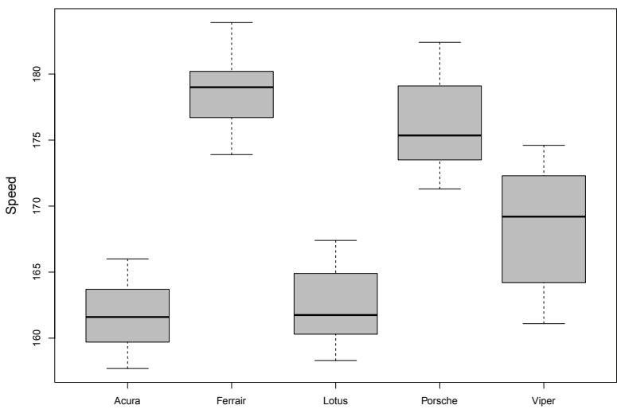
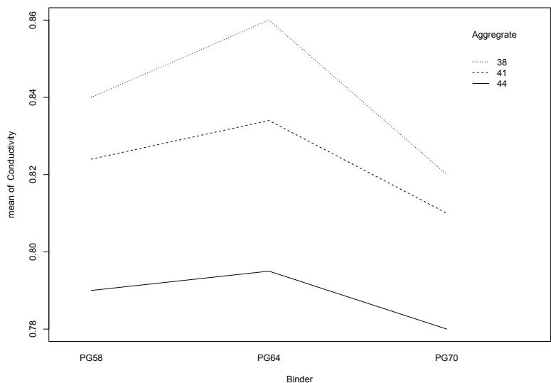
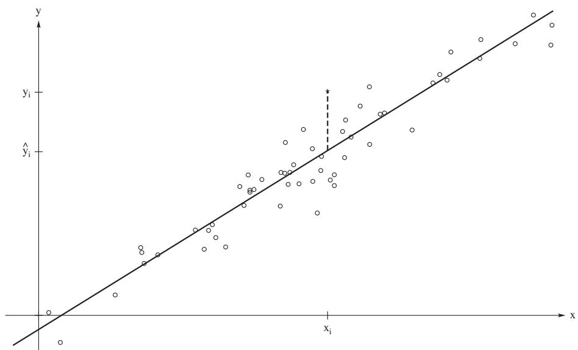
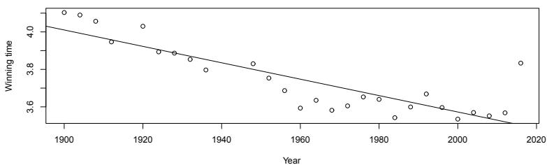
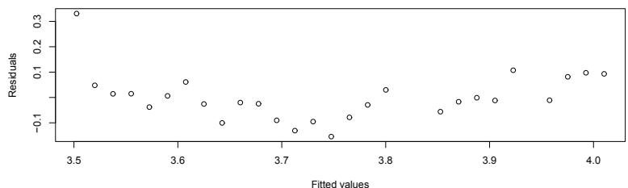
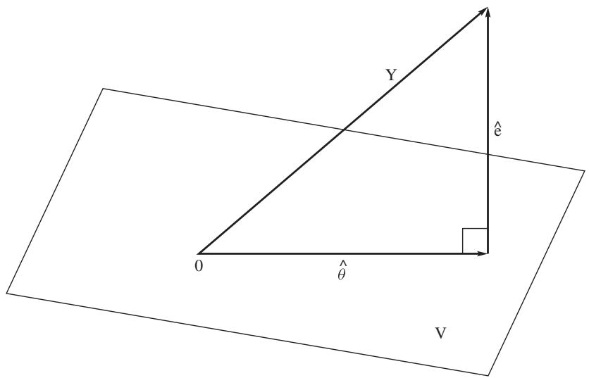

# Inferences About Normal Linear Models

[Package map](../structure.md) · [Unsplit OCR dump](./_full.md)

[← Ch. 8 Optimal Tests of Hypotheses](./08-optimal-tests-of-hypotheses.md) · [Ch. 10 Nonparametric and Robust Statistics →](./10-nonparametric-and-robust-statistics.md)

> MinerU OCR dump. If a formula, table, or numbering disagrees with the PDF, the PDF is authoritative.

---

# Chapter 9

# Inferences About Normal Linear Models

# 9.1 Introduction

In this chapter, we consider analyses of some of the most widely used linear models. These models include one- and two-way analysis of variance (ANOVA) models and regression and correlation models. We generally assume normally distributed random errors for these models. The inference procedures that we discuss are, for the most part, based on maximum likelihood procedures. The theory requires some discussion of quadratic forms which we briefly introduce next.

Consider polynomials of degree 2 in $n$ variables, $X_{1},\ldots ,X_{n}$ , of the form

$$
q (X _ {1}, \ldots , X _ {n}) = \sum_ {i = 1} ^ {n} \sum_ {j = 1} ^ {n} X _ {i} a _ {i j} X _ {j},
$$

for $n^2$ constants $a_{ij}$ . We call this form a quadratic form in the variables $X_1, \ldots, X_n$ . If both the variables and the coefficients are real, it is called a real quadratic form. Only real quadratic forms are considered in this book. To illustrate, the form $X_1^2 + X_1X_2 + X_2^2$ is a quadratic form in the two variables $X_1$ and $X_2$ ; the form $X_1^2 + X_2^2 + X_3^2 - 2X_1X_2$ is a quadratic form in the three variables $X_1, X_2$ , and $X_3$ ; but the form $(X_1 - 1)^2 + (X_2 - 2)^2 = X_1^2 + X_2^2 - 2X_1 - 4X_2 + 5$ is not a quadratic form in $X_1$ and $X_2$ , although it is a quadratic form in the variables $X_1 - 1$ and $X_2 - 2$ .

Let $\overline{X}$ and $S^2$ denote, respectively, the mean and variance of a random sample

$X_{1},X_{2},\ldots ,X_{n}$ from an arbitrary distribution. Thus

$$
\begin{array}{l} (n - 1) S ^ {2} = \sum_ {i = 1} ^ {n} (X _ {i} - \bar {X}) ^ {2} = \sum_ {i = 1} ^ {n} X _ {i} ^ {2} - n \bar {X} ^ {2} \\ = \sum_ {i = 1} ^ {n} X _ {i} ^ {2} - \frac {n}{n ^ {2}} \left(\sum_ {i = 1} ^ {n} X _ {i}\right) ^ {2} \\ = \sum_ {i = 1} ^ {n} X _ {i} ^ {2} - \frac {1}{n} \left(\sum_ {i = 1} ^ {n} X _ {i} \sum_ {j = 1} ^ {n} X _ {j}\right) \\ = \sum_ {i = 1} ^ {n} X _ {i} ^ {2} - \frac {1}{n} \left(\sum_ {i = 1} ^ {n} X _ {i} ^ {2} + 2 \sum_ {i <   j} X _ {i} X _ {j}\right) \\ = \frac {n - 1}{n} \sum_ {i = 1} ^ {n} X _ {i} ^ {2} - \frac {2}{n} \sum_ {i <   j} X _ {i} X _ {j}. \\ \end{array}
$$

So the sample variance is a quadratic form in the variables $X_{1},\ldots ,X_{n}$

# 9.2 One-Way ANOVA

Consider $b$ independent random variables that have normal distributions with unknown means $\mu_1, \mu_2, \ldots, \mu_b$ , respectively, and unknown but common variance $\sigma^2$ . For each $j = 1, 2, \ldots, b$ , let $X_{1j}, X_{2j}, \ldots, X_{nj}$ represent a random sample of size $n_j$ from the normal distribution with mean $\mu_j$ and variance $\sigma^2$ . The appropriate model for the observations is

$$
X _ {i j} = \mu_ {j} + e _ {i j}; \quad i = 1, \dots , n _ {j}, j = 1, \dots , b, \tag {9.2.1}
$$

where $e_{ij}$ are iid $N(0, \sigma^2)$ . Let $n = \sum_{j=1}^{b} n_j$ denote the total sample size. Suppose that it is desired to test the composite hypothesis

$$
H _ {0}: \mu_ {1} = \mu_ {2} = \dots = \mu_ {b} \text {v e r s u s} H _ {1}: \mu_ {j} \neq \mu_ {j ^ {\prime}}, \text {f o r s o m e} j \neq j ^ {\prime}. \tag {9.2.2}
$$

We derive the likelihood ratio test for these hypotheses.

Such problems often arise in practice. For example, suppose for a certain type of disease there are $b$ drugs that can be used to treat it and we are interested in determining which drug is best in terms of a certain response. Let $X_{j}$ denote this response when drug $j$ is applied and let $\mu_{j} = E(X_{j})$ . If we assume that $X_{j}$ is $N(\mu_j,\sigma^2)$ , then the above null hypothesis says that all the drugs are equally effective; see Exercise 9.2.6 for a numerical illustration of this situation involving drugs that are intended to lower cholesterol. In general, we often summarize this problem by saying that we have one factor at $b$ levels. In this case the factor is the treatment of the disease and each level corresponds to one of the treatment drugs.

Model (9.2.1) is called a one-way model. As shown, the likelihood ratio test can be thought of in terms of estimates of variance. Hence, this is an example of an

analysis of variance (ANOVA). In short, we say that this example is a one-way ANOVA problem.

Here the full model parameter space is

$$
\Omega = \left\{\left(\mu_ {1}, \mu_ {2}, \dots , \mu_ {b}, \sigma^ {2}\right): - \infty <   \mu_ {j} <   \infty , 0 <   \sigma^ {2} <   \infty \right\},
$$

while the reduced model (full model under $H_0$ ) parameter space is

$$
\omega = \left\{\left(\mu_ {1}, \mu_ {2}, \dots , \mu_ {b}, \sigma^ {2}\right): - \infty <   \mu_ {1} = \mu_ {2} = \dots = \mu_ {b} = \mu <   \infty , 0 <   \sigma^ {2} <   \infty \right\}.
$$

The likelihood functions, denoted by $L(\Omega)$ and $L(\omega)$ are, respectively,

$$
L (\Omega) = \left(\frac {1}{2 \pi \sigma^ {2}}\right) ^ {a b / 2} \exp \left[ - \frac {1}{2 \sigma^ {2}} \sum_ {j = 1} ^ {b} \sum_ {i = 1} ^ {n _ {j}} (x _ {i j} - \mu_ {j}) ^ {2} \right].
$$

and

$$
L (\omega) = \left(\frac {1}{2 \pi \sigma^ {2}}\right) ^ {a b / 2} \exp \left[ - \frac {1}{2 \sigma^ {2}} \sum_ {j = 1} ^ {b} \sum_ {i = 1} ^ {n _ {j}} (x _ {i j} - \mu) ^ {2} \right]
$$

We first consider the reduced model. Notice that it is just a one sample model with sample size $n$ from a $N(\mu, \sigma^2)$ distribution. We have derived the mles in Example 4.1.3 of Chapter 4, which, in this notation, are given by

$$
\hat {\mu} _ {\omega} = \frac {1}{n} \sum_ {j = 1} ^ {b} \sum_ {i = 1} ^ {n _ {j}} x _ {i j} = \overline {{x}}.. \text {a n d} \hat {\sigma} _ {\omega} ^ {2} = \frac {1}{n} \sum_ {j = 1} ^ {b} \sum_ {i = 1} ^ {n _ {j}} (x _ {i j} - \overline {{x}}..) ^ {2}. \tag {9.2.3}
$$

The notation $\overline{x}$ denotes that the mean is taken over both subscripts. This is often called the grand mean. Evaluating $L(\omega)$ at the mles, we obtain after simplification:

$$
L (\hat {\omega}) = \left(\frac {1}{2 \pi}\right) ^ {n / 2} \left(\frac {1}{\hat {\sigma} _ {\omega} ^ {2}}\right) ^ {n / 2} e ^ {- n / 2}. \tag {9.2.4}
$$

Next, we consider the full model. The log of its likelihood is

$$
\log L (\Omega) = - (n / 2) \log (2 \pi) - (n / 2) \log \left(\sigma^ {2}\right) - \frac {1}{2 \sigma^ {2}} \sum_ {j = 1} ^ {b} \sum_ {i = 1} ^ {n _ {j}} \left(x _ {i j} - \mu_ {j}\right) ^ {2}. \tag {9.2.5}
$$

For $j = 1, \dots, b$ , the partial of the log of $L(\Omega)$ with respect to $\mu_j$ results in

$$
\frac {\partial \log L (\Omega}{\partial \mu_ {j}} = \frac {1}{\sigma^ {2}} \sum_ {i = 1} ^ {n _ {j}} (x _ {i j} - \mu_ {j}).
$$

Setting this partial to 0 and solving for $\mu_j$ , we obtain the mle of $\mu_j$ which we denote by

$$
\hat {\mu} _ {j} = \frac {1}{n _ {j}} \sum_ {i = 1} ^ {n _ {j}} x _ {i j} = \bar {x}. _ {j}, \quad j = 1, \dots , b. \tag {9.2.6}
$$

Since this derivation did not depend on $\sigma$ , to find the mle of $\sigma$ , we substitute $\overline{x}_{.j}$ for $\mu_{j}$ in the $\log L(\Omega)$ . Taking the partial derivative with respect to $\sigma$ we then get

$$
\frac {\partial \log L (\Omega}{\partial \sigma} = - (n / 2) \frac {2 \sigma}{\sigma^ {2}} + \frac {1}{\sigma^ {3}} \sum_ {j = 1} ^ {b} \sum_ {i = 1} ^ {n _ {j}} (x _ {i j} - \overline {{x}} _ {. j}) ^ {2}.
$$

Solving this for $\sigma^2$ , we obtain<sup>1</sup> the mle

$$
\hat {\sigma} _ {\Omega} ^ {2} = \frac {1}{n} \sum_ {j = 1} ^ {b} \sum_ {i = 1} ^ {n _ {j}} \left(x _ {i j} - \bar {x} _ {. j}\right) ^ {2}. \tag {9.2.7}
$$

Substituting these mles for their respective parameters in $L(\Omega)$ , after some simplification, leads to

$$
L (\hat {\Omega}) = \left(\frac {1}{2 \pi}\right) ^ {n / 2} \left(\frac {1}{\hat {\sigma} _ {\Omega} ^ {2}}\right) ^ {n / 2} e ^ {- n / 2}. \tag {9.2.8}
$$

Hence, the likelihood ratio test rejects $H_0$ in favor of $H_1$ for small values of the statistic $\hat{\Lambda} = L(\hat{\omega}) / L(\hat{\Omega})$ or equivalently, for large values of $\hat{\Lambda}^{-2/n}$ . We can express this test statistic as a ratio of two quadratic forms $Q_3$ and $Q$ as

$$
\begin{array}{l} \hat {\Lambda} ^ {n / 2} = \frac {\hat {\sigma} _ {\Omega} ^ {2}}{\hat {\sigma} _ {\omega} ^ {2}} = \frac {\sum_ {j = 1} ^ {b} \sum_ {i = 1} ^ {n _ {j}} (x _ {i j} - \overline {{x}} _ {. j}) ^ {2}}{\sum_ {j = 1} ^ {b} \sum_ {i = 1} ^ {n _ {j}} (x _ {i j} - \overline {{x}} _ {. .}) ^ {2}} \\ = \mathrm {d f n} \frac {Q _ {3}}{Q}. (9. 2. 9) \\ \end{array}
$$

In order to rewrite the test statistic in terms of an $F$ -statistic, consider the identity involving $Q$ , $Q_{3}$ , and another quadratic form $Q_{4}$ given by:

$$
\begin{array}{l} Q = \sum_ {j = 1} ^ {b} \sum_ {i = 1} ^ {n _ {j}} (x _ {i j} - \overline {{x}}.) ^ {2} = \sum_ {j = 1} ^ {b} \sum_ {i = 1} ^ {n _ {j}} [ (x _ {i j} - \overline {{x}}.) + (\overline {{x}}. _ {j} - \overline {{x}}.) ] ^ {2} \\ = \sum_ {j = 1} ^ {b} \sum_ {i = 1} ^ {n _ {j}} \left(x _ {i j} - \bar {x}. _ {j}\right) ^ {2} + \sum_ {j = 1} ^ {b} n _ {j} \left(\bar {x}. _ {j} - \bar {x}. _ {\cdot}\right) ^ {2} \\ = \mathrm {d f n} Q _ {3} + Q _ {4}. \tag {9.2.10} \\ \end{array}
$$

This derivation follows because the cross product term in the second line is 0. Using this identity, the test statistic $\hat{\Lambda}^{-2 / n}$ can be expressed as

$$
\hat {\Lambda} ^ {- 2 / n} = \frac {Q _ {3} + Q _ {4}}{Q _ {3}} = 1 + \frac {Q _ {4}}{Q _ {3}}.
$$

As the final version, note that the test rejects $H_0$ if $F$ is too large where

$$
F = \frac {Q _ {4} / (b - 1)}{Q _ {3} / (n - b)}. \tag {9.2.11}
$$

To complete the test, we need to determine the distribution of $F$ under $H_0$ . First consider the sum of squares in the denominator, $Q_{3}$ , which we write as:

$$
Q _ {3} / \sigma^ {2} = \sum_ {j = 1} ^ {b} \left\{\frac {1}{\sigma^ {2}} \sum_ {i = 1} ^ {n _ {j}} (X _ {i j} - \overline {{X}} _ {. j}) ^ {2} \right\}.
$$

Notice, since we are discussing distributions, we are now using random variable notation. By Part (c) of Theorem 3.6.1, for $j = 1, \ldots, b$ , the term within the braces has a $\chi^2$ -distribution with $n_j - 1$ degrees of freedom. Further, the samples are independent so these $\chi^2$ random variables are independent. Hence, by Corollary 3.3.1, $Q_3 / \sigma^2$ has a $\chi^2$ -distribution with $\sum_{j=1}^{b} (n_j - 1) = n - b$ degrees of freedom. By Part (b) of Theorem 3.6.1, the random variable $\overline{X}_{\cdot j}$ is independent of the sum of squares within the braces and further, by the independence of the samples, it is independent of $Q_3$ . Thus, all $b$ sample means are independent of $Q_3$ . Because $\overline{X}_{\cdot \cdot} = \sum_{j=1}^{b} n_j \overline{X}_{\cdot j}$ , the grand mean $\overline{X}_{\cdot \cdot}$ is a function of the $b$ sample means, it must be independent of $Q_3$ , also. Therefore, $Q_4$ is independent of $Q_3$ . For the distribution of the numerator sum of squares, write the identity (9.2.10) as

$$
Q / \sigma^ {2} = Q _ {3} / \sigma^ {2} + Q _ {4} / \sigma^ {2}.
$$

For the left side, under $H_0$ , $Q / \sigma^2$ has a $\chi^2$ -distribution with $n - 1$ degrees of freedom. On the right side $Q_3 / \sigma^2$ has a $\chi^2$ -distribution with $n - b$ degrees of freedom and it is also independent of $Q_4 / \sigma^2$ . By equating the mgfs of both sides, it follows that $Q_4 / \sigma^2$ has a $\chi^2$ -distribution with $(n - 1) - (n - b) = b - 1$ degrees of freedom. Therefore, under $H_0$ , the $F$ test statistic, (9.2.11), has a $F$ -distribution with $b - 1$ and $n - b$ degrees of freedom.

Suppose now that we wish to compute the power of the test of $H_0$ against $H_1$ when $H_0$ is false, that is, when we do not have $\mu_1 = \mu_2 = \dots = \mu_b$ . In Section 9.3 we show that under $H_1$ , $Q_4 / \sigma^2$ no longer has a $\chi^2(b - 1)$ distribution. Thus we cannot use an $F$ -statistic to compute the power of the test when $H_1$ is true. The problem is discussed in Section 9.3.

Next, based on a simple example, we illustrate the computation of the $F$ -test using R.

Example 9.2.1. Devore (2012), page 412, presents a data set where the response is the elastic modulus for an alloy that is cast by one of three different casting processes. The null hypothesis is that the mean of the elastic modulus is not affected by the casting process. The data are:

<table><tr><td>Cast Method</td><td colspan="8">Elastic Modulus</td></tr><tr><td>Permanent mold</td><td>45.5</td><td>45.3</td><td>45.4</td><td>44.4</td><td>44.6</td><td>43.9</td><td>44.6</td><td>44.0</td></tr><tr><td>Die cast</td><td>44.2</td><td>43.9</td><td>44.7</td><td>44.2</td><td>44.0</td><td>43.8</td><td>44.6</td><td>43.1</td></tr><tr><td>Plaster mold</td><td>46.0</td><td>45.9</td><td>44.8</td><td>46.2</td><td>45.1</td><td>45.5</td><td></td><td></td></tr></table>

The data are in the file `elasticmod.rda`. The variable `elasticmod` contains the response while the variable `ind` contains the casting method (1, 2, or 3). The R code and results (test statistic $F$ and the $p$ -value) are:

oneway.test(elasticmod~ind,var.equal=T)

F = 12.565, num df = 2, denom df = 19, p-value = 0.0003336

With such a low $p$ -value, the null hypothesis would be rejected and we would conclude that the casting method does have an effect on the elastic modulus.

In this example, the experimenter would also be interested in the pairwise comparisons of the casting methods. We consider this in Section 9.4.

# EXERCISES

9.2.1. Consider the $T$ -statistic that was derived through a likelihood ratio for testing the equality of the means of two normal distributions having common variance in Example 8.3.1. Show that $T^2$ is exactly the $F$ -statistic of expression (9.2.11).   
9.2.2. Under Model (9.2.1), show that the linear functions $X_{ij} - \overline{X}_{.j}$ and $\overline{X}_{.j} - \overline{X}_{..}$ are uncorrelated.

Hint: Recall the definition of $\overline{X}_{.j}$ and $\overline{X}_{\cdot}$ and, without loss of generality, we can let $E(X_{ij}) = 0$ for all $i,j$ .

9.2.3. The following are observations associated with independent random samples from three normal distributions having equal variances and respective means $\mu_1, \mu_2, \mu_3$ .

<table><tr><td>I</td><td>II</td><td>III</td></tr><tr><td>0.5</td><td>2.1</td><td>3.0</td></tr><tr><td>1.3</td><td>3.3</td><td>5.1</td></tr><tr><td>-1.0</td><td>0.0</td><td>1.9</td></tr><tr><td>1.8</td><td>2.3</td><td>2.4</td></tr><tr><td></td><td>2.5</td><td>4.2</td></tr><tr><td></td><td></td><td>4.1</td></tr></table>

Using R or another statistical package, compute the $F$ -statistic that is used to test $H_0: \mu_1 = \mu_2 = \mu_3$ .

9.2.4. Let $X_{1}, X_{2}, \ldots, X_{n}$ be a random sample from a normal distribution $N(\mu, \sigma^2)$ . Show that

$$
\sum_ {i = 1} ^ {n} (X _ {i} - \overline {{X}}) ^ {2} = \sum_ {i = 2} ^ {n} (X _ {i} - \overline {{X}} ^ {\prime}) ^ {2} + \frac {n - 1}{n} (X _ {1} - \overline {{X}} ^ {\prime}) ^ {2},
$$

where $\overline{X} = \sum_{i=1}^{n} X_i / n$ and $\overline{X}' = \sum_{i=2}^{n} X_i / (n - 1)$ .

Hint: Replace $X_{i} - \overline{X}$ by $(X_{i} - \overline{X}^{\prime}) - (X_{1} - \overline{X}^{\prime}) / n$ . Show that $\sum_{i=2}^{n}(X_{i} - \overline{X}^{\prime})^{2} / \sigma^{2}$ has a chi-square distribution with $n - 2$ degrees of freedom. Prove that the two terms in the right-hand member are independent. What then is the distribution of

$$
\frac {[ (n - 1) / n ] (X _ {1} - \overline {{X}} ^ {\prime}) ^ {2}}{\sigma^ {2}}?
$$

9.2.5. Using the notation of this section, assume that the means satisfy the condition that $\mu = \mu_{1} + (b - 1)d = \mu_{2} - d = \mu_{3} - d = \dots = \mu_{b} - d$ . That is, the last $b - 1$ means are equal but differ from the first mean $\mu_{1}$ , provided that $d \neq 0$ . Let independent random samples of size $a$ be taken from the $b$ normal distributions with common unknown variance $\sigma^2$ .

(a) Show that the maximum likelihood estimators of $\mu$ and $d$ are $\hat{\mu} = \overline{X}_{\cdot}$ and

$$
\hat {d} = \frac {\sum_ {j = 2} ^ {b} \overline {{X}} _ {. j} / (b - 1) - \overline {{X}} _ {. 1}}{b}.
$$

(b) Using Exercise 9.2.4, find $Q_{6}$ and $Q_{7} = c\hat{d^{2}}$ so that, when $d = 0$ , $Q_{7} / \sigma^{2}$ is $\chi^2(1)$ and

$$
\sum_ {i = 1} ^ {a} \sum_ {j = 1} ^ {b} (X _ {i j} - \overline {{X}} _ {\cdot \cdot}) ^ {2} = Q _ {3} + Q _ {6} + Q _ {7}.
$$

(c) Argue that the three terms in the right-hand member of part (b), once divided by $\sigma^2$ , are independent random variables with chi-square distributions, provided that $d = 0$ .

(d) The ratio $Q_7 / (Q_3 + Q_6)$ times what constant has an $F$ -distribution, provided that $d = 0$ ? Note that this $F$ is really the square of the two-sample $T$ used to test the equality of the mean of the first distribution and the common mean of the other distributions, in which the last $b - 1$ samples are combined into one.

9.2.6. On page 123 of their text, Kloke and McKean (2014) present the results of an experiment investigating 4 drugs (treatments) for their effect on lowering LDL (low density lipids) cholesterol. For the experimental design, 39 quail were randomly assigned to one of the 4 drugs. The drug was mixed in their food, but, other than this, the quail were all treated in the same way. After a specified period of time, the LDL level of each quail was determined. The first drug was a placebo, so the interest is to see if any other of the drugs resulted in lower LDL than the placebo. The data are in the file quailldl.rda. The first column of this matrix contains the drug indicator (1 through 4) for the quail while the second column contains the ldl level of that quail.

(a) Obtain comparison boxplots of LDL levels. Which drugs seem to result in lower LDL levels? Identify, by observation number, the outliers in the data.   
(b) Compute the $F$ -test that all mean levels of LDL are the same for all 4 drugs. Report the $F$ -test statistic and $p$ -value. Conclude in terms of the problem using the nominal significance level of 0.05. Use the R code in Example 9.2.1.   
(c) Does your conclusion in Part (b) agree with the boxplots of Part (a)?

(d) Note that one assumption for the $F$ -test is that the random errors $e_{ij}$ in Model (9.2.1) are normally distributed. An estimate of $e_{ij}$ is $x_{ij} - \overline{x}.j$ . These are called residuals, i.e., what is left after the full model fit. Compute these residuals and then obtain a histogram, a boxplot, and a normal $q - q$ plot of them. Comment on the normality assumption. Use the code:

$$
\operatorname {r e s d} <   - \operatorname {l m} (\text {q u a i l m a t} [, 2 ] \tilde {\sim} \text {f a c t o r} (\text {q u a i l m a t} [, 1 ])) \mathbb {S} \text {r e s i d}
$$

$$
\operatorname {p a r} (\text {m f r o w} = \mathrm {c} (2, 2)); \text {h i s t} (\text {r e s d}); \text {b o x p l o t} (\text {r e s d}); \text {q q n o r m} (\text {r e s d})
$$

9.2.7. Let $\mu_1, \mu_2, \mu_3$ be, respectively, the means of three normal distributions with a common but unknown variance $\sigma^2$ . In order to test, at the $\alpha = 5\%$ significance level, the hypothesis $H_0: \mu_1 = \mu_2 = \mu_3$ against all possible alternative hypotheses, we take an independent random sample of size 4 from each of these distributions. Determine whether we accept or reject $H_0$ if the observed values from these three distributions are, respectively,

$$
X _ {1}: \quad 5 \quad 9 \quad 6 \quad 8
$$

$$
X _ {2}: \quad 1 1 \quad 1 3 \quad 1 0 \quad 1 2
$$

$$
X _ {3}: \quad 1 0 \quad 6 \quad 9 \quad 9
$$

9.2.8. The driver of a diesel-powered automobile decided to test the quality of three types of diesel fuel sold in the area based on mpg. Test the null hypothesis that the three means are equal using the following data. Make the usual assumptions and take $\alpha = 0.05$ .

Brand A: 38.7 39.2 40.1 38.9

Brand B: 41.9 42.3 41.3

Brand C: 40.8 41.2 39.5 38.9 40.3

# 9.3 Noncentral $\chi^2$ and $F$ -Distributions

Let $X_{1}, X_{2}, \ldots, X_{n}$ denote independent random variables that are $N(\mu_i, \sigma^2)$ , $i = 1, 2, \ldots, n$ , and consider the quadratic form $Y = \sum_{1}^{n} X_{i}^{2} / \sigma^{2}$ . If each $\mu_i$ is zero, we know that $Y$ is $\chi^2(n)$ . We shall now investigate the distribution of $Y$ when each $\mu_i$ is not zero. The mgf of $Y$ is given by

$$
\begin{array}{l} M (t) = E \left[ \exp \left(t \sum_ {i = 1} ^ {n} \frac {X _ {i} ^ {2}}{\sigma^ {2}}\right) \right] \\ = \prod_ {i = 1} ^ {n} E \left[ \exp \left(t \frac {X _ {i} ^ {2}}{\sigma^ {2}}\right) \right]. \\ \end{array}
$$

Consider

$$
E \left[ \exp \left(\frac {t X _ {i} ^ {2}}{\sigma^ {2}}\right) \right] = \int_ {- \infty} ^ {\infty} \frac {1}{\sigma \sqrt {2 \pi}} \exp \left[ \frac {t x _ {i} ^ {2}}{\sigma^ {2}} - \frac {(x _ {i} - \mu_ {i}) ^ {2}}{2 \sigma^ {2}} \right] d x _ {i}.
$$

The integral exists if $t < \frac{1}{2}$ . To evaluate the integral, note that

$$
\begin{array}{l} \frac {t x _ {i} ^ {2}}{\sigma^ {2}} - \frac {(x _ {i} - \mu_ {i}) ^ {2}}{2 \sigma^ {2}} = - \frac {x _ {i} ^ {2} (1 - 2 t)}{2 \sigma^ {2}} + \frac {2 \mu_ {i} x _ {i}}{2 \sigma^ {2}} - \frac {\mu_ {i} ^ {2}}{2 \sigma^ {2}} \\ = \frac {t \mu_ {i} ^ {2}}{\sigma^ {2} (1 - 2 t)} - \frac {1 - 2 t}{2 \sigma^ {2}} \left(x _ {i} - \frac {\mu_ {i}}{1 - 2 t}\right) ^ {2}. \\ \end{array}
$$

Accordingly, with $t < \frac{1}{2}$ , we have

$$
E \left[ \exp \left(\frac {t X _ {i} ^ {2}}{\sigma^ {2}}\right) \right] = \exp \left[ \frac {t \mu_ {i} ^ {2}}{\sigma^ {2} (1 - 2 t)} \right] \int_ {- \infty} ^ {\infty} \frac {1}{\sigma \sqrt {2 \pi}} \exp \left[ - \frac {1 - 2 t}{2 \sigma^ {2}} \left(x _ {i} - \frac {\mu_ {i}}{1 - 2 t}\right) ^ {2} \right] d x _ {i}.
$$

If we multiply the integrand by $\sqrt{1 - 2t}$ , $t < \frac{1}{2}$ , we have the integral of a normal pdf with mean $\mu_i / (1 - 2t)$ and variance $\sigma^2 / (1 - 2t)$ . Thus

$$
E \left[ \exp \left(\frac {t X _ {i} ^ {2}}{\sigma^ {2}}\right) \right] = \frac {1}{\sqrt {1 - 2 t}} \exp \left[ \frac {t \mu_ {i} ^ {2}}{\sigma^ {2} (1 - 2 t)} \right],
$$

and the mgf of $Y = \sum_{1}^{n}X_{i}^{2} / \sigma^{2}$ is given by

$$
M (t) = \frac {1}{(1 - 2 t) ^ {n / 2}} \exp \left[ \frac {t \sum_ {1} ^ {n} \mu_ {i} ^ {2}}{\sigma^ {2} (1 - 2 t)} \right], \quad t <   \frac {1}{2}. \tag {9.3.1}
$$

A random variable that has the mgf

$$
M (t) = \frac {1}{(1 - 2 t) ^ {r / 2}} e ^ {t \theta / (1 - 2 t)}, \tag {9.3.2}
$$

where $t < \frac{1}{2}$ , $0 < \theta$ , and $r$ is a positive integer, is said to have a noncentral chi-square distribution with $r$ degrees of freedom and noncentrality parameter $\theta$ . If one sets the noncentrality parameter $\theta = 0$ , one has $M(t) = (1 - 2t)^{-r/2}$ , which is the mgf of a random variable that is $\chi^2(r)$ . Such a random variable can appropriately be called a central chi-square variable. We shall use the symbol $\chi^2(r,\theta)$ to denote a noncentral chi-square distribution that has the parameters $r$ and $\theta$ ; and we shall say that a random variable is $\chi^2(r,\theta)$ when that random variable has this kind of distribution. The symbol $\chi^2(r,0)$ is equivalent to $\chi^2(r)$ . Thus our random variable $Y = \sum_{1}^{n} X_i^2 / \sigma^2$ of this section is $\chi^2\left(n, \sum_{1}^{n} \mu_i^2 / \sigma^2\right)$ . The mean of $Y$ is given by

$$
E (Y) = \frac {1}{\sigma^ {2}} \sum_ {i = 1} ^ {n} E \left(X _ {i} ^ {2}\right) = \frac {1}{\sigma^ {2}} \sum_ {i = 1} ^ {n} \left(\sigma^ {2} + \mu_ {i} ^ {2}\right) = n + \theta , \tag {9.3.3}
$$

i.e., the mean of the central $\chi^2$ plus the noncentrality parameter. If each $\mu_i$ is equal to zero, then $Y$ is $\chi^2(n,0)$ or, more simply, $Y$ is $\chi^2(n)$ with mean $n$ .

The noncentral $\chi^2$ -variables, in which we have interest, are certain quadratic forms in normally distributed variables divided by a variance $\sigma^2$ . In our example it is worth noting that the noncentrality parameter of $\sum_{1}^{n}X_{i}^{2} / \sigma^{2}$ , which is

$\sum_{1}^{n}\mu_{i}^{2} / \sigma^{2}$ , may be computed by replacing each $X_{i}$ in the quadratic form by its mean $\mu_{i}$ , $i = 1,2,\ldots ,n$ . This is no fortuitous circumstance; any quadratic form $Q = Q(X_{1},\dots,X_{n})$ in normally distributed variables, which is such that $Q / \sigma^2$ is $\chi^2 (r,\theta)$ , has $\theta = Q(\mu_1,\mu_2,\dots,\mu_n) / \sigma^2$ ; and if $Q / \sigma^2$ is a chi-square variable (central or noncentral) for certain real values of $\mu_1,\mu_2,\dots,\mu_n$ , it is chi-square (central or noncentral) for all real values of these means.

We next discuss the noncentral $F$ -distribution. If $U$ and $V$ are independent and are, respectively, $\chi^2(r_1)$ and $\chi^2(r_2)$ , the random variable $F$ has been defined by $F = r_2 U / r_1 V$ . Now suppose, in particular, that $U$ is $\chi^2(r_1, \theta)$ , $V$ is $\chi^2(r_2)$ , and $U$ and $V$ are independent. The distribution of the random variable $r_2 U / r_1 V$ is called a noncentral $F$ -distribution with $r_1$ and $r_2$ degrees of freedom with noncentrality parameter $\theta$ . Note that the noncentrality parameter of $F$ is precisely the noncentrality parameter of the random variable $U$ , which is $\chi^2(r_1, \theta)$ . To obtain the expectation of $F$ , use the $E(U)$ in expression (9.3.3) and the derivation of the expected value of a central $F$ given in expression (3.6.8). These together immediately imply that

$$
E (F) = \frac {r _ {2}}{r _ {2} - 2} \left[ \frac {r _ {1} + \theta}{r _ {1}} \right], \tag {9.3.4}
$$

provided, of course, that $r_2 > 2$ . If $\theta > 0$ then the quantity in brackets exceeds one and, hence, the mean of the noncentral $F$ exceeds the mean of the corresponding central $F$ .

We next discuss the noncentral $F$ distribution for the one-way ANOVA of the last section.

Example 9.3.1 (Noncentrality Parameter for One-way ANOVA). Consider the one-way model with $b$ levels, expression (9.2.1), with the hypotheses $H_0: \mu_1 = \dots = \mu_b$ versus $H_1: \mu_j \neq \mu_{j'}$ for some $j \neq j'$ . From expression (9.2.11), the $F$ test statistic is $F = [Q_4 / (b - 1)] / [Q_3 / (n - b)]$ . In the denominator, the random variable $Q_3 / \sigma^2$ is $\chi^2(n - b)$ under the full model and, hence, in particular, under $H_1$ . It follows from Remark 9.8.3 of Section 9.8, though, that the distribution of $Q_4 / \sigma^2$ is noncentral $\chi^2(b - 1, \theta)$ under the full model. Recall that

$$
Q _ {4} / \sigma^ {2} = \frac {1}{\sigma^ {2}} \sum_ {j = 1} ^ {b} n _ {j} (\overline {{X}} _ {\cdot j} - \overline {{X}} _ {\cdot \cdot}) ^ {2}.
$$

Under the full model, $E(\overline{X}_{\cdot j}) = \mu_j$ and $E(\overline{X}_{\cdot \cdot}) = \sum_{j=1}^{b}(n_j / n)\mu_j$ . Calling this last expectation $\overline{\mu}$ , we have from the above discussion that

$$
\theta = \frac {1}{\sigma^ {2}} \sum_ {j = 1} ^ {b} n _ {j} \left(\mu_ {j} - \bar {\mu}\right) ^ {2}. \tag {9.3.5}
$$

If $H_0$ is true then $\mu_j \equiv \mu$ , for some $\mu$ , and, hence, $\overline{\mu} = \mu$ . Thus, under $H_0$ , $\theta = 0$ . Under $H_1$ , there are distinct $j$ and $j'$ such that $\mu_j \neq \mu_{j'}$ . In particular, then both $\mu_j$ and $\mu_{j'}$ cannot equal $\overline{\mu}$ , so $\theta > 0$ . Therefore, under $H_1$ the expectation of $F$ exceeds the null expectation.

There are R commands that compute the cdf of noncentral $\chi^2$ and $F$ random variables. For example, suppose we want to compute $P(Y \leq y)$ , where $Y$ has a $\chi^2$ -distribution with $\mathsf{d}$ degrees of freedom and noncentrality parameter $\mathsf{b}$ . This probability is returned with the command pchisq(y,d,b). The corresponding value of the pdf at $y$ is computed by the command dchisq(y,d,b). As another example, suppose we want $P(W \geq w)$ , where $W$ has an $F$ -distribution with n1 and n2 degrees of freedom and noncentrality parameter theta. This is computed by the command 1-pf(w,n1,n2,theta), while the command df(w,n1,n2,theta) computes the value of the density of $W$ at $w$ . Tables of the noncentral chi-square and noncentral $F$ -distributions are available in the literature also.

# EXERCISES

9.3.1. Let $Y_{i}$ , $i = 1,2,\ldots ,n$ , denote independent random variables that are, respectively, $\chi^2 (r_i,\theta_i)$ , $i = 1,2,\dots ,n$ . Prove that $Z = \sum_{1}^{n}Y_{i}$ is $\chi^2\left(\sum_1^n r_i,\sum_1^n\theta_i\right)$ .

9.3.2. Compute the variance of a random variable that is $\chi^2 (r,\theta)$

9.3.3. Three different medical procedures (A, B, and C) for a certain disease are under investigation. For the study, $3m$ patients having this disease are to be selected and $m$ are to be assigned to each procedure. This common sample size $m$ must be determined. Let $\mu_1, \mu_2$ , and $\mu_3$ , be the means of the response of interest under treatments A, B, and C, respectively. The hypotheses are: $H_0: \mu_1 = \mu_2 = \mu_3$ versus $H_1: \mu_j \neq \mu_{j'}$ for some $j \neq j'$ . To determine $m$ , from a pilot study the experimenters use a guess of 30 of $\sigma^2$ and they select the significance level of 0.05. They are interested in detecting the pattern of means: $\mu_2 = \mu_1 + 5$ and $\mu_3 = \mu_1 + 10$ .

(a) Determine the noncentrality parameter under the above pattern of means.   
(b) Use the R function pf to determine the powers of the $F$ -test to detect the above pattern of means for $m = 5$ and $m = 10$ .   
(c) Determine the smallest value of $m$ so that the power of detection is at least 0.80.   
(d) Answer (a)-(c) if $\sigma^2 = 40$

9.3.4. Show that the square of a noncentral $T$ random variable is a noncentral $F$ random variable.

9.3.5. Let $X_{1}$ and $X_{2}$ be two independent random variables. Let $X_{1}$ and $Y = X_{1} + X_{2}$ be $\chi^2 (r_1,\theta_1)$ and $\chi^2 (r,\theta)$ , respectively. Here $r_1 < r$ and $\theta_{1}\leq \theta$ . Show that $X_{2}$ is $\chi^2 (r - r_1,\theta -\theta_1)$ .

# 9.4 Multiple Comparisons

For this section, consider the one-way ANONA model with $b$ treatments as described in expression (9.2.1) of Section 9.2. In that section, we developed the $F$ -test

of the hypotheses of equal means, (9.2.2). In practice, besides this test, statisticians usually want to make pairwise comparisons of the form $\mu_j - \mu_{j'}$ . This is often called the Second Stage Analysis, while the $F$ -test is considered the First Stage Analysis. The analysis for such comparisons usually consists of confidence intervals for the differences $\mu_j - \mu_{j'}$ and $\mu_j$ is declared different from $\mu_{j'}$ if 0 is not in the confidence interval. The random samples for treatments $j$ and $j'$ are: $X_{1j}, \ldots, X_{nj}$ from the $N(\mu_j, \sigma^2)$ distribution and $X_{1j'}, \ldots, X_{n_{j'}j'}$ from the $N(\mu_{j'}, \sigma^2)$ distribution, which are independent random samples. Based on these samples the estimator of $\mu_j - \mu_{j'}$ is $\overline{X}_{\cdot j} - \overline{X}_{\cdot j'}$ . Further in the one-way analysis, an estimator of $\sigma^2$ is the full model estimator $\hat{\sigma^2}_{\Omega}$ defined in expression (9.2.7). As discussed in Section 9.2, $(n - b)\hat{\sigma^2}_{\Omega} / \sigma^2$ has a $\chi^2(n - b)$ distribution which is independent of all the sample means $\overline{X}_{\cdot j}$ . Hence, for a specified $\alpha$ it follows as in (4.2.13) of Chapter 4 that

$$
\bar {X} _ {\cdot j} - \bar {X} _ {\cdot j ^ {\prime}} \pm t _ {\alpha / 2, n - b} \hat {\sigma} _ {\Omega} \sqrt {\frac {1}{n _ {j}} + \frac {1}{n _ {j ^ {\prime}}}} \tag {9.4.1}
$$

is a $(1 - \alpha)100\%$ confidence interval for $\mu_{j} - \mu_{j^{\prime}}$ .

We often want to make many pairwise comparisons, though. For example, the first treatment might be a placebo or represent the standard treatment. In this case, there are $b - 1$ pairwise comparisons of interest. On the other hand, we may want to make all $\binom{b}{2}$ pairwise comparisons. In making so many comparisons, while each confidence interval, (9.4.1), has confidence $(1 - \alpha)$ , it would seem that the overall confidence diminishes. As we next show, this slippage of overall confidence is true. These problems are often called Multiple Comparison Problems (MCP). In this section, we present several MCP procedures.

# Bonferroni Multiple Comparison Procedure

It is easy to motivate the Bonferroni Procedure while, at the same time, showing the slippage of confidence. This procedure is quite general and can be used in many settings not just the one-way design. So suppose we have $k$ parameters $\theta_{i}$ with $(1 - \alpha)100\%$ confidence intervals $I_{i}$ , $i = 1,\dots ,k$ , where $0 < \alpha < 1$ is given. Then the overall confidence is $P(\theta_1\in I_1,\ldots ,\theta_k\in I_k)$ . Using the method of complements, DeMorgan's Laws, and Boole's inequality, expression (1.3.7) of Chapter 1, we have

$$
\begin{array}{l} P \left(\theta_ {1} \in I _ {1}, \dots , \theta_ {k} \in I _ {k}\right) = 1 - P \left(\cup_ {i = 1} ^ {k} \theta_ {i} \notin I _ {i}\right) \\ \geq 1 - \sum_ {i = 1} ^ {k} P \left(\theta_ {i} \notin I _ {i}\right) = 1 - k \alpha . \tag {9.4.2} \\ \end{array}
$$

The quantity $1 - k\alpha$ is the lower bound on the slippage of confidence. For example, if $k = 20$ and $\alpha = 0.05$ then the overall confidence may be 0. The Bonferroni procedure follows from expression (9.4.2). Simply change the confidence level of each confidence interval to $[1 - (\alpha /k)]$ . Then the overall confidence is at least $1 - \alpha$ .

For our one-way analysis, suppose we have $k$ differences of interest. Then the

Bonferroni confidence interval for $\mu_{j} - \mu_{j^{\prime}}$ is

$$
\bar {X} _ {\cdot j} - \bar {X} _ {\cdot j ^ {\prime}} \pm t _ {\alpha / (2 k), n - b} \hat {\sigma} _ {\Omega} \sqrt {\frac {1}{n _ {j}} + \frac {1}{n _ {j ^ {\prime}}}} \tag {9.4.3}
$$

While the overall confidence of the Bonferroni procedure is at least $(1 - \alpha)$ , for a large number of comparisons, the lengths of its intervals are wide; i.e., a loss in precision. We offer two other procedures that, generally, lessen this effect.

The R function mcpbon.R² computes the Bonferroni procedure for all pairwise comparisons for a one-way design. The call is mcpbon(y, ind, alpha=0.05) where y is the vector of the combined samples and ind is the corresponding treatment vector. See Example 9.4.1 below.

# Tukey's Multiple Comparison Procedure

To state Tukey's procedure, we first need to define the Studentized range distribution.

Definition 9.4.1. Let $Y_{1}, \ldots, Y_{k}$ be iid $N(\mu, \sigma^{2})$ . Denote the range of these variables by $R = \max \{Y_{i}\} - \min \{Y_{i}\}$ . Suppose $mS^{2}/\sigma^{2}$ has a $\chi^{2}(m)$ distribution which is independent of $Y_{1}, \ldots, Y_{k}$ . Then we say that $Q = R/S$ has a Studentized range distribution with parameters $k$ and $m$ .

The distribution of $Q$ cannot be obtained in close form but packages such as R have functions that compute the cdf and quantiles. In R, the call ptukey(x,k,m) computes the cdf of $Q$ at $x$ , while the call qtukey(p,k,m) returns the $p$ th quantile.

Consider the one-way design. First, assume that all the sample sizes are the same; i.e., for some positive integer $a$ , $n_j = a$ , for all $j = 1, \ldots, b$ . Let $R = \mathrm{Range}\{\overline{X}_{\cdot 1} - \mu_1, \ldots, \overline{X}_{\cdot b} - \mu_b\}$ . Then since $\overline{X}_{\cdot 1} - \mu_1, \ldots, \overline{X}_{\cdot b} - \mu_b$ are iid $N(0, \sigma^2 / a)$ , the random variable $Q = R / (\hat{\sigma}_{\Omega} / \sqrt{a})$ has a Studentized range distribution with parameters $b$ and $n - b$ . Let $q_c = q_{1 - \alpha, b, n - b}$ .

$$
\begin{array}{l} 1 - \alpha = P (Q \leq q _ {c}) = P \left(\max  \left\{\bar {X} _ {. j} - \mu_ {j} \right\} - \min  \left\{\bar {X} _ {. j} - \mu_ {j} \right\} \leq q _ {c} \hat {\sigma} _ {\Omega} / \sqrt {a}\right) \\ = P \left(| (\mu_ {j} - \mu_ {j ^ {\prime}}) - (\bar {X} _ {. j} - \bar {X} _ {. j ^ {\prime}}) | \leq q _ {c} \hat {\sigma} _ {\Omega} / \sqrt {a}, \text {f o r a l l} j, j ^ {\prime}\right) \\ \end{array}
$$

If we expand the inequality in the last statement, we obtain the $(1 - \alpha)100\%$ simultaneous confidence intervals for all pairwise differences given by

$$
\overline {{X}} _ {\cdot j} - \overline {{X}} _ {\cdot j ^ {\prime}} \pm q _ {1 - \alpha , b, n - b} \frac {\hat {\sigma} _ {\Omega}}{\sqrt {a}}, \quad \text {f o r a l l} j, j ^ {\prime} \text {i n} 1, \dots b. \tag {9.4.4}
$$

The statistician John Tukey developed these simultaneous confidence intervals for the balanced case. For the unbalanced case, first write the error term in (9.4.4) as

$$
\frac {q _ {1 - \alpha , b , n - b}}{\sqrt {2}} \hat {\sigma} _ {\Omega} \sqrt {\frac {1}{a} + \frac {1}{a}}.
$$

For the unbalanced case, this suggests the following intervals

$$
\overline {{X}} _ {\cdot j} - \overline {{X}} _ {\cdot j ^ {\prime}} \pm \frac {q _ {1 - \alpha , b , n - b}}{\sqrt {2}} \hat {\sigma} _ {\Omega} \sqrt {\frac {1}{n _ {j}} + \frac {1}{n _ {j ^ {\prime}}}}, \quad \text {f o r a l l} j, j ^ {\prime} \text {i n} 1, \dots b. \tag {9.4.5}
$$

This correction is due to Kramer and these intervals are often referred to as the Tukey-Kramer multiple comparison procedure; see Miller (1981) for discussion. These intervals do not have exact confidence $(1 - \alpha)$ but studies have indicated that if the unbalance is not severe the confidence is close to $(1 - \alpha)$ ; see Dunnett (1980). Corresponding R code is shown in Example 9.4.1.

# Fisher's PLSD Multiple Comparison Procedure

The final procedure we discuss is Fisher's Protected Least Significance Difference (PLSD). The setting is the general (unbalanced) one-way design (9.2.1). This procedure is a two-stage procedure. It can be used for an arbitrary umber of comparisons but we state it for all comparisons. For a specified level of significance $\alpha$ , Stage 1 consists of the $F$ -test of the hypotheses of equal means, (9.2.2). If the test rejects at level $\alpha$ then Stage 2 consists of the usual pairwise $(1 - \alpha)100\%$ confidence intervals, i.e.,

$$
\overline {{X}} _ {j} - \overline {{X}} _ {j ^ {\prime}} \pm t _ {\alpha / 2, n - b} \hat {\sigma} _ {\Omega} \sqrt {\frac {1}{n _ {j}} + \frac {1}{n _ {j ^ {\prime}}}}, \quad \text {f o r a l l} j, j ^ {\prime} \text {i n} 1, \dots , b. \tag {9.4.6}
$$

If the test in Stage 1 fails to reject, users sometimes perform Stage 2 using the Bonferroni procedure. Fisher's procedure does not have overall coverage $1 - \alpha$ , but the initial $F$ -test offers protection. Simulation studies have shown that Fisher's procedure performs well in terms of power and level; see, for instance, Carmer and Swanson (1973) and McKean et al. (1989). The R function<sup>3</sup> mcpfisher.R computes this procedure as discussed in the next example.

Example 9.4.1 (Fast Cars). Kitchens (1997) discusses an experiment concerning the speed of cars. Five cars are considered: Acura (1), Ferrari (2), Lotus (3), Porsche (4), and Viper (5). For each car, 6 runs were made, 3 in each direction. For each run, the speed recorded is the maximum speed on the run achieved without exceeding the engine's redline. The data are in the file fastcars.rda. Figure 9.4.1 displays the comparison boxplots of the speeds versus the cars, which shows clearly that there are differences in speed due to the car. Ferrari and Porsche seem to be the fastest but are the differences significant? We assume the one-way design (9.2.1) and use R to do the computations. Key commands and corresponding results are given next. The overall $F$ -test of the hypotheses of equal means, (9.2.2), is quite significant: $F = 25.15$ with the $p$ -value 0.0000. We selected the Tukey MCP at level 0.05. The command below returns all $\binom{5}{2} = 10$ pairwise comparisons, but in our summary we only list two.

Code assumes that fastcars.rda has been loaded in R

```powershell
>fit<-lm(speed~factor(car))   
>anova(fit)   
##F-Stat and p-value 25.145 1.903e-08   
>aovfit<-aov(speed~factor(car))   
>TukeyHSD(aovfit)   
#Tukey's procedures of all pairwise comparisons are computed.   
##Summary of a pertinent few   
##Cars Mean-diff LB CI UB CI Sig??   
##Porsche-Ferrari -2.6166667 -9.0690855 3.835752 NS   
##Viper-Porsche -7.7333333 -14.1857522 -1.280914 Sig.   
##Bonferroni   
>mpbon(speed,car)   
##Porsche-Ferrari -2.6166667 -9.3795891 4.1462558 NS   
##Viper-Porsche -7.7333333 -14.496255 -0.9704109 Sig.   
2.197038 6.762922 0.9704109 14.49625578   
##Fisher   
>mcpfisher(speed,car)   
##ftest 2.514542e+01 1.903360e-08   
##Porsche-Ferrari -2.6166667 -7.141552 1.908219 NS   
##Viper-Porsche -7.7333333 -12.258219 -3.208448 Sig. 
```

For discussion, we cite only two of Tukey's confidence intervals. As the second interval in the above printout shows, the mean speeds of both the Ferrari and Porsche are significantly faster than the mean speeds of the other cars. The difference between the Ferrari's and Porsche's mean speeds, though, is insignificant. Below the two Tukey confidence intervals, we display the results based on the Bonferroni and Fisher procedures. Note that all three procedures result in the same conclusions for these comparisons. The Bonferroni intervals are slightly larger than those of the Tukey procedure. The Fisher procedure gives the shortest intervals as expected.

In practice, the Tukey-Kramer procedure is often used, but there are many other multiple comparison procedures. A classical monograph on MCPs is Miller (1981) while Hus (1996) offers a more recent discussion.

# EXERCISES

9.4.1. For the study discussed in Exercise 9.2.8, obtain the results of Bonferroni multiple comparison procedure using $\alpha = 0.10$ . Based on this procedure, which brand of fuel if any is significantly best?   
9.4.2. For the study discussed in Exercise 9.2.6, compute the Tukey-Kramer procedure. Are there any significant differences?   
9.4.3. Suppose $X$ and $Y$ are discrete random variables that have the common range $\{1,2,\ldots,k\}$ . Let $p_{1j}$ and $p_{2j}$ be the respective probabilities $P(X = j)$ and

  
Figure 9.4.1: Boxplot of car speeds cited in Example 9.4.1.

$P(Y = j)$ . Let $X_{1},\ldots ,X_{n_{1}}$ and $Y_{1},\ldots ,Y_{n_{2}}$ be respective independent random samples on $X$ and $Y$ . The samples are recorded in a $2\times k$ contingency table of counts $O_{ij}$ , where $O_{1j} = \# \{X_i = j\}$ and $O_{2j} = \# \{Y_i = j\}$ . In Example 4.7.3, based on this table, we discussed a test that the distributions of $X$ and $Y$ are the same. Here we want to consider all the differences $p_{1j} - p_{2j}$ for $j = 1,\dots ,k$ . Let $\hat{p}_{ij} = O_{ij} / n_i$ .

(a) Determine the Bonferroni method for performing all these comparisons.   
(b) Determine the Fisher method for performing all these comparisons.

9.4.4. Suppose the samples in Exercise 9.4.3 resulted in the contingency table:

<table><tr><td></td><td>1</td><td>2</td><td>3</td><td>4</td><td>5</td><td>6</td><td>7</td><td>8</td><td>9</td><td>10</td></tr><tr><td>x</td><td>20</td><td>31</td><td>56</td><td>18</td><td>45</td><td>55</td><td>47</td><td>78</td><td>56</td><td>81</td></tr><tr><td>y</td><td>36</td><td>41</td><td>65</td><td>15</td><td>38</td><td>78</td><td>18</td><td>72</td><td>59</td><td>85</td></tr></table>

To compute (in R) the confidence intervals below, use the command prop.test as in Example 4.2.5.

(a) Based on the Bonferroni procedure for all 10 comparisons, compute the confidence interval for $p_{16} - p_{26}$ .   
(b) Based on the Fisher procedure for all 10 comparisons, compute the confidence interval for $p_{16} - p_{26}$ .

9.4.5. Write an R function that computes the Fisher procedure of Exercise 9.4.3. Validate it using the data of Exercise 9.4.4.

9.4.6. Extend the Bonferroni procedure to simultaneous testing. That is, suppose we have $m$ hypotheses of interest: $H_{0i}$ versus $H_{1i}$ , $i = 1,\dots,m$ . For testing $H_{0i}$ versus $H_{1i}$ , let $C_{i,\alpha}$ be a critical region of size $\alpha$ and assume $H_{0i}$ is rejected if $\mathbf{X}_i\in C_{i,\alpha}$ , for a sample $\mathbf{X}_i$ . Determine a rule so that we can simultaneously test these $m$ hypotheses with a Type I error rate less than or equal to $\alpha$ .

# 9.5 Two-Way ANOVA

Recall the one-way analysis of variance (ANOVA) problem considered in Section 9.2 which was concerned with one factor at $b$ levels. In this section, we are concerned with the situation where we have two factors $A$ and $B$ with levels $a$ and $b$ , respectively. This is called a two-way analysis of variance (ANOVA). Let $X_{ij}$ , $i = 1, 2, \ldots, a$ and $j = 1, 2, \ldots, b$ , denote the response for factor $A$ at level $i$ and factor $B$ at level $j$ . Denote the total sample size by $n = ab$ . We shall assume that the $X_{ij}$ s are independent normally distributed random variables with common variance $\sigma^2$ . Denote the mean of $X_{ij}$ by $\mu_{ij}$ . The mean $\mu_{ij}$ is often referred to as the mean of the $(i,j)$ th cell. For our first model, we consider the additive model where

$$
\mu_ {i j} = \bar {\mu} + (\bar {\mu} _ {i.} - \bar {\mu}) + (\bar {\mu} _ {. j} - \bar {\mu}); \tag {9.5.1}
$$

that is, the mean in the $(i,j)$ th cell is due to additive effects of the levels, $i$ of factor A and $j$ of factor $B$ , over the average (constant) $\overline{\mu}$ . Let $\alpha_{i} = \overline{\mu}_{i}$ . $-\overline{\mu}$ , $i = 1,\ldots,a$ ; $\beta_{j} = \overline{\mu}_{\cdot j} - \overline{\mu}$ , $j = 1,\ldots,b$ ; and $\mu = \overline{\mu}$ . Then the model can be written more simply as

$$
\mu_ {i j} = \mu + \alpha_ {i} + \beta_ {j}, \tag {9.5.2}
$$

where $\sum_{i=1}^{a} \alpha_{i} = 0$ and $\sum_{j=1}^{b} \beta_{j} = 0$ . We refer to this model as being a two-way additive ANOVA model.

For example, take $a = 2$ , $b = 3$ , $\mu = 5$ , $\alpha_{1} = 1$ , $\alpha_{2} = -1$ , $\beta_{1} = 1$ , $\beta_{2} = 0$ , and $\beta_{3} = -1$ . Then the cell means are

<table><tr><td rowspan="2" colspan="2"></td><td colspan="3">Factor B</td></tr><tr><td>1</td><td>2</td><td>3</td></tr><tr><td rowspan="2">Factor A</td><td>1</td><td>μ11 = 7</td><td>μ12 = 6</td><td>μ13 = 5</td></tr><tr><td>2</td><td>μ21 = 5</td><td>μ22 = 4</td><td>μ23 = 3</td></tr></table>

Note that for each $i$ , the plots of $\mu_{ij}$ versus $j$ are parallel. This is true for additive models in general; see Exercise 9.5.9. We call these plots mean profile plots.

Had we taken $\beta_{1} = \beta_{2} = \beta_{3} = 0$ , then the cell means would be

<table><tr><td rowspan="2" colspan="2"></td><td colspan="3">Factor B</td></tr><tr><td>1</td><td>2</td><td>3</td></tr><tr><td rowspan="2">Factor A</td><td>1</td><td>μ11 = 6</td><td>μ12 = 6</td><td>μ13 = 6</td></tr><tr><td>2</td><td>μ21 = 4</td><td>μ22 = 4</td><td>μ23 = 4</td></tr></table>

The hypotheses of interest are

$$
H _ {0 A}: \alpha_ {1} = \dots = \alpha_ {a} = 0 \text {v e r s u s} H _ {1 A}: \alpha_ {i} \neq 0, \text {f o r s o m e} i, \tag {9.5.3}
$$

and

$$
H _ {0 B}: \beta_ {1} = \dots = \beta_ {b} = 0 \text {v e r s u s} H _ {1 B}: \beta_ {j} \neq 0, \text {f o r s o m e} j. \tag {9.5.4}
$$

If $H_{0A}$ is true, then by (9.5.2) the mean of the $(i,j)$ th cell does not depend on the level of $A$ . The second example above is under $H_{0B}$ . The cell means remain the same from column to column for a specified row. We call these hypotheses main effect hypotheses.

Remark 9.5.1. The model just described, and others similar to it, are widely used in statistical applications. Consider a situation in which it is desirable to investigate the effects of two factors that influence an outcome. Thus the variety of a grain and the type of fertilizer used influence the yield; or the teacher and the size of the class may influence the score on a standardized test. Let $X_{ij}$ denote the yield from the use of variety $i$ of a grain and type $j$ of fertilizer. A test of the hypothesis that $\beta_{1} = \beta_{2} = \dots = \beta_{b} = 0$ would then be a test of the hypothesis that the mean yield of each variety of grain is the same regardless of the type of fertilizer used.

Call the model described around expression (9.5.2) the full model. We want to determine the mles. If we write out the likelihood function, the summation in the exponent of $e$ is

$$
S S = \sum_ {i = 1} ^ {a} \sum_ {j = 1} ^ {b} (x _ {i j} - \overline {{\mu}} - \alpha_ {i} - \beta_ {j}) ^ {2}.
$$

The mles of $\alpha_{i}$ , $\beta_{j}$ , and $\overline{\mu}$ minimize $SS$ . By adding in and subtracting out, we obtain:

$$
S S = \sum_ {i = 1} ^ {a} \sum_ {j = 1} ^ {b} \left\{\left[ \bar {x}. - \bar {\mu} \right] - \left[ \alpha_ {i} - \left(\bar {x} _ {i}. - \bar {x}. .\right) \right] - \left[ \beta_ {j} - \left(\bar {x}. _ {j} - \bar {x}. .\right) \right] + \left[ x _ {i j} - \bar {x} _ {i}. - \bar {x}. _ {j} + \bar {x}. . \right] \right\} ^ {2}. \tag {9.5.5}
$$

From expression (9.5.2), we have $\sum_{i}\alpha_{i} = \sum_{j}\beta_{j} = 0$ . Further,

$$
\sum_ {i = 1} ^ {a} (\overline {{x}} _ {i.} - \overline {{x}} _ {.}) = \sum_ {j = 1} ^ {b} (\overline {{x}} _ {. j} - \overline {{x}} _ {.}) = 0
$$

and

$$
\sum_ {i = 1} ^ {a} (x _ {i j} - \overline {{x}} _ {i}. - \overline {{x}} _ {. j} + \overline {{x}} _ {.}) = \sum_ {j = 1} ^ {b} (x _ {i j} - \overline {{x}} _ {i}. - \overline {{x}} _ {. j} + \overline {{x}} _ {.}) = 0.
$$

Therefore, in the expansion of the sum of squares, (9.5.5), all cross product terms are 0. Hence, we have the identity

$$
\begin{array}{l} { S S } { = } { a b [ \overline { { x } } . . - \overline { { \mu } } ] ^ { 2 } + b \sum _ { i = 1 } ^ { a } [ \alpha _ { i } - ( \overline { { x } } _ { i } . . - \overline { { x } } . . ) ] ^ { 2 } + a \sum _ { j = 1 } ^ { b } [ \beta _ { j } - ( \overline { { x } } . _ { j } - \overline { { x } } . . ) ] ^ { 2 } } \\ + \sum_ {i = 1} ^ {a} \sum_ {j = 1} ^ {b} \left[ x _ {i j} - \bar {x} _ {i}. - \bar {x}. _ {j} + \bar {x}. ] \right] ^ {2}. \tag {9.5.6} \\ \end{array}
$$

Since these are sums of squares, the minimizing values, (mles), must be

$$
\hat {\bar {\mu}} = \bar {X}.., \hat {\alpha} _ {i} = \bar {X} _ {i}. - \bar {X}.., \text {a n d} \hat {\beta} _ {j} = \bar {X} _ {. j} - \bar {X}.. \tag {9.5.7}
$$

Note that we have used random variable notation. So these are the maximum likelihood estimators. It then follows that the maximum likelihood estimator of $\sigma^2$ is

$$
\hat {\sigma} _ {\Omega} ^ {2} = \frac {\sum_ {i = 1} ^ {a} \sum_ {j = 1} ^ {b} \left[ X _ {i j} - \bar {X} _ {i \cdot} - \bar {X} _ {\cdot j} + \bar {X} _ {\cdot .} \right] ^ {2}}{a b} = \mathrm {d f n} \frac {Q _ {3} ^ {\prime}}{a b}, \tag {9.5.8}
$$

where we have defined the numerator of $\hat{\sigma}_{\Omega}^{2}$ as the quadratic form $Q_{3}^{\prime}$ . It follows from an advanced course in linear models that $ab\hat{\sigma}_{\Omega}^{2} / \sigma^{2}$ has a $\chi^2 ((a - 1)(b - 1))$ distribution.

Next we construct the likelihood ratio test for $H_{0B}$ . Under the reduced model (full model constrained by $H_{0B}$ ), $\beta_{j} = 0$ for all $j = 1, \ldots, b$ . To obtain the mles for the reduced model, the identity (9.5.6) becomes

$$
\begin{array}{l} S S = a b [ \bar {x}. -. - \bar {\mu} ] ^ {2} + b \sum_ {i = 1} ^ {a} [ \alpha_ {i} -. - (\bar {x}. -. - \bar {x}..) ] ^ {2} \\ + a \sum_ {j = 1} ^ {b} [ \bar {x}. _ {j} - \bar {x}. ] ^ {2} + \sum_ {i = 1} ^ {a} \sum_ {j = 1} ^ {b} \left[ x _ {i j} - \bar {x} _ {i}. - \bar {x}. _ {j} + \bar {x}. ] ^ {2}. \right. \tag {9.5.9} \\ \end{array}
$$

Thus the mles for $\alpha_{i}$ and $\overline{\mu}$ remain the same as in the full model and the reduced model maximum likelihood estimator of $\sigma^2$ is

$$
\hat {\sigma} _ {\omega} ^ {2} = \frac {\left\{a \sum_ {j = 1} ^ {b} \left[ \bar {X} . j - \bar {X} . \right] ^ {2} + \sum_ {i = 1} ^ {a} \sum_ {j = 1} ^ {b} \left[ X _ {i j} - \bar {X} _ {i} . - \bar {X} . j + \bar {X} . \right] ^ {2} \right\}}{a b}. \tag {9.5.10}
$$

Denote the numerator of $\hat{\sigma}_{\omega}^{2}$ by $Q^{\prime}$ . Note that it is the residual variation left after fitting the reduced model.

Let $\Lambda$ denote the likelihood ratio test statistic for $H_{0B}$ . Our derivation is similar to the derivation for the likelihood ratio test statistic for one-way ANOVA of Section 9.2. Hence, similar to equation (9.2.9), our likelihood ratio test statistic simplifies to

$$
\Lambda^ {a b / 2} = \frac {\hat {\sigma} _ {\Omega} ^ {2}}{\hat {\sigma} _ {\omega} ^ {2}} = \frac {Q _ {3} ^ {\prime}}{Q ^ {\prime}}.
$$

Then, similar to the one-way derivation, the likelihood ratio test rejects $H_{0B}$ for large values of $Q_4' / Q_3'$ , where in this case,

$$
Q _ {4} ^ {\prime} = a \sum_ {j = 1} ^ {b} \left[ \bar {x}. _ {j} - \bar {x}. _ {.} \right] ^ {2}. \tag {9.5.11}
$$

Note that $Q_4' = Q' - Q_3'$ ; i.e., it is the incremental increase in residual variation if we use the reduced model instead of the full model.

To obtain the null distribution of $Q_{4}^{\prime}$ , notice that it is the numerator of the sample variance of the random variables $\sqrt{aX}.1, \ldots, \sqrt{aX}.b$ . These random variables are

independent with the common $N(\sqrt{a}\overline{\mu},\sigma^2)$ distribution; see Exercise 9.5.2. Hence, by Theorem 3.6.1, $Q_4^\prime /\sigma^2$ has $\chi^2 (b - 1)$ distribution. In a more advanced course, it can be further shown that $Q_4^\prime$ and $Q_3^\prime$ are independent. Hence, the statistic

$$
F _ {B} = \frac {a \sum_ {j = 1} ^ {b} \left[ \bar {X} . _ {j} - \bar {X} . . ] ^ {2} / (b - 1) \right.}{\sum_ {i = 1} ^ {a} \sum_ {j = 1} ^ {b} \left[ X _ {i j} - \bar {X} _ {i .} - \bar {X} . _ {j} + \bar {X} . . ] ^ {2} / (a - 1) (b - 1) \right.} \tag {9.5.12}
$$

has an $F(b - 1, (a - 1)(b - 1))$ under $H_{0B}$ . Thus, a level $\alpha$ test is to reject $H_{0B}$ in favor of $H_{1B}$ if

$$
F _ {B} \geq F (\alpha , b - 1, (a - 1) (b - 1)). \tag {9.5.13}
$$

If we are to compute the power function of the test, we need the distribution of $F_{B}$ when $H_{0B}$ is not true. As we have stated above, $Q_3^\prime /\sigma^2$ , (9.5.8), has a central $\chi^2$ -distribution with $(a - 1)(b - 1)$ degrees of freedom under the full model, and, hence, under $H_{1B}$ . Further, it can be shown that $Q_4^\prime$ , (9.5.11), has a noncentral $\chi^2$ -distribution with $b - 1$ degrees of freedom under $H_{1B}$ . To compute the noncentrality parameters of $Q_4^\prime /\sigma^2$ when $H_{1B}$ is true, we have $E(X_{ij}) = \mu +\alpha_i + \beta_j$ , $E(\overline{X}_i.) = \mu +\alpha_i$ , $E(\overline{X}_{.j}) = \mu +\beta_j$ , and $E(\overline{X}_{..}) = \mu$ . Using the general rule discussed in Section 9.4, we replace the variables in $Q_4^\prime /\sigma^2$ with their means. Accordingly, the noncentrality parameter $Q_4^\prime /\sigma^2$ is

$$
\frac {a}{\sigma^ {2}} \sum_ {j = 1} ^ {b} (\mu + \beta_ {j} - \mu) ^ {2} = \frac {a}{\sigma^ {2}} \sum_ {j = 1} ^ {b} \beta_ {j} ^ {2}.
$$

Thus, if the hypothesis $H_{0B}$ is not true, $F$ has a noncentral $F$ -distribution with $b - 1$ and $(a - 1)(b - 1)$ degrees of freedom and noncentrality parameter $a\sum_{j = 1}^{b}\beta_{j}^{2} / \sigma^{2}$ .

A similar argument can be used to construct the likelihood ratio test statistics $F_{A}$ to test $H_{0A}$ versus $H_{1A}$ , (9.5.3). The numerator of the $F$ test statistic is the sum of squares among rows. The test statistic is

$$
F _ {A} = \frac {b \sum_ {i = 1} ^ {a} \left[ \bar {X} _ {i .} - \bar {X} . . ] ^ {2} / (a - 1) \right.}{\sum_ {i = 1} ^ {a} \sum_ {j = 1} ^ {b} \left[ X _ {i j} - \bar {X} _ {i .} - \bar {X} . _ {j} + \bar {X} . . ] ^ {2} / (a - 1) (b - 1) \right.} \tag {9.5.14}
$$

and it has an $F(a - 1, (a - 1)(b - 1))$ distribution under $H_{0A}$ .

# 9.5.1 Interaction between Factors

The analysis of variance problem that has just been discussed is usually referred to as a two-way classification with one observation per cell. Each combination of $i$ and $j$ determines a cell; thus, there is a total of $ab$ cells in this model. Let us now investigate another two-way classification problem, but in this case we take $c > 1$ independent observations per cell.

Let $X_{ijk}$ , $i = 1,2,\ldots ,a$ , $j = 1,2,\ldots ,b$ , and $k = 1,2,\ldots ,c$ , denote $n = abc$ random variables that are independent and have normal distributions with common, but unknown, variance $\sigma^2$ . Denote the mean of each $X_{ijk}$ , $k = 1,2,\ldots ,c$ , by $\mu_{ij}$ .

Under the additive model, (9.5.1), the mean of each cell depended on its row and column, but often the mean is cell-specific. To allow this, consider the parameters

$$
\begin{array}{l} \gamma_ {i j} = \mu_ {i j} - \left\{\mu + (\bar {\mu} _ {i.} - \mu) + (\bar {\mu} _ {. j} - \mu) \right\} \\ = \mu_ {i j} - \overline {{\mu}} _ {i}. - \overline {{\mu}} _ {. j} + \mu , \\ \end{array}
$$

for $i = 1, \ldots, a, j = 1, \ldots, b$ . Hence $\gamma_{ij}$ reflects the specific contribution to the cell mean over and above the additive model. These parameters are called interaction parameters. Using the second form (9.5.2), we can write the cell means as

$$
\mu_ {i j} = \mu + \alpha_ {i} + \beta_ {j} + \gamma_ {i j}, \tag {9.5.15}
$$

where $\sum_{i=1}^{a}\alpha_{i} = 0$ , $\sum_{j=1}^{b}\beta_{j} = 0$ , and $\sum_{i=1}^{a}\gamma_{ij} = \sum_{j=1}^{b}\gamma_{ij} = 0$ . This model is called a two-way model with interaction.

For example, take $a = 2$ , $b = 3$ , $\mu = 5$ , $\alpha_{1} = 1$ , $\alpha_{2} = -1$ , $\beta_{1} = 1$ , $\beta_{2} = 0$ , $\beta_{3} = -1$ , $\gamma_{11} = 1$ , $\gamma_{12} = 1$ , $\gamma_{13} = -2$ , $\gamma_{21} = -1$ , $\gamma_{22} = -1$ , and $\gamma_{23} = 2$ . Then the cell means are

<table><tr><td></td><td colspan="3">Factor B</td></tr><tr><td></td><td>1</td><td>2</td><td>3</td></tr><tr><td>Factor A 1</td><td>μ11 = 8</td><td>μ12 = 7</td><td>μ13 = 3</td></tr><tr><td>2</td><td>μ21 = 4</td><td>μ22 = 3</td><td>μ23 = 5</td></tr></table>

If each $\gamma_{ij} = 0$ , then the cell means are

<table><tr><td></td><td colspan="3">Factor B</td></tr><tr><td></td><td>1</td><td>2</td><td>3</td></tr><tr><td>Factor A 1</td><td>μ11 = 7</td><td>μ12 = 6</td><td>μ13 = 5</td></tr><tr><td>2</td><td>μ21 = 5</td><td>μ22 = 4</td><td>μ23 = 3</td></tr></table>

Note that the mean profile plots for this second example are parallel, but those in the first example (where interaction is present) are not.

The derivation of the mles under the full model, (9.5.15), is quite similar to the derivation for the additive model. Letting $SS$ denote the sums of squares in the exponent of $e$ in the likelihood function, we obtain the following identity by adding in and subtracting out (we have omitted subscripts on the sums):

$$
S S = \sum \sum \sum (x _ {i j k} - \mu - \alpha_ {i} - \beta_ {j} - \gamma_ {i j k}) ^ {2}
$$

$$
\begin{array}{l} = \sum \sum \sum \sum \left\{\left[ x _ {i j k} - \bar {x} _ {i j}. \right] - \left[ \mu - \bar {x} \dots \right] - \left[ \alpha_ {i} - \left(\bar {x} _ {i}. - \bar {x} \dots\right) \right] - \left[ \beta_ {j} - \left(\bar {x} _ {. j}. - \bar {x} \dots\right) \right] \right. \\ \left. \right. - \left[ \right. \gamma_ {i j} - \left( \right.\bar {x} _ {i j}. - \bar {x} _ {i}. - \bar {x}. _ {j}. + \bar {x}. _ {..} ] \left. \right\} ^ {2} \left. \right. \\ \end{array}
$$

$$
\begin{array}{l} = \sum \sum \sum [ x _ {i j k} - \bar {x} _ {i j}. ] ^ {2} + a b c [ \mu - \bar {x} \dots ] ^ {2} + b c \sum [ \alpha_ {i} - (\bar {x} _ {i..} - \bar {x} \dots) ] ^ {2} + \\ a c \sum \left[ \beta_ {j} - \left(\bar {x} _ {. j}. - \bar {x} \dots\right) \right] ^ {2} + c \sum \sum \left[ \gamma_ {i j} - \left(\bar {x} _ {i j}. - \bar {x} _ {i..} - \bar {x} _ {. j}. + \bar {x} \dots\right) \right] ^ {2} \tag {9.5.16} \\ \end{array}
$$

where, as in the additive model, the cross product terms in the expansion are 0. Thus, the mles of $\mu$ , $\alpha_{i}$ and $\beta_{j}$ are the same as in the additive model; the mle of $\gamma_{ij}$ is $\hat{\gamma}_{ij} = \overline{X}_{ij} - \overline{X}_{i\cdot} - \overline{X}_{\cdot j} + \overline{X}_{\dots}$ ; and the mle of $\sigma^2$ is

$$
\hat {\sigma} _ {\Omega} ^ {2} = \frac {\sum \sum \sum [ X _ {i j k} - \bar {X} _ {i j .} ] ^ {2}}{a b c}. \tag {9.5.17}
$$

Let $Q_3^{\prime \prime}$ denote the numerator of $\hat{\sigma}^2$

The major hypotheses of interest for the interaction model are

$$
H _ {0 A B}: \gamma_ {i j} = 0 \text {f o r a l l} i, j \text {v e r s u s} H _ {1 A B}: \gamma_ {i j} \neq 0, \text {f o r s o m e} i, j. \tag {9.5.18}
$$

Substituting $\gamma_{ij} = 0$ in $SS$ , it is clear that the reduced model mle of $\sigma^2$ is

$$
\hat {\sigma} _ {\omega} ^ {2} = \frac {\sum \sum \sum [ X _ {i j k} - \bar {X} _ {i j .} ] ^ {2} + c \sum \sum [ \bar {X} _ {i j .} - \bar {X} _ {i . .} - \bar {X} _ {. j .} + \bar {X} _ {\dots} ] ^ {2}}{a b c}. \tag {9.5.19}
$$

Let $Q''$ denote the numerator of $\hat{\sigma}_{\omega}^{2}$ and let $Q_{4}^{\prime \prime} = Q^{\prime \prime} - Q_{3}^{\prime \prime}$ . Then it follows as in the additive model that the likelihood ratio test statistic rejects $H_{0AB}$ for large values of $Q_{4}^{\prime \prime} / Q_{3}^{\prime \prime}$ . In a more advanced class, it is shown that the standardized test statistic

$$
F _ {A B} = \frac {Q _ {4} ^ {\prime \prime} / [ (a - 1) (b - 1) ]}{Q _ {3} ^ {\prime \prime} / [ a b (c - 1) ]} \tag {9.5.20}
$$

has under $H_{0AB}$ an $F$ -distribution with $(a - 1)(b - 1)$ and $ab(c - 1)$ degrees of freedom.

If $H_{0AB} : \gamma_{ij} = 0$ is accepted, then one usually continues to test $\alpha_i = 0$ , $i = 1,2,\ldots,a$ , by using the test statistic

$$
F = \frac {b c \sum_ {i = 1} ^ {a} (\overline {{X}} _ {i . .} - \overline {{X}} _ {\ldots}) ^ {2} / (a - 1)}{\sum_ {i = 1} ^ {a} \sum_ {j = 1} ^ {b} \sum_ {k = 1} ^ {c} (X _ {i j k} - \overline {{X}} _ {i j .}) ^ {2} / [ a b (c - 1) ]},
$$

which has a null $F$ -distribution with $a - 1$ and $ab(c - 1)$ degrees of freedom. Similarly, the test of $\beta_{j} = 0$ , $j = 1,2,\ldots,b$ , proceeds by using the test statistic

$$
F = \frac {a c \sum_ {j = 1} ^ {b} (\overline {{X}} . _ {j .} - \overline {{X}} . . .) ^ {2} / (b - 1)}{\sum_ {i = 1} ^ {a} \sum_ {j = 1} ^ {b} \sum_ {k = 1} ^ {c} (X _ {i j k} - \overline {{X}} _ {i j .}) ^ {2} / [ a b (c - 1) ]},
$$

which has a null $F$ -distribution with $b - 1$ and $ab(c - 1)$ degrees of freedom.

We conclude this section with an example that serves as an illustration of two-way ANOVA along with its associated R code.

Example 9.5.1. Devore (2012), page 435, presents a study concerning the effects to the thermal conductivity of an asphalt mix due to two factors: Binder Grade at three different levels (PG58, PG64, and PG70) and Coarseness of Aggregate Content at three levels (38%, 41%, and 44%). Hence, there are $3 \times 3 = 9$ different treatments. The responses are the thermal conductivities of the mixes of asphalt at these crossed levels. Two replications were performed at each treatment. The data are:

<table><tr><td></td><td colspan="3">Coarse Aggregate Content</td></tr><tr><td>Binder-Grade</td><td>38%</td><td>41%</td><td>44%</td></tr><tr><td rowspan="2">PG58</td><td>0.835</td><td>0.822</td><td>0.785</td></tr><tr><td>0.845</td><td>0.826</td><td>0.795</td></tr><tr><td rowspan="2">PG64</td><td>0.855</td><td>0.832</td><td>0.790</td></tr><tr><td>0.865</td><td>0.836</td><td>0.800</td></tr><tr><td rowspan="2">PG70</td><td>0.815</td><td>0.800</td><td>0.770</td></tr><tr><td>0.825</td><td>0.820</td><td>0.790</td></tr></table>

The data are also in the file conductivity.rda. Assuming this file has been loaded into the R work area, the mean profile plot is computed by

interaction.plot(Binder, Aggregate, Conductivity, legend=T)

and it is displayed in Figure 9.5.1. Note that the mean profiles are almost parallel, a graphical indication of little interaction between the factors. The ANOVA for the study is computed by the following two commands. It yields the tabled results (which we have abbreviated). The next to last column shows the $F$ -test statistics discussed in this section.

fit=lm(Conductivity ~ factor(Binder) + factor(Aggregate) + factor(Binder)*factor(Aggregate))  
anova.fit)

Analysis of Variance Table

Df Sum Sq F value Pr $(>\mathbb{F})$ factor(Binder) 20.0020893 14.1171 0.001678 factor(Aggregate) 20.0082973 56.0631 8.308e-06 factor(Binder):factor(Aggregate) 40.0003253 1.0991 0.413558

As the interaction plot suggests, interaction is not significant ( $p = 0.4135$ ). In practice, we would accept the additive (no interaction) model. The main effects are both highly significant. So both factors have an effect on conductivity. See Devore (2012) for more discussion.

# EXERCISES

9.5.1. For the two-way interaction model, (9.5.15), show that the following decomposition of sums of squares is true:

$$
\begin{array}{l} \sum_ {i = 1} ^ {a} \sum_ {j = 1} ^ {b} \sum_ {k = 1} ^ {c} (X _ {i j k} - \overline {{X}} _ {\dots}) ^ {2} = b c \sum_ {i = 1} ^ {a} (\overline {{X}} _ {i..} - \overline {{X}} _ {\dots}) ^ {2} + a c \sum_ {j = 1} ^ {b} (\overline {{X}} _ {. j.} - \overline {{X}} _ {\dots}) ^ {2} \\ + c \sum_ {i = 1} ^ {a} \sum_ {j = 1} ^ {b} \left(\bar {X} _ {i j.} - \bar {X} _ {i..} - \bar {X}. _ {j.} + \bar {X}. _ {\dots}\right) ^ {2} \\ + \sum_ {i = 1} ^ {a} \sum_ {j = 1} ^ {b} \sum_ {k = 1} ^ {c} (X _ {i j k} - \overline {{X}} _ {i j.}) ^ {2}; \\ \end{array}
$$

that is, the total sum of squares is decomposed into that due to row differences, that due to column differences, that due to interaction, and that within cells.

  
Figure 9.5.1: Mean profile plot for the study discussed in Example 9.5.1. The profiles are nearly parallel, indicating little interaction between the factors.

9.5.2. Consider the discussion above expression (9.5.14). Show that the random variables $\sqrt{a\overline{X}}_{1},\ldots ,\sqrt{a\overline{X}}_{b}$ are independent with the common $N(\sqrt{a\overline{\mu}},\sigma^2)$ distribution.   
9.5.3. For the two-way interaction model, (9.5.15), show that the noncentrality parameter of the test statistic $F_{AB}$ is equal to $c\sum_{j = 1}^{b}\sum_{i = 1}^{a}\gamma_{ij}^2 /\sigma^2$ .   
9.5.4. Using the background of the two-way classification with one observation per cell, determine the distribution of the maximum likelihood estimators of $\alpha_{i}$ , $\beta_{j}$ , and $\mu$ .   
9.5.5. Prove that the linear functions $X_{ij} - \overline{X}_{i\cdot} - \overline{X}_{\cdot j} + \overline{X}_{\cdot \cdot}$ and $\overline{X}_{\cdot j} - \overline{X}_{\cdot \cdot}$ are uncorrelated, under the assumptions of this section.   
9.5.6. Given the following observations associated with a two-way classification with $a = 3$ and $b = 4$ , use R or another statistical package to compute the $F$ -statistic used to test the equality of the column means $(\beta_{1} = \beta_{2} = \beta_{3} = \beta_{4} = 0)$ and the equality of the row means $(\alpha_{1} = \alpha_{2} = \alpha_{3} = 0)$ , respectively.

<table><tr><td>Row/Column</td><td>1</td><td>2</td><td>3</td><td>4</td></tr><tr><td>1</td><td>3.1</td><td>4.2</td><td>2.7</td><td>4.9</td></tr><tr><td>2</td><td>2.7</td><td>2.9</td><td>1.8</td><td>3.0</td></tr><tr><td>3</td><td>4.0</td><td>4.6</td><td>3.0</td><td>3.9</td></tr></table>

9.5.7. With the background of the two-way classification with $c > 1$ observations per cell, determine the distribution of the mles of $\alpha_{i},\beta_{j}$ , and $\gamma_{ij}$ .

9.5.8. Given the following observations in a two-way classification with $a = 3$ , $b = 4$ , and $c = 2$ , compute the $F$ -statistics used to test that all interactions are equal to zero ( $\gamma_{ij} = 0$ ), all column means are equal ( $\beta_j = 0$ ), and all row means are equal ( $\alpha_i = 0$ ), respectively. Data are in the form $x_{ijk}, i, j$ in the data set sec951.rda.

<table><tr><td>Row/Column</td><td>1</td><td>2</td><td>3</td><td>4</td></tr><tr><td>1</td><td>3.1</td><td>4.2</td><td>2.7</td><td>4.9</td></tr><tr><td></td><td>2.9</td><td>4.9</td><td>3.2</td><td>4.5</td></tr><tr><td>2</td><td>2.7</td><td>2.9</td><td>1.8</td><td>3.0</td></tr><tr><td></td><td>2.9</td><td>2.3</td><td>2.4</td><td>3.7</td></tr><tr><td>3</td><td>4.0</td><td>4.6</td><td>3.0</td><td>3.9</td></tr><tr><td></td><td>4.4</td><td>5.0</td><td>2.5</td><td>4.2</td></tr></table>

9.5.9. For the additive model (9.5.1), show that the mean profile plots are parallel. The sample mean profile plots are given by plotting $\overline{X}_{ij}$ versus $j$ , for each $i$ . These offer a graphical diagnostic for interaction detection. Obtain these plots for the last exercise.

9.5.10. We wish to compare compressive strengths of concrete corresponding to $a = 3$ different drying methods (treatments). Concrete is mixed in batches that are just large enough to produce three cylinders. Although care is taken to achieve uniformity, we expect some variability among the $b = 5$ batches used to obtain the following compressive strengths. (There is little reason to suspect interaction, and hence only one observation is taken in each cell.) Data are also in the data set sec95set2.rda.

<table><tr><td rowspan="2">Treatment</td><td colspan="5">Batch</td></tr><tr><td>B1</td><td>B2</td><td>B3</td><td>B4</td><td>B5</td></tr><tr><td>A1</td><td>52</td><td>47</td><td>44</td><td>51</td><td>42</td></tr><tr><td>A2</td><td>60</td><td>55</td><td>49</td><td>52</td><td>43</td></tr><tr><td>A3</td><td>56</td><td>48</td><td>45</td><td>44</td><td>38</td></tr></table>

(a) Use the $5\%$ significance level and test $H_{A}:\alpha_{1} = \alpha_{2} = \alpha_{3} = 0$ against all alternatives.   
(b) Use the $5\%$ significance level and test $H_{B}:\beta_{1} = \beta_{2} = \beta_{3} = \beta_{4} = \beta_{5} = 0$ against all alternatives.

9.5.11. With $a = 3$ and $b = 4$ , find $\mu, \alpha_i, \beta_j$ and $\gamma_{ij}$ if $\mu_{ij}$ , for $i = 1,2,3$ and $j = 1,2,3,4$ , are given by

<table><tr><td>6</td><td>7</td><td>7</td><td>12</td></tr><tr><td>10</td><td>3</td><td>11</td><td>8</td></tr><tr><td>8</td><td>5</td><td>9</td><td>10</td></tr></table>

# 9.6 A Regression Problem

There is often interest in the relationship between two variables, for example, a student's scholastic aptitude test score in mathematics and this same student's

grade in calculus. Frequently, one of these variables, say $x$ , is known in advance of the other and there is interest in predicting a future random variable $Y$ . Since $Y$ is a random variable, we cannot predict its future observed value $Y = y$ with certainty. Thus let us first concentrate on the problem of estimating the mean of $Y$ , that is, $E(Y)$ . Now $E(Y)$ is usually a function of $x$ ; for example, in our illustration with the calculus grade, say $Y$ , we would expect $E(Y)$ to increase with increasing mathematics aptitude score $x$ . Sometimes $E(Y) = \mu(x)$ is assumed to be of a given form, such as a linear or quadratic or exponential function; that is, $\mu(x)$ could be assumed to be equal to $\alpha + \beta x$ or $\alpha + \beta x + \gamma x^2$ or $\alpha e^{\beta x}$ . To estimate $E(Y) = \mu(x)$ , or equivalently the parameters $\alpha$ , $\beta$ , and $\gamma$ , we observe the random variable $Y$ for each of $n$ possible different values of $x$ , say $x_1, x_2, \ldots, x_n$ , which are not all equal. Once the $n$ independent experiments have been performed, we have $n$ pairs of known numbers $(x_1, y_1), (x_2, y_2), \ldots, (x_n, y_n)$ . These pairs are then used to estimate the mean $E(Y)$ . Problems like this are often classified under regression because $E(Y) = \mu(x)$ is frequently called a regression curve.

Remark 9.6.1. A model for the mean such as $\alpha + \beta x + \gamma x^2$ is called a linear model because it is linear in the parameters $\alpha, \beta$ , and $\gamma$ . Thus $\alpha e^{\beta x}$ is not a linear model because it is not linear in $\alpha$ and $\beta$ . Note that, in Sections 9.2 to 9.5, all the means were linear in the parameters and hence are linear models.

For the most part in this section, we consider the case in which $E(Y) = \mu(x)$ is a linear function. Denote by $Y_{i}$ the response at $x_{i}$ and consider the model

$$
Y _ {i} = \alpha + \beta \left(x _ {i} - \bar {x}\right) + e _ {i}, \quad i = 1, \dots , n, \tag {9.6.1}
$$

where $\overline{x} = n^{-1}\sum_{i=1}^{n}x_{i}$ and $e_1, \ldots, e_n$ are iid random variables with a common $N(0,\sigma^2)$ distribution. Hence $E(Y_i) = \alpha + \beta (x_i - \overline{x})$ , $\operatorname{Var}(Y_i) = \sigma^2$ , and $Y_i$ has $N(\alpha + \beta (x_i - \overline{x}), \sigma^2)$ distribution. The major assumption is that the random errors, $e_i$ , are iid. In particular, this means that the errors are not a function of the $x_i$ 's. This is discussed in Remark 9.6.3. First, we discuss the maximum likelihood estimates of the parameters $\alpha$ , $\beta$ , and $\sigma$ .

# 9.6.1 Maximum Likelihood Estimates

Assume that the $n$ points $(x_{1},Y_{1}),(x_{2},Y_{2}),\ldots ,(x_{n},Y_{n})$ follow Model 9.6.1. So the first problem is that of fitting a straight line to the set of points; i.e., estimating $\alpha$ and $\beta$ . As an aid to our discussion, Figure 9.6.1 shows a scatterplot of 60 observations $(x_{1},y_{1}),\ldots ,(x_{60},y_{60})$ simulated from a linear model of the form (9.6.1). Our method of estimation in this section is that of maximum likelihood (MLE). The joint pdf of $Y_{1},\ldots ,Y_{n}$ is the product of the individual probability density functions; that is, the likelihood function equals

$$
\begin{array}{l} L (\alpha , \beta , \sigma^ {2}) = \prod_ {i = 1} ^ {n} \frac {1}{\sqrt {2 \pi \sigma^ {2}}} \exp \left\{- \frac {[ y _ {i} - \alpha - \beta (x _ {i} - \bar {x}) ] ^ {2}}{2 \sigma^ {2}} \right\} \\ = \left(\frac {1}{2 \pi \sigma^ {2}}\right) ^ {n / 2} \exp \left\{- \frac {1}{2 \sigma^ {2}} \sum_ {i = 1} ^ {n} [ y _ {i} - \alpha - \beta (x _ {i} - \overline {{x}}) ] ^ {2} \right\}. \\ \end{array}
$$

  
Figure 9.6.1: The plot shows the least squares fitted line (solid line) to a set of data. The dashed-line segment from $(x_i, \hat{y}_i)$ to $(x_i, y_i)$ shows the deviation of $(x_i, y_i)$ from its fit.

To maximize $L(\alpha, \beta, \sigma^2)$ , or, equivalently, to minimize

$$
- \log L (\alpha , \beta , \sigma^ {2}) = \frac {n}{2} \log (2 \pi \sigma^ {2}) + \frac {\sum_ {i = 1} ^ {n} [ y _ {i} - \alpha - \beta (x _ {i} - \overline {{x}}) ] ^ {2}}{2 \sigma^ {2}},
$$

we must select $\alpha$ and $\beta$ to minimize

$$
H (\alpha , \beta) = \sum_ {i = 1} ^ {n} \left[ y _ {i} - \alpha - \beta \left(x _ {i} - \bar {x}\right) \right] ^ {2}.
$$

Since $|y_{i} - \alpha - \beta (x_{i} - \overline{x})| = |y_{i} - \mu (x_{i})|$ is the vertical distance from the point $(x_{i}, y_{i})$ to the line $y = \mu(x)$ (see the dashed-line segment in Figure 9.6.1), we note that $H(\alpha, \beta)$ represents the sum of the squares of those distances. Thus, selecting $\alpha$ and $\beta$ so that the sum of the squares is minimized means that we are fitting the straight line to the data by the method of least squares (LS).

To minimize $H(\alpha ,\beta)$ , we find the two first partial derivatives,

$$
\frac {\partial H (\alpha , \beta)}{\partial \alpha} = 2 \sum_ {i = 1} ^ {n} [ y _ {i} - \alpha - \beta (x _ {i} - \overline {{x}}) ] (- 1)
$$

and

$$
\frac {\partial H (\alpha , \beta)}{\partial \beta} = 2 \sum_ {i = 1} ^ {n} [ y _ {i} - \alpha - \beta (x _ {i} - \overline {{x}}) ] [ - (x _ {i} - \overline {{x}}) ].
$$

Setting $\partial H(\alpha ,\beta) / \partial \alpha = 0$ we obtain

$$
\sum_ {i = 1} ^ {n} y _ {i} - n \alpha - \beta \sum_ {i = 1} ^ {n} \left(x _ {i} - \bar {x}\right) = 0. \tag {9.6.2}
$$

Since $\sum_{i=1}^{n}(x_i - \overline{x}) = 0$ , the equation becomes $\sum_{i=1}^{n}y_i - n\alpha = 0$ ; hence, the mle of $\alpha$ is

$$
\hat {\alpha} = \bar {Y}. \tag {9.6.3}
$$

The equation $\partial H(\alpha, \beta) / \partial \beta = 0$ yields, with $\alpha$ replaced by $\overline{y}$ ,

$$
\sum_ {i = 1} ^ {n} \left(y _ {i} - \bar {y}\right) \left(x _ {i} - \bar {x}\right) - \beta \sum_ {i = 1} ^ {n} \left(x _ {i} - \bar {x}\right) ^ {2} = 0 \tag {9.6.4}
$$

and, hence, the mle of $\beta$ is

$$
\hat {\beta} = \frac {\sum_ {i = 1} ^ {n} \left(Y _ {i} - \bar {Y}\right) \left(x _ {i} - \bar {x}\right)}{\sum_ {i = 1} ^ {n} \left(x _ {i} - \bar {x}\right) ^ {2}} = \frac {\sum_ {i = 1} ^ {n} Y _ {i} \left(x _ {i} - \bar {x}\right)}{\sum_ {i = 1} ^ {n} \left(x _ {i} - \bar {x}\right) ^ {2}}. \tag {9.6.5}
$$

Equations (9.6.2) and (9.6.4) are the estimating equations for the LS solutions for this simple linear model.

The fitted value at the point $(x_{i},y_{i})$ is given by

$$
\dot {y} _ {i} = \hat {\alpha} + \hat {\beta} (x _ {i} - \bar {x}), \tag {9.6.6}
$$

which is shown on Figure 9.6.1. The fitted value $\hat{y}_i$ is also called the predicted value of $y_i$ at $x_i$ . The residual at the point $(x_i, y_i)$ is given by

$$
\hat {e} _ {i} = y _ {i} - \hat {y} _ {i}, \tag {9.6.7}
$$

which is also shown on Figure 9.6.1. Residual means "what is left" and the residual in regression is exactly that, i.e., what is left over after the fit. The relationship between the fitted values and the residuals are explored in Remark 9.6.3 and in Exercise 9.6.13.

To find the maximum likelihood estimator of $\sigma^2$ , consider the partial derivative

$$
\frac {\partial [ - \log L (\alpha , \beta , \sigma^ {2}) ]}{\partial (\sigma^ {2})} = \frac {n}{2 \sigma^ {2}} - \frac {\sum_ {i = 1} ^ {n} [ y _ {i} - \alpha - \beta (x _ {i} - \overline {{x}}) ] ^ {2}}{2 (\sigma^ {2}) ^ {2}}.
$$

Setting this equal to zero and replacing $\alpha$ and $\beta$ by their solutions $\hat{\alpha}$ and $\hat{\beta}$ , we obtain

$$
\hat {\sigma} ^ {2} = \frac {1}{n} \sum_ {i = 1} ^ {n} \left[ Y _ {i} - \hat {\alpha} - \hat {\beta} \left(x _ {i} - \bar {x}\right) \right] ^ {2}. \tag {9.6.8}
$$

Of course, due to the invariance of mles, $\hat{\sigma} = \sqrt{\hat{\sigma}^2}$ . Note that in terms of the residuals, $\hat{\sigma}^2 = n^{-1}\sum_{i=1}^{n}\hat{e}_i^2$ . As shown in Exercise 9.6.13, the average of the residuals is 0.

Since $\hat{\alpha}$ is a linear function of independent and normally distributed random variables, $\hat{\alpha}$ has a normal distribution with mean

$$
E (\hat {\alpha}) = E \left(\frac {1}{n} \sum_ {i = 1} ^ {n} Y _ {i}\right) = \frac {1}{n} \sum_ {i = 1} ^ {n} E (Y _ {i}) = \frac {1}{n} \sum_ {i = 1} ^ {n} [ \alpha + \beta (x _ {i} - \overline {{x}}) ] = \alpha
$$

and variance

$$
\operatorname {v a r} (\hat {\alpha}) = \sum_ {i = 1} ^ {n} \left(\frac {1}{n}\right) ^ {2} \operatorname {v a r} (Y _ {i}) = \frac {\sigma^ {2}}{n}.
$$

The estimator $\hat{\beta}$ is also a linear function of $Y_{1}, Y_{2}, \ldots, Y_{n}$ and hence has a normal distribution with mean

$$
\begin{array}{l} E (\hat {\beta}) = \frac {\sum_ {i = 1} ^ {n} (x _ {i} - \bar {x}) [ \alpha + \beta (x _ {i} - \bar {x}) ]}{\sum_ {i = 1} ^ {n} (x _ {i} - \bar {x}) ^ {2}} \\ = \frac {\alpha \sum_ {i = 1} ^ {n} \left(x _ {i} - \bar {x}\right) + \beta \sum_ {i = 1} ^ {n} \left(x _ {i} - \bar {x}\right) ^ {2}}{\sum_ {i = 1} ^ {n} \left(x _ {i} - \bar {x}\right) ^ {2}} = \beta \\ \end{array}
$$

and variance

$$
\begin{array}{l} \operatorname {v a r} (\hat {\beta}) = \sum_ {i = 1} ^ {n} \left[ \frac {x _ {i} - \overline {{x}}}{\sum_ {i = 1} ^ {n} (x _ {i} - \overline {{x}}) ^ {2}} \right] ^ {2} \operatorname {v a r} (Y _ {i}) \\ = \frac {\sum_ {i = 1} ^ {n} (x _ {i} - \overline {{x}}) ^ {2}}{\left[ \sum_ {i = 1} ^ {n} (x _ {i} - \overline {{x}}) ^ {2} \right] ^ {2}} \sigma^ {2} = \frac {\sigma^ {2}}{\sum_ {i = 1} ^ {n} (x _ {i} - \overline {{x}}) ^ {2}}. \\ \end{array}
$$

In summary, the estimators $\hat{\alpha}$ and $\hat{\beta}$ are linear functions of the independent normal random variables $Y_{1},\ldots ,Y_{n}$ . In Exercise 9.6.4 it is further shown that the covariance between $\hat{\alpha}$ and $\hat{\beta}$ is zero. It follows that $\hat{\alpha}$ and $\hat{\beta}$ are independent random variables with a bivariate normal distribution; that is,

$$
\left( \begin{array}{c} \hat {\alpha} \\ \hat {\beta} \end{array} \right) \text {h a s a} N _ {2} \left(\left( \begin{array}{c} \alpha \\ \beta \end{array} \right), \sigma^ {2} \left[ \begin{array}{c c} \frac {1}{n} & 0 \\ 0 & \frac {1}{\sum_ {i = 1} ^ {n} (x _ {i} - \bar {x}) ^ {2}} \end{array} \right]\right) \text {d i s t r i b u t i o n .} \tag {9.6.9}
$$

Next, we consider the estimator of $\sigma^2$ . It can be shown (Exercise 9.6.9) that

$$
\begin{array}{l} \sum_ {i = 1} ^ {n} \left[ Y _ {i} - \alpha - \beta \left(x _ {i} - \bar {x}\right) \right] ^ {2} = \sum_ {i = 1} ^ {n} \left\{\left(\hat {\alpha} - \alpha\right) + \left(\hat {\beta} - \beta\right) \left(x _ {i} - \bar {x}\right) \right. \\ \left. + \left[ Y _ {i} - \hat {\alpha} - \hat {\beta} (x _ {i} - \bar {x}) \right] \right\} ^ {2} \\ = n (\hat {\alpha} - \alpha) ^ {2} + (\hat {\beta} - \beta) ^ {2} \sum_ {i = 1} ^ {n} (x _ {i} - \bar {x}) ^ {2} + n \hat {\sigma} ^ {2}, \\ \end{array}
$$

or for brevity,

$$
Q = Q _ {1} + Q _ {2} + Q _ {3}.
$$

Here $Q, Q_1, Q_2$ , and $Q_3$ are real quadratic forms in the variables

$$
Y _ {i} - \alpha - \beta (x _ {i} - \bar {x}), \quad i = 1, 2, \dots , n.
$$

In this equation, $Q$ represents the sum of the squares of $n$ independent random variables that have normal distributions with means zero and variances $\sigma^2$ . Thus $Q / \sigma^2$ has a $\chi^2$ distribution with $n$ degrees of freedom. Each of the random variables $\sqrt{n} (\hat{\alpha} -\alpha) / \sigma$ and $\sqrt{\sum_{i = 1}^{n}(x_i - \overline{x})^2} (\hat{\beta} -\beta) / \sigma$ has a normal distribution with zero mean and unit variance; thus, each of $Q_{1} / \sigma^{2}$ and $Q_{2} / \sigma^{2}$ has a $\chi^2$ distribution with 1 degree of freedom. In accordance with Theorem 9.9.2 (proved in Section 9.9), because $Q_{3}$ is nonnegative, we have that $Q_{1},Q_{2}$ , and $Q_{3}$ are independent and that $Q_{3} / \sigma^{2}$ has a $\chi^2$ distribution with $n - 1 - 1 = n - 2$ degrees of freedom. That is, $n\hat{\sigma}^2 /\sigma^2$ has a $\chi^2$ distribution with $n - 2$ degrees of freedom.

We now extend this discussion to obtain inference for the parameters $\alpha$ and $\beta$ . It follows from the above derivations that both the random variable $T_{1}$

$$
T _ {1} = \frac {[ \sqrt {n} (\hat {\alpha} - \alpha) ] / \sigma}{\sqrt {Q _ {3} / [ \sigma^ {2} (n - 2) ]}} = \frac {\hat {\alpha} - \alpha}{\sqrt {\hat {\sigma} ^ {2} / (n - 2)}}
$$

and the random variable $T_{2}$

$$
T _ {2} = \frac {\left[ \sqrt {\sum_ {i = 1} ^ {n} \left(x _ {i} - \bar {x}\right) ^ {2}} (\hat {\beta} - \beta) \right] / \sigma}{\sqrt {Q _ {3} / \left[ \sigma^ {2} (n - 2) \right]}} = \frac {\hat {\beta} - \beta}{\sqrt {n \hat {\sigma} ^ {2} / \left[ (n - 2) \sum_ {1} ^ {n} \left(x _ {i} - \bar {x}\right) ^ {2} \right]}} \tag {9.6.10}
$$

have a $t$ -distribution with $n - 2$ degrees of freedom. These facts enable us to obtain confidence intervals for $\alpha$ and $\beta$ ; see Exercise 9.6.5. The fact that $n\hat{\sigma}^2 /\sigma^2$ has a $\chi^2$ distribution with $n - 2$ degrees of freedom provides a means of determining a confidence interval for $\sigma^2$ . These are some of the statistical inferences about the parameters to which reference was made in the introductory remarks of this section.

Remark 9.6.2. The more discerning reader should quite properly question our construction of $T_{1}$ and $T_{2}$ immediately above. We know that the squares of the linear forms are independent of $Q_{3} = n\hat{\sigma}^{2}$ , but we do not know, at this time, that the linear forms themselves enjoy this independence. A more general result is obtained in Theorem 9.9.1 of Section 9.9 and the present case is a special instance.

Before considering a numerical example, we discuss a diagnostic plot for the major assumption of Model 9.6.1.

Remark 9.6.3 (Diagnostic Plot Based on Fitted Values and Residuals). The major assumption in the model is that the random errors $e_1, \ldots, e_n$ are iid. In particular, this means that the errors are not a function of the $x_i$ 's so that a plot of $e_i$ versus $\alpha + \beta(x_i - \overline{x})$ should result in a random scatter. Since the errors and the parameters are unknown, this plot is not possible. We have estimates, though, of these quantities, namely the residuals $\hat{e}_i$ and the fitted values $\hat{y}_i$ . A diagnostic for the assumption is to plot the residuals versus the fitted values. This is called the residual plot. If the plot results in a random scatter, it is an indication that the model is appropriate. Patterns in the plot, though, are indicative of a poor model. Often in this later case, the patterns in the plot lead to better models.

As a final note, in Model 9.6.1 we have centered the $x$ 's; i.e., subtracted $\overline{x}$ from $x_{i}$ . In practice, usually we do not precenter the $x$ 's. Instead, we fit the model $y_{i} = \alpha^{*} + \beta x_{i} + e_{i}$ . In this case, the least squares, and hence, mles minimize the sum of squares

$$
\sum_ {i = 1} ^ {n} \left(y _ {i} - \alpha^ {*} - \beta x _ {i}\right) ^ {2}. \tag {9.6.11}
$$

In Exercise 9.6.1, the reader is asked to show that the estimate of $\beta$ remains the same as in expression (9.6.5), while $\hat{\alpha}^{*} = \overline{y} -\hat{\beta}\overline{x}$ . We use this noncentered model in the following example.

Example 9.6.1 (Men's 1500 meters). As a numerical illustration, consider data drawn from the Olympics. The response of interest is the winning time of the men's 1500 meters, while the predictor is the year of the olympics. The data were taken from Wikipedia and can be found in olym1500mara.rda. Assume the R vectors for the winning times and year are time and year, respectively. There are $n = 27$ data points. The top panel of Figure 9.6.2 shows a scatterplot of the data that is computed by the R command

par(mfrow=c(2,1)); plot(time~year,xlab="Year",ylab="Winning time") The winning times are steadily decreasing over time and, based on this plot, a simple linear model seems reasonable. Obviously the time for 2016 is an outlier but it is the correct time. Before proceeding to inference, though, we check the quality of the fit of the model. The following R commands obtain the least squares fit, overlaying it on the scatterplot in Figure 9.6.2, the fitted values, and the residuals. These are used to obtain the residual plot that is displayed in the bottom panel of 9.6.2.

fit <- lm(time~year); abline(fit)

ehat <- fit\ $resid; yhat <- fit\$ fitted.values

plot(ehat~yhat,xlab="Fitted values",ylab="Residuals")

Recall a "good" fit is indicated by a random scatter in the residual plot. This does not appear to be the case. There is a dependence between adjacent points over time. This dependence is apparent from the scatterplot too. In a time series course, this dependence would be investigated.

Based on the dependence, the following inference is approximate. The command summary.fit) produces the table of coefficients:

Estimate Std. Error t value $\mathrm{Pr}(>t)$

(Intercept) 12.325411 1.039402 11.858 9.26e-12

year -0.004376 0.000530 -8.257 1.31e-08

Hence, the prediction equation is $\hat{y} = 12.33 - .0044$ year. Based on the slope estimate, we predict the winning time to drop by 0.004 minutes every year. For a $95\%$ confidence interval for the slope, the $t$ -critical value via R is qt(.975,25) which computes to 2.060. Using the standard error in the summary table, the following R commands compute confidence interval for the slope parameter:

err=0.000530*2.060;lb=-0.004376-err;ub=-0.004376+err;ci=c(lb,ub)

ci; -0.0054678 -0.0032842

So with approximate confidence $95\%$ , we estimate the drop in winning time to between 0.0032 to 0.0055 minutes per year.

Based on the fit, the predicted winning time for the men's 1500 meters in the 2020 Olympics is

$$
\hat {y} = 1 2. 3 2 5 4 1 1 - 0. 0 0 4 3 7 6 (2 0 2 0) = 3. 4 8 6. \tag {9.6.12}
$$

Exercise 9.6.8 provides an estimate (predictive interval) of error for this prediction.



  
Figure 9.6.2: The top panel is the scatterplot of winning times in the men's 1500 meters versus the year of the Olympics. The least squares fit is overlaid. The bottom panel is the residual plot of the fit.

# 9.6.2 *Geometry of the Least Squares Fit

In the modern literature, linear models are usually expressed in terms of matrices and vectors, which we briefly introduce in this example. Furthermore, this allows us to discuss the simple geometry behind the least squares fit. Consider then Model (9.6.1). Write the vectors $\mathbf{Y} = (Y_1,\dots ,Y_n)'$ , $\mathbf{e} = (e_1,\dots ,e_n)'$ , and $\mathbf{x}_c = (x_1 - \overline{x},\ldots ,x_n - \overline{x})'$ . Let $\mathbf{1}$ denote the $n\times 1$ vector whose components are all 1. Then

Model (9.6.1) can be expressed equivalently as

$$
\begin{array}{l} \mathbf {Y} = \alpha \mathbf {1} + \beta \mathbf {x} _ {c} + \mathbf {e} \\ = \mathbf {\alpha} [ \mathbf {1 x} _ {c} ] \left( \begin{array}{c} \alpha \\ \beta \end{array} \right) + \mathbf {e} \\ = \mathbf {X} \boldsymbol {\beta} + \mathbf {e}, \tag {9.6.13} \\ \end{array}
$$

where $\mathbf{X}$ is the $n\times 2$ matrix with columns $\mathbf{1}$ and $\mathbf{x}_c$ and $\beta = (\alpha ,\beta)^{\prime}$ . Next, let $\pmb {\theta} = E(\mathbf{Y}) = \mathbf{X}\pmb {\beta}$ . Finally, let $V$ be the two-dimensional subspace of $R^n$ spanned by the columns of $\mathbf{X}$ ; i.e., $V$ is the range of the matrix $\mathbf{X}$ . Hence we can also express the model succinctly as

$$
\mathbf {Y} = \boldsymbol {\theta} + \mathbf {e}, \quad \boldsymbol {\theta} \in V. \tag {9.6.14}
$$

Hence, except for the random error vector $\mathbf{e}$ , $\mathbf{Y}$ would lie in $V$ . It makes sense intuitively then, as suggested by Figure 9.6.3, to estimate $\pmb{\theta}$ by the vector in $V$ that is "closest" (in Euclidean distance) to $\mathbf{Y}$ , that is, by $\hat{\pmb{\theta}}$ , where

$$
\hat {\boldsymbol {\theta}} = \operatorname {A r g m i n} _ {\boldsymbol {\theta} \in V} \| \mathbf {Y} - \boldsymbol {\theta} \| ^ {2}, \tag {9.6.15}
$$

where the square of the Euclidean norm is given by $\| \mathbf{u}\| ^2 = \sum_{i = 1}^n u_i^2$ , for $\mathbf{u}\in R^n$ . As shown in Exercise 9.6.13 and depicted on the plot in Figure 9.6.3, $\hat{\pmb{\theta}} = \hat{\alpha}\mathbf{1} + \hat{\beta}\mathbf{x}_c$ , where $\hat{\alpha}$ and $\hat{\beta}$ are the least squares estimates given above. Also, the vector $\hat{\mathbf{e}} = \mathbf{Y} - \hat{\pmb{\theta}}$ is the vector of residuals and $n\hat{\sigma}^2 = \| \hat{\mathbf{e}}\|^2$ . Also, just as depicted in Figure 9.6.3, the angle between the vectors $\hat{\pmb{\theta}}$ and $\hat{\mathbf{e}}$ is a right angle. In linear models, we say that $\hat{\pmb{\theta}}$ is the projection of $\mathbf{Y}$ onto the subspace $V$ .

  
Figure 9.6.3: The sketch shows the geometry of least squares. The vector of responses is $\mathbf{Y}$ , the fit is $\widehat{\pmb{\theta}}$ , and the vector of residuals is $\hat{\mathbf{e}}$ .

# EXERCISES

9.6.1. Obtain the least squares estimates for the model $y_{i} = \alpha^{*} + \beta x_{i} + e_{i}$ by minimizing the sum of squares given in expression (9.6.11). Determine the distribution of $\hat{\alpha}^*$ .

9.6.2. Students' scores on the mathematics portion of the ACT examination, $x$ , and on the final examination in the first-semester calculus (200 points possible), $y$ , are:

<table><tr><td>x</td><td>25</td><td>20</td><td>26</td><td>26</td><td>28</td><td>28</td><td>29</td><td>32</td><td>20</td><td>25</td></tr><tr><td>y</td><td>138</td><td>84</td><td>104</td><td>112</td><td>88</td><td>132</td><td>90</td><td>183</td><td>100</td><td>143</td></tr><tr><td>x</td><td>26</td><td>28</td><td>25</td><td>31</td><td>30</td><td rowspan="2" colspan="5"></td></tr><tr><td>y</td><td>141</td><td>161</td><td>124</td><td>118</td><td>168</td></tr></table>

The data are also in the rda file regr1.rda. Use R or another statistical package for computation and plotting.

(a) Calculate the least squares regression line for these data.   
(b) Plot the points and the least squares regression line on the same graph.   
(c) Obtain the residual plot and comment on the appropriateness of the model.   
(d) Find $95\%$ confidence interval for $\beta$ under the usual assumptions. Comment in terms of the problem.

9.6.3 (Telephone Data). Consider the data presented below. The responses $(y)$ for this data set are the numbers of telephone calls (tens of millions) made in Belgium for the years 1950 through 1973. Time, the years, serves as the predictor variable $(x)$ . The data are discussed on page 172 of Hettmansperger and McKean (2011) and are in the file telephone.rda.

<table><tr><td>Year</td><td>50</td><td>51</td><td>52</td><td>53</td><td>54</td><td>55</td></tr><tr><td>No. Calls</td><td>0.44</td><td>0.47</td><td>0.47</td><td>0.59</td><td>0.66</td><td>0.73</td></tr><tr><td>Year</td><td>56</td><td>57</td><td>58</td><td>59</td><td>60</td><td>61</td></tr><tr><td>No. Calls</td><td>0.81</td><td>0.88</td><td>1.06</td><td>1.20</td><td>1.35</td><td>1.49</td></tr><tr><td>Year</td><td>62</td><td>63</td><td>64</td><td>65</td><td>66</td><td>67</td></tr><tr><td>No. Calls</td><td>1.61</td><td>2.12</td><td>11.90</td><td>12.40</td><td>14.20</td><td>15.90</td></tr><tr><td>Year</td><td>68</td><td>69</td><td>70</td><td>71</td><td>72</td><td>73</td></tr><tr><td>No. Calls</td><td>18.20</td><td>21.20</td><td>4.30</td><td>2.40</td><td>2.70</td><td>2.90</td></tr></table>

(a) Calculate the least squares regression line for these data.   
(b) Plot the points and the least squares regression line on the same graph.   
(c) What is the reason for the poor least squares fit?

9.6.4. Show that the covariance between $\hat{\alpha}$ and $\hat{\beta}$ is zero.

9.6.5. Find $(1 - \alpha)100\%$ confidence intervals for the parameters $\alpha$ and $\beta$ in Model (9.6.1).

9.6.6. Consider Model (9.6.1). Let $\eta_0 = E(Y|x = x_0 - \overline{x})$ . The least squares estimator of $\eta_0$ is $\hat{\eta}_0 = \hat{\alpha} + \hat{\beta}(x_0 - \overline{x})$ .

(a) Using (9.6.9), show that $\hat{\eta}_0$ is an unbiased estimator and show that its variance is given by

$$
V (\hat {\eta} _ {0}) = \sigma^ {2} \left[ \frac {1}{n} + \frac {(x _ {0} - \overline {{x}}) ^ {2}}{\sum_ {i = 1} ^ {n} (x _ {1} - \overline {{x}}) ^ {2}} \right]
$$

(b) Obtain the distribution of $\hat{\eta}_0$ and use it to determine a $(1 - \alpha)100\%$ confidence interval for $\eta_0$ .

9.6.7. Assume that the sample $(x_{1},Y_{1}),\ldots ,(x_{n},Y_{n})$ follows the linear model (9.6.1). Suppose $Y_{0}$ is a future observation at $x = x_0 - \overline{x}$ and we want to determine a predictive interval for it. Assume that the model (9.6.1) holds for $Y_{0}$ ; i.e., $Y_{0}$ has a $N(\alpha +\beta (x_0 - \overline{x}),\sigma^2)$ distribution. We use $\hat{\eta}_0$ of Exercise 9.6.6 as our prediction of $Y_{0}$ .

(a) Obtain the distribution of $Y_0 - \hat{\eta}_0$ , showing that its variance is:

$$
V (Y _ {0} - \hat {\eta} _ {0}) = \sigma^ {2} \left[ 1 + \frac {1}{n} + \frac {(x _ {0} - \overline {{x}}) ^ {2}}{\sum_ {i = 1} ^ {n} (x _ {1} - \overline {{x}}) ^ {2}} \right]
$$

Use the fact that the future observation $Y_{0}$ is independent of the sample $(x_{1},Y_{1}),\ldots ,(x_{n},Y_{n})$ .

(b) Determine a $t$ -statistic with numerator $Y_0 - \hat{\eta}_0$   
(c) Now beginning with $1 - \alpha = P[-t_{\alpha /2,n - 2} < T < t_{\alpha /2,n - 2}]$ , where $0 < \alpha < 1$ , determine a $(1 - \alpha)100\%$ predictive interval for $Y_0$ .   
(d) Compare this predictive interval with the confidence interval obtained in Exercise 9.6.6. Intuitively, why is the predictive interval larger?

9.6.8. In Example 9.6.1, we obtain the predicted winning time for the men's 1500 meters in the 2020 Olympics. Compute the $95\%$ predictive interval for this prediction that is given in the last exercise. These computations are performed by the R function cipi.R. The call is cipi(lm(time~year),matrix(c(1,2020),ncol=2)). In terms of the problem, what does this predictive interval mean? Next compute the prediction for the 2024 and 2028 Olympics. Why are the intervals increasing in length?

# 9.6.9. Show that

$$
\sum_ {i = 1} ^ {n} [ Y _ {i} - \alpha - \beta (x _ {i} - \overline {{x}}) ] ^ {2} = n (\hat {\alpha} - \alpha) ^ {2} + (\hat {\beta} - \beta) ^ {2} \sum_ {i = 1} ^ {n} (x _ {i} - \overline {{x}}) ^ {2} + \sum_ {i = 1} ^ {n} [ Y _ {i} - \hat {\alpha} - \hat {\beta} (x _ {i} - \overline {{x}}) ] ^ {2}.
$$

9.6.10. Let the independent random variables $Y_{1}, Y_{2}, \ldots, Y_{n}$ have, respectively, the probability density functions $N(\beta x_{i}, \gamma^{2}x_{i}^{2})$ , $i = 1, 2, \ldots, n$ , where the given numbers $x_{1}, x_{2}, \ldots, x_{n}$ are not all equal and no one is zero. Find the maximum likelihood estimators of $\beta$ and $\gamma^{2}$ .

9.6.11. Let the independent random variables $Y_{1},\ldots ,Y_{n}$ have the joint pdf

$$
L (\alpha , \beta , \sigma^ {2}) = \left(\frac {1}{2 \pi \sigma^ {2}}\right) ^ {n / 2} \exp \left\{- \frac {1}{2 \sigma^ {2}} \sum_ {1} ^ {n} [ y _ {i} - \alpha - \beta (x _ {i} - \overline {{x}}) ] ^ {2} \right\},
$$

where the given numbers $x_{1}, x_{2}, \ldots, x_{n}$ are not all equal. Let $H_{0}: \beta = 0$ ( $\alpha$ and $\sigma^{2}$ unspecified). It is desired to use a likelihood ratio test to test $H_{0}$ against all possible alternatives. Find $\Lambda$ and see whether the test can be based on a familiar statistic.

Hint: In the notation of this section, show that

$$
\sum_ {1} ^ {n} (Y _ {i} - \hat {\alpha}) ^ {2} = Q _ {3} + \widehat {\beta} ^ {2} \sum_ {1} ^ {n} (x _ {i} - \overline {{x}}) ^ {2}.
$$

9.6.12. Using the notation of Section 9.2, assume that the means $\mu_{j}$ satisfy a linear function of $j$ , namely, $\mu_{j} = c + d[j - (b + 1) / 2]$ . Let independent random samples of size $a$ be taken from the $b$ normal distributions having means $\mu_{1}, \mu_{2}, \ldots, \mu_{b}$ , respectively, and common unknown variance $\sigma^2$ .

(a) Show that the maximum likelihood estimators of $c$ and $d$ are, respectively, $\hat{c} = \overline{X}_{\cdot}$ and

$$
\hat {d} = \frac {\sum_ {j = 1} ^ {b} [ j - (b - 1) / 2 ] (\overline {{X}} _ {\cdot , j} - \overline {{X}} _ {\cdot , \cdot})}{\sum_ {j = 1} ^ {b} [ j - (b + 1) / 2 ] ^ {2}}.
$$

(b) Show that

$$
\begin{array}{l} \sum_ {i = 1} ^ {a} \sum_ {j = 1} ^ {b} (X _ {i j} - \overline {{X}} _ {\cdot \cdot}) ^ {2} = \sum_ {i = 1} ^ {a} \sum_ {j = 1} ^ {b} \left[ X _ {i j} - \overline {{X}} _ {\cdot \cdot} - \hat {d} \left(j - \frac {b + 1}{2}\right) \right] ^ {2} \\ + \hat {d} ^ {2} \sum_ {j = 1} ^ {b} a \left(j - \frac {b + 1}{2}\right) ^ {2}. \\ \end{array}
$$

(c) Argue that the two terms in the right-hand member of part (b), once divided by $\sigma^2$ , are independent random variables with $\chi^2$ distributions provided that $d = 0$ .

(d) What $F$ -statistic would be used to test the equality of the means, that is, $H_0: d = 0$ ?

9.6.13. Consider the discussion in Section 9.6.2.

(a) Show that $\hat{\pmb{\theta}} = \hat{\alpha}\mathbf{1} + \hat{\beta}\mathbf{x}_c$ , where $\hat{\alpha}$ and $\hat{\beta}$ are the least squares estimators derived in this section.   
(b) Show that the vector $\hat{\mathbf{e}} = \mathbf{Y} - \hat{\pmb{\theta}}$ is the vector of residuals; i.e., its $ith$ entry is $\hat{e}_i$ , (9.6.7).

(c) As depicted in Figure 9.6.3, show that the angle between the vectors $\hat{\theta}$ and $\hat{\mathbf{e}}$ is a right angle.

(d) Show that the residuals sum to zero; i.e., $\mathbf{1}'\hat{\mathbf{e}} = 0$

9.6.14. Fit $y = a + x$ to the data

<table><tr><td>x</td><td>0</td><td>1</td><td>2</td></tr><tr><td>y</td><td>1</td><td>3</td><td>4</td></tr></table>

by the method of least squares.

9.6.15. Fit by the method of least squares the plane $z = a + bx + cy$ to the five points $(x, y, z): (-1, -2, 5), (0, -2, 4), (0, 0, 4), (1, 0, 2), (2, 1, 0)$ .

Let the R vectors $\mathbf{x}, \mathbf{y}, \mathbf{z}$ contain the values for $x, y$ , and $z$ . Then the LS fit is computed by $\mathrm{lm}(\mathbf{z} \sim \mathbf{x} + \mathbf{y})$ .

9.6.16. Let the $4 \times 1$ matrix $\mathbf{Y}$ be multivariate normal $N(\mathbf{X}\boldsymbol{\beta},\sigma^2\mathbf{I})$ , where the $4 \times 3$ matrix $\mathbf{X}$ equals

$$
\boldsymbol {X} = \left[ \begin{array}{c c c} 1 & 1 & 2 \\ 1 & - 1 & 2 \\ 1 & 0 & - 3 \\ 1 & 0 & - 1 \end{array} \right]
$$

and $\beta$ is the $3\times 1$ regression coefficient matrix.

(a) Find the mean matrix and the covariance matrix of $\hat{\beta} = (X'X)^{-1}X'Y$ .

(b) If we observe $\mathbf{Y}'$ to be equal to (6,1,11,3), compute $\hat{\beta}$ .

9.6.17. Suppose $\mathbf{Y}$ is an $n \times 1$ random vector, $\mathbf{X}$ is an $n \times p$ matrix of known constants of rank $p$ , and $\beta$ is a $p \times 1$ vector of regression coefficients. Let $\mathbf{Y}$ have a $N(\mathbf{X}\boldsymbol{\beta},\sigma^2\mathbf{I})$ distribution. Obtain the pdf of $\hat{\boldsymbol{\beta}} = (\mathbf{X}'\mathbf{X})^{-1}\mathbf{X}'\mathbf{Y}$ .

9.6.18. Let the independent normal random variables $Y_{1}, Y_{2}, \ldots, Y_{n}$ have, respectively, the probability density functions $N(\mu, \gamma^{2}x_{i}^{2})$ , $i = 1, 2, \ldots, n$ , where the given $x_{1}, x_{2}, \ldots, x_{n}$ are not all equal and no one of which is zero. Discuss the test of the hypothesis $H_{0}: \gamma = 1$ , $\mu$ unspecified, against all alternatives $H_{1}: \gamma \neq 1$ , $\mu$ unspecified.

# 9.7 A Test of Independence

Let $X$ and $Y$ have a bivariate normal distribution with means $\mu_{1}$ and $\mu_{2}$ , positive variances $\sigma_{1}^{2}$ and $\sigma_{2}^{2}$ , and correlation coefficient $\rho$ . We wish to test the hypothesis that $X$ and $Y$ are independent. Because two jointly normally distributed random variables are independent if and only if $\rho = 0$ , we test the hypothesis $H_{0}: \rho = 0$ against the hypothesis $H_{1}: \rho \neq 0$ . A likelihood ratio test is used. Let $(X_{1}, Y_{1}), (X_{2}, Y_{2}), \ldots, (X_{n}, Y_{n})$ denote a random sample of size $n > 2$ from the

bivariate normal distribution; that is, the joint pdf of these $2n$ random variables is given by

$$
f (x _ {1}, y _ {1}) f (x _ {2}, y _ {2}) \dots f (x _ {n}, y _ {n}).
$$

Although it is fairly difficult to show, the statistic that is defined by the likelihood ratio $\Lambda$ is a function of the statistic, which is the mle of $\rho$ , namely,

$$
R = \frac {\sum_ {i = 1} ^ {n} \left(X _ {i} - \bar {X}\right) \left(Y _ {i} - \bar {Y}\right)}{\sqrt {\sum_ {i = 1} ^ {n} \left(X _ {i} - \bar {X}\right) ^ {2} \sum_ {i = 1} ^ {n} \left(Y _ {i} - \bar {Y}\right) ^ {2}}}. \tag {9.7.1}
$$

This statistic $R$ is called the sample correlation coefficient of the random sample. Following the discussion after expression (5.4.5), the statistic $R$ is a consistent estimate of $\rho$ ; see Exercise 9.7.5. The likelihood ratio principle, which calls for the rejection of $H_0$ if $\Lambda \leq \lambda_0$ , is equivalent to the computed value of $|R| \geq c$ . That is, if the absolute value of the correlation coefficient of the sample is too large, we reject the hypothesis that the correlation coefficient of the distribution is equal to zero. To determine a value of $c$ for a satisfactory significance level, it is necessary to obtain the distribution of $R$ , or a function of $R$ , when $H_0$ is true, as we outline next.

Let $X_{1} = x_{1}, X_{2} = x_{2}, \ldots, X_{n} = x_{n}$ , $n > 2$ , where $x_{1}, x_{2}, \ldots, x_{n}$ and $\overline{x} = \sum_{1}^{n} x_{i} / n$ are fixed numbers such that $\sum_{1}^{n} (x_{i} - \overline{x})^{2} > 0$ . Consider the conditional pdf of $Y_{1}, Y_{2}, \ldots, Y_{n}$ given that $X_{1} = x_{1}, X_{2} = x_{2}, \ldots, X_{n} = x_{n}$ . Because $Y_{1}, Y_{2}, \ldots, Y_{n}$ are independent and, with $\rho = 0$ , are also independent of $X_{1}, X_{2}, \ldots, X_{n}$ , this conditional pdf is given by

$$
\left(\frac {1}{\sqrt {2 \pi} \sigma_ {2}}\right) ^ {n} \exp \left\{- \frac {1}{2 \sigma_ {2} ^ {2}} \sum_ {1} ^ {n} (y _ {i} - \mu_ {2}) ^ {2} \right\}.
$$

Let $R_{c}$ be the correlation coefficient, given $X_{1} = x_{1}, X_{2} = x_{2}, \ldots, X_{n} = x_{n}$ , so that

$$
\frac {R _ {c} \sqrt {\sum_ {i = 1} ^ {n} \left(Y _ {i} - \bar {Y}\right) ^ {2}}}{\sqrt {\sum_ {i = 1} ^ {n} \left(x _ {i} - \bar {x}\right) ^ {2}}} = \frac {\sum_ {i = 1} ^ {n} \left(x _ {i} - \bar {x}\right) \left(Y _ {i} - \bar {Y}\right)}{\sum_ {i = 1} ^ {n} \left(x _ {i} - \bar {x}\right) ^ {2}} = \frac {\sum_ {i = 1} ^ {n} \left(x _ {i} - \bar {x}\right) Y _ {i}}{\sum_ {i = 1} ^ {n} \left(x _ {i} - \bar {x}\right) ^ {2}} \tag {9.7.2}
$$

is $\hat{\beta}$ , expression (9.6.5) of Section 9.6. Conditionally the mean of $Y_{i}$ is $\mu_{2}$ ; i.e., a constant. So here expression (9.7.2) has expectation 0 which implies that $E(R_{c}) = 0$ . Next consider the $t$ -ratio of $\hat{\beta}$ given by $T_{2}$ of expression (9.6.10) of Section 9.6. In this notation $T_{2}$ can be expressed as

$$
T _ {2} = \frac {R _ {c} \sqrt {\sum \left(Y _ {i} - \bar {Y}\right) ^ {2}} / \sqrt {\sum \left(x _ {i} - \bar {x}\right) ^ {2}}}\sqrt {\frac {\sum_ {i = 1} ^ {n} \left\{Y _ {i} - \bar {Y} - \left[ R _ {c} \sqrt {\sum_ {j = 1} ^ {n} \left(Y _ {j} - \bar {Y}\right) ^ {2}} / \sqrt {\sum_ {j = 1} ^ {n} \left(x _ {j} - \bar {x}\right) ^ {2}} \right] (x _ {i} - \bar {x}) \right\} ^ {2}}{(n - 2) \sum_ {j = 1} ^ {n} (x _ {j} - \bar {x}) ^ {2}}} = \frac {R _ {c} \sqrt {n - 2}}{\sqrt {1 - R _ {c} ^ {2}}}. \tag {9.7.3}
$$

Thus $T_{2}$ , given $X_{1} = x_{1},\ldots ,X_{n} = x_{n}$ , has a conditional $t$ -distribution with $n - 2$ degrees of freedom. Note that the pdf, say $g(t)$ , of this $t$ -distribution does not depend upon $x_{1},x_{2},\ldots ,x_{n}$ . Now the joint pdf of $X_{1},X_{2},\ldots ,X_{n}$ and $R\sqrt{n - 2} /\sqrt{1 - R^2}$ , where $R$ is given by expression (9.7.1), is the product of $g(t)$ and the joint pdf of $X_{1},\ldots ,X_{n}$ . Integration on $x_{1},\ldots ,x_{n}$ yields the marginal pdf of $R\sqrt{n - 2} /\sqrt{1 - R^2}$ ; because $g(t)$ does not depend upon $x_{1},x_{2},\ldots ,x_{n}$ , it is obvious that this marginal pdf is $g(t)$ , the conditional pdf of $R\sqrt{n - 2} /\sqrt{1 - R^2}$ . The change-of-variable technique can now be used to find the pdf of $R$ .

Remark 9.7.1. Since $R$ has, when $\rho = 0$ , a conditional distribution that does not depend upon $x_{1}, x_{2}, \ldots, x_{n}$ (and hence that conditional distribution is, in fact, the marginal distribution of $R$ ), we have the remarkable fact that $R$ is independent of $X_{1}, X_{2}, \ldots, X_{n}$ . It follows that $R$ is independent of every function of $X_{1}, X_{2}, \ldots, X_{n}$ alone, that is, a function that does not depend upon any $Y_{i}$ . In like manner, $R$ is independent of every function of $Y_{1}, Y_{2}, \ldots, Y_{n}$ alone. Moreover, a careful review of the argument reveals that nowhere did we use the fact that $X$ has a normal marginal distribution. Thus, if $X$ and $Y$ are independent, and if $Y$ has a normal distribution, then $R$ has the same conditional distribution whatever the distribution of $X$ , subject to the condition $\sum_{1}^{n}(x_{i} - \overline{x})^{2} > 0$ . Moreover, if $P[\sum_{1}^{n}(X_{i} - \overline{X})^{2} > 0] = 1$ , then $R$ has the same marginal distribution whatever the distribution of $X$ .

If we write $T = R\sqrt{n - 2} / \sqrt{1 - R^2}$ , where $T$ has a $t$ -distribution with $n - 2 > 0$ degrees of freedom, it is easy to show by the change-of-variable technique (Exercise 9.7.4) that the pdf of $R$ is given by

$$
h (r) = \left\{ \begin{array}{l l} \frac {\Gamma [ (n - 1) / 2 ]}{\Gamma (\frac {1}{2}) \Gamma [ (n - 2) / 2 ]} (1 - r ^ {2}) ^ {(n - 4) / 2} & - 1 <   r <   1 \\ 0 & \text {e l s e w h e r e .} \end{array} \right. \tag {9.7.4}
$$

We have now solved the problem of the distribution of $R$ , when $\rho = 0$ and $n > 2$ , or perhaps more conveniently, that of $R\sqrt{n - 2} / \sqrt{1 - R^2}$ . The likelihood ratio test of the hypothesis $H_0: \rho = 0$ against all alternatives $H_1: \rho \neq 0$ may be based either on the statistic $R$ or on the statistic $R\sqrt{n - 2} / \sqrt{1 - R^2} = T$ , although the latter is easier to use. Therefore, a level $\alpha$ test is to reject $H_0: \rho = 0$ if $|T| \geq t_{\alpha / 2, n - 2}$ .

Remark 9.7.2. It is possible to obtain an approximate test of size $\alpha$ by using the fact that

$$
W = \frac {1}{2} \log \left(\frac {1 + R}{1 - R}\right)
$$

has an approximate normal distribution with mean $\frac{1}{2}\log [(1 + \rho) / (1 - \rho)]$ and with variance $1 / (n - 3)$ . We accept this statement without proof. Thus a test of $H_0$ : $\rho = 0$ can be based on the statistic

$$
Z = \frac {\frac {1}{2} \log [ (1 + R) / (1 - R) ] - \frac {1}{2} \log [ (1 + \rho) / (1 - \rho) ]}{\sqrt {1 / (n - 3)}}, \tag {9.7.5}
$$

with $\rho = 0$ so that $\frac{1}{2}\log [(1 + \rho) / (1 - \rho)] = 0$ . However, using $W$ , we can also test a hypothesis like $H_0: \rho = \rho_0$ against $H_1: \rho \neq \rho_0$ , where $\rho_0$ is not necessarily zero. In that case, the hypothesized mean of $W$ is

$$
\frac {1}{2} \log \left(\frac {1 + \rho_ {0}}{1 - \rho_ {0}}\right).
$$

Furthermore, as outlined in Exercise 9.7.6, $Z$ can be used to obtain an asymptotic confidence interval for $\rho$ .

# EXERCISES

9.7.1. Show that

$$
R = \frac {\sum_ {1} ^ {n} \left(X _ {i} - \bar {X}\right) \left(Y _ {i} - \bar {Y}\right)}{\sqrt {\sum_ {1} ^ {n} \left(X _ {i} - \bar {X}\right) ^ {2} \sum_ {1} ^ {n} \left(Y _ {i} - \bar {Y}\right) ^ {2}}} = \frac {\sum_ {1} ^ {n} X _ {i} Y _ {i} - n \overline {{X Y}}}{\sqrt {\left(\sum_ {1} ^ {n} X _ {i} ^ {2} - n \bar {X} ^ {2}\right) \left(\sum_ {1} ^ {n} Y _ {i} ^ {2} - n \bar {Y} ^ {2}\right)}}.
$$

9.7.2. A random sample of size $n = 6$ from a bivariate normal distribution yields a value of the correlation coefficient of 0.89. Would we accept or reject, at the $5\%$ significance level, the hypothesis that $\rho = 0$ ?

9.7.3. Verify Equation (9.7.3) of this section.

9.7.4. Verify the pdf (9.7.4) of this section.

9.7.5. Using the results of Section 4.5, show that $R$ , (9.7.1), is a consistent estimate of $\rho$ .

9.7.6. By doing the following steps, determine a $(1 - \alpha)100\%$ approximate confidence interval for $\rho$ .

(a) For $0 < \alpha < 1$ , in the usual way, start with $1 - \alpha = P(-z_{\alpha /2} < Z < z_{\alpha /2})$ where $Z$ is given by expression (9.7.5). Then isolate $h(\rho) = (1 / 2)\log [(1 + \rho) / (1 - \rho)]$ in the middle part of the inequality. Find $h^\prime (\rho)$ and show that it is strictly positive on $-1 < \rho < 1$ ; hence, $h$ is strictly increasing and its inverse function exists.   
(b) Show that this inverse function is the hyperbolic tangent function given by $\tanh(y) = (e^y - e^{-y}) / (e^y + e^{-y})$ .   
(c) Obtain a $(1 - \alpha)100\%$ confidence interval for $\rho$

9.7.7. The intrinsic R function cor.test(x,y) computes the estimate of $\rho$ and the confidence interval in Exercise 9.7.6. Recall the baseball data which is in the file bb.rda.

(a) Using the baseball data, determine the estimate and the confidence interval for the correlation coefficient between height and weight for professional baseball players.

(b) Separate the pitchers and hitters and for each obtain the estimate and confidence for the correlation coefficient between height and weight. Do they differ significantly?

(c) Argue that the difference in the estimates of the correlation coefficients is the mole of $\rho_{1} - \rho_{2}$ for two independent samples, as in Part (b).

9.7.8. Two experiments gave the following results:

<table><tr><td>n</td><td>x̅</td><td>y̅</td><td>sx</td><td>sy</td><td>r</td></tr><tr><td>100</td><td>10</td><td>20</td><td>5</td><td>8</td><td>0.70</td></tr><tr><td>200</td><td>12</td><td>22</td><td>6</td><td>10</td><td>0.80</td></tr></table>

Calculate $r$ for the combined sample.

# 9.8 The Distributions of Certain Quadratic Forms

Remark 9.8.1. It is essential that the reader have the background of the multivariate normal distribution as given in Section 3.5 to understand Sections 9.8 and 9.9.

Remark 9.8.2. We make use of the trace of a square matrix. If $\mathbf{A} = [a_{ij}]$ is an $n\times n$ matrix, then we define the trace of $\mathbf{A}$ , (tr $\mathbf{A}$ ), to be the sum of its diagonal entries; i.e.,

$$
\operatorname {t r} \mathbf {A} = \sum_ {i = 1} ^ {n} a _ {i i}. \tag {9.8.1}
$$

The trace of a matrix has several interesting properties. One is that it is a linear operator; that is,

$$
\operatorname {t r} \left(a \mathbf {A} + b \mathbf {B}\right) = a \operatorname {t r} \mathbf {A} + b \operatorname {t r} \mathbf {B}. \tag {9.8.2}
$$

A second useful property is: If $\mathbf{A}$ is an $n\times m$ matrix, $\mathbf{B}$ is an $m\times k$ matrix, and $\mathbf{C}$ is a $k\times n$ matrix, then

$$
\operatorname {t r} (\mathbf {A B C}) = \operatorname {t r} (\mathbf {B C A}) = \operatorname {t r} (\mathbf {C A B}). \tag {9.8.3}
$$

The reader is asked to prove these facts in Exercise 9.8.7. Finally, a simple but useful property is that $\operatorname{tr}a = a$ , for any scalar $a$ .

We begin this section with a more formal but equivalent definition of a quadratic form. Let $\mathbf{X} = (X_1, \ldots, X_n)$ be an $n$ -dimensional random vector and let $\mathbf{A}$ be a real $n \times n$ symmetric matrix. Then the random variable $Q = \mathbf{X}'\mathbf{A}\mathbf{X}$ is called a

quadratic form in $\mathbf{X}$ . Due to the symmetry of $\mathbf{A}$ , there are several ways we can write $Q$ :

$$
\begin{array}{l} Q = \mathbf {X} ^ {\prime} \mathbf {A} \mathbf {X} = \sum_ {i = 1} ^ {n} \sum_ {j = 1} ^ {n} a _ {i j} X _ {i} X _ {j} = \sum_ {i = 1} ^ {n} a _ {i i} X _ {i} ^ {2} + \sum_ {i \neq j} a _ {i j} X _ {i} X _ {j} (9.8.4) \\ = \sum_ {i = 1} ^ {n} a _ {i i} X _ {i} ^ {2} + 2 \sum_ {i <   j} a _ {i j} X _ {i} X _ {j}. (9.8.5) \\ \end{array}
$$

These are very useful random variables in analysis of variance models. As the following theorem shows, the mean of a quadratic form is easily obtained.

Theorem 9.8.1. Suppose the $n$ -dimensional random vector $\mathbf{X}$ has mean $\mu$ and variance-covariance matrix $\boldsymbol{\Sigma}$ . Let $Q = \mathbf{X}'\mathbf{A}\mathbf{X}$ , where $\mathbf{A}$ is a real $n \times n$ symmetric matrix. Then

$$
E (Q) = t r \mathbf {A} \boldsymbol {\Sigma} + \boldsymbol {\mu} ^ {\prime} \mathbf {A} \boldsymbol {\mu}. \tag {9.8.6}
$$

Proof: Using the trace operator and property (9.8.3), we have

$$
\begin{array}{l} E (Q) = E (\operatorname {t r} \mathbf {X} ^ {\prime} \mathbf {A X}) = E (\operatorname {t r} \mathbf {A X X} ^ {\prime}) \\ = \operatorname {t r} \mathbf {A} E \left(\mathbf {X X} ^ {\prime}\right) \\ = \operatorname {t r} \mathbf {A} \left(\boldsymbol {\Sigma} + \boldsymbol {\mu} \boldsymbol {\mu} ^ {\prime}\right) \\ = \operatorname {t r} \mathbf {A} \boldsymbol {\Sigma} + \mu^ {\prime} \mathbf {A} \mu , \\ \end{array}
$$

where the third line follows from Theorem 2.6.3.

Example 9.8.1 (Sample Variance). Let $\mathbf{X}' = (X_1, \ldots, X_n)$ be an $n$ -dimensional vector of random variables. Let $\mathbf{1}' = (1, \ldots, 1)$ be the $n$ -dimensional vector whose components are 1. Let $\mathbf{I}$ be the $n \times n$ identity matrix. Consider the quadratic form $Q = \mathbf{X}'(\mathbf{I} - \frac{1}{n}\mathbf{J})\mathbf{X}$ , where $\mathbf{J} = \mathbf{11}'$ ; i.e., $\mathbf{J}$ is an $n \times n$ matrix with all entries equal to 1. Note that the off-diagonal entries of $(\mathbf{I} - \frac{1}{n}, \mathbf{J})$ are $-n^{-1}$ while the diagonal entries are $1 - n^{-1}$ ; hence, by (9.8.4), $Q$ simplifies to

$$
\begin{array}{l} Q = \sum_ {i = 1} ^ {n} X _ {i} ^ {2} \left(1 - \frac {1}{n}\right) + \sum_ {i \neq j} \left(- \frac {1}{n}\right) X _ {i} X _ {j} \\ = \sum_ {i = 1} ^ {n} X _ {i} ^ {2} \left(1 - \frac {1}{n}\right) - \frac {1}{n} \sum_ {i = 1} ^ {n} X _ {i} \sum_ {j = 1} ^ {n} X _ {j} + \frac {1}{n} \sum_ {i = 1} ^ {n} X _ {i} ^ {2} \\ = \sum_ {i = 1} ^ {n} X _ {i} ^ {2} - n \bar {X} ^ {2} = (n - 1) S ^ {2}, \tag {9.8.7} \\ \end{array}
$$

where $\overline{X}$ and $S^2$ denote the sample mean and variance of $X_{1},\ldots ,X_{n}$ .

Suppose we further assume that $X_{1},\ldots ,X_{n}$ are iid random variables with common mean $\mu$ and variance $\sigma^2$ . Using Theorem 9.8.1, we can obtain yet another

proof that $S^2$ is an unbiased estimate of $\sigma^2$ . Note that the mean of the random vector $\mathbf{X}$ is $\mu \mathbf{1}$ and that its variance-covariance matrix is $\sigma^2 \mathbf{I}$ . Based on Theorem 9.8.1, we find immediately that

$$
E (S ^ {2}) = \frac {1}{n - 1} \left\{\operatorname {t r} \left(\mathbf {I} - \frac {1}{n} \mathbf {J}\right) \sigma^ {2} \mathbf {I} + \mu^ {2} \left(\mathbf {1} ^ {\prime} \mathbf {1} - \frac {1}{n} \mathbf {1} ^ {\prime} \mathbf {1} \mathbf {1} ^ {\prime} \mathbf {1}\right) \right\} = \sigma^ {2}.
$$

The spectral decomposition of symmetric matrices proves quite useful in this part of the chapter. As discussed around expression (3.5.8), a real symmetric matrix $\mathbf{A}$ can be diagonalized as

$$
\mathbf {A} = \boldsymbol {\Gamma} ^ {\prime} \boldsymbol {\Lambda} \boldsymbol {\Gamma}, \tag {9.8.8}
$$

where $\Lambda$ is the diagonal matrix $\Lambda = \mathrm{diag}(\lambda_1,\dots ,\lambda_n)$ , $\lambda_{1}\geq \dots \geq \lambda_{n}$ are the eigenvalues of $\mathbf{A}$ , and the columns of $\Gamma^{\prime} = [\mathbf{v}_1\dots \mathbf{v}_n]$ are the corresponding orthonormal eigenvectors (i.e., $\Gamma$ is an orthogonal matrix). Recall from linear algebra that the rank of $\mathbf{A}$ is the number of nonzero eigenvalues. Further, because $\Lambda$ is diagonal, we can write this expression as

$$
\mathbf {A} = \sum_ {i = 1} ^ {n} \lambda_ {i} \mathbf {v} _ {i} \mathbf {v} _ {i} ^ {\prime}. \tag {9.8.9}
$$

The R command to compute the spectral decomposition of $\mathbf{A}$ is sdc=eigen(amat), where amat is the R matrix for $\mathbf{A}$ . The eigenvalues and eigenvectors are in the respective attributes sdc $\mathbf{\Phi}$ values and sdc $\mathbf{\Phi}$ vectors. For normal random variables, we make use of equation (9.8.9) to obtain the mgf of the quadratic form $Q$ in the next theorem, Theorem 9.8.2.

Theorem 9.8.2. Let $\mathbf{X}' = (X_1, \ldots, X_n)$ , where $X_1, \ldots, X_n$ are iid $N(0, \sigma^2)$ . Consider the quadratic form $Q = \sigma^{-2}\mathbf{X}'\mathbf{A}\mathbf{X}$ for a symmetric matrix $\mathbf{A}$ of rank $r \leq n$ . Then $Q$ has the moment generating function

$$
M (t) = \prod_ {i = 1} ^ {r} \left(1 - 2 t \lambda_ {i}\right) ^ {- 1 / 2} = | \mathbf {I} - 2 t \mathbf {A} | ^ {- 1 / 2}, \tag {9.8.10}
$$

where $\lambda_1, \ldots, \lambda_r$ are the nonzero eigenvalues of $\mathbf{A}$ , $|t| < 1/(2\lambda^*)$ , and the value of $\lambda^*$ is given by $\lambda^* = \max_{1 \leq i \leq r} |\lambda_i|$ .

Proof: Write the spectral decomposition of $\mathbf{A}$ as in expression (9.8.9). Since the rank of $\mathbf{A}$ is $r$ , exactly $r$ of the eigenvalues are not 0. Denote the nonzero eigenvalues by $\lambda_1, \ldots, \lambda_r$ . Then we can write $Q$ as

$$
Q = \sum_ {i = 1} ^ {r} \lambda_ {i} \left(\sigma^ {- 1} \mathbf {v} _ {i} ^ {\prime} \mathbf {X}\right) ^ {2}. \tag {9.8.11}
$$

Let $\Gamma_1' = [\mathbf{v}_1 \cdots \mathbf{v}_r]$ and define the $r$ -dimensional random vector $\mathbf{W}$ by $\mathbf{W} = \sigma^{-1} \Gamma_1 \mathbf{X}$ . Since $\mathbf{X}$ is $N_n(\mathbf{0}, \sigma^2 \mathbf{I}_n)$ and $\Gamma_1' \Gamma_1 = \mathbf{I}_r$ , Theorem 3.5.2 shows that $\mathbf{W}$ has a $N_r(\mathbf{0}, \mathbf{I}_r)$ distribution. In terms of the $W_i$ , we can write (9.8.11) as

$$
Q = \sum_ {i = 1} ^ {r} \lambda_ {i} W _ {i} ^ {2}. \tag {9.8.12}
$$

Because $W_{1}, \ldots, W_{r}$ are independent $N(0,1)$ random variables, $W_{1}^{2}, \ldots, W_{r}^{2}$ are independent $\chi^{2}(1)$ random variables. Thus the mgf of $Q$ is

$$
\begin{array}{l} E \left[ \exp \{t Q \} \right] = E \left[ \exp \left\{\sum_ {i = 1} ^ {r} t \lambda_ {i} W _ {i} ^ {2} \right\} \right] \\ = \prod_ {i = 1} ^ {r} E \left[ \exp \left\{t \lambda_ {i} W _ {i} ^ {2} \right\} \right] = \prod_ {i = 1} ^ {r} (1 - 2 t \lambda_ {i}) ^ {- 1 / 2}. \tag {9.8.13} \\ \end{array}
$$

The last equality holds if we assume that $|t| < 1 / (2\lambda^{*})$ , where $\lambda^{*} = \max_{1\leq i\leq r}|\lambda_i|$ ; see Exercise 9.8.6. To obtain the second form in (9.8.10), recall that the determinant of an orthogonal matrix is 1. The result then follows from

$$
\begin{array}{l} \left| \mathbf {I} - 2 t \mathbf {A} \right| = \left| \boldsymbol {\Gamma} ^ {\prime} \boldsymbol {\Gamma} - 2 t \boldsymbol {\Gamma} ^ {\prime} \boldsymbol {\Lambda} \boldsymbol {\Gamma} \right| = \left| \boldsymbol {\Gamma} ^ {\prime} (\mathbf {I} - 2 t \boldsymbol {\Lambda}) \boldsymbol {\Gamma} \right| \\ = \left. | \mathbf {I} - 2 t \boldsymbol {\Lambda} | = \left\{\prod_ {i = 1} ^ {r} (1 - 2 t \lambda_ {i}) ^ {- 1 / 2} \right\} ^ {- 2}. \right. \\ \end{array}
$$

Example 9.8.2. To illustrate this theorem, suppose $X_{i}$ , $i = 1,2,\ldots ,n$ , are independent random variables with $X_{i}$ distributed as $N(\mu_i,\sigma_i^2)$ , $i = 1,2,\dots,n$ , respectively. Let $Z_{i} = (X_{i} - \mu_{i}) / \sigma_{i}$ . We know that $\sum_{i = 1}^{n}Z_{i}^{2}$ has a $\chi^2$ distribution with $n$ degrees of freedom. To illustrate Theorem 9.8.2, let $\mathbf{Z}' = (Z_1,\dots,Z_n)$ . Let $Q = \mathbf{Z}'\mathbf{I}\mathbf{Z}$ . Hence the symmetric matrix associated with $Q$ is the identity matrix $\mathbf{I}$ , which has $n$ eigenvalues, all of value 1; i.e., $\lambda_{i}\equiv 1$ . By Theorem 9.8.2, the mgf of $Q$ is $(1 - 2t)^{-n / 2}$ ; i.e., $Q$ is distributed $\chi^2$ with $n$ degrees of freedom.

In general, from Theorem 9.8.2, note how close the mgf of the quadratic form $Q$ is to the mgf of a $\chi^2$ distribution. The next two theorems give conditions where this is true.

Theorem 9.8.3. Let $\mathbf{X}' = (X_1, X_2, \ldots, X_n)$ have a $N_n(\pmb{\mu}, \pmb{\Sigma})$ distribution, where $\pmb{\Sigma}$ is positive definite. Then $Q = (\mathbf{X} - \pmb{\mu})' \pmb{\Sigma}^{-1} (\mathbf{X} - \pmb{\mu})$ has a $\chi^2(n)$ distribution.

Proof: Write the spectral decomposition of $\pmb{\Sigma}$ as $\pmb {\Sigma} = \Gamma^{\prime}\pmb {\Lambda}\pmb{\Gamma}$ , where $\Gamma$ is an orthogonal matrix and $\Lambda = \mathrm{diag}\{\lambda_1,\dots ,\lambda_n\}$ is a diagonal matrix whose diagonal entries are the eigenvalues of $\pmb{\Sigma}$ . Because $\pmb{\Sigma}$ is positive definite, all $\lambda_{i} > 0$ . Hence we can write

$$
\boldsymbol {\Sigma} ^ {- 1} = \Gamma^ {\prime} \boldsymbol {\Lambda} ^ {- 1} \boldsymbol {\Gamma} = \Gamma^ {\prime} \boldsymbol {\Lambda} ^ {- 1 / 2} \boldsymbol {\Gamma} \boldsymbol {\Gamma} ^ {\prime} \boldsymbol {\Lambda} ^ {- 1 / 2} \boldsymbol {\Gamma},
$$

where $\Lambda^{-1 / 2} = \mathrm{diag}\{\lambda_1^{-1 / 2},\dots ,\lambda_n^{-1 / 2}\}$ . Thus we have

$$
Q = \left\{\Lambda^ {- 1 / 2} \Gamma (\mathbf {X} - \boldsymbol {\mu}) \right\} ^ {\prime} \mathbf {I} \left\{\Lambda^ {- 1 / 2} \Gamma (\mathbf {X} - \boldsymbol {\mu}) \right\}.
$$

But by Theorem 3.5.2, it is easy to show that the random vector $\pmb{\Lambda}^{-1/2}\pmb{\Gamma}(\mathbf{X} - \pmb{\mu})$ has a $N_{n}(\mathbf{0},\mathbf{I})$ distribution; hence, $Q$ has a $\chi^2(n)$ distribution.

The remarkable fact that the random variable $Q$ in the last theorem is $\chi^2(n)$ stimulates a number of questions about quadratic forms in normally distributed

variables. We would like to treat this problem generally, but limitations of space forbid this, and we find it necessary to restrict ourselves to some special cases; see, for instance, Stapleton (2009) for discussion.

Recall from linear algebra that a symmetric matrix $\mathbf{A}$ is idempotent if $\mathbf{A}^2 = \mathbf{A}$ . In Section 9.1, we have already met some idempotent matrices. For example, the matrix $\mathbf{I} - \frac{1}{n}\mathbf{J}$ of Example 9.8.1 is idempotent. Idempotent matrices possess some important characteristics. Suppose $\lambda$ is an eigenvalue of an idempotent matrix $\mathbf{A}$ with corresponding eigenvector $\mathbf{v}$ . Then the following identity is true:

$$
\lambda \mathbf {v} = \mathbf {A} \mathbf {v} = \mathbf {A} ^ {2} \mathbf {v} = \lambda \mathbf {A} \mathbf {v} = \lambda^ {2} \mathbf {v}.
$$

Hence $\lambda (\lambda -1)\mathbf{v} = \mathbf{0}$ . Since $\mathbf{v}\neq \mathbf{0}$ , $\lambda = 0$ or 1. Conversely, if the eigenvalues of a real symmetric matrix are only 0s and 1s then it is idempotent; see Exercise 9.8.10. Thus the rank of an idempotent matrix $\mathbf{A}$ is the number of its eigenvalues which are 1. Denote the spectral decomposition of $\mathbf{A}$ by $\mathbf{A} = \Gamma^{\prime}\boldsymbol {\Lambda}\boldsymbol{\Gamma}$ , where $\pmb{\Lambda}$ is a diagonal matrix of eigenvalues and $\pmb{\Gamma}$ is an orthogonal matrix whose columns are the corresponding orthonormal eigenvectors. Because the diagonal entries of $\pmb{\Lambda}$ are 0 or 1 and $\pmb{\Gamma}$ is orthogonal, we have

$$
\operatorname {t r} \mathbf {A} = \operatorname {t r} \boldsymbol {\Lambda} \boldsymbol {\Gamma} \boldsymbol {\Gamma} ^ {\prime} = \operatorname {t r} \boldsymbol {\Lambda} = \operatorname {r a n k} (\mathbf {A});
$$

i.e., the rank of an idempotent matrix is equal to its trace.

Theorem 9.8.4. Let $\mathbf{X}' = (X_1, \ldots, X_n)$ , where $X_1, \ldots, X_n$ are iid $N(0, \sigma^2)$ . Let $Q = \sigma^{-2}\mathbf{X}'\mathbf{A}\mathbf{X}$ for a symmetric matrix $\mathbf{A}$ with rank $r$ . Then $Q$ has a $\chi^2(r)$ distribution if and only if $\mathbf{A}$ is idempotent.

Proof: By Theorem 9.8.2, the mgf of $Q$ is

$$
M _ {Q} (t) = \prod_ {i = 1} ^ {r} \left(1 - 2 t \lambda_ {i}\right) ^ {- 1 / 2}, \tag {9.8.14}
$$

where $\lambda_1, \ldots, \lambda_r$ are the $r$ nonzero eigenvalues of $\mathbf{A}$ . Suppose, first, that $\mathbf{A}$ is idempotent. Then $\lambda_1 = \dots = \lambda_r = 1$ and the mgf of $Q$ is $M_Q(t) = (1 - 2t)^{-r/2}$ ; i.e., $Q$ has a $\chi^2(r)$ distribution. Next, suppose $Q$ has a $\chi^2(r)$ distribution. Then for $t$ in a neighborhood of 0, we have the identity

$$
\prod_ {i = 1} ^ {r} (1 - 2 t \lambda_ {i}) ^ {- 1 / 2} = (1 - 2 t) ^ {- r / 2},
$$

which, upon squaring both sides, leads to

$$
\prod_ {i = 1} ^ {r} (1 - 2 t \lambda_ {i}) = (1 - 2 t) ^ {r},
$$

By the uniqueness of the factorization of polynomials, $\lambda_1 = \dots = \lambda_r = 1$ . Hence $\mathbf{A}$ is idempotent.

Example 9.8.3. Based on this last theorem, we can obtain quickly the distribution of the sample variance when sampling from a normal distribution. Suppose $X_{1},X_{2},\ldots ,X_{n}$ are iid $N(\mu ,\sigma^2)$ . Let $\mathbf{X} = (X_1,X_2,\dots ,X_n)'$ . Then $\mathbf{X}$ has a $N_{n}(\mu \mathbf{1},\sigma^{2}\mathbf{I})$ distribution, where $\mathbf{1}$ denotes a $n\times 1$ vector with all components equal to 1. Let $S^2 = (n - 1)^{-1}\sum_{i = 1}^{n}(X_i - \overline{X})^2$ . Then by Example 9.8.1, we can write

$$
\frac {(n - 1) S ^ {2}}{\sigma^ {2}} = \sigma^ {- 2} \mathbf {X} ^ {\prime} \left(\mathbf {I} - \frac {1}{n} \mathbf {J}\right) \mathbf {X} = \sigma^ {- 2} (\mathbf {X} - \mu \mathbf {1}) ^ {\prime} \left(\mathbf {I} - \frac {1}{n} \mathbf {J}\right) (\mathbf {X} - \mu \mathbf {1}),
$$

where the last equality holds because $\left(\mathbf{I} - \frac{1}{n}\mathbf{J}\right)\mathbf{1} = \mathbf{0}$ . Because the matrix $\mathbf{I} - \frac{1}{n}\mathbf{J}$ is idempotent, $\operatorname{tr}\left(\mathbf{I} - \frac{1}{n}\mathbf{J}\right) = n - 1$ , and $\mathbf{X} - \mu \mathbf{1}$ is $N_{n}(\mathbf{0},\sigma^{2}\mathbf{I})$ , it follows from Theorem 9.8.4 that $(n - 1)S^2 /\sigma^2$ has a $\chi^2 (n - 1)$ distribution.

Remark 9.8.3. If the normal distribution in Theorem 9.8.4 is $N_{n}(\pmb{\mu}, \sigma^{2}\mathbf{I})$ , the condition $\mathbf{A}^2 = \mathbf{A}$ remains a necessary and sufficient condition that $Q / \sigma^2$ have a chi-square distribution. In general, however, $Q / \sigma^2$ is not central $\chi^2(r)$ but instead, $Q / \sigma^2$ has a noncentral chi-square distribution if $\mathbf{A}^2 = \mathbf{A}$ . The number of degrees of freedom is $r$ , the rank of $\mathbf{A}$ , and the noncentrality parameter is $\pmb{\mu}'\mathbf{A}\pmb{\mu} / \sigma^2$ . If $\pmb{\mu} = \pmb{\mu}\mathbf{1}$ , then $\pmb{\mu}'\mathbf{A}\pmb{\mu} = \mu^2\sum_{i,j}a_{ij}$ , where $\mathbf{A} = [a_{ij}]$ . Then, if $\mu \neq 0$ , the conditions $\mathbf{A}^2 = \mathbf{A}$ and $\sum_{i,j}a_{ij} = 0$ are necessary and sufficient conditions that $Q / \sigma^2$

be central $\chi^2 (r)$ . Moreover, the theorem may be extended to a quadratic form in random variables which have a multivariate normal distribution with positive definite covariance matrix $\pmb{\Sigma}$ ; here the necessary and sufficient condition that $Q$ have a chi-square distribution is $\mathbf{A}\pmb {\Sigma}\mathbf{A} = \mathbf{A}$ . See Exercise 9.8.9.

# EXERCISES

9.8.1. Let $Q = X_{1}X_{2} - X_{3}X_{4}$ , where $X_{1}, X_{2}, X_{3}, X_{4}$ is a random sample of size 4 from a distribution that is $N(0, \sigma^2)$ . Show that $Q / \sigma^2$ does not have a chi-square distribution. Find the mgf of $Q / \sigma^2$ .

9.8.2. Let $\mathbf{X}' = [X_1, X_2]$ be bivariate normal with matrix of means $\boldsymbol{\mu}' = [\mu_1, \mu_2]$ and positive definite covariance matrix $\boldsymbol{\Sigma}$ . Let

$$
Q _ {1} = \frac {X _ {1} ^ {2}}{\sigma_ {1} ^ {2} (1 - \rho^ {2})} - 2 \rho \frac {X _ {1} X _ {2}}{\sigma_ {1} \sigma_ {2} (1 - \rho^ {2})} + \frac {X _ {2} ^ {2}}{\sigma_ {2} ^ {2} (1 - \rho^ {2})}.
$$

Show that $Q_{1}$ is $\chi^2 (r,\theta)$ and find $r$ and $\theta$ . When and only when does $Q_{1}$ have a central chi-square distribution?

9.8.3. Let $\mathbf{X}' = [X_1, X_2, X_3]$ denote a random sample of size 3 from a distribution that is $N(4, 8)$ and let

$$
\mathbf {A} = \left( \begin{array}{c c c} \frac {1}{2} & 0 & \frac {1}{2} \\ 0 & 1 & 0 \\ \frac {1}{2} & 0 & \frac {1}{2} \end{array} \right).
$$

Let $Q = \mathbf{X}'\mathbf{A}\mathbf{X} / \sigma^2$

(a) Use Theorem 9.8.1 to find the $E(Q)$ .   
(b) Justify the assertion that $Q$ is $\chi^2 (2,6)$

9.8.4. Suppose $X_{1},\ldots ,X_{n}$ are independent random variables with the common mean $\mu$ but with unequal variances $\sigma_i^2 = \operatorname {Var}(X_i)$ .

(a) Determine the variance of $\overline{X}$ .   
(b) Determine the constant $K$ so that $Q = K\sum_{i=1}^{n}(X_i - \overline{X})^2$ is an unbiased estimate of the variance of $\overline{X}$ . (Hint: Proceed as in Example 9.8.3.)

9.8.5. Suppose $X_{1},\ldots ,X_{n}$ are correlated random variables, with common mean $\mu$ and variance $\sigma^2$ but with correlations $\rho$ (all correlations are the same).

(a) Determine the variance of $\overline{X}$ .   
(b) Determine the constant $K$ so that $Q = K\sum_{i=1}^{n}(X_i - \overline{X})^2$ is an unbiased estimate of the variance of $\overline{X}$ . (Hint: Proceed as in Example 9.8.3.)

9.8.6. Fill in the details for expression (9.8.13).

9.8.7. For the trace operator defined in expression (9.8.1), prove the following properties are true.

(a) If $\mathbf{A}$ and $\mathbf{B}$ are $n\times n$ matrices and $a$ and $b$ are scalars, then

$$
\operatorname {t r} \left(a \mathbf {A} + b \mathbf {B}\right) = a \operatorname {t r} \mathbf {A} + b \operatorname {t r} \mathbf {B}.
$$

(b) If $\mathbf{A}$ is an $n\times m$ matrix, $\mathbf{B}$ is an $m\times k$ matrix, and $\mathbf{C}$ is a $k\times n$ matrix, then

$$
\operatorname {t r} (\mathbf {A B C}) = \operatorname {t r} (\mathbf {B C A}) = \operatorname {t r} (\mathbf {C A B}).
$$

(c) If $\mathbf{A}$ is a square matrix and $\Gamma$ is an orthogonal matrix, use the result of part (a) to show that $\operatorname{tr}(\Gamma' \mathbf{A} \Gamma) = \operatorname{tr} \mathbf{A}$ .

(d) If $\mathbf{A}$ is a real symmetric idempotent matrix, use the result of part (b) to prove that the rank of $\mathbf{A}$ is equal to $\operatorname{tr} \mathbf{A}$ .

9.8.8. Let $\mathbf{A} = [a_{ij}]$ be a real symmetric matrix. Prove that $\sum_{i}\sum_{j}a_{ij}^{2}$ is equal to the sum of the squares of the eigenvalues of $\mathbf{A}$ .

Hint: If $\Gamma$ is an orthogonal matrix, show that $\sum_{j}\sum_{i}a_{ij}^{2} = \mathrm{tr}(\mathbf{A}^{2}) = \mathrm{tr}(\mathbf{\Gamma}^{\prime}\mathbf{A}^{2}\mathbf{\Gamma}) =$ $\operatorname {tr}[(\mathbf{\Gamma}'\mathbf{A}\boldsymbol {\Gamma})(\mathbf{\Gamma}'\mathbf{A}\boldsymbol {\Gamma})]$

9.8.9. Suppose $\mathbf{X}$ has a $N_{n}(0,\Sigma)$ distribution, where $\boldsymbol{\Sigma}$ is positive definite. Let $Q = \mathbf{X}'\mathbf{A}\mathbf{X}$ for a symmetric matrix $\mathbf{A}$ with rank $r$ . Prove $Q$ has a $\chi^2(r)$ distribution if and only if $\mathbf{A}\boldsymbol{\Sigma}\mathbf{A} = \mathbf{A}$ .

Hint: Write $Q$ as

$$
Q = \left(\boldsymbol {\Sigma} ^ {- 1 / 2} \mathbf {X}\right) ^ {\prime} \boldsymbol {\Sigma} ^ {1 / 2} \mathbf {A} \boldsymbol {\Sigma} ^ {1 / 2} \left(\boldsymbol {\Sigma} ^ {- 1 / 2} \mathbf {X}\right),
$$

where $\pmb{\Sigma}^{1/2} = \pmb{\Gamma}'\pmb{\Lambda}^{1/2}\pmb{\Gamma}$ and $\pmb{\Sigma} = \pmb{\Gamma}'\pmb{\Lambda}\pmb{\Gamma}$ is the spectral decomposition of $\pmb{\Sigma}$ . Then use Theorem 9.8.4.

9.8.10. Suppose $\mathbf{A}$ is a real symmetric matrix. If the eigenvalues of $\mathbf{A}$ are only 0s and 1s then prove that $\mathbf{A}$ is idempotent.

# 9.9 The Independence of Certain Quadratic Forms

We have previously investigated the independence of linear functions of normally distributed variables. In this section we shall prove some theorems about the independence of quadratic forms. We shall confine our attention to normally distributed variables that constitute a random sample of size $n$ from a distribution that is $N(0, \sigma^2)$ .

Remark 9.9.1. In the proof of the next theorem, we use the fact that if $\mathbf{A}$ is an $m \times n$ matrix of rank $n$ (i.e., $\mathbf{A}$ has full column rank), then the matrix $\mathbf{A}'\mathbf{A}$ is nonsingular. A proof of this linear algebra fact is sketched in Exercises 9.9.12 and 9.9.13.

Theorem 9.9.1 (Craig). Let $\mathbf{X}' = (X_1, \ldots, X_n)$ , where $X_1, \ldots, X_n$ are iid $N(0, \sigma^2)$ random variables. For real symmetric matrices $\mathbf{A}$ and $\mathbf{B}$ , let $Q_1 = \sigma^{-2} \mathbf{X}' \mathbf{A} \mathbf{X}$ and $Q_2 = \sigma^{-2} \mathbf{X}' \mathbf{B} \mathbf{X}$ denote quadratic forms in $\mathbf{X}$ . The random variables $Q_1$ and $Q_2$ are independent if and only if $\mathbf{AB} = \mathbf{0}$ .

Proof: First, we obtain some preliminary results. Based on these results, the proof follows immediately. Assume the ranks of the matrices $\mathbf{A}$ and $\mathbf{B}$ are $r$ and $s$ , respectively. Let $\Gamma_1' \Lambda_1 \Gamma_1$ denote the spectral decomposition of $\mathbf{A}$ . Denote the $r$ nonzero eigenvalues of $\mathbf{A}$ by $\lambda_1, \ldots, \lambda_r$ . Without loss of generality, assume that these nonzero eigenvalues of $\mathbf{A}$ are the first $r$ elements on the main diagonal of $\Lambda_1$ and let $\Gamma_{11}'$ be the $n \times r$ matrix whose columns are the corresponding eigenvectors. Finally, let $\Lambda_{11} = \mathrm{diag}\{\lambda_1, \dots, \lambda_r\}$ . Then we can write the spectral decomposition of $\mathbf{A}$ in either of the two ways

$$
\mathbf {A} = \boldsymbol {\Gamma} _ {1} ^ {\prime} \boldsymbol {\Lambda} _ {1} \boldsymbol {\Gamma} _ {1} = \boldsymbol {\Gamma} _ {1 1} ^ {\prime} \boldsymbol {\Lambda} _ {1 1} \boldsymbol {\Gamma} _ {1 1}. \tag {9.9.1}
$$

Note that we can write $Q_{1}$ as

$$
Q _ {1} = \sigma^ {- 2} \mathbf {X} ^ {\prime} \boldsymbol {\Gamma} _ {1 1} ^ {\prime} \boldsymbol {\Lambda} _ {1 1} \boldsymbol {\Gamma} _ {1 1} \mathbf {X} = \sigma^ {- 2} \left(\boldsymbol {\Gamma} _ {1 1} \mathbf {X}\right) ^ {\prime} \boldsymbol {\Lambda} _ {1 1} \left(\boldsymbol {\Gamma} _ {1 1} \mathbf {X}\right) = \mathbf {W} _ {1} ^ {\prime} \boldsymbol {\Lambda} _ {1 1} \mathbf {W} _ {1}, \tag {9.9.2}
$$

where $\mathbf{W}_1 = \sigma^{-1}\mathbf{\Gamma}_{11}\mathbf{X}$ . Next, obtain a similar representation based on the $s$ nonzero eigenvalues $\gamma_1,\ldots ,\gamma_s$ of $\mathbf{B}$ . Let $\Lambda_{22} = \mathrm{diag}\{\gamma_1,\dots ,\gamma_s\}$ denote the $s\times s$ diagonal matrix of nonzero eigenvalues and form the $n\times s$ matrix $\Gamma_{21}^{\prime} = [\mathbf{u}_1\dots \mathbf{u}_s]$ of corresponding eigenvectors. Then we can write the spectral decomposition of $\mathbf{B}$ as

$$
\mathbf {B} = \boldsymbol {\Gamma} _ {2 1} ^ {\prime} \boldsymbol {\Lambda} _ {2 2} \boldsymbol {\Gamma} _ {2 1}. \tag {9.9.3}
$$

Also, we can write $Q_{2}$ as

$$
Q _ {2} = \mathbf {W} _ {2} ^ {\prime} \boldsymbol {\Lambda} _ {2 2} \mathbf {W} _ {2}, \tag {9.9.4}
$$

where $\mathbf{W}_2 = \sigma^{-1}\mathbf{\Gamma}_{21}\mathbf{X}$ . Letting $\mathbf{W}' = (\mathbf{W}_1',\mathbf{W}_2')$ , we have

$$
\mathbf {W} = \sigma^ {- 1} \left[ \begin{array}{c} \mathbf {\Gamma} _ {1 1} \\ \mathbf {\Gamma} _ {2 1} \end{array} \right] \mathbf {X}.
$$

Because $\mathbf{X}$ has a $N_{n}(\mathbf{0},\sigma^{2}\mathbf{I})$ distribution, Theorem 3.5.2 shows that $\mathbf{W}$ has an $(r + s)$ -dimensional multivariate normal distribution with mean $\mathbf{0}$ and variance-covariance matrix

$$
\operatorname {V a r} (\mathbf {W}) = \left[ \begin{array}{c c} \mathbf {I} _ {r} & \mathbf {\Gamma} _ {1 1} \mathbf {\Gamma} _ {2 1} ^ {\prime} \\ \mathbf {\Gamma} _ {2 1} \mathbf {\Gamma} _ {1 1} ^ {\prime} & \mathbf {I} _ {s} \end{array} \right]. \tag {9.9.5}
$$

Finally, using (9.9.1) and (9.9.3), we have the identity

$$
\mathbf {A B} = \left\{\boldsymbol {\Gamma} _ {1 1} ^ {\prime} \boldsymbol {\Lambda} _ {1 1} \right\} \boldsymbol {\Gamma} _ {1 1} \boldsymbol {\Gamma} _ {2 1} ^ {\prime} \left\{\boldsymbol {\Lambda} _ {2 2} \boldsymbol {\Gamma} _ {2 1} \right\}. \tag {9.9.6}
$$

Let $\mathbf{U}$ denote the matrix in the first set of braces. Note that $\mathbf{U}$ has full column rank, so its kernel is null; i.e., its kernel consists of the vector $\mathbf{0}$ . Let $\mathbf{V}$ denote the matrix in the second set of braces. Note that $\mathbf{V}$ has full row rank, hence the kernel of $\mathbf{V}'$ is null.

For the proof then, suppose $\mathbf{AB} = \mathbf{0}$ . Then

$$
\mathbf {U} \left[ \boldsymbol {\Gamma} _ {1 1} \boldsymbol {\Gamma} _ {2 1} ^ {\prime} \mathbf {V} \right] = \mathbf {0}.
$$

Because the kernel of $\mathbf{U}$ is null this implies each column of the matrix in the brackets is the vector $\mathbf{0}$ ; i.e., the matrix in the brackets is the matrix $\mathbf{0}$ . This implies that

$$
\mathbf {V} ^ {\prime} \left[ \boldsymbol {\Gamma} _ {2 1} \boldsymbol {\Gamma} _ {1 1} ^ {\prime} \right] = \mathbf {0}.
$$

In the same way, because the kernel of $\mathbf{V}'$ is null, we have $\Gamma_{11}\Gamma_{21}' = 0$ . Hence, by (9.9.5), the random vectors $\mathbf{W}_1$ and $\mathbf{W}_2$ are independent. Therefore, by (9.9.2) and (9.9.4), $Q_1$ and $Q_2$ are independent.

Conversely, if $Q_{1}$ and $Q_{2}$ are independent, then

$$
\left\{E \left[ \exp \left\{t _ {1} Q _ {1} + t _ {2} Q _ {2} \right\} \right] \right\} ^ {- 2} = \left\{E \left[ \exp \left\{t _ {1} Q _ {1} \right\} \right] \right\} ^ {- 2} \left\{E \left[ \exp \left\{t _ {2} Q _ {2} \right\} \right] \right\} ^ {- 2}, \tag {9.9.7}
$$

for $(t_1, t_2)$ in an open neighborhood of $(0, 0)$ . Note that $t_1Q_1 + t_2Q_2$ is a quadratic form in $\mathbf{X}$ with symmetric matrix $t_1\mathbf{A} + t_2\mathbf{B}$ . Recall that the matrix $\Gamma_1$ is orthogonal and hence has determinant $\pm 1$ . Using this and Theorem 9.8.2, we can write the left side of (9.9.7) as

$$
\begin{array}{l} E ^ {- 2} \left[ \exp \left\{t _ {1} Q _ {1} + t _ {2} Q _ {2} \right\} \right] = | \mathbf {I} _ {n} - 2 t _ {1} \mathbf {A} - 2 t _ {2} \mathbf {B} | \\ = \left| \boldsymbol {\Gamma} _ {1} ^ {\prime} \boldsymbol {\Gamma} _ {1} - 2 t _ {1} \boldsymbol {\Gamma} _ {1} ^ {\prime} \boldsymbol {\Lambda} _ {1} \boldsymbol {\Gamma} _ {1} - 2 t _ {2} \boldsymbol {\Gamma} _ {1} ^ {\prime} \left(\boldsymbol {\Gamma} _ {1} \boldsymbol {\mathbf {B}} \boldsymbol {\Gamma} _ {1} ^ {\prime}\right) \boldsymbol {\Gamma} _ {1} \right| \\ = \left| \mathbf {I} _ {n} - 2 t _ {1} \boldsymbol {\Lambda} _ {1} - 2 t _ {2} \mathbf {D} \right|, \tag {9.9.8} \\ \end{array}
$$

where the matrix $\mathbf{D}$ is given by

$$
\mathbf {D} = \Gamma_ {1} \mathbf {B} \boldsymbol {\Gamma} _ {1} ^ {\prime} = \left[ \begin{array}{l l} \mathbf {D} _ {1 1} & \mathbf {D} _ {1 2} \\ \mathbf {D} _ {2 1} & \mathbf {D} _ {2 2} \end{array} \right], \tag {9.9.9}
$$

and $\mathbf{D}_{11}$ is $r\times r$ . By (9.9.2), (9.9.3), and Theorem 9.8.2, the right side of (9.9.7) can be written as

$$
\left\{E \left[ \exp \left\{t _ {1} Q _ {1} \right\} \right] \right\} ^ {- 2} \left\{E \left[ \exp \left\{t _ {2} Q _ {2} \right\} \right] \right\} ^ {- 2} = \left\{\prod_ {i = 1} ^ {r} \left(1 - 2 t _ {1} \lambda_ {i}\right) \right\} | \mathbf {I} _ {n} - 2 t _ {2} \mathbf {D} |. \tag {9.9.10}
$$

This leads to the identity

$$
\left| \mathbf {I} _ {n} - 2 t _ {1} \boldsymbol {\Lambda} _ {1} - 2 t _ {2} \mathbf {D} \right| = \left\{\prod_ {i = 1} ^ {r} \left(1 - 2 t _ {1} \lambda_ {i}\right) \right\} \left| \mathbf {I} _ {n} - 2 t _ {2} \mathbf {D} \right|, \tag {9.9.11}
$$

for $(t_1, t_2)$ in an open neighborhood of $(0, 0)$ .

The coefficient of $(-2t_{1})^{r}$ on the right side of (9.9.11) is $\lambda_1\cdots \lambda_r|\mathbf{I} - 2t_2\mathbf{D}|$ . It is not so easy to find the coefficient of $(-2t_{1})^{r}$ in the left side of the equation (9.9.11). Conceive of expanding this determinant in terms of minors of order $r$ formed from the first $r$ columns. One term in this expansion is the product of the minor of order $r$ in the upper left-hand corner, namely, $|\mathbf{I}_r - 2t_1\pmb{\Lambda}_{11} - 2t_2\mathbf{D}_{11}|$ , and the minor of order $n - r$ in the lower right-hand corner, namely, $|\mathbf{I}_{n - r} - 2t_2\mathbf{D}_{22}|$ . Moreover, this product is the only term in the expansion of the determinant that involves $(-2t_{1})^{r}$ . Thus the coefficient of $(-2t_{1})^{r}$ in the left-hand member of Equation (9.9.11) is $\lambda_1\cdots \lambda_r|\mathbf{I}_{n - r} - 2t_2\mathbf{D}_{22}|$ . If we equate these coefficients of $(-2t_{1})^{r}$ , we have

$$
\left| \mathbf {I} - 2 t _ {2} \mathbf {D} \right| = \left| \mathbf {I} _ {n - r} - 2 t _ {2} \mathbf {D} _ {2 2} \right|, \tag {9.9.12}
$$

for $t_2$ in an open neighborhood of 0. Equation (9.9.12) implies that the nonzero eigenvalues of the matrices $\mathbf{D}$ and $\mathbf{D}_{22}$ are the same (see Exercise 9.9.8). Recall that the sum of the squares of the eigenvalues of a symmetric matrix is equal to the sum of the squares of the elements of that matrix (see Exercise 9.8.8). Thus the sum of the squares of the elements of matrix $\mathbf{D}$ is equal to the sum of the squares of the elements of $\mathbf{D}_{22}$ . Since the elements of the matrix $\mathbf{D}$ are real, it follows that each of the elements of $\mathbf{D}_{11}, \mathbf{D}_{12}$ , and $\mathbf{D}_{21}$ is zero. Hence we can write

$$
\mathbf {0} = \boldsymbol {\Lambda} _ {1} \mathbf {D} = \Gamma_ {1} \mathbf {A} \Gamma_ {1} ^ {\prime} \boldsymbol {\Gamma} _ {1} \mathbf {B} \Gamma_ {1} ^ {\prime}
$$

because $\Gamma_{1}$ is an orthogonal matrix, $\mathbf{AB} = \mathbf{0}$ .

Remark 9.9.2. Theorem 9.9.1 remains valid if the random sample is from a distribution that is $N(\mu, \sigma^2)$ , whatever the real value of $\mu$ . Moreover, Theorem 9.9.1 may be extended to quadratic forms in random variables that have a joint multivariate normal distribution with a positive definite covariance matrix $\pmb{\Sigma}$ . The necessary and sufficient condition for the independence of two such quadratic forms with symmetric matrices $\mathbf{A}$ and $\mathbf{B}$ then becomes $A\pmb{\Sigma}\pmb{B} = \mathbf{0}$ . In our Theorem 9.9.1, we have $\pmb{\Sigma} = \sigma^2\pmb{I}$ , so that $A\pmb{\Sigma}\pmb{B} = A\sigma^2\pmb{IB} = \sigma^2\pmb{AB} = \mathbf{0}$ .

The following theorem is from Hogg and Craig (1958).

Theorem 9.9.2 (Hogg and Craig). Define the sum $Q = Q_{1} + \dots + Q_{k - 1} + Q_{k}$ where $Q, Q_{1}, \ldots, Q_{k - 1}, Q_{k}$ are $k + 1$ random variables that are quadratic forms in the observations of a random sample of size $n$ from a distribution that is $N(0, \sigma^2)$ . Let $Q / \sigma^2$ be $\chi^2(r)$ , let $Q_{i} / \sigma^2$ be $\chi^2(r_{i})$ , $i = 1, 2, \ldots, k - 1$ , and let $Q_{k}$ be nonnegative. Then the random variables $Q_{1}, Q_{2}, \ldots, Q_{k}$ are independent and, hence, $Q_{k} / \sigma^2$ is $\chi^2(r_{k} = r - r_{1} - \dots - r_{k - 1})$ .

Proof: Take first the case of $k = 2$ and let the real symmetric matrices $Q, Q_1$ , and $Q_2$ be denoted, respectively, by $A, A_1, A_2$ . We are given that $Q = Q_1 + Q_2$ or, equivalently, that $A = A_1 + A_2$ . We are also given that $Q / \sigma^2$ is $\chi^2(r)$ and that $Q_1 / \sigma^2$ is $\chi^2(r_1)$ . In accordance with Theorem 9.8.4, we have $A^2 = A$ and $A_1^2 = A$ .

Since $Q_{2} \geq 0$ , each of the matrices $A, A_{1}$ , and $A_{2}$ is positive semidefinite. Because $A^{2} = A$ , we can find an orthogonal matrix $\Gamma$ such that

$$
\Gamma^ {\prime} A \Gamma = \left[ \begin{array}{c c} \mathbf {I} _ {r} & \mathbf {O} \\ \mathbf {O} & \mathbf {O} \end{array} \right].
$$

If we multiply both members of $\mathbf{A} = \mathbf{A}_1 + \mathbf{A}_2$ on the left by $\Gamma'$ and on the right by $\Gamma$ , we have

$$
\left[ \begin{array}{c c} I _ {r} & 0 \\ 0 & 0 \end{array} \right] = \Gamma^ {\prime} A _ {1} \Gamma + \Gamma^ {\prime} A _ {2} \Gamma .
$$

Now each of $A_{1}$ and $A_{2}$ , and hence each of $\Gamma' A_{1} \Gamma$ and $\Gamma' A_{2} \Gamma$ is positive semidefinite. Recall that if a real symmetric matrix is positive semidefinite, each element on the principal diagonal is positive or zero. Moreover, if an element on the principal diagonal is zero, then all elements in that row and all elements in that column are zero. Thus $\Gamma' A \Gamma = \Gamma' A_{1} \Gamma + \Gamma' A_{2} \Gamma$ can be written as

$$
\left[ \begin{array}{l l} \boldsymbol {I} _ {r} & \mathbf {0} \\ \mathbf {0} & \mathbf {0} \end{array} \right] = \left[ \begin{array}{l l} \boldsymbol {G} _ {r} & \mathbf {0} \\ \mathbf {0} & \mathbf {0} \end{array} \right] + \left[ \begin{array}{l l} \boldsymbol {H} _ {r} & \mathbf {0} \\ \mathbf {0} & \mathbf {0} \end{array} \right]. \tag {9.9.13}
$$

Since $A_1^2 = A_1$ , we have

$$
(\Gamma^ {\prime} A _ {1} \Gamma) ^ {2} = \Gamma^ {\prime} A _ {1} \Gamma = \left[ \begin{array}{c c} G _ {r} & \mathbf {0} \\ \mathbf {0} & \mathbf {0} \end{array} \right].
$$

If we multiply both members of Equation (9.9.13) on the left by the matrix $\Gamma' A_1 \Gamma$ , we see that

$$
\left[ \begin{array}{c c} G _ {r} & \mathbf {0} \\ \mathbf {0} & \mathbf {0} \end{array} \right] = \left[ \begin{array}{c c} G _ {r} & \mathbf {0} \\ \mathbf {0} & \mathbf {0} \end{array} \right] + \left[ \begin{array}{c c} G _ {r} H _ {r} & \mathbf {0} \\ \mathbf {0} & \mathbf {0} \end{array} \right]
$$

or, equivalently, $\Gamma' A_1 \Gamma = \Gamma' A_1 \Gamma + (\Gamma' A_1 \Gamma)(\Gamma' A_2 \Gamma)$ . Thus $(\Gamma' A_1 \Gamma) \times (\Gamma' A_2 \Gamma) = 0$ and $A_1 A_2 = 0$ . In accordance with Theorem 9.9.1, $Q_1$ and $Q_2$ are independent. This independence immediately implies that $Q_2 / \sigma^2$ is $\chi^2(r_2 = r - r_1)$ . This completes the proof when $k = 2$ . For $k > 2$ , the proof may be made by induction. We shall merely indicate how this can be done by using $k = 3$ . Take $A = A_1 + A_2 + A_3$ , where $A^2 = A$ , $A_1^2 = A_1$ , $A_2^2 = A_2$ , and $A_3$ is positive semidefinite. Write $A = A_1 + (A_2 + A_3) = A_1 + B_1$ , say. Now $A^2 = A$ , $A_1^2 = A_1$ , and $B_1$ is positive semidefinite. In accordance with the case of $k = 2$ , we have $A_1 B_1 = 0$ , so that $B_1^2 = B_1$ . With $B_1 = A_2 + A_3$ , where $B_1^2 = B_1$ , $A_2^2 = A_2$ , it follows from the case of $k = 2$ that $A_2 A_3 = 0$ and $A_3^2 = A_3$ . If we regroup by writing $A = A_2 + (A_1 + A_3)$ , we obtain $A_1 A_3 = 0$ , and so on.

Remark 9.9.3. In our statement of Theorem 9.9.2, we took $X_{1}, X_{2}, \ldots, X_{n}$ to be observations of a random sample from a distribution that is $N(0, \sigma^{2})$ . We did this because our proof of Theorem 9.9.1 was restricted to that case. In fact, if $Q', Q_1', \ldots, Q_k'$ are quadratic forms in any normal variables (including multivariate normal variables), if $Q' = Q_1' + \dots + Q_k'$ , if $Q', Q_1', \ldots, Q_{k-1}'$ are central or noncentral chi-square, and if $Q_k'$ is nonnegative, then $Q_1', \ldots, Q_k'$ are independent and $Q_k'$ is either central or noncentral chi-square.

This section concludes with a proof of a frequently quoted theorem due to Cochran.

Theorem 9.9.3 (Cochran). Let $X_{1}, X_{2}, \ldots, X_{n}$ denote a random sample from a distribution that is $N(0, \sigma^{2})$ . Let the sum of the squares of these observations be written in the form

$$
\sum_ {1} ^ {n} X _ {i} ^ {2} = Q _ {1} + Q _ {2} + \dots + Q _ {k},
$$

where $Q_{j}$ is a quadratic form in $X_{1},X_{2},\ldots ,X_{n}$ , with matrix $\mathbf{A}_j$ that has rank $r_j$ , $j = 1,2,\dots,k$ . The random variables $Q_{1},Q_{2},\ldots ,Q_{k}$ are independent and $Q_{j} / \sigma^{2}$ is $\chi^2 (r_j)$ , $j = 1,2,\ldots ,k$ , if and only if $\sum_{1}^{k}r_{j} = n$ .

Proof. First assume the two conditions $\sum_{1}^{k}r_{j} = n$ and $\sum_{1}^{n}X_{i}^{2} = \sum_{1}^{k}Q_{j}$ to be satisfied. The latter equation implies that $\pmb{I} = \pmb{A}_{1} + \pmb{A}_{2} + \dots +\pmb{A}_{k}$ . Let $\pmb{B}_i = \pmb{I} - \pmb{A}_i$ ; that is, $\pmb{B}_i$ is the sum of the matrices $A_{1},\ldots ,A_{k}$ exclusive of $\pmb{A}_i$ . Let $R_{i}$ denote the rank of $\pmb{B}_i$ . Since the rank of the sum of several matrices is less than or equal to the sum of the ranks, we have $R_{i}\leq \sum_{1}^{k}r_{j} - r_{i} = n - r_{i}$ . However, $\pmb {I} = \pmb {A}_i + \pmb {B}_i$ , so that $n\leq r_i + R_i$ and $n - r_i\leq R_i$ . Hence $R_{i} = n - r_{i}$ . The eigenvalues of $\pmb{B}_i$ are the roots of the equation $|\pmb {B}_i - \lambda \pmb {I}| = 0$ . Since $\pmb {B}_i = \pmb {I} - \pmb {A}_i$ , this equation can be written as $|\pmb {I} - \pmb {A}_i - \lambda \pmb {I}| = 0$ . Thus we have $|\pmb {A}_i - (1 - \lambda)\pmb {I}| = 0$ . But each root of the last equation is 1 minus an eigenvalue of $\pmb{A}_i$ . Since $\pmb{B}_i$ has exactly $n - R_i = r_i$ eigenvalues that are zero, then $\pmb{A}_i$ has exactly $r_i$ eigenvalues that are equal to 1. However, $r_i$ is the rank of $\pmb{A}_i$ . Thus each of the $r_i$ nonzero eigenvalues of $\pmb{A}_i$ is 1. That is, $\pmb{A}_i^2 = \pmb{A}_i$ and thus $Q_{i} / \sigma^{2}$ has a $\chi^2 (r_i)$ , for $i = 1,2,\ldots ,k$ . In accordance with Theorem 9.9.2, the random variables $Q_{1},Q_{2},\ldots ,Q_{k}$ are independent.

To complete the proof of Theorem 9.9.3, take

$$
\sum_ {1} ^ {n} X _ {i} ^ {2} = Q _ {1} + Q _ {2} + \dots + Q _ {k},
$$

let $Q_{1}, Q_{2}, \ldots, Q_{k}$ be independent, and let $Q_{j} / \sigma^{2}$ be $\chi^2(r_j)$ , $j = 1, 2, \ldots, k$ . Then $\sum_{1}^{k} Q_{j} / \sigma^{2}$ is $\chi^2(\sum_{1}^{k} r_{j})$ . But $\sum_{1}^{k} Q_{j} / \sigma^{2} = \sum_{1}^{n} X_{i}^{2} / \sigma^{2}$ is $\chi^2(n)$ . Thus $\sum_{1}^{k} r_{j} = n$ and the proof is complete.

# EXERCISES

9.9.1. Let $X_{1}, X_{2}, X_{3}$ be a random sample from the normal distribution $N(0, \sigma^2)$ . Are the quadratic forms $X_{1}^{2} + 3X_{1}X_{2} + X_{2}^{2} + X_{1}X_{3} + X_{3}^{2}$ and $X_{1}^{2} - 2X_{1}X_{2} + \frac{2}{3}X_{2}^{2} - 2X_{1}X_{2} - X_{3}^{2}$ independent or dependent?

9.9.2. Let $X_{1}, X_{2}, \ldots, X_{n}$ denote a random sample of size $n$ from a distribution that is $N(0, \sigma^2)$ . Prove that $\sum_{1}^{n} X_{i}^{2}$ and every quadratic form, that is nonidentically zero in $X_{1}, X_{2}, \ldots, X_{n}$ , are dependent.

9.9.3. Let $X_{1}, X_{2}, X_{3}, X_{4}$ denote a random sample of size 4 from a distribution that is $N(0, \sigma^2)$ . Let $Y = \sum_{i=1}^{4} a_i X_i$ , where $a_1, a_2, a_3$ , and $a_4$ are real constants. If $Y^2$ and $Q = X_1X_2 - X_3X_4$ are independent, determine $a_1, a_2, a_3$ , and $a_4$ .

9.9.4. Let $\mathbf{A}$ be the real symmetric matrix of a quadratic form $Q$ in the observations of a random sample of size $n$ from a distribution that is $N(0, \sigma^2)$ . Given that $Q$ and the mean $\overline{X}$ of the sample are independent, what can be said of the elements of each row (column) of $\mathbf{A}$ ?

Hint: Are $Q$ and $\overline{X}^2$ independent?

9.9.5. Let $A_1, A_2, \ldots, A_k$ be the matrices of $k > 2$ quadratic forms $Q_1, Q_2, \ldots, Q_k$ in the observations of a random sample of size $n$ from a distribution that is $N(0, \sigma^2)$ . Prove that the pairwise independence of these forms implies that they are mutually independent.

Hint: Show that $\mathbf{A}_i\mathbf{A}_j = \mathbf{0}$ , $i \neq j$ , permits $E[\exp(t_1Q_1 + t_2Q_2 + \dots + t_kQ_k)]$ to be written as a product of the mgfs of $Q_1, Q_2, \ldots, Q_k$ .

9.9.6. Let $\pmb{X}^{\prime} = [X_{1}, X_{2}, \dots, X_{n}]$ , where $X_{1}, X_{2}, \dots, X_{n}$ are observations of a random sample from a distribution that is $N(0, \sigma^{2})$ . Let $\pmb{b}^{\prime} = [b_{1}, b_{2}, \dots, b_{n}]$ be a real nonzero vector, and let $\pmb{A}$ be a real symmetric matrix of order $n$ . Prove that the linear form $\pmb{b}^{\prime}\pmb{X}$ and the quadratic form $\pmb{X}^{\prime}\pmb{A}\pmb{X}$ are independent if and only if $\pmb{b}^{\prime}\pmb{A} = \mathbf{0}$ . Use this fact to prove that $\pmb{b}^{\prime}\pmb{X}$ and $\pmb{X}^{\prime}\pmb{A}\pmb{X}$ are independent if and only if the two quadratic forms $(\pmb{b}^{\prime}\pmb{X})^{2} = \pmb{X}^{\prime}\pmb{b}\pmb{b}^{\prime}\pmb{X}$ and $\pmb{X}^{\prime}\pmb{A}\pmb{X}$ are independent.

9.9.7. Let $Q_{1}$ and $Q_{2}$ be two nonnegative quadratic forms in the observations of a random sample from a distribution that is $N(0, \sigma^2)$ . Show that another quadratic form $Q$ is independent of $Q_{1} + Q_{2}$ if and only if $Q$ is independent of each of $Q_{1}$ and $Q_{2}$ .

Hint: Consider the orthogonal transformation that diagonalizes the matrix of $Q_{1} + Q_{2}$ . After this transformation, what are the forms of the matrices $Q, Q_{1}$ and $Q_{2}$ if $Q$ and $Q_{1} + Q_{2}$ are independent?

9.9.8. Prove that Equation (9.9.12) of this section implies that the nonzero eigenvalues of the matrices $\pmb{D}$ and $D_{22}$ are the same.

Hint: Let $\lambda = 1 / (2t_2)$ , $t_2 \neq 0$ , and show that Equation (9.9.12) is equivalent to $|\pmb{D} - \lambda \pmb{I}| = (-\lambda)^r |\pmb{D}_{22} - \lambda \pmb{I}_{n-r}|$ .

9.9.9. Here $Q_{1}$ and $Q_{2}$ are quadratic forms in observations of a random sample from $N(0,1)$ . If $Q_{1}$ and $Q_{2}$ are independent and if $Q_{1} + Q_{2}$ has a chi-square distribution, prove that $Q_{1}$ and $Q_{2}$ are chi-square variables.

9.9.10. Often in regression the mean of the random variable $Y$ is a linear function of $p$ -values $x_{1}, x_{2}, \ldots, x_{p}$ , say $\beta_{1}x_{1} + \beta_{2}x_{2} + \dots + \beta_{p}x_{p}$ , where $\boldsymbol{\beta}' = (\beta_{1}, \beta_{2}, \ldots, \beta_{p})$ are the regression coefficients. Suppose that $n$ values, $\mathbf{Y}' = (Y_{1}, Y_{2}, \ldots, Y_{n})$ , are observed for the $x$ -values in $\mathbf{X} = [x_{ij}]$ , where $\mathbf{X}$ is an $n \times p$ design matrix and its $i$ th row is associated with $Y_{i}$ , $i = 1, 2, \ldots, n$ . Assume that $\mathbf{Y}$ is multivariate normal with mean $X\boldsymbol{\beta}$ and variance-covariance matrix $\sigma^{2}\mathbf{I}$ , where $\mathbf{I}$ is the $n \times n$ identity matrix.

(a) Note that $Y_{1}, Y_{2}, \ldots, Y_{n}$ are independent. Why?   
(b) Since $\pmb{Y}$ should approximately equal its mean $X\beta$ , we estimate $\beta$ by solving the normal equations $\pmb{X}'\pmb{Y} = \pmb{X}'\pmb{X}\beta$ for $\beta$ . Assuming that $\pmb{X}'\pmb{X}$ is nonsingular, solve the equations to get $\hat{\beta} = (\pmb{X}'\pmb{X})^{-1}\pmb{X}'\pmb{Y}$ . Show that $\hat{\beta}$ has a

multivariate normal distribution with mean $\beta$ and variance-covariance matrix $\sigma^2 (\pmb {X}'\pmb {X})^{-1}$

(c) Show that

$$
\left(\boldsymbol {Y} - \boldsymbol {X} \beta\right) ^ {\prime} (\boldsymbol {Y} - \boldsymbol {X} \beta) = (\hat {\beta} - \beta) ^ {\prime} \left(\boldsymbol {X} ^ {\prime} \boldsymbol {X}\right) (\hat {\beta} - \beta) + \left(\boldsymbol {Y} - \boldsymbol {X} \hat {\beta}\right) ^ {\prime} (\boldsymbol {Y} - \boldsymbol {X} \hat {\beta}),
$$

For the remainder of the exercise, let $Q$ denote the quadratic form on the left side of this expression and $Q_{1}$ and $Q_{2}$ denote the respective quadratic forms on the right side. Hence, $Q = Q_{1} + Q_{2}$ .

(d) Show that $Q_{1} / \sigma^{2}$ is $\chi^2 (p)$   
(e) Show that $Q_{1}$ and $Q_{2}$ are independent.   
(f) Argue that $Q_{2} / \sigma^{2}$ is $\chi^2 (n - p)$   
(g) Find $c$ so that $cQ_{1} / Q_{2}$ has an $F$ -distribution.   
(h) The fact that a value $d$ can be found so that $P(cQ_1 / Q_2 \leq d) = 1 - \alpha$ could be used to find a $100(1 - \alpha)\%$ confidence ellipsoid for $\beta$ . Explain.

9.9.11. Say that G.P.A. $(Y)$ is thought to be a linear function of a "coded" high school rank $(x_{2})$ and a "coded" American College Testing score $(x_{3})$ , namely, $\beta_{1} + \beta_{2}x_{2} + \beta_{3}x_{3}$ . Note that all $x_{1}$ values equal 1. We observe the following five points:

<table><tr><td>x1</td><td>x2</td><td>x3</td><td>Y</td></tr><tr><td>1</td><td>1</td><td>2</td><td>3</td></tr><tr><td>1</td><td>4</td><td>3</td><td>6</td></tr><tr><td>1</td><td>2</td><td>2</td><td>4</td></tr><tr><td>1</td><td>4</td><td>2</td><td>4</td></tr><tr><td>1</td><td>3</td><td>2</td><td>4</td></tr></table>

(a) Compute $X^{\prime}X$ and $\hat{\beta} = (X^{\prime}X)^{-1}X^{\prime}Y$   
(b) Compute a $95\%$ confidence ellipsoid for $\beta' = (\beta_1, \beta_2, \beta_3)$ . See part (h) of Exercise 9.9.10.

9.9.12. Assume that $\mathbf{X}$ is an $n \times p$ matrix. Then the kernel of $\mathbf{X}$ is defined to be the space $\ker(\mathbf{X}) = \{\mathbf{b} : \mathbf{X}\mathbf{b} = \mathbf{0}\}$ .

(a) Show that $\ker (\mathbf{X})$ is a subspace of $R^p$ .   
(b) The dimension of $\ker (\mathbf{X})$ is called the nullity of $\mathbf{X}$ and is denoted by $\nu (\mathbf{X})$ . Let $\rho (\mathbf{X})$ denote the rank of $\mathbf{X}$ . A fundamental theorem of linear algebra says that $\rho (\mathbf{X}) + \nu (\mathbf{X}) = p$ . Use this to show that if $\mathbf{X}$ has full column rank, then $\ker (\mathbf{X}) = \{\mathbf{0}\}$ .

9.9.13. Suppose $\mathbf{X}$ is an $n\times p$ matrix with rank $p$ .

(a) Show that $\ker (\mathbf{X}'\mathbf{X}) = \ker (\mathbf{X})$   
(b) Use part (a) and the last exercise to show that if $\mathbf{X}$ has full column rank, then $\mathbf{X}'\mathbf{X}$ is nonsingular.

