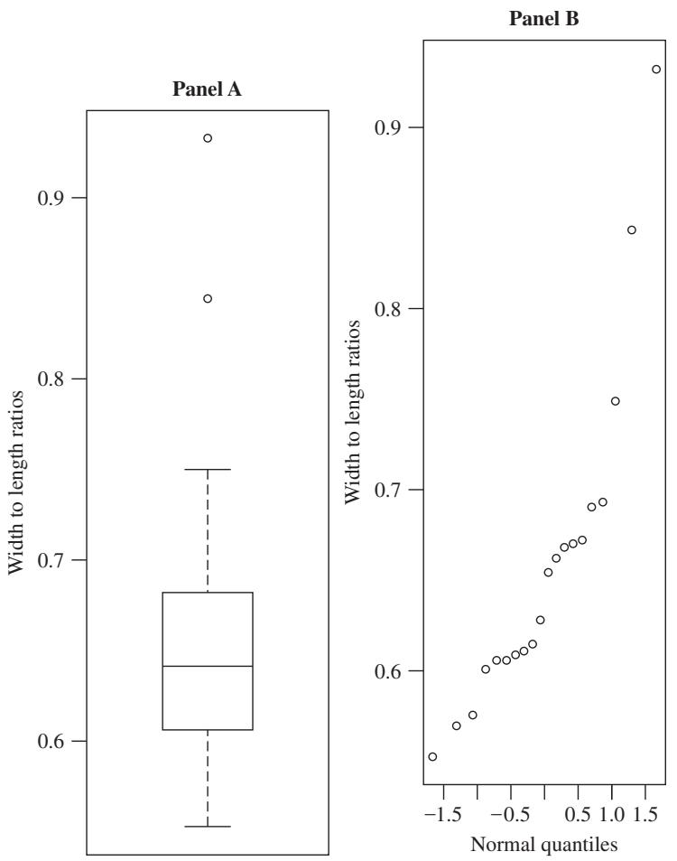
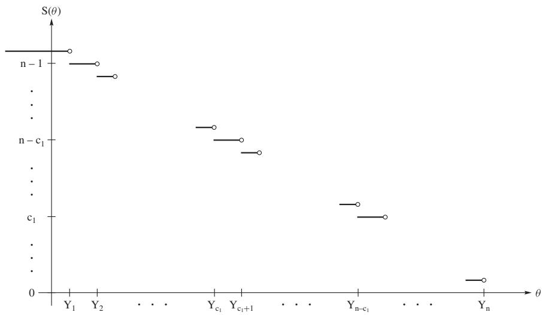
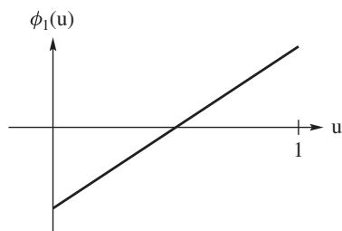
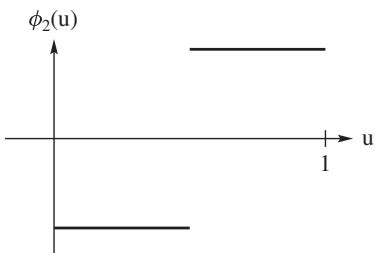
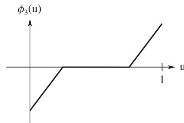
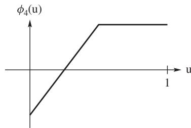
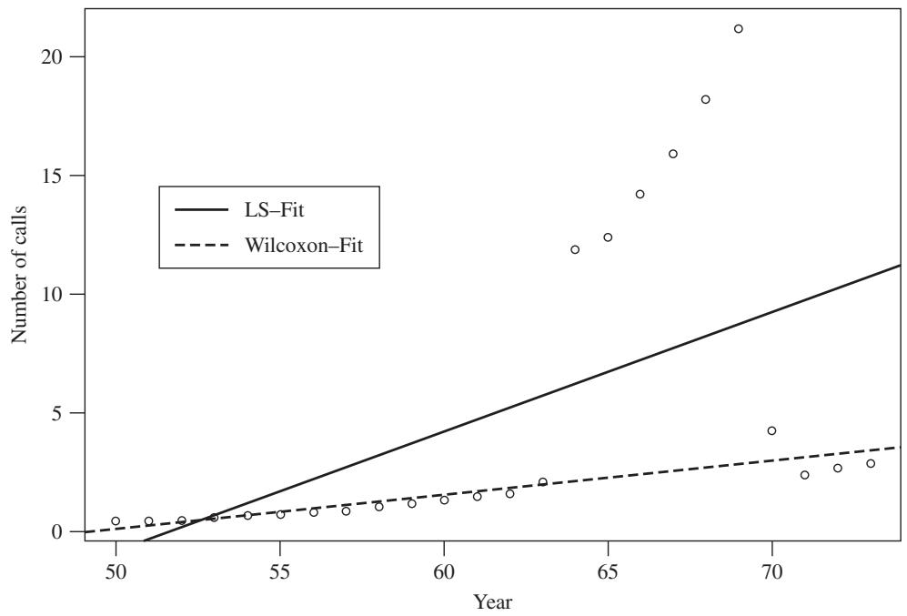

# Nonparametric and Robust Statistics

[Package map](../structure.md) · [Unsplit OCR dump](./_full.md)

[← Ch. 9 Normal Linear Models](./09-inferences-about-normal-linear-models.md) · [Ch. 11 Bayesian Statistics →](./11-bayesian-statistics.md)

> MinerU OCR dump. If a formula, table, or numbering disagrees with the PDF, the PDF is authoritative.

---

# Chapter 10

# Nonparametric and Robust Statistics

# 10.1 Location Models

In this chapter, we present some nonparametric procedures for the simple location problems. As we shall show, the test procedures associated with these methods are distribution-free under null hypotheses. We also obtain point estimators and confidence intervals associated with these tests. The distributions of the estimators are not distribution-free; hence, we use the term rank-based to refer collectively to these procedures. The asymptotic relative efficiencies of these procedures are easily obtained, thus facilitating comparisons among them and procedures that we have discussed in earlier chapters. We also obtain estimators that are asymptotically efficient; that is, they achieve asymptotically the Rao-Cramér bound.

Our purpose is not a rigorous development of these concepts, and at times we simply sketch the theory. A rigorous treatment can be found in several advanced texts, such as Randles and Wolfe (1979) or Hettmansperger and McKean (2011). For an applied discussion using R, see Kloke and McKean (2014).

In this and the following section, we consider the one-sample problem. For the most part, we consider continuous random variables $X$ with cdf and pdf $F_{X}(x)$ and $f_{X}(x)$ , respectively. We assume that $f_{X}(x) > 0$ on the support of $X$ ; so, in particular, $F_{X}(x)$ is strictly increasing on the support. In this and the succeeding chapters, we want to identify classes of parameters. Think of a parameter as a function of the cdf (or pdf) of a given random variable. For example, consider the mean $\mu$ of $X$ . We can write it as $\mu_{X} = T(F_{X})$ if $T$ is defined as

$$
T (F _ {X}) = E (X).
$$

As another example, recall that the median of a random variable $X$ is a parameter $\xi$ such that $F_{X}(\xi) = 1 / 2$ ; i.e., $\xi = F_{X}^{-1}(1 / 2)$ . Hence, in this notation, we say that the parameter $\xi$ is defined by the function $T(F_{X}) = F_{X}^{-1}(1 / 2)$ . Note that these $T$ 's are functions of the cdfs (or pdfs). We shall call them functionals.

Remark 10.1.1 (Natural Nonparametric Estimators). Functionals induce nonparametric estimators naturally. Let $X_{1},X_{2},\ldots ,X_{n}$ denote a random sample from some distribution with cdf $F(x)$ and let $T(F)$ be a functional. Let $x_{1},x_{2},\dots,x_{n}$ be a realization of this sample. Recall that the empirical distribution function of the sample is given by

$$
\widehat {F} _ {n} (x) = n ^ {- 1} [ \# \{x _ {i} \leq x \} ], - \infty <   x <   \infty . \tag {10.1.1}
$$

Hence, $F_{n}$ is a discrete cdf that puts mass (probability) $1 / n$ at each $x_{i}$ . Because $\widehat{F}_n(x)$ is a cdf, $T(\widehat{F}_n)$ is well defined. Furthermore, $T(\widehat{F}_n)$ depends only on the sample; hence, it is a statistic. We call $T(\widehat{F}_n)$ the induced estimator of $T(F)$ . For example, if $T(F)$ is the mean of the distribution, then it is easy to see that $T(\widehat{F}_n) = \overline{x}$ ; see Exercise 10.1.3.

For another example, consider the median. Note that $\hat{F}_n$ is a discrete cdf; hence, we use the general definition of a median of a distribution that is given in Definition 1.7.2 of Chapter 1. Let $\hat{\theta}$ denote the usual sample median which is defined in expression (4.4.4); that is, $\hat{\theta} = x_{((n + 1) / 2)}$ if $n$ is odd while $\hat{\theta} = [x_{(n / 2)} + x_{((n / 2) + 1)}] / 2$ if $n$ is even. To show that $\hat{\theta}$ satisfies Definition 1.7.2, note that:

- If $n$ is even, then $\hat{F}_n(\hat{\theta}) = 1 / 2$ .

- If $n$ is odd then

$$
n ^ {- 1} \# \left\{x _ {i} <   \hat {\theta} \right\} = \frac {1}{2} - \frac {1}{n} \leq 1 / 2 \text {a n d} F _ {n} (\hat {\theta}) \geq 1 / 2.
$$

Thus in either case, by Definition 1.7.2, $\hat{\theta}$ is a median of $\hat{F}_n$ . Note that when $n$ is even any point in the interval $(X_{(n/2)}, X_{((n/2)+1)})$ satisfies the definition of a median.

We begin with the definition of a location functional.

Definition 10.1.1. Let $X$ be a continuous random variable with cdf $F_{X}(x)$ and pdf $f_{X}(x)$ . We say that $T(F_{X})$ is a location functional if it satisfies

$$
I f Y = X + a, \text {t h e n} T \left(F _ {Y}\right) = T \left(F _ {X}\right) + a, \text {f o r a l l} a \in R, \tag {10.1.2}
$$

$$
I f Y = a X; \text {t h e n} T \left(F _ {Y}\right) = a T \left(F _ {X}\right), \text {f o r a l l} a \neq 0. \tag {10.1.3}
$$

For example, suppose $T$ is the mean functional; i.e., $T(F_{X}) = E(X)$ . Let $Y = X + a$ ; then $E(Y) = E(X + a) = E(X) + a$ . Secondly, if $Y = aX$ , then $E(Y) = aE(X)$ . Hence the mean is a location functional. The next example shows that the median is a location functional.

Example 10.1.1. Let $F(x)$ be the cdf of $X$ and let $T(F_{X}) = F_{X}^{-1}(1 / 2)$ be the median functional of $X$ . Note that another way to state this is $F_{X}(T(F_{X})) = 1 / 2$ . Let $Y = X + a$ . It then follows that the cdf of $Y$ is $F_{Y}(y) = F_{X}(y - a)$ . The following identity shows that $T(F_{Y}) = T(F_{X}) + a$ :

$$
F _ {Y} (T \left(F _ {X}\right) + a) = F _ {X} (T \left(F _ {X}\right) + a - a) = F _ {X} \left(T \left(F _ {X}\right)\right) = 1 / 2.
$$

Next, suppose $Y = aX$ . If $a > 0$ , then $F_{Y}(y) = F_{X}(y / a)$ and, hence,

$$
F _ {Y} (a T \left(F _ {X}\right)) = F _ {X} (a T \left(F _ {X}\right) / a) = F _ {X} (T \left(F _ {X}\right)) = 1 / 2.
$$

Thus $T(F_{Y}) = aT(F_{X})$ when $a > 0$ . On the other hand, if $a < 0$ , then $F_{Y}(y) = 1 - F_{X}(y / a)$ . Hence

$$
F _ {Y} (a T (F _ {X})) = 1 - F _ {X} (a T (F _ {X}) / a) = 1 - F _ {X} (T (F _ {X})) = 1 - \frac {1}{2} = \frac {1}{2}.
$$

Therefore, (10.1.3) holds for all $a \neq 0$ . Thus the median is a location functional.

Recall that the median is a percentile, namely, the 50th percentile of a distribution. As Exercise 10.1.1 shows, the median is the only percentile that is a location functional.

We often continue to use parameter notation to denote functionals. For example, $\theta_{X} = T(F_{X})$ .

In Chapters 4 and 6, we wrote the location model for specified pdfs. In this chapter, we write it for a general pdf in terms of a specified location functional. Let $X$ be a random variable with cdf $F_{X}(x)$ and pdf $f_{X}(x)$ . Let $\theta_{X} = T(F_{X})$ be a location functional. Define the random variable $\varepsilon$ to be $\varepsilon = X - T(F_{X})$ . Then by (10.1.2), $T(F_{\varepsilon}) = 0$ ; i.e., $\varepsilon$ has location 0, according to $T$ . Further, the pdf of $X$ can be written as $f_{X}(x) = f(x - T(F_{X}))$ , where $f(x)$ is the pdf of $\varepsilon$ .

Definition 10.1.2 (Location Model). Let $\theta_{X} = T(F_{X})$ be a location functional. We say that the observations $X_{1}, X_{2}, \ldots, X_{n}$ follow a location model with functional $\theta_{X} = T(F_{X})$ if

$$
X _ {i} = \theta_ {X} + \varepsilon_ {i}, \tag {10.1.4}
$$

where $\varepsilon_1, \varepsilon_2, \ldots, \varepsilon_n$ are iid random variables with pdf $f(x)$ and $T(F_{\varepsilon}) = 0$ . Hence, from the above discussion, $X_1, X_2, \ldots, X_n$ are iid with pdf $f_X(x) = f(x - T(F_X))$ .

Example 10.1.2. Let $\varepsilon$ be a random variable with cdf $F(x)$ , such that $F(0) = 1/2$ . Assume that $\varepsilon_1, \varepsilon_2, \ldots, \varepsilon_n$ are iid with cdf $F(x)$ . Let $\theta \in R$ and define

$$
X _ {i} = \theta + \varepsilon_ {i}, \quad i = 1, 2, \dots , n.
$$

Then $X_{1}, X_{2}, \ldots, X_{n}$ follow the location model with the locational functional $\theta$ , which is the median of $X_{i}$ .

Note that the location model very much depends on the functional. It forces one to state clearly which location functional is being used in order to write the model statement. For the class of symmetric densities, though, all location functionals are the same.

Theorem 10.1.1. Let $X$ be a random variable with cdf $F_{X}(x)$ and pdf $f_{X}(x)$ such that the distribution of $X$ is symmetric about $a$ . Let $T(F_{X})$ be any location functional. Then $T(F_{X}) = a$ .

Proof: By (10.1.2), we have

$$
T \left(F _ {X - a}\right) = T \left(F _ {X}\right) - a. \tag {10.1.5}
$$

Since the distribution of $X$ is symmetric about $a$ , it is easy to show that $X - a$ and $-(X - a)$ have the same distribution; see Exercise 10.1.2. Hence, using (10.1.2) and (10.1.3), we have

$$
T \left(F _ {X - a}\right) = T \left(F _ {- (X - a)}\right) = - \left(T \left(F _ {X}\right) - a\right) = - T \left(F _ {X}\right) + a. \tag {10.1.6}
$$

Putting (10.1.5) and (10.1.6) together gives the result.

The assumption of symmetry is very appealing, because the concept of "center" is unique when it is true.

# EXERCISES

10.1.1. Let $X$ be a continuous random variable with cdf $F(x)$ . For $0 < p < 1$ , let $\xi_p$ be the $p$ th quantile; i.e., $F(\xi_p) = p$ . If $p \neq 1/2$ , show that while property (10.1.2) holds, property (10.1.3) does not. Thus $\xi_p$ is not a location parameter.

10.1.2. Let $X$ be a continuous random variable with pdf $f(x)$ . Suppose $f(x)$ is symmetric about $a$ ; i.e., $f(x - a) = f(-x - a)$ . Show that the random variables $X - a$ and $-(X - a)$ have the same pdf.

10.1.3. Let $\widehat{F}_n(x)$ denote the empirical cdf of the sample $X_1, X_2, \ldots, X_n$ . The distribution of $\widehat{F}_n(x)$ puts mass $1/n$ at each sample item $X_i$ . Show that its mean is $\overline{X}$ . If $T(F) = F^{-1}(1/2)$ is the median, show that $T(\widehat{F}_n) = Q_2$ , the sample median.

10.1.4. Let $X$ be a random variable with cdf $F(x)$ and let $T(F)$ be a functional. We say that $T(F)$ is a scale functional if it satisfies the three properties

(i) $T(F_{aX}) = aT(F_X)$ for $a > 0$   
(ii) $T(F_{X + b}) = T(F_X)$ , for all $b$   
(iii) $T(F_{-X}) = T(F_X)$

Show that the following functionals are scale functionals.

(a) The standard deviation, $T(F_{X}) = (\operatorname{Var}(X))^{1/2}$ .   
(b) The interquartile range, $T(F_{X}) = F_{X}^{-1}(3 / 4) - F_{X}^{-1}(1 / 4)$ .

# 10.2 Sample Median and the Sign Test

In this section, we consider inference for the median of a distribution using the sample median. Fundamental to this discussion is the sign test statistic, which we present first.

Let $X_{1},X_{2},\ldots ,X_{n}$ be a random sample that follows the location model

$$
X _ {i} = \theta + \varepsilon_ {i}, \tag {10.2.1}
$$

where $\varepsilon_1, \varepsilon_2, \ldots, \varepsilon_n$ are iid with cdf $F(x)$ , pdf $f(x)$ , and median 0. Note that in terms of Section 10.1, the location functional is the median and, hence, $\theta$ is the median of $X_i$ . We begin with a test for the one-sided hypotheses

$$
H _ {0}: \theta = \theta_ {0} \text {v e r s u s} H _ {1}: \theta > \theta_ {0}. \tag {10.2.2}
$$

Consider the statistic

$$
S \left(\theta_ {0}\right) = \# \left\{X _ {i} > \theta_ {0} \right\}, \tag {10.2.3}
$$

which is called the sign statistic because it counts the number of positive signs in the differences $X_{i} - \theta_{0}, i = 1,2,\ldots ,n$ . If we define $I(x > a)$ to be 1 or 0 depending on whether $x > a$ or $x\leq a$ , then we can express $S(\theta_0)$ as

$$
S \left(\theta_ {0}\right) = \sum_ {i = 1} ^ {n} I \left(X _ {i} > \theta_ {0}\right). \tag {10.2.4}
$$

Note that if $H_0$ is true, then we expect one half of the observations to exceed $\theta_0$ , while if $H_1$ is true, we expect more than half of the observations to exceed $\theta_0$ . Consider then the test of the hypotheses (10.2.2) given by

$$
\operatorname {R e j e c t} H _ {0} \text {i n f a v o r} H _ {1} \text {i f} S \left(\theta_ {0}\right) \geq c. \tag {10.2.5}
$$

Under the null hypothesis, the random variables $I(X_{i} > \theta_{0})$ are iid with a Bernoulli $b(1, 1/2)$ distribution. Hence the null distribution of $S(\theta_0)$ is $b(n, 1/2)$ with mean $n/2$ and variance $n/4$ . Note that under $H_{0}$ , the sign test does not depend on the distribution of $X_{i}$ . In general, we call such a test a distribution free test.

For a level $\alpha$ test, select $c$ to be $c_{\alpha}$ , where $c_{\alpha}$ is the upper $\alpha$ critical point of a binomial $b(n,1 / 2)$ distribution. The test statistic, though, has a discrete distribution, so for an exact test there are only a finite number of levels $\alpha$ available. The values of $c_{\alpha}$ are easily found by most computer packages. For instance, the R command pbinom(0:15,15,.5) returns the cdf of a binomial distribution with $n = 15$ and $p = 0.5$ , from which all possible levels can be seen.

For a given data set, the $p$ -value associated with the sign test is given by $\widehat{p} = P_{H_0}(S(\theta_0) \geq s)$ , where $s$ is the realized value of $S(\theta_0)$ based on the sample. For computation, the R command 1 - pbinom(s-1,n,.5) computes $\widehat{p}$ .

It is convenient at times to use a large sample test based on the asymptotic distribution of the test statistic. By the Central Limit Theorem, under $H_0$ the standardized statistic $[S(\theta_0) - (n/2)] / \sqrt{n}/2$ is asymptotically normal, $N(0,1)$ . Hence the large sample test rejects $H_0$ if

$$
\frac {S \left(\theta_ {0}\right) - (n / 2)}{\sqrt {n} / 2} \geq z _ {\alpha}; \tag {10.2.6}
$$

see Exercise 10.2.2.

We briefly touch on the two-sided hypotheses given by

$$
H _ {0}: \theta = \theta_ {0} \text {v e r s u s} H _ {1}: \theta \neq \theta_ {0}. \tag {10.2.7}
$$

The following symmetric decision rule seems appropriate:

$$
\text {R e j e c t} H _ {0} \text {i n f a v o r} H _ {1} \text {i f} S \left(\theta_ {0}\right) \leq c _ {1} \text {o r i f} S \left(\theta_ {0}\right) \geq n - c _ {1}. \tag {10.2.8}
$$

For a level $\alpha$ test, $c_{1}$ would be chosen such that $\alpha /2 = P_{H_0}(S(\theta_0)\leq c_1)$ . Recall that the $p$ -value is given by $\widehat{p} = 2\min \{P_{H_0}(S(\theta_0)\leq s),P_{H_0}(S(\theta_0)\geq s)\}$ , where $s$ is the realized value of $S(\theta_0)$ based on the sample.

Example 10.2.1 (Shoshoni Rectangles). A golden rectangle is a rectangle in which the ratio of the width $(w)$ to the length $(l)$ is the golden ratio, which is approximately 0.618. It can be characterized in various ways. For example, $w / l = l / (w + l)$ characterizes the golden rectangle. It is considered to be an aesthetic standard in Western civilization and appears in art and architecture going back to the ancient Greeks. It now appears in such items as credit and business cards. In a cultural anthropology study, DuBois (1960) reports on a study of the Shoshoni beaded baskets. These baskets contain beaded rectangles, and the question was whether the Shoshonis use the same aesthetic standard as the West. Let $X$ denote the ratio of the width to the length of a Shoshoni beaded basket. Let $\theta$ be the median of $X$ . The hypotheses of interest are

$$
H _ {0}: \theta = 0. 6 1 8 \text {v e r s u s} H _ {1}: \theta \neq 0. 6 1 8.
$$

These are two-sided hypotheses. It follows from the above discussion that the sign test rejects $H_0$ in favor of $H_1$ if $S(0.618) \leq c$ or $S(0.618) \geq n - c$ .

A sample of 20 width to length (ordered) ratios from Shoshoni baskets resulted in the data

Width-to-Length Ratios of Rectangles   

<table><tr><td>0.553</td><td>0.570</td><td>0.576</td><td>0.601</td><td>0.606</td><td>0.606</td><td>0.609</td><td>0.611</td><td>0.615</td><td>0.628</td></tr><tr><td>0.654</td><td>0.662</td><td>0.668</td><td>0.670</td><td>0.672</td><td>0.690</td><td>0.693</td><td>0.749</td><td>0.844</td><td>0.933</td></tr></table>

The data can be found in the file shoshoni.rda. For these data, the sign test statistic is $S(0.618) = 11$ . Using R the $p$ -value is: $2*(1 - \text{pbinom}(10, 20, .5)) = 0.8238$ . Thus there is no evidence to reject $H_0$ based on these data.

A boxplot and a normal $q - q$ plot of the data are given in Figure 10.2.1. Notice that the data contain two, possibly three, potential outliers. The data do not appear to be drawn from a normal distribution.

We next obtain several useful results concerning the power function of the sign test for the hypotheses (10.2.2). The following function proves useful here and in the associated estimation and confidence intervals described below. Define

$$
S (\theta) = \# \left\{X _ {i} > \theta \right\}. \tag {10.2.9}
$$

The sign test statistic is given by $S(\theta_0)$ . We can easily describe the function $S(\theta)$ . First, note that we can write it in terms of the order statistics $Y_{1} < \dots < Y_{n}$ of $X_{1},\ldots ,X_{n}$ because $\# \{Y_i > \theta \} = \# \{X_i > \theta \}$ . Now if $\theta < Y_{1}$ , then all the $Y_{i}$ s are larger than $\theta$ and, hence $S(\theta) = n$ . Next, if $Y_{1}\leq \theta < Y_{2}$ then $S(\theta) = n - 1$ . Continuing this way, we see that $S(\theta)$ is a decreasing step function of $\theta$ , which steps

  
Figure 10.2.1: Boxplot (Panel A) and normal $q - q$ plot (Panel B) of the Shoshoni data.

down one unit at each order statistic $Y_{i}$ , attaining its maximum and minimum values $n$ and 0 at $Y_{1}$ and $Y_{n}$ , respectively. Figure 10.2.2 depicts this function.

We need the following translation property. Because we can always subtract $\theta_0$ from each $X_{i}$ , we can assume without loss of generality that $\theta_0 = 0$ .

Lemma 10.2.1. For every $k$ ,

$$
P _ {\theta} [ S (0) \geq k ] = P _ {0} [ S (- \theta) \geq k ]. \tag {10.2.10}
$$

Proof: Note that the left side of equation (10.2.10) concerns the probability of the event $\# \{X_i > 0\}$ , where $X_i$ has median $\theta$ . The right side concerns the probability of the event $\# \{(X_i + \theta) > 0\}$ , where the random variable $X_i + \theta$ has median $\theta$ (because under $\theta = 0$ , $X_i$ has median 0). Hence the left and right sides give the same probability.

  
Figure 10.2.2: The sketch shows the graph of the decreasing step function $S(\theta)$ . The function drops one unit at each order statistic $Y_{i}$ .

Based on this lemma, it is easy to show that the power function of the sign test is monotone for one-sided tests.

Theorem 10.2.1. Suppose Model (10.2.1) is true. Let $\gamma(\theta)$ be the power function of the sign test of level $\alpha$ for the one-sided hypotheses (10.2.2). Then $\gamma(\theta)$ is a nondecreasing function of $\theta$ .

Proof: Let $c_{\alpha}$ denote the $b(n,1/2)$ upper critical value as defined after expression (10.2.8). Without loss of generality, assume that $\theta_0 = 0$ . The power function of the sign test is

$$
\gamma (\theta) = P _ {\theta} [ S (0) \geq c _ {\alpha} ], \quad \mathrm {f o r} - \infty <   \theta <   \infty .
$$

Suppose $\theta_{1} < \theta_{2}$ . Then $-\theta_{1} > -\theta_{2}$ and hence, since $S(\theta)$ is nonincreasing, $S(-\theta_{1}) \leq S(-\theta_{2})$ . This and Lemma 10.2.1 yield the desired result; i.e.,

$$
\begin{array}{l} \gamma \left(\theta_ {1}\right) = P _ {\theta_ {1}} [ S (0) \geq c _ {\alpha} ] \\ = P _ {0} \left[ S \left(- \theta_ {1}\right) \geq c _ {\alpha} \right] \\ \leq \quad P _ {0} [ S (- \theta_ {2}) \geq c _ {\alpha} ] \\ = P _ {\theta_ {2}} [ S (0) \geq c _ {\alpha} ] \\ = \gamma (\theta_ {2}). \\ \end{array}
$$

This is a very desirable property for any test. Because the monotonicity of the power function of the sign test holds for all $\theta$ , $-\infty < \theta < \infty$ , we can extend the simple null hypothesis of (10.2.2) to the composite null hypothesis

$$
H _ {0}: \theta \leq \theta_ {0} \text {v e r s u s} H _ {1}: \theta > \theta_ {0}. \tag {10.2.11}
$$

Recall from Definition 4.5.4 of Chapter 4 that the size of the test for a composite null hypothesis is given by $\max_{\theta \leq \theta_0} \gamma(\theta)$ . Because $\gamma(\theta)$ is nondecreasing, the size of the sign test is $\alpha$ for this extended null hypothesis. As a second result, it follows immediately that the sign test is an unbiased test; see Section 8.3. As Exercise 10.2.8 shows, the power function of the sign test for the other one-sided alternative, $H_1: \theta < \theta_0$ , is nonincreasing.

Under an alternative, say $\theta = \theta_{1}$ , the test statistic $S(\theta_0)$ has the binomial distribution $b(n,p_1)$ , where $p_1$ is given by

$$
p _ {1} = P _ {\theta_ {1}} (X > 0) = 1 - F (- \theta_ {1}), \tag {10.2.12}
$$

where $F(x)$ is the cdf of $\varepsilon$ in Model (10.2.1). Hence $S(\theta_0)$ is not distribution free under alternative hypotheses. As in Exercise 10.2.3, we can determine the power of the test for specified $\theta_{1}$ and $F(x)$ . We want to compare the power of the sign test to other size $\alpha$ tests, in particular the test based on the sample mean. However, for these comparison purposes, we need more general results, some of which are obtained in the next subsection.

# 10.2.1 Asymptotic Relative Efficiency

One solution to this problem is to consider the behavior of a test under a sequence of local alternatives. In this section, we often take $\theta_0 = 0$ in hypotheses (10.2.2). As noted before Lemma 10.2.1, this is without loss of generality. For the hypotheses (10.2.2), consider the sequence of alternatives

$$
H _ {0}: \theta = 0 \text {v e r s u s} H _ {1 n}: \theta_ {n} = \frac {\delta}{\sqrt {n}}, \tag {10.2.13}
$$

where $\delta > 0$ . Note that this sequence of alternatives converges to the null hypothesis as $n \to \infty$ . We often call such a sequence of alternatives local alternatives. The idea is to consider how the power function of a test behaves relative to the power functions of other tests under this sequence of alternatives. We only sketch this development. For more details, the reader can consult the more advanced books cited in Section 10.1. As a first step in that direction, we obtain the asymptotic power lemma for the sign test.

Consider the large sample size $\alpha$ test given by (10.2.6). Under the alternative

$\theta_{n}$ , we can approximate the mean of this test as follows:

$$
\begin{array}{l} E _ {\theta_ {n}} \left[ \frac {1}{\sqrt {n}} \left(S (0) - \frac {n}{2}\right) \right] = E _ {0} \left[ \frac {1}{\sqrt {n}} \left(S (- \theta_ {n}) - \frac {n}{2}\right) \right] \\ = \frac {1}{\sqrt {n}} \sum_ {i = 1} ^ {n} E _ {0} [ I (X _ {i} > - \theta_ {n}) ] - \frac {\sqrt {n}}{2} \\ = \frac {1}{\sqrt {n}} \sum_ {i = 1} ^ {n} P _ {0} \left(X _ {i} > - \theta_ {n}\right) - \frac {\sqrt {n}}{2} \\ = \sqrt {n} \left(1 - F (- \theta_ {n}) - \frac {1}{2}\right) \\ = \sqrt {n} \left(\frac {1}{2} - F (- \theta_ {n})\right) \\ \approx \sqrt {n} \theta_ {n} f (0) = \delta f (0), \tag {10.2.14} \\ \end{array}
$$

where the step to the last line is due to the mean value theorem. It can be shown in more advanced texts that the variance of $[S(0) - (n / 2)] / (\sqrt{n} /2)$ converges to 1 under $\theta_{n}$ , just as under $H_0$ , and that, furthermore, $[S(0) - (n / 2) - \sqrt{n}\delta f(0)] / (\sqrt{n} /2)$ has a limiting standard normal distribution. This leads to the asymptotic power lemma, which we state in the form of a theorem.

Theorem 10.2.2 (Asymptotic Power Lemma). Consider the sequence of hypotheses (10.2.13). The limit of the power function of the large sample, size $\alpha$ , sign test is

$$
\lim  _ {n \rightarrow \infty} \gamma \left(\theta_ {n}\right) = 1 - \Phi \left(z _ {\alpha} - \delta \tau_ {S} ^ {- 1}\right), \tag {10.2.15}
$$

where $\tau_{S} = 1 / [2f(0)]$ and $\Phi (z)$ is the cdf of a standard normal random variable.

Proof: Using expression (10.2.14) and the discussion that followed its derivation, we have

$$
\begin{array}{l} \gamma \left(\theta_ {n}\right) = P _ {\theta_ {n}} \left[ \frac {n ^ {- 1 / 2} [ S (0) - (n / 2) ]}{1 / 2} \geq z _ {\alpha} \right] \\ = P _ {\theta_ {n}} \left[ \frac {n ^ {- 1 / 2} [ S (0) - (n / 2) - \sqrt {n} \delta f (0) ]}{1 / 2} \geq z _ {\alpha} - \delta 2 f (0) \right] \\ \rightarrow \quad 1 - \Phi (z _ {\alpha} - \delta 2 f (0)), \\ \end{array}
$$

which was to be shown.

As shown in Exercise 10.2.5, the parameter $\tau_{S} = 1 / [2f(0)]$ is a scale parameter (functional) as defined in Exercise 10.1.4 of the last section. We later show that $\tau_{S} / \sqrt{n}$ is the asymptotic standard deviation of the sample median.

Note that there were several approximations used in the proof of Theorem 10.2.2. A rigorous proof can be found in more advanced texts, such as those cited in Section 10.1. It is quite helpful for the next sections to reconsider the approximation of the

mean given in (10.2.14) in terms of another concept called efficacy. Consider another standardization of the test statistic given by

$$
\bar {S} (0) = \frac {1}{n} \sum_ {i = 1} ^ {n} I \left(X _ {i} > 0\right), \tag {10.2.16}
$$

where the bar notation is used to signify that $\overline{S}(0)$ is an average of $I(X_{i} > 0)$ and, in this case under $H_{0}$ , converges in probability to $\frac{1}{2}$ . Let $\mu(\theta) = E_{\theta}(\overline{S}(0) - \frac{1}{2})$ . Then, by expression (10.2.14), we have

$$
\mu \left(\theta_ {n}\right) = E _ {\theta_ {n}} \left(\bar {S} (0) - \frac {1}{2}\right) = \frac {1}{2} - F (- \theta_ {n}). \tag {10.2.17}
$$

Let $\sigma_{\overline{S}}^2 = \operatorname{Var}(\overline{S}(0)) = \frac{1}{4n}$ . Finally, define the efficacy of the sign test to be

$$
c _ {S} = \lim  _ {n \rightarrow \infty} \frac {\mu^ {\prime} (0)}{\sqrt {n} \sigma_ {\bar {S}}}. \tag {10.2.18}
$$

That is, the efficacy is the rate of change of the mean of the test statistic at the null divided by the product of $\sqrt{n}$ and the standard deviation of the test statistic at the null. So the efficacy increases with an increase in this rate, as it should. We use this formulation of efficacy throughout this chapter.

Hence, by expression (10.2.14), the efficacy of the sign test is

$$
c _ {S} = \frac {f (0)}{1 / 2} = 2 f (0) = \tau_ {S} ^ {- 1}, \tag {10.2.19}
$$

the reciprocal of the scale parameter $\tau_{S}$ . In terms of efficacy, we can write the conclusion of the Asymptotic Power Lemma as

$$
\lim  _ {n \rightarrow \infty} \gamma \left(\theta_ {n}\right) = 1 - \Phi \left(z _ {\alpha} - \delta c _ {S}\right). \tag {10.2.20}
$$

This is not a coincidence, and it is true for the procedures we consider in the next section.

Remark 10.2.1. In this chapter, we compare nonparametric procedures with traditional parametric procedures. For instance, we compare the sign test with the test based on the sample mean. Traditionally, tests based on sample means are referred to as $t$ -tests. Even though our comparisons are asymptotic and we could use the terminology of $z$ -tests, we instead use the traditional terminology of $t$ -tests.

As a second illustration of efficacy, we determine the efficacy of the $t$ -test for the mean. Assume that the random variables $\varepsilon_{i}$ in Model (10.2.1) are symmetrically distributed about 0 and their mean exists. Hence the parameter $\theta$ is the location parameter. In particular, $\theta = E(X_{i}) = \mathrm{med}(X_{i})$ . Denote the variance of $X_{i}$ by $\sigma^2$ . This allows us to easily compare the sign and $t$ -tests. Recall for hypotheses (10.2.2) that the $t$ -test rejects $H_{0}$ in favor of $H_{1}$ if $\overline{X} \geq c$ . The form of the test statistic is then $\overline{X}$ . Furthermore, we have

$$
\mu_ {\overline {{X}}} (\theta) = E _ {\theta} (\overline {{X}}) = \theta \tag {10.2.21}
$$

and

$$
\sigma \frac {2}{X} (0) = V _ {0} (\bar {X}) = \frac {\sigma^ {2}}{n}. \tag {10.2.22}
$$

Thus, by (10.2.21) and (10.2.22), the efficacy of the $t$ -test is

$$
c _ {t} = \lim  _ {n \rightarrow \infty} \frac {\mu_ {\overline {{X}}} ^ {\prime} (0)}{\sqrt {n} (\sigma / \sqrt {n})} = \frac {1}{\sigma}. \tag {10.2.23}
$$

As confirmed in Exercise 10.2.9, the asymptotic power of the large sample level $\alpha$ , $t$ -test under the sequence of alternatives (10.2.13) is $1 - \Phi(z_{\alpha} - \delta c_{t})$ . Thus we can compare the sign and $t$ -tests by comparing their efficacies. We do this from the perspective of sample size determination.

Assume without loss of generality that $H_0: \theta = 0$ . Now suppose we want to determine the sample size so that a level $\alpha$ sign test can detect the alternative $\theta^* > 0$ with (approximate) probability $\gamma^*$ . That is, find $n$ so that

$$
\gamma^ {*} = \gamma (\theta^ {*}) = P _ {\theta^ {*}} \left[ \frac {S (0) - (n / 2)}{\sqrt {n} / 2} \geq z _ {\alpha} \right]. \tag {10.2.24}
$$

Write $\theta^{*} = \sqrt{n}\theta^{*} / \sqrt{n}$ . Then, using the asymptotic power lemma, we have

$$
\gamma^ {*} = \gamma (\sqrt {n} \theta^ {*} / \sqrt {n}) \approx 1 - \Phi (z _ {\alpha} - \sqrt {n} \theta^ {*} \tau_ {S} ^ {- 1}).
$$

Now denote $z_{\gamma^*}$ to be the upper $1 - \gamma^{*}$ quantile of the standard normal distribution. Then, from this last equation, we have

$$
z _ {\gamma^ {*}} = z _ {\alpha} - \sqrt {n} \theta^ {*} \tau_ {S} ^ {- 1}.
$$

Solving for $n$ , we get

$$
n _ {S} = \left(\frac {\left(z _ {\alpha} - z _ {\gamma^ {*}}\right) \tau_ {S}}{\theta^ {*}}\right) ^ {2}. \tag {10.2.25}
$$

As outlined in Exercise 10.2.9, for this situation the sample size determination for the test based on the sample mean is

$$
n _ {\bar {X}} = \left(\frac {\left(z _ {\alpha} - z _ {\gamma^ {*}}\right) \sigma}{\theta^ {*}}\right) ^ {2}, \tag {10.2.26}
$$

where $\sigma^2 = \mathrm{Var}(\varepsilon)$

Suppose we have two tests of the same level for which the asymptotic power lemma holds and for each we determine the sample size necessary to achieve power $\gamma^{*}$ at the alternative $\theta^{*}$ . Then the ratio of these sample sizes is called the asymptotic relative efficiency (ARE) between the tests. We show later that this is the same as the ARE defined in Chapter 6 between estimators. Hence the ARE of the sign test to the $t$ -test is

$$
\operatorname {A R E} (S, t) = \frac {n _ {\bar {X}}}{n _ {S}} = \frac {\sigma^ {2}}{\tau_ {S} ^ {2}} = \frac {c _ {S} ^ {2}}{c _ {t} ^ {2}}. \tag {10.2.27}
$$

Note that this is the same relative efficiency that was discussed in Example 6.2.5 when the sample median was compared to the sample mean. In the next two examples we revisit this discussion by examining the AREs when $X_{i}$ has a normal distribution and then a Laplace (double exponential) distribution.

Example 10.2.2 (ARE(S,t): normal distribution). Suppose $X_{1}, X_{2}, \ldots, X_{n}$ follow the location model (10.1.4), where $f(x)$ is a $N(0, \sigma^2)$ pdf. Then $\tau_S = (2f(0))^{-1} = \sigma \sqrt{\pi / 2}$ . Hence the $\mathrm{ARE}(S,t)$ is given by

$$
\mathrm {A R E} (S, t) = \frac {\sigma^ {2}}{\tau_ {S} ^ {2}} = \frac {\sigma^ {2}}{(\pi / 2) \sigma^ {2}} = \frac {2}{\pi} \approx 0. 6 3 7. \tag {10.2.28}
$$

Hence at the normal distribution the sign test is only $64\%$ as efficient as the $t$ -test. In terms of sample size at the normal distribution, the $t$ -test requires a smaller sample, $0.64n_{s}$ , where $n_{s}$ is the sample size of the sign test, to achieve the same power as the sign test. A cautionary note is needed here because this is asymptotic efficiency. There have been ample empirical (simulation) studies that give credence to these numbers.

Example 10.2.3 (ARE(S, t) at the Laplace distribution). For this example, consider Model (10.1.4), where $f(x)$ is the Laplace pdf $f(x) = (2b)^{-1} \exp \{-|x| / b\}$ for $-\infty < x < \infty$ and $b > 0$ . Then $\tau_S = (2f(0))^{-1} = b$ , while $\sigma^2 = E(X^2) = 2b^2$ . Hence the ARE(S, t) is given by

$$
\operatorname {A R E} (S, t) = \frac {\sigma^ {2}}{\tau_ {S} ^ {2}} = \frac {2 b ^ {2}}{b ^ {2}} = 2. \tag {10.2.29}
$$

So, at the Laplace distribution, the sign test is (asymptotically) twice as efficient as the $t$ -test. In terms of sample size at the Laplace distribution, the $t$ -test requires twice as large a sample as the sign test to achieve the same asymptotic power as the sign test.

Recall from Example 6.3.4 that the sign test is the scores type likelihood ratio test when the true distribution is the Laplace.

The normal distribution has much lighter tails than the Laplace distribution, because the two pdfs are proportional to $\exp\{-t^2/2\sigma^2\}$ and $\exp\{-|t|/b\}$ , respectively. Based on the last two examples, it seems that the $t$ -test is more efficient for light-tailed distributions while the sign test is more efficient for heavier-tailed distributions. This is true in general and we illustrate this in the next example where we can easily vary the tail weight from light to heavy.

Example 10.2.4 (ARE(S, t) at a family of contaminated normals). Consider the location Model (10.1.4), where the cdf of $\varepsilon_{i}$ is the contaminated normal cdf given in expression (3.4.19). Assume that $\theta_0 = 0$ . Recall that for this distribution, $(1 - \epsilon)$ proportion of the time the sample is drawn from a $N(0, b^2)$ distribution, while $\epsilon$ proportion of the time the sample is drawn from a $N(0, b^2 \sigma_c^2)$ distribution. The corresponding pdf is given by

$$
f (x) = \frac {1 - \epsilon}{b} \phi \left(\frac {x}{b}\right) + \frac {\epsilon}{b \sigma_ {c}} \phi \left(\frac {x}{b \sigma_ {c}}\right), \tag {10.2.30}
$$

where $\phi (z)$ is the pdf of a standard normal random variable. As shown in Section 3.4, the variance of $\varepsilon_{i}$ is $b^{2}(1 + \epsilon (\sigma_{c}^{2} - 1))$ . Also, $\tau_{s} = (b\sqrt{\pi / 2}) / [1 - \epsilon +(\epsilon /\sigma_{c})]$ . Thus the ARE is

$$
\operatorname {A R E} (S, t) = \frac {2}{\pi} \left[ \left(1 + \epsilon \left(\sigma_ {c} ^ {2} - 1\right) \right] \left[ 1 - \epsilon + \left(\epsilon / \sigma_ {c}\right) \right] ^ {2}. \right. \tag {10.2.31}
$$

For example, the following table (see Exercise 6.2.6) shows the AREs for various values of $\epsilon$ when $\sigma_c$ is set at 3.0:

<table><tr><td>ε</td><td>0</td><td>0.01</td><td>0.02</td><td>0.03</td><td>0.05</td><td>0.10</td><td>0.15</td><td>0.25</td></tr><tr><td>ARE(S,t)</td><td>0.636</td><td>0.678</td><td>0.718</td><td>0.758</td><td>0.832</td><td>0.998</td><td>1.134</td><td>1.326</td></tr></table>

Note: if $\epsilon$ increases over the range of values in the table, then the contamination effect becomes larger (generally resulting in a heavier-tailed distribution) and as the table shows, the sign test becomes more efficient relative to the $t$ -test. Increasing $\sigma_{c}$ has the same effect. It does take, however, with $\sigma_{c} = 3$ , over $10\%$ contamination before the sign test becomes more efficient than the $t$ -test.

# 10.2.2 Estimating Equations Based on the Sign Test

In practice, we often want to estimate $\theta$ , the median of $X_{i}$ , in Model (10.2.1). The associated point estimate based on the sign test can be described with a simple geometry, which is analogous to the geometry of the sample mean. As Exercise 10.2.6 shows, the sample mean $\overline{X}$ is such that

$$
\bar {X} = \operatorname {A r g m i n} \sqrt {\sum_ {i = 1} ^ {n} \left(X _ {i} - \theta\right) ^ {2}}. \tag {10.2.32}
$$

The quantity $\sqrt{\sum_{i=1}^{n}(X_i - \theta)^2}$ is the Euclidean distance between the vector of observations $\mathbf{X} = (X_1, X_2, \ldots, X_n)$ and the vector $\theta \mathbf{1}$ . If we simply interchange the square root and the summation symbols, we go from the Euclidean distance to the $L_1$ distance. Let

$$
\widehat {\theta} = \operatorname {A r g m i n} \sum_ {i = 1} ^ {n} | X _ {i} - \theta |. \tag {10.2.33}
$$

To determine $\widehat{\theta}$ , simply differentiate the quantity on the right side with respect to $\theta$ (as in Chapter 6, define the derivative of $|x|$ to be 0 at $x = 0$ ). We then obtain

$$
\frac {\partial}{\partial \theta} \sum_ {i = 1} ^ {n} | X _ {i} - \theta | = - \sum_ {i = 1} ^ {n} \operatorname {s g n} (X _ {i} - \theta).
$$

Setting this to 0, we obtain the estimating equations (EE)

$$
\sum_ {i = 1} ^ {n} \operatorname {s g n} \left(X _ {i} - \theta\right) = 0, \tag {10.2.34}
$$

whose solution is the sample median $Q_{2}$ (4.4.4).

Because our observations are continuous random variables, we have the identity

$$
\sum_ {i = 1} ^ {n} \operatorname {s g n} (X _ {i} - \theta) = 2 S (\theta) - n.
$$

Hence the sample median also solves $S(\theta) \approx n / 2$ . Consider again Figure 10.2.2. Imagine $n / 2$ on the vertical axis. This is halfway in the total drop of $S(\theta)$ , from $n$ to 0. The order statistic on the horizontal axis corresponding to $n / 2$ is essentially the sample median (middle order statistic). In terms of testing, this last equation says that, based on the data, the sample median is the "most acceptable" hypothesis, because $n / 2$ is the null expected value of the test statistic. We often think of this as estimation by the inversion of a test.

We now sketch the asymptotic distribution of the sample median. Assume without loss of generality that the true median of $X_{i}$ is 0. Suppose $-\infty < x < \infty$ . Using the fact that $S(\theta)$ is nonincreasing and the identity $S(\theta) \approx n / 2$ , we have the following equivalences:

$$
\{\sqrt {n} Q _ {2} \leq x \} \Leftrightarrow \left\{Q _ {2} \leq \frac {x}{\sqrt {n}} \right\} \Leftrightarrow \left\{S \left(\frac {x}{\sqrt {n}}\right) \leq \frac {n}{2} \right\}.
$$

Hence we have

$$
\begin{array}{l} P _ {0} (\sqrt {n} Q _ {2} \leq x) = P _ {0} \left[ S \left(\frac {x}{\sqrt {n}}\right) \leq \frac {n}{2} \right] \\ { = } { P _ { - x / \sqrt { n } } \left[ S ( 0 ) \leq \frac { n } { 2 } \right] } \\ = P _ {- x / \sqrt {n}} \left[ \frac {S (0) - (n / 2)}{\sqrt {n} / 2} \leq 0 \right] \\ \rightarrow \Phi (0 - x \tau_ {S} ^ {- 1}) = P (\tau_ {S} Z \leq x), \\ \end{array}
$$

where $Z$ has a standard normal distribution, Notice that the limit was obtained by invoking the Asymptotic Power Lemma with $\alpha = 0.5$ and hence $z_{\alpha} = 0$ . Rearranging the last term earlier, we obtain the asymptotic distribution of the sample median, which we state as a theorem:

Theorem 10.2.3. For the random sample $X_{1}, X_{2}, \ldots, X_{n}$ , assume that Model (10.2.1) holds. Suppose that $f(0) > 0$ . Let $Q_{2}$ denote the sample median. Then

$$
\sqrt {n} \left(Q _ {2} - \theta\right)\rightarrow N \left(0, \tau_ {S} ^ {2}\right), \tag {10.2.35}
$$

where $\tau_{S} = (2f(0))^{-1}$

In Section 6.2 we defined the ARE between two estimators to be the reciprocal of their asymptotic variances. For the sample median and mean, this is the same ratio as that based on sample size determinations of their respective tests given earlier in expression (10.2.27).

# 10.2.3 Confidence Interval for the Median

In Section 4.4, we obtained a confidence interval for the median. In this section, we derive this confidence interval by inverting the sign test. Based on the monotonicity of $S(\theta)$ , the derivation is straightforward, but the technique will prove useful in subsequent sections of this chapter.

Suppose the random sample $X_{1}, X_{2}, \ldots, X_{n}$ follows the location model (10.2.1). In this subsection, we develop a confidence interval for the median $\theta$ of $X_{i}$ . Assuming that $\theta$ is the true median, the random variable $S(\theta)$ , (10.2.9), has a binomial $b(n, 1/2)$ distribution. For $0 < \alpha < 1$ , select $c_{1}$ so that $P_{\theta}[S(\theta) \leq c_{1}] = \alpha / 2$ . Hence we have

$$
1 - \alpha = P _ {\theta} [ c _ {1} <   S (\theta) <   n - c _ {1} ]. \tag {10.2.36}
$$

Recall in our derivation for the $t$ -confidence interval for the mean in Chapter 3, we began with such a statement and then "inverted" the pivot random variable $t = \sqrt{n}(\overline{X} - \mu) / S$ ( $S$ in this expression is the sample standard deviation) to obtain an equivalent inequality with $\mu$ isolated in the middle. In this case, the function $S(\theta)$ does not have an inverse, but it is a decreasing step function of $\theta$ and the inversion can still be performed. As depicted in Figure 10.2.2, $c_{1} < S(\theta) < n - c_{1}$ if and only if $Y_{c_{1} + 1} \leq \theta < Y_{n - c_{1}}$ , where $Y_{1} < Y_{2} < \dots < Y_{n}$ are the order statistics of the sample $X_{1}, X_{2}, \ldots, X_{n}$ . Therefore, the interval $[Y_{c_{1} + 1}, Y_{n - c_{1}})$ is a $(1 - \alpha)100\%$ confidence interval for the median $\theta$ . Because the order statistics are continuous random variables, the interval $(Y_{c_{1} + 1}, Y_{n - c_{1}})$ is an equivalent confidence interval.

If $n$ is large, then there is a large sample approximation to $c_{1}$ . We know from the Central Limit Theorem that $S(\theta)$ is approximately normal with mean $n / 2$ and variance $n / 4$ . Then, using the continuity correction, we obtain the approximation

$$
c _ {1} \approx \frac {n}{2} - \frac {z _ {\alpha / 2} \sqrt {n}}{2} - \frac {1}{2}, \tag {10.2.37}
$$

where $\Phi(-z_{\alpha/2}) = \alpha/2$ ; see Exercise 10.2.7. In practice, we use the closest integer to $c_1$ .

Example 10.2.5 (Example 10.2.1, Continued). There are 20 data points in the Shoshoni basket data. The sample median of the width to the length is $0.5(0.628 + 0.654) = 0.641$ . Because $0.021 = P_{H_0}(S(0.618) \leq 5)$ , a $95.8\%$ confidence interval for $\theta$ is the interval $(y_6, y_{15}) = (0.606, 0.672)$ , which includes 0.618, the ratio of the width to the length, which characterizes the golden rectangle.

Currently, there is not an intrinsic R function for the one-sample sign analysis. The R function `onesampsgn.R`, which can be downloaded at the site listed in the Preface, computes this analysis. For these data, its default 95% confidence interval is the same as that computed above.

# EXERCISES

10.2.1. Sketch Figure 10.2.2 for the Shoshoni basket data found in Example 10.2.1. Show the values of the test statistic, the point estimate, and the $95.8\%$ confidence interval of Example 10.2.5 on the sketch.

10.2.2. Show that the test given by (10.2.6) has asymptotically level $\alpha$ ; that is, show that under $H_0$

$$
\frac {S (\theta_ {0}) - (n / 2)}{\sqrt {n} / 2} \stackrel {D} {\rightarrow} Z,
$$

where $Z$ has a $N(0,1)$ distribution.

10.2.3. Let $\theta$ denote the median of a random variable $X$ . Consider testing

$$
H _ {0}: \theta = 0 \text {v e r s u s} H _ {1}: \theta > 0.
$$

Suppose we have a sample of size $n = 25$ .

(a) Let $S(0)$ denote the sign test statistic. Determine the level of the test: reject $H_0$ if $S(0) \geq 16$ .   
(b) Determine the power of the test in part (a) if $X$ has $N(0.5,1)$ distribution.   
(c) Assuming $X$ has finite mean $\mu = \theta$ , consider the asymptotic test of rejecting $H_0$ if $\overline{X} / (\sigma / \sqrt{n}) \geq k$ . Assuming that $\sigma = 1$ , determine $k$ so the asymptotic test has the same level as the test in part (a). Then determine the power of this test for the situation in part (b).

10.2.4. To appreciate the importance of setting the location functional, consider the length of rivers data set, as taken from Tukey (1977). This data set contains the lengths of 141 American rivers in miles and it can be found in the file lengthriver.rda.

(a) Suppose the location functional is the median. Obtain the estimate and a $95\%$ confidence interval for it. Use the confidence interval discussed in Section 10.2.3. Interpret it in terms of the data. Use the R function onesampsgn.R for computation.   
(b) Suppose the location functional is the mean. Obtain the estimate and the $95\%$ $t$ -confidence interval for it. Interpret it in terms of the data.   
(c) Obtain the boxplot of the data and sketch the estimates and confidence intervals on it. Discuss.

10.2.5. Recall the definition of a scale functional given in Exercise 10.1.4. Show that the parameter $\tau_{S}$ defined in Theorem 10.2.2 is a scale functional.

10.2.6. Show that the sample mean solves Equation (10.2.32).

10.2.7. Derive the approximation (10.2.37).

10.2.8. Show that the power function of the sign test is nonincreasing for the hypotheses

$$
H _ {0}: \theta = \theta_ {0} \text {v e r s u s} H _ {1}: \theta <   \theta_ {0}. \tag {10.2.38}
$$

10.2.9. Let $X_{1}, X_{2}, \ldots, X_{n}$ be a random sample that follows the location model (10.2.1). In this exercise we want to compare the sign tests and $t$ -test of the hypotheses (10.2.2); so we assume the random errors $\varepsilon_{i}$ are symmetrically distributed about 0. Let $\sigma^{2} = \operatorname{Var}(\varepsilon_{i})$ . Hence the mean and the median are the same for this location model. Assume, also, that $\theta_{0} = 0$ . Consider the large sample version of the $t$ -test, which rejects $H_{0}$ in favor of $H_{1}$ if $\overline{X} / (\sigma / \sqrt{n}) > z_{\alpha}$ .

(a) Obtain the power function, $\gamma_t(\theta)$ , of the large sample version of the $t$ -test.   
(b) Show that $\gamma_t(\theta)$ is nondecreasing in $\theta$ .   
(c) Show that $\gamma_t(\theta_n) \to 1 - \Phi(z_\alpha - \sigma \theta^*)$ , under the sequence of local alternatives (10.2.13).   
(d) Based on part (c), obtain the sample size determination for the $t$ -test to detect $\theta^{*}$ with approximate power $\gamma^{*}$ .   
(e) Derive the $\operatorname{ARE}(S, t)$ given in (10.2.27).

# 10.3 Signed-Rank Wilcoxon

Let $X_{1}, X_{2}, \ldots, X_{n}$ be a random sample that follows Model (10.2.1). Inference for $\theta$ based on the sign test is simple and requires few assumptions about the underlying distribution of $X_{i}$ . On the other hand, sign procedures have the low efficiency of 0.64 relative to procedures based on the $t$ -test given an underlying normal distribution. In this section, we discuss a nonparametric procedure that does attain high efficiency relative to the $t$ -test. We make the additional assumption that the pdf $f(x)$ of $\varepsilon_{i}$ in Model (10.2.1) is symmetric; i.e., $f(x) = f(-x)$ , for all $x$ such that $-\infty < x < \infty$ . Hence $X_{i}$ is symmetrically distributed about $\theta$ . Thus, by Theorem 10.1.1, all location parameters are identical.

First, consider the one-sided hypotheses

$$
H _ {0}: \theta = 0 \text {v e r s u s} H _ {1}: \theta > 0. \tag {10.3.1}
$$

There is no loss of generality in assuming that the null hypothesis is $H_0: \theta = 0$ , for if it were $H_0: \theta = \theta_0$ , we would consider the sample $X_1 - \theta_0, \ldots, X_n - \theta_0$ . Under a symmetric pdf, observations $X_i$ that are the same distance from 0 are equilibrated and hence should receive the same weight. A test statistic that does this is the signed-rank Wilcoxon given by

$$
T = \sum_ {i = 1} ^ {n} \operatorname {s g n} \left(X _ {i}\right) R \left| X _ {i} \right|, \tag {10.3.2}
$$

where $R|X_{i}|$ denotes the rank of $X_{i}$ among $|X_1|, \ldots, |X_n|$ , where the rankings are from low to high. Intuitively, under the null hypothesis, we expect half of the $X_{i}$ s to be positive and half to be negative. Further, the ranks are uniformly distributed on the integers $\{1, 2, \ldots, n\}$ . Hence values of $T$ around 0 are indicative of $H_{0}$ . On the

other hand, if $H_{1}$ is true, then we expect more than half of the $X_{i}$ s to be positive and further, the positive observations are more likely to receive the higher ranks. Thus an appropriate decision rule is

$$
\text {R e j e c t} H _ {0} \text {i n f a v o r} H _ {1} \text {i f} T \geq c, \tag {10.3.3}
$$

where $c$ is determined by the level $\alpha$ of the test.

Given $\alpha$ , we need the null distribution of $T$ to determine the critical point $c$ . The set of integers $\{-n(n + 1) / 2, - [n(n + 1) / 2] + 2,\ldots ,n(n + 1) / 2\}$ form the support of $T$ . Also, from Section 10.2, we know that the signs are iid with support $\{-1,1\}$ and pmf

$$
p (- 1) = p (1) = \frac {1}{2}. \tag {10.3.4}
$$

A key result is the following lemma:

Lemma 10.3.1. Under $H_0$ and symmetry about 0 for the pdf, the random variables $|X_1|, \ldots, |X_n|$ are independent of the random variables $\operatorname{sgn}(X_1), \ldots, \operatorname{sgn}(X_n)$ .

Proof: Because $X_{1}, \ldots, X_{n}$ is a random sample from the cdf $F(x)$ , it suffices to show that $P[|X_i| \leq x, \operatorname{sgn}(X_i) = 1] = P[|X_i| \leq x]P[\operatorname{sgn}(X_i) = 1]$ . Due to $H_{0}$ and the symmetry of $f(x)$ , this follows from the following string of equalities

$$
\begin{array}{l} P [ | X _ {i} | \leq x, \operatorname {s g n} (X _ {i}) = 1 ] = P [ 0 <   X _ {i} \leq x ] = F (x) - \frac {1}{2} \\ = \left[ 2 F (x) - 1 \right] \frac {1}{2} = P [ | X _ {i} | \leq x ] P [ \operatorname {s g n} (X _ {i}) = 1 ]. \\ \end{array}
$$

Based on this lemma, the ranks of the $|X_i|$ s are independent of the signs of the $X_i$ s. Note that the ranks are a permutation of the integers $1, 2, \ldots, n$ . By the lemma this independence is true for any permutation. In particular, suppose we use the permutation that orders the absolute values. For example, suppose the observations are -6.1, 4.3, 7.2, 8.0, -2.1. Then the permutation $5, 2, 1, 3, 4$ orders the absolute values; that is, the fifth observation is the smallest in absolute value, the second observation is the next smallest, etc. This permutation is called the anti-ranks, which we denote generally by $i_1, i_2, \ldots, i_n$ . Using the anti-ranks, we can write $T$ as

$$
T = \sum_ {j = 1} ^ {n} j \operatorname {s g n} \left(X _ {i _ {j}}\right), \tag {10.3.5}
$$

where, by Lemma 10.3.1, $\operatorname{sgn}(X_{i_j})$ are iid with support $\{-1,1\}$ and pmf (10.3.4).

Based on this observation, for $s$ such that $-\infty < s < \infty$ , the mgf of $T$ is

$$
\begin{array}{l} E \left[ \exp \{s T \} \right] = E \left[ \exp \left\{\sum_ {j = 1} ^ {n} s j \operatorname {s g n} \left(X _ {i _ {j}}\right) \right\} \right] \\ = \prod_ {j = 1} ^ {n} E [ \exp \{s j \operatorname {s g n} \left(X _ {i _ {j}}\right) \} ] \\ = \prod_ {j = 1} ^ {n} \left(\frac {1}{2} e ^ {- s j} + \frac {1}{2} e ^ {s j}\right) \\ = \frac {1}{2 ^ {n}} \prod_ {j = 1} ^ {n} \left(e ^ {- s j} + e ^ {s j}\right). \tag {10.3.6} \\ \end{array}
$$

Because the mgf does not depend on the underlying symmetric pdf $f(x)$ , the test statistic $T$ is distribution free under $H_0$ . Although the pmf of $T$ cannot be obtained in closed form, this mgf can be used to generate the pmf for a specified $n$ ; see Exercise 10.3.1.

Because the $\operatorname{sgn}(X_{i_j})$ s are mutually independent with mean zero, it follows that $E_{H_0}[T] = 0$ . Further, because the variance of $\operatorname{sgn}(X_{i_j})$ is 1, we have

$$
\operatorname {V a r} _ {H _ {0}} (T) = \sum_ {j = 1} ^ {n} \operatorname {V a r} _ {H _ {0}} \left(j \operatorname {s g n} \left(X _ {i _ {j}}\right)\right) = \sum_ {j = 1} ^ {n} j ^ {2} = n (n + 1) (2 n + 1) / 6.
$$

We summarize these results in the following theorem:

Theorem 10.3.1. Assume that Model (10.2.1) is true for the random sample $X_{1},\ldots ,X_{n}$ . Assume also that the pdf $f(x)$ is symmetric about 0. Then under $H_0$ ,

$$
T \text {i s} \quad T \text {i s} \quad T \text {i s} \quad T \text {i s} \quad T \text {i s} \quad T \text {i s} \quad T \text {i s} \quad T \text {i s} \quad T \text {i s} \quad T \text {i s} \quad T \text {i s} \quad T \text {i s} \quad T
$$

$$
E _ {H _ {0}} [ T ] = 0 \tag {10.3.8}
$$

$$
\operatorname {V a r} _ {H _ {0}} (T) = \frac {n (n + 1) (2 n + 1)}{6} \tag {10.3.9}
$$

$$
\frac {T}{\sqrt {\operatorname {V a r} _ {H _ {0}} (T)}} \text {h a s a n a s y m p t o t i c a l l y N (0 , 1) d i s t r i b u t i o n .} \tag {10.3.10}
$$

Proof: The first part of (10.3.7) and the expressions (10.3.8) and (10.3.9) were derived above. The asymptotic distribution of $T$ certainly is plausible and its proof can be found in more advanced books. To obtain the second part of (10.3.7), we need to show that the distribution of $T$ is symmetric about 0. But by the mgf of $Y$ , (10.3.6), we have

$$
E \left[ \right. \exp \left\{s (- T) \right\} = E \left[ \exp \left\{\left(- s\right) T \right\}\right] = E \left[ \exp \left\{s T \right\}\right].
$$

Hence $T$ and $-T$ have the same distribution, so $T$ is symmetrically distributed about 0.

Note that the support of $T$ is much denser than that of the sign test, so the normal approximation is good even for a sample size of 10.

There is another formulation of $T$ that is convenient. Let $T^{+}$ denote the sum of the ranks of the positive $X_{i}$ s. Then, because the sum of all ranks is $n(n + 1) / 2$ , we have

$$
\begin{array}{l} T = \sum_ {i = 1} ^ {n} \operatorname {s g n} \left(X _ {i}\right) R \left| X _ {i} \right| = \sum_ {X _ {i} > 0} R \left| X _ {i} \right| - \sum_ {X _ {i} <   0} R \left| X _ {i} \right| \\ = 2 \sum_ {X _ {i} > 0} R \left| X _ {i} \right| - \frac {n (n + 1)}{2} \\ = 2 T ^ {+} - \frac {n (n + 1)}{2}. \tag {10.3.11} \\ \end{array}
$$

Hence $T^{+}$ is a linear function of $T$ and thus is an equivalent formulation of the signed-rank test statistic $T$ . For the record, we note the null mean and variance of $T^{+}$ :

$$
E _ {H _ {0}} \left(T ^ {+}\right) = \frac {n (n + 1)}{4} \text {a n d} \operatorname {V a r} _ {H _ {0}} \left(T ^ {+}\right) = \frac {n (n + 1) (2 n + 1)}{2 4}. \tag {10.3.12}
$$

The intrinsic R function wilcox.test computes the signed-rank analysis, returning the test statistic $T^{+}$ and the $p$ -value. If the sample is in the R vector $\mathbf{x}$ then the signed-rank test of the hypotheses (10.3.1) is computed by the R command wilcox.test(x, alt="greater"). The arguments for the other one-sided and the two-sided hypotheses are respectively alt="less" and alt="two.sided". To compute the signed-rank test of the hypotheses $H_{0}: \theta = \theta_{0}$ versus $H_{1}: \theta \neq \theta_{0}$ , use the command wilcox.test(x, alt="two.sided", mu=theta0). Also, the R call psignrank(y, n) computes the cdf of $T^{+}$ at $y$ .

Example 10.3.1 (Zea mays Data of Darwin). Reconsider the data set discussed in Example 4.5.1. Recall that $W_{i}$ is the difference in heights of the cross-fertilized plant minus the self-fertilized plant in pot $i$ , for $i = 1, \ldots, 15$ . Let $\theta$ be the location parameter and consider the one-sided hypotheses

$$
H _ {0}: \theta = 0 \text {v e r s u s} H _ {1}: \theta > 0. \tag {10.3.13}
$$

Table 10.3.1 displays the data and the signed ranks.

Adding up the ranks of the positive items in column 5 of Table 10.3.1, we obtain $T^{+} = 96$ . Using the exact distribution, the R command is 1-psignrank(95,15)), we obtain the $p$ -value, $\widehat{p} = P_{H_0}(T^+ \geq 96) = 0.021$ . For comparison, the asymptotic $p$ -value, using the continuity correction is

$$
\begin{array}{l} P _ {H _ {0}} \left(T ^ {+} \geq 9 6\right) = P _ {H _ {0}} \left(T ^ {+} \geq 9 5. 5\right) \approx P \left(Z \geq \frac {9 5 . 5 - 6 0}{\sqrt {1 5 \cdot 1 6 \cdot 3 1 / 2 4}}\right) \\ = P (Z \geq 2. 0 1 6) = 0. 0 2 2, \\ \end{array}
$$

which is quite close to the exact value of 0.021.

Suppose the R vector ds contains the paired differences between cross and self-fertilized. Then the R command wilcox.test(ds, alt="greater") computes the

Table 10.3.1: Signed Ranks for Darwin Data, Example 10.3.1   

<table><tr><td>Pot</td><td>Cross-Fertilized</td><td>Self-Fertilized</td><td>Difference</td><td>Signed-Rank</td></tr><tr><td>1</td><td>23.500</td><td>17.375</td><td>6.125</td><td>11</td></tr><tr><td>2</td><td>12.000</td><td>20.375</td><td>-8.375</td><td>-14</td></tr><tr><td>3</td><td>21.000</td><td>20.000</td><td>1.000</td><td>2</td></tr><tr><td>4</td><td>22.000</td><td>20.000</td><td>2.000</td><td>4</td></tr><tr><td>5</td><td>19.125</td><td>18.375</td><td>0.750</td><td>1</td></tr><tr><td>6</td><td>21.550</td><td>18.625</td><td>2.925</td><td>5</td></tr><tr><td>7</td><td>22.125</td><td>18.625</td><td>3.500</td><td>7</td></tr><tr><td>8</td><td>20.375</td><td>15.250</td><td>5.125</td><td>9</td></tr><tr><td>9</td><td>18.250</td><td>16.500</td><td>1.750</td><td>3</td></tr><tr><td>10</td><td>21.625</td><td>18.000</td><td>3.625</td><td>8</td></tr><tr><td>11</td><td>23.250</td><td>16.250</td><td>7.000</td><td>12</td></tr><tr><td>12</td><td>21.000</td><td>18.000</td><td>3.000</td><td>6</td></tr><tr><td>13</td><td>22.125</td><td>12.750</td><td>9.375</td><td>15</td></tr><tr><td>14</td><td>23.000</td><td>15.500</td><td>7.500</td><td>13</td></tr><tr><td>15</td><td>12.000</td><td>18.000</td><td>-6.000</td><td>-10</td></tr></table>

value of $T^{+}$ along with the $p$ -value. The computed values are the same as those computed above.

There is another formulation of $T^{+}$ which is useful for obtaining the properties of the Wilcoxon signed-rank test and confidence intervals for $\theta$ . Let $X_{i} > 0$ and consider all $X_{j}$ such that $-X_{i} < X_{j} < X_{i}$ . Thus all the averages $(X_{i} + X_{j}) / 2$ , under these restrictions, are positive, including $(X_{i} + X_{i}) / 2$ . From the restriction, though, the number of these positive averages is simply the $R|X_{i}|$ . Doing this for all $X_{i} > 0$ , we obtain

$$
T ^ {+} = \# _ {i \leq j} \left\{\left(X _ {j} + X _ {i}\right) / 2 > 0 \right\}. \tag {10.3.14}
$$

The pairwise averages $(X_{j} + X_{i}) / 2$ are often called the Walsh averages. Hence the signed-rank Wilcoxon can be obtained by counting the number of positive Walsh averages.

Based on the identity (10.3.14), we obtain the corresponding process. Let

$$
T ^ {+} (\theta) = \# _ {i \leq j} \left\{\left[ \left(X _ {j} - \theta\right) + \left(X _ {i} - \theta\right) \right] / 2 > 0 \right\} = \# _ {i \leq j} \left\{\left(X _ {j} + X _ {i}\right) / 2 > \theta \right\}. \tag {10.3.15}
$$

The process associated with $T^{+}(\theta)$ is much like the sign process, (10.2.9). Let $W_{1} < W_{2} < \dots < W_{n(n + 1) / 2}$ denote the $n(n + 1) / 2$ ordered Walsh averages. Then a graph of $T^{+}(\theta)$ would appear as in Figure 10.2.2, except the ordered Walsh averages would be on the horizontal axis and the largest value on the vertical would be $n(n + 1) / 2$ . Hence the function $T^{+}(\theta)$ is a decreasing step function of $\theta$ , which steps down one unit at each Walsh average. This observation greatly simplifies the discussion on the properties of the signed-rank Wilcoxon.

Let $c_{\alpha}$ denote the critical value of a level $\alpha$ test of the hypotheses (10.3.1) based on the signed-rank test statistic $T^{+}$ ; i.e., $\alpha = P_{H_0}(T^+ \geq c_\alpha)$ . Let $\gamma_{SW}(\theta) = P_{\theta}(T^{+} \geq c_{\alpha})$ , for $\theta \geq \theta_0$ , denote the power function of the test. The translation property, Lemma 10.2.1, holds for the signed-rank Wilcoxon. Hence, as in Theorem 10.2.1, the power function is a nondecreasing function of $\theta$ . In particular, the signed-rank Wilcoxon test is an unbiased test for the one-sided hypotheses (10.3.1).

# 10.3.1 Asymptotic Relative Efficiency

We investigate the efficiency of the signed-rank Wilcoxon by first determining its efficacy. Without loss of generality, we can assume that $\theta_0 = 0$ . Consider the same sequence of local alternatives discussed in the last section; i.e.,

$$
H _ {0}: \theta = 0 \text {v e r s u s} H _ {1 n}: \theta_ {n} = \frac {\delta}{\sqrt {n}}, \tag {10.3.16}
$$

where $\delta > 0$ . Contemplate the modified statistic, which is the average of $T^{+}(\theta)$ ,

$$
\bar {T} ^ {+} (\theta) = \frac {2}{n (n + 1)} T ^ {+} (\theta). \tag {10.3.17}
$$

Then, by (10.3.12),

$$
E _ {0} \left[ \bar {T} ^ {+} (0) \right] = \frac {2}{n (n + 1)} \frac {n (n + 1)}{4} = \frac {1}{2} \text {a n d} \sigma_ {\bar {T} ^ {+}} ^ {2} (0) = \operatorname {V a r} _ {0} \left[ \bar {T} ^ {+} (0) \right] = \frac {2 n + 1}{6 n (n + 1)}. \tag {10.3.18}
$$

Let $a_{n} = 2 / n(n + 1)$ . Note that we can decompose $\overline{T}^{+}(\theta_{n})$ into two parts as

$$
\bar {T} ^ {+} \left(\theta_ {n}\right) = a _ {n} S \left(\theta_ {n}\right) + a _ {n} \sum_ {i <   j} I \left(X _ {i} + X _ {j} > 2 \theta_ {n}\right) = a _ {n} S \left(\theta_ {n}\right) + a _ {n} T ^ {*} \left(\theta_ {n}\right), \tag {10.3.19}
$$

where $S(\theta)$ is the sign process (10.2.9) and

$$
T ^ {*} \left(\theta_ {n}\right) = \sum_ {i <   j} I \left(X _ {i} + X _ {j} > 2 \theta_ {n}\right). \tag {10.3.20}
$$

To obtain the efficacy, we require the mean

$$
\mu_ {\overline {{T}} ^ {+}} \left(\theta_ {n}\right) = E _ {\theta_ {n}} \left[ \overline {{T}} ^ {+} (0) \right] = E _ {0} \left[ \overline {{T}} ^ {+} (- \theta_ {n}) \right]. \tag {10.3.21}
$$

But by (10.2.14), $a_{n}E_{0}(S(-\theta_{n})) = a_{n}n(2^{-1} - F(-\theta_{n}))\to 0$ . Hence we need only be concerned with the second term in (10.3.19). But note that the Walsh averages in $T^{*}(\theta)$ are identically distributed. Thus

$$
a _ {n} E _ {0} \left(T ^ {*} (- \theta_ {n})\right) = a _ {n} \binom {n} {2} P _ {0} \left(X _ {1} + X _ {2} > - 2 \theta_ {n}\right). \tag {10.3.22}
$$

This latter probability can be expressed as follows:

$$
\begin{array}{l} P _ {0} \left(X _ {1} + X _ {2} > - 2 \theta_ {n}\right) = E _ {0} \left[ P _ {0} \left(X _ {1} > - 2 \theta_ {n} - X _ {2} \mid X _ {2}\right) \right] = E _ {0} \left[ 1 - F \left(- 2 \theta_ {n} - X _ {2}\right) \right] \\ = \int_ {- \infty} ^ {\infty} [ 1 - F (- 2 \theta_ {n} - x) ] f (x) d x \\ = \int_ {- \infty} ^ {\infty} F (2 \theta_ {n} + x) f (x) d x \\ \approx \int_ {- \infty} ^ {\infty} [ F (x) + 2 \theta_ {n} f (x) ] f (x) d x \\ = \frac {1}{2} + 2 \theta_ {n} \int_ {- \infty} ^ {\infty} f ^ {2} (x) d x, \tag {10.3.23} \\ \end{array}
$$

where we have used the facts that $X_{1}$ and $X_{2}$ are iid and symmetrically distributed about 0, and the mean value theorem. Hence

$$
\mu_ {\bar {T} ^ {+}} \left(\theta_ {n}\right) \approx a _ {n} \binom {n} {2} \left(\frac {1}{2} + 2 \theta_ {n} \int_ {- \infty} ^ {\infty} f ^ {2} (x) d x\right). \tag {10.3.24}
$$

Putting (10.3.18) and (10.3.24) together, we have the efficacy

$$
c _ {T ^ {+}} = \lim  _ {n \rightarrow \infty} \frac {\mu_ {\overline {{T}} ^ {+}} ^ {\prime} (0)}{\sqrt {n} \sigma_ {\overline {{T}} ^ {+}} (0)} = \sqrt {1 2} \int_ {- \infty} ^ {\infty} f ^ {2} (x) d x. \tag {10.3.25}
$$

In a more advanced text, this development can be made into a rigorous argument for the following asymptotic power lemma.

Theorem 10.3.2 (Asymptotic Power Lemma). Consider the sequence of hypotheses (10.3.16). The limit of the power function of the large sample, size $\alpha$ , signed-rank Wilcoxon test is given by

$$
\lim  _ {n \rightarrow \infty} \gamma_ {S R} \left(\theta_ {n}\right) = 1 - \Phi \left(z _ {\alpha} - \delta \tau_ {W} ^ {- 1}\right), \tag {10.3.26}
$$

where $\tau_W = 1 / [\sqrt{12}\int_{-\infty}^{\infty}f^2 (x)dx]$ is the reciprocal of the efficacy $c_{T^{+}}$ and $\Phi (z)$ is the cdf of a standard normal random variable.

As shown in Exercise 10.3.10, the parameter $\tau_W$ is a scale functional.

The arguments used in the determination of the sample size in Section 10.2 for the sign test were based on the asymptotic power lemma; hence, these arguments follow almost verbatim for the signed-rank Wilcoxon. In particular, the sample size needed so that a level $\alpha$ signed-rank Wilcoxon test of the hypotheses (10.3.1) can detect the alternative $\theta = \theta_0 + \theta^*$ with approximate probability $\gamma^{*}$ is

$$
n _ {W} = \left(\frac {\left(z _ {\alpha} - z _ {\gamma^ {*}}\right) \tau_ {W}}{\theta^ {*}}\right) ^ {2}. \tag {10.3.27}
$$

Using (10.2.26), the ARE between the signed-rank Wilcoxon test and the $t$ -test based on the sample mean is

$$
\operatorname {A R E} (T, t) = \frac {n _ {t}}{n _ {T}} = \frac {\sigma^ {2}}{\tau_ {W} ^ {2}}. \tag {10.3.28}
$$

We now derive some AREs between the Wilcoxon and the $t$ -test. As noted above, the parameter $\tau_W$ is a scale functional and, hence, varies directly with scale transformations of the form $aX$ , for $a > 0$ . Likewise, the standard deviation $\sigma$ is also a scale functional. Therefore, because the AREs are ratios of scale functionals, they are scale invariant. Hence, for derivations of AREs, we can select a pdf with a convenient choice of scale. For example, if we are considering an ARE at the normal distribution, we can work with the $N(0,1)$ pdf.

Example 10.3.2 (ARE(W, t) at the normal distribution). If $f(x)$ is a $N(0,1)$ pdf, then

$$
\begin{array}{l} \tau_ {W} ^ {- 1} = \sqrt {1 2} \int_ {- \infty} ^ {\infty} \left(\frac {1}{\sqrt {2 \pi}} \exp \{- x ^ {2} / 2 \}\right) ^ {2} d x \\ = \frac {\sqrt {1 2}}{\sqrt {2} \sqrt {2 \pi}} \int_ {- \infty} ^ {\infty} \frac {1}{\sqrt {2 \pi} (1 / \sqrt {2})} \exp \left\{- 2 ^ {- 1} \left(x / \left(1 / \sqrt {2}\right)\right) ^ {2} \right\} d x = \sqrt {\frac {3}{\pi}} \\ \end{array}
$$

Hence $\tau_W^2 = \pi /3$ . Since $\sigma = 1$ , we have

$$
\operatorname {A R E} (W, t) = \frac {\sigma^ {2}}{\tau_ {W} ^ {2}} = \frac {3}{\pi} = 0. 9 5 5. \tag {10.3.29}
$$

As discussed above, this ARE holds for all normal distributions. Hence, at the normal distribution, the Wilcoxon signed-rank test is $95.5\%$ efficient as the $t$ -test. The Wilcoxon is called a highly efficient procedure.

Example 10.3.3 (ARE( $W, t$ ) at a Family of Contaminated Normals). For this example, suppose that $f(x)$ is the pdf of a contaminated normal distribution. For convenience, we use the standardized pdf given in expression (10.2.30) with $b = 1$ . Recall that for this distribution, $(1 - \epsilon)$ proportion of the time the sample is drawn from a $N(0, 1)$ distribution, while $\epsilon$ proportion of the time the sample is drawn from a $N(0, \sigma_c^2)$ distribution. Recall that the variance is $\sigma^2 = 1 + \epsilon (\sigma_c^2 - 1)$ . Note that the formula for the pdf $f(x)$ is given in expression (3.4.17). In Exercise 10.3.5 it is shown that

$$
\int_ {- \infty} ^ {\infty} f ^ {2} (x) d x = \frac {(1 - \epsilon) ^ {2}}{2 \sqrt {\pi}} + \frac {\epsilon^ {2}}{6 \sqrt {\pi}} + \frac {\epsilon (1 - \epsilon)}{2 \sqrt {\pi}}. \tag {10.3.30}
$$

Based on this, an expression for the ARE can be obtained; see Exercise 10.3.5. We used this expression to determine the AREs between the Wilcoxon and the $t$ -tests for the situations with $\sigma_c = 3$ and $\epsilon$ varying from 0.00-0.25, displaying them in Table 10.3.2. For convenience, we have also displayed the AREs between the sign test and these two tests.

Note that the signed-rank Wilcoxon is more efficient than the $t$ -test even at $1\%$ contamination and increases to $150\%$ efficiency for $15\%$ contamination.

# 10.3.2 Estimating Equations Based on Signed-Rank Wilcoxon

For the sign procedure, the estimation of $\theta$ was based on minimizing the $L_{1}$ norm. The estimator associated with the signed-rank test minimizes another norm, which

Table 10.3.2: AREs among the sign, the Signed-Rank Wilcoxon, and the $t$ -Tests for Contaminated Normals with $\sigma_c = 3$ and Proportion of Contamination $\epsilon$   

<table><tr><td>ε</td><td>0.00</td><td>0.01</td><td>0.02</td><td>0.03</td><td>0.05</td><td>0.10</td><td>0.15</td><td>0.25</td></tr><tr><td>ARE(W,t)</td><td>0.955</td><td>1.009</td><td>1.060</td><td>1.108</td><td>1.196</td><td>1.373</td><td>1.497</td><td>1.616</td></tr><tr><td>ARE(S,t)</td><td>0.637</td><td>0.678</td><td>0.719</td><td>0.758</td><td>0.833</td><td>0.998</td><td>1.134</td><td>1.326</td></tr><tr><td>ARE(W,S)</td><td>1.500</td><td>1.487</td><td>1.474</td><td>1.461</td><td>1.436</td><td>1.376</td><td>1.319</td><td>1.218</td></tr></table>

is discussed in Exercises 10.3.7 and 10.3.8. Recall that we also show that the location estimator based on the sign test could be obtained by inverting the test. Considering this for the Wilcoxon, the estimator $\widehat{\theta}_W$ solves

$$
T ^ {+} \left(\widehat {\theta} _ {W}\right) = \frac {n (n + 1)}{4}. \tag {10.3.31}
$$

Using the description of the function $T^{+}(\theta)$ after its definition, (10.3.15), it is easily seen that $\widehat{\theta}_W = \mathrm{median}\{(X_i + X_j) / 2\}$ ; i.e., the median of the Walsh averages. This is often called the Hodges-Lehmann estimator because of several seminal articles by Hodges and Lehmann on the properties of this estimator; see Hodges and Lehmann (1963).

The R function wilcox.test computes the Hodges-Lehmann estimate. To illustrate its computation, consider the Darwin data in Example 10.3.1. Let the R vector ds contain the paired differences, Cross - Self. The R code segment given by wilcox.test(ds, conf.int=T) then computes the Hodges-Lehmann estimate to be 3.1375. So we estimate the difference in heights to be 3.1375 inches.

Once again, we can use practically the same argument that we used for the sign process to obtain the asymptotic distribution of the Hodges-Lehmann estimator. We summarize the result in the next theorem.

Theorem 10.3.3. Consider a random sample $X_{1}, X_{2}, X_{3}, \ldots, X_{n}$ which follows Model (10.2.1). Suppose that $f(x)$ is symmetric about 0. Then

$$
\sqrt {n} \left(\hat {\theta} _ {W} - \theta\right)\rightarrow N \left(0, \tau_ {W} ^ {2}\right), \tag {10.3.32}
$$

where $\tau_W = \left(\sqrt{12}\int_{-\infty}^{\infty}f^2 (x)dx\right)^{-1}$ .

Using this theorem, the AREs based on asymptotic variances for the signed-rank Wilcoxon are the same as those defined above.

# 10.3.3 Confidence Interval for the Median

Because of the similarity between the processes $S(\theta)$ and $T^{+}(\theta)$ , confidence intervals for $\theta$ based on the signed-rank Wilcoxon follow the same way as do those based on $S(\theta)$ . For a given level $\alpha$ , let $c_{W1}$ , an integer, denote the critical point of the signed-rank Wilcoxon distribution such that $P_{\theta}[T^{+}(\theta) \leq c_{W1}] = \alpha / 2$ . As in Section 10.2.3,

we then have that

$$
\begin{array}{l} 1 - \alpha = P _ {\theta} \left[ c _ {W 1} <   T ^ {+} (\theta) <   n - c _ {W 1} \right] \\ = P _ {\theta} \left[ W _ {c _ {W 1} + 1} \leq \theta <   W _ {m - c _ {W 1}} \right], \tag {10.3.33} \\ \end{array}
$$

where $m = n(n + 1) / 2$ denotes the number of Walsh averages. Therefore, the interval $[W_{cW_1 + 1}, W_{m - c_{W_1}})$ is a $(1 - \alpha)100\%$ confidence interval for $\theta$ .

We can use the asymptotic null distribution of $T^{+}$ , (10.3.10), to obtain the following approximation to $c_{W1}$ . As shown in Exercise 10.3.6,

$$
c _ {W 1} \approx \frac {n (n + 1)}{4} - z _ {\alpha / 2} \sqrt {\frac {n (n + 1) (2 n + 1)}{2 4}} - \frac {1}{2}, \tag {10.3.34}
$$

where $\Phi(-z_{\alpha/2}) = \alpha/2$ . In practice, we use the closest integer to $c_{W1}$ .

In R, this confidence interval is computed by the R function wilcox.test. For instance, for the Darwin data let the R vector ds contain the paired differences, Cross - Self. Then the call wilcox.test(ds, conf.int=T, conf.level=.95) computes a $95\%$ confidence interval for the median of the differences. Its computation results in the interval (0.5000, 5.2125). Hence, with confidence $95\%$ , we estimate that cross-fertilized zea mays are between 0.5 to 5.2 inches taller than self-fertilized ones.

# 10.3.4 Monte Carlo Investigation

The AREs derived in this chapter are asymptotic. In this section, we describe Monte Carlo techniques which investigate the relative efficiency between estimators for finite sample sizes. Comparisons are performed over families of distributions and a selection of sample sizes. Each combination of distribution and sample size is referred to as a situation. We also select a simulation size $n_s$ , which is usually quite large. We next describe a typical simulation to investigate the relative efficiency between two estimators.

For notation, let $X_{1},\ldots ,X_{n}$ be a random sample that follows the location model, (10.2.1), i.e.,

$$
X _ {i} = \theta + e _ {i}, \quad i = 1, \dots , n, \tag {10.3.35}
$$

where $e_i$ 's are iid with pdf $f(x)$ and $f(x)$ is symmetric about 0. For our discussion, consider the case of two location estimators of $\theta$ , which we denote by $\widehat{\theta}_1$ and $\widehat{\theta}_2$ . Since these are location estimators, we further assume without loss of generality that the true $\theta = 0$ .

Let $n$ denote the sample size and let $f(x)$ denote the pdf for a given situation. Then $n_s$ independent random samples of size $n$ are generated from $f(x)$ . For the $i$ th sample, denote the estimates by $\widehat{\theta}_{1i}$ and $\widehat{\theta}_{2i}$ , $i = 1, \ldots, n_s$ . For the estimator $\widehat{\theta}_j$ , consider the mean square error over the simulations given by

$$
\mathrm {M S E} _ {j} = \frac {1}{n _ {s}} \sum_ {i = 1} ^ {n _ {s}} \widehat {\theta} _ {j i} ^ {2}, \quad j = 1, 2. \tag {10.3.36}
$$

As sketched in Exercise 10.3.2, under the assumptions of symmetry and location estimators, $\mathrm{MSE}_j$ is a consistent estimator of the variance of $\widehat{\theta}_j$ for a sample of size $n$ . Hence, the estimate of the relative efficiency $(\mathrm{RE}_n)$ between the estimators $\widehat{\theta}_1$ and $\widehat{\theta}_2$ at sample size $n$ is the ratio

$$
\widehat {\mathrm {R E} _ {n} \left(\widehat {\theta_ {1}} , \widehat {\theta_ {2}}\right)} = \frac {\mathrm {M S E} _ {2}}{\mathrm {M S E} _ {1}}. \tag {10.3.37}
$$

To illustrate this discussion, consider a study comparing the Hodges-Lehmann and sample mean estimators over the family of contaminated normal distributions with rate of contamination $\epsilon$ and the standard deviation ratio $\sigma_c$ , where we are using the notation of Example 10.3.3. The R function rcn.R is used to generate samples from a contaminated normal. The following R function aresimcn.R computes the simulation and returns the estimate of $\mathrm{RE}_n$ :

```r
aresimcn <- function(n, nsimulation, eps, vc) {
chl <- c(); cxbar <- c()
for (i in 1: nsimulation) {
x <- rcn(n, eps, vc)
chl <- c(chl, wilcox.test(x, conf.int=T) $est)
cxbar <- c(cxbar, t.test(x, conf.int=T) $est)
}
aresimcn <- mses(cxbar, 0)/mses(chl, 0)
return(aresimcn) 
```

The function mses.R computes the MSEs, (10.3.36). All three functions are at the site listed in the Preface.

For a specific situation set $n = 30$ with samples generated from the contaminated normal distribution with rate of contamination $\epsilon = 0.25$ and the standard deviation ratio $\sigma_c = 3$ . From Table 10.3.2, the asymptotic ARE is 1.616. Our run of the function aresimcn.R using 10,000 simulations at these settings produced the estimate 1.561 for the relative efficiency at sample size $n = 30$ . This is close to the asymptotic value. The actual call was aresimcn(30,10000,.25,3). We also ran the situation with $\epsilon = 0.20$ and $\sigma_c = 25$ . In this case, the estimated RE for samples of size $n = 30$ was 40.934; i.e., we estimate that the Hodges-Lehmann estimator is $41\%$ more efficient than the sample mean at this contaminated normal distribution for a sample size of 30.

# EXERCISES

10.3.1. (a) For $n = 3$ , expand the mgf (10.3.6) to show that the distribution of the signed-rank Wilcoxon is given by

<table><tr><td>j</td><td>-6</td><td>-4</td><td>-2</td><td>0</td><td>2</td><td>4</td><td>6</td></tr><tr><td>P(T=j)</td><td>1/8</td><td>1/8</td><td>1/8</td><td>2/8</td><td>1/8</td><td>1/8</td><td>1/8</td></tr></table>

(b) Obtain the distribution of the signed-rank Wilcoxon for $n = 4$ .

10.3.2. Consider the location Model (10.3.35). Assume that the pdf of the random errors, $f(x)$ , is symmetric about 0. Let $\widehat{\theta}$ be a location estimator of $\theta$ . Assume that $E(\widehat{\theta}^4)$ exists.

(a) Show that $\widehat{\theta}$ is an unbiased estimator of $\theta$

Hint: Assume without loss of generality that $\theta = 0$ ; start with $E(\widehat{\theta}) = E[\widehat{\theta}(X_1, \ldots, X_n)]$ ; and use the fact that $X_i$ is symmetrically distributed about 0.

(b) As in Section 10.3.4, suppose we generate $n_s$ independent samples of size $n$ from the pdf $f(x)$ which is symmetric about 0. For the $i$ th sample, let $\widehat{\theta}_i$ be the estimate of $\theta$ . Show that $n_s^{-1} \sum_{i=1}^{n_s} \widehat{\theta}_i^2 \to V(\widehat{\theta})$ , in probability.

10.3.3. Modify the code of the R function aresimcn.R so it samples from the $N(0,1)$ distribution. Estimate the RE between the Hodges-Lehmann estimator and $\overline{X}$ for the sample sizes $n = 15,25,50$ and 100. Use 10,000 simulations for each sample size. Compare your results to the asymptotic ARE which is 0.955.

10.3.4. Consider the self-rival data presented in Exercise 4.6.5. Recall that it is a paired design consisting of the pairs $(\mathrm{Self}_i, \mathrm{Rival}_i)$ , for $i = 1, \ldots, 20$ , where $\mathrm{Self}_i$ and $\mathrm{Rival}_i$ are the running times for circling the bases for the respective treatments of Self motivation and Rival motivation. The data can be found in the file selffrival.rda. Let $X_i = \mathrm{Self}_i - \mathrm{Rival}_i$ denote the paired differences and model these in the location model as $X_i = \theta + e_i$ . Consider the hypotheses $H_0: \theta = 0$ versus $H_1: \theta \neq 0$ .

(a) Obtain the signed-rank test statistic and $p$ -value for these hypotheses. State the conclusion (in terms of the data) using the level 0.05.

(b) Obtain the $t$ test statistic and $p$ -value and conclude using the level 0.05.

(c) To see the effect that an outlier has on these two analyses, change the 20th rival time from 17.88 to 178.8. Comment on how the analyses changed due to the outlier.

(d) Obtain $95\%$ confidence intervals for $\theta$ for both analyses for the original data and the changed data. Comment on how the confidence intervals changed due to the outlier.

10.3.5. Assume that $f(x)$ has the contaminated normal pdf given in expression (3.4.17). Derive expression (10.3.30) and use it to obtain $\mathrm{ARE}(W, t)$ for this pdf.

10.3.6. Use the asymptotic null distribution of $T^{+}$ , (10.3.10), to obtain the approximation (10.3.34) to $c_{W1}$ .

10.3.7. For a vector $\mathbf{v} \in R^n$ , define the function

$$
\left\| \mathbf {v} \right\| = \sum_ {i = 1} ^ {n} R \left(\left| v _ {i} \right|\right) \left| v _ {i} \right|. \tag {10.3.38}
$$

Show that this function is a norm on $R^n$ ; that is, it satisfies the properties

1. $\| \mathbf{v}\| \geq 0$ and $\| \mathbf{v}\| = 0$ if and only if $\mathbf{v} = \mathbf{0}$   
2. $\| a\mathbf{v} \| = |a| \| \mathbf{v} \|$ , for all $a$ such that $-\infty < a < \infty$ .   
3. $\| \mathbf{u} + \mathbf{v}\| \leq \| \mathbf{u}\| +\| \mathbf{v}\|$ , for all $\mathbf{u},\mathbf{v}\in R^n$

For the triangle inequality, use the anti-rank version, that is,

$$
\left\| \mathbf {v} \right\| = \sum_ {j = 1} ^ {n} j \left| v _ {i j} \right|. \tag {10.3.39}
$$

Then use the following fact: If we have two sets of $n$ numbers, for example, $\{t_1, t_2, \ldots, t_n\}$ and $\{s_1, s_2, \ldots, s_n\}$ , then the largest sum of pairwise products, one from each set, is given by $\sum_{j=1}^{n} t_{i_j} s_{k_j}$ , where $\{i_j\}$ and $\{k_j\}$ are the anti-ranks for the $t_i$ and $s_i$ , respectively, i.e., $t_{i_1} \leq t_{i_2} \leq \dots \leq t_{i_n}$ and $s_{k_1} \leq s_{k_2} \leq \dots \leq s_{k_n}$ .

10.3.8. Consider the norm given in Exercise 10.3.7. For a location model, define the estimate of $\theta$ to be

$$
\widehat {\theta} = \operatorname {A r g m i n} _ {\theta} \| X _ {i} - \theta \|. \tag {10.3.40}
$$

Show that $\widehat{\theta}$ is the Hodges-Lehmann estimate, i.e., satisfies (10.4.27).

Hint: Use the anti-rank version (10.3.39) of the norm when differentiating with respect to $\theta$ .

10.3.9. Prove that a pdf (or pmf) $f(x)$ is symmetric about 0 if and only if its mgf is symmetric about 0, provided the mgf exists.

10.3.10. In Exercise 10.1.4, we defined the term scale functional. Show that the parameter $\tau_W$ , (10.3.26), is a scale functional.

# 10.4 Mann-Whitney-Wilcoxon Procedure

Suppose $X_{1}, X_{2}, \ldots, X_{n_{1}}$ is a random sample from a distribution with a continuous cdf $F(x)$ and pdf $f(x)$ and $Y_{1}, Y_{2}, \ldots, Y_{n_{2}}$ is a random sample from a distribution with a continuous cdf $G(x)$ and pdf $g(x)$ . For this situation there is a natural null hypothesis given by $H_{0}: F(x) = G(x)$ for all $x$ ; i.e., the samples are from the same distribution. What about alternative hypotheses besides the general alternative not $H_{0}$ ? An interesting alternative is that $X$ is stochastically larger than $Y$ , which is defined by $G(x) \geq F(x)$ , for all $x$ , with strict inequality for at least one $x$ . This alternative hypothesis is discussed in the exercises.

For the most part in this section, however, we consider the location model. In this case, $G(x) = F(x - \Delta)$ for some value of $\Delta$ . Hence the null hypothesis becomes $H_0: \Delta = 0$ . The parameter $\Delta$ is often called the shift between the distributions and the distribution of $Y$ is the same as the distribution of $X + \Delta$ ; that is,

$$
P (Y \leq y) = P (X + \Delta \leq y) = F (y - \Delta). \tag {10.4.1}
$$

If $\Delta > 0$ , then $Y$ is stochastically larger than $X$ ; see Exercise 10.4.8.

In the shift case, the parameter $\Delta$ is independent of what location functional is used. To see this, suppose we select an arbitrary location functional for $X$ , say, $T(F_X)$ . Then we can write $X_{i}$ as

$$
X _ {i} = T \left(F _ {X}\right) + \varepsilon_ {i}, \tag {10.4.2}
$$

where $\varepsilon_1, \ldots, \varepsilon_{n_1}$ are iid with $T(F_{\varepsilon}) = 0$ . By (10.4.1) it follows that

$$
Y _ {j} = T \left(F _ {X}\right) + \Delta + \varepsilon_ {j}, \quad j = 1, 2, \dots , n _ {2}. \tag {10.4.3}
$$

Hence $T(F_{Y}) = T(F_{X}) + \Delta$ . Therefore, $\Delta = T(F_{Y}) - T(F_{X})$ for any location functional; i.e., $\Delta$ is the same no matter what functional is chosen to model location.

Assume then that the shift model, (10.4.1), holds for the two samples. Alternatives of interest are the usual one- and two-sided alternatives. For convenience we pick on the one-sided hypotheses given by

$$
H _ {0}: \Delta = 0 \text {v e r s u s} H _ {1}: \Delta > 0. \tag {10.4.4}
$$

The exercises consider the other hypotheses. Under $H_0$ , the distributions of $X$ and $Y$ are the same, and we can combine the samples to have one large sample of $n = n_1 + n_2$ observations. Suppose we rank the combined samples from 1 to $n$ and consider the statistic

$$
W = \sum_ {j = 1} ^ {n _ {2}} R \left(Y _ {j}\right), \tag {10.4.5}
$$

where $R(Y_{j})$ denotes the rank of $Y_{j}$ in the combined sample of $n$ items. This statistic is often called the Mann-Whitney-Wilcoxon (MWW) statistic. Under $H_{0}$ the ranks are uniformly distributed between the $X_{i}$ s and the $Y_{j}$ s; however, under $H_{1}: \Delta > 0$ , the $Y_{j}$ s should get most of the large ranks. Hence an intuitive rejection rule is given by

$$
\text {R e j e c t} H _ {0} \text {i n f a v o r} H _ {1} \text {i f} W \geq c. \tag {10.4.6}
$$

We now discuss the null distribution of $W$ , which enables us to select $c$ for the decision rule based on a specified level $\alpha$ . Under $H_0$ , the ranks of the $Y_j$ 's are equilately to be any subset of size $n_2$ from a set of $n$ elements. Recall that there are $\binom{n}{n_2}$ such subsets; therefore, if $\{r_1, \ldots, r_{n_2}\}$ is a subset of size $n_2$ from $\{1, \ldots, n\}$ , then

$$
P \left[ R \left(Y _ {1}\right) = r _ {1}, \dots , R \left(Y _ {n _ {2}}\right) = r _ {n _ {2}} \right] = \binom {n} {n _ {2}} ^ {- 1}. \tag {10.4.7}
$$

This implies that the statistic $W$ is distribution free under $H_0$ . Although the null distribution of $W$ cannot be obtained in closed form, there are recursive algorithms which obtain this distribution; see Chapter 2 of the text by Hettmansperger and McKean (2011). In the same way, the distribution of a single rank $R(Y_j)$ is uniformly distributed on the integers $\{1, \dots, n\}$ , under $H_0$ . Hence we immediately have

$$
E _ {H _ {0}} (W) = \sum_ {j = 1} ^ {n _ {2}} E _ {H _ {0}} (R (Y _ {j})) = \sum_ {j = 1} ^ {n _ {2}} \sum_ {i = 1} ^ {n} i \frac {1}{n} = \sum_ {j = 1} ^ {n _ {2}} \frac {n (n + 1)}{2 n} = \frac {n _ {2} (n + 1)}{2}.
$$

The variance is displayed below (10.4.10) and a derivation of a more general case is given in Section 10.5. It also can be shown that $W$ is asymptotically normal. We summarize these items in the theorem below.

Theorem 10.4.1. Suppose $X_{1}, X_{2}, \ldots, X_{n_{1}}$ is a random sample from a distribution with a continuous cdf $F(x)$ and $Y_{1}, Y_{2}, \ldots, Y_{n_{2}}$ is a random sample from a distribution with a continuous cdf $G(x)$ . Suppose $H_{0}: F(x) = G(x)$ , for all $x$ . If $H_{0}$ is true, then

$$
W \text {i s} \quad \text {d i s t r i b u t i o n f r e e w i t h a s y m m e t r i c p m f} \tag {10.4.8}
$$

$$
E _ {H _ {0}} [ W ] = \frac {n _ {2} (n + 1)}{2} \tag {10.4.9}
$$

$$
\operatorname {V a r} _ {H _ {0}} (W) = \frac {n _ {1} n _ {2} (n + 1)}{1 2} \tag {10.4.10}
$$

$$
\frac {W - n _ {2} (n + 1) / 2}{\sqrt {\operatorname {V a r} _ {H _ {0}} (W)}} \text {h a s a n a s y m p t o t i c a l l y} N (0, 1) \text {d i s t r i b u t i o n}. \tag {10.4.11}
$$

The only item of the theorem not discussed above is the symmetry of the null distribution, which we show later. First, consider this example:

Example 10.4.1 (Water Wheel Data Set). In an experiment discussed in Abebe et al. (2001), mice were placed in a wheel that is partially submerged in water. If they keep the wheel moving, they avoid the water. The response is the number of wheel revolutions per minute. Group 1 is a placebo group, while Group 2 consists of mice that are under the influence of a drug. The data are

<table><tr><td>Group 1 X</td><td>2.3</td><td>0.3</td><td>5.2</td><td>3.1</td><td>1.1</td><td>0.9</td><td>2.0</td><td>0.7</td><td>1.4</td><td>0.3</td></tr><tr><td>Group 2 Y</td><td>0.8</td><td>2.8</td><td>4.0</td><td>2.4</td><td>1.2</td><td>0.0</td><td>6.2</td><td>1.5</td><td>28.8</td><td>0.7</td></tr></table>

The data are in the file waterwheel.rda. Comparison boxplots of the data (asked for in Exercise 10.4.9) show that the two data sets are similar except for the large outlier in the treatment group. A two-sided hypothesis seems appropriate in this case. Notice that a few of the data points in the data set have the same value (are tied). This happens in real data sets. We follow the usual practice and use the average of the ranks involved to break ties. For example, the observations $x_{2} = x_{10} = 0.3$ are tied and the ranks involved for the combined data are 2 and 3. Hence we use 2.5 for the ranks of each of these observations. Continuing in this way, the Wilcoxon test statistic is $w = \sum_{j=1}^{10} R(y_{j}) = 116.50$ . The null mean and variance of $W$ are 105 and 175, respectively. The asymptotic test statistic is $z = (116.5 - 105) / \sqrt{175} = 0.869$ with $p$ -value $2*(1 - \text{pnorm}(0.869)) = 0.3848$ . Hence $H_{0}$ would not be rejected. The test confirms the comparison boxplots of the data. The $t$ -test based on the difference in means is discussed in Exercise 10.4.9. In Example 10.4.2, we discuss the R computation.

We next want to derive some properties of the test statistic and then use these properties to discuss point estimation and confidence intervals for $\Delta$ . As in the last section, another way of writing $W$ proves helpful in these regards. Without loss of generality, assume that the $Y_{j}$ s are in order. Recall that the distributions

of $X_{i}$ and $Y_{j}$ are continuous; hence, we treat the observations as distinct. Thus $R(Y_{j}) = \#_{i}\{X_{i} < Y_{j}\} +\#_{i}\{Y_{i}\leq Y_{j}\}$ . This leads to

$$
\begin{array}{l} W = \sum_ {j = 1} ^ {n _ {2}} R (Y _ {j}) = \sum_ {j = 1} ^ {n _ {2}} \# _ {i} \{X _ {i} <   Y _ {j} \} + \sum_ {j = 1} ^ {n _ {2}} \# _ {i} \{Y _ {i} \leq Y _ {j} \} \\ = \# _ {i, j} \left\{Y _ {j} > X _ {i} \right\} + \frac {n _ {2} \left(n _ {2} + 1\right)}{2}. \tag {10.4.12} \\ \end{array}
$$

Let $U = \#_{i,j}\{Y_j > X_i\}$ ; then we have $W = U + n_2(n_2 + 1) / 2$ . Hence an equivalent test for the hypotheses (10.4.4) is to reject $H_0$ if $U \geq c_2$ . It follows immediately from Theorem 10.4.1 that, under $H_0$ , $U$ is distribution free with mean $n_1n_2 / 2$ and variance (10.4.10) and that it has an asymptotic normal distribution. The symmetry of the null distribution of either $U$ or $W$ can now be easily obtained. Under $H_0$ , both $X_i$ and $Y_j$ have the same distribution, so the distributions of $U$ and $U' = \#_{i,j}\{X_i > Y_j\}$ must be the same. Furthermore, $U + U' = n_1n_2$ . This leads to

$$
\begin{array}{l} P _ {H _ {0}} \left(U - \frac {n _ {1} n _ {2}}{2} = u\right) = P _ {H _ {0}} \left(n _ {1} n _ {2} - U ^ {\prime} - \frac {n _ {1} n _ {2}}{2} = u\right) \\ = P _ {H _ {0}} \left(U ^ {\prime} - \frac {n _ {1} n _ {2}}{2} = - u\right) \\ = P _ {H _ {0}} \left(U - \frac {n _ {1} n _ {2}}{2} = - u\right), \\ \end{array}
$$

which yields the desired symmetry result in Theorem 10.4.1.

Example 10.4.2 (Water Wheel, Continued). For the R commands to compute the Wilcoxon analysis, suppose $\mathbf{y}$ and $\mathbf{x}$ contain the respective samples on $Y$ and $X$ . The R call wilcox.test(y,x) computes the Wilcoxon test. The form used is the statistic $U = \#_{i,j}\{Y_j > X_i\}$ . For the data in Example 10.4.1, let the R vectors grp1 and grp2 contain the samples for group 1 and group 2, respectively. Then the call and the results are:

$$
w i l c o x. t e s t (g r p 2, g r p 1); \quad W = 6 1. 5, \quad p - v a l u e = 0. 4 0 5 3
$$

Note that R uses the label W for $U$ . As a check, $61.5 + 10(11) / 2 = 116.5 = \sum R(y_{j})$ , which agrees with the computation in Example 10.4.1. The R $p$ -value is exact in the case that there are no ties and if $n_i < 50$ , $i = 1,2$ . Otherwise it is based on the asymptotic distribution. Notice that the asymptotic $p$ -value differs a little from its R computed value. The R function pwilcox(u,n1,n2) computes the exact cdf of $U$ .

Note that if $G(x) = F(x - \Delta)$ , then $Y_{j} - \Delta$ has the same distribution as $X_{i}$ . So the process of interest here is

$$
U (\Delta) = \# _ {i, j} \left\{\left(Y _ {j} - \Delta\right) > X _ {i} \right\} = \# _ {i, j} \left\{Y _ {j} - X _ {i} > \Delta) \right\}. \tag {10.4.13}
$$

Hence $U(\Delta)$ is counting the number of differences $Y_{j} - X_{i}$ that exceed $\Delta$ . Let $D_{1} < D_{2} < \dots < D_{n_{1}n_{2}}$ denote the $n_1n_2$ ordered differences of $Y_{j} - X_{i}$ . Then the graph of $U(\Delta)$ is the same as that in Figure 10.2.2, except the $D_{i}$ s are on the

horizontal axis and the $n$ on the vertical axis is replaced by $n_1n_2$ ; that is, $U(\Delta)$ is a decreasing step function of $\Delta$ that steps down one unit at each difference $D_i$ , with the maximum value of $n_1n_2$ .

We can then proceed as in the last two sections to obtain properties of inference based on the Wilcoxon. Let the integer $c_{\alpha}$ denote the critical value of a level $\alpha$ test of the hypotheses (10.2.2) based on the statistic $U$ ; i.e., $\alpha = P_{H_0}(U \geq c_{\alpha})$ . Let $\gamma_U(\Delta) = P_{\Delta}(U \geq c_{\alpha})$ , for $\Delta \geq 0$ , denote the power function of the test. The translation property, Lemma 10.2.1, holds for the process $U(\Delta)$ . Hence, as in Theorem 10.2.1, the power function is a nondecreasing function of $\Delta$ . In particular, the Wilcoxon test is an unbiased test for the one-sided hypotheses (10.4.4).

# 10.4.1 Asymptotic Relative Efficiency

The asymptotic relative efficiency (ARE) of the Wilcoxon follows along similar lines as for the sign test statistic in Section 10.2.1. Here, consider the sequence of local alternatives given by

$$
H _ {0}: \Delta = 0 \text {v e r s u s} H _ {1 n}: \Delta_ {n} = \frac {\delta}{\sqrt {n}}, \tag {10.4.14}
$$

where $\delta > 0$ . We also assume that

$$
\frac {n _ {1}}{n} \rightarrow \lambda_ {1}, \frac {n _ {2}}{n} \rightarrow \lambda_ {2}, \text {w h e r e} \lambda_ {1} + \lambda_ {2} = 1. \tag {10.4.15}
$$

This assumption implies that $n_1 / n_2 \to \lambda_1 / \lambda_2$ ; i.e., the sample sizes maintain the same ratio asymptotically.

To determine the efficacy of the MWW, consider the average

$$
\bar {U} (\Delta) = \frac {1}{n _ {1} n _ {2}} U (\Delta). \tag {10.4.16}
$$

It follows immediately that

$$
\mu_ {\overline {{U}}} (0) = E _ {0} (\overline {{U}} (0)) = \frac {1}{2} \quad \text {a n d} \quad \overline {{\sigma}} _ {\overline {{U}}} ^ {2} (0) = \frac {n + 1}{1 2 n _ {1} n _ {2}}. \tag {10.4.17}
$$

Because the pairs $(X_{i},Y_{j})$ are iid we have

$$
\mu_ {\bar {U}} \left(\Delta_ {n}\right) = E _ {\Delta_ {n}} (\bar {U} (0)) = E _ {0} (\bar {U} (- \Delta_ {n})) = P _ {0} (Y - X > - \Delta_ {n}). \tag {10.4.18}
$$

The independence of $X$ and $Y$ and the fact $\int_{-\infty}^{\infty} F(x)f(x) dx = 1/2$ gives

$$
\begin{array}{l} P _ {0} (Y - X > - \Delta_ {n}) = E _ {0} \left(P _ {0} [ Y > X - \Delta_ {n} | X ]\right) \\ = E _ {0} \left(1 - F \left(X - \Delta_ {n}\right)\right) \\ = 1 - \int_ {- \infty} ^ {\infty} F (x - \Delta_ {n}) f (x) d x \\ = \frac {1}{2} + \int_ {- \infty} ^ {\infty} (F (x) - F (x - \Delta_ {n})) f (x) d x \\ \approx \frac {1}{2} + \Delta_ {n} \int_ {- \infty} ^ {\infty} f ^ {2} (x) d x, \tag {10.4.19} \\ \end{array}
$$

where we have applied the mean value theorem to obtain the last line. Putting together (10.4.17) and (10.4.19), we have the efficacy

$$
c _ {U} = \lim  _ {n \rightarrow \infty} \frac {\mu_ {\overline {{U}}} ^ {\prime} (0)}{\sqrt {n} \sigma_ {\overline {{U}}} (0)} = \sqrt {1 2} \sqrt {\lambda_ {1} \lambda_ {2}} \int_ {- \infty} ^ {\infty} f ^ {2} (x) d x. \tag {10.4.20}
$$

This derivation can be made rigorous, leading to the following theorem:

Theorem 10.4.2 (Asymptotic Power Lemma). Consider the sequence of hypotheses (10.4.14). The limit of the power function of the size $\alpha$ Mann-Whitney-Wilcoxon test is given by

$$
\lim  _ {n \rightarrow \infty} \gamma_ {U} \left(\Delta_ {n}\right) = 1 - \Phi \left(z _ {\alpha} - \sqrt {\lambda_ {1} \lambda_ {2}} \delta \tau_ {W} ^ {- 1}\right), \tag {10.4.21}
$$

where $\tau_W = 1 / \sqrt{12}\int_{-\infty}^{\infty}f^2 (x)dx$ is the reciprocal of the efficacy $c_{U}$ and $\Phi (z)$ is the cdf of a standard normal random variable.

As in the last two sections, we can use this theorem to establish a relative measure of efficiency by considering sample size determination. Consider the hypotheses (10.4.4). Suppose we want to determine the sample size $n = n_1 + n_2$ for a level $\alpha$ MWW test to detect the alternative $\Delta^*$ with approximate power $\gamma^*$ . By Theorem 10.4.2, we have the equation

$$
\gamma^ {*} = \gamma_ {U} (\sqrt {n} \Delta^ {*} / \sqrt {n}) \approx 1 - \Phi \left(z _ {\alpha} - \sqrt {\lambda_ {1} \lambda_ {2}} \sqrt {n} \Delta^ {*} \tau_ {W} ^ {- 1}\right). \tag {10.4.22}
$$

This leads to the equation

$$
z _ {\gamma^ {*}} = z _ {\alpha} - \sqrt {\lambda_ {1} \lambda_ {2}} \delta \tau_ {W} ^ {- 1}, \tag {10.4.23}
$$

where $\Phi (z_{\gamma^*}) = 1 - \gamma^*$ . Solving for $n$ , we obtain

$$
n _ {U} \approx \left(\frac {\left(z _ {\alpha} - z _ {\gamma^ {*}}\right) \tau_ {W}}{\Delta^ {*} \sqrt {\lambda_ {1} \lambda_ {2}}}\right) ^ {2}. \tag {10.4.24}
$$

To use this in applications, the sample size proportions $\lambda_1 = n_1 / n$ and $\lambda_2 = n_2 / n$ must be given. As Exercise 10.4.1 points out, the most powerful two-sample designs have sample size proportions of $1 / 2$ , i.e., equal sample sizes.

To use this to obtain the asymptotic relative efficiency between the MWW and the two-sample pooled $t$ -test, Exercise 10.4.2 shows that the sample size needed for the two-sample $t$ -tests to attain approximate power $\gamma^{*}$ to detect $\Delta^{*}$ is given by

$$
n _ {\mathrm {L S}} \approx \left(\frac {\left(z _ {\alpha} - z _ {\gamma^ {*}}\right) \sigma}{\Delta^ {*} \sqrt {\lambda_ {1} \lambda_ {2}}}\right) ^ {2}, \tag {10.4.25}
$$

where $\sigma$ is the variance of $e_i$ . Hence, as in the last section, the asymptotic relative efficiency between the Wilcoxon test (MWW) and the $t$ -test is the ratio of the sample sizes (10.4.24) and (10.4.25), which is

$$
\operatorname {A R E} (\mathrm {M W W}, \mathrm {L S}) = \frac {\sigma^ {2}}{\tau_ {W} ^ {2}}. \tag {10.4.26}
$$

Note that this is the same ARE as derived in the last section between the signed-rank Wilcoxon and the $t$ -test. If $f(x)$ is a normal pdf, then the MWW has efficiency $95.5\%$ relative to the pooled $t$ -test. Thus the MWW tests lose little efficiency at the normal. On the other hand, it is much more efficient than the pooled $t$ -test at the family of contaminated normals (with $\epsilon > 0$ ), as in Example 10.3.3.

# 10.4.2 Estimating Equations Based on the Mann-Whitney-Wilcoxon

As with the signed-rank Wilcoxon procedure in the last section, we invert the test statistic to obtain an estimate of $\Delta$ . As discussed in the next section, this estimate can be defined in terms of minimizing a norm. The estimator $\widehat{\theta}_W$ solves the estimating equations

$$
U (\Delta) = E _ {H _ {0}} (U) = \frac {n _ {1} n _ {2}}{2}. \tag {10.4.27}
$$

Recalling the description of the process $U(\Delta)$ described above, it is clear that the Hodges-Lehmann estimator is given by

$$
\widehat {\Delta} _ {U} = \operatorname {m e d} _ {i, j} \left\{Y _ {j} - X _ {i} \right\}. \tag {10.4.28}
$$

The asymptotic distribution of the estimate follows in the same way as in the last section based on the process $U(\Delta)$ and the asymptotic power lemma, Theorem 10.4.2. We avoid sketching the proof and simply state the result as a theorem:

Theorem 10.4.3. Assume that the random variables $X_{1}, X_{2}, \ldots, X_{n_{1}}$ are iid with pdf $f(x)$ and that the random variables $Y_{1}, Y_{2}, \ldots, Y_{n_{2}}$ are iid with pdf $f(x - \Delta)$ . Then

$$
\widehat {\Delta} _ {U} \text {h a s a n a p p r o x i m a t e} N \left(\Delta , \tau_ {W} ^ {2} \left(\frac {1}{n _ {1}} + \frac {1}{n _ {2}}\right)\right) \text {d i s t r i b u t i o n}, \tag {10.4.29}
$$

where $\tau_W = (\sqrt{12}\int_{-\infty}^{\infty}f^2 (x)dx)^{-1}$ .

As Exercise 10.4.6 shows, provided the $\mathrm{Var}(\varepsilon_i) = \sigma^2 < \infty$ , the LS estimate $\overline{Y} - \overline{X}$ of $\Delta$ has the following approximate distribution:

$$
\bar {Y} - \bar {X} \text {h a s a n a p p r o x i m a t e} N \left(\Delta , \sigma^ {2} \left(\frac {1}{n _ {1}} + \frac {1}{n _ {2}}\right)\right) \text {d i s t r i b u t i o n .} \tag {10.4.30}
$$

Note that the ratio of the asymptotic variances of $\widehat{\Delta}_U$ is given by the ratio (10.4.26). Hence the ARE of the tests agrees with the ARE of the corresponding estimates.

# 10.4.3 Confidence Interval for the Shift Parameter $\Delta$

The confidence interval for $\Delta$ corresponding to the MWW estimate is derived the same way as the Hodges-Lehmann estimate in the last section. For a given level $\alpha$ , let the integer $c$ denote the critical point of the MWW distribution such that $P_{\Delta}[U(\Delta) \leq c] = \alpha / 2$ . As in Section 10.2.3, we then have

$$
\begin{array}{l} 1 - \alpha = P _ {\Delta} [ c <   U (\Delta) <   n _ {1} n _ {2} - c ] \\ = P _ {\Delta} \left[ D _ {c + 1} \leq \Delta <   D _ {n _ {1} n _ {2} - c} \right], \tag {10.4.31} \\ \end{array}
$$

where $D_{1} < D_{2} < \dots < D_{n_{1}n_{2}}$ denote the order differences $Y_{j} - X_{i}$ . Therefore, the interval $[D_{c + 1},D_{n_1n_2 - c})$ is a $(1 - \alpha)100\%$ confidence interval for $\Delta$ . Using the null asymptotic distribution of the MWW test statistic $U$ , we have the following approximation for $c$ :

$$
c \approx \frac {n _ {1} n _ {2}}{2} - z _ {\alpha / 2} \sqrt {\frac {n _ {1} n _ {2} (n + 1)}{1 2}} - \frac {1}{2}, \tag {10.4.32}
$$

where $\Phi(-z_{\alpha/2}) = \alpha/2$ ; see Exercise 10.4.7. In practice, we use the closest integer to $c$ .

Example 10.4.3 (Example 10.4.1, Continued). Returning to Example 10.4.1, the computation in R (groups are in the vectors grp1 and grp2) yields:

wilcox.test(grp2,grp1,conf.int=T)

95 percent confidence interval: -0.8000273 2.8999445

sample estimate: 0.5000127

Hence, the Hodges-Lehmann estimate of the shift in locations is 0.50 and the confidence interval for the shift is $(-0.800, 2.890)$ . Hence, in agreement with the test statistic, the confidence interval covers the null hypothesis of $\Delta = 0$ .

# 10.4.4 Monte Carlo Investigation of Power

In Section 10.3.4, we discussed a Monte Carlo investigation of the finite sample size relative efficiency between two location estimators. In this section, we consider finite sample studies of the power of two tests. As in Section 10.3.4, a Monte Carlo study comparing the power of two tests would be over specified families of distributions and sample sizes, each combination of which is a situation of the study. For our brief presentation, we consider one such situation.

The model is the two-sample location model described by (10.4.2)-(10.4.3) where $\Delta$ is the shift in location between the models. We consider the two-sided hypotheses

$$
H _ {0}: \Delta = 0 \text {v e r s u s} H _ {1}: \Delta \neq 0. \tag {10.4.33}
$$

Our study compares the power of the MWW and two-sample $t$ -test, as defined in Example 8.3.1, for these hypotheses. For our specific situation we consider equal sample sizes $n_1 = n_2 = 30$ and the contaminated normal distribution with contamination rate $\epsilon = 0.20$ and standard deviation ratio $\sigma_c = 10$ . As the level of significance, we select $\alpha = 0.05$ . Notice that for a given data set, a level $\alpha$ test rejects $H_0$ if its $p$ -value is less than or equal to $\alpha$ .

We chose 10,000 simulations. The gist of the algorithm is straightforward. For each simulation, generate the independent samples; compute each test statistic; and record whether or not each test rejected. For each test, its empirical power is its number of rejections divided by the number of simulations. The following R function wil2powsim.R incorporates this algorithm. The first line of code contains the settings that were used.

n1=30; n2=30; nsims=10000; eps=.20; vc=10; Delta=seq(-3,3,1) #Settings

wil2powsim <- function(n1, n2, nsims, eps, vc, Delta = 0, alpha = .05) {

indwil <-0; indt <- 0  
for(i in 1:nsims){  
x <- rcn(n1, eps, vc); y <- rcn(n2, eps, vc) + Delta  
if(wilcox.test(y, x)\\(p.value <= alpha){indwil <- indwil + 1}  
if(t.test(y, x, var unequal=T)\\)p.value <= alpha){indt <- indt + 1}  
}  
powwil <- sum(indwil)/nsims; powt <- sum(indt)/nsims  
return(c(powwil, powt))}

Notice that power is computed at the sequence of alternatives $\Delta = -3, -2, \ldots, 3$ . For our run, here are the empirical powers:

<table><tr><td>Δ</td><td>-3</td><td>-2</td><td>-1</td><td>0</td><td>1</td><td>2</td><td>3</td></tr><tr><td>MWW test</td><td>0.9993</td><td>0.9856</td><td>0.6859</td><td>0.0527</td><td>0.6889</td><td>0.9874</td><td>0.9988</td></tr><tr><td>t-test</td><td>0.7245</td><td>0.4411</td><td>0.1575</td><td>0.0465</td><td>0.1597</td><td>0.4318</td><td>0.7296</td></tr></table>

Clearly for this situation the MWW test is much more powerful than the $t$ -test. It is not surprising since the contaminated normal distribution has heavy tails and the $t$ -test is impaired by the high percentage of outliers. Further, this agrees with the ARE between the MWW and $t$ -tests for contaminated normal distributions. The empirical powers for $\Delta = 0$ are the empirical levels that are close to the nominal $\alpha = 0.05$ . For both tests, the powers increase as $\Delta$ moves in either direction from 0, as they should.

# EXERCISES

10.4.1. By considering the asymptotic power lemma, Theorem 10.4.2, show that the equal sample size situation $n_1 = n_2$ is the most powerful design among designs with $n_1 + n_2 = n$ , $n$ fixed, when level and alternatives are also fixed.

Hint: Show that this problem is equivalent to maximizing the function

$$
g (n _ {1}) = \frac {n _ {1} (n - n _ {1})}{n ^ {2}},
$$

and then obtain the result.

10.4.2. Consider the asymptotic version of the $t$ -test for the hypotheses (10.4.4) which is discussed in Example 4.6.2.

(a) Using the setup of Theorem 10.4.2, derive the corresponding asymptotic power lemma for this test.   
(b) Use your result in part (a) to obtain expression (10.4.25).

10.4.3. In the power study presented in Section 10.4.4, the empirical powers at $\Delta = 0$ are empirical levels. Find $95\%$ confidence intervals for the true levels based on the empirical levels. Do they contain the nominal level $\alpha = 0.05$ ?

10.4.4. In the power study of Section 10.4.4, determine (by simulation) the necessary common sample size so that the Wilcoxon MWW test has approximately $80\%$ power to detect $\Delta = 1$ .

10.4.5. For the power study of Section 10.4.4, modify the R function wil2powsim.R to obtain the empirical powers for the $N(0,1)$ distribution.

10.4.6. Use the Central Limit Theorem to show that expression (10.4.30) is true.

10.4.7. For the cutoff index $c$ of the confidence interval (10.4.31) for $\Delta$ , derive the approximation given in expression (10.4.32).

10.4.8. Let $X$ be a continuous random variable with cdf $F(x)$ . Suppose $Y = X + \Delta$ , where $\Delta > 0$ . Show that $Y$ is stochastically larger than $X$ .

10.4.9. Consider the data given in Example 10.4.1.

(a) Obtain comparison boxplots of the data.   
(b) Show that the difference in sample means is 3.11, which is much larger than the MWW estimate of shift. What accounts for this discrepancy?   
(c) Show that the $95\%$ confidence interval for $\Delta$ using $t$ is given by (-2.7, 8.92). Why is this interval so much larger than the corresponding MWW interval?   
(d) Show that the value of the $t$ -test statistic, discussed in Example 4.6.2, for this data set is 1.12 with $p$ -value 0.28. Although, as with the MWW results, this $p$ -value would be considered insignificant, it seems lower than warranted [consider, for example, the comparison boxplots of part (a)]. Why?

# 10.5 *General Rank Scores

Suppose we are interested in estimating the center of a symmetric distribution using an estimator that corresponds to a distribution-free procedure. By the last two sections our choice is either the sign test or the signed-rank Wilcoxon test. If the sample is drawn from a normal distribution, then of the two we would choose the signed-rank Wilcoxon because it is much more efficient than the sign test at the normal distribution. But the Wilcoxon is not fully efficient. This raises the question: Is there is a distribution-free procedure that is fully efficient at the normal distribution, i.e., has efficiency of $100\%$ relative to the $t$ -test at the normal? More generally, suppose we specify a distribution. Is there a distribution-free procedure that has $100\%$ efficiency relative to the mle at that distribution? In general, the answer to both of these questions is yes. In this section, we explore these questions for the two-sample location problem since this problem generalizes immediately to the regression problem of Section 10.7. A similar theory can be developed for the one-sample problem; see Chapter 1 of Hettmansperger and McKean (2011).

As in the last section, let $X_{1}, X_{2}, \ldots, X_{n_{1}}$ be a random sample from the continuous distribution with cdf and pdf $F(x)$ and $f(x)$ , respectively. Let $Y_{1}, Y_{2}, \ldots, Y_{n_{2}}$ be a random sample from the continuous distribution with cdf and pdf, respectively, $F(x - \Delta)$ and $f(x - \Delta)$ , where $\Delta$ is the shift in location. Let $n = n_{1} + n_{2}$ denote the combined sample sizes. Consider the hypotheses

$$
H _ {0}: \Delta = 0 \text {v e r s u s} H _ {1}: \Delta > 0. \tag {10.5.1}
$$

We first define a general class of rank scores. Let $\varphi(u)$ be a nondecreasing function defined on the interval $(0,1)$ , such that $\int_0^1 \varphi^2(u) du < \infty$ . We call $\varphi(u)$ a score function. Without loss of generality, we standardize this function so that $\int_0^1 \varphi(u) du = 0$ and $\int_0^1 \varphi^2(u) du = 1$ ; see Exercise 10.5.1. Next, define the scores $a_\varphi(i) = \varphi[i / (n + 1)]$ , for $i = 1, \ldots, n$ . Then $a_\varphi(1) \leq a_\varphi(2) \leq \dots \leq a_\varphi(n)$ . Assume that $\sum_{i=1}^n a_i = 0$ , (this essentially follows from $\int \varphi(u) du = 0$ , see Exercise 10.5.12). Consider the test statistic

$$
W _ {\varphi} = \sum_ {j = 1} ^ {n _ {2}} a _ {\varphi} (R (Y _ {j})), \tag {10.5.2}
$$

where $R(Y_{j})$ denotes the rank of $Y_{j}$ in the combined sample of $n$ observations. Since the scores are nondecreasing, a natural rejection rule is given by

$$
\text {R e j e c t} H _ {0} \text {i n f a v o r} H _ {1} \text {i f} W _ {\varphi} \geq c. \tag {10.5.3}
$$

Note that if we use the linear score function $\varphi(u) = \sqrt{12}(u - (1/2))$ , then

$$
\begin{array}{l} W _ {\varphi} = \sum_ {j = 1} ^ {n _ {2}} \sqrt {1 2} \left(\frac {R (Y _ {j})}{n + 1} - \frac {1}{2}\right) = \frac {\sqrt {1 2}}{n + 1} \sum_ {j = 1} ^ {n _ {2}} \left(R (Y _ {j}) - \frac {n + 1}{2}\right) \\ = \frac {\sqrt {1 2}}{n + 1} W - \frac {\sqrt {1 2} n _ {2}}{2}, \tag {10.5.4} \\ \end{array}
$$

where $W$ is the MWW test statistic, (10.4.5). Hence the special case of a linear score function results in the MWW test statistic.

To complete the decision rule (10.5.2), we need the null distribution of the test statistic $W_{\varphi}$ . But many of its properties follow along the same lines as that of the MWW test. First, $W_{\varphi}$ is distribution free because, under the null hypothesis, every subset of ranks for the $Y_{j}$ 's is equilikely. In general, the distribution of $W_{\varphi}$ cannot be obtained in closed form, but it can be generated recursively similarly to the distribution of the MWW test statistic. Next, to obtain the null mean of $W_{\varphi}$ , use the fact that $R(Y_{j})$ is uniform on the integers $1, 2, \ldots, n$ . Because $\sum_{i=1}^{n} a_{\varphi}(i) = 0$ , we then have

$$
E _ {H _ {0}} \left(W _ {\varphi}\right) = \sum_ {j = 1} ^ {n _ {2}} E _ {H _ {0}} \left(a _ {\varphi} \left(R \left(Y _ {j}\right)\right)\right) = \sum_ {j = 1} ^ {n _ {2}} \sum_ {i = 1} ^ {n} a _ {\varphi} (i) \frac {1}{n} = 0. \tag {10.5.5}
$$

To determine the null variance, first define the quantity $s_a^2$ by the equation

$$
E _ {H _ {0}} \left(a _ {\varphi} ^ {2} (R (Y _ {j}))\right) = \sum_ {i = 1} ^ {n} a _ {\varphi} ^ {2} (i) \frac {1}{n} = \frac {1}{n} \sum_ {i = 1} ^ {n} a _ {\varphi} ^ {2} (i) = \frac {1}{n} s _ {a} ^ {2}. \tag {10.5.6}
$$

As Exercise 10.5.4 shows, $s_a^2 / n \approx 1$ . Since $E_{H_0}(W_\varphi) = 0$ , we have

$$
\begin{array}{l} \operatorname {V a r} _ {H _ {0}} \left(W _ {\varphi}\right) = E _ {H _ {0}} \left(W _ {\varphi} ^ {2}\right) = \sum_ {j = 1} ^ {n _ {2}} \sum_ {j ^ {\prime} = 1} ^ {n _ {2}} E _ {H _ {0}} \left[ a _ {\varphi} \left(R \left(Y _ {j}\right)\right) a _ {\varphi} \left(R \left(Y _ {j ^ {\prime}}\right)\right) \right] \\ = \sum_ {j = 1} ^ {n _ {2}} E _ {H _ {0}} \left[ a _ {\varphi} ^ {2} \left(R \left(Y _ {j}\right)\right) \right] + \sum_ {j \neq j ^ {\prime}} E _ {H _ {0}} \left[ a _ {\varphi} \left(R \left(Y _ {j}\right)\right) a _ {\varphi} \left(R \left(Y _ {j ^ {\prime}}\right)\right) \right] \\ = \frac {n _ {2}}{n} s _ {a} ^ {2} - \frac {n _ {2} (n _ {2} - 1)}{n (n - 1)} s _ {a} ^ {2} (10.5.7) \\ = \frac {n _ {1} n _ {2}}{n (n - 1)} s _ {a} ^ {2}; (10.5.8) \\ \end{array}
$$

see Exercise 10.5.2 for the derivation of the second term in expression (10.5.7). In more advanced books, it is shown that $W_{\varphi}$ is asymptotically normal under $H_0$ . Hence the corresponding asymptotic decision rule of level $\alpha$ is

$$
\operatorname {R e j e c t} H _ {0} \text {i n f a v o r o f} H _ {1} \text {i f} z = \frac {W _ {\varphi}}{\sqrt {\operatorname {V a r} _ {H _ {0} \left(W _ {\varphi}\right)}}} \geq z _ {\alpha}. \tag {10.5.9}
$$

To answer the questions posed in the first paragraph of this section, the efficacy of the test statistic $W_{\varphi}$ is needed. To proceed along the lines of the last section, define the process

$$
W _ {\varphi} (\Delta) = \sum_ {j = 1} ^ {n _ {2}} a _ {\varphi} (R \left(Y _ {j} - \Delta\right)), \tag {10.5.10}
$$

where $R(Y_{j} - \Delta)$ denotes the rank of $Y_{j} - \Delta$ among $X_{1},\ldots ,X_{n_{1}},Y_{1} - \Delta ,\ldots ,Y_{n_{2}} - \Delta$ . In the last section, the process for the MWW statistic was also written in terms of counts of the differences $Y_{j} - X_{i}$ . We are not as fortunate here, but as the next theorem shows, this general process is a simple decreasing step function of $\Delta$ .

Theorem 10.5.1. The process $W_{\varphi}(\Delta)$ is a decreasing step function of $\Delta$ which steps down at each difference $Y_{j} - X_{i}$ , $i = 1, \dots, n_{1}$ and $j = 1, \dots, n_{2}$ . Its maximum and minimum values are $\sum_{j=n_{1}+1}^{n} a_{\varphi}(j) \geq 0$ and $\sum_{j=1}^{n_{2}} a_{\varphi}(j) \leq 0$ , respectively.

Proof: Suppose $\Delta_1 < \Delta_2$ and $W_{\varphi}(\Delta_1) \neq W_{\varphi}(\Delta_2)$ . Hence the assignment of the ranks among the $X_i$ and $Y_j - \Delta$ must differ at $\Delta_1$ and $\Delta_2$ ; that is, then there must be a $j$ and an $i$ such that $Y_j - \Delta_2 < X_i$ and $Y_j - \Delta_1 > X_i$ . This implies that $\Delta_1 < Y_j - X_i < \Delta_2$ . Thus $W_{\varphi}(\Delta)$ changes values at the differences $Y_j - X_i$ . To show it is decreasing, suppose $\Delta_1 < Y_j - X_i < \Delta_2$ and there are no other differences between $\Delta_1$ and $\Delta_2$ . Then $Y_j - \Delta_1$ and $X_i$ must have adjacent ranks; otherwise, there would be more than one difference between $\Delta_1$ and $\Delta_2$ . Since $Y_j - \Delta_1 > X_i$ and $Y_j - \Delta_2 < X_i$ , we have

$$
R \left(Y _ {j} - \Delta_ {1}\right) = R \left(X _ {i}\right) + 1 \text {a n d} R \left(Y _ {j} - \Delta_ {2}\right) = R \left(X _ {i}\right) - 1.
$$

Also, in the expression for $W_{\varphi}(\Delta)$ , only the rank of the $Y_{j}$ term has changed in the

interval $[\Delta_1, \Delta_2]$ . Therefore, since the scores are nondecreasing,

$$
\begin{array}{l} W _ {\varphi} \left(\Delta_ {1}\right) - W _ {\varphi} \left(\Delta_ {2}\right) = \sum_ {k \neq j} a _ {\varphi} \left(R \left(Y _ {k} - \Delta_ {1}\right)\right) + a _ {\varphi} \left(R \left(Y _ {j} - \Delta_ {1}\right)\right) \\ - \left[ \sum_ {k \neq j} a _ {\varphi} \left(R \left(Y _ {k} - \Delta_ {2}\right)\right) + a _ {\varphi} \left(R \left(Y _ {j} - \Delta_ {2}\right)\right) \right] \\ = a _ {\varphi} \left(R \left(X _ {i}\right) + 1\right)) - a _ {\varphi} \left(R \left(X _ {i}\right) - 1\right)) \geq 0. \\ \end{array}
$$

Because $W_{\varphi}(\Delta)$ is a decreasing step function and steps only at the differences $Y_{j} - X_{i}$ , its maximum value occurs when $\Delta < Y_{j} - X_{i}$ , for all $i, j$ , i.e., when $X_{i} < Y_{j} - \Delta$ , for all $i, j$ . Hence, in this case, the variables $Y_{j} - \Delta$ must get all the high ranks, so

$$
\max _ {\Delta} W _ {\varphi} (\Delta) = \sum_ {j = n _ {1} + 1} ^ {n} a _ {\varphi} (j).
$$

Note that this maximum value must be nonnegative. For suppose it was strictly negative, then at least one $a_{\varphi}(j) < 0$ for $j = n_1 + 1, \ldots, n$ . Because the scores are nondecreasing, $a_{\varphi}(i) < 0$ for all $i = 1, \ldots, n_1$ . This leads to the contradiction

$$
0 > \sum_ {j = n _ {1} + 1} ^ {n} a _ {\varphi} (j) \geq \sum_ {j = n _ {1} + 1} ^ {n} a _ {\varphi} (j) + \sum_ {j = 1} ^ {n _ {1}} a _ {\varphi} (j) = 0.
$$

The results for the minimum value are obtained in the same way; see Exercise 10.5.6.

As Exercise 10.5.7 shows, the translation property, Lemma 10.2.1, holds for the process $W_{\varphi}(\Delta)$ . Using this result and the last theorem, we can show that the power function of the test statistic $W_{\varphi}$ for the hypotheses (10.5.1) is nondecreasing. Hence the test is unbiased.

# 10.5.1 Efficacy

We next sketch the derivation of the efficacy of the test based on $W_{\varphi}$ . Our arguments can be made rigorous; see advanced texts. Consider the statistic given by the average

$$
\overline {{W}} _ {\varphi} (0) = \frac {1}{n} W _ {\varphi} (0). \tag {10.5.11}
$$

Based on (10.5.5) and (10.5.8), we have

$$
\mu_ {\varphi} (0) = E _ {0} \left(\bar {W} _ {\varphi} (0)\right) = 0 \quad \text {a n d} \quad \sigma_ {\varphi} ^ {2} = \operatorname {V a r} _ {0} \left(\bar {W} _ {\varphi} (0)\right) = \frac {n _ {1} n _ {2}}{n (n - 1)} n ^ {- 2} s _ {a} ^ {2}. \tag {10.5.12}
$$

Notice from Exercise 10.5.4 that the variance of $\overline{W}_{\varphi}(0)$ is of the order $O(n^{-2})$ . We have

$$
\mu_ {\varphi} (\Delta) = E _ {\Delta} \left[ \bar {W} _ {\varphi} (0) \right] = E _ {0} \left[ \bar {W} _ {\varphi} (- \Delta) \right] = \frac {1}{n} \sum_ {j = 1} ^ {n _ {2}} E _ {0} \left[ a _ {\varphi} \left(R \left(Y _ {j} + \Delta\right)\right) \right]. \tag {10.5.13}
$$

Suppose that $\widehat{F}_{n_1}$ and $\widehat{F}_{n_2}$ are the empirical cdfs of the random samples $X_{1},\ldots ,X_{n_{1}}$ and $Y_{1},\ldots ,Y_{n_{2}}$ , respectively. The relationship between the ranks and empirical cdfs follows as

$$
\begin{array}{l} R \left(Y _ {j} + \Delta\right) = \# _ {k} \left\{Y _ {k} + \Delta \leq Y _ {j} + \Delta \right\} + \# _ {i} \left\{X _ {i} \leq Y _ {j} + \Delta \right\} \\ = \# _ {k} \left\{Y _ {k} \leq Y _ {j} \right\} + \# _ {i} \left\{X _ {i} \leq Y _ {j} + \Delta \right\} \\ = n _ {2} \widehat {F} _ {n _ {2}} \left(Y _ {j}\right) + n _ {1} \widehat {F} _ {n _ {1}} \left(Y _ {j} + \Delta\right). \tag {10.5.14} \\ \end{array}
$$

Substituting this last expression into expression (10.5.13), we get

$$
\begin{array}{l} \mu_ {\varphi} (\Delta) = \frac {1}{n} \sum_ {j = 1} ^ {n _ {2}} E _ {0} \left\{\varphi \left[ \frac {n _ {2}}{n + 1} \widehat {F} _ {n _ {2}} (Y _ {j}) + \frac {n _ {1}}{n + 1} \widehat {F} _ {n _ {1}} (Y _ {j} + \Delta) \right] \right\} (10.5.15) \\ \rightarrow \quad \lambda_ {2} E _ {0} \left\{\varphi \left[ \lambda_ {2} F (Y) + \lambda_ {1} F (Y + \Delta) \right]\right\} (10.5.16) \\ = \lambda_ {2} \int_ {- \infty} ^ {\infty} \varphi [ \lambda_ {2} F (Y) + \lambda_ {1} F (Y + \Delta) ] f (y) d y. (10.5.17) \\ \end{array}
$$

The limit in expression (10.5.16) is actually a double limit, which follows from $\widehat{F}_{n_i}(x)\to F(x),i = 1,2,$ under $H_0$ , and the observation that upon substituting $F$ for the empirical cdfs in expression (10.5.15), the sum contains identically distributed random variables and, thus, the same expectation. These approximations can be made rigorous. It follows immediately that

$$
\frac {d}{d \Delta} \mu_ {\varphi} (\Delta) = \lambda_ {2} \int_ {- \infty} ^ {\infty} \varphi^ {\prime} \left[ \lambda_ {2} F (Y) + \lambda_ {1} F (Y + \Delta) \right] \lambda_ {1} f (y + \Delta) f (y) d y.
$$

Hence

$$
\mu_ {\varphi} ^ {\prime} (0) = \lambda_ {1} \lambda_ {2} \int_ {- \infty} ^ {\infty} \varphi^ {\prime} [ F (y) ] f ^ {2} (y) d y. \tag {10.5.18}
$$

From (10.5.12),

$$
\sqrt {n} \sigma_ {\varphi} = \sqrt {n} \sqrt {\frac {n _ {1} n _ {2}}{n (n - 1)}} \frac {1}{\sqrt {n}} \sqrt {\frac {1}{n} s _ {a} ^ {2}} \rightarrow \sqrt {\lambda_ {1} \lambda_ {2}}. \tag {10.5.19}
$$

Based on (10.5.18) and (10.5.19), the efficacy of $W_{\varphi}$ is given by

$$
c _ {\varphi} = \lim  _ {n \rightarrow \infty} \frac {\mu_ {\varphi} ^ {\prime} (0)}{\sqrt {n} \sigma_ {\varphi}} = \sqrt {\lambda_ {1} \lambda_ {2}} \int_ {- \infty} ^ {\infty} \varphi^ {\prime} [ F (y) ] f ^ {2} (y) d y. \tag {10.5.20}
$$

Using the efficacy, the asymptotic power can be derived for the test statistic $W_{\varphi}$ . Consider the sequence of local alternatives given by (10.4.14) and the level $\alpha$ asymptotic test based on $W_{\varphi}$ . Denote the power function of the test by $\gamma_{\varphi}(\Delta_n)$ . Then it can be shown that

$$
\lim  _ {n \rightarrow \infty} \gamma_ {\varphi} (\Delta_ {n}) = 1 - \Phi \left(z _ {\alpha} - c _ {\varphi} \delta\right), \tag {10.5.21}
$$

where $\Phi(z)$ is the cdf of a standard normal random variable. Sample size determination based on the test statistic $W_{\varphi}$ proceeds as in the last few sections; see Exercise 10.5.8.

# 10.5.2 Estimating Equations Based on General Scores

Suppose we are using the scores $a_{\varphi}(i) = \varphi (i / (n + 1))$ discussed in Section 10.5.1. Recall that the mean of the test statistic $W_{\varphi}$ is 0. Hence the corresponding estimator of $\Delta$ solves the estimating equations

$$
W _ {\varphi} (\widehat {\Delta}) \approx 0. \tag {10.5.22}
$$

By Theorem 10.5.1, $W_{\varphi}(\widehat{\Delta})$ is a decreasing step function of $\Delta$ . Furthermore, the maximum value is positive and the minimum value is negative (only degenerate cases would result in one or both of these as 0); hence, the solution to equation (10.5.22) exists. Because $W_{\varphi}(\widehat{\Delta})$ is a step function, it may not be unique. When it is not unique, though, as with Wilcoxon and median procedures, there is an interval of solutions, so the midpoint of the interval can be chosen. This is an easy equation to solve numerically because simple iterative techniques such as the bisection method or the method of false position can be used; see the discussion on page 210 of Hettmansperger and McKean (2011). The asymptotic distribution of the estimator can be derived using the asymptotic power lemma and is given by

$$
\widehat {\Delta} _ {\varphi} \text {h a s a n a p p r o x i m a t e} N \left(\Delta , \tau_ {\varphi} ^ {2} \left(\frac {1}{n _ {1}} + \frac {1}{n _ {2}}\right)\right) \text {d i s t r i b u t i o n}, \tag {10.5.23}
$$

where

$$
\tau_ {\varphi} = \left[ \int_ {- \infty} ^ {\infty} \varphi^ {\prime} [ F (y) ] f ^ {2} (y) d y \right] ^ {- 1}. \tag {10.5.24}
$$

Hence the efficacy can be expressed as $c_{\varphi} = \sqrt{\lambda_1\lambda_2}\tau_{\varphi}^{-1}$ . As Exercise 10.5.9 shows, the parameter $\tau_{\varphi}$ is a scale parameter. Since the efficacy is $c_{\varphi} = \sqrt{\lambda_1\lambda_2}\tau_{\varphi}^{-1}$ , the efficacy varies inversely with scale. This observation proves helpful in the next subsection.

# 10.5.3 Optimization: Best Estimates

We can now answer the questions posed in the first paragraph. For a given pdf $f(x)$ , we show that in general we can select a score function that maximizes the power of the test and minimizes the asymptotic variance of the estimator. Under certain conditions we show that estimators based on this optimal score function have the same efficiency as maximum likelihood estimators (mles); i.e., they obtain the Rao-Cramér Lower Bound.

As above, let $X_{1},\ldots ,X_{n_{1}}$ be a random sample from the continuous cdf $F(x)$ with pdf $f(x)$ . Let $Y_{1},\ldots ,Y_{n_{2}}$ be a random sample from the continuous cdf $F(x - \Delta)$ with pdf $f(x - \Delta)$ . The problem is to choose $\varphi$ to maximize the efficacy $c_{\varphi}$ given in expression (10.5.20). Note that maximizing the efficacy is equivalent to minimizing the asymptotic variance of the corresponding estimator of $\Delta$ .

For a general score function $\varphi(u)$ , consider its efficacy given by expression (10.5.20). Without loss of generality, the relative sample sizes in this expression

can be ignored, so we consider $c_{\varphi}^{*} = (\sqrt{\lambda_{1}\lambda_{2}})^{-1}c_{\varphi}$ . If we make the change of variables $u = F(y)$ and then integrate by parts, we get

$$
\begin{array}{l} c _ {\varphi} ^ {*} = \int_ {- \infty} ^ {\infty} \varphi^ {\prime} [ F (y) ] f ^ {2} (y) d y \\ = \int_ {0} ^ {1} \varphi^ {\prime} (u) f \left(F ^ {- 1} (u)\right) d u \\ = \int_ {0} ^ {1} \varphi (u) \left[ - \frac {f ^ {\prime} \left(F ^ {- 1} (u)\right)}{f \left(F ^ {- 1} (u)\right)} \right] d u. \tag {10.5.25} \\ \end{array}
$$

Recall that the score function $\int \varphi^2(u) \, du = 1$ . Thus we can state the problem as

$$
\begin{array}{l} \max  _ {\varphi} c _ {\varphi} ^ {* 2} = \max  _ {\varphi} \left\{\int_ {0} ^ {1} \varphi (u) \left[ - \frac {f ^ {\prime} (F ^ {- 1} (u))}{f (F ^ {- 1} (u))} \right] d u \right\} ^ {2} \\ = \left\{\max  _ {\varphi} \frac {\left\{\int_ {0} ^ {1} \varphi (u) \left[ - \frac {f ^ {\prime} \left(F ^ {- 1} (u)\right)}{f \left(F ^ {- 1} (u)\right)} \right] d u \right\} ^ {2}}{\int_ {0} ^ {1} \varphi^ {2} (u) d u \int_ {0} ^ {1} \left[ \frac {f ^ {\prime} \left(F ^ {- 1} (u)\right)}{f \left(F ^ {- 1} (u)\right)} \right] ^ {2} d u} \right\} \int_ {0} ^ {1} \left[ \frac {f ^ {\prime} \left(F ^ {- 1} (u)\right)}{f \left(F ^ {- 1} (u)\right)} \right] ^ {2} d u. \\ \end{array}
$$

The quantity that we are maximizing in the braces of this last expression, however, is the square of a correlation coefficient, which achieves its maximum value 1. Therefore, by choosing the score function $\varphi(u) = \varphi_f(u)$ , where

$$
\varphi_ {f} (u) = - \kappa \frac {f ^ {\prime} \left(F ^ {- 1} (u)\right)}{f \left(F ^ {- 1} (u)\right)}, \tag {10.5.26}
$$

and $\kappa$ is a constant chosen so that $\int \varphi_f^2 (u)du = 1$ , then the correlation coefficient is 1 and the maximum value is

$$
I (f) = \int_ {0} ^ {1} \left[ \frac {f ^ {\prime} \left(F ^ {- 1} (u)\right)}{f \left(F ^ {- 1} (u)\right)} \right] ^ {2} d u, \tag {10.5.27}
$$

which is Fisher information for the location model. We call the score function given by (10.5.26) the optimal score function.

In terms of estimation, if $\hat{\Delta}$ is the corresponding estimator, then, according to (10.5.24), it has the asymptotic variance

$$
\tau_ {\varphi} ^ {2} = \left[ \frac {1}{I (f)} \right] \left(\frac {1}{n _ {1}} + \frac {1}{n _ {2}}\right). \tag {10.5.28}
$$

Thus the estimator $\widehat{\Delta}$ achieves asymptotically the Rao-Cramér lower bound; that is, $\widehat{\Delta}$ is an asymptotically efficient estimator of $\Delta$ . In terms of asymptotic relative efficiency, the ARE between the estimator $\widehat{\Delta}$ and the mle of $\Delta$ is 1. Thus we have answered the second question of the first paragraph of this section.

Now we look at some examples. The initial example assumes that the distribution of $\varepsilon_{i}$ is normal, which answers the leading question at the beginning of this

section. First, though, note an invariance that simplifies matters. Suppose $Z$ is a scale and location transformation of a random variable $X$ ; i.e., $Z = a(X - b)$ , where $a > 0$ and $-\infty < b < \infty$ . Because the efficacy varies indirectly with scale, we have $c_{f_Z}^2 = a^{-2}c_{f_X}^2$ . Furthermore, as Exercise 10.5.9 shows, the efficacy is invariant to location and, also, $I(f_Z) = a^{-2}I(f_X)$ . Hence the quantity maximized above is invariant to changes in location and scale. In particular, in the derivation of optimal scores, only the form of the density is important.

Example 10.5.1 (Normal Scores). Suppose the error random variable $\varepsilon_{i}$ has a normal distribution. Based on the discussion in the last paragraph, we can take the pdf of a $N(0,1)$ distribution as the form of the density. So consider $f_{Z}(z) = \phi (z) =$ $(2\pi)^{-1 / 2}\exp \{-2^{-1}z^{2}\}$ . Then $-\phi^{\prime}(z) = z\phi (z)$ . Let $\Phi (z)$ denote the cdf of $Z$ . Hence the optimal score function is

$$
\varphi_ {N} (u) = - \kappa \frac {\phi^ {\prime} (\Phi^ {- 1} (u))}{\phi (\Phi^ {- 1} (u))} = \Phi^ {- 1} (u); \tag {10.5.29}
$$

see Exercise 10.5.5, which shows that $\kappa = 1$ as well as that $\int \varphi_N(u)du = 0$ . The corresponding scores, $a_{N}(i) = \Phi^{-1}(i / (n + 1))$ , are often called the normal scores. Denote the process by

$$
W _ {N} (\Delta) = \sum_ {j = 1} ^ {n _ {2}} \Phi^ {- 1} \left[ R \left(Y _ {j} - \Delta\right) / (n + 1) \right]. \tag {10.5.30}
$$

The associated test statistic for the hypotheses (10.5.1) is the statistic $W_{N} = W_{N}(0)$ . The estimator of $\Delta$ solves the estimating equations

$$
W _ {N} \left(\widehat {\Delta} _ {N}\right) \approx 0. \tag {10.5.31}
$$

Although the estimate cannot be obtained in closed form, this equation is relatively easy to solve numerically. From the above discussion, $\mathrm{ARE}(\widehat{\Delta}_N,\overline{Y} -\overline{X}) = 1$ at the normal distribution. Hence normal score procedures are fully efficient at the normal distribution. Actually, a much more powerful result can be obtained for symmetric distributions. It can be shown that $\mathrm{ARE}(\widehat{\Delta}_N,\overline{Y} -\overline{X})\geq 1$ at all symmetric distributions.

Example 10.5.2 (Wilcoxon Scores). Suppose the random errors, $\varepsilon_{i}$ , $i = 1,2,\ldots ,n$ , have a logistic distribution with pdf $f_{Z}(z) = \exp \{-z\} /(1 + \exp \{-z\})^{2}$ . Then the corresponding cdf is $F_{Z}(z) = (1 + \exp \{-z\})^{-1}$ . As Exercise 10.5.11 shows,

$$
- \frac {f _ {Z} ^ {\prime} (z)}{f _ {Z} (z)} = F _ {Z} (z) (1 - \exp \{- z \}) \quad \text {a n d} \quad F _ {Z} ^ {- 1} (u) = \log \frac {u}{1 - u}. \tag {10.5.32}
$$

Upon standardization, this leads to the optimal score function,

$$
\varphi_ {W} (u) = \sqrt {1 2} (u - (1 / 2)), \tag {10.5.33}
$$

that is, the Wilcoxon scores. The properties of the inference based on Wilcoxon scores are discussed in Section 10.4. Let $\widehat{\Delta}_W = \mathrm{med}\{Y_j - X_i\}$ denote the corresponding estimate. Recall that $\mathrm{ARE}(\widehat{\Delta}_W,\overline{Y} -\overline{X}) = 0.955$ at the normal. Hodges and Lehmann (1956) showed that $\mathrm{ARE}(\widehat{\Delta}_W,\overline{Y} -\overline{X})\geq 0.864$ over all symmetric distributions.

Table 10.5.1: Data for Example 10.5.3   

<table><tr><td colspan="3">Sample 1 (X)</td><td colspan="3">Sample 2 (Y)</td></tr><tr><td>Data</td><td>Ranks</td><td>Normal Scores</td><td>Data</td><td>Ranks</td><td>Normal Scores</td></tr><tr><td>51.9</td><td>15</td><td>-0.04044</td><td>59.2</td><td>24</td><td>0.75273</td></tr><tr><td>56.9</td><td>23</td><td>0.64932</td><td>49.1</td><td>14</td><td>-0.12159</td></tr><tr><td>45.2</td><td>11</td><td>-0.37229</td><td>54.4</td><td>19</td><td>0.28689</td></tr><tr><td>52.3</td><td>16</td><td>0.04044</td><td>47.0</td><td>13</td><td>-0.20354</td></tr><tr><td>59.5</td><td>26</td><td>0.98917</td><td>55.9</td><td>21</td><td>0.46049</td></tr><tr><td>41.4</td><td>4</td><td>-1.13098</td><td>34.9</td><td>3</td><td>-1.30015</td></tr><tr><td>46.4</td><td>12</td><td>-0.28689</td><td>62.2</td><td>28</td><td>1.30015</td></tr><tr><td>45.1</td><td>10</td><td>-0.46049</td><td>41.6</td><td>6</td><td>-0.86489</td></tr><tr><td>53.9</td><td>17</td><td>0.12159</td><td>59.3</td><td>25</td><td>0.86489</td></tr><tr><td>42.9</td><td>7</td><td>-0.75273</td><td>32.7</td><td>1</td><td>-1.84860</td></tr><tr><td>41.5</td><td>5</td><td>-0.98917</td><td>72.1</td><td>29</td><td>1.51793</td></tr><tr><td>55.2</td><td>20</td><td>0.37229</td><td>43.8</td><td>8</td><td>-0.64932</td></tr><tr><td>32.9</td><td>2</td><td>-1.51793</td><td>56.8</td><td>22</td><td>0.55244</td></tr><tr><td>54.0</td><td>18</td><td>0.20354</td><td>76.7</td><td>30</td><td>1.84860</td></tr><tr><td>45.0</td><td>9</td><td>-0.55244</td><td>60.3</td><td>27</td><td>1.13098</td></tr></table>

Example 10.5.3. As a numerical illustration, we consider some generated normal observations. The first sample, labeled $X$ , was generated from a $N(48,10^2)$ distribution, while the second sample, $Y$ , was generated from a $N(58,10^2)$ distribution. The data are displayed in Table 10.5.1, but they can also be found in the file examp1053.rda. Also in Table 10.5.1, the ranks and the normal scores are exhibited. We consider tests of the two-sided hypotheses $H_0: \Delta = 0$ versus $H_1: \Delta \neq 0$ for the Wilcoxon, normal scores, and Student $t$ procedures. The next segment of R code returns the results in Table 10.5.2. As we have used the R functions t.test and wilcox.test in the last section we do not show their results in the segment but we do show the results for the normal scores. The code assumes that the R vectors $x$ and $y$ contain the respective samples.

```matlab
t.test(y,x); wilcox.test(y,x,conf.int=T)  
zed=c(x,y); ind=c(rep(0,15),rep(1,15)); rz=rank(z)  
phis=qnorm(rz/31); varns=((15*15)/(30*29))*sum(phis^2)  
nstst=sum(ind*phis); stdns=nstst/sqrt(varns)  
pns =2*(1-pnorm(abs(stdns)))  
nstst; stdns; pns  
3.727011; 1.483559; 0.137926 
```

To complete the summary in Table 10.5.2 we need the estimate of $\Delta$ based on the rank-based normal scores process. Kloke and McKean (2014) discuss the use of the CRAN package Rfit for this computation. If this package is installed in the users area then the following command computes this estimate of $\Delta$ :

```txt
rfit(zed~ind,scores=nscores)\(coef[2] 5.100012 
```

Table 10.5.2: Summary of analyses for Example 10.5.3   

<table><tr><td>Method</td><td>Test Statistic</td><td>Standardized</td><td>p-Value</td><td>Estimate of Δ</td></tr><tr><td>Student t</td><td>Y - X = 5.46</td><td>1.47</td><td>0.16</td><td>5.46</td></tr><tr><td>Wilcoxon</td><td>W = 270</td><td>1.53</td><td>0.12</td><td>5.20</td></tr><tr><td>Normal scores</td><td>WN = 3.73</td><td>1.48</td><td>0.14</td><td>5.15</td></tr></table>

Notice that the standardized tests statistics and their corresponding $p$ -values are quite similar and all would result in the same decision regarding the hypotheses. As shown in the table, the corresponding point estimates of $\Delta$ are also alike.

We changed $x_{5}$ to be an outlier with value 95.5 and then reran the analyses. The $t$ -analysis was the most affected, for on the changed data, $t = 0.63$ with a $p$ -value of 0.53. In contrast, the Wilcoxon analysis was the least affected ( $z = 1.37$ and $p = 0.17$ ). The normal scores analysis was more affected by the outlier than the Wilcoxon analysis with $z = 1.14$ and $p = 0.25$ .

Example 10.5.4 (Sign Scores). For our final example, suppose that the random errors $\varepsilon_1,\varepsilon_2,\ldots ,\varepsilon_n$ have a Laplace distribution. Consider the convenient form $f_{Z}(z) = 2^{-1}\exp \{-|z|\}$ . Then $f_{Z}^{\prime}(z) = -2^{-1}\mathrm{sgn}(z)\exp \{-|z|\}$ and, hence, $-f_Z'(F_Z^{-1}(u)) / f_Z(F_Z^{-1}(u)) = \mathrm{sgn}(z)$ . But $F_{Z}^{-1}(u) > 0$ if and only if $u > 1 / 2$ . The optimal score function is

$$
\varphi_ {S} (u) = \operatorname {s g n} \left(u - \frac {1}{2}\right), \tag {10.5.34}
$$

which is easily shown to be standardized. The corresponding process is

$$
W _ {S} (\Delta) = \sum_ {j = 1} ^ {n _ {2}} \operatorname {s g n} \left[ R \left(Y _ {j} - \Delta\right) - \frac {n + 1}{2} \right]. \tag {10.5.35}
$$

Because of the signs, this test statistic can be written in a simpler form, which is often called Mood's test; see Exercise 10.5.13.

We can also obtain the associated estimator in closed form. The estimator solves the equation

$$
\sum_ {j = 1} ^ {n _ {2}} \operatorname {s g n} \left[ R \left(Y _ {j} - \Delta\right) - \frac {n + 1}{2} \right] = 0. \tag {10.5.36}
$$

For this equation, we rank the variables

$$
\left\{X _ {1}, \dots , X _ {n _ {1}}, Y _ {1} - \Delta , \dots , Y _ {n _ {2}} - \Delta \right\}.
$$

Because ranks, though, are invariant to a constant shift, we obtain the same ranks if we rank the variables

$$
X _ {1} - \operatorname {m e d} \left\{X _ {i} \right\}, \dots , X _ {n _ {1}} - \operatorname {m e d} \left\{X _ {i} \right\}, Y _ {1} - \Delta - \operatorname {m e d} \left\{X _ {i} \right\}, \dots , Y _ {n _ {2}} - \Delta - \operatorname {m e d} \left\{X _ {i} \right\}.
$$

Therefore, the solution to equation (10.5.36) is easily seen to be

$$
\widehat {\Delta} _ {S} = \operatorname {m e d} \left\{Y _ {j} \right\} - \operatorname {m e d} \left\{X _ {i} \right\}. \quad \blacksquare \tag {10.5.37}
$$

Other examples are given in the exercises.

# EXERCISES

10.5.1. In this section, as discussed above expression (10.5.2), the scores $a_{\varphi}(i)$ are generated by the standardized score function $\varphi(u)$ ; that is, $\int_0^1 \varphi(u) \, du = 0$ and $\int_0^1 \varphi^2(u) \, du = 1$ . Suppose that $\psi(u)$ is a square-integrable function defined on the interval (0,1). Consider the score function defined by

$$
\varphi (u) = \frac {\psi (u) - \overline {{\psi}}}{\int_ {0} ^ {1} [ \psi (v) - \overline {{\psi}} ] ^ {2} d v},
$$

where $\overline{\psi} = \int_0^1\psi (v)dv$ . Show that $\varphi (u)$ is a standardized score function.

10.5.2. Complete the derivation of the null variance of the test statistic $W_{\varphi}$ by showing the second term in expression (10.5.7) is true.

Hint: Use the fact that under $H_0$ , for $j \neq j'$ , the pair $(a_{\varphi}(R(Y_j)), a_{\varphi}(R(Y_{j'})))$ is uniformly distributed on the pairs of integers $(i, i')$ , $i, i' = 1, 2, \ldots, n$ , $i \neq i'$ .

10.5.3. For the Wilcoxon score function $\varphi(u) = \sqrt{12} [u - (1/2)]$ , obtain the value of $s_a$ . Then show that the $V_{H_0}(W_\varphi)$ given in expression (10.5.8) is the same (except for standardization) as the variance of the MWW statistic of Section 10.4.

10.5.4. Recall that the scores have been standardized so that $\int_{-\infty}^{\infty}\varphi^{2}(u)du = 1$ . Use this and a Riemann sum to show that $n^{-1}s_a^2\to 1$ , where $s_a^2$ is defined in expression (10.5.6).

10.5.5. Show that the normal scores, (10.5.29), derived in Example 10.5.1 are standardized; that is, $\int_0^1\varphi_N(u)du = 0$ and $\int_0^1\varphi_N^2 (u)du = 1$

10.5.6. In Theorem 10.5.1, show that the minimum value of $W_{\varphi}(\Delta)$ is given by $\sum_{j=1}^{n_2} a_{\varphi}(j)$ and that it is nonpositive.

10.5.7. Show that $E_{\Delta}[W_{\varphi}(0)] = E_0[W_{\varphi}(-\Delta)].$

10.5.8. Consider the hypotheses (10.4.4). Suppose we select the score function $\varphi(u)$ and the corresponding test based on $W_{\varphi}$ . Suppose we want to determine the sample size $n = n_1 + n_2$ for this test of significance level $\alpha$ to detect the alternative $\Delta^*$ with approximate power $\gamma^*$ . Assuming that the sample sizes $n_1$ and $n_2$ are the same, show that

$$
n \approx \left(\frac {\left(z _ {\alpha} - z _ {\gamma^ {*}}\right) 2 \tau_ {\varphi}}{\Delta^ {*}}\right) ^ {2}. \tag {10.5.38}
$$

10.5.9. In the context of this section, show the following invariances:

(a) Show that the parameter $\tau_{\varphi}$ , (10.5.24), is a scale functional as defined in Exercise 10.1.4.

(b) Show that part (a) implies that the efficacy, (10.5.20), is invariant to the location and varies indirectly with scale.   
(c) Suppose $Z$ is a scale and location transformation of a random variable $X$ ; i.e., $Z = a(X - b)$ , where $a > 0$ and $-\infty < b < \infty$ . Show that $I(f_Z) = a^{-2}I(f_X)$ .

10.5.10. Consider the scale parameter $\tau_{\varphi}$ , (10.5.24), when normal scores are used; i.e., $\varphi(u) = \Phi^{-1}(u)$ . Suppose we are sampling from a $N(\mu, \sigma^2)$ distribution. Show that $\tau_{\varphi} = \sigma$ .   
10.5.11. In the context of Example 10.5.2, obtain the results in expression (10.5.32).   
10.5.12. Let the scores $a(i)$ be generated by $a_{\varphi}(i) = \varphi [i / (n + 1)]$ , for $i = 1, \dots, n$ , where $\int_0^1 \varphi (u)du = 0$ and $\int_0^1 \varphi^2 (u)du = 1$ . Using Riemann sums, with subintervals of equal length, of the integrals $\int_0^1 \varphi (u)du$ and $\int_0^1 \varphi^2 (u)du$ , show that $\sum_{i = 1}^{n}a(i)\approx 0$ and $\sum_{i = 1}^{n}a^{2}(i)\approx n$ .   
10.5.13. Consider the sign scores test procedure discussed in Example 10.5.4.

(a) Show that $W_{S} = 2W_{S}^{*} - n_{2}$ , where $W_{S}^{*} = \#_{j}\{R(Y_{j}) > \frac{n + 1}{2}\}$ . Hence $W_{S}^{*}$ is an equivalent test statistic. Find the null mean and variance of $W_{S}$ .   
(b) Show that $W_{S}^{*} = \#_{j}\{Y_{j} > \theta^{*}\}$ , where $\theta^{*}$ is the combined sample median.   
(c) Suppose $n$ is even. Letting $W_{XS}^{*} = \#_{i}\{X_{i} > \theta^{*}\}$ , show that we can table $W_{S}^{*}$ in the following $2 \times 2$ contingency table with all margins fixed:

<table><tr><td></td><td>Y</td><td>X</td><td></td></tr><tr><td>No. items &gt; θ*</td><td>WS*</td><td>WXS*</td><td>n/2</td></tr><tr><td>No. items &lt; θ*</td><td>n2 - WS*</td><td>n1 - WXS*</td><td>n/2</td></tr><tr><td></td><td>n2</td><td>n1</td><td>n</td></tr></table>

Show that the usual $\chi^2$ goodness-of-fit is the same as $Z_S^2$ , where $Z_S$ is the standardized $z$ -test based on $W_S$ . This is often called Mood's median test; see Example 10.5.4.

10.5.14. Recall the data discussed in Example 10.5.3.

(a) Obtain the contingency table described in Exercise 10.5.13.   
(b) Obtain the $\chi^2$ goodness-of-fit test statistic associated with the table and use it to test at level 0.05 the hypotheses $H_0: \Delta = 0$ versus $H_1: \Delta \neq 0$ .   
(c) Obtain the point estimate of $\Delta$ given in expression (10.5.37).

10.5.15. Optimal signed-rank based methods also exist for the one-sample problem. In this exercise, we briefly discuss these methods. Let $X_{1}, X_{2}, \ldots, X_{n}$ follow the location model

$$
X _ {i} = \theta + e _ {i}, \tag {10.5.39}
$$

where $e_1, e_2, \ldots, e_n$ are iid with pdf $f(x)$ , which is symmetric about 0; i.e., $f(-x) = f(x)$ .

(a) Show that under symmetry the optimal two-sample score function (10.5.26) satisfies

$$
\varphi_ {f} (1 - u) = - \varphi_ {f} (u), \quad 0 <   u <   1; \tag {10.5.40}
$$

that is, $\varphi_f(u)$ is an odd function about $\frac{1}{2}$ . Show that a function satisfying (10.5.40) is 0 at $u = \frac{1}{2}$ .

(b) For a two-sample score function $\varphi(u)$ that is odd about $\frac{1}{2}$ , define the function $\varphi^{+}(u) = \varphi[(u + 1)/2]$ , i.e., the top half of $\varphi(u)$ . Note that the domain of $\varphi^{+}(u)$ is the interval $(0, 1)$ . Show that $\varphi^{+}(u) \geq 0$ , provided $\varphi(u)$ is nondecreasing.   
(c) Assume for the remainder of the problem that $\varphi^{+}(u)$ is nonnegative and nondecreasing on the interval $(0,1)$ . Define the scores $a^{+}(i) = \varphi^{+}[i / (n + 1)]$ , $i = 1,2,\ldots ,n$ , and the corresponding statistic

$$
W _ {\varphi^ {+}} = \sum_ {i = 1} ^ {n} \operatorname {s g n} \left(X _ {i}\right) a ^ {+} \left(R \mid X _ {i} \right\lvert . \tag {10.5.41}
$$

Show that $W_{\varphi^{+}}$ reduces to a linear function of the signed-rank test statistic (10.3.2) if $\varphi(u) = 2u - 1$ .

(d) Show that $W_{\varphi^{+}}$ reduces to a linear function of the sign test statistic (10.2.3) if $\varphi(u) = \operatorname{sgn}(2u - 1)$ .

Note: Suppose Model (10.5.39) is true and we take $\varphi(u) = \varphi_f(u)$ , where $\varphi_f(u)$ is given by (10.5.26). If we choose $\varphi^+(u) = \varphi[(u + 1)/2]$ to generate the signed-rank scores, then it can be shown that the corresponding test statistic $W_{\varphi^+}$ is optimal, among all signed-rank tests.

(e) Consider the hypotheses

$$
H _ {0}: \theta = 0 \text {v e r s u s} H _ {1}: \theta > 0.
$$

Our decision rule for the statistic $W_{\varphi^{+}}$ is to reject $H_{0}$ in favor of $H_{1}$ if $W_{\varphi^{+}} \geq k$ , for some $k$ . Write $W_{\varphi^{+}}$ in terms of the anti-ranks, (10.3.5). Show that $W_{\varphi^{+}}$ is distribution-free under $H_{0}$ .

(f) Determine the mean and variance of $W_{\varphi^{+}}$ under $H_0$ .   
(g) Assuming that, when properly standardized, the null distribution is asymptotically normal, determine the asymptotic test.

# 10.6 *Adaptive Procedures

In the last section, we presented fully efficient rank-based procedures for testing and estimation. As with mle methods, though, the underlying form of the distribution must be known in order to select the optimal rank score function. In practice, often the underlying distribution is not known. In this case, we could select a score function, such as the Wilcoxon, which is fairly efficient for moderate- to heavy-tailed

error distributions. Or if the distribution of the errors is thought to be quite close to a normal distribution, then the normal scores would be a proper choice. Suppose we use a technique that bases the score selection on the data. These techniques are called adaptive procedures. Such a procedure could attempt to estimate the score function; see, for example, Naranjo and McKean (1997). However, large data sets are often needed for these. There are other adaptive procedures that attempt to select a score from a finite class of scores based on some criteria. In this section, we look at an adaptive testing procedure that retains the distribution-free property.

Frequently, an investigator is tempted to evaluate several test statistics associated with a single hypothesis and then use the one statistic that best supports his or her position, usually rejection. Obviously, this type of procedure changes the actual significance level of the test from the nominal $\alpha$ that is used. However, there is a way in which the investigator can first look at the data and then select a test statistic without changing this significance level. For illustration, suppose there are three possible test statistics, $W_{1}, W_{2}$ , and $W_{3}$ , of the hypothesis $H_{0}$ with respective critical regions $C_{1}, C_{2}$ , and $C_{3}$ such that $P(W_{i} \in C_{i}; H_{0}) = \alpha$ , $i = 1, 2, 3$ . Moreover, suppose that a statistic $Q$ based upon the same data, selects one and only one of the statistics $W_{1}, W_{2}, W_{3}$ , and that $W$ is then used to test $H_{0}$ . For example, we choose to use the test statistic $W_{i}$ if $Q \in D_{i}$ , $i = 1, 2, 3$ , where the events defined by $D_{1}, D_{2}$ , and $D_{3}$ are mutually exclusive and exhaustive. Now if $Q$ and each $W_{i}$ are independent when $H_{0}$ is true, then the probability of rejection, using the entire procedure (selecting and testing), is, under $H_{0}$ ,

$$
\begin{array}{l} P _ {H _ {0}} \left(Q \in D _ {1}, W _ {1} \in C _ {1}\right) + P _ {H _ {0}} \left(Q \in D _ {2}, W _ {2} \in C _ {2}\right) + P _ {H _ {0}} \left(Q \in D _ {3}, W _ {3} \in C _ {3}\right) \\ = P _ {H _ {0}} (Q \in D _ {1}) P _ {H _ {0}} (W _ {1} \in C _ {1}) + P _ {H _ {0}} (Q \in D _ {2}) P _ {H _ {0}} (W _ {2} \in C _ {2}) \\ + P _ {H _ {0}} (Q \in D _ {3}) P _ {H _ {0}} (W _ {3} \in C _ {3}) \\ = \alpha \left[ P _ {H _ {0}} (Q \in D _ {1}) + P _ {H _ {0}} (Q \in D _ {2}) + P _ {H _ {0}} (Q \in D _ {3}) \right] = \alpha . \\ \end{array}
$$

That is, the procedure of selecting $W_{i}$ using an independent statistic $Q$ and then constructing a test of significance level $\alpha$ with the statistic $W_{i}$ has overall significance level $\alpha$ .

Of course, the important element in this procedure is the ability to be able to find a selector $Q$ that is independent of each test statistic $W$ . This can frequently be done by using the fact that complete sufficient statistics for the parameters, given by $H_0$ , are independent of every statistic whose distribution is free of those parameters. For illustration, if independent random samples of sizes $n_1$ and $n_2$ arise from two normal distributions with respective means $\mu_1$ and $\mu_2$ and common variance $\sigma^2$ , then the complete sufficient statistics $\overline{X}, \overline{Y}$ , and

$$
V = \sum_ {1} ^ {n _ {1}} (X _ {i} - \overline {{X}}) ^ {2} + \sum_ {1} ^ {n _ {2}} (Y _ {i} - \overline {{Y}}) ^ {2}
$$

for $\mu_1, \mu_2$ , and $\sigma^2$ are independent of every statistic whose distribution is free of

$\mu_1, \mu_2$ , and $\sigma^2$ , such as the statistics

$$
\frac {\sum_ {1} ^ {n _ {1}} (X _ {i} - \overline {{X}}) ^ {2}}{\sum_ {1} ^ {n _ {2}} (Y _ {i} - \overline {{Y}}) ^ {2}}, \frac {\sum_ {1} ^ {n _ {1}} | X _ {i} - \mathrm {m e d i a n} (X _ {i}) |}{\sum_ {1} ^ {n _ {2}} | Y _ {i} - \mathrm {m e d i a n} (Y _ {i}) |}, \frac {\mathrm {r a n g e} (X _ {1} , X _ {2} , \ldots , X _ {n _ {1}})}{\mathrm {r a n g e} (Y _ {1} , Y _ {2} , \ldots , Y _ {n _ {2}})}.
$$

Thus, in general, we would hope to be able to find a selector $Q$ that is a function of the complete sufficient statistics for the parameters, under $H_0$ , so that it is independent of the test statistic.

It is particularly interesting to note that it is relatively easy to use this technique in nonparametric methods by using the independence result based upon complete sufficient statistics for parameters. For the situations here, we must find complete sufficient statistics for a cdf, $F$ , of the continuous type. In Chapter 7, it is shown that the order statistics $Y_{1} < Y_{2} < \dots < Y_{n}$ of a random sample of size $n$ from a distribution of the continuous type with pdf $F'(x) = f(x)$ are sufficient statistics for the "parameter" $f$ (or $F$ ). Moreover, if the family of distributions contains all probability density functions of the continuous type, the family of joint probability density functions of $Y_{1}, Y_{2}, \ldots, Y_{n}$ is also complete. That is, the order statistics $Y_{1}, Y_{2}, \ldots, Y_{n}$ are complete sufficient statistics for the parameters $f$ (or $F$ ).

Accordingly, our selector $Q$ is based upon those complete sufficient statistics, the order statistics under $H_0$ . This allows us to independently choose a distribution-free test appropriate for this type of underlying distribution, and thus increase the power of our test.

A statistical test that maintains the significance level close to a desired significance level $\alpha$ for a wide variety of underlying distributions with good (not necessarily the best for any one type of distribution) power for all these distributions is described as being robust. As an illustration, the pooled $t$ -test (Student's $t$ ) used to test the equality of the means of two normal distributions is quite robust provided that the underlying distributions are rather close to normal ones with common variance. However, if the class of distributions includes those that are not too close to normal ones, such as contaminated normal distributions, the test based upon $t$ is not robust; the significance level is not maintained and the power of the $t$ -test can be quite low for heavy-tailed distributions. As a matter of fact, the test based on the Mann-Whitney-Wilcoxon statistic (Section 10.4) is a much more robust test than that based upon $t$ if the class of distributions includes those with heavy tails.

In the following example, we illustrate a robust, adaptive, distribution-free procedure in the setting of the two-sample problem.

Example 10.6.1. Let $X_{1}, X_{2}, \ldots, X_{n_{1}}$ be a random sample from a continuous-type distribution with cdf $F(x)$ and let $Y_{1}, Y_{2}, \ldots, Y_{n_{2}}$ be a random sample from a distribution with cdf $F(x - \Delta)$ . Let $n = n_{1} + n_{2}$ denote the combined sample size. We test

$$
H _ {0}: \Delta = 0 \text {v e r s u s} H _ {1}: \Delta > 0,
$$

by using one of four distribution-free statistics, one being the Wilcoxon and the other three being modifications of the Wilcoxon. In particular, the test statistics

are

$$
W _ {i} = \sum_ {j = 1} ^ {n _ {2}} a _ {i} [ R (Y _ {j}) ], \quad i = 1, 2, 3, 4, \tag {10.6.1}
$$

where

$$
a _ {i} (j) = \varphi_ {i} [ j / (n + 1) ],
$$

and the four functions are displayed in Figure 10.6.1. The score function $\varphi_{1}(u)$ is the Wilcoxon. The score function $\varphi_{2}(u)$ is the sign score function. The score function $\varphi_{3}(u)$ is good for short-tailed distributions, and $\varphi_{4}(u)$ is good for long, right-skewed distributions with shift alternatives.







  
Figure 10.6.1: Plots of the score functions $\varphi_1(u),\varphi_2(u),\varphi_3(u)$ , and $\varphi_4(u)$

We combine the two samples into one denoting the order statistics of the combined sample by $V_{1} < V_{2} < \dots < V_{n}$ . These are complete sufficient statistics for $F(x)$ under the null hypothesis. For $i = 1, \ldots, 4$ , the test statistic $W_{i}$ is distribution free under $H_{0}$ and, in particular, the distribution of $W_{i}$ does not depend on $F(x)$ . Therefore, each $W_{i}$ is independent of $V_{1}, V_{2}, \ldots, V_{n}$ . We use a pair of selector statistics $(Q_{1}, Q_{2})$ , which are functions of $V_{1}, V_{2}, \ldots, V_{n}$ , and hence are also independent of each $W_{i}$ . The first is

$$
Q _ {1} = \frac {\bar {U} _ {. 0 5} - \bar {M} _ {. 5}}{\bar {M} _ {. 5} - \bar {L} _ {. 0 5}}, \tag {10.6.2}
$$

where $\overline{U}_{.05}$ , $\overline{M}_{.5}$ , and $\overline{L}_{.05}$ are the averages of the largest $5\%$ of the $V_{s}$ , the middle $50\%$ of the $V_{s}$ , and the smallest $5\%$ of the $V_{s}$ , respectively. If $Q_{1}$ is large (say 2 or more), then the right tail of the distribution seems longer than the left tail; that is, there is an indication that the distribution is skewed to the right. On the other hand, if $Q_{1} < \frac{1}{2}$ , the sample indicates that the distribution may be skewed to the

left. The second selector statistic is

$$
Q _ {2} = \frac {\bar {U} . 0 5 - \bar {L} . 0 5}{\bar {U} . 5 - \bar {L} . 5}. \tag {10.6.3}
$$

Large values of $Q_{2}$ indicate that the distribution is heavy-tailed, while small values indicate that the distribution is light-tailed. Rules are needed for score selection, and here we make use of the benchmarks proposed in an article by Hogg et al. (1975). These rules are tabulated below, along with their benchmarks:

<table><tr><td>Benchmark</td><td>Distribution Indicated</td><td>Score Selected</td></tr><tr><td>Q2&gt;7</td><td>Heavy-tailed symmetric</td><td>φ2</td></tr><tr><td>Q1&gt;2 and Q2&lt;7</td><td>Right-skewed</td><td>φ4</td></tr><tr><td>Q1≤2 and Q2≤2</td><td>Light-tailed symmetric</td><td>φ3</td></tr><tr><td>Elsewhere</td><td>Moderate heavy-tailed</td><td>φ1</td></tr></table>

Hogg et al. (1975) performed a Monte Carlo power study of this adaptive procedure over a number of distributions with different kurtosis and skewness coefficients. In the study, both the adaptive procedure and the Wilcoxon test maintain their $\alpha$ level over the distributions, but the Student $t$ does not. Moreover, the Wilcoxon test has better power than the $t$ -test, as the distribution deviates much from the normal ( $kurtosis = 3$ and skewness $= 0$ ), but the adaptive procedure is much better than the Wilcoxon for the short-tailed distributions, the very heavy-tailed distributions, and the highly skewed distributions that are considered in the study.

Remark 10.6.1 (Computation for the Adaptive Procedure). An R implementation of Hogg's adaptive procedure as discussed in Example 10.6.1 can be found in the R package `npm` developed by Kloke and McKean (2014); see their Section 3.6. The R function is `hogg.test`. For illustration, consider the normal data discussed in Example 10.5.3. Here are the code and results:

load("examp1053.rda");hogg.test(y,x)

Scores Selected: Wilcoxon; p.value 0.11984

Hence, for this data, Hogg's procedure selected Wilcoxon scores. As another example, consider the waterwheel data given in Example 10.4.1. In this case the computation results in:

load("waterwheel.rda"); hogg.test(grp2,grp1)

Scores Selected: bent; p.value 0.63494

The selected score is the bent score which is the score function $\varphi_4(u)$ in Hogg's procedure. As the boxplot for the combined samples indicates the data are right-skewed, an indication that the score selection is appropriate.

The adaptive distribution-free procedure that we have discussed is for testing. Suppose we have a location model and were interested in estimating the shift in locations $\Delta$ . For example, if the true $F$ is a normal cdf, then a good choice for the estimator of $\Delta$ would be the estimator based on the normal scores procedure discussed in Example 10.5.1. The estimators, though, are not distribution free and, hence, the above reasoning does not hold. Also, the combined sample observations

$X_{1},\ldots ,X_{n_{1}},Y_{1},\ldots ,Y_{n_{2}}$ are not identically distributed. There are adaptive procedures based on residuals $X_{1},\ldots ,X_{n_{1}},Y_{1} - \widehat{\Delta},\ldots ,Y_{n_{2}} - \widehat{\Delta}$ , where $\widehat{\Delta}$ is an initial estimator of $\Delta$ ; see page 237 of Hettmansperger and McKean (2011) for discussion and Section 7.6 of Kloke and McKean (2014) for an R implementation.

# EXERCISES

10.6.1. In Exercises 10.6.2 and 10.6.3, the student is asked to apply the adaptive procedure described in Example 10.6.1 to real data sets. The hypotheses of interest are

$$
H _ {0}: \Delta = 0 \text {v e r s u s} H _ {1}: \Delta > 0,
$$

where $\Delta = \mu_{Y} - \mu_{X}$ . The four distribution-free test statistics are

$$
W _ {i} = \sum_ {j = 1} ^ {n _ {2}} a _ {i} [ R (Y _ {j}) ], \quad i = 1, 2, 3, 4, \tag {10.6.4}
$$

where

$$
a _ {i} (j) = \varphi_ {i} [ j / (n + 1) ],
$$

and the score functions are given by

$$
\begin{array}{l} \varphi_ {1} (u) = 2 u - 1, \quad 0 <   u <   1 \\ \varphi_ {2} (u) = \operatorname {s g n} (2 u - 1), \quad 0 <   u <   1 \\ \varphi_ {3} (u) = \left\{ \begin{array}{l l} 4 u - 1 & 0 <   u \leq \frac {1}{4} \\ 0 & \frac {1}{4} <   u \leq \frac {3}{4} \\ 4 u - 3 & \frac {3}{4} <   u <   1 \end{array} \right. \\ \varphi_ {4} (u) = \left\{ \begin{array}{l l} 4 u - (3 / 2) & 0 <   u \leq \frac {1}{2} \\ 1 / 2 & \frac {1}{2} <   u <   1. \end{array} \right. \\ \end{array}
$$

Note that we have adjusted the fourth score $\varphi_4(u)$ in Figure 10.6.1 so that it integrates to 0 over the interval $(0,1)$ .

The theory of Section 10.5 states that, under $H_0$ , the distribution of $W_i$ is asymptotically normal with mean 0 and variance

$$
\operatorname {V a r} _ {H _ {0}} (W _ {i}) = \frac {n _ {1} n _ {2}}{n - 1} \left[ \frac {1}{n} \sum_ {j = 1} ^ {n} a _ {i} ^ {2} (j) \right].
$$

Note, however, that the scores have not been standardized, so their squares integrate to 1 over the interval $(0,1)$ . Hence, do not replace the term in brackets by 1. If $n_1 = n_2 = 15$ , find $\operatorname{Var}_{H_0}(W_i)$ , for $i = 1,\dots,4$ .

10.6.2. Consider the data in Example 10.5.3 and the hypotheses

$$
H _ {0}: \Delta = 0 \text {v e r s u s} H _ {1}: \Delta > 0,
$$

where $\Delta = \mu_{Y} - \mu_{X}$ . Apply the adaptive procedure described in Example 10.6.1 with the tests defined in Exercise 10.6.1 to test these hypotheses. Obtain the $p$ -value of the test.

10.6.3. Let $F(x)$ be a distribution function of a distribution of the continuous type that is symmetric about its median $\theta$ . We wish to test $H_0: \theta = 0$ against $H_1: \theta > 0$ . Use the fact that the $2n$ values, $X_i$ and $-X_i$ , $i = 1, 2, \ldots, n$ , after ordering, are complete sufficient statistics for $F$ , provided that $H_0$ is true.

(a) As in Exercise 10.5.15, determine the one-sample signed-rank test statistics corresponding to the two-sample score functions $\varphi_1(u)$ , $\varphi_2(u)$ , and $\varphi_3(u)$ defined in the last exercise. Use the asymptotic test statistics. Note that these score functions are odd about $\frac{1}{2}$ ; hence, their top halves serve as score functions for signed-rank statistics.

(b) We are assuming symmetric distributions in this problem; hence, we use only $Q_{2}$ as our score selector. If $Q_{2} \geq 7$ , then select $\varphi_{2}(u)$ ; if $2 < Q_{2} < 7$ , then select $\varphi_{1}(u)$ ; and finally, if $Q_{2} \leq 2$ , then select $\varphi_{3}(u)$ . Construct this adaptive distribution-free test.

(c) Use your adaptive procedure on Darwin's Zea mays data; see Example 10.3.1. Obtain the $p$ -value.

# 10.7 Simple Linear Model

In this section, we consider the simple linear model and briefly develop the rank-based procedures for it.

Suppose the responses $Y_{1}, Y_{2}, \ldots, Y_{n}$ follow the model

$$
Y _ {i} = \alpha + \beta \left(x _ {i} - \bar {x}\right) + \varepsilon_ {i}, \quad i = 1, 2, \dots , n, \tag {10.7.1}
$$

where $\varepsilon_1, \varepsilon_2, \ldots, \varepsilon_n$ are iid with continuous cdf $F(x)$ and pdf $f(x)$ . In this model, the variables $x_1, x_2, \ldots, x_n$ are considered fixed. Often $x$ is referred to as a predictor of $Y$ . Also, the centering, using $\overline{x}$ , is for convenience (without loss of generality) and we do not use it in the examples of this section. The parameter $\beta$ is the slope parameter, which is the expected change in $Y$ (provided expectations exist) when $x$ increases by one unit. A natural null hypothesis is

$$
H _ {0}: \beta = 0 \text {v e r s u s} H _ {1}: \beta \neq 0. \tag {10.7.2}
$$

Under $H_0$ , the distribution of $Y$ is free of $x$ .

In Chapter 3 of Hettmansperger and McKean (2011), rank-based procedures for linear models are presented from a geometric point of view; see also Exercises 10.9.11-10.9.12 of Section 10.9. Here, it is easier to present a development which parallels the preceding sections. Hence we introduce a rank test of $H_0$ and then invert the test to estimate $\beta$ . Before doing this, though, we present an example that shows that the two-sample location problem of Section 10.4 is a regression problem.

Example 10.7.1. As in Section 10.4, let $X_{1}, X_{2}, \ldots, X_{n_{1}}$ be a random sample from a distribution with a continuous cdf $F(x - \alpha)$ , where $\alpha$ is a location parameter. Let $Y_{1}, Y_{2}, \ldots, Y_{n_{2}}$ be a random sample with cdf $F(x - \alpha - \Delta)$ . Hence $\Delta$ is the shift between the cdfs of $X_{i}$ and $Y_{j}$ . Redefine the observations as $Z_{i} = X_{i}$ , for

$i = 1, \ldots, n_1$ , and $Z_{n_1 + i} = Y_i$ , for $i = n_1 + 1, \ldots, n$ , where $n = n_1 + n_2$ . Let $c_i$ be 0 or 1 depending on whether $1 \leq i \leq n_1$ or $n_1 + 1 \leq i \leq n$ . Then we can write the two sample location models as

$$
Z _ {i} = \alpha + \Delta c _ {i} + \varepsilon_ {i}, \tag {10.7.3}
$$

where $\varepsilon_1, \varepsilon_2, \ldots, \varepsilon_n$ are iid with cdf $F(x)$ . Hence the shift in locations is the slope parameter from this viewpoint.

Suppose the regression model (10.7.1) holds and, further, that $H_0$ is true. Then we would expect that $Y_i$ and $x_i - \overline{x}$ are not related and, in particular, that they are uncorrelated. Hence one could consider $\sum_{i=1}^{n} (x_i - \overline{x})Y_i$ as a test statistic. As Exercise 9.6.11 of Chapter 9 shows, if we additionally assume that the random errors $\varepsilon_i$ are normally distributed, this test statistic, properly standardized, is the likelihood ratio test statistic. Reasoning in the same way, for a specified score function we would expect that $a_\varphi(R(Y_i))$ and $x_i - \overline{x}$ are uncorrelated, under $H_0$ . Therefore, consider the test statistic

$$
T _ {\varphi} = \sum_ {i = 1} ^ {n} \left(x _ {i} - \bar {x}\right) a _ {\varphi} (R \left(Y _ {i}\right)), \tag {10.7.4}
$$

where $R(Y_{i})$ denotes the rank of $Y_{i}$ among $Y_{1},\ldots ,Y_{n}$ and $a_{\varphi}(i) = \varphi (i / (n + 1))$ for a nondecreasing score function $\varphi (u)$ that is standardized, so that $\int \varphi (u)du = 0$ and $\int \varphi^2 (u)du = 1$ . Values of $T_{\varphi}$ close to 0 indicate $H_0$ is true.

Assume $H_0$ is true. Then $Y_{1},\ldots ,Y_{n}$ are iid random variables. Hence any permutation of the integers $\{1,2,\dots ,n\}$ is equiliterly to be the ranks of $Y_{1},\ldots ,Y_{n}$ . So the distribution of $T_{\varphi}$ is free of $F(x)$ . Note that the distribution does depend on $x_{1},x_{2},\ldots ,x_{n}$ . Thus, tables of the distribution are not available, although with high-speed computing, this distribution can be generated. Because $R(Y_{i})$ is uniformly distributed on the integers $\{1,2,\dots ,n\}$ , it is easy to show that the null expectation of $T_{\varphi}$ is zero. The null variance follows that of $W_{\varphi}$ of Section 10.5, so we have left the details for Exercise 10.7.4. To summarize, the null moments are given by

$$
E _ {H _ {0}} \left(T _ {\varphi}\right) = 0 \quad \text {a n d} \quad \operatorname {V a r} _ {H _ {0}} \left(T _ {\varphi}\right) = \frac {1}{n - 1} s _ {a} ^ {2} \sum_ {i = 1} ^ {n} \left(x _ {i} - \bar {x}\right) ^ {2}, \tag {10.7.5}
$$

where $s_a^2$ is the mean sum of the squares of the scores (10.5.6). Also, it can be shown that the test statistic is asymptotically normal. Therefore, an asymptotic level $\alpha$ decision rule for the hypotheses (10.7.2) with the two-sided alternative is given by

$$
\text {R e j e c t} H _ {0} \text {i n f a v o r o f} H _ {1} \text {i f} | z | = \left| \frac {T _ {\varphi}}{\sqrt {\operatorname {V a r} _ {H _ {0} \left(T _ {\varphi}\right)}}} \right| \geq z _ {\alpha / 2}. \tag {10.7.6}
$$

The associated process is given by

$$
T _ {\varphi} (\beta) = \sum_ {i = 1} ^ {n} \left(x _ {i} - \bar {x}\right) a _ {\varphi} \left(R \left(Y _ {i} - x _ {i} \beta\right)\right). \tag {10.7.7}
$$

Hence the corresponding estimate of $\beta$ is given by $\widehat{\beta}_{\varphi}$ , which solves the estimating equations

$$
T _ {\varphi} \left(\widehat {\beta} _ {\varphi}\right) \approx 0. \tag {10.7.8}
$$

Similar to Theorem 10.5.1, it can be shown that $T_{\varphi}(\beta)$ is a decreasing step function of $\beta$ that steps down at each sample slope $(Y_j - Y_i) / (x_j - x_i)$ , for $i \neq j$ . Thus the estimate exists. It cannot be obtained in closed form, but simple iterative techniques can be used to find the solution. In the regression problem, though, prediction of $Y$ is often of interest, which also requires an estimate of $\alpha$ . Notice that such an estimate can be obtained as a location estimate based on residuals. This is discussed in some detail in Section 3.5.2 of Hettmansperger and McKean (2011). For our purposes, we consider the median of the residuals; that is, we estimate $\alpha$ as

$$
\widehat {\alpha} = \operatorname {m e d} \left\{Y _ {i} - \widehat {\beta} _ {\varphi} \left(x _ {i} - \bar {x}\right) \right\}. \tag {10.7.9}
$$

Remark 10.7.1 (Computation). The Wilcoxon estimates of slope and intercept are computed by several packages. We recommend the CRAN package Rfit developed by Kloke and McKean (2012). Chapter 4 of the book by Kloke and McKean (2014) discusses the use of Rfit for the simple regression model (10.7.1). Rfit has code for many score functions, including the Wilcoxon scores, normal scores, as well as scores appropriate for skewed error distributions. The computations in this section are performed by Rfit. Also, the minitab command rregr obtains the Wilcoxon fit. Terpstra and McKean (2005) have written a collection of R functions, ww, which obtains the fit using Wilcoxon scores.

Example 10.7.2 (Telephone Data). Consider the regression data discussed in Exercise 9.6.3. Recall that the responses $(y)$ for this data set are the numbers of telephone calls (tens of millions) made in Belgium for the years 1950-1973, while time in years serves as the predictor variable $(x)$ . The data are plotted in Figure 10.7.1. The data are in the file telephone.rda. For this example, we use Wilcoxon scores to fit Model (10.7.1). The code and partial results (including the plot with overlaid fits) are:

fit1s <- lm(numcall~year); fitrob <- rfit(numcall~year)

fitls\$coef; fitrb\$coef # Result -26.0, 0.504; -7.1, 0.145

plot(numcall~year,xlab="Year",ylab="Number of calls")

abline(fitls); abline(fitrb, lty=2)

```c
legend(50,15,c("LS-Fit","Wilcoxon-Fit"),lty=c(1,2))

Thus, the Wilcoxon fitted value is $\hat{Y}_{\varphi,i} = -7.1 + 0.145x_{i}$ which is plotted in Figure 10.7.1. The least squares fit $\widehat{Y}_{\mathrm{LS},i} = -26.0 + 0.504x_{i}$ , is also plotted. Note that the Wilcoxon fit is much less sensitive to the outliers than the least squares fit.

The outliers in this data set were recording errors; see page 25 of Rousseeuw and Leroy (1987) for more discussion.

Similar to Lemma 10.2.1, a translation property holds for the process $T(\beta)$ given by

$$
E _ {\beta} [ T (0) ] = E _ {0} [ T (- \beta) ]; \tag {10.7.10}
$$

  
Figure 10.7.1: Plot of telephone data, Example 10.7.2, overlaid with Wilcoxon and LS fits.

see Exercise 10.7.2. Further, as Exercise 10.7.5 shows, this property implies that the power curve for the one-sided tests of $H_0: \beta = 0$ are monotone, assuring the unbiasedness of the tests based on $T_{\varphi}$ .

We can now derive the efficacy of the process. Let $\mu_T(\beta) = E_\beta[T(0)]$ and $\sigma_T^2(0) = \mathrm{Var}_0[T(0)]$ . Expression (10.7.5) gives the result for $\sigma_T^2(0)$ . Recall that for the mean $\mu_T(\beta)$ , we need its derivative at 0. We freely use the relationship between rankings and the empirical cdf and then approximate this empirical cdf with the true cdf. Hence

$$
\begin{array}{l} \mu_ {T} (\beta) = E _ {\beta} [ T (0) ] = E _ {0} [ T (- \beta) ] = \sum_ {i = 1} ^ {n} (x _ {i} - \overline {{x}}) E _ {0} [ a _ {\varphi} (R (Y _ {i} + x _ {i} \beta)) ] \\ = \sum_ {i = 1} ^ {n} \left(x _ {i} - \bar {x}\right) E _ {0} \left[ \varphi \left(\frac {n \widehat {F} _ {n} \left(Y _ {i} + x _ {i} \beta\right)}{n + 1}\right) \right] \\ \approx \sum_ {i = 1} ^ {n} (x _ {i} - \overrightarrow {x}) E _ {0} [ \varphi (F (Y _ {i} + x _ {i} \beta)) ] \\ = \sum_ {i = 1} ^ {n} \left(x _ {i} - \bar {x}\right) \int_ {- \infty} ^ {\infty} \varphi \left(F \left(y + x _ {i} \beta\right)\right) f (y) d y. \tag {10.7.11} \\ \end{array}
$$

Differentiating this last expression, we have

$$
\mu_ {T} ^ {\prime} (\beta) = \sum_ {i = 1} ^ {n} (x _ {i} - \overline {{x}}) x _ {i} \int_ {- \infty} ^ {\infty} \varphi^ {\prime} (F (y + x _ {i} \beta)) f (y + x _ {i} \beta) f (y) d y,
$$

which yields

$$
\mu_ {T} ^ {\prime} (0) = \sum_ {i = 1} ^ {n} \left(x _ {i} - \bar {x}\right) ^ {2} \int_ {- \infty} ^ {\infty} \varphi^ {\prime} (F (y)) f ^ {2} (y) d y. \tag {10.7.12}
$$

We need one assumption on the $x_{1}, x_{2}, \ldots, x_{n}$ ; namely, $n^{-1} \sum_{i=1}^{n} (x_{i} - \overline{x})^{2} \to \sigma_{x}^{2}$ where $0 < \sigma_{x}^{2} < \infty$ . Recall that $(n-1)^{-1} s_{a}^{2} \to 1$ . Therefore, the efficacy of the process $T(\beta)$ is given by

$$
\begin{array}{l} c _ {T} = \lim _ {n \to \infty} \frac {\mu_ {T} ^ {\prime} (0)}{\sqrt {n} \sigma_ {T} (0)} = \lim _ {n \to \infty} \frac {\sum_ {i = 1} ^ {n} (x _ {i} - \overline {{x}}) ^ {2} \int_ {- \infty} ^ {\infty} \varphi^ {\prime} (F (y)) f ^ {2} (y) d y}{\sqrt {n} \sqrt {(n - 1) ^ {- 1} s _ {a} ^ {2}} \sqrt {\sum_ {i = 1} ^ {n} (x _ {i} - \overline {{x}}) ^ {2}}} \\ = \sigma_ {x} \int_ {- \infty} ^ {\infty} \varphi^ {\prime} (F (y)) f ^ {2} (y) d y. \tag {10.7.13} \\ \end{array}
$$

Using this, an asymptotic power lemma can be derived for the test based on $T_{\varphi}$ ; see expression (10.7.17) of Exercise 10.7.6. Based on this, it can be shown that the asymptotic distribution of the estimator $\widehat{\beta}_{\varphi}$ is given by

$$
\widehat {\beta} _ {\varphi} \text {h a s a n a p p r o x i m a t e} N \left(\beta , \tau_ {\varphi} ^ {2} / \sum_ {i = 1} ^ {n} \left(x _ {i} - \bar {x}\right) ^ {2}\right) \text {d i s t r i b u t i o n}, \tag {10.7.14}
$$

where the scale parameter $\tau_{\varphi}$ is $\tau_{\varphi} = (\int_{-\infty}^{\infty}\varphi '(F(y))f^{2}(y)dy)^{-1}$ . Koul et al. (1987) developed a consistent estimator of the scale parameter $\tau$ , which is the default estimate in the package Rfit. This can be used to compute a confidence interval for the slope parameter, as illustrated in Example 10.7.3.

Remark 10.7.2. The least squares (LS) estimates for Model (10.7.1) were discussed in Section 9.6 in the case that the random errors $\varepsilon_1, \varepsilon_2, \ldots, \varepsilon_n$ are iid with a $N(0, \sigma^2)$ distribution. In general, for Model (10.7.1), the asymptotic distribution of the LS estimator of $\beta$ , say $\widehat{\beta}_{\mathrm{LS}}$ , is:

$$
\widehat {\beta} _ {\mathrm {L S}} \text {h a s a n a p p r o x i m a t e} N \left(\beta , \sigma^ {2} / \sum_ {i = 1} ^ {n} \left(x _ {i} - \bar {x}\right) ^ {2}\right) \text {d i s t r i b u t i o n}, \tag {10.7.15}
$$

where $\sigma^2$ is the variance of $\varepsilon_{i}$ . Based on (10.7.14) and (10.7.15), it follows that the ARE between the rank-based and LS estimators is given by

$$
\operatorname {A R E} \left(\widehat {\beta} _ {\varphi}, \widehat {\beta} _ {\mathrm {L S}}\right) = \frac {\sigma^ {2}}{\tau_ {\varphi} ^ {2}}. \tag {10.7.16}
$$

Hence, if Wilcoxon scores are used, this ARE is the same as the ARE between the Wilcoxon and $t$ -procedures in the one- and two-sample location models.

Example 10.7.3 (Distance of Punts). Rasmussen (1992), page 562, presents a data set concerning distance of punts along with several predictors. The actual response is the average distance in feet of 10 punts for each of 13 punters. As a predictor, we consider the average hang-time in seconds (the time the punted football is in the air). The data are in the file punter.rda. Based on the plot (see Exercise 10.7.1), the simple linear model seems reasonable as an initial fit. Next is the code and partial results of the Wilcoxon fit:

fit <- rfit(distance~hangtime); summary.fit) Estimate Std. Error t.value p.value (Intercept) -18.180 51.201 -0.3551 0.729254 hangtime 41.010 12.882 3.1834 0.008708 **

The second line of the summary table gives the Wilcoxon estimate of the slope (41.01) and the standard error of the estimate (12.89). Hence, we predict that the football travels an additional 41 feet for each additional second of hang-time. An approximate $95\%$ confidence interval for the true slope, using the $t$ -critical with 11 degrees of freedom is (12.66, 69.36). So with approximate confidence of $95\%$ the slope differs from 0.

# EXERCISES

10.7.1. Consider the data on football punts in Example 10.7.3.

(a) Obtain the scatterplot of distance versus hang-time and overlay the Wilcoxon fit.   
(b) As a second predictor consider overall strength of the kicker which is in the variable strength. Obtain the scatterplot of distance versus strength and overlay the Wilcoxon fit. What is the meaning of the slope parameter for this predictor. Answer using a $95\%$ confidence interval for the slope.

10.7.2. Establish expression (10.7.10). To do this, note first that the expression is the same as

$$
E _ {\beta} \left[ \sum_ {i = 1} ^ {n} (x _ {i} - \overline {{x}}) a _ {\varphi} (R (Y _ {i})) \right] = E _ {0} \left[ \sum_ {i = 1} ^ {n} (x _ {i} - \overline {{x}}) a _ {\varphi} (R (Y _ {i} + x _ {i} \beta)) \right].
$$

Show that the cdfs of $Y_{i}$ (under $\beta$ ) and $Y_{i} + (x_{i} - \overline{x})\beta$ (under 0) are the same.

10.7.3. Suppose we have a two-sample model given by (10.7.3). Assuming Wilcoxon scores, show that the test statistic (10.7.4) is equivalent to the Wilcoxon test statistic found in expression (10.4.5).   
10.7.4. Show that the null variance of the test statistic $T_{\varphi}$ is the value given in (10.7.5).   
10.7.5. Show that the translation property (10.7.10) implies that the power curve for either one-sided test based on the test statistic $T_{\varphi}$ of $H_0: \beta = 0$ is monotone.

10.7.6. Consider the sequence of local alternatives given by the hypotheses

$$
H _ {0}: \beta = 0 \mathrm {v e r s u s} H _ {1 n}: \beta = \beta_ {n} = \frac {\beta_ {1}}{\sqrt {n}},
$$

where $\beta_{1} > 0$ . Let $\gamma (\beta)$ be the power function discussed in Exercise 10.7.5 for an asymptotic level $\alpha$ test based on the test statistic $T_{\varphi}$ . Using the mean value theorem to approximate $\mu_T(\beta_n)$ , sketch a proof of the limit

$$
\lim  _ {n \rightarrow \infty} \gamma (\beta_ {n}) = 1 - \Phi (z _ {\alpha} - c _ {T} \beta_ {1}). \tag {10.7.17}
$$

# 10.8 Measures of Association

In the last section, we discussed the simple linear regression model in which the random variables, $Y$ s, were the responses or dependent variables, while the $xs$ were the independent variables and were thought of as fixed. Regression models occur in several ways. In an experimental design, the values of the independent variables are prespecified and the responses are observed. Bioassays (dose-response experiments) are examples. The doses are fixed and the responses are observed. If the experimental design is performed in a controlled environment (for example, all other variables are controlled), it may be possible to establish cause and effect between $x$ and $Y$ . On the other hand, in observational studies both the $xs$ and $Y$ s are observed. In the regression setting, we are still interested in predicting $Y$ in terms of $x$ , but usually cause and effect between $x$ and $Y$ are precluded in such studies (other variables besides $x$ may be changing).

In this section, we focus on observational studies but are interested in the strength of the association between $Y$ and $x$ . So both $X$ and $Y$ are treated as random variables in this section and the underlying distribution of interest is the bivariate distribution of the pair $(X, Y)$ . We assume that this bivariate distribution is continuous with cdf $F(x, y)$ and pdf $f(x, y)$ .

Hence, let $(X,Y)$ be a pair of random variables. A natural null model (baseline model) is that there is no relationship between $X$ and $Y$ ; that is, the null hypothesis is given by $H_0:X$ and $Y$ are independent. Alternatives, though, depend on which measure of association is of interest. For example, if we are interested in the correlation between $X$ and $Y$ , we use the correlation coefficient $\rho$ (Section 9.7) as our measure of the association. A two-sided alternative in this case is $H_1:\rho \neq 0$ . Recall that independence between $X$ and $Y$ implies that $\rho = 0$ , but that the converse is not true. However, the contrapositive is true; that is, $\rho \neq 0$ implies that $X$ and $Y$ are dependent. So, in rejecting $H_0$ , we conclude that $X$ and $Y$ are dependent. Furthermore, the size of $\rho$ indicates the strength of the correlation between $X$ and $Y$ .

# 10.8.1 Kendall's $\tau$

The first measure of association that we consider in this section is a measure of the monotonicity between $X$ and $Y$ . Monotonicity is an easily understood association between $X$ and $Y$ . Let $(X_1, Y_1)$ and $(X_2, Y_2)$ be independent pairs with the same

bivariate distribution (discrete or continuous). We say these pairs are concordant if $\operatorname{sgn}\{(X_1 - X_2)(Y_1 - Y_2)\} = 1$ and are discordant if $\operatorname{sgn}\{(X_1 - X_2)(Y_1 - Y_2)\} = -1$ . The variables $X$ and $Y$ have an increasing relationship if the pairs tend to be concordant and a decreasing relationship if the pairs tend to be discordant. A measure of this is given by Kendall's $\tau$ ,

$$
\tau = P \left[ \operatorname {s g n} \left\{\left(X _ {1} - X _ {2}\right) \left(Y _ {1} - Y _ {2}\right) \right\} = 1 \right] - P \left[ \operatorname {s g n} \left\{\left(X _ {1} - X _ {2}\right) \left(Y _ {1} - Y _ {2}\right) \right\} = - 1 \right]. \tag {10.8.1}
$$

As Exercise 10.8.1 shows, $-1 \leq \tau \leq 1$ . Positive values of $\tau$ indicate increasing monotonicity, negative values indicate decreasing monotonicity, and $\tau = 0$ reflects neither. Furthermore, as the following theorem shows, if $X$ and $Y$ are independent, then $\tau = 0$ .

Theorem 10.8.1. Let $(X_{1},Y_{1})$ and $(X_{2},Y_{2})$ be independent pairs of observations of $(X,Y)$ , which has a continuous bivariate distribution. If $X$ and $Y$ are independent, then $\tau = 0$ .

Proof: Let $(X_{1},Y_{1})$ and $(X_{2},Y_{2})$ be independent pairs of observations with the same continuous bivariate distribution as $(X,Y)$ . Because the cdf is continuous, the sign function is either $-1$ or $1$ . By independence, we have

$$
\begin{array}{l} P \left[ \operatorname {s g n} \left(X _ {1} - X _ {2}\right) \left(Y _ {1} - Y _ {2}\right) = 1 \right] = P \left[ \left\{X _ {1} > X _ {2} \right\} \cap \left\{Y _ {1} > Y _ {2} \right\} \right] \\ + P \left[ \left\{X _ {1} <   X _ {2} \right\} \cap \left\{Y _ {1} <   Y _ {2} \right\} \right] \\ = P \left[ X _ {1} > X _ {2} \right] P \left[ Y _ {1} > Y _ {2} \right] \\ + P \left[ X _ {1} <   X _ {2} \right] P \left[ Y _ {1} <   Y _ {2} \right] \\ = \left(\frac {1}{2}\right) ^ {2} + \left(\frac {1}{2}\right) ^ {2} = \frac {1}{2}. \\ \end{array}
$$

Likewise, $P[\operatorname{sgn}(X_1 - X_2)(Y_1 - Y_2) = -1] = \frac{1}{2}$ ; hence, $\tau = 0$ .

Relative to Kendall's $\tau$ as the measure of association, the two-sided hypotheses of interest here are

$$
H _ {0}: \tau = 0 \text {v e r s u s} H _ {1}: \tau \neq 0. \tag {10.8.2}
$$

As Exercise 10.8.1 shows, the converse of Theorem 10.8.1 is false. However, the contrapositive is true; i.e., $\tau \neq 0$ implies that $X$ and $Y$ are dependent. As with the correlation coefficient, in rejecting $H_0$ , we conclude that $X$ and $Y$ are dependent.

Kendall's $\tau$ has a simple unbiased estimator. Let $(X_{1},Y_{1}),(X_{2},Y_{2}),\ldots ,(X_{n},Y_{n})$ be a random sample of the cdf $F(x,y)$ . Define the statistic

$$
K = \binom {n} {2} ^ {- 1} \sum_ {i <   j} \operatorname {s g n} \left\{\left(X _ {i} - X _ {j}\right) \left(Y _ {i} - Y _ {j}\right) \right\}. \tag {10.8.3}
$$

Note that for all $i \neq j$ , the pairs $(X_i, Y_i)$ and $(X_j, Y_j)$ are identically distributed. Thus $E(K) = \binom{n}{2}^{-1} \binom{n}{2} E[\operatorname{sgn}\{(X_1 - X_2)(Y_1 - Y_2)\}] = \tau$ .

In order to use $K$ as a test statistic of the hypotheses (10.8.2), we need its distribution under the null hypothesis. Under $H_0$ , $\tau = 0$ , so $E_{H_0}(K) = 0$ . The

null variance of $K$ is given by expression (10.8.6); see, for instance, page 205 of Hettmansperger (1984). If all pairs $(X_i, Y_i), (X_j, Y_j)$ of the sample are concordant then $K = 1$ , indicating a strictly increasing monotone relationship. On the other hand, if all pairs are discordant then $K = -1$ . Thus the range of $K$ is contained in the interval $[-1, 1]$ . Also, the summands in expression (10.8.3) are either $\pm 1$ . From the proof of Theorem 10.8.1, the probability that a summand is 1 is $1/2$ , which does not depend on the underlying distribution. Hence the statistic $K$ is distribution-free under $H_0$ . The null distribution of $K$ is symmetric about 0. This is easily seen from the fact that for each concordant pair there is an obvious discordant pair (just reverse an inequality on the $Y$ s) and the fact that concordant and discordant pairs are equilibrated under $H_0$ . Also, it can be shown that $K$ is asymptotically normal under $H_0$ . We summarize these results, without proof, in a theorem.

Theorem 10.8.2. Let $(X_{1},Y_{1}),(X_{2},Y_{2}),\ldots ,(X_{n},Y_{n})$ be a random sample on the bivariate random vector $(X,Y)$ with continuous cdf $F(x,y)$ . Under the null hypothesis of independence between $X$ and $Y$ , i.e., $F(x,y) = F_{X}(x)F_{Y}(y)$ , for all $(x,y)$ in the support of $(X,Y)$ , the test statistic $K$ satisfies the following properties:

$$
K \text {i s} \quad \text {d i s t r i b u t i o n f r e e w i t h a s y m m e t r i c p m f} \tag {10.8.4}
$$

$$
E _ {H _ {0}} [ K ] = 0 \tag {10.8.5}
$$

$$
\operatorname {V a r} _ {H _ {0}} (K) = \frac {2}{9} \frac {2 n + 5}{n (n - 1)} \tag {10.8.6}
$$

$$
\frac {K}{\sqrt {\operatorname {V a r} _ {H _ {0}} (K)}} \text {h a s a n a s y m p t o t i c N (0 , 1) d i s t r i b u t i o n .} \tag {10.8.7}
$$

Most statistical computing packages compute Kendall's $\tau$ . For instance, the R function cor.test(x,y, method=c("kendall"), exact=T) obtains $K$ and the test discussed above when x and y are the vectors of the $X$ and $Y$ observations, respectively. The computation of the $p$ -value is with the exact distribution. We illustrate this test in the next example.

Based on the asymptotic distribution, a large sample level $\alpha$ test for the hypotheses (10.8.2) is to reject $H_0$ if $Z_K > z_{\alpha / 2}$ , where

$$
Z _ {K} = \frac {K}{\sqrt {2 (2 n + 5) / 9 n (n - 1)}}. \tag {10.8.8}
$$

Example 10.8.1 (Olympic Race Times). Table 10.8.1 displays the winning times for two races in the Olympics beginning with the 1896 Olympics through the 1980 Olympics. The data were taken from Hettmansperger (1984) and can be found in the data set olym1500mara.rda. The times in seconds are for the $1500\mathrm{m}$ and the marathon. The entries in the table for the marathon race are the actual times minus 2 hours. In Exercise 10.8.2 the reader is asked to create a scatterplot of the times for the two races. The plot shows a strongly increasing monotone trend with one obvious outlier (1968 Olympics). The following R code computes Kendall's $\tau$ . We have summarized the results with the estimate of Kendall's $\tau$ and the $p$ -value of the test of no association. This $p$ -value is based on the exact distribution.

$$
\operatorname {c o r . t e s t} (\mathrm {m} 1 5 0 0, \text {m a r a h o n}, \text {m e t h o d} = ^ {\prime \prime} k e n d a l l ^ {\prime \prime}, \text {e x a c t} = T)
$$

Table 10.8.1: Data for Example 10.8.1   

<table><tr><td>Year</td><td>1500 m</td><td>Marathon*</td><td>Year</td><td>1500 m</td><td>Marathon*</td></tr><tr><td>1896</td><td>373.2</td><td>3530</td><td>1936</td><td>227.8</td><td>1759</td></tr><tr><td>1900</td><td>246.0</td><td>3585</td><td>1948</td><td>229.8</td><td>2092</td></tr><tr><td>1904</td><td>245.4</td><td>5333</td><td>1952</td><td>225.2</td><td>1383</td></tr><tr><td>1906</td><td>252.0</td><td>3084</td><td>1956</td><td>221.2</td><td>1500</td></tr><tr><td>1908</td><td>243.4</td><td>3318</td><td>1960</td><td>215.6</td><td>916</td></tr><tr><td>1912</td><td>236.8</td><td>2215</td><td>1964</td><td>218.1</td><td>731</td></tr><tr><td>1920</td><td>241.8</td><td>1956</td><td>1968</td><td>214.9</td><td>1226</td></tr><tr><td>1924</td><td>233.6</td><td>2483</td><td>1972</td><td>216.3</td><td>740</td></tr><tr><td>1928</td><td>233.2</td><td>1977</td><td>1976</td><td>219.2</td><td>595</td></tr><tr><td>1932</td><td>231.2</td><td>1896</td><td>1980</td><td>218.4</td><td>663</td></tr></table>

* Actual marathon times are 2 hours + entry.

p-value = 3.319e-06; estimates: tau 0.6947368

The test results show strong evidence to reject the hypothesis of the independence of the winning times of the races.

# 10.8.2 Spearman's Rho

As above, assume that $(X_{1},Y_{1}),(X_{2},Y_{2}),\ldots ,(X_{n},Y_{n})$ is a random sample from a bivariate continuous cdf $F(x,y)$ . The population correlation coefficient $\rho$ is a measure of linearity between $X$ and $Y$ . The usual estimate is the sample correlation coefficient given by

$$
r = \frac {\sum_ {i = 1} ^ {n} \left(X _ {i} - \bar {X}\right) \left(Y _ {i} - \bar {Y}\right)}{\sqrt {\sum_ {i = 1} ^ {n} \left(X _ {i} - \bar {X}\right) ^ {2}} \sqrt {\sum_ {i = 1} ^ {n} \left(Y _ {i} - \bar {Y}\right) ^ {2}}}; \tag {10.8.9}
$$

see Section 9.7. A simple rank analog is to replace $X_{i}$ by $R(X_{i})$ , where $R(X_{i})$ denotes the rank of $X_{i}$ among $X_{1},\ldots ,X_{n}$ , and likewise $Y_{i}$ by $R(Y_{i})$ , where $R(Y_{i})$ denotes the rank of $Y_{i}$ among $Y_{1},\ldots ,Y_{n}$ . Upon making this substitution, the denominator of the above ratio is a constant. This results in the statistic

$$
r _ {S} = \frac {\sum_ {i = 1} ^ {n} \left(R \left(X _ {i}\right) - \frac {n + 1}{2}\right) \left(R \left(Y _ {i}\right) - \frac {n + 1}{2}\right)}{n \left(n ^ {2} - 1\right) / 1 2}, \tag {10.8.10}
$$

which is called Spearman's rho. The statistic $r_S$ is a correlation coefficient, so the inequality $-1 \leq r_S \leq 1$ is true. Further, as the following theorem shows, independence implies that the mean of $r_S$ is 0.

Theorem 10.8.3. Suppose $(X_{1},Y_{1}),(X_{2},Y_{2}),\ldots ,(X_{n},Y_{n})$ is a sample on $(X,Y)$ where $(X,Y)$ has the continuous cdf $F(x,y)$ . If $X$ and $Y$ are independent, then $E(r_{S}) = 0$ .

Proof: Under independence, $X_{i}$ and $Y_{j}$ are independent for all $i$ and $j$ ; hence, in particular, $R(X_{i})$ is independent of $R(Y_{i})$ . Furthermore, $R(X_{i})$ is uniformly distributed on the integers $\{1,2,\ldots,n\}$ . Therefore, $E(R(X_{i})) = (n + 1)/2$ , which leads to the result.

Thus the measure of association $r_S$ can be used to test the null hypothesis of independence similar to Kendall's $K$ . Under independence, because the $X_i$ s are a random sample, the random vector $(R(X_1), \ldots, R(X_n))$ is equilibrated to assume any permutation of the integers $\{1, 2, \ldots, n\}$ and, likewise, the vector of the ranks of the $Y_i$ s. Furthermore, under independence, the random vector $[R(X_1), \ldots, R(X_n), R(Y_1), \ldots, R(Y_n)]$ is equilibrated to assume any of the $(n!)^2$ vectors $(i_1, i_2, \ldots, i_n, j_1, j_2, \ldots, j_n)$ , where $(i_1, i_2, \ldots, i_n)$ and $(j_1, j_2, \ldots, j_n)$ are permutations of the integers $\{1, 2, \ldots, n\}$ . Hence, under independence, the statistic $r_S$ is distribution-free. The distribution is discrete and tables of it can be found, for instance, in Hollander and Wolfe (1999). Similar to Kendall's statistic $K$ , the distribution is symmetric about zero and it has an asymptotic normal distribution with asymptotic variance $1/(n-1)$ ; see Exercise 10.8.7 for a proof of the null variance of $r_s$ . A large sample level $\alpha$ test is to reject independence between $X$ and $Y$ if $|z_S| > z_{\alpha/2}$ , where $z_S = \sqrt{n-1}r_s$ . We record these results in a theorem, without proof.

Theorem 10.8.4. Let $(X_{1},Y_{1}),(X_{2},Y_{2}),\ldots ,(X_{n},Y_{n})$ be a random sample on the bivariate random vector $(X,Y)$ with continuous cdf $F(x,y)$ . Under the null hypothesis of independence between $X$ and $Y$ , i.e., $F(x,y) = F_{X}(x)F_{Y}(y)$ , for all $(x,y)$ in the support of $(X,Y)$ , the test statistic $r_S$ satisfies the following properties:

$$
r _ {S} \text {i s d i s t r i b u t i o n - f r e e , s y m m e t r i c a l l y d i s t r i b u t e d a b o u t} 0 \tag {10.8.11}
$$

$$
E _ {H _ {0}} \left[ r _ {S} \right] = 0 \tag {10.8.12}
$$

$$
\operatorname {V a r} _ {H _ {0}} \left(r _ {S}\right) = \frac {1}{n - 1} \tag {10.8.13}
$$

$$
\frac {r _ {S}}{\sqrt {\operatorname {V a r} _ {H _ {0}} \left(r _ {S}\right)}} \text {i s} N (0, 1). \tag {10.8.14}
$$

Example 10.8.2 (Example 10.8.1, Continued). For the data in Example 10.8.1, the R code for the analysis based on Spearman's $\rho$ is:

cor.test(m1500,marathon,method="spearman")

p-value = 2.021e-06; sample estimates: rho 0.9052632

The result is highly significant. For comparison, the value of the asymptotic test statistic is $Z_{S} = 0.905\sqrt{19} = 3.94$ with the $p$ -value for a two-sided test is 0.00008; so, the results are quite similar.

If the samples have a strictly increasing monotone relationship, then it is easy to see that $r_S = 1$ ; while if they have a strictly decreasing monotone relationship, then $r_S = -1$ . Like Kendall's $K$ statistic, $r_S$ is an estimate of a population parameter, but, except for when $X$ and $Y$ are independent, it is a more complicated expression than $\tau$ . It can be shown (see Kendall, 1962) that

$$
E \left(r _ {S}\right) = \frac {3}{n + 1} [ \tau + (n - 2) (2 \gamma - 1) ], \tag {10.8.15}
$$

where $\gamma = P[(X_2 - X_1)(Y_3 - Y_1) > 0]$ . For large $n$ , $E(r_S) \approx 6(\gamma - 1/2)$ , which is a harder parameter to interpret than the measure of concordance $\tau$ .

Spearman's rho is based on Wilcoxon scores; hence, it can easily be extended to other rank score functions. Some of these measures are discussed in the exercises.

Remark 10.8.1 (Confidence Intervals). Distribution-free confidence intervals for Kendall's $\tau$ exist; see, Section 8.5 of Hollander and Wolfe (1999). As outlined in Exercise 10.8.6, it is easy to construct percentile bootstrap confidence intervals for both parameters. The R function cor.boot.ci in the CRAN package npsm obtains such confidence intervals; see Section 4.8 of Kloke and McKean (2014) for discussion. It also requires the CRAN package boot developed by Canty and Ripley (2017). We used this function to compute confidence intervals for $\tau$ and $\rho_{S}$ :

library(boot); library(npsm)

cor.boot-ci(m1500,marathon,method="spearman");# (0.719,0.955)

cor.boot-ci(m1500, marathon, method="kendall"); # (0.494, 0.845)

# EXERCISES

10.8.1. Show that Kendall's $\tau$ satisfies the inequality $-1\leq \tau \leq 1$

10.8.2. Consider Example 10.8.1. Let $Y =$ winning times of the $1500\mathrm{m}$ race for a particular year and let $X =$ winning times of the marathon for that year. Obtain a scatterplot of $Y$ versus $X$ , and determine the outlying point.

10.8.3. Consider the last exercise as a regression problem. Suppose we are interested in predicting the $1500 \, \mathrm{m}$ winning time based on the marathon winning time. Assume a simple linear model and obtain the least squares and Wilcoxon (Section 10.7) fits of the data. Overlay the fits on the scatterplot obtained in Exercise 10.8.2. Comment on the fits. What does the slope parameter mean in this problem?

10.8.4. With regards to Exercise 10.8.3, a more interesting predicting problem is the prediction of winning time of either race based on year.

(a) Make a scatterplot of the winning $1500\mathrm{m}$ race time versus year. Assume a simple linear model (does the assumption make sense?) and obtain the least squares and Wilcoxon (Section 10.7) fits of the data. Overlay the fits on the scatterplot. Comment on the fits. What does the slope parameter mean in this problem? Predict the winning time for 1984. How close was your prediction to the true winning time?   
(b) Same as part (a), except use the winning time of the marathon for that year.

10.8.5. Spearman's rho is a rank correlation coefficient based on Wilcoxon scores. In this exercise we consider a rank correlation coefficient based on a general score function. Let $(X_{1},Y_{1}),(X_{2},Y_{2}),\ldots ,(X_{n},Y_{n})$ be a random sample from a bivariate continuous cdf $F(x,y)$ . Let $a(i) = \varphi (i / (n + 1))$ , where $\sum_{i = 1}^{n}a(i) = 0$ . In particular,

$\overline{a} = 0$ . As in expression (10.5.6), let $s_a^2 = \sum_{i=1}^{n} a^2(i)$ . Consider the rank correlation coefficient,

$$
r _ {a} = \frac {1}{s _ {a} ^ {2}} \sum_ {i = 1} ^ {n} a \left(R \left(X _ {i}\right)\right) a \left(R \left(Y _ {i}\right)\right). \tag {10.8.16}
$$

(a) Show that $r_a$ is a correlation coefficient on the items

$$
\left\{\left(a \left[ R \left(X _ {1}\right) \right], a \left[ R \left(Y _ {1}\right) \right]\right), \left(a \left[ R \left(X _ {2}\right) \right], a \left[ R \left(Y _ {2}\right) \right]\right), \dots , \left(a \left[ R \left(X _ {n}\right) \right], a \left[ R \left(Y _ {n}\right) \right]\right) \right\}.
$$

(b) For the score function $\varphi(u) = \sqrt{12}(u - (1/2))$ , show that $r_a = r_S$ , Spearman's rho.

(c) Obtain $r_a$ for the sign score function $\varphi(u) = \operatorname{sgn}(u - (1/2))$ . Call this rank correlation coefficient $r_{qc}$ . (The subscript $qc$ is obvious from Exercise 10.8.8.)

10.8.6. Write an R function that computes a percentile bootstrap confidence interval for Kendall's $\tau$ . Run your function for the data discussed in Example 10.8.1 and compare your answer with the confidence interval for Kendall's $\tau$ given in Remark 10.8.1.

Note: The following R code obtains resampled vectors of $\mathbf{x}$ and $\mathbf{y}$ :

ind = 1:length(x); mat = cbind(x, y);inds = sample(ind, n, replace = T)  
mats = mat[inds, ]; xs = mats[,1]; ys = mats[,2]

10.8.7. Consider the general score rank correlation coefficient $r_a$ defined in Exercise 10.8.5. Consider the null hypothesis $H_0: X$ and $Y$ are independent.

(a) Show that $E_{H_0}(r_a) = 0$ .

(b) Based on part (a) and $H_0$ , as a first step in obtaining the variance under $H_0$ , show that the following expression is true:

$$
\mathrm {V a r} _ {H _ {0}} (r _ {a}) = \frac {1}{s _ {a} ^ {4}} \sum_ {i = 1} ^ {n} \sum_ {j = 1} ^ {n} E _ {H _ {0}} [ a (R (X _ {i})) a (R (X _ {j})) ] E _ {H _ {0}} [ a (R (Y _ {i})) a (R (Y _ {j})) ].
$$

(c) To determine the expectation in the last expression, consider the two cases $i = j$ and $i \neq j$ . Then using uniformity of the distribution of the ranks, show that

$$
\operatorname {V a r} _ {H _ {0}} \left(r _ {a}\right) = \frac {1}{s _ {a} ^ {4}} \frac {1}{n - 1} s _ {a} ^ {4} = \frac {1}{n - 1}. \tag {10.8.17}
$$

10.8.8. Consider the rank correlation coefficient given by $r_{qc}$ in part (c) of Exercise 10.8.5. Let $Q_{2X}$ and $Q_{2Y}$ denote the medians of the samples $X_1, \ldots, X_n$ and $Y_1, \ldots, Y_n$ , respectively. Now consider the four quadrants:

$$
I = \{(x, y): x > Q _ {2 X}, y > Q _ {2 Y} \}
$$

$$
I I = \{(x, y): x <   Q _ {2 X}, y > Q _ {2 Y} \}
$$

$$
I I I = \left\{(x, y): x <   Q _ {2 X}, y <   Q _ {2 Y} \right\}
$$

$$
I V = \{(x, y): x > Q _ {2 X}, y <   Q _ {2 Y} \}.
$$

Show essentially that

$$
r _ {q c} = \frac {1}{n} \left\{\# \left(X _ {i}, Y _ {i}\right) \in I + \# \left(X _ {i}, Y _ {i}\right) \in I I I - \# \left(X _ {i}, Y _ {i}\right) \in I I - \# \left(X _ {i}, Y _ {i}\right) \in I V \right\}. \tag {10.8.18}
$$

Hence, $r_{qc}$ is referred to as the quadrant count correlation coefficient.

10.8.9. Set up the asymptotic test of independence using $r_{qc}$ of the last exercise. Then use it to test for independence between the $1500\mathrm{m}$ race times and the marathon race times of the data in Example 10.8.1.

10.8.10. Obtain the rank correlation coefficient when normal scores are used; that is, the scores are $a(i) = \Phi^{-1}(i / (n + 1))$ , $i = 1,\dots ,n$ . Call it $r_N$ . Set up the asymptotic test of independence using $r_N$ of the last exercise. Then use it to test for independence between the $1500\mathrm{m}$ race times and the marathon race times of the data in Example 10.8.1.

10.8.11. Suppose that the hypothesis $H_0$ concerns the independence of two random variables $X$ and $Y$ . That is, we wish to test $H_0: F(x, y) = F_1(x)F_2(y)$ , where $F, F_1$ , and $F_2$ are the respective joint and marginal distribution functions of the continuous type, against all alternatives. Let $(X_1, Y_1), (X_2, Y_2), \ldots, (X_n, Y_n)$ be a random sample from the joint distribution. Under $H_0$ , the order statistics of $X_1, X_2, \ldots, X_n$ and the order statistics of $Y_1, Y_2, \ldots, Y_n$ are, respectively, complete sufficient statistics for $F_1$ and $F_2$ . Use $r_S, r_{qc}$ , and $r_N$ to create an adaptive distribution-free test of $H_0$ .

Remark 10.8.2. It is interesting to note that in an adaptive procedure it would be possible to use different score functions for the $X$ s and $Y$ s. That is, the order statistics of the $X$ values might suggest one score function and those of the $Y$ s another score function. Under the null hypothesis of independence, the resulting procedure would produce an $\alpha$ level test.

# 10.9 Robust Concepts

In this section, we introduce some of the concepts in robust estimation. We introduce these concepts for the location model discussed in Sections 10.1-10.3 of this chapter and then apply them to the simple linear regression model of Section 10.7. In a review article, McKean (2004) presents three introductory lectures on robust concepts.

# 10.9.1 Location Model

In a few words, we say an estimator is robust if it is not sensitive to outliers in the data. In this section, we make this more precise for the location model. Suppose then that $X_{1}, X_{2}, \ldots, X_{n}$ is a random sample which follows the location model as given in Definition 10.1.2; i.e.,

$$
X _ {i} = \theta + \varepsilon_ {i}, \quad i = 1, 2, \dots , n, \tag {10.9.1}
$$

where $\theta$ is a location parameter (functional) and $\varepsilon_{i}$ has cdf $F(t)$ and pdf $f(t)$ . Let $F_{X}(t)$ and $f_{X}(t)$ denote the cdf and pdf of $X$ , respectively. Then $F_{X}(t) = F(t - \theta)$ and $f_{X}(t) = f(t - \theta)$ .

To illustrate the robust concepts, we use the location estimators discussed in Sections 10.1-10.3: the sample mean, the sample median, and the Hodges-Lehmann estimator. It is convenient to define these estimators in terms of their estimating equations. The estimating equation of the sample mean is given by

$$
\sum_ {i = 1} ^ {n} \left(X _ {i} - \theta\right) = 0; \tag {10.9.2}
$$

i.e., the solution to this equation is $\widehat{\theta} = \overline{X}$ . The estimating equation for the sample median is given in expression (10.2.34), which, for convenience, we repeat:

$$
\sum_ {i = 1} ^ {n} \operatorname {s g n} \left(X _ {i} - \theta\right) = 0. \tag {10.9.3}
$$

Recall from Section 10.2 that the sample median minimizes the $L_{1}$ -norm. So in this section, we denote it as $\widehat{\theta}_{L_1} = \mathrm{med}X_i$ . Finally, the estimating equation for the Hodges-Lehmann estimator is given by expression (10.4.27). For this section, we denote the solution to this equation by

$$
\widehat {\theta} _ {\mathrm {H L}} = \operatorname {m e d} _ {i \leq j} \left\{\frac {X _ {i} + X _ {j}}{2} \right\}. \tag {10.9.4}
$$

Suppose, in general, then that we have a random sample $X_{1}, X_{2}, \ldots, X_{n}$ , which follows the location model (10.9.1) with location parameter $\theta$ . Let $\widehat{\theta}$ be an estimator of $\theta$ . Hopefully, $\widehat{\theta}$ is not unduly influenced by an outlier in the sample, that is, a point that is at a distance from the other points in the sample. For a realization of the sample, this sensitivity to outliers is easy to measure. We simply add an outlier to the data set and observe the change in the estimator.

More formally, let $\mathbf{x}_n = (x_1, x_2, \ldots, x_n)$ be a realization of the sample, let $x$ be the additional point, and denote the augmented sample by $\mathbf{x}_{n+1}' = (\mathbf{x}_n', x)$ . Then a simple measure is the rate of change in the estimate due to $x$ relative to the mass of $x$ , $(1/(n+1))$ ; i.e.,

$$
S (x; \widehat {\theta}) = \frac {\widehat {\theta} \left(\mathbf {x} _ {n + 1}\right) - \widehat {\theta} \left(\mathbf {x} _ {n}\right)}{1 / (n + 1)}. \tag {10.9.5}
$$

This is called the sensitivity curve of the estimate $\widehat{\theta}$ .

As examples, consider the sample mean and median. For the sample mean, it is easy to see that

$$
S (x; \bar {X}) = \frac {\bar {x} _ {n + 1} - \bar {x} _ {n}}{1 / (n + 1)} = x - \bar {x} _ {n}. \tag {10.9.6}
$$

Hence the relative change in the sample mean is a linear function of $x$ . Thus, if $x$ is large, then the change in sample mean is also large. Actually, the change is unbounded in $x$ . Thus the sample mean is quite sensitive to the size of the outlier.

In contrast, consider the sample median in which the sample size $n$ is odd. In this case, the sample median is $\widehat{\theta}_{L_1,n} = x_{(r)}$ , where $r = (n + 1)/2$ . When the additional point $x$ is added, the sample size becomes even and the sample median $\widehat{\theta}_{L_1,n+1}$ is the average of the middle two order statistics. If $x$ varies between these two order statistics, then there is some change between the $\widehat{\theta}_{L_1,n}$ and $\widehat{\theta}_{L_1,n+1}$ . But once $x$ moves beyond these middle two order statistics, there is no change. Hence $S(x; \widehat{\theta}_{L_1,n})$ is a bounded function of $x$ . Therefore, $\widehat{\theta}_{L_1,n}$ is much less sensitive to an outlier than the sample mean.

Because the Hodges-Lehmann estimator $\hat{\theta}_{\mathrm{HL}}$ , (10.9.4), is also a median, its sensitivity curve is also bounded. Exercise 10.9.2 provides a numerical illustration of these sensitivity curves.

# Influence Functions

One problem with the sensitivity curve is its dependence on the sample. In earlier chapters, we compared estimators in terms of their variances which are functions of the underlying distribution. This is the type of comparison we want to make here.

Recall that the location model (10.9.1) is the model of interest, where $F_{X}(t) = F(t - \theta)$ is the cdf of $X$ and $F(t)$ is the cdf of $\varepsilon$ . As discussed in Section 10.1, the parameter $\theta$ is a function of the cdf $F_{X}(x)$ . It is convenient, then, to use functional notation $\theta = T(F_{X})$ , as in Section 10.1. For example, if $\theta$ is the mean, then $T(F_{X})$ is defined as

$$
T \left(F _ {X}\right) = \int_ {- \infty} ^ {\infty} x d F _ {X} (x) = \int_ {- \infty} ^ {\infty} x f _ {X} (x) d x, \tag {10.9.7}
$$

while if $\theta$ is the median, then $T(F_{X})$ is defined as

$$
T \left(F _ {X}\right) = F _ {X} ^ {- 1} \left(\frac {1}{2}\right). \tag {10.9.8}
$$

It was shown in Section 10.1 that for a location functional, $T(F_X) = T(F) + \theta$ .

Estimating equations (EE) such as those defined in expressions (10.9.2) and (10.9.3) are often quite intuitive, for example, based on likelihood equations or methods such as least squares. On the other hand, functionals are more of an abstract concept. But often the estimating equations naturally lead to the functionals. We outline this next for the mean and median functionals.

Let $F_{n}$ be the empirical distribution function of the realized sample $x_{1}, x_{2}, \ldots, x_{n}$ . That is, $F_{n}$ is the cdf of the distribution which puts mass $n^{-1}$ on each $x_{i}$ ; see (10.1.1). Note that we can write the estimating equation (10.9.2), which defines the sample mean as

$$
\sum_ {i = 1} ^ {n} \left(x _ {i} - \theta\right) \frac {1}{n} = 0. \tag {10.9.9}
$$

This is an expectation using the empirical distribution. Since $F_{n} \to F_{X}$ in probability, it would seem that this expectation converges to

$$
\int_ {- \infty} ^ {\infty} [ x - T (F _ {X}) ] f _ {X} (x) d x = 0. \tag {10.9.10}
$$

The solution to the above equation is, of course, $T(F_{X}) = E(X)$ .

Likewise, we can write the estimating equation (EE), (10.9.3), which defines the sample median, as

$$
\sum_ {i = 1} ^ {n} \operatorname {s g n} \left(X _ {i} - \theta\right) \frac {1}{n} = 0. \tag {10.9.11}
$$

The corresponding equation for the functional $\theta = T(F_X)$ is the solution of the equation

$$
\int_ {- \infty} ^ {\infty} \operatorname {s g n} [ y - T \left(F _ {X}\right) ] f _ {X} (y) d y = 0. \tag {10.9.12}
$$

Note that this can be written as

$$
0 = - \int_ {- \infty} ^ {T (F _ {X})} f _ {X} (y) d y + \int_ {T (F _ {X})} ^ {\infty} f _ {X} (y) d y = - F _ {X} [ T (F _ {X}) ] + 1 - F _ {X} [ T (F _ {X}) ].
$$

Hence $F_{X}[T(F_{X})] = 1 / 2$ or $T(F_{X}) = F_{X}^{-1}(1 / 2)$ . Thus $T(F_{X})$ is the median of the distribution of $X$ .

Now we want to consider how a given functional $T(F_{X})$ changes relative to some perturbation. The analog of adding an outlier to $F(t)$ is to consider a point-mass contamination of the cdf $F_{X}(t)$ at a point $x$ . That is, for $\epsilon > 0$ , let

$$
F _ {x, \epsilon} (t) = (1 - \epsilon) F _ {X} (t) + \epsilon \Delta_ {x} (t), \tag {10.9.13}
$$

where $\Delta_x(t)$ is the cdf with all its mass at $x$ ; i.e.,

$$
\Delta_ {x} (t) = \left\{ \begin{array}{l l} 0 & t <   x \\ 1 & t \geq x. \end{array} \right. \tag {10.9.14}
$$

The cdf $F_{x,\epsilon}(t)$ is a mixture of two distributions. When sampling from it, $(1 - \epsilon)100\%$ of the time an observation is drawn from $F_{X}(t)$ , while $\epsilon 100\%$ of the time $x$ (an outlier) is drawn. So $x$ has the flavor of the outlier in the sensitivity curve. As Exercise 10.9.4 shows, $F_{x,\epsilon}(t)$ is in an $\epsilon$ neighborhood of $F_{X}(t)$ ; that is, for all $x$ , $|F_{x,\epsilon}(t) - F_{X}(t)| \leq \epsilon$ . Hence the functional at $F_{x,\epsilon}(t)$ should also be close to $T(F_{X})$ . The concept for functionals, corresponding to the sensitivity curve, is the function

$$
\operatorname {I F} (x; \widehat {\theta}) = \lim  _ {\epsilon \rightarrow 0} \frac {T \left(F _ {x , \epsilon}\right) - T \left(F _ {X}\right)}{\epsilon}, \tag {10.9.15}
$$

provided the limit exists. The function $\mathrm{IF}(x;\widehat{\theta})$ is called the influence function of the estimator $\widehat{\theta}$ at $x$ . As the notation suggests, it can be thought of as a derivative of the functional $T(F_{x\epsilon})$ with respect to $\epsilon$ evaluated at 0, and we often determine it this way. Note that for $\epsilon$ small,

$$
T \left(F _ {x, \epsilon}\right) \approx T \left(F _ {X}\right) + \epsilon \operatorname {I F} (x; \widehat {\theta});
$$

hence, the change of the functional due to point-mass contamination is approximately directly proportional to the influence function. We want estimators, whose influence functions are not sensitive to outliers. Further, as mentioned above, for any $x$ , $F_{x,\epsilon}(t)$ is close to $F_{X}(t)$ . Hence, at least, the influence function should be a bounded function of $x$ .

Definition 10.9.1. The estimator $\widehat{\theta}$ is said to be robust if $|IF(x;\widehat{\theta})|$ is bounded for all $x$ .

Hampel (1974) proposed the influence function and discussed its important properties, a few of which we list below. First, however, we determine the influence functions of the sample mean and median.

For the sample mean, recall Section 3.4.1 on mixture distributions. The function $F_{x,\epsilon}(t)$ is the cdf of the random variable $U = I_{1 - \epsilon}X + [1 - I_{1 - \epsilon}]W$ , where $X$ , $I_{1 - \epsilon}$ , and $W$ are independent random variables, $X$ has cdf $F_{X}(t)$ , $W$ has cdf $\Delta_x(t)$ , and $I_{1 - \epsilon}$ is $b(1,1 - \epsilon)$ . Hence

$$
E (U) = (1 - \epsilon) E (X) + \epsilon E (W) = (1 - \epsilon) E (X) + \epsilon x.
$$

Denote the mean functional by $T_{\mu}(F_X) = E(X)$ . In terms of $T_{\mu}(F)$ , we have just shown that

$$
T _ {\mu} (F _ {x, \epsilon}) = (1 - \epsilon) T _ {\mu} (F _ {X}) + \epsilon x.
$$

Therefore,

$$
\frac {\partial T _ {\mu} (F _ {x , \epsilon})}{\partial \epsilon} = - T _ {\mu} (F) + x.
$$

Hence the influence function of the sample mean is

$$
\operatorname {I F} (x; \bar {X}) = x - \mu , \tag {10.9.16}
$$

where $\mu = E(X)$ . The influence function of the sample mean is linear in $x$ and, hence, is an unbounded function of $x$ . Therefore, the sample mean is not a robust estimator. Another way to derive the influence function is to differentiate implicitly equation (10.9.10) when this equation is defined for $F_{x,\epsilon}(t)$ ; see Exercise 10.9.6.

Example 10.9.1 (Influence Function of the Sample Median). In this example, we derive the influence function of the sample median, $\widehat{\theta}_{L_1}$ . In this case, the functional is $T_{\theta}(F) = F^{-1}(1/2)$ , i.e., the median of $F$ . To determine the influence function, we first need to determine the functional at the contaminated cdf $F_{x,\epsilon}(t)$ , i.e., determine $F_{x,\epsilon}^{-1}(1/2)$ . As shown in Exercise 10.9.8, the inverse of the cdf $F_{x,\epsilon}(t)$ is given by

$$
F _ {x, \epsilon} ^ {- 1} (u) = \left\{ \begin{array}{l l} F ^ {- 1} \left(\frac {u}{1 - \epsilon}\right) & u <   F (x) \\ F ^ {- 1} \left(\frac {u - \epsilon}{1 - \epsilon}\right) & u \geq F (x), \end{array} \right. \tag {10.9.17}
$$

for $0 < u < 1$ . Hence, letting $u = 1/2$ , we get

$$
T _ {\theta} \left(F _ {x, \epsilon}\right) = F _ {x, \epsilon} ^ {- 1} (1 / 2) = \left\{ \begin{array}{l l} F _ {X} ^ {- 1} \left(\frac {1 / 2}{1 - \epsilon}\right) & F _ {X} ^ {- 1} \left(\frac {1}{2}\right) <   x \\ F _ {X} ^ {- 1} \left(\frac {(1 / 2) - \epsilon}{1 - \epsilon}\right) & F _ {X} ^ {- 1} \left(\frac {1}{2}\right) > x. \end{array} \right. \tag {10.9.18}
$$

Based on (10.9.18) the partial derivative of $F_{x,\epsilon}^{-1}(1 / 2)$ with respect to $\epsilon$ is seen to be

$$
\frac {\partial T _ {\theta} \left(F _ {x , \epsilon}\right)}{\partial \epsilon} = \left\{ \begin{array}{l l} \frac {(1 / 2) (1 - \epsilon) ^ {- 2}}{f _ {X} \left[ F _ {X} ^ {- 1} ((1 / 2) / (1 - \epsilon)) \right]} & F _ {X} ^ {- 1} \left(\frac {1}{2}\right) <   x \\ \frac {(- 1 / 2) (1 - \epsilon) ^ {- 2}}{f _ {X} \left[ F _ {X} ^ {- 1} (\{(1 / 2) - \epsilon \} / \{1 - \epsilon \}) \right]} & F _ {X} ^ {- 1} \left(\frac {1}{2}\right) > x. \end{array} \right. \tag {10.9.19}
$$

Evaluating this partial derivative at $\epsilon = 0$ , we arrive at the influence function of the median:

$$
\operatorname {I F} \left(x; \widehat {\theta} _ {L _ {1}}\right) = \left\{ \begin{array}{l l} \frac {1}{2 f _ {X} (\theta)} & \theta <   x \\ \frac {- 1}{2 f _ {X} (\theta)} & \theta > x \end{array} \right\} = \frac {\operatorname {s g n} (x - \theta)}{2 f (\theta)}, \tag {10.9.20}
$$

where $\theta$ is the median of $F_{X}$ . Because this influence function is bounded, the sample median is a robust estimator.

As derived on p. 46 of Hettmansperger and McKean (2011), the influence function of the Hodges-Lehmann estimator, $\widehat{\theta}_{\mathrm{HL}}$ , at the point $x$ is given by:

$$
\operatorname {I F} (x; \widehat {\theta} _ {\mathrm {H L}}) = \frac {F _ {X} (x) - 1 / 2}{\int_ {- \infty} ^ {\infty} f _ {X} ^ {2} (t) d t}. \tag {10.9.21}
$$

Since a cdf is bounded, the Hodges-Lehmann estimator is robust.

We now list three useful properties of the influence function of an estimator. Note that for the sample mean, $E[\mathrm{IF}(X; \overline{X})] = E[X] - \mu = 0$ . This is true in general. Let $\mathrm{IF}(x) = \mathrm{IF}(x; \widehat{\theta})$ denote the influence function of the estimator $\widehat{\theta}$ with functional $\theta = T(F_X)$ . Then

$$
E [ \operatorname {I F} (X) ] = 0, \tag {10.9.22}
$$

provided expectations exist; see Huber (1981) for a discussion. Hence, for the second property, we have

$$
\operatorname {V a r} [ \operatorname {I F} (X) ] = E [ \operatorname {I F} ^ {2} (X) ], \tag {10.9.23}
$$

provided the squared expectation exists. A third property of the influence function is the asymptotic result

$$
\sqrt {n} [ \widehat {\theta} - \theta ] = \frac {1}{\sqrt {n}} \sum_ {i = 1} ^ {n} \operatorname {I F} \left(X _ {i}\right) + o _ {p} (1). \tag {10.9.24}
$$

Assume that the variance (10.9.23) exists, then because $\mathrm{IF}(X_1),\ldots ,\mathrm{IF}(X_n)$ are iid with finite variance, the simple Central Limit Theorem and (10.9.24) imply that

$$
\sqrt {n} [ \hat {\theta} - \theta ] \stackrel {{D}} {{\rightarrow}} N (0, E [ \mathrm {I F} ^ {2} (X) ]). \tag {10.9.25}
$$

Thus we can obtain the asymptotic distribution of the estimator from its influence function. Under general conditions, expression (10.9.24) holds, but often the verification of the conditions is difficult and the asymptotic distribution can be obtained more easily in another way; see Huber (1981) for a discussion. In this chapter, though, we use (10.9.24) to obtain asymptotic distributions of estimators. Suppose (10.9.24) holds for the estimators $\widehat{\theta}_1$ and $\widehat{\theta}_2$ , which are both estimators of the same functional, say, $\theta$ . Then, letting $\mathrm{IF}_i$ denote the influence function of $\widehat{\theta}_i$ , $i = 1, 2$ , we can express the asymptotic relative efficiency between the two estimators as

$$
\operatorname {A R E} \left(\widehat {\theta} _ {1}, \widehat {\theta} _ {2}\right) = \frac {E \left[ \mathrm {I F} _ {2} ^ {2} (X) \right]}{E \left[ \mathrm {I F} _ {1} ^ {2} (X) \right]}. \tag {10.9.26}
$$

As an example, we consider the sample median.

Example 10.9.2 (Asymptotic Distribution of the Sample Median). The influence function for the sample median $\widehat{\theta}_{L_1}$ is given by (10.9.20). Since $E[\mathrm{sgn}^2 (X - \theta)] = 1$ , by expression (10.9.25) the asymptotic distribution of the sample median is

$$
\sqrt {n} [ \widehat {\theta} - \theta ] \stackrel {D} {\rightarrow} N \left(0, [ 2 f _ {X} (\theta ] ^ {- 2}\right),
$$

where $\theta$ is the median of the pdf $f_{X}(t)$ . This agrees with the result given in Section 10.2.

# Breakdown Point of an Estimator

The influence function of an estimator measures the sensitivity of an estimator to a single outlier, sometimes called the local sensitivity of the estimator. We next discuss a measure of global sensitivity of an estimator. That is, what proportion of outliers can an estimator tolerate without completely breaking down?

To be precise, let $\mathbf{x}' = (x_1, x_2, \ldots, x_n)$ be a realization of a sample. Suppose we corrupt $m$ points of this sample by replacing $x_1, \ldots, x_m$ by $x_1^*, \ldots, x_m^*$ , where these points are large outliers. Let $\mathbf{x}_m = (x_1^*, \ldots, x_m^*, x_{m+1}, \ldots, x_n)$ denote the corrupted sample. Define the bias of the estimator upon corrupting $m$ data points to be

$$
\operatorname {b i a s} \left(m, \mathbf {x} _ {n}, \widehat {\theta}\right) = \sup  \left| \widehat {\theta} \left(\mathbf {x} _ {m}\right) - \widehat {\theta} \left(\mathbf {x} _ {n}\right) \right|, \tag {10.9.27}
$$

where the sup is taken over all possible corrupted samples $\mathbf{x}_m$ . If this bias is infinite, we say that the estimator has broken down. The smallest proportion of corruption an estimator can tolerate until its breakdown is called its finite sample breakdown point. More precisely, if

$$
\epsilon_ {n} ^ {*} = \min  _ {m} \left\{m / n: \operatorname {b i a s} \left(m, \mathbf {x} _ {n}, \widehat {\theta}\right) = \infty \right\}, \tag {10.9.28}
$$

then $\epsilon_{n}^{*}$ is called the finite sample breakdown point of $\widehat{\theta}$ . If the limit

$$
\epsilon_ {n} ^ {*} \rightarrow \epsilon^ {*} \tag {10.9.29}
$$

exists, we call $\epsilon^{*}$ the breakdown point of $\widehat{\theta}$ .

To determine the breakdown point of the sample mean, suppose we corrupt one data point, say, without loss of generality, the first data point. The corrupted sample is then $\mathbf{x}' = (x_1^*, x_2, \ldots, x_n)$ . Denote the sample mean of the corrupted sample by $\overline{x}^*$ . Then it is easy to see that

$$
\overline {{x}} ^ {*} - \overline {{x}} = \frac {1}{n} (x _ {1} ^ {*} - x _ {1}).
$$

Hence $\mathrm{bias}(1, \mathbf{x}_n, \overline{x})$ is a linear function of $x_1^*$ and can be made as large (in absolute value) as desired by taking $x_1^*$ large (in absolute value). Therefore, the finite sample breakdown of the sample mean is $1/n$ . Because this goes to 0 as $n \to \infty$ , the breakdown point of the sample mean is 0.

Example 10.9.3 (Breakdown Value of the Sample Median). Next consider the sample median. Let $\mathbf{x}_n = (x_1, x_2, \ldots, x_n)$ be a realization of a random sample. If the sample size is $n = 2k$ , then it is easy to see that in a corrupted sample $\mathbf{x}_n$ when $x_{(k)}$ tends to $-\infty$ , the median also tends to $-\infty$ . Hence the breakdown value of the sample median is $k/n$ , which tends to 0.5. By a similar argument, when the sample size is $n = 2k + 1$ , the breakdown value is $(k + 1)/n$ and it also tends to 0.5 as the sample size increases. Hence we say that the sample median is a $50\%$ breakdown estimate. For a location model, $50\%$ breakdown is the highest possible breakdown point for an estimate. Thus the median achieves the highest possible breakdown point.

In Exercise 10.9.10, the reader is asked to show that the Hodges-Lehmann estimate has the breakdown point of 0.29.

# 10.9.2 Linear Model

In Sections 9.6 and 10.7, respectively, we presented the least squares (LS) procedure and a rank-based (Wilcoxon) procedure for fitting simple linear models. In this section, we briefly compare these procedures in terms of their robustness properties.

Recall that the simple linear model is given by

$$
Y _ {i} = \alpha + \beta x _ {c i} + \varepsilon_ {i}, \quad i = 1, 2, \dots , n, \tag {10.9.30}
$$

where $\varepsilon_1, \varepsilon_2, \ldots, \varepsilon_n$ are continuous random variables that are iid. In this model, we have centered the regression variables; that is, $x_{ci} = x_i - \overline{x}$ , where $x_1, x_2, \ldots, x_n$ are considered fixed. The parameter of interest in this section is the slope parameter $\beta$ , the expected change (provided expectations exist) when the regression variable increases by one unit. The centering of the $xs$ allows us to consider the slope parameter by itself. The results we present are invariant to the intercept parameter $\alpha$ . Estimates of $\alpha$ are discussed at the end of this section. With this in mind, define the random variable $e_i$ to be $\varepsilon_i + \alpha$ . Then we can write the model as

$$
Y _ {i} = \beta x _ {c i} + e _ {i}, \quad i = 1, 2, \dots , n, \tag {10.9.31}
$$

where $e_1, e_2, \ldots, e_n$ are iid with continuous cdf $F(x)$ and pdf $f(x)$ . We often refer to the support of $Y$ as the $Y$ -space. Likewise, we refer to the range of $X$ as the $X$ -space. The $X$ -space is often referred to as the factor space.

# Least Squares and Wilcoxon Procedures

The first procedure is least squares (LS). The estimating equation for $\beta$ is given by expression (9.6.4) of Chapter 9. Using the fact that $\sum_{i}x_{ci} = 0$ , this equation can be reexpressed as

$$
\sum_ {i = 1} ^ {n} \left(Y _ {i} - x _ {c i} \beta\right) x _ {c i} = 0. \tag {10.9.32}
$$

This is the estimating equation (EE) for the LS estimator of $\beta$ , which we use in this section. It is often called the normal equation. It is easy to see that the LS

estimator is

$$
\widehat {\beta} _ {\mathrm {L S}} = \frac {\sum_ {i = 1} ^ {n} x _ {c i} Y _ {i}}{\sum_ {i = 1} ^ {n} x _ {c i} ^ {2}}, \tag {10.9.33}
$$

which agrees with expression (9.6.5) of Chapter 9. The geometry of the LS estimator is discussed in Remark 9.6.2.

For our second procedure, we consider the estimate of slope discussed in Section 10.7. This is a rank-based estimate based on an arbitrary score function. In this section, we restrict our discussion to the linear (Wilcoxon) scores; i.e., the score function is given by $\varphi_W(u) = \sqrt{12} [u - (1 / 2)]$ , where the subscript $W$ denotes the Wilcoxon score function. The estimating equation of the rank-based estimator of $\beta$ is given by expression (10.7.8), which for the Wilcoxon score function is

$$
\sum_ {i = 1} ^ {n} a _ {W} \left(R \left(Y _ {i} - x _ {c i} \beta\right)\right) x _ {c i} = 0, \tag {10.9.34}
$$

where $a_{W}(i) = \varphi_{W}[i / (n + 1)]$ . This equation is the analog of the LS normal equation. See Exercise 10.9.12 for a geometric interpretation.

# Influence Functions

To determine the robustness properties of these procedures, first consider a probability model corresponding to Model (10.9.31), in which $X$ , in addition to $Y$ , is a random variable. Assume that the random vector $(X,Y)$ has joint cdf and pdf, $H(x,y)$ and $h(x,y)$ , respectively, and satisfies

$$
Y = \beta X + e, \tag {10.9.35}
$$

where the random variable $e$ has cdf and pdf $F(t)$ and $f(t)$ , respectively, and $e$ and $X$ are independent. Since we have centered the $xs$ , we also assume that $E(X) = 0$ . As Exercise 10.9.13 shows,

$$
P (Y \leq t | X = x) = F (t - \beta x), \tag {10.9.36}
$$

and, hence, $Y$ and $X$ are independent if and only if $\beta = 0$ .

The functional for the LS estimator easily follows from the LS normal equation (10.9.32). Let $H_{n}$ denote the empirical cdf of the pairs $(x_{1},y_{1}),(x_{2},y_{2}),\ldots ,(x_{n},y_{n})$ ; that is, $H_{n}$ is the cdf corresponding to the discrete distribution, which puts probability (mass) of $1 / n$ on each point $(x_{i},y_{i})$ . Then the LS estimating equation, (10.9.32), can be expressed as an expectation with respect to this distribution as

$$
\sum_ {i = 1} ^ {n} \left(y _ {i} - x _ {c i} \beta\right) x _ {c i} \frac {1}{n} = 0. \tag {10.9.37}
$$

For the probability model, (10.9.35), it follows that the functional $T_{\mathrm{LS}}(H)$ corresponding to the LS estimate is the solution to the equation

$$
\int_ {- \infty} ^ {\infty} \int_ {- \infty} ^ {\infty} [ y - T _ {\mathrm {L S}} (H) x ] x h (x, y) d x d y = 0. \tag {10.9.38}
$$

To obtain the functional corresponding to the Wilcoxon estimate, recall the association between the ranks and the empirical cdf; see (10.5.14). For Wilcoxon scores, we have

$$
a _ {W} \left(R \left(Y _ {i} - x _ {c i} \beta\right)\right) = \varphi_ {W} \left[ \frac {n}{n + 1} F _ {n} \left(Y _ {i} - x _ {c i} \beta\right) \right]. \tag {10.9.39}
$$

Based on the Wilcoxon estimating equations, (10.9.34), and expression (10.9.39), the functional $T_{W}(H)$ corresponding to the Wilcoxon estimate satisfies the equation

$$
\int_ {- \infty} ^ {\infty} \int_ {- \infty} ^ {\infty} \varphi_ {W} \left\{F [ y - T _ {W} (H) x ] \right\} x h (x, y) d x d y = 0. \tag {10.9.40}
$$

We next derive the influence functions of the LS and Wilcoxon estimators of $\beta$ . In regression models, we are concerned about the influence of outliers in both the $Y$ - and $X$ -spaces. Consider then a point-mass distribution with all its mass at the point $(x_0,y_0)$ , and let $\Delta_{(x_0,y_0)}(x,y)$ denote the corresponding cdf. Let $\epsilon$ denote the probability of sampling from this contaminating distribution, where $0 < \epsilon < 1$ . Hence, consider the contaminated distribution with cdf

$$
H _ {\epsilon} (x, y) = (1 - \epsilon) H (x, y) + \epsilon \Delta_ {(x _ {0}, y _ {0})} (x, y). \tag {10.9.41}
$$

Because the differential is a linear operator, we have

$$
d H _ {\epsilon} (x, y) = (1 - \epsilon) d H (x, y) + \epsilon d \Delta_ {(x _ {0}, y _ {0})} (x, y), \tag {10.9.42}
$$

where $dH(x,y) = h(x,y)dxdy$ ; that is, $d$ corresponds to the second mixed partial $\partial^2 /\partial x\partial y$ .

By (10.9.38), the LS functional $T_{\epsilon}$ at the cdf $H_{\epsilon}(x,y)$ satisfies the equation

$$
0 = (1 - \epsilon) \int_ {- \infty} ^ {\infty} \int_ {- \infty} ^ {\infty} x \left(y - x T _ {\epsilon}\right) h (x, y) d x d y + \epsilon \int_ {- \infty} ^ {\infty} \int_ {- \infty} ^ {\infty} x \left(y - x T _ {\epsilon}\right) d \Delta_ {\left(x _ {0}, y _ {0}\right)} (x, y). \tag {10.9.43}
$$

To find the partial derivative of $T_{\epsilon}$ with respect to $\epsilon$ , we simply implicitly differentiate expression (10.9.43) with respect to $\epsilon$ , which yields

$$
\begin{array}{l} 0 = - \int_ {- \infty} ^ {\infty} \int_ {- \infty} ^ {\infty} x (y - T _ {\epsilon} x) h (x, y) d x d y \\ + (1 - \epsilon) \int_ {- \infty} ^ {\infty} \int_ {- \infty} ^ {\infty} x (- x) \frac {\partial T _ {\epsilon}}{\partial \epsilon} h (x, y) d x d y \\ + \int_ {- \infty} ^ {\infty} \int_ {- \infty} ^ {\infty} x (y - x T _ {\epsilon}) d \Delta_ {(x _ {0}, y _ {0})} (x, y) + \epsilon B, \tag {10.9.44} \\ \end{array}
$$

where the expression for $B$ is not needed since we are evaluating this partial at $\epsilon = 0$ . Notice that at $\epsilon = 0$ , $y - T_{\epsilon}x = y - Tx = y - \beta x$ . Hence, at $\epsilon = 0$ , the first expression on the right side of (10.9.44) is 0, while the second expression becomes $-E(X^2)(\partial T / \partial \epsilon)$ , where the partial is evaluated at 0. Finally, the third expression is the expected value of the point-mass distribution $\Delta_{(x_0,y_0)}$ , which is, of course,

$x_0(y_0 - \beta x_0)$ . Therefore, solving for the partial $\partial T_{\epsilon} / \partial \epsilon$ and evaluating at $\epsilon = 0$ , we see that the influence function of the LS estimator is given by

$$
\operatorname {I F} \left(x _ {0}, y _ {0}; \widehat {\beta} _ {\mathrm {L S}}\right) = \frac {\left(y _ {0} - \beta x _ {0}\right) x _ {0}}{E \left(X ^ {2}\right)}. \tag {10.9.45}
$$

Note that the influence function is unbounded in both the $Y$ - and $X$ -spaces. Hence the LS estimator is unduly sensitive to outliers in both spaces. It is not robust.

Based on expression (10.9.40), the Wilcoxon functional at the contaminated distribution satisfies the equation

$$
\begin{array}{l} 0 = (1 - \epsilon) \int_ {- \infty} ^ {\infty} \int_ {- \infty} ^ {\infty} x \varphi_ {W} [ F (y - x T _ {\epsilon}) ] h (x, y) d x d y \\ + \epsilon \int_ {- \infty} ^ {\infty} \int_ {- \infty} ^ {\infty} x \varphi_ {W} [ F (y - x T _ {\epsilon}) ] d \Delta_ {(x _ {0}, y _ {0})} (x, y) \tag {10.9.46} \\ \end{array}
$$

[technically, the cdf $F$ should be replaced by the actual cdf of the residual, but the result is the same; see page 477 of Hettmansperger and McKean (2011)]. Proceeding to implicitly differentiate this expression with respect to $\epsilon$ , we obtain

$$
\begin{array}{l} 0 = - \int_ {- \infty} ^ {\infty} \int_ {- \infty} ^ {\infty} x \varphi_ {W} [ F (y - x T _ {\epsilon}) ] h (x, y) d x d y \\ + (1 - \epsilon) \int_ {- \infty} ^ {\infty} \int_ {- \infty} ^ {\infty} x \varphi_ {W} ^ {\prime} [ F (y - T _ {\epsilon} x) ] f (y - T _ {\epsilon} x) (- x) \frac {\partial T _ {\epsilon}}{\partial \epsilon} h (x, y) d x d y \\ + \int_ {- \infty} ^ {\infty} \int_ {- \infty} ^ {\infty} x \varphi_ {W} [ F (y - x T _ {\epsilon}) ] d \Delta_ {(x _ {0}, y _ {0})} (x, y) + \epsilon B, \tag {10.9.47} \\ \end{array}
$$

where the expression for $B$ is not needed since we are evaluating this partial at $\epsilon = 0$ . When $\epsilon = 0$ , then $Y - TX = e$ and the random variables $e$ and $X$ are independent. Hence, upon setting $\epsilon = 0$ , expression (10.9.47) simplifies to

$$
0 = - E \left[ \varphi_ {W} ^ {\prime} (F (e)) f (e) \right] E \left(X ^ {2}\right) \frac {\partial T _ {\epsilon}}{\partial \epsilon} \bigg | _ {\epsilon = 0} + \varphi_ {W} [ F \left(y _ {0} - x _ {0} \beta\right) ] x _ {0}. \tag {10.9.48}
$$

Since $\varphi'(u) = \sqrt{12}$ , we finally obtain, as the influence function of the Wilcoxon estimator,

$$
\operatorname {I F} \left(x _ {0}, y _ {0}; \widehat {\beta} _ {W}\right) = \frac {\tau \varphi_ {W} \left[ F \left(y _ {0} - \beta x _ {0}\right) \right] x _ {0}}{E \left(X ^ {2}\right)}, \tag {10.9.49}
$$

where $\tau = 1 / [\sqrt{12}\int f^2 (e)de]$ . Note that the influence function is bounded in the $Y$ -space, but it is unbounded in the $X$ -space. Thus, unlike the LS estimator, the Wilcoxon estimator is robust against outliers in the $Y$ -space, but like the LS estimator, it is sensitive to outliers in the $X$ -space. Weighted versions of the Wilcoxon estimator, though, have bounded influence in both the $Y$ - and $X$ -spaces; see the discussion of the HBR estimator in Chapter 3 of Hettmansperger and McKean (2011). Exercises 10.9.18 and 10.9.19 asks for derivations, respectively, of the asymptotic distributions of the LS and Wilcoxon estimators, using their influence functions.

# Breakdown Points

Breakdown for the regression model is based on the corruption of the sample in Model (10.9.31), that is, the sample $(x_{c1},Y_1),\ldots ,(x_{cn},Y_n)$ . Based on the influence functions for both the LS and Wilcoxon estimators, it is clear that corrupting one $x_{i}$ breaks down both estimators. This is shown in Exercise 10.9.14. Hence the breakdown point of each estimator is 0. The HBR estimator (weighted version of the Wilcoxon estimator) has bounded influence in both spaces and can achieve $50\%$ breakdown; see Chang et al. (1999) and Hettmansperger and McKean (2011).

# Intercept

In practice, the linear model usually contains an intercept parameter; that is, the model is given by (10.9.30) with intercept parameter $\alpha$ . Notice that $\alpha$ is a location parameter of the random variables $Y_{i} - \beta x_{ci}$ . This suggests an estimate of location on the residuals $Y_{i} - \widehat{\beta} x_{ci}$ . For LS, we take the sample mean of the residuals; i.e.,

$$
\widehat {\alpha} _ {\mathrm {L S}} = n ^ {- 1} \sum_ {i = 1} ^ {n} \left(Y _ {i} - \widehat {\beta} _ {\mathrm {L S}} x _ {c i}\right) = \bar {Y}, \tag {10.9.50}
$$

because the $x_{cis}$ are centered. For the Wilcoxon fit, several choices seem appropriate. We use the median of the Wilcoxon residuals. That is, let

$$
\widehat {\alpha} _ {W} = \operatorname {m e d} _ {1 \leq i \leq n} \left\{Y _ {i} - \widehat {\beta} _ {W} x _ {c t} \right\}. \tag {10.9.51}
$$

For the Wilcoxon fit of the regression model, computation is discussed in Remark 10.7.1. As there, we recommend the CRAN package Rfit developed by Kloke and McKean (2014). The R package<sup>1</sup> hbrfit computes the high breakdown HBR fit.

# EXERCISES

10.9.1. Consider the location model as defined in expression (10.9.1). Let

$$
\widehat {\theta} = \mathrm {A r g m i n} _ {\theta} \| \mathbf {X} - \theta \mathbf {1} \| _ {\mathrm {L S}} ^ {2},
$$

where $\| \cdot \|_{\mathrm{LS}}^2$ is the square of the Euclidean norm. Show that $\widehat{\theta} = \overline{x}$ .

10.9.2. Obtain the sensitivity curves for the sample mean, the sample median and the Hodges-Lehmann estimator for the following data set. Evaluate the curves at the values $-300$ to $300$ in increments of 10 and graph the curves on the same plot. Compare the sensitivity curves.

$$
\begin{array}{r r r r r r r r} - 9 & 5 8 & 1 2 & - 1 & - 3 7 & 0 & 1 1 & 2 1 \\ 1 8 & - 2 4 & - 4 & - 5 3 & - 9 & 9 & 8 \end{array}
$$

Note that the R command wilcox.test(x, conf.int=T) $est computes the Hodges Lehmann estimate for the R vector x.

10.9.3. Consider the influence function for the Hodges-Lehmann estimator given in expression (10.9.21). Show for it that property (10.9.22) is true. Next, evaluate expression (10.9.23) and, hence, obtain the asymptotic distribution of the estimator as given in expression (10.9.25). Does it agree with the result derived in Section 10.3?

10.9.4. Let $F_{x,\epsilon}(t)$ be the point-mass contaminated cdf given in expression (10.9.13). Show that

$$
| F _ {x, \epsilon} (t) - F _ {X} (t) | \leq \epsilon ,
$$

for all $t$ .

10.9.5. Suppose $X$ is a random variable with mean 0 and variance $\sigma^2$ . Recall that the function $F_{x,\epsilon}(t)$ is the cdf of the random variable $U = I_{1 - \epsilon}X + [1 - I_{1 - \epsilon}]W$ , where $X$ , $I_{1 - \epsilon}$ , and $W$ are independent random variables, $X$ has cdf $F_{X}(t)$ , $W$ has cdf $\Delta_x(t)$ , and $I_{1 - \epsilon}$ has a binomial $(1,1 - \epsilon)$ distribution. Define the functional $\operatorname{Var}(F_X) = \operatorname{Var}(X) = \sigma^2$ . Note that the functional at the contaminated cdf $F_{x,\epsilon}(t)$ has the variance of the random variable $U = I_{1 - \epsilon}X + [1 - I_{1 - \epsilon}]W$ . To derive the influence function of the variance, perform the following steps:

(a) Show that $E(U) = \epsilon x$ .   
(b) Show that $\operatorname{Var}(U) = (1 - \epsilon)\sigma^2 + \epsilon x^2 - \epsilon^2 x^2$ .   
(c) Obtain the partial derivative of the right side of this equation with respect to $\epsilon$ . This is the influence function.

Hint: Because $I_{1 - \epsilon}$ is a Bernoulli random variable, $I_{1 - \epsilon}^{2} = I_{1 - \epsilon}$ . Why?

10.9.6. Often influence functions are derived by differentiating implicitly the defining equation for the functional at the contaminated cdf $F_{x,\epsilon}(t)$ , (10.9.13). Consider the mean functional with the defining equation (10.9.10). Using the linearity of the differential, first show that the defining equation at the cdf $F_{x,\epsilon}(t)$ can be expressed as

$$
\begin{array}{l} 0 = \int_ {- \infty} ^ {\infty} [ t - T (F _ {x, \epsilon}) ] d F _ {x, \epsilon} (t) = (1 - \epsilon) \int_ {- \infty} ^ {\infty} [ t - T (F _ {x, \epsilon}) ] f _ {X} (t) d t \\ + \epsilon \int_ {- \infty} ^ {\infty} [ t - T (F _ {x, \epsilon}) ] d \Delta (t). \tag {10.9.52} \\ \end{array}
$$

Recall that we want $\partial T(F_{x,\epsilon}) / \partial \epsilon$ . Obtain this by implicitly differentiating the above equation with respect to $\epsilon$ .

10.9.7. In Exercise 10.9.5, the influence function of the variance functional was derived directly. Assuming that the mean of $X$ is 0, note that the variance functional, $V(F_{X})$ , also solves the equation

$$
0 = \int_ {- \infty} ^ {\infty} [ t ^ {2} - V (F _ {X}) ] f _ {X} (t) d t.
$$

(a) Determine the natural estimator of the variance by writing the defining equation at the empirical cdf $F_{n}(t)$ , for $X_{1} - \overline{X},\ldots ,X_{n} - \overline{X}$ iid with cdf $F_{X}(t)$ and solving for $V(F_{n})$ .   
(b) As in Exercise 10.9.6, write the defining equation for the variance functional at the contaminated cdf $F_{x,\epsilon}(t)$ .   
(c) Then derive the influence function by implicit differentiation of the defining equation in part (b).

10.9.8. Show that the inverse of the cdf $F_{x,\epsilon}(t)$ given in expression (10.9.17) is correct.

10.9.9. Let $\operatorname{IF}(x)$ be the influence function of the sample median given by (10.9.20). Determine $E[\operatorname{IF}(X)]$ and $\operatorname{Var}[\operatorname{IF}(X)]$ .

10.9.10. Let $x_{1}, x_{2}, \ldots, x_{n}$ be a realization of a random sample. Consider the Hodges-Lehmann estimate of location given in expression (10.9.4). Show that the breakdown point of this estimate is 0.29.

Hint: Suppose we corrupt $m$ data points. We need to determine the value of $m$ that results in corruption of one-half of the Walsh averages. Show that the corruption of $m$ data points leads to

$$
p (m) = m + \left( \begin{array}{c} m \\ 2 \end{array} \right) + m (n - m)
$$

corrupted Walsh averages. Hence the finite sample breakdown point is the "correct" solution of the quadratic equation $p(m) = n(n + 1) / 4$ .

10.9.11. For any $n\times 1$ vector $\mathbf{v}$ , define the function $\| \mathbf{v}\| _W$ by

$$
\| \mathbf {v} \| _ {W} = \sum_ {i = 1} ^ {n} a _ {W} (R (v _ {i})) v _ {i}, \tag {10.9.53}
$$

where $R(v_{i})$ denotes the rank of $v_{i}$ among $v_{1},\ldots ,v_{n}$ and the Wilcoxon scores are given by $a_{W}(i) = \varphi_{W}[i / (n + 1)]$ for $\varphi_W(u) = \sqrt{12} [u - (1 / 2)]$ . By using the correspondence between order statistics and ranks, show that

$$
\| \mathbf {v} \| _ {W} = \sum_ {i = 1} ^ {n} a (i) v _ {(i)}, \tag {10.9.54}
$$

where $v_{(1)} \leq \dots \leq v_{(n)}$ are the ordered values of $v_{1}, \ldots, v_{n}$ . Then, by establishing the following properties, show that the function (10.9.53) is a pseudo-norm on $R^n$ .

(a) $\| \mathbf{v}\| _W\geq 0$ and $\| \mathbf{v}\| _W = 0$ if and only if $v_{1} = v_{2} = \dots = v_{n}$

Hint: First, because the scores $a(i)$ sum to 0, show that

$$
\sum_ {i = 1} ^ {n} a (i) v _ {(i)} = \sum_ {i <   j} a (i) [ v _ {(i)} - v _ {(j)} ] + \sum_ {i > j} a (i) [ v _ {(i)} - v _ {(j)} ],
$$

where $j$ is the largest integer in the set $\{1,2,\dots,n\}$ such that $a(j) < 0$ .

(b) $\| c\mathbf{v}\| _W = |c||\mathbf{v}\| _W$ , for all $c\in R$   
(c) $\| \mathbf{v} + \mathbf{w}\| _W\leq \| \mathbf{v}\| _W + \| \mathbf{w}\| _W$ , for all $\mathbf{v},\mathbf{w}\in R^n$

Hint: Determine the permutations, say, $i_k$ and $j_k$ of the integers $\{1, 2, \ldots, n\}$ , which maximize $\sum_{k=1}^{n} c_{i_k} d_{j_k}$ for the two sets of numbers $\{c_1, \ldots, c_n\}$ and $\{d_1, \ldots, d_n\}$ .

10.9.12. Remark 9.6.2 discusses the geometry of the LS estimate of $\beta$ . There is an analogous geometry for the Wilcoxon estimate. Using the norm $\| \cdot \|_W$ defined in expression (10.9.53) of the last exercise, let

$$
\widehat {\beta} ^ {*} = \mathrm {A r g m i n} \| \mathbf {Y} - \mathbf {X} _ {c} \boldsymbol {\beta} \| _ {W},
$$

where $\mathbf{Y}' = (Y_1, \ldots, Y_n)$ and $\mathbf{X}_c' = (x_{c1}, \ldots, x_{cn})$ . Thus $\widehat{\beta}^*$ minimizes the distance between $\mathbf{Y}$ and the space spanned by the vector $\mathbf{X}_c$ .

(a) Using expression (10.9.54), show that $\widehat{\beta}^*$ satisfies the Wilcoxon estimating equation (10.9.34). That is, $\widehat{\beta}^* = \widehat{\beta}_W$ .   
(b) Let $\widehat{\mathbf{Y}}_W = \mathbf{X}_c\widehat{\beta}_W$ and $\mathbf{Y} - \widehat{\mathbf{Y}}_W$ denote the Wilcoxon vectors of fitted values and residuals, respectively. Sketch a figure analogous to the LS Figure 9.6.3 but with these vectors on it. Note that your figure may not contain a right angle.   
(c) For the Wilcoxon regression procedure, determine a vector (not $\mathbf{0}$ ) that is orthogonal to $\widehat{\mathbf{Y}}_W$ .

10.9.13. For Model (10.9.35), show that equation (10.9.36) holds. Then show that $Y$ and $X$ are independent if and only if $\beta = 0$ . Hence independence is based on the value of a parameter. This is a case where normality is not necessary to have this independence property.

10.9.14. Consider the telephone data discussed in Example 10.7.2 and given in the rda-file telephone.rda. It is easily seen in Figure 10.7.1 that there are seven outliers in the $Y$ -space. Based on the estimates discussed in this example, the Wilcoxon estimate of slope is robust to these outliers, while the LS estimate is highly sensitive to them.

(a) For this data set, change the last value of $x$ from 73 to 173. Notice the drastic change in the LS fit.   
(b) Obtain the Wilcoxon estimate for the changed data in part (a). Notice that it has a drastic change also. To obtain the Wilcoxon fit, see Remark 10.7.1 on computation.   
(c) Using the Wilcoxon estimates of Example 10.7.2, change the value of $Y$ at $x = 173$ to the predicted value of $Y$ based on the Wilcoxon estimates of Example 10.7.2. Note that this point is a "good" point at the outlying $x$ ; that is, it fits the model. Now determine the Wilcoxon and LS estimates. Comment on them.

10.9.15. For the pseudo-norm $\| \mathbf{v}\| _W$ defined in expression (10.9.53), establish the identity

$$
\| \mathbf {v} \| _ {W} = \frac {\sqrt {3}}{2 (n + 1)} \sum_ {i = 1} ^ {n} \sum_ {j = 1} ^ {n} | v _ {i} - v _ {j} |, \tag {10.9.55}
$$

for all $\mathbf{v} \in R^n$ . Thus we have shown that

$$
\widehat {\beta} _ {W} = \operatorname {A r g m i n} \sum_ {i = 1} ^ {n} \sum_ {j = 1} ^ {n} | \left(y _ {i} - y _ {j}\right) - \beta \left(x _ {c i} - x _ {c j}\right) |. \tag {10.9.56}
$$

Note that the formulation of $\widehat{\beta}_W$ given in expression (10.9.56) allows an easy way to compute the Wilcoxon estimate of slope by using an $L_{1}$ (least absolute deviations) routine. Terpstra and McKean (2005) used this identity, (10.9.55), to develop R functions for the computation of the Wilcoxon fit.

10.9.16. Suppose the random variable $e$ has cdf $F(t)$ . Let $\varphi(u) = \sqrt{12} [u - (1/2)]$ , $0 < u < 1$ , denote the Wilcoxon score function.

(a) Show that the random variable $\varphi[F(e_i)]$ has mean 0 and variance 1.   
(b) Investigate the mean and variance of $\varphi[F(e_i)]$ for any score function $\varphi(u)$ which satisfies $\int_0^1 \varphi(u) \, du = 0$ and $\int_0^1 \varphi^2(u) \, du = 1$ .

10.9.17. In the derivation of the influence function, we assumed that $x$ was random. For inference, though, we consider the case that $x$ is given. In this case, the variance of $X$ , $E(X^2)$ , which is found in the influence function, is replaced by its estimate, namely, $n^{-1} \sum_{i=1}^{n} x_{ci}^2$ . With this in mind, use the influence function of the LS estimator of $\beta$ to derive the asymptotic distribution of the LS estimator; see the discussion around expression (10.9.24). Show that it agrees with the exact distribution of the LS estimator given in expression (9.6.9) under the assumption that the errors have a normal distribution.

10.9.18. As in the last problem, use the influence function of the Wilcoxon estimator of $\beta$ to derive the asymptotic distribution of the Wilcoxon estimator. For Wilcoxon scores, show that it agrees with expression (10.7.14).

10.9.19. Use the results of the last two exercises to find the asymptotic relative efficiency (ARE) between the Wilcoxon and LS estimators of $\beta$ .

This page intentionally left blank

