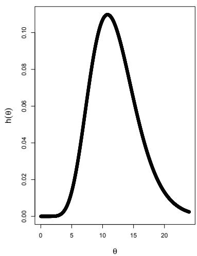
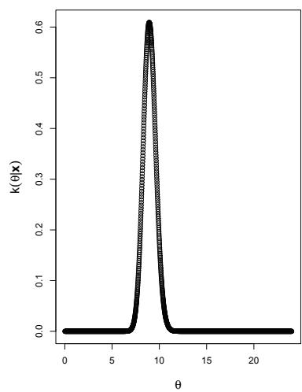

# Bayesian Statistics

[Package map](../structure.md) · [Unsplit OCR dump](./_full.md)

[← Ch. 10 Nonparametric and Robust Statistics](./10-nonparametric-and-robust-statistics.md) · [App. A Mathematical Comments →](./a-mathematical-comments.md)

> MinerU OCR dump. If a formula, table, or numbering disagrees with the PDF, the PDF is authoritative.

---

# Chapter 11

# Bayesian Statistics

# 11.1 Bayesian Procedures

To understand the Bayesian inference, let us review Bayes Theorem, (1.4.3), in a situation in which we are trying to determine something about a parameter of a distribution. Suppose we have a Poisson distribution with parameter $\theta > 0$ , and we know that the parameter is equal to either $\theta = 2$ or $\theta = 3$ . In Bayesian inference, the parameter is treated as a random variable $\Theta$ . Suppose, for this example, we assign subjective prior probabilities of $P(\Theta = 2) = \frac{1}{3}$ and $P(\Theta = 3) = \frac{2}{3}$ to the two possible values. These subjective probabilities are based upon past experiences, and it might be unrealistic that $\Theta$ can only take one of two values, instead of a continuous $\theta > 0$ (we address this immediately after this introductory illustration). Now suppose a random sample of size $n = 2$ results in the observations $x_{1} = 2$ , $x_{2} = 4$ . Given these data, what are the posterior probabilities of $\Theta = 2$ and $\Theta = 3$ ? By Bayes Theorem, we have

$$
\begin{array}{l} P (\Theta = 2 | X _ {1} = 2, X _ {2} = 4) \\ = \frac {P (\Theta = 2 \text {a n d} X _ {1} = 2 , X _ {2} = 4)}{P (X _ {1} = 2 , X _ {2} = 4 | \Theta = 2) P (\Theta = 2) + P (X _ {1} = 2 , X _ {2} = 4 | \Theta = 3) P (\Theta = 3)} \\ = \frac {\left(\frac {1}{3}\right) \frac {e ^ {- 2} 2 ^ {2}}{2 !} \frac {e ^ {- 2} 2 ^ {4}}{4 !}}{\left(\frac {1}{3}\right) \frac {e ^ {- 2} 2 ^ {2}}{2 !} \frac {e ^ {- 2} 2 ^ {4}}{4 !} + \left(\frac {2}{3}\right) \frac {e ^ {- 3} 3 ^ {2}}{2 !} \frac {e ^ {- 3} 3 ^ {4}}{4 !}} = 0. 2 4 5. \\ \end{array}
$$

Similarly,

$$
P (\Theta = 3 \mid X _ {1} = 2, X _ {2} = 4) = 1 - 0. 2 4 5 = 0. 7 5 5.
$$

That is, with the observations $x_{1} = 2, x_{2} = 4$ , the posterior probability of $\Theta = 2$ was smaller than the prior probability of $\Theta = 2$ . Similarly, the posterior probability of $\Theta = 3$ was greater than the corresponding prior. That is, the observations $x_{1} = 2, x_{2} = 4$ seemed to favor $\Theta = 3$ more than $\Theta = 2$ ; and that seems to agree with our intuition as $\overline{x} = 3$ . Now let us address in general a more realistic situation in which we place a prior pdf $h(\theta)$ on a support that is a continuum.

# 11.1.1 Prior and Posterior Distributions

We now describe the Bayesian approach to the problem of estimation. This approach takes into account any prior knowledge of the experiment that the statistician has and it is one application of a principle of statistical inference that may be called Bayesian statistics. Consider a random variable $X$ that has a distribution of probability that depends upon the symbol $\theta$ , where $\theta$ is an element of a well-defined set $\Omega$ . For example, if the symbol $\theta$ is the mean of a normal distribution, $\Omega$ may be the real line. We have previously looked upon $\theta$ as being a parameter, albeit an unknown parameter. Let us now introduce a random variable $\Theta$ that has a distribution of probability over the set $\Omega$ ; and just as we look upon $x$ as a possible value of the random variable $X$ , we now look upon $\theta$ as a possible value of the random variable $\Theta$ . Thus, the distribution of $X$ depends upon $\theta$ , an experimental value of the random variable $\Theta$ . We denote the pdf of $\Theta$ by $h(\theta)$ and we take $h(\theta) = 0$ when $\theta$ is not an element of $\Omega$ . The pdf $h(\theta)$ is called the prior pdf of $\Theta$ . Moreover, we now denote the pdf of $X$ by $f(x|\theta)$ since we think of it as a conditional pdf of $X$ , given $\Theta = \theta$ . For clarity in this chapter, we use the following summary of this model:

$$
\begin{array}{l} X | \theta \sim f (x | \theta) \\ \Theta \sim h (\theta). \tag {11.1.1} \\ \end{array}
$$

Suppose that $X_{1}, X_{2}, \ldots, X_{n}$ is a random sample from the conditional distribution of $X$ given $\Theta = \theta$ with pdf $f(x|\theta)$ . Vector notation is convenient in this chapter. Let $\mathbf{X}' = (X_{1}, X_{2}, \ldots, X_{n})$ and $\mathbf{x}' = (x_{1}, x_{2}, \ldots, x_{n})$ . Thus we can write the joint conditional pdf of $\mathbf{X}$ , given $\Theta = \theta$ , as

$$
L (\mathbf {x} \mid \theta) = f (x _ {1} \mid \theta) f (x _ {2} \mid \theta) \dots f (x _ {n} \mid \theta). \tag {11.1.2}
$$

Thus the joint pdf of $\mathbf{X}$ and $\Theta$ is

$$
g (\mathbf {x}, \theta) = L (\mathbf {x} \mid \theta) h (\theta). \tag {11.1.3}
$$

If $\Theta$ is a random variable of the continuous type, the joint marginal pdf of $\mathbf{X}$ is given by

$$
g _ {1} (\mathbf {x}) = \int_ {- \infty} ^ {\infty} g (\mathbf {x}, \theta) d \theta . \tag {11.1.4}
$$

If $\Theta$ is a random variable of the discrete type, integration would be replaced by summation. In either case, the conditional pdf of $\Theta$ , given the sample $\mathbf{X}$ , is

$$
k (\theta | \mathbf {x}) = \frac {g (\mathbf {x} , \theta)}{g _ {1} (\mathbf {x})} = \frac {L (\mathbf {x} \mid \theta) h (\theta)}{g _ {1} (\mathbf {x})}. \tag {11.1.5}
$$

The distribution defined by this conditional pdf is called the posterior distribution and (11.1.5) is called the posterior pdf. The prior distribution reflects the subjective belief of $\Theta$ before the sample is drawn, while the posterior distribution is the conditional distribution of $\Theta$ after the sample is drawn. Further discussion on these distributions follows an illustrative example.

Example 11.1.1. Consider the model

$$
\begin{array}{l} X _ {i} | \theta \sim \mathrm {i i d P o i s s o n} (\theta) \\ \begin{array}{r c l} \Theta & \sim & \Gamma (\alpha , \beta), \alpha \text {a n d} \beta \text {a r e k n o w n .} \end{array} \\ \end{array}
$$

Hence the random sample is drawn from a Poisson distribution with mean $\theta$ and the prior distribution is a $\Gamma (\alpha ,\beta)$ distribution. Let $\mathbf{X}^{\prime} = (X_{1},X_{2},\ldots ,X_{n})$ . Thus, in this case, the joint conditional pdf of $\mathbf{X}$ , given $\Theta = \theta$ , (11.1.2), is

$$
L (\mathbf {x} \mid \theta) = \frac {\theta^ {x _ {1}} e ^ {- \theta}}{x _ {1} !} \dots \frac {\theta^ {x _ {n}} e ^ {- \theta}}{x _ {n} !}, x _ {i} = 0, 1, 2, \ldots , i = 1, 2, \ldots , n,
$$

and the prior pdf is

$$
h (\theta) = \frac {\theta^ {\alpha - 1} e ^ {- \theta / \beta}}{\Gamma (\alpha) \beta^ {\alpha}}, 0 <   \theta <   \infty .
$$

Hence the joint mixed continuous-discrete pdf is given by

$$
g (\mathbf {x}, \theta) = L (\mathbf {x} | \theta) h (\theta) = \left[ \frac {\theta^ {x _ {1}} e ^ {- \theta}}{x _ {1} !} \dots \frac {\theta^ {x _ {n}} e ^ {- \theta}}{x _ {n} !} \right] \left[ \frac {\theta^ {\alpha - 1} e ^ {- \theta / \beta}}{\Gamma (\alpha) \beta^ {\alpha}} \right],
$$

provided that $x_{i} = 0,1,2,3,\ldots$ , $i = 1,2,\ldots ,n$ , and $0 < \theta < \infty$ , and is equal to zero elsewhere. Then the marginal distribution of the sample, (11.1.4), is

$$
g _ {1} (\mathbf {x}) = \int_ {0} ^ {\infty} \frac {\theta^ {\sum x _ {i} + \alpha - 1} e ^ {- (n + 1 / \beta) \theta}}{x _ {1} ! \cdots x _ {n} ! \Gamma (\alpha) \beta^ {\alpha}} d \theta = \frac {\Gamma \left(\sum_ {1} ^ {n} x _ {i} + \alpha\right)}{x _ {1} ! \cdots x _ {n} ! \Gamma (\alpha) \beta^ {\alpha} (n + 1 / \beta) ^ {\sum x _ {i} + \alpha}}. \tag {11.1.6}
$$

Finally, the posterior pdf of $\Theta$ , given $\mathbf{X} = \mathbf{x}$ , (11.1.5), is

$$
k (\theta | \mathbf {x}) = \frac {L (\mathbf {x} \mid \theta) h (\theta)}{g _ {1} (\mathbf {x})} = \frac {\theta^ {\sum x _ {i} + \alpha - 1} e ^ {- \theta / [ \beta / (n \beta + 1) ]}}{\Gamma \left(\sum x _ {i} + \alpha\right) [ \beta / (n \beta + 1) ] ^ {\sum x _ {i} + \alpha}}, \tag {11.1.7}
$$

provided that $0 < \theta < \infty$ , and is equal to zero elsewhere. This conditional pdf is of the gamma type, with parameters $\alpha^{*} = \sum_{i=1}^{n} x_{i} + \alpha$ and $\beta^{*} = \beta / (n\beta + 1)$ . Notice that the posterior pdf reflects both prior information $(\alpha, \beta)$ and sample information $(\sum_{i=1}^{n} x_{i})$ .

In Example 11.1.1, notice that it is not really necessary to determine the marginal pdf $g_{1}(\mathbf{x})$ to find the posterior pdf $k(\theta | \mathbf{x})$ . If we divide $L(\mathbf{x} | \theta) h(\theta)$ by $g_{1}(\mathbf{x})$ , we must get the product of a factor that depends upon $\mathbf{x}$ but does not depend upon $\theta$ , say $c(\mathbf{x})$ , and

$$
\theta^ {\sum x _ {i} + \alpha - 1} e ^ {- \theta / [ \beta / (n \beta + 1) ]}.
$$

That is,

$$
k (\theta | \mathbf {x}) = c (\mathbf {x}) \theta^ {\sum x _ {i} + \alpha - 1} e ^ {- \theta / [ \beta / (n \beta + 1) ]},
$$

provided that $0 < \theta < \infty$ and $x_{i} = 0,1,2,\ldots$ , $i = 1,2,\ldots,n$ . However, $c(\mathbf{x})$ must be that "constant" needed to make $k(\theta|\mathbf{x})$ a pdf, namely,

$$
c (\mathbf {x}) = \frac {1}{\Gamma \left(\sum x _ {i} + \alpha\right) [ \beta / (n \beta + 1) ] ^ {\sum x _ {i} + \alpha}}.
$$

Accordingly, we frequently write that $k(\theta|\mathbf{x})$ is proportional to $L(\mathbf{x}|\theta)h(\theta)$ ; that is, the posterior pdf can be written as

$$
k (\theta | \mathbf {x}) \propto L (\mathbf {x} \mid \theta) h (\theta). \tag {11.1.8}
$$

Note that in the right-hand member of this expression, all factors involving constants and $\mathbf{x}$ alone (not $\theta$ ) can be dropped. For illustration, in solving the problem presented in Example 11.1.1, we simply write

$$
k (\theta | \mathbf {x}) \propto \theta^ {\sum x _ {i}} e ^ {- n \theta} \theta^ {\alpha - 1} e ^ {- \theta / \beta}
$$

or, equivalently,

$$
k (\theta | \mathbf {x}) \propto \theta^ {\sum x _ {i} + \alpha - 1} e ^ {- \theta / [ \beta / (n \beta + 1) ]},
$$

$0 < \theta < \infty$ , and is equal to zero elsewhere. Clearly, $k(\theta | \mathbf{x})$ must be a gamma pdf with parameters $\alpha^{*} = \sum x_{i} + \alpha$ and $\beta^{*} = \beta / (n\beta + 1)$ .

There is another observation that can be made at this point. Suppose that there exists a sufficient statistic $Y = u(\mathbf{X})$ for the parameter so that

$$
L (\mathbf {x} \mid \theta) = g [ u (\mathbf {x}) | \theta ] H (\mathbf {x}),
$$

where now $g(y|\theta)$ is the pdf of $Y$ , given $\Theta = \theta$ . Then we note that

$$
k (\theta | \mathbf {x}) \propto g [ u (\mathbf {x}) | \theta ] h (\theta)
$$

because the factor $H(\mathbf{x})$ that does not depend upon $\theta$ can be dropped. Thus, if a sufficient statistic $Y$ for the parameter exists, we can begin with the pdf of $Y$ if we wish and write

$$
k (\theta | y) \propto g (y | \theta) h (\theta), \tag {11.1.9}
$$

where now $k(\theta | y)$ is the conditional pdf of $\Theta$ given the sufficient statistic $Y = y$ . In the case of a sufficient statistic $Y$ , we also use $g_{1}(y)$ to denote the marginal pdf of $Y$ ; that is, in the continuous case,

$$
g _ {1} (y) = \int_ {- \infty} ^ {\infty} g (y | \theta) h (\theta) d \theta .
$$

# 11.1.2 Bayesian Point Estimation

Suppose we want a point estimator of $\theta$ . From the Bayesian viewpoint, this really amounts to selecting a decision function $\delta$ , so that $\delta(\mathbf{x})$ is a predicted value of $\theta$ (an experimental value of the random variable $\Theta$ ) when both the computed value $\mathbf{x}$ and the conditional pdf $k(\theta|\mathbf{x})$ are known. Now, in general, how would we predict

an experimental value of any random variable, say $W$ , if we want our prediction to be "reasonably close" to the value to be observed? Many statisticians would predict the mean, $E(W)$ , of the distribution of $W$ ; others would predict a median (perhaps unique) of the distribution of $W$ ; and some would have other predictions. However, it seems desirable that the choice of the decision function should depend upon a loss function $\mathcal{L}[\theta, \delta(\mathbf{x})]$ . One way in which this dependence upon the loss function can be reflected is to select the decision function $\delta$ in such a way that the conditional expectation of the loss is a minimum. A Bayes estimate is a decision function $\delta$ that minimizes

$$
E \{\mathcal {L} [ \Theta , \delta (\mathbf {x}) ] | \mathbf {X} = \mathbf {x} \} = \int_ {- \infty} ^ {\infty} \mathcal {L} [ \theta , \delta (\mathbf {x}) ] k (\theta | \mathbf {x}) d \theta
$$

if $\Theta$ is a random variable of the continuous type. That is,

$$
\delta (\mathbf {x}) = \operatorname {A r g m i n} \int_ {- \infty} ^ {\infty} \mathcal {L} [ \theta , \delta (\mathbf {x}) ] k (\theta | \mathbf {x}) d \theta . \tag {11.1.10}
$$

The associated random variable $\delta(\mathbf{X})$ is called a Bayes estimator of $\theta$ . The usual modification of the right-hand member of this equation is made for random variables of the discrete type. If the loss function is given by $\mathcal{L}[\theta, \delta(\mathbf{x})] = [\theta - \delta(\mathbf{x})]^2$ , then the Bayes estimate is $\delta(\mathbf{x}) = E(\Theta | \mathbf{x})$ , the mean of the conditional distribution of $\Theta$ , given $\mathbf{X} = \mathbf{x}$ . This follows from the fact that $E[(W - b)^2]$ , if it exists, is a minimum when $b = E(W)$ . If the loss function is given by $\mathcal{L}[\theta, \delta(\mathbf{x})] = |\theta - \delta(\mathbf{x})|$ , then a median of the conditional distribution of $\Theta$ , given $\mathbf{X} = \mathbf{x}$ , is the Bayes solution. This follows from the fact that $E(|W - b|)$ , if it exists, is a minimum when $b$ is equal to any median of the distribution of $W$ .

It is easy to generalize this to estimate a specified function of $\theta$ , say, $l(\theta)$ . For the loss function $\mathcal{L}[\theta, \delta(\mathbf{x})]$ , a Bayes estimate of $l(\theta)$ is a decision function $\delta$ that minimizes

$$
E \{\mathcal {L} [ l (\Theta), \delta (\mathbf {x}) ] | \mathbf {X} = \mathbf {x} \} = \int_ {- \infty} ^ {\infty} \mathcal {L} [ l (\theta), \delta (\mathbf {x}) ] k (\theta | \mathbf {x}) d \theta .
$$

The random variable $\delta (\mathbf{X})$ is called a Bayes estimator of $l(\theta)$

The conditional expectation of the loss, given $\mathbf{X} = \mathbf{x}$ , defines a random variable that is a function of the sample $\mathbf{X}$ . The expected value of that function of $\mathbf{X}$ , in the notation of this section, is given by

$$
\int_ {- \infty} ^ {\infty} \left\{\int_ {- \infty} ^ {\infty} \mathcal {L} [ \theta , \delta (\mathbf {x}) ] k (\theta | \mathbf {x}) d \theta \right\} g _ {1} (\mathbf {x}) d \mathbf {x} = \int_ {- \infty} ^ {\infty} \left\{\int_ {- \infty} ^ {\infty} \mathcal {L} [ \theta , \delta (\mathbf {x}) ] L (\mathbf {x} | \theta) d \mathbf {x} \right\} h (\theta) d \theta ,
$$

in the continuous case. The integral within the braces in the latter expression is, for every given $\theta \in \Theta$ , the risk function $R(\theta, \delta)$ ; accordingly, the latter expression is the mean value of the risk, or the expected risk. Because a Bayes estimate $\delta(\mathbf{x})$ minimizes

$$
\int_ {- \infty} ^ {\infty} \mathcal {L} [ \theta , \delta (\mathbf {x}) ] k (\theta | \mathbf {x}) d \theta
$$

for every $\mathbf{x}$ for which $g(\mathbf{x}) > 0$ , it is evident that a Bayes estimate $\delta (\mathbf{x})$ minimizes this mean value of the risk. We now give two illustrative examples.

Example 11.1.2. Consider the model

$$
\begin{array}{l} X _ {i} | \theta \sim \text {i d b i n o m i a l}, b (1, \theta) \\ \begin{array}{c c c} \Theta & \sim & \operatorname {b e t a} (\alpha , \beta), \alpha \text {a n d} \beta \text {a r e k n o w n}; \end{array} \\ \end{array}
$$

that is, the prior pdf is

$$
h (\theta) = \left\{ \begin{array}{l l} \frac {\Gamma (\alpha + \beta)}{\Gamma (\alpha) \Gamma (\beta)} \theta^ {\alpha - 1} (1 - \theta) ^ {\beta - 1} & 0 <   \theta <   1 \\ 0 & \text {e l s e w h e r e . ,} \end{array} \right.
$$

where $\alpha$ and $\beta$ are assigned positive constants. We seek a decision function $\delta$ that is a Bayes solution. The sufficient statistic is $Y = \sum_{1}^{n}X_{i}$ , which has a $b(n,\theta)$ distribution. Thus the conditional pdf of $Y$ given $\Theta = \theta$ is

$$
g (y | \theta) = \left\{ \begin{array}{l l} {\binom {n} {y}} \theta^ {y} (1 - \theta) ^ {n - y} & y = 0, 1, \ldots , n \\ 0 & \text {e l s e w h e r e .} \end{array} \right.
$$

Thus, by (11.1.9), the conditional pdf of $\Theta$ , given $Y = y$ at points of positive probability density, is

$$
k (\theta | y) \propto \theta^ {y} (1 - \theta) ^ {n - y} \theta^ {\alpha - 1} (1 - \theta) ^ {\beta - 1}, \quad 0 <   \theta <   1.
$$

That is,

$$
k (\theta | y) = \frac {\Gamma (n + \alpha + \beta)}{\Gamma (\alpha + y) \Gamma (n + \beta - y)} \theta^ {\alpha + y - 1} (1 - \theta) ^ {\beta + n - y - 1}, \quad 0 <   \theta <   1,
$$

and $y = 0,1,\ldots ,n$ . Hence the posterior pdf is a beta density function with parameters $(\alpha +y,\beta +n - y)$ . We take the squared-error loss, i.e., $\mathcal{L}[\theta ,\delta (y)] = [\theta -\delta (y)]^2$ as the loss function. Then, the Bayesian point estimate of $\theta$ is the mean of this beta pdf, which is

$$
\delta (y) = \frac {\alpha + y}{\alpha + \beta + n}.
$$

It is very instructive to note that this Bayes estimator can be written as

$$
\delta (y) = \left(\frac {n}{\alpha + \beta + n}\right) \frac {y}{n} + \left(\frac {\alpha + \beta}{\alpha + \beta + n}\right) \frac {\alpha}{\alpha + \beta},
$$

which is a weighted average of the maximum likelihood estimate $y / n$ of $\theta$ and the mean $\alpha / (\alpha + \beta)$ of the prior pdf of the parameter. Moreover, the respective weights are $n / (\alpha + \beta + n)$ and $(\alpha + \beta) / (\alpha + \beta + n)$ . Note that for large $n$ , the Bayes estimate is close to the maximum likelihood estimate of $\theta$ and that, furthermore, $\delta(Y)$ is a consistent estimator of $\theta$ . Thus we see that $\alpha$ and $\beta$ should be selected so that not only is $\alpha / (\alpha + \beta)$ the desired prior mean, but the sum $\alpha + \beta$ indicates the worth of the prior opinion relative to a sample of size $n$ . That is, if we want our prior opinion to have as much weight as a sample size of 20, we would take $\alpha + \beta = 20$ . So if our prior mean is $\frac{3}{4}$ , we have that $\alpha$ and $\beta$ are selected so that $\alpha = 15$ and $\beta = 5$ .

Example 11.1.3. For this example, we have the normal model,

$$
X _ {i} \mid \theta \sim \text {i d} N (\theta , \sigma^ {2}), \text {w h e r e} \sigma^ {2} \text {i s k n o w n}
$$

$$
\Theta \sim N \left(\theta_ {0}, \sigma_ {0} ^ {2}\right), \text {w h e r e} \theta_ {0} \text {a n d} \sigma_ {0} ^ {2} \text {a r e k n o w n}.
$$

Then $Y = \overline{X}$ is a sufficient statistic. Hence an equivalent formulation of the model is

$$
Y | \theta \sim N (\theta , \sigma^ {2} / n), \text {w h e r e} \sigma^ {2} \text {i s k n o w n}
$$

$$
\Theta \sim N \left(\theta_ {0}, \sigma_ {0} ^ {2}\right), \text {w h e r e} \theta_ {0} \text {a n d} \sigma_ {0} ^ {2} \text {a r e k n o w n}.
$$

Then for the posterior pdf, we have

$$
k (\theta | y) \propto \frac {1}{\sqrt {2 \pi} \sigma / \sqrt {n}} \frac {1}{\sqrt {2 \pi} \sigma_ {0}} \exp \left[ - \frac {(y - \theta) ^ {2}}{2 (\sigma^ {2} / n)} - \frac {(\theta - \theta_ {0}) ^ {2}}{2 \sigma_ {0} ^ {2}} \right].
$$

If we eliminate all constant factors (including factors involving only $y$ ), we have

$$
k (\theta | y) \propto \exp \left[ - \frac {[ \sigma_ {0} ^ {2} + (\sigma^ {2} / n) ] \theta^ {2} - 2 [ y \sigma_ {0} ^ {2} + \theta_ {0} (\sigma^ {2} / n) ] \theta}{2 (\sigma^ {2} / n) \sigma_ {0} ^ {2}} \right].
$$

This can be simplified by completing the square to read (after eliminating factors not involving $\theta$ )

$$
k (\theta | y) \propto \exp \left[ - \frac {\left(\theta - \frac {y \sigma_ {0} ^ {2} + \theta_ {0} (\sigma^ {2} / n)}{\sigma_ {0} ^ {2} + (\sigma^ {2} / n)}\right) ^ {2}}{\frac {2 (\sigma^ {2} / n) \sigma_ {0} ^ {2}}{[ \sigma_ {0} ^ {2} + (\sigma^ {2} / n) ]}} \right].
$$

That is, the posterior pdf of the parameter is obviously normal with mean

$$
\frac {y \sigma_ {0} ^ {2} + \theta_ {0} (\sigma^ {2} / n)}{\sigma_ {0} ^ {2} + (\sigma^ {2} / n)} = \left(\frac {\sigma_ {0} ^ {2}}{\sigma_ {0} ^ {2} + (\sigma^ {2} / n)}\right) y + \left(\frac {\sigma^ {2} / n}{\sigma_ {0} ^ {2} + (\sigma^ {2} / n)}\right) \theta_ {0} \tag {11.1.11}
$$

and variance $(\sigma^2 /n)\sigma_0^2 /[ \sigma_0^2 +( \sigma^2 /n)]$ . If the squared-error loss function is used, this posterior mean is the Bayes estimator. Again, note that it is a weighted average of the maximum likelihood estimate $y = \overline{x}$ and the prior mean $\theta_0$ . As in the last example, for large $n$ , the Bayes estimator is close to the maximum likelihood estimator and $\delta (Y)$ is a consistent estimator of $\theta$ . Thus the Bayesian procedures permit the decision maker to enter his or her prior opinions into the solution in a very formal way such that the influences of these prior notions are less and less as $n$ increases.

In Bayesian statistics, all the information is contained in the posterior pdf $k(\theta | y)$ . In Examples 11.1.2 and 11.1.3, we found Bayesian point estimates using the squared-error loss function. It should be noted that if $\mathcal{L}[\delta(y), \theta] = |\delta(y) - \theta|$ , the absolute value of the error, then the Bayes solution would be the median of the posterior distribution of the parameter, which is given by $k(\theta | y)$ . Hence the Bayes estimator changes, as it should, with different loss functions.

# 11.1.3 Bayesian Interval Estimation

If an interval estimate of $\theta$ is desired, we can find two functions $u(\mathbf{x})$ and $v(\mathbf{x})$ so that the conditional probability

$$
P [ u (\mathbf {x}) <   \Theta <   v (\mathbf {x}) | \mathbf {X} = \mathbf {x} ] = \int_ {u (\mathbf {x})} ^ {v (\mathbf {x})} k (\theta | \mathbf {x}) d \theta
$$

is large, for example, 0.95. Then the interval $u(\mathbf{x})$ to $v(\mathbf{x})$ is an interval estimate of $\theta$ in the sense that the conditional probability of $\Theta$ belonging to that interval is equal to 0.95. These intervals are often called credible or probability intervals, so as not to confuse them with confidence intervals.

Example 11.1.4. Consider Example 11.1.3, where $X_{1}, X_{2}, \ldots, X_{n}$ is a random sample from a $N(\theta, \sigma^2)$ distribution, where $\sigma^2$ is known, and the prior distribution is a normal $N(\theta_0, \sigma_0^2)$ distribution. The statistic $Y = \overline{X}$ is sufficient. Recall that the posterior pdf of $\Theta$ given $Y = y$ was normal with mean and variance given near expression (11.1.11). Hence a credible interval is found by taking the mean of the posterior distribution and adding and subtracting 1.96 of its standard deviation; that is, the interval

$$
\frac {y \sigma_ {0} ^ {2} + \theta_ {0} (\sigma^ {2} / n)}{\sigma_ {0} ^ {2} + (\sigma^ {2} / n)} \pm 1. 9 6 \sqrt {\frac {(\sigma^ {2} / n) \sigma_ {0} ^ {2}}{\sigma_ {0} ^ {2} + (\sigma^ {2} / n)}}
$$

forms a credible interval of probability 0.95 for $\theta$ .

Example 11.1.5. Recall Example 11.1.1, where $\mathbf{X}' = (X_1, X_2, \ldots, X_n)$ is a random sample from a Poisson distribution with mean $\theta$ and a $\Gamma(\alpha, \beta)$ prior, with $\alpha$ and $\beta$ known, is considered. As given by expression (11.1.7), the posterior pdf is a $\Gamma(y + \alpha, \beta / (n\beta + 1))$ pdf, where $y = \sum_{i=1}^{n} x_i$ . Hence, if we use the squared-error loss function, the Bayes point estimate of $\theta$ is the mean of the posterior

$$
\delta (y) = \frac {\beta (y + \alpha)}{n \beta + 1} = \frac {n \beta}{n \beta + 1} \frac {y}{n} + \frac {\alpha \beta}{n \beta + 1}.
$$

As with the other Bayes estimates we have discussed in this section, for large $n$ this estimate is close to the maximum likelihood estimate and the statistic $\delta(Y)$ is a consistent estimate of $\theta$ . To obtain a credible interval, note that the posterior distribution of $\frac{2(n\beta + 1)}{\beta}\Theta$ is $\chi^2(2(\sum_{i=1}^{n} x_i + \alpha))$ . Based on this, the following interval is a $(1 - \alpha)100\%$ credible interval for $\theta$ :

$$
\left(\frac {\beta}{2 (n \beta + 1)} \chi_ {1 - (\alpha / 2)} ^ {2} \left[ 2 \left(\sum_ {i = 1} ^ {n} x _ {i} + \alpha\right) \right], \frac {\beta}{2 (n \beta + 1)} \chi_ {\alpha / 2} ^ {2} \left[ 2 \left(\sum_ {i = 1} ^ {n} x _ {i} + \alpha\right) \right]\right), \tag {11.1.12}
$$

where $\chi_{1 - (\alpha /2)}^2 (2(\sum_{i = 1}^n x_i + \alpha))$ and $\chi_{\alpha /2}^2 (2(\sum_{i = 1}^n x_i + \alpha))$ are the lower and upper $\chi^2$ quantiles for a $\chi^2$ distribution with $2(\sum_{i = 1}^{n}x_{i} + \alpha)$ degrees of freedom.

# 11.1.4 Bayesian Testing Procedures

As above, let $X$ be a random variable with pdf (pmf) $f(x|\theta)$ , $\theta \in \Omega$ . Suppose we are interested in testing the hypotheses

$$
H _ {0}: \theta \in \omega_ {0} \text {v e r s u s} H _ {1}: \theta \in \omega_ {1},
$$

where $\omega_0\cup \omega_1 = \Omega$ and $\omega_0\cap \omega_1 = \phi$ . A simple Bayesian procedure to test these hypotheses proceeds as follows. Let $h(\theta)$ denote the prior distribution of the prior random variable $\Theta$ ; let $\mathbf{X}' = (X_{1},X_{2},\ldots ,X_{n})$ denote a random sample on $X$ ; and denote the posterior pdf or pmf by $k(\theta |\mathbf{x})$ . We use the posterior distribution to compute the following conditional probabilities:

$$
P (\Theta \in \omega_ {0} | \mathbf {x}) \text {a n d} P (\Theta \in \omega_ {1} | \mathbf {x}).
$$

In the Bayesian framework, these conditional probabilities represent the truth of $H_0$ and $H_1$ , respectively. A simple rule is to

$$
\text {A c c e p t} H _ {0} \text {i f} P (\Theta \in \omega_ {0} | \mathbf {x}) \geq P (\Theta \in \omega_ {1} | \mathbf {x});
$$

otherwise, accept $H_{1}$ ; that is, accept the hypothesis that has the greater conditional probability. Note that the condition $\omega_0 \cap \omega_1 = \phi$ is required, but $\omega_0 \cup \omega_1 = \Omega$ is not necessary. More than two hypotheses may be tested at the same time, in which case a simple rule would be to accept the hypothesis with the greater conditional probability. We finish this subsection with a numerical example.

Example 11.1.6. Referring again to Example 11.1.1, where $\mathbf{X}' = (X_1, X_2, \ldots, X_n)$ is a random sample from a Poisson distribution with mean $\theta$ , suppose we are interested in testing

$$
H _ {0}: \theta \leq 1 0 \text {v e r s u s} H _ {1}: \theta > 1 0. \tag {11.1.13}
$$

Suppose we think $\theta$ is about 12, but we are not quite sure. Hence we choose the $\Gamma(10,1.2)$ pdf as our prior, which is shown in the left panel of Figure 11.1.1. The mean of the prior is 12, but as the plot shows, there is some variability (the variance of the prior distribution is 14.4). The data for the problem are

<table><tr><td>11</td><td>7</td><td>11</td><td>6</td><td>5</td><td>9</td><td>14</td><td>10</td><td>9</td><td>5</td></tr><tr><td>8</td><td>10</td><td>8</td><td>10</td><td>12</td><td>9</td><td>3</td><td>12</td><td>14</td><td>4</td></tr></table>

(these are the values of a random sample of size $n = 20$ taken from a Poisson distribution with mean 8; of course, in practice we would not know the mean is 8). The value of the sufficient statistic is $y = \sum_{i=1}^{20} x_i = 177$ . Hence, from Example 11.1.1, the posterior distribution is a $\Gamma(177 + 10, 1.2 / [20(1.2) + 1]) = \Gamma(187, 0.048)$ distribution, which is shown in the right panel of Figure 11.1.1. Note that the data have moved the mean to the left of 12 to $187(0.048) = 8.976$ , which is the Bayes estimate (under squared-error loss) of $\theta$ . Using R, we compute the posterior probability of $H_0$ as

$$
P [ \Theta \leq 1 0 | y = 1 7 7 ] = P [ \Gamma (1 8 7, 0. 0 4 8) \leq 1 0 ] = \mathrm {p g a m m a} (1 0, 1 8 7, 1 / 0. 0 4 8) = 0. 9 3 6 8.
$$

  
Figure 11.1.1: Prior (left panel) and posterior (right panel) pdfs of Example 11.1.6

Thus $P[\Theta > 10|y = 177] = 1 - 0.9368 = 0.0632$ ; consequently, our rule would accept $H_0$ .

The $95\%$ credible interval, (11.1.12), is (7.77, 10.31), which also contains 10; see Exercise 11.1.7 for details.

# 11.1.5 Bayesian Sequential Procedures

Finally, we should observe what a Bayesian would do if additional data were collected beyond $x_{1}, x_{2}, \ldots, x_{n}$ . In such a situation, the posterior distribution found with the observations $x_{1}, x_{2}, \ldots, x_{n}$ becomes the new prior distribution, additional observations give a new posterior distribution, and inferences would be made from that second posterior. Of course, this can continue with even more observations. That is, the second posterior becomes the new prior, and the next set of observations yields the next posterior from which the inferences can be made. Clearly, this gives Bayesians an excellent way of handling sequential analysis. They can continue taking data, always updating the previous posterior, which has become a new prior distribution. Everything a Bayesian needs for inferences is in that final posterior distribution obtained by this sequential procedure.

# EXERCISES

11.1.1. Let $Y$ have a binomial distribution in which $n = 20$ and $p = \theta$ . The prior probabilities on $\theta$ are $P(\theta = 0.3) = 2/3$ and $P(\theta = 0.5) = 1/3$ . If $y = 9$ , what are the posterior probabilities for $\theta = 0.3$ and $\theta = 0.5$ ?

11.1.2. Let $X_{1}, X_{2}, \ldots, X_{n}$ be a random sample from a distribution that is $b(1, \theta)$ . Let the prior of $\Theta$ be a beta one with parameters $\alpha$ and $\beta$ . Show that the posterior pdf $k(\theta | x_{1}, x_{2}, \ldots, x_{n})$ is exactly the same as $k(\theta | y)$ given in Example 11.1.2.

11.1.3. Let $X_{1}, X_{2}, \ldots, X_{n}$ denote a random sample from a distribution that is $N(\theta, \sigma^2)$ , where $-\infty < \theta < \infty$ and $\sigma^2$ is a given positive number. Let $Y = \overline{X}$ denote the mean of the random sample. Take the loss function to be $\mathcal{L}[\theta, \delta(y)] = |\theta - \delta(y)|$ . If $\theta$ is an observed value of the random variable $\Theta$ that is $N(\mu, \tau^2)$ , where $\tau^2 > 0$ and $\mu$ are known numbers, find the Bayes solution $\delta(y)$ for a point estimate $\theta$ .

11.1.4. Let $X_{1}, X_{2}, \ldots, X_{n}$ denote a random sample from a Poisson distribution with mean $\theta$ , $0 < \theta < \infty$ . Let $Y = \sum_{1}^{n} X_{i}$ . Use the loss function $\mathcal{L}[\theta, \delta(y)] = [\theta - \delta(y)]^2$ . Let $\theta$ be an observed value of the random variable $\Theta$ . If $\Theta$ has the prior pdf $h(\theta) = \theta^{\alpha - 1} e^{-\theta / \beta} / \Gamma(\alpha) \beta^{\alpha}$ , for $0 < \theta < \infty$ , zero elsewhere, where $\alpha > 0$ , $\beta > 0$ are known numbers, find the Bayes solution $\delta(y)$ for a point estimate for $\theta$ .

11.1.5. Let $Y_{n}$ be the $n$ th order statistic of a random sample of size $n$ from a distribution with pdf $f(x|\theta) = 1 / \theta$ , $0 < x < \theta$ , zero elsewhere. Take the loss function to be $\mathcal{L}[\theta, \delta(y)] = [\theta - \delta(y_n)]^2$ . Let $\theta$ be an observed value of the random variable $\Theta$ , which has the prior pdf $h(\theta) = \beta \alpha^\beta / \theta^{\beta + 1}$ , $\alpha < \theta < \infty$ , zero elsewhere, with $\alpha > 0$ , $\beta > 0$ . Find the Bayes solution $\delta(y_n)$ for a point estimate of $\theta$ .

11.1.6. Let $Y_{1}$ and $Y_{2}$ be statistics that have a trinomial distribution with parameters $n$ , $\theta_{1}$ , and $\theta_{2}$ . Here $\theta_{1}$ and $\theta_{2}$ are observed values of the random variables $\Theta_{1}$ and $\Theta_{2}$ , which have a Dirichlet distribution with known parameters $\alpha_{1}$ , $\alpha_{2}$ , and $\alpha_{3}$ ; see expression (3.3.10). Show that the conditional distribution of $\Theta_{1}$ and $\Theta_{2}$ is Dirichlet and determine the conditional means $E(\Theta_{1}|y_{1},y_{2})$ and $E(\Theta_{2}|y_{1},y_{2})$ .

11.1.7. For Example 11.1.6, obtain the $95\%$ credible interval for $\theta$ . Next obtain the value of the mle for $\theta$ and the $95\%$ confidence interval for $\theta$ discussed in Chapter 6.

11.1.8. In Example 11.1.2, let $n = 30$ , $\alpha = 10$ , and $\beta = 5$ , so that $\delta(y) = (10 + y) / 45$ is the Bayes estimate of $\theta$ .

(a) If $Y$ has a binomial distribution $b(30,\theta)$ , compute the risk $E\{[\theta - \delta(Y)]^2\}$ .   
(b) Find values of $\theta$ for which the risk of part (a) is less than $\theta (1 - \theta) / 30$ , the risk associated with the maximum likelihood estimator $Y / n$ of $\theta$ .

11.1.9. Let $Y_{4}$ be the largest order statistic of a sample of size $n = 4$ from a distribution with uniform pdf $f(x; \theta) = 1 / \theta$ , $0 < x < \theta$ , zero elsewhere. If the prior pdf of the parameter $g(\theta) = 2 / \theta^3$ , $1 < \theta < \infty$ , zero elsewhere, find the Bayesian estimator $\delta(Y_{4})$ of $\theta$ , based upon the sufficient statistic $Y_{4}$ , using the loss function $|\delta(y_{4}) - \theta|$ .

11.1.10. Refer to Example 11.2.3; suppose we select $\sigma_0^2 = d\sigma^2$ , where $\sigma^2$ was known in that example. What value do we assign to $d$ so that the variance of posterior is two-thirds the variance of $Y = \overline{X}$ , namely, $\sigma^2 / n$ ?

# 11.2 More Bayesian Terminology and Ideas

Suppose $\mathbf{X}' = (X_1, X_2, \ldots, X_n)$ represents a random sample with likelihood $L(\mathbf{x}|\theta)$ and we assume a prior pdf $h(\theta)$ . The joint marginal pdf of $\mathbf{X}$ is given by

$$
g _ {1} (\mathbf {x}) = \int_ {- \infty} ^ {\infty} L (\mathbf {x} | \theta) h (\theta) d \theta .
$$

This is often called the pdf of the predictive distribution of $\mathbf{X}$ because it provides the best description of the probabilities about $\mathbf{X}$ given the likelihood and the prior. An illustration of this is provided in expression (11.1.6) of Example 11.1.1. Again note that this predictive distribution is highly dependent on the probability models for $X$ and $\Theta$ .

In this section, we consider two classes of prior distributions. The first class is the class of conjugate priors defined by:

Definition 11.2.1. A class of prior pdfs for the family of distributions with pdfs $f(x|\theta)$ , $\theta \in \Omega$ , is said to define a conjugate family of distributions if the posterior pdf of the parameter is in the same family of distributions as the prior.

As an illustration, consider Example 11.1.5, where the pmf of $X_{i}$ given $\theta$ was Poisson with mean $\theta$ . In this example, we selected a gamma prior and the resulting posterior distribution was of the gamma family also. Hence the gamma pdf forms a conjugate class of priors for this Poisson model. This was true also for Example 11.1.2 where the conjugate family was beta and the model was a binomial, and for Example 11.1.3, where both the model and the prior were normal.

To motivate our second class of priors, consider the binomial model, $b(1,\theta)$ , presented in Example 11.1.2. Thomas Bayes (1763) took as a prior the beta distribution with $\alpha = \beta = 1$ , namely $h(\theta) = 1,0 < \theta < 1$ , zero elsewhere, because he argued that he did not have much prior knowledge about $\theta$ . However, we note that this leads to the estimate of

$$
\left(\frac {n}{n + 2}\right) \left(\frac {y}{n}\right) + \left(\frac {2}{n + 2}\right) \left(\frac {1}{2}\right).
$$

We often call this a shrinkage estimate because the estimate $y / n$ is pulled a little toward the prior mean of $1 / 2$ , although Bayes tried to avoid having the prior influence the inference.

Haldane (1948) did note, however, that if a prior beta pdf exists with $\alpha = \beta = 0$ , then the shrinkage estimate would reduce to the mle $y / n$ . Of course, a beta pdf with $\alpha = \beta = 0$ is not a pdf at all, for it would be such that

$$
h (\theta) \propto \frac {1}{\theta (1 - \theta)}, 0 <   \theta <   1,
$$

zero elsewhere, and

$$
\int_ {0} ^ {1} \frac {c}{\theta (1 - \theta)} d \theta
$$

does not exist. However, such priors are used if, when combined with the likelihood, we obtain a posterior pdf which is a proper pdf. By proper, we mean that it integrates to a positive constant. In this example, we obtain the posterior pdf of

$$
f (\theta | y) \propto \theta^ {y - 1} (1 - \theta) ^ {n - y - 1},
$$

which is proper provided $y > 0$ and $n - y > 0$ . Of course, the posterior mean is $y / n$ .

Definition 11.2.2. Let $\mathbf{X}' = (X_1, X_2, \ldots, X_n)$ be a random sample from the distribution with pdf $f(x|\theta)$ . A prior $h(\theta) \geq 0$ for this family is said to be improper if it is not a pdf, but the function $k(\theta|\mathbf{x}) \propto L(\mathbf{x}|\theta)h(\theta)$ can be made proper.

A noninformative prior is a prior that treats all values of $\theta$ the same, that is, uniformly. Continuous noninformative priors are often improper. As an example, suppose we have a normal distribution $N(\theta_1,\theta_2)$ in which both $\theta_{1}$ and $\theta_{2} > 0$ are unknown. A noninformative prior for $\theta_{1}$ is $h_1(\theta_1) = 1$ , $-\infty < \theta_{1} < \infty$ . Clearly, this is not a pdf. An improper prior for $\theta_{2}$ is $h_2(\theta_2) = c_2 / \theta_2$ , $0 < \theta_{2} < \infty$ , zero elsewhere. Note that $\log \theta_{2}$ is uniformly distributed between $-\infty < \log \theta_{2} < \infty$ . Hence, in this way, it is a noninformative prior. In addition, assume the parameters are independent. Then the joint prior, which is improper, is

$$
h _ {1} \left(\theta_ {1}\right) h _ {2} \left(\theta_ {2}\right) \propto 1 / \theta_ {2}, - \infty <   \theta_ {1} <   \infty , 0 <   \theta_ {2} <   \infty . \tag {11.2.1}
$$

Using this prior, we present the Bayes solution for $\theta_{1}$ in the next example.

Example 11.2.1. Let $X_{1}, X_{2}, \ldots, X_{n}$ be a random sample from a $N(\theta_{1}, \theta_{2})$ distribution. Recall that $\overline{X}$ and $S^{2} = (n - 1)^{-1} \sum_{i=1}^{n} (X_{i} - \overline{X})^{2}$ are sufficient statistics. Suppose we use the improper prior given by (11.2.1). Then the posterior distribution is given by

$$
\begin{array}{l} k _ {1 2} \left(\theta_ {1}, \theta_ {2} | \bar {x}, s ^ {2}\right) \propto \left(\frac {1}{\theta_ {2}}\right) \left(\frac {1}{\sqrt {2 \pi \theta_ {2}}}\right) ^ {n} \exp \left[ - \frac {1}{2} \left\{\left(n - 1\right) s ^ {2} + n \left(\bar {x} - \theta_ {1}\right) ^ {2} \right\} / \theta_ {2} \right] \\ \propto \left(\frac {1}{\theta_ {2}}\right) ^ {\frac {n}{2} + 1} \exp \left[ - \frac {1}{2} \left\{\left(n - 1\right) s ^ {2} + n \left(\bar {x} - \theta_ {1}\right) ^ {2} \right\} / \theta_ {2} \right]. \\ \end{array}
$$

To get the conditional pdf of $\theta_{1}$ , given $\overline{x}$ and $s^2$ , we integrate out $\theta_{2}$

$$
k _ {1} \left(\theta_ {1} | \bar {x}, s ^ {2}\right) = \int_ {0} ^ {\infty} k _ {1 2} \left(\theta_ {1}, \theta_ {2} | \bar {x}, s ^ {2}\right) d \theta_ {2}.
$$

To carry this out, let us change variables $z = 1 / \theta_{2}$ and $\theta_{2} = 1 / z$ , with Jacobian $-1 / z^{2}$ . Thus

$$
k _ {1} (\theta_ {1} | \overline {{x}}, s ^ {2}) \propto \int_ {0} ^ {\infty} \frac {z ^ {\frac {n}{2} + 1}}{z ^ {2}} \exp \left[ - \left\{\frac {(n - 1) s ^ {2} + n (\overline {{x}} - \theta_ {1}) ^ {2}}{2} \right\} z \right] d z.
$$

Referring to a gamma distribution with $\alpha = n / 2$ and $\beta = 2 / \{(n - 1)s^2 +n(\overline{x} -\theta_1)^2\}$ , this result is proportional to

$$
k _ {1} (\theta_ {1} | \overline {{x}}, s ^ {2}) \propto \{(n - 1) s ^ {2} + n (\overline {{x}} - \theta_ {1}) ^ {2} \} ^ {- n / 2}.
$$

Let us change variables to get more familiar results; namely, let

$$
t = \frac {\theta_ {1} - \overline {{x}}}{s / \sqrt {n}} \mathrm {a n d} \theta_ {1} = \overline {{x}} + t s / \sqrt {n},
$$

with Jacobian $s / \sqrt{n}$ . This conditional pdf of $t$ , given $\overline{x}$ and $s^2$ , is then

$$
\begin{array}{l} k (t | \bar {x}, s ^ {2}) \propto \{(n - 1) s ^ {2} + (s t) ^ {2} \} ^ {- n / 2} \\ \propto \frac {1}{[ 1 + t ^ {2} / (n - 1) ] ^ {[ (n - 1) + 1 ] / 2}}. \\ \end{array}
$$

That is, the conditional pdf of $t = (\theta_1 - \overline{x}) / (s / n)$ , given $\overline{x}$ and $s^2$ , is a Student $t$ with $n - 1$ degrees of freedom. Since the mean of this pdf is 0 (assuming that $n > 2$ ), it follows that the Bayes estimator of $\theta_1$ , under squared-error loss, is $\overline{X}$ , which is also the mle.

Of course, from $k_{1}(\theta_{1}|\overline{x}, s^{2})$ or $k(t|\overline{x}, s^{2})$ , we can find a credible interval for $\theta_{1}$ . One way of doing this is to select the highest density region (HDR) of the pdf $\theta_{1}$ or that of $t$ . The former is symmetric and unimodal about $\theta_{1}$ and the latter about zero, but the latter's critical values are tabulated; so we use the HDR of that $t$ -distribution. Thus, if we want an interval having probability $1 - \alpha$ , we take

$$
- t _ {\alpha / 2} <   \frac {\theta_ {1} - \overline {{x}}}{s / \sqrt {n}} <   t _ {\alpha / 2}
$$

or, equivalently,

$$
\overline {{x}} - t _ {\alpha / 2} s \big / \sqrt {n} <   \theta_ {1} <   \overline {{x}} + t _ {\alpha / 2} s \big / \sqrt {n}.
$$

This interval is the same as the confidence interval for $\theta_{1}$ ; see Example 4.2.1. Hence, in this case, the improper prior (11.2.1) leads to the same inference as the traditional analysis.

Example 11.2.2. Usually in a Bayesian analysis, noninformative priors are not used if prior information exists. Let us consider the same situation as in Example 11.2.1, where the model was a $N(\theta_1,\theta_2)$ distribution. Suppose now we consider the precision $\theta_{3} = 1 / \theta_{2}$ instead of variance $\theta_{2}$ . The likelihood becomes

$$
\left(\frac {\theta_ {3}}{2 \pi}\right) ^ {n / 2} \exp \left[ - \frac {1}{2} \left\{(n - 1) s ^ {2} + n (\overline {{x}} - \theta_ {1}) ^ {2} \right\} \theta_ {3} \right],
$$

so that it is clear that a conjugate prior for $\theta_{3}$ is $\Gamma (\alpha ,\beta)$ . Further, given $\theta_{3}$ , a reasonable prior on $\theta_{1}$ is $N(\theta_0,\frac{1}{n_0\theta_3})$ , where $n_0$ is selected in some way to reflect how many observations the prior is worth. Thus the joint prior of $\theta_{1}$ and $\theta_{3}$ is

$$
h (\theta_ {1}, \theta_ {3}) \propto \theta_ {3} ^ {\alpha - 1} e ^ {- \theta_ {3} / \beta} (n _ {0} \theta_ {3}) ^ {1 / 2} e ^ {- (\theta_ {1} - \theta_ {0}) ^ {2} \theta_ {3} n _ {0} / 2}.
$$

If this is multiplied by the likelihood function, we obtain the posterior joint pdf of $\theta_{1}$ and $\theta_{3}$ , namely,

$$
k (\theta_ {1}, \theta_ {3} | \overline {{x}}, s ^ {2}) \propto \theta_ {3} ^ {\alpha + \frac {n}{2} + \frac {1}{2} - 1} \exp \left[ - \frac {1}{2} Q (\theta_ {1}) \theta_ {3} \right],
$$

where

$$
\begin{array}{l} Q (\theta_ {1}) = \frac {2}{\beta} + n _ {0} (\theta_ {1} - \theta_ {0}) ^ {2} + [ (n - 1) s ^ {2} + n (\overline {{x}} - \theta_ {1}) ^ {2} ] \\ = (n _ {0} + n) \left[ \left(\theta_ {1} - \frac {n _ {0} \theta_ {0} + n \overline {{x}}}{n _ {0} + n}\right) ^ {2} \right] + D, \\ \end{array}
$$

with

$$
D = \frac {2}{\beta} + (n - 1) s ^ {2} + (n _ {0} ^ {- 1} + n ^ {- 1}) ^ {- 1} (\theta_ {0} - \overline {{x}}) ^ {2}.
$$

If we integrate out $\theta_{3}$ , we obtain

$$
\begin{array}{l} k _ {1} (\theta_ {1} | \overline {{x}}, s ^ {2}) \propto \int_ {0} ^ {\infty} k (\theta_ {1}, \theta_ {3} | \overline {{x}}, s ^ {2}) d \theta_ {3} \\ \propto \frac {1}{[ Q (\theta_ {1}) ] ^ {[ 2 \alpha + n + 1 ] / 2}}. \\ \end{array}
$$

To get this in a more familiar form, change variables by letting

$$
t = \frac {\theta_ {1} - \frac {n _ {0} \theta_ {0} + n \overline {{x}}}{n _ {0} + n}}{\sqrt {D / [ (n _ {0} + n) (2 \alpha + n) ]}},
$$

with Jacobian $\sqrt{D / [(n_0 + n)(2\alpha + n)]}$ . Thus

$$
k _ {2} (t | \overline {{x}}, s ^ {2}) \propto \frac {1}{\left[ 1 + \frac {t ^ {2}}{2 \alpha + n} \right] ^ {(2 \alpha + n + 1) / 2}},
$$

which is a Student $t$ distribution with $2\alpha + n$ degrees of freedom. The Bayes estimate (under squared-error loss) in this case is

$$
\frac {n _ {0} \theta_ {0} + n \overline {{x}}}{n _ {0} + n}.
$$

It is interesting to note that if we define "new" sample characteristics as

$$
n _ {k} = n _ {0} + n
$$

$$
\overline {{x}} _ {k} = \frac {n _ {0} \theta_ {0} + n \overline {{x}}}{n _ {0} + n}
$$

$$
s _ {k} ^ {2} = \frac {D}{2 \alpha + n},
$$

then

$$
t = \frac {\theta_ {1} - \overline {{x}} _ {k}}{s _ {k} / \sqrt {n _ {k}}}
$$

has a $t$ -distribution with $2\alpha + n$ degrees of freedom. Of course, using these degrees of freedom, we can find $t_{\gamma/2}$ so that

$$
\overline {{x}} _ {k} \pm t _ {\gamma / 2} \frac {s _ {k}}{\sqrt {n _ {k}}}
$$

is an HDR credible interval estimate for $\theta_{1}$ with probability $1 - \gamma$ . Naturally, it falls upon the Bayesian to assign appropriate values to $\alpha, \beta, n_{0}$ , and $\theta_{0}$ . Small values of $\alpha$ and $n_{0}$ with a large value of $\beta$ would create a prior, so that this interval estimate would differ very little from the usual one.

Finally, it should be noted that when dealing with symmetric, unimodal posterior distributions, it was extremely easy to find the HDR interval estimate. If, however, that posterior distribution is not symmetric, it is more difficult and often the Bayesian would find the interval that has equal probabilities on each tail.

# EXERCISES

11.2.1. Let $X_{1}, X_{2}$ be a random sample from a Cauchy distribution with pdf

$$
f (x; \theta_ {1}, \theta_ {2}) = \left(\frac {1}{\pi}\right) \frac {\theta_ {2}}{\theta_ {2} ^ {2} + (x - \theta_ {1}) ^ {2}}, - \infty <   x <   \infty ,
$$

where $-\infty <  \theta_{1} <   \infty$ $0 <   \theta_{2}$ . Use the noninformative prior $h(\theta_1,\theta_2)\propto 1$

(a) Find the posterior pdf of $\theta_{1},\theta_{2}$ , other than the constant of proportionality.   
(b) Evaluate this posterior pdf if $x_{1} = 1, x_{2} = 4$ for $\theta_{1} = 1, 2, 3, 4$ and $\theta_{2} = 0.5, 1.0, 1.5, 2.0$ .   
(c) From the 16 values in part (b), where does the maximum of the posterior pdf seem to be?   
(d) Do you know a computer program that can find the point $(\theta_{1},\theta_{2})$ of maximum?

11.2.2. Let $X_{1}, X_{2}, \ldots, X_{10}$ be a random sample of size $n = 10$ from a gamma distribution with $\alpha = 3$ and $\beta = 1 / \theta$ . Suppose we believe that $\theta$ has a gamma distribution with $\alpha = 10$ and $\beta = 2$ .

(a) Find the posterior distribution of $\theta$   
(b) If the observed $\overline{x} = 18.2$ , what is the Bayes point estimate associated with square-error loss function?   
(c) What is the Bayes point estimate using the mode of the posterior distribution?   
(d) Comment on an HDR interval estimate for $\theta$ . Would it be easier to find one having equal tail probabilities?

Hint: Can the posterior distribution be related to a chi-square distribution?

11.2.3. Suppose for the situation of Example 11.2.2, $\theta_{1}$ has the prior distribution $N(75,1 / (5\theta_3))$ and $\theta_{3}$ has the prior distribution $\Gamma (\alpha = 4,\beta = 0.5)$ . Suppose the observed sample of size $n = 50$ resulted in $\overline{x} = 77.02$ and $s^2 = 8.2$ .

(a) Find the Bayes point estimate of the mean $\theta_{1}$ .   
(b) Determine an HDR interval estimate with $1 - \gamma = 0.90$

11.2.4. Let $f(x|\theta)$ , $\theta \in \Omega$ , be a pdf with Fisher information, (6.2.4), $I(\theta)$ . Consider the Bayes model

$$
\begin{array}{l} X | \theta \sim f (x | \theta), \theta \in \Omega \\ \Theta \sim h (\theta) \propto \sqrt {I (\theta)}. \tag {11.2.2} \\ \end{array}
$$

(a) Suppose we are interested in a parameter $\tau = u(\theta)$ . Use the chain rule to prove that

$$
\sqrt {I (\tau)} = \sqrt {I (\theta)} \left| \frac {\partial \theta}{\partial \tau} \right|. \tag {11.2.3}
$$

(b) Show that for the Bayes model (11.2.2), the prior pdf for $\tau$ is proportional to $\sqrt{I(\tau)}$ .

The class of priors given by expression (11.2.2) is often called the class of Jeffreys' priors; see Jeffreys (1961). This exercise shows that Jeffreys' priors exhibit an invariance in that the prior of a parameter $\tau$ , which is a function of $\theta$ , is also proportional to the square root of the information for $\tau$ .

11.2.5. Consider the Bayes model

$$
\begin{array}{l} X _ {i} | \theta , i = 1, 2, \dots , n \sim \text {i i d w i t h d i s t r i b u t i o n} \Gamma (1, \theta), \theta > 0 \\ \Theta \sim h (\theta) \propto \frac {1}{\theta}. \\ \end{array}
$$

(a) Show that $h(\theta)$ is in the class of Jeffreys' priors.

(b) Show that the posterior pdf is

$$
h (\theta | y) \propto \left(\frac {1}{\theta}\right) ^ {n + 2 - 1} e ^ {- y / \theta},
$$

where $y = \sum_{i=1}^{n} x_i$ .

(c) Show that if $\tau = \theta^{-1}$ , then the posterior $k(\tau | y)$ is the pdf of a $\Gamma(n, 1 / y)$ distribution.   
(d) Determine the posterior pdf of $2y\tau$ . Use it to obtain a $(1 - \alpha)100\%$ credible interval for $\theta$ .   
(e) Use the posterior pdf in part (d) to determine a Bayesian test for the hypotheses $H_0: \theta \geq \theta_0$ versus $H_1: \theta < \theta_0$ , where $\theta_0$ is specified.

11.2.6. Consider the Bayes model

$$
\begin{array}{l} X _ {i} | \theta , i = 1, 2, \dots , n \sim \text {i d w i t h d i s t r i b u t i o n P o i s s o n} (\theta), \theta > 0 \\ \begin{array}{c c c} \Theta & \sim & h (\theta) \propto \theta^ {- 1 / 2}. \end{array} \\ \end{array}
$$

(a) Show that $h(\theta)$ is in the class of Jeffreys' priors.   
(b) Show that the posterior pdf of $2n\theta$ is the pdf of a $\chi^2 (2y + 1)$ distribution, where $y = \sum_{i = 1}^{n}x_{i}$   
(c) Use the posterior pdf of part (b) to obtain a $(1 - \alpha)100\%$ credible interval for $\theta$ .   
(d) Use the posterior pdf in part (d) to determine a Bayesian test for the hypotheses $H_0: \theta \geq \theta_0$ versus $H_1: \theta < \theta_0$ , where $\theta_0$ is specified.

11.2.7. Consider the Bayes model

$$
X _ {i} | \theta , i = 1, 2, \dots , n \sim \mathrm {i i d} \text {w i t h d i s t r i b u t i o n} b (1, \theta), 0 <   \theta <   1.
$$

(a) Obtain the Jeffreys' prior for this model.   
(b) Assume squared-error loss and obtain the Bayes estimate of $\theta$

11.2.8. Consider the Bayes model

$$
\begin{array}{l} X _ {i} | \theta , i = 1, 2, \dots , n \sim \text {i i d w i t h d i s t r i b u t i o n} b (1, \theta), 0 <   \theta <   1 \\ \begin{array}{r c l} \Theta & \sim & h (\theta) = 1. \end{array} \\ \end{array}
$$

(a) Obtain the posterior pdf.   
(b) Assume squared-error loss and obtain the Bayes estimate of $\theta$

11.2.9. Let $\mathbf{X}_1, \mathbf{X}_2, \ldots, \mathbf{X}_n$ be a random sample from a multivariate normal normal distribution with mean vector $\boldsymbol{\mu} = (\mu_1, \mu_2, \ldots, \mu_k)'$ and known positive definite covariance matrix $\boldsymbol{\Sigma}$ . Let $\overline{\mathbf{X}}$ be the mean vector of the random sample. Suppose that $\boldsymbol{\mu}$ has a prior multivariate normal distribution with mean $\boldsymbol{\mu}_0$ and positive definite covariance matrix $\boldsymbol{\Sigma}_0$ . Find the posterior distribution of $\boldsymbol{\mu}$ , given $\overline{\mathbf{X}} = \overline{\mathbf{x}}$ . Then find the Bayes estimate $E(\boldsymbol{\mu} | \overline{\mathbf{X}} = \overline{\mathbf{x}})$ .

# 11.3 Gibbs Sampler

From the preceding sections, it is clear that integration techniques play a significant role in Bayesian inference. Hence, we now touch on some of the Monte Carlo techniques used for integration in Bayesian inference.

The Monte Carlo techniques discussed in Chapter 5 can often be used to obtain Bayesian estimates. For example, suppose a random sample is drawn from a

$N(\theta, \sigma^2)$ , where $\sigma^2$ is known. Then $Y = \overline{X}$ is a sufficient statistic. Consider the Bayes model

$$
\begin{array}{l} Y | \theta \sim N (\theta , \sigma^ {2} / n) \\ \Theta \sim h (\theta) \propto b ^ {- 1} \exp \{- (\theta - a) / b \} / (1 + \exp \{- [ (\theta - a) / b ] \}) ^ {2}, - \infty <   \theta <   \infty , \\ a \text {a n d} b > 0 \text {a r e k n o w n}, \tag {11.3.1} \\ \end{array}
$$

i.e., the prior is a logistic distribution. Thus the posterior pdf is

$$
k (\theta | y) = \frac {\frac {1}{\sqrt {2 \pi \sigma / \sqrt {n}}} \exp \left\{- \frac {1}{2} \frac {(y - \theta) ^ {2}}{\sigma^ {2} / n} \right\} b ^ {- 1} e ^ {- (\theta - a) / b} / (1 + e ^ {- [ (\theta - a) / b ]}) ^ {2}}{\int_ {- \infty} ^ {\infty} \frac {1}{\sqrt {2 \pi \sigma / \sqrt {n}}} \exp \left\{- \frac {1}{2} \frac {(y - \theta) ^ {2}}{\sigma^ {2} / n} \right\} b ^ {- 1} e ^ {- (\theta - a) / b} / (1 + e ^ {- [ (\theta - a) / b ]}) ^ {2} d \theta}.
$$

Assuming squared-error loss, the Bayes estimate is the mean of this posterior distribution. Its computation involves two integrals, which cannot be obtained in closed form. We can, however, think of the integration in the following way. Consider the likelihood $f(y|\theta)$ as a function of $\theta$ ; that is, consider the function

$$
w (\theta) = f (y | \theta) = \frac {1}{\sqrt {2 \pi} \sigma / \sqrt {n}} \exp \left\{- \frac {1}{2} \frac {(y - \theta) ^ {2}}{\sigma^ {2} / n} \right\}.
$$

We can then write the Bayes estimate as

$$
\begin{array}{l} \delta (y) = \frac {\int_ {- \infty} ^ {\infty} \theta w (\theta) b ^ {- 1} e ^ {- (\theta - a) / b} / (1 + e ^ {- [ (\theta - a) / b ]}) ^ {2} d \theta}{\int_ {- \infty} ^ {\infty} w (\theta) b ^ {- 1} e ^ {- (\theta - a) / b} / (1 + e ^ {- [ (\theta - a) / b ]}) ^ {2} d \theta} \\ = \frac {E [ \Theta w (\Theta) ]}{E [ w (\Theta) ]}, \tag {11.3.2} \\ \end{array}
$$

where the expectation is taken with $\Theta$ having the logistic prior distribution.

The estimation can be carried out by simple Monte Carlo. Independently, generate $\Theta_1, \Theta_2, \ldots, \Theta_m$ from the logistic distribution with pdf as in (11.3.1). This generation is easily computed because the inverse of the logistic cdf is given by $a + b\log \{u / (1 - u)\}$ , for $0 < u < 1$ . Then form the random variable,

$$
T _ {m} = \frac {m ^ {- 1} \sum_ {i = 1} ^ {m} \Theta_ {i} w \left(\Theta_ {i}\right)}{m ^ {- 1} \sum_ {i = 1} ^ {m} w \left(\Theta_ {i}\right)}. \tag {11.3.3}
$$

By the Weak Law of Large Numbers (Theorem 5.1.1) and Slutsky's Theorem (Theorem 5.2.4), $T_{m} \to \delta(y)$ , in probability. The value of $m$ can be quite large. Thus simple Monte Carlo techniques enable us to compute this Bayes estimate. Note that we can bootstrap this sample to obtain a confidence interval for $E[\Theta w(\Theta)] / E[w(\Theta)]$ ; see Exercise 11.3.2.

Besides simple Monte Carlo methods, there are other more complicated Monte Carlo procedures that are useful in Bayesian inference. For motivation, consider the case in which we want to generate an observation that has pdf $f_{X}(x)$ , but this generation is somewhat difficult. Suppose, however, that it is easy to generate both $Y$ , with pdf $f_{Y}(y)$ , and an observation from the conditional pdf $f_{X|Y}(x|y)$ . As the following theorem shows, if we do these sequentially, then we can easily generate from $f_{X}(x)$ .

Theorem 11.3.1. Suppose we generate random variables by the following algorithm:

1. Generate $Y\sim f_{Y}(y)$   
2. Generate $X\sim f_{X|Y}(x|Y)$

Then $X$ has pdf $f_{X}(x)$

Proof: To avoid confusion, let $T$ be the random variable generated by the algorithm. We need to show that $T$ has pdf $f_{X}(x)$ . Probabilities of events concerning $T$ are conditional on $Y$ and are taken with respect to the cdf $F_{X|Y}$ . Recall that probabilities can always be written as expectations of indicator functions and, hence, for events concerning $T$ , are conditional expectations. In particular, for any $t \in R$ ,

$$
\begin{array}{l} P [ T \leq t ] = E [ F _ {X | Y} (t) ] \\ = \int_ {- \infty} ^ {\infty} \left[ \int_ {- \infty} ^ {t} f _ {X | Y} (x | y) d x \right] f _ {Y} (y) d y \\ = \int_ {- \infty} ^ {t} \left[ \int_ {- \infty} ^ {\infty} f _ {X | Y} (x | y) f _ {Y} (y) d y \right] d x \\ = \int_ {- \infty} ^ {t} \left[ \int_ {- \infty} ^ {\infty} f _ {X, Y} (x, y) d y \right] d x \\ = \int_ {- \infty} ^ {t} f _ {X} (x) d x. \\ \end{array}
$$

Hence the random variable generated by the algorithm has pdf $f_{X}(x)$ , as was to be shown.

In the situation of this theorem, suppose we want to determine $E[W(X)]$ , for some function $W(x)$ , where $E[W^2 (X)] < \infty$ . Using the algorithm of the theorem, generate independently the sequence $(Y_{1},X_{1}),(Y_{2},X_{2}),\ldots ,(Y_{m},X_{m})$ , for a specified value of $m$ , where $Y_{i}$ is drawn from the pdf $f_{Y}(y)$ and $X_{i}$ is generated from the pdf $f_{X|Y}(x|Y)$ . Then by the Weak Law of Large Numbers,

$$
\overline {{W}} = \frac {1}{m} \sum_ {i = 1} ^ {m} W (X _ {i}) \stackrel {P} {\rightarrow} \int_ {- \infty} ^ {\infty} W (x) f _ {X} (x) d x = E [ W (X) ].
$$

Furthermore, by the Central Limit Theorem, $\sqrt{m} (\overline{W} -E[W(X)])$ converges in distribution to a $N(0,\sigma_W^2)$ distribution, where $\sigma_W^2 = \mathrm{Var}(W(X))$ . If $w_{1},w_{2},\ldots ,w_{m}$ is a realization of such a random sample, then an approximate $(1 - \alpha)100\%$ (large sample) confidence interval for $E[W(X)]$ is

$$
\overline {{w}} \pm z _ {\alpha / 2} \frac {s _ {W}}{\sqrt {m}}, \tag {11.3.4}
$$

where $s_W^2 = (m - 1)^{-1}\sum_{i = 1}^{m}(w_i - \overline{w})^2.$

To set ideas, we present the following simple example.

Example 11.3.1. Suppose the random variable $X$ has pdf

$$
f _ {X} (x) = \left\{ \begin{array}{l l} 2 e ^ {- x} \left(1 - e ^ {- x}\right) & 0 <   x <   \infty \\ 0 & \text {e l s e w h e r e .} \end{array} \right. \tag {11.3.5}
$$

Suppose $Y$ and $X|Y$ have the respective pdfs

$$
f _ {Y} (y) = \left\{ \begin{array}{l l} 2 e ^ {- 2 y} & 0 <   x <   \infty \\ 0 & \text {e l s e w h e r e} \end{array} \right. \tag {11.3.6}
$$

$$
f _ {X \mid Y} (x \mid y) = \left\{ \begin{array}{l l} e ^ {- (x - y)} & y <   x <   \infty \\ 0 & \text {e l s e w h e r e .} \end{array} \right. \tag {11.3.7}
$$

Suppose we generate random variables by the following algorithm:

1. Generate $Y \sim f_{Y}(y)$ as in expression (11.3.6).   
2. Generate $X \sim f_{X|Y}(x|Y)$ as in expression (11.3.7).

Then, by Theorem 11.3.1, $X$ has the pdf (11.3.5). Furthermore, it is easy to generate from the pdfs (11.3.6) and (11.3.7) because the inverses of the respective cdfs are given by $F_{Y}^{-1}(u) = -2^{-1}\log (1 - u)$ and $F_{X|Y}^{-1}(u) = -\log (1 - u) + Y$ .

As a numerical illustration, the R function condsim1 (found at the site listed in the Preface) uses this algorithm to generate observations from the pdf (11.3.5). Using this function, we performed $m = 10,000$ simulations of the algorithm. The sample mean and standard deviation were $\overline{x} = 1.495$ and $s = 1.112$ . Hence a $95\%$ confidence interval for $E(X)$ is (1.473, 1.517), which traps the true value $E(X) = 1.5$ ; see Exercise 11.3.4.

For the last example, Exercise 11.3.3 establishes the joint distribution of $(X,Y)$ and shows that the marginal pdf of $X$ is given by (11.3.5). Furthermore, as shown in this exercise, it is easy to generate from the distribution of $X$ directly. In Bayesian inference, though, we are often dealing with conditional pdfs, and theorems such as Theorem 11.3.1 are quite useful.

The main purpose of presenting this algorithm is to motivate another algorithm, called the Gibbs Sampler, which is useful in Bayes methodology. We describe it in terms of two random variables. Suppose $(X,Y)$ has pdf $f(x,y)$ . Our goal is to generate two streams of iid random variables, one on $X$ and the other on $Y$ . The Gibbs sampler algorithm is:

Algorithm 11.3.1 (Gibbs Sampler). Let $m$ be a positive integer, and let $X_0$ , an initial value, be given. Then for $i = 1,2,3,\ldots,m$ ,

1. Generate $Y_{i}|X_{i - 1}\sim f(y|x)$   
2. Generate $X_{i}|Y_{i}\sim f(x|y)$

Note that before entering the $i$ th step of the algorithm, we have generated $X_{i-1}$ . Let $x_{i-1}$ denote the observed value of $X_{i-1}$ . Then, using this value, generate sequentially the new $Y_i$ from the pdf $f(y|x_{i-1})$ and then draw (the new) $X_i$ from the

pdf $f(x|y_{i})$ , where $y_{i}$ is the observed value of $Y_{i}$ . In advanced texts, it is shown that

$$
Y _ {i} \stackrel {D} {\rightarrow} Y \sim f _ {Y} (y)
$$

$$
X _ {i} \quad \stackrel {{D}} {{\rightarrow}} \quad X \sim f _ {X} (x), \tag {11.3.8}
$$

as $i\to \infty$ , and

$$
\frac {1}{m} \sum_ {i = 1} ^ {m} W \left(X _ {i}\right) \xrightarrow {P} E [ W (X) ], \text {a s} m \rightarrow \infty . \tag {11.3.9}
$$

Note that the Gibbs sampler is similar but not quite the same as the algorithm given by Theorem 11.3.1. Consider the sequence of generated pairs

$$
\left(X _ {1}, Y _ {1}\right), \left(X _ {2}, Y _ {2}\right), \dots , \left(X _ {k}, Y _ {k}\right), \left(X _ {k + 1}, Y _ {k + 1}\right).
$$

Note that to compute $(X_{k + 1},Y_{k + 1})$ , we need only the pair $(X_k,Y_k)$ and none of the previous pairs from 1 to $k - 1$ . That is, given the present state of the sequence, the future of the sequence is independent of the past. In stochastic processes such a sequence is called a Markov chain. Under general conditions, the distribution of Markov chains stabilizes (reaches an equilibrium or steady-state distribution) as the length of the chain increases. For the Gibbs sampler, the equilibrium distributions are the limiting distributions in the expression (11.3.8) as $i\to \infty$ . How large should $i$ be? In practice, usually the chain is allowed to run to some large value $i$ before recording the observations. Furthermore, several recordings are run with this value of $i$ and the resulting empirical distributions of the generated random observations are examined for their similarity. Also, the starting value for $X_0$ is needed; see Casella and George (1992) for a discussion. The theory behind the convergences given in the expression (11.3.8) is beyond the scope of this text. There are many excellent references on this theory. A discussion from an elementary level can be found in Casella and George (1992). An informative overview can be found in Chapter 7 of Robert and Casella (1999); see also Lehmann and Casella (1998). We next provide a simple example.

Example 11.3.2. Suppose $(X,Y)$ has the mixed discrete-continuous pdf given by

$$
f (x, y) = \left\{ \begin{array}{l l} \frac {1}{\Gamma (\alpha)} \frac {1}{x !} y ^ {\alpha + x - 1} e ^ {- 2 y} & y > 0; x = 0, 1, 2, \dots \\ 0 & \text {e l s e w h e r e ,} \end{array} \right. \tag {11.3.10}
$$

for $\alpha > 0$ . Exercise 11.3.5 shows that this is a pdf and obtains the marginal pdfs. The conditional pdfs, however, are given by

$$
f (y | x) \propto y ^ {\alpha + x - 1} e ^ {- 2 y} \tag {11.3.11}
$$

and

$$
f (x | y) \propto e ^ {- y} \frac {y ^ {x}}{x !}. \tag {11.3.12}
$$

Hence the conditional densities are $\Gamma (\alpha +x,1 / 2)$ and Poisson $(y)$ , respectively. Thus the Gibbs sampler algorithm is, for $i = 1,2,\ldots ,m$

1. Generate $Y_{i}|X_{i - 1}\sim \Gamma (\alpha +X_{i - 1},1 / 2)$   
2. Generate $X_{i}|Y_{i}\sim \mathrm{Poisson}(Y_{i})$

In particular, for large $m$ and $n > m$ ,

$$
\bar {Y} = (n - m) ^ {- 1} \sum_ {i = m + 1} ^ {n} Y _ {i} \quad \stackrel {{P}} {\rightarrow} \quad E (Y) \tag {11.3.13}
$$

$$
\bar {X} = (n - m) ^ {- 1} \sum_ {i = m + 1} ^ {n} X _ {i} \quad \stackrel {{P}} {\rightarrow} \quad E (X). \tag {11.3.14}
$$

In this case, it can be shown (see Exercise 11.3.5) that both expectations are equal to $\alpha$ . The R function gibbser2.s, found at the site listed in the Preface, computes this Gibbs sampler. Using this routine, the authors obtained the following results upon setting $\alpha = 10$ , $m = 3000$ , and $n = 6000$ :

<table><tr><td>Parameter</td><td>Estimate</td><td>Sample Estimate</td><td>Sample Variance</td><td>Approximate 95% Confidence Interval</td></tr><tr><td>E(Y) = α = 10</td><td>y̅</td><td>10.027</td><td>10.775</td><td>(9.910, 10.145)</td></tr><tr><td>E(X) = α = 10</td><td>x̅</td><td>10.061</td><td>21.191</td><td>(9.896, 10.225)</td></tr></table>

where the estimates $\overline{y}$ and $\overline{x}$ are the observed values of the estimators in expressions (11.3.13) and (11.3.14), respectively. The confidence intervals for $\alpha$ are the large sample confidence intervals for means discussed in Example 4.2.2, using the sample variances found in the fourth column of the above table. Note that both confidence intervals trapped $\alpha = 10$ .

# EXERCISES

11.3.1. Suppose $Y$ has a $\Gamma(1,1)$ distribution while $X$ given $Y$ has the conditional pdf

$$
f (x | y) = \left\{ \begin{array}{l l} e ^ {- (x - y)} & 0 <   y <   x <   \infty \\ 0 & \text {e l s e w h e r e .} \end{array} \right.
$$

Note that both the pdf of $Y$ and the conditional pdf are easy to simulate.

(a) Set up the algorithm of Theorem 11.3.1 to generate a stream of iid observations with pdf $f_{X}(x)$ .   
(b) State how to estimate $E(X)$ .   
(c) Using your algorithm found in part (a), write an R function to estimate $E(X)$ .   
(d) Using your program, obtain a stream of 2000 simulations. Compute your estimate of $E(X)$ and find an approximate 95% confidence interval.   
(e) Show that $X$ has a $\Gamma(2,1)$ distribution. Did your confidence interval trap the true value 2?

11.3.2. Carefully write down the algorithm to obtain a bootstrap percentile confidence interval for $E[\Theta w(\Theta)] / E[w(\Theta)]$ , using the sample $\Theta_1, \Theta_2, \ldots, \Theta_m$ and the estimator given in expression (11.3.3). Write R code for this bootstrap.

11.3.3. Consider Example 11.3.1.

(a) Show that $E(X) = 1.5$ .   
(b) Obtain the inverse of the cdf of $X$ and use it to show how to generate $X$ directly.

11.3.4. Obtain another 10,000 simulations similar to those discussed at the end of Example 11.3.1. Use your simulations to obtain a confidence interval for $E(X)$ .

11.3.5. Consider Example 11.3.2.

(a) Show that the function given in expression (11.3.10) is a joint, mixed discrete-continuous pdf.   
(b) Show that the random variable $Y$ has a $\Gamma (\alpha ,1)$ distribution.   
(c) Show that the random variable $X$ has a negative binomial distribution with pmf

$$
p (x) = \left\{ \begin{array}{l l} \frac {(\alpha + x - 1) !}{x ! (\alpha - 1) !} 2 ^ {- (\alpha + x)} & x = 0, 1, 2, \ldots \\ 0 & \text {e l s e w h e r e .} \end{array} \right.
$$

(d) Show that $E(X) = \alpha$ .

11.3.6. Write an R function (or use gibbser2.s) for the Gibbs sampler discussed in Example 11.3.2. Run your function for $\alpha = 10$ , $m = 3000$ , and $n = 6000$ . Compare your results with those of the authors tabled in the example.

11.3.7. Consider the following mixed discrete-continuous pdf for a random vector $(X,Y)$ (discussed in Casella and George, 1992):

$$
f (x, y) \propto \left\{ \begin{array}{l l} {\binom {n} {x}} y ^ {x + \alpha - 1} (1 - y) ^ {n - x + \beta - 1} & x = 0, 1, \ldots , n, 0 <   y <   1 \\ 0 & \text {e l s e w h e r e}, \end{array} \right.
$$

for $\alpha > 0$ and $\beta > 0$ .

(a) Show that this function is indeed a joint, mixed discrete-continuous pdf by finding the proper constant of proportionality.   
(b) Determine the conditional pdfs $f(x|y)$ and $f(y|x)$ .   
(c) Write the Gibbs sampler algorithm to generate random samples on $X$ and $Y$ .   
(d) Determine the marginal distributions of $X$ and $Y$ .

11.3.8. Write an R function for the Gibbs sampler of Exercise 11.3.7. Run your program for $\alpha = 10$ , $\beta = 4$ , $m = 3000$ , and $n = 6000$ . Obtain estimates (and confidence intervals) of $E(X)$ and $E(Y)$ and compare them with the true parameters.

# 11.4 Modern Bayesian Methods

The prior pdf has an important influence in Bayesian inference. We need only consider the different Bayes estimators for the normal model based on different priors, as shown in Examples 11.1.3 and 11.2.1. One way of having more control over the prior is to model the prior in terms of another random variable. This is called the hierarchical Bayes model, and it is of the form

$$
\begin{array}{l} X | \theta \sim f (x | \theta) \\ \begin{array}{c c c} \Theta | \gamma & \sim & h (\theta | \gamma) \end{array} \\ \Gamma \sim \psi (\gamma). \tag {11.4.1} \\ \end{array}
$$

With this model we can exert control over the prior $h(\theta|\gamma)$ by modifying the pdf of the random variable $\Gamma$ . A second methodology, empirical Bayes, obtains an estimate of $\gamma$ and plugs it into the posterior pdf. We offer the reader a brief introduction of these procedures in this section. There are several good books on Bayesian methods. In particular, Chapter 4 of Lehmann and Casella (1998) discusses these procedures in some detail.

Consider first the hierarchical Bayes model given by (11.4.1). The parameter $\gamma$ can be thought of a nuisance parameter. It is often called a hyperparameter. As with regular Bayes, the inference focuses on the parameter $\theta$ ; hence, the posterior pdf of interest remains the conditional pdf $k(\theta|\mathbf{x})$ .

These discussions often involve several pdfs; hence, we frequently use $g$ as a generic pdf. It will always be clear from its arguments what distribution it represents. Keep in mind that the conditional pdf $f(\mathbf{x}|\theta)$ does not depend on $\gamma$ ; hence,

$$
\begin{array}{l} g (\theta , \gamma | \mathbf {x}) = \frac {g (\mathbf {x} , \theta , \gamma)}{g (\mathbf {x})} \\ = \frac {g (\mathbf {x} | \theta , \gamma) g (\theta , \gamma)}{g (\mathbf {x})} \\ = \frac {f (\mathbf {x} | \theta) h (\theta | \gamma) \psi (\gamma)}{g (\mathbf {x})}. \\ \end{array}
$$

Therefore, the posterior pdf is given by

$$
k (\theta | \mathbf {x}) = \frac {\int_ {- \infty} ^ {\infty} f (\mathbf {x} | \theta) h (\theta | \gamma) \psi (\gamma) d \gamma}{\int_ {- \infty} ^ {\infty} \int_ {- \infty} ^ {\infty} f (\mathbf {x} | \theta) h (\theta | \gamma) \psi (\gamma) d \gamma d \theta}. \tag {11.4.2}
$$

Furthermore, assuming squared-error loss, the Bayes estimate of $W(\theta)$ is

$$
\delta_ {W} (\mathbf {x}) = \frac {\int_ {- \infty} ^ {\infty} \int_ {- \infty} ^ {\infty} W (\theta) f (\mathbf {x} | \theta) h (\theta | \gamma) \psi (\gamma) d \gamma d \theta}{\int_ {- \infty} ^ {\infty} \int_ {- \infty} ^ {\infty} f (\mathbf {x} | \theta) h (\theta | \gamma) \psi (\gamma) d \gamma d \theta}. \tag {11.4.3}
$$

Recall that we defined the Gibbs sampler in Section 11.3. Here we describe it to obtain the Bayes estimate of $W(\theta)$ . For $i = 1,2,\ldots,m$ , where $m$ is specified, the

ith step of the algorithm is

$$
\Theta_ {i} | \mathbf {x}, \gamma_ {i - 1} \sim g (\theta | \mathbf {x}, \gamma_ {i - 1})
$$

$$
\Gamma_ {i} | \mathbf {x}, \theta_ {i} \sim g (\gamma | \mathbf {x}, \theta_ {i}).
$$

Recall from our discussion in Section 11.3 that

$$
\begin{array}{c c c} \Theta_ {i} & \stackrel {{D}} {{\to}} & k (\theta | \mathbf {x}) \end{array}
$$

$$
\Gamma_ {i} \stackrel {{D}} {{\longrightarrow}} g (\gamma | \mathbf {x}),
$$

as $i\to \infty$ . Furthermore, the arithmetic average

$$
\frac {1}{m} \sum_ {i = 1} ^ {m} W (\Theta_ {i}) \stackrel {P} {\rightarrow} E [ W (\Theta) | \mathbf {x} ] = \delta_ {W} (\mathbf {x}) \text {a s} m \rightarrow \infty . \tag {11.4.4}
$$

In practice, to obtain the Bayes estimate of $W(\theta)$ by the Gibbs sampler, we generate by Monte Carlo the stream of values $(\theta_1, \gamma_1), (\theta_2, \gamma_2) \ldots$ . Then choosing large values of $m$ and $n^* > m$ , our estimate of $W(\theta)$ is the average,

$$
\frac {1}{n ^ {*} - m} \sum_ {i = m + 1} ^ {n ^ {*}} W \left(\theta_ {i}\right). \tag {11.4.5}
$$

Because of the Monte Carlo generation these procedures are often called MCMC, for Markov Chain Monte Carlo procedures. We next provide two examples.

Example 11.4.1. Reconsider the conjugate family of normal distributions discussed in Example 11.1.3, with $\theta_0 = 0$ . Here we use the model

$$
\begin{array}{c c c} \overline {{X}} | \Theta & \sim & N \left(\theta , \frac {\sigma^ {2}}{n}\right), \sigma^ {2} \text {i s k n o w n} \end{array}
$$

$$
\Theta | \tau^ {2} \sim N (0, \tau^ {2})
$$

$$
\frac {1}{\tau^ {2}} \sim \Gamma (a, b), a \text {a n d} b \text {a r e k n o w n .} \tag {11.4.6}
$$

To set up the Gibbs sampler for this hierarchical Bayes model, we need the conditional pdfs $g(\theta | \overline{x}, \tau^2)$ and $g(\tau^2 | \overline{x}, \theta)$ . For the first, we have

$$
g (\theta | \overline {{x}}, \tau^ {2}) \propto f (\overline {{x}} | \theta) h (\theta | \tau^ {2}) \psi (\tau^ {- 2}).
$$

As we have been doing, we can ignore standardizing constants; hence, we need only consider the product $f(\overline{x}|\theta)h(\theta|\tau^2)$ . But this is a product of two normal pdfs which we obtained in Example 11.1.3. Based on those results, $g(\theta|\overline{x},\tau^2)$ is the pdf of a $N(\{\tau^2/[(\sigma^2/n)+\tau^2]\}\overline{x},(\tau^2\sigma^2)/[\sigma^2+n\tau^2])$ . For the second pdf, by ignoring standardizing constants and simplifying, we obtain

$$
\begin{array}{l} g \left(\frac {1}{\tau^ {2}} | \bar {x}, \theta\right) \propto f (\bar {x} | \theta) g (\theta | \tau^ {2}) \psi (1 / \tau^ {2}) \\ \propto \frac {1}{\tau} \exp \left\{- \frac {1}{2} \frac {\theta^ {2}}{\tau^ {2}} \right\} \left(\frac {1}{\tau^ {2}}\right) ^ {a - 1} \exp \left\{- \frac {1}{\tau^ {2}} \frac {1}{b} \right\} \\ \propto \left(\frac {1}{\tau^ {2}}\right) ^ {a + (1 / 2) - 1} \exp \left\{- \frac {1}{\tau^ {2}} \left[ \frac {\theta^ {2}}{2} + \frac {1}{b} \right] \right\}, \tag {11.4.7} \\ \end{array}
$$

which is the pdf of a $\Gamma\{a + (1/2),[(\theta^2/2) + (1/b)]^{-1}\}$ distribution. Thus the Gibbs sampler for this model is given by:

$$
\begin{array}{l} \Theta_ {i} | \overline {{x}}, \tau_ {i - 1} ^ {2} \sim N \left(\frac {\tau_ {i - 1} ^ {2}}{(\sigma^ {2} / n) + \tau_ {i - 1} ^ {2}} \overline {{x}}, \frac {\tau_ {i - 1} ^ {2} \sigma^ {2}}{\sigma^ {2} + n \tau_ {i - 1} ^ {2}}\right) \\ \frac {1}{\tau_ {i} ^ {2}} | \bar {x}, \Theta_ {i} \sim \Gamma \left(a + \frac {1}{2}, \left(\frac {\theta_ {i} ^ {2}}{2} + \frac {1}{b}\right) ^ {- 1}\right), \tag {11.4.8} \\ \end{array}
$$

for $i = 1,2,\ldots ,m$ . As discussed above, for a specified values of large $m$ and $n^* > m$ , we collect the chain's values $((\Theta_{m},\tau_{m}),(\Theta_{m + 1},\tau_{m + 1}),\dots ,(\Theta_{n^{*}},\tau_{n^{*}}))$ and then obtain the Bayes estimate of $\theta$ (assuming squared-error loss):

$$
\widehat {\theta} = \frac {1}{n ^ {*} - m} \sum_ {i = m + 1} ^ {n ^ {*}} \Theta_ {i}. \tag {11.4.9}
$$

The conditional distribution of $\Theta$ given $\overline{x}$ and $\tau_{i - 1}$ , though, suggests the second estimate given by

$$
\widehat {\theta} ^ {*} = \frac {1}{n ^ {*} - m} \sum_ {i = m + 1} ^ {n ^ {*}} \frac {\tau_ {i} ^ {2}}{\tau_ {i} ^ {2} + (\sigma^ {2} / n)} \bar {x}. \quad \tag {11.4.10}
$$

Example 11.4.2. Lehmann and Casella (1998, p. 257) presented the following hierarchical Bayes model:

$$
\begin{array}{l} X | \lambda \sim \text {P o i s s o n} (\lambda) \\ \begin{array}{c c c} \Lambda | b & \sim & \Gamma (1, b) \end{array} \\ B \sim g (b) = \tau^ {- 1} b ^ {- 2} \exp \{- 1 / b \tau \}, b > 0, \tau > 0. \\ \end{array}
$$

For the Gibbs sampler, we need the two conditional pdfs, $g(\lambda | x, b)$ and $g(b|x, \lambda)$ . The joint pdf is

$$
g (x, \lambda , b) = f (x | \lambda) h (\lambda | b) \psi (b). \tag {11.4.11}
$$

Based on the pdfs of the model, (11.4.11), for the first conditional pdf we have

$$
\begin{array}{l} g (\lambda | x, b) \propto e ^ {- \lambda} \frac {\lambda^ {x}}{x !} \frac {1}{b} e ^ {- \lambda / b} \\ \propto \lambda^ {x + 1 - 1} e ^ {- \lambda [ 1 + (1 / b) ]}, \tag {11.4.12} \\ \end{array}
$$

which is the pdf of a $\Gamma (x + 1,b / [b + 1])$ distribution.

For the second conditional pdf, we have

$$
\begin{array}{l} g (b | x, \lambda) \propto \frac {1}{b} e ^ {- \lambda / b} \tau^ {- 1} b ^ {- 2} e ^ {- 1 / (b \tau)} \\ \propto \quad b ^ {- 3} \exp \left\{- \frac {1}{b} \left[ \frac {1}{\tau} + \lambda \right] \right\}. \\ \end{array}
$$

In this last expression, making the change of variable $y = 1 / b$ which has the Jacobian $db / dy = -y^{-2}$ , we obtain

$$
\begin{array}{l} g (y | x, \lambda) \propto y ^ {3} \exp \left\{- y \left[ \frac {1}{\tau} + \lambda \right] \right\} y ^ {- 2} \\ \propto \quad y ^ {2 - 1} \exp \left\{- y \left[ \frac {1 + \lambda \tau}{\tau} \right] \right\}, \\ \end{array}
$$

which is easily seen to be the pdf of the $\Gamma(2, \tau / [\lambda \tau + 1])$ distribution. Therefore, the Gibbs sampler is, for $i = 1, 2, \ldots, m$ , where $m$ is specified,

$$
\begin{array}{l} \Lambda_ {i} | x, b _ {i - 1} \sim \Gamma (x + 1, b _ {i - 1} / [ 1 + b _ {i - 1} ]) \\ B _ {i} = Y _ {i} ^ {- 1}, \text {w h e r e} Y _ {i} | x, \lambda_ {i} \sim \Gamma (2, \tau / [ \lambda_ {i} \tau + 1 ]). \\ \end{array}
$$

As a numerical illustration of the last example, suppose we set $\tau = 0.05$ and observe $x = 6$ . The R function1 hierarch1.s computes the Gibbs sampler given in the example. It requires specification of the value of $i$ at which the Gibbs sample commences and the length of the chain beyond this point. We set these values at $m = 1000$ and $n^* = 4000$ , respectively, i.e., the length of the chain used in the estimate is 3000. To see the effect that varying $\tau$ has on the Bayes estimator, we performed five Gibbs samplers, with these results:

<table><tr><td>τ</td><td>0.040</td><td>0.045</td><td>0.050</td><td>0.055</td><td>0.060</td></tr><tr><td>δ</td><td>6.600</td><td>6.490</td><td>6.530</td><td>6.500</td><td>6.440</td></tr></table>

There is some variation. As discussed in Lehmann and Casella (1998), in general, there is less effect on the Bayes estimator due to variability of the hyperparameter than in regular Bayes due to the variance of the prior.

# 11.4.1 Empirical Bayes

The empirical Bayes model consists of the first two lines of the hierarchical Bayes model; i.e.,

$$
\begin{array}{l} \begin{array}{c c c} \mathbf {X} | \theta & \sim & f (\mathbf {x} | \theta) \end{array} \\ \Theta | \gamma \sim h (\theta | \gamma). \\ \end{array}
$$

Instead of attempting to model the parameter $\gamma$ with a pdf as in hierarchical Bayes, empirical Bayes methodology estimates $\gamma$ based on the data as follows. Recall that

$$
\begin{array}{l} g (\mathbf {x}, \theta | \gamma) = \frac {g (\mathbf {x} , \theta , \gamma)}{\psi (\gamma)} \\ = \frac {f (\mathbf {x} | \theta) h (\theta | \gamma) \psi (\gamma)}{\psi (\gamma)} \\ = f (\mathbf {x} | \theta) h (\theta | \gamma). \\ \end{array}
$$

Consider, then, the likelihood function

$$
m (\mathbf {x} | \gamma) = \int_ {- \infty} ^ {\infty} f (\mathbf {x} | \theta) h (\theta | \gamma) d \theta . \tag {11.4.13}
$$

Using the pdf $m(\mathbf{x}|\gamma)$ , we obtain an estimate $\widehat{\gamma} = \widehat{\gamma}(\mathbf{x})$ , usually by the method of maximum likelihood. For inference on the parameter $\theta$ , the empirical Bayes procedure uses the posterior pdf $k(\theta|\mathbf{x},\widehat{\gamma})$ .

We illustrate the empirical Bayes procedure with the following example.

Example 11.4.3. Consider the same situation discussed in Example 11.4.2, except assume that we have a random sample on $X$ ; i.e., consider the model

$$
\begin{array}{l} X _ {i} | \lambda , i = 1, 2, \dots , n \sim \text {i i d P o i s s o n} (\lambda) \\ \begin{array}{c c c} \Lambda | b & \sim & \Gamma (1, b). \end{array} \\ \end{array}
$$

Let $\mathbf{X} = (X_{1},X_{2},\ldots ,X_{n})^{\prime}$ . Hence,

$$
g (\mathbf {x} | \lambda) = \frac {\lambda^ {n \overline {{x}}}}{x _ {1} ! \cdots x _ {n} !} e ^ {- n \lambda},
$$

where $\overline{x} = n^{-1}\sum_{i = 1}^{n}x_{i}$ . Thus, the pdf we need to maximize is

$$
\begin{array}{l} m (\mathbf {x} | b) = \int_ {0} ^ {\infty} g (\mathbf {x} | \lambda) h (\lambda | b) d \lambda \\ = \int_ {0} ^ {\infty} \frac {1}{x _ {1} ! \cdots x _ {n} !} \lambda^ {n \bar {x} + 1 - 1} e ^ {- n \lambda} \frac {1}{b} e ^ {- \lambda / b} d \lambda \\ = \frac {\Gamma (n \bar {x} + 1) [ b / (n b + 1) ] ^ {n \bar {x} + 1}}{x _ {1} ! \cdots x _ {n} ! b}. \\ \end{array}
$$

Taking the partial derivative of $\log m(\mathbf{x}|b)$ with respect to $b$ , we obtain

$$
\frac {\partial \log m (\mathbf {x} | b)}{\partial b} = - \frac {1}{b} + (n \overline {{x}} + 1) \frac {1}{b (b n + 1)}.
$$

Setting this equal to 0 and solving for $b$ , we obtain the solution

$$
\widehat {b} = \bar {x}. \tag {11.4.14}
$$

To obtain the empirical Bayes estimate of $\lambda$ , we need to compute the posterior pdf with $\hat{b}$ substituted for $b$ . The posterior pdf is

$$
\begin{array}{l} k (\lambda | \mathbf {x}, \widehat {b}) \propto g (\mathbf {x} | \lambda) h (\lambda | \widehat {b}) \\ \propto \lambda^ {n \bar {x} + 1 - 1} e ^ {- \lambda [ n + (1 / \bar {b}) ]}, \tag {11.4.15} \\ \end{array}
$$

which is the pdf of a $\Gamma (n\overline{x} +1,\widehat{b} /[n\widehat{b} +1])$ distribution. Therefore, the empirical Bayes estimator under squared-error loss is the mean of this distribution; i.e.,

$$
\widehat {\lambda} = [ n \bar {x} + 1 ] \frac {\widehat {b}}{n \widehat {b} + 1} = \bar {x}, \tag {11.4.16}
$$

since $\widehat{b} = \overline{x}$ . Thus, for the above prior, the empirical Bayes estimate agrees with the mle.

We can use our solution of this last example to obtain the empirical Bayes estimate for Example 11.4.2 also, for in this earlier example, the sample size is 1. Thus, the empirical Bayes estimate for $\lambda$ is $x$ . In particular, for the numerical case given at the end of Example 11.4.2, the empirical Bayes estimate has the value 6.

# EXERCISES

11.4.1. Consider the Bayes model

$$
\begin{array}{l} X _ {i} | \theta \sim \text {i i d} \Gamma \left(1, \frac {1}{\theta}\right) \\ \begin{array}{c c c} \Theta | \beta & \sim & \Gamma (2, \beta). \end{array} \\ \end{array}
$$

By performing the following steps, obtain the empirical Bayes estimate of $\theta$ .

(a) Obtain the likelihood function

$$
m (\mathbf {x} | \beta) = \int_ {0} ^ {\infty} f (\mathbf {x} | \theta) h (\theta | \beta) d \theta .
$$

(b) Obtain the mle $\widehat{\beta}$ of $\beta$ for the likelihood $m(\mathbf{x}|\beta)$ .

(c) Show that the posterior distribution of $\Theta$ given $\mathbf{x}$ and $\widehat{\beta}$ is a gamma distribution.   
(d) Assuming squared-error loss, obtain the empirical Bayes estimator.

11.4.2. Consider the hierarchical Bayes model

$$
\begin{array}{l} Y \sim b (n, p), 0 <   p <   1 \\ p | \theta \sim h (p | \theta) = \theta p ^ {\theta - 1}, \theta > 0 \\ \theta \sim \Gamma (1, a), a > 0 \text {i s} \tag {11.4.17} \\ \end{array}
$$

(a) Assuming squared-error loss, write the Bayes estimate of $p$ as in expression (11.4.3). Integrate relative to $\theta$ first. Show that both the numerator and denominator are expectations of a beta distribution with parameters $y + 1$ and $n - y + 1$ .   
(b) Recall the discussion around expression (11.3.2). Write an explicit Monte Carlo algorithm to obtain the Bayes estimate in part (a).

11.4.3. Reconsider the hierarchical Bayes model (11.4.17) of Exercise 11.4.2.

(a) Show that the conditional pdf $g(p|y, \theta)$ is the pdf of a beta distribution with parameters $y + \theta$ and $n - y + 1$ .   
(b) Show that the conditional pdf $g(\theta | y, p)$ is the pdf of a gamma distribution with parameters 2 and $\left[\frac{1}{a} - \log p\right]^{-1}$ .

(c) Using parts (a) and (b) and assuming squared-error loss, write the Gibbs sampler algorithm to obtain the Bayes estimator of $p$ .

11.4.4. For the hierarchical Bayes model of Exercise 11.4.2, set $n = 50$ and $a = 2$ . Now, draw a $\theta$ at random from a $\Gamma(1,2)$ distribution and label it $\theta^*$ . Next, draw a $p$ at random from the distribution with pdf $\theta^* p^{\theta^* - 1}$ and label it $p^*$ . Finally, draw a $y$ at random from a $b(n, p^*)$ distribution.

(a) Setting $m$ at 3000, obtain an estimate of $\theta^{*}$ using your Monte Carlo algorithm of Exercise 11.4.2.

(b) Setting $m$ at 3000 and $n^*$ at 6000, obtain an estimate of $\theta^*$ using your Gibbs sampler algorithm of Exercise 11.4.3. Let $p_{3001}, p_{3002}, \ldots, p_{6000}$ denote the stream of values drawn. Recall that these values are (asymptotically) simulated values from the posterior pdf $g(p|y)$ . Use this stream of values to obtain a 95% credible interval.

11.4.5. Write the Bayes model of Exercise 11.4.2 as

$$
\begin{array}{l} Y \sim b (n, p), 0 <   p <   1 \\ \begin{array}{r c l} p | \theta & \sim & h (p | \theta) = \theta p ^ {\theta - 1}, \theta > 0. \end{array} \\ \end{array}
$$

Set up the estimating equations for the mle of $g(y|\theta)$ , i.e., the first step to obtain the empirical Bayes estimator of $p$ . Simplify as much as possible.

11.4.6. Example 11.4.1 dealt with a hierarchical Bayes model for a conjugate family of normal distributions. Express that model as

$$
\begin{array}{l} \overline {{X}} | \Theta \sim N \left(\theta , \frac {\sigma^ {2}}{n}\right), \sigma^ {2} \mathrm {i s k n o w n} \\ \Theta | \tau^ {2} \sim N (0, \tau^ {2}). \\ \end{array}
$$

Obtain the empirical Bayes estimator of $\theta$ .

This page intentionally left blank

