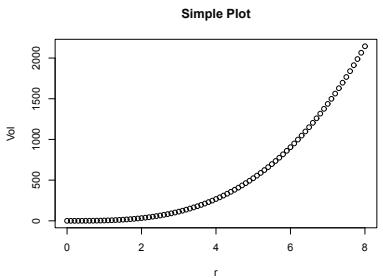
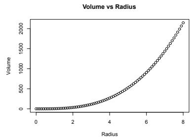
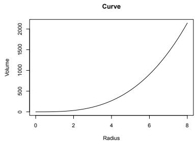
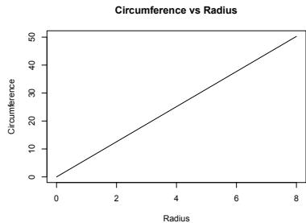
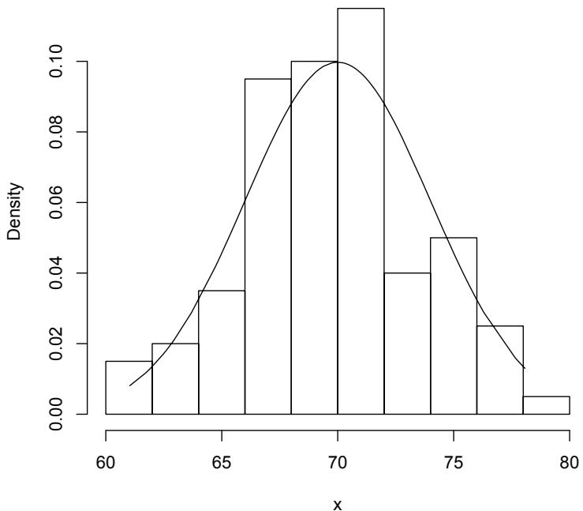

# Appendix B — R Primer

[Package map](../structure.md) · [Unsplit OCR dump](./_full.md)

[← App. A Mathematical Comments](./a-mathematical-comments.md) · [App. C Common Distributions →](./c-lists-of-common-distributions.md)

> MinerU OCR dump. If a formula, table, or numbering disagrees with the PDF, the PDF is authoritative.

---

# Appendix B

# R Primer

The package R can be downloaded at CRAN (https://cran.r-project.org/). It is freeware and there are versions for most platforms including Windows, Mac, and Linux. To install R simply follow the directions at CRAN. Installation should only take a few minutes. For more information on R, there are free downloadable manuals on its use at the CRAN website. There are many reference texts that the reader can consult, including the books by Venables and Ripley (2002), Verzani (2014), Crawley (2007), and Chapter 1 of Kloke and McKean (2014).

Once R is installed, in Windows, click on the R icon to begin an R session. The R prompt is a $>$ . To exit R, type q(), which results in the query Save workspace image? [y/n/c]::. Upon typing y, the workspace will be saved for the next session. R has a built-in help (documentation) system. For example, to obtain help on the mean function, simply type help(mean). To exit help, type q. We would recommend using R while working through the sections in this primer.

# B.1 Basics

The commands of R work on numerical data, character strings, or logical types. To separate commands on the same line, use semicolons. Also, anything to the right of the symbol $\#$ is disregarded by R; i.e., to the right of $\#$ can be used for comments. Here are some arithmetic calculations:

$$
\begin{array}{l} > 8 + 6 - 7 * 2 \\ [ 1 ] \quad 0 \\ > (1 5 0 / 3) + 7 ^ {\wedge} 2 - 1; \operatorname {s q r t} (5 0) - 5 0 ^ {\wedge} (1 / 2) \\ [ 1 ] \quad 9 8 \\ [ 1 ] \quad 0 \\ > (4 / 3) * p i * 5 ^ {\wedge} 3 \quad \# \text {T h e v o l u m e o f a s p h e r e w i t h r a d i u s} 5 \\ \end{array}
$$

[1] 523.5988   
>2*pi*5 #Thecircumferenceofaspherewithradius5   
[1] 31.41593

Results can be saved for later calculation by either the assignment function $\leftarrow$ or equivalently the equal symbol $=$ . Names can be a mixture of letters, numbers, or symbols. For example:

$$
> r <   - 1 0; \text {V o l} <   - (4 / 3) * p i * r ^ {\wedge} 3; \text {V o l}
$$

[1] 4188.79

$$
> r = 1 0 0; \text {c i r c u m} = 2 * p i * r; \text {c i r c u m}
$$

[1] 628.3185

Variables in R include scalars, vectors, or matrices. In the last example the variables $\mathbf{r}$ and Vol are scalars. Scalars can be combined into vectors with the c function. Further, arithmetic functions on vectors are performed componentwise. For instance, here are two ways to compute the volumes of spheres with radii 5, 6, ..., 9.

$$
> r <   - c (5, 6, 7, 8, 9); \text {V o l} <   - (4 / 3) * p i * r ^ {\hat {3}}; \text {V o l}
$$

[1] 523.5988 904.7787 1436.7550 2144.6606 3053.6281

$$
> r <   - 5: 9; \text {V o l} <   - (4 / 3) * p i * r ^ {\sim} 3; \text {V o l}
$$

[1] 523.5988 904.7787 1436.7550 2144.6606 3053.6281

Components of a vector are referred to by using brackets. For example, the 5th component of the vector vec is vec[5]. Matrices can be formed from vectors using the commands rbind (combine rows) and cbind (combine columns) on vectors. To illustrate let A and B be the matrices

$$
\mathbf {A} = \left[ \begin{array}{l l} 1 & 4 \\ 3 & 2 \end{array} \right] \text {a n d} \mathbf {B} = \left[ \begin{array}{l l l l} 1 & 3 & 5 & 7 \\ 2 & 4 & 6 & 8 \end{array} \right].
$$

Then $\mathbf{AB}$ , $\mathbf{A}^{-1}$ , and $\mathbf{B}'\mathbf{A}$ are computed by

$$
\begin{array}{l} > c 1 <   - c (1, 3); c 2 <   - c (4, 2); a <   - c b i n d (c 1, c 2) \\ > r 1 <   - c (1, 3, 5, 7); r 2 <   - c (2, 4, 6, 8); b <   - r b i n d (r 1, r 2) \\ > a \% * \% b; solve (a) ; t (b) \% * \% a \\ \end{array}
$$

[.,1] [.,2] [.,3] [.,4]  
[1,] 9 19 29 39  
[2,] 7 17 27 37

[.,1] [.,2]  
c1 -0.2 0.4  
c2 0.3 -0.1

```txt
c1 c2  
[1,] 7 8  
[2,] 15 20  
[3,] 23 32  
[4,] 31 44 
```

Brackets are also used to refer to elements of matrices. Let amat be a $4 \times 4$ matrix. Then the $(2,3)$ element is amat[2,3] and the upper right corner $2 \times 2$ submatrix is amat[1:2,3:4]. This last item is an example of subsetsing of a matrix. Subsetting is easy in R. For example, the following commands obtain the negative, positive, and elements of 0 for a vector x:

$\begin{array}{rl} & {\mathrm{\bf >x = c(-2,0,3,4, - 7, - 8,11,0); x n = x[x <   0]; x n}}\\ & {[1] - 2 - 7 - 8}\\ & {\mathrm{\bf >xp = x[x > 0]; xp}}\\ & {[1] \quad 3 \quad 4 \quad 11}\\ & {\mathrm{\bf >x0 = x[x == 0]; x0}}\\ & {[1] \quad 0 \quad 0} \end{array}$

For R vectors $\mathbf{x}$ and $\mathbf{y}$ of the same length, the plot of $\mathbf{y}$ versus $\mathbf{x}$ is obtained by the command plot(y ~ x). The following segment of R code obtains plots found in Figure 2.1.1 of the volume and circumference of the sphere versus the radius for a sequence of radii from 0 to 8 in steps of 0.1. The first plot is a simple plot; the second plot adds some labeling and a title; the third plot draws a curve of the relationship; and the fourth plot shows the relationship between the circumference of the circle versus the radius.

```matlab
par(mfrow=c(2,2)) # This sets up a 2 by 2 page of plots  
r <- seq(0,8,.1); Vol <- (4/3)*pi*r^3; plot(Vol ~ r) # Plot 1  
title("Simple Plot")  
plot(Vol ~ r,xlab="Radius",ylab="Volume") # Plot 2  
title("Volume vs Radius")  
plot(Vol ~ r,pch=" ",xlab="Radius",ylab="Volume")  
lines(Vol ~ r) # Plot 3  
title("Curve")  
circum <- 2*pi*r  
plot(circum ~ r,pch=" ",xlab="Radius",ylab="Circumference")  
lines(circum ~ r); title("Circumference vs Radius") # Plot 4 
```







  
Figure 2.1.1: Spherical Plots discussed in Text.

# B.2 Probability Distributions

For many distributions, R has functions that obtain probabilities, compute quantiles, and generate random variates. Here are two common examples. Let $X$ be a random variable with a $N(\mu, \sigma^2)$ distribution. In R, let mu and sig denote the mean and standard deviation of $X$ , respectively. Then the R commands and meanings are:

<table><tr><td>pnorm(x, mu, sig)</td><td>P(X ≤ x).</td></tr><tr><td>qnorm(p, mu, sig)</td><td>P(X ≤ q) = p.</td></tr><tr><td>dnorm(x, mu, sig)</td><td>f(x), where f is the pdf of X.</td></tr><tr><td>rnorm(n, mu, sig)</td><td>n variates generated from distribution of X.</td></tr></table>

As a numerical illustration, suppose the height of a male is normally distributed with mean 70 inches and standard deviation 4 inches.

> 1-pnorm(72,70,4) # Prob. man exceeds 6 foot in ht.   
[1] 0.3085375   
> qnorm(.90,70,4) # The upper 10th percentile in ht.   
[1] 75.12621   
$>$ dnorm(72,70,4) #value of density at 72

[1] 0.08801633

$\succ$ rnorm(6,70,4) # sample of size 6 on $X$

[1] 72.12486 75.25811 71.26661 63.36465 74.19436 69.71513

For the next figure, 2.2.2, we generate 100 variates, histogram the sample, and overlay the plot of the density of $X$ on the histogram. Note the $\mathbf{pr} = \mathbf{T}$ argument in the histogram. This scales the histogram to have area 1.

$\begin{array}{rl} & {\mathrm{>x = rnorm(100,70,4); x = sort(x)}}\\ & {\mathrm{>hist(x,pr = T,main = "Histogram of Sample")}}\\ & {\mathrm{>y = dnorm(x,70,4)}}\\ & {\mathrm{>lines(y\sim x)}} \end{array}$

  
Histogram of Sample   
Figure 2.2.2: Histogram of a Random Sample from a $N(70,4^2)$ distribution overlaid with the pdf of this normal.

For a discrete random variable the pdf is the probability mass function (pmf). Suppose $X$ is binomial with 100 trials and 0.6 as the probability of success.

> pbinom(55,100,.6) # Probability of at most 55 successes   
[1] 0.1789016   
>dbinom(55,100,.6) #Probability of exactly 55 successes   
[1] 0.04781118

Most other well known distributions are in core R. For example, here is the probability that a $\chi^2$ random variable with 30 degrees of freedom exceeds 2 standard deviations form its mean, along with a $\Gamma$ -distribution confirmation.

$>$ mu=30; sig=sqrt(2*mu); 1-pchisq(mu+2*sig,30)   
[1] 0.03471794   
> 1-pgamma(mu+2*sig,15,1/2)   
[1] 0.03471794

The sample command returns a random sample from a vector. It can either be sampling with replacement (replace=T) or sampling without replacement (replace=F). Here are samples of size 12 from the first 20 positive integers.

> vec = 1:20   
> sample vec,12,replace $\equiv$ T)

[1] 14 20 7 17 6 6 11 11 9 1 10 14

> sample vec,12,replace $\equiv F$

[1] 12 1 14 5 4 11 3 17 16 19 20 15

# B.3 R Functions

The syntax for R functions is the same as the syntax in R. This easily allows for the development of packages, a collection of R functions, for specific tasks. The schematic for an R function is

```txt
name-function <- function(args){ ... body of function ... } 
```

Example B.3.1. Consider a process where a measurement is taken over time. At each time $n$ , $n = 1,2,\ldots$ , the measurement $x_{n}$ is observed but only the sample mean $\overline{x}_n = (1 / n)\sum_{i = 1}^n x_i$ of the measurements at time $n$ is recorded and the point $(n,\overline{x}_n)$ is added to the running plot of sample means. How is this possible? There is a simple update formula for the sample mean that is easily derived. It is given by

$$
\bar {x} _ {n + 1} = \frac {n}{n + 1} \bar {x} _ {n} + \frac {1}{n + 1} x _ {n + 1}; \tag {B.3.1}
$$

hence, the sample mean for the sequence $x_{1},\ldots ,x_{n + 1}$ can be expressed as a linear combination of the sample mean at time $n$ and the $(n + 1)st$ measurement. The following R function codes this update formula:

mnupdate <- function(n,xbarn,xnp1){ # Input: n is sample size; x barn is mean of sample of size n; # xnp1 is $(n + 1)$ (new) observation # Output: mean of sample of size $(n + 1)$ mnupdate <- $(n / (n + 1))$ *xbarn + xnp1/(n+1) return(mnupdate) }

To run this function we first source it in R. If the function is in the file mnupdate.R in the current directory then the source command is source("mnupdate.R"). It can also be copied and pasted into the current R session. Here is an execution of it:

```matlab
> source("mnupdate.R")
> x = c(3,5,12,4); n=4; xbarn = mean(x);
> x; xbarn #Old sample and its mean 
```

[1] 3 5 12 4

[1] 6

```txt
> xp1 = 30 # New observation
> mnupdate(n,xbarn, xp1) # Mean of updated sample 
```

[1] 10.8

# B.4 Loops

Occasionally in the text, we use a loop in an R program to compute a result. Usually it is a simple for loop of the form

for(i in 1:n){ ... R code often as a function of i ... # For the n-iterations of the loop, i runs through # the values $i = 1$ , $i = 2$ , ... , $i = n$ .

For example, the following code segment produces a table of squares, cubes, square-roots, and cube-roots, for the integers from 1 to $n$ .

```txt
set n at some value  
tab <- c() # Initialize the table  
for(i in 1:n) {  
    tab <- rbind_tab, c(i, i^2, i^3, i^(1/2), i^(1/3)))  
}  
tab 
```

# B.5 Input and Output

Many texts on R, including the references cited above, have information on input and output (I/O) in R. We only discuss several ways which are useful for the R discussion in our text. For output, we discuss two commands. The first writes an array (matrix) to a text file. Suppose amat is a matrix with $p$ columns. Then the command write(t(amat),ncol=p,file="amatrix.dat") writes the matrix amat to the text file amatrix.dat in the current directory. Simply put the "Path" before the file as file="Path/amatrix.dat" to send it to another directory. The second way writes out variables to an R object file called an "rda" file. The variables can include scalars, vectors, matrices, and strings. For example the next line of code writes to an rda file the scalars avar and bscale and the matrix amat along with an information string.

info <- "This file contains the variable ...." save(avar,bscale,amat,info,file="try.rda")

The command load("try.rda") will load these variables (names and values) into the current session. Most of the data sets discussed in the text are in rda files.

For input, we have already discussed the c and load functions. The c function is tedious, though, and a much easier way is to use the scan function. For example, the following lines of code assign the vector $(1,2,3)$ to x:

```txt
x<-scan() 1 2 3
```

The separator between values is white space and the empty line after the data signals the end of x's values. Note that this allows data to be copied and pasted into R. A matrix can also be scanned similarly by using the read.table function; for example, the following command inputs the above matrix A with column header "c1" and "c2":

a<- read.table header $\equiv$ TRUE, text $=$ " c1 c2 1 4 3 2 "）

Notice that copy and paste is also easily used with this command. If the matrix $\mathbf{A}$ is in the file amat.dat with no header, it can be read in as

a <- matrix.scan("amat.dat"), ncol=2, byrow=T)

# B.6 Packages

An R package is a collection of R functions designed for specified tasks. For example, in Chapter 10, the packages Rfit and npsm are discussed that compute rank-based

robust and nonparametric procedures. There are thousands of free packages available to users at the site CRAN. The package hmcpkg contains all the R functions and R data sets discussed in this text. It can be downloaded at the site:

http://www.stat.wmich.edu/mckean/hmchomepage/Pkg/

Once it is installed on your computer use the library command as shown next to use the package in an R session. The next segment of code prints out the first 3 lines of the baseball data set discussed in Example 4.2.4. The attach command allows us to access the variables of the data set, as we show for the variable height.

```txt
library(hmcpkg)  
head(bb,3)  
hand height weight hitind hitpitind average  
1 1 74 218 1 0 3.330  
2 0 75 185 1 1 0.286  
3 1 77 219 2 0 3.040  
attach(bb); head.height,4) # accessing the variable height  
[1] 74 75 77 73 
```

In Example 1.3.3, the derivation of the probability that in a group of $n$ people at least 2 have the same birthday is given. The R function bday, included in the package, computes this probability. The following segment of code computes it for a group of size 10.

```txt
library(hmcpkg)  
bday(10)  
[1] 0.1169482 
```

This page intentionally left blank

