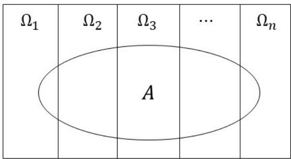
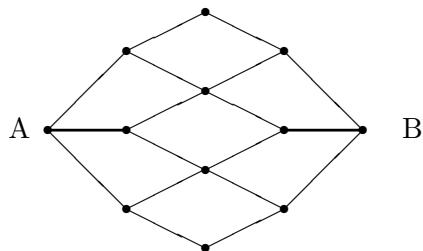

# 概率论教程

任佳刚 刘继成

## 记号与约定

1. 具体值不重要的常数统一记为C. 因此你会看到诸如

$$
| x - y | \leqslant C, | y - z | \leqslant C \Longrightarrow | x - z | \leqslant C
$$

的推理. 不要惊诧!

2.

A := B, B =: A 将A定义为B, 将B记为A.

3.

$$
\mathbb{N} := \{0, \pm 1, \pm 2, \dots\}, \mathbb{N}_{+} := \{0, 1, 2, \dots\}, \mathbb{N}_{+ +} := \{1, 2, \dots\}.
$$

4.

$$
\mathbb{R} :=(- \infty, \infty), \bar{\mathbb{R}} :=[- \infty, \infty], \mathbb{R}_{+} :=[0, \infty).
$$

5. Q: R中的有理数全体; $\mathbb{Q}_{+} = \{r \in \mathbb{Q}, r \geqslant 0\}; \mathbb{Q}_{+ +} = \{r \in \mathbb{Q}, r > 0\}$

6. $\mathbb{C} : = \{x + iy, x, y \in \mathbb{R}\}$ 复数的全体; $\forall z = x + iy \in \mathbb{C}$ 2

$$
\operatorname{Re}(z) := x, \quad \operatorname{Im}(z) := y
$$

分别称为z的实部和虚部.

7.

$$
\delta_{ik} = \left\{\begin{array}{ll} 1, & i = k, \\ 0, & i \neq k.\end{array} \right.
$$

8. $\forall a \in$ R,

$$
a^{+} = a \vee 0 := \max \{a, 0\}, a^{-} := -(a \wedge 0) := - \min \{a, 0\},
$$

分别称为a的正部与负部.

9. $\forall a \in \mathbb{R}_{+},[a]$ 表示不超过a的最大整数.

10. $\forall a \in \mathbb{R}^{n}, a^{\prime}$ 表示向量a的转置向量; 若A为矩阵, A′表示A的转置矩阵.

11. $\forall a =(a_{1}, \cdot \cdot \cdot, a_{n}), b =(b_{1}, \cdot \cdot \cdot, b_{n}) \in \mathbb{R}^{n}$

$$
a \cdot b := ab^{\prime} := a_{1} b_{1} + \dots + a_{n} b_{n},
$$

$$
\left| a \right|^{2} := a_{1}^{2} + \dots + a_{n}^{2}.
$$

12.

$C_{0}^{\infty} : = C_{0}^{\infty}(\mathbb{R}^{m}) : = \{f : \mathbb{R}^{m} \mapsto \quad$ R : f无穷次可微且在某个有界集外恒等于零},

$C_{0} : = C_{0}(\mathbb{R}^{m}) : = \{f : \mathbb{R}^{m} \mapsto \quad$ R : f连续且在某个有界集外恒等于零},

$$
C_{b} := C_{b}(\mathbb{R}^{m}) := \{f: \mathbb{R}^{m} \mapsto \mathbb{R}: f \text{有界连续}\}.
$$

## 目录

第一章 试验及事件的运算
1.1 试验及其数学描述 ..... 8
1.2 事件的关系与运算 ..... 12

第二章 离散概型
2.1 古典概型 ..... 19
2.2 有限概型 ..... 27
2.3 随机变量 ..... 30
2.4 条件概率 ..... 35
2.5 全概率公式 ..... 40
2.6 独立性 ..... 46
2.7 $\pi$ -类, $\lambda_0$ -类与代数 ..... 49
2.8 重温独立性 ..... 54
2.9 可列概型 ..... 56
2.10 二项分布的Poisson分布近似: Stein-Chen方法 ..... 70

第三章 公理概型
3.1 动因 ..... 75
3.2 $\sigma$ -代数, 单调类与 $\lambda$ -类 ..... 76
3.3 概率的公理化 ..... 81
3.4 条件概率, 独立性与条件独立性 ..... 87

第四章 随机变量
4.1 基本概念 ..... 96
4.2 分布函数 ..... 106
4.3 分类 ..... 108
4.4 多维随机变量的分布函数 ..... 117
4.5 条件分布 ..... 124
4.6 随机变量的存在性 ..... 127
4.7 随机变量的函数 ..... 129
4.8 多维随机变量的函数 ..... 131

第五章 期望与积分
5.1 简单随机变量情形 ..... 134
5.2 一般情形 ..... 138
5.3 计算期望的例子 ..... 143

5.4 随机变量列的收敛性 ..... 151
5.5 积分(期望)号下取极限 ..... 155
5.6 Fubini定理 ..... 162
5.7 带参数的期望 ..... 163
5.8 Riemann-Stieltjes积分 ..... 165
5.9 Lebesgue-Stieltjes积分 ..... 173
5.10 方差与矩 ..... 176
5.11 几个等式与不等式 ..... 183
5.12 条件期望 ..... 188

第六章 随机变量的独立性
6.1 基本定义及性质 ..... 191
6.2 不相关与独立的关系 ..... 202
6.3 独立随机变量之和 ..... 206
6.4 随机游动 ..... 210
6.5 条件独立性 ..... 214

第七章 大数定律
7.1 Markov大数定律 ..... 216
7.2 强大数定律 ..... 219

第八章 特征函数
8.1 复随机变量 ..... 227
8.2 定义及例子 ..... 228
8.3 基本性质 ..... 231
8.4 唯一性定理 ..... 238
8.5 连续性定理 ..... 244
8.6 多维情形 ..... 252
8.7 Skorokhod表现定理 ..... 258

第九章 特征函数的应用
9.1 分布的计算 ..... 261
9.2 极限定理 ..... 265
9.3 一般正态分布 ..... 269

第十章 中心极限定理中的余项估计
10.1 Lindeberg定理 ..... 272
10.2 几个分析引理 ..... 274
10.3 分布余项的积分估计 ..... 279
10.4 余项的一致估计 ..... 282

第十一章 附录
11.1 Stirling公式 ..... 284
11.2 Bihari–LaSalle不等式及其推论 ..... 285
11.3 绝对连续函数 ..... 288
11.4 函数的磨光 ..... 288

## 目录

11.5 指数函数的逼近 ..... 289
11.6 常用分布 ..... 291

## 1 试验及事件的运算

世界是偶然的或者说随机的. 想想看, 比如宏观方面, 关于宇宙的起源, 你如果不信上帝的话, 就得信大爆炸理论; 可是你如果信上帝的话, 上帝又是怎么来的呢? 所以你可能, 很可能, 非常可能, 还是得信大爆炸理论. 可是这么一个开天辟地的大爆炸, 怎么就炸出了个太阳?又炸出了个地球? 地球和太阳的距离又刚好是这么远? 地球上又刚好有个大气层? 有水? 有空气? 有孕育生命的一切必要的与充分的条件? 而比如微观方面, 当时间来到某一天, 又刚好有了一个你? “开辟鸿蒙, 谁为情种?” 又是鸿蒙, 又是谁为, 你不觉得世界来到今天这个状态, 在这个状态里有目前的这些生物, 这种可能性不是比10的负一亿次方还要小得小得多吗?“ ······ 万类霜天竞自由. 怅寥廓, 问苍茫大地, 谁主沉浮? ” 谁主沉浮? 谁主沉浮? 谁主得了沉浮?

世界也是确定的. 我们从小学起就开始学习支配这个世界的确定的规律. 有数学的: 1 +2 = 3, 三角形的内角和为180o, 一元二次方程的根由其系数唯一地显式地确定, $\sin(\alpha + \beta) =$ $\sin \alpha \cos \beta + \cos \alpha \sin \beta, \cdot \cdot \cdot \cdot \cdot;$ 有物理的: 杠杆原理, 牛顿三定律, 热力学三定律, $E = mc^{2}$ ······; 有化学的: 门捷列夫元素周期表, 化学反应方程式, 拉瓦锡质量守恒定律, ······; 还有, 也许我要说, 甚至还有语文的: 成语啊, 固定搭配啊, 起承转合啊, ······.

但归根到底是随机的. 物理学到了微观世界即量子物理学是随机的, 化学到了分析化学是随机的, 就更不用说生物学了. 还有文学, 有哪一篇小说是完全按照某条铁律写出来的呢?作家笔下那些才华横溢的句子, 除了他或她的天赋之外, 难道不是, 往往是, 触发于天边的一抹晚霞, 窗外的一缕清风?

而数学呢? 数学中的概率论这门学科, 正是研究随机现象的科学, 虽然它本身并不是随机的(好像模糊数学倒有点随机的味道, 但与本课程无关). 特别有意思的是, 现代概率论整体理论的建立, 也基于一个十分十分偶然的因素: 概率论公理体系的奠基者、伟大的数学家Kolmogorov1起初是作为历史系的学生进入莫斯科大学的. 仅仅因为他参加了一个讨论班,仅仅因为他写了一篇论文得到了一个教授的赏识, 仅仅因为这个赏识他的教授对他说“历史学的任何一个结论都需要五个证明”而要求他增补论文, 仅仅因为他不喜欢这个要求而要找一个“一个结论只需要一个证明”的地方, 他才转到了数学系——于是概率论才有了今天的样子.

另外发生在Kolmogorov身上的一件随机的事情是, 他的出生地也是随机的: 他母亲怀着他出去办事, 途径一个小村子时突然临产而生下了他.

真是不可思议! 这样一个本身充满了随机性的Kolmogorov成了现代概率论的开山鼻祖!是巧合吗? 是命运也就是说是上帝吗?

世界是随机的, 随机积分和随机微分方程的创始人、著名数学家伊藤清(Kiyosi Itˆo)2如是说. 他的日语原话直译是, 世界是确率的. 日语里的“确率”似乎承担了汉语里的“概率”和“随机”双重意思, 并同时具有名词和形容词双重词性.

“确率”与“概率”云云, 都是英语probability的翻译. 我们平常说到做一件事是否会成功时, 如果说“我有百分之百的把握”, 那就是十分肯定的, 没有任何不确定性；而如果说“我有百分之七十的把握”, 或者“我只有百分之二十的把握”, 这里面就包含了一种不确定性, 尽管如此, 在某种意义上确定性是可以量化的, 即有一个百分比, 即比率, 来描述其确定的程度, 这也许就是日译选用“确率”这个词的来历吧; 而中译的确立, 则经历了一个过程: 在1935年的《数学词典》里, 是“概率”与“几率”同时使用的, 其后还使用过诸如“盖然率”、“或然率”等名词. 直到1964年在《数学名词补编》中才正式确定为“概率”, 且直到现在, 在台湾省还是使用“几率”这个词的, 在其它说中文的地区更是五花八门. 译法的繁杂说明了翻译的不易, 但我们至少得明白, 在“概率”里头, “概”并不是来修饰“率”的, “概率”不是“大概的率”的意思.

日常生活中, 当我们说概率时, 大体上可分为两种不同的情况.

第一种情况是有一些很明显的客观依据的. 比如一个婴儿将要出生, 我们说是男婴还是女婴的概率都是二分之一, 这是因为过去数年内的数据表明, 在新生儿中大体上男婴女婴各占一半, 而这也预示着在未来出生的每一百个婴儿中, 男女婴儿数也会都接近五十个. 当然,刚好都各为五十个可能比较罕见, 也可能男婴48个, 女婴52个; 也可能男婴54个, 女婴46个, 反正是比较接近的情况比较多见, 而不接近的情况, 比如说男婴35 个, 女婴65个的情况则是很罕见的. 再比如一个士兵, 说他200米的距离内射击的命中率是百分之九十, 那一定是因为过去的记录中, 射击的总次数中有百分之九十是命中了的, 并且你如果再让他射一千次, 那么你可以期望他击中的次数应该在九百次左右, 虽然不太可能刚好是九百次. 而这个数字对未来的意义在于, 指挥员可以期待他十次射击中命中八九次的可能性是非常大的, 而基本上不可能只命中比如说四次. 此外, 如果某次任务中目标非常重要, 必须一枪毙命, 那么指挥员必须依据每个人的命中率决定一个策略, 比如至少得派几个战士同时执行任务才能稳妥地完成任务.

这种客观概率的典型特征是, 它们是从大量的试验中得出的结论, 并且还可以继续做大量的试验检验这个结论的正确性.

第二种情况是并没有太明显的客观依据, 或者说虽然也有客观依据, 但主观判断占了很大的成分. 比如说, 对明天股市的涨跌, 每天晚上每个电视台都有评论员做出预测. 不可否认,有些不良评论员是昧着良心说瞎话的, 但这不在我们的讨论之列. 我们假定每个评论员都是正直的. 即使这样, 他们对未来的判断也不会完全一样. 比如说甲会说某股明天上涨的概率是0.8, 而乙预测只有0.3. 他们的说法有客观的成分吗? 也许是有的. 但是是完全客观的吗?这不可能! 一定是夹杂了他自己的一些主观判断. 再比如国外的总统选举, 甲认为某候选人当选的可能性是百分之九十, 而乙认为只有百分之六十. 这不能说完全没有客观依据, 但肯定掺杂了很多主观好恶.

这种主观概率的典型特征是: 它们不是从大量的试验中得出结论, 并且这些结论的正确性也无法通过大量重复的试验进行检验.

在实际问题中, 概率的主观性和客观性往往并不是完全绝对对立的, 而是常常有统一的时候, 相互补充的时候. 比如抛一枚硬币, 说它是均匀的, 意义是什么呢?根据是什么呢?定义又是什么呢?难道均匀性可以由每抛100次, 正反面各出现50次来定义吗?当然——不行, 因为如果按照这个定义, 就不会有任何一枚硬币满足要求. 那么, 可以由每次抛时, 正反面出现的可能性都一样来定义吗? 当然也不行, 因为这又涉及到什么叫“可能性都一样”的问题?

那么请告诉我, 什么叫均匀?答案难道不是因人而异吗?

所以, 这里面就有一个主观性的问题. 也因此在与此有关的一切讨论中, 也就都有了主观

因素掺杂其中.

还有比如说天气预报, 尽管我们有各种先进的仪器,但依然要有预报员参加工作. 这时结果就很可能掺杂了预报员们的个人判断,因此也是有主观因素的.

上面的讨论似乎有点哲学的味道了, 偏离了本课程的跑道. 对这个问题, 我们采用邓小平同志的智慧和策略, 即不争论. 作为一个现代数学分支, 概率论和其它分支一样,有自己严格的公理体系, 而在此基础上建立的一切结论都必须根据严格的逻辑推理获得. 上面讨论的主客观性的问题是在涉及其应用时产生的,属于统计学(包括统计物理, 金融统计......) 范畴. 我们此后将不纠结于这个问题, 而是按公理化的方式解决这个问题——例如什么叫硬币是均匀的? 正反面出现的概率都一样就叫均匀的, 而概率是公理化体系中已经明确给定了的. 我们关心的, 是在这个公理体系下所能得到的科学结论. 至于实际问题中一枚硬币是否均匀, 那就不是我们关心的问题了, 留给赌徒们自己去解决吧.

赌博当然是一种恶习. 但正如毛主席所说, 任何事物都是一分为二的. 关于赌博的研究曾经是, 也许现在仍然是, 概率论发展壮大的不可缺少的动力. 如果最初的研究者们因为登不了大雅之堂或者因为政治上不正确而停止了此项研究, 那可能今天就根本没有概率论这个学科了——概率论本身的出现, 也是一个随机事件啊!

## 1.1 试验及其数学描述

本书所指试验, 皆指一般意义下的试验. 比如普通物理学或化学里的试验, 比如掷一枚骰子, 比如猜拳, 等等.

既然是试验, 就会有多种不同的结果, 否则就不必试验了. 但有些试验人们已经基本研究清楚了, 其结果受物理或化学或其它科学定律支配, 结果基本上是确定的, 虽然可能有一点小小的误差(当然, 这些误差有时候不重要, 但有时候却非常重要. 不过这不在本书的讨论范围之列). 人们通过这些试验可以验证已有的知识, 也可以发现或总结新的规律. 比如我们都做过测量重力加速度的试验, 也都知道其值基本上会在9.8m/s2左右(随地点不同而略有差别).而有些试验则不然, 即其结果是完全不可预测的, 漂浮不定的. 比如猜拳, 你能准确猜到对手下一手出什么拳? 比如掷骰子, 你能总结出某个规律, 比如说1 点过后一定出现5点? 不可能的嘛.

第一类试验中的误差分析, 无疑是一个很重要的研究课题, 同时也是推动概率论发展的主要动力之一(例如正态分布虽然早已有之, 但却因为Gauss3在研究误差分析时得到了它而又名Gauss分布). 不过这个问题基本上属于统计范畴, 不在本书要讨论的问题之列. 本书所指试验, 是第二类试验, 即其结果完全无法用现有的科学知识预测的试验, 或理论上虽可以预测, 但事实上很难做到的试验.

概率论的研究对象, 当然不是所有这些试验, 而是满足下面两个条件的试验: 第一, 试验是可以重复的, 即在相同的环境下可反复进行同一个试验, 比如说扔硬币就是如此. 反之, 比如说总统选举就不是可以重复的, 因此不是概率论的研究对象. (但选举之前举办的民调是可以重复的, 因此是概率论或者更准确地说是统计学的研究对象.) 第二, 大量重复这个试验时,虽然单次的结果无法预测, 但会呈现一定的统计规律. 比如扔硬币, 如果这个硬币是均匀的,那么大量重复这个试验时, 正反两面出现的次数会大致相等. 为了验证这一点, 历史上不少人做过这个试验, 结果显示都如此. 这就是统计规律.

## 1.1 试验及其数学描述

当然, 试验的结果是否可以预测, 是与科学技术的发展水平相关的. 就拿抛硬币为例. 根据经典动力学与运动学原理, 硬币自从被抛出那刻起, 它的运动轨迹就被确定下来了, 包括最后的结果——哪一面朝上. 因此, 从理论上讲, 抛硬币的试验是完全可以预测结果的. 问题是影响硬币运动轨迹的参数太多, 例如抛出手时的初速度、高度和角度, 硬币的实际上不可避免的微小的不均匀性, 空气中飘动的微风等等, 而最终哪一面出现的结果又对这些参数太敏感了, 它们中任何一项的任何微小的改变, 包括肉眼观察不到的改变,都会导致我们肉眼观察得到的截然不同的结果. 所以这个试验即使本质上是确定的, 但在一般的理解中, 我们仍然认为是随机的, 且具有统计规律, 因此我们把其归结为其结果无法用现有的科学知识预测的试验, 而用概率论的方法去研究它. 我们相信, 随着科学的发展, 会有一些目前用概率论研究的课题, 将来却成为了某一科学定律. Hilbert4说过, 我们必须知道, 我们必将知道; Einstein(爱因斯坦)5说过, 上帝不掷骰子. 这是这些科学巨匠们的坚定信念. 但在我们知道以前, 在上帝告诉我们他主宰世界的方式以前, 我们还是需要概率论的, 哪怕只是权宜之计. 所以也正是他们两人, 在概率论的发展史上都做出了杰出的贡献. Hilbert第六问题是将物理学公理化, 这其中包含了将概率论公理化, 后者由Kolmogorov在1933年完成, 为现代概率论的发展奠定了基础; Einstein关于Brown6 运动的研究则对热力学和随机过程的研究产生了重大的推动力, 而且催生了一个或多于一个的诺贝尔奖或同等级别的奖(例如Avogadro7常数的确定).

对一个试验, 任何一个结果都称为一个基本事件(即不能进一步分解的事件，正如不可分的粒子称为基本粒子一样). 将其所有可能的结果即基本事件放在一起, 就构成一个集合, 这个集合我们一般将用Ω表示之. 传统上, 一个基本事件称为一个样本点ω, 而Ω则称为样本空间. 比如掷一枚骰子的试验, 其样本空间便是

$$
\Omega = \{1, 2, 3, 4, 5, 6\}.
$$

而如果将一枚骰子掷n次, 样本空间则是

$$
\Omega = \{(k_{1}, \dots, k_{n}): k_{i} \in \{1, 2, 3, 4, 5, 6\}, i = 1, \dots, n\}.
$$

将满足某些特定条件的基本事件放在一起, 就构成一个事件. 因此事件用集合论的语言来说就是Ω的子集，常用大写字母如A,B,···表示之. 比如在掷一次骰子的试验中, 满足“所得点数大于3” 这个条件的结果便是

$$
A = \{4, 5, 6\};
$$

在掷n次骰子的试验中, 满足 $^{66} n$ 次所得点数之和小于等于 $\cdot_{m} \mathfrak{P}$ 这个条件的结果便是

$$
A = \{(k_{1}, \dots, k_{n}): k_{1} + \dots + k_{n} \leqslant m\}.
$$

但所谓“基本”其实并不是天生不变的, 它与我们所感兴趣的问题有关, 也与我们对研究方法的选择有关. 例如掷两枚骰子的试验, 基本事件自然可选择为

$$
(k_{1}, k_{2}), k_{1}, k_{2} = 1, 2, \dots, 6.
$$

此时,相应的样本空间是:

$$
\Omega_{1} = \{(k_{1}, k_{2}): k_{1}, k_{2} \in \{1, 2, 3, 4, 5, 6\}\}.
$$

但是, 如果我们掷两枚骰子的目的就是为了看两个骰子点数之和的大小, 那么基本事件也可以取为

$$
k = 2, \dots, 12.
$$

此时的样本空间便为

$$
\Omega_{2} = \{2, 3, 4, 5, 6, 7, 8, 9, 10, 11, 12\}.
$$

两个相比较, $\Omega_{1}$ 含有更多的基本事件, 且 $\boldsymbol{\Omega}_{2}$ 中的基本事件都是由 $\Omega_{1}$ 的基本事件的不同组合构成的. 当然, 第二个问题的样本空间也可以用 $\Omega_{1}$ 来描述. $\Omega_{1}$ 和 $\Omega_{2}$ 的关系无非是 $\Omega_{2}$ 中的一个样本点对应着 $\Omega_{1}$ 中多个样本点而已. 至于这两种选择哪个更好, 则很难有一个放之四海而皆准的标准, 要依具体问题而定. 不过, 一般来说, 基本事件分得越细, 适用的问题就越多, 计算也相对复杂些; 基本事件分得越粗, 就越有针对性.

由此我们可以看到, 所谓样本空间也不是试验本身固有的, 而是人们为方便研究而建立的数学模型, 且这个模型的建立往往依赖于个人的品味和能力、解决问题的针对性与有效性、使用上的方便性以及数学处理上的简洁性与优雅性等等. 通常, 给出适合的样本空间并不是个简单的问题.

乍一看, 一个试验, 结果应该是有限的(谁能把一个试验做出无穷个结果呢?), 所以样本空间的元素也只有有限多个. 但其实不然. 需要想象不能实际做出的试验, 这是科学研究的基本功. Einstein不就通过想象电梯试验启发了广义相对论吗? 虽然他从来没有也不可能做出这个试验.

具体到我们面对的问题, 我们刚刚说过, 概率论的研究对象是可以重复的试验, 因此很容易想象将一个简单的试验重复多次, 循环往复, 以致无穷, 虽然实际上做不到无穷次, 但有必要考虑试验次数趋于无穷时发生的各种现象, 这样样本空间就有无穷多个元素.

这方面的一个典型例子是人口普查.

设一个地区共有N口人. 这个N往往是相当大的. 我们要调查这N口人的一些状况(比如平均身高). 当然, 最准确的方法是对每个人逐一调查, 这样最后将各人的情况平均即可. 但这样的逐一调查会耗费大量的人力物力财力, 所以有必要采取一种替代的方法, 这就是抽样调查. 所谓抽样调查就是随机地选取一些人进行调查. 但需要抽样多少次才能获得所需要的准确性? 这不是一个有现成答案的问题. 所以在建立数学模型时, 不能预先限定抽样的次数即样本的大小. 这样, 假设人群全体为 $\{\omega_{i}, i = 1, 2, \cdots, N\}$ 这个抽样所得到的样本空间便为

$$
\Omega = \{\omega =(\omega_{k_{1}}, \omega_{k_{2}}, \dots)\} = \{\omega_{1}, \omega_{2}, \dots, \omega_{N}\}^{\infty}.
$$

其次, 有些试验本身就有无穷多个结果, 比如说往地上的一块区域投一根针，考虑针的位置及朝向，就有无穷多个结果.

与无穷有关的, 我们需要区分两个概念: 可数和不可数.

可数分为两类: 有限和可列. 有限就不用解释了. 所谓可列集, 是指: 1. 该集合含有无穷多个元素; 2. 这些元素可以排成一列. 准确地说, 集合A称为有可列个元素, 或简称可列, 是指存在一种排列方式将A的元素写为 $a_{1}, a_{2}, \cdots$ . 因此

$$
A = \{a_{1}, a_{2}, \dots\}.
$$

例如, 全体整数的集合是可列的, 因为它们能以以下方式排列:

$$
0, 1, - 1, 2, - 2, 3, - 3, \dots
$$

全体有理数集也是可列的, 因为它们能以以下方式排列:

$$
0, 1, - 1, \frac{1}{2}, - \frac{1}{2}, \frac{1}{3}, - \frac{1}{3}, \frac{2}{3}, - \frac{2}{3}, \dots
$$

但可以证明, 全体实数的集合不是可列的.

描述一个集合, 在该集合的元素很少时, 可以用穷举法. 例如, 若A表示前五个正整数, 则可直接写出:

$$
A = \{1, 2, 3, 4, 5\}.
$$

但只要A的元素一多, 这种方法就不可能了. 这时就用A的元素满足的条件来表示它. 例如

$$
\mathbb{N} := \{n: n \text{为整数}\}
$$

表示整数全体, 而

$$
\mathbb{N}_{+} := \{n \in \mathbb{N}: n \geqslant 0\}
$$

则表示非负整数全体.

我们再看一些例子.

例1. 抛掷一枚硬币, 以1表示出现正面, 0表示出现反面. 则样本空间为

$$
\Omega = \{0, 1\}.
$$

例2. 将一枚硬币抛n次, 样本空间为

$$
\Omega = \{0, 1\}^{n} := \{(a_{1}, \dots, a_{n}): a_{k} = 0, 1, k = 1, \dots, n\}.
$$

例3. 将一枚硬币抛无穷次, 样本空间为

$$
\Omega = \{0, 1\}^{\infty} := \left\{\left(a_{1}, \dots, a_{n}, \dots\right): a_{k} = 0, 1, k = 1, \dots, n, \dots \right\}.
$$

例4. 在大街上随便问一个人他的生日, 样本空间为

$$
\begin{array}{c}{{\Omega = \big \{(m, n): m = 1, 3, 5, 7, 8, 10, 12 \text{时}, 1 \leqslant n \leqslant 31; m = 2 \text{时}, 1 \leqslant n \leqslant 29;}} \\{{m = 4, 6, 9, 11 \text{时}, 1 \leqslant n \leqslant 30 \big\}.}} \end{array}
$$

例5. 在大街上随便问一个人他的身高, 样本空间可以取为

$$
\Omega = \{x \in \mathbb{R}: 0 \leqslant x \leqslant 3\}.
$$

例6. 两个人玩石头剪刀布, 样本空间为

$$
\begin{array}{rl} \Omega := & \left\{\text{(石,石),(石,剪),(石,布),(剪,石),} \right.\\ & \left.\text{(剪,剪),(剪,布),(布,石),(布,剪),(布,布)} \right\} \end{array}
$$

例7. 四个人, 编号为1,2,3,4, 进行射击比赛, 成绩以0,1,··· ,10环记之. 则样本空间可取为

$$
\Omega := \{(i, j): i = 1, \dots, 4, j = 0, 1, \dots, 10\} \mathrm{oe}
$$

也可取为

$$
\Omega := \{(i_{1}, i_{2}, i_{3}, i_{4}): i_{k} \in \{0, 1, \dots, 10\}.k = 1, 2, 3, 4\}.
$$

总之, 描述试验及其结果的数学语言本质上是一般集合论的语言, 只不过用的术语可能不同而已. 前两章我们不加区别地使用集合和事件这两个名词, 等第三章给出概率的公理化之后,会进一步明确事件的概念.

现在. 让我们从这些基本的对象开始我们的概率论之旅.

## 习题

1. 一个铁人三项运动员, 每一项获得的名次都可能是1到10名. 写出这个试验的样本空间.

2. 一个电码由0到9四位数字组成, 但由于各种因素的干扰, 发报员发出的数字都可能被接收为另外一个数字. 写出发送一个电码这个试验的样本空间.

3. 张三从甲地步行到乙地, 第一次行走, 未带地图. 包括甲地, 共有m处分叉路口, 其中第i个路口有 $\dot{m}_{i}$ 个道路可选. 写出这个试验的样本空间.

4. 投n次硬币, 写出样本空间.

5. 将扔硬币的试验无穷此重复下去, 写出这个试验的样本空间.

6. 一项流行病调查,调查对象为A, B, C, D四种疾病,结果为α, β, γ三种症状.写出这个试验的样本空间.

## 1.2 事件的关系与运算

由于不可避免地要处理事件的各种组合, 所以需要用到事件的运算.

设Ω为样本空间, $A, B, C, \cdots$ ·均为Ω的子集, 即事件；以∅表示空集, 即不含任何元素的子集. 我们引进如下运算与术语.

• Ω称为必然事件, ∅称为不可能事件.

• A与B的并是指这样一个事件: A与B中至少一个发生. 这个事件记为 $A \cup B$ , 即

$$
A \cup B := \{\omega \in \Omega : \omega \in A \text{或} \omega \in B\},
$$

• A与B的交是指这样一个事件: A与B都要发生. 这个事件记为 $A \cap B$ , 即

$$
A \cap B := \{\omega \in \Omega : \omega \in A \text{且} \omega \in B\},
$$

A∩B也常写为 $AB;$

AB = ∅时, 称A与B互不相容或不相容. 此时, A ∪ B常记为 $A + B$ . 或者反过来说, 写出 $A + B$ 时, 就自动意味着 $AB = \emptyset$

• A与B的差是指这样一个事件: A发生而B不发生. 这个事件记为 $A \backslash B$ , 即

$$
A \setminus B := \{\omega \in A \text{且} \omega \notin B\}.
$$

$A \subset B \mathbb{H}$ 时, B \A常记为B −A. 或者反过来说, 写出B −A时, 就自动意味着 $A \subset B$

• A与B的对称差定义为:

$$
A \Delta B :=(A \setminus B) \cup(B \setminus A).
$$

## 1.2 事件的关系与运算

• A的余集, 或称逆事件, 定义为:

$$
A^{c} := \Omega \setminus A.
$$

显然

$$
\emptyset^{c} = \Omega, \Omega^{c} = \emptyset.
$$

一般地有

$$
(A^{c})^{c} = A.
$$

• 两个事件 $A, B,$ 若

$$
\omega \in A \Longrightarrow \omega \in B,
$$

则称A包含于 $B,$ 或B包含了A, 记为 $A \subset B$ 或 $B \supset A$ . 若 $A \subset B$ 且 $B \supset A$ , 则称A等于 $B,$ 记为 $A = B$

• 并与交均可对多个集合定义. 设 $\{A_{i}, i \in I\}$ 是一族集合, 定义:

$$
\bigcup_{i \in I} A_{i} := \{\omega : \exists i \in I, \text{使得} \omega \in A_{i}\}.
$$

$$
\bigcap_{i \in I} A_{i} := \{\omega : \forall i \in I, \omega \in A_{i}\}.
$$

• 设 $A_{1}, A_{2}, \cdots$ ·为一列事件, 定义它们的上极限为

$$
\limsup_{n \to \infty} A_{n} := \bigcap_{n = 1}^{\infty} \bigcup_{k = n}^{\infty} A_{k}.
$$

因此, $\omega \in \operatorname{lim} \operatorname{sup}_{n \to \infty} A_{n}$ 就意味着对任意 $\cdot n$ , 都有 $k > n$ 使得 $\omega \in A_{k}$ . 这显然等价于有无限多个 $\mathbf{\nabla}^{\cdot} n^{\cdot}$ 使得 $\omega \in A_{n}$ . 因此, $\omega \in \operatorname{lim} \operatorname{sup}_{n \to \infty} A_{n}$ 就表示 $\left\{A_{n} \right\}$ 中有无限多个发生这一事件;

定义它们的下极限为

$$
\liminf_{n \to \infty} A_{n} := \bigcup_{n = 1}^{\infty} \bigcap_{k = n}^{\infty} A_{k},
$$

$\omega \in \operatorname{lim} \operatorname{inf}_{n \to \infty} A_{n}$ 就意味着存在一个 $^{\cdot} n,$ 使得对任意k $> n$ 都有 $\omega \in A_{k}$ . 这显然等价于最多只有有限多个n使得ω $\not \in A_{n}$ . 因此, $\omega \in \operatorname{lim} \operatorname{inf}_{n \to \infty} A_{n}$ 就表 $\textstyle{\widehat{\overline{{\mathcal{A}}}}} \dotsc \left\{A_{n} \right\}$ 中至多有限个不发生这一事件.

因此有

$$
\liminf_{n \to \infty} A_{n} \subset \limsup_{n \to \infty} A_{n}.
$$

这有点像数学分析里大家熟知的关系: 对任意数列 $\left\{a_{n} \right\}$ 有

$$
\liminf_{n \to \infty} a_{n} \leqslant \operatorname{limsup}_{n \to \infty} a_{n}.
$$

如果li $\begin{array}{r}{n \operatorname{sup}_{n \to \infty} A_{n} = \operatorname{lim} \operatorname{inf}_{n \to \infty} A_{n}} \end{array}$ , 则称 $\left\{A_{n} \right\}$ 的极限存在, 并记为lim $A_{n},$ 若 $\left\{A_{n} \right\}$ 单调, 则 $\operatorname{lim}_{n \to \infty} A_{n}$ 存在: 当它们单调上升, 即 $A_{1} \subset A_{2} \subset A_{3} \cdot \cdot \cdot$ · 时, 有

$$
\lim_{n \to \infty} A_{n} = \bigcup_{n = 1}^{\infty} A_{n};
$$

当它们单调下降, 即 $A_{1} \supset A_{2} \supset A_{3} \cdot \cdot$ · 时, 有

$$
\lim_{n \to \infty} A_{n} = \bigcap_{n = 1}^{\infty} A_{n}.
$$

从而我们一般地有

$$
\limsup_{n \to \infty} A_{n} := \lim_{n \to \infty} \bigcup_{k = n}^{\infty} A_{k},
$$

$$
\liminf_{n \to \infty} A_{n} := \lim_{n \to \infty} \bigcap_{k = n}^{\infty} A_{k}.
$$

这两个式子和数学分析里下面熟知的式子又是类似的:

$$
\limsup_{n \to \infty} a_{n} := \limsup_{n \to \infty} \sup_{k \geqslant n} a_{k},
$$

$$
\liminf_{n \to \infty} a_{n} := \lim_{n \to \infty} \inf_{k \geqslant n} a_{k}.
$$

事件的运算有下面的性质:

• 交换律:

$$
A \cup B = B \cup A, AB = BA;
$$

• 结合律:

$$
\begin{array}{c} A \cup B \cup C = A \cup(B \cup C) =(A \cup B) \cup C, \\ ABC = A(BC) =(AB) C; \end{array}
$$

• 分配律:

$$
A(B \cup C) =(AB) \cup(AC),
$$

这最后一条性质类似于四则运算中的分配律, 即 $\operatorname{l} a(b + c) = ab + ac,$ , 这也许是人们想到用 $AB^{\prime}$ 代替 $A \cap B.$ 表示交的原因. 但你不能想当然地认为形式上交对应着乘积的所有运算关系. 比如我们有

$$
AA = A,
$$

但并没有

$$
aa = a;
$$

我们有

$$
A \cup(BC) =(A \cup B) \cap(A \cup C),
$$

但也没有

$$
a + bc =(a + b)(b + c),
$$

等等.

下面的命题是显然的.

命题 1.2.1. (i)

$$
A \setminus B = A - AB;
$$

## 1.2 事件的关系与运算

$$
A \cup B =(A \setminus B) + B =(A \setminus B) + AB +(B \setminus A).\tag{ii}
$$

一个集合可以用一个函数来刻画，这就是所谓的示性函数

定义 1.2.2. 设 $A \subset \Omega$ . 函数

$$
1(A)(\omega) := 1_{A}(\omega) = \left\{\begin{array}{ll} 1 & \omega \in A, \\ 0 & \omega \notin A \end{array} \right.
$$

称为A的示性函数.

显然, 两个集合相等当且仅当其示性函数相等. 此外, 我们有下面的简单性质.

命题 1.2.3. (i)

$$
1_{A} = 1 - 1_{A^{c}};\tag{ii}
$$

$$
A \subset B \Longleftrightarrow 1_{A} \leqslant 1_{B}.\tag{iii}
$$

$$
A = B \Longleftrightarrow 1_{A} = 1_{B};\tag{iv}
$$

$$
A \subset B \Longleftrightarrow 1_{B \setminus A} = 1_{B} - 1_{A}.
$$

(v)

$$
1_{A \cup B} = 1_{A} + 1_{B} - 1_{A} 1_{B} = 1_{A} \vee 1_{B},
$$

(vi)

$$
1_{AB} = 1_{A} 1_{B} = 1_{A} \wedge 1_{B}.
$$

证明是直接的, 留给读者.

利用示性函数可以简洁地证明下面这个基本的关系式——当然不用示性函数也可以证明, 读者可以自行给出, 并比较一下两种证明的优劣.

定理 1.2.4 (De $\mathrm{Morgan}^{8}$ 原理). 设I是任意指标集, 则

$$
\left(\bigcup_{i \in I} A_{i}\right)^{c} = \bigcap_{i \in I} A_{i}^{c},
$$

$$
\left(\bigcap_{i \in I} A_{i}\right)^{c} = \bigcup_{i \in I} A_{i}^{c}.
$$

证明. 应用命题1.2.3, 有

$$
\begin{array}{rcl}{1_{(\cup_{i \in I} A_{i})^{c}}} & = &{1 - 1_{(\bigcup_{i \in I} A_{i})}} \\ & = &{1 - \max_{i \in I} 1_{A_{i}}} \\ & = &{\min_{i \in I}(1 - 1_{A_{i}})} \\ & = &{\min_{i \in I} 1_{A_{i}^{c}}} \\ & = &{1_{(\cap_{i \in I} A_{i}^{c})}.} \end{array}
$$

类似可证明另一式.

□

习题

1. 证明:

(a)

$$
A \setminus B = AB^{c};
$$

(b)

$$
(A \cup B) C = AC \cup BC;\tag{c}
$$

$$
(A \setminus B) C = AC \setminus BC;
$$

(d)

$$
(A \setminus B) \cup C =(A \cup C) \setminus BC^{c};
$$

2. 证明:

(a)

$$
1_{\liminf_{n \to \infty} A_{n}} = \liminf_{n \to \infty} 1_{A_{n}}
$$

(b)

$$
1_{\limsup_{n \to \infty} A_{n}} = \limsup_{n \to \infty} 1_{A_{n}}
$$

(c)

$$
\liminf_{n \to \infty} A_{n} \subset \limsup_{n \to \infty} A_{n}.
$$

3. 定义对称差:

$$
A \Delta B :=(A \setminus B) \cup(B \setminus A).
$$

证明:

(a)

$$
A \Delta B = B \Delta A;
$$

## 1.2 事件的关系与运算

(b)

$$
(A \Delta B) \Delta C = A \Delta(B \Delta C) =(C \Delta A) \Delta B;
$$

所以可把它们统一地记为

$$
A \Delta B \Delta C.
$$

一般地, 也可定义

$$
A_{1} \Delta A_{2} \Delta A_{3} \cdot \cdot \cdot \Delta A_{n}.
$$

(c)

$$
\begin{array}{rcl}{1_{A \Delta B}} & = &{1_{A} + 1_{B} - 21_{AB}} \\ & = &{| 1_{A} - 1_{B} |;} \end{array}
$$

4. 证明:

(a)

$$
1_{A \cup B \cup C} = 1_{A} + 1_{B} + 1_{C} - 1_{A \cap B} - 1_{B \cap C} - 1_{C \cap A} + 1_{ABC};
$$

(b)

$$
1_{ABC} = 1 - 1_{A^{c}} - 1_{B^{c}} - 1_{C^{c}} + 1_{A^{c} B^{c}} + 1_{B^{c} C^{c}} + 1_{C^{c} A^{c}} - 1_{A^{c} B^{c} C^{c}};
$$

(c)

$$
1_{\cup_{i = 1}^{n} A_{i}} = \sum_{i = 1}^{n} 1_{A_{i}} - \sum_{i \neq j} 1_{A_{i} A_{j}} + \dots +(- 1)^{n - 1} 1_{A_{1} \dots A_{n}}.
$$

(d) 若 $A_{i} \mathbb{\underline{{{H}}}}$ 不相交, $i = 1, 2, \cdots, n, n \in \mathbb{N}_{+}$ 或 $n = \infty$ . 则

$$
1_{\cup_{i = 1}^{n} A_{i}} = \sum_{i = 1}^{n} 1_{A_{i}}.
$$

(e) 设 $\{a_{n}(\omega)\}$ 是依赖于参数ω的实数列, $a(\omega)$ 是实数. 证明:

$$
\{\omega : a_{n}(\omega) \to a(\omega)\} = \bigcap_{k = 1}^{\infty} \bigcup_{n = 1}^{\infty} \bigcap_{m = n}^{\infty} \left\{\omega : | a_{m}(\omega) - a(\omega) | < \frac{1}{k} \right\}.
$$

(f) 设 $A_{1}, \cdots, A_{n}$ 是事件.

(i) 表示出事件 $^{\mathfrak{a}} A_{1}, \cdot \cdot \cdot, A_{n}^{\mathfrak{n}}$ 中恰有一个发生;

(ii) 表示出事件 $^{\dots} A_{1}, \dotsb, A_{n}^{\phantom{},}$ ”中至少有两个发生;

(iii) 表示出事件 $\cdots, \ldots, A_{n}^{\phantom{}},$ 中最多有五个发生;

(iv) 表示出事件 $^{\dots} A_{1}, \dotsb, A_{n}^{\phantom{} \dagger}$ 中一个都不发生;

(g) (i) 证明对称差的结合律

$$
(A \Delta B) \Delta C = A \Delta(B \Delta C).
$$

(ii) 证明:

$$
A_{1} \Delta A_{2} \Delta A_{3} \dots \Delta A_{n} = \bigcup_{N(I) = \text{奇数}} \left(\left(\bigcup_{i \in I} A_{i}\right) \bigcap \left(\bigcup_{j \in I^{c}} A_{j}^{c}\right)\right).
$$

(iii) 证明对称差的分配律:

$$
A \left(A_{1} \Delta A_{2} \Delta A_{3} \dots \Delta A_{n}\right) = B_{1} \Delta B_{2} \Delta B_{3} \dots \Delta B_{n},
$$

其中 $B_{i} : = AA_{i}$

5. 设Ω是样本空间, $A \subset \Omega$ . 令

$$
A_{n} = \left\{\begin{array}{ll} A & n = 1, 3, 5, \dots \\ A^{c} & n = 2, 4, 6, \dots \end{array} \right.
$$

求lim $\begin{array}{r}{\operatorname{sup}_{n \to \infty} A_{n} \stackrel{}{\to} \operatorname{lim} \operatorname{inf}_{n \to \infty} A_{n}.} \end{array}$

6. 设 $\left\{A_{n} \right\}$ 是一列集合, $n = 1, 2, \cdots$ 或 $n = 1, 2, \cdots, N$ 均可, 其中N为正整数. 令

$\tau(\omega) : = \operatorname{inf} \left\{n : \omega \in A_{n} \right\} \(\operatorname{inf} \varnothing : = \infty$ 或 $N + 1$ , 视n的变化范围而定),

$$
B_{n} := \{\omega : \tau(\omega) = n\}.
$$

证明 $B_{1}, B_{2}, \cdots$ 互不相交且

$$
\bigcup_{n = 1}^{\infty} A_{n} = \bigcup_{n = 1}^{\infty} B_{n}(n = 1, 2, \dots \text{时}),
$$

或

$$
\bigcup_{n = 1}^{N} A_{n} = \bigcup_{n = 1}^{N} B_{n}(n = 1, 2, \dots, N \text{时}).
$$

## 2 离散概型

本章讲述具有可数个基本事件的试验的概率模型, 俗称离散概型; 离散概型中, 如果样本点只是有限个, 则称为有限概型; 有限概型中, 如果各样本点出现的概率相等, 则称为古典概型, 也就是中学里讲过的概率模型. 让我们从这种最简单的概型谈起.

## 2.1 古典概型

定义 2.1.1. 一个试验, 如果有 $\cdot_{n \cdot}$ 个可能的结果, 而每个结果出现的可能性都是 $\textstyle{\frac{1}{n}}.$ , 则称为古典概率模型, 简称古典概型.

我们将用 $\omega_{1}, \cdots, \omega_{n}$ 表示这些结果, 用Ω表示它们全体：

$$
\Omega := \{\omega_{1}, \dots, \omega_{n}\},
$$

用 $P(\omega_{i})$ 表示 $\omega_{i}$ 出现的概率(即可能性), 即

$$
P(\omega_{i}) = \frac{1}{n}, \forall i = 1, \dots, n.
$$

古典概型最显著的特征就是每个结果出现的概率相等, 而什么时候这个概型适用, 则取决于我们的经验. 比如, 掷一枚均匀的硬 $\overline{{\mathbb{H}}}.$ , 我们会认为出现正面或反面的概率是相等的；在封闭的袋中摸外形完全一样的球, 我们会认为摸到任何一只的概率都是相等的, 等等.

我们来看几个具体例子.

例1. 设掷一枚均匀硬币, 用1表示出现正面, 0表示出现反面. 则

$$
\Omega = \{0, 1\}, P(i) = \frac{1}{2}, i = 0, 1.
$$

这个模型称为Bernoulli1概型, 这个试验称为Bernoulli试验.

例2. 设一枚均匀硬币掷n次, 还是用1表示出现正面, 0表示出现反面. 则

$$
\begin{array}{c} \Omega = \{(i_{1}, i_{2}, \dots, i_{n}), i_{k} = 0, 1, \forall k = 1, 2, \dots, n\}, \\ P((i_{1}, i_{2}, \dots, i_{n})) = 2^{- n}, \forall(i_{1}, i_{2}, \dots, i_{n}) \in \Omega.\end{array}
$$

这个模型称为 $\mid n$ 重Bernoulli概型, 或依旧简称为Bernoulli概型. 这个试验称为n重Bernoulli试验. 因为每个结果都是等可能的, 所以对事件 $A \subset \Omega.$ , 定义A发生的概率为

$$
P(A) := \frac{N(A)}{N(\Omega)},\tag{1.1}
$$

其中 $N(A)$ 表示集合A 中的元素个数. 称 $N(A)$ 为有利事件的样本点数, N(Ω)为总样本点数.这样定义的概率有如下性质:

定理 2.1.2. $(i) \ \forall A \subset \Omega, 0 \leqslant P(A) \leqslant 1$

(ii) $P(\Omega) = 1, P(\emptyset) = 0,$

(iii) 设 $m \in N_{+ +}, \ \mathbb{H} \forall i = 1, \cdot \cdot \cdot, m, A_{i} \subset \Omega$ 且两两不交. 令 $\textstyle A : = \sum_{i = 1}^{m} A_{i},$ 则有加法公式

$$
P(A) = \sum_{i = 1}^{m} P(A_{i}).
$$

证明是显然的.

古典概型从理论上讲是简单的, 关键是要计算 $P(A)$ , 这就归结为计算 $N(A) N(\Omega)$ . 从而古典概型的问题其实就是计数问题. 这个问题看起来简单, 但在具体问题中计算却可能十分困难——你们有在中学里这些计算带来的或愉快或痛苦的记忆吗?

给你一个具体问题, 如果你能直接计算出来, 那当然是最好的; 当问题太复杂, 一时不能直接计算 $N(A)$ 时, 有一个简单而往往相当实用的方法, 即, 可以考虑把A分成几部分,比如

$$
A = A_{1} + A_{2} + \dots + A_{m},
$$

然后分别计算 $N(A_{i})$ . 由于

$$
N(A) = N(A_{1}) + N(A_{2}) + \dots + N(A_{m}),
$$

所以由此可计算出 $N(A)$ . 我们将这个方法称为加法原理. 在同一个问题中, 这一原理可重复使用. 我们现在尝试用这个原理推导出一些著名的结果，其中有些是在中学时就已经知道的.

例1. $\mathcal{M} \{1, 2, \cdots, n\}$ 中取出 $m(\leqslant n)$ 个数, 依取出的顺序排列. 问一共有多少结果.

解. 以Ω表示所有结果的集合, 则

$$
\Omega = \left\{\left(i_{1}, \dots, i_{m}\right), i_{k} \in \{1, 2, \dots, n\}, \forall k = 1, 2, \dots, m, i_{k} \neq i_{l}, \forall k \neq l \right\}.
$$

以 $\Omega_{i}$ 表示第一个数字是i的结果的集合, 即

$$
\Omega_{i} = \{(i, i_{2}, \dots, i_{m}), i_{k} \in \{1, 2, \dots, n\} \setminus \{i\}, \forall k = 2, \dots, m, i_{k} \neq i_{l}, \forall k \neq l\}.
$$

我们有

$$
\Omega = \Omega_{1} + \Omega_{2} + \dots + \Omega_{n}.
$$

所以若令 $A_{n}^{m} = N(\Omega)$ , 则有

$$
A_{n}^{m} = N(\Omega_{1}) + N(\Omega_{2}) + \dots + N(\Omega_{n}).
$$

但 $N(\Omega_{1}), \cdots, N(\Omega_{n})$ 都是从n−1个元素中取 $m - 1$ 个产生的结果数, 所以

$$
N(\Omega_{1}) = N(\Omega_{2}) = \dots = N(\Omega_{n}) = A_{n - 1}^{m - 1}.
$$

于是

$$
A_{n}^{m} = nA_{n - 1}^{m - 1}.
$$

这样递推下去, 到第 $\dot{m}$ 步终止, 最后一步是从 $\scriptstyle{\mathcal{n}} - m + 1$ 个元素中取一个, 自然是有 $n - m + 1$ 种取法, 即 $A_{n - m + 1}^{1} = n - m + 1$ . 从而

$$
A_{n}^{m} = n(n - 1) \dots(n - m + 1).
$$

## 2.1 古典概型

这就是n个元素中选 $m{\mathrm{\Omega}}$ 个的选排列数. 当 $| m = n |$ 时, 得到全排列数 $P_{n} = n !$

这一模型称为无放回有顺序抽样.

例2. 如果上例中选出的这 $m{\mathrm{\Omega}}$ 个数不计顺序, 有多少种结果呢?

解. 由于不计顺序, 所以在同一组数字的无序排列中选取递增的排列作为代表. 因此样本空间可取为

$$
\Omega := \{(i_{1}, \dots, i_{m}): 1 \leqslant i_{1} < i_{2} < \dots < i_{m} \leqslant n\}.
$$

为计算 $N(\Omega)$ , 我们可以这样考虑: 选排列可以分为两步实现: 先按参与元素(共有m个)的不同分类(因此是不计顺序的, 从而一个类就是Ω的一个样本点), 再在每个类中在进行全排列. 根据上例, 任何一个类中都可以排出m!个不同的结果. 所以根据加法原理有

$$
n(n - 1) \cdot \cdot \cdot(n - m + 1) = N(\Omega) \cdot m!.
$$

这样就有

$$
N(\Omega) = \frac{n !}{m !(n - m) !},
$$

这就是组合数 $C_{n}^{m}$ . 这一模型称为无放回无顺序抽样.

例3. 在 $\{1, 2, \cdots, n\}$ 中取出一个, 记录下号码, 放回, 再取出一个记录下号码, 再放回. 如此重复m次. 问一共有多少种不同的结果.

解. 跟例1一样, 以Ω记所有结果全体, 则

$$
\Omega = \left\{\left(i_{1}, \dots, i_{m}\right), i_{k} \in \{1, 2, \dots, n\}, \forall k = 1, 2, \dots, m \right\}.
$$

以 $\Omega_{i}$ 表示第一个数字是i的结果的集合. 由于是有放回的, 所以

$$
\Omega_{i} = \{(i, i_{2}, \dots, i_{m}), i_{k} \in \{1, 2, \dots, n\}, \forall k = 2, \dots, m\}.
$$

我们有

$$
\Omega = \Omega_{1} + \Omega_{2} + \dots + \Omega_{n}.
$$

所以若令 $B_{n}^{m} = N(\Omega)$ , 则有

$$
B_{n}^{m} = N(\Omega_{1}) + N(\Omega_{2}) + \dots + N(\Omega_{n}).
$$

由于第二次抽取时已将第一次抽出的号码放回, 所以

$$
N(\Omega_{i}) = B_{n}^{m - 1}, i = 1, \dots, n.
$$

于是

$$
B_{n}^{m} = nB_{n}^{m - 1}.
$$

所以

$$
B_{n}^{m} = nB_{n}^{m - 1} = n^{2} B_{n}^{m - 2} = \dots = n^{m - 1} B_{n}^{1} = n^{m}.
$$

这个模型称为有放回有顺序抽样.

例4. 在 $\{1, 2, \cdots, n\}$ 中取出一个, 记录下号码, 放回, 再取出一个记录下号码, 再放回. 如此重复m次. 但最后记录下的结果不计顺序. 问一共有多少个结果?

注. 所谓不计顺序, 是指在例如 $n = 5, m = 4$ 时, 结果(1, 2, 2, 5), (2, 1, 2, 5)与(5, 2, 1, 2)等视为同一个结果，即1号球取到1次, 2号球取到2次, 5号球取到1次, 而不管它们是在第几次被取到的.

由于这个问题比前几个都复杂, 所以我们提供几种解法, 从不同的视角看待同一个问题.解1. 为确定起见, 可以把样本点写为

$$
(i_{1}, \dots, i_{m}), 1 \leqslant i_{1} \leqslant i_{2} \leqslant \dots \leqslant i_{m} \leqslant n.
$$

所以现在的样本空间为

$$
\Omega = \{\omega =(i_{1}, \dots, i_{m}), 1 \leqslant i_{1} \leqslant i_{2} \leqslant \dots \leqslant i_{m} \leqslant n\}.
$$

令

$$
\Omega_{k} = \{\omega \in \Omega : i_{1} = k\}, k = 1, 2, \dots, n.
$$

则

$$
\Omega = \Omega_{1} + \dots + \Omega_{n}.
$$

记 $D_{n}^{m} = N(\Omega)$ . 因为 $\Omega_{1}$ 中第一个分量已固定为1, 所以剩下的可能就是从 $\{1, \cdots, n\}$ 中有放回无顺序地取 $m - 1$ 次所得的结果数; 同样, 因为 $\Omega_{2}{\ :}$ 中第一个分量已固定为2, 所以剩下的可能就是从 $\{2, \cdots, n\}$ 中有放回无顺序地取 $m - 1$ 次所得的结果数, 等等. 这样就有

$$
{D_{n}^{m}} ={D_{n}^{m - 1} + D_{n - 1}^{m - 1} + \dots + D_{1}^{m - 1}.}
$$

现在我们证明:

$$
D_{n}^{m} = C_{n + m - 1}^{m}.
$$

$m = 1$ 时而n为任意正整数时, 显然有n种结果, 而 $C_{n}^{1} = n,$ 所以结论是正确的. 设对任意n, $k = 1, 2, \cdots, m |$ 时, 均有

$$
D_{n}^{k} = C_{n + k - 1}^{k}.
$$

则

$$
\begin{array}{rcl}{D_{n}^{m + 1}} & = &{D_{n}^{m} + D_{n - 1}^{m} + \dots + D_{1}^{m}} \\ & = &{C_{n + m - 1}^{m} + C_{n + m - 2}^{m} + \dots + C_{m}^{m}.} \end{array}
$$

利用等式

$$
C_{k}^{l - 1} + C_{k}^{l} = C_{k + 1}^{l}, C_{m + 1}^{m + 1} = C_{m}^{m},
$$

上式等于

$$
[C_{n + m}^{m + 1} - C_{n + m - 1}^{m + 1}] +[C_{n + m - 1}^{m + 1} - C_{n + m - 2}^{m + 1}] + \dots +[C_{m + 2}^{m + 1} - C_{m + 1}^{m + 1}] + C_{m}^{m} = C_{n + m}^{m + 1},
$$

因此在 $k = m +$ 1时也成立.

上面的方法是利用加法原理来计算样本数, 是一种基本训练, 值得熟练掌握, 就像战士用精确制导武器摧毁敌人的地堡一样. 但是, 有的地堡是可以直接冲上去用炸药包炸毁的, 不需要调试半天的制导武器. 下面就是两种直接的方法.

解2. 换一个角度, $1, 2, \cdots, n$ 可看成n个桶, 抽样可看成随机地往这n个桶里扔球. 数组$(i_{1}, i_{2}, \cdots, i_{m})$ 中k的个数就是k号桶中球的个数. 例如设 $\cdot n = 5, m = 4$ , 则(1, 2, 2, 5)表示1号桶中有1个球, 2号桶里有2个球, 5号桶里有1球, 而3、4号桶里没有球.

我们可以用下图表示这样一个结果

## 2.1 古典概型

这就相当于两端是黑球, 然后 $4(= 5 - 1)$ 个黑球和4个白球放入8个位置. 而一般情况是,将 $n - 1$ 个黑球和m 个白球随机地放 $\lambda m + n - 1$ 个位置, 问一共有多少个不同的结果?

回答这个问题是容易的: 它就是组合数:

$$
C_{m + n - 1}^{m}.
$$

解3. 回忆

$$
\Omega = \{\omega =(i_{1}, \dots, i_{m}), 1 \leqslant i_{1} \leqslant i_{2} \leqslant \dots \leqslant i_{m} \leqslant n\}.
$$

$$
\Omega^{\prime} = \{\omega^{\prime} =(i_{1}, \dots, i_{m}), 1 \leqslant i_{1} < i_{2} \leqslant \dots < i_{m} \leqslant m + n - 1\}.
$$

则

$$
\varphi(\omega) :=(i_{1}, i_{2} + 1, \dots, i_{m} + m - 1)
$$

是Ω到Ω′的双射. 故由上面的例2有

$$
N(\Omega) = N(\Omega^{\prime}) = C_{m + n - 1}^{m}.
$$

这个模型称为有放回无顺序抽样.

在加法原理中, 如果每个 $N(A_{i})$ 都一样, 例如 $N(A_{i}) = n$ , 则有

$$
N(A) = mn.
$$

这一公式称为乘法原理, 它是加法原理在特殊情况下的简化, 一如乘法是加法在特殊情况下的简化. 如同加法原理一样, 这一原理在同一问题中可反复使用.

乘法原理尤其适用于下列情形: 如果能将一个试验分为n步, 第一步有 $m_{1}$ 个可能的结果,再在得到的结果下进行第二步, 每步又都有 $m_{2}$ 个结果. 以此类推, 那么根据乘法原理, 这个试验的总的结果数则为

$$
m_{1} \cdot m_{2} \dots m_{n}.
$$

例1和例3的结果都可以用乘法原理来计算. 我们再来看一个例子. 本例取自[18].

例5. 有黄红黑白4种颜色的球各5颗. 现随机取出10颗. 设 $.n_{1}$ ⩾ $n_{2}$ ⩾ $n_{3}$ ⩾ $n_{4}, n_{1} + n_{2} +$ $n_{3} + n_{4} = 10$ , 以 $n_{1} n_{2} n_{3} n_{4}$ 表示将取出的球按不同颜色的个数降序排列. 求各种不同结果数及每种结果出现的概率.

解. 我们先看5500. 它表示有两种颜色的球有5个, 另两种颜色的没有. 这就是说, 现从4种颜色中选取2中颜色, 可能的结果数为 $C_{4}^{2}.$ . 颜色确定后, 针对每一种颜色, 或者是从5个里面选5个, 或者是从5个里面选0个, 因此就只有一种结果.这样根据乘法原理, 出现5500的结果数为

$$
C_{4}^{2} \cdot 1 = 6.
$$

再看5410. 这相当于现从4种颜色中确定一个有5个该颜色的, 这有4种可能; 再从剩下的3种颜色中确定一个有4个该颜色的, 这有3种可能; 再从剩下的2种颜色中确定一个有1个该颜色的, 这有2种可能. 最后剩下的那个颜色就是有0个该颜色的.

从5个里取5个的 , 有 $C_{5}^{5}$ 种可能; 从5个里取4个的, 有 $C_{5}^{4}$ 种可能; 从5个里取1个的, 有 $C_{5}^{1}$ 种可能; 从5个里取0个的, 有 $C_{5}^{0}$ 种可能. 因此, 出现5410的结果数为

$$
4 \cdot 3 \cdot 2 \cdot 5 \cdot 5 = 600.
$$

同理可计算其它的结果数:

$$
5320: 4 \cdot 3 \cdot 2 \cdot C_{5}^{3} \cdot C_{5}^{2} = 2400,
$$

$$
5311: 4 \cdot 3 \cdot C_{5}^{3} \cdot C_{5}^{1} \cdot C_{5}^{1} = 3000,
$$

$$
5221: 4 \cdot 3 \cdot C_{5}^{2} \cdot C_{5}^{2} \cdot C_{5}^{1} = 6000,
$$

$$
4420: 4 \cdot 3 \cdot C_{5}^{4} \cdot C_{5}^{4} \cdot C_{5}^{2} = 3000,
$$

$$
4411: C_{4}^{2} \cdot C_{5}^{4} \cdot C_{5}^{4} \cdot C_{5}^{1} \cdot C_{5}^{1} = 3750,
$$

$$
4330: 4 \cdot 3 \cdot C_{5}^{4} \cdot C_{5}^{3} \cdot C_{5}^{3} = 6000,
$$

$$
4321: \quad 4 \cdot 3 \cdot 2 \cdot C_{5}^{4} \cdot C_{5}^{3} \cdot C_{5}^{2} \cdot C_{5}^{1} = 60000,
$$

$$
4222: 4 \cdot C_{5}^{4} \cdot C_{5}^{2} \cdot C_{5}^{2} \cdot C_{5}^{2} = 20000,
$$

$$
3322: C_{4}^{2} \cdot C_{5}^{3} \cdot C_{5}^{3} \cdot C_{5}^{2} \cdot C_{5}^{2} = 60000,
$$

$$
3331: 4 \cdot C_{5}^{3} \cdot C_{5}^{3} \cdot C_{5}^{3} \cdot C_{5}^{1} = 20000.
$$

如果要计算概率的话, 那就还要计算总样本数, 它是

$$
C_{20}^{10}.
$$

因此, 3322出现的概率是

$$
60000 / C_{20}^{10} \approx 0.324753,
$$

而5500出现的概率是

$$
6 / C_{20}^{10} \approx 0.000032.
$$

因此, 如果用

$$
3322, 5500, 4420, \dots
$$

作为基本结果的话, 那么它们出现的概率是不相等的, 故不适用于古典概型.

顺便说一下, 这里的具体数值结果和王蒙先生实地观察的结果不完全一致, 这应该是他观察的时间不够长, 或者没有完整记录结果造成的. 但是结果体现的原则是一样的, 即古典概型适用的问题是只有有限个结果, 且每个结果出现的概率都相等的问题. 在建立一个问题的数学模型时, 这是两个本质的要求. 忽视了其中任何一个, 从大的方面讲, 会犯理论和实践的重大错误; 从小的方面讲, 在生活中会上当受骗, 就像王蒙的小说中写的一样.

我们再看一个简单的例子.

例6. 设袋中有红球m只, 黑球n只. 从中摸一只. 假设每球被摸到的概率相同, 写出这个试验的样本空间.

解. 也许红球看起来没有差别, 黑球看起来也没有差别,但为了研究起见, 我们给红球贴上标签: $r_{1}, \cdots, r_{m}$ , 黑球也贴上标签: $b_{1}, \cdots, b_{n}$ . 因此样本空间为

$$
\{r_{i}, b_{j}, i = 1, \dots, m, j = 1, \dots, n\}
$$

由于每球被摸的概率相等, 所以这是古典概型, 即

$$
P(r_{i}) = P(b_{j}) = \frac{1}{m + n}, \forall i = 1, \dots, m, j = 1, \dots, n.
$$

## 2.1 古典概型

如果我们想偷点懒, 不给它们贴标签, 那么样本空间就变为

$$
\Omega = \{r, b\}.
$$

但此时 $^{\cdot} r,$ b出现的概率显然是不一样的, 因为

$$
P(r) = \frac{m}{m + n}, P(b) = \frac{n}{m + n}.
$$

所以这个模型不是古典概型, 因为每个样本点出现的概率不相等. 不过, 这也是一种正确的概型, 即所谓有限概型, 是我们下节要研究的对象.

在建立模型和计算时一定要小心谨慎, 不适用于古典概型的问题, 或者更明确地说, 如果你不能确认每个样本点出现的概率相同, 就绝对不能用古典概型.

除了通过直接计算事件中的样本点的个数来计算概率外, 有一个重要的途径是利用事件之间的独立性. 什么叫独立性呢? 我们从分析一个具体例子开始.

设袋中有红球 $m$ 只, 黑球n只. 一个人先摸一球, 记下颜色, 将球放回, 然后再摸一次, 再记下颜色. 分别求第一次、第二次及两次皆摸出红球的概率.

先分别考察两次摸球. 第一次摸球的样本空间为

$$
\Omega_{1} := \{r_{i}, b_{j}, i = 1, \dots, m, j = 1, \dots, n\}.
$$

摸出红球 $A_{1}$ 为

$$
A_{1} := \{r_{i}, i = 1, \dots, m\}.
$$

因此

$$
P(A_{1}) = \frac{m}{m + n}.
$$

由于第二次摸的时候, 已经把第一次摸的那个球放回去 $\vec{J}$ , 所以同理有

$$
\Omega_{2} := \{r_{i}, b_{j}, i = 1, \dots, m, j = 1, \dots, n\}.
$$

摸出红球 $A_{2}$ 为

$$
A_{2} := \{r_{i}, i = 1, \dots, m\}.
$$

因此

$$
P(A_{2}) = \frac{m}{m + n}.
$$

如果两次摸球同时考虑, 则

$$
\Omega := \{(r_{i}, b_{j}),(b_{j}, r_{i}),(r_{i}, r_{k}),(b_{j}, b_{l}): i, k = 1, \dots, m, j, l = 1, \dots, n\}.
$$

在这个大一点的样本空间中, $A_{1}, A_{2}$ 分别表示为

$$
A_{1} := \{(r_{i}, r_{k}),(r_{i}, b_{j}): i, k = 1, \dots, m, j = 1, \dots, n\},
$$

$$
A_{2} := \{(r_{i}, r_{k}),(b_{j}, r_{k}): i, k = 1, \dots, m, j = 1, \dots, n\},
$$

所以依然有

$$
P(A_{1}) = P(A_{2}) = \frac{m}{m + n}.
$$

而两次摸出红球A则表示为

$$
A := \{(r_{i}, r_{k}), i, k = 1, \dots, m\}.
$$

因此

我们注意到

$$
P(A) = \frac{m^{2}}{(m + n)^{2}}.
$$

$$
A = A_{1} A_{2},
$$

而

$$
P(A) = P(A_{1}) P(A_{2}).
$$

在这个例子中, 由于无论第一次摸到红球或者黑球, 对第二次摸球没有任何影响, 所以可以说 $A_{1}$ 与 $A_{2}$ 是独立的. 用数量关系来看, 就是上面最后这个等式. 因此我们来到:

定义 2.1.3. 设 $A_{1}, A_{2}$ 是两事件. 若

$$
P(A_{1} A_{2}) = P(A_{1}) P(A_{2}),
$$

则称 $A_{1}$ 与 $A_{2}$ 独立.

习题

1. 同时掷三枚硬币.

(a) 写出所有可能的结果;

(b) 所有结果出现的概率都相等吗?

(c) 求出这些概率.

把试验换为同时掷两枚骰子, 再做上面的问题.

2. 四只黑球和四只白球排成一列. 求所有黑白球都是间隔着的概率.

3. 有3个黑球, 2个红球. 现依次挑出2个. 考虑有放回和无放回两种不同的挑法. 求下列事件的概率: 1. 第一次挑出的是红球; 2. 第二次挑出的是红球; 3.两个都是红球; 4. 两个都是黑球; 5. 第一个是黑球第二个是红球; 6. 第一个是红球第二个是黑球.

4. 在1,2,3,4,5这5个数字中依次挑出两个, 假设20种结果都是等可能的. 求下列概率: 1.第一次挑出的是奇数; 2.第二次挑出的是奇数; 3. 两次都是奇数; 4. 两次都是偶数; 5.第一次是奇数第二次是偶数; 6. 第一次是偶数第二次是奇数.

5. 将1,3,8三个数字随意排列, 求排出来的数字大于350的概率.

6. 将 $m{\mathrm{\Omega}}$ 个球投入n个盒子中 $(m \leqslant n)$ , 求至少有一个盒子里有不止一个球的概率. $(\Y_{} n_{} =$ 365时, 这就是m个人中至少有两个人同生日的概率.)

7. 赤橙黄绿青蓝紫, 谁持彩练当空舞. 将赤橙黄绿青蓝紫七个球随机排列, 求赤橙黄三球按从左到右的顺序紧靠在一起的概率, 不计顺序紧靠在一起的概率.

8. 将 $\cdot_{n^{\cdot}}$ 个球投入n个桶中, 求刚好有一个桶是空桶的概率.

9. 一个人的帽子混在一堆n个帽子里, 他一个个地取出来. 求他在第k次取到自己帽子的概率 $(1 \leqslant k \leqslant n)$

10. 设有n个球, 其中一个白球, 一个红球, $n - 2$ 个黑球. 把它们随机排成一列. 求在白球和红球之间恰有r个黑球的概率, $r \leqslant n - 2$

11. 某省有 $A, B, \cdots, T$ 共60个县. 该省的某个高校的某个班共招收50人, 全部来自本省, 且每人来自任一县的概率相等, 各人之间是独立的. 求:

(a) 有k人来自A县的概率, $k = 0, 1, \cdots, 50;$

(b) 有某个县剃光头的概率;

(c) 有某个县不止一人的概率.

## 2.2 有限概型

所谓有限概型(有限概率模型), 其特点是试验只有有限个结果(这和古典概型一样), 但每个结果出现的概率不必一样. 比如掷一枚正反面不均匀的硬币；再比如从装有m 个黑球和n个红球的袋中摸出一球, 且只看摸出的球的颜色.

有限概型是从古典概型向一般的概率模型过渡的第一步, 它突破了每个样本点具有相同的概率的局限. 它的正式定义如下:

定义 2.2.1. 设一个试验可能的结果有n个:

$$
\Omega = \{\omega_{1}, \dots, \omega_{n}\}.
$$

设 $\omega_{i}$ 出现的概率为 $\begin{array}{r}{p_{i}, p_{i} > 0, \forall i = 1, \cdots, n, \sum_{i = 1}^{n} p_{i} = 1} \end{array}$ . 令

$$
P(\omega_{i}) := p_{i},
$$

而对任意 $A \subset \Omega$ , 令

$$
P(A) := \sum_{\omega \in A} P(\omega).
$$

则 $(\Omega, P)$ 称为有限概型, 称 $P(A)$ 为事件A的概率.

和古典概型不同, 此时在计算 $P(A)$ 时, 不能通过计算A中所包含的样本点的数目得到.

有限概型和古典概型都是只有有限个样本点, 它们既有区别也有联系. 区别是显然的, 因为它不要求每个样本点发生的概率相等; 除了古典概型是有限概型的特例外, 它们间还有什么联系呢?

我们知道, 同一个试验根据不同的目的, 可以选择不同的概率空间. 再看前面提到过的例子, 掷两枚骰子的试验自然的样本空间是

$$
\Omega_{1} = \{(i, j): i, j \in \{1, 2, 3, 4, 5, 6\}\}.
$$

如果试验的目的仅仅是为了比较两个骰子点数之和的大小, 样本空间也可以取作

$$
\Omega_{2} = \{2, 3, 4, 5, 6, 7, 8, 9, 10, 11, 12\}.
$$

当然, 此时也可以用 $\Omega_{1}$ 来描述. 如果用 $\Omega_{1}$ 则是古典概型, 用 $\Omega_{2}$ 则是有限概型. 此时, $\Omega_{2}$ 中的一个样本点对应着 $\Omega_{1}$ 中多个样本点, 由于 $\Omega_{2}$ 中的一个样本点对应 $\Omega_{1}$ 中样本点的个数不相等, 因此 $\Omega_{2}$ 中各样本点出现的概率不相等.

再例如, 考虑n重Bernoulli试验, 我们知道可以用古典概型描述, 这时概率空间例如可取为

$$
\Omega_{1} := \{(i_{1}, \dots, i_{n}), i_{k} \in \{0, 1\}\},
$$

而每个样本点都具有相同的概率 $2^{- n}$ . 但是, 如果我们只关心这n重试验中成功的次数,那么样本空间可取为

$$
\Omega_{2} := \{0, 1, \dots, n\}.
$$

而成功k次的概率为

$$
P(k) = C_{n}^{k} 2^{- n}, k = 0, 1, \dots, n.
$$

上面两个例子中的 $\Omega_{2}$ 虽然不是古典概型了, 但却是从古典概型脱胎出来的. 当然, 并不是所有的有限概型都能这样从古典概型脱胎而来. 比如说, 最容易想到的是, 在掷硬币的Bernoulli试验中, 硬币也有不均匀的时候:

例1. 掷一枚可能未必均匀的硬币, 仍然用1表示出现正面, 0表示出现反面. 此时仍有

$$
\Omega = \{0, 1\}.
$$

但

$$
P(1) = p, P(0) = q, p, q > 0, p + q = 1.
$$

这个模型也称为Bernoulli概型.

例2. 将上面那枚硬币掷n次, 则样本空间为

$$
\Omega = \{(i_{1}, i_{2}, \dots, i_{n}), i_{k} = 0, 1, \forall k = 1, 2, \dots, n\}.
$$

$$
P((i_{1}, i_{2}, \dots, i_{n})) = p^{\sum_{k = 1}^{n} i_{k}} q^{n - \sum_{k = 1}^{n} i_{k}}, \forall(i_{1}, i_{2}, \dots, i_{n}).
$$

这个模型仍然称为n重Bernoulli概型, 或称为二项概型.

例3. 如果把硬币换为(未必均匀的)骰子, 那么每次可能出现的结果就不是两个而是六个.对这样的问题, 我们可以考虑一般的多项概型. 此时可取

$$
\begin{array}{c} \Omega := \{\omega =(\omega_{1}, \dots, \omega_{n}): \omega_{i} \in \{1, 2, \dots, 6\}\}, \\ P(\omega) := p_{1}^{\alpha_{1}(\omega)} \dots p_{6}^{\alpha_{6}(\omega)}, \end{array}
$$

其中 $\begin{array}{r}{{^{\mathrm{{\sc ~ 1}}} p_{i}} > 0, \sum_{i = 1}^{6} p_{i} = 1, \alpha_{i}(\omega) = \sum_{k = 1}^{n} \delta_{i, \omega_{k};}} \end{array}$ , 即 $\alpha_{i}(\omega)$ 是ω的分量中等于i的个数.

这个模型称为多项概型.

虽然不再是古典概型, 但由定义可以看出, 有限概型中的概率仍然保留有以下古典概率所具有的基本性质:

定理 2.2.2. $(i) \ \forall A, \0 \leqslant P(A) \leqslant 1$

(ii) $P(\Omega) = 1, P(\emptyset) = 0;$

(iii) 单调性:

$$
A \subset B \Longrightarrow P(A) \leqslant P(B);
$$

## 2.2 有限概型

(iv) 有限可加性: ∀k及 $A_{1}, \cdots, A_{k}$ , 若 $A_{i} A_{j} = \emptyset, \forall i \neq j$ , 则有加法公式

$$
P \left(\sum_{i = 1}^{k} A_{i}\right) = \sum_{i = 1}^{k} P(A_{i}).
$$

证明. 显然.

□

这些结论有一些直接的推论. 在最简单的k = 2的情形, 加法公式就成为

$$
P(A_{1} + A_{2}) = P(A_{1}) + P(A_{2}).
$$

特别地, 因为 $AA^{c} = \varnothing, A + A^{c} = \Omega$ , 故有

$$
P(A) + P(A^{c}) = 1.
$$

与加法公式等价的是下面的减法公式: 若 $A \subset B.$ , 则由于 $B =(B - A) + A$ , 故有

$$
P(B - A) = P(B) - P(A).
$$

如果 $A_{1}$ 与 $A_{2}$ 有交集, 加法公式就会复杂一些. 此时, 注意到

$$
A_{1} \cup A_{2} =(A_{1} - A_{1} A_{2}) + A_{2},
$$

而

$$
\left(A_{1} - A_{1} A_{2}\right) \cap A_{2} = A_{1} A_{2} - A_{1} A_{2} A_{2} = A_{1} A_{2} - A_{1} A_{2} = \emptyset,
$$

故有

$$
P(A_{1} \cup A_{2}) = P(A_{1} - A_{1} A_{2}) + P(A_{2}) = P(A_{1}) + P(A_{2}) - P(A_{1} A_{2}).
$$

这个公式可以推广到多个事件的场合, 请自己写出并证明.

习题

1. 证明: 在二项概型中

$$
\sum_{i_{1}, \dots, i_{n}} P((i_{1}, i_{2}, \dots, i_{n})) = 1.
$$

这里 $\textstyle \sum_{i_{1}, \cdots, i_{n}}$ 表示对所有可能的 $i_{k} = 0$ ,1求和. 对多项分布叙述平行的结果并证明之.

2. 考虑n重Bernoulli试验. 设1 $\leqslant i < j \leqslant n.$ 以 $A_{k}$ 表示第k次掷出正面. 证明:

$$
P(B_{i} B_{j}) = P(B_{i}) P(B_{j}),
$$

其中 $B_{k} = A_{k}$ 或 $A_{k}^{c}$ . 并且一般地有

$$
P(B_{i_{1}} B_{i_{2}} \dots B_{i_{l}}) = P(B_{i_{1}}) \dots P(B_{i_{l}}), \forall 1 \leqslant l \leqslant n, 1 \leqslant i_{1} < i_{2} < \dots < i_{l} \leqslant n.
$$

对多项概型叙述平行的结果并证明之.

3. 在二项概型中, 以α表示掷出正面的次数. 证明: $P(\alpha = k)$ 在k满足 $(n + 1) p - 1 \leqslant k \leqslant$ $(n + 1) p$ 时达到最大值. 对多项分布叙述平行的结果并证明之.

4. m个黑球n个白球排成一列. 求k个黑球前是白球的概率.

5. $n^{\prime}$ 个座椅排成一排, 编号为1,2,··· ,n. 现有 $\cdot_{n_{1}}$ 个男孩和 $n_{2}$ 个女孩坐上去, $n_{1} + n_{2} = n$ 设 $\mathrm{\cdot} n !$ 种不同的坐法是等可能的. 以 $\alpha_{1}$ 表示前面座位是男孩的男孩人数, $\alpha_{2}$ 表示前面座位是女孩的男孩人数, $\alpha_{3}$ 表示前面座位是男孩的女孩人数, $\alpha_{4}$ 表示前面座位是女孩的女孩人数. 求 $\left(\alpha_{1}, \alpha_{2}, \alpha_{3}, \alpha_{4} \right)$ 的概率分布, 即对任意i,j,k,h求

$$
P((\alpha_{1}, \alpha_{2}, \alpha_{3}, \alpha_{4}) =(i, j, k, h)).
$$

6. 证明: ∀k及 $A_{1}, \cdots, A_{k}$

$$
P \left(\bigcup_{i = 1}^{k} A_{i}\right) \leqslant \sum_{i = 1}^{k} P(A_{i}).
$$

7. 证明:

$$
P(A \Delta B) = P(A) + P(B) - 2P(AB).
$$

8. 证明:

$$
P \left(\bigcap_{i = 1}^{n} A_{i}\right) \geqslant \sum_{i = 1}^{n} P(A_{i}) -(n - 1).
$$

## 2.3 随机变量

Ω上的函数, 称为随机变量.

随机变量是我们随时都会碰到的. 比如说做人口的抽样调查, 在抽完样之后, 你总要记录下一些数据——身高啊, 年龄啊, 等等. 那么这些数据就是随机变量.

此外有的随机变量也可以没有实际意义, 但可以带来理论研究上的方便. 比如说一个集合的示性函数就是如此.

每个随机变量都对应着一个重要的量, 即其期望.

定义 2.3.1. 设

$$
\Omega = \{\omega_{1}, \dots, \omega_{n}\}.
$$

为样本空间, $P.$ 是其上的概率. 设ξ是其上的随机变量, 定义其期望为其(加权)平均值

$$
E[\xi] := \sum_{i = 1}^{n} \xi(\omega_{i}) P(\omega_{i}).
$$

在古典概型的特殊情形, 期望

$$
E[\xi] = \frac{1}{n} \sum_{i = 1}^{n} \xi(\omega_{i})
$$

就是普通的算术平均值. 一般情形下则是一个加权平均值. 之所以要加权, 是因为每个 $\cdot_{\omega_{i}}$ 发生的概率不一样, 所以对不同的i, $\xi(\omega_{i})$ 出现的概率也不一样, 因而在取平均值时占的比重也应该不一样.

我们有:

定理 2.3.2. (i) 设 $\xi, \eta.$ 是随机变量, $a, b \in \mathbb{R}$ , 则

$$
E[a \xi + b \eta] = aE[\xi] + bE[\eta];
$$

(ii) 设 $A \subset \Omega,$ 则

$$
E[1_{A}] = P(A).
$$

(iii) 设ξ的值域为 $\{x_{1}, \cdots, x_{m}\}$ , f为R上的函数, 则

$$
E[f(\xi)] = \sum_{k = 1}^{m} f(x_{k}) P(\xi = x_{k}).
$$

特别地, 当 $f(x) = x \ `{\ !}$

$$
E[\xi] = \sum_{k = 1}^{m} x_{k} P(\xi = x_{k}).
$$

这里及以后我们使用缩写

$$
\{\xi = x\} = \{\omega : \xi(\omega) = x\}.
$$

证明. 前两个结果是显然的, 第三个只是简单地合并同类项, 兹说明如下. 令

$$
A_{k} := \{i: \xi(\omega_{i}) = x_{k}\}.
$$

则诸 $A_{k}$ 两两不交且

$$
\bigcup_{k = 1}^{m} A_{k} = \{1, 2, \dots, n\}.
$$

于是

$$
\begin{array}{rcl} E[f(\xi)] & = & \sum_{k = 1}^{m} \sum_{i \in A_{k}} f(\xi(\omega_{i})) P(\omega_{i}) \\ & = & \sum_{k = 1}^{m} f(x_{k}) \sum_{i \in A_{k}} P(\omega_{i}) \\ & = & \sum_{k = 1}^{m} f(x_{k}) P(\xi = x_{k}).\end{array}
$$

这里最后一步用到了

$$
\{\xi = x_{k}\} = \{\omega_{i}, i \in A_{k}\}.
$$

□

从第三个结果我们看到, 随机变量的期望只与其值域 $\{x_{i}\}$ 和概率 $p_{i} : = P(\xi = x_{i})$ 有关, 也就是说只与 $\left\{\left(x_{i}, p_{i} \right) \right\}$ 有关. 由于 $\left\{\left(x_{i}, p_{i} \right) \right\}$ 描述了ξ的值是以怎样的概率分布在各处的, 所以我们给出下面的

定义 2.3.3. 设ξ是随机变量, 值域为 $\{x_{1}, \cdots, x_{n}\}$ . 令 $\mathbf{\dot{\theta}} p_{i} \ = \P(\xi \ = \x_{i})$ . 则 $\{(x_{i}, p_{i}), i \ =$ $1, \cdots, n\}$ 称为ξ的概率分布, 或概率分布列, 简称为ξ的分布或分布列, 也称ξ服从这个分布.

注意这里 $x_{i}, i = 1, 2, \cdots, m$ 是互异的, 并且 $\omega \mapsto \xi(\omega)$ 未必是单射, 即一个 $\{\xi = x_{i}\}$ 中可能含有多个ω.

我们可以立即给出定理2.3.2的一点应用——我们在上节末曾希望你自己得到下面的公式, 你记得吗? 得到了吗?

命题 2.3.4. 设 $A_{1}, \cdots, A_{m}$ 是事件, 则

$$
\begin{array}{lll} P \left(\bigcup_{k = 1}^{m} A_{k}\right) & = & \sum_{k = 1}^{m} P(A_{k}) - \sum_{1 \leqslant k_{1} < k_{2} \leqslant m} P(A_{k_{1}} A_{k_{2}}) + \\ & & + \dots +(- 1)^{m - 1} P(A_{1} \dots A_{m}).\end{array}
$$

证明. 我们有

$$
\begin{array}{ll} & 1 \left(\bigcup_{k = 1}^{m} A_{k}\right) \\ = & 1 - 1 \left(\left(\bigcup_{k = 1}^{m} A_{k}\right)^{c}\right) = 1 - 1 \left(\bigcap_{k = 1}^{m} A_{k}^{c}\right) \\ = & 1 - \prod_{k = 1}^{m} 1(A_{k}^{c}) = 1 - \prod_{k = 1}^{m}(1 - 1(A_{k})) \\ = & \sum_{k = 1}^{m} 1(A_{k}) - \sum_{1 \leqslant k_{1} < k_{2} \leqslant m} 1(A_{k_{1}}) 1(A_{k_{2}}) \\ & + \sum_{1 \leqslant k_{1} < k_{2} < k_{3} \leqslant m} 1(A_{k_{1}}) 1(A_{k_{2}}) 1(A_{k_{3}}) + \dots +(- 1)^{m - 1} 1(A_{1}) 1(A_{2}) \dots 1(A_{m}) \\ = & \sum_{k = 1}^{m} 1(A_{k}) - \sum_{1 \leqslant k_{1} < k_{2} \leqslant m} 1(A_{k_{1}} A_{k_{2}}) \\ & + \sum_{1 \leqslant k_{1} < k_{2} < k_{3} \leqslant m} 1(A_{k_{1}} A_{k_{2}} A_{k_{3}}) + \dots +(- 1)^{m - 1} 1(A_{1} A_{2} \dots A_{m}).\end{array}
$$

在等式两边取期望即可.

由此可反推出一个计数公式.

推论 2.3.5. 设 $A_{1}, \cdots, A_{m}$ 是有限集. 以N(A)表示A中的元素的个数, 则

$$
\begin{array}{rcl} N \left(\bigcup_{k = 1}^{m} A_{k}\right) & = & \sum_{k = 1}^{m} N(A_{k}) - \sum_{1 \leqslant k_{1} < k_{2} \leqslant m} N(A_{k_{1}} A_{k_{2}}) + \\ & & + \dots +(- 1)^{m - 1} N(A_{1} \dots A_{m}).\end{array}
$$

证明. 令

$$
\Omega := \bigcup_{k = 1}^{m} A_{k}.
$$

考虑Ω上的古典概型. 则

$$
\begin{array}{ll} P \left(\bigcup_{k = 1}^{m} A_{k}\right) & = \sum_{k = 1}^{m} P(A_{k}) - \sum_{1 \leqslant k_{1} < k_{2} \leqslant m} P(A_{k_{1}} A_{k_{2}}) + \\ & \quad + \dots +(- 1)^{m - 1} P(A_{1} \dots A_{m}).\end{array}
$$

## 2.3 随机变量

再将古典概率的定义代入即可.

□

利用命题2.3.4有时可以计算一些难以直接计算的问题.

例1. 某班有n个人. 将n个练习本随意分发下去, 求至少一个本子发对人的概率.

解. 以A表示这个事件. 令 $A_{i}$ 表示第i个人的本子发到他或她手上. 则

$$
P(A_{i}) = \frac{1}{n}, i = 1, 2, \dots, n,
$$

$$
P(A_{i} A_{j}) = \frac{1}{n(n - 1)}, i, j = 1, \dots, n, i \neq j,
$$

$$
P(A_{i} A_{j} A_{k}) = \frac{1}{n(n - 1)(n - 2)}, i, j, k = 1, \dots, n; i, j, k \text{互不相等},
$$

$$
P(A_{1} \dots A_{n}) = \frac{1}{n !}.
$$

所以

$$
\begin{array}{rcl} P(A) & = & n \cdot \frac{1}{n} - C_{n}^{2} \frac{1}{n(n - 1)} + \dots +(- 1)^{n - 1} \frac{1}{n !} \\ & = & 1 - \frac{1}{2 !} + \frac{1}{3 !} - \dots +(- 1)^{n - 1} \frac{1}{n !}.\end{array}
$$

我们顺便注意到, $n \to \infty$ 时, 这个概率趋于 $1 - e^{- 1}$ . e就这样和概率论联系上了, 我们以后还将看到更多的联系.

下面我们介绍几个常用的分布.

例1. Bernoulli分布. 考虑掷硬币的试验. 设出现正面的概率为 $p \in(0, 1)$ . 令 $\mathbf { \tilde { \Delta } } q = 1 - p $ 以1表示出现正面, 0表示出现反面, 则概率空间为

$$
\Omega = \{0, 1\}, P(0) = q, P(1) = p.
$$

令

$$
\xi(\omega) = \omega.
$$

则ξ的分布为

$$
\{(1, p),(0, q)\}
$$

这个分布称为Bernoulli分布, 记为 $B(p)$ . 而

$$
E[\xi] = 1 \cdot p + 0 \cdot q = p.
$$

从此以后, 我们将用 $\xi \sim B(p)$ 表示ξ服从Bernoulli分布. 其它分布也使用类似的记号.

例2. 二项分布. 将上面的硬币掷n次. 同样以1表示出现正面, 0表示出现反面, 则概率空间为

$$
\Omega := \{\omega :=(\omega_{1}, \dots, \omega_{n}), \omega_{i} \in \{0, 1\}\}.
$$

以ξ表示这n次试验中正面出现的次数, 也称为成功的次数, 即

$$
\xi(\omega) = \sum_{i = 1}^{n} \omega_{i}.
$$

则

$$
P(\xi = k) = P \left((\omega_{1}, \dots, \omega_{n}): \sum_{i = 1}^{n} \omega_{i} = k\right) = C_{n}^{k} p^{k} q^{n - k}.
$$

所以ξ的分布为

$$
\{(k, C_{n}^{k} p^{k} q^{n - k}), k = 0, 1, \dots, n\}.
$$

这个分布记为 $B(n, p)$ . 因此ξ $\sim B(n, p)$

下面我们求 $E[\xi]$ . 当然, 你可以按照定义求, 或者用公式

$$
E[\xi] = \sum_{k = 0}^{n} kP(\xi = k).
$$

但这两种方法都有点麻烦. 最简单的方法如下. 定义

$$
\xi_{i}(\omega) = \omega_{i},
$$

即 $\lvert \xi_{i}$ 是只依赖于第i次试验的随机变量: 当第i次正面时, $\xi_{i} = 1$ ; 反面时, $\xi_{i} = 0$ . 而

$$
P(\xi_{i} = 1) = \sum_{\omega_{i} = 1} p^{\sum_{j \neq i} \omega_{j}} q^{n - 1 - \sum_{j \neq i} \omega_{j}} p,
$$

其中 $\textstyle \sum_{\omega_{i} = 1}$ 是对所有可能的满足 $\omega_{i} = 1$ 的ω求和. 因此

$$
\sum_{\omega_{i} = 1} p^{\sum_{j \neq i} \omega_{j}} q^{n - 1 - \sum_{j \neq i} \omega_{j}} =(p + q)^{n - 1} = 1.
$$

从而

$$
P(\xi_{i} = 1) = p.
$$

类似地有

$$
P(\xi_{i} = 0) = q.
$$

所以 $\xi_{i} \sim B(p)$ . 由于 $\xi ={\textstyle \sum_{i = 1}^{n} \xi_{i}}$ . 因此

$$
E[\xi] = \sum_{i = 1}^{n} E[\xi_{i}] = np.
$$

上面我们证明 $\begin{array}{r}{\vec{\top} P(\xi_{i} = 1) = p.} \end{array}$ . 这从直观上是显然的, 因为 $| \xi_{i}$ 只与第i次试验有关, 所以它自然应该服从Bernoulli分布. 我们能从定义出发直接证明这一点, 说明了我们建立的数学模型是合理的.

二项分布源于一个十分简单的试验模型, 但它刺激了不止一个重要领域的研究, 引导出了不止一个重要的分布. 事实上, 它之于概率论的重要性就像{0,1}在理论上之于实数理论,在应用上之于计算科学一样.

二项分布的一个自然推广是多项分布. 这里”自然”二字既有理论上自然的含义, 也有从实际问题中自然产生的意思. 例如, 如果对产品的抽样检测只需要分为合格品与不合格品的话, 那么就是二项分布的问题; 但如果要分为一等品, 二等品, ···, 等外品的话, 那就需要多项分布了. 其数学模型如下.

例3. 多项分布. 设样本空间为

$$
\Omega = \{\omega =(\omega_{1}, \dots, \omega_{n}), \omega_{i} \in \{1, 2, \dots, m\}\}.
$$

## 2.4 条件概率

设 $p_{i} > 0, \sum_{i = 1}^{m} p_{i} = 1$ . 定义

$$
p(\omega) = p_{1}^{\sum_{k = 1}^{n} \delta_{1 \omega_{k}}} p_{2}^{\sum_{k = 1}^{n} \delta_{2 \omega_{k}}} \dots p_{m}^{\sum_{k = 1}^{n} \delta_{m \omega_{k}}}.
$$

$$
\xi_{i}(\omega) := \sum_{k = 1}^{n} \delta_{i \omega_{k}}, i = 1, 2, \dots, m.
$$

则 $\xi_{i}$ 表示在n次试验中结果i出现的次数. 而对 $k_{i} \in{\mathbb{N}}_{+}, \sum_{i = 1}^{m} k_{i} = n$ , 有

$$
P(\xi_{1} = k_{1}, \dots, \xi_{m} = k_{m}) = C_{n}^{k_{1}, \dots, k_{m}} p_{1}^{k_{1}} \dots p_{m}^{k_{m}},
$$

其中

$$
C_{n}^{k_{1}, \dots, k_{m}} = \frac{n !}{k_{1} ! \cdots k_{m} !}.
$$

这个分布称为多项分布.

随机变量还可以考虑多维的. 以二维为例, 一个二维随机变量就是定义在Ω上取值于R2的函数 $\dot{\boldsymbol{\omega}} \mapsto(\xi(\omega), \eta(\omega))$ ). 对二维随机变量, 设其值域为 $\{(x_{i}, y_{j})\}, p_{ij} : = P((\xi, \eta) =(x_{i}, y_{j}))$ ), 那么其分布列就是

$$
((x_{i}, y_{j}), p_{ij}).
$$

## 习题

1. 设 $\xi \sim B(n, p)$ . 计算 $E[\xi^{m}]$ , m为正整数.

2. 用例3的记号. 令ξ $\textstyle : = \sum_{i = 1}^{m} \alpha_{i} \xi_{i}$ , 其中 $\alpha_{i}$ 是常数. 计算E[ξ].

3. 设(ξ, η)的分布列为 $\{(x_{i}, y_{j}), p_{ij}\}$ . 求

(a) ξ和η的分布列;

(b) $\xi + \eta$ 的分布列.

4. 举例说明, 有这样的二维随机变量 $(\xi, \eta)$ 与 $(X, Y)$ , 它们的概率分布不同, 但 $\xi.$ 与X的概率分布相同, η与Y的概率分布相同.

## 2.4 条件概率

任何概率都是在一定条件下考虑的. 从这个意义上讲, 任何概率都是条件概率. 只不过当考虑具体问题时, 大条件就默认了, 不再重复了, 条件概率就简称概率. 这时, 如果在大条件下还有小条件, 那么, 为了区别起见, 小条件下的概率就称为条件概率. 在概率论的无论是理论还是应用中, 条件概率都是一个经常使用的必不可少的工具, 就像大景区中的小景区要另收门票一样.

下面我们来看怎么定义条件概率这个概念. 我们先从古典概型出发, 看一个具体例子.

例1. 一枚骰子连续掷两次. 求：

(i) 两次点数之和大于7的概率；

(ii) 在第一次已经掷出4点的情况下, 两次点数之和大于7的概率.

解. 第一个问题,

$$
\Omega = \{(i, j), i, j = 1, \dots, 6\}.
$$

令

$$
\begin{array}{rcl} A: & = & \{(i, j): i + j > 7\} \\ & = & \{(2, 6),(3, 5),(3, 6),(4, 4),(4, 5),(4, 6),(5, 3),(5, 4), \\ & &(5, 5),(5, 6),(6, 2),(6, 3),(6, 4),(6, 5),(6, 6)\}.\end{array}
$$

则

$$
N(\Omega) = 36, \quad N(A) = 15.
$$

故

$$
P_{1} = \frac{15}{36}.
$$

第二个问题, 因为第一次已经掷过, 所以只需考虑第二次掷的结果, 此时样本空间为

$$
\Omega = \{1, 2, 3, 4, 5, 6\}.
$$

而

$$
A = \{4, 5, 6\}.
$$

所以

$$
P_{2} = \frac{3}{6} = \frac{1}{2}.
$$

我们注意到 $P_{2} > P_{1}$ . 这是符合逻辑的, 因为第一次掷出了4点, 这个数字是有利于两次一共掷出大于7点这个事件的, 所以在这个条件下, 概率会加大; 反之, 如果第一次掷出的是3点, 则条件概率会减少, 大家可以自己算一下(等于1).

这个例子说明, 在有附加条件的情况下, 或者有更多的信息的条件下, 概率也会随之变化. 这就引导出了条件概率这个概念.

上面的问题可以抽象成下面的形式：

设A为事件. 如果我们现在确切地知道A已经发生, 而进一步问某个事件B发生的概率是多少?

怎么考虑这个问题呢? 我们先看古典概型的情况.

这时, 总样本的空间就缩小了,但还是运用一样的原则：用有利事件的样本点数除以总样本点数. 这时条件为A已发生, 同时又要B发生, 所以有利事件的样本点数是 $N(AB)$ , 而总样本点数是 $N(A)$ . 从而, 如果我们以 $P(B | A)$ 记这个概率的话, 则

$$
P(B | A) = \frac{N(AB)}{N(A)}.
$$

如果用原概率表示, 则有

$$
P(B | A) = \frac{N(BA) / N(\Omega)}{N(A) / N(\Omega)} = \frac{P(BA)}{P(A)}.
$$

下面再看有限概型中条件概率的定义. 设

$$
\Omega = \{\omega_{1}, \dots, \omega_{n}\}.
$$

如果A, $B \subset \Omega$ . 怎么样定义条件概率 $P(B | A)$ 呢?

## 2.4 条件概率

此时因为不再是古典概型, 所以不能通过数样本点的个数来定义条件概率. 不过基本原则还是适用的, 即这时样本空间缩小了, 即由Ω变成了A, A变成必然事件了, 因而A的概率由 $P(A)$ 变成了1. A成为样本空间后, 仍然是有限概型. 根据比例原则——没有理由不遵循这个原则吧?——A中每个样本点的原概率乘以因子 $\frac{1}{P(A)}$ 就形成了A上的一个概率. 这样, AB发生的(条件)概率也就变成了

$$
P(B | A) = \sum_{\omega \in AB} \frac{1}{P(A)} P(\omega) = \frac{1}{P(A)} \sum_{\omega \in AB} P(\omega) = \frac{P(AB)}{P(A)}.
$$

形式上它和古典概型里的定义是一致的, 但摆脱了古典概型的束缚.

总结起来, 便有了下面的定义.

定义 2.4.1. 设A,B为事件且 $P(A) > 0$ . A发生的条件下B发生的条件概率定义为

$$
P(B | A) := \frac{P(AB)}{P(A)}.
$$

条件概率有如下性质:

命题 2.4.2. (i)

$$
P(A | A) = 1, P(\emptyset | A) = 0;
$$

(ii)

$$
B \subset C \Longrightarrow P(B | A) \leqslant P(C | A);
$$

(iii)

$$
A_{i} A_{j} = \emptyset, \forall i, j = 1, \dots, i \neq j \Longrightarrow P \left(\sum_{i = 1}^{m} A_{i} | A\right) = \sum_{i = 1}^{m} P(A_{i} | A);
$$

(iv)

$$
P \left(\bigcup_{i = 1}^{m} A_{i} | A\right) \leqslant \sum_{i = 1}^{m} P(A_{i} | A);
$$

这些公式都是直接从定义推出, 请自行给出证明.

因为在计算 $P(B | A)$ 时, 样本空间缩小了, 所以计算有可能方便些. 把定义条件概率的公式变一下形, 就成为

$$
P(BA) = P(A) P(B | A).\tag{4.2}
$$

这个公式提供了计算上的一种便利: 把一个可能比较复杂的BA的计算分解为分别计算 $P(A)$ 及$P(B | A)$

反复利用这个公式, 我们可得到下面的一般乘法公式:

$$
P(A_{1} A_{2} \dots A_{n}) = P(A_{1}) P(A_{2} | A_{1}) P(A_{3} | A_{1} A_{2}) \dots P(A_{n} | A_{1} \dots A_{n - 1}).
$$

当然,我们需要假设 $P(A_{1} \cdot \cdot \cdot A_{n}) > 0$ . 不过这是废话, 如果它等于零, 还要我们算什么呢?

若 $P(A) P(B) > 0$ , 由(4.2)有

$$
P(A) P(B | A) = P(B) P(A | B)(= P(AB)).
$$

因此

$$
P(A | B) = \frac{P(A) P(B | A)}{P(B)}.\tag{4.3}
$$

这就是所谓的Bayes公式2, 其中 $P(A)$ 称为先验概率, $P(A | B)$ 称为后验概率. 其用处在于: 如果把A理解为原因, B理解为结果, 那么 $P(B | A)$ 就是已知原因推测结果, 而 $P(A | B)$ 就是知道结果, 推测导致该结果的原因.

我们以后还会回到这个公式. 这里先看一个例子.

例1. 一个球队, 第一场比赛获胜的概率为 $\textstyle{\frac{1}{2}};$ ; 如果第一场获胜, 那么第二场获胜的概率是 $: \frac{3}{4};$ 如果前两场都获胜, 那么第三场获胜的概率是 $: \frac{4}{5}$ . 问该球队连胜三场的概率.

解. 以 $A_{i}$ 表示第i场获胜, 则

$$
P(A_{1}) = \frac{1}{2}, P(A_{2} | A_{1}) = \frac{3}{4}, P(A_{3} | A_{1} A_{2}) = \frac{4}{5}.
$$

所以

$$
P \left(A_{1} A_{2} A_{3}\right) = P \left(A_{1}\right) P \left(A_{2} \mid A_{1}\right) P \left(A_{3} \mid A_{1} A_{2}\right) = \frac{1}{2} \cdot \frac{3}{4} \cdot \frac{4}{5} = \frac{3}{10}.
$$

使用条件概率时不能想当然. 比如, 若 $A = A_{1} \cup A_{2}$ , 且 $P(B | A_{1}) = P(B | A_{2})$ 时, 也未必有 $P(B | A_{1}) = P(B | A_{2}) = P(B | A)$

我们再看两个典型的例子.

例2. 设一个家庭有两个孩子. 求：

(i) 在已知有一个女孩的条件下, 两个都是女孩的概率；

(ii) 在已知大孩子是女孩的条件下, 两个都是女孩的概率;

(iii) 在已知小孩子是女孩的条件下, 两个都是女孩的概率.

解. 以b表示男孩, $g$ 表示女孩, 则

$$
\Omega = \{(b, b),(b, g),(g, b),(g, g)\},
$$

$$
B = \{(g, g)\}.
$$

对问题(i),

$$
A = \{(b, g),(g, b),(g, g)\}.
$$

所以

$$
P(B | A) = \frac{1}{3}.
$$

对问题(ii),

$$
A_{1} = \{(g, b),(g, g)\}.
$$

所以

$$
P(B | A_{1}) = \frac{1}{2}.
$$

对问题(iii),

$$
A_{2} = \{(b, g),(g, g)\}.
$$

所以

$$
P(B | A_{1}) = \frac{1}{2}.
$$

## 2.4 条件概率

注意 $A = A_{1} \cup A_{2}$ , 且 $\begin{array}{r}{P(B | A_{1}) = P(B | A_{2}) = \frac{1}{2}} \end{array}$ , 但 $\begin{array}{r}{P(B | A) = \frac{1}{3}} \end{array}$

例3. 3只口袋, 2只中有1块钱, 1只中有2块钱. 现张三先取一只, 李四打开剩下的一只,告诉张三说是1 块钱, 并给张三一次和剩下那只口袋换的机会. 问张三是否要把握这次机会.

解1. 以张三取的结果建立样本空间, 则

$$
\Omega = \{1, 2\}.
$$

概率是

$$
P(1) = \frac{2}{3}, P(2) = \frac{1}{3}.
$$

再令

$$
A := \{1\}, B := \{2\}.
$$

则A发生等价于最后剩下2块的口袋, B发生等价于最后剩下1块的口袋. 但

$$
P(A) = \frac{2}{3}, P(B) = \frac{1}{3}.
$$

即最后剩下的口袋里是2块钱的概率是剩下的是1块钱的概率的2倍. 所以要换.

这个解法应该说是清楚无误的. 但如果想多一点, 似乎还有一种别的解法, 并且会导致不同的结果.

解2. 以试验全程的结果样本空间, 则

$$
\Omega = \{\omega_{1}, \omega_{2}, \omega_{3}\}.
$$

其中

$$
\omega_{1} :=(1, 1, 2), \omega_{2} :=(1, 2, 1), \omega_{3} :=(2, 1, 1).
$$

$$
P(\omega_{i}) = \frac{1}{3}, i = 1, 2, 3.
$$

以A表示李四打开的是1块钱的口袋这个事件, 则

$$
A = \{\omega_{1}, \omega_{3}\}.
$$

于是

$$
P(\omega_{1} | A) = P(\omega_{3} | A) = \frac{1}{2}.
$$

所以换不换都一样.

这两种解法的结果不一样. 到底哪一种正确呢?

出现这种情况是题目本身有歧义, 即如何实现打开有1块钱的口袋?

如果试验的设计是: 李四铁定从剩下的两个里打开一个1元钱的袋子, 则第一种解答正确. 道理是: 在 “李四铁定打开1块钱的袋子”这一条件下, 是换有利还是不换有利事实上已经完全由张三第一次摸的结果决定了. 所以我们建立概率模型时, 只需要考虑第一次摸这个试验.

如果试验的设计是: 李四在剩下的两个口袋里随机地打开一个, 如果发现是2块钱, 则试验中止; 如果发现是1 块钱, 则试验继续, 那么第二种解答正确. 道理是: 张三第一次摸的结果并不能完全决定是换有利还是不换有利, 因为还需要考虑李四再摸一次这个试验.

我们进一步具体模拟一下. 设想进行了300 次这样的试验, 那么大体上 $\omega_{1}, \omega_{2}, \omega_{3}$ 各出现100次——让我们就假定它们刚好都是100次. 如果试验是第一种设计, 那么出现 ${\boldsymbol{\omega}}_{1},{\boldsymbol{\omega}}_{2}$ 时,张三都是要换的, 所以他要换200次才对. 如果是第二种设计, 那么出现 $\omega_{2}$ 时, 试验就中止了,因此只能看 $\omega_{1} \ \Re{\omega_{3}}$ 出现的次数. 由于它们各是100 次, 所以换不换都一样.

这个例子告诉我们, 在使用条件概率时, 是要排除一些样本点的. 具体到本例的第二种解法, 题目并没有说明李四摸到 $\omega_{2}.$ 后怎么办, 因此在使用条件“李四打开了1块钱的口袋”时, 就直接排除了样本点 $\omega_{2}$ , 而如果按第一种设计, 这个样本点一定是会导致“换之后拿到2 元”的结果的, 所以如果是随机地打开一个袋子, 看到2 块钱就终止, 看到1块钱就继续, 这实际上是一个不同的设计, 使得最后剩下2块钱的概率小于前一种设计的概率, 因此结论也就由“换”变为“不换”了.

概率论中还有一些类似的所谓“悖论”. 这些“悖论”实际上并不是逻辑上的悖论, 而是问题本身没有说清楚, 有歧义. 一旦消除歧义, 就没有什么“悖论”了.

## 习题

1. 设 $A = A_{1} + A_{2}, P(A_{1}) P(A_{2}) > 0$ . 证明:

$$
P(B | A_{1}) \wedge P(B | A_{2}) \leqslant P(B | A) \leqslant P(B | A_{1}) \vee P(B | A_{2}).
$$

2. 设A,B,C是三事件, $B \subset C, P(B) > 0$ . 问是否一定有 $P(A | B) \geqslant P(A | C) ?$ 证明或举出反例.

3. 设A,B是事件, $P(A) P(A^{c}) > 0$ . 判断下列等式是否正确, 证明或给出反例.

$$
\begin{array}{l} P(B | A) + P(B | A^{c}) = 1, \\ P(B | A) + P(B^{c} | A^{c}) = 1, \\ P(B | A) + P(B^{c} | A) = 1.\end{array}
$$

4. 设 $A, B, C, D$ 为事件, $C \cup D = \Omega, P(A | C) \geqslant P(B | C), P(A | D) \geqslant P(B | D)$ . 问是否必有 $P(A) \geqslant P(B)$ ?

## 2.5 全概率公式

上面是用概率来定义条件概率, 但在理论研究和实际问题中, 方向往往是相反的, 即我们往往是在各种不同的条件下搞清了条件概率, 然后综合起来就得到无条件的概率.

如果样本空间可以分割为若干块, 例如

$$
\Omega = \Omega_{1} + \dots + \Omega_{n}.
$$

那么对任意事件A, 都有 (见图2.1)

$$
\begin{array}{rcl} P(A) & = & P(A \Omega_{1}) + \dots + P(A \Omega_{n}) \\ & = & P(\Omega_{1}) P(A | \Omega_{1}) + \dots + P(\Omega_{n}) P(A | \Omega_{n}).\end{array}\tag{5.4}
$$

这个公式称为全概率公式, 它告诉我们的是, 可以先分若干情况, 在每一种情况下分别计算条件概率(让我们姑且理解为部分概率或偏概率——partial probability——好了), 然后对这些概率加权平均, 即得到所求的概率. 相对于前面的限制于各部分的概率而言, 这是一个整体概率, 无条件的概率, 即全概率, 所以该公式就叫全概率公式了.

  
图 2.1: 分割示意图

大家比较一下, 这个公式和全微分公式

$$
df(x) = \sum_{i = 1}^{n} \partial_{i} f(x) dx_{i}
$$

是不是有点像?

我们应该注意到, 对给定的A, 并不需要

$$
\Omega_{1} + \dots + \Omega_{n} = \Omega,
$$

而只需要

$$
\Omega_{1} + \dots + \Omega_{n} \supset A,
$$

公式(5.4)和(5.4)就依然成立.

这个公式背后的思想非常自然：如果直接计算一个概率有困难, 那么我们就分情况处理,也就是先在各种额外的条件下计算, 然后将计算的结果通过加权平均综合起来, 而权重正是诸 $P(\Omega_{i})$

我们再看两个例子.

例1. 袋中有m只红球n只白球, 现无放回地连取两次. 设每个球被取出的概率相等, 求第二次取出的是红球的概率.

解. 令

$$
A := \text{第一次红球}, B := \text{第一次白球}, C := \text{第二次红球}.
$$

则

$$
\begin{array}{rcl} P(C) & = & P(A) P(C | A) + P(B) P(C | B) \\ & = & \frac{m}{m + n} \cdot \frac{m - 1}{m + n - 1} + \frac{n}{m + n} \cdot \frac{m}{m + n - 1} \\ & = & \frac{m}{m + n}.\end{array}
$$

即第1次和第2次取得红球的概率是一样的, 说明抽签次序对结果是没有影响的.

例2. 一个人从装有7只红球8只白球中的袋中任取一只, 每只球被取出的概率相同. 如果他取出红球, 他就可以掷一枚不均匀骰子, 其出现1,2,3的概率为 $\mathrm{~ \cdot ~}_{\mathrm{\scriptsize \frac{1}{9}}},$ 出现4,5,6的概率为 $_{9}^{2};$ 如果他取出白球, 他就可以掷一枚均匀的骰子. 问他得到的点数大于3的概率.

解. 以 $A_{1}$ 表示取得红球, $A_{2}$ 表示取得白球, A表示得到的点数大于3. 则

$$
\begin{array}{rcl} P(A) & = & P(A_{1}) P(A | A_{1}) + P(A_{2}) P(A | A_{2}) \\ & = & \frac{7}{15} \cdot \frac{6}{9} + \frac{8}{15} \cdot \frac{1}{2} \\ & = & \frac{26}{45}.\end{array}
$$

从逻辑上看, 理论上是先有概率再有条件概率的. 然而在建立实际问题的概率模型时,往往是先有条件概率, 再来定义概率的. 例如, 有 $n^{\i}$ 种原因 $A_{1}, \cdots, A_{n}$ , 可能引起 $: m$ 种结果 $B_{1}, \cdots, B_{m}$ . 根据科学理论及过往经验, A 引起 $B_{j}$ 的概率为

$$
P(B_{j} | A_{i}) = p_{ij}.
$$

这是条件概率, 即 $A_{i}$ 发生的条件下引起 $B_{j}$ 的条件概率. 显然有

$$
\sum_{j = 1}^{m} p_{ij} = 1, \forall i.
$$

再设Ai出现的概率为 $p_{i}$ , 则

$$
\sum_{i = 1}^{n} p_{i} = 1.
$$

为建立概率模型, 令

$$
\Omega := \{\omega_{ij}, i = 1, \dots, n, j = 1, \dots, m\},
$$

其中

$$
\omega_{ij} := A_{i} B_{j}.
$$

令

$$
P(\omega_{ij}) := P(A_{i}) P(B_{j} | A_{i}) = p_{ij} p_{i}.
$$

则 $P_{\mathrm{~.~}}$ 是概率. 注意P不是随便定义的, 它的定义必须与条件概率的定义相容, 必须与全概率公式相容, 见表2.1.

这一原则同样适用于理论问题: 我们可以先搞清条件概率, 然后利用全概率公式定义概率或研究概率.

表 2.1: 由条件概率建立的概率空间

<table><tr><td></td><td> $P(B_1|A_i)$ </td><td> $P(B_2|A_i)$ </td><td> $P(B_3|A_i)$ </td><td> $\cdots$ </td><td> $P(B_n|A_i)$ </td></tr><tr><td></td><td> $B_1$ </td><td> $B_2$ </td><td> $B_3$ </td><td> $\cdots$ </td><td> $B_n$ </td></tr><tr><td> $P(A_1)$ </td><td> $A_1$ </td><td> $A_1B_1$ </td><td> $A_1B_2$ </td><td> $A_1B_3$ </td><td> $\cdots$ </td></tr><tr><td> $P(A_2)$ </td><td> $A_2$ </td><td> $A_2B_1$ </td><td> $A_2B_2$ </td><td> $A_2B_3$ </td><td> $\cdots$ </td></tr><tr><td> $P(A_3)$ </td><td> $A_3$ </td><td> $A_3B_1$ </td><td> $A_3B_2$ </td><td> $A_3B_3$ </td><td> $\cdots$ </td></tr><tr><td> $\vdots$ </td><td> $\vdots$ </td><td> $\vdots$ </td><td> $\vdots$ </td><td> $\vdots$ </td><td> $\vdots$ </td></tr><tr><td> $P(A_m)$ </td><td> $A_m$ </td><td> $A_mB_1$ </td><td> $A_mB_2$ </td><td> $A_mB_3$ </td><td> $\cdots$ </td></tr></table>

在实际工作中往往是要通过现象找原因. 例如医生在诊疗时, 看到的是症状 $(B_{j})$ , 需要的是确定原因 $A_{i}$ . 因为

$$
P(B_{j}) = \sum_{i = 1}^{n} p_{ij} p_{i},
$$

所以由Bayes公式有

$$
P(A_{i} | B_{j}) = \frac{P(A_{i} B_{j})}{P(B_{j})} = \frac{p_{ij} p_{i}}{\sum_{i = 1}^{n} p_{ij} p_{i}}.
$$

这是Bayes公式实际使用时常用的形式. 这一公式在理论上是简洁的, 但实际使用时就需要那些数据 $i p_{i}, p_{ij}$ . 这些数据的准确性直接决定了由Bayes公式得出的结论的准确性.

例如, 一个拒绝现代医学检查手段的(例如印度的)巫医在诊断时, 如果发现一个病人发烧 $(B)$ , 他要判断是什么原因引起的, 即要在多个原因(比如说 $A_{1}, \cdots, A_{m} \)$ 中蒙一个. 那么根据以前的经验, 他心里有一个 $P(B | A_{i})$ , 然后他根据当时的情况蒙一个 $P(A_{i})$ (比如说, 当时出现covid-19 的概率是多少, 禽流感的概率是多少, 等等), 然后把 $P(B | A_{i})$ 和 $P(A_{i})$ 一乘,看i等于多少时这个积最大, 就蒙是哪个原因 $\left(A_{i} \right)$ 引起的. 不过这是我们的善意的推测, 真正的巫医应该不知道用Bayes公式. 需要用Bayes公式的, 是检查手段还不够准确时的医学科学.

例3. 有两个罐子, 一号罐里有2只红球3只白球, 二号罐里有8只红球7只白球. 某人先以各 $\cdot \frac{1}{2}$ 的概率随机取一只罐子, 然后随机取出一球, 每球被取出的概率均等. 现取出了红球. 求该球从一号罐里取出的概率.

解. 以A 表示球从i号罐里取出, B表示取到的是红球. 则

$$
\begin{array}{rcl} P(B) & = & P(B | A_{1}) P(A_{1}) + P(B | A_{2}) P(A_{2}) \\ & = & \frac{1}{2} \cdot \frac{2}{5} + \frac{1}{2} \cdot \frac{8}{15} \\ & = & \frac{7}{15}, \end{array}
$$

$$
P(A_{1} B) = P(A_{1}) P(B | A_{1}) = \frac{1}{5},
$$

所以

$$
P(A_{1} | B) = \frac{P(A_{1} B)}{P(B)} = \frac{3}{7}.
$$

这个数字小 $\begin{array}{r}{\operatorname{\mathcal{F}} \frac{1}{2}.} \end{array}$ . 这也符合逻辑, 因为一号罐里红球占比比较小, 所以红球是从它那里取出的可能性自然会小一些.

例4. 设在某一地区某种疾病的发病率为 $| p,$ 而用某种方法检测该疾病时, 有病的呈阳性的概率为 $| r_{1}$ , 呈阴性的概率为 $r_{2}$ , 无病的呈阳性的概率为 $\lvert s_{1}$ , 无病的呈阴性的概率为 $s_{2}$ . 现随机抽查一人. 求

(i) 他的结果呈阳性时, 真有病的概率;

(ii) 他的结果呈阴性时, 真无病的概率;

(iii) 他第一次呈阳性, 复检仍呈阳性时, 真有病的概率.

解. 以B表示检测结果为阳性, A表示真有病. 则

$$
P(A) = p, P(A^{c}) = 1 - p, P(B | A) = r_{1}, P(B | A^{c}) = s_{1}
$$

因此

$$
P(BA) = P(B | A) P(A) = r_{1} p,
$$

$$
P(B) = P(B | A) P(A) + P(B | A^{C}) P(A^{c}) = r_{1} p + s_{1}(1 - p).
$$

故

$$
P(A | B) = \frac{P(BA)}{P(B)} = \frac{r_{1}}{r_{1} + s_{1}(p^{- 1} - 1)}.
$$

同理

$$
P(A^{c} | B^{c}) = \frac{s_{2}(1 - p)}{r_{2} p + s_{2}(1 - p)}.
$$

如果第一次检测为阳性, 那么进行第二次检测时,依然可用同样的推理计算, 只不过由于现在已知第一次结果为阳性, 故那个初始概率 $i \cdot p,$ 应换为现在的 $P(A | B)$ , 其它一切数据不变. 故两次检测都为阳性时真有病的概率为

$$
\frac{r_{1}^{2}}{r_{1}^{2} + s_{1}^{2}(p^{- 1} - 1)}.
$$

我们来简单分析一下这个结果. 首先, $P(A | B)$ 是 $p$ 的单调上升函数, 这就说明这种病的发病率越高, 那么检测为阳性时真有病的概率也就越高. 这与直观想象是一致的. 其次, 如果发病率即 $p \mathrm{\uparrow}$ 很小, 那么 $P(A | B)$ 的表达式中的分母就会比分子大得多, 因此 $P(A | B)$ 也会比较小. 所以, 在这种情况下,即使检测为阳性也不用太担 $\therefore L^{\prime}$ .最后, 如果这是一个好的检测方法,那么 $.r_{1}$ 应该比较大(接近于1)而 $s_{1}$ 应该比较小(接近 $\mp 0)$ , 由此不难发现

$$
\frac{r_{1}^{2}}{r_{1}^{2} + s_{1}^{2}(p^{- 1} - 1)} \gg \frac{r_{1}}{r_{1} + s_{1}(p^{- 1} - 1)}.
$$

所以若两次检测都呈阳性, 那么得病的概率就会大幅增加.

最后我们介绍全概率公式的一种推广的形式.

此后, 我们说 $\mathcal{P} = \{\Omega_{1}, \cdot \cdot \cdot, \Omega_{n}\}$ 构成Ω的一个分割, 是指

$$
\Omega_{1} + \dots + \Omega_{n} = \Omega.
$$

全概率公式提示我们, 对一个分割 $\mathcal{P} = \{\Omega_{1}, \cdot \cdot \cdot, \Omega_{n}\}, \A \subset \Omega$ , 需要同时考虑条件概率$P(A | \Omega_{1}), \cdot \cdot \cdot, P(A | \Omega_{n})$ . 对此, 引进下面的概念是方便的：

定义 2.5.1. 定义

$$
P(A | \mathscr{P})(\omega) := \sum_{k = 1}^{n} P(A | \Omega_{k}) 1_{\Omega_{k}}(\omega).
$$

$P(A | \mathcal{P})$ 称为给定分割P时A发生的条件概率.

因此当 $\omega,$ A均变动时, 给定 $\mathcal{P}$ 时的条件概率是一个二元函数:

$$
(\omega, A) \mapsto P(A | \mathscr{P})(\omega).
$$

易见,对固定的 $A, \omega \mapsto P(A | \mathcal{P})(\omega)$ 是取值于[0,1]的随机变量,并且在每个 $\Omega_{k}$ 上为常数 $P(A | \Omega_{k})$ 也就是说, $\omega$ 其实是起了一个指示作用, 它在哪个 $\cdot \Omega_{k}$ 里, $P(A | \mathcal{P})(\omega)$ 就是给定哪个 $\cdot \Omega_{k}$ 时的条件概率. 而对于固定的ω, $A \mapsto P(A |{\mathcal{P}})(\omega)$ 是概率, 即它满足定理2.2.2中的四条性质. 对固定的 $\mathcal{P}$ , 以简洁一点的记号 $P(A, \omega)$ 表示这个函数, 并对任何一个随机变量ξ, 对固定的 $| \omega,$ 定义

$$
E[\xi | \mathcal{P}](\omega) := E^{P(\cdot, \omega)}[\xi(\omega^{\prime})] := \sum_{\omega^{\prime}} \xi(\omega^{\prime}) P(\omega^{\prime}, \omega).
$$

它称为关于P的条件期望, 注意它仍是一个随机变量, 且在每个 $\cdot \Omega_{k}$ 上恒等于常数. 特别地, 由于

$$
E[1_{A} | \mathcal{P}](\omega) = \sum_{\omega^{\prime}} 1_{A}(\omega^{\prime}) P(\omega^{\prime} | \mathcal{P})(\omega) = \sum_{k = 1}^{n} P(A | \Omega_{k}) 1_{\Omega_{k}}(\omega) = P(A | \mathcal{P})(\omega),
$$

所以全概率公式可以表示为

$$
P(A) = E[P(A | \mathcal{P})] = E[E[1_{A} | \mathcal{P}]].
$$

同理, 对于一般的ξ, 因为在 $\boldsymbol{\omega} \in \Omega_{k}$ 上 $P(\omega^{\prime} | \mathcal{P})(\omega) = P(\omega^{\prime} | \Omega_{k})$ , 故有

$$
E[\xi | \mathcal{P}](\omega) = \sum_{\omega^{\prime}} \xi(\omega^{\prime}) P(\omega^{\prime} | \Omega_{k}), \omega \in \Omega_{k}.
$$

因为此物在每个 $\cdot \Omega_{k}$ 上为常数, 故由期望公式有

$$
\begin{array}{rcl} E[E[\xi | \mathcal{P}]] & = & \sum_{k = 1}^{n} P(\Omega_{k}) \left(\sum_{\omega^{\prime}} \xi(\omega^{\prime}) P(\omega^{\prime} | \Omega_{k})\right) \\ & = & \sum_{\omega^{\prime}} \xi(\omega^{\prime}) \left(\sum_{k = 1}^{n} P(\omega^{\prime} | \Omega_{k}) P(\Omega_{k})\right) \\ & = & \sum_{\omega^{\prime}} \xi(\omega^{\prime}) P(\omega^{\prime}).\end{array}
$$

因此,

$$
E[\xi] = E[E[\xi | \mathcal{P}]].
$$

让我们照葫芦画瓢, 将这个公式称为全期望公式吧. 这个公式可以用下面的例子帮助理解：假设一个农民预测他今年的收入, 粗略地把年成分为风调雨顺和风不调雨不顺两种情况: 风调雨顺时预计能收入10万, 风不调雨不顺时预计能收入5万. 而风调雨顺的可能性是百分之四十, 风不调雨不顺的可能性是百分之六十. 那么他今年的预期收入将是

$$
10 \times 0.4 + 5 \times 0.6 = 7(\text{万元}).
$$

当然, 你还可以把情况分得更细致, 例如风调雨不顺, 风不调雨顺等等.

局部算好后加权平均, 这就是全概率公式和全期望公式背后的简单思想.

## 习题

1. 袋中有m只红球n只白球, 现无放回地连取l次, $l \leqslant m + n$ . 设每个结果都是等可能的, 求第l次取出的是红球的概率.

2. 在一次原子反应中,一个粒子不分裂、分裂为两个粒子、三个粒子的概率分别为 $p_{1}, p_{2}, p_{3}$ 求经过两次反应后粒子总数的概率分布.

3. 在排球比赛中, 一传的到位率是 $p_{1}$ , 接住但不到位率是 $\mathbf{\mathcal{p}}_{2}$ , 接飞率是 $p_{3};$ 在一传到位的情况下, 二传组织快攻的概率是 $q_{11}.$ , 组织强攻的概率是 $_{q_{12};}$ 在一传不到位的情况下, 二传组织快攻的概率是 $q_{21}$ , 组织强攻的概率是 $_{\cdot q_{22};}$ 在快攻的情况下, 本队得分率是 $r_{1}$ , 在强攻的情况下, 得分率是 $r_{2}$ . 现对方发球.

(a) 求本队的得分率;

(b) 一个观众打开电视时, 看到本队得分. 求一传到位的概率.

4. 在 $\{1, \cdots, 10\}$ 中等可能地随机取一个数. 如果取得的是k, 则再掷k次骰子.

(a) 求掷出n次6点的概率;

(b) 假设得到2次6点, 求开始取出的那个数是m的概率, $1 \leqslant m \leqslant 10.$

(c) 求掷出的总点数的数学期望.

5. 警察, 小偷和证人的故事. 一次盗窃案件中, 警察抓到一个嫌疑人, 并研判出他作案的概率为p. 随后找到一个证人, 该证人指认嫌疑人就是作案人. 但该证人说真话的概率只有q. 求该嫌疑人的确就是小偷的概率.

6. 用数学语言精确表示如下命题: 如果在所有情况下甲事件发生的概率都大于等于乙事件发生的概率, 那么总体上甲事件发生的概率就大于等于乙事件发生的概率.

7. 设P是分割, $P(A | \mathcal{P})(\omega)$ 是给定P时的条件概率. 证明：

(a) $\forall \omega, A \mapsto P(A | \mathcal{P})(\omega)$ 都是概率；

(b) $\forall A, \omega \mapsto P(A | \mathcal{P})(\omega)$ 是取值于[0, 1]的随机变量, 并且在每个 $\Omega_{k}$ 上恒等于常数；

(c) $\forall k = 1, \cdots, n,$

$$
P(\Omega_{k} | \mathcal{P})(\omega) = 1_{\Omega_{k}}(\omega).
$$

8. 证明本节的最后两个公式.

## 2.6 独立性

我们曾经对古典概型定义了独立性. 这个定义可以原封不动地移植到有限概型的情形,即我们有:

定义 2.6.1. 设A,B是事件, 若

$$
P(AB) = P(A) P(B),
$$

则称A, B独立.

显然, 一个不可能事件与任何事件都是独立的, 一个必然事件与任何事件也都是独立的.此外, 由条件概率的定义可直接推出

命题 2.6.2. 若 $P(A) > 0$ , 那么A与B独立就等价于

$$
P(B | A) = P(B),
$$

这个命题说明, 独立就意味着无论有无A这个条件, B发生的概率都不受影响——这符合独立这个词的含义, 即不依赖.

由事件的独立性概念可衍生出事件类的独立性概念. 我们先定义什么叫事件类或者集类.

定义 2.6.3. 设Ω为一样本空间. 以Ω的子集为元素的集合称为事件类或者集类.

而所谓集类的独立性是指:

定义 2.6.4. 设 ${\mathcal{A}},$ B为集类, 若 $\forall A \in{\mathcal{A}}, B \in{\mathcal{B}}, A, B$ 都独立, 则称 $\mathcal{A},$ B独立.

所以两个事件类的独立, 就是任意从这两个类中各选一个, 它们都是独立的.现在我们问：

如果A,B都与C独立, 那么AB、A∪B及A\B仍然与C独立吗?

首先容易证明:

命题 2.6.5. 如果A, B为事件, $A \supset B \pounds A$ 、B都与C独立, 那么A−B也与C独立.证明.

$$
\begin{array}{rcl} P((A - B) C) & = & P(AC - BC) \\ & = & P(AC) - P(BC) \\ & = & P(A) P(C) - P(B) P(C) \\ & = &[P(A) - P(B)] P(C) \\ & = & P(A - B) P(C).\end{array}
$$

因为Ω与所有事件都独立, 所以利用上述结果得到:

推论 2.6.6. 若 $A, B$ 独立, 则 $\{A, A^{c}\}$ 与 $\{B, B^{c}\}$ 独立.

上面的命题里, 有一个条件是 $A \supset B$ . 在没有这个条件时, 如果A、B都与C独立时能推出 AB也与C独立, 那么就也能推出A\B也与C独立, 因为由命题2.6.5

$$
P((A \setminus B) C) = P((A - AB) C) = P(A - AB) P(C) = P(A \setminus B) P(C).
$$

但, 不幸的是, 下面的例子表明, 上面问题的回答是否定的, 即A、B都与C独立时一般不能推出AB也与C独立.

例1. 抛2次均匀硬币的试验中, 样本空间为 $\Omega = \{(1, 1),(1, 0),(0, 1),(0, 0)\}$ . 令 $A =$ $\{(1, 1),(1, 0)\}$ , $B ~ = ~ \{(1, 1),(0, 1)\}$ , $C = \{(1, 1),(0, 0)\}$ , 试分析事件A、 $B{} C$ 及AB、A ∪B与C的独立性.

解. 这是古典概型, 显然 $\begin{array}{r}{P(A) = P(B) = P(C) = \frac{1}{2}, P(AB) = P(BC) = P(AC) = \frac{1}{4} =} \end{array}$ $\textstyle{\frac{1}{2}} \times{\frac{1}{2}}$ . 因此, A, B都与C独立, 但

$$
P((AB) C) = P(ABC) = \frac{1}{4},
$$

$$
P(AB) P(C) = \frac{1}{4} \times \frac{1}{2} \neq \frac{1}{4} = P((AB) C).
$$

所以 $AB.$ 与C不独立. 同理可证 $A \cup B$ 与C也不独立.

直观上可以这么理解这个反例. 事件C的发生与否不是没有影响事件A和B, 只是这种影响没有改变其概率而已, 亦即 $P(A | C) = P(A), P(B | C) = P(B)$ , 这种影响造成的后果是事件C的发生却影响事件AB的概率了.

你能举出例子, 从直观上看它们不相互影响, 但却不独立吗(见3.4节的例子)?

进一步的思考发现, 在此类问题中, 关键是AB是否与C独立. 一旦AB与C独立, 那么不光 $A \setminus B,$ 连A∪B也都与C独立了, 因为由命题2.6.5我们有

$$
\begin{array}{rcl} P((A \cup B) C) & = & P(AC \cup(B - AB) C) \\ & = & P(AC) + P((B - AB) C) \\ & = & P(A) P(C) + P(B - AB) P(C) \\ & = &(P(A) + P(B) - P(AB)) P(C) \\ & = & P(A \cup B) P(C).\end{array}
$$

这就引导我们考虑更一般的问题: 在什么情况下可由两个集类的独立性推出更大的集类的独立性? 看来交集在这里会起到关键的作用. 为准确地回答这个问题, 我们需要准备一些集类方面的知识.

## 习题

1. 甲乙两人分别独立地以相同的速度从A,B两地出发相向而行. 在每一个路口, 他们的每一个选择都是等可能的. 求他们在途中能会面的概率.

2. 一个人的一次旅行分为三段. 第i段晚点的概率为 $\textstyle | p_{i} \rangle$ . 现朋友在终点没有如期接到此人.求第i段发生晚点的概率.

3. 甲乙两队捉对厮杀, 每队各五人, 先胜三盘者获胜. 甲队一号对乙队一号的获胜概率是 ${p};$ 在甲队前一名选手获胜的情况下, 后一名选手获胜的概率也是 ${p};$ 在甲队前一名选手失利的情况下, 后一名选手获胜的概率是 $_{p / 2}$ . 求整场比赛甲队获胜的概率.

4. 某地某种病毒性疾病的发生率为 $| p_{1}$ . 做筛检时, 假阴性的概率为 $p_{2}$ , 假阳性的概率为 $p_{3}$ 设某人检测结果为阳性, 求他的确感染了此病的概率.

5. 设有m个可区分的桶, 编号分别为1 $., \cdots, m$ . 将3个球依次投入桶中, 每球入第i桶的概率为 $\begin{array}{r}{p_{i} \left(\sum_{i = 1}^{m} p_{i} = 1 \right)} \end{array}$ . 求无任何桶中有多于1个球的概率. 又: 如果是投n个球呢?

6. 设 $A_{1}, \cdots, A_{n}$ 独立. 以 $P(A_{i}), i = 1, 2, \cdots$ , n表示出 $P(A_{1} \cdots A_{n})$ 及 $P(A_{1} \cup \cdot \cdot \cdot A_{n})$

7. 甲 $\textsf{Z}$ 两人进行射击比赛, 规定谁先击中谁获胜. 假设他们一次射击中击中的概率分别为 $ p _ { 1 } , p _ { 2 }$ . 通过抽签决定谁先射, 机会均等. 问他们获胜的概率各是多少? 如果是三个人比赛呢?

8. Euler3素数数公式的概率证明. 以P表示素数全体. 令

$$
\zeta(s) := \sum_{n = 1}^{\infty} n^{- s}, s > 1.
$$

(a) 令 $\begin{array}{r}{\Omega : = \mathbb{N}_{+ +}, P(\{n\}) : = \frac{n^{- s}}{\zeta(s)}} \end{array}$ . 证明P是概率;

(b) 令 $A_{p} : = \{pn : n \in \mathbb{N}_{+ +}\}$ . 计算 $P(A_{p})$ ;

(c) 证明 $\{A_{p}, p \in{\mathcal{P}}\}$ 独立;

(d) 证明Euler公式

$$
\zeta(s) = \prod_{p \in \mathcal{P}}(1 - p^{- s})^{- 1}.
$$

## 2.7 $\pi -$ 类, $\lambda_{0} -$ 类与代数

我们曾经定义了事件间的各种运算. 本节我们定义对其中一些运算封闭的集类, 并讨论其基本性质. 我们将证明所谓的 $| \pi - \lambda_{0}$ 定理. 这个定理是后面要讲的π−λ定理的初级形式, 且前者的证明已经包含了后者的证明中最困难的部分.

我们固定一个样本空间Ω, 考虑在各种运算下封闭的集类.

首先是所谓π-类.

定义 2.7.1. 一个非空集类 $\mathcal{P}_{z}$ , 若对交封闭, 即满足

$$
A, B \in \mathcal{P} \Longrightarrow AB \in \mathcal{P},
$$

则称为π-类.

正如我们在上节已经看到的一样, 我们以后会更多地看到, 一个集类是否 $\pi -$ 类是非常重要的. 我们如果开始时能小心谨慎地选择一个π-类作为出发点, 则以后的道路就会十分顺畅.

下面是几个例子.

例1. $\mathcal{\frac{\dH}{\dX}} \Omega = \mathbb{R}^{n}$ (实际上可以是任何一个拓扑空间), $\mathcal{P}$ 是所有开集(或闭集)全体.则 $\mathcal{P}$ 是 $\pi -$ 类.

例2. ${\mathfrak{X}} \Omega = \mathbb{R},{\mathcal{P}} : = \{(- \infty, a), a \in \mathbb{R}\}$ , 则 $\mathcal{P}$ 是π-类.

例3. $\stackrel{\triangledown}{\scriptscriptstyle \mathbb{K}} \boldsymbol{\Omega} =[0, 1), ~ \mathcal{P} : = \{[0, a), a \in[0, 1]\}$ , 则 $\mathcal{P}$ 是π-类.

例4. 设 $\Omega = \mathbb{R}^{n}, \ \mathscr{P} : = \{[a_{1}, b_{1}) \times \cdots[a_{n}, b_{n}), - \infty < a_{i} \leqslant b_{i} < \infty, \forall i = 1, \cdots, n\}$ 则 $\mathcal{P}$ 是 $\pi -$ 类.

其次是 $\lambda_{0} -$ 类. 如果说 $\pi -$ 类是原材料的话, $\lambda_{0^{-}}$ 类就是催化剂. 一般说来π-类里的集合是比较简单的, 但经过 $\lambda_{0} -$ 类的催化, 就可以衍生出足够复杂足够多的集合.

定义 2.7.2. 一个集类 $\mathcal{L}_{0}$ , 若包含Ω且对真差封闭, 即满足

$$
A, B \in \mathcal{L}_{0}, A \subset B \Longrightarrow B - A \in \mathcal{L}_{0},
$$

则称为 $\lambda_{0} \cdot$ 类.

所以, 当然, 一个 $\lambda_{0} -$ 类里既有Ω(这个是定义)也有空集∅(这个为什么?).

下面是几个例子.

例1. 设 $\Omega =[0, 1)$ . 令

$$
\mathscr{L}_{0} := \left\{\sum_{i = 1}^{n} \left[a_{i}, b_{i}\right), 0 \leqslant a_{1} \leqslant b_{1} \leqslant a_{2} \leqslant b_{2} \leqslant \dots \leqslant a_{n} \leqslant b_{n} \leqslant 1, n = 1, 2, \dots \right\}.
$$

则L0为 $| \lambda_{0} -$ 类.

例2. 设Ω为任一空间, $A, B \subset \Omega, AB \neq \emptyset$ . 令

$$
\mathcal{L}_{0} := \{\Omega, \emptyset, A, B, A^{c}, B^{c}\}.
$$

则 $\mathcal{L}_{0}$ 为 $\lambda_{0} -$ -类. 此外容易看出, 任何一个包含了 $\{A, B\}$ 的 $\lambda_{0^{-}}$ 类都包含了这个L0. 所以 $\mathcal{L}_{0}$ 为包含 ${\vec{\jmath}} A.$ 与B的最小的 $\lambda_{0^{-}}$ -类.

想想看, 如果 $AB = \emptyset$ , 那么包含 $\scriptstyle{\vec{\int}} A$ 与B的最小的 $\lambda_{0^{-}}$ 类是什么?

例3. 设A是事件, 令

$$
\mathcal{L}_{0} := \{B, B \text{与} A \text{独立}\}.
$$

则 $\mathcal{L}_{0}$ 为 $| \lambda_{0} -$ -类.

这是因为, 当 $B, C \in{\mathcal{L}}_{0}$ 且 $B \subset C$ 时, 由命题2.6.5, 所以 $B - C \in \mathcal{L}_{0}$

例4. 设 $P, Q$ 都是定义在Ω的子集上的函数, $P(\Omega) = Q(\Omega)$ 且

$$
AB = \emptyset \Longrightarrow P(A + B) = P(A) + P(B), Q(A + B) = Q(A) + Q(B).
$$

令

$$
\mathcal{L}_{0} := \{A: P(A) = Q(A)\}.
$$

则L0为 $\lambda_{0}.$ -类.

读者可尝试自己写出(很简短的)证明.

显然, 若L0为 $\lambda_{0} -$ 类, 则 $A \in \mathcal{L}_{0}$ 时有 $A^{c} = \Omega - A \in \mathcal{L}_{0}$ , 即它对余封闭.

我们还可以证明：

命题 2.7.3. 一个包含了Ω的集类为 $\lambda_{0}$ 类的充要条件是它对不交并及余封闭.

证明. 设 $\mathcal{L}_{0}$ 为 $\lambda_{0}.$ -类. 设 $AB = \varnothing.$ . 则 $B \subset A^{c}$ . 因此

$$
A^{c} B^{c} = A^{c} - B \in \mathcal{L}_{0}.
$$

于是

$$
A + B = \left(A^{c} B^{c}\right)^{c} \in \mathcal{L}_{0}.
$$

反之, 设 $\mathcal{L}_{0}$ 含有Ω且对不交并及余封闭. 设 $A \subset B$ . 则 $AB^{c} = \varnothing$ . 故

$$
B^{c} + A \in \mathcal{L}_{0}.
$$

因此

$$
B - A =(B^{c} + A)^{c} \in \mathcal{L}_{0}.
$$