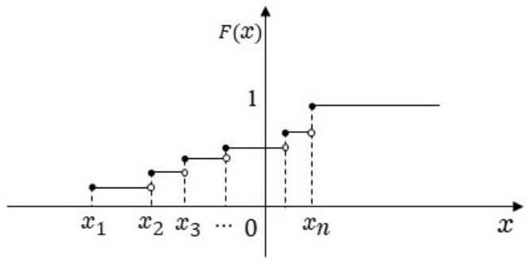

因此, 我们可将 $\cdot \lambda_{0}$ 类理解为含有Ω且对不交并与余封闭的集类. 若去掉“不交”的限制,加强为对任意两个集合的并封闭, 则得到代数的概念.

定义 2.7.4. 一个集类 ${\mathcal{A}},$ 若满足

(i) $\Omega \in{\mathcal{A}},$

(ii) 对并与余封闭:

$$
A, B \in \mathscr{A} \Longrightarrow A \cup B, A^{c} \in \mathscr{A},
$$

则称为代数.

所以 $\lambda_{0} -$ -类与代数的差别就在于对并封闭的要求中, 有无不交的前提.

我们看几个例子:

例5. Ω的所有子集构成的集类为代数.

例6. 集类

{∅, Ω}

构成代数.

例7. 设 $N(\Omega) = + \infty,$ 令

$$
\mathscr{A} := \{A \subset \Omega : N(A) \wedge N(A^{c}) < \infty\}.
$$

则 $\mathcal{A}$ 是代数.

但读者可以自己举反例说明, 上面作为 $\lambda_{0} -$ 类的例3与例4均不是代数.

我们立即有：

命题 2.7.5. 代数对交与差均封闭.

证明. 设 $\mathcal{A}$ 为代数, A, $B \in{\mathcal{A}}$ . 则

$$
AB = \left(A^{c} \cup B^{c}\right)^{c} \in \mathscr{A},
$$

$$
B \setminus A = BA^{c} \in \mathscr{A}.
$$

在验证一个非空集类是否为代数时, 下面的结果常常很方便.

命题 2.7.6. 一个非空集类若对余与交两种运算封闭, 则为代数.

证明. 设这集类是 ${\mathcal{A}},$ 并设 $A \in{\mathcal{A}}.$ . 因为 $\mathcal{A}$ 对余封闭, 所以 $A^{c} \in{\mathcal{A}}$ . 因为 $\mathcal{A}$ 对交封闭, 所以 $\varnothing = AA^{c} \in{\mathcal{A}}$ . 再用一次对余封闭, 得 $\Omega =(\emptyset)^{c} \in \mathcal{A}$

设 $A, B \in{\mathcal{A}}$ , 则 $A^{c}, B^{c} \in{\mathcal{A}}$ . 因此

$$
A \cup B =(A^{c} B^{c})^{c} \in \mathscr{A}.
$$

所以 $\mathcal{A}$ 为代数.

上面这个命题的逆命题当然也成立, 这是我们已经说明过的.

显然, 我们还有

推论 2.7.7. 一个集类 $\mathcal{A}$ 为代数的充要条件是它既是π-类又是 $\lambda_{0} \mathrm{{\Omega}}$ -类.

证明留作练习.

由此我们知道, 我们也可以认为, 比之于代数, $\lambda_{0^{-}}$ 类差的就是对交封闭. 我们下面将要证明本节最重要的结果, 即从一个π-类出发扩张而得到的 $\lambda_{0} \cdot$ 类依然保留对交封闭这个重要的性质, 因此也就一定是代数. 为此先引入两个概念.

命题 2.7.8. 任给一个非空集类D, 一定存在一个代数 ${\mathcal A}_{0}$ , 使得对任意代数 ${\mathcal{A}} \supset{\mathcal{D}}$ , 都有

$$
\mathcal{D} \subset \mathcal{A}_{0} \subset \mathcal{A}.
$$

证明. 令

$$
\mathcal{A}_{0} = \bigcap \mathcal{A},
$$

其中右边的交跑遍所有包含了D的代数. 注意这个定义是有意义的, 因为至少有一个代数包含了D, 这就是由Ω的所有子集构成的代数. 作为诸代数的交, $\mathcal{A}_{0}$ 自然也是代数, 且是包含了D的最小的代数. □

定义 2.7.9. 上面命题中的 $\mathcal{A}_{0}$ 称为D生成的代数, 记为 $\alpha(\mathcal{D})$

类似地, 我们有:

命题 2.7.10. 任给一个集类D, 存在一个 $\cdot \lambda_{0} -$ 类 $\mathcal{L}_{0}$ , 使得对任意 $\lambda_{0} \cdot$ 类 ${\mathcal{L}} \supset{\mathcal{D}}$ , 都有

$$
\mathcal{D} \subset \mathcal{L}_{0} \subset \mathcal{L}.
$$

定义 2.7.11. 上面命题中的 $\mathcal{L}_{0}$ 称为D生成的 $\lambda_{0} \cdot$ -类, 记为 $\lambda_{0}(\mathcal{D})$

在前面的例子中, 我们看到, 若A, $B \subset \Omega, AB \neq \emptyset$ , 则由{A,B}生成的 $\lambda_{0^{-}}$ 类为

$$
\{\Omega, \emptyset, A, B, A^{c}, B^{c}\}.
$$

此集类并不太复杂. 但倘若在{A, B}中仅仅加一个元素AB, 则{A, B, AB}生成的 $\lambda_{0} -$ 类就为

$$
\{\Omega, \emptyset, A, B, AB, A^{c}, B^{c},(AB)^{c}, A \setminus B, B \setminus A, A^{c} \setminus B^{c}, B^{c} \setminus A^{c}, A \cup B, A^{c} B^{c}\}.
$$

这个集类就复杂多了. 其原因是 $\{A, B\}$ 不是π-类而{A, B, AB}是π-类. 可见一个集类是否为 $\ulcorner$ -类对其生成的 $\lambda_{0}$ 类的结构是有重大影响的.

由于代数皆为 $\lambda_{0} -$ -类, 所以对任意一个集类C, 皆有 $\lambda_{0}(\mathcal{C}) \subset \alpha(\mathcal{C})$ . 然而一般说来反过来是不成立的. 不过若C是 $\pi -$ 类, 反过来就成立, 即我们有

定理 2.7.12 $(\pi - \lambda_{0}$ 定理). 若C 为π-类, 则 $\lambda_{0}(\mathcal{C}) = \alpha(\mathcal{C})$

这是我们对前面所说的话的第一个具体例证: 选择π-类作为出发点会使道路非常顺畅.

这个定理能够成立的理由是下面这个关键事实：一个π-类生成的 $\lambda_{0} -$ 类仍然是π-类. 下面就是详细证明.

证明. 显然 $\lambda_{0}(\mathcal{C}) \subset \alpha(\mathcal{C})$ . 因此只需证明 $\lambda_{0}(\mathcal{C})$ 为代数. 由命题2.7.7, 又只需证明它是π-类.令

$$
\mathcal{B}_{1} := \{B \in \lambda_{0}(\mathcal{C}): BA \in \lambda_{0}(\mathcal{C}), \forall A \in \mathcal{C}\}.
$$

则 $\mathcal{B}_{1} \supset \mathcal{C}$ . 显然 $\Omega \in \mathcal{B}_{1}$ . 再设 $B_{1}, B_{2} \in \mathcal{B}_{1}, B_{1} \subset B_{2}$ . 则 $\forall A \in{\mathcal{C}}$ 有

$$
B_{1} A, B_{2} A \in \lambda_{0}(\mathcal{C}), B_{1} A \subset B_{2} A.
$$

从而

$$
(B_{2} - B_{1}) A = B_{2} A - B_{1} A \in \lambda_{0}(\mathcal{C}).
$$

故 $B_{2} - B_{1} \in \mathcal{B}_{1}$ . 因此 $\mathcal{B}_{1}$ 是(包含了C 的) $| \lambda_{0} -$ -类. 从而 $\mathcal{B}_{1} = \lambda_{0}(\mathcal{C})$

再令

$$
\mathscr{B}_{2} := \{B \in \lambda_{0}(\mathscr{C}): BA \in \lambda_{0}(\mathscr{C}), \forall A \in \lambda_{0}(\mathscr{C})\}.
$$

由刚刚证明的结论, 有 $\mathcal{B}_{2} \ \supset \ \mathcal{C}$ . 再将刚刚用的证明方法如法泡制, 可证 $\mathcal{B}_{2}$ 为 $\lambda_{0} \cdot$ 类. 因此 $\mathcal{B}_{2} = \lambda_{0}(\mathcal{C})$ , 而这就是说 $\lambda_{0}(\mathcal{C})$ 是π-类. □

这个证明的特点是分为了两步, 两步的步调实际上是一样的, 就如同当你要过一条小溪时, 你可以在溪中央垫一块石头, 第一脚踩在这块石头上, 第二脚就过去了. 但如果你不信邪,硬要一步过去, 那对不起, 你只能落在水里——这叫欲速则不达.

## 习题

1. 设Ω为全空间, $A \subset B \subset \Omega$ , 写出含有A, B作为其元素的最小 $\cdot \lambda_{0} -$ -类.

2. 在R中, 令

$$
\Pi := \{(- \infty, a): a \in \mathbb{R}\}.
$$

求α(Π).

3. 设 ${\mathcal{O}},$ C分别表示Rd中的开集类与闭集类. 证明它们都是π-类, 也都不是 $\lambda_{0^{-}}$ 类.

4. 在R中, 令

$$
\Pi_{0} := \{[a, b): - \infty \leqslant a \leqslant b \leqslant \infty\},
$$

其中 $[- \infty, a)$ 理解为 $(- \infty, a)$ ，

$$
\Pi_{1} := \left\{A: A = \sum_{i = 1}^{n} A_{i}, A_{i} \in \Pi_{0}, n \in \mathbb{N}_{+} \right\} \left(\sum_{i = 1}^{0} A_{i} = \emptyset\right).
$$

证明 $\Pi_{0}$ 为π-类, $\Pi_{1}$ 为 $\lambda_{0} \mathrm{-}$ 类.

5. 在上题中, 将R换成Rd, 叙述相应的结论和证明.

6. 设S为一有无穷多个元素的空间, 令

$$
\mathscr{S} := \{A: A \subset S, N(A) \wedge N(A^{c}) < \infty\}.
$$

证明 $\mathcal{S}$ 为代数.

7. 设 $f, g$ 为R上的可积函数, 且

$$
\int_{\mathbb{R}} f(x) dx = \int_{\mathbb{R}} g(x) dx.
$$

以大写字母A代表R上的区间. 令

$$
\mathscr{A} := \left\{A: \int_{A} f(x) dx = \int_{A} g(x) dx \right\}.
$$

证明: $\mathcal{A}$ 为 $\lambda_{0} -$ 类, 但非π- 类.

8. 设样本空间为 $\Omega, A, B \subset \Omega$

(a) 设 $AB = \varnothing.$ . 写出 $\alpha(\{A, B\})$ ;

(b) 去掉假设 $AB = \varnothing.$ . 写 $\sharp \alpha(\{A, B\})$

9. 设样本空间为Ω, $A_{i} \subset \Omega, i = 1, 2, \cdots, n.$

(a) 设i ̸= j时 ${\bf \ddot{A}}_{i} A_{j} = \varnothing$ . 写出 $\exists \alpha(\{A_{i}, i = 1, \cdot \cdot \cdot, n\})$ ;

(b) 去掉假设 $; \ne j$ 时 $A_{i} A_{j} = \varnothing$ . 写出 $\mathsf{\Pi}_{| \alpha}^{|}(\{A_{i}, i = 1, \cdots, n\})$ ).

(c) 设 $\mathcal{C} = \{A_{1}, \cdot \cdot \cdot, A_{n}\}$ 且

$$
\Omega = A_{1} + \dots + A_{n}.
$$

写出 $\alpha(\mathcal{C})$

(d) 设A, $B \subset \Omega.$ . 写出 $\mathinner{|{\alpha \mathopen{\left(\left\{A, B \right\} \right)}}}$ .

(e) 两个代数之并仍然是代数吗? 证明或举出反例.

(f) 设Ω为一无限集合. 令

$\mathcal{A} : = \{A \subset \Omega$ : A为有限集},

$\mathcal{B} : = \{A \subset \Omega$ : A或Ac为有限集}.

${\mathcal{A}},$ B是代数吗? 证明你的结论.

(g) 设 $A_{1}, \cdots, A_{n} \subset \Omega.$ 写出 $\alpha(\{A_{i}, i = 1, \cdot \cdot \cdot, n\})$ ).

## 2.8 重温独立性

现在可以回答前面的问题了, 即是否可以从较小的事件类间的独立性推出较大的事件类间的独立性的问题. 我们有:

定理 2.8.1. 设 $\mathcal{C}_{1}$ 与 $\mathcal{C}_{2}$ 是π-类. 若C1与 $\mathcal{C}_{2}$ 独立, 那么 $\alpha(\mathcal{C}_{1})$ 与 $\alpha(\mathcal{C}_{2})$ 独立.

证明. 令

$$
\mathcal{B} := \{B \in \alpha(\mathcal{C}_{2}): B \text{与} A \text{独立}, \forall A \in \mathcal{C}_{1}\}.
$$

则 ${\mathcal{C}}_{2} \subset{\mathcal{B}}.$ . 往证B是 $\mathcal{\lambda}_{0^{-}}$ -类. 首先, 显然 $\Omega \in{\mathcal{B}}$ . 其次, 设 $B_{1}, B_{2} \in \mathcal{B}, B_{1} \subset B_{2}$ , 则 $\forall A \in \mathcal{C}_{1}$

$$
P \left(\left(B_{2} - B_{1}\right) A\right) = P \left(B_{2} A\right) - P \left(B_{1} A\right) = P \left(B_{2}\right) P(A) - P \left(B_{1}\right) P(A) = P \left(B_{2} - B_{1}\right) P(A).
$$

因此 $B_{2} - B_{1} \in \mathcal{B}.$ . 所以 $\mathcal{B} \supset \lambda_{0}(\mathcal{C}_{2})$ . 但由命题2.7.12, $\lambda_{0}(\mathcal{C}_{2}) = \alpha(\mathcal{C}_{2})$ . 所以 ${\mathcal B} = \alpha({\mathcal C}_{2})$ 再令

$$
\mathcal{A} := \{A \in \alpha(\mathcal{C}_{1}): A \text{与} B \text{独立}, \forall B \in \alpha(\mathcal{C}_{2})\}.
$$

用同样的方法可证 ${\mathcal{A}} = \alpha({\mathcal{C}}_{1})$

这就证明了任取 $A \in \alpha(\mathcal{C}_{1}), B \in \alpha(\mathcal{C}_{2})$ , A与B都是独立的.

## 2.8 重温独立性

前面定义了两个事件、两个集类的独立. 自然地要问, 该如何定义三个事件、多个事件独立, 以及多个集类的独立呢? 下面就是定义.

定义 2.8.2. 设I为任意指标集, $\{A_{i}, i \in I\}$ 为一族事件. 若对任意有限的 $J \subset I{\mathcal{Z}} A_{i}, i \in J,$ 都有

$$
P \left(\bigcap_{i \in J} A_{i}\right) = \prod_{i \in J} P(A_{i}),
$$

则称 $\{A_{i}, i \in I\}$ 独立.

设 $\{\mathcal{A}_{i}, i \in I\}$ 为一族事件类. 若对任意有限的 $J \subset I{\mathcal{B}} A_{i} \in{\mathcal{A}}_{i}, i \in$ J都有

$$
P \left(\bigcap_{i \in J} A_{i}\right) = \prod_{i \in J} P(A_{i}),
$$

则称 $\{{\mathcal{A}}_{i}, i \in I\}$ 独立.

类似于定理2.8.1, 我们可以证明:

定理 2.8.3. 设 $\forall i \in I, \mathcal{C}_{i}$ 是π-类. 若 $\{\mathcal{C}_{i}, i \in I\}$ 独立, 那么 $\{\alpha(\mathcal{C}_{i}), i \in I\}$ 独立.

可以看出, 多个事件独立的定义不仅仅要求事件是两两独立的, 而且要求从中任意选择任意有限个都满足交的概率等于概率的乘积这个性质. 比如 $A_{1}, \cdots, A_{n}$ 独立就意味着

$$
P \left(A_{i_{1}} \dots A_{i_{k}}\right) = P \left(A_{i_{1}}\right) \dots P \left(A_{i_{k}}\right), \forall 2 \leqslant k \leqslant n, i_{1} < i_{2} < \dots < i_{k}.
$$

所以这里一共有 $2^{n} - n - 1$ 个等式, 且它们都是相互独立的——另一种意义上的独立, 即彼此不能互推.

在第2.7节的例1中, 三个事件两两独立, 但因为

$$
P(ABC) = \frac{1}{4} \neq \frac{1}{8} = P(A) \times P(B) \times P(C),
$$

因此A、B、C并不独立. 同样, 也有例子说明, 有满足

$$
P(ABC) = P(A) \times P(B) \times P(C),
$$

但不独立的三个事件——例如, 考虑其中一个为空集的情形.

计算多个事件交的概率一般用乘法公式. 有了独立性, 乘法公式中的条件概率就可以直接换成无条件的概率, 因此计算事件交的概率变得非常简单.

在具体问题中, 人们往往会根据对试验的直观理解, 来判断事件是否独立的. 后面有例子说明, 这种直观是不太可靠的. 用严格的概率论上的独立概念去推理, 常常会出现与直观不一致的结论, 因此需要特别注意. 这不是因为理论同实际有矛盾, 而是把理论概念和直观概念混为一谈了.

## 习题

1. 设 $\mathcal A : = \{A_{i}, i = 1, \cdots, n\} \overset{\vartriangle}{\boldsymbol{\mathcal A}} : = \{B_{j}, j = 1, \cdots, m\}$ 独立, 且 $\mathcal{A}$ 与B中的元素都是两两不交的. 证明 $\alpha(\mathcal{A})$ 与 $\alpha({\mathcal{B}})$ 独立.

2. 设ξ, η是随机变量, 且对任意 $a, b \in \mathbb{R}.$ , 事件 $\{\xi < a\} \varXi \{\eta < b\}$ 独立. 证明对任意 $- \infty <$ $a_{1} < a_{2} < \cdots < a_{2n} < \infty$ 及任意 $- \infty < b_{1} < b_{2} < \cdots < b_{2m} < \infty$ , 事件 $\{\xi \in \mathbf{\Xi}$ $\left[a_{1}, a_{2} \right) \cup \cdot \cdot \cdot \cup \left[a_{2n - 1}, a_{2n} \right)\} \varTheta \left\{\eta \in \left[b_{1}, b_{2} \right) \cup \cdot \cdot \cdot \cup \left[b_{2m - 1}, b_{2m} \right) \right\}$ 是独立的.

3. 构造三个事件 $A_{1}, A_{2}, A_{3}$ , 使得 $P(A_{1} A_{2} A_{3}) = P(A_{1}) P(A_{2}) P(A_{3})$ , 但 $A_{1}, A_{2}, A_{3}$ 不是独立的.

## 2.9 可列概型

本节我们将考虑可列概型. 和有限概型相比, 不同之处就是样本空间中样本点的个数是可列个的, 我们主要关注它们的不同之处.

为什么要研究可列概型呢? 可列概型除了形式上是有限概型的自然推广之外, 还源于很多实际问题. 例如, 考虑n重Bernoulli概型 $B(n, p)$ . 以ξ 表示成功的次数. 我们知道

$$
P(\xi = k) = C_{n}^{k} p^{k} q^{n - k}.
$$

这个公式理论上是完美的, 问题在于实际计算中, 只要n稍微大一点, 计算量就非常惊人, 尤其在历史上没有电脑的时代, 基本上是不可能直接计算的. 即使在今天电脑普及了的时代, 计算所需时间和费用也是一个需要考虑的问题. 但计算问题又不能回避, 因此人们就设法找一些近似计算方法. 这一找不要紧, 就找到了一个后来证明是非常重要的分布, 即Poisson4分布.这颇有点像哥伦布要寻找一条通往东方的近路, 结果阴差阳错, 找到了一个后来被证明是非常重要的美洲一样.

定理 2.9.1. 若 $\begin{array}{r}{\operatorname{lim}_{n \to \infty} np_{n} = \lambda} \end{array}$ , 则

$$
\lim_{n \to \infty} C_{n}^{k} p_{n}^{k} q_{n}^{n - k} = \frac{\lambda^{k}}{k !} e^{- \lambda}, \forall k = 0, 1, 2, \dots
$$

其中 $q_{n} = 1 - p_{n}$

证明. 因为 $np_{n} \lambda$ , 所以 $.p_{n} \to 0$ . 固定k, 直接计算给出:

$$
\begin{array}{l} \lim_{n \to \infty} C_{n}^{k} p_{n}^{k} q_{n}^{n - k} = \lim_{n \to \infty} \frac{n(n - 1) \cdots(n - k + 1)}{k !} \cdot p_{n}^{k} \cdot(1 - p_{n})^{n - k} \\ \qquad = \lim_{n \to \infty} \frac{n^{k}}{k !} \cdot p_{n}^{k} \cdot \frac{(1 - p_{n})^{n}}{(1 - p_{n})^{k}} \\ \qquad = \lim_{n \to \infty} \frac{(np_{n})^{k}}{k !} \cdot(1 - p_{n})^{n} \\ \qquad = \frac{\lambda^{k}}{k !} \lim_{n \to \infty} e^{n \ln(1 - p_{n})} \\ \qquad = \frac{\lambda^{k}}{k !} \lim_{n \to \infty} e^{- np_{n} \cdot \frac{\ln(1 - p_{n})}{- p_{n}}} \\ \qquad = \frac{\lambda^{k}}{k !} \cdot e^{- \lambda}, \end{array}
$$

其中最后一个等式用了

$$
\lim_{x \to 0} \frac{\ln(1 - x)}{- x} = 1.
$$

## 2.9 可列概型

这说明当p小而n大时, 可用 $\frac{\left(np \right)^{k}}{k !} e^{- np}$ 作为 $C_{n}^{k} p_{n}^{k} q_{n}^{n - k}$ 的近似值. 这在实际工作中有重要意义, 比如若 $n = 800, p = 0.005, k = 3$ , 则精确到小数点后4位时,

$$
C_{n}^{k} p_{n}^{k} q_{n}^{n - k} = 0.1945,
$$

而在同样的精度下也有

$$
e^{- 4} \frac{4^{3}}{3 !} = 0.1945.
$$

可见误差很小. 在本章最后一节我们将研究它们间的误差大小.

但更重要的是, 这个近似计算使人们发现了一个非常重要的分布, 即所谓Poisson分布.事实上, 稍微留心一下, 我们就会注意到

$$
\sum_{k = 0}^{\infty} \frac{\lambda^{k}}{k !} e^{- \lambda} = 1.
$$

所以一个自然的问题是, 有没有一个概型, 即有没有一个样本空间Ω及其上的概率 $P,$ 使得

$$
P(\omega_{k}) = \frac{\lambda^{k}}{k !} e^{- \lambda ?}
$$

这样的样本空间是有的, 且当然要包含可列个样本点. 比如说我们可取

$$
\Omega := \{0, 1, \dots\},
$$

并赋予概率

$$
P(k) = \frac{\lambda^{k}}{k !} e^{- \lambda}.
$$

这就引导出可列概型的概念.

定义 2.9.2. 设一个试验可能的结果有可列个:

$$
\Omega = \{\omega_{1}, \omega_{2}, \dots\}.
$$

设 $\omega_{i}$ 出现的概率为 $\begin{array}{r}{p_{i}, 0 < p_{i} < 1, \sum_{i = 1}^{\infty} p_{i} = 1} \end{array}$ . 令

$$
P(\omega_{i}) := p_{i},
$$

且对任意 $A \subset \Omega$ , 令

$$
P(A) := \sum_{\omega \in A} P(\omega).
$$

则(Ω,P)称为可列概型, $P(A)$ 称为事件A的概率.

可列概型也有类似于有限概型的基本性质、有条件概率、全概率公式、独立性、随机变量、分布列、分布函数和期望之类的概念, 等等. 这些结果中主要的不同是原来的有限个样本点变成可列个样本点, 因而有限和会相应地变成级数. 但除此之外, 它们就没有什么差别了, 因此我们将有限概型和可列概型统称为离散概型.

定理 2.9.3. 概率P具有如下性质:

(i) 非负性： $\forall A, P(A) \geqslant 0;$

(ii) 规范性： $P(\Omega) = 1, P(\emptyset) = 0$ ;

(iii) 单调性：

$$
A \subset B \Longrightarrow P(A) \leqslant P(B);
$$

(iv) 可列可加性: 若 $A_{1}, A_{2}, \cdots$ 是一列事件, 且 $A_{i} A_{j} = \emptyset, \forall i \neq j$ , 则有加法公式

$$
P \left(\sum_{i = 1}^{\infty} A_{i}\right) = \sum_{i = 1}^{\infty} P(A_{i}).
$$

(v) 次可列可加性: 若把上款中的两两不交条件去掉, 则

$$
P \left(\bigcup_{i = 1}^{\infty} A_{i}\right) \leqslant \sum_{i = 1}^{\infty} P(A_{i}).
$$

证明. 我们只证(v), 其它都是显然的. 令

$$
\tau(\omega) := \inf \{i: \omega \in A_{i}\}(\inf \emptyset = \infty),
$$

$$
B_{i} := \{\tau = i\} = A_{1}^{c} \dots A_{i - 1}^{c} A_{i}(A_{0} := \emptyset).
$$

则 $B_{1}, B_{2}, \cdots$ · 两两不交, $B_{i} \subset A_{i}, \forall i,$ , 且

$$
\bigcup_{i = 1}^{\infty} B_{i} = \bigcup_{i = 1}^{\infty} A_{i}.
$$

因此

$$
\begin{array}{rcl}{P \left(\bigcup_{i = 1}^{\infty} A_{i}\right)} &{=} &{P \left(\bigcup_{i = 1}^{\infty} B_{i}\right)} \\ &{=} &{\sum_{i = 1}^{\infty} P(B_{i})(\text{由}(\mathrm{iv}))} \\ &{\leqslant} &{\sum_{i = 1}^{\infty} P(A_{i})(\text{由}(\mathrm{iii}))} \end{array}
$$

□

条件概率的定义和有限概型时是完全一样的:

定义 2.9.4. 设A,B是两事件, $P(B) > 0$ . 定义:

$$
P(A | B) := \frac{P(AB)}{P(B)},
$$

称为给定B时(或知道B时, 或在B发生的条件下)A的条件概率.

条件概率是将样本空间Ω缩小为B后的概率, 因此有与概率一样的性质, 兹罗列如下:

定理 2.9.5. 概率 $P(\cdot | B)$ 具有如下性质:

(i) 非负性： $0 \leqslant P(A | B) \leqslant 1$

(ii) 规范性： $P(B | B) = 1, P(\emptyset | B) = 0$

(iii) 单调性：

$$
A \subset C \Longrightarrow P(A | B) \leqslant P(C | B);
$$

(iii)可列可加性: 若 $A_{1}, A_{2}, \cdots$ 是一列事件, 且 $.A_{i} A_{j} = \varnothing, \forall i \neq j$ , 则有加法公式

$$
P \left(\sum_{i = 1}^{\infty} A_{i} | B\right) = \sum_{i = 1}^{\infty} P(A_{i} | B).
$$

(iv)次可列可加性: 若把上款中的两两不交条件去掉, 则

$$
P \left(\bigcup_{i = 1}^{\infty} A_{i} | B\right) \leqslant \sum_{i = 1}^{\infty} P(A_{i} | B).
$$

设 $\mathcal{P} = \{\Omega_{1}, \Omega_{2}, \cdot \cdot \cdot\}$ 为Ω 的一个分割, 全概率公式为

$$
P(A) = \sum_{i = 1}^{\infty} P(A \Omega_{i}) = \sum_{i = 1}^{\infty} P(\Omega_{i}) P(A | \Omega_{i}).
$$

Bayes公式为

$$
P(\Omega_{j} | A) = \frac{P(A \Omega_{j})}{P(A)} = \frac{P(\Omega_{j}) P(A | \Omega_{j})}{\sum_{i = 1}^{\infty} P(\Omega_{i}) P(A | \Omega_{i})}.
$$

在可列概型上也可以定义随机变量.

定义 2.9.6. Ω上的实值函数称为随机变量.

同样地, 随机变量ξ的分布列定义为

$$
(x_{i}, p_{i}, i = 1, 2, \dots),
$$

其中

$$
p_{i} = P(\xi = x_{i}) = \sum_{k: \xi(\omega_{k}) = x_{i}} P(\omega_{k}).
$$

在必要时即有可能产生混淆时, 将把 $I_{\mathit{p}_{i}}$ 写为 $Ip_{\xi}.$ 以明确它是ξ的分布列.

现在可以写出Poisson分布的定义了.

定义 2.9.7. 设 $\lambda > 0$ . 若ξ的分布为

$$
P(\xi = n) = \frac{\lambda^{n}}{n !} e^{- \lambda}, n = 0, 1, 2, \dots
$$

则称ξ服从Poisson分布, 记为 $\xi \sim P(\lambda)$

如果 $\xi \sim P(\lambda)$ ,那么 $.a \xi$ 服从什么分布? 这就引导出下面的定义.这个定义本质上和Poisson分布是一样的, 但引进一个新名词有时候是方便的.

定义 2.9.8. 设 $a \in$ R, $\xi;$ 是取值于 $\{na, n = 0, 1, 2, \cdots\}$ 的随机变量,且

$$
P(\xi = an) = \frac{\lambda^{n}}{n !} e^{- \lambda},
$$

其中 $\lambda > 0$ . 则称 $: \xi,$ 服从跳为 $a \cdot$ 参数为λ的Poisson分布, 记为 $\xi \sim P(\lambda, a)$

用这个符号, 如果 $\xi \sim P(\lambda)$ , 则 $a \xi \sim P(\lambda, a)$

若ξ是随机变量, B是事件, $P(B) > 0.$ . 定义给定B时ξ的条件分布列为

$$
(x_{i}, p_{i}^{B}, i = 1, 2, \dots),
$$

其中

$$
p_{i}^{B} := P(\xi = x_{i} | B).
$$

若 $\xi, \eta$ 是两个随机变量, 定义给定 $\eta = y_{j}$ 时ξ的分布列为

$$
(x_{i}, p_{i}^{j}, i = 1, 2, \dots),
$$

其中

$$
p_{i}^{j} := P(\xi = x_{i} | \eta = y_{j}).
$$

定义 $(\xi, \eta)$ 的联合分布列为

$$
((x_{i}, y_{j}), p_{ij}, i, j = 1, 2, \dots),
$$

其中

$$
p_{ij} = P(\xi = x_{i}, \eta = y_{j}).
$$

注意别把条件分布列和联合分布列搞混. 它们的关系是：

$$
p_{ij} = p_{i}^{j} p_{\eta, j},
$$

其中 $p_{\eta, j} : = P(\eta = y_{j})$

描述概率的分布情况的另一个工具是分布函数, 其定义为

$$
F(x) := \sum_{i: x_{i} \leqslant x} p_{i} = \sum_{\omega : \xi(\omega) \leqslant x} P(\omega).
$$

显然, F是定义在R上的右连续函数, 且它和分布列是相互唯一确定的. 事实上,由分布列唯一确定分布函数是不必说了, 由分布函数确定分布列留作习题.

容易看出, 若ξ是取有限个值的随机变量, 那么其分布函数是右连续的阶梯函数, 见图2.2;

  
图 2.2: 分布函数的图像

对取无限个值的随机变量, 乍一想分布函数似乎和有限概型的分布函数有差不多的形状,无非是从有限个阶梯变为可列个阶梯而已. 但事实上并非如此, 因为“ 离散”这个词此时有点误导, 这些阶梯有可能并不是离散的, 它们可能存在聚点, 并且是很多很多的聚点.

例1. 将[0, 1]中的二进位数按下列规则编号：

$$
0, 1, \frac{1}{2}, \frac{1}{4}, \frac{3}{4}, \frac{1}{8}, \frac{3}{8}, \frac{5}{8}, \frac{7}{8}, \dots, \frac{1}{2^{n}}, \frac{3}{2^{n}}, \dots, \frac{2^{n} - 1}{2^{n}}, \dots \dots
$$

设ξ为随机变量, 分布列为

$$
P(\xi = x_{i}) = 2^{- i}, i = 1, 2, \dots,
$$

则ξ的分布函数为

$$
F(x) = \sum_{x_{i} \leqslant x} 2^{- i}.
$$

你能画出F的图像吗? 其图像是你想象的那样, 是一个阶梯函数?

像有限概型一样, 随机变量ξ的期望定义为其平均值. 但这时涉及到无穷项级数的求和,因此有一个收敛性问题. 为此, 我们将ξ的正部和负部分开考虑, 即分别定义:

$$
E[\xi^{+}] := \sum_{\omega \in \Omega} \xi^{+}(\omega) P(\omega),
$$

$$
E[\xi^{-}] := \sum_{\omega \in \Omega} \xi^{-}(\omega) P(\omega).
$$

若至少其中之一有限, 则定义

$$
E[\xi] := E[\xi^{+}] - E[\xi^{-}].
$$

当两个都有限时, 称ξ可积. 显然ξ可积的充要条件是

$$
\sum_{\omega \in \Omega} | \xi(\omega) | P(\omega) < \infty.
$$

此时

$$
E[\xi] = \sum_{\omega \in \Omega} \xi(\omega) P(\omega).
$$

当 $E[\xi^{+}]$ 与 $E[\xi^{-}$ 均为无限时, 差式 $E[\xi^{+}] - E[\xi^{-}]$ 没有意义, 此时称ξ没有期望.

当可积时, 期望有下列基本性质:

命题 2.9.9. (i) 和概率的关联性: 若 $A \subset \Omega$ , 则

$$
E[1_{A}] = P(A);
$$

(ii) 单调性:

$$
\xi \leqslant \eta \Longrightarrow E[\xi] \leqslant E[\eta];
$$

(iii) 线性性: 设a, b为常数, 则

$$
E[a \xi + b \eta] = aE[\xi] + bE[\eta];
$$

(iv) 若 $\cdot \xi$ 的分布列为 $\{(x_{i}, p_{i}), i = 1, 2, \cdot \cdot \cdot\}$ , 则 $\xi$ 可积的充要条件是 $\begin{array}{r}{.\sum_{i = 1}^{\infty} | x_{i} | p_{i} < \infty,} \end{array}$ , 且此时 有

$$
E[\xi] = \sum_{i} x_{i} p_{i}.
$$

证明. (i) 我们有

$$
E[1_{A}] = \sum_{\omega \in A} P(\omega) = P(A).
$$

(ii)

$$
E[\xi] = \sum_{\omega} \xi(\omega) P(\omega) \leqslant \sum_{\omega} \eta(\omega) P(\omega) = E[\eta].
$$

(iii)

$$
\begin{array}{rcl} E[a \xi + b \eta] & = & \sum_{\omega}(a \xi(\omega) + b \eta(\omega)) P(\omega) \\ & = & a \sum_{\omega} \xi(\omega) P(\omega) + b \sum_{\omega} \eta(\omega) P(\omega) \\ & = & aE[\xi] + bE[\eta].\end{array}
$$

(iv) 由于正项级数可任意交换求和顺序, 故有

$$
\sum_{\omega} | \xi(\omega) | P(\omega) = \sum_{i} | x_{i} | p_{i}.
$$

而当它们有限时, 有

$$
\begin{array}{rcl} E[\xi] & = & \sum_{\omega} \xi(\omega) P(\omega) \\ & = & \sum_{i} \sum_{\omega : \xi(\omega) = x_{i}} \xi(\omega) P(\omega) \\ & = & \sum_{i} x_{i} \sum_{\omega : \xi(\omega) = x_{i}} P(\omega) \\ & = & \sum_{i} x_{i} p_{i}.\end{array}
$$

注意在上述证明中, 我们隐性地用到了 $\begin{array}{r}{\sum_{\omega} | \xi(\omega) | P(\omega) < \infty.} \end{array}$ 因为只有在这个条件 ${\mathrm{~ \cal ~ F, ~}}$ 重排级数的各项才不会影响最后的和. □

期望的两个计算公式和有限概型时的公式是相似的, 只不过是把有限和变成了级数. 但注意这里的前提条件是这个级数绝对收敛. 这是必须的, 因为如果说可列与否是客观的话, 那么按什么样的顺序排列则是主观的即因人而异的, 而如果没有绝对收敛性, 那么那个定义为期望的级数是否收敛以及收敛到什么值都会依赖于顺序的选择, 也即人为的因素, 因而是不能接受的. 反之, 一旦有了绝对收敛性, 级数就可以像有限和一样运算——像重排次序啊, 合并同类项啊, 统统都没有问题.

要描述一个随机变量的总体状况, 除了期望, 就是波动了. 就像一个班的学习情况, 平均成绩, 也就是期望, 是一个指标, 而个体之间是否差异较大, 则是另一个观察点. 衡量波动大小的指标, 按说首先想到的是数量

$$
E[| \xi(\omega) - E[\xi] |] = \sum_{\omega \in \Omega} | \xi(\omega) - E[\xi] | P(\omega),
$$

但这个量在数学上处理起来不太方便, 比如它就不如下面的量方便:

$$
D[\xi] := E[| \xi(\omega) - E[\xi] |^{2}] = \sum_{\omega \in \Omega} | \xi(\omega) - E[\xi] |^{2} P(\omega).
$$

这就像Rn中的长度我们是用 $(x_{1}^{2} + \cdots + x_{n}^{2})^{\frac{1}{2}}$ 而不是用 $| x_{1} | + \cdots + | x_{n} |^{-}$ 样.

定义 2.9.10. $D[\xi]$ 称为ξ的方差.

注意这里涉及的是正项级数, 所以它要么收敛, 要么发散到无穷大. 后面这种情况我们也依然认为它是方差, 等于无穷大的方差.

设B为事件, $P(B) > 0.$ . 给定B的条件下, 很自然地将给定B时ξ的条件期望定义为

$$
E[\xi | B] := E[\xi^{+} | B] - E[\xi^{-} | B],
$$

只要等式右边的两项中至少一项为有限数, 其中

$$
E[\xi^{+} | B] := \sum_{\omega} \xi^{+}(\omega) P(\omega | B),
$$

$$
E[\xi^{-} | B] := \sum_{\omega} \xi^{-}(\omega) P(\omega | B).
$$

当这两项均有限时, 易见

$$
E[\xi | B] := \sum_{\omega} \xi(\omega) P(\omega | B),
$$

且右边的级数绝对收敛. 显然有

$$
E[\xi | B] = \sum_{i = 1}^{\infty} x_{i} P(\xi = x_{i} | B) = \sum_{i = 1}^{\infty} x_{i} p_{i}^{B}.
$$

至于 $E[\xi | B]$ 何时有限, 我们有下面的简单结果:

命题 2.9.11. 若 $E[\xi]$ 有限, 则对任意 $B \subset \Omega, P(B) > 0, E[\xi | B]$ 有限, 且

$$
E[\xi | B] = P(B)^{- 1} E[\xi 1_{B}].
$$

证明. 因为 $P(\omega | B) \leqslant P(B)^{- 1} P(\omega)$ , 所以 $E[| \xi |] < \infty$ 时有

$$
\sum_{\omega \in \Omega} | \xi(\omega) | P(\omega | B) \leqslant P(B)^{- 1} \sum_{\omega \in \Omega} | \xi(\omega) | P(\omega) = P(B)^{- 1} E[| \xi |] < \infty.
$$

所以 $E[\xi | B]$ 有限, 且

$$
\begin{array}{rcl}{E[\xi | B]} & = &{\sum_{\omega \in \Omega} \xi(\omega) P(\omega | B)} \\ & = &{\sum_{\omega \in B} P(B)^{- 1} \xi(\omega) P(\omega)} \\ & = &{P(B)^{- 1} E[\xi 1_{B}].} \end{array}
$$

现在设 $\mathcal{P} = \{\Omega_{1}, \Omega_{2}, \cdot \cdot \cdot\}$ 构成Ω的一个分割, 即

$$
\sum_{n = 1}^{\infty} \Omega_{n} = \Omega.
$$

如同有限概型的情况一样, 引进下面的概念是方便的：定义

$$
P(A | \mathcal{P})(\omega) := \sum_{n = 1}^{\infty} P(A | \Omega_{n}) 1_{\Omega_{n}}(\omega).
$$

$P(A | \mathcal{P})$ 称为给定分割P时的条件概率. 它的含义是, 当 $\omega \in \Omega_{r}$ n时, $P(A | \mathcal{P})(\omega) = P(A | \Omega_{n})$ 因此它是一种简单实用的记号,用单独一个记号表示了所有的条件概率 $P(A | \Omega_{n}), n = 1, 2, \cdot \cdot \cdot$

当 $A = \{\omega^{\prime}\}$ 时, 我们将 $P(A | \mathcal{P})(\omega)$ 记为 $P(\omega^{\prime}, \omega)$ . 这样, 当 $\omega \in \Omega_{n}$ 时, 就有

$$
P(\omega^{\prime}, \omega) = P(\omega^{\prime} | \Omega_{n}).
$$

显然有

$$
P(A | \mathscr{P})(\omega) = \sum_{\omega^{\prime} \in A} P(\omega^{\prime}, \omega).
$$

就像有限概型的情况一样, 对固定的A, $\omega \mapsto P(A | \mathcal{P})(\omega)$ 是随机变量, 而对于固定的 $\omega, A \mapsto$ $P(A | \mathcal{P})(\omega)$ 是概率, 它满足非负性、规范性与可列可加性.

对任何一个随机变量ξ, 对固定的ω, 定义

$$
E[\xi | \mathcal{P}](\omega) := E^{P(\cdot, \omega)}[\xi(\omega^{\prime})] := \sum_{\omega^{\prime}} \xi(\omega^{\prime}) P(\omega^{\prime}, \omega) = \sum_{n = 1}^{\infty} E[\xi | \Omega_{n}] 1_{\Omega_{n}}(\omega),
$$

如果右边的每一个 $E[\xi | \Omega_{n}]$ 都存在的话. 它称为关于 $\mathcal{P}$ 的条件期望, 仍是一个随机变量. 特别取 $\xi = 1_{A}$ 就得到

$$
E[1_{A} | \mathcal{P}](\omega) = P(A | \mathcal{P})(\omega).
$$

曾记否, 我们曾经对无条件的期望注意过、使用过这个公式? 而无条件的期望是条件期望的一种特殊情况, 即 $\mathcal{P} = \{\Omega\}$ 时的条件期望, 不是吗?

关于分割的条件期望依然有一个是否有限的问题. 我们有:

命题 2.9.12. 若 $E[| \xi |] < \infty$ , 则对任意分割 $\mathcal{P}$ , $E[\xi | \mathcal{P}]$ 对每一个ω都有限.

事实上, 当命题的条件满足时, 对任意 $n, E[\xi | \Omega_{n}]$ ]有限, 因此 $E[\xi | \mathcal{P}]$ 有限.

我们还有:

定理 2.9.13. 当 $E[\xi]$ 有限时有

$$
E[E[\xi | \mathcal{P}]] = E[\xi].
$$

特别地, 当 $\xi : = 1_{A}$ 时, 我们得到全概率公式另一种简洁表达式:

$$
P(A) = E[E[1_{A} | \mathcal{P}]] = E[P(A | \mathcal{P})],
$$

证明. 直接计算可知:

$$
\begin{array}{rcl} E[E[\xi | \mathcal{P}]] & = & \sum_{n = 1}^{\infty} E[\xi | \Omega_{n}] P(\Omega_{n}) \\ & = & \sum_{n = 1}^{\infty} E[\xi 1_{\Omega_{n}}] \\ & = & \sum_{n = 1}^{\infty} \sum_{\omega \in \Omega_{n}} \xi(\omega) P(\omega) \\ & = & \sum_{\omega \in \Omega} \xi(\omega) P(\omega) \\ & = & E[\xi].\end{array}
$$

这个公式有什么用? 我们看一个例子.

假设一次人口普查中, $\xi(\omega)$ 表示ω的身高. 现在需要计算全国成年男子的平均身高. 那么

$$
\Omega = \{\omega_{1}, \dots, \omega_{n}\}.
$$

则平均身高为

$$
E[\xi] = \frac{1}{n} \sum_{i = 1}^{n} \xi(\omega_{i}).
$$

不过想想看, 如果n有十几亿之多, 这个计算该有多费力!

现设一共m个省, 每个省有 $n_{m} \Lambda, n_{1} + \cdot \cdot \cdot + n_{m} = n$ . 那么上面的公式告诉你, 国家可以要求每个省上报平均身高, 比如说是 $\eta_{1}, \cdots, \eta_{m}$ , 然后对这 $m$ 个数据按每个省的人数比例加权平均, 即得到所要的数据, 即

$$
E[\xi] = \sum_{k = 1}^{m} \eta_{k} \frac{n_{k}}{n}.
$$

这里右边的 $m$ 个数据 $\eta_{k}, k = 1, \cdots, m$ 可以同步得到, 这样工作效率就可以大大提高. 并且, 为得到诸 $\eta_{k}$ , 每个省又可以将任务分解到各个县, 然后是各个乡......, 这样最后的工作效率不知要提高多少!

整体平均等于局部平均后再平均, 这就是上面这个公式背后的简单思想.

现在假设η是另一随机变量, 值域为 $\{y_{j}, j = 1, 2, \cdot \cdot \cdot\}$ . 令

$$
\Omega_{j} := \{\eta = y_{j}\}, p_{i}^{\eta = y_{j}} := P(\xi = x_{i} | \eta = y_{j}), \mathscr{P} := \{\Omega_{n}, n = 1, 2, \dots\}.
$$

利用上述结果, 当 $E[| \xi |] < \infty$ 时, 可定义条件期望 $E[\xi | \eta = y_{j}]$ ]且有

$$
E[\xi | \eta = y_{j}] = \sum_{i = 1}^{\infty} x_{i} p_{i}^{\eta = y_{j}},
$$

这是一个数. 而不固定 $j.$ , $\xi \mathrm{:}$ 关于η的条件期望则定义为随机变量

$$
E[\xi | \eta] := E[\xi | \mathcal{P}]
$$

显然

$$
E[\xi | \eta] = \sum_{j = 1}^{\infty} E[\xi | \eta = y_{j}] 1_{\eta = y_{j}},
$$

$$
E[\xi] = E[E[\xi | \eta]].
$$

最后我们要谈的是独立性. 这个概念是有限概型时同一概念的自然延申.

定义 2.9.14. (i) 设A, B是事件. 若

$$
P(AB) = P(A) P(B),
$$

则称A与B独立；

设 $\{A_{i}, i \in I\}$ 是事件族, 其中I是任意指标集. 若对任意有限 $J \subset I$ , 都有

$$
P \left(\bigcap_{i \in J} A_{i}\right) = \prod_{i \in I} P(A_{i}),
$$

则称 $\{A_{i}, i \in I\}$ 独立.

(ii) 设ξ,η是随机变量. 如果

$$
P(\xi = x_{i}, \eta = y_{j}) = P(\xi = x_{i}) P(\eta = y_{j}), \forall i, j,
$$

则称ξ与 $\eta$ 独立;

设 $\{\xi_{i}, i \in I\}$ 是随机变量族, 其中I是任意指标集. 若对任意有限 $J \subset I $ 都有

$$
P \left(\bigcap_{i \in J} \{\xi_{i} = x_{i}\}\right) = \prod_{i \in J} P(\xi_{i} = x_{i})
$$

其中 $x_{i}$ 跑遍 $\xi_{i}$ 的值域, 则称为独立的.

我们来看几个例子.

例1. 同时掷红白两枚骰子, 样本空间为

$$
\Omega = \{(i, j): i, j = 1, \dots, 6\}.
$$

令

$$
\xi((i, j)) = i, \eta((i, j)) = j.
$$

则对任意 $.\leqslant i, j \leqslant 6.$

$$
P(\xi = i) = P(\eta = j) = \frac{1}{6},
$$

$$
P(\xi = i, \eta = j) = \frac{1}{36}.
$$

故

$$
P(\xi = i, \eta = j) = P(\xi = i) P(\eta = j), \forall i, j.
$$

因此ξ与 $\dot{\eta}$ 独立.

例2. 设 $(\Omega, P)$ 与 $(\Omega^{\prime}, P^{\prime})$ 为离散概率空间. 令

$$
\Omega \times \Omega^{\prime} := \left\{\left(\omega, \omega^{\prime}\right): \omega \in \Omega, \omega^{\prime} \in \Omega^{\prime} \right\},
$$

$$
P \times P^{\prime}((\omega, \omega^{\prime})) := P(\omega) P(\omega^{\prime}).
$$

易证 $(\Omega \times \Omega^{\prime}, P \times P^{\prime})$ 也为离散概率空间. 设ξ、η分别是定义在Ω、Ω′上的随机变量. 在 $\Omega \times \Omega^{\prime}$ 上定义

$$
\tilde{\xi}((\omega, \omega^{\prime})) = \xi(\omega), \tilde{\eta}((\omega, \omega^{\prime})) := \eta(\omega^{\prime}).
$$

则对任意 $x, y$

$$
\begin{array}{rcl} P \times P^{\prime}(\tilde{\xi} = x, \tilde{\eta} = y) & = & \sum_{(\omega, \omega^{\prime}): \xi(\omega) = x, \eta(\omega^{\prime}) = y} P \times P^{\prime}((\omega, \omega^{\prime})) \\ & = & \sum_{(\omega, \omega^{\prime}): \xi(\omega) = x, \eta(\omega^{\prime}) = y} P(\omega) P^{\prime}(\omega^{\prime}) \\ & = & \sum_{\omega : \xi(\omega) = x} \sum_{\omega^{\prime}: \eta(\omega^{\prime}) = y} P(\omega) P^{\prime}(\omega^{\prime}) \\ & = & \sum_{\omega : \xi(\omega) = x} P(\omega) \cdot \sum_{\omega^{\prime}: \eta(\omega^{\prime}) = y} P^{\prime}(\omega^{\prime}) \\ & = & P(\xi = x) P^{\prime}(\eta = y).\end{array}
$$

类似可得

$$
P(\xi = x) = P \times P^{\prime}(\tilde{\xi} = x), P^{\prime}(\eta = y) = P \times P^{\prime}(\tilde{\eta} = y).
$$

因此

$$
P \times P^{\prime}(\tilde{\xi} = x, \tilde{\eta} = y) = P \times P^{\prime}(\tilde{\xi} = x) \cdot P \times P^{\prime}(\tilde{\eta} = y).
$$

故 $\cdot \tilde{\xi}^{\perp}$ 与η˜独立.

例3. 设 $(\Omega_{i}, P_{i})$ 是离散概率空间, $i = 1, 2, \cdots, n$ . 令

$$
\Omega := \Omega_{1} \times \dots \times \Omega_{n} := \left\{\left(\omega_{1}, \dots, \omega_{n}\right): \omega_{i} \in \Omega_{i}, i = 1, 2, \dots, n \right\},
$$

$$
P((\omega_{1}, \dots, \omega_{n})) := P_{1}(\omega_{1}) \dots P_{n}(\omega_{n}).
$$

设 $\cdot \xi_{i}$ 是 $\cdot \Omega_{i}$ 上的函数, 定义Ω上的函数 $\cdot \tilde{\xi}_{i}$ , 使得

$$
\tilde{\xi}_{i}((\omega_{1}, \dots, \omega_{n})) = \xi_{i}(\omega_{i}), \forall(\omega_{1}, \dots, \omega_{n}).
$$

则与上例类似, 可证 $\langle \tilde{\xi}_{1}, \cdots, \tilde{\xi}_{n}$ 独立.

独立性是概率论中最重要的概念之一. 我们有下列重要结果:

定理 2.9.15. 设 $\xi, \eta$ 独立, 且 $E[\xi], E[\eta]$ 存在, 则 $E[\xi \eta]$ 也存在且

$$
E[\xi \eta] = E[\xi] E[\eta].
$$

证明. 设ξ的分布列为 $\{(x_{i}, p_{i})\}$ , η的分布列为 $\{(y_{j}, q_{j})\}$ . 若 $\begin{array}{r}{\sum_{\omega} | \xi(\omega) \eta(\omega) | P(\omega) < \infty} \end{array}$ , 则

$$
\begin{array}{lll} E[\xi \eta] & = & \sum_{\omega} \xi(\omega) \eta(\omega) P(\omega) \\ & = & \sum_{i, j} \sum_{\omega : \xi(\omega) = x_{i}, \eta(\omega) = y_{j}} \xi(\omega) \eta(\omega) P(\omega) \\ & = & \sum_{i, j} x_{i} y_{j} \sum_{\omega : \xi(\omega) = x_{i}, \eta(\omega) = y_{j}} P(\omega) \\ & = & \sum_{i, j} x_{i} y_{j} P(\xi(\omega) = x_{i}, \eta(\omega) = y_{j}) \\ & = & \sum_{i, j} x_{i} y_{j} P(\xi(\omega) = x_{i}) P(\eta(\omega) = y_{j}) \\ & = & \sum_{i} x_{i} p_{i} \cdot \sum_{j} y_{j} q_{j} \\ & = & E[\xi] E[\eta].\end{array}
$$

至 $\begin{array}{r}{\mp \sum_{\omega} | \xi(\omega) \eta(\omega) | P(\omega)} \end{array}$ 的收敛性, 在上述推理中将ξ与η分别换为|ξ|与 $| \eta |$ 就可以得到. □

## 习题

1. 证明: $\xi \sim P(\lambda)$ 的充要条件是: 对 $\mathbb{N}_{+}$ 上的任意有界函数 $\gamma,$ 有

$$
E[\xi f(\xi)] = \lambda E[f(\xi + 1)].
$$

2. 设 $\xi \sim P(\lambda)$ . 计算 $E[\xi]$ 与 $E[(\xi - E[\xi])^{2}]$

3. 设 $\cdot \xi.$ 为随机变量, 分布列为 $\{(x_{i}, p_{i}), \i = 1, 2, \cdot \cdot \cdot\}; \f : \mathbb{R} \mapsto$ R. 证明:

$$
\sum_{\omega \in \Omega} | f(\xi(\omega)) | P(\omega) < \infty \Longleftrightarrow \sum_{i = 1}^{\infty} | f(x_{i}) | p_{i} < \infty,
$$

且在此情况下有

$$
E[f(\xi)] = \sum_{i = 1}^{\infty} f(x_{i}) p_{i}.
$$

对二维随机变量(ξ, η)和函数 $f : \mathbb{R}^{2} \mapsto \mathbb{\mapsto}$ R写出并证明类似的结果.

4. 设f为 $\mathbb{R}^{2}$ 上的实值函数. 证明在条件 $\xi = x_{i} \operatorname{\mathbb{F}}, f(\xi, \eta) \varXi f(x_{i}, \eta)$ 具有相同的条件分布.

5. 设ξ的值域为 $\{x_{i}, i = 1, 2, \cdot \cdot \cdot\}$ , 分布列为 $\left\{\left(x_{i}, p_{i} \right) \right\}$ . 证明

$$
E[\eta] = \sum_{i = 1}^{\infty} E[\eta | \xi = x_{i}] p_{i}.
$$

6. 设 $\mathcal{P}_{1}$ 与 $\mathcal{P}_{2}$ 是两个分割, 且 $\mathcal{P}_{2}$ 是 $\mathcal{P}_{1}$ 的加细, 即对任意 $A \in \mathcal{P}_{2}$ , 都有 $B \in \mathcal{P}_{1}$ , 使得 $A \subset$ B. 证明:

$$
E[\xi | \mathcal{P}_{1}] = E[E[\xi | \mathcal{P}_{2}] | \mathcal{P}_{1}].
$$

## 2.9 可列概型

7. 设ξ, $\eta \mathrm{;}$ 独立, 分别有值域 $R_{1}$ 与 $R_{2}$ . 证明:

$$
P(\xi \in A, \eta \in B) = P(\xi \in A) P(\eta \in B), \forall A \subset R_{1}, B \subset R_{2}.
$$

对多个随机变量叙述并证明平行的结果.

8. 设ξ, η, ζ独立. 证明: 对任意函数 $f : \mathbb{R}^{2} \mapsto \mathbb{R}^{1}, f(\xi, \eta)$ 与ζ独立.

叙述并证明这一结果到多个随机变量的推广.

9. 设 $\xi, \eta.$ 是随机变量, $f : \mathbb{R}^{2} \mapsto \mathbb{\mapsto}$ R, 且 $E[f(\xi, \eta)]$ 存在. 证明

(a)

$$
\begin{array}{c}{E[f(\xi, \eta) | \eta = y_{j}] = E[f(\xi, y_{j}) | \eta = y_{j}],} \\{E[f(\xi, \eta)] = \sum_{j} E[f(\xi, y_{j}) | \eta = y_{j}] P(\eta = y_{j}).} \end{array}
$$

(b)

$$
E[\xi] = E[E[\xi | \eta]].
$$

(c) 设 $f : \mathbb{R} \mapsto \mathbb{R},$ , 则

$$
\begin{array}{r} E[\xi f(\eta) | \eta = y_{j}] = f(y_{j}) E[\xi | \eta = y_{j}], \\ E[\xi f(\eta) | \eta] = f(\eta) E[\xi | \eta], \\ E[\xi f(\eta)] = E[f(\eta) E[\xi | \eta]].\end{array}
$$

(d) 若再假设ξ与 $\dot{\eta}$ 独立, 则

$$
E[f(\xi, \eta)] = E[E[f(\xi, y)] |_{y = \eta}];
$$

特别地,

$$
E[\xi \eta] = E[\xi] E[\eta].
$$

10. 设 $\xi_{1}, \cdots, \xi_{n}$ 独立, 且 $E[\xi_{i}^{2}]$ 存在, $E[\xi_{i}] = 0, \forall i = 1, 2 \cdot \cdot \cdot, n.$ 证明

$$
E \left[\left| \sum_{i = 1}^{n} \xi_{i} \right|^{2} \right] = \sum_{i = 1}^{n} E[\xi_{i}^{2}].
$$

11. 证明条件期望的线性性, 即

$$
E[a \xi_{1} + b \xi_{2} | \eta] = aE[\xi_{1} | \eta] + bE[\xi_{2} | \eta],
$$

其中 $\xi_{1}, \xi_{2}, \eta$ 是随机变量, $a, b \in$ R, 且涉及到的期望均有限.

12. 设 $\{(x_{i}, p_{i}), i = 1, \cdot \cdot \cdot, m\}$ 和 $\{(y_{i}, q_{i}), i = 1, \cdot \cdot \cdot, n\}$ 为分布列, 且有同样的分布函数. 证明: $m = n$ 且存在 $\{1, \cdots, n\}$ 到自身的双射 $\varphi$ 使得 $\left(x_{i}, p_{i} \right) =(y_{\varphi(i)}, q_{\varphi(i)}), \forall i = 1, \cdots, n$

13. 设 $\xi$ 为取非负整数值的随机变量, 定义其母函数为

$$
g(s) := \sum_{n = 0}^{\infty} P(\xi = n) s^{n}.
$$

证明:

(a) $g(s)$ 至少对 $| s | \leqslant 1$ 是有定义的;

(b) $\sharp g(s)$ 在[1, $1 + \delta)$ 上有定义,则ξ的任意阶矩存在,且

$$
E \xi = g^{\prime}(1), E \xi^{2} - E \xi = g^{\prime \prime}(1).
$$

你还可以写出更多的矩和高阶导数之间的关系.

(c) 求Poisson分布的母函数.

14. 设ξ是随机变量, $F$ 是其分布函数. 证明：

$$
P(\xi = x) = F(x) - F(x -), \forall x \in \mathbb{R}.
$$

15. $i \frac{\pi}{\times} \xi$ , η独立, $f, g$ : R 7→ R为任意函数. 证明 $f(\xi), g(\eta)$ 独立.

## 2.10 二项分布的Poisson分布近似: Stein-Chen方法

我们曾经证明了二项分布可以用Poisson分布近似, 即

$$
C_{n}^{k} p^{k}(1 - p)^{k} \sim \frac{\lambda^{k}}{k !} e^{- \lambda}.
$$

不过我们没有对误差进行估计, 而这就是本节要研究的问题. 我们所用的方法是 $\mathrm{Stein^{5}}$ 先对正态分布做的, 然后 $\mathrm{Chen^{6}}$ 将其扩展到Poisson分布.

我们从一个一般的概念开始. 设 $\cdot \xi, \eta$ 都是取非负整数值的随机变量. 定义

$$
d(\xi, \eta) = \sup_{A \subset \mathbb{N}_{+}} \big | P(\xi \in A) - P(\eta \in A) \big |.
$$

注意这个量给出的是ξ和 $\mathfrak{I}$ 的值的分布之间的距离,而不是其值之间的距离. 完全有可能ξ与 $i \eta$ 是定义在不同的空间上的, 因此谈不上其值之间的距离问题; 而即使它们定义在同一个空间上,也有可能他们取值相等的点完全不同, 但其分布一样, 即 $d(\xi, \eta) = 0$ . 例如, 下面就是这种情况:

$$
\Omega := \{0, 1\}, P(0) = P(1) = \frac{1}{2}, \xi(0) = \eta(1) = 1, \xi(1) = \eta(0) = - 1.
$$

我们的目的是估计二项分布和Poisson分布之间的距离.

我们从一个更一般性的问题入手. 由上节的习题1我们知道, $\xi \sim P(\lambda)$ 的充要条件是:对 $\mathbb{V}_{+}$ 上的有界函数 $\cdot f,$ 有

$$
E[\xi f(\xi)] = \lambda E[f(\xi + 1)].
$$

所以对任意取值于 $\mathbb{N}_{+}$ 的随机变量 $\mathfrak{.\eta.}$ 及适当选择的N $\boldsymbol{\mathrm{I}}_{+}$ 上的函数 $\cdot f,$ 量

$$
\left| E[\eta f(\eta)] - \lambda E[f(\eta + 1)] \right|
$$

的大小也许就代表了η的分布和Poisson分布间的距离?

为将此量与上面的距离 $d(\xi, \eta)$ 联系起来, 找到合适的f并研究其性质就成了问题的关键.为此, 设对任意 $A \subset \mathbb{N}_{+}, f_{A}(0) = 0$ . 归纳定义

$$
f_{A}(k + 1) := \lambda^{- 1} \left(1_{A}(k) - P(\xi \in A) + kf_{A}(k)\right), \forall k \geqslant 0.
$$

则 $f_{A}$ 为 $\mathbb{N}_{+}$ 上的函数且满足

$$
\lambda f_{A}(k + 1) - kf_{A}(k) = 1_{A}(k) - P(\xi \in A), \forall k \in \mathbb{N}_{+}.
$$

从而

$$
\lambda f_{A}(\eta + 1) - \eta f_{A}(\eta) = 1_{A}(\eta) - P(\xi \in A).
$$

注意 $\lambda f_{A}(\eta + 1) - \eta f_{A}(\eta)$ 是有界函数. 取期望然后取绝对值即得

$$
| P(\eta \in A) - P(\xi \in A) | = | E[\lambda f_{A}(\eta + 1) - \eta f_{A}(\eta)] |.
$$

所以的确可以通过计算右边来估计 $d(\xi, \eta)$

下面我们具体实施这一方案. 为叙述流畅起见, 我们先准备下面的引理, 其证明是直接的.

引理 2.10.1. 设 $\mathbf{b} = \{b_{k}\}$ 是数列, $\xi \sim P(\lambda)$ . 定义新数列

$$
\begin{array}{l} f_{\mathbf{b}}(0) = 0, \\ f_{\mathbf{b}}(k + 1) = \lambda^{- 1}(b_{k} + kf_{\mathbf{b}}(k)).\end{array}
$$

则

(i)

$$
f_{\mathbf{b}}(k + 1) = \frac{1}{\lambda P(\xi = k)} \sum_{i = 0}^{k} P(\xi = i) b_{i}.
$$

(ii) 设b与c为两数列, 定义 $\mathbf{b} + \mathbf{c} : = \{b_{k} + c_{k}\}$ . 则

$$
f_{\mathbf{b} + \mathbf{c}} = f_{\mathbf{b}} + f_{\mathbf{c}}.
$$

下面我们证明:

引理 2.10.2. $\forall A \subset \mathbb{N}_{+}$ , 有

$$
\left| f_{A}(k + 1) - f_{A}(k) \right| \leqslant \min \left(1, \frac{1}{\lambda}\right), \forall k \in \mathbb{N}_{+}.
$$

证明. $i \exists f_{n}(k) : = f_{\{n\}}(k)$ . 由上一引理, 则

$$
\begin{array}{rcl} f_{n}(k + 1) & = & \frac{1}{\lambda P(\xi = k)} \sum_{i = 0}^{k} P(\xi = i)(1_{i = n} - P(\xi = n)) \\ & = & \frac{P(\xi = n)}{\lambda P(\xi = k)}[1_{n \leqslant k} - P(\xi \leqslant k)].\end{array}
$$

当k ⩾ n时,

$$
f_{n}(k + 1) = P(\xi = n) \frac{P(\xi > k)}{\lambda P(\xi = k)}.
$$

简单计算可知

$$
\frac{P(\xi > k)}{\lambda P(\xi = k)} = \sum_{i = 1}^{\infty} \frac{k !}{(i + k) !} \lambda^{i}.
$$

易见它是 $\mathbb{N}_{+}$ 上的单调下降函数. 所以k $\geqslant \tau$ n时, $f_{n}(k)$ 为k的单调下降函数.

再来看 $k < n$ 的情况. 此时

$$
f_{n}(k + 1) = - P(\xi = n) \frac{P(\xi \leqslant k)}{\lambda P(\xi = k)}.
$$

简单计算可知

$$
\frac{P(\xi \leqslant k)}{P(\xi = k)} = \sum_{m = 0}^{k} \frac{\lambda^{- m} k !}{(k - m) !}
$$

是单调上升的, 因此 $f_{n}(k)$ 也是k的单调下降函数.

因此, 对每个n, 只有当 $k = n !$ 时, $f_{n}(k + 1) - f_{n}(k)$ 才有可能是非负数. 此时有

$$
\begin{array}{ll} & f_{n}(n + 1) - f_{n}(n) \\ = & \frac{P(\xi = n)}{\lambda P(\xi = n)}(1 - P(\xi \leqslant n)) - \frac{P(\xi = n)}{\lambda P(\xi = n - 1)}(- P(\xi \leqslant n - 1)) \\ = & \frac{P(\xi > n)}{\lambda} + \frac{P(\xi \leqslant n - 1) P(\xi = n)}{\lambda P(\xi = n - 1)} \\ = & \frac{P(\xi > n)}{\lambda} + \frac{P(\xi \leqslant n - 1)}{n} \\ = & \frac{P(\xi > n)}{\lambda} + \sum_{i = 0}^{n - 1} \frac{P(\xi = i)}{n} \\ = & \frac{P(\xi > n)}{\lambda} + \sum_{i = 0}^{n - 1} \frac{P(\xi = i + 1)}{\lambda n}(i + 1) \\ \leqslant & \frac{P(\xi > n)}{\lambda} + \frac{P(0 < \xi \leqslant n)}{\lambda} \\ = & \frac{P(\xi \neq 0)}{\lambda} \\ = & \frac{1 - P(\xi = 0)}{\lambda} \\ = & \frac{1 - e^{- \lambda}}{\lambda} \\ \leqslant & \min \left(1, \frac{1}{\lambda}\right).\end{array}
$$

所以对任意 $k \in \mathbb{N}_{+}$ 有

$$
f_{A}(k + 1) - f_{A}(k) = \sum_{n \in A} \left(f_{n}(k + 1) - f_{n}(k)\right) \leqslant f_{k}(k + 1) - f_{k}(k) \leqslant \min \left(1, \frac{1}{\lambda}\right).
$$

又显然有 $f_{A} + f_{A^{c}} = f_{\mathbb{N}_{+}} \equiv 0$ , 所以

$$
f_{A}(k) - f_{A}(k + 1) = f_{A^{c}}(k + 1) - f_{A^{c}}(k) \leqslant \min \left(1, \frac{1}{\lambda}\right).
$$

所以

$$
\left| f_{A}(k + 1) - f_{A}(k) \right| \leqslant \min \left(1, \frac{1}{\lambda}\right).
$$

推论 2.10.3. $\forall A \subset \mathbb{N}_{+}$ , 有

$$
\left| f_{A}(m) - f_{A}(n) \right| \leqslant \min \left(1, \frac{1}{\lambda}\right) | m - n |, \forall m, n \in \mathbb{N}_{+}.
$$

现在我们可以叙述本节的主要结果了.

定理 2.10.4. 设 $\begin{array}{r}{\eta = \sum_{i = 1}^{n} \eta_{i}} \end{array}$ , 其中 $\eta_{i} \sim B(p_{i})$ 且相互独立. 令 $\textstyle \lambda = \sum_{i = 1}^{n} p_{i}$ . 再设 $\xi \sim P(\lambda)$ . 则

$$
d(\xi, \eta) \leqslant \min \left(1, \frac{1}{\lambda}\right) \sum_{i = 1}^{n} p_{i}^{2}.\tag{10.5}
$$

证明. 首先注意 $\eta$ 只取有限个值, 因此所涉及的期望存在且有限.

令ζi $\begin{array}{r}{: = \sum_{j \neq i} \eta_{j}} \end{array}$ . 注意对任意有界函数 ${\bf \dot{\boldsymbol{g}}}$ 有

$$
\begin{array}{rcl}{{E[\eta_{i} g(\eta)]}} &{{=}} &{{E[E[\eta_{i} g(\eta) | \eta_{i}]](\mathrm{上节习题} 9(ii))}} \\ &{{=}} &{{E[0 | \eta_{i} = 0] q_{i} + E[g(\zeta_{i} + 1) | \eta_{i} = 1] p_{i}}} \\ &{{=}} &{{E[g(\zeta_{i} + 1)] p_{i},}} \end{array}
$$

$q_{i} = 1 - p_{i}$ , 这里最后一步用到 $\vec{\mathrm{J}} \zeta_{i} \Xi \eta_{i}$ 的独立性. 于是, 对任意 $A \subset \mathbb{N}_{+}$ , 我们有

$$
\begin{array}{lll} | \lambda E[f_{A}(\eta + 1)] - E[\eta f_{A}(\eta)] | & = & \left| \sum_{i = 1}^{n} p_{i} E[f_{A}(\eta + 1)] - \sum_{i = 1}^{n} E[\eta_{i} f_{A}(\eta)] \right| \\ & = & \left| \sum_{i = 1}^{n} p_{i} E[f_{A}(\eta + 1)] - \sum_{i = 1}^{n} E[f_{A}(\zeta_{i} + 1)] p_{i} \right| \\ & \leqslant & \sum_{i = 1}^{n} p_{i} \Big | E[f_{A}(\eta + 1) - f_{A}(\zeta_{i} + 1)] \Big | \\ & \leqslant & \min(1, 1 / \lambda) \sum_{i = 1}^{n} p_{i} E[| \eta - \zeta_{i} |] \\ & = & \min(1, 1 / \lambda) \sum_{i = 1}^{n} p_{i} E[| \eta_{i} |] \\ & = & \min(1, 1 / \lambda) \sum_{i = 1}^{n} p_{i}^{2}.\end{array}
$$

所以

$$
\begin{array}{rcl} d(\xi, \eta) & \leqslant & \sup_{A} | \lambda E[f_{A}(\eta + 1) - \eta f_{A}(\eta)] | \\ & \leqslant & \min(1, 1 / \lambda) \sum_{i = 1}^{n} p_{i}^{2}.\end{array}
$$

特别地, 取 $\xi_{i} \sim B(p)$ , 则得到

推论 2.10.5. 设 $p \in(0, 1)$ . 令 $\lambda : = np$ , 则

$$
\sup_{0 \leqslant k \leqslant n} \left| C_{n}^{k} p^{k}(1 - p)^{n - k} - \frac{\lambda^{k}}{k !} e^{- \lambda} \right| \leqslant \frac{\min(\lambda, \lambda^{2})}{n}.
$$

易见, 这个不等式右边是 $\operatorname{min}(p, np^{2})$ . 所以一般来说, 它只是对比较小的p有用.

这个结果是纯分析的, 但证明却是概率的. 用概率方法证明分析的结果, 是一个很有意思的方法, 因为它使用了分析学里没有的概念, 因而使人有别开生视角之感.

## 习题

1. 证明定理2.10.4的下述推广: 设 $\eta_{i} \sim B(p_{i}), \xi \sim P(\lambda)$ , 其中 $\textstyle{^{\dag} \lambda = \sum_{i = 1}^{n} p_{i}}$ . 令 $\textstyle \eta : = \sum_{i = 1}^{n} \eta_{i}$ 设 ${\bf \nabla} \cdot \mu_{i}$ 和 $(\eta - 1 | \eta_{i} = 1)$ 同分布 $(\mathbb{E} \mathbb{J} \mu_{i}$ 的分布与 $\eta - 1 \dddot{\pm} \eta_{i} = 1$ 下的条件分布相同), 则

$$
d(\xi, \eta) \leqslant \min \left(1, \frac{1}{\lambda}\right) \sum_{i = 1}^{n} p_{i} E[| \eta - \mu_{i} |].
$$

2. 在上题的记号下, 若进一步假设η ⩾ $\mu_{i}, \forall i,$ , 则有

$$
d(\xi, \eta) \leqslant 1 - \frac{D[\eta]}{E[\eta]}.
$$

3. 设Covid-19的某种变种的死亡率为千分之二. 求10000个病人中死亡人数不超过8个的概率.

4. 设在某个爪哇国的某个城市, 每条街道发生暴恐袭击的可能性都是百分之一, 各条街道是否发生相互独立. 问下面两种防暴警察配备法中, 哪种更有利于及时处置暴恐袭击:

(a) 每20条街道配备1队防暴警;

(b) 每90条街道配备3队防暴警.

## 3 公理概型

## 3.1 动因

离散概型是不是已经够用了呢? 答案依然是否定的. 我们看两个简单的例子.

例1 (可列重Bernoulli试验). 反复投一枚硬币, 各次投掷相互独立, 每次得到正面的概率是p. 以τ记第一次得到正面时投掷的次数. 求 $P(\tau = n), n = 1, 2, \cdot \cdot \cdot$

我们已经知道τ服从几何分布, 即 $P(\tau = n) = q^{n - 1} p \left(q : = 1 - p \right)$ . 然而, 概率空间是什么呢?

我们首先来看如何选取样本空间. 当n固定时, 样本空间似可取为

$$
\Omega_{n} := \{(i_{1}, \dots, i_{n}): i_{k} = 0, 1, k = 1, \dots, n\}.
$$

但是, 这个样本空间描述的只是至多到第n次一定得到正面的试验, 且显然有

$$
\sum_{k = 1}^{n} P(\tau = k) = 1 - q^{n} \neq 1.
$$

因此 $\Omega_{n}$ 无法完整地描述该试验, 所以任何试图以 $\Omega_{n}$ 为样本空间来建立概率空间的努力都注定是徒劳的.

那么, 能建立一个能完整描述该试验的样本空间——概率空间吗?

这个问题的关键是我们预先不知道到底投多少次才能得到正面, 因此有限重Bernoulli试验的概型已经不能满足要求, 因为样本空间必须代之以

$$
\Omega := \{(i_{1}, i_{2}, \dots), i_{k} = 0, 1, \forall k\}.
$$

这个Ω有多少个元素? 若 $(i_{1}, i_{2}, \cdots)$ 中含有无穷多个0, 则它可对应于[0,1)中的数 $\textstyle \cdot \sum_{k = 1}^{+ \infty} i_{k} 2^{- k}$ ;而其中只含有有限多个0的元素个数是可数个. 因此, Ω与 [0,1)等势, 即具有连续统的势, 故其中元素已不止可列个, 因此不再是离散概型. 该模型称为可列重Bernoulli试验的概率模型.

这个概型和可列概型的本质区别在于已不可能通过赋予每个ω一个 $P(\omega)$ 来定义概率. 因为若设单次投掷中正面出现的概率为 $p, q : = 1 - p,$ 那么由独立性, 每个ω出现的概率都为

$$
P(\omega) = p^{\sum_{k = 1}^{\infty} i_{k}} q^{\sum_{k = 1}^{\infty}(1 - i_{k})} = 0,
$$

因为 $\begin{array}{r}{\sum_{k = 1}^{\infty} i_{k}{\stackrel{}{\to}} \sum_{k = 1}^{\infty}(1 - i_{k})} \end{array}$ 中, 至少有一个是无穷大, 也可能——更可能——两个都是无穷大.

这个例子告诉我们, 应该在更一般的框架下定义样本空间和概率. 当然, 驱动人们这样做的远远不止这个例子. 事实上, 上世纪二三十年代统计物理和量子力学的发展从更宏大更重要的问题出发也提出了这个要求.

例2. 在[0,1]上任取一点, 求这点落在某集合A中的概率.

考虑这个问题时, 我们碰到的第一个难题是, 跟上一个例子一样, 我们依然不能通过对每个ω指定一个 $P(\omega)$ 来确定P, 因为每个ω都是等可能出现的, 所以对任意ω, $P(\omega)$ 必须是0, 但这个对确定落在A中的概率P(A)没有任何帮助.

那好, 我们避开这个问题, 直接对A定义P(A). 直观告诉我们, P(A)应该等于 A的长度.但对区间我们可以谈长度, 对有限个区间的并集可以谈长度, 甚至对一般的Borel1集也可以谈长度的推广——Lebesgue2测度, 但终究不可测量长度的集合是存在的(例如见[10]), 我们不可能对这些集合谈长度亦即Lebesgue测度. 这就给我们一个启示: 不是对Ω的任何子集都可以谈概率. 这是与可列概型最大的不同, 在那里我们对Ω的所有子集A都定义了概率P(A).

此时, 既然不能对所有Ω的子集定义概率, 那应该对哪部分子集定义概率呢? 一方面, 我们应该对感兴趣的子集(想要研究的事件)定义概率, 另一方面, 为了计算的便利, 我们也不可避免地会对这些兴趣中的子集进行运算, 因此也需要确保对运算后的子集也是有概率可言的.基于这样的考虑, 我们面临的任务往往是, 从Ω的某个包含感兴趣子集的集类出发, 构造一个包含该集类且关于某些运算封闭的更大的集类, 然后在这个大集类上定义概率.

完成这个任务的可能性来自于Lebesgue测度论的启示: Lebesgue测度正是把长度的概念从一些特殊的集合即区间的长度推广到一般Borel可测集的测度. 因此从某种意义上说, 概率的公理化是建立在Lebesgue的测度论的思想之上的. 这是Kolmogorov的杰作. Kolmogorov之所以看得比别人远一点, 是因为他站在了Lebesgue的肩膀上——这是牛顿原理的合理推论.当然, 这只是因素之一, 是外因; Kolmogorov的天才是另一个——应该说是更主要的——因素, 是内因. 换了阿猫阿狗, 能爬上Lebesgue的肩膀吗? 而即使他们运气好, 有人把他们扶上去了, 估计也就是个扶不起的阿斗.

因此现在我们需要做的, 是研究由一个相对简单的集类出发, 如何获得包含该集类的关于某些运算封闭的更大的集类. 这里可以分两步走. 第一步先研究对有限次运算封闭的集类,这就产生了π-类, λ -类和代数的概念. 这一步在上一章已完成了.

第二步, 是研究对无穷次运算封闭的集类. 这里的无穷是任意无穷吗? 不是！这里的无穷只能是可列无穷, 因为若指标集I是不可列的, 那么 $\textstyle \sum_{i \in I} P(A_{i})$ 是无法定义的, 一如每个点的长度都是0, 而你无法把[0,1)中所有点的长度加起来而得到整个区间的长度.

所以, 我们只需考虑对可列次运算封闭的集类.

## 3.2 σ-代数, 单调类与λ-类

我们固定一个空间Ω, 下面所有的集合均是其子集.

如果一个集类中有无穷多个元素, 则有必要也有可能考虑它们的可列多次运算, 因此自然就有相应的对可列多次运算封闭的集类的概念. 这样就有了下面的:

定义 3.2.1. 一个代数, 若对可列并封闭, 则称为σ-代数.

更明确地说, 一个代数F, 若满足

$$
A_{n} \in \mathcal{F}, n = 1, 2, \dots \Longrightarrow \bigcup_{n = 1}^{\infty} A_{n} \in \mathcal{F},
$$

则称为 ${\mathfrak{u}} -$ 代数. 由定义结合De Morgan法则直接推出 $\sigma -$ 代数对可列交也是封闭的.

代数云云, 当然对有限并封闭. 由于

$$
\bigcup_{n = 1}^{\infty} A_{n} = \bigcup_{n = 1}^{\infty}(\bigcup_{k = 1}^{n} A_{k}),
$$

而 $J_{k = 1}^{n} A_{k}$ 关于n是单调上升的, 故在上面的定义中, 对可列并封闭可换为对单调上升的可列并封闭. 这就引出了所谓单调类的概念:

定义 3.2.2. 一个集类 ${\mathcal{M}},$ 若对单调极限封闭, 即若

$$
A_{n} \in \mathcal{M}, n = 1, 2, \dots, \{A_{n}\} \text{单调} \Longrightarrow \lim_{n \to \infty} A_{n} \in \mathcal{M},
$$

则称为单调类.

所谓单调, 无非是单调上升与单调下降两种情况. 因此上述定义又可复述为:

$$
A_{n} \in \mathcal{M}, n = 1, 2, \dots, A_{n} \uparrow \Longrightarrow \bigcup_{n = 1}^{\infty} A_{n} \in \mathcal{M},
$$

$$
A_{n} \in \mathcal{M}, n = 1, 2, \dots, A_{n} \downarrow \Longrightarrow \bigcap_{n = 1}^{\infty} A_{n} \in \mathcal{M}.
$$

前面所说的引入单调类的理由可写成下面简单的结果.

命题 3.2.3. 一个代数为σ-代数的充要条件是它是单调类.

证明. 必要性是显然的, 往证充分性. 设代数 $\mathcal{F}$ 是单调类, $A_{n} \in{\mathcal{F}}$ . 令 $B_{n} ~ = ~ \cup_{i = 1}^{n} A_{i}$ 则 $B_{n} \in{\mathcal{F}}$ 且 $\{B_{n}\}$ 单调上升. 于是

$$
\bigcup_{n = 1}^{\infty} A_{n} = \lim_{n \to \infty} B_{n} \in \mathcal{F}.
$$

所以 $\mathcal{F}$ 是 $\sigma -$ 代数.

因此代数性质和单调类性质是σ-代数的两要素, 即我们有

$$
\sigma \text{-代数} \equiv \mathrm{代数} + \mathrm{单调类}.
$$

可以想象的是, 在此关系式中如果把代数的要求降低为π-类, 那么单调类的要求势必要加强. 由于

$$
\pi \text{-类} + \lambda_{0} \text{-类} = \text{代数},
$$

所以只要把 $\lambda_{0} \mathrm{-}$ -类这个要求和单调类结合在一起, 上述关系式就应该还是成立的. 这就引导出了λ-类的概念.

定义 3.2.4. 非空集类L如果满足以下条件则称为λ-类：

(i) $\Omega \in{\mathcal{L}};$

(ii) $E, F \in{\mathcal{L}}, E \supset F \Longrightarrow E \setminus F \in{\mathcal{L}};$

(iii) $E_{n} \in{\mathcal{L}}, E_{n} \uparrow{\Longrightarrow} \operatorname{lim}_{n} E_{n} \in{\mathcal{L}}.$

此定义表面上只说了λ-类对单调上升的极限是封闭的, 但很容易推出它对单调下降的极限也是封闭的. 事实上, 设 $E_{n} \in{\mathcal{L}}$ 且单调下降, 则 $E_{n}^{c} \in \mathcal{L}$ 且单调上升. 于是,

$$
\bigcap_{n = 1}^{\infty} E_{n} = \left(\bigcup_{n = 1}^{\infty} E_{n}^{c}\right)^{c} \in \mathscr{L}.
$$

所以λ-类一定也是单调类.

命题 3.2.5. (i) 对任意集类 $\mathcal{C}_{i}$ , 都存在唯一的σ-代数F, 使得对任意 σ-代数 ${\mathcal{F}}^{\prime} \supset{\mathcal{C}},$ 均有 ${\mathcal{C}} \subset{\mathcal{F}} \subset{\mathcal{F}}^{\prime}$

(ii) 对任意集类 $\mathcal{C},$ 都存在唯一的单调类类 ${\mathcal{M}},$ , 使得对任意单调类 $\mathcal{M}^{\prime} \supset \mathcal{C}_{\mathrm{~ i ~}}$ 均有 $\mathcal{C} \subset$ ${\mathcal{M}} \subset{\mathcal{M}}^{\prime}$

(iii) 对任意集类C , 都存在唯一的λ-类 ${\mathcal{L}}_{:}$ , 使得对任意 λ-类 ${\mathcal{L}}^{\prime} \supset{\mathcal{C}}$ , 均有 ${\mathcal{C}} \subset{\mathcal{L}} \subset{\mathcal{L}}^{\prime}$ 证明. 以(i)为例. 取

$$
\mathscr{F} := \bigcap \mathscr{G},
$$

其中的交是对所有包含了C的σ-代数而取. 易证这样的F即符合要求.

(ii)和(iii)的证明类似.

定义 3.2.6. 上面的F, M与L分别称为C生成的σ-代数、单调类与λ-类, 记为 $\sigma(\mathcal{C}), \mathcal{M}(\mathcal{C})$ 与 $\lambda(\mathcal{C})$

由于σ-代数一定是λ-类, 而λ-类一定是单调类, 所以下面的命题是显然的.

命题 3.2.7. 对任何集类C有

$$
\mathcal{M}(\mathcal{C}) \subset \lambda(\mathcal{C}) \subset \sigma(\mathcal{C}).
$$

从任意一个集类生成σ-代数的过程过于复杂, 用处不大——如果不是完全没有用处的话.所以一般都是由 $\mid \pi -$ 类或代数出发生成σ-代数. 这时我们有两个非常有用的结果——它们都称为单调类定理.

首先我们回头看看命题3.2.3: 一个σ-代数的两条命脉分别是代数和单调类. 这样下面的定理就呼之欲出了.

定理 3.2.8 (单调类定理1). 代数生成的单调类即为它生成的σ-代数.

证明. 设这集类为 $\mathcal{A},$ , 它生成的单调类和σ- 代数分别记为 $\mathcal{M}(\mathcal{A})$ 和 $\sigma(\mathcal{A})$ . 显然, $\mathcal{M}(\mathcal{A}) \subset$ $\sigma(\mathcal{A})$ . 因此只需证 $\mathcal{M}(\mathcal{A})$ 是代数. 由命题2.7.6, 我们只需要证明它对余和交封闭. 先证它对余封闭. 为此, 我们利用证明命题2.7.12时用的方法, 即令

$$
\mathcal{B}_{1} := \{B \in \mathcal{M}(\mathcal{A}): B^{c} \in \mathcal{M}(\mathcal{A})\}.
$$

则 ${\mathcal{M}}({\mathcal{A}}) \supset{\mathcal{B}}_{1} \supset{\mathcal{A}}$ . 往证 $\mathcal{B}_{1}$ 是单调类. 设 $\{B_{n}\} \subset{\mathcal{B}}_{1}, B_{n}$ ↑ (或 $\downarrow) B,$ 要证 $B \in \mathcal{B}_{1}$ 则 $\{B_{n}^{c}\} \subset{\mathcal{M}}({\mathcal{A}})$ , 且 $B_{n}^{c} \downarrow(\overrightarrow{\ast} \uparrow) B^{c}$ . 于是, 用 $\mathcal{M}(\mathcal{A})$ 是单调类, 就有 $B^{c} \in \mathcal{M}(\mathcal{A})$ . 所以 $B \in \mathcal{B}_{1}$ . 这就证明 $\vec{\textbf{J}} \mathcal{B}_{1}$ 是单调类. 因此 $\mathcal{B}_{1} = \mathcal{M}(\mathcal{A})$ , 即 $\mathcal{M}(\mathcal{A})$ 对余封闭.

现在证它对交也封闭. 我们用类似的方法, 即令

$$
\mathscr{B}_{2} := \{B \in \mathscr{M}(\mathscr{A}): AB \in \mathscr{M}(\mathscr{A}), \forall A \in \mathscr{A}\}.
$$

显然 ${\mathcal{B}}_{2} \supset{\mathcal{A}}.$ . 同上面类似, 可证 $\mathcal{B}_{2}$ 是单调类. 因此 $\mathcal{B}_{2} = \mathcal{M}(\mathcal{A})$ . 这就是说, 对任意 $A \in{\mathcal{A}}$ $B \in \mathcal{M}(\mathcal{A})$ , 有 $AB \in{\mathcal{M}}({\mathcal{A}})$

再令

$$
\mathscr{B}_{3} := \{B \in \mathscr{M}(\mathscr{A}): AB \in \mathscr{M}(\mathscr{A}), A \in \mathscr{M}(\mathscr{A})\}.
$$

则由刚刚证明了的, 有 $\mathcal{B}_{3} \supset \mathcal{A}$ , 且同样地可以证明 ${\mathcal{B}}_{3}$ 为单调类. 因此 $\mathcal{B}_{3} = \mathcal{M}(\mathcal{A})$ . 这就说明 $\mathcal{M}(\mathcal{A})$ 对交是封闭的.

所以 $\mathcal{M}(\mathcal{A})$ 是代数.

在应用中有时单调类定理之下面的形式更方便一些, 它是由 $\mathrm{Dynkin^{3}}$ 通过改造原来的定理得到的.

定理 3.2.9 (单调类定理2, 或称 $(\mathrm{Dynkin}) \pi - \lambda$ 定理). π-类生成的λ-类即为它生成的σ-代数.证明. 记此 $\Omega -$ 类为 ${\mathcal P}.$ . 则 $\lambda({\mathcal{P}}) \subset \sigma({\mathcal{P}})$ . 但又有

$$
\begin{array}{rcl}{{\lambda(\mathcal{P})}} &{{=}} &{{\lambda(\lambda(\mathcal{P}))}} \\{} &{{\supset}} &{{\mathcal{M}(\lambda(\mathcal{P}))}} \\{} &{{\supset}} &{{\mathcal{M}(\lambda_{0}(\mathcal{P}))}} \\{} &{{=}} &{{\mathcal{M}(\alpha(\mathcal{P}))(\text{由命题} 2.7.12)}} \\{} &{{=}} &{{\sigma(\alpha(\mathcal{P}))(\text{由上一定理})}} \\{} &{{\supset}} &{{\sigma(\mathcal{P}).}} \end{array}
$$

## 习题

1. 设Ω有可数个元素, F为其子集σ-代数且 $\{\omega\} \in \mathcal{F}, \forall \omega \in \Omega$ . 证明Ω的所有子集均属于F.

2. 设E是一个有无穷个元素的空间. 令

$$
\mathcal{E} := \{A \subset E: A \text{与} A^{c} \text{中有一个可数}\}.
$$

证明E 为σ-代数.

3. 证明单调类对单调下降的序列的极限也封闭.

4. 考虑R上的集类

$$
\begin{array}{l} \mathcal{S}_{1} := \big \{(- \infty, b): - \infty < b < \infty \big\}, \\ \mathcal{S}_{2} := \big \{[a, b): - \infty < a \leqslant b < \infty \big\}, \end{array}
$$

$\mathcal{O} : = \{O : O$ 是开集},

$$
\mathcal{C} := \{C: C \text{是闭集}\}.
$$

证明: $\sigma(\mathcal{S}_{1}) = \sigma(\mathcal{S}_{2}) = \sigma(\mathcal{O}) = \sigma(\mathcal{C})$ . 这个集类称为R上的Borel σ-代数, 记为B, 而这个集类中的元素称为Borel集. 叙述并证明R2 及Rn 上的平行结果.

5. 设 $O \subset \mathbb{R}^{n}$ 为开集.

(a) 证明 $\forall x \in O.$ 存在 $\dot{\boldsymbol{\cdot}} \boldsymbol{q} \in \mathbb{Q}^{n} \mathcal{R} \boldsymbol{k} \in \mathbb{N}_{+ +}$ , 使得

$$
x \in B(q, k^{- 1}) \subset O,
$$

其中 $\begin{array}{r}{B(q, r) : = \{y \in \mathbb{R}^{n} : \operatorname{max}_{1 \leqslant i \leqslant n} | y_{i} - q_{i} | < r\}} \end{array}$ 或者 $B(q, r) : = \{y \in \mathbb{R}^{n}$ $\textstyle \sum_{i = 1}^{n} | y_{i} - q_{i} |^{2} < r^{2}\}$

(b) 证明存在 $\b{\cdot} q_{i} \in \mathbb{Q}^{n}$ 及 $k_{i} \in \mathbb{N}_{+ +}, i = 1, 2, \cdot \cdot \cdot$ , 使得

$$
O = \bigcup_{i = 1}^{\infty} B(q_{i}, k_{i}^{- 1}).
$$

(c) 证明 $\mathcal{B}^{n} = \sigma(B(x, r) : x \in \mathbb{R}^{n}, r > 0)$ , 其中 ${\mathcal{B}}^{n}$ 为Rn上的Borel σ-代数.

(d) 证明 $\mathcal{B}^{n} = \sigma(\mathcal{A}_{i}), i = 1, 2, 3, 4.$ , 其中

$$
\mathscr{A}_{1} = \left\{\left(- \infty, b_{1}\right) \times \dots \left(- \infty, b_{n}\right), b_{k} \in \mathbb{R}, \forall k \right\},
$$

$$
\mathscr{A}_{2} = \left\{\left(- \infty, b_{1} \right] \times \dots \left(- \infty, b_{n} \right], b_{k} \in \mathbb{R}, \forall k \right\},
$$

$$
\mathscr{A}_{3} = \left\{\left(a_{1}, b_{1}\right) \times \dots \left(a_{n}, b_{n}\right), a_{k}, b_{k} \in \mathbb{R}, a_{k} \leqslant b_{k}, \forall k \right\},
$$

$$
\mathcal{A}_{4} = \{(a_{1}, b_{1}] \times \dots(a_{n}, b_{n}], b_{k} \in \mathbb{R}, \forall k\}.
$$

(e) 令

$$
\Pi := \{A \times B: A, B \in \mathscr{B}\}.
$$

证明: $\Pi \subset \mathcal{B}^{2} \mathbb{H} \mathcal{B}^{2} = \sigma(\Pi)$

一般地, 对任意正整数 $m, n,$

$$
\Pi := \{A \times B: A \in \mathscr{B}^{m}, B \in \mathscr{B}^{n}\}.
$$

证明: $\Pi \subset \mathcal{B}^{m + n}$ 且 $\sigma(\boldsymbol{\Pi}) = \mathcal{B}^{m + n}$

6. 设C为π-类, $P_{1}$ 与 $P_{2}$ 都是定义在 $\sigma(\mathcal{C})$ 上的实值非负函数, 且对任意互不相交的 $A_{n} \in$ $\sigma(\mathcal{C})$ , 有

$$
P_{i} \left(\sum_{n = 1}^{\infty} A_{n}\right) = \sum_{n = 1}^{\infty} P_{i}(A_{n}), i = 1, 2.
$$

证明: 若 $P_{1} |_{\mathcal{C}} = P_{2} |_{\mathcal{C}}$ , 则 $P_{1} \equiv P_{2}$

## 3.3 概率的公理化

随着各种具体概率模型的丰富,其它学科(例如量子物理)的需要,促使Kolmogorov在1930年代考虑了建立概率论的严格的数学基础的问题. 这就需要摆脱具体模型的束缚, 把各种模型的共性提炼出来, 形成公理化体系.

此时数学自身的发展也恰好为Kolmogorov准备了合适的基础, 这就是Lebesgue的测度理论. 这个理论无疑为Kolmogorov提供了重要的启示, 其中最重要的莫过于Lebesgue测度理论将长度的概念推广到了Borel集, 并保留了下面的可列可加性:

$$
l \left(\sum_{n = 1}^{\infty} A_{n}\right) = \sum_{n = 1}^{\infty} l(A_{n}), \forall A_{n} \in \mathcal{B}.
$$

这里l即Lebesgue测度, B为R上的Borelσ-代数. 而当 $A =[a, b)$ 时, $l(A) = b - a$ . 作为具体例证, 我们取 $\begin{array}{r}{A_{1} =[0, \frac{1}{2}), A_{2} =[\frac{1}{2}, \frac{3}{4}), A_{3} =[\frac{3}{4}, \frac{7}{8}), \cdot \cdot \cdot} \end{array}$ , 上式即成为

$$
1 = 2^{- 1} + 2^{- 2} + \dots.
$$

Kolmogorov在这个基于可列可加性而搭建的舞台上, 发展了概率论最核心的一些概念. 这个舞台和这些概念是此后在这个舞台上上演的一幕幕大戏的必不可少的前提条件.

不过, 事情也有另一面. 据说Kolmogorov本人曾经抱怨过 $(\mathbb{E}[15])$ 概率论的公理化在纯数学上太成功了, 以致于许多人失去了搞清楚怎样在实际问题中应用概率论的兴趣. 这是数典忘祖吗? 是异化吗?

当一棵树已经枝繁叶茂繁花似锦时, 你仍然能听到那颗小树苗最初的心愿与絮语吗?

同时我们也要指出, Kolmogorov的公理体系并不是万能的, 正如欧几里得的公理体系不是万能的一样. 比如说它就不适用于理论物理中的一些问题, 因为这些问题涉及无界测度及算子代数. 为解决这些问题, 人们尝试了不同的观点, 发展了不同的工具. 不过这些知识已超出本课程的范围, 就不在此介绍了.

下面我们就介绍Kolmogorov的这个公理化体系.

定义 3.3.1. 设Ω为样本空间, F为Ω的部分子集构成的σ-代数. 如果存在定义在F 上而取值于[0, 1]的函数P, 满足

(i) 规范性: $P(\Omega) = 1$

(ii) 可列可加性: 对 $A_{i} \in \mathcal{F}, i = 1, 2, \cdots$ , 且 $A_{i} A_{j} = \emptyset, i \neq j$ , 有

$$
P \left(\sum_{i = 1}^{\infty} A_{i}\right) = \sum_{i = 1}^{\infty} P(A_{i}),
$$

则称F为事件域, P为概率, $P(A)$ 为事件 $A \in{\mathcal{F}}$ 的概率, 三元组 $(\Omega,{\mathcal{F}}, P)$ 为概率空间.

若 $A \in{\mathcal{F}} \bot P(A) = 0$ , 则称A为可略集, 简称A可略.

若 $A \in{\mathcal{F}}$ 且 $P(A) = 1$ , 则称A几乎必然发生, 记为A a.s..

显然, 由下面的命题的(iii)知, $A{\mathrm{~ a.s.}}$ 等价于Ac可略.

命题 3.3.2. $(i) ~ P(\varnothing) = 0,$

(ii) 对 $A_{i} \in \mathcal{F}, i = 1, 2, \cdot \cdot \cdot, n$ , 且 $A_{i} A_{j} = \emptyset, i \neq j$ , 有

$$
P \left(\sum_{i = 1}^{n} A_{i}\right) = \sum_{i = 1}^{n} P(A_{i});
$$

(iii) 设 $A \in{\mathcal{F}}, P(A^{c}) = 1 - P(A)$

(iv) 设A, $B \in{\mathcal{F}}, P(A \backslash B) = P(A) - P(AB)$

特别地, $\begin{array}{r}{\sharp \subset B, \ \sharp \backslash P(A - B) = P(A) - P(B) \dag \suit P(A) \geqslant P(B),} \end{array}$

(v) 设A $, B \in{\mathcal{F}}, P(A \cup B) = P(A) + P(B) - P(AB)$ ; 特别地, $P(A) + P(B) - P(AB) \in$ [0, 1].

证明. (i) 因为

$$
\emptyset = \emptyset + \emptyset + \dots,
$$

所以

$$
P(\emptyset) = P(\emptyset) + P(\emptyset) + \dots.
$$

于是

$$
P(\emptyset) \geqslant 2P(\emptyset) \geqslant P(\emptyset).
$$

因此 $P(\varnothing) = 0$

(ii) 补充 $A_{k} = \emptyset, k = n + 1, n + 2, \cdot \cdot \cdot$ . 则由可列可加性有

$$
P \left(\sum_{k = 1}^{n} A_{k}\right) = P \left(\sum_{k = 1}^{\infty} A_{k}\right) = \sum_{k = 1}^{\infty} P(A_{k}) = \sum_{k = 1}^{n} P(A_{k}).
$$

(iii) 因为 $A + A^{c} = \Omega.$ 所以

$$
P(A) + P(A^{c}) = P(\Omega) = 1.
$$

(iv) 因为 $AB + A \setminus B = A$ , 所以

$$
P(AB) + P(A \setminus B) = P(A).
$$

(iv) 因为

$$
A \cup B = A +(B \setminus A),
$$

所以

$$
P(A \cup B) = P(A) + P(B \setminus A) = P(A) + P(B) - P(AB).
$$

此命题之(ii)说明, 从P的可列可加性可以推出有限可加性. 那么, 有限可加性比可列可加性究竟差了多少呢? 回答是: 差一个单调连续性. 我们先说明什么是单调连续性.

定义 3.3.3. 设 $A_{n}, A \in{\mathcal{F}}$ . 若

$$
A_{n} \uparrow A \Longrightarrow P(A_{n}) \uparrow P(A),
$$

则称P在A处下连续; 若

$$
A_{n} \downarrow A \Longrightarrow P(A_{n}) \downarrow P(A),
$$

则称P在A处上连续; 若P在任意A ∈ F处上(下)连续, 则称P上(下)连续.

## 3.3 概率的公理化

下面我们证明:

命题 3.3.4. 设P是F上的取值于[0, 1]的函数, 满足规范性和有限可加性. 则P的可列可加性和下列条件中的任意一个等价:

(i) 下连续性;

(ii) 在Ω处的下连续性;

(iii) 在∅处的上连续性;

(iv) 上连续性.

证明. 我们用(0)表示可列可加性.

(0) $\implies(i)$ ; 设 $A_{n}$ ↑ A. 令

$$
B_{1} := A_{1}, B_{n} := A_{n} - A_{n - 1}, n \geqslant 2.
$$

则 $\begin{array}{r}{\sum_{i = 1}^{n} B_{i} = A_{n}, \sum_{n = 1}^{\infty} B_{n} = A.} \end{array}$ . 因此

$$
P(A_{n}) = \sum_{i = 1}^{n} P(B_{i}) \uparrow \sum_{i = 1}^{\infty} P(B_{i}) = P \left(\sum_{i = 1}^{\infty} B_{i}\right) = P(A).
$$

(i) $\implies(ii)$ : 显然.

(ii) =⇒ (iii): 设 $A_{n} \downarrow \emptyset.$ , 则 ${\cal A}_{n}^{c} \ \uparrow \ \Omega.$ . 所以 $P(A_{n}^{c})$ ↑ 1. 由有限可加性, 有 $P(A_{n}) =$ $1 - P(A_{n}^{c}) \downarrow 0.$

$(iii) \Longrightarrow(iv)$ : 设 $A_{n} \downarrow A$ , 则 $\left(A_{n} - A \right) \downarrow \emptyset$ , 故 $(P(A_{n}) - P(A)) \downarrow 0$ , 即 $P(A_{n}) \downarrow P(A)$

$(iv) \implies(0){:}$ : 设 $\Sigma_{n = 1}^{\infty} A_{n} \ = \A.$ $\begin{array}{r}{B_{n} : = \A - \sum_{i = 1}^{n} A_{i}} \end{array}$ . 则 $B_{n} \downarrow \emptyset$ . 因此 $P(A) -$ $\textstyle \sum_{i = 1}^{n} P(A_{i}) = P(B_{n}) \downarrow 0$ . 故

$$
P(A) - \sum_{i = 1}^{\infty} P(A_{i}) = P(A) - \lim_{n \rightarrow \infty} \sum_{i = 1}^{n} P(A_{i}) = 0.
$$

我们来看几个被定义3.3.1所覆盖的概型.

例1. 离散概型. $\vecx \Omega = \{\omega_{1}, \omega_{2}, \cdot \cdot \cdot\}$ , Ω有可数个元素. $p_{i} > 0, \sum_{i} p_{i} = 1$ . 以 $\mathcal{F}$ 表示Ω的所有子集构成的σ-代数. 对 $A \in{\mathcal{F}}$ , 令

$$
P(A) := \sum_{\omega_{i} \in A} p_{i}.
$$

易证P具有规范性与可列可加性, 因此 $(\Omega,{\mathcal{F}}, P)$ 为概率空间.

例2. 可列重Bernoulli试验的概率模型. 设 $p \in(0, 1), q = 1 - p.$ 令

$$
\Omega_{n} := \left\{\left(\omega_{1}, \omega_{2}, \dots, \omega_{n}\right), \omega_{i} \in \{0, 1\}, \forall i = 1, \dots, n.\right\},
$$

$\mathcal{F}_{n} : = \{\Omega_{n}$ 的所有子集},

对 $\mathbf{igma}^{\cdot} \omega^{n} =(\omega_{1}, \cdot \cdot \cdot, \omega_{n}) \in \Omega_{n}$ n, 令

$$
P_{n}(\omega^{n}) := p^{\sum_{i = 1}^{n} \omega_{i}} q^{1 - \sum_{i = 1}^{n} \omega_{i}},
$$

而对 $A_{n} \in{\mathcal{F}}_{n}.$ 令

$$
P_{n}(A_{n}) := \sum_{\omega^{n} \in A_{n}} P_{n}(\omega^{n}).
$$

则由上例知 $(\Omega_{n}, \mathcal{F}_{n}, P_{n})$ 为概率空间, $\forall n.$ 再令

$$
\Omega := \{(\omega_{1}, \omega_{2}, \dots, \omega_{n}, \dots), \omega_{i} \in \{0, 1\}, \forall i \in \mathbb{N}_{+ +}\},
$$

$$
\mathscr{F} := \sigma(\mathscr{A}),
$$

其中

$$
\mathscr{A} = \{A: \exists n, A_{n} \in \mathscr{F}_{n}, A = \{\omega :(\omega_{1}, \dots, \omega_{n}) \in A_{n}\}\},
$$

则易证(请证!)A为代数. 可以证明有唯一一个定义在 $\mathcal{F}$ 上的概率测度 $P,$ 使得对写为上面形式的A 有

$$
P(A) = P_{n}(A_{n}).
$$

P的存在性的证明超出了本课程的范围, 因此我们就直接承认好 $\vec{J}$ . 唯一性的证明如下: 设 $P,$ ,Q为 $\mathcal{F}$ 上的两个概率且在 $\mathcal{A}.$ 上相等. 令

$$
\mathscr{G} := \{A \in \mathscr{F}: P(A) = Q(A)\}.
$$

由概率的上下连续性知G为单调类. 但又有 $\mathbf{\mathcal{G}} \supset \mathbf{\mathcal{A}},$ , 所以由单调类定理1有G $\supset \sigma({\mathcal{A}})$ . 从而 $\mathcal{G} = \mathcal{F}$

不过可列重Bernoulli试验自古, 至少是自Bernoulli就开始用了, 那时应该还不能严格建立其数学模型, 不知古人是怎么蒙混过关的. 当然这在科学发展史上是通例, 没什么好大惊小怪的：你也可以说关于微积分, 不知牛顿和莱布尼茨是怎么蒙混过关的. 反正就是这样混过来了, 后人再补充了其所缺少的严谨性. 生活之树常青, 而理论永远是个跟屁虫.

公理化概型也包含了一些我们尚未接触过的概型, 例如下面的几何概型.

例3. 取 $\Omega =[0, 1],$ , F是[0, 1]上的Borelσ-代数, P是Lebesgue测度. 所谓Lebsgue测度就是定义在 $\mathcal{F}$ 上的, 取值于[0, 1]的, 满足可列可加性, 且当0 $\leqslant a < b \leqslant 1$ 时, $P([a, b)) = b - a$ 的函数.

这样的 $P,$ 也即Lebesgue测度, 是唯一存在的. 与前一个例子一样, 其存在性的证明要用到比较复杂的测度论知识, 且比较冗长, 在一般实变函数论的书中均可找到, 我们在此略过了. 唯一性的证明比较简单. 事实上, 设有另一个函数 $Q$ 具有同样的性质. 令

$$
\mathscr{G} := \{B \in \mathscr{F}: P(B) = Q(B)\}.
$$

则易证G为λ-类. 但 ${\mathcal{G}} \supset \{[a, b) : 0 \leqslant a \leqslant b \leqslant 1\}$ , 而后者是个生成了F的π- 类, 由单调类定理2有 $\mathcal{G} = \mathcal{F}$

这种概型可一般化:

例4. 取Ω为Rn的一个体积有限的区域(或更一般地, 一个Lebesgue测度有限的Borel集),F为Ω中的Borel集全体, l为Lebesgue测度. 这里的Lebesgue测度是定义在F上, 取值于[0, 1],满足可列可加性的集函数, 且对任意区域A, l(A)都等于A的体积. 定义

$$
P(A) := \frac{l(A)}{l(\Omega)}.
$$

则 $(\Omega,{\mathcal{F}}, P)$ 为概率空间.

## 3.3 概率的公理化

同上例一样, 这个P也是唯一存在的.

例5. 乘积概率空间.

设 $(\Omega_{i}, \mathcal{F}_{i}, P_{i}), i = 1, 2$ , 为概率空间. 定义

$$
\Omega := \Omega_{1} \times \Omega_{2} := \{\omega =(\omega_{1}, \omega_{2}): \omega_{1} \in \Omega_{1}, \omega_{2} \in \Omega_{2}\},
$$

$$
\mathcal{F} := \mathcal{F}_{1} \times \mathcal{F}_{2} := \sigma(A_{1} \times A_{2}, A_{1} \in \mathcal{F}_{1}, A_{2} \in \mathcal{F}_{2}),
$$

其中

$$
A_{1} \times A_{2} = \{\omega =(\omega_{1}, \omega_{2}), \omega_{1} \in A_{1}, \omega_{2} \in A_{2}\}.
$$

可以证明(但该证明超出了本课程的范围, 故不在此证明)在 $(\Omega,{\mathcal{F}})$ 上存在唯一的概率 $P,$ 使得

$$
P(A_{1} \times A_{2}) = P_{1}(A_{1}) \times P_{2}(A_{2}), \forall A_{i} \in \mathcal{F}_{i}.
$$

$(\Omega,{\mathcal{F}}, P)$ 称为 $(\Omega_{1}, \mathcal{F}_{1}, P_{1}) \overset{\vartriangle}{\left.\v{D} \right.} \left(\Omega_{2}, \mathcal{F}_{2}, P_{2} \right)$ 的乘积(概率)空间, 记为

$$
(\Omega, \mathcal{F}, P) =(\Omega_{1}, \mathcal{F}_{1}, P_{1}) \times(\Omega_{2}.\mathcal{F}_{2}, P_{2}).
$$

类似地, 设 $(\Omega_{i}, \mathcal{F}_{i}, P_{i}), i = 1, 2,..., n$ 为概率空间. 令

$$
\Omega := \prod_{i = 1}^{n} \Omega_{i} := \left\{\omega = \left(\omega_{1}, \dots, \omega_{n}\right): \omega_{i} \in \Omega_{i} \right\},
$$

$$
\mathscr{F} := \prod_{i = 1}^{n} \mathscr{F}_{i} = \sigma \left\{\prod_{i = 1}^{n} A_{i}: A_{i} \in \mathscr{F}_{i} \right\}.
$$

则在 $\mathcal{F}$ 上存在唯一一个概率 $P.$ , 使得

$$
P \left(\prod_{i = 1}^{n} A_{i}\right) = \prod_{i = 1}^{n} P_{i}(A_{i}), \forall A_{i} \in \mathcal{F}_{i}, i = 1, \dots, n.
$$

更一般地, 设 $(\Omega_{i}, \mathcal{F}_{i}, P_{i}), i = 1, 2,...$ ,为概率空间. 令

$$
\Omega := \prod_{i = 1}^{\infty} \Omega_{i} := \left\{\omega = \left(\omega_{1}, \dots, \omega_{n}, \dots\right): \omega_{i} \in \Omega_{i} \right\},
$$

$$
\mathcal{F} := \prod_{i = 1}^{\infty} \mathcal{F}_{i} = \sigma \left\{\prod_{i = 1}^{n} A_{i} \times \Omega_{n + 1} \times \Omega_{n + 2} \times \dots : A_{i} \in \mathcal{F}_{i}, i = 1, \dots, n, n \in \mathbb{N}_{+ +} \right\}.
$$

则在 $\mathcal{F}$ 上存在唯一一个概率 $P,$ 使得

$$
P \left(\prod_{i = 1}^{n} A_{i} \times \Omega_{n + 1} \times \Omega_{n + 2} \times \dots\right) = \prod_{i = 1}^{n} P_{i}(A_{i}), \forall A_{i} \in \mathcal{F}_{i}, i = 1, \dots, n, n \in N_{+ +}.
$$

习题

1. 以Ω表示[0,1)上的所有有理数的集合, $\mathcal{F}$ 表示其全体子集. 证明: 不存在Ω上的概率 $P,$ 使得对任意 $0 \leqslant a < b \leqslant$ 1有

$$
P(\Omega \cap[a, b)) = b - a.
$$

2. 设P, Q都是定义在同一个σ-代数上的概率, 令 ${\mathcal{A}} : = \{A : P(A) = Q(A)\}$ . 证明 $\mathcal{A}$ 是λ-类.

3. 设C为π-类, $P_{1}$ 与 $P_{2}$ 都是定义在 $\sigma(\mathcal{C})$ 上的概率. 证明: 若 $P_{1}$ 与 $P_{2}$ 限制在C上相等, 则它们恒等.

4. 设 $P_{n}$ 是定义在同一样本空间上的概率, 且∀ $A \in{\mathcal{F}}, \operatorname{lim}_{n \to \infty} P_{n}(A) = : P(A)$ 存在. 证明P也是这个空间上的概率.

5. 设 $P_{n}$ 是定义在同一样本空间上的概率, $a_{n}$ ⩾ 0, $\textstyle \sum_{n = 1}^{\infty} a_{n} = 1$ . 证明 $\textstyle \sum_{n = 1}^{\infty} a_{n} P_{n}$ 也是定义在这个空间上的概率.

6. 安得倚天抽宝剑, 把汝裁为三截. 现在把[0, 1]裁为三截, 裁法是在[0, 1]上随机地独立取两点, 每点均服从[0, 1]上的均匀分布.

(a) 求这三截长度的分布;

(b) 这三截能构成一个三角形的概率是多少?

(c) 在最小的一截小于x的条件下, 它们能构成三角形的概率又是多少?

7. (Bufon的针)设两条平行线间的距离为l. 现将一条长度为l的针投到这两条线中间, 求该针与其中一条相交的概率.

8. (约会问题)两人约好7点到8点之间在某地会面, 并约定先到的那个等待十分钟, 过时不候. 如果两人均是随机地在7点至8点之间到达, 问他们能见面的概率是多少?

9. 设P是概率. 证明

$$
P \left(\bigcup_{i = 1}^{n} A_{i}\right) \leqslant \sum_{i = 1}^{n} P(A_{i}).
$$

10. 设P是概率. 证明

$$
P \left(\bigcup_{i = 1}^{n} A_{i}\right) = \sum_{i = 1}^{n}(- 1)^{i - 1} \sum_{1 \leqslant k_{1} < \dots < k_{i} \leqslant n} P(A_{k_{1}} \dots A_{k_{i}}).
$$

11. 设P是概率, $\operatorname{lim}_{n \to \infty} A_{n} = A$ 存在. 证明

$$
P(A) = \lim_{n \to \infty} P(A_{n}).
$$

12. 设 $\{A_{n}, n \geqslant 1\}$ 是概率空间 $(\Omega,{\mathcal{F}}, P)$ 上的一列事件. 证明:

$$
\sum_{n = 1}^{\infty} P(A_{n}) < \infty \Longrightarrow P \left(\operatorname{limsup}_{n \to \infty} A_{n}\right) = 0.
$$

这个结果称为Borel-Cantelli第一引理.

13. 证明下列不等式:

(a) Boole不等式:

$$
P \left(\bigcap_{i = 1}^{n} A_{i}\right) \geqslant 1 - \sum_{i = 1}^{n} P(A_{i}^{c}) \geqslant \sum_{i = 1}^{n} P(A_{i}) -(n - 1);
$$

(b) Kounias不等式:

$$
P \left(\bigcup_{i = 1}^{n} A_{i}\right) \leqslant \min_{j} \left\{\sum_{i = 1}^{n} P(A_{i}) - \sum_{i \neq j} P(A_{i} A_{j}) \right\}.
$$

(c) Chung-Erd¨os不等式:

$$
P \left(\bigcup_{i = 1}^{n} A_{i}\right) \geqslant \frac{\left(\sum_{i = 1}^{n} P(A_{i})\right)^{2}}{\sum_{i, j = 1}^{n} P(A_{i} A_{j})}.
$$

14. 证明对任意事件列 $\left\{A_{n} \right\}$ 有:

$$
\lim_{n \to \infty} P \left(A_{n} \setminus \operatorname{limsup}_{n \to \infty} A_{n}\right) = \lim_{n \to \infty} P \left(\operatorname{liminf}_{n \to \infty} A_{n} \setminus A_{n}\right) = 0.
$$

15. 设 $\left\{A_{n} \right\}$ 为事件列. 证明:

(a)

$$
1 \left(\operatorname{liminf}_{n \to \infty} A_{n}\right) = \operatorname{liminf}_{n \to \infty} 1(A_{n}), 1 \left(\operatorname{limsup}_{n \to \infty} A_{n}\right) = \operatorname{limsup}_{n \to \infty} 1(A_{n});
$$

(b)

$$
1 \left(\bigcup_{n = 1}^{\infty} A_{n}\right) = \max_{n} 1(A_{n}), 1 \left(\bigcap_{n = 1}^{\infty} A_{n}\right) = \min_{n} 1(A_{n});
$$

(c)

$$
P \left(\operatorname{liminf}_{n \to \infty} A_{n}\right) \leqslant \operatorname{liminf}_{n \to \infty} P(A_{n}) \leqslant \operatorname{limsup}_{n \to \infty} P(A_{n}) \leqslant P \left(\operatorname{limsup}_{n \to \infty} A_{n}\right).
$$

## 3.4 条件概率, 独立性与条件独立性

设 $(\Omega,{\mathcal{F}}, P)$ 为概率空间, $A, B \in{\mathcal{F}}, P(A) > 0$ . 依据前面的经验, 定义 A 发生的条件下B 发生的条件概率为

$$
P(B | A) = \frac{P(AB)}{P(A)}.
$$

现设 $P(A) P(B) > 0$ . 由于

$$
P(B | A) P(A) = P(A | B) P(B)(= P(AB)),
$$

所以

$$
P(B | A) = \frac{P(A | B) P(B)}{P(A)}.
$$

这个公式称为Bayes公 $\textstyle{\bigoplus}.$ 它是离散概型时的Bayes公式的自然延伸.

设 $\mathcal{P} : = \{\Omega_{1}, \cdot \cdot \cdot, \Omega_{n}, \cdot \cdot \cdot\}$ 构成Ω的一个分割, 即

$$
\Omega = \sum_{n = 1}^{\infty} \Omega_{n}, \Omega_{n} \in \mathcal{F}, P(\Omega_{n}) > 0, \forall n.
$$

则全概率公式依然成立. 即 $\forall A \in{\mathcal{F}}$ , 有

$$
P(A) = \sum_{n = 1}^{\infty} P(\Omega_{n}) P(A | \Omega_{n}).
$$

需要指出的是, 概率空间不是天上掉下来的, 而是人们为了解决问题而建立的. 在对实际问题建立概率模型时, 往往是先有条件概率, 再通过乘法公式决定概率. 我们看一个具体例子.

例1. 考虑下面的试验: 一个人首先在装有 $\dot{m}$ 个红球, $n^{\prime}$ 个白球的袋中摸一个; 如果摸到红球, 则转到装有 $\dot{p}$ 个蓝球, $, q$ 个黑球的袋中再摸一次;如果摸到白球,则转到装有r个黄球 $, s$ 个紫球的袋中再摸一次. 建立这个试验的数学模型.

解. 以 $A_{1}$ 表第一次摸红球, $A_{2}$ 表第一次摸白球, 以 $B_{1}, B_{2}, B_{3}, B_{4}$ 分别表第二次摸蓝黑黄紫球. 则样本空间为

$$
\Omega = \{A_{i} B_{j}, i = 1, 2, j = 1, 2, 3, 4\}.
$$

我们需要赋予每个 $A_{i} B_{j}$ 以概率. 注意这个概率不是随便赋予的, 它必须满足乘法公式.

由题意有

$$
P(A_{1}) = \frac{m}{m + n}, P(A_{2}) = \frac{n}{m + n},
$$

$$
P(B_{1} | A_{1}) = \frac{p}{p + q}, P(B_{2} | A_{1}) = \frac{q}{p + q}, P(B_{3} | A_{1}) = P(B_{4} | A_{1}) = 0,
$$

$$
P(B_{1} | A_{2}) = P(B_{2} | A_{2}) = 0, P(B_{3} | A_{2}) = \frac{r}{r + s}, P(B_{4} | A_{2}) = \frac{s}{r + s}.
$$

据此可用乘法公式计算出 $P(A_{i} B_{j})$ , 即

$$
P(A_{i} B_{j}) = P(B_{j} | A_{i}) P(A_{i}).
$$

至此该试验的数学模型就建立起来了. 在此基础上可计算更多的事件的概率及条件概率, 比如可算出

$$
P(B_{j} | A_{i}) = \frac{P(A_{i} B_{j})}{P(A_{i})}.
$$

最后再根据全概率公式计算每个 $B_{j}$ 的概率:

$$
P(B_{j}) = P(B_{j} | A_{1}) P(A_{1}) + P(B_{j} | A_{2}) P(A_{2}).
$$

以 $\sigma(\mathcal{P})$ 记 $\mathcal{P}$ 生成的σ-代数. 定义

$$
h(A, \omega) := \sum_{n = 1}^{\infty} P(A | \Omega_{n}) 1_{\Omega_{n}}(\omega), A \in \mathcal{F}, \omega \in \Omega.
$$

h称为给定 $\sigma(\mathcal{P})$ 时A的条件概率. 注意h是二元函数：当固定ω时, 它作为定义在F上的函数是一个概率, 且对 $\omega \in \Omega_{n}$ 就是给定 $\Omega_{n}$ 时的条件概率；当固定A 时, 作为ω 的函数是一个在每个 $\cdot \Omega_{n}$ 上取常值 $P(A | \Omega_{n})$ 的函数. 当然, h还依赖于 $\mathcal{P}.$ 为完整地表示出这种依赖关系, 我们将用 $P(A | \mathcal{P})(\omega)$ 表示这个函数.

独立性的概念和离散时也是一样的.

定义 3.4.1. 设A,B是事件. 若

$$
P(AB) = P(A) P(B),
$$

## 3.4 条件概率, 独立性与条件独立性

则称A,B独立, 或相互独立.

设 $A_{1}, \cdots, A_{n}$ 是事件. 若对任意2 $\mathbf{\Psi} \leq k \leqslant n \mathcal{Z} \{i_{1}, \cdot \cdot \cdot, i_{k}\} \subset \{1, \cdot \cdot \cdot, n\}$ , 有

$$
P(A_{i_{1}} \dots A_{i_{k}}) = P(A_{i_{1}}) \dots P(A_{i_{k}}),
$$

则称 $A_{1}, \cdots, A_{n}$ 独立.

设 $A_{1}, \cdots, A_{n}, \cdots$ 是事件. 若 $\forall n, A_{1}, \cdot \cdot \cdot, A_{n}$ 独立, 则称 $A_{1}, \cdots, A_{n}, \cdots$ 独立.

定义 3.4.2. 设 $\mathcal{C},$ D是集类. 若对任意 $A \in{\mathcal{C}}, B \in{\mathcal{D}}, A$ ,B都独立, 则称 $\mathcal{C},$ D独立.

设C1, $\mathcal{C}_{2}, \cdots$ 是集类. 若对任意n, 有

$$
P(A_{1} \dots A_{n}) = P(A_{1}) \dots P(A_{n}),
$$

这里 $A_{i} \in \mathcal{C}_{i} \cup \{\Omega\}, 1 \leqslant i \leqslant n$ , 则称 $\mathcal{C}_{1}, \mathcal{C}_{2}, \cdots$ 独立.

注意, 因为这里允许 $A_{i} = \Omega.$ , 而不管是否 $2 \in \mathcal{C}_{i}.$ , 所以本定义自然意味着对任意 $n,$ 任意 $\ : i_{1} < i_{2} < \cdots < i_{n}$ , 任意 $A_{i_{k}} \in \mathcal{C}_{i_{k}}, A_{i_{1}}, \cdot \cdot \cdot, A_{i_{n}}$ 都是独立的, 因为对缺失的指标, 取相应的集合为Ω, 再用定义即可.

下面的结论非常有用:

命题 3.4.3. 若 $\mathcal{C}_{1}, \mathcal{C}_{2}, \cdots$ 是π-类且相互独立, 则 $\sigma(\mathcal{C}_{1}), \sigma(\mathcal{C}_{2}), \cdot \cdot \cdot$ 相互独立.

证明. 我们证两个的情况, 一般情况类似.

因此设 $\mathcal{C}$ 与D是两个相互独立的π-类. 令

$$
\mathcal{F}_{1} := \{A \in \sigma(\mathcal{C}): A \text{与} \mathcal{D} \text{独立}\}.
$$

则 $\mathcal{F}_{1} \supset \mathcal{C}$ 且 $\mathcal{F}_{1}$ 为λ-类. 因此由定理3.2.9, ${\mathcal{F}}_{1} = \sigma({\mathcal{C}})$

再令

$$
\mathcal{F}_{2} := \{B \in \sigma(\mathcal{D}): B \text{与} \sigma(\mathcal{C}) \text{独立}\}.
$$

则 $\mathcal{F}_{2} \supset \mathcal{D}$ , 且 $\mathcal{F}_{2}$ 是λ-类. 因此由定理3.2.9, $\mathcal{F}_{2} = \sigma(\mathcal{D})$ .

如果在独立性的定义中以条件概率代替原概率, 则得到条件独立性的概念.

定义 3.4.4. 设A, B, C是事件, $P(A) > 0$ . 若

$$
P(BC | A) = P(B | A) P(C | A),
$$

则称 $B, C{\hat{\#}}$ 给定A时条件独立.

利用条件概率的定义, B,C在给定A时条件独立即为

$$
P(ABC) P(A) = P(AB) P(AC),
$$

而 $B, C$ 独立则为

$$
P(BC) = P(B) P(C).
$$

因此由独立不能得到条件独立, 反正亦然. 关于这一事实的解释是：条件独立性是限制在某种条件下的独立性, 和整体独立性没有直接的关系. 当然, 这并不是说它们完全没有关系. 有的时候它们也有很密切的关系. 比如, 容易看出, 若A,B,C独立, 那么在条件A下, $B, C$ 也是条件独立的.

我们来看一些例子.

设古典概型的样本空间为

$$
\Omega = \{(0, 0),(0, 1),(1, 0),(1, 1)\},
$$

三个事件为

$$
A = \{(0, 1),(1, 0)\}, B = \{(0, 0),(0, 1)\}, C = \{(0, 0),(1, 0)\},
$$

则

$$
P(B) = \frac{1}{2}, P(C) = \frac{1}{2}, P(BC) = \frac{1}{4}.
$$

因此 $P(BC) = P(B) P(C)$ , 故B,C独立. 但是由于

$$
P(B | A) = \frac{1}{2}, P(C | A) = \frac{1}{2}, P(BC | A) = 0,
$$

因此 $P(BC | A) \neq P(B | A) P(C | A)$ , 故 $B, C$ 在给定A时不条件独立.

另一方面, 设古典概型的样本空间为

$$
\Omega = \{(0, 0, 0),(0, 1, 0),(1, 0, 0),(1, 1, 0),(0, 0, 1),(0, 1, 1),(1, 0, 1),(1, 1, 1)\},
$$

三个事件为

$$
A = \{(1, 1, 0),(1, 1, 1)\}, B = \{(1, 0, 0),(1, 1, 0),(1, 0, 1),(1, 1, 1)\}, C = \{(1, 1, 1)\},
$$

则

$$
P(B) = \frac{1}{2}, P(C) = \frac{1}{8}, P(BC) = \frac{1}{8}.
$$

因此 $P(BC) \neq P(B) P(C)$ , 故B, C不独立. 但是由于

$$
P(B | A) = 1, P(C | A) = \frac{1}{2}, P(BC | A) = \frac{1}{2},
$$

因此 $P(BC | A) = P(B | A) P(C | A)$ , 故 $B, C$ 在给定A时条件独立.

公理化概型是漂亮的数学模型. 但在应用到实际问题时, 必须十分小心. 尤其是独立性与条件独立性这两个概念的区别虽然在数学定义上是清楚的, 但在应用到实际问题中往往不是那么清楚, 需要仔细斟酌, 马虎不得. 我们来看两个具体例子.

例1. 设某个地区某种流行病的流行率是p. 现有两家公司该病的检测. 甲公司在真阳性的情况下 检测出阳性的概率为 $| p_{1}$ 在真阴性的情况下 检测出阳性的概率为 $| p_{2}$ 乙公司在真阳性的情况下, 检测出阳性的概率为 $\mathbf{\bar{\rho}}_{q_{1}}$ ; 在真阴性的情况 ${\sf \sf{F}}.$ , 检测出阳性的概率为 $\lvert q_{2}$ . 两公司独立运作. 现设某个人

(i)在甲公司检出了阳性, 问他是真阳性的概率是多少?

(ii)在两家公司均检出了阳性. 问他是真阳性的概率是多少?

解. 以 $A_{1}$ 表示真阳性, $A_{2}$ 表示真阴性; $B_{1}$ 表示甲公司检出阳性, $B_{2}$ 表示甲公司检出阴性;$C_{1}$ 表示乙公司检出阳性, $C_{2}$ 表示 $\textsf{Z}$ 公司检出阴性. 由题意有

$$
P(A_{1}) = p, P(A_{2}) = 1 - p;
$$

## 3.4 条件概率, 独立性与条件独立性

$$
P(B_{1} | A_{1}) = p_{1}, P(B_{2} | A_{1}) = 1 - p_{1} P(B_{1} | A_{2}) = p_{2}, P(B_{2} | A_{2}) = 1 - p_{2};
$$

$$
P(C_{1} | A_{1}) = q_{1}, P(C_{2} | A_{1}) = 1 - q_{1} P(C_{1} | A_{2}) = q_{2}, P(C_{2} | A_{2}) = 1 - q_{2}.
$$

于是

$$
P(B_{1}) = P(B_{1} | A_{1}) P(A_{1}) + P(B_{1} | A_{2}) P(A_{2}) = p_{1} p + p_{2}(1 - p),
$$

$$
P(A_{1} B_{1}) = P(B_{1} | A_{1}) P(A_{1}) = p_{1} p.
$$

所以

$$
P(A_{1} | B_{1}) = \frac{p_{1} p}{p_{1} p + p_{2}(1 - p)}.
$$

然后, 问题来了: $B_{i}{\stackrel{\vartriangle}{\vec{\vartriangle}}} C_{j}$ 到底是独立还是条件独立?

独立操作意味着什么呢? 它意味着当检测一个人时, 无论在此人是感染了还是没有感染的情况下, 两家得到的结果都是独立的. 因此, 这里的独立性表现为条件独立性, 即

$$
P(B_{i} C_{j} | A_{k}) = P(B_{i} | A_{k}) P(C_{j} | A_{k}) \forall i, j, k.
$$

因此有

$$
\begin{array}{rcl} P(B_{1} C_{1}) & = & P(B_{1} C_{1} | A_{1}) P(A_{1}) + P(B_{1} C_{1} | A_{2}) P(A_{2}) \\ & = & P(B_{1} | A_{1}) P(C_{1} | A_{1}) P(A_{1}) + P(B_{1} | A_{2}) P(C_{1} | A_{2}) P(A_{2}) \\ & = & p_{1} q_{1} p + p_{2} q_{2}(1 - p), \end{array}
$$

$$
P(A_{1} B_{1} C_{1}) = P(B_{1} C_{1} | A_{1}) P(A_{1}) = p_{1} q_{1} p.
$$

所以

$$
P(A_{1} | B_{1} C_{1}) = \frac{p_{1} q_{1} p}{p_{1} q_{1} p + p_{2} q_{2}(1 - p)}.
$$

在正常情况下, 即 $p_{2} / p_{1} \ll 1 \Xi q_{2} / q_{1}$ ≪ 1的情况下, 第二个概率要大于第一个. 这是符合逻辑的.

读者可以自己算算, 看 $B_{i}$ 与 $C_{j}$ 是否独立.

另外, 注意到

$$
P(A_{1} | B_{1}) = \frac{P(B_{1} | A_{1}) P(A_{1})}{P(B_{1} | A_{1}) P(A_{1}) + P(B_{1} | A_{2}) P(A_{2})},
$$

而

$$
\begin{array}{rcl} P(A_{1} | B_{1} C_{1}) & = & \frac{P(B_{1} | A_{1}) P(C_{1} | A_{1}) P(A_{1})}{P(B_{1} | A_{1}) P(C_{1} | A_{1}) P(A_{1}) + P(B_{1} | A_{2}) P(C_{1} | A_{2}) P(A_{2})} \\ & = & \frac{P(C_{1} | A_{1}) P(A_{1} | B_{1}) P(B_{1})}{P(C_{1} | A_{1}) P(A_{1} | B_{1}) P(B_{1}) + P(C_{1} | A_{2}) P(A_{2} | B_{1}) P(B_{1})} \\ & = & \frac{P(C_{1} | A_{1}) P(A_{1} | B_{1})}{P(C_{1} | A_{1}) P(A_{1} | B_{1}) + P(C_{1} | A_{2}) P(A_{2} | B_{1})}, \end{array}
$$

因此计算 $P(A_{1} | B_{1} C_{1})$ 时,就是在 $P(A_{1} | B_{1})$ )的计算公式中将 $P(B_{1} | A_{1}), P(B_{1} | A_{2}), P(A_{1}), P(A_{2})$ 分别直接换为 $P(C_{1} | A_{1})$ ), $P(C_{1} | A_{2}), P(A_{1} | B_{1}), P(A_{2} | B_{1})$ 来计算即可. 回顾2.5节例4, 那时我们已经利用直观这么做过了. 现在看来, 当时也是自觉地假设了那种检测方法在已知他有病(或无病)条件下, 先后的两次检测结果是条件独立的.

例2. 设一个家庭有两个小孩, 现在有甲乙两人分别去看了一下, 都看到了一个女孩. 问两个小孩都是女孩的概率是多少?

我们先看看一种解法.

以 $B_{1}$ 表示两个都是男孩, $B_{2}$ 表示两个都是女孩, $B_{3}$ 表示一个男孩一个女孩. 则

$$
P(B_{1}) = P(B_{2}) = \frac{1}{4}, P(B_{3}) = \frac{1}{2}.
$$

以 $A_{1}$ 表甲看到的是女孩, $A_{2}$ 表乙看到的是女孩. 则

$$
P(A_{i} | B_{1}) = 0, P(A_{i} | B_{2}) = 1, P(A_{i} | B_{3}) = \frac{1}{2}, i = 1, 2.
$$

所以由全概率公式有

$$
\begin{array}{rcl} P(A_{i}) & = & P(A_{i} | B_{1}) P(B_{1}) + P(A_{i} | B_{2}) P(B_{2}) + P(A_{i} | B_{3}) P(B_{3}) \\ & = & \frac{1}{4} + \frac{1}{2} \times \frac{1}{2} = \frac{1}{2}, i = 1, 2.\end{array}
$$

另一方面

$$
P(B_{2}) = \frac{1}{4}.
$$

直观上, $A_{1}$ 是甲看到女孩, $A_{2}$ 是乙看到女孩, 两者相互不受影响, 因此 $A_{1}$ 与 $A_{2}$ 应该是独立的.又由于 $P(A_{i} | B_{2}) = 1$ , 则 $B_{2} \subset A_{i}, i = 1, 2$ . 所以

$$
P \left(B_{2} \mid A_{1} A_{2}\right) = \frac{P \left(B_{2} A_{1} A_{2}\right)}{P \left(A_{1} A_{2}\right)} = \frac{P \left(B_{2}\right)}{P \left(A_{1} A_{2}\right)} = \frac{1 / 4}{1 / 4} = 1.
$$

但这个答案显然是错误的. 然而问题出在哪里呢?

问题出在使用了错误的概率空间. 令

$$
\omega_{1} =(b, b), \omega_{2} =(g, g), \omega_{3} =(b, g), \omega_{4} =(g, b).
$$

虽然没有明说, 但在上面的解法中, 我们心目中的样本空间是

$$
\Omega = \{\omega_{1}, \omega_{2}, \omega_{3}, \omega_{4}\}.
$$

然而在这个模型下, $A_{1}, A_{2}$ 都不是事件(你把它表示为事件给我瞧瞧?), 所以此后的一切计算都是错误的.

那么什么是正确的样本空间呢?

不忘初心. 我们应该回忆一下什么是样本空间. 所谓样本空间, 是所有可能的结果的集合. 但上面这个Ω, 只展现了结果的一部分, 即该家庭的孩子的情况, 而没有展现两个观察者看到的情况, 信息是不完整的, 从而它无法支撑起正确的数学模型, 因此是不行的.

那么能否只以观察者看到的结果为样本点建立样本空间呢? 同样也是不行的, 因为这将无法赋予样本点以概率: 例如该家庭两个都是女孩的情况和只有一个是女孩的情况都可能导致两个观察者看到的都是女孩的结果, 但概率是不一样的, 你用哪一个概率?

## 3.4 条件概率, 独立性与条件独立性

至此答案已经是昭然若揭 ${\vec{\jmath}} :$ 正确的模型必须包含完整的信息. 具体到本例, 它必须完整地呈现该家庭孩子的情况和观察者看到的情况. 因此正确的模型如下.

以 $\alpha_{1}$ 表示甲看到的是男孩, $\alpha_{2}$ 表示甲看到的是女孩, $\beta_{1}$ 表示乙看到的是男孩, $\beta_{2}$ 表示乙看到的是女孩. 令

$$
\Omega := \left\{\left(\omega_{i}, \alpha_{j}, \beta_{k}\right), i = 1, 2, 3, 4, k, j = 1, 2 \right\},
$$

其中 $\omega_{i} \mathbf{\backslash} \mathbb{K}$ 是上面的 $\omega_{i}$ . 我们首先注意, 每个样本点的概率都是可以按其意义而赋予的. 例如,$\omega_{1}$ 表示两个都是男孩, 这个概率是 $\textstyle{\frac{1}{4}}.$ , 而此时两人看到男孩的概率都是1. 所以由乘法公式

$$
P(\omega_{1}, \alpha_{1}, \beta_{1}) = \frac{1}{4} \times 1 = \frac{1}{4};
$$

再例如, $\omega_{3}$ 表示大孩子是男孩, 小孩子是女孩, 这个概率是 $: \frac{1}{4} \AA.$ , 而此时甲看到男孩和乙看到男孩的概率都是 $\cdot \frac{1}{2}$ , 所以同样用乘法公式有

$$
P(\omega_{3}, \alpha_{1}, \beta_{1}) = \frac{1}{4} \times \frac{1}{4} = \frac{1}{16}.
$$

依次下去可以算出合理的概率应定义为

$$
\begin{array}{l} P(\omega_{1}, \alpha_{1}, \beta_{1}) = \frac{1}{4}, \\ P(\omega_{1}, \alpha_{k}, \beta_{j}) = 0, k \vee j = 2, \\ P(\omega_{2}, \alpha_{2}, \beta_{2}) = \frac{1}{4}, \\ P(\omega_{2}, \alpha_{k}, \beta_{j}) = 0, k \wedge j = 1, \\ P(\omega_{i}, \alpha_{k}, \beta_{j}) = \frac{1}{16}, i = 3, 4, k, j = 1, 2.\end{array}
$$

因为

$$
A_{1} A_{2} = \{(\omega_{2}, \alpha_{2}, \beta_{2}),(\omega_{3}, \alpha_{2}, \beta_{2}),(\omega_{4}, \alpha_{2}, \beta_{2})\},
$$

所以

$$
P(A_{1} A_{2}) = \frac{1}{4} + 2 \times \frac{1}{16} = \frac{3}{8}.
$$

又

$$
B_{2} = \{(\omega_{2}, \alpha_{2}, \beta_{2})\},
$$

因此

$$
P(B_{2} | A_{1} A_{2}) = \frac{1 / 4}{3 / 8} = \frac{2}{3}.
$$

这才是正确答案.

也可以由全概率公式,

$$
P(A_{1} A_{2}) = \frac{1}{2} \times \frac{1}{2} \times \frac{1}{2} + \frac{1}{4} = \frac{3}{8}.
$$

因此

$$
P(B | A_{1} A_{2}) = \frac{P(BA_{1} A_{2})}{P(A_{1} A_{2})} = \frac{P(B)}{P(A_{1} A_{2})} = \frac{\frac{1}{4}}{\frac{3}{8}} = \frac{2}{3}.
$$

我们顺便指出, 在这个例子中,对每个i = 1,2,3,4, 在给定 $\omega_{i}$ 的条件下, $A_{1}$ 与 $A_{2}$ 都是独立的, 但 $A_{1}$ 与 $A_{2}$ 整体上不是独立的. 这是因为

$$
P(A_{1} A_{2}) = \frac{3}{8} \neq \frac{1}{2} \times \frac{1}{2} = P(A_{1}) P(A_{2}),
$$

$$
P(A_{1} A_{2} | \omega_{1}) = 0 = P(A_{1} | \omega_{1}) P(A_{2} | \omega_{1}),
$$

$$
P(A_{1} A_{2} | \omega_{2}) = 1 = P(A_{1} | \omega_{2}) P(A_{2} | \omega_{2}),
$$

$$
P(A_{1} A_{2} | \omega_{i}) = \frac{1}{4} = \frac{1}{2} \times \frac{1}{2} = P(A_{1} | \omega_{i}) P(A_{2} | \omega_{i}), i = 3, 4.
$$

在很多重要问题中, 条件独立性往往衍生于独立性. 例如我们有:

例3. 设有三人依次独立地掷骰子. 这里“独立地”的意义是指: 若以 $\xi_{i}$ 表示第i个人掷出的点数, 则

$$
P \left(\xi_{1} = k_{1}, \xi_{2} = k_{2}, \xi_{3} = k_{3}\right) = P \left(\xi_{1} = k_{1}\right) P \left(\xi_{2} = k_{2}\right) P \left(\xi_{3} = k_{3}\right), \forall k_{1}, k_{2}, k_{3} \in \{1, \dots, 6\}.
$$

令

$$
S_{2} := \xi_{1} + \xi_{2}, S_{3} := \xi_{1} + \xi_{2} + \xi_{3}.
$$

则对任意1 $\leqslant k_{1} \leqslant 6, 1 \leqslant k_{2} \leqslant 6, 2 \leqslant i \leqslant 12, 3 \leqslant j \leqslant 18.$ , 在条件 $\{S_{2} = i\} \mathbb{F}, \{S_{3} =$ j}与 $\{\xi_{1} = k_{1}\} \cap \{\xi_{2} = k_{2}\}$ 是条件独立的.

证明留作习题.

## 习题

1. 设一个家庭有两个小孩. 现有n个人分别去看, 其中有k个人看到的是男孩 $(0 \leqslant k \leqslant n)$ 求该家庭的两个孩子都是男孩, 女孩以及一个男孩一个女孩的概率.

2. 设 $\{A_{1}, A_{2}, \cdots\}$ 为Ω的一个分割, $B.$ 与C为事件. 设∀i, 在给定A 时, $B.$ 与C条件独立. 再设∀i, C与Ai独立. 证明B与C独立. 举例说明C与 $A_{i}$ 独立的假设不可去掉.

3. 设 $A_{1}, \cdots, A_{5}$ 是独立事件. 证明:

(a) $(A_{1} \cup A_{2}) A_{3}$ 与 $A_{4}^{c} \bigcup A_{5}^{c}$ 独立;

(b) $A_{1} \cup A_{2}, A_{3} A_{4}$ 与 $A_{5}^{c}$ 独立.

4. 设 ${\mathcal{A}} : = \{A_{i}, i = 1, \cdots\}{\underline{{5}}}{\mathcal{B}} : = \{B_{j}, j = 1, \cdots\}$ 独 $\underline \vec{\mathbf{\nabla}} \vec{\mathbf{\nu}} \vec{\mathbf{\nu}} \vec{\mathbf{\nu}} \vec{\mathbf{\nu}} \vec{\mathbf{\nu}} \vec{\mathbf{\nu}} \vec{\mathbf{\nu}} \vec{\mathbf{\nu}} \vec{\mathbf{\nu}} \vec{\mathbf{\nu}} \vec{\mathbf{\nu}} \vec{\mathbf{\nu}} \vec{\mathbf{\nu}} \vec{\mathbf{\nu}} \vec{\mathbf{\nu}} \vec{\mathbf{\nu}} \vec{\mathbf{\nu}} \vec{\mathbf{\nu}} \vec{\mathbf{\nu}} \vec{\mathbf{\nu}} \vec{\mathbf{\nu}} \vec{\mathbf{\nu}} \vec{\mathbf{\nu}} \vec{\mathbf{\nu}} \vec{\mathbf{\nu}} \vec{\mathbf{\nu}} \vec{\mathbf{\nu}} \vec{\mathbf{\nu}} \vec{\mathbf{\nu}} \vec{\mathbf{\nu}} \vec{\mathbf{\nu}} \vec{\mathbf{\nu}} \vec{\mathbf{\nu}} \vec{\mathbf{\nu}} \vec{\mathbf{\nu}} \vec{\mathbf{\nu}} \vec{\mathbf{\nu}} \vec{\mathbf{\nu}} \vec{\mathbf{\nu}} \vec{\mathbf{\nu}} \vec{\mathbf{\nu}} \vec{\mathbf{\nu}} \vec{\mathbf{\nu}} \vec{\mathbf{\nu}} \vec{\mathbf{\nu}} \vec \nu \vec{\mathbf{\nu}} \vec \nu \mathbf{\nu} \vec{\nu \nu} \vec \nu \mathbf{\nu} \vec \nu \nu \nu \nu \mathbf{} \nu \nu \nu \nu \nu \nu \nu \nu \nu \nu \nu \nu \nu \nu \nu \nu \nu \nu \nu \nu \nu \nu \nu \nu \nu \nu \nu \nu \nu \nu \nu \nu \nu \nu \nu \nu \nu \nu \nu \nu \nu \nu \nu \nu \nu \nu \nu \nu \nu \nu \nu \nu \nu \nu \nu \nu \nu \nu \nu \nu \nu \nu \nu \nu \nu \nu \nu \nu \nu \nu \nu \nu \nu \nu \nu \nu \nu \nu \nu \nu \nu \nu \nu \nu \nu \nu \nu \nu \nu \nu \nu$ , 且 $\mathcal{A}.$ 与B中的元素都是两两不交的. 证明 $\sigma(\mathcal{A})$ 与 $\mathfrak{i} \sigma(\mathcal{B})$ 独立.

5. 设从甲地到乙地有三条公路可走, 选择它们时能按时到达的概率分别为 $p_{1}, p_{2}, p_{3};$ 现分别以 $q_{1}, q_{2}, q_{3}$ 的概率选择它们. 建立这个试验的概率模型并求按时到达的概率.

6. 证明: 若 $\mathcal{C}_{1}, \cdots, \mathcal{C}_{n}, \cdots.$ 均是π-类且相互独立, 则 $\sigma(\mathcal{C}_{1}), \cdots, \sigma(\mathcal{C}_{n}), \cdot \cdot \cdot$ · 也相互独立.

7. 设 $A_{1}, \cdots, A_{n}, \cdots$ 相互独立且 $P(A_{i}) = p_{i}$ . 用诸 ${\bf \dot{\rho}}_{p_{i}}$ 表示出P(B), 其中 $B = \cup_{i = 1}^{\infty} A_{i}$

8. 设A, B独立, $P(A) = p, P(B) = q$ . 计算A,B中至少k个发生, 刚好k个发生, 至多k个发生的概率, $k = 0, 1, 2$

9. 将上题推广到一般情况: 设 $A_{1}, \cdots, A_{n}$ 独立, $P(A_{i}) = p_{i}$ . 计算诸 $A_{i}$ 中至少k 个发生, 刚好k个发生, 至多k个发生的概率, $k = 0, 1, \cdots, l, l \leqslant n$

10. 设 $A \subset B$ 且A与B独立. 证明: 或者 $P(A) = 0$ , 或者 $P(B) = 1$ . 特别地, 若A与它自己独立, 则 $P(A) = 0{\stackrel{\triangledown}{\triangledown}} 1$

11. 设A,B,C是三个事件, $P(C) P(C^{c}) > 0$ . 判断下面陈述是否正确, 证明之或举反例否定之.

(a)

$$
P(A) > P(B) \Longrightarrow P(A | C) > P(B | C), P(A | C^{c}) > P(B | C^{c});
$$

(b)

$$
P(A | C) > P(B | C), P(A | C^{c}) > P(B | C^{c}) \Longrightarrow P(A) > P(B).
$$

12. 证明对条件概率的全概率公式: 设A,B是事件, $C_{1}, C_{2}, \cdots$ 是Ω的分割, 则

$$
P(A | B) = \sum_{i = 1}^{\infty} P(A | BC_{i}) P(C_{i} | B),
$$

只要 $P(BC_{i}) > 0, \forall i = 1, 2, \cdot \cdot \cdot$

13. 设一家有两个孩子, 老大是男孩, 而有人又随机地看到这家的一个男孩. 问这家的两个都是男孩的概率是多少?

14. 设 $\mathcal{F}$ , $\mathcal{G}$ 分别为Ω 与 $\Omega_{2}$ 上的σ-代数, 且分别为π-类 $\mathcal{C}_{:}$ , D所生成,而 $\Omega_{1} \in \mathcal{C}, \Omega_{2} \in \mathcal{D}$ . 在乘积空间:

$$
\Omega_{1} \times \Omega_{2} := \left\{\left(\omega_{1}, \omega_{2}\right): \omega_{1} \in \Omega_{1}, \omega_{2} \in \Omega_{2} \right\}
$$

上定义乘积σ-代数:

$$
\mathscr{F} \times \mathscr{G} := \sigma(A \times B: A \in \mathscr{F}, B \in \mathscr{G}\}.
$$

证明:

$$
\mathscr{F} \times \mathscr{G} = \lambda(\{A \times B: A \in \mathscr{C}, B \in \mathscr{D}\}).
$$

叙述并证明多个σ-代数的情形.

15. 设 $\{A_{n}, n \geqslant 1\}$ 独立. 证明:

$$
\sum_{n = 1}^{\infty} P(A_{n}) = \infty \Longrightarrow P \left(\lim \sup A_{n}\right) = 1.
$$

这个结果称为Borel-Cantelli第二引理.

16. 设 $\mathcal{F}_{1}, \mathcal{F}_{2}, \cdot \cdot$ ·独立. 定义其尾σ-代数:

$$
\mathcal{G} := \bigcap_{n = 1}^{\infty} \sigma(\mathcal{F}_{n + 1}, \mathcal{F}_{n + 2}, \dots).
$$

证明:

(a) $\forall n < m, \sigma(\mathcal{F}_{1}, \cdot \cdot \cdot, \mathcal{F}_{n}) \varTheta(\mathcal{F}_{n + 1}, \cdot \cdot, \mathcal{F}_{n + m})$ 独立;

(b) $\forall n, \sigma(\mathcal{F}_{1}, \cdot \cdot \cdot, \mathcal{F}_{n}) \varTheta \sigma(\mathcal{F}_{n + 1}, \mathcal{F}_{n + 2}, \cdot \cdot \cdot,)$ 独立;

(c) $\forall n, \sigma(\mathcal{F}_{1}, \cdot \cdot \cdot, \mathcal{F}_{n})$ 与G 独立;

(d) $\sigma(\mathcal{F}_{1}, \mathcal{F}_{2}, \cdots)$ 与G 独立;

(e) ${\mathcal{G}}{\stackrel{\mapsto}{\to}}{\mathcal{G}}$ 独立;

(f) $\forall A \in{\mathcal{G}}, P(A) = 0{\frac{\mathtt{m}}{*}}$ 1.

最后这个结论叫Kolmogorov0 − 1律. 恭喜你, 你也会证了!