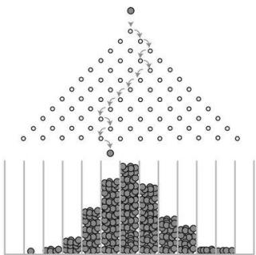
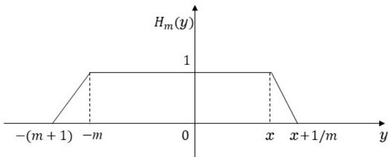
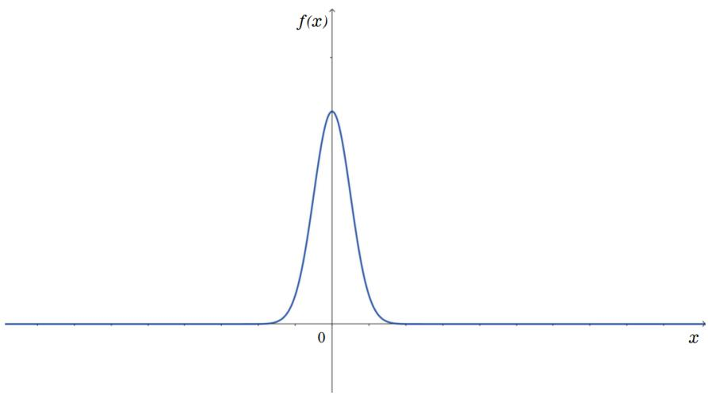
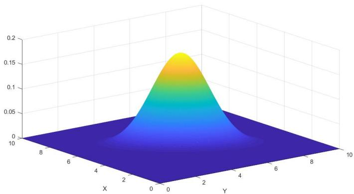

## 4 随机变量

我们已经有了离散概率空间上的随机变量的概念. 本章我们要在一般的概率空间上定义随机变量并研究它们的各种性质.

如果想做某种联想, 把概率空间类比于欧氏空间的话, 那么随机变量就可类比于欧氏空间上的函数: 在数学分析里是连续函数或分段连续函数, 在实变函数里是可测函数. 不过类比于后者更合适一些, 因为定义连续函数首先要有两点是否靠近的概念(f连续是指当x和y 充分靠近时, $f(x)$ 和 $f(y)$ 也充分靠近), 而在概率空间上并没有这个概念; 然而在实变函数中, 主要研究对象是可测函数, 这个不需要有“靠近”的概念, 而只需要“可测”的概念. 概率空间足够支撑起这个概念.

## 4.1 基本概念

我们先从一些一般概念讲起. 设 $S_{1}, S_{2}$ 是两个集合, $f : S_{1} \mapsto S_{2}$ . 对 $A \subset S_{2}$ , 令

$$
f^{- 1}(A) := \{x \in S_{1}: f(x) \in A\},
$$

称为A在 $\cdot f$ 下的原像. 注意原像不是逆映射, 虽然它们常常用同一个记号 $f^{- 1}$ 表示. 逆映射是 $S_{2}$ 到 $S_{1}$ 的映射. 只有当f是单射时, 逆映射才存在, 且定义域为

$$
f(S_{1}) := \{y \in S_{2}: \exists x \in S_{1} \text{使得} y = f(x)\}.
$$

(所以只有当f为满射时, 逆映射的定义域才是整个 $S_{2})$ . 而原像永远都是存在的, 它把 $S_{2}$ 的任意子集映射成 $S_{1}$ 的子集, 大不了是个空集, 而空集也是 $S_{1}$ 的子集. 本书中大部分时间, $f^{- 1}$ 都表示原像; 在表示逆映射的很少部分时间, 我们会加以说明.

原像的一个简单有用的性质是它保持所有的运算关系不变, 见习题1.

设 $\mathcal{S}_{2}$ 是 $S_{2}$ 中的集类. 记

$$
f^{- 1}(\mathcal{S}_{2}) := \{f^{- 1}(A): A \in S_{2}\}.
$$

则 $f^{- 1}(\mathcal{S}_{2})$ 是 $S_{1}$ 中的集类. 由习题1, 当 $\mathcal{S}_{2}$ 本身为 $\sigma -{}$ 代数时, $f^{- 1}(\mathcal{S}_{2})$ 也为 $\sigma -$ 代数. 我们还有命题 4.1.1. 设 $\mathcal{S}_{2}$ 是 $S_{2}$ 中的集类, 则

$$
\sigma(f^{- 1}(\mathcal{S}_{2})) = f^{- 1}(\sigma(\mathcal{S}_{2})).
$$

证明. 由习题1, $f^{- 1}(\sigma(\mathcal{S}_{2}))$ 为σ-代数, 且 $f^{- 1}(\sigma(\mathcal{S}_{2})) \supset f^{- 1}(\mathcal{S}_{2})$ . 所以

$$
f^{- 1}(\sigma(\mathcal{S}_{2})) \supset \sigma(f^{- 1}(\mathcal{S}_{2})).
$$

## 4.1 基本概念

为证反包含, 令

$$
\mathcal{G} := \{A \in \sigma(\mathcal{S}_{2}): f^{- 1}(A) \in \sigma(f^{- 1}(\mathcal{S}_{2}))\}.
$$

易见 $\mathcal{S}_{2} \subset \mathcal{G}$ , 且由习题1易证G为σ-代数. 因此 $\mathcal{G} = \sigma(\mathcal{S}_{2})$ . 所以 $f^{- 1}(\sigma(\mathcal{S}_{2})) \subset \sigma(f^{- 1}(\mathcal{S}_{2}))$ □

在欧氏空间上有一个经典的σ-代数, 称为Borel $\sigma -$ 代数. 我们现在来介绍它. 让我们从最简单的一维情况R开始.

对 $x \in \mathbb{R}, \rho > 0,$ 令

$$
B(x, \rho) := \{y: | y - x | < \rho\},
$$

称为以x为中 $\therefore \dot{L} \rho_{,}$ 为半径的开球.

设 $O \subset$ R. 如果

$$
x \in O \Longrightarrow \exists \rho > 0, \text{使得} B(x, \rho) \subset O,
$$

则O称为开集.

与开集对立的概念是闭集. 一个集合 $C, x \in \mathbb{R}.$ 如果 $\forall \rho \ > \0.$ , 都有C ∩ $B(x, \rho) \ \neq \ \varnothing.$ 称x为C的聚点. 如果C包含它所有的聚点, 则称为闭集. 我们有:

## 命题 4.1.2. C为闭集 ${\Longleftrightarrow} C^{c}$ 为开集.

证明. 设C为闭集. 设 $x \in C^{c}$ , 则x /∈ C且x不是C的聚点. 所以存在 $: \rho > 0$ 使得 $C \cap B(x, \rho) = \emptyset$ 所以 $B(x, \rho) \subset C^{c}$ . 因此Cc是开集.

反之, 设 $C^{c}$ 是开集. 则 $\forall x \in C^{c}$ , 有 $\dot{\rho} > 0$ 使得 $B(x, \rho) \subset C^{c}$ . 因此x不是C的聚点. 因此C包含了它所有的聚点. □

以 $\mathcal{O}$ 表示R上的开集全体, B表示 $\mathcal{O}$ 生成的σ-代数:

$$
\mathscr{B} := \sigma(\mathcal{O}),
$$

称为(一维)Borel $\sigma -$ 代数.

以 ${\mathcal{O}}^{c}$ 表示闭集全体. 由上一命题, 我们有

命题 4.1.3.

$$
\mathcal{B} = \sigma(\mathcal{O}^{c}).
$$

我们注意到 $\forall x \in \mathbb{R}, x$ 是闭集, 所以任意单点集 $\{x\} \in{\mathcal{B}}$

不管开集或者闭集, 其结构都相当复杂. 我们当然希望找到一些结构简单的集合来生成B. 这就是我们下面要做的事情.

$\forall - \infty \leqslant a \leqslant b \leqslant \infty.$ , 以 $(a, b)$ 表示开区间:

$$
(a, b) := \{x \in \mathbb{R}: a < x < b\},
$$

$\Pi_{1}$ 表示所有这样的开区间构成的集类:

$$
\Pi_{1} := \{(a, b): - \infty \leqslant a \leqslant b \leqslant \infty\}.
$$

因为 $\iota(a, b) \cap(c, d) =(a \lor c, b \land d)$ (若a $\lor c \geqslant b \land d,$ 则视为∅), 所以 $\Pi_{1}$ 为 $\pi -$ 类.7

$$
\mathscr{C} := \{B(x, \rho): x \in \mathbb{Q}, \rho \in \mathbb{Q}_{+}\}.
$$

因为Q为可数集, 所以C为可数集.

命题 4.1.4. 设O是开集, 则存在开球 $B_{i}, i \in I$ , 其中I是可数集, 使得

$$
O = \bigcup_{i \in I} B_{i}.
$$

证明. $\forall x \in O$ , 取 $.\rho > 0$ 使得 $B(x, \rho) \subset O$

取 $r \in B(x,{\frac{\rho}{3}}) \cap \mathbb{Q}.$ . 令

$$
B_{x} := B \left(r, \frac{\rho}{2}\right).
$$

则 $x \in B(r, \frac{\rho}{2})$ , 且 $\forall y \in B(r, \frac{\rho}{2})$ 有

$$
| y - x | < \rho.
$$

所以 $\begin{array}{r}{B(r, \frac{\rho}{2}) \subset B(x, \rho) \subset O,} \end{array}$ 且 $\textstyle O = \bigcup_{x \in O} B_{x}$

由于∀x, $B_{x} \in \mathcal{C}$ , 而C为可数集, 所以存在指标集I及开球 $B_{i}, i \in I,$ 使得

$$
\forall x \in O, \exists i \in I, \text{使得} B_{x} = B_{i}.
$$

于是

$$
O = \bigcup_{i \in I} B_{i}.
$$

由此命题, $\mathcal{O} \subset \sigma(\Pi_{1})$ , 因此我们有

$$
\mathcal{B} = \sigma(\Pi_{1}).
$$

仍然对∀ $- \infty$ ⩽ a ⩽ $b < \infty,$ , 以 $(a, b]$ 表示左开右闭的区间

$$
(a, b] := \{x \in \mathbb{R}: a < x \leqslant b\}.
$$

再约定

$$
(a, \infty] :=(a, \infty).
$$

以 $\Pi_{2}$ 表示这样的区间全体:

$$
\Pi_{2} := \{(a, b]: - \infty \leqslant a \leqslant b \leqslant \infty\}.
$$

由于对任意 $a < b, c < d$

$$
(a, b] \cap(c, d] =(a \vee c, b \wedge d],
$$

所以 $\Pi_{2}$ 也为π类.

我们来看看 $\sigma(\Pi_{2})$ 是什么. 由于

$$
(a, b] =(a, b) \bigcup \{b\},
$$

所以 $(a, b] \in{\mathcal{B}}$ , 故 $\sigma(\Pi_{2}) \subset \mathcal{B}$ . 又由于

$$
(a, b) = \bigcup_{n = 1}^{\infty} \left(a, b - \frac{1}{n} \right],
$$

所以

$$
\Pi_{1} \subset \sigma(\Pi_{2}).
$$

## 4.1 基本概念

所以

$$
\mathcal{B} = \sigma(\Pi_{1}) \subset \sigma(\Pi_{2}).
$$

于是

$$
\mathcal{B} = \sigma(\Pi_{2}).
$$

令

$$
\Pi_{3} := \{[a, b]: - \infty \leqslant a \leqslant b \leqslant \infty\}.
$$

这里同样约定 $[- \infty, \infty] =(- \infty, \infty)$ , 等等. 由于 $[a, b]$ 是闭集, 所以

$$
\sigma(\Pi_{3}) \subset \mathcal{B}.
$$

又由于

$$
(a, b) = \bigcup_{n = 1}^{\infty} \left[a + \frac{1}{n}, b - \frac{1}{n} \right],
$$

所以

$$
\sigma(\Pi_{3}) \supset \sigma(\Pi_{1}) = \mathcal{B}.
$$

所以

$$
\sigma(\Pi_{3}) = \mathcal{B}.
$$

再令

$$
\Pi_{4} := \{[a, b): - \infty \leqslant a \leqslant b \leqslant \infty\}.
$$

在±∞处做同样的约定. 和 $\Pi_{2}$ 同样可证

$$
\mathcal{B} = \sigma(\Pi_{4}).
$$

$$
\Pi_{5} = \{(- \infty, a), - \infty < a \leqslant \infty\}.
$$

由于 $\Pi_{5} \subset \Pi_{4}$ , 所以

$$
\Pi_{5} \subset \sigma(\Pi_{4}) = \mathcal{B}.
$$

所以

$$
\sigma(\Pi_{5}) \subset \mathcal{B}.
$$

又

$$
[a, b) =(- \infty, b) -(- \infty, a),
$$

所以

$$
\Pi_{4} \subset \sigma(\Pi_{5}).
$$

因此

$$
\mathcal{B} = \sigma(\Pi_{4}) = \sigma(\Pi_{5}).
$$

令

$$
\Pi_{6} = \{(- \infty, a], - \infty < a \leqslant \infty\},
$$

由于 $\cdot \Pi_{6} \subset \Pi_{2}$ , 于是

$$
\sigma(\Pi_{6}) \subset \mathcal{B}.
$$

又由于

$$
(- \infty, a) = \bigcup_{n = 1}^{\infty} \left(- \infty, a - \frac{1}{n} \right],
$$

所以

$$
\mathcal{B} = \sigma(\Pi_{5}) \subset \sigma(\Pi_{6}).
$$

最后, 令

$$
\Pi_{7} = \{(a, \infty), - \infty \leqslant a < \infty\},
$$

$$
\Pi_{8} = \{[a, \infty), - \infty \leqslant a < \infty\}.
$$

也可证明

$$
\mathcal{B} = \sigma(\Pi_{7}) = \sigma(\Pi_{8}).
$$

下面我们转向多维情形. 我们将主要讨论二维情况, 更高维情况类似.

在R2上, 定义两点 $x =(x_{1}, x_{2}) \varleftrightarrow y =(y_{1}, y_{2})$ 的距离:

$$
d_{1}(x, y) := \sqrt{| x_{1} - y_{1} |^{2} + | x_{2} - y_{2} |^{2}}
$$

及

$$
d_{2}(x, y) := | x_{1} - y_{1} | \vee | x_{2} - y_{2} |.
$$

对 $\cdot x \in \mathbb{R}^{2}, \rho \geqslant 0$ , 相应地可以定义开球

$$
B_{1}(x, \rho) := \{y: d_{1}(x, y) < \rho\}, \quad B_{2}(x, \rho) := \{y: d_{2}(x, y) < \rho\}.
$$

下面的d及B, 既可以是 $d_{1}$ 与 $B_{1}$ , 也可以是 $d_{2}$ 与 $B_{2}$

设 $O \subset \mathbb{R}^{2}$ . 若 $\forall x \in O, \exists \rho > 0.$ 使得 $B(x, \rho) \subset O$ 则O称为开集. 显然, 用两种开球定义 的开集是一样的.

以O表示开集全体. 令

$$
\mathcal{B}^{2} := \sigma(\mathcal{O}),
$$

称为二维Borel $\sigma -$ 代数.

设 $C \subset \mathbb{R}^{2}$ , 若C包含了它全部的聚点, 则称为闭集.

用与一维情况完全一样的方法, 可以证明:

命题 4.1.5. C为闭集 ${\Longleftrightarrow} C^{c}$ 为开集.

因此, 所有闭集 $\in \mathcal{B}^{2}$ . 特别地, $\forall a, b \in \mathbb{R}$ 1

$$
\left\{(x, y) \in \mathbb{R}^{2}: x = a, y \leqslant b \right\}, \left\{(x, y) \in \mathbb{R}^{2}: x \leqslant a, y = b \right\}
$$

均是闭集, 所以也均是Borel集.

同样地, 用与一维情况一样的方法, 可以证明:

命题 4.1.6. 设O为开集, 则存在开球 $B_{i}, i \in I$ , I为可数集, 使得

$$
O = \bigcup_{i \in I} B_{i}.
$$

## 4.1 基本概念

$$
\Pi := \{B: B \text{是开球}\}
$$

则由上一命题有

$$
\mathcal{B}^{2} = \sigma(\Pi).
$$

对A, $B \subset \mathbb{R}.$ , 令

$$
A \times B := \{(x, y) \in \mathbb{R}^{2}: x \in A, y \in B\}.
$$

$$
\Pi_{i}^{2} := \{A \times B: A, B \in \Pi_{i}, i = 1, 2, \dots, 8\}.
$$

具体一点, 即

$$
\Pi_{1}^{2} := \left\{\left(a_{1}, b_{1}\right) \times \left(a_{2}, b_{2}\right), - \infty \leqslant a_{i} \leqslant b_{i} \leqslant \infty, i = 1, 2 \right\},
$$

$$
\Pi_{2}^{2} := \{(a_{1}, b_{1}] \times(a_{2}, b_{2}], - \infty \leqslant a_{i} \leqslant b_{i} \leqslant \infty, i = 1, 2\},
$$

等等.

我们有

命题 4.1.7.

$$
\mathcal{B}^{2} = \sigma(\Pi_{i}^{2}), i = 1, 2, \dots, 8.
$$

证明. $(i) \i = 1 \colon$

因为 $\textstyle | \forall A \in \Pi_{1}^{2}$ , A为开集, 所以 $\mathbf{I}_{1}^{2} \subset \mathcal{B}^{2}$ . 从而 $\sigma(\Pi_{1}^{2}) \subset \mathcal{B}^{2}$

又由命题4.1.6后面的结论, 有

$$
\mathcal{B}^{2} = \sigma(d_{2} \text{意义下的开球}) \subset \sigma(\Pi_{1}^{2}).
$$

所以 $\mathcal{B}^{2} = \sigma(\Pi_{1}^{2})$

(ii) $i ={2, 3, 4} \colon$ 按一维的方法如法泡制.

(iii) $i = 5 \mathrm{:}$ 因为Π $\begin{array}{r}{\mathrm{I}_{5}^{2} \subset \Pi_{4}^{2},} \end{array}$ , 所以 $\sigma(\Pi_{5}^{2}) \subset \sigma(\Pi_{4}^{2}) \subset \mathcal{B}^{2}$

反之, $\forall a_{1}$ $a_{2}, b_{1}$ ⩽ $b_{2}$ , 有

$$
\begin{array}{rcl}[a_{1}, a_{2}) \times[b_{1}, b_{2}) & = & \big[(- \infty, a_{2}) \times(- \infty, b_{2}) -(- \infty, a_{1}) \times(- \infty, b_{2}) \big] \\ & & - \big[(- \infty, a_{2}) \times(- \infty, b_{1}) -(- \infty, a_{1}) \times(- \infty, b_{1}) \big], \end{array}
$$

所以Π24 $\subset \sigma(\Pi_{5}^{2})$ . 于是

$$
\mathcal{B}^{2} = \sigma(\Pi_{4}^{2}) \subset \sigma(\Pi_{5}^{2}).
$$

剩下几种情况和一维相应情况的证明类似.

一般地, 对任意 $n \in \mathbb{N}_{+ +}$ , 以 ${\mathcal{B}}^{n}$ 表 ${\overline{{\overline{{\prime}}}}}{\overline{{\mathrm{J}}}}{\cdot}{n -}$ 维Borel $\sigma -{}^{\prime}$ 代数. 有了Borel $\sigma{-} \nmid \mathrm{\Lambda}$ 数的概念, 就有了Borel可测函数的概念.

定义 4.1.8. 设 $f : \mathbb{R}^{n} \mapsto \mathbb{R}^{m}$ . 若

$$
f^{- 1}(B) \in \mathcal{B}^{n}, \forall B \in \mathcal{B}^{m},
$$

则称 $; f$ 为Borel可测函数, 简称Borel函数.

上述定义中的条件常常简记为

$$
f^{- 1}(\mathcal{B}^{m}) \subset \mathcal{B}^{n}.
$$

Borel函数复合Borel函数仍然是Borel函数, 即我们有下面的

命题 4.1.9. 设φ : Rn 7→ Rm及 $\boldsymbol{\cdot} \boldsymbol{\psi}$ : Rm 7→ Rl均为 Borel函数, 则 $\psi \circ \varphi : \mathbb{R}^{n} \mapsto \quad$ Rl也为 $Borela3 \mathrm{:}$ 数.

证明. 设 $A \in \mathcal{B}^{l}$ , 则 $\psi^{- 1}(A) \in{\mathcal{B}}^{m}$ , 因此

$$
(\psi \circ \varphi)^{- 1}(A) = \varphi^{- 1}(\psi^{- 1} A) \in \mathcal{B}^{n}.
$$

我们可以简化验证一个函数是Borel函数的手续. 首先我们有:

命题 4.1.10. 设C是Rm的某些子集构成的集类, 且 $.\sigma(\mathcal{C}) = \mathcal{B}^{m}$ . 则 $\varphi : \mathbb{R}^{n} \mapsto \mathbb{R}^{m}$ 是 $Borela3 \mathrm{:}$ 数的充要条件是 $\varphi^{- 1}(\mathcal{C}) \subset \mathcal{B}^{n}$

我们知道有很多这样的集类. 例如可取C为开集全体, 或者闭集全体, 或者以及上面所定义的 Πmi , $i = 1, \cdots, 8,$ 等等.

证明. 必要性显然, 往证充分性.

证法一. 令

$$
\mathscr{G} := \{A \in \mathscr{B}^{m}: \varphi^{- 1}(A) \in \mathscr{B}^{n}\}.
$$

则G 为σ-代数, 且 ${\mathcal{G}} \supset{\mathcal{C}}$ . 所以

$$
\mathcal{B}^{m} = \sigma(\mathcal{C}) \subset \mathcal{G} \subset \mathcal{B}^{m}.
$$

证法二. 因为 $\varphi^{- 1}(\mathcal{C}) \subset \mathcal{B}^{n}$ , 因此σ $(\varphi^{- 1}(\mathcal{C})) \subset \mathcal{B}^{n}$ . 由命题4.1.1有

$$
\varphi^{- 1}(\mathcal{B}^{m}) = \varphi^{- 1}(\sigma(\mathcal{C})) = \sigma \left(\varphi^{- 1}(\mathcal{C})\right) \subset \mathcal{B}^{n}.
$$

由此我们推得:

推论 $\mathbf{4.1.11.} \varphi =(\varphi_{1}, \cdot \cdot \cdot, \varphi_{m})$ : Rn 7→ Rm为Borel函数的充要条件是每个 $\cdot \varphi_{i}, i = 1, 2, \cdot \cdot \cdot, m$ 2 都是Borel函数.

证明. 必要性显然.(见第三章第二节习题5.) 至于充分性, 若每个 $\varphi_{i}$ 都是Borel函数, 则

$$
\varphi_{i}^{- 1}((- \infty, a_{i}]) \in \mathcal{B}^{n}, \forall i = 1, 2, \dots, m.
$$

所以,

$$
\varphi^{- 1} \left(\prod_{i = 1}^{m}(- \infty, a_{i}]\right) = \bigcap_{i = 1}^{m} \varphi_{i}^{- 1}((- \infty, a_{i}]) \in \mathscr{B}^{n}.
$$

再用上一命题即完成证明.

## 4.1 基本概念

有了这个结果, 很多命题的证明往往退化到只需对数值Borel函数证明.

数值Borel函数包含了哪些函数呢? 首先, 它包含了连续函数, 即我们有:

命题 4.1.12. 设 $\boldsymbol{\cdot} \varphi$ : Rn 7→ R连续, 则 $\varphi$ 为Borel函数.

证明. 设 $A \subset$ R为开集, 则 $\varphi^{- 1}(A)$ 也为开集, 因而为Borel集. 再用命题 4.1.10即可. □

其次, 对任何一个Rn上的Borel集 $A \in{\mathcal{B}}^{n}$ , 其示性函数

$$
f(x) := 1_{A}(x)
$$

显然也是Borel函数.

设 $a_{1}, \cdots, a_{k} \in$ R, $A_{1}, \cdots, A_{k} \in{\mathcal{B}}^{n}$ . 由于 $(y_{1}, \cdot \cdot \cdot, y_{k}) \mapsto a_{1} y_{1} + \cdot \cdot \cdot + a_{k} y_{k}$ 为连续函数,所以函数

$$
\varphi(x_{1}, \dots, x_{n}) := \sum_{i = 1}^{k} a_{i} 1_{A_{i}}(x_{1}, \dots, x_{n})
$$

也为Borel函数. 这样的函数结构简单, 因此称为简单Borel函数.

并不是所有的Borel函数都是简单Borel函数, 当然. 不过, 简单Borel函数却可以逼近任何Borel函数. 这是一个非常有用的结果, 其精确叙述如下:

命题 4.1.13. 设f为Rn上的数值Borel函数, 则存在一列简单Borel函数 $f_{k},$ 使得

$$
\lim_{k \to \infty} f_{k}(x) = f(x) \forall x \in \mathbb{R}^{n}.
$$

证明. 设 $f \geqslant 0$ . 令

$$
f_{k}(x) := \sum_{i = 0}^{2^{2k} - 1} i2^{- k} 1_{f \in[i2^{- k},(i + 1) 2^{- k})} + 2^{k} 1_{f \geqslant 2^{k}}.
$$

易证 $f_{k}$ 满足要求. 一般地, 令

$$
f_{k} := f_{k}^{+} - f_{k}^{-}
$$

即可, 这里f+、f−分别表示f的正部与负部.

将定义4.1.8中的出发地 $(\mathbb{R}^{m}, \mathcal{B}^{m})$ 换为概率空间 $(\Omega,{\mathcal{F}}, P)$ 中的 $(\Omega,{\mathcal{F}})$ , 再取 $n = 1$ , 就得到随机变量的定义. 不过为方便起见, 我们允许随机变量取 $\pm \infty$ 值.

定义 4.1.14. 函数 $\xi : \Omega \mapsto$ R¯ $\mathrel{\mathop :} =[- \infty, + \infty]$ 若满足

$$
\xi^{- 1}(A) := \{\omega : \xi(\omega) \in A\} \in \mathscr{F}, \forall A \in \mathscr{B},
$$

则称为随机变量; 若进一步有 $P(| \xi | = \infty) = 0($ (或等价地, $| \xi | < \infty \a.s.\j$ , 则称为实值随机变量.

既然随机变量可以取 $\infty,$ 那么就不可避免地会碰到涉及 $\infty$ 的运算. 在此我们规定：

$$
(+ \infty) +(+ \infty) = + \infty,(- \infty) +(- \infty) = - \infty,(+ \infty) -(- \infty) = + \infty,(- \infty) -(+ \infty) = - \infty,
$$

对任何有限数a,

$$
a +(\pm \infty) = \pm \infty, a -(\mp \infty) = \pm \infty,(\pm \infty) \pm a = \pm \infty
$$

对任意 ${\bf \dot{\boldsymbol{a}}} > 0.$ 及 $a = + \infty$ ,

$$
a(\pm \infty) = \pm \infty,
$$

对任意 $\cdot a < 0$ 及 $a = - \infty$ 2

$$
a(\pm \infty) = \mp \infty.
$$

而下列运算被认为是无意义的：

$$
\pm \infty +(\mp \infty), \pm \infty -(\pm \infty), \mp \infty -(\mp \infty), 0 \times(\mp \infty).
$$

多维随机变量可类似定义:

定义 4.1.15. 函数ξ : Ω 7→ R¯ n若满足

$$
\xi^{- 1}(A) := \{\omega : \xi(\omega) \in A\} \in \mathcal{F}, \forall A \in \mathcal{B}^{n},
$$

则称为n-维随机变量.

我们注意到, 在随机变量的定义中, P是不起作用的. 此外, 我们有下面的等价性条件:

命题 4.1.16. 设 ${\boldsymbol{\xi}} =(\xi_{1}, \cdots, \xi_{n})$ 为 $\Omega \mapsto \mathbb{R}^{n}$ . 则下列条件等价:

(i) ξ为n-维随机变量;

(ii) ∀开集 $O, \xi^{- 1}(O) \in \mathcal{F}_{:}$

(iii) 存在 $i \in \{1, \cdots, 8\}$ , 使得

$$
\xi^{- 1}(A) \in \mathscr{F}, \forall A \in \Pi_{i}^{n}.
$$

证明. 只需注意

$$
\mathcal{B}^{n} = \sigma(\mathcal{A}_{1}) = \sigma(\mathcal{A}_{2}),
$$

其中 $\mathcal{A}_{1}, \mathcal{A}_{2}$ 分别是(ii), (iii)中的集类(见第三章第二节习题5), 由命题4.1.1立得.

有了这个结果, 我们就很容易地知道, 判断一个多维函数是不是随机变量, 只要看各个分量即可. 即我们有:

命题 $\mathbf{1.1.17.} \ \xi =(\xi_{1}, \cdot \cdot \cdot, \xi_{n})$ 是n-维随机变量的充要条件是: 对任意 $i, \xi_{i}$ 是随机变量.

证明留作习题.

在数学分析里我们经常碰到复合函数, 即函数的函数. 同理, 在概率论中我们也需要考虑随机变量的函数. 设ξ是随机变量, φ : R 7→ R, 比如考虑 $\varphi(\xi)$ . 问题是: $\varphi(\xi)$ 是否还是一个随机变量? 下面的结果回答了这个问题.

命题 4.1.18. 设ξ是 $.n \cdot$ 维随机变量, $\varphi : \mathbb{R}^{n} \mapsto \mathbb{R}^{m}$ 为Borel函数, 则 $\varphi(\xi)$ 为m-维随机变量.

证明. 设 $A \in \mathcal{B}(\mathbb{R}^{m})$ . 由于 $\varphi$ 是Borel函数, 所以 $\varphi^{- 1}(A) \in{\mathcal{B}}(\mathbb{R}^{n})$ . 因此

$$
[\varphi(\xi)]^{- 1}(A) = \xi^{- 1}(\varphi^{- 1}(A)) \in \mathcal{F}.
$$

故 $\dot{\varphi}(\xi)$ 是随机变量.

习题

## 4.1 基本概念

1. 证明原像保持所有的运算关系不变, 即

(a)

$$
f^{- 1} \left(\bigcup_{i \in I} A_{i}\right) = \bigcup_{i \in I} f^{- 1}(A_{i});
$$

(b)

(c)

$$
f^{- 1} \left(\bigcap_{i \in I} A_{i}\right) = \bigcap_{i \in I} f^{- 1}(A_{i});
$$

$$
f^{- 1}(A \setminus B) = f^{- 1}(A) \setminus f^{- 1}(B);
$$

(d)

$$
A \subset B \Longrightarrow f^{- 1}(A) \subset f^{- 1}(B),
$$

等等.

2. $i \mathcal{\frac{\pi}{\chi}} \varphi : \mathbb{R}^{m} \mapsto \mathbb{R}^{n}$ 为连续函数. 证明 $\varphi$ 为Borel函数.

3. 设 $\varphi$ : R 7→ R为单调函数. 证明 $\varphi_{\cdot}$ 为Borel函数.

4. 设 $\forall n = 1, 2, \cdots, \xi_{n}$ 是随机变量, $A_{n} \in{\mathcal{F}}$ , 且 $\left\{A_{n} \right\}$ 构成Ω的一个分割. 令

$$
\xi(\omega) := \sum_{n = 1}^{\infty} \xi_{n}(\omega) 1_{A_{n}}(\omega).
$$

证明ξ是随机变量.

5. 设 $f : \mathbb{R}^{n} \mapsto \mathbb{R}^{m}$ . 证明下列两条件均为 $\mid f \rangle$ 是Borel函数的等价条件:

(a) 对任意开集 $O \subset \mathbb{R}^{m}, f^{- 1}(O) \in{\mathcal{B}}^{n}$

(b) 对任意闭集 $C \subset \mathbb{R}^{m}, f^{- 1}(C) \in \mathcal{B}^{n}$

6. 设 $f _ { n } : \mathbb { R } ^ { m } $ R为Borel函数. 证明

(a)

$$
\liminf_{n} f_{n}, \limsup_{n} f_{n}
$$

均为Borel函数.

(b)

$$
\{x: \lim_{n} f_{n}(x) \text{存在}\} \in \mathcal{B}^{m}.
$$

7. 设 $f : \mathbb{R}^{n} \mapsto \mathbb{R}^{m}$ 为连续函数. 证明它为Borel函数.

8. 设 $\xi_{1}, \xi_{2}, \cdots$ 为随机变量, 证明下面的量均是随机变量:

(a) $\begin{array}{r}{\eta_{n} : = \operatorname{max}_{1 \leqslant i \leqslant n} \xi_{i}, \eta : = \operatorname{sup}_{i \geqslant 1} \xi_{i};} \end{array}$

(b) $\begin{array}{r}{\zeta_{n} : = \operatorname{min}_{1 \leqslant i \leqslant n} \xi_{i}, \zeta : = \operatorname{inf}_{i \geqslant 1} \xi_{i};} \end{array}$

(c) $\begin{array}{r}{\theta : = \operatorname{lim} \operatorname{sup}_{n \to \infty} \xi_{n}, \gamma : = \operatorname{lim} \operatorname{inf}_{n \to \infty} \xi_{n}.} \end{array}$

(d) $\alpha \xi_{1} + \beta \xi_{2}, \xi_{1} \xi_{2}$

(e)

$$
\eta := \left\{\begin{array}{ll} \xi_{1} / \xi_{2}, & \xi_{2} \neq 0, \\ 0, & \xi_{2} = 0.\end{array} \right.
$$

## 4.2 分布函数

设ξ是实值随机变量. 对 ${\mathbf{}} A \in{\mathcal{B}},$ 由 ${F} \xi^{- 1}(A) \in{\mathcal{F}}$ , 所以 $P(\xi^{- 1}(A))$ 是有意义的. 因此可定义

$$
\mu(A) := P(\xi^{- 1}(A)).
$$

易证 $\dot{:} \mu$ 是 $(\mathbb{R}, \mathcal{B})$ 上的概率, 因此 $(\mathbb{R}, \mathscr{B}, \mu)$ 是概率空间. $\mu^{;}$ 称为ξ的概率分布, 因为它反映 $\vec{J} \boldsymbol{\xi}$ 的值是依什么概率分布的.

对实值随机变量 $\therefore \xi,$ 定义其分布函数为

$$
F_{\xi}(x) := P(\xi \leqslant x).
$$

在不发生混淆的情况下, 往往简写为F. 分布函数和概率分布的关系是：

$$
F(x) = \mu((- \infty, x]).
$$

我们有:

命题 4.2.1. 任意一个实值随机变量的分布函数F都具有下列性质:

(i) $F : \mathbb{R} \mapsto[0, 1],$ ;

(ii) F单调上升且右连续, 有左极限；

(iii)

$$
F(- \infty) := \lim_{x \to - \infty} F(x) = 0,
$$

$$
F(\infty) := \lim_{x \to \infty} F(x) = 1.
$$

证明. (i)显然.

(ii). 设 $x < y$ , 则

$$
F(y) - F(x) = P(\xi \leqslant y) - P(\xi \leqslant x) = P(x < \xi \leqslant y) \geqslant 0.
$$

∀x. $\forall n,$ 当x ⩽ $y < x + n^{- 1}$ 时,

$$
0 \leqslant F(y) - F(x) \leqslant F(x + n^{- 1}) - F(x) = P(\xi \in(x, x + n^{- 1}])
$$

而

$$
P(\xi \in(x, x + n^{- 1}]) \downarrow P(\xi \in \emptyset) = 0, n \to \infty.
$$

所以

$$
\lim_{y \downarrow x} F(y) = F(x).
$$

而当y ↑ x时, $F(y)$ ↑且 $F(y) \leqslant F(x)$ . 所以 $F(x -) : = \operatorname{lim}_{y \uparrow x} F(y)$ 存在.

(iii) 因为F单调, 所以 $F(- \infty){\stackrel{}{\to}} F(\infty)$ 均存在, 且

$$
F(- \infty) = \lim_{n \to \infty} F(- n) = \lim_{n \to \infty} P(\xi \leqslant - n) = P(\xi = - \infty) = 0,
$$

$$
F(\infty) = \lim_{n \to \infty} F(n) = \lim_{n \to \infty} P(\xi \leqslant n) = P(\xi < \infty) = 1.
$$

任何满足上面命题中这几条性质的函数, 可以脱离于随机变量, 也称为分布函数.

设 ${\bf \nabla} \cdot \mu^{-}$ 是 $(\mathbb{R}, \mathcal{B})$ 上的概率, 定义

$$
F(x) := \mu((- \infty, x]),
$$

则F是分布函数,称为 $\boldsymbol{{\vert \mu}}$ 的分布函数；反之,设F是分布函数,则有唯一一个概率 $\cdot \mu,$ 使得 $F_{\mathrm{1}}$ 是 $\mathbf{\nabla} \cdot \mu$ 的分布函数. 这里 $.\mu$ 的存在性我们就不证 $\vec{J}$ , 可见于许多实变函数或实分析方面的教材; 可以证明 $\mu$ 是由F唯一决定的, 即我们有

命题 4.2.2. 设 $\mu, \nu^{\ominus}(\mathbb{R}^{m}, \mathcal{B}^{m})$ 上的两个概率. 若

$$
\mu((- \infty, a]) = \nu((- \infty, a]) \forall a \in \mathbb{R}^{m},
$$

则 $\mu \equiv \nu.$

证明. 令

$$
\mathscr{G} := \{A \in \mathscr{B}: \mu(A) = \nu(A)\}.
$$

则易证G 为λ-类; 但G 又包含 $\scriptstyle{\overline{{\int \pi}}} -$ -类

$$
\Pi := \left\{\left(- \infty, a \right], a \in \mathbb{R}^{m} \right\},
$$

所以由π − λ定理,

$$
\mathcal{G} \supset \sigma(\Pi) = \mathcal{B}.
$$

因此, (R,B)上的概率和R上的分布函数是一一对应的. 如果随机变量 $\cdot \xi, \eta$ 的概率分布一样, 我们称ξ, η同分布. 显然, 这等价于ξ, η的分布函数是一样的.

## 习题

1. 设ξ是实值随机变量. 证明ξ的概率分布是 $(\mathbb{R}, \mathcal{B})$ 上的概率.

2. 设 $\xi, \eta$ 是定义在概率空间 $(\Omega,{\mathcal{F}}, P)$ 上的随机变量. 证明 $\xi + \eta, - \xi, \xi^{2}, | \xi |, \xi^{+}, \xi^{-}$ , ξη也是随机变量.

3. 定义在同一概率空间上的两个随机变量ξ,η如果满足:

$$
P(\omega : \xi(\omega) = \eta(\omega)) = 1,
$$

则称为ξ与 $\eta \varPi$ 乎必然相等, 记 $\sharp \xi = \eta \ : \mathrm{a.s}$ . 或 p.s. (a.s. 是英语almost surely的缩 $\Xi, \mathrm{p.s.}$ 是法语 presque sˆurement的缩写. ) 证明: 若 $\xi = \eta \mathrm{a.s.}$ ., 则 $F_{\xi} = F_{\eta}$

4. 举例说明存在两个随机变量ξ, η, 使得 $\forall \omega, \xi(\omega) \neq \eta(\omega)$ , 但 $F_{\xi} = F_{\eta}$

5. 设ξ为随机变量, F为其分布函数.

(a) 令

$$
A := \{x: P(\xi = x) > 0\}.
$$

证明A最多有可数个元素.

(b) 令

$$
B = \{x: F(x) - F(x -) > 0\}.
$$

证明A = B.

(c) 证明

$$
P(\xi < x) = F(x -), P(\xi = x) = F(x) - F(x -).
$$

6. $\forall - \infty$ ⩽ $y < x \leqslant \infty$

$$
F(x) - F(y) = P(\xi \in(y, x]),
$$

$$
F(x) - F(y -) = P(\xi \in[y, x]),
$$

$$
F(x -) - F(y -) = P(\xi \in[y, x)),
$$

$$
F(x -) - F(y) = P(\xi \in(y, x)).
$$

7. 设 $\begin{array}{r}{A = \sum_{i = 1}^{\infty}(y_{i}, x_{i}]} \end{array}$ , 则

$$
\sum_{i = 1}^{\infty}[F(x_{i}) - F(y_{i})] = P(\xi \in A).
$$

## 4.3 分类

根据分布函数的性质, 可将随机变量分为离散型随机变量、连续型随机变量. 当然, 也有既非离散亦非连续的随机变量, 但本课程不涉及其具体例子.

如果随机变量ξ的值域为可数集 $\{x_{1}, x_{2}, \cdot \cdot \cdot\}$ , 则称为离散型随机变量, 其分布函数 $F(x)$ 称为离散型分布. 此时有 $\Delta F(x_{i}) : = F(x_{i}) - F(x_{i} -) > 0$ , 其中 $F(x -)$ 是F 在x的左极限. 我们称 $\{(x_{k}, p_{k}), k = 1, 2, \cdot \cdot \cdot\}$ 为ξ的分布列, 其中

$$
P(\xi = x_{k}) = p_{k}.
$$

注意! 我们这里认为 $x_{1}, x_{2}, \cdots$ 中没有相同的, 即

$$
x_{i} \neq x_{j}, \forall i \neq j.
$$

如果出现了重复的, 则必须把它们看成是一个点, 且将相应的概率加起来. 比如说, 如果随机变量 $\cdot \xi$ 的取值为 $\begin{array}{r}{x_{1}, x_{2}, x_{3},} \end{array}$ 但 $x_{1}, x_{2}, x_{3}$ 并不是两两互异的, 而是

$$
x_{1} = 0, x_{2} = 1, x_{3} = 0.
$$

且

$$
P(\xi = x_{1}) = \frac{1}{2}, P(\xi = x_{2}) = \frac{1}{4}, P(\xi = x_{3}) = \frac{1}{4},
$$

## 4.3 分类

则分布列似乎应为:

$$
\left\{\left(0, \frac{1}{2}\right), \left(1, \frac{1}{4}\right), \left(0, \frac{1}{4}\right) \right\}.
$$

但这样写只会引起混乱, 让你不知道 $P(\xi = 0)$ 的概率到底是多少. 所以要合并同类项, 写成

$$
\left\{\left(0, \frac{3}{4}\right), \left(1, \frac{1}{4}\right) \right\}.
$$

分布列包含ξ的可能取值 $x_{1}, x_{2}, \cdots$ 和分别取这些值的概率 $: p_{1}, p_{2}, \cdots$ 两方面的信息. 显然,

$$
p_{k} > 0, \forall k \geqslant 1, \text{且} \sum_{k} p_{k} = 1.
$$

反之, 对所有满足上面两个性质的 $\begin{array}{r}{p_{k},} \end{array}$ 结合一个可列点集 $\{x_{1}, x_{2}, \cdot \cdot \cdot\}$ , 都可以构造一个概率空间和定义在其上的随机变量ξ, 使得它以 $\{(x_{k}, p_{k}), k = 1, 2, \cdot \cdot \cdot\}$ 为分布列.

设ξ的分布列为 $\{(x_{k}, p_{k}), k = 1, 2, \cdot \cdot \cdot\}$ , 那么其分布函数为

$$
F(x) = \sum_{k: x_{k} \leqslant x} p_{k},
$$

所以由分布列可以唯一地确定分布函数. 反之, 若ξ为离散分布, 值域为 $\{x_{k}\}$ , 分布函数为F.则

$$
p_{k} = P(\xi = x_{k}) = F(x_{k}) - F(x_{k} -).
$$

因此 $\{(x_{k}, p_{k})\}$ 为分布列. 所以由分布函数也可唯一地确定分布列.

因此我们得到:

命题 4.3.1. 对离散分布而言, 分布函数和分布列是相互唯一确定的.

直观上, 离散型分布函数是一个阶梯函数. 但因为可列集 $\{x_{1}, x_{2}, \cdot \cdot \cdot\}$ 的结构可以非常复杂, 所以对应的分布函数也可以非常复杂, 见例2.9.

我们来看几个离散型分布的重要例子.

1. Bernoulli分布.

设 ${\boldsymbol{p}} \in(0, 1)$ . 若ξ的分布函数为

$$
F(x) = \left\{\begin{array}{ll} 0, & x < 0, \\ q, & 0 \leqslant x < 1, \\ 1, & x \geqslant 1, \end{array} \right.
$$

$q : = 1 - p,$ 则称ξ服从参数为p的Bernoulli分布, 记为ξ $\sim B(p)$ . 此时ξ的分布列为

$$
(0, q),(1, p).
$$

2. 二项分布

设 $p \in(0, 1), q : = 1 - p$ . 若ξ的分布列为 $\{(k, p_{k}), k = 0, \cdot \cdot \cdot, n\}$ , 其中

$$
p_{k} := C_{n}^{k} p^{k} q^{n - k},
$$

则称ξ服从二项分布, 记为ξ $\mathbf{\chi} \sim B(n, p)$

显然, $B(1, p) = B(p)$

3. Poisson分布.

设 $\lambda > 0$ 若ξ的分布列为 $\{(k, p_{k}), k = 0, 1, \cdot \cdot \cdot\}$ , 其中

$$
p_{k} := \frac{\lambda^{k}}{k !} e^{- \lambda},
$$

则称ξ服从Poisson分布, 记为 $\xi \sim P(\lambda)$

4. $\textstyle \prod_{i}$ 何分布.

设 $p \in(0, 1), q : = 1 - p.$ 若ξ的分布列为 $\{(k, p_{k}), k = 1, 2, \cdot \cdot \cdot\}$ , 其中

$$
p_{k} := pq^{k - 1},
$$

则称ξ服从几何分布, 记为ξ $\F \sim Ge(p)$

设F是随机变量 $\cdot \xi$ 的分布函数. 令

$$
A := \{x: \Delta F(x) := F(x) - F(x -) > 0\}.
$$

由上一节的习题, ξ是离散型随机变量的充要条件是

$$
\sum_{x \in A} \Delta F(x) = 1.
$$

此时ξ的值域即A.

与此对立的情况是A为空集, 此时F是连续函数. 在这种情况中, 有一种更加特别也更加引人注目的情况, 即 $F_{\mathrm{:}}$ 是绝对连续函数, 亦即它可以表示为某个可积函数的不定积分. 我们给这些随机变量一个名字.

定义 4.3.2. 如果随机变量 $\cdot \xi$ 的分布 $i \vec{\Sigma}_{I}$ 数 $F(x)$ 满足

$$
F(x) = \int_{- \infty}^{x} p(t) dt, \forall x \in \mathbb{R},\tag{3.1}
$$

其中 $p$ 是非负Riemann1可积函数 $,^{2}$ 则称 $F(x)$ 为连续型分布, $\xi$ 为连续型随机变量, $p.$ 为ξ的或F的密度函数(或分布密度), 简称为密度.

注1. 本书涉及到的密度函数都是分段连续函数, 所以都是Riemann可积的.

注2. 在p的连续点上, 有 $\mathbf{\dot{\theta}}_{p}(x) = F^{\prime}(x)$ . 所以在这些点上, p由F唯一确定.

注3. 显然, 改变函数 $\lceil p \rceil$ 在有限个点上的值并不会影响等式 $(3.1);$ 更进一步, 学了实变函数后就知道, 在任何一个Lebesgue零测集上改变p的值都不会影响这个等式, 所以密度函数 $\lceil p \rceil$ 不是“绝对唯一的”, 而只是在几乎处处相等意义下的唯一.

注4. 密度函数的直观意义是：当 $b - a > 0$ 很小, $x \in[a, b]$ 且x是p的连续点时, 有

$$
P(\xi \in[a, b]) \approx p(x)(b - a).
$$

这里之所以强调 $x_{\ast}$ 是p的连续点, 是因为p在任意一个单点上的值都是可以随意改变的, 因此可以取一个与ξ毫无关系的值; 但如果限定 $i p^{j}$ 在x处连续, 则 $| p(x)$ 便唯一确定, 无法改变了.

## 4.3 分类

显然, 密度函数满足

$$
\int_{- \infty}^{\infty} p(x) dx = 1;
$$

而有必要时在有限个点上改变p的值, 我们还可以假定——我们将总是这样假定——它满足

$$
p(x) \geqslant 0, \forall x \in \mathbb{R}.
$$

反之, 给定满足上面两个性质的函数 $\lceil p.$ , 总可以通过等式(3.1)定义函数 $F.$ , 且F为一连续型分布函数.

所以, 如果哪个人声称p是某随机变量的密度函数, 那么他必须说明p满足上面两条性质,否则就是瞎说.

我们来看几个连续型分布的例子.

## 1. 指数分布

小星星, 眨眼睛, 你是什么小精灵? 设小星星在遥远的深空眨着眼睛, 小朋友在地面捕捉它们. 假设他在两个不同的时间段内捕捉到多少颗星星的事件是相互独立的, 且捕捉到多少星星的概率只与时间的长度有关,而与具体的起止点无关. 我们想知道他为捕捉到第一个星星需要等待的时间的概率分布.

若以 $\xi(t)$ 记在 $\cdot[0, t)$ 内捕捉到的星星颗数, 那么 $\xi(s + t) - \xi(t)$ 就是 $\textstyle{\left.{\mathbb{E}}[t, t + s) \right.}$ 内捕捉到的星星数. 注意这里假设的两个特征用数学语言表达出来就是:

(i) ∀k $\in \mathbb{N}_{+ +}, \forall 0 = t_{0} < t_{1} < t_{2} < \cdots < t_{k}, n_{1}, n_{2}, \cdots, n_{k} \in N_{+}$ , 事件

$$
\{\xi(t_{i}) - \xi(t_{i - 1}) = n_{i}\}, i = 1, 2, \dots, k
$$

相互独立.

(ii) ∀m, $P(\xi(s + t) - \xi(t) = m)$ 只与s有关而与t无关.

我们将第一个特征称为独立增量性, 而把第二个特征称为平稳性.

现在我们对找到第一颗星星的时间感兴趣. 以 $A(s, t)$ 记[s, t) 内没有捕捉到任何星星这个事件. 即

$$
A(s, t) := \{\xi(t) - \xi(s) = 0\}.
$$

则

$$
A(0, s + t) = A(0, s) A(s, s + t), \forall s, t \geqslant 0.
$$

$$
\varphi(s, t) := P(A(s, t)).
$$

则由独立增量性有 $\varphi(0, s + t) = \varphi(0, s) \varphi(s, s + t)$ , 而由平稳性有 $\varphi(s, s + t) = \varphi(t)$ . 因此, 若令 $\cdot \varphi(t) : = \varphi(0, t)$ , 则有

$$
\varphi(s + t) = \varphi(s) \varphi(t).
$$

于是由后面的引理知存在λ ⩾ 0使得

$$
\varphi(t) = e^{- \lambda t}.
$$

因此

$$
P(A(0, t)) = e^{- \lambda t}.
$$

这就是说, 若以 $\tau_{1}$ 表示捕捉到第一个星星的时刻, 那么

$$
P(\tau_{1} \geqslant t) = e^{- \lambda t}.
$$

于是

$$
P(\tau_{1} > t) = \lim_{n \to \infty} P(\tau \geqslant t + n^{- 1}) = e^{- \lambda t}.
$$

从而

$$
P(\tau_{1} \leqslant t) = 1 - e^{- \lambda t}.
$$

所以 $\mathcal{\tau}_{1}$ 的分布是一个连续型分布, 相应的密度函数为

$$
p(t) = \left\{\begin{array}{ll} \lambda e^{- \lambda t}, & t \geqslant 0, \\ 0, & t < 0.\end{array} \right.
$$

称为参数为λ的指数分布, 记为 $E(\lambda)$ .

我们还要陈述以下事实:

记 $\boldsymbol{\cdot} \boldsymbol{\tau}_{2}$ 为捕捉到第二个星星的时刻. 由于是重新开始了捕捉, 所以 $\tau_{2} - \tau_{1}$ 与 $\tau_{1}$ 独立,且与 $\tau_{1}$ 同分布. 依次下去, 设 $\tau_{n}$ 时捕捉到第 $n$ 个星星的时刻, 则 $\tau_{n} - \tau_{n - 1}$ 与 $\tau_{1}$ 同分布, 且

$$
\tau_{1}, \tau_{2} - \tau_{1}, \dots, \tau_{n} - \tau_{n - 1}, \dots
$$

相互独立.

这些事实的严格证明需要用到更深刻随机过程理论, 超出了本课程的范围, 这里可先从直观上理解. 不过这里还是建议大家不妨思考一下, 到底需要什么样的理论才能给出它们的严格证明, 也许你能自己琢磨出些道道, 甚至建立一点理论, 创造出几个工具?——这比你想也不想直接去读别人的东西可能会有用一些, 你所受到的训练也可能会多一些, 毕竟任何理论和工具都是人创建的, 不是天上掉下来的.

那么, $\tau_{n}$ 服从什么分布? 这也是一个目前对我们稍难的问题, 但后面我们会知道, 通过以上几条性质的确是可以求出 $\tau_{n}$ 的分布的.

注意, 若天上根本没有星星, 那么 $.\varphi \equiv 1$ , 这对应着 $\lambda = 0$ 的情况.

作为推导指数分布的引子, 我们取了找星星的小朋友作为例子. 但事实上这个模型适用于一切与排队等待有关的问题. 比如说网店的客服平台接到第一个电话的时间, 地铁站第一个到来的乘客的时间, 保险公司收到的第一份保单的时间, 去银行排队需要等待的时间等等,大体上都是服从指数分布的.

现在我们证明前面提到的引理.

引理 4.3.3. 设 $\varphi : \mathbb{R}_{+} \mapsto \mathbb{R}_{+}$ 单调下降, 且满足 $\cdot \varphi(s + t) = \varphi(s) \varphi(t), \forall s, t > 0$ . 则存在 $\mathcal{A} \geqslant \mathrm{{C}}$ 使得

$$
\varphi(t) = e^{- \lambda t}, \forall t \geqslant 0.
$$

证明. 对任意 $m, n \in \mathbb{N}_{+ +}$ 有

$$
\varphi \left(\frac{n}{m}\right)^{m} = \varphi(n) = \varphi(1)^{n}.
$$

## 4.3 分类

所以

$$
\varphi \left(\frac{n}{m}\right) = \varphi(1)^{\frac{n}{m}}.
$$

因此, 令 $\varphi(1) = a$ , 则有

$$
\varphi(r) = a^{r}, \forall r \in \mathbb{Q}_{+}.
$$

由于 $\varphi.$ 单调下降, 故 $.a \leqslant 1$ , 因此有 $\lambda \geqslant$ 0使 $\a = e^{- \lambda}$ . 再由 $\varphi$ 的单调下降性有

$$
\varphi(r_{1}) \leqslant \varphi(t) \leqslant \varphi(r_{2}), \forall t \geqslant 0, \forall r_{1}, r_{2} \in \mathbb{Q}_{+}, r_{1} \geqslant t \geqslant r_{2}.
$$

令 $r_{1} \uparrow t, r_{2} \downarrow$ t有

$$
e^{- \lambda t} \leqslant \varphi(t) \leqslant e^{- \lambda t}.
$$

所以 $\varphi(t) = e^{- \lambda t}$ , ∀t $\geqslant 0$

## 2. 正态分布

设想你抛一枚均匀硬币, 得到正面你记录下1, 得到反面你记录下−1. 进行100次后你将得到的数字加起来；然后你重复这个试验1000次. 将最后得到的1000个数字放在一起观察一下, 你预料会看到什么情况? 你会看到大量的0? 大量的100, 还是大量的−100?

Galton做过这个试验.3 当然他不是用抛硬币的方法, 而是从一块均匀地钉满了钉子的板子顶部中央放下一个小球, 小球下落时在每一层都会碰到一个钉子, 于是都有向左向右两种可能, 且可能性都是二分之一. 他想要观察的是, 放下大量的小球之后, 板子上的小球会堆积成什么形状?

现在在网上可用“高尔顿钉板”搜索到这个试验的动画演示. 小球最后会堆积成钟状样—不是现在的电子钟, 而是像电影《地道战》中高家庄里挂在村口的古老的大钟.

  
图 4.1: 高尔顿钉板试验示意图

现在我们要对这个试验进行严格的数学分析, 来说明形成这样的形状不是偶然的, 而是必然的.

我们需要用到下面的分析结果.

引理 4.3.4. 设f是定义在R上的连续函数, 且

$$
\int_{\mathbb{R}} | f(x) | dx < \infty,
$$

定义其Fourier变换:

$$
\hat{f}(t) := \int_{\mathbb{R}} f(x) e^{itx} dx.
$$

若

$$
\int_{\mathbb{R}} | \hat{f}(t) | dt < \infty,
$$

则

$$
f(x) = \frac{1}{2 \pi} \int_{\mathbb{R}} \hat{f}(t) e^{- itx} dt.
$$

这个公式的证明在许多书中都可以找到, 例如[3, Ch. 2, Sect. 6], [12, Ch.III, Sect.2], [2,第二章第四节].

注: 问题是, 这里的条件

$$
\int_{\mathbb{R}} | \hat{f}(t) | dt < \infty
$$

什么时候可以满足? 一个简单的充分条件是: 当f二次连续可微且在某有界集外恒为零时, 因为此时由分部积分易见

$$
| \hat{f}(t) | \leqslant \frac{C}{1 + t^{2}}.
$$

下面这个漂亮的结果对整个概率论, 无论初等还是高等, 都非常重要. 它说的是, 忽略掉一个常数因子之后, $e^{-{\frac{x^{2}}{2}}}$ 的Fourier变换就是它自己——这在所有的函数中是独一无二的.

$$
\sqrt{2 \pi} e^{- \frac{t^{2}}{2}} = \int_{- \infty}^{\infty} e^{itx} e^{- \frac{x^{2}}{2}} dx, \forall t \in \mathbb{R}.
$$

证明. 先证

$$
\int_{- \infty}^{\infty} e^{- \frac{x^{2}}{2}} dx = \sqrt{2 \pi}.\tag{3.2}
$$

以I表示上述积分, 则

$$
\begin{array}{rcl}{I^{2}} & = &{\int_{- \infty}^{\infty} \int_{- \infty}^{\infty} e^{- \frac{x^{2} + y^{2}}{2}} dxdy} \\ & = &{\int_{- \infty}^{\infty} dr \int_{0}^{2 \pi} e^{- \frac{r^{2}}{2}} rd \theta} \\ & = &{2 \pi \int_{0}^{\infty} e^{- r} dr} \\ & = &{2 \pi.} \end{array}
$$

(3.2)得证.

于是, 对 $t \in$ R, 有

$$
\frac{1}{\sqrt{2 \pi}} \int_{- \infty}^{\infty} e^{- \frac{x^{2}}{2}} e^{tx} dx = e^{\frac{t^{2}}{2}} \cdot \frac{1}{\sqrt{2 \pi}} \int_{- \infty}^{\infty} e^{- \frac{(x - t)^{2}}{2}} dx = e^{\frac{t^{2}}{2}}.
$$

由于上式两端都是t的解析函数, 故对任意 $z \in \mathbb{(}$ C均有

$$
\frac{1}{\sqrt{2 \pi}} \int_{- \infty}^{\infty} e^{- \frac{x^{2}}{2}} e^{zx} dx = e^{\frac{z^{2}}{2}}.
$$

取z = it即得结果.

## 4.3 分类

现在我们可以对Galton钉板试验做严格的数学分析了.

小球的每一次下落, 都相当于左移或右移了一步, 因此可理解为一个取值于 $\{1, - 1\}$ 的随机变量. 这样, 以 $\xi_{n}$ 表示小球在第 $n_{\scriptscriptstyle;}$ 步的位移, 则 $\xi_{1}, \xi_{2}, \cdot$ ··是独立同分布随机变量列, 且

$$
P(\xi_{1} = 1) = P(\xi_{1} = - 1) = \frac{1}{2}.
$$

我们想看看对大的n, 其和即小球现在的位置

$$
S_{n} := \sum_{i = 1}^{n} \xi_{i}
$$

的分布呈何种形态.

直接计算可知

$$
E[S_{n}^{2}] = n,
$$

所以 $S_{n}$ 的体量会越来越大. 由于只关心形态, 故我们先对它做一个相似变换,即令

$$
\zeta_{n} := \frac{1}{\sqrt{n}} S_{n}.
$$

则 $E[\zeta_{n}^{2}] \equiv 1$ . 这样 $\cdot \zeta_{n}$ 的体量就保持不变 $\vec{J}$ , 我们也得以能集中研究其形态.

$$
\varphi_{n}(t) := E[\exp \{it \zeta_{n}\}].
$$

由独立性有

$$
\begin{array}{rcl} \varphi_{n}(t) & = & \frac{1}{2^{n}} \left(\exp \left\{\frac{it}{\sqrt{n}} \right\} + \exp \left\{\frac{- it}{\sqrt{n}} \right\}\right)^{n} \\ & = & \cos^{n} \left(\frac{t}{\sqrt{n}}\right).\end{array}
$$

令 $n \to \infty,$ , 注意到

$$
\cos^{n} \left(\frac{t}{\sqrt{n}}\right) = \left(1 - \frac{t^{2}}{2n} + o \left(\frac{1}{n}\right)\right)^{n},
$$

得

$$
\lim_{n \to \infty} \varphi_{n}(t) = \exp \left(- \frac{t^{2}}{2}\right) = \frac{1}{\sqrt{2 \pi}} \int_{- \infty}^{\infty} e^{itx} e^{- \frac{x^{2}}{2}} dx.
$$

设H为二次连续可微函数, 且在某个有界集外恒为零, 由引理4.3.4后面的注知

$$
\int_{\mathbb{R}} | \hat{H}(t) | dt < \infty.
$$

于是由引理4.3.4与引理4.3.5有

$$
\begin{array}{rcl} \lim_{n \to \infty} E[H(\zeta_{n})] & = & \frac{1}{2 \pi} \lim_{n \to \infty} E \left[\int_{- \infty}^{\infty} \hat{H}(t) e^{- it \zeta_{n}} dt \right] \\ & = & \frac{1}{2 \pi} \lim_{n \to \infty} \int_{- \infty}^{\infty} \hat{H}(t) \varphi_{n}(- t) dt \\ & = & \frac{1}{(2 \pi)^{3 / 2}} \int_{- \infty}^{\infty} \hat{H}(t) dt \int_{- \infty}^{\infty} e^{- itx} e^{- \frac{x^{2}}{2}} dx \\ & = & \frac{1}{\sqrt{2 \pi}} \int_{- \infty}^{\infty} H(x) e^{- \frac{x^{2}}{2}} dx.\end{array}
$$

这里我们用到了E和 $\int_{- \infty}^{\infty}$ 的交换次序. 由于这里的E是有限和, 所以实际上是有限和与积分的交换次序, 因而是不成问题的. 现在, 我们忽略H需要满足的条件, 形式地取

$$
H(y) := 1_{(- \infty, x]}(y),
$$

就有

$$
P(\zeta_{n} \leqslant x) \approx \frac{1}{\sqrt{2 \pi}} \int_{- \infty}^{x} e^{- \frac{y^{2}}{2}} dy.
$$

当然, 上面这样取H是不严格的, 但它所引导的方向是正确的, 过程可以严格化. 之所以可以严格化, 是因为等式最左边的项和最右边的项对于这样的H都是存在的, 因此可以通过用光滑函数逼近来实现. 事实上, 可取

$$
H_{m}(y) = \left\{\begin{array}{ll} 0, & y \leqslant - m - 1, \\ y + m + 1, & y \in(- m - 1, - m], \\ 1, & y \in[- m, x], \\ - my + 1 + mx, & y \in(x, x + \frac{1}{m}], \\ 0, & y > x + \frac{1}{m}.\end{array} \right.
$$

  
图 4.2: 函数 $H_{m}(y)$ 的图像

当然, 这样定义的 $H_{m}$ 还是不满足需要的条件, 因为它只是一次可导的. 不过, 我们可以将它的不光滑处磨光, 就假装它是二次可导的(这道手续可以严格化, 见附录), 因此公式是成立的.然后令 $m \to \infty$ , 就得到等式对H成立. 至于为什么可以令 $m \infty,$ 这是由后面将要证明的控制收敛定理保证的, 你先就这样用着. 所以当n很大时, 差不多有

$$
P(\zeta_{n} \leqslant x) \approx \frac{1}{\sqrt{2 \pi}} \int_{- \infty}^{x} e^{- \frac{u^{2}}{2}} du.
$$

事实上, 使用更高超的技巧还可以证明,不仅对以上特殊的独立随机变量列如此,对更一般的独立随机变量列, 这个结论也是成立的.

令

$$
p(x) := \frac{1}{\sqrt{2 \pi}} e^{- \frac{x^{2}}{2}}.
$$

这个函数的图像正是大钟形的! (见图4.3)

由(3.2)知

$$
\int_{- \infty}^{\infty} p(x) dx = 1.
$$

  
图 4.3: 函数p(x)的图像

所以p确定了一个以它为密度函数的分布F, 而 $\zeta_{n}$ 的分布近似于这个 $F,$ 当n很大时. 我们以后会知道, 这个F对相当大的一类随机变量列是其公共的不变的所谓弱极限,所以人们认为只有这种情况是正常的,其它情况都是异常的,也因此这个分布也就自然应叫做正常分布,即normal distribution. 不过传统上其中译作为正式的学术名词它被书面化文雅化与故弄玄虚化了, 称为正态分布(台湾称为常态分布).

一般地, 设 $\sigma \in$ R, $\sigma > 0.$ , 密度函数为

$$
p(x) = \frac{1}{\sqrt{2 \pi} \sigma} e^{- \frac{(x - \mu)^{2}}{2 \sigma^{2}}}
$$

的分布称为参数为 $\mu, \sigma^{2}$ 的正态分布, 记为 $N(\mu, \sigma^{2})$ . 称N(0,1)为标准正态分布.

理论上我们可以并将证明任何一个分布函数都是某个随机变量的分布函数, 然而应用中最常见也最便于处理的要么是离散型的, 要么是连续型的.

## 4.4 多维随机变量的分布函数

对多维随机变量, 同样可以考虑其分布函数. 我们以二维为例, 更高维的情况类似.

定义 4.4.1. 设ξ, η均为实值随机变量. 令

$$
F(x, y) := P(\xi \leqslant x, \eta \leqslant y),
$$

称为 $(\xi, \eta)$ 的分布函数. 必要时F可记为 $F_{\xi, \eta}$ 以宣示主权.

相应于一维时的 $F(\infty) = 1$ , 我们有

$$
\begin{array}{ll} F(\infty, \infty): & = \underset{x \to \infty, y \to \infty}{\lim} F(x, y) \\ & = \underset{n \to \infty, m \to \infty}{\lim} F(n, m) \\ & = \underset{n \to \infty, m \to \infty}{\lim} P(\xi \leqslant n, \eta \leqslant m) \\ & = P \left(\bigcup_{m, n = 1}^{\infty} \{\xi \leqslant n, \eta \leqslant m\}\right) \\ & = P((\xi, \eta) \in \mathbb{R}^{2}) \\ & = 1.\end{array}
$$

而 $\forall x \in \mathbb{R}$

$$
\begin{array}{lll} F(x, \infty): & = & \lim_{y \to \infty} F(x, y) \\ & = & \lim_{m \to \infty} F(x, m) \\ & = & \lim_{m \to \infty} P(\xi \leqslant x, \eta \leqslant m) \\ & = & P \left(\bigcup_{m = 1}^{\infty} \{\xi \leqslant x, \eta \leqslant m\}\right) \\ & = & P(\xi \leqslant x, \eta \in \mathbb{R}) \\ & = & P(\xi \leqslant x) \\ & = & F_{\xi}(x).\end{array}
$$

同理, $\forall y \in \mathbb{R}$ ，

$$
F(\infty, y) = F_{\eta}(y).
$$

以上这两个性质在直观上是明显的, 因为比如 $F(x, \infty)$ 意味着对η的取值没有任何限制, 而只是限制了ξ的值不能超过x; 另一方面, $F(x, - \infty)$ 则意味着η取任何值都不行, 是不可能事件,所以其概率为零. 严格写出来就是： $\forall x \in \mathbb{R}$

$$
\begin{array}{lll} F(x, - \infty): & = & \lim_{y \to - \infty} F(x, y) \\ & = & \lim_{m \to - \infty} F(x, m) \\ & = & \lim_{m \to - \infty} P(\xi \leqslant x, \eta \leqslant m) \\ & = & P(\bigcap_{m = 1}^{\infty} \{\xi \leqslant x, \eta \leqslant - m\}) \\ & = & P(\xi \leqslant x, \eta = - \infty) \\ & \leqslant & P(\eta = - \infty) \\ & = & 0.\end{array}
$$

同理, $\forall y \in \mathbb{R}$ 2

$$
F(- \infty, y) = 0.
$$

由于∀x及 $\forall y_{1} \leqslant y_{2}$ 2

$$
F(x, y_{2}) - F(x, y_{1}) = P(\xi \leqslant x, \eta \in(y_{1}, y_{2}]) \geqslant 0,
$$

所以对固定的x, $y \mapsto F(x, y)$ 是单调上升函数, 且是右连左极的. 同理, 对固定的y, 函数 $x \mapsto$ $F(x, y)$ 也具有同样的性质.

不过这种单调性还不足以真正反映二维分布函数的特性: 它真正的特色单调性是, 对于任意 $x_{1} \leqslant x_{2}, y_{1} \leqslant y_{2}$ , 有

$$
\begin{array}{ll} & F(x_{2}, y_{2}) - F(x_{1}, y_{2}) - F(x_{2}, y_{1}) + F(x_{1}, y_{1}) \\ = & P(x_{1} < \xi \leqslant x_{2}, y_{1} < \eta \leqslant y_{2}) \geqslant 0.\end{array}\tag{4.3}
$$

这个性质显然比固定任何一个变量时关于另一个变量的单调性更强.

多维离散型与连续型随机变量可类似定义. . 我们还是以二维为例.

定义 4.4.2. 一个二维随机变量(ξ,η), 若其值域为 $\{(x_{i}, y_{j}), i, j = 1, 2, \cdot \cdot \cdot\}$ , 则称为离散型的.此时, 令

$$
p_{ij} := P(\xi = x_{i}, \eta = y_{j}).
$$

则 $\{(x_{i}, y_{j}), p_{ij}\}$ 称为(ξ, η)的分布列.

例1. 多项分布

若每次试验的可能结果为 $A_{1}, \cdots, A_{r},$ , 而 $P(A_{i}) = p_{i}, i = 1, \cdot \cdot \cdot, r, p_{1} + \cdot \cdot \cdot + p_{r} = 1$ . 重复这个试验n次, 并设这n次试验间是相互独立的. $\mathbb{U} \xi_{1}, \cdots, \xi_{r}$ 分别记 $A_{1}, \cdots, A_{r}$ 出现的次数, 则

$$
P(\xi_{1} = k_{1}, \xi_{2} = k_{2}, \dots, \xi_{r} = k_{r}) = \frac{n !}{k_{1} ! \cdots k_{r} !} p_{1}^{k_{1}} p_{2}^{k_{2}} \dots p_{r}^{k_{r}},
$$

其中 $k_{i} \geqslant 0, k_{1} + \cdot \cdot \cdot + k_{r} = n.$

而多维连续性随机变量就是, 简言之, 其分布函数可以表示为另一可积函数之不定积分的随机变量. 不过, 由于现在是多元函数, 所以我们得加上一些技术性条件以保证将要涉及的各种运算的通畅性. 具体地说, 我们有：

## 定义 4.4.3. 若存在 $\cdot p : \mathbb{R}^{2} \mapsto$ R满足

(i) $p(x, y) \geqslant 0;$

(ii) $p$ 的间断点只出现在有限多条简单曲线上; 4

(ii) $\forall x, y \mapsto p(x, y)$ 分段连续, $\forall y, x \mapsto p(x, y)$ 分段连续;

(iii) 除了有限个例外的 $(u_{0}, v_{0}),^{\xi}_{\cdots}$ 外, 有

$$
\lim_{u \to u_{0}} \int_{- \infty}^{\infty} | p(u, v) - p(u_{0}, v) | dv = 0,
$$

$$
\lim_{v \to v_{0}} \int_{- \infty}^{\infty} | p(u, v) - p(u, v_{0}) | du = 0,
$$

使得

$$
F(x, y) = \int_{- \infty}^{x} \int_{- \infty}^{y} p(u, v) dudv,
$$

则F称为连续型分布, $(\xi, \eta)$ 称为连续型随机变量, $p{\mathrm{:}}$ 称为F或(ξ, η)的密度函数(或分布密度).

这里虽然有一些繁琐的技术性条件, 但应用中p基本上都是连续的, 即使不连续, 也是很有规则地不连续, 比如在一个矩形或者圆盘的边界上不连续.

当 $(\xi, \eta)$ 的分布函数F给定时, 我们有

$$
\begin{array}{l} F_{\xi}(x) = P(\xi \leqslant x, \eta \in \mathbb{R}) = F(x, \infty), \\ F_{\eta}(y) = P(\xi \in \mathbb{R}, \eta \leqslant y) = F(\infty, y).\end{array}
$$

因此 $: \xi.$ 与 $\dot{\eta}$ 的分布也都确定下来了. $F_{\xi}$ 与 $F_{\eta}$ 于是称为F的两个边沿分布. 相对应的, $(\xi, \eta)$ 本来的分布 $F$ 也往往称为联合分布, 以示强调 $\xi_{-}$ 与η是放在一起考虑的.

若(ξ,η)是离散型的, 分布列为 $\{(x_{i}, y_{j}), p_{ij}\}$ , 那么ξ的值域就是 $\{x_{i}\}$ , 且

$$
p_{i}^{\xi} := P(\xi = x_{i}) = \sum_{j} P(\xi = x_{i}, \eta = y_{j}) = \sum_{j} p_{ij}.
$$

所以ξ也是离散型的, 且分布列为 $\{(x_{i}, p_{i}^{\xi})\}$ . 同理η也是离散型的, 且分布列为 $\{(y_{j}, p_{j}^{\eta})\}$ , 其中

$$
p_{j}^{\eta} := \sum_{i} p_{ij}.
$$

若 $(\xi, \eta)$ 为连续型的, 密度函数为 $\mid f.$ 则 $\forall x$ ,

$$
\begin{array}{rcl} F_{\xi}(x) & = & P(\xi \leqslant x) \\ & = & P(\xi \leqslant x, \eta < \infty) \\ & = & \int_{- \infty}^{x} \int_{- \infty}^{\infty} p(u, v) dvdu \\ & = & \int_{- \infty}^{x} du \int_{- \infty}^{\infty} p(u, v) dv.\end{array}
$$

所以ξ也是连续型的, 且密度函数为

$$
p_{\xi}(x) = \int_{- \infty}^{\infty} p(x, v) dv.
$$

同理, $\eta^{\cdot}$ 也是连续型的, 且密度函数为

$$
p_{\eta}(y) = \int_{- \infty}^{\infty} p(u, y) du.
$$

下面看一些例子.

例2. 多维正态分布

这是最重要的多维连续型分布, 没有之一.

我们知道, 一维正态分布有两个参数, $\sigma^{2}$ 和 $\mid \mu_{}$ . 而在多维时, 代替正数 $\cdot \sigma^{2}$ 的是一个正定对称方阵, 代替 $\mu$ 的是一个向量.

设 $\Sigma = \left(\sigma_{ij} \right)$ 为n阶正定对称方阵, $\boldsymbol{\mu} =(\mu_{1}, \cdots, \mu_{n})$ 为n-维行向量. 记

$$
\Sigma^{- 1} =(\gamma_{ij}).
$$

则以

$$
\begin{array}{rcl}{p(x_{1}, \dots, x_{n})} & = &{\frac{1}{(2 \pi)^{n / 2}(\det \Sigma)^{\frac{1}{2}}} \exp \left\{- \frac{1}{2} \sum_{j, k = 1}^{n} \gamma_{jk}(x_{j} - \mu_{j})(x_{k} - \mu_{k}) \right\}} \\ & = &{\frac{1}{(2 \pi)^{n / 2}(\det \Sigma)^{\frac{1}{2}}} \exp \left\{- \frac{1}{2}(x - \mu) \Sigma^{- 1}(x - \mu)^{\prime} \right\}} \end{array}
$$

为密度的分布称为n维正态分布 $N(\mu, \Sigma)$ , 其中“ ′ ”表示向量或矩阵的转置. $N(0, I)$ 称为n维标准正态分布, 其中I为n阶单位矩阵.

将 $N(0, I)$ 的密度函数记为 $\varphi,$ 则

$$
\varphi(x_{1}, \dots, x_{n}) = \tilde{\varphi}(x_{1}) \dots \tilde{\varphi}(x_{n}).
$$

其中 $\tilde{\varphi}$ 是一维标准正态分布 $N(0, 1)$ 的密度函数. 因此有

$$
\int_{\mathbb{R}^{n}} \varphi(x_{1}, \dots, x_{n}) dx_{1} \dots dx_{n} = \left(\int_{- \infty}^{\infty} \tilde{\varphi}(t) dt\right)^{n} = 1.
$$

对一般的 $N(\mu, \Sigma)$ , 是否也有

$$
\int_{\mathbb{R}^{n}} p(x) dx = 1?
$$

答案是肯定的. 和一维时一样, 也是将一般情形转化为标准情形证明, 兹给出如下:设 $\lambda_{i}^{2} > 0, i = 1, 2, \cdots, n$ 为Σ的特征根, 而A为正交阵, 使得

$$
\Sigma = A \left(\begin{array}{cccc} \lambda_{1}^{2} & 0 & \dots & 0 \\ 0 & \lambda_{2}^{2} & \dots & 0 \\ \vdots & \vdots & & \vdots \\ 0 & 0 & \dots & \lambda_{n}^{2} \end{array} \right) A^{\prime}.
$$

$$
y :=(x - \mu) A \left(\begin{array}{cccc} \lambda_{1}^{- 1} & 0 & \dots & 0 \\ 0 & \lambda_{2}^{- 1} & \dots & 0 \\ \vdots & \vdots & & \vdots \\ 0 & 0 & \dots & \lambda_{n}^{- 1} \end{array} \right).
$$

得

$$
\int_{\mathbb{R}^{n}} p(x) dx = \int_{\mathbb{R}^{n}} \varphi(y) dy = 1,
$$

其中φ是 $N(0, I)$ 的密度.

特别地, 设 $(\xi, \eta)$ 服从二维正态分布 $N(\mu, \Sigma)$ , 其中 $\mu =(\mu_{1}, \mu_{2})$ ，

$$
\Sigma = \left(\begin{array}{cc} \sigma_{1}^{2} & \rho \sigma_{1} \sigma_{2} \\ \rho \sigma_{1} \sigma_{2} & \sigma_{2}^{2} \end{array} \right),
$$

其中 $\sigma_{1}, \sigma_{2} > 0, \rho \in(- 1, 1)$ . 则 $(\xi, \eta)$ 的密度函数写成分量形式为

$$
\begin{array}{rcl} p(x, y) & = & \frac{1}{2 \pi \sigma_{1} \sigma_{2} \sqrt{1 - \rho^{2}}} \exp \bigg \{- \frac{1}{2(1 - \rho^{2})} \\ & & \cdot \Big[\frac{(x - \mu_{1})^{2}}{\sigma_{1}^{2}} - \frac{2 \rho(x - \mu_{1})(y - \mu_{2})}{\sigma_{1} \sigma_{2}} + \frac{(y - \mu_{2})^{2}}{\sigma_{2}^{2}} \Big] \bigg\}.\end{array}
$$

此时, 也记为 $(\xi, \eta) \sim N(\mu_{1}, \mu_{2}, \sigma_{1}^{2}, \sigma_{2}^{2}, \rho)$ . 图4.4是N(5, 5, 1, 1, 0.5)的密度函数图像.

  
图 4.4: 二维正态分布密度函数的图像

现在求其边沿分布. 为此将 $\cdot p(x, y)$ 改写为

$$
\begin{array}{rcl} p(x, y) & = & \frac{1}{\sqrt{2 \pi} \sigma_{1}} \exp \left\{- \frac{(x - \mu_{1})^{2}}{2 \sigma_{1}^{2}} \right\} \\ & & \cdot \frac{1}{\sqrt{2 \pi(1 - \rho^{2})} \sigma_{2}} \exp \left\{- \frac{\left[y - \left(\mu_{2} + \rho \frac{\sigma_{2}}{\sigma_{1}}(x - \mu_{1})\right) \right]^{2}}{2 \sigma_{2}^{2}(1 - \rho^{2})} \right\} \\ & = & \frac{1}{\sqrt{2 \pi} \sigma_{2}} \exp \left\{- \frac{(y - \mu_{2})^{2}}{2 \sigma_{2}^{2}} \right\} \\ & & \cdot \frac{1}{\sqrt{2 \pi(1 - \rho^{2})} \sigma_{1}} \exp \left\{- \frac{\left[x - \left(\mu_{1} + \rho \frac{\sigma_{1}}{\sigma_{2}}(y - \mu_{2})\right) \right]^{2}}{2 \sigma_{1}^{2}(1 - \rho^{2})} \right\}.\end{array}\tag{4.4}
$$

由此易得

$$
p_{\xi}(x) = \int_{\mathbb{R}} p(x, y) dy = \frac{1}{\sqrt{2 \pi} \sigma_{1}} e^{- \frac{(x - \mu_{1})^{2}}{2 \sigma_{1}^{2}}},
$$

$$
p_{\eta}(y) = \int_{\mathbb{R}} p(x, y) dx = \frac{1}{\sqrt{2 \pi} \sigma_{2}} e^{- \frac{(y - \mu_{2})^{2}}{2 \sigma_{2}^{2}}}.
$$

这就是说, 正态分布的边沿分布仍为正态分布, $\xi \sim N(\mu_{1}, \sigma_{1}^{2})$ 和η $\i \sim N(\mu_{2}, \sigma_{2}^{2})$ . 注意这两个边沿分布都与ρ无关, 这就顺带举出了一个不同的联合分布有相同的边沿分布的例子.

然而, $\rho |$ 的意义呢? (4.4)中的另一项是什么呢? 我们要等等才能知道.

类似地, 多维正态分布的边沿分布也是正态分布. 但若还用上面的计算来验证这点就比较复杂, 而从后面的特征函数角度来看这就是显然的结论. 所以说工具的选择对问题的解决是十分重要的.

## 习题

1. 设 $\tau_{1}, \cdots, \tau_{n}$ 为独立同分布随机变量, 均服从参数为λ的指数分布. 证明 $\xi_{n} : = \tau_{1} + \cdot \cdot \cdot +$ $\tau_{n}$ 为连续型, 密度函数为

$$
\frac{\lambda^{n} t^{n - 1}}{(n - 1) !} e^{- \lambda t}.
$$

## 4.4 多维随机变量的分布函数

2. 证明:

$$
\lim_{n \to \infty} \cos^{n}(\frac{t}{\sqrt{n}}) = e^{- \frac{t^{2}}{2}}.
$$

3. 证明:

$$
\frac{1}{\sqrt{2 \pi}} \int_{- \infty}^{\infty} e^{itx} e^{- \frac{x^{2}}{2}} dx = e^{- \frac{t^{2}}{2}}.
$$

4. 举例说明, 当(ξ, η)与 $(\alpha, \beta)$ 有相同的边沿分布时, 不一定会有相同的联合分布.

5. 证明: 当联合分布是离散时, 边沿分布也是离散的; 当联合分布是连续时, 边沿分布也是连续的.

6. 设ξ服从[0, 1]上的均匀分布, $\eta : = \xi$

(a) 求(ξ, η)的联合分布 $F(x, y)$ , 并证明F是 $(x, y)$ 的连续函数;

(b) 证明(ξ,η)不是连续型随机变量.

7. 写出对应于(4.3)的多维情形的公式并证明之.

8. 写出多维离散型与连续型随机变量的定义.

9. 设ξ服从n-维正态分布, A为 $n \times n$ 矩阵. 证明ξA也服从 $.n -$ 维正态分布.

10. 对任意 $x \in \mathbb{R}^{n}$ , 以 $(r(x), \theta_{1}(x), \cdot \cdot \cdot, \theta_{n - 1}(x))$ 表示x的球坐标. 设ξ服从n-维标准正态分布,求 $(r(\xi), \theta_{1}(\xi), \cdot \cdot \cdot, \theta_{n - 1}(\xi))$ 的分布. (建议: 先考虑n = 2的情形?)

11. 设ξ为随机变量, $c \geqslant$ 0为常数且 $.c \neq 1$ . 证明: 若ξ与cξ同分布, 则 $\xi \equiv 0$

12. 设F是n-维分布函数, $F_{k}$ 是其第k个边沿分布.

(a) 设 $\scriptstyle a_{k}{\frac{\scriptscriptstyle \boxplus}{\scriptscriptstyle \mathscr{A}}} F_{k}$ 的连续点, 证明: 对任意固定的 $x_{1}, \cdots, x_{k - 1}, x_{k + 1}, \cdots, x_{n}, a_{k}$ 是函数

$$
x_{k} \mapsto F(x_{1}, \dots, x_{k - 1}, x_{k}, x_{k + 1}, \dots, x_{n})
$$

的连续点;

(b) 若 $a =(a_{1}, \cdots, a_{n})$ , 且 $\mathbf{\nabla}.a_{k}$ 为 $F_{k}$ 的连续点, $\forall k = 1, \cdots, n.$ , 则称a为F的连续点. 证明:若a为F的连续点, 则

$$
F(a) = P(\xi_{1} \prec a_{1}, \dots, \xi_{n} \prec a_{n}),
$$

其中≺可随意取为<或 $\leqslant :$ ;

(c) 若 $\a =(a_{1}, \cdot \cdot \cdot, a_{n}), b =(b_{1}, \cdot \cdot \cdot, b_{n}), a \leqslant b$ (即 $a_{k} \leqslant b_{k}, \forall k)$ , 且a,b 为F 的连续点,证明

$$
P(a_{1} \prec \xi_{1} \prec b_{1}, \dots, a_{n} \prec \xi_{n} \prec b_{n}) = F((a, b]) := P(\in(\xi_{1}, \dots, \xi_{n})(a, b]),
$$

其中≺可随意取为<或 $\leqslant$ .

## 4.5 条件分布

设η是随机变量, A是事件, 则比对着条件概率, 给定A时η的条件分布很自然定义为

$$
P(\eta \leqslant y | A) := \frac{P(\{\eta \leqslant y\} \cap A)}{P(A)},
$$

只要 $P(A) > 0$ . 受此启发, 假设ξ是另一个随机变量, 取 $A = \{\xi = x\}$ , 则给定 $\xi = x \sharp \eta$ 的条件分布理应定义为

$$
P(\eta \leqslant y | \xi = x) = \frac{P(\{\eta \leqslant y\} \cap \{\xi = x\})}{P(\xi = x)}.\tag{5.5}
$$

然而 $P(\xi = x)$ 极有可能等于零(例如当ξ为连续型时), 所以不能一概笼统地这样定义, 需要区分情况讨论.

## 一. 离散情形.

设(ξ,η)是离散型的, 分布列为 $\{(x_{i}, y_{j}), p_{ij}\}$ . 则定义

$$
p_{ji}^{\eta | \xi} := P(\eta = y_{j} | \xi = x_{i}) = \frac{P(\eta = y_{j}, \xi = x_{i})}{P(\xi = x_{i})} = p_{ij}(p_{i}^{\xi})^{- 1},
$$

称为给定 $\xi = x_{i}$ 时η的条件分布列. 类似地,

$$
p_{ij}^{\xi | \eta} := P(\xi = x_{i} | \eta = y_{j}) = \frac{P(\xi = x_{i}, \eta = y_{j})}{P(\eta = y_{j})} = p_{ij} \left(p_{j}^{\eta}\right)^{- 1}
$$

称为给定 $\eta = y_{j}$ 时ξ的条件分布列.

此时皆无分式的分母有可能为零的问题.

## 二. 连续情形.

设(ξ,η)是连续型随机变量, 分布密度为 $p(x, y)$ . 此时(5.5)中右端分式的分母为零, 因此需要通过极限定义其值.

$$
\begin{array}{ll} P(\eta \leqslant y | \xi = x): & = \lim_{\varepsilon \downarrow 0} P(\eta \leqslant y | x - \varepsilon \leqslant \xi < x + \varepsilon) \\ & = \lim_{\varepsilon \downarrow 0} \frac{P(\eta \leqslant y, x - \varepsilon < \xi < x + \varepsilon)}{P(x - \varepsilon < \xi < x + \varepsilon)} \\ & = \lim_{\varepsilon \downarrow 0} \frac{\int_{x - \varepsilon}^{x + \varepsilon} du \int_{- \infty}^{y} p(u, v) dv}{\int_{x - \varepsilon}^{x + \varepsilon} du \int_{- \infty}^{\infty} p(u, v) dv} \\ & = \lim_{\varepsilon \downarrow 0} \frac{(2 \varepsilon)^{- 1} \int_{x - \varepsilon}^{x + \varepsilon} du \int_{- \infty}^{y} p(u, v) dv}{(2 \varepsilon)^{- 1} \int_{x - \varepsilon}^{x + \varepsilon} du \int_{- \infty}^{\infty} p(u, v) dv}.\end{array}
$$

当x满足 $p_{\xi}(x) > 0$ 且

$$
\lim_{u \to x} \int_{- \infty}^{\infty} | p(u, v) - p(x, v) | dv = 0
$$

时(由定义4.4.3, 只有有限个点不满足此式), 上述极限等于

$$
\frac{\int_{- \infty}^{y} p(x, v) dv}{p_{\xi}(x)},
$$

## 4.5 条件分布

称为给定 $\xi = x$ 时, η的条件分布函数. 所以, 给定 $\xi = x$ 时, η的条件密度定义为

$$
p_{\eta | \xi}(y | x) := \left\{\begin{array}{ll} \frac{p(x, y)}{p_{\xi}(x)}, & p_{\xi}(x) \neq 0, \\ 0, & p_{\xi}(x) = 0.\end{array} \right.
$$

其中 $^{\lceil} p_{\xi}$ 为ξ的边沿密度.

细心的读者会产生问题: 为什么在 ${\dot{\cdot}} p_{\xi}(x) = 0 !$ 时要将 $p_{\eta | \xi}(y | x)$ 定义为恒等于零? 这是因为我们假定了 $y \mapsto p(x, y)$ 是分段连续的, 而

$$
p_{\xi}(x) = \int_{- \infty}^{\infty} p(x, y) dy,
$$

所以若 $\dot{p}_{\xi}(x) = 0{,}$ 那么当 $\mid y \rangle$ 是 $p(x, \cdot)$ 的连续点时, 必有 $p ( x , y ) = 0 $ . 但函数 ${\bf \dot{\boldsymbol{p}}}(\boldsymbol{x}, \cdot)$ 只有有限个不连续点, 所以它只可能在有限个点上不等于零. 再注意到在有限个点上改变p 的值是不会改变它密度函数的身份的, 所以我们可以认为对所有的y均有 $p(x, y) = 0$ . 而对条件密度而言,真正重要的是等式

$$
p(x, y) = p_{\eta | \xi}(y | x) p_{\xi}(x)
$$

要成立. 既然 $p(x, y) \H{\bot} p_{\xi}(x)$ 都等于零了, 所以实际上 $p_{\eta | \xi}(y | x)$ 定义为任何数都是可以的, 但为了方便起见, 就让它等于零好了.

注. 从逻辑的角度看, 条件分布是通过联合分布定义的, 因此是先有联合分布再有条件分布. 但实际情况是复杂的, 条件分布的定义本身的合理性在于它正确地反映了联合分布和条件分布之间应该满足的关系, 而很多时候, 尤其是在建立具体问题的概率模型时候, 是先确定了条件分布列, 然后依据这个关系确定联合分布的, 即通过

$$
p_{ij} = p_{ji}^{\eta | \xi} p_{i}^{\xi} \text{或} p_{ij} = p_{ij}^{\xi | \eta} p_{j}^{\eta}
$$

得到 $p_{ij}$ , 或者是通过

$$
p(x, y) = p_{\eta | \xi}(y | x) p_{\xi}(x)
$$

得到 $p(x, y)$ 的. 而有了联合分布之后, 就可以确定更多的条件分布.

例1. 从装有黑白两球的袋中任取一只, 取黑球与白球的概率均为 $\frac{1}{2}$ . 若第一次取到白球,则终止; 若取到黑球, 则再来一次; 如此下去, 直到取到白球为止. 以ξ表示取到白球时所用的次数. 当 $| \xi = n$ 时, 在装有n只黑球与m只白球的袋子里任取一只, 取每球的概率均等. 若取白球, 则试验中止; 若取到黑球, 则将球放回再行取球; 如此下去, 直到取到白球为止. 以η表示试验的第二阶段取到白球所用次数. 求(ξ,η)的联合分布.

解. 显然

$$
p_{i}^{\xi} := P(\xi = i) = \frac{1}{2^{i}},
$$

$$
p_{ji}^{\eta | \xi} := P(\eta = j | \xi = i) = \left(\frac{i}{m + i}\right)^{j - 1} \frac{m}{m + i}.
$$

所以

$$
p_{ij} = P(\xi = i, \eta = j) = \frac{1}{2^{i}} \left(\frac{i}{m + i}\right)^{j - 1} \frac{m}{m + i}.
$$

例2. 设ξ,η独立, 分布列分别为 $(x_{i}, p_{i})$ 与 $(y_{j}, q_{j})$ . 求给定 η时ξ +η的条件分布列.

解. $\xi + \eta$ 的值域显然为 $\{x_{i} + y_{j}\}$ , 而

$$
\begin{array}{rcl} P(\xi + \eta = x_{i} + y_{j} | \eta = y_{j}) & = & \frac{P(\xi + \eta = x_{i} + y_{j}, \eta = y_{j})}{P(\eta = y_{j})} \\ & = & \frac{P(\xi = x_{i}, \eta = y_{j})}{P(\eta = y_{j})} \\ & = & \frac{P(\xi = x_{i}) P(\eta = y_{j})}{P(\eta = y_{j})} \\ & = & P(\xi = x_{i}).\end{array}
$$

所以, 当 $z \in \{x_{i} + y_{j}, i, j = 1, 2, \cdot \cdot \cdot\}$ 时

$$
P(\xi + \eta = z | \eta = y_{j}) = P(\xi = z - y_{j}).
$$

例3 设 $(\xi, \eta) \sim N(\mu_{1}, \mu_{2}, \sigma_{1}^{2}, \sigma_{2}^{2}, \rho)$ . 上节已经知道, $\xi \sim N(\mu_{1}, \sigma_{1}^{2}) \vec{\mathcal{H}} \mathbb{I} \eta \sim N(\mu_{2}, \sigma_{2}^{2})$ . 回顾

$$
\begin{array}{rcl} p(x, y) & = & \frac{1}{\sqrt{2 \pi} \sigma_{1}} \exp \left\{- \frac{(x - \mu_{1})^{2}}{2 \sigma_{1}^{2}} \right\} \\ & & \cdot \frac{1}{\sqrt{2 \pi(1 - \rho^{2})} \sigma_{2}} \exp \left\{- \frac{\left[y - \left(\mu_{2} + \rho \frac{\sigma_{2}}{\sigma_{1}}(x - \mu_{1})\right) \right]^{2}}{2 \sigma_{2}^{2}(1 - \rho^{2})} \right\} \\ & = & \frac{1}{\sqrt{2 \pi} \sigma_{2}} \exp \left\{- \frac{(y - \mu_{2})^{2}}{2 \sigma_{2}^{2}} \right\} \\ & & \cdot \frac{1}{\sqrt{2 \pi(1 - \rho^{2})} \sigma_{1}} \exp \left\{- \frac{\left[x - \left(\mu_{1} + \rho \frac{\sigma_{1}}{\sigma_{2}}(y - \mu_{2})\right) \right]^{2}}{2 \sigma_{1}^{2}(1 - \rho^{2})} \right\}.\end{array}
$$

因此两个条件密度为

$$
p_{\eta | \xi}(y | x) = \frac{1}{\sqrt{2 \pi(1 - \rho^{2})} \sigma_{2}} \exp \left\{- \frac{\left[y - \left(\mu_{2} + \rho \frac{\sigma_{2}}{\sigma_{1}}(x - \mu_{1})\right) \right]^{2}}{2 \sigma_{2}^{2}(1 - \rho^{2})} \right\},
$$

$$
p_{\xi | \eta}(x | y) = \frac{1}{\sqrt{2 \pi(1 - \rho^{2})} \sigma_{1}} \exp \left\{- \frac{\left[x - \left(\mu_{1} + \rho \frac{\sigma_{1}}{\sigma_{2}}(y - \mu_{2})\right) \right]^{2}}{2 \sigma_{1}^{2}(1 - \rho^{2})} \right\},
$$

即两个边沿分布也是正态的.具体地, 给定 $\xi = x$ 时, η的条件分布为 $\begin{array}{r}{N(\mu_{2} + \rho_{\sigma_{1}}^{\sigma_{2}}(x - \mu_{1}), \sigma_{2}^{2}(1 -} \end{array}$ $\rho^{2}))$ ; 给定 $\eta = y$ 时, ξ的条件分布为 $\begin{array}{r}{N(\mu_{1} + \rho_{\sigma_{2}}^{\sigma_{1}}(y - \mu_{2}), \sigma_{1}^{2}(1 - \rho^{2}))} \end{array}$ .

## 习题

1. 设 $\xi, \eta^{;}$ 独立, 分布列分别 $\forall[x_{i}, p_{i}) \varXi(y_{j}, q_{j})$ . 设 $f, g : \mathbb{R} \mapsto$ R, 且f是单射. 求 $(f(\xi) +$ $g(\eta), \eta)$ 的联合分布列.

## 4.6 随机变量的存在性

在实际问题中, 看得见摸得着的往往是分布函数, 概率空间及随机变量则是在建立实际问题的概率模型时, 为了数学处理的方便而出现的. 所以, 实际工作中一个很重要的问题是：是否对任意一个分布函数, 都存在一个概率空间和定义在其上的随机变量, 使得该分布正是此随机变量的分布函数? 在理论上, 这个问题更加重要, 比如一列随机变量的分布函数若在某种意义上收敛到一分布函数F, 那么有没有一个概率空间足以支撑起一个随机变量, 使得其分布函数就是F?

如果问题只是这样提, 回答倒是比较简单的, 因为分布函数 $F_{\overrightarrow{\mathbf{\Gamma}}}$ 会在 $(\mathbb{R}, \mathcal{B})$ 上生成一个Lebesgue-Stieltjes5 测度 $\mu_{F}$ , 于是 $(\mathbb{R}, \mathcal{B}, \mu_{F})$ 就是一个概率空间, 且易证这上面的随机变量$\xi(\omega) : = \omega$ 的分布就是F.

我们真正想问的是下面的问题: 是否存在一个公共的概率空间, 使得对任何分布函数F,都存在定义在该空间上以F为分布函数的随机变量?

问题的答案有些出人意料, 即不但有这样的概率空间, 而且此概率空间可以统一地取为 $[0, 1]$ 及其上的Lebesgue测度. 更有甚者, 不但对R上的分布函数如此, 对Rn 乃至抽象空间上的分布函数也是如此. 对抽象空间我们就不证 $\vec{J}$ , 可见[7]; 对Rn留做习题. 下面我们仅对R的情况证明.

首先我们回忆一下分布函数的定义. 一个单调上升的函数 $F : \mathbb{R} \mapsto[0, 1]$ , 若满足

(i) $\forall x, F{\widehat{\mathbb{E}}} x$ 处右连续;

(ii) $F(\infty) = 1, F(- \infty) = 0$

则称为分布函数.

我们现在证明:

定理 4.6.1. 设F是分布函数, 则在 $([0, 1], \mathcal{B}, dx)$ 上存在随机变 $\begin{array}{r}{\frac{\Theta}{\nsubseteq 2} \xi,} \end{array}$ 使得ξ的分布函数恰为F.证明. 我们从最简单的情形开始.

(1) 设存在 $- \infty < x_{1} < x_{2} < \cdots < x_{n} < \infty$ , 及 $p_{i} > 0, i = 1, \cdots, n.$ 使得

$$
\sum_{i = 1}^{n} p_{i} = 1,
$$

$$
F(x) = \sum_{i: x_{i} \leqslant x} p_{i}.
$$

因此所对应的随机变量——如果有这样的随机变量的话——应该是离散型的, 即

$$
P(\xi = x_{i}) = p_{i}.
$$

这样的随机变量很容易构造, 即令

$$
A_{1} :=[0, p_{1}), \dots, A_{k} :=[p_{1} + \dots + p_{k - 1}, p_{1} + \dots + p_{k}), 2 \leqslant k \leqslant n.
$$

$$
\xi(\omega) := x_{i}, \omega \in A_{i}.
$$

则易见ξ的分布函数为 $F$ .

(2) 设存在 $\{x_{i}, i = 0, \pm 1, \pm 2, \cdots\}, x_{i} \in \mathbb{R}, \mathbb{X} \{p_{i}, i = 0, \pm 1, \pm 2, \cdots\}, p_{i} > 0$ , 使得

$$
- \infty < \dots < x_{- n - 1} < x_{- n} < \dots < x_{- 1} < x_{0} < x_{1} < \dots < x_{n} < x_{n + 1} < \dots < \infty,
$$

$$
\sum_{i = - \infty}^{\infty} p_{i} = 1,
$$

$$
F(x) = \sum_{x_{i} \leqslant x} p_{i}.
$$

$$
\begin{array}{c} A_{i} := \left[\sum_{k = - \infty}^{i - 1} p_{k}, \sum_{k = - \infty}^{i} p_{k}\right), \\ \xi(\omega) := x_{i}, \omega \in A_{i}.\end{array}
$$

则ξ的分布函数为F.

(3) 一般地, 设F为分布函数. $\forall n,$ 定义分割

$$
\mathscr{P}_{n} = \{r_{k}^{n}: k = 0, \pm 1, \pm 2, \dots\},
$$

使之满足:

(i)

$$
r_{k}^{n} < r_{k + 1}^{n}, \forall n, k;
$$

(ii)

$$
\sup_{k} \left| r_{k + 1}^{n} - r_{k}^{n} \right| \leqslant \frac{1}{2^{n}};
$$

(iii) $\mathcal{P}_{n}$ 是逐步加细的, 即 $\forall n, k, \exists k^{\prime}$ , 使得 $r_{k^{\prime}}^{n + 1} = r_{k}^{n}$ . (这样的分割是存在的, 比如可以取 $r_{k}^{n} : = k2^{- n}.$ )

定义

$$
\xi_{n}(\omega) := r_{k}^{n}, \quad \omega \in[F(r_{k}^{n}), F(r_{k + 1}^{n})).
$$

令 $\cdot h_{n}(x)$ 是诸 $\{r_{k}^{n}, k \in \mathbb{N}\}$ 里面大于x中的最小者, 即

$$
h_{n}(x) := \min \{r_{k}^{n}: r_{k}^{n} > x\}.
$$

则

$$
\xi_{n}(\omega) \leqslant x \Longleftrightarrow \omega \in[0, F(h_{n}(x))).
$$

因此 $: \xi_{n}$ 的分布函数为

$$
F_{n}(x) = P(\xi_{n} \leqslant x) = F(h_{n}(x)).
$$

又显然有

$$
0 \leqslant \xi_{n + 1}(\omega) - \xi_{n}(\omega) \leqslant 2^{- n}, \quad \forall \omega.
$$

因此 $\mathfrak{E}_{n}(\mathbb{X} \mathfrak{f} n)$ 单调上升 $(\mathbb{X} \mathbb{+} \omega)$ 一致收敛. 设其极限为ξ. $\forall x \in$ R, 则

$$
\bigcap_{n = 1}^{\infty} \{\xi_{n} \leqslant x\} = \{\xi \leqslant x\},
$$

注意 $\because h_{n}(x) \downarrow x,$ , 所以, 由F的右连续性, 有

$$
\begin{array}{rcl} P(\xi \leqslant x) & = & \lim_{n \to \infty} P(\xi_{n} \leqslant x) \\ & = & \lim_{n \to \infty} F(h_{n}(x)) \\ & = & F(x).\end{array}
$$

注. 在一维情况, 随机变量的存在性在大部分书中是用广义反函数证明的. 这种证明方法的优点是比较简短(不过, 如果要算上在广义反函数方面的准备工作, 实际上也简短不了多少. $\it{\Omega} / \it{13} \mathrm{{}]}$ 中这个准备是不完备的, 证明也是有瑕疵的), 缺点是不能应用到其它场合. 上述证明原则上可应用于其它场合.

## 习题

1. 设 $F : \mathbb{R}^{2} \mapsto[0, 1]$ 满足:

(a) $\forall x_{1} \leqslant y_{1}, x_{2} \leqslant$ y2,

$$
F(y_{1}, y_{2}) - F(x_{1}, y_{2}) - F(y_{1}, x_{2}) + F(x_{1}, x_{2}) \geqslant 0;
$$

(b)

$$
\lim_{x_{1}, x_{2} \to \infty} F(x_{1}, x_{2}) = 1;
$$

(c)

$$
\begin{array}{l} \lim_{x_{2} \to - \infty} F(x_{1}, x_{2}) = 0, \forall x_{1}, \\ \lim_{x_{1} \to - \infty} F(x_{1}, x_{2}) = 0, \forall x_{2}; \end{array}
$$

(d) $\forall x_{1}, x_{2}$

$$
\lim_{y_{1} \downarrow x_{1}, y_{2} \downarrow x_{2}} F(y_{1}, y_{2}) = F(x_{1}, x_{2}).
$$

证明: 存在概率空间 $(\Omega,{\mathcal{F}}, P)$ 及其上的随机变量 $(\xi, \eta)$ , 使得其分布函数恰为 $F$ .(建议: 也许先考虑F连续的情况会容易一点?)

## 4.7 随机变量的函数

设ξ是随机变量, $\varphi : \mathbb{R} \mapsto \pi$ R. 由命题 $4.1.18, \varphi(\xi)$ 仍是一个随机变量. 本节要考虑的问题是, ξ的分布能否唯一决定 $\varphi(\xi)$ 的分布? 怎么决定?

理论上说, $\varphi(\xi)$ 的分布是由ξ的分布唯一确定的. 因为

$$
\{\omega : \varphi(\xi) \in B\} = \{\xi \in \varphi^{- 1}(B)\},
$$

所以

$$
P(\{\omega : \varphi(\xi) \in B\}) = P(\{\xi \in \varphi^{- 1}(B)\}).
$$

但实际上一般很难直接由 $\xi$ 的分布函数求出 $\varphi(\xi)$ 的分布函数. 不过在一些简单情况, 是有办法算出来的.

首先, 如果ξ是离散型的, 那么 $\varphi(\xi)$ 也是离散型的. 以S记ξ的值域, 那么 $\varphi(\xi)$ 的值域就是 $\varphi(S)$ . 对任意 $y \in \varphi(S)$ 2

$$
P(\varphi(\xi) = y) = P(\xi \in \varphi^{- 1}(y)) = \sum_{x \in S: \varphi(x) = y} P(\xi = x).
$$

剩下的就是具体计算问题了.

ξ是连续型时事情会麻烦一些, 也许是麻烦很多. 这时, 首先η $: = \varphi(\xi)$ 有可能是连续型的,也有可能是离散型的, 也可能两者都不是 (请自己举个例子). 设ξ的密度函数是p, 我们来看两 ${i} p,$ 种情况及相应的具体例子.

1. 设 $\varphi(x) = - x,$ 则

$$
P(\eta \leqslant x) = P(\xi \geqslant - x) = \int_{- x}^{\infty} p(u) du = \int_{- \infty}^{x} p(- u) du.
$$

所以 $\eta^{\cdot}$ 也是连续型的,其分布密度为 $\displaystyle | p(- x)$

2. 设ξ的值域为一区间I, 有限或无限, 开或闭, 半开或半闭, 均不限. 设 $\cdot \varphi$ 是 I上单调函数, 我们假设单调上升好了. 如果单调下降的话, 可先考虑 $- \varphi,$ 然后用情形(1)的结果. 这时,

$$
P(\eta \leqslant x) ={\left\{\begin{array}{ll}{1,} &{{\text{当}} x{\text{在}} \varphi(I){\text{右边}},} \\{0,} &{{\text{当}} x{\text{在}} \varphi(I){\text{左边}}.} \end{array} \right.}
$$

而当 $x \in \varphi(I)$ 时

$$
\begin{array}{rcl} P(\eta \leqslant x) & = & P(\xi \leqslant \varphi^{- 1}(x)) \\ & = & \int_{- \infty}^{\varphi^{- 1}(x)} f(u) du.\end{array}
$$

一般情况下也只能到此而止了. 但如果 $\varphi.$ 连续可导, 则上式等于

$$
\int_{- \infty}^{x} f(\varphi^{- 1}(u))(\varphi^{- 1}(u))^{\prime} du.
$$

所以 $\eta^{\cdot}$ 也是连续型的,其分布密度为

$$
g(x) = \left\{\begin{array}{ll} 0 & x \notin \varphi(I), \\ f(\varphi^{- 1}(x))(\varphi^{- 1}(x))^{\prime} & x \in \varphi(I).\end{array} \right.
$$

3. 若ξ的值域可分解为可数个不相交的区间 $\{I_{i}, i = 1, 2, \cdots\}$ 的并, 而 $\dot{\varphi}$ 在每个 $I_{i}$ 上严格单调(可在不同的 $I_{i.}$ 上有不同的单调性), 连续可微. 则利用

$$
P(\eta \leqslant x) = \sum_{i = 1}^{\infty} P(\varphi(\xi) \leqslant x, \xi \in I_{i}).
$$

若 $\cdot I_{i}$ 的左端点为 $\textstyle | a_{i},$ 右端点为 $Ib_{i}$ (开或闭均可), $\varphi$ 在 $I_{i}$ 上单调上升, 则

$$
P(\varphi(\xi) \leqslant x, \xi \in I_{i}) = \int_{a_{i}}^{(\varphi^{- 1}(x) \vee a_{i}) \wedge b_{i}} f(y) dy.
$$

## 4.8 多维随机变量的函数

若 $\varphi \# I_{i}$ 上单调下降, 则

$$
P(\varphi(\xi) \leqslant x, \xi \in I_{i}) = \int_{(\varphi^{- 1}(x) \vee a_{i}) \wedge b_{i}}^{b_{i}} f(y) dy.
$$

如此这般可求出密度. 但一般的公式写出来太复杂, 不如按此原则具体问题具体算, case bycase.

## 习题

1. 设ξ是连续型随机变量, 分布密度是f. 证明下面的随机变量也是连续型的, 并求出分布密度.

(a) $\xi_{1} : = \xi^{2};$

(b) $\xi_{2} : = \sin \xi;$

(c) $\xi_{3} : = \exp(\xi);$

(d) $\xi_{4} : = | \xi |;$

(e) $\xi_{5} : = | \xi |^{\alpha}, \alpha > 0.$

2. 设 $\xi \sim N(0, 1)$ . 证明 $- \xi \sim N(0, 1)$

3. 设ξ $\sim N(\mu, \sigma^{2})$ . 证明 ${\frac{\xi - \mu}{\sigma}} \sim N(0, 1)$

4. 设ξ的分布函数为F, a < b为常数. 令η $\mathbf{\xi} : = \xi 1_{(a, b)}(\xi)$ . 求η的分布函数.

## 4.8 多维随机变量的函数

以上我们考虑的随机变量是一维的, 函数 $.\varphi$ 也是R1到R1的. 本节我们考虑多维情形.

设ξ是Rn-值随机变量, $\varphi : \mathbb{R}^{n} \mapsto \mathbb{R}^{m}$ 是Borel函数. 由命题4.1.18, 则η $: = \varphi(\xi)$ 是Rm-值随 机变量.

理论上说, η的分布是由ξ的分布和φ唯一确定的. 不过理论是一回事, 实际计算则是另一回事. 要给出 $\eta \mathcal{\hat{H}}$ 布的解析表达式, 只有在零星几种情况是可能的. 不过幸运的是, 这零星的几种情况是非常重要的. 其中最重要的是随机变量之和的分布.

命题 4.8.1. 设 $(\xi, \eta)$ 是二维离散型随机变量. 分布列为 $\{(x_{i}, y_{j}), p_{ij}, i, j = 1, 2, \cdot \cdot \cdot\}$ . 令 $\zeta : =$ $\xi + \eta$ . 则ζ也是离散型的, 值域为 $\{x_{i} + y_{j}, i, j = 1, 2, \cdot \cdot \cdot\}$ , 且对于 $z \in \{x_{i} + y_{j}, i, j = 1, 2, \cdot \cdot \cdot\}$ 有

$$
P(\zeta = z) = \sum_{x_{i} + y_{j} = z} p_{ij}.
$$

证明. 我们有

$$
P(\xi + \eta = z) = \sum_{i, j: x_{i} + y_{j} = z} P(\xi = x_{i}, \eta = y_{j}) = \sum_{i, j: x_{i} + y_{j} = z} p_{ij}.
$$

现在考虑另一种情况. 设ξ是n维连续型随机变量, 值域为区域 $E_{1}$ , 密度为p(因此在 $E_{1}^{c}$ 上p为零). $\varphi : E_{1} \to E_{2}, E_{2} \subset \mathbb{R}^{n}$ , 且 $\varphi : E_{1} \to E_{2}$ 为连续可微的双射. 设Jacobi行列式

$$
\frac{\partial \varphi(u)}{\partial u} \neq 0, \forall u \in E_{1}.
$$

我们来求 $\eta : = \varphi(\xi)$ 的分布.

为此, 我们需要下面的结果.

定理 4.8.2. 设ξ为n维连续型随机变量, 密度函数为 $^{! p,}$ 且 $D \subset \mathbb{R}^{n}$ 为有限条简单曲面(曲线)围成的区域(开或闭均可). 则

$$
P(\xi \in D) = \int_{D} p(x) dx,
$$

上式右边理解为Riemman 积分.

这个结果成立的直观理由是: 为求 $P(\xi \in D)$ , 将D分为若干小块:

$$
D = \sum_{i = 1}^{k} D_{i}.
$$

则

$$
P(\xi \in D) = \sum_{i = 1}^{k} P(\xi \in D_{i}) \approx \sum_{i = 1}^{k} p(x_{i}) | D_{i} |,
$$

其中 $x_{k} \in D_{k}, D_{k}$ 表示 $D_{k}$ 的体积. 当小块的直径趋于0时, 就得到所要的公式. 详细证明见后面的定理5.9.2.

对于连续型随机变量, 命题4.8.1变为

命题 4.8.3. 设(ξ,η)是二维连续型随机变量, 密度函数为 $p(x, y)$ , 则 $\zeta = \xi + \eta$ 也是连续型的,且密度函数为

$$
h(z) := \int_{- \infty}^{\infty} p(z - x, x) dx = \int_{- \infty}^{\infty} p(x, z - x) dx.
$$

证明. 由定理4.8.2, 我们有

$$
\begin{array}{lll} P(\xi + \eta \leqslant z) & = & \iint_{x + y \leqslant z} p(x, y) dxdy \\ & = & \int_{- \infty}^{\infty} dx \int_{- \infty}^{z - x} p(x, y) dy \\ & = & \int_{- \infty}^{\infty} dx \int_{- \infty}^{z} p(x, y - x) dy \\ & = & \int_{- \infty}^{z} dy \int_{- \infty}^{\infty} p(x, y - x) dx.\end{array}
$$

所以 $\xi + \eta \gamma$ 是连续型的, 且密度函数为

$$
\int_{- \infty}^{\infty} p(x, z - x) dx
$$

另一表达式可通过变量代换得到(也可以利用对称性直接得到, 当然).

## 4.8 多维随机变量的函数

现在回到一般的 $\eta : = \varphi(\xi)$ 的密度函数的计算. $\forall x =(x_{1}, \cdot \cdot \cdot, x_{n}) \in E_{2}.$ , 令

$$
E_{2, x} := \left\{y = \left(y_{1}, \dots, y_{n}\right) \in E_{2}: y_{1} \leqslant x_{1}, \dots, y_{n} \leqslant x_{n} \right\}.
$$

因此

$$
\begin{array}{rcl} P(\eta_{1} \leqslant x_{1}, \dots, \eta_{n} \leqslant x_{n}) & = & \int_{\varphi^{- 1}(E_{2, x})} p(u) du \\ & = & \int_{E_{2, x}} p(\varphi^{- 1}(y)) \left| \frac{\partial \varphi^{- 1}(y)}{\partial y} \right| dy.\end{array}
$$

由此得到 $\eta$ 也是连续型的, 且密度为

$$
q(y) := \left\{\begin{array}{ll} p(\varphi^{- 1}(y)) \left| \frac{\partial \varphi^{- 1}(y)}{\partial y} \right| & y \in E_{2}, \\ 0 & y \notin E_{2}.\end{array} \right.
$$

## 习题

1. 设ξ为n维随机变量, $f : \mathbb{R}^{n} \mapsto \mathbb{R}^{m}$ 为Borel函数. 证明f(ξ)为m维随机变量.

2. 设ξ为随机变量(可能是多维). 证明 $\{\omega : | \xi(\omega) | = \infty\} \in \mathcal{F}$

3. 设 $\xi_{1} \overset{\vartriangle}{\lrcorner} \xi_{2}$ 同分布, $\eta_{1} \underline{{{\Pi}}} \eta_{2}$ 同分布. 问 $\xi_{1} + \eta_{1}$ 是否与 $\xi_{2} + \eta_{2}$ 同分布? 证明或举出反例.

4. 设ξ是 $\boldsymbol{n}$ 维连续型随机变量, 密度函数形式 ${\mathfrak{H}} p(x) = f(| x |).\(r(x), \theta_{1}(x), \cdot \cdot \cdot, \theta_{n - 1}(x))$ 表示x的极坐标. 证明 $: r(\xi), \theta_{1}(\xi), \cdots, \theta_{n - 1}(\xi)$ 独立.

## 5 期望与积分

将一组数据相加, 然后除以数据个数, 就得到这组数据的平均值; 将一个函数求积分并除以积分区间的长度, 就得到这个函数的平均值. 同理, 将一个随机变量求相对于概率的加权和, 就得到这个随机变量的平均值, 通称数学期望, 简称期望. 期望现在一律用E表示, 代表英语的Expectation, 也可认为是法语的Esp´erance.

L´evy在[11]中, 将现在我们称之为期望的东西按本意叫做“可能值的平均”(la moyennedes valeurs possibles), 并用M表示. 所以, 在早期的文献(尤其是俄文文献及俄文文献的其他语言译本)中, 也常见用M表示期望的, 代表Moyenne, 或者Mean.

期望除了代表平均值这个功能外, 还是研究概率论的最基本的工具. 它在概率论中的地位就相当于积分在数学分析中的地位, 没有它概率论就寸步难行, 就没有太多的“论Theory”可言.

## 5.1 简单随机变量情形

在离散概型下, 对随机变量ξ, 我们曾定义了其期望 $E[\xi]$ . 即

$$
E[\xi] := E[\xi^{+}] - E[\xi^{-}],
$$

如果等式右边的两项中至少一项有限.

在公理化框架下, 对只取可数个值的随机变量, 我们可以类似地定义期望. 给定概率空间 $(\Omega,{\mathcal{F}}, P)$ , 我们先引进一个名词.

定义 5.1.1. 设随机变量ξ可表示为

$$
\xi = \sum_{n = 1}^{\infty} x_{n} 1_{A_{n}}, x_{n} \in \bar{\mathbb{R}}, A_{n} \in \mathcal{F}, \forall n,
$$

其中 $\{A_{n}, n = 1, 2, \cdot \cdot \cdot\}$ 为Ω的一个分割, 则称 $\cdot \xi$ 为简单随机变量. 若还有 $x_{n} \geqslant 0, \forall n$ , 则称 $: \xi$ 为非负简单随机变量.

我们先对非负简单随机变量定义期望.

定义 5.1.2. 设ξ为非负简单随机变量:

$$
\xi = \sum_{n = 1}^{\infty} x_{n} 1_{A_{n}}, x_{n} \geqslant 0, \forall n.
$$

定义

$$
E[\xi] := \sum_{n = 1}^{\infty} x_{n} P(A_{n}).
$$

## 5.1 简单随机变量情形

提醒一下, 这里有可能出现 $x_{n} = \infty$ 的情况. 此时, 记住我们的约定:

$$
0 \times \pm \infty = 0, x \times \pm \infty = \pm \infty(x > 0).
$$

注意在上述定义中, 等式右边是非负项级数, 所以收敛是肯定的, 无非收敛到是无限或有限, 且其值与各项的排序无关. 若收敛到有限数, 则称ξ可积.

我们必须说明这个定义的合理性, 即若还有另外一个分割 $\{B_{m}, m = 1, 2, \cdot \cdot \cdot\}$ 使得 ξ也可以表示为

$$
\xi = \sum_{m = 1}^{\infty} y_{m} 1_{B_{m}}, y_{m} \geqslant 0.
$$

则一定有

$$
\sum_{n = 1}^{\infty} x_{n} P(A_{n}) = \sum_{m = 1}^{\infty} y_{m} P(B_{m}).
$$

事实上, 若 $A_{n} B_{m} \neq \emptyset$ , 则必有 $x_{n} = y_{m}$ . 因此由概率的可列可加性有

$$
\begin{array}{rcl} \sum_{n = 1}^{\infty} x_{n} P(A_{n}) & = & \sum_{n = 1}^{\infty} \sum_{m = 1}^{\infty} x_{n} P(A_{n} B_{m}) \\ & = & \sum_{m = 1}^{\infty} \sum_{n = 1}^{\infty} x_{n} P(A_{n} B_{m}) \\ & = & \sum_{m = 1}^{\infty} \sum_{n = 1}^{\infty} y_{m} P(A_{n} B_{m}) \\ & = & \sum_{m = 1}^{\infty} y_{m} P(B_{m}), \end{array}
$$

其中两个求和号能交换次序是因为现在是正项级数.

对可正可负的随机变量, 期望是将其分解为正部负部分别定义期望. 具体地说, 设

$$
\xi := \sum_{n = 1} x_{n} 1_{A_{n}}.
$$

则

$$
\xi = \xi^{+} - \xi^{-},
$$

其中

$$
\xi^{+} := \sum_{n = 1}^{\infty} x_{n}^{+} 1_{A_{n}}, \xi^{-} := \sum_{n = 1}^{\infty} x_{n}^{-} 1_{A_{n}}.
$$

由于 $\cdot \xi^{+}$ 与 $\dot{\xi}^{-}$ 均为非负简单随机变量, 所以其期望均有定义. 我们有

定义 5.1.3. 设 $\xi$ 是简单随机变量. 若 $E[\xi^{+}]$ 与 $E[\xi^{-}]$ 中至少一个有限, 则称 $E[\xi]$ 存在, 且定义为

$$
E[\xi] := E[\xi^{+}] - E[\xi^{-}].
$$

若两者均有限, 则称 $\xi$ 可积.

由定义直接得到: