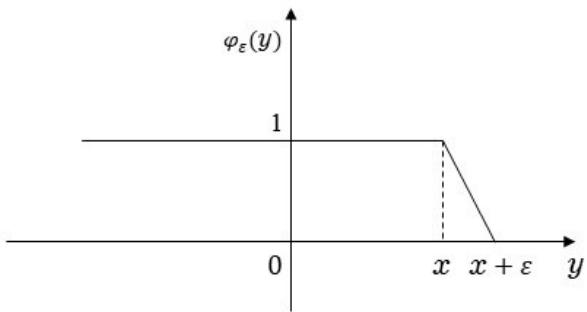

## 8 特征函数

本章我们介绍一个研究随机变量的重要工具——特征函数.

当然, 这个工具并不是概率论所特有的. 从分析的角度看, 一个随机变量的特征函数其实就是其分布函数的Fourier变换. 不过, 和分析中Fourier变换的一般理论相比, 它具有强烈的概率特点. 这表现在作为Riemann-Stieltjes积分或Lebesgue-Stieltjes积分, 它既不可归类于光滑函数或Lp函数的Fourier变换这么一个狭小的范围内, 又不必放在广义函数的Fourier变换这么一个庞大的框架中, 表现在它在研究独立随机变量之和时发挥的巨大作用, 表现在有时候甚至连定义分布(例如退化的多维正态分布)这么一个“很概率”的事情也无法回避它......

## 8.1 复随机变量

研究特征函数会涉及到取复数值的随机变量, 所以我们需要在这方面做些准备工作. 我们迄今为止接触到的随机变量都是取实数值的, 所以就无修饰地用随机变量称呼之. 以后我们也保持这个习惯, 即单说随机变量时, 指的就是实值随机变量, 或至多是广义实值的, 即可以取 $\pm \infty$ 的随机变量, 而虚随机变量则是随机变量乘以虚数单位i, 而复随机变量就是由实随机变量和虚随机变量组成的东西, 即我们有:

定义 8.1.1. 设ξ, η是随机变量, 则

$$
\zeta := \xi + i \eta
$$

称为复随机变量.

若ξ和η的期望均存在, 那么ζ的期望定义为

$$
E[\zeta] := E[\xi] + iE[\eta].
$$

显然, 这样定义的期望保持了线性性, 即

$$
E[z_{1} \zeta_{1} + z_{2} \zeta_{2}] = z_{1} E[\zeta_{1}] + z_{2} E[\zeta_{2}], \forall z_{1}, z_{2} \in \mathbb{C}.
$$

对复数 $z = x + iy$ , 其共轭为

$$
\bar{z} := x - iy,
$$

其模为

$$
| z | := \sqrt{x^{2} + y^{2}} =(z \bar{z})^{\frac{1}{2}}.
$$

因此, 复随机变量ζ的共轭为

$$
\bar{\zeta} := \xi - i \eta;
$$

ζ的模为

$$
| \zeta | := \sqrt{\xi^{2} + \eta^{2}}.
$$

显然

$$
\mathrm{Re}(E[\zeta]) = E[\mathrm{Re}(\zeta)], \mathrm{Im}(E[\zeta]) = E[\mathrm{Im}(\zeta)], \overline{{E[\zeta]}} = E[\bar{\zeta}].
$$

我们有如下的Minkowski不等式:

命题 8.1.2.

$$
| E[\zeta] | \leqslant E[| \zeta |].
$$

证明. 注意

$$
\operatorname{Re}(\overline{{E[\zeta]}} \zeta) \leqslant \left| \overline{{E[\zeta]}} \zeta \right| \leqslant | E[\zeta] | | \zeta |,
$$

两边取期望即得

$$
{| E[\zeta] |^{2}} ={\overline{{E[\zeta]}} E[\zeta] = \mathrm{Re}(\overline{{E[\zeta]}} E[\zeta]) = \mathrm{Re}(E[\overline{{E[\zeta]}} \zeta]) = E[\mathrm{Re}(\overline{{E[\zeta]}} \zeta)] \leqslant | E[\zeta] | E[| \zeta |].}
$$

## 8.2 定义及例子

我们首先给出:

定义 8.2.1. 设F是分布函数. $\forall t \in \mathbb{R}$ , 定义

$$
f(t) := \int_{- \infty}^{\infty} e^{itx} dF(x),\tag{2.1}
$$

称为 $F \sharp \sharp$ 特征函数. 若ξ是随机变量, 以F为分布函数, 则f也称为ξ的特征函数. 此时

$$
f(t) := E[e^{it \xi}].
$$

由于(2.1)右边的被积函数是有界连续的, 所以是可积的, 且此积分可理解为Riemman-Stieltjes积分. 当然, 它也能被理解为Lebesgue-Stieltjes积分.

当涉及多个随机变量的特征函数时, 为宣示主权, 会记ξ的特征函数为 $f_{\xi}(t)$ . 显然, $\dot{\exists} \eta =$ $a \xi + b \sharp{\mathrm{\tiny ~ J}}$ , 其中 $^1a, b \in$ R为常数, $\eta$ 的特征函数为

$$
f_{\eta}(t) = E[e^{it(a \xi + b)}] = e^{itb} f_{\xi}(at).
$$

我们注意到, 若F是离散型的, 分布列为 $\left\{\left(x_{n}, p_{n} \right) \right\}$ , 则

$$
f(t) = \sum_{n = 1}^{\infty} e^{itx_{n}} p_{n};
$$

若 $F$ 是连续型的, 密度函数为 $| p,$ 则

$$
f(t) = \int_{- \infty}^{\infty} e^{itx} p(x) dx,
$$

且此积分可理解为Riemman积分.

下面我们计算一些常用随机变量的特征函数.

## 8.2 定义及例子

1. 单点分布: 设ξ服从单点分布: 即有 ${\bf{\dot{a}}} \in{\bf{\Theta}}$ R使

$$
P(\xi = a) = 1.
$$

则

$$
f(t) = e^{ita}.
$$

2. Bernoulli分布: $\xi \sim B ( p ) , q = 1 - p $

$$
f(t) = q + pe^{it}.
$$

3. 二项分布: $\xi \sim B(n, p)$

此时 $\xi = \xi_{1} + \cdot \cdot \cdot + \xi_{n}$ , 其中 $\xi_{1}, \cdots, \xi_{n}$ 独立且 $\xi_{k} \sim B(p)$ . 所以

$$
\begin{array}{rcl} f_{\xi}(t) & = & E \left[\exp \left\{\sum_{k = 1}^{n} it \xi_{k} \right\} \right] = \prod_{k = 1}^{n} E[\exp \{it \xi_{k}\}] \\ & = & \prod_{k = 1}^{n} f_{\xi_{k}}(t) =(q + pe^{it})^{n}, q = 1 - p.\end{array}
$$

这个结果有个自然的推 $\vdots^{\binom{N}{d}}$ : 若 $\xi = \xi_{1} + \cdot \cdot \cdot + \xi_{n}$ , 其中其中 $\xi_{1}, \cdots, \xi_{n}$ 独立且 $\xi_{k} \sim B(p_{k})$ . 则

$$
f_{\xi}(t) = \prod_{k = 1}^{n} f_{\xi_{k}}(t) = \prod_{k = 1}^{n}(q_{k} + p_{k} e^{it}), q_{k} = 1 - p_{k}.
$$

4. Poisson分布: $\xi \sim P(\lambda)$

$$
f(t) = \sum_{k = 0}^{\infty} e^{- \lambda} \frac{\lambda^{k} e^{itk}}{k !} = \exp(\lambda(e^{it} - 1)).
$$

5. 设ξ的分布列为: $\begin{array}{r}{P(\xi = 1) = P(\xi = - 1) = \frac{1}{2}} \end{array}$ , 则

$$
f(t) = \frac{1}{2}(e^{it} + e^{- it}) = \cos t.
$$

6. 标准正态分布: $\xi \sim N(0, 1)$

$$
f(t) = \frac{1}{\sqrt{2 \pi}} \int_{- \infty}^{\infty} e^{itx} e^{- \frac{x^{2}}{2}} dx.
$$

这个分布的特征函数我们曾经算过. 它还有更多的计算方法, 例如可将 $\cdot e^{itx}$ 展成Taylor级数后分别计算每一项, 然后对级数求和；也可将被积函数用Euler 公式写为实部和虚部, 因为虚部为奇函数所以在对称区间上的积分为零, 对实部用两次分部积分公式得到一个一阶齐次线性常微分方程, 然后解方程. 还可以利用复变函数的围道积分的方法如下: 首先注意

$$
\begin{array}{rcl}{f(t)} & = &{\lim_{n \to \infty} \frac{1}{\sqrt{2 \pi}} \int_{- n}^{n} e^{itx} e^{- \frac{x^{2}}{2}} dx} \\ & = &{e^{- \frac{1}{2} t^{2}} \lim_{n \to \infty} \frac{1}{\sqrt{2 \pi}} \int_{- n}^{n} e^{- \frac{(x - it)^{2}}{2}} dx} \\ & = &{e^{- \frac{1}{2} t^{2}} \lim_{n \to \infty} \frac{1}{\sqrt{2 \pi}} \int_{C_{n}} e^{- \frac{z^{2}}{2}} dz,} \end{array}
$$

其中 $C_{n}$ 为直线段 $\left\{z; x - it, \ | x | \leqslant n \right\}$ . 设C是 $\operatorname{IIm}(z) = 0, \operatorname{Re}(z) = - n, \operatorname{Re}(z) = n$ 及 $\operatorname{Im}(z) =$ −t组成的封闭曲线, 按顺时针方向取积分. 因为 $1e^{- \frac{z^{2}}{2}}$ 解析, 所以

$$
\int_{C} e^{- \frac{z^{2}}{2}} dz = \int_{C_{n}} e^{- \frac{z^{2}}{2}} dz + \varepsilon_{n} + \int_{n}^{- n} e^{- \frac{x^{2}}{2}} dx = 0.
$$

其中 $| \varepsilon_{n}(t) | \leqslant ce^{-{\frac{n^{2}}{2}}}$ . 令 $n \to \infty$ 得

$$
f(t) = e^{- \frac{1}{2} t^{2}}.
$$

若 $\dot{\varsigma} \sim N(\mu, \sigma^{2})$ , 则 $\begin{array}{r}{\eta : = \frac{\xi - \mu}{\sigma} \sim N(0, 1)} \end{array}$ , 而

$$
\xi = \sigma \eta + \mu.
$$

所以

$$
f_{\xi}(t) = E[\exp \{it(\sigma \eta + \mu)\}] = e^{it \mu - \frac{1}{2} \sigma^{2} t^{2}}.
$$

7. 均匀分布ξ $\sim U(a, b)$

$$
f(t) = \frac{1}{b - a} \int_{a}^{b} e^{itx} dx = \frac{e^{itb} - e^{ita}}{it(b - a)}.
$$

特别, 当 $a = - 1, b = 1$ 时,

$$
f(t) = \frac{\sin t}{t}.
$$

8. 指数分布 $E(\lambda)$

$$
\begin{array}{rcl} f(t) & = & \frac{1}{\lambda} \int_{0}^{\infty} e^{itx} e^{- \lambda x} dx \\ & = & \frac{1}{\lambda} \int_{0}^{\infty} e^{(it - \lambda) x} dx \\ & = & \left.\frac{1}{\lambda} \cdot \frac{e^{(it - \lambda) x}}{it - \lambda} \right|_{0}^{\infty} \\ & = & \frac{1}{\lambda(\lambda - it)}.\end{array}
$$

最后两个实变量复值的指数函数的积分计算参见附录11.5.

习题

1. 设f为特征函数, 证明 $g(t) : = \overline{{f(t)}}$ 也是特征函数.

2. $i \not \subset \varphi$ 是X的特征函数. 证明:

(a) 若有 $t_{n} \to 0$ 使得 $| \varphi(t_{n}) | = 1$ , 则存在 $b \in \mathbb{R}$ 使得 $X = b{\mathrm{~ a.s.}}$

(b) 若有 $\dot { t } _ { n } $ 0使得 $\varphi(t_{n}) = 1$ , 则存在 $b \in \mathbb{R}$ 使得 $X = b{\mathrm{~ a.s.}}$

3. 证明: $\Re \{\alpha > 2, \varphi(t) : = \exp \{- | t |^{\alpha}\}$ 不是特征函数.

4. 设 $\dot{.} \varphi$ 是特征函数. 证明

$$
1 - | \varphi(2t) |^{2} \leqslant 4(1 - | \varphi(t) |^{2}),
$$

$$
1 - \operatorname{Re} \varphi(nt) \leqslant n(1 -(\operatorname{Re} \varphi(t))^{n}) \leqslant n^{2}(1 - \operatorname{Re} \varphi(t)), n = 0, 1, 2, \dots,
$$

## 8.3 基本性质

$$
| \mathrm{Im} \varphi(t) |^{2} \leqslant \frac{1}{2}(1 - \mathrm{Re} \varphi(2t));
$$

$$
1 + \mathrm{Re} \varphi(2t) \geqslant 2(\mathrm{Re} \varphi(t))^{2};
$$

$$
| \varphi(t) - \varphi(s) |^{2} \leqslant 4 | 1 - \varphi(t - s) |;
$$

$$
| \varphi(t) - \varphi(s) |^{2} \leqslant 2(1 - \mathrm{Re} \varphi(t - s));
$$

$$
\frac{1}{2h} \left| \int_{t - h}^{t + h} \varphi(u) du \right| \leqslant(1 + \mathrm{Re} \varphi(h))^{\frac{1}{2}}.
$$

5. 设ξ的特征函数为 $\varphi$ . 证明: 若有常数c使得 $\varphi \equiv c,$ 则 $P(\xi = 0) = 1$

## 8.3 基本性质

本节我们将证明特征函数的一些基本性质. 首先, 我们注意到特征函数有一个特别简单但特别有用的性质, 即

命题 8.3.1. 若 $\xi, \eta$ 独立, 则

$$
f_{\xi + \eta}(t) = f_{\xi}(t) f_{\eta}(t).
$$

我们知道, 两个独立的随机变量之和的分布函数等于它们的分布函数的卷积——卷积是比较复杂的. 而本命题说明, 此和的特征函数等于它们的特征函数的乘积, 这就简单多了——这是特征函数的优点之一.

证明. 这是因为当 $\xi, \eta$ 独立时, 容易验证

$$
E[\exp \{it(\xi + \eta)\}] = E[\exp \{it \xi\} \exp \{it \eta\}] = E[\exp \{it \xi\}] E[\exp \{it \eta\}].
$$

□

其次我们证明:

定理 8.3.2. 设f是随机变量ξ的特征函数, 则

(i) $| f(t) | \leqslant f(0) = 1, \forall t;$

(ii) $f(- t) ={\overline{{f(t)}}}, \forall t;$

(iii) $| f(t) - f(s) | \leqslant E[| e^{i(t - s) \xi} - 1 |], \forall t, s;$

(iv) f在R上一致连续.

证明. (i) 由命题8.1.2,

$$
| f(t) | = | E[e^{it \xi}] | \leqslant E[| e^{it \xi} |] = 1 = f(0).
$$

(ii)

$$
f(- t) = E[e^{- it \xi}] = E[\overline{{e^{it \xi}}}] = \overline{{E[e^{it \xi}]}} = \overline{{f(t)}}.
$$

(iii)

$$
\begin{array}{rcl} | f(t) - f(s) | & = & \left| E[e^{it \xi}] - E[e^{is \xi}] \right| = \left| E[e^{is \xi}[e^{i(t - s) \xi} - 1]] \right| \\ & \leqslant & E \left[| e^{is \xi}[e^{i(t - s) \xi} - 1] | \right] = E \left[| e^{i(t - s) \xi} - 1 | \right].\end{array}
$$

(iv)

由(iii)及有界收敛定理有

$$
\limsup_{| t - s | \to 0} | f(t) - f(s) | = \limsup_{| t - s | \to 0} E[| e^{i(t - s) \xi} - 1 |] = 0.
$$

□

例1. 判断函数

$$
f(t) = \left\{\begin{array}{ll} \frac{\sin t^{2}}{t^{2}}, & | t | < 1, \left(\frac{\sin 0}{0} := 1\right) \\ \sin t^{2}, & | t | \geqslant 1 \end{array} \right.
$$

是否为特征函数.

解. 否, 因为它在R上不一致连续. 比如取 $\begin{array}{r}{s_{n}^{2} = 2 \pi n, t_{n}^{2} = 2 \pi n + \frac{\pi}{2}} \end{array}$ , 则

$$
\sin t_{n}^{2} - \sin s_{n}^{2} = 1,
$$

但当n趋于无穷时

$$
t_{n} - s_{n} = \frac{\frac{\pi}{2}}{t_{n} + s_{n}} \rightarrow 0.
$$

这说明了sint2在R上不一致连续.

如果ξ具有较好的可积性, 那么其特征函数也具有较好的光滑性. 更精确地说, 我们有:

定理 8.3.3. 若 $E[| \xi |^{n}] < \infty$ , 则f至少n次可导, 并有

$$
f^{(k)}(t) = i^{k} E[\xi^{k} e^{it \xi}], \forall k \leqslant n,
$$

且 $f^{(k)}$ 一致连续, $\forall k \leqslant n.$

证明. 由于

$$
\frac{d}{dt} e^{it \xi} = i \xi e^{it \xi},
$$

直接用积分号下求导的定理5.7.3, 可得f′(t)存在, 且

$$
f^{\prime}(t) = iE[\xi e^{it \xi}].
$$

而由于

$$
| f^{\prime}(t) - f^{\prime}(s) | \leqslant E[| \xi | | 1 - e^{i(t - s) \xi} |],
$$

由控制收敛定理得f′一致连续性. 继续这一过程可得到n阶导数的结论.

将上述结果应用到Taylor公式, 有

推论 8.3.4. 设 $E[| \xi |^{n}] < \infty$ , 则有Taylor展式

$$
\begin{array}{rcl} f(t) & = & \sum_{k = 0}^{n - 1} \frac{(it)^{k}}{k !} E[\xi^{k}] + i^{n} \int_{0}^{t} \int_{0}^{t_{n}} \dots \int_{0}^{t_{2}} E[\xi^{n} e^{it_{1} \xi}] dt_{1} dt_{2} \dots dt_{n} \\ & = & \sum_{k = 0}^{n} \frac{(it)^{k}}{k !} E[\xi^{k}] + \frac{1}{n !} \theta_{n}(t)(it)^{n}.\end{array}
$$

其中 $| \theta_{n}(t) | \leqslant 2E[| \xi |^{n}]$ , $\begin{array}{r}{\mathbb{H} \mathrm{lim}_{t0} \theta_{n}(t) = 0} \end{array}$

## 8.3 基本性质

证明. 因为 $E[| \xi |^{n}] < \infty$ , 由定理8.3.3有

$$
f^{(k)}(0) = i^{k} E[\xi^{k}], \forall k \leqslant n.
$$

所以f有Taylor展开

$$
\begin{array}{rcl} f(t) & = & \sum_{k = 0}^{n - 1} \frac{1}{k !} f^{(k)}(0) t^{k} + \int_{0}^{t} \int_{0}^{t_{n}} \dots \int_{0}^{t_{2}} f^{(n)}(t_{1}) dt_{1} dt_{2} \dots dt_{n} \\ & = & \sum_{k = 0}^{n} \frac{1}{k !} f^{(k)}(0) t^{k} + \frac{1}{n !} \theta_{n}(t)(it)^{n}.\end{array}
$$

其中

$$
\begin{array}{rcl} \theta_{n}(t) & = & \frac{n !}{(it)^{n}} \int_{0}^{t} \int_{0}^{t_{n}} \dots \int_{0}^{t_{2}}(f^{(n)}(t_{1}) - f^{(n)}(0)) dt_{1} dt_{2} \dots dt_{n} \\ & = & \frac{n !}{t^{n}} \int_{0}^{t} \int_{0}^{t_{n}} \dots \int_{0}^{t_{2}} E[\xi^{n}(e^{it_{1} \xi} - 1)] dt_{1} dt_{2} \dots dt_{n}.\end{array}
$$

注意到

$$
\int_{0}^{t} \int_{0}^{t_{n}} \dots \int_{0}^{t_{2}} dt_{1} dt_{2} \dots dt_{n} = \frac{t^{n}}{n !},
$$

因此

$$
\theta_{n}(t) \leqslant \sup_{| s | \leqslant t} E[| \xi |^{n} | e^{is \xi} - 1 |] \leqslant 2E[| \xi |^{n}].
$$

而且, 由控制收敛定理有

$$
\lim_{t \to 0} \theta_{n}(t) \leqslant \lim_{t \to 0} \sup_{| s | \leqslant t} E[| \xi |^{n} | e^{is \xi} - 1 |] = E \left[| \xi |^{n} \operatorname{limsup}_{t \to 0} | e^{it \xi} - 1 | \right] = 0.
$$

□

若要将 $f,$ 展成幂级数, 则我们有下面的

推论 8.3.5. 设 $f$ 是随机变量 $\cdot \xi$ 的特征函数. 若 $E[| \xi |^{n}] < \infty, \forall n$ , 且

$$
\limsup_{n \to \infty} \frac{(E[| \xi |^{n}])^{1 / n}}{n} = \frac{1}{eT} < \infty,
$$

则

$$
f(t) = \sum_{n = 0}^{\infty} \frac{(it)^{n}}{n !} E[\xi^{n}], \forall | t | < T.
$$

证明. $\forall 0 < t_{0} < T$ , 有

$$
\operatorname{limsup}_{n \to \infty} \frac{(E[| \xi |^{n}] t_{0}^{n})^{1 / n}}{n} = \frac{t_{0}}{eT}.
$$

由Stirling1公式(见附录11.1)有

$$
\lim_{n \to \infty} \left(\frac{n^{n}}{n !}\right)^{\frac{1}{n}} = e,
$$

因此

$$
\operatorname{limsup}_{n \to \infty} \left(\frac{E[| \xi |^{n}] t_{0}^{n}}{n !}\right)^{1 / n} = \frac{t_{0}}{T} < 1.
$$

由Cauchy检根判别法, 级数

$$
\sum_{n = 0}^{\infty} \frac{t_{0}^{n}}{n !} E[| \xi |^{n}] < \infty.\tag{3.2}
$$

因为 $\begin{array}{r}{\left| \frac{(it)^{n}}{n !} E[\xi^{n}] \right| \leqslant \frac{t_{0}^{n}}{n !} E[| \xi |^{n}]} \end{array}$ , ∀|t| $\leqslant t_{0}$ , 由级数的M判别法, 级数

$$
\sum_{n = 0}^{\infty} \frac{(it)^{n}}{n !} E[\xi^{n}]
$$

在|t| $\leqslant t_{0}$ 上一致收敛.

由上一推论,

$$
f(t) = \sum_{k = 0}^{n} \frac{(it)^{k}}{k !} E[\xi^{k}] + R_{n}(t),\tag{3.3}
$$

其中

$$
| R_{n}(t) | \leqslant 2 \frac{t_{0}^{n}}{n !} E[| \xi |^{n}], | t | \leqslant t_{0}.
$$

右边为收敛级数(3.2)的通项, 所以

$$
\operatorname{limsup}_{n \to \infty} | R_{n}(t) | \leqslant \lim_{n \to \infty} 2 \frac{t_{0}^{n}}{n !} E[| \xi |^{n}] = 0, \forall | t | \leqslant t_{0}.
$$

在等式(3.3)两边, 令 $n \to \infty$ 即得

$$
f(t) = \sum_{k = 0}^{\infty} \frac{(it)^{k}}{k !} E[\xi^{k}], \forall | t | \leqslant t_{0}.
$$

最后由 $t_{0}$ 的任意性结论立得.

以上都是由ξ的可积性导出f的光滑性; 若反过来, 要从f的光滑性判断ξ的可积性, 则有：定理 8.3.6. 若 $f^{(2n)}(0)$ 存在且有限, 则 $E[\xi^{2n}] < \infty$

证明. 先设 $n = 1$ . 由L’Hopital法则有

$$
\begin{array}{rcl} f^{\prime \prime}(0) & = & \lim_{t \downarrow 0} \frac{1}{2} \left[\frac{f^{\prime}(2t) - f^{\prime}(0)}{2t} + \frac{f^{\prime}(0) - f^{\prime}(- 2t)}{2t} \right] \\ & = & \lim_{t \downarrow 0} \frac{2f^{\prime}(2t) - 2f^{\prime}(- 2t)}{8t} \\ & = & \lim_{t \downarrow 0} \frac{f(2t) - 2f(0) + f(- 2t)}{4t^{2}} \\ & = & \lim_{t \downarrow 0} \int_{- \infty}^{\infty} \left(\frac{e^{itx} - e^{- itx}}{2t}\right)^{2} dF(x) \\ & = & - \lim_{t \downarrow 0} \int_{- \infty}^{\infty} x^{2} \left(\frac{\sin tx}{tx}\right)^{2} dF(x).\end{array}
$$

## 8.3 基本性质

于是由Fatou引理有

$$
\begin{array}{rcl} \int_{- \infty}^{\infty} x^{2} dF(x) & = & \int_{- \infty}^{\infty} x^{2} \left(\lim_{t \downarrow 0} \frac{\sin tx}{tx}\right)^{2} dF(x) \\ & \leqslant & \lim_{t \downarrow 0} \int_{- \infty}^{\infty} x^{2} \left(\frac{\sin tx}{tx}\right)^{2} dF(x) \\ & = & - f^{\prime \prime}(0).\end{array}
$$

一般情形用归纳法. 设结论对n成立. 设 $f^{2(n + 1)}(0) < \infty$ . 则 $f^{(2n)}(0) < \infty$ , 因此

$$
\int_{- \infty}^{\infty} x^{2n} dF(x) < \infty.
$$

若

$$
E[\xi^{2n}] = \int_{- \infty}^{\infty} x^{2n} dF(x) = 0,
$$

则 $\xi = 0, \mathrm{a.s.}$ . 因此

$$
E[\xi^{2n + 2}] = \int_{- \infty}^{\infty} x^{2n + 2} dF(x) = 0,
$$

结论已证. 再设

$$
a := \int_{- \infty}^{\infty} x^{2n} dF(x) > 0.
$$

由于

$$
\begin{array}{rcl} f^{(2n)}(t) & = & \int_{- \infty}^{\infty}(ix)^{2n} e^{itx} dF(x) \\ & = &(- 1)^{n} \int_{- \infty}^{\infty} e^{itx} x^{2n} dF(x) \\ & = &(- 1)^{n} a \int_{- \infty}^{\infty} e^{itx} dG(x), \end{array}
$$

其中

$$
G(x) = a^{- 1} \int_{- \infty}^{x} u^{2n} dF(u)
$$

为一分布函数. 所以 $(- 1)^{n} a^{- 1} f^{(2n)}$ 是G的特征函数且在0点二次可导. 对此函数用 $n = 1$ 时的结果即得

$$
\int_{- \infty}^{\infty} x^{2n + 2} dF(x) = a \int_{- \infty}^{\infty} x^{2} dG(x) < \infty.
$$

□

自然会问, 若 $f^{\prime}(0)$ 存在, 也会保证 $E[| \xi |] < \infty$ 吗? 答案是否定的. 比如, 令ξ的密度函数 $\operatorname{\dot{\rho}}(x)$ 为

$$
p(x) = \left\{\begin{array}{ll} \frac{e}{2} \cdot \frac{1 + \ln | x |}{x^{2}(\ln | x |)^{2}}, & | x | \geqslant e, \\ 0, & 0 \leqslant | x | < e.\end{array} \right.
$$

其分布函数为

$$
F(x) = \left\{\begin{array}{ll} - \frac{e}{2x \ln(- x)}, & x \leqslant - e, \\ \frac{1}{2}, & - e < x < e, \\ 1 - \frac{e}{2x \ln x}, & x \geqslant e.\end{array} \right.
$$

因为

$$
\begin{array}{rcl} \int_{e}^{+ \infty} xp(x) dx & = & \frac{e}{2} \int_{e}^{+ \infty} \left(\frac{1}{x \ln x} + \frac{1}{x(\ln x)^{2}}\right) dx \\ & = & \frac{e}{2} \left(\ln \ln x - \frac{1}{\ln x}\right) \Big |_{e}^{+ \infty} = + \infty, \end{array}
$$

因此 $E[| \xi |] = + \infty$ . 但因为密度函数为偶函数且

$$
\lim_{x \to + \infty} x(1 - F(x) + F(- x)) = \lim_{x \to + \infty} 2x(1 - F(x)) = \lim_{x \to + \infty} \frac{e}{\ln x} = 0,
$$

所以 $f^{\prime}(0) = 0($ (证明见 $[4,{\mathrm{p.565}},$ , 定理]).

由定理8.3.6和定理8.3.3 有

推论 8.3.7. 设f为特征函数. 若 $\cdot f^{(2n)}(0)$ 存在且有限, 则对任意t, $f^{(2n)}(t)$ 存在且有限.

我们来看几个应用.

例1. 判断函数

$$
f(t) := \left\{\begin{array}{ll} \sqrt{1 - t^{2}} & | t | < 1, \\ 0 & | t | \geqslant 1 \end{array} \right.
$$

是否为特征函数.

解. 否. 因为 $f^{\prime \prime}(0)$ 有限, 若f为特征函数, 则f′′在任意点皆二次可导, 但显然在t = 1 时不可导.

例2. 判断函数

$$
f(t) := | \cos(t) |
$$

是否为特征函数.

解. 否. f(t)在t = 0处无穷可导, 但在 $\begin{array}{r}{t = \frac{\pi}{2}} \end{array}$ 处不可导.

例3. 判断函数

$$
f(t) := 1 - e^{- \frac{1}{| t |}}
$$

是否为特征函数.

解. 否. 因为 ${\bf \Psi} | f^{(n)}(0) = 0, \forall n,$ 所以若f为ξ的特征函数, 则 $E[\xi] = D[\xi] = 0$ . 因此 $\xi = 0$ a.s.. 但此时ξ的特征函数为 $f(t) \equiv 1$

例4. 判断函数

$$
f(t) := e^{- | t |^{\alpha}}, \alpha > 2
$$

是否为特征函数.

解. 否. 此时f在t = 0处二次可微, 且 $f^{\prime}(0) = f^{\prime \prime}(0) = 0$ . 再用上个例子的推理.

习题

## 8.3 基本性质

1. 设f 是特征函数, $i = 1, \cdots, n.$ . 证明 $\textstyle \prod_{i = 1}^{n} f_{i}$ 也是特征函数.

2. 设f是特征函数, 证明 $| f(t) |^{2}$ 也是特征函数.

3. 设 ${\varphi,}$ ψ是分布函数F,G的特征函数, $g \mathrm{.}$ 是母函数.

(a) 证明 $\bar{\varphi}, \varphi^{n}(n = 0, 1, 2, \cdot \cdot \cdot), t \mapsto e^{ibt} \varphi(at)$ (a,b是实数)是特征函数并求出相应的分布函数;

(b) 证明 $t \mapsto \psi(at) \varphi(bt)$ 是特征函数并求出相应的分布函数;

(c) 证明 $| g(\varphi)$ 是特征函数并求出相应的分布函数.

(d) 问: $\mathrm{Re} \varphi{\stackrel{\textstyle \mapsto}{\to}} \mathrm{Im} \varphi$ 是否依然为特征函数?

(e) 证明 $e^{\lambda(\varphi - 1)}$ 是特征函数并求出相应的分布函数.

(f) 证明

$$
t \mapsto \int_{0}^{1} \varphi(ut) du, t \mapsto \int_{0}^{\infty} e^{- u} \varphi(ut) du
$$

是特征函数并求出相应的分布函数.

(g) 证明对任意 $n \geqslant 1$ ，

$$
t \mapsto n! \frac{e^{it} - \sum_{k = 0}^{n - 1} \frac{(it)^{k}}{k !}}{(it)^{n}}
$$

是特征函数并求出相应的分布.

4. 设 $\varphi$ 是一个特征函数, F是一个分布函数. 证明

$$
\psi(t) := \int_{- \infty}^{\infty} \varphi(tx) dF(x)
$$

也是一个特征函数.

5. 设 $a \in \mathbb{R} \setminus \{0\}, \lambda > 0.$ . 若

$$
P(\xi = ka) = \frac{1}{k !} e^{- \lambda} \lambda^{k},
$$

则称ξ $\mathbf{\partial} \cdot \sim P(\lambda, a)$ . 设 $\xi_{k} \sim P(\lambda_{k}, a_{k})$ , 且独立, $\textstyle{\widehat{\vec{\mathbf{\Gamma}}}} \xi : = \sum_{k = 1}^{n} \xi_{k}$ . 证明:

$$
\varphi_{\xi}(t) = \exp \left\{\sum_{k = 1}^{n} \lambda_{k}(e^{ita_{k}} - 1) \right\}.
$$

6. 设 $\xi_{1}, \cdots, \xi_{n}$ 独立, 都服从(−1,1)上的均匀分布. 证明 $n \geqslant 2$ 时, $\xi_{1} + \cdots + \xi_{n}$ 的密度函数为

$$
f(x) = \frac{1}{\pi} \int_{0}^{\infty} \left(\frac{\sin t}{t}\right)^{n} \cos(tx) dt.
$$

7. 利用特征函数证明: 若 $\xi_{1}, \xi_{2}, \cdots$ 相互独立, 则 $\xi_{1}, \xi_{2} + \xi_{3}, \xi_{4} + \xi_{5} + \xi_{6},$ · · · 相互独立.

8. 设ξ为整数值随机变量, $\varphi.$ 为其特征函数. 证明:

$$
P(\xi = k) = \frac{1}{2 \pi} \int_{- \pi}^{\pi} e^{- ikt} \varphi(t) dt, k = 0, \pm 1, \pm 2, \dots.
$$

9. 设ξ, $\eta.$ 是独立随机变量, $\mathbb{Z} \xi + \eta$ 与ξ同分布. 证明 $\eta = 0 ~{\mathrm{a.s.}}$

10. 设 $\varphi$ 是ξ的特征函数, 且 $E[| \xi |^{n}] < \infty$ . 证明对任意t及k $\leqslant n,$

$$
\varphi^{(k)}(t) = i^{k} E[\xi^{k} e^{it \xi}].
$$

## 8.4 唯一性定理

特征函数之所以有用, 植根于它和概率分布是一一对应的, 即我们有下面的唯一性定理.

定理 8.4.1. 设ξ与 $\eta.$ 是随机变量. 若

$$
E[\exp(it \xi)] = E[\exp(it \eta)],
$$

则ξ与η同分布.

证明. 由定理5.8.2, 只需证明

$$
E[f(\xi)] = E[f(\eta)], \forall f \in C_{0}^{\infty}.\tag{4.4}
$$

现设 $f \in C_{0}^{\infty}$ . 由定理4.3.4及其后面的注, 有

$$
f(x) = \frac{1}{2 \pi} \int_{- \infty}^{\infty} \hat{f}(t) e^{- itx} dt,
$$

其中

$$
\hat{f}(t) := \int_{- \infty}^{\infty} e^{ity} f(y) dy.
$$

因此

$$
\begin{array}{rcl} E[f(\xi)] & = & \frac{1}{2 \pi} E \int_{- \infty}^{\infty} \hat{f}(t) e^{- it \xi} dt \\ & = & \frac{1}{2 \pi} \int_{- \infty}^{\infty} \hat{f}(t) E[e^{- it \xi}] dt \\ & = & \frac{1}{2 \pi} \int_{- \infty}^{\infty} \hat{f}(t) E[e^{- it \eta}] dt \\ & = & \frac{1}{2 \pi} E \int_{- \infty}^{\infty} \hat{f}(t) e^{- it \eta} dt \\ & = & E[f(\eta)].\end{array}
$$

本定理说明, 一个随机变量的分布函数是由其特征函数唯一确定的. 我们来看一个应用.

例1.设 $\xi, \eta$ 独立同分布, 且 $E[\xi] = 0, E[\xi^{2}] = 1$ . 证明：若ξ 与 $\textstyle{\frac{\sqrt{2}}{2}}(\xi + \eta)$ 同分布, 则ξ服从标准正态分布.

证明. 以f表示ξ的特征函数. 因为 $E[\xi^{2}] < \infty$ , 则f有二阶连续导数. 由带Peano余项的Taylor公式有

$$
\begin{array}{rcl}{f(t)} & = &{f(0) + f^{\prime}(0) t + \frac{1}{2} f^{\prime \prime}(0) t^{2} + o(t^{2})} \\ & = &{1 - \frac{1}{2} t^{2} + o(t^{2}).} \end{array}
$$

则

$$
\begin{array}{rcl} f(t) & = & f \left(\frac{\sqrt{2}}{2} t\right)^{2} \\ & = & \dots \\ & = & f \left(\left(\frac{\sqrt{2}}{2}\right)^{n} t\right)^{2^{n}} \\ & = & \left[1 - \frac{1}{2^{n}} \cdot \frac{t^{2}}{2} + o \left(\frac{1}{2^{n}} t^{2}\right) \right]^{2^{n}}.\end{array}
$$

由命题11.5.1, 令 $n \to \infty$ , 得 $f(t) = e^{- \frac{1}{2} t^{2}}$

上面的定理说明了分布函数是由特征函数唯一确定的, 但没有说明具体是以怎样的方式确定的. 下面我们将证明一个由特征函数直接确定分布函数的公式, 即所谓的反演公式. 为此, 先证明一个分析引理.

引理 8.4.2 (Dirichlet2积分).

$$
\lim_{T \to \infty} \int_{0}^{T} \frac{\sin t}{t} dt = \frac{\pi}{2}.
$$

证明. 令

$$
I_{T} := \int_{0}^{T} \frac{\sin t}{t} dt.
$$

则

$$
\begin{array}{rcl} I_{T} & = & \int_{0}^{T} \sin tdt \int_{0}^{\infty} e^{- ts} ds \\ & = & \int_{0}^{\infty} ds \int_{0}^{T} \sin te^{- ts} dt \\ & = & \int_{0}^{\infty} \left(\frac{1}{1 + s^{2}} - \frac{s \sin T + \cos T}{1 + t^{2}} e^{- sT}\right) ds \\ & = & \frac{\pi}{2} - \int_{0}^{\infty} \frac{s \sin T + T \cos T}{T^{2} + s^{2}} e^{- s} ds.\end{array}
$$

由于

$$
\left| \int_{0}^{\infty} \frac{s \sin T + T \cos T}{T^{2} + s^{2}} e^{- s} ds \right| \leqslant \frac{C}{T} \rightarrow 0, T \rightarrow \infty,
$$

引理得证.

由于对 ${\textrm{a}} \in$ R有

$$
\int_{0}^{T} \frac{\sin at}{t} dt = \int_{0}^{aT} \frac{\sin t}{t} dt,
$$

所以我们有

推论 8.4.3. 函数

$$
I(T, a) := \int_{0}^{T} \frac{\sin at}{t} dt
$$

R $_{+} \times$ R上有界且

$$
\lim_{T \to \infty} I(T, a) = \frac{\pi}{2} \mathrm{sgn}(a), \forall a \in \mathbb{R}.
$$

下面证明反演公式. 我们先证明这个公式的初级版. 我们知道特征函数是有界连续函数,因此在每个有限区间上都是可积的. 所谓初级版是在额外的条件

$$
\int_{- \infty}^{\infty} | f(t) | dt < \infty
$$

下考虑. 和最后的完整版相比, 这里的条件更强结论也更强, 公式也更加简洁. 但两者的思想是一样的, 只是有些在强条件下可以走得更远的地方, 在一般的条件下就到不了, 因此得不到简洁的公式而已.

定理 8.4.4 (反演公式初级版). 若

$$
\int_{\mathbb{R}} | f(t) | dt < \infty,
$$

则F是连续型分布函数, 且其密度函数为

$$
p(x) := \frac{1}{2 \pi} \int_{- \infty}^{\infty} e^{- itx} f(t) dt.
$$

若进一步有

$$
\int_{\mathbb{R}} | t |^{n} | f(t) | dt < \infty,
$$

则 $p$ 为n次连续可导, 且

$$
p^{(n)}(x) = \frac{1}{2 \pi} \int_{- \infty}^{\infty}(- it)^{n} e^{- itx} f(t) dt.
$$

证明. 令

$$
p(x) := \frac{1}{2 \pi} \int_{- \infty}^{\infty} e^{- itx} f(t) dt.
$$

由控制收敛定理, $p{:}$ 是连续函数. 由Fubini定理有

$$
\begin{array}{rcl} \int_{a}^{b} p(x) dx & = & \int_{a}^{b} dx \frac{1}{2 \pi} \int_{- \infty}^{\infty} e^{- itx} f(t) dt \\ & = & \frac{1}{2 \pi} \int_{- \infty}^{\infty} f(t) dt \int_{a}^{b} e^{- itx} dx \\ & = & \frac{1}{2 \pi} \lim_{T \to \infty} \int_{- T}^{T} \frac{e^{- ita} - e^{- itb}}{it} f(t) dt \\ & = & \frac{1}{2 \pi} \lim_{T \to \infty} \int_{- T}^{T} dt \int_{- \infty}^{\infty} \frac{e^{- ita} - e^{- itb}}{it} e^{itx} dF(x) \\ & = & \frac{1}{2 \pi} \int_{- \infty}^{\infty} dF(x) \lim_{T \to \infty} \int_{- T}^{T} \frac{e^{- ita} - e^{- itb}}{it} e^{itx} dt \\ & = & \frac{1}{2 \pi} \int_{- \infty}^{\infty} dF(x) \lim_{T \to \infty} \int_{- T}^{T} \frac{\sin(x - a) t}{t} - \frac{\sin(x - b) t}{t} dt \\ & = & \frac{1}{2 \pi} \int_{- \infty}^{\infty}(\pi(\operatorname{sgn}(x - a) - \operatorname{sgn}(x - b)) dF(x) \\ & = & \frac{1}{2} E[\operatorname{sgn}(\xi - a) - \operatorname{sgn}(\xi - b)], \end{array}
$$

其中ξ的分布函数为 $F$ . 因为

$$
\operatorname{sgn}(x - a) - \operatorname{sgn}(x - b) = \left\{\begin{array}{ll} 0 & x < a, x > b \\ 1, & x = a, b \\ 2, & a < x < b, \end{array} \right.
$$

所以上式等于

$$
\begin{array}{rl} &{\frac{1}{2}[P(\xi = a) + 2P(a < \xi < b) + P(\xi = b)]} \\{=} &{\frac{1}{2}[F(a) - F(a -)] + F(b -) - F(a) + \frac{1}{2}[F(b) - F(b -)]} \\{=} &{\frac{F(b) + F(b -)}{2} - \frac{F(a) + F(a -)}{2}.} \end{array}
$$

所以当 $| a,$ b均为F的连续点时, 有

$$
F(b) - F(a) = \int_{a}^{b} p(x) dx.
$$

但此式左边为 $^{1a,}$ ,b的右连续函数, 右边为 $\scriptstyle | a.$ ,b的连续函数, 所以对任意 $a < b$ 该等式均成立. 所以p是F的密度函数.

若

$$
\int_{\mathbb{R}} | t | | f(t) | dt < \infty,
$$

由于 $f.$ 是有界连续函数, 所以必有

$$
\int_{\mathbb{R}} | f(t) | dt < \infty.
$$

因此F有密度

$$
p(x) = \frac{1}{2 \pi} \int_{- \infty}^{\infty} e^{- itx} f(t) dt.
$$

由定理5.7.3, 对 $\cdot_{p}$ 可在期望号下求导. 于是

$$
p^{\prime}(x) = \frac{- 1}{2 \pi} \int_{- \infty}^{\infty} ite^{- itx} f(t) dt.
$$

递推下去可得到n阶导数的结果.

我们注意到, 一旦 $F^{\prime}$ 有密度函数 ${\mathrm{.}} p,$ 那么F的特征函数 $\cdot f$ 就是 $p$ 的普通Fourier变换. 但有密度时却未必有

$$
\int_{\mathbb{R}} | f(t) | dt < \infty.
$$

而一旦此式成立, 则必有

$$
p(x) = \frac{1}{2 \pi} \int_{- \infty}^{\infty} e^{- itx} f(t) dt.\tag{4.5}
$$

这就是普通Fourier变换的反演公式.

另外我们注意到在上面的推理中, 条件

$$
p \geqslant 0, \int_{- \infty}^{\infty} p(x) dx = 1
$$

其实不是本质的. 我们实际上是证明了下面的结果:

命题 8.4.5. 设 $\mathbf{\nabla}_{g}$ 是R上的Lebesgue可测函数且

$$
\int_{- \infty}^{\infty} | g(x) | dx < \infty,
$$

定义

$$
\hat{g}(t) := \int_{- \infty}^{\infty} e^{itx} g(x) dx.
$$

若存在 $.n \in \mathbb{N}_{+}$ 使得

$$
\int_{- \infty}^{\infty} | t |^{n} | \hat{g}(t) | dt < \infty,\tag{4.6}
$$

则 $g$ 有直到 $n$ 阶的连续导数且∀k $\leqslant$ n

$$
g^{(k)}(x) = \frac{(- i)^{k}}{2 \pi} \int_{- \infty}^{\infty} e^{- itx} t^{k} \hat{g}(t) dt.
$$

那么什么时候(4.6)满足? 这是一个问题. 由它延申出去, 就会到达调和分析的的一个重要领域——振荡积分.

现在我们转向一般情形. 现在需要注意不一定有

$$
\int_{\mathbb{R}} | f(t) | dt < \infty,
$$

所以不能定义 $\mathbf{\nabla} \cdot p.$ 除此之外, 也不能定义

$$
\int_{- \infty}^{\infty} e^{- itx} f(t) dt.
$$

## 8.4 唯一性定理

对此, 我们用

$$
\int_{- T}^{T} e^{- itx} f(t) dt
$$

代替之, 并用引理8.4.2之本质结论, 即

$$
\lim_{T \to \infty} \int_{- T}^{T} \frac{\sin ta}{t} dt = \frac{\pi}{2} \mathrm{sgn}(a).
$$

经过这样的变通之后, 易见原证明除了前两个等式不复存在外,其它步骤依然有效. 这样我们得到:

定理 8.4.6 (反演公式完整版). 对任意 $a <$ b有

$$
\frac{F(b) + F(b -)}{2} - \frac{F(a) + F(a -)}{2} = \lim_{T \to \infty} \frac{1}{2 \pi} \int_{- T}^{T} \frac{e^{- ita} - e^{- itb}}{it} f(t) dt.
$$

特别当 $^{a,}$ b为F的连续点时, 有

$$
F(b) - F(a) = \lim_{T \to \infty} \frac{1}{2 \pi} \int_{- T}^{T} \frac{e^{- ita} - e^{- itb}}{it} f(t) dt.
$$

由这个公式我们也可以得到唯一性定理. 因为取a,b均为F的连续点, 再让a沿连续点趋于 $- \infty$ , 就得到 $F(b)$ 由f唯一确定. 但F的连续点全体在R中稠密, 且F是右连续函数, 所以对任意x, $F(x)$ 由f唯一确定.

## 习题

1. 设 $\xi_{k}, k = 1, 2, \cdots$ 是独立同分布随机变量, 特征函数为 $\exp(- | t |^{\alpha}), \alpha \in(0, 2)$ 证明 $\scriptstyle n^{- 1 / \alpha} \sum_{k = 1}^{n} \xi_{k} \Xi \xi_{1}$ 同分布.

2. 举例说明存在连续型分布, 其特征函数 $\varphi$ 满足 $\textstyle \int_{\mathbb{R}} | \varphi(t) | dt = \infty$

3. 设ξ的特征函数为 $\varphi$ . 证明:

(a) 若存在 $\dot{\boldsymbol{t}}_{0} \neq 0$ 使得 $| \varphi(t_{0}) | = 1$ , 则存在 $[a, h$ 使得

$$
\sum_{n = - \infty}^{\infty} P(\xi = a + nh) = 1;
$$

(b) 若存在 $\mathrm{:} t_{0} \ne 0$ 使得 $\varphi(t_{0}) = 1$ , 则存在h使得

$$
\sum_{n = - \infty}^{\infty} P(\xi = nh) = 1;
$$

4. 设ξ是整数值随机变量, $\varphi$ 是其特征函数. 证明:

$$
P(\xi = k) = \frac{1}{2 \pi} \int_{- \pi}^{\pi} e^{- ikt} \varphi(t) dt.
$$

5. 设F是分布函数, $\varphi_{\cdot}$ 是其特征函数. 证明:

$$
\lim_{T \to \infty} \frac{1}{2T} \int_{- T}^{T} e^{- itx} \varphi(t) dt = F(x) - F(x -), \forall x;
$$

$$
\lim_{T \to \infty} \frac{1}{2T} \int_{- T}^{T} | \varphi(t) |^{2} dt = \sum_{x \in \mathbb{R}} | F(x) - F(x -) |^{2}.
$$

6. 设ξ是随机变量, $\varphi$ 是其特征函数. 证明:

(a) 若存在奇函数ψ使得 $\varphi(t) = 1 + \psi(t) + o(t^{2}), t \to 0,$ , 则 $\xi \equiv 0.$

(b) 若存在偶函数ψ使得 $\varphi(t) = \psi(t) + o(t), t \to 0$ , 则 $\xi \equiv 0$

## 8.5 连续性定理

由上节的结果, 我们知道特征函数和分布函数相互唯一确定的. 本节我们要进一步研究的问题是, 这种一一对应的关系是否是连续的? 也即, 设 $F_{n}$ 、 $F_{\mathrm{~.~}}$ 是分布函数, $f_{n}$ 、f分别是其特征函数. 那么, 是否在某种意义上有

$$
F_{n} \rightarrow F \Longleftrightarrow f_{n} \rightarrow f?
$$

我们从更一般性的视角来看这个问题. 设 $F_{n}$ 是 $\cdot \xi_{n}$ 的分布函数, F是ξ的分布函数. 我们知道, 由控制收敛定理有

$$
\xi_{n} \xrightarrow{a.s.} \xi \Longrightarrow E[\varphi(\xi_{n})] \to E[\varphi(\xi)], \forall \varphi \in C_{b}(\mathbb{R}).
$$

用分布函数表示就是

$$
\lim_{n \to \infty} \int_{- \infty}^{\infty} \varphi(x) dF_{n}(x) = \int_{- \infty}^{\infty} \varphi(x) dF(x).\tag{5.7}
$$

特别地, 取 $\varphi(x) : = \exp \{itx\}$ , 就得到 $f_{n}(t) f(t)$ , ∀t.

但如何脱离随机变量, 直接通过 $F_{n}, F$ 给出(5.7)成立的条件呢? 最容易想到的猜测当然是

$$
F_{n}(x) \rightarrow F(x), \forall x.
$$

但有例子表明这一要求太强, 强到甚至很平凡的情况都无法满足.

例1. 设

$$
\xi_{n} \equiv \frac{1}{n}, \xi \equiv 0.
$$

则

$$
F_{n}(x) = \left\{\begin{array}{ll} 1, & x \geqslant \frac{1}{n}, \\ 0, & x < \frac{1}{n}.\end{array} \right.,
$$

$$
F(x) = \left\{\begin{array}{ll} 1, & x \geqslant 0, \\ 0, & x < 0.\end{array} \right..
$$

所以 $\xi_{n} \xi, \forall \omega$ . 因此

$$
E[\varphi(\xi_{n})] \to E[\varphi(\xi)], \forall \varphi \in C_{b}(\mathbb{R}).
$$

但 $F_{n}(0) \nrightarrow F(0)$ . 并且这里面的原因也并不复杂,无非是个 $y < x_{n}$ 时能否有 $y < \operatorname{lim}_{n \to \infty} x_{n}$ 的问题——这当然不行, 只能得到小于等于成立.

但也正是这个例子使我们也注意到, 除 $\vec{\mathrm{~ J ~}} x = 0 \dot{\mathcal{Z}} \boldsymbol{\mathcal{H}}$ , 对其它任意 $x,$ 均有 $F_{n}(x) \to F(x)$

$x = 0$ 有什么特别之处? 它是F的间断点! 所以我们能期望的 $F _ { n } $ F的含义, 最多只能是 $F_{n}(x) \to F(x)$ , 对F的任意连续点x成立.

经过以上的分析之后, 我们可以准备叙述我们的结果了. 为此我们先引进:

定义 8.5.1. 设 $F_{n}, F$ 是分布函数. 若 $\forall \varphi \in C_{b}(\mathbb{R})$

$$
\lim_{n \to \infty} \int_{- \infty}^{\infty} \varphi(x) dF_{n}(x) = \int_{- \infty}^{\infty} \varphi(x) dF(x),
$$

则称 $F_{n}$ 弱收敛于 $F_{;}$ 记为 $F_{n}$ w−→ $F_{\cdot}$ .

设 $\xi_{n}, \xi$ 是随机变量(可以定义在不同的概率空间上), 分布函数分别为 $F_{n}, F$ . 若 $F_{n}$ w−→ $F_{;}$ 则称 $\xi_{n}$ 弱收敛于 $\cdot \xi,$ 或 $\xi_{n}$ 依分布收敛于ξ, 记为 $\xi_{n} \xrightarrow{w} \xi$

易见, $\xi_{n}$ w−→ ξ可以改写为

$$
E[f(\xi_{n})] \to E[f(\xi)], \forall f \in C_{b}(\mathbb{R}).
$$

由(5.7)前面的讨论可知, 我们有

命题 8.5.2.

$$
\xi_{n} \xrightarrow{a.s.} \xi \Longrightarrow F_{n} \xrightarrow{w} F \Longrightarrow f_{n}(t) \to f(t) \forall t.
$$

对R上的函数F, 以 $C(F)$ 表示F的连续点全体. 若F为分布函数, 则 $C(F)$ 中至多包含可列个点.

下面我们证明:

定理 8.5.3. 设 $F_{n}$ w−→ $F$ , 则 $F_{n}(x) \to F(x), \forall x \in C(F)$

证明. 设 $x \in C(F)$ . 对ε $> 0.$ , 令

$$
\varphi_{\varepsilon}(y) = 1_{(- \infty, x]}(y) + \frac{1}{\varepsilon}(x + \varepsilon - y) 1_{(x, x + \varepsilon]}(y).
$$

  
图 8.1: 函数 $\varphi_{\varepsilon}(y)$ 的图像

则 $\varphi_{\varepsilon} \in C_{b}(\mathbb{R})$ , 且 $1_{(- \infty, x]}(y) \leqslant \varphi_{\varepsilon}(y) \leqslant 1_{(- \infty, x + \varepsilon]}(y)$ . 因 $F_{n} \xrightarrow{w} F.$ , 因此

$$
\lim_{n \to \infty} \int_{- \infty}^{\infty} \varphi_{\varepsilon}(y) dF_{n}(y) = \int_{- \infty}^{\infty} \varphi_{\varepsilon}(y) dF(y).
$$

由此等式有

$$
\begin{array}{rcl} F(x - \varepsilon) & \leqslant & \int_{- \infty}^{\infty} \varphi_{\varepsilon}(y + \varepsilon) dF(y) \\ & = & \lim_{n \to \infty} \int_{- \infty}^{\infty} \varphi_{\varepsilon}(y + \varepsilon) dF_{n}(y) \\ & \leqslant & \operatorname{liminf}_{n \to \infty} F_{n}(x) \\ & \leqslant & \operatorname{limsup}_{n \to \infty} F_{n}(x) \\ & \leqslant & \lim_{n \to \infty} \int_{- \infty}^{\infty} \varphi_{\varepsilon}(y) dF_{n}(y) \\ & = & \int_{- \infty}^{\infty} \varphi_{\varepsilon}(y) dF(y) \\ & \leqslant & F(x + \varepsilon).\end{array}
$$

令 $\cdot \varepsilon \infty,$ 则

$$
\lim_{n \to \infty} F_{n}(x) = F(x),
$$

其中 $x \in C(F)$

下面证明这个定理的逆定理, 即

定理 8.5.4 $\mathrm{(Helly^{3}}$ 第二定理). 设 $F_{n}, F$ 是分布函数, 且 $.F_{n}(x) F(x), \forall x \in C(F)$ . 则 $F_{n}$ w−→F.

现在我们看到了, $F_{n}$ w−→ F要弱于 $F_{n}(x) \to F(x)$ , ∀x. 所以叫弱收敛啦!

证明. 设 $\mathopen{} \mathclose \bgroup \left.\varphi \in C_{b}(\mathbb{R}).\ \forall \varepsilon > 0 \aftergroup \egroup \right.$ 取 $T, - T \in C(F)$ , 使得

$$
F(- T) + 1 - F(T) < \varepsilon.
$$

于是

$$
\lim_{n \to \infty}(F_{n}(- T) + 1 - F_{n}(T)) < \varepsilon.
$$

因为φ在[−T, T]上一致连续, 所以可取 $- T = x_{0} < x_{1} < \cdots < x_{m} = T$ 使得 $x_{i} \in C(F) \cap_{n = 1}^{\infty}{\mathrm{:}}$ 1$C(F_{n}), \forall i = 1, \cdot \cdot \cdot, m.$ , 且

$$
\sup_{x_{i - 1} \leqslant x \leqslant x_{i}} | \varphi(x) - \varphi(x_{i - 1}) | < \varepsilon, \forall i = 1, \dots, m.
$$

## 8.5 连续性定理

于是∀n,

$$
\begin{array}{ll} & \left| \int_{[- T, T]} \varphi(x) dF_{n}(x) - \sum_{i = 1}^{m} \varphi(x_{i - 1})(F_{n}(x_{i}) - F_{n}(x_{i - 1})) \right| \\ = & \left| \sum_{i = 1}^{m} \int_{[x_{i - 1}, x_{i}]}(\varphi(x) - \varphi(x_{i - 1})) dF_{n}(x) \right| \\ \leqslant & \sum_{i = 1}^{m} \int_{[x_{i - 1}, x_{i}]} | \varphi(x) - \varphi(x_{i - 1}) | dF_{n}(x) \\ \leqslant & \varepsilon \sum_{i = 1}^{m} \int_{[x_{i - 1}, x_{i}]} dF_{n}(x) \\ \leqslant & \varepsilon.\end{array}
$$

同理

$$
\left| \int_{[- T, T]} \varphi(x) dF(x) - \sum_{i = 1}^{m} \varphi(x_{i - 1})(F(x_{i}) - F(x_{i - 1})) \right| \leqslant \varepsilon.
$$

记

$$
\begin{array}{rcl} I_{n} & = & \int_{\mathbb{R}} \varphi(x) dF_{n}(x) - \int_{\mathbb{R}} \varphi(x) dF(x) \\ & = & \left[\int_{- \infty}^{- T} \varphi(x) dF_{n}(x) - \int_{- \infty}^{- T} \varphi(x) dF(x) \right.\\ & & \left.+ \int_{T}^{\infty} \varphi(x) dF_{n}(x) - \int_{T}^{\infty} \varphi(x) dF(x) \right] \\ & & + \left[\sum_{i = 1}^{m} \varphi(x_{i - 1})(F_{n}(x_{i}) - F_{n}(x_{i - 1})) | - \sum_{i = 1}^{m} \varphi(x_{i - 1})(F(x_{i}) - F(x_{i - 1})) \right] \\ & & + \left[\int_{[- T, T]} \varphi(x) dF_{n}(x) - \sum_{i = 1}^{m} \varphi(x_{i - 1})(F_{n}(x_{i}) - F_{n}(x_{i - 1})) \right.\\ & & \left.+ \int_{[- T, T]} \varphi(x) dF(x) - \sum_{i = 1}^{m} \varphi(x_{i - 1})(F(x_{i}) - F(x_{i - 1})) \right] \\ & = & : I_{1, n} + I_{2, n} + I_{3, n}.\end{array}
$$

设 $| \varphi(x) | \leqslant C$ , 则

$$
\sup_{n} \left| I_{1, n} \right| \leqslant 2C \varepsilon.
$$

对 $I_{3, n}$ 则有

$$
\sup_{n} | I_{3, n} | \leqslant 2 \varepsilon.
$$

最后, 由于 $F_{n}(x_{i}) F(x_{i})$ , 所以

$$
\lim_{n \to \infty} | I_{2, n} | = 0.
$$

综合起来便得

$$
\limsup_{n \to \infty} | I_{n} | \leqslant 2(C + 1) \varepsilon.
$$

由ε的任意性有

$$
\lim_{n \to \infty} | I_{n} | = 0.
$$

□

由以上两个定理, 我们证明了

$$
F_{n} \xrightarrow{w} F
$$

与

$$
F_{n}(x) \rightarrow F(x), \forall x \in C(F)
$$

是等价的. 所以这两个条件都可以作为弱收敛的定义. 实际上, 从历史的角度看, 第二个条件作为弱收敛的定义出现得更早一些. 但第一个条件则可用到更广泛的情况.

从定理8.5.4的证明可知, 我们实际上证明了下面更强的结果:

定理 8.5.5. 设 $F_{n}, F$ 是R上单调上升, 右连左极且一致有界的函数族, $F_{n}(x) F(x), \forall x \in$ C(F)且 $.F_{n}(- \infty) F(- \infty), F_{n}(\infty) F(\infty)$ . 设 $.\varphi_{\theta} \in C_{b}(\mathbb{R}), \forall \theta \in \Theta_{\cdot}$ , 且

(i) $\begin{array}{r}{\operatorname{sup}_{\theta \in \Theta, x \in \mathbb{R}} | \varphi_{\theta}(x) | < \infty;} \end{array}$

(ii) $\forall T > 0, \forall \varepsilon > 0, \exists \delta > 0$ , 使得

$$
| x - y | < \delta, x, y \in[- T, T] \Longrightarrow \sup_{\theta \in \Theta} | \varphi_{\theta}(x) - \varphi_{\theta}(y) | < \varepsilon.
$$

则

$$
\lim_{n \to \infty} \sup_{\theta \in \Theta} \left| \int_{\mathbb{R}} \varphi_{\theta}(x) dF_{n}(x) - \int_{\mathbb{R}} \varphi_{\theta}(x) dF(x) \right| = 0.
$$

注意到对任意 $M > 0$ , 函数族 $\{e^{itx} : | t | \leqslant M\}$ 满足上面定理中的条件, 所以我们有

推论 8.5.6. 设 $F_{n}, F$ 是分布函数, $f_{n}, f$ 分别是其特征函数. 若 $F_{n}(x) F(x), \forall x \in C(F)$ , 则对任意 $M > 0$

$$
\lim_{n \to \infty} \sup_{| t | \leqslant M} | f_{n}(t) - f(t) | = 0.
$$

前面我们证明了Helly第二定理. 那么什么是Helly第一定理呢? 这就涉及到什么时候第二定理中的条件满足的问题, 即下面的

定理 8.5.7 (Helly第一定理). 设 $F_{n}$ 是R上的右连左极单调上升函数, 且

$$
\sup_{n} | F_{n}(x) | < \infty, \forall x.
$$

则存在R上的右连左极单调上升函数F及子列 $\{n_{k}\}$ , 使得 $F_{n_{k}}(x) \to F(x), \forall x \in C(F)$ 证明. 任取R的可列稠密子集 $D = \{r_{1}, r_{2}, \cdot \cdot \cdot\}$ . 因为

$$
\sup_{n} | F_{n}(r_{1}) | < \infty,
$$

所以有子列 $\{n_{1, k}\}$ , 使得

$$
G(r_{1}) := \lim_{k \to \infty} F_{n_{1, k}}(r_{1})
$$

存在且有限. 同理, 由于

$$
\sup_{k} \left| F_{n_{1, k}}(r_{2}) \right| < \infty,
$$

所以有 $\{n_{1, k}\}$ 的子列 $\{n_{2, k}\}$ , 使得

$$
G(r_{2}) := \lim_{k \to \infty} F_{n_{2, k}}(r_{2})
$$

存在且有限. 继续这一进程, 知对任意 $m,$ 存在 $\{n_{m - 1, k}\}$ 的子列 $\{n_{m, k}\}$ , 且

$$
G(r_{m}) := \lim_{k \to \infty} F_{n_{m, k}}(r_{m})
$$

存在且有限. 显然, 对任意 $\alpha \leqslant m$ , 都有

$$
G(r_{\alpha}) = \lim_{k \to \infty} F_{n_{m, k}}(r_{\alpha}).
$$

因此, 取子列 $n_{m} : = n_{m, m}$ , 就有

$$
G(r_{\alpha}) = \lim_{m \to \infty} F_{n_{m}}(r_{\alpha}), \forall \alpha.
$$

这样G就在整个D上有定义, 且因 $F_{n_{m}}$ 是单调上升的, 显然G是单调上升函数.令

$$
F(x) = \inf \{G(r): r \in D, r > x\}.
$$

则F为单调上升的右连续函数. ∀x, 取 $r^{\prime}, s^{\prime} \in D, r < r^{\prime} < x < s^{\prime} < s,$ 则有

$$
F(r) \leqslant G(r^{\prime}) \leqslant F(x) \leqslant G(s^{\prime}) \leqslant F(s).
$$

所以

$$
\begin{array}{rcl} F(r) \leqslant G(r^{\prime}) & = & \lim_{m \to \infty} F_{n_{m}}(r^{\prime}) \\ & \leqslant & \operatorname{liminf}_{m \to \infty} F_{n_{m}}(x) \\ & \leqslant & \operatorname{limsup}_{m \to \infty} F_{n_{m}}(x) \\ & \leqslant & \lim_{m \to \infty} F_{n_{m}}(s^{\prime}) \\ & = & G(s^{\prime}) \leqslant F(s).\end{array}
$$

若x为F的连续点, 则令r ↑ $x, s \downarrow x,$ 得

$$
F(x) \leqslant \operatorname{liminf}_{m \to \infty} F_{n_{m}}(x) \leqslant \operatorname{limsup}_{m \to \infty} F_{n_{m}}(x) \leqslant F(x).
$$

所以

$$
F(x) = \lim_{m \to \infty} F_{n_{m}}(x).
$$

注1. 由定理的证明容易看出, 若存在 $m, M \in$ R使

$$
m \leqslant F_{n}(x) | \leqslant M, \forall x, \forall n \geqslant 1,
$$

则

$$
m \leqslant F(x) \leqslant M, \forall x.
$$

2. 上面的证法通常称为“对角线法”. 这是一种很通用的方法. 例如常微分方程中的Ascoli-Arzela定理也是使用这种方法证明的只不过在那里我们的出发点是一列一致有界同等连续的函数, 得到的极限是一个连续函数.

利用这个结果, 可以证明下面的结果——推论8.5.6的某种意义上的逆命题.

命题 8.5.8. 设 $F_{n}$ 是分布函数, $f_{n} \#$ 其特征函数. 设f是定义在R上的函数, 在0点连续, 且$f_{n}(t) f(t)$ , ∀t ∈ R. 则f是某一分布函数 $F \sharp \sharp$ 特征函数, 且 $F_{n} \xrightarrow{w} F$

证明. 由上面的定理及注, 知存在单调上升且右连左极的函数 $F, \ \operatorname{sup}_{x} | F(x) | \leqslant 1$ , 以及子列 $\{n_{k}\}$ , 使得 $F_{n_{k}}(x) \to F(x), \forall x \in C(F)$ . 为证明F为一分布函数, 只需F满足

$$
F(\infty) - F(- \infty) = 1.\tag{5.8}
$$

若否, 则

$$
F(\infty) - F(- \infty) =: \delta < 1.
$$

对任意 $x > 0.$ 取 $z \geqslant x$ 使得z $, - z \in C(F)$ , 则

$$
\begin{array}{rcl} \alpha(x): & = & \operatorname{limsup}_{k \to \infty} \left(F_{n_{k}}(x) - F_{n_{k}}(- x)\right) \\ & \leqslant & \operatorname{limsup}_{k \to \infty} \left(F_{n_{k}}(z) - F_{n_{k}}(- z)\right) \\ & = & F(z) - F(- z) \leqslant \delta.\end{array}
$$

于是, $\forall \varepsilon > 0$

$$
\begin{array}{rcl} \left| \int_{- \varepsilon}^{\varepsilon} f_{n_{k}}(t) dt \right| & = & \left| \int_{- \varepsilon}^{\varepsilon} dt \int_{- \infty}^{\infty} e^{ity} dF_{n_{k}}(y) \right| \\ & = & \left| \int_{- \infty}^{\infty} dF_{n_{k}}(y) \int_{- \varepsilon}^{\varepsilon} e^{ity} dt \right| \\ & \leqslant & \left| \int_{| y | < x} dF_{n_{k}}(y) \int_{- \varepsilon}^{\varepsilon} e^{ity} dt \right| + \left| \int_{| y | \geqslant x} dF_{n_{k}}(y) \int_{- \varepsilon}^{\varepsilon} e^{ity} dt \right| \\ & \leqslant & 2 \varepsilon(F_{n_{k}}(x) - F_{n_{k}}(- x)) + \frac{2}{x}.\end{array}
$$

所以

$$
\operatorname{limsup}_{k \to \infty} \left| \int_{- \varepsilon}^{\varepsilon} f_{n_{k}}(t) dt \right| \leqslant 2 \varepsilon \delta + \frac{2}{x}.
$$

但x是任意的, 所以

$$
\operatorname{limsup}_{k \to \infty} \left| \int_{- \varepsilon}^{\varepsilon} f_{n_{k}}(t) dt \right| \leqslant 2 \varepsilon \delta.
$$

但另一方面, 由控制收敛定理有

$$
\lim_{k \rightarrow \infty} \left| \int_{- \varepsilon}^{\varepsilon} f_{n_{k}}(t) dt \right| = \left| \int_{- \varepsilon}^{\varepsilon} f(t) dt \right|.
$$

由 $\mp f(0) = 1$ 且f在t = 0处连续, 故ε足够小时有

$$
\left| \int_{- \varepsilon}^{\varepsilon} f(t) dt \right| > 2 \varepsilon \delta.
$$

因此

$$
\lim_{k \rightarrow \infty} \left| \int_{- \varepsilon}^{\varepsilon} f_{n_{k}}(t) dt \right| > 2 \varepsilon \delta.
$$

## 8.5 连续性定理

这是一个矛盾. 因此必有

$$
F(\infty) - F(- \infty) = 1,
$$

即 $F_{\mathrm{~ \tiny ~.~}}$ 是分布函数.

于是, $F_{n_{k}} \xrightarrow{w} F$ . 由命题8.5.2,

$$
f(t) = \int_{- \infty}^{\infty} e^{itx} dF(x) = \lim_{k \rightarrow \infty} \int_{- \infty}^{\infty} e^{itx} dF_{n_{k}}(x).
$$

下面证明 $F_{n} \{\xrightarrow{w}} \F.$ . 若否, 则存在 $x_{0} \in C(F)$ 使得 $F_{n}(x_{0}) \nrightarrow F(x_{0})$ . 因此存在子列 $\{n^{\prime}\}$ 使得下面极限存在, 但

$$
\lim_{n^{\prime} \to \infty} F_{n^{\prime}}(x_{0}) \neq F(x_{0}).
$$

重复前面的推理, 可以在 $\{n^{\prime}\}$ 中再抽取一个子列 $\{n^{\prime \prime}\}$ 及分布函数G使得 $F_{n^{\prime \prime}}$ w−→ $G,$ , 且f为G的特征函数. 因此 $F.$ 与G有共同的特征函数. 但由于 $F(x_{0}) \neq G(x_{0})$ , 根据唯一性定理, 这是不可能的. □

## 习题

1. 设 $\xi_{n} \overset{w}{\to} \xi, p \geqslant 1$ . 证明: 若 $\begin{array}{r}{\operatorname{lim} \operatorname{inf}_{n \to \infty} E[| \xi_{n} |^{p}] < \infty} \end{array}$ , 则 $E[| \xi |^{p}] < \infty$

2. 设 $F_{n}, F$ 是分布函数, 且F连续. 证明: 若 $F_{n}$ w−→ $F.$ , 则在整个R上, $F_{n}{\longrightarrow}$ 致收敛于 $F.$ 举例说明F的连续性假设不可去掉.

3. 设 $\xi_{1}, \xi_{2}, \cdots$ 是独立同分布随机变量, $E[| \xi_{1} |^{p}] < \infty, p$ ⩾ 1. 证明:

$$
n^{- \frac{1}{p}} \max_{1 \leqslant k \leqslant n} | \xi_{k} | \stackrel{{w}}{{\to}} 0.
$$

4. 设 $\xi_{n}$ 服从正态分布, $\xi_{n} \overset{P}{\to} \xi.$ . 证明ξ也服从正态分布.

5. $i \stackrel{n}{\times} \xi_{n} \stackrel{w}{\to} \xi, f$ 是连续函数. 证明 $f(\xi_{n})$ w−→ $f(\xi)$

6. 设 $\xi_{n}, \xi, \eta_{n}, \eta \mathrm{.}$ 均定义在同一个概率空间上, $\xi_{n} \stackrel{w}{\longrightarrow} \xi, \eta_{n} \stackrel{w}{\longrightarrow} \eta.$ , 且∀n, $\xi_{n}$ 与 $\eta_{n}$ 独立. 设 $f \in$ $C(\mathbb{R}^{2}, \mathbb{R})$ . 证明: $f(\xi_{n}, \eta_{n}) \overset{w}{\longrightarrow} f(\xi, \eta)$

7. 设 $\xi, \xi_{1}, \xi_{2}, \cdots$ 是随机变量, 且

$$
\lim_{n \to \infty} E[\xi_{n}^{k}] = E[\xi^{k}] \forall k.
$$

证明: 若级数

$$
\sum_{n = 1}^{\infty} \frac{E[\xi^{k}]}{k !}
$$

的收敛半径大于0, 则 $\xi_{n} \xrightarrow{w} \xi$

8. 设 $F_{n}, F$ 为分布函数, 且有R的稠子集 $\{x_{n}\}$ 使得

$$
F_{n}(x_{n}) \rightarrow F(x) \forall n.
$$

证明 $F_{n}(x) F(x), \forall x \in C(F)$

9. 证明 $\mathrm{Helly}$ 第一定理(定理8.5.7)证明中定义的 $F(x)$ 是右连续函数.

## 8.6 多维情形

特征函数的概念可以推广到多维随机变量.

定义 8.6.1. 设 $(\xi_{1}, \cdots, \xi_{n})$ 为n-维随机变量, 则其特征函数定义为: $\forall t = \left(t_{1}, \cdots, t_{n} \right)$

$$
f(t) = E[\exp \{it \cdot \xi\}] = E[\exp \{it \xi^{\prime}\}] = E[\exp \{it_{1} \xi_{1} + \dots + it_{n} \xi_{n}\}],
$$

其中′表示矩阵的转置.

可以证明, 多维特征函数有与一维特征函数相似的性质.

我们来计算多维正态分布的特征函数.

例1. 设 ${\boldsymbol \xi} =(\xi_{1}, \cdot \cdot \cdot, \xi_{n}) \sim N(\mu, \Sigma)$ . 这里 $\Sigma ~ = ~(\sigma_{ij})$ 为n阶严格正定对称方阵, $\mu ~ =$ $\left(\mu_{1}, \cdots, \mu_{n} \right)$ 为n-维行向量. 则

$$
f(t) = \exp \left\{i \mu t^{\prime} - \frac{1}{2} t \Sigma t^{\prime} \right\}.
$$

证明. ξ的密度函数为:

$$
\begin{array}{rcl} p(x_{1}, \dots, x_{n}) & = & \frac{1}{(2 \pi)^{n / 2}(\det \Sigma)^{\frac{1}{2}}} \exp \left\{- \frac{1}{2} \sum_{j, k = 1}^{n} \gamma_{jk}(x_{j} - \mu_{j})(x_{k} - \mu_{k}) \right\} \\ & = & \frac{1}{(2 \pi)^{n / 2}(\det \Sigma)^{\frac{1}{2}}} \exp \left\{- \frac{1}{2}(x - \mu) \Sigma^{- 1}(x - \mu)^{\prime} \right\}, \end{array}
$$

其中

$$
\Sigma^{- 1} =(\gamma_{ij}).
$$

现在计算

$$
f(t) = \int_{\mathbb{R}^{n}} \exp \{it \cdot x\} p(x) dx.
$$

(i) 若Σ是对角阵:

$$
\Sigma := \left(\begin{array}{cccc} \sigma_{1}^{2} & 0 & \dots & 0 \\ 0 & \sigma_{2}^{2} & \dots & 0 \\ \vdots & \vdots & & \vdots \\ 0 & 0 & \dots & \sigma_{n}^{2} \end{array} \right).
$$

则 $\xi_{1}, \cdots, \xi_{n}$ 独 $ { \dot { \underline { { \mathbf { \Gamma } } } } } .$ 且 $\xi_{k} \sim N(\mu_{k}, \sigma_{k}^{2})$ . 因此ξ的特征函数为

$$
f(t) = \prod_{k = 1}^{n} f_{k}(t_{k}),
$$

其中 $f_{k}$ 为 $\xi_{k}$ 的特征函数, 即

$$
f_{k}(t_{k}) = \exp \left\{i \mu_{k} t_{k} - \frac{1}{2} \sigma_{k}^{2} t_{k}^{2} \right\}.
$$

所以

$$
f(t) = \prod_{k = 1}^{n} \exp \left\{i \mu t^{\prime} - \frac{1}{2} t \Sigma t^{\prime} \right\}.
$$

## 8.6 多维情形

(ii) 一般情况. 此时有正交阵A及对角阵 $\Sigma_{1}$ 使得

$$
\Sigma = A \Sigma_{1} A^{\prime}.
$$

令

$$
\eta :=(\xi - \mu) A.
$$

则 $\xi = \eta A^{\prime} + \mu, \eta \sim N(0, \Sigma_{1})$ . 因此

$$
f_{\eta}(t) = \exp \left\{- \frac{1}{2} t \Sigma_{1} t^{\prime} \right\}.
$$

所以

$$
\begin{array}{rcl} f_{\xi}(t) & = & E[\exp \{i \xi t^{\prime}\}] \\ & = & E[\exp \{i(\eta A^{\prime} + \mu) t^{\prime}\}] \\ & = & \exp \{i \mu t^{\prime}\} \exp \left\{- \frac{1}{2} tA \Sigma_{1} A^{\prime} t^{\prime} \right\} \\ & = & \exp \left\{i \mu t^{\prime} - \frac{1}{2} t \Sigma t^{\prime} \right\}.\end{array}
$$

□

我们曾经证明, 若 $\xi, \eta$ 独立, 那么

$$
f_{\xi + \eta}(t) = f_{\xi}(t) f_{\eta}(t).
$$

但反之不真. 不过, 独立性的确是可以通过特征函数刻画的, 但需要用到多维特征函数. 这就是下面的:

命题 8.6.2. 设 $\xi_{1}, \cdots, \xi_{n}$ 为随机变量, f是 $\mathopen{} \mathclose \bgroup \left(\xi_{1}, \cdots, \xi_{n} \aftergroup \egroup \right)$ 的特征函数, $f_{k}$ 是 $\xi_{k}$ 的特征函数. 则$\xi_{1}, \cdots, \xi_{n}$ 独立的充要条件是

$$
f(t_{1}, \dots, t_{n}) = f_{1}(t_{1}) \dots f_{n}(t_{n}), \forall(t_{1}, \dots t_{n}) \in \mathbb{R}^{n}.
$$

注意这里的充分性: 它要求对任意的 $(t_{1}, \cdots t_{n}) \in \mathbb{R}^{n}$ 等式成立. 若仅仅有

$$
f(t, \dots, t) = f_{1}(t) \dots f_{n}(t), \forall t \in \mathbb{R},
$$

即 $\xi_{1}, \cdots, \xi_{n}$ 和的特征函数等于特征函数的和是得不到 $\xi_{1}, \cdots, \xi_{n}$ 的独立性的. 反例见习题.

证明. $\dot{\mathcal{L}}$ 要性显然, 往证充分性. 以 $n = 2$ 为例, 一般情形是一样的. 由定理6.1.10, 只需证对任意 $f_{1}, f_{2} \in C_{0}^{\infty}$ , 有

$$
E[f_{1}(\xi_{1}) f_{2}(\xi_{2})] = E[f_{1}(\xi_{1})] E[f_{2}(\xi_{2})].\tag{6.9}
$$

$$
\hat{f}_{k}(t) := \int_{- \infty}^{\infty} f_{k}(x) e^{itx} dx, k = 1, 2.
$$

因为 $f_{k} \in C_{0}^{\infty}$ , 所以分部积分两次后得到存在 $C > 0$ 使得

$$
| \hat{f}_{k}(t) | \leqslant C \frac{1}{1 + t^{2}}.
$$

因此

$$
\int_{- \infty}^{\infty} | \hat{f}_{k}(t) | dt < \infty, k = 1, 2.
$$

这样由命题8.4.5知

$$
f_{k}(x) = \frac{1}{2 \pi} \int_{- \infty}^{\infty} \hat{f}_{k}(t) e^{- itx} dt.
$$

因此我们有

$$
\begin{array}{rcl} E[f_{1}(\xi_{1}) f_{2}(\xi_{2})] & = & \frac{1}{4 \pi^{2}} E \left[\int_{- \infty}^{\infty} \int_{- \infty}^{\infty} \hat{f}_{1}(t_{1}) e^{- it_{1} \xi_{1}} \hat{f}_{2}(t_{2}) e^{- it_{2} \xi_{2}} dt_{1} dt_{2} \right] \\ & = & \frac{1}{4 \pi^{2}} \int_{- \infty}^{\infty} \int_{- \infty}^{\infty} E \left[\hat{f}_{1}(t_{1}) e^{- it_{1} \xi_{1}} \hat{f}_{2}(t_{2}) e^{- it_{2} \xi_{2}} \right] dt_{1} dt_{2} \\ & = & \frac{1}{4 \pi^{2}} \int_{- \infty}^{\infty} \int_{- \infty}^{\infty} \hat{f}_{1}(t_{1}) \hat{f}_{2}(t_{2}) E \left[e^{- it_{1} \xi_{1}} e^{- it_{2} \xi_{2}} \right] dt_{1} dt_{2} \\ & = & \frac{1}{4 \pi^{2}} \int_{- \infty}^{\infty} \int_{- \infty}^{\infty} \hat{f}_{1}(t_{1}) \hat{f}_{2}(t_{{2}}) E[e^{- it_{1} \xi_{1}}] E[e^{- it_{2} \xi_{2}}] dt_{1} dt_{2} \\ & = & \frac{1}{2 \pi} \int_{- \infty}^{\infty} \hat{f}_{1}(t_{1}) E[e^{- it_{1} \xi_{1}}] dt_{1} \cdot \frac{1}{2 \pi} \int_{- \infty}^{\infty} \hat{f}_{2}(t_{{2}}) E[e^{- it_{{2}} \xi_{{2}}}] dt_{{2}} \\ & = & \frac{1}{2 \pi} E \left[\int_{- \infty}^{\infty} \hat{f}_{1}(t_{{1}}) e^{- it_{{1}} \xi_{{1}}} dt_{{1}} \right] \cdot \frac{1}{2 \pi} E \left[\int_{- \infty}^{\infty} \hat{f}_{{2}}(t_{{2}}) e^{- it_{{2}} \xi_{{2}}} dt_{{2}} \right] \\ & = & E[f_{{1}}(\xi_{{1}})] E[f_{{2}}(\xi_{{2}})].\end{array}
$$

这正是我们想要证明的.

设 $F$ : R $^{\circ d} \mapsto$ R, $a_{i} \leqslant b_{i}$ . 定义

$$
\begin{array}{rl} &{\Delta_{a_{i}, b_{i}}^{i} F(x_{1}, \dots, x_{i - 1}, \hat{x}_{i}, x_{i + 1}, \dots, x_{d})} \\{:=} &{F(x_{1}, \dots, x_{i - 1}, b_{i}, x_{i + 1}, \dots, x_{d}) - F(x_{1}, \dots, x_{i - 1}, a_{i}, x_{i + 1}, \dots, x_{d}),} \end{array}
$$

其中 $\hat{x}_{i}$ 表示去掉这个变量. 对 $\dot{a} =(a_{1}, \cdots, a_{d}), b =(b_{1}, \cdots, b_{d}), a_{i} \leqslant b_{i}, \forall i,$ 定义

$$
\Delta_{(a, b]} F := \Delta_{a_{1}, b_{1}}^{1} \dots \Delta_{a_{n}, b_{n}}^{n} F.
$$

我们有：

定理 8.6.3 (d-维反演公式). 设F的特征函数为 $f, a \leqslant b.$ . 令 $A = \{x : x =(x_{1}, \cdot \cdot \cdot, x_{d}), x_{k} \in$ $\{a_{k}, b_{k}\}\}$ . 若A中的点均是F 的连续点, 则

$$
\Delta_{(a, b]} F = \frac{1}{(2 \pi)^{d}} \lim_{T_{k} \rightarrow \infty, k = 1, \dots, d} \int_{- T_{1}}^{T_{1}} \dots \int_{- T_{d}}^{T_{d}} \prod_{k = 1}^{d} \frac{e^{- it_{k} a_{k}} - e^{- it_{k} b_{k}}}{it_{k}} f(t_{1}, \dots, t_{d}) dt_{1} \dots dt_{d}.
$$

若有

$$
\int_{\mathbb{R}^{d}} | f(t) | dt < \infty,
$$

## 8.6 多维情形

则 $F$ 有密度函数

$$
p(x) := \frac{1}{(2 \pi)^{d}} \int_{\mathbb{R}^{d}} e^{- itx^{\prime}} f(t) dt.
$$

若进一步有

$$
\int_{\mathbb{R}^{d}} | t |^{n} | f(t) | dt < \infty,\tag{6.10}
$$

则对任意满足 $\mathfrak{i} : = \boldsymbol{k}_{1} + \cdot \cdot \cdot + \boldsymbol{k}_{d} \leqslant n \sharp \mathfrak{I}(k_{1}, \cdot \cdot \cdot, k_{d})$

$$
\frac{\partial^{k} p}{\partial^{k_{1}} x_{1} \cdots \partial^{k_{d}} x_{d}}
$$

存在.

证明. 同一维的情形一样, 我们只在

$$
\int_{\mathbb{R}^{d}} | f(t) | dt < \infty
$$

的情况下给予详细证明. 不过我们特地选择了一个不一样的证明, 以便读者多一个视角看待同一个问题.

设ξ的分布函数和特征函数分别为 $F.$ 与 $f,$ η是与ξ独立的d-维随机变量, 具有密度函数 $\cdot g \dot{}$ 和特征函数 $.\varphi,$ , 且 $\varphi$ 满足

$$
\int_{\mathbb{R}^{d}} | \varphi(t) | dt < \infty\tag{6.11}
$$

且

$$
g(x) = \frac{1}{(2 \pi)^{d}} \int_{\mathbb{R}^{d}} \varphi(t) e^{- itx} dt, \forall x.\tag{6.12}
$$

由于 $| f(t) | \leqslant 1$ , 所以

$$
\int_{\mathbb{R}^{d}} | f(t) | | \varphi(t) | dt < \infty.
$$

于是我们有

$$
\begin{array}{rcl} \int_{\mathbb{R}^{d}} e^{- itx} f(t) \varphi(t) dt & = & \int_{\mathbb{R}^{d}} e^{- itx} E[\exp \{it \xi\}] E[\exp \{it \eta\}] dt \\ & = & \int_{\mathbb{R}^{d}} e^{- itx} E[\exp \{it(\xi + \eta)\}] dt \\ & = & E \left[\int_{\mathbb{R}^{d}} \exp \{it(- x + \xi + \eta)\} dt \right] \\ & = & E \left[E \left[\int_{\mathbb{R}^{d}} \exp \{- it(x - y) + it \eta\} dt \right] \Big |_{y = \xi} \right] \\ & = & E \left[\int_{\mathbb{R}^{d}} \exp \{- it(x - y)\} E[\exp \{it \eta\}] dt \Big |_{y = \xi} \right] \\ & = & E \left[\int_{\mathbb{R}^{d}} \exp \{- it(x - \xi)\} \varphi(t) dt \right] \\ & = &(2 \pi)^{d} E[g(x - \xi)].\end{array}
$$

由于 $\forall a \leqslant b \(\mathbb{H} a_{i} \leqslant b_{i}, \forall i = 1, \cdot \cdot \cdot, d)$ , 所以

$$
\begin{array}{rcl} \int_{a}^{b} E[g(x - \xi)] dx & = & E \left[\int_{a}^{b} g(x - \xi) dx \right] \\ & = & E \left[\int_{a}^{b} g(x - y) dx \Big |_{y = \xi} \right] \\ & = & E \left[\int_{a - y}^{b - y} g(x) dx \Big |_{y = \xi} \right] \\ & = & E \left[E[1_{(a, b)}(\eta + y)] |_{y = \xi} \right] \\ & = & E[1_{(a, b)}(\eta + \xi)], \end{array}
$$

所以

$$
\int_{a}^{b} dx \int_{\mathbb{R}^{d}} e^{- itx} f(t) \varphi(t) dt =(2 \pi)^{d} E[1_{(a, b)}(\eta + \xi)].
$$

现在设 $\zeta \sim N(0, I)$ . 取 $\eta = n^{- 1} \zeta$ . 显然η满足 (6.11)与(6.12). 因此

$$
\int_{a}^{b} p_{n}(x) dx = E \left[1_{(a, b)}(n^{- 1} \zeta + \xi) \right],
$$

其中

$$
p_{n}(x) = \frac{1}{(2 \pi)^{d}} \int_{\mathbb{R}^{d}} e^{- itx} f(t) \varphi_{n}(t) dt,
$$

而 $\varphi_{n}$ 是 $n^{- 1}$ ζ的特征函数. 由于 $n{\stackrel{- 1}{\hookrightarrow}} \acute{\hookrightarrow} \stackrel{a.s.}{\longrightarrow} 0.$ , 所以 $\varphi_{n}(t) \to 1$ , ∀t. 由控制收敛定理,

$$
\lim_{n \to \infty} p_{n}(x) = p(x) := \frac{1}{(2 \pi)^{d}} \int_{\mathbb{R}^{d}} e^{- itx} f(t) dt.
$$

又由于

$$
p_{n}(x) \leqslant \frac{1}{(2 \pi)^{d}} \int_{\mathbb{R}^{d}} | f(t) | dt,
$$

所以再一次用控制收敛定理得

$$
\begin{array}{rcl} \int_{a}^{b} p(x) dx & = & \int_{a}^{b} \lim_{n \to \infty} p_{n}(x) dx \\ & = & \lim_{n \to \infty} E \left[1_{(a, b)}(n^{- 1} \zeta + \xi) \right].\end{array}
$$

由Fatou引理,

$$
\begin{array}{rcl} E[1_{(a, b)}(\xi)] & \leqslant & E \left[\operatorname{liminf}_{n \to \infty} 1_{(a, b)}(\xi + n^{- 1} \zeta) \right] \\ & \leqslant & \operatorname{liminf}_{n \to \infty} E \left[1_{(a, b)}(\xi + n^{- 1} \zeta) \right] \\ & \leqslant & \operatorname{limsup}_{n \to \infty} E \left[1_{(a, b)}(\xi + n^{- 1} \zeta) \right] \\ & \leqslant & E \left[\operatorname{limsup}_{n \to \infty} 1_{(a, b)}(\xi + n^{- 1} \zeta) \right] \\ & \leqslant & E[1_{[a, b]}(\xi)].\end{array}
$$

## 8.6 多维情形

若 $^{\cdot} a,$ b均为F的连续点, 则有

$$
E[1_{[a, b)}(\xi)] = E[1_{[a, b]}(\xi)] = \lim_{n \to \infty} E[1_{(a, b)}(\xi + n^{- 1} \zeta)].
$$

因此

$$
F(b) - F(a) = \lim_{n \rightarrow \infty} E \left[1_{(a, b)}(\xi + n^{- 1} \zeta) \right] = \int_{a}^{b} p(x) dx.
$$

因此F是具有密度 $\dot{\cdot} p$ 的连续型分布.

注. 如何证明(6.10)? 这是一个问题. 由于

$$
f(t) = \int_{\mathbb{R}^{d}} \exp \{it \cdot x\} dF_{\xi}(x) = E[\exp \{it \cdot \xi\}],
$$

故得到这样一个估计式基本上都要用到分部积分, 以把t从 $\exp \{it \cdot x\}$ 或 $\exp \{it \cdot \xi\}$ 上拉下来.但利用第一个表达式进行分部积分是白日梦, 因为这需要 $F_{\xi}$ 可微, 而我们要证明的就是此可微性. 那么利用第二个表达式呢? 这就要用到ξ的可微性. 但ξ是定义在概率空间上, 什么叫可微呢? 法国科学院已故院士Paul Malliavin教授4对一类重要的概率空间定义了这种可微性, 建立了这种概率空间上的微分理论, 由此得到了分部积分公式, 并利用这个公式得到了一大类随机变量的密度函数的存在性. 由于这类概率空间是轨道函数空间, 所以Malliavin教授自己称之为随机变分学(Stochastic Calculus of Variations). 这是一套极其深奥的理论, 现在被学术界以他的名字命名, 称为Malliavin Calculus.

## 习题

1. 设 $F$ 是Rd上分布函数. 证明：存在 $\{x_{n}\} \subset C(F)$ , 使得 $x_{n} \to - \infty$

2. 设 $\mathbf{\Psi}_{5}^{\varepsilon} =(\xi_{1}, \cdots, \xi_{m})$ 的特征函数为f, 设 $\cdot n \in \mathbb{N}_{+ +}, E[| \xi_{i} |^{n}] < \infty, \forall i = 1, 2 \cdot \cdot \cdot, m$ . 证明:

(a) $\forall \nu_{1}, \cdot \cdot \cdot, \nu_{m} \in \mathbb{N}_{+}, \nu_{1} + \cdot \cdot \cdot + \nu_{m}$ ⩽ n,

$$
E[| \xi_{1} |^{\nu_{1}} \dots | \xi_{m} |^{\nu_{m}}] < \infty.
$$

(b) 对满足上面条件的 $\nu_{1}, \cdots, \nu_{m}$ 2

$$
\frac{\partial^{\nu_{1} + \cdots + \nu_{m}}}{\partial t_{1}^{\nu_{1}} \cdots \partial t_{m}^{\nu_{m}}} f(t_{1}, \dots, t_{m})
$$

存在, 连续, 且在t = 0处等于

$$
i^{\nu_{1} + \dots + \nu_{m}} E[\xi_{1}^{\nu_{1}} \dots \xi_{m}^{\nu_{m}}].
$$

3. 设(ξ,η)的联合密度为

$$
\varphi(x, y) = \frac{1}{4} \left(1 + xy(x^{2} - y^{2})\right) 1_{| x | \leqslant 1, | y | \leqslant 1}.
$$

(a) 分别以 $f, f_{1}, f_{2}$ 记(ξ, η), ξ, η的特征函数. 证明:

$$
f(t, t) = f_{1}(t) f_{2}(t), \forall t \in \mathbb{R}.
$$

(b) 证明ξ与η不独立.

## 8.7 Skorokhod表现定理

本节我们证明弱收敛的Skorokhod5表现定理. 为方便计, 作为出发点即弱收敛的定义, 我们采用下面的:

定义 8.7.1. 设 $F_{n}, F$ 是分布函数. 若 $\forall x \in C(F), F_{n}(x) \to F(x)$ , 则称 $F_{n}$ 弱收敛于F.

由定理8.5.3与定理8.5.4, 此定义与原定义等价.

如果说在几乎必然收敛与依概率收敛中, 涉及到的随机变量都是定义在同一个概率空间上的话, 那么弱收敛则完全不同: 它只关心所涉及的随机变量的分布, 因此只要求它们取值于同一空间, 而对它们的定义域是否相同没有任何要求. 而即使所涉及的随机变量定义在同一概率空间上, 它关心的仍然只是它们取相同值的概率是否差不多, 而对在哪里取值则毫不在意.

由于这些原因, 下面的结果就十分引人注目了. (唉, Skorokhod得到这个定理的时候大概也就是二十多岁. 难怪毛主席说: 我们“科学水平低......, 很多地方不如人家,骄傲不起来.”(见[14])).

定理 8.7.2 (Skorokhod表现定理). 设 $F_{n}$ w−→ $F_{\mathrm{~ \tiny ~.~}}$ , 则存在概率空间 $(\Omega,{\mathcal{F}}, P)$ 及定义在其上的随机变量 $\xi_{n}, \xi_{\scriptscriptstyle 3}$ , 使得它们分别以 $F_{n}, F$ 为分布函数, $\mathbb{E} \xi_{n} \xrightarrow{a.s.} \xi$

在证明之前, 我们先看看这个问题的要点在哪里. 我们知道,任意一个随机变量都可以在 $([0, 1], \mathcal{B}[0, 1], dx)$ 上实现. 好, 让我们看一个最简单的情形: 设 $\cdot \xi_{1}, \xi_{2}$ 是两个Bernoulli随机变量(可以定义在不同的概率空间上),那么当然存在 $([0, 1], \mathcal{B}[0, 1], dx)$ 的两个随机变量η , $\eta_{2}$ , 使得它们都服从Bernoulli分布. 不过,η 的取值 $, \eta_{1}$ $\varTheta \eta_{2}$ 的取值可能处处都不相等,例如可取

$$
\eta_{1}(\omega) := 1_{[0, \frac{1}{2})}, \quad \eta_{2} := 1_{[\frac{1}{2}, 1]}.
$$

然而, $, \eta_{1}$ 和 $\eta_{2}$ 当然也可以取为同一个. 虽然这是一种极端情况, 但依然可以给我们以启示. 也就是说, 当 $\xi_{1} \overset{\vartriangle}{\lrcorner} \xi_{2}$ 同分布时, 可以在 $([0, 1], \mathcal{B}[0, 1], dx)$ 上定义两个恒等的随机变量 $\eta_{1} \overleftrightarrow{\varPsi} \eta_{2}.$ , 使得它们都与 $\xi_{1}$ 和 $\xi_{2}$ 的分布相同; $\yen 12$ 不同分布, 然而其分布比较接近时,我们应该可以小心地分配 $\lvert \eta_{1}$ 与 $\eta_{2}$ 的值, 使得它们也比较接近. 这个事实对简单随机变量尤其清楚. 例如, 若

$$
F_{1}(x) := \left(\frac{1}{2} + 10^{- 2}\right) 1_{[0, 1)}(x) + 1_{[1, \infty)}(x)
$$

$$
F_{2}(x) = \frac{1}{2} 1_{[0, 1)}(x) + 1_{[1, \infty)}(x)
$$

时, 便可取

$$
\eta_{1}(\omega) = \left\{\begin{array}{ll} 0, & \omega \in[0, \frac{1}{2} + 10^{- 2}) \\ 1, & \omega \in[\frac{1}{2} + 10^{- 2}, 1] \end{array} \right.
$$

$$
\eta_{2}(\omega) = \left\{\begin{array}{ll} 0, & \omega \in[0, \frac{1}{2}) \\ 1, & \omega \in[\frac{1}{2}, 1] \end{array} \right.
$$

易见仅对很少一部分的ω, $\eta_{1} \underline{{{\varPi}}} \eta_{2}$ 不相等.

下面就是这个定理的证明.

证明. 我们用定理4.6.1之证明中的记号. 即概率空间取为([0, 1], B, P), P为 Lebesgue 测度.设对 $F,$ 构造出的随机变量为ξ, 相应的逼近列为 $\{\eta_{m}\}$ ; 对 $F_{n}$ , 构造出的随机变量为 $\xi_{n}$ , 相应的逼近列为 $\{\eta_{n, m}\}$

我们将定理4.6.1之证明中的所有分割的分点均取为F的连续点, 这样就可以在推进时避开地雷阵即不连续点集.因此在所有分点 $\operatorname{E} F_{n}$ 均收敛于F. 所以若 $x, y$ 是分点, $\omega \in(F(x), F(y))$ ,那么当n充分大时 $\omega \in(F_{n}(x), F_{n}(y))$ ), 于是 $\eta_{n, m}(\omega) = \eta_{m}(\omega)$

所以对这样的ω有

$$
\begin{array}{ll} & \underset{n \to \infty}{\limsup} | \xi(\omega) - \xi_{n}(\omega) | \\ \leqslant & | \xi(\omega) - \eta_{m}(\omega) | + \underset{n \to \infty}{\limsup} | \eta_{m}(\omega) - \eta_{n, m}(\omega) | + \underset{n \to \infty}{\limsup} | \eta_{n, m}(\omega) - \xi_{n}(\omega) | \\ \leqslant & 2^{- m + 1}.\end{array}
$$

令 $m \to \infty$ 即得结论.

Skorokhod表现定理的威力极其强大, 极其有用. 下面我们看一些最简单的应用, 即用它给一些已知的结果以新的证明. 你比较一下新证明和原证明, 就能初步感受其威力了.

定理 8.7.3 (Helly第二定理). 设 $F_{n}$ w−→ $F_{\mathbf{\alpha}}$ , 则

(i) $\forall f \in C_{b}(\mathbb{R})$ 有

$$
\lim_{n \to \infty} \int_{- \infty}^{\infty} f(x) dF_{n}(x) = \int_{- \infty}^{\infty} f(x) dF(x).
$$

(ii) 设 $- \infty < a < b < \infty,{\text Ea}, b \in C(F)$ . 则 $\forall f \in C([a, b])$ , 有

$$
\lim_{n \to \infty} \int_{a}^{b} f(x) dF_{n}(x) = \int_{a}^{b} f(x) dF(x).
$$

证明. (1) 用Skorokhod表现定理及控制收敛定理,

$$
\begin{array}{rcl} \lim_{n \to \infty} \int_{- \infty}^{\infty} f(x) dF_{n}(x) & = & \lim_{n \to \infty} E[f(\xi_{n})] \\ & = & E[f(\xi)] \\ & = & \int_{- \infty}^{\infty} f(x) dF(x).\end{array}
$$

(2) 设 $F(a) < F(b)$ , 对充分大的 $| n,$ 令

$$
\hat{F}_{n}(x) := \left(F_{n}(b) - F_{n}(a)\right)^{- 1} F_{n}((x \vee a) \wedge b),
$$

$$
\hat{F}(x) :=(F(b) - F(a))^{- 1} F((x \vee a) \wedge b).
$$

对 ${\hat{F}}_{n}$ 及 $\hat{F}$ 用上面结果即可. 请自证 $F(a) = F(b)$ 的情况.

定理 8.7.4. 设 $F_{n}$ w−→ $F, f_{n}, f$ 分别为 $F_{n}$ ,F的特征函数, 则在任何有限区间上, $f_{n} -$ 致收敛于f.

证明. 用Skorokhd表现定理及控制收敛定理, $\forall t$ ,

$$
f_{n}(t) = E[e^{it \xi_{n}}] \rightarrow E[e^{it \xi}] = f(t).
$$

为证有限区间上的一致性, 只需证 $\left\{f_{n} \right\}$ 是等度连续的. $\forall \varepsilon > 0.$ 取M使得

$$
F_{n}(- M) + 1 - F_{n}(M) < \varepsilon, \forall n.
$$

则

$$
\sup_{n} P(| \xi_{n} | > M) < \varepsilon.
$$

再取 $\delta = M^{- 1} \varepsilon$ . 则 $| t - s | < \delta$ 时

$$
\begin{array}{rcl} | f_{n}(t) - f_{n}(s) | & \leqslant & E[| e^{it \xi_{n}} - e^{is \xi_{n}} |, | \xi_{n} | \leqslant M] + E[| e^{it \xi_{n}} - e^{is \xi_{n}} |, | \xi_{n} | > M] \\ & \leqslant & | t - s | M + 2 \varepsilon \\ & = & 3 \varepsilon.\end{array}
$$

## 习题

1. 设 $\xi_{n} \stackrel{w}{\longrightarrow} \xi, \{f_{n}\}$ 是连续函数列且在任意有限区间上一致收敛于函数f. 证明 $f_{n}(\xi_{n}) \xrightarrow{w}$ $f(\xi)$

2. 设 $\cdot \xi_{n}$ w−→ $\xi, \xi_{n} \geqslant 0, \forall n$ . 证明: $\xi \geqslant$ 0且

$$
E[\xi] \leqslant \liminf_{n \to \infty} E[\xi_{n}].
$$

## 9 特征函数的应用

特征函数之所以可能有用, 在于唯一性定理, 即特征函数和分布函数是相互唯一确定的(所以才是“特征”). 而之所以的确大有其用, 很大一部分原因在于, 独立随机变量和的分布函数等于其每个分布的卷积, 而独立随机变量和的特征函数等于其每个特征函数的乘积——后者容易处理多了.

在上一章我们已经穿插了一些特征函数的应用例子了, 本章我们再看一些更多的例子.

## 9.1 分布的计算

因为唯一性定理, 特征函数可用来帮助计算分布. 我们用几个具体例子来说明.

一. 设有m个桶, 一投手向它们投球. 设所投总数是随机的, 服从参数为λ的Poisson分布.在投球次数确定之后, 每一球投入第i个桶的概率均为 $\begin{array}{r}{p_{i}, \sum_{i = 1}^{m} p_{i} = 1} \end{array}$ , 不随总投球次数的改变而改变, 且每次的投掷是相互独立的. 求投入到各桶的球数的分布, 并证明投入到各桶的球数是相互独立的.

从比例原则看, 投入每桶的球数也应该是Poisson分布, 且参数为 $\Ip_{i} \lambda$ . 但这需要严格证明.我们来尝试建立这个问题的数学模型. 令

$$
\Omega := \left\{\omega = \left(\omega_{1}, \dots, \omega_{n}\right): n \in \mathbb{N}_{+}, \omega_{1}, \dots, \omega_{n} \in \{1, \dots, m\} \right\} \cup \{\Delta\}.
$$

这里 $\it{\Delta} n^{\prime}$ 代表投掷次数, $\omega_{i} = k^{\prime}$ 代表第i个球落到了第k个桶中, 而 $\Delta$ 没有投球. 所以Ω就是该试验的样本空间. 记 $|(\omega_{1}, \cdot \cdot \cdot, \omega_{n}) | = n, | \Delta | = 0$ . 以Y表示投掷次数, 即

$$
Y(\omega) = | \omega |.
$$

现在定义概率. 依题意有

$$
\begin{array}{c} P(Y = n) = \frac{\lambda^{n}}{n !} e^{- \lambda}, n = 0, 1, 2, \dots, \\ P((\omega_{1}, \dots, \omega_{n}) | Y = n) = p_{\omega_{1}} \dots p_{\omega_{n}}, \\ P(\Delta | Y = 0) = 1.\end{array}
$$

这样概率P就定义好了. 对 $\cdot_{n} \in \mathbb{N}_{+ +}$ , 令

$$
\eta_{n}(\omega) = \left\{\begin{array}{ll} \omega_{n}, & | \omega | \geqslant n, \\ 0, & | \omega | < n.\end{array} \right.
$$

则在条件 $Y = n \mathbb{F}, \eta_{1}, \eta_{2}, \cdot \cdot \cdot, \eta_{n}$ 是独立同分布随机变量, 直观上表示n次投球中依次落入的桶号. 且

$$
P(\eta_{1} = \alpha | Y = n) = p_{\alpha}, \forall \alpha \in \{1, \dots, m\}.
$$

设 $f{\mathrm{:}}$ 是定义在 $\{1, \cdots, m\}$ 上的函数. 令

$$
X := \sum_{k = 1}^{Y} f(\eta_{k}) \left(\sum_{1}^{0} := 0\right).
$$

注意

$$
E[\exp(if(\eta_{1})) | Y = n] = \sum_{\alpha = 1}^{m} \exp(if(\alpha)) p_{\alpha},
$$

再注意在条件 $Y = n \mathbb{F}, \eta_{1}, \eta_{2}, \cdot \cdot \cdot, \eta_{n}$ 独立同分布, 所以有

$$
\begin{array}{ll} E \left[\exp \left(i \sum_{k = 1}^{Y} f(\eta_{k})\right) \bigg | Y = n \right] & = E \left[\exp \left(\sum_{k = 1}^{n} if(\eta_{k})\right) \bigg | Y = n \right] \\ & = \left(\sum_{\alpha = 1}^{m} \exp(if(\alpha)) p_{\alpha}\right)^{n}.\end{array}
$$

因此有

$$
\begin{array}{rcl} E[\exp(iX)] & = & E \left[E \left[\exp \left(\sum_{k = 1}^{Y} if(\eta_{k})\right) \bigg | Y = n \right] \bigg |_{n = Y} \right] \\ & = & E \left[\left(\sum_{\alpha = 1}^{m} \exp(if(\alpha)) p_{\alpha}\right)^{n} \bigg |_{n = Y} \right] \\ & = & E \left[\left[\sum_{\alpha = 1}^{m} \exp(if(\alpha)) p_{\alpha} \right]^{Y} \right] \\ & = & \sum_{n = 0}^{\infty} \left[\sum_{\alpha = 1}^{m} \exp(if(\alpha)) p_{\alpha} \right]^{n} \frac{\lambda^{n}}{n !} e^{- \lambda} \\ & = & \exp \left(\lambda \left(\sum_{\alpha = 1}^{m} \exp(if(\alpha)) p_{\alpha} - 1\right)\right).\end{array}\tag{1.1}
$$

若取 $f_{j}(\alpha) = \delta_{j \alpha}$ , 则

$$
\xi_{j} := \sum_{k = 1}^{Y} f_{j}(\eta_{k}) \quad \left(\sum_{1}^{0} := 0\right).
$$

为落在j号桶中的球数. 对 $g_{j}(\alpha) : = t_{j} f_{j}(\alpha)$ 用(1.1)得

$$
E[\exp(it \xi_{j})] = \exp(\lambda p_{j}(e^{it_{j}} - 1)).
$$

对 $\begin{array}{r}{\dot{\boldsymbol{g}}(\alpha) : = \sum_{j = 1}^{m} t_{j} \boldsymbol{f}_{j}(\alpha)} \end{array}$ 用(1.1)得

$$
E \left[\exp \left(i \sum_{j = 1}^{m} t_{j} \xi_{j}\right) \right] = \exp \left(\lambda \left(\sum_{j = 1}^{m} e^{it_{j}} p_{j} - 1\right)\right)
$$

故

$$
E \left[\exp \left(i \sum_{j = 1}^{m} t_{j} \xi_{j}\right) \right] = \prod_{j = 1}^{m} E[\exp(it_{j} \xi_{j})].
$$

## 9.1 分布的计算

因此 $\xi_{1}, \cdots, \xi_{m}$ 独立且 $\xi_{j} \sim P(\lambda p_{j})$ .

本例可以进一步推广到以下情形:

二. 设 $\eta \sim P(\lambda), \xi_{i}, i = 1, 2, \cdot \cdot$ ··同分布, 其公共的分布函数为F. 设 $\eta, \xi_{i}, i = 1, 2, \cdot \cdot$ · 独立. 求 $\begin{array}{r}{X : = \sum_{i = 1}^{\eta} 1_{A}(\xi_{i})} \end{array}$ 的分布 $\left(\sum_{1}^{0} : = 0 \right)$ , 并证明当 $A_{1}, \cdots, A_{m}$ 两两不交时, $X_{1}, \cdots, X_{m}$ 是独立的, 其中 $\begin{array}{r}{X_{k} : = \sum_{i = 1}^{\eta} 1_{A_{k}}(\xi_{i})} \end{array}$

解. 我们来计算特征函数. 设 $f \in \mathcal{B}_{b}$ . 由定理6.1.3有

$$
\begin{array}{lll} E \left[\exp \left(i \sum_{\alpha = 1}^{\eta} f(\xi_{\alpha})\right) \right] & = & E \left[E \left[\exp \left(i \sum_{\alpha = 1}^{n} f(\xi_{\alpha})\right) \right]_{n = \eta} \right] \\ & = & \sum_{n = 0}^{\infty} E \left[\exp \left(\sum_{\alpha = 1}^{n} if(\xi_{\alpha})\right) \right] \frac{\lambda^{n}}{n !} e^{- \lambda} \\ & = & \sum_{n = 0}^{\infty} \left(\int_{\mathbb{R}} \exp(if(x)) dF(x)\right)^{n} \frac{\lambda^{n}}{n !} e^{- \lambda} \\ & = & \exp \left(- \lambda + \lambda \int_{\mathbb{R}} \exp(if(x)) dF(x)\right).\end{array}
$$

特别, 取 $f = t1_{A}$ , 得

$$
\begin{array}{rcl} E[\exp(itX)] & = & \exp \left(- \lambda + \lambda \int_{\mathbb{R}} \exp(it1_{A}(x)) dF(x)\right) \\ & = & \exp \left(\lambda \int_{A}(\exp(it) - 1) dF(x)\right) \\ & = & \exp \left(\lambda \nu(A)(e^{it} - 1)\right), \end{array}
$$

其中 $\textstyle{^{!} \nu(A)} = \int_{A} dF(x)$ . 因此 $X \sim P(\lambda \nu(A))$ . 取 $\begin{array}{r}{f = \sum_{k = 1}^{m} t_{k} 1_{A_{k}}} \end{array}$ , 则得

$$
\begin{array}{rcl} E[\exp(i \sum_{k = 1}^{m} t_{k} X_{k})] & = & \exp \left(- \lambda + \lambda \int_{\mathbb{R}} \exp \left(i \sum_{k = 1}^{m} t_{k} 1_{A_{k}}(x)\right) dF(x)\right) \\ & = & \prod_{k = 1}^{m} \exp \big(\lambda t_{k} \nu(A_{k})(e^{it_{k}} - 1) \big) \\ & = & \prod_{k = 1}^{m} E[\exp(it_{k} X_{k})].\end{array}
$$

所以 $X_{1}, \cdots, X_{m}$ 独立, 且 $X_{k} \sim P(\lambda \nu(A_{k}))$

当 $\vert \xi_{1}, \xi_{2}, \cdots, \xi_{r}$ 服从同一类型的分布且独立时, 如果 $\xi_{1} + \cdots + \xi_{n}$ 也服从这一类型的分布,那么就说这个分布具有再生性. 下面我们就考察几种分布的再生性.

命题 9.1.1. 设 $\xi_{k} \sim N(a_{k}, \sigma_{k}^{2}), c_{k} \in \mathbb{R}, k = 1, \cdots, n, \xi_{1}, \cdots, \xi_{n}$ 独立, 则

$$
\xi := \sum_{k = 1}^{n} c_{k} \xi_{k} \sim N \left(\sum_{k = 1}^{n} c_{k} a_{k}, \sum_{k = 1}^{n} c_{k}^{2} \sigma_{k}^{2}\right).
$$

证明. 因为

$$
\begin{array}{rcl} E[\exp(it \xi)] & = & \prod_{k = 1}^{n} E[\exp(itc_{k} \xi_{k})] \\ & = & \prod_{k = 1}^{n} \exp \{itc_{k} a_{k} - \frac{1}{2} c_{k}^{2} \sigma_{k}^{2} t^{2}\} \\ & = & \exp \left\{it \sum_{k = 1}^{n} c_{k} a_{k} - \frac{1}{2} t^{2} \sum_{k = 1}^{n} c_{k}^{2} \sigma_{k}^{2} \right\}.\end{array}
$$

命题 9.1.2. 设 $\xi_{1}, \cdots, \xi_{n}$ 独立, 且 $\xi_{k} \sim P(\lambda_{k}), k = 1, \cdot \cdot \cdot, n$ . 令ξ $: = \textstyle \sum_{k = 1}^{n} \xi_{k}$ . 则 $\xi \sim$ $P(\sum_{k = 1}^{n} \lambda_{k})$

证明. 我们来计算ξ的特征函数. 由独立性有

$$
E[\exp \{it \xi\}] = \prod_{k = 1}^{n} E[\exp \{it \xi_{k}\}] = \exp \left\{\left(e^{it} - 1\right) \sum_{k = 1}^{n} \lambda_{k} \right\}.
$$

命题 9.1.3. 设 $\xi_{1}, \cdots, \xi_{n}$ 独立, 且 $\boldsymbol{\cdot} \xi_{k} \sim B(m_{k}, p)$ . 令ξ $: = \textstyle \sum_{k = 1}^{n} \xi_{k}$ . 则 $\xi \sim B(\sum_{k = 1}^{n} m_{k}, p)$ 证明. 因为

$$
E[e^{it \xi_{k}}] =(q + pe^{it})^{m_{k}},
$$

所以

$$
E[e^{it \sum_{k = 1}^{n} \xi_{k}}] =(q + pe^{it})^{\sum_{k = 1}^{n} m_{k}}.
$$

习题

1. 证明: ξ与−ξ同分布的充要条件是 $\xi$ 的特征函数是实值的.

2. 设 $\xi_{1}, \cdots, \xi_{n}$ 独立同分布, 且公共的分布为几何分布. 求 $\xi_{1} + \cdots + \xi_{n}$ 的分布.

3. 设 $\dot{.} \varphi$ 是特征函数. 证明: 对任意λ $\geqslant 0, e^{\lambda(\varphi - 1)}$ 也是特征函数.

4. 设 $\cdot \xi$ 是随机变量, $F$ 是其分布函数, $m_{n} : = E[\xi^{n}.$ ]存在, $\forall n \in \mathbb{N}_{+}$ . 证明: 若存在 $\delta > 0$ 使得

$$
\sum_{n = 1}^{\infty} \frac{| m_{n} |}{n !} \delta^{n}
$$

收敛, 则F由 $\{m_{n}\}$ 唯一决定.

## 9.2 极限定理

迄今为止, 我们定义了几乎必然收敛, 依概率收敛及分布函数的弱收敛. 我们还证明了几乎必然收敛蕴含了依概率收敛和分布函数的弱收敛. 由于弱收敛只涉及到分布, 所以我们也常常将 $\cdot \xi_{n}$ w−→ ξ中的ξ换为其分布. 例如, 若 $\xi \sim N(0, 1)$ , 我们就记为 $\xi_{n}$ w−→ $N(0, 1)$

注意 $\xi_{n} \ \overset{w}{}$ ξ并不要求 $\xi_{n}$ 们和ξ定义在同一个概率空间上, 因此一般说来无法谈及弱收敛和依概率收敛谁强谁弱的问题. 但如果刚好它们都定义在同一个概率空间上, 则可以比较其强弱. 实际上, 我们在8.5节曾经证明了几乎必然收敛蕴含弱收敛. 现在我们进一步证明依概率收敛也蕴含弱收敛：

命题 9.2.1. 若 $\xi_{n} \overset{P}{\to} \xi_{i}$ , 则 $\xi_{n} \xrightarrow{w} \xi$

证明. 方法1. 首先我们注意, 对任意 $f \in C_{b}$ 有 $f(\xi_{n}) \overset{P}{\to} f(\xi)$ . 这是因为, 假设结论不对, 则存在 $\delta_{0} > 0$ 和 $\varepsilon_{0} > 0$ , 以及子列 $\xi_{n_{k}}$ , 使

$$
P(| f(\xi_{n_{k}}) - f(\xi) | > \delta_{0}) \geqslant \varepsilon_{0}.
$$

但因为 $\xi_{n_{k}} \overset{P}{} \xi,$ 因此存在子列几乎必然收敛. 为记号简单不妨仍记为它自己, 即 $\xi_{n_{k}} \xrightarrow{a.s.} \xi.$ 因此 $f(\xi_{n_{k}}) \xrightarrow{a.s.} f(\xi)$ . 这与上面的不等式矛盾.

因此 $: f(\xi_{n}) \overset{P}{\to} f(\xi)$ . 由控制收敛定理, 有

$$
\lim_{n \to \infty} E[f(\xi_{n})] = E[f(\xi)].
$$

此即 $\quad \downarrow_{n} \xrightarrow{w} \xi.$

方法2. 分别以 $F_{n}$ 及 $F$ 表示 $: \xi_{n}$ 与ξ的分布函数. $\forall x \mathcal{\mathbb{X}} \varepsilon > 0$ , 有

$$
\begin{array}{rcl} \{\xi \leqslant x - \varepsilon\} & = & \{\xi \leqslant x - \varepsilon, \xi_{n} \leqslant x\} \cup \{\xi \leqslant x - \varepsilon, \xi_{n} > x\} \\ & \subset & \{\xi_{n} \leqslant x\} \cup \{| \xi - \xi_{n} | > \varepsilon\}.\end{array}
$$

所以,

$$
P(\xi \leqslant x - \varepsilon) \leqslant P(\xi_{n} \leqslant x) + P(| \xi - \xi_{n} | > \varepsilon),
$$

即

$$
F(x - \varepsilon) \leqslant F_{n}(x) + P(| \xi - \xi_{n} | > \varepsilon).
$$

类似地,

$$
F_{n}(x) \leqslant F(x + \varepsilon) + P(| \xi - \xi_{n} | > \varepsilon).
$$

令 $n \to \infty$ 得

$$
F(x - \varepsilon) \leqslant \operatorname{liminf}_{n \to \infty} F_{n}(x) \leqslant \operatorname{limsup}_{n \to \infty} F_{n}(x) \leqslant F(x + \varepsilon).
$$

若 $x \in C(F)$ , 令 $\div \downarrow$ 0就有

$$
F(x) = \lim_{n \to \infty} F_{n}(x).
$$

这个命题的逆命题是不成立的, 例如, 设ξ服从Bernoulli分布, 即 $P(\xi = 1) = P(\xi = - 1) =$ $\frac 12.\mathrm{~} \overset{\land}{} \xi_{n} : =(- 1)^{n} \xi$ . 则 $\xi_{n}$ 与ξ同分布, 因此 $\xi_{n} \stackrel{w}{\to} \xi$ . 但显然没有 $\zeta_{n} \overset{P}{\to} \xi$

不过, 在一个特殊情况下, 一个重要的特殊情况下, 逆命题是成立的.

命题 9.2.2. 设 $\xi_{n}$ 们和ξ定义在同一个概率空间上, $\mathtt{EL} \xi_{n}$ w−→ $^{c,}$ 则 $\xi_{n} \overset{P}{\longrightarrow} \Theta$ c.

证明. 常数c的分布函数为

$$
F(x) = \left\{\begin{array}{ll} 0, & x < c, \\ 1, & x \geqslant c.\end{array} \right.
$$

它唯一的间断点为c. 因此

$$
\lim_{n \to \infty} F_{n}(x) = \left\{\begin{array}{ll} 0, & x < c, \\ 1, & x > c.\end{array} \right.
$$

于是, $\forall \varepsilon > 0$ , 我们有

$$
\begin{array}{rcl}P(| \xi_{n} - c | \geqslant \varepsilon)&=&P(\xi_{n} \leqslant c - \varepsilon) + P(\xi_{n} \geqslant c + \varepsilon)\\&\leqslant&P(\xi_{n} \leqslant c - \varepsilon) + P(\xi_{n} > c + \varepsilon / 2)\\&=&F_{n}(c - \varepsilon) + 1 - F_{n}(c + \varepsilon / 2)\\&\rightarrow&F(c - \varepsilon) + 1 - F(c + \varepsilon / 2)\\&=&0 + 1 - 1 = 0.\end{array}
$$

我们来看这个结果的一个有趣的应用.

推论 9.2.3. 设 $\{x_{n}\}$ 为实数列, 且对Lebesgue几乎所有的 $t \in[0, 1], \exp \{itx_{n}\}$ 均收敛. 则 $\{x_{n}\}$ 收敛.

证明. 设ξ是服从[0, 1]上均匀分布的随机变量. 令 $\xi_{n} : = x_{n} \xi$ . 任取两列 $m_{k}, n_{k} \to \infty, \ncong \eta_{k} : =$ $(x_{m_{k}} - x_{n_{k}}) \xi$ . 则

$$
\lim_{k \to \infty} E[\exp \{it \eta_{k}\}] = E[\lim_{k \to \infty} \exp \{it \eta_{k}\}] = 1.
$$

因此 $\eta_{k} \stackrel{w}{} 0.$ . 于是由上一命题, $\eta_{k} \ \overset{P}{} 0.$ . 因此 $\begin{array}{r}{\operatorname{lim}_{k \infty}(x_{m_{k}} - x_{n_{k}}) = 0} \end{array}$ . 由 $\{m_{k}\}, \{n_{k}\}$ 的任意性和Cauchy收敛准则, $\{x_{n}\}$ 收敛. □

当然这个结果可以直接证明, 不需要借助于概率. 事实上, 令

$$
h(s) := \lim_{n \to \infty} e^{isx_{n}}.
$$

则 $| h(s) | = 1$ . 所以

$$
\alpha(t) := \int_{0}^{t} h(s) ds
$$

不可能恒为零. 选t使 $\alpha(t) \neq 0$ . 则至少当 $n$ 充分大时有 $\textstyle \int_{0}^{t} e^{isx_{n}} ds \neq 0$ , 且

$$
x_{n} = \frac{e^{itx_{n}} - 1}{i \int_{0}^{t} e^{isx_{n}} ds} \rightarrow \frac{h(t) - 1}{i \alpha(t)}.
$$

利用命题9.2.2可以证明:

命题 9.2.4 (Khinchin1大数定律). 设 $\left\{\xi_{n} \right\}$ 是独立同分布随机变量列, 则 $\left\{\xi_{n} \right\}$ 服从大数定律的

充要条件是 $E \xi_{1} < \infty$

证明. 必要性显然. 下证充分性, 记 $E \xi_{1} = \mu$ . 要证

$$
X_{n} := n^{- 1} \sum_{k = 1}^{n} \xi_{k} \stackrel{P}{\rightarrow} \mu.
$$

设 $\cdot \xi_{i}$ 们公共的特征函数为 $\mid f,$ 则 $X_{n}$ 的特征函数为

$$
f_{n}(t) = \left(f(n^{- 1} t)\right)^{n}.
$$

$\mathbb{E} | \xi_{i}$ 期望存在和定理8.3.3, f(t)连续可微. 因此f(t)在零处的Peano型Taylor展开式为

$$
f(t) = 1 + i \mu t + o(t), t \to 0,
$$

所以

$$
\lim_{n \rightarrow \infty} f_{n}(t) = \lim_{n \rightarrow \infty} \left(1 + i \mu \frac{t}{n} + o \left(\frac{t}{n}\right)\right)^{n} = e^{i \mu t},
$$

其中 $1e^{i \mu t}$ 是单点分布(取 $\boldsymbol{\cdot} \mu$ 的概率为1)的特征函数. 这说明 $X_{n}$ 特征函数收敛于常数 $\cdot \mu$ 的特征函数, 因此由命题8.5.8, $X_{n}$ 弱收敛于常数 $.\mu.$ 再由命题 9.2.2, $X_{n}$ 依概率收敛于 $\mu$ . □

上述定理即是说,

$$
\frac{S_{n} - E[S_{n}]}{n} \xrightarrow{P} 0.
$$

其中 $\textstyle S_{n} : = \sum_{k = 1}^{n} \xi_{i}$

在数学分析里, 如果一个数列 $a_{n}$ 满足

$$
\frac{a_{n}}{n} \rightarrow 0,
$$

那么就是说 $a_{n}$ 是 ${} \cdot n$ 的低阶无穷大. 这时人们往往被诱惑去考虑进一步的问题: $\alpha \in(0, 1)$ 为多少时, $a_{n}$ 和 ${\mathfrak{h}}^{\alpha}$ 是等价无穷大?

所以现在我们也可以提出同样的问题: $\alpha \in(0, 1)$ 等于多少时, $S_{n} - E[S_{n}]$ 和nα是等价无穷大? 也就是说,

$$
\frac{S_{n} - E[S_{n}]}{n^{\alpha}} \xrightarrow{P} \xi ?
$$

其中ξ是随机变量, 且 $\xi \neq 0 \ \mathrm{a.s.}$

但这个问题似乎太难, 现在也没有看到有什么结果, 且可能无法期待 $\scriptstyle \dot{\alpha}$ 不依赖于 $\dot{\mathbf{\Omega}}_{\omega.}$ . 不过,如果在弱一点的意义下考虑这个问题, 即问是否有

$$
\frac{S_{n} - E[S_{n}]}{n^{\alpha}} \xrightarrow{w} \xi ?
$$

就有大量的——也许我要说是海量的——结果. 关于这个问题、这类问题的研究在概率论的发展史上一直非常重要, 占有中心的地位. 因此, 这方面的结果就(被 $\mathrm{P \acute{o} lya^{2}}$ 带头)叫做中心极限定理. 今天研究这类问题的标准的也是极其强大有效的工具是特征函数, 其立命之基即特征函数与分布函数间的连续型定理. 发现这条路的是 $\mathrm{Lyapunov^{3}}$ , 因此中心极限定理的代名词是Lyapunov定理.

设 $\left\{\xi_{n} \right\}$ 是独立同分布随机变量列, $E[\xi_{1}] = 0, E[\xi_{1}^{2}] = 1$ . 令

$$
T_{n} := \frac{1}{\sqrt{n}} S_{n} = \frac{1}{\sqrt{n}} \sum_{k = 1}^{n} \xi_{k}.
$$

则

$$
E[T_{n}] = 0, E[T_{n}^{2}] = 1.
$$

如果 $\xi_{1}$ 的高阶矩存在,如果你愿意,你还可以多算几个 $E[T_{n}^{k}]$ (也许你至少可以算算 Bernoulli分布的情形), 然后你会发现

$$
\lim_{n \to \infty} E[T_{n}^{k}] = m_{k},
$$

其中 $m_{k}$ 是标准正态分布的k阶矩.

这自然会——再次会, 因为Bernoulli试验已经引起过一次了——引起人们的联想:

$$
\mathrm{是否} T_{n} \mathrm{在某种意义下收敛到正态分布?}
$$

现在我们就介绍其中最早最经典的 $\mathrm{Laplace}^{4}$ 定理.

定理 9.2.5 (Laplace中心极限定理). 设 $\xi_{1}, \xi_{2}, \cdots$ 是独立同分布随机变量, $E[\xi_{1}] = 0, E[\xi_{1}^{2}] =$ 1. 则

$$
T_{n} := \frac{S_{n}}{n^{1 / 2}} \xrightarrow{w} N(0, 1).
$$

证明. 设 $\xi_{1}$ 的特征函数为 $f,$ , 则 $T_{n}$ 的特征函数为

$$
f_{n}(t) = E[\exp \{itT_{n}\}] = \left(f \left(n^{- \frac{1}{2}} t\right)\right)^{n}.
$$

由于 $E[\xi_{1}] = 0, E[\xi_{1}^{2}] = 1$ , 所以

$$
f \left(\frac{t}{\sqrt{n}}\right) = 1 - \frac{1}{2n} t^{2} + o \left(\frac{1}{n}\right).
$$

于是由命题11.5.1,

$$
\lim_{n \to \infty} f_{n} \left(\frac{t}{\sqrt{n}}\right) = e^{- \frac{t^{2}}{2}}.
$$

因此由逆连续定理, $T_{n}$ 弱收敛于某一标准正态变量.

引人注目的是, 不管诸 $\cdot \xi_{i}$ 的分布如何, 只要满足一些矩条件, $T_{n}$ 都弱收敛于同一个分布即标准正态分布. 也就是说, 当群体效应出现时, 个体的特征就消失了

秦皇岛外打鱼船, 一片汪洋都不见, 都不见, 都不见......

## 习题

1. 设 $\xi_{n} \sim P(n)$ . 证明:

$$
\frac{\xi_{n} - n}{n^{\frac{1}{2}}} \xrightarrow{w} N(0, 1).
$$

## 9.3 一般正态分布

2. 设 $\xi_{1}, \xi_{2}, \cdots$ 相互独立, $\xi_{k} \sim B(p_{k})$ , 且 $\textstyle \sum_{k = 1}^{\infty} p_{k} q_{k} = \infty$ . 令

$$
X_{n} := \frac{\sum_{k = 1}^{n} \xi_{k} - \sum_{k = 1}^{n} p_{k}}{\sqrt{\sum_{k = 1}^{n} p_{k} q_{k}}}.
$$

证明 $X_{n} \stackrel{w}{} N(0, 1)$

3. 设 $\xi_{1}, \xi_{2}, \cdots$ 独立同分布, 且 $\xi_{1} \sim{\cal N}(0, 1)$ . 令

$$
\zeta_{n} := \sum_{k = 1}^{n} \xi_{k},
$$

$$
X_{n} := \sum_{k = 1}^{n} \zeta_{k}.
$$

证明:

$$
\frac{X_{n}}{n^{\frac{3}{2}}} \xrightarrow{w} N(0, 1 / 3).
$$

4. 设 $\xi_{n}, \eta_{n},$ ξ均定义在同一个概率空间上, $\xi_{n} \stackrel{w}{} \xi, \eta_{n} \stackrel{w}{} c,$ 其中c是常数. 设 $\varphi : \mathbb{R}^{2} \mapsto \mapsto$ R是连续函数, 且对任意 $M > 0$ , 函数族

$$
\{y \mapsto \varphi(x, y): | x | \leqslant M\}
$$

在 $y = c \mathcal{A} k$ 是等度连续的, 即 $\forall \varepsilon > 0, \exists \delta > 0$ , 使得

$$
| y - c | < \delta \Longleftrightarrow \sup_{| x | \leqslant M} | \varphi(x, y) - \varphi(x, c) | < \varepsilon.
$$

证明: $\varphi(\xi_{n}, \eta_{n}) \stackrel{w}{\longrightarrow} \varphi(\xi, c)$ . 特别地, 可取

$$
\varphi(x, y) := xy, x + y.
$$

并证明: 若 $\dot{\varphi}_{1}, \varphi_{2}$ 均满足题目的条件, 则 $\varphi_{1} \varphi_{2}$ 也满足.

5. 设 $\{x_{n}\}$ 为实数列, ξ为随机变量, $\mathbb{E} \xi_{n} = x_{n} \xi.$ . 若 $\xi_{n}$ 依概率收敛于零, 证明也 $\xi_{n.}$ 几乎必然 收敛于零.

## 9.3 一般正态分布

我们曾经定义了d-维正态分布 $N(\mu, \Sigma)$ , 它是一种连续型分布. 其两个参数中, Σ 得是严格正定的. 在一维的时候, 这排除了单点分布的情形; 在多维的时候, 这排除了该分布集中在某个子空间上的情形, 这往往给正态分布的处理带来不少麻烦, 因为单点分布与集中在某个子空间上的正态分布都可以看作是退化的正态分布. 有可能以一种统一的方式定义非退化的与退化的正态分布吗?

退化到单点或者子空间上的正态分布首先不再是连续型分布, 因此不可能有密度函数.所以如果能以统一的方式定义, 那么是Σ而不是Σ−1就必须出现的定义中. 刚好, 正态分布的特征函数就有这样的特点. 所以特征函数是统一处理正态分布的不二工具选.

让我们更具体一点. 设ξ $\sim N(\mu, \Sigma)$ . 若Σ严格正定, 那么根据7.5节的结果, ξ的特征函数是

$$
f_{\xi}(t) = \exp \left\{i \mu \cdot t - \frac{1}{2} t \Sigma t^{\prime} \right\}
$$

若Σ只是正定而非严格正定, 令

$$
\Sigma_{\varepsilon} := \Sigma + \varepsilon I.
$$

则 $\Sigma_{\varepsilon}$ 严格正定, 因此

$$
f_{\varepsilon}(t) := \exp \left\{i \mu \cdot t - \frac{1}{2} t \Sigma_{\varepsilon} t^{\prime} \right\}
$$

是特征函数. 令 $\because \varepsilon 0$ , 则

$$
f_{\varepsilon}(t) \rightarrow f(t) := \exp \left\{i \mu \cdot t - \frac{1}{2} t \Sigma t^{\prime} \right\}.
$$

由于f连续, 故由逆极限定理, f是某个分布函数的(因此也是某个随机变量的)特征函数. 这样我们就有理由给出:

定义 9.3.1. 设 $\boldsymbol{\mathscr{\mu}} \in \mathbb{R}^{d}$ , Σ为d阶正定方阵. 则以

$$
f(t) := \exp \left\{i \mu \cdot t - \frac{1}{2} t \Sigma t^{\prime} \right\}
$$

为特征函数的随机变量ξ称为服从d-维正态分布 $N(\mu, \Sigma)$

正态分布有下面的性质:

命题 9.3.2. 若ξ服从正态分布, 则对任意k, $E[| \xi |^{k}] < \infty$

证明. 设 $\xi \sim N(\mu, \Sigma)$ . 取 $\xi_{n} \sim N(\mu, \Sigma + n^{- 1} I)$ , 则 $\left| \xi_{n} \right.$ 为非退化正态分布, 且∀k

$$
\sup_{n} E[| \xi_{n} |^{k}] < \infty.
$$

因此由8.5节习题1, $E[| \xi |^{k}] < \infty$

命题 9.3.3. $\boldsymbol{\xi} =(\xi_{1}, \cdots, \xi_{d})$ 服从d-维正态分布的充要条件是 $\xi_{1}, \cdots, \xi_{d}$ 的任意线性组合均服从正态分布.

证明. 必要性: 设 $\xi \sim N(\mu, \Sigma)$ . 则 $\forall(\lambda_{1}, \cdot \cdot \cdot, \lambda_{d}) \in \mathbb{R}^{d}, t \in \mathbb{R}$ 2

$$
\begin{array}{rcl} E \left[\exp \left\{it \sum_{k = 1}^{d} \lambda_{k} \xi_{k} \right\} \right] & = & E \left[\exp \left\{i \sum_{k = 1}^{d} t \lambda_{k} \xi_{k} \right\} \right] \\ & = & \exp \left\{it \sum_{k = 1}^{d} \lambda_{k} \mu_{k} - \frac{t^{2}}{2} \sum_{k, j = 1}^{n} \sigma_{kj} \lambda_{k} \lambda_{j} \right\}.\end{array}
$$

所以

$$
\lambda \cdot \xi \sim N(\lambda \cdot \mu, \lambda \Sigma \lambda^{\prime}).
$$

充分性: $\forall t \in \mathbb{R}^{d}$

$$
\begin{array}{rcl} E[\exp \{it \cdot \xi\}] & = & \exp \left\{iE[(t \cdot \xi)] - \frac{1}{2} D[(t \cdot \xi)] \right\} \\ & = & \exp \left\{it \cdot E[\xi] - \frac{1}{2} t \operatorname{Cov}(\xi) t^{\prime} \right\}.\end{array}
$$

所以 $\mathsf{\Pi}_{s}^{\varepsilon} \sim N(E[\xi], \operatorname{Cov}[\xi])$ .

## 习题

1. 证明: 若 $\dot{\bar{\mathbf{\rho}}} \sim N(\mu, \Sigma), \Sigma =(\sigma_{kj})$ , 则 $\sigma_{kj} = \operatorname{Cov}(\xi_{k}, \xi_{j})$

2. 证明: 若 ${\bf \xi} \cdot \boldsymbol{\xi} =(\xi_{1}, \cdot \cdot \cdot, \xi_{n})$ 服从正态分布, 则 $\xi_{1}, \xi_{2}, \cdots, \xi_{n}$ 独立的充要条件是它们不相关.

3. 设 $\xi, \eta$ 独立, 且都服从标准正态分布.

(a) 证明 $\xi + \eta$ 与 $\xi - \eta$ 独立且均服从正态分布.

(b) 证明

$$
\frac{\xi + \eta}{\xi - \eta}
$$

为连续型随机变量且密度函数为 $\frac{1}{\pi(1 + x^{2})}$

(c) 证明

$$
\frac{2 \xi \eta}{\sqrt{\xi^{2} + \eta^{2}}}, \frac{\xi^{2} - \eta^{2}}{\sqrt{\xi^{2} + \eta^{2}}}
$$

为相互独立的正态随机变量.