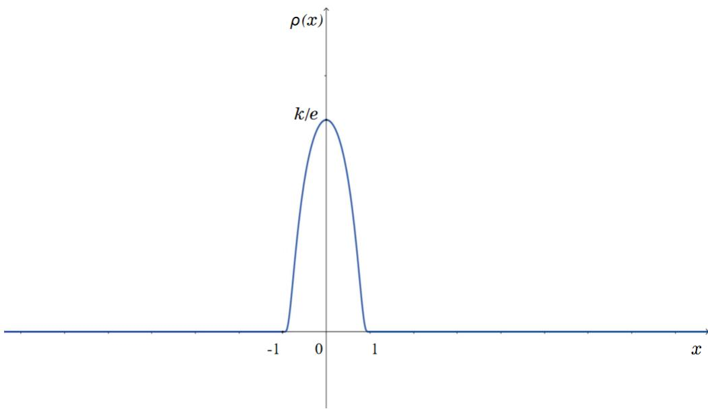

<!-- MinerU part: pages-001-50 -->

# 概率论教程

任佳刚 刘继成

## 记号与约定

1. 具体值不重要的常数统一记为C. 因此你会看到诸如

$$
| x - y | \leqslant C, | y - z | \leqslant C \Longrightarrow | x - z | \leqslant C
$$

的推理. 不要惊诧!

2.

A := B, B =: A 将A定义为B, 将B记为A.

3.

$$
\mathbb{N} := \{0, \pm 1, \pm 2, \dots\}, \mathbb{N}_{+} := \{0, 1, 2, \dots\}, \mathbb{N}_{+ +} := \{1, 2, \dots\}.
$$

4.

$$
\mathbb{R} :=(- \infty, \infty), \bar{\mathbb{R}} :=[- \infty, \infty], \mathbb{R}_{+} :=[0, \infty).
$$

5. Q: R中的有理数全体; $\mathbb{Q}_{+} = \{r \in \mathbb{Q}, r \geqslant 0\}; \mathbb{Q}_{+ +} = \{r \in \mathbb{Q}, r > 0\}$

6. $\mathbb{C} : = \{x + iy, x, y \in \mathbb{R}\}$ 复数的全体; $\forall z = x + iy \in \mathbb{C}$ 2

$$
\operatorname{Re}(z) := x, \quad \operatorname{Im}(z) := y
$$

分别称为z的实部和虚部.

7.

$$
\delta_{ik} = \left\{\begin{array}{ll} 1, & i = k, \\ 0, & i \neq k.\end{array} \right.
$$

8. $\forall a \in$ R,

$$
a^{+} = a \vee 0 := \max \{a, 0\}, a^{-} := -(a \wedge 0) := - \min \{a, 0\},
$$

分别称为a的正部与负部.

9. $\forall a \in \mathbb{R}_{+},[a]$ 表示不超过a的最大整数.

10. $\forall a \in \mathbb{R}^{n}, a^{\prime}$ 表示向量a的转置向量; 若A为矩阵, A′表示A的转置矩阵.

11. $\forall a =(a_{1}, \cdot \cdot \cdot, a_{n}), b =(b_{1}, \cdot \cdot \cdot, b_{n}) \in \mathbb{R}^{n}$

$$
a \cdot b := ab^{\prime} := a_{1} b_{1} + \dots + a_{n} b_{n},
$$

$$
\left| a \right|^{2} := a_{1}^{2} + \dots + a_{n}^{2}.
$$

12.

$C_{0}^{\infty} : = C_{0}^{\infty}(\mathbb{R}^{m}) : = \{f : \mathbb{R}^{m} \mapsto \quad$ R : f无穷次可微且在某个有界集外恒等于零},

$C_{0} : = C_{0}(\mathbb{R}^{m}) : = \{f : \mathbb{R}^{m} \mapsto \quad$ R : f连续且在某个有界集外恒等于零},

$$
C_{b} := C_{b}(\mathbb{R}^{m}) := \{f: \mathbb{R}^{m} \mapsto \mathbb{R}: f \text{有界连续}\}.
$$

## 目录

第一章 试验及事件的运算
1.1 试验及其数学描述 ..... 8
1.2 事件的关系与运算 ..... 12

第二章 离散概型
2.1 古典概型 ..... 19
2.2 有限概型 ..... 27
2.3 随机变量 ..... 30
2.4 条件概率 ..... 35
2.5 全概率公式 ..... 40
2.6 独立性 ..... 46
2.7 $\pi$ -类, $\lambda_0$ -类与代数 ..... 49
2.8 重温独立性 ..... 54
2.9 可列概型 ..... 56
2.10 二项分布的Poisson分布近似: Stein-Chen方法 ..... 70

第三章 公理概型
3.1 动因 ..... 75
3.2 $\sigma$ -代数, 单调类与 $\lambda$ -类 ..... 76
3.3 概率的公理化 ..... 81
3.4 条件概率, 独立性与条件独立性 ..... 87

第四章 随机变量
4.1 基本概念 ..... 96
4.2 分布函数 ..... 106
4.3 分类 ..... 108
4.4 多维随机变量的分布函数 ..... 117
4.5 条件分布 ..... 124
4.6 随机变量的存在性 ..... 127
4.7 随机变量的函数 ..... 129
4.8 多维随机变量的函数 ..... 131

第五章 期望与积分
5.1 简单随机变量情形 ..... 134
5.2 一般情形 ..... 138
5.3 计算期望的例子 ..... 143

5.4 随机变量列的收敛性 ..... 151
5.5 积分(期望)号下取极限 ..... 155
5.6 Fubini定理 ..... 162
5.7 带参数的期望 ..... 163
5.8 Riemann-Stieltjes积分 ..... 165
5.9 Lebesgue-Stieltjes积分 ..... 173
5.10 方差与矩 ..... 176
5.11 几个等式与不等式 ..... 183
5.12 条件期望 ..... 188

第六章 随机变量的独立性
6.1 基本定义及性质 ..... 191
6.2 不相关与独立的关系 ..... 202
6.3 独立随机变量之和 ..... 206
6.4 随机游动 ..... 210
6.5 条件独立性 ..... 214

第七章 大数定律
7.1 Markov大数定律 ..... 216
7.2 强大数定律 ..... 219

第八章 特征函数
8.1 复随机变量 ..... 227
8.2 定义及例子 ..... 228
8.3 基本性质 ..... 231
8.4 唯一性定理 ..... 238
8.5 连续性定理 ..... 244
8.6 多维情形 ..... 252
8.7 Skorokhod表现定理 ..... 258

第九章 特征函数的应用
9.1 分布的计算 ..... 261
9.2 极限定理 ..... 265
9.3 一般正态分布 ..... 269

第十章 中心极限定理中的余项估计
10.1 Lindeberg定理 ..... 272
10.2 几个分析引理 ..... 274
10.3 分布余项的积分估计 ..... 279
10.4 余项的一致估计 ..... 282

第十一章 附录
11.1 Stirling公式 ..... 284
11.2 Bihari–LaSalle不等式及其推论 ..... 285
11.3 绝对连续函数 ..... 288
11.4 函数的磨光 ..... 288

## 目录

11.5 指数函数的逼近 ..... 289
11.6 常用分布 ..... 291

## 1 试验及事件的运算

世界是偶然的或者说随机的. 想想看, 比如宏观方面, 关于宇宙的起源, 你如果不信上帝的话, 就得信大爆炸理论; 可是你如果信上帝的话, 上帝又是怎么来的呢? 所以你可能, 很可能, 非常可能, 还是得信大爆炸理论. 可是这么一个开天辟地的大爆炸, 怎么就炸出了个太阳?又炸出了个地球? 地球和太阳的距离又刚好是这么远? 地球上又刚好有个大气层? 有水? 有空气? 有孕育生命的一切必要的与充分的条件? 而比如微观方面, 当时间来到某一天, 又刚好有了一个你? “开辟鸿蒙, 谁为情种?” 又是鸿蒙, 又是谁为, 你不觉得世界来到今天这个状态, 在这个状态里有目前的这些生物, 这种可能性不是比10的负一亿次方还要小得小得多吗?“ ······ 万类霜天竞自由. 怅寥廓, 问苍茫大地, 谁主沉浮? ” 谁主沉浮? 谁主沉浮? 谁主得了沉浮?

世界也是确定的. 我们从小学起就开始学习支配这个世界的确定的规律. 有数学的: 1 +2 = 3, 三角形的内角和为180o, 一元二次方程的根由其系数唯一地显式地确定, $\sin(\alpha + \beta) =$ $\sin \alpha \cos \beta + \cos \alpha \sin \beta, \cdot \cdot \cdot \cdot \cdot;$ 有物理的: 杠杆原理, 牛顿三定律, 热力学三定律, $E = mc^{2}$ ······; 有化学的: 门捷列夫元素周期表, 化学反应方程式, 拉瓦锡质量守恒定律, ······; 还有, 也许我要说, 甚至还有语文的: 成语啊, 固定搭配啊, 起承转合啊, ······.

但归根到底是随机的. 物理学到了微观世界即量子物理学是随机的, 化学到了分析化学是随机的, 就更不用说生物学了. 还有文学, 有哪一篇小说是完全按照某条铁律写出来的呢?作家笔下那些才华横溢的句子, 除了他或她的天赋之外, 难道不是, 往往是, 触发于天边的一抹晚霞, 窗外的一缕清风?

而数学呢? 数学中的概率论这门学科, 正是研究随机现象的科学, 虽然它本身并不是随机的(好像模糊数学倒有点随机的味道, 但与本课程无关). 特别有意思的是, 现代概率论整体理论的建立, 也基于一个十分十分偶然的因素: 概率论公理体系的奠基者、伟大的数学家Kolmogorov1起初是作为历史系的学生进入莫斯科大学的. 仅仅因为他参加了一个讨论班,仅仅因为他写了一篇论文得到了一个教授的赏识, 仅仅因为这个赏识他的教授对他说“历史学的任何一个结论都需要五个证明”而要求他增补论文, 仅仅因为他不喜欢这个要求而要找一个“一个结论只需要一个证明”的地方, 他才转到了数学系——于是概率论才有了今天的样子.

另外发生在Kolmogorov身上的一件随机的事情是, 他的出生地也是随机的: 他母亲怀着他出去办事, 途径一个小村子时突然临产而生下了他.

真是不可思议! 这样一个本身充满了随机性的Kolmogorov成了现代概率论的开山鼻祖!是巧合吗? 是命运也就是说是上帝吗?

世界是随机的, 随机积分和随机微分方程的创始人、著名数学家伊藤清(Kiyosi Itˆo)2如是说. 他的日语原话直译是, 世界是确率的. 日语里的“确率”似乎承担了汉语里的“概率”和“随机”双重意思, 并同时具有名词和形容词双重词性.

“确率”与“概率”云云, 都是英语probability的翻译. 我们平常说到做一件事是否会成功时, 如果说“我有百分之百的把握”, 那就是十分肯定的, 没有任何不确定性；而如果说“我有百分之七十的把握”, 或者“我只有百分之二十的把握”, 这里面就包含了一种不确定性, 尽管如此, 在某种意义上确定性是可以量化的, 即有一个百分比, 即比率, 来描述其确定的程度, 这也许就是日译选用“确率”这个词的来历吧; 而中译的确立, 则经历了一个过程: 在1935年的《数学词典》里, 是“概率”与“几率”同时使用的, 其后还使用过诸如“盖然率”、“或然率”等名词. 直到1964年在《数学名词补编》中才正式确定为“概率”, 且直到现在, 在台湾省还是使用“几率”这个词的, 在其它说中文的地区更是五花八门. 译法的繁杂说明了翻译的不易, 但我们至少得明白, 在“概率”里头, “概”并不是来修饰“率”的, “概率”不是“大概的率”的意思.

日常生活中, 当我们说概率时, 大体上可分为两种不同的情况.

第一种情况是有一些很明显的客观依据的. 比如一个婴儿将要出生, 我们说是男婴还是女婴的概率都是二分之一, 这是因为过去数年内的数据表明, 在新生儿中大体上男婴女婴各占一半, 而这也预示着在未来出生的每一百个婴儿中, 男女婴儿数也会都接近五十个. 当然,刚好都各为五十个可能比较罕见, 也可能男婴48个, 女婴52个; 也可能男婴54个, 女婴46个, 反正是比较接近的情况比较多见, 而不接近的情况, 比如说男婴35 个, 女婴65个的情况则是很罕见的. 再比如一个士兵, 说他200米的距离内射击的命中率是百分之九十, 那一定是因为过去的记录中, 射击的总次数中有百分之九十是命中了的, 并且你如果再让他射一千次, 那么你可以期望他击中的次数应该在九百次左右, 虽然不太可能刚好是九百次. 而这个数字对未来的意义在于, 指挥员可以期待他十次射击中命中八九次的可能性是非常大的, 而基本上不可能只命中比如说四次. 此外, 如果某次任务中目标非常重要, 必须一枪毙命, 那么指挥员必须依据每个人的命中率决定一个策略, 比如至少得派几个战士同时执行任务才能稳妥地完成任务.

这种客观概率的典型特征是, 它们是从大量的试验中得出的结论, 并且还可以继续做大量的试验检验这个结论的正确性.

第二种情况是并没有太明显的客观依据, 或者说虽然也有客观依据, 但主观判断占了很大的成分. 比如说, 对明天股市的涨跌, 每天晚上每个电视台都有评论员做出预测. 不可否认,有些不良评论员是昧着良心说瞎话的, 但这不在我们的讨论之列. 我们假定每个评论员都是正直的. 即使这样, 他们对未来的判断也不会完全一样. 比如说甲会说某股明天上涨的概率是0.8, 而乙预测只有0.3. 他们的说法有客观的成分吗? 也许是有的. 但是是完全客观的吗?这不可能! 一定是夹杂了他自己的一些主观判断. 再比如国外的总统选举, 甲认为某候选人当选的可能性是百分之九十, 而乙认为只有百分之六十. 这不能说完全没有客观依据, 但肯定掺杂了很多主观好恶.

这种主观概率的典型特征是: 它们不是从大量的试验中得出结论, 并且这些结论的正确性也无法通过大量重复的试验进行检验.

在实际问题中, 概率的主观性和客观性往往并不是完全绝对对立的, 而是常常有统一的时候, 相互补充的时候. 比如抛一枚硬币, 说它是均匀的, 意义是什么呢?根据是什么呢?定义又是什么呢?难道均匀性可以由每抛100次, 正反面各出现50次来定义吗?当然——不行, 因为如果按照这个定义, 就不会有任何一枚硬币满足要求. 那么, 可以由每次抛时, 正反面出现的可能性都一样来定义吗? 当然也不行, 因为这又涉及到什么叫“可能性都一样”的问题?

那么请告诉我, 什么叫均匀?答案难道不是因人而异吗?

所以, 这里面就有一个主观性的问题. 也因此在与此有关的一切讨论中, 也就都有了主观

因素掺杂其中.

还有比如说天气预报, 尽管我们有各种先进的仪器,但依然要有预报员参加工作. 这时结果就很可能掺杂了预报员们的个人判断,因此也是有主观因素的.

上面的讨论似乎有点哲学的味道了, 偏离了本课程的跑道. 对这个问题, 我们采用邓小平同志的智慧和策略, 即不争论. 作为一个现代数学分支, 概率论和其它分支一样,有自己严格的公理体系, 而在此基础上建立的一切结论都必须根据严格的逻辑推理获得. 上面讨论的主客观性的问题是在涉及其应用时产生的,属于统计学(包括统计物理, 金融统计......) 范畴. 我们此后将不纠结于这个问题, 而是按公理化的方式解决这个问题——例如什么叫硬币是均匀的? 正反面出现的概率都一样就叫均匀的, 而概率是公理化体系中已经明确给定了的. 我们关心的, 是在这个公理体系下所能得到的科学结论. 至于实际问题中一枚硬币是否均匀, 那就不是我们关心的问题了, 留给赌徒们自己去解决吧.

赌博当然是一种恶习. 但正如毛主席所说, 任何事物都是一分为二的. 关于赌博的研究曾经是, 也许现在仍然是, 概率论发展壮大的不可缺少的动力. 如果最初的研究者们因为登不了大雅之堂或者因为政治上不正确而停止了此项研究, 那可能今天就根本没有概率论这个学科了——概率论本身的出现, 也是一个随机事件啊!

## 1.1 试验及其数学描述

本书所指试验, 皆指一般意义下的试验. 比如普通物理学或化学里的试验, 比如掷一枚骰子, 比如猜拳, 等等.

既然是试验, 就会有多种不同的结果, 否则就不必试验了. 但有些试验人们已经基本研究清楚了, 其结果受物理或化学或其它科学定律支配, 结果基本上是确定的, 虽然可能有一点小小的误差(当然, 这些误差有时候不重要, 但有时候却非常重要. 不过这不在本书的讨论范围之列). 人们通过这些试验可以验证已有的知识, 也可以发现或总结新的规律. 比如我们都做过测量重力加速度的试验, 也都知道其值基本上会在9.8m/s2左右(随地点不同而略有差别).而有些试验则不然, 即其结果是完全不可预测的, 漂浮不定的. 比如猜拳, 你能准确猜到对手下一手出什么拳? 比如掷骰子, 你能总结出某个规律, 比如说1 点过后一定出现5点? 不可能的嘛.

第一类试验中的误差分析, 无疑是一个很重要的研究课题, 同时也是推动概率论发展的主要动力之一(例如正态分布虽然早已有之, 但却因为Gauss3在研究误差分析时得到了它而又名Gauss分布). 不过这个问题基本上属于统计范畴, 不在本书要讨论的问题之列. 本书所指试验, 是第二类试验, 即其结果完全无法用现有的科学知识预测的试验, 或理论上虽可以预测, 但事实上很难做到的试验.

概率论的研究对象, 当然不是所有这些试验, 而是满足下面两个条件的试验: 第一, 试验是可以重复的, 即在相同的环境下可反复进行同一个试验, 比如说扔硬币就是如此. 反之, 比如说总统选举就不是可以重复的, 因此不是概率论的研究对象. (但选举之前举办的民调是可以重复的, 因此是概率论或者更准确地说是统计学的研究对象.) 第二, 大量重复这个试验时,虽然单次的结果无法预测, 但会呈现一定的统计规律. 比如扔硬币, 如果这个硬币是均匀的,那么大量重复这个试验时, 正反两面出现的次数会大致相等. 为了验证这一点, 历史上不少人做过这个试验, 结果显示都如此. 这就是统计规律.

## 1.1 试验及其数学描述

当然, 试验的结果是否可以预测, 是与科学技术的发展水平相关的. 就拿抛硬币为例. 根据经典动力学与运动学原理, 硬币自从被抛出那刻起, 它的运动轨迹就被确定下来了, 包括最后的结果——哪一面朝上. 因此, 从理论上讲, 抛硬币的试验是完全可以预测结果的. 问题是影响硬币运动轨迹的参数太多, 例如抛出手时的初速度、高度和角度, 硬币的实际上不可避免的微小的不均匀性, 空气中飘动的微风等等, 而最终哪一面出现的结果又对这些参数太敏感了, 它们中任何一项的任何微小的改变, 包括肉眼观察不到的改变,都会导致我们肉眼观察得到的截然不同的结果. 所以这个试验即使本质上是确定的, 但在一般的理解中, 我们仍然认为是随机的, 且具有统计规律, 因此我们把其归结为其结果无法用现有的科学知识预测的试验, 而用概率论的方法去研究它. 我们相信, 随着科学的发展, 会有一些目前用概率论研究的课题, 将来却成为了某一科学定律. Hilbert4说过, 我们必须知道, 我们必将知道; Einstein(爱因斯坦)5说过, 上帝不掷骰子. 这是这些科学巨匠们的坚定信念. 但在我们知道以前, 在上帝告诉我们他主宰世界的方式以前, 我们还是需要概率论的, 哪怕只是权宜之计. 所以也正是他们两人, 在概率论的发展史上都做出了杰出的贡献. Hilbert第六问题是将物理学公理化, 这其中包含了将概率论公理化, 后者由Kolmogorov在1933年完成, 为现代概率论的发展奠定了基础; Einstein关于Brown6 运动的研究则对热力学和随机过程的研究产生了重大的推动力, 而且催生了一个或多于一个的诺贝尔奖或同等级别的奖(例如Avogadro7常数的确定).

对一个试验, 任何一个结果都称为一个基本事件(即不能进一步分解的事件，正如不可分的粒子称为基本粒子一样). 将其所有可能的结果即基本事件放在一起, 就构成一个集合, 这个集合我们一般将用Ω表示之. 传统上, 一个基本事件称为一个样本点ω, 而Ω则称为样本空间. 比如掷一枚骰子的试验, 其样本空间便是

$$
\Omega = \{1, 2, 3, 4, 5, 6\}.
$$

而如果将一枚骰子掷n次, 样本空间则是

$$
\Omega = \{(k_{1}, \dots, k_{n}): k_{i} \in \{1, 2, 3, 4, 5, 6\}, i = 1, \dots, n\}.
$$

将满足某些特定条件的基本事件放在一起, 就构成一个事件. 因此事件用集合论的语言来说就是Ω的子集，常用大写字母如A,B,···表示之. 比如在掷一次骰子的试验中, 满足“所得点数大于3” 这个条件的结果便是

$$
A = \{4, 5, 6\};
$$

在掷n次骰子的试验中, 满足 $^{66} n$ 次所得点数之和小于等于 $\cdot_{m} \mathfrak{P}$ 这个条件的结果便是

$$
A = \{(k_{1}, \dots, k_{n}): k_{1} + \dots + k_{n} \leqslant m\}.
$$

但所谓“基本”其实并不是天生不变的, 它与我们所感兴趣的问题有关, 也与我们对研究方法的选择有关. 例如掷两枚骰子的试验, 基本事件自然可选择为

$$
(k_{1}, k_{2}), k_{1}, k_{2} = 1, 2, \dots, 6.
$$

此时,相应的样本空间是:

$$
\Omega_{1} = \{(k_{1}, k_{2}): k_{1}, k_{2} \in \{1, 2, 3, 4, 5, 6\}\}.
$$

但是, 如果我们掷两枚骰子的目的就是为了看两个骰子点数之和的大小, 那么基本事件也可以取为

$$
k = 2, \dots, 12.
$$

此时的样本空间便为

$$
\Omega_{2} = \{2, 3, 4, 5, 6, 7, 8, 9, 10, 11, 12\}.
$$

两个相比较, $\Omega_{1}$ 含有更多的基本事件, 且 $\boldsymbol{\Omega}_{2}$ 中的基本事件都是由 $\Omega_{1}$ 的基本事件的不同组合构成的. 当然, 第二个问题的样本空间也可以用 $\Omega_{1}$ 来描述. $\Omega_{1}$ 和 $\Omega_{2}$ 的关系无非是 $\Omega_{2}$ 中的一个样本点对应着 $\Omega_{1}$ 中多个样本点而已. 至于这两种选择哪个更好, 则很难有一个放之四海而皆准的标准, 要依具体问题而定. 不过, 一般来说, 基本事件分得越细, 适用的问题就越多, 计算也相对复杂些; 基本事件分得越粗, 就越有针对性.

由此我们可以看到, 所谓样本空间也不是试验本身固有的, 而是人们为方便研究而建立的数学模型, 且这个模型的建立往往依赖于个人的品味和能力、解决问题的针对性与有效性、使用上的方便性以及数学处理上的简洁性与优雅性等等. 通常, 给出适合的样本空间并不是个简单的问题.

乍一看, 一个试验, 结果应该是有限的(谁能把一个试验做出无穷个结果呢?), 所以样本空间的元素也只有有限多个. 但其实不然. 需要想象不能实际做出的试验, 这是科学研究的基本功. Einstein不就通过想象电梯试验启发了广义相对论吗? 虽然他从来没有也不可能做出这个试验.

具体到我们面对的问题, 我们刚刚说过, 概率论的研究对象是可以重复的试验, 因此很容易想象将一个简单的试验重复多次, 循环往复, 以致无穷, 虽然实际上做不到无穷次, 但有必要考虑试验次数趋于无穷时发生的各种现象, 这样样本空间就有无穷多个元素.

这方面的一个典型例子是人口普查.

设一个地区共有N口人. 这个N往往是相当大的. 我们要调查这N口人的一些状况(比如平均身高). 当然, 最准确的方法是对每个人逐一调查, 这样最后将各人的情况平均即可. 但这样的逐一调查会耗费大量的人力物力财力, 所以有必要采取一种替代的方法, 这就是抽样调查. 所谓抽样调查就是随机地选取一些人进行调查. 但需要抽样多少次才能获得所需要的准确性? 这不是一个有现成答案的问题. 所以在建立数学模型时, 不能预先限定抽样的次数即样本的大小. 这样, 假设人群全体为 $\{\omega_{i}, i = 1, 2, \cdots, N\}$ 这个抽样所得到的样本空间便为

$$
\Omega = \{\omega =(\omega_{k_{1}}, \omega_{k_{2}}, \dots)\} = \{\omega_{1}, \omega_{2}, \dots, \omega_{N}\}^{\infty}.
$$

其次, 有些试验本身就有无穷多个结果, 比如说往地上的一块区域投一根针，考虑针的位置及朝向，就有无穷多个结果.

与无穷有关的, 我们需要区分两个概念: 可数和不可数.

可数分为两类: 有限和可列. 有限就不用解释了. 所谓可列集, 是指: 1. 该集合含有无穷多个元素; 2. 这些元素可以排成一列. 准确地说, 集合A称为有可列个元素, 或简称可列, 是指存在一种排列方式将A的元素写为 $a_{1}, a_{2}, \cdots$ . 因此

$$
A = \{a_{1}, a_{2}, \dots\}.
$$

例如, 全体整数的集合是可列的, 因为它们能以以下方式排列:

$$
0, 1, - 1, 2, - 2, 3, - 3, \dots
$$

全体有理数集也是可列的, 因为它们能以以下方式排列:

$$
0, 1, - 1, \frac{1}{2}, - \frac{1}{2}, \frac{1}{3}, - \frac{1}{3}, \frac{2}{3}, - \frac{2}{3}, \dots
$$

但可以证明, 全体实数的集合不是可列的.

描述一个集合, 在该集合的元素很少时, 可以用穷举法. 例如, 若A表示前五个正整数, 则可直接写出:

$$
A = \{1, 2, 3, 4, 5\}.
$$

但只要A的元素一多, 这种方法就不可能了. 这时就用A的元素满足的条件来表示它. 例如

$$
\mathbb{N} := \{n: n \text{为整数}\}
$$

表示整数全体, 而

$$
\mathbb{N}_{+} := \{n \in \mathbb{N}: n \geqslant 0\}
$$

则表示非负整数全体.

我们再看一些例子.

例1. 抛掷一枚硬币, 以1表示出现正面, 0表示出现反面. 则样本空间为

$$
\Omega = \{0, 1\}.
$$

例2. 将一枚硬币抛n次, 样本空间为

$$
\Omega = \{0, 1\}^{n} := \{(a_{1}, \dots, a_{n}): a_{k} = 0, 1, k = 1, \dots, n\}.
$$

例3. 将一枚硬币抛无穷次, 样本空间为

$$
\Omega = \{0, 1\}^{\infty} := \left\{\left(a_{1}, \dots, a_{n}, \dots\right): a_{k} = 0, 1, k = 1, \dots, n, \dots \right\}.
$$

例4. 在大街上随便问一个人他的生日, 样本空间为

$$
\begin{array}{c}{{\Omega = \big \{(m, n): m = 1, 3, 5, 7, 8, 10, 12 \text{时}, 1 \leqslant n \leqslant 31; m = 2 \text{时}, 1 \leqslant n \leqslant 29;}} \\{{m = 4, 6, 9, 11 \text{时}, 1 \leqslant n \leqslant 30 \big\}.}} \end{array}
$$

例5. 在大街上随便问一个人他的身高, 样本空间可以取为

$$
\Omega = \{x \in \mathbb{R}: 0 \leqslant x \leqslant 3\}.
$$

例6. 两个人玩石头剪刀布, 样本空间为

$$
\begin{array}{rl} \Omega := & \left\{\text{(石,石),(石,剪),(石,布),(剪,石),} \right.\\ & \left.\text{(剪,剪),(剪,布),(布,石),(布,剪),(布,布)} \right\} \end{array}
$$

例7. 四个人, 编号为1,2,3,4, 进行射击比赛, 成绩以0,1,··· ,10环记之. 则样本空间可取为

$$
\Omega := \{(i, j): i = 1, \dots, 4, j = 0, 1, \dots, 10\} \mathrm{oe}
$$

也可取为

$$
\Omega := \{(i_{1}, i_{2}, i_{3}, i_{4}): i_{k} \in \{0, 1, \dots, 10\}.k = 1, 2, 3, 4\}.
$$

总之, 描述试验及其结果的数学语言本质上是一般集合论的语言, 只不过用的术语可能不同而已. 前两章我们不加区别地使用集合和事件这两个名词, 等第三章给出概率的公理化之后,会进一步明确事件的概念.

现在. 让我们从这些基本的对象开始我们的概率论之旅.

## 习题

1. 一个铁人三项运动员, 每一项获得的名次都可能是1到10名. 写出这个试验的样本空间.

2. 一个电码由0到9四位数字组成, 但由于各种因素的干扰, 发报员发出的数字都可能被接收为另外一个数字. 写出发送一个电码这个试验的样本空间.

3. 张三从甲地步行到乙地, 第一次行走, 未带地图. 包括甲地, 共有m处分叉路口, 其中第i个路口有 $\dot{m}_{i}$ 个道路可选. 写出这个试验的样本空间.

4. 投n次硬币, 写出样本空间.

5. 将扔硬币的试验无穷此重复下去, 写出这个试验的样本空间.

6. 一项流行病调查,调查对象为A, B, C, D四种疾病,结果为α, β, γ三种症状.写出这个试验的样本空间.

## 1.2 事件的关系与运算

由于不可避免地要处理事件的各种组合, 所以需要用到事件的运算.

设Ω为样本空间, $A, B, C, \cdots$ ·均为Ω的子集, 即事件；以∅表示空集, 即不含任何元素的子集. 我们引进如下运算与术语.

• Ω称为必然事件, ∅称为不可能事件.

• A与B的并是指这样一个事件: A与B中至少一个发生. 这个事件记为 $A \cup B$ , 即

$$
A \cup B := \{\omega \in \Omega : \omega \in A \text{或} \omega \in B\},
$$

• A与B的交是指这样一个事件: A与B都要发生. 这个事件记为 $A \cap B$ , 即

$$
A \cap B := \{\omega \in \Omega : \omega \in A \text{且} \omega \in B\},
$$

A∩B也常写为 $AB;$

AB = ∅时, 称A与B互不相容或不相容. 此时, A ∪ B常记为 $A + B$ . 或者反过来说, 写出 $A + B$ 时, 就自动意味着 $AB = \emptyset$

• A与B的差是指这样一个事件: A发生而B不发生. 这个事件记为 $A \backslash B$ , 即

$$
A \setminus B := \{\omega \in A \text{且} \omega \notin B\}.
$$

$A \subset B \mathbb{H}$ 时, B \A常记为B −A. 或者反过来说, 写出B −A时, 就自动意味着 $A \subset B$

• A与B的对称差定义为:

$$
A \Delta B :=(A \setminus B) \cup(B \setminus A).
$$

## 1.2 事件的关系与运算

• A的余集, 或称逆事件, 定义为:

$$
A^{c} := \Omega \setminus A.
$$

显然

$$
\emptyset^{c} = \Omega, \Omega^{c} = \emptyset.
$$

一般地有

$$
(A^{c})^{c} = A.
$$

• 两个事件 $A, B,$ 若

$$
\omega \in A \Longrightarrow \omega \in B,
$$

则称A包含于 $B,$ 或B包含了A, 记为 $A \subset B$ 或 $B \supset A$ . 若 $A \subset B$ 且 $B \supset A$ , 则称A等于 $B,$ 记为 $A = B$

• 并与交均可对多个集合定义. 设 $\{A_{i}, i \in I\}$ 是一族集合, 定义:

$$
\bigcup_{i \in I} A_{i} := \{\omega : \exists i \in I, \text{使得} \omega \in A_{i}\}.
$$

$$
\bigcap_{i \in I} A_{i} := \{\omega : \forall i \in I, \omega \in A_{i}\}.
$$

• 设 $A_{1}, A_{2}, \cdots$ ·为一列事件, 定义它们的上极限为

$$
\limsup_{n \to \infty} A_{n} := \bigcap_{n = 1}^{\infty} \bigcup_{k = n}^{\infty} A_{k}.
$$

因此, $\omega \in \operatorname{lim} \operatorname{sup}_{n \to \infty} A_{n}$ 就意味着对任意 $\cdot n$ , 都有 $k > n$ 使得 $\omega \in A_{k}$ . 这显然等价于有无限多个 $\mathbf{\nabla}^{\cdot} n^{\cdot}$ 使得 $\omega \in A_{n}$ . 因此, $\omega \in \operatorname{lim} \operatorname{sup}_{n \to \infty} A_{n}$ 就表示 $\left\{A_{n} \right\}$ 中有无限多个发生这一事件;

定义它们的下极限为

$$
\liminf_{n \to \infty} A_{n} := \bigcup_{n = 1}^{\infty} \bigcap_{k = n}^{\infty} A_{k},
$$

$\omega \in \operatorname{lim} \operatorname{inf}_{n \to \infty} A_{n}$ 就意味着存在一个 $^{\cdot} n,$ 使得对任意k $> n$ 都有 $\omega \in A_{k}$ . 这显然等价于最多只有有限多个n使得ω $\not \in A_{n}$ . 因此, $\omega \in \operatorname{lim} \operatorname{inf}_{n \to \infty} A_{n}$ 就表 $\textstyle{\widehat{\overline{{\mathcal{A}}}}} \dotsc \left\{A_{n} \right\}$ 中至多有限个不发生这一事件.

因此有

$$
\liminf_{n \to \infty} A_{n} \subset \limsup_{n \to \infty} A_{n}.
$$

这有点像数学分析里大家熟知的关系: 对任意数列 $\left\{a_{n} \right\}$ 有

$$
\liminf_{n \to \infty} a_{n} \leqslant \operatorname{limsup}_{n \to \infty} a_{n}.
$$

如果li $\begin{array}{r}{n \operatorname{sup}_{n \to \infty} A_{n} = \operatorname{lim} \operatorname{inf}_{n \to \infty} A_{n}} \end{array}$ , 则称 $\left\{A_{n} \right\}$ 的极限存在, 并记为lim $A_{n},$ 若 $\left\{A_{n} \right\}$ 单调, 则 $\operatorname{lim}_{n \to \infty} A_{n}$ 存在: 当它们单调上升, 即 $A_{1} \subset A_{2} \subset A_{3} \cdot \cdot \cdot$ · 时, 有

$$
\lim_{n \to \infty} A_{n} = \bigcup_{n = 1}^{\infty} A_{n};
$$

当它们单调下降, 即 $A_{1} \supset A_{2} \supset A_{3} \cdot \cdot$ · 时, 有

$$
\lim_{n \to \infty} A_{n} = \bigcap_{n = 1}^{\infty} A_{n}.
$$

从而我们一般地有

$$
\limsup_{n \to \infty} A_{n} := \lim_{n \to \infty} \bigcup_{k = n}^{\infty} A_{k},
$$

$$
\liminf_{n \to \infty} A_{n} := \lim_{n \to \infty} \bigcap_{k = n}^{\infty} A_{k}.
$$

这两个式子和数学分析里下面熟知的式子又是类似的:

$$
\limsup_{n \to \infty} a_{n} := \limsup_{n \to \infty} \sup_{k \geqslant n} a_{k},
$$

$$
\liminf_{n \to \infty} a_{n} := \lim_{n \to \infty} \inf_{k \geqslant n} a_{k}.
$$

事件的运算有下面的性质:

• 交换律:

$$
A \cup B = B \cup A, AB = BA;
$$

• 结合律:

$$
\begin{array}{c} A \cup B \cup C = A \cup(B \cup C) =(A \cup B) \cup C, \\ ABC = A(BC) =(AB) C; \end{array}
$$

• 分配律:

$$
A(B \cup C) =(AB) \cup(AC),
$$

这最后一条性质类似于四则运算中的分配律, 即 $\operatorname{l} a(b + c) = ab + ac,$ , 这也许是人们想到用 $AB^{\prime}$ 代替 $A \cap B.$ 表示交的原因. 但你不能想当然地认为形式上交对应着乘积的所有运算关系. 比如我们有

$$
AA = A,
$$

但并没有

$$
aa = a;
$$

我们有

$$
A \cup(BC) =(A \cup B) \cap(A \cup C),
$$

但也没有

$$
a + bc =(a + b)(b + c),
$$

等等.

下面的命题是显然的.

命题 1.2.1. (i)

$$
A \setminus B = A - AB;
$$

## 1.2 事件的关系与运算

$$
A \cup B =(A \setminus B) + B =(A \setminus B) + AB +(B \setminus A).\tag{ii}
$$

一个集合可以用一个函数来刻画，这就是所谓的示性函数

定义 1.2.2. 设 $A \subset \Omega$ . 函数

$$
1(A)(\omega) := 1_{A}(\omega) = \left\{\begin{array}{ll} 1 & \omega \in A, \\ 0 & \omega \notin A \end{array} \right.
$$

称为A的示性函数.

显然, 两个集合相等当且仅当其示性函数相等. 此外, 我们有下面的简单性质.

命题 1.2.3. (i)

$$
1_{A} = 1 - 1_{A^{c}};\tag{ii}
$$

$$
A \subset B \Longleftrightarrow 1_{A} \leqslant 1_{B}.\tag{iii}
$$

$$
A = B \Longleftrightarrow 1_{A} = 1_{B};\tag{iv}
$$

$$
A \subset B \Longleftrightarrow 1_{B \setminus A} = 1_{B} - 1_{A}.
$$

(v)

$$
1_{A \cup B} = 1_{A} + 1_{B} - 1_{A} 1_{B} = 1_{A} \vee 1_{B},
$$

(vi)

$$
1_{AB} = 1_{A} 1_{B} = 1_{A} \wedge 1_{B}.
$$

证明是直接的, 留给读者.

利用示性函数可以简洁地证明下面这个基本的关系式——当然不用示性函数也可以证明, 读者可以自行给出, 并比较一下两种证明的优劣.

定理 1.2.4 (De $\mathrm{Morgan}^{8}$ 原理). 设I是任意指标集, 则

$$
\left(\bigcup_{i \in I} A_{i}\right)^{c} = \bigcap_{i \in I} A_{i}^{c},
$$

$$
\left(\bigcap_{i \in I} A_{i}\right)^{c} = \bigcup_{i \in I} A_{i}^{c}.
$$

证明. 应用命题1.2.3, 有

$$
\begin{array}{rcl}{1_{(\cup_{i \in I} A_{i})^{c}}} & = &{1 - 1_{(\bigcup_{i \in I} A_{i})}} \\ & = &{1 - \max_{i \in I} 1_{A_{i}}} \\ & = &{\min_{i \in I}(1 - 1_{A_{i}})} \\ & = &{\min_{i \in I} 1_{A_{i}^{c}}} \\ & = &{1_{(\cap_{i \in I} A_{i}^{c})}.} \end{array}
$$

类似可证明另一式.

□

习题

1. 证明:

(a)

$$
A \setminus B = AB^{c};
$$

(b)

$$
(A \cup B) C = AC \cup BC;\tag{c}
$$

$$
(A \setminus B) C = AC \setminus BC;
$$

(d)

$$
(A \setminus B) \cup C =(A \cup C) \setminus BC^{c};
$$

2. 证明:

(a)

$$
1_{\liminf_{n \to \infty} A_{n}} = \liminf_{n \to \infty} 1_{A_{n}}
$$

(b)

$$
1_{\limsup_{n \to \infty} A_{n}} = \limsup_{n \to \infty} 1_{A_{n}}
$$

(c)

$$
\liminf_{n \to \infty} A_{n} \subset \limsup_{n \to \infty} A_{n}.
$$

3. 定义对称差:

$$
A \Delta B :=(A \setminus B) \cup(B \setminus A).
$$

证明:

(a)

$$
A \Delta B = B \Delta A;
$$

## 1.2 事件的关系与运算

(b)

$$
(A \Delta B) \Delta C = A \Delta(B \Delta C) =(C \Delta A) \Delta B;
$$

所以可把它们统一地记为

$$
A \Delta B \Delta C.
$$

一般地, 也可定义

$$
A_{1} \Delta A_{2} \Delta A_{3} \cdot \cdot \cdot \Delta A_{n}.
$$

(c)

$$
\begin{array}{rcl}{1_{A \Delta B}} & = &{1_{A} + 1_{B} - 21_{AB}} \\ & = &{| 1_{A} - 1_{B} |;} \end{array}
$$

4. 证明:

(a)

$$
1_{A \cup B \cup C} = 1_{A} + 1_{B} + 1_{C} - 1_{A \cap B} - 1_{B \cap C} - 1_{C \cap A} + 1_{ABC};
$$

(b)

$$
1_{ABC} = 1 - 1_{A^{c}} - 1_{B^{c}} - 1_{C^{c}} + 1_{A^{c} B^{c}} + 1_{B^{c} C^{c}} + 1_{C^{c} A^{c}} - 1_{A^{c} B^{c} C^{c}};
$$

(c)

$$
1_{\cup_{i = 1}^{n} A_{i}} = \sum_{i = 1}^{n} 1_{A_{i}} - \sum_{i \neq j} 1_{A_{i} A_{j}} + \dots +(- 1)^{n - 1} 1_{A_{1} \dots A_{n}}.
$$

(d) 若 $A_{i} \mathbb{\underline{{{H}}}}$ 不相交, $i = 1, 2, \cdots, n, n \in \mathbb{N}_{+}$ 或 $n = \infty$ . 则

$$
1_{\cup_{i = 1}^{n} A_{i}} = \sum_{i = 1}^{n} 1_{A_{i}}.
$$

(e) 设 $\{a_{n}(\omega)\}$ 是依赖于参数ω的实数列, $a(\omega)$ 是实数. 证明:

$$
\{\omega : a_{n}(\omega) \to a(\omega)\} = \bigcap_{k = 1}^{\infty} \bigcup_{n = 1}^{\infty} \bigcap_{m = n}^{\infty} \left\{\omega : | a_{m}(\omega) - a(\omega) | < \frac{1}{k} \right\}.
$$

(f) 设 $A_{1}, \cdots, A_{n}$ 是事件.

(i) 表示出事件 $^{\mathfrak{a}} A_{1}, \cdot \cdot \cdot, A_{n}^{\mathfrak{n}}$ 中恰有一个发生;

(ii) 表示出事件 $^{\dots} A_{1}, \dotsb, A_{n}^{\phantom{},}$ ”中至少有两个发生;

(iii) 表示出事件 $\cdots, \ldots, A_{n}^{\phantom{}},$ 中最多有五个发生;

(iv) 表示出事件 $^{\dots} A_{1}, \dotsb, A_{n}^{\phantom{} \dagger}$ 中一个都不发生;

(g) (i) 证明对称差的结合律

$$
(A \Delta B) \Delta C = A \Delta(B \Delta C).
$$

(ii) 证明:

$$
A_{1} \Delta A_{2} \Delta A_{3} \dots \Delta A_{n} = \bigcup_{N(I) = \text{奇数}} \left(\left(\bigcup_{i \in I} A_{i}\right) \bigcap \left(\bigcup_{j \in I^{c}} A_{j}^{c}\right)\right).
$$

(iii) 证明对称差的分配律:

$$
A \left(A_{1} \Delta A_{2} \Delta A_{3} \dots \Delta A_{n}\right) = B_{1} \Delta B_{2} \Delta B_{3} \dots \Delta B_{n},
$$

其中 $B_{i} : = AA_{i}$

5. 设Ω是样本空间, $A \subset \Omega$ . 令

$$
A_{n} = \left\{\begin{array}{ll} A & n = 1, 3, 5, \dots \\ A^{c} & n = 2, 4, 6, \dots \end{array} \right.
$$

求lim $\begin{array}{r}{\operatorname{sup}_{n \to \infty} A_{n} \stackrel{}{\to} \operatorname{lim} \operatorname{inf}_{n \to \infty} A_{n}.} \end{array}$

6. 设 $\left\{A_{n} \right\}$ 是一列集合, $n = 1, 2, \cdots$ 或 $n = 1, 2, \cdots, N$ 均可, 其中N为正整数. 令

$\tau(\omega) : = \operatorname{inf} \left\{n : \omega \in A_{n} \right\} \(\operatorname{inf} \varnothing : = \infty$ 或 $N + 1$ , 视n的变化范围而定),

$$
B_{n} := \{\omega : \tau(\omega) = n\}.
$$

证明 $B_{1}, B_{2}, \cdots$ 互不相交且

$$
\bigcup_{n = 1}^{\infty} A_{n} = \bigcup_{n = 1}^{\infty} B_{n}(n = 1, 2, \dots \text{时}),
$$

或

$$
\bigcup_{n = 1}^{N} A_{n} = \bigcup_{n = 1}^{N} B_{n}(n = 1, 2, \dots, N \text{时}).
$$

## 2 离散概型

本章讲述具有可数个基本事件的试验的概率模型, 俗称离散概型; 离散概型中, 如果样本点只是有限个, 则称为有限概型; 有限概型中, 如果各样本点出现的概率相等, 则称为古典概型, 也就是中学里讲过的概率模型. 让我们从这种最简单的概型谈起.

## 2.1 古典概型

定义 2.1.1. 一个试验, 如果有 $\cdot_{n \cdot}$ 个可能的结果, 而每个结果出现的可能性都是 $\textstyle{\frac{1}{n}}.$ , 则称为古典概率模型, 简称古典概型.

我们将用 $\omega_{1}, \cdots, \omega_{n}$ 表示这些结果, 用Ω表示它们全体：

$$
\Omega := \{\omega_{1}, \dots, \omega_{n}\},
$$

用 $P(\omega_{i})$ 表示 $\omega_{i}$ 出现的概率(即可能性), 即

$$
P(\omega_{i}) = \frac{1}{n}, \forall i = 1, \dots, n.
$$

古典概型最显著的特征就是每个结果出现的概率相等, 而什么时候这个概型适用, 则取决于我们的经验. 比如, 掷一枚均匀的硬 $\overline{{\mathbb{H}}}.$ , 我们会认为出现正面或反面的概率是相等的；在封闭的袋中摸外形完全一样的球, 我们会认为摸到任何一只的概率都是相等的, 等等.

我们来看几个具体例子.

例1. 设掷一枚均匀硬币, 用1表示出现正面, 0表示出现反面. 则

$$
\Omega = \{0, 1\}, P(i) = \frac{1}{2}, i = 0, 1.
$$

这个模型称为Bernoulli1概型, 这个试验称为Bernoulli试验.

例2. 设一枚均匀硬币掷n次, 还是用1表示出现正面, 0表示出现反面. 则

$$
\begin{array}{c} \Omega = \{(i_{1}, i_{2}, \dots, i_{n}), i_{k} = 0, 1, \forall k = 1, 2, \dots, n\}, \\ P((i_{1}, i_{2}, \dots, i_{n})) = 2^{- n}, \forall(i_{1}, i_{2}, \dots, i_{n}) \in \Omega.\end{array}
$$

这个模型称为 $\mid n$ 重Bernoulli概型, 或依旧简称为Bernoulli概型. 这个试验称为n重Bernoulli试验. 因为每个结果都是等可能的, 所以对事件 $A \subset \Omega.$ , 定义A发生的概率为

$$
P(A) := \frac{N(A)}{N(\Omega)},\tag{1.1}
$$

其中 $N(A)$ 表示集合A 中的元素个数. 称 $N(A)$ 为有利事件的样本点数, N(Ω)为总样本点数.这样定义的概率有如下性质:

定理 2.1.2. $(i) \ \forall A \subset \Omega, 0 \leqslant P(A) \leqslant 1$

(ii) $P(\Omega) = 1, P(\emptyset) = 0,$

(iii) 设 $m \in N_{+ +}, \ \mathbb{H} \forall i = 1, \cdot \cdot \cdot, m, A_{i} \subset \Omega$ 且两两不交. 令 $\textstyle A : = \sum_{i = 1}^{m} A_{i},$ 则有加法公式

$$
P(A) = \sum_{i = 1}^{m} P(A_{i}).
$$

证明是显然的.

古典概型从理论上讲是简单的, 关键是要计算 $P(A)$ , 这就归结为计算 $N(A) N(\Omega)$ . 从而古典概型的问题其实就是计数问题. 这个问题看起来简单, 但在具体问题中计算却可能十分困难——你们有在中学里这些计算带来的或愉快或痛苦的记忆吗?

给你一个具体问题, 如果你能直接计算出来, 那当然是最好的; 当问题太复杂, 一时不能直接计算 $N(A)$ 时, 有一个简单而往往相当实用的方法, 即, 可以考虑把A分成几部分,比如

$$
A = A_{1} + A_{2} + \dots + A_{m},
$$

然后分别计算 $N(A_{i})$ . 由于

$$
N(A) = N(A_{1}) + N(A_{2}) + \dots + N(A_{m}),
$$

所以由此可计算出 $N(A)$ . 我们将这个方法称为加法原理. 在同一个问题中, 这一原理可重复使用. 我们现在尝试用这个原理推导出一些著名的结果，其中有些是在中学时就已经知道的.

例1. $\mathcal{M} \{1, 2, \cdots, n\}$ 中取出 $m(\leqslant n)$ 个数, 依取出的顺序排列. 问一共有多少结果.

解. 以Ω表示所有结果的集合, 则

$$
\Omega = \left\{\left(i_{1}, \dots, i_{m}\right), i_{k} \in \{1, 2, \dots, n\}, \forall k = 1, 2, \dots, m, i_{k} \neq i_{l}, \forall k \neq l \right\}.
$$

以 $\Omega_{i}$ 表示第一个数字是i的结果的集合, 即

$$
\Omega_{i} = \{(i, i_{2}, \dots, i_{m}), i_{k} \in \{1, 2, \dots, n\} \setminus \{i\}, \forall k = 2, \dots, m, i_{k} \neq i_{l}, \forall k \neq l\}.
$$

我们有

$$
\Omega = \Omega_{1} + \Omega_{2} + \dots + \Omega_{n}.
$$

所以若令 $A_{n}^{m} = N(\Omega)$ , 则有

$$
A_{n}^{m} = N(\Omega_{1}) + N(\Omega_{2}) + \dots + N(\Omega_{n}).
$$

但 $N(\Omega_{1}), \cdots, N(\Omega_{n})$ 都是从n−1个元素中取 $m - 1$ 个产生的结果数, 所以

$$
N(\Omega_{1}) = N(\Omega_{2}) = \dots = N(\Omega_{n}) = A_{n - 1}^{m - 1}.
$$

于是

$$
A_{n}^{m} = nA_{n - 1}^{m - 1}.
$$

这样递推下去, 到第 $\dot{m}$ 步终止, 最后一步是从 $\scriptstyle{\mathcal{n}} - m + 1$ 个元素中取一个, 自然是有 $n - m + 1$ 种取法, 即 $A_{n - m + 1}^{1} = n - m + 1$ . 从而

$$
A_{n}^{m} = n(n - 1) \dots(n - m + 1).
$$

## 2.1 古典概型

这就是n个元素中选 $m{\mathrm{\Omega}}$ 个的选排列数. 当 $| m = n |$ 时, 得到全排列数 $P_{n} = n !$

这一模型称为无放回有顺序抽样.

例2. 如果上例中选出的这 $m{\mathrm{\Omega}}$ 个数不计顺序, 有多少种结果呢?

解. 由于不计顺序, 所以在同一组数字的无序排列中选取递增的排列作为代表. 因此样本空间可取为

$$
\Omega := \{(i_{1}, \dots, i_{m}): 1 \leqslant i_{1} < i_{2} < \dots < i_{m} \leqslant n\}.
$$

为计算 $N(\Omega)$ , 我们可以这样考虑: 选排列可以分为两步实现: 先按参与元素(共有m个)的不同分类(因此是不计顺序的, 从而一个类就是Ω的一个样本点), 再在每个类中在进行全排列. 根据上例, 任何一个类中都可以排出m!个不同的结果. 所以根据加法原理有

$$
n(n - 1) \cdot \cdot \cdot(n - m + 1) = N(\Omega) \cdot m!.
$$

这样就有

$$
N(\Omega) = \frac{n !}{m !(n - m) !},
$$

这就是组合数 $C_{n}^{m}$ . 这一模型称为无放回无顺序抽样.

例3. 在 $\{1, 2, \cdots, n\}$ 中取出一个, 记录下号码, 放回, 再取出一个记录下号码, 再放回. 如此重复m次. 问一共有多少种不同的结果.

解. 跟例1一样, 以Ω记所有结果全体, 则

$$
\Omega = \left\{\left(i_{1}, \dots, i_{m}\right), i_{k} \in \{1, 2, \dots, n\}, \forall k = 1, 2, \dots, m \right\}.
$$

以 $\Omega_{i}$ 表示第一个数字是i的结果的集合. 由于是有放回的, 所以

$$
\Omega_{i} = \{(i, i_{2}, \dots, i_{m}), i_{k} \in \{1, 2, \dots, n\}, \forall k = 2, \dots, m\}.
$$

我们有

$$
\Omega = \Omega_{1} + \Omega_{2} + \dots + \Omega_{n}.
$$

所以若令 $B_{n}^{m} = N(\Omega)$ , 则有

$$
B_{n}^{m} = N(\Omega_{1}) + N(\Omega_{2}) + \dots + N(\Omega_{n}).
$$

由于第二次抽取时已将第一次抽出的号码放回, 所以

$$
N(\Omega_{i}) = B_{n}^{m - 1}, i = 1, \dots, n.
$$

于是

$$
B_{n}^{m} = nB_{n}^{m - 1}.
$$

所以

$$
B_{n}^{m} = nB_{n}^{m - 1} = n^{2} B_{n}^{m - 2} = \dots = n^{m - 1} B_{n}^{1} = n^{m}.
$$

这个模型称为有放回有顺序抽样.

例4. 在 $\{1, 2, \cdots, n\}$ 中取出一个, 记录下号码, 放回, 再取出一个记录下号码, 再放回. 如此重复m次. 但最后记录下的结果不计顺序. 问一共有多少个结果?

注. 所谓不计顺序, 是指在例如 $n = 5, m = 4$ 时, 结果(1, 2, 2, 5), (2, 1, 2, 5)与(5, 2, 1, 2)等视为同一个结果，即1号球取到1次, 2号球取到2次, 5号球取到1次, 而不管它们是在第几次被取到的.

由于这个问题比前几个都复杂, 所以我们提供几种解法, 从不同的视角看待同一个问题.解1. 为确定起见, 可以把样本点写为

$$
(i_{1}, \dots, i_{m}), 1 \leqslant i_{1} \leqslant i_{2} \leqslant \dots \leqslant i_{m} \leqslant n.
$$

所以现在的样本空间为

$$
\Omega = \{\omega =(i_{1}, \dots, i_{m}), 1 \leqslant i_{1} \leqslant i_{2} \leqslant \dots \leqslant i_{m} \leqslant n\}.
$$

令

$$
\Omega_{k} = \{\omega \in \Omega : i_{1} = k\}, k = 1, 2, \dots, n.
$$

则

$$
\Omega = \Omega_{1} + \dots + \Omega_{n}.
$$

记 $D_{n}^{m} = N(\Omega)$ . 因为 $\Omega_{1}$ 中第一个分量已固定为1, 所以剩下的可能就是从 $\{1, \cdots, n\}$ 中有放回无顺序地取 $m - 1$ 次所得的结果数; 同样, 因为 $\Omega_{2}{\ :}$ 中第一个分量已固定为2, 所以剩下的可能就是从 $\{2, \cdots, n\}$ 中有放回无顺序地取 $m - 1$ 次所得的结果数, 等等. 这样就有

$$
{D_{n}^{m}} ={D_{n}^{m - 1} + D_{n - 1}^{m - 1} + \dots + D_{1}^{m - 1}.}
$$

现在我们证明:

$$
D_{n}^{m} = C_{n + m - 1}^{m}.
$$

$m = 1$ 时而n为任意正整数时, 显然有n种结果, 而 $C_{n}^{1} = n,$ 所以结论是正确的. 设对任意n, $k = 1, 2, \cdots, m |$ 时, 均有

$$
D_{n}^{k} = C_{n + k - 1}^{k}.
$$

则

$$
\begin{array}{rcl}{D_{n}^{m + 1}} & = &{D_{n}^{m} + D_{n - 1}^{m} + \dots + D_{1}^{m}} \\ & = &{C_{n + m - 1}^{m} + C_{n + m - 2}^{m} + \dots + C_{m}^{m}.} \end{array}
$$

利用等式

$$
C_{k}^{l - 1} + C_{k}^{l} = C_{k + 1}^{l}, C_{m + 1}^{m + 1} = C_{m}^{m},
$$

上式等于

$$
[C_{n + m}^{m + 1} - C_{n + m - 1}^{m + 1}] +[C_{n + m - 1}^{m + 1} - C_{n + m - 2}^{m + 1}] + \dots +[C_{m + 2}^{m + 1} - C_{m + 1}^{m + 1}] + C_{m}^{m} = C_{n + m}^{m + 1},
$$

因此在 $k = m +$ 1时也成立.

上面的方法是利用加法原理来计算样本数, 是一种基本训练, 值得熟练掌握, 就像战士用精确制导武器摧毁敌人的地堡一样. 但是, 有的地堡是可以直接冲上去用炸药包炸毁的, 不需要调试半天的制导武器. 下面就是两种直接的方法.

解2. 换一个角度, $1, 2, \cdots, n$ 可看成n个桶, 抽样可看成随机地往这n个桶里扔球. 数组$(i_{1}, i_{2}, \cdots, i_{m})$ 中k的个数就是k号桶中球的个数. 例如设 $\cdot n = 5, m = 4$ , 则(1, 2, 2, 5)表示1号桶中有1个球, 2号桶里有2个球, 5号桶里有1球, 而3、4号桶里没有球.

我们可以用下图表示这样一个结果

## 2.1 古典概型

这就相当于两端是黑球, 然后 $4(= 5 - 1)$ 个黑球和4个白球放入8个位置. 而一般情况是,将 $n - 1$ 个黑球和m 个白球随机地放 $\lambda m + n - 1$ 个位置, 问一共有多少个不同的结果?

回答这个问题是容易的: 它就是组合数:

$$
C_{m + n - 1}^{m}.
$$

解3. 回忆

$$
\Omega = \{\omega =(i_{1}, \dots, i_{m}), 1 \leqslant i_{1} \leqslant i_{2} \leqslant \dots \leqslant i_{m} \leqslant n\}.
$$

$$
\Omega^{\prime} = \{\omega^{\prime} =(i_{1}, \dots, i_{m}), 1 \leqslant i_{1} < i_{2} \leqslant \dots < i_{m} \leqslant m + n - 1\}.
$$

则

$$
\varphi(\omega) :=(i_{1}, i_{2} + 1, \dots, i_{m} + m - 1)
$$

是Ω到Ω′的双射. 故由上面的例2有

$$
N(\Omega) = N(\Omega^{\prime}) = C_{m + n - 1}^{m}.
$$

这个模型称为有放回无顺序抽样.

在加法原理中, 如果每个 $N(A_{i})$ 都一样, 例如 $N(A_{i}) = n$ , 则有

$$
N(A) = mn.
$$

这一公式称为乘法原理, 它是加法原理在特殊情况下的简化, 一如乘法是加法在特殊情况下的简化. 如同加法原理一样, 这一原理在同一问题中可反复使用.

乘法原理尤其适用于下列情形: 如果能将一个试验分为n步, 第一步有 $m_{1}$ 个可能的结果,再在得到的结果下进行第二步, 每步又都有 $m_{2}$ 个结果. 以此类推, 那么根据乘法原理, 这个试验的总的结果数则为

$$
m_{1} \cdot m_{2} \dots m_{n}.
$$

例1和例3的结果都可以用乘法原理来计算. 我们再来看一个例子. 本例取自[18].

例5. 有黄红黑白4种颜色的球各5颗. 现随机取出10颗. 设 $.n_{1}$ ⩾ $n_{2}$ ⩾ $n_{3}$ ⩾ $n_{4}, n_{1} + n_{2} +$ $n_{3} + n_{4} = 10$ , 以 $n_{1} n_{2} n_{3} n_{4}$ 表示将取出的球按不同颜色的个数降序排列. 求各种不同结果数及每种结果出现的概率.

解. 我们先看5500. 它表示有两种颜色的球有5个, 另两种颜色的没有. 这就是说, 现从4种颜色中选取2中颜色, 可能的结果数为 $C_{4}^{2}.$ . 颜色确定后, 针对每一种颜色, 或者是从5个里面选5个, 或者是从5个里面选0个, 因此就只有一种结果.这样根据乘法原理, 出现5500的结果数为

$$
C_{4}^{2} \cdot 1 = 6.
$$

再看5410. 这相当于现从4种颜色中确定一个有5个该颜色的, 这有4种可能; 再从剩下的3种颜色中确定一个有4个该颜色的, 这有3种可能; 再从剩下的2种颜色中确定一个有1个该颜色的, 这有2种可能. 最后剩下的那个颜色就是有0个该颜色的.

从5个里取5个的 , 有 $C_{5}^{5}$ 种可能; 从5个里取4个的, 有 $C_{5}^{4}$ 种可能; 从5个里取1个的, 有 $C_{5}^{1}$ 种可能; 从5个里取0个的, 有 $C_{5}^{0}$ 种可能. 因此, 出现5410的结果数为

$$
4 \cdot 3 \cdot 2 \cdot 5 \cdot 5 = 600.
$$

同理可计算其它的结果数:

$$
5320: 4 \cdot 3 \cdot 2 \cdot C_{5}^{3} \cdot C_{5}^{2} = 2400,
$$

$$
5311: 4 \cdot 3 \cdot C_{5}^{3} \cdot C_{5}^{1} \cdot C_{5}^{1} = 3000,
$$

$$
5221: 4 \cdot 3 \cdot C_{5}^{2} \cdot C_{5}^{2} \cdot C_{5}^{1} = 6000,
$$

$$
4420: 4 \cdot 3 \cdot C_{5}^{4} \cdot C_{5}^{4} \cdot C_{5}^{2} = 3000,
$$

$$
4411: C_{4}^{2} \cdot C_{5}^{4} \cdot C_{5}^{4} \cdot C_{5}^{1} \cdot C_{5}^{1} = 3750,
$$

$$
4330: 4 \cdot 3 \cdot C_{5}^{4} \cdot C_{5}^{3} \cdot C_{5}^{3} = 6000,
$$

$$
4321: \quad 4 \cdot 3 \cdot 2 \cdot C_{5}^{4} \cdot C_{5}^{3} \cdot C_{5}^{2} \cdot C_{5}^{1} = 60000,
$$

$$
4222: 4 \cdot C_{5}^{4} \cdot C_{5}^{2} \cdot C_{5}^{2} \cdot C_{5}^{2} = 20000,
$$

$$
3322: C_{4}^{2} \cdot C_{5}^{3} \cdot C_{5}^{3} \cdot C_{5}^{2} \cdot C_{5}^{2} = 60000,
$$

$$
3331: 4 \cdot C_{5}^{3} \cdot C_{5}^{3} \cdot C_{5}^{3} \cdot C_{5}^{1} = 20000.
$$

如果要计算概率的话, 那就还要计算总样本数, 它是

$$
C_{20}^{10}.
$$

因此, 3322出现的概率是

$$
60000 / C_{20}^{10} \approx 0.324753,
$$

而5500出现的概率是

$$
6 / C_{20}^{10} \approx 0.000032.
$$

因此, 如果用

$$
3322, 5500, 4420, \dots
$$

作为基本结果的话, 那么它们出现的概率是不相等的, 故不适用于古典概型.

顺便说一下, 这里的具体数值结果和王蒙先生实地观察的结果不完全一致, 这应该是他观察的时间不够长, 或者没有完整记录结果造成的. 但是结果体现的原则是一样的, 即古典概型适用的问题是只有有限个结果, 且每个结果出现的概率都相等的问题. 在建立一个问题的数学模型时, 这是两个本质的要求. 忽视了其中任何一个, 从大的方面讲, 会犯理论和实践的重大错误; 从小的方面讲, 在生活中会上当受骗, 就像王蒙的小说中写的一样.

我们再看一个简单的例子.

例6. 设袋中有红球m只, 黑球n只. 从中摸一只. 假设每球被摸到的概率相同, 写出这个试验的样本空间.

解. 也许红球看起来没有差别, 黑球看起来也没有差别,但为了研究起见, 我们给红球贴上标签: $r_{1}, \cdots, r_{m}$ , 黑球也贴上标签: $b_{1}, \cdots, b_{n}$ . 因此样本空间为

$$
\{r_{i}, b_{j}, i = 1, \dots, m, j = 1, \dots, n\}
$$

由于每球被摸的概率相等, 所以这是古典概型, 即

$$
P(r_{i}) = P(b_{j}) = \frac{1}{m + n}, \forall i = 1, \dots, m, j = 1, \dots, n.
$$

## 2.1 古典概型

如果我们想偷点懒, 不给它们贴标签, 那么样本空间就变为

$$
\Omega = \{r, b\}.
$$

但此时 $^{\cdot} r,$ b出现的概率显然是不一样的, 因为

$$
P(r) = \frac{m}{m + n}, P(b) = \frac{n}{m + n}.
$$

所以这个模型不是古典概型, 因为每个样本点出现的概率不相等. 不过, 这也是一种正确的概型, 即所谓有限概型, 是我们下节要研究的对象.

在建立模型和计算时一定要小心谨慎, 不适用于古典概型的问题, 或者更明确地说, 如果你不能确认每个样本点出现的概率相同, 就绝对不能用古典概型.

除了通过直接计算事件中的样本点的个数来计算概率外, 有一个重要的途径是利用事件之间的独立性. 什么叫独立性呢? 我们从分析一个具体例子开始.

设袋中有红球 $m$ 只, 黑球n只. 一个人先摸一球, 记下颜色, 将球放回, 然后再摸一次, 再记下颜色. 分别求第一次、第二次及两次皆摸出红球的概率.

先分别考察两次摸球. 第一次摸球的样本空间为

$$
\Omega_{1} := \{r_{i}, b_{j}, i = 1, \dots, m, j = 1, \dots, n\}.
$$

摸出红球 $A_{1}$ 为

$$
A_{1} := \{r_{i}, i = 1, \dots, m\}.
$$

因此

$$
P(A_{1}) = \frac{m}{m + n}.
$$

由于第二次摸的时候, 已经把第一次摸的那个球放回去 $\vec{J}$ , 所以同理有

$$
\Omega_{2} := \{r_{i}, b_{j}, i = 1, \dots, m, j = 1, \dots, n\}.
$$

摸出红球 $A_{2}$ 为

$$
A_{2} := \{r_{i}, i = 1, \dots, m\}.
$$

因此

$$
P(A_{2}) = \frac{m}{m + n}.
$$

如果两次摸球同时考虑, 则

$$
\Omega := \{(r_{i}, b_{j}),(b_{j}, r_{i}),(r_{i}, r_{k}),(b_{j}, b_{l}): i, k = 1, \dots, m, j, l = 1, \dots, n\}.
$$

在这个大一点的样本空间中, $A_{1}, A_{2}$ 分别表示为

$$
A_{1} := \{(r_{i}, r_{k}),(r_{i}, b_{j}): i, k = 1, \dots, m, j = 1, \dots, n\},
$$

$$
A_{2} := \{(r_{i}, r_{k}),(b_{j}, r_{k}): i, k = 1, \dots, m, j = 1, \dots, n\},
$$

所以依然有

$$
P(A_{1}) = P(A_{2}) = \frac{m}{m + n}.
$$

而两次摸出红球A则表示为

$$
A := \{(r_{i}, r_{k}), i, k = 1, \dots, m\}.
$$

因此

我们注意到

$$
P(A) = \frac{m^{2}}{(m + n)^{2}}.
$$

$$
A = A_{1} A_{2},
$$

而

$$
P(A) = P(A_{1}) P(A_{2}).
$$

在这个例子中, 由于无论第一次摸到红球或者黑球, 对第二次摸球没有任何影响, 所以可以说 $A_{1}$ 与 $A_{2}$ 是独立的. 用数量关系来看, 就是上面最后这个等式. 因此我们来到:

定义 2.1.3. 设 $A_{1}, A_{2}$ 是两事件. 若

$$
P(A_{1} A_{2}) = P(A_{1}) P(A_{2}),
$$

则称 $A_{1}$ 与 $A_{2}$ 独立.

习题

1. 同时掷三枚硬币.

(a) 写出所有可能的结果;

(b) 所有结果出现的概率都相等吗?

(c) 求出这些概率.

把试验换为同时掷两枚骰子, 再做上面的问题.

2. 四只黑球和四只白球排成一列. 求所有黑白球都是间隔着的概率.

3. 有3个黑球, 2个红球. 现依次挑出2个. 考虑有放回和无放回两种不同的挑法. 求下列事件的概率: 1. 第一次挑出的是红球; 2. 第二次挑出的是红球; 3.两个都是红球; 4. 两个都是黑球; 5. 第一个是黑球第二个是红球; 6. 第一个是红球第二个是黑球.

4. 在1,2,3,4,5这5个数字中依次挑出两个, 假设20种结果都是等可能的. 求下列概率: 1.第一次挑出的是奇数; 2.第二次挑出的是奇数; 3. 两次都是奇数; 4. 两次都是偶数; 5.第一次是奇数第二次是偶数; 6. 第一次是偶数第二次是奇数.

5. 将1,3,8三个数字随意排列, 求排出来的数字大于350的概率.

6. 将 $m{\mathrm{\Omega}}$ 个球投入n个盒子中 $(m \leqslant n)$ , 求至少有一个盒子里有不止一个球的概率. $(\Y_{} n_{} =$ 365时, 这就是m个人中至少有两个人同生日的概率.)

7. 赤橙黄绿青蓝紫, 谁持彩练当空舞. 将赤橙黄绿青蓝紫七个球随机排列, 求赤橙黄三球按从左到右的顺序紧靠在一起的概率, 不计顺序紧靠在一起的概率.

8. 将 $\cdot_{n^{\cdot}}$ 个球投入n个桶中, 求刚好有一个桶是空桶的概率.

9. 一个人的帽子混在一堆n个帽子里, 他一个个地取出来. 求他在第k次取到自己帽子的概率 $(1 \leqslant k \leqslant n)$

10. 设有n个球, 其中一个白球, 一个红球, $n - 2$ 个黑球. 把它们随机排成一列. 求在白球和红球之间恰有r个黑球的概率, $r \leqslant n - 2$

11. 某省有 $A, B, \cdots, T$ 共60个县. 该省的某个高校的某个班共招收50人, 全部来自本省, 且每人来自任一县的概率相等, 各人之间是独立的. 求:

(a) 有k人来自A县的概率, $k = 0, 1, \cdots, 50;$

(b) 有某个县剃光头的概率;

(c) 有某个县不止一人的概率.

## 2.2 有限概型

所谓有限概型(有限概率模型), 其特点是试验只有有限个结果(这和古典概型一样), 但每个结果出现的概率不必一样. 比如掷一枚正反面不均匀的硬币；再比如从装有m 个黑球和n个红球的袋中摸出一球, 且只看摸出的球的颜色.

有限概型是从古典概型向一般的概率模型过渡的第一步, 它突破了每个样本点具有相同的概率的局限. 它的正式定义如下:

定义 2.2.1. 设一个试验可能的结果有n个:

$$
\Omega = \{\omega_{1}, \dots, \omega_{n}\}.
$$

设 $\omega_{i}$ 出现的概率为 $\begin{array}{r}{p_{i}, p_{i} > 0, \forall i = 1, \cdots, n, \sum_{i = 1}^{n} p_{i} = 1} \end{array}$ . 令

$$
P(\omega_{i}) := p_{i},
$$

而对任意 $A \subset \Omega$ , 令

$$
P(A) := \sum_{\omega \in A} P(\omega).
$$

则 $(\Omega, P)$ 称为有限概型, 称 $P(A)$ 为事件A的概率.

和古典概型不同, 此时在计算 $P(A)$ 时, 不能通过计算A中所包含的样本点的数目得到.

有限概型和古典概型都是只有有限个样本点, 它们既有区别也有联系. 区别是显然的, 因为它不要求每个样本点发生的概率相等; 除了古典概型是有限概型的特例外, 它们间还有什么联系呢?

我们知道, 同一个试验根据不同的目的, 可以选择不同的概率空间. 再看前面提到过的例子, 掷两枚骰子的试验自然的样本空间是

$$
\Omega_{1} = \{(i, j): i, j \in \{1, 2, 3, 4, 5, 6\}\}.
$$

如果试验的目的仅仅是为了比较两个骰子点数之和的大小, 样本空间也可以取作

$$
\Omega_{2} = \{2, 3, 4, 5, 6, 7, 8, 9, 10, 11, 12\}.
$$

当然, 此时也可以用 $\Omega_{1}$ 来描述. 如果用 $\Omega_{1}$ 则是古典概型, 用 $\Omega_{2}$ 则是有限概型. 此时, $\Omega_{2}$ 中的一个样本点对应着 $\Omega_{1}$ 中多个样本点, 由于 $\Omega_{2}$ 中的一个样本点对应 $\Omega_{1}$ 中样本点的个数不相等, 因此 $\Omega_{2}$ 中各样本点出现的概率不相等.

再例如, 考虑n重Bernoulli试验, 我们知道可以用古典概型描述, 这时概率空间例如可取为

$$
\Omega_{1} := \{(i_{1}, \dots, i_{n}), i_{k} \in \{0, 1\}\},
$$

而每个样本点都具有相同的概率 $2^{- n}$ . 但是, 如果我们只关心这n重试验中成功的次数,那么样本空间可取为

$$
\Omega_{2} := \{0, 1, \dots, n\}.
$$

而成功k次的概率为

$$
P(k) = C_{n}^{k} 2^{- n}, k = 0, 1, \dots, n.
$$

上面两个例子中的 $\Omega_{2}$ 虽然不是古典概型了, 但却是从古典概型脱胎出来的. 当然, 并不是所有的有限概型都能这样从古典概型脱胎而来. 比如说, 最容易想到的是, 在掷硬币的Bernoulli试验中, 硬币也有不均匀的时候:

例1. 掷一枚可能未必均匀的硬币, 仍然用1表示出现正面, 0表示出现反面. 此时仍有

$$
\Omega = \{0, 1\}.
$$

但

$$
P(1) = p, P(0) = q, p, q > 0, p + q = 1.
$$

这个模型也称为Bernoulli概型.

例2. 将上面那枚硬币掷n次, 则样本空间为

$$
\Omega = \{(i_{1}, i_{2}, \dots, i_{n}), i_{k} = 0, 1, \forall k = 1, 2, \dots, n\}.
$$

$$
P((i_{1}, i_{2}, \dots, i_{n})) = p^{\sum_{k = 1}^{n} i_{k}} q^{n - \sum_{k = 1}^{n} i_{k}}, \forall(i_{1}, i_{2}, \dots, i_{n}).
$$

这个模型仍然称为n重Bernoulli概型, 或称为二项概型.

例3. 如果把硬币换为(未必均匀的)骰子, 那么每次可能出现的结果就不是两个而是六个.对这样的问题, 我们可以考虑一般的多项概型. 此时可取

$$
\begin{array}{c} \Omega := \{\omega =(\omega_{1}, \dots, \omega_{n}): \omega_{i} \in \{1, 2, \dots, 6\}\}, \\ P(\omega) := p_{1}^{\alpha_{1}(\omega)} \dots p_{6}^{\alpha_{6}(\omega)}, \end{array}
$$

其中 $\begin{array}{r}{{^{\mathrm{{\sc ~ 1}}} p_{i}} > 0, \sum_{i = 1}^{6} p_{i} = 1, \alpha_{i}(\omega) = \sum_{k = 1}^{n} \delta_{i, \omega_{k};}} \end{array}$ , 即 $\alpha_{i}(\omega)$ 是ω的分量中等于i的个数.

这个模型称为多项概型.

虽然不再是古典概型, 但由定义可以看出, 有限概型中的概率仍然保留有以下古典概率所具有的基本性质:

定理 2.2.2. $(i) \ \forall A, \0 \leqslant P(A) \leqslant 1$

(ii) $P(\Omega) = 1, P(\emptyset) = 0;$

(iii) 单调性:

$$
A \subset B \Longrightarrow P(A) \leqslant P(B);
$$

## 2.2 有限概型

(iv) 有限可加性: ∀k及 $A_{1}, \cdots, A_{k}$ , 若 $A_{i} A_{j} = \emptyset, \forall i \neq j$ , 则有加法公式

$$
P \left(\sum_{i = 1}^{k} A_{i}\right) = \sum_{i = 1}^{k} P(A_{i}).
$$

证明. 显然.

□

这些结论有一些直接的推论. 在最简单的k = 2的情形, 加法公式就成为

$$
P(A_{1} + A_{2}) = P(A_{1}) + P(A_{2}).
$$

特别地, 因为 $AA^{c} = \varnothing, A + A^{c} = \Omega$ , 故有

$$
P(A) + P(A^{c}) = 1.
$$

与加法公式等价的是下面的减法公式: 若 $A \subset B.$ , 则由于 $B =(B - A) + A$ , 故有

$$
P(B - A) = P(B) - P(A).
$$

如果 $A_{1}$ 与 $A_{2}$ 有交集, 加法公式就会复杂一些. 此时, 注意到

$$
A_{1} \cup A_{2} =(A_{1} - A_{1} A_{2}) + A_{2},
$$

而

$$
\left(A_{1} - A_{1} A_{2}\right) \cap A_{2} = A_{1} A_{2} - A_{1} A_{2} A_{2} = A_{1} A_{2} - A_{1} A_{2} = \emptyset,
$$

故有

$$
P(A_{1} \cup A_{2}) = P(A_{1} - A_{1} A_{2}) + P(A_{2}) = P(A_{1}) + P(A_{2}) - P(A_{1} A_{2}).
$$

这个公式可以推广到多个事件的场合, 请自己写出并证明.

习题

1. 证明: 在二项概型中

$$
\sum_{i_{1}, \dots, i_{n}} P((i_{1}, i_{2}, \dots, i_{n})) = 1.
$$

这里 $\textstyle \sum_{i_{1}, \cdots, i_{n}}$ 表示对所有可能的 $i_{k} = 0$ ,1求和. 对多项分布叙述平行的结果并证明之.

2. 考虑n重Bernoulli试验. 设1 $\leqslant i < j \leqslant n.$ 以 $A_{k}$ 表示第k次掷出正面. 证明:

$$
P(B_{i} B_{j}) = P(B_{i}) P(B_{j}),
$$

其中 $B_{k} = A_{k}$ 或 $A_{k}^{c}$ . 并且一般地有

$$
P(B_{i_{1}} B_{i_{2}} \dots B_{i_{l}}) = P(B_{i_{1}}) \dots P(B_{i_{l}}), \forall 1 \leqslant l \leqslant n, 1 \leqslant i_{1} < i_{2} < \dots < i_{l} \leqslant n.
$$

对多项概型叙述平行的结果并证明之.

3. 在二项概型中, 以α表示掷出正面的次数. 证明: $P(\alpha = k)$ 在k满足 $(n + 1) p - 1 \leqslant k \leqslant$ $(n + 1) p$ 时达到最大值. 对多项分布叙述平行的结果并证明之.

4. m个黑球n个白球排成一列. 求k个黑球前是白球的概率.

5. $n^{\prime}$ 个座椅排成一排, 编号为1,2,··· ,n. 现有 $\cdot_{n_{1}}$ 个男孩和 $n_{2}$ 个女孩坐上去, $n_{1} + n_{2} = n$ 设 $\mathrm{\cdot} n !$ 种不同的坐法是等可能的. 以 $\alpha_{1}$ 表示前面座位是男孩的男孩人数, $\alpha_{2}$ 表示前面座位是女孩的男孩人数, $\alpha_{3}$ 表示前面座位是男孩的女孩人数, $\alpha_{4}$ 表示前面座位是女孩的女孩人数. 求 $\left(\alpha_{1}, \alpha_{2}, \alpha_{3}, \alpha_{4} \right)$ 的概率分布, 即对任意i,j,k,h求

$$
P((\alpha_{1}, \alpha_{2}, \alpha_{3}, \alpha_{4}) =(i, j, k, h)).
$$

6. 证明: ∀k及 $A_{1}, \cdots, A_{k}$

$$
P \left(\bigcup_{i = 1}^{k} A_{i}\right) \leqslant \sum_{i = 1}^{k} P(A_{i}).
$$

7. 证明:

$$
P(A \Delta B) = P(A) + P(B) - 2P(AB).
$$

8. 证明:

$$
P \left(\bigcap_{i = 1}^{n} A_{i}\right) \geqslant \sum_{i = 1}^{n} P(A_{i}) -(n - 1).
$$

## 2.3 随机变量

Ω上的函数, 称为随机变量.

随机变量是我们随时都会碰到的. 比如说做人口的抽样调查, 在抽完样之后, 你总要记录下一些数据——身高啊, 年龄啊, 等等. 那么这些数据就是随机变量.

此外有的随机变量也可以没有实际意义, 但可以带来理论研究上的方便. 比如说一个集合的示性函数就是如此.

每个随机变量都对应着一个重要的量, 即其期望.

定义 2.3.1. 设

$$
\Omega = \{\omega_{1}, \dots, \omega_{n}\}.
$$

为样本空间, $P.$ 是其上的概率. 设ξ是其上的随机变量, 定义其期望为其(加权)平均值

$$
E[\xi] := \sum_{i = 1}^{n} \xi(\omega_{i}) P(\omega_{i}).
$$

在古典概型的特殊情形, 期望

$$
E[\xi] = \frac{1}{n} \sum_{i = 1}^{n} \xi(\omega_{i})
$$

就是普通的算术平均值. 一般情形下则是一个加权平均值. 之所以要加权, 是因为每个 $\cdot_{\omega_{i}}$ 发生的概率不一样, 所以对不同的i, $\xi(\omega_{i})$ 出现的概率也不一样, 因而在取平均值时占的比重也应该不一样.

我们有:

定理 2.3.2. (i) 设 $\xi, \eta.$ 是随机变量, $a, b \in \mathbb{R}$ , 则

$$
E[a \xi + b \eta] = aE[\xi] + bE[\eta];
$$

(ii) 设 $A \subset \Omega,$ 则

$$
E[1_{A}] = P(A).
$$

(iii) 设ξ的值域为 $\{x_{1}, \cdots, x_{m}\}$ , f为R上的函数, 则

$$
E[f(\xi)] = \sum_{k = 1}^{m} f(x_{k}) P(\xi = x_{k}).
$$

特别地, 当 $f(x) = x \ `{\ !}$

$$
E[\xi] = \sum_{k = 1}^{m} x_{k} P(\xi = x_{k}).
$$

这里及以后我们使用缩写

$$
\{\xi = x\} = \{\omega : \xi(\omega) = x\}.
$$

证明. 前两个结果是显然的, 第三个只是简单地合并同类项, 兹说明如下. 令

$$
A_{k} := \{i: \xi(\omega_{i}) = x_{k}\}.
$$

则诸 $A_{k}$ 两两不交且

$$
\bigcup_{k = 1}^{m} A_{k} = \{1, 2, \dots, n\}.
$$

于是

$$
\begin{array}{rcl} E[f(\xi)] & = & \sum_{k = 1}^{m} \sum_{i \in A_{k}} f(\xi(\omega_{i})) P(\omega_{i}) \\ & = & \sum_{k = 1}^{m} f(x_{k}) \sum_{i \in A_{k}} P(\omega_{i}) \\ & = & \sum_{k = 1}^{m} f(x_{k}) P(\xi = x_{k}).\end{array}
$$

这里最后一步用到了

$$
\{\xi = x_{k}\} = \{\omega_{i}, i \in A_{k}\}.
$$

□

从第三个结果我们看到, 随机变量的期望只与其值域 $\{x_{i}\}$ 和概率 $p_{i} : = P(\xi = x_{i})$ 有关, 也就是说只与 $\left\{\left(x_{i}, p_{i} \right) \right\}$ 有关. 由于 $\left\{\left(x_{i}, p_{i} \right) \right\}$ 描述了ξ的值是以怎样的概率分布在各处的, 所以我们给出下面的

定义 2.3.3. 设ξ是随机变量, 值域为 $\{x_{1}, \cdots, x_{n}\}$ . 令 $\mathbf{\dot{\theta}} p_{i} \ = \P(\xi \ = \x_{i})$ . 则 $\{(x_{i}, p_{i}), i \ =$ $1, \cdots, n\}$ 称为ξ的概率分布, 或概率分布列, 简称为ξ的分布或分布列, 也称ξ服从这个分布.

注意这里 $x_{i}, i = 1, 2, \cdots, m$ 是互异的, 并且 $\omega \mapsto \xi(\omega)$ 未必是单射, 即一个 $\{\xi = x_{i}\}$ 中可能含有多个ω.

我们可以立即给出定理2.3.2的一点应用——我们在上节末曾希望你自己得到下面的公式, 你记得吗? 得到了吗?

命题 2.3.4. 设 $A_{1}, \cdots, A_{m}$ 是事件, 则

$$
\begin{array}{lll} P \left(\bigcup_{k = 1}^{m} A_{k}\right) & = & \sum_{k = 1}^{m} P(A_{k}) - \sum_{1 \leqslant k_{1} < k_{2} \leqslant m} P(A_{k_{1}} A_{k_{2}}) + \\ & & + \dots +(- 1)^{m - 1} P(A_{1} \dots A_{m}).\end{array}
$$

证明. 我们有

$$
\begin{array}{ll} & 1 \left(\bigcup_{k = 1}^{m} A_{k}\right) \\ = & 1 - 1 \left(\left(\bigcup_{k = 1}^{m} A_{k}\right)^{c}\right) = 1 - 1 \left(\bigcap_{k = 1}^{m} A_{k}^{c}\right) \\ = & 1 - \prod_{k = 1}^{m} 1(A_{k}^{c}) = 1 - \prod_{k = 1}^{m}(1 - 1(A_{k})) \\ = & \sum_{k = 1}^{m} 1(A_{k}) - \sum_{1 \leqslant k_{1} < k_{2} \leqslant m} 1(A_{k_{1}}) 1(A_{k_{2}}) \\ & + \sum_{1 \leqslant k_{1} < k_{2} < k_{3} \leqslant m} 1(A_{k_{1}}) 1(A_{k_{2}}) 1(A_{k_{3}}) + \dots +(- 1)^{m - 1} 1(A_{1}) 1(A_{2}) \dots 1(A_{m}) \\ = & \sum_{k = 1}^{m} 1(A_{k}) - \sum_{1 \leqslant k_{1} < k_{2} \leqslant m} 1(A_{k_{1}} A_{k_{2}}) \\ & + \sum_{1 \leqslant k_{1} < k_{2} < k_{3} \leqslant m} 1(A_{k_{1}} A_{k_{2}} A_{k_{3}}) + \dots +(- 1)^{m - 1} 1(A_{1} A_{2} \dots A_{m}).\end{array}
$$

在等式两边取期望即可.

由此可反推出一个计数公式.

推论 2.3.5. 设 $A_{1}, \cdots, A_{m}$ 是有限集. 以N(A)表示A中的元素的个数, 则

$$
\begin{array}{rcl} N \left(\bigcup_{k = 1}^{m} A_{k}\right) & = & \sum_{k = 1}^{m} N(A_{k}) - \sum_{1 \leqslant k_{1} < k_{2} \leqslant m} N(A_{k_{1}} A_{k_{2}}) + \\ & & + \dots +(- 1)^{m - 1} N(A_{1} \dots A_{m}).\end{array}
$$

证明. 令

$$
\Omega := \bigcup_{k = 1}^{m} A_{k}.
$$

考虑Ω上的古典概型. 则

$$
\begin{array}{ll} P \left(\bigcup_{k = 1}^{m} A_{k}\right) & = \sum_{k = 1}^{m} P(A_{k}) - \sum_{1 \leqslant k_{1} < k_{2} \leqslant m} P(A_{k_{1}} A_{k_{2}}) + \\ & \quad + \dots +(- 1)^{m - 1} P(A_{1} \dots A_{m}).\end{array}
$$

## 2.3 随机变量

再将古典概率的定义代入即可.

□

利用命题2.3.4有时可以计算一些难以直接计算的问题.

例1. 某班有n个人. 将n个练习本随意分发下去, 求至少一个本子发对人的概率.

解. 以A表示这个事件. 令 $A_{i}$ 表示第i个人的本子发到他或她手上. 则

$$
P(A_{i}) = \frac{1}{n}, i = 1, 2, \dots, n,
$$

$$
P(A_{i} A_{j}) = \frac{1}{n(n - 1)}, i, j = 1, \dots, n, i \neq j,
$$

$$
P(A_{i} A_{j} A_{k}) = \frac{1}{n(n - 1)(n - 2)}, i, j, k = 1, \dots, n; i, j, k \text{互不相等},
$$

$$
P(A_{1} \dots A_{n}) = \frac{1}{n !}.
$$

所以

$$
\begin{array}{rcl} P(A) & = & n \cdot \frac{1}{n} - C_{n}^{2} \frac{1}{n(n - 1)} + \dots +(- 1)^{n - 1} \frac{1}{n !} \\ & = & 1 - \frac{1}{2 !} + \frac{1}{3 !} - \dots +(- 1)^{n - 1} \frac{1}{n !}.\end{array}
$$

我们顺便注意到, $n \to \infty$ 时, 这个概率趋于 $1 - e^{- 1}$ . e就这样和概率论联系上了, 我们以后还将看到更多的联系.

下面我们介绍几个常用的分布.

例1. Bernoulli分布. 考虑掷硬币的试验. 设出现正面的概率为 $p \in(0, 1)$ . 令 $\mathbf { \tilde { \Delta } } q = 1 - p $ 以1表示出现正面, 0表示出现反面, 则概率空间为

$$
\Omega = \{0, 1\}, P(0) = q, P(1) = p.
$$

令

$$
\xi(\omega) = \omega.
$$

则ξ的分布为

$$
\{(1, p),(0, q)\}
$$

这个分布称为Bernoulli分布, 记为 $B(p)$ . 而

$$
E[\xi] = 1 \cdot p + 0 \cdot q = p.
$$

从此以后, 我们将用 $\xi \sim B(p)$ 表示ξ服从Bernoulli分布. 其它分布也使用类似的记号.

例2. 二项分布. 将上面的硬币掷n次. 同样以1表示出现正面, 0表示出现反面, 则概率空间为

$$
\Omega := \{\omega :=(\omega_{1}, \dots, \omega_{n}), \omega_{i} \in \{0, 1\}\}.
$$

以ξ表示这n次试验中正面出现的次数, 也称为成功的次数, 即

$$
\xi(\omega) = \sum_{i = 1}^{n} \omega_{i}.
$$

则

$$
P(\xi = k) = P \left((\omega_{1}, \dots, \omega_{n}): \sum_{i = 1}^{n} \omega_{i} = k\right) = C_{n}^{k} p^{k} q^{n - k}.
$$

所以ξ的分布为

$$
\{(k, C_{n}^{k} p^{k} q^{n - k}), k = 0, 1, \dots, n\}.
$$

这个分布记为 $B(n, p)$ . 因此ξ $\sim B(n, p)$

下面我们求 $E[\xi]$ . 当然, 你可以按照定义求, 或者用公式

$$
E[\xi] = \sum_{k = 0}^{n} kP(\xi = k).
$$

但这两种方法都有点麻烦. 最简单的方法如下. 定义

$$
\xi_{i}(\omega) = \omega_{i},
$$

即 $\lvert \xi_{i}$ 是只依赖于第i次试验的随机变量: 当第i次正面时, $\xi_{i} = 1$ ; 反面时, $\xi_{i} = 0$ . 而

$$
P(\xi_{i} = 1) = \sum_{\omega_{i} = 1} p^{\sum_{j \neq i} \omega_{j}} q^{n - 1 - \sum_{j \neq i} \omega_{j}} p,
$$

其中 $\textstyle \sum_{\omega_{i} = 1}$ 是对所有可能的满足 $\omega_{i} = 1$ 的ω求和. 因此

$$
\sum_{\omega_{i} = 1} p^{\sum_{j \neq i} \omega_{j}} q^{n - 1 - \sum_{j \neq i} \omega_{j}} =(p + q)^{n - 1} = 1.
$$

从而

$$
P(\xi_{i} = 1) = p.
$$

类似地有

$$
P(\xi_{i} = 0) = q.
$$

所以 $\xi_{i} \sim B(p)$ . 由于 $\xi ={\textstyle \sum_{i = 1}^{n} \xi_{i}}$ . 因此

$$
E[\xi] = \sum_{i = 1}^{n} E[\xi_{i}] = np.
$$

上面我们证明 $\begin{array}{r}{\vec{\top} P(\xi_{i} = 1) = p.} \end{array}$ . 这从直观上是显然的, 因为 $| \xi_{i}$ 只与第i次试验有关, 所以它自然应该服从Bernoulli分布. 我们能从定义出发直接证明这一点, 说明了我们建立的数学模型是合理的.

二项分布源于一个十分简单的试验模型, 但它刺激了不止一个重要领域的研究, 引导出了不止一个重要的分布. 事实上, 它之于概率论的重要性就像{0,1}在理论上之于实数理论,在应用上之于计算科学一样.

二项分布的一个自然推广是多项分布. 这里”自然”二字既有理论上自然的含义, 也有从实际问题中自然产生的意思. 例如, 如果对产品的抽样检测只需要分为合格品与不合格品的话, 那么就是二项分布的问题; 但如果要分为一等品, 二等品, ···, 等外品的话, 那就需要多项分布了. 其数学模型如下.

例3. 多项分布. 设样本空间为

$$
\Omega = \{\omega =(\omega_{1}, \dots, \omega_{n}), \omega_{i} \in \{1, 2, \dots, m\}\}.
$$

## 2.4 条件概率

设 $p_{i} > 0, \sum_{i = 1}^{m} p_{i} = 1$ . 定义

$$
p(\omega) = p_{1}^{\sum_{k = 1}^{n} \delta_{1 \omega_{k}}} p_{2}^{\sum_{k = 1}^{n} \delta_{2 \omega_{k}}} \dots p_{m}^{\sum_{k = 1}^{n} \delta_{m \omega_{k}}}.
$$

$$
\xi_{i}(\omega) := \sum_{k = 1}^{n} \delta_{i \omega_{k}}, i = 1, 2, \dots, m.
$$

则 $\xi_{i}$ 表示在n次试验中结果i出现的次数. 而对 $k_{i} \in{\mathbb{N}}_{+}, \sum_{i = 1}^{m} k_{i} = n$ , 有

$$
P(\xi_{1} = k_{1}, \dots, \xi_{m} = k_{m}) = C_{n}^{k_{1}, \dots, k_{m}} p_{1}^{k_{1}} \dots p_{m}^{k_{m}},
$$

其中

$$
C_{n}^{k_{1}, \dots, k_{m}} = \frac{n !}{k_{1} ! \cdots k_{m} !}.
$$

这个分布称为多项分布.

随机变量还可以考虑多维的. 以二维为例, 一个二维随机变量就是定义在Ω上取值于R2的函数 $\dot{\boldsymbol{\omega}} \mapsto(\xi(\omega), \eta(\omega))$ ). 对二维随机变量, 设其值域为 $\{(x_{i}, y_{j})\}, p_{ij} : = P((\xi, \eta) =(x_{i}, y_{j}))$ ), 那么其分布列就是

$$
((x_{i}, y_{j}), p_{ij}).
$$

## 习题

1. 设 $\xi \sim B(n, p)$ . 计算 $E[\xi^{m}]$ , m为正整数.

2. 用例3的记号. 令ξ $\textstyle : = \sum_{i = 1}^{m} \alpha_{i} \xi_{i}$ , 其中 $\alpha_{i}$ 是常数. 计算E[ξ].

3. 设(ξ, η)的分布列为 $\{(x_{i}, y_{j}), p_{ij}\}$ . 求

(a) ξ和η的分布列;

(b) $\xi + \eta$ 的分布列.

4. 举例说明, 有这样的二维随机变量 $(\xi, \eta)$ 与 $(X, Y)$ , 它们的概率分布不同, 但 $\xi.$ 与X的概率分布相同, η与Y的概率分布相同.

## 2.4 条件概率

任何概率都是在一定条件下考虑的. 从这个意义上讲, 任何概率都是条件概率. 只不过当考虑具体问题时, 大条件就默认了, 不再重复了, 条件概率就简称概率. 这时, 如果在大条件下还有小条件, 那么, 为了区别起见, 小条件下的概率就称为条件概率. 在概率论的无论是理论还是应用中, 条件概率都是一个经常使用的必不可少的工具, 就像大景区中的小景区要另收门票一样.

下面我们来看怎么定义条件概率这个概念. 我们先从古典概型出发, 看一个具体例子.

例1. 一枚骰子连续掷两次. 求：

(i) 两次点数之和大于7的概率；

(ii) 在第一次已经掷出4点的情况下, 两次点数之和大于7的概率.

解. 第一个问题,

$$
\Omega = \{(i, j), i, j = 1, \dots, 6\}.
$$

令

$$
\begin{array}{rcl} A: & = & \{(i, j): i + j > 7\} \\ & = & \{(2, 6),(3, 5),(3, 6),(4, 4),(4, 5),(4, 6),(5, 3),(5, 4), \\ & &(5, 5),(5, 6),(6, 2),(6, 3),(6, 4),(6, 5),(6, 6)\}.\end{array}
$$

则

$$
N(\Omega) = 36, \quad N(A) = 15.
$$

故

$$
P_{1} = \frac{15}{36}.
$$

第二个问题, 因为第一次已经掷过, 所以只需考虑第二次掷的结果, 此时样本空间为

$$
\Omega = \{1, 2, 3, 4, 5, 6\}.
$$

而

$$
A = \{4, 5, 6\}.
$$

所以

$$
P_{2} = \frac{3}{6} = \frac{1}{2}.
$$

我们注意到 $P_{2} > P_{1}$ . 这是符合逻辑的, 因为第一次掷出了4点, 这个数字是有利于两次一共掷出大于7点这个事件的, 所以在这个条件下, 概率会加大; 反之, 如果第一次掷出的是3点, 则条件概率会减少, 大家可以自己算一下(等于1).

这个例子说明, 在有附加条件的情况下, 或者有更多的信息的条件下, 概率也会随之变化. 这就引导出了条件概率这个概念.

上面的问题可以抽象成下面的形式：

设A为事件. 如果我们现在确切地知道A已经发生, 而进一步问某个事件B发生的概率是多少?

怎么考虑这个问题呢? 我们先看古典概型的情况.

这时, 总样本的空间就缩小了,但还是运用一样的原则：用有利事件的样本点数除以总样本点数. 这时条件为A已发生, 同时又要B发生, 所以有利事件的样本点数是 $N(AB)$ , 而总样本点数是 $N(A)$ . 从而, 如果我们以 $P(B | A)$ 记这个概率的话, 则

$$
P(B | A) = \frac{N(AB)}{N(A)}.
$$

如果用原概率表示, 则有

$$
P(B | A) = \frac{N(BA) / N(\Omega)}{N(A) / N(\Omega)} = \frac{P(BA)}{P(A)}.
$$

下面再看有限概型中条件概率的定义. 设

$$
\Omega = \{\omega_{1}, \dots, \omega_{n}\}.
$$

如果A, $B \subset \Omega$ . 怎么样定义条件概率 $P(B | A)$ 呢?

## 2.4 条件概率

此时因为不再是古典概型, 所以不能通过数样本点的个数来定义条件概率. 不过基本原则还是适用的, 即这时样本空间缩小了, 即由Ω变成了A, A变成必然事件了, 因而A的概率由 $P(A)$ 变成了1. A成为样本空间后, 仍然是有限概型. 根据比例原则——没有理由不遵循这个原则吧?——A中每个样本点的原概率乘以因子 $\frac{1}{P(A)}$ 就形成了A上的一个概率. 这样, AB发生的(条件)概率也就变成了

$$
P(B | A) = \sum_{\omega \in AB} \frac{1}{P(A)} P(\omega) = \frac{1}{P(A)} \sum_{\omega \in AB} P(\omega) = \frac{P(AB)}{P(A)}.
$$

形式上它和古典概型里的定义是一致的, 但摆脱了古典概型的束缚.

总结起来, 便有了下面的定义.

定义 2.4.1. 设A,B为事件且 $P(A) > 0$ . A发生的条件下B发生的条件概率定义为

$$
P(B | A) := \frac{P(AB)}{P(A)}.
$$

条件概率有如下性质:

命题 2.4.2. (i)

$$
P(A | A) = 1, P(\emptyset | A) = 0;
$$

(ii)

$$
B \subset C \Longrightarrow P(B | A) \leqslant P(C | A);
$$

(iii)

$$
A_{i} A_{j} = \emptyset, \forall i, j = 1, \dots, i \neq j \Longrightarrow P \left(\sum_{i = 1}^{m} A_{i} | A\right) = \sum_{i = 1}^{m} P(A_{i} | A);
$$

(iv)

$$
P \left(\bigcup_{i = 1}^{m} A_{i} | A\right) \leqslant \sum_{i = 1}^{m} P(A_{i} | A);
$$

这些公式都是直接从定义推出, 请自行给出证明.

因为在计算 $P(B | A)$ 时, 样本空间缩小了, 所以计算有可能方便些. 把定义条件概率的公式变一下形, 就成为

$$
P(BA) = P(A) P(B | A).\tag{4.2}
$$

这个公式提供了计算上的一种便利: 把一个可能比较复杂的BA的计算分解为分别计算 $P(A)$ 及$P(B | A)$

反复利用这个公式, 我们可得到下面的一般乘法公式:

$$
P(A_{1} A_{2} \dots A_{n}) = P(A_{1}) P(A_{2} | A_{1}) P(A_{3} | A_{1} A_{2}) \dots P(A_{n} | A_{1} \dots A_{n - 1}).
$$

当然,我们需要假设 $P(A_{1} \cdot \cdot \cdot A_{n}) > 0$ . 不过这是废话, 如果它等于零, 还要我们算什么呢?

若 $P(A) P(B) > 0$ , 由(4.2)有

$$
P(A) P(B | A) = P(B) P(A | B)(= P(AB)).
$$

因此

$$
P(A | B) = \frac{P(A) P(B | A)}{P(B)}.\tag{4.3}
$$

这就是所谓的Bayes公式2, 其中 $P(A)$ 称为先验概率, $P(A | B)$ 称为后验概率. 其用处在于: 如果把A理解为原因, B理解为结果, 那么 $P(B | A)$ 就是已知原因推测结果, 而 $P(A | B)$ 就是知道结果, 推测导致该结果的原因.

我们以后还会回到这个公式. 这里先看一个例子.

例1. 一个球队, 第一场比赛获胜的概率为 $\textstyle{\frac{1}{2}};$ ; 如果第一场获胜, 那么第二场获胜的概率是 $: \frac{3}{4};$ 如果前两场都获胜, 那么第三场获胜的概率是 $: \frac{4}{5}$ . 问该球队连胜三场的概率.

解. 以 $A_{i}$ 表示第i场获胜, 则

$$
P(A_{1}) = \frac{1}{2}, P(A_{2} | A_{1}) = \frac{3}{4}, P(A_{3} | A_{1} A_{2}) = \frac{4}{5}.
$$

所以

$$
P \left(A_{1} A_{2} A_{3}\right) = P \left(A_{1}\right) P \left(A_{2} \mid A_{1}\right) P \left(A_{3} \mid A_{1} A_{2}\right) = \frac{1}{2} \cdot \frac{3}{4} \cdot \frac{4}{5} = \frac{3}{10}.
$$

使用条件概率时不能想当然. 比如, 若 $A = A_{1} \cup A_{2}$ , 且 $P(B | A_{1}) = P(B | A_{2})$ 时, 也未必有 $P(B | A_{1}) = P(B | A_{2}) = P(B | A)$

我们再看两个典型的例子.

例2. 设一个家庭有两个孩子. 求：

(i) 在已知有一个女孩的条件下, 两个都是女孩的概率；

(ii) 在已知大孩子是女孩的条件下, 两个都是女孩的概率;

(iii) 在已知小孩子是女孩的条件下, 两个都是女孩的概率.

解. 以b表示男孩, $g$ 表示女孩, 则

$$
\Omega = \{(b, b),(b, g),(g, b),(g, g)\},
$$

$$
B = \{(g, g)\}.
$$

对问题(i),

$$
A = \{(b, g),(g, b),(g, g)\}.
$$

所以

$$
P(B | A) = \frac{1}{3}.
$$

对问题(ii),

$$
A_{1} = \{(g, b),(g, g)\}.
$$

所以

$$
P(B | A_{1}) = \frac{1}{2}.
$$

对问题(iii),

$$
A_{2} = \{(b, g),(g, g)\}.
$$

所以

$$
P(B | A_{1}) = \frac{1}{2}.
$$

## 2.4 条件概率

注意 $A = A_{1} \cup A_{2}$ , 且 $\begin{array}{r}{P(B | A_{1}) = P(B | A_{2}) = \frac{1}{2}} \end{array}$ , 但 $\begin{array}{r}{P(B | A) = \frac{1}{3}} \end{array}$

例3. 3只口袋, 2只中有1块钱, 1只中有2块钱. 现张三先取一只, 李四打开剩下的一只,告诉张三说是1 块钱, 并给张三一次和剩下那只口袋换的机会. 问张三是否要把握这次机会.

解1. 以张三取的结果建立样本空间, 则

$$
\Omega = \{1, 2\}.
$$

概率是

$$
P(1) = \frac{2}{3}, P(2) = \frac{1}{3}.
$$

再令

$$
A := \{1\}, B := \{2\}.
$$

则A发生等价于最后剩下2块的口袋, B发生等价于最后剩下1块的口袋. 但

$$
P(A) = \frac{2}{3}, P(B) = \frac{1}{3}.
$$

即最后剩下的口袋里是2块钱的概率是剩下的是1块钱的概率的2倍. 所以要换.

这个解法应该说是清楚无误的. 但如果想多一点, 似乎还有一种别的解法, 并且会导致不同的结果.

解2. 以试验全程的结果样本空间, 则

$$
\Omega = \{\omega_{1}, \omega_{2}, \omega_{3}\}.
$$

其中

$$
\omega_{1} :=(1, 1, 2), \omega_{2} :=(1, 2, 1), \omega_{3} :=(2, 1, 1).
$$

$$
P(\omega_{i}) = \frac{1}{3}, i = 1, 2, 3.
$$

以A表示李四打开的是1块钱的口袋这个事件, 则

$$
A = \{\omega_{1}, \omega_{3}\}.
$$

于是

$$
P(\omega_{1} | A) = P(\omega_{3} | A) = \frac{1}{2}.
$$

所以换不换都一样.

这两种解法的结果不一样. 到底哪一种正确呢?

出现这种情况是题目本身有歧义, 即如何实现打开有1块钱的口袋?

如果试验的设计是: 李四铁定从剩下的两个里打开一个1元钱的袋子, 则第一种解答正确. 道理是: 在 “李四铁定打开1块钱的袋子”这一条件下, 是换有利还是不换有利事实上已经完全由张三第一次摸的结果决定了. 所以我们建立概率模型时, 只需要考虑第一次摸这个试验.

如果试验的设计是: 李四在剩下的两个口袋里随机地打开一个, 如果发现是2块钱, 则试验中止; 如果发现是1 块钱, 则试验继续, 那么第二种解答正确. 道理是: 张三第一次摸的结果并不能完全决定是换有利还是不换有利, 因为还需要考虑李四再摸一次这个试验.

我们进一步具体模拟一下. 设想进行了300 次这样的试验, 那么大体上 $\omega_{1}, \omega_{2}, \omega_{3}$ 各出现100次——让我们就假定它们刚好都是100次. 如果试验是第一种设计, 那么出现 ${\boldsymbol{\omega}}_{1},{\boldsymbol{\omega}}_{2}$ 时,张三都是要换的, 所以他要换200次才对. 如果是第二种设计, 那么出现 $\omega_{2}$ 时, 试验就中止了,因此只能看 $\omega_{1} \ \Re{\omega_{3}}$ 出现的次数. 由于它们各是100 次, 所以换不换都一样.

这个例子告诉我们, 在使用条件概率时, 是要排除一些样本点的. 具体到本例的第二种解法, 题目并没有说明李四摸到 $\omega_{2}.$ 后怎么办, 因此在使用条件“李四打开了1块钱的口袋”时, 就直接排除了样本点 $\omega_{2}$ , 而如果按第一种设计, 这个样本点一定是会导致“换之后拿到2 元”的结果的, 所以如果是随机地打开一个袋子, 看到2 块钱就终止, 看到1块钱就继续, 这实际上是一个不同的设计, 使得最后剩下2块钱的概率小于前一种设计的概率, 因此结论也就由“换”变为“不换”了.

概率论中还有一些类似的所谓“悖论”. 这些“悖论”实际上并不是逻辑上的悖论, 而是问题本身没有说清楚, 有歧义. 一旦消除歧义, 就没有什么“悖论”了.

## 习题

1. 设 $A = A_{1} + A_{2}, P(A_{1}) P(A_{2}) > 0$ . 证明:

$$
P(B | A_{1}) \wedge P(B | A_{2}) \leqslant P(B | A) \leqslant P(B | A_{1}) \vee P(B | A_{2}).
$$

2. 设A,B,C是三事件, $B \subset C, P(B) > 0$ . 问是否一定有 $P(A | B) \geqslant P(A | C) ?$ 证明或举出反例.

3. 设A,B是事件, $P(A) P(A^{c}) > 0$ . 判断下列等式是否正确, 证明或给出反例.

$$
\begin{array}{l} P(B | A) + P(B | A^{c}) = 1, \\ P(B | A) + P(B^{c} | A^{c}) = 1, \\ P(B | A) + P(B^{c} | A) = 1.\end{array}
$$

4. 设 $A, B, C, D$ 为事件, $C \cup D = \Omega, P(A | C) \geqslant P(B | C), P(A | D) \geqslant P(B | D)$ . 问是否必有 $P(A) \geqslant P(B)$ ?

## 2.5 全概率公式

上面是用概率来定义条件概率, 但在理论研究和实际问题中, 方向往往是相反的, 即我们往往是在各种不同的条件下搞清了条件概率, 然后综合起来就得到无条件的概率.

如果样本空间可以分割为若干块, 例如

$$
\Omega = \Omega_{1} + \dots + \Omega_{n}.
$$

那么对任意事件A, 都有 (见图2.1)

$$
\begin{array}{rcl} P(A) & = & P(A \Omega_{1}) + \dots + P(A \Omega_{n}) \\ & = & P(\Omega_{1}) P(A | \Omega_{1}) + \dots + P(\Omega_{n}) P(A | \Omega_{n}).\end{array}\tag{5.4}
$$

这个公式称为全概率公式, 它告诉我们的是, 可以先分若干情况, 在每一种情况下分别计算条件概率(让我们姑且理解为部分概率或偏概率——partial probability——好了), 然后对这些概率加权平均, 即得到所求的概率. 相对于前面的限制于各部分的概率而言, 这是一个整体概率, 无条件的概率, 即全概率, 所以该公式就叫全概率公式了.

  
图 2.1: 分割示意图

大家比较一下, 这个公式和全微分公式

$$
df(x) = \sum_{i = 1}^{n} \partial_{i} f(x) dx_{i}
$$

是不是有点像?

我们应该注意到, 对给定的A, 并不需要

$$
\Omega_{1} + \dots + \Omega_{n} = \Omega,
$$

而只需要

$$
\Omega_{1} + \dots + \Omega_{n} \supset A,
$$

公式(5.4)和(5.4)就依然成立.

这个公式背后的思想非常自然：如果直接计算一个概率有困难, 那么我们就分情况处理,也就是先在各种额外的条件下计算, 然后将计算的结果通过加权平均综合起来, 而权重正是诸 $P(\Omega_{i})$

我们再看两个例子.

例1. 袋中有m只红球n只白球, 现无放回地连取两次. 设每个球被取出的概率相等, 求第二次取出的是红球的概率.

解. 令

$$
A := \text{第一次红球}, B := \text{第一次白球}, C := \text{第二次红球}.
$$

则

$$
\begin{array}{rcl} P(C) & = & P(A) P(C | A) + P(B) P(C | B) \\ & = & \frac{m}{m + n} \cdot \frac{m - 1}{m + n - 1} + \frac{n}{m + n} \cdot \frac{m}{m + n - 1} \\ & = & \frac{m}{m + n}.\end{array}
$$

即第1次和第2次取得红球的概率是一样的, 说明抽签次序对结果是没有影响的.

例2. 一个人从装有7只红球8只白球中的袋中任取一只, 每只球被取出的概率相同. 如果他取出红球, 他就可以掷一枚不均匀骰子, 其出现1,2,3的概率为 $\mathrm{~ \cdot ~}_{\mathrm{\scriptsize \frac{1}{9}}},$ 出现4,5,6的概率为 $_{9}^{2};$ 如果他取出白球, 他就可以掷一枚均匀的骰子. 问他得到的点数大于3的概率.

解. 以 $A_{1}$ 表示取得红球, $A_{2}$ 表示取得白球, A表示得到的点数大于3. 则

$$
\begin{array}{rcl} P(A) & = & P(A_{1}) P(A | A_{1}) + P(A_{2}) P(A | A_{2}) \\ & = & \frac{7}{15} \cdot \frac{6}{9} + \frac{8}{15} \cdot \frac{1}{2} \\ & = & \frac{26}{45}.\end{array}
$$

从逻辑上看, 理论上是先有概率再有条件概率的. 然而在建立实际问题的概率模型时,往往是先有条件概率, 再来定义概率的. 例如, 有 $n^{\i}$ 种原因 $A_{1}, \cdots, A_{n}$ , 可能引起 $: m$ 种结果 $B_{1}, \cdots, B_{m}$ . 根据科学理论及过往经验, A 引起 $B_{j}$ 的概率为

$$
P(B_{j} | A_{i}) = p_{ij}.
$$

这是条件概率, 即 $A_{i}$ 发生的条件下引起 $B_{j}$ 的条件概率. 显然有

$$
\sum_{j = 1}^{m} p_{ij} = 1, \forall i.
$$

再设Ai出现的概率为 $p_{i}$ , 则

$$
\sum_{i = 1}^{n} p_{i} = 1.
$$

为建立概率模型, 令

$$
\Omega := \{\omega_{ij}, i = 1, \dots, n, j = 1, \dots, m\},
$$

其中

$$
\omega_{ij} := A_{i} B_{j}.
$$

令

$$
P(\omega_{ij}) := P(A_{i}) P(B_{j} | A_{i}) = p_{ij} p_{i}.
$$

则 $P_{\mathrm{~.~}}$ 是概率. 注意P不是随便定义的, 它的定义必须与条件概率的定义相容, 必须与全概率公式相容, 见表2.1.

这一原则同样适用于理论问题: 我们可以先搞清条件概率, 然后利用全概率公式定义概率或研究概率.

表 2.1: 由条件概率建立的概率空间

<table><tr><td></td><td> $P(B_1|A_i)$ </td><td> $P(B_2|A_i)$ </td><td> $P(B_3|A_i)$ </td><td> $\cdots$ </td><td> $P(B_n|A_i)$ </td></tr><tr><td></td><td> $B_1$ </td><td> $B_2$ </td><td> $B_3$ </td><td> $\cdots$ </td><td> $B_n$ </td></tr><tr><td> $P(A_1)$ </td><td> $A_1$ </td><td> $A_1B_1$ </td><td> $A_1B_2$ </td><td> $A_1B_3$ </td><td> $\cdots$ </td></tr><tr><td> $P(A_2)$ </td><td> $A_2$ </td><td> $A_2B_1$ </td><td> $A_2B_2$ </td><td> $A_2B_3$ </td><td> $\cdots$ </td></tr><tr><td> $P(A_3)$ </td><td> $A_3$ </td><td> $A_3B_1$ </td><td> $A_3B_2$ </td><td> $A_3B_3$ </td><td> $\cdots$ </td></tr><tr><td> $\vdots$ </td><td> $\vdots$ </td><td> $\vdots$ </td><td> $\vdots$ </td><td> $\vdots$ </td><td> $\vdots$ </td></tr><tr><td> $P(A_m)$ </td><td> $A_m$ </td><td> $A_mB_1$ </td><td> $A_mB_2$ </td><td> $A_mB_3$ </td><td> $\cdots$ </td></tr></table>

在实际工作中往往是要通过现象找原因. 例如医生在诊疗时, 看到的是症状 $(B_{j})$ , 需要的是确定原因 $A_{i}$ . 因为

$$
P(B_{j}) = \sum_{i = 1}^{n} p_{ij} p_{i},
$$

所以由Bayes公式有

$$
P(A_{i} | B_{j}) = \frac{P(A_{i} B_{j})}{P(B_{j})} = \frac{p_{ij} p_{i}}{\sum_{i = 1}^{n} p_{ij} p_{i}}.
$$

这是Bayes公式实际使用时常用的形式. 这一公式在理论上是简洁的, 但实际使用时就需要那些数据 $i p_{i}, p_{ij}$ . 这些数据的准确性直接决定了由Bayes公式得出的结论的准确性.

例如, 一个拒绝现代医学检查手段的(例如印度的)巫医在诊断时, 如果发现一个病人发烧 $(B)$ , 他要判断是什么原因引起的, 即要在多个原因(比如说 $A_{1}, \cdots, A_{m} \)$ 中蒙一个. 那么根据以前的经验, 他心里有一个 $P(B | A_{i})$ , 然后他根据当时的情况蒙一个 $P(A_{i})$ (比如说, 当时出现covid-19 的概率是多少, 禽流感的概率是多少, 等等), 然后把 $P(B | A_{i})$ 和 $P(A_{i})$ 一乘,看i等于多少时这个积最大, 就蒙是哪个原因 $\left(A_{i} \right)$ 引起的. 不过这是我们的善意的推测, 真正的巫医应该不知道用Bayes公式. 需要用Bayes公式的, 是检查手段还不够准确时的医学科学.

例3. 有两个罐子, 一号罐里有2只红球3只白球, 二号罐里有8只红球7只白球. 某人先以各 $\cdot \frac{1}{2}$ 的概率随机取一只罐子, 然后随机取出一球, 每球被取出的概率均等. 现取出了红球. 求该球从一号罐里取出的概率.

解. 以A 表示球从i号罐里取出, B表示取到的是红球. 则

$$
\begin{array}{rcl} P(B) & = & P(B | A_{1}) P(A_{1}) + P(B | A_{2}) P(A_{2}) \\ & = & \frac{1}{2} \cdot \frac{2}{5} + \frac{1}{2} \cdot \frac{8}{15} \\ & = & \frac{7}{15}, \end{array}
$$

$$
P(A_{1} B) = P(A_{1}) P(B | A_{1}) = \frac{1}{5},
$$

所以

$$
P(A_{1} | B) = \frac{P(A_{1} B)}{P(B)} = \frac{3}{7}.
$$

这个数字小 $\begin{array}{r}{\operatorname{\mathcal{F}} \frac{1}{2}.} \end{array}$ . 这也符合逻辑, 因为一号罐里红球占比比较小, 所以红球是从它那里取出的可能性自然会小一些.

例4. 设在某一地区某种疾病的发病率为 $| p,$ 而用某种方法检测该疾病时, 有病的呈阳性的概率为 $| r_{1}$ , 呈阴性的概率为 $r_{2}$ , 无病的呈阳性的概率为 $\lvert s_{1}$ , 无病的呈阴性的概率为 $s_{2}$ . 现随机抽查一人. 求

(i) 他的结果呈阳性时, 真有病的概率;

(ii) 他的结果呈阴性时, 真无病的概率;

(iii) 他第一次呈阳性, 复检仍呈阳性时, 真有病的概率.

解. 以B表示检测结果为阳性, A表示真有病. 则

$$
P(A) = p, P(A^{c}) = 1 - p, P(B | A) = r_{1}, P(B | A^{c}) = s_{1}
$$

因此

$$
P(BA) = P(B | A) P(A) = r_{1} p,
$$

$$
P(B) = P(B | A) P(A) + P(B | A^{C}) P(A^{c}) = r_{1} p + s_{1}(1 - p).
$$

故

$$
P(A | B) = \frac{P(BA)}{P(B)} = \frac{r_{1}}{r_{1} + s_{1}(p^{- 1} - 1)}.
$$

同理

$$
P(A^{c} | B^{c}) = \frac{s_{2}(1 - p)}{r_{2} p + s_{2}(1 - p)}.
$$

如果第一次检测为阳性, 那么进行第二次检测时,依然可用同样的推理计算, 只不过由于现在已知第一次结果为阳性, 故那个初始概率 $i \cdot p,$ 应换为现在的 $P(A | B)$ , 其它一切数据不变. 故两次检测都为阳性时真有病的概率为

$$
\frac{r_{1}^{2}}{r_{1}^{2} + s_{1}^{2}(p^{- 1} - 1)}.
$$

我们来简单分析一下这个结果. 首先, $P(A | B)$ 是 $p$ 的单调上升函数, 这就说明这种病的发病率越高, 那么检测为阳性时真有病的概率也就越高. 这与直观想象是一致的. 其次, 如果发病率即 $p \mathrm{\uparrow}$ 很小, 那么 $P(A | B)$ 的表达式中的分母就会比分子大得多, 因此 $P(A | B)$ 也会比较小. 所以, 在这种情况下,即使检测为阳性也不用太担 $\therefore L^{\prime}$ .最后, 如果这是一个好的检测方法,那么 $.r_{1}$ 应该比较大(接近于1)而 $s_{1}$ 应该比较小(接近 $\mp 0)$ , 由此不难发现

$$
\frac{r_{1}^{2}}{r_{1}^{2} + s_{1}^{2}(p^{- 1} - 1)} \gg \frac{r_{1}}{r_{1} + s_{1}(p^{- 1} - 1)}.
$$

所以若两次检测都呈阳性, 那么得病的概率就会大幅增加.

最后我们介绍全概率公式的一种推广的形式.

此后, 我们说 $\mathcal{P} = \{\Omega_{1}, \cdot \cdot \cdot, \Omega_{n}\}$ 构成Ω的一个分割, 是指

$$
\Omega_{1} + \dots + \Omega_{n} = \Omega.
$$

全概率公式提示我们, 对一个分割 $\mathcal{P} = \{\Omega_{1}, \cdot \cdot \cdot, \Omega_{n}\}, \A \subset \Omega$ , 需要同时考虑条件概率$P(A | \Omega_{1}), \cdot \cdot \cdot, P(A | \Omega_{n})$ . 对此, 引进下面的概念是方便的：

定义 2.5.1. 定义

$$
P(A | \mathscr{P})(\omega) := \sum_{k = 1}^{n} P(A | \Omega_{k}) 1_{\Omega_{k}}(\omega).
$$

$P(A | \mathcal{P})$ 称为给定分割P时A发生的条件概率.

因此当 $\omega,$ A均变动时, 给定 $\mathcal{P}$ 时的条件概率是一个二元函数:

$$
(\omega, A) \mapsto P(A | \mathscr{P})(\omega).
$$

易见,对固定的 $A, \omega \mapsto P(A | \mathcal{P})(\omega)$ 是取值于[0,1]的随机变量,并且在每个 $\Omega_{k}$ 上为常数 $P(A | \Omega_{k})$ 也就是说, $\omega$ 其实是起了一个指示作用, 它在哪个 $\cdot \Omega_{k}$ 里, $P(A | \mathcal{P})(\omega)$ 就是给定哪个 $\cdot \Omega_{k}$ 时的条件概率. 而对于固定的ω, $A \mapsto P(A |{\mathcal{P}})(\omega)$ 是概率, 即它满足定理2.2.2中的四条性质. 对固定的 $\mathcal{P}$ , 以简洁一点的记号 $P(A, \omega)$ 表示这个函数, 并对任何一个随机变量ξ, 对固定的 $| \omega,$ 定义

$$
E[\xi | \mathcal{P}](\omega) := E^{P(\cdot, \omega)}[\xi(\omega^{\prime})] := \sum_{\omega^{\prime}} \xi(\omega^{\prime}) P(\omega^{\prime}, \omega).
$$

它称为关于P的条件期望, 注意它仍是一个随机变量, 且在每个 $\cdot \Omega_{k}$ 上恒等于常数. 特别地, 由于

$$
E[1_{A} | \mathcal{P}](\omega) = \sum_{\omega^{\prime}} 1_{A}(\omega^{\prime}) P(\omega^{\prime} | \mathcal{P})(\omega) = \sum_{k = 1}^{n} P(A | \Omega_{k}) 1_{\Omega_{k}}(\omega) = P(A | \mathcal{P})(\omega),
$$

所以全概率公式可以表示为

$$
P(A) = E[P(A | \mathcal{P})] = E[E[1_{A} | \mathcal{P}]].
$$

同理, 对于一般的ξ, 因为在 $\boldsymbol{\omega} \in \Omega_{k}$ 上 $P(\omega^{\prime} | \mathcal{P})(\omega) = P(\omega^{\prime} | \Omega_{k})$ , 故有

$$
E[\xi | \mathcal{P}](\omega) = \sum_{\omega^{\prime}} \xi(\omega^{\prime}) P(\omega^{\prime} | \Omega_{k}), \omega \in \Omega_{k}.
$$

因为此物在每个 $\cdot \Omega_{k}$ 上为常数, 故由期望公式有

$$
\begin{array}{rcl} E[E[\xi | \mathcal{P}]] & = & \sum_{k = 1}^{n} P(\Omega_{k}) \left(\sum_{\omega^{\prime}} \xi(\omega^{\prime}) P(\omega^{\prime} | \Omega_{k})\right) \\ & = & \sum_{\omega^{\prime}} \xi(\omega^{\prime}) \left(\sum_{k = 1}^{n} P(\omega^{\prime} | \Omega_{k}) P(\Omega_{k})\right) \\ & = & \sum_{\omega^{\prime}} \xi(\omega^{\prime}) P(\omega^{\prime}).\end{array}
$$

因此,

$$
E[\xi] = E[E[\xi | \mathcal{P}]].
$$

让我们照葫芦画瓢, 将这个公式称为全期望公式吧. 这个公式可以用下面的例子帮助理解：假设一个农民预测他今年的收入, 粗略地把年成分为风调雨顺和风不调雨不顺两种情况: 风调雨顺时预计能收入10万, 风不调雨不顺时预计能收入5万. 而风调雨顺的可能性是百分之四十, 风不调雨不顺的可能性是百分之六十. 那么他今年的预期收入将是

$$
10 \times 0.4 + 5 \times 0.6 = 7(\text{万元}).
$$

当然, 你还可以把情况分得更细致, 例如风调雨不顺, 风不调雨顺等等.

局部算好后加权平均, 这就是全概率公式和全期望公式背后的简单思想.

## 习题

1. 袋中有m只红球n只白球, 现无放回地连取l次, $l \leqslant m + n$ . 设每个结果都是等可能的, 求第l次取出的是红球的概率.

2. 在一次原子反应中,一个粒子不分裂、分裂为两个粒子、三个粒子的概率分别为 $p_{1}, p_{2}, p_{3}$ 求经过两次反应后粒子总数的概率分布.

3. 在排球比赛中, 一传的到位率是 $p_{1}$ , 接住但不到位率是 $\mathbf{\mathcal{p}}_{2}$ , 接飞率是 $p_{3};$ 在一传到位的情况下, 二传组织快攻的概率是 $q_{11}.$ , 组织强攻的概率是 $_{q_{12};}$ 在一传不到位的情况下, 二传组织快攻的概率是 $q_{21}$ , 组织强攻的概率是 $_{\cdot q_{22};}$ 在快攻的情况下, 本队得分率是 $r_{1}$ , 在强攻的情况下, 得分率是 $r_{2}$ . 现对方发球.

(a) 求本队的得分率;

(b) 一个观众打开电视时, 看到本队得分. 求一传到位的概率.

4. 在 $\{1, \cdots, 10\}$ 中等可能地随机取一个数. 如果取得的是k, 则再掷k次骰子.

(a) 求掷出n次6点的概率;

(b) 假设得到2次6点, 求开始取出的那个数是m的概率, $1 \leqslant m \leqslant 10.$

(c) 求掷出的总点数的数学期望.

5. 警察, 小偷和证人的故事. 一次盗窃案件中, 警察抓到一个嫌疑人, 并研判出他作案的概率为p. 随后找到一个证人, 该证人指认嫌疑人就是作案人. 但该证人说真话的概率只有q. 求该嫌疑人的确就是小偷的概率.

6. 用数学语言精确表示如下命题: 如果在所有情况下甲事件发生的概率都大于等于乙事件发生的概率, 那么总体上甲事件发生的概率就大于等于乙事件发生的概率.

7. 设P是分割, $P(A | \mathcal{P})(\omega)$ 是给定P时的条件概率. 证明：

(a) $\forall \omega, A \mapsto P(A | \mathcal{P})(\omega)$ 都是概率；

(b) $\forall A, \omega \mapsto P(A | \mathcal{P})(\omega)$ 是取值于[0, 1]的随机变量, 并且在每个 $\Omega_{k}$ 上恒等于常数；

(c) $\forall k = 1, \cdots, n,$

$$
P(\Omega_{k} | \mathcal{P})(\omega) = 1_{\Omega_{k}}(\omega).
$$

8. 证明本节的最后两个公式.

## 2.6 独立性

我们曾经对古典概型定义了独立性. 这个定义可以原封不动地移植到有限概型的情形,即我们有:

定义 2.6.1. 设A,B是事件, 若

$$
P(AB) = P(A) P(B),
$$

则称A, B独立.

显然, 一个不可能事件与任何事件都是独立的, 一个必然事件与任何事件也都是独立的.此外, 由条件概率的定义可直接推出

命题 2.6.2. 若 $P(A) > 0$ , 那么A与B独立就等价于

$$
P(B | A) = P(B),
$$

这个命题说明, 独立就意味着无论有无A这个条件, B发生的概率都不受影响——这符合独立这个词的含义, 即不依赖.

由事件的独立性概念可衍生出事件类的独立性概念. 我们先定义什么叫事件类或者集类.

定义 2.6.3. 设Ω为一样本空间. 以Ω的子集为元素的集合称为事件类或者集类.

而所谓集类的独立性是指:

定义 2.6.4. 设 ${\mathcal{A}},$ B为集类, 若 $\forall A \in{\mathcal{A}}, B \in{\mathcal{B}}, A, B$ 都独立, 则称 $\mathcal{A},$ B独立.

所以两个事件类的独立, 就是任意从这两个类中各选一个, 它们都是独立的.现在我们问：

如果A,B都与C独立, 那么AB、A∪B及A\B仍然与C独立吗?

首先容易证明:

命题 2.6.5. 如果A, B为事件, $A \supset B \pounds A$ 、B都与C独立, 那么A−B也与C独立.证明.

$$
\begin{array}{rcl} P((A - B) C) & = & P(AC - BC) \\ & = & P(AC) - P(BC) \\ & = & P(A) P(C) - P(B) P(C) \\ & = &[P(A) - P(B)] P(C) \\ & = & P(A - B) P(C).\end{array}
$$

因为Ω与所有事件都独立, 所以利用上述结果得到:

推论 2.6.6. 若 $A, B$ 独立, 则 $\{A, A^{c}\}$ 与 $\{B, B^{c}\}$ 独立.

上面的命题里, 有一个条件是 $A \supset B$ . 在没有这个条件时, 如果A、B都与C独立时能推出 AB也与C独立, 那么就也能推出A\B也与C独立, 因为由命题2.6.5

$$
P((A \setminus B) C) = P((A - AB) C) = P(A - AB) P(C) = P(A \setminus B) P(C).
$$

但, 不幸的是, 下面的例子表明, 上面问题的回答是否定的, 即A、B都与C独立时一般不能推出AB也与C独立.

例1. 抛2次均匀硬币的试验中, 样本空间为 $\Omega = \{(1, 1),(1, 0),(0, 1),(0, 0)\}$ . 令 $A =$ $\{(1, 1),(1, 0)\}$ , $B ~ = ~ \{(1, 1),(0, 1)\}$ , $C = \{(1, 1),(0, 0)\}$ , 试分析事件A、 $B{} C$ 及AB、A ∪B与C的独立性.

解. 这是古典概型, 显然 $\begin{array}{r}{P(A) = P(B) = P(C) = \frac{1}{2}, P(AB) = P(BC) = P(AC) = \frac{1}{4} =} \end{array}$ $\textstyle{\frac{1}{2}} \times{\frac{1}{2}}$ . 因此, A, B都与C独立, 但

$$
P((AB) C) = P(ABC) = \frac{1}{4},
$$

$$
P(AB) P(C) = \frac{1}{4} \times \frac{1}{2} \neq \frac{1}{4} = P((AB) C).
$$

所以 $AB.$ 与C不独立. 同理可证 $A \cup B$ 与C也不独立.

直观上可以这么理解这个反例. 事件C的发生与否不是没有影响事件A和B, 只是这种影响没有改变其概率而已, 亦即 $P(A | C) = P(A), P(B | C) = P(B)$ , 这种影响造成的后果是事件C的发生却影响事件AB的概率了.

你能举出例子, 从直观上看它们不相互影响, 但却不独立吗(见3.4节的例子)?

进一步的思考发现, 在此类问题中, 关键是AB是否与C独立. 一旦AB与C独立, 那么不光 $A \setminus B,$ 连A∪B也都与C独立了, 因为由命题2.6.5我们有

$$
\begin{array}{rcl} P((A \cup B) C) & = & P(AC \cup(B - AB) C) \\ & = & P(AC) + P((B - AB) C) \\ & = & P(A) P(C) + P(B - AB) P(C) \\ & = &(P(A) + P(B) - P(AB)) P(C) \\ & = & P(A \cup B) P(C).\end{array}
$$

这就引导我们考虑更一般的问题: 在什么情况下可由两个集类的独立性推出更大的集类的独立性? 看来交集在这里会起到关键的作用. 为准确地回答这个问题, 我们需要准备一些集类方面的知识.

## 习题

1. 甲乙两人分别独立地以相同的速度从A,B两地出发相向而行. 在每一个路口, 他们的每一个选择都是等可能的. 求他们在途中能会面的概率.

2. 一个人的一次旅行分为三段. 第i段晚点的概率为 $\textstyle | p_{i} \rangle$ . 现朋友在终点没有如期接到此人.求第i段发生晚点的概率.

3. 甲乙两队捉对厮杀, 每队各五人, 先胜三盘者获胜. 甲队一号对乙队一号的获胜概率是 ${p};$ 在甲队前一名选手获胜的情况下, 后一名选手获胜的概率也是 ${p};$ 在甲队前一名选手失利的情况下, 后一名选手获胜的概率是 $_{p / 2}$ . 求整场比赛甲队获胜的概率.

4. 某地某种病毒性疾病的发生率为 $| p_{1}$ . 做筛检时, 假阴性的概率为 $p_{2}$ , 假阳性的概率为 $p_{3}$ 设某人检测结果为阳性, 求他的确感染了此病的概率.

5. 设有m个可区分的桶, 编号分别为1 $., \cdots, m$ . 将3个球依次投入桶中, 每球入第i桶的概率为 $\begin{array}{r}{p_{i} \left(\sum_{i = 1}^{m} p_{i} = 1 \right)} \end{array}$ . 求无任何桶中有多于1个球的概率. 又: 如果是投n个球呢?

6. 设 $A_{1}, \cdots, A_{n}$ 独立. 以 $P(A_{i}), i = 1, 2, \cdots$ , n表示出 $P(A_{1} \cdots A_{n})$ 及 $P(A_{1} \cup \cdot \cdot \cdot A_{n})$

7. 甲 $\textsf{Z}$ 两人进行射击比赛, 规定谁先击中谁获胜. 假设他们一次射击中击中的概率分别为 $ p _ { 1 } , p _ { 2 }$ . 通过抽签决定谁先射, 机会均等. 问他们获胜的概率各是多少? 如果是三个人比赛呢?

8. Euler3素数数公式的概率证明. 以P表示素数全体. 令

$$
\zeta(s) := \sum_{n = 1}^{\infty} n^{- s}, s > 1.
$$

(a) 令 $\begin{array}{r}{\Omega : = \mathbb{N}_{+ +}, P(\{n\}) : = \frac{n^{- s}}{\zeta(s)}} \end{array}$ . 证明P是概率;

(b) 令 $A_{p} : = \{pn : n \in \mathbb{N}_{+ +}\}$ . 计算 $P(A_{p})$ ;

(c) 证明 $\{A_{p}, p \in{\mathcal{P}}\}$ 独立;

(d) 证明Euler公式

$$
\zeta(s) = \prod_{p \in \mathcal{P}}(1 - p^{- s})^{- 1}.
$$

## 2.7 $\pi -$ 类, $\lambda_{0} -$ 类与代数

我们曾经定义了事件间的各种运算. 本节我们定义对其中一些运算封闭的集类, 并讨论其基本性质. 我们将证明所谓的 $| \pi - \lambda_{0}$ 定理. 这个定理是后面要讲的π−λ定理的初级形式, 且前者的证明已经包含了后者的证明中最困难的部分.

我们固定一个样本空间Ω, 考虑在各种运算下封闭的集类.

首先是所谓π-类.

定义 2.7.1. 一个非空集类 $\mathcal{P}_{z}$ , 若对交封闭, 即满足

$$
A, B \in \mathcal{P} \Longrightarrow AB \in \mathcal{P},
$$

则称为π-类.

正如我们在上节已经看到的一样, 我们以后会更多地看到, 一个集类是否 $\pi -$ 类是非常重要的. 我们如果开始时能小心谨慎地选择一个π-类作为出发点, 则以后的道路就会十分顺畅.

下面是几个例子.

例1. $\mathcal{\frac{\dH}{\dX}} \Omega = \mathbb{R}^{n}$ (实际上可以是任何一个拓扑空间), $\mathcal{P}$ 是所有开集(或闭集)全体.则 $\mathcal{P}$ 是 $\pi -$ 类.

例2. ${\mathfrak{X}} \Omega = \mathbb{R},{\mathcal{P}} : = \{(- \infty, a), a \in \mathbb{R}\}$ , 则 $\mathcal{P}$ 是π-类.

例3. $\stackrel{\triangledown}{\scriptscriptstyle \mathbb{K}} \boldsymbol{\Omega} =[0, 1), ~ \mathcal{P} : = \{[0, a), a \in[0, 1]\}$ , 则 $\mathcal{P}$ 是π-类.

例4. 设 $\Omega = \mathbb{R}^{n}, \ \mathscr{P} : = \{[a_{1}, b_{1}) \times \cdots[a_{n}, b_{n}), - \infty < a_{i} \leqslant b_{i} < \infty, \forall i = 1, \cdots, n\}$ 则 $\mathcal{P}$ 是 $\pi -$ 类.

其次是 $\lambda_{0} -$ 类. 如果说 $\pi -$ 类是原材料的话, $\lambda_{0^{-}}$ 类就是催化剂. 一般说来π-类里的集合是比较简单的, 但经过 $\lambda_{0} -$ 类的催化, 就可以衍生出足够复杂足够多的集合.

定义 2.7.2. 一个集类 $\mathcal{L}_{0}$ , 若包含Ω且对真差封闭, 即满足

$$
A, B \in \mathcal{L}_{0}, A \subset B \Longrightarrow B - A \in \mathcal{L}_{0},
$$

则称为 $\lambda_{0} \cdot$ 类.

所以, 当然, 一个 $\lambda_{0} -$ 类里既有Ω(这个是定义)也有空集∅(这个为什么?).

下面是几个例子.

例1. 设 $\Omega =[0, 1)$ . 令

$$
\mathscr{L}_{0} := \left\{\sum_{i = 1}^{n} \left[a_{i}, b_{i}\right), 0 \leqslant a_{1} \leqslant b_{1} \leqslant a_{2} \leqslant b_{2} \leqslant \dots \leqslant a_{n} \leqslant b_{n} \leqslant 1, n = 1, 2, \dots \right\}.
$$

则L0为 $| \lambda_{0} -$ 类.

例2. 设Ω为任一空间, $A, B \subset \Omega, AB \neq \emptyset$ . 令

$$
\mathcal{L}_{0} := \{\Omega, \emptyset, A, B, A^{c}, B^{c}\}.
$$

则 $\mathcal{L}_{0}$ 为 $\lambda_{0} -$ -类. 此外容易看出, 任何一个包含了 $\{A, B\}$ 的 $\lambda_{0^{-}}$ 类都包含了这个L0. 所以 $\mathcal{L}_{0}$ 为包含 ${\vec{\jmath}} A.$ 与B的最小的 $\lambda_{0^{-}}$ -类.

想想看, 如果 $AB = \emptyset$ , 那么包含 $\scriptstyle{\vec{\int}} A$ 与B的最小的 $\lambda_{0^{-}}$ 类是什么?

例3. 设A是事件, 令

$$
\mathcal{L}_{0} := \{B, B \text{与} A \text{独立}\}.
$$

则 $\mathcal{L}_{0}$ 为 $| \lambda_{0} -$ -类.

这是因为, 当 $B, C \in{\mathcal{L}}_{0}$ 且 $B \subset C$ 时, 由命题2.6.5, 所以 $B - C \in \mathcal{L}_{0}$

例4. 设 $P, Q$ 都是定义在Ω的子集上的函数, $P(\Omega) = Q(\Omega)$ 且

$$
AB = \emptyset \Longrightarrow P(A + B) = P(A) + P(B), Q(A + B) = Q(A) + Q(B).
$$

令

$$
\mathcal{L}_{0} := \{A: P(A) = Q(A)\}.
$$

则L0为 $\lambda_{0}.$ -类.

读者可尝试自己写出(很简短的)证明.

显然, 若L0为 $\lambda_{0} -$ 类, 则 $A \in \mathcal{L}_{0}$ 时有 $A^{c} = \Omega - A \in \mathcal{L}_{0}$ , 即它对余封闭.

我们还可以证明：

命题 2.7.3. 一个包含了Ω的集类为 $\lambda_{0}$ 类的充要条件是它对不交并及余封闭.

证明. 设 $\mathcal{L}_{0}$ 为 $\lambda_{0}.$ -类. 设 $AB = \varnothing.$ . 则 $B \subset A^{c}$ . 因此

$$
A^{c} B^{c} = A^{c} - B \in \mathcal{L}_{0}.
$$

于是

$$
A + B = \left(A^{c} B^{c}\right)^{c} \in \mathcal{L}_{0}.
$$

反之, 设 $\mathcal{L}_{0}$ 含有Ω且对不交并及余封闭. 设 $A \subset B$ . 则 $AB^{c} = \varnothing$ . 故

$$
B^{c} + A \in \mathcal{L}_{0}.
$$

因此

$$
B - A =(B^{c} + A)^{c} \in \mathcal{L}_{0}.
$$

<!-- MinerU part: pages-0051-95 -->

因此, 我们可将 $\cdot \lambda_{0}$ 类理解为含有Ω且对不交并与余封闭的集类. 若去掉“不交”的限制,加强为对任意两个集合的并封闭, 则得到代数的概念.

定义 2.7.4. 一个集类 ${\mathcal{A}},$ 若满足

(i) $\Omega \in{\mathcal{A}},$

(ii) 对并与余封闭:

$$
A, B \in \mathscr{A} \Longrightarrow A \cup B, A^{c} \in \mathscr{A},
$$

则称为代数.

所以 $\lambda_{0} -$ -类与代数的差别就在于对并封闭的要求中, 有无不交的前提.

我们看几个例子:

例5. Ω的所有子集构成的集类为代数.

例6. 集类

{∅, Ω}

构成代数.

例7. 设 $N(\Omega) = + \infty,$ 令

$$
\mathscr{A} := \{A \subset \Omega : N(A) \wedge N(A^{c}) < \infty\}.
$$

则 $\mathcal{A}$ 是代数.

但读者可以自己举反例说明, 上面作为 $\lambda_{0} -$ 类的例3与例4均不是代数.

我们立即有：

命题 2.7.5. 代数对交与差均封闭.

证明. 设 $\mathcal{A}$ 为代数, A, $B \in{\mathcal{A}}$ . 则

$$
AB = \left(A^{c} \cup B^{c}\right)^{c} \in \mathscr{A},
$$

$$
B \setminus A = BA^{c} \in \mathscr{A}.
$$

在验证一个非空集类是否为代数时, 下面的结果常常很方便.

命题 2.7.6. 一个非空集类若对余与交两种运算封闭, 则为代数.

证明. 设这集类是 ${\mathcal{A}},$ 并设 $A \in{\mathcal{A}}.$ . 因为 $\mathcal{A}$ 对余封闭, 所以 $A^{c} \in{\mathcal{A}}$ . 因为 $\mathcal{A}$ 对交封闭, 所以 $\varnothing = AA^{c} \in{\mathcal{A}}$ . 再用一次对余封闭, 得 $\Omega =(\emptyset)^{c} \in \mathcal{A}$

设 $A, B \in{\mathcal{A}}$ , 则 $A^{c}, B^{c} \in{\mathcal{A}}$ . 因此

$$
A \cup B =(A^{c} B^{c})^{c} \in \mathscr{A}.
$$

所以 $\mathcal{A}$ 为代数.

上面这个命题的逆命题当然也成立, 这是我们已经说明过的.

显然, 我们还有

推论 2.7.7. 一个集类 $\mathcal{A}$ 为代数的充要条件是它既是π-类又是 $\lambda_{0} \mathrm{{\Omega}}$ -类.

证明留作练习.

由此我们知道, 我们也可以认为, 比之于代数, $\lambda_{0^{-}}$ 类差的就是对交封闭. 我们下面将要证明本节最重要的结果, 即从一个π-类出发扩张而得到的 $\lambda_{0} \cdot$ 类依然保留对交封闭这个重要的性质, 因此也就一定是代数. 为此先引入两个概念.

命题 2.7.8. 任给一个非空集类D, 一定存在一个代数 ${\mathcal A}_{0}$ , 使得对任意代数 ${\mathcal{A}} \supset{\mathcal{D}}$ , 都有

$$
\mathcal{D} \subset \mathcal{A}_{0} \subset \mathcal{A}.
$$

证明. 令

$$
\mathcal{A}_{0} = \bigcap \mathcal{A},
$$

其中右边的交跑遍所有包含了D的代数. 注意这个定义是有意义的, 因为至少有一个代数包含了D, 这就是由Ω的所有子集构成的代数. 作为诸代数的交, $\mathcal{A}_{0}$ 自然也是代数, 且是包含了D的最小的代数. □

定义 2.7.9. 上面命题中的 $\mathcal{A}_{0}$ 称为D生成的代数, 记为 $\alpha(\mathcal{D})$

类似地, 我们有:

命题 2.7.10. 任给一个集类D, 存在一个 $\cdot \lambda_{0} -$ 类 $\mathcal{L}_{0}$ , 使得对任意 $\lambda_{0} \cdot$ 类 ${\mathcal{L}} \supset{\mathcal{D}}$ , 都有

$$
\mathcal{D} \subset \mathcal{L}_{0} \subset \mathcal{L}.
$$

定义 2.7.11. 上面命题中的 $\mathcal{L}_{0}$ 称为D生成的 $\lambda_{0} \cdot$ -类, 记为 $\lambda_{0}(\mathcal{D})$

在前面的例子中, 我们看到, 若A, $B \subset \Omega, AB \neq \emptyset$ , 则由{A,B}生成的 $\lambda_{0^{-}}$ 类为

$$
\{\Omega, \emptyset, A, B, A^{c}, B^{c}\}.
$$

此集类并不太复杂. 但倘若在{A, B}中仅仅加一个元素AB, 则{A, B, AB}生成的 $\lambda_{0} -$ 类就为

$$
\{\Omega, \emptyset, A, B, AB, A^{c}, B^{c},(AB)^{c}, A \setminus B, B \setminus A, A^{c} \setminus B^{c}, B^{c} \setminus A^{c}, A \cup B, A^{c} B^{c}\}.
$$

这个集类就复杂多了. 其原因是 $\{A, B\}$ 不是π-类而{A, B, AB}是π-类. 可见一个集类是否为 $\ulcorner$ -类对其生成的 $\lambda_{0}$ 类的结构是有重大影响的.

由于代数皆为 $\lambda_{0} -$ -类, 所以对任意一个集类C, 皆有 $\lambda_{0}(\mathcal{C}) \subset \alpha(\mathcal{C})$ . 然而一般说来反过来是不成立的. 不过若C是 $\pi -$ 类, 反过来就成立, 即我们有

定理 2.7.12 $(\pi - \lambda_{0}$ 定理). 若C 为π-类, 则 $\lambda_{0}(\mathcal{C}) = \alpha(\mathcal{C})$

这是我们对前面所说的话的第一个具体例证: 选择π-类作为出发点会使道路非常顺畅.

这个定理能够成立的理由是下面这个关键事实：一个π-类生成的 $\lambda_{0} -$ 类仍然是π-类. 下面就是详细证明.

证明. 显然 $\lambda_{0}(\mathcal{C}) \subset \alpha(\mathcal{C})$ . 因此只需证明 $\lambda_{0}(\mathcal{C})$ 为代数. 由命题2.7.7, 又只需证明它是π-类.令

$$
\mathcal{B}_{1} := \{B \in \lambda_{0}(\mathcal{C}): BA \in \lambda_{0}(\mathcal{C}), \forall A \in \mathcal{C}\}.
$$

则 $\mathcal{B}_{1} \supset \mathcal{C}$ . 显然 $\Omega \in \mathcal{B}_{1}$ . 再设 $B_{1}, B_{2} \in \mathcal{B}_{1}, B_{1} \subset B_{2}$ . 则 $\forall A \in{\mathcal{C}}$ 有

$$
B_{1} A, B_{2} A \in \lambda_{0}(\mathcal{C}), B_{1} A \subset B_{2} A.
$$

从而

$$
(B_{2} - B_{1}) A = B_{2} A - B_{1} A \in \lambda_{0}(\mathcal{C}).
$$

故 $B_{2} - B_{1} \in \mathcal{B}_{1}$ . 因此 $\mathcal{B}_{1}$ 是(包含了C 的) $| \lambda_{0} -$ -类. 从而 $\mathcal{B}_{1} = \lambda_{0}(\mathcal{C})$

再令

$$
\mathscr{B}_{2} := \{B \in \lambda_{0}(\mathscr{C}): BA \in \lambda_{0}(\mathscr{C}), \forall A \in \lambda_{0}(\mathscr{C})\}.
$$

由刚刚证明的结论, 有 $\mathcal{B}_{2} \ \supset \ \mathcal{C}$ . 再将刚刚用的证明方法如法泡制, 可证 $\mathcal{B}_{2}$ 为 $\lambda_{0} \cdot$ 类. 因此 $\mathcal{B}_{2} = \lambda_{0}(\mathcal{C})$ , 而这就是说 $\lambda_{0}(\mathcal{C})$ 是π-类. □

这个证明的特点是分为了两步, 两步的步调实际上是一样的, 就如同当你要过一条小溪时, 你可以在溪中央垫一块石头, 第一脚踩在这块石头上, 第二脚就过去了. 但如果你不信邪,硬要一步过去, 那对不起, 你只能落在水里——这叫欲速则不达.

## 习题

1. 设Ω为全空间, $A \subset B \subset \Omega$ , 写出含有A, B作为其元素的最小 $\cdot \lambda_{0} -$ -类.

2. 在R中, 令

$$
\Pi := \{(- \infty, a): a \in \mathbb{R}\}.
$$

求α(Π).

3. 设 ${\mathcal{O}},$ C分别表示Rd中的开集类与闭集类. 证明它们都是π-类, 也都不是 $\lambda_{0^{-}}$ 类.

4. 在R中, 令

$$
\Pi_{0} := \{[a, b): - \infty \leqslant a \leqslant b \leqslant \infty\},
$$

其中 $[- \infty, a)$ 理解为 $(- \infty, a)$ ，

$$
\Pi_{1} := \left\{A: A = \sum_{i = 1}^{n} A_{i}, A_{i} \in \Pi_{0}, n \in \mathbb{N}_{+} \right\} \left(\sum_{i = 1}^{0} A_{i} = \emptyset\right).
$$

证明 $\Pi_{0}$ 为π-类, $\Pi_{1}$ 为 $\lambda_{0} \mathrm{-}$ 类.

5. 在上题中, 将R换成Rd, 叙述相应的结论和证明.

6. 设S为一有无穷多个元素的空间, 令

$$
\mathscr{S} := \{A: A \subset S, N(A) \wedge N(A^{c}) < \infty\}.
$$

证明 $\mathcal{S}$ 为代数.

7. 设 $f, g$ 为R上的可积函数, 且

$$
\int_{\mathbb{R}} f(x) dx = \int_{\mathbb{R}} g(x) dx.
$$

以大写字母A代表R上的区间. 令

$$
\mathscr{A} := \left\{A: \int_{A} f(x) dx = \int_{A} g(x) dx \right\}.
$$

证明: $\mathcal{A}$ 为 $\lambda_{0} -$ 类, 但非π- 类.

8. 设样本空间为 $\Omega, A, B \subset \Omega$

(a) 设 $AB = \varnothing.$ . 写出 $\alpha(\{A, B\})$ ;

(b) 去掉假设 $AB = \varnothing.$ . 写 $\sharp \alpha(\{A, B\})$

9. 设样本空间为Ω, $A_{i} \subset \Omega, i = 1, 2, \cdots, n.$

(a) 设i ̸= j时 ${\bf \ddot{A}}_{i} A_{j} = \varnothing$ . 写出 $\exists \alpha(\{A_{i}, i = 1, \cdot \cdot \cdot, n\})$ ;

(b) 去掉假设 $; \ne j$ 时 $A_{i} A_{j} = \varnothing$ . 写出 $\mathsf{\Pi}_{| \alpha}^{|}(\{A_{i}, i = 1, \cdots, n\})$ ).

(c) 设 $\mathcal{C} = \{A_{1}, \cdot \cdot \cdot, A_{n}\}$ 且

$$
\Omega = A_{1} + \dots + A_{n}.
$$

写出 $\alpha(\mathcal{C})$

(d) 设A, $B \subset \Omega.$ . 写出 $\mathinner{|{\alpha \mathopen{\left(\left\{A, B \right\} \right)}}}$ .

(e) 两个代数之并仍然是代数吗? 证明或举出反例.

(f) 设Ω为一无限集合. 令

$\mathcal{A} : = \{A \subset \Omega$ : A为有限集},

$\mathcal{B} : = \{A \subset \Omega$ : A或Ac为有限集}.

${\mathcal{A}},$ B是代数吗? 证明你的结论.

(g) 设 $A_{1}, \cdots, A_{n} \subset \Omega.$ 写出 $\alpha(\{A_{i}, i = 1, \cdot \cdot \cdot, n\})$ ).

## 2.8 重温独立性

现在可以回答前面的问题了, 即是否可以从较小的事件类间的独立性推出较大的事件类间的独立性的问题. 我们有:

定理 2.8.1. 设 $\mathcal{C}_{1}$ 与 $\mathcal{C}_{2}$ 是π-类. 若C1与 $\mathcal{C}_{2}$ 独立, 那么 $\alpha(\mathcal{C}_{1})$ 与 $\alpha(\mathcal{C}_{2})$ 独立.

证明. 令

$$
\mathcal{B} := \{B \in \alpha(\mathcal{C}_{2}): B \text{与} A \text{独立}, \forall A \in \mathcal{C}_{1}\}.
$$

则 ${\mathcal{C}}_{2} \subset{\mathcal{B}}.$ . 往证B是 $\mathcal{\lambda}_{0^{-}}$ -类. 首先, 显然 $\Omega \in{\mathcal{B}}$ . 其次, 设 $B_{1}, B_{2} \in \mathcal{B}, B_{1} \subset B_{2}$ , 则 $\forall A \in \mathcal{C}_{1}$

$$
P \left(\left(B_{2} - B_{1}\right) A\right) = P \left(B_{2} A\right) - P \left(B_{1} A\right) = P \left(B_{2}\right) P(A) - P \left(B_{1}\right) P(A) = P \left(B_{2} - B_{1}\right) P(A).
$$

因此 $B_{2} - B_{1} \in \mathcal{B}.$ . 所以 $\mathcal{B} \supset \lambda_{0}(\mathcal{C}_{2})$ . 但由命题2.7.12, $\lambda_{0}(\mathcal{C}_{2}) = \alpha(\mathcal{C}_{2})$ . 所以 ${\mathcal B} = \alpha({\mathcal C}_{2})$ 再令

$$
\mathcal{A} := \{A \in \alpha(\mathcal{C}_{1}): A \text{与} B \text{独立}, \forall B \in \alpha(\mathcal{C}_{2})\}.
$$

用同样的方法可证 ${\mathcal{A}} = \alpha({\mathcal{C}}_{1})$

这就证明了任取 $A \in \alpha(\mathcal{C}_{1}), B \in \alpha(\mathcal{C}_{2})$ , A与B都是独立的.

## 2.8 重温独立性

前面定义了两个事件、两个集类的独立. 自然地要问, 该如何定义三个事件、多个事件独立, 以及多个集类的独立呢? 下面就是定义.

定义 2.8.2. 设I为任意指标集, $\{A_{i}, i \in I\}$ 为一族事件. 若对任意有限的 $J \subset I{\mathcal{Z}} A_{i}, i \in J,$ 都有

$$
P \left(\bigcap_{i \in J} A_{i}\right) = \prod_{i \in J} P(A_{i}),
$$

则称 $\{A_{i}, i \in I\}$ 独立.

设 $\{\mathcal{A}_{i}, i \in I\}$ 为一族事件类. 若对任意有限的 $J \subset I{\mathcal{B}} A_{i} \in{\mathcal{A}}_{i}, i \in$ J都有

$$
P \left(\bigcap_{i \in J} A_{i}\right) = \prod_{i \in J} P(A_{i}),
$$

则称 $\{{\mathcal{A}}_{i}, i \in I\}$ 独立.

类似于定理2.8.1, 我们可以证明:

定理 2.8.3. 设 $\forall i \in I, \mathcal{C}_{i}$ 是π-类. 若 $\{\mathcal{C}_{i}, i \in I\}$ 独立, 那么 $\{\alpha(\mathcal{C}_{i}), i \in I\}$ 独立.

可以看出, 多个事件独立的定义不仅仅要求事件是两两独立的, 而且要求从中任意选择任意有限个都满足交的概率等于概率的乘积这个性质. 比如 $A_{1}, \cdots, A_{n}$ 独立就意味着

$$
P \left(A_{i_{1}} \dots A_{i_{k}}\right) = P \left(A_{i_{1}}\right) \dots P \left(A_{i_{k}}\right), \forall 2 \leqslant k \leqslant n, i_{1} < i_{2} < \dots < i_{k}.
$$

所以这里一共有 $2^{n} - n - 1$ 个等式, 且它们都是相互独立的——另一种意义上的独立, 即彼此不能互推.

在第2.7节的例1中, 三个事件两两独立, 但因为

$$
P(ABC) = \frac{1}{4} \neq \frac{1}{8} = P(A) \times P(B) \times P(C),
$$

因此A、B、C并不独立. 同样, 也有例子说明, 有满足

$$
P(ABC) = P(A) \times P(B) \times P(C),
$$

但不独立的三个事件——例如, 考虑其中一个为空集的情形.

计算多个事件交的概率一般用乘法公式. 有了独立性, 乘法公式中的条件概率就可以直接换成无条件的概率, 因此计算事件交的概率变得非常简单.

在具体问题中, 人们往往会根据对试验的直观理解, 来判断事件是否独立的. 后面有例子说明, 这种直观是不太可靠的. 用严格的概率论上的独立概念去推理, 常常会出现与直观不一致的结论, 因此需要特别注意. 这不是因为理论同实际有矛盾, 而是把理论概念和直观概念混为一谈了.

## 习题

1. 设 $\mathcal A : = \{A_{i}, i = 1, \cdots, n\} \overset{\vartriangle}{\boldsymbol{\mathcal A}} : = \{B_{j}, j = 1, \cdots, m\}$ 独立, 且 $\mathcal{A}$ 与B中的元素都是两两不交的. 证明 $\alpha(\mathcal{A})$ 与 $\alpha({\mathcal{B}})$ 独立.

2. 设ξ, η是随机变量, 且对任意 $a, b \in \mathbb{R}.$ , 事件 $\{\xi < a\} \varXi \{\eta < b\}$ 独立. 证明对任意 $- \infty <$ $a_{1} < a_{2} < \cdots < a_{2n} < \infty$ 及任意 $- \infty < b_{1} < b_{2} < \cdots < b_{2m} < \infty$ , 事件 $\{\xi \in \mathbf{\Xi}$ $\left[a_{1}, a_{2} \right) \cup \cdot \cdot \cdot \cup \left[a_{2n - 1}, a_{2n} \right)\} \varTheta \left\{\eta \in \left[b_{1}, b_{2} \right) \cup \cdot \cdot \cdot \cup \left[b_{2m - 1}, b_{2m} \right) \right\}$ 是独立的.

3. 构造三个事件 $A_{1}, A_{2}, A_{3}$ , 使得 $P(A_{1} A_{2} A_{3}) = P(A_{1}) P(A_{2}) P(A_{3})$ , 但 $A_{1}, A_{2}, A_{3}$ 不是独立的.

## 2.9 可列概型

本节我们将考虑可列概型. 和有限概型相比, 不同之处就是样本空间中样本点的个数是可列个的, 我们主要关注它们的不同之处.

为什么要研究可列概型呢? 可列概型除了形式上是有限概型的自然推广之外, 还源于很多实际问题. 例如, 考虑n重Bernoulli概型 $B(n, p)$ . 以ξ 表示成功的次数. 我们知道

$$
P(\xi = k) = C_{n}^{k} p^{k} q^{n - k}.
$$

这个公式理论上是完美的, 问题在于实际计算中, 只要n稍微大一点, 计算量就非常惊人, 尤其在历史上没有电脑的时代, 基本上是不可能直接计算的. 即使在今天电脑普及了的时代, 计算所需时间和费用也是一个需要考虑的问题. 但计算问题又不能回避, 因此人们就设法找一些近似计算方法. 这一找不要紧, 就找到了一个后来证明是非常重要的分布, 即Poisson4分布.这颇有点像哥伦布要寻找一条通往东方的近路, 结果阴差阳错, 找到了一个后来被证明是非常重要的美洲一样.

定理 2.9.1. 若 $\begin{array}{r}{\operatorname{lim}_{n \to \infty} np_{n} = \lambda} \end{array}$ , 则

$$
\lim_{n \to \infty} C_{n}^{k} p_{n}^{k} q_{n}^{n - k} = \frac{\lambda^{k}}{k !} e^{- \lambda}, \forall k = 0, 1, 2, \dots
$$

其中 $q_{n} = 1 - p_{n}$

证明. 因为 $np_{n} \lambda$ , 所以 $.p_{n} \to 0$ . 固定k, 直接计算给出:

$$
\begin{array}{l} \lim_{n \to \infty} C_{n}^{k} p_{n}^{k} q_{n}^{n - k} = \lim_{n \to \infty} \frac{n(n - 1) \cdots(n - k + 1)}{k !} \cdot p_{n}^{k} \cdot(1 - p_{n})^{n - k} \\ \qquad = \lim_{n \to \infty} \frac{n^{k}}{k !} \cdot p_{n}^{k} \cdot \frac{(1 - p_{n})^{n}}{(1 - p_{n})^{k}} \\ \qquad = \lim_{n \to \infty} \frac{(np_{n})^{k}}{k !} \cdot(1 - p_{n})^{n} \\ \qquad = \frac{\lambda^{k}}{k !} \lim_{n \to \infty} e^{n \ln(1 - p_{n})} \\ \qquad = \frac{\lambda^{k}}{k !} \lim_{n \to \infty} e^{- np_{n} \cdot \frac{\ln(1 - p_{n})}{- p_{n}}} \\ \qquad = \frac{\lambda^{k}}{k !} \cdot e^{- \lambda}, \end{array}
$$

其中最后一个等式用了

$$
\lim_{x \to 0} \frac{\ln(1 - x)}{- x} = 1.
$$

## 2.9 可列概型

这说明当p小而n大时, 可用 $\frac{\left(np \right)^{k}}{k !} e^{- np}$ 作为 $C_{n}^{k} p_{n}^{k} q_{n}^{n - k}$ 的近似值. 这在实际工作中有重要意义, 比如若 $n = 800, p = 0.005, k = 3$ , 则精确到小数点后4位时,

$$
C_{n}^{k} p_{n}^{k} q_{n}^{n - k} = 0.1945,
$$

而在同样的精度下也有

$$
e^{- 4} \frac{4^{3}}{3 !} = 0.1945.
$$

可见误差很小. 在本章最后一节我们将研究它们间的误差大小.

但更重要的是, 这个近似计算使人们发现了一个非常重要的分布, 即所谓Poisson分布.事实上, 稍微留心一下, 我们就会注意到

$$
\sum_{k = 0}^{\infty} \frac{\lambda^{k}}{k !} e^{- \lambda} = 1.
$$

所以一个自然的问题是, 有没有一个概型, 即有没有一个样本空间Ω及其上的概率 $P,$ 使得

$$
P(\omega_{k}) = \frac{\lambda^{k}}{k !} e^{- \lambda ?}
$$

这样的样本空间是有的, 且当然要包含可列个样本点. 比如说我们可取

$$
\Omega := \{0, 1, \dots\},
$$

并赋予概率

$$
P(k) = \frac{\lambda^{k}}{k !} e^{- \lambda}.
$$

这就引导出可列概型的概念.

定义 2.9.2. 设一个试验可能的结果有可列个:

$$
\Omega = \{\omega_{1}, \omega_{2}, \dots\}.
$$

设 $\omega_{i}$ 出现的概率为 $\begin{array}{r}{p_{i}, 0 < p_{i} < 1, \sum_{i = 1}^{\infty} p_{i} = 1} \end{array}$ . 令

$$
P(\omega_{i}) := p_{i},
$$

且对任意 $A \subset \Omega$ , 令

$$
P(A) := \sum_{\omega \in A} P(\omega).
$$

则(Ω,P)称为可列概型, $P(A)$ 称为事件A的概率.

可列概型也有类似于有限概型的基本性质、有条件概率、全概率公式、独立性、随机变量、分布列、分布函数和期望之类的概念, 等等. 这些结果中主要的不同是原来的有限个样本点变成可列个样本点, 因而有限和会相应地变成级数. 但除此之外, 它们就没有什么差别了, 因此我们将有限概型和可列概型统称为离散概型.

定理 2.9.3. 概率P具有如下性质:

(i) 非负性： $\forall A, P(A) \geqslant 0;$

(ii) 规范性： $P(\Omega) = 1, P(\emptyset) = 0$ ;

(iii) 单调性：

$$
A \subset B \Longrightarrow P(A) \leqslant P(B);
$$

(iv) 可列可加性: 若 $A_{1}, A_{2}, \cdots$ 是一列事件, 且 $A_{i} A_{j} = \emptyset, \forall i \neq j$ , 则有加法公式

$$
P \left(\sum_{i = 1}^{\infty} A_{i}\right) = \sum_{i = 1}^{\infty} P(A_{i}).
$$

(v) 次可列可加性: 若把上款中的两两不交条件去掉, 则

$$
P \left(\bigcup_{i = 1}^{\infty} A_{i}\right) \leqslant \sum_{i = 1}^{\infty} P(A_{i}).
$$

证明. 我们只证(v), 其它都是显然的. 令

$$
\tau(\omega) := \inf \{i: \omega \in A_{i}\}(\inf \emptyset = \infty),
$$

$$
B_{i} := \{\tau = i\} = A_{1}^{c} \dots A_{i - 1}^{c} A_{i}(A_{0} := \emptyset).
$$

则 $B_{1}, B_{2}, \cdots$ · 两两不交, $B_{i} \subset A_{i}, \forall i,$ , 且

$$
\bigcup_{i = 1}^{\infty} B_{i} = \bigcup_{i = 1}^{\infty} A_{i}.
$$

因此

$$
\begin{array}{rcl}{P \left(\bigcup_{i = 1}^{\infty} A_{i}\right)} &{=} &{P \left(\bigcup_{i = 1}^{\infty} B_{i}\right)} \\ &{=} &{\sum_{i = 1}^{\infty} P(B_{i})(\text{由}(\mathrm{iv}))} \\ &{\leqslant} &{\sum_{i = 1}^{\infty} P(A_{i})(\text{由}(\mathrm{iii}))} \end{array}
$$

□

条件概率的定义和有限概型时是完全一样的:

定义 2.9.4. 设A,B是两事件, $P(B) > 0$ . 定义:

$$
P(A | B) := \frac{P(AB)}{P(B)},
$$

称为给定B时(或知道B时, 或在B发生的条件下)A的条件概率.

条件概率是将样本空间Ω缩小为B后的概率, 因此有与概率一样的性质, 兹罗列如下:

定理 2.9.5. 概率 $P(\cdot | B)$ 具有如下性质:

(i) 非负性： $0 \leqslant P(A | B) \leqslant 1$

(ii) 规范性： $P(B | B) = 1, P(\emptyset | B) = 0$

(iii) 单调性：

$$
A \subset C \Longrightarrow P(A | B) \leqslant P(C | B);
$$

(iii)可列可加性: 若 $A_{1}, A_{2}, \cdots$ 是一列事件, 且 $.A_{i} A_{j} = \varnothing, \forall i \neq j$ , 则有加法公式

$$
P \left(\sum_{i = 1}^{\infty} A_{i} | B\right) = \sum_{i = 1}^{\infty} P(A_{i} | B).
$$

(iv)次可列可加性: 若把上款中的两两不交条件去掉, 则

$$
P \left(\bigcup_{i = 1}^{\infty} A_{i} | B\right) \leqslant \sum_{i = 1}^{\infty} P(A_{i} | B).
$$

设 $\mathcal{P} = \{\Omega_{1}, \Omega_{2}, \cdot \cdot \cdot\}$ 为Ω 的一个分割, 全概率公式为

$$
P(A) = \sum_{i = 1}^{\infty} P(A \Omega_{i}) = \sum_{i = 1}^{\infty} P(\Omega_{i}) P(A | \Omega_{i}).
$$

Bayes公式为

$$
P(\Omega_{j} | A) = \frac{P(A \Omega_{j})}{P(A)} = \frac{P(\Omega_{j}) P(A | \Omega_{j})}{\sum_{i = 1}^{\infty} P(\Omega_{i}) P(A | \Omega_{i})}.
$$

在可列概型上也可以定义随机变量.

定义 2.9.6. Ω上的实值函数称为随机变量.

同样地, 随机变量ξ的分布列定义为

$$
(x_{i}, p_{i}, i = 1, 2, \dots),
$$

其中

$$
p_{i} = P(\xi = x_{i}) = \sum_{k: \xi(\omega_{k}) = x_{i}} P(\omega_{k}).
$$

在必要时即有可能产生混淆时, 将把 $I_{\mathit{p}_{i}}$ 写为 $Ip_{\xi}.$ 以明确它是ξ的分布列.

现在可以写出Poisson分布的定义了.

定义 2.9.7. 设 $\lambda > 0$ . 若ξ的分布为

$$
P(\xi = n) = \frac{\lambda^{n}}{n !} e^{- \lambda}, n = 0, 1, 2, \dots
$$

则称ξ服从Poisson分布, 记为 $\xi \sim P(\lambda)$

如果 $\xi \sim P(\lambda)$ ,那么 $.a \xi$ 服从什么分布? 这就引导出下面的定义.这个定义本质上和Poisson分布是一样的, 但引进一个新名词有时候是方便的.

定义 2.9.8. 设 $a \in$ R, $\xi;$ 是取值于 $\{na, n = 0, 1, 2, \cdots\}$ 的随机变量,且

$$
P(\xi = an) = \frac{\lambda^{n}}{n !} e^{- \lambda},
$$

其中 $\lambda > 0$ . 则称 $: \xi,$ 服从跳为 $a \cdot$ 参数为λ的Poisson分布, 记为 $\xi \sim P(\lambda, a)$

用这个符号, 如果 $\xi \sim P(\lambda)$ , 则 $a \xi \sim P(\lambda, a)$

若ξ是随机变量, B是事件, $P(B) > 0.$ . 定义给定B时ξ的条件分布列为

$$
(x_{i}, p_{i}^{B}, i = 1, 2, \dots),
$$

其中

$$
p_{i}^{B} := P(\xi = x_{i} | B).
$$

若 $\xi, \eta$ 是两个随机变量, 定义给定 $\eta = y_{j}$ 时ξ的分布列为

$$
(x_{i}, p_{i}^{j}, i = 1, 2, \dots),
$$

其中

$$
p_{i}^{j} := P(\xi = x_{i} | \eta = y_{j}).
$$

定义 $(\xi, \eta)$ 的联合分布列为

$$
((x_{i}, y_{j}), p_{ij}, i, j = 1, 2, \dots),
$$

其中

$$
p_{ij} = P(\xi = x_{i}, \eta = y_{j}).
$$

注意别把条件分布列和联合分布列搞混. 它们的关系是：

$$
p_{ij} = p_{i}^{j} p_{\eta, j},
$$

其中 $p_{\eta, j} : = P(\eta = y_{j})$

描述概率的分布情况的另一个工具是分布函数, 其定义为

$$
F(x) := \sum_{i: x_{i} \leqslant x} p_{i} = \sum_{\omega : \xi(\omega) \leqslant x} P(\omega).
$$

显然, F是定义在R上的右连续函数, 且它和分布列是相互唯一确定的. 事实上,由分布列唯一确定分布函数是不必说了, 由分布函数确定分布列留作习题.

容易看出, 若ξ是取有限个值的随机变量, 那么其分布函数是右连续的阶梯函数, 见图2.2;

  
图 2.2: 分布函数的图像

对取无限个值的随机变量, 乍一想分布函数似乎和有限概型的分布函数有差不多的形状,无非是从有限个阶梯变为可列个阶梯而已. 但事实上并非如此, 因为“ 离散”这个词此时有点误导, 这些阶梯有可能并不是离散的, 它们可能存在聚点, 并且是很多很多的聚点.

例1. 将[0, 1]中的二进位数按下列规则编号：

$$
0, 1, \frac{1}{2}, \frac{1}{4}, \frac{3}{4}, \frac{1}{8}, \frac{3}{8}, \frac{5}{8}, \frac{7}{8}, \dots, \frac{1}{2^{n}}, \frac{3}{2^{n}}, \dots, \frac{2^{n} - 1}{2^{n}}, \dots \dots
$$

设ξ为随机变量, 分布列为

$$
P(\xi = x_{i}) = 2^{- i}, i = 1, 2, \dots,
$$

则ξ的分布函数为

$$
F(x) = \sum_{x_{i} \leqslant x} 2^{- i}.
$$

你能画出F的图像吗? 其图像是你想象的那样, 是一个阶梯函数?

像有限概型一样, 随机变量ξ的期望定义为其平均值. 但这时涉及到无穷项级数的求和,因此有一个收敛性问题. 为此, 我们将ξ的正部和负部分开考虑, 即分别定义:

$$
E[\xi^{+}] := \sum_{\omega \in \Omega} \xi^{+}(\omega) P(\omega),
$$

$$
E[\xi^{-}] := \sum_{\omega \in \Omega} \xi^{-}(\omega) P(\omega).
$$

若至少其中之一有限, 则定义

$$
E[\xi] := E[\xi^{+}] - E[\xi^{-}].
$$

当两个都有限时, 称ξ可积. 显然ξ可积的充要条件是

$$
\sum_{\omega \in \Omega} | \xi(\omega) | P(\omega) < \infty.
$$

此时

$$
E[\xi] = \sum_{\omega \in \Omega} \xi(\omega) P(\omega).
$$

当 $E[\xi^{+}]$ 与 $E[\xi^{-}$ 均为无限时, 差式 $E[\xi^{+}] - E[\xi^{-}]$ 没有意义, 此时称ξ没有期望.

当可积时, 期望有下列基本性质:

命题 2.9.9. (i) 和概率的关联性: 若 $A \subset \Omega$ , 则

$$
E[1_{A}] = P(A);
$$

(ii) 单调性:

$$
\xi \leqslant \eta \Longrightarrow E[\xi] \leqslant E[\eta];
$$

(iii) 线性性: 设a, b为常数, 则

$$
E[a \xi + b \eta] = aE[\xi] + bE[\eta];
$$

(iv) 若 $\cdot \xi$ 的分布列为 $\{(x_{i}, p_{i}), i = 1, 2, \cdot \cdot \cdot\}$ , 则 $\xi$ 可积的充要条件是 $\begin{array}{r}{.\sum_{i = 1}^{\infty} | x_{i} | p_{i} < \infty,} \end{array}$ , 且此时 有

$$
E[\xi] = \sum_{i} x_{i} p_{i}.
$$

证明. (i) 我们有

$$
E[1_{A}] = \sum_{\omega \in A} P(\omega) = P(A).
$$

(ii)

$$
E[\xi] = \sum_{\omega} \xi(\omega) P(\omega) \leqslant \sum_{\omega} \eta(\omega) P(\omega) = E[\eta].
$$

(iii)

$$
\begin{array}{rcl} E[a \xi + b \eta] & = & \sum_{\omega}(a \xi(\omega) + b \eta(\omega)) P(\omega) \\ & = & a \sum_{\omega} \xi(\omega) P(\omega) + b \sum_{\omega} \eta(\omega) P(\omega) \\ & = & aE[\xi] + bE[\eta].\end{array}
$$

(iv) 由于正项级数可任意交换求和顺序, 故有

$$
\sum_{\omega} | \xi(\omega) | P(\omega) = \sum_{i} | x_{i} | p_{i}.
$$

而当它们有限时, 有

$$
\begin{array}{rcl} E[\xi] & = & \sum_{\omega} \xi(\omega) P(\omega) \\ & = & \sum_{i} \sum_{\omega : \xi(\omega) = x_{i}} \xi(\omega) P(\omega) \\ & = & \sum_{i} x_{i} \sum_{\omega : \xi(\omega) = x_{i}} P(\omega) \\ & = & \sum_{i} x_{i} p_{i}.\end{array}
$$

注意在上述证明中, 我们隐性地用到了 $\begin{array}{r}{\sum_{\omega} | \xi(\omega) | P(\omega) < \infty.} \end{array}$ 因为只有在这个条件 ${\mathrm{~ \cal ~ F, ~}}$ 重排级数的各项才不会影响最后的和. □

期望的两个计算公式和有限概型时的公式是相似的, 只不过是把有限和变成了级数. 但注意这里的前提条件是这个级数绝对收敛. 这是必须的, 因为如果说可列与否是客观的话, 那么按什么样的顺序排列则是主观的即因人而异的, 而如果没有绝对收敛性, 那么那个定义为期望的级数是否收敛以及收敛到什么值都会依赖于顺序的选择, 也即人为的因素, 因而是不能接受的. 反之, 一旦有了绝对收敛性, 级数就可以像有限和一样运算——像重排次序啊, 合并同类项啊, 统统都没有问题.

要描述一个随机变量的总体状况, 除了期望, 就是波动了. 就像一个班的学习情况, 平均成绩, 也就是期望, 是一个指标, 而个体之间是否差异较大, 则是另一个观察点. 衡量波动大小的指标, 按说首先想到的是数量

$$
E[| \xi(\omega) - E[\xi] |] = \sum_{\omega \in \Omega} | \xi(\omega) - E[\xi] | P(\omega),
$$

但这个量在数学上处理起来不太方便, 比如它就不如下面的量方便:

$$
D[\xi] := E[| \xi(\omega) - E[\xi] |^{2}] = \sum_{\omega \in \Omega} | \xi(\omega) - E[\xi] |^{2} P(\omega).
$$

这就像Rn中的长度我们是用 $(x_{1}^{2} + \cdots + x_{n}^{2})^{\frac{1}{2}}$ 而不是用 $| x_{1} | + \cdots + | x_{n} |^{-}$ 样.

定义 2.9.10. $D[\xi]$ 称为ξ的方差.

注意这里涉及的是正项级数, 所以它要么收敛, 要么发散到无穷大. 后面这种情况我们也依然认为它是方差, 等于无穷大的方差.

设B为事件, $P(B) > 0.$ . 给定B的条件下, 很自然地将给定B时ξ的条件期望定义为

$$
E[\xi | B] := E[\xi^{+} | B] - E[\xi^{-} | B],
$$

只要等式右边的两项中至少一项为有限数, 其中

$$
E[\xi^{+} | B] := \sum_{\omega} \xi^{+}(\omega) P(\omega | B),
$$

$$
E[\xi^{-} | B] := \sum_{\omega} \xi^{-}(\omega) P(\omega | B).
$$

当这两项均有限时, 易见

$$
E[\xi | B] := \sum_{\omega} \xi(\omega) P(\omega | B),
$$

且右边的级数绝对收敛. 显然有

$$
E[\xi | B] = \sum_{i = 1}^{\infty} x_{i} P(\xi = x_{i} | B) = \sum_{i = 1}^{\infty} x_{i} p_{i}^{B}.
$$

至于 $E[\xi | B]$ 何时有限, 我们有下面的简单结果:

命题 2.9.11. 若 $E[\xi]$ 有限, 则对任意 $B \subset \Omega, P(B) > 0, E[\xi | B]$ 有限, 且

$$
E[\xi | B] = P(B)^{- 1} E[\xi 1_{B}].
$$

证明. 因为 $P(\omega | B) \leqslant P(B)^{- 1} P(\omega)$ , 所以 $E[| \xi |] < \infty$ 时有

$$
\sum_{\omega \in \Omega} | \xi(\omega) | P(\omega | B) \leqslant P(B)^{- 1} \sum_{\omega \in \Omega} | \xi(\omega) | P(\omega) = P(B)^{- 1} E[| \xi |] < \infty.
$$

所以 $E[\xi | B]$ 有限, 且

$$
\begin{array}{rcl}{E[\xi | B]} & = &{\sum_{\omega \in \Omega} \xi(\omega) P(\omega | B)} \\ & = &{\sum_{\omega \in B} P(B)^{- 1} \xi(\omega) P(\omega)} \\ & = &{P(B)^{- 1} E[\xi 1_{B}].} \end{array}
$$

现在设 $\mathcal{P} = \{\Omega_{1}, \Omega_{2}, \cdot \cdot \cdot\}$ 构成Ω的一个分割, 即

$$
\sum_{n = 1}^{\infty} \Omega_{n} = \Omega.
$$

如同有限概型的情况一样, 引进下面的概念是方便的：定义

$$
P(A | \mathcal{P})(\omega) := \sum_{n = 1}^{\infty} P(A | \Omega_{n}) 1_{\Omega_{n}}(\omega).
$$

$P(A | \mathcal{P})$ 称为给定分割P时的条件概率. 它的含义是, 当 $\omega \in \Omega_{r}$ n时, $P(A | \mathcal{P})(\omega) = P(A | \Omega_{n})$ 因此它是一种简单实用的记号,用单独一个记号表示了所有的条件概率 $P(A | \Omega_{n}), n = 1, 2, \cdot \cdot \cdot$

当 $A = \{\omega^{\prime}\}$ 时, 我们将 $P(A | \mathcal{P})(\omega)$ 记为 $P(\omega^{\prime}, \omega)$ . 这样, 当 $\omega \in \Omega_{n}$ 时, 就有

$$
P(\omega^{\prime}, \omega) = P(\omega^{\prime} | \Omega_{n}).
$$

显然有

$$
P(A | \mathscr{P})(\omega) = \sum_{\omega^{\prime} \in A} P(\omega^{\prime}, \omega).
$$

就像有限概型的情况一样, 对固定的A, $\omega \mapsto P(A | \mathcal{P})(\omega)$ 是随机变量, 而对于固定的 $\omega, A \mapsto$ $P(A | \mathcal{P})(\omega)$ 是概率, 它满足非负性、规范性与可列可加性.

对任何一个随机变量ξ, 对固定的ω, 定义

$$
E[\xi | \mathcal{P}](\omega) := E^{P(\cdot, \omega)}[\xi(\omega^{\prime})] := \sum_{\omega^{\prime}} \xi(\omega^{\prime}) P(\omega^{\prime}, \omega) = \sum_{n = 1}^{\infty} E[\xi | \Omega_{n}] 1_{\Omega_{n}}(\omega),
$$

如果右边的每一个 $E[\xi | \Omega_{n}]$ 都存在的话. 它称为关于 $\mathcal{P}$ 的条件期望, 仍是一个随机变量. 特别取 $\xi = 1_{A}$ 就得到

$$
E[1_{A} | \mathcal{P}](\omega) = P(A | \mathcal{P})(\omega).
$$

曾记否, 我们曾经对无条件的期望注意过、使用过这个公式? 而无条件的期望是条件期望的一种特殊情况, 即 $\mathcal{P} = \{\Omega\}$ 时的条件期望, 不是吗?

关于分割的条件期望依然有一个是否有限的问题. 我们有:

命题 2.9.12. 若 $E[| \xi |] < \infty$ , 则对任意分割 $\mathcal{P}$ , $E[\xi | \mathcal{P}]$ 对每一个ω都有限.

事实上, 当命题的条件满足时, 对任意 $n, E[\xi | \Omega_{n}]$ ]有限, 因此 $E[\xi | \mathcal{P}]$ 有限.

我们还有:

定理 2.9.13. 当 $E[\xi]$ 有限时有

$$
E[E[\xi | \mathcal{P}]] = E[\xi].
$$

特别地, 当 $\xi : = 1_{A}$ 时, 我们得到全概率公式另一种简洁表达式:

$$
P(A) = E[E[1_{A} | \mathcal{P}]] = E[P(A | \mathcal{P})],
$$

证明. 直接计算可知:

$$
\begin{array}{rcl} E[E[\xi | \mathcal{P}]] & = & \sum_{n = 1}^{\infty} E[\xi | \Omega_{n}] P(\Omega_{n}) \\ & = & \sum_{n = 1}^{\infty} E[\xi 1_{\Omega_{n}}] \\ & = & \sum_{n = 1}^{\infty} \sum_{\omega \in \Omega_{n}} \xi(\omega) P(\omega) \\ & = & \sum_{\omega \in \Omega} \xi(\omega) P(\omega) \\ & = & E[\xi].\end{array}
$$

这个公式有什么用? 我们看一个例子.

假设一次人口普查中, $\xi(\omega)$ 表示ω的身高. 现在需要计算全国成年男子的平均身高. 那么

$$
\Omega = \{\omega_{1}, \dots, \omega_{n}\}.
$$

则平均身高为

$$
E[\xi] = \frac{1}{n} \sum_{i = 1}^{n} \xi(\omega_{i}).
$$

不过想想看, 如果n有十几亿之多, 这个计算该有多费力!

现设一共m个省, 每个省有 $n_{m} \Lambda, n_{1} + \cdot \cdot \cdot + n_{m} = n$ . 那么上面的公式告诉你, 国家可以要求每个省上报平均身高, 比如说是 $\eta_{1}, \cdots, \eta_{m}$ , 然后对这 $m$ 个数据按每个省的人数比例加权平均, 即得到所要的数据, 即

$$
E[\xi] = \sum_{k = 1}^{m} \eta_{k} \frac{n_{k}}{n}.
$$

这里右边的 $m$ 个数据 $\eta_{k}, k = 1, \cdots, m$ 可以同步得到, 这样工作效率就可以大大提高. 并且, 为得到诸 $\eta_{k}$ , 每个省又可以将任务分解到各个县, 然后是各个乡......, 这样最后的工作效率不知要提高多少!

整体平均等于局部平均后再平均, 这就是上面这个公式背后的简单思想.

现在假设η是另一随机变量, 值域为 $\{y_{j}, j = 1, 2, \cdot \cdot \cdot\}$ . 令

$$
\Omega_{j} := \{\eta = y_{j}\}, p_{i}^{\eta = y_{j}} := P(\xi = x_{i} | \eta = y_{j}), \mathscr{P} := \{\Omega_{n}, n = 1, 2, \dots\}.
$$

利用上述结果, 当 $E[| \xi |] < \infty$ 时, 可定义条件期望 $E[\xi | \eta = y_{j}]$ ]且有

$$
E[\xi | \eta = y_{j}] = \sum_{i = 1}^{\infty} x_{i} p_{i}^{\eta = y_{j}},
$$

这是一个数. 而不固定 $j.$ , $\xi \mathrm{:}$ 关于η的条件期望则定义为随机变量

$$
E[\xi | \eta] := E[\xi | \mathcal{P}]
$$

显然

$$
E[\xi | \eta] = \sum_{j = 1}^{\infty} E[\xi | \eta = y_{j}] 1_{\eta = y_{j}},
$$

$$
E[\xi] = E[E[\xi | \eta]].
$$

最后我们要谈的是独立性. 这个概念是有限概型时同一概念的自然延申.

定义 2.9.14. (i) 设A, B是事件. 若

$$
P(AB) = P(A) P(B),
$$

则称A与B独立；

设 $\{A_{i}, i \in I\}$ 是事件族, 其中I是任意指标集. 若对任意有限 $J \subset I$ , 都有

$$
P \left(\bigcap_{i \in J} A_{i}\right) = \prod_{i \in I} P(A_{i}),
$$

则称 $\{A_{i}, i \in I\}$ 独立.

(ii) 设ξ,η是随机变量. 如果

$$
P(\xi = x_{i}, \eta = y_{j}) = P(\xi = x_{i}) P(\eta = y_{j}), \forall i, j,
$$

则称ξ与 $\eta$ 独立;

设 $\{\xi_{i}, i \in I\}$ 是随机变量族, 其中I是任意指标集. 若对任意有限 $J \subset I $ 都有

$$
P \left(\bigcap_{i \in J} \{\xi_{i} = x_{i}\}\right) = \prod_{i \in J} P(\xi_{i} = x_{i})
$$

其中 $x_{i}$ 跑遍 $\xi_{i}$ 的值域, 则称为独立的.

我们来看几个例子.

例1. 同时掷红白两枚骰子, 样本空间为

$$
\Omega = \{(i, j): i, j = 1, \dots, 6\}.
$$

令

$$
\xi((i, j)) = i, \eta((i, j)) = j.
$$

则对任意 $.\leqslant i, j \leqslant 6.$

$$
P(\xi = i) = P(\eta = j) = \frac{1}{6},
$$

$$
P(\xi = i, \eta = j) = \frac{1}{36}.
$$

故

$$
P(\xi = i, \eta = j) = P(\xi = i) P(\eta = j), \forall i, j.
$$

因此ξ与 $\dot{\eta}$ 独立.

例2. 设 $(\Omega, P)$ 与 $(\Omega^{\prime}, P^{\prime})$ 为离散概率空间. 令

$$
\Omega \times \Omega^{\prime} := \left\{\left(\omega, \omega^{\prime}\right): \omega \in \Omega, \omega^{\prime} \in \Omega^{\prime} \right\},
$$

$$
P \times P^{\prime}((\omega, \omega^{\prime})) := P(\omega) P(\omega^{\prime}).
$$

易证 $(\Omega \times \Omega^{\prime}, P \times P^{\prime})$ 也为离散概率空间. 设ξ、η分别是定义在Ω、Ω′上的随机变量. 在 $\Omega \times \Omega^{\prime}$ 上定义

$$
\tilde{\xi}((\omega, \omega^{\prime})) = \xi(\omega), \tilde{\eta}((\omega, \omega^{\prime})) := \eta(\omega^{\prime}).
$$

则对任意 $x, y$

$$
\begin{array}{rcl} P \times P^{\prime}(\tilde{\xi} = x, \tilde{\eta} = y) & = & \sum_{(\omega, \omega^{\prime}): \xi(\omega) = x, \eta(\omega^{\prime}) = y} P \times P^{\prime}((\omega, \omega^{\prime})) \\ & = & \sum_{(\omega, \omega^{\prime}): \xi(\omega) = x, \eta(\omega^{\prime}) = y} P(\omega) P^{\prime}(\omega^{\prime}) \\ & = & \sum_{\omega : \xi(\omega) = x} \sum_{\omega^{\prime}: \eta(\omega^{\prime}) = y} P(\omega) P^{\prime}(\omega^{\prime}) \\ & = & \sum_{\omega : \xi(\omega) = x} P(\omega) \cdot \sum_{\omega^{\prime}: \eta(\omega^{\prime}) = y} P^{\prime}(\omega^{\prime}) \\ & = & P(\xi = x) P^{\prime}(\eta = y).\end{array}
$$

类似可得

$$
P(\xi = x) = P \times P^{\prime}(\tilde{\xi} = x), P^{\prime}(\eta = y) = P \times P^{\prime}(\tilde{\eta} = y).
$$

因此

$$
P \times P^{\prime}(\tilde{\xi} = x, \tilde{\eta} = y) = P \times P^{\prime}(\tilde{\xi} = x) \cdot P \times P^{\prime}(\tilde{\eta} = y).
$$

故 $\cdot \tilde{\xi}^{\perp}$ 与η˜独立.

例3. 设 $(\Omega_{i}, P_{i})$ 是离散概率空间, $i = 1, 2, \cdots, n$ . 令

$$
\Omega := \Omega_{1} \times \dots \times \Omega_{n} := \left\{\left(\omega_{1}, \dots, \omega_{n}\right): \omega_{i} \in \Omega_{i}, i = 1, 2, \dots, n \right\},
$$

$$
P((\omega_{1}, \dots, \omega_{n})) := P_{1}(\omega_{1}) \dots P_{n}(\omega_{n}).
$$

设 $\cdot \xi_{i}$ 是 $\cdot \Omega_{i}$ 上的函数, 定义Ω上的函数 $\cdot \tilde{\xi}_{i}$ , 使得

$$
\tilde{\xi}_{i}((\omega_{1}, \dots, \omega_{n})) = \xi_{i}(\omega_{i}), \forall(\omega_{1}, \dots, \omega_{n}).
$$

则与上例类似, 可证 $\langle \tilde{\xi}_{1}, \cdots, \tilde{\xi}_{n}$ 独立.

独立性是概率论中最重要的概念之一. 我们有下列重要结果:

定理 2.9.15. 设 $\xi, \eta$ 独立, 且 $E[\xi], E[\eta]$ 存在, 则 $E[\xi \eta]$ 也存在且

$$
E[\xi \eta] = E[\xi] E[\eta].
$$

证明. 设ξ的分布列为 $\{(x_{i}, p_{i})\}$ , η的分布列为 $\{(y_{j}, q_{j})\}$ . 若 $\begin{array}{r}{\sum_{\omega} | \xi(\omega) \eta(\omega) | P(\omega) < \infty} \end{array}$ , 则

$$
\begin{array}{lll} E[\xi \eta] & = & \sum_{\omega} \xi(\omega) \eta(\omega) P(\omega) \\ & = & \sum_{i, j} \sum_{\omega : \xi(\omega) = x_{i}, \eta(\omega) = y_{j}} \xi(\omega) \eta(\omega) P(\omega) \\ & = & \sum_{i, j} x_{i} y_{j} \sum_{\omega : \xi(\omega) = x_{i}, \eta(\omega) = y_{j}} P(\omega) \\ & = & \sum_{i, j} x_{i} y_{j} P(\xi(\omega) = x_{i}, \eta(\omega) = y_{j}) \\ & = & \sum_{i, j} x_{i} y_{j} P(\xi(\omega) = x_{i}) P(\eta(\omega) = y_{j}) \\ & = & \sum_{i} x_{i} p_{i} \cdot \sum_{j} y_{j} q_{j} \\ & = & E[\xi] E[\eta].\end{array}
$$

至 $\begin{array}{r}{\mp \sum_{\omega} | \xi(\omega) \eta(\omega) | P(\omega)} \end{array}$ 的收敛性, 在上述推理中将ξ与η分别换为|ξ|与 $| \eta |$ 就可以得到. □

## 习题

1. 证明: $\xi \sim P(\lambda)$ 的充要条件是: 对 $\mathbb{N}_{+}$ 上的任意有界函数 $\gamma,$ 有

$$
E[\xi f(\xi)] = \lambda E[f(\xi + 1)].
$$

2. 设 $\xi \sim P(\lambda)$ . 计算 $E[\xi]$ 与 $E[(\xi - E[\xi])^{2}]$

3. 设 $\cdot \xi.$ 为随机变量, 分布列为 $\{(x_{i}, p_{i}), \i = 1, 2, \cdot \cdot \cdot\}; \f : \mathbb{R} \mapsto$ R. 证明:

$$
\sum_{\omega \in \Omega} | f(\xi(\omega)) | P(\omega) < \infty \Longleftrightarrow \sum_{i = 1}^{\infty} | f(x_{i}) | p_{i} < \infty,
$$

且在此情况下有

$$
E[f(\xi)] = \sum_{i = 1}^{\infty} f(x_{i}) p_{i}.
$$

对二维随机变量(ξ, η)和函数 $f : \mathbb{R}^{2} \mapsto \mathbb{\mapsto}$ R写出并证明类似的结果.

4. 设f为 $\mathbb{R}^{2}$ 上的实值函数. 证明在条件 $\xi = x_{i} \operatorname{\mathbb{F}}, f(\xi, \eta) \varXi f(x_{i}, \eta)$ 具有相同的条件分布.

5. 设ξ的值域为 $\{x_{i}, i = 1, 2, \cdot \cdot \cdot\}$ , 分布列为 $\left\{\left(x_{i}, p_{i} \right) \right\}$ . 证明

$$
E[\eta] = \sum_{i = 1}^{\infty} E[\eta | \xi = x_{i}] p_{i}.
$$

6. 设 $\mathcal{P}_{1}$ 与 $\mathcal{P}_{2}$ 是两个分割, 且 $\mathcal{P}_{2}$ 是 $\mathcal{P}_{1}$ 的加细, 即对任意 $A \in \mathcal{P}_{2}$ , 都有 $B \in \mathcal{P}_{1}$ , 使得 $A \subset$ B. 证明:

$$
E[\xi | \mathcal{P}_{1}] = E[E[\xi | \mathcal{P}_{2}] | \mathcal{P}_{1}].
$$

## 2.9 可列概型

7. 设ξ, $\eta \mathrm{;}$ 独立, 分别有值域 $R_{1}$ 与 $R_{2}$ . 证明:

$$
P(\xi \in A, \eta \in B) = P(\xi \in A) P(\eta \in B), \forall A \subset R_{1}, B \subset R_{2}.
$$

对多个随机变量叙述并证明平行的结果.

8. 设ξ, η, ζ独立. 证明: 对任意函数 $f : \mathbb{R}^{2} \mapsto \mathbb{R}^{1}, f(\xi, \eta)$ 与ζ独立.

叙述并证明这一结果到多个随机变量的推广.

9. 设 $\xi, \eta.$ 是随机变量, $f : \mathbb{R}^{2} \mapsto \mathbb{\mapsto}$ R, 且 $E[f(\xi, \eta)]$ 存在. 证明

(a)

$$
\begin{array}{c}{E[f(\xi, \eta) | \eta = y_{j}] = E[f(\xi, y_{j}) | \eta = y_{j}],} \\{E[f(\xi, \eta)] = \sum_{j} E[f(\xi, y_{j}) | \eta = y_{j}] P(\eta = y_{j}).} \end{array}
$$

(b)

$$
E[\xi] = E[E[\xi | \eta]].
$$

(c) 设 $f : \mathbb{R} \mapsto \mathbb{R},$ , 则

$$
\begin{array}{r} E[\xi f(\eta) | \eta = y_{j}] = f(y_{j}) E[\xi | \eta = y_{j}], \\ E[\xi f(\eta) | \eta] = f(\eta) E[\xi | \eta], \\ E[\xi f(\eta)] = E[f(\eta) E[\xi | \eta]].\end{array}
$$

(d) 若再假设ξ与 $\dot{\eta}$ 独立, 则

$$
E[f(\xi, \eta)] = E[E[f(\xi, y)] |_{y = \eta}];
$$

特别地,

$$
E[\xi \eta] = E[\xi] E[\eta].
$$

10. 设 $\xi_{1}, \cdots, \xi_{n}$ 独立, 且 $E[\xi_{i}^{2}]$ 存在, $E[\xi_{i}] = 0, \forall i = 1, 2 \cdot \cdot \cdot, n.$ 证明

$$
E \left[\left| \sum_{i = 1}^{n} \xi_{i} \right|^{2} \right] = \sum_{i = 1}^{n} E[\xi_{i}^{2}].
$$

11. 证明条件期望的线性性, 即

$$
E[a \xi_{1} + b \xi_{2} | \eta] = aE[\xi_{1} | \eta] + bE[\xi_{2} | \eta],
$$

其中 $\xi_{1}, \xi_{2}, \eta$ 是随机变量, $a, b \in$ R, 且涉及到的期望均有限.

12. 设 $\{(x_{i}, p_{i}), i = 1, \cdot \cdot \cdot, m\}$ 和 $\{(y_{i}, q_{i}), i = 1, \cdot \cdot \cdot, n\}$ 为分布列, 且有同样的分布函数. 证明: $m = n$ 且存在 $\{1, \cdots, n\}$ 到自身的双射 $\varphi$ 使得 $\left(x_{i}, p_{i} \right) =(y_{\varphi(i)}, q_{\varphi(i)}), \forall i = 1, \cdots, n$

13. 设 $\xi$ 为取非负整数值的随机变量, 定义其母函数为

$$
g(s) := \sum_{n = 0}^{\infty} P(\xi = n) s^{n}.
$$

证明:

(a) $g(s)$ 至少对 $| s | \leqslant 1$ 是有定义的;

(b) $\sharp g(s)$ 在[1, $1 + \delta)$ 上有定义,则ξ的任意阶矩存在,且

$$
E \xi = g^{\prime}(1), E \xi^{2} - E \xi = g^{\prime \prime}(1).
$$

你还可以写出更多的矩和高阶导数之间的关系.

(c) 求Poisson分布的母函数.

14. 设ξ是随机变量, $F$ 是其分布函数. 证明：

$$
P(\xi = x) = F(x) - F(x -), \forall x \in \mathbb{R}.
$$

15. $i \frac{\pi}{\times} \xi$ , η独立, $f, g$ : R 7→ R为任意函数. 证明 $f(\xi), g(\eta)$ 独立.

## 2.10 二项分布的Poisson分布近似: Stein-Chen方法

我们曾经证明了二项分布可以用Poisson分布近似, 即

$$
C_{n}^{k} p^{k}(1 - p)^{k} \sim \frac{\lambda^{k}}{k !} e^{- \lambda}.
$$

不过我们没有对误差进行估计, 而这就是本节要研究的问题. 我们所用的方法是 $\mathrm{Stein^{5}}$ 先对正态分布做的, 然后 $\mathrm{Chen^{6}}$ 将其扩展到Poisson分布.

我们从一个一般的概念开始. 设 $\cdot \xi, \eta$ 都是取非负整数值的随机变量. 定义

$$
d(\xi, \eta) = \sup_{A \subset \mathbb{N}_{+}} \big | P(\xi \in A) - P(\eta \in A) \big |.
$$

注意这个量给出的是ξ和 $\mathfrak{I}$ 的值的分布之间的距离,而不是其值之间的距离. 完全有可能ξ与 $i \eta$ 是定义在不同的空间上的, 因此谈不上其值之间的距离问题; 而即使它们定义在同一个空间上,也有可能他们取值相等的点完全不同, 但其分布一样, 即 $d(\xi, \eta) = 0$ . 例如, 下面就是这种情况:

$$
\Omega := \{0, 1\}, P(0) = P(1) = \frac{1}{2}, \xi(0) = \eta(1) = 1, \xi(1) = \eta(0) = - 1.
$$

我们的目的是估计二项分布和Poisson分布之间的距离.

我们从一个更一般性的问题入手. 由上节的习题1我们知道, $\xi \sim P(\lambda)$ 的充要条件是:对 $\mathbb{V}_{+}$ 上的有界函数 $\cdot f,$ 有

$$
E[\xi f(\xi)] = \lambda E[f(\xi + 1)].
$$

所以对任意取值于 $\mathbb{N}_{+}$ 的随机变量 $\mathfrak{.\eta.}$ 及适当选择的N $\boldsymbol{\mathrm{I}}_{+}$ 上的函数 $\cdot f,$ 量

$$
\left| E[\eta f(\eta)] - \lambda E[f(\eta + 1)] \right|
$$

的大小也许就代表了η的分布和Poisson分布间的距离?

为将此量与上面的距离 $d(\xi, \eta)$ 联系起来, 找到合适的f并研究其性质就成了问题的关键.为此, 设对任意 $A \subset \mathbb{N}_{+}, f_{A}(0) = 0$ . 归纳定义

$$
f_{A}(k + 1) := \lambda^{- 1} \left(1_{A}(k) - P(\xi \in A) + kf_{A}(k)\right), \forall k \geqslant 0.
$$

则 $f_{A}$ 为 $\mathbb{N}_{+}$ 上的函数且满足

$$
\lambda f_{A}(k + 1) - kf_{A}(k) = 1_{A}(k) - P(\xi \in A), \forall k \in \mathbb{N}_{+}.
$$

从而

$$
\lambda f_{A}(\eta + 1) - \eta f_{A}(\eta) = 1_{A}(\eta) - P(\xi \in A).
$$

注意 $\lambda f_{A}(\eta + 1) - \eta f_{A}(\eta)$ 是有界函数. 取期望然后取绝对值即得

$$
| P(\eta \in A) - P(\xi \in A) | = | E[\lambda f_{A}(\eta + 1) - \eta f_{A}(\eta)] |.
$$

所以的确可以通过计算右边来估计 $d(\xi, \eta)$

下面我们具体实施这一方案. 为叙述流畅起见, 我们先准备下面的引理, 其证明是直接的.

引理 2.10.1. 设 $\mathbf{b} = \{b_{k}\}$ 是数列, $\xi \sim P(\lambda)$ . 定义新数列

$$
\begin{array}{l} f_{\mathbf{b}}(0) = 0, \\ f_{\mathbf{b}}(k + 1) = \lambda^{- 1}(b_{k} + kf_{\mathbf{b}}(k)).\end{array}
$$

则

(i)

$$
f_{\mathbf{b}}(k + 1) = \frac{1}{\lambda P(\xi = k)} \sum_{i = 0}^{k} P(\xi = i) b_{i}.
$$

(ii) 设b与c为两数列, 定义 $\mathbf{b} + \mathbf{c} : = \{b_{k} + c_{k}\}$ . 则

$$
f_{\mathbf{b} + \mathbf{c}} = f_{\mathbf{b}} + f_{\mathbf{c}}.
$$

下面我们证明:

引理 2.10.2. $\forall A \subset \mathbb{N}_{+}$ , 有

$$
\left| f_{A}(k + 1) - f_{A}(k) \right| \leqslant \min \left(1, \frac{1}{\lambda}\right), \forall k \in \mathbb{N}_{+}.
$$

证明. $i \exists f_{n}(k) : = f_{\{n\}}(k)$ . 由上一引理, 则

$$
\begin{array}{rcl} f_{n}(k + 1) & = & \frac{1}{\lambda P(\xi = k)} \sum_{i = 0}^{k} P(\xi = i)(1_{i = n} - P(\xi = n)) \\ & = & \frac{P(\xi = n)}{\lambda P(\xi = k)}[1_{n \leqslant k} - P(\xi \leqslant k)].\end{array}
$$

当k ⩾ n时,

$$
f_{n}(k + 1) = P(\xi = n) \frac{P(\xi > k)}{\lambda P(\xi = k)}.
$$

简单计算可知

$$
\frac{P(\xi > k)}{\lambda P(\xi = k)} = \sum_{i = 1}^{\infty} \frac{k !}{(i + k) !} \lambda^{i}.
$$

易见它是 $\mathbb{N}_{+}$ 上的单调下降函数. 所以k $\geqslant \tau$ n时, $f_{n}(k)$ 为k的单调下降函数.

再来看 $k < n$ 的情况. 此时

$$
f_{n}(k + 1) = - P(\xi = n) \frac{P(\xi \leqslant k)}{\lambda P(\xi = k)}.
$$

简单计算可知

$$
\frac{P(\xi \leqslant k)}{P(\xi = k)} = \sum_{m = 0}^{k} \frac{\lambda^{- m} k !}{(k - m) !}
$$

是单调上升的, 因此 $f_{n}(k)$ 也是k的单调下降函数.

因此, 对每个n, 只有当 $k = n !$ 时, $f_{n}(k + 1) - f_{n}(k)$ 才有可能是非负数. 此时有

$$
\begin{array}{ll} & f_{n}(n + 1) - f_{n}(n) \\ = & \frac{P(\xi = n)}{\lambda P(\xi = n)}(1 - P(\xi \leqslant n)) - \frac{P(\xi = n)}{\lambda P(\xi = n - 1)}(- P(\xi \leqslant n - 1)) \\ = & \frac{P(\xi > n)}{\lambda} + \frac{P(\xi \leqslant n - 1) P(\xi = n)}{\lambda P(\xi = n - 1)} \\ = & \frac{P(\xi > n)}{\lambda} + \frac{P(\xi \leqslant n - 1)}{n} \\ = & \frac{P(\xi > n)}{\lambda} + \sum_{i = 0}^{n - 1} \frac{P(\xi = i)}{n} \\ = & \frac{P(\xi > n)}{\lambda} + \sum_{i = 0}^{n - 1} \frac{P(\xi = i + 1)}{\lambda n}(i + 1) \\ \leqslant & \frac{P(\xi > n)}{\lambda} + \frac{P(0 < \xi \leqslant n)}{\lambda} \\ = & \frac{P(\xi \neq 0)}{\lambda} \\ = & \frac{1 - P(\xi = 0)}{\lambda} \\ = & \frac{1 - e^{- \lambda}}{\lambda} \\ \leqslant & \min \left(1, \frac{1}{\lambda}\right).\end{array}
$$

所以对任意 $k \in \mathbb{N}_{+}$ 有

$$
f_{A}(k + 1) - f_{A}(k) = \sum_{n \in A} \left(f_{n}(k + 1) - f_{n}(k)\right) \leqslant f_{k}(k + 1) - f_{k}(k) \leqslant \min \left(1, \frac{1}{\lambda}\right).
$$

又显然有 $f_{A} + f_{A^{c}} = f_{\mathbb{N}_{+}} \equiv 0$ , 所以

$$
f_{A}(k) - f_{A}(k + 1) = f_{A^{c}}(k + 1) - f_{A^{c}}(k) \leqslant \min \left(1, \frac{1}{\lambda}\right).
$$

所以

$$
\left| f_{A}(k + 1) - f_{A}(k) \right| \leqslant \min \left(1, \frac{1}{\lambda}\right).
$$

推论 2.10.3. $\forall A \subset \mathbb{N}_{+}$ , 有

$$
\left| f_{A}(m) - f_{A}(n) \right| \leqslant \min \left(1, \frac{1}{\lambda}\right) | m - n |, \forall m, n \in \mathbb{N}_{+}.
$$

现在我们可以叙述本节的主要结果了.

定理 2.10.4. 设 $\begin{array}{r}{\eta = \sum_{i = 1}^{n} \eta_{i}} \end{array}$ , 其中 $\eta_{i} \sim B(p_{i})$ 且相互独立. 令 $\textstyle \lambda = \sum_{i = 1}^{n} p_{i}$ . 再设 $\xi \sim P(\lambda)$ . 则

$$
d(\xi, \eta) \leqslant \min \left(1, \frac{1}{\lambda}\right) \sum_{i = 1}^{n} p_{i}^{2}.\tag{10.5}
$$

证明. 首先注意 $\eta$ 只取有限个值, 因此所涉及的期望存在且有限.

令ζi $\begin{array}{r}{: = \sum_{j \neq i} \eta_{j}} \end{array}$ . 注意对任意有界函数 ${\bf \dot{\boldsymbol{g}}}$ 有

$$
\begin{array}{rcl}{{E[\eta_{i} g(\eta)]}} &{{=}} &{{E[E[\eta_{i} g(\eta) | \eta_{i}]](\mathrm{上节习题} 9(ii))}} \\ &{{=}} &{{E[0 | \eta_{i} = 0] q_{i} + E[g(\zeta_{i} + 1) | \eta_{i} = 1] p_{i}}} \\ &{{=}} &{{E[g(\zeta_{i} + 1)] p_{i},}} \end{array}
$$

$q_{i} = 1 - p_{i}$ , 这里最后一步用到 $\vec{\mathrm{J}} \zeta_{i} \Xi \eta_{i}$ 的独立性. 于是, 对任意 $A \subset \mathbb{N}_{+}$ , 我们有

$$
\begin{array}{lll} | \lambda E[f_{A}(\eta + 1)] - E[\eta f_{A}(\eta)] | & = & \left| \sum_{i = 1}^{n} p_{i} E[f_{A}(\eta + 1)] - \sum_{i = 1}^{n} E[\eta_{i} f_{A}(\eta)] \right| \\ & = & \left| \sum_{i = 1}^{n} p_{i} E[f_{A}(\eta + 1)] - \sum_{i = 1}^{n} E[f_{A}(\zeta_{i} + 1)] p_{i} \right| \\ & \leqslant & \sum_{i = 1}^{n} p_{i} \Big | E[f_{A}(\eta + 1) - f_{A}(\zeta_{i} + 1)] \Big | \\ & \leqslant & \min(1, 1 / \lambda) \sum_{i = 1}^{n} p_{i} E[| \eta - \zeta_{i} |] \\ & = & \min(1, 1 / \lambda) \sum_{i = 1}^{n} p_{i} E[| \eta_{i} |] \\ & = & \min(1, 1 / \lambda) \sum_{i = 1}^{n} p_{i}^{2}.\end{array}
$$

所以

$$
\begin{array}{rcl} d(\xi, \eta) & \leqslant & \sup_{A} | \lambda E[f_{A}(\eta + 1) - \eta f_{A}(\eta)] | \\ & \leqslant & \min(1, 1 / \lambda) \sum_{i = 1}^{n} p_{i}^{2}.\end{array}
$$

特别地, 取 $\xi_{i} \sim B(p)$ , 则得到

推论 2.10.5. 设 $p \in(0, 1)$ . 令 $\lambda : = np$ , 则

$$
\sup_{0 \leqslant k \leqslant n} \left| C_{n}^{k} p^{k}(1 - p)^{n - k} - \frac{\lambda^{k}}{k !} e^{- \lambda} \right| \leqslant \frac{\min(\lambda, \lambda^{2})}{n}.
$$

易见, 这个不等式右边是 $\operatorname{min}(p, np^{2})$ . 所以一般来说, 它只是对比较小的p有用.

这个结果是纯分析的, 但证明却是概率的. 用概率方法证明分析的结果, 是一个很有意思的方法, 因为它使用了分析学里没有的概念, 因而使人有别开生视角之感.

## 习题

1. 证明定理2.10.4的下述推广: 设 $\eta_{i} \sim B(p_{i}), \xi \sim P(\lambda)$ , 其中 $\textstyle{^{\dag} \lambda = \sum_{i = 1}^{n} p_{i}}$ . 令 $\textstyle \eta : = \sum_{i = 1}^{n} \eta_{i}$ 设 ${\bf \nabla} \cdot \mu_{i}$ 和 $(\eta - 1 | \eta_{i} = 1)$ 同分布 $(\mathbb{E} \mathbb{J} \mu_{i}$ 的分布与 $\eta - 1 \dddot{\pm} \eta_{i} = 1$ 下的条件分布相同), 则

$$
d(\xi, \eta) \leqslant \min \left(1, \frac{1}{\lambda}\right) \sum_{i = 1}^{n} p_{i} E[| \eta - \mu_{i} |].
$$

2. 在上题的记号下, 若进一步假设η ⩾ $\mu_{i}, \forall i,$ , 则有

$$
d(\xi, \eta) \leqslant 1 - \frac{D[\eta]}{E[\eta]}.
$$

3. 设Covid-19的某种变种的死亡率为千分之二. 求10000个病人中死亡人数不超过8个的概率.

4. 设在某个爪哇国的某个城市, 每条街道发生暴恐袭击的可能性都是百分之一, 各条街道是否发生相互独立. 问下面两种防暴警察配备法中, 哪种更有利于及时处置暴恐袭击:

(a) 每20条街道配备1队防暴警;

(b) 每90条街道配备3队防暴警.

## 3 公理概型

## 3.1 动因

离散概型是不是已经够用了呢? 答案依然是否定的. 我们看两个简单的例子.

例1 (可列重Bernoulli试验). 反复投一枚硬币, 各次投掷相互独立, 每次得到正面的概率是p. 以τ记第一次得到正面时投掷的次数. 求 $P(\tau = n), n = 1, 2, \cdot \cdot \cdot$

我们已经知道τ服从几何分布, 即 $P(\tau = n) = q^{n - 1} p \left(q : = 1 - p \right)$ . 然而, 概率空间是什么呢?

我们首先来看如何选取样本空间. 当n固定时, 样本空间似可取为

$$
\Omega_{n} := \{(i_{1}, \dots, i_{n}): i_{k} = 0, 1, k = 1, \dots, n\}.
$$

但是, 这个样本空间描述的只是至多到第n次一定得到正面的试验, 且显然有

$$
\sum_{k = 1}^{n} P(\tau = k) = 1 - q^{n} \neq 1.
$$

因此 $\Omega_{n}$ 无法完整地描述该试验, 所以任何试图以 $\Omega_{n}$ 为样本空间来建立概率空间的努力都注定是徒劳的.

那么, 能建立一个能完整描述该试验的样本空间——概率空间吗?

这个问题的关键是我们预先不知道到底投多少次才能得到正面, 因此有限重Bernoulli试验的概型已经不能满足要求, 因为样本空间必须代之以

$$
\Omega := \{(i_{1}, i_{2}, \dots), i_{k} = 0, 1, \forall k\}.
$$

这个Ω有多少个元素? 若 $(i_{1}, i_{2}, \cdots)$ 中含有无穷多个0, 则它可对应于[0,1)中的数 $\textstyle \cdot \sum_{k = 1}^{+ \infty} i_{k} 2^{- k}$ ;而其中只含有有限多个0的元素个数是可数个. 因此, Ω与 [0,1)等势, 即具有连续统的势, 故其中元素已不止可列个, 因此不再是离散概型. 该模型称为可列重Bernoulli试验的概率模型.

这个概型和可列概型的本质区别在于已不可能通过赋予每个ω一个 $P(\omega)$ 来定义概率. 因为若设单次投掷中正面出现的概率为 $p, q : = 1 - p,$ 那么由独立性, 每个ω出现的概率都为

$$
P(\omega) = p^{\sum_{k = 1}^{\infty} i_{k}} q^{\sum_{k = 1}^{\infty}(1 - i_{k})} = 0,
$$

因为 $\begin{array}{r}{\sum_{k = 1}^{\infty} i_{k}{\stackrel{}{\to}} \sum_{k = 1}^{\infty}(1 - i_{k})} \end{array}$ 中, 至少有一个是无穷大, 也可能——更可能——两个都是无穷大.

这个例子告诉我们, 应该在更一般的框架下定义样本空间和概率. 当然, 驱动人们这样做的远远不止这个例子. 事实上, 上世纪二三十年代统计物理和量子力学的发展从更宏大更重要的问题出发也提出了这个要求.

例2. 在[0,1]上任取一点, 求这点落在某集合A中的概率.

考虑这个问题时, 我们碰到的第一个难题是, 跟上一个例子一样, 我们依然不能通过对每个ω指定一个 $P(\omega)$ 来确定P, 因为每个ω都是等可能出现的, 所以对任意ω, $P(\omega)$ 必须是0, 但这个对确定落在A中的概率P(A)没有任何帮助.

那好, 我们避开这个问题, 直接对A定义P(A). 直观告诉我们, P(A)应该等于 A的长度.但对区间我们可以谈长度, 对有限个区间的并集可以谈长度, 甚至对一般的Borel1集也可以谈长度的推广——Lebesgue2测度, 但终究不可测量长度的集合是存在的(例如见[10]), 我们不可能对这些集合谈长度亦即Lebesgue测度. 这就给我们一个启示: 不是对Ω的任何子集都可以谈概率. 这是与可列概型最大的不同, 在那里我们对Ω的所有子集A都定义了概率P(A).

此时, 既然不能对所有Ω的子集定义概率, 那应该对哪部分子集定义概率呢? 一方面, 我们应该对感兴趣的子集(想要研究的事件)定义概率, 另一方面, 为了计算的便利, 我们也不可避免地会对这些兴趣中的子集进行运算, 因此也需要确保对运算后的子集也是有概率可言的.基于这样的考虑, 我们面临的任务往往是, 从Ω的某个包含感兴趣子集的集类出发, 构造一个包含该集类且关于某些运算封闭的更大的集类, 然后在这个大集类上定义概率.

完成这个任务的可能性来自于Lebesgue测度论的启示: Lebesgue测度正是把长度的概念从一些特殊的集合即区间的长度推广到一般Borel可测集的测度. 因此从某种意义上说, 概率的公理化是建立在Lebesgue的测度论的思想之上的. 这是Kolmogorov的杰作. Kolmogorov之所以看得比别人远一点, 是因为他站在了Lebesgue的肩膀上——这是牛顿原理的合理推论.当然, 这只是因素之一, 是外因; Kolmogorov的天才是另一个——应该说是更主要的——因素, 是内因. 换了阿猫阿狗, 能爬上Lebesgue的肩膀吗? 而即使他们运气好, 有人把他们扶上去了, 估计也就是个扶不起的阿斗.

因此现在我们需要做的, 是研究由一个相对简单的集类出发, 如何获得包含该集类的关于某些运算封闭的更大的集类. 这里可以分两步走. 第一步先研究对有限次运算封闭的集类,这就产生了π-类, λ -类和代数的概念. 这一步在上一章已完成了.

第二步, 是研究对无穷次运算封闭的集类. 这里的无穷是任意无穷吗? 不是！这里的无穷只能是可列无穷, 因为若指标集I是不可列的, 那么 $\textstyle \sum_{i \in I} P(A_{i})$ 是无法定义的, 一如每个点的长度都是0, 而你无法把[0,1)中所有点的长度加起来而得到整个区间的长度.

所以, 我们只需考虑对可列次运算封闭的集类.

## 3.2 σ-代数, 单调类与λ-类

我们固定一个空间Ω, 下面所有的集合均是其子集.

如果一个集类中有无穷多个元素, 则有必要也有可能考虑它们的可列多次运算, 因此自然就有相应的对可列多次运算封闭的集类的概念. 这样就有了下面的:

定义 3.2.1. 一个代数, 若对可列并封闭, 则称为σ-代数.

更明确地说, 一个代数F, 若满足

$$
A_{n} \in \mathcal{F}, n = 1, 2, \dots \Longrightarrow \bigcup_{n = 1}^{\infty} A_{n} \in \mathcal{F},
$$

则称为 ${\mathfrak{u}} -$ 代数. 由定义结合De Morgan法则直接推出 $\sigma -$ 代数对可列交也是封闭的.

代数云云, 当然对有限并封闭. 由于

$$
\bigcup_{n = 1}^{\infty} A_{n} = \bigcup_{n = 1}^{\infty}(\bigcup_{k = 1}^{n} A_{k}),
$$

而 $J_{k = 1}^{n} A_{k}$ 关于n是单调上升的, 故在上面的定义中, 对可列并封闭可换为对单调上升的可列并封闭. 这就引出了所谓单调类的概念:

定义 3.2.2. 一个集类 ${\mathcal{M}},$ 若对单调极限封闭, 即若

$$
A_{n} \in \mathcal{M}, n = 1, 2, \dots, \{A_{n}\} \text{单调} \Longrightarrow \lim_{n \to \infty} A_{n} \in \mathcal{M},
$$

则称为单调类.

所谓单调, 无非是单调上升与单调下降两种情况. 因此上述定义又可复述为:

$$
A_{n} \in \mathcal{M}, n = 1, 2, \dots, A_{n} \uparrow \Longrightarrow \bigcup_{n = 1}^{\infty} A_{n} \in \mathcal{M},
$$

$$
A_{n} \in \mathcal{M}, n = 1, 2, \dots, A_{n} \downarrow \Longrightarrow \bigcap_{n = 1}^{\infty} A_{n} \in \mathcal{M}.
$$

前面所说的引入单调类的理由可写成下面简单的结果.

命题 3.2.3. 一个代数为σ-代数的充要条件是它是单调类.

证明. 必要性是显然的, 往证充分性. 设代数 $\mathcal{F}$ 是单调类, $A_{n} \in{\mathcal{F}}$ . 令 $B_{n} ~ = ~ \cup_{i = 1}^{n} A_{i}$ 则 $B_{n} \in{\mathcal{F}}$ 且 $\{B_{n}\}$ 单调上升. 于是

$$
\bigcup_{n = 1}^{\infty} A_{n} = \lim_{n \to \infty} B_{n} \in \mathcal{F}.
$$

所以 $\mathcal{F}$ 是 $\sigma -$ 代数.

因此代数性质和单调类性质是σ-代数的两要素, 即我们有

$$
\sigma \text{-代数} \equiv \mathrm{代数} + \mathrm{单调类}.
$$

可以想象的是, 在此关系式中如果把代数的要求降低为π-类, 那么单调类的要求势必要加强. 由于

$$
\pi \text{-类} + \lambda_{0} \text{-类} = \text{代数},
$$

所以只要把 $\lambda_{0} \mathrm{-}$ -类这个要求和单调类结合在一起, 上述关系式就应该还是成立的. 这就引导出了λ-类的概念.

定义 3.2.4. 非空集类L如果满足以下条件则称为λ-类：

(i) $\Omega \in{\mathcal{L}};$

(ii) $E, F \in{\mathcal{L}}, E \supset F \Longrightarrow E \setminus F \in{\mathcal{L}};$

(iii) $E_{n} \in{\mathcal{L}}, E_{n} \uparrow{\Longrightarrow} \operatorname{lim}_{n} E_{n} \in{\mathcal{L}}.$

此定义表面上只说了λ-类对单调上升的极限是封闭的, 但很容易推出它对单调下降的极限也是封闭的. 事实上, 设 $E_{n} \in{\mathcal{L}}$ 且单调下降, 则 $E_{n}^{c} \in \mathcal{L}$ 且单调上升. 于是,

$$
\bigcap_{n = 1}^{\infty} E_{n} = \left(\bigcup_{n = 1}^{\infty} E_{n}^{c}\right)^{c} \in \mathscr{L}.
$$

所以λ-类一定也是单调类.

命题 3.2.5. (i) 对任意集类 $\mathcal{C}_{i}$ , 都存在唯一的σ-代数F, 使得对任意 σ-代数 ${\mathcal{F}}^{\prime} \supset{\mathcal{C}},$ 均有 ${\mathcal{C}} \subset{\mathcal{F}} \subset{\mathcal{F}}^{\prime}$

(ii) 对任意集类 $\mathcal{C},$ 都存在唯一的单调类类 ${\mathcal{M}},$ , 使得对任意单调类 $\mathcal{M}^{\prime} \supset \mathcal{C}_{\mathrm{~ i ~}}$ 均有 $\mathcal{C} \subset$ ${\mathcal{M}} \subset{\mathcal{M}}^{\prime}$

(iii) 对任意集类C , 都存在唯一的λ-类 ${\mathcal{L}}_{:}$ , 使得对任意 λ-类 ${\mathcal{L}}^{\prime} \supset{\mathcal{C}}$ , 均有 ${\mathcal{C}} \subset{\mathcal{L}} \subset{\mathcal{L}}^{\prime}$ 证明. 以(i)为例. 取

$$
\mathscr{F} := \bigcap \mathscr{G},
$$

其中的交是对所有包含了C的σ-代数而取. 易证这样的F即符合要求.

(ii)和(iii)的证明类似.

定义 3.2.6. 上面的F, M与L分别称为C生成的σ-代数、单调类与λ-类, 记为 $\sigma(\mathcal{C}), \mathcal{M}(\mathcal{C})$ 与 $\lambda(\mathcal{C})$

由于σ-代数一定是λ-类, 而λ-类一定是单调类, 所以下面的命题是显然的.

命题 3.2.7. 对任何集类C有

$$
\mathcal{M}(\mathcal{C}) \subset \lambda(\mathcal{C}) \subset \sigma(\mathcal{C}).
$$

从任意一个集类生成σ-代数的过程过于复杂, 用处不大——如果不是完全没有用处的话.所以一般都是由 $\mid \pi -$ 类或代数出发生成σ-代数. 这时我们有两个非常有用的结果——它们都称为单调类定理.

首先我们回头看看命题3.2.3: 一个σ-代数的两条命脉分别是代数和单调类. 这样下面的定理就呼之欲出了.

定理 3.2.8 (单调类定理1). 代数生成的单调类即为它生成的σ-代数.

证明. 设这集类为 $\mathcal{A},$ , 它生成的单调类和σ- 代数分别记为 $\mathcal{M}(\mathcal{A})$ 和 $\sigma(\mathcal{A})$ . 显然, $\mathcal{M}(\mathcal{A}) \subset$ $\sigma(\mathcal{A})$ . 因此只需证 $\mathcal{M}(\mathcal{A})$ 是代数. 由命题2.7.6, 我们只需要证明它对余和交封闭. 先证它对余封闭. 为此, 我们利用证明命题2.7.12时用的方法, 即令

$$
\mathcal{B}_{1} := \{B \in \mathcal{M}(\mathcal{A}): B^{c} \in \mathcal{M}(\mathcal{A})\}.
$$

则 ${\mathcal{M}}({\mathcal{A}}) \supset{\mathcal{B}}_{1} \supset{\mathcal{A}}$ . 往证 $\mathcal{B}_{1}$ 是单调类. 设 $\{B_{n}\} \subset{\mathcal{B}}_{1}, B_{n}$ ↑ (或 $\downarrow) B,$ 要证 $B \in \mathcal{B}_{1}$ 则 $\{B_{n}^{c}\} \subset{\mathcal{M}}({\mathcal{A}})$ , 且 $B_{n}^{c} \downarrow(\overrightarrow{\ast} \uparrow) B^{c}$ . 于是, 用 $\mathcal{M}(\mathcal{A})$ 是单调类, 就有 $B^{c} \in \mathcal{M}(\mathcal{A})$ . 所以 $B \in \mathcal{B}_{1}$ . 这就证明 $\vec{\textbf{J}} \mathcal{B}_{1}$ 是单调类. 因此 $\mathcal{B}_{1} = \mathcal{M}(\mathcal{A})$ , 即 $\mathcal{M}(\mathcal{A})$ 对余封闭.

现在证它对交也封闭. 我们用类似的方法, 即令

$$
\mathscr{B}_{2} := \{B \in \mathscr{M}(\mathscr{A}): AB \in \mathscr{M}(\mathscr{A}), \forall A \in \mathscr{A}\}.
$$

显然 ${\mathcal{B}}_{2} \supset{\mathcal{A}}.$ . 同上面类似, 可证 $\mathcal{B}_{2}$ 是单调类. 因此 $\mathcal{B}_{2} = \mathcal{M}(\mathcal{A})$ . 这就是说, 对任意 $A \in{\mathcal{A}}$ $B \in \mathcal{M}(\mathcal{A})$ , 有 $AB \in{\mathcal{M}}({\mathcal{A}})$

再令

$$
\mathscr{B}_{3} := \{B \in \mathscr{M}(\mathscr{A}): AB \in \mathscr{M}(\mathscr{A}), A \in \mathscr{M}(\mathscr{A})\}.
$$

则由刚刚证明了的, 有 $\mathcal{B}_{3} \supset \mathcal{A}$ , 且同样地可以证明 ${\mathcal{B}}_{3}$ 为单调类. 因此 $\mathcal{B}_{3} = \mathcal{M}(\mathcal{A})$ . 这就说明 $\mathcal{M}(\mathcal{A})$ 对交是封闭的.

所以 $\mathcal{M}(\mathcal{A})$ 是代数.

在应用中有时单调类定理之下面的形式更方便一些, 它是由 $\mathrm{Dynkin^{3}}$ 通过改造原来的定理得到的.

定理 3.2.9 (单调类定理2, 或称 $(\mathrm{Dynkin}) \pi - \lambda$ 定理). π-类生成的λ-类即为它生成的σ-代数.证明. 记此 $\Omega -$ 类为 ${\mathcal P}.$ . 则 $\lambda({\mathcal{P}}) \subset \sigma({\mathcal{P}})$ . 但又有

$$
\begin{array}{rcl}{{\lambda(\mathcal{P})}} &{{=}} &{{\lambda(\lambda(\mathcal{P}))}} \\{} &{{\supset}} &{{\mathcal{M}(\lambda(\mathcal{P}))}} \\{} &{{\supset}} &{{\mathcal{M}(\lambda_{0}(\mathcal{P}))}} \\{} &{{=}} &{{\mathcal{M}(\alpha(\mathcal{P}))(\text{由命题} 2.7.12)}} \\{} &{{=}} &{{\sigma(\alpha(\mathcal{P}))(\text{由上一定理})}} \\{} &{{\supset}} &{{\sigma(\mathcal{P}).}} \end{array}
$$

## 习题

1. 设Ω有可数个元素, F为其子集σ-代数且 $\{\omega\} \in \mathcal{F}, \forall \omega \in \Omega$ . 证明Ω的所有子集均属于F.

2. 设E是一个有无穷个元素的空间. 令

$$
\mathcal{E} := \{A \subset E: A \text{与} A^{c} \text{中有一个可数}\}.
$$

证明E 为σ-代数.

3. 证明单调类对单调下降的序列的极限也封闭.

4. 考虑R上的集类

$$
\begin{array}{l} \mathcal{S}_{1} := \big \{(- \infty, b): - \infty < b < \infty \big\}, \\ \mathcal{S}_{2} := \big \{[a, b): - \infty < a \leqslant b < \infty \big\}, \end{array}
$$

$\mathcal{O} : = \{O : O$ 是开集},

$$
\mathcal{C} := \{C: C \text{是闭集}\}.
$$

证明: $\sigma(\mathcal{S}_{1}) = \sigma(\mathcal{S}_{2}) = \sigma(\mathcal{O}) = \sigma(\mathcal{C})$ . 这个集类称为R上的Borel σ-代数, 记为B, 而这个集类中的元素称为Borel集. 叙述并证明R2 及Rn 上的平行结果.

5. 设 $O \subset \mathbb{R}^{n}$ 为开集.

(a) 证明 $\forall x \in O.$ 存在 $\dot{\boldsymbol{\cdot}} \boldsymbol{q} \in \mathbb{Q}^{n} \mathcal{R} \boldsymbol{k} \in \mathbb{N}_{+ +}$ , 使得

$$
x \in B(q, k^{- 1}) \subset O,
$$

其中 $\begin{array}{r}{B(q, r) : = \{y \in \mathbb{R}^{n} : \operatorname{max}_{1 \leqslant i \leqslant n} | y_{i} - q_{i} | < r\}} \end{array}$ 或者 $B(q, r) : = \{y \in \mathbb{R}^{n}$ $\textstyle \sum_{i = 1}^{n} | y_{i} - q_{i} |^{2} < r^{2}\}$

(b) 证明存在 $\b{\cdot} q_{i} \in \mathbb{Q}^{n}$ 及 $k_{i} \in \mathbb{N}_{+ +}, i = 1, 2, \cdot \cdot \cdot$ , 使得

$$
O = \bigcup_{i = 1}^{\infty} B(q_{i}, k_{i}^{- 1}).
$$

(c) 证明 $\mathcal{B}^{n} = \sigma(B(x, r) : x \in \mathbb{R}^{n}, r > 0)$ , 其中 ${\mathcal{B}}^{n}$ 为Rn上的Borel σ-代数.

(d) 证明 $\mathcal{B}^{n} = \sigma(\mathcal{A}_{i}), i = 1, 2, 3, 4.$ , 其中

$$
\mathscr{A}_{1} = \left\{\left(- \infty, b_{1}\right) \times \dots \left(- \infty, b_{n}\right), b_{k} \in \mathbb{R}, \forall k \right\},
$$

$$
\mathscr{A}_{2} = \left\{\left(- \infty, b_{1} \right] \times \dots \left(- \infty, b_{n} \right], b_{k} \in \mathbb{R}, \forall k \right\},
$$

$$
\mathscr{A}_{3} = \left\{\left(a_{1}, b_{1}\right) \times \dots \left(a_{n}, b_{n}\right), a_{k}, b_{k} \in \mathbb{R}, a_{k} \leqslant b_{k}, \forall k \right\},
$$

$$
\mathcal{A}_{4} = \{(a_{1}, b_{1}] \times \dots(a_{n}, b_{n}], b_{k} \in \mathbb{R}, \forall k\}.
$$

(e) 令

$$
\Pi := \{A \times B: A, B \in \mathscr{B}\}.
$$

证明: $\Pi \subset \mathcal{B}^{2} \mathbb{H} \mathcal{B}^{2} = \sigma(\Pi)$

一般地, 对任意正整数 $m, n,$

$$
\Pi := \{A \times B: A \in \mathscr{B}^{m}, B \in \mathscr{B}^{n}\}.
$$

证明: $\Pi \subset \mathcal{B}^{m + n}$ 且 $\sigma(\boldsymbol{\Pi}) = \mathcal{B}^{m + n}$

6. 设C为π-类, $P_{1}$ 与 $P_{2}$ 都是定义在 $\sigma(\mathcal{C})$ 上的实值非负函数, 且对任意互不相交的 $A_{n} \in$ $\sigma(\mathcal{C})$ , 有

$$
P_{i} \left(\sum_{n = 1}^{\infty} A_{n}\right) = \sum_{n = 1}^{\infty} P_{i}(A_{n}), i = 1, 2.
$$

证明: 若 $P_{1} |_{\mathcal{C}} = P_{2} |_{\mathcal{C}}$ , 则 $P_{1} \equiv P_{2}$

## 3.3 概率的公理化

随着各种具体概率模型的丰富,其它学科(例如量子物理)的需要,促使Kolmogorov在1930年代考虑了建立概率论的严格的数学基础的问题. 这就需要摆脱具体模型的束缚, 把各种模型的共性提炼出来, 形成公理化体系.

此时数学自身的发展也恰好为Kolmogorov准备了合适的基础, 这就是Lebesgue的测度理论. 这个理论无疑为Kolmogorov提供了重要的启示, 其中最重要的莫过于Lebesgue测度理论将长度的概念推广到了Borel集, 并保留了下面的可列可加性:

$$
l \left(\sum_{n = 1}^{\infty} A_{n}\right) = \sum_{n = 1}^{\infty} l(A_{n}), \forall A_{n} \in \mathcal{B}.
$$

这里l即Lebesgue测度, B为R上的Borelσ-代数. 而当 $A =[a, b)$ 时, $l(A) = b - a$ . 作为具体例证, 我们取 $\begin{array}{r}{A_{1} =[0, \frac{1}{2}), A_{2} =[\frac{1}{2}, \frac{3}{4}), A_{3} =[\frac{3}{4}, \frac{7}{8}), \cdot \cdot \cdot} \end{array}$ , 上式即成为

$$
1 = 2^{- 1} + 2^{- 2} + \dots.
$$

Kolmogorov在这个基于可列可加性而搭建的舞台上, 发展了概率论最核心的一些概念. 这个舞台和这些概念是此后在这个舞台上上演的一幕幕大戏的必不可少的前提条件.

不过, 事情也有另一面. 据说Kolmogorov本人曾经抱怨过 $(\mathbb{E}[15])$ 概率论的公理化在纯数学上太成功了, 以致于许多人失去了搞清楚怎样在实际问题中应用概率论的兴趣. 这是数典忘祖吗? 是异化吗?

当一棵树已经枝繁叶茂繁花似锦时, 你仍然能听到那颗小树苗最初的心愿与絮语吗?

同时我们也要指出, Kolmogorov的公理体系并不是万能的, 正如欧几里得的公理体系不是万能的一样. 比如说它就不适用于理论物理中的一些问题, 因为这些问题涉及无界测度及算子代数. 为解决这些问题, 人们尝试了不同的观点, 发展了不同的工具. 不过这些知识已超出本课程的范围, 就不在此介绍了.

下面我们就介绍Kolmogorov的这个公理化体系.

定义 3.3.1. 设Ω为样本空间, F为Ω的部分子集构成的σ-代数. 如果存在定义在F 上而取值于[0, 1]的函数P, 满足

(i) 规范性: $P(\Omega) = 1$

(ii) 可列可加性: 对 $A_{i} \in \mathcal{F}, i = 1, 2, \cdots$ , 且 $A_{i} A_{j} = \emptyset, i \neq j$ , 有

$$
P \left(\sum_{i = 1}^{\infty} A_{i}\right) = \sum_{i = 1}^{\infty} P(A_{i}),
$$

则称F为事件域, P为概率, $P(A)$ 为事件 $A \in{\mathcal{F}}$ 的概率, 三元组 $(\Omega,{\mathcal{F}}, P)$ 为概率空间.

若 $A \in{\mathcal{F}} \bot P(A) = 0$ , 则称A为可略集, 简称A可略.

若 $A \in{\mathcal{F}}$ 且 $P(A) = 1$ , 则称A几乎必然发生, 记为A a.s..

显然, 由下面的命题的(iii)知, $A{\mathrm{~ a.s.}}$ 等价于Ac可略.

命题 3.3.2. $(i) ~ P(\varnothing) = 0,$

(ii) 对 $A_{i} \in \mathcal{F}, i = 1, 2, \cdot \cdot \cdot, n$ , 且 $A_{i} A_{j} = \emptyset, i \neq j$ , 有

$$
P \left(\sum_{i = 1}^{n} A_{i}\right) = \sum_{i = 1}^{n} P(A_{i});
$$

(iii) 设 $A \in{\mathcal{F}}, P(A^{c}) = 1 - P(A)$

(iv) 设A, $B \in{\mathcal{F}}, P(A \backslash B) = P(A) - P(AB)$

特别地, $\begin{array}{r}{\sharp \subset B, \ \sharp \backslash P(A - B) = P(A) - P(B) \dag \suit P(A) \geqslant P(B),} \end{array}$

(v) 设A $, B \in{\mathcal{F}}, P(A \cup B) = P(A) + P(B) - P(AB)$ ; 特别地, $P(A) + P(B) - P(AB) \in$ [0, 1].

证明. (i) 因为

$$
\emptyset = \emptyset + \emptyset + \dots,
$$

所以

$$
P(\emptyset) = P(\emptyset) + P(\emptyset) + \dots.
$$

于是

$$
P(\emptyset) \geqslant 2P(\emptyset) \geqslant P(\emptyset).
$$

因此 $P(\varnothing) = 0$

(ii) 补充 $A_{k} = \emptyset, k = n + 1, n + 2, \cdot \cdot \cdot$ . 则由可列可加性有

$$
P \left(\sum_{k = 1}^{n} A_{k}\right) = P \left(\sum_{k = 1}^{\infty} A_{k}\right) = \sum_{k = 1}^{\infty} P(A_{k}) = \sum_{k = 1}^{n} P(A_{k}).
$$

(iii) 因为 $A + A^{c} = \Omega.$ 所以

$$
P(A) + P(A^{c}) = P(\Omega) = 1.
$$

(iv) 因为 $AB + A \setminus B = A$ , 所以

$$
P(AB) + P(A \setminus B) = P(A).
$$

(iv) 因为

$$
A \cup B = A +(B \setminus A),
$$

所以

$$
P(A \cup B) = P(A) + P(B \setminus A) = P(A) + P(B) - P(AB).
$$

此命题之(ii)说明, 从P的可列可加性可以推出有限可加性. 那么, 有限可加性比可列可加性究竟差了多少呢? 回答是: 差一个单调连续性. 我们先说明什么是单调连续性.

定义 3.3.3. 设 $A_{n}, A \in{\mathcal{F}}$ . 若

$$
A_{n} \uparrow A \Longrightarrow P(A_{n}) \uparrow P(A),
$$

则称P在A处下连续; 若

$$
A_{n} \downarrow A \Longrightarrow P(A_{n}) \downarrow P(A),
$$

则称P在A处上连续; 若P在任意A ∈ F处上(下)连续, 则称P上(下)连续.

## 3.3 概率的公理化

下面我们证明:

命题 3.3.4. 设P是F上的取值于[0, 1]的函数, 满足规范性和有限可加性. 则P的可列可加性和下列条件中的任意一个等价:

(i) 下连续性;

(ii) 在Ω处的下连续性;

(iii) 在∅处的上连续性;

(iv) 上连续性.

证明. 我们用(0)表示可列可加性.

(0) $\implies(i)$ ; 设 $A_{n}$ ↑ A. 令

$$
B_{1} := A_{1}, B_{n} := A_{n} - A_{n - 1}, n \geqslant 2.
$$

则 $\begin{array}{r}{\sum_{i = 1}^{n} B_{i} = A_{n}, \sum_{n = 1}^{\infty} B_{n} = A.} \end{array}$ . 因此

$$
P(A_{n}) = \sum_{i = 1}^{n} P(B_{i}) \uparrow \sum_{i = 1}^{\infty} P(B_{i}) = P \left(\sum_{i = 1}^{\infty} B_{i}\right) = P(A).
$$

(i) $\implies(ii)$ : 显然.

(ii) =⇒ (iii): 设 $A_{n} \downarrow \emptyset.$ , 则 ${\cal A}_{n}^{c} \ \uparrow \ \Omega.$ . 所以 $P(A_{n}^{c})$ ↑ 1. 由有限可加性, 有 $P(A_{n}) =$ $1 - P(A_{n}^{c}) \downarrow 0.$

$(iii) \Longrightarrow(iv)$ : 设 $A_{n} \downarrow A$ , 则 $\left(A_{n} - A \right) \downarrow \emptyset$ , 故 $(P(A_{n}) - P(A)) \downarrow 0$ , 即 $P(A_{n}) \downarrow P(A)$

$(iv) \implies(0){:}$ : 设 $\Sigma_{n = 1}^{\infty} A_{n} \ = \A.$ $\begin{array}{r}{B_{n} : = \A - \sum_{i = 1}^{n} A_{i}} \end{array}$ . 则 $B_{n} \downarrow \emptyset$ . 因此 $P(A) -$ $\textstyle \sum_{i = 1}^{n} P(A_{i}) = P(B_{n}) \downarrow 0$ . 故

$$
P(A) - \sum_{i = 1}^{\infty} P(A_{i}) = P(A) - \lim_{n \rightarrow \infty} \sum_{i = 1}^{n} P(A_{i}) = 0.
$$

我们来看几个被定义3.3.1所覆盖的概型.

例1. 离散概型. $\vecx \Omega = \{\omega_{1}, \omega_{2}, \cdot \cdot \cdot\}$ , Ω有可数个元素. $p_{i} > 0, \sum_{i} p_{i} = 1$ . 以 $\mathcal{F}$ 表示Ω的所有子集构成的σ-代数. 对 $A \in{\mathcal{F}}$ , 令

$$
P(A) := \sum_{\omega_{i} \in A} p_{i}.
$$

易证P具有规范性与可列可加性, 因此 $(\Omega,{\mathcal{F}}, P)$ 为概率空间.

例2. 可列重Bernoulli试验的概率模型. 设 $p \in(0, 1), q = 1 - p.$ 令

$$
\Omega_{n} := \left\{\left(\omega_{1}, \omega_{2}, \dots, \omega_{n}\right), \omega_{i} \in \{0, 1\}, \forall i = 1, \dots, n.\right\},
$$

$\mathcal{F}_{n} : = \{\Omega_{n}$ 的所有子集},

对 $\mathbf{igma}^{\cdot} \omega^{n} =(\omega_{1}, \cdot \cdot \cdot, \omega_{n}) \in \Omega_{n}$ n, 令

$$
P_{n}(\omega^{n}) := p^{\sum_{i = 1}^{n} \omega_{i}} q^{1 - \sum_{i = 1}^{n} \omega_{i}},
$$

而对 $A_{n} \in{\mathcal{F}}_{n}.$ 令

$$
P_{n}(A_{n}) := \sum_{\omega^{n} \in A_{n}} P_{n}(\omega^{n}).
$$

则由上例知 $(\Omega_{n}, \mathcal{F}_{n}, P_{n})$ 为概率空间, $\forall n.$ 再令

$$
\Omega := \{(\omega_{1}, \omega_{2}, \dots, \omega_{n}, \dots), \omega_{i} \in \{0, 1\}, \forall i \in \mathbb{N}_{+ +}\},
$$

$$
\mathscr{F} := \sigma(\mathscr{A}),
$$

其中

$$
\mathscr{A} = \{A: \exists n, A_{n} \in \mathscr{F}_{n}, A = \{\omega :(\omega_{1}, \dots, \omega_{n}) \in A_{n}\}\},
$$

则易证(请证!)A为代数. 可以证明有唯一一个定义在 $\mathcal{F}$ 上的概率测度 $P,$ 使得对写为上面形式的A 有

$$
P(A) = P_{n}(A_{n}).
$$

P的存在性的证明超出了本课程的范围, 因此我们就直接承认好 $\vec{J}$ . 唯一性的证明如下: 设 $P,$ ,Q为 $\mathcal{F}$ 上的两个概率且在 $\mathcal{A}.$ 上相等. 令

$$
\mathscr{G} := \{A \in \mathscr{F}: P(A) = Q(A)\}.
$$

由概率的上下连续性知G为单调类. 但又有 $\mathbf{\mathcal{G}} \supset \mathbf{\mathcal{A}},$ , 所以由单调类定理1有G $\supset \sigma({\mathcal{A}})$ . 从而 $\mathcal{G} = \mathcal{F}$

不过可列重Bernoulli试验自古, 至少是自Bernoulli就开始用了, 那时应该还不能严格建立其数学模型, 不知古人是怎么蒙混过关的. 当然这在科学发展史上是通例, 没什么好大惊小怪的：你也可以说关于微积分, 不知牛顿和莱布尼茨是怎么蒙混过关的. 反正就是这样混过来了, 后人再补充了其所缺少的严谨性. 生活之树常青, 而理论永远是个跟屁虫.

公理化概型也包含了一些我们尚未接触过的概型, 例如下面的几何概型.

例3. 取 $\Omega =[0, 1],$ , F是[0, 1]上的Borelσ-代数, P是Lebesgue测度. 所谓Lebsgue测度就是定义在 $\mathcal{F}$ 上的, 取值于[0, 1]的, 满足可列可加性, 且当0 $\leqslant a < b \leqslant 1$ 时, $P([a, b)) = b - a$ 的函数.

这样的 $P,$ 也即Lebesgue测度, 是唯一存在的. 与前一个例子一样, 其存在性的证明要用到比较复杂的测度论知识, 且比较冗长, 在一般实变函数论的书中均可找到, 我们在此略过了. 唯一性的证明比较简单. 事实上, 设有另一个函数 $Q$ 具有同样的性质. 令

$$
\mathscr{G} := \{B \in \mathscr{F}: P(B) = Q(B)\}.
$$

则易证G为λ-类. 但 ${\mathcal{G}} \supset \{[a, b) : 0 \leqslant a \leqslant b \leqslant 1\}$ , 而后者是个生成了F的π- 类, 由单调类定理2有 $\mathcal{G} = \mathcal{F}$

这种概型可一般化:

例4. 取Ω为Rn的一个体积有限的区域(或更一般地, 一个Lebesgue测度有限的Borel集),F为Ω中的Borel集全体, l为Lebesgue测度. 这里的Lebesgue测度是定义在F上, 取值于[0, 1],满足可列可加性的集函数, 且对任意区域A, l(A)都等于A的体积. 定义

$$
P(A) := \frac{l(A)}{l(\Omega)}.
$$

则 $(\Omega,{\mathcal{F}}, P)$ 为概率空间.

## 3.3 概率的公理化

同上例一样, 这个P也是唯一存在的.

例5. 乘积概率空间.

设 $(\Omega_{i}, \mathcal{F}_{i}, P_{i}), i = 1, 2$ , 为概率空间. 定义

$$
\Omega := \Omega_{1} \times \Omega_{2} := \{\omega =(\omega_{1}, \omega_{2}): \omega_{1} \in \Omega_{1}, \omega_{2} \in \Omega_{2}\},
$$

$$
\mathcal{F} := \mathcal{F}_{1} \times \mathcal{F}_{2} := \sigma(A_{1} \times A_{2}, A_{1} \in \mathcal{F}_{1}, A_{2} \in \mathcal{F}_{2}),
$$

其中

$$
A_{1} \times A_{2} = \{\omega =(\omega_{1}, \omega_{2}), \omega_{1} \in A_{1}, \omega_{2} \in A_{2}\}.
$$

可以证明(但该证明超出了本课程的范围, 故不在此证明)在 $(\Omega,{\mathcal{F}})$ 上存在唯一的概率 $P,$ 使得

$$
P(A_{1} \times A_{2}) = P_{1}(A_{1}) \times P_{2}(A_{2}), \forall A_{i} \in \mathcal{F}_{i}.
$$

$(\Omega,{\mathcal{F}}, P)$ 称为 $(\Omega_{1}, \mathcal{F}_{1}, P_{1}) \overset{\vartriangle}{\left.\v{D} \right.} \left(\Omega_{2}, \mathcal{F}_{2}, P_{2} \right)$ 的乘积(概率)空间, 记为

$$
(\Omega, \mathcal{F}, P) =(\Omega_{1}, \mathcal{F}_{1}, P_{1}) \times(\Omega_{2}.\mathcal{F}_{2}, P_{2}).
$$

类似地, 设 $(\Omega_{i}, \mathcal{F}_{i}, P_{i}), i = 1, 2,..., n$ 为概率空间. 令

$$
\Omega := \prod_{i = 1}^{n} \Omega_{i} := \left\{\omega = \left(\omega_{1}, \dots, \omega_{n}\right): \omega_{i} \in \Omega_{i} \right\},
$$

$$
\mathscr{F} := \prod_{i = 1}^{n} \mathscr{F}_{i} = \sigma \left\{\prod_{i = 1}^{n} A_{i}: A_{i} \in \mathscr{F}_{i} \right\}.
$$

则在 $\mathcal{F}$ 上存在唯一一个概率 $P.$ , 使得

$$
P \left(\prod_{i = 1}^{n} A_{i}\right) = \prod_{i = 1}^{n} P_{i}(A_{i}), \forall A_{i} \in \mathcal{F}_{i}, i = 1, \dots, n.
$$

更一般地, 设 $(\Omega_{i}, \mathcal{F}_{i}, P_{i}), i = 1, 2,...$ ,为概率空间. 令

$$
\Omega := \prod_{i = 1}^{\infty} \Omega_{i} := \left\{\omega = \left(\omega_{1}, \dots, \omega_{n}, \dots\right): \omega_{i} \in \Omega_{i} \right\},
$$

$$
\mathcal{F} := \prod_{i = 1}^{\infty} \mathcal{F}_{i} = \sigma \left\{\prod_{i = 1}^{n} A_{i} \times \Omega_{n + 1} \times \Omega_{n + 2} \times \dots : A_{i} \in \mathcal{F}_{i}, i = 1, \dots, n, n \in \mathbb{N}_{+ +} \right\}.
$$

则在 $\mathcal{F}$ 上存在唯一一个概率 $P,$ 使得

$$
P \left(\prod_{i = 1}^{n} A_{i} \times \Omega_{n + 1} \times \Omega_{n + 2} \times \dots\right) = \prod_{i = 1}^{n} P_{i}(A_{i}), \forall A_{i} \in \mathcal{F}_{i}, i = 1, \dots, n, n \in N_{+ +}.
$$

习题

1. 以Ω表示[0,1)上的所有有理数的集合, $\mathcal{F}$ 表示其全体子集. 证明: 不存在Ω上的概率 $P,$ 使得对任意 $0 \leqslant a < b \leqslant$ 1有

$$
P(\Omega \cap[a, b)) = b - a.
$$

2. 设P, Q都是定义在同一个σ-代数上的概率, 令 ${\mathcal{A}} : = \{A : P(A) = Q(A)\}$ . 证明 $\mathcal{A}$ 是λ-类.

3. 设C为π-类, $P_{1}$ 与 $P_{2}$ 都是定义在 $\sigma(\mathcal{C})$ 上的概率. 证明: 若 $P_{1}$ 与 $P_{2}$ 限制在C上相等, 则它们恒等.

4. 设 $P_{n}$ 是定义在同一样本空间上的概率, 且∀ $A \in{\mathcal{F}}, \operatorname{lim}_{n \to \infty} P_{n}(A) = : P(A)$ 存在. 证明P也是这个空间上的概率.

5. 设 $P_{n}$ 是定义在同一样本空间上的概率, $a_{n}$ ⩾ 0, $\textstyle \sum_{n = 1}^{\infty} a_{n} = 1$ . 证明 $\textstyle \sum_{n = 1}^{\infty} a_{n} P_{n}$ 也是定义在这个空间上的概率.

6. 安得倚天抽宝剑, 把汝裁为三截. 现在把[0, 1]裁为三截, 裁法是在[0, 1]上随机地独立取两点, 每点均服从[0, 1]上的均匀分布.

(a) 求这三截长度的分布;

(b) 这三截能构成一个三角形的概率是多少?

(c) 在最小的一截小于x的条件下, 它们能构成三角形的概率又是多少?

7. (Bufon的针)设两条平行线间的距离为l. 现将一条长度为l的针投到这两条线中间, 求该针与其中一条相交的概率.

8. (约会问题)两人约好7点到8点之间在某地会面, 并约定先到的那个等待十分钟, 过时不候. 如果两人均是随机地在7点至8点之间到达, 问他们能见面的概率是多少?

9. 设P是概率. 证明

$$
P \left(\bigcup_{i = 1}^{n} A_{i}\right) \leqslant \sum_{i = 1}^{n} P(A_{i}).
$$

10. 设P是概率. 证明

$$
P \left(\bigcup_{i = 1}^{n} A_{i}\right) = \sum_{i = 1}^{n}(- 1)^{i - 1} \sum_{1 \leqslant k_{1} < \dots < k_{i} \leqslant n} P(A_{k_{1}} \dots A_{k_{i}}).
$$

11. 设P是概率, $\operatorname{lim}_{n \to \infty} A_{n} = A$ 存在. 证明

$$
P(A) = \lim_{n \to \infty} P(A_{n}).
$$

12. 设 $\{A_{n}, n \geqslant 1\}$ 是概率空间 $(\Omega,{\mathcal{F}}, P)$ 上的一列事件. 证明:

$$
\sum_{n = 1}^{\infty} P(A_{n}) < \infty \Longrightarrow P \left(\operatorname{limsup}_{n \to \infty} A_{n}\right) = 0.
$$

这个结果称为Borel-Cantelli第一引理.

13. 证明下列不等式:

(a) Boole不等式:

$$
P \left(\bigcap_{i = 1}^{n} A_{i}\right) \geqslant 1 - \sum_{i = 1}^{n} P(A_{i}^{c}) \geqslant \sum_{i = 1}^{n} P(A_{i}) -(n - 1);
$$

(b) Kounias不等式:

$$
P \left(\bigcup_{i = 1}^{n} A_{i}\right) \leqslant \min_{j} \left\{\sum_{i = 1}^{n} P(A_{i}) - \sum_{i \neq j} P(A_{i} A_{j}) \right\}.
$$

(c) Chung-Erd¨os不等式:

$$
P \left(\bigcup_{i = 1}^{n} A_{i}\right) \geqslant \frac{\left(\sum_{i = 1}^{n} P(A_{i})\right)^{2}}{\sum_{i, j = 1}^{n} P(A_{i} A_{j})}.
$$

14. 证明对任意事件列 $\left\{A_{n} \right\}$ 有:

$$
\lim_{n \to \infty} P \left(A_{n} \setminus \operatorname{limsup}_{n \to \infty} A_{n}\right) = \lim_{n \to \infty} P \left(\operatorname{liminf}_{n \to \infty} A_{n} \setminus A_{n}\right) = 0.
$$

15. 设 $\left\{A_{n} \right\}$ 为事件列. 证明:

(a)

$$
1 \left(\operatorname{liminf}_{n \to \infty} A_{n}\right) = \operatorname{liminf}_{n \to \infty} 1(A_{n}), 1 \left(\operatorname{limsup}_{n \to \infty} A_{n}\right) = \operatorname{limsup}_{n \to \infty} 1(A_{n});
$$

(b)

$$
1 \left(\bigcup_{n = 1}^{\infty} A_{n}\right) = \max_{n} 1(A_{n}), 1 \left(\bigcap_{n = 1}^{\infty} A_{n}\right) = \min_{n} 1(A_{n});
$$

(c)

$$
P \left(\operatorname{liminf}_{n \to \infty} A_{n}\right) \leqslant \operatorname{liminf}_{n \to \infty} P(A_{n}) \leqslant \operatorname{limsup}_{n \to \infty} P(A_{n}) \leqslant P \left(\operatorname{limsup}_{n \to \infty} A_{n}\right).
$$

## 3.4 条件概率, 独立性与条件独立性

设 $(\Omega,{\mathcal{F}}, P)$ 为概率空间, $A, B \in{\mathcal{F}}, P(A) > 0$ . 依据前面的经验, 定义 A 发生的条件下B 发生的条件概率为

$$
P(B | A) = \frac{P(AB)}{P(A)}.
$$

现设 $P(A) P(B) > 0$ . 由于

$$
P(B | A) P(A) = P(A | B) P(B)(= P(AB)),
$$

所以

$$
P(B | A) = \frac{P(A | B) P(B)}{P(A)}.
$$

这个公式称为Bayes公 $\textstyle{\bigoplus}.$ 它是离散概型时的Bayes公式的自然延伸.

设 $\mathcal{P} : = \{\Omega_{1}, \cdot \cdot \cdot, \Omega_{n}, \cdot \cdot \cdot\}$ 构成Ω的一个分割, 即

$$
\Omega = \sum_{n = 1}^{\infty} \Omega_{n}, \Omega_{n} \in \mathcal{F}, P(\Omega_{n}) > 0, \forall n.
$$

则全概率公式依然成立. 即 $\forall A \in{\mathcal{F}}$ , 有

$$
P(A) = \sum_{n = 1}^{\infty} P(\Omega_{n}) P(A | \Omega_{n}).
$$

需要指出的是, 概率空间不是天上掉下来的, 而是人们为了解决问题而建立的. 在对实际问题建立概率模型时, 往往是先有条件概率, 再通过乘法公式决定概率. 我们看一个具体例子.

例1. 考虑下面的试验: 一个人首先在装有 $\dot{m}$ 个红球, $n^{\prime}$ 个白球的袋中摸一个; 如果摸到红球, 则转到装有 $\dot{p}$ 个蓝球, $, q$ 个黑球的袋中再摸一次;如果摸到白球,则转到装有r个黄球 $, s$ 个紫球的袋中再摸一次. 建立这个试验的数学模型.

解. 以 $A_{1}$ 表第一次摸红球, $A_{2}$ 表第一次摸白球, 以 $B_{1}, B_{2}, B_{3}, B_{4}$ 分别表第二次摸蓝黑黄紫球. 则样本空间为

$$
\Omega = \{A_{i} B_{j}, i = 1, 2, j = 1, 2, 3, 4\}.
$$

我们需要赋予每个 $A_{i} B_{j}$ 以概率. 注意这个概率不是随便赋予的, 它必须满足乘法公式.

由题意有

$$
P(A_{1}) = \frac{m}{m + n}, P(A_{2}) = \frac{n}{m + n},
$$

$$
P(B_{1} | A_{1}) = \frac{p}{p + q}, P(B_{2} | A_{1}) = \frac{q}{p + q}, P(B_{3} | A_{1}) = P(B_{4} | A_{1}) = 0,
$$

$$
P(B_{1} | A_{2}) = P(B_{2} | A_{2}) = 0, P(B_{3} | A_{2}) = \frac{r}{r + s}, P(B_{4} | A_{2}) = \frac{s}{r + s}.
$$

据此可用乘法公式计算出 $P(A_{i} B_{j})$ , 即

$$
P(A_{i} B_{j}) = P(B_{j} | A_{i}) P(A_{i}).
$$

至此该试验的数学模型就建立起来了. 在此基础上可计算更多的事件的概率及条件概率, 比如可算出

$$
P(B_{j} | A_{i}) = \frac{P(A_{i} B_{j})}{P(A_{i})}.
$$

最后再根据全概率公式计算每个 $B_{j}$ 的概率:

$$
P(B_{j}) = P(B_{j} | A_{1}) P(A_{1}) + P(B_{j} | A_{2}) P(A_{2}).
$$

以 $\sigma(\mathcal{P})$ 记 $\mathcal{P}$ 生成的σ-代数. 定义

$$
h(A, \omega) := \sum_{n = 1}^{\infty} P(A | \Omega_{n}) 1_{\Omega_{n}}(\omega), A \in \mathcal{F}, \omega \in \Omega.
$$

h称为给定 $\sigma(\mathcal{P})$ 时A的条件概率. 注意h是二元函数：当固定ω时, 它作为定义在F上的函数是一个概率, 且对 $\omega \in \Omega_{n}$ 就是给定 $\Omega_{n}$ 时的条件概率；当固定A 时, 作为ω 的函数是一个在每个 $\cdot \Omega_{n}$ 上取常值 $P(A | \Omega_{n})$ 的函数. 当然, h还依赖于 $\mathcal{P}.$ 为完整地表示出这种依赖关系, 我们将用 $P(A | \mathcal{P})(\omega)$ 表示这个函数.

独立性的概念和离散时也是一样的.

定义 3.4.1. 设A,B是事件. 若

$$
P(AB) = P(A) P(B),
$$

## 3.4 条件概率, 独立性与条件独立性

则称A,B独立, 或相互独立.

设 $A_{1}, \cdots, A_{n}$ 是事件. 若对任意2 $\mathbf{\Psi} \leq k \leqslant n \mathcal{Z} \{i_{1}, \cdot \cdot \cdot, i_{k}\} \subset \{1, \cdot \cdot \cdot, n\}$ , 有

$$
P(A_{i_{1}} \dots A_{i_{k}}) = P(A_{i_{1}}) \dots P(A_{i_{k}}),
$$

则称 $A_{1}, \cdots, A_{n}$ 独立.

设 $A_{1}, \cdots, A_{n}, \cdots$ 是事件. 若 $\forall n, A_{1}, \cdot \cdot \cdot, A_{n}$ 独立, 则称 $A_{1}, \cdots, A_{n}, \cdots$ 独立.

定义 3.4.2. 设 $\mathcal{C},$ D是集类. 若对任意 $A \in{\mathcal{C}}, B \in{\mathcal{D}}, A$ ,B都独立, 则称 $\mathcal{C},$ D独立.

设C1, $\mathcal{C}_{2}, \cdots$ 是集类. 若对任意n, 有

$$
P(A_{1} \dots A_{n}) = P(A_{1}) \dots P(A_{n}),
$$

这里 $A_{i} \in \mathcal{C}_{i} \cup \{\Omega\}, 1 \leqslant i \leqslant n$ , 则称 $\mathcal{C}_{1}, \mathcal{C}_{2}, \cdots$ 独立.

注意, 因为这里允许 $A_{i} = \Omega.$ , 而不管是否 $2 \in \mathcal{C}_{i}.$ , 所以本定义自然意味着对任意 $n,$ 任意 $\ : i_{1} < i_{2} < \cdots < i_{n}$ , 任意 $A_{i_{k}} \in \mathcal{C}_{i_{k}}, A_{i_{1}}, \cdot \cdot \cdot, A_{i_{n}}$ 都是独立的, 因为对缺失的指标, 取相应的集合为Ω, 再用定义即可.

下面的结论非常有用:

命题 3.4.3. 若 $\mathcal{C}_{1}, \mathcal{C}_{2}, \cdots$ 是π-类且相互独立, 则 $\sigma(\mathcal{C}_{1}), \sigma(\mathcal{C}_{2}), \cdot \cdot \cdot$ 相互独立.

证明. 我们证两个的情况, 一般情况类似.

因此设 $\mathcal{C}$ 与D是两个相互独立的π-类. 令

$$
\mathcal{F}_{1} := \{A \in \sigma(\mathcal{C}): A \text{与} \mathcal{D} \text{独立}\}.
$$

则 $\mathcal{F}_{1} \supset \mathcal{C}$ 且 $\mathcal{F}_{1}$ 为λ-类. 因此由定理3.2.9, ${\mathcal{F}}_{1} = \sigma({\mathcal{C}})$

再令

$$
\mathcal{F}_{2} := \{B \in \sigma(\mathcal{D}): B \text{与} \sigma(\mathcal{C}) \text{独立}\}.
$$

则 $\mathcal{F}_{2} \supset \mathcal{D}$ , 且 $\mathcal{F}_{2}$ 是λ-类. 因此由定理3.2.9, $\mathcal{F}_{2} = \sigma(\mathcal{D})$ .

如果在独立性的定义中以条件概率代替原概率, 则得到条件独立性的概念.

定义 3.4.4. 设A, B, C是事件, $P(A) > 0$ . 若

$$
P(BC | A) = P(B | A) P(C | A),
$$

则称 $B, C{\hat{\#}}$ 给定A时条件独立.

利用条件概率的定义, B,C在给定A时条件独立即为

$$
P(ABC) P(A) = P(AB) P(AC),
$$

而 $B, C$ 独立则为

$$
P(BC) = P(B) P(C).
$$

因此由独立不能得到条件独立, 反正亦然. 关于这一事实的解释是：条件独立性是限制在某种条件下的独立性, 和整体独立性没有直接的关系. 当然, 这并不是说它们完全没有关系. 有的时候它们也有很密切的关系. 比如, 容易看出, 若A,B,C独立, 那么在条件A下, $B, C$ 也是条件独立的.

我们来看一些例子.

设古典概型的样本空间为

$$
\Omega = \{(0, 0),(0, 1),(1, 0),(1, 1)\},
$$

三个事件为

$$
A = \{(0, 1),(1, 0)\}, B = \{(0, 0),(0, 1)\}, C = \{(0, 0),(1, 0)\},
$$

则

$$
P(B) = \frac{1}{2}, P(C) = \frac{1}{2}, P(BC) = \frac{1}{4}.
$$

因此 $P(BC) = P(B) P(C)$ , 故B,C独立. 但是由于

$$
P(B | A) = \frac{1}{2}, P(C | A) = \frac{1}{2}, P(BC | A) = 0,
$$

因此 $P(BC | A) \neq P(B | A) P(C | A)$ , 故 $B, C$ 在给定A时不条件独立.

另一方面, 设古典概型的样本空间为

$$
\Omega = \{(0, 0, 0),(0, 1, 0),(1, 0, 0),(1, 1, 0),(0, 0, 1),(0, 1, 1),(1, 0, 1),(1, 1, 1)\},
$$

三个事件为

$$
A = \{(1, 1, 0),(1, 1, 1)\}, B = \{(1, 0, 0),(1, 1, 0),(1, 0, 1),(1, 1, 1)\}, C = \{(1, 1, 1)\},
$$

则

$$
P(B) = \frac{1}{2}, P(C) = \frac{1}{8}, P(BC) = \frac{1}{8}.
$$

因此 $P(BC) \neq P(B) P(C)$ , 故B, C不独立. 但是由于

$$
P(B | A) = 1, P(C | A) = \frac{1}{2}, P(BC | A) = \frac{1}{2},
$$

因此 $P(BC | A) = P(B | A) P(C | A)$ , 故 $B, C$ 在给定A时条件独立.

公理化概型是漂亮的数学模型. 但在应用到实际问题时, 必须十分小心. 尤其是独立性与条件独立性这两个概念的区别虽然在数学定义上是清楚的, 但在应用到实际问题中往往不是那么清楚, 需要仔细斟酌, 马虎不得. 我们来看两个具体例子.

例1. 设某个地区某种流行病的流行率是p. 现有两家公司该病的检测. 甲公司在真阳性的情况下 检测出阳性的概率为 $| p_{1}$ 在真阴性的情况下 检测出阳性的概率为 $| p_{2}$ 乙公司在真阳性的情况下, 检测出阳性的概率为 $\mathbf{\bar{\rho}}_{q_{1}}$ ; 在真阴性的情况 ${\sf \sf{F}}.$ , 检测出阳性的概率为 $\lvert q_{2}$ . 两公司独立运作. 现设某个人

(i)在甲公司检出了阳性, 问他是真阳性的概率是多少?

(ii)在两家公司均检出了阳性. 问他是真阳性的概率是多少?

解. 以 $A_{1}$ 表示真阳性, $A_{2}$ 表示真阴性; $B_{1}$ 表示甲公司检出阳性, $B_{2}$ 表示甲公司检出阴性;$C_{1}$ 表示乙公司检出阳性, $C_{2}$ 表示 $\textsf{Z}$ 公司检出阴性. 由题意有

$$
P(A_{1}) = p, P(A_{2}) = 1 - p;
$$

## 3.4 条件概率, 独立性与条件独立性

$$
P(B_{1} | A_{1}) = p_{1}, P(B_{2} | A_{1}) = 1 - p_{1} P(B_{1} | A_{2}) = p_{2}, P(B_{2} | A_{2}) = 1 - p_{2};
$$

$$
P(C_{1} | A_{1}) = q_{1}, P(C_{2} | A_{1}) = 1 - q_{1} P(C_{1} | A_{2}) = q_{2}, P(C_{2} | A_{2}) = 1 - q_{2}.
$$

于是

$$
P(B_{1}) = P(B_{1} | A_{1}) P(A_{1}) + P(B_{1} | A_{2}) P(A_{2}) = p_{1} p + p_{2}(1 - p),
$$

$$
P(A_{1} B_{1}) = P(B_{1} | A_{1}) P(A_{1}) = p_{1} p.
$$

所以

$$
P(A_{1} | B_{1}) = \frac{p_{1} p}{p_{1} p + p_{2}(1 - p)}.
$$

然后, 问题来了: $B_{i}{\stackrel{\vartriangle}{\vec{\vartriangle}}} C_{j}$ 到底是独立还是条件独立?

独立操作意味着什么呢? 它意味着当检测一个人时, 无论在此人是感染了还是没有感染的情况下, 两家得到的结果都是独立的. 因此, 这里的独立性表现为条件独立性, 即

$$
P(B_{i} C_{j} | A_{k}) = P(B_{i} | A_{k}) P(C_{j} | A_{k}) \forall i, j, k.
$$

因此有

$$
\begin{array}{rcl} P(B_{1} C_{1}) & = & P(B_{1} C_{1} | A_{1}) P(A_{1}) + P(B_{1} C_{1} | A_{2}) P(A_{2}) \\ & = & P(B_{1} | A_{1}) P(C_{1} | A_{1}) P(A_{1}) + P(B_{1} | A_{2}) P(C_{1} | A_{2}) P(A_{2}) \\ & = & p_{1} q_{1} p + p_{2} q_{2}(1 - p), \end{array}
$$

$$
P(A_{1} B_{1} C_{1}) = P(B_{1} C_{1} | A_{1}) P(A_{1}) = p_{1} q_{1} p.
$$

所以

$$
P(A_{1} | B_{1} C_{1}) = \frac{p_{1} q_{1} p}{p_{1} q_{1} p + p_{2} q_{2}(1 - p)}.
$$

在正常情况下, 即 $p_{2} / p_{1} \ll 1 \Xi q_{2} / q_{1}$ ≪ 1的情况下, 第二个概率要大于第一个. 这是符合逻辑的.

读者可以自己算算, 看 $B_{i}$ 与 $C_{j}$ 是否独立.

另外, 注意到

$$
P(A_{1} | B_{1}) = \frac{P(B_{1} | A_{1}) P(A_{1})}{P(B_{1} | A_{1}) P(A_{1}) + P(B_{1} | A_{2}) P(A_{2})},
$$

而

$$
\begin{array}{rcl} P(A_{1} | B_{1} C_{1}) & = & \frac{P(B_{1} | A_{1}) P(C_{1} | A_{1}) P(A_{1})}{P(B_{1} | A_{1}) P(C_{1} | A_{1}) P(A_{1}) + P(B_{1} | A_{2}) P(C_{1} | A_{2}) P(A_{2})} \\ & = & \frac{P(C_{1} | A_{1}) P(A_{1} | B_{1}) P(B_{1})}{P(C_{1} | A_{1}) P(A_{1} | B_{1}) P(B_{1}) + P(C_{1} | A_{2}) P(A_{2} | B_{1}) P(B_{1})} \\ & = & \frac{P(C_{1} | A_{1}) P(A_{1} | B_{1})}{P(C_{1} | A_{1}) P(A_{1} | B_{1}) + P(C_{1} | A_{2}) P(A_{2} | B_{1})}, \end{array}
$$

因此计算 $P(A_{1} | B_{1} C_{1})$ 时,就是在 $P(A_{1} | B_{1})$ )的计算公式中将 $P(B_{1} | A_{1}), P(B_{1} | A_{2}), P(A_{1}), P(A_{2})$ 分别直接换为 $P(C_{1} | A_{1})$ ), $P(C_{1} | A_{2}), P(A_{1} | B_{1}), P(A_{2} | B_{1})$ 来计算即可. 回顾2.5节例4, 那时我们已经利用直观这么做过了. 现在看来, 当时也是自觉地假设了那种检测方法在已知他有病(或无病)条件下, 先后的两次检测结果是条件独立的.

例2. 设一个家庭有两个小孩, 现在有甲乙两人分别去看了一下, 都看到了一个女孩. 问两个小孩都是女孩的概率是多少?

我们先看看一种解法.

以 $B_{1}$ 表示两个都是男孩, $B_{2}$ 表示两个都是女孩, $B_{3}$ 表示一个男孩一个女孩. 则

$$
P(B_{1}) = P(B_{2}) = \frac{1}{4}, P(B_{3}) = \frac{1}{2}.
$$

以 $A_{1}$ 表甲看到的是女孩, $A_{2}$ 表乙看到的是女孩. 则

$$
P(A_{i} | B_{1}) = 0, P(A_{i} | B_{2}) = 1, P(A_{i} | B_{3}) = \frac{1}{2}, i = 1, 2.
$$

所以由全概率公式有

$$
\begin{array}{rcl} P(A_{i}) & = & P(A_{i} | B_{1}) P(B_{1}) + P(A_{i} | B_{2}) P(B_{2}) + P(A_{i} | B_{3}) P(B_{3}) \\ & = & \frac{1}{4} + \frac{1}{2} \times \frac{1}{2} = \frac{1}{2}, i = 1, 2.\end{array}
$$

另一方面

$$
P(B_{2}) = \frac{1}{4}.
$$

直观上, $A_{1}$ 是甲看到女孩, $A_{2}$ 是乙看到女孩, 两者相互不受影响, 因此 $A_{1}$ 与 $A_{2}$ 应该是独立的.又由于 $P(A_{i} | B_{2}) = 1$ , 则 $B_{2} \subset A_{i}, i = 1, 2$ . 所以

$$
P \left(B_{2} \mid A_{1} A_{2}\right) = \frac{P \left(B_{2} A_{1} A_{2}\right)}{P \left(A_{1} A_{2}\right)} = \frac{P \left(B_{2}\right)}{P \left(A_{1} A_{2}\right)} = \frac{1 / 4}{1 / 4} = 1.
$$

但这个答案显然是错误的. 然而问题出在哪里呢?

问题出在使用了错误的概率空间. 令

$$
\omega_{1} =(b, b), \omega_{2} =(g, g), \omega_{3} =(b, g), \omega_{4} =(g, b).
$$

虽然没有明说, 但在上面的解法中, 我们心目中的样本空间是

$$
\Omega = \{\omega_{1}, \omega_{2}, \omega_{3}, \omega_{4}\}.
$$

然而在这个模型下, $A_{1}, A_{2}$ 都不是事件(你把它表示为事件给我瞧瞧?), 所以此后的一切计算都是错误的.

那么什么是正确的样本空间呢?

不忘初心. 我们应该回忆一下什么是样本空间. 所谓样本空间, 是所有可能的结果的集合. 但上面这个Ω, 只展现了结果的一部分, 即该家庭的孩子的情况, 而没有展现两个观察者看到的情况, 信息是不完整的, 从而它无法支撑起正确的数学模型, 因此是不行的.

那么能否只以观察者看到的结果为样本点建立样本空间呢? 同样也是不行的, 因为这将无法赋予样本点以概率: 例如该家庭两个都是女孩的情况和只有一个是女孩的情况都可能导致两个观察者看到的都是女孩的结果, 但概率是不一样的, 你用哪一个概率?

## 3.4 条件概率, 独立性与条件独立性

至此答案已经是昭然若揭 ${\vec{\jmath}} :$ 正确的模型必须包含完整的信息. 具体到本例, 它必须完整地呈现该家庭孩子的情况和观察者看到的情况. 因此正确的模型如下.

以 $\alpha_{1}$ 表示甲看到的是男孩, $\alpha_{2}$ 表示甲看到的是女孩, $\beta_{1}$ 表示乙看到的是男孩, $\beta_{2}$ 表示乙看到的是女孩. 令

$$
\Omega := \left\{\left(\omega_{i}, \alpha_{j}, \beta_{k}\right), i = 1, 2, 3, 4, k, j = 1, 2 \right\},
$$

其中 $\omega_{i} \mathbf{\backslash} \mathbb{K}$ 是上面的 $\omega_{i}$ . 我们首先注意, 每个样本点的概率都是可以按其意义而赋予的. 例如,$\omega_{1}$ 表示两个都是男孩, 这个概率是 $\textstyle{\frac{1}{4}}.$ , 而此时两人看到男孩的概率都是1. 所以由乘法公式

$$
P(\omega_{1}, \alpha_{1}, \beta_{1}) = \frac{1}{4} \times 1 = \frac{1}{4};
$$

再例如, $\omega_{3}$ 表示大孩子是男孩, 小孩子是女孩, 这个概率是 $: \frac{1}{4} \AA.$ , 而此时甲看到男孩和乙看到男孩的概率都是 $\cdot \frac{1}{2}$ , 所以同样用乘法公式有

$$
P(\omega_{3}, \alpha_{1}, \beta_{1}) = \frac{1}{4} \times \frac{1}{4} = \frac{1}{16}.
$$

依次下去可以算出合理的概率应定义为

$$
\begin{array}{l} P(\omega_{1}, \alpha_{1}, \beta_{1}) = \frac{1}{4}, \\ P(\omega_{1}, \alpha_{k}, \beta_{j}) = 0, k \vee j = 2, \\ P(\omega_{2}, \alpha_{2}, \beta_{2}) = \frac{1}{4}, \\ P(\omega_{2}, \alpha_{k}, \beta_{j}) = 0, k \wedge j = 1, \\ P(\omega_{i}, \alpha_{k}, \beta_{j}) = \frac{1}{16}, i = 3, 4, k, j = 1, 2.\end{array}
$$

因为

$$
A_{1} A_{2} = \{(\omega_{2}, \alpha_{2}, \beta_{2}),(\omega_{3}, \alpha_{2}, \beta_{2}),(\omega_{4}, \alpha_{2}, \beta_{2})\},
$$

所以

$$
P(A_{1} A_{2}) = \frac{1}{4} + 2 \times \frac{1}{16} = \frac{3}{8}.
$$

又

$$
B_{2} = \{(\omega_{2}, \alpha_{2}, \beta_{2})\},
$$

因此

$$
P(B_{2} | A_{1} A_{2}) = \frac{1 / 4}{3 / 8} = \frac{2}{3}.
$$

这才是正确答案.

也可以由全概率公式,

$$
P(A_{1} A_{2}) = \frac{1}{2} \times \frac{1}{2} \times \frac{1}{2} + \frac{1}{4} = \frac{3}{8}.
$$

因此

$$
P(B | A_{1} A_{2}) = \frac{P(BA_{1} A_{2})}{P(A_{1} A_{2})} = \frac{P(B)}{P(A_{1} A_{2})} = \frac{\frac{1}{4}}{\frac{3}{8}} = \frac{2}{3}.
$$

我们顺便指出, 在这个例子中,对每个i = 1,2,3,4, 在给定 $\omega_{i}$ 的条件下, $A_{1}$ 与 $A_{2}$ 都是独立的, 但 $A_{1}$ 与 $A_{2}$ 整体上不是独立的. 这是因为

$$
P(A_{1} A_{2}) = \frac{3}{8} \neq \frac{1}{2} \times \frac{1}{2} = P(A_{1}) P(A_{2}),
$$

$$
P(A_{1} A_{2} | \omega_{1}) = 0 = P(A_{1} | \omega_{1}) P(A_{2} | \omega_{1}),
$$

$$
P(A_{1} A_{2} | \omega_{2}) = 1 = P(A_{1} | \omega_{2}) P(A_{2} | \omega_{2}),
$$

$$
P(A_{1} A_{2} | \omega_{i}) = \frac{1}{4} = \frac{1}{2} \times \frac{1}{2} = P(A_{1} | \omega_{i}) P(A_{2} | \omega_{i}), i = 3, 4.
$$

在很多重要问题中, 条件独立性往往衍生于独立性. 例如我们有:

例3. 设有三人依次独立地掷骰子. 这里“独立地”的意义是指: 若以 $\xi_{i}$ 表示第i个人掷出的点数, 则

$$
P \left(\xi_{1} = k_{1}, \xi_{2} = k_{2}, \xi_{3} = k_{3}\right) = P \left(\xi_{1} = k_{1}\right) P \left(\xi_{2} = k_{2}\right) P \left(\xi_{3} = k_{3}\right), \forall k_{1}, k_{2}, k_{3} \in \{1, \dots, 6\}.
$$

令

$$
S_{2} := \xi_{1} + \xi_{2}, S_{3} := \xi_{1} + \xi_{2} + \xi_{3}.
$$

则对任意1 $\leqslant k_{1} \leqslant 6, 1 \leqslant k_{2} \leqslant 6, 2 \leqslant i \leqslant 12, 3 \leqslant j \leqslant 18.$ , 在条件 $\{S_{2} = i\} \mathbb{F}, \{S_{3} =$ j}与 $\{\xi_{1} = k_{1}\} \cap \{\xi_{2} = k_{2}\}$ 是条件独立的.

证明留作习题.

## 习题

1. 设一个家庭有两个小孩. 现有n个人分别去看, 其中有k个人看到的是男孩 $(0 \leqslant k \leqslant n)$ 求该家庭的两个孩子都是男孩, 女孩以及一个男孩一个女孩的概率.

2. 设 $\{A_{1}, A_{2}, \cdots\}$ 为Ω的一个分割, $B.$ 与C为事件. 设∀i, 在给定A 时, $B.$ 与C条件独立. 再设∀i, C与Ai独立. 证明B与C独立. 举例说明C与 $A_{i}$ 独立的假设不可去掉.

3. 设 $A_{1}, \cdots, A_{5}$ 是独立事件. 证明:

(a) $(A_{1} \cup A_{2}) A_{3}$ 与 $A_{4}^{c} \bigcup A_{5}^{c}$ 独立;

(b) $A_{1} \cup A_{2}, A_{3} A_{4}$ 与 $A_{5}^{c}$ 独立.

4. 设 ${\mathcal{A}} : = \{A_{i}, i = 1, \cdots\}{\underline{{5}}}{\mathcal{B}} : = \{B_{j}, j = 1, \cdots\}$ 独 $\underline \vec{\mathbf{\nabla}} \vec{\mathbf{\nu}} \vec{\mathbf{\nu}} \vec{\mathbf{\nu}} \vec{\mathbf{\nu}} \vec{\mathbf{\nu}} \vec{\mathbf{\nu}} \vec{\mathbf{\nu}} \vec{\mathbf{\nu}} \vec{\mathbf{\nu}} \vec{\mathbf{\nu}} \vec{\mathbf{\nu}} \vec{\mathbf{\nu}} \vec{\mathbf{\nu}} \vec{\mathbf{\nu}} \vec{\mathbf{\nu}} \vec{\mathbf{\nu}} \vec{\mathbf{\nu}} \vec{\mathbf{\nu}} \vec{\mathbf{\nu}} \vec{\mathbf{\nu}} \vec{\mathbf{\nu}} \vec{\mathbf{\nu}} \vec{\mathbf{\nu}} \vec{\mathbf{\nu}} \vec{\mathbf{\nu}} \vec{\mathbf{\nu}} \vec{\mathbf{\nu}} \vec{\mathbf{\nu}} \vec{\mathbf{\nu}} \vec{\mathbf{\nu}} \vec{\mathbf{\nu}} \vec{\mathbf{\nu}} \vec{\mathbf{\nu}} \vec{\mathbf{\nu}} \vec{\mathbf{\nu}} \vec{\mathbf{\nu}} \vec{\mathbf{\nu}} \vec{\mathbf{\nu}} \vec{\mathbf{\nu}} \vec{\mathbf{\nu}} \vec{\mathbf{\nu}} \vec{\mathbf{\nu}} \vec{\mathbf{\nu}} \vec{\mathbf{\nu}} \vec{\mathbf{\nu}} \vec \nu \vec{\mathbf{\nu}} \vec \nu \mathbf{\nu} \vec{\nu \nu} \vec \nu \mathbf{\nu} \vec \nu \nu \nu \nu \mathbf{} \nu \nu \nu \nu \nu \nu \nu \nu \nu \nu \nu \nu \nu \nu \nu \nu \nu \nu \nu \nu \nu \nu \nu \nu \nu \nu \nu \nu \nu \nu \nu \nu \nu \nu \nu \nu \nu \nu \nu \nu \nu \nu \nu \nu \nu \nu \nu \nu \nu \nu \nu \nu \nu \nu \nu \nu \nu \nu \nu \nu \nu \nu \nu \nu \nu \nu \nu \nu \nu \nu \nu \nu \nu \nu \nu \nu \nu \nu \nu \nu \nu \nu \nu \nu \nu \nu \nu \nu \nu \nu \nu$ , 且 $\mathcal{A}.$ 与B中的元素都是两两不交的. 证明 $\sigma(\mathcal{A})$ 与 $\mathfrak{i} \sigma(\mathcal{B})$ 独立.

5. 设从甲地到乙地有三条公路可走, 选择它们时能按时到达的概率分别为 $p_{1}, p_{2}, p_{3};$ 现分别以 $q_{1}, q_{2}, q_{3}$ 的概率选择它们. 建立这个试验的概率模型并求按时到达的概率.

6. 证明: 若 $\mathcal{C}_{1}, \cdots, \mathcal{C}_{n}, \cdots.$ 均是π-类且相互独立, 则 $\sigma(\mathcal{C}_{1}), \cdots, \sigma(\mathcal{C}_{n}), \cdot \cdot \cdot$ · 也相互独立.

7. 设 $A_{1}, \cdots, A_{n}, \cdots$ 相互独立且 $P(A_{i}) = p_{i}$ . 用诸 ${\bf \dot{\rho}}_{p_{i}}$ 表示出P(B), 其中 $B = \cup_{i = 1}^{\infty} A_{i}$

8. 设A, B独立, $P(A) = p, P(B) = q$ . 计算A,B中至少k个发生, 刚好k个发生, 至多k个发生的概率, $k = 0, 1, 2$

9. 将上题推广到一般情况: 设 $A_{1}, \cdots, A_{n}$ 独立, $P(A_{i}) = p_{i}$ . 计算诸 $A_{i}$ 中至少k 个发生, 刚好k个发生, 至多k个发生的概率, $k = 0, 1, \cdots, l, l \leqslant n$

10. 设 $A \subset B$ 且A与B独立. 证明: 或者 $P(A) = 0$ , 或者 $P(B) = 1$ . 特别地, 若A与它自己独立, 则 $P(A) = 0{\stackrel{\triangledown}{\triangledown}} 1$

11. 设A,B,C是三个事件, $P(C) P(C^{c}) > 0$ . 判断下面陈述是否正确, 证明之或举反例否定之.

(a)

$$
P(A) > P(B) \Longrightarrow P(A | C) > P(B | C), P(A | C^{c}) > P(B | C^{c});
$$

(b)

$$
P(A | C) > P(B | C), P(A | C^{c}) > P(B | C^{c}) \Longrightarrow P(A) > P(B).
$$

12. 证明对条件概率的全概率公式: 设A,B是事件, $C_{1}, C_{2}, \cdots$ 是Ω的分割, 则

$$
P(A | B) = \sum_{i = 1}^{\infty} P(A | BC_{i}) P(C_{i} | B),
$$

只要 $P(BC_{i}) > 0, \forall i = 1, 2, \cdot \cdot \cdot$

13. 设一家有两个孩子, 老大是男孩, 而有人又随机地看到这家的一个男孩. 问这家的两个都是男孩的概率是多少?

14. 设 $\mathcal{F}$ , $\mathcal{G}$ 分别为Ω 与 $\Omega_{2}$ 上的σ-代数, 且分别为π-类 $\mathcal{C}_{:}$ , D所生成,而 $\Omega_{1} \in \mathcal{C}, \Omega_{2} \in \mathcal{D}$ . 在乘积空间:

$$
\Omega_{1} \times \Omega_{2} := \left\{\left(\omega_{1}, \omega_{2}\right): \omega_{1} \in \Omega_{1}, \omega_{2} \in \Omega_{2} \right\}
$$

上定义乘积σ-代数:

$$
\mathscr{F} \times \mathscr{G} := \sigma(A \times B: A \in \mathscr{F}, B \in \mathscr{G}\}.
$$

证明:

$$
\mathscr{F} \times \mathscr{G} = \lambda(\{A \times B: A \in \mathscr{C}, B \in \mathscr{D}\}).
$$

叙述并证明多个σ-代数的情形.

15. 设 $\{A_{n}, n \geqslant 1\}$ 独立. 证明:

$$
\sum_{n = 1}^{\infty} P(A_{n}) = \infty \Longrightarrow P \left(\lim \sup A_{n}\right) = 1.
$$

这个结果称为Borel-Cantelli第二引理.

16. 设 $\mathcal{F}_{1}, \mathcal{F}_{2}, \cdot \cdot$ ·独立. 定义其尾σ-代数:

$$
\mathcal{G} := \bigcap_{n = 1}^{\infty} \sigma(\mathcal{F}_{n + 1}, \mathcal{F}_{n + 2}, \dots).
$$

证明:

(a) $\forall n < m, \sigma(\mathcal{F}_{1}, \cdot \cdot \cdot, \mathcal{F}_{n}) \varTheta(\mathcal{F}_{n + 1}, \cdot \cdot, \mathcal{F}_{n + m})$ 独立;

(b) $\forall n, \sigma(\mathcal{F}_{1}, \cdot \cdot \cdot, \mathcal{F}_{n}) \varTheta \sigma(\mathcal{F}_{n + 1}, \mathcal{F}_{n + 2}, \cdot \cdot \cdot,)$ 独立;

(c) $\forall n, \sigma(\mathcal{F}_{1}, \cdot \cdot \cdot, \mathcal{F}_{n})$ 与G 独立;

(d) $\sigma(\mathcal{F}_{1}, \mathcal{F}_{2}, \cdots)$ 与G 独立;

(e) ${\mathcal{G}}{\stackrel{\mapsto}{\to}}{\mathcal{G}}$ 独立;

(f) $\forall A \in{\mathcal{G}}, P(A) = 0{\frac{\mathtt{m}}{*}}$ 1.

最后这个结论叫Kolmogorov0 − 1律. 恭喜你, 你也会证了!

<!-- MinerU part: pages-096-135 -->

## 4 随机变量

我们已经有了离散概率空间上的随机变量的概念. 本章我们要在一般的概率空间上定义随机变量并研究它们的各种性质.

如果想做某种联想, 把概率空间类比于欧氏空间的话, 那么随机变量就可类比于欧氏空间上的函数: 在数学分析里是连续函数或分段连续函数, 在实变函数里是可测函数. 不过类比于后者更合适一些, 因为定义连续函数首先要有两点是否靠近的概念(f连续是指当x和y 充分靠近时, $f(x)$ 和 $f(y)$ 也充分靠近), 而在概率空间上并没有这个概念; 然而在实变函数中, 主要研究对象是可测函数, 这个不需要有“靠近”的概念, 而只需要“可测”的概念. 概率空间足够支撑起这个概念.

## 4.1 基本概念

我们先从一些一般概念讲起. 设 $S_{1}, S_{2}$ 是两个集合, $f : S_{1} \mapsto S_{2}$ . 对 $A \subset S_{2}$ , 令

$$
f^{- 1}(A) := \{x \in S_{1}: f(x) \in A\},
$$

称为A在 $\cdot f$ 下的原像. 注意原像不是逆映射, 虽然它们常常用同一个记号 $f^{- 1}$ 表示. 逆映射是 $S_{2}$ 到 $S_{1}$ 的映射. 只有当f是单射时, 逆映射才存在, 且定义域为

$$
f(S_{1}) := \{y \in S_{2}: \exists x \in S_{1} \text{使得} y = f(x)\}.
$$

(所以只有当f为满射时, 逆映射的定义域才是整个 $S_{2})$ . 而原像永远都是存在的, 它把 $S_{2}$ 的任意子集映射成 $S_{1}$ 的子集, 大不了是个空集, 而空集也是 $S_{1}$ 的子集. 本书中大部分时间, $f^{- 1}$ 都表示原像; 在表示逆映射的很少部分时间, 我们会加以说明.

原像的一个简单有用的性质是它保持所有的运算关系不变, 见习题1.

设 $\mathcal{S}_{2}$ 是 $S_{2}$ 中的集类. 记

$$
f^{- 1}(\mathcal{S}_{2}) := \{f^{- 1}(A): A \in S_{2}\}.
$$

则 $f^{- 1}(\mathcal{S}_{2})$ 是 $S_{1}$ 中的集类. 由习题1, 当 $\mathcal{S}_{2}$ 本身为 $\sigma -{}$ 代数时, $f^{- 1}(\mathcal{S}_{2})$ 也为 $\sigma -$ 代数. 我们还有命题 4.1.1. 设 $\mathcal{S}_{2}$ 是 $S_{2}$ 中的集类, 则

$$
\sigma(f^{- 1}(\mathcal{S}_{2})) = f^{- 1}(\sigma(\mathcal{S}_{2})).
$$

证明. 由习题1, $f^{- 1}(\sigma(\mathcal{S}_{2}))$ 为σ-代数, 且 $f^{- 1}(\sigma(\mathcal{S}_{2})) \supset f^{- 1}(\mathcal{S}_{2})$ . 所以

$$
f^{- 1}(\sigma(\mathcal{S}_{2})) \supset \sigma(f^{- 1}(\mathcal{S}_{2})).
$$

## 4.1 基本概念

为证反包含, 令

$$
\mathcal{G} := \{A \in \sigma(\mathcal{S}_{2}): f^{- 1}(A) \in \sigma(f^{- 1}(\mathcal{S}_{2}))\}.
$$

易见 $\mathcal{S}_{2} \subset \mathcal{G}$ , 且由习题1易证G为σ-代数. 因此 $\mathcal{G} = \sigma(\mathcal{S}_{2})$ . 所以 $f^{- 1}(\sigma(\mathcal{S}_{2})) \subset \sigma(f^{- 1}(\mathcal{S}_{2}))$ □

在欧氏空间上有一个经典的σ-代数, 称为Borel $\sigma -$ 代数. 我们现在来介绍它. 让我们从最简单的一维情况R开始.

对 $x \in \mathbb{R}, \rho > 0,$ 令

$$
B(x, \rho) := \{y: | y - x | < \rho\},
$$

称为以x为中 $\therefore \dot{L} \rho_{,}$ 为半径的开球.

设 $O \subset$ R. 如果

$$
x \in O \Longrightarrow \exists \rho > 0, \text{使得} B(x, \rho) \subset O,
$$

则O称为开集.

与开集对立的概念是闭集. 一个集合 $C, x \in \mathbb{R}.$ 如果 $\forall \rho \ > \0.$ , 都有C ∩ $B(x, \rho) \ \neq \ \varnothing.$ 称x为C的聚点. 如果C包含它所有的聚点, 则称为闭集. 我们有:

## 命题 4.1.2. C为闭集 ${\Longleftrightarrow} C^{c}$ 为开集.

证明. 设C为闭集. 设 $x \in C^{c}$ , 则x /∈ C且x不是C的聚点. 所以存在 $: \rho > 0$ 使得 $C \cap B(x, \rho) = \emptyset$ 所以 $B(x, \rho) \subset C^{c}$ . 因此Cc是开集.

反之, 设 $C^{c}$ 是开集. 则 $\forall x \in C^{c}$ , 有 $\dot{\rho} > 0$ 使得 $B(x, \rho) \subset C^{c}$ . 因此x不是C的聚点. 因此C包含了它所有的聚点. □

以 $\mathcal{O}$ 表示R上的开集全体, B表示 $\mathcal{O}$ 生成的σ-代数:

$$
\mathscr{B} := \sigma(\mathcal{O}),
$$

称为(一维)Borel $\sigma -$ 代数.

以 ${\mathcal{O}}^{c}$ 表示闭集全体. 由上一命题, 我们有

命题 4.1.3.

$$
\mathcal{B} = \sigma(\mathcal{O}^{c}).
$$

我们注意到 $\forall x \in \mathbb{R}, x$ 是闭集, 所以任意单点集 $\{x\} \in{\mathcal{B}}$

不管开集或者闭集, 其结构都相当复杂. 我们当然希望找到一些结构简单的集合来生成B. 这就是我们下面要做的事情.

$\forall - \infty \leqslant a \leqslant b \leqslant \infty.$ , 以 $(a, b)$ 表示开区间:

$$
(a, b) := \{x \in \mathbb{R}: a < x < b\},
$$

$\Pi_{1}$ 表示所有这样的开区间构成的集类:

$$
\Pi_{1} := \{(a, b): - \infty \leqslant a \leqslant b \leqslant \infty\}.
$$

因为 $\iota(a, b) \cap(c, d) =(a \lor c, b \land d)$ (若a $\lor c \geqslant b \land d,$ 则视为∅), 所以 $\Pi_{1}$ 为 $\pi -$ 类.7

$$
\mathscr{C} := \{B(x, \rho): x \in \mathbb{Q}, \rho \in \mathbb{Q}_{+}\}.
$$

因为Q为可数集, 所以C为可数集.

命题 4.1.4. 设O是开集, 则存在开球 $B_{i}, i \in I$ , 其中I是可数集, 使得

$$
O = \bigcup_{i \in I} B_{i}.
$$

证明. $\forall x \in O$ , 取 $.\rho > 0$ 使得 $B(x, \rho) \subset O$

取 $r \in B(x,{\frac{\rho}{3}}) \cap \mathbb{Q}.$ . 令

$$
B_{x} := B \left(r, \frac{\rho}{2}\right).
$$

则 $x \in B(r, \frac{\rho}{2})$ , 且 $\forall y \in B(r, \frac{\rho}{2})$ 有

$$
| y - x | < \rho.
$$

所以 $\begin{array}{r}{B(r, \frac{\rho}{2}) \subset B(x, \rho) \subset O,} \end{array}$ 且 $\textstyle O = \bigcup_{x \in O} B_{x}$

由于∀x, $B_{x} \in \mathcal{C}$ , 而C为可数集, 所以存在指标集I及开球 $B_{i}, i \in I,$ 使得

$$
\forall x \in O, \exists i \in I, \text{使得} B_{x} = B_{i}.
$$

于是

$$
O = \bigcup_{i \in I} B_{i}.
$$

由此命题, $\mathcal{O} \subset \sigma(\Pi_{1})$ , 因此我们有

$$
\mathcal{B} = \sigma(\Pi_{1}).
$$

仍然对∀ $- \infty$ ⩽ a ⩽ $b < \infty,$ , 以 $(a, b]$ 表示左开右闭的区间

$$
(a, b] := \{x \in \mathbb{R}: a < x \leqslant b\}.
$$

再约定

$$
(a, \infty] :=(a, \infty).
$$

以 $\Pi_{2}$ 表示这样的区间全体:

$$
\Pi_{2} := \{(a, b]: - \infty \leqslant a \leqslant b \leqslant \infty\}.
$$

由于对任意 $a < b, c < d$

$$
(a, b] \cap(c, d] =(a \vee c, b \wedge d],
$$

所以 $\Pi_{2}$ 也为π类.

我们来看看 $\sigma(\Pi_{2})$ 是什么. 由于

$$
(a, b] =(a, b) \bigcup \{b\},
$$

所以 $(a, b] \in{\mathcal{B}}$ , 故 $\sigma(\Pi_{2}) \subset \mathcal{B}$ . 又由于

$$
(a, b) = \bigcup_{n = 1}^{\infty} \left(a, b - \frac{1}{n} \right],
$$

所以

$$
\Pi_{1} \subset \sigma(\Pi_{2}).
$$

## 4.1 基本概念

所以

$$
\mathcal{B} = \sigma(\Pi_{1}) \subset \sigma(\Pi_{2}).
$$

于是

$$
\mathcal{B} = \sigma(\Pi_{2}).
$$

令

$$
\Pi_{3} := \{[a, b]: - \infty \leqslant a \leqslant b \leqslant \infty\}.
$$

这里同样约定 $[- \infty, \infty] =(- \infty, \infty)$ , 等等. 由于 $[a, b]$ 是闭集, 所以

$$
\sigma(\Pi_{3}) \subset \mathcal{B}.
$$

又由于

$$
(a, b) = \bigcup_{n = 1}^{\infty} \left[a + \frac{1}{n}, b - \frac{1}{n} \right],
$$

所以

$$
\sigma(\Pi_{3}) \supset \sigma(\Pi_{1}) = \mathcal{B}.
$$

所以

$$
\sigma(\Pi_{3}) = \mathcal{B}.
$$

再令

$$
\Pi_{4} := \{[a, b): - \infty \leqslant a \leqslant b \leqslant \infty\}.
$$

在±∞处做同样的约定. 和 $\Pi_{2}$ 同样可证

$$
\mathcal{B} = \sigma(\Pi_{4}).
$$

$$
\Pi_{5} = \{(- \infty, a), - \infty < a \leqslant \infty\}.
$$

由于 $\Pi_{5} \subset \Pi_{4}$ , 所以

$$
\Pi_{5} \subset \sigma(\Pi_{4}) = \mathcal{B}.
$$

所以

$$
\sigma(\Pi_{5}) \subset \mathcal{B}.
$$

又

$$
[a, b) =(- \infty, b) -(- \infty, a),
$$

所以

$$
\Pi_{4} \subset \sigma(\Pi_{5}).
$$

因此

$$
\mathcal{B} = \sigma(\Pi_{4}) = \sigma(\Pi_{5}).
$$

令

$$
\Pi_{6} = \{(- \infty, a], - \infty < a \leqslant \infty\},
$$

由于 $\cdot \Pi_{6} \subset \Pi_{2}$ , 于是

$$
\sigma(\Pi_{6}) \subset \mathcal{B}.
$$

又由于

$$
(- \infty, a) = \bigcup_{n = 1}^{\infty} \left(- \infty, a - \frac{1}{n} \right],
$$

所以

$$
\mathcal{B} = \sigma(\Pi_{5}) \subset \sigma(\Pi_{6}).
$$

最后, 令

$$
\Pi_{7} = \{(a, \infty), - \infty \leqslant a < \infty\},
$$

$$
\Pi_{8} = \{[a, \infty), - \infty \leqslant a < \infty\}.
$$

也可证明

$$
\mathcal{B} = \sigma(\Pi_{7}) = \sigma(\Pi_{8}).
$$

下面我们转向多维情形. 我们将主要讨论二维情况, 更高维情况类似.

在R2上, 定义两点 $x =(x_{1}, x_{2}) \varleftrightarrow y =(y_{1}, y_{2})$ 的距离:

$$
d_{1}(x, y) := \sqrt{| x_{1} - y_{1} |^{2} + | x_{2} - y_{2} |^{2}}
$$

及

$$
d_{2}(x, y) := | x_{1} - y_{1} | \vee | x_{2} - y_{2} |.
$$

对 $\cdot x \in \mathbb{R}^{2}, \rho \geqslant 0$ , 相应地可以定义开球

$$
B_{1}(x, \rho) := \{y: d_{1}(x, y) < \rho\}, \quad B_{2}(x, \rho) := \{y: d_{2}(x, y) < \rho\}.
$$

下面的d及B, 既可以是 $d_{1}$ 与 $B_{1}$ , 也可以是 $d_{2}$ 与 $B_{2}$

设 $O \subset \mathbb{R}^{2}$ . 若 $\forall x \in O, \exists \rho > 0.$ 使得 $B(x, \rho) \subset O$ 则O称为开集. 显然, 用两种开球定义 的开集是一样的.

以O表示开集全体. 令

$$
\mathcal{B}^{2} := \sigma(\mathcal{O}),
$$

称为二维Borel $\sigma -$ 代数.

设 $C \subset \mathbb{R}^{2}$ , 若C包含了它全部的聚点, 则称为闭集.

用与一维情况完全一样的方法, 可以证明:

命题 4.1.5. C为闭集 ${\Longleftrightarrow} C^{c}$ 为开集.

因此, 所有闭集 $\in \mathcal{B}^{2}$ . 特别地, $\forall a, b \in \mathbb{R}$ 1

$$
\left\{(x, y) \in \mathbb{R}^{2}: x = a, y \leqslant b \right\}, \left\{(x, y) \in \mathbb{R}^{2}: x \leqslant a, y = b \right\}
$$

均是闭集, 所以也均是Borel集.

同样地, 用与一维情况一样的方法, 可以证明:

命题 4.1.6. 设O为开集, 则存在开球 $B_{i}, i \in I$ , I为可数集, 使得

$$
O = \bigcup_{i \in I} B_{i}.
$$

## 4.1 基本概念

$$
\Pi := \{B: B \text{是开球}\}
$$

则由上一命题有

$$
\mathcal{B}^{2} = \sigma(\Pi).
$$

对A, $B \subset \mathbb{R}.$ , 令

$$
A \times B := \{(x, y) \in \mathbb{R}^{2}: x \in A, y \in B\}.
$$

$$
\Pi_{i}^{2} := \{A \times B: A, B \in \Pi_{i}, i = 1, 2, \dots, 8\}.
$$

具体一点, 即

$$
\Pi_{1}^{2} := \left\{\left(a_{1}, b_{1}\right) \times \left(a_{2}, b_{2}\right), - \infty \leqslant a_{i} \leqslant b_{i} \leqslant \infty, i = 1, 2 \right\},
$$

$$
\Pi_{2}^{2} := \{(a_{1}, b_{1}] \times(a_{2}, b_{2}], - \infty \leqslant a_{i} \leqslant b_{i} \leqslant \infty, i = 1, 2\},
$$

等等.

我们有

命题 4.1.7.

$$
\mathcal{B}^{2} = \sigma(\Pi_{i}^{2}), i = 1, 2, \dots, 8.
$$

证明. $(i) \i = 1 \colon$

因为 $\textstyle | \forall A \in \Pi_{1}^{2}$ , A为开集, 所以 $\mathbf{I}_{1}^{2} \subset \mathcal{B}^{2}$ . 从而 $\sigma(\Pi_{1}^{2}) \subset \mathcal{B}^{2}$

又由命题4.1.6后面的结论, 有

$$
\mathcal{B}^{2} = \sigma(d_{2} \text{意义下的开球}) \subset \sigma(\Pi_{1}^{2}).
$$

所以 $\mathcal{B}^{2} = \sigma(\Pi_{1}^{2})$

(ii) $i ={2, 3, 4} \colon$ 按一维的方法如法泡制.

(iii) $i = 5 \mathrm{:}$ 因为Π $\begin{array}{r}{\mathrm{I}_{5}^{2} \subset \Pi_{4}^{2},} \end{array}$ , 所以 $\sigma(\Pi_{5}^{2}) \subset \sigma(\Pi_{4}^{2}) \subset \mathcal{B}^{2}$

反之, $\forall a_{1}$ $a_{2}, b_{1}$ ⩽ $b_{2}$ , 有

$$
\begin{array}{rcl}[a_{1}, a_{2}) \times[b_{1}, b_{2}) & = & \big[(- \infty, a_{2}) \times(- \infty, b_{2}) -(- \infty, a_{1}) \times(- \infty, b_{2}) \big] \\ & & - \big[(- \infty, a_{2}) \times(- \infty, b_{1}) -(- \infty, a_{1}) \times(- \infty, b_{1}) \big], \end{array}
$$

所以Π24 $\subset \sigma(\Pi_{5}^{2})$ . 于是

$$
\mathcal{B}^{2} = \sigma(\Pi_{4}^{2}) \subset \sigma(\Pi_{5}^{2}).
$$

剩下几种情况和一维相应情况的证明类似.

一般地, 对任意 $n \in \mathbb{N}_{+ +}$ , 以 ${\mathcal{B}}^{n}$ 表 ${\overline{{\overline{{\prime}}}}}{\overline{{\mathrm{J}}}}{\cdot}{n -}$ 维Borel $\sigma -{}^{\prime}$ 代数. 有了Borel $\sigma{-} \nmid \mathrm{\Lambda}$ 数的概念, 就有了Borel可测函数的概念.

定义 4.1.8. 设 $f : \mathbb{R}^{n} \mapsto \mathbb{R}^{m}$ . 若

$$
f^{- 1}(B) \in \mathcal{B}^{n}, \forall B \in \mathcal{B}^{m},
$$

则称 $; f$ 为Borel可测函数, 简称Borel函数.

上述定义中的条件常常简记为

$$
f^{- 1}(\mathcal{B}^{m}) \subset \mathcal{B}^{n}.
$$

Borel函数复合Borel函数仍然是Borel函数, 即我们有下面的

命题 4.1.9. 设φ : Rn 7→ Rm及 $\boldsymbol{\cdot} \boldsymbol{\psi}$ : Rm 7→ Rl均为 Borel函数, 则 $\psi \circ \varphi : \mathbb{R}^{n} \mapsto \quad$ Rl也为 $Borela3 \mathrm{:}$ 数.

证明. 设 $A \in \mathcal{B}^{l}$ , 则 $\psi^{- 1}(A) \in{\mathcal{B}}^{m}$ , 因此

$$
(\psi \circ \varphi)^{- 1}(A) = \varphi^{- 1}(\psi^{- 1} A) \in \mathcal{B}^{n}.
$$

我们可以简化验证一个函数是Borel函数的手续. 首先我们有:

命题 4.1.10. 设C是Rm的某些子集构成的集类, 且 $.\sigma(\mathcal{C}) = \mathcal{B}^{m}$ . 则 $\varphi : \mathbb{R}^{n} \mapsto \mathbb{R}^{m}$ 是 $Borela3 \mathrm{:}$ 数的充要条件是 $\varphi^{- 1}(\mathcal{C}) \subset \mathcal{B}^{n}$

我们知道有很多这样的集类. 例如可取C为开集全体, 或者闭集全体, 或者以及上面所定义的 Πmi , $i = 1, \cdots, 8,$ 等等.

证明. 必要性显然, 往证充分性.

证法一. 令

$$
\mathscr{G} := \{A \in \mathscr{B}^{m}: \varphi^{- 1}(A) \in \mathscr{B}^{n}\}.
$$

则G 为σ-代数, 且 ${\mathcal{G}} \supset{\mathcal{C}}$ . 所以

$$
\mathcal{B}^{m} = \sigma(\mathcal{C}) \subset \mathcal{G} \subset \mathcal{B}^{m}.
$$

证法二. 因为 $\varphi^{- 1}(\mathcal{C}) \subset \mathcal{B}^{n}$ , 因此σ $(\varphi^{- 1}(\mathcal{C})) \subset \mathcal{B}^{n}$ . 由命题4.1.1有

$$
\varphi^{- 1}(\mathcal{B}^{m}) = \varphi^{- 1}(\sigma(\mathcal{C})) = \sigma \left(\varphi^{- 1}(\mathcal{C})\right) \subset \mathcal{B}^{n}.
$$

由此我们推得:

推论 $\mathbf{4.1.11.} \varphi =(\varphi_{1}, \cdot \cdot \cdot, \varphi_{m})$ : Rn 7→ Rm为Borel函数的充要条件是每个 $\cdot \varphi_{i}, i = 1, 2, \cdot \cdot \cdot, m$ 2 都是Borel函数.

证明. 必要性显然.(见第三章第二节习题5.) 至于充分性, 若每个 $\varphi_{i}$ 都是Borel函数, 则

$$
\varphi_{i}^{- 1}((- \infty, a_{i}]) \in \mathcal{B}^{n}, \forall i = 1, 2, \dots, m.
$$

所以,

$$
\varphi^{- 1} \left(\prod_{i = 1}^{m}(- \infty, a_{i}]\right) = \bigcap_{i = 1}^{m} \varphi_{i}^{- 1}((- \infty, a_{i}]) \in \mathscr{B}^{n}.
$$

再用上一命题即完成证明.

## 4.1 基本概念

有了这个结果, 很多命题的证明往往退化到只需对数值Borel函数证明.

数值Borel函数包含了哪些函数呢? 首先, 它包含了连续函数, 即我们有:

命题 4.1.12. 设 $\boldsymbol{\cdot} \varphi$ : Rn 7→ R连续, 则 $\varphi$ 为Borel函数.

证明. 设 $A \subset$ R为开集, 则 $\varphi^{- 1}(A)$ 也为开集, 因而为Borel集. 再用命题 4.1.10即可. □

其次, 对任何一个Rn上的Borel集 $A \in{\mathcal{B}}^{n}$ , 其示性函数

$$
f(x) := 1_{A}(x)
$$

显然也是Borel函数.

设 $a_{1}, \cdots, a_{k} \in$ R, $A_{1}, \cdots, A_{k} \in{\mathcal{B}}^{n}$ . 由于 $(y_{1}, \cdot \cdot \cdot, y_{k}) \mapsto a_{1} y_{1} + \cdot \cdot \cdot + a_{k} y_{k}$ 为连续函数,所以函数

$$
\varphi(x_{1}, \dots, x_{n}) := \sum_{i = 1}^{k} a_{i} 1_{A_{i}}(x_{1}, \dots, x_{n})
$$

也为Borel函数. 这样的函数结构简单, 因此称为简单Borel函数.

并不是所有的Borel函数都是简单Borel函数, 当然. 不过, 简单Borel函数却可以逼近任何Borel函数. 这是一个非常有用的结果, 其精确叙述如下:

命题 4.1.13. 设f为Rn上的数值Borel函数, 则存在一列简单Borel函数 $f_{k},$ 使得

$$
\lim_{k \to \infty} f_{k}(x) = f(x) \forall x \in \mathbb{R}^{n}.
$$

证明. 设 $f \geqslant 0$ . 令

$$
f_{k}(x) := \sum_{i = 0}^{2^{2k} - 1} i2^{- k} 1_{f \in[i2^{- k},(i + 1) 2^{- k})} + 2^{k} 1_{f \geqslant 2^{k}}.
$$

易证 $f_{k}$ 满足要求. 一般地, 令

$$
f_{k} := f_{k}^{+} - f_{k}^{-}
$$

即可, 这里f+、f−分别表示f的正部与负部.

将定义4.1.8中的出发地 $(\mathbb{R}^{m}, \mathcal{B}^{m})$ 换为概率空间 $(\Omega,{\mathcal{F}}, P)$ 中的 $(\Omega,{\mathcal{F}})$ , 再取 $n = 1$ , 就得到随机变量的定义. 不过为方便起见, 我们允许随机变量取 $\pm \infty$ 值.

定义 4.1.14. 函数 $\xi : \Omega \mapsto$ R¯ $\mathrel{\mathop :} =[- \infty, + \infty]$ 若满足

$$
\xi^{- 1}(A) := \{\omega : \xi(\omega) \in A\} \in \mathscr{F}, \forall A \in \mathscr{B},
$$

则称为随机变量; 若进一步有 $P(| \xi | = \infty) = 0($ (或等价地, $| \xi | < \infty \a.s.\j$ , 则称为实值随机变量.

既然随机变量可以取 $\infty,$ 那么就不可避免地会碰到涉及 $\infty$ 的运算. 在此我们规定：

$$
(+ \infty) +(+ \infty) = + \infty,(- \infty) +(- \infty) = - \infty,(+ \infty) -(- \infty) = + \infty,(- \infty) -(+ \infty) = - \infty,
$$

对任何有限数a,

$$
a +(\pm \infty) = \pm \infty, a -(\mp \infty) = \pm \infty,(\pm \infty) \pm a = \pm \infty
$$

对任意 ${\bf \dot{\boldsymbol{a}}} > 0.$ 及 $a = + \infty$ ,

$$
a(\pm \infty) = \pm \infty,
$$

对任意 $\cdot a < 0$ 及 $a = - \infty$ 2

$$
a(\pm \infty) = \mp \infty.
$$

而下列运算被认为是无意义的：

$$
\pm \infty +(\mp \infty), \pm \infty -(\pm \infty), \mp \infty -(\mp \infty), 0 \times(\mp \infty).
$$

多维随机变量可类似定义:

定义 4.1.15. 函数ξ : Ω 7→ R¯ n若满足

$$
\xi^{- 1}(A) := \{\omega : \xi(\omega) \in A\} \in \mathcal{F}, \forall A \in \mathcal{B}^{n},
$$

则称为n-维随机变量.

我们注意到, 在随机变量的定义中, P是不起作用的. 此外, 我们有下面的等价性条件:

命题 4.1.16. 设 ${\boldsymbol{\xi}} =(\xi_{1}, \cdots, \xi_{n})$ 为 $\Omega \mapsto \mathbb{R}^{n}$ . 则下列条件等价:

(i) ξ为n-维随机变量;

(ii) ∀开集 $O, \xi^{- 1}(O) \in \mathcal{F}_{:}$

(iii) 存在 $i \in \{1, \cdots, 8\}$ , 使得

$$
\xi^{- 1}(A) \in \mathscr{F}, \forall A \in \Pi_{i}^{n}.
$$

证明. 只需注意

$$
\mathcal{B}^{n} = \sigma(\mathcal{A}_{1}) = \sigma(\mathcal{A}_{2}),
$$

其中 $\mathcal{A}_{1}, \mathcal{A}_{2}$ 分别是(ii), (iii)中的集类(见第三章第二节习题5), 由命题4.1.1立得.

有了这个结果, 我们就很容易地知道, 判断一个多维函数是不是随机变量, 只要看各个分量即可. 即我们有:

命题 $\mathbf{1.1.17.} \ \xi =(\xi_{1}, \cdot \cdot \cdot, \xi_{n})$ 是n-维随机变量的充要条件是: 对任意 $i, \xi_{i}$ 是随机变量.

证明留作习题.

在数学分析里我们经常碰到复合函数, 即函数的函数. 同理, 在概率论中我们也需要考虑随机变量的函数. 设ξ是随机变量, φ : R 7→ R, 比如考虑 $\varphi(\xi)$ . 问题是: $\varphi(\xi)$ 是否还是一个随机变量? 下面的结果回答了这个问题.

命题 4.1.18. 设ξ是 $.n \cdot$ 维随机变量, $\varphi : \mathbb{R}^{n} \mapsto \mathbb{R}^{m}$ 为Borel函数, 则 $\varphi(\xi)$ 为m-维随机变量.

证明. 设 $A \in \mathcal{B}(\mathbb{R}^{m})$ . 由于 $\varphi$ 是Borel函数, 所以 $\varphi^{- 1}(A) \in{\mathcal{B}}(\mathbb{R}^{n})$ . 因此

$$
[\varphi(\xi)]^{- 1}(A) = \xi^{- 1}(\varphi^{- 1}(A)) \in \mathcal{F}.
$$

故 $\dot{\varphi}(\xi)$ 是随机变量.

习题

## 4.1 基本概念

1. 证明原像保持所有的运算关系不变, 即

(a)

$$
f^{- 1} \left(\bigcup_{i \in I} A_{i}\right) = \bigcup_{i \in I} f^{- 1}(A_{i});
$$

(b)

(c)

$$
f^{- 1} \left(\bigcap_{i \in I} A_{i}\right) = \bigcap_{i \in I} f^{- 1}(A_{i});
$$

$$
f^{- 1}(A \setminus B) = f^{- 1}(A) \setminus f^{- 1}(B);
$$

(d)

$$
A \subset B \Longrightarrow f^{- 1}(A) \subset f^{- 1}(B),
$$

等等.

2. $i \mathcal{\frac{\pi}{\chi}} \varphi : \mathbb{R}^{m} \mapsto \mathbb{R}^{n}$ 为连续函数. 证明 $\varphi$ 为Borel函数.

3. 设 $\varphi$ : R 7→ R为单调函数. 证明 $\varphi_{\cdot}$ 为Borel函数.

4. 设 $\forall n = 1, 2, \cdots, \xi_{n}$ 是随机变量, $A_{n} \in{\mathcal{F}}$ , 且 $\left\{A_{n} \right\}$ 构成Ω的一个分割. 令

$$
\xi(\omega) := \sum_{n = 1}^{\infty} \xi_{n}(\omega) 1_{A_{n}}(\omega).
$$

证明ξ是随机变量.

5. 设 $f : \mathbb{R}^{n} \mapsto \mathbb{R}^{m}$ . 证明下列两条件均为 $\mid f \rangle$ 是Borel函数的等价条件:

(a) 对任意开集 $O \subset \mathbb{R}^{m}, f^{- 1}(O) \in{\mathcal{B}}^{n}$

(b) 对任意闭集 $C \subset \mathbb{R}^{m}, f^{- 1}(C) \in \mathcal{B}^{n}$

6. 设 $f _ { n } : \mathbb { R } ^ { m } $ R为Borel函数. 证明

(a)

$$
\liminf_{n} f_{n}, \limsup_{n} f_{n}
$$

均为Borel函数.

(b)

$$
\{x: \lim_{n} f_{n}(x) \text{存在}\} \in \mathcal{B}^{m}.
$$

7. 设 $f : \mathbb{R}^{n} \mapsto \mathbb{R}^{m}$ 为连续函数. 证明它为Borel函数.

8. 设 $\xi_{1}, \xi_{2}, \cdots$ 为随机变量, 证明下面的量均是随机变量:

(a) $\begin{array}{r}{\eta_{n} : = \operatorname{max}_{1 \leqslant i \leqslant n} \xi_{i}, \eta : = \operatorname{sup}_{i \geqslant 1} \xi_{i};} \end{array}$

(b) $\begin{array}{r}{\zeta_{n} : = \operatorname{min}_{1 \leqslant i \leqslant n} \xi_{i}, \zeta : = \operatorname{inf}_{i \geqslant 1} \xi_{i};} \end{array}$

(c) $\begin{array}{r}{\theta : = \operatorname{lim} \operatorname{sup}_{n \to \infty} \xi_{n}, \gamma : = \operatorname{lim} \operatorname{inf}_{n \to \infty} \xi_{n}.} \end{array}$

(d) $\alpha \xi_{1} + \beta \xi_{2}, \xi_{1} \xi_{2}$

(e)

$$
\eta := \left\{\begin{array}{ll} \xi_{1} / \xi_{2}, & \xi_{2} \neq 0, \\ 0, & \xi_{2} = 0.\end{array} \right.
$$

## 4.2 分布函数

设ξ是实值随机变量. 对 ${\mathbf{}} A \in{\mathcal{B}},$ 由 ${F} \xi^{- 1}(A) \in{\mathcal{F}}$ , 所以 $P(\xi^{- 1}(A))$ 是有意义的. 因此可定义

$$
\mu(A) := P(\xi^{- 1}(A)).
$$

易证 $\dot{:} \mu$ 是 $(\mathbb{R}, \mathcal{B})$ 上的概率, 因此 $(\mathbb{R}, \mathscr{B}, \mu)$ 是概率空间. $\mu^{;}$ 称为ξ的概率分布, 因为它反映 $\vec{J} \boldsymbol{\xi}$ 的值是依什么概率分布的.

对实值随机变量 $\therefore \xi,$ 定义其分布函数为

$$
F_{\xi}(x) := P(\xi \leqslant x).
$$

在不发生混淆的情况下, 往往简写为F. 分布函数和概率分布的关系是：

$$
F(x) = \mu((- \infty, x]).
$$

我们有:

命题 4.2.1. 任意一个实值随机变量的分布函数F都具有下列性质:

(i) $F : \mathbb{R} \mapsto[0, 1],$ ;

(ii) F单调上升且右连续, 有左极限；

(iii)

$$
F(- \infty) := \lim_{x \to - \infty} F(x) = 0,
$$

$$
F(\infty) := \lim_{x \to \infty} F(x) = 1.
$$

证明. (i)显然.

(ii). 设 $x < y$ , 则

$$
F(y) - F(x) = P(\xi \leqslant y) - P(\xi \leqslant x) = P(x < \xi \leqslant y) \geqslant 0.
$$

∀x. $\forall n,$ 当x ⩽ $y < x + n^{- 1}$ 时,

$$
0 \leqslant F(y) - F(x) \leqslant F(x + n^{- 1}) - F(x) = P(\xi \in(x, x + n^{- 1}])
$$

而

$$
P(\xi \in(x, x + n^{- 1}]) \downarrow P(\xi \in \emptyset) = 0, n \to \infty.
$$

所以

$$
\lim_{y \downarrow x} F(y) = F(x).
$$

而当y ↑ x时, $F(y)$ ↑且 $F(y) \leqslant F(x)$ . 所以 $F(x -) : = \operatorname{lim}_{y \uparrow x} F(y)$ 存在.

(iii) 因为F单调, 所以 $F(- \infty){\stackrel{}{\to}} F(\infty)$ 均存在, 且

$$
F(- \infty) = \lim_{n \to \infty} F(- n) = \lim_{n \to \infty} P(\xi \leqslant - n) = P(\xi = - \infty) = 0,
$$

$$
F(\infty) = \lim_{n \to \infty} F(n) = \lim_{n \to \infty} P(\xi \leqslant n) = P(\xi < \infty) = 1.
$$

任何满足上面命题中这几条性质的函数, 可以脱离于随机变量, 也称为分布函数.

设 ${\bf \nabla} \cdot \mu^{-}$ 是 $(\mathbb{R}, \mathcal{B})$ 上的概率, 定义

$$
F(x) := \mu((- \infty, x]),
$$

则F是分布函数,称为 $\boldsymbol{{\vert \mu}}$ 的分布函数；反之,设F是分布函数,则有唯一一个概率 $\cdot \mu,$ 使得 $F_{\mathrm{1}}$ 是 $\mathbf{\nabla} \cdot \mu$ 的分布函数. 这里 $.\mu$ 的存在性我们就不证 $\vec{J}$ , 可见于许多实变函数或实分析方面的教材; 可以证明 $\mu$ 是由F唯一决定的, 即我们有

命题 4.2.2. 设 $\mu, \nu^{\ominus}(\mathbb{R}^{m}, \mathcal{B}^{m})$ 上的两个概率. 若

$$
\mu((- \infty, a]) = \nu((- \infty, a]) \forall a \in \mathbb{R}^{m},
$$

则 $\mu \equiv \nu.$

证明. 令

$$
\mathscr{G} := \{A \in \mathscr{B}: \mu(A) = \nu(A)\}.
$$

则易证G 为λ-类; 但G 又包含 $\scriptstyle{\overline{{\int \pi}}} -$ -类

$$
\Pi := \left\{\left(- \infty, a \right], a \in \mathbb{R}^{m} \right\},
$$

所以由π − λ定理,

$$
\mathcal{G} \supset \sigma(\Pi) = \mathcal{B}.
$$

因此, (R,B)上的概率和R上的分布函数是一一对应的. 如果随机变量 $\cdot \xi, \eta$ 的概率分布一样, 我们称ξ, η同分布. 显然, 这等价于ξ, η的分布函数是一样的.

## 习题

1. 设ξ是实值随机变量. 证明ξ的概率分布是 $(\mathbb{R}, \mathcal{B})$ 上的概率.

2. 设 $\xi, \eta$ 是定义在概率空间 $(\Omega,{\mathcal{F}}, P)$ 上的随机变量. 证明 $\xi + \eta, - \xi, \xi^{2}, | \xi |, \xi^{+}, \xi^{-}$ , ξη也是随机变量.

3. 定义在同一概率空间上的两个随机变量ξ,η如果满足:

$$
P(\omega : \xi(\omega) = \eta(\omega)) = 1,
$$

则称为ξ与 $\eta \varPi$ 乎必然相等, 记 $\sharp \xi = \eta \ : \mathrm{a.s}$ . 或 p.s. (a.s. 是英语almost surely的缩 $\Xi, \mathrm{p.s.}$ 是法语 presque sˆurement的缩写. ) 证明: 若 $\xi = \eta \mathrm{a.s.}$ ., 则 $F_{\xi} = F_{\eta}$

4. 举例说明存在两个随机变量ξ, η, 使得 $\forall \omega, \xi(\omega) \neq \eta(\omega)$ , 但 $F_{\xi} = F_{\eta}$

5. 设ξ为随机变量, F为其分布函数.

(a) 令

$$
A := \{x: P(\xi = x) > 0\}.
$$

证明A最多有可数个元素.

(b) 令

$$
B = \{x: F(x) - F(x -) > 0\}.
$$

证明A = B.

(c) 证明

$$
P(\xi < x) = F(x -), P(\xi = x) = F(x) - F(x -).
$$

6. $\forall - \infty$ ⩽ $y < x \leqslant \infty$

$$
F(x) - F(y) = P(\xi \in(y, x]),
$$

$$
F(x) - F(y -) = P(\xi \in[y, x]),
$$

$$
F(x -) - F(y -) = P(\xi \in[y, x)),
$$

$$
F(x -) - F(y) = P(\xi \in(y, x)).
$$

7. 设 $\begin{array}{r}{A = \sum_{i = 1}^{\infty}(y_{i}, x_{i}]} \end{array}$ , 则

$$
\sum_{i = 1}^{\infty}[F(x_{i}) - F(y_{i})] = P(\xi \in A).
$$

## 4.3 分类

根据分布函数的性质, 可将随机变量分为离散型随机变量、连续型随机变量. 当然, 也有既非离散亦非连续的随机变量, 但本课程不涉及其具体例子.

如果随机变量ξ的值域为可数集 $\{x_{1}, x_{2}, \cdot \cdot \cdot\}$ , 则称为离散型随机变量, 其分布函数 $F(x)$ 称为离散型分布. 此时有 $\Delta F(x_{i}) : = F(x_{i}) - F(x_{i} -) > 0$ , 其中 $F(x -)$ 是F 在x的左极限. 我们称 $\{(x_{k}, p_{k}), k = 1, 2, \cdot \cdot \cdot\}$ 为ξ的分布列, 其中

$$
P(\xi = x_{k}) = p_{k}.
$$

注意! 我们这里认为 $x_{1}, x_{2}, \cdots$ 中没有相同的, 即

$$
x_{i} \neq x_{j}, \forall i \neq j.
$$

如果出现了重复的, 则必须把它们看成是一个点, 且将相应的概率加起来. 比如说, 如果随机变量 $\cdot \xi$ 的取值为 $\begin{array}{r}{x_{1}, x_{2}, x_{3},} \end{array}$ 但 $x_{1}, x_{2}, x_{3}$ 并不是两两互异的, 而是

$$
x_{1} = 0, x_{2} = 1, x_{3} = 0.
$$

且

$$
P(\xi = x_{1}) = \frac{1}{2}, P(\xi = x_{2}) = \frac{1}{4}, P(\xi = x_{3}) = \frac{1}{4},
$$

## 4.3 分类

则分布列似乎应为:

$$
\left\{\left(0, \frac{1}{2}\right), \left(1, \frac{1}{4}\right), \left(0, \frac{1}{4}\right) \right\}.
$$

但这样写只会引起混乱, 让你不知道 $P(\xi = 0)$ 的概率到底是多少. 所以要合并同类项, 写成

$$
\left\{\left(0, \frac{3}{4}\right), \left(1, \frac{1}{4}\right) \right\}.
$$

分布列包含ξ的可能取值 $x_{1}, x_{2}, \cdots$ 和分别取这些值的概率 $: p_{1}, p_{2}, \cdots$ 两方面的信息. 显然,

$$
p_{k} > 0, \forall k \geqslant 1, \text{且} \sum_{k} p_{k} = 1.
$$

反之, 对所有满足上面两个性质的 $\begin{array}{r}{p_{k},} \end{array}$ 结合一个可列点集 $\{x_{1}, x_{2}, \cdot \cdot \cdot\}$ , 都可以构造一个概率空间和定义在其上的随机变量ξ, 使得它以 $\{(x_{k}, p_{k}), k = 1, 2, \cdot \cdot \cdot\}$ 为分布列.

设ξ的分布列为 $\{(x_{k}, p_{k}), k = 1, 2, \cdot \cdot \cdot\}$ , 那么其分布函数为

$$
F(x) = \sum_{k: x_{k} \leqslant x} p_{k},
$$

所以由分布列可以唯一地确定分布函数. 反之, 若ξ为离散分布, 值域为 $\{x_{k}\}$ , 分布函数为F.则

$$
p_{k} = P(\xi = x_{k}) = F(x_{k}) - F(x_{k} -).
$$

因此 $\{(x_{k}, p_{k})\}$ 为分布列. 所以由分布函数也可唯一地确定分布列.

因此我们得到:

命题 4.3.1. 对离散分布而言, 分布函数和分布列是相互唯一确定的.

直观上, 离散型分布函数是一个阶梯函数. 但因为可列集 $\{x_{1}, x_{2}, \cdot \cdot \cdot\}$ 的结构可以非常复杂, 所以对应的分布函数也可以非常复杂, 见例2.9.

我们来看几个离散型分布的重要例子.

1. Bernoulli分布.

设 ${\boldsymbol{p}} \in(0, 1)$ . 若ξ的分布函数为

$$
F(x) = \left\{\begin{array}{ll} 0, & x < 0, \\ q, & 0 \leqslant x < 1, \\ 1, & x \geqslant 1, \end{array} \right.
$$

$q : = 1 - p,$ 则称ξ服从参数为p的Bernoulli分布, 记为ξ $\sim B(p)$ . 此时ξ的分布列为

$$
(0, q),(1, p).
$$

2. 二项分布

设 $p \in(0, 1), q : = 1 - p$ . 若ξ的分布列为 $\{(k, p_{k}), k = 0, \cdot \cdot \cdot, n\}$ , 其中

$$
p_{k} := C_{n}^{k} p^{k} q^{n - k},
$$

则称ξ服从二项分布, 记为ξ $\mathbf{\chi} \sim B(n, p)$

显然, $B(1, p) = B(p)$

3. Poisson分布.

设 $\lambda > 0$ 若ξ的分布列为 $\{(k, p_{k}), k = 0, 1, \cdot \cdot \cdot\}$ , 其中

$$
p_{k} := \frac{\lambda^{k}}{k !} e^{- \lambda},
$$

则称ξ服从Poisson分布, 记为 $\xi \sim P(\lambda)$

4. $\textstyle \prod_{i}$ 何分布.

设 $p \in(0, 1), q : = 1 - p.$ 若ξ的分布列为 $\{(k, p_{k}), k = 1, 2, \cdot \cdot \cdot\}$ , 其中

$$
p_{k} := pq^{k - 1},
$$

则称ξ服从几何分布, 记为ξ $\F \sim Ge(p)$

设F是随机变量 $\cdot \xi$ 的分布函数. 令

$$
A := \{x: \Delta F(x) := F(x) - F(x -) > 0\}.
$$

由上一节的习题, ξ是离散型随机变量的充要条件是

$$
\sum_{x \in A} \Delta F(x) = 1.
$$

此时ξ的值域即A.

与此对立的情况是A为空集, 此时F是连续函数. 在这种情况中, 有一种更加特别也更加引人注目的情况, 即 $F_{\mathrm{:}}$ 是绝对连续函数, 亦即它可以表示为某个可积函数的不定积分. 我们给这些随机变量一个名字.

定义 4.3.2. 如果随机变量 $\cdot \xi$ 的分布 $i \vec{\Sigma}_{I}$ 数 $F(x)$ 满足

$$
F(x) = \int_{- \infty}^{x} p(t) dt, \forall x \in \mathbb{R},\tag{3.1}
$$

其中 $p$ 是非负Riemann1可积函数 $,^{2}$ 则称 $F(x)$ 为连续型分布, $\xi$ 为连续型随机变量, $p.$ 为ξ的或F的密度函数(或分布密度), 简称为密度.

注1. 本书涉及到的密度函数都是分段连续函数, 所以都是Riemann可积的.

注2. 在p的连续点上, 有 $\mathbf{\dot{\theta}}_{p}(x) = F^{\prime}(x)$ . 所以在这些点上, p由F唯一确定.

注3. 显然, 改变函数 $\lceil p \rceil$ 在有限个点上的值并不会影响等式 $(3.1);$ 更进一步, 学了实变函数后就知道, 在任何一个Lebesgue零测集上改变p的值都不会影响这个等式, 所以密度函数 $\lceil p \rceil$ 不是“绝对唯一的”, 而只是在几乎处处相等意义下的唯一.

注4. 密度函数的直观意义是：当 $b - a > 0$ 很小, $x \in[a, b]$ 且x是p的连续点时, 有

$$
P(\xi \in[a, b]) \approx p(x)(b - a).
$$

这里之所以强调 $x_{\ast}$ 是p的连续点, 是因为p在任意一个单点上的值都是可以随意改变的, 因此可以取一个与ξ毫无关系的值; 但如果限定 $i p^{j}$ 在x处连续, 则 $| p(x)$ 便唯一确定, 无法改变了.

## 4.3 分类

显然, 密度函数满足

$$
\int_{- \infty}^{\infty} p(x) dx = 1;
$$

而有必要时在有限个点上改变p的值, 我们还可以假定——我们将总是这样假定——它满足

$$
p(x) \geqslant 0, \forall x \in \mathbb{R}.
$$

反之, 给定满足上面两个性质的函数 $\lceil p.$ , 总可以通过等式(3.1)定义函数 $F.$ , 且F为一连续型分布函数.

所以, 如果哪个人声称p是某随机变量的密度函数, 那么他必须说明p满足上面两条性质,否则就是瞎说.

我们来看几个连续型分布的例子.

## 1. 指数分布

小星星, 眨眼睛, 你是什么小精灵? 设小星星在遥远的深空眨着眼睛, 小朋友在地面捕捉它们. 假设他在两个不同的时间段内捕捉到多少颗星星的事件是相互独立的, 且捕捉到多少星星的概率只与时间的长度有关,而与具体的起止点无关. 我们想知道他为捕捉到第一个星星需要等待的时间的概率分布.

若以 $\xi(t)$ 记在 $\cdot[0, t)$ 内捕捉到的星星颗数, 那么 $\xi(s + t) - \xi(t)$ 就是 $\textstyle{\left.{\mathbb{E}}[t, t + s) \right.}$ 内捕捉到的星星数. 注意这里假设的两个特征用数学语言表达出来就是:

(i) ∀k $\in \mathbb{N}_{+ +}, \forall 0 = t_{0} < t_{1} < t_{2} < \cdots < t_{k}, n_{1}, n_{2}, \cdots, n_{k} \in N_{+}$ , 事件

$$
\{\xi(t_{i}) - \xi(t_{i - 1}) = n_{i}\}, i = 1, 2, \dots, k
$$

相互独立.

(ii) ∀m, $P(\xi(s + t) - \xi(t) = m)$ 只与s有关而与t无关.

我们将第一个特征称为独立增量性, 而把第二个特征称为平稳性.

现在我们对找到第一颗星星的时间感兴趣. 以 $A(s, t)$ 记[s, t) 内没有捕捉到任何星星这个事件. 即

$$
A(s, t) := \{\xi(t) - \xi(s) = 0\}.
$$

则

$$
A(0, s + t) = A(0, s) A(s, s + t), \forall s, t \geqslant 0.
$$

$$
\varphi(s, t) := P(A(s, t)).
$$

则由独立增量性有 $\varphi(0, s + t) = \varphi(0, s) \varphi(s, s + t)$ , 而由平稳性有 $\varphi(s, s + t) = \varphi(t)$ . 因此, 若令 $\cdot \varphi(t) : = \varphi(0, t)$ , 则有

$$
\varphi(s + t) = \varphi(s) \varphi(t).
$$

于是由后面的引理知存在λ ⩾ 0使得

$$
\varphi(t) = e^{- \lambda t}.
$$

因此

$$
P(A(0, t)) = e^{- \lambda t}.
$$

这就是说, 若以 $\tau_{1}$ 表示捕捉到第一个星星的时刻, 那么

$$
P(\tau_{1} \geqslant t) = e^{- \lambda t}.
$$

于是

$$
P(\tau_{1} > t) = \lim_{n \to \infty} P(\tau \geqslant t + n^{- 1}) = e^{- \lambda t}.
$$

从而

$$
P(\tau_{1} \leqslant t) = 1 - e^{- \lambda t}.
$$

所以 $\mathcal{\tau}_{1}$ 的分布是一个连续型分布, 相应的密度函数为

$$
p(t) = \left\{\begin{array}{ll} \lambda e^{- \lambda t}, & t \geqslant 0, \\ 0, & t < 0.\end{array} \right.
$$

称为参数为λ的指数分布, 记为 $E(\lambda)$ .

我们还要陈述以下事实:

记 $\boldsymbol{\cdot} \boldsymbol{\tau}_{2}$ 为捕捉到第二个星星的时刻. 由于是重新开始了捕捉, 所以 $\tau_{2} - \tau_{1}$ 与 $\tau_{1}$ 独立,且与 $\tau_{1}$ 同分布. 依次下去, 设 $\tau_{n}$ 时捕捉到第 $n$ 个星星的时刻, 则 $\tau_{n} - \tau_{n - 1}$ 与 $\tau_{1}$ 同分布, 且

$$
\tau_{1}, \tau_{2} - \tau_{1}, \dots, \tau_{n} - \tau_{n - 1}, \dots
$$

相互独立.

这些事实的严格证明需要用到更深刻随机过程理论, 超出了本课程的范围, 这里可先从直观上理解. 不过这里还是建议大家不妨思考一下, 到底需要什么样的理论才能给出它们的严格证明, 也许你能自己琢磨出些道道, 甚至建立一点理论, 创造出几个工具?——这比你想也不想直接去读别人的东西可能会有用一些, 你所受到的训练也可能会多一些, 毕竟任何理论和工具都是人创建的, 不是天上掉下来的.

那么, $\tau_{n}$ 服从什么分布? 这也是一个目前对我们稍难的问题, 但后面我们会知道, 通过以上几条性质的确是可以求出 $\tau_{n}$ 的分布的.

注意, 若天上根本没有星星, 那么 $.\varphi \equiv 1$ , 这对应着 $\lambda = 0$ 的情况.

作为推导指数分布的引子, 我们取了找星星的小朋友作为例子. 但事实上这个模型适用于一切与排队等待有关的问题. 比如说网店的客服平台接到第一个电话的时间, 地铁站第一个到来的乘客的时间, 保险公司收到的第一份保单的时间, 去银行排队需要等待的时间等等,大体上都是服从指数分布的.

现在我们证明前面提到的引理.

引理 4.3.3. 设 $\varphi : \mathbb{R}_{+} \mapsto \mathbb{R}_{+}$ 单调下降, 且满足 $\cdot \varphi(s + t) = \varphi(s) \varphi(t), \forall s, t > 0$ . 则存在 $\mathcal{A} \geqslant \mathrm{{C}}$ 使得

$$
\varphi(t) = e^{- \lambda t}, \forall t \geqslant 0.
$$

证明. 对任意 $m, n \in \mathbb{N}_{+ +}$ 有

$$
\varphi \left(\frac{n}{m}\right)^{m} = \varphi(n) = \varphi(1)^{n}.
$$

## 4.3 分类

所以

$$
\varphi \left(\frac{n}{m}\right) = \varphi(1)^{\frac{n}{m}}.
$$

因此, 令 $\varphi(1) = a$ , 则有

$$
\varphi(r) = a^{r}, \forall r \in \mathbb{Q}_{+}.
$$

由于 $\varphi.$ 单调下降, 故 $.a \leqslant 1$ , 因此有 $\lambda \geqslant$ 0使 $\a = e^{- \lambda}$ . 再由 $\varphi$ 的单调下降性有

$$
\varphi(r_{1}) \leqslant \varphi(t) \leqslant \varphi(r_{2}), \forall t \geqslant 0, \forall r_{1}, r_{2} \in \mathbb{Q}_{+}, r_{1} \geqslant t \geqslant r_{2}.
$$

令 $r_{1} \uparrow t, r_{2} \downarrow$ t有

$$
e^{- \lambda t} \leqslant \varphi(t) \leqslant e^{- \lambda t}.
$$

所以 $\varphi(t) = e^{- \lambda t}$ , ∀t $\geqslant 0$

## 2. 正态分布

设想你抛一枚均匀硬币, 得到正面你记录下1, 得到反面你记录下−1. 进行100次后你将得到的数字加起来；然后你重复这个试验1000次. 将最后得到的1000个数字放在一起观察一下, 你预料会看到什么情况? 你会看到大量的0? 大量的100, 还是大量的−100?

Galton做过这个试验.3 当然他不是用抛硬币的方法, 而是从一块均匀地钉满了钉子的板子顶部中央放下一个小球, 小球下落时在每一层都会碰到一个钉子, 于是都有向左向右两种可能, 且可能性都是二分之一. 他想要观察的是, 放下大量的小球之后, 板子上的小球会堆积成什么形状?

现在在网上可用“高尔顿钉板”搜索到这个试验的动画演示. 小球最后会堆积成钟状样—不是现在的电子钟, 而是像电影《地道战》中高家庄里挂在村口的古老的大钟.

  
图 4.1: 高尔顿钉板试验示意图

现在我们要对这个试验进行严格的数学分析, 来说明形成这样的形状不是偶然的, 而是必然的.

我们需要用到下面的分析结果.

引理 4.3.4. 设f是定义在R上的连续函数, 且

$$
\int_{\mathbb{R}} | f(x) | dx < \infty,
$$

定义其Fourier变换:

$$
\hat{f}(t) := \int_{\mathbb{R}} f(x) e^{itx} dx.
$$

若

$$
\int_{\mathbb{R}} | \hat{f}(t) | dt < \infty,
$$

则

$$
f(x) = \frac{1}{2 \pi} \int_{\mathbb{R}} \hat{f}(t) e^{- itx} dt.
$$

这个公式的证明在许多书中都可以找到, 例如[3, Ch. 2, Sect. 6], [12, Ch.III, Sect.2], [2,第二章第四节].

注: 问题是, 这里的条件

$$
\int_{\mathbb{R}} | \hat{f}(t) | dt < \infty
$$

什么时候可以满足? 一个简单的充分条件是: 当f二次连续可微且在某有界集外恒为零时, 因为此时由分部积分易见

$$
| \hat{f}(t) | \leqslant \frac{C}{1 + t^{2}}.
$$

下面这个漂亮的结果对整个概率论, 无论初等还是高等, 都非常重要. 它说的是, 忽略掉一个常数因子之后, $e^{-{\frac{x^{2}}{2}}}$ 的Fourier变换就是它自己——这在所有的函数中是独一无二的.

$$
\sqrt{2 \pi} e^{- \frac{t^{2}}{2}} = \int_{- \infty}^{\infty} e^{itx} e^{- \frac{x^{2}}{2}} dx, \forall t \in \mathbb{R}.
$$

证明. 先证

$$
\int_{- \infty}^{\infty} e^{- \frac{x^{2}}{2}} dx = \sqrt{2 \pi}.\tag{3.2}
$$

以I表示上述积分, 则

$$
\begin{array}{rcl}{I^{2}} & = &{\int_{- \infty}^{\infty} \int_{- \infty}^{\infty} e^{- \frac{x^{2} + y^{2}}{2}} dxdy} \\ & = &{\int_{- \infty}^{\infty} dr \int_{0}^{2 \pi} e^{- \frac{r^{2}}{2}} rd \theta} \\ & = &{2 \pi \int_{0}^{\infty} e^{- r} dr} \\ & = &{2 \pi.} \end{array}
$$

(3.2)得证.

于是, 对 $t \in$ R, 有

$$
\frac{1}{\sqrt{2 \pi}} \int_{- \infty}^{\infty} e^{- \frac{x^{2}}{2}} e^{tx} dx = e^{\frac{t^{2}}{2}} \cdot \frac{1}{\sqrt{2 \pi}} \int_{- \infty}^{\infty} e^{- \frac{(x - t)^{2}}{2}} dx = e^{\frac{t^{2}}{2}}.
$$

由于上式两端都是t的解析函数, 故对任意 $z \in \mathbb{(}$ C均有

$$
\frac{1}{\sqrt{2 \pi}} \int_{- \infty}^{\infty} e^{- \frac{x^{2}}{2}} e^{zx} dx = e^{\frac{z^{2}}{2}}.
$$

取z = it即得结果.

## 4.3 分类

现在我们可以对Galton钉板试验做严格的数学分析了.

小球的每一次下落, 都相当于左移或右移了一步, 因此可理解为一个取值于 $\{1, - 1\}$ 的随机变量. 这样, 以 $\xi_{n}$ 表示小球在第 $n_{\scriptscriptstyle;}$ 步的位移, 则 $\xi_{1}, \xi_{2}, \cdot$ ··是独立同分布随机变量列, 且

$$
P(\xi_{1} = 1) = P(\xi_{1} = - 1) = \frac{1}{2}.
$$

我们想看看对大的n, 其和即小球现在的位置

$$
S_{n} := \sum_{i = 1}^{n} \xi_{i}
$$

的分布呈何种形态.

直接计算可知

$$
E[S_{n}^{2}] = n,
$$

所以 $S_{n}$ 的体量会越来越大. 由于只关心形态, 故我们先对它做一个相似变换,即令

$$
\zeta_{n} := \frac{1}{\sqrt{n}} S_{n}.
$$

则 $E[\zeta_{n}^{2}] \equiv 1$ . 这样 $\cdot \zeta_{n}$ 的体量就保持不变 $\vec{J}$ , 我们也得以能集中研究其形态.

$$
\varphi_{n}(t) := E[\exp \{it \zeta_{n}\}].
$$

由独立性有

$$
\begin{array}{rcl} \varphi_{n}(t) & = & \frac{1}{2^{n}} \left(\exp \left\{\frac{it}{\sqrt{n}} \right\} + \exp \left\{\frac{- it}{\sqrt{n}} \right\}\right)^{n} \\ & = & \cos^{n} \left(\frac{t}{\sqrt{n}}\right).\end{array}
$$

令 $n \to \infty,$ , 注意到

$$
\cos^{n} \left(\frac{t}{\sqrt{n}}\right) = \left(1 - \frac{t^{2}}{2n} + o \left(\frac{1}{n}\right)\right)^{n},
$$

得

$$
\lim_{n \to \infty} \varphi_{n}(t) = \exp \left(- \frac{t^{2}}{2}\right) = \frac{1}{\sqrt{2 \pi}} \int_{- \infty}^{\infty} e^{itx} e^{- \frac{x^{2}}{2}} dx.
$$

设H为二次连续可微函数, 且在某个有界集外恒为零, 由引理4.3.4后面的注知

$$
\int_{\mathbb{R}} | \hat{H}(t) | dt < \infty.
$$

于是由引理4.3.4与引理4.3.5有

$$
\begin{array}{rcl} \lim_{n \to \infty} E[H(\zeta_{n})] & = & \frac{1}{2 \pi} \lim_{n \to \infty} E \left[\int_{- \infty}^{\infty} \hat{H}(t) e^{- it \zeta_{n}} dt \right] \\ & = & \frac{1}{2 \pi} \lim_{n \to \infty} \int_{- \infty}^{\infty} \hat{H}(t) \varphi_{n}(- t) dt \\ & = & \frac{1}{(2 \pi)^{3 / 2}} \int_{- \infty}^{\infty} \hat{H}(t) dt \int_{- \infty}^{\infty} e^{- itx} e^{- \frac{x^{2}}{2}} dx \\ & = & \frac{1}{\sqrt{2 \pi}} \int_{- \infty}^{\infty} H(x) e^{- \frac{x^{2}}{2}} dx.\end{array}
$$

这里我们用到了E和 $\int_{- \infty}^{\infty}$ 的交换次序. 由于这里的E是有限和, 所以实际上是有限和与积分的交换次序, 因而是不成问题的. 现在, 我们忽略H需要满足的条件, 形式地取

$$
H(y) := 1_{(- \infty, x]}(y),
$$

就有

$$
P(\zeta_{n} \leqslant x) \approx \frac{1}{\sqrt{2 \pi}} \int_{- \infty}^{x} e^{- \frac{y^{2}}{2}} dy.
$$

当然, 上面这样取H是不严格的, 但它所引导的方向是正确的, 过程可以严格化. 之所以可以严格化, 是因为等式最左边的项和最右边的项对于这样的H都是存在的, 因此可以通过用光滑函数逼近来实现. 事实上, 可取

$$
H_{m}(y) = \left\{\begin{array}{ll} 0, & y \leqslant - m - 1, \\ y + m + 1, & y \in(- m - 1, - m], \\ 1, & y \in[- m, x], \\ - my + 1 + mx, & y \in(x, x + \frac{1}{m}], \\ 0, & y > x + \frac{1}{m}.\end{array} \right.
$$

  
图 4.2: 函数 $H_{m}(y)$ 的图像

当然, 这样定义的 $H_{m}$ 还是不满足需要的条件, 因为它只是一次可导的. 不过, 我们可以将它的不光滑处磨光, 就假装它是二次可导的(这道手续可以严格化, 见附录), 因此公式是成立的.然后令 $m \to \infty$ , 就得到等式对H成立. 至于为什么可以令 $m \infty,$ 这是由后面将要证明的控制收敛定理保证的, 你先就这样用着. 所以当n很大时, 差不多有

$$
P(\zeta_{n} \leqslant x) \approx \frac{1}{\sqrt{2 \pi}} \int_{- \infty}^{x} e^{- \frac{u^{2}}{2}} du.
$$

事实上, 使用更高超的技巧还可以证明,不仅对以上特殊的独立随机变量列如此,对更一般的独立随机变量列, 这个结论也是成立的.

令

$$
p(x) := \frac{1}{\sqrt{2 \pi}} e^{- \frac{x^{2}}{2}}.
$$

这个函数的图像正是大钟形的! (见图4.3)

由(3.2)知

$$
\int_{- \infty}^{\infty} p(x) dx = 1.
$$

  
图 4.3: 函数p(x)的图像

所以p确定了一个以它为密度函数的分布F, 而 $\zeta_{n}$ 的分布近似于这个 $F,$ 当n很大时. 我们以后会知道, 这个F对相当大的一类随机变量列是其公共的不变的所谓弱极限,所以人们认为只有这种情况是正常的,其它情况都是异常的,也因此这个分布也就自然应叫做正常分布,即normal distribution. 不过传统上其中译作为正式的学术名词它被书面化文雅化与故弄玄虚化了, 称为正态分布(台湾称为常态分布).

一般地, 设 $\sigma \in$ R, $\sigma > 0.$ , 密度函数为

$$
p(x) = \frac{1}{\sqrt{2 \pi} \sigma} e^{- \frac{(x - \mu)^{2}}{2 \sigma^{2}}}
$$

的分布称为参数为 $\mu, \sigma^{2}$ 的正态分布, 记为 $N(\mu, \sigma^{2})$ . 称N(0,1)为标准正态分布.

理论上我们可以并将证明任何一个分布函数都是某个随机变量的分布函数, 然而应用中最常见也最便于处理的要么是离散型的, 要么是连续型的.

## 4.4 多维随机变量的分布函数

对多维随机变量, 同样可以考虑其分布函数. 我们以二维为例, 更高维的情况类似.

定义 4.4.1. 设ξ, η均为实值随机变量. 令

$$
F(x, y) := P(\xi \leqslant x, \eta \leqslant y),
$$

称为 $(\xi, \eta)$ 的分布函数. 必要时F可记为 $F_{\xi, \eta}$ 以宣示主权.

相应于一维时的 $F(\infty) = 1$ , 我们有

$$
\begin{array}{ll} F(\infty, \infty): & = \underset{x \to \infty, y \to \infty}{\lim} F(x, y) \\ & = \underset{n \to \infty, m \to \infty}{\lim} F(n, m) \\ & = \underset{n \to \infty, m \to \infty}{\lim} P(\xi \leqslant n, \eta \leqslant m) \\ & = P \left(\bigcup_{m, n = 1}^{\infty} \{\xi \leqslant n, \eta \leqslant m\}\right) \\ & = P((\xi, \eta) \in \mathbb{R}^{2}) \\ & = 1.\end{array}
$$

而 $\forall x \in \mathbb{R}$

$$
\begin{array}{lll} F(x, \infty): & = & \lim_{y \to \infty} F(x, y) \\ & = & \lim_{m \to \infty} F(x, m) \\ & = & \lim_{m \to \infty} P(\xi \leqslant x, \eta \leqslant m) \\ & = & P \left(\bigcup_{m = 1}^{\infty} \{\xi \leqslant x, \eta \leqslant m\}\right) \\ & = & P(\xi \leqslant x, \eta \in \mathbb{R}) \\ & = & P(\xi \leqslant x) \\ & = & F_{\xi}(x).\end{array}
$$

同理, $\forall y \in \mathbb{R}$ ，

$$
F(\infty, y) = F_{\eta}(y).
$$

以上这两个性质在直观上是明显的, 因为比如 $F(x, \infty)$ 意味着对η的取值没有任何限制, 而只是限制了ξ的值不能超过x; 另一方面, $F(x, - \infty)$ 则意味着η取任何值都不行, 是不可能事件,所以其概率为零. 严格写出来就是： $\forall x \in \mathbb{R}$

$$
\begin{array}{lll} F(x, - \infty): & = & \lim_{y \to - \infty} F(x, y) \\ & = & \lim_{m \to - \infty} F(x, m) \\ & = & \lim_{m \to - \infty} P(\xi \leqslant x, \eta \leqslant m) \\ & = & P(\bigcap_{m = 1}^{\infty} \{\xi \leqslant x, \eta \leqslant - m\}) \\ & = & P(\xi \leqslant x, \eta = - \infty) \\ & \leqslant & P(\eta = - \infty) \\ & = & 0.\end{array}
$$

同理, $\forall y \in \mathbb{R}$ 2

$$
F(- \infty, y) = 0.
$$

由于∀x及 $\forall y_{1} \leqslant y_{2}$ 2

$$
F(x, y_{2}) - F(x, y_{1}) = P(\xi \leqslant x, \eta \in(y_{1}, y_{2}]) \geqslant 0,
$$

所以对固定的x, $y \mapsto F(x, y)$ 是单调上升函数, 且是右连左极的. 同理, 对固定的y, 函数 $x \mapsto$ $F(x, y)$ 也具有同样的性质.

不过这种单调性还不足以真正反映二维分布函数的特性: 它真正的特色单调性是, 对于任意 $x_{1} \leqslant x_{2}, y_{1} \leqslant y_{2}$ , 有

$$
\begin{array}{ll} & F(x_{2}, y_{2}) - F(x_{1}, y_{2}) - F(x_{2}, y_{1}) + F(x_{1}, y_{1}) \\ = & P(x_{1} < \xi \leqslant x_{2}, y_{1} < \eta \leqslant y_{2}) \geqslant 0.\end{array}\tag{4.3}
$$

这个性质显然比固定任何一个变量时关于另一个变量的单调性更强.

多维离散型与连续型随机变量可类似定义. . 我们还是以二维为例.

定义 4.4.2. 一个二维随机变量(ξ,η), 若其值域为 $\{(x_{i}, y_{j}), i, j = 1, 2, \cdot \cdot \cdot\}$ , 则称为离散型的.此时, 令

$$
p_{ij} := P(\xi = x_{i}, \eta = y_{j}).
$$

则 $\{(x_{i}, y_{j}), p_{ij}\}$ 称为(ξ, η)的分布列.

例1. 多项分布

若每次试验的可能结果为 $A_{1}, \cdots, A_{r},$ , 而 $P(A_{i}) = p_{i}, i = 1, \cdot \cdot \cdot, r, p_{1} + \cdot \cdot \cdot + p_{r} = 1$ . 重复这个试验n次, 并设这n次试验间是相互独立的. $\mathbb{U} \xi_{1}, \cdots, \xi_{r}$ 分别记 $A_{1}, \cdots, A_{r}$ 出现的次数, 则

$$
P(\xi_{1} = k_{1}, \xi_{2} = k_{2}, \dots, \xi_{r} = k_{r}) = \frac{n !}{k_{1} ! \cdots k_{r} !} p_{1}^{k_{1}} p_{2}^{k_{2}} \dots p_{r}^{k_{r}},
$$

其中 $k_{i} \geqslant 0, k_{1} + \cdot \cdot \cdot + k_{r} = n.$

而多维连续性随机变量就是, 简言之, 其分布函数可以表示为另一可积函数之不定积分的随机变量. 不过, 由于现在是多元函数, 所以我们得加上一些技术性条件以保证将要涉及的各种运算的通畅性. 具体地说, 我们有：

## 定义 4.4.3. 若存在 $\cdot p : \mathbb{R}^{2} \mapsto$ R满足

(i) $p(x, y) \geqslant 0;$

(ii) $p$ 的间断点只出现在有限多条简单曲线上; 4

(ii) $\forall x, y \mapsto p(x, y)$ 分段连续, $\forall y, x \mapsto p(x, y)$ 分段连续;

(iii) 除了有限个例外的 $(u_{0}, v_{0}),^{\xi}_{\cdots}$ 外, 有

$$
\lim_{u \to u_{0}} \int_{- \infty}^{\infty} | p(u, v) - p(u_{0}, v) | dv = 0,
$$

$$
\lim_{v \to v_{0}} \int_{- \infty}^{\infty} | p(u, v) - p(u, v_{0}) | du = 0,
$$

使得

$$
F(x, y) = \int_{- \infty}^{x} \int_{- \infty}^{y} p(u, v) dudv,
$$

则F称为连续型分布, $(\xi, \eta)$ 称为连续型随机变量, $p{\mathrm{:}}$ 称为F或(ξ, η)的密度函数(或分布密度).

这里虽然有一些繁琐的技术性条件, 但应用中p基本上都是连续的, 即使不连续, 也是很有规则地不连续, 比如在一个矩形或者圆盘的边界上不连续.

当 $(\xi, \eta)$ 的分布函数F给定时, 我们有

$$
\begin{array}{l} F_{\xi}(x) = P(\xi \leqslant x, \eta \in \mathbb{R}) = F(x, \infty), \\ F_{\eta}(y) = P(\xi \in \mathbb{R}, \eta \leqslant y) = F(\infty, y).\end{array}
$$

因此 $: \xi.$ 与 $\dot{\eta}$ 的分布也都确定下来了. $F_{\xi}$ 与 $F_{\eta}$ 于是称为F的两个边沿分布. 相对应的, $(\xi, \eta)$ 本来的分布 $F$ 也往往称为联合分布, 以示强调 $\xi_{-}$ 与η是放在一起考虑的.

若(ξ,η)是离散型的, 分布列为 $\{(x_{i}, y_{j}), p_{ij}\}$ , 那么ξ的值域就是 $\{x_{i}\}$ , 且

$$
p_{i}^{\xi} := P(\xi = x_{i}) = \sum_{j} P(\xi = x_{i}, \eta = y_{j}) = \sum_{j} p_{ij}.
$$

所以ξ也是离散型的, 且分布列为 $\{(x_{i}, p_{i}^{\xi})\}$ . 同理η也是离散型的, 且分布列为 $\{(y_{j}, p_{j}^{\eta})\}$ , 其中

$$
p_{j}^{\eta} := \sum_{i} p_{ij}.
$$

若 $(\xi, \eta)$ 为连续型的, 密度函数为 $\mid f.$ 则 $\forall x$ ,

$$
\begin{array}{rcl} F_{\xi}(x) & = & P(\xi \leqslant x) \\ & = & P(\xi \leqslant x, \eta < \infty) \\ & = & \int_{- \infty}^{x} \int_{- \infty}^{\infty} p(u, v) dvdu \\ & = & \int_{- \infty}^{x} du \int_{- \infty}^{\infty} p(u, v) dv.\end{array}
$$

所以ξ也是连续型的, 且密度函数为

$$
p_{\xi}(x) = \int_{- \infty}^{\infty} p(x, v) dv.
$$

同理, $\eta^{\cdot}$ 也是连续型的, 且密度函数为

$$
p_{\eta}(y) = \int_{- \infty}^{\infty} p(u, y) du.
$$

下面看一些例子.

例2. 多维正态分布

这是最重要的多维连续型分布, 没有之一.

我们知道, 一维正态分布有两个参数, $\sigma^{2}$ 和 $\mid \mu_{}$ . 而在多维时, 代替正数 $\cdot \sigma^{2}$ 的是一个正定对称方阵, 代替 $\mu$ 的是一个向量.

设 $\Sigma = \left(\sigma_{ij} \right)$ 为n阶正定对称方阵, $\boldsymbol{\mu} =(\mu_{1}, \cdots, \mu_{n})$ 为n-维行向量. 记

$$
\Sigma^{- 1} =(\gamma_{ij}).
$$

则以

$$
\begin{array}{rcl}{p(x_{1}, \dots, x_{n})} & = &{\frac{1}{(2 \pi)^{n / 2}(\det \Sigma)^{\frac{1}{2}}} \exp \left\{- \frac{1}{2} \sum_{j, k = 1}^{n} \gamma_{jk}(x_{j} - \mu_{j})(x_{k} - \mu_{k}) \right\}} \\ & = &{\frac{1}{(2 \pi)^{n / 2}(\det \Sigma)^{\frac{1}{2}}} \exp \left\{- \frac{1}{2}(x - \mu) \Sigma^{- 1}(x - \mu)^{\prime} \right\}} \end{array}
$$

为密度的分布称为n维正态分布 $N(\mu, \Sigma)$ , 其中“ ′ ”表示向量或矩阵的转置. $N(0, I)$ 称为n维标准正态分布, 其中I为n阶单位矩阵.

将 $N(0, I)$ 的密度函数记为 $\varphi,$ 则

$$
\varphi(x_{1}, \dots, x_{n}) = \tilde{\varphi}(x_{1}) \dots \tilde{\varphi}(x_{n}).
$$

其中 $\tilde{\varphi}$ 是一维标准正态分布 $N(0, 1)$ 的密度函数. 因此有

$$
\int_{\mathbb{R}^{n}} \varphi(x_{1}, \dots, x_{n}) dx_{1} \dots dx_{n} = \left(\int_{- \infty}^{\infty} \tilde{\varphi}(t) dt\right)^{n} = 1.
$$

对一般的 $N(\mu, \Sigma)$ , 是否也有

$$
\int_{\mathbb{R}^{n}} p(x) dx = 1?
$$

答案是肯定的. 和一维时一样, 也是将一般情形转化为标准情形证明, 兹给出如下:设 $\lambda_{i}^{2} > 0, i = 1, 2, \cdots, n$ 为Σ的特征根, 而A为正交阵, 使得

$$
\Sigma = A \left(\begin{array}{cccc} \lambda_{1}^{2} & 0 & \dots & 0 \\ 0 & \lambda_{2}^{2} & \dots & 0 \\ \vdots & \vdots & & \vdots \\ 0 & 0 & \dots & \lambda_{n}^{2} \end{array} \right) A^{\prime}.
$$

$$
y :=(x - \mu) A \left(\begin{array}{cccc} \lambda_{1}^{- 1} & 0 & \dots & 0 \\ 0 & \lambda_{2}^{- 1} & \dots & 0 \\ \vdots & \vdots & & \vdots \\ 0 & 0 & \dots & \lambda_{n}^{- 1} \end{array} \right).
$$

得

$$
\int_{\mathbb{R}^{n}} p(x) dx = \int_{\mathbb{R}^{n}} \varphi(y) dy = 1,
$$

其中φ是 $N(0, I)$ 的密度.

特别地, 设 $(\xi, \eta)$ 服从二维正态分布 $N(\mu, \Sigma)$ , 其中 $\mu =(\mu_{1}, \mu_{2})$ ，

$$
\Sigma = \left(\begin{array}{cc} \sigma_{1}^{2} & \rho \sigma_{1} \sigma_{2} \\ \rho \sigma_{1} \sigma_{2} & \sigma_{2}^{2} \end{array} \right),
$$

其中 $\sigma_{1}, \sigma_{2} > 0, \rho \in(- 1, 1)$ . 则 $(\xi, \eta)$ 的密度函数写成分量形式为

$$
\begin{array}{rcl} p(x, y) & = & \frac{1}{2 \pi \sigma_{1} \sigma_{2} \sqrt{1 - \rho^{2}}} \exp \bigg \{- \frac{1}{2(1 - \rho^{2})} \\ & & \cdot \Big[\frac{(x - \mu_{1})^{2}}{\sigma_{1}^{2}} - \frac{2 \rho(x - \mu_{1})(y - \mu_{2})}{\sigma_{1} \sigma_{2}} + \frac{(y - \mu_{2})^{2}}{\sigma_{2}^{2}} \Big] \bigg\}.\end{array}
$$

此时, 也记为 $(\xi, \eta) \sim N(\mu_{1}, \mu_{2}, \sigma_{1}^{2}, \sigma_{2}^{2}, \rho)$ . 图4.4是N(5, 5, 1, 1, 0.5)的密度函数图像.

  
图 4.4: 二维正态分布密度函数的图像

现在求其边沿分布. 为此将 $\cdot p(x, y)$ 改写为

$$
\begin{array}{rcl} p(x, y) & = & \frac{1}{\sqrt{2 \pi} \sigma_{1}} \exp \left\{- \frac{(x - \mu_{1})^{2}}{2 \sigma_{1}^{2}} \right\} \\ & & \cdot \frac{1}{\sqrt{2 \pi(1 - \rho^{2})} \sigma_{2}} \exp \left\{- \frac{\left[y - \left(\mu_{2} + \rho \frac{\sigma_{2}}{\sigma_{1}}(x - \mu_{1})\right) \right]^{2}}{2 \sigma_{2}^{2}(1 - \rho^{2})} \right\} \\ & = & \frac{1}{\sqrt{2 \pi} \sigma_{2}} \exp \left\{- \frac{(y - \mu_{2})^{2}}{2 \sigma_{2}^{2}} \right\} \\ & & \cdot \frac{1}{\sqrt{2 \pi(1 - \rho^{2})} \sigma_{1}} \exp \left\{- \frac{\left[x - \left(\mu_{1} + \rho \frac{\sigma_{1}}{\sigma_{2}}(y - \mu_{2})\right) \right]^{2}}{2 \sigma_{1}^{2}(1 - \rho^{2})} \right\}.\end{array}\tag{4.4}
$$

由此易得

$$
p_{\xi}(x) = \int_{\mathbb{R}} p(x, y) dy = \frac{1}{\sqrt{2 \pi} \sigma_{1}} e^{- \frac{(x - \mu_{1})^{2}}{2 \sigma_{1}^{2}}},
$$

$$
p_{\eta}(y) = \int_{\mathbb{R}} p(x, y) dx = \frac{1}{\sqrt{2 \pi} \sigma_{2}} e^{- \frac{(y - \mu_{2})^{2}}{2 \sigma_{2}^{2}}}.
$$

这就是说, 正态分布的边沿分布仍为正态分布, $\xi \sim N(\mu_{1}, \sigma_{1}^{2})$ 和η $\i \sim N(\mu_{2}, \sigma_{2}^{2})$ . 注意这两个边沿分布都与ρ无关, 这就顺带举出了一个不同的联合分布有相同的边沿分布的例子.

然而, $\rho |$ 的意义呢? (4.4)中的另一项是什么呢? 我们要等等才能知道.

类似地, 多维正态分布的边沿分布也是正态分布. 但若还用上面的计算来验证这点就比较复杂, 而从后面的特征函数角度来看这就是显然的结论. 所以说工具的选择对问题的解决是十分重要的.

## 习题

1. 设 $\tau_{1}, \cdots, \tau_{n}$ 为独立同分布随机变量, 均服从参数为λ的指数分布. 证明 $\xi_{n} : = \tau_{1} + \cdot \cdot \cdot +$ $\tau_{n}$ 为连续型, 密度函数为

$$
\frac{\lambda^{n} t^{n - 1}}{(n - 1) !} e^{- \lambda t}.
$$

## 4.4 多维随机变量的分布函数

2. 证明:

$$
\lim_{n \to \infty} \cos^{n}(\frac{t}{\sqrt{n}}) = e^{- \frac{t^{2}}{2}}.
$$

3. 证明:

$$
\frac{1}{\sqrt{2 \pi}} \int_{- \infty}^{\infty} e^{itx} e^{- \frac{x^{2}}{2}} dx = e^{- \frac{t^{2}}{2}}.
$$

4. 举例说明, 当(ξ, η)与 $(\alpha, \beta)$ 有相同的边沿分布时, 不一定会有相同的联合分布.

5. 证明: 当联合分布是离散时, 边沿分布也是离散的; 当联合分布是连续时, 边沿分布也是连续的.

6. 设ξ服从[0, 1]上的均匀分布, $\eta : = \xi$

(a) 求(ξ, η)的联合分布 $F(x, y)$ , 并证明F是 $(x, y)$ 的连续函数;

(b) 证明(ξ,η)不是连续型随机变量.

7. 写出对应于(4.3)的多维情形的公式并证明之.

8. 写出多维离散型与连续型随机变量的定义.

9. 设ξ服从n-维正态分布, A为 $n \times n$ 矩阵. 证明ξA也服从 $.n -$ 维正态分布.

10. 对任意 $x \in \mathbb{R}^{n}$ , 以 $(r(x), \theta_{1}(x), \cdot \cdot \cdot, \theta_{n - 1}(x))$ 表示x的球坐标. 设ξ服从n-维标准正态分布,求 $(r(\xi), \theta_{1}(\xi), \cdot \cdot \cdot, \theta_{n - 1}(\xi))$ 的分布. (建议: 先考虑n = 2的情形?)

11. 设ξ为随机变量, $c \geqslant$ 0为常数且 $.c \neq 1$ . 证明: 若ξ与cξ同分布, 则 $\xi \equiv 0$

12. 设F是n-维分布函数, $F_{k}$ 是其第k个边沿分布.

(a) 设 $\scriptstyle a_{k}{\frac{\scriptscriptstyle \boxplus}{\scriptscriptstyle \mathscr{A}}} F_{k}$ 的连续点, 证明: 对任意固定的 $x_{1}, \cdots, x_{k - 1}, x_{k + 1}, \cdots, x_{n}, a_{k}$ 是函数

$$
x_{k} \mapsto F(x_{1}, \dots, x_{k - 1}, x_{k}, x_{k + 1}, \dots, x_{n})
$$

的连续点;

(b) 若 $a =(a_{1}, \cdots, a_{n})$ , 且 $\mathbf{\nabla}.a_{k}$ 为 $F_{k}$ 的连续点, $\forall k = 1, \cdots, n.$ , 则称a为F的连续点. 证明:若a为F的连续点, 则

$$
F(a) = P(\xi_{1} \prec a_{1}, \dots, \xi_{n} \prec a_{n}),
$$

其中≺可随意取为<或 $\leqslant :$ ;

(c) 若 $\a =(a_{1}, \cdot \cdot \cdot, a_{n}), b =(b_{1}, \cdot \cdot \cdot, b_{n}), a \leqslant b$ (即 $a_{k} \leqslant b_{k}, \forall k)$ , 且a,b 为F 的连续点,证明

$$
P(a_{1} \prec \xi_{1} \prec b_{1}, \dots, a_{n} \prec \xi_{n} \prec b_{n}) = F((a, b]) := P(\in(\xi_{1}, \dots, \xi_{n})(a, b]),
$$

其中≺可随意取为<或 $\leqslant$ .

## 4.5 条件分布

设η是随机变量, A是事件, 则比对着条件概率, 给定A时η的条件分布很自然定义为

$$
P(\eta \leqslant y | A) := \frac{P(\{\eta \leqslant y\} \cap A)}{P(A)},
$$

只要 $P(A) > 0$ . 受此启发, 假设ξ是另一个随机变量, 取 $A = \{\xi = x\}$ , 则给定 $\xi = x \sharp \eta$ 的条件分布理应定义为

$$
P(\eta \leqslant y | \xi = x) = \frac{P(\{\eta \leqslant y\} \cap \{\xi = x\})}{P(\xi = x)}.\tag{5.5}
$$

然而 $P(\xi = x)$ 极有可能等于零(例如当ξ为连续型时), 所以不能一概笼统地这样定义, 需要区分情况讨论.

## 一. 离散情形.

设(ξ,η)是离散型的, 分布列为 $\{(x_{i}, y_{j}), p_{ij}\}$ . 则定义

$$
p_{ji}^{\eta | \xi} := P(\eta = y_{j} | \xi = x_{i}) = \frac{P(\eta = y_{j}, \xi = x_{i})}{P(\xi = x_{i})} = p_{ij}(p_{i}^{\xi})^{- 1},
$$

称为给定 $\xi = x_{i}$ 时η的条件分布列. 类似地,

$$
p_{ij}^{\xi | \eta} := P(\xi = x_{i} | \eta = y_{j}) = \frac{P(\xi = x_{i}, \eta = y_{j})}{P(\eta = y_{j})} = p_{ij} \left(p_{j}^{\eta}\right)^{- 1}
$$

称为给定 $\eta = y_{j}$ 时ξ的条件分布列.

此时皆无分式的分母有可能为零的问题.

## 二. 连续情形.

设(ξ,η)是连续型随机变量, 分布密度为 $p(x, y)$ . 此时(5.5)中右端分式的分母为零, 因此需要通过极限定义其值.

$$
\begin{array}{ll} P(\eta \leqslant y | \xi = x): & = \lim_{\varepsilon \downarrow 0} P(\eta \leqslant y | x - \varepsilon \leqslant \xi < x + \varepsilon) \\ & = \lim_{\varepsilon \downarrow 0} \frac{P(\eta \leqslant y, x - \varepsilon < \xi < x + \varepsilon)}{P(x - \varepsilon < \xi < x + \varepsilon)} \\ & = \lim_{\varepsilon \downarrow 0} \frac{\int_{x - \varepsilon}^{x + \varepsilon} du \int_{- \infty}^{y} p(u, v) dv}{\int_{x - \varepsilon}^{x + \varepsilon} du \int_{- \infty}^{\infty} p(u, v) dv} \\ & = \lim_{\varepsilon \downarrow 0} \frac{(2 \varepsilon)^{- 1} \int_{x - \varepsilon}^{x + \varepsilon} du \int_{- \infty}^{y} p(u, v) dv}{(2 \varepsilon)^{- 1} \int_{x - \varepsilon}^{x + \varepsilon} du \int_{- \infty}^{\infty} p(u, v) dv}.\end{array}
$$

当x满足 $p_{\xi}(x) > 0$ 且

$$
\lim_{u \to x} \int_{- \infty}^{\infty} | p(u, v) - p(x, v) | dv = 0
$$

时(由定义4.4.3, 只有有限个点不满足此式), 上述极限等于

$$
\frac{\int_{- \infty}^{y} p(x, v) dv}{p_{\xi}(x)},
$$

## 4.5 条件分布

称为给定 $\xi = x$ 时, η的条件分布函数. 所以, 给定 $\xi = x$ 时, η的条件密度定义为

$$
p_{\eta | \xi}(y | x) := \left\{\begin{array}{ll} \frac{p(x, y)}{p_{\xi}(x)}, & p_{\xi}(x) \neq 0, \\ 0, & p_{\xi}(x) = 0.\end{array} \right.
$$

其中 $^{\lceil} p_{\xi}$ 为ξ的边沿密度.

细心的读者会产生问题: 为什么在 ${\dot{\cdot}} p_{\xi}(x) = 0 !$ 时要将 $p_{\eta | \xi}(y | x)$ 定义为恒等于零? 这是因为我们假定了 $y \mapsto p(x, y)$ 是分段连续的, 而

$$
p_{\xi}(x) = \int_{- \infty}^{\infty} p(x, y) dy,
$$

所以若 $\dot{p}_{\xi}(x) = 0{,}$ 那么当 $\mid y \rangle$ 是 $p(x, \cdot)$ 的连续点时, 必有 $p ( x , y ) = 0 $ . 但函数 ${\bf \dot{\boldsymbol{p}}}(\boldsymbol{x}, \cdot)$ 只有有限个不连续点, 所以它只可能在有限个点上不等于零. 再注意到在有限个点上改变p 的值是不会改变它密度函数的身份的, 所以我们可以认为对所有的y均有 $p(x, y) = 0$ . 而对条件密度而言,真正重要的是等式

$$
p(x, y) = p_{\eta | \xi}(y | x) p_{\xi}(x)
$$

要成立. 既然 $p(x, y) \H{\bot} p_{\xi}(x)$ 都等于零了, 所以实际上 $p_{\eta | \xi}(y | x)$ 定义为任何数都是可以的, 但为了方便起见, 就让它等于零好了.

注. 从逻辑的角度看, 条件分布是通过联合分布定义的, 因此是先有联合分布再有条件分布. 但实际情况是复杂的, 条件分布的定义本身的合理性在于它正确地反映了联合分布和条件分布之间应该满足的关系, 而很多时候, 尤其是在建立具体问题的概率模型时候, 是先确定了条件分布列, 然后依据这个关系确定联合分布的, 即通过

$$
p_{ij} = p_{ji}^{\eta | \xi} p_{i}^{\xi} \text{或} p_{ij} = p_{ij}^{\xi | \eta} p_{j}^{\eta}
$$

得到 $p_{ij}$ , 或者是通过

$$
p(x, y) = p_{\eta | \xi}(y | x) p_{\xi}(x)
$$

得到 $p(x, y)$ 的. 而有了联合分布之后, 就可以确定更多的条件分布.

例1. 从装有黑白两球的袋中任取一只, 取黑球与白球的概率均为 $\frac{1}{2}$ . 若第一次取到白球,则终止; 若取到黑球, 则再来一次; 如此下去, 直到取到白球为止. 以ξ表示取到白球时所用的次数. 当 $| \xi = n$ 时, 在装有n只黑球与m只白球的袋子里任取一只, 取每球的概率均等. 若取白球, 则试验中止; 若取到黑球, 则将球放回再行取球; 如此下去, 直到取到白球为止. 以η表示试验的第二阶段取到白球所用次数. 求(ξ,η)的联合分布.

解. 显然

$$
p_{i}^{\xi} := P(\xi = i) = \frac{1}{2^{i}},
$$

$$
p_{ji}^{\eta | \xi} := P(\eta = j | \xi = i) = \left(\frac{i}{m + i}\right)^{j - 1} \frac{m}{m + i}.
$$

所以

$$
p_{ij} = P(\xi = i, \eta = j) = \frac{1}{2^{i}} \left(\frac{i}{m + i}\right)^{j - 1} \frac{m}{m + i}.
$$

例2. 设ξ,η独立, 分布列分别为 $(x_{i}, p_{i})$ 与 $(y_{j}, q_{j})$ . 求给定 η时ξ +η的条件分布列.

解. $\xi + \eta$ 的值域显然为 $\{x_{i} + y_{j}\}$ , 而

$$
\begin{array}{rcl} P(\xi + \eta = x_{i} + y_{j} | \eta = y_{j}) & = & \frac{P(\xi + \eta = x_{i} + y_{j}, \eta = y_{j})}{P(\eta = y_{j})} \\ & = & \frac{P(\xi = x_{i}, \eta = y_{j})}{P(\eta = y_{j})} \\ & = & \frac{P(\xi = x_{i}) P(\eta = y_{j})}{P(\eta = y_{j})} \\ & = & P(\xi = x_{i}).\end{array}
$$

所以, 当 $z \in \{x_{i} + y_{j}, i, j = 1, 2, \cdot \cdot \cdot\}$ 时

$$
P(\xi + \eta = z | \eta = y_{j}) = P(\xi = z - y_{j}).
$$

例3 设 $(\xi, \eta) \sim N(\mu_{1}, \mu_{2}, \sigma_{1}^{2}, \sigma_{2}^{2}, \rho)$ . 上节已经知道, $\xi \sim N(\mu_{1}, \sigma_{1}^{2}) \vec{\mathcal{H}} \mathbb{I} \eta \sim N(\mu_{2}, \sigma_{2}^{2})$ . 回顾

$$
\begin{array}{rcl} p(x, y) & = & \frac{1}{\sqrt{2 \pi} \sigma_{1}} \exp \left\{- \frac{(x - \mu_{1})^{2}}{2 \sigma_{1}^{2}} \right\} \\ & & \cdot \frac{1}{\sqrt{2 \pi(1 - \rho^{2})} \sigma_{2}} \exp \left\{- \frac{\left[y - \left(\mu_{2} + \rho \frac{\sigma_{2}}{\sigma_{1}}(x - \mu_{1})\right) \right]^{2}}{2 \sigma_{2}^{2}(1 - \rho^{2})} \right\} \\ & = & \frac{1}{\sqrt{2 \pi} \sigma_{2}} \exp \left\{- \frac{(y - \mu_{2})^{2}}{2 \sigma_{2}^{2}} \right\} \\ & & \cdot \frac{1}{\sqrt{2 \pi(1 - \rho^{2})} \sigma_{1}} \exp \left\{- \frac{\left[x - \left(\mu_{1} + \rho \frac{\sigma_{1}}{\sigma_{2}}(y - \mu_{2})\right) \right]^{2}}{2 \sigma_{1}^{2}(1 - \rho^{2})} \right\}.\end{array}
$$

因此两个条件密度为

$$
p_{\eta | \xi}(y | x) = \frac{1}{\sqrt{2 \pi(1 - \rho^{2})} \sigma_{2}} \exp \left\{- \frac{\left[y - \left(\mu_{2} + \rho \frac{\sigma_{2}}{\sigma_{1}}(x - \mu_{1})\right) \right]^{2}}{2 \sigma_{2}^{2}(1 - \rho^{2})} \right\},
$$

$$
p_{\xi | \eta}(x | y) = \frac{1}{\sqrt{2 \pi(1 - \rho^{2})} \sigma_{1}} \exp \left\{- \frac{\left[x - \left(\mu_{1} + \rho \frac{\sigma_{1}}{\sigma_{2}}(y - \mu_{2})\right) \right]^{2}}{2 \sigma_{1}^{2}(1 - \rho^{2})} \right\},
$$

即两个边沿分布也是正态的.具体地, 给定 $\xi = x$ 时, η的条件分布为 $\begin{array}{r}{N(\mu_{2} + \rho_{\sigma_{1}}^{\sigma_{2}}(x - \mu_{1}), \sigma_{2}^{2}(1 -} \end{array}$ $\rho^{2}))$ ; 给定 $\eta = y$ 时, ξ的条件分布为 $\begin{array}{r}{N(\mu_{1} + \rho_{\sigma_{2}}^{\sigma_{1}}(y - \mu_{2}), \sigma_{1}^{2}(1 - \rho^{2}))} \end{array}$ .

## 习题

1. 设 $\xi, \eta^{;}$ 独立, 分布列分别 $\forall[x_{i}, p_{i}) \varXi(y_{j}, q_{j})$ . 设 $f, g : \mathbb{R} \mapsto$ R, 且f是单射. 求 $(f(\xi) +$ $g(\eta), \eta)$ 的联合分布列.

## 4.6 随机变量的存在性

在实际问题中, 看得见摸得着的往往是分布函数, 概率空间及随机变量则是在建立实际问题的概率模型时, 为了数学处理的方便而出现的. 所以, 实际工作中一个很重要的问题是：是否对任意一个分布函数, 都存在一个概率空间和定义在其上的随机变量, 使得该分布正是此随机变量的分布函数? 在理论上, 这个问题更加重要, 比如一列随机变量的分布函数若在某种意义上收敛到一分布函数F, 那么有没有一个概率空间足以支撑起一个随机变量, 使得其分布函数就是F?

如果问题只是这样提, 回答倒是比较简单的, 因为分布函数 $F_{\overrightarrow{\mathbf{\Gamma}}}$ 会在 $(\mathbb{R}, \mathcal{B})$ 上生成一个Lebesgue-Stieltjes5 测度 $\mu_{F}$ , 于是 $(\mathbb{R}, \mathcal{B}, \mu_{F})$ 就是一个概率空间, 且易证这上面的随机变量$\xi(\omega) : = \omega$ 的分布就是F.

我们真正想问的是下面的问题: 是否存在一个公共的概率空间, 使得对任何分布函数F,都存在定义在该空间上以F为分布函数的随机变量?

问题的答案有些出人意料, 即不但有这样的概率空间, 而且此概率空间可以统一地取为 $[0, 1]$ 及其上的Lebesgue测度. 更有甚者, 不但对R上的分布函数如此, 对Rn 乃至抽象空间上的分布函数也是如此. 对抽象空间我们就不证 $\vec{J}$ , 可见[7]; 对Rn留做习题. 下面我们仅对R的情况证明.

首先我们回忆一下分布函数的定义. 一个单调上升的函数 $F : \mathbb{R} \mapsto[0, 1]$ , 若满足

(i) $\forall x, F{\widehat{\mathbb{E}}} x$ 处右连续;

(ii) $F(\infty) = 1, F(- \infty) = 0$

则称为分布函数.

我们现在证明:

定理 4.6.1. 设F是分布函数, 则在 $([0, 1], \mathcal{B}, dx)$ 上存在随机变 $\begin{array}{r}{\frac{\Theta}{\nsubseteq 2} \xi,} \end{array}$ 使得ξ的分布函数恰为F.证明. 我们从最简单的情形开始.

(1) 设存在 $- \infty < x_{1} < x_{2} < \cdots < x_{n} < \infty$ , 及 $p_{i} > 0, i = 1, \cdots, n.$ 使得

$$
\sum_{i = 1}^{n} p_{i} = 1,
$$

$$
F(x) = \sum_{i: x_{i} \leqslant x} p_{i}.
$$

因此所对应的随机变量——如果有这样的随机变量的话——应该是离散型的, 即

$$
P(\xi = x_{i}) = p_{i}.
$$

这样的随机变量很容易构造, 即令

$$
A_{1} :=[0, p_{1}), \dots, A_{k} :=[p_{1} + \dots + p_{k - 1}, p_{1} + \dots + p_{k}), 2 \leqslant k \leqslant n.
$$

$$
\xi(\omega) := x_{i}, \omega \in A_{i}.
$$

则易见ξ的分布函数为 $F$ .

(2) 设存在 $\{x_{i}, i = 0, \pm 1, \pm 2, \cdots\}, x_{i} \in \mathbb{R}, \mathbb{X} \{p_{i}, i = 0, \pm 1, \pm 2, \cdots\}, p_{i} > 0$ , 使得

$$
- \infty < \dots < x_{- n - 1} < x_{- n} < \dots < x_{- 1} < x_{0} < x_{1} < \dots < x_{n} < x_{n + 1} < \dots < \infty,
$$

$$
\sum_{i = - \infty}^{\infty} p_{i} = 1,
$$

$$
F(x) = \sum_{x_{i} \leqslant x} p_{i}.
$$

$$
\begin{array}{c} A_{i} := \left[\sum_{k = - \infty}^{i - 1} p_{k}, \sum_{k = - \infty}^{i} p_{k}\right), \\ \xi(\omega) := x_{i}, \omega \in A_{i}.\end{array}
$$

则ξ的分布函数为F.

(3) 一般地, 设F为分布函数. $\forall n,$ 定义分割

$$
\mathscr{P}_{n} = \{r_{k}^{n}: k = 0, \pm 1, \pm 2, \dots\},
$$

使之满足:

(i)

$$
r_{k}^{n} < r_{k + 1}^{n}, \forall n, k;
$$

(ii)

$$
\sup_{k} \left| r_{k + 1}^{n} - r_{k}^{n} \right| \leqslant \frac{1}{2^{n}};
$$

(iii) $\mathcal{P}_{n}$ 是逐步加细的, 即 $\forall n, k, \exists k^{\prime}$ , 使得 $r_{k^{\prime}}^{n + 1} = r_{k}^{n}$ . (这样的分割是存在的, 比如可以取 $r_{k}^{n} : = k2^{- n}.$ )

定义

$$
\xi_{n}(\omega) := r_{k}^{n}, \quad \omega \in[F(r_{k}^{n}), F(r_{k + 1}^{n})).
$$

令 $\cdot h_{n}(x)$ 是诸 $\{r_{k}^{n}, k \in \mathbb{N}\}$ 里面大于x中的最小者, 即

$$
h_{n}(x) := \min \{r_{k}^{n}: r_{k}^{n} > x\}.
$$

则

$$
\xi_{n}(\omega) \leqslant x \Longleftrightarrow \omega \in[0, F(h_{n}(x))).
$$

因此 $: \xi_{n}$ 的分布函数为

$$
F_{n}(x) = P(\xi_{n} \leqslant x) = F(h_{n}(x)).
$$

又显然有

$$
0 \leqslant \xi_{n + 1}(\omega) - \xi_{n}(\omega) \leqslant 2^{- n}, \quad \forall \omega.
$$

因此 $\mathfrak{E}_{n}(\mathbb{X} \mathfrak{f} n)$ 单调上升 $(\mathbb{X} \mathbb{+} \omega)$ 一致收敛. 设其极限为ξ. $\forall x \in$ R, 则

$$
\bigcap_{n = 1}^{\infty} \{\xi_{n} \leqslant x\} = \{\xi \leqslant x\},
$$

注意 $\because h_{n}(x) \downarrow x,$ , 所以, 由F的右连续性, 有

$$
\begin{array}{rcl} P(\xi \leqslant x) & = & \lim_{n \to \infty} P(\xi_{n} \leqslant x) \\ & = & \lim_{n \to \infty} F(h_{n}(x)) \\ & = & F(x).\end{array}
$$

注. 在一维情况, 随机变量的存在性在大部分书中是用广义反函数证明的. 这种证明方法的优点是比较简短(不过, 如果要算上在广义反函数方面的准备工作, 实际上也简短不了多少. $\it{\Omega} / \it{13} \mathrm{{}]}$ 中这个准备是不完备的, 证明也是有瑕疵的), 缺点是不能应用到其它场合. 上述证明原则上可应用于其它场合.

## 习题

1. 设 $F : \mathbb{R}^{2} \mapsto[0, 1]$ 满足:

(a) $\forall x_{1} \leqslant y_{1}, x_{2} \leqslant$ y2,

$$
F(y_{1}, y_{2}) - F(x_{1}, y_{2}) - F(y_{1}, x_{2}) + F(x_{1}, x_{2}) \geqslant 0;
$$

(b)

$$
\lim_{x_{1}, x_{2} \to \infty} F(x_{1}, x_{2}) = 1;
$$

(c)

$$
\begin{array}{l} \lim_{x_{2} \to - \infty} F(x_{1}, x_{2}) = 0, \forall x_{1}, \\ \lim_{x_{1} \to - \infty} F(x_{1}, x_{2}) = 0, \forall x_{2}; \end{array}
$$

(d) $\forall x_{1}, x_{2}$

$$
\lim_{y_{1} \downarrow x_{1}, y_{2} \downarrow x_{2}} F(y_{1}, y_{2}) = F(x_{1}, x_{2}).
$$

证明: 存在概率空间 $(\Omega,{\mathcal{F}}, P)$ 及其上的随机变量 $(\xi, \eta)$ , 使得其分布函数恰为 $F$ .(建议: 也许先考虑F连续的情况会容易一点?)

## 4.7 随机变量的函数

设ξ是随机变量, $\varphi : \mathbb{R} \mapsto \pi$ R. 由命题 $4.1.18, \varphi(\xi)$ 仍是一个随机变量. 本节要考虑的问题是, ξ的分布能否唯一决定 $\varphi(\xi)$ 的分布? 怎么决定?

理论上说, $\varphi(\xi)$ 的分布是由ξ的分布唯一确定的. 因为

$$
\{\omega : \varphi(\xi) \in B\} = \{\xi \in \varphi^{- 1}(B)\},
$$

所以

$$
P(\{\omega : \varphi(\xi) \in B\}) = P(\{\xi \in \varphi^{- 1}(B)\}).
$$

但实际上一般很难直接由 $\xi$ 的分布函数求出 $\varphi(\xi)$ 的分布函数. 不过在一些简单情况, 是有办法算出来的.

首先, 如果ξ是离散型的, 那么 $\varphi(\xi)$ 也是离散型的. 以S记ξ的值域, 那么 $\varphi(\xi)$ 的值域就是 $\varphi(S)$ . 对任意 $y \in \varphi(S)$ 2

$$
P(\varphi(\xi) = y) = P(\xi \in \varphi^{- 1}(y)) = \sum_{x \in S: \varphi(x) = y} P(\xi = x).
$$

剩下的就是具体计算问题了.

ξ是连续型时事情会麻烦一些, 也许是麻烦很多. 这时, 首先η $: = \varphi(\xi)$ 有可能是连续型的,也有可能是离散型的, 也可能两者都不是 (请自己举个例子). 设ξ的密度函数是p, 我们来看两 ${i} p,$ 种情况及相应的具体例子.

1. 设 $\varphi(x) = - x,$ 则

$$
P(\eta \leqslant x) = P(\xi \geqslant - x) = \int_{- x}^{\infty} p(u) du = \int_{- \infty}^{x} p(- u) du.
$$

所以 $\eta^{\cdot}$ 也是连续型的,其分布密度为 $\displaystyle | p(- x)$

2. 设ξ的值域为一区间I, 有限或无限, 开或闭, 半开或半闭, 均不限. 设 $\cdot \varphi$ 是 I上单调函数, 我们假设单调上升好了. 如果单调下降的话, 可先考虑 $- \varphi,$ 然后用情形(1)的结果. 这时,

$$
P(\eta \leqslant x) ={\left\{\begin{array}{ll}{1,} &{{\text{当}} x{\text{在}} \varphi(I){\text{右边}},} \\{0,} &{{\text{当}} x{\text{在}} \varphi(I){\text{左边}}.} \end{array} \right.}
$$

而当 $x \in \varphi(I)$ 时

$$
\begin{array}{rcl} P(\eta \leqslant x) & = & P(\xi \leqslant \varphi^{- 1}(x)) \\ & = & \int_{- \infty}^{\varphi^{- 1}(x)} f(u) du.\end{array}
$$

一般情况下也只能到此而止了. 但如果 $\varphi.$ 连续可导, 则上式等于

$$
\int_{- \infty}^{x} f(\varphi^{- 1}(u))(\varphi^{- 1}(u))^{\prime} du.
$$

所以 $\eta^{\cdot}$ 也是连续型的,其分布密度为

$$
g(x) = \left\{\begin{array}{ll} 0 & x \notin \varphi(I), \\ f(\varphi^{- 1}(x))(\varphi^{- 1}(x))^{\prime} & x \in \varphi(I).\end{array} \right.
$$

3. 若ξ的值域可分解为可数个不相交的区间 $\{I_{i}, i = 1, 2, \cdots\}$ 的并, 而 $\dot{\varphi}$ 在每个 $I_{i}$ 上严格单调(可在不同的 $I_{i.}$ 上有不同的单调性), 连续可微. 则利用

$$
P(\eta \leqslant x) = \sum_{i = 1}^{\infty} P(\varphi(\xi) \leqslant x, \xi \in I_{i}).
$$

若 $\cdot I_{i}$ 的左端点为 $\textstyle | a_{i},$ 右端点为 $Ib_{i}$ (开或闭均可), $\varphi$ 在 $I_{i}$ 上单调上升, 则

$$
P(\varphi(\xi) \leqslant x, \xi \in I_{i}) = \int_{a_{i}}^{(\varphi^{- 1}(x) \vee a_{i}) \wedge b_{i}} f(y) dy.
$$

## 4.8 多维随机变量的函数

若 $\varphi \# I_{i}$ 上单调下降, 则

$$
P(\varphi(\xi) \leqslant x, \xi \in I_{i}) = \int_{(\varphi^{- 1}(x) \vee a_{i}) \wedge b_{i}}^{b_{i}} f(y) dy.
$$

如此这般可求出密度. 但一般的公式写出来太复杂, 不如按此原则具体问题具体算, case bycase.

## 习题

1. 设ξ是连续型随机变量, 分布密度是f. 证明下面的随机变量也是连续型的, 并求出分布密度.

(a) $\xi_{1} : = \xi^{2};$

(b) $\xi_{2} : = \sin \xi;$

(c) $\xi_{3} : = \exp(\xi);$

(d) $\xi_{4} : = | \xi |;$

(e) $\xi_{5} : = | \xi |^{\alpha}, \alpha > 0.$

2. 设 $\xi \sim N(0, 1)$ . 证明 $- \xi \sim N(0, 1)$

3. 设ξ $\sim N(\mu, \sigma^{2})$ . 证明 ${\frac{\xi - \mu}{\sigma}} \sim N(0, 1)$

4. 设ξ的分布函数为F, a < b为常数. 令η $\mathbf{\xi} : = \xi 1_{(a, b)}(\xi)$ . 求η的分布函数.

## 4.8 多维随机变量的函数

以上我们考虑的随机变量是一维的, 函数 $.\varphi$ 也是R1到R1的. 本节我们考虑多维情形.

设ξ是Rn-值随机变量, $\varphi : \mathbb{R}^{n} \mapsto \mathbb{R}^{m}$ 是Borel函数. 由命题4.1.18, 则η $: = \varphi(\xi)$ 是Rm-值随 机变量.

理论上说, η的分布是由ξ的分布和φ唯一确定的. 不过理论是一回事, 实际计算则是另一回事. 要给出 $\eta \mathcal{\hat{H}}$ 布的解析表达式, 只有在零星几种情况是可能的. 不过幸运的是, 这零星的几种情况是非常重要的. 其中最重要的是随机变量之和的分布.

命题 4.8.1. 设 $(\xi, \eta)$ 是二维离散型随机变量. 分布列为 $\{(x_{i}, y_{j}), p_{ij}, i, j = 1, 2, \cdot \cdot \cdot\}$ . 令 $\zeta : =$ $\xi + \eta$ . 则ζ也是离散型的, 值域为 $\{x_{i} + y_{j}, i, j = 1, 2, \cdot \cdot \cdot\}$ , 且对于 $z \in \{x_{i} + y_{j}, i, j = 1, 2, \cdot \cdot \cdot\}$ 有

$$
P(\zeta = z) = \sum_{x_{i} + y_{j} = z} p_{ij}.
$$

证明. 我们有

$$
P(\xi + \eta = z) = \sum_{i, j: x_{i} + y_{j} = z} P(\xi = x_{i}, \eta = y_{j}) = \sum_{i, j: x_{i} + y_{j} = z} p_{ij}.
$$

现在考虑另一种情况. 设ξ是n维连续型随机变量, 值域为区域 $E_{1}$ , 密度为p(因此在 $E_{1}^{c}$ 上p为零). $\varphi : E_{1} \to E_{2}, E_{2} \subset \mathbb{R}^{n}$ , 且 $\varphi : E_{1} \to E_{2}$ 为连续可微的双射. 设Jacobi行列式

$$
\frac{\partial \varphi(u)}{\partial u} \neq 0, \forall u \in E_{1}.
$$

我们来求 $\eta : = \varphi(\xi)$ 的分布.

为此, 我们需要下面的结果.

定理 4.8.2. 设ξ为n维连续型随机变量, 密度函数为 $^{! p,}$ 且 $D \subset \mathbb{R}^{n}$ 为有限条简单曲面(曲线)围成的区域(开或闭均可). 则

$$
P(\xi \in D) = \int_{D} p(x) dx,
$$

上式右边理解为Riemman 积分.

这个结果成立的直观理由是: 为求 $P(\xi \in D)$ , 将D分为若干小块:

$$
D = \sum_{i = 1}^{k} D_{i}.
$$

则

$$
P(\xi \in D) = \sum_{i = 1}^{k} P(\xi \in D_{i}) \approx \sum_{i = 1}^{k} p(x_{i}) | D_{i} |,
$$

其中 $x_{k} \in D_{k}, D_{k}$ 表示 $D_{k}$ 的体积. 当小块的直径趋于0时, 就得到所要的公式. 详细证明见后面的定理5.9.2.

对于连续型随机变量, 命题4.8.1变为

命题 4.8.3. 设(ξ,η)是二维连续型随机变量, 密度函数为 $p(x, y)$ , 则 $\zeta = \xi + \eta$ 也是连续型的,且密度函数为

$$
h(z) := \int_{- \infty}^{\infty} p(z - x, x) dx = \int_{- \infty}^{\infty} p(x, z - x) dx.
$$

证明. 由定理4.8.2, 我们有

$$
\begin{array}{lll} P(\xi + \eta \leqslant z) & = & \iint_{x + y \leqslant z} p(x, y) dxdy \\ & = & \int_{- \infty}^{\infty} dx \int_{- \infty}^{z - x} p(x, y) dy \\ & = & \int_{- \infty}^{\infty} dx \int_{- \infty}^{z} p(x, y - x) dy \\ & = & \int_{- \infty}^{z} dy \int_{- \infty}^{\infty} p(x, y - x) dx.\end{array}
$$

所以 $\xi + \eta \gamma$ 是连续型的, 且密度函数为

$$
\int_{- \infty}^{\infty} p(x, z - x) dx
$$

另一表达式可通过变量代换得到(也可以利用对称性直接得到, 当然).

## 4.8 多维随机变量的函数

现在回到一般的 $\eta : = \varphi(\xi)$ 的密度函数的计算. $\forall x =(x_{1}, \cdot \cdot \cdot, x_{n}) \in E_{2}.$ , 令

$$
E_{2, x} := \left\{y = \left(y_{1}, \dots, y_{n}\right) \in E_{2}: y_{1} \leqslant x_{1}, \dots, y_{n} \leqslant x_{n} \right\}.
$$

因此

$$
\begin{array}{rcl} P(\eta_{1} \leqslant x_{1}, \dots, \eta_{n} \leqslant x_{n}) & = & \int_{\varphi^{- 1}(E_{2, x})} p(u) du \\ & = & \int_{E_{2, x}} p(\varphi^{- 1}(y)) \left| \frac{\partial \varphi^{- 1}(y)}{\partial y} \right| dy.\end{array}
$$

由此得到 $\eta$ 也是连续型的, 且密度为

$$
q(y) := \left\{\begin{array}{ll} p(\varphi^{- 1}(y)) \left| \frac{\partial \varphi^{- 1}(y)}{\partial y} \right| & y \in E_{2}, \\ 0 & y \notin E_{2}.\end{array} \right.
$$

## 习题

1. 设ξ为n维随机变量, $f : \mathbb{R}^{n} \mapsto \mathbb{R}^{m}$ 为Borel函数. 证明f(ξ)为m维随机变量.

2. 设ξ为随机变量(可能是多维). 证明 $\{\omega : | \xi(\omega) | = \infty\} \in \mathcal{F}$

3. 设 $\xi_{1} \overset{\vartriangle}{\lrcorner} \xi_{2}$ 同分布, $\eta_{1} \underline{{{\Pi}}} \eta_{2}$ 同分布. 问 $\xi_{1} + \eta_{1}$ 是否与 $\xi_{2} + \eta_{2}$ 同分布? 证明或举出反例.

4. 设ξ是 $\boldsymbol{n}$ 维连续型随机变量, 密度函数形式 ${\mathfrak{H}} p(x) = f(| x |).\(r(x), \theta_{1}(x), \cdot \cdot \cdot, \theta_{n - 1}(x))$ 表示x的极坐标. 证明 $: r(\xi), \theta_{1}(\xi), \cdots, \theta_{n - 1}(\xi)$ 独立.

## 5 期望与积分

将一组数据相加, 然后除以数据个数, 就得到这组数据的平均值; 将一个函数求积分并除以积分区间的长度, 就得到这个函数的平均值. 同理, 将一个随机变量求相对于概率的加权和, 就得到这个随机变量的平均值, 通称数学期望, 简称期望. 期望现在一律用E表示, 代表英语的Expectation, 也可认为是法语的Esp´erance.

L´evy在[11]中, 将现在我们称之为期望的东西按本意叫做“可能值的平均”(la moyennedes valeurs possibles), 并用M表示. 所以, 在早期的文献(尤其是俄文文献及俄文文献的其他语言译本)中, 也常见用M表示期望的, 代表Moyenne, 或者Mean.

期望除了代表平均值这个功能外, 还是研究概率论的最基本的工具. 它在概率论中的地位就相当于积分在数学分析中的地位, 没有它概率论就寸步难行, 就没有太多的“论Theory”可言.

## 5.1 简单随机变量情形

在离散概型下, 对随机变量ξ, 我们曾定义了其期望 $E[\xi]$ . 即

$$
E[\xi] := E[\xi^{+}] - E[\xi^{-}],
$$

如果等式右边的两项中至少一项有限.

在公理化框架下, 对只取可数个值的随机变量, 我们可以类似地定义期望. 给定概率空间 $(\Omega,{\mathcal{F}}, P)$ , 我们先引进一个名词.

定义 5.1.1. 设随机变量ξ可表示为

$$
\xi = \sum_{n = 1}^{\infty} x_{n} 1_{A_{n}}, x_{n} \in \bar{\mathbb{R}}, A_{n} \in \mathcal{F}, \forall n,
$$

其中 $\{A_{n}, n = 1, 2, \cdot \cdot \cdot\}$ 为Ω的一个分割, 则称 $\cdot \xi$ 为简单随机变量. 若还有 $x_{n} \geqslant 0, \forall n$ , 则称 $: \xi$ 为非负简单随机变量.

我们先对非负简单随机变量定义期望.

定义 5.1.2. 设ξ为非负简单随机变量:

$$
\xi = \sum_{n = 1}^{\infty} x_{n} 1_{A_{n}}, x_{n} \geqslant 0, \forall n.
$$

定义

$$
E[\xi] := \sum_{n = 1}^{\infty} x_{n} P(A_{n}).
$$

## 5.1 简单随机变量情形

提醒一下, 这里有可能出现 $x_{n} = \infty$ 的情况. 此时, 记住我们的约定:

$$
0 \times \pm \infty = 0, x \times \pm \infty = \pm \infty(x > 0).
$$

注意在上述定义中, 等式右边是非负项级数, 所以收敛是肯定的, 无非收敛到是无限或有限, 且其值与各项的排序无关. 若收敛到有限数, 则称ξ可积.

我们必须说明这个定义的合理性, 即若还有另外一个分割 $\{B_{m}, m = 1, 2, \cdot \cdot \cdot\}$ 使得 ξ也可以表示为

$$
\xi = \sum_{m = 1}^{\infty} y_{m} 1_{B_{m}}, y_{m} \geqslant 0.
$$

则一定有

$$
\sum_{n = 1}^{\infty} x_{n} P(A_{n}) = \sum_{m = 1}^{\infty} y_{m} P(B_{m}).
$$

事实上, 若 $A_{n} B_{m} \neq \emptyset$ , 则必有 $x_{n} = y_{m}$ . 因此由概率的可列可加性有

$$
\begin{array}{rcl} \sum_{n = 1}^{\infty} x_{n} P(A_{n}) & = & \sum_{n = 1}^{\infty} \sum_{m = 1}^{\infty} x_{n} P(A_{n} B_{m}) \\ & = & \sum_{m = 1}^{\infty} \sum_{n = 1}^{\infty} x_{n} P(A_{n} B_{m}) \\ & = & \sum_{m = 1}^{\infty} \sum_{n = 1}^{\infty} y_{m} P(A_{n} B_{m}) \\ & = & \sum_{m = 1}^{\infty} y_{m} P(B_{m}), \end{array}
$$

其中两个求和号能交换次序是因为现在是正项级数.

对可正可负的随机变量, 期望是将其分解为正部负部分别定义期望. 具体地说, 设

$$
\xi := \sum_{n = 1} x_{n} 1_{A_{n}}.
$$

则

$$
\xi = \xi^{+} - \xi^{-},
$$

其中

$$
\xi^{+} := \sum_{n = 1}^{\infty} x_{n}^{+} 1_{A_{n}}, \xi^{-} := \sum_{n = 1}^{\infty} x_{n}^{-} 1_{A_{n}}.
$$

由于 $\cdot \xi^{+}$ 与 $\dot{\xi}^{-}$ 均为非负简单随机变量, 所以其期望均有定义. 我们有

定义 5.1.3. 设 $\xi$ 是简单随机变量. 若 $E[\xi^{+}]$ 与 $E[\xi^{-}]$ 中至少一个有限, 则称 $E[\xi]$ 存在, 且定义为

$$
E[\xi] := E[\xi^{+}] - E[\xi^{-}].
$$

若两者均有限, 则称 $\xi$ 可积.

由定义直接得到:

<!-- MinerU part: pages-136-190 -->

命题 5.1.4. 简单随机变量

$$
\xi := \sum_{n = 1}^{\infty} x_{n} 1_{A_{n}}
$$

可积的充要条件是

$$
\sum_{n = 1}^{\infty} | x_{n} | P(A_{n}) < \infty,
$$

且此时

$$
E[\xi] = \sum_{n = 1}^{\infty} x_{n} P(A_{n}).
$$

简单随机变量的期望有以下性质:

命题 5.1.5. (i) 线性性: 设 $a, b \in \mathbb{R}, \xi, \eta$ 可积, 则 $a \xi + b \eta$ 也可积, 且

$$
E[\alpha \xi + b \eta] = aE[\xi] + bE[\eta];
$$

(ii) 单调性: 设ξ, η可积, 则:

$$
\xi \leqslant \eta \Longrightarrow E[\xi] \leqslant E[\eta];
$$

(iii) 设ξ可积, 则

$$
| E[\xi] | \leqslant E[| \xi |].
$$

证明. (i) 设

$$
\xi = \sum_{n = 1}^{\infty} c_{n} 1_{A_{n}},
$$

$$
\eta = \sum_{n = 1}^{\infty} d_{n} 1_{B_{n}},
$$

其中 $\textstyle \sum_{n = 1}^{\infty} A_{n} = \sum_{n = 1}^{\infty} B_{n} = \Omega$ . 将它们各自改写为

$$
\xi = \sum_{m, n = 1}^{\infty} c_{n} 1_{B_{m} A_{n}},
$$

$$
\eta = \sum_{m, n = 1}^{\infty} d_{m} 1_{B_{m} A_{n}}.
$$

则

$$
a \xi + b \eta = \sum_{m, n = 1}^{\infty}(ac_{n} + bd_{m}) 1_{B_{m} A_{n}}.
$$

## 5.1 简单随机变量情形

因此 $a \xi + b \eta$ 也是简单随机变量, 且

$$
\begin{array}{rcl} E[a \xi + b \eta] & = & \sum_{m, n = 1}^{\infty}(ac_{n} + bd_{m}) P(B_{m} A_{n}) \\ & = & a \sum_{m, n = 1}^{\infty} c_{n} P(B_{m} A_{n}) + b \sum_{m, n = 1}^{\infty} d_{m} P(B_{m} A_{n}) \\ & = & a \sum_{n = 1}^{\infty} c_{n} \sum_{m = 1}^{\infty} P(B_{m} A_{n}) + b \sum_{m = 1}^{\infty} d_{m} \sum_{n = 1}^{\infty} P(B_{m} A_{n}) \\ & = & a \sum_{n = 1}^{\infty} c_{n} P \left(\left(\bigcup_{m = 1}^{\infty} B_{m}\right) A_{n}\right) + b \sum_{m = 1}^{\infty} d_{m} P \left(B_{m} \left(\bigcup_{n = 1}^{\infty} A_{n}\right)\right) \\ & = & a \sum_{n = 1}^{\infty} c_{n} P(A_{n}) + b \sum_{m = 1}^{\infty} d_{m} P(B_{m}) \\ & = & aE[\xi] + bE[\eta].\end{array}
$$

注意上述运算之所以畅通无阻, 是因为我们假定了可积性, 即

$$
\sum_{n = 1}^{\infty} | c_{n} | P(A_{n}) < \infty, \sum_{n = 1}^{\infty} | d_{n} | P(B_{n}) < \infty.
$$

(见习题2.)

(ii) 首先注意若 $\xi \geqslant 0,$ , 则 $E[\xi] \geqslant 0.$ . 其次, 因 $\eta - \xi \geqslant 0.$ , 由(i),

$$
E[\eta] - E[\xi] = E[\eta - \xi] \geqslant 0.
$$

(iii) 因 $- | \xi | \leqslant \xi \leqslant | \xi |$ , 由(1)和(ii),

$$
- E[| \xi |] \leqslant E[\xi] \leqslant E[| \xi |].
$$

## 习题

1. 设 $\xi_{i}, i = 1, \cdots$ ,n是简单随机变量, f : Rn 7→ R是函数. 证明 $f(\xi_{1}, \cdots, \xi_{n})$ 仍然是简单随 机变量.

2. 证明简单随机变量 $\begin{array}{r}{{\bf \Phi} \cdot \xi : = \sum_{n = 1}^{\infty} x_{n} \boldsymbol{1}_{A_{\prime}}} \end{array}$ 可积的充要条件是

$$
\sum_{n = 1}^{\infty} | x_{n} | P(A_{n}) < \infty.
$$

3. 设简单随机变量 $\begin{array}{r}{\xi : = \sum_{n = 1}^{\infty} x_{n} 1_{A_{r}}} \end{array}$ 可积. 证明

$$
E[\xi] := \sum_{n = 1}^{\infty} x_{n} P(A_{n}).
$$

## 5.2 一般情形

现在我们要对一般的随机变量也定义期望. 定义的方法是通过离散逼近. 具体地说就是:定义 5.2.1. (i) 设ξ是非负实值随机变量, $\xi_{n}$ 是简单随机变量列, 且

$$
\xi_{n}(\omega) \rightrightarrows \xi(\omega) a.s.,
$$

即 $\mid \xi_{n}$ 在一个可略集外, 关于ω一致收敛于 $\cdot \xi,$ 则定义

$$
E[\xi] := \lim_{n \to \infty} E[\xi_{n}].
$$

(ii) 设 $\xi$ 是非负随机变量, 且 $P(\xi = \infty) > 0$ , 则定义

$$
E[\xi] = \infty.
$$

为使这个定义合理, 我们要说明两件事情. 第一是对任意非负实值随机变量, 至少有一个简单随机变量序列 $| \xi_{n}$ 使得 $\xi_{n} \implies \xi ~ \mathrm{a.s.}$ .. 这的确是可以做到的, 例如可令

$$
j_{n}(\xi) = \sum_{k = 0}^{\infty} k2^{- n} 1_{[k2^{- n},(k + 1) 2^{- n})}(\xi).
$$

则除非 $\xi(\omega) = \infty$ (这样的ω全体构成一个可略集), 否则均有

$$
| j_{n}(\xi)(\omega) - \xi(\omega) | < 2^{- n}.
$$

所以 $j_{n}(\xi) \overset{}{} \xi \mathrm{a.s}$

第二是对一致收敛于ξ的 $\xi_{n}$ , 极限 $\scriptstyle \operatorname{lim}_{n \to \infty} E[\xi_{n}]$ 的确存在且不依赖于 $\xi_{n}$ 的选择.

因为 $| \xi_{n} \xi \mathrm{a.s.}$ , 所以∀ε $> 0, \exists N_{\varepsilon},$ 当 $m, n$ ⩾ $N_{\varepsilon}$ 有

$$
\left| \xi_{n} - \xi_{m} \right| \leqslant \varepsilon, a.s.\omega.
$$

故

$$
E[| \xi_{n} - \xi_{m} |] \leqslant \varepsilon.
$$

因此当 $n \geqslant N_{1}$ 时, 所有的 $| \xi_{n}$ 要么同时可积, 要么同时不可积, 且当它们可积时, 对 $m, n > N_{\varepsilon}$ 有

$$
\left| E \left[\xi_{n} \right] - E \left[\xi_{m} \right] \right| \leqslant E \left[\left| \xi_{n} - \xi_{m} \right| \right] \leqslant \varepsilon.
$$

所以极限的确存在.

若 $\xi_{n} \implies \xi ~{\mathrm{a.s.}}, \eta_{n} \implies \xi ~{\mathrm{a.s.}}$ ., 令

$$
\zeta_{n} = \left\{\begin{array}{ll} \xi_{k} & n = 2k - 1 \\ \eta_{k} & n = 2k.\end{array} \right.
$$

则 $\zeta_{n} \xi \mathrm{a.s.}$ .. 所以 $\scriptstyle \operatorname{lim}_{n \to \infty} E[\zeta_{n}]$ 存在. 因此

$$
\lim_{n \to \infty} E[\xi_{n}] = \lim_{n \to \infty} E[\eta_{n}].
$$

所以这个极限不依赖于 $\dot{\cdot} \xi_{n}$ 的选择.

现在我们可以对一般的随机变量定义期望.

定义 5.2.2. 对一般的 $\xi,$ 若下面两式中至少之一成立:

$$
E[\xi^{+}] < \infty, E[\xi^{-}] < \infty,
$$

则定义

$$
E[\xi] := E[\xi^{+}] - E[\xi^{-}].
$$

若 $E[\xi^{+}] + E[\xi^{-}] < \infty$ , 则称ξ可积.

注. 1. 按定义, 非负实值随机变量的数学期望总是存在的, 它要么是实数, 要么是无穷大. 并且, 因为

$$
E[j_{n}(\xi)] \leqslant E[j_{n + 1}(\xi)] \leqslant E[j_{n}(\xi)] + 2^{- n},
$$

所以 $E[\xi]$ 是无穷大的充分必要条件是每个 $E[j_{n}(\xi)]$ 都是无穷大.

若 $\dot{\boldsymbol{\varsigma}}$ 为可积随机变量, 定义

$$
j_{n}(\xi) := j_{n} \left(\xi^{+}\right) - j_{n} \left(\xi^{-}\right).
$$

因 $j_{n}(\xi^{+}) \xi^{+} \a.s., \j_{n}(\xi^{-}) \xi^{-} \a.s$ , 故 $: j_{n}(\xi) : \Longrightarrow \xi^{+} - \xi^{-} = \xi \{a.s.}$ , 且 $\begin{array}{rl}{\operatorname{lim}_{n \infty} E[j_{n}(\xi)] =} \end{array}$ E[ξ].

而且, 若ξ可积且

$$
\xi_{n}(\omega) \Longrightarrow \xi(\omega) a.s.,
$$

则总有

$$
E[\xi] = \lim_{n \to \infty} E[\xi_{n}].
$$

特别地,

$$
\xi = \eta a.s.\Longrightarrow E[\xi] = E[\eta].
$$

2. 同样是按定义, 当 $\xi$ 可积时, 必有 $P(\xi = \infty) = 0$

3. 对一般的随机变量ξ, 之所以要求 $E[\xi^{+}]$ 与 $E[\xi^{-}]$ 中至少一个是有限的, 是因为要避免出$\operatorname{\mathbb{E}} \mathbb{\infty} - \infty$ 这样一个没有意义的情况.

4. ξ可积时, $| E[\xi] | \leqslant E[| \xi |] < \infty$

5. 由定义, 期望是一种和的极限, 因此是积分, 故也常常用积分符号表示期望, 即用

$$
\int_{\Omega} \xi(\omega) P(d \omega), \int_{\Omega} \xi(\omega) dP(\omega), \text{或} \int \xi dP
$$

表示 $E[\xi]$

注意, 如果取 $\Omega =[0, 1], \mathcal{F} = \mathcal{B}([0, 1]), P = \mathrm{{Lebesgue}}$ 测度, 则上面定义的积分就是所谓的Lebesgue积分. 而将所有区间 $[n, n + 1)$ 合并起来, 则得到R上的Lebesgue积分. 根据实变函数论, 一个非负函数如果是Riemann可积的, 则一定是Lebesgue可积的, 且两个积分相等. 所以, 此后我们将不加区别地使用

$$
\int_{\mathbb{R}} f(t) dt
$$

代表这个积分, 并默认它首先是Lebesgue积分, 但如果它是Riemann可积的(比如说f分段连续时), 也可理解为Riemann积分.

根据定义易见, 当ξ是离散型的时候, $E[\xi]^{\mathrm{criptsize \equiv}}$ 以通过ξ的分布列进行计算. 自然的期待是,当ξ 为连续型时, $E[\xi]^{\cdot}$ 可以通过ξ的密度函数来计算. 这就是下面的:

命题 5.2.3. (i) 设ξ是离散型随机变量, 分布列为 $(x_{n}, p_{n})$ . 若 $\begin{array}{r}{\sum_{n} | x_{n} | p_{n} < \infty} \end{array}$ , 则

$$
E[\xi] = \sum_{n} x_{n} p_{n}.
$$

(ii) 设ξ为连续型随机变量, 密度函数为 $p(x)$ . 若

$$
\int_{- \infty}^{\infty} | x | p(x) dx < \infty,
$$

则 $E[\xi]$ 存在且

$$
E[\xi] = \int_{- \infty}^{\infty} xp(x) dx.
$$

证明. (i) 此时ξ可表示为

$$
\xi = \sum_{n} x_{n} 1_{A_{n}},
$$

其中 $A_{n} = \{\xi = x_{n}\}$ . 因此 $P(A_{n}) = p_{n}$ . 于是 $\begin{array}{r}{\sum_{n} | x_{n} | p_{n} < \infty} \end{array}$ 时有

$$
E[\xi] = \sum_{n} x_{n} p_{n}.
$$

(ii) 只要注意

$$
\begin{array}{rcl} \left| E \left[j_{n}(\xi^{+}) \right] - \int_{0}^{\infty} xf(x) dx \right| & = & \left| \sum_{k = 0}^{\infty} k2^{- n} P(j_{n}(\xi) = k2^{- n}) - \int_{0}^{\infty} xf(x) dx \right| \\ & = & \left| \sum_{k = 0}^{\infty} \int_{k2^{- n}}^{(k + 1) 2^{- n}}(k2^{- n} - x) f(x) dx \right| \\ & \leqslant & 2^{- n} \int_{0}^{\infty} f(x) dx \\ & \leqslant & 2^{- n} \end{array}
$$

和

$$
\left| E \left[j_{n}(\xi^{-}) \right] + \int_{- \infty}^{0} xf(x) dx \right| \leqslant 2^{- n}.
$$

□

现在我们研究期望的基本性质. 首先我们有:

引理 5.2.4. 设 $\xi, \eta$ 可积, $a, b$ 是常数, 则

$$
E[a \xi + b \eta] = aE[\xi] + bE[\eta].
$$

这个结果称为期望的线性性.

证明. 设 $\xi_{n} \setminus \eta_{n}$ 是简单随机变量,且

$$
\xi_{n} \rightrightarrows \xi a.s., \eta_{n} \rightrightarrows \eta a.s..
$$

## 5.2 一般情形

则 $a \xi_{n} + b \eta_{n}$ 也是简单随机变量且

$$
a \xi_{n} + b \eta_{n} \Longrightarrow a \xi + b \eta a.s..
$$

于是, 用命题5.1.5之(i), 我们有

$$
\begin{array}{rcl} E[a \xi + b \eta] & = & \lim_{n \to \infty} E[a \xi_{n} + b \eta_{n}] \\ & = & a \lim_{n \to \infty} E[\xi_{n}] + b \lim_{n \to \infty} E[\eta_{n}] \\ & = & aE[\xi] + bE[\eta].\end{array}
$$

推论 5.2.5. 设ξ与η期望均存在, 则 (i)

$$
\xi \geqslant 0 \Longrightarrow E[\xi] \geqslant 0;
$$

(ii)

$$
\xi \leqslant \eta \Longrightarrow E[\xi] \leqslant E[\eta];
$$

(iii)

$$
| E[\xi] | \leqslant E[| \xi |].
$$

证明. (i)直接由期望的定义.

(ii) 若ξ, η可积, 直接由(i)及线性性有

$$
E[\eta] - E[\xi] = E[\eta - \xi] \geqslant 0.
$$

若ξ不可积, 因为 $jj_{n}(\xi) \leqslant j_{n}(\eta)$ , 则 $\eta$ 也不可积, 结论也成立.

(iii) 因为

$$
- | \xi | \leqslant \xi \leqslant | \xi |,
$$

所以

$$
- E[| \xi |] \leqslant E[\xi] \leqslant E[| \xi |].
$$

□

我们由此可以得到Chebyshev1不等式:

定理 5.2.6. (Chebyshev不等式) 设 $\xi \geqslant 0$ 是随机变量, $a > 0 \#$ 常数. 则

$$
P(\xi \geqslant a) \leqslant \frac{E[\xi]}{a}.
$$

证明. 我们有

$$
aP(\xi \geqslant a) = aE[1_{\xi \geqslant a}] \leqslant E[\xi 1_{\xi \geqslant a}] \leqslant E[\xi].
$$

此不等式很少有直接使用的, 使用得更多的是它的一些变体. 这里的总体想法是, 如果f是定义在 $[0, \infty)$ 上的单调上升函数, 且 $x > 0 \forall \forall f(x) > 0,$ 那么对任意(即不管是否非负)ξ有

$$
P(| \xi | \geqslant a) = P(f(| \xi |) \geqslant f(a)) \leqslant \frac{E[f(| \xi |)]}{f(a)}.
$$

以下是几种常用的取法: 取 $f(x) = x^{\alpha}, \alpha >$ 0就有

$$
P(| \xi | \geqslant a) \leqslant \frac{E[| \xi |^{\alpha}]}{a^{\alpha}};
$$

对 $| \xi - E[\xi] |$ 用上式则有

$$
P(| \xi - E[\xi] | \geqslant a) \leqslant \frac{E[| \xi - E[\xi] |^{\alpha}]}{a^{\alpha}};
$$

取 $f(x) = \exp \{\lambda x\}, \lambda \in I$ , 其中 ${}^{1} I \subset \mathbb{R}_{+}$ , 则有

$$
P(| \xi | \geqslant a) \leqslant e^{- \lambda a} E[\exp \{\lambda | \xi |\}];
$$

等等. 在最后一个不等式中, 因为λ可以跑遍 $^{! I,}$ 故

$$
P(| \xi | \geqslant a) \leqslant \inf_{\lambda \in I} e^{- \lambda a} E[\exp \{\lambda | \xi |\}].
$$

这么做的好处是对不同的 $| a,$ , 使得右边接近最小值的λ可能不一样的, 因此需要对不同的a取最合适的λ, 以得到最佳估计.

由此可以得到:

推论 5.2.7. $E[| \boldsymbol{\xi} |] = 0$ 当且仅当 $P(\xi = 0) = 1$

证明. $\forall n$ , 由Chebyshev不等式有

$$
P(| \xi | \geqslant \frac{1}{n}) \leqslant nE[| \xi |] = 0.
$$

由于

$$
\{\xi \neq 0\} = \bigcup_{n = 1}^{\infty} \left\{| \xi | \geqslant \frac{1}{n} \right\},
$$

所以由概率的下连续性有

$$
P(\xi \neq 0) = \lim_{n \rightarrow \infty} P \left(\left\{| \xi | \geqslant \frac{1}{n} \right\}\right) = 0.
$$

我们还可以得到:

命题 5.2.8. 设 $\xi^{2}, \eta^{2}$ 可积, 则成 $\yen 123,456,78$ 不等式

$$
(E[\xi \eta])^{2} \leqslant E[\xi^{2}] E[\eta^{2}].
$$

当 $E[\xi^{2}]$ 和 $E[\eta^{2}]$ 都为零时, 显然等式成立; 当E[ξ2]和 $E[\eta^{2}]$ 有一个不为零, 比如当 $E [ \xi ^ { 2 } ] > 0 \forall $ 等式成立的充要条件是存在 $.t_{0} \in$ R, 使 $P(\eta = t_{0} \xi) = 1$

## 5.3 计算期望的例子

证明. 因为 $| 2 \xi \eta \leqslant \xi^{2} + \eta^{2}$ , 显然ξη可积. 记

$$
f(t) := E[(t \xi - \eta)^{2}],
$$

则 $f(t) \geqslant 0;$ , 且

$$
f(t) = t^{2} E[\xi^{2}] - 2tE[\xi \eta] + E[\eta^{2}].
$$

当 $E[\xi^{2}] = 0$ , 则 $P(\xi = 0) = 1$ . 因此不等式显然成立. 当 $E[\xi^{2}] > 0 \mathbb{H}\}, f(t)$ 为关于t的非负一元二次函数, 因而其判别式

$$
\Delta = 4(E[\xi \eta])^{2} - 4E[\xi^{2}] E[\eta^{2}] \leqslant 0,
$$

即Cauchy不等式成立.

当 $E[\xi^{2}] >$ 0时, 若等式成立, 则存在 $t_{0} \in \mathbb{R}.$ , 使 $f(t_{0}) = E[(t_{0} \xi - \eta)^{2}] = 0$ . 由推论5.2.7, 因此 $P(\eta = t_{0} \xi) = 1$ . 若 $P(\eta = t_{0} \xi) = 1$ , 显然等式成立. □

## 习题

1. 将引理5.2.4推广到期望存在的情景, 即证明：当 $aE[\xi] + bE[\eta]$ 有意义时, $E[a \xi + b \eta]$ 也存在且两者相等；反之, 当 $E[a \xi + b \eta]$ 存在时, $aE[\xi] + bE[\eta]$ 有意义且两者相等.

2. 证明: ξ可积的充要条件为

$$
\sum_{n = 0}^{\infty} P(| \xi | \geqslant n) < \infty.
$$

## 5.3 计算期望的例子

前面我们定义了随机变量的期望并研究了它的一些基本性质. 至于它的计算, 在有些情况下该随机变量的分布是已知的, 此时期望就是一个级数或者是一个积分, 因此问题是比较明确的(明确地难或者明确地易); 另外一些情况则是其分布并不清楚, 此时就要利用期望的性质, 而不是死算; 还有一些情况应用中的问题, 这样的问题更具有挑战性, 当然也就更有趣.

我们来看一些例子.

1. 设 $\xi \sim B(p)$ , 即参数为p的Bernoulli分布.

我们有

$$
E[\xi] = 0 \cdot q + 1 \cdot p = p.
$$

2. 设 $\xi_{i} \sim B(p_{i}), i = 1, \cdot \cdot \cdot, n$ . 令

$$
\xi := \sum_{i = 1}^{n} \xi_{i}.
$$

求E[ξ].

ξ显然是值域为 $\{0, 1, \cdots, n\}$ 的离散型随机变量. 如果直接按定义计算, 为求 $E[\xi]$ , 得知道ξ的分布列, 但不幸的是我们并不知道它. 注意, 我们并没有假定ξ 们独立(这是下一章将介绍的概念). 当 $I \xi_{i}$ 们独立时倒是能计算出ξ 的分布列, 但计算会比较繁琐, 因而容易出错, 并且是毫无必要的.

好在我们注意到, 在引理5.2.4中, 并不要求ξ和η独立. 所以有

$$
E[\xi] = \sum_{i = 1}^{n} E[\xi_{i}] = \sum_{i = 1}^{n} p_{i}.
$$

特别地, 当 $| p_{i} = p, \forall i = 1, 2, \cdot \cdot \cdot, n$ 时, 上式等于np.

所以你一定要记牢 $\vec{J}$ , 在公式

$$
E[\xi + \eta] = E[\xi] + E[\eta]
$$

中, 不需要ξ与η独 ${\dot{\overline{{\mathbf{\Gamma}}}}},$ 这会省掉很多麻烦.

把这个例子应用到二项分布. 设 $\xi \sim B(n, p)$ , 由2.3节例2, 则

$$
\xi = \sum_{i = 1}^{n} \xi_{i},
$$

其中 $\xi_{i} \sim B(p)$ . 所以 $E[\xi] = np$ . 注意我们这里并不需要用到 $\xi_{1}, \cdots, \xi_{n}$ 的独立性, 尽管它们的确是独立的.

再看一个例子:

3. 在 $\{1, 2, \cdots, n\}$ 中无放回地取k个数 $(k \leqslant n)_{i}$ , 求取出的数字之和ξ的期望.

设第i次取出的是 $\xi_{i},$ , 显然 $\xi_{i}$ 与 $\xi_{1}$ 同分布, ∀i. 因此由期望的线性性有

$$
E[\xi] = \sum_{i = 1}^{k} E[\xi_{i}] = kE[\xi_{1}].
$$

因为

$$
P(\xi_{1} = j) = \frac{1}{n}, \forall j = 1, \dots, n,
$$

所以

$$
E[\xi_{1}] = \frac{1}{n} \sum_{j = 1}^{n} j = \frac{n + 1}{2}.
$$

由此

$$
E[\xi] = \frac{k(n + 1)}{2}.
$$

我们注意到, 当k = n时, $\begin{array}{r}{E[\xi] = \frac{n(n + 1)}{2}} \end{array}$ . 这当然是必须的, 否则公式就错了.4. 设 $\xi \sim P(\lambda)$ , 即参数为λ的 $Poisson \Re$ 布.

我们有

$$
\begin{array}{rcl} E[\xi] & = & \sum_{k = 0}^{\infty} k \frac{\lambda^{k}}{k !} e^{- \lambda} = \sum_{k = 1}^{\infty} k \frac{\lambda^{k}}{k !} e^{- \lambda} = \lambda \sum_{k = 1}^{\infty} \frac{\lambda^{k - 1}}{(k - 1) !} e^{- \lambda} \\ & = & \lambda \sum_{k = 0}^{\infty} \frac{\lambda^{k}}{k !} e^{- \lambda} = \lambda.\end{array}
$$

5. 设ξ服从几何分布.

此时

$$
P(\xi = k) = q^{k - 1} p, k = 1, 2, \dots, q = 1 - p, 0 < p < 1.
$$

## 5.3 计算期望的例子

所以

$$
\begin{array}{rcl} E[\xi] & = & \sum_{k = 1}^{\infty} kq^{k - 1} p = p \frac{d}{dq} \sum_{k = 1}^{\infty} q^{k} \\ & = & p \frac{d}{dq}[\frac{q}{1 - q}] = p \frac{1}{(1 - q)^{2}} = \frac{1}{p}, \end{array}
$$

其中第二个等式是因为幂级数在收敛半径内求导和级数可以换序.

6. 设天上有n架飞机, 地下有m架高炮, 每门高炮独立瞄准射击. 某门高炮瞄准了某架飞机时命中率是 $_{.} \alpha;$ 没有瞄准时, 命中率是 $.0 / \sharp \sharp$ 瞎撞上的概率是0). 求一次齐射之后,命中飞机的平均数.

V.I.Arnold4 讲过一个故事:二战期间, 德军兵临莫斯科城下时,斯大林为城市防空问题请教过Kolmogorov, 问怎样协调各门高炮瞄准的目标才能达到最好效果. Kolmogorov的回答是:乱打(即各打各的).本题试图给Kolmogorov的回答一个解释.

令C 表示第i架飞机被击中, 再令

$$
\xi_{i} := 1_{C_{i}}.
$$

则被击中的飞机数为ξ $\textstyle : = \sum_{i = 1}^{n} \xi_{i}$ . 所以

$$
E[\xi] = E[\sum_{i = 1}^{n} \xi_{i}] = \sum_{i = 1}^{n} E[\xi_{i}].
$$

由于每架飞机的地位相同, 所以 $E[\xi_{1}] = \cdot \cdot \cdot = E[\xi_{n}]$ . 因此 $E[\xi] = nE[\xi_{1}]$

下面求 $E[\xi_{1}]$ . 令

Ak := {第k门炮瞄准第1架飞机},

$$
B_{k} := \{\text{第} k \text{门炮命中第1架飞机}\},
$$

则

$$
P(A_{k}) = \frac{1}{n}, P(B_{k} | A_{k}) = \alpha, k = 1, 2, \dots, m.
$$

注意 $A_{1} B_{1}, A_{2} B_{2}, \dotsb, A_{m} B_{m}$ 独立, 因此 $(A_{1} B_{1})^{c},(A_{2} B_{2})^{c}, \cdot \cdot \cdot,(A_{m} B_{m})^{\bullet}$ c也独立. 且

$$
C_{1} = \bigcup_{k = 1}^{m} A_{k} B_{k}, P(C_{1}^{c}) = \bigcap_{k = 1}^{m}(A_{k} B_{k})^{c}
$$

所以

$$
\begin{array}{rcl} P(C_{1}) & = & 1 - P(C_{1}^{c}) \\ & = & 1 - P(\bigcap_{k = 1}^{m}(A_{k} B_{k})^{c}) \\ & = & 1 - \prod_{k = 1}^{m} P((A_{k} B_{k})^{c}) \\ & = & 1 - \prod_{k = 1}^{m}(1 - P(A_{k} B_{k})) \\ & = & 1 - \prod_{k = 1}^{m}(1 - P(A_{k}) P(B_{k} | A_{k})) \\ & = & 1 -(1 - \frac{\alpha}{n})^{m}.\end{array}
$$

所以

$$
E[\xi_{1}] = 1 -(1 - \frac{\alpha}{n})^{m}.
$$

于是

$$
E[\xi] = n \left(1 -(1 - \frac{\alpha}{n})^{m}\right).
$$

因为当n大时

$$
(1 - \frac{\alpha}{n})^{m} \approx 1 - m \frac{\alpha}{n},
$$

所以当n大时,

$$
E[\xi] \approx m \alpha.
$$

而理想的情况是, 通过相互协调, 安排每门高炮瞄准不同的飞机,击中飞机数的期望最好也是mα架. 所以各自为战和相互协调的最好效果差不多. 况且相互协调是需要时间的, 因此协调过程中很可能贻误战机. 所以Kolmogorov的答案是各自为战.

当然, 现在的情况不同了, 伟大如Kolmogorov的结论也可能已经过时. 比如爱国者防空导弹系统, 对空域的严密监控和火炮的协同指挥是计算机系统自动执行和瞬间完成的, 且α接近于1. 这时候应该就是逐个消灭, 而不是乱打了. 这也许可以作为随着科技的进步, 概率论的作用逐渐式微的一个例证吧.

7. 设一个班有两个组, A组有n个学生, B组有m个学生. 教师每次从学生中随机抽查一个人的作业. 问: 若要抽查到A组中r个不同学生的作业, 需要抽查的总次数的期望是多少?

以 $\xi_{1}, \xi_{2}, \cdots, \xi_{r}$ 记依次抽查到A组中第1, $2, \cdots$ ,r新学生需要的次数 (即: $\xi_{i}$ 表示在A组中抽到第i−1个学生开始算起, 再抽到第i个新学生需要的次数). 则抽查出r个学生需要的次数为

$$
\xi = \xi_{1} + \xi_{2} + \dots + \xi_{r}.
$$

令

$$
p_{i} := \frac{n - i + 1}{m + n}, q_{i} := 1 - p_{i}, i = 1, 2, \dots, r,
$$

则 $| p_{i}$ 表示A组中抽到第i−1个学生后, 下次再从A组中抽第i个学生的概率. 因此

$$
P(\xi_{1} = k) = q_{1}^{k - 1} p_{1}, k = 1, 2, \dots,
$$

## 5.3 计算期望的例子

一般地有

$$
P(\xi_{i} = k) = q_{i}^{k - 1} p_{i}, k = 1, 2, \dots.
$$

所以 $\cdot \xi_{i}$ 服从参数为 $\eta_{i}$ 的几何分布, 且

$$
E[\xi_{i}] = \frac{1}{p_{i}}.
$$

所以

$$
\begin{array}{rcl} E[\xi] & = & E[\xi_{1} + \dots + \xi_{r}] \\ & = & \sum_{i = 1}^{r} \frac{m + n}{n - i + 1} \\ & = &(m + n) \sum_{i = 1}^{r} \frac{1}{n - i + 1}.\end{array}
$$

我们看一个特殊情况.

若 $\dot{\boldsymbol{r}} = n($ (即要抽查到A组所有同学), 则

$$
E[\xi] =(m + n) \sum_{i = 1}^{n} \frac{1}{i}.
$$

由于

$$
1 + \frac{1}{2} + \dots + \frac{1}{n} = \ln n + C + \varepsilon_{n},
$$

其中C是Euler常数:

$$
C = 0.5772 \cdot \cdot \cdot,
$$

而

$$
\lim_{n \to \infty} \varepsilon_{n} = 0.
$$

于是

$$
\lim_{n \rightarrow \infty} \frac{1}{\ln n} \left(1 + \frac{1}{2} + \dots + \frac{1}{n}\right) = 1.
$$

所以对大的 $n,$ ,

$$
E[\xi] \approx(m + n) \ln n.
$$

若 $m = n, r = n.$ , 则对大 $\cdot n,$ ,

$$
E[\xi] \approx 2n \cdot \ln n.
$$

8. 设ξ的分布列为

$$
P \left(\xi =(- 1)^{k} \frac{2^{k}}{k}\right) = \frac{1}{2^{k}}, k = 1, 2, \dots,
$$

求E[ξ].

我们有

$$
P \left(\xi^{+} = \frac{2^{2k}}{2k}\right) = \frac{1}{2^{2k}},
$$

$$
P \left(\xi^{-} = \frac{2^{2k + 1}}{2k + 1}\right) = \frac{1}{2^{2k + 1}}.
$$

虽然

$$
\sum_{k = 1}^{\infty}(- 1)^{k} \frac{2^{k}}{k} \frac{1}{2^{k}} = \sum_{k = 1}^{\infty}(- 1)^{k} \frac{1}{k} = - \ln 2,
$$

但由于

$$
E[\xi^{+}] = \sum_{k = 1}^{\infty} \frac{1}{2k} = \infty,
$$

$$
E[\xi^{-}] = \sum_{k = 1}^{\infty} \frac{1}{2k + 1} = \infty,
$$

故E[ξ]不存在.

9. 设 $x \sim U(a, b)$ 为均匀分布, 密度函数为

$$
p(x) = \frac{1}{b - a} 1_{[a, b]}(x).
$$

此时

$$
E[\xi] = \int_{a}^{b}{\frac{1}{b - a}} xdx = \frac{a + b}{2}.
$$

10. 设 $\xi \sim N(\mu, \sigma^{2})$ 为正态分布.

我们知道, 此时密度函数为

$$
p(x) = \frac{1}{\sqrt{2 \pi} \sigma} e^{- \frac{(x - \mu)^{2}}{2 \sigma^{2}}},
$$

所以

$$
\begin{array}{rcl} E[\xi] & = & \int_{- \infty}^{\infty} xp(x) dx \\ & = & \int_{- \infty}^{\infty} x \frac{1}{\sqrt{2 \pi} \sigma} e^{- \frac{(x - \mu)^{2}}{2 \sigma^{2}}} dx \\ & = & \frac{1}{\sqrt{2 \pi}} \int_{- \infty}^{\infty}(\sigma z + \mu) e^{- \frac{z^{2}}{2}} dz \\ & = & \mu \frac{1}{\sqrt{2 \pi}} \int_{- \infty}^{\infty} e^{- \frac{z^{2}}{2}} dz \\ & = & \mu, \end{array}
$$

亦即 $N(a, \sigma^{2})$ 中的µ就是期望.

11. 设 $\xi \sim N(0, 1)$ . 对任意 $t \in \mathbb{R},$ , 求 $E[\xi^{n}]$

## 5.3 计算期望的例子

我们有

$$
\begin{array}{rcl}{E[\exp(t \xi)]} & = &{\frac{1}{\sqrt{2 \pi}} \int_{- \infty}^{\infty} e^{tx} e^{- \frac{x^{2}}{2}} dx} \\ & = &{e^{\frac{t^{2}}{2}} \frac{1}{\sqrt{2 \pi}} \int_{- \infty}^{\infty} e^{- \frac{1}{2}(x - t)^{2}} dx} \\ & = &{e^{\frac{t^{2}}{2}} = \sum_{n = 0}^{\infty} \frac{t^{2n}}{2^{n} n !}.} \end{array}
$$

由于

$$
E[\exp(t \xi)] = \sum_{n = 0}^{\infty} \frac{t^{n}}{n !} E[\xi^{n}],
$$

比较tn的系数即得

$$
E[\xi^{n}] ={\left\{\begin{array}{ll}{0,} &{n{\text{为奇数}}} \\{(2n - 1)!!,} &{n{\text{为偶数}}.} \end{array} \right.}
$$

12. $\xi \sim E(\lambda)$ 为指数分布, 密度函数为

$$
p(x) = \lambda e^{- \lambda x} 1_{x \geqslant 0}.
$$

所以

$$
E[\xi] = \int_{0}^{\infty} \lambda xe^{- \lambda x} dx = - \int_{0}^{\infty} xde^{- \lambda x} = \int_{0}^{\infty} e^{- \lambda x} dx = \frac{1}{\lambda}.
$$

而对 $\cdot t \in(0, \lambda)$

$$
E[e^{t \xi}] = \int_{0}^{\infty} \lambda e^{-(\lambda - t) x} dx = \frac{\lambda}{\lambda - t}.
$$

同样比较系数即得

$$
E[\xi^{n}] = \lambda^{- n}.
$$

13. ξ服从Cauchy分布, 密度函数为

$$
p(x) = \frac{1}{\pi} \frac{1}{1 + x^{2}}.
$$

因为

$$
E[\xi^{+}] = E[\xi^{-}] = \int_{0}^{\infty} | x | \frac{1}{\pi(1 + x^{2})} dx = \infty.
$$

所以ξ的期望不存在.

$1 \not \angle.$ 设ξ的分布密度为

$$
p(x) = \left\{\begin{array}{ll} \frac{1}{\pi(1 + x^{2})} & x \geqslant 0, \\ \frac{1}{2} e^{x} & x < 0, \end{array} \right.
$$

求E[ξ]

此时,

$$
E[\xi^{+}] = \infty, E[\xi^{-}] = \frac{1}{2}.
$$

所以

$$
E[\xi] = \infty.
$$

习题

1. 证明:对任意n,

$$
\sum_{k = - \infty}^{\infty} k2^{- n} P(\xi \in[k2^{- n},(k + 1) 2^{- n}))
$$

$$
\leqslant E[\xi] \leqslant \sum_{k = - \infty}^{\infty}(k + 1) 2^{- n} P(\xi \in[k2^{- n},(k + 1) 2^{- n})),
$$

且

$$
\left| E[\xi] - \sum_{k = - \infty}^{\infty} k2^{- n} P(\xi \in[k2^{- n},(k + 1) 2^{- n})) \right| \leqslant 2^{- n},
$$

$$
\left| E[\xi] - \sum_{k = - \infty}^{\infty}(k + 1) 2^{- n} P(\xi \in[k2^{- n},(k + 1) 2^{- n})) \right| \leqslant 2^{- n}.
$$

2. 一个班级有50个学生, 某次课后依次随机地取回作业本.

(a) 一共会有多少种不同的结果?

(b) 假设所有结果都是等可能的. 如果最后一个学生发现取回的作业本不是自己的, 他或她就设法找到那个拿了他或她作业本的人, 要求交换; 如果这个被要求交换的人发现交换到的作业本不是自己的, 也同样设法找到拿了他或她作业本的人, 要求交换. 这样逐次进行下去, 直到某次被要求交换的人刚好拿到了自己的作业本为止.求交换总次数的数学期望.

3. 有两桶酒一样多, 一桶白酒, 一桶红酒. 一个大妈从红酒桶里舀出一满瓢倒入白酒桶中,用瓢在桶里一转悠, 然后再从白酒桶里舀出一满瓢倒入红酒桶中, 再一转悠. 最后, 从两只酒桶里各舀出一瓢. 问:红酒桶里舀出的那一瓢中的白酒成分的期望值和白酒桶里舀出的那一瓢中的红酒成分的期望值谁大谁小?

4. 设 $p_{n} \geqslant 0.$ . 令 $\textstyle r_{n} : = \sum_{k = n}^{\infty} p_{k}$ . 证明:

$$
\sum_{n = 1}^{\infty} np_{n} = \sum_{n = 1}^{\infty} r_{n},
$$

即两边同时收敛或同时发散, 且收敛时收敛到同一极限. 由此证明若ξ是取非负整数值 的随机变量, 则

$$
E[\xi] = \sum_{n = 1}^{\infty} P(\xi \geqslant n).
$$

5. 设 $\left\{c_{n} \right\}$ 是单调上升到正无穷的正数列,且存在c使得 $c_{n + 1}$ ⩽ $cc_{n}$ , ∀n. 设 $\xi \geqslant 0,$ , 证明 $E[\xi]$ 有限等价于

$$
\sum_{n = 1}^{\infty} c_{n} P(\xi \in[c_{n}, c_{n + 1})) < \infty,
$$

又等价于

$$
\sum_{n = 1}^{\infty} P(\xi \geqslant c_{n}) < \infty.
$$

6. 设 $\mathrm{{\dot{\cdot}}} p > 0$ 且

$$
\lim_{x \to + \infty} x^{p} P(| \xi | > x) = 0.
$$

证明 $E[| \xi |^{r}] < \infty, \forall r \in[0, p)$ , 并举例说明r不能等于 $p.$

7. 赌注加倍问题. 一个人参加一场赌博, 他的计划是: 赢了就离开, 输了就将赌注加倍继续赌, 直到赌资不够用(即不到上一盘赌资的2 倍)为止. 如果他手上有250元钱, 从1元钱起赌. 假设每盘他赢的概率都是 $\frac{1}{2}$ . 问他在这场赌博中的预期收益是多少?

8. 从 $.0, 1, \cdots, n^{\sharp}$ 随机取一个数, 每数被取到的概率依次为 $| p_{0}, p_{1}, \cdots, p_{n}$ . 不放回地连续取k次. 求取到的数之和的期望.

9. 设一个城市有1千万人. 现在怀疑其中有1000人感染了新冠而进行全员核酸. 问: 在第一次查到感染者之前, 预期要做多少人的核酸? 为查出所有的感染者, 预期有要做多少人的核酸?

10. 袋中装了N个编号为1,2,··· ,N的球, 摸出一个, 记下号码, 再放回去. 这样进行下去.求:

(a) 第一次取出的那个球, 预期还需要摸多少次才能再次取出?

(b) 预期需要摸多少次, 才会出现一个球被摸到了两次的情况?

(c) 设摸了n次. 求摸到的最大号码和最小号码的联合概率分布.

(d) 改为无放回地摸了n次, 求摸到的最大号码和最小号码的联合概率分布.

## 5.4 随机变量列的收敛性

下节我们将研究积分号下取极限, 即极限和期望的交换顺序问题. 由于期望就是积分, 所以这个问题我们在数学分析里已经有所接触 但那时的条件一般都是被积函数一致收敛 这无疑是太强了. 实际上对随机变量来说, 逐点收敛都太强了, 所以我们将在本节寻找一些较弱的条件. 考察一下随机变量序列的各种不同的收敛性.

设 $\{\xi_{n}\}$ 是定义在概率空间 $(\Omega,{\mathcal{F}}, P)$ 上的随机变量列. 在考察其收敛性时, 最容易想到的收敛性就是移植数学分析里面的逐点收敛, 即对每个ω, $\xi_{n}(\omega)$ 都收敛. 但由于在概率论中,我们可以忽略概率为零的事件(可略集), 所以可以允许在某个可略集上不收敛. 因此, 我们有下面的定义:

定义 5.4.1. 设 $\xi_{n}, \xi, n = 1, 2, \cdots$ 为随机变量. 若存在 $A \in{\mathcal{F}}, P(A) = 0$ , 使得

$$
\lim_{n \to \infty} \xi_{n}(\omega) = \xi(\omega), \forall \omega \notin A,
$$

则称 $\cdot \xi_{n}$ 几乎必然收敛于 $^{\cdot} \xi,$ 记为 $\operatorname{lim}_{n \to \infty} \xi_{n} = \xi \a.s.$ , 或 $\xi_{n} \xrightarrow{a.s.} \xi$

几乎必然收敛当然是一件很美好的事情, 不过这个要求非常苛刻,往往难以达到. 再说概率论里面关心的往往不是每个样本的性质, 而是全局的性质. 这样, 就出现了下面的概念.

定义 5.4.2. 设 $\xi_{n}, \xi, n = 1, 2, \cdot$ · · 为随机变量. 若∀ε > 0,

$$
\lim_{n \to \infty} P(| \xi_{n} - \xi | > \varepsilon) = 0,
$$

则称 $\cdot \xi_{n}$ 依概率收敛于 $\cdot \xi,$ 记为l $m_{n \infty} \xi_{n} = \xi(P)$ , 或 $\xi_{n} \overset{P}{\to} \xi$

几乎必然收敛序列的极限无疑是几乎必然唯一的. 即若同时有 $\xi_{n} \xrightarrow{a.s.} \xi, \xi_{n} \xrightarrow{a.s.} \xi^{\prime};$ 则 $| \xi = \xi^{\prime} \ \mathrm{a.s.}$ , 这是因为

$$
\{\omega : \xi(\omega) \neq \xi^{\prime}(\omega)\} \subset \{\omega : \xi_{n}(\omega) \nrightarrow \xi(\omega)\} \cup \{\omega : \xi_{n}(\omega) \nrightarrow \xi^{\prime}(\omega)\},
$$

所以

$$
P(\{\omega : \xi(\omega) \neq \xi^{\prime}(\omega)\}) \leqslant P(\{\omega : \xi_{n}(\omega) \nrightarrow \xi(\omega)\}) + P(\{\omega : \xi_{n}(\omega) \nrightarrow \xi^{\prime}(\omega)\}) = 0.
$$

那么, 依概率收敛的极限是否也是几乎必然唯一的呢? 答案也是肯定的, 因为若同时有 $\xi_{n} \overset{P}{}$ $\xi, \xi_{n} \overset{P}{\to} \xi^{\prime}$ , 则 $\forall n \in \mathbb{N}_{+ +}, \varepsilon >($ 0有

$$
\begin{array}{rcl} \{| \xi - \xi^{\prime} | > \varepsilon\} & \subset & \{| \xi - \xi_{n} | + | \xi^{\prime} - \xi_{n} | > \varepsilon\} \\ & \subset & \left\{| \xi - \xi_{n} | > \frac{\varepsilon}{2} \right\} \cup \left\{| \xi^{\prime} - \xi_{n} | > \frac{\varepsilon}{2} \right\}.\end{array}
$$

所以

$$
P \left(\left| \xi - \xi^{\prime} \right| > \varepsilon\right) \leqslant P \left(\left| \xi - \xi_{n} \right| > \frac{\varepsilon}{2}\right) + P \left(\left| \xi^{\prime} - \xi_{n} \right| > \frac{\varepsilon}{2}\right).
$$

因此

$$
P(| \xi - \xi^{\prime} | > \varepsilon) \leqslant \lim_{n \rightarrow \infty} P \left(| \xi - \xi_{n} | > \frac{\varepsilon}{2}\right) + \lim_{n \rightarrow \infty} P \left(| \xi^{\prime} - \xi_{n} | > \frac{\varepsilon}{2}\right) = 0.
$$

这样就有

$$
P(| \xi - \xi^{\prime} | \neq 0) = P \left(\bigcup_{k = 1}^{\infty} \{| \xi - \xi^{\prime} | > k^{- 1}\}\right) \leqslant \sum_{k = 1}^{\infty} P(| \xi - \xi^{\prime} | > k^{- 1}) = 0.
$$

这两种收敛性是什么关系呢?

ω固定时, $\xi_{n}(\omega)$ 收敛到 $| \xi(\omega)$ , 用ε − δ语言来描述, 就是说: $\forall m, \ \exists n,$ , 使得∀k $\geqslant ~ n$ 均有 $\begin{array}{r}{| \xi_{n}(\omega) - \xi(\omega) | \leqslant \frac{1}{m}} \end{array}$ . 所以

$$
\{\omega : \xi_{n}(\omega) \rightarrow \xi(\omega)\} = \bigcap_{m = 1}^{\infty} \bigcup_{n = 1}^{\infty} \bigcap_{k = n}^{\infty} \left\{\omega : | \xi_{k}(\omega) - \xi(\omega) | \leqslant \frac{1}{m} \right\}.
$$

于是由De Morgan原理

$$
\{\omega : \xi_{n}(\omega) \nrightarrow \xi(\omega)\} = \bigcup_{m = 1}^{\infty} \bigcap_{n = 1}^{\infty} \bigcup_{k = n}^{\infty} \left\{\omega : | \xi_{k}(\omega) - \xi(\omega) | > \frac{1}{m} \right\}.
$$

所以由概率的下连续性有

$$
P(\{\omega : \xi_{n}(\omega) \nrightarrow \xi(\omega)\}) = \lim_{m \to \infty} P \left(\bigcap_{n = 1}^{\infty} \bigcup_{k = n}^{\infty} \left\{\omega : | \xi_{k}(\omega) - \xi(\omega) | > \frac{1}{m} \right\}\right).
$$

## 5.4 随机变量列的收敛性

由于

$$
P \left(\bigcap_{n = 1}^{\infty} \bigcup_{k = n}^{\infty} \left\{\omega : | \xi_{k}(\omega) - \xi(\omega) | > \frac{1}{m} \right\}\right)
$$

随m递增, 故 $P(\{\omega : \xi_{n}(\omega) \not \to \xi(\omega)\}) = 0$ 就等价于

$$
P \left(\bigcap_{n = 1}^{\infty} \bigcup_{k = n}^{\infty} \left\{\omega : | \xi_{k}(\omega) - \xi(\omega) | > \frac{1}{m} \right\}\right) = 0, \forall m,
$$

再由概率的上连续性, 这又等价于

$$
\lim_{n \to \infty} P \left(\bigcup_{k = n}^{\infty} \left\{\omega : | \xi_{k}(\omega) - \xi(\omega) | > \frac{1}{m} \right\}\right) = 0, \forall m.\tag{4.1}
$$

这个当然意味着

$$
\lim_{n \to \infty} P \left(\omega : | \xi_{n}(\omega) - \xi(\omega) | > \frac{1}{m}\right) = 0, \forall m,\tag{4.2}
$$

而这就是 $\xi_{n} \overset{P}{\to} \xi$ . 所以我们证明了:

命题 5.4.3.

$$
\xi_{n} \xrightarrow{a.s.} \xi \Longrightarrow \xi_{n} \xrightarrow{P} \xi.
$$

那么这两者是否实际上是等价的呢? 答案是否定的, 例子如下.

例1. 设 $\sharp \Omega =[0, 1), \mathcal{F} = \mathrm{Borel} \sigma.$ -代数, P =Lebesgue测度. 令

$$
\begin{array}{c} \xi_{1, 1} \equiv 1; \\ \xi_{2, k} = 1_{[k2^{- 1},(k + 1) 2^{- 1})}, k = 0, 1; \\ \xi_{n, k} = 1_{[k2^{- n + 1},(k + 1) 2^{- n + 1})}, k = 0, 1, \dots, 2^{n} - 1; \\ \dots \dots.\end{array}
$$

再将这些随机变量按从上到下, 从左到右的次序排成一列, 记为 $| \xi_{n}$ . 则 $\xi_{n}$ 对每个ω都有收敛到0和1的两个不同子列, 因此不收敛. 但因为 $\forall 0 < \delta < 1, P(| \xi_{n, k} - 0 | > \delta) \leqslant 2^{- n}$ , 因此却是依概率收敛于零的.

(4.2)与(4.1)差多远呢?

首先注意, 如果将(4.2)加强为: $\forall m \geqslant 1$ , 有

$$
\sum_{n = 1}^{\infty} P \left(| \xi_{n} - \xi | > \frac{1}{m}\right) < \infty,\tag{4.3}
$$

那么

$$
P \left(\bigcup_{k = n}^{\infty} \left\{\omega : | \xi_{k}(\omega) - \xi(\omega) | > \frac{1}{m} \right\}\right) \leqslant \sum_{k = n}^{\infty} P \left(| \xi_{k} - \xi | > \frac{1}{m}\right) < \infty.
$$

于是(4.1)满足. 所以, 如果一个依概率收敛的随机变量列收敛的速度足够快, 那么它就是几乎必然收敛的.

现在, 若 $\xi_{n} \overset{P}{\to} \xi,$ 那么由(4.2), ∀k $\geqslant 1$ , 可找到 $n_{k}$ , 且 $n_{k}$ 随k而递增, 使得

$$
P \left(\left| \xi_{n_{k}} - \xi \right| > \frac{1}{k}\right) < 2^{- k}.
$$

因此, $\forall m \geqslant 1$

$$
\sum_{k = m}^{\infty} P \left(| \xi_{n_{k}} - \xi | > \frac{1}{m}\right) \leqslant \sum_{k = m}^{\infty} P \left(| \xi_{n_{k}} - \xi | > \frac{1}{k}\right) < \infty.
$$

于是 $\xi_{n_{k}} J$ 几乎必然收敛 $\operatorname{\mathbb{F}} \xi.$ 这样我们就证明了:

定理 5.4.4. 若 $\xi_{n} \overset{P}{\to} \xi,$ 那么一定存在子列 $\xi_{n_{k}}$ , 使得 $\xi_{n_{k}} \xrightarrow{a.s.} \xi$

我们顺便得到:

推论 5.4.5. 设 $\xi_{n} \overset{P}{\to} \xi,$ 且存在随机变量 $\eta \cdot$ 使得 $| \xi_{n} | \leqslant \eta a.s., \forall n.$ . 则|ξ| $\leqslant \eta \a.s.$ .. 特别地,当 $\eta \equiv C$ , 则 $\xi \leqslant C$

证明. 因 $\xi_{n} \overset{P}{}$ ξ和定理5.4.4, 存在子列 $\xi_{n_{k}}$ , 使得 $\xi_{n_{k}} \xrightarrow{a.s.} \xi.$ 又因为 $| \xi_{n_{k}} | \leqslant \eta \a.s., \ \forall k$ , 因此 $| \xi | \leqslant \eta \a.s.$ □

显然, (4.1)等价于

$$
\lim_{N \to \infty} P \left(\sup_{n \geqslant N} | \xi_{n} - \xi | > \varepsilon\right) = 0, \forall \varepsilon > 0.\tag{4.4}
$$

类似于(4.1), 我们给出一个几乎必然收敛的Cauchy准则.

引理 5.4.6. 设{ξi}, ξ是随机变量, 则 $\xi_{i} \xrightarrow{a.s.} \quad$ 的充要条件是

$$
P \left(\bigcap_{N = 1}^{\infty} \bigcup_{m, n = N}^{\infty} \{| \xi_{m} - \xi_{n} | > \varepsilon\}\right) = 0, \forall \varepsilon > 0;\tag{4.5}
$$

这又等价于

$$
\lim_{N \to \infty} P \left(\sup_{m, n \geqslant N} | \xi_{m} - \xi_{n} | > \varepsilon\right) = 0, \forall \varepsilon > 0.\tag{4.6}
$$

证明. 因为

$$
\begin{array}{rcl}{{\{\omega : \xi_{n}(\omega) \to\}}} &{{=}} &{{\left\{\omega : \forall k > 0, \exists N, \text{使得} | \xi_{m}(\omega) - \xi_{n}(\omega) | \leqslant k^{- 1}, \forall m, n \geqslant N \right\}}} \\ &{{=}} &{{\bigcap_{k = 1}^{\infty} \bigcup_{N = 1}^{\infty} \bigcap_{m, n = N}^{\infty} \left\{| \xi_{m}(\omega) - \xi_{n}(\omega) | \leqslant k^{- 1} \right\},}} \end{array}
$$

所以, $\xi_{n} \xrightarrow{a.s.}$ 的充要条件是

$$
P \left(\bigcap_{k = 1}^{\infty} \bigcup_{N = 1}^{\infty} \bigcap_{m, n = N}^{\infty} \left\{\left| \xi_{m}(\omega) - \xi_{n}(\omega) \right| \leqslant k^{- 1} \right\}\right) = 1,
$$

即

$$
P \left(\bigcup_{k = 1}^{\infty} \bigcap_{N = 1}^{\infty} \bigcup_{m, n = N}^{\infty} \left\{| \xi_{m}(\omega) - \xi_{n}(\omega) | > k^{- 1} \right\}\right) = 0.
$$

## 5.5 积分(期望)号下取极限

显然,此式满足的充要条件是

$$
P \left(\bigcap_{N = 1}^{\infty} \bigcup_{m, n = N}^{\infty} \left\{\left| \xi_{m}(\omega) - \xi_{n}(\omega) \right| > k^{- 1} \right\}\right) = 0, \forall k > 0.
$$

这又等价于

$$
P \left(\bigcap_{N = 1}^{\infty} \bigcup_{m, n = N}^{\infty} \left\{\left| \xi_{m}(\omega) - \xi_{n}(\omega) \right| > \varepsilon \right\}\right) = 0, \forall \varepsilon > 0.
$$

## 5.5 积分(期望)号下取极限

现在我们就开始考虑积分号和极限的交换问题. 我们固定一个概率空间 $(\Omega,{\mathcal{F}}, P)$ , 所有的随机变量均定义在这个空间上.

首先我们证明一个预备结果.

引理 5.5.1. 若 $\xi \geqslant 0$ , 则

$$
\lim_{M \uparrow \infty} E[\xi \wedge M] = E[\xi].
$$

证明. 若 $P(\xi = \infty) > 0$ , 则 $E[\xi] = \infty$ , 而

$$
E[\xi \wedge M] \geqslant MP(\xi = \infty) \rightarrow \infty,
$$

所以结论成 $\begin{array}{r}{\vec{\bf \Phi} \vec{\bf \Phi} \vec{\bf \Phi} \vec{\bf \Phi} \vec{\bf \Phi} \vec{\bf \Phi} \vec{\bf \Phi} \vec{\bf \Phi} \vec{\bf \Phi} \vec{\bf \Phi} \vec{\bf \Phi} \vec{\bf \Phi} \vec{\bf \Phi} \vec{\bf \Phi} \vec{\bf \Phi} \vec{\bf \Phi} \vec{\bf \Phi} \vec{\bf \Phi} \vec{\bf \Phi} \vec{\bf \Phi} \vec{\bf \Phi} \vec{\bf \Phi} \vec{\bf \Phi} \vec{\bf \Phi} \vec{\bf \Phi} \vec{\bf \Phi} \vec{\bf \Phi} \vec{\bf \Phi} \vec{\bf \Phi} \vec{\bf \Phi} \vec{\bf \Phi} \vec{\bf \Phi} \vec{\bf \Phi} \vec{\bf \Phi} \vec{\bf \Phi} \vec{\bf \Phi} \vec{\bf \Phi} \vec{\bf \Phi} \vec{\bf \Phi} \vec{\bf \Phi} \vec{\bf \Phi} \vec{\bf \Phi} \vec{\bf \Phi} \vec{\bf \Phi} \vec{\bf \Phi} \vec{\bf \Phi} \vec{\bf \Phi} \vec{\bf \Phi} \vec{\bf \Phi} \vec{\bf \Phi} \vec \bf \Phi \Theta \pm \vec \bf \Phi \Theta \Theta \Theta \bf \Theta \Theta \Theta \c}_\bf \bf \Theta \Theta \Theta \bf \Theta \Theta \Theta \c \bf \Theta \Theta \c \bf \bf \Theta \Theta \Theta \c \bf \c \bf \c \c \bf \end{array}$ .

下面设 $P(\xi = \infty) = 0$ . 由于 $E[\xi \wedge M]$ 是M的单调上升函数, 故

$$
\lim_{M \uparrow \infty} E[\xi \wedge M] = \lim_{m \uparrow \infty} E[\xi \wedge m] \leqslant E[\xi],
$$

这里m取整数. 因为∀m ⩾ 1,

$$
\sum_{k = 0}^{m} k1_{[k, k + 1)}(\xi) \leqslant \xi \wedge m \leqslant \sum_{k = 0}^{m}(k + 1) 1_{[k, k + 1)}(\xi),
$$

所以

$$
\sum_{k = 0}^{m} kP(\xi \in[k, k + 1)) \leqslant E[\xi \wedge m] \leqslant \sum_{k = 0}^{m} kP(\xi \in[k, k + 1)) + 1.
$$

因此

$$
\sum_{k = 0}^{\infty} kP(\xi \in[k, k + 1)) \leqslant \lim_{m \rightarrow \infty} E[\xi \wedge m] \leqslant \sum_{k = 0}^{\infty} kP(\xi \in[k, k + 1)) + 1.
$$

再注意

$$
\sum_{k = 0}^{\infty} k1_{[k, k + 1)}(\xi) \leqslant \xi \leqslant \sum_{k = 0}^{\infty}(k + 1) 1_{[k, k + 1)}(\xi),
$$

所以

$$
\sum_{k = 0}^{\infty} kP(\xi \in[k, k + 1)) \leqslant E[\xi] \leqslant \sum_{k = 0}^{\infty} kP(\xi \in[k, k + 1)) + 1,
$$

若 $E[\xi] = \infty$ , 则

$$
\sum_{k = 0}^{\infty} kP(\xi \in[k, k + 1)) = \infty.
$$

从而

$$
\lim_{m \to \infty} E[\xi \wedge m] = \infty.
$$

若 $E[\xi] < \infty,$ , 则

$$
\sum_{k = 0}^{\infty}(k + 1) P(\xi \in[k, k + 1)) \leqslant \sum_{k = 0}^{\infty} kP(\xi \in[k, k + 1)) + 1 < \infty.
$$

用

$$
0 \leqslant \xi - \xi \wedge m \leqslant \sum_{k = m}^{\infty}(k + 1 - m) 1_{\xi \in[k, k + 1)},
$$

得到

$$
\lim_{m \rightarrow \infty}(E[\xi] - E[\xi \wedge m]) \leqslant \lim_{m \rightarrow \infty} \sum_{k = m}^{\infty} kP(\xi \in[k, k + 1)) = 0.
$$

为书写方便, 以后将使用记号:

$$
E[\xi; A] := E[\xi 1_{A}].
$$

首先我们可证明下面简单的

命题 5.5.2 (有界收敛定理). 设 $\xi_{n}$ 依概率收敛到 $\xi,$ 且存在常数C使得

$$
| \xi_{n} | \leqslant Ca.s., \forall n.
$$

则

$$
E[\xi_{n}] \to E[\xi].
$$

证明. 由推论5.4.5, $\left| \xi_{n} - \xi \right| \leqslant \left| \xi_{n} \right| + \left| \xi \right| \leqslant 2C \a.s.$ . 因此 $\forall \varepsilon > 0$ 2

$$
\begin{array}{rcl} | E[\xi_{n}] - E[\xi] | & \leqslant & E[| \xi_{n} - \xi |] \\ & = & E[| \xi_{n} - \xi |; | \xi_{n} - \xi | > \varepsilon] + E[| \xi_{n} - \xi |; | \xi_{n} - \xi | \leqslant \varepsilon] \\ & \leqslant & 2CP(| \xi_{n} - \xi | > \varepsilon) + \varepsilon.\end{array}
$$

所以

$$
\limsup_{n \to \infty} | E[\xi_{n}] - E[\xi] | \leqslant \varepsilon.
$$

由ε的任意性结论即得结论.

## 5.5 积分(期望)号下取极限

另外一种简单情况是关于非负单调上升序列的

命题 5.5.3 (单调收敛定理). 设 $.0 \leqslant \xi_{n}$ ↑ $\xi \a.s.$ , 则 $E[\xi] = \mathrm{lim}_{n \infty} E[\xi_{n}]$

证明. 若 $\operatorname{sup}_{n} E[\xi_{n}] = \infty$ . 由于 $\cdot E[\xi_{n}]$ 单调上升, 所以必有

$$
\lim_{n \to \infty} E[\xi_{n}] = \infty.
$$

因 $\xi_{n} \leqslant \xi,$ 所以 $E[\xi] = \infty$

下面设 $\operatorname{sup}_{n} E[\xi_{n}] < \infty$ . 先证

$$
E[\xi] < \infty.
$$

若否, 则由引理5.5.1有

$$
\lim_{m \to \infty} E[\xi \wedge m] = \infty.
$$

但由有界收敛定理, ∀m ⩾ 1,

$$
\lim_{n \to \infty} E[\xi_{n} \wedge m] = E[\xi \wedge m].
$$

所以必有 $\cdot_{n}$ 使得

$$
E[\xi_{n}] \geqslant E[\xi_{n} \wedge m] > E[\xi \wedge m] - 1.
$$

由于 $m$ 是任意的, 这 $\exists \mathrm{sup}_{n} E[\xi_{n}] < \infty$ 矛盾, 于是 $E[\xi] < \infty$

由于 $E[\xi_{n} \wedge m]$ 关于 $m, n$ 都是单调上升的, 且有上界, 故全面极限

$$
\lim_{m, n \to \infty} E[\xi_{n} \wedge m]
$$

存在且有限. 于是, 由引理5.5.1, 两个累次极限可换序以及有界收敛定理有

$$
\begin{array}{rcl} \lim_{n \to \infty} E[\xi_{n}] & = & \lim_{n \to \infty} \lim_{m \to \infty} E[\xi_{n} \wedge m] \\ & = & \lim_{m \to \infty} \lim_{n \to \infty} E[\xi_{n} \wedge m] \\ & = & \lim_{m \to \infty} E[\xi \wedge m] \\ & = & E[\xi].\end{array}
$$

由此可以立即得到:

推论 5.5.4. 设 $\{\xi_{n}\}$ 单调, $\xi_{1}$ 可积. 令 $\xi = \operatorname{lim}_{n \to \infty} \xi_{n}$ . 则

$$
E[\xi] = \lim_{n \to \infty} E[\xi_{n}].
$$

证明. 不妨设 $\{\xi_{n}\}$ 单调上升(单调下降时考虑 $\left\{- \xi_{n} \right\}$ 即可).

因为 $\xi_{n} - \xi_{1} \geqslant 0$ , 所以 $E[\xi_{n} - \xi_{1}]$ 存在. 又因为 $| \xi_{1}$ 可积, $\xi_{n} =(\xi_{n} - \xi_{1}) + \xi_{1}$ , 所以 $E[\xi_{n}]$ 也存在, 且

$$
E[\xi_{n} - \xi_{1}] = E[\xi_{n}] - E[\xi_{1}].
$$

于是

$$
\begin{array}{rcl} \lim_{n \to \infty} E[\xi_{n}] - E[\xi_{1}] & = & \lim_{n \to \infty} E[\xi_{n} - \xi_{1}] \\ & = & E[\xi - \xi_{1}] \\ & = & E[\xi] - E[\xi_{1}].\end{array}
$$

所以 $\begin{array}{r}{\operatorname{lim}_{n \infty} E[\xi_{n}] = E[\xi]} \end{array}$

由这个结果可以推出许多有用的结果.

推论 5.5.5 (Lebesgue基本定理). 设 $\xi_{n}, n = 1, 2, \cdots$ 是随机变量, 且

$$
\sum_{n = 1}^{\infty} E[| \xi_{n} |] < \infty.
$$

则 $\begin{array}{r}{\xi : = \sum_{n = 1}^{\infty} \xi_{n} \pi} \end{array}$ 乎必然收敛, $\xi$ 可积, 且

$$
\lim_{n \to \infty} E \left[\left| \xi - \sum_{i = 1}^{n} \xi_{i} \right| \right] = 0.
$$

特别地,

$$
E[\xi] = \sum_{n = 1}^{\infty} E[\xi_{n}].
$$

证明. 令

$$
\eta_{n} := \sum_{i = 1}^{n} | \xi_{i} |, \eta := \sum_{i = 1}^{\infty} | \xi_{i} |.
$$

则 $\eta$ 可积且 $\eta_{n}$ ↑ $\eta$ . 因此

$$
E \left[\sum_{n = 1}^{\infty} | \xi_{n} | \right] = \sum_{n = 1}^{\infty} E[| \xi_{n} |].
$$

所以

$$
\sum_{n = 1}^{\infty} | \xi_{n} | < \infty a.s..
$$

于是 $\textstyle \xi : = \sum_{n = 1}^{\infty} \xi_{n}$ 几乎必然收敛且可积, 满足

$$
\begin{array}{rcl} E \left[\left| \xi - \sum_{i = 1}^{n} \xi_{i} \right| \right] & \leqslant & E \left[\left| \sum_{i = n + 1}^{\infty} \xi_{i} \right| \right] \\ & \leqslant & E \left[\sum_{i = n + 1}^{\infty} | \xi_{i} | \right] \\ & = & \sum_{i = n + 1}^{\infty} E[| \xi_{i} |] \to 0, n \to \infty.\end{array}
$$

## 5.5 积分(期望)号下取极限

我们曾经证明过, 若 $\{A_{n}, n = 1, 2, \cdot \cdot \cdot\}$ 互不相交,

$$
\xi := \sum_{n = 1}^{\infty} x_{n} 1(A_{n}),
$$

且 $\textstyle \sum_{n = 1}^{\infty} | x_{n} | P(A_{n}) < \infty$ , 则

$$
E[\xi] = \sum_{n = 1}^{\infty} x_{n} P(A_{n}).
$$

然而, 运用上面的结果, 现在易见 $\{A_{n}, n = 1, 2, \cdot \cdot \cdot\}$ 不必互不相交, 结论依然成立.

我们还可以得到:

推论 5.5.6 (Fatou引理). (i) 设 $\eta$ 可积, $\mathbb{E} \forall n, \xi_{n} \geqslant \eta a.s.$ . 则

$$
E \left[\operatorname{liminf}_{n \to \infty} \xi_{n} \right] \leqslant \operatorname{liminf}_{n \to \infty} E[\xi_{n}].
$$

(ii) 设η可积, 且∀n, $\xi_{n} \leqslant \eta \a.s.$ . 则

$$
E \left[\operatorname{limsup}_{n \to \infty} \xi_{n} \right] \geqslant \operatorname{limsup}_{n \to \infty} E[\xi_{n}].
$$

证明. 我们只证(i), (ii)的证明是类似的.

令 $\begin{array}{r}{\cdot \eta_{1} = \eta, \eta_{n} : = \operatorname{inf}_{k \geqslant n} \xi_{k}, n \geqslant 2.} \end{array}$ . 则 $\{\eta_{n}\}$ 单调上升. 于是

$$
\begin{array}{rcl} E[\liminf_{n} \xi_{n}] & = & E[\lim_{n} \eta_{n}] = \lim_{n} E[\eta_{n}] \\ & \leqslant & \liminf_{n} \inf_{k \geqslant n} E[\xi_{k}] = \liminf_{n} E[\xi_{n}].\end{array}
$$

使用这个推论的第二个结论就可以得到下面十分重要的

推论 5.5.7 (控制收敛定理). 设 $\xi_{n} \ \overset{P}{\to} \ \xi,$ 且存在 $\eta \geqslant 0, E[\eta] < \infty$ , 使得对任意 $n, \ | \xi_{n} | \leqslant \eta$ $a.s.$ . 则

$$
\lim_{n \to \infty} E[| \xi - \xi_{n}]] = 0.
$$

特别地, 若 $\cdot \xi_{n} \overset{P}{\right.} \xi \overset{\mathtt{E}}{\left.}$ 存在常数 $C >$ 0使得 $\left| \xi_{n} \right| \leqslant C \a.s., \forall n,$ 则

$$
\lim_{n \to \infty} E[| \xi - \xi_{n}]] = 0.
$$

证明. 先设li $\begin{array}{r}{n_{n \infty} \xi_{n} = \xi \mathrm{a.s.}} \end{array}$ .. 因为

$$
\left| \xi_{n} - \xi \right| \leqslant 2 \eta.
$$

所以由Fatou引理

$$
\operatorname{limsup}_{n \to \infty} E[| \xi_{n} - \xi |] \leqslant E \left[\operatorname{limsup}_{n \to \infty} | \xi_{n} - \xi | \right] = 0.
$$

再看一般情况. 用反证法. 设有子列 $\{n_{k}\}$ 及正常数ε使得

$$
E[| \xi - \xi_{n_{k}}]] \geqslant \varepsilon, \forall k.\tag{5.7}
$$

在 $\{n_{k}\}$ 中再取子列 $\{m_{k}\}$ 使得 $\operatorname{lim}_{k \infty} \xi_{m_{k}} = \xi \mathrm{a.s.}$ .则

$$
\lim_{k \to \infty} E[| \xi - \xi_{m_{k}}]] = 0,
$$

而这与(5.7)矛盾.

从上面的证明中可以看出, 当条件是 $\xi_{n} \xrightarrow{a.s.}$ ξ时, 控制收敛定理就是Fatou引理第二个结论的直接结果. 但因为给的条件是 $\xi_{n} \overset{P}{\to} \xi,$ 因此需要通过反证法选取矛盾子列过渡一下. 同理, 一样的技巧用于Fatou引理的第一个结论, 就可以得到下面常常是相当有用的推论.

推论 5.5.8. 设 $\xi_{n} \geqslant 0, \xi_{n} \overset{P}{\to} \xi,$ 且

$$
\liminf_{n \to \infty} E[\xi_{n}] < \infty,
$$

则ξ可积且

$$
E[\xi] \leqslant \liminf_{n \to \infty} E[\xi_{n}].
$$

习题

1. 设 $E[| \xi |] < \infty$ . 证明:

$$
\lim_{x \to \infty} xP(| \xi | \geqslant x) = 0.
$$

2. 设 $\displaystyle \langle \xi_{n} \overset{P}{}$ ξ且

$$
\lim_{m, n \to \infty} E[| \xi_{n} - \xi_{m} |] = 0.
$$

证明

$$
\lim_{n \to \infty} E[| \xi_{n} - \xi |] = 0.
$$

3. 设ξ可积. 证明: $\forall \varepsilon > 0, \exists \delta > 0$ , 使得

$$
P(A) < \delta \Rightarrow E[| \xi | 1_{A}] < \varepsilon.
$$

4. 举例说明, 在推论5.5.8中, $\xi_{n} \geqslant$ 0这个条件不能去掉.

5. 设 $\left\{A_{n} \right\}$ 是一列事件. 证明:

$$
P(\operatorname{liminf}_{n \to \infty} A_{n}) \leqslant \operatorname{liminf}_{n \to \infty} P(A_{n}) \leqslant \operatorname{limsup}_{n \to \infty} P(A_{n}) \leqslant P(\operatorname{limsup}_{n \to \infty} A_{n}).
$$

6. 设 $\xi, \xi_{n}, n = 1, 2, \cdot \cdot$ · 是随机变量, $\varepsilon_{n}, n = 1, 2, \cdots$ 是正数, 使得

$$
\lim_{n \to \infty} \varepsilon_{n} = 0,
$$

$$
\sum_{n = 1}^{\infty} P(| \xi_{n} - \xi | \geqslant \varepsilon_{n}) < \infty.
$$

证明: $\xi_{n} \xrightarrow{a.s.} \xi.$

7. 设 $\xi_{n} \overset{P}{\to} \xi.$ 证明存在子列 $\{\xi_{n_{k}}\}$ 使得 $\xi_{n_{k}} \xrightarrow{a.s.} \xi.$

## 5.5 积分(期望)号下取极限

8. 设 $\xi_{n}.$ , ξ为 $|(\Omega,{\mathcal{F}}, P)$ 上的非负可积随机变量. 利用

$$
(\xi - \xi_{n})^{+} \leqslant \xi,
$$

证明: $E | \xi_{n} - \xi | 0$ 当且仅当

$$
\xi_{n} \stackrel{P}{\longrightarrow} \xi \quad \text{且} \quad E \xi_{n} \to E \xi.
$$

9. 证明如下的Pratt引理： 设 $\xi_{n}, \eta_{n}, \zeta_{n}, \xi, \eta.$ ζ均为可积随机变量. 若

$$
\xi_{n} \stackrel{P}{\longrightarrow} \xi, \eta_{n} \stackrel{P}{\longrightarrow} \eta, \zeta_{n} \stackrel{P}{\longrightarrow} \zeta,
$$

$$
\xi_{n} \leqslant \eta_{n} \leqslant \zeta_{n},
$$

$$
E \xi_{n} \rightarrow E \xi, E \zeta_{n} \rightarrow E \zeta,
$$

则

(a)

$$
E \eta_{n} \rightarrow E \eta.
$$

(b)

$$
\xi_{n} \leqslant 0 \leqslant \zeta_{n} \Longrightarrow E | \eta_{n} - \eta | \rightarrow 0.
$$

10. 对每个定理, 逐一构造反例, 说明定理的条件遭到破坏时, 结论不再成立.

11. 构造非负随机变量列 $| \xi_{n},$ 使得

$$
E[\operatorname{liminf}_{n \to \infty} \xi_{n}] < \operatorname{liminf}_{n \to \infty} E[\xi_{n}].
$$

12. 设 $\xi_{n}$ 是非负随机变量, $\xi_{n} \stackrel{P}{\longrightarrow} \xi, E[\xi_{n}] E[\xi]$

(a) 证明：

$$
E[\xi_{n} \wedge \xi] \rightarrow E[\xi].
$$

(b) 证明：

$$
E[\xi_{n} \vee \xi] \rightarrow E[\xi].
$$

(c) 证明：

$$
E[| \xi_{n} - \xi |] \to 0.
$$

13. 设 $\left\{\xi_{n} \right\}$ 一致可积的随机变量, 即满足:

$$
\lim_{c \to \infty} \sup_{n} E[| \xi_{n} | 1_{| \xi_{n} | \geqslant c}] = 0.
$$

再设 $\xi_{n} \overset{P}{\to} \xi.$ 证明:

(a)

$$
\sup_{n} E[| \xi_{n} |] < \infty;
$$

(b)

$$
E[\operatorname{liminf}_{n} \xi_{n}] \leqslant \operatorname{liminf}_{n} E[\xi_{n}] \leqslant \operatorname{limsup}_{n} E[\xi_{n}] \leqslant E[\operatorname{limsup}_{n} \xi_{n}];\tag{c}
$$

$$
E[| \xi |] < \infty;
$$

(d) $\forall \varepsilon > 0, \exists \delta > 0$ , 使得

$$
P(A) < \delta \Longrightarrow \sup_{n} E[| \xi_{n} | 1_{A}] < \varepsilon;
$$

(e) $\{\xi_{n} - \xi\}$ 一致可积;

(f)

$$
\lim_{n} E[| \xi_{n} - \xi |] = 0.
$$

14. 设 $\varphi : \mathbb{R}_{+} \mapsto \mathbb{R}_{+}$ , 且 $\begin{array}{r}{\operatorname{lim}_{x \infty} x^{- 1} \varphi(x) = \infty} \end{array}$ . 证明: 若

$$
\sup_{n} E[\varphi(| \xi_{n} |)] < \infty,
$$

则 $\{\xi_{n}\}$ 一致可积.

## 5.6 Fubini定理

设 $\left(\Omega_{i}, \mathcal{F}_{i}, P_{i} \right)$ 为概率空间, i = 1, 2. 令

$$
(\Omega, \mathcal{F}, P) =(\Omega_{1}, \mathcal{F}_{1}, P_{1}) \times(\Omega_{2}, \mathcal{F}_{2}, P_{2}).
$$

就像数学分析里重积分可以化为累次积分进行计算一样, 期望也有这样的性质. 即我们有下面的

定理 5.6.1 (Fubini5定理). 设 $f_{\mathcal{K}}^{\it p}(\Omega, \mathcal{F}, P)$ 上的可积随机变量. 则

$$
E[f(\omega_{1}, \omega_{2})] = E[E[f(x, \omega_{2})] |_{x = \omega_{1}}].\tag{6.8}
$$

证明. 只需对非负随机变量证明, 一般情形可分别考虑正负部.

(i)若

$$
f = 1_{A_{1} \times A_{2}},
$$

其中 $A_{i} \in{\mathcal{F}}_{i}$ . 则

$$
\begin{array}{rcl}{(6.8) \text{的左端}} &{=} &{P(A_{1} \times A_{2}) = P_{1}(A_{1}) \times P_{2}(A_{2})} \\ &{=} &{E[1_{A}(\omega_{1})] P(A_{2}) = E[1_{A}(\omega_{1}) P(A_{2})]} \\ &{=} &{E[E[1_{A_{1} \times A_{2}}(x, \omega_{2})] |_{x = \omega_{1}}] = \text{右端}.} \end{array}
$$

(ii) 令

$$
\mathcal{G} := \{B \in \mathcal{F}:(6.8) \text{对} f := 1_{B} \text{成立}.\}
$$

则由(i), G包含所有形如 $A_{1} \times A_{2}$ 的集合, 而这些集合全体构成 $\pi -$ 类. 由期望的线性性知G对真差封闭, 由单调收敛定理知G对单调上升的序列封闭. 因此G为λ-类. 于是由 $\pi - \lambda -$ 定理,$\mathcal{G} = \mathcal{F}$

(iii) 由期望的线性性, 知对任何有限个取值的简单随机变量 $\cdot f,$ (6.8)成立.

(iv) 由于任何非负随机变量可由非负简单随机变量单调上升地逼近, 由单调收敛定理知(6.8)对任意非负简单随机变量 $\cdot f.$ 成立. □

特别地, 设 $(\Omega,{\mathcal{F}}, P)$ 为任一概率空间, $\Omega^{\prime} =[0, 1]$ $\mathcal{F}^{\prime} = \mathcal{B}([0, 1])$ , $P^{\prime} = \mathrm{Lebesgue}$ 测度.在此两空间的乘积空间上用上述定理, 就有

$$
\int_{0}^{1} E[\xi(t)] dt = E \int_{0}^{1} \xi(t) dt.
$$

完全类似地, 考虑整个R上的Lebesgue测度, 就有

定理 5.6.2. 设 $\xi(t, \omega)$ 为 $(t, \omega)$ 的非负二元可测函数, 则

$$
\int_{\mathbb{R}} E[\xi(t)] dt = E \left[\int_{\mathbb{R}} \xi(t) dt \right].
$$

习题

1. 设 $(\xi, \eta)$ 是二维连续型随机变量, 密度函数为 $p(x, y)$ . 用Fubini定理重新证明: $\xi -$ 与η的也为连续型随机变量, 密度函数分别为

$$
p_{1}(x) := \int_{- \infty}^{\infty} p(x, y) dy,
$$

与

$$
p_{2}(y) := \int_{- \infty}^{\infty} p(x, y) dx.
$$

2. 设数列 $\{x_{ij}\}$ 满足 $\textstyle \sum_{i, j} | x_{ij} | < \infty$ . 用Fubini定理证明

$$
\sum_{i, j} x_{ij} = \sum_{i} \sum_{j} x_{ij} = \sum_{j} \sum_{i} x_{ij}.
$$

并举例说明 $\textstyle \sum_{i, j} | x_{ij} | = \infty$ 结论不成立.

## 5.7 带参数的期望

设 $I =(t_{0} - \varepsilon, t_{0} + \varepsilon)$ 是R上的开区间, 而对任意 $t \in I, \xi(t)$ 是随机变量, 且

$$
E[| \xi(t) |] < \infty, \forall t \in I.\tag{7.9}
$$

我们将研究函数

$$
f(t) := E[\xi(t)]
$$

在 $t_{0}$ 处的连续性与可微性问题.

我们先看连续性.

定理 5.7.1. 设

(i) 对任意 $t_{n} \to t_{0}, \xi(t_{n}) \xrightarrow{P} \xi(t_{0})$

(ii) 存在可积随机变量 $\eta \cdot$ 使得

$$
| \xi(t) | \leqslant \eta a.s., \forall t \in I.
$$

则 $f(t) \neq t \pm t_{0}$ 处连续.

证明. 为证 $f(t) \not \equiv t_{0}$ 处连续, 由 ${\mathrm{Heine}}^{6}$ 定理, 只需证明对任意 $: t_{n} \to t_{0}, f(t_{n}) \to f(t_{0})$ . 但这可以直接从控制收敛定理得到. □

由此可以得到积分与期望交换顺序的条件, 即Fubini定理的另一种形式. 注意这里涉及的对t的积分为普通的Riemann积分.

定理 5.7.2 (Fubini定理). 设 $- \infty < a < b < \infty$ , 且

(i) 对几乎所有的ω, $[a, b] \ni t \mapsto \xi(t)$ 连续;

(ii) 存在可积随机变量 $\eta$ 使得

$$
| \xi(t) | \leqslant \eta a.s., \forall t \in[a, b].
$$

则

$$
E \int_{a}^{b} \xi(t) dt = \int_{a}^{b} f(t) dt.
$$

证明. 为简化记号, 不妨设 $[a, b] =[0, 1]$ . 令

$$
\xi_{n}(t) = \xi(2^{- n}[2^{n} t]).
$$

由Riemann积分之定义, 有

$$
\int_{0}^{1} \xi(t) dt = \lim_{n \rightarrow \infty} \int_{0}^{1} \xi_{n}(t) dta.s.,
$$

所以 $\textstyle \int_{0}^{1} \xi(t) dt$ 为随机变量. 而

$$
\left| \int_{0}^{1} \xi_{n}(t) dt \right| \leqslant \int_{0}^{1} | \xi_{n}(t) | dt \leqslant \eta.
$$

所以由控制收敛定理,

$$
\begin{array}{rcl} E \left[\int_{0}^{1} \xi(t) dt \right] & = & \lim_{n \to \infty} E \left[\int_{0}^{1} \xi_{n}(t) dt \right] \\ & = & \lim_{n \to \infty} \int_{0}^{1} E[\xi_{n}(t)] dt \\ & = & \lim_{n \to \infty} \int_{0}^{1} f(2^{- n}[2^{n} t]) dt \\ & = & \int_{0}^{1} f(t) dt.\end{array}
$$

这里最后一个等式成立是因为f连续(由上一定理)

如果ξ(t)具有更好的光滑性, 那么f(t)也具有更好的光滑性:

## 定理 5.7.3. 设

(i) 对几乎所有的ω, $\begin{array}{r}{\xi^{\prime}(t) : = \frac{\partial \xi(t)}{\partial t}} \end{array}$ 存在, $\forall t \in I{\mathrm{;}}$

(ii) 存在可积随机变量 $\eta_{;}$ 使得

$$
\sup_{t \in I} | \xi^{\prime}(t) | \leqslant \eta a.s..
$$

则f在 $\mathbf{\nabla}.t_{0}$ 处可微, 且

$$
f^{\prime}(t_{0}) = E[\xi^{\prime}(t_{0})].
$$

证明. 由Heine定理, 只需证明: 任取 ${{\varepsilon}_{n}} \to 0$

$$
\lim_{n \to \infty} \frac{f(t_{0} + \varepsilon_{n}) - f(t_{0})}{\varepsilon_{n}} = E[\xi^{\prime}(t_{0})].\tag{7.10}
$$

注意

$$
\frac{1}{\varepsilon_{n}} \left(f(t_{0} + \varepsilon_{n}) - f(t_{0})\right) = E \left[\frac{1}{\varepsilon_{n}}(\xi(t_{0} + \varepsilon_{n}) - \xi(t_{0})) \right],
$$

由(i), 对几乎所有的 $\omega$ ,

$$
\frac{1}{\varepsilon_{n}}(\xi(t_{0} + \varepsilon_{n}) - \xi(t_{0})) \to \xi^{\prime}(t_{0}).
$$

又因为对几乎所有的 $\omega,$ 由微分中值定理,

$$
\frac{1}{\varepsilon_{n}}(\xi(t_{0} + \varepsilon_{n}) - \xi(t_{0})) = \xi^{\prime}(t_{0} + \delta_{n}(\omega)), 0 \leqslant \delta_{n}(\omega) \leqslant \varepsilon_{n},
$$

所以

$$
\left| \frac{1}{\varepsilon_{n}}(\xi(t_{0} + \varepsilon_{n}) - \xi(t_{0})) \right| = | \xi^{\prime}(t_{0} + \delta_{n}(\omega)) | \leqslant \eta,
$$

所以由控制收敛定理即得(7.10).

## 习题

1. 证明定理5.7.2中, 条件(ii)可用 $\{\xi(t), t \in I\}$ 一致可积代替.

## 5.8 Riemann-Stieltjes积分

设F是R上的单调上升右连续函数, $\varphi$ 是R上的函数. 我们将仿照Riemann积分定义所谓Riemann-Stieltjes积分. 这个积分粗略地说, 是以Riemann-Stieltjes和

$$
I_{n}(\mathscr{P}, \Theta) := \sum \varphi(\theta_{i})(F(x_{i}) - F(x_{i - 1}))
$$

代替Riemann和

$$
\sum \varphi(\theta_{i})(x_{i} - x_{i - 1}),
$$

然后取分割的步长趋于零时的极限得到的量, 其中 $\theta_{i} \in[x_{i - 1}, x_{i}]$ , 且这个极限必须不依赖于 $\cdot \theta_{i}$ 和 $\lvert x_{i}$ 的具体选择.

为了不陷入复杂的可积性问题, 我们假设 $\varphi$ 是连续函数.

先看有限区间上的积分.

设 $- \infty < a < b < \infty$ . 考虑 $(a, b]$ 的分割 $\mathcal{P} : = \{x_{0}, x_{1}, \cdot \cdot \cdot, x_{n}\}$ , 即

$$
a = x_{0} < x_{1} < \dots < x_{n} = b.
$$

以 $\Delta = \mathrm{max}_{i = 1, \cdots, n} | x_{i} - x_{i - 1} |$ |表示 $\mathcal{P}$ 的步长, $\Theta = \{\{\theta_{1}, \cdot \cdot \cdot, \theta_{n}\}, \theta_{i} \in[x_{i - 1}, x_{i}]\}$ 为介点集.做Riemann-Stieltjes和

$$
I_{n}(\mathcal{P}, \Theta) := \sum \varphi(\theta_{i})(F(x_{i}) - F(x_{i - 1})),
$$

以及Darboux上和与下和

$$
\overline{{S}}_{\mathcal{P}} := \sum_{i = 1}^{n} \max_{x_{i - 1} \leqslant x \leqslant x_{i}} \varphi(x)(F(x_{i}) - F(x_{i - 1})),
$$

$$
\underline{{S}}_{\mathscr{P}} := \sum_{i = 1}^{n} \min_{x_{i - 1} \leqslant x \leqslant x_{i}} \varphi(x)(F(x_{i}) - F(x_{i - 1})).
$$

因为 $\scriptstyle | \varphi{\widehat{\mathcal{M}}}[a, b]$ 上一致连续, 故 $\forall \varepsilon > 0,$ 当 $\Delta$ 充分小时就有

$$
0 \leqslant \overline{{S}}_{\mathscr{P}} - \underline{{S}}_{\mathscr{P}} < \varepsilon.
$$

所以下列极限存在

$$
\int_{(a, b]} \varphi(x) dF(x) := \lim_{\Delta \to 0} \overline{{S}}_{\mathcal{P}} = \lim_{\Delta \to 0} I_{n}(\mathcal{P}, \theta) = \lim_{\Delta \to 0} \underline{{S}}_{\mathcal{P}},
$$

称为 $\varphi$ 对F的Riemann-Stieltjes积分. 注意我们这里用的记号是

$$
\int_{(a, b]} \varphi(x) dF(x),
$$

而非

$$
\int_{a}^{b} \varphi(x) dF(x),
$$

是因为在单点集 $\{a\}$ 上的积分可能并不为零. 事实上, 在单点集 $\{a\}$ 上的积分定义为

$$
\int_{\{a\}} \varphi(x) dF(x) := \lim_{\varepsilon \rightarrow 0} \int_{(a - \varepsilon, a]} \varphi(x) dF(x) = \varphi(a)(F(a) - F(a -)),
$$

所以只有当F在a连续时, ${\mathrm{~}} \# \{a\}$ 上的积分才为零. 若 $\varphi \#(a, b)$ 上连续, 则定义

$$
\int_{(a, b)} \varphi(x) dF(x) := \lim_{\varepsilon \rightarrow 0} \int_{(a, b - \varepsilon]} \varphi(x) dF(x),
$$

如果右边的极限存在的话. 易见当 $\varphi \overleftarrow{\mathcal{H}}(a, b]$ 上连续时有

$$
\int_{(a, b)} \varphi(x) dF(x) = \int_{(a, b]} \varphi(x) dF(x) - \int_{\{b\}} \varphi(x) dF(x).
$$

在整个R上的积分则定义为

$$
\int_{\mathbb{R}}\varphi(x)dF(x):= \lim_{\substack{x\to -\infty \\ y\to \infty}}\int_{(x,y]} \varphi(u)dF(u),
$$

只要右边的极限存在.

我们有:

命题 5.8.1. 设ξ为随机变量, $F$ 为其分布函数, $\varphi$ : R 7→ R为连续函数. 则 $E[\varphi(\xi)]$ 存在的充要条件是 $\mathcal{S}$ 对F的Riemann-Stieltjes积分存在, 且此时有

$$
E[\varphi(\xi)] = \int_{\mathbb{R}} \varphi(x) dF(x).
$$

证明. 不妨设 $\varphi \geqslant 0$ , 一般情况可分解为正负部分开讨论.

$$
\varphi_{n}(x) := \varphi(x) 1(- n < x \leqslant n),
$$

由单调收敛定理有

$$
E[\varphi(\xi)] = \lim_{n \to \infty} E[\varphi_{n}(\xi)].
$$

令

$$
\varphi_{n, k}(x) := \varphi_{n}(2^{- k}([2^{k} x])).
$$

故

$$
0 \leqslant x - 2^{- k}[2^{k} x] \leqslant 2^{- k}.
$$

从而由φ的连续性有

$$
\lim_{k \to \infty} \varphi_{n, k}(x) = \varphi_{n}(x).
$$

于是由控制收敛定理,

$$
E[\varphi_{n}(\xi)] = \lim_{k \to \infty} E[\varphi_{n, k}(\xi)].
$$

但

$$
E[\varphi_{n, k}(\xi)] = \sum_{i = - n2^{k}}^{n2^{k} - 1} \varphi(i2^{- k})[F((i + 1) 2^{- k}) - F(i2^{- k})],
$$

所以

$$
E[\varphi_{n}(\xi)] = \lim_{k \rightarrow \infty} E[\varphi_{n, k}(\xi)] = \int_{(- n, n]} \varphi(x) dF(x).
$$

于是,

$$
\lim_{n \to \infty} \int_{(- n, n]} \varphi(x) dF(x) = \lim_{n \to \infty} E[\varphi_{n}(\xi)] = E[\varphi(\xi)].
$$

但 $\begin{array}{r}{\int_{(a, b]} \varphi(x) dF(x)} \end{array}$ 无论是作为a的函数还是b的函数都是单调的, 所以

$$
\lim_{a \to - \infty, b \to \infty} \int_{(a, b]} \varphi(x) dF(x) = E[\varphi(\xi)],
$$

即

$$
\int_{\mathbb{R}} \varphi(x) dF(x) = E[\varphi(\xi)].
$$

在上面这个命题中, 我们假定 $\vec{\boldsymbol{\jmath}}_{\varphi}$ 连续. 这是由Riemann-Stieltjes积分的定义决定的, 因为 $\varphi$ 不连续时, $\begin{array}{r}{\int_{\mathbb{R}} \varphi(x) dF(x)} \end{array}$ 有可能不存在. 例如, 若ξ服从集中于0点的单点分布, 即

$$
F(x) = \left\{\begin{array}{ll} 0, & x < 0, \\ 1, & x \geqslant 0, \end{array} \right.
$$

若 $\varphi \equiv F$ , 则易见 $\begin{array}{r}{\int_{\mathbb{R}} \varphi(x) dF(x)} \end{array}$ 不存在. 这时如果把这个积分理解为Lebesgue-Stieltjies积分,即理解为

$$
\int_{\mathbb{R}} \varphi(x) \mu(dx),
$$

其中 $\dot{\mu}$ 是ξ的分布, 命题对任意非负Borel可测函数就仍然是成立的, 见下节的讨论. 不过从计算的角度看, 至少当 $\varphi$ 分段连续时, $E[\varphi(\xi)]$ 有更直接因而更实用的公 $\mathbb{R},$ 见习题4.

这个命题是非常有用的. 它告诉我们如果只是计算 $\dot{\varphi}(\xi)$ 的期望, 可不计算 $\dot{\varphi}(\xi)$ 的分布, 而直接由ξ的分布来得到, 这会使计算量大大减少.

我们看两种特殊情况.

## 一. 离散型分布.

设ξ是离散型分布, 分布列为 $\{(x_{i}, p_{i}), i = 1, 2, \cdot \cdot \cdot\}$ . 设

$$
\sum_{i = 1}^{\infty} | \varphi(x_{i}) | p_{i} < \infty.
$$

任意固定n. 令 $I_{n} : = \{i : x_{i} \in(- n, n]\}$ $\forall \varepsilon > 0$ , 由于φ在 $[- n, n]$ 上一致连续, 所以当m充分大时,

$$
\max_{x \in[k2^{- m},(k + 1) 2^{- m}]} | \varphi(k2^{- m}) - \varphi(x) | < \varepsilon, \forall k = - n2^{m}, \dots, n2^{m} - 1.
$$

记 $\Delta_{k}^{m} : =(k2^{- m},(k + 1) 2^{- m}]$ , 因此

$$
\left| \sum_{x_{i} \in \Delta_{k}^{m}} \varphi(x_{i}) p_{i} - \varphi(k2^{- m})(F((k + 1) 2^{- m}) - F(k2^{- m})) \right| < \varepsilon \sum_{x_{i} \in \Delta_{k}^{m}} p_{i}.
$$

于是

$$
\left| \sum_{i \in I_{n}} \varphi(x_{i}) p_{i} - \int_{(- n, n]} \varphi(2^{- m}[2^{m} x]) dF(x) \right| < \varepsilon \sum_{i \in I_{n}} p_{i} \leqslant \varepsilon.
$$

令 $m \to \infty$ 得

$$
\left| \sum_{i \in I_{n}} \varphi(x_{i}) p_{i} - \int_{(- n, n]} \varphi(x) dF(x) \right| \leqslant \varepsilon
$$

再令 $n \to \infty$ 得

$$
\left| \sum_{i = 1}^{\infty} \varphi(x_{i}) p_{i} - \int_{\mathbb{R}} \varphi(x) dF(x) \right| \leqslant \varepsilon.
$$

由ε的任意性得

$$
\int_{\mathbb{R}} \varphi(x) dF(x) = \sum_{i = 1}^{\infty} \varphi(x_{i}) p_{i}.
$$

二. 连续型分布.

设ξ是连续型的, 密度函数为 $\displaystyle f, \varphi.$ 为一连续函数, 且 $\begin{array}{r}{\int_{- \infty}^{\infty} | \varphi(x) | f(x) dx < \infty.\mathrm{~} \forall \mathrm{~} a < b,} \end{array}$ 令

$$
x_{i}^{n} := a + \frac{i}{n}(b - a), i = 0, 1, \dots, n.
$$

则

$$
\sum_{i = 0}^{n - 1} \varphi(x_{i}^{n})(F(x_{i + 1}^{n}) - F(x_{i}^{n})) = \sum_{i = 0}^{n - 1} \varphi(x_{i}^{n}) \int_{x_{i}^{n}}^{x_{i + 1}^{n}} f(x) dx
$$

$\forall \varepsilon > 0.$ , 当 $n_{\ast}$ 足够大时有

$$
\left| \varphi \left(x_{i}^{n}\right) - \varphi(x) \right| < \varepsilon, \forall x \in \left[x_{i}^{n}, x_{i + 1}^{n} \right].
$$

对 $x \in[x_{i}^{n}, x_{i + 1}^{n})$ , 令 $h_{n}(x) = x_{i}^{n}$ , 则有

$$
\begin{array}{ll} & \left| \int_{a}^{b} \varphi(x) f(x) dx - \sum_{i = 0}^{n - 1} \varphi(x_{i}^{n})(F(x_{i + 1}^{n}) - F(x_{i}^{n})) \right| \\ = & \left| \int_{a}^{b} \varphi(x) f(x) dx - \sum_{i = 0}^{n - 1} \varphi(x_{i}^{n}) \int_{x_{i}^{n}}^{x_{i + 1}^{n}} f(x) dx \right| \\ \leqslant & \int_{a}^{b} | \varphi(x) - \varphi(h_{n}(x)) | f(x) dx \\ \leqslant & \varepsilon \int_{a}^{b} f(x) dx \\ \leqslant & \varepsilon.\end{array}
$$

令 $n \to \infty$ 得

$$
\left| \int_{a}^{b} \varphi(x) f(x) dx - \int_{(a, b]} \varphi(x) dF(x) \right| \leqslant \varepsilon.
$$

所以由ε的任意性有

$$
\int_{(a, b]} \varphi(x) dF(x) = \int_{a}^{b} \varphi(x) f(x) dx.
$$

最后, 令 $a \to - \infty, b \to \infty$ 得

$$
\int_{\mathbb{R}} \varphi(x) dF(x) = \int_{- \infty}^{\infty} \varphi(x) f(x) dx.
$$

也就是说, 此时 $\varphi$ 对F的Riemann-Stieltjes积分可转化为 $\boldsymbol{\varphi}$ 的普通Riemann积分.

多维情况时有类似的理论. 首先, 若 $F$ 是 $(\xi_{1}, \xi_{2}, \cdots, \xi_{n})$ 的分布函数, $\varphi^{\sharp}{\mathbb{R}}^{n}$ 上的连续函数, 则可定义Riemann-Stieltjes积分:

$$
\int_{- \infty}^{\infty} \dots \int_{- \infty}^{\infty} \varphi(x_{1}, x_{2}, \dots, x_{n}) dF(x_{1}, x_{2}, \dots, x_{n}).
$$

类似可证明, 当 $E[\varphi(\xi_{1}, \cdots, \xi_{n})]$ 存在的充要条件是上述积分也存在, 且此时两者相等:

$$
E[\varphi(\xi_{1}, \dots, \xi_{n})] = \int_{- \infty}^{\infty} \dots \int_{- \infty}^{\infty} \varphi(x_{1}, x_{2}, \dots, x_{n}) dF(x_{1}, x_{2}, \dots, x_{n}).
$$

特别地, 当 $\left(\xi_{1}, \cdots, \xi_{n} \right)$ 是离散型且分布列为 $\{(x_{i_{1}}^{1}, x_{i_{2}}^{2}, \cdot \cdot \cdot, x_{i_{n}}^{n}), p_{i_{1}, \cdot \cdot \cdot, i_{n}}\}$ 时,

$$
E[\varphi(\xi_{1}, \dots, \xi_{n})] = \sum_{i_{1}, \dots, i_{n}} \varphi(x_{i_{1}}^{1}, \dots, x_{i_{n}}^{n}) p_{i_{1}, \dots, i_{n}},
$$

当然, 此时不需要 $\varphi.$ 连续, 而只要满足

$$
\sum_{i_{1}, \dots, i_{n}} | \varphi(x_{i_{1}}^{1}, \dots, x_{i_{n}}^{n}) | p_{i_{1}, \dots, i_{n}} < \infty
$$

便足矣. 而当 $\left(\xi_{1}, \cdots, \xi_{n} \right)$ 是连续型且有密度函数f时, 我们有

$$
E[\varphi(\xi_{1}, \dots, \xi_{n})] = \int_{- \infty}^{\infty} \dots \int_{- \infty}^{\infty} \varphi(x_{1}, x_{2}, \dots, x_{n}) f(x_{1}, x_{2}, \dots, x_{n}) dx_{1} \dots dx_{n}.
$$

从上面的结果可以看出, 如果两个随机变量ξ和 $\lvert \eta$ 同分布, 那么对任意连续函数 $\varphi, \varphi(\xi)$ 与$\varphi(\eta)$ 都有相同的期望. 反过来, 我们也可以证明, 如果对足够多的 $f, f(\xi)$ 与 $f(\eta)$ 的期望仍然相等, 那么 $\xi$ 和η 就没得选择, 必须同分布. 为精确地阐述这一结果, 我们引进函数类:

$C_{0}^{\infty}(\mathbb{R}^{m}) : = \{f : \mathbb{R}^{m} \mapsto \quad$ R : f无穷次可微且在某个有界集外恒等于零}.

$m = 1$ 时, 简记 $C_{0}^{\infty} : = C_{0}^{\infty}(\mathbb{R})$ . 同时, 令

$C _ { 0 } ( \mathbb { R } ^ { m } ) : = \{ f : \mathbb { R } ^ { m } \mapsto $ R : f连续且在某个有界集外恒等于零},

$$
C_{b}(\mathbb{R}^{m}) := \{f: \mathbb{R}^{m} \mapsto \mathbb{R}: f \text{有界连续}\}.
$$

无混淆危险时, 我们常常省略Rm. 显然

$$
C_{0}^{\infty} \subset C_{0} \subset C_{b}.
$$

这样的函数是存在的,很多的. 例如, 令

$$
\rho(x) := \left\{\begin{array}{ll} k \exp \{- \frac{1}{1 - | x |^{2}}\} & | x | < 1, \\ 0 & | x | \geqslant 1, \end{array} \right.
$$

其中k是常数. 则 $\rho \in C_{0}^{\infty}(\mathbb{R}^{m})$ . 下面我们固定k使得

$$
\int_{\mathbb{R}^{m}} \rho(x) dx = 1.
$$

对任意n, 令

$$
\rho_{n}(x) = n^{m} \rho(nx).
$$

则仍有 $\rho_{n} \in C_{0}^{\infty}(\mathbb{R}^{m})$

∀ $f \in C_{0}(\mathbb{R}^{m})$ , 令

$$
f_{n}(x) := f * \rho_{n}(x) := \int_{\mathbb{R}^{m}} \rho_{n}(x - y) f(y) dy,
$$

一般称 $f * g$ 为 $f{\stackrel{\underset{\mathbb{E}}{}}{\F}} g$ 的卷积. 显然 $f * g = g * f.$

由习题3, $f_{n} \in C_{0}^{\infty}(\mathbb{R}^{m})$ 且 $f_{n} f$

我们有:

  
图 5.1: 函数ρ(x)的图像

定理 5.8.2. 设对任意 $f \in C_{0}^{\infty}(\mathbb{R}^{m}), E[f(\xi)] = E[f(\eta)]$ , 那么ξ与η同分布.

证明. 设 $f \in C_{0},$ 令

$$
f_{n} := f * \rho_{n}.
$$

则 $f_{n} \in C_{0}^{\infty}$ 且 $f_{n}(x) \to f(x)$ , ∀x. 因此由控制收敛定理,

$$
E[f(\xi)] = \lim_{n \to \infty} E[f_{n}(\xi)] = \lim_{n \to \infty} E[f_{n}(\eta)] = E[f(\eta)].
$$

设 $a, b \in \mathbb{R}^{m}$ 且 $a < b($ (即 $\displaystyle a_{i} < b_{i}, \forall i = 1, \cdots, m)$ , 取一列 $f_{n} \in C_{0}$ 使得 $f_{n}(x) \to 1_{(a, b]}(x)$ , ∀x,且 $| f_{n}(x) | \leqslant 1, \forall n \geqslant 1$ . 以F和G分别记ξ和η的分布函数, 则由控制收敛定理

$$
\begin{array}{rcl} F(b) - F(a) & = & E[1_{(a, b]}(\xi)] \\ & = & \lim_{n \to \infty} E[f_{n}(\xi)] \\ & = & \lim_{n \to \infty} E[f_{n}(\eta)] \\ & = & E[1_{(a, b]}(\eta)] \\ & = & G(b) - G(a).\end{array}
$$

再令 $\cdot a - \infty$ 即可.

习题

1. 设ξ,η,ζ是随机变量, 且绝对值均小于1. 证明:

$$
\left| E \left[\xi \zeta - \eta \zeta \right] \right| \leqslant 1 - E[\xi \eta].
$$

2. 令

$$
\varphi(x) := \frac{1}{\sqrt{2 \pi}} e^{- \frac{x^{2}}{2}},
$$

$$
\Phi(x) := \frac{1}{\sqrt{2 \pi}} \int_{- \infty}^{x} e^{- \frac{y^{2}}{2}} dy.
$$

证明:

$$
{\frac{x}{1 + x^{2}}} \varphi(x) < 1 - \Phi(x) <{\frac{1}{x}} \varphi(x), \forall x > 0.
$$

3. $\forall f \in C_{0}(\mathbb{R}^{m})$ ), 令

$$
f_{n}(x) := \rho_{n} * f(x) := \int_{\mathbb{R}^{m}} \rho_{n}(x - y) f(y) dy.
$$

证明 $f_{n} \in C_{0}^{\infty}(\mathbb{R}^{m})$ 且 $f_{n} f.$

4. 设ξ的分布函数为F, φ为R上的非负Borel函数. 设有

$$
- \infty < \dots < x_{- n} < \dots < x_{- 1} < x_{0} < x_{1} < \dots x_{n} < \dots < \infty
$$

使得 $\varphi$ 与F在所有 $(x_{n}, x_{n + 1})$ 内都是连续的. 证明:

$$
E[\varphi(\xi)] = \sum_{n = - \infty}^{\infty} \varphi(x_{n})(F(x_{n}) - F(x_{n} -)) + \sum_{n = - \infty}^{\infty} \int_{(x_{n}, x_{n + 1})} \varphi(x) dF(x).
$$

5. 设ξ, η是m-维随机变量, 且

$$
E[f(\xi)] = E[f(\eta)] \forall f \in C_{0}^{\infty}(\mathbb{R}^{m}).
$$

证明ξ与η同分布.

6. 设ξ,η的期望存在. 证明:

$$
E[\xi - \eta] = \int_{- \infty}^{\infty}[P(\eta < x \leqslant \xi) - P(\xi < x \leqslant \eta)] dx.
$$

7. 设ξ是可积随机变量. 证明:

(a) $\forall a \geqslant 0,$

$$
E[\xi 1_{\xi \geqslant a}] = aP(\xi \geqslant a) + \int_{a}^{\infty} P(\xi \geqslant x) dx;
$$

(b) $\forall a \leqslant 0,$

$$
E[\xi 1_{\xi \leqslant a}] = aP(\xi \leqslant a) + \int_{- \infty}^{a} P(\xi \leqslant x) dx;
$$

(c)

$$
\lim_{| a | \rightarrow \infty} \left(| a | P(| \xi | \geqslant | a |) + \int_{| a |}^{\infty} P(| \xi | \geqslant x) dx\right) = 0.
$$

8. 设 $\cdot \xi$ 是可积随机变量, F是其分布函数, $\varphi.$ 是R上有界的分段连续可微函数. 证明

$$
E[\varphi(\xi)] = - \int_{\mathbb{R}} \varphi^{\prime}(x) F(x) dx.
$$

## 5.9 Lebesgue-Stieltjes积分

回顾4.2节中分布的概念. 设 $(\Omega,{\mathcal{F}}, P)$ 为概率空间, ξ为其上的Rm-值随机变量. 对 $A \in{\mathcal{B}}$ 令

$$
\mu(A) := P(\xi^{- 1}(A)),
$$

则容易验证, $\mu \mathcal{H}(\mathbb{R}^{m}, \mathcal{B}^{m})$ 上的概率, 因此 $(\mathbb{R}^{m}, \mathcal{B}^{m}, \mu)$ 为概率空间.

在概率空间 $\mathbb{J}(\mathbb{R}^{m}, \mathcal{B}^{m}, \mu)$ 上, 随机变量就是Borel函数. 因此对 $f \in \mathcal{B}^{m}$ , 可定义

$$
\int_{\mathbb{R}} f(x) d \mu := E^{0}[f].
$$

这里 $E^{0}$ 表示概率空间 $(\mathbb{R}^{m}, \mathcal{B}^{m}, \mu)$ 上的期望. 这样定义出来的积分称为F的 Lebesgue-Stieltjes积分.

我们有

命题 5.9.1.

$$
E[f(\xi)] = E^{0}[f], \forall f \in \mathcal{B}^{m},
$$

即上述等式两边要么都有意义, 要么都没意义, 且有意义时两者相等.

证明. 第一步, 设 $f = 1_{A}, A \in \mathcal{B}^{m}$ , 则由定义, 等式成立.

第二步, 对 $\begin{array}{r}{\mathbf{\mathcal{f}} = \sum_{i = 1}^{n} a_{i} \mathbf{1}_{A_{i}}, A_{i} \in \mathcal{B}^{m}} \end{array}$ , 由期望的线性性和第一步, 知等式仍然成立.

第三步, 对 $f \in \mathcal{B}_{+}^{m}$ , 取一列有限取值的简单函数 $f_{n} \uparrow f.$ . 则由第二步和单调收敛定理, 知等式成立.

第四步, 对一般的 $f \in \mathcal{B}^{m}$ , 有 $f = f^{+} - f^{-}$ . 所以由上一步,

$$
E[f(\xi)] = E[f^{+}(\xi)] - E[f^{-}(\xi)] = E^{0}[f^{+}] - E^{0}[f^{-}] = E^{0}[f].
$$

因为Rm上的连续函数是Borel函数, 所以是 $(\mathbb{R}^{m}, \mathcal{B}^{m}, \mu)$ 上的随机变量. 因此上面的命题对连续函数成立. 但对连续函数f, 由命题5.8.1又有

$$
E[f(\xi)] = \int_{\mathbb{R}^{m}} f(x) dF(x),
$$

所以

$$
\int_{\mathbb{R}^{m}} f(x) d \mu = \int_{\mathbb{R}^{m}} f(x) dF(x).
$$

进一步可以证明, 若f为Borel函数, 且|f|:Riemann-Stieltjes可积, 则f为Lebesgue-Stieltjes可积(这是实变函数的重要结论, 例如可见[20, 定理4.7.3]). 因此为方便及记号简单起见, 我们以后对Borel函数f, 把上式左边的积分通通记为右边, 并约定: 当Riemman-Stieljes积分存在时, 它就是Riemman-Stieljes积分; 当Riemman-Stieljes积分不存在时, 它就是Lebesgue-Stieltjes积分.

为什么要在Riemman-Stieltjes积分和Lebesgue-Stieltjes积分间换来换去?这难道不是多 余的吗?

不, 不是多余的. 这是因为, Riemman-Stieltjes积分里可积性的条件比较苛刻, 因而可积函数比较少,且积分号下取极限的条件比较苛刻, 因此运算起来受到很多限制, 很不方便. 这时候Lebesgue-Stieltjes积分就显示出它的优势了——我们看到过的, 此时任何非负Borel函数的积分都是存在的, 并且积分号和极限号交换的条件要宽松许多. 而一旦交换成功后, 我们又往往可以用Riemman-Stieltjes积分进行实际计算(如果只从定义出发, Lebesgue-Stieltjes积分除了平凡的情况外, 几乎都是不能算的). 所以Riemman-Stieltjes积分与Lebesgue-Stieltjes积分的关系就像普通公路与高速公路的关系: 你离不开高速公路跨越千山万水, 但也离不开普通公路开回家门口.

为用说明实例说明这一点, 也因为其本身就是一个重要的结果, 我们来证明:

定理 5.9.2. 设ξ为n维随机变量, 分布函数为F, $D \in \mathcal{B}^{n}$ . 则

$$
P(\xi \in D) = \int_{D} dF := \int 1_{D}(x) dF(x).
$$

当 $\xi$ 是连续型随机变量, 密度函数为 $p,$ 且D为有限条简单曲面围成的区域(开或闭均可)时, 7上式右边可理解为Riemman 积分 $\scriptstyle \int_{D} p(x) dx$

我们先做一点准备工作. 设D为Rn中一区域. 令

$$
d(x, D) := \inf \{d(x, y): y \in D\},
$$

其中

$$
d(x, y) := \sqrt{\sum_{i = 1}^{n}(x_{i} - y_{i})^{2}}.
$$

显然有

$$
| d(x, D) - d(y, D) | \leqslant | x - y |.
$$

特别地, d是连续函数.

证明. 在上一命题中取 $f = 1_{D}$ 即得到第一个结论.

设ξ是连续型的, 密度函数为 $\mathsf{Ip.}$ . 则

$$
\int e^{- nd(x, D)} dF(x) = \int e^{- nd((x_{1}, \dots, x_{n}), D)} p(x_{1}, \dots, x_{n}) dx_{1} \dots dx_{n}.
$$

因为 $\scriptstyle | e^{- nd(x, D)}$ 是连续函数, 且收敛到1 $.\mathbf{\Gamma}_{D}, \dx \mathbf{-} \mathbf{a.s.}$ , 故由控制收敛定理,

$$
\int 1_{D}(x) dF(x) = \int 1_{D}(x_{1}, \dots, x_{n}) p(x_{1}, \dots, x_{n}) dx_{1} \dots dx_{n}.
$$

当D为满足条件的区域时, 上述右端的被积函数只在有限条简单曲面上不连续(原来p的不连续点加上D的边界), 因而是Riemman可积的, 所以第二个结论成立. □

理论上, 设 $\varphi : \mathbb { R } ^ { n } \mapsto \qquad $ R是连续函数, 且 $\forall x.$ 区域 $D_{x} : = \{\varphi \leqslant x\}$ 的边界是由有限条简单曲面构成的, 那么可以通过这个定理求出 $\varphi(\xi)$ 的分布, 因为

$$
P(\varphi(\xi) \leqslant x) = \int_{y \in D_{x}} dF(y) = \int 1_{D_{x}}(y_{1}, \dots, y_{n}) p(y_{1}, \dots, y_{n}) dy_{1} \dots dy_{n},
$$

其中右边的积分为Riemman积分. 这个公式是计算随机变量的函数的分布的理论依据.

## 习题

1. 设一维分布函数F对应的概率为µ. 证明:

$$
\mu(\{x\}) = F(x) - F(x -),
$$

$$
\mu((x, y]) = F(y) - F(x),
$$

$$
\mu((x, y)) = F(y -) - F(x),
$$

$$
\mu([x, y]) = F(y) - F(x -),
$$

$$
\mu(([x, y)) = F(y -) - F(x -).
$$

2. 设 $\xi, \eta$ 是随机变量, $F(x, y)$ 是其联合分布函数, $F_{1}$ 与 $F_{2}$ 是其两个边沿分布函数. 判断下列命题的正确性, 正确的给予证明, 不正确的给予反例.

(a) 设 $(x, y) \in \mathbb{R}^{2}.\P((\xi, \eta) =(x, y)) = 0$ 的充分必要条件是 ${\mathit{F}}{\mathit{\overleftrightarrow{\mathbb{E}}}}(x, y)$ 处连续;

(b) ${\mathit{F}}{\mathit{\overleftrightarrow{\mathbb{E}}}}(x, y)$ 处连续时, $F_{1}$ 在x处连续, $F_{2}$ 在y处连续;

(c) $F_{1} \# \mathbb{E} x$ 处连续, $F_{2} \# \mathbb{E} y$ 处连续时, $ { \boldsymbol { F } } \not \equiv ( { \boldsymbol { x } } , { \boldsymbol { y } } )$ 处连续;

(d) F在 $(x, y)$ 处连续的充分必要条件是: $F_{1}$ 在x处连续与 $F_{2}$ 在 $: y$ 处连续两者中至少有一 个成立.

3. 以V表示正立方体的体积. 设V服从参数为λ的指数分布. 求其边长l 的分布.

4. 分别举出连续型与离散型随机变量ξ, η的例 ${\vec{\operatorname{f}}},$ , 满足 $F_{\xi} = F_{\eta},$ 但 $P(\xi \neq \eta) = 1$

5. 分别举出连续型与离散型随机变量 $\xi, \eta, \zeta$ 的例子, 满足 $F_{\xi} = F_{\eta},$ 但 $F_{\xi \zeta} \neq F_{\eta \zeta}$

6. 设半径r的密度函数为 $\mid f,$ 求半径为r的圆的面积的分布和半径为r的球的体积的分布.

7. 设 $\xi \sim N(0, 1)$ . 求 $e^{\xi}, \xi^{n}.$ , |ξ|n的分布. 它们是连续型的吗?

8. 设(ξ, η)服从[0, 1]2上的均匀分布. 计算ξ + η的分布.

9. 设 $\xi =(\xi_{1}, \cdot \cdot \cdot, \xi_{n}) \sim N(\mu, \Sigma)$ . 计算 $\textstyle \sum_{i = 1}^{n} a_{i} \xi_{i}$ 的分布, 其中 $^{\mathfrak{I}} a_{i}$ 是常数.

10. 设(ξ,η)服从单位圆盘上的均匀分布. 计算 $\cdot \xi^{2} + \eta^{2}$ 的分布.

11. 设(ξ, η)服从区域 $\left\{(x, y) : 0 \leqslant x \leqslant y \leqslant 1 \right\}$ 上的均匀分布. 计算 $\xi^{n}$ 的分布.

12. 设X,Y,Z为随机变量. 判断下面说法是否正确, 证明或给出反例.

(a) X, Y 同分布时, $X + Z^{\sqcup} Y + Z$ 同分布;

(b) X, Y 不同分布时, X + Z与Y + Z不同分布;

(c) X, Y 同分布时, XZ与Y Z同分布.

13. 设(ξ, η)服从[0, 1]2上的均匀分布. 令 $X : = \xi \vee \eta, Y : = \xi \wedge \eta.$ . 求 $P(X \leqslant x | Y \leqslant y)$

14. 设ξ服从[0, 2π]上的均匀分布. 求 $(\xi, \sin \xi),(\sin \xi, \cos \xi)$ 的联合分布.

15. 设r服从[0, 1]上的均匀分布, θ服从 $[0, 2 \pi]$ 上的均匀分布, r与θ独立. 令X $: = r \cos \theta, Y =$ r sin θ. 求(X, Y)的联合分布.

16. 设(X,Y)服从单位圆盘上的均匀分布. 令 $\cdot r ={\sqrt{X^{2} + Y^{2}}}, \theta : = \operatorname{Arg}(X, Y)$ . 求 $(r, \theta)$ 的联合分布.

17. 设ξ, η独立同分布, 期望存在. 证明:

$$
E[| \xi + \eta | - | \xi - \eta |] = \int_{- \infty}^{\infty}(1 - F(x) - F(- x))^{2} dx,
$$

其中F是ξ和η的公共分布函数.

18. 设ξ是非负随机变量, $r > 1$ . 证明:

$$
\int_{0}^{\infty} \frac{E[\xi \wedge x^{r}]}{x^{r}} dx = \frac{r}{r - 1} E[\xi^{1 / r}].
$$

19. 设分布函数为

$$
F(x) = \left\{\begin{array}{ll} 0 & x \leqslant 0, \\ x & 0 < x \leqslant 1, \\ 1 & x \geqslant 1.\end{array} \right.
$$

$$
f(x) ={\left\{\begin{array}{ll}{0} &{x \text{为有理数}} \\{1} &{x \text{为无理数}.} \end{array} \right.}
$$

证明Riemann积分

$$
\int_{0}^{1} f(x) dF(x)
$$

不存在, 但Lebesgue积分

$$
\int_{0}^{1} f(x) d \mu
$$

存在, 且等于1.

## 5.10 方差与矩

随机变量的期望直观上是反映随机变量取值的平均大小的数字特征, 基于随机变量函数的期望可以定义出反映随机变量其他特征的量. 比如方差, 协方差, 相关系数和各种矩.

我们先看一个简单的例子.

$n \lambda(\omega_{1}, \cdots, \omega_{n})$ 参加满分为100分的考试, $\omega_{i}$ 的成绩为 $\xi(\omega_{i})$ , 则平均成绩为

$$
a = \frac{1}{n} \sum_{i = 1}^{n} \xi(\omega_{i})
$$

每 ${\bf \Gamma}^{-} \omega_{i}$ 的成绩偏离这个成绩的偏差为

$$
| \xi(\omega_{i}) - a |
$$

这引导我们考虑量

$$
\frac{1}{n} \sum_{i = 1}^{n}(\xi(\omega_{i}) - a)^{2}
$$

## 5.10 方差与矩

又可写为

$$
\sum_{k = 0}^{100}(k - a)^{2} \frac{n_{k}}{n},
$$

其中 $n_{k}$ 是得k分的人数. 因此上式等于

$$
\sum_{k = 0}^{100}(k - a)^{2} P(\xi = k) = E[(\xi - E \xi)^{2}]
$$

这就引导出一般的方差概念.

定义 5.10.1. 设随机变量 $\boldsymbol{\xi}$ 的期望有限, 方差定义为

$$
D[\xi] := E[(\xi - E \xi)^{2}].
$$

标准差定义为 $\sqrt{D[\xi]}$

方差的另一个计算公式是:

$$
D[\xi] = E[\xi^{2}] -(E[\xi])^{2}.
$$

事实上

$$
\begin{array}{rcl} D[\xi] & = & E[(\xi - E[\xi])^{2}] \\ & = & E[\xi^{2} - 2 \xi E[\xi] +(E[\xi])^{2}] \\ & = & E[\xi^{2}] - 2(E[\xi])^{2} +(E[\xi])^{2} \\ & = & E[\xi^{2}] -(E[\xi])^{2} \end{array}
$$

我们常常用平均值来衡量一个随机变量的大小: 例如用平均身高衡量一个国家国民的高度, 用平均分数衡量一个班的学习成绩, 等等. 这样做的依据是什么呢? 依据就是下面的:

定理 5.10.2. 随机变量ξ, 若期望和方差均有限, 则期望是常数中最接近ξ的, 在下面的意义下:

$$
D[\xi] \leqslant E[(\xi - c)^{2}] \forall c \in \mathbb{R}.
$$

证明. 令

$$
f(c) = E[(\xi - c)^{2}].
$$

然后你立即得到 $E[\xi]$ 为f的最小值点(直接求导求极值也可以, 展开之后用一元二次函数的顶点也可以). □

方差还有如下基本性质:

命题 5.10.3. (i) 设 $\xi = c \frac{\Theta}{\Lambda}$ 常数,则

$$
D[\xi] = 0.
$$

(ii) 设c是常数,则

$$
D[\xi + c] = D[\xi]
$$

(iii) 设c是常数,则

$$
D[c \xi] = c^{2} D[\xi].
$$

证明. (i) 若ξ = c是常数, 则

$$
E[\xi] = c.
$$

所以

$$
\xi - E[\xi] = 0.
$$

于是

$$
D[\xi] = 0.
$$

(ii) 因为

$$
E[\xi + c] = E[\xi] + c,
$$

所以

$$
\xi + c -(E[\xi] + c) = \xi - E[\xi].
$$

从而

$$
D[\xi + c] = E[(\xi + c -(E[\xi] + c))^{2}] = E[(\xi - E[\xi])^{2}] = D[\xi].
$$

(iii)

$$
\begin{array}{rcl}{D[c \xi]} & = &{E[(c \xi - cE[\xi])^{2}]} \\ & = &{c^{2} E[(\xi - E[\xi])^{2}]} \\ & = &{c^{2} D[\xi].} \end{array}
$$

注. 1. 设ξ的分布函数为 $F_{;}$ , 那么根据上节的结果, 我们有:

$$
D[\xi] = \int_{- \infty}^{\infty}(x - E[\xi])^{2} dF(x).
$$

2. 自然的问题是: 为什么不考虑用 $E[| \xi - E[\xi] |]$ 来衡量偏差? 回答是：因为 $D[\xi]$ 更方便数学处理, 这跟Rn中的常用距离是 $\sqrt{| x_{1} - y_{1} |^{2} + \cdot \cdot \cdot + | x_{n} - y_{n} |^{2}}$ 而不是 $| x_{1} - y_{1} | + \cdot \cdot \cdot + | x_{n} -right.$ $y_{n} \vert$ |是一个道理.

3. 方差中的“方”, 是平方的方.

对p ⩾ 1, $E[| \boldsymbol{\xi} |^{p}]$ 称为ξ的p-阶矩. 由命题5.9.1, 我们有

$$
E[| \xi |^{p}] = \int_{- \infty}^{\infty} | x |^{p} dF(x).
$$

我们看几个具体的例子.

例1. Bernoulli分布ξ $\sim B(p)$

$$
\begin{array}{c}{E[\xi] = p,} \\{E[\xi^{2}] = 1^{2} \times p + 0^{2} \times(1 - p) = p,} \\{D[\xi] = p - p^{2} = pq.} \end{array}
$$

例2. Poisson分布 $\xi \sim P(\lambda)$ .

$$
E[\xi] = \lambda
$$

$$
\begin{array}{rcl} E[\xi^{2}] & = & \sum_{k = 1}^{\infty} k^{2} \times \frac{\lambda^{k}}{k !} e^{- \lambda} \\ & = & \sum_{k = 1}^{\infty} k \times \frac{\lambda^{k}}{(k - 1) !} e^{- \lambda} \\ & = & \lambda \sum_{k = 0}^{\infty}(k + 1) \times \frac{\lambda^{k}}{k !} e^{- \lambda} \\ & = & \lambda^{2} + \lambda.\end{array}
$$

$$
D[\xi] = E[\xi^{2}] -(E[\xi])^{2} = \lambda.
$$

例3. 均匀分布 $\xi \sim U[a, b]$

$$
E[\xi] = \frac{b + a}{2},
$$

$$
E[\xi^{2}] = \int_{a}^{b} x^{2} \frac{1}{b - a} dx = \frac{b^{2} + ab + a^{2}}{3},
$$

$$
D[\xi] = \frac{(b - a)^{2}}{12}.
$$

例4. 正态分布 $N(\mu, \sigma^{2})$

$$
\begin{array}{rcl}{D[\xi]} & = &{E[(\xi - \mu)^{2}] = \int_{- \infty}^{\infty}(x - \mu)^{2} \frac{1}{\sqrt{2 \pi} \sigma} e^{-(x - \mu)^{2} /(2 \sigma^{2})} dx} \\ & = &{\frac{\sigma^{2}}{\sqrt{2 \pi}} \int_{- \infty}^{\infty} z^{2} e^{- z^{2} / 2} dz} \\ & = &{\sigma^{2}.} \end{array}
$$

如果说方差是衡量一个随机变量波动的指标的话, 那么衡量两个随机变量联动的指标则是协方差. 具体地说, 二维随机变量 $(\xi, \eta)$ 的协方差定义为.

$$
\operatorname{Cov}(\xi, \eta) := E[(\xi - E \xi)(\eta - E \eta)] = \int_{\mathbb{R}^{2}}(x - E[\xi])(y - E[\eta]) dF(x, y),
$$

其中 $F$ 是 $(\xi, \eta)$ 的分布函数. 将 $(\xi - E \xi)(\eta - E \eta)$ 乘开后分别对每项求期望, 易见

$$
\operatorname{Cov}(\xi, \eta) = E[\xi \eta] - E[\xi] E[\eta].
$$

若 $D[\xi] \cdot D[\eta] > 0$ , 则ξ和η的相关系数定义为

$$
\rho(\xi, \eta) := \frac{Cov(\xi, \eta)}{\sqrt{D \xi D \eta}}.
$$

由Cauchy-Schwartz不等式, 我们有

$$
| \rho | \leqslant 1.
$$

若 $\operatorname{Cov}(\xi, \eta) = 0.$ , 称ξ, $\eta^{\mathrm{~ ~}}$ 不相关. 易见 $\xi, \eta$ 不相关的充要条件是

$$
E[\xi \eta] = E[\xi] E[\eta].
$$

例5. 设 $(\xi, \eta) \sim N(\mu_{1}, \mu_{2}, \sigma_{1}^{2}, \sigma_{2}^{2}, \rho)$ , 则ξ $\mathbf{\Sigma}^{\cdot} \sim N(\mu_{1}, \sigma_{1}^{2})$ 和η $\sim N(\mu_{2}, \sigma_{2}^{2})$ . 所以 $E[\xi] = \mu_{1}$ $D \xi = \sigma_{1}^{2}, E[\eta] = \mu_{2}, D \eta = \sigma_{2}^{2}$ . 它们的协方差

$$
\operatorname{Cov}(\xi, \eta) = E[(\xi - E \xi)(\eta - E \eta)] = \int_{\mathbb{R}^{2}}(x - \mu_{1})(y - \mu_{2}) p(x, y) dxdy,
$$

其中 $^{\mathnormal{\lceil} p \mathnormal{\rceil}}$ 为密度函数

$$
\begin{array}{rcl} p(x, y) & = & \frac{1}{2 \pi \sigma_{1} \sigma_{2} \sqrt{1 - \rho^{2}}} \exp \bigg \{- \frac{1}{2(1 - \rho^{2})} \\ & & \cdot \Big[\frac{(x - \mu_{1})^{2}}{\sigma_{1}^{2}} - \frac{2 \rho(x - \mu_{1})(y - \mu_{2})}{\sigma_{1} \sigma_{2}} + \frac{(y - \mu_{2})^{2}}{\sigma_{2}^{2}} \Big] \bigg\}.\end{array}
$$

对积分进行变量替换得

$$
\begin{array}{rcl} \operatorname{Cov}(\xi, \eta) & = & \sigma_{1} \sigma_{2} \int_{\mathbb{R}^{2}} st \frac{1}{2 \pi \sqrt{1 - \rho^{2}}} \exp \left\{- \frac{1}{2(1 - \rho^{2})}[s^{2} - 2 \rho st + t^{2}] \right\} dsdt \\ & = & \sigma_{1} \sigma_{2} \int_{\mathbb{R}} \frac{s}{\sqrt{2 \pi}} e^{- \frac{s^{2}}{2}} ds \int_{\mathbb{R}} \frac{t}{\sqrt{2 \pi(1 - \rho^{2})}} \exp \left\{- \frac{(t - \rho s)^{2}}{2(1 - \rho^{2})} \right\} dt \\ & = & \rho \sigma_{1} \sigma_{2} \int_{\mathbb{R}} \frac{s^{2}}{\sqrt{2 \pi}} e^{- \frac{s^{2}}{2}} ds \\ & = & \rho \sigma_{1} \sigma_{2}.\end{array}
$$

因此

$$
\rho(\xi, \eta) = \rho.
$$

现在我们终于知道二维正态分布的密度函数中的那个 $\cdot \rho |$ 的意义了: 它代表两个分量之间的相关关系!

也可以用下面的方式计算协方差. 回顾

$$
\begin{array}{rcl} p(x, y) & = & \frac{1}{\sqrt{2 \pi} \sigma_{1}} \exp \left\{- \frac{(x - \mu_{1})^{2}}{2 \sigma_{1}^{2}} \right\} \\ & & \cdot \frac{1}{\sqrt{2 \pi(1 - \rho^{2})} \sigma_{2}} \exp \left\{- \frac{\left[y -(\mu_{2} + \rho \frac{\sigma_{2}}{\sigma_{1}}(x - \mu_{1})) \right]^{2}}{2 \sigma_{2}^{2}(1 - \rho^{2})} \right\} \\ & =: & \phi(x) \psi(x, y).\end{array}
$$

则

$$
\begin{array}{rcl} \operatorname{Cov}(\xi, \eta) & = & \int_{\mathbb{R}^{2}}(x - \mu_{1})(y - \mu_{2}) \phi(x) \psi(x, y) dxdy \\ & = & \int_{\mathbb{R}}(x - \mu_{1}) \phi(x) dx \int_{\mathbb{R}}(y - \mu_{2}) \psi(x, y) dy \\ & = & \int_{\mathbb{R}}(x - \mu_{1}) \left(\rho \frac{\sigma_{2}}{\sigma_{1}}(x - \mu_{1})\right) \phi(x) dx \\ & = & \rho \sigma_{1} \sigma_{2}.\end{array}
$$

协方差和相关系数的意义是什么呢? 注意与方差不同, 相关系数是可正可负的. 我们来大概想象一下, 设ξ代表语文成绩, η代表数学成绩. 如果它们的相关系数是正的, 那么就是说 $\xi - E[\xi] \overset{}{} \eta - E[\eta]$ 同号的情况比较多, 也就是说, 对于个人来说, 其语文与数学同时高于平均分或同时低于平均分的情况比较多, 所以是正向关联的, 因此叫做正相关;反之, 如果它们的相关系数是负的, 就表明 $\xi - E[\xi] \overset{}{\Finv} \eta - E[\eta]$ 异号的情况比较多, 因此叫做负相关. 正相关说明语文和数学或者都好或者都差的情况比较多, 负相关说明数学好语文就差, 或者语文好数学就差的同学比较多. 所以说相关系数是衡量偏科情况的一个指标, 不是吗?

你能大约估计出吗, 你们班不同功课的成绩是正相关还是负相关呢? 你自己呢?

我们有下面的结果:

命题 5.10.4. 设 $\xi_{1}, \cdots, \xi_{n}$ 为随机变量. 那么

$$
D \left[\sum_{i = 1}^{n} \xi_{i} \right] = \sum_{i = 1}^{n} D[\xi_{i}] + 2 \sum_{1 \leqslant i < j \leqslant n} Cov(\xi_{i}, \xi_{j}).
$$

特别地, 若 $i \neq j$ 时 $\cdot \xi_{i}$ 与 $\xi_{j} \pi$ 相关, 则

$$
D \left[\sum_{i = 1}^{n} \xi_{i} \right] = \sum_{i = 1}^{n} D[\xi_{i}].
$$

证明是直接展开了计算.

例6. 设 $\xi \sim B(n, p)$ , 求 $D[\xi]$

这个是可以直接计算的(你试试看). 但我们注意到

$$
\xi = \xi_{1} + \dots + \xi_{n},
$$

其中 $\xi_{i} \sim B(p)$ 且相互独立. 因为 $E[\xi_{i}] = p, E[\xi_{i} \xi_{j}] = p^{2}$ , 因此 $\xi_{i}$ 与 $\xi_{j}$ 是不相关的, $\forall i \neq j$ . 因此

$$
D[\xi] = \sum_{i = 1}^{n} D[\xi_{i}] = npq.
$$

上述命题的一个直接推论是:

推论 5.10.5. 设 $\left(\xi_{1}, \cdots, \xi_{n} \right)$ 是n维随机变量, 且 $\.\xi_{i}$ 与 $\xi_{j}$ 不相关, $\forall i \neq j$ . 则

$$
D \left[\frac{1}{n} \sum_{i = 1}^{n} \xi_{i} \right] = \frac{1}{n^{2}} \sum_{i = 1}^{n} D[\xi_{i}].
$$

我们可以把这个结果尝试地用到投资理财. 假设有 $\setminus n.$ 种股票, $\xi_{1}, \cdots, \xi_{n},$ 其预期收益都一样, 即

$$
E[\xi_{i}] = a, \forall i = 1, \dots, n.
$$

其波动也一样, 即

$$
D[\xi_{i}] = \sigma^{2}, \forall i = 1, \dots, n.
$$

再假设这些股票是互不相关的(例如, $\xi_{1}$ 是地 $\vec{\cal P}$ , $\xi_{2}$ 是医疗 $, \cdots)$ . 如果你把资金平均分散到这 $\cdot n$ 种股票上, 则预期收益是不变的, 即

$$
E \left[\frac{1}{n} \sum_{i = 1}^{n} \xi_{i} \right] = a,
$$

而波动为

$$
D \left[\frac{1}{n} \sum_{i = 1}^{n} \xi_{i} \right] = \frac{\sigma^{2}}{n},
$$

降低为原来的 ${\frac{1}{n}}.$ 所以对厌恶风险的人来说, 他会选择把资金分散到各个行业进行投资, 叫做不把鸡蛋放在一个篮子里.

类似地, 还可以应用到测量的误差. 多次测量的算数平均的期望不变, 方差降低为原来的 $\frac{1}{n}$ , 以此来减小误差.

## 习题

1. 证明: 若 $D[\xi] = 0$ , 则 $\xi = E[\xi] \ \mathrm{a.s.}$

2. 证明：当 $D[\xi]$ 与 $D[\eta]$ 均存在时, $| \rho | = 1$ 的充要条件是存在常数 $[a, b$ 使得 $P(\eta = a \xi + b) = 1$

3. 设 $\xi, \eta$ 为随机变量, $\begin{array}{r}{E[\xi] = E[\eta] = 0, D[\xi] = D[\eta] = 1,} \end{array}$ , ξ与η的相关系数为 $\mid \rho.$ . 证明:

$$
E[\max(\xi^{2}, \eta^{2})] \leqslant 1 + \sqrt{1 - \rho^{2}}.
$$

4. 设 $\xi, \eta$ 为随机变量, $\xi \cdot$ 与η的相关系数为 $| \rho . $ 证明: $\forall \varepsilon > 0$

$$
P(\{| \xi - E[\xi] | \geqslant \varepsilon \sqrt{D[\xi]}\} \bigcup \{| \eta - E[\eta] | \geqslant \varepsilon \sqrt{D[\eta]}\}) \leqslant \frac{1}{\varepsilon^{2}}(1 + \sqrt{1 - \rho^{2}}).
$$

5. 设 $\cdot \xi$ 是取值 $\mp[0, 1]$ 的随机变量. ξ的方差可能取得的最大值是多少? 什么情况下能达到这个值?

6. 设ξ是随机变量, $a, b$ 是常数, 且 $P(\xi \in[a, b]) = 1$ 令 $m = E[\xi], \sigma^{2} = D[\xi]$ . 证明:$\sigma^{2} \leqslant(m - a)(b - m)$ , 且等式成立的充要条件是 $P(\xi = a) + P(\xi = b) = 1$

7. 在上题中, 设 $0 < a < b$ . 证明:

$$
E[\xi] \cdot E[\xi^{- 1}] \leqslant \frac{(a + b)^{2}}{4ab}.
$$

8. 分别构造离散型分布与连续型分布, 使得

(a) 期望不存在;

(b) 期望存在, 但r阶矩不存在, $r > 1$

9. 设 $\boldsymbol{\xi} =(\xi_{1}, \cdots, \xi_{d})$ . 定义ξ的协方差矩阵为

$$
\operatorname{Cov}(\xi) := \left(\operatorname{Cov} \left(\xi_{i}, \xi_{j}\right)\right)_{1 \leqslant i, j \leqslant d}.
$$

证明 $\operatorname{Cov}(\xi)$ 为非负定矩阵.

## 5.11 几个等式与不等式

除了几个极少数的典型例子外, 一般来说具体算出期望是不可能的. 这时, 估计其值就是退而求其次的选择了. 因此, 不管理论上还是应用上, 我们都需要了解并娴熟地掌握估计期望值的基本工具.

下面是我们要建立的第一个等式. 它的意义在于, 直观上|ξ|比较小时, $E[| \boldsymbol{\xi} |^{p}]$ 应该会比较小. 而什么叫|ξ|比较小呢? 似乎应该是当 $x$ 比较大时, $P(| \boldsymbol{\xi} | \geqslant x)$ 比较小. 因此, 如果直接用

$$
E[| \xi |^{p}] = \int_{- \infty}^{\infty} | x |^{p} dF(x)
$$

难以直接估计 $\textdegree -$ 阶矩的话(这个确实比较难, 因为不可能通过估计 $F(x)$ 即 $P(\xi \leqslant x)$ 来估计它),那么可以尝试通过估计尾概率 $P(| \boldsymbol{\xi} | \geqslant x)$ 来估计它. 之所以这是可能的, 是因为有下面的

命题 5.11.1. 设ξ是非负随机变量, $p \geqslant 1$ . 则

$$
E[\xi^{p}] = p \int_{0}^{\infty} r^{p - 1} P(\xi \geqslant r) dr.
$$

证明. 令

$$
\begin{array}{l} D := \{(x, r): 0 \leqslant r \leqslant x\}, \\ f(x, r) := | r |^{p - 1} 1_{D}(x, r).\end{array}
$$

则由Fubini定理,

$$
E \int_{0}^{\infty} r^{p - 1} 1_{D}(\xi, r) dr = \int_{0}^{\infty} r^{p - 1} E[1_{D}(\xi, r)] dr.
$$

即

$$
E \int_{0}^{\infty} r^{p - 1} 1(r \leqslant \xi) dr = \int_{0}^{\infty} r^{p - 1} E[1(r \leqslant \xi)] dr,
$$

即

$$
E \int_{0}^{\xi} r^{p - 1} dr = \int_{0}^{\infty} r^{p - 1} P(\xi \geqslant r) dr.
$$

因此

$$
E[\xi^{p}] = pE \int_{0}^{\xi} r^{p - 1} dr = p \int_{0}^{\infty} r^{p - 1} P(\xi \geqslant r) dr.
$$

$P(| \boldsymbol{\xi} | \geqslant x)$ 称为ξ的尾概率, 而估计尾概率常用的工具是前面证明了的Chebyshev不等式.也即我们有

$$
P(| \xi | \geqslant r) \leqslant \frac{E[f(| \xi |)]}{f(r)},
$$

其中 $f{\mathrm{:}}$ 是R 上的正的单调上升函数. 由此得到

$$
E[| \xi |^{p}] \leqslant pE[f(| \xi |)] \int_{0}^{\infty} r^{p - 1} f^{- 1}(r) dr.
$$

为得到更多的不等式, 我们需要凸函数的概念.

定义 5.11.2. 设I是区间, $\varphi : I \mapsto$ R为连续函数, 且

$$
\varphi(\alpha x + \beta y) \leqslant \alpha \varphi(x) + \beta \varphi(y), \forall x, y \in I, \alpha, \beta \geqslant 0, \alpha + \beta = 1,
$$

则称 $\varphi$ 为凸函数.

从定义看出, 凸函数的直观意思是∀x, $y \in I$ , 曲线 $\varphi$ 在[x, y]上的这一段, 在过 $(x, \varphi(x))$ 和$(y, \varphi(y))$ 两点的直线的下方. 即 $\forall x, y \in I$

$$
\varphi(z) \leqslant \frac{\varphi(y) - \varphi(x)}{y - x}(z - x) + \varphi(x), \forall z \in[x, y].
$$

利用归纳法不难证明,若 $\dot{\varphi}$ 为 $\ntrianglerighteq$ 函数,则 $\begin{array}{r}{\forall n, \forall x_{i} \in I, \lambda_{i} \in(0, 1), i = 1, 2, \cdots, n, \sum_{i = 1}^{n} \lambda_{i} =} \end{array}$ 1, 有

$$
\varphi \left(\sum_{i = 1}^{n} \lambda_{i} x_{i}\right) \leqslant \sum_{i = 1}^{n} \lambda_{i} \varphi(x_{i}).
$$

这个不等式引起的自然猜测是, 既然它对任意凸组合都成立, 而期望也是一种凸组合(的极限), 所以它对期望也应该成立. 事实也的确如此, 这就是所谓的 $\mathrm{Jensen}^{8}$ 不等式, 并且它也的确可以按照 $\ntrianglerighteq$ 组合取极限这样的思路证明. 不过, 这个逼近过程太麻烦, 我们可以通过考察凸函数的性质找到一个简洁的证明.

由定义不难推得, 若x, $y, z \in I, x < y < z$ , 则

$$
{\frac{\varphi(x) - \varphi(y)}{x - y}} \leqslant{\frac{\varphi(x) - \varphi(z)}{x - z}} \leqslant{\frac{\varphi(y) - \varphi(z)}{y - z}}.
$$

因此对任意 $x \in I, \varphi_{-}^{\prime}(x) \varphi_{+}^{\prime}(x)$ 都存在(当x是I的端点时, 只有一种单边导数, 当然), 单调上升, 左导数左连续, 右导数右连续, 且对 $x < y$

$$
\varphi_{-}^{\prime}(x) \leqslant \varphi_{+}^{\prime}(x) \leqslant \frac{\varphi(y) - \varphi(x)}{y - x} \leqslant \varphi_{-}^{\prime}(y) \leqslant \varphi_{+}^{\prime}(y).\tag{11.11}
$$

反之我们有:

命题 5.11.3. 若 $\varphi$ 是定义在I上的连续函数, $\varphi$ 处处右可导且 $\varphi_{+}^{\prime}$ 单调上升, 则 $\varphi$ 为凸函数.

为证明这个结果,我们需要下面的:

引理 5.11.4. 若 $\varphi$ 是定义在I上的连续函数, $\varphi_{+}^{\prime}(x) \geqslant 0, \forall x \in I$ , 则 $\varphi$ 单调上升.

证明. 首先证明若 $\varphi_{+}^{\prime}(x) > 0, \forall x$ , 则 $\varphi$ 单调上升.

事实上, 设存在 $x_{1} < x_{2}$ 使得 $\varphi(x_{1}) > \varphi(x_{2})$ . 令 $x_{3}$ 是 $\varphi$ 在 $[x_{1}, x_{2}]$ 上的极大值点, 则 $x_{3} < x_{2}$ 于是显然有 $\varphi_{+}^{\prime}(x_{3}) \leqslant 0;$ 矛盾.

一般地,对 $\delta > 0,$ 令

$$
\psi(x) := \varphi(x) + \delta x.
$$

则 ${\psi}_{+}^{\prime} > 0$ , 因此 $\psi$ 单升. 令δ → 0得到 $\varphi$ 单调上升.

现在我们可以给出命题5.11.3的证明了.

## 5.11 几个等式与不等式

证明. 设 $x_{1}, x_{2} \in I$ 且 $x_{1} < x_{2}$ $\begin{array}{r}{\mathfrak{H} \psi(x) : = \varphi(x) + ax + b.} \end{array}$ , 其中 $^{\mathnormal{\Gamma}} a,$ b为满足 $\psi(x_{1}) = \psi(x_{2}) = 0$ 的常数. 则只需证

$$
\psi(x) \leqslant 0, \forall x \in[x_{1}, x_{2}].
$$

设存在 $x_{0} ~ \in ~ \left(x_{1}, x_{2} \right)$ 使得 $\psi(x_{0}) \ = \ \operatorname{max}_{x_{1} < x < x_{2}} \psi(x) \ > \0$ . 此时一定存在 $\mathbf{\dot{\boldsymbol{x}}}_{3} ~ \in ~ \left[\boldsymbol{x}_{1}, \boldsymbol{x}_{0} \right)$ 使得 $\psi(x_{3}) = 0$ 且

$$
\psi(x) > 0, \forall x \in(x_{3}, x_{0}].
$$

于是 $\begin{array}{r} \left.{\mathcal{V}_{+}^{\prime}(x_{3}) \right.\geqslant 0.} \end{array}$ . 由于 $\varphi_{+}^{\prime}$ 单升, 故 $\mathrm{~ \AE ~}[x_{3}, x_{2}) \mathrm{~ \rvert ~} \mathrm{.~} \psi_{+}^{\prime} \geqslant 0$ , 因此由刚刚证明的引理, $\psi$ 在 $[x_{3}, x_{2})$ 上单升, 又由于 $\psi(\underline{{\mathcal{k}}})$ 连续, 因此 $\psi(x_{2}) > 0$ . 这与 $\psi(x_{2}) = 0;$ 矛盾. □

由命题5.11.3, 下面的函数均为凸函数：

$$
x^{+}, | x |^{p}(p \geqslant 1), e^{cx}(c > 0), - \ln(x)(x > 0),
$$

等等.

我们都知道下面两个著名的结果. 第一个是几何平均小于算术平均, 即

$$
\sqrt{st} \leqslant \frac{s + t}{2}, \forall s, t \geqslant 0;
$$

第二个是第一个的一个推论, 即

$$
(s + t)^{2} \leqslant 2(s^{2} + t^{2}).
$$

我们可以利用凸函数推广这两个不等式, 得到:

命题 5.11.5. 设 $s, t \geqslant 0, \alpha, \beta$ ⩾ $0 \mathbb{H} \alpha + \beta = 1, p \geqslant 1$ . 则

$$
s^{\alpha} t^{\beta} \leqslant \alpha s + \beta t;\tag{11.12}
$$

$$
(\alpha s + \beta t)^{p} \leqslant \alpha s^{p} + \beta t^{p}.\tag{11.13}
$$

证明. (11.12)、(11.13)分别是由 $\mathbb{F} - \log(t)$ 、tp是R $^{\cdot + +}$ 上的 $\ntrianglerighteq$ 函数之故.

现在我们可以叙述前面预报了的Jensen不等式了.

定理 5.11.6 (Jensen不等式). 设 $\varphi$ 为R上的凸 $i \vec{\Sigma}_{I}$ 数. 则

$$
\varphi(E[\xi]) \leqslant E[\varphi(\xi)].
$$

证明. 注意 $\forall u, v \in \mathbb{R}$ , 由(11.11)有

$$
\varphi(u) - \varphi(v) \geqslant \varphi_{+}^{\prime}(v)(u - v).
$$

因此, 取 $u = \xi, v = E[\xi]$ 得

$$
\varphi(\xi) - \varphi(E[\xi]) \geqslant \varphi_{+}^{\prime}(E[\xi])(\xi - E[\xi]).
$$

两边取期望即可.

借助于此引理, 我们可以证明两个重要的不等式. 为此引进记号: 对 $\mathbf{\Delta}_{p}$ ⩾ 1,

$$
\| \xi \|_{p} :=(E[| \xi |^{p}])^{\frac{1}{p}}.
$$

定理 5.11.7. 设ξ, η是随机变量.

(i) $(H \ddot{o} lder^{9},$ 不等式)设 $.1 < p, q < \infty$ 满足 $p^{- 1} + q^{- 1} = 1$ , 则

$$
\| \xi \eta \|_{1} \leqslant \| \xi \|_{p} \| \eta \|_{q};
$$

(ii) (Minkowvski10不等式 $\rangle \forall p \geqslant 1$ 2

$$
\| \xi + \eta \|_{p} \leqslant \| \xi \|_{p} + \| \eta \|_{p}.
$$

正如我们早在命题5.2.8就证明了的, H¨older不等式在 $p = q =$ 2的特殊情形又称为Cauchy-Schwarz不等式.

证明. 如果上面不等式右边中有一个为0或 $\infty,$ 则两个不等式都是显然的, 因此我们假定他们都为大于0的实数.

(i) 由(11.12)有

$$
\left| \frac{\xi}{\| \xi \|_{p}} \cdot \frac{\eta}{\| \eta \|_{q}} \right| \leqslant \frac{1}{p} | \xi |^{p} \| \xi \|_{p}^{- p} + \frac{1}{q} | \eta |^{q} \| \eta \|_{q}^{- q},
$$

两边取期望即得

$$
\| \xi \|_{p}^{- 1} \| \eta \|_{q}^{- 1} \| \xi \eta \|_{1} \leqslant \frac{1}{p} + \frac{1}{q} = 1.
$$

(ii) 由(11.13)有

$$
\begin{array}{rcl} | \xi + \eta |^{p} & \leqslant &(| \xi | + | \eta |)^{p} \\ & = & \left| \frac{\| \xi \|_{p}}{\| \xi \|_{p} + \| \eta \|_{p}} \Big(| \xi | \| \xi \|_{p}^{- 1} \Big) + \frac{\| \eta \|_{p}}{\| \xi \|_{p} + \| \eta \|_{p}} \Big(| \eta | \| \eta \|_{p}^{- 1} \Big) \right|^{p}(\| \xi \|_{p} + \| \eta \|_{p})^{p} \\ & \leqslant &(\| \xi \|_{p} + \| \eta \|_{p})^{p} \left(\frac{\| \xi \|_{p}}{\| \xi \|_{p} + \| \eta \|_{p}} \Big(| \xi | \| \xi \|_{p}^{- 1} \Big)^{p} + \frac{\| \eta \|_{p}}{\| \xi \|_{p} + \| \eta \|_{p}} \Big(| \eta | \| \eta \|_{p}^{- 1} \Big)^{p}\right), \end{array}
$$

两边取期望即得

$$
\| \xi + \eta \|_{p}^{p} \leqslant(\| \xi \|_{p} + \| \eta \|_{p})^{p},
$$

再两边开 $\dot{\mathbf{\rho}}_{p}$ 次方即可.

## 习题

1. 设 $\xi, \eta;$ 是非负随机变量, f是R上的非负连续函数. 令

$$
F(x) := \int_{0}^{x} f(y) dy.
$$

证明

$$
\int_{0}^{\infty} E[\xi f(x) 1_{\eta \geqslant x}] dx = E[\xi F(\eta)].
$$

## 5.11 几个等式与不等式

2. 设ξ, η是非负随机变量, $\boxdot{\mathrm{H}} \boxed{\lambda} > 0$ 有

$$
P(\xi \geqslant \lambda) \leqslant \frac{1}{\lambda} E[\eta 1_{\xi \geqslant \lambda}].
$$

证明

$$
E[\xi^{p}] \leqslant q^{p} E[\eta^{p}], \forall p > 1,
$$

其中 $\textstyle{^{\mathtt{I}} q : ={\frac{p}{p - 1}}}$

3. 设ξ $\sim N(0, 1)$ . 用Chebyshev不等式证明: 对任意 $a >$ 0有

$$
P(| \xi | > a) \leqslant 2e^{- \frac{a^{2}}{2}}.
$$

4. 证明:

$$
1 \leqslant p < q \Longrightarrow \| \xi \|_{p} \leqslant \| \xi \|_{q}.
$$

5. 设ξ是取值于 $\{x_{1}, \cdots, x_{n}\}$ 的离散型随机变量. 证明:

$$
\lim_{p \rightarrow \infty} \left(E[| \xi |^{p}]\right)^{1 / p} = \max \{| x_{1} |, \dots, | x_{n} |\}.
$$

6. 设ξ是对称随机变量. 证明: $E[e^{\xi}] \geqslant 1$ . 所谓ξ是对称随机变量是指

$$
P(\xi \in A) = P(\xi \in - A), \forall A \in \mathscr{B},
$$

其中− $\cdot A : = \{- x : x \in A\}$

7. 设 $\varphi : \mathbb{R}_{+}[0, 1]$ 为增函数. 证明: $\forall x \geqslant 0.$ 7

$$
E[\varphi(| \xi |)] - \varphi(x) \leqslant P(| \xi | \geqslant x) \leqslant \frac{E[\varphi(| \xi |)]}{\varphi(x)}.
$$

8. 证明: 若存在常数 $\alpha, \beta, \gamma > 0$ 使得

$$
P(| \xi | > r) \leqslant \alpha e^{- \beta r^{\gamma}},
$$

则ξ的任意阶矩存在.

9. 证明: 若存 $\textstyle{\overleftrightarrow{\mathrm{1E}}} \alpha > 1$ 使

$$
\lim_{n \to \infty} \frac{P(| \xi | > \alpha n)}{P(| \xi | > n)} = 0,
$$

则ξ的任意阶矩均存在.

10. 设 $P(\xi > 0) = 1$ . 证明:

$$
E[\xi^{- 1}] \geqslant(E[\xi])^{- 1},
$$

$$
E[\ln \xi] \leqslant \ln E[\xi],
$$

$$
E[\xi \ln \xi] \geqslant E[\xi] E[\ln \xi].
$$

11. 设ξ是随机变量, $r \in \mathbb{R}.$ . 证明: 当 $rE[\xi] < 0 \sharp \Psi, E[\exp \{r \xi\}] < 1$

12. 设 $a_{i} \in \mathbb{R}, i = 1, 2, \cdot \cdot \cdot, n, r \geqslant 1$ . 证明:

$$
\left| \sum_{i = 1}^{n} a_{i} \right|^{r} \leqslant n^{r - 1} \sum_{i = 1}^{n} | a_{i} |^{r}.
$$

13. 证明, 对p ⩾ 1, E[|ξ|p] < ∞的充要条件是

$$
\sum_{n = 0}^{\infty} n^{p - 1} P(| \xi | \geqslant n) < \infty.
$$

14. 设 $\cdot p, q \geqslant 1, p^{- 1} + q^{- 1} = 1$ , ξ是非负随机变量, $\| \xi \|_{p} \leqslant \infty$

(a) 证明: 对 $a \in(0, 1)$ ,

$$
(1 - a) E[\xi] \leqslant E[\xi 1_{[aE[\xi], \infty});
$$

(b) 证明:

$$
P(\xi \geqslant aE[\xi]) \geqslant(1 - a)^{q} \frac{E[\xi]^{q}}{\| \xi \|_{p}^{q}}.
$$

## 5.12 条件期望

设

$$
\mathcal{P} = \{A_{1}, A_{2}, \dots\}
$$

为Ω的一个分割. 任给 $A \in{\mathcal{F}}$ , 有

$$
P(A | \mathcal{P})(\omega) = \sum_{n = 1}^{\infty} P(A | A_{n}) 1_{A_{n}}(\omega).
$$

由于对任意固定的 $\omega, P(\cdot | \mathcal{P})(\omega)$ 是一个概率, 所以可以定义关于这个概率的期望. 具体地说,设ξ为随机变量, 定义

$$
E[\xi | \mathcal{P}](\omega) =: E[\xi(\omega^{\prime}) | \mathcal{P}](\omega) =: \int_{\Omega} \xi(\omega^{\prime}) P(d \omega^{\prime} | \mathcal{P})(\omega).
$$

当ω固定后, 它拥有普通期望的一切性质; 而当ξ固定后, 它是一个随机变量. 我们有:

命题 5.12.1.

$$
E[\xi] = E[E[\xi | \mathcal{P}]].
$$

证明. 任给 $A \in{\mathcal{F}}$ , 有

$$
E[1_{A} | \mathcal{P}](\omega) = \sum_{n = 1}^{\infty} P(A | A_{n}) 1_{A_{n}}(\omega).
$$

两边取期望得

$$
\begin{array}{rcl} E[E[1_{A} | \mathcal{P}]] & = & \sum_{n = 1}^{\infty} P(A | A_{n}) P(A_{n}) = \sum_{n = 1}^{\infty} P(AA_{n}) \\ & = & P(A) = E[1_{A}].\end{array}
$$

因此当 $\xi = 1_{A}$ 时, 结论成立.

## 5.12 条件期望

其次, 当ξ是简单随机变量, 即ξ具有形式 $\begin{array}{r}{\xi = \sum_{k = 1}^{m} c_{k} \boldsymbol{1}_{A_{k}}} \end{array}$ , 其中 $c_{k}$ 是常数, $A_{k} \in{\mathcal{F}}$ 时, 由期望的线性性, 结论成立.

再次, 当ξ为非负随机变量时, 存在一列取有限值的简单随机变量 $\xi_{m} \uparrow \xi,$ 因此由单调收敛定理, 结论依然成立.

最后, 对一般的ξ, 利用分解 $\xi = \xi^{+} - \xi^{-}$ 及期望的线性性, 结论照样成立. □

为叙述下一个结果, 我们需要先引进两个概念.

定义 5.12.2. 设 $\mathcal{P} = \{A_{i}, i = 1, 2, \cdot \cdot \cdot\}$ 为一个分割, $\xi$ 为随机变量.

(i) 若

$$
\xi = \sum_{i} c_{i} 1_{A_{i}},
$$

其中 $c_{i}$ 们为常数, 则称ξ为 ${\mathcal P}.$ -可测;

(ii) 若

$$
P(\{\xi \in B\} \cap A_{i}) = P(\xi \in B) P(A_{i}) \forall B \in \mathcal{B}, i,
$$

则称ξ与 $\mathcal{P}$ 独立.

然后我们有:

命题 5.12.3. 设ξ, η为随机变量, η为 $\mathcal{P}_{-} \overline{{\mathbf{J}}}$ 测. 则对 $\mathbb{R}^{2}$ 上的任意非负Borel函数f有

$$
E[f(\xi, \eta) | \mathcal{P}] = E[f(\xi, x) | \mathcal{P}] |_{x = \eta}.
$$

特别地, 若还有ξ与 $\mathcal{P}$ 独立, 则

$$
E[f(\xi, \eta) | \mathscr{P}] = E[f(\xi, x)] |_{x = \eta}.
$$

证明. 令

$$
\mathscr{G} := \{A \in \mathscr{B}^{2}: E[1_{A}(\xi, \eta) | \mathscr{P}] = E[1_{A}(\xi, x) | \mathscr{P}] |_{x = \eta}\}.
$$

则

$$
\mathcal{C} \subset \mathcal{G},
$$

其中

$$
\mathscr{C} := \{(a, b] \times(c, d]: a < b, c < d\}.
$$

显然C为π-类, 又易证G为λ-类. 因此由π −λ定理,

$$
\mathcal{G} \supset \sigma(\mathcal{C}) = \mathcal{B}^{2}.
$$

所以对任意 $A \in \mathcal{B}^{2}$ 有

$$
E[1_{A}(\xi, \eta) | \mathcal{P}] = E[1_{A}(\xi, x)] |_{x = \eta}.
$$

由此易见(利用期望的线性性), 对R2上的任意简单Borel函数 $f,$ 都有

$$
E[f(\xi, \eta) | \mathcal{P}] = E[f(\xi, x) | \mathcal{P}] |_{x = \eta}.
$$

现设f $\u : \in \mathcal{B}^{2}$ 为任一非负Borel函数. 由命题4.1.13, 存在一列简单 $f_{n} \in \mathcal{B}^{2}$ 使得 $f_{n}(x, y)$ ↑$f(x, y), \forall x, y \in \mathbb{R}^{2}$ . 因此单调收敛定理

$$
\begin{array}{rcl} E[f(\xi, \eta) | \mathcal{P}] & = & \lim_{n \to \infty} E[f_{n}(\xi, \eta) | \mathcal{P}] \\ & = & \lim_{n \to \infty} E[f_{n}(\xi, x) | \mathcal{P}] |_{x = \eta} \\ & = & E[f(\xi, x) | \mathcal{P}] |_{x = \eta} \end{array}
$$

如果 $\xi.$ 与 $\mathcal{P}$ 独立, 则

$$
E[f(\xi, x) | \mathcal{P}] = E[f(\xi, x)].
$$

因此第二个结论成立.

## 习题

1. 设 $\mathcal{P}_{1}, \mathcal{P}_{2}$ 是两个分割, 且 $\mathcal{P}_{1}$ 是 $\mathcal{P}_{2}$ 的加细. 证明:

$$
E[E[\xi | \mathcal{P}_{1}] | \mathcal{P}_{2}] = E[E[\xi | \mathcal{P}_{2}] | \mathcal{P}_{1}] = E[\xi | \mathcal{P}_{2}].
$$

2. 设 $\mathcal{P}$ 为分割, ξ为随机变量, $\eta.$ 为离散型随机变量, 且 $\eta \mathrm{.}$ 为P-可测(即 $\eta^{j}$ 在P的任何一个元素上均为常数). 证明: 对任意有界Borel可测函数f, 有

$$
E[f(\xi, \eta) | \mathcal{P}] = E[f(\xi, x) | \mathcal{P}] |_{x = \eta}.
$$

3. 一个人乘飞机出行. 设当天天晴的概率为 $^{Ip,}$ , 下雨的概率为q, $p + q = 1$ . 在天晴的情况下,飞机晚点的时间服从参数为α的指数分布; 在下雨的情况 $\sf{F}$ , 晚点的时间服从参数为β的指数分布. 求飞机晚点的平均时间.

4. 一个养殖户养了 $n_{1}$ 只鸡, $n_{2}$ 只鸭, $n_{3}$ 只鹅, 期望年末时每只鸡卖 $y_{1} \mathcal{\vec{x}}$ , 每只鸭卖 $y_{2}{\widehat{\pi}}$ , 每只鹅卖 $y_{3}{\widehat{\mathcal{T}}}$ . 正常年份时, 每只家禽病死的概率分别为 $p_{1}, p_{2}, p_{3};$ 但如果有瘟疫, 相应的概率会增加到 $[q_{1}, q_{2}, q_{3}$ . 设有瘟疫发生的可能性为 $\jmath p$ . 问

(a) 他的期望收益是多少?

(b) 如果有个保险公司向他推销保险, 每只家禽保费分别为 $r_{1}, r_{2}, r_{3}$ , 死亡赔偿分别为 $s_{1}, s_{2}, s_{3}$ . 你是否建议他买保险?

<!-- MinerU part: pages-191-226 -->

## 6 随机变量的独立性

什么叫独立? 在通常的理解中, 独立就是不依赖, 不受制. 国家的独立自由意味着摆脱了别的国家的欺凌, 个人的独立意味着不受他人奴役. 那么什么叫随机变量的独立? 简言之, 就是随机变量的取值不受制于其它随机变量取值的影响, 在概率的意义下. 这是一个在客观世界里常见的现象. 小到掷骰子的游戏, 大到悬浮在液体中的微粒所受到的液体分子运动在不同的时间区间内带来的冲击力. 另一方面, 独立性会给数学上的处理带来极大的方便, 是我们考虑概率问题时必须用好用尽的一个性质.

我们曾经对离散型随机变量定义了独立性. 现在把这个概念拓广到一般情况并对它进行系统的研究.

## 6.1 基本定义及性质

我们从最简单的情况即两个随机变量的情况开始.

定义 6.1.1. 设ξ, η是随机变量. 若

$$
P(\xi \leqslant a, \eta \leqslant b) = P(\xi \leqslant a) P(\eta \leqslant b), \quad \forall a, b \in \mathbb{R},
$$

则称ξ, η独立.

用分布函数表示, 独立性就是

$$
F(x, y) = F_{\xi}(x) F_{\eta}(y), \forall x, y \in \mathbb{R},
$$

其中F是(ξ,η)的联合分布函数, $F_{\xi}$ 与 $F_{\eta}$ 分别是 $: \xi.$ 与η的分布函数. 容易验证, 此条件等价于:$\forall x_{1} < x_{2}, y_{1} < y_{2}$

$$
F(x_{2}, y_{2}) - F(x_{1}, y_{2}) - F(x_{2}, y_{1}) + F(x_{1}, y_{1}) =[F_{\xi}(x_{2}) - F_{\xi}(x_{1})][F_{\eta}(y_{2}) - F_{\eta}(y_{1})].
$$

或等价地, $\forall a < b, c < d,$ , 有

$$
P(a < \xi \leqslant b, c < \eta \leqslant d) = P(a < \xi \leqslant b) P(c < \eta \leqslant d).
$$

我们需要说明, 对离散型随机变量, 这个定义和以前的定义是一致的.

设(ξ,η)的分布列为 $\{(x_{i}, y_{j}), p_{ij}\}$ . 则两个边沿分布列分别为 $\{ x _ { i } , p _ { i } ^ { \xi } \} \stackrel { \vartriangle } { \left. \xi { \left\{ y _ { j } , p _ { j } ^ { \eta } \right\} } \right.} $ , 其 $\begin{array}{r}{\mathbb{H} p_{i}^{\xi} =} \end{array}$ $\begin{array}{r}{\sum_{j} p_{ij}, p_{j}^{\eta} = \sum_{i} p_{ij}} \end{array}$ . 按以前的定义, 独立性是指

$$
p_{ij} = p_{i}^{\xi} \cdot p_{j}^{\eta}, \forall i, j.\tag{1.1}
$$

如果此式成立, 那么∀x, y,

$$
\begin{array}{rcl} F(x, y) & = & \sum_{x_{i} \leqslant x, y_{j} \leqslant y} p_{ij} \\ & = & \sum_{x_{i} \leqslant x, y_{j} \leqslant y} p_{i}^{\xi} p_{j}^{\eta} \\ & = & \sum_{x_{i} \leqslant x} p_{i}^{\xi} \cdot \sum_{y_{j} \leqslant y} p_{j}^{\eta} \\ & = & F_{\xi}(x) F_{\eta}(y).\end{array}
$$

所以按现在的定义是独立的. 反之, 若按现在的定义是独立的, 那么∀i, j,

$$
\begin{array}{rcl} p_{ij} & = & P(\xi = x_{i}, \eta = y_{j}) \\ & = & \lim_{n \to \infty} P \left(x_{i} - \frac{1}{n} < \xi \leqslant x_{i}, y_{j} - \frac{1}{n} < \eta \leqslant y_{j}\right) \\ & = & \lim_{n \to \infty} P \left(x_{i} - \frac{1}{n} < \xi \leqslant x_{i}\right) P \left(y_{j} - \frac{1}{n} < \eta \leqslant y_{j}\right) \\ & = & P(\xi = x_{i}) P(\eta = y_{j}) \\ & = & p_{i}^{\xi} p_{j}^{\eta}.\end{array}
$$

所以按原来的定义也是独立的. 因此, 对离散型随机变量, 现在的定义和原来的定义是等价的.

另一种特殊情况是连续型随机变量. 设 $(\xi, \eta)$ 的密度函数为 $p(x, y)$ , 那么两个边沿密度分别为 $| p_{\xi}(x)$ 与 ${i p}_{\eta}(y)$ , 其中

$$
p_{\xi}(x) = \int_{\mathbb{R}} p(x, y) dy, p_{\eta}(y) = \int_{\mathbb{R}} p(x, y) dx.
$$

因此独立性意味着

$$
\begin{array}{rcl} F(x, y) & = & F_{\xi}(x) F_{\eta}(y) \\ & = & \int_{- \infty}^{x} p_{\xi}(u) du \int_{- \infty}^{y} p_{\eta}(v) dv \\ & = & \int_{- \infty}^{x} \int_{- \infty}^{y} p_{\xi}(u) p_{\eta}(v) dudv.\end{array}
$$

所以

$$
p(x, y) = p_{\xi}(x) p_{\eta}(y),
$$

只要 $(x, y)$ 是p们的连续点. 反之, 若此式成立, 那么也容易证明ξ与η独立. 所以我们有

命题 6.1.2. 设 $(\xi, \eta)$ 是离散型随机变量, 那么它们独立的充要条件是联合分布列等于两个边沿分布列的乘积.

设(ξ,η)是连续型随机变量, 那么它们独立的充要条件是联合密度函数在其连续点上等于两个边沿密度函数的乘积.

现在考虑下面的问题: 如果ξ,η是随机变量, $f \in \mathcal{B}^{2}$ . 问: 在求期望 $E[f(\xi, \eta)]$ 时, 能否先固定一个, 即先求 $E[f(x, \eta)]$ , 得到x的函数, 再将ξ代入到这个函数中去, 得到一个随机变量,然后求这个随机变量的期望?

## 6.1 基本定义及性质

回答一般是否定的. 例如, 取 $f(x, y) = xy$ . 此时, 对任意两个随机变量 $\xi, \eta,$ 上面公式成立意味着 $E[\xi \eta] = E[\xi] E[\eta]$ , 即ξ, η不相关. 这显然一般是不对的. 比如, $\xi = \eta$ , ξ是对称随机变量 $(\xi \overleftrightarrow{\mathcal{I}} - \xi \overrightarrowH / \种 \mathcal{H})$ , $E[\xi] = 0($ 例如 $\xi \sim N(0, 1))$ . 则

$$
\varphi(x) := E[x \eta] = 0, \forall x,
$$

于是

$$
E[\varphi(\xi)] = 0.
$$

但显然

$$
E[f(\xi, \eta)] = E[\xi^{2}] \neq 0.
$$

但在独立的情况, 这样做是可以的, 即我们有下面的定理:

定理 6.1.3. 设 $f : \mathbb{R}^{2} \mapsto \mathbb{\mapsto}$ R为非负Borel可测, (ξ, η)为二维随机变量. 令

$$
\varphi(x) := E[f(x, \eta)].
$$

则 $\varphi$ : R 7→ R为非负Borel可测, 且 $.\xi, \eta$ 为独立的充要条件对任意这样的 $f,$

$$
E[f(\xi, \eta)] = E[\varphi(\xi)].
$$

证明. 先证 $\dot{\varphi} \vert$ 的Borel可测性. 由于非负可测函数可由非负简单函数单调上升地逼近, 所以由单调收敛定理只需对f是非负简单函数证明. 而由期望的线性性, 这又归结为对示性函数证明. 因此我们设

$$
f = 1_{A}, A \in \mathcal{B}^{2}.
$$

令

$$
\mathcal{G} := \{A \in \mathcal{B}^{2}: \varphi(x) := E[1_{A}(x, \eta)] \text{为Borel可测}\}.
$$

则易证G 为λ-类, 且包含了π-类:

$$
\Pi := \{(- \infty, a] \times(- \infty, b], a, b \in \mathbb{R}\}.
$$

因此由单调类定理有 $\mathcal{G} = \boldsymbol{igma}(\Pi) = \mathcal{B}^{2}$

下面证第二个结论. 充分性显然, 因为取

$$
f(x, y) := 1_{(- \infty, a]}(x) \cdot 1_{(- \infty, b]}(y),
$$

则

$$
E[f(\xi, \eta)] = E[\varphi(\xi)]
$$

就变为

$$
P(\xi \leqslant a, \eta \leqslant b) = P(\xi \leqslant a) P(\eta \leqslant b).
$$

往证必要性. 令

$\mathcal{G} : = \{A \in \mathcal{B}^{2}$ : 定理对函数 $f : = 1_{A}$ 成立}.

$$
\mathscr{C} := \{(a, b] \times(c, d]: a < b, c < d\}.
$$

则C 为 $\mid \pi -$ 类, 且 ${\mathcal B}^{2} = \sigma(\mathcal{C})$ . 对 $A : =(a, b] \times(c, d] \in \mathcal{C}$ , 令

$$
f := 1_{A}.
$$

则

$$
\varphi(x) = E[1_{A}(x, \eta)] = 1_{(a, b]}(x) E[1_{(c, d]}(\eta)] = 1_{(a, b]}(x) P(c < \eta \leqslant d).
$$

所以

$$
E[\varphi(\xi)] = E[1_{(a, b]}(\xi)] P(c < \eta \leqslant d) = P(a < \xi \leqslant b) P(c < \eta \leqslant d).
$$

而由独立性也有

$$
\begin{array}{rcl} E[f(\xi, \eta)] & = & E[1_{(a, b] \times(c, d]}(\xi, \eta)] \\ & = & P(a < \xi \leqslant b, c < \eta \leqslant d) \\ & = & P(a < \xi \leqslant b) P(c < \eta \leqslant d).\end{array}
$$

所以, $\mathcal{C} \subset \mathcal{G}$

往证G为λ-类. 显然 $\mathbb{R}^{2} \in \mathcal{G}$ . 设A, $B \in{\mathcal{G}}, A \subset B$ . 对任意 $C \subset \mathcal{B}^{2}$ , 令

$$
\varphi_{C}(x) := E[1_{C}(x, \eta)],
$$

则

$$
E[\varphi_{B}(\xi)] - E[\varphi_{A}(\xi)] = E[\varphi_{B \setminus A}(\xi)].
$$

因此

$$
\begin{array}{rcl} E[1_{B \setminus A}(\xi, \eta)] & = & E[1_{B}(\xi, \eta) - 1_{A}(\xi, \eta)] \\ & = & E[1_{B}(\xi, \eta)] - E[1_{A}(\xi, \eta)] \\ & = & E[\varphi_{B}(\xi)] - E[\varphi_{A}(\xi)] \\ & = & E[\varphi_{B \setminus A}(\xi)].\end{array}
$$

所以 $B - A \in{\mathcal{G}}$ . 再设 $A_{n} \in{\mathcal{G}}, A_{n} \uparrow A$ . 则由单调收敛定理有

$$
\begin{array}{rcl} E[1_{A}(\xi, \eta)] & = & \lim_{n \to \infty} E[1_{A_{n}}(\xi, \eta)] \\ & = & \lim_{n \to \infty} E[\varphi_{A_{n}}(\xi)] \\ & = & E[\lim_{n \to \infty} \varphi_{A_{n}}(\xi)] \\ & = & E[\varphi_{A}(\xi)].\end{array}
$$

所以 $A \in{\mathcal{G}}$ . 这样, 由 $\lambda - \pi$ 定理, $\mathcal{G}$ 为σ-代数. 于是 $\mathcal{G} = \mathcal{B}^{2}$

现在, 若 $f.$ 是简单函数:

$$
f := \sum_{k = 1}^{n} a_{k} 1_{A_{k}}, a_{k} \in \mathbb{R}, A_{k} \in \mathscr{B}^{2},
$$

则有

$$
\begin{array}{rcl} E[f(\xi, \eta)] & = & \sum_{k = 1}^{n} a_{k} E[1_{A_{k}}(\xi, \eta)] \\ & = & \sum_{k = 1}^{n} a_{k} E[\varphi_{A_{k}}(\xi)] \\ & = & E[\sum_{k = 1}^{n} a_{k} \varphi_{A_{k}}(\xi)] \\ & = & E[\varphi(\xi)].\end{array}
$$

## 6.1 基本定义及性质

最后, 设 $f \geqslant 0, f \in{\mathcal{B}}^{2}$ . 于是, 存在简单函数 $f_{n}$ ↑ $f$ . 以 $\varphi_{n}$ 表示 $f_{n}$ 对应的 $\varphi,$ 则由单调收敛定理, 有

$$
\begin{array}{rcl} E[f(\xi, \eta)] & = & \lim_{n \to \infty} E[f_{n}(\xi, \eta)] \\ & = & \lim_{n \to \infty} E[\varphi_{n}(\xi)] \\ & = & E[\varphi(\xi)].\end{array}
$$

分别考虑正负部, 我们有

推论 6.1.4. 将上定理中的条件 $^{\ast} f \geqslant 0^{\prime \prime}$ 换为“f使得 $f(\xi, \eta)$ 可积 $^{\dag},$ 结论依然成立.

我们还有:

推论 6.1.5. 记号与假设同推论 $6.1.4 \cdot$ 令 $\zeta : = f(\xi, \eta), A \in \mathcal{B}(\mathbb{R})$ . 则

$$
P(\zeta \in A) = E[g(\eta)] = \int_{- \infty}^{\infty} g(x) dF_{\eta}(x),
$$

其中

$$
g(x) = P(f(\xi, x) \in A).
$$

特别地, 若 $\eta$ 有密度函数 $.\rho,$ 则

$$
P(\zeta \in A) = \int_{A} g(x) \rho(x) dx.
$$

证明. 用 $1_{A} \circ f$ 代替f用上一推论.

下面是上面推论的一个重要特例.

推论 6.1.6. 设ξ, η是独立随机变量, $\zeta : = \xi + \eta$ . 则

$$
F_{\zeta}(y) = \int_{- \infty}^{\infty} F_{\xi}(y - x) dF_{\eta}(x) = \int_{- \infty}^{\infty} F_{\eta}(y - x) dF_{\xi}(x).
$$

这里当 $F_{\xi}$ 或 $F_{\eta}$ 不连续时, 中间和右边的积分理解为Lebesgue-Stieltjes积分; 当它们分段连续时, 按第四节习题4的意义理解.

特别地, 当 $\xi.$ 是连续型随机变量, 且有密度函数 $\mathbf{\nabla} \cdot \rho \varepsilon$ , 则 $\zeta$ 也是连续型 ${\dot{H}}{\dot{H}},$ , 且密度函数为

$$
\rho_{\zeta}(y) := \int_{- \infty}^{\infty} \rho_{\xi}(y - x) dF_{\eta}(x).
$$

证明. 取 $A =(- \infty, y], f(u, v) = u + v$ . 则

$$
g(x) = P(\xi + x \leqslant y) = P(\xi \leqslant y - x) = F_{\xi}(y - x).
$$

所以

$$
P(\zeta \leqslant y) = E[g(\eta)] = \int_{- \infty}^{\infty} F_{\xi}(y - x) dF_{\eta}(x).
$$

若ξ有密度函数 $\cdot \rho_{\xi}$ , 则上式右端成为

$$
\begin{array}{rcl} \int_{- \infty}^{\infty} dF_{\eta}(x) \int_{- \infty}^{y - x} \rho_{\xi}(u) du & = & \int_{- \infty}^{\infty} dF_{\eta}(x) \int_{- \infty}^{y} \rho_{\xi}(u - x) du \\ & = & \int_{- \infty}^{y} du \int_{- \infty}^{\infty} \rho_{\xi}(u - x) dF_{\eta}(x).\end{array}
$$

因此ζ是连续型的, 且密度函数为

$$
\rho_{\zeta}(y) = \int_{- \infty}^{\infty} \rho_{\xi}(y - x) dF_{\eta}(x).
$$

我们还有一个推论:

推论 6.1.7. 设 $\xi, \eta$ 独立, 且皆可积, 则 $\xi \eta$ 亦可积, 且

$$
E[\xi \eta] = E[\xi] E[\eta].
$$

证明. 取 $f(x, y) : = | xy |$ , 我们有

$$
E[| \xi \eta |] = E[| \xi |] E[| \eta |] < \infty.
$$

因此 $\xi \eta^{\mathrm{{\scriptsize ~ H}}}$ 积. 再取 $f(x, y) = xy$ 就得到所要的等式.

设ξ为随机变量, 称

$$
\sigma(\xi) := \xi^{- 1}(\mathcal{B})
$$

为ξ生成的σ-代数. 即 $\sigma(\boldsymbol{\xi})$ 为使ξ可测的最小σ-代数. 类似地, 设I是任一指标集, 定义 $\sigma(\xi_{i}, i \in$ I)为使所有 $\xi_{i}, i \in I$ , 可测的最小σ-代数.

命题 6.1.8. 设ξ, η独立, 那么 $\sigma(\boldsymbol{\xi})$ 与 $\sigma(\eta)$ 独立. $\sharp \eta \forall A, B \in{\mathcal{B}}$

$$
P(\xi \in A, \eta \in B) = P(\xi \in A) P(\eta \in B).
$$

证明. 记 ${\mathcal{A}} = \{(- \infty, x], x \in \mathbb{R}\}$ , 则 $\mathcal{B} = \sigma(\mathcal{A})$ . 因为ξ, η独立, 所以集类

$$
\xi^{- 1}(\mathcal{A}) = \{\{\xi \leqslant x\}, x \in \mathbb{R}\} \text{与} \eta^{- 1}(\mathcal{A}) = \{\{\eta \leqslant x\}, x \in \mathbb{R}\}
$$

独立, 且它们都是π-类. 由命题4.1.1有

$$
\sigma(\xi) = \xi^{- 1}(\mathcal{B}) = \xi^{- 1}(\sigma(\mathcal{A})) = \sigma(\xi^{- 1}(\mathcal{A})).
$$

同理 $\sigma(\eta) = \sigma(\eta^{- 1}(\mathcal{A}))$ . 所以由命题3.4.3, $\sigma(\xi) \varXi \sigma(\eta)$ 独立.

由此我们可以得到:

推论 6.1.9. 设ξ, η独立, 则对任意Borel函数 $f, g, f(\xi)$ 与 $g(\eta)$ 独立.

证明. 对任意 $x, y \in \mathbb{R}, f^{- 1}((- \infty, x]), g^{- 1}((- \infty, y]) \in \mathcal{B}$ . 所以

$$
\{f(\xi) \leqslant x\} \in \sigma(\xi), \{g(\eta) \leqslant y\} \in \sigma(\eta).
$$

再用上一命题即可.

## 6.1 基本定义及性质

因为上面的命题, 所以可以把

$$
P(\xi \in A, \eta \in B) = P(\xi \in A) P(\eta \in B), \forall A, B \in \mathcal{B}
$$

作为独立性的定义.

下面是独立的一系列充分必要条件.

定理 6.1.10. 下列论断等价：

(i) $\xi, \eta$ 独立;

(ii)对任意有界Borel函数 $f, g$ 有

$$
E[f(\xi) g(\eta)] = E[f(\xi)] E[g(\eta)].
$$

(iii) 对任意 $f, g \in C_{b}$ 有

$$
E[f(\xi) g(\eta)] = E[f(\xi)] E[g(\eta)].
$$

(iv) 对任意 $f, g \in C_{0}$ 有

$$
E[f(\xi) g(\eta)] = E[f(\xi)] E[g(\eta)].
$$

(v) 对任意 $f, g \in C_{0}^{\infty}$ 有

$$
E[f(\xi) g(\eta)] = E[f(\xi)] E[g(\eta)].
$$

证明. $(i) \Longrightarrow(ii){:}$ : 由上一推论.

(ii) $\implies(iii) \implies(iv) \implies(v)$ 显然.

以下反推.

(ii) $\begin{array}{r}{\mapsto(i) \colon \forall x, y.} \end{array}$ 取 $f(z) = 1_{(- \infty, x]}(z), g(z) = 1_{(- \infty, y]}(z)$ , 显然.

(iii) =⇒ (i): 设对任意 $f, g \in C_{b}$ 有

$$
E[f(\xi) g(\eta)] = E[f(\xi) g(\eta)].\tag{1.2}
$$

$\forall x, y,$ 取

$$
f_{n}(z) = 1_{(- \infty, x]}(z) + n \left(\frac{1}{n} + x - z\right) 1_{(x, x + \frac{1}{n}]},
$$

$$
g_{n}(z) = 1_{(- \infty, y]}(z) + n \left(\frac{1}{n} + y - z\right) 1_{(y, y + \frac{1}{n}]}.
$$

则

$$
E[f_{n}(\xi) g_{n}(\eta)] = E[f_{n}(\xi)] E[g_{n}(\eta)].
$$

令 $n \to \infty$ 得

$$
P(\xi \leqslant x, \eta \leqslant y) = P(\xi \leqslant x) P(\eta \leqslant y).
$$

$(iv) \implies(iii)$ : 现在, 设(1.2)对任意 $f, g \in C_{0}$ 成立. 对任意 $f, g \in C_{b}$ , 取 $f_{n}, g_{n} \in C_{0}$ 使得 $f_{n} \to f, g_{n} \to g$ (可选取 $f_{n}(x) = f(x) 1_{[- n, n]}$ 在 $x = \pm n$ 两点线性连续一下即可). 由于

$$
E[f_{n}(\xi) g_{n}(\eta)] = E[f_{n}(\xi)] E[g_{n}(\eta)],
$$

所以由有界收敛定理, 知

$$
E[f(\xi) g(\eta)] = E[f(\xi)] E[g(\eta)],
$$

即(1.2)对任意 $f, g \in C_{b}$ 成立.

$(v) \Longrightarrow(iv)$ : 最后, 设(1.2)对任意 $f, g \in C_{0}^{\infty}$ 成立. 对任意 $f, g \in C_{0}$ , 取 $f_{n}, g_{n} \in C_{0}^{\infty}$ 使得 $f_{n} \to f, g_{n} \to g$ (见附录11.4), 且

$$
\sup_{n} \sup_{x} | f_{n}(x) | \leqslant \sup | f(x) |, \sup_{n} \sup_{x} | g_{n}(x) | \leqslant \sup | g(x) |.
$$

因此, 同样由有界收敛定理, 有

$$
E[f(\xi) g(\eta)] = E[f(\xi)] E[g(\eta)],
$$

即(1.2)对任意 $f, g \in C_{0}$ 成立.

关于独立性的概念和结果可以很容易有以下推广.

第一, 推广到多个乃至无穷个随机变量的情形. 我们给出

定义 6.1.11. 设 $\xi_{1}, \xi_{2}, \cdots, \xi_{n}$ 为随机变量. 若对任意 $A_{i} \in \mathcal{B}, i = 1, 2, \cdot \cdot \cdot, n$

$$
P \left(\xi_{1} \in A_{1}, \dots, \xi_{n} \in A_{n}\right) = \prod_{i = 1}^{n} P \left(\xi_{i} \in A_{i}\right),
$$

$$
\xi_{1}, \dots, \xi_{n}
$$

设 $\xi_{1}, \xi_{2}, \cdots$ 为随机变量. 若对任意 $n, \xi_{1}, \xi_{2}, \cdots, \xi_{n}$ 独立, 则称 $\xi_{1}, \xi_{2}, \cdots$ 独立.

这样推广之后, 除了涉及两个分布函数卷积的结论之外, 其它都有相应的推广, 结果的叙述和证明都和两个时相似, 恕不一一叙述. 因为没有多个分布函数的卷积这个概念, 所以涉及卷积的结论没有直接的对应物, 但理论上可从两个出发, 逐个推进, 求出多个独立随机变量和的分布函数.

我们还可以证明下面的结论:

命题 6.1.12. 设 $\{\xi_{i}, i \in \mathbb{N}_{+ +}\}$ 独立, $I, J \subset N_{+ +}, I \cap J = \emptyset$ , 则 $\sigma(\xi_{i}, i \in I) \varXi \sigma(\xi_{i}, i \in J)$ 独立.证明. 令

$$
\Pi_{1} := \left\{\bigcap_{i \in I_{0}} \xi_{i}^{- 1}(A_{i}): I_{0} \subset I \text{为有限集}, A_{i} \in \mathcal{B} \right\},
$$

$$
\Pi_{2} := \left\{\bigcap_{j \in J_{0}} \xi_{j}^{- 1}(A_{j}): J_{0} \subset J \text{为有限集}, A_{j} \in \mathcal{B} \right\}.
$$

易见 $\Pi_{1}$ 与 $\Pi_{2}$ 独立且它们均为π-类. 所以由命题3.4.3, 它们所分别生成的σ-代数, 即 $\vert \sigma(\xi_{i}, i \in$ I)与 $\mathfrak{i} \sigma(\xi_{i}, i \in J)$ , 也独立. □

这个结果自然可推广到多个情形, 即我们有:

命题 6.1.13. 设 $\{\xi_{i}, i ~ \in ~ \mathbb{N}_{+ +}\}$ 独立, $I_{k} \subset N_{+ +}, k = 1, 2, \cdot \cdot \cdot$ , 且两两不交, 则 $\{\mathcal{G}_{k}, k =$ $1, 2 \cdots\}$ 独立, 其中 $\mathcal{G}_{k} : = \sigma(\xi_{i}, i \in I_{k})$ ).

由此立即得到:

命题 6.1.14. 设 $\{\xi_{i}, i \in \mathbb{N}_{+ +}\}$ 独立, $0 = n_{0} < n_{1} < n_{2} < \cdots$ $\hat{\ ?} r_{i} : = n_{i} - n_{i - 1}$ . 则对 $f_{i} \in \mathcal{B}^{r_{i}}, f_{1}(\xi_{1}, \cdot \cdot \cdot, \xi_{n_{1}}), f_{2}(\xi_{n_{1} + 1}, \cdot \cdot \cdot, \xi_{n_{2}}), f_{k}(\xi_{n_{k - 1} + 1}, \cdot \cdot \cdot, \xi_{n_{k}}), \cdot \cdot \cdot$ 独立.

我们看两个应用例子.

例1. $i \frac{\pi}{X} \xi_{1}, \xi_{2}, \cdots$ 是独立随机变量序列. 令

$$
S_{n} := \sum_{k = 1}^{n} \xi_{k}.
$$

设 $D \in{\mathcal{B}}$ . 令τ表示 $S_{n}$ 首次落入D的时刻:

$$
\tau := \inf \{n: S_{n} \in D\},
$$

即

$$
\{\tau = n\} = \{S_{k} \notin D, k = 1, 2, \dots, n - 1; S_{n} \in D\}.
$$

则 $\{\tau = n\} \in \sigma(\xi_{1}, \cdot \cdot \cdot, \xi_{n})$ , 因此它与 $\sigma(\xi_{k}, k \geqslant n + 1)$ 独立.

例2. 设 $\tau_{1}, \tau_{2}, \cdots$ 为独立同分布随机变量, 公共的分布是参数为λ的指数分布. 令

$$
\sigma_{n} := \sum_{i = 1}^{n} \tau_{i},
$$

求 $\scriptstyle{\mathcal{igma}}_{n}$ 的分布.

解. $\sigma_{1} = \tau_{1}$ , 所以 $\sigma_{1}$ 的密度函数为

$$
\rho_{1}(x) = \left\{\begin{array}{ll} \lambda e^{- \lambda x}, & x \geqslant 0, \\ 0, & x < 0.\end{array} \right.
$$

用上述推论和归纳法易证 $\sigma_{n}$ 的密度函数为

$$
\rho_{n}(x) = \left\{\begin{array}{ll} \frac{\lambda^{n} x^{n - 1}}{(n - 1) !} e^{- \lambda x}, & x \geqslant 0, \\ 0, & x < 0.\end{array} \right.
$$

$$
\xi_{t} := \sum_{n = 1}^{\infty} 1_{[\sigma_{n}, \infty)}(t),
$$

则对任意t, $\xi_{t}$ 为取非负整数值的随机变量, 表示的是有多少个 $\sigma_{n}$ 小于t. 其分布为

$$
P(\xi_{t} = n) = P(\sigma_{n} \leqslant t) - P(\sigma_{n + 1} > t) = \frac{(\lambda t)^{n}}{n !} e^{- \lambda t}.
$$

所以 $\xi_{t} \sim P(\lambda t)$

还记得那个找星星的小朋友吗? 设 $\cdot \sigma_{1}$ 为捕捉到第一个星星的时刻, 那么

$$
P(\sigma_{1} > t) = e^{- \lambda t}.
$$

记 $\sigma_{2}$ 为捕捉到第二个星星的时刻. 由于是重新开始了捕捉, 所以 $\sigma_{2} - \tau_{1}$ 与 $\sigma_{1}$ 独立, 且与 $\scriptstyle{\overline{{\sigma}}}_{1}$ 同分布. 依次下去, 可定义一列 $\sigma_{n} - \sigma_{n - 1}{\underline{{\Sigma}}} \sigma_{1}$ 同分布, 且

$$
\sigma_{1}, \sigma_{2} - \sigma_{1}, \dots, \sigma_{n} - \sigma_{n - 1}, \dots
$$

相互独立. 这样就可以对 $\sigma_{1}, \sigma_{2} - \sigma_{1}, \cdot \cdot \cdot, \sigma_{n} - \sigma_{n - 1}, \cdot \cdot \cdot$ 用上述结果. 于是我们明白了:

哦, 却原来他在[0,t)时段内找到的星星个数服从参数为λt的Poisson分布!

第二个方面的推广是可以推广到每个 $\cdot \xi_{i}$ 都是多维随机变量的情形, 并且值空间的维数可以不同. 此时概念和结果的叙述与证明都可以通过对上面数值情形做明显的修改得到, 就不一一写出了.

## 习题

1. 构造一个概率空间及其上的独立同分布随机变量列 $\xi_{1}, \xi_{2}, \cdots$ , 使得 $P(\xi_{1} = 1) = P(\xi_{1} =$ $\textstyle - 1) ={\frac{1}{2}}$

2. 设 $\xi, \eta$ 是独立随机变量, $E[| \xi + \eta |] < \infty$ . 问是否有 $E[| \xi |] < \infty ?$ 证明或给出反例.

3. (a) 设ξ与自己独立, 证明存在常数c使得 $P(\xi = c) = 1$

(b) 设 $\xi_{1}, \xi_{2}, \cdots$ 独立, $\xi_{n} \xrightarrow{a.s.} \xi.$ . 证明存在常数c使得 $P(\xi = c) = 1$

4. 设 $\langle \xi, \eta,$ θ是随机变量, $\xi \Xi \eta$ 同分布. 判断下列命题的真伪, 证明或给出反例.

(a) $\xi + \theta \Xi \eta + \theta$ 同分布;

(b) 在ξ与η独立的条件下, $\xi + \theta.$ 与 $\eta + \theta$ 同分布;

(c) 在三个随机变量独立的条件下, $\xi + \theta \Xi \eta + \theta$ 同分布;

5. 设(X,Y)的密度函数f具有形式 $f(x, y) = f_{1}(x) f_{2}(y)$ . 证明X与Y独立.

6. 设 $\xi_{1}, \xi_{2}, \eta$ 相互独立, $\begin{array}{r}{P(\eta = 1) = P(\eta = - 1) = \frac{1}{2}} \end{array}$ . 证明 $\cos(\xi_{1} + \eta \xi_{2})(\xi_{2} + \eta \xi_{1})$ 同分布.

7. 设X, Y, Z, ξ, η独立, $\begin{array}{r}{P(\xi = \pm 1) = P(\eta = \pm 1) = \frac{1}{2}} \end{array}$ . 证明 $| X + \xi | Y + \eta Z | | \xi | | X + \xi Y | +$ $\eta Z |$ 同分布.

8. 问: 是否存在一个二维随机向量 $(X_{1}, X_{2})$ 及两个随机变量 $X_{3}, X_{4}$ , 使得 $(X_{1}, X_{2}), X_{3}, X_{4}$ 不独立, 但 $X_{1}, X_{3}, X_{4}$ 独立, $X_{2}, X_{3}, X_{4}$ 也独立.

9. 问: 是否存在两个独立的, 均取值于[0, 1]的随机变量 $\xi, \eta,$ 使得 $\xi + \eta$ 服从[0, 2]上的均匀分布?

10. 设ξ服从[0, 1]上的均匀分布, η是Bernoulli随机变量, $\begin{array}{r}{P(\eta = 1) = P(\eta = - 1) = \frac{1}{2}} \end{array}$ , ξ与η独立. 求 $\xi^{- 1 / 2} \eta$ 的分布.

11. 设 $\begin{array}{r}{{P}(\xi = 1) = P(\xi = - 1) = \frac{1}{2}} \end{array}$ , ξ与η独立. 证明 $\xi \eta.$ 与ξ 独立的充要条件是 $\eta$ 是对称随机变量.

12. 设 $(\Omega,{\mathcal{F}}, P)$ 为离散概率空间, $\xi, \eta$ 是其上的随机变量, 且满足

$$
\omega \neq \omega^{\prime} \Longrightarrow \xi(\omega) \neq \xi(\omega^{\prime}), \eta(\omega) \neq \eta(\omega^{\prime}).
$$

证明: 除非有一个元素 $\omega_{0}$ 使得 $P(\{\omega_{0}\}) = 1$ , 否则ξ与η不可能独立.

## 6.1 基本定义及性质

13. 设ξ为连续型随机变量, 密度函数为f; η与ξ独立. 证明 $\xi + \eta$ 也是连续型随机变量, 密度函数为

$$
g(x) = E[f(x - \eta)].
$$

14. 设 $\xi, \eta$ 是有界随机变量, 且对任意非负整数 $m, n$ 有

$$
E[\xi^{m} \eta^{n}] = E[\xi^{m}] E[\eta^{n}].
$$

证明ξ, η独立.

15. 设ξ与η独立, 且 $\xi + \eta = 0$ . 证明ξ服从单点分布.

16. 设 $(\xi, \eta)$ 为连续型随机变量, A为R2中的一条简单曲线. 证明

$$
P((\xi, \eta) \in A) = 0.
$$

17. 设 $\xi, \eta$ 是独立同分布随机变量, 且是连续型的. 证明:

$$
P(\xi > \eta) = P(\xi < \eta) = \frac{1}{2}.
$$

18. 设 $\xi_{n}, n = 1, 2, \cdots$ 是独立同分布连续型随机变量序列. 令

$$
A_{n} := \{\omega : \xi_{m}(\omega) < \xi_{n}(\omega), \forall m < n\}, n \geqslant 2.
$$

证明 $A_{n}, n \geqslant$ 2独立且 $\textstyle P(A_{n}) ={\frac{1}{n}}$

19. 设 $\xi, \eta$ 独 $\begin{array}{r}{\dot{\overline{{\mathbf{\Gamma}}}} \dot{\mathbf{\Gamma}},} \end{array}$ 且η是连续型的. 证明 $\xi + \eta$ 也是连续型的. 去掉独立性条件之后该结论仍然成立吗? 证明或举出反例.

20. 设对任意 $i = 1, \cdots, n,$

$$
\xi_{i} = \sum_{j = 1}^{n_{i}} a_{ij} 1_{A_{ij}},
$$

其中 $\mathcal{A}_{i} : = \{A_{ij}, j = 1, \cdot \cdot \cdot n_{i}\}$ 为Ω的一个分割, a 是常数. 证明: $a_{ij}$ $\xi_{1}, \cdots, \xi_{n}$ 独立的充要条件是 $\mathcal{A}_{1}, \cdots, \mathcal{A}_{n}$ 独立.

21. 设 $\xi, \eta$ 为取值于R的独立同分布随机变量, 密度函数为 $f,$ 且方差存在. 令 $X : = | \xi - \eta |$ 求X的分布, 期望与方差.

22. 设 $\xi, \eta$ 是取值 $\mp[0, 1]$ 的独立同分布随机变量, 都服从均匀分布. 以d表示 (ξ, η)离点 $\left({\frac{1}{2}},{\frac{1}{2}} \right)$ 的距离, $d^{\prime}$ 表示它离四个顶点的距离的最小值. 求 $P(d \leqslant d^{\prime})$

23. 设 $\xi_{1}, \cdots, \xi_{n}$ 为独立同分布随机变量, 服从[0,1]上的均匀分布. 令

$$
X := \min \{\xi_{1}, \dots, \xi_{n}\}, Y := \max \{\xi_{1}, \dots, \xi_{n}\}.
$$

设0 $\leqslant a \leqslant b$ ⩽ 1, $x_{1}, \cdots, x_{n} \in[0, 1]$ . 计算 $P(\xi_{1} \leqslant x_{1}, \cdot \cdot \cdot, \xi_{n} \leqslant x_{n} | a \leqslant X \leqslant Y \leqslant b)$

24. 设 $\xi, \eta$ 是独立同分布随机变量, F是其公共的分布函数. 证明

$$
P(\xi \neq \eta) = \sum_{x \in \mathbb{R}} | F(x) - F(x -) |^{2}.
$$

25. 设(ξ,η)服从单位圆盘上的均匀分布. 令 $X : = \xi^{2} + \eta^{2}$ 2

$$
Y := \xi \sqrt{- \frac{2 \ln X}{X}}, Z := \eta \sqrt{- \frac{2 \ln X}{X}}.
$$

证明Y与Z独立同分布, 其共同的分布为 $N(0, 1)$

26. 设(ξ, η)服从[0, 1]2上的均匀分布. 令

$$
X := \sqrt{- 2 \ln \xi} \cos(2 \pi \eta), Y := \sqrt{- 2 \ln \xi} \sin(2 \pi \eta).
$$

证明X与Y 独立同分布, 其共同的分布为N(0, 1).

27. 设 ${\boldsymbol{\xi}} =(\xi_{1}, \cdots, \xi_{n})$ 是连续型随机向量, 密度函数具有形式 $\ ` f(x_{1}^{2} + \cdots + x_{n}^{2})$

(a) 设 $\mathrm{~ : ~} n \geqslant 2.$ 以 $(r, \theta_{1}, \cdot \cdot \cdot, \theta_{n - 1})$ 表示Rn上的某个球极坐标. 证明 $r(\xi), \theta_{1}(\xi), \cdot \cdot \cdot, \theta_{n - 1}(\xi)$ 相互独立;

(b) 设A是n阶正交阵, 证明Aξ与ξ同分布.

28. 设ξ $\sim P(\lambda), \eta \sim P(\mu)$ , 且ξ与η独立. 计算 $\xi + \eta \Xi \xi - \eta$ 的分布列.

29. 设ξ, η是独立随机变量.

(a) 令

$$
\mathscr{F} := \{A \in \mathscr{B}^{2}: E[1_{A}(\xi, \eta)] = E[E[1_{A}(\xi, x)] |_{x = \eta}].
$$

证明 $\mathcal{F} = \mathcal{B}^{2}$

(b) 证明对R2上的任意简单Borel函数f,

$$
E[f(\xi, \eta)] = E[E[f(\xi, x)] |_{x = \eta}].
$$

(c) 证明对R2上的任意非负Borel函数f,

$$
E[f(\xi, \eta)] = E[E[f(\xi, x)] |_{x = \eta}].
$$

## 6.2 不相关与独立的关系

我们曾经证明, 当 $\xi, \eta$ 独立时, 只要 $E[\xi]$ 与 $E[\eta]$ 均存在, 那么就有 $E[\xi \eta] = E[\xi] E[\eta]$ , 而这就是不相关. 所以在期望存在时, 独立意味着不相关 (但要注意独立性对任意随机变量, 而不只是对期望存在的随机变量, 均可定义; 而不相关性则只有对期望存在的随机变量才能定义).

自然的问题是, 不相关是否意味着独立?

即使简单地从定义来看, 这个问题的答案也是否定的, 因为不相关是个整体的概念(求期望是整体概念), 但独立是局部概念, 因为ξ和η独立就意味着对任何 $A, B \in{\mathcal{B}}$ , 都有

$$
P(\xi \in A, \eta \in B) = P(\xi \in A) P(\eta \in B).
$$

顺着这个思路, 可以很容易找出反例.

例1. 设

$$
\Omega := \{\omega_{1}, \omega_{2}, \omega_{3}\}, P(\omega_{i}) = \frac{1}{3}, i = 1, 2, 3;
$$

## 6.2 不相关与独立的关系

$$
\xi(\omega_{1}) = 3, \xi(\omega_{2}) = - 2, \xi(\omega_{3}) = - 1;
$$

$$
\eta(\omega_{1}) = \frac{1}{3}, \eta(\omega_{2}) = \frac{1}{6}, \eta(\omega_{3}) = \frac{2}{3}.
$$

则

$$
E[\xi] = 0, E[\xi \eta] = 0.
$$

所以ξ与η不相关. 但

$$
P(\xi = 3, \eta = \frac{1}{3}) = P(\omega_{1}) = \frac{1}{3} \neq P(\xi = 3) P(\eta = \frac{1}{3}) = P(\omega_{1})^{2} = \frac{1}{9}.
$$

例2. 设η是随机变量, 值域为 $\{0,{\frac{\pi}{2}}, \pi\}$ , 且

$$
P(\eta = 0) = P(\eta = \frac{\pi}{2}) = P(\eta = \pi) = \frac{1}{3}.
$$

$$
\xi_{1} = \cos \eta, \xi_{2} = \sin \eta.
$$

则 $\xi_{1} \xi_{2} \equiv 0.$ . 故

$$
E[\xi_{1} \xi_{2}] = 0.
$$

又

$$
E[\xi_{1}] = 1 \times \frac{1}{3} + 0 \times \frac{1}{3} +(- 1) \times \frac{1}{3} = 0
$$

所以ξ1与 $\mathsf{\Pi}_{\vec{I}} \xi_{2}$ 不相关. 但由于

$$
\xi_{1}^{2} + \xi_{2}^{2} \equiv 1
$$

所以 $\xi_{1} \overset{\vartriangle}{\Finv} \xi_{2}$ 不可能独立. 例如我们有

$$
P(\xi_{1} = 0, \xi_{2} = 0) = 0,
$$

但

$$
P(\xi_{1} = 0) = \frac{1}{3}, P(\xi_{2} = 0) = \frac{2}{3},
$$

所以

$$
P(\xi_{1} = 0, \xi_{2} = 0) \neq P(\xi_{1} = 0) P(\xi_{2} = 0).
$$

但在一个重要的特殊情形, 不相关和独立是等价的, 这就是 $(\xi, \eta)$ 服从二维正态分布的情况.

设 $(\xi, \eta)$ 服从二维正态分布, 即 $(\xi, \eta) \sim N(\mu_{1}, \mu_{2}, \sigma_{1}^{2}, \sigma_{2}^{2}, \rho)$ , 其密度函数为

$$
\begin{array}{rcl} p(x, y) & = & \frac{1}{2 \pi \sigma_{1} \sigma_{2} \sqrt{1 - \rho^{2}}} \exp \bigg \{- \frac{1}{2(1 - \rho^{2})} \\ & & \cdot \left[\frac{(x - \mu_{1})^{2}}{\sigma_{1}^{2}} - \frac{2 \rho(x - \mu_{1})(y - \mu_{2})}{\sigma_{1} \sigma_{2}} + \frac{(y - \mu_{2})^{2}}{\sigma_{2}^{2}} \right] \bigg\}.\end{array}
$$

我们曾经证明

$$
\xi \sim N(\mu_{1}, \sigma_{1}), \eta \sim N(\mu_{2}, \sigma_{2}).
$$

而它们的协方差为

$$
\operatorname{Cov}(\xi, \eta) = \rho \sigma_{1} \sigma_{2}.
$$

所 $\downarrow \downarrow$ 就是相关系数. $\xi, \eta^{\mathrm{~ ~}}$ 不相关时 $\dot{\rho} = 0$ , 于是

$$
p(x, y) = p_{\xi}(x) p_{\eta}(y).
$$

从而ξ与η独立. 所以, 我们有

定理 6.2.1. 如果(ξ, η)服从二维正态分布, 那么ξ与η独立的充要条件是它们不相关.

注意这里的前提条件： $(\xi, \eta)$ 服从二维正态分布. 注意即使 $(\xi, \eta)$ 不服从二维正态分布, ξ,η的边沿分布仍然有可能是正态分布, 此时定理不再成立.

从另一个角度看, 也可以这样说：两个独立的正态分布的联合分布是二维正态分布, 两个不相关的正态分布的联合分布未必是二维正态分布.

例3. 令

$$
\varphi(x) := \frac{1}{\sqrt{2 \pi}} e^{- x^{2} / 2}.
$$

设 $g$ 为连续偶函数, 满足

$$
| g(x) | \leqslant \varphi(x),
$$

$$
\int_{- \infty}^{\infty} g(x) dx = 0.
$$

定义

$$
p(x, y) := \varphi(x) \varphi(y) + g(x) g(y),
$$

因为 $p(x, y) \geqslant 0$ , 且

$$
\int_{- \infty}^{\infty} p(x, y) dy := \int_{- \infty}^{\infty} \varphi(x) \varphi(y) dy + \int_{- \infty}^{\infty} g(x) g(y) dy = \varphi(x),
$$

$$
\int_{- \infty}^{\infty} p(x, y) dx = \varphi(y),
$$

则 $p(x, y)$ 是二维密度函数.

设 $(\xi, \eta)$ 的联合密度函数为 $\scriptstyle{Ip(x, y)}$ , 则ξ的边沿密度函数为 $\varphi(x)$ , η的边沿密度函数为 $\varphi(y)$ 所以我们有:

(i) (ξ,η)的两个边沿分布都是正态分布;

(ii) ξ与η不相关, 因为

$$
\begin{array}{rcl} E[\xi \eta] & = & \iint xyp(x, y) dxdy \\ & = & \iint xy \varphi(x) \varphi(y) dxdy + \iint xyg(x) g(y) dxdy \\ & = & 0 = E[\xi] E[\eta]; \end{array}
$$

(iii) $\xi \Xi \eta \mathcal{K}$ 独立, 因为存在 $x, y, p(x, y) \neq \varphi(x) \varphi(y)$ ;

(iv) $(\xi, \eta)$ 不服从二维正态分布, 因为 $| p(x, y)$ 不是正态分布的密度函数.

所以你不能贸然说：两个服从正态分布的随机变量如果不相关, 则一定独立. 在下这个结论的时候, 一定要注意前提是否满足, 即联合分布是否为正态分布.

我们可以把这个例子的方法一般化: 设 ${\bf \dot{\boldsymbol{p}}}(x, y)$ 为密度函数, $q(x, y)$ 是Riemann可积函数,满足:

$$
| q(x, y) | \leqslant p(x, y),
$$

$$
\int_{R} q(x, y) dx = \int_{R} q(x, y) dy = 0.
$$

则

$$
p(x, y) + q(x, y)
$$

也是密度函数, 且 ${\vec{\jmath}} p(x, y)$ 有相同的边沿分布.

这又一次说明了, 不同的联合分布可以对应同样的边沿分布.

习题

1. 设 $\begin{array}{r}{\mathrm{~ : ~} \sim N(0, 1), P(\eta = 1) = P(\eta = - 1) = \frac{1}{2}} \end{array}$ , η与ξ独立. 令 $\zeta = \xi \eta$

(a) 求ζ的分布;

(b) 求(ξ, ζ)的协方差矩阵;

(c) (ξ,ζ)是否服从正态分布? 证明你的结论.

2. 举例说明两个正态随机变量之和未必是正态随机变量.

3. (a) 设ξ与自己不相关, 证明ξ为常数;

(b) 设ξ与自己独立, 证明ξ为常数;

4. 设 $\xi_{i} \overset \vartriangle{\Finv} \eta_{j}$ 不相关, $c_{i}, d_{j}$ 为常数, $i = 1, \cdots, n, j = 1, \cdots, m$ . 证明 $\textstyle \sum_{i = 1}^{n} c_{i} \xi_{i}$ 与 $\Sigma_{j = 1}^{m} d_{j} \eta_{j}$ 不相关.

5. 设 $\xi, \eta.$ 是随机变量, 且 ${\xi - \eta}$ 既与ξ不相关也与η不相关. 证明 $\xi - \eta$ 为常数.

6. 设ξ, η为随机变量, $E[\xi] = E[\eta] = 0, D[\xi] = D[\eta] = 1$ , ξ与η的相关系数为ρ. 证明:

$$
E[\max(\xi^{2}, \eta^{2})] \leqslant 1 + \sqrt{1 - \rho^{2}}.
$$

7. 设 $\xi, \eta$ 为随机变量, ξ与η的相关系数为 $I \rho.$ 证明: $\forall \varepsilon > 0$

$$
P(\{| \xi - E[\xi] | \leqslant \varepsilon\} \cup \{| \eta - E[\eta] | \leqslant \varepsilon\}) \leqslant \frac{1}{\varepsilon^{2}}(1 + \sqrt{1 - \rho^{2}}).
$$

8. 设ξ和η均为只取两个不同值的随机变量. 证明ξ与 $i \eta \mathrm{\cdot}$ 独立的充要条件是它们不相关.

## 6.3 独立随机变量之和

本节我们研究独立随机变量之和的收敛性. 具体地说, 假设{ξ }是独立随机变量序列. 我们要研究

$$
S_{n} := \sum_{i = 1}^{n} \xi_{i}
$$

的收敛性问题.

有别于一般的随机级数, 这个由独立随机变量组成的级数有许多独特的性质, 其中第一个就是:

命题 6.3.1. $\textstyle S_{n} \mathcal{\Pi}$ 乎必然收敛和依概率收敛是等价的.

这个命题得以成立的道理是我们有下面的Ottaviani不等式:

引理 6.3.2 (Ottaviani不等式). 设有正常数a, b使得对任意1 $.\leqslant k \leqslant n$ 有

$$
P(| S_{n} - S_{k} | \leqslant b) \geqslant a.
$$

则对任意 $c > 0$

$$
P \left(\max_{1 \leqslant k \leqslant n} | S_{k} | > b + c\right) \leqslant \frac{1}{a} P(| S_{n} | > c).
$$

证明. 令

$$
\tau := \inf \{k: | S_{k} | > b + c\},
$$

$$
A_{k} := \left\{\left| S_{n} - S_{k} \right| \leqslant b \right\}.
$$

则 $\{\tau = k\}, k = 1, \cdots$ , n互不相交, 且

$$
\sum_{k = 1}^{n} \{\tau = k\} = \left\{\max_{1 \leqslant k \leqslant n} | S_{k} | > b + c \right\},
$$

$$
\sum_{k = 1}^{n} \{\tau = k\} A_{k} \subset \{| S_{n} | > c\}.
$$

由于 $\{\tau = k\} \in \sigma(\xi_{1}, \cdot \cdot \cdot, \xi_{k}), A_{k} \in \sigma(\xi_{k + 1}, \cdot \cdot \cdot, \xi_{n})$ , 所以 $\{\tau = k\}$ 与 $A_{k}$ 独立, $\forall k$ . 因此

$$
\begin{array}{rcl} P(| S_{n} | > c) & \geqslant & P \left(\sum_{k = 1}^{n} \{\tau = k\} A_{k}\right) \\ & = & \sum_{k = 1}^{n} P(\tau = k) P(A_{k}) \\ & \geqslant & a \sum_{k = 1}^{n} P(\tau = k) \\ & = & aP \left(\max_{1 \leqslant k \leqslant n} | S_{k} | > b + c\right).\end{array}
$$

下面我们证明:

定理 6.3.3. $S_{n}$ 依概率收敛与几乎必然收敛等价.

证明. 只需证明前者蕴含后者. $\forall \varepsilon > 0, \delta > 0$ , 取整数N使得 $m, n \geqslant$ N时

$$
P(| S_{n} - S_{m} | > \varepsilon) < \delta, P(| S_{n} - S_{m} | \leqslant \varepsilon) > 1 - \delta.
$$

于是由上一引理

$$
P \left(\max_{1 \leqslant k \leqslant n} | S_{N + k} - S_{N} | > 2 \varepsilon\right) \leqslant \frac{1}{1 - \delta} P(| S_{N + n} - S_{N} | > \varepsilon) < \frac{\delta}{1 - \delta}.
$$

因为

$$
\left\{\max_{m, n > N} | S_{m} - S_{n} | > 4 \varepsilon \right\} \subset \left\{\max_{m > N} | S_{m} - S_{N} | > 2 \varepsilon \right\} \bigcup \left\{\max_{n > N} | S_{n} - S_{N} | > 2 \varepsilon \right\},
$$

因此

$$
P \left(\max_{m, n > N} | S_{m} - S_{n} | > 4 \varepsilon\right) < \frac{2 \delta}{1 - \delta}.
$$

由ε, δ的任意性和(4.6), 知 $S_{n} \Pi_{\mathfrak{u}}$ 乎必然收敛.

□

为得到 $S_{n}$ 依概率收敛的条件, 我们需要下面的不等式.

定理 6.3.4. 记号和条件同上. 设 $E[\xi_{n}] = 0, \forall n$ , 则

(i) $(Chatterji \mathcal{K}$ 等式)设1 $\leqslant p < 2$ , 则

$$
\| S_{n} \|_{p}^{p} \leqslant 2^{2 - p} \sum_{i = 1}^{n} \| \xi_{i} \|_{p}^{p}.
$$

(ii) $(Rio \mathcal{K}$ 等式)设 $_{\perp p} \geqslant 2$ . 则

$$
\| S_{n} \|_{p}^{2} \leqslant(p - 1) \sum_{i = 1}^{n} \| \xi_{i} \|_{p}^{2}.
$$

我们先证明下述引理, 第二个结果的证明需要它.

引理 6.3.5. 设 $p \geqslant 2, \xi, \eta$ 为独立随机变量, $E[| \xi |^{p}] < \infty, E[| \eta |^{p}] < \infty$ , 且 $E[\eta] = 0$ . 则

$$
\| \xi + \eta \|_{p}^{2} \leqslant \| \xi \|_{p}^{2} +(p - 1) \| \eta \|_{p}^{2}.
$$

证明. $\sharp p = 2 \sharp \cdot \boldsymbol{\mathrm{J}}$ , 只需对平方项展开后利用独立性和 $E[\eta] = 0$ 消除交叉项, 便可得到等式.因此下面假设 $p > 2.$ . 令

$$
\varphi_{t} := \| \xi + t \eta \|_{p}^{p}.
$$

设 $x, y \in \mathbb{R}$ . Taylor展开到二阶项, 得

$$
| x + ty |^{p} = | x |^{p} + pt | x |^{p - 2} xy + p(p - 1) \int_{0}^{t} ds \int_{0}^{s} | x + uy |^{p - 2} y^{2} du.
$$

将x, y用ξ, η代入, 取期望, 用Fubini定理并注意

$$
E[| \xi |^{p - 2} \xi \eta] = E[\eta] E[| \xi |^{p - 2} \xi] = 0,
$$

及(由H¨older不等式)

$$
E \left[| \xi + u \eta |^{p - 2} \eta^{2} \right] \leqslant \| \xi + u \eta \|_{p}^{p - 2} \| \eta \|_{p}^{2},
$$

我们有

$$
\varphi_{t} \leqslant \| \xi \|_{p}^{p} + p(p - 1) \| \eta \|_{p}^{2} \int_{0}^{t} ds \int_{0}^{s} \varphi_{u}^{1 - 2 / p} du.
$$

于是由附录推论11.2.4有

$$
\varphi_{t} \leqslant \left(\| \xi \|_{p}^{2} +(p - 1) t^{2} \| \eta \|_{p}^{2}\right)^{p / 2}.
$$

取t = 1并在两边开 $\dot{p} / 2$ 次方即完成证明.

有了这个引理, 定理6.3.4第二个结果的证明就呼之即出了. 实际上, 我们有：

$$
\begin{array}{rcl} \| S_{n} \|_{p}^{2} & = & \| S_{n - 1} + \xi_{n} \|_{p}^{2} \\ & \leqslant & \| S_{n - 1} \|_{p}^{2} +(p - 1) \| \xi_{n} \|_{p}^{2} \\ & \leqslant & \dots \dots \\ & \leqslant &(p - 1) \sum_{i = 1}^{n} \| \xi_{i} \|_{p}^{2}.\end{array}
$$

现在我们证明第一个结论. 首先注意 $p = 1$ 时对任意 $\cdot \xi_{i}$ 均成立, 且不等式后面的常数是1.因此下面假设1 $< p < 2$ . 此时, 先证明下面的引理.

引理 6.3.6. 设 $\xi, \eta$ 为两个独立的随机变量, $E[\eta] = 0, 1 < p < 2$ . 则

$$
E[| \xi + \eta |^{p}] \leqslant E[| \xi |^{p}] + 2^{2 - p} E[| \eta |^{p}].
$$

证明. 令

$$
C_{p} := \sup_{x \in \mathbb{R}} \frac{| 1 + x |^{p} - 1 - px}{| x |^{p}} \leqslant 2^{2 - p}.
$$

则对任意x, $y \in$ R有

$$
| x + y |^{p} \leqslant | x |^{p} + p | x |^{p - 1} \mathrm{sgn}(x) y + C_{p} | y |^{p}.
$$

以 $x = \xi, y = \eta \mathbb{\mathrm{\#}}$ 入并取期望, 仍注意到

$$
E[| \xi |^{p - 1} \mathrm{sgn}(\xi) \eta] = E[| \xi |^{p - 1} \mathrm{sgn}(\xi)] E[\eta] = 0,
$$

即得

$$
E[| \xi + \eta |^{p}] \leqslant E[| \xi |^{p}] + C_{p} E[| \eta |^{p}].
$$

对 $\xi = S_{n - 1}, \eta = \xi_{n}$ 用上面的引理有

$$
E[| S_{n - 1} + \xi_{n} |^{p}] \leqslant E[| S_{n - 1} |^{p}] + 2^{2 - p} E[| \xi_{n} |^{p}].
$$

递推下去便得到定理6.3.4的第一个结论.

下面我们证明:

定理 6.3.7. 设1 $\leqslant p < \infty$ , 且

$$
\sum_{n = 1}^{\infty} \| \xi_{i} \|_{p}^{p \wedge 2} < \infty,
$$

则 $S_{n}$ a.s. −−→ 且 $S_{n}$ 在 $L^{p}$ 中收敛.

证明. 注意对 $n > m$ , 由引理6.3.4有

$$
\| S_{n} - S_{m} \|_{p}^{p \wedge 2} \leqslant C \sum_{i = m + 1}^{n} \| \xi_{i} \|_{p}^{p \wedge 2} \to 0,
$$

所以 $S_{n}$ 在 $L^{p}.$ 是Cauchy列, 因此是依概率的Cauchy列, 于是 $S_{n} \stackrel{P}{}$ . 再由上一定理知 $S_{n} \xrightarrow{a.s.}$ 设这个极限是 ${\cal S},$ 则由Fatou引理

$$
E[| S_{n} - S |^{p}] \leqslant \operatorname{liminf}_{m \to \infty} E[| S_{n} - S_{m} |^{p}] \leqslant C \left(\sum_{i = n + 1}^{\infty} \| \xi_{i} \|_{p}^{p \wedge 2}\right)^{\frac{p}{p \wedge 2}}.
$$

所以

$$
\lim_{n \to \infty} E[| S_{n} - S |^{p}] = 0.
$$

习题

1. 设 $\xi, \eta_{1}, \eta_{2}$ 是随机变量, $\sigma(\xi) \varXi \sigma(\eta_{1}, \eta_{2})$ 独立. 设 $f : \mathbb{R}^{3} \mapsto \mapsto$ R为有界Borel函数. 证明

$$
E[f(\xi, \eta_{1}, \eta_{2})] = E[\varphi(\eta_{1}, \eta_{2})],
$$

其中

$$
\varphi(x, y) := E[f(\xi, x, y)].
$$

2. 设 $\varphi$ 是凸函数, $\xi, \eta$ 是独立随机变量, $E[\xi] = 0.$ . 设 $\zeta \in \sigma(\eta)$ 且下式中涉及的随机变量均可积. 证明

$$
E[\varphi(\xi + \eta) \zeta] \geqslant E[\varphi(\eta) \zeta].
$$

3. 设 $\xi_{1}, \xi_{2}, \cdots, \xi_{n}$ 是独立随机变量, $E[\xi_{k}] = 0, \forall k$ . 设 $\cdot \varphi$ 是 $\ntrianglerighteq$ 函数且下面涉及到的期望均有 限. 令

$$
\begin{array}{c} S_{n} := \sum_{k = 1}^{n} \xi_{k}, \\ \tau := \inf \{k: | S_{k} | \geqslant C\}.\end{array}
$$

证明:

$$
E[\varphi(S_{n}) 1_{\tau = k} |] \geqslant E[\varphi(S_{k}) 1_{\tau = k}].
$$

4. 记号同上. 证明: $\forall p > 1$

$$
\sum_{k = 1}^{n} E[\varphi(S_{k}) 1_{\tau = k}] \leqslant E[\varphi(S_{n})],
$$

5. 设 $\xi_{1}, \xi_{2}, \cdots, \xi_{n}$ 是相互独立随机变量， $E[\xi_{i}] ~ = ~ 0$ , ∀i. 记 $S_{k} : = \xi_{1} + \cdot \cdot \cdot + \xi_{k}$ . 证明Kolmogorov不等式

$$
P \left(\max_{1 \leqslant k \leqslant n} | S_{k} | \geqslant C\right) \leqslant \frac{E[S_{n}^{2}]}{C^{2}}.
$$

6. 条件和符号与上一题相同. 证明:若 $\varphi$ 还是非负偶函数, 且在正半轴上是递增的, 则

$$
P \left(\max_{1 \leqslant k \leqslant n} \varphi(S_{k}) \geqslant \varepsilon\right) \leqslant \frac{1}{\varphi(\varepsilon)} E[\varphi(S_{n})], \forall \varepsilon > 0.
$$

这就是广义Kolmogorov不等式 $(\mathbb{H} \mathbb{X} \varphi(x) : = x^{2}$ 则得到本来的Kolmogorov不等式).

7. 从(广义)Kolmogorov不等式出发, 你可以在什么条件下得到 $S_{n},$ 几乎一致收敛的结论?

8. 证明: $\mathbb{X} \mathbb{I} p >$ 1有

$$
E \left[\left(\max_{1 \leqslant k \leqslant n} | S_{k} |\right)^{p} \right] \leqslant q^{p} E[| S_{n} |^{p}],
$$

其中 $1 / p + 1 / q = 1$ . 此不等式称为Doob不等式.

9. 设 $\xi_{1}, \cdots, \xi_{n}$ 独立, $p \geqslant 1, E[| \xi_{i} |^{p}] < \infty, E \xi_{i} = 0, \forall i$ . 再设 $\eta_{1}, \cdots, \eta_{n}$ 是有界随机变量,$\eta_{1}$ 是常数, $\eta_{k} \in \sigma(\xi_{1}, \cdots, \xi_{k - 1})$ , ∀k > 2. 令

$$
S_{k} := \eta_{1} \xi_{1} + \dots + \eta_{k} \xi_{k}.
$$

证明 $\forall c > 0$

$$
P \left(\sup_{1 \leqslant k \leqslant n} | S_{k} | \geqslant c\right) \leqslant \frac{1}{c^{p}} E[| S_{n} |^{p}].
$$

## 6.4 随机游动

上节我们研究了独立随机变量之和 $S_{n}$ 的收敛问题. 从收敛的条件可以看出, 为保证 $S_{n}$ 收敛, 基本上是需要 $\| \xi_{n} \|_{p}$ 随n的增加而变小. 现在考虑另一种情况, 即 $\xi_{n}$ 们同分布的情况. 此时$\| \xi_{n} \|$ 是常数, 因此除非它等于零(这种情况毫无必要研究), 否则不可能收敛. 但这时有别的问题需要研究.

这种情况称为随机游动, 因为直观上, 如果一个醉鬼在大街上失去控制地、踉跄地游动,那基本上就是一个随机游动. 当然, 随机游动还可以作为其它许多实际问题的数学模型, 例如金融市场上股价的模型. 基于其立足的背景, 就需要研究各种各样的问题. 例如对于股价, 股民们关心什么? 无非是股价的波动, 预期的收益, 买卖的时机等等. 这些问题就构成了随机游动理论丰富的研究内容 当然这些远远地超出了本课程的范围 本节将介绍一些最初等的概念和结果. 我们先从数学上严格界定随机游动.

定义 6.4.1. 设 $\xi_{1}, \xi_{2}, \cdots$ 是独立同分布随机变量列, $E[\xi_{1}] = 0, E[\xi_{1}^{2}] = 1$ . 则

$$
S_{0} := 0, S_{n} := \sum_{k = 1}^{n} \xi_{k}
$$

称为随机游动.

## 6.4 随机游动

最简单的随机游动的例子当然是

$$
P(\xi_{1} = 1) = P(\xi_{1} = - 1) = \frac{1}{2}.
$$

我们称之为简单随机游动.

我们有

命题 6.4.2.

$$
E[S_{n}] = 0, E[S_{n}^{2}] = n, \forall n.
$$

证明. (i) 用期望的线性性有(注意这里不需要独立性)

$$
E[S_{n}] = \sum_{k = 1}^{n} E[\xi_{k}] = 0.
$$

(ii) 利用独立性有(独立性派上用场了)

$$
\begin{array}{rcl} E[S_{n}^{2}] & = & \sum_{k = 1}^{n} E[\xi_{k}^{2}] + \sum_{i \neq j} E[\xi_{i} \xi_{j}] \\ & = & n + \sum_{i \neq j} E[\xi_{i}] E[\xi_{j}] \\ & = & n.\end{array}
$$

下面我们把这个结果做一个重要推广, 即由确定性时刻n推广到一类随机时刻, 即所谓停时. 为说明什么是停时, 我们先引进记号

$$
\mathcal{F}_{n} := \sigma(S_{k}, k \leqslant n) = \sigma(\xi_{1}, \dots, \xi_{n}).
$$

$\mathcal{F}_{n}$ 的直观含义是, 它代表了序列 $\{S_{0}, S_{1}, S_{2}, \cdot \cdot \cdot\}$ 在时刻n之前(包含n) 所包含的全部信息.

现在我们可以给出:

定义 6.4.3. 设 $\tau : \Omega \mapsto \mathbb{N}_{+} \cup \{\infty\}$ . 若∀n, $\{\tau \leqslant n\} \in{\mathcal{F}}_{n}$ , 那么 τ就称为停时.

设τ为停时. 若存在常数 $C, \tau \leqslant C{\mathrm{~ a.s.}}$ , 称τ为有界停时; 若 $\tau < + \infty \mathrm{a.s.}$ ., 称τ为有限停时.

可以这样来理解停时: 如果τ代表某件事发生的时刻, 那么这件事 $\not \Eup n$ 之前是否发生(即是否τ $\leqslant n)$ , 可以由到n时刻为止这个序列提供的全部信息 $(\mathbb{E} | \mathcal{F}_{n})$ 来判断. 换一种说法, 这就是 $\{\tau \leqslant n\} \in \mathcal F_{n}$

比如说, 你驾车从甲地去丙地, 中间要经过乙地. 公路上每隔10公里有一个标志, 说明此地何地. 那么, 若以τ表示你第一次看到乙地地标的时间, 那么τ就是一个停时;相反, 如果θ表示你最后一次看到乙地地标的时间, θ就不是一个停时, 因为你必须看到下一个地标才能判断上一次看到的是不是最后一个乙地地标.

如果你初到一个国家, 得到一本日历, 且该日历上注明了所有的节假日, 说明今夕何夕.那么, 你过第一个节日的时刻,是一个停时,但你过最后一个节日的时间,就不是停时. 当然,下这个结论的前提是, 你不会把日历往前翻, 也不会有人告诉你一年到底有几个节假日.

因为 $\{\tau \leqslant k\} \in \mathcal{F}_{k}$ , 而 $\mathcal{F}_{k} \overset{\_}{} \xi_{k + 1}, \xi_{k + 2}, \cdot \cdot \cdot$ 独立, 所以 $\{\tau \leqslant k\}$ 与 $\xi_{k + 1}, \xi_{k + 2}, \cdot \cdot$ ·独立. 这一事实将起到非常重要的作用. 例如我们利用它就可以证明:

定理 6.4.4 (Wald等式). 设 $S_{n}$ 是随机游动, τ是有界停时, 则

$$
E[S_{\tau}] = 0, E[S_{\tau}^{2}] = E[\tau].
$$

证明. 设 $\tau \leqslant n.$ 此时 $\textstyle \cdot \sum_{k = 0}^{n} 1_{\tau = k} = 1$ . 我们有

$$
\begin{array}{rcl} E[S_{\tau}] & = & E \left[\sum_{k = 0}^{n} S_{k} 1_{\tau = k} \right] \\ & = & \sum_{k = 0}^{n}(E[S_{k}; \tau = k] + E[S_{n} - S_{k}] E[1_{\tau = k}]) \\ & = & \sum_{k = 0}^{n}(E[S_{k}; \tau = k] + E[(S_{n} - S_{k}) 1_{\tau = k}]) \\ & = & \sum_{k = 0}^{n} E[S_{n} 1_{\tau = k}] \\ & = & E \left[S_{n} \sum_{k = 0}^{n} 1_{\tau = k} \right] \\ & = & E[S_{n}] = 0, \end{array}
$$

以及

$$
\begin{array}{rcl} E[S_{\tau}^{2}] & = & E[(S_{\tau} - S_{n} + S_{n})^{2}] \\ & = & E[(S_{\tau} - S_{n})^{2}] + 2E[(S_{\tau} - S_{n}) S_{n}] + E[S_{n}^{2}] \\ & = & \sum_{k = 0}^{n} E[(S_{k} - S_{n})^{2}; \tau = k] + E[S_{n}^{2}] \\ & & - 2 \sum_{k = 0}^{n} E[(S_{n} - S_{k})(S_{k} + S_{n} - S_{k}); \tau = k] \\ & = & \sum_{k = 0}^{n}(n - k) P(\tau = k) + n - 2 \sum_{k = 0}^{n}(n - k) P(\tau = k) \\ & = & n - \sum_{k = 0}^{n}(n - k) P(\tau = k) \\ & = & \sum_{k = 0}^{n} kP(\tau = k) \\ & = & E[\tau].\end{array}
$$

若τ仅为有限停时, 这个结论不一定成立, 但附加上一定的条件后是可以成立的. 即我们有下面的:

推论 6.4.5. 设τ是有限停时, 且有常数C使

$$
\sup_{n} | S_{\tau \wedge n} | \leqslant C,
$$

则上面结果依然成立, $\Sigma E[\tau] \leqslant C^{2}$

证明. 令 $\tau_{n} : = \tau \wedge n$ , 易证 $\tau_{n}$ 是停时, 且有界. 因此

$$
E[S_{\tau_{n}}] = 0, E[S_{\tau_{n}}^{2}] = E[\tau_{n}].
$$

由有界收敛定理,

$$
E[S_{\tau}] = \lim_{n \to \infty} E[S_{\tau_{n}}] = 0,
$$

$$
E[S_{\tau}^{2}] = \lim_{n \to \infty} E[S_{\tau_{n}}^{2}] = \lim_{n \to \infty} E[\tau_{n}] \leqslant C^{2}.
$$

再由单调收敛定理,

$$
\lim_{n \to \infty} E[\tau_{n}] = E[\lim_{n \to \infty} \tau_{n}] = E[\tau].
$$

□

于是我们有：

推论 6.4.6. 设 $S_{n}$ 是简单随机游动, a,b是整数且 $a < 0 < b$ . 令

$$
\tau := \inf \{n: S_{n} \notin(a, b)\}.
$$

则

$$
E[S_{\tau}] = 0, E[S_{\tau}^{2}] = E[\tau].
$$

特别地,

$$
\begin{array}{c}{E[\tau] < \infty,} \\{P(S_{\tau} = a) = \frac{b}{b - a}, P(S_{\tau} = b) = \frac{- a}{b - a}.} \end{array}
$$

证明. 令 $\cdot \tau_{a} : = \operatorname{inf} \{n : S_{n} = a\}, \tau_{b} : = \operatorname{inf} \{n : S_{n} = b\}$ , 则 $\tau = \tau_{a} \wedge \tau_{b}$ . 由习题1, $\tau_{a}, \tau_{b}$ 为有限停时. 因为 $\{\tau > n\} = \{\tau_{a} > n\} \cap \{\tau_{b} > n\}$ , 因此 τ也为停时, 且 $\begin{array}{r}{.\operatorname{sup}_{n} \left| S_{\tau \wedge n} \right| \leqslant(- a) \vee b,} \end{array}$ 所以可以用上面的结果.

又

$$
\begin{array}{rcl} 0 = E[S_{\tau}] & = & E[a1_{S_{\tau} = a}] + E[b1_{S_{\tau} = b}] \\ & = & aP(S_{\tau} = a) + bP(S_{\tau} = b), \end{array}
$$

$$
P(S_{\tau} = a) + P(S_{\tau} = b) = 1,
$$

解出得

$$
P(S_{\tau} = a) = \frac{b}{b - a}, P(S_{\tau} = b) = \frac{- a}{b - a}.
$$

这个结果告诉我们, 从零点出发的随机游动先到达a的可能性与先到达b的可能性之比,恰好是起点离它们的距离之比的倒数——这是符合直觉的.

习题

1. 设 $\{S_{n}\}$ 是简单随机游动.

(a) 证明: $\forall k \in \mathbb{N}_{+}$ •

$$
\lim_{n \to \infty} P(S_{2n} = 2k) = 0.
$$

(提示: 利用Stirling公式)

(b) $\forall k \geqslant 0,$ 令

$$
A_{k} := \{\operatorname{limsup}_{n \to \infty} S_{n} \geqslant k\}.
$$

证明 $\begin{array}{r}{P(A_{k}) \geqslant \frac{1}{2}} \end{array}$ . (提示: 利用Fatou引理)

(c) 证明

$$
P(\{\limsup_{n \to \infty} S_{n} = \infty\}) = 1,
$$

$$
P(\{\operatorname{liminf}_{n \to \infty} S_{n} = - \infty\}) = 1.
$$

(提示: 利用Kolmogorov0 − 1律.)

(d) 设 $a \in \mathbb{N}.$ 令 $\tau_{a} : = \operatorname{inf} \{n : S_{n} = a\}$ . 证明 $\tau_{a}$ 为有限停时.

2. 举例说明, 在推论6.4.5中, 条件 $\begin{array}{c}{{\operatorname{sup}_{n} | S_{\tau \wedge n} | \leqslant C}} \end{array}$ 不能去掉.

## 6.5 条件独立性

正如事件之间的关系一样, 随机变量之间, 除了独立性, 还有条件独立性的概念.

定义 6.5.1. 设 $\xi, \eta \mathcal{\hat{H}}$ 别是 $\textit{m}$ 维和n维随机变量.

(i) 设C是事件, $P(C) > 0$ . 若

$$
P(\xi \in A, \eta \in B | C) = P(\xi \in A | C) P(\eta \in B | C) \forall A \in \mathcal{B}^{m}, B \in \mathcal{B}^{n},
$$

则称给定C时, $\xi \xrightarrow{\vartriangle} \eta$ 条件独立.

(ii) 设 $\mathcal{P} : = \{C_{i}, i = 1, 2, \cdot \cdot \cdot\}$ 为分割. 若

$$
P(\xi \in A, \eta \in B | C_{i}) = P(\xi \in A | C_{i}) P(\eta \in B | C_{i}) \forall A \in \mathscr{B}^{m}, B \in \mathscr{B}^{n}, i = 1, 2, \dots,
$$

则称给定 $\mathcal{P} |$ 时, $\xi.$ 与 $\eta$ 条件独立.

(iii) 设ζ为离散随机变量, 值域为 $\{c_{i}, i = 1, 2, \cdot \cdot \cdot\}$ . 令 ${\cal \cdot C}_{i} : = \{\zeta = c_{i}\} \mathcal{P} : = \{C_{i}, i =$ $1, 2, \cdots\}$ . 若给定 $\mathcal{P} \mathrm{:}$ 时, ξ与 $\eta$ 条件独立, 则称给定 $\zeta$ 时, $\xi \xrightarrow{\vartriangle}{\v{D}} \eta$ 条件独立. 此时, 条件 $C_{i}$ 记为 $\zeta = c_{i}$

回忆给定分割时的条件概率记号:

$$
P(\cdot | \mathcal{P})(\omega) = \sum_{i = 1}^{\infty} P(\cdot | C_{i}) 1_{C_{i}}(\omega).
$$

利用此记号, 给定 $\mathcal{P}$ 时, $\xi \Xi \eta$ 独立可写成

$$
P(\xi \in A, \eta \in B | \mathscr{P}) = P(\xi \in A | \mathscr{P}) P(\eta \in B | \mathscr{P}).
$$

再引进记号:

$$
P(\cdot | \zeta)(\omega) := \sum_{i = 1}^{\infty} P(\cdot | \zeta = c_{i}) 1_{\zeta = c_{i}}(\omega).
$$

## 6.5 条件独立性

则给定ζ时, $\xi.$ 与η条件独立可写成

$$
P(\xi \in A, \eta \in B | \zeta) = P(\xi \in A | \zeta) P(\eta \in B | \zeta).
$$

与无条件时的情形相似, 我们有

命题 6.5.2. 给定 $\mathcal{P}$ 时, $\xi$ 与 $\eta$ 条件独立的充要条件是: 对任意 $f \in b \mathcal{B}^{m + n}$

$$
E[f(\xi, \eta) | \mathcal{P}] = E[E[f(\xi, x) | \mathcal{P}] |_{x = \eta} | \mathcal{P}].
$$

证明也是相似的, 留给读者.

## 习题

1. 设 $\xi_{1}, \xi_{2}, \cdots$ 是独立的离散随机变量序列, $h_{n}$ 为Borel函数, $n = 1, 2, \cdots$ . 递归地定义

$$
S_{1} := \xi_{1}, S_{n + 1} = S_{n} + h_{n}(S_{n}) \xi_{n + 1}, n = 1, 2, \dots.
$$

证明:

(a) $S_{n} \in \sigma(\xi_{1}, \cdot \cdot \cdot, \xi_{n})$ );

(b) 给定 $S_{n}$ 时, $\sigma(\xi_{1}, \xi_{2}, \cdots, \xi_{n})$ 与 $S_{n + 1}$ 条件独立;

(c) 给定 $S_{n}$ 时, $\sigma(\xi_{1}, \xi_{2}, \cdots, \xi_{n})$ 与 $S_{n + 1}, S_{n + 2}, \cdot \cdot \cdot$ 条件独立.

(d) 设 $E[\xi_{i}] = 0, E[\xi_{i}^{2}] = 1$ . 证明:

$$
E \left[S_{n + 1} \mid \sigma \left(\xi_{1}, \xi_{2}, \dots, \xi_{n}\right) \right] = S_{n},
$$

$$
E \left[S_{n + 1}^{2} - \sum_{i = 1}^{n} h_{i}^{2}(S_{i}) \bigg | \sigma(\xi_{1}, \xi_{2}, \dots, \xi_{n}) \right] = S_{n}^{2} - \sum_{i = 1}^{n - 1} h_{i}^{2}(S_{i}).
$$

## 7 大数定律

扔一枚硬币, 我们说正面出现的概率为p, 反面出现的概率为 $\begin{array}{r}{| q : = 1 - p,} \end{array}$ 根据在哪里? 为什么合理? 对这个问题, 物理学家和数学家的思维是不同的.

物理学家的办法是, 做几次试验, 每次扔它成千上万次, 如果每次正反面出现的次数之比都接近于 $p : q,$ 那么就代表这个假设是正确的, 合理的. 然后再给个误差范围, 基本上就可以了. 事实上, 实际操作中也只能是这个办法.

而数学家无法接受这种思维方式, 这简直是岂有此理嘛! 按这种方式, $\mathrm{Goldbach^{1}}$ (哥德巴赫)猜想早就证明了嘛, 孪生素数猜想也早就证明了嘛, Bieberbach2 猜想至迟在1972年已经证明了嘛, 还需要等待De Branges3几乎搞疯了才在1983年证明?!

所以需要证明, 数学家认为.

第一个给出严格证明的是Jacob Bernoulli. 他的证明实际上是说明了用频率(的极限)来定义概率的合理性, 即当重复试验的次数足够大时, 正反两面出现的次数之比会稳定在p : q附近. 这就是所谓的大数定理, 而这里的“大数”指的就是试验的次数很大. Bernoulli的证明是纯分析的, 相当繁琐与困难, 并且是历史上首次意识到极限的概念([1]). 他的这个工作是概率论历史的名副其实的发令枪和起跑线.

我们现在就介绍大数定律, 但不必沿着Bernoulli的道路. 我们使用的是概率方法. 如果说Bernoulli当年走的是羊肠小道的话, 今天我们可是有高铁可以坐喽!

## 7.1 Markov大数定律

现在持续地抛上面的那枚硬币,当第n次出现正面时记 $\xi_{n}$ 为1,反面时记为0. 则 $\xi_{1}, \cdots, \xi_{n}$ · · · 独立, 且 $\xi_{n} \sim B(p)$ . 进行n次实验后, 正面出现的总次数为 $\mu_{n} = \xi_{1} + \cdot \cdot \cdot + \xi_{n}$ , 正面出现的频率为 $\begin{array}{r}{\frac{\mu_{n}}{n} = \frac{1}{n} \sum_{k = 1}^{n} \xi_{k}} \end{array}$ . 上面的问题就是在问 $\textstyle{\frac{1}{n}} \sum_{k = 1}^{n} \xi_{k}$ 收敛吗? 以什么方式收敛? 如果收敛, 极限是 $_{p}$ 吗?

这种问题其实非常普遍.

再设想一下, 我们有m个球, 每个球上有一个数字 $\cdot l_{k}, k = 1, \cdots, m$ . 现在把球从袋中摸出来, 记录下球上的数字, 再放回袋中, 充分混合后在摸出来, 记录数字. 如此重复下去, 我们便得到一列随机变量ξ , $i = 1, 2, 3, \cdots$ . 这些随机变量是相互独立且同分布的. 考虑它们的部分和的平均值：

$$
\eta_{n} := \frac{1}{n} \sum_{i = 1}^{n} \xi_{i}.
$$

因为每个球每次都被等可能地取到, 所以当n趋于无穷大时, 该和直观上应该趋于其均值, 即

$$
a := \frac{1}{m} \sum_{k = 1}^{m} l_{k}.
$$

那么, 这个猜想对吗?

诸如此类的问题构成了所谓大数定律的研究范畴. 由于随机变量序列收敛的方式有很多, 本节先从依概率收敛的大数定律讲起.

我们先明确什么是大数定律.

定义 7.1.1. 设 $\{\xi_{n}\}$ 是一列随机变量. $\begin{array}{r}{i \vec{\mathbb{C}} S_{n} : = \sum_{k = 1}^{n} \xi_{k}.} \end{array}$ , 若

$$
\frac{S_{n} - E[S_{n}]}{n} \xrightarrow{P} 0,
$$

则说 $\left\{\xi_{n} \right\}$ 服从大数定律.

下面是 $\mathrm{\cdot Markov^{4}}$ 大数定律. 这个定理的证明现在看起来是如此直接和简短, 以致于我们会怀疑它配得上Markov的大名吗? 不是阿猫阿狗都会证吗? 但实际上, 谁知道在他那个时代,在许多概念都是模糊不清, 许多工具都是残缺不全的年代, Markov为得到这个结果受过怎样的折磨?

定理 7.1.2 (Markov大数定律). 若 $\{\xi_{n}, n \geqslant 1\}$ 是一列随机变量序列, $D[\xi_{n}] < \infty, \forall n \geqslant 1$ 且

$$
\lim_{n \to \infty} \frac{D[S_{n}]}{n^{2}} = 0,\tag{1.1}
$$

则 $\{\xi_{n}\}$ 服从大数定律.

证明. 由Chebyshev不等式有, $\forall \varepsilon > 0$

$$
P \left(\left| \frac{S_{n} - E[S_{n}]}{n} \right| \geqslant \varepsilon\right) \leqslant \frac{D[S_{n}]}{n^{2} \varepsilon^{2}} \rightarrow 0.
$$

□

那么, 什么时候(1.1)满足呢?

首先, 设 $\{\xi_{n}\}$ 两两不相关(特别地, 若它们相互独立), 且有 $\alpha < 1$ 使

$$
\limsup_{n \to \infty} D[\xi_{n}] n^{- \alpha} < \infty.
$$

则有常数C使得

$$
D[S_{n}] = \sum_{k = 1}^{n} D[\xi_{k}] \leqslant n^{1 + \alpha} C.
$$

因此(1.1)满足. 特别地, 当 $\alpha = 0$ 时, 定理7.1.2称为 Chebyshev大数定律.

推论 7.1.3 (Chebyshev大数定律). 设 $\{\xi_{n}, n \geqslant 1\}$ 是一列两两不相关的随机变量序列, 且 $D[\xi_{n}] \leqslant$ $C, \forall n \geqslant 1$ , 则 $\{\xi_{n}, n \geqslant 1\}$ 服从大数定律.

在Chebyshev大数定律中, 取 $\xi_{k} \sim B(p_{k})$ , {ξk}相互独立, 则

$$
D[\xi_{k}] = p_{k}(1 - p_{k}) \leqslant \frac{1}{4},
$$

所以条件(1.1)满足. 特别地,当 $| p_{k} = p |$ 时, 就退化为Bernoulli原来的结果, 因此称为Bernoulli大 数定律.

推论 7.1.4 (Bernoulli大数定律). 设 ${\boldsymbol{\mu}}_{n}$ 是事件A在n次独立试验中出现的次数, p是A在每次试验中发生的概率, 则

$$
\frac{\mu_{n}}{n} \xrightarrow{P} p.
$$

证明. 只需定义

$$
\xi_{k} := \left\{\begin{array}{ll} 1, & \text{第} k \text{次实验中} A \text{出现}, \\ 0, & \text{否则}, \end{array} \right.
$$

则 $\begin{array}{r}{\mu_{n} = \sum_{k = 1}^{n} \xi_{k}, \xi_{k} \sim B(p)} \end{array}$ 且相互独立. 因此条件(1.1)满足, 由Chebyshev大数定律结论成立. □

不过, 如果我们面对的是独立随机变量序列, 则上面有关方差的条件可以放宽.

定理 7.1.5. 设 $\left\{\xi_{n} \right\}$ 是独立随机变量序列, $E[\xi_{n}] = 0, \forall n \geqslant 1$ , 且下列条件之一满足:

(i) $1 \leqslant p < 2,$

$$
\frac{1}{n^{p}} \sum_{i = 1}^{n} \| \xi_{i} \|_{p}^{p} \to 0;
$$

(ii) $p \geqslant$ 2且

$$
\frac{1}{n^{2}} \sum_{i = 1}^{n} \| \xi_{i} \|_{p}^{2} \to 0.
$$

则大数定律成立.

证明. 注意

$$
P \left(\frac{| S_{n} |}{n} \geqslant \varepsilon\right) \leqslant \frac{E[| S_{n} |^{p}]}{n^{p} \varepsilon^{p}}.
$$

再利用定理6.3.4即可.

最后, 我们来看看Bernoulli大数定律的一个有趣的应用, 即Weierstrass5定理的概率证明.定理 7.1.6 (Weierstrass定理). 设 $f = f(x)$ 为[0, 1]上的连续函数, 则Bernstein6多项式函数

$$
B_{n}(x) = \sum_{k = 0}^{n} f \left(\frac{k}{n}\right) C_{n}^{k} x^{k}(1 - x)^{n - k}
$$

在[0, 1]上一致收敛于f.

证明. 固定 $x \in[0, 1]$ , 设一列独立同分布随机变量序列 $\xi_{n}, n = 1, 2, \cdots$ · , 其中 $P(\xi_{1} = 1) = x$ $P(\xi_{1} = 0) = 1 - x$ . 记 $\textstyle S_{n} = \sum_{k = 1}^{n} \xi_{k}$ , 则 $S_{n} \sim B(n, x)$ . 因此

$$
E \left[f \left(\frac{S_{n}}{n}\right) \right] = B_{n}(x).
$$

由Bernoulli大数定律, $\frac{S_{n}}{n} \ \overset{P}{} x$ . 因f连续, 因此 $\textstyle f \left({\frac{S_{n}}{n}} \right){\overset{P}{\longrightarrow}} f(x)$ . 又因为f有界, 由有界收敛定理知, $B_{n}(x) \to f(x), n \to \infty, \forall x \in[0, 1]$

下面证明该收敛也是一致的. 一方面, 因f有界, 存在常数M, 使 $| f(x) | \leqslant M$ . 另一方面,因 $f \not \in[0, 1]$ 上一致连续, 因此对任意的 $\varepsilon > 0$ , 存 $\ddagger{\delta} > 0$ 当 $| x - y | < \delta \mathbb{H}\}, | f(x) - f(y) | \leqslant \varepsilon$

由Chebshev不等式, 有

$$
P \left(\left| \frac{S_{n}}{n} - x \right| > \delta\right) \leqslant \frac{1}{\delta^{2} n^{2}} E \left[(S_{n} - nx)^{2} \right] = \frac{nx(1 - x)}{\delta^{2} n^{2}} \leqslant \frac{1}{4n \delta^{2}}, \forall x.
$$

于是对任意的 $\varepsilon > 0, \forall x.$ , 有

$$
\begin{array}{rcl} | B_{n}(x) - f(x) | & \leqslant & E \left[\left| f \left(\frac{S_{n}}{n}\right) - f(x) \right| \right] \\ & = & E \left[\left| f \left(\frac{S_{n}}{n}\right) - f(x) \right| 1_{\{| \frac{S_{n}}{n} - x | > \delta\}} \right] \\ & & + E \left[\left| f \left(\frac{S_{n}}{n}\right) - f(x) \right| 1_{\{| \frac{S_{n}}{n} - x | \leqslant \delta\}} \right] \\ & \leqslant & 2MP \left(\left| \frac{S_{n}}{n} - x \right| > \delta\right) + \varepsilon \\ & \leqslant & \frac{M}{2n \delta^{2}} + \varepsilon.\end{array}
$$

因此

$$
\lim_{n \to \infty} \sup_{x \in[0, 1]} | B_{n}(x) - f(x) | \leqslant \varepsilon.
$$

由ε的任意性结论得证.

习题

1. 设 $\{\xi_{n}\}$ 是随机变量序列. 令 $X_{n} =(\xi_{1}, \cdot \cdot \cdot, \xi_{n})$ . 设有常数C及 $\alpha < 1$ 使得

$$
\operatorname{Cov} \left(X_{n}, X_{n}\right) \leqslant n^{1 + \alpha} CI_{n}, \forall n.
$$

证明 $\{\xi_{n}\}$ 服从大数定律.

## 7.2 强大数定律

如果把大数定律的结论

$$
\frac{S_{n} - E[S_{n}]}{n} \xrightarrow{P} 0
$$

加强为

$$
\frac{S_{n} - E[S_{n}]}{\varphi(n)} \xrightarrow{a.s.} 0,
$$

其中 $\varphi(n) ={\cal O}(n)$ 或最好是 $o(n)$ , 则称为强大数定律.

本节恒设 $\xi_{1}, \xi_{2}, \cdot \cdot$ ·独立同分布, 且 $E[\xi_{1}] = 0$ . 记 $\textstyle S_{n} : = \sum_{k = 1}^{n} \xi_{k}$ . 为得到强大数定律, 我们先准备两个分析引理. 第一个是:

引理 7.2.1 (Toeplitz引理). 设 $\left\{a_{n} \right\}$ 是非负数列, $\textstyle a_{1} > 0, \b_{n} : = \sum_{i = 1}^{n} a_{i} \ \uparrow \infty, \ \{x_{n}\}$ 是数列且 $.x_{n} \to x$ . 则

$$
\frac{1}{b_{n}} \sum_{i = 1}^{n} a_{i} x_{i} \rightarrow x.
$$

证明. $\forall \varepsilon > 0.$ , 取N使得

$$
\left| x_{n} - x \right| < \frac{\varepsilon}{2}, \forall n \geqslant N.
$$

再取 $M \geqslant N$ 使得

$$
\frac{1}{b_{M}} \sum_{i = 1}^{N} a_{i} | x_{i} - x | < \frac{\varepsilon}{2}.
$$

则当 $n \geqslant M$ 时

$$
\begin{array}{lll} \left| \frac{1}{b_{n}} \sum_{i = 1}^{n} a_{i} x_{i} - x \right| & \leqslant & \frac{1}{b_{n}} \sum_{i = 1}^{n} a_{i} | x_{i} - x | \\ & \leqslant & \frac{1}{b_{n}} \sum_{i = 1}^{N} a_{i} | x_{i} - x | + \frac{1}{b_{n}} \sum_{i = N + 1}^{n} a_{i} | x_{i} - x | \\ & \leqslant & \frac{1}{b_{M}} \sum_{i = 1}^{N} a_{i} | x_{i} - x | + \frac{1}{b_{n}} \sum_{i = N + 1}^{n} a_{i} | x_{i} - x | \\ & < & \frac{\varepsilon}{2} + \frac{b_{n} - b_{N}}{b_{n}} \frac{\varepsilon}{2} \\ & < & \varepsilon.\end{array}
$$

第二个是:

引理 7.2.2 (Kronecker引理). 设 $\{x_{n}\}$ 是数列, $b_{n} > 0$ 且 $.b_{n}$ ↑ $\infty$ . 若

$$
\sum_{n = 1}^{\infty} \frac{x_{n}}{b_{n}}
$$

收敛, 则

$$
\lim_{n \to \infty} \frac{1}{b_{n}} \sum_{i = 1}^{n} x_{i} = 0.
$$

证明. 令 $\cdot b_{0} = c_{0} : = 0$

$$
c_{n} := \sum_{i = 1}^{n} \frac{x_{i}}{b_{i}}.
$$

则 $x_{n} = b_{n}(c_{n} - c_{n - 1})$ . 于是由Abel分部求和公式有

$$
\begin{array}{rcl} \frac{1}{b_{n}} \sum_{i = 1}^{n} x_{i} & = & \frac{1}{b_{n}} \sum_{i = 1}^{n} b_{i}(c_{i} - c_{i - 1}) \\ & = & c_{n} - \frac{1}{b_{n}} \sum_{i = 1}^{n - 1} c_{i}(b_{i + 1} - b_{i}).\end{array}
$$

## 7.2 强大数定律

于是由Toeplitz引理有

$$
\lim_{n \to \infty} \frac{1}{b_{n}} \sum_{i = 1}^{n} x_{i} = 0.
$$

我们还需要下面的不等式:

引理 7.2.3. 设 $\xi_{1}, \xi_{2}, \eta$ 为随机变量, $E[\eta] = 0$ , 且 $\xi_{1}, \xi_{2}$ 与η独立, $p \geqslant 1$ . 则

$$
E[| \xi_{1} + \eta \xi_{2} |^{p}] \geqslant E[| \xi_{1} |^{p}].
$$

证明. 由独立性, 定理6.1.3及Jensen不等式有

$$
\begin{array}{rcl} E[| \xi_{1} + \eta \xi_{2} |^{p}] & = & E \left[E[| x + y \eta |^{p}] |_{x = \xi_{1}, y = \xi_{2}} \right] \\ & \geqslant & E \left[| E[x + y \eta] |^{p} |_{x = \xi_{1}, y = \xi_{2}} \right] \\ & = & E[| \xi_{1} |^{p}].\end{array}
$$

下面这个不等式取自[8](在p = 2时是由Hajek-Renyi证明的).

引理 7.2.4 (广义 $\mathrm{Hajek^{7} - Renyi^{8}}$ 不等式). 设 $\left\{a_{n} \right\}$ 是递增正数列, $m < n, \varepsilon > 0$ . 令

$$
A := \left\{\max_{m \leqslant i \leqslant n} a_{i}^{- 1} | S_{i} | \geqslant \varepsilon \right\}.
$$

(i) 若1 ⩽ $p \leqslant 2$ , 则

$$
\varepsilon^{p} P(A) \leqslant 2^{2 - p} a_{m}^{- p} \sum_{k = 1}^{m} E[| \xi_{k} |^{p}] + 2^{2 - p} \sum_{k = m + 1}^{n} a_{k}^{- p} E[| \xi_{k} |^{p}].
$$

(ii) 若 $p > 2_{\cdot}$ , 且有常数 $0 < \alpha < 1, C > 0$ 使得

$$
k^{\frac{1}{2} - \frac{1}{p}} \leqslant Ca_{k}^{\alpha}, \forall k.
$$

则

$$
\varepsilon^{p} P(A) \leqslant C_{1} a_{m}^{\alpha p - p} \sum_{k = 1}^{m} E[| \xi_{k} |^{p}] + C_{1} \sum_{k = m + 1}^{n - 1} a_{k}^{\alpha p - p} E[| \xi_{k} |^{p}] + C_{1} a_{n}^{\alpha p - p} \sum_{k = 1}^{n} E[| \xi_{k} |^{p}],
$$

其中 $C_{1} = C^{p}(1 - \alpha)^{- 1}$

证明. 令

$$
\tau := \inf \left\{i \geqslant m: a_{i}^{- 1} | S_{i} | \geqslant \varepsilon \right\}.
$$

则对i $\geqslant k \geqslant m$ , 在引理7.2.3中取 $\xi_{1} = S_{k} 1_{\tau = k}, \xi_{2} = 1_{\tau = k}, \eta = S_{i} - S_{k}$ , 有

$$
E[| S_{i} |^{p} 1_{\tau = k}] \geqslant E[| S_{k} |^{p} 1_{\tau = k}].
$$

因此, 对k $\geqslant m$ 有

$$
\begin{array}{rcl} \varepsilon^{p} P(\tau = k) & \leqslant & a_{k}^{- p} E[| S_{k} |^{p} 1_{\tau = k}] \\ & = & \left(\sum_{i = k}^{n - 1}(a_{i}^{- p} - a_{i + 1}^{- p}) + a_{n}^{- p}\right) E[| S_{k} |^{p} 1_{\tau = k}] \\ & = & \left(\sum_{i = k}^{n - 1}(a_{i}^{- p} - a_{i + 1}^{- p}) E[| S_{k} |^{p} 1_{\tau = k}] + a_{n}^{- p} E[| S_{k} |^{p} 1_{\tau = k}]\right) \\ & \leqslant & \sum_{i = k}^{n - 1}(a_{i}^{- p} - a_{i + 1}^{- p}) E[| S_{i} |^{p} 1_{\tau = k}] + a_{n}^{- p} E[| S_{n} |^{p} 1_{\tau = k}].\end{array}
$$

于是

$$
\begin{array}{rcl} \varepsilon^{p} P \left(\max_{m \leqslant i \leqslant n} a_{i}^{- 1} | S_{i} | \geqslant \varepsilon\right) & = & \varepsilon^{p} \sum_{k = m}^{n} P(\tau = k) \\ & \leqslant & \sum_{i = m}^{n - 1}(a_{i}^{- p} - a_{i + 1}^{- p}) E[| S_{i} |^{p}] + a_{n}^{- p} E[| S_{n} |^{p}] \\ & = & a_{m}^{- p} E[| S_{m} |^{p}] + \sum_{k = m + 1}^{n} a_{k}^{- p} \left(E[| S_{k} |^{p}] - E[| S_{k - 1} |^{p}]\right) \\ & =: & E[\eta].\end{array}
$$

下面估计 $\cdot E[\eta]$

(i) 当 $1 \leqslant p \leqslant$ 2时, 由定理6.3.4中的Chatterji不等式有

$$
E[| S_{k} |^{p}] \leqslant 2^{2 - p} \sum_{i = 1}^{k} E[| \xi_{i} |^{p}],
$$

以及由引理6.3.6又有

$$
E[| S_{k} |^{p}] - E[| S_{k - 1} |^{p}] \leqslant 2^{2 - p} E[| \xi_{k} |^{p}],
$$

因此

$$
\begin{array}{rcl} E[\eta] & = & a_{m}^{- p} E[| S_{m} |^{p}] + \sum_{k = m + 1}^{n} a_{k}^{- p} \Big(E[| S_{k} |^{p}] - E[| S_{k - 1} |^{p}] \Big) \\ & \leqslant & 2^{2 - p} a_{m}^{- p} \sum_{k = 1}^{m} E[| \xi_{k} |^{p}] + 2^{2 - p} \sum_{k = m + 1}^{n} a_{k}^{- p} E[| \xi_{k} |^{p}], \end{array}
$$

完成证明.

(ii) 设 $p > 2$ . 此时, 由定理6.3.4中的Rio不等式

$$
\| S_{i} \|_{p}^{2} \leqslant(p - 1) \sum_{k = 1}^{i} \| \xi_{k} \|_{p}^{2},
$$

和H¨older不等式有

$$
\begin{array}{rcl} E[| S_{i} |^{p}] & = & \big(\| S_{i} \|_{p}^{2} \big)^{p / 2} \\ & \leqslant & \left((p - 1) \sum_{k = 1}^{i} \| \xi_{k} \|_{p}^{2}\right)^{p / 2} \\ & \leqslant &(p - 1)^{p / 2} i^{\frac{p}{2} - 1} \sum_{k = 1}^{i} E[| \xi_{k} |^{p}].\end{array}
$$

所以

$$
\begin{array}{rcl}(p - 1)^{- p / 2} E[\eta] & \leqslant & \sum_{i = m}^{n - 1} \left(i^{\frac{p}{2} - 1}(a_{i}^{- p} - a_{i + 1}^{- p}) \sum_{k = 1}^{i} E[\xi_{k} |^{p}]\right) + a_{n}^{- p} n^{\frac{p}{2} - 1} \sum_{k = 1}^{n} E[| \xi_{k} |^{p}] \\ & = & \sum_{k = 1}^{n - 1} \left(E[| \xi_{k} |^{p}] \sum_{i = m \vee k}^{n - 1} i^{\frac{p}{2} - 1}(a_{i}^{- p} - a_{i + 1}^{- p})\right) + a_{n}^{- p} n^{\frac{p}{2} - 1} \sum_{k = 1}^{n} E[| \xi_{k} |^{p}].\end{array}
$$

又

$$
\begin{array}{rcl} \sum_{i = m \vee k}^{n - 1} i^{\frac{p}{2} - 1}(a_{i}^{- p} - a_{i + 1}^{- p}) & = & \sum_{i = m \vee k}^{n - 1} i^{\frac{p}{2} - 1} \int_{a_{i}}^{a_{i + 1}} \frac{p}{x^{p + 1}} dx \\ & \leqslant & C^{p} \sum_{i = m \vee k}^{n - 1} \int_{a_{i}}^{a_{i + 1}} \frac{p}{x^{p - \alpha p + 1}} dx \\ & \leqslant & C^{p}(1 - \alpha)^{- 1} a_{m \vee k}^{\alpha p - p}, \end{array}
$$

所以

$$
E[\eta] \leqslant C_{1} a_{m}^{\alpha p - p} \sum_{k = 1}^{m} E[| \xi_{k} |^{p}] + C_{1} \sum_{k = m + 1}^{n - 1} a_{k}^{\alpha p - p} E[| \xi_{k} |^{p}] + C_{1} a_{n}^{\alpha p - p} \sum_{k = 1}^{n} E[| \xi_{k} |^{p}],
$$

其中 $C_{1} = C^{p}(1 - \alpha)^{- 1}$ . 至此证明全部完成.

□

下面是本节的主要结果:

定理 7.2.5 (强大数定律). 保持 $\vert - \frac{7}{9} \vert$ 理的记号及条件, 并设存在 $_{\cdot p \geqslant 1}$ 满足

(i) $1 \leqslant p \leqslant$ 2时

$$
\sum_{n = 1}^{\infty} a_{n}^{- p} E[| \xi_{n} |^{p}] < \infty;
$$

(ii) $p > 2$ 时

$$
\sum_{n = 1}^{\infty} a_{n}^{\alpha p - p} E[| \xi_{n} |^{p}] < \infty.
$$

则

$$
\lim_{n \to \infty} \frac{S_{n}}{a_{n}} = 0a.s..
$$

注. $p = 2, a_{n} = n$ 时称为Kolmogorov强大数定律.

证明. (i) 当 $1 \leqslant p \leqslant$ 2时,

$$
\varepsilon^{p} P \left(\max_{m \leqslant i \leqslant n} a_{i}^{- 1} | S_{i} | \geqslant \varepsilon\right) \leqslant 2^{2 - p} a_{m}^{- p} \sum_{i = 1}^{m} E[| \xi_{i} |^{p}] + 2^{2 - p} \sum_{i = m + 1}^{n} a_{i}^{- p} E[| \xi_{i} |^{p}].
$$

令 $n \to \infty$ 得

$$
\varepsilon^{p} P \left(\max_{i \geqslant m} a_{i}^{- 1} | S_{i} | \geqslant \varepsilon\right) \leqslant 2^{2 - p} a_{m}^{- p} \sum_{i = 1}^{m} E[| \xi_{i} |^{p}] + 2^{2 - p} \sum_{i = m + 1}^{\infty} a_{i}^{- p} E[| \xi_{i} |^{p}].
$$

再令 $\cdot m \infty,$ , 并用Kronecker引理即得

$$
\lim_{m \to \infty} P \left(\max_{i \geqslant m} a_{i}^{- 1} | S_{i} | \geqslant \varepsilon\right) = 0.
$$

(ii) $p >$ 2时, 用对应的不等式, 证明类似, 请自行完成.

推论 7.2.6 (Borel强大数定律). 设 ${\bf \nabla} \cdot{\bf \nabla} \mu_{n}$ 是事件A在n次独立试验中出现的次数, p是A在每次试验中发生的概率, 则

$$
\frac{\mu_{n}}{n} \xrightarrow{a.s.} p.
$$

证明. 回顾 $\textstyle \mu_{n} = \sum_{k = 1}^{n} \xi_{k}$ , 其中 $\xi_{k} \sim B(p)$ 且相互独立. 因为 $D[\xi_{k}] = p(1 - p)$ , 因此

$$
\sum_{n = 1}^{\infty} \frac{1}{n^{2}} E[| \xi_{n} - p |^{2}] = p(1 - p) \sum_{n = 1}^{\infty} \frac{1}{n^{2}} < \infty.
$$

由上一定理的(i), 结论成 $\vec{\underline{{\ : \gamma}}}$ .

下面我们来看强大数定律的一个应用. 设 $\xi_{1}, \xi_{2}, \cdots$ 是概率空间 $(\Omega,{\mathcal{F}}, P)$ 上的一列独立同分布的随机变量, $F(x)$ 为它们共同的分布函数. 对每个 $\cdot_{n \geqslant 1}$ , 定义它们的经验分布函数为

$$
F_{n}(x) := \frac{1}{n} \sum_{k = 1}^{n} 1_{\{\xi_{k} \leqslant x\}}, x \in \mathbb{R}.
$$

则 $F_{n}(x)$ 单调递增,右连续. 它表示随机变量 $\xi_{1}, \xi_{2}, \cdots, \xi_{n}$ 中小于等于x的个数的频率,且 $E[F_{n}(x)] =$ $F(x)$ . 由 Bernoulli 大数定律知, $\forall x \in \mathbb{R}$

$$
F_{n}(x) \stackrel{P}{\longrightarrow} F(x), n \to \infty.
$$

由Borel强大数定律知, $\forall x \in \mathbb{R}$

$$
F_{n}(x) \xrightarrow{a.s.} F(x), n \to \infty.
$$

事实上, 我们能证明上面的几乎必然收敛也是关于 $x \in$ R一致收敛的. 这为用经验分布函数来近似分布函数 $F(x)$ 提供了理论依据.

定理 7.2.7 (Gl $\mathrm{\Delta \venko^{9} - Cantelli^{10}}$ 定理). 符号和条件同上, 则

$$
\sup_{x \in \mathbb{R}} | F_{n}(x) - F(x) | \stackrel{{a.s.}}{{\longrightarrow}} 0, n \to \infty.
$$

证明. 任给 $m \geqslant 2.$ 定义 $x_{m, 0} = - \infty$

$$
x_{m, k} = \inf \left\{x \in \mathbb{R}; F(x) \geqslant \frac{k}{m} \right\}, k = 1, 2, \dots, m - 1
$$

和 $\boldsymbol{1} \boldsymbol{x}_{m, m} = + \infty$ . 则对 $\cdot k = 0, 1, \cdots, m - 1$ ，

$$
\begin{array}{rcl} F(x_{m, k + 1} -) - F(x_{m, k}) & = & \lim_{\delta \downarrow 0}[F(x_{m, k + 1} - \delta) - F(x_{m, k} + \delta)] \\ & \leqslant & \frac{k + 1}{m} - \frac{k}{m} \\ & \leqslant & \frac{1}{m}.\end{array}
$$

因此, 对任意的 $\qquad | x \in \mathbb{R},$ , 存在 $0 \leqslant k \leqslant m - 1$ , 使 $x \in[x_{m, k}, x_{m, k + 1})$ , 且由 $F_{n}(x)$ 和 $F(x)$ 关于x的单调性有

$$
\begin{array}{rcl} F_{n}(x) - F(x) & \leqslant & F_{n}(x_{m, k + 1} -) - F(x_{m, k}) \\ & = &[F_{n}(x_{m, k + 1} -) - F(x_{m, k + 1} -)] +[F(x_{m, k + 1} -) - F(x_{m, k})] \\ & \leqslant &[F_{n}(x_{m, k + 1} -) - F(x_{m, k + 1} -)] + \frac{1}{m}.\end{array}
$$

同理

$$
\begin{array}{rcl} F_{n}(x) - F(x) & \geqslant & F_{n}(x_{m, k}) - F(x_{m, k + 1} -) \\ & = &[F_{n}(x_{m, k}) - F(x_{m, k})] -[F(x_{m, k + 1} -) - F(x_{m, k})] \\ & \geqslant &[F_{n}(x_{m, k}) - F(x_{m, k})] - \frac{1}{m}.\end{array}
$$

结合上面两个不等式有

$$
\begin{array}{l} \sup_{x \in \mathbb{R}} | F_{n}(x) - F(x) | \\ \leqslant \max_{0 \leqslant k \leqslant m - 1} \{| F_{n}(x_{m, k + 1} -) - F(x_{m, k + 1} -) |, | F_{n}(x_{m, k}) - F(x_{m, k}) |\} + \frac{1}{m}.\end{array}
$$

由Borel强大数定律知, $\forall k = 0, 1, \cdots, m - 1$

$$
F_{n}(x_{m, k}) \stackrel{a.s.}{\longrightarrow} F(x_{m, k}), n \to \infty.
$$

同理, 因为

$$
F_{n}(x -) := \frac{1}{n} \sum_{k = 1}^{n} 1_{\{\xi_{k} < x\}}, x \in \mathbb{R}
$$

和 $E[F_{n}(x -)] = F(x -)$ , 由Borel强大数定律也知, $\forall x \in$ R,

$$
F_{n}(x -) \xrightarrow{a.s.} F(x -), n \to \infty.
$$

因此, $\forall k = 1, 2, \cdots, m$

$$
F_{n}(x_{m, k} -) \xrightarrow{a.s.} F(x_{m, k} -), n \to \infty.
$$

综上, $\forall m \geqslant 2.$ , 有

$$
\zeta := \lim_{n \to \infty} \sup_{x \in \mathbb{R}} | F_{n}(x) - F(x) | \leqslant \frac{1}{m}, a.s..
$$

最后, 因为 $F_{n}(x)$ 和 $F(x)$ 右连续, 故

$$
\lim_{n \to \infty} \sup_{x \in \mathbb{R}} | F_{n}(x) - F(x) | = \lim_{n \to \infty} \sup_{x \in \mathbb{Q}} | F_{n}(x) - F(x) |,
$$

所以 $\zeta.$ 为随机变量. 再由概率的连续性有

$$
P(\zeta \neq 0) = P \left(\bigcup_{m} \left\{\zeta \geqslant \frac{1}{m} \right\}\right) = \lim_{m \rightarrow \infty} P \left(\zeta \geqslant \frac{1}{m}\right) = 0,
$$

定理得证.

□

## 习题

1. 设1 $\leqslant p \leqslant 2.$ . 设 $\dot{.} \varphi$ 为R 上的正函数, 且存在 $N > 0$ 使得

$$
\varphi^{\prime}(x) \geqslant 1, x \in[N, \infty),
$$

$$
\int_{N}^{\infty} \frac{dx}{\varphi(x)} < \infty.
$$

$$
a_{n} := \varphi \left(\sum_{k = 1}^{n} E[| \xi_{k} |^{p}]\right)^{1 / p}.
$$

证明: 若 $a_{n} \to \infty$ , 则

$$
\lim_{n \to \infty} \frac{S_{n}}{a_{n}} = 0a.s..
$$

2. 设 $p \geqslant 2.$ , 且

$$
\sum_{n = 1}^{\infty} \frac{E[| \xi_{n} |^{p}]}{n^{\frac{p}{2} + 1}} < \infty.
$$

证明

$$
\lim_{n \to \infty} \frac{S_{n}}{n} = 0a.s..
$$

<!-- MinerU part: pages-227-271 -->

## 8 特征函数

本章我们介绍一个研究随机变量的重要工具——特征函数.

当然, 这个工具并不是概率论所特有的. 从分析的角度看, 一个随机变量的特征函数其实就是其分布函数的Fourier变换. 不过, 和分析中Fourier变换的一般理论相比, 它具有强烈的概率特点. 这表现在作为Riemann-Stieltjes积分或Lebesgue-Stieltjes积分, 它既不可归类于光滑函数或Lp函数的Fourier变换这么一个狭小的范围内, 又不必放在广义函数的Fourier变换这么一个庞大的框架中, 表现在它在研究独立随机变量之和时发挥的巨大作用, 表现在有时候甚至连定义分布(例如退化的多维正态分布)这么一个“很概率”的事情也无法回避它......

## 8.1 复随机变量

研究特征函数会涉及到取复数值的随机变量, 所以我们需要在这方面做些准备工作. 我们迄今为止接触到的随机变量都是取实数值的, 所以就无修饰地用随机变量称呼之. 以后我们也保持这个习惯, 即单说随机变量时, 指的就是实值随机变量, 或至多是广义实值的, 即可以取 $\pm \infty$ 的随机变量, 而虚随机变量则是随机变量乘以虚数单位i, 而复随机变量就是由实随机变量和虚随机变量组成的东西, 即我们有:

定义 8.1.1. 设ξ, η是随机变量, 则

$$
\zeta := \xi + i \eta
$$

称为复随机变量.

若ξ和η的期望均存在, 那么ζ的期望定义为

$$
E[\zeta] := E[\xi] + iE[\eta].
$$

显然, 这样定义的期望保持了线性性, 即

$$
E[z_{1} \zeta_{1} + z_{2} \zeta_{2}] = z_{1} E[\zeta_{1}] + z_{2} E[\zeta_{2}], \forall z_{1}, z_{2} \in \mathbb{C}.
$$

对复数 $z = x + iy$ , 其共轭为

$$
\bar{z} := x - iy,
$$

其模为

$$
| z | := \sqrt{x^{2} + y^{2}} =(z \bar{z})^{\frac{1}{2}}.
$$

因此, 复随机变量ζ的共轭为

$$
\bar{\zeta} := \xi - i \eta;
$$

ζ的模为

$$
| \zeta | := \sqrt{\xi^{2} + \eta^{2}}.
$$

显然

$$
\mathrm{Re}(E[\zeta]) = E[\mathrm{Re}(\zeta)], \mathrm{Im}(E[\zeta]) = E[\mathrm{Im}(\zeta)], \overline{{E[\zeta]}} = E[\bar{\zeta}].
$$

我们有如下的Minkowski不等式:

命题 8.1.2.

$$
| E[\zeta] | \leqslant E[| \zeta |].
$$

证明. 注意

$$
\operatorname{Re}(\overline{{E[\zeta]}} \zeta) \leqslant \left| \overline{{E[\zeta]}} \zeta \right| \leqslant | E[\zeta] | | \zeta |,
$$

两边取期望即得

$$
{| E[\zeta] |^{2}} ={\overline{{E[\zeta]}} E[\zeta] = \mathrm{Re}(\overline{{E[\zeta]}} E[\zeta]) = \mathrm{Re}(E[\overline{{E[\zeta]}} \zeta]) = E[\mathrm{Re}(\overline{{E[\zeta]}} \zeta)] \leqslant | E[\zeta] | E[| \zeta |].}
$$

## 8.2 定义及例子

我们首先给出:

定义 8.2.1. 设F是分布函数. $\forall t \in \mathbb{R}$ , 定义

$$
f(t) := \int_{- \infty}^{\infty} e^{itx} dF(x),\tag{2.1}
$$

称为 $F \sharp \sharp$ 特征函数. 若ξ是随机变量, 以F为分布函数, 则f也称为ξ的特征函数. 此时

$$
f(t) := E[e^{it \xi}].
$$

由于(2.1)右边的被积函数是有界连续的, 所以是可积的, 且此积分可理解为Riemman-Stieltjes积分. 当然, 它也能被理解为Lebesgue-Stieltjes积分.

当涉及多个随机变量的特征函数时, 为宣示主权, 会记ξ的特征函数为 $f_{\xi}(t)$ . 显然, $\dot{\exists} \eta =$ $a \xi + b \sharp{\mathrm{\tiny ~ J}}$ , 其中 $^1a, b \in$ R为常数, $\eta$ 的特征函数为

$$
f_{\eta}(t) = E[e^{it(a \xi + b)}] = e^{itb} f_{\xi}(at).
$$

我们注意到, 若F是离散型的, 分布列为 $\left\{\left(x_{n}, p_{n} \right) \right\}$ , 则

$$
f(t) = \sum_{n = 1}^{\infty} e^{itx_{n}} p_{n};
$$

若 $F$ 是连续型的, 密度函数为 $| p,$ 则

$$
f(t) = \int_{- \infty}^{\infty} e^{itx} p(x) dx,
$$

且此积分可理解为Riemman积分.

下面我们计算一些常用随机变量的特征函数.

## 8.2 定义及例子

1. 单点分布: 设ξ服从单点分布: 即有 ${\bf{\dot{a}}} \in{\bf{\Theta}}$ R使

$$
P(\xi = a) = 1.
$$

则

$$
f(t) = e^{ita}.
$$

2. Bernoulli分布: $\xi \sim B ( p ) , q = 1 - p $

$$
f(t) = q + pe^{it}.
$$

3. 二项分布: $\xi \sim B(n, p)$

此时 $\xi = \xi_{1} + \cdot \cdot \cdot + \xi_{n}$ , 其中 $\xi_{1}, \cdots, \xi_{n}$ 独立且 $\xi_{k} \sim B(p)$ . 所以

$$
\begin{array}{rcl} f_{\xi}(t) & = & E \left[\exp \left\{\sum_{k = 1}^{n} it \xi_{k} \right\} \right] = \prod_{k = 1}^{n} E[\exp \{it \xi_{k}\}] \\ & = & \prod_{k = 1}^{n} f_{\xi_{k}}(t) =(q + pe^{it})^{n}, q = 1 - p.\end{array}
$$

这个结果有个自然的推 $\vdots^{\binom{N}{d}}$ : 若 $\xi = \xi_{1} + \cdot \cdot \cdot + \xi_{n}$ , 其中其中 $\xi_{1}, \cdots, \xi_{n}$ 独立且 $\xi_{k} \sim B(p_{k})$ . 则

$$
f_{\xi}(t) = \prod_{k = 1}^{n} f_{\xi_{k}}(t) = \prod_{k = 1}^{n}(q_{k} + p_{k} e^{it}), q_{k} = 1 - p_{k}.
$$

4. Poisson分布: $\xi \sim P(\lambda)$

$$
f(t) = \sum_{k = 0}^{\infty} e^{- \lambda} \frac{\lambda^{k} e^{itk}}{k !} = \exp(\lambda(e^{it} - 1)).
$$

5. 设ξ的分布列为: $\begin{array}{r}{P(\xi = 1) = P(\xi = - 1) = \frac{1}{2}} \end{array}$ , 则

$$
f(t) = \frac{1}{2}(e^{it} + e^{- it}) = \cos t.
$$

6. 标准正态分布: $\xi \sim N(0, 1)$

$$
f(t) = \frac{1}{\sqrt{2 \pi}} \int_{- \infty}^{\infty} e^{itx} e^{- \frac{x^{2}}{2}} dx.
$$

这个分布的特征函数我们曾经算过. 它还有更多的计算方法, 例如可将 $\cdot e^{itx}$ 展成Taylor级数后分别计算每一项, 然后对级数求和；也可将被积函数用Euler 公式写为实部和虚部, 因为虚部为奇函数所以在对称区间上的积分为零, 对实部用两次分部积分公式得到一个一阶齐次线性常微分方程, 然后解方程. 还可以利用复变函数的围道积分的方法如下: 首先注意

$$
\begin{array}{rcl}{f(t)} & = &{\lim_{n \to \infty} \frac{1}{\sqrt{2 \pi}} \int_{- n}^{n} e^{itx} e^{- \frac{x^{2}}{2}} dx} \\ & = &{e^{- \frac{1}{2} t^{2}} \lim_{n \to \infty} \frac{1}{\sqrt{2 \pi}} \int_{- n}^{n} e^{- \frac{(x - it)^{2}}{2}} dx} \\ & = &{e^{- \frac{1}{2} t^{2}} \lim_{n \to \infty} \frac{1}{\sqrt{2 \pi}} \int_{C_{n}} e^{- \frac{z^{2}}{2}} dz,} \end{array}
$$

其中 $C_{n}$ 为直线段 $\left\{z; x - it, \ | x | \leqslant n \right\}$ . 设C是 $\operatorname{IIm}(z) = 0, \operatorname{Re}(z) = - n, \operatorname{Re}(z) = n$ 及 $\operatorname{Im}(z) =$ −t组成的封闭曲线, 按顺时针方向取积分. 因为 $1e^{- \frac{z^{2}}{2}}$ 解析, 所以

$$
\int_{C} e^{- \frac{z^{2}}{2}} dz = \int_{C_{n}} e^{- \frac{z^{2}}{2}} dz + \varepsilon_{n} + \int_{n}^{- n} e^{- \frac{x^{2}}{2}} dx = 0.
$$

其中 $| \varepsilon_{n}(t) | \leqslant ce^{-{\frac{n^{2}}{2}}}$ . 令 $n \to \infty$ 得

$$
f(t) = e^{- \frac{1}{2} t^{2}}.
$$

若 $\dot{\varsigma} \sim N(\mu, \sigma^{2})$ , 则 $\begin{array}{r}{\eta : = \frac{\xi - \mu}{\sigma} \sim N(0, 1)} \end{array}$ , 而

$$
\xi = \sigma \eta + \mu.
$$

所以

$$
f_{\xi}(t) = E[\exp \{it(\sigma \eta + \mu)\}] = e^{it \mu - \frac{1}{2} \sigma^{2} t^{2}}.
$$

7. 均匀分布ξ $\sim U(a, b)$

$$
f(t) = \frac{1}{b - a} \int_{a}^{b} e^{itx} dx = \frac{e^{itb} - e^{ita}}{it(b - a)}.
$$

特别, 当 $a = - 1, b = 1$ 时,

$$
f(t) = \frac{\sin t}{t}.
$$

8. 指数分布 $E(\lambda)$

$$
\begin{array}{rcl} f(t) & = & \frac{1}{\lambda} \int_{0}^{\infty} e^{itx} e^{- \lambda x} dx \\ & = & \frac{1}{\lambda} \int_{0}^{\infty} e^{(it - \lambda) x} dx \\ & = & \left.\frac{1}{\lambda} \cdot \frac{e^{(it - \lambda) x}}{it - \lambda} \right|_{0}^{\infty} \\ & = & \frac{1}{\lambda(\lambda - it)}.\end{array}
$$

最后两个实变量复值的指数函数的积分计算参见附录11.5.

习题

1. 设f为特征函数, 证明 $g(t) : = \overline{{f(t)}}$ 也是特征函数.

2. $i \not \subset \varphi$ 是X的特征函数. 证明:

(a) 若有 $t_{n} \to 0$ 使得 $| \varphi(t_{n}) | = 1$ , 则存在 $b \in \mathbb{R}$ 使得 $X = b{\mathrm{~ a.s.}}$

(b) 若有 $\dot { t } _ { n } $ 0使得 $\varphi(t_{n}) = 1$ , 则存在 $b \in \mathbb{R}$ 使得 $X = b{\mathrm{~ a.s.}}$

3. 证明: $\Re \{\alpha > 2, \varphi(t) : = \exp \{- | t |^{\alpha}\}$ 不是特征函数.

4. 设 $\dot{.} \varphi$ 是特征函数. 证明

$$
1 - | \varphi(2t) |^{2} \leqslant 4(1 - | \varphi(t) |^{2}),
$$

$$
1 - \operatorname{Re} \varphi(nt) \leqslant n(1 -(\operatorname{Re} \varphi(t))^{n}) \leqslant n^{2}(1 - \operatorname{Re} \varphi(t)), n = 0, 1, 2, \dots,
$$

## 8.3 基本性质

$$
| \mathrm{Im} \varphi(t) |^{2} \leqslant \frac{1}{2}(1 - \mathrm{Re} \varphi(2t));
$$

$$
1 + \mathrm{Re} \varphi(2t) \geqslant 2(\mathrm{Re} \varphi(t))^{2};
$$

$$
| \varphi(t) - \varphi(s) |^{2} \leqslant 4 | 1 - \varphi(t - s) |;
$$

$$
| \varphi(t) - \varphi(s) |^{2} \leqslant 2(1 - \mathrm{Re} \varphi(t - s));
$$

$$
\frac{1}{2h} \left| \int_{t - h}^{t + h} \varphi(u) du \right| \leqslant(1 + \mathrm{Re} \varphi(h))^{\frac{1}{2}}.
$$

5. 设ξ的特征函数为 $\varphi$ . 证明: 若有常数c使得 $\varphi \equiv c,$ 则 $P(\xi = 0) = 1$

## 8.3 基本性质

本节我们将证明特征函数的一些基本性质. 首先, 我们注意到特征函数有一个特别简单但特别有用的性质, 即

命题 8.3.1. 若 $\xi, \eta$ 独立, 则

$$
f_{\xi + \eta}(t) = f_{\xi}(t) f_{\eta}(t).
$$

我们知道, 两个独立的随机变量之和的分布函数等于它们的分布函数的卷积——卷积是比较复杂的. 而本命题说明, 此和的特征函数等于它们的特征函数的乘积, 这就简单多了——这是特征函数的优点之一.

证明. 这是因为当 $\xi, \eta$ 独立时, 容易验证

$$
E[\exp \{it(\xi + \eta)\}] = E[\exp \{it \xi\} \exp \{it \eta\}] = E[\exp \{it \xi\}] E[\exp \{it \eta\}].
$$

□

其次我们证明:

定理 8.3.2. 设f是随机变量ξ的特征函数, 则

(i) $| f(t) | \leqslant f(0) = 1, \forall t;$

(ii) $f(- t) ={\overline{{f(t)}}}, \forall t;$

(iii) $| f(t) - f(s) | \leqslant E[| e^{i(t - s) \xi} - 1 |], \forall t, s;$

(iv) f在R上一致连续.

证明. (i) 由命题8.1.2,

$$
| f(t) | = | E[e^{it \xi}] | \leqslant E[| e^{it \xi} |] = 1 = f(0).
$$

(ii)

$$
f(- t) = E[e^{- it \xi}] = E[\overline{{e^{it \xi}}}] = \overline{{E[e^{it \xi}]}} = \overline{{f(t)}}.
$$

(iii)

$$
\begin{array}{rcl} | f(t) - f(s) | & = & \left| E[e^{it \xi}] - E[e^{is \xi}] \right| = \left| E[e^{is \xi}[e^{i(t - s) \xi} - 1]] \right| \\ & \leqslant & E \left[| e^{is \xi}[e^{i(t - s) \xi} - 1] | \right] = E \left[| e^{i(t - s) \xi} - 1 | \right].\end{array}
$$

(iv)

由(iii)及有界收敛定理有

$$
\limsup_{| t - s | \to 0} | f(t) - f(s) | = \limsup_{| t - s | \to 0} E[| e^{i(t - s) \xi} - 1 |] = 0.
$$

□

例1. 判断函数

$$
f(t) = \left\{\begin{array}{ll} \frac{\sin t^{2}}{t^{2}}, & | t | < 1, \left(\frac{\sin 0}{0} := 1\right) \\ \sin t^{2}, & | t | \geqslant 1 \end{array} \right.
$$

是否为特征函数.

解. 否, 因为它在R上不一致连续. 比如取 $\begin{array}{r}{s_{n}^{2} = 2 \pi n, t_{n}^{2} = 2 \pi n + \frac{\pi}{2}} \end{array}$ , 则

$$
\sin t_{n}^{2} - \sin s_{n}^{2} = 1,
$$

但当n趋于无穷时

$$
t_{n} - s_{n} = \frac{\frac{\pi}{2}}{t_{n} + s_{n}} \rightarrow 0.
$$

这说明了sint2在R上不一致连续.

如果ξ具有较好的可积性, 那么其特征函数也具有较好的光滑性. 更精确地说, 我们有:

定理 8.3.3. 若 $E[| \xi |^{n}] < \infty$ , 则f至少n次可导, 并有

$$
f^{(k)}(t) = i^{k} E[\xi^{k} e^{it \xi}], \forall k \leqslant n,
$$

且 $f^{(k)}$ 一致连续, $\forall k \leqslant n.$

证明. 由于

$$
\frac{d}{dt} e^{it \xi} = i \xi e^{it \xi},
$$

直接用积分号下求导的定理5.7.3, 可得f′(t)存在, 且

$$
f^{\prime}(t) = iE[\xi e^{it \xi}].
$$

而由于

$$
| f^{\prime}(t) - f^{\prime}(s) | \leqslant E[| \xi | | 1 - e^{i(t - s) \xi} |],
$$

由控制收敛定理得f′一致连续性. 继续这一过程可得到n阶导数的结论.

将上述结果应用到Taylor公式, 有

推论 8.3.4. 设 $E[| \xi |^{n}] < \infty$ , 则有Taylor展式

$$
\begin{array}{rcl} f(t) & = & \sum_{k = 0}^{n - 1} \frac{(it)^{k}}{k !} E[\xi^{k}] + i^{n} \int_{0}^{t} \int_{0}^{t_{n}} \dots \int_{0}^{t_{2}} E[\xi^{n} e^{it_{1} \xi}] dt_{1} dt_{2} \dots dt_{n} \\ & = & \sum_{k = 0}^{n} \frac{(it)^{k}}{k !} E[\xi^{k}] + \frac{1}{n !} \theta_{n}(t)(it)^{n}.\end{array}
$$

其中 $| \theta_{n}(t) | \leqslant 2E[| \xi |^{n}]$ , $\begin{array}{r}{\mathbb{H} \mathrm{lim}_{t0} \theta_{n}(t) = 0} \end{array}$

## 8.3 基本性质

证明. 因为 $E[| \xi |^{n}] < \infty$ , 由定理8.3.3有

$$
f^{(k)}(0) = i^{k} E[\xi^{k}], \forall k \leqslant n.
$$

所以f有Taylor展开

$$
\begin{array}{rcl} f(t) & = & \sum_{k = 0}^{n - 1} \frac{1}{k !} f^{(k)}(0) t^{k} + \int_{0}^{t} \int_{0}^{t_{n}} \dots \int_{0}^{t_{2}} f^{(n)}(t_{1}) dt_{1} dt_{2} \dots dt_{n} \\ & = & \sum_{k = 0}^{n} \frac{1}{k !} f^{(k)}(0) t^{k} + \frac{1}{n !} \theta_{n}(t)(it)^{n}.\end{array}
$$

其中

$$
\begin{array}{rcl} \theta_{n}(t) & = & \frac{n !}{(it)^{n}} \int_{0}^{t} \int_{0}^{t_{n}} \dots \int_{0}^{t_{2}}(f^{(n)}(t_{1}) - f^{(n)}(0)) dt_{1} dt_{2} \dots dt_{n} \\ & = & \frac{n !}{t^{n}} \int_{0}^{t} \int_{0}^{t_{n}} \dots \int_{0}^{t_{2}} E[\xi^{n}(e^{it_{1} \xi} - 1)] dt_{1} dt_{2} \dots dt_{n}.\end{array}
$$

注意到

$$
\int_{0}^{t} \int_{0}^{t_{n}} \dots \int_{0}^{t_{2}} dt_{1} dt_{2} \dots dt_{n} = \frac{t^{n}}{n !},
$$

因此

$$
\theta_{n}(t) \leqslant \sup_{| s | \leqslant t} E[| \xi |^{n} | e^{is \xi} - 1 |] \leqslant 2E[| \xi |^{n}].
$$

而且, 由控制收敛定理有

$$
\lim_{t \to 0} \theta_{n}(t) \leqslant \lim_{t \to 0} \sup_{| s | \leqslant t} E[| \xi |^{n} | e^{is \xi} - 1 |] = E \left[| \xi |^{n} \operatorname{limsup}_{t \to 0} | e^{it \xi} - 1 | \right] = 0.
$$

□

若要将 $f,$ 展成幂级数, 则我们有下面的

推论 8.3.5. 设 $f$ 是随机变量 $\cdot \xi$ 的特征函数. 若 $E[| \xi |^{n}] < \infty, \forall n$ , 且

$$
\limsup_{n \to \infty} \frac{(E[| \xi |^{n}])^{1 / n}}{n} = \frac{1}{eT} < \infty,
$$

则

$$
f(t) = \sum_{n = 0}^{\infty} \frac{(it)^{n}}{n !} E[\xi^{n}], \forall | t | < T.
$$

证明. $\forall 0 < t_{0} < T$ , 有

$$
\operatorname{limsup}_{n \to \infty} \frac{(E[| \xi |^{n}] t_{0}^{n})^{1 / n}}{n} = \frac{t_{0}}{eT}.
$$

由Stirling1公式(见附录11.1)有

$$
\lim_{n \to \infty} \left(\frac{n^{n}}{n !}\right)^{\frac{1}{n}} = e,
$$

因此

$$
\operatorname{limsup}_{n \to \infty} \left(\frac{E[| \xi |^{n}] t_{0}^{n}}{n !}\right)^{1 / n} = \frac{t_{0}}{T} < 1.
$$

由Cauchy检根判别法, 级数

$$
\sum_{n = 0}^{\infty} \frac{t_{0}^{n}}{n !} E[| \xi |^{n}] < \infty.\tag{3.2}
$$

因为 $\begin{array}{r}{\left| \frac{(it)^{n}}{n !} E[\xi^{n}] \right| \leqslant \frac{t_{0}^{n}}{n !} E[| \xi |^{n}]} \end{array}$ , ∀|t| $\leqslant t_{0}$ , 由级数的M判别法, 级数

$$
\sum_{n = 0}^{\infty} \frac{(it)^{n}}{n !} E[\xi^{n}]
$$

在|t| $\leqslant t_{0}$ 上一致收敛.

由上一推论,

$$
f(t) = \sum_{k = 0}^{n} \frac{(it)^{k}}{k !} E[\xi^{k}] + R_{n}(t),\tag{3.3}
$$

其中

$$
| R_{n}(t) | \leqslant 2 \frac{t_{0}^{n}}{n !} E[| \xi |^{n}], | t | \leqslant t_{0}.
$$

右边为收敛级数(3.2)的通项, 所以

$$
\operatorname{limsup}_{n \to \infty} | R_{n}(t) | \leqslant \lim_{n \to \infty} 2 \frac{t_{0}^{n}}{n !} E[| \xi |^{n}] = 0, \forall | t | \leqslant t_{0}.
$$

在等式(3.3)两边, 令 $n \to \infty$ 即得

$$
f(t) = \sum_{k = 0}^{\infty} \frac{(it)^{k}}{k !} E[\xi^{k}], \forall | t | \leqslant t_{0}.
$$

最后由 $t_{0}$ 的任意性结论立得.

以上都是由ξ的可积性导出f的光滑性; 若反过来, 要从f的光滑性判断ξ的可积性, 则有：定理 8.3.6. 若 $f^{(2n)}(0)$ 存在且有限, 则 $E[\xi^{2n}] < \infty$

证明. 先设 $n = 1$ . 由L’Hopital法则有

$$
\begin{array}{rcl} f^{\prime \prime}(0) & = & \lim_{t \downarrow 0} \frac{1}{2} \left[\frac{f^{\prime}(2t) - f^{\prime}(0)}{2t} + \frac{f^{\prime}(0) - f^{\prime}(- 2t)}{2t} \right] \\ & = & \lim_{t \downarrow 0} \frac{2f^{\prime}(2t) - 2f^{\prime}(- 2t)}{8t} \\ & = & \lim_{t \downarrow 0} \frac{f(2t) - 2f(0) + f(- 2t)}{4t^{2}} \\ & = & \lim_{t \downarrow 0} \int_{- \infty}^{\infty} \left(\frac{e^{itx} - e^{- itx}}{2t}\right)^{2} dF(x) \\ & = & - \lim_{t \downarrow 0} \int_{- \infty}^{\infty} x^{2} \left(\frac{\sin tx}{tx}\right)^{2} dF(x).\end{array}
$$

## 8.3 基本性质

于是由Fatou引理有

$$
\begin{array}{rcl} \int_{- \infty}^{\infty} x^{2} dF(x) & = & \int_{- \infty}^{\infty} x^{2} \left(\lim_{t \downarrow 0} \frac{\sin tx}{tx}\right)^{2} dF(x) \\ & \leqslant & \lim_{t \downarrow 0} \int_{- \infty}^{\infty} x^{2} \left(\frac{\sin tx}{tx}\right)^{2} dF(x) \\ & = & - f^{\prime \prime}(0).\end{array}
$$

一般情形用归纳法. 设结论对n成立. 设 $f^{2(n + 1)}(0) < \infty$ . 则 $f^{(2n)}(0) < \infty$ , 因此

$$
\int_{- \infty}^{\infty} x^{2n} dF(x) < \infty.
$$

若

$$
E[\xi^{2n}] = \int_{- \infty}^{\infty} x^{2n} dF(x) = 0,
$$

则 $\xi = 0, \mathrm{a.s.}$ . 因此

$$
E[\xi^{2n + 2}] = \int_{- \infty}^{\infty} x^{2n + 2} dF(x) = 0,
$$

结论已证. 再设

$$
a := \int_{- \infty}^{\infty} x^{2n} dF(x) > 0.
$$

由于

$$
\begin{array}{rcl} f^{(2n)}(t) & = & \int_{- \infty}^{\infty}(ix)^{2n} e^{itx} dF(x) \\ & = &(- 1)^{n} \int_{- \infty}^{\infty} e^{itx} x^{2n} dF(x) \\ & = &(- 1)^{n} a \int_{- \infty}^{\infty} e^{itx} dG(x), \end{array}
$$

其中

$$
G(x) = a^{- 1} \int_{- \infty}^{x} u^{2n} dF(u)
$$

为一分布函数. 所以 $(- 1)^{n} a^{- 1} f^{(2n)}$ 是G的特征函数且在0点二次可导. 对此函数用 $n = 1$ 时的结果即得

$$
\int_{- \infty}^{\infty} x^{2n + 2} dF(x) = a \int_{- \infty}^{\infty} x^{2} dG(x) < \infty.
$$

□

自然会问, 若 $f^{\prime}(0)$ 存在, 也会保证 $E[| \xi |] < \infty$ 吗? 答案是否定的. 比如, 令ξ的密度函数 $\operatorname{\dot{\rho}}(x)$ 为

$$
p(x) = \left\{\begin{array}{ll} \frac{e}{2} \cdot \frac{1 + \ln | x |}{x^{2}(\ln | x |)^{2}}, & | x | \geqslant e, \\ 0, & 0 \leqslant | x | < e.\end{array} \right.
$$

其分布函数为

$$
F(x) = \left\{\begin{array}{ll} - \frac{e}{2x \ln(- x)}, & x \leqslant - e, \\ \frac{1}{2}, & - e < x < e, \\ 1 - \frac{e}{2x \ln x}, & x \geqslant e.\end{array} \right.
$$

因为

$$
\begin{array}{rcl} \int_{e}^{+ \infty} xp(x) dx & = & \frac{e}{2} \int_{e}^{+ \infty} \left(\frac{1}{x \ln x} + \frac{1}{x(\ln x)^{2}}\right) dx \\ & = & \frac{e}{2} \left(\ln \ln x - \frac{1}{\ln x}\right) \Big |_{e}^{+ \infty} = + \infty, \end{array}
$$

因此 $E[| \xi |] = + \infty$ . 但因为密度函数为偶函数且

$$
\lim_{x \to + \infty} x(1 - F(x) + F(- x)) = \lim_{x \to + \infty} 2x(1 - F(x)) = \lim_{x \to + \infty} \frac{e}{\ln x} = 0,
$$

所以 $f^{\prime}(0) = 0($ (证明见 $[4,{\mathrm{p.565}},$ , 定理]).

由定理8.3.6和定理8.3.3 有

推论 8.3.7. 设f为特征函数. 若 $\cdot f^{(2n)}(0)$ 存在且有限, 则对任意t, $f^{(2n)}(t)$ 存在且有限.

我们来看几个应用.

例1. 判断函数

$$
f(t) := \left\{\begin{array}{ll} \sqrt{1 - t^{2}} & | t | < 1, \\ 0 & | t | \geqslant 1 \end{array} \right.
$$

是否为特征函数.

解. 否. 因为 $f^{\prime \prime}(0)$ 有限, 若f为特征函数, 则f′′在任意点皆二次可导, 但显然在t = 1 时不可导.

例2. 判断函数

$$
f(t) := | \cos(t) |
$$

是否为特征函数.

解. 否. f(t)在t = 0处无穷可导, 但在 $\begin{array}{r}{t = \frac{\pi}{2}} \end{array}$ 处不可导.

例3. 判断函数

$$
f(t) := 1 - e^{- \frac{1}{| t |}}
$$

是否为特征函数.

解. 否. 因为 ${\bf \Psi} | f^{(n)}(0) = 0, \forall n,$ 所以若f为ξ的特征函数, 则 $E[\xi] = D[\xi] = 0$ . 因此 $\xi = 0$ a.s.. 但此时ξ的特征函数为 $f(t) \equiv 1$

例4. 判断函数

$$
f(t) := e^{- | t |^{\alpha}}, \alpha > 2
$$

是否为特征函数.

解. 否. 此时f在t = 0处二次可微, 且 $f^{\prime}(0) = f^{\prime \prime}(0) = 0$ . 再用上个例子的推理.

习题

## 8.3 基本性质

1. 设f 是特征函数, $i = 1, \cdots, n.$ . 证明 $\textstyle \prod_{i = 1}^{n} f_{i}$ 也是特征函数.

2. 设f是特征函数, 证明 $| f(t) |^{2}$ 也是特征函数.

3. 设 ${\varphi,}$ ψ是分布函数F,G的特征函数, $g \mathrm{.}$ 是母函数.

(a) 证明 $\bar{\varphi}, \varphi^{n}(n = 0, 1, 2, \cdot \cdot \cdot), t \mapsto e^{ibt} \varphi(at)$ (a,b是实数)是特征函数并求出相应的分布函数;

(b) 证明 $t \mapsto \psi(at) \varphi(bt)$ 是特征函数并求出相应的分布函数;

(c) 证明 $| g(\varphi)$ 是特征函数并求出相应的分布函数.

(d) 问: $\mathrm{Re} \varphi{\stackrel{\textstyle \mapsto}{\to}} \mathrm{Im} \varphi$ 是否依然为特征函数?

(e) 证明 $e^{\lambda(\varphi - 1)}$ 是特征函数并求出相应的分布函数.

(f) 证明

$$
t \mapsto \int_{0}^{1} \varphi(ut) du, t \mapsto \int_{0}^{\infty} e^{- u} \varphi(ut) du
$$

是特征函数并求出相应的分布函数.

(g) 证明对任意 $n \geqslant 1$ ，

$$
t \mapsto n! \frac{e^{it} - \sum_{k = 0}^{n - 1} \frac{(it)^{k}}{k !}}{(it)^{n}}
$$

是特征函数并求出相应的分布.

4. 设 $\varphi$ 是一个特征函数, F是一个分布函数. 证明

$$
\psi(t) := \int_{- \infty}^{\infty} \varphi(tx) dF(x)
$$

也是一个特征函数.

5. 设 $a \in \mathbb{R} \setminus \{0\}, \lambda > 0.$ . 若

$$
P(\xi = ka) = \frac{1}{k !} e^{- \lambda} \lambda^{k},
$$

则称ξ $\mathbf{\partial} \cdot \sim P(\lambda, a)$ . 设 $\xi_{k} \sim P(\lambda_{k}, a_{k})$ , 且独立, $\textstyle{\widehat{\vec{\mathbf{\Gamma}}}} \xi : = \sum_{k = 1}^{n} \xi_{k}$ . 证明:

$$
\varphi_{\xi}(t) = \exp \left\{\sum_{k = 1}^{n} \lambda_{k}(e^{ita_{k}} - 1) \right\}.
$$

6. 设 $\xi_{1}, \cdots, \xi_{n}$ 独立, 都服从(−1,1)上的均匀分布. 证明 $n \geqslant 2$ 时, $\xi_{1} + \cdots + \xi_{n}$ 的密度函数为

$$
f(x) = \frac{1}{\pi} \int_{0}^{\infty} \left(\frac{\sin t}{t}\right)^{n} \cos(tx) dt.
$$

7. 利用特征函数证明: 若 $\xi_{1}, \xi_{2}, \cdots$ 相互独立, 则 $\xi_{1}, \xi_{2} + \xi_{3}, \xi_{4} + \xi_{5} + \xi_{6},$ · · · 相互独立.

8. 设ξ为整数值随机变量, $\varphi.$ 为其特征函数. 证明:

$$
P(\xi = k) = \frac{1}{2 \pi} \int_{- \pi}^{\pi} e^{- ikt} \varphi(t) dt, k = 0, \pm 1, \pm 2, \dots.
$$

9. 设ξ, $\eta.$ 是独立随机变量, $\mathbb{Z} \xi + \eta$ 与ξ同分布. 证明 $\eta = 0 ~{\mathrm{a.s.}}$

10. 设 $\varphi$ 是ξ的特征函数, 且 $E[| \xi |^{n}] < \infty$ . 证明对任意t及k $\leqslant n,$

$$
\varphi^{(k)}(t) = i^{k} E[\xi^{k} e^{it \xi}].
$$

## 8.4 唯一性定理

特征函数之所以有用, 植根于它和概率分布是一一对应的, 即我们有下面的唯一性定理.

定理 8.4.1. 设ξ与 $\eta.$ 是随机变量. 若

$$
E[\exp(it \xi)] = E[\exp(it \eta)],
$$

则ξ与η同分布.

证明. 由定理5.8.2, 只需证明

$$
E[f(\xi)] = E[f(\eta)], \forall f \in C_{0}^{\infty}.\tag{4.4}
$$

现设 $f \in C_{0}^{\infty}$ . 由定理4.3.4及其后面的注, 有

$$
f(x) = \frac{1}{2 \pi} \int_{- \infty}^{\infty} \hat{f}(t) e^{- itx} dt,
$$

其中

$$
\hat{f}(t) := \int_{- \infty}^{\infty} e^{ity} f(y) dy.
$$

因此

$$
\begin{array}{rcl} E[f(\xi)] & = & \frac{1}{2 \pi} E \int_{- \infty}^{\infty} \hat{f}(t) e^{- it \xi} dt \\ & = & \frac{1}{2 \pi} \int_{- \infty}^{\infty} \hat{f}(t) E[e^{- it \xi}] dt \\ & = & \frac{1}{2 \pi} \int_{- \infty}^{\infty} \hat{f}(t) E[e^{- it \eta}] dt \\ & = & \frac{1}{2 \pi} E \int_{- \infty}^{\infty} \hat{f}(t) e^{- it \eta} dt \\ & = & E[f(\eta)].\end{array}
$$

本定理说明, 一个随机变量的分布函数是由其特征函数唯一确定的. 我们来看一个应用.

例1.设 $\xi, \eta$ 独立同分布, 且 $E[\xi] = 0, E[\xi^{2}] = 1$ . 证明：若ξ 与 $\textstyle{\frac{\sqrt{2}}{2}}(\xi + \eta)$ 同分布, 则ξ服从标准正态分布.

证明. 以f表示ξ的特征函数. 因为 $E[\xi^{2}] < \infty$ , 则f有二阶连续导数. 由带Peano余项的Taylor公式有

$$
\begin{array}{rcl}{f(t)} & = &{f(0) + f^{\prime}(0) t + \frac{1}{2} f^{\prime \prime}(0) t^{2} + o(t^{2})} \\ & = &{1 - \frac{1}{2} t^{2} + o(t^{2}).} \end{array}
$$

则

$$
\begin{array}{rcl} f(t) & = & f \left(\frac{\sqrt{2}}{2} t\right)^{2} \\ & = & \dots \\ & = & f \left(\left(\frac{\sqrt{2}}{2}\right)^{n} t\right)^{2^{n}} \\ & = & \left[1 - \frac{1}{2^{n}} \cdot \frac{t^{2}}{2} + o \left(\frac{1}{2^{n}} t^{2}\right) \right]^{2^{n}}.\end{array}
$$

由命题11.5.1, 令 $n \to \infty$ , 得 $f(t) = e^{- \frac{1}{2} t^{2}}$

上面的定理说明了分布函数是由特征函数唯一确定的, 但没有说明具体是以怎样的方式确定的. 下面我们将证明一个由特征函数直接确定分布函数的公式, 即所谓的反演公式. 为此, 先证明一个分析引理.

引理 8.4.2 (Dirichlet2积分).

$$
\lim_{T \to \infty} \int_{0}^{T} \frac{\sin t}{t} dt = \frac{\pi}{2}.
$$

证明. 令

$$
I_{T} := \int_{0}^{T} \frac{\sin t}{t} dt.
$$

则

$$
\begin{array}{rcl} I_{T} & = & \int_{0}^{T} \sin tdt \int_{0}^{\infty} e^{- ts} ds \\ & = & \int_{0}^{\infty} ds \int_{0}^{T} \sin te^{- ts} dt \\ & = & \int_{0}^{\infty} \left(\frac{1}{1 + s^{2}} - \frac{s \sin T + \cos T}{1 + t^{2}} e^{- sT}\right) ds \\ & = & \frac{\pi}{2} - \int_{0}^{\infty} \frac{s \sin T + T \cos T}{T^{2} + s^{2}} e^{- s} ds.\end{array}
$$

由于

$$
\left| \int_{0}^{\infty} \frac{s \sin T + T \cos T}{T^{2} + s^{2}} e^{- s} ds \right| \leqslant \frac{C}{T} \rightarrow 0, T \rightarrow \infty,
$$

引理得证.

由于对 ${\textrm{a}} \in$ R有

$$
\int_{0}^{T} \frac{\sin at}{t} dt = \int_{0}^{aT} \frac{\sin t}{t} dt,
$$

所以我们有

推论 8.4.3. 函数

$$
I(T, a) := \int_{0}^{T} \frac{\sin at}{t} dt
$$

R $_{+} \times$ R上有界且

$$
\lim_{T \to \infty} I(T, a) = \frac{\pi}{2} \mathrm{sgn}(a), \forall a \in \mathbb{R}.
$$

下面证明反演公式. 我们先证明这个公式的初级版. 我们知道特征函数是有界连续函数,因此在每个有限区间上都是可积的. 所谓初级版是在额外的条件

$$
\int_{- \infty}^{\infty} | f(t) | dt < \infty
$$

下考虑. 和最后的完整版相比, 这里的条件更强结论也更强, 公式也更加简洁. 但两者的思想是一样的, 只是有些在强条件下可以走得更远的地方, 在一般的条件下就到不了, 因此得不到简洁的公式而已.

定理 8.4.4 (反演公式初级版). 若

$$
\int_{\mathbb{R}} | f(t) | dt < \infty,
$$

则F是连续型分布函数, 且其密度函数为

$$
p(x) := \frac{1}{2 \pi} \int_{- \infty}^{\infty} e^{- itx} f(t) dt.
$$

若进一步有

$$
\int_{\mathbb{R}} | t |^{n} | f(t) | dt < \infty,
$$

则 $p$ 为n次连续可导, 且

$$
p^{(n)}(x) = \frac{1}{2 \pi} \int_{- \infty}^{\infty}(- it)^{n} e^{- itx} f(t) dt.
$$

证明. 令

$$
p(x) := \frac{1}{2 \pi} \int_{- \infty}^{\infty} e^{- itx} f(t) dt.
$$

由控制收敛定理, $p{:}$ 是连续函数. 由Fubini定理有

$$
\begin{array}{rcl} \int_{a}^{b} p(x) dx & = & \int_{a}^{b} dx \frac{1}{2 \pi} \int_{- \infty}^{\infty} e^{- itx} f(t) dt \\ & = & \frac{1}{2 \pi} \int_{- \infty}^{\infty} f(t) dt \int_{a}^{b} e^{- itx} dx \\ & = & \frac{1}{2 \pi} \lim_{T \to \infty} \int_{- T}^{T} \frac{e^{- ita} - e^{- itb}}{it} f(t) dt \\ & = & \frac{1}{2 \pi} \lim_{T \to \infty} \int_{- T}^{T} dt \int_{- \infty}^{\infty} \frac{e^{- ita} - e^{- itb}}{it} e^{itx} dF(x) \\ & = & \frac{1}{2 \pi} \int_{- \infty}^{\infty} dF(x) \lim_{T \to \infty} \int_{- T}^{T} \frac{e^{- ita} - e^{- itb}}{it} e^{itx} dt \\ & = & \frac{1}{2 \pi} \int_{- \infty}^{\infty} dF(x) \lim_{T \to \infty} \int_{- T}^{T} \frac{\sin(x - a) t}{t} - \frac{\sin(x - b) t}{t} dt \\ & = & \frac{1}{2 \pi} \int_{- \infty}^{\infty}(\pi(\operatorname{sgn}(x - a) - \operatorname{sgn}(x - b)) dF(x) \\ & = & \frac{1}{2} E[\operatorname{sgn}(\xi - a) - \operatorname{sgn}(\xi - b)], \end{array}
$$

其中ξ的分布函数为 $F$ . 因为

$$
\operatorname{sgn}(x - a) - \operatorname{sgn}(x - b) = \left\{\begin{array}{ll} 0 & x < a, x > b \\ 1, & x = a, b \\ 2, & a < x < b, \end{array} \right.
$$

所以上式等于

$$
\begin{array}{rl} &{\frac{1}{2}[P(\xi = a) + 2P(a < \xi < b) + P(\xi = b)]} \\{=} &{\frac{1}{2}[F(a) - F(a -)] + F(b -) - F(a) + \frac{1}{2}[F(b) - F(b -)]} \\{=} &{\frac{F(b) + F(b -)}{2} - \frac{F(a) + F(a -)}{2}.} \end{array}
$$

所以当 $| a,$ b均为F的连续点时, 有

$$
F(b) - F(a) = \int_{a}^{b} p(x) dx.
$$

但此式左边为 $^{1a,}$ ,b的右连续函数, 右边为 $\scriptstyle | a.$ ,b的连续函数, 所以对任意 $a < b$ 该等式均成立. 所以p是F的密度函数.

若

$$
\int_{\mathbb{R}} | t | | f(t) | dt < \infty,
$$

由于 $f.$ 是有界连续函数, 所以必有

$$
\int_{\mathbb{R}} | f(t) | dt < \infty.
$$

因此F有密度

$$
p(x) = \frac{1}{2 \pi} \int_{- \infty}^{\infty} e^{- itx} f(t) dt.
$$

由定理5.7.3, 对 $\cdot_{p}$ 可在期望号下求导. 于是

$$
p^{\prime}(x) = \frac{- 1}{2 \pi} \int_{- \infty}^{\infty} ite^{- itx} f(t) dt.
$$

递推下去可得到n阶导数的结果.

我们注意到, 一旦 $F^{\prime}$ 有密度函数 ${\mathrm{.}} p,$ 那么F的特征函数 $\cdot f$ 就是 $p$ 的普通Fourier变换. 但有密度时却未必有

$$
\int_{\mathbb{R}} | f(t) | dt < \infty.
$$

而一旦此式成立, 则必有

$$
p(x) = \frac{1}{2 \pi} \int_{- \infty}^{\infty} e^{- itx} f(t) dt.\tag{4.5}
$$

这就是普通Fourier变换的反演公式.

另外我们注意到在上面的推理中, 条件

$$
p \geqslant 0, \int_{- \infty}^{\infty} p(x) dx = 1
$$

其实不是本质的. 我们实际上是证明了下面的结果:

命题 8.4.5. 设 $\mathbf{\nabla}_{g}$ 是R上的Lebesgue可测函数且

$$
\int_{- \infty}^{\infty} | g(x) | dx < \infty,
$$

定义

$$
\hat{g}(t) := \int_{- \infty}^{\infty} e^{itx} g(x) dx.
$$

若存在 $.n \in \mathbb{N}_{+}$ 使得

$$
\int_{- \infty}^{\infty} | t |^{n} | \hat{g}(t) | dt < \infty,\tag{4.6}
$$

则 $g$ 有直到 $n$ 阶的连续导数且∀k $\leqslant$ n

$$
g^{(k)}(x) = \frac{(- i)^{k}}{2 \pi} \int_{- \infty}^{\infty} e^{- itx} t^{k} \hat{g}(t) dt.
$$

那么什么时候(4.6)满足? 这是一个问题. 由它延申出去, 就会到达调和分析的的一个重要领域——振荡积分.

现在我们转向一般情形. 现在需要注意不一定有

$$
\int_{\mathbb{R}} | f(t) | dt < \infty,
$$

所以不能定义 $\mathbf{\nabla} \cdot p.$ 除此之外, 也不能定义

$$
\int_{- \infty}^{\infty} e^{- itx} f(t) dt.
$$

## 8.4 唯一性定理

对此, 我们用

$$
\int_{- T}^{T} e^{- itx} f(t) dt
$$

代替之, 并用引理8.4.2之本质结论, 即

$$
\lim_{T \to \infty} \int_{- T}^{T} \frac{\sin ta}{t} dt = \frac{\pi}{2} \mathrm{sgn}(a).
$$

经过这样的变通之后, 易见原证明除了前两个等式不复存在外,其它步骤依然有效. 这样我们得到:

定理 8.4.6 (反演公式完整版). 对任意 $a <$ b有

$$
\frac{F(b) + F(b -)}{2} - \frac{F(a) + F(a -)}{2} = \lim_{T \to \infty} \frac{1}{2 \pi} \int_{- T}^{T} \frac{e^{- ita} - e^{- itb}}{it} f(t) dt.
$$

特别当 $^{a,}$ b为F的连续点时, 有

$$
F(b) - F(a) = \lim_{T \to \infty} \frac{1}{2 \pi} \int_{- T}^{T} \frac{e^{- ita} - e^{- itb}}{it} f(t) dt.
$$

由这个公式我们也可以得到唯一性定理. 因为取a,b均为F的连续点, 再让a沿连续点趋于 $- \infty$ , 就得到 $F(b)$ 由f唯一确定. 但F的连续点全体在R中稠密, 且F是右连续函数, 所以对任意x, $F(x)$ 由f唯一确定.

## 习题

1. 设 $\xi_{k}, k = 1, 2, \cdots$ 是独立同分布随机变量, 特征函数为 $\exp(- | t |^{\alpha}), \alpha \in(0, 2)$ 证明 $\scriptstyle n^{- 1 / \alpha} \sum_{k = 1}^{n} \xi_{k} \Xi \xi_{1}$ 同分布.

2. 举例说明存在连续型分布, 其特征函数 $\varphi$ 满足 $\textstyle \int_{\mathbb{R}} | \varphi(t) | dt = \infty$

3. 设ξ的特征函数为 $\varphi$ . 证明:

(a) 若存在 $\dot{\boldsymbol{t}}_{0} \neq 0$ 使得 $| \varphi(t_{0}) | = 1$ , 则存在 $[a, h$ 使得

$$
\sum_{n = - \infty}^{\infty} P(\xi = a + nh) = 1;
$$

(b) 若存在 $\mathrm{:} t_{0} \ne 0$ 使得 $\varphi(t_{0}) = 1$ , 则存在h使得

$$
\sum_{n = - \infty}^{\infty} P(\xi = nh) = 1;
$$

4. 设ξ是整数值随机变量, $\varphi$ 是其特征函数. 证明:

$$
P(\xi = k) = \frac{1}{2 \pi} \int_{- \pi}^{\pi} e^{- ikt} \varphi(t) dt.
$$

5. 设F是分布函数, $\varphi_{\cdot}$ 是其特征函数. 证明:

$$
\lim_{T \to \infty} \frac{1}{2T} \int_{- T}^{T} e^{- itx} \varphi(t) dt = F(x) - F(x -), \forall x;
$$

$$
\lim_{T \to \infty} \frac{1}{2T} \int_{- T}^{T} | \varphi(t) |^{2} dt = \sum_{x \in \mathbb{R}} | F(x) - F(x -) |^{2}.
$$

6. 设ξ是随机变量, $\varphi$ 是其特征函数. 证明:

(a) 若存在奇函数ψ使得 $\varphi(t) = 1 + \psi(t) + o(t^{2}), t \to 0,$ , 则 $\xi \equiv 0.$

(b) 若存在偶函数ψ使得 $\varphi(t) = \psi(t) + o(t), t \to 0$ , 则 $\xi \equiv 0$

## 8.5 连续性定理

由上节的结果, 我们知道特征函数和分布函数相互唯一确定的. 本节我们要进一步研究的问题是, 这种一一对应的关系是否是连续的? 也即, 设 $F_{n}$ 、 $F_{\mathrm{~.~}}$ 是分布函数, $f_{n}$ 、f分别是其特征函数. 那么, 是否在某种意义上有

$$
F_{n} \rightarrow F \Longleftrightarrow f_{n} \rightarrow f?
$$

我们从更一般性的视角来看这个问题. 设 $F_{n}$ 是 $\cdot \xi_{n}$ 的分布函数, F是ξ的分布函数. 我们知道, 由控制收敛定理有

$$
\xi_{n} \xrightarrow{a.s.} \xi \Longrightarrow E[\varphi(\xi_{n})] \to E[\varphi(\xi)], \forall \varphi \in C_{b}(\mathbb{R}).
$$

用分布函数表示就是

$$
\lim_{n \to \infty} \int_{- \infty}^{\infty} \varphi(x) dF_{n}(x) = \int_{- \infty}^{\infty} \varphi(x) dF(x).\tag{5.7}
$$

特别地, 取 $\varphi(x) : = \exp \{itx\}$ , 就得到 $f_{n}(t) f(t)$ , ∀t.

但如何脱离随机变量, 直接通过 $F_{n}, F$ 给出(5.7)成立的条件呢? 最容易想到的猜测当然是

$$
F_{n}(x) \rightarrow F(x), \forall x.
$$

但有例子表明这一要求太强, 强到甚至很平凡的情况都无法满足.

例1. 设

$$
\xi_{n} \equiv \frac{1}{n}, \xi \equiv 0.
$$

则

$$
F_{n}(x) = \left\{\begin{array}{ll} 1, & x \geqslant \frac{1}{n}, \\ 0, & x < \frac{1}{n}.\end{array} \right.,
$$

$$
F(x) = \left\{\begin{array}{ll} 1, & x \geqslant 0, \\ 0, & x < 0.\end{array} \right..
$$

所以 $\xi_{n} \xi, \forall \omega$ . 因此

$$
E[\varphi(\xi_{n})] \to E[\varphi(\xi)], \forall \varphi \in C_{b}(\mathbb{R}).
$$

但 $F_{n}(0) \nrightarrow F(0)$ . 并且这里面的原因也并不复杂,无非是个 $y < x_{n}$ 时能否有 $y < \operatorname{lim}_{n \to \infty} x_{n}$ 的问题——这当然不行, 只能得到小于等于成立.

但也正是这个例子使我们也注意到, 除 $\vec{\mathrm{~ J ~}} x = 0 \dot{\mathcal{Z}} \boldsymbol{\mathcal{H}}$ , 对其它任意 $x,$ 均有 $F_{n}(x) \to F(x)$

$x = 0$ 有什么特别之处? 它是F的间断点! 所以我们能期望的 $F _ { n } $ F的含义, 最多只能是 $F_{n}(x) \to F(x)$ , 对F的任意连续点x成立.

经过以上的分析之后, 我们可以准备叙述我们的结果了. 为此我们先引进:

定义 8.5.1. 设 $F_{n}, F$ 是分布函数. 若 $\forall \varphi \in C_{b}(\mathbb{R})$

$$
\lim_{n \to \infty} \int_{- \infty}^{\infty} \varphi(x) dF_{n}(x) = \int_{- \infty}^{\infty} \varphi(x) dF(x),
$$

则称 $F_{n}$ 弱收敛于 $F_{;}$ 记为 $F_{n}$ w−→ $F_{\cdot}$ .

设 $\xi_{n}, \xi$ 是随机变量(可以定义在不同的概率空间上), 分布函数分别为 $F_{n}, F$ . 若 $F_{n}$ w−→ $F_{;}$ 则称 $\xi_{n}$ 弱收敛于 $\cdot \xi,$ 或 $\xi_{n}$ 依分布收敛于ξ, 记为 $\xi_{n} \xrightarrow{w} \xi$

易见, $\xi_{n}$ w−→ ξ可以改写为

$$
E[f(\xi_{n})] \to E[f(\xi)], \forall f \in C_{b}(\mathbb{R}).
$$

由(5.7)前面的讨论可知, 我们有

命题 8.5.2.

$$
\xi_{n} \xrightarrow{a.s.} \xi \Longrightarrow F_{n} \xrightarrow{w} F \Longrightarrow f_{n}(t) \to f(t) \forall t.
$$

对R上的函数F, 以 $C(F)$ 表示F的连续点全体. 若F为分布函数, 则 $C(F)$ 中至多包含可列个点.

下面我们证明:

定理 8.5.3. 设 $F_{n}$ w−→ $F$ , 则 $F_{n}(x) \to F(x), \forall x \in C(F)$

证明. 设 $x \in C(F)$ . 对ε $> 0.$ , 令

$$
\varphi_{\varepsilon}(y) = 1_{(- \infty, x]}(y) + \frac{1}{\varepsilon}(x + \varepsilon - y) 1_{(x, x + \varepsilon]}(y).
$$

  
图 8.1: 函数 $\varphi_{\varepsilon}(y)$ 的图像

则 $\varphi_{\varepsilon} \in C_{b}(\mathbb{R})$ , 且 $1_{(- \infty, x]}(y) \leqslant \varphi_{\varepsilon}(y) \leqslant 1_{(- \infty, x + \varepsilon]}(y)$ . 因 $F_{n} \xrightarrow{w} F.$ , 因此

$$
\lim_{n \to \infty} \int_{- \infty}^{\infty} \varphi_{\varepsilon}(y) dF_{n}(y) = \int_{- \infty}^{\infty} \varphi_{\varepsilon}(y) dF(y).
$$

由此等式有

$$
\begin{array}{rcl} F(x - \varepsilon) & \leqslant & \int_{- \infty}^{\infty} \varphi_{\varepsilon}(y + \varepsilon) dF(y) \\ & = & \lim_{n \to \infty} \int_{- \infty}^{\infty} \varphi_{\varepsilon}(y + \varepsilon) dF_{n}(y) \\ & \leqslant & \operatorname{liminf}_{n \to \infty} F_{n}(x) \\ & \leqslant & \operatorname{limsup}_{n \to \infty} F_{n}(x) \\ & \leqslant & \lim_{n \to \infty} \int_{- \infty}^{\infty} \varphi_{\varepsilon}(y) dF_{n}(y) \\ & = & \int_{- \infty}^{\infty} \varphi_{\varepsilon}(y) dF(y) \\ & \leqslant & F(x + \varepsilon).\end{array}
$$

令 $\cdot \varepsilon \infty,$ 则

$$
\lim_{n \to \infty} F_{n}(x) = F(x),
$$

其中 $x \in C(F)$

下面证明这个定理的逆定理, 即

定理 8.5.4 $\mathrm{(Helly^{3}}$ 第二定理). 设 $F_{n}, F$ 是分布函数, 且 $.F_{n}(x) F(x), \forall x \in C(F)$ . 则 $F_{n}$ w−→F.

现在我们看到了, $F_{n}$ w−→ F要弱于 $F_{n}(x) \to F(x)$ , ∀x. 所以叫弱收敛啦!

证明. 设 $\mathopen{} \mathclose \bgroup \left.\varphi \in C_{b}(\mathbb{R}).\ \forall \varepsilon > 0 \aftergroup \egroup \right.$ 取 $T, - T \in C(F)$ , 使得

$$
F(- T) + 1 - F(T) < \varepsilon.
$$

于是

$$
\lim_{n \to \infty}(F_{n}(- T) + 1 - F_{n}(T)) < \varepsilon.
$$

因为φ在[−T, T]上一致连续, 所以可取 $- T = x_{0} < x_{1} < \cdots < x_{m} = T$ 使得 $x_{i} \in C(F) \cap_{n = 1}^{\infty}{\mathrm{:}}$ 1$C(F_{n}), \forall i = 1, \cdot \cdot \cdot, m.$ , 且

$$
\sup_{x_{i - 1} \leqslant x \leqslant x_{i}} | \varphi(x) - \varphi(x_{i - 1}) | < \varepsilon, \forall i = 1, \dots, m.
$$

## 8.5 连续性定理

于是∀n,

$$
\begin{array}{ll} & \left| \int_{[- T, T]} \varphi(x) dF_{n}(x) - \sum_{i = 1}^{m} \varphi(x_{i - 1})(F_{n}(x_{i}) - F_{n}(x_{i - 1})) \right| \\ = & \left| \sum_{i = 1}^{m} \int_{[x_{i - 1}, x_{i}]}(\varphi(x) - \varphi(x_{i - 1})) dF_{n}(x) \right| \\ \leqslant & \sum_{i = 1}^{m} \int_{[x_{i - 1}, x_{i}]} | \varphi(x) - \varphi(x_{i - 1}) | dF_{n}(x) \\ \leqslant & \varepsilon \sum_{i = 1}^{m} \int_{[x_{i - 1}, x_{i}]} dF_{n}(x) \\ \leqslant & \varepsilon.\end{array}
$$

同理

$$
\left| \int_{[- T, T]} \varphi(x) dF(x) - \sum_{i = 1}^{m} \varphi(x_{i - 1})(F(x_{i}) - F(x_{i - 1})) \right| \leqslant \varepsilon.
$$

记

$$
\begin{array}{rcl} I_{n} & = & \int_{\mathbb{R}} \varphi(x) dF_{n}(x) - \int_{\mathbb{R}} \varphi(x) dF(x) \\ & = & \left[\int_{- \infty}^{- T} \varphi(x) dF_{n}(x) - \int_{- \infty}^{- T} \varphi(x) dF(x) \right.\\ & & \left.+ \int_{T}^{\infty} \varphi(x) dF_{n}(x) - \int_{T}^{\infty} \varphi(x) dF(x) \right] \\ & & + \left[\sum_{i = 1}^{m} \varphi(x_{i - 1})(F_{n}(x_{i}) - F_{n}(x_{i - 1})) | - \sum_{i = 1}^{m} \varphi(x_{i - 1})(F(x_{i}) - F(x_{i - 1})) \right] \\ & & + \left[\int_{[- T, T]} \varphi(x) dF_{n}(x) - \sum_{i = 1}^{m} \varphi(x_{i - 1})(F_{n}(x_{i}) - F_{n}(x_{i - 1})) \right.\\ & & \left.+ \int_{[- T, T]} \varphi(x) dF(x) - \sum_{i = 1}^{m} \varphi(x_{i - 1})(F(x_{i}) - F(x_{i - 1})) \right] \\ & = & : I_{1, n} + I_{2, n} + I_{3, n}.\end{array}
$$

设 $| \varphi(x) | \leqslant C$ , 则

$$
\sup_{n} \left| I_{1, n} \right| \leqslant 2C \varepsilon.
$$

对 $I_{3, n}$ 则有

$$
\sup_{n} | I_{3, n} | \leqslant 2 \varepsilon.
$$

最后, 由于 $F_{n}(x_{i}) F(x_{i})$ , 所以

$$
\lim_{n \to \infty} | I_{2, n} | = 0.
$$

综合起来便得

$$
\limsup_{n \to \infty} | I_{n} | \leqslant 2(C + 1) \varepsilon.
$$

由ε的任意性有

$$
\lim_{n \to \infty} | I_{n} | = 0.
$$

□

由以上两个定理, 我们证明了

$$
F_{n} \xrightarrow{w} F
$$

与

$$
F_{n}(x) \rightarrow F(x), \forall x \in C(F)
$$

是等价的. 所以这两个条件都可以作为弱收敛的定义. 实际上, 从历史的角度看, 第二个条件作为弱收敛的定义出现得更早一些. 但第一个条件则可用到更广泛的情况.

从定理8.5.4的证明可知, 我们实际上证明了下面更强的结果:

定理 8.5.5. 设 $F_{n}, F$ 是R上单调上升, 右连左极且一致有界的函数族, $F_{n}(x) F(x), \forall x \in$ C(F)且 $.F_{n}(- \infty) F(- \infty), F_{n}(\infty) F(\infty)$ . 设 $.\varphi_{\theta} \in C_{b}(\mathbb{R}), \forall \theta \in \Theta_{\cdot}$ , 且

(i) $\begin{array}{r}{\operatorname{sup}_{\theta \in \Theta, x \in \mathbb{R}} | \varphi_{\theta}(x) | < \infty;} \end{array}$

(ii) $\forall T > 0, \forall \varepsilon > 0, \exists \delta > 0$ , 使得

$$
| x - y | < \delta, x, y \in[- T, T] \Longrightarrow \sup_{\theta \in \Theta} | \varphi_{\theta}(x) - \varphi_{\theta}(y) | < \varepsilon.
$$

则

$$
\lim_{n \to \infty} \sup_{\theta \in \Theta} \left| \int_{\mathbb{R}} \varphi_{\theta}(x) dF_{n}(x) - \int_{\mathbb{R}} \varphi_{\theta}(x) dF(x) \right| = 0.
$$

注意到对任意 $M > 0$ , 函数族 $\{e^{itx} : | t | \leqslant M\}$ 满足上面定理中的条件, 所以我们有

推论 8.5.6. 设 $F_{n}, F$ 是分布函数, $f_{n}, f$ 分别是其特征函数. 若 $F_{n}(x) F(x), \forall x \in C(F)$ , 则对任意 $M > 0$

$$
\lim_{n \to \infty} \sup_{| t | \leqslant M} | f_{n}(t) - f(t) | = 0.
$$

前面我们证明了Helly第二定理. 那么什么是Helly第一定理呢? 这就涉及到什么时候第二定理中的条件满足的问题, 即下面的

定理 8.5.7 (Helly第一定理). 设 $F_{n}$ 是R上的右连左极单调上升函数, 且

$$
\sup_{n} | F_{n}(x) | < \infty, \forall x.
$$

则存在R上的右连左极单调上升函数F及子列 $\{n_{k}\}$ , 使得 $F_{n_{k}}(x) \to F(x), \forall x \in C(F)$ 证明. 任取R的可列稠密子集 $D = \{r_{1}, r_{2}, \cdot \cdot \cdot\}$ . 因为

$$
\sup_{n} | F_{n}(r_{1}) | < \infty,
$$

所以有子列 $\{n_{1, k}\}$ , 使得

$$
G(r_{1}) := \lim_{k \to \infty} F_{n_{1, k}}(r_{1})
$$

存在且有限. 同理, 由于

$$
\sup_{k} \left| F_{n_{1, k}}(r_{2}) \right| < \infty,
$$

所以有 $\{n_{1, k}\}$ 的子列 $\{n_{2, k}\}$ , 使得

$$
G(r_{2}) := \lim_{k \to \infty} F_{n_{2, k}}(r_{2})
$$

存在且有限. 继续这一进程, 知对任意 $m,$ 存在 $\{n_{m - 1, k}\}$ 的子列 $\{n_{m, k}\}$ , 且

$$
G(r_{m}) := \lim_{k \to \infty} F_{n_{m, k}}(r_{m})
$$

存在且有限. 显然, 对任意 $\alpha \leqslant m$ , 都有

$$
G(r_{\alpha}) = \lim_{k \to \infty} F_{n_{m, k}}(r_{\alpha}).
$$

因此, 取子列 $n_{m} : = n_{m, m}$ , 就有

$$
G(r_{\alpha}) = \lim_{m \to \infty} F_{n_{m}}(r_{\alpha}), \forall \alpha.
$$

这样G就在整个D上有定义, 且因 $F_{n_{m}}$ 是单调上升的, 显然G是单调上升函数.令

$$
F(x) = \inf \{G(r): r \in D, r > x\}.
$$

则F为单调上升的右连续函数. ∀x, 取 $r^{\prime}, s^{\prime} \in D, r < r^{\prime} < x < s^{\prime} < s,$ 则有

$$
F(r) \leqslant G(r^{\prime}) \leqslant F(x) \leqslant G(s^{\prime}) \leqslant F(s).
$$

所以

$$
\begin{array}{rcl} F(r) \leqslant G(r^{\prime}) & = & \lim_{m \to \infty} F_{n_{m}}(r^{\prime}) \\ & \leqslant & \operatorname{liminf}_{m \to \infty} F_{n_{m}}(x) \\ & \leqslant & \operatorname{limsup}_{m \to \infty} F_{n_{m}}(x) \\ & \leqslant & \lim_{m \to \infty} F_{n_{m}}(s^{\prime}) \\ & = & G(s^{\prime}) \leqslant F(s).\end{array}
$$

若x为F的连续点, 则令r ↑ $x, s \downarrow x,$ 得

$$
F(x) \leqslant \operatorname{liminf}_{m \to \infty} F_{n_{m}}(x) \leqslant \operatorname{limsup}_{m \to \infty} F_{n_{m}}(x) \leqslant F(x).
$$

所以

$$
F(x) = \lim_{m \to \infty} F_{n_{m}}(x).
$$

注1. 由定理的证明容易看出, 若存在 $m, M \in$ R使

$$
m \leqslant F_{n}(x) | \leqslant M, \forall x, \forall n \geqslant 1,
$$

则

$$
m \leqslant F(x) \leqslant M, \forall x.
$$

2. 上面的证法通常称为“对角线法”. 这是一种很通用的方法. 例如常微分方程中的Ascoli-Arzela定理也是使用这种方法证明的只不过在那里我们的出发点是一列一致有界同等连续的函数, 得到的极限是一个连续函数.

利用这个结果, 可以证明下面的结果——推论8.5.6的某种意义上的逆命题.

命题 8.5.8. 设 $F_{n}$ 是分布函数, $f_{n} \#$ 其特征函数. 设f是定义在R上的函数, 在0点连续, 且$f_{n}(t) f(t)$ , ∀t ∈ R. 则f是某一分布函数 $F \sharp \sharp$ 特征函数, 且 $F_{n} \xrightarrow{w} F$

证明. 由上面的定理及注, 知存在单调上升且右连左极的函数 $F, \ \operatorname{sup}_{x} | F(x) | \leqslant 1$ , 以及子列 $\{n_{k}\}$ , 使得 $F_{n_{k}}(x) \to F(x), \forall x \in C(F)$ . 为证明F为一分布函数, 只需F满足

$$
F(\infty) - F(- \infty) = 1.\tag{5.8}
$$

若否, 则

$$
F(\infty) - F(- \infty) =: \delta < 1.
$$

对任意 $x > 0.$ 取 $z \geqslant x$ 使得z $, - z \in C(F)$ , 则

$$
\begin{array}{rcl} \alpha(x): & = & \operatorname{limsup}_{k \to \infty} \left(F_{n_{k}}(x) - F_{n_{k}}(- x)\right) \\ & \leqslant & \operatorname{limsup}_{k \to \infty} \left(F_{n_{k}}(z) - F_{n_{k}}(- z)\right) \\ & = & F(z) - F(- z) \leqslant \delta.\end{array}
$$

于是, $\forall \varepsilon > 0$

$$
\begin{array}{rcl} \left| \int_{- \varepsilon}^{\varepsilon} f_{n_{k}}(t) dt \right| & = & \left| \int_{- \varepsilon}^{\varepsilon} dt \int_{- \infty}^{\infty} e^{ity} dF_{n_{k}}(y) \right| \\ & = & \left| \int_{- \infty}^{\infty} dF_{n_{k}}(y) \int_{- \varepsilon}^{\varepsilon} e^{ity} dt \right| \\ & \leqslant & \left| \int_{| y | < x} dF_{n_{k}}(y) \int_{- \varepsilon}^{\varepsilon} e^{ity} dt \right| + \left| \int_{| y | \geqslant x} dF_{n_{k}}(y) \int_{- \varepsilon}^{\varepsilon} e^{ity} dt \right| \\ & \leqslant & 2 \varepsilon(F_{n_{k}}(x) - F_{n_{k}}(- x)) + \frac{2}{x}.\end{array}
$$

所以

$$
\operatorname{limsup}_{k \to \infty} \left| \int_{- \varepsilon}^{\varepsilon} f_{n_{k}}(t) dt \right| \leqslant 2 \varepsilon \delta + \frac{2}{x}.
$$

但x是任意的, 所以

$$
\operatorname{limsup}_{k \to \infty} \left| \int_{- \varepsilon}^{\varepsilon} f_{n_{k}}(t) dt \right| \leqslant 2 \varepsilon \delta.
$$

但另一方面, 由控制收敛定理有

$$
\lim_{k \rightarrow \infty} \left| \int_{- \varepsilon}^{\varepsilon} f_{n_{k}}(t) dt \right| = \left| \int_{- \varepsilon}^{\varepsilon} f(t) dt \right|.
$$

由 $\mp f(0) = 1$ 且f在t = 0处连续, 故ε足够小时有

$$
\left| \int_{- \varepsilon}^{\varepsilon} f(t) dt \right| > 2 \varepsilon \delta.
$$

因此

$$
\lim_{k \rightarrow \infty} \left| \int_{- \varepsilon}^{\varepsilon} f_{n_{k}}(t) dt \right| > 2 \varepsilon \delta.
$$

## 8.5 连续性定理

这是一个矛盾. 因此必有

$$
F(\infty) - F(- \infty) = 1,
$$

即 $F_{\mathrm{~ \tiny ~.~}}$ 是分布函数.

于是, $F_{n_{k}} \xrightarrow{w} F$ . 由命题8.5.2,

$$
f(t) = \int_{- \infty}^{\infty} e^{itx} dF(x) = \lim_{k \rightarrow \infty} \int_{- \infty}^{\infty} e^{itx} dF_{n_{k}}(x).
$$

下面证明 $F_{n} \{\xrightarrow{w}} \F.$ . 若否, 则存在 $x_{0} \in C(F)$ 使得 $F_{n}(x_{0}) \nrightarrow F(x_{0})$ . 因此存在子列 $\{n^{\prime}\}$ 使得下面极限存在, 但

$$
\lim_{n^{\prime} \to \infty} F_{n^{\prime}}(x_{0}) \neq F(x_{0}).
$$

重复前面的推理, 可以在 $\{n^{\prime}\}$ 中再抽取一个子列 $\{n^{\prime \prime}\}$ 及分布函数G使得 $F_{n^{\prime \prime}}$ w−→ $G,$ , 且f为G的特征函数. 因此 $F.$ 与G有共同的特征函数. 但由于 $F(x_{0}) \neq G(x_{0})$ , 根据唯一性定理, 这是不可能的. □

## 习题

1. 设 $\xi_{n} \overset{w}{\to} \xi, p \geqslant 1$ . 证明: 若 $\begin{array}{r}{\operatorname{lim} \operatorname{inf}_{n \to \infty} E[| \xi_{n} |^{p}] < \infty} \end{array}$ , 则 $E[| \xi |^{p}] < \infty$

2. 设 $F_{n}, F$ 是分布函数, 且F连续. 证明: 若 $F_{n}$ w−→ $F.$ , 则在整个R上, $F_{n}{\longrightarrow}$ 致收敛于 $F.$ 举例说明F的连续性假设不可去掉.

3. 设 $\xi_{1}, \xi_{2}, \cdots$ 是独立同分布随机变量, $E[| \xi_{1} |^{p}] < \infty, p$ ⩾ 1. 证明:

$$
n^{- \frac{1}{p}} \max_{1 \leqslant k \leqslant n} | \xi_{k} | \stackrel{{w}}{{\to}} 0.
$$

4. 设 $\xi_{n}$ 服从正态分布, $\xi_{n} \overset{P}{\to} \xi.$ . 证明ξ也服从正态分布.

5. $i \stackrel{n}{\times} \xi_{n} \stackrel{w}{\to} \xi, f$ 是连续函数. 证明 $f(\xi_{n})$ w−→ $f(\xi)$

6. 设 $\xi_{n}, \xi, \eta_{n}, \eta \mathrm{.}$ 均定义在同一个概率空间上, $\xi_{n} \stackrel{w}{\longrightarrow} \xi, \eta_{n} \stackrel{w}{\longrightarrow} \eta.$ , 且∀n, $\xi_{n}$ 与 $\eta_{n}$ 独立. 设 $f \in$ $C(\mathbb{R}^{2}, \mathbb{R})$ . 证明: $f(\xi_{n}, \eta_{n}) \overset{w}{\longrightarrow} f(\xi, \eta)$

7. 设 $\xi, \xi_{1}, \xi_{2}, \cdots$ 是随机变量, 且

$$
\lim_{n \to \infty} E[\xi_{n}^{k}] = E[\xi^{k}] \forall k.
$$

证明: 若级数

$$
\sum_{n = 1}^{\infty} \frac{E[\xi^{k}]}{k !}
$$

的收敛半径大于0, 则 $\xi_{n} \xrightarrow{w} \xi$

8. 设 $F_{n}, F$ 为分布函数, 且有R的稠子集 $\{x_{n}\}$ 使得

$$
F_{n}(x_{n}) \rightarrow F(x) \forall n.
$$

证明 $F_{n}(x) F(x), \forall x \in C(F)$

9. 证明 $\mathrm{Helly}$ 第一定理(定理8.5.7)证明中定义的 $F(x)$ 是右连续函数.

## 8.6 多维情形

特征函数的概念可以推广到多维随机变量.

定义 8.6.1. 设 $(\xi_{1}, \cdots, \xi_{n})$ 为n-维随机变量, 则其特征函数定义为: $\forall t = \left(t_{1}, \cdots, t_{n} \right)$

$$
f(t) = E[\exp \{it \cdot \xi\}] = E[\exp \{it \xi^{\prime}\}] = E[\exp \{it_{1} \xi_{1} + \dots + it_{n} \xi_{n}\}],
$$

其中′表示矩阵的转置.

可以证明, 多维特征函数有与一维特征函数相似的性质.

我们来计算多维正态分布的特征函数.

例1. 设 ${\boldsymbol \xi} =(\xi_{1}, \cdot \cdot \cdot, \xi_{n}) \sim N(\mu, \Sigma)$ . 这里 $\Sigma ~ = ~(\sigma_{ij})$ 为n阶严格正定对称方阵, $\mu ~ =$ $\left(\mu_{1}, \cdots, \mu_{n} \right)$ 为n-维行向量. 则

$$
f(t) = \exp \left\{i \mu t^{\prime} - \frac{1}{2} t \Sigma t^{\prime} \right\}.
$$

证明. ξ的密度函数为:

$$
\begin{array}{rcl} p(x_{1}, \dots, x_{n}) & = & \frac{1}{(2 \pi)^{n / 2}(\det \Sigma)^{\frac{1}{2}}} \exp \left\{- \frac{1}{2} \sum_{j, k = 1}^{n} \gamma_{jk}(x_{j} - \mu_{j})(x_{k} - \mu_{k}) \right\} \\ & = & \frac{1}{(2 \pi)^{n / 2}(\det \Sigma)^{\frac{1}{2}}} \exp \left\{- \frac{1}{2}(x - \mu) \Sigma^{- 1}(x - \mu)^{\prime} \right\}, \end{array}
$$

其中

$$
\Sigma^{- 1} =(\gamma_{ij}).
$$

现在计算

$$
f(t) = \int_{\mathbb{R}^{n}} \exp \{it \cdot x\} p(x) dx.
$$

(i) 若Σ是对角阵:

$$
\Sigma := \left(\begin{array}{cccc} \sigma_{1}^{2} & 0 & \dots & 0 \\ 0 & \sigma_{2}^{2} & \dots & 0 \\ \vdots & \vdots & & \vdots \\ 0 & 0 & \dots & \sigma_{n}^{2} \end{array} \right).
$$

则 $\xi_{1}, \cdots, \xi_{n}$ 独 $ { \dot { \underline { { \mathbf { \Gamma } } } } } .$ 且 $\xi_{k} \sim N(\mu_{k}, \sigma_{k}^{2})$ . 因此ξ的特征函数为

$$
f(t) = \prod_{k = 1}^{n} f_{k}(t_{k}),
$$

其中 $f_{k}$ 为 $\xi_{k}$ 的特征函数, 即

$$
f_{k}(t_{k}) = \exp \left\{i \mu_{k} t_{k} - \frac{1}{2} \sigma_{k}^{2} t_{k}^{2} \right\}.
$$

所以

$$
f(t) = \prod_{k = 1}^{n} \exp \left\{i \mu t^{\prime} - \frac{1}{2} t \Sigma t^{\prime} \right\}.
$$

## 8.6 多维情形

(ii) 一般情况. 此时有正交阵A及对角阵 $\Sigma_{1}$ 使得

$$
\Sigma = A \Sigma_{1} A^{\prime}.
$$

令

$$
\eta :=(\xi - \mu) A.
$$

则 $\xi = \eta A^{\prime} + \mu, \eta \sim N(0, \Sigma_{1})$ . 因此

$$
f_{\eta}(t) = \exp \left\{- \frac{1}{2} t \Sigma_{1} t^{\prime} \right\}.
$$

所以

$$
\begin{array}{rcl} f_{\xi}(t) & = & E[\exp \{i \xi t^{\prime}\}] \\ & = & E[\exp \{i(\eta A^{\prime} + \mu) t^{\prime}\}] \\ & = & \exp \{i \mu t^{\prime}\} \exp \left\{- \frac{1}{2} tA \Sigma_{1} A^{\prime} t^{\prime} \right\} \\ & = & \exp \left\{i \mu t^{\prime} - \frac{1}{2} t \Sigma t^{\prime} \right\}.\end{array}
$$

□

我们曾经证明, 若 $\xi, \eta$ 独立, 那么

$$
f_{\xi + \eta}(t) = f_{\xi}(t) f_{\eta}(t).
$$

但反之不真. 不过, 独立性的确是可以通过特征函数刻画的, 但需要用到多维特征函数. 这就是下面的:

命题 8.6.2. 设 $\xi_{1}, \cdots, \xi_{n}$ 为随机变量, f是 $\mathopen{} \mathclose \bgroup \left(\xi_{1}, \cdots, \xi_{n} \aftergroup \egroup \right)$ 的特征函数, $f_{k}$ 是 $\xi_{k}$ 的特征函数. 则$\xi_{1}, \cdots, \xi_{n}$ 独立的充要条件是

$$
f(t_{1}, \dots, t_{n}) = f_{1}(t_{1}) \dots f_{n}(t_{n}), \forall(t_{1}, \dots t_{n}) \in \mathbb{R}^{n}.
$$

注意这里的充分性: 它要求对任意的 $(t_{1}, \cdots t_{n}) \in \mathbb{R}^{n}$ 等式成立. 若仅仅有

$$
f(t, \dots, t) = f_{1}(t) \dots f_{n}(t), \forall t \in \mathbb{R},
$$

即 $\xi_{1}, \cdots, \xi_{n}$ 和的特征函数等于特征函数的和是得不到 $\xi_{1}, \cdots, \xi_{n}$ 的独立性的. 反例见习题.

证明. $\dot{\mathcal{L}}$ 要性显然, 往证充分性. 以 $n = 2$ 为例, 一般情形是一样的. 由定理6.1.10, 只需证对任意 $f_{1}, f_{2} \in C_{0}^{\infty}$ , 有

$$
E[f_{1}(\xi_{1}) f_{2}(\xi_{2})] = E[f_{1}(\xi_{1})] E[f_{2}(\xi_{2})].\tag{6.9}
$$

$$
\hat{f}_{k}(t) := \int_{- \infty}^{\infty} f_{k}(x) e^{itx} dx, k = 1, 2.
$$

因为 $f_{k} \in C_{0}^{\infty}$ , 所以分部积分两次后得到存在 $C > 0$ 使得

$$
| \hat{f}_{k}(t) | \leqslant C \frac{1}{1 + t^{2}}.
$$

因此

$$
\int_{- \infty}^{\infty} | \hat{f}_{k}(t) | dt < \infty, k = 1, 2.
$$

这样由命题8.4.5知

$$
f_{k}(x) = \frac{1}{2 \pi} \int_{- \infty}^{\infty} \hat{f}_{k}(t) e^{- itx} dt.
$$

因此我们有

$$
\begin{array}{rcl} E[f_{1}(\xi_{1}) f_{2}(\xi_{2})] & = & \frac{1}{4 \pi^{2}} E \left[\int_{- \infty}^{\infty} \int_{- \infty}^{\infty} \hat{f}_{1}(t_{1}) e^{- it_{1} \xi_{1}} \hat{f}_{2}(t_{2}) e^{- it_{2} \xi_{2}} dt_{1} dt_{2} \right] \\ & = & \frac{1}{4 \pi^{2}} \int_{- \infty}^{\infty} \int_{- \infty}^{\infty} E \left[\hat{f}_{1}(t_{1}) e^{- it_{1} \xi_{1}} \hat{f}_{2}(t_{2}) e^{- it_{2} \xi_{2}} \right] dt_{1} dt_{2} \\ & = & \frac{1}{4 \pi^{2}} \int_{- \infty}^{\infty} \int_{- \infty}^{\infty} \hat{f}_{1}(t_{1}) \hat{f}_{2}(t_{2}) E \left[e^{- it_{1} \xi_{1}} e^{- it_{2} \xi_{2}} \right] dt_{1} dt_{2} \\ & = & \frac{1}{4 \pi^{2}} \int_{- \infty}^{\infty} \int_{- \infty}^{\infty} \hat{f}_{1}(t_{1}) \hat{f}_{2}(t_{{2}}) E[e^{- it_{1} \xi_{1}}] E[e^{- it_{2} \xi_{2}}] dt_{1} dt_{2} \\ & = & \frac{1}{2 \pi} \int_{- \infty}^{\infty} \hat{f}_{1}(t_{1}) E[e^{- it_{1} \xi_{1}}] dt_{1} \cdot \frac{1}{2 \pi} \int_{- \infty}^{\infty} \hat{f}_{2}(t_{{2}}) E[e^{- it_{{2}} \xi_{{2}}}] dt_{{2}} \\ & = & \frac{1}{2 \pi} E \left[\int_{- \infty}^{\infty} \hat{f}_{1}(t_{{1}}) e^{- it_{{1}} \xi_{{1}}} dt_{{1}} \right] \cdot \frac{1}{2 \pi} E \left[\int_{- \infty}^{\infty} \hat{f}_{{2}}(t_{{2}}) e^{- it_{{2}} \xi_{{2}}} dt_{{2}} \right] \\ & = & E[f_{{1}}(\xi_{{1}})] E[f_{{2}}(\xi_{{2}})].\end{array}
$$

这正是我们想要证明的.

设 $F$ : R $^{\circ d} \mapsto$ R, $a_{i} \leqslant b_{i}$ . 定义

$$
\begin{array}{rl} &{\Delta_{a_{i}, b_{i}}^{i} F(x_{1}, \dots, x_{i - 1}, \hat{x}_{i}, x_{i + 1}, \dots, x_{d})} \\{:=} &{F(x_{1}, \dots, x_{i - 1}, b_{i}, x_{i + 1}, \dots, x_{d}) - F(x_{1}, \dots, x_{i - 1}, a_{i}, x_{i + 1}, \dots, x_{d}),} \end{array}
$$

其中 $\hat{x}_{i}$ 表示去掉这个变量. 对 $\dot{a} =(a_{1}, \cdots, a_{d}), b =(b_{1}, \cdots, b_{d}), a_{i} \leqslant b_{i}, \forall i,$ 定义

$$
\Delta_{(a, b]} F := \Delta_{a_{1}, b_{1}}^{1} \dots \Delta_{a_{n}, b_{n}}^{n} F.
$$

我们有：

定理 8.6.3 (d-维反演公式). 设F的特征函数为 $f, a \leqslant b.$ . 令 $A = \{x : x =(x_{1}, \cdot \cdot \cdot, x_{d}), x_{k} \in$ $\{a_{k}, b_{k}\}\}$ . 若A中的点均是F 的连续点, 则

$$
\Delta_{(a, b]} F = \frac{1}{(2 \pi)^{d}} \lim_{T_{k} \rightarrow \infty, k = 1, \dots, d} \int_{- T_{1}}^{T_{1}} \dots \int_{- T_{d}}^{T_{d}} \prod_{k = 1}^{d} \frac{e^{- it_{k} a_{k}} - e^{- it_{k} b_{k}}}{it_{k}} f(t_{1}, \dots, t_{d}) dt_{1} \dots dt_{d}.
$$

若有

$$
\int_{\mathbb{R}^{d}} | f(t) | dt < \infty,
$$

## 8.6 多维情形

则 $F$ 有密度函数

$$
p(x) := \frac{1}{(2 \pi)^{d}} \int_{\mathbb{R}^{d}} e^{- itx^{\prime}} f(t) dt.
$$

若进一步有

$$
\int_{\mathbb{R}^{d}} | t |^{n} | f(t) | dt < \infty,\tag{6.10}
$$

则对任意满足 $\mathfrak{i} : = \boldsymbol{k}_{1} + \cdot \cdot \cdot + \boldsymbol{k}_{d} \leqslant n \sharp \mathfrak{I}(k_{1}, \cdot \cdot \cdot, k_{d})$

$$
\frac{\partial^{k} p}{\partial^{k_{1}} x_{1} \cdots \partial^{k_{d}} x_{d}}
$$

存在.

证明. 同一维的情形一样, 我们只在

$$
\int_{\mathbb{R}^{d}} | f(t) | dt < \infty
$$

的情况下给予详细证明. 不过我们特地选择了一个不一样的证明, 以便读者多一个视角看待同一个问题.

设ξ的分布函数和特征函数分别为 $F.$ 与 $f,$ η是与ξ独立的d-维随机变量, 具有密度函数 $\cdot g \dot{}$ 和特征函数 $.\varphi,$ , 且 $\varphi$ 满足

$$
\int_{\mathbb{R}^{d}} | \varphi(t) | dt < \infty\tag{6.11}
$$

且

$$
g(x) = \frac{1}{(2 \pi)^{d}} \int_{\mathbb{R}^{d}} \varphi(t) e^{- itx} dt, \forall x.\tag{6.12}
$$

由于 $| f(t) | \leqslant 1$ , 所以

$$
\int_{\mathbb{R}^{d}} | f(t) | | \varphi(t) | dt < \infty.
$$

于是我们有

$$
\begin{array}{rcl} \int_{\mathbb{R}^{d}} e^{- itx} f(t) \varphi(t) dt & = & \int_{\mathbb{R}^{d}} e^{- itx} E[\exp \{it \xi\}] E[\exp \{it \eta\}] dt \\ & = & \int_{\mathbb{R}^{d}} e^{- itx} E[\exp \{it(\xi + \eta)\}] dt \\ & = & E \left[\int_{\mathbb{R}^{d}} \exp \{it(- x + \xi + \eta)\} dt \right] \\ & = & E \left[E \left[\int_{\mathbb{R}^{d}} \exp \{- it(x - y) + it \eta\} dt \right] \Big |_{y = \xi} \right] \\ & = & E \left[\int_{\mathbb{R}^{d}} \exp \{- it(x - y)\} E[\exp \{it \eta\}] dt \Big |_{y = \xi} \right] \\ & = & E \left[\int_{\mathbb{R}^{d}} \exp \{- it(x - \xi)\} \varphi(t) dt \right] \\ & = &(2 \pi)^{d} E[g(x - \xi)].\end{array}
$$

由于 $\forall a \leqslant b \(\mathbb{H} a_{i} \leqslant b_{i}, \forall i = 1, \cdot \cdot \cdot, d)$ , 所以

$$
\begin{array}{rcl} \int_{a}^{b} E[g(x - \xi)] dx & = & E \left[\int_{a}^{b} g(x - \xi) dx \right] \\ & = & E \left[\int_{a}^{b} g(x - y) dx \Big |_{y = \xi} \right] \\ & = & E \left[\int_{a - y}^{b - y} g(x) dx \Big |_{y = \xi} \right] \\ & = & E \left[E[1_{(a, b)}(\eta + y)] |_{y = \xi} \right] \\ & = & E[1_{(a, b)}(\eta + \xi)], \end{array}
$$

所以

$$
\int_{a}^{b} dx \int_{\mathbb{R}^{d}} e^{- itx} f(t) \varphi(t) dt =(2 \pi)^{d} E[1_{(a, b)}(\eta + \xi)].
$$

现在设 $\zeta \sim N(0, I)$ . 取 $\eta = n^{- 1} \zeta$ . 显然η满足 (6.11)与(6.12). 因此

$$
\int_{a}^{b} p_{n}(x) dx = E \left[1_{(a, b)}(n^{- 1} \zeta + \xi) \right],
$$

其中

$$
p_{n}(x) = \frac{1}{(2 \pi)^{d}} \int_{\mathbb{R}^{d}} e^{- itx} f(t) \varphi_{n}(t) dt,
$$

而 $\varphi_{n}$ 是 $n^{- 1}$ ζ的特征函数. 由于 $n{\stackrel{- 1}{\hookrightarrow}} \acute{\hookrightarrow} \stackrel{a.s.}{\longrightarrow} 0.$ , 所以 $\varphi_{n}(t) \to 1$ , ∀t. 由控制收敛定理,

$$
\lim_{n \to \infty} p_{n}(x) = p(x) := \frac{1}{(2 \pi)^{d}} \int_{\mathbb{R}^{d}} e^{- itx} f(t) dt.
$$

又由于

$$
p_{n}(x) \leqslant \frac{1}{(2 \pi)^{d}} \int_{\mathbb{R}^{d}} | f(t) | dt,
$$

所以再一次用控制收敛定理得

$$
\begin{array}{rcl} \int_{a}^{b} p(x) dx & = & \int_{a}^{b} \lim_{n \to \infty} p_{n}(x) dx \\ & = & \lim_{n \to \infty} E \left[1_{(a, b)}(n^{- 1} \zeta + \xi) \right].\end{array}
$$

由Fatou引理,

$$
\begin{array}{rcl} E[1_{(a, b)}(\xi)] & \leqslant & E \left[\operatorname{liminf}_{n \to \infty} 1_{(a, b)}(\xi + n^{- 1} \zeta) \right] \\ & \leqslant & \operatorname{liminf}_{n \to \infty} E \left[1_{(a, b)}(\xi + n^{- 1} \zeta) \right] \\ & \leqslant & \operatorname{limsup}_{n \to \infty} E \left[1_{(a, b)}(\xi + n^{- 1} \zeta) \right] \\ & \leqslant & E \left[\operatorname{limsup}_{n \to \infty} 1_{(a, b)}(\xi + n^{- 1} \zeta) \right] \\ & \leqslant & E[1_{[a, b]}(\xi)].\end{array}
$$

## 8.6 多维情形

若 $^{\cdot} a,$ b均为F的连续点, 则有

$$
E[1_{[a, b)}(\xi)] = E[1_{[a, b]}(\xi)] = \lim_{n \to \infty} E[1_{(a, b)}(\xi + n^{- 1} \zeta)].
$$

因此

$$
F(b) - F(a) = \lim_{n \rightarrow \infty} E \left[1_{(a, b)}(\xi + n^{- 1} \zeta) \right] = \int_{a}^{b} p(x) dx.
$$

因此F是具有密度 $\dot{\cdot} p$ 的连续型分布.

注. 如何证明(6.10)? 这是一个问题. 由于

$$
f(t) = \int_{\mathbb{R}^{d}} \exp \{it \cdot x\} dF_{\xi}(x) = E[\exp \{it \cdot \xi\}],
$$

故得到这样一个估计式基本上都要用到分部积分, 以把t从 $\exp \{it \cdot x\}$ 或 $\exp \{it \cdot \xi\}$ 上拉下来.但利用第一个表达式进行分部积分是白日梦, 因为这需要 $F_{\xi}$ 可微, 而我们要证明的就是此可微性. 那么利用第二个表达式呢? 这就要用到ξ的可微性. 但ξ是定义在概率空间上, 什么叫可微呢? 法国科学院已故院士Paul Malliavin教授4对一类重要的概率空间定义了这种可微性, 建立了这种概率空间上的微分理论, 由此得到了分部积分公式, 并利用这个公式得到了一大类随机变量的密度函数的存在性. 由于这类概率空间是轨道函数空间, 所以Malliavin教授自己称之为随机变分学(Stochastic Calculus of Variations). 这是一套极其深奥的理论, 现在被学术界以他的名字命名, 称为Malliavin Calculus.

## 习题

1. 设 $F$ 是Rd上分布函数. 证明：存在 $\{x_{n}\} \subset C(F)$ , 使得 $x_{n} \to - \infty$

2. 设 $\mathbf{\Psi}_{5}^{\varepsilon} =(\xi_{1}, \cdots, \xi_{m})$ 的特征函数为f, 设 $\cdot n \in \mathbb{N}_{+ +}, E[| \xi_{i} |^{n}] < \infty, \forall i = 1, 2 \cdot \cdot \cdot, m$ . 证明:

(a) $\forall \nu_{1}, \cdot \cdot \cdot, \nu_{m} \in \mathbb{N}_{+}, \nu_{1} + \cdot \cdot \cdot + \nu_{m}$ ⩽ n,

$$
E[| \xi_{1} |^{\nu_{1}} \dots | \xi_{m} |^{\nu_{m}}] < \infty.
$$

(b) 对满足上面条件的 $\nu_{1}, \cdots, \nu_{m}$ 2

$$
\frac{\partial^{\nu_{1} + \cdots + \nu_{m}}}{\partial t_{1}^{\nu_{1}} \cdots \partial t_{m}^{\nu_{m}}} f(t_{1}, \dots, t_{m})
$$

存在, 连续, 且在t = 0处等于

$$
i^{\nu_{1} + \dots + \nu_{m}} E[\xi_{1}^{\nu_{1}} \dots \xi_{m}^{\nu_{m}}].
$$

3. 设(ξ,η)的联合密度为

$$
\varphi(x, y) = \frac{1}{4} \left(1 + xy(x^{2} - y^{2})\right) 1_{| x | \leqslant 1, | y | \leqslant 1}.
$$

(a) 分别以 $f, f_{1}, f_{2}$ 记(ξ, η), ξ, η的特征函数. 证明:

$$
f(t, t) = f_{1}(t) f_{2}(t), \forall t \in \mathbb{R}.
$$

(b) 证明ξ与η不独立.

## 8.7 Skorokhod表现定理

本节我们证明弱收敛的Skorokhod5表现定理. 为方便计, 作为出发点即弱收敛的定义, 我们采用下面的:

定义 8.7.1. 设 $F_{n}, F$ 是分布函数. 若 $\forall x \in C(F), F_{n}(x) \to F(x)$ , 则称 $F_{n}$ 弱收敛于F.

由定理8.5.3与定理8.5.4, 此定义与原定义等价.

如果说在几乎必然收敛与依概率收敛中, 涉及到的随机变量都是定义在同一个概率空间上的话, 那么弱收敛则完全不同: 它只关心所涉及的随机变量的分布, 因此只要求它们取值于同一空间, 而对它们的定义域是否相同没有任何要求. 而即使所涉及的随机变量定义在同一概率空间上, 它关心的仍然只是它们取相同值的概率是否差不多, 而对在哪里取值则毫不在意.

由于这些原因, 下面的结果就十分引人注目了. (唉, Skorokhod得到这个定理的时候大概也就是二十多岁. 难怪毛主席说: 我们“科学水平低......, 很多地方不如人家,骄傲不起来.”(见[14])).

定理 8.7.2 (Skorokhod表现定理). 设 $F_{n}$ w−→ $F_{\mathrm{~ \tiny ~.~}}$ , 则存在概率空间 $(\Omega,{\mathcal{F}}, P)$ 及定义在其上的随机变量 $\xi_{n}, \xi_{\scriptscriptstyle 3}$ , 使得它们分别以 $F_{n}, F$ 为分布函数, $\mathbb{E} \xi_{n} \xrightarrow{a.s.} \xi$

在证明之前, 我们先看看这个问题的要点在哪里. 我们知道,任意一个随机变量都可以在 $([0, 1], \mathcal{B}[0, 1], dx)$ 上实现. 好, 让我们看一个最简单的情形: 设 $\cdot \xi_{1}, \xi_{2}$ 是两个Bernoulli随机变量(可以定义在不同的概率空间上),那么当然存在 $([0, 1], \mathcal{B}[0, 1], dx)$ 的两个随机变量η , $\eta_{2}$ , 使得它们都服从Bernoulli分布. 不过,η 的取值 $, \eta_{1}$ $\varTheta \eta_{2}$ 的取值可能处处都不相等,例如可取

$$
\eta_{1}(\omega) := 1_{[0, \frac{1}{2})}, \quad \eta_{2} := 1_{[\frac{1}{2}, 1]}.
$$

然而, $, \eta_{1}$ 和 $\eta_{2}$ 当然也可以取为同一个. 虽然这是一种极端情况, 但依然可以给我们以启示. 也就是说, 当 $\xi_{1} \overset{\vartriangle}{\lrcorner} \xi_{2}$ 同分布时, 可以在 $([0, 1], \mathcal{B}[0, 1], dx)$ 上定义两个恒等的随机变量 $\eta_{1} \overleftrightarrow{\varPsi} \eta_{2}.$ , 使得它们都与 $\xi_{1}$ 和 $\xi_{2}$ 的分布相同; $\yen 12$ 不同分布, 然而其分布比较接近时,我们应该可以小心地分配 $\lvert \eta_{1}$ 与 $\eta_{2}$ 的值, 使得它们也比较接近. 这个事实对简单随机变量尤其清楚. 例如, 若

$$
F_{1}(x) := \left(\frac{1}{2} + 10^{- 2}\right) 1_{[0, 1)}(x) + 1_{[1, \infty)}(x)
$$

$$
F_{2}(x) = \frac{1}{2} 1_{[0, 1)}(x) + 1_{[1, \infty)}(x)
$$

时, 便可取

$$
\eta_{1}(\omega) = \left\{\begin{array}{ll} 0, & \omega \in[0, \frac{1}{2} + 10^{- 2}) \\ 1, & \omega \in[\frac{1}{2} + 10^{- 2}, 1] \end{array} \right.
$$

$$
\eta_{2}(\omega) = \left\{\begin{array}{ll} 0, & \omega \in[0, \frac{1}{2}) \\ 1, & \omega \in[\frac{1}{2}, 1] \end{array} \right.
$$

易见仅对很少一部分的ω, $\eta_{1} \underline{{{\varPi}}} \eta_{2}$ 不相等.

下面就是这个定理的证明.

证明. 我们用定理4.6.1之证明中的记号. 即概率空间取为([0, 1], B, P), P为 Lebesgue 测度.设对 $F,$ 构造出的随机变量为ξ, 相应的逼近列为 $\{\eta_{m}\}$ ; 对 $F_{n}$ , 构造出的随机变量为 $\xi_{n}$ , 相应的逼近列为 $\{\eta_{n, m}\}$

我们将定理4.6.1之证明中的所有分割的分点均取为F的连续点, 这样就可以在推进时避开地雷阵即不连续点集.因此在所有分点 $\operatorname{E} F_{n}$ 均收敛于F. 所以若 $x, y$ 是分点, $\omega \in(F(x), F(y))$ ,那么当n充分大时 $\omega \in(F_{n}(x), F_{n}(y))$ ), 于是 $\eta_{n, m}(\omega) = \eta_{m}(\omega)$

所以对这样的ω有

$$
\begin{array}{ll} & \underset{n \to \infty}{\limsup} | \xi(\omega) - \xi_{n}(\omega) | \\ \leqslant & | \xi(\omega) - \eta_{m}(\omega) | + \underset{n \to \infty}{\limsup} | \eta_{m}(\omega) - \eta_{n, m}(\omega) | + \underset{n \to \infty}{\limsup} | \eta_{n, m}(\omega) - \xi_{n}(\omega) | \\ \leqslant & 2^{- m + 1}.\end{array}
$$

令 $m \to \infty$ 即得结论.

Skorokhod表现定理的威力极其强大, 极其有用. 下面我们看一些最简单的应用, 即用它给一些已知的结果以新的证明. 你比较一下新证明和原证明, 就能初步感受其威力了.

定理 8.7.3 (Helly第二定理). 设 $F_{n}$ w−→ $F_{\mathbf{\alpha}}$ , 则

(i) $\forall f \in C_{b}(\mathbb{R})$ 有

$$
\lim_{n \to \infty} \int_{- \infty}^{\infty} f(x) dF_{n}(x) = \int_{- \infty}^{\infty} f(x) dF(x).
$$

(ii) 设 $- \infty < a < b < \infty,{\text Ea}, b \in C(F)$ . 则 $\forall f \in C([a, b])$ , 有

$$
\lim_{n \to \infty} \int_{a}^{b} f(x) dF_{n}(x) = \int_{a}^{b} f(x) dF(x).
$$

证明. (1) 用Skorokhod表现定理及控制收敛定理,

$$
\begin{array}{rcl} \lim_{n \to \infty} \int_{- \infty}^{\infty} f(x) dF_{n}(x) & = & \lim_{n \to \infty} E[f(\xi_{n})] \\ & = & E[f(\xi)] \\ & = & \int_{- \infty}^{\infty} f(x) dF(x).\end{array}
$$

(2) 设 $F(a) < F(b)$ , 对充分大的 $| n,$ 令

$$
\hat{F}_{n}(x) := \left(F_{n}(b) - F_{n}(a)\right)^{- 1} F_{n}((x \vee a) \wedge b),
$$

$$
\hat{F}(x) :=(F(b) - F(a))^{- 1} F((x \vee a) \wedge b).
$$

对 ${\hat{F}}_{n}$ 及 $\hat{F}$ 用上面结果即可. 请自证 $F(a) = F(b)$ 的情况.

定理 8.7.4. 设 $F_{n}$ w−→ $F, f_{n}, f$ 分别为 $F_{n}$ ,F的特征函数, 则在任何有限区间上, $f_{n} -$ 致收敛于f.

证明. 用Skorokhd表现定理及控制收敛定理, $\forall t$ ,

$$
f_{n}(t) = E[e^{it \xi_{n}}] \rightarrow E[e^{it \xi}] = f(t).
$$

为证有限区间上的一致性, 只需证 $\left\{f_{n} \right\}$ 是等度连续的. $\forall \varepsilon > 0.$ 取M使得

$$
F_{n}(- M) + 1 - F_{n}(M) < \varepsilon, \forall n.
$$

则

$$
\sup_{n} P(| \xi_{n} | > M) < \varepsilon.
$$

再取 $\delta = M^{- 1} \varepsilon$ . 则 $| t - s | < \delta$ 时

$$
\begin{array}{rcl} | f_{n}(t) - f_{n}(s) | & \leqslant & E[| e^{it \xi_{n}} - e^{is \xi_{n}} |, | \xi_{n} | \leqslant M] + E[| e^{it \xi_{n}} - e^{is \xi_{n}} |, | \xi_{n} | > M] \\ & \leqslant & | t - s | M + 2 \varepsilon \\ & = & 3 \varepsilon.\end{array}
$$

## 习题

1. 设 $\xi_{n} \stackrel{w}{\longrightarrow} \xi, \{f_{n}\}$ 是连续函数列且在任意有限区间上一致收敛于函数f. 证明 $f_{n}(\xi_{n}) \xrightarrow{w}$ $f(\xi)$

2. 设 $\cdot \xi_{n}$ w−→ $\xi, \xi_{n} \geqslant 0, \forall n$ . 证明: $\xi \geqslant$ 0且

$$
E[\xi] \leqslant \liminf_{n \to \infty} E[\xi_{n}].
$$

## 9 特征函数的应用

特征函数之所以可能有用, 在于唯一性定理, 即特征函数和分布函数是相互唯一确定的(所以才是“特征”). 而之所以的确大有其用, 很大一部分原因在于, 独立随机变量和的分布函数等于其每个分布的卷积, 而独立随机变量和的特征函数等于其每个特征函数的乘积——后者容易处理多了.

在上一章我们已经穿插了一些特征函数的应用例子了, 本章我们再看一些更多的例子.

## 9.1 分布的计算

因为唯一性定理, 特征函数可用来帮助计算分布. 我们用几个具体例子来说明.

一. 设有m个桶, 一投手向它们投球. 设所投总数是随机的, 服从参数为λ的Poisson分布.在投球次数确定之后, 每一球投入第i个桶的概率均为 $\begin{array}{r}{p_{i}, \sum_{i = 1}^{m} p_{i} = 1} \end{array}$ , 不随总投球次数的改变而改变, 且每次的投掷是相互独立的. 求投入到各桶的球数的分布, 并证明投入到各桶的球数是相互独立的.

从比例原则看, 投入每桶的球数也应该是Poisson分布, 且参数为 $\Ip_{i} \lambda$ . 但这需要严格证明.我们来尝试建立这个问题的数学模型. 令

$$
\Omega := \left\{\omega = \left(\omega_{1}, \dots, \omega_{n}\right): n \in \mathbb{N}_{+}, \omega_{1}, \dots, \omega_{n} \in \{1, \dots, m\} \right\} \cup \{\Delta\}.
$$

这里 $\it{\Delta} n^{\prime}$ 代表投掷次数, $\omega_{i} = k^{\prime}$ 代表第i个球落到了第k个桶中, 而 $\Delta$ 没有投球. 所以Ω就是该试验的样本空间. 记 $|(\omega_{1}, \cdot \cdot \cdot, \omega_{n}) | = n, | \Delta | = 0$ . 以Y表示投掷次数, 即

$$
Y(\omega) = | \omega |.
$$

现在定义概率. 依题意有

$$
\begin{array}{c} P(Y = n) = \frac{\lambda^{n}}{n !} e^{- \lambda}, n = 0, 1, 2, \dots, \\ P((\omega_{1}, \dots, \omega_{n}) | Y = n) = p_{\omega_{1}} \dots p_{\omega_{n}}, \\ P(\Delta | Y = 0) = 1.\end{array}
$$

这样概率P就定义好了. 对 $\cdot_{n} \in \mathbb{N}_{+ +}$ , 令

$$
\eta_{n}(\omega) = \left\{\begin{array}{ll} \omega_{n}, & | \omega | \geqslant n, \\ 0, & | \omega | < n.\end{array} \right.
$$

则在条件 $Y = n \mathbb{F}, \eta_{1}, \eta_{2}, \cdot \cdot \cdot, \eta_{n}$ 是独立同分布随机变量, 直观上表示n次投球中依次落入的桶号. 且

$$
P(\eta_{1} = \alpha | Y = n) = p_{\alpha}, \forall \alpha \in \{1, \dots, m\}.
$$

设 $f{\mathrm{:}}$ 是定义在 $\{1, \cdots, m\}$ 上的函数. 令

$$
X := \sum_{k = 1}^{Y} f(\eta_{k}) \left(\sum_{1}^{0} := 0\right).
$$

注意

$$
E[\exp(if(\eta_{1})) | Y = n] = \sum_{\alpha = 1}^{m} \exp(if(\alpha)) p_{\alpha},
$$

再注意在条件 $Y = n \mathbb{F}, \eta_{1}, \eta_{2}, \cdot \cdot \cdot, \eta_{n}$ 独立同分布, 所以有

$$
\begin{array}{ll} E \left[\exp \left(i \sum_{k = 1}^{Y} f(\eta_{k})\right) \bigg | Y = n \right] & = E \left[\exp \left(\sum_{k = 1}^{n} if(\eta_{k})\right) \bigg | Y = n \right] \\ & = \left(\sum_{\alpha = 1}^{m} \exp(if(\alpha)) p_{\alpha}\right)^{n}.\end{array}
$$

因此有

$$
\begin{array}{rcl} E[\exp(iX)] & = & E \left[E \left[\exp \left(\sum_{k = 1}^{Y} if(\eta_{k})\right) \bigg | Y = n \right] \bigg |_{n = Y} \right] \\ & = & E \left[\left(\sum_{\alpha = 1}^{m} \exp(if(\alpha)) p_{\alpha}\right)^{n} \bigg |_{n = Y} \right] \\ & = & E \left[\left[\sum_{\alpha = 1}^{m} \exp(if(\alpha)) p_{\alpha} \right]^{Y} \right] \\ & = & \sum_{n = 0}^{\infty} \left[\sum_{\alpha = 1}^{m} \exp(if(\alpha)) p_{\alpha} \right]^{n} \frac{\lambda^{n}}{n !} e^{- \lambda} \\ & = & \exp \left(\lambda \left(\sum_{\alpha = 1}^{m} \exp(if(\alpha)) p_{\alpha} - 1\right)\right).\end{array}\tag{1.1}
$$

若取 $f_{j}(\alpha) = \delta_{j \alpha}$ , 则

$$
\xi_{j} := \sum_{k = 1}^{Y} f_{j}(\eta_{k}) \quad \left(\sum_{1}^{0} := 0\right).
$$

为落在j号桶中的球数. 对 $g_{j}(\alpha) : = t_{j} f_{j}(\alpha)$ 用(1.1)得

$$
E[\exp(it \xi_{j})] = \exp(\lambda p_{j}(e^{it_{j}} - 1)).
$$

对 $\begin{array}{r}{\dot{\boldsymbol{g}}(\alpha) : = \sum_{j = 1}^{m} t_{j} \boldsymbol{f}_{j}(\alpha)} \end{array}$ 用(1.1)得

$$
E \left[\exp \left(i \sum_{j = 1}^{m} t_{j} \xi_{j}\right) \right] = \exp \left(\lambda \left(\sum_{j = 1}^{m} e^{it_{j}} p_{j} - 1\right)\right)
$$

故

$$
E \left[\exp \left(i \sum_{j = 1}^{m} t_{j} \xi_{j}\right) \right] = \prod_{j = 1}^{m} E[\exp(it_{j} \xi_{j})].
$$

## 9.1 分布的计算

因此 $\xi_{1}, \cdots, \xi_{m}$ 独立且 $\xi_{j} \sim P(\lambda p_{j})$ .

本例可以进一步推广到以下情形:

二. 设 $\eta \sim P(\lambda), \xi_{i}, i = 1, 2, \cdot \cdot$ ··同分布, 其公共的分布函数为F. 设 $\eta, \xi_{i}, i = 1, 2, \cdot \cdot$ · 独立. 求 $\begin{array}{r}{X : = \sum_{i = 1}^{\eta} 1_{A}(\xi_{i})} \end{array}$ 的分布 $\left(\sum_{1}^{0} : = 0 \right)$ , 并证明当 $A_{1}, \cdots, A_{m}$ 两两不交时, $X_{1}, \cdots, X_{m}$ 是独立的, 其中 $\begin{array}{r}{X_{k} : = \sum_{i = 1}^{\eta} 1_{A_{k}}(\xi_{i})} \end{array}$

解. 我们来计算特征函数. 设 $f \in \mathcal{B}_{b}$ . 由定理6.1.3有

$$
\begin{array}{lll} E \left[\exp \left(i \sum_{\alpha = 1}^{\eta} f(\xi_{\alpha})\right) \right] & = & E \left[E \left[\exp \left(i \sum_{\alpha = 1}^{n} f(\xi_{\alpha})\right) \right]_{n = \eta} \right] \\ & = & \sum_{n = 0}^{\infty} E \left[\exp \left(\sum_{\alpha = 1}^{n} if(\xi_{\alpha})\right) \right] \frac{\lambda^{n}}{n !} e^{- \lambda} \\ & = & \sum_{n = 0}^{\infty} \left(\int_{\mathbb{R}} \exp(if(x)) dF(x)\right)^{n} \frac{\lambda^{n}}{n !} e^{- \lambda} \\ & = & \exp \left(- \lambda + \lambda \int_{\mathbb{R}} \exp(if(x)) dF(x)\right).\end{array}
$$

特别, 取 $f = t1_{A}$ , 得

$$
\begin{array}{rcl} E[\exp(itX)] & = & \exp \left(- \lambda + \lambda \int_{\mathbb{R}} \exp(it1_{A}(x)) dF(x)\right) \\ & = & \exp \left(\lambda \int_{A}(\exp(it) - 1) dF(x)\right) \\ & = & \exp \left(\lambda \nu(A)(e^{it} - 1)\right), \end{array}
$$

其中 $\textstyle{^{!} \nu(A)} = \int_{A} dF(x)$ . 因此 $X \sim P(\lambda \nu(A))$ . 取 $\begin{array}{r}{f = \sum_{k = 1}^{m} t_{k} 1_{A_{k}}} \end{array}$ , 则得

$$
\begin{array}{rcl} E[\exp(i \sum_{k = 1}^{m} t_{k} X_{k})] & = & \exp \left(- \lambda + \lambda \int_{\mathbb{R}} \exp \left(i \sum_{k = 1}^{m} t_{k} 1_{A_{k}}(x)\right) dF(x)\right) \\ & = & \prod_{k = 1}^{m} \exp \big(\lambda t_{k} \nu(A_{k})(e^{it_{k}} - 1) \big) \\ & = & \prod_{k = 1}^{m} E[\exp(it_{k} X_{k})].\end{array}
$$

所以 $X_{1}, \cdots, X_{m}$ 独立, 且 $X_{k} \sim P(\lambda \nu(A_{k}))$

当 $\vert \xi_{1}, \xi_{2}, \cdots, \xi_{r}$ 服从同一类型的分布且独立时, 如果 $\xi_{1} + \cdots + \xi_{n}$ 也服从这一类型的分布,那么就说这个分布具有再生性. 下面我们就考察几种分布的再生性.

命题 9.1.1. 设 $\xi_{k} \sim N(a_{k}, \sigma_{k}^{2}), c_{k} \in \mathbb{R}, k = 1, \cdots, n, \xi_{1}, \cdots, \xi_{n}$ 独立, 则

$$
\xi := \sum_{k = 1}^{n} c_{k} \xi_{k} \sim N \left(\sum_{k = 1}^{n} c_{k} a_{k}, \sum_{k = 1}^{n} c_{k}^{2} \sigma_{k}^{2}\right).
$$

证明. 因为

$$
\begin{array}{rcl} E[\exp(it \xi)] & = & \prod_{k = 1}^{n} E[\exp(itc_{k} \xi_{k})] \\ & = & \prod_{k = 1}^{n} \exp \{itc_{k} a_{k} - \frac{1}{2} c_{k}^{2} \sigma_{k}^{2} t^{2}\} \\ & = & \exp \left\{it \sum_{k = 1}^{n} c_{k} a_{k} - \frac{1}{2} t^{2} \sum_{k = 1}^{n} c_{k}^{2} \sigma_{k}^{2} \right\}.\end{array}
$$

命题 9.1.2. 设 $\xi_{1}, \cdots, \xi_{n}$ 独立, 且 $\xi_{k} \sim P(\lambda_{k}), k = 1, \cdot \cdot \cdot, n$ . 令ξ $: = \textstyle \sum_{k = 1}^{n} \xi_{k}$ . 则 $\xi \sim$ $P(\sum_{k = 1}^{n} \lambda_{k})$

证明. 我们来计算ξ的特征函数. 由独立性有

$$
E[\exp \{it \xi\}] = \prod_{k = 1}^{n} E[\exp \{it \xi_{k}\}] = \exp \left\{\left(e^{it} - 1\right) \sum_{k = 1}^{n} \lambda_{k} \right\}.
$$

命题 9.1.3. 设 $\xi_{1}, \cdots, \xi_{n}$ 独立, 且 $\boldsymbol{\cdot} \xi_{k} \sim B(m_{k}, p)$ . 令ξ $: = \textstyle \sum_{k = 1}^{n} \xi_{k}$ . 则 $\xi \sim B(\sum_{k = 1}^{n} m_{k}, p)$ 证明. 因为

$$
E[e^{it \xi_{k}}] =(q + pe^{it})^{m_{k}},
$$

所以

$$
E[e^{it \sum_{k = 1}^{n} \xi_{k}}] =(q + pe^{it})^{\sum_{k = 1}^{n} m_{k}}.
$$

习题

1. 证明: ξ与−ξ同分布的充要条件是 $\xi$ 的特征函数是实值的.

2. 设 $\xi_{1}, \cdots, \xi_{n}$ 独立同分布, 且公共的分布为几何分布. 求 $\xi_{1} + \cdots + \xi_{n}$ 的分布.

3. 设 $\dot{.} \varphi$ 是特征函数. 证明: 对任意λ $\geqslant 0, e^{\lambda(\varphi - 1)}$ 也是特征函数.

4. 设 $\cdot \xi$ 是随机变量, $F$ 是其分布函数, $m_{n} : = E[\xi^{n}.$ ]存在, $\forall n \in \mathbb{N}_{+}$ . 证明: 若存在 $\delta > 0$ 使得

$$
\sum_{n = 1}^{\infty} \frac{| m_{n} |}{n !} \delta^{n}
$$

收敛, 则F由 $\{m_{n}\}$ 唯一决定.

## 9.2 极限定理

迄今为止, 我们定义了几乎必然收敛, 依概率收敛及分布函数的弱收敛. 我们还证明了几乎必然收敛蕴含了依概率收敛和分布函数的弱收敛. 由于弱收敛只涉及到分布, 所以我们也常常将 $\cdot \xi_{n}$ w−→ ξ中的ξ换为其分布. 例如, 若 $\xi \sim N(0, 1)$ , 我们就记为 $\xi_{n}$ w−→ $N(0, 1)$

注意 $\xi_{n} \ \overset{w}{}$ ξ并不要求 $\xi_{n}$ 们和ξ定义在同一个概率空间上, 因此一般说来无法谈及弱收敛和依概率收敛谁强谁弱的问题. 但如果刚好它们都定义在同一个概率空间上, 则可以比较其强弱. 实际上, 我们在8.5节曾经证明了几乎必然收敛蕴含弱收敛. 现在我们进一步证明依概率收敛也蕴含弱收敛：

命题 9.2.1. 若 $\xi_{n} \overset{P}{\to} \xi_{i}$ , 则 $\xi_{n} \xrightarrow{w} \xi$

证明. 方法1. 首先我们注意, 对任意 $f \in C_{b}$ 有 $f(\xi_{n}) \overset{P}{\to} f(\xi)$ . 这是因为, 假设结论不对, 则存在 $\delta_{0} > 0$ 和 $\varepsilon_{0} > 0$ , 以及子列 $\xi_{n_{k}}$ , 使

$$
P(| f(\xi_{n_{k}}) - f(\xi) | > \delta_{0}) \geqslant \varepsilon_{0}.
$$

但因为 $\xi_{n_{k}} \overset{P}{} \xi,$ 因此存在子列几乎必然收敛. 为记号简单不妨仍记为它自己, 即 $\xi_{n_{k}} \xrightarrow{a.s.} \xi.$ 因此 $f(\xi_{n_{k}}) \xrightarrow{a.s.} f(\xi)$ . 这与上面的不等式矛盾.

因此 $: f(\xi_{n}) \overset{P}{\to} f(\xi)$ . 由控制收敛定理, 有

$$
\lim_{n \to \infty} E[f(\xi_{n})] = E[f(\xi)].
$$

此即 $\quad \downarrow_{n} \xrightarrow{w} \xi.$

方法2. 分别以 $F_{n}$ 及 $F$ 表示 $: \xi_{n}$ 与ξ的分布函数. $\forall x \mathcal{\mathbb{X}} \varepsilon > 0$ , 有

$$
\begin{array}{rcl} \{\xi \leqslant x - \varepsilon\} & = & \{\xi \leqslant x - \varepsilon, \xi_{n} \leqslant x\} \cup \{\xi \leqslant x - \varepsilon, \xi_{n} > x\} \\ & \subset & \{\xi_{n} \leqslant x\} \cup \{| \xi - \xi_{n} | > \varepsilon\}.\end{array}
$$

所以,

$$
P(\xi \leqslant x - \varepsilon) \leqslant P(\xi_{n} \leqslant x) + P(| \xi - \xi_{n} | > \varepsilon),
$$

即

$$
F(x - \varepsilon) \leqslant F_{n}(x) + P(| \xi - \xi_{n} | > \varepsilon).
$$

类似地,

$$
F_{n}(x) \leqslant F(x + \varepsilon) + P(| \xi - \xi_{n} | > \varepsilon).
$$

令 $n \to \infty$ 得

$$
F(x - \varepsilon) \leqslant \operatorname{liminf}_{n \to \infty} F_{n}(x) \leqslant \operatorname{limsup}_{n \to \infty} F_{n}(x) \leqslant F(x + \varepsilon).
$$

若 $x \in C(F)$ , 令 $\div \downarrow$ 0就有

$$
F(x) = \lim_{n \to \infty} F_{n}(x).
$$

这个命题的逆命题是不成立的, 例如, 设ξ服从Bernoulli分布, 即 $P(\xi = 1) = P(\xi = - 1) =$ $\frac 12.\mathrm{~} \overset{\land}{} \xi_{n} : =(- 1)^{n} \xi$ . 则 $\xi_{n}$ 与ξ同分布, 因此 $\xi_{n} \stackrel{w}{\to} \xi$ . 但显然没有 $\zeta_{n} \overset{P}{\to} \xi$

不过, 在一个特殊情况下, 一个重要的特殊情况下, 逆命题是成立的.

命题 9.2.2. 设 $\xi_{n}$ 们和ξ定义在同一个概率空间上, $\mathtt{EL} \xi_{n}$ w−→ $^{c,}$ 则 $\xi_{n} \overset{P}{\longrightarrow} \Theta$ c.

证明. 常数c的分布函数为

$$
F(x) = \left\{\begin{array}{ll} 0, & x < c, \\ 1, & x \geqslant c.\end{array} \right.
$$

它唯一的间断点为c. 因此

$$
\lim_{n \to \infty} F_{n}(x) = \left\{\begin{array}{ll} 0, & x < c, \\ 1, & x > c.\end{array} \right.
$$

于是, $\forall \varepsilon > 0$ , 我们有

$$
\begin{array}{rcl}P(| \xi_{n} - c | \geqslant \varepsilon)&=&P(\xi_{n} \leqslant c - \varepsilon) + P(\xi_{n} \geqslant c + \varepsilon)\\&\leqslant&P(\xi_{n} \leqslant c - \varepsilon) + P(\xi_{n} > c + \varepsilon / 2)\\&=&F_{n}(c - \varepsilon) + 1 - F_{n}(c + \varepsilon / 2)\\&\rightarrow&F(c - \varepsilon) + 1 - F(c + \varepsilon / 2)\\&=&0 + 1 - 1 = 0.\end{array}
$$

我们来看这个结果的一个有趣的应用.

推论 9.2.3. 设 $\{x_{n}\}$ 为实数列, 且对Lebesgue几乎所有的 $t \in[0, 1], \exp \{itx_{n}\}$ 均收敛. 则 $\{x_{n}\}$ 收敛.

证明. 设ξ是服从[0, 1]上均匀分布的随机变量. 令 $\xi_{n} : = x_{n} \xi$ . 任取两列 $m_{k}, n_{k} \to \infty, \ncong \eta_{k} : =$ $(x_{m_{k}} - x_{n_{k}}) \xi$ . 则

$$
\lim_{k \to \infty} E[\exp \{it \eta_{k}\}] = E[\lim_{k \to \infty} \exp \{it \eta_{k}\}] = 1.
$$

因此 $\eta_{k} \stackrel{w}{} 0.$ . 于是由上一命题, $\eta_{k} \ \overset{P}{} 0.$ . 因此 $\begin{array}{r}{\operatorname{lim}_{k \infty}(x_{m_{k}} - x_{n_{k}}) = 0} \end{array}$ . 由 $\{m_{k}\}, \{n_{k}\}$ 的任意性和Cauchy收敛准则, $\{x_{n}\}$ 收敛. □

当然这个结果可以直接证明, 不需要借助于概率. 事实上, 令

$$
h(s) := \lim_{n \to \infty} e^{isx_{n}}.
$$

则 $| h(s) | = 1$ . 所以

$$
\alpha(t) := \int_{0}^{t} h(s) ds
$$

不可能恒为零. 选t使 $\alpha(t) \neq 0$ . 则至少当 $n$ 充分大时有 $\textstyle \int_{0}^{t} e^{isx_{n}} ds \neq 0$ , 且

$$
x_{n} = \frac{e^{itx_{n}} - 1}{i \int_{0}^{t} e^{isx_{n}} ds} \rightarrow \frac{h(t) - 1}{i \alpha(t)}.
$$

利用命题9.2.2可以证明:

命题 9.2.4 (Khinchin1大数定律). 设 $\left\{\xi_{n} \right\}$ 是独立同分布随机变量列, 则 $\left\{\xi_{n} \right\}$ 服从大数定律的

充要条件是 $E \xi_{1} < \infty$

证明. 必要性显然. 下证充分性, 记 $E \xi_{1} = \mu$ . 要证

$$
X_{n} := n^{- 1} \sum_{k = 1}^{n} \xi_{k} \stackrel{P}{\rightarrow} \mu.
$$

设 $\cdot \xi_{i}$ 们公共的特征函数为 $\mid f,$ 则 $X_{n}$ 的特征函数为

$$
f_{n}(t) = \left(f(n^{- 1} t)\right)^{n}.
$$

$\mathbb{E} | \xi_{i}$ 期望存在和定理8.3.3, f(t)连续可微. 因此f(t)在零处的Peano型Taylor展开式为

$$
f(t) = 1 + i \mu t + o(t), t \to 0,
$$

所以

$$
\lim_{n \rightarrow \infty} f_{n}(t) = \lim_{n \rightarrow \infty} \left(1 + i \mu \frac{t}{n} + o \left(\frac{t}{n}\right)\right)^{n} = e^{i \mu t},
$$

其中 $1e^{i \mu t}$ 是单点分布(取 $\boldsymbol{\cdot} \mu$ 的概率为1)的特征函数. 这说明 $X_{n}$ 特征函数收敛于常数 $\cdot \mu$ 的特征函数, 因此由命题8.5.8, $X_{n}$ 弱收敛于常数 $.\mu.$ 再由命题 9.2.2, $X_{n}$ 依概率收敛于 $\mu$ . □

上述定理即是说,

$$
\frac{S_{n} - E[S_{n}]}{n} \xrightarrow{P} 0.
$$

其中 $\textstyle S_{n} : = \sum_{k = 1}^{n} \xi_{i}$

在数学分析里, 如果一个数列 $a_{n}$ 满足

$$
\frac{a_{n}}{n} \rightarrow 0,
$$

那么就是说 $a_{n}$ 是 ${} \cdot n$ 的低阶无穷大. 这时人们往往被诱惑去考虑进一步的问题: $\alpha \in(0, 1)$ 为多少时, $a_{n}$ 和 ${\mathfrak{h}}^{\alpha}$ 是等价无穷大?

所以现在我们也可以提出同样的问题: $\alpha \in(0, 1)$ 等于多少时, $S_{n} - E[S_{n}]$ 和nα是等价无穷大? 也就是说,

$$
\frac{S_{n} - E[S_{n}]}{n^{\alpha}} \xrightarrow{P} \xi ?
$$

其中ξ是随机变量, 且 $\xi \neq 0 \ \mathrm{a.s.}$

但这个问题似乎太难, 现在也没有看到有什么结果, 且可能无法期待 $\scriptstyle \dot{\alpha}$ 不依赖于 $\dot{\mathbf{\Omega}}_{\omega.}$ . 不过,如果在弱一点的意义下考虑这个问题, 即问是否有

$$
\frac{S_{n} - E[S_{n}]}{n^{\alpha}} \xrightarrow{w} \xi ?
$$

就有大量的——也许我要说是海量的——结果. 关于这个问题、这类问题的研究在概率论的发展史上一直非常重要, 占有中心的地位. 因此, 这方面的结果就(被 $\mathrm{P \acute{o} lya^{2}}$ 带头)叫做中心极限定理. 今天研究这类问题的标准的也是极其强大有效的工具是特征函数, 其立命之基即特征函数与分布函数间的连续型定理. 发现这条路的是 $\mathrm{Lyapunov^{3}}$ , 因此中心极限定理的代名词是Lyapunov定理.

设 $\left\{\xi_{n} \right\}$ 是独立同分布随机变量列, $E[\xi_{1}] = 0, E[\xi_{1}^{2}] = 1$ . 令

$$
T_{n} := \frac{1}{\sqrt{n}} S_{n} = \frac{1}{\sqrt{n}} \sum_{k = 1}^{n} \xi_{k}.
$$

则

$$
E[T_{n}] = 0, E[T_{n}^{2}] = 1.
$$

如果 $\xi_{1}$ 的高阶矩存在,如果你愿意,你还可以多算几个 $E[T_{n}^{k}]$ (也许你至少可以算算 Bernoulli分布的情形), 然后你会发现

$$
\lim_{n \to \infty} E[T_{n}^{k}] = m_{k},
$$

其中 $m_{k}$ 是标准正态分布的k阶矩.

这自然会——再次会, 因为Bernoulli试验已经引起过一次了——引起人们的联想:

$$
\mathrm{是否} T_{n} \mathrm{在某种意义下收敛到正态分布?}
$$

现在我们就介绍其中最早最经典的 $\mathrm{Laplace}^{4}$ 定理.

定理 9.2.5 (Laplace中心极限定理). 设 $\xi_{1}, \xi_{2}, \cdots$ 是独立同分布随机变量, $E[\xi_{1}] = 0, E[\xi_{1}^{2}] =$ 1. 则

$$
T_{n} := \frac{S_{n}}{n^{1 / 2}} \xrightarrow{w} N(0, 1).
$$

证明. 设 $\xi_{1}$ 的特征函数为 $f,$ , 则 $T_{n}$ 的特征函数为

$$
f_{n}(t) = E[\exp \{itT_{n}\}] = \left(f \left(n^{- \frac{1}{2}} t\right)\right)^{n}.
$$

由于 $E[\xi_{1}] = 0, E[\xi_{1}^{2}] = 1$ , 所以

$$
f \left(\frac{t}{\sqrt{n}}\right) = 1 - \frac{1}{2n} t^{2} + o \left(\frac{1}{n}\right).
$$

于是由命题11.5.1,

$$
\lim_{n \to \infty} f_{n} \left(\frac{t}{\sqrt{n}}\right) = e^{- \frac{t^{2}}{2}}.
$$

因此由逆连续定理, $T_{n}$ 弱收敛于某一标准正态变量.

引人注目的是, 不管诸 $\cdot \xi_{i}$ 的分布如何, 只要满足一些矩条件, $T_{n}$ 都弱收敛于同一个分布即标准正态分布. 也就是说, 当群体效应出现时, 个体的特征就消失了

秦皇岛外打鱼船, 一片汪洋都不见, 都不见, 都不见......

## 习题

1. 设 $\xi_{n} \sim P(n)$ . 证明:

$$
\frac{\xi_{n} - n}{n^{\frac{1}{2}}} \xrightarrow{w} N(0, 1).
$$

## 9.3 一般正态分布

2. 设 $\xi_{1}, \xi_{2}, \cdots$ 相互独立, $\xi_{k} \sim B(p_{k})$ , 且 $\textstyle \sum_{k = 1}^{\infty} p_{k} q_{k} = \infty$ . 令

$$
X_{n} := \frac{\sum_{k = 1}^{n} \xi_{k} - \sum_{k = 1}^{n} p_{k}}{\sqrt{\sum_{k = 1}^{n} p_{k} q_{k}}}.
$$

证明 $X_{n} \stackrel{w}{} N(0, 1)$

3. 设 $\xi_{1}, \xi_{2}, \cdots$ 独立同分布, 且 $\xi_{1} \sim{\cal N}(0, 1)$ . 令

$$
\zeta_{n} := \sum_{k = 1}^{n} \xi_{k},
$$

$$
X_{n} := \sum_{k = 1}^{n} \zeta_{k}.
$$

证明:

$$
\frac{X_{n}}{n^{\frac{3}{2}}} \xrightarrow{w} N(0, 1 / 3).
$$

4. 设 $\xi_{n}, \eta_{n},$ ξ均定义在同一个概率空间上, $\xi_{n} \stackrel{w}{} \xi, \eta_{n} \stackrel{w}{} c,$ 其中c是常数. 设 $\varphi : \mathbb{R}^{2} \mapsto \mapsto$ R是连续函数, 且对任意 $M > 0$ , 函数族

$$
\{y \mapsto \varphi(x, y): | x | \leqslant M\}
$$

在 $y = c \mathcal{A} k$ 是等度连续的, 即 $\forall \varepsilon > 0, \exists \delta > 0$ , 使得

$$
| y - c | < \delta \Longleftrightarrow \sup_{| x | \leqslant M} | \varphi(x, y) - \varphi(x, c) | < \varepsilon.
$$

证明: $\varphi(\xi_{n}, \eta_{n}) \stackrel{w}{\longrightarrow} \varphi(\xi, c)$ . 特别地, 可取

$$
\varphi(x, y) := xy, x + y.
$$

并证明: 若 $\dot{\varphi}_{1}, \varphi_{2}$ 均满足题目的条件, 则 $\varphi_{1} \varphi_{2}$ 也满足.

5. 设 $\{x_{n}\}$ 为实数列, ξ为随机变量, $\mathbb{E} \xi_{n} = x_{n} \xi.$ . 若 $\xi_{n}$ 依概率收敛于零, 证明也 $\xi_{n.}$ 几乎必然 收敛于零.

## 9.3 一般正态分布

我们曾经定义了d-维正态分布 $N(\mu, \Sigma)$ , 它是一种连续型分布. 其两个参数中, Σ 得是严格正定的. 在一维的时候, 这排除了单点分布的情形; 在多维的时候, 这排除了该分布集中在某个子空间上的情形, 这往往给正态分布的处理带来不少麻烦, 因为单点分布与集中在某个子空间上的正态分布都可以看作是退化的正态分布. 有可能以一种统一的方式定义非退化的与退化的正态分布吗?

退化到单点或者子空间上的正态分布首先不再是连续型分布, 因此不可能有密度函数.所以如果能以统一的方式定义, 那么是Σ而不是Σ−1就必须出现的定义中. 刚好, 正态分布的特征函数就有这样的特点. 所以特征函数是统一处理正态分布的不二工具选.

让我们更具体一点. 设ξ $\sim N(\mu, \Sigma)$ . 若Σ严格正定, 那么根据7.5节的结果, ξ的特征函数是

$$
f_{\xi}(t) = \exp \left\{i \mu \cdot t - \frac{1}{2} t \Sigma t^{\prime} \right\}
$$

若Σ只是正定而非严格正定, 令

$$
\Sigma_{\varepsilon} := \Sigma + \varepsilon I.
$$

则 $\Sigma_{\varepsilon}$ 严格正定, 因此

$$
f_{\varepsilon}(t) := \exp \left\{i \mu \cdot t - \frac{1}{2} t \Sigma_{\varepsilon} t^{\prime} \right\}
$$

是特征函数. 令 $\because \varepsilon 0$ , 则

$$
f_{\varepsilon}(t) \rightarrow f(t) := \exp \left\{i \mu \cdot t - \frac{1}{2} t \Sigma t^{\prime} \right\}.
$$

由于f连续, 故由逆极限定理, f是某个分布函数的(因此也是某个随机变量的)特征函数. 这样我们就有理由给出:

定义 9.3.1. 设 $\boldsymbol{\mathscr{\mu}} \in \mathbb{R}^{d}$ , Σ为d阶正定方阵. 则以

$$
f(t) := \exp \left\{i \mu \cdot t - \frac{1}{2} t \Sigma t^{\prime} \right\}
$$

为特征函数的随机变量ξ称为服从d-维正态分布 $N(\mu, \Sigma)$

正态分布有下面的性质:

命题 9.3.2. 若ξ服从正态分布, 则对任意k, $E[| \xi |^{k}] < \infty$

证明. 设 $\xi \sim N(\mu, \Sigma)$ . 取 $\xi_{n} \sim N(\mu, \Sigma + n^{- 1} I)$ , 则 $\left| \xi_{n} \right.$ 为非退化正态分布, 且∀k

$$
\sup_{n} E[| \xi_{n} |^{k}] < \infty.
$$

因此由8.5节习题1, $E[| \xi |^{k}] < \infty$

命题 9.3.3. $\boldsymbol{\xi} =(\xi_{1}, \cdots, \xi_{d})$ 服从d-维正态分布的充要条件是 $\xi_{1}, \cdots, \xi_{d}$ 的任意线性组合均服从正态分布.

证明. 必要性: 设 $\xi \sim N(\mu, \Sigma)$ . 则 $\forall(\lambda_{1}, \cdot \cdot \cdot, \lambda_{d}) \in \mathbb{R}^{d}, t \in \mathbb{R}$ 2

$$
\begin{array}{rcl} E \left[\exp \left\{it \sum_{k = 1}^{d} \lambda_{k} \xi_{k} \right\} \right] & = & E \left[\exp \left\{i \sum_{k = 1}^{d} t \lambda_{k} \xi_{k} \right\} \right] \\ & = & \exp \left\{it \sum_{k = 1}^{d} \lambda_{k} \mu_{k} - \frac{t^{2}}{2} \sum_{k, j = 1}^{n} \sigma_{kj} \lambda_{k} \lambda_{j} \right\}.\end{array}
$$

所以

$$
\lambda \cdot \xi \sim N(\lambda \cdot \mu, \lambda \Sigma \lambda^{\prime}).
$$

充分性: $\forall t \in \mathbb{R}^{d}$

$$
\begin{array}{rcl} E[\exp \{it \cdot \xi\}] & = & \exp \left\{iE[(t \cdot \xi)] - \frac{1}{2} D[(t \cdot \xi)] \right\} \\ & = & \exp \left\{it \cdot E[\xi] - \frac{1}{2} t \operatorname{Cov}(\xi) t^{\prime} \right\}.\end{array}
$$

所以 $\mathsf{\Pi}_{s}^{\varepsilon} \sim N(E[\xi], \operatorname{Cov}[\xi])$ .

## 习题

1. 证明: 若 $\dot{\bar{\mathbf{\rho}}} \sim N(\mu, \Sigma), \Sigma =(\sigma_{kj})$ , 则 $\sigma_{kj} = \operatorname{Cov}(\xi_{k}, \xi_{j})$

2. 证明: 若 ${\bf \xi} \cdot \boldsymbol{\xi} =(\xi_{1}, \cdot \cdot \cdot, \xi_{n})$ 服从正态分布, 则 $\xi_{1}, \xi_{2}, \cdots, \xi_{n}$ 独立的充要条件是它们不相关.

3. 设 $\xi, \eta$ 独立, 且都服从标准正态分布.

(a) 证明 $\xi + \eta$ 与 $\xi - \eta$ 独立且均服从正态分布.

(b) 证明

$$
\frac{\xi + \eta}{\xi - \eta}
$$

为连续型随机变量且密度函数为 $\frac{1}{\pi(1 + x^{2})}$

(c) 证明

$$
\frac{2 \xi \eta}{\sqrt{\xi^{2} + \eta^{2}}}, \frac{\xi^{2} - \eta^{2}}{\sqrt{\xi^{2} + \eta^{2}}}
$$

为相互独立的正态随机变量.

<!-- MinerU part: pages-272-300 -->

## 10 中心极限定理中的余项估计

本章恒设 $\xi_{1}, \xi_{2}, \cdots$ 独立同分布, 且

$$
E[\xi_{1}] = 0, E[\xi_{1}^{2}] = 1.
$$

令

$$
S_{n} := \sum_{k = 1}^{n} \xi_{k}.
$$

则由中心极限定理, 对任意 $\varphi \in C_{b}$ , 有

$$
\lim_{n \to \infty} E[\varphi(n^{- \frac{1}{2}} S_{n})] = \frac{1}{\sqrt{2 \pi}} \int_{\mathbb{R}} \varphi(x) e^{- \frac{x^{2}}{2}} dx.
$$

或者, 用分布函数的语言, 就是

$$
\lim_{n \to \infty} F_{n}(y) = \frac{1}{\sqrt{2 \pi}} \int_{- \infty}^{y} e^{- \frac{x^{2}}{2}} dx \forall y,
$$

其中 $F_{n}$ 是 $n^{- \frac{1}{2}} S_{n}$ 的分布函数. 但无论哪一种表述, 我们都没有得到收敛速度的定量估计. 本章我们就做出这样一些估计.

## 10.1 Lindeberg定理

我们曾经使用特征函数证明了中心极限定理. 本节我们将不使用特征函数而证明类似的结果. 为突出思想, 我们将只考虑独立同分布情形, 但实际上将定理的叙述和证明方法略加修改后, 本节的结果可推广到独立但不同分布的情形. 此外, 同样是为了突出思想, 同时也是为了得到简洁的收敛速度, 我们将假定三阶矩存在, 记 $\tau : = E[| \xi_{1} |^{3}]$ , 并假设 $\varphi \in C^{3}(\mathbb{R}, \mathbb{R})$ 且

$$
\begin{array}{c} \sup_{x \in \mathbb{R}} \frac{| \varphi(x) | + | \varphi^{\prime}(x) | + | \varphi^{\prime \prime}(x) |}{1 + | x |^{3}} < \infty, \\ C := \sup_{x \in \mathbb{R}} | \varphi^{\prime \prime \prime}(x) | < \infty.\end{array}
$$

这些条件在更细致的分析下可以减弱, 但我们不展开讨论了.

我们将证明下面的:

定理 10.1.1 (Lindeberg1定理). 设 $\tau : = E[| \xi_{1} |^{3}] < \infty,$ , 则

$$
\left| E[\varphi(n^{- \frac{1}{2}} S_{n})] - \frac{1}{\sqrt{2 \pi}} \int_{\mathbb{R}} \varphi(x) e^{- \frac{x^{2}}{2}} dx \right| \leqslant \frac{1}{3} \left(\sqrt{\frac{2}{\pi}} + \frac{1}{2} \tau\right) Cn^{- \frac{1}{2}}.
$$

证明. 取 $\eta_{1}, \cdot \cdot \cdot, \eta_{n} \sim N(0, 1), \eta_{1}, \cdot \cdot \cdot, \eta_{n}$ 独立, 且 $\{\eta_{1}, \cdots, \eta_{n}\}$ 与 $\{\xi_{1}, \cdots, \xi_{n}\}$ 独立. 令

$$
Z := n^{- \frac{1}{2}} \sum_{k = 1}^{n} \eta_{k}.
$$

则 $Z \sim N(0, 1)$ . 因此

$$
E[\varphi(n^{- \frac{1}{2}} S_{n})] - E[\varphi(Z)] = E[\varphi(n^{- \frac{1}{2}} S_{n})] - E[\varphi(n^{- \frac{1}{2}}(\eta_{1} + \dots + \eta_{n}))].
$$

为估计右边, 我们采用标准的逐项替换法. 这里的关键是用到 ${\vec{\Gamma}} Z.$ 与 $\dot{\eta}_{1}$ 服从同一个分布, 因此正态分布是该分布的唯一选项, 见习题1.

现在我们就具体实施证明. 令

$$
\zeta_{j} := n^{- \frac{1}{2}} \left(\sum_{k = 1}^{n - j} \xi_{k} + \sum_{k = n - j + 2}^{n} \eta_{k}\right),
$$

其中规定

$$
\sum_{k = 1}^{0} = \sum_{k = n + 1}^{n} = 0.
$$

则

$$
\begin{array}{rcl} I: & = & E[\varphi(n^{- \frac{1}{2}} S_{n})] - E[\varphi(Z)] \\ & = & \sum_{j = 1}^{n} \left\{E[\varphi(\zeta_{j} + n^{- \frac{1}{2}} \xi_{n - j + 1})] - E[\varphi(\zeta_{j} + n^{- \frac{1}{2}} \eta_{n - j + 1})] \right\} \\ & = & \sum_{j = 1}^{n} \left\{\left[E[\varphi(\zeta_{j} + n^{- \frac{1}{2}} \xi_{n - j + 1})] - \varphi(\zeta_{j}) \right] - \left[E[\varphi(\zeta_{j} + n^{- \frac{1}{2}} \eta_{n - j + 1})] - \varphi(\zeta_{j}) \right] \right\} \\ & = & : \sum_{j = 1}^{n} I_{j}.\end{array}
$$

由Taylor公式,

$$
\varphi(\zeta_{j} + y) - \varphi(\zeta_{j}) = \varphi^{\prime}(\zeta_{j}) y + \frac{1}{2} \varphi^{\prime \prime}(\zeta_{j}) y^{2} + r,
$$

其中

$$
| r | \leqslant \frac{1}{6} C | y |^{3}.
$$

由独立性,

$$
E[\xi_{n - j + 1} \varphi^{\prime}(\zeta_{j})] = E[\eta_{n - j + 1} \varphi^{\prime}(\zeta_{j})] = 0,
$$

$$
E[\xi_{n - j + 1}^{2} \varphi^{\prime \prime}(\zeta_{j})] = E[\eta_{n - j + 1}^{2} \varphi^{\prime \prime}(\zeta_{j})] = E[\varphi^{\prime \prime}(\zeta_{j})].
$$

所以

$$
\left| I_{j} \right| \leqslant I_{j}^{1} + I_{j}^{2},
$$

其中

$$
I_{j}^{1} \leqslant \frac{1}{6} CE[| \xi_{1} |^{3}] n^{- \frac{3}{2}},
$$

$$
I_{j}^{2} \leqslant \frac{1}{6} CE[| \eta_{1} |^{3}] n^{- \frac{3}{2}} = \frac{1}{3} \sqrt{\frac{2}{\pi}} Cn^{- \frac{3}{2}}.
$$

由此立即得到要证的不等式.

## 习题

1. 设 $E[\xi] = 0, E[\xi^{2}] = 1$ , 且存在 $n > 1$ , 使得 $\xi_{1}, \cdots, \xi_{n}$ 独立且均与ξ同分布, 而 $n^{- \frac{1}{2}}(\xi_{1} +$ $\cdots + \xi_{n})$ 也与ξ同分布. 证明ξ服从标准正态分布.

2. 设 $\xi_{1}, \xi_{2}, \cdot \cdot$ · 独立同分布, $E[\xi_{1}] = 0, E[\xi_{1}^{2}] = 1, E[| \xi_{1} |^{3}] < \infty$ . 设 $\varphi \in C(\mathbb{R}, \mathbb{R})$ 且存在常数C使得

$$
| \varphi(x) | \leqslant C(1 + | x |^{3}), \forall x.
$$

(a) 证明存在 $: \rho \in C^{\infty}(R, R), \rho \geqslant 0.$ , 且 $\rho(x) = 0, \forall | x | \geqslant 1$

(b) 设k为正整数. 令

$$
\varphi_{k}(x) = k \int_{- \infty}^{\infty} \rho(k(x - y)) \varphi(y) dy.
$$

证明: 存在不依赖于k的常数C使得

$$
| \varphi_{k}(x) - \varphi(x) | \leqslant C(1 + | x |^{3}).
$$

(c) 令

$$
\psi_{R}(x) :=(1 + | x |^{3}) \alpha(xR^{- 1}),
$$

其中 $\begin{array}{r}{\vert \alpha \in C_{b}^{\infty}(\mathbb{R},[0, 1]), \alpha(x) = 0, \forall \vert x \vert \leqslant \frac{1}{2}, \alpha(x) = 1, \forall \vert x \vert \geqslant 1} \end{array}$ . 证明:

$$
\lim_{n \to \infty} E[\psi_{R}(n^{- \frac{1}{2}} S_{n}] = \frac{1}{\sqrt{2 \pi}} \int_{- \infty}^{\infty} \psi_{R}(x) e^{- \frac{x^{2}}{2}} dx.
$$

(d) 证明

$$
\limsup_{n \to \infty} E \left[(1 + | n^{- \frac{1}{2}} S_{n} |^{3}) \right] = 0.
$$

(e) 证明

$$
E[|(\varphi - \varphi_{k}) |(n^{- \frac{1}{2}} S_{n})]
$$

(f) 证明

$$
\lim_{k \to \infty} \int_{- \infty}^{\infty} |(\varphi - \varphi_{k})(x) | e^{- \frac{x^{2}}{2}} dx \leqslant C \int_{| x | \geqslant R}(1 + x^{2}) e^{- \frac{x^{2}}{2}} dx.
$$

## 10.2 几个分析引理

前节所介绍的Lindeberg定理给出 ${\vec{\J}} \varphi(n^{-{\frac{1}{2}}} S_{n})$ 与 $\textstyle{\frac{1}{\sqrt{2 \pi}}} \int \varphi(x) e^{-{\frac{1}{2}} x^{2}} dx$ 的差距的估计, 但没有给出 $S_{n}$ 的分布函数和正态分布函数的差距的估计. 本章余下的篇幅就来估计这后一种估计. 本节做些准备工作, 证明几个分析方面的结果.

令

$$
\gamma(x) := \frac{1}{\sqrt{2 \pi}} e^{- \frac{x^{2}}{2}}
$$

是标准正态的密度函数.

10.2 几个分析引理

引理 10.2.1. $\forall x > 0$

$$
{\frac{x}{1 + x^{2}}} \gamma(x) \leqslant \int_{x}^{\infty} \gamma(y) dy \leqslant{\frac{1}{x}} \gamma(x).
$$

证明. 由分部积分有

$$
\int_{x}^{\infty} e^{- \frac{y^{2}}{2}} dy = \frac{1}{x} e^{- \frac{x^{2}}{2}} - \int_{x}^{\infty} \frac{1}{y^{2}} e^{- \frac{y^{2}}{2}} dy.
$$

所以

$$
\int_{x}^{\infty} e^{- \frac{y^{2}}{2}} dy \leqslant \frac{1}{x} e^{- \frac{x^{2}}{2}}.
$$

由此得到第二个不等式.

同时又有

$$
\begin{array}{rcl} \int_{x}^{\infty} e^{- \frac{y^{2}}{2}} dy & = & \frac{1}{x} e^{- \frac{x^{2}}{2}} - \int_{x}^{\infty} \frac{1}{y^{2}} e^{- \frac{y^{2}}{2}} dy \\ & \geqslant & \frac{1}{x} e^{- \frac{x^{2}}{2}} - \frac{1}{x^{2}} \int_{x}^{\infty} e^{- \frac{y^{2}}{2}} dy, \end{array}
$$

移项即得

$$
\frac{1 + x^{2}}{x^{2}} \int_{x}^{\infty} e^{- \frac{y^{2}}{2}} dy \geqslant \frac{1}{x} e^{- \frac{x^{2}}{2}},
$$

这就是第一个不等式.

推论 10.2.2. 设 $\xi \sim N(0, 1)$ . 则 $\forall x > 0, E[\xi 1_{\xi > x}] = \gamma(x)$ , 且 $\begin{array}{r}{P(\xi > x) \leqslant \sqrt{\frac{\pi}{2}} \gamma(x)} \end{array}$ 证明. 第一个等式直接计算可得, 即

$$
E[\xi 1_{\xi > x}] = \int_{x}^{+ \infty} y \gamma(y) dy = \gamma(x).
$$

为证明第二个不等式, 令

$$
f(x) := \gamma^{- 1}(x) \int_{x}^{+ \infty} \gamma(y) dy, x \geqslant 0,
$$

则由引理10.2.1的第二个不等式, $\forall x \geqslant 0$

$$
f^{\prime}(x) = x \gamma^{- 1}(x) \int_{x}^{+ \infty} \gamma(y) dy - 1 \leqslant 0.
$$

因此 $\begin{array}{r}{f(x) \leqslant f(0) = \sqrt{\frac{\pi}{2}}, \forall x \geqslant 0.} \end{array}$

下面的结果给了γ一个刻画.

引理 10.2.3. 设f二次连续可微, 且

$$
\lim_{x \to \infty} f(x) \gamma(x) = 0, \int_{- \infty}^{\infty} | f(x) | \gamma(x) dx < \infty,
$$

则

$$
\int_{- \infty}^{\infty} xf(x) \gamma(x) dx = \int_{- \infty}^{\infty} f^{\prime}(x) \gamma(x) dx.
$$

反之, 若 $\dot{\boldsymbol{g}}$ 为R上的非负Borel函数, 满足

$$
\int_{- \infty}^{\infty} g(x) dx = 1, \quad \int_{- \infty}^{\infty} | x | g(x) dx < \infty
$$

且对任意 $f \in C_{b}^{\infty}(\mathbb{R})$ 有

$$
\int_{- \infty}^{\infty} xf(x) g(x) dx = \int_{- \infty}^{\infty} f^{\prime}(x) g(x) dx,
$$

则 $g \equiv \gamma$

证明. 第一部分是一个简单的分部积分. 至于第二部分, 设ξ是具有密度函数g的随机变量.取 $f(x) = e^{itx}$ , 则由定理5.7.3和假设, 有

$$
\begin{array}{rcl} \frac{d}{dt} E[e^{it \xi}] & = & iE[\xi e^{it \xi}] \\ & = & i \int_{- \infty}^{\infty} xf(x) g(x) dx \\ & = & - t \int_{- \infty}^{\infty} f(x) g(x) dx.\end{array}
$$

即ξ的特征函数φ满足微分方程

$$
\varphi^{\prime}(t) = - t \varphi(t), \varphi(0) = 1.
$$

因此

$$
\varphi(t) = e^{- \frac{t^{2}}{2}}.
$$

所以 $\xi \sim N(0, 1)$ , 从而 ${\dot{| g |}} \equiv \gamma$

引理 10.2.4. 设h是连续函数, h几乎处处可导, 存在常数A使得 $| h^{\prime}(x) | \leqslant A \a.e.$ , 且

$$
h(x) - h(y) = \int_{y}^{x} h^{\prime}(t) dt, \forall x, y.\tag{2.1}
$$

设 $\xi \sim N(0, 1)$ 令

$$
c_{0} := E[h(\xi)],
$$

$$
f(x) := \gamma^{- 1}(x) E[(h(\xi) - c_{0}) 1_{\xi \leqslant x}],\tag{2.2}
$$

则

$$
f^{\prime}(x) - xf(x) = h(x) - c_{0},\tag{2.3}
$$

$$
| f(x) | \leqslant 2A, | f^{\prime}(x) | \leqslant 4A, | f^{\prime \prime}(x) | \leqslant 2A.\tag{2.4}
$$

注. 这里由于只假定h是连续函数, h′几乎处处存在, 所以(2.1)中的积分及下面的许多积分应理解为Lebesgue积分. 同样是由于h′只是Borel可测, 并不一定连续, 所以f并不见得是处处可导的, 而只是几乎处处可导(在Lebbesgue测度的意义下). 因此上面涉及到f′与f′′的不等式也只是几乎处处成立. 这里大家在现阶段可以把h′当成连续的, 就先这么混着, 等熟悉实变函数以后, 就会知道这里的一切和下面证明中所有的推理都是严格的, 都是正确的.

证明. 对(2.1)求导即得(2.3).

显然用 $\tilde{h}(t) : = h(t) - h(0)$ 代替h而定义出来的 $\mid f$ 与用h本身定义出来的f是一样的, 所以必要时以h˜代替 $^{\cdot} h,$ 我们不妨假定 $h(0) = 0$ . 这样就有

$$
| h(x) | \leqslant \int_{0}^{| x |} | h^{\prime}(t) | dt \leqslant A | x |.
$$

因此

$$
| c_{0} | = | E[h(\xi)] | \leqslant AE[| \xi |] = \sqrt{\frac{2}{\pi}} A.
$$

又由于

$$
E[h(\xi) - c_{0}] = 0,
$$

所以

$$
f(x) = - \gamma^{- 1}(x) E[(h(\xi) - c_{0}) 1_{\xi > x}].\tag{2.5}
$$

对 $\cdot x < 0,$ 用(2.2), 对 $x \geqslant 0,$ 用(2.5), 由推论10.2.2得

$$
| f(x) | \leqslant \gamma^{- 1}(x) E \left[A \left(| \xi | + \sqrt{\frac{2}{\pi}}\right) 1_{\xi > | x |} \right] \leqslant 2A.
$$

对(2.3)求导即得

$$
f^{\prime \prime}(x) = xf^{\prime}(x) + f(x) + h^{\prime}(x),\tag{2.6}
$$

因此

$$
(\gamma(x) f^{\prime}(x))^{\prime} = \gamma(x)(f^{\prime \prime}(x) - xf^{\prime}(x)) = \gamma(x)(f(x) + h^{\prime}(x)).\tag{2.7}
$$

又由(2.3) 知

$$
\left| f^{\prime}(x) \right| \leqslant 3A | x | + c_{0},
$$

因此

$$
\lim_{x \to \infty} \gamma(x) f^{\prime}(x) = 0.
$$

对(2.7)两边在区间 $(- \infty, x]$ 上积分得

$$
f^{\prime}(x) = \gamma^{- 1}(x) E[(f(\xi) + h^{\prime}(\xi)) 1_{\xi \leqslant x}],
$$

又对(2.7)两边在区间 $(- \infty, + \infty)$ 上积分得

$$
E[f(\xi) + h^{\prime}(\xi)] = 0.
$$

所以又有

$$
f^{\prime}(x) = - \gamma^{- 1}(x) E[(f(\xi) + h^{\prime}(\xi)) 1_{\xi > x}].
$$

因此, 由推论10.2.2有

$$
\begin{array}{rcl} | f^{\prime}(x) | & \leqslant & \gamma^{- 1}(x) E[(| f(\xi) | + | h^{\prime}(\xi) |) 1_{\xi > x}] \\ & \leqslant &(2A + A) \gamma^{- 1}(x) P(\xi > x) \\ & \leqslant & 3A \sqrt{\frac{\pi}{2}} \leqslant 4A.\end{array}
$$

下面估计 $\cdot f^{\prime \prime}$ . 将(2.3)代入(2.6), 我们有

$$
\begin{array}{rcl} | f^{\prime \prime}(x) | & = & | f(x) + xf^{\prime}(x) + h^{\prime}(x) | \\ & = & |(1 + x^{2}) f(x) + x(h(x) - c_{0}) + h^{\prime}(x) |.\end{array}
$$

然后注意到

$$
\begin{array}{rcl} h(x) - c_{0} & = & h(x) - \int_{- \infty}^{\infty} h(s) \gamma(s) ds \\ & = & \int_{- \infty}^{\infty}(h(x) - h(s)) \gamma(s) ds \\ & = & \int_{- \infty}^{x} \gamma(s) ds \int_{s}^{x} h^{\prime}(t) dt - \int_{x}^{\infty} \gamma(s) ds \int_{x}^{s} h^{\prime}(t) dt \\ & = & \int_{- \infty}^{x} h^{\prime}(t) \int_{- \infty}^{t} \gamma(s) ds - \int_{x}^{\infty} h^{\prime}(t) \int_{t}^{\infty} \gamma(s) ds \\ & = & \int_{- \infty}^{x} h^{\prime}(t) P(\xi \leqslant t) dt - \int_{x}^{\infty} h^{\prime}(t) P(\xi > t) dt.\end{array}
$$

类似地有

$$
P(\xi \leqslant x) h(x) - E[h(\xi) 1_{\xi \leqslant x}] = \int_{- \infty}^{x} h^{\prime}(t) P(\xi \leqslant t) dt,
$$

$$
P(\xi > x) h(x) - E[h(\xi) 1_{\xi > x}] = - \int_{x}^{\infty} h^{\prime}(t) P(\xi > t) dt.
$$

注意到 $E[h(\xi) 1_{\xi \leqslant x}] = c_{0} - E[h(\xi) 1_{\xi > x}]$ , 前一式乘以 $P(\xi > x)$ , 后一式乘以 $P(\xi \leqslant x)$ , 然后两式相减, 即得

$$
E[(h(\xi) - c_{0}) 1_{\xi > x}] = P(\xi > x) \int_{- \infty}^{x} h^{\prime}(t) P(\xi \leqslant t) dt + P(\xi \leqslant x) \int_{x}^{\infty} h^{\prime}(t) P(\xi > t) dt.
$$

由(2.5), 所以

$$
f(x) = - \gamma^{- 1}(x) \left(P(\xi > x) \int_{- \infty}^{x} h^{\prime}(t) P(\xi \leqslant t) dt + P(\xi \leqslant x) \int_{x}^{\infty} h^{\prime}(t) P(\xi > t) dt\right).
$$

此式代入到 $f^{\prime \prime}$ 的表达式, 并注意到引理10.2.1的第一个不等式, 有

$$
\begin{array}{rcl} | f^{\prime \prime}(x) | & \leqslant & | h^{\prime}(x) | + |(1 + x^{2}) f(x) + x(h(x) - c_{0}) | \\ & \leqslant & A + A \Big | x -(1 + x^{2}) P(\xi > x) \gamma^{- 1}(x) \Big | \cdot \int_{- \infty}^{x} P(\xi \leqslant t) dt \\ & & + A \Big |(1 + x^{2}) P(\xi \leqslant x) \gamma^{- 1}(x) + x \Big | \cdot \int_{x}^{\infty} P(\xi > t) dt \\ & = & A + A \Big(- x +(1 + x^{2}) P(\xi > x) \gamma^{- 1}(x) \Big) \Big(xP(\xi \leqslant x) + \gamma(x) \Big) \\ & & + A \Big(x +(1 + x^{2}) P(\xi \leqslant x) \gamma^{- 1}(x) \Big) \Big(- xP(\xi > x) + \gamma(x) \Big) \\ & = & 2A, \end{array}
$$

其中倒数第二个等式是因为由Fubini定理有

$$
\begin{array}{rcl} \int_{- \infty}^{x} P(\xi \leqslant t) dt & = & xP(\xi \leqslant x) + \gamma(x), \\ \int_{x}^{\infty} P(\xi > t) dt & = & - xP(\xi > x) + \gamma(x).\end{array}
$$

□

## 10.3 分布余项的积分估计

以F表N(0, 1)的分布函数, 即

$$
F(x) := \frac{1}{\sqrt{2 \pi}} \int_{- \infty}^{x} e^{- \frac{y^{2}}{2}} dy.
$$

所谓分布余项的积分估计是指估计

$$
\int_{- \infty}^{\infty} | F_{n}(x) - F(x) | dx.
$$

为此我们先证明一个引理.

引理 10.3.1. 设 $\xi_{1}, \xi_{2}$ 是可积随机变量, $G_{1}, G_{2}$ 分别是其分布函数. 令

$$
\varphi(x) := \int_{0}^{x} \operatorname{sgn}(G_{1}(y) - G_{2}(y)) dy.
$$

则

$$
\int_{- \infty}^{\infty} | G_{1}(x) - G_{2}(x) | dx = E[\varphi(\xi_{2}) - \varphi(\xi_{1})].\tag{3.8}
$$

证明. (1) 先设 $\cdot \xi_{1}$ 与 $\xi_{2}$ 均有界, 比如 $| \xi_{1} | \vee | \xi_{2} | \leqslant n,$ 其中n为常数. 此时, 由于当 $| x | > n$ 时 $G_{1}(x) -$ $G_{2}(x) = 0$ , 因此 $| \varphi(x) | \leqslant n$

设 ${}_{; \rho, \vec{\rho}, \vec{\rho}}$ 为R上的磨光函数(见附录11.4). 对 $\varepsilon > 0.$ , 令 $\rho(x) : = \varepsilon^{- 1} \rho(\varepsilon^{- 1} x)$ 2

$$
\varphi_{\varepsilon}(x) := \int_{\mathbb{R}} \varphi(y) \rho_{\varepsilon}(x - y) dy.
$$

则

(i)

$$
\varphi_{\varepsilon} \in C_{b}^{1}, \sup_{x \in \mathbb{R}} | \varphi_{\varepsilon}^{\prime}(x) | \leqslant 1;
$$

(ii)当ε ↓ 0时,

$$
\varphi_{\varepsilon}(x) \rightarrow \varphi(x) \forall x, \varphi_{\varepsilon}^{\prime}(x) \rightarrow \varphi^{\prime}(x) a.e.Lebesgue \text{测度}.
$$

由 5.8 节习题8, 我们有

$$
\int_{- n}^{n} \varphi_{\varepsilon}^{\prime}(x)(G_{1}(x) - G_{2}(x)) dx = E[\varphi_{\varepsilon}(\xi_{2}) - \varphi_{\varepsilon}(\xi_{1})].
$$

令 $\varepsilon \downarrow 0,$ 由有界收敛定理有

$$
\int_{- n}^{n} \varphi^{\prime}(x)(G_{1}(x) - G_{2}(x)) dx = E[\varphi(\xi_{2}) - \varphi(\xi_{1})].
$$

即

$$
\int_{- n}^{n} | G_{1}(x) - G_{2}(x) | dx = E[\varphi(\xi_{2}) - \varphi(\xi_{1})].
$$

(2) 一般地, 令 $\begin{array}{r}{\cdot \xi_{i}^{n} : =(- n) \vee \xi_{i} \wedge n, i = 1, 2} \end{array}$ . 则由上一步有

$$
\int_{- n}^{n} | G_{1}(x) - G_{2}(x) | dx = E[\varphi(\xi_{2}^{n}) - \varphi(\xi_{1}^{n})].
$$

令 $\cdot n \infty,$ 左边用单调收敛定理, 右边用控制收敛定理 $(\forall \mathbb{\dot{E}} \mathbb{\dot{E}} | \varphi(x) | \leqslant | x |)$ , 得

$$
\int_{\mathbb{R}} | G_{1}(x) - G_{2}(x) | dx = E[\varphi(\xi_{2}) - \varphi(\xi_{1})].
$$

□

所以为估计(3.8)的左边, 只要估计其右边就行. 设f由(2.2)给出, 其中h代之以 $\cdot \varphi,$ 此时 $A =$ 1. 则由(2.3)有

$$
\varphi(x) - \varphi(y) = f^{\prime}(x) - xf(x) -[f^{\prime}(y) - yf(y)].
$$

因此

$$
E[\varphi(\xi_{2}) - \varphi(\xi_{1})] = E \left[f^{\prime}(\xi_{1}) - \xi_{1} f(\xi_{1}) -[f^{\prime}(\xi_{2}) - \xi_{2} f(\xi_{2})] \right].
$$

现在, 取 $\xi_{1} \sim N(0, 1), \xi_{2} : = n^{- \frac{1}{2}} S_{n}$ . 由引理2.1知

$$
E \left[f^{\prime} \left(\xi_{1}\right) - \xi_{1} f \left(\xi_{1}\right) \right] = 0,
$$

所以

$$
E \left[\varphi(n^{- \frac{1}{2}} S_{n}) \right] - E[\varphi(\xi_{1})] = - E \left[f^{\prime}(n^{- \frac{1}{2}} S_{n}) - n^{- \frac{1}{2}} S_{n} f(n^{- \frac{1}{2}} S_{n}) \right].
$$

下面我们就来估计该式右边. 我们用I表示它. 于是

$$
I = \sum_{m = 1}^{n} \left(n^{- 1} E \left[f^{\prime}(n^{- \frac{1}{2}} S_{n}) \right] - n^{- \frac{1}{2}} E \left[\xi_{m} f(n^{- \frac{1}{2}} S_{n}) \right]\right).
$$

## 10.3 分布余项的积分估计

令

$$
\begin{array}{c} \eta_{m}(t) := n^{- \frac{1}{2}}[S_{n} +(t - 1) \xi_{m}], \\ g(t) := f(\eta_{m}(t)).\end{array}
$$

用公式

$$
g(1) = g(0) + g^{\prime}(0) + \int_{0}^{1}(g^{\prime}(t) - g^{\prime}(0)) dt,
$$

并注意 $: \xi_{m}$ 与 $S_{n} - \xi_{m}$ 即 $\eta_{m}(0)$ 独立, 从而

$$
E[\xi_{m} g(0)] = E[\xi_{m}] E[g(0)] = 0,
$$

$$
E[\xi_{m} g^{\prime}(0)] = n^{- \frac{1}{2}} E[\xi_{m}^{2} f^{\prime}(\eta_{m}(0))] = n^{- \frac{1}{2}} E[\xi_{m}^{2}] E[f^{\prime}(\eta_{m}(0))] = n^{- \frac{1}{2}} E[f^{\prime}(\eta_{m}(0))],
$$

我们有

$$
I = \frac{1}{n} \sum_{m = 1}^{n} A_{m} - \frac{1}{n} \int_{0}^{1} \sum_{m = 1}^{n} B_{m}(t) dt,
$$

其中

$$
A_{m} := E \left[f^{\prime}(\eta_{m}(1)) - f^{\prime}(\eta_{m}(0)) \right],
$$

$$
B_{m}(t) = E \left[\xi_{m}^{2}[f^{\prime}(\eta_{m}(t)) - f^{\prime}(\eta_{m}(0))] \right].
$$

由(2.4)和H¨older不等式有

$$
\begin{array}{rcl} | A_{m} | & \leqslant & E[| f^{\prime}(n^{- \frac{1}{2}} S_{n}) - f^{\prime}(n^{- \frac{1}{2}}(S_{n} - \xi_{m})) |] \\ & \leqslant & n^{- \frac{1}{2}} \| f^{\prime \prime} \| E[| \xi_{m} |] \leqslant 2n^{- \frac{1}{2}}.\end{array}
$$

对 $B_{m}$ 则有

$$
\begin{array}{rcl} | B_{m}(t) | & \leqslant & E[\xi_{m}^{2} | f^{\prime}(\eta_{m}(t)) - f^{\prime}(\eta_{m}(0)) |] \\ & \leqslant & n^{- \frac{1}{2}} t \| f^{\prime \prime} \| E[| \xi_{m} |^{3}] \leqslant n^{- \frac{1}{2}} 2 \tau t, \end{array}
$$

其中 $\begin{array}{r}{{\bf \Phi}^{\mathrm{I}} \tau : = E[| \xi_{1} |^{3}]} \end{array}$ . 所以

$$
\int_{0}^{1} B_{m}(t) dt \leqslant n^{- \frac{1}{2}} \tau.
$$

总结起来, 我们便证明了:

定理 10.3.2. 设 $\tau : = E[| \xi_{1} |^{3}] < \infty$ , 则

$$
\int_{\mathbb{R}} | F_{n}(x) - F(x) | dx \leqslant n^{- \frac{1}{2}}(2 + \tau).
$$

习题

1. 证明:

$$
\int_{\mathbb{R}} \left| e^{- n} \sum_{k = 0}^{[n^{\frac{1}{2}} x + n]} - \frac{1}{\sqrt{2 \pi}} \int_{- \infty}^{x} e^{- \frac{y^{2}}{2}} dy \right| dx \leqslant 7n^{- \frac{1}{2}}.
$$

2. 证明:

$$
\int_{\mathbb{R}} \left| \frac{1}{\Gamma(\frac{n}{2})} \sqrt{\left(\frac{n}{2}\right)^{n}} \int_{0}^{1 + x \sqrt{\frac{2}{n}}} y^{\frac{n}{2} - 1} e^{- \frac{ny}{2}} dy - \frac{1}{\sqrt{2 \pi}} \int_{- \infty}^{x} e^{- \frac{y^{2}}{2}} dy \right| dx \leqslant 17n^{- \frac{1}{4}}.
$$

## 10.4 余项的一致估计

上节我们取特殊的 $\varphi$ 得到了余项的积分估计. 本节我们说明取另一种 $\varphi{\overline{{\Pi}}}$ 以得到余项的一致估计.

现在, 沿用上节的记号, 我们来证明:

定理 10.4.1.

$$
\sup_{x \in \mathbb{R}} | F_{n}(x) - F(x) | \leqslant 2 \sqrt{2 + \tau} n^{- \frac{1}{4}}.
$$

证明. $\forall \varepsilon > 0, x \in$ R, 取

$$
\varphi(y) := \varphi_{\varepsilon, x}(y) := 1_{(- \infty, x]}(y) + \frac{1}{\varepsilon}(x + \varepsilon - y) 1_{(x, x + \varepsilon]}(y).
$$

因为

$$
P(n^{- \frac{1}{2}} S_{n} \leqslant x) \leqslant E[\varphi(n^{- \frac{1}{2}} S_{n})],
$$

所以

$$
\begin{array}{ll} & P(n^{- \frac{1}{2}} S_{n} \leqslant x) - P(\xi \leqslant x) \\ \leqslant & E[\varphi(n^{- \frac{1}{2}} S_{n})] - P(\xi \leqslant x) \\ = & E[\varphi(n^{- \frac{1}{2}} S_{n})] - E[\varphi(\xi)] + E[\varphi(\xi)] - P(\xi \leqslant x) \\ \leqslant & \left| E[\varphi(n^{- \frac{1}{2}} S_{n})] - E[\varphi(\xi)] \right| + P(x \leqslant \xi \leqslant x + \varepsilon).\end{array}
$$

因为

$$
P(x \leqslant \xi \leqslant x + \varepsilon) = \int_{x}^{x + \varepsilon} \gamma(y) dy \leqslant \varepsilon,
$$

由5.8节的习题8和定理10.3.2有

$$
\begin{array}{rcl} \left| E[\varphi(n^{- \frac{1}{2}} S_{n})] - E[\varphi(\xi)] \right| & = & \left| \int_{\mathbb{R}} \varphi^{\prime}(y)(F_{n}(y) - F(y)) dy \right| \\ & \leqslant & \varepsilon^{- 1} \int_{\mathbb{R}} | F_{n}(y) - F(y) | dy \\ & \leqslant & \varepsilon^{- 1} n^{- \frac{1}{2}}(2 + \tau).\end{array}
$$

所以

$$
\sup_{x \in \mathbb{R}} \left(P(n^{- \frac{1}{2}} S_{n} \leqslant x) - P(\xi \leqslant x)\right) \leqslant \varepsilon^{- 1} n^{- \frac{1}{2}}(2 + \tau) + \varepsilon.
$$

同理

$$
\begin{array}{rl} & P(\xi \leqslant x) - P(n^{- \frac{1}{2}} S_{n} \leqslant x) \\ \leqslant & P(\xi \leqslant x) - E[\varphi(\xi + \varepsilon)] + E[\varphi(\xi + \varepsilon)] - E[\varphi(n^{- \frac{1}{2}} S_{n} + \varepsilon)] \\ = & \left| E[\varphi(n^{- \frac{1}{2}} S_{n} + \varepsilon)] - E[\varphi(\xi + \varepsilon)] \right| + P(x \leqslant \xi \leqslant x + \varepsilon) \\ \leqslant & \varepsilon^{- 1} n^{- \frac{1}{2}}(2 + \tau) + \varepsilon.\end{array}
$$

于是

$$
\sup_{x \in \mathbb{R}} \left| P(n^{- \frac{1}{2}} S_{n} \leqslant x) - P(\xi \leqslant x) \right| \leqslant \varepsilon^{- 1} n^{- \frac{1}{2}}(2 + \tau) + \varepsilon.
$$

因此,

$$
\begin{array}{rcl} \sup_{x \in \mathbb{R}} \Big | P(n^{- \frac{1}{2}} S_{n} \leqslant x) - P(\xi \leqslant x) \Big | & \leqslant & \inf_{\varepsilon > 0} \Big \{\varepsilon^{- 1} n^{- \frac{1}{2}}(2 + \tau) + \varepsilon \Big\} \\ & = & 2 \sqrt{2 + \tau} n^{- \frac{1}{4}}.\end{array}
$$

最后我们着重指出, 本章的各个结果只要求 $\xi_{1}, \xi_{2}, \cdot \cdot$ ·独立同分布, 再加上一些矩条件, 而与具体是何种分布无关. 这种无关性通常被称为”不变性原理”, 表示不管 $\dot{\boldsymbol{\xi}}_{i}$ 的分布如何变化,最后的极限分布都是标准正态分布, 恒古不变.

## 习题

1. 证明:

$$
\sup_{x \in \mathbb{R}} \left| e^{- n} \sum_{k = 0}^{[n^{\frac{1}{2}} x + n]} - \frac{1}{\sqrt{2 \pi}} \int_{- \infty}^{x} e^{- \frac{y^{2}}{2}} dy \right| \leqslant 2 \sqrt{7} n^{- \frac{1}{4}}.
$$

2. 证明:

$$
\sup_{x \in \mathbb{R}} \left| \frac{1}{\Gamma(\frac{n}{2})} \sqrt{\left(\frac{n}{2}\right)^{n}} \int_{0}^{1 + x \sqrt{\frac{2}{n}}} y^{\frac{n}{2} - 1} e^{- \frac{ny}{2}} dy - \frac{1}{\sqrt{2 \pi}} \int_{- \infty}^{x} e^{- \frac{y^{2}}{2}} dy \right| \leqslant 2 \sqrt{17} n^{- \frac{1}{4}}.
$$

3. 设 $\xi_{1}, \cdots, \xi_{100}$ 独立,且均服从 $B(p)$ . 分别用Poisson定理和本节结果近似计算 $P(\xi_{1} + \cdot \cdot +$ $\xi_{n} \leqslant k)$ . 比较两种方法的优劣.

## 11 附录

## 11.1 Stirling公式

$$
\lim_{n \to \infty} \frac{n !}{e^{- n} n^{n + 1 / 2}} = \sqrt{2 \pi}.
$$

证明可见例如[5, p.382]. 下面给一个概率方法的证明.

证明. ${i}{\frac{n}{X}} \xi_{1}, \xi_{2}, \cdots$ 独立同分布, 分布为 $E(1)$ . 令 $\eta_{k} = \xi_{k} - 1$ , 则 $\eta_{1}, \eta_{2}, \cdots$ 也独立同分布, 且

$$
E[\eta_{k}] = 0, E[\eta_{k}^{2}] = 1.
$$

令

$$
S_{n} := \sum_{k = 1}^{n} \eta_{k} = \sum_{k = 1}^{n} \xi_{k} - n,
$$

由中心极限定理, $n^{- \frac{1}{2}} S_{n} \stackrel{w}{\longrightarrow} N(0, 1)$

由Skorokhod表现定理, 存在概率空间 $(\Omega,{\mathcal{F}}, P)$ 及定义在其上的随机变量 $X_{n}, X$ , 使得 $\cdot n^{- \frac{1}{2}} S_{n}$ 与 $X_{n}$ 同分布, $X \sim N(0, 1)$ , 且 $X_{n} \xrightarrow{a.s.} X.$ 又因为

$$
E[X_{n}^{2}] = E \left[n^{- 1} S_{n}^{2} \right] = 1,
$$

所以

$$
E[(X_{n} - X)^{2}] \leqslant 2 \left(E[X_{n}^{2}] + E[X^{2}]\right) = 4,
$$

因此,

$$
\begin{array}{rcl} E[| X_{n} - X |] & \leqslant & E[1_{\{| X_{n} - X | > \varepsilon\}} | X_{n} - X |] + E[1_{\{| X_{n} - X | \leqslant \varepsilon\}} | X_{n} - X |] \\ & \leqslant & 2 \sqrt{P(| X_{n} - X | > \varepsilon)} + \varepsilon.\end{array}
$$

令 $n \to \infty$ , 并由ε的任意性, 有 $\boldsymbol{X}_{n} \stackrel{L^{1}}{\longrightarrow} \boldsymbol{X}$ . 特别地,

$$
\lim_{n \to \infty} E[| X_{n} |] = E[| X |] = \sqrt{\frac{2}{\pi}}.
$$

另外, 用归纳法易知, $\textstyle \sigma_{n} : = \sum_{k = 1}^{n} \xi_{k}$ 的密度函数为 (见第6章例2)

$$
\rho_{n}(x) = \left\{\begin{array}{ll} \frac{x^{n - 1}}{(n - 1) !} e^{- x}, & x \geqslant 0, \\ 0, & x < 0.\end{array} \right.
$$

直接计算得

$$
\begin{array}{lll} E[| S_{n} |] & = & E[| \sigma_{n} - n |] \\ & = & \int_{0}^{\infty} | x - n | \frac{x^{n - 1}}{(n - 1) !} e^{- x} dx \\ & = & \frac{n}{(n - 1) !} \int_{0}^{\infty} \left| \frac{x}{n} - 1 \right| x^{n - 1} e^{- x} dx \\ & = & \frac{n}{(n - 1) !} n^{n} \int_{0}^{\infty} | u - 1 | u^{n - 1} e^{- nu} du \\ & = & \frac{n}{(n - 1) !} n^{n} \left(\int_{0}^{1}(1 - u) u^{n - 1} e^{- nu} du + \int_{1}^{\infty}(u - 1) u^{n - 1} e^{- nu} du\right) \\ & = & \frac{1}{(n - 1) !} n^{n} \left(u^{n} e^{- nu} \Big |_{0}^{1} - u^{n} e^{- nu} \Big |_{1}^{\infty}\right) \\ & = & \frac{2}{(n - 1) !} n^{n} e^{- n}.\end{array}
$$

因此

$$
\lim_{n \to \infty} E[| X_{n} |] = \lim_{n \to \infty} n^{- \frac{1}{2}} E[| S_{n} |] = \lim_{n \to \infty} \frac{2}{n !} n^{n + \frac{1}{2}} e^{- n} = \sqrt{\frac{2}{\pi}}.
$$

## 11.2 Bihari–LaSalle不等式及其推论

定理 11.2.1. $(Bihari^{1} - LaSalle^{2}$ 不等式) 设 $\varphi$ 与ψ是R+上的非负连续函数(ψLebesgue可积即可), h是 $\mathbb{R}_{+}$ 上的递增函数, $h(0) = 0$ , 且 $t >$ 0时 $h(t) > 0$ . 设 $x \geqslant 0.$ 且

$$
\varphi(t) \leqslant x + \int_{0}^{t} \psi(s) h(\varphi(s)) ds \forall t \geqslant 0.
$$

$$
H(t) = \int_{t_{0}}^{t} h^{- 1}(s) dst \geqslant 0.
$$

这里 $t_{0} \geqslant 0$ , 且当

$$
\int_{0 +} h^{- 1}(s) ds < \infty
$$

时可取 ${\bf \nabla}.t_{0} = 0$ , 否则 $t_{0} > 0$ . 则

$$
\varphi(s) \leqslant H^{- 1}(H(x) + \int_{0}^{t} \psi(s) ds).
$$

证明. 首先注意 $H$ : R $\mathbf{\Sigma}_{+} \mapsto \left[- \infty, \infty \right)$ 是连续递增函数.

设 $x > 0.$ . 令

$$
f(t) := x + \int_{0}^{t} \psi(s) h(\varphi(s)) ds.
$$

由h的单调性有

$$
h(\varphi(t)) \leqslant h(f(t)),
$$

即

$$
\frac{h(\varphi(t)) \psi(t)}{h(f(t))} \leqslant \psi(t),
$$

也即

$$
H^{\prime}(f(t)) \leqslant \psi(t).
$$

从0到t积分得

$$
H(f(t)) - H(f(0)) \leqslant \int_{0}^{t} \psi(s) ds.
$$

但 $f(0) = x,$ , 故

$$
H(f(t)) \leqslant x + \int_{0}^{t} \psi(s) ds.
$$

所以

$$
\varphi(t) \leqslant f(t) \leqslant H^{- 1}(x + \int_{0}^{t} \psi(s) ds).
$$

$x >$ 0的情况获证. 若 $x = 0$ , 则对任意 $x >$ 0均有

$$
\varphi(t) \leqslant x + \int_{0}^{t} \psi(s) h(\varphi(s)) ds \forall t \geqslant 0.
$$

故

$$
\varphi(t) \leqslant f(t) \leqslant H^{- 1}(H(x) + \int_{0}^{t} \psi(s) ds).
$$

取 $.x \downarrow$ 0即得

$$
\varphi(t) \leqslant f(t) \leqslant H^{- 1}(H(0) + \int_{0}^{t} \psi(s) ds).
$$

细心的读者可能已经注意到, 此定理中 $^{\mathnormal{\Gamma}} t_{0}$ 可以有无穷多种选择. 但实际上所有的选择最终给出的界其实是一样的, 你可以自己验证一下.

很多熟知的结果都是Bihari不等式的推论. 例如我们有:

(1) 取 $h(t) = t, t_{0} = 1($ (例如). 则得到Gr¨onwall3不等式.

推论 11.2.2. (Gr¨onwall不等式) 若

$$
\varphi(t) \leqslant x + \int_{0}^{t} \psi(s) \varphi(s) ds \forall t \geqslant 0,
$$

则

$$
\varphi(t) \leqslant x \exp \{\int_{0}^{t} \psi(s) ds\}.
$$

(2) 取 $\begin{array}{r}{\langle h(t) = t^{1 - \alpha}, \alpha \in(0, 1), t_{0} = 0} \end{array}$ , 则得到Zakai不等式.

推论 11.2.3 (Zakai4不等式). 设 $\varphi_{s}$ 是[0, T]上的非负连续函数, $\psi_{s}$ 为非负Lebesgue可积函数,$\alpha \in(0, 1)$ . 若

$$
\varphi_{t} \leqslant \beta + \int_{0}^{t} \psi_{s} \varphi_{s}^{1 - \alpha} ds,
$$

则

$$
\varphi_{t} \leqslant(\beta^{\alpha} + \alpha \int_{0}^{t} \psi_{s} ds)^{1 / \alpha}.
$$

下面是Zakai不等式的进一步推论：

推论 11.2.4. $\varphi, \psi, \alpha \mathcal{k} \beta \mathcal{k} \mathbf{a}.$ 上. 若

$$
\varphi_{t} \leqslant \beta + \int_{0}^{t} ds \int_{0}^{s} \psi_{u} \varphi_{u}^{1 - \alpha} du,
$$

则

$$
\varphi_{t} \leqslant(\beta^{\alpha} + \alpha \int_{0}^{t} ds \int_{0}^{s} \psi_{u} du)^{1 / \alpha}.
$$

证明. 令

$$
h_{t} := \max_{0 \leqslant s \leqslant t} \varphi_{s}.
$$

则h是盖住 $\overline{{J}} \varphi$ 的最小增函数. 由于 $\begin{array}{r}{\int_{0}^{t} ds \int_{0}^{s} \psi_{u} \varphi_{u}^{1 - \alpha} du} \end{array}$ 是增函数, 因此

$$
{h_{t}} \leqslant{\beta + \int_{0}^{t} ds \int_{0}^{s} \psi_{u} \varphi_{u}^{1 - \alpha} du}
$$

$$
\leqslant \beta + \int_{0}^{t} ds \int_{0}^{s} \psi_{u} h_{u}^{1 - \alpha} du
$$

$$
\leqslant \beta + \int_{0}^{t} h_{s}^{1 - \alpha} ds \int_{0}^{s} \psi_{u} du.
$$

然后用上面推论即可.

□

3.此外还有

推论 11.2.5. 若

$$
\varphi(t) \leqslant \int_{0}^{t} \psi(s) h(\varphi(s)) ds \forall t \geqslant 0,
$$

且

$$
\int_{0 +} h^{- 1}(s) ds = \infty,
$$

则 $\varphi \equiv 0$

事实上, 此时(随便取 $t_{0} > 0) H(0) = - \infty.$ , 故

$$
H(0) + \int_{0}^{t} \psi(s) ds = - \infty \forall t \geqslant 0,
$$

而 $H^{- 1}(- \infty) = 0.$

## 11.3 绝对连续函数

设f是定义在R上的函数. 若 $\forall \varepsilon > 0, \exists \delta > 0$ , 使得

$$
x_{1} < x_{2} < \dots, \sum_{n = 1}^{\infty} | x_{n + 1} - x_{n} | < \delta \Longrightarrow \sum_{n = 1}^{\infty} | f(x_{n + 1} - f(x_{n}) | < \varepsilon,
$$

则称f为绝对连续函数.

我们有下面的

定理 11.3.1 $\mathrm{(Newton^{5}{-} Leibnitz^{6}}$ 公式). 设f是绝对连续函数, 则在Lebesgue测度意义下, $f^{\prime}{\mathcal{T}}$ 乎处处存在, 且

$$
f(x) - f(y) = \int_{y}^{x} f^{\prime}(t) dt.
$$

这个结果的证明可见任何一本实变函数教材, 例如[20].

我们还可证明

定理 11.3.2. 设f是绝对连续函数, 且 $\left| f^{\prime} \right| \leqslant C \a.e.$ , 则

$$
| f(x) - f(y) | \leqslant C | x - y |.
$$

若 $f^{\prime}$ 是绝对连续函数, $\mathbb{E} | f^{\prime \prime} | \leqslant C \a.e.$ , 则

$$
| f(y) -[f(x) + f^{\prime}(x)(y - x)] | \leqslant \frac{C}{2} | y - x |^{2}.
$$

证明. 第一式直接由Newton-Leibnitz公式得到. 由于

$$
\begin{array}{rcl} f(y) - f(x) & = & \int_{x}^{y} f^{\prime}(t) dt \\ & = & \int_{x}^{y} \left(f^{\prime}(x) + \int_{x}^{t} f^{\prime \prime}(s) ds\right) dt \\ & = & f^{\prime}(x)(y - x) + \int_{x}^{y} dt \int_{x}^{t} f^{\prime \prime}(s) ds, \end{array}
$$

而

$$
\left| \int_{x}^{y} dt \int_{x}^{t} f^{\prime \prime}(s) ds \right| \leqslant \int_{x}^{y} dt \int_{x}^{t} Cds = \frac{C}{2} | y - x |^{2},
$$

所以第二式成立.

## 11.4 函数的磨光

在Rd上定义函数:

$$
\varphi(x) = \left\{\begin{array}{ll} c^{- 1} e^{- \frac{1}{1 - | x |^{2}}}, & | x | < 1, \\ 0, & | x | \geqslant 1.\end{array} \right.
$$

其中 $\begin{array}{r}{c : = \int_{| x | < 1} e^{- \frac{1}{1 - | x |^{2}}} dx} \end{array}$

设Rd上的函数f满足

$$
\int_{\mathbb{R}^{d}} | f(x) | dx < \infty.
$$

$$
f_{n}(x) = n^{d} \int_{\mathbb{R}^{d}} f(y) \varphi(n(x - y)) dy.
$$

易见当 $f(x)$ 在某个有界集外为零时, $f_{n}$ 也在某个有界集(不是前面那个, 可能大一点)外也为零, $f_{n}$ 无穷次可微, 且对f的任意连续点x有

$$
\lim_{n \to \infty} f_{n}(x) = f(x).
$$

## 11.5 指数函数的逼近

对于实数a,

$$
\lim_{n \to \infty} \left(1 + \frac{a}{n}\right)^{n} = e^{a},
$$

下面证明, 上面等式中的实数a换为复数z结论仍成立, 即 $\forall z \in \mathbb{C}$

$$
\lim_{n \to \infty} \left(1 + \frac{z}{n}\right)^{n} = e^{z}.
$$

为此, 设 $z = a + ib$ . 则 $e^{z} = e^{a}(\cos b + i \sin b)$ , 且

$$
\begin{array}{rcl} \left(1 + \frac{z}{n}\right)^{n} & = & \left(1 + \frac{a + ib}{n}\right)^{n} \\ & = & \left(\left(1 + \frac{a}{n}\right) + i \frac{b}{n}\right)^{n} \\ & = & r_{n}(\cos \theta_{n} + i \sin \theta_{n}), \end{array}
$$

其中

$$
r_{n} = \left(\left(1 + \frac{a}{n}\right)^{2} + \left(\frac{b}{n}\right)^{2}\right)^{\frac{n}{2}},
$$

$$
\theta_{n} = n \arctan{\frac{\frac{b}{n}}{1 + \frac{a}{n}}}, n > | a |.
$$

对 $\cdot \theta_{n}$ , 极限

$$
\begin{array}{rcl} \lim_{n \to \infty} \theta_{n} & = & \lim_{n \to \infty} n \arctan \frac{\frac{b}{n}}{1 + \frac{a}{n}} \\ & = & \lim_{n \to \infty} n \frac{\frac{b}{n}}{1 + \frac{a}{n}} = b.\end{array}
$$

对 $\cdot_{r_{n}},$ 取对数后的极限为

$$
\begin{array}{rcl} \lim_{n \to \infty} \ln r_{n} & = & \lim_{n \to \infty} \frac{n}{2} \ln \left(1 + \frac{2a}{n} + \frac{a^{2} + b^{2}}{n}\right) \\ & = & \lim_{n \to \infty} \frac{n}{2} \left(\frac{2a}{n} + \frac{a^{2} + b^{2}}{n}\right) = a.\end{array}
$$

因此

$$
\lim_{n \to \infty} \left(1 + \frac{a + ib}{n}\right)^{n} = e^{a}(\cos b + i \sin b).
$$

命题 11.5.1. 设 $z_{n}.$ ,z是复数, $\mathbb{H} | z_{n} | = o(n^{- 1})$ . 则

$$
\lim_{n \to \infty} \left(1 + \frac{z}{n} + z_{n}\right)^{n} = e^{z}.
$$

证明. 对任意复数 $x, y$ 有

$$
x^{n} - y^{n} = n(x - y) \int_{0}^{1}(x + u(y - x))^{n - 1} du.
$$

而

$$
| x + u(y - x) | \leqslant | x | + | y - x |.
$$

所以当n充分大时

$$
\begin{array}{rcl} \left| \left(1 + \frac{t}{n} + z_{n}\right)^{n} - \left(1 + \frac{z}{n}\right)^{n} \right| & \leqslant & n | z_{n} | \int_{0}^{1} \left(1 + 2 \frac{| z |}{n}\right)^{n - 1} du \\ & \leqslant & n | z_{n} | e^{2 | z |} \to 0,(n \to \infty).\end{array}
$$

因此

$$
\lim_{n \to \infty} \left(1 + \frac{z}{n} + z_{n}\right)^{n} = \lim_{n \to \infty} \left(1 + \frac{z}{n}\right)^{n} = e^{z}.
$$

□

下面考虑实变量的复值函数

$$
f(t) =: e^{zt} = e^{(a + ib) t}, t \in \mathbb{R}.
$$

则

$$
\begin{array}{rcl} f^{\prime}(t) & = &(e^{at} \cos(bt) + ie^{at} \sin(bt))^{\prime} \\ & = & e^{at}(a \cos(bt) - b \sin(bt)) + ie^{at}(a \sin(bt) + b \cos(bt)) \\ & = &(a + ib) e^{(a + ib) t} \\ & = & ze^{zt}.\end{array}
$$

由此可得

$$
\int_{c}^{d} e^{zt} dt = \frac{1}{z} e^{zt} \bigg |_{c}^{d}, \forall c, d \in \mathbb{R}..
$$

这个公式是说, 对实变量复值的指数函数积分时, 你可以形式上将 $z$ 看作实参数来积分就行,与分成实部和虚部分开积分的结果是一致的.

## 11.6 常用分布

1. 离散均匀分布.

分布列:

$$
P(\xi = k) = \frac{1}{N}, k = 1, 2, \dots, N.
$$

2. Bernoulli分布

$$
P(\xi = 1) = p, P(\xi = 0) = q, 0 \leqslant p \leqslant 1, q = 1 - p.
$$

3. 二项分布

$$
P(\xi = k) = C_{n}^{k} p^{k} q^{n - k}, k = 1, 2, \dots, n, 0 \leqslant p \leqslant 1, q = 1 - p, n = 1, 2, \dots
$$

4. Poisson分布

$$
P(\xi = k) = e^{- \lambda} \frac{\lambda^{k}}{k !}, k = 0, 1, 2, \dots, \lambda > 0.
$$

5. 几何分布

$$
P(\xi = k) = pq^{k - 1}, k = 1, 2, \dots, 0 \leqslant p \leqslant 1, q = 1 - p.
$$

6. 负二项分布

$$
P(\xi = k) = C_{k - 1}^{r - 1} p^{r} q^{k - r}, k = r, r + 1, \dots, 0 \leqslant p \leqslant 1, q = 1 - p, r = 1, 2, \dots
$$

7. 均匀分布. 设 $a, b \in \mathbb{R}, a < b.$ 令

$$
f(x) ={\left\{\begin{array}{ll}{{\frac{1}{b - a}},} &{x \in[a, b],} \\{0,} &{{\text{其它}}.} \end{array} \right.}
$$

8. 正态分布. 设 ${\mathbf{}}_{\mathcal{\mu}}, \sigma \in$ R, $\sigma > 0$ . 令

$$
f(x) = \frac{1}{\sqrt{2 \pi \sigma^{2}}} e^{- \frac{(x - \mu)^{2}}{2 \sigma^{2}}}, x \in \mathbb{R}, \mu \in \mathbb{R}, \sigma > 0.
$$

这个分布我们记为 $N(\mu, \sigma^{2}).\(\mu, \sigma) =(0, 1)$ 时称为标准正态分布.

为了方便, 往往将 $\cdot \sigma = 0$ 的情况也认为是正态分布, 是退化正态分布, 因为这时相当于$\xi \equiv 0$

9. 指数分布

$$
f(x) = \lambda e^{- \lambda x}, x \geqslant 0, \lambda > 0.
$$

10. Gamma分布

$$
f(x) = \frac{1}{\Gamma(\alpha) \beta^{\alpha}} x^{\alpha - 1} e^{- \frac{x}{\beta}}, x \geqslant 0, \alpha, \beta > 0.
$$

11. Beta分布

$$
f(x) = \frac{1}{B(r, s)} x^{r - 1}(1 - x)^{s - 1}, 0 \leqslant x \leqslant 1, r, s > 0.
$$

## 12. 双侧指数分布

$$
f(x) = \frac{1}{2} \lambda e^{- \lambda | x - \alpha |}, x \in \mathbb{R}, \lambda > 0, \alpha \in \mathbb{R}.
$$

13. $\chi^{2}$ 分布

$$
f(x) = \frac{1}{\Gamma \left(\frac{n}{2}\right)} 2^{- \frac{n}{2}} x^{\frac{n}{2} - 1} e^{- \frac{x}{2}}, x \geqslant 0, n \geqslant 1.
$$

## 14. Student分布

$$
f(x) = \frac{\Gamma \left(\frac{1}{2}(n + 1)\right)}{\sqrt{n \pi} \Gamma \left(\frac{n}{2}\right)} \left(1 + \frac{x^{2}}{n}\right)^{- \frac{n + 1}{2}}, x \in \mathbb{R}, n \geqslant 1.
$$

15. F分布

$$
f(x) = \frac{\left(\frac{m}{n}\right)^{\frac{m}{2}}}{B \left(\frac{m}{2}, \frac{n}{2}\right)} \cdot \frac{x^{\frac{m}{2} - 1}}{\left(1 + \frac{mx}{n}\right)^{\frac{m + n}{2}}}, x \geqslant 0, m, n \geqslant 1.
$$

16. Cauchy分布

$$
f(x) = \frac{a}{\pi(x^{2} + a^{2})}, x \in \mathbb{R}, a > 0.
$$

容易看出, 指数分布是α = 1, $\begin{array}{r}{\beta = \frac{1}{\lambda}} \end{array}$ 的Gamma分布, 自由度为n的 $\chi^{2}$ 分布是 $\begin{array}{r}{\alpha = \frac{n}{2}, \beta = 2} \end{array}$ 的Gamma 分布.

## 11.6 常用分布

表 11.1: 常见离散型分布表

<table><tr><td>分布名称</td><td>分布列</td><td>期望</td><td>方差</td><td>特征函数</td></tr><tr><td>离散均匀分布 $U(1,2,...,n)$ </td><td> $p_k = \frac{1}{n}, k = 1,2,\cdots,n$ </td><td> $\frac{n+1}{2}$ </td><td> $\frac{n^2-1}{12}$ </td><td> $\frac{e^{it}-e^{i(n+1)t}}{n(1-e^{it})}$ </td></tr><tr><td>二项分布 $B(n,p)$ </td><td> $p_k = C_n^kp^kq^{n-k}, k = 1,2,\cdots,n,$  $0 < p < 1, q = 1 - p$ </td><td> $np$ </td><td> $npq$ </td><td> $(pe^{it} + q)^n$ </td></tr><tr><td>Poisson分布 $P(\lambda)$ </td><td> $p_k = e^{-\lambda \frac{\lambda^k}{k!}}, k = 0,1,\cdots,$  $\lambda > 0$ </td><td> $\lambda$ </td><td> $\lambda$ </td><td> $e^{\lambda(e^{it}-1)}$ </td></tr><tr><td>几何分布 $Ge(p)$ </td><td> $p_k = pq^{k-1}, k = 1,2,\cdots,$  $0 < p < 1, q = 1 - p$ </td><td> $\frac{1}{p}$ </td><td> $\frac{q}{p^2}$ </td><td> $\frac{pe^{it}}{1-qe^{it}}$ </td></tr><tr><td>负二项分布 $NB(r,p)$ </td><td> $p_k = C_{k+r-1}^{r-1} p^rq^k, k = 0,1,\cdots,$  $r = 1,2,\cdots, 0 < p < 1, q = 1 - p$ </td><td> $\frac{rq}{p}$ </td><td> $\frac{rq}{p^2}$ </td><td> $\left(\frac{p}{1-qe^{it}} \right)^r$ </td></tr></table>

表 11.2: 常见连续型分布表

<table><tr><td>分布名称</td><td>密度函数</td><td>期望</td><td>方差</td><td>特征函数</td></tr><tr><td>均匀分布 $U(a,b)$ </td><td> $p(x)=\frac{1}{b-a}, x\in[a,b],$  $a,b\in\mathbb{R}, a< b$ </td><td> $\frac{a+b}{2}$ </td><td> $\frac{(b-a)^2}{12}$ </td><td> $\frac{e^{itb}-e^{ita}}{it(b-a)}$ </td></tr><tr><td>指数分布 $E(\lambda)$ </td><td> $p(x)=\lambda e^{-\lambda x}, x\geqslant 0,$  $\lambda>0$ </td><td> $\frac{1}{\lambda}$ </td><td> $\frac{1}{\lambda^2}$ </td><td> $(1-\frac{it}{\lambda})^{-1}$ </td></tr><tr><td>正态分布 $N(\mu,\sigma^2)$ </td><td> $p(x)=\frac{1}{\sqrt{2\pi\sigma^2}}e^{-\frac{(x-\mu)^2}{2\sigma^2}}, x\in\mathbb{R},$  $\mu\in\mathbb{R}, \sigma>0$ </td><td> $\mu$ </td><td> $\sigma^2$ </td><td> $e^{i\mu t-\frac{\sigma^2t^2}{2}}$ </td></tr><tr><td>Gamma分布 $\Gamma(\alpha,\beta)$ </td><td> $p(x)=\frac{\Gamma(\alpha)\beta^\alpha}{x}{}^\alpha-1e^{-\beta x}, x\geqslant 0,$  $\alpha,\beta>0$ </td><td> $\frac{\alpha}{\beta}$ </td><td> $\frac{\alpha}{\beta^2}$ </td><td> $(1-\frac{it}{\beta})^{-\alpha}$ </td></tr><tr><td>Beta分布 $Be(r,s)$ </td><td> $p(x)=\frac{1}{B(r,s)}x^{r-1}(1-x)^{s-1},$  $x\in[0,1],r,s>0$ </td><td> $\frac{r}{r+s}$ </td><td> $\frac{rs}{(r+s)^2(r+s+1)}$ </td><td> $\varphi_{Be}(t)$ </td></tr><tr><td>双侧指数分布 $Laplace(\alpha,\lambda)$ </td><td> $p(x)=\frac{1}{2}\lambda e^{-\lambda|x-\alpha|}, x\in\mathbb{R}$  $a\in\mathbb{R}, \lambda>0$ </td><td> $\alpha$ </td><td> $\frac{2}{\lambda^2}$ </td><td> $\frac{e^{i\alpha t}}{1+\lambda^{-2}t^2}$ </td></tr><tr><td> $\chi^2分布$  $\chi^2(n)$ </td><td> $p(x)=\frac{1}{\Gamma(\frac{n}{2})}2^{-\frac{n}{2}}x^{\frac{n}{2}-1}e^{-\frac{x}{2}},$  $x\geqslant 0,n\geqslant 1$ </td><td> $n$ </td><td> $2n$ </td><td> $(1-2it)^{-\frac{n}{2}}$ </td></tr><tr><td>Student分布 $t(n)$ </td><td> $p(x)=\frac{\Gamma\left(\frac{1}{2}(n+1)\right)}{\sqrt{n\pi}\Gamma\left(\frac{n}{2}\right)}\left(1+\frac{x^2}{n}\right)^{-\frac{n+1}{2}},$  $x\in\mathbb{R}, n\geqslant 1$ </td><td> $0$ </td><td> $\frac{n}{n-2}, n>2$ </td><td> $\varphi_S(t)$ </td></tr><tr><td> $F分布$  $F(m,n)$ </td><td> $p(x)=\frac{\left(\frac{m}{n}\right)^{\frac{m}{2}}}{B\left(\frac{m}{2},\frac{n}{2}\right)}\cdot\frac{x^{\frac{m}{2}-1}}{\left(1+\frac{mx}{n}\right)^{\frac{m+n}{2}}},$  $x\geqslant 0, n\geqslant 1$ </td><td> $\frac{n}{n-2},$  $n>2$ </td><td> $\frac{2n^2(m+n-2)}{m(n-2)^2(n-4)},$  $n>4$ </td><td> $\varphi_F(t)$ </td></tr><tr><td>Cauchy分布 $C(a)$ </td><td> $p(x)=\frac{a}{\pi(x^2+a^2)}, x\in\mathbb{R},$  $a>0$ </td><td>不存在</td><td>不存在</td><td> $e^{a|t|}$ </td></tr></table>

其中

$$
\varphi_{Be}(t) = \frac{\Gamma(r + s)}{\Gamma(s)} \sum_{k = 0}^{\infty} \frac{\Gamma(r + k)(it)^{k}}{\Gamma(r + s + k) \Gamma(k + 1)},
$$

$$
\varphi_{S}(t) = \frac{\Gamma(\frac{n + 1}{2})}{\sqrt{n \pi} \Gamma(\frac{n}{2})}(1 + t^{2})^{- \frac{n + 1}{2}},
$$

$$
\varphi_{F}(t) = \frac{\Gamma(\frac{m + n}{2})}{\Gamma(\frac{m}{2}) \Gamma(\frac{n}{2})} \left(\frac{n}{m}\right)^{\frac{n}{2}} \frac{\Gamma(\frac{m + n}{2} - it)}{\Gamma(\frac{m}{2} - it) \Gamma(\frac{n}{2} - it)}.
$$

## 参考文献

[1] J. Bernoulli: Ars Conjectandi, Impensis Thurnisiorum, Fratrum,1973. (英译: On the law of Large Numbers, O. Sheynin译, Berlin 2005; 中译: 猜度术, 应坚刚译, 上海 2019.)

[2] 崔尚斌: 偏微分方程现代理论引论, 科学出版社, 北京 2016.

[3] R. Courant and D. Hilbert: Methods of Mathematical Physics. V. 1. Wiley Classics. 1989.

[4] W. Feller: An Introduction to Probability Theory and Its Applications, Vol. 2, 2nd ed., New York: Wiley, 1971.

[5] 华罗庚: 高等数学引论, 第一册. 高等教育出版社, 北京 2009.

[6] 华罗庚: 高等数学引论, 第二册. 高等教育出版社, 北京 2009.

[7] 伊藤清: 概率论, 闫理坦译, 人民邮电出版社, 北京 2021.

[8] 柯嘉琪: Hajek-Renyi不等式的推广及其应用, 中山大学学士论文, 2024.

[9] A.N.Kolmogorov: Foundations of the Theory of Probability. 2nd ed., translation edited by Nathan Morrison, with an added bibliography by A. T. Bharucha-Reid. Dover Publications, Inc., Mineola, New York 2020.

[10] 柯尔莫戈洛夫, 佛明:函数论与泛函分析初步. 段虞荣、郑洪深、郭思旭译, 高等教育出版社, 2006.

[11] P. L´evy: Calcul des Probabilit´es, R´eimpression autoris´ee de l’´edition originale publi´ee par Gauthier-Villars en 1925. 2004, 2006(2e tirage), Editions Jaques Gabay.´

[12] P. Malliavin: Integration and Probability, Springer, 1995.

[13] 李贤平: 概率论基础, 第三版. 高等教育出版社, 北京 2010.

[14] 毛泽东: 论十大关系. 人民日报, 1976年12月26日.

[15] Shafer,G. and Vovk,V.： The origins and legacy of Kolmogorov’s Grundbegrife, https://arxiv.org/abs/1802.06071

[16] D.W.Stroock: Probability Theory: An Analytic View. Cambridge Univ. Press, 1993.

[17] 苏淳: 概率论(第二版), 科学出版社, 北京 2010.

[18] 王蒙: 暗杀3322, 人民文学出版社, 北京 2003.

[19] 王梓坤: 概率论基础及其应用, 北京师范大学出版社, 北京 1996.

[20] 杨力华: 实变函数论教程, 科学出版社, 北京 2017.

[21] 应坚刚, 何萍: 概率论(第二版), 复旦大学出版社, 上海 2016.

## 索引

## A

a.s., 81

## B

Bayes公式, 38, 43, 87 Bayes公式(可列概型), 59 Bernoulli分布, 33, 109 Bernoulli概型, 19, 28 Bernoulli概型(n重), 19 Borel σ-代数, 97 Borel σ-代数(n-维), 101 Borel σ-代数(一维), 97 Borel σ-代数(二维), 100 Borelσ-代数, 80 Borel(可测)函数, 101 Borel集, 80 不相关, 179 不相容, 12 不等式 Bihari-LaSalle, 285 Cauchy-Schwarz, 186 Chatterji, 207 Chebyshev, 141 Doob, 210 Gronwall, 286 H¨older, 186 Jensen, 185 Kolmogorov, 210 Minkowski, 186, 228 Ottaviani, 206 Rio, 207 Zakai, 287 广义Hajek-Renyi, 221 并, 12 必然事件, 12

边沿分布, 120闭集, 97

## C

C(F), 245$C_{0},$ 170$C_{0}^{\infty}$ , 170Cb, 170乘法公式, 37乘积概率空间, 85差, 12抽样无放回无顺序, 21无放回有顺序, 21有放回无顺序, 23有放回有顺序, 21次可列可加性, 58次可列可加性(可列概型), 59

## D

De Morgan原理, 15Dirichlet积分, 239Helly第二, 259代数, 51单调类, 77多项概型, 28大数定律, 217Bernoulli, 218Chebyshev, 217Markov, 217定理π − λ, 79π − λ , 52Fubini, 162, 164Glivenko-Cantelli, 224Helly第一, 248

Helly第二, 246Lindeberg, 272Skorokhod表现定理, 258Weierstrass, 218单调类1, 78单调类2, 79控制收敛, 159随机变量的存在性, 127对称差, 12独立古典概型, 26有限概型, 46独立性, 25事件, 88离散概型, 66随机变量, 191集类, 89

## E

二项分布, 33, 109二项概型, 28

## F

分割, 44, 64分布函数, 60, 106, 107分布函数(二维), 117分布函数(多维), 117分布列, 108分布列(可列概型), 59反演公式(d-维), 254反演公式初级版, 240反演公式完整版, 243复随机变量, 227方差, 63, 177

## G

公式全概率, 40古典概型, 19概率, 81概率分布, 106概率空间, 81规范性, 81

## H

互不相容, 12

## J

交, 12几乎必然收敛, 151几乎必然相等, 107几何分布, 110几何概型, 84加法公式, 20, 29, 58, 59, 81加法原理, 20均匀分布, 291矩, 178简单Borel函数, 103

## K

Kolmogorov0 − 1律, 95 Kronecker引理, 220 可列可加性, 58, 81 可列可加性(可列概型), 59 可列概型, 57 可略, 81 可积(可列概型), 61 可积(简单随机变量), 135 开集, 97

## L

λ-类, 78λ -类, 49Lebesgue基本定理, 158Lebesgue测度, 84离散型分布, 108离散型随机变量, 108离散型随机变量(多维), 119离散概型, 57联合分布, 120联合分布列, 60连续型分布, 110连续型分布(多维), 119连续型随机变量, 110连续型随机变量(多维), 119

## M

密度函数, 110

## 索引

母函数, 69

## N

Newton-Leibnitz公式, 288逆事件, 13

## P

P(λ, a), 59 π-类, 49 π − λ定理, 79 p-阶矩, 178 Poisson分布, 59, 110 Poisson分布(跳为a), 59

## Q

全排列, 21全期望公式, 45全概率公式, 45, 88全概率公式(可列概型), 59强大数定律, 223Kolmogorov, 223期望一般情形, 139关于参数的可微性, 165关于参数的连续性, 164简单随机变量, 135非负随机变量, 138期望(可列概型), 61期望(有限概型), 30期望(非负简单随机变量), 134

## R

Riemann-Stieltjes积分, 166 弱收敛, 245

## S

σ-代数, 76 Stein-Chen方法, 70 上极限, 13 上连续, 82 事件域, 81 实值随机变量, 103 生成的λ0-类, 52 生成的代数, 52

示性函数, 15随机变量, 103随机变量(可列概型), 59随机变量(多维), 104随机变量(有限概型), 30

## T

Toeplitz引理, 220停时, 211凸函数, 184条件分布列(给定事件), 60条件分布列(给定随机变量), 60条件期望, 64, 188条件期望(给定分割), 45条件概率, 37, 87条件概率(可列概型), 58条件概率(给定分割), 44, 64条件独立, 89特征函数, 228特征函数(多维), 252

## W

Wald等式, 212 尾概率, 183

## X

下极限, 13下连续, 82协方差, 179相互独立事件, 88选排列, 21

## Y

一致可积, 161余集, 13依分布收敛, 245依概率收敛, 152原像, 96引理Borel-Cantelli第一, 86Borel-Cantelli第二, 95Fatou, 159Pratt, 161

有限可加性, 29 有限概型, 27 样本点, 9 样本空间, 9

Z

中心极限定理, 267

中心极限定理

Laplace, 268

再生性(分布的), 263

指数分布, 111, 112

正态分布, 113, 291

多维, 120
