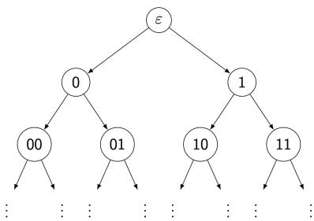

# Analysis and Differential Equations Team

Please solve 5 out of the following 6 problems.

1. Let $D \subset { \mathbf { R } } ^ { d } , d \geq 2$ be a compact convex set with smooth boundary $\partial D$ so that the origin belongs to the interior of $D$ . For every $x \in \partial D$ let $\alpha ( x ) \in ( 0 , \infty )$ be the angle between the position vector $x$ of the outer normal vector $n ( x )$ . Let $\omega _ { d }$ be the surface area of the unit sphere in $\mathbf { R } ^ { d }$ . Compute:

$$
\frac {1}{\omega_ {d}} \int_ {\partial D} \frac {\cos (\alpha (x))}{| x | ^ {d - 1}} d \sigma (x)
$$

where $d \sigma$ denotes the surface measure on $\partial D$ .

2. Let $p > 0$ and suppose $f _ { n } , f \in L ^ { p } [ 0 , 1 ]$ and $\begin{array} { r } { | | f _ { n } - f | | _ { p } = ( \int _ { 0 } ^ { 1 } | f _ { n } ( x ) - f ( x ) | ^ { p } d x ) ^ { \frac { 1 } { p } } \to 0 } \end{array}$ as $u \to \infty$ .

a) Show that for every $\epsilon > 0$

$$
\lim _ {n \to \infty} m (\{x \in [ 0, 1 ] | | f _ {n} (x) - f (x) | > \epsilon \}) = 0.
$$

Here $m$ is the Lebesgue measure.

b) Show that there exists a subsequence $f _ { n _ { j } }$ such that $f _ { n _ { j } } ( x )  f ( x )$ for almost every $x \in [ 0 , 1 ]$ .

3. 1) Let $f$ be a holomorphic function on the unit disk $D = \{ z \in \mathbf { C } | | z | < 1 \}$ except 0. Assume $f \in L ^ { 2 } ( D ) , i . e . \int _ { D } | f ( z ) | ^ { 2 } d z d \bar { z } < \infty$ , then 0 is a removable singularity.

2) Let $f _ { n }$ be a sequence of holomorphic functions over a domain $\Omega \subset C$ converging to $f$ uniformly on any compact subset of $\Omega$ , does the sequence of its derivatives $f _ { n } ^ { ' }$ also have this property?

4. Consider the torus $T ^ { 2 } = \mathbf { C } / \Lambda , \Lambda = \{ m + i n | m , n \in \mathbf { Z } \}$ , i.e. $z _ { 1 } , z _ { 2 } \in \mathbf { C }$ are equivalent if and only if there are integers $m , n$ such that $z _ { 2 } = z _ { 1 } + m + i n$ and $T ^ { 2 }$ are the space of equivalent classes. Show that the group of holomorphic automorphisms of $T ^ { 2 }$ is $S L ( 2 , \mathbf { Z } )$ of $2 \mathrm { ~ x ~ } 2$ integer matrices of determinant 1.

5. Let $\{ e _ { n } \}$ be an orth-normal basis of $l _ { 2 }$ of square integrable functions over a circle. Let $\begin{array} { r } { A : l _ { 2 }  l _ { 2 } , A e _ { 1 } = 0 , A e _ { n } = \frac { e _ { n - 1 } } { n - 1 } , n > 1 } \end{array}$ be a linear operator. Show that $A$ is an compact operator and $A$ − has no eigenvectors. What are the spectrum of $A$ ?

6. If $M = [ 0 , 1 ]$ is the unit interval, the heat kernel on $M$ can be written

$$
p (x, y, t) = \Sigma_ {k} \phi_ {k} (x) \phi_ {k} (y) e ^ {\lambda_ {k} t},
$$

where $\left\{ \lambda _ { k } \right\}$ is an enumeration of the eigenvalues of the $\textstyle \Delta = { \frac { d ^ { 2 } } { d x ^ { 2 } } }$ on $M$ and $\{ \phi _ { k } \}$ are the corresponding eigenfunctions which vanish on $\partial M$ .

i) Calculate $\left\{ \lambda _ { k } \right\}$ and the corresponding eigenfunctions.   
ii) Prove that $| p ( x , y , t ) | \leq C t ^ { - 1 / 2 }$ , for all $x , y$ , and $0 < t < 1$   
iii) What is the exponential rate of decay of $p ( x , y , t )$ as $t \to \infty$ , i.e. compute:

$$
\lim  _ {t \to \infty} \log (p (x, y, t)).
$$

# Probability and Statistics Team (5 problems)

Problem 1. For a random walk process on the complete infinite binary tree (see Fig 1.) starting from root (i.e. level 0), we assume that the object moves to the neighbor nodes with equal probability. Let $X _ { n }$ denote the level number at time $= n$ . Please prove that

$$
\mathbb {E} X _ {n} \leq 1 / 3 n + 4 / 3
$$

  
Fig 1.

Problem 2. The goal is to show the concentration inequality for the median of mean estimator. We divide the problem into three simple steps.

1. Let $X$ be a random variable with $\mathbb { E } X = \mu < \infty$ and $\operatorname { V a r } ( X ) = \sigma ^ { 2 } < \infty$ . Suppose we have $m$ i.i.d. random samples $\{ X _ { i } \} _ { i = 1 } ^ { m }$ . Let $\begin{array} { r } { \hat { \mu } _ { m } = \frac { 1 } { m } \sum _ { i = 1 } ^ { m } X _ { i } } \end{array}$ from $X$ . Show that

$$
P \left(\left| \widehat {\mu} _ {m} - \mu \right| \geq 2 \sigma \sqrt {\frac {1}{m}}\right) \leq \frac {1}{4}.
$$

2. Given $k$ i.i.d. Bernoulli random variables $\{ B _ { j } \} _ { j = 1 } ^ { k }$ with $\begin{array} { r } { \mathbb { E } B _ { j } = p < \frac { 1 } { 2 } } \end{array}$ . Use the moment generating function of $B _ { j }$ , i.e., $\mathbb { E } ( \exp ( t B _ { j } ) )$ , to show that

$$
P \left(\frac {1}{k} \sum_ {j = 1} ^ {k} B _ {j} \geq \frac {1}{2}\right) \leq (4 p (1 - p)) ^ {\frac {k}{2}}.
$$

3. Suppose we have $n$ i.i.d. random samples $\{ X _ { i } \} _ { i = 1 } ^ { n }$ from a population with mean $\mu$ and variance $\sigma ^ { 2 }$ . For any positive integer $k$ , we randomly and uniformly divide all the samples into $k$ subsamples, each having size $m = n / k$ (for simplicity, we assume $n$ is always divisible by $k$ ). Let $\widehat { \mu } _ { j }$ be the sample average of the $j ^ { t h }$

subsample and $\widetilde { m }$ be the median of $\{ \widehat { \mu } _ { j } \} _ { j = 1 } ^ { k }$ . Apply the previous two results to show that

$$
P \Big (| \widetilde {m} - \mu | \geq 2 \sigma \sqrt {\frac {k}{n}} \Big) \leq \left(\frac {\sqrt {3}}{2}\right) ^ {k}.
$$

Hint: Consider the Bernoulli random variable $B _ { j } = \mathbb { 1 } \{ | { \widehat { \mu } } _ { j } - \mu | \geq 2 \sigma { \sqrt { \frac { k } { n } } } \}$ for $j = 1 , . . . , k$ .

Problem 3. (a) Let $N \geq 2$ be an integer, and let $X$ be a random variable taking values in $\{ 0 , 1 , 2 , \ldots \}$ such that $P \{ X \equiv k { \bigl ( } { \mathrm { m o d } } N { \bigr ) } \} = { \frac { 1 } { N } }$ for all $k \in \{ 0 , 1 , \ldots , N - 1 \}$ . Compute $\mathbb { E } ( e ^ { i ( 2 \pi m ) X / N } )$ (with $i = \sqrt { - 1 }$ ) for all integers $m \geq 1$ .

(b) A game for $N$ players (numbered as $0 , 1 , 2 , . . . , N - 1 )$ is as follows: Each player independently shows a random number of fingers (uniformly chosen from $\{ 0 , 1 , 2 , 3 , 4 , 5 \} )$ ; if $S$ denotes the total number of fingers shown, then the player number $S { \bmod { N } }$ is declared to be the winner of the game.

Find all $N$ such that the players have equal chance to win the game.

Problem 4. Let $X _ { 1 }$ , $X _ { 2 }$ , . . . be independent and identically distributed real-valued random variables. Prove or disprove: If lim supn→∞ $\begin{array} { r } { \operatorname* { l i m } \operatorname* { s u p } _ { n \to \infty } \frac { | X _ { n } | } { n } ~ \leq ~ 1 } \end{array}$ almost surely, then $\textstyle \sum _ { n = 1 } ^ { \infty } P ( | X _ { n } | \geq n ) < \infty$ .

Problem 5. Choose, at random, 2016 points on the circle $x ^ { 2 } + y ^ { 2 } = 1$ . Interpret them as cuts that divide the circle into 2016 arcs. Compute the expected length of the arc that contains the point $( 1 , 0 )$ . How about the variance.

S.-T. Yau College Student Mathematics Contests 2016

# Geometry and Topology Team

Please solve 5 out of the following 6 problems.

1. Show that $\mathbb { C P } ^ { 2 n }$ does not cover any manifold except itself.

2. Let $X$ be a topological space and $p \in X$ . The reduced suspension $\Sigma X$ of $X$ is the space obtained from $X \times \lfloor 0 , 1 \rfloor$ by contracting $( X \times \{ 0 , 1 \} ) \cup ( \{ p \} \times [ 0 , 1 ] )$ to a point. Describe the relation between the homology groups of $X$ and $\Sigma X$ .

3. State and prove the Frobenius Theorem on a differentiable manifold.

4. Show that all geodesics on the sphere $S ^ { n }$ are precisely the great circles.

5. Let $M$ be an n-dimensional Riemannian manifold. Denote by $R$ and $K _ { M }$ the curvature tensor and sectional curvature of $M$ . If $a \le K _ { M } \le b$ at a point $x \in M$ , then, at this point,

$$
R (e _ {1}, e _ {2}, e _ {3}, e _ {4}) \leq \frac {2}{3} (b - a)
$$

for all orthonormal four-frames $\{ e _ { 1 } , e _ { 2 } , e _ { 3 } , e _ { 4 } \} \subset T _ { x } M$ .

6. Let $M$ be a closed minimal hypersurface with constant scalar curvature in $S ^ { n + 1 }$ . Denote by $S$ the squared length of the second fundamental form of $M$ . Show that $S = 0$ , or $S \geq n$ .

# S.-T. Yau College Student Mathematics Contests 2016

# Algebra and Number Theory Team

This test has 5 problems and is worth 100 points. Carefully justify your answers.

Problem 1 (20 points). Find all real orthogonal $2 \times 2$ matrices $k$ with the following property: There is an upper triangular $2 \times 2$ real matrix $b$ with all diagonal entries being positive numbers such that $k b$ is a positive definite symmetric matrix.

Problem 2 (20 points). For $x \in \mathbb { Z }$ and $k \geq 0$ , define the binomial coefficients

$$
\left( \begin{array}{c} x \\ k \end{array} \right) = \frac {x (x - 1) \cdots (x - k + 1)}{k !}, \quad \left( \begin{array}{c} x \\ 0 \end{array} \right) = 1.
$$

(a) (6 points) Show that $x \in \mathbb { Z } \implies \binom { x } { k } \in \mathbb { Z }$

(b) (6 points) Show that every function $f \colon \mathbb { Z } _ { \geq 0 } \to \mathbb { Z }$ can be expressed as $f ( x ) =$ $\scriptstyle \sum _ { k = 0 } ^ { \infty } a _ { k } \left( { x } \atop { k } \right)$ , where $a _ { k } \in \mathbb { Z }$ are uniquely determined by $f$ .

(c) (8 points) Define

$$
\phi_ {k} (x) = \left( \begin{array}{c} x + \lfloor k / 2 \rfloor \\ k \end{array} \right).
$$

Show that every function $f \colon \mathbb { Z } \to \mathbb { Z }$ can be expressed as $\begin{array} { r } { f ( x ) = \sum _ { k = 0 } ^ { \infty } a _ { k } \phi _ { k } ( x ) } \end{array}$ , where $a _ { k } \in \mathbb { Z }$ are uniquely determined by $f$ .

Problem 3 (20 points). Let $K$ be the splitting field of the polynomial

$$
x ^ {4} - x ^ {2} - 1.
$$

(a) (10 points) Show that the Galois group of $K$ over $\mathbb { Q }$ is isomorphic to the dihedral group $D _ { 4 }$ . Here we adopt the convention that $D _ { 4 }$ is the group of symmetries of a square and has order 8.

(b) (10 points) Determine the lattice of subfields of $K$ : Find all subfields of $K$ and describe the partial order induced by inclusion.

Problem 4 (20 points). Let $G$ be a (not necessarily finite) group and let $F ^ { \prime }$ be a field of characteristic $\neq 2$ . Let $V \neq 0$ be an indecomposable finite-dimensional linear representation of $G$ over $F$ . Let $R = \operatorname { E n d } _ { F } ( V ) ^ { G }$ be the ring of $G$ -equivariant endomorphisms of $V$ .

(a) (5 points) Prove the following form of Fitting’s lemma: Every element of $R$ is either invertible or nilpotent.   
(b) (5 points) Deduce that the set $I \subseteq R$ of non-invertible elements is a two-sided ideal and the quotient $R / I$ is a division algebra over $F$ .   
(c) (5 points) We say that $V$ is orthogonal if there exists a $G$ -invariant nondegenerate symmetric bilinear form on $V$ . We say that $V$ is symplectic if there exists a $G$ -invariant nondegenerate alternating bilinear form on $V$ . Deduce that if there exists a $G$ -invariant nondegenerate bilinear form on $V$ , then $V$ is orthogonal or symplectic.

(d) (5 points) Assume that $F$ is algebraically closed. Deduce from (b) that $V$ cannot be both orthogonal and symplectic.

# Problem 5 (20 points).

(a) (5 points) Let $G$ be a finite group. Let $x _ { 1 } , \ldots , x _ { h }$ be representatives of the conjugacy classes of $G$ . Let $n _ { i } = \# \mathrm { C e n t } _ { G } ( x _ { i } )$ be the cardinality of the centralizer of $x _ { i }$ . Prove the identity

$$
1 = \sum_ {i = 1} ^ {h} \frac {1}{n _ {i}}.
$$

(b) (10 points) Deduce that for any integer $h \geq 1$ , there exist only finitely many isomorphism classes of finite groups with exactly $h$ conjugacy classes.

(c) (5 points) Find all the finite groups with exactly 3 conjugacy classes.

# Applied Math. and Computational Math.

# Team (5 problems)

Problem 1. For solving the following partial differential equation

$$
u _ {t} + u _ {x} = 0, \quad - \infty \leq x \leq \infty \tag {1}
$$

with compactly supported initial condition, we consider the following one-step, threepoint scheme on a uniform mesh $x _ { j } = j \Delta x$ with spatial mesh size $\Delta x$ :

$$
u _ {j} ^ {n + 1} = a u _ {j} ^ {n} + b u _ {j - 1} ^ {n} + c u _ {j - 2} ^ {n}, \quad j = \dots , - 1, 0, 1, \dots \tag {2}
$$

where $a$ , $b$ , $c$ are constants which may depend on the mesh ratio $\begin{array} { r } { \lambda = \frac { \Delta t } { \Delta x } } \end{array}$ . Here $\Delta t$ is the time step, and $u _ { j } ^ { n }$ approximates the exact solution at $u ( x _ { j } , t ^ { n } )$ with $t ^ { n } = n \Delta t$ .

(1) Find the constants $a$ , $b$ , $c$ such that the scheme (2) is second order accurate.   
(2) Find the CFL number $\lambda _ { 0 }$ such that the scheme (2), with the constants determined by the step above, is stable in $L ^ { 2 }$ under the time step restriction $\lambda \leq \lambda _ { 0 }$   
(3) If the PDE (1) is defined on $( 0 , \infty )$ with an initial condition compactly supported in $( 0 , \infty )$ and a boundary condition $u ( 0 , t ) = g ( t )$ , how would you modify the scheme (2) so that it can be applied? Can you prove the stability and accuracy of your modified scheme?

Problem 2. Inverse problem. Answer the famous Mark Kac’s equation: “can you hear the shape of drum?” for the special case.

Consider the one-dimensional oscillator $\ddot { x } = - u ^ { \prime } ( x )$ with symmetric potential $u ( - x ) =$ $u ( x )$ , $u ( 0 ) = u ^ { \prime } ( 0 ) = 0$ , $u ^ { \prime } ( x ) > 0$ for $x > 0$ , $\begin{array} { r } { \operatorname* { l i m } _ { x  \infty } u ( x ) = \infty } \end{array}$ . Denote the inverse function of $y = u ( x )$ , $x \geq 0$ as $x = u ^ { - 1 } ( y ) = \phi ( y )$ .

(a) For any solution $x ( t )$ , show there is a conservation of energy

$$
\frac {\dot {x} ^ {2} (t)}{2} + u (x (t)) \equiv e
$$

where $e$ is a constant.

(b) For any energy $e > 0$ , find a periodic solution with total energy $e$ . Show that the period is given by

$$
P (e) = 2 \sqrt {2} \int_ {0} ^ {x _ {m a x}} \frac {d x}{\sqrt {e - u (x)}}, x _ {m a x} = \phi (e) > 0.
$$

(c) Show that

$$
\phi (z) = \frac {1}{2 \pi \sqrt {2}} \int_ {0} ^ {z} \frac {P (e) d e}{\sqrt {z - e}}.
$$

(d) In the case of iso-chronous $P ( e ) \equiv 2 \pi$ , show that $\phi ( z ) = \sqrt { 2 z }$ . Then you have $u ( x ) = { \textstyle { \frac { 1 } { 2 } } } x ^ { 2 }$ , $x ( t ) = a \cos ( t ) + b \sin ( t )$ , the famous harmonic oscillator.

Problem 3. The following statement informally means that if a system of homogeneous equations with integer coefficients has a nontrivial solution then it has an integer solutions with reasonably small components. It is required in many applications.

Let A = (aij )i,j=1 $A = ( a _ { i j } ) _ { i , j = 1 } ^ { m , n }$ m,n be an $m \times n$ matrix of rank $r \leq n - 1$ with integer entries of size at most $H$ , that is,

$$
\left| a _ {i j} \right| \leq H, \quad 1 \leq i \leq m, 1 \leq j \leq n.
$$

Prove that there is an integer non-zero vector $\mathbf { x } = ( x _ { 1 } , \ldots , x _ { n } ) \in \mathbb { Z } ^ { n }$ such that $A \mathbf { x } = \mathbf { 0 }$ and

$$
\| \mathbf {x} \| _ {\infty} \leq (2 n H) ^ {n - 1}
$$

where $\left\| \mathbf { x } \right\| _ { \infty } = \operatorname* { m a x } _ { 1 \leq i \leq n } \left| x _ { i } \right|$ .

Problem 4. This problem considers an iterative scheme

$$
x _ {k + 1} = x _ {k} + \beta_ {k} p _ {k}
$$

for the linear system $A x = b$ , where $A \in \mathbb { R } ^ { n \times n }$ is a given $n \times n$ non-singular matrix and $b \in \mathbb { R } ^ { n }$ is a given vector. In the above scheme, $x _ { k }$ denotes the approximate solution at the $k$ -th iteration, $\beta _ { k }$ is a scalar and $p _ { k } \in \mathbb { R } ^ { n }$ is a search direction. If $x _ { k }$ is given, the above scheme will determine $x _ { k + 1 }$ so that the residual $r _ { k + 1 } : = b - A x _ { k + 1 }$ is the smallest possible with respect to the 2-norm.

(1) Determine $\beta _ { k }$ .   
(2) Prove that the residual $r _ { k + 1 }$ is orthogonal to $A p _ { k }$ with respect to the usual inner-product.   
(3) Prove that the residuals satisfy

$$
\left\| r _ {k + 1} \right\| \leq \left\| r _ {k} \right\| \sin (\alpha)
$$

where $\alpha$ is the angle between $r _ { k }$ and $A p _ { k }$ , and $\| \cdot \|$ denotes the 2-norm.

(4) Assume that the inner product of $r _ { k }$ and $A p _ { k }$ is non-zero. Will the above scheme always converge?   
(5) Assume that $A$ is positive definite. We take the search direction $p _ { k } = r _ { k }$ . Show that the above scheme converges for any initial guess $x _ { 0 }$ .

Problem 5. Let $f : \mathbb { R } ^ { n } \longrightarrow \mathbb { R }$ be convex and in $C ^ { 1 }$ . Suppose $f$ has a local minimum $x ^ { * }$ .

(1) Must this local minimum $x ^ { * }$ be a global minimum?   
(2) Consider the following backward gradient method: starting from any $x ^ { 0 } \in \mathbb { R } ^ { n }$ define

$$
x ^ {k} = x ^ {k - 1} - t \nabla f (x ^ {k}), \quad k \geq 1,
$$

where $t > 0$ is a fixed step size. Do you need any condition on $t$ to guarantee $\{ f ( x ^ { k } ) \}$ converge? Prove your convergence argument, if $\{ f ( x ^ { k } ) \}$ converges.

(3) Suppose $f$ is strongly convex, that is, $\exists m > 0$ such that $\langle \nabla f ( x ) - \nabla f ( y ) , x - y \rangle \geq$ $m \| x - y \| ^ { 2 }$ . Under this additional condition, show that $\{ x ^ { k } \}$ converges.