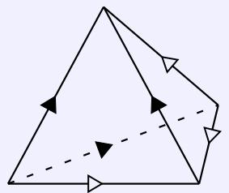
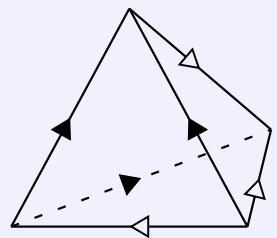

# Geometry and Topology

Solve every problem.

Problem 1. The topological space $X$ is obtained by gluing two tetrahedra as illustrated by the figure. There is a unique way to glue the faces of one tetrahedron to the other so that the arrows are matched. The resulting complex has 2 tetrahedra, 4 triangles, 2 edges and 1 vertex.

Show that ?? can not have the homotopy type of a compact manifold without boundary.

Problem 2. Suppose $( M , h )$ is a closed (i.e., compact without boundary) Riemannian manifold, and $h$ is a metric on $M$ with $\sec ( h ) \leq - 1$ , where sec(ℎ) is the sectional curvature. Suppose $\Sigma$ is a closed minimal surface with genus $g$ in $( M , h )$ . Show that

$$
\operatorname {A r e a} (\Sigma) \leq 4 \pi (g - 1).
$$

Remark: A minimal surface is an immersed surface with constant mean curvature 0.

Problem 3. For any topological space $X ,$ , the $n$ -th symmetric product of ?? is the quotient of the Cartesian product $( X ) ^ { n }$ by the action of the symmetric group $S _ { n }$ , which permutes the factors in $( X ) ^ { n }$ . This space is denoted by $\mathsf { S P } ^ { n } ( X )$ , and the topology is the natural quotient topology induced from $( X ) ^ { n }$ .

Show that $\mathbf { S P } ^ { n } ( \mathbf { C P } ^ { 1 } )$ is homeomorphic to $\mathbf { C P } ^ { n }$ . Here $\mathbf { C P } ^ { 1 }$ and $\mathbf { C P } ^ { n }$ are equipped with the manifold topology.

Problem 4. Let $M$ be a complete noncompact Riemannian manifold. $M$ is said to have the geodesic loops to infinity property if for any $[ { \boldsymbol { \alpha } } ] \in \pi _ { 1 } ( M )$ and any compact subset $K \subset M$ , there is a geodesic loop $\beta \subset M \backslash K ,$ such that $\beta$ is homotopic to $\alpha$ .

Show that if a complete noncompact Riemannian manifold ?? does not have the geodesic loops to infinity property, then there is a line in the universal cover $\smash { \widetilde { M } }$ .

Remark: A line is a geodesic $\gamma : ( - \infty , \infty ) \to M$ such that dist $( \gamma ( s ) , \gamma ( t ) ) = | s - t | ;$ ; a geodesic loop is a curve $\beta : [ 0 , 1 ] \to M$ that is a geodesic and $\beta ( 0 ) = \beta ( 1 )$ .

Problem 5. A topological space ?? is called an $H$ -space if there exist $e \in X$ and $\mu : X { \times } X \to X$ such that $\mu ( e , e ) = e$ and the maps $x \to \mu ( e , x )$ and $x \to \mu ( x , e )$ are both homotopic to the identity map.

(a) Show that the fundamental group of an H-space is Abelian.   
(b) Show that the sphere $S ^ { 2 0 2 2 }$ is not an H-space.

Historic Remark: “H” was suggested by Jean-Pierre Serre in recognition of the contributions in Topology by Heinz Hopf.

Problem 6. A hypersurface $\Sigma \subset \mathbf { R ^ { n + 1 } }$ is called a shrinker if it satisfies the equation

$$
H (x) = \frac {1}{2} \langle x, \vec {n} \rangle .
$$

Here $H$ is the mean curvature, which is $- \langle \mathrm { t r } _ { A } , \vec { n } \rangle$ where $A$ is the second fundamental form, $x$ is the position vector, and $\vec { n }$ is outer unit normal vector.

(a) Show that $S ^ { n } ( { \sqrt { 2 n } } )$ , the sphere with radius $\sqrt { 2 n }$ , is a shrinker.   
(b) Show that any compact shrinker without boundary must intersect with $S ^ { n } ( { \sqrt { 2 n } } )$