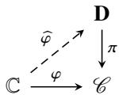

# Analysis and Differential Equations

Solve every problem.

Problem 1. Let $\chi$ be a real valued smooth function with compact support on $\mathbb { R }$ . We assume that

$$
\int_ {\mathbb {R} ^ {1}} \chi (x) d x = 1.
$$

For all $\varepsilon > 0$ , we define

$$
\chi_ {\varepsilon} (x) = \frac {1}{\varepsilon} \chi \left(\frac {x}{\varepsilon}\right).
$$

Prove that for any given $f \in L ^ { 1 } ( \mathbb { R } )$ , for almost every $x \in \mathbb { R }$ , we have

$$
\lim  _ {\varepsilon \rightarrow 0} (\chi_ {\varepsilon} * f) (x) = f (x).
$$

Solution: Let $x _ { 0 } \in \mathbb { R }$ be a Lebesgue point of $f$ , i.e., for $t  0$ , we have

$$
\int_ {| y | \leq t} \left| f (x _ {0} + y) - f (x _ {0}) \right| d y = o (t),
$$

it suffices to show that

$$
\lim  _ {K \rightarrow \infty} \left(\chi_ {\varepsilon} * f\right) (x _ {0}) = f (x _ {0}).
$$

We assume that $\operatorname { s u p p } ( \chi ) \subset [ - M , M ]$ . We have

$$
\begin{array}{l} \left(\chi_ {\varepsilon} * f\right) \left(x _ {0}\right) - f \left(x _ {0}\right) = \int_ {\mathbb {R}} \left(f \left(x _ {0} - y\right) - f \left(x _ {0}\right)\right) \chi_ {\varepsilon} (y) d y \\ = \varepsilon^ {- 1} \int_ {| y | \leq M} (f (x _ {0} - y) - f (x _ {0})) \chi (y) d y. \\ \end{array}
$$

Thus,

$$
\begin{array}{l} \left| \chi_ {\varepsilon} * f\right) (x _ {0}) - f (x _ {0}) | \leq \varepsilon^ {- 1} \| \chi \| _ {L ^ {\infty}} \int_ {| y | \leq \varepsilon M} \left| f (x _ {0} - y) - f (x _ {0}) \right| d y \\ = \| \chi \| _ {L ^ {\infty}} \varepsilon^ {- 1} o (\varepsilon M) \\ = o (1). \\ \end{array}
$$

This proves the statement.

Problem 2. In last year’s Yau College Student Mathematics Contests, four students Tintin, Haddock, Dupont and Dupond made it to the last round of the oral exam in analysis. Professor Yau asked them to compute the Fourier coefficients of the $2 \pi$ -periodic function $F$ (defined on $\mathbb { R }$ ):

$$
\begin{array}{l} F: (0, 2 \pi) \to R, \\ x \mapsto F (x) = \arctan \left(\frac {x}{2 \pi} e ^ {\sin (x)} + x ^ {2 0 1 9} (x - 2 \pi) + 2 0 1 9 \sin (x)\right). \\ \end{array}
$$

Here were their solutions: for $k \neq 0$ ,

$$
\begin{array}{l} \operatorname {T i n t i n}: \widehat {F} (k) = \frac {\cos (k \pi)}{| k | ^ {\frac {1}{2}}} + \frac {a}{| k |} + \frac {b}{| k | ^ {3}}, \\ \text {H a d d o c k}: \widehat {F} (k) = \frac {c}{k ^ {2}} + \frac {d}{k ^ {4}} + \frac {e}{k ^ {6}}, \\ \operatorname {D u p o n t}: \widehat {F} (k) = \frac {1}{k} + \frac {1}{k ^ {2}} + \frac {f}{k ^ {3}} + \frac {g}{k ^ {5}}, \\ \mathrm {D u p o n d}: \widehat {F} (k) = \frac {2 0 1 9 \sqrt {- 1}}{k} + \frac {h _ {k}}{k}, \\ \end{array}
$$

where $a , b , c , d , e , f , g , h _ { k } ( k \in \mathbb { Z } )$ were constants and $\sum _ { k \in \mathbb { Z } } | h _ { k } | ^ { 2 } < \infty .$

Whose solutions were correct?

Solution: We remark that $F$ is smooth on $( 0 , 2 \pi )$ . At 0, its right limit is 0; at $2 \pi$ , its left limit is $\textstyle { \frac { \pi } { 2 } }$ . In particular, $F$ is not continous on $2 \pi \mathbb { Z }$ .

Tintin was wrong: the function $F$ is bounded on $( 0 , 2 \pi )$ hence in $L ^ { 2 }$ . Parsevel’s identity implies $\widehat { F } ( k ) \in \ell ^ { 2 } ( \mathbb { Z } )$ But according to Tintin, $\begin{array} { r } { | \widehat { F } ( k ) | \sim \frac { 1 } { | k | ^ { \frac { 1 } { 2 } } } } \end{array}$ ,. This is not in $\ell ^ { 2 }$ . | k | 12

Haddock was wrong: otherwise, since his coefficients were absolutely summable, the function $F$ should be a continous function (since its Fourier series should be absolutely convergent).

Dupont was wrong: since $F$ is a real valued function, we must have ${ \widehat { F } } ( k ) = { \widehat { F } } ( - k )$ . Dupont’s coefficients did not satisfy this condition.

To show that Dupond was wrong, we do the following computations:

$$
\begin{array}{l} \widehat {F} (k) = \frac {1}{2 \pi} \int_ {0} ^ {2 \pi} e ^ {- i k x} F (x) d x \\ = \left. \frac {e ^ {- k \pi i x} \Phi (x)}{2 \pi i k} \right| _ {0} ^ {2 \pi} + \frac {1}{2 \pi i k} \underbrace {\int_ {0} ^ {2 \pi} e ^ {- i k x} F ^ {\prime} (x) d x} _ {\in \ell^ {2}, \text {s i n c e} F ^ {\prime} \in L ^ {2} ((0, 2 \pi)} \\ = \frac {\sqrt {- 1}}{8 k} + \frac {h _ {k} ^ {\prime}}{k}. \\ \end{array}
$$

Now since $h _ { k } ^ { \prime } \in \ell ^ { 2 }$ , if Dupond was correct, it would imply that $\begin{array} { r } { 2 0 1 9 \sqrt { - 1 } - \frac { \sqrt { - 1 } } { 8 } } \end{array}$ is square summable. This is absurd.

Problem 3. Let $B _ { 1 }$ be the unit ball centered at the origin in $\mathbb { R } ^ { 4 }$ and $u \in W ^ { 1 , 2 } ( B _ { 1 } ) \cap C ^ { \infty } ( \mathbb { R } ^ { 4 } )$ be a nonnegative real valued function so that

$$
- \triangle u \leq u ^ {2},
$$

where $\triangle = \sum _ { i = 1 } ^ { 4 } \frac { \partial ^ { 2 } } { \partial x _ { i } ^ { 2 } }$ Õ 2 . Prove that, there exists a constant $\varepsilon > 0$ , so that if $\| u \| _ { L ^ { 2 } ( B _ { 1 } ) } \leq \varepsilon$ , we have

$$
\| \nabla u \| _ {L ^ {2} \left(B _ {\frac {1}{2}}\right)} \leq 1 0 0 0 0 \| u \| _ {L ^ {2} \left(B _ {1}\right)},
$$

where $B _ { \frac { 1 } { 2 } }$ is the ball of radius $\frac { 1 } { 2 }$ centered at the origin.

Solution: We can choose a smooth cut-off function $\eta$ so that supp( ) ⊂ B1, B 1 ≡ 1, $\eta \geq 0$ and $| \nabla \eta | \le 4$

We multiply the $- \triangle u \le u ^ { 2 }$ by $\eta ^ { 2 } u$ and integrate by parts. This leads to

$$
\int_ {B _ {1}} \eta^ {2} | \nabla u | ^ {2} \leq \int_ {B _ {1}} \eta^ {2} u ^ {3} + 2 \int_ {B _ {1}} \eta u | \nabla \eta | | \nabla u |.
$$

According to the Cauchy-Schwarz inequality, we have

$$
\int_ {B _ {1}} \eta^ {2} | \nabla u | ^ {2} \leq \int_ {B _ {1}} \eta^ {2} u ^ {3} + 2 \int_ {B _ {1}} | \nabla \eta | ^ {2} | u | ^ {2} + \frac {1}{2} \int_ {B _ {1}} \eta^ {2} | \nabla u | ^ {2}.
$$

Hence,

$$
\begin{array}{l} \int_ {B _ {1}} \eta^ {2} | \nabla u | ^ {2} \leq 2 \int_ {B _ {1}} \eta^ {2} u ^ {3} + 4 \int_ {B _ {1}} | \nabla \eta | ^ {2} | u | ^ {2} \\ \leq 2 \int_ {B _ {1}} \eta^ {2} u ^ {3} + 6 4 \int_ {B _ {1}} | u | ^ {2}. \\ \end{array}
$$

On the other hand, we can use four dimension Sobolev inequality to derive

$$
\begin{array}{l} \int_ {B _ {1}} \eta^ {2} u ^ {3} \leq \| u \| _ {L ^ {2} (B _ {1})} \left(\int_ {B _ {1}} (\eta u) ^ {4}\right) ^ {\frac {1}{2}} \\ \leq \| u \| _ {L ^ {2} \left(B _ {1}\right)} \times C _ {4} \int_ {B _ {1}} | \nabla (\eta u) | ^ {2}, \\ \end{array}
$$

where $C _ { 4 }$ is the constant coming from the Sobolev inequality. Since $\| u \| _ { L ^ { 2 } ( B _ { 1 } ) } \leq \varepsilon$ , we can proceed as follows

$$
\begin{array}{l} \int_ {B _ {1}} \eta^ {2} u ^ {3} \leq C _ {4} \varepsilon \int_ {B _ {1}} | \nabla (\eta u) | ^ {2} \\ \leq 2 C _ {4} \varepsilon \left(\int_ {B _ {1}} | \nabla \eta | ^ {2} | u | ^ {2} + \int_ {B _ {1}} | \nabla \eta | ^ {2} | u | ^ {2}\right) \\ \leq 3 2 C _ {4} \varepsilon \int_ {B _ {1}} | u | ^ {2} + 2 C _ {4} \varepsilon \int_ {B _ {1}} | u | ^ {2}. \\ \end{array}
$$

Putting all the inequalities together, we obtain

$$
\begin{array}{l} \int_ {B _ {1}} \eta^ {2} | \nabla u | ^ {2} \leq 2 \int_ {B _ {1}} \eta^ {2} u ^ {3} + 4 \int_ {B _ {1}} | \nabla \eta | ^ {2} | u | ^ {2} \\ \leq 6 4 C _ {4} \varepsilon \int_ {B _ {1}} | u | ^ {2} + 4 C _ {4} \varepsilon \int_ {B _ {1}} | u | ^ {2} + 6 4 \int_ {B _ {1}} | u | ^ {2}. \\ \end{array}
$$

If we take $\begin{array} { r } { \varepsilon < \frac { 1 } { 1 2 8 C _ { 4 } } } \end{array}$ , we have

$$
\int_ {B _ {1}} \eta^ {2} | \nabla u | ^ {2} \leq \frac {1}{2} \int_ {B _ {1}} | u | ^ {2} + (6 4 + \frac {1}{3 2}) \int_ {B _ {1}} | u | ^ {2}.
$$

This leads to the final estimate:

$$
\int_ {B _ {1}} \eta^ {2} | \nabla u | ^ {2} \leq (1 2 8 + \frac {1}{1 6}) \int_ {B _ {1}} | u | ^ {2}.
$$

Problem 4. Let $f$ and $g$ be two holomorphic functions defined on the entire complex plane $\mathbb { C }$ so that for all $z \in \mathbb { C }$ , we have

$$
f (z) ^ {2 0 2 0} + g (z) ^ {2 0 2 0} = 1.
$$

Prove that $f$ and $g$ are constants.

Solution: We consider the following holomorphic map

$$
\varphi : \mathbb {C} \rightarrow \mathbf {P} ^ {3} (\mathbb {C}), z \mapsto (f (z): g (z): 1),
$$

where $\left( z _ { 1 } : z _ { 2 } : z _ { 3 } \right)$ is the homogenous coordinates on $\mathbf { P } ^ { 3 } ( \mathbb { C } )$ . Let $\mathcal { C }$ be the curve defined by the homogenous equation

$$
\mathcal {C} = \left\{\left(z _ {1}: z _ {2}: z _ {3}\right) \mid z _ {1} ^ {2 0 2 0} + z _ {2} ^ {2 0 2 0} = z _ {3} ^ {2 0 2 0} \right\} \subset \mathbf {P} ^ {3} (\mathbb {C}).
$$

It is obviously a smooth curve (by the Jacobian criterion). The maps $\varphi$ factor through $\mathcal { C }$ , i.e., we have a holomorphic map

$$
\varphi : \mathbb {C} \rightarrow \mathcal {C}.
$$

On the other hand, the genus $g ( \mathcal { C } )$ of the plance curve $\mathcal { C }$ can be computed through the genus formula

$$
g (\mathcal {C}) = \frac {1}{2} (2 0 2 0 - 1) (2 0 2 0 - 2) \geq 2.
$$

Therefore, according to the uniformization theorem, the universal covering of $\mathcal { C }$ must be the Poincaré disk D. Hence, we can lift $\varphi$ to a holomorphic map

$$
\widehat {\varphi}: \mathbb {C} \rightarrow \mathbf {D},
$$

i.e., we have the following commutative diagram:

In particular, $\widehat { \varphi }$ is a bounded entire function, hence a constant map by Liouville’s theorem. Therefore, $\varphi$ is also a constant map.

Problem 5. We consider the following ordinary differential equation:

$$
\left\{ \begin{array}{l} x ^ {\prime \prime} (t) + x (t) + x (t) ^ {3} = 0, \\ (x (0), x ^ {\prime} (0)) = (x _ {0}, 0), \end{array} \right.
$$

where $x ( t )$ takes values in $\mathbb { R }$ . Prove that for all $x _ { 0 } \in \mathbb { R }$ , the solution of the above system is periodic.

Solution: The key is to observe that

$$
E (t) = \frac {1}{2} \xi (t) ^ {2} + \frac {1}{2} x (t) ^ {2} + \frac {1}{4} x (t) ^ {4}
$$

is conserved, where $\xi ( t ) = x ^ { \prime } ( t )$ . Therefore, on the phase plane $( x , \xi )$ , the solution lies on

$$
\frac {1}{2} \xi^ {2} + \frac {1}{2} x ^ {2} + \frac {1}{4} x ^ {4} = \frac {1}{2} x _ {0} ^ {2} + \frac {1}{4} x _ {0} ^ {4}.
$$

The curve is bounded. Hence, $x ( t )$ is bounded and the solution to the equation is defined on the whole of $t \in \mathbb { R }$ . To show that $x ( t )$ is periodic: when $x ^ { \prime } ( t _ { 0 } ) = 0$ , $x ( t _ { 0 } )$ is either the maximum or the minimum of $x ( t )$ for all $t \in \mathbb { R }$ (using the fact that $E ( t )$ is conserved). Therefore, it suffices to show that $x ( t )$ will reach its local maximum and local minimum for some later time. If not, then $x ( t )$ must be monotone which is impossible since this would pose a sign condition on $\xi ^ { \prime } ( t )$ .

Problem 6. Let $\alpha \in \mathbb { R }$ and $a _ { k } \in \mathbb { C }$ with $\left| a _ { k } \right| < 1$ , where $k = 1 , 2 , \ldots , n$ . We consider the following holomorphic map

$$
\begin{array}{l} f: \mathbb {C} - \left\{\left(\overline {{a _ {1}}}\right) ^ {- 1}, \dots , \left(\overline {{a _ {n}}}\right) ^ {- 1} \right\} \to \mathbb {C}, \\ z \mapsto f (z) = e ^ {2 \sqrt {- 1} \pi \alpha} z \cdot \frac {z - a _ {1}}{1 - \overline {{a _ {1}}} z} \dots \frac {z - a _ {n}}{1 - \overline {{a _ {n}}} z}. \\ \end{array}
$$

Let $\mathbf { S } ^ { 1 }$ be the unit circle in C, i.e.,

$$
\mathbf {S} ^ {1} = \left\{z \in \mathbb {C} \mid | z | = 1 \right\}.
$$

Prove that $f$ maps $\mathbf { S } ^ { 1 }$ to itself and $f$ preserves the surface measure (i.e., d in terms of standard polar coordiantes of $\mathbb { R } ^ { 2 }$ ) of $\mathbf { S } ^ { 1 }$ .

Solution: It suffices to show that

$$
\int_ {\mathbf {S} ^ {1}} \varphi d \theta = \int_ {\mathbf {S} ^ {1}} \varphi \circ f d \theta , \forall \varphi \in C ^ {0} (\mathbf {S} ^ {1}).
$$

Let $\overline { { \varphi } }$ be the harmonic extension of $\varphi$ to the unique disk

$$
\mathbf {D} = \left\{z \in \mathbb {C} \mid | z | \leq 1 \right\},
$$

i.e., $\overline { { \varphi } }$ is the unique solution of the following Dirichlet problem:

$$
\left\{ \begin{array}{l l} - \triangle \overline {{\varphi}} & = 0, \text {i n} \mathbf {D}, \\ \overline {{\varphi}} \big | _ {\mathbf {S} ^ {1}} & = \varphi , \text {o n} \mathbf {S} ^ {1}. \end{array} \right.
$$

Since $f$ is holomophic and $f$ preserves $\mathbb { D }$ , $\overline { { \varphi } } \circ f$ is still a harmonic function in $D$ and it is the harmonic extension of $\varphi \circ f$ .

We observe that $f$ maps 0 to 0. Therefore, by the mean value property, we have

$$
\int_ {\mathbf {S} ^ {1}} \varphi d \theta = \bar {\varphi} (0) = \bar {\varphi} \circ f (0) = \int_ {\mathbf {S} ^ {1}} \varphi \circ f d \theta .
$$

This completes the proof.