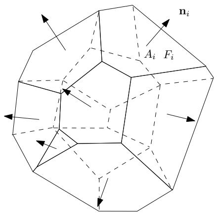

# S.-T. Yau College Student Mathematics Contests 2015

# Applied Math. and Computational Math. Individual (5 problems)

Problem 1. Let $r$ and $s$ be relatively prime positive integers. Prove that the number of lattice paths from $( 0 , 0 )$ to $( r , s )$ , which consists of steps $( 1 , 0 )$ and $( 0 , 1 )$ and never go above the line $r y = s x$ is given by

$$
\frac {1}{r + s} \left( \begin{array}{c} r + s \\ s \end{array} \right).
$$

Problem 2. The following $2 \times 2$ block matrix

$$
C (\alpha) = \left[ \begin{array}{c c} \alpha I & A \\ A ^ {T} & 0 \end{array} \right]
$$

plays a key role in an augmented system method to solve linear least squares problem, a fundamental numerical linear algebra problem for fitting a linear model to observations subject to errors in science, where $A \in \mathbf { R } ^ { m \times n }$ is of full rank $n \leq m$ , $I$ is a $m \times m$ identity matrix, and $\alpha \geq 0$ . Prove the following results which address the question of optimal choice of scaling $\alpha$ for stabiltiy of the augmented system method.

(a) The eigenvalues of $C ( \alpha )$ are

$$
\frac {\alpha}{2} \pm \left(\frac {\alpha^ {2}}{4} + \sigma_ {i} ^ {2}\right) ^ {1 / 2} \quad \mathrm {f o r} i = 1, 2, \ldots , n, \quad \mathrm {a n d} \quad \alpha \quad (m - n \mathrm {t i m e s}),
$$

where $\sigma _ { i }$ for $i = 1 , 2 , \ldots , n$ are the singular values of $A$ , arranged in the decreasing order, i.e., $\sigma _ { 1 } \geq \sigma _ { 2 } \geq \cdot \cdot \cdot \geq \sigma _ { n }$ .

(b) The condition number $\kappa _ { 2 } ( C ( \alpha ) ) = \| C ( \alpha ) \| _ { 2 } \| [ C ( \alpha ) ] ^ { - 1 } \| _ { 2 }$ has the following bounds:

$$
\sqrt {2} \kappa_ {2} (A) \leq \min _ {\alpha} \kappa_ {2} (C (\alpha)) \leq 2 \kappa_ {2} (A),
$$

with $\mathrm { m i n } _ { \alpha } \kappa _ { 2 } ( C ( \alpha ) )$ being achieved for $\alpha = \sigma _ { n } / \sqrt { 2 }$ , and

$$
\max _ {\alpha} \kappa_ {2} (C (\alpha)) > \kappa_ {2} (A) ^ {2},
$$

where $\| \cdot \|$ is the spectral norm of a matrix.

Recall that any matrix $A \in \mathbf { R } ^ { m \times n }$ has a singular value decomposition (SVD):

$$
A = U \Sigma V ^ {T}, \quad \Sigma = \mathrm {d i a g} (\sigma_ {1}, \sigma_ {2}, \ldots , \sigma_ {p}) \in \mathbf {R} ^ {m \times n}, \quad p = \min (m, n),
$$

where $\sigma _ { 1 } \geq \sigma _ { 2 } \geq \cdot \cdot \cdot \geq \sigma _ { p } \geq 0$ , and $U \in \mathbf { R } ^ { m \times m }$ , $V \in \mathbf { R } ^ { n \times n }$ are both orthogonal. The $\sigma _ { i }$ are the singular values of $A$ and the columns of $U$ and $V$ are the left and right singular vectors of $A$ , respectively.

Problem 3. Solve the following linear hyperbolic partial differential equation

$$
u _ {t} + a u _ {x} = 0, \quad t \geq 0, \tag {1}
$$

where $a$ is a constant. Using the finite difference approximation, we can obtain the forward-time central-space scheme as follows,

$$
\frac {u _ {m} ^ {n + 1} - u _ {m} ^ {n}}{k} + a \frac {u _ {m + 1} ^ {n} - u _ {m - 1} ^ {n}}{2 h} = 0, \tag {2}
$$

where $k$ and $h$ are temporal and spatial mesh sizes.

(a) Show that when we fix $\lambda = k / h$ as a positive constant, the forward-time centralspace scheme (2) is consistent with equation (1).   
(b) Analyze the stability of this method. Is the method stable with $\lambda = k / h$ being fixed as a constant?   
(c) How would the answer change if you are allowed to make $\lambda = k / h$ small?   
(d) Would this is a good scheme to use even if you can make it stable by making $\lambda$ small? If not, please provide a simple modification to make this scheme stable by keeping $\lambda$ fixed.

Problem 4. Let $A , H , Q \in \mathbb { C } ^ { n \times n }$ and $Q$ is non-singular. Assume that $H = Q ^ { - 1 } A Q$ and $H$ is properly upper Hessenberg. Show that

$$
\operatorname {s p a n} \left\{q _ {1}, q _ {2}, \dots , q _ {j} \right\} = \mathcal {K} _ {j} (A, q _ {1}), \quad j = 1, 2, \dots , n
$$

where $q _ { j }$ is the $j$ -th column of $Q$ , and ${ \cal K } _ { j } ( A , q _ { 1 } ) = \mathrm { s p a n } \{ q _ { 1 } , A q _ { 1 } , \ldots , A ^ { j - 1 } q _ { 1 } \} .$ .

Problem 5. Minkowski Problem.

Assume $P$ is a convex polyhedron embedded in $\mathbb { R } ^ { 3 }$ , the faces are $\{ F _ { 1 } , F _ { 2 } , \cdots , F _ { k } \}$ , the unit normal vector to the face $F _ { i }$ is $\mathbf { n } _ { i }$ , the area of $F _ { i }$ is $A _ { i }$ , $1 \leq i \leq k$ .

• Show that

$$
A _ {1} \mathbf {n} _ {1} + A _ {2} \mathbf {n} _ {2} + \dots A _ {k} \mathbf {n} _ {k} = \mathbf {0}, \tag {3}
$$

• Given $k$ unit vectors $\{ \mathbf { n } _ { 1 } , \mathbf { n } _ { 2 } , \cdots , \mathbf { n } _ { k } \}$ which can not be contained in any half space, and $k$ real positive numbers $\{ A _ { 1 } , A _ { 2 } , \cdots , A _ { k } \}$ , $A _ { i } > 0$ , and satisfying the condition (3), show that there exists a convex polyhedron $P$ , whose face normals are ${ \bf n } _ { i }$ ’s, face areas are $A _ { i }$ ’s.