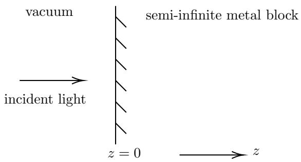

# S.-T. Yau College Student Mathematics Contests 2024

# Mathematical Physics

# 1. (Classical Mechanics)

Consider the motion of a particle of mass $m$ in an attractive central potential of the form

$$
V (r) = \alpha r ^ {k}, \tag {1}
$$

where $k$ and $\alpha$ are real constants of the same sign (both positive or both negative).

(a) Write down the Lagrangian using polar coordinates $( r , \phi )$ .   
(b) Using conservation of the angular momentum, reduce the problem of determining the radial motion to an effective one-dimensional problem (write down the effective Lagrangian).   
(c) Determine the radius and period of the circular orbits.   
(d) For which values of $k$ is the circular orbit stable?   
(e) Assuming that the circular orbit is stable, consider a small perturbation around it. Find the period of the small oscillations. In the approximation of small oscillations, for which values of $k$ will the orbit close?   
(f) Go back to the full $2 d$ problem for $r$ and $\phi$ (the polar coordinates in the plane of the orbit). Eliminate the time dependence and write a diffferential equation for the orbit.

# 2. (Quantum mechanics)

Consider a 1-dim quantum-mechanical harmonic oscillator with mass $m$ and resonance frequency $\omega$ . The oscillator initially (at $t \to - \infty$ ) is in its ground state. It is then subjected to a transient perturbation $\Delta H = F ( t ) x$ with $F ( t  \pm \infty )  0$ .

(a) Write down the Hamiltonian $\hat { H }$ of the perturbed oscillator described above in terms of the usual ladder operators $\hat { a }$ and $\hat { a } ^ { \dagger }$ , and solve their equations of motion in the Heisenberg picture. Show that the Hamiltonian at $t \to \pm \infty$ takes the form

$$
\hat {H} = \hbar \omega \left(\hat {a} _ {\pm \infty} ^ {\dagger} \hat {a} _ {\pm \infty} + 1 / 2\right), \tag {2}
$$

and determine the relation between $a _ { + \infty }$ and $a _ { - \infty }$

(b) $\mathrm { A t } t  \pm \infty$ , the ladder operators act on the state $| n _ { \pm \infty } \rangle = ( 1 / \sqrt { n ! } ) ( \hat { a } _ { \pm \infty } ^ { \dagger } ) ^ { n } | 0 _ { \pm \infty } \rangle$ . Here $| 0 _ { \pm \infty } \rangle$ denote the vacuum with respect to $\hat { a } _ { \pm \infty }$ and $\hat { a } _ { \pm \infty } ^ { \dagger }$ .

Determine the probabilities $\lvert c _ { n } \rvert ^ { 2 }$ that the oscillator has undergone a transition from the initial ground state to the $n$ -th excited state at the end of the time evolution.

(c) What is the expectation value of the energy at the end of the time evolution?   
(d) Now assume that $F ( t ) = F _ { 0 } e ^ { - t ^ { 2 } / ( 2 \sigma _ { t } ^ { 2 } ) }$ , with $\underline { { F _ { 0 } } } ~ = ~ \eta \hbar \omega / l$ where $\eta$ is a dimensionless parameter, and $l = \sqrt { \hbar / ( m \omega ) }$ is the harmonicoscillator length.

For short pulses with $\sigma _ { t } \omega \ll 1$ , determine the maximum pulse strength $\eta$ for which less that $1 \%$ of the population gets lost from the ground state. Show explicitly that in the limit $\sigma _ { t } \omega \gg 1$ , losses can be suppressed for any given value of $\eta$ .

# 3. (Electromagnetism)

Consider an ohmic metal with high (but not infinite) conductivity $\sigma$ and magnetic permeability $\mu = 1$ in Heaviside-Lorentz units ( $\mu = \mu _ { 0 }$ in SI units).

(a) Show that for harmonic time dependence, and high conductivity $\sigma \gg$ $\omega$ ( $\frac { \sigma } { \epsilon _ { 0 } } \gg \omega$ in SI units), that damped wave-like solutions propagating in $z$ -direction in the metal take the approximate form

$$
\mathbf {H} (t, z) = \mathbf {H} _ {c} e ^ {- i \omega t + i k _ {c} z} \tag {3}
$$

where

$$
k _ {c} = \frac {1 + i}{\sqrt {2}} \frac {\sqrt {\sigma \omega}}{c} \tag {4}
$$

in Heaviside-Lorentz units, or

$$
k _ {c} = \frac {1 + i}{\sqrt {2}} \frac {\sqrt {\sigma \omega / \epsilon_ {0}}}{c} \tag {5}
$$

in SI units.

(b) The electric field obeys a similar equation, $\mathbf { E } ( t , z ) = \mathbf { E } _ { c } e ^ { - i \omega t + i k _ { c } z }$ . Use the Maxwell equations to express the amplitude of the electric field $\mathbf { E } _ { c }$ in terms of the magnetic field $\mathbf { H } _ { c }$ .   
(c) Now consider a linearly polarized plane wave in vacuum of frequency $\omega$ , which is normally incident upon a semi-infinite metal block with infinite conductivity as shown below.

When the metal has infinite conductivity, the amplitude of the reflected wave equals the amplitude of the incident wave, but the polarization of the reflected wave is inverted. Explain this fact using the appropriate boundary conditions.

(d) Now consider the same reflection problem as in part 3c, but this time the metal has a large (but finite) conductivity $\sigma$ . Determine the electric and magnetic fields in the metal to leading order in $\omega / \sigma$ . Let the amplitude of the incident wave be $E _ { I }$ .

4. (Statistical Mechanics)

Consider the Ising model on $N$ spins $\sigma _ { i } = \pm 1$ in an external magnetic field $h$ . Within the mean field approximation, its Hamiltonian can be written as

$$
H _ {M F} = \frac {1}{2} N J m ^ {2} - (J m + h) \sum_ {i} \sigma_ {i}, \tag {6}
$$

where the coordination number of the lattice has been absorbed into the coupling constant $J$ and $m$ is the magnetization.

The magnetization, specific heat and magnetic susceptibility are defined, respectively, as

$$
m = \frac {\partial f}{\partial h}, \quad C = \frac {\partial U}{\partial T}, \quad \chi = \frac {\partial m}{\partial h}, \tag {7}
$$

where $T$ is the temperature, $U$ the internal energy, and $f$ the free energy per site.

(a) Derive the (mean field) partition function following from ${ \cal H } _ { M F }$ and hence calculate the free energy of the system.   
(b) Derive the constraint on magnetization $m$ , and graphically solve it for $h = 0$ . Discuss the physical nature of the various solutions as a function of the temperature $T$ . Identify a critical temperature $T _ { c }$ in terms of the system parameters, and discuss its physical meaning.   
(c) Assuming $\beta ( J m + h ) \ll 1$ , derive the expression for the dependence of the magnetization, the specific heat and the magnetic susceptibility on the quantity

$$
t = \frac {T - T _ {c}}{T _ {c}}, \tag {8}
$$

where $T _ { c }$ is the critical temperature, and thereby determine the meanfield critical exponents $\alpha _ { c }$ , $\beta _ { c }$ , and $\gamma _ { c }$ which are defined through the relations

$$
m \sim | T - T _ {c} | ^ {\beta_ {c}}, \quad C \sim | T - T _ {c} | ^ {- \alpha_ {c}}, \quad \chi = \frac {\partial m}{\partial h} | _ {h = 0} \sim | T - T _ {c} | ^ {- \gamma_ {c}}. \tag {9}
$$

For the calculation of the specific heat, note that, within the mean field approximation near the critical point, the internal energy is $U \propto J m ^ { 2 }$ .

5. (General Relativity)

Let $\begin{array} { r } { d s ^ { 2 } = - ( d x ^ { 0 } ) ^ { 2 } + \sum _ { i = 1 } ^ { n } ( d x ^ { \ i } ) ^ { 2 } } \end{array}$ be the Minkowski metric of $\mathbb { R } ^ { 1 , n }$ . The de Sitter space $d S _ { n }$ is the submanifold of $\mathbb { R } ^ { 1 , n }$ defined by the following equation

$$
- \left(x ^ {0}\right) ^ {2} + \sum_ {i = 1} ^ {n} \left(x ^ {i}\right) ^ {2} = \alpha^ {2}, \tag {10}
$$

where $\alpha$ is a nonzero real constant. Define the static coordinates $\left( t , r , z ^ { 2 } , \cdots , z ^ { n } \right)$ as

$$
x ^ {0} = \sqrt {\alpha^ {2} - r ^ {2}} \sinh (t / \alpha),
$$

$$
x ^ {1} = \sqrt {\alpha^ {2} - r ^ {2}} \cosh (t / \alpha), \tag {11}
$$

$$
x ^ {i} = r z ^ {i} \quad 2 \leq i \leq n,
$$

where $z ^ { i }$ ’s are coordinates of an $( n - 2 )$ -sphere with radius 1 in $\mathbb { R } ^ { n - 1 }$ $\begin{array} { r } { ( \sum _ { i = 2 } ^ { n } ( z ^ { i } ) ^ { 2 } = 1 } \end{array}$ ).

(a) Show that $\left( t , r , z ^ { 2 } , \cdots , z ^ { n } \right)$ is a set of local coordinates of $d S _ { n }$   
(b) Compute the metric on $d S _ { n }$ induced from the Minkowski metric of $\mathbb { R } ^ { 1 , n }$ (Hint: you may use the above coordinates).   
(c) Let $n = 3$ , compute the Ricci tensor $R _ { \mu \nu }$ and scalar curvature $R$ of $d S _ { 3 }$ . Is $d S _ { 3 }$ an Einstein metric?   
(d) Are $\partial _ { t }$ and $\partial _ { \phi }$ killing vector fields in static coordinates when $n = 3$ ? Prove your answer.

6. (Quantum Field Theory)

Consider the Lagrangian of the Yukawa theory between a real scalar field $\phi$ and a Dirac spinor field $\psi$

$$
\mathcal {L} = \frac {1}{2} \partial_ {\mu} \phi \partial^ {\mu} \phi - \frac {1}{2} m ^ {2} \phi^ {2} + \bar {\psi} (i \partial / _ {\mu} - M) \psi - i g \bar {\psi} \gamma^ {5} \psi \phi , \tag {12}
$$

(a) Find all divergences in 1-loop self-energy graphs of the scalars $\phi$ . What are the correct counter-terms to cancel this divergences?   
(b) Find all divergences in 1-loop self-energy graphs of the scalars $\psi$ . What are the correct counter-terms to cancel this divergences?   
(c) Are there divergences which can not be renormalized in this theory?