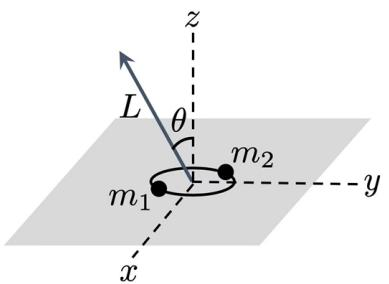

# S.-T. Yau College Student Mathematics Contests 2025

# Mathematical Physics

# (6 problems)

# Problem 1.

A bead of mass $m$ is constrained to move (without friction) on a hoop of radius $R$ . The hoop rotates with constant angular velocity $\omega$ around the vertical axis. The bead is subjected to the force of gravity at the surface of the Earth.

1. Write down the Lagrangian for the system and the Lagrangian equations of motion.   
2. Find any constants of motion that may exist. Construct the Hamiltonian. Is it equal to the energy in the fixed (i.e. non-rotating) frame? Is the fixed-frame energy conserved?   
3. Find the critical angular velocity $\Omega$ below which the bottom of the hoop is a position of stable equilibrium. Find the stable equilibrium positions for both $\omega < \Omega$ and $\omega > \Omega$ .   
4. Calculate the frequencies of small oscillations around the positions of stable equilibrium.

# Problem 2.

Consider a wave packet with a transverse profile $E _ { o } ( x , y )$ propagating in the $z$ direction (see eq (3) for a complete specification of $\mathbf { E }$ and $\mathbf { B }$ ). Although the precise form of $E _ { o } ( x , y )$ is not needed below, for definiteness you may assume that the wave packet has a Gaussian profile for

$$
E _ {o} (x, y) = \mathcal {A} e ^ {- \frac {x ^ {2} + y ^ {2}}{4 \sigma^ {2}}}, \tag {1}
$$

and is infinitely broad in the $z$ direction. The following integrals may be useful:

$$
\int_ {- \infty} ^ {\infty} d u e ^ {- \alpha u ^ {2}} = \sqrt {\frac {\pi}{\alpha}},
$$

$$
\int_ {- \infty} ^ {\infty} d u e ^ {- \alpha u ^ {2}} e ^ {i k u} = \sqrt {\pi} e ^ {- \frac {k ^ {2}}{4 \alpha}}.
$$

1. When all derivatives of $E _ { o } ( x , y )$ are neglected, show that in Gaussian (Heaviside-Lorentz) units

$$
\mathbf {E} ^ {(0)} (t, \mathbf {r}) = E _ {o} (x, y) e ^ {i (k z - \omega t)} \frac {\hat {\mathbf {x}} + i \hat {\mathbf {y}}}{\sqrt {2}}, \tag {3}
$$

$$
\mathbf {B} ^ {(0)} (t, \mathbf {r}) = \hat {\mathbf {z}} \times \mathbf {E} ^ {(0)},
$$

is a solution to the Maxwell equations for $\omega _ { } ^ { } = c k$ . Here $\mathbf { x }$ , $\mathbf { y }$ and $\mathbf { z }$ are unit vectors in $x$ , $y$ , $z$ directions.

2. Calculate the time averaged energy per length in the wave packet, $\langle U \rangle$ .   
3. When the derivatives of $E _ { o } ( x , y )$ are not neglected, eq (3) is not a solution to the Maxwell equations. Determine the corrections to $\mathbf { E } ^ { ( 0 ) }$ and $\mathbf { B } ^ { ( 0 ) }$ to first order in gradients for $k \sigma \gg 1$ .

Hint: try a solution for $\mathbf { E }$ (and analogously for $\mathbf { B }$ ) of the form

$$
\mathbf {E} (t, \mathbf {r}) = \mathbf {E} ^ {(0)} + \mathbf {E} ^ {(1)} (x, y) e ^ {i (k x - \omega t)} \hat {\mathbf {z}}, \tag {4}
$$

and determine the correction $\mathbf { E } ^ { ( 1 ) } ( x , y )$ in terms of $E _ { o } ( x , y )$ and its derivatives.

4. Write the solution to the last question as a linear superposition of the plane wave solutions to the Maxwell equations. First use the superposition to qualitatively explain why there is the correction to the electric field parallel to $\hat { \mathbf { z } }$ , and then use the superposition to precisely reproduce this correction.   
5. Calculate the $z$ -component of the time averaged angular momentum per length in the wave packet, $\langle L ^ { z } \rangle$ , to the lowest non-trivial order in $k \sigma$ .   
6. Determine the ratio $\langle L ^ { z } \rangle / \langle U \rangle$ . Interpret the result using photons.

# Problem 3.

A particle of mass $m$ and electric charge $q$ moves in 1-dimension under the effects of a harmonic potential and a homogeneous electrostatic field $\varepsilon$ . The Hamiltonian for the system is

$$
H = \frac {p ^ {2}}{2 m} + \frac {1}{2} m \omega^ {2} x ^ {2} - q \mathcal {E} x = H _ {0} - q \mathcal {E} x. \tag {5}
$$

1. Show that $H$ can be written as $H = e ^ { - A } H _ { 0 } e ^ { A } + B$ with $A$ being an operator and $B$ being a constant (c-number). Explicitly determine $A$ and $B$ . Use this to show that the spectrum of $H$ follows from that of $H _ { 0 }$ by a shift operator. Use this observation to solve the eigenvalue problem for $H$ .   
2. Express $A$ in terms of the annihilation operator $a$ and creation operator $a ^ { \dagger }$ of $H _ { 0 }$ . Use this to evaluate the probability to find the system in the ground state of $H$ at time $t$ if at time $t = 0$ it is in the ground state of $H _ { 0 }$ .   
3. What is the probability for the system to start at $t = 0$ in the ground state of $H _ { 0 }$ and remain in this state at time $t$ ? For what time this probability is 1?   
4. What is the probability for the system to start at $t = 0$ in the ground state of $H _ { 0 }$ and be found in the first excited state of $H _ { 0 }$ at time $t$ ?   
5. Express the dipole moment $d = q x$ in terms of $a , a ^ { \dagger }$ . Use this to calculate the mean value off the dipole moment at time $t$ , assuming that at $t = 0$ the system is again in the ground state of $H _ { 0 }$ .

# Problem 4.

The Ising model on a triangle is described by the energy:

$$
E = - J \left(\sigma_ {1} \sigma_ {2} + \sigma_ {2} \sigma_ {3} + \sigma_ {3} \sigma_ {1}\right) - h \left(\sigma_ {1} + \sigma_ {2} + \sigma_ {3}\right). \tag {6}
$$

Here $J$ and $h$ are known parameters: exchange energy and external magnetic field, respectively. The Ising spins σ1,2,3 are the only degrees of freedom in the problem and they are taking values $\pm 1$ . Assume that the temperature of the system is $T$ .

1. Compute the partition function of the model.   
2. Compute the free energy and the entropy of the model.   
3. Compute the specific heat at temperature $T$ and $h = 0$ . What does the specific heat look like when $T \ll J$ and $T \gg J$ .   
4. Compute the magnetization $M = \langle \sigma \rangle \equiv \langle \sigma _ { 1 } + \sigma _ { 2 } + \sigma _ { 3 } \rangle$ at given $h$ and $T \ll J$ . What is the behavior of the magnetic susceptibility $\begin{array} { r } { \chi = \frac { \partial M } { \partial h } | _ { h = 0 } } \end{array}$ at low temperature $T \ll J$ )?

  
Figure 1: Two black holes in circular motion

5. Find the fluctuation of magnetization $\langle ( \sigma - M ) ^ { 2 } \rangle$ at $T \ll J$ .

You may work in the units such that $k _ { B } = 1$ .

# Problem 5.

In this problem, we study the gravitational waves emitted from a binary system of two black holes. As a simplifying assumption, we treat black holes as point masses. For all parts except (5), please give your answers in analytical expressions in terms of quantities provided in the problem and fundamental constants such as the speed of light $c$ and Newton’s constant $G$ .

1. For a point mass $m$ moving near the origin in the $( x , y )$ plane along a trajectory $x = x ( t )$ , $y =$ $y ( t )$ , general relativity predicts that the gravitational waves emitted by $m$ have the following amplitudes $h$ at distance $L$ from the origin with inclination angle $\theta$ :

$$
h _ {+} = \frac {1}{L} \frac {G}{c ^ {4}} \frac {1 + \cos^ {2} \theta}{2} m \left(\frac {d ^ {2}}{d t ^ {2}} (x ^ {2} - y ^ {2})\right), \qquad h _ {\times} = \frac {1}{L} \frac {G}{c ^ {4}} (\cos \theta) m \left(\frac {d ^ {2}}{d t ^ {2}} (2 x y)\right), \qquad (7)
$$

where $h _ { + }$ and $h _ { \times }$ represent the two independent polarization modes. For two black holes with masses $m _ { 1 }$ and $m _ { 2 }$ separated by $r$ , forming a circular orbit under Newtonian gravity with their center-of-mass at the origin (figure 1), please derive $h _ { + }$ and $h _ { \times }$ . What is the gravitational wave frequency $f$ ?

2. Gravitational waves carry energy. The power per solid angle radiated outward at distance $L$ is given by:

$$
p = \frac {c ^ {3} L ^ {2}}{1 6 \pi G} \left[ \left(\frac {\partial h _ {+}}{\partial t}\right) ^ {2} + \left(\frac {\partial h _ {\times}}{\partial t}\right) ^ {2} \right]. \tag {8}
$$

Please find the average power $P$ radiated by the above black hole binary over all directions and averaged over one orbital period.

3. The binary orbit changes slowly due to the gravitational wave radiation. Let the gravitational wave frequency be $f _ { 0 }$ at the initial time $t = t _ { 0 }$ . Please determine $f ( t )$ .   
4. Eventually, the black holes merge as the orbital radius shrinks. Let the initial separation be $r _ { 0 }$ . Please find the coalescence time $T _ { C }$ .   
5. For $m _ { 1 } = m _ { 2 } = 1 0 M _ { \odot }$ (where $M _ { \odot }$ is solar mass), please estimate the maximum initial separation $r _ { 0 }$ (in astronomical unit (au), namely the mean distance between the sun and the earth) allowing coalescence within the age of the universe ( $T \simeq 1 0 ^ { 1 0 }$ years). Order-of-magnitude estimation suffices.

# Problem 6.

In this problem, we explore some physical properties of a conformal scalar field. We use natural units $c = \hbar = 1$ .

1. Consider a massless scalar field $\phi$ in Minkowski spacetime with the action $\begin{array} { r } { S = - \frac { 1 } { 2 } \int \mathrm { d } ^ { 4 } x ( \partial _ { \mu } \phi ) ^ { 2 } } \end{array}$ . Show that the action is invariant under a rigid rescaling of the metric, namely $\eta _ { \mu \nu }  \tilde { \eta } _ { \mu \nu } =$ $\Omega ^ { 2 } \eta _ { \mu \nu }$ with $\Omega$ constant, if one rescales simultaneously $\phi$ according to $\phi  \tilde { \phi } = \Omega ^ { \Delta } \phi$ . Determine $\Delta$ .   
2. Consider a local rescaling of an arbitrary metric $g _ { \mu \nu } ( x )  \tilde { g } _ { \mu \nu } ( x ) = \Omega ^ { 2 } ( x ) g _ { \mu \nu } ( x )$ , and also $\phi ( x )  \Omega ^ { \Delta } ( x ) \phi ( x )$ . Determine of transformation of the action $\begin{array} { r } { S = - \frac { 1 } { 2 } \int \mathrm { d } ^ { 4 } x \sqrt { - g } g ^ { \mu \nu } ( \partial _ { \mu } \phi ) ( \partial _ { \nu } \phi ) } \end{array}$ under the local rescaling. Can $S$ be made invariant by appropriately choosing the value of $\Delta$ ?   
3. Suppose the Ricci scalar transforms as $R  \bar { R }$ under the local rescaling $g _ { \mu \nu } ( x )  \Omega ^ { 2 } ( x ) g _ { \mu \nu } ( x )$ . Please determine $\tilde { R }$ .   
4. Show that the invariance of the scalar action under the local rescaling can be restored if we add a new term to the action:

$$
S = \int \mathrm {d} ^ {4} x \sqrt {- g} \left[ \frac {1}{2} \left(\partial_ {\mu} \phi\right) ^ {2} - \frac {1}{2} \xi R \phi^ {2} \right], \tag {9}
$$

where $\xi$ is a coupling constant. Determine the value of $\xi$ such that the action is invariant under the local rescaling. A scalar field $\phi$ with the above action is called a conformal scalar.

5. Consider a spacetime with the following metric:

$$
\mathrm {d} s ^ {2} = \frac {- \mathrm {d} \tau^ {2} + \mathrm {d} \mathbf {x} ^ {2}}{(H \tau) ^ {2}} \tag {10}
$$

where $\mathbf { x } \in \mathbb { R } ^ { 3 }$ , $\tau \in ( - \infty , 0 )$ , and $H$ is a constant. Please show that a conformal scalar $\phi$ in this spacetime has an action identical to a scalar field with nonzero mass $m$ . Please determine $m$ .