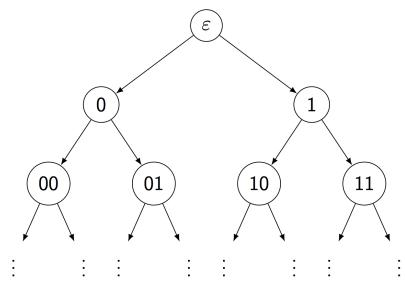

# Probability and Statistics Individual (5 problems)

Problem 1. A box contains 750 red balls and 250 blue balls. Repeatedly pick a ball uniformly at random from the box and remove it until all remaining balls have a single color. (Note: no replacement).

Please find integer $m$ such that the expectation value for the total number of the remaining balls $\in [ m , m + 1 ]$

Problem 2. Suppose a number $X _ { 0 } \in \{ 1 , - 1 \}$ at the root of a binary tree

is propagated away from the root as follows. The root is the node at level 0. After obtaining the $2 ^ { h }$ numbers at the nodes at level $h$ , each number at level $h + 1$ is obtained from the number adjacent to it (at level $h$ ) by flipping its sign with probability $p \in$ $( 0 , 1 / 2 )$ independently.

Let $X _ { h }$ be the average of the $2 ^ { h }$ values received at the nodes at level $h$ . Define the signal-to-noise ratio at level $h$ to be

$$
R _ {h} := \frac {\left(\mathbb {E} [ X _ {h} | X _ {0} = 1 ] - \mathbb {E} [ X _ {h} | X _ {0} = - 1 ]\right) ^ {2}}{V a r [ X _ {h} | X _ {0} = 1 ]}.
$$

Find the threshold number $p _ { c }$ such that $R _ { h }$ converges to 0 if $p \in ( p _ { c } , 1 / 2 )$ and diverges if $p \in ( 0 , p _ { c } )$ , as $h \to \infty$ .

Problem 3. Consider the space representing an infinite sequence of coin flips, namely $\Omega : = \{ H , T \} ^ { \infty }$ , (H: head, T: tail) with the associated $\sigma$ -field $\mathcal { F }$ generated by finite dimensional rectangles. For $0 \leq p \leq 1$ , denote by $\mathbb { P } _ { p }$ the probability measure on $( \Omega , { \mathcal { F } } )$ corresponding to flipping a coin an infinite number of times with probability of $H$ being $p$ and probability of $T$ being $q = 1 - p$ at each flip.

Show that for each $p \in \left\lfloor 0 , 1 \right\rfloor$ , there exists $A _ { p }$ such that

$$
\mathbb {P} _ {p} (A _ {p}) > 1 / 2
$$

and for any $p ^ { \prime } \neq p$ , $p ^ { \prime } \in [ 0 , 1 ]$

$$
\mathbb {P} _ {p ^ {\prime}} (A _ {p}) <   1 / 2
$$

Problem 4. Let $G : = G ( n , p )$ be a random graph with $n$ vertices where each possible edge has probability $p$ of existing. The existence of the edges are independent to each other. With $G$ , we say $A \subset \{ 1 , 2 , \cdots , n \}$ is a fully connected set if and only if

$i , j \in A \implies i - t h$ and $j - t h$ vertices are (directly) connected with an edge in $G$

Define $T$ as the size of the largest fully connected set

$$
T := \max  \{| A |: \mathrm {A i s a f u l l y c o n n e c t e d s e t} \}
$$

Let’s fix $p \in ( 0 , 1 )$ , please prove that

$$
\lim  _ {n \to \infty} \mathbb {P} \left(\frac {T}{2 \log_ {\frac {1}{p}} n} \leq 1 + \epsilon\right) = 1, \quad \forall \epsilon > 0,
$$

and

$$
\lim _ {n \to \infty} \mathbb {P} \left(\frac {T}{\sqrt {2 \log_ {\frac {1}{p}} n}} \geq 1 - \epsilon\right) = 1, \quad \forall \epsilon > 0,
$$

Hint:

$$
\mathbb {P} \left(T = n\right) = p ^ {\binom {n} {2}} = p ^ {n (n - 1) / 2}
$$

Problem 5. Consider a population of constant size $N + 1$ that is suffering from an infectious disease. We can model that spread of the disease as Markov process. Let $X ( t )$ be the number of healthy individuals at time $t$ and suppose that $X ( 0 ) = N$ . We assume that if $X ( t )$

$$
\lim _ {h \to 0} \frac {1}{h} \mathbb {P} \left(X (t + h) = n - 1 | X (t) = n)\right) = \lambda n \left(N + 1 - n\right)
$$

For $0 \leq s \leq 1$ , $0 \leq t$ , define

$$
G (s, t) := \mathbb {E} \left(s ^ {X (t)}\right)
$$

Please find a non-trivial partial differential equation for $G ( s , t )$ , which involves $\partial _ { t } G$ .